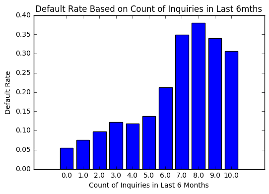
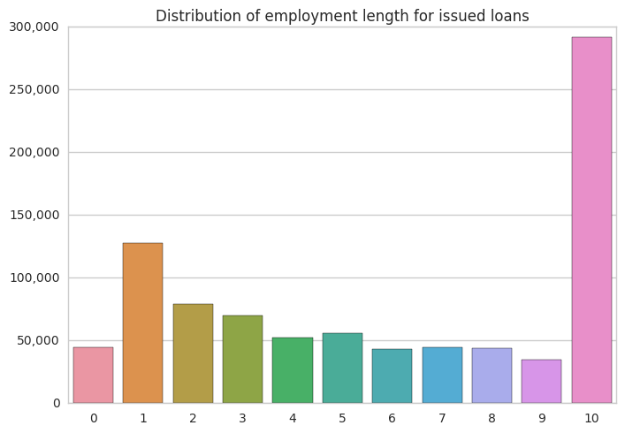
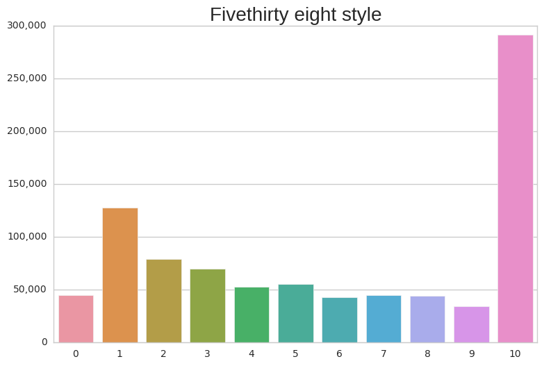
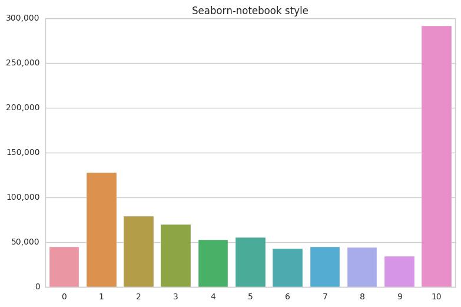
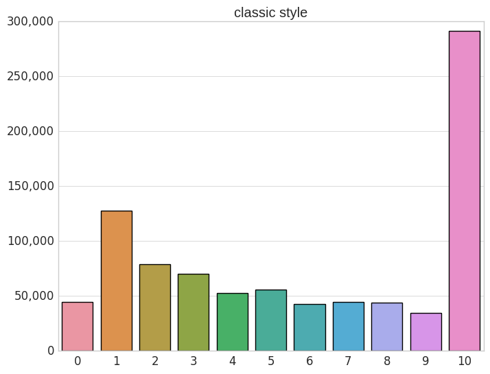
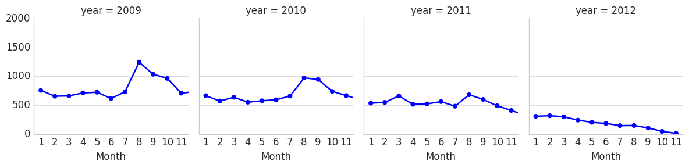
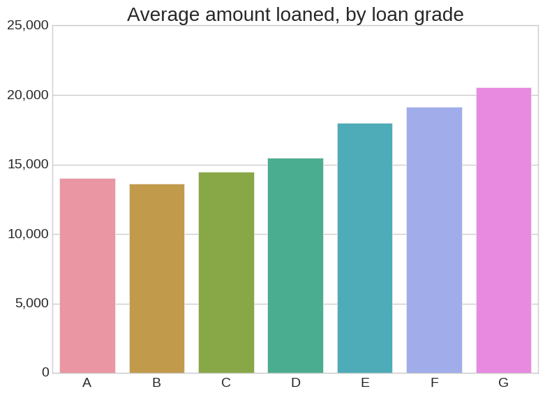
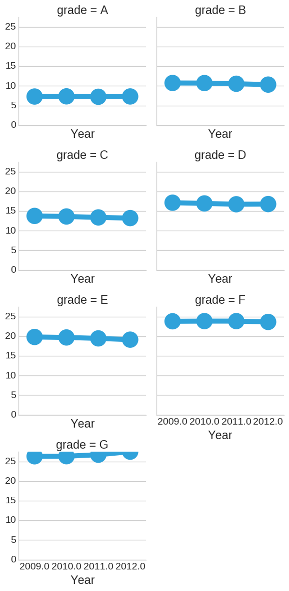

```python
#https://plot.ly/python/choropleth-maps/
import numpy as np
import pandas as pd
import itertools
from sklearn import preprocessing
import matplotlib.pyplot as plt 
df = pd.read_csv("loan.csv", low_memory=False)

import plotly.plotly as py
import plotly.graph_objs as go
from plotly import tools
from plotly.offline import download_plotlyjs, init_notebook_mode, plot, iplot
init_notebook_mode(connected=True)
#print (df.columns)

```


<script>requirejs.config({paths: { 'plotly': ['https://cdn.plot.ly/plotly-latest.min']},});if(!window.Plotly) {{require(['plotly'],function(plotly) {window.Plotly=plotly;});}}</script>


```python
State_List = []
for x in df['addr_state']:
    if x not in State_List:
        State_List.append(x)

Loan_Amount = []
Average_Balance = []
Default_Rate = []
Weighted_Rate = []
Average_Income = []
Average_Employment_Length = []
Average_DTI = []
Average_Inq_12 = []
Average_Inq_6 = []

for x in State_List:
    new_df = df[df['addr_state'] == x]
    
    Loan_Sum = sum(new_df['funded_amnt'])
    Loan_Amount.append(Loan_Sum)
    
    Average_Balance.append(Loan_Sum/len(new_df['funded_amnt']))
    
    Defaults = []
    for value in new_df.loan_status:
        if value == 'Default':
            Defaults.append(1)
        if value == 'Charged Off':
            Defaults.append(1)
        if value == 'Late (31-120 days)':
            Defaults.append(1)   
        if value == 'Late (16-30 days)':
            Defaults.append(1)
        if value == 'Does not meet the credit policy. Status:Charged Off':
            Defaults.append(1) 
    Default_R = len(Defaults) / len(new_df.loan_status)  
    Default_Rate.append(Default_R)
    
    new_df['weighted'] = (new_df['int_rate']/100)*new_df['funded_amnt']
    Weighted_Sum = sum(new_df['weighted'])
    Weighted_i_rate = Weighted_Sum / Loan_Sum
    Weighted_Rate.append(Weighted_i_rate)
    
    Income_Average = np.mean(new_df['annual_inc'])
    Average_Income.append(Income_Average)
    

    Employ_Length = []
    for term in new_df.emp_length:
        if term == '10+ years':
            Employ_Length.append(10)
        if term == '< 1 year':
            Employ_Length.append(0.5)    
        if term == '1 year':
            Employ_Length.append(1)
        if term == '3 years':
            Employ_Length.append(3)
        if term == '8 years':
            Employ_Length.append(8)
        if term == '9 years':
            Employ_Length.append(9)    
        if term == '4 years':
            Employ_Length.append(4)
        if term == '5 years':
            Employ_Length.append(5)
        if term == '6 years':
            Employ_Length.append(6)
        if term == '2 years':
            Employ_Length.append(2)    
        if term == '7 years':
            Employ_Length.append(7)
        if term == 'n/a':
            Employ_Length.append(0)  
            
    Average_Employment_Length.append(np.mean(Employ_Length))        
    
    DTI_Average = np.mean(new_df['dti'])
    Average_DTI.append(DTI_Average)
    
    inquiry_average = np.mean(new_df['inq_last_12m'])
    Average_Inq_12.append(inquiry_average)
    
    inquiry_average_6 = np.mean(new_df['inq_last_6mths'])
    Average_Inq_6.append(inquiry_average_6)
    
from collections import OrderedDict
combine_data = OrderedDict([ ('Loan_Funding',Loan_Amount),
                         ('Average_Balance', Average_Balance),
                         ('Default_Rate',  Default_Rate),
                         ('Weighted_Rate', Weighted_Rate),
                         ('Average_Income', Average_Income),
                         ('Average_Employment_Length', Average_Employment_Length),
                         ('Average_DTI', DTI_Average),
                         ('12m_Inquiries', Average_Inq_12),
                         ('6m_Inquiries', Average_Inq_6),   
                         ('code', State_List)])

df_plot = pd.DataFrame.from_dict(combine_data)
df_plot = df_plot.round(decimals=2)
df_plot.head()
```

    /home/dsno800/anaconda3/lib/python3.5/site-packages/ipykernel/__main__.py:39: SettingWithCopyWarning:
    
    
    A value is trying to be set on a copy of a slice from a DataFrame.
    Try using .loc[row_indexer,col_indexer] = value instead
    
    See the caveats in the documentation: http://pandas.pydata.org/pandas-docs/stable/indexing.html#indexing-view-versus-copy
    


<div>
<table border="1" class="dataframe">
  <thead>
    <tr style="text-align: right;">
      <th></th>
      <th>Loan_Funding</th>
      <th>Average_Balance</th>
      <th>Default_Rate</th>
      <th>Weighted_Rate</th>
      <th>Average_Income</th>
      <th>Average_Employment_Length</th>
      <th>Average_DTI</th>
      <th>12m_Inquiries</th>
      <th>6m_Inquiries</th>
      <th>code</th>
    </tr>
  </thead>
  <tbody>
    <tr>
      <th>0</th>
      <td>2.898320e+08</td>
      <td>14199.10</td>
      <td>0.07</td>
      <td>0.13</td>
      <td>71642.65</td>
      <td>5.42</td>
      <td>20.76</td>
      <td>2.32</td>
      <td>0.68</td>
      <td>AZ</td>
    </tr>
    <tr>
      <th>1</th>
      <td>4.342597e+08</td>
      <td>14930.71</td>
      <td>0.06</td>
      <td>0.14</td>
      <td>75095.90</td>
      <td>5.75</td>
      <td>20.76</td>
      <td>1.73</td>
      <td>0.64</td>
      <td>GA</td>
    </tr>
    <tr>
      <th>2</th>
      <td>5.386763e+08</td>
      <td>15184.24</td>
      <td>0.06</td>
      <td>0.13</td>
      <td>76898.22</td>
      <td>5.78</td>
      <td>20.76</td>
      <td>2.80</td>
      <td>0.92</td>
      <td>IL</td>
    </tr>
    <tr>
      <th>3</th>
      <td>1.896017e+09</td>
      <td>14639.14</td>
      <td>0.07</td>
      <td>0.13</td>
      <td>79294.34</td>
      <td>5.70</td>
      <td>20.76</td>
      <td>1.76</td>
      <td>0.65</td>
      <td>CA</td>
    </tr>
    <tr>
      <th>4</th>
      <td>1.491845e+08</td>
      <td>13695.45</td>
      <td>0.06</td>
      <td>0.13</td>
      <td>65750.51</td>
      <td>5.52</td>
      <td>20.76</td>
      <td>1.65</td>
      <td>0.57</td>
      <td>OR</td>
    </tr>
  </tbody>
</table>
</div>


```python
for col in df_plot.columns:
    df_plot[col] = df_plot[col].astype(str)

    scl = [[0.0, 'rgb(242,240,247)'],[0.2, 'rgb(218,218,235)'],[0.4, 'rgb(188,189,220)'],\
            [0.6, 'rgb(158,154,200)'],[0.8, 'rgb(117,107,177)'],[1.0, 'rgb(84,39,143)']]

df_plot['text'] = df_plot['code'] + '<br>' +\
    'Avg Balance Per Borrower ($ USD): '+df_plot['Average_Balance']+'<br>'+\
    'Avg Employment Term Per Borrower (Years): '+df_plot['Average_Employment_Length']+'<br>'+\
    'Avg Annual Income Per Borrower ($ USD): '+df_plot['Average_Income']
    

data = [ dict(
        type='choropleth',
        colorscale = scl,
        autocolorscale = False,
        locations = df_plot['code'],
        z = df_plot['Loan_Funding'], 
        locationmode = 'USA-states',
        text = df_plot['text'],
        marker = dict(
            line = dict (
                color = 'rgb(255,255,255)',
                width = 2
            ) ),
        colorbar = dict(
            title = "$s USD")
        ) ]

layout = dict(
        title = 'Lending Club Portfolio<br> Total Funded By State <br> (Hover over state for other metrics)',
        geo = dict(
            scope='usa',
            projection=dict( type='albers usa' ),
            showlakes = True,
            lakecolor = 'rgb(255, 255, 255)'),
             )
    
fig = dict( data=data, layout=layout )
iplot( fig, filename='d3-cloropleth-map' )
```


<div id="b381ab67-b25b-4384-8b45-fa2f2f7653f0" style="height: 525px; width: 100%;" class="plotly-graph-div"></div><script type="text/javascript">require(["plotly"], function(Plotly) { window.PLOTLYENV=window.PLOTLYENV || {};window.PLOTLYENV.BASE_URL="https://plot.ly";Plotly.newPlot("b381ab67-b25b-4384-8b45-fa2f2f7653f0", [{"marker": {"line": {"width": 2, "color": "rgb(255,255,255)"}}, "colorbar": {"title": "$s USD"}, "z": ["289832050.0", "434259675.0", "538676275.0", "1896017100.0", "149184525.0", "361598375.0", "1108151125.0", "410880325.0", "204666425.0", "202751700.0", "91780325.0", "848015450.0", "1075829325.0", "455248775.0", "228501925.0", "514583075.0", "122081550.0", "422418925.0", "157544525.0", "54972725.0", "156808375.0", "322563450.0", "289104150.0", "165269050.0", "164489325.0", "280877650.0", "116325150.0", "172331275.0", "36957700.0", "325136475.0", "64253725.0", "25158450.0", "326222300.0", "36798750.0", "24883300.0", "63492150.0", "93338725.0", "73572825.0", "35272225.0", "69495225.0", "31057375.0", "119930500.0", "36890725.0", "57041900.0", "191949000.0", "112800.0", "17155050.0", "88350.0", "202483350.0", "8131825.0", "7447300.0"], "locationmode": "USA-states", "type": "choropleth", "locations": ["AZ", "GA", "IL", "CA", "OR", "NC", "TX", "VA", "MO", "CT", "UT", "FL", "NY", "PA", "MN", "NJ", "KY", "OH", "SC", "RI", "LA", "MA", "WA", "WI", "AL", "CO", "KS", "NV", "AK", "MD", "WV", "VT", "MI", "DC", "SD", "NH", "AR", "NM", "MT", "HI", "WY", "OK", "DE", "MS", "TN", "IA", "NE", "ID", "IN", "ME", "ND"], "colorscale": [[0.0, "rgb(242,240,247)"], [0.2, "rgb(218,218,235)"], [0.4, "rgb(188,189,220)"], [0.6, "rgb(158,154,200)"], [0.8, "rgb(117,107,177)"], [1.0, "rgb(84,39,143)"]], "autocolorscale": false, "text": ["AZ<br>Avg Balance Per Borrower ($ USD): 14199.1<br>Avg Employment Term Per Borrower (Years): 5.42<br>Avg Annual Income Per Borrower ($ USD): 71642.65", "GA<br>Avg Balance Per Borrower ($ USD): 14930.71<br>Avg Employment Term Per Borrower (Years): 5.75<br>Avg Annual Income Per Borrower ($ USD): 75095.9", "IL<br>Avg Balance Per Borrower ($ USD): 15184.24<br>Avg Employment Term Per Borrower (Years): 5.78<br>Avg Annual Income Per Borrower ($ USD): 76898.22", "CA<br>Avg Balance Per Borrower ($ USD): 14639.14<br>Avg Employment Term Per Borrower (Years): 5.7<br>Avg Annual Income Per Borrower ($ USD): 79294.34", "OR<br>Avg Balance Per Borrower ($ USD): 13695.45<br>Avg Employment Term Per Borrower (Years): 5.52<br>Avg Annual Income Per Borrower ($ USD): 65750.51", "NC<br>Avg Balance Per Borrower ($ USD): 14627.77<br>Avg Employment Term Per Borrower (Years): 5.73<br>Avg Annual Income Per Borrower ($ USD): 71658.22", "TX<br>Avg Balance Per Borrower ($ USD): 15577.48<br>Avg Employment Term Per Borrower (Years): 5.62<br>Avg Annual Income Per Borrower ($ USD): 80470.75", "VA<br>Avg Balance Per Borrower ($ USD): 15649.6<br>Avg Employment Term Per Borrower (Years): 5.79<br>Avg Annual Income Per Borrower ($ USD): 80937.95", "MO<br>Avg Balance Per Borrower ($ USD): 14406.03<br>Avg Employment Term Per Borrower (Years): 5.9<br>Avg Annual Income Per Borrower ($ USD): 67823.57", "CT<br>Avg Balance Per Borrower ($ USD): 14984.24<br>Avg Employment Term Per Borrower (Years): 5.96<br>Avg Annual Income Per Borrower ($ USD): 84480.18", "UT<br>Avg Balance Per Borrower ($ USD): 14652.03<br>Avg Employment Term Per Borrower (Years): 5.77<br>Avg Annual Income Per Borrower ($ USD): 72138.0", "FL<br>Avg Balance Per Borrower ($ USD): 13916.72<br>Avg Employment Term Per Borrower (Years): 5.45<br>Avg Annual Income Per Borrower ($ USD): 70292.92", "NY<br>Avg Balance Per Borrower ($ USD): 14521.36<br>Avg Employment Term Per Borrower (Years): 5.74<br>Avg Annual Income Per Borrower ($ USD): 78294.96", "PA<br>Avg Balance Per Borrower ($ USD): 14501.6<br>Avg Employment Term Per Borrower (Years): 5.86<br>Avg Annual Income Per Borrower ($ USD): 71101.97", "MN<br>Avg Balance Per Borrower ($ USD): 14319.85<br>Avg Employment Term Per Borrower (Years): 5.76<br>Avg Annual Income Per Borrower ($ USD): 69725.28", "NJ<br>Avg Balance Per Borrower ($ USD): 15473.39<br>Avg Employment Term Per Borrower (Years): 5.82<br>Avg Annual Income Per Borrower ($ USD): 85160.02", "KY<br>Avg Balance Per Borrower ($ USD): 14278.54<br>Avg Employment Term Per Borrower (Years): 6.04<br>Avg Annual Income Per Borrower ($ USD): 67236.47", "OH<br>Avg Balance Per Borrower ($ USD): 14255.98<br>Avg Employment Term Per Borrower (Years): 6.02<br>Avg Annual Income Per Borrower ($ USD): 66931.38", "SC<br>Avg Balance Per Borrower ($ USD): 14808.21<br>Avg Employment Term Per Borrower (Years): 5.73<br>Avg Annual Income Per Borrower ($ USD): 71457.5", "RI<br>Avg Balance Per Borrower ($ USD): 14120.92<br>Avg Employment Term Per Borrower (Years): 6.18<br>Avg Annual Income Per Borrower ($ USD): 71315.64", "LA<br>Avg Balance Per Borrower ($ USD): 14811.41<br>Avg Employment Term Per Borrower (Years): 5.74<br>Avg Annual Income Per Borrower ($ USD): 74053.39", "MA<br>Avg Balance Per Borrower ($ USD): 15663.74<br>Avg Employment Term Per Borrower (Years): 5.7<br>Avg Annual Income Per Borrower ($ USD): 80209.65", "WA<br>Avg Balance Per Borrower ($ USD): 14876.2<br>Avg Employment Term Per Borrower (Years): 5.69<br>Avg Annual Income Per Borrower ($ USD): 73750.68", "WI<br>Avg Balance Per Borrower ($ USD): 14279.34<br>Avg Employment Term Per Borrower (Years): 6.08<br>Avg Annual Income Per Borrower ($ USD): 66266.57", "AL<br>Avg Balance Per Borrower ($ USD): 14686.55<br>Avg Employment Term Per Borrower (Years): 6.18<br>Avg Annual Income Per Borrower ($ USD): 68532.35", "CO<br>Avg Balance Per Borrower ($ USD): 14934.74<br>Avg Employment Term Per Borrower (Years): 5.31<br>Avg Annual Income Per Borrower ($ USD): 74495.41", "KS<br>Avg Balance Per Borrower ($ USD): 14676.4<br>Avg Employment Term Per Borrower (Years): 5.95<br>Avg Annual Income Per Borrower ($ USD): 68841.31", "NV<br>Avg Balance Per Borrower ($ USD): 13849.66<br>Avg Employment Term Per Borrower (Years): 5.54<br>Avg Annual Income Per Borrower ($ USD): 70130.92", "AK<br>Avg Balance Per Borrower ($ USD): 16760.86<br>Avg Employment Term Per Borrower (Years): 6.03<br>Avg Annual Income Per Borrower ($ USD): 77009.76", "MD<br>Avg Balance Per Borrower ($ USD): 15459.87<br>Avg Employment Term Per Borrower (Years): 5.88<br>Avg Annual Income Per Borrower ($ USD): 82296.19", "WV<br>Avg Balance Per Borrower ($ USD): 14649.73<br>Avg Employment Term Per Borrower (Years): 5.92<br>Avg Annual Income Per Borrower ($ USD): 66630.33", "VT<br>Avg Balance Per Borrower ($ USD): 14000.25<br>Avg Employment Term Per Borrower (Years): 6.15<br>Avg Annual Income Per Borrower ($ USD): 64527.23", "MI<br>Avg Balance Per Borrower ($ USD): 14192.83<br>Avg Employment Term Per Borrower (Years): 5.92<br>Avg Annual Income Per Borrower ($ USD): 69378.67", "DC<br>Avg Balance Per Borrower ($ USD): 15131.06<br>Avg Employment Term Per Borrower (Years): 4.48<br>Avg Annual Income Per Borrower ($ USD): 88088.24", "SD<br>Avg Balance Per Borrower ($ USD): 13709.81<br>Avg Employment Term Per Borrower (Years): 5.84<br>Avg Annual Income Per Borrower ($ USD): 60860.46", "NH<br>Avg Balance Per Borrower ($ USD): 14786.25<br>Avg Employment Term Per Borrower (Years): 5.98<br>Avg Annual Income Per Borrower ($ USD): 76917.71", "AR<br>Avg Balance Per Borrower ($ USD): 14057.04<br>Avg Employment Term Per Borrower (Years): 5.94<br>Avg Annual Income Per Borrower ($ USD): 65818.68", "NM<br>Avg Balance Per Borrower ($ USD): 14896.3<br>Avg Employment Term Per Borrower (Years): 5.75<br>Avg Annual Income Per Borrower ($ USD): 71163.41", "MT<br>Avg Balance Per Borrower ($ USD): 13788.99<br>Avg Employment Term Per Borrower (Years): 5.74<br>Avg Annual Income Per Borrower ($ USD): 62868.53", "HI<br>Avg Balance Per Borrower ($ USD): 15206.83<br>Avg Employment Term Per Borrower (Years): 6.31<br>Avg Annual Income Per Borrower ($ USD): 69875.08", "WY<br>Avg Balance Per Borrower ($ USD): 15314.29<br>Avg Employment Term Per Borrower (Years): 5.95<br>Avg Annual Income Per Borrower ($ USD): 74193.69", "OK<br>Avg Balance Per Borrower ($ USD): 14833.7<br>Avg Employment Term Per Borrower (Years): 5.74<br>Avg Annual Income Per Borrower ($ USD): 70375.05", "DE<br>Avg Balance Per Borrower ($ USD): 14691.65<br>Avg Employment Term Per Borrower (Years): 5.99<br>Avg Annual Income Per Borrower ($ USD): 74480.44", "MS<br>Avg Balance Per Borrower ($ USD): 14936.34<br>Avg Employment Term Per Borrower (Years): 6.05<br>Avg Annual Income Per Borrower ($ USD): 67650.21", "TN<br>Avg Balance Per Borrower ($ USD): 14894.78<br>Avg Employment Term Per Borrower (Years): 5.89<br>Avg Annual Income Per Borrower ($ USD): 68676.34", "IA<br>Avg Balance Per Borrower ($ USD): 8057.14<br>Avg Employment Term Per Borrower (Years): 3.46<br>Avg Annual Income Per Borrower ($ USD): 44756.21", "NE<br>Avg Balance Per Borrower ($ USD): 14587.63<br>Avg Employment Term Per Borrower (Years): 5.62<br>Avg Annual Income Per Borrower ($ USD): 63276.9", "ID<br>Avg Balance Per Borrower ($ USD): 7362.5<br>Avg Employment Term Per Borrower (Years): 3.08<br>Avg Annual Income Per Borrower ($ USD): 47593.97", "IN<br>Avg Balance Per Borrower ($ USD): 14684.41<br>Avg Employment Term Per Borrower (Years): 6.06<br>Avg Annual Income Per Borrower ($ USD): 67989.31", "ME<br>Avg Balance Per Borrower ($ USD): 15489.19<br>Avg Employment Term Per Borrower (Years): 5.44<br>Avg Annual Income Per Borrower ($ USD): 64714.88", "ND<br>Avg Balance Per Borrower ($ USD): 15547.6<br>Avg Employment Term Per Borrower (Years): 4.96<br>Avg Annual Income Per Borrower ($ USD): 71264.88"]}], {"title": "Lending Club Portfolio<br> Total Funded By State <br> (Hover over state for other metrics)", "geo": {"lakecolor": "rgb(255, 255, 255)", "scope": "usa", "projection": {"type": "albers usa"}, "showlakes": true}}, {"showLink": true, "linkText": "Export to plot.ly"})});</script>


```python
# from the tutorial, leaving in just for now
for col in df_plot.columns:
    df_plot[col] = df_plot[col].astype(str)

    scl = [[0.0, 'rgb(242,240,247)'],[0.2, 'rgb(218,218,235)'],[0.4, 'rgb(188,189,220)'],\
            [0.6, 'rgb(158,154,200)'],[0.8, 'rgb(117,107,177)'],[1.0, 'rgb(84,39,143)']]

df_plot['text'] = df_plot['code'] + '<br>' +\
    '<br>'+'Weighted Rate: '+df_plot['Weighted_Rate']+'<br>'+\
    'Inquiries Last 12m: '+df_plot['12m_Inquiries']+'<br>'+\
    'Inquiries Last 6m: '+df_plot['6m_Inquiries']

data = [ dict(
        type='choropleth',
        colorscale = scl,
        autocolorscale = True,
        locations = df_plot['code'],
        z = df_plot['Default_Rate'], #.astype(int),
        locationmode = 'USA-states',
        text = df_plot['text'],
        marker = dict(
            line = dict (
                color = 'rgb(255,255,255)',
                width = 2
            ) ),
        colorbar = dict(
            title = "%")
        ) ]

layout = dict(
        title = 'Lending Club Portfolio<br> Default Rate By State <br> (Hover over state for other metrics)',
        geo = dict(
            scope='usa',
            projection=dict( type='albers usa' ),
            showlakes = True,
            lakecolor = 'rgb(255, 255, 255)'),
             )
    
fig = dict( data=data, layout=layout )
iplot( fig, filename='d3-cloropleth-map' )
```


<div id="280c62ac-3dc0-40d6-99d6-a3fa2944ede6" style="height: 525px; width: 100%;" class="plotly-graph-div"></div><script type="text/javascript">require(["plotly"], function(Plotly) { window.PLOTLYENV=window.PLOTLYENV || {};window.PLOTLYENV.BASE_URL="https://plot.ly";Plotly.newPlot("280c62ac-3dc0-40d6-99d6-a3fa2944ede6", [{"marker": {"line": {"width": 2, "color": "rgb(255,255,255)"}}, "colorbar": {"title": "%"}, "z": ["0.07", "0.06", "0.06", "0.07", "0.06", "0.07", "0.06", "0.07", "0.07", "0.06", "0.07", "0.08", "0.08", "0.07", "0.07", "0.07", "0.07", "0.07", "0.06", "0.07", "0.07", "0.07", "0.07", "0.06", "0.08", "0.06", "0.06", "0.09", "0.06", "0.07", "0.05", "0.05", "0.07", "0.04", "0.07", "0.05", "0.07", "0.07", "0.06", "0.08", "0.05", "0.07", "0.07", "0.04", "0.06", "0.21", "0.01", "0.08", "0.06", "0.0", "0.01"], "locationmode": "USA-states", "type": "choropleth", "locations": ["AZ", "GA", "IL", "CA", "OR", "NC", "TX", "VA", "MO", "CT", "UT", "FL", "NY", "PA", "MN", "NJ", "KY", "OH", "SC", "RI", "LA", "MA", "WA", "WI", "AL", "CO", "KS", "NV", "AK", "MD", "WV", "VT", "MI", "DC", "SD", "NH", "AR", "NM", "MT", "HI", "WY", "OK", "DE", "MS", "TN", "IA", "NE", "ID", "IN", "ME", "ND"], "colorscale": [[0.0, "rgb(242,240,247)"], [0.2, "rgb(218,218,235)"], [0.4, "rgb(188,189,220)"], [0.6, "rgb(158,154,200)"], [0.8, "rgb(117,107,177)"], [1.0, "rgb(84,39,143)"]], "autocolorscale": true, "text": ["AZ<br><br>Weighted Rate: 0.13<br>Inquiries Last 12m: 2.32<br>Inquiries Last 6m: 0.68", "GA<br><br>Weighted Rate: 0.14<br>Inquiries Last 12m: 1.73<br>Inquiries Last 6m: 0.64", "IL<br><br>Weighted Rate: 0.13<br>Inquiries Last 12m: 2.8<br>Inquiries Last 6m: 0.92", "CA<br><br>Weighted Rate: 0.13<br>Inquiries Last 12m: 1.76<br>Inquiries Last 6m: 0.65", "OR<br><br>Weighted Rate: 0.13<br>Inquiries Last 12m: 1.65<br>Inquiries Last 6m: 0.57", "NC<br><br>Weighted Rate: 0.14<br>Inquiries Last 12m: 1.48<br>Inquiries Last 6m: 0.59", "TX<br><br>Weighted Rate: 0.14<br>Inquiries Last 12m: 2.14<br>Inquiries Last 6m: 0.69", "VA<br><br>Weighted Rate: 0.14<br>Inquiries Last 12m: 1.49<br>Inquiries Last 6m: 0.62", "MO<br><br>Weighted Rate: 0.14<br>Inquiries Last 12m: 2.31<br>Inquiries Last 6m: 0.78", "CT<br><br>Weighted Rate: 0.13<br>Inquiries Last 12m: 2.43<br>Inquiries Last 6m: 0.73", "UT<br><br>Weighted Rate: 0.14<br>Inquiries Last 12m: 1.74<br>Inquiries Last 6m: 0.63", "FL<br><br>Weighted Rate: 0.14<br>Inquiries Last 12m: 1.8<br>Inquiries Last 6m: 0.66", "NY<br><br>Weighted Rate: 0.14<br>Inquiries Last 12m: 1.6<br>Inquiries Last 6m: 0.64", "PA<br><br>Weighted Rate: 0.14<br>Inquiries Last 12m: 2.31<br>Inquiries Last 6m: 0.81", "MN<br><br>Weighted Rate: 0.13<br>Inquiries Last 12m: 1.58<br>Inquiries Last 6m: 0.63", "NJ<br><br>Weighted Rate: 0.14<br>Inquiries Last 12m: 2.05<br>Inquiries Last 6m: 0.71", "KY<br><br>Weighted Rate: 0.14<br>Inquiries Last 12m: 2.43<br>Inquiries Last 6m: 0.85", "OH<br><br>Weighted Rate: 0.14<br>Inquiries Last 12m: 2.45<br>Inquiries Last 6m: 0.78", "SC<br><br>Weighted Rate: 0.14<br>Inquiries Last 12m: 1.42<br>Inquiries Last 6m: 0.59", "RI<br><br>Weighted Rate: 0.13<br>Inquiries Last 12m: 2.3<br>Inquiries Last 6m: 0.69", "LA<br><br>Weighted Rate: 0.14<br>Inquiries Last 12m: 1.38<br>Inquiries Last 6m: 0.62", "MA<br><br>Weighted Rate: 0.13<br>Inquiries Last 12m: 1.89<br>Inquiries Last 6m: 0.63", "WA<br><br>Weighted Rate: 0.14<br>Inquiries Last 12m: 1.76<br>Inquiries Last 6m: 0.67", "WI<br><br>Weighted Rate: 0.13<br>Inquiries Last 12m: 2.35<br>Inquiries Last 6m: 0.89", "AL<br><br>Weighted Rate: 0.14<br>Inquiries Last 12m: 2.01<br>Inquiries Last 6m: 0.7", "CO<br><br>Weighted Rate: 0.13<br>Inquiries Last 12m: 1.73<br>Inquiries Last 6m: 0.74", "KS<br><br>Weighted Rate: 0.14<br>Inquiries Last 12m: 2.86<br>Inquiries Last 6m: 0.75", "NV<br><br>Weighted Rate: 0.14<br>Inquiries Last 12m: 2.0<br>Inquiries Last 6m: 0.72", "AK<br><br>Weighted Rate: 0.14<br>Inquiries Last 12m: 2.05<br>Inquiries Last 6m: 0.75", "MD<br><br>Weighted Rate: 0.14<br>Inquiries Last 12m: 1.79<br>Inquiries Last 6m: 0.62", "WV<br><br>Weighted Rate: 0.14<br>Inquiries Last 12m: 1.78<br>Inquiries Last 6m: 0.66", "VT<br><br>Weighted Rate: 0.13<br>Inquiries Last 12m: 2.32<br>Inquiries Last 6m: 0.77", "MI<br><br>Weighted Rate: 0.14<br>Inquiries Last 12m: 2.62<br>Inquiries Last 6m: 0.84", "DC<br><br>Weighted Rate: 0.13<br>Inquiries Last 12m: 0.66<br>Inquiries Last 6m: 0.53", "SD<br><br>Weighted Rate: 0.14<br>Inquiries Last 12m: 1.64<br>Inquiries Last 6m: 0.7", "NH<br><br>Weighted Rate: 0.13<br>Inquiries Last 12m: 2.72<br>Inquiries Last 6m: 0.77", "AR<br><br>Weighted Rate: 0.14<br>Inquiries Last 12m: 3.17<br>Inquiries Last 6m: 0.81", "NM<br><br>Weighted Rate: 0.14<br>Inquiries Last 12m: 1.78<br>Inquiries Last 6m: 0.64", "MT<br><br>Weighted Rate: 0.13<br>Inquiries Last 12m: 1.17<br>Inquiries Last 6m: 0.62", "HI<br><br>Weighted Rate: 0.14<br>Inquiries Last 12m: 1.43<br>Inquiries Last 6m: 0.62", "WY<br><br>Weighted Rate: 0.14<br>Inquiries Last 12m: 0.65<br>Inquiries Last 6m: 0.65", "OK<br><br>Weighted Rate: 0.14<br>Inquiries Last 12m: 2.38<br>Inquiries Last 6m: 0.78", "DE<br><br>Weighted Rate: 0.14<br>Inquiries Last 12m: 3.21<br>Inquiries Last 6m: 0.88", "MS<br><br>Weighted Rate: 0.14<br>Inquiries Last 12m: 2.15<br>Inquiries Last 6m: 0.7", "TN<br><br>Weighted Rate: 0.14<br>Inquiries Last 12m: 1.92<br>Inquiries Last 6m: 0.65", "IA<br><br>Weighted Rate: 0.12<br>Inquiries Last 12m: nan<br>Inquiries Last 6m: 1.29", "NE<br><br>Weighted Rate: 0.13<br>Inquiries Last 12m: 1.99<br>Inquiries Last 6m: 0.66", "ID<br><br>Weighted Rate: 0.11<br>Inquiries Last 12m: nan<br>Inquiries Last 6m: 1.0", "IN<br><br>Weighted Rate: 0.14<br>Inquiries Last 12m: 2.66<br>Inquiries Last 6m: 0.82", "ME<br><br>Weighted Rate: 0.13<br>Inquiries Last 12m: 2.85<br>Inquiries Last 6m: 0.73", "ND<br><br>Weighted Rate: 0.13<br>Inquiries Last 12m: 1.39<br>Inquiries Last 6m: 0.48"]}], {"title": "Lending Club Portfolio<br> Default Rate By State <br> (Hover over state for other metrics)", "geo": {"lakecolor": "rgb(255, 255, 255)", "scope": "usa", "projection": {"type": "albers usa"}, "showlakes": true}}, {"showLink": true, "linkText": "Export to plot.ly"})});</script>


```python
#df = pd.read_csv("../input/loan.csv", low_memory=False)
#print (df.columns)
print ("Length of All Data:",len(df.loan_status)) # get total length of data
print ("Nans in Loan Status Column:",df.loan_status.isnull().sum()) # get nans in loan status column
print ("Nans in 12mth inquiry column:",df.inq_last_12m.isnull().sum()) # get nans in inquiry 12 month column
print ("Nans in 6mth inquiry column:",df.inq_last_6mths.isnull().sum()) # get nans in inquiry 6 month column
print ("Nans in last credit date columns:",df.last_credit_pull_d.isnull().sum()) # get nans in last credit pull date column
print ("First data point in last credit pulled column:",df.last_credit_pull_d.iloc[0])
print ("First data point in 6mth inquiry column:",df.inq_last_6mths.iloc[0])
print ("First data point in issue_d  column:",df.issue_d.iloc[0]) # no good, all dec 2011
print ("First data point in 12 mth collection column:",df.collections_12_mths_ex_med.iloc[0])
print (np.mean(df.collections_12_mths_ex_med))
cols_to_keep = ['loan_status','inq_last_6mths','collections_12_mths_ex_med']
new_df = df[cols_to_keep]
new_df.head()
```

    Length of All Data: 887379
    Nans in Loan Status Column: 0
    Nans in 12mth inquiry column: 866007
    Nans in 6mth inquiry column: 29
    Nans in last credit date columns: 53
    First data point in last credit pulled column: Jan-2016
    First data point in 6mth inquiry column: 1.0
    First data point in issue_d  column: Dec-2011
    First data point in 12 mth collection column: 0.0
    0.014379521073358326


<div>
<table border="1" class="dataframe">
  <thead>
    <tr style="text-align: right;">
      <th></th>
      <th>loan_status</th>
      <th>inq_last_6mths</th>
      <th>collections_12_mths_ex_med</th>
    </tr>
  </thead>
  <tbody>
    <tr>
      <th>0</th>
      <td>Fully Paid</td>
      <td>1.0</td>
      <td>0.0</td>
    </tr>
    <tr>
      <th>1</th>
      <td>Charged Off</td>
      <td>5.0</td>
      <td>0.0</td>
    </tr>
    <tr>
      <th>2</th>
      <td>Fully Paid</td>
      <td>2.0</td>
      <td>0.0</td>
    </tr>
    <tr>
      <th>3</th>
      <td>Fully Paid</td>
      <td>1.0</td>
      <td>0.0</td>
    </tr>
    <tr>
      <th>4</th>
      <td>Current</td>
      <td>0.0</td>
      <td>0.0</td>
    </tr>
  </tbody>
</table>
</div>


```python
print (len(new_df.loan_status))
print (new_df.loan_status.isnull().sum())
print (new_df.inq_last_6mths.isnull().sum())
print (new_df.collections_12_mths_ex_med.isnull().sum())
new_df = new_df.dropna(axis=0)
print (len(new_df.loan_status))

```

    887379
    0
    29
    145
    887234


```python
new_df['default_binary'] = 0 # dummy columns
for index,row in new_df.iterrows():
        if row['loan_status'] == 'Default':
            new_df.set_value(index, 'default_binary', 1)
        if row['loan_status'] == 'Charged Off':
            new_df.set_value(index, 'default_binary', 1)
        if row['loan_status'] == 'Late (31-120 days)':
            new_df.set_value(index, 'default_binary', 1)  
        if row['loan_status'] == 'Late (16-30 days)':
            new_df.set_value(index, 'default_binary', 1)
        if row['loan_status'] == 'Does not meet the credit policy. Status:Charged Off':
            new_df.set_value(index, 'default_binary', 1)
new_df.head()  
```


<div>
<table border="1" class="dataframe">
  <thead>
    <tr style="text-align: right;">
      <th></th>
      <th>loan_status</th>
      <th>inq_last_6mths</th>
      <th>collections_12_mths_ex_med</th>
      <th>default_binary</th>
    </tr>
  </thead>
  <tbody>
    <tr>
      <th>0</th>
      <td>Fully Paid</td>
      <td>1.0</td>
      <td>0.0</td>
      <td>0</td>
    </tr>
    <tr>
      <th>1</th>
      <td>Charged Off</td>
      <td>5.0</td>
      <td>0.0</td>
      <td>1</td>
    </tr>
    <tr>
      <th>2</th>
      <td>Fully Paid</td>
      <td>2.0</td>
      <td>0.0</td>
      <td>0</td>
    </tr>
    <tr>
      <th>3</th>
      <td>Fully Paid</td>
      <td>1.0</td>
      <td>0.0</td>
      <td>0</td>
    </tr>
    <tr>
      <th>4</th>
      <td>Current</td>
      <td>0.0</td>
      <td>0.0</td>
      <td>0</td>
    </tr>
  </tbody>
</table>
</div>


```python
inquiry = []
for x in new_df.inq_last_6mths:
    if x not in inquiry:
        if x <= 10.0:
            inquiry.append(x)
        
inquiry.sort()

the_dict = {}        
for x in inquiry:
    dfn = new_df[new_df.inq_last_6mths == x]
    #print (len(dfn.default_binary))
    dfn_d = dfn[dfn.default_binary == 1]
    the_dict[x] = len(dfn_d.default_binary) / len(dfn.default_binary)
print (the_dict)
```

    {0.0: 0.05446934668118218, 1.0: 0.07493425548216097, 2.0: 0.09718621158668764, 3.0: 0.12185402123619246, 4.0: 0.11802455357142858, 5.0: 0.13758473512427818, 6.0: 0.21172638436482086, 7.0: 0.3487179487179487, 8.0: 0.38016528925619836, 9.0: 0.3404255319148936, 10.0: 0.13043478260869565}


```python
# combine all inquiries greater than 10
dfn = new_df[new_df.inq_last_6mths >= 10]
dfn_d = dfn[dfn.default_binary == 1]
the_dict[10.0] = len(dfn_d.default_binary) / len(dfn.default_binary)
#the_dict.pop(30.0)# popped out a bunch of data points higher than 10
print (the_dict)

plt.bar(range(len(the_dict)), the_dict.values(), align='center')
plt.xticks(range(len(the_dict)), the_dict.keys())
plt.title("Default Rate Based on Count of Inquiries in Last 6mths")
plt.xlabel("Count of Inquiries in Last 6 Months")
plt.ylabel("Default Rate")
plt.show()
```

    {0.0: 0.05446934668118218, 1.0: 0.07493425548216097, 2.0: 0.09718621158668764, 3.0: 0.12185402123619246, 4.0: 0.11802455357142858, 5.0: 0.13758473512427818, 6.0: 0.21172638436482086, 7.0: 0.3487179487179487, 8.0: 0.38016528925619836, 9.0: 0.3404255319148936, 10.0: 0.3068181818181818}





## A more data analytical approach


```python
%matplotlib inline
import os
import pandas as pd
from matplotlib import pyplot as plt
import numpy as np
import math
```


```python
data = pd.read_csv('loan.csv', low_memory=False)
data.drop(['id', 'member_id', 'emp_title'], axis=1, inplace=True)

data.replace('n/a', np.nan,inplace=True)
data.emp_length.fillna(value=0,inplace=True)

data['emp_length'].replace(to_replace='[^0-9]+', value='', inplace=True, regex=True)
data['emp_length'] = data['emp_length'].astype(int)

data['term'] = data['term'].apply(lambda x: x.lstrip())
```

Now let's make some pretty graphs. Coming from R I definitely prefer ggplot2 but the more I use Seaborn, the more I like it. If you kinda forget about adding "+" to your graphs and instead use the dot operator, it does essentially the same stuff.
And I've just found out that you can create your own style sheets to make life easier. Wahoo!
But anyway, below I'll show you how to format a decent looking Seaborn graph, as well as how to summarise a given dataframe.


```python
import seaborn as sns
import matplotlib

s = pd.value_counts(data['emp_length']).to_frame().reset_index()
s.columns = ['type', 'count']

def emp_dur_graph(graph_title):

    sns.set_style("whitegrid")
    ax = sns.barplot(y = "count", x = 'type', data=s)
    ax.set(xlabel = '', ylabel = '', title = graph_title)
    ax.get_yaxis().set_major_formatter(
    matplotlib.ticker.FuncFormatter(lambda x, p: format(int(x), ',')))
    _ = ax.set_xticklabels(ax.get_xticklabels(), rotation=0)
    
emp_dur_graph('Distribution of employment length for issued loans')
```





```python

import seaborn as sns
import matplotlib

print (plt.style.available)
```

    ['ggplot', 'seaborn-pastel', 'seaborn-bright', 'seaborn-colorblind', 'seaborn-notebook', 'fivethirtyeight', 'seaborn-ticks', 'seaborn-deep', 'dark_background', 'classic', 'grayscale', 'seaborn-talk', 'seaborn-muted', 'seaborn-darkgrid', 'seaborn-paper', 'seaborn-dark-palette', 'seaborn-whitegrid', 'bmh', 'seaborn-dark', 'seaborn-white', 'seaborn-poster']


```python
import seaborn as sns
import matplotlib

plt.style.use('fivethirtyeight')
ax = emp_dur_graph('Fivethirty eight style')
```





```python
plt.style.use('seaborn-notebook')
ax = emp_dur_graph('Seaborn-notebook style')
```





```python
plt.style.use('classic')
ax = emp_dur_graph('classic style')
```





```python

import datetime

data.issue_d.fillna(value=np.nan,inplace=True)
issue_d_todate = pd.to_datetime(data.issue_d)
data.issue_d = pd.Series(data.issue_d).str.replace('-2015', '')
data.emp_length.fillna(value=np.nan,inplace=True)

data.drop(['loan_status'],1, inplace=True)

data.drop(['pymnt_plan','url','desc','title' ],1, inplace=True)

data.earliest_cr_line = pd.to_datetime(data.earliest_cr_line)
import datetime as dt
data['earliest_cr_line_year'] = data['earliest_cr_line'].dt.year


```


```python
import seaborn as sns
import matplotlib.pyplot as plt

s = pd.value_counts(data['earliest_cr_line']).to_frame().reset_index()
s.columns = ['date', 'count']

s['year'] = s['date'].dt.year
s['month'] = s['date'].dt.month

d = s[s['year'] > 2008]

plt.rcParams.update(plt.rcParamsDefault)
sns.set_style("whitegrid")

g = sns.FacetGrid(d, col="year")
g = g.map(sns.pointplot, "month", "count")
g.set(xlabel = 'Month', ylabel = '')
axes = plt.gca()
_ = axes.set_ylim([0, d.year.max()])
plt.tight_layout()
```





```python

mths = [s for s in data.columns.values if "mths" in s]
mths

data.drop(mths, axis=1, inplace=True)
```


```python
group = data.groupby('grade').agg([np.mean])
loan_amt_mean = group['loan_amnt'].reset_index()

import seaborn as sns
import matplotlib

plt.style.use('fivethirtyeight')

sns.set_style("whitegrid")
ax = sns.barplot(y = "mean", x = 'grade', data=loan_amt_mean)
ax.set(xlabel = '', ylabel = '', title = 'Average amount loaned, by loan grade')
ax.get_yaxis().set_major_formatter(
matplotlib.ticker.FuncFormatter(lambda x, p: format(int(x), ',')))
_ = ax.set_xticklabels(ax.get_xticklabels(), rotation=0)
```





```python
filtered  = data[data['earliest_cr_line_year'] > 2008]
group = filtered.groupby(['grade', 'earliest_cr_line_year']).agg([np.mean])

graph_df = group['int_rate'].reset_index()

import seaborn as sns
import matplotlib

plt.style.use('fivethirtyeight')
plt.suptitle('bold figure suptitle', fontsize=14, fontweight='bold')

sns.set_style("whitegrid")
g = sns.FacetGrid(graph_df, col="grade", col_wrap = 2)
g = g.map(sns.pointplot, "earliest_cr_line_year", "mean")
g.set(xlabel = 'Year', ylabel = '')
axes = plt.gca()
axes.set_ylim([0, graph_df['mean'].max()])
_ = plt.tight_layout()
```


    <matplotlib.figure.Figure at 0x7fe455309518>





9. Treatment of missing values
This section is a toughie because there really is no correct answer. A pure data science/mining approach would test each of the approaches here using a CV split and include the most accurate treatment in their modelling pipeline. Here I have included the code for the following treatments:
Mean imputation
Median imputation
Algorithmic imputation
I spent a large amount of time looking at 3. because I couldn't find anyone else who has implemented it, so I built it myself. In R it's very easy to use supervised learning techniques to impute missing values for a given variable (as shown here: https://www.kaggle.com/mrisdal/shelter-animal-outcomes/quick-dirty-randomforest) but sadly I couldn't find it done in Python.


```python
#data['emp_length'].fillna(data['emp_length'].mean())
#data['emp_length'].fillna(data['emp_length'].median())
#data['emp_length'].fillna(data['earliest_cr_line_year'].median())

from sklearn.ensemble import RandomForestClassifier
rf =  RandomForestClassifier(max_depth=5, n_estimators=100, max_features=1)

data['emp_length'].replace(to_replace=0, value=np.nan, inplace=True, regex=True)

cat_variables = ['term', 'purpose', 'grade']
columns = ['loan_amnt', 'funded_amnt', 'funded_amnt_inv', 'int_rate', 'grade', 'purpose', 'term']

def impute_missing_algo(df, target, cat_vars, cols, algo):

    y = pd.DataFrame(df[target])
    X = df[cols].copy()
    X.drop(cat_vars, axis=1, inplace=True)

    cat_vars = pd.get_dummies(df[cat_vars])

    X = pd.concat([X, cat_vars], axis = 1)

    y['null'] = y[target].isnull()
    y['null'] = y.loc[:, target].isnull()
    X['null'] = y[target].isnull()

    y_missing = y[y['null'] == True]
    y_notmissing = y[y['null'] == False]
    X_missing = X[X['null'] == True]
    X_notmissing = X[X['null'] == False]

    y_missing.loc[:, target] = ''

    dfs = [y_missing, y_notmissing, X_missing, X_notmissing]
    
    for df in dfs:
        df.drop('null', inplace = True, axis = 1)

    y_missing = y_missing.values.ravel(order='C')
    y_notmissing = y_notmissing.values.ravel(order='C')
    X_missing = X_missing.as_matrix()
    X_notmissing = X_notmissing.as_matrix()
    
    algo.fit(X_notmissing, y_notmissing)
    y_missing = algo.predict(X_missing)

    y.loc[(y['null'] == True), target] = y_missing
    y.loc[(y['null'] == False), target] = y_notmissing
    
    return(y[target])

data['emp_length'] = impute_missing_algo(data, 'emp_length', cat_variables, columns, rf)
data['earliest_cr_line_year'] = impute_missing_algo(data, 'earliest_cr_line_year', cat_variables, columns, rf)
```

    /home/dsno800/anaconda3/lib/python3.5/site-packages/pandas/core/indexing.py:465: SettingWithCopyWarning:
    
    
    A value is trying to be set on a copy of a slice from a DataFrame.
    Try using .loc[row_indexer,col_indexer] = value instead
    
    See the caveats in the documentation: http://pandas.pydata.org/pandas-docs/stable/indexing.html#indexing-view-versus-copy
    
    /home/dsno800/anaconda3/lib/python3.5/site-packages/ipykernel/__main__.py:37: SettingWithCopyWarning:
    
    
    A value is trying to be set on a copy of a slice from a DataFrame
    
    See the caveats in the documentation: http://pandas.pydata.org/pandas-docs/stable/indexing.html#indexing-view-versus-copy
    
    /home/dsno800/anaconda3/lib/python3.5/site-packages/pandas/core/indexing.py:465: SettingWithCopyWarning:
    
    
    A value is trying to be set on a copy of a slice from a DataFrame.
    Try using .loc[row_indexer,col_indexer] = value instead
    
    See the caveats in the documentation: http://pandas.pydata.org/pandas-docs/stable/indexing.html#indexing-view-versus-copy
    
    /home/dsno800/anaconda3/lib/python3.5/site-packages/ipykernel/__main__.py:37: SettingWithCopyWarning:
    
    
    A value is trying to be set on a copy of a slice from a DataFrame
    
    See the caveats in the documentation: http://pandas.pydata.org/pandas-docs/stable/indexing.html#indexing-view-versus-copy
    


10. Running a simple classification model¶
Here I take my cleaned variables (missing values have been imputed using random forests) and run a simple sklearn algo to classify the term of the loan. This step in the analytics pipeline does take longer in Python than in R (as R handles factor variables out of the box while sklearn only accepts numeric features) but it isn't that hard. This is just indicative though! A number of the variables are likely to introduce leakage to the prediction problem as they'll influence the term of the loan either directly or indirectly.


```python
y = data.term

cols = ['loan_amnt', 'funded_amnt', 'funded_amnt_inv', 'int_rate', 'grade', 'emp_length', 'purpose', 'earliest_cr_line_year']
X = pd.get_dummies(data[cols])

from sklearn import preprocessing

y = y.apply(lambda x: x.lstrip())

le = preprocessing.LabelEncoder()
le.fit(y)

y = le.transform(y)
X = X.as_matrix()

from sklearn import linear_model

logistic = linear_model.LogisticRegression()

logistic.fit(X, y)
```


    LogisticRegression(C=1.0, class_weight=None, dual=False, fit_intercept=True,
              intercept_scaling=1, max_iter=100, multi_class='ovr', n_jobs=1,
              penalty='l2', random_state=None, solver='liblinear', tol=0.0001,
              verbose=0, warm_start=False)


11. Pipelining in sklearn¶
In this section I'll go through how you can combine multiple techniques (supervised an unsupervised) in a pipeline. These can be useful for a number of reasons:
You can score the output of the whole pipeline
You can gridsearch for the whole pipeline making finding optimal parameters easier
So next we'll combine some a PCA (unsupervised) and Random Forests (supervised) to create a pipeline for modelling the data.
In addition to this I'll show you an easy way to grid search for the optimal hyper parameters.


```python
from sklearn import linear_model, decomposition
from sklearn.ensemble import RandomForestClassifier
from sklearn.pipeline import Pipeline
from sklearn.grid_search import GridSearchCV

rf = RandomForestClassifier(max_depth=5, max_features=1)

pca = decomposition.PCA()
pipe = Pipeline(steps=[('pca', pca), ('rf', rf)])

n_comp = [3, 5]
n_est = [10, 20]

estimator = GridSearchCV(pipe,
                         dict(pca__n_components=n_comp,
                              rf__n_estimators=n_est))

estimator.fit(X, y)
```

    /home/dsno800/anaconda3/lib/python3.5/site-packages/sklearn/cross_validation.py:44: DeprecationWarning:
    
    This module was deprecated in version 0.18 in favor of the model_selection module into which all the refactored classes and functions are moved. Also note that the interface of the new CV iterators are different from that of this module. This module will be removed in 0.20.
    
    /home/dsno800/anaconda3/lib/python3.5/site-packages/sklearn/grid_search.py:43: DeprecationWarning:
    
    This module was deprecated in version 0.18 in favor of the model_selection module into which all the refactored classes and functions are moved. This module will be removed in 0.20.
    


    GridSearchCV(cv=None, error_score='raise',
           estimator=Pipeline(steps=[('pca', PCA(copy=True, iterated_power='auto', n_components=None, random_state=None,
      svd_solver='auto', tol=0.0, whiten=False)), ('rf', RandomForestClassifier(bootstrap=True, class_weight=None, criterion='gini',
                max_depth=5, max_features=1, max_leaf_nodes=None,
                min_im...imators=10, n_jobs=1, oob_score=False, random_state=None,
                verbose=0, warm_start=False))]),
           fit_params={}, iid=True, n_jobs=1,
           param_grid={'pca__n_components': [3, 5], 'rf__n_estimators': [10, 20]},
           pre_dispatch='2*n_jobs', refit=True, scoring=None, verbose=0)


## This is an interesting group and classify excercise


```python
df = pd.read_csv("loan.csv", low_memory=False)
```

Creating the Target Label
From a prior notebook, I examined the 'loan_status' column. The cell below creates a column with binary value 0 for loans not in default, and binary value 1 for loans in default.


```python
df['Default_Binary'] = int(0)
for index, value in df.loan_status.iteritems():
    if value == 'Default':
        df.set_value(index,'Default_Binary',int(1))
    if value == 'Charged Off':
        df.set_value(index, 'Default_Binary',int(1))
    if value == 'Late (31-120 days)':
        df.set_value(index, 'Default_Binary',int(1))    
    if value == 'Late (16-30 days)':
        df.set_value(index, 'Default_Binary',int(1))
    if value == 'Does not meet the credit policy. Status:Charged Off':
        df.set_value(index, 'Default_Binary',int(1))    
```

Creating a category feature for "Loan Purpose"
Below I create a new column for loan purpose, and assign each type of loan purpose an integer value.


```python
df['Purpose_Cat'] = int(0) 
for index, value in df.purpose.iteritems():
    if value == 'debt_consolidation':
        df.set_value(index,'Purpose_Cat',int(1))
    if value == 'credit_card':
        df.set_value(index, 'Purpose_Cat',int(2))
    if value == 'home_improvement':
        df.set_value(index, 'Purpose_Cat',int(3))    
    if value == 'other':
        df.set_value(index, 'Purpose_Cat',int(4))    
    if value == 'major_purchase':
        df.set_value(index,'Purpose_Cat',int(5))
    if value == 'small_business':
        df.set_value(index, 'Purpose_Cat',int(6))
    if value == 'car':
        df.set_value(index, 'Purpose_Cat',int(7))    
    if value == 'medical':
        df.set_value(index, 'Purpose_Cat',int(8))   
    if value == 'moving':
        df.set_value(index, 'Purpose_Cat',int(9))    
    if value == 'vacation':
        df.set_value(index,'Purpose_Cat',int(10))
    if value == 'house':
        df.set_value(index, 'Purpose_Cat',int(11))
    if value == 'wedding':
        df.set_value(index, 'Purpose_Cat',int(12))    
    if value == 'renewable_energy':
        df.set_value(index, 'Purpose_Cat',int(13))     
    if value == 'educational':
        df.set_value(index, 'Purpose_Cat',int(14))
```

Scaling Interest Rates
Below I scale the interest rate for each loan to a value between 0 and 1


```python
x = np.array(df.int_rate.values).reshape(-1,1) 
min_max_scaler = preprocessing.MinMaxScaler()
x_scaled = min_max_scaler.fit_transform(x)
df['int_rate_scaled'] = pd.DataFrame(x_scaled)
print (df.int_rate_scaled[0:5])
```

    0    0.225180
    1    0.420363
    2    0.449514
    3    0.345163
    4    0.311365
    Name: int_rate_scaled, dtype: float64


Scaling Loan Amount
Below I scale the amount funded for each loan to a value between 0 and 1


```python
x = np.array(df.funded_amnt.values).reshape(-1,1) 
min_max_scaler = preprocessing.MinMaxScaler()
x_scaled = min_max_scaler.fit_transform(x)
df['funded_amnt_scaled'] = pd.DataFrame(x_scaled)
print (df.funded_amnt_scaled[0:5])
```

    0    0.130435
    1    0.057971
    2    0.055072
    3    0.275362
    4    0.072464
    Name: funded_amnt_scaled, dtype: float64


```python

```
