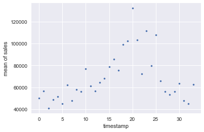
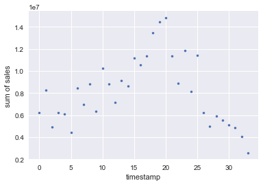
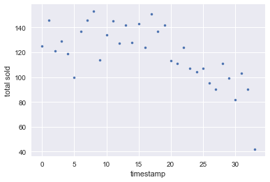
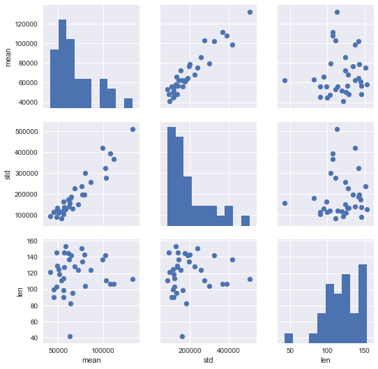
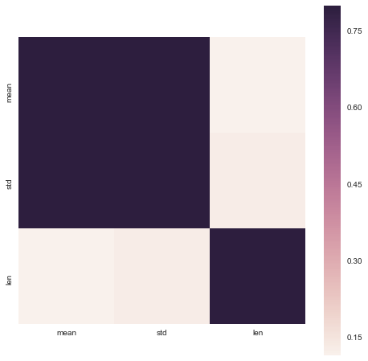
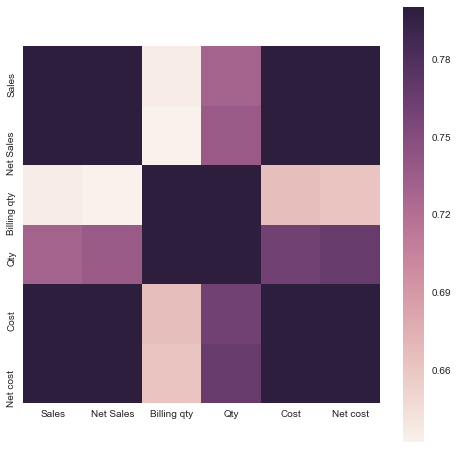
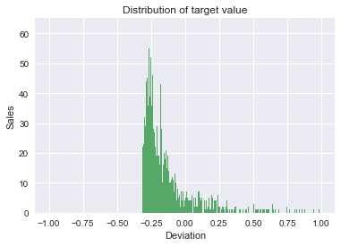
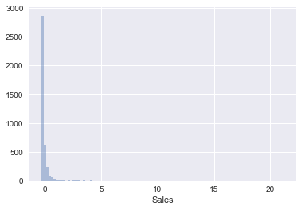
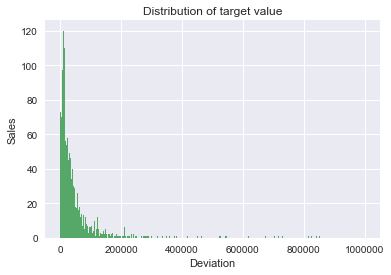

```python
"""HERE I WILL PUBLISH IDEAS"""
#1 I would like to predict the future sales data.
#2 I would like to connect the australian and new zealand database
#...for both the cutomer and the product
# I can use all databases as features to predict the future sales.
# There is some beautifull charts I can create with NZ and Aus analysis. 
# You can also get the first two letter codes and find out how much.
# Get more data to see if you can predict sales.
# I can look at the change of prices over time.
# It would actually be interesting to look at rossman store data.
# Yea, Rossman is awesome, there is multiple queues to go on


```


```python
import pandas as pd
import datetime
import numpy as np
from time import strptime

# Setting Maximum Display Settings. 
pd.set_option('display.max_columns', None)
pd.set_option('display.max_rows', None)
np.set_printoptions(threshold=np.nan)

import matplotlib.pyplot as plt
import seaborn as sns
import statsmodels.api as sm

%matplotlib inline

```


```python
# What you can do is delete if duplicate column (to remove credit)
# Then do the split extract after import and rename
# Then rename if equal to list of dictionary values
# See file 14, this is the fact of the matter, I have file 14 with 3 columns, each named credit.
# I need to specifically know what to extract from the information to do anything meaningful.
# Thus all I need is -> WHAT COLUMNS ARE REQUIRED - I can do the rest from there.

# What I also can do is input all three credits even if it is with zeros. 
# However, this would still be easier manually


# Out of loop test:
# I am just going to have to step through each step. 
bigdata = pd.DataFrame()
tot = pd.DataFrame()
new = pd.DataFrame()
for r in range(1,35):
    #i = 2
    df = pd.read_excel("sales (%d).XLS" % r)
    #if len(df.columns) >14:
    df = df.dropna(how="all")
    df.reset_index(drop="True", inplace=True)
    col = df.columns
    date = col[0]
    date_month=date[date.find("-")+1:].split()[0]
    date_year=date[date.find("-")+1:].split()[1]
    if len(date_year) < 3:
        date_year = "20"+ date_year
    date_month = strptime(date_month[:3], '%b').tm_mon
    full_date =  date_year + "-" + str(date_month) 
    new_date = datetime.datetime.strptime(full_date, "%Y-%m")
    new_header = df.iloc[0] #grab the first row for the header

    df_new = df[1:] #take the data less the header row
    df_new = df_new.rename(columns = new_header) #set the header row as the df header
    new_frame = df_new.dropna(how="all", axis=1)
    #new_frame = df_new
    new_frame["Date"] = new_date
    totals = {}
    totals["totals"] = new_frame.iloc[0]
    totals["totals"] = totals["totals"].rename(full_date).to_frame()
    totals["totals"] = totals["totals"].rename(columns={'1': full_date})
    new_tot = totals["totals"]
    tot = tot.append(new_tot, ignore_index=True)

    new_frame = new_frame[new_frame.Material != "Total"]

    new_frame.reset_index(inplace=True, drop=True)

    #busted = new_frame.ix[new_frame.index< (len(new_frame.index)-2)]

    busted = new_frame.drop(new_frame.index[len(new_frame)-2])

    Code = list()
    Name = list()

    for i in range(len(busted.Material)):
        if busted.Material.iloc[i] != 0 and new_frame.Material.iloc[i] != "":
            full = new_frame.Material.iloc[i]
            name = full[full.find("             "):].split()
            code = full[:full.find("             ")].split()
            Code.append(code)
            Name.append(name)

    busted["Code"] = Code
    busted["Name"] = Name

    busted["Code"] = busted["Code"].str[0]
    busted["Name"] = busted["Name"].str[0]
    busted = busted.drop("Material", axis=1)
    #busted = busted.drop("Code", axis=1)
    #print(busted.dtypes)
    busted.rename(columns=lambda x: x.strip(), inplace=True)
    
    s = set(busted.columns)
    # , 'CredMemos: cost'
    print(r)
    #print(s)
    if 'Net cost' in s:
        busted =busted.rename(columns = {"Net cost":"Net Cost"})
    if 'Inv.sales: cost' in s:
        busted = busted[['Date', 'Name', "Code", "Sales", "Net Sales", "Billing qty", "Qty", 'Inv.sales: cost', "Net Cost"]]
        #print(busted.columns)
        busted.columns = ['Date', 'Name', "Code", 'Sales', 'Net Sales', 'Billing qty','Qty','Cost', 'Net cost']
    else:
        busted = busted[['Date', 'Name', "Code",'Sales', 'Net Sales','Billing qty', 'Qty', 'Cost', 'Net Cost']]
        #print(busted.columns)
        busted.columns = ['Date', 'Name', "Code", 'Sales', 'Net Sales', 'Billing qty','Qty','Cost', 'Net cost']
    busted.reset_index(drop=True, inplace=True)
    #print(busted.shape)
    new = new.append(busted, ignore_index=True)
else:
    print(i)


```

    C:\Users\dsnow\AppData\Local\Continuum\Anaconda3\lib\site-packages\ipykernel\__main__.py:38: SettingWithCopyWarning: 
    A value is trying to be set on a copy of a slice from a DataFrame.
    Try using .loc[row_indexer,col_indexer] = value instead
    
    See the caveats in the documentation: http://pandas.pydata.org/pandas-docs/stable/indexing.html#indexing-view-versus-copy
    

    1
    2
    3
    4
    5
    6
    7
    8
    9
    10
    11
    12
    13
    14
    15
    16
    17
    18
    19
    20
    21
    22
    23
    24
    25
    26
    27
    28
    29
    30
    31
    32
    33
    34
    98
    


```python

#bigdata = pd.concat(busted, axis=1)
bigdata = new
bigdata.to_csv("sales_by_product.csv")
tot.to_csv("sales_by_product_totals.csv")

poped_name = bigdata.pop("Name")
poped_date = bigdata.pop("Date")
poped_code = bigdata.pop("Code")
bigdata = bigdata.apply(pd.to_numeric)
bigdata["Name"] = poped_name
bigdata["Date"] = poped_date
bigdata["Code"] = poped_code

bigdata = bigdata.dropna(how="all", axis=1)

bigdata = bigdata.reset_index(drop=True)


date =  bigdata.pop("Date")
big_mean_name = bigdata.groupby("Name").agg([np.mean,np.sum,len]).reset_index()
big_mean_name

big_mean_name.to_csv("sales_product_name_aggregate.csv")

bigdata = bigdata.reset_index(drop=True)
bigdata["Date"] = date.astype(str)
name =  bigdata.pop("Name")
big_mean_date = bigdata.groupby("Date").agg([np.mean,np.sum,len]).reset_index()
# [["Date", "Sales", "Billing qty"]]
big_mean_date

big_mean_date.to_csv("sales_product_date_aggregate.csv")
    

```


```python
big_mean_date.head()
```


<div>
<table border="1" class="dataframe">
  <thead>
    <tr>
      <th></th>
      <th>Date</th>
      <th colspan="3" halign="left">Sales</th>
      <th colspan="3" halign="left">Net Sales</th>
      <th colspan="3" halign="left">Billing qty</th>
      <th colspan="3" halign="left">Qty</th>
      <th colspan="3" halign="left">Cost</th>
      <th colspan="3" halign="left">Net cost</th>
    </tr>
    <tr>
      <th></th>
      <th></th>
      <th>mean</th>
      <th>sum</th>
      <th>len</th>
      <th>mean</th>
      <th>sum</th>
      <th>len</th>
      <th>mean</th>
      <th>sum</th>
      <th>len</th>
      <th>mean</th>
      <th>sum</th>
      <th>len</th>
      <th>mean</th>
      <th>sum</th>
      <th>len</th>
      <th>mean</th>
      <th>sum</th>
      <th>len</th>
    </tr>
  </thead>
  <tbody>
    <tr>
      <th>0</th>
      <td>2014-04-01</td>
      <td>50152.364597</td>
      <td>6218893.21</td>
      <td>125.0</td>
      <td>54347.208240</td>
      <td>6793401.03</td>
      <td>125.0</td>
      <td>1.180222e+06</td>
      <td>141626605.5</td>
      <td>125.0</td>
      <td>1.430776e+06</td>
      <td>168831570.0</td>
      <td>125.0</td>
      <td>38551.015565</td>
      <td>4780325.93</td>
      <td>125.0</td>
      <td>38544.830081</td>
      <td>4779558.93</td>
      <td>125.0</td>
    </tr>
    <tr>
      <th>1</th>
      <td>2014-05-01</td>
      <td>56757.698562</td>
      <td>8286623.99</td>
      <td>146.0</td>
      <td>56713.617877</td>
      <td>8280188.21</td>
      <td>146.0</td>
      <td>1.489342e+06</td>
      <td>215954577.0</td>
      <td>146.0</td>
      <td>1.739485e+06</td>
      <td>234830424.0</td>
      <td>146.0</td>
      <td>42924.697862</td>
      <td>6224081.19</td>
      <td>146.0</td>
      <td>42887.051655</td>
      <td>6218622.49</td>
      <td>146.0</td>
    </tr>
    <tr>
      <th>2</th>
      <td>2014-06-01</td>
      <td>40957.909000</td>
      <td>4914949.08</td>
      <td>121.0</td>
      <td>42070.620413</td>
      <td>5090545.07</td>
      <td>121.0</td>
      <td>1.272440e+06</td>
      <td>152692800.0</td>
      <td>121.0</td>
      <td>1.466750e+06</td>
      <td>165742776.0</td>
      <td>121.0</td>
      <td>36005.688250</td>
      <td>4320682.59</td>
      <td>121.0</td>
      <td>35693.004917</td>
      <td>4283160.59</td>
      <td>121.0</td>
    </tr>
    <tr>
      <th>3</th>
      <td>2014-07-01</td>
      <td>48570.627969</td>
      <td>6217040.38</td>
      <td>129.0</td>
      <td>52241.065969</td>
      <td>6739097.51</td>
      <td>129.0</td>
      <td>1.546230e+06</td>
      <td>197917489.0</td>
      <td>129.0</td>
      <td>1.715532e+06</td>
      <td>214441485.0</td>
      <td>129.0</td>
      <td>45455.939297</td>
      <td>5818360.23</td>
      <td>129.0</td>
      <td>47626.570853</td>
      <td>6143827.64</td>
      <td>129.0</td>
    </tr>
    <tr>
      <th>4</th>
      <td>2014-08-01</td>
      <td>51565.898814</td>
      <td>6084776.06</td>
      <td>119.0</td>
      <td>73534.582017</td>
      <td>8750615.26</td>
      <td>119.0</td>
      <td>1.751238e+06</td>
      <td>206646101.0</td>
      <td>119.0</td>
      <td>3.218617e+06</td>
      <td>360485148.0</td>
      <td>119.0</td>
      <td>47502.493898</td>
      <td>5605294.28</td>
      <td>119.0</td>
      <td>47804.974746</td>
      <td>5640987.02</td>
      <td>119.0</td>
    </tr>
  </tbody>
</table>
</div>


```python
bigdata["Name"] = name

big_mean_date.sort(columns="Date",  ascending=True, inplace=True)

bigdata.describe()

```

    C:\Users\dsnow\AppData\Local\Continuum\Anaconda3\lib\site-packages\ipykernel\__main__.py:3: FutureWarning: sort(columns=....) is deprecated, use sort_values(by=.....)
      app.launch_new_instance()
    


<div>
<table border="1" class="dataframe">
  <thead>
    <tr style="text-align: right;">
      <th></th>
      <th>Sales</th>
      <th>Net Sales</th>
      <th>Billing qty</th>
      <th>Qty</th>
      <th>Cost</th>
      <th>Net cost</th>
    </tr>
  </thead>
  <tbody>
    <tr>
      <th>count</th>
      <td>4.007000e+03</td>
      <td>4.041000e+03</td>
      <td>3.952000e+03</td>
      <td>3.842000e+03</td>
      <td>4.009000e+03</td>
      <td>4.024000e+03</td>
    </tr>
    <tr>
      <th>mean</th>
      <td>6.919486e+04</td>
      <td>8.579847e+04</td>
      <td>1.826970e+06</td>
      <td>2.911393e+06</td>
      <td>6.002438e+04</td>
      <td>7.294875e+04</td>
    </tr>
    <tr>
      <th>std</th>
      <td>2.203426e+05</td>
      <td>3.359702e+05</td>
      <td>8.717376e+06</td>
      <td>1.584124e+07</td>
      <td>2.512251e+05</td>
      <td>3.450548e+05</td>
    </tr>
    <tr>
      <th>min</th>
      <td>-3.000000e+01</td>
      <td>-3.051388e+05</td>
      <td>-1.200000e+01</td>
      <td>-5.637880e+06</td>
      <td>-3.184343e+04</td>
      <td>-1.147309e+05</td>
    </tr>
    <tr>
      <th>25%</th>
      <td>1.122252e+04</td>
      <td>1.122000e+04</td>
      <td>3.157750e+03</td>
      <td>2.657075e+05</td>
      <td>6.332980e+03</td>
      <td>6.364512e+03</td>
    </tr>
    <tr>
      <th>50%</th>
      <td>2.558400e+04</td>
      <td>2.580500e+04</td>
      <td>3.090100e+05</td>
      <td>4.531710e+05</td>
      <td>1.721409e+04</td>
      <td>1.728532e+04</td>
    </tr>
    <tr>
      <th>75%</th>
      <td>5.306560e+04</td>
      <td>5.404968e+04</td>
      <td>9.419775e+05</td>
      <td>1.108115e+06</td>
      <td>3.992925e+04</td>
      <td>4.039382e+04</td>
    </tr>
    <tr>
      <th>max</th>
      <td>4.739774e+06</td>
      <td>5.900139e+06</td>
      <td>1.801246e+08</td>
      <td>2.987830e+08</td>
      <td>8.258787e+06</td>
      <td>8.258787e+06</td>
    </tr>
  </tbody>
</table>
</div>


```python
sales = bigdata[["Sales", "Name","Date"]]
sales = sales.sort(columns="Sales")
sales
# Based on this graph, there is a lot of things that I would like to flag. 

```

    C:\Users\dsnow\AppData\Local\Continuum\Anaconda3\lib\site-packages\ipykernel\__main__.py:2: FutureWarning: sort(columns=....) is deprecated, use sort_values(by=.....)
      from ipykernel import kernelapp as app
    


<div>
<table border="1" class="dataframe">
  <thead>
    <tr style="text-align: right;">
      <th></th>
      <th>Sales</th>
      <th>Name</th>
      <th>Date</th>
    </tr>
  </thead>
  <tbody>
    <tr>
      <th>4</th>
      <td>-30.00</td>
      <td>NZQ-GF-PMInfFormula3+DAN-P900-C</td>
      <td>2014-04-01</td>
    </tr>
    <tr>
      <th>2309</th>
      <td>-26.04</td>
      <td>NZQ-GOF-FortifiedWMP-P800-Can</td>
      <td>2014-11-01</td>
    </tr>
    <tr>
      <th>2862</th>
      <td>0.00</td>
      <td>Rehmannia320+6HFC-TV10</td>
      <td>2015-10-01</td>
    </tr>
    <tr>
      <th>1640</th>
      <td>0.00</td>
      <td>RH-ZV-SheepPlacenta15000-SG10-B</td>
      <td>2015-06-01</td>
    </tr>
    <tr>
      <th>1641</th>
      <td>0.00</td>
      <td>NDP-NUZ-PMInfFormula1+DAN-P900-</td>
      <td>2015-06-01</td>
    </tr>
    <tr>
      <th>1369</th>
      <td>0.00</td>
      <td>TN-SuperBioflavonoidsFC-TV10</td>
      <td>2014-07-01</td>
    </tr>
    <tr>
      <th>1647</th>
      <td>0.00</td>
      <td>TN-Elderberry-HG24</td>
      <td>2015-06-01</td>
    </tr>
    <tr>
      <th>1654</th>
      <td>0.00</td>
      <td>TN-OdourlessFishOil1500-SG200</td>
      <td>2015-06-01</td>
    </tr>
    <tr>
      <th>1661</th>
      <td>0.00</td>
      <td>GH-Omega1000-SG400</td>
      <td>2015-06-01</td>
    </tr>
    <tr>
      <th>1667</th>
      <td>0.00</td>
      <td>TN-Spirulina1000(NZ)-TB300</td>
      <td>2015-06-01</td>
    </tr>
    <tr>
      <th>1347</th>
      <td>0.00</td>
      <td>CodLiverOil+AlgaeDHA-SF16-E0</td>
      <td>2014-07-01</td>
    </tr>
    <tr>
      <th>1753</th>
      <td>0.00</td>
      <td>TN-Spirulina1000-TV10</td>
      <td>2015-06-01</td>
    </tr>
    <tr>
      <th>373</th>
      <td>0.00</td>
      <td>Certificate</td>
      <td>2015-08-01</td>
    </tr>
    <tr>
      <th>2884</th>
      <td>0.00</td>
      <td>SWV-UBHairSkinNail-L500</td>
      <td>2014-09-01</td>
    </tr>
    <tr>
      <th>3440</th>
      <td>0.00</td>
      <td>B</td>
      <td>2017-01-01</td>
    </tr>
    <tr>
      <th>1762</th>
      <td>0.00</td>
      <td>BM-LypsineFC-TV09</td>
      <td>2015-06-01</td>
    </tr>
    <tr>
      <th>414</th>
      <td>0.00</td>
      <td>e</td>
      <td>2015-08-01</td>
    </tr>
    <tr>
      <th>2784</th>
      <td>0.00</td>
      <td>BM-Pregnancy&amp;BreastFeeding-SB15</td>
      <td>2015-10-01</td>
    </tr>
    <tr>
      <th>1791</th>
      <td>0.00</td>
      <td>GZ11-KangarooEss-SG60-GZ11Bottl</td>
      <td>2015-03-01</td>
    </tr>
    <tr>
      <th>2711</th>
      <td>0.00</td>
      <td>ConcentratedFO1500V-SB24E-E0</td>
      <td>2014-10-01</td>
    </tr>
    <tr>
      <th>1803</th>
      <td>0.00</td>
      <td>GZ11-St.JohnWort-SG60-GZ11Bottl</td>
      <td>2015-03-01</td>
    </tr>
    <tr>
      <th>1878</th>
      <td>0.00</td>
      <td>HalalChewFO+Colostrum-SF16-E4</td>
      <td>2015-03-01</td>
    </tr>
    <tr>
      <th>1902</th>
      <td>0.00</td>
      <td>SyzygiumCumini500FC-TO08</td>
      <td>2015-03-01</td>
    </tr>
    <tr>
      <th>1638</th>
      <td>0.00</td>
      <td>RH-ZV-SPlacenta15000-SG10-Blist</td>
      <td>2015-06-01</td>
    </tr>
    <tr>
      <th>1620</th>
      <td>0.00</td>
      <td>BM-KrillOil1000LV-SB22-E2</td>
      <td>2014-06-01</td>
    </tr>
    <tr>
      <th>3635</th>
      <td>0.00</td>
      <td>HalalCoQ10-50-SV12-E0</td>
      <td>2016-06-01</td>
    </tr>
    <tr>
      <th>2609</th>
      <td>0.00</td>
      <td>SWV-MensUltivite-TB60</td>
      <td>2014-10-01</td>
    </tr>
    <tr>
      <th>1441</th>
      <td>0.00</td>
      <td>HalalAstaxanthin40+VitC-SV03-E0</td>
      <td>2015-07-01</td>
    </tr>
    <tr>
      <th>3412</th>
      <td>0.00</td>
      <td>SA-Men'sMVM(KR)-SB22-E13</td>
      <td>2016-12-01</td>
    </tr>
    <tr>
      <th>3389</th>
      <td>0.00</td>
      <td>SA-Women'sMVM(KR)-SB22-E13</td>
      <td>2016-12-01</td>
    </tr>
    <tr>
      <th>229</th>
      <td>0.00</td>
      <td>SA-KrillOil1200OF-SB24E-E5</td>
      <td>2015-04-01</td>
    </tr>
    <tr>
      <th>3519</th>
      <td>0.00</td>
      <td>Omega500(36/24)Plus-SB20-E78</td>
      <td>2016-07-01</td>
    </tr>
    <tr>
      <th>3555</th>
      <td>0.00</td>
      <td>B</td>
      <td>2016-06-01</td>
    </tr>
    <tr>
      <th>3556</th>
      <td>0.00</td>
      <td>WOM-HF-GLM+Glucosamine-SG60-</td>
      <td>2016-06-01</td>
    </tr>
    <tr>
      <th>1530</th>
      <td>0.00</td>
      <td>CLS-CE-SheepPlacenta15000-SG30</td>
      <td>2014-06-01</td>
    </tr>
    <tr>
      <th>1531</th>
      <td>0.00</td>
      <td>TN-Elderberry-HG24</td>
      <td>2014-06-01</td>
    </tr>
    <tr>
      <th>253</th>
      <td>0.00</td>
      <td>q</td>
      <td>2014-08-01</td>
    </tr>
    <tr>
      <th>3313</th>
      <td>0.00</td>
      <td>OdourlessOmega1700-SB24E-E10</td>
      <td>2016-08-01</td>
    </tr>
    <tr>
      <th>3302</th>
      <td>0.00</td>
      <td>RoyalJellyAF184P(+E)-SB20-E0</td>
      <td>2016-08-01</td>
    </tr>
    <tr>
      <th>1536</th>
      <td>0.00</td>
      <td>CLS-CE-SheepPlacenta15000-SG60</td>
      <td>2014-06-01</td>
    </tr>
    <tr>
      <th>1538</th>
      <td>0.00</td>
      <td>GN-BJ-GrapeMaxi-SG100-J21</td>
      <td>2014-06-01</td>
    </tr>
    <tr>
      <th>1558</th>
      <td>0.00</td>
      <td>CLS-CE-PlacentaGrape-SG60-CLS15</td>
      <td>2014-06-01</td>
    </tr>
    <tr>
      <th>3199</th>
      <td>0.00</td>
      <td>SA-Men'sMVM(KR)-SB22-E13</td>
      <td>2016-04-01</td>
    </tr>
    <tr>
      <th>3621</th>
      <td>0.00</td>
      <td>HalalOmega500/250-SB20-E0</td>
      <td>2016-06-01</td>
    </tr>
    <tr>
      <th>1576</th>
      <td>0.00</td>
      <td>SA-VitA5000-SV05-E0</td>
      <td>2014-06-01</td>
    </tr>
    <tr>
      <th>3627</th>
      <td>0.00</td>
      <td>HalalOmegaONC-SB20-E1</td>
      <td>2016-06-01</td>
    </tr>
    <tr>
      <th>3630</th>
      <td>0.00</td>
      <td>SA-KrillOil100+GlucosamineHCL-S</td>
      <td>2016-06-01</td>
    </tr>
    <tr>
      <th>1580</th>
      <td>0.00</td>
      <td>HalalAstaxanthin40+VitC-SV03-E0</td>
      <td>2014-06-01</td>
    </tr>
    <tr>
      <th>3172</th>
      <td>0.00</td>
      <td>SA-KrillOil1000OF-SB22-E5</td>
      <td>2016-04-01</td>
    </tr>
    <tr>
      <th>496</th>
      <td>0.00</td>
      <td>YSP-PlatinumPlacenta-SG10-Blis</td>
      <td>2014-12-01</td>
    </tr>
    <tr>
      <th>196</th>
      <td>0.00</td>
      <td>SA-KrillOil1000OF-SB22-E5</td>
      <td>2015-04-01</td>
    </tr>
    <tr>
      <th>2248</th>
      <td>0.00</td>
      <td>SA-KrillOil1000OF-SB22-E5</td>
      <td>2015-05-01</td>
    </tr>
    <tr>
      <th>2187</th>
      <td>0.00</td>
      <td>TN-Spirulina1000(NZ)-TB300</td>
      <td>2015-05-01</td>
    </tr>
    <tr>
      <th>2190</th>
      <td>0.00</td>
      <td>TBS-HK-CoQLeciPlus-SG60-CP185</td>
      <td>2015-05-01</td>
    </tr>
    <tr>
      <th>672</th>
      <td>0.00</td>
      <td>MIN-Omega3-SG300</td>
      <td>2015-12-01</td>
    </tr>
    <tr>
      <th>1947</th>
      <td>0.00</td>
      <td>Garlic+OriganumPlusEC-SB24-E0</td>
      <td>2016-03-01</td>
    </tr>
    <tr>
      <th>3962</th>
      <td>0.00</td>
      <td>DAL-Lecithin-SG200-CP500</td>
      <td>2016-09-01</td>
    </tr>
    <tr>
      <th>2178</th>
      <td>0.00</td>
      <td>TN-MarineMg(NZ)-TB60</td>
      <td>2015-05-01</td>
    </tr>
    <tr>
      <th>2208</th>
      <td>0.00</td>
      <td>TBS-HK-Bilberry-SG60-CP125</td>
      <td>2015-05-01</td>
    </tr>
    <tr>
      <th>2506</th>
      <td>0.00</td>
      <td>GL500-CH200-Ca40-HG00</td>
      <td>2015-11-01</td>
    </tr>
    <tr>
      <th>2286</th>
      <td>0.00</td>
      <td>SA-KrillOil1200OF-SB24E-E5</td>
      <td>2015-05-01</td>
    </tr>
    <tr>
      <th>2166</th>
      <td>0.00</td>
      <td>Certificate</td>
      <td>2015-05-01</td>
    </tr>
    <tr>
      <th>2933</th>
      <td>17.50</td>
      <td>THB-Garlic1-SV05-E0</td>
      <td>2014-09-01</td>
    </tr>
    <tr>
      <th>1262</th>
      <td>18.00</td>
      <td>GN-BJ-GrapeMaxi-SG100-J21</td>
      <td>2014-07-01</td>
    </tr>
    <tr>
      <th>2824</th>
      <td>19.75</td>
      <td>THB-Evol-HalalGarlic3000-SV05-E</td>
      <td>2015-10-01</td>
    </tr>
    <tr>
      <th>2028</th>
      <td>26.70</td>
      <td>Cospak-500WhiteHDPEJar</td>
      <td>2014-05-01</td>
    </tr>
    <tr>
      <th>1340</th>
      <td>40.63</td>
      <td>THB-EPO500-SV12-E1</td>
      <td>2014-07-01</td>
    </tr>
    <tr>
      <th>2318</th>
      <td>44.55</td>
      <td>SWV-FP6114+FP1580-TB60+L60-2in1</td>
      <td>2014-11-01</td>
    </tr>
    <tr>
      <th>328</th>
      <td>45.00</td>
      <td>THB-GinkgoBiloba3000-SV12-E0</td>
      <td>2014-08-01</td>
    </tr>
    <tr>
      <th>1570</th>
      <td>50.00</td>
      <td>Sample</td>
      <td>2014-06-01</td>
    </tr>
    <tr>
      <th>1338</th>
      <td>84.00</td>
      <td>THB-Omega300/200-1000-SB20-E1</td>
      <td>2014-07-01</td>
    </tr>
    <tr>
      <th>2357</th>
      <td>100.00</td>
      <td>l</td>
      <td>2014-11-01</td>
    </tr>
    <tr>
      <th>2413</th>
      <td>110.00</td>
      <td>THB-Evol-FishOil1200-SB22-E0</td>
      <td>2014-11-01</td>
    </tr>
    <tr>
      <th>2313</th>
      <td>150.00</td>
      <td>Certificate</td>
      <td>2014-11-01</td>
    </tr>
    <tr>
      <th>1377</th>
      <td>150.00</td>
      <td>Certificate</td>
      <td>2015-07-01</td>
    </tr>
    <tr>
      <th>3789</th>
      <td>160.02</td>
      <td>GrapeSeed60000-SZ00</td>
      <td>2016-11-01</td>
    </tr>
    <tr>
      <th>2022</th>
      <td>193.55</td>
      <td>n</td>
      <td>2014-05-01</td>
    </tr>
    <tr>
      <th>2019</th>
      <td>193.55</td>
      <td>n</td>
      <td>2014-05-01</td>
    </tr>
    <tr>
      <th>1910</th>
      <td>200.00</td>
      <td>Eligibility</td>
      <td>2016-03-01</td>
    </tr>
    <tr>
      <th>2023</th>
      <td>207.31</td>
      <td>n</td>
      <td>2014-05-01</td>
    </tr>
    <tr>
      <th>2021</th>
      <td>215.05</td>
      <td>i</td>
      <td>2014-05-01</td>
    </tr>
    <tr>
      <th>769</th>
      <td>225.00</td>
      <td>SWV-FacialC&amp;E-L125-2in1</td>
      <td>2015-02-01</td>
    </tr>
    <tr>
      <th>2603</th>
      <td>225.00</td>
      <td>SWV-FacialC&amp;E-L125-2in1</td>
      <td>2014-10-01</td>
    </tr>
    <tr>
      <th>3320</th>
      <td>233.33</td>
      <td>t</td>
      <td>2016-08-01</td>
    </tr>
    <tr>
      <th>2348</th>
      <td>270.00</td>
      <td>SWV-FP9156+FP2011-TB60+L100-2in</td>
      <td>2014-11-01</td>
    </tr>
    <tr>
      <th>495</th>
      <td>270.90</td>
      <td>NDP-SynlaitPremiumBase3</td>
      <td>2014-12-01</td>
    </tr>
    <tr>
      <th>285</th>
      <td>288.00</td>
      <td>J21SilverCapWaddedNING</td>
      <td>2014-08-01</td>
    </tr>
    <tr>
      <th>807</th>
      <td>300.00</td>
      <td>J21SilverCapWaddedNING</td>
      <td>2015-02-01</td>
    </tr>
    <tr>
      <th>170</th>
      <td>300.00</td>
      <td>l</td>
      <td>2015-04-01</td>
    </tr>
    <tr>
      <th>1679</th>
      <td>310.05</td>
      <td>NUB-Astaxanthin-SG100</td>
      <td>2015-06-01</td>
    </tr>
    <tr>
      <th>168</th>
      <td>350.00</td>
      <td>n</td>
      <td>2015-04-01</td>
    </tr>
    <tr>
      <th>2349</th>
      <td>355.05</td>
      <td>SWV-FP3614+FP2011-L500+L100-2in</td>
      <td>2014-11-01</td>
    </tr>
    <tr>
      <th>132</th>
      <td>375.24</td>
      <td>SWV-FOConcentrated+VitD-SG200</td>
      <td>2015-04-01</td>
    </tr>
    <tr>
      <th>2017</th>
      <td>387.10</td>
      <td>n</td>
      <td>2014-05-01</td>
    </tr>
    <tr>
      <th>2018</th>
      <td>387.10</td>
      <td>n</td>
      <td>2014-05-01</td>
    </tr>
    <tr>
      <th>479</th>
      <td>388.89</td>
      <td>t</td>
      <td>2015-08-01</td>
    </tr>
    <tr>
      <th>3757</th>
      <td>400.00</td>
      <td>Eligibility</td>
      <td>2016-11-01</td>
    </tr>
    <tr>
      <th>1683</th>
      <td>400.00</td>
      <td>e</td>
      <td>2015-06-01</td>
    </tr>
    <tr>
      <th>1937</th>
      <td>400.00</td>
      <td>e</td>
      <td>2016-03-01</td>
    </tr>
    <tr>
      <th>3017</th>
      <td>400.00</td>
      <td>e</td>
      <td>2015-09-01</td>
    </tr>
    <tr>
      <th>1430</th>
      <td>400.00</td>
      <td>e</td>
      <td>2015-07-01</td>
    </tr>
    <tr>
      <th>804</th>
      <td>400.00</td>
      <td>e</td>
      <td>2015-02-01</td>
    </tr>
    <tr>
      <th>2356</th>
      <td>400.00</td>
      <td>e</td>
      <td>2014-11-01</td>
    </tr>
    <tr>
      <th>3972</th>
      <td>400.00</td>
      <td>e</td>
      <td>2016-09-01</td>
    </tr>
    <tr>
      <th>1044</th>
      <td>400.00</td>
      <td>l</td>
      <td>2015-01-01</td>
    </tr>
    <tr>
      <th>3263</th>
      <td>400.00</td>
      <td>e</td>
      <td>2016-08-01</td>
    </tr>
    <tr>
      <th>70</th>
      <td>430.40</td>
      <td>BirdNest+FlaxseedOil+Gold-SV12-</td>
      <td>2014-04-01</td>
    </tr>
    <tr>
      <th>2344</th>
      <td>450.00</td>
      <td>SWV-ChildrenUltivite-TB120-2in1</td>
      <td>2014-11-01</td>
    </tr>
    <tr>
      <th>1517</th>
      <td>535.05</td>
      <td>n</td>
      <td>2014-06-01</td>
    </tr>
    <tr>
      <th>1642</th>
      <td>540.00</td>
      <td>Eligibility</td>
      <td>2015-06-01</td>
    </tr>
    <tr>
      <th>111</th>
      <td>562.50</td>
      <td>Lyprinol-SV03-E02</td>
      <td>2014-04-01</td>
    </tr>
    <tr>
      <th>267</th>
      <td>584.40</td>
      <td>SWV-WomensUltivite-TB60-2in1</td>
      <td>2014-08-01</td>
    </tr>
    <tr>
      <th>270</th>
      <td>585.60</td>
      <td>SWV-MensUltivite-TB60-2in1</td>
      <td>2014-08-01</td>
    </tr>
    <tr>
      <th>1135</th>
      <td>600.00</td>
      <td>Eligibility</td>
      <td>2016-01-01</td>
    </tr>
    <tr>
      <th>805</th>
      <td>600.00</td>
      <td>l</td>
      <td>2015-02-01</td>
    </tr>
    <tr>
      <th>3227</th>
      <td>700.00</td>
      <td>Eligibility</td>
      <td>2016-08-01</td>
    </tr>
    <tr>
      <th>2730</th>
      <td>715.56</td>
      <td>Eligibility</td>
      <td>2015-10-01</td>
    </tr>
    <tr>
      <th>374</th>
      <td>740.00</td>
      <td>Eligibility</td>
      <td>2015-08-01</td>
    </tr>
    <tr>
      <th>2969</th>
      <td>740.00</td>
      <td>Eligibility</td>
      <td>2015-09-01</td>
    </tr>
    <tr>
      <th>1516</th>
      <td>751.40</td>
      <td>n</td>
      <td>2014-06-01</td>
    </tr>
    <tr>
      <th>1246</th>
      <td>760.00</td>
      <td>Eligibility</td>
      <td>2014-07-01</td>
    </tr>
    <tr>
      <th>654</th>
      <td>780.00</td>
      <td>Eligibility</td>
      <td>2015-12-01</td>
    </tr>
    <tr>
      <th>1244</th>
      <td>793.55</td>
      <td>n</td>
      <td>2014-07-01</td>
    </tr>
    <tr>
      <th>1814</th>
      <td>800.00</td>
      <td>l</td>
      <td>2015-03-01</td>
    </tr>
    <tr>
      <th>3124</th>
      <td>800.00</td>
      <td>Eligibility</td>
      <td>2016-04-01</td>
    </tr>
    <tr>
      <th>1043</th>
      <td>800.00</td>
      <td>e</td>
      <td>2015-01-01</td>
    </tr>
    <tr>
      <th>895</th>
      <td>800.00</td>
      <td>Eligibility</td>
      <td>2016-02-01</td>
    </tr>
    <tr>
      <th>3559</th>
      <td>850.00</td>
      <td>Eligibility</td>
      <td>2016-06-01</td>
    </tr>
    <tr>
      <th>3469</th>
      <td>850.00</td>
      <td>Eligibility</td>
      <td>2016-07-01</td>
    </tr>
    <tr>
      <th>557</th>
      <td>900.00</td>
      <td>l</td>
      <td>2014-12-01</td>
    </tr>
    <tr>
      <th>1035</th>
      <td>900.00</td>
      <td>SWV-UltiviteFamilyPack(3in1)-TB</td>
      <td>2015-01-01</td>
    </tr>
    <tr>
      <th>1378</th>
      <td>900.00</td>
      <td>Eligibility</td>
      <td>2015-07-01</td>
    </tr>
    <tr>
      <th>256</th>
      <td>900.00</td>
      <td>Eligibility</td>
      <td>2014-08-01</td>
    </tr>
    <tr>
      <th>1268</th>
      <td>918.00</td>
      <td>TN-GlucosamineChondroitin(706)-200</td>
      <td>2014-07-01</td>
    </tr>
    <tr>
      <th>2647</th>
      <td>1017.52</td>
      <td>Pharmapac-60T/ECapISBlue</td>
      <td>2014-10-01</td>
    </tr>
    <tr>
      <th>2870</th>
      <td>1050.00</td>
      <td>Eligibility</td>
      <td>2014-09-01</td>
    </tr>
    <tr>
      <th>3553</th>
      <td>1059.62</td>
      <td>Ca+VitD+Mg+Zn+Cu+MnFC-TV10</td>
      <td>2016-07-01</td>
    </tr>
    <tr>
      <th>49</th>
      <td>1100.00</td>
      <td>l</td>
      <td>2014-04-01</td>
    </tr>
    <tr>
      <th>2212</th>
      <td>1100.00</td>
      <td>l</td>
      <td>2015-05-01</td>
    </tr>
    <tr>
      <th>2451</th>
      <td>1120.00</td>
      <td>Eligibility</td>
      <td>2015-11-01</td>
    </tr>
    <tr>
      <th>2600</th>
      <td>1140.00</td>
      <td>Eligibility</td>
      <td>2014-10-01</td>
    </tr>
    <tr>
      <th>255</th>
      <td>1152.00</td>
      <td>J21BottleNING</td>
      <td>2014-08-01</td>
    </tr>
    <tr>
      <th>2598</th>
      <td>1178.51</td>
      <td>Pharmapac-400T/ESquareJar</td>
      <td>2014-10-01</td>
    </tr>
    <tr>
      <th>1257</th>
      <td>1190.94</td>
      <td>TN-GlucosamineChondroitin(704)-120</td>
      <td>2014-07-01</td>
    </tr>
    <tr>
      <th>763</th>
      <td>1200.00</td>
      <td>J21BottleNING</td>
      <td>2015-02-01</td>
    </tr>
    <tr>
      <th>2767</th>
      <td>1200.00</td>
      <td>e</td>
      <td>2015-10-01</td>
    </tr>
    <tr>
      <th>1523</th>
      <td>1201.50</td>
      <td>Cospak-500WhiteHDPEJar</td>
      <td>2014-06-01</td>
    </tr>
    <tr>
      <th>1744</th>
      <td>1237.50</td>
      <td>Lyprinol-SV03-E02</td>
      <td>2015-06-01</td>
    </tr>
    <tr>
      <th>764</th>
      <td>1260.00</td>
      <td>Eligibility</td>
      <td>2015-02-01</td>
    </tr>
    <tr>
      <th>1161</th>
      <td>1263.00</td>
      <td>s</td>
      <td>2016-01-01</td>
    </tr>
    <tr>
      <th>3864</th>
      <td>1280.00</td>
      <td>Eligibility</td>
      <td>2016-10-01</td>
    </tr>
    <tr>
      <th>3800</th>
      <td>1283.05</td>
      <td>EPO1000-SB20-E1</td>
      <td>2016-11-01</td>
    </tr>
    <tr>
      <th>3208</th>
      <td>1300.00</td>
      <td>t</td>
      <td>2016-04-01</td>
    </tr>
    <tr>
      <th>3867</th>
      <td>1345.00</td>
      <td>4</td>
      <td>2016-10-01</td>
    </tr>
    <tr>
      <th>3478</th>
      <td>1370.00</td>
      <td>0</td>
      <td>2016-07-01</td>
    </tr>
    <tr>
      <th>2624</th>
      <td>1399.20</td>
      <td>SWV-MensUltivite-TB60-2in1</td>
      <td>2014-10-01</td>
    </tr>
    <tr>
      <th>3870</th>
      <td>1399.54</td>
      <td>0</td>
      <td>2016-10-01</td>
    </tr>
    <tr>
      <th>2623</th>
      <td>1399.60</td>
      <td>SWV-WomensUltivite-TB60-2in1</td>
      <td>2014-10-01</td>
    </tr>
    <tr>
      <th>499</th>
      <td>1436.47</td>
      <td>Eligibility</td>
      <td>2014-12-01</td>
    </tr>
    <tr>
      <th>3587</th>
      <td>1459.00</td>
      <td>s</td>
      <td>2016-06-01</td>
    </tr>
    <tr>
      <th>1524</th>
      <td>1464.09</td>
      <td>Eligibility</td>
      <td>2014-06-01</td>
    </tr>
    <tr>
      <th>3651</th>
      <td>1466.40</td>
      <td>B</td>
      <td>2016-05-01</td>
    </tr>
    <tr>
      <th>3120</th>
      <td>1466.40</td>
      <td>B</td>
      <td>2016-04-01</td>
    </tr>
    <tr>
      <th>2029</th>
      <td>1480.00</td>
      <td>Eligibility</td>
      <td>2014-05-01</td>
    </tr>
    <tr>
      <th>252</th>
      <td>1502.79</td>
      <td>i</td>
      <td>2014-08-01</td>
    </tr>
    <tr>
      <th>3832</th>
      <td>1508.10</td>
      <td>MarineCollagen-SV12-E5</td>
      <td>2016-11-01</td>
    </tr>
    <tr>
      <th>3787</th>
      <td>1620.00</td>
      <td>e</td>
      <td>2016-11-01</td>
    </tr>
    <tr>
      <th>3350</th>
      <td>1647.00</td>
      <td>t</td>
      <td>2016-12-01</td>
    </tr>
    <tr>
      <th>5</th>
      <td>1670.00</td>
      <td>Eligibility</td>
      <td>2014-04-01</td>
    </tr>
    <tr>
      <th>1754</th>
      <td>1753.69</td>
      <td>ChewVitC500+3-TR16</td>
      <td>2015-06-01</td>
    </tr>
    <tr>
      <th>127</th>
      <td>1776.84</td>
      <td>Eligibility</td>
      <td>2015-04-01</td>
    </tr>
    <tr>
      <th>3655</th>
      <td>1850.00</td>
      <td>Eligibility</td>
      <td>2016-05-01</td>
    </tr>
    <tr>
      <th>3378</th>
      <td>1860.85</td>
      <td>GSL-HalalFishOil1000(10/50)V-SB</td>
      <td>2016-12-01</td>
    </tr>
    <tr>
      <th>1008</th>
      <td>1881.00</td>
      <td>ColostrumChew118(20)-TR12</td>
      <td>2016-02-01</td>
    </tr>
    <tr>
      <th>2064</th>
      <td>1895.00</td>
      <td>GN-AV-Omega1000+VitD-SG365</td>
      <td>2014-05-01</td>
    </tr>
    <tr>
      <th>2020</th>
      <td>1935.48</td>
      <td>n</td>
      <td>2014-05-01</td>
    </tr>
    <tr>
      <th>2764</th>
      <td>1938.95</td>
      <td>NUB-Astaxanthin-SG100</td>
      <td>2015-10-01</td>
    </tr>
    <tr>
      <th>2035</th>
      <td>1951.20</td>
      <td>GN-EVH-ColostrumChew118-TB120</td>
      <td>2014-05-01</td>
    </tr>
    <tr>
      <th>1800</th>
      <td>1957.80</td>
      <td>WF-HL-Garlic3000-SG60</td>
      <td>2015-03-01</td>
    </tr>
    <tr>
      <th>1023</th>
      <td>1980.00</td>
      <td>Eligibility</td>
      <td>2015-01-01</td>
    </tr>
    <tr>
      <th>2873</th>
      <td>1985.27</td>
      <td>ASC-DF-Omega1000-SG60</td>
      <td>2014-09-01</td>
    </tr>
    <tr>
      <th>3230</th>
      <td>2000.00</td>
      <td>ASC-DF-HalalVitaminE-SG60</td>
      <td>2016-08-01</td>
    </tr>
    <tr>
      <th>773</th>
      <td>2055.80</td>
      <td>GN-EVH-ColostrumChew118-TB120</td>
      <td>2015-02-01</td>
    </tr>
    <tr>
      <th>1505</th>
      <td>2067.43</td>
      <td>ColostrumChew118(20)-TR12</td>
      <td>2015-07-01</td>
    </tr>
    <tr>
      <th>480</th>
      <td>2069.10</td>
      <td>ColostrumChew118(20)-TR12</td>
      <td>2015-08-01</td>
    </tr>
    <tr>
      <th>1229</th>
      <td>2069.10</td>
      <td>ColostrumChew118(20)-TR12</td>
      <td>2016-01-01</td>
    </tr>
    <tr>
      <th>243</th>
      <td>2069.10</td>
      <td>ColostrumChew118(20)-TR12</td>
      <td>2015-04-01</td>
    </tr>
    <tr>
      <th>1288</th>
      <td>2100.00</td>
      <td>WomenHealthMVMEC-SB20-E0e</td>
      <td>2014-07-01</td>
    </tr>
    <tr>
      <th>3852</th>
      <td>2109.42</td>
      <td>ColostrumChew118(20)-TR12</td>
      <td>2016-11-01</td>
    </tr>
    <tr>
      <th>1274</th>
      <td>2112.39</td>
      <td>SA-CEV-VitaJelliesFishOil-SG60</td>
      <td>2014-07-01</td>
    </tr>
    <tr>
      <th>3416</th>
      <td>2128.50</td>
      <td>HalalOmega1000-SB20-E1</td>
      <td>2016-12-01</td>
    </tr>
    <tr>
      <th>381</th>
      <td>2147.60</td>
      <td>DAL-Garlic-SG100-CP90</td>
      <td>2015-08-01</td>
    </tr>
    <tr>
      <th>1361</th>
      <td>2167.74</td>
      <td>ChewVitC1000+3-TR16</td>
      <td>2014-07-01</td>
    </tr>
    <tr>
      <th>2167</th>
      <td>2240.00</td>
      <td>Eligibility</td>
      <td>2015-05-01</td>
    </tr>
    <tr>
      <th>2441</th>
      <td>2273.50</td>
      <td>ColostrumChew118(20)-TR12</td>
      <td>2014-11-01</td>
    </tr>
    <tr>
      <th>2222</th>
      <td>2293.26</td>
      <td>HalalOdourlessFishOil-SB20-E0</td>
      <td>2015-05-01</td>
    </tr>
    <tr>
      <th>1637</th>
      <td>2300.00</td>
      <td>TBS-HK-Maca-HG60-Blister</td>
      <td>2015-06-01</td>
    </tr>
    <tr>
      <th>3380</th>
      <td>2310.00</td>
      <td>Omega1000-SB20-E1</td>
      <td>2016-12-01</td>
    </tr>
    <tr>
      <th>1256</th>
      <td>2347.28</td>
      <td>TN-GlucosamineChondroitin(704TP120</td>
      <td>2014-07-01</td>
    </tr>
    <tr>
      <th>3234</th>
      <td>2347.80</td>
      <td>DAL-Garlic-SG100-CP90</td>
      <td>2016-08-01</td>
    </tr>
    <tr>
      <th>361</th>
      <td>2357.53</td>
      <td>Valerian2000FC-TO08</td>
      <td>2014-08-01</td>
    </tr>
    <tr>
      <th>1553</th>
      <td>2375.00</td>
      <td>GN-BJ-ChewColostrumMilk-TB200</td>
      <td>2014-06-01</td>
    </tr>
    <tr>
      <th>3761</th>
      <td>2392.80</td>
      <td>0</td>
      <td>2016-11-01</td>
    </tr>
    <tr>
      <th>2722</th>
      <td>2396.90</td>
      <td>Echinacea500-TR12</td>
      <td>2014-10-01</td>
    </tr>
    <tr>
      <th>1235</th>
      <td>2396.90</td>
      <td>Echinacea500-TR12</td>
      <td>2016-01-01</td>
    </tr>
    <tr>
      <th>638</th>
      <td>2396.90</td>
      <td>Echinacea500-TR12</td>
      <td>2014-12-01</td>
    </tr>
    <tr>
      <th>3439</th>
      <td>2400.00</td>
      <td>e</td>
      <td>2017-01-01</td>
    </tr>
    <tr>
      <th>2895</th>
      <td>2403.00</td>
      <td>GN-NE-Omega3-SG365</td>
      <td>2014-09-01</td>
    </tr>
    <tr>
      <th>3874</th>
      <td>2405.43</td>
      <td>0</td>
      <td>2016-10-01</td>
    </tr>
    <tr>
      <th>355</th>
      <td>2408.61</td>
      <td>t</td>
      <td>2014-08-01</td>
    </tr>
    <tr>
      <th>2875</th>
      <td>2415.00</td>
      <td>GN-FR-ColostrumChew-TB200-CP350</td>
      <td>2014-09-01</td>
    </tr>
    <tr>
      <th>3868</th>
      <td>2416.80</td>
      <td>0</td>
      <td>2016-10-01</td>
    </tr>
    <tr>
      <th>884</th>
      <td>2442.54</td>
      <td>ChewVitC1000+3-TR16</td>
      <td>2015-02-01</td>
    </tr>
    <tr>
      <th>2499</th>
      <td>2443.11</td>
      <td>ASC-DF-Omega1000-SG300</td>
      <td>2015-11-01</td>
    </tr>
    <tr>
      <th>3323</th>
      <td>2473.52</td>
      <td>ColostrumChew118(20)-TR12</td>
      <td>2016-08-01</td>
    </tr>
    <tr>
      <th>3473</th>
      <td>2525.77</td>
      <td>0</td>
      <td>2016-07-01</td>
    </tr>
    <tr>
      <th>1270</th>
      <td>2547.40</td>
      <td>TBS-HK-Colostrum-TB200-FX280</td>
      <td>2014-07-01</td>
    </tr>
    <tr>
      <th>2587</th>
      <td>2560.33</td>
      <td>Echinacea500-TR12</td>
      <td>2015-11-01</td>
    </tr>
    <tr>
      <th>1752</th>
      <td>2583.35</td>
      <td>t</td>
      <td>2015-06-01</td>
    </tr>
    <tr>
      <th>686</th>
      <td>2592.00</td>
      <td>s</td>
      <td>2015-12-01</td>
    </tr>
    <tr>
      <th>1277</th>
      <td>2597.00</td>
      <td>GN-BJ-GrapeMaxi-Sticker-SG100</td>
      <td>2014-07-01</td>
    </tr>
    <tr>
      <th>3492</th>
      <td>2620.56</td>
      <td>GN-MHD-Omega500mg-SG120</td>
      <td>2016-07-01</td>
    </tr>
    <tr>
      <th>1827</th>
      <td>2683.74</td>
      <td>SA-VitA5000-SV05-E0</td>
      <td>2015-03-01</td>
    </tr>
    <tr>
      <th>528</th>
      <td>2700.00</td>
      <td>WF-HL-Omega3-SG100</td>
      <td>2014-12-01</td>
    </tr>
    <tr>
      <th>3475</th>
      <td>2728.40</td>
      <td>GN-EVH-ColostrumChew118-TB120</td>
      <td>2016-07-01</td>
    </tr>
    <tr>
      <th>392</th>
      <td>2733.50</td>
      <td>GN-EVH-NatGrapeSeedSuperAntiox-</td>
      <td>2015-08-01</td>
    </tr>
    <tr>
      <th>2226</th>
      <td>2749.51</td>
      <td>SA-VitA5000-SV05-E0</td>
      <td>2015-05-01</td>
    </tr>
    <tr>
      <th>30</th>
      <td>2752.29</td>
      <td>GN-DH-Colostrum-TB200-P285WM</td>
      <td>2014-04-01</td>
    </tr>
    <tr>
      <th>3750</th>
      <td>2770.00</td>
      <td>ChewMilkCalciumChoc-TA01</td>
      <td>2016-05-01</td>
    </tr>
    <tr>
      <th>9</th>
      <td>2785.00</td>
      <td>GN-FR-ColostrumChew-TB200-CP350</td>
      <td>2014-04-01</td>
    </tr>
    <tr>
      <th>3875</th>
      <td>2800.00</td>
      <td>0</td>
      <td>2016-10-01</td>
    </tr>
    <tr>
      <th>1527</th>
      <td>2832.00</td>
      <td>GN-FR-Propolis500-SG500</td>
      <td>2014-06-01</td>
    </tr>
    <tr>
      <th>2025</th>
      <td>2841.12</td>
      <td>PHL-BG-StatusGuard-SG30-Blister</td>
      <td>2014-05-01</td>
    </tr>
    <tr>
      <th>2341</th>
      <td>2871.00</td>
      <td>WF-HL-Omega3-SG100</td>
      <td>2014-11-01</td>
    </tr>
    <tr>
      <th>3772</th>
      <td>2892.00</td>
      <td>0</td>
      <td>2016-11-01</td>
    </tr>
    <tr>
      <th>2314</th>
      <td>2910.00</td>
      <td>Eligibility</td>
      <td>2014-11-01</td>
    </tr>
    <tr>
      <th>3955</th>
      <td>2940.00</td>
      <td>GN-EVH-ColostrumChew400-TB120</td>
      <td>2016-09-01</td>
    </tr>
    <tr>
      <th>3424</th>
      <td>2949.50</td>
      <td>WOM-HF-Propolis1000-SG60-Bliste</td>
      <td>2017-01-01</td>
    </tr>
    <tr>
      <th>2404</th>
      <td>2952.35</td>
      <td>Garlic1-SV05-E0</td>
      <td>2014-11-01</td>
    </tr>
    <tr>
      <th>2978</th>
      <td>2956.80</td>
      <td>TN-OdourlessFishOil1500-SG200</td>
      <td>2015-09-01</td>
    </tr>
    <tr>
      <th>2605</th>
      <td>2961.40</td>
      <td>DAL-Garlic-SG100-CP90</td>
      <td>2014-10-01</td>
    </tr>
    <tr>
      <th>7</th>
      <td>2964.00</td>
      <td>GN-DH-SuperColostrum-TB200-CP25</td>
      <td>2014-04-01</td>
    </tr>
    <tr>
      <th>2056</th>
      <td>2996.00</td>
      <td>GN-EVH-Propolis2000-SG120</td>
      <td>2014-05-01</td>
    </tr>
    <tr>
      <th>2653</th>
      <td>2999.47</td>
      <td>SA-VitA5000-SV05-E0</td>
      <td>2014-10-01</td>
    </tr>
    <tr>
      <th>1037</th>
      <td>3018.40</td>
      <td>GN-EVH-Propolis2000-SG120</td>
      <td>2015-01-01</td>
    </tr>
    <tr>
      <th>275</th>
      <td>3018.40</td>
      <td>GN-EVH-Propolis2000-SG120</td>
      <td>2014-08-01</td>
    </tr>
    <tr>
      <th>1547</th>
      <td>3024.00</td>
      <td>WF-HL-Omega3-SG100</td>
      <td>2014-06-01</td>
    </tr>
    <tr>
      <th>2175</th>
      <td>3032.40</td>
      <td>GN-EVH-ColostrumChew118-TB120</td>
      <td>2015-05-01</td>
    </tr>
    <tr>
      <th>2370</th>
      <td>3033.05</td>
      <td>SA-VitA5000-SV05-E0</td>
      <td>2014-11-01</td>
    </tr>
    <tr>
      <th>3758</th>
      <td>3056.00</td>
      <td>9</td>
      <td>2016-11-01</td>
    </tr>
    <tr>
      <th>25</th>
      <td>3060.00</td>
      <td>GN-BJ-GrapeMaxi-SG100-J21</td>
      <td>2014-04-01</td>
    </tr>
    <tr>
      <th>2554</th>
      <td>3080.00</td>
      <td>HEA-HalalGarlic-SR04-E0.28</td>
      <td>2015-11-01</td>
    </tr>
    <tr>
      <th>1794</th>
      <td>3090.00</td>
      <td>WF-HL-Omega3-SG100</td>
      <td>2015-03-01</td>
    </tr>
    <tr>
      <th>3010</th>
      <td>3102.00</td>
      <td>TBS-HK-Omega3-SG100</td>
      <td>2015-09-01</td>
    </tr>
    <tr>
      <th>3344</th>
      <td>3107.00</td>
      <td>DAL-Garlic-SG100-CP90</td>
      <td>2016-12-01</td>
    </tr>
    <tr>
      <th>2738</th>
      <td>3116.00</td>
      <td>GN-EVH-ColostrumChew118-TB120</td>
      <td>2015-10-01</td>
    </tr>
    <tr>
      <th>3768</th>
      <td>3135.20</td>
      <td>0</td>
      <td>2016-11-01</td>
    </tr>
    <tr>
      <th>1672</th>
      <td>3156.00</td>
      <td>WF-HL-Omega3-SG100</td>
      <td>2015-06-01</td>
    </tr>
    <tr>
      <th>2595</th>
      <td>3163.05</td>
      <td>TIW-GRN-Lucenta-SG10-Blister</td>
      <td>2014-10-01</td>
    </tr>
    <tr>
      <th>525</th>
      <td>3185.80</td>
      <td>WED-WM-Propolis1000-SG60-CP90</td>
      <td>2014-12-01</td>
    </tr>
    <tr>
      <th>2036</th>
      <td>3197.40</td>
      <td>GN-EVH-Propolis5000-SG120</td>
      <td>2014-05-01</td>
    </tr>
    <tr>
      <th>2048</th>
      <td>3234.00</td>
      <td>WF-HL-Omega3-SG100</td>
      <td>2014-05-01</td>
    </tr>
    <tr>
      <th>539</th>
      <td>3234.40</td>
      <td>WF-HL-Garlic3000-SG60</td>
      <td>2014-12-01</td>
    </tr>
    <tr>
      <th>2058</th>
      <td>3240.00</td>
      <td>TBS-HK-Omega3-SG100</td>
      <td>2014-05-01</td>
    </tr>
    <tr>
      <th>724</th>
      <td>3248.69</td>
      <td>HEA-HalalGarlic-SR04-E0.28</td>
      <td>2015-12-01</td>
    </tr>
    <tr>
      <th>3432</th>
      <td>3254.80</td>
      <td>0</td>
      <td>2017-01-01</td>
    </tr>
    <tr>
      <th>1917</th>
      <td>3264.80</td>
      <td>0</td>
      <td>2016-03-01</td>
    </tr>
    <tr>
      <th>1363</th>
      <td>3265.05</td>
      <td>Valerian2000FC-TO08</td>
      <td>2014-07-01</td>
    </tr>
    <tr>
      <th>1038</th>
      <td>3273.00</td>
      <td>TBS-HK-Omega3-SG100</td>
      <td>2015-01-01</td>
    </tr>
    <tr>
      <th>2819</th>
      <td>3276.28</td>
      <td>HEA-HalalGarlic-SR04-E0.28</td>
      <td>2015-10-01</td>
    </tr>
    <tr>
      <th>1469</th>
      <td>3300.00</td>
      <td>HEA-HalalGarlic-SR04-E0.28</td>
      <td>2015-07-01</td>
    </tr>
    <tr>
      <th>2070</th>
      <td>3300.00</td>
      <td>Placenta500(50)EC-SB24-E5</td>
      <td>2014-05-01</td>
    </tr>
    <tr>
      <th>2816</th>
      <td>3301.78</td>
      <td>Garlic1-SV05-E0</td>
      <td>2015-10-01</td>
    </tr>
    <tr>
      <th>2206</th>
      <td>3306.00</td>
      <td>TBS-HK-Omega3-SG100</td>
      <td>2015-05-01</td>
    </tr>
    <tr>
      <th>1768</th>
      <td>3310.53</td>
      <td>Eligibility</td>
      <td>2015-03-01</td>
    </tr>
    <tr>
      <th>46</th>
      <td>3330.00</td>
      <td>TBS-HK-DeCal-SG60</td>
      <td>2014-04-01</td>
    </tr>
    <tr>
      <th>1984</th>
      <td>3357.63</td>
      <td>HEA-HalalGarlic-SR04-E0.28</td>
      <td>2016-03-01</td>
    </tr>
    <tr>
      <th>793</th>
      <td>3360.60</td>
      <td>TN-Immunofort-TB120</td>
      <td>2015-02-01</td>
    </tr>
    <tr>
      <th>1724</th>
      <td>3393.85</td>
      <td>HEA-HalalGarlic-SR04-E0.28</td>
      <td>2015-06-01</td>
    </tr>
    <tr>
      <th>2077</th>
      <td>3412.30</td>
      <td>HalalSqualene500-SV12-E0</td>
      <td>2014-05-01</td>
    </tr>
    <tr>
      <th>3946</th>
      <td>3423.60</td>
      <td>)</td>
      <td>2016-09-01</td>
    </tr>
    <tr>
      <th>2340</th>
      <td>3437.00</td>
      <td>MIN-Omega3-SG100-FX280</td>
      <td>2014-11-01</td>
    </tr>
    <tr>
      <th>3952</th>
      <td>3438.75</td>
      <td>WED-WM-Omega3-SG120</td>
      <td>2016-09-01</td>
    </tr>
    <tr>
      <th>3550</th>
      <td>3450.00</td>
      <td>ColostrumChew(180)36IgG-TB</td>
      <td>2016-07-01</td>
    </tr>
    <tr>
      <th>403</th>
      <td>3465.00</td>
      <td>GN-BJ-GrapeMaxi-SG100</td>
      <td>2015-08-01</td>
    </tr>
    <tr>
      <th>2760</th>
      <td>3466.40</td>
      <td>GN-EVH-Propolis2000-SG120</td>
      <td>2015-10-01</td>
    </tr>
    <tr>
      <th>2485</th>
      <td>3468.50</td>
      <td>MIN-Omega3-SG100-FX280</td>
      <td>2015-11-01</td>
    </tr>
    <tr>
      <th>2897</th>
      <td>3483.90</td>
      <td>SWV-UBHairSkinNail-L500-2in1</td>
      <td>2014-09-01</td>
    </tr>
    <tr>
      <th>2164</th>
      <td>3493.00</td>
      <td>TBS-AUL-Maca800-HG60-Blister</td>
      <td>2015-05-01</td>
    </tr>
    <tr>
      <th>2872</th>
      <td>3507.60</td>
      <td>GN-DH-SuperColostrum-TB200-CP25</td>
      <td>2014-09-01</td>
    </tr>
    <tr>
      <th>2896</th>
      <td>3534.19</td>
      <td>ASC-DF-Omega1000-SG300</td>
      <td>2014-09-01</td>
    </tr>
    <tr>
      <th>1142</th>
      <td>3590.85</td>
      <td>TN-ChewVitC1000+3(NZ)-TB30</td>
      <td>2016-01-01</td>
    </tr>
    <tr>
      <th>97</th>
      <td>3600.00</td>
      <td>GrapeSeed167-SV12-E0</td>
      <td>2014-04-01</td>
    </tr>
    <tr>
      <th>3790</th>
      <td>3620.90</td>
      <td>Cranberry100000+VitC-SZ00</td>
      <td>2016-11-01</td>
    </tr>
    <tr>
      <th>1652</th>
      <td>3628.10</td>
      <td>GN-HEV-Propolis5000-SG120</td>
      <td>2015-06-01</td>
    </tr>
    <tr>
      <th>2173</th>
      <td>3641.25</td>
      <td>WED-WM-Omega3-SG120</td>
      <td>2015-05-01</td>
    </tr>
    <tr>
      <th>384</th>
      <td>3642.65</td>
      <td>TN-ChewVitC1000+3(NZ)-TB30</td>
      <td>2015-08-01</td>
    </tr>
    <tr>
      <th>2991</th>
      <td>3656.25</td>
      <td>TBS-VT-Omega3-SG200</td>
      <td>2015-09-01</td>
    </tr>
    <tr>
      <th>3335</th>
      <td>3669.12</td>
      <td>)</td>
      <td>2016-12-01</td>
    </tr>
    <tr>
      <th>3570</th>
      <td>3672.25</td>
      <td>TN-ChewVitC1000+3(NZ)-TB30</td>
      <td>2016-06-01</td>
    </tr>
    <tr>
      <th>2114</th>
      <td>3690.55</td>
      <td>Garlic1-SV05-E0</td>
      <td>2014-05-01</td>
    </tr>
    <tr>
      <th>806</th>
      <td>3734.34</td>
      <td>Acai500-SZ00</td>
      <td>2015-02-01</td>
    </tr>
    <tr>
      <th>904</th>
      <td>3746.25</td>
      <td>WED-WM-Omega3-SG120</td>
      <td>2016-02-01</td>
    </tr>
    <tr>
      <th>1945</th>
      <td>3752.50</td>
      <td>FIB-Omega1000(34/24)EC-SB20-E25</td>
      <td>2016-03-01</td>
    </tr>
    <tr>
      <th>665</th>
      <td>3767.70</td>
      <td>TN-VitaminCPlusChew(NZ)-TB50</td>
      <td>2015-12-01</td>
    </tr>
    <tr>
      <th>504</th>
      <td>3770.00</td>
      <td>WF-HL-SeatonsanCa-SG60-CP125</td>
      <td>2014-12-01</td>
    </tr>
    <tr>
      <th>1821</th>
      <td>3850.32</td>
      <td>PLEASE</td>
      <td>2015-03-01</td>
    </tr>
    <tr>
      <th>4010</th>
      <td>3879.90</td>
      <td>RS-MemoryPower-SV12-E0</td>
      <td>2016-09-01</td>
    </tr>
    <tr>
      <th>3338</th>
      <td>3880.00</td>
      <td>e</td>
      <td>2016-12-01</td>
    </tr>
    <tr>
      <th>1324</th>
      <td>3880.08</td>
      <td>Garlic1-SV05-E0</td>
      <td>2014-07-01</td>
    </tr>
    <tr>
      <th>3428</th>
      <td>3887.00</td>
      <td>5</td>
      <td>2017-01-01</td>
    </tr>
    <tr>
      <th>3337</th>
      <td>3890.00</td>
      <td>3</td>
      <td>2016-12-01</td>
    </tr>
    <tr>
      <th>2622</th>
      <td>3896.40</td>
      <td>WED-WM-Propolis1000-SG60-CP90</td>
      <td>2014-10-01</td>
    </tr>
    <tr>
      <th>2727</th>
      <td>3907.46</td>
      <td>PHL-Glucosamine+ChondroitinPlus</td>
      <td>2014-10-01</td>
    </tr>
    <tr>
      <th>3238</th>
      <td>3915.00</td>
      <td>DAL-SW-PropolisExtract20-L25</td>
      <td>2016-08-01</td>
    </tr>
    <tr>
      <th>2608</th>
      <td>3922.50</td>
      <td>WED-WM-Omega3-SG120</td>
      <td>2014-10-01</td>
    </tr>
    <tr>
      <th>3232</th>
      <td>3942.00</td>
      <td>GN-HTH-ColostrumChew118-TB200</td>
      <td>2016-08-01</td>
    </tr>
    <tr>
      <th>3499</th>
      <td>3943.68</td>
      <td>FIB-Omega1000(34/24)EC-SB20-E25</td>
      <td>2016-07-01</td>
    </tr>
    <tr>
      <th>2880</th>
      <td>3949.30</td>
      <td>GN-EVH-Propolis5000-SG120</td>
      <td>2014-09-01</td>
    </tr>
    <tr>
      <th>14</th>
      <td>3949.30</td>
      <td>GN-EVH-Propolis5000-SG120</td>
      <td>2014-04-01</td>
    </tr>
    <tr>
      <th>523</th>
      <td>3952.00</td>
      <td>WF-HL-Maca-HG60-CP125</td>
      <td>2014-12-01</td>
    </tr>
    <tr>
      <th>768</th>
      <td>3959.10</td>
      <td>WF-HL-Oyster+Zn-HG60</td>
      <td>2015-02-01</td>
    </tr>
    <tr>
      <th>1366</th>
      <td>4021.33</td>
      <td>PHL-Glucosamine+ChondroitinPlus</td>
      <td>2014-07-01</td>
    </tr>
    <tr>
      <th>1278</th>
      <td>4026.20</td>
      <td>WF-HL-ChewColostrum-TB200-FX280</td>
      <td>2014-07-01</td>
    </tr>
    <tr>
      <th>232</th>
      <td>4059.00</td>
      <td>THB-OdourlessFishOil-SB20-E0</td>
      <td>2015-04-01</td>
    </tr>
    <tr>
      <th>2614</th>
      <td>4071.90</td>
      <td>TN-VitaminCPlusChew(NZ)-TB50</td>
      <td>2014-10-01</td>
    </tr>
    <tr>
      <th>92</th>
      <td>4078.81</td>
      <td>Garlic1-SV05-E0</td>
      <td>2014-04-01</td>
    </tr>
    <tr>
      <th>3159</th>
      <td>4081.22</td>
      <td>SA-VitA5000-SV05-E0</td>
      <td>2016-04-01</td>
    </tr>
    <tr>
      <th>3561</th>
      <td>4096.40</td>
      <td>0</td>
      <td>2016-06-01</td>
    </tr>
    <tr>
      <th>1202</th>
      <td>4140.00</td>
      <td>Garlic1-SV05-E0</td>
      <td>2016-01-01</td>
    </tr>
    <tr>
      <th>2683</th>
      <td>4161.82</td>
      <td>THB-Garlic1-SV05-E0</td>
      <td>2014-10-01</td>
    </tr>
    <tr>
      <th>1627</th>
      <td>4166.67</td>
      <td>t</td>
      <td>2014-06-01</td>
    </tr>
    <tr>
      <th>1643</th>
      <td>4186.32</td>
      <td>ASC-DF-Omega1000-SG60</td>
      <td>2015-06-01</td>
    </tr>
    <tr>
      <th>1785</th>
      <td>4202.10</td>
      <td>TN-VitaminCPlusChew(NZ)-TB50</td>
      <td>2015-03-01</td>
    </tr>
    <tr>
      <th>3301</th>
      <td>4208.78</td>
      <td>RS-MemoryPower-SV12-E0</td>
      <td>2016-08-01</td>
    </tr>
    <tr>
      <th>3777</th>
      <td>4218.60</td>
      <td>0</td>
      <td>2016-11-01</td>
    </tr>
    <tr>
      <th>1780</th>
      <td>4225.20</td>
      <td>TN-ChewVitC1000+3(NZ)-TB30</td>
      <td>2015-03-01</td>
    </tr>
    <tr>
      <th>507</th>
      <td>4248.60</td>
      <td>GN-EVH-Propolis5000-SG120</td>
      <td>2014-12-01</td>
    </tr>
    <tr>
      <th>3765</th>
      <td>4256.00</td>
      <td>0</td>
      <td>2016-11-01</td>
    </tr>
    <tr>
      <th>1776</th>
      <td>4258.80</td>
      <td>DAL-Garlic-SG100-CP90</td>
      <td>2015-03-01</td>
    </tr>
    <tr>
      <th>852</th>
      <td>4261.56</td>
      <td>Garlic1-SV05-E0</td>
      <td>2015-02-01</td>
    </tr>
    <tr>
      <th>3771</th>
      <td>4276.00</td>
      <td>6</td>
      <td>2016-11-01</td>
    </tr>
    <tr>
      <th>940</th>
      <td>4282.67</td>
      <td>SA-VitA5000-SV05-E0</td>
      <td>2016-02-01</td>
    </tr>
    <tr>
      <th>2980</th>
      <td>4290.40</td>
      <td>TBS-HK-Pro+Ganoderma-SG60-CP185</td>
      <td>2015-09-01</td>
    </tr>
    <tr>
      <th>2086</th>
      <td>4300.00</td>
      <td>RoyalJellyAF84P-SB20-E0</td>
      <td>2014-05-01</td>
    </tr>
    <tr>
      <th>2686</th>
      <td>4313.29</td>
      <td>Garlic1-SV05-E0</td>
      <td>2014-10-01</td>
    </tr>
    <tr>
      <th>1440</th>
      <td>4315.41</td>
      <td>SA-VitA5000-SV05-E0</td>
      <td>2015-07-01</td>
    </tr>
    <tr>
      <th>2836</th>
      <td>4324.94</td>
      <td>HalalVitD3+RiceBranOil-SV03-E0</td>
      <td>2015-10-01</td>
    </tr>
    <tr>
      <th>2046</th>
      <td>4334.00</td>
      <td>BEK-MW-Propolis1000-SG365</td>
      <td>2014-05-01</td>
    </tr>
    <tr>
      <th>1388</th>
      <td>4338.00</td>
      <td>WF-HL-BrainFormula-SG60-CP125</td>
      <td>2015-07-01</td>
    </tr>
    <tr>
      <th>968</th>
      <td>4340.51</td>
      <td>MarineCollagen250-SB16-E0</td>
      <td>2016-02-01</td>
    </tr>
    <tr>
      <th>1004</th>
      <td>4349.59</td>
      <td>Propolis2000-SB20-E0</td>
      <td>2016-02-01</td>
    </tr>
    <tr>
      <th>3707</th>
      <td>4350.00</td>
      <td>SheepPlacenta150(20)-SB16-E0</td>
      <td>2016-05-01</td>
    </tr>
    <tr>
      <th>3254</th>
      <td>4356.00</td>
      <td>GN-HTH-Propolis2000-SG200</td>
      <td>2016-08-01</td>
    </tr>
    <tr>
      <th>798</th>
      <td>4379.85</td>
      <td>SWV-UBHairSkinNail-L500-2in1</td>
      <td>2015-02-01</td>
    </tr>
    <tr>
      <th>2879</th>
      <td>4383.60</td>
      <td>GN-EVH-ColostrumChew118-TB120</td>
      <td>2014-09-01</td>
    </tr>
    <tr>
      <th>2883</th>
      <td>4389.00</td>
      <td>TN-ChewVitC1000+3(NZ)-TB30</td>
      <td>2014-09-01</td>
    </tr>
    <tr>
      <th>3567</th>
      <td>4391.20</td>
      <td>0</td>
      <td>2016-06-01</td>
    </tr>
    <tr>
      <th>1953</th>
      <td>4429.82</td>
      <td>SA-VitA5000-SV05-E0</td>
      <td>2016-03-01</td>
    </tr>
    <tr>
      <th>1550</th>
      <td>4455.60</td>
      <td>TBS-HK-Colostrum-TB200-FX280</td>
      <td>2014-06-01</td>
    </tr>
    <tr>
      <th>913</th>
      <td>4460.80</td>
      <td>WED-WM-Propolis1000-SG60-CP90</td>
      <td>2016-02-01</td>
    </tr>
    <tr>
      <th>2316</th>
      <td>4500.00</td>
      <td>WF-HL-SeatonsanCa-SG60-CP125</td>
      <td>2014-11-01</td>
    </tr>
    <tr>
      <th>1175</th>
      <td>4523.66</td>
      <td>SA-VitA5000-SV05-E0</td>
      <td>2016-01-01</td>
    </tr>
    <tr>
      <th>3356</th>
      <td>4528.80</td>
      <td>WED-WM-Propolis1000-SG60-CP90</td>
      <td>2016-12-01</td>
    </tr>
    <tr>
      <th>2988</th>
      <td>4535.60</td>
      <td>WF-HL-Lecithin1200-SG100</td>
      <td>2015-09-01</td>
    </tr>
    <tr>
      <th>2323</th>
      <td>4540.60</td>
      <td>GN-HEV-Propolis5000-SG120</td>
      <td>2014-11-01</td>
    </tr>
    <tr>
      <th>910</th>
      <td>4548.00</td>
      <td>GN-EVH-ColostrumChew400-TB120</td>
      <td>2016-02-01</td>
    </tr>
    <tr>
      <th>2459</th>
      <td>4563.20</td>
      <td>MIN-EPO-SG100-FX280</td>
      <td>2015-11-01</td>
    </tr>
    <tr>
      <th>2612</th>
      <td>4569.80</td>
      <td>GN-HEV-Propolis5000-SG120</td>
      <td>2014-10-01</td>
    </tr>
    <tr>
      <th>1504</th>
      <td>4598.00</td>
      <td>t</td>
      <td>2015-07-01</td>
    </tr>
    <tr>
      <th>505</th>
      <td>4618.95</td>
      <td>WF-HL-Oyster+Zn-HG60</td>
      <td>2014-12-01</td>
    </tr>
    <tr>
      <th>776</th>
      <td>4671.80</td>
      <td>GN-ND-Omega3-SG365</td>
      <td>2015-02-01</td>
    </tr>
    <tr>
      <th>2619</th>
      <td>4686.00</td>
      <td>WF-HL-Pro+PineBark-SG200-CP700</td>
      <td>2014-10-01</td>
    </tr>
    <tr>
      <th>3942</th>
      <td>4704.96</td>
      <td>r</td>
      <td>2016-09-01</td>
    </tr>
    <tr>
      <th>2334</th>
      <td>4710.40</td>
      <td>WF-HL-Lecithin1200-SG100</td>
      <td>2014-11-01</td>
    </tr>
    <tr>
      <th>2188</th>
      <td>4715.80</td>
      <td>WED-WM-Propolis1000-SG60-CP90</td>
      <td>2015-05-01</td>
    </tr>
    <tr>
      <th>1789</th>
      <td>4734.00</td>
      <td>GN-EVH-ColostrumChew400-TB120</td>
      <td>2015-03-01</td>
    </tr>
    <tr>
      <th>3400</th>
      <td>4745.42</td>
      <td>Garlic1-SV05-E0</td>
      <td>2016-12-01</td>
    </tr>
    <tr>
      <th>548</th>
      <td>4761.00</td>
      <td>GN-NE-Omega3-SG365</td>
      <td>2014-12-01</td>
    </tr>
    <tr>
      <th>157</th>
      <td>4770.00</td>
      <td>DAL-Lecithin-SG200-CP500</td>
      <td>2015-04-01</td>
    </tr>
    <tr>
      <th>2813</th>
      <td>4775.03</td>
      <td>THB-Garlic1-SV05-E0</td>
      <td>2015-10-01</td>
    </tr>
    <tr>
      <th>3235</th>
      <td>4776.00</td>
      <td>DAL-OvinePlacenta-SG60-J21</td>
      <td>2016-08-01</td>
    </tr>
    <tr>
      <th>3945</th>
      <td>4790.07</td>
      <td>e</td>
      <td>2016-09-01</td>
    </tr>
    <tr>
      <th>3399</th>
      <td>4815.73</td>
      <td>THB-Garlic1-SV05-E0</td>
      <td>2016-12-01</td>
    </tr>
    <tr>
      <th>3495</th>
      <td>4841.00</td>
      <td>s</td>
      <td>2016-07-01</td>
    </tr>
    <tr>
      <th>3143</th>
      <td>4851.00</td>
      <td>GN-NE-Omega3-SG365</td>
      <td>2016-04-01</td>
    </tr>
    <tr>
      <th>1898</th>
      <td>4862.93</td>
      <td>ChewVitC500+3-TR16</td>
      <td>2015-03-01</td>
    </tr>
    <tr>
      <th>2560</th>
      <td>4866.51</td>
      <td>THB-Evol-HalalGarlic3000-SV05-E</td>
      <td>2015-11-01</td>
    </tr>
    <tr>
      <th>3425</th>
      <td>5006.88</td>
      <td>r</td>
      <td>2017-01-01</td>
    </tr>
    <tr>
      <th>3477</th>
      <td>5029.00</td>
      <td>GN-ND-Omega3-SG365</td>
      <td>2016-07-01</td>
    </tr>
    <tr>
      <th>3571</th>
      <td>5035.00</td>
      <td>0</td>
      <td>2016-06-01</td>
    </tr>
    <tr>
      <th>3224</th>
      <td>5040.50</td>
      <td>WOM-HF-Propolis1000-SG60-Bliste</td>
      <td>2016-08-01</td>
    </tr>
    <tr>
      <th>3658</th>
      <td>5060.00</td>
      <td>GN-FR-ColostrumChew-TB200-CP350</td>
      <td>2016-05-01</td>
    </tr>
    <tr>
      <th>3576</th>
      <td>5066.00</td>
      <td>WED-WM-Propolis1000-SG60-CP90</td>
      <td>2016-06-01</td>
    </tr>
    <tr>
      <th>2460</th>
      <td>5080.44</td>
      <td>ASC-Omega1000-SG300</td>
      <td>2015-11-01</td>
    </tr>
    <tr>
      <th>784</th>
      <td>5083.00</td>
      <td>WED-WM-Propolis1000-SG60-CP90</td>
      <td>2015-02-01</td>
    </tr>
    <tr>
      <th>1258</th>
      <td>5085.40</td>
      <td>GN-ND-Omega3-SG365</td>
      <td>2014-07-01</td>
    </tr>
    <tr>
      <th>1669</th>
      <td>5086.40</td>
      <td>WED-WM-Propolis1000-SG60-CP90</td>
      <td>2015-06-01</td>
    </tr>
    <tr>
      <th>1772</th>
      <td>5090.00</td>
      <td>GN-FR-ColostrumChew-TB200-CP350</td>
      <td>2015-03-01</td>
    </tr>
    <tr>
      <th>500</th>
      <td>5094.00</td>
      <td>TBS-HK-MarineCollagen-SG60-CP12</td>
      <td>2014-12-01</td>
    </tr>
    <tr>
      <th>2899</th>
      <td>5096.40</td>
      <td>GN-HEV-ChewColostrumMilk-TB200</td>
      <td>2014-09-01</td>
    </tr>
    <tr>
      <th>3140</th>
      <td>5097.60</td>
      <td>GN-DH-Propolis+Pinebark-SG60</td>
      <td>2016-04-01</td>
    </tr>
    <tr>
      <th>141</th>
      <td>5100.00</td>
      <td>WF-HL-Lecithin1200-SG300</td>
      <td>2015-04-01</td>
    </tr>
    <tr>
      <th>155</th>
      <td>5110.20</td>
      <td>WED-WM-Propolis1000-SG60-CP90</td>
      <td>2015-04-01</td>
    </tr>
    <tr>
      <th>1137</th>
      <td>5125.00</td>
      <td>GN-FR-ColostrumChew-TB200-CP350</td>
      <td>2016-01-01</td>
    </tr>
    <tr>
      <th>1383</th>
      <td>5135.00</td>
      <td>GN-FR-ColostrumChew-TB200-CP350</td>
      <td>2015-07-01</td>
    </tr>
    <tr>
      <th>1108</th>
      <td>5152.94</td>
      <td>HalalOmegaONC-SB20-E1</td>
      <td>2015-01-01</td>
    </tr>
    <tr>
      <th>1920</th>
      <td>5153.80</td>
      <td>GN-HEV-Propolis5000-SG120</td>
      <td>2016-03-01</td>
    </tr>
    <tr>
      <th>3823</th>
      <td>5163.75</td>
      <td>GSL-LuteinZeaxanthinVitA-SV03-E</td>
      <td>2016-11-01</td>
    </tr>
    <tr>
      <th>1273</th>
      <td>5176.50</td>
      <td>GN-KM-SheepPlacenta15000-SG60</td>
      <td>2014-07-01</td>
    </tr>
    <tr>
      <th>3569</th>
      <td>5205.00</td>
      <td>CLS-CE-FishOil1200+LA-SG30</td>
      <td>2016-06-01</td>
    </tr>
    <tr>
      <th>3671</th>
      <td>5211.40</td>
      <td>GN-WM-Squalene1000-SG120</td>
      <td>2016-05-01</td>
    </tr>
    <tr>
      <th>1168</th>
      <td>5223.88</td>
      <td>FIB-Omega1000(34/24)EC-SB20-E25</td>
      <td>2016-01-01</td>
    </tr>
    <tr>
      <th>1565</th>
      <td>5251.50</td>
      <td>WF-HL-MarineCollagen-SG60-CP125</td>
      <td>2014-06-01</td>
    </tr>
    <tr>
      <th>1525</th>
      <td>5284.96</td>
      <td>SA-NAO-ChewVitCRasp500(NZ)-TB100</td>
      <td>2014-06-01</td>
    </tr>
    <tr>
      <th>42</th>
      <td>5325.00</td>
      <td>WF-HL-DeCal-SG60-CP125</td>
      <td>2014-04-01</td>
    </tr>
    <tr>
      <th>2024</th>
      <td>5341.50</td>
      <td>RH-ZV-SPlacenta15000-SG10-Blist</td>
      <td>2014-05-01</td>
    </tr>
    <tr>
      <th>3354</th>
      <td>5374.90</td>
      <td>0</td>
      <td>2016-12-01</td>
    </tr>
    <tr>
      <th>2610</th>
      <td>5388.71</td>
      <td>ASC-Omega1000-SG300</td>
      <td>2014-10-01</td>
    </tr>
    <tr>
      <th>2484</th>
      <td>5423.00</td>
      <td>TBS-HK-Propolis10(500)-SG60</td>
      <td>2015-11-01</td>
    </tr>
    <tr>
      <th>3290</th>
      <td>5426.58</td>
      <td>BM-OmegaDaily-SB20-E0</td>
      <td>2016-08-01</td>
    </tr>
    <tr>
      <th>1670</th>
      <td>5456.00</td>
      <td>TBS-HK-Propolis10(500)-SG60</td>
      <td>2015-06-01</td>
    </tr>
    <tr>
      <th>57</th>
      <td>5471.94</td>
      <td>SA-VitA5000-SV05-E0</td>
      <td>2014-04-01</td>
    </tr>
    <tr>
      <th>2882</th>
      <td>5475.00</td>
      <td>GN-HEV-Propolis5000-SG120</td>
      <td>2014-09-01</td>
    </tr>
    <tr>
      <th>2886</th>
      <td>5505.50</td>
      <td>TBS-HK-Propolis10(500)-SG60</td>
      <td>2014-09-01</td>
    </tr>
    <tr>
      <th>778</th>
      <td>5516.25</td>
      <td>IND-Omega3-SG100-CP275</td>
      <td>2015-02-01</td>
    </tr>
    <tr>
      <th>4016</th>
      <td>5571.89</td>
      <td>HalalVitD3+RiceBranOil-SV03-E0</td>
      <td>2016-09-01</td>
    </tr>
    <tr>
      <th>2750</th>
      <td>5577.00</td>
      <td>TBS-HK-Propolis10(500)-SG60</td>
      <td>2015-10-01</td>
    </tr>
    <tr>
      <th>1349</th>
      <td>5625.00</td>
      <td>Lyprinol-SV03-E02</td>
      <td>2014-07-01</td>
    </tr>
    <tr>
      <th>908</th>
      <td>5636.25</td>
      <td>IND-Omega3-SG100-CP275</td>
      <td>2016-02-01</td>
    </tr>
    <tr>
      <th>4032</th>
      <td>5644.08</td>
      <td>ChewVitC250-TR13</td>
      <td>2016-09-01</td>
    </tr>
    <tr>
      <th>851</th>
      <td>5649.21</td>
      <td>THB-Garlic1-SV05-E0</td>
      <td>2015-02-01</td>
    </tr>
    <tr>
      <th>2034</th>
      <td>5657.60</td>
      <td>DAL-Propolis500-SG60-CP90</td>
      <td>2014-05-01</td>
    </tr>
    <tr>
      <th>906</th>
      <td>5658.80</td>
      <td>GN-ND-Omega3-SG365</td>
      <td>2016-02-01</td>
    </tr>
    <tr>
      <th>165</th>
      <td>5674.50</td>
      <td>WF-HL-MilkThistle56000-SG60</td>
      <td>2015-04-01</td>
    </tr>
    <tr>
      <th>1514</th>
      <td>5678.72</td>
      <td>GlucosamineKCL1500FC-TO09</td>
      <td>2015-07-01</td>
    </tr>
    <tr>
      <th>3368</th>
      <td>5688.60</td>
      <td>DAL-SeaweedCa-SG60-CP90</td>
      <td>2016-12-01</td>
    </tr>
    <tr>
      <th>3624</th>
      <td>5696.27</td>
      <td>HalalVitD3+RiceBranOil-SV03-E0</td>
      <td>2016-06-01</td>
    </tr>
    <tr>
      <th>3401</th>
      <td>5715.00</td>
      <td>RS-MemoryPower-SV12-E0</td>
      <td>2016-12-01</td>
    </tr>
    <tr>
      <th>263</th>
      <td>5736.00</td>
      <td>DAL-OvinePlacenta-SG60-J21</td>
      <td>2014-08-01</td>
    </tr>
    <tr>
      <th>2039</th>
      <td>5775.90</td>
      <td>GZ11-EF-HalalSqualene500-SG60</td>
      <td>2014-05-01</td>
    </tr>
    <tr>
      <th>3116</th>
      <td>5777.14</td>
      <td>GlucosamineKCL1500FC-TO09</td>
      <td>2015-09-01</td>
    </tr>
    <tr>
      <th>3489</th>
      <td>5790.40</td>
      <td>GN-EVH-Propolis2000-SG120</td>
      <td>2016-07-01</td>
    </tr>
    <tr>
      <th>3643</th>
      <td>5791.50</td>
      <td>ChewVitC250-TR13</td>
      <td>2016-06-01</td>
    </tr>
    <tr>
      <th>1913</th>
      <td>5792.22</td>
      <td>ASC-DF-Omega1000-SG60</td>
      <td>2016-03-01</td>
    </tr>
    <tr>
      <th>2977</th>
      <td>5800.00</td>
      <td>TBS-HK-SupremeCelery-SG60-CP185</td>
      <td>2015-09-01</td>
    </tr>
    <tr>
      <th>383</th>
      <td>5805.80</td>
      <td>TBS-HK-SupremeCelery-SG60-CP185</td>
      <td>2015-08-01</td>
    </tr>
    <tr>
      <th>1392</th>
      <td>5818.60</td>
      <td>GN-ND-Omega3-SG365</td>
      <td>2015-07-01</td>
    </tr>
    <tr>
      <th>276</th>
      <td>5833.00</td>
      <td>DAL-SeaweedCa-SG60-CP90</td>
      <td>2014-08-01</td>
    </tr>
    <tr>
      <th>2151</th>
      <td>5847.82</td>
      <td>ComplexMilk118(20)-TR12</td>
      <td>2014-05-01</td>
    </tr>
    <tr>
      <th>2885</th>
      <td>5851.20</td>
      <td>GN-EVH-ColostrumChew400-TB200</td>
      <td>2014-09-01</td>
    </tr>
    <tr>
      <th>2995</th>
      <td>5852.00</td>
      <td>WF-HL-Maca-HG60-CP125</td>
      <td>2015-09-01</td>
    </tr>
    <tr>
      <th>3911</th>
      <td>5873.31</td>
      <td>RS-MemoryPower-SV12-E0</td>
      <td>2016-10-01</td>
    </tr>
    <tr>
      <th>3854</th>
      <td>5888.16</td>
      <td>ChewVitC250-TR13</td>
      <td>2016-11-01</td>
    </tr>
    <tr>
      <th>3325</th>
      <td>5899.50</td>
      <td>ChewVitC250-TR13</td>
      <td>2016-08-01</td>
    </tr>
    <tr>
      <th>1608</th>
      <td>5913.60</td>
      <td>THB-Evol-FishOil1000-SB20-E5</td>
      <td>2014-06-01</td>
    </tr>
    <tr>
      <th>160</th>
      <td>5921.50</td>
      <td>TBS-HK-SuperLiverPlusHigh-SG60</td>
      <td>2015-04-01</td>
    </tr>
    <tr>
      <th>1534</th>
      <td>5923.50</td>
      <td>WF-HL-Propolis5000-SG60</td>
      <td>2014-06-01</td>
    </tr>
    <tr>
      <th>772</th>
      <td>5928.00</td>
      <td>WF-HL-BrainFormula-SG60-CP125</td>
      <td>2015-02-01</td>
    </tr>
    <tr>
      <th>3211</th>
      <td>5940.00</td>
      <td>ChewVitC250-TR13</td>
      <td>2016-04-01</td>
    </tr>
    <tr>
      <th>2617</th>
      <td>5954.00</td>
      <td>WF-HL-GrandaticGraSeed-SG60</td>
      <td>2014-10-01</td>
    </tr>
    <tr>
      <th>2487</th>
      <td>5961.00</td>
      <td>WF-HL-Omega3-SG100</td>
      <td>2015-11-01</td>
    </tr>
    <tr>
      <th>1912</th>
      <td>5966.00</td>
      <td>0</td>
      <td>2016-03-01</td>
    </tr>
    <tr>
      <th>1360</th>
      <td>5970.90</td>
      <td>ChewVitC250-TR13</td>
      <td>2014-07-01</td>
    </tr>
    <tr>
      <th>2985</th>
      <td>5976.00</td>
      <td>GN-EVH-ColostrumChew400-TB120</td>
      <td>2015-09-01</td>
    </tr>
    <tr>
      <th>2333</th>
      <td>5978.00</td>
      <td>WF-HL-AntarcticFishOil-SG100-CP</td>
      <td>2014-11-01</td>
    </tr>
    <tr>
      <th>128</th>
      <td>5980.50</td>
      <td>TBS-HK-MarineCollagen-SG60-CP12</td>
      <td>2015-04-01</td>
    </tr>
    <tr>
      <th>99</th>
      <td>5986.60</td>
      <td>THB-Evol-FishOil1000-SB20-E5</td>
      <td>2014-04-01</td>
    </tr>
    <tr>
      <th>1423</th>
      <td>6009.00</td>
      <td>TBS-HK-Omega3-SG100</td>
      <td>2015-07-01</td>
    </tr>
    <tr>
      <th>1621</th>
      <td>6009.61</td>
      <td>CiderSlim-SV12-E0</td>
      <td>2014-06-01</td>
    </tr>
    <tr>
      <th>3747</th>
      <td>6039.00</td>
      <td>ChewVitC250-TR13</td>
      <td>2016-05-01</td>
    </tr>
    <tr>
      <th>1395</th>
      <td>6043.60</td>
      <td>WF-HL-VotaCelery-SG60-CP125</td>
      <td>2015-07-01</td>
    </tr>
    <tr>
      <th>33</th>
      <td>6044.50</td>
      <td>TBS-HK-SeaweedCa-SG100-CP125</td>
      <td>2014-04-01</td>
    </tr>
    <tr>
      <th>2009</th>
      <td>6060.00</td>
      <td>ChewVitC1000-TR16</td>
      <td>2016-03-01</td>
    </tr>
    <tr>
      <th>1532</th>
      <td>6066.30</td>
      <td>GN-EVH-Propolis5000-SG120</td>
      <td>2014-06-01</td>
    </tr>
    <tr>
      <th>3107</th>
      <td>6071.52</td>
      <td>ChewVitC1000-TR16</td>
      <td>2015-09-01</td>
    </tr>
    <tr>
      <th>1010</th>
      <td>6076.08</td>
      <td>ChewVitC1000-TR16</td>
      <td>2016-02-01</td>
    </tr>
    <tr>
      <th>3</th>
      <td>6106.40</td>
      <td>NDP-NUZ-WholeMilkPowder-P900-Ca</td>
      <td>2014-04-01</td>
    </tr>
    <tr>
      <th>3769</th>
      <td>6130.40</td>
      <td>ASC-DF-Glucosamine+Chondroitin-</td>
      <td>2016-11-01</td>
    </tr>
    <tr>
      <th>799</th>
      <td>6142.50</td>
      <td>TBS-HK-Pro2000-SG200-CP700</td>
      <td>2015-02-01</td>
    </tr>
    <tr>
      <th>1425</th>
      <td>6149.00</td>
      <td>WF-HL-MilkThistle56000-SG60</td>
      <td>2015-07-01</td>
    </tr>
    <tr>
      <th>3146</th>
      <td>6175.00</td>
      <td>BM-Acerola+VitC-SZ00</td>
      <td>2016-04-01</td>
    </tr>
    <tr>
      <th>537</th>
      <td>6192.00</td>
      <td>GN-EH-Propolis500-SG500</td>
      <td>2014-12-01</td>
    </tr>
    <tr>
      <th>1651</th>
      <td>6211.80</td>
      <td>TBS-HK-SupremeCelery-SG60-CP185</td>
      <td>2015-06-01</td>
    </tr>
    <tr>
      <th>2180</th>
      <td>6217.60</td>
      <td>WF-HL-VotaCelery-SG60-CP125</td>
      <td>2015-05-01</td>
    </tr>
    <tr>
      <th>925</th>
      <td>6233.72</td>
      <td>s</td>
      <td>2016-02-01</td>
    </tr>
    <tr>
      <th>1537</th>
      <td>6258.20</td>
      <td>WF-HL-VotaCelery-SG60-CP125</td>
      <td>2014-06-01</td>
    </tr>
    <tr>
      <th>550</th>
      <td>6272.50</td>
      <td>WF-HL-MilkThistle56000-SG60</td>
      <td>2014-12-01</td>
    </tr>
    <tr>
      <th>2322</th>
      <td>6298.80</td>
      <td>TBS-HK-SupremeCelery-SG60-CP185</td>
      <td>2014-11-01</td>
    </tr>
    <tr>
      <th>2707</th>
      <td>6300.00</td>
      <td>ChewOrangeFishOil500-SF16-E0</td>
      <td>2014-10-01</td>
    </tr>
    <tr>
      <th>3008</th>
      <td>6308.00</td>
      <td>DAL-SeaweedCa-SG60-CP90</td>
      <td>2015-09-01</td>
    </tr>
    <tr>
      <th>3339</th>
      <td>6311.76</td>
      <td>)</td>
      <td>2016-12-01</td>
    </tr>
    <tr>
      <th>56</th>
      <td>6330.30</td>
      <td>Lecithin1200SS-SB24-E0</td>
      <td>2014-04-01</td>
    </tr>
    <tr>
      <th>1539</th>
      <td>6331.00</td>
      <td>WF-HL-GrandaticGraSeed-SG60</td>
      <td>2014-06-01</td>
    </tr>
    <tr>
      <th>1554</th>
      <td>6336.00</td>
      <td>GN-EH-Propolis500-SG500</td>
      <td>2014-06-01</td>
    </tr>
    <tr>
      <th>1660</th>
      <td>6336.00</td>
      <td>GN-EVH-ColostrumChew400-TB120</td>
      <td>2015-06-01</td>
    </tr>
    <tr>
      <th>652</th>
      <td>6336.50</td>
      <td>TBS-HK-SheepPlacenta12000-SG60-</td>
      <td>2015-12-01</td>
    </tr>
    <tr>
      <th>2145</th>
      <td>6352.95</td>
      <td>HB-HalalOdourlessFishOil-SB20-E</td>
      <td>2014-05-01</td>
    </tr>
    <tr>
      <th>2163</th>
      <td>6357.20</td>
      <td>TBS-HK-Maca-HG60-Blister</td>
      <td>2015-05-01</td>
    </tr>
    <tr>
      <th>1542</th>
      <td>6360.00</td>
      <td>WF-HL-Maca-HG60-CP125</td>
      <td>2014-06-01</td>
    </tr>
    <tr>
      <th>3781</th>
      <td>6370.00</td>
      <td>WF-HL-BioOmega3-SG300</td>
      <td>2016-11-01</td>
    </tr>
    <tr>
      <th>1039</th>
      <td>6409.00</td>
      <td>WF-HL-MilkThistle56000-SG60</td>
      <td>2015-01-01</td>
    </tr>
    <tr>
      <th>93</th>
      <td>6425.79</td>
      <td>RS-MemoryPower-SV12-E0</td>
      <td>2014-04-01</td>
    </tr>
    <tr>
      <th>789</th>
      <td>6435.00</td>
      <td>WED-WM-MarineCollagen-SG90</td>
      <td>2015-02-01</td>
    </tr>
    <tr>
      <th>2543</th>
      <td>6450.00</td>
      <td>MarineCollagen250-SB16-E0</td>
      <td>2015-11-01</td>
    </tr>
    <tr>
      <th>2040</th>
      <td>6453.30</td>
      <td>TN-VitaminCPlusChew(NZ)-TB50</td>
      <td>2014-05-01</td>
    </tr>
    <tr>
      <th>2825</th>
      <td>6456.25</td>
      <td>HalalPropolis500-SV12-E1</td>
      <td>2015-10-01</td>
    </tr>
    <tr>
      <th>1796</th>
      <td>6466.40</td>
      <td>TBS-HK-Colostrum-TB200-FX280</td>
      <td>2015-03-01</td>
    </tr>
    <tr>
      <th>1602</th>
      <td>6466.50</td>
      <td>RS-MemoryPower-SV12-E0</td>
      <td>2014-06-01</td>
    </tr>
    <tr>
      <th>2148</th>
      <td>6480.00</td>
      <td>MHE-Spirulina500Asc-TR12</td>
      <td>2014-05-01</td>
    </tr>
    <tr>
      <th>2625</th>
      <td>6484.10</td>
      <td>TBS-HK-Colostrum-TB200-FX280</td>
      <td>2014-10-01</td>
    </tr>
    <tr>
      <th>698</th>
      <td>6503.75</td>
      <td>Omega1000-SB20-E1</td>
      <td>2015-12-01</td>
    </tr>
    <tr>
      <th>947</th>
      <td>6503.75</td>
      <td>Omega1000-SB20-E1</td>
      <td>2016-02-01</td>
    </tr>
    <tr>
      <th>2877</th>
      <td>6507.60</td>
      <td>GN-HEV-Propolis2000-SG200</td>
      <td>2014-09-01</td>
    </tr>
    <tr>
      <th>676</th>
      <td>6527.40</td>
      <td>WED-WM-GoatMilkChew-TB200</td>
      <td>2015-12-01</td>
    </tr>
    <tr>
      <th>214</th>
      <td>6531.28</td>
      <td>HEA-HalalGarlic-SR04-E0.28</td>
      <td>2015-04-01</td>
    </tr>
    <tr>
      <th>2604</th>
      <td>6533.70</td>
      <td>GN-HEV-Propolis2000-SG200</td>
      <td>2014-10-01</td>
    </tr>
    <tr>
      <th>790</th>
      <td>6541.20</td>
      <td>WED-WM-GoatMilkChew-TB200</td>
      <td>2015-02-01</td>
    </tr>
    <tr>
      <th>3618</th>
      <td>6545.64</td>
      <td>HEA-HalalGarlic-SR04-E0.28</td>
      <td>2016-06-01</td>
    </tr>
    <tr>
      <th>2010</th>
      <td>6579.44</td>
      <td>GlucosamineSulphate1500FC-TV10</td>
      <td>2016-03-01</td>
    </tr>
    <tr>
      <th>3676</th>
      <td>6579.80</td>
      <td>GN-MHD-Omega500mg-SG120</td>
      <td>2016-05-01</td>
    </tr>
    <tr>
      <th>2179</th>
      <td>6584.40</td>
      <td>TBS-HK-Pro+Ganoderma-SG60-CP185</td>
      <td>2015-05-01</td>
    </tr>
    <tr>
      <th>2955</th>
      <td>6589.95</td>
      <td>ChewVitC250-TR13</td>
      <td>2014-09-01</td>
    </tr>
    <tr>
      <th>3106</th>
      <td>6597.30</td>
      <td>ChewVitC250-TR13</td>
      <td>2015-09-01</td>
    </tr>
    <tr>
      <th>246</th>
      <td>6600.00</td>
      <td>ChewVitC1000-TR16</td>
      <td>2015-04-01</td>
    </tr>
    <tr>
      <th>3192</th>
      <td>6607.33</td>
      <td>HalalEPO1000-SB20-E1</td>
      <td>2016-04-01</td>
    </tr>
    <tr>
      <th>2719</th>
      <td>6622.50</td>
      <td>ChewVitC250-TR13</td>
      <td>2014-10-01</td>
    </tr>
    <tr>
      <th>3579</th>
      <td>6623.50</td>
      <td>WED-WM-MarineCollagen-SG90</td>
      <td>2016-06-01</td>
    </tr>
    <tr>
      <th>1495</th>
      <td>6624.89</td>
      <td>PropolisPetite500-SV05-E10</td>
      <td>2015-07-01</td>
    </tr>
    <tr>
      <th>2574</th>
      <td>6627.80</td>
      <td>THB-OdourlessFishOil-SB20-E0</td>
      <td>2015-11-01</td>
    </tr>
    <tr>
      <th>2902</th>
      <td>6629.98</td>
      <td>s</td>
      <td>2014-09-01</td>
    </tr>
    <tr>
      <th>2328</th>
      <td>6652.60</td>
      <td>WF-HL-VotaCelery-SG60-CP125</td>
      <td>2014-11-01</td>
    </tr>
    <tr>
      <th>882</th>
      <td>6653.40</td>
      <td>ChewVitC250-TR13</td>
      <td>2015-02-01</td>
    </tr>
    <tr>
      <th>1755</th>
      <td>6658.80</td>
      <td>ChewVitC250-TR13</td>
      <td>2015-06-01</td>
    </tr>
    <tr>
      <th>484</th>
      <td>6660.00</td>
      <td>ChewVitC250-TR13</td>
      <td>2015-08-01</td>
    </tr>
    <tr>
      <th>1230</th>
      <td>6660.00</td>
      <td>ChewVitC250-TR13</td>
      <td>2016-01-01</td>
    </tr>
    <tr>
      <th>3535</th>
      <td>6661.41</td>
      <td>HEA-HalalGarlic-SR04-E0.28</td>
      <td>2016-07-01</td>
    </tr>
    <tr>
      <th>2634</th>
      <td>6675.20</td>
      <td>GN-EVH-Propolis2000-SG120</td>
      <td>2014-10-01</td>
    </tr>
    <tr>
      <th>2584</th>
      <td>6676.05</td>
      <td>ChewVitC250-TR13</td>
      <td>2015-11-01</td>
    </tr>
    <tr>
      <th>1206</th>
      <td>6682.50</td>
      <td>THB-Evol-FishOil1000-SB20-E5</td>
      <td>2016-01-01</td>
    </tr>
    <tr>
      <th>321</th>
      <td>6686.72</td>
      <td>EPO1000-SB20-E7.5</td>
      <td>2014-08-01</td>
    </tr>
    <tr>
      <th>3229</th>
      <td>6688.00</td>
      <td>0</td>
      <td>2016-08-01</td>
    </tr>
    <tr>
      <th>3361</th>
      <td>6694.80</td>
      <td>MIN-GreenLipped-SG100-FX280</td>
      <td>2016-12-01</td>
    </tr>
    <tr>
      <th>3871</th>
      <td>6706.28</td>
      <td>GN-EVH-Propolis5000-SG120</td>
      <td>2016-10-01</td>
    </tr>
    <tr>
      <th>75</th>
      <td>6709.64</td>
      <td>HalalCodLiver275-SV05-E0</td>
      <td>2014-04-01</td>
    </tr>
    <tr>
      <th>2814</th>
      <td>6717.14</td>
      <td>Squalene1000-SB22-E1</td>
      <td>2015-10-01</td>
    </tr>
    <tr>
      <th>1386</th>
      <td>6717.90</td>
      <td>TN-VitaminCPlusChew(NZ)-TB200</td>
      <td>2015-07-01</td>
    </tr>
    <tr>
      <th>3773</th>
      <td>6734.40</td>
      <td>G</td>
      <td>2016-11-01</td>
    </tr>
    <tr>
      <th>2703</th>
      <td>6759.69</td>
      <td>CiderSlim-SV12-E0</td>
      <td>2014-10-01</td>
    </tr>
    <tr>
      <th>2191</th>
      <td>6770.00</td>
      <td>WF-HL-BioOmega3-SG300</td>
      <td>2015-05-01</td>
    </tr>
    <tr>
      <th>2327</th>
      <td>6770.40</td>
      <td>TBS-HK-Pro+Ganoderma-SG60-CP185</td>
      <td>2014-11-01</td>
    </tr>
    <tr>
      <th>1026</th>
      <td>6779.90</td>
      <td>BOC-BP-CoQ10-150-SG60</td>
      <td>2015-01-01</td>
    </tr>
    <tr>
      <th>191</th>
      <td>6782.05</td>
      <td>HalalCodLiver275-SV05-E0</td>
      <td>2015-04-01</td>
    </tr>
    <tr>
      <th>3949</th>
      <td>6786.67</td>
      <td>ASC-DF-Omega1000-SG60</td>
      <td>2016-09-01</td>
    </tr>
    <tr>
      <th>535</th>
      <td>6799.00</td>
      <td>TBS-HK-SuperLiverPlusHigh-SG60</td>
      <td>2014-12-01</td>
    </tr>
    <tr>
      <th>343</th>
      <td>6800.08</td>
      <td>FlaxSeed1000Org-SB20-E0</td>
      <td>2014-08-01</td>
    </tr>
    <tr>
      <th>3850</th>
      <td>6813.75</td>
      <td>ColostrumChew(180)36IgG-TB</td>
      <td>2016-11-01</td>
    </tr>
    <tr>
      <th>330</th>
      <td>6826.70</td>
      <td>Omega+EPO-SB22-E0</td>
      <td>2014-08-01</td>
    </tr>
    <tr>
      <th>1282</th>
      <td>6838.00</td>
      <td>WF-HL-MilkThistle56000-SG60</td>
      <td>2014-07-01</td>
    </tr>
    <tr>
      <th>1836</th>
      <td>6851.26</td>
      <td>SA-Lecithin1200-SB24-E0</td>
      <td>2015-03-01</td>
    </tr>
    <tr>
      <th>1028</th>
      <td>6865.55</td>
      <td>SWV-FOConcentrated+VitD-SG200</td>
      <td>2015-01-01</td>
    </tr>
    <tr>
      <th>2297</th>
      <td>6891.78</td>
      <td>ChewVitC500OrgF-TR16</td>
      <td>2015-05-01</td>
    </tr>
    <tr>
      <th>802</th>
      <td>6894.00</td>
      <td>WF-HL-MarineCollagen-SG60-CP125</td>
      <td>2015-02-01</td>
    </tr>
    <tr>
      <th>1408</th>
      <td>6902.28</td>
      <td>TN-VitaminCPlusChew(NZ)-TB300</td>
      <td>2015-07-01</td>
    </tr>
    <tr>
      <th>394</th>
      <td>6909.21</td>
      <td>TN-VitaminCPlusChew(NZ)-TB300</td>
      <td>2015-08-01</td>
    </tr>
    <tr>
      <th>1916</th>
      <td>6913.20</td>
      <td>0</td>
      <td>2016-03-01</td>
    </tr>
    <tr>
      <th>3866</th>
      <td>6922.50</td>
      <td>8</td>
      <td>2016-10-01</td>
    </tr>
    <tr>
      <th>3404</th>
      <td>6930.00</td>
      <td>THB-Evol-FishOil1000-SB20-E5</td>
      <td>2016-12-01</td>
    </tr>
    <tr>
      <th>888</th>
      <td>6937.22</td>
      <td>VitD+VitE+Boron+SeleniumFC-TR11</td>
      <td>2015-02-01</td>
    </tr>
    <tr>
      <th>2718</th>
      <td>6944.64</td>
      <td>MHE-Spirulina500Asc-TR12</td>
      <td>2014-10-01</td>
    </tr>
    <tr>
      <th>569</th>
      <td>6949.80</td>
      <td>MilkThistle-SV12-E0</td>
      <td>2014-12-01</td>
    </tr>
    <tr>
      <th>1416</th>
      <td>6961.50</td>
      <td>TBS-HK-Lecithin1200-SG300</td>
      <td>2015-07-01</td>
    </tr>
    <tr>
      <th>3110</th>
      <td>6961.50</td>
      <td>VitD+VitE+Boron+SeleniumFC-TR11</td>
      <td>2015-09-01</td>
    </tr>
    <tr>
      <th>2795</th>
      <td>6976.97</td>
      <td>HalalCodLiver275-SV05-E0</td>
      <td>2015-10-01</td>
    </tr>
    <tr>
      <th>2860</th>
      <td>6978.48</td>
      <td>ChewVitC1000-TR16</td>
      <td>2015-10-01</td>
    </tr>
    <tr>
      <th>1261</th>
      <td>7000.00</td>
      <td>WF-HL-AntarcticFishOil-SG100-CP</td>
      <td>2014-07-01</td>
    </tr>
    <tr>
      <th>1628</th>
      <td>7002.18</td>
      <td>ChewVitC500-TR14</td>
      <td>2014-06-01</td>
    </tr>
    <tr>
      <th>364</th>
      <td>7006.84</td>
      <td>VitD+VitE+Boron+SeleniumFC-TR11</td>
      <td>2014-08-01</td>
    </tr>
    <tr>
      <th>661</th>
      <td>7007.00</td>
      <td>TN-VitaminCPlusChew(NZ)-TB200</td>
      <td>2015-12-01</td>
    </tr>
    <tr>
      <th>38</th>
      <td>7007.80</td>
      <td>TBS-HK-SupremeSpirulina-TB200</td>
      <td>2014-04-01</td>
    </tr>
    <tr>
      <th>1860</th>
      <td>7008.78</td>
      <td>Omega+EPO-SB22-E0</td>
      <td>2015-03-01</td>
    </tr>
    <tr>
      <th>2486</th>
      <td>7014.00</td>
      <td>OM-AR-Maca800-HG60</td>
      <td>2015-11-01</td>
    </tr>
    <tr>
      <th>3902</th>
      <td>7019.61</td>
      <td>HalalCodLiver275-SV05-E0</td>
      <td>2016-10-01</td>
    </tr>
    <tr>
      <th>3098</th>
      <td>7020.00</td>
      <td>PropolisPetite500-SV05-E10</td>
      <td>2015-09-01</td>
    </tr>
    <tr>
      <th>1758</th>
      <td>7050.24</td>
      <td>ChewVitC1000-TR16</td>
      <td>2015-06-01</td>
    </tr>
    <tr>
      <th>2062</th>
      <td>7051.60</td>
      <td>WF-HL-Colostrum-TB300</td>
      <td>2014-05-01</td>
    </tr>
    <tr>
      <th>3088</th>
      <td>7110.20</td>
      <td>FlaxSeed1000Org-SB20-E0</td>
      <td>2015-09-01</td>
    </tr>
    <tr>
      <th>3964</th>
      <td>7110.20</td>
      <td>GN-ND-Colostrum-TB200-FX280</td>
      <td>2016-09-01</td>
    </tr>
    <tr>
      <th>3426</th>
      <td>7147.80</td>
      <td>GN-DH-SuperColostrum-TB200-CP25</td>
      <td>2017-01-01</td>
    </tr>
    <tr>
      <th>639</th>
      <td>7148.82</td>
      <td>GlucosamineSulphate1500FC-TV10</td>
      <td>2014-12-01</td>
    </tr>
    <tr>
      <th>3926</th>
      <td>7157.37</td>
      <td>THB-OdourlessFishOil-SB20-E0</td>
      <td>2016-10-01</td>
    </tr>
    <tr>
      <th>3770</th>
      <td>7168.59</td>
      <td>GN-EVH-Propolis5000-SG120</td>
      <td>2016-11-01</td>
    </tr>
    <tr>
      <th>3351</th>
      <td>7188.00</td>
      <td>GN-EVH-ColostrumChew400-TB120</td>
      <td>2016-12-01</td>
    </tr>
    <tr>
      <th>3763</th>
      <td>7200.18</td>
      <td>4</td>
      <td>2016-11-01</td>
    </tr>
    <tr>
      <th>555</th>
      <td>7213.50</td>
      <td>WF-HL-MarineCollagen-SG60-CP125</td>
      <td>2014-12-01</td>
    </tr>
    <tr>
      <th>490</th>
      <td>7214.61</td>
      <td>VitD+VitE+Boron+SeleniumFC-TR11</td>
      <td>2015-08-01</td>
    </tr>
    <tr>
      <th>2894</th>
      <td>7219.35</td>
      <td>ASC-DF-Glucosamine+Chondroitin-60</td>
      <td>2014-09-01</td>
    </tr>
    <tr>
      <th>2044</th>
      <td>7222.00</td>
      <td>GN-EVH-ColostrumChew400-TB200</td>
      <td>2014-05-01</td>
    </tr>
    <tr>
      <th>3200</th>
      <td>7244.04</td>
      <td>PropolisPetite500-SV05-E10</td>
      <td>2016-04-01</td>
    </tr>
    <tr>
      <th>3944</th>
      <td>7245.90</td>
      <td>3</td>
      <td>2016-09-01</td>
    </tr>
    <tr>
      <th>3930</th>
      <td>7248.79</td>
      <td>PropolisPetite500-SV05-E10</td>
      <td>2016-10-01</td>
    </tr>
    <tr>
      <th>2627</th>
      <td>7306.20</td>
      <td>TN-SalmonOil1000-SG300</td>
      <td>2014-10-01</td>
    </tr>
    <tr>
      <th>3430</th>
      <td>7327.20</td>
      <td>WOM-HF-Omega300/200-SG180</td>
      <td>2017-01-01</td>
    </tr>
    <tr>
      <th>3785</th>
      <td>7327.80</td>
      <td>ASC-DF-Glucosamine+Chondroitin-</td>
      <td>2016-11-01</td>
    </tr>
    <tr>
      <th>3357</th>
      <td>7342.23</td>
      <td>ASC-DF-GlucosamineSulphate1500-</td>
      <td>2016-12-01</td>
    </tr>
    <tr>
      <th>483</th>
      <td>7350.93</td>
      <td>ChewVitC500+3-TR16</td>
      <td>2015-08-01</td>
    </tr>
    <tr>
      <th>3345</th>
      <td>7351.50</td>
      <td>DAL-SW-PropolisExtract20-L25</td>
      <td>2016-12-01</td>
    </tr>
    <tr>
      <th>885</th>
      <td>7352.88</td>
      <td>ChewVitC1000-TR16</td>
      <td>2015-02-01</td>
    </tr>
    <tr>
      <th>1019</th>
      <td>7357.00</td>
      <td>TBS-AUL-Maca800-HG60-Blister</td>
      <td>2015-01-01</td>
    </tr>
    <tr>
      <th>629</th>
      <td>7371.00</td>
      <td>PropolisPetite500-SV05-E10</td>
      <td>2014-12-01</td>
    </tr>
    <tr>
      <th>3343</th>
      <td>7378.80</td>
      <td>0</td>
      <td>2016-12-01</td>
    </tr>
    <tr>
      <th>1678</th>
      <td>7404.63</td>
      <td>ASC-DF-Omega1000-SG300</td>
      <td>2015-06-01</td>
    </tr>
    <tr>
      <th>2273</th>
      <td>7416.47</td>
      <td>Krill+MC-SB24E-E0</td>
      <td>2015-05-01</td>
    </tr>
    <tr>
      <th>3024</th>
      <td>7418.95</td>
      <td>FIB-Omega1024(53/20)EC-SB20-E1</td>
      <td>2015-09-01</td>
    </tr>
    <tr>
      <th>746</th>
      <td>7421.00</td>
      <td>PropolisPetite500-SV05-E10</td>
      <td>2015-12-01</td>
    </tr>
    <tr>
      <th>2199</th>
      <td>7422.20</td>
      <td>TBS-HK-SupremeSpirulina-TB200</td>
      <td>2015-05-01</td>
    </tr>
    <tr>
      <th>3244</th>
      <td>7440.00</td>
      <td>0</td>
      <td>2016-08-01</td>
    </tr>
    <tr>
      <th>2621</th>
      <td>7459.60</td>
      <td>NF-DNZ-ChewFishOil-SG60</td>
      <td>2014-10-01</td>
    </tr>
    <tr>
      <th>2573</th>
      <td>7478.81</td>
      <td>CiderSlim-SV12-E0</td>
      <td>2015-11-01</td>
    </tr>
    <tr>
      <th>3082</th>
      <td>7503.78</td>
      <td>THB-CodLiver1000-SB20-E0</td>
      <td>2015-09-01</td>
    </tr>
    <tr>
      <th>1228</th>
      <td>7535.00</td>
      <td>NZH-WhiteMultiHerbs-P15-Sachet</td>
      <td>2016-01-01</td>
    </tr>
    <tr>
      <th>1403</th>
      <td>7590.50</td>
      <td>MF-Omega3/1200-SG300-J40</td>
      <td>2015-07-01</td>
    </tr>
    <tr>
      <th>2637</th>
      <td>7596.20</td>
      <td>DAL-SeaweedCa-SG60-CP90</td>
      <td>2014-10-01</td>
    </tr>
    <tr>
      <th>1799</th>
      <td>7605.00</td>
      <td>TBS-HK-GrapeSupreme-HG120</td>
      <td>2015-03-01</td>
    </tr>
    <tr>
      <th>3258</th>
      <td>7611.40</td>
      <td>DAL-SeaweedCa-SG60-CP90</td>
      <td>2016-08-01</td>
    </tr>
    <tr>
      <th>1919</th>
      <td>7614.00</td>
      <td>0</td>
      <td>2016-03-01</td>
    </tr>
    <tr>
      <th>2704</th>
      <td>7634.49</td>
      <td>RoyalJellyAF50P-SB20-E0</td>
      <td>2014-10-01</td>
    </tr>
    <tr>
      <th>3372</th>
      <td>7645.43</td>
      <td>PLEASE</td>
      <td>2016-12-01</td>
    </tr>
    <tr>
      <th>581</th>
      <td>7647.06</td>
      <td>HGV-VitD3+RiceBranOil-SV03-E0</td>
      <td>2014-12-01</td>
    </tr>
    <tr>
      <th>1500</th>
      <td>7656.24</td>
      <td>NL-HalalVitDVitE-SV05-E50</td>
      <td>2015-07-01</td>
    </tr>
    <tr>
      <th>580</th>
      <td>7694.52</td>
      <td>SA-Lecithin1200-SB24-E0</td>
      <td>2014-12-01</td>
    </tr>
    <tr>
      <th>2892</th>
      <td>7699.80</td>
      <td>WF-HL-ChewColostrum-TB200-FX280</td>
      <td>2014-09-01</td>
    </tr>
    <tr>
      <th>19</th>
      <td>7702.40</td>
      <td>WF-HL-VotaCelery-SG60-CP125</td>
      <td>2014-04-01</td>
    </tr>
    <tr>
      <th>3111</th>
      <td>7724.14</td>
      <td>BM-LypsineFC-TV09</td>
      <td>2015-09-01</td>
    </tr>
    <tr>
      <th>1307</th>
      <td>7738.44</td>
      <td>BLM-HalalVitD3+RiceBranOil-SV03</td>
      <td>2014-07-01</td>
    </tr>
    <tr>
      <th>1664</th>
      <td>7738.50</td>
      <td>TBS-HK-Pro1000-SG365-CP700</td>
      <td>2015-06-01</td>
    </tr>
    <tr>
      <th>2974</th>
      <td>7746.00</td>
      <td>WF-HL-BrainFormula-SG60-CP125</td>
      <td>2015-09-01</td>
    </tr>
    <tr>
      <th>3619</th>
      <td>7750.60</td>
      <td>HalalPropolis500-SV12-E1</td>
      <td>2016-06-01</td>
    </tr>
    <tr>
      <th>3667</th>
      <td>7758.00</td>
      <td>GN-EVH-ColostrumChew400-TB120</td>
      <td>2016-05-01</td>
    </tr>
    <tr>
      <th>4013</th>
      <td>7766.56</td>
      <td>HalalPropolis500-SV12-E1</td>
      <td>2016-09-01</td>
    </tr>
    <tr>
      <th>2736</th>
      <td>7768.80</td>
      <td>WF-HL-SuperMultiVit-SG60-CP185</td>
      <td>2015-10-01</td>
    </tr>
    <tr>
      <th>1805</th>
      <td>7776.60</td>
      <td>TBS-HK-SuperOmega3Plus-SG60-CP1</td>
      <td>2015-03-01</td>
    </tr>
    <tr>
      <th>536</th>
      <td>7776.60</td>
      <td>TBS-HK-GrapeSupreme-HG120</td>
      <td>2014-12-01</td>
    </tr>
    <tr>
      <th>2631</th>
      <td>7784.40</td>
      <td>TBS-HK-GrapeSupreme-HG120</td>
      <td>2014-10-01</td>
    </tr>
    <tr>
      <th>2709</th>
      <td>7794.92</td>
      <td>PropolisPetite500-SV05-E10</td>
      <td>2014-10-01</td>
    </tr>
    <tr>
      <th>2962</th>
      <td>7798.62</td>
      <td>GinkgoFC-TO08</td>
      <td>2014-09-01</td>
    </tr>
    <tr>
      <th>1986</th>
      <td>7800.00</td>
      <td>HalalPropolis500-SV12-E1</td>
      <td>2016-03-01</td>
    </tr>
    <tr>
      <th>2661</th>
      <td>7805.81</td>
      <td>SA-Garlic1-SV05-E0</td>
      <td>2014-10-01</td>
    </tr>
    <tr>
      <th>1880</th>
      <td>7828.43</td>
      <td>CiderSlim-SV12-E0</td>
      <td>2015-03-01</td>
    </tr>
    <tr>
      <th>3336</th>
      <td>7830.00</td>
      <td>0</td>
      <td>2016-12-01</td>
    </tr>
    <tr>
      <th>663</th>
      <td>7832.90</td>
      <td>GN-EVH-Propolis5000-SG120</td>
      <td>2015-12-01</td>
    </tr>
    <tr>
      <th>2876</th>
      <td>7856.00</td>
      <td>TBS-HK-Gluco-Even-SG60-CP125</td>
      <td>2014-09-01</td>
    </tr>
    <tr>
      <th>1691</th>
      <td>7860.20</td>
      <td>TN-EPO500+VitE+FO-SB20-E50</td>
      <td>2015-06-01</td>
    </tr>
    <tr>
      <th>1066</th>
      <td>7862.65</td>
      <td>SA-Garlic1-SV05-E0</td>
      <td>2015-01-01</td>
    </tr>
    <tr>
      <th>1396</th>
      <td>7868.40</td>
      <td>TBS-HK-SuperLiverPlus-SG60-CP18</td>
      <td>2015-07-01</td>
    </tr>
    <tr>
      <th>4024</th>
      <td>7885.18</td>
      <td>NL-HalalVitDVitE-SV05-E50</td>
      <td>2016-09-01</td>
    </tr>
    <tr>
      <th>1387</th>
      <td>7885.80</td>
      <td>WF-HL-SuperMultiVit-SG60-CP185</td>
      <td>2015-07-01</td>
    </tr>
    <tr>
      <th>909</th>
      <td>7887.88</td>
      <td>FIB-UltraPotentCPowder-P200</td>
      <td>2016-02-01</td>
    </tr>
    <tr>
      <th>118</th>
      <td>7901.19</td>
      <td>ColostrumChew(180)36IgG-TB</td>
      <td>2014-04-01</td>
    </tr>
    <tr>
      <th>2234</th>
      <td>7907.31</td>
      <td>HalalOmega369Flaxseed-SB20-E2</td>
      <td>2015-05-01</td>
    </tr>
    <tr>
      <th>487</th>
      <td>7920.00</td>
      <td>ChewVitC1000-TR16</td>
      <td>2015-08-01</td>
    </tr>
    <tr>
      <th>755</th>
      <td>7925.96</td>
      <td>Gluco+Chondroi+TurmeFC-TV10</td>
      <td>2015-12-01</td>
    </tr>
    <tr>
      <th>697</th>
      <td>7926.23</td>
      <td>HalalOmega369Flaxseed-SB20-E2</td>
      <td>2015-12-01</td>
    </tr>
    <tr>
      <th>244</th>
      <td>7930.80</td>
      <td>ChewVitC500-TR14</td>
      <td>2015-04-01</td>
    </tr>
    <tr>
      <th>1526</th>
      <td>7950.15</td>
      <td>BOC-BP-CoQ10-150-SG60</td>
      <td>2014-06-01</td>
    </tr>
    <tr>
      <th>1852</th>
      <td>7950.63</td>
      <td>VitD3+RiceBranOil-SV03-E0</td>
      <td>2015-03-01</td>
    </tr>
    <tr>
      <th>1510</th>
      <td>7956.67</td>
      <td>GlucosamineHCL1500OWFC-TO09</td>
      <td>2015-07-01</td>
    </tr>
    <tr>
      <th>747</th>
      <td>7960.58</td>
      <td>NL-HalalVitDVitE-SV05-E50</td>
      <td>2015-12-01</td>
    </tr>
    <tr>
      <th>2466</th>
      <td>7964.50</td>
      <td>OM-AR-Omega3-SG300</td>
      <td>2015-11-01</td>
    </tr>
    <tr>
      <th>1384</th>
      <td>7968.00</td>
      <td>TBS-HK-Gluco-Even-SG60-CP125</td>
      <td>2015-07-01</td>
    </tr>
    <tr>
      <th>3248</th>
      <td>7976.80</td>
      <td>0</td>
      <td>2016-08-01</td>
    </tr>
    <tr>
      <th>2585</th>
      <td>7978.50</td>
      <td>ChewVitC500-TR14</td>
      <td>2015-11-01</td>
    </tr>
    <tr>
      <th>3547</th>
      <td>7979.07</td>
      <td>NL-HalalVitDVitE-SV05-E50</td>
      <td>2016-07-01</td>
    </tr>
    <tr>
      <th>1290</th>
      <td>7984.48</td>
      <td>TN-EPO500+VitE+FO-SB20-E50</td>
      <td>2014-07-01</td>
    </tr>
    <tr>
      <th>2377</th>
      <td>7986.28</td>
      <td>HalalOmega369Flaxseed-SB20-E2</td>
      <td>2014-11-01</td>
    </tr>
    <tr>
      <th>2859</th>
      <td>7992.00</td>
      <td>ChewVitC500-TR14</td>
      <td>2015-10-01</td>
    </tr>
    <tr>
      <th>883</th>
      <td>7998.48</td>
      <td>ChewVitC500-TR14</td>
      <td>2015-02-01</td>
    </tr>
    <tr>
      <th>473</th>
      <td>8001.04</td>
      <td>CiderSlim-SV12-E0</td>
      <td>2015-08-01</td>
    </tr>
    <tr>
      <th>2496</th>
      <td>8002.80</td>
      <td>OM-AR-Glucosamine+Chondroitin-T</td>
      <td>2015-11-01</td>
    </tr>
    <tr>
      <th>2470</th>
      <td>8010.60</td>
      <td>TBS-HK-SuperLiverPlus-SG60-CP18</td>
      <td>2015-11-01</td>
    </tr>
    <tr>
      <th>2964</th>
      <td>8020.38</td>
      <td>GlucosamineKCL1000FC-TO09</td>
      <td>2014-09-01</td>
    </tr>
    <tr>
      <th>2081</th>
      <td>8024.47</td>
      <td>HalalOmega369Flaxseed-SB20-E2</td>
      <td>2014-05-01</td>
    </tr>
    <tr>
      <th>1113</th>
      <td>8024.90</td>
      <td>CiderSlim-SV12-E0</td>
      <td>2015-01-01</td>
    </tr>
    <tr>
      <th>2384</th>
      <td>8029.41</td>
      <td>HGV-VitD3+RiceBranOil-SV03-E0</td>
      <td>2014-11-01</td>
    </tr>
    <tr>
      <th>512</th>
      <td>8034.00</td>
      <td>WF-HL-GrapeSeed60000-HG120</td>
      <td>2014-12-01</td>
    </tr>
    <tr>
      <th>3413</th>
      <td>8035.07</td>
      <td>NL-HalalVitDVitE-SV05-E50</td>
      <td>2016-12-01</td>
    </tr>
    <tr>
      <th>2325</th>
      <td>8073.00</td>
      <td>WF-HL-GrapeSeed60000-HG120</td>
      <td>2014-11-01</td>
    </tr>
    <tr>
      <th>427</th>
      <td>8134.69</td>
      <td>HalalOmega369Flaxseed-SB20-E2</td>
      <td>2015-08-01</td>
    </tr>
    <tr>
      <th>3682</th>
      <td>8140.99</td>
      <td>TN-EPO500+VitE+FO-SB20-E50</td>
      <td>2016-05-01</td>
    </tr>
    <tr>
      <th>2053</th>
      <td>8146.80</td>
      <td>WOM-HF-Propolis1000-SG400</td>
      <td>2014-05-01</td>
    </tr>
    <tr>
      <th>3577</th>
      <td>8172.00</td>
      <td>WOM-HF-Omega3-SG300</td>
      <td>2016-06-01</td>
    </tr>
    <tr>
      <th>1634</th>
      <td>8181.53</td>
      <td>GlucosamineKCL1000FC-TO09</td>
      <td>2014-06-01</td>
    </tr>
    <tr>
      <th>1906</th>
      <td>8191.70</td>
      <td>GlucosamineKCL1000FC-TO09</td>
      <td>2015-03-01</td>
    </tr>
    <tr>
      <th>2330</th>
      <td>8193.60</td>
      <td>GZ11-EF-Propolis-SG60</td>
      <td>2014-11-01</td>
    </tr>
    <tr>
      <th>2339</th>
      <td>8200.50</td>
      <td>TBS-HK-Propolis10(500)-SG60</td>
      <td>2014-11-01</td>
    </tr>
    <tr>
      <th>1252</th>
      <td>8205.00</td>
      <td>WF-HL-SeatonsanCa-SG60-CP125</td>
      <td>2014-07-01</td>
    </tr>
    <tr>
      <th>3252</th>
      <td>8207.60</td>
      <td>DAL-Lecithin-SG200-CP500</td>
      <td>2016-08-01</td>
    </tr>
    <tr>
      <th>2261</th>
      <td>8210.53</td>
      <td>VitD3+RiceBranOil-SV03-E0</td>
      <td>2015-05-01</td>
    </tr>
    <tr>
      <th>299</th>
      <td>8212.06</td>
      <td>HalalOmega369Flaxseed-SB20-E2</td>
      <td>2014-08-01</td>
    </tr>
    <tr>
      <th>2502</th>
      <td>8217.00</td>
      <td>WF-HL-MarineCollagen-SG60-CP125</td>
      <td>2015-11-01</td>
    </tr>
    <tr>
      <th>1843</th>
      <td>8232.63</td>
      <td>Flaxseed1000-SB20-E3</td>
      <td>2015-03-01</td>
    </tr>
    <tr>
      <th>2550</th>
      <td>8251.94</td>
      <td>Garlic1-SV05-E0</td>
      <td>2015-11-01</td>
    </tr>
    <tr>
      <th>369</th>
      <td>8262.89</td>
      <td>BilberryFC-TR11</td>
      <td>2014-08-01</td>
    </tr>
    <tr>
      <th>2161</th>
      <td>8269.25</td>
      <td>GlucosamineKCL1000FC-TO09</td>
      <td>2014-05-01</td>
    </tr>
    <tr>
      <th>1750</th>
      <td>8280.00</td>
      <td>NL-HalalVitDVitE-SV05-E50</td>
      <td>2015-06-01</td>
    </tr>
    <tr>
      <th>1370</th>
      <td>8280.25</td>
      <td>GlucosamineKCL1000FC-TO09</td>
      <td>2014-07-01</td>
    </tr>
    <tr>
      <th>645</th>
      <td>8283.55</td>
      <td>GlucosamineKCL1000FC-TO09</td>
      <td>2014-12-01</td>
    </tr>
    <tr>
      <th>1426</th>
      <td>8307.60</td>
      <td>WF-HL-Colostrum-TB300</td>
      <td>2015-07-01</td>
    </tr>
    <tr>
      <th>1528</th>
      <td>8310.00</td>
      <td>WF-HL-SeatonsanCa-SG60-CP125</td>
      <td>2014-06-01</td>
    </tr>
    <tr>
      <th>3565</th>
      <td>8316.00</td>
      <td>0</td>
      <td>2016-06-01</td>
    </tr>
    <tr>
      <th>2298</th>
      <td>8320.00</td>
      <td>HyridoxineHCL50-TR11</td>
      <td>2015-05-01</td>
    </tr>
    <tr>
      <th>2616</th>
      <td>8328.00</td>
      <td>GN-EVH-ColostrumChew400-TB120</td>
      <td>2014-10-01</td>
    </tr>
    <tr>
      <th>2449</th>
      <td>8347.35</td>
      <td>GlucosamineKCL1000FC-TO09</td>
      <td>2014-11-01</td>
    </tr>
    <tr>
      <th>691</th>
      <td>8353.49</td>
      <td>TN-EPO500+VitE+FO-SB20-E50</td>
      <td>2015-12-01</td>
    </tr>
    <tr>
      <th>1722</th>
      <td>8365.00</td>
      <td>Garlic1-SV05-E0</td>
      <td>2015-06-01</td>
    </tr>
    <tr>
      <th>3943</th>
      <td>8390.50</td>
      <td>0</td>
      <td>2016-09-01</td>
    </tr>
    <tr>
      <th>1251</th>
      <td>8412.50</td>
      <td>GN-ND-Propolis5000-SG200</td>
      <td>2014-07-01</td>
    </tr>
    <tr>
      <th>2749</th>
      <td>8424.00</td>
      <td>WF-HL-Maca-HG60-CP125</td>
      <td>2015-10-01</td>
    </tr>
    <tr>
      <th>3891</th>
      <td>8427.78</td>
      <td>TN-EPO500+VitE+FO-SB20-E50</td>
      <td>2016-10-01</td>
    </tr>
    <tr>
      <th>2200</th>
      <td>8432.00</td>
      <td>WF-HL-GlucoEven-SG60-CP125</td>
      <td>2015-05-01</td>
    </tr>
    <tr>
      <th>2713</th>
      <td>8460.00</td>
      <td>NL-HalalVitDVitE-SV05-E50</td>
      <td>2014-10-01</td>
    </tr>
    <tr>
      <th>1808</th>
      <td>8460.00</td>
      <td>GN-EVH-Squalene1000-SG120</td>
      <td>2015-03-01</td>
    </tr>
    <tr>
      <th>228</th>
      <td>8483.86</td>
      <td>MarineCollagenRoyalJelly-SB16-E</td>
      <td>2015-04-01</td>
    </tr>
    <tr>
      <th>2881</th>
      <td>8501.61</td>
      <td>ASC-Glucosamine+Chondroitin-TB60</td>
      <td>2014-09-01</td>
    </tr>
    <tr>
      <th>636</th>
      <td>8525.16</td>
      <td>ChewVitC500-TR14</td>
      <td>2014-12-01</td>
    </tr>
    <tr>
      <th>3691</th>
      <td>8534.43</td>
      <td>HalalOmega369Flaxseed-SB20-E2</td>
      <td>2016-05-01</td>
    </tr>
    <tr>
      <th>1980</th>
      <td>8553.32</td>
      <td>VitD3+RiceBranOil-SV03-E0</td>
      <td>2016-03-01</td>
    </tr>
    <tr>
      <th>3985</th>
      <td>8574.06</td>
      <td>HalalOmega369Flaxseed-SB20-E2</td>
      <td>2016-09-01</td>
    </tr>
    <tr>
      <th>2869</th>
      <td>8588.78</td>
      <td>NDP-BIB-WholeMilkPowder-P900-Ca</td>
      <td>2014-09-01</td>
    </tr>
    <tr>
      <th>2535</th>
      <td>8593.44</td>
      <td>Flaxseed1000-SB20-E3</td>
      <td>2015-11-01</td>
    </tr>
    <tr>
      <th>2142</th>
      <td>8621.68</td>
      <td>NL-HalalVitDVitE-SV05-E50</td>
      <td>2014-05-01</td>
    </tr>
    <tr>
      <th>2720</th>
      <td>8640.00</td>
      <td>ChewVitC500-TR14</td>
      <td>2014-10-01</td>
    </tr>
    <tr>
      <th>719</th>
      <td>8666.67</td>
      <td>VitD3+RiceBranOil-SV03-E0</td>
      <td>2015-12-01</td>
    </tr>
    <tr>
      <th>3072</th>
      <td>8666.67</td>
      <td>VitD3+RiceBranOil-SV03-E0</td>
      <td>2015-09-01</td>
    </tr>
    <tr>
      <th>2481</th>
      <td>8676.80</td>
      <td>MIN-Omega3-SG300</td>
      <td>2015-11-01</td>
    </tr>
    <tr>
      <th>2363</th>
      <td>8684.73</td>
      <td>TN-EPO500+VitE+FO-SB20-E50</td>
      <td>2014-11-01</td>
    </tr>
    <tr>
      <th>878</th>
      <td>8697.59</td>
      <td>NL-HalalVitDVitE-SV05-E50</td>
      <td>2015-02-01</td>
    </tr>
    <tr>
      <th>337</th>
      <td>8700.00</td>
      <td>HalalVitD3+RiceBranOil-SV03-E0</td>
      <td>2014-08-01</td>
    </tr>
    <tr>
      <th>538</th>
      <td>8711.80</td>
      <td>TBS-HK-ColostrumPro-TB250-P385</td>
      <td>2014-12-01</td>
    </tr>
    <tr>
      <th>3748</th>
      <td>8720.00</td>
      <td>ChewVitC500-TR14</td>
      <td>2016-05-01</td>
    </tr>
    <tr>
      <th>269</th>
      <td>8720.00</td>
      <td>MH-NZPropolis-SG120</td>
      <td>2014-08-01</td>
    </tr>
    <tr>
      <th>2639</th>
      <td>8736.00</td>
      <td>GN-EVH-Squalene1000-SG120</td>
      <td>2014-10-01</td>
    </tr>
    <tr>
      <th>3134</th>
      <td>8761.40</td>
      <td>GN-WM-Squalene1000-SG120</td>
      <td>2016-04-01</td>
    </tr>
    <tr>
      <th>3212</th>
      <td>8772.40</td>
      <td>ChewVitC500-TR14</td>
      <td>2016-04-01</td>
    </tr>
    <tr>
      <th>130</th>
      <td>8781.90</td>
      <td>GN-EVH-Propolis5000-SG120</td>
      <td>2015-04-01</td>
    </tr>
    <tr>
      <th>792</th>
      <td>8793.20</td>
      <td>WF-HL-Omega3-SG365</td>
      <td>2015-02-01</td>
    </tr>
    <tr>
      <th>3775</th>
      <td>8798.40</td>
      <td>0</td>
      <td>2016-11-01</td>
    </tr>
    <tr>
      <th>1449</th>
      <td>8802.97</td>
      <td>HalalCodLiver275-SV05-E0</td>
      <td>2015-07-01</td>
    </tr>
    <tr>
      <th>3869</th>
      <td>8839.50</td>
      <td>WOM-HF-Omega300/200-SG180</td>
      <td>2016-10-01</td>
    </tr>
    <tr>
      <th>2547</th>
      <td>8842.07</td>
      <td>VitD3+RiceBranOil-SV03-E0</td>
      <td>2015-11-01</td>
    </tr>
    <tr>
      <th>1406</th>
      <td>8844.00</td>
      <td>MIN-Omega3-SG300</td>
      <td>2015-07-01</td>
    </tr>
    <tr>
      <th>3673</th>
      <td>8845.20</td>
      <td>GN-ND-Colostrum-TB200-FX280</td>
      <td>2016-05-01</td>
    </tr>
    <tr>
      <th>2335</th>
      <td>8856.00</td>
      <td>TBS-HK-Omega3-SG365</td>
      <td>2014-11-01</td>
    </tr>
    <tr>
      <th>3326</th>
      <td>8860.00</td>
      <td>ChewVitC500-TR14</td>
      <td>2016-08-01</td>
    </tr>
    <tr>
      <th>771</th>
      <td>8864.40</td>
      <td>WED-WM-LiverMax-SG120</td>
      <td>2015-02-01</td>
    </tr>
    <tr>
      <th>1925</th>
      <td>8870.80</td>
      <td>OM-AR-ChewVitC100-TB180</td>
      <td>2016-03-01</td>
    </tr>
    <tr>
      <th>3937</th>
      <td>8880.00</td>
      <td>ChewVitC500-TR14</td>
      <td>2016-10-01</td>
    </tr>
    <tr>
      <th>3461</th>
      <td>8880.00</td>
      <td>ChewVitC500-TR14</td>
      <td>2017-01-01</td>
    </tr>
    <tr>
      <th>3855</th>
      <td>8880.00</td>
      <td>ChewVitC500-TR14</td>
      <td>2016-11-01</td>
    </tr>
    <tr>
      <th>3648</th>
      <td>8892.22</td>
      <td>Ca+VitD+Mg+Zn+Cu+MnFC-TV10</td>
      <td>2016-06-01</td>
    </tr>
    <tr>
      <th>3410</th>
      <td>8897.00</td>
      <td>CiderSlim-SV12-E0</td>
      <td>2016-12-01</td>
    </tr>
    <tr>
      <th>2519</th>
      <td>8897.78</td>
      <td>EPO1000-SB20-E1</td>
      <td>2015-11-01</td>
    </tr>
    <tr>
      <th>3780</th>
      <td>8905.60</td>
      <td>MIN-Omega3-SG300</td>
      <td>2016-11-01</td>
    </tr>
    <tr>
      <th>1410</th>
      <td>8910.00</td>
      <td>WOM-HF-Omega3-SG300</td>
      <td>2015-07-01</td>
    </tr>
    <tr>
      <th>3036</th>
      <td>8954.66</td>
      <td>SA-VitA5000-SV05-E0</td>
      <td>2015-09-01</td>
    </tr>
    <tr>
      <th>2250</th>
      <td>8959.00</td>
      <td>HalalGrapeSeed100-SV12-E0</td>
      <td>2015-05-01</td>
    </tr>
    <tr>
      <th>41</th>
      <td>8967.00</td>
      <td>GN-DH-Propolis+Pinebark-SG60</td>
      <td>2014-04-01</td>
    </tr>
    <tr>
      <th>1466</th>
      <td>8985.26</td>
      <td>VitD3+RiceBranOil-SV03-E0</td>
      <td>2015-07-01</td>
    </tr>
    <tr>
      <th>2970</th>
      <td>8986.50</td>
      <td>TBS-HK-MarineCollagen-SG60-CP12</td>
      <td>2015-09-01</td>
    </tr>
    <tr>
      <th>2480</th>
      <td>8987.00</td>
      <td>OM-AR-GrapeSeed-SG60-CP185</td>
      <td>2015-11-01</td>
    </tr>
    <tr>
      <th>3632</th>
      <td>9000.00</td>
      <td>CiderSlim-SV12-E0</td>
      <td>2016-06-01</td>
    </tr>
    <tr>
      <th>3925</th>
      <td>9000.00</td>
      <td>CiderSlim-SV12-E0</td>
      <td>2016-10-01</td>
    </tr>
    <tr>
      <th>4022</th>
      <td>9000.00</td>
      <td>CiderSlim-SV12-E0</td>
      <td>2016-09-01</td>
    </tr>
    <tr>
      <th>2607</th>
      <td>9024.00</td>
      <td>WF-HL-BrainFormula-SG60-CP125</td>
      <td>2014-10-01</td>
    </tr>
    <tr>
      <th>3347</th>
      <td>9033.60</td>
      <td>TBS-HK-BilberrySupreme-SG60</td>
      <td>2016-12-01</td>
    </tr>
    <tr>
      <th>2476</th>
      <td>9036.00</td>
      <td>TBS-HK-Omega3-SG365</td>
      <td>2015-11-01</td>
    </tr>
    <tr>
      <th>2109</th>
      <td>9038.10</td>
      <td>ChewFishOil500-SF16-E1.4</td>
      <td>2014-05-01</td>
    </tr>
    <tr>
      <th>753</th>
      <td>9039.00</td>
      <td>ColostrumChew(180)36IgG-TB</td>
      <td>2015-12-01</td>
    </tr>
    <tr>
      <th>524</th>
      <td>9046.40</td>
      <td>MIN-Omega3-SG300</td>
      <td>2014-12-01</td>
    </tr>
    <tr>
      <th>242</th>
      <td>9046.59</td>
      <td>ColostrumChew(180)36IgG-TB</td>
      <td>2015-04-01</td>
    </tr>
    <tr>
      <th>2105</th>
      <td>9055.92</td>
      <td>CoQ10-75-SV12-E0</td>
      <td>2014-05-01</td>
    </tr>
    <tr>
      <th>3853</th>
      <td>9057.18</td>
      <td>VitaminC+Echinacea-TR16</td>
      <td>2016-11-01</td>
    </tr>
    <tr>
      <th>827</th>
      <td>9093.25</td>
      <td>RoyalJellyAF84P-SB20-E0</td>
      <td>2015-02-01</td>
    </tr>
    <tr>
      <th>1086</th>
      <td>9139.58</td>
      <td>VitD3+RiceBranOil-SV03-E0</td>
      <td>2015-01-01</td>
    </tr>
    <tr>
      <th>3568</th>
      <td>9146.20</td>
      <td>0</td>
      <td>2016-06-01</td>
    </tr>
    <tr>
      <th>3346</th>
      <td>9149.40</td>
      <td>0</td>
      <td>2016-12-01</td>
    </tr>
    <tr>
      <th>1999</th>
      <td>9151.34</td>
      <td>CiderSlim-SV12-E0</td>
      <td>2016-03-01</td>
    </tr>
    <tr>
      <th>666</th>
      <td>9162.00</td>
      <td>GN-EVH-ColostrumChew400-TB120</td>
      <td>2015-12-01</td>
    </tr>
    <tr>
      <th>416</th>
      <td>9170.84</td>
      <td>GlucosamineSulfate1000-SZ00</td>
      <td>2015-08-01</td>
    </tr>
    <tr>
      <th>3872</th>
      <td>9190.00</td>
      <td>0</td>
      <td>2016-10-01</td>
    </tr>
    <tr>
      <th>1976</th>
      <td>9199.99</td>
      <td>ChewFIshOil250-SV12-E4</td>
      <td>2016-03-01</td>
    </tr>
    <tr>
      <th>3341</th>
      <td>9211.50</td>
      <td>0</td>
      <td>2016-12-01</td>
    </tr>
    <tr>
      <th>1997</th>
      <td>9221.80</td>
      <td>HalalOmegaONC-SB20-E1</td>
      <td>2016-03-01</td>
    </tr>
    <tr>
      <th>637</th>
      <td>9226.54</td>
      <td>HyridoxineHCL50-TR11</td>
      <td>2014-12-01</td>
    </tr>
    <tr>
      <th>846</th>
      <td>9254.16</td>
      <td>VitD3+RiceBranOil-SV03-E0</td>
      <td>2015-02-01</td>
    </tr>
    <tr>
      <th>3995</th>
      <td>9254.99</td>
      <td>HalalOmegaFlax369Org-SB20-E0</td>
      <td>2016-09-01</td>
    </tr>
    <tr>
      <th>2692</th>
      <td>9291.61</td>
      <td>Omega34/24+VitE-SB20-E2</td>
      <td>2014-10-01</td>
    </tr>
    <tr>
      <th>3646</th>
      <td>9325.00</td>
      <td>GlucosamineSulphate1500FC-TV10</td>
      <td>2016-06-01</td>
    </tr>
    <tr>
      <th>2455</th>
      <td>9338.90</td>
      <td>OM-AR-MarineCollagen-SG60-CP185</td>
      <td>2015-11-01</td>
    </tr>
    <tr>
      <th>2392</th>
      <td>9344.53</td>
      <td>Flaxseed1000-SB20-E3</td>
      <td>2014-11-01</td>
    </tr>
    <tr>
      <th>1203</th>
      <td>9356.40</td>
      <td>RS-MemoryPower-SV12-E0</td>
      <td>2016-01-01</td>
    </tr>
    <tr>
      <th>376</th>
      <td>9360.00</td>
      <td>WF-HL-Placenta12000-SG60-CP185</td>
      <td>2015-08-01</td>
    </tr>
    <tr>
      <th>2165</th>
      <td>9367.00</td>
      <td>TBS-HK-SheepPlacenta12000-SG60-</td>
      <td>2015-05-01</td>
    </tr>
    <tr>
      <th>3764</th>
      <td>9367.68</td>
      <td>0</td>
      <td>2016-11-01</td>
    </tr>
    <tr>
      <th>2468</th>
      <td>9386.00</td>
      <td>TBS-HK-Cranberry+VitC-HG60</td>
      <td>2015-11-01</td>
    </tr>
    <tr>
      <th>1263</th>
      <td>9396.00</td>
      <td>TBS-HK-Omega3-SG365</td>
      <td>2014-07-01</td>
    </tr>
    <tr>
      <th>545</th>
      <td>9405.00</td>
      <td>WF-HL-DeCal-SG60-CP125</td>
      <td>2014-12-01</td>
    </tr>
    <tr>
      <th>1770</th>
      <td>9405.00</td>
      <td>WF-HL-Placenta12000-SG60-CP185</td>
      <td>2015-03-01</td>
    </tr>
    <tr>
      <th>3936</th>
      <td>9405.00</td>
      <td>VitaminC+Echinacea-TR16</td>
      <td>2016-10-01</td>
    </tr>
    <tr>
      <th>2315</th>
      <td>9414.00</td>
      <td>WF-HL-Placenta12000-SG60-CP185</td>
      <td>2014-11-01</td>
    </tr>
    <tr>
      <th>4030</th>
      <td>9415.23</td>
      <td>VitaminC+Echinacea-TR16</td>
      <td>2016-09-01</td>
    </tr>
    <tr>
      <th>3876</th>
      <td>9416.00</td>
      <td>e</td>
      <td>2016-10-01</td>
    </tr>
    <tr>
      <th>212</th>
      <td>9431.22</td>
      <td>RS-MemoryPower-SV12-E0</td>
      <td>2015-04-01</td>
    </tr>
    <tr>
      <th>410</th>
      <td>9450.00</td>
      <td>TBS-HK-SuperMultiVitamin-SG60</td>
      <td>2015-08-01</td>
    </tr>
    <tr>
      <th>2503</th>
      <td>9459.41</td>
      <td>s</td>
      <td>2015-11-01</td>
    </tr>
    <tr>
      <th>2302</th>
      <td>9460.80</td>
      <td>GlucosamineKCL1000FC-TO09</td>
      <td>2015-05-01</td>
    </tr>
    <tr>
      <th>1561</th>
      <td>9464.49</td>
      <td>TN-ChewVitC1000+3(NZ)-TB150</td>
      <td>2014-06-01</td>
    </tr>
    <tr>
      <th>207</th>
      <td>9469.56</td>
      <td>ChewFIshOil250-SV12-E4</td>
      <td>2015-04-01</td>
    </tr>
    <tr>
      <th>1128</th>
      <td>9508.24</td>
      <td>Valerian2000FC-TO08</td>
      <td>2015-01-01</td>
    </tr>
    <tr>
      <th>1899</th>
      <td>9549.47</td>
      <td>ChewVitC1000+3-TR16</td>
      <td>2015-03-01</td>
    </tr>
    <tr>
      <th>36</th>
      <td>9555.00</td>
      <td>TBS-HK-ColostrumPro-TB250-P385</td>
      <td>2014-04-01</td>
    </tr>
    <tr>
      <th>2177</th>
      <td>9571.20</td>
      <td>TBS-HK-BilberrySupreme-SG60</td>
      <td>2015-05-01</td>
    </tr>
    <tr>
      <th>2398</th>
      <td>9571.46</td>
      <td>RoyalJelly+Lecithin-SB20-E0</td>
      <td>2014-11-01</td>
    </tr>
    <tr>
      <th>3586</th>
      <td>9576.00</td>
      <td>GN-EVH-Squalene1000-SG120</td>
      <td>2016-06-01</td>
    </tr>
    <tr>
      <th>1276</th>
      <td>9585.30</td>
      <td>WF-HL-Omega3-SG365</td>
      <td>2014-07-01</td>
    </tr>
    <tr>
      <th>2444</th>
      <td>9618.60</td>
      <td>PHL-MultiB's+C+Herbal+3FC-TV10</td>
      <td>2014-11-01</td>
    </tr>
    <tr>
      <th>1020</th>
      <td>9628.80</td>
      <td>CLS-CE-Placenta+GSO15000-SG30-B</td>
      <td>2015-01-01</td>
    </tr>
    <tr>
      <th>3692</th>
      <td>9636.00</td>
      <td>Omega1000-SB20-E1</td>
      <td>2016-05-01</td>
    </tr>
    <tr>
      <th>1414</th>
      <td>9672.00</td>
      <td>GN-EH-Propolis500-SG500</td>
      <td>2015-07-01</td>
    </tr>
    <tr>
      <th>356</th>
      <td>9677.42</td>
      <td>TN-Spirulina1000-TV10</td>
      <td>2014-08-01</td>
    </tr>
    <tr>
      <th>1968</th>
      <td>9688.13</td>
      <td>HalalChewCalciumVitD3-SV16-E0</td>
      <td>2016-03-01</td>
    </tr>
    <tr>
      <th>2680</th>
      <td>9690.01</td>
      <td>HalalCoQ10-75+FO-SV12-E0</td>
      <td>2014-10-01</td>
    </tr>
    <tr>
      <th>579</th>
      <td>9705.88</td>
      <td>VitaminD1000+RBO(CP)-SV05-E0</td>
      <td>2014-12-01</td>
    </tr>
    <tr>
      <th>481</th>
      <td>9713.55</td>
      <td>VitaminC+Echinacea-TR16</td>
      <td>2015-08-01</td>
    </tr>
    <tr>
      <th>1513</th>
      <td>9725.76</td>
      <td>GlucosamineKCL1000FC-TO09</td>
      <td>2015-07-01</td>
    </tr>
    <tr>
      <th>1763</th>
      <td>9728.64</td>
      <td>GlucosamineKCL1000FC-TO09</td>
      <td>2015-06-01</td>
    </tr>
    <tr>
      <th>3186</th>
      <td>9744.00</td>
      <td>Squalene1000-SB22-E1</td>
      <td>2016-04-01</td>
    </tr>
    <tr>
      <th>3358</th>
      <td>9744.90</td>
      <td>WF-HL-Omega3-SG100</td>
      <td>2016-12-01</td>
    </tr>
    <tr>
      <th>3156</th>
      <td>9753.33</td>
      <td>Lecithin1200SS-SB24-E0</td>
      <td>2016-04-01</td>
    </tr>
    <tr>
      <th>3433</th>
      <td>9780.00</td>
      <td>GN-EVH-ColostrumChew400-TB120</td>
      <td>2017-01-01</td>
    </tr>
    <tr>
      <th>684</th>
      <td>9780.40</td>
      <td>TBS-HK-Pro2000-SG200-CP700</td>
      <td>2015-12-01</td>
    </tr>
    <tr>
      <th>1681</th>
      <td>9790.20</td>
      <td>TBS-HK-Pro2000-SG200-CP700</td>
      <td>2015-06-01</td>
    </tr>
    <tr>
      <th>1639</th>
      <td>9807.00</td>
      <td>TBS-AUL-Maca800-HG60-Blister</td>
      <td>2015-06-01</td>
    </tr>
    <tr>
      <th>1833</th>
      <td>9838.32</td>
      <td>Propolis1000-SV12-E0</td>
      <td>2015-03-01</td>
    </tr>
    <tr>
      <th>3015</th>
      <td>9858.80</td>
      <td>TBS-HK-Pro2000-SG200-CP700</td>
      <td>2015-09-01</td>
    </tr>
    <tr>
      <th>3247</th>
      <td>9867.10</td>
      <td>0</td>
      <td>2016-08-01</td>
    </tr>
    <tr>
      <th>780</th>
      <td>9870.00</td>
      <td>GN-EVH-ColostrumChew400-TB120</td>
      <td>2015-02-01</td>
    </tr>
    <tr>
      <th>1153</th>
      <td>9871.20</td>
      <td>GN-ND-Colostrum-TB200-FX280</td>
      <td>2016-01-01</td>
    </tr>
    <tr>
      <th>2308</th>
      <td>9889.50</td>
      <td>TBS-HK-SheepPlacenta12000-SG60-</td>
      <td>2014-11-01</td>
    </tr>
    <tr>
      <th>1864</th>
      <td>9893.61</td>
      <td>TN-EPO750+VitE+FO-SB24-E50</td>
      <td>2015-03-01</td>
    </tr>
    <tr>
      <th>2270</th>
      <td>9900.00</td>
      <td>HalalPropolis500-SV12-E1</td>
      <td>2015-05-01</td>
    </tr>
    <tr>
      <th>3849</th>
      <td>9920.00</td>
      <td>NZH-WhiteMultiHerbs-P15-Sachet</td>
      <td>2016-11-01</td>
    </tr>
    <tr>
      <th>591</th>
      <td>9928.97</td>
      <td>BM-VitaminD3-SV05-E0</td>
      <td>2014-12-01</td>
    </tr>
    <tr>
      <th>2209</th>
      <td>9936.00</td>
      <td>WF-HL-RoyalJelly-SG365</td>
      <td>2015-05-01</td>
    </tr>
    <tr>
      <th>3233</th>
      <td>9945.00</td>
      <td>0</td>
      <td>2016-08-01</td>
    </tr>
    <tr>
      <th>338</th>
      <td>9985.30</td>
      <td>THB-EPO500-SV12-E1</td>
      <td>2014-08-01</td>
    </tr>
    <tr>
      <th>3986</th>
      <td>9990.00</td>
      <td>Propolis1000-SV12-E0</td>
      <td>2016-09-01</td>
    </tr>
    <tr>
      <th>1373</th>
      <td>9996.00</td>
      <td>TBS-AUL-Maca800-HG60-Blister</td>
      <td>2015-07-01</td>
    </tr>
    <tr>
      <th>34</th>
      <td>10011.60</td>
      <td>TN-BeePollen500(NZ)-HG120</td>
      <td>2014-04-01</td>
    </tr>
    <tr>
      <th>152</th>
      <td>10022.40</td>
      <td>TBS-HK-RJ+Avocado-SG120</td>
      <td>2015-04-01</td>
    </tr>
    <tr>
      <th>16</th>
      <td>10032.00</td>
      <td>WF-HL-Cranberry+VitC-HG60</td>
      <td>2014-04-01</td>
    </tr>
    <tr>
      <th>2898</th>
      <td>10047.00</td>
      <td>TBS-HK-Bilberry-SG60-CP125</td>
      <td>2014-09-01</td>
    </tr>
    <tr>
      <th>411</th>
      <td>10054.80</td>
      <td>TBS-HK-Pro2000-SG200-CP700</td>
      <td>2015-08-01</td>
    </tr>
    <tr>
      <th>1269</th>
      <td>10060.00</td>
      <td>WF-HL-BioOmega3-SG300</td>
      <td>2014-07-01</td>
    </tr>
    <tr>
      <th>1433</th>
      <td>10066.74</td>
      <td>PLEASE</td>
      <td>2015-07-01</td>
    </tr>
    <tr>
      <th>1041</th>
      <td>10088.10</td>
      <td>RNE-NV-Omega1000-SG400</td>
      <td>2015-01-01</td>
    </tr>
    <tr>
      <th>2299</th>
      <td>10123.77</td>
      <td>Ca+VitD+Mg+Zn+Cu+MnFC-TV10</td>
      <td>2015-05-01</td>
    </tr>
    <tr>
      <th>1757</th>
      <td>10138.95</td>
      <td>ChewVitC1000+3-TR16</td>
      <td>2015-06-01</td>
    </tr>
    <tr>
      <th>510</th>
      <td>10155.50</td>
      <td>WF-HL-Cranberry+VitC-HG60</td>
      <td>2014-12-01</td>
    </tr>
    <tr>
      <th>2957</th>
      <td>10161.29</td>
      <td>Valerian2000FC-TO08</td>
      <td>2014-09-01</td>
    </tr>
    <tr>
      <th>1959</th>
      <td>10166.67</td>
      <td>VitaminD1000+RBO(CP)-SV05-E0</td>
      <td>2016-03-01</td>
    </tr>
    <tr>
      <th>2744</th>
      <td>10175.88</td>
      <td>FIB-UltraPotentCPowder-P200</td>
      <td>2015-10-01</td>
    </tr>
    <tr>
      <th>1549</th>
      <td>10180.00</td>
      <td>WF-HL-BioOmega3-SG300</td>
      <td>2014-06-01</td>
    </tr>
    <tr>
      <th>2051</th>
      <td>10192.00</td>
      <td>TBS-HK-ColostrumPro-TB250-P385</td>
      <td>2014-05-01</td>
    </tr>
    <tr>
      <th>1487</th>
      <td>10199.26</td>
      <td>SA-KrillOil1200OF-SB24E-E5</td>
      <td>2015-07-01</td>
    </tr>
    <tr>
      <th>1084</th>
      <td>10214.41</td>
      <td>BM-HalalPhospholiver-SB22-E0</td>
      <td>2015-01-01</td>
    </tr>
    <tr>
      <th>3297</th>
      <td>10221.87</td>
      <td>ChewFIshOil250-SV12-E4</td>
      <td>2016-08-01</td>
    </tr>
    <tr>
      <th>3877</th>
      <td>10222.22</td>
      <td>ASC-DF-GlucosamineSulphate1500-</td>
      <td>2016-10-01</td>
    </tr>
    <tr>
      <th>1541</th>
      <td>10226.70</td>
      <td>TBS-HK-NatAntioxidant-SG200-CP3</td>
      <td>2014-06-01</td>
    </tr>
    <tr>
      <th>2564</th>
      <td>10230.00</td>
      <td>Omega1000-SB20-E10</td>
      <td>2015-11-01</td>
    </tr>
    <tr>
      <th>3610</th>
      <td>10234.89</td>
      <td>Flaxseed1000-SB20-E3</td>
      <td>2016-06-01</td>
    </tr>
    <tr>
      <th>2049</th>
      <td>10238.40</td>
      <td>GN-ND-Colostrum-TB200-FX280</td>
      <td>2014-05-01</td>
    </tr>
    <tr>
      <th>334</th>
      <td>10258.56</td>
      <td>Omega1000-SB20-E10</td>
      <td>2014-08-01</td>
    </tr>
    <tr>
      <th>1666</th>
      <td>10266.30</td>
      <td>TBS-HK-NatAntioxidant-SG200-CP3</td>
      <td>2015-06-01</td>
    </tr>
    <tr>
      <th>1788</th>
      <td>10280.00</td>
      <td>WF-HL-Lecithin1200-SG300</td>
      <td>2015-03-01</td>
    </tr>
    <tr>
      <th>3062</th>
      <td>10285.71</td>
      <td>HEA-OmegaPlus-SB20-E0</td>
      <td>2015-09-01</td>
    </tr>
    <tr>
      <th>1618</th>
      <td>10287.11</td>
      <td>Lyprinol-SV03-E02</td>
      <td>2014-06-01</td>
    </tr>
    <tr>
      <th>3518</th>
      <td>10305.43</td>
      <td>0</td>
      <td>2016-07-01</td>
    </tr>
    <tr>
      <th>1835</th>
      <td>10311.65</td>
      <td>VitaminD1000+RBO(CP)-SV05-E0</td>
      <td>2015-03-01</td>
    </tr>
    <tr>
      <th>2733</th>
      <td>10320.00</td>
      <td>WF-HL-SeatonsanCa-SG60-CP125</td>
      <td>2015-10-01</td>
    </tr>
    <tr>
      <th>675</th>
      <td>10324.80</td>
      <td>GN-ND-Colostrum-TB200-FX280</td>
      <td>2015-12-01</td>
    </tr>
    <tr>
      <th>3767</th>
      <td>10328.65</td>
      <td>0</td>
      <td>2016-11-01</td>
    </tr>
    <tr>
      <th>32</th>
      <td>10330.00</td>
      <td>WF-HL-BioOmega3-SG300</td>
      <td>2014-04-01</td>
    </tr>
    <tr>
      <th>1656</th>
      <td>10335.40</td>
      <td>TBS-HK-Pro+Ganoderma-SG60-CP185</td>
      <td>2015-06-01</td>
    </tr>
    <tr>
      <th>1260</th>
      <td>10350.00</td>
      <td>WF-HL-Lecithin1200-SG300</td>
      <td>2014-07-01</td>
    </tr>
    <tr>
      <th>3745</th>
      <td>10350.00</td>
      <td>ColostrumChew(180)36IgG-TB</td>
      <td>2016-05-01</td>
    </tr>
    <tr>
      <th>669</th>
      <td>10351.80</td>
      <td>OM-AR-ChewColostrum-TB200</td>
      <td>2015-12-01</td>
    </tr>
    <tr>
      <th>2154</th>
      <td>10358.03</td>
      <td>Ca+VitD+Mg+Zn+Cu+MnFC-TV10</td>
      <td>2014-05-01</td>
    </tr>
    <tr>
      <th>264</th>
      <td>10360.00</td>
      <td>WF-HL-Lecithin1200-SG300</td>
      <td>2014-08-01</td>
    </tr>
    <tr>
      <th>3237</th>
      <td>10382.40</td>
      <td>0</td>
      <td>2016-08-01</td>
    </tr>
    <tr>
      <th>1303</th>
      <td>10389.74</td>
      <td>VitaminD1000-SV05-E0</td>
      <td>2014-07-01</td>
    </tr>
    <tr>
      <th>1385</th>
      <td>10405.00</td>
      <td>WF-HL-SeatonsanCa-SG60-CP125</td>
      <td>2015-07-01</td>
    </tr>
    <tr>
      <th>2259</th>
      <td>10421.05</td>
      <td>ChewFishOil500-SF16-E1.4</td>
      <td>2015-05-01</td>
    </tr>
    <tr>
      <th>419</th>
      <td>10424.24</td>
      <td>PLEASE</td>
      <td>2015-08-01</td>
    </tr>
    <tr>
      <th>498</th>
      <td>10431.00</td>
      <td>TBS-HK-SheepPlacenta12000-SG60-</td>
      <td>2014-12-01</td>
    </tr>
    <tr>
      <th>3213</th>
      <td>10434.84</td>
      <td>ChewVitC1000+3-TR16</td>
      <td>2016-04-01</td>
    </tr>
    <tr>
      <th>2956</th>
      <td>10440.00</td>
      <td>ChewVitC1000-TR16</td>
      <td>2014-09-01</td>
    </tr>
    <tr>
      <th>3144</th>
      <td>10451.70</td>
      <td>TN-ChewVitC250Plus(NZ)-TB100</td>
      <td>2016-04-01</td>
    </tr>
    <tr>
      <th>2008</th>
      <td>10453.33</td>
      <td>ChewVitC1000+3-TR16</td>
      <td>2016-03-01</td>
    </tr>
    <tr>
      <th>2652</th>
      <td>10457.19</td>
      <td>RoyalJellyAF55P-SB20-E0</td>
      <td>2014-10-01</td>
    </tr>
    <tr>
      <th>2159</th>
      <td>10468.82</td>
      <td>TN-SuperBioflavonoidsFC-TV10</td>
      <td>2014-05-01</td>
    </tr>
    <tr>
      <th>1009</th>
      <td>10476.44</td>
      <td>ChewVitC1000+3-TR16</td>
      <td>2016-02-01</td>
    </tr>
    <tr>
      <th>3970</th>
      <td>10480.05</td>
      <td>TN-ChewVitC250Plus(NZ)-TB100</td>
      <td>2016-09-01</td>
    </tr>
    <tr>
      <th>1131</th>
      <td>10482.82</td>
      <td>MagnesiumCompleteFC-TR14</td>
      <td>2015-01-01</td>
    </tr>
    <tr>
      <th>35</th>
      <td>10486.80</td>
      <td>GN-ND-Colostrum-TB200-FX280</td>
      <td>2014-04-01</td>
    </tr>
    <tr>
      <th>2971</th>
      <td>10500.00</td>
      <td>WF-HL-SeatonsanCa-SG60-CP125</td>
      <td>2015-09-01</td>
    </tr>
    <tr>
      <th>2174</th>
      <td>10500.90</td>
      <td>WOM-HF-Omega300/200-SG180</td>
      <td>2015-05-01</td>
    </tr>
    <tr>
      <th>1653</th>
      <td>10508.80</td>
      <td>TN-MarineMg(NZ)-TB60</td>
      <td>2015-06-01</td>
    </tr>
    <tr>
      <th>265</th>
      <td>10512.70</td>
      <td>SA-MIG-ChewVitCRasp500(NZ)-TB100</td>
      <td>2014-08-01</td>
    </tr>
    <tr>
      <th>2850</th>
      <td>10543.50</td>
      <td>PropolisGSEch-SV12-E0</td>
      <td>2015-10-01</td>
    </tr>
    <tr>
      <th>653</th>
      <td>10548.50</td>
      <td>WOM-HF-Propolis1000-SG60-Bliste</td>
      <td>2015-12-01</td>
    </tr>
    <tr>
      <th>206</th>
      <td>10554.79</td>
      <td>HalalCoQ10-75+FO-SV12-E0</td>
      <td>2015-04-01</td>
    </tr>
    <tr>
      <th>2635</th>
      <td>10556.00</td>
      <td>PHA-NF-HalalOmegaONC-SG100-P385</td>
      <td>2014-10-01</td>
    </tr>
    <tr>
      <th>1978</th>
      <td>10560.00</td>
      <td>ChewFishOil500-SF16-E1.4</td>
      <td>2016-03-01</td>
    </tr>
    <tr>
      <th>1072</th>
      <td>10576.47</td>
      <td>RedGrapeSeed-SV12-E0</td>
      <td>2015-01-01</td>
    </tr>
    <tr>
      <th>2266</th>
      <td>10577.25</td>
      <td>OvinePlacenta100(20)-B-SV12-E1</td>
      <td>2015-05-01</td>
    </tr>
    <tr>
      <th>1232</th>
      <td>10577.78</td>
      <td>ChewVitC1000+3-TR16</td>
      <td>2016-01-01</td>
    </tr>
    <tr>
      <th>1095</th>
      <td>10578.15</td>
      <td>Omega34/24+VitE-SB20-E2</td>
      <td>2015-01-01</td>
    </tr>
    <tr>
      <th>2629</th>
      <td>10598.70</td>
      <td>TN-BeePollen500(NZ)-HG120</td>
      <td>2014-10-01</td>
    </tr>
    <tr>
      <th>1975</th>
      <td>10602.00</td>
      <td>BM-HalalPhospholiver-SB22-E0</td>
      <td>2016-03-01</td>
    </tr>
    <tr>
      <th>2411</th>
      <td>10615.30</td>
      <td>Omega34/24+VitE-SB20-E2</td>
      <td>2014-11-01</td>
    </tr>
    <tr>
      <th>2549</th>
      <td>10618.52</td>
      <td>THB-GinkgoBiloba3000-SV12-E0</td>
      <td>2015-11-01</td>
    </tr>
    <tr>
      <th>23</th>
      <td>10637.90</td>
      <td>GN-DH-Squalene-SG60</td>
      <td>2014-04-01</td>
    </tr>
    <tr>
      <th>3080</th>
      <td>10642.13</td>
      <td>Omega36/24GC+VitE-SB20-E2</td>
      <td>2015-09-01</td>
    </tr>
    <tr>
      <th>1616</th>
      <td>10642.40</td>
      <td>THB-CalVtmD3+4-SB22-E0</td>
      <td>2014-06-01</td>
    </tr>
    <tr>
      <th>2368</th>
      <td>10650.75</td>
      <td>HalalEPO1000-SB20-E5</td>
      <td>2014-11-01</td>
    </tr>
    <tr>
      <th>2846</th>
      <td>10657.25</td>
      <td>THB-OdourlessFishOil-SB20-E0</td>
      <td>2015-10-01</td>
    </tr>
    <tr>
      <th>2741</th>
      <td>10659.00</td>
      <td>WF-HL-Propolis5000-SG60</td>
      <td>2015-10-01</td>
    </tr>
    <tr>
      <th>274</th>
      <td>10668.00</td>
      <td>TBS-HK-Lecithin1200-SG300</td>
      <td>2014-08-01</td>
    </tr>
    <tr>
      <th>1914</th>
      <td>10668.00</td>
      <td>GN-FR-Propolis500-SG500</td>
      <td>2016-03-01</td>
    </tr>
    <tr>
      <th>1421</th>
      <td>10674.00</td>
      <td>MF-BeePropolis-SG500-J40</td>
      <td>2015-07-01</td>
    </tr>
    <tr>
      <th>685</th>
      <td>10679.40</td>
      <td>GN-DH-Propolis3000-SG365</td>
      <td>2015-12-01</td>
    </tr>
    <tr>
      <th>1607</th>
      <td>10684.27</td>
      <td>TN-EPO750+VitE+FO-SB24-E50</td>
      <td>2014-06-01</td>
    </tr>
    <tr>
      <th>2990</th>
      <td>10689.00</td>
      <td>TBS-HK-Pro1000-SG365-CP700</td>
      <td>2015-09-01</td>
    </tr>
    <tr>
      <th>659</th>
      <td>10692.00</td>
      <td>GN-FR-Propolis500-SG500</td>
      <td>2015-12-01</td>
    </tr>
    <tr>
      <th>2935</th>
      <td>10702.58</td>
      <td>THB-GinkgoBiloba3000-SV12-E0</td>
      <td>2014-09-01</td>
    </tr>
    <tr>
      <th>3002</th>
      <td>10702.80</td>
      <td>GN-ND-Colostrum-TB200-FX280</td>
      <td>2015-09-01</td>
    </tr>
    <tr>
      <th>3851</th>
      <td>10703.73</td>
      <td>6</td>
      <td>2016-11-01</td>
    </tr>
    <tr>
      <th>1557</th>
      <td>10733.40</td>
      <td>WF-HL-Omega3-SG365</td>
      <td>2014-06-01</td>
    </tr>
    <tr>
      <th>1205</th>
      <td>10746.67</td>
      <td>TN-EPO750+VitE+FO-SB24-E50</td>
      <td>2016-01-01</td>
    </tr>
    <tr>
      <th>3826</th>
      <td>10746.67</td>
      <td>TN-EPO750+VitE+FO-SB24-E50</td>
      <td>2016-11-01</td>
    </tr>
    <tr>
      <th>1197</th>
      <td>10753.82</td>
      <td>ChewFishOil500-SF16-E1.4</td>
      <td>2016-01-01</td>
    </tr>
    <tr>
      <th>3181</th>
      <td>10796.79</td>
      <td>BM-HalalPhospholiver-SB22-E0</td>
      <td>2016-04-01</td>
    </tr>
    <tr>
      <th>2929</th>
      <td>10816.73</td>
      <td>ChewFishOil500-SF16-E1.4</td>
      <td>2014-09-01</td>
    </tr>
    <tr>
      <th>2641</th>
      <td>10825.20</td>
      <td>GN-HEV-ChewColostrumMilk-TB200</td>
      <td>2014-10-01</td>
    </tr>
    <tr>
      <th>2434</th>
      <td>10828.67</td>
      <td>HalalEPO+Flaxseed+FishOil-SB20-</td>
      <td>2014-11-01</td>
    </tr>
    <tr>
      <th>703</th>
      <td>10833.33</td>
      <td>VitaminD1000+RBO(CP)-SV05-E0</td>
      <td>2015-12-01</td>
    </tr>
    <tr>
      <th>1817</th>
      <td>10834.50</td>
      <td>BM-BioDiscMVM-SZ00</td>
      <td>2015-03-01</td>
    </tr>
    <tr>
      <th>133</th>
      <td>10835.00</td>
      <td>WF-HL-Propolis5000-SG60</td>
      <td>2015-04-01</td>
    </tr>
    <tr>
      <th>3935</th>
      <td>10840.26</td>
      <td>6</td>
      <td>2016-10-01</td>
    </tr>
    <tr>
      <th>1885</th>
      <td>10844.50</td>
      <td>PropolisGSEch-SV12-E0</td>
      <td>2015-03-01</td>
    </tr>
    <tr>
      <th>4002</th>
      <td>10846.45</td>
      <td>BM-HalalPhospholiver-SB22-E0</td>
      <td>2016-09-01</td>
    </tr>
    <tr>
      <th>3070</th>
      <td>10848.06</td>
      <td>ChewFishOil500-SF16-E1.4</td>
      <td>2015-09-01</td>
    </tr>
    <tr>
      <th>3713</th>
      <td>10865.84</td>
      <td>BM-HalalPhospholiver-SB22-E0</td>
      <td>2016-05-01</td>
    </tr>
    <tr>
      <th>2611</th>
      <td>10869.20</td>
      <td>DAL-SW-PropolisExtract20-L25</td>
      <td>2014-10-01</td>
    </tr>
    <tr>
      <th>731</th>
      <td>10870.09</td>
      <td>GrapeSeed10000-SV12-E6</td>
      <td>2015-12-01</td>
    </tr>
    <tr>
      <th>3525</th>
      <td>10871.56</td>
      <td>BM-HalalPhospholiver-SB22-E0</td>
      <td>2016-07-01</td>
    </tr>
    <tr>
      <th>924</th>
      <td>10873.80</td>
      <td>TN-ChewVitC250Plus(NZ)-TB100</td>
      <td>2016-02-01</td>
    </tr>
    <tr>
      <th>2055</th>
      <td>10878.00</td>
      <td>TBS-HK-Lecithin1200-SG300</td>
      <td>2014-05-01</td>
    </tr>
    <tr>
      <th>2746</th>
      <td>10885.60</td>
      <td>GN-HYG-FishOilOmega1000-SG120</td>
      <td>2015-10-01</td>
    </tr>
    <tr>
      <th>2076</th>
      <td>10887.28</td>
      <td>HalalEPO1000-SB20-E5</td>
      <td>2014-05-01</td>
    </tr>
    <tr>
      <th>469</th>
      <td>10890.00</td>
      <td>HalalEPO1000-SB20-E1</td>
      <td>2015-08-01</td>
    </tr>
    <tr>
      <th>3906</th>
      <td>10912.20</td>
      <td>BM-HalalPhospholiver-SB22-E0</td>
      <td>2016-10-01</td>
    </tr>
    <tr>
      <th>1502</th>
      <td>10914.45</td>
      <td>HalalEPO+Flaxseed+FishOil-SB20-</td>
      <td>2015-07-01</td>
    </tr>
    <tr>
      <th>2223</th>
      <td>10920.00</td>
      <td>HalalEPO1000-SB20-E5</td>
      <td>2015-05-01</td>
    </tr>
    <tr>
      <th>2239</th>
      <td>10920.61</td>
      <td>OdourlessFishOil1500-SB24E-E1</td>
      <td>2015-05-01</td>
    </tr>
    <tr>
      <th>2963</th>
      <td>10921.12</td>
      <td>TN-SuperBioflavonoidsFC-TV10</td>
      <td>2014-09-01</td>
    </tr>
    <tr>
      <th>2137</th>
      <td>10923.98</td>
      <td>KrillOil1000+VitD31000V-SB22-E1</td>
      <td>2014-05-01</td>
    </tr>
    <tr>
      <th>162</th>
      <td>10941.00</td>
      <td>TBS-HK-Lecithin1200-SG300</td>
      <td>2015-04-01</td>
    </tr>
    <tr>
      <th>3014</th>
      <td>10978.00</td>
      <td>WF-HL-HeartDefence-SG60-CP125</td>
      <td>2015-09-01</td>
    </tr>
    <tr>
      <th>2732</th>
      <td>10981.00</td>
      <td>GN-DH-SuperColostrum-TB200-CP25</td>
      <td>2015-10-01</td>
    </tr>
    <tr>
      <th>3697</th>
      <td>11000.00</td>
      <td>VitaminD1000+RBO(CP)-SV05-E0</td>
      <td>2016-05-01</td>
    </tr>
    <tr>
      <th>1190</th>
      <td>11003.72</td>
      <td>Cranberry+PomegranateChewable-S</td>
      <td>2016-01-01</td>
    </tr>
    <tr>
      <th>3306</th>
      <td>11025.00</td>
      <td>KrillOil500VSorbitol-SV12-E1</td>
      <td>2016-08-01</td>
    </tr>
    <tr>
      <th>1982</th>
      <td>11025.00</td>
      <td>VitaminD3-SV05-E0</td>
      <td>2016-03-01</td>
    </tr>
    <tr>
      <th>919</th>
      <td>11033.00</td>
      <td>GN-DH-Propolis+Pinebark-SG60</td>
      <td>2016-02-01</td>
    </tr>
    <tr>
      <th>15</th>
      <td>11038.50</td>
      <td>WF-HL-Propolis5000-SG60</td>
      <td>2014-04-01</td>
    </tr>
    <tr>
      <th>3563</th>
      <td>11045.00</td>
      <td>0</td>
      <td>2016-06-01</td>
    </tr>
    <tr>
      <th>3119</th>
      <td>11063.00</td>
      <td>CLS-CE-PlacentaFortePlus-SG30-B</td>
      <td>2016-04-01</td>
    </tr>
    <tr>
      <th>2965</th>
      <td>11072.44</td>
      <td>GlucosamineKCL1500FC-TO09</td>
      <td>2014-09-01</td>
    </tr>
    <tr>
      <th>3427</th>
      <td>11088.00</td>
      <td>GN-ND-Propolis5000-SG200</td>
      <td>2017-01-01</td>
    </tr>
    <tr>
      <th>1088</th>
      <td>11119.14</td>
      <td>THB-GinkgoBiloba3000-SV12-E0</td>
      <td>2015-01-01</td>
    </tr>
    <tr>
      <th>1686</th>
      <td>11148.82</td>
      <td>GrapeSeed20000-SZ0</td>
      <td>2015-06-01</td>
    </tr>
    <tr>
      <th>3884</th>
      <td>11151.00</td>
      <td>s</td>
      <td>2016-10-01</td>
    </tr>
    <tr>
      <th>2324</th>
      <td>11154.00</td>
      <td>WF-HL-Propolis5000-SG60</td>
      <td>2014-11-01</td>
    </tr>
    <tr>
      <th>4029</th>
      <td>11162.16</td>
      <td>6</td>
      <td>2016-09-01</td>
    </tr>
    <tr>
      <th>1490</th>
      <td>11179.47</td>
      <td>RoyalJellyAF50P-SB20-E0</td>
      <td>2015-07-01</td>
    </tr>
    <tr>
      <th>3215</th>
      <td>11187.48</td>
      <td>ChewMilkCalciumChoc-TA01</td>
      <td>2016-04-01</td>
    </tr>
    <tr>
      <th>2123</th>
      <td>11195.76</td>
      <td>Omega34/24+VitE-SB20-E2</td>
      <td>2014-05-01</td>
    </tr>
    <tr>
      <th>4034</th>
      <td>11200.00</td>
      <td>ChewVitC1000+3-TR16</td>
      <td>2016-09-01</td>
    </tr>
    <tr>
      <th>3472</th>
      <td>11200.00</td>
      <td>GN-ND-Propolis5000-SG200</td>
      <td>2016-07-01</td>
    </tr>
    <tr>
      <th>3956</th>
      <td>11220.00</td>
      <td>GN-DH-Squalene-SG60</td>
      <td>2016-09-01</td>
    </tr>
    <tr>
      <th>605</th>
      <td>11225.05</td>
      <td>THB-GinkgoBiloba3000-SV12-E0</td>
      <td>2014-12-01</td>
    </tr>
    <tr>
      <th>1239</th>
      <td>11225.50</td>
      <td>GinkgoFC-TO08</td>
      <td>2016-01-01</td>
    </tr>
    <tr>
      <th>3093</th>
      <td>11250.00</td>
      <td>Lyprinol-SV03-E02</td>
      <td>2015-09-01</td>
    </tr>
    <tr>
      <th>3734</th>
      <td>11250.00</td>
      <td>Lyprinol-SV03-E02</td>
      <td>2016-05-01</td>
    </tr>
    <tr>
      <th>2329</th>
      <td>11253.00</td>
      <td>BEK-MW-Propolis2000-SG200-CP700</td>
      <td>2014-11-01</td>
    </tr>
    <tr>
      <th>1364</th>
      <td>11254.94</td>
      <td>Calcium600+VitD500FC-TO09</td>
      <td>2014-07-01</td>
    </tr>
    <tr>
      <th>365</th>
      <td>11260.97</td>
      <td>Calcium600+VitD500FC-TO09</td>
      <td>2014-08-01</td>
    </tr>
    <tr>
      <th>892</th>
      <td>11280.95</td>
      <td>TN-SuperBioflavonoidsFC-TV10</td>
      <td>2015-02-01</td>
    </tr>
    <tr>
      <th>2240</th>
      <td>11285.78</td>
      <td>OdourlessFOLFFGel-SB20-E1</td>
      <td>2015-05-01</td>
    </tr>
    <tr>
      <th>2345</th>
      <td>11287.50</td>
      <td>TBS-HK-Lecithin1200-SG300</td>
      <td>2014-11-01</td>
    </tr>
    <tr>
      <th>4039</th>
      <td>11288.53</td>
      <td>TN-Mg+Ca+B6+K+MnFC-TV10</td>
      <td>2016-09-01</td>
    </tr>
    <tr>
      <th>138</th>
      <td>11295.50</td>
      <td>TBS-HK-Cranberry+VitC-HG60</td>
      <td>2015-04-01</td>
    </tr>
    <tr>
      <th>3642</th>
      <td>11296.84</td>
      <td>6</td>
      <td>2016-06-01</td>
    </tr>
    <tr>
      <th>1522</th>
      <td>11335.95</td>
      <td>WOM-HF-Propolis1000-SG60-Bliste</td>
      <td>2014-06-01</td>
    </tr>
    <tr>
      <th>1583</th>
      <td>11339.59</td>
      <td>OdourlessFishOil1500-SB24E-E1</td>
      <td>2014-06-01</td>
    </tr>
    <tr>
      <th>239</th>
      <td>11346.57</td>
      <td>HalalEPO+Flaxseed+FishOil-SB20-</td>
      <td>2015-04-01</td>
    </tr>
    <tr>
      <th>2147</th>
      <td>11346.59</td>
      <td>ColostrumChew(180)36IgG-TB</td>
      <td>2014-05-01</td>
    </tr>
    <tr>
      <th>1773</th>
      <td>11350.00</td>
      <td>GN-ND-Propolis5000-SG200</td>
      <td>2015-03-01</td>
    </tr>
    <tr>
      <th>1506</th>
      <td>11350.04</td>
      <td>Biotin150mcg-TR09</td>
      <td>2015-07-01</td>
    </tr>
    <tr>
      <th>1908</th>
      <td>11364.28</td>
      <td>GlucosamineKCL1500FC-TO09</td>
      <td>2015-03-01</td>
    </tr>
    <tr>
      <th>2567</th>
      <td>11384.64</td>
      <td>HalalEPO1000-SB20-E1</td>
      <td>2015-11-01</td>
    </tr>
    <tr>
      <th>139</th>
      <td>11397.79</td>
      <td>ASC-EPO1000-SG300</td>
      <td>2015-04-01</td>
    </tr>
    <tr>
      <th>2431</th>
      <td>11400.72</td>
      <td>THB-EPOFish-SB20-E0</td>
      <td>2014-11-01</td>
    </tr>
    <tr>
      <th>3865</th>
      <td>11403.40</td>
      <td>0</td>
      <td>2016-10-01</td>
    </tr>
    <tr>
      <th>1944</th>
      <td>11411.61</td>
      <td>HalalOmega600/300EC-SB22-E0</td>
      <td>2016-03-01</td>
    </tr>
    <tr>
      <th>530</th>
      <td>11416.50</td>
      <td>TBS-HK-Colostrum-TB200-FX280</td>
      <td>2014-12-01</td>
    </tr>
    <tr>
      <th>3291</th>
      <td>11423.50</td>
      <td>0</td>
      <td>2016-08-01</td>
    </tr>
    <tr>
      <th>3948</th>
      <td>11430.20</td>
      <td>0</td>
      <td>2016-09-01</td>
    </tr>
    <tr>
      <th>2456</th>
      <td>11431.30</td>
      <td>GN-DH-SuperColostrum-TB200-CP25</td>
      <td>2015-11-01</td>
    </tr>
    <tr>
      <th>1234</th>
      <td>11436.82</td>
      <td>Biotin150mcg-TR09</td>
      <td>2016-01-01</td>
    </tr>
    <tr>
      <th>1405</th>
      <td>11438.00</td>
      <td>MF-RoyalJelly1000-SG365-J40</td>
      <td>2015-07-01</td>
    </tr>
    <tr>
      <th>1635</th>
      <td>11449.40</td>
      <td>GlucosamineKCL1500FC-TO09</td>
      <td>2014-06-01</td>
    </tr>
    <tr>
      <th>250</th>
      <td>11451.30</td>
      <td>GlucosamineKCL1500FC-TO09</td>
      <td>2015-04-01</td>
    </tr>
    <tr>
      <th>1154</th>
      <td>11481.40</td>
      <td>GN-DH-Propolis+Pinebark-SG60</td>
      <td>2016-01-01</td>
    </tr>
    <tr>
      <th>660</th>
      <td>11500.00</td>
      <td>GN-ND-Propolis5000-SG200</td>
      <td>2015-12-01</td>
    </tr>
    <tr>
      <th>2937</th>
      <td>11504.82</td>
      <td>PropolisFlavonoid-SV7.5-E0</td>
      <td>2014-09-01</td>
    </tr>
    <tr>
      <th>1623</th>
      <td>11509.22</td>
      <td>HalalEPO+Flaxseed+FishOil-SB20-</td>
      <td>2014-06-01</td>
    </tr>
    <tr>
      <th>3960</th>
      <td>11520.00</td>
      <td>ASC-DF-GlucosamineSulphate1500-</td>
      <td>2016-09-01</td>
    </tr>
    <tr>
      <th>1371</th>
      <td>11525.40</td>
      <td>GlucosamineKCL1500FC-TO09</td>
      <td>2014-07-01</td>
    </tr>
    <tr>
      <th>646</th>
      <td>11566.44</td>
      <td>GlucosamineKCL1500FC-TO09</td>
      <td>2014-12-01</td>
    </tr>
    <tr>
      <th>534</th>
      <td>11577.60</td>
      <td>GN-ND-Colostrum-TB200-FX280</td>
      <td>2014-12-01</td>
    </tr>
    <tr>
      <th>1630</th>
      <td>11594.09</td>
      <td>Cranberry20000-TR16</td>
      <td>2014-06-01</td>
    </tr>
    <tr>
      <th>2442</th>
      <td>11595.29</td>
      <td>ChewVitC1000+3-TR16</td>
      <td>2014-11-01</td>
    </tr>
    <tr>
      <th>387</th>
      <td>11600.00</td>
      <td>WF-HL-VotaCelery-SG60-CP125</td>
      <td>2015-08-01</td>
    </tr>
    <tr>
      <th>360</th>
      <td>11622.62</td>
      <td>Biotin150mcg-TR09</td>
      <td>2014-08-01</td>
    </tr>
    <tr>
      <th>3365</th>
      <td>11636.20</td>
      <td>WOM-HF-Propolis1000-SG400</td>
      <td>2016-12-01</td>
    </tr>
    <tr>
      <th>3481</th>
      <td>11640.00</td>
      <td>GN-DH-Squalene-SG60</td>
      <td>2016-07-01</td>
    </tr>
    <tr>
      <th>2152</th>
      <td>11662.90</td>
      <td>Cranberry20000-TR16</td>
      <td>2014-05-01</td>
    </tr>
    <tr>
      <th>3251</th>
      <td>11669.00</td>
      <td>TN-MarineCollagen400(NZ)-SG120</td>
      <td>2016-08-01</td>
    </tr>
    <tr>
      <th>2532</th>
      <td>11672.10</td>
      <td>BM-OmegaDaily-SB20-E0</td>
      <td>2015-11-01</td>
    </tr>
    <tr>
      <th>3457</th>
      <td>11684.21</td>
      <td>THB-OdourlessFishOil-SB20-E0</td>
      <td>2017-01-01</td>
    </tr>
    <tr>
      <th>2031</th>
      <td>11688.00</td>
      <td>GN-FR-Propolis500-SG500</td>
      <td>2014-05-01</td>
    </tr>
    <tr>
      <th>2660</th>
      <td>11698.47</td>
      <td>VitaminD1000-SV05-E0</td>
      <td>2014-10-01</td>
    </tr>
    <tr>
      <th>922</th>
      <td>11700.00</td>
      <td>GN-EVH-Squalene1000-SG120</td>
      <td>2016-02-01</td>
    </tr>
    <tr>
      <th>3778</th>
      <td>11701.50</td>
      <td>0</td>
      <td>2016-11-01</td>
    </tr>
    <tr>
      <th>1777</th>
      <td>11707.80</td>
      <td>WF-HL-SuperMultiVit-SG60-CP185</td>
      <td>2015-03-01</td>
    </tr>
    <tr>
      <th>431</th>
      <td>11709.26</td>
      <td>OdourlessFishOil1500-SB24E-E1</td>
      <td>2015-08-01</td>
    </tr>
    <tr>
      <th>134</th>
      <td>11713.50</td>
      <td>WF-HL-Cranberry+VitC-HG60</td>
      <td>2015-04-01</td>
    </tr>
    <tr>
      <th>1856</th>
      <td>11737.38</td>
      <td>Garlic1-SV05-E0</td>
      <td>2015-03-01</td>
    </tr>
    <tr>
      <th>844</th>
      <td>11763.53</td>
      <td>ChewFishOil500-SF16-E1.4</td>
      <td>2015-02-01</td>
    </tr>
    <tr>
      <th>1943</th>
      <td>11778.28</td>
      <td>PLEASE</td>
      <td>2016-03-01</td>
    </tr>
    <tr>
      <th>2050</th>
      <td>11797.50</td>
      <td>TBS-HK-SuperLiverPlusHigh-SG60</td>
      <td>2014-05-01</td>
    </tr>
    <tr>
      <th>1974</th>
      <td>11812.23</td>
      <td>MarineCollagen250-SB16-E0</td>
      <td>2016-03-01</td>
    </tr>
    <tr>
      <th>1560</th>
      <td>11829.50</td>
      <td>GN-DH-Propolis+Pinebark-SG60</td>
      <td>2014-06-01</td>
    </tr>
    <tr>
      <th>3418</th>
      <td>11843.16</td>
      <td>ChewVitC1000-TR16</td>
      <td>2016-12-01</td>
    </tr>
    <tr>
      <th>2189</th>
      <td>11880.00</td>
      <td>TBS-HK-Propolis10(500)-SG60</td>
      <td>2015-05-01</td>
    </tr>
    <tr>
      <th>2186</th>
      <td>11904.00</td>
      <td>WF-HL-Maca-HG60-CP125</td>
      <td>2015-05-01</td>
    </tr>
    <tr>
      <th>3012</th>
      <td>11916.00</td>
      <td>GN-EVH-Squalene1000-SG120</td>
      <td>2015-09-01</td>
    </tr>
    <tr>
      <th>2214</th>
      <td>11926.62</td>
      <td>BM-KickStart-SZ0</td>
      <td>2015-05-01</td>
    </tr>
    <tr>
      <th>156</th>
      <td>11929.50</td>
      <td>TBS-HK-Propolis10(500)-SG60</td>
      <td>2015-04-01</td>
    </tr>
    <tr>
      <th>117</th>
      <td>11933.47</td>
      <td>HalalOmega1000-SB20-E1</td>
      <td>2014-04-01</td>
    </tr>
    <tr>
      <th>20</th>
      <td>11933.50</td>
      <td>SES-PL-Omega1000-SG100</td>
      <td>2014-04-01</td>
    </tr>
    <tr>
      <th>502</th>
      <td>11940.00</td>
      <td>GN-FR-Propolis500-SG500</td>
      <td>2014-12-01</td>
    </tr>
    <tr>
      <th>2011</th>
      <td>11942.84</td>
      <td>Ca+VitD+Mg+Zn+Cu+MnFC-TV10</td>
      <td>2016-03-01</td>
    </tr>
    <tr>
      <th>1935</th>
      <td>11944.80</td>
      <td>RNE-NV-Omega1000-SG400</td>
      <td>2016-03-01</td>
    </tr>
    <tr>
      <th>3073</th>
      <td>11973.74</td>
      <td>Omega500+VitD1000IU-SV12-E0</td>
      <td>2015-09-01</td>
    </tr>
    <tr>
      <th>2632</th>
      <td>11986.60</td>
      <td>WOM-HF-Propolis1000-SG400</td>
      <td>2014-10-01</td>
    </tr>
    <tr>
      <th>797</th>
      <td>11988.00</td>
      <td>GN-EVH-Squalene1000-SG120</td>
      <td>2015-02-01</td>
    </tr>
    <tr>
      <th>2952</th>
      <td>11989.78</td>
      <td>BM-HalalBrainAU-SB20-E0</td>
      <td>2014-09-01</td>
    </tr>
    <tr>
      <th>2337</th>
      <td>12000.00</td>
      <td>WF-HL-Maca-HG60-CP125</td>
      <td>2014-11-01</td>
    </tr>
    <tr>
      <th>3597</th>
      <td>12019.06</td>
      <td>MilkThistle-SV12-E0</td>
      <td>2016-06-01</td>
    </tr>
    <tr>
      <th>3349</th>
      <td>12022.50</td>
      <td>0</td>
      <td>2016-12-01</td>
    </tr>
    <tr>
      <th>927</th>
      <td>12025.00</td>
      <td>BM-Acerola+VitC-SZ00</td>
      <td>2016-02-01</td>
    </tr>
    <tr>
      <th>2</th>
      <td>12029.25</td>
      <td>PHL-BG-StatusGuard-SG30-Blister</td>
      <td>2014-04-01</td>
    </tr>
    <tr>
      <th>3262</th>
      <td>12041.00</td>
      <td>s</td>
      <td>2016-08-01</td>
    </tr>
    <tr>
      <th>1125</th>
      <td>12053.31</td>
      <td>BM-CardiwellOmegaQ10-SB11-E2</td>
      <td>2015-01-01</td>
    </tr>
    <tr>
      <th>984</th>
      <td>12060.00</td>
      <td>Krill+MC-SB24E-E0</td>
      <td>2016-02-01</td>
    </tr>
    <tr>
      <th>1555</th>
      <td>12067.50</td>
      <td>WF-HL-ChewFishOil-SG60</td>
      <td>2014-06-01</td>
    </tr>
    <tr>
      <th>1545</th>
      <td>12096.00</td>
      <td>GN-AV-PropolisFlavonoid-SG200</td>
      <td>2014-06-01</td>
    </tr>
    <tr>
      <th>3486</th>
      <td>12108.00</td>
      <td>TN-VitaminB12(NZ)-TB100</td>
      <td>2016-07-01</td>
    </tr>
    <tr>
      <th>1771</th>
      <td>12120.00</td>
      <td>GN-FR-Propolis500-SG500</td>
      <td>2015-03-01</td>
    </tr>
    <tr>
      <th>3214</th>
      <td>12131.00</td>
      <td>ChewVitC1000-TR16</td>
      <td>2016-04-01</td>
    </tr>
    <tr>
      <th>2716</th>
      <td>12132.59</td>
      <td>BM-CardiwellOmegaQ10-SB11-E2</td>
      <td>2014-10-01</td>
    </tr>
    <tr>
      <th>1930</th>
      <td>12140.00</td>
      <td>TN-VitaminB12(NZ)-TB100</td>
      <td>2016-03-01</td>
    </tr>
    <tr>
      <th>2475</th>
      <td>12148.10</td>
      <td>OM-AR-Lecithin1200-SG180</td>
      <td>2015-11-01</td>
    </tr>
    <tr>
      <th>3843</th>
      <td>12161.42</td>
      <td>THB-EPOFish-SB20-E0</td>
      <td>2016-11-01</td>
    </tr>
    <tr>
      <th>378</th>
      <td>12205.90</td>
      <td>TN-VitaminCPlusChew(NZ)-TB200</td>
      <td>2015-08-01</td>
    </tr>
    <tr>
      <th>95</th>
      <td>12206.04</td>
      <td>HEA-HalalGarlic-SR04-E0.28</td>
      <td>2014-04-01</td>
    </tr>
    <tr>
      <th>167</th>
      <td>12226.50</td>
      <td>DAL-Omega1000-SG200-CP500</td>
      <td>2015-04-01</td>
    </tr>
    <tr>
      <th>308</th>
      <td>12304.34</td>
      <td>HalalOmegaFlax369Org-SB20-E0</td>
      <td>2014-08-01</td>
    </tr>
    <tr>
      <th>2926</th>
      <td>12317.55</td>
      <td>BM-HalalPhospholiver-SB22-E0</td>
      <td>2014-09-01</td>
    </tr>
    <tr>
      <th>3327</th>
      <td>12320.00</td>
      <td>ChewVitC1000-TR16</td>
      <td>2016-08-01</td>
    </tr>
    <tr>
      <th>3487</th>
      <td>12322.40</td>
      <td>WOM-HF-Propolis1000-SG400</td>
      <td>2016-07-01</td>
    </tr>
    <tr>
      <th>2380</th>
      <td>12324.12</td>
      <td>OdourlessFishOil1500-SB24E-E1</td>
      <td>2014-11-01</td>
    </tr>
    <tr>
      <th>2901</th>
      <td>12331.80</td>
      <td>GN-DH-Propolis3000-SG365-P600PP</td>
      <td>2014-09-01</td>
    </tr>
    <tr>
      <th>377</th>
      <td>12337.50</td>
      <td>GN-ND-Propolis5000-SG200</td>
      <td>2015-08-01</td>
    </tr>
    <tr>
      <th>541</th>
      <td>12379.50</td>
      <td>TBS-HK-Lecithin1200-SG300</td>
      <td>2014-12-01</td>
    </tr>
    <tr>
      <th>2293</th>
      <td>12389.52</td>
      <td>BM-Omega1000+VitD-SB20-E0</td>
      <td>2015-05-01</td>
    </tr>
    <tr>
      <th>1356</th>
      <td>12393.00</td>
      <td>BM-HalalBrainAU-SB20-E0</td>
      <td>2014-07-01</td>
    </tr>
    <tr>
      <th>2405</th>
      <td>12393.29</td>
      <td>PropolisFlavonoid-SV7.5-E0</td>
      <td>2014-11-01</td>
    </tr>
    <tr>
      <th>3370</th>
      <td>12397.50</td>
      <td>DAL-Omega1000-SG200-CP500</td>
      <td>2016-12-01</td>
    </tr>
    <tr>
      <th>1247</th>
      <td>12417.30</td>
      <td>TN-Propolis1000(NZ)-SG300</td>
      <td>2014-07-01</td>
    </tr>
    <tr>
      <th>513</th>
      <td>12418.60</td>
      <td>TBS-HK-Pro+Ganoderma-SG60-CP185</td>
      <td>2014-12-01</td>
    </tr>
    <tr>
      <th>2967</th>
      <td>12433.80</td>
      <td>TBS-HK-Maca-HG60-Blister</td>
      <td>2015-09-01</td>
    </tr>
    <tr>
      <th>2508</th>
      <td>12435.89</td>
      <td>AcetylLCarnitine500-SZ00</td>
      <td>2015-11-01</td>
    </tr>
    <tr>
      <th>4035</th>
      <td>12439.56</td>
      <td>ChewVitC1000-TR16</td>
      <td>2016-09-01</td>
    </tr>
    <tr>
      <th>503</th>
      <td>12450.00</td>
      <td>GN-ND-Propolis5000-SG200</td>
      <td>2014-12-01</td>
    </tr>
    <tr>
      <th>3938</th>
      <td>12453.84</td>
      <td>ChewVitC1000-TR16</td>
      <td>2016-10-01</td>
    </tr>
    <tr>
      <th>2059</th>
      <td>12464.40</td>
      <td>TBS-HK-SuperOmega3Plus-SG60-CP1</td>
      <td>2014-05-01</td>
    </tr>
    <tr>
      <th>3363</th>
      <td>12468.00</td>
      <td>TN-VitaminB12(NZ)-TB100</td>
      <td>2016-12-01</td>
    </tr>
    <tr>
      <th>801</th>
      <td>12468.40</td>
      <td>WED-WM-Multivitamins-SG90</td>
      <td>2015-02-01</td>
    </tr>
    <tr>
      <th>2705</th>
      <td>12493.09</td>
      <td>THB-OdourlessFishOil-SB20-E0</td>
      <td>2014-10-01</td>
    </tr>
    <tr>
      <th>1250</th>
      <td>12497.80</td>
      <td>GN-DH-SuperColostrum-TB200-CP25</td>
      <td>2014-07-01</td>
    </tr>
    <tr>
      <th>3749</th>
      <td>12509.00</td>
      <td>ChewVitC1000-TR16</td>
      <td>2016-05-01</td>
    </tr>
    <tr>
      <th>3451</th>
      <td>12533.25</td>
      <td>BorageOil-SV12-E0</td>
      <td>2017-01-01</td>
    </tr>
    <tr>
      <th>2596</th>
      <td>12557.90</td>
      <td>BC-AlgaeDHA-SG30-Blister</td>
      <td>2014-10-01</td>
    </tr>
    <tr>
      <th>2419</th>
      <td>12563.84</td>
      <td>THB-Omega300/200-1000-SB20-E1</td>
      <td>2014-11-01</td>
    </tr>
    <tr>
      <th>1428</th>
      <td>12579.00</td>
      <td>MF-Bilberry-SG300-J26</td>
      <td>2015-07-01</td>
    </tr>
    <tr>
      <th>514</th>
      <td>12600.50</td>
      <td>TBS-HK-SuperLiverPlus-SG60-CP18</td>
      <td>2014-12-01</td>
    </tr>
    <tr>
      <th>3421</th>
      <td>12604.46</td>
      <td>BilberryFC-TR11</td>
      <td>2016-12-01</td>
    </tr>
    <tr>
      <th>520</th>
      <td>12609.00</td>
      <td>TBS-HK-Omega3-SG365</td>
      <td>2014-12-01</td>
    </tr>
    <tr>
      <th>150</th>
      <td>12613.25</td>
      <td>TBS-VT-Omega3-SG200</td>
      <td>2015-04-01</td>
    </tr>
    <tr>
      <th>1809</th>
      <td>12616.45</td>
      <td>WED-WM-ColostrumMilkChew-TB250</td>
      <td>2015-03-01</td>
    </tr>
    <tr>
      <th>1544</th>
      <td>12617.00</td>
      <td>TBS-HK-Propolis10(500)-SG60</td>
      <td>2014-06-01</td>
    </tr>
    <tr>
      <th>3105</th>
      <td>12622.22</td>
      <td>Glucosamine750Chondroitin250-TV</td>
      <td>2015-09-01</td>
    </tr>
    <tr>
      <th>3674</th>
      <td>12643.60</td>
      <td>WOM-HF-Propolis1000-SG400</td>
      <td>2016-05-01</td>
    </tr>
    <tr>
      <th>1431</th>
      <td>12654.20</td>
      <td>Cranberry+CarnitineFOS-SZ00</td>
      <td>2015-07-01</td>
    </tr>
    <tr>
      <th>2681</th>
      <td>12660.35</td>
      <td>BM-HalalPhospholiver-SB22-E0</td>
      <td>2014-10-01</td>
    </tr>
    <tr>
      <th>759</th>
      <td>12660.76</td>
      <td>BilberryFC-TR11</td>
      <td>2015-12-01</td>
    </tr>
    <tr>
      <th>1929</th>
      <td>12661.60</td>
      <td>OM-AR-VitBComplex-TB120</td>
      <td>2016-03-01</td>
    </tr>
    <tr>
      <th>2755</th>
      <td>12679.10</td>
      <td>OM-AR-CelerySeed-SG60-CP185</td>
      <td>2015-10-01</td>
    </tr>
    <tr>
      <th>1775</th>
      <td>12684.80</td>
      <td>WF-HL-SqualeneMEG-EPA-SG300</td>
      <td>2015-03-01</td>
    </tr>
    <tr>
      <th>1281</th>
      <td>12705.00</td>
      <td>WF-HL-PropolisGrapeSeed-SG365-C</td>
      <td>2014-07-01</td>
    </tr>
    <tr>
      <th>2233</th>
      <td>12717.18</td>
      <td>SuperCarotene-SV12-E0</td>
      <td>2015-05-01</td>
    </tr>
    <tr>
      <th>516</th>
      <td>12720.00</td>
      <td>WF-HL-Lecithin1200-SG300</td>
      <td>2014-12-01</td>
    </tr>
    <tr>
      <th>3920</th>
      <td>12721.95</td>
      <td>BM-OmegaTripleStrength-SB24E-E2</td>
      <td>2016-10-01</td>
    </tr>
    <tr>
      <th>1127</th>
      <td>12723.51</td>
      <td>Biotin150mcg-TR09</td>
      <td>2015-01-01</td>
    </tr>
    <tr>
      <th>1892</th>
      <td>12746.91</td>
      <td>BM-Omega1000+VitD-SB20-E0</td>
      <td>2015-03-01</td>
    </tr>
    <tr>
      <th>1413</th>
      <td>12766.00</td>
      <td>TBS-HK-SuperLiverPlusHigh-SG60</td>
      <td>2015-07-01</td>
    </tr>
    <tr>
      <th>3047</th>
      <td>12777.83</td>
      <td>RoyalJelly+RBO(CP)-SB20-E0</td>
      <td>2015-09-01</td>
    </tr>
    <tr>
      <th>603</th>
      <td>12785.88</td>
      <td>Omega500+VitD1000IU-SV12-E0</td>
      <td>2014-12-01</td>
    </tr>
    <tr>
      <th>105</th>
      <td>12788.40</td>
      <td>Calcium875VitD3-SB22-E0</td>
      <td>2014-04-01</td>
    </tr>
    <tr>
      <th>886</th>
      <td>12811.76</td>
      <td>Biotin150mcg-TR09</td>
      <td>2015-02-01</td>
    </tr>
    <tr>
      <th>58</th>
      <td>12815.23</td>
      <td>Propolis+RBO(CP)-SV12-E1</td>
      <td>2014-04-01</td>
    </tr>
    <tr>
      <th>765</th>
      <td>12822.30</td>
      <td>TN-Propolis1000(NZ)-SG300</td>
      <td>2015-02-01</td>
    </tr>
    <tr>
      <th>3908</th>
      <td>12826.67</td>
      <td>ChewFishOil500-SF16-E1.4</td>
      <td>2016-10-01</td>
    </tr>
    <tr>
      <th>634</th>
      <td>12828.72</td>
      <td>BM-Omega1000+VitD-SB20-E0</td>
      <td>2014-12-01</td>
    </tr>
    <tr>
      <th>1941</th>
      <td>12830.53</td>
      <td>AcetylLCarnitine500-SZ00</td>
      <td>2016-03-01</td>
    </tr>
    <tr>
      <th>1104</th>
      <td>12843.48</td>
      <td>Calcium875VitD3-SB22-E0</td>
      <td>2015-01-01</td>
    </tr>
    <tr>
      <th>2918</th>
      <td>12849.59</td>
      <td>BM-OmegaDaily-SB20-E0</td>
      <td>2014-09-01</td>
    </tr>
    <tr>
      <th>463</th>
      <td>12850.26</td>
      <td>HalalMarineComplex-SB14-E0</td>
      <td>2015-08-01</td>
    </tr>
    <tr>
      <th>931</th>
      <td>12872.60</td>
      <td>PLEASE</td>
      <td>2016-02-01</td>
    </tr>
    <tr>
      <th>1164</th>
      <td>12882.32</td>
      <td>AcetylLCarnitine500-SZ00</td>
      <td>2016-01-01</td>
    </tr>
    <tr>
      <th>2874</th>
      <td>12888.00</td>
      <td>GN-FR-Propolis500-SG500</td>
      <td>2014-09-01</td>
    </tr>
    <tr>
      <th>3839</th>
      <td>12904.02</td>
      <td>HalalGinkgo+DHA-SV12-E0</td>
      <td>2016-11-01</td>
    </tr>
    <tr>
      <th>3883</th>
      <td>12909.00</td>
      <td>WF-HL-MilkThistle56000-SG60</td>
      <td>2016-10-01</td>
    </tr>
    <tr>
      <th>2319</th>
      <td>12940.80</td>
      <td>WF-HL-SqualeneMEG-EPA-SG300</td>
      <td>2014-11-01</td>
    </tr>
    <tr>
      <th>135</th>
      <td>12942.60</td>
      <td>TN-OdourlessFishOil1500-SG200</td>
      <td>2015-04-01</td>
    </tr>
    <tr>
      <th>2032</th>
      <td>12953.60</td>
      <td>WF-HL-SqualeneMEG-EPA-SG300</td>
      <td>2014-05-01</td>
    </tr>
    <tr>
      <th>2951</th>
      <td>12955.80</td>
      <td>BM-Omega1000+VitD-SB20-E0</td>
      <td>2014-09-01</td>
    </tr>
    <tr>
      <th>891</th>
      <td>12970.59</td>
      <td>Elderberry+2FC-TV09</td>
      <td>2015-02-01</td>
    </tr>
    <tr>
      <th>1033</th>
      <td>12972.40</td>
      <td>TN-Omega1000(NZ)-SG400</td>
      <td>2015-01-01</td>
    </tr>
    <tr>
      <th>2505</th>
      <td>12974.00</td>
      <td>BM-Acerola+VitC-SZ00</td>
      <td>2015-11-01</td>
    </tr>
    <tr>
      <th>1751</th>
      <td>12976.12</td>
      <td>BM-Omega1000+VitD-SB20-E0</td>
      <td>2015-06-01</td>
    </tr>
    <tr>
      <th>1734</th>
      <td>12978.84</td>
      <td>THB-Omega300/200-1000-SB20-E1</td>
      <td>2015-06-01</td>
    </tr>
    <tr>
      <th>1567</th>
      <td>12984.44</td>
      <td>AcetylLCarnitine500-SZ00</td>
      <td>2014-06-01</td>
    </tr>
    <tr>
      <th>2715</th>
      <td>12985.17</td>
      <td>BM-Omega1000+VitD-SB20-E0</td>
      <td>2014-10-01</td>
    </tr>
    <tr>
      <th>1458</th>
      <td>12996.39</td>
      <td>HalalChewCalciumVitD3-SV16-E0</td>
      <td>2015-07-01</td>
    </tr>
    <tr>
      <th>527</th>
      <td>13001.30</td>
      <td>WF-HL-Spirulina500-TB450-CP700</td>
      <td>2014-12-01</td>
    </tr>
    <tr>
      <th>3551</th>
      <td>13005.43</td>
      <td>ChewMilkCalciumChoc-TA01</td>
      <td>2016-07-01</td>
    </tr>
    <tr>
      <th>1379</th>
      <td>13016.70</td>
      <td>TN-Propolis1000(NZ)-SG300</td>
      <td>2015-07-01</td>
    </tr>
    <tr>
      <th>415</th>
      <td>13047.45</td>
      <td>BM-Acerola+VitC-SZ00</td>
      <td>2015-08-01</td>
    </tr>
    <tr>
      <th>1712</th>
      <td>13056.95</td>
      <td>HalalRoyalJelly134P-SB20-E0</td>
      <td>2015-06-01</td>
    </tr>
    <tr>
      <th>1685</th>
      <td>13069.43</td>
      <td>AcetylLCarnitine500-SZ00</td>
      <td>2015-06-01</td>
    </tr>
    <tr>
      <th>1562</th>
      <td>13072.80</td>
      <td>TBS-HK-SuperOmega3Plus-SG60-CP1</td>
      <td>2014-06-01</td>
    </tr>
    <tr>
      <th>6</th>
      <td>13089.60</td>
      <td>TN-Propolis1000(NZ)-SG300</td>
      <td>2014-04-01</td>
    </tr>
    <tr>
      <th>2981</th>
      <td>13090.00</td>
      <td>MF-SharkSQ-SG300-J40</td>
      <td>2015-09-01</td>
    </tr>
    <tr>
      <th>3161</th>
      <td>13095.78</td>
      <td>SuperCarotene-SV12-E0</td>
      <td>2016-04-01</td>
    </tr>
    <tr>
      <th>353</th>
      <td>13104.30</td>
      <td>BM-Omega1000+VitD-SB20-E0</td>
      <td>2014-08-01</td>
    </tr>
    <tr>
      <th>1915</th>
      <td>13112.50</td>
      <td>GN-ND-Propolis5000-SG200</td>
      <td>2016-03-01</td>
    </tr>
    <tr>
      <th>161</th>
      <td>13125.40</td>
      <td>WOM-HF-Propolis1000-SG400</td>
      <td>2015-04-01</td>
    </tr>
    <tr>
      <th>3132</th>
      <td>13128.00</td>
      <td>GN-EVH-ColostrumChew400-TB120</td>
      <td>2016-04-01</td>
    </tr>
    <tr>
      <th>51</th>
      <td>13132.80</td>
      <td>PLEASE</td>
      <td>2014-04-01</td>
    </tr>
    <tr>
      <th>1939</th>
      <td>13134.55</td>
      <td>BM-Acerola+VitC-SZ00</td>
      <td>2016-03-01</td>
    </tr>
    <tr>
      <th>159</th>
      <td>13136.00</td>
      <td>TN-Omega1000(NZ)-SG400</td>
      <td>2015-04-01</td>
    </tr>
    <tr>
      <th>586</th>
      <td>13144.23</td>
      <td>BM-OmegaDaily-SB20-E0</td>
      <td>2014-12-01</td>
    </tr>
    <tr>
      <th>2666</th>
      <td>13152.04</td>
      <td>THB-OdourlessFishOil30/20-SB20-</td>
      <td>2014-10-01</td>
    </tr>
    <tr>
      <th>3447</th>
      <td>13170.90</td>
      <td>HalalChewCalciumVitD3-SV16-E0</td>
      <td>2017-01-01</td>
    </tr>
    <tr>
      <th>21</th>
      <td>13177.20</td>
      <td>TBS-HK-SuperLiverPlus-SG60-CP18</td>
      <td>2014-04-01</td>
    </tr>
    <tr>
      <th>2168</th>
      <td>13178.70</td>
      <td>TN-Propolis1000(NZ)-SG300</td>
      <td>2015-05-01</td>
    </tr>
    <tr>
      <th>2689</th>
      <td>13196.29</td>
      <td>HEA-HalalGarlic-SR04-E0.28</td>
      <td>2014-10-01</td>
    </tr>
    <tr>
      <th>1075</th>
      <td>13224.13</td>
      <td>HalalRoyalJelly134P-SB20-E0</td>
      <td>2015-01-01</td>
    </tr>
    <tr>
      <th>3348</th>
      <td>13224.60</td>
      <td>0</td>
      <td>2016-12-01</td>
    </tr>
    <tr>
      <th>1695</th>
      <td>13235.23</td>
      <td>BM-Pregnancy&amp;BreastFeeding-SB15</td>
      <td>2015-06-01</td>
    </tr>
    <tr>
      <th>1795</th>
      <td>13250.00</td>
      <td>WF-HL-BioOmega3-SG300</td>
      <td>2015-03-01</td>
    </tr>
    <tr>
      <th>1807</th>
      <td>13253.50</td>
      <td>WF-HL-MilkThistle56000-SG60</td>
      <td>2015-03-01</td>
    </tr>
    <tr>
      <th>375</th>
      <td>13259.70</td>
      <td>TN-Propolis1000(NZ)-SG300</td>
      <td>2015-08-01</td>
    </tr>
    <tr>
      <th>1409</th>
      <td>13261.60</td>
      <td>WF-HL-Spirulina500-TB450-CP700</td>
      <td>2015-07-01</td>
    </tr>
    <tr>
      <th>777</th>
      <td>13275.60</td>
      <td>WF-HL-GrapeSeed60000-HG120</td>
      <td>2015-02-01</td>
    </tr>
    <tr>
      <th>1818</th>
      <td>13276.24</td>
      <td>AcetylLCarnitine500-SZ00</td>
      <td>2015-03-01</td>
    </tr>
    <tr>
      <th>284</th>
      <td>13276.27</td>
      <td>AcetylLCarnitine500-SZ00</td>
      <td>2014-08-01</td>
    </tr>
    <tr>
      <th>704</th>
      <td>13280.40</td>
      <td>CodLiverOil500-SF16-E0</td>
      <td>2015-12-01</td>
    </tr>
    <tr>
      <th>1546</th>
      <td>13289.00</td>
      <td>WF-HL-Spirulina500-TB450-CP700</td>
      <td>2014-06-01</td>
    </tr>
    <tr>
      <th>519</th>
      <td>13292.50</td>
      <td>WF-HL-GrandaticGraSeed-SG60</td>
      <td>2014-12-01</td>
    </tr>
    <tr>
      <th>3407</th>
      <td>13292.96</td>
      <td>THB-Omega300/200-1000-SB20-E1</td>
      <td>2016-12-01</td>
    </tr>
    <tr>
      <th>554</th>
      <td>13293.00</td>
      <td>TBS-HK-Pro2000-SG200-CP700</td>
      <td>2014-12-01</td>
    </tr>
    <tr>
      <th>2399</th>
      <td>13310.78</td>
      <td>MarineCollagen250-SB16-E0</td>
      <td>2014-11-01</td>
    </tr>
    <tr>
      <th>2670</th>
      <td>13312.84</td>
      <td>HalalRoyalJelly134P-SB20-E0</td>
      <td>2014-10-01</td>
    </tr>
    <tr>
      <th>3052</th>
      <td>13317.97</td>
      <td>BM-OmegaDailyGC-SB20-E0</td>
      <td>2015-09-01</td>
    </tr>
    <tr>
      <th>3873</th>
      <td>13322.60</td>
      <td>WF-HL-VotaCelery-SG60-CP125</td>
      <td>2016-10-01</td>
    </tr>
    <tr>
      <th>4001</th>
      <td>13330.00</td>
      <td>MarineCollagen250-SB16-E0</td>
      <td>2016-09-01</td>
    </tr>
    <tr>
      <th>531</th>
      <td>13350.00</td>
      <td>WF-HL-OptimumVision-SG60-CP125</td>
      <td>2014-12-01</td>
    </tr>
    <tr>
      <th>171</th>
      <td>13375.70</td>
      <td>BM-Acerola+VitC-SZ00</td>
      <td>2015-04-01</td>
    </tr>
    <tr>
      <th>2853</th>
      <td>13398.22</td>
      <td>BM-Omega1000+VitD-SB20-E0</td>
      <td>2015-10-01</td>
    </tr>
    <tr>
      <th>3774</th>
      <td>13402.80</td>
      <td>0</td>
      <td>2016-11-01</td>
    </tr>
    <tr>
      <th>1629</th>
      <td>13409.66</td>
      <td>Cranberry10000-TR14</td>
      <td>2014-06-01</td>
    </tr>
    <tr>
      <th>2085</th>
      <td>13419.42</td>
      <td>SA-Lecithin1200-SB24-E0</td>
      <td>2014-05-01</td>
    </tr>
    <tr>
      <th>3452</th>
      <td>13419.81</td>
      <td>THB-Omega300/200-1000-SB20-E1</td>
      <td>2017-01-01</td>
    </tr>
    <tr>
      <th>1359</th>
      <td>13420.50</td>
      <td>VitaminC+Echinacea-TR14</td>
      <td>2014-07-01</td>
    </tr>
    <tr>
      <th>2307</th>
      <td>13425.75</td>
      <td>BC-OdourlessCodLiverOil-SG30-Bl</td>
      <td>2014-11-01</td>
    </tr>
    <tr>
      <th>1420</th>
      <td>13432.50</td>
      <td>TBS-HK-SeaDragon-SG30-CP125</td>
      <td>2015-07-01</td>
    </tr>
    <tr>
      <th>180</th>
      <td>13473.46</td>
      <td>Bilberry+Lutein+Astaxanthin+Vit</td>
      <td>2015-04-01</td>
    </tr>
    <tr>
      <th>1708</th>
      <td>13479.13</td>
      <td>SA-Ginkgo7500-SB20-E0</td>
      <td>2015-06-01</td>
    </tr>
    <tr>
      <th>3359</th>
      <td>13483.80</td>
      <td>DAL-Lecithin-SG200-CP500</td>
      <td>2016-12-01</td>
    </tr>
    <tr>
      <th>1940</th>
      <td>13498.68</td>
      <td>Cranberry+CarnitineFOS-SZ00</td>
      <td>2016-03-01</td>
    </tr>
    <tr>
      <th>2527</th>
      <td>13500.00</td>
      <td>ChewOrangeFishOil500-SF16-E4</td>
      <td>2015-11-01</td>
    </tr>
    <tr>
      <th>1521</th>
      <td>13522.29</td>
      <td>WOM-HF-GLM+Glucosamine-SG60-</td>
      <td>2014-06-01</td>
    </tr>
    <tr>
      <th>1465</th>
      <td>13523.27</td>
      <td>ChewFishOil500-SF16-E1.4</td>
      <td>2015-07-01</td>
    </tr>
    <tr>
      <th>249</th>
      <td>13531.16</td>
      <td>BM-LypsineFC-TV09</td>
      <td>2015-04-01</td>
    </tr>
    <tr>
      <th>2207</th>
      <td>13540.80</td>
      <td>DAL-Liver-SG60-J21</td>
      <td>2015-05-01</td>
    </tr>
    <tr>
      <th>791</th>
      <td>13553.60</td>
      <td>TBS-HK-ColostrumPro-TB250-P385</td>
      <td>2015-02-01</td>
    </tr>
    <tr>
      <th>3429</th>
      <td>13555.69</td>
      <td>0</td>
      <td>2017-01-01</td>
    </tr>
    <tr>
      <th>1308</th>
      <td>13559.41</td>
      <td>BM-OmegaDaily-SB20-E0</td>
      <td>2014-07-01</td>
    </tr>
    <tr>
      <th>2013</th>
      <td>13584.53</td>
      <td>TN-Mg+Ca+B6+K+MnFC-TV10</td>
      <td>2016-03-01</td>
    </tr>
    <tr>
      <th>683</th>
      <td>13589.40</td>
      <td>WED-WM-ColostrumMilkChew-TB250</td>
      <td>2015-12-01</td>
    </tr>
    <tr>
      <th>3957</th>
      <td>13606.50</td>
      <td>G</td>
      <td>2016-09-01</td>
    </tr>
    <tr>
      <th>391</th>
      <td>13608.00</td>
      <td>TBS-HK-Pro1000-SG365-CP700</td>
      <td>2015-08-01</td>
    </tr>
    <tr>
      <th>408</th>
      <td>13611.00</td>
      <td>WF-HL-MilkThistle56000-SG60</td>
      <td>2015-08-01</td>
    </tr>
    <tr>
      <th>1601</th>
      <td>13612.83</td>
      <td>Squalene1000-SB22-E1</td>
      <td>2014-06-01</td>
    </tr>
    <tr>
      <th>2594</th>
      <td>13627.50</td>
      <td>BC-AlgaDHAChew-SG60-Blister</td>
      <td>2014-10-01</td>
    </tr>
    <tr>
      <th>3460</th>
      <td>13643.10</td>
      <td>4</td>
      <td>2017-01-01</td>
    </tr>
    <tr>
      <th>3321</th>
      <td>13650.73</td>
      <td>ColostrumChew(180)36IgG-TB</td>
      <td>2016-08-01</td>
    </tr>
    <tr>
      <th>640</th>
      <td>13652.36</td>
      <td>PHL-MultiB's+C+Herbal+3FC-TV10</td>
      <td>2014-12-01</td>
    </tr>
    <tr>
      <th>1857</th>
      <td>13661.07</td>
      <td>TN-CodLiverOil500Plus-SV12-E0</td>
      <td>2015-03-01</td>
    </tr>
    <tr>
      <th>1149</th>
      <td>13665.96</td>
      <td>TN-VitaminCPlusChew(NZ)-TB300</td>
      <td>2016-01-01</td>
    </tr>
    <tr>
      <th>3515</th>
      <td>13675.90</td>
      <td>THB-OdourlessFishOil30/20-SB20-</td>
      <td>2016-07-01</td>
    </tr>
    <tr>
      <th>1793</th>
      <td>13679.82</td>
      <td>TN-VitaminCPlusChew(NZ)-TB300</td>
      <td>2015-03-01</td>
    </tr>
    <tr>
      <th>3136</th>
      <td>13694.40</td>
      <td>GN-ND-Colostrum-TB200-FX280</td>
      <td>2016-04-01</td>
    </tr>
    <tr>
      <th>1491</th>
      <td>13705.28</td>
      <td>THB-OdourlessFishOil-SB20-E0</td>
      <td>2015-07-01</td>
    </tr>
    <tr>
      <th>2196</th>
      <td>13710.00</td>
      <td>WF-HL-ChewFishOil-SG60</td>
      <td>2015-05-01</td>
    </tr>
    <tr>
      <th>2388</th>
      <td>13716.90</td>
      <td>HalalCodLiver275-SV05-E0</td>
      <td>2014-11-01</td>
    </tr>
    <tr>
      <th>3670</th>
      <td>13721.40</td>
      <td>TN-VitaminCPlusChew(NZ)-TB300</td>
      <td>2016-05-01</td>
    </tr>
    <tr>
      <th>526</th>
      <td>13750.00</td>
      <td>TBS-HK-Propolis10(500)-SG60</td>
      <td>2014-12-01</td>
    </tr>
    <tr>
      <th>3584</th>
      <td>13752.90</td>
      <td>GN-DH-Propolis+Pinebark-SG60</td>
      <td>2016-06-01</td>
    </tr>
    <tr>
      <th>2491</th>
      <td>13759.80</td>
      <td>GN-WM-Squalene1000-SG120</td>
      <td>2015-11-01</td>
    </tr>
    <tr>
      <th>3029</th>
      <td>13777.20</td>
      <td>Omega+2-SB20-E8</td>
      <td>2015-09-01</td>
    </tr>
    <tr>
      <th>3196</th>
      <td>13779.74</td>
      <td>THB-OdourlessFishOil-SB20-E0</td>
      <td>2016-04-01</td>
    </tr>
    <tr>
      <th>3315</th>
      <td>13804.75</td>
      <td>ExceedVitaPower-SB24-E0</td>
      <td>2016-08-01</td>
    </tr>
    <tr>
      <th>3574</th>
      <td>13814.40</td>
      <td>0</td>
      <td>2016-06-01</td>
    </tr>
    <tr>
      <th>2091</th>
      <td>13820.78</td>
      <td>BM-OmegaDaily-SB20-E0</td>
      <td>2014-05-01</td>
    </tr>
    <tr>
      <th>2613</th>
      <td>13825.00</td>
      <td>TN-OdourlessFishOil1500-SG200</td>
      <td>2014-10-01</td>
    </tr>
    <tr>
      <th>2630</th>
      <td>13825.88</td>
      <td>ASC-CoolMan-TB90</td>
      <td>2014-10-01</td>
    </tr>
    <tr>
      <th>1779</th>
      <td>13826.20</td>
      <td>GN-EVH-Propolis5000-SG120</td>
      <td>2015-03-01</td>
    </tr>
    <tr>
      <th>988</th>
      <td>13826.66</td>
      <td>THB-Omega300/200-1000-SB20-E1</td>
      <td>2016-02-01</td>
    </tr>
    <tr>
      <th>2118</th>
      <td>13829.04</td>
      <td>TN-CodLiverOil500Plus-SV12-E0</td>
      <td>2014-05-01</td>
    </tr>
    <tr>
      <th>2483</th>
      <td>13839.21</td>
      <td>TN-VitaminCPlusChew(NZ)-TB300</td>
      <td>2015-11-01</td>
    </tr>
    <tr>
      <th>3887</th>
      <td>13844.22</td>
      <td>AcetylLCarnitine500-SZ00</td>
      <td>2016-10-01</td>
    </tr>
    <tr>
      <th>3919</th>
      <td>13860.00</td>
      <td>THB-Omega300/200-1000-SB20-E1</td>
      <td>2016-10-01</td>
    </tr>
    <tr>
      <th>3061</th>
      <td>13894.27</td>
      <td>CodLiver1000-SB20-E0</td>
      <td>2015-09-01</td>
    </tr>
    <tr>
      <th>2495</th>
      <td>13912.50</td>
      <td>TBS-HK-Lecithin1200-SG300</td>
      <td>2015-11-01</td>
    </tr>
    <tr>
      <th>2060</th>
      <td>13915.00</td>
      <td>WF-HL-HeartDefence-SG60-CP125</td>
      <td>2014-05-01</td>
    </tr>
    <tr>
      <th>386</th>
      <td>13916.00</td>
      <td>WF-HL-RoyalJelly-SG100</td>
      <td>2015-08-01</td>
    </tr>
    <tr>
      <th>91</th>
      <td>13920.00</td>
      <td>Squalene1000-SB22-E1</td>
      <td>2014-04-01</td>
    </tr>
    <tr>
      <th>3488</th>
      <td>13929.30</td>
      <td>DAL-RoyalJelly-SG365</td>
      <td>2016-07-01</td>
    </tr>
    <tr>
      <th>3824</th>
      <td>13932.33</td>
      <td>TN-CodLiverOil500-SV12-E0</td>
      <td>2016-11-01</td>
    </tr>
    <tr>
      <th>1040</th>
      <td>13936.00</td>
      <td>WF-HL-RoyalJelly-SG365</td>
      <td>2015-01-01</td>
    </tr>
    <tr>
      <th>3243</th>
      <td>13962.40</td>
      <td>0</td>
      <td>2016-08-01</td>
    </tr>
    <tr>
      <th>3961</th>
      <td>13980.00</td>
      <td>WF-HL-BioOmega3-SG300</td>
      <td>2016-09-01</td>
    </tr>
    <tr>
      <th>749</th>
      <td>13986.39</td>
      <td>HalalEPO+Flaxseed+FishOil-SB20-</td>
      <td>2015-12-01</td>
    </tr>
    <tr>
      <th>1967</th>
      <td>14005.32</td>
      <td>PHI-Lyprinol100-SV06-E1</td>
      <td>2016-03-01</td>
    </tr>
    <tr>
      <th>1783</th>
      <td>14028.00</td>
      <td>TN-OdourlessFishOil1500-SG200</td>
      <td>2015-03-01</td>
    </tr>
    <tr>
      <th>3589</th>
      <td>14036.10</td>
      <td>AcetylLCarnitine500-SZ00</td>
      <td>2016-06-01</td>
    </tr>
    <tr>
      <th>1588</th>
      <td>14043.91</td>
      <td>BM-OmegaDaily-SB20-E0</td>
      <td>2014-06-01</td>
    </tr>
    <tr>
      <th>3791</th>
      <td>14078.75</td>
      <td>PLEASE</td>
      <td>2016-11-01</td>
    </tr>
    <tr>
      <th>1368</th>
      <td>14090.88</td>
      <td>TN-Mg+Ca+B6+K+MnFC-TV10</td>
      <td>2014-07-01</td>
    </tr>
    <tr>
      <th>3446</th>
      <td>14109.22</td>
      <td>PHI-Lyprinol100-SV06-E1</td>
      <td>2017-01-01</td>
    </tr>
    <tr>
      <th>3511</th>
      <td>14118.47</td>
      <td>HGV-VitD3+RiceBranOil-SV03-E0</td>
      <td>2016-07-01</td>
    </tr>
    <tr>
      <th>1146</th>
      <td>14124.00</td>
      <td>GN-EVH-ColostrumChew400-TB120</td>
      <td>2016-01-01</td>
    </tr>
    <tr>
      <th>2804</th>
      <td>14135.97</td>
      <td>PHI-Lyprinol100-SV06-E1</td>
      <td>2015-10-01</td>
    </tr>
    <tr>
      <th>723</th>
      <td>14156.66</td>
      <td>TN-CodLiverOil500Plus-SV12-E0</td>
      <td>2015-12-01</td>
    </tr>
    <tr>
      <th>2740</th>
      <td>14161.50</td>
      <td>OM-AR-Propolis2000-SG300</td>
      <td>2015-10-01</td>
    </tr>
    <tr>
      <th>1484</th>
      <td>14166.67</td>
      <td>HalalVitaminD31000-SV05-E0</td>
      <td>2015-07-01</td>
    </tr>
    <tr>
      <th>738</th>
      <td>14166.67</td>
      <td>HalalVitaminD31000-SV05-E0</td>
      <td>2015-12-01</td>
    </tr>
    <tr>
      <th>2984</th>
      <td>14168.44</td>
      <td>FIB-UltraPotentCPowder-P200</td>
      <td>2015-09-01</td>
    </tr>
    <tr>
      <th>1157</th>
      <td>14179.55</td>
      <td>WED-WM-ColostrumMilkChew-TB250</td>
      <td>2016-01-01</td>
    </tr>
    <tr>
      <th>744</th>
      <td>14181.00</td>
      <td>Propolis500-SV12-E1</td>
      <td>2015-12-01</td>
    </tr>
    <tr>
      <th>667</th>
      <td>14196.00</td>
      <td>WF-HL-AntarcticFishOil-SG100-CP</td>
      <td>2015-12-01</td>
    </tr>
    <tr>
      <th>26</th>
      <td>14215.50</td>
      <td>WF-HL-GrandaticGraSeed-SG60</td>
      <td>2014-04-01</td>
    </tr>
    <tr>
      <th>27</th>
      <td>14229.00</td>
      <td>TBS-HK-Omega3-SG365</td>
      <td>2014-04-01</td>
    </tr>
    <tr>
      <th>358</th>
      <td>14232.42</td>
      <td>ChewVitC500-TR14</td>
      <td>2014-08-01</td>
    </tr>
    <tr>
      <th>442</th>
      <td>14232.66</td>
      <td>Propolis10(250)-SB20-E0</td>
      <td>2015-08-01</td>
    </tr>
    <tr>
      <th>774</th>
      <td>14242.30</td>
      <td>GN-EVH-Propolis5000-SG120</td>
      <td>2015-02-01</td>
    </tr>
    <tr>
      <th>2474</th>
      <td>14273.00</td>
      <td>WF-HL-AntarcticFishOil-SG100-CP</td>
      <td>2015-11-01</td>
    </tr>
    <tr>
      <th>1657</th>
      <td>14282.50</td>
      <td>NUB-Maca500-HG120</td>
      <td>2015-06-01</td>
    </tr>
    <tr>
      <th>402</th>
      <td>14311.50</td>
      <td>TBS-HK-Lecithin1200-SG300</td>
      <td>2015-08-01</td>
    </tr>
    <tr>
      <th>3540</th>
      <td>14344.42</td>
      <td>HalalEPO1000-SB20-E1</td>
      <td>2016-07-01</td>
    </tr>
    <tr>
      <th>3534</th>
      <td>14355.56</td>
      <td>TN-CodLiverOil500-SV12-E0</td>
      <td>2016-07-01</td>
    </tr>
    <tr>
      <th>1644</th>
      <td>14364.00</td>
      <td>GN-FR-Propolis500-SG500</td>
      <td>2015-06-01</td>
    </tr>
    <tr>
      <th>4014</th>
      <td>14378.33</td>
      <td>Krill+MC-SB24E-E0</td>
      <td>2016-09-01</td>
    </tr>
    <tr>
      <th>2700</th>
      <td>14392.74</td>
      <td>HalalVitaminD31000-SV05-E0</td>
      <td>2014-10-01</td>
    </tr>
    <tr>
      <th>3166</th>
      <td>14414.00</td>
      <td>HGV-VitD3+RiceBranOil-SV03-E0</td>
      <td>2016-04-01</td>
    </tr>
    <tr>
      <th>3158</th>
      <td>14417.57</td>
      <td>HalalOdourlessFishOil-SB20-E0</td>
      <td>2016-04-01</td>
    </tr>
    <tr>
      <th>2887</th>
      <td>14420.00</td>
      <td>TN-MarineCollagen400(NZ)-SG120</td>
      <td>2014-09-01</td>
    </tr>
    <tr>
      <th>3666</th>
      <td>14428.80</td>
      <td>0</td>
      <td>2016-05-01</td>
    </tr>
    <tr>
      <th>3239</th>
      <td>14475.90</td>
      <td>GN-EVH-Propolis5000-SG120</td>
      <td>2016-08-01</td>
    </tr>
    <tr>
      <th>44</th>
      <td>14488.50</td>
      <td>WF-HL-MilkThistle56000-SG60</td>
      <td>2014-04-01</td>
    </tr>
    <tr>
      <th>1497</th>
      <td>14489.67</td>
      <td>NZGreenMussel400-SB20-E0</td>
      <td>2015-07-01</td>
    </tr>
    <tr>
      <th>3639</th>
      <td>14511.82</td>
      <td>PropolisPetite500-SV05-E10</td>
      <td>2016-06-01</td>
    </tr>
    <tr>
      <th>3476</th>
      <td>14525.00</td>
      <td>0</td>
      <td>2016-07-01</td>
    </tr>
    <tr>
      <th>3384</th>
      <td>14528.52</td>
      <td>ChewOrangeFishOil500-SF16-E4</td>
      <td>2016-12-01</td>
    </tr>
    <tr>
      <th>1625</th>
      <td>14529.14</td>
      <td>BM-CardiwellOmegaQ10-SB11-E2</td>
      <td>2014-06-01</td>
    </tr>
    <tr>
      <th>3958</th>
      <td>14530.75</td>
      <td>0</td>
      <td>2016-09-01</td>
    </tr>
    <tr>
      <th>848</th>
      <td>14534.16</td>
      <td>RoyalJellyAF134P-SB20-E0</td>
      <td>2015-02-01</td>
    </tr>
    <tr>
      <th>3240</th>
      <td>14552.10</td>
      <td>0</td>
      <td>2016-08-01</td>
    </tr>
    <tr>
      <th>1675</th>
      <td>14556.20</td>
      <td>WOM-HF-Propolis1000-SG400</td>
      <td>2015-06-01</td>
    </tr>
    <tr>
      <th>3820</th>
      <td>14559.32</td>
      <td>THB-EPO1000-SB20-E1</td>
      <td>2016-11-01</td>
    </tr>
    <tr>
      <th>2803</th>
      <td>14582.65</td>
      <td>HalalGrapeSeed100-SV12-E0</td>
      <td>2015-10-01</td>
    </tr>
    <tr>
      <th>2412</th>
      <td>14590.38</td>
      <td>KrillOil500VSorbitol-SV12-E1</td>
      <td>2014-11-01</td>
    </tr>
    <tr>
      <th>313</th>
      <td>14592.01</td>
      <td>PHI-Lyprinol100-SV06-E1</td>
      <td>2014-08-01</td>
    </tr>
    <tr>
      <th>1960</th>
      <td>14594.25</td>
      <td>ChewOrangeFishOil500-SF16-E4</td>
      <td>2016-03-01</td>
    </tr>
    <tr>
      <th>3216</th>
      <td>14613.08</td>
      <td>GastroFC-TV09</td>
      <td>2016-04-01</td>
    </tr>
    <tr>
      <th>3552</th>
      <td>14627.78</td>
      <td>GlucosamineSulphate1500FC-TV10</td>
      <td>2016-07-01</td>
    </tr>
    <tr>
      <th>989</th>
      <td>14666.67</td>
      <td>TN-SalmonOil1000-SB22-E0</td>
      <td>2016-02-01</td>
    </tr>
    <tr>
      <th>2638</th>
      <td>14675.29</td>
      <td>ASC-DF-Omega1000-SG300</td>
      <td>2014-10-01</td>
    </tr>
    <tr>
      <th>1464</th>
      <td>14688.29</td>
      <td>HalalEPO1200-SB22-E15</td>
      <td>2015-07-01</td>
    </tr>
    <tr>
      <th>1098</th>
      <td>14700.00</td>
      <td>KrillOil500VSorbitol-SV12-E1</td>
      <td>2015-01-01</td>
    </tr>
    <tr>
      <th>1045</th>
      <td>14702.80</td>
      <td>AcetylLCarnitine500-SZ00</td>
      <td>2015-01-01</td>
    </tr>
    <tr>
      <th>1071</th>
      <td>14727.77</td>
      <td>HalalFlaxseedOrg1000-SB20-E1</td>
      <td>2015-01-01</td>
    </tr>
    <tr>
      <th>2371</th>
      <td>14744.20</td>
      <td>HalalOmega300/200-1000-SB20-E1</td>
      <td>2014-11-01</td>
    </tr>
    <tr>
      <th>2757</th>
      <td>14745.00</td>
      <td>WF-HL-ChewFishOil-SG60</td>
      <td>2015-10-01</td>
    </tr>
    <tr>
      <th>3173</th>
      <td>14745.94</td>
      <td>HalalRoyalJelly134P-SB20-E0</td>
      <td>2016-04-01</td>
    </tr>
    <tr>
      <th>644</th>
      <td>14764.02</td>
      <td>PHL-Glucosamine+ChondroitinPlus</td>
      <td>2014-12-01</td>
    </tr>
    <tr>
      <th>574</th>
      <td>14773.00</td>
      <td>EPO1000-SB20-E1</td>
      <td>2014-12-01</td>
    </tr>
    <tr>
      <th>2644</th>
      <td>14774.48</td>
      <td>GlucosamineSulfate1000-SZ00</td>
      <td>2014-10-01</td>
    </tr>
    <tr>
      <th>2435</th>
      <td>14807.52</td>
      <td>Propolis-SV12-E3</td>
      <td>2014-11-01</td>
    </tr>
    <tr>
      <th>1032</th>
      <td>14810.60</td>
      <td>GN-WM-Squalene1000-SG120</td>
      <td>2015-01-01</td>
    </tr>
    <tr>
      <th>2054</th>
      <td>14817.60</td>
      <td>TN-ColostrumMilkChew400(NZ)-TB1</td>
      <td>2014-05-01</td>
    </tr>
    <tr>
      <th>3704</th>
      <td>14820.73</td>
      <td>obsolete</td>
      <td>2016-05-01</td>
    </tr>
    <tr>
      <th>3892</th>
      <td>14866.67</td>
      <td>NatVitaminE-SB20-E1000</td>
      <td>2016-10-01</td>
    </tr>
    <tr>
      <th>2743</th>
      <td>14890.20</td>
      <td>WF-HL-GrapeSeed60000-HG120</td>
      <td>2015-10-01</td>
    </tr>
    <tr>
      <th>540</th>
      <td>14906.60</td>
      <td>WOM-HF-Propolis1000-SG400</td>
      <td>2014-12-01</td>
    </tr>
    <tr>
      <th>312</th>
      <td>14917.02</td>
      <td>HalalGrapeSeed100-SV12-E0</td>
      <td>2014-08-01</td>
    </tr>
    <tr>
      <th>1806</th>
      <td>14925.00</td>
      <td>RNE-NV-EPO1000-SG400</td>
      <td>2015-03-01</td>
    </tr>
    <tr>
      <th>2469</th>
      <td>14926.50</td>
      <td>OM-AR-EPO1000-SG300</td>
      <td>2015-11-01</td>
    </tr>
    <tr>
      <th>705</th>
      <td>14935.03</td>
      <td>HGV-VitD3+RiceBranOil-SV03-E0</td>
      <td>2015-12-01</td>
    </tr>
    <tr>
      <th>3480</th>
      <td>14962.50</td>
      <td>0</td>
      <td>2016-07-01</td>
    </tr>
    <tr>
      <th>3882</th>
      <td>14966.19</td>
      <td>GN-MHD-Omega500mg-SG120</td>
      <td>2016-10-01</td>
    </tr>
    <tr>
      <th>1508</th>
      <td>14980.00</td>
      <td>MC+Chondroitin+SharkCar+MSMFC-T</td>
      <td>2015-07-01</td>
    </tr>
    <tr>
      <th>509</th>
      <td>14987.50</td>
      <td>WF-HL-Propolis5000-SG60</td>
      <td>2014-12-01</td>
    </tr>
    <tr>
      <th>766</th>
      <td>14994.20</td>
      <td>WED-WM-GrapeSeed-SG200</td>
      <td>2015-02-01</td>
    </tr>
    <tr>
      <th>17</th>
      <td>15004.00</td>
      <td>TBS-HK-Pro+Ganoderma-SG60-CP185</td>
      <td>2014-04-01</td>
    </tr>
    <tr>
      <th>441</th>
      <td>15028.93</td>
      <td>HalalOmegaFlax369Org-SB20-E0</td>
      <td>2015-08-01</td>
    </tr>
    <tr>
      <th>3037</th>
      <td>15035.06</td>
      <td>Propolis+RBO(CP)-SV12-E1</td>
      <td>2015-09-01</td>
    </tr>
    <tr>
      <th>2998</th>
      <td>15060.00</td>
      <td>GN-KM-DeerPlacenta+WheatGermEC-</td>
      <td>2015-09-01</td>
    </tr>
    <tr>
      <th>3760</th>
      <td>15060.54</td>
      <td>GN-DH-SuperColostrum-TB200-CP25</td>
      <td>2016-11-01</td>
    </tr>
    <tr>
      <th>286</th>
      <td>15066.04</td>
      <td>PLEASE</td>
      <td>2014-08-01</td>
    </tr>
    <tr>
      <th>1697</th>
      <td>15066.16</td>
      <td>HalalOmega300/200-1000-SB20-E1</td>
      <td>2015-06-01</td>
    </tr>
    <tr>
      <th>1911</th>
      <td>15096.40</td>
      <td>WED-WM-GrapeSeed-SG200</td>
      <td>2016-03-01</td>
    </tr>
    <tr>
      <th>3613</th>
      <td>15099.64</td>
      <td>VP-MyBeauSenior-SB24-E0</td>
      <td>2016-06-01</td>
    </tr>
    <tr>
      <th>3241</th>
      <td>15105.00</td>
      <td>CLS-CE-FishOil1200+LA-SG30</td>
      <td>2016-08-01</td>
    </tr>
    <tr>
      <th>1237</th>
      <td>15135.83</td>
      <td>GastroFC-TV09</td>
      <td>2016-01-01</td>
    </tr>
    <tr>
      <th>435</th>
      <td>15166.67</td>
      <td>HGV-VitD3+RiceBranOil-SV03-E0</td>
      <td>2015-08-01</td>
    </tr>
    <tr>
      <th>928</th>
      <td>15168.00</td>
      <td>Ginkgo6000-SZ0</td>
      <td>2016-02-01</td>
    </tr>
    <tr>
      <th>2192</th>
      <td>15172.50</td>
      <td>WF-HL-OptimumVision-SG60-CP125</td>
      <td>2015-05-01</td>
    </tr>
    <tr>
      <th>2407</th>
      <td>15179.74</td>
      <td>HalalNaturalVitaminE-SR04</td>
      <td>2014-11-01</td>
    </tr>
    <tr>
      <th>1419</th>
      <td>15195.00</td>
      <td>WF-HL-DeCal-SG60-CP125</td>
      <td>2015-07-01</td>
    </tr>
    <tr>
      <th>2994</th>
      <td>15216.30</td>
      <td>TBS-HK-NatAntioxidant-SG200-CP3</td>
      <td>2015-09-01</td>
    </tr>
    <tr>
      <th>3027</th>
      <td>15256.67</td>
      <td>ConcentratedFO40/20VEC-SB20-E25</td>
      <td>2015-09-01</td>
    </tr>
    <tr>
      <th>914</th>
      <td>15264.00</td>
      <td>GN-ND-Squalene-SG365</td>
      <td>2016-02-01</td>
    </tr>
    <tr>
      <th>2983</th>
      <td>15270.00</td>
      <td>WF-HL-Lecithin1200-SG300</td>
      <td>2015-09-01</td>
    </tr>
    <tr>
      <th>1355</th>
      <td>15280.20</td>
      <td>BM-Omega1000+VitD-SB20-E0</td>
      <td>2014-07-01</td>
    </tr>
    <tr>
      <th>2144</th>
      <td>15290.86</td>
      <td>BM-Omega1000+VitD-SB20-E0</td>
      <td>2014-05-01</td>
    </tr>
    <tr>
      <th>1429</th>
      <td>15307.00</td>
      <td>s</td>
      <td>2015-07-01</td>
    </tr>
    <tr>
      <th>1166</th>
      <td>15321.11</td>
      <td>PLEASE</td>
      <td>2016-01-01</td>
    </tr>
    <tr>
      <th>870</th>
      <td>15325.19</td>
      <td>HalalVitaminD31000-SV05-E0</td>
      <td>2015-02-01</td>
    </tr>
    <tr>
      <th>3916</th>
      <td>15330.84</td>
      <td>KrillOil500VSorbitol-SV12-E1</td>
      <td>2016-10-01</td>
    </tr>
    <tr>
      <th>1136</th>
      <td>15333.90</td>
      <td>GN-DH-SuperColostrum-TB200-CP25</td>
      <td>2016-01-01</td>
    </tr>
    <tr>
      <th>1006</th>
      <td>15342.37</td>
      <td>BM-Omega1000+VitD-SB20-E0</td>
      <td>2016-02-01</td>
    </tr>
    <tr>
      <th>460</th>
      <td>15358.11</td>
      <td>HalalPropolis500-SV12-E1</td>
      <td>2015-08-01</td>
    </tr>
    <tr>
      <th>2004</th>
      <td>15370.52</td>
      <td>BM-Omega1000+VitD-SB20-E0</td>
      <td>2016-03-01</td>
    </tr>
    <tr>
      <th>2473</th>
      <td>15376.80</td>
      <td>OM-AR-Glucosamine+Chondroitin-T</td>
      <td>2015-11-01</td>
    </tr>
    <tr>
      <th>1022</th>
      <td>15382.40</td>
      <td>PHL-BG-StatusGuard-SG30-Blister</td>
      <td>2015-01-01</td>
    </tr>
    <tr>
      <th>3805</th>
      <td>15402.08</td>
      <td>HalalMilkThistlePlus-SV7.5-E0</td>
      <td>2016-11-01</td>
    </tr>
    <tr>
      <th>3369</th>
      <td>15407.10</td>
      <td>TBS-HK-SeaDragon-SG30-CP125</td>
      <td>2016-12-01</td>
    </tr>
    <tr>
      <th>2580</th>
      <td>15414.98</td>
      <td>BM-Omega1000+VitD-SB20-E0</td>
      <td>2015-11-01</td>
    </tr>
    <tr>
      <th>1381</th>
      <td>15484.00</td>
      <td>GN-DH-SuperColostrum-TB200-CP25</td>
      <td>2015-07-01</td>
    </tr>
    <tr>
      <th>1948</th>
      <td>15486.11</td>
      <td>NatVitaminE-SB20-E1000</td>
      <td>2016-03-01</td>
    </tr>
    <tr>
      <th>935</th>
      <td>15486.11</td>
      <td>NatVitaminE-SB20-E1000</td>
      <td>2016-02-01</td>
    </tr>
    <tr>
      <th>2157</th>
      <td>15488.00</td>
      <td>Calcium600+VitD500FC-TV10</td>
      <td>2014-05-01</td>
    </tr>
    <tr>
      <th>1535</th>
      <td>15522.00</td>
      <td>WF-HL-GrapeSeed60000-HG120</td>
      <td>2014-06-01</td>
    </tr>
    <tr>
      <th>3379</th>
      <td>15548.39</td>
      <td>SuperCarotene-SV12-E0</td>
      <td>2016-12-01</td>
    </tr>
    <tr>
      <th>3939</th>
      <td>15548.77</td>
      <td>VitaminC+Echinacea+4FC-TV10</td>
      <td>2016-10-01</td>
    </tr>
    <tr>
      <th>3973</th>
      <td>15560.84</td>
      <td>ElecampanePlus-SZ00</td>
      <td>2016-09-01</td>
    </tr>
    <tr>
      <th>424</th>
      <td>15571.11</td>
      <td>EPO1000-SB20-E1</td>
      <td>2015-08-01</td>
    </tr>
    <tr>
      <th>3845</th>
      <td>15587.00</td>
      <td>BM-Omega1000+VitD-SB20-E0</td>
      <td>2016-11-01</td>
    </tr>
    <tr>
      <th>1036</th>
      <td>15592.50</td>
      <td>WF-HL-ChewFishOil-SG60</td>
      <td>2015-01-01</td>
    </tr>
    <tr>
      <th>397</th>
      <td>15592.50</td>
      <td>WF-HL-OptimumVision-SG60-CP125</td>
      <td>2015-08-01</td>
    </tr>
    <tr>
      <th>2312</th>
      <td>15631.44</td>
      <td>NDP-BIB-PMFollowOnFormula+DAN-P</td>
      <td>2014-11-01</td>
    </tr>
    <tr>
      <th>1622</th>
      <td>15633.19</td>
      <td>HalalGinkgo+DHA-SV12-E0</td>
      <td>2014-06-01</td>
    </tr>
    <tr>
      <th>662</th>
      <td>15634.20</td>
      <td>WOM-HF-Omega300/200-SG180</td>
      <td>2015-12-01</td>
    </tr>
    <tr>
      <th>2311</th>
      <td>15639.36</td>
      <td>NDP-BIB-PMInfFormula+DAN-P900-C</td>
      <td>2014-11-01</td>
    </tr>
    <tr>
      <th>2310</th>
      <td>15642.00</td>
      <td>NDP-BIB-PMToddFormula+DAN-P900-</td>
      <td>2014-11-01</td>
    </tr>
    <tr>
      <th>3751</th>
      <td>15666.15</td>
      <td>Gluco+Chondroi+TurmeFC-TV10</td>
      <td>2016-05-01</td>
    </tr>
    <tr>
      <th>787</th>
      <td>15680.00</td>
      <td>GN-ND-Squalene-SG365</td>
      <td>2015-02-01</td>
    </tr>
    <tr>
      <th>3286</th>
      <td>15684.74</td>
      <td>HalalMilkThistlePlus-SV7.5-E0</td>
      <td>2016-08-01</td>
    </tr>
    <tr>
      <th>45</th>
      <td>15694.80</td>
      <td>WED-WM-ColostrumMilkChew-TB250</td>
      <td>2014-04-01</td>
    </tr>
    <tr>
      <th>2278</th>
      <td>15705.35</td>
      <td>THB-Evol-SeaweedCa+Minerals-SB2</td>
      <td>2015-05-01</td>
    </tr>
    <tr>
      <th>750</th>
      <td>15717.52</td>
      <td>BM-Omega1000+VitD-SB20-E0</td>
      <td>2015-12-01</td>
    </tr>
    <tr>
      <th>221</th>
      <td>15767.85</td>
      <td>THB-Evol-SeaweedCa+Minerals-SB2</td>
      <td>2015-04-01</td>
    </tr>
    <tr>
      <th>1236</th>
      <td>15770.84</td>
      <td>Gluco+Chondroi+TurmeFC-TV10</td>
      <td>2016-01-01</td>
    </tr>
    <tr>
      <th>2479</th>
      <td>15774.00</td>
      <td>GN-HYG-EPO1000-SG120</td>
      <td>2015-11-01</td>
    </tr>
    <tr>
      <th>828</th>
      <td>15781.74</td>
      <td>HGV-VitD3+RiceBranOil-SV03-E0</td>
      <td>2015-02-01</td>
    </tr>
    <tr>
      <th>1886</th>
      <td>15800.00</td>
      <td>Propolis500-SV12-E1</td>
      <td>2015-03-01</td>
    </tr>
    <tr>
      <th>497</th>
      <td>15815.34</td>
      <td>PHL-BG-StatusGuard-SG30-Blister</td>
      <td>2014-12-01</td>
    </tr>
    <tr>
      <th>3165</th>
      <td>15815.97</td>
      <td>HalalMilkThistlePlus-SV7.5-E0</td>
      <td>2016-04-01</td>
    </tr>
    <tr>
      <th>1756</th>
      <td>15817.50</td>
      <td>ChewVitC500-TR14</td>
      <td>2015-06-01</td>
    </tr>
    <tr>
      <th>2194</th>
      <td>15822.00</td>
      <td>GN-ND-Colostrum-TB200-FX280</td>
      <td>2015-05-01</td>
    </tr>
    <tr>
      <th>775</th>
      <td>15823.80</td>
      <td>WED-WM-Glucosamine+Chondroitin-120</td>
      <td>2015-02-01</td>
    </tr>
    <tr>
      <th>3981</th>
      <td>15862.61</td>
      <td>NatVitaminE-SB20-E1000</td>
      <td>2016-09-01</td>
    </tr>
    <tr>
      <th>3204</th>
      <td>15865.01</td>
      <td>HalalEPO+Flaxseed+FishOil-SB20-</td>
      <td>2016-04-01</td>
    </tr>
    <tr>
      <th>3608</th>
      <td>15881.06</td>
      <td>HalalChewTuna+Colostrum-SV16-E4</td>
      <td>2016-06-01</td>
    </tr>
    <tr>
      <th>3013</th>
      <td>15918.10</td>
      <td>WED-WM-ColostrumMilkChew-TB250</td>
      <td>2015-09-01</td>
    </tr>
    <tr>
      <th>3231</th>
      <td>15939.90</td>
      <td>0</td>
      <td>2016-08-01</td>
    </tr>
    <tr>
      <th>3766</th>
      <td>15940.60</td>
      <td>DAL-Propolis500-SG60-CP90</td>
      <td>2016-11-01</td>
    </tr>
    <tr>
      <th>3284</th>
      <td>15950.00</td>
      <td>0</td>
      <td>2016-08-01</td>
    </tr>
    <tr>
      <th>3987</th>
      <td>15950.00</td>
      <td>0</td>
      <td>2016-09-01</td>
    </tr>
    <tr>
      <th>1863</th>
      <td>15979.36</td>
      <td>HalalNaturalVitaminE-SR04</td>
      <td>2015-03-01</td>
    </tr>
    <tr>
      <th>485</th>
      <td>16009.02</td>
      <td>ChewVitC500-TR14</td>
      <td>2015-08-01</td>
    </tr>
    <tr>
      <th>1231</th>
      <td>16024.50</td>
      <td>ChewVitC500-TR14</td>
      <td>2016-01-01</td>
    </tr>
    <tr>
      <th>1862</th>
      <td>16037.99</td>
      <td>CoQ10-30-SB11-E0</td>
      <td>2015-03-01</td>
    </tr>
    <tr>
      <th>2122</th>
      <td>16039.78</td>
      <td>CoQ10-150-SV12-E100</td>
      <td>2014-05-01</td>
    </tr>
    <tr>
      <th>963</th>
      <td>16047.50</td>
      <td>FIB-ChewFO+VitA+VitD+Iodine-SV1</td>
      <td>2016-02-01</td>
    </tr>
    <tr>
      <th>2959</th>
      <td>16071.24</td>
      <td>Garlic+VitC+Horseradish+2FC-TV1</td>
      <td>2014-09-01</td>
    </tr>
    <tr>
      <th>2061</th>
      <td>16080.00</td>
      <td>WF-HL-RoyalJelly-SG365</td>
      <td>2014-05-01</td>
    </tr>
    <tr>
      <th>1144</th>
      <td>16083.90</td>
      <td>GN-HYG-Calcium875VitD3-SG120</td>
      <td>2016-01-01</td>
    </tr>
    <tr>
      <th>1846</th>
      <td>16091.13</td>
      <td>FIB-ChewFO+VitA+VitD+Iodine-SV1</td>
      <td>2015-03-01</td>
    </tr>
    <tr>
      <th>3137</th>
      <td>16103.80</td>
      <td>WOM-HF-Propolis1000-SG400</td>
      <td>2016-04-01</td>
    </tr>
    <tr>
      <th>1716</th>
      <td>16109.94</td>
      <td>SA-KrillOil350+FishOil385OF-SB1</td>
      <td>2015-06-01</td>
    </tr>
    <tr>
      <th>2002</th>
      <td>16112.49</td>
      <td>NL-HalalVitDVitE-SV05-E50</td>
      <td>2016-03-01</td>
    </tr>
    <tr>
      <th>3537</th>
      <td>16121.22</td>
      <td>HalalNaturalVitaminE-SR04</td>
      <td>2016-07-01</td>
    </tr>
    <tr>
      <th>3493</th>
      <td>16125.45</td>
      <td>WED-WM-ColostrumMilkChew-TB250</td>
      <td>2016-07-01</td>
    </tr>
    <tr>
      <th>166</th>
      <td>16128.00</td>
      <td>WF-HL-RoyalJelly-SG365</td>
      <td>2015-04-01</td>
    </tr>
    <tr>
      <th>98</th>
      <td>16129.03</td>
      <td>CoQ10-150-SV12-E100</td>
      <td>2014-04-01</td>
    </tr>
    <tr>
      <th>1174</th>
      <td>16140.72</td>
      <td>HalalEPO1000-SB20-E5</td>
      <td>2016-01-01</td>
    </tr>
    <tr>
      <th>1399</th>
      <td>16170.00</td>
      <td>TBS-HK-RoyalJelly0.5%-SG365</td>
      <td>2015-07-01</td>
    </tr>
    <tr>
      <th>1551</th>
      <td>16192.50</td>
      <td>WF-HL-OptimumVision-SG60-CP125</td>
      <td>2014-06-01</td>
    </tr>
    <tr>
      <th>2643</th>
      <td>16269.68</td>
      <td>s</td>
      <td>2014-10-01</td>
    </tr>
    <tr>
      <th>2332</th>
      <td>16275.00</td>
      <td>TBS-HK-RoyalJelly0.5%-SG365</td>
      <td>2014-11-01</td>
    </tr>
    <tr>
      <th>3055</th>
      <td>16323.33</td>
      <td>AminoAcidComplex-SB24-E0</td>
      <td>2015-09-01</td>
    </tr>
    <tr>
      <th>2693</th>
      <td>16334.74</td>
      <td>THB-Evol-FishOil1000-SB20-E5</td>
      <td>2014-10-01</td>
    </tr>
    <tr>
      <th>1014</th>
      <td>16340.47</td>
      <td>VitaminC+Echinacea+4FC-TV10</td>
      <td>2016-02-01</td>
    </tr>
    <tr>
      <th>142</th>
      <td>16380.00</td>
      <td>TBS-HK-RoyalJelly0.5%-SG365</td>
      <td>2015-04-01</td>
    </tr>
    <tr>
      <th>1267</th>
      <td>16384.20</td>
      <td>TN-VitaminCPlusChew(NZ)-TB300</td>
      <td>2014-07-01</td>
    </tr>
    <tr>
      <th>2462</th>
      <td>16395.80</td>
      <td>GN-EVH-Propolis5000-SG120</td>
      <td>2015-11-01</td>
    </tr>
    <tr>
      <th>726</th>
      <td>16398.03</td>
      <td>HalalNaturalVitaminE-SR04</td>
      <td>2015-12-01</td>
    </tr>
    <tr>
      <th>1275</th>
      <td>16402.50</td>
      <td>TN-ColostrumMilkChew400(NZ)-TB180</td>
      <td>2014-07-01</td>
    </tr>
    <tr>
      <th>1507</th>
      <td>16405.98</td>
      <td>GastroFC-TV09</td>
      <td>2015-07-01</td>
    </tr>
    <tr>
      <th>2626</th>
      <td>16440.00</td>
      <td>WF-HL-OptimumVision-SG60-CP125</td>
      <td>2014-10-01</td>
    </tr>
    <tr>
      <th>3109</th>
      <td>16441.16</td>
      <td>Gluco+Chondroi+TurmeFC-TV10</td>
      <td>2015-09-01</td>
    </tr>
    <tr>
      <th>785</th>
      <td>16450.50</td>
      <td>TBS-HK-Propolis10(500)-SG60</td>
      <td>2015-02-01</td>
    </tr>
    <tr>
      <th>1578</th>
      <td>16478.75</td>
      <td>CoQ10-50-SV12-E50</td>
      <td>2014-06-01</td>
    </tr>
    <tr>
      <th>262</th>
      <td>16481.40</td>
      <td>DAL-Propolis500-SG60-CP90</td>
      <td>2014-08-01</td>
    </tr>
    <tr>
      <th>553</th>
      <td>16497.00</td>
      <td>GN-PF-RJ0500-HG365-J26</td>
      <td>2014-12-01</td>
    </tr>
    <tr>
      <th>3739</th>
      <td>16501.37</td>
      <td>NZGreenMussel400-SB20-E0</td>
      <td>2016-05-01</td>
    </tr>
    <tr>
      <th>2052</th>
      <td>16507.50</td>
      <td>WF-HL-ChewFishOil-SG60</td>
      <td>2014-05-01</td>
    </tr>
    <tr>
      <th>268</th>
      <td>16512.00</td>
      <td>GN-ND-Squalene-SG365</td>
      <td>2014-08-01</td>
    </tr>
    <tr>
      <th>1391</th>
      <td>16522.00</td>
      <td>WF-HL-Propolis5000-SG60</td>
      <td>2015-07-01</td>
    </tr>
    <tr>
      <th>1320</th>
      <td>16523.98</td>
      <td>VitD3+RiceBranOil-SV03-E0</td>
      <td>2014-07-01</td>
    </tr>
    <tr>
      <th>3661</th>
      <td>16526.88</td>
      <td>0</td>
      <td>2016-05-01</td>
    </tr>
    <tr>
      <th>3041</th>
      <td>16536.00</td>
      <td>HalalChewTunaOil500-SV16-E4</td>
      <td>2015-09-01</td>
    </tr>
    <tr>
      <th>3398</th>
      <td>16537.32</td>
      <td>VitD3+RiceBranOil-SV03-E0</td>
      <td>2016-12-01</td>
    </tr>
    <tr>
      <th>1875</th>
      <td>16540.62</td>
      <td>BM-KidsDHA434-SF16-E0</td>
      <td>2015-03-01</td>
    </tr>
    <tr>
      <th>3954</th>
      <td>16548.48</td>
      <td>S</td>
      <td>2016-09-01</td>
    </tr>
    <tr>
      <th>3059</th>
      <td>16555.67</td>
      <td>FIB-ChewFO+VitA+VitD+Iodine-SV1</td>
      <td>2015-09-01</td>
    </tr>
    <tr>
      <th>1122</th>
      <td>16560.00</td>
      <td>NL-HalalVitDVitE-SV05-E50</td>
      <td>2015-01-01</td>
    </tr>
    <tr>
      <th>2160</th>
      <td>16584.90</td>
      <td>GlucosamineHCL1500FC-TV10</td>
      <td>2014-05-01</td>
    </tr>
    <tr>
      <th>1264</th>
      <td>16590.00</td>
      <td>TBS-HK-Pro1000-SG365-CP700</td>
      <td>2014-07-01</td>
    </tr>
    <tr>
      <th>3888</th>
      <td>16591.89</td>
      <td>PLEASE</td>
      <td>2016-10-01</td>
    </tr>
    <tr>
      <th>3664</th>
      <td>16625.28</td>
      <td>0</td>
      <td>2016-05-01</td>
    </tr>
    <tr>
      <th>1472</th>
      <td>16637.61</td>
      <td>HalalNaturalVitaminE-SR04</td>
      <td>2015-07-01</td>
    </tr>
    <tr>
      <th>2172</th>
      <td>16653.00</td>
      <td>DAL-Propolis500-SG60-CP90</td>
      <td>2015-05-01</td>
    </tr>
    <tr>
      <th>1156</th>
      <td>16657.67</td>
      <td>ASC-DF-Glucosamine+Chondroitin-</td>
      <td>2016-01-01</td>
    </tr>
    <tr>
      <th>1332</th>
      <td>16663.99</td>
      <td>Krill+MC-SB24E-E0</td>
      <td>2014-07-01</td>
    </tr>
    <tr>
      <th>2566</th>
      <td>16666.67</td>
      <td>TN-SalmonOil1000-SB22-E0</td>
      <td>2015-11-01</td>
    </tr>
    <tr>
      <th>1284</th>
      <td>16672.00</td>
      <td>WF-HL-RoyalJelly-SG365</td>
      <td>2014-07-01</td>
    </tr>
    <tr>
      <th>3020</th>
      <td>16691.69</td>
      <td>GL500-CH200-Ca40-HG00</td>
      <td>2015-09-01</td>
    </tr>
    <tr>
      <th>1824</th>
      <td>16692.69</td>
      <td>OdourlessFishOil1000-SB22-E5</td>
      <td>2015-03-01</td>
    </tr>
    <tr>
      <th>3628</th>
      <td>16702.09</td>
      <td>Propolis10(360)-SB20-E0</td>
      <td>2016-06-01</td>
    </tr>
    <tr>
      <th>3371</th>
      <td>16707.11</td>
      <td>s</td>
      <td>2016-12-01</td>
    </tr>
    <tr>
      <th>1327</th>
      <td>16729.13</td>
      <td>HalalNaturalVitaminE-SR04</td>
      <td>2014-07-01</td>
    </tr>
    <tr>
      <th>3450</th>
      <td>16734.40</td>
      <td>HalalNaturalVitaminE-SR04</td>
      <td>2017-01-01</td>
    </tr>
    <tr>
      <th>2900</th>
      <td>16737.00</td>
      <td>TBS-HK-Pro2000-SG200-CP700</td>
      <td>2014-09-01</td>
    </tr>
    <tr>
      <th>2975</th>
      <td>16738.90</td>
      <td>GN-EVH-Propolis5000-SG120</td>
      <td>2015-09-01</td>
    </tr>
    <tr>
      <th>3722</th>
      <td>16746.59</td>
      <td>THB-Evol-FishOil1000-SB20-E5</td>
      <td>2016-05-01</td>
    </tr>
    <tr>
      <th>2747</th>
      <td>16769.00</td>
      <td>WF-HL-LiverGuard-SG60</td>
      <td>2015-10-01</td>
    </tr>
    <tr>
      <th>1648</th>
      <td>16775.40</td>
      <td>GN-EVH-Propolis5000-SG120</td>
      <td>2015-06-01</td>
    </tr>
    <tr>
      <th>1665</th>
      <td>16793.60</td>
      <td>WF-HL-LiverGuard-SG60</td>
      <td>2015-06-01</td>
    </tr>
    <tr>
      <th>929</th>
      <td>16802.37</td>
      <td>BM-BioDiscMVM-SZ00</td>
      <td>2016-02-01</td>
    </tr>
    <tr>
      <th>3562</th>
      <td>16808.85</td>
      <td>0</td>
      <td>2016-06-01</td>
    </tr>
    <tr>
      <th>3431</th>
      <td>16819.20</td>
      <td>GN-EVH-Propolis5000-SG120</td>
      <td>2017-01-01</td>
    </tr>
    <tr>
      <th>2942</th>
      <td>16829.54</td>
      <td>HalalEPO1000-SB20-E1</td>
      <td>2014-09-01</td>
    </tr>
    <tr>
      <th>3249</th>
      <td>16869.30</td>
      <td>0</td>
      <td>2016-08-01</td>
    </tr>
    <tr>
      <th>1738</th>
      <td>16874.68</td>
      <td>SA-FlaxseedOil1000-SB20-E0</td>
      <td>2015-06-01</td>
    </tr>
    <tr>
      <th>623</th>
      <td>16884.00</td>
      <td>HalalChewFO+Colostrum-SF16-E4</td>
      <td>2014-12-01</td>
    </tr>
    <tr>
      <th>1352</th>
      <td>16900.37</td>
      <td>NZGreenMussel400-SB20-E0</td>
      <td>2014-07-01</td>
    </tr>
    <tr>
      <th>1407</th>
      <td>16934.40</td>
      <td>TBS-HK-SuperOmega3Plus-SG200-CP</td>
      <td>2015-07-01</td>
    </tr>
    <tr>
      <th>1456</th>
      <td>16951.42</td>
      <td>Propolis10(250)-SB20-E0</td>
      <td>2015-07-01</td>
    </tr>
    <tr>
      <th>2138</th>
      <td>16987.50</td>
      <td>Lyprinol-SV03-E02</td>
      <td>2014-05-01</td>
    </tr>
    <tr>
      <th>783</th>
      <td>16995.00</td>
      <td>WF-HL-Pro+PineBark-SG200-CP700</td>
      <td>2015-02-01</td>
    </tr>
    <tr>
      <th>1781</th>
      <td>17067.37</td>
      <td>SWV-FOConcentrated+VitD-SG200</td>
      <td>2015-03-01</td>
    </tr>
    <tr>
      <th>589</th>
      <td>17121.18</td>
      <td>PHL-HalalOdourlessFO1000L2V-SB2</td>
      <td>2014-12-01</td>
    </tr>
    <tr>
      <th>3899</th>
      <td>17160.00</td>
      <td>EPO1000-SB20-E1</td>
      <td>2016-10-01</td>
    </tr>
    <tr>
      <th>2735</th>
      <td>17183.20</td>
      <td>TN-Elderberry-HG24</td>
      <td>2015-10-01</td>
    </tr>
    <tr>
      <th>1592</th>
      <td>17183.75</td>
      <td>FIB-ChewFO+VitA+VitD+Iodine-SV1</td>
      <td>2014-06-01</td>
    </tr>
    <tr>
      <th>2331</th>
      <td>17250.00</td>
      <td>WF-HL-Lecithin1200-SG300</td>
      <td>2014-11-01</td>
    </tr>
    <tr>
      <th>1105</th>
      <td>17278.80</td>
      <td>BM-KidsDHA434-SF16-E0</td>
      <td>2015-01-01</td>
    </tr>
    <tr>
      <th>107</th>
      <td>17285.54</td>
      <td>SA-FlaxseedOil1000-SB20-E0</td>
      <td>2014-04-01</td>
    </tr>
    <tr>
      <th>1493</th>
      <td>17291.56</td>
      <td>BLM-HalalOmega1000-SB20-E1</td>
      <td>2015-07-01</td>
    </tr>
    <tr>
      <th>281</th>
      <td>17318.09</td>
      <td>s</td>
      <td>2014-08-01</td>
    </tr>
    <tr>
      <th>289</th>
      <td>17331.57</td>
      <td>OdourlessFishOil1000-SB22-E5</td>
      <td>2014-08-01</td>
    </tr>
    <tr>
      <th>31</th>
      <td>17332.00</td>
      <td>TN-MarineCollagen400(NZ)-SG120</td>
      <td>2014-04-01</td>
    </tr>
    <tr>
      <th>3677</th>
      <td>17347.51</td>
      <td>s</td>
      <td>2016-05-01</td>
    </tr>
    <tr>
      <th>2996</th>
      <td>17358.00</td>
      <td>GN-EH-Propolis5000mg-SG100</td>
      <td>2015-09-01</td>
    </tr>
    <tr>
      <th>3644</th>
      <td>17378.20</td>
      <td>ChewVitC500-TR14</td>
      <td>2016-06-01</td>
    </tr>
    <tr>
      <th>756</th>
      <td>17392.47</td>
      <td>BM-LypsineFC-TV09</td>
      <td>2015-12-01</td>
    </tr>
    <tr>
      <th>3483</th>
      <td>17408.00</td>
      <td>GN-ND-Squalene-SG365</td>
      <td>2016-07-01</td>
    </tr>
    <tr>
      <th>1918</th>
      <td>17425.10</td>
      <td>GN-EVH-Propolis5000-SG120</td>
      <td>2016-03-01</td>
    </tr>
    <tr>
      <th>346</th>
      <td>17437.50</td>
      <td>Lyprinol-SV03-E02</td>
      <td>2014-08-01</td>
    </tr>
    <tr>
      <th>1344</th>
      <td>17440.52</td>
      <td>SA-FlaxseedOil1000-SB20-E0</td>
      <td>2014-07-01</td>
    </tr>
    <tr>
      <th>3209</th>
      <td>17440.60</td>
      <td>6</td>
      <td>2016-04-01</td>
    </tr>
    <tr>
      <th>588</th>
      <td>17465.71</td>
      <td>Bilberry20-SV12-E0</td>
      <td>2014-12-01</td>
    </tr>
    <tr>
      <th>508</th>
      <td>17472.00</td>
      <td>WF-HL-EPO1000-SG365</td>
      <td>2014-12-01</td>
    </tr>
    <tr>
      <th>2659</th>
      <td>17500.00</td>
      <td>GIP-RoyalJellyAF184P-SB20-E0</td>
      <td>2014-10-01</td>
    </tr>
    <tr>
      <th>3530</th>
      <td>17501.62</td>
      <td>VitD3+RiceBranOil-SV03-E0</td>
      <td>2016-07-01</td>
    </tr>
    <tr>
      <th>172</th>
      <td>17502.94</td>
      <td>GL500-CH200-Ca40-HG00</td>
      <td>2015-04-01</td>
    </tr>
    <tr>
      <th>2047</th>
      <td>17520.00</td>
      <td>TBS-HK-CoQLeciPlus-SG60-CP185</td>
      <td>2014-05-01</td>
    </tr>
    <tr>
      <th>939</th>
      <td>17524.12</td>
      <td>HalalEPO1000-SB20-E5</td>
      <td>2016-02-01</td>
    </tr>
    <tr>
      <th>1600</th>
      <td>17530.50</td>
      <td>HalalGrapeSeedLycopene-SV7.5-E0</td>
      <td>2014-06-01</td>
    </tr>
    <tr>
      <th>2184</th>
      <td>17532.00</td>
      <td>TBS-HK-Omega3-SG365</td>
      <td>2015-05-01</td>
    </tr>
    <tr>
      <th>2839</th>
      <td>17566.78</td>
      <td>BM-KidsDHA434-SF16-E0</td>
      <td>2015-10-01</td>
    </tr>
    <tr>
      <th>3746</th>
      <td>17574.00</td>
      <td>6</td>
      <td>2016-05-01</td>
    </tr>
    <tr>
      <th>3965</th>
      <td>17578.40</td>
      <td>WOM-HF-Propolis1000-SG400</td>
      <td>2016-09-01</td>
    </tr>
    <tr>
      <th>3250</th>
      <td>17581.08</td>
      <td>GN-MHD-Calcium+VitK2+VitD3-TB12</td>
      <td>2016-08-01</td>
    </tr>
    <tr>
      <th>3809</th>
      <td>17588.55</td>
      <td>Bilberry20-SV12-E0</td>
      <td>2016-11-01</td>
    </tr>
    <tr>
      <th>3016</th>
      <td>17613.01</td>
      <td>s</td>
      <td>2015-09-01</td>
    </tr>
    <tr>
      <th>902</th>
      <td>17624.40</td>
      <td>OM-AR-Ca+VitD3-SG90</td>
      <td>2016-02-01</td>
    </tr>
    <tr>
      <th>3975</th>
      <td>17630.85</td>
      <td>PLEASE</td>
      <td>2016-09-01</td>
    </tr>
    <tr>
      <th>3474</th>
      <td>17643.66</td>
      <td>0</td>
      <td>2016-07-01</td>
    </tr>
    <tr>
      <th>204</th>
      <td>17688.39</td>
      <td>BM-RoyalJelly183P-SV16-E0</td>
      <td>2015-04-01</td>
    </tr>
    <tr>
      <th>3006</th>
      <td>17697.00</td>
      <td>WF-HL-GlucoEven-SG60-CP125</td>
      <td>2015-09-01</td>
    </tr>
    <tr>
      <th>1170</th>
      <td>17718.34</td>
      <td>OdourlessFishOil1000-SB22-E5</td>
      <td>2016-01-01</td>
    </tr>
    <tr>
      <th>3951</th>
      <td>17740.80</td>
      <td>0</td>
      <td>2016-09-01</td>
    </tr>
    <tr>
      <th>1706</th>
      <td>17760.00</td>
      <td>CodLiverOil500-SF16-E0</td>
      <td>2015-06-01</td>
    </tr>
    <tr>
      <th>434</th>
      <td>17760.00</td>
      <td>CodLiverOil500-SF16-E0</td>
      <td>2015-08-01</td>
    </tr>
    <tr>
      <th>3795</th>
      <td>17789.50</td>
      <td>DeerPlacenta+WheatGermEC-SB20-E</td>
      <td>2016-11-01</td>
    </tr>
    <tr>
      <th>1265</th>
      <td>17803.50</td>
      <td>WF-HL-Pro+PineBark-SG200-CP700</td>
      <td>2014-07-01</td>
    </tr>
    <tr>
      <th>4033</th>
      <td>17807.40</td>
      <td>ChewVitC500-TR14</td>
      <td>2016-09-01</td>
    </tr>
    <tr>
      <th>1569</th>
      <td>17852.36</td>
      <td>PLEASE</td>
      <td>2014-06-01</td>
    </tr>
    <tr>
      <th>3133</th>
      <td>17852.40</td>
      <td>GN-MHD-Calcium+VitK2+VitD3-TB12</td>
      <td>2016-04-01</td>
    </tr>
    <tr>
      <th>2068</th>
      <td>17852.81</td>
      <td>GL500-CH200-Ca40-HG00</td>
      <td>2014-05-01</td>
    </tr>
    <tr>
      <th>517</th>
      <td>17880.00</td>
      <td>TBS-HK-RoyalJelly0.5%-SG365</td>
      <td>2014-12-01</td>
    </tr>
    <tr>
      <th>2342</th>
      <td>17910.00</td>
      <td>WF-HL-BioOmega3-SG300</td>
      <td>2014-11-01</td>
    </tr>
    <tr>
      <th>786</th>
      <td>17964.00</td>
      <td>GN-EH-Propolis5000mg-SG100</td>
      <td>2015-02-01</td>
    </tr>
    <tr>
      <th>2865</th>
      <td>17972.91</td>
      <td>TN-Mg+Ca+B6+K+MnFC-TV10</td>
      <td>2015-10-01</td>
    </tr>
    <tr>
      <th>2815</th>
      <td>17976.40</td>
      <td>Calamari1000-SB20-E0</td>
      <td>2015-10-01</td>
    </tr>
    <tr>
      <th>3504</th>
      <td>17980.00</td>
      <td>HalalEPO1000-SB20-E5</td>
      <td>2016-07-01</td>
    </tr>
    <tr>
      <th>2800</th>
      <td>17985.21</td>
      <td>HalalCoQ10-50-SV7.5-E0</td>
      <td>2015-10-01</td>
    </tr>
    <tr>
      <th>266</th>
      <td>17987.20</td>
      <td>TN-Spirulina1000(NZ)-TB300</td>
      <td>2014-08-01</td>
    </tr>
    <tr>
      <th>3377</th>
      <td>17989.37</td>
      <td>Omega50/250OF-SV12-E2</td>
      <td>2016-12-01</td>
    </tr>
    <tr>
      <th>2093</th>
      <td>18023.32</td>
      <td>HalalCoQ10-50-SV7.5-E0</td>
      <td>2014-05-01</td>
    </tr>
    <tr>
      <th>584</th>
      <td>18026.51</td>
      <td>SA-Glucosamine+FishOil-SB20-E0</td>
      <td>2014-12-01</td>
    </tr>
    <tr>
      <th>3693</th>
      <td>18029.00</td>
      <td>HalalChewTunaOil500-SV16-E4</td>
      <td>2016-05-01</td>
    </tr>
    <tr>
      <th>4004</th>
      <td>18033.90</td>
      <td>ChewFishOil500-SF16-E1.4</td>
      <td>2016-09-01</td>
    </tr>
    <tr>
      <th>3841</th>
      <td>18050.26</td>
      <td>HalalCoQ10-50-SV12-E0</td>
      <td>2016-11-01</td>
    </tr>
    <tr>
      <th>2678</th>
      <td>18067.81</td>
      <td>BM-RoyalJelly183P-SV16-E0</td>
      <td>2014-10-01</td>
    </tr>
    <tr>
      <th>3366</th>
      <td>18087.30</td>
      <td>DAL-RoyalJelly-SG365</td>
      <td>2016-12-01</td>
    </tr>
    <tr>
      <th>1240</th>
      <td>18092.00</td>
      <td>Fever&amp;Sinus-3HerbalFC-TV09</td>
      <td>2016-01-01</td>
    </tr>
    <tr>
      <th>2321</th>
      <td>18127.20</td>
      <td>WF-HL-EPO1000-SG365</td>
      <td>2014-11-01</td>
    </tr>
    <tr>
      <th>1533</th>
      <td>18127.20</td>
      <td>WF-HL-EPO1000-SG365</td>
      <td>2014-06-01</td>
    </tr>
    <tr>
      <th>298</th>
      <td>18130.44</td>
      <td>SA-OdourlessGarlic1-SV05-E0</td>
      <td>2014-08-01</td>
    </tr>
    <tr>
      <th>2811</th>
      <td>18142.50</td>
      <td>RoyalJellyAF134P-SB20-E0</td>
      <td>2015-10-01</td>
    </tr>
    <tr>
      <th>452</th>
      <td>18195.18</td>
      <td>HalalGrapeSeedLycopene-SV7.5-E0</td>
      <td>2015-08-01</td>
    </tr>
    <tr>
      <th>2014</th>
      <td>18200.00</td>
      <td>Fever&amp;Sinus-3HerbalFC-TV09</td>
      <td>2016-03-01</td>
    </tr>
    <tr>
      <th>3678</th>
      <td>18200.11</td>
      <td>ElecampanePlus-SZ00</td>
      <td>2016-05-01</td>
    </tr>
    <tr>
      <th>2618</th>
      <td>18243.00</td>
      <td>TBS-HK-Omega3-SG365</td>
      <td>2014-10-01</td>
    </tr>
    <tr>
      <th>2421</th>
      <td>18264.58</td>
      <td>THB-EPO500-SV12-E1</td>
      <td>2014-11-01</td>
    </tr>
    <tr>
      <th>1955</th>
      <td>18265.50</td>
      <td>Omega1000-SB20-E1</td>
      <td>2016-03-01</td>
    </tr>
    <tr>
      <th>1129</th>
      <td>18290.73</td>
      <td>Turmeric+BlackpepperFC-TV09</td>
      <td>2015-01-01</td>
    </tr>
    <tr>
      <th>873</th>
      <td>18298.81</td>
      <td>THB-OdourlessFishOil-SB20-E0</td>
      <td>2015-02-01</td>
    </tr>
    <tr>
      <th>1884</th>
      <td>18304.92</td>
      <td>BLM-HalalOmega1000-SB20-E1</td>
      <td>2015-03-01</td>
    </tr>
    <tr>
      <th>3811</th>
      <td>18340.00</td>
      <td>FIB-ChewFO+VitA+VitD+Iodine-SV1</td>
      <td>2016-11-01</td>
    </tr>
    <tr>
      <th>1736</th>
      <td>18388.59</td>
      <td>BM-KidsDHA434-SF16-E0</td>
      <td>2015-06-01</td>
    </tr>
    <tr>
      <th>1148</th>
      <td>18399.33</td>
      <td>ASC-DF-GinkgoBrahmi+2-TB60</td>
      <td>2016-01-01</td>
    </tr>
    <tr>
      <th>1512</th>
      <td>18405.98</td>
      <td>TN-Mg+Ca+B6+K+MnFC-TV10</td>
      <td>2015-07-01</td>
    </tr>
    <tr>
      <th>2992</th>
      <td>18412.80</td>
      <td>TBS-HK-RJ+Avocado-SG120</td>
      <td>2015-09-01</td>
    </tr>
    <tr>
      <th>3521</th>
      <td>18417.95</td>
      <td>FIB-ChewFO+VitA+VitD+Iodine-SV1</td>
      <td>2016-07-01</td>
    </tr>
    <tr>
      <th>732</th>
      <td>18430.72</td>
      <td>BM-KidsDHA434-SF16-E0</td>
      <td>2015-12-01</td>
    </tr>
    <tr>
      <th>2633</th>
      <td>18458.60</td>
      <td>WF-HL-Omega3-SG365</td>
      <td>2014-10-01</td>
    </tr>
    <tr>
      <th>2365</th>
      <td>18459.35</td>
      <td>OdourlessFishOil1000-SB22-E5</td>
      <td>2014-11-01</td>
    </tr>
    <tr>
      <th>3160</th>
      <td>18459.84</td>
      <td>EPO1000-SB20-E1</td>
      <td>2016-04-01</td>
    </tr>
    <tr>
      <th>552</th>
      <td>18463.20</td>
      <td>WF-HL-Colostrum-TB300</td>
      <td>2014-12-01</td>
    </tr>
    <tr>
      <th>3712</th>
      <td>18480.00</td>
      <td>BM-OdourlessFishOil1000-SB20-E2</td>
      <td>2016-05-01</td>
    </tr>
    <tr>
      <th>711</th>
      <td>18500.00</td>
      <td>SA-Women'sMVM(KR)-SB22-E13</td>
      <td>2015-12-01</td>
    </tr>
    <tr>
      <th>2038</th>
      <td>18527.60</td>
      <td>WF-HL-EPO1000-SG365</td>
      <td>2014-05-01</td>
    </tr>
    <tr>
      <th>2759</th>
      <td>18528.00</td>
      <td>OM-AR-GrapeSeed-SG120</td>
      <td>2015-10-01</td>
    </tr>
    <tr>
      <th>199</th>
      <td>18543.39</td>
      <td>SheepPlacenta150(20)-SB16-E0</td>
      <td>2015-04-01</td>
    </tr>
    <tr>
      <th>1457</th>
      <td>18544.00</td>
      <td>HalalChewTuna+Colostrum-SV16-E4</td>
      <td>2015-07-01</td>
    </tr>
    <tr>
      <th>2501</th>
      <td>18556.20</td>
      <td>TBS-HK-SuperOmega3Plus-SG60-CP1</td>
      <td>2015-11-01</td>
    </tr>
    <tr>
      <th>2762</th>
      <td>18574.00</td>
      <td>OM-AR-KrillOil1000-SG60</td>
      <td>2015-10-01</td>
    </tr>
    <tr>
      <th>2748</th>
      <td>18575.20</td>
      <td>OM-AR-CelerySeed-SG120</td>
      <td>2015-10-01</td>
    </tr>
    <tr>
      <th>366</th>
      <td>18615.33</td>
      <td>PHL-Glucosamine+ChondroitinPlus</td>
      <td>2014-08-01</td>
    </tr>
    <tr>
      <th>3885</th>
      <td>18616.10</td>
      <td>ElecampanePlus-SZ00</td>
      <td>2016-10-01</td>
    </tr>
    <tr>
      <th>3334</th>
      <td>18623.80</td>
      <td>RLS-SPlacenta+FlaxseedPlus-SG10</td>
      <td>2016-12-01</td>
    </tr>
    <tr>
      <th>3699</th>
      <td>18655.50</td>
      <td>BM-HalalFruityFishiesF2-SV16-E1</td>
      <td>2016-05-01</td>
    </tr>
    <tr>
      <th>1283</th>
      <td>18677.45</td>
      <td>WED-WM-ColostrumMilkChew-TB250</td>
      <td>2014-07-01</td>
    </tr>
    <tr>
      <th>2101</th>
      <td>18716.85</td>
      <td>FlaxseedOrg1000-SB20-E0</td>
      <td>2014-05-01</td>
    </tr>
    <tr>
      <th>3623</th>
      <td>18720.00</td>
      <td>THB-Evol-SeaweedCa+Minerals-SB2</td>
      <td>2016-06-01</td>
    </tr>
    <tr>
      <th>621</th>
      <td>18737.91</td>
      <td>SA-FlaxseedOil1000-SB20-E0</td>
      <td>2014-12-01</td>
    </tr>
    <tr>
      <th>1242</th>
      <td>18771.74</td>
      <td>GlucosamineComplex+7FC-TV10</td>
      <td>2016-01-01</td>
    </tr>
    <tr>
      <th>3225</th>
      <td>18824.40</td>
      <td>)</td>
      <td>2016-08-01</td>
    </tr>
    <tr>
      <th>18</th>
      <td>18886.00</td>
      <td>TBS-HK-Cranberry+VitC-HG60</td>
      <td>2014-04-01</td>
    </tr>
    <tr>
      <th>131</th>
      <td>18891.60</td>
      <td>WF-HL-EPO1000-SG365</td>
      <td>2015-04-01</td>
    </tr>
    <tr>
      <th>1107</th>
      <td>18897.12</td>
      <td>SA-FlaxseedOil1000-SB20-E0</td>
      <td>2015-01-01</td>
    </tr>
    <tr>
      <th>905</th>
      <td>18921.60</td>
      <td>GN-EVH-Propolis5000-SG120</td>
      <td>2016-02-01</td>
    </tr>
    <tr>
      <th>81</th>
      <td>18922.85</td>
      <td>HalalGrapeSeed100-SV12-E0</td>
      <td>2014-04-01</td>
    </tr>
    <tr>
      <th>795</th>
      <td>18928.98</td>
      <td>TN-ChewVitC1000+3(NZ)-TB150</td>
      <td>2015-02-01</td>
    </tr>
    <tr>
      <th>962</th>
      <td>18940.33</td>
      <td>RoyalJellyAF183.3+Calcium-SB20-</td>
      <td>2016-02-01</td>
    </tr>
    <tr>
      <th>2734</th>
      <td>18967.90</td>
      <td>TN-VitaminCPlusChew(NZ)-TB200</td>
      <td>2015-10-01</td>
    </tr>
    <tr>
      <th>1801</th>
      <td>19051.20</td>
      <td>DAL-RoyalJelly-SG365</td>
      <td>2015-03-01</td>
    </tr>
    <tr>
      <th>560</th>
      <td>19069.53</td>
      <td>PLEASE</td>
      <td>2014-12-01</td>
    </tr>
    <tr>
      <th>1859</th>
      <td>19093.97</td>
      <td>HalalOmega1500-SB24E-E1</td>
      <td>2015-03-01</td>
    </tr>
    <tr>
      <th>648</th>
      <td>19096.00</td>
      <td>TBS-AUL-Maca800-HG60-Blister</td>
      <td>2015-12-01</td>
    </tr>
    <tr>
      <th>4007</th>
      <td>19120.04</td>
      <td>RoyalJellyAF134P-SB20-E0</td>
      <td>2016-09-01</td>
    </tr>
    <tr>
      <th>1375</th>
      <td>19133.00</td>
      <td>TBS-HK-SheepPlacenta12000-SG60-</td>
      <td>2015-07-01</td>
    </tr>
    <tr>
      <th>492</th>
      <td>19152.99</td>
      <td>Elderberry+2FC-TV09</td>
      <td>2015-08-01</td>
    </tr>
    <tr>
      <th>259</th>
      <td>19159.00</td>
      <td>ROH-IGI-SyzygiumCuminiFC-TB120</td>
      <td>2014-08-01</td>
    </tr>
    <tr>
      <th>1390</th>
      <td>19161.60</td>
      <td>TBS-HK-BilberrySupreme-SG60</td>
      <td>2015-07-01</td>
    </tr>
    <tr>
      <th>2997</th>
      <td>19168.00</td>
      <td>GN-ND-Squalene-SG365</td>
      <td>2015-09-01</td>
    </tr>
    <tr>
      <th>1784</th>
      <td>19189.00</td>
      <td>TBS-HK-Pro+Ganoderma-SG60-CP185</td>
      <td>2015-03-01</td>
    </tr>
    <tr>
      <th>273</th>
      <td>19189.75</td>
      <td>MH-NZPropolis-SG60</td>
      <td>2014-08-01</td>
    </tr>
    <tr>
      <th>1195</th>
      <td>19192.01</td>
      <td>BM-OdourlessFishOil1000-SB20-E2</td>
      <td>2016-01-01</td>
    </tr>
    <tr>
      <th>114</th>
      <td>19193.05</td>
      <td>BLM-HalalOmega1000-SB20-E1</td>
      <td>2014-04-01</td>
    </tr>
    <tr>
      <th>1511</th>
      <td>19201.81</td>
      <td>BM-LypsineFC-TV09</td>
      <td>2015-07-01</td>
    </tr>
    <tr>
      <th>2267</th>
      <td>19218.41</td>
      <td>HalalOmega1500-SB24E-E1</td>
      <td>2015-05-01</td>
    </tr>
    <tr>
      <th>1101</th>
      <td>19222.60</td>
      <td>THB-Omega300/200-1000-SB20-E1</td>
      <td>2015-01-01</td>
    </tr>
    <tr>
      <th>2458</th>
      <td>19227.60</td>
      <td>TN-VitaminCPlusChew(NZ)-TB200</td>
      <td>2015-11-01</td>
    </tr>
    <tr>
      <th>3324</th>
      <td>19294.44</td>
      <td>VitaminC+Echinacea-TR16</td>
      <td>2016-08-01</td>
    </tr>
    <tr>
      <th>3923</th>
      <td>19302.96</td>
      <td>HalalOmegaONC-SB20-E1</td>
      <td>2016-10-01</td>
    </tr>
    <tr>
      <th>3858</th>
      <td>19317.84</td>
      <td>GrapeSeed+VitCFC-TV09</td>
      <td>2016-11-01</td>
    </tr>
    <tr>
      <th>350</th>
      <td>19328.59</td>
      <td>BLM-HalalOmega1000-SB20-E1</td>
      <td>2014-08-01</td>
    </tr>
    <tr>
      <th>3180</th>
      <td>19331.69</td>
      <td>BM-OdourlessFishOil1000-SB20-E2</td>
      <td>2016-04-01</td>
    </tr>
    <tr>
      <th>4037</th>
      <td>19334.90</td>
      <td>BM-LypsineFC-TV09</td>
      <td>2016-09-01</td>
    </tr>
    <tr>
      <th>967</th>
      <td>19353.38</td>
      <td>BM-OdourlessFishOil1000-SB20-E2</td>
      <td>2016-02-01</td>
    </tr>
    <tr>
      <th>2878</th>
      <td>19354.60</td>
      <td>DAL-KangarooEssence-SG90</td>
      <td>2014-09-01</td>
    </tr>
    <tr>
      <th>3376</th>
      <td>19387.50</td>
      <td>HalalEPO1000-SB20-E5</td>
      <td>2016-12-01</td>
    </tr>
    <tr>
      <th>3605</th>
      <td>19407.36</td>
      <td>BM-HalalFruityFishiesF2GC-SV16-</td>
      <td>2016-06-01</td>
    </tr>
    <tr>
      <th>606</th>
      <td>19407.62</td>
      <td>Calamari1000-SB20-E0</td>
      <td>2014-12-01</td>
    </tr>
    <tr>
      <th>1393</th>
      <td>19430.40</td>
      <td>TN-MarineMg(NZ)-TB60</td>
      <td>2015-07-01</td>
    </tr>
    <tr>
      <th>620</th>
      <td>19431.18</td>
      <td>HalalEPO1000-SB20-E1</td>
      <td>2014-12-01</td>
    </tr>
    <tr>
      <th>1671</th>
      <td>19440.00</td>
      <td>GN-EH-Propolis5000mg-SG100</td>
      <td>2015-06-01</td>
    </tr>
    <tr>
      <th>3683</th>
      <td>19481.97</td>
      <td>OdourlessFishOil1000-SB22-E5</td>
      <td>2016-05-01</td>
    </tr>
    <tr>
      <th>3218</th>
      <td>19483.63</td>
      <td>BM-LypsineFC-TV09</td>
      <td>2016-04-01</td>
    </tr>
    <tr>
      <th>2132</th>
      <td>19498.50</td>
      <td>THB-Omega300/200-1000-SB20-E1</td>
      <td>2014-05-01</td>
    </tr>
    <tr>
      <th>3510</th>
      <td>19522.71</td>
      <td>BM-HalalFruityFishiesF2-SV16-E1</td>
      <td>2016-07-01</td>
    </tr>
    <tr>
      <th>429</th>
      <td>19555.56</td>
      <td>Propolis1000-SV12-E0</td>
      <td>2015-08-01</td>
    </tr>
    <tr>
      <th>1299</th>
      <td>19578.20</td>
      <td>SA-OdourlessGarlic1-SV05-E0</td>
      <td>2014-07-01</td>
    </tr>
    <tr>
      <th>2320</th>
      <td>19621.80</td>
      <td>TBS-AUL-AntarcticKrillOil1000-S60</td>
      <td>2014-11-01</td>
    </tr>
    <tr>
      <th>144</th>
      <td>19628.00</td>
      <td>WF-HL-AntarcticFishOil-SG100-CP</td>
      <td>2015-04-01</td>
    </tr>
    <tr>
      <th>3175</th>
      <td>19653.54</td>
      <td>HalalGrapeSeed100-SV12-E0</td>
      <td>2016-04-01</td>
    </tr>
    <tr>
      <th>3004</th>
      <td>19656.00</td>
      <td>TBS-HK-GrapeSupreme-HG120</td>
      <td>2015-09-01</td>
    </tr>
    <tr>
      <th>3755</th>
      <td>19689.16</td>
      <td>GrapeSeed+VitCFC-TV09</td>
      <td>2016-05-01</td>
    </tr>
    <tr>
      <th>3217</th>
      <td>19699.47</td>
      <td>Elderberry+2FC-TV09</td>
      <td>2016-04-01</td>
    </tr>
    <tr>
      <th>1358</th>
      <td>19729.35</td>
      <td>HalalOmega1000-SB20-E1</td>
      <td>2014-07-01</td>
    </tr>
    <tr>
      <th>2095</th>
      <td>19734.70</td>
      <td>BM-VitaminD3-SV05-E0</td>
      <td>2014-05-01</td>
    </tr>
    <tr>
      <th>3689</th>
      <td>19752.39</td>
      <td>EPO1000-SB20-E1</td>
      <td>2016-05-01</td>
    </tr>
    <tr>
      <th>129</th>
      <td>19773.84</td>
      <td>TN-Elderberry-HG24</td>
      <td>2015-04-01</td>
    </tr>
    <tr>
      <th>2171</th>
      <td>19780.20</td>
      <td>TBS-AUL-AntarcticKrillOil1000-S</td>
      <td>2015-05-01</td>
    </tr>
    <tr>
      <th>1254</th>
      <td>19780.20</td>
      <td>TBS-AUL-AntarcticKrillOil1000-SG60</td>
      <td>2014-07-01</td>
    </tr>
    <tr>
      <th>148</th>
      <td>19809.00</td>
      <td>TBS-HK-Omega3-SG365</td>
      <td>2015-04-01</td>
    </tr>
    <tr>
      <th>279</th>
      <td>19820.00</td>
      <td>VP-MyBeauSenior-SG100-Pouch</td>
      <td>2014-08-01</td>
    </tr>
    <tr>
      <th>3305</th>
      <td>19830.80</td>
      <td>Krill+MC-SB24E-E0</td>
      <td>2016-08-01</td>
    </tr>
    <tr>
      <th>3352</th>
      <td>19838.00</td>
      <td>WF-HL-AntarcticFishOil-SG100-CP</td>
      <td>2016-12-01</td>
    </tr>
    <tr>
      <th>1417</th>
      <td>19855.90</td>
      <td>WF-HL-Omega3-SG365</td>
      <td>2015-07-01</td>
    </tr>
    <tr>
      <th>2920</th>
      <td>19856.24</td>
      <td>BM-VitaminD3-SV05-E0</td>
      <td>2014-09-01</td>
    </tr>
    <tr>
      <th>380</th>
      <td>19859.40</td>
      <td>TBS-AUL-AntarcticKrillOil1000-S</td>
      <td>2015-08-01</td>
    </tr>
    <tr>
      <th>2739</th>
      <td>19862.40</td>
      <td>TBS-HK-BilberrySupreme-SG60</td>
      <td>2015-10-01</td>
    </tr>
    <tr>
      <th>2987</th>
      <td>19864.00</td>
      <td>WF-HL-GrandaticGraSeed-SG60</td>
      <td>2015-09-01</td>
    </tr>
    <tr>
      <th>1590</th>
      <td>19876.32</td>
      <td>SheepPlacenta150(20)-SB16-E0</td>
      <td>2014-06-01</td>
    </tr>
    <tr>
      <th>1564</th>
      <td>19894.00</td>
      <td>TBS-HK-Pro2000-SG200-CP700</td>
      <td>2014-06-01</td>
    </tr>
    <tr>
      <th>277</th>
      <td>19900.00</td>
      <td>KAT-HN-RoyalJelly-SG365-VS750</td>
      <td>2014-08-01</td>
    </tr>
    <tr>
      <th>2842</th>
      <td>19918.98</td>
      <td>HalalOmegaONC-SB20-E1</td>
      <td>2015-10-01</td>
    </tr>
    <tr>
      <th>3003</th>
      <td>19929.00</td>
      <td>TBS-HK-SuperLiverPlusHigh-SG60</td>
      <td>2015-09-01</td>
    </tr>
    <tr>
      <th>561</th>
      <td>19974.12</td>
      <td>ConcentratedFO40/20VEC-SB20-E25</td>
      <td>2014-12-01</td>
    </tr>
    <tr>
      <th>349</th>
      <td>19988.06</td>
      <td>Calcium+VitD3-SB24-E0</td>
      <td>2014-08-01</td>
    </tr>
    <tr>
      <th>3784</th>
      <td>20021.04</td>
      <td>TN-ChewVitC1000+3(NZ)-TB150</td>
      <td>2016-11-01</td>
    </tr>
    <tr>
      <th>1529</th>
      <td>20032.65</td>
      <td>TN-VitaminCPlusChew(NZ)-TB200</td>
      <td>2014-06-01</td>
    </tr>
    <tr>
      <th>69</th>
      <td>20036.81</td>
      <td>SA-Lecithin1200-SB24-E0</td>
      <td>2014-04-01</td>
    </tr>
    <tr>
      <th>395</th>
      <td>20040.00</td>
      <td>WF-HL-BioOmega3-SG300</td>
      <td>2015-08-01</td>
    </tr>
    <tr>
      <th>1310</th>
      <td>20052.10</td>
      <td>BM-VitaminD3-SV05-E0</td>
      <td>2014-07-01</td>
    </tr>
    <tr>
      <th>2257</th>
      <td>20089.77</td>
      <td>BM-OdourlessFishOil1000-SB20-E2</td>
      <td>2015-05-01</td>
    </tr>
    <tr>
      <th>2066</th>
      <td>20109.35</td>
      <td>OliveLeaf-SZ0</td>
      <td>2014-05-01</td>
    </tr>
    <tr>
      <th>1342</th>
      <td>20123.85</td>
      <td>HalalRiceBran1000-SB20-E1</td>
      <td>2014-07-01</td>
    </tr>
    <tr>
      <th>2544</th>
      <td>20149.98</td>
      <td>BM-HalalPhospholiver-SB22-E0</td>
      <td>2015-11-01</td>
    </tr>
    <tr>
      <th>1159</th>
      <td>20178.00</td>
      <td>OM-AR-SuperMultiVit-SG60</td>
      <td>2016-01-01</td>
    </tr>
    <tr>
      <th>3280</th>
      <td>20196.28</td>
      <td>EPO1000-SB20-E1</td>
      <td>2016-08-01</td>
    </tr>
    <tr>
      <th>1582</th>
      <td>20197.16</td>
      <td>Propolis1000-SV12-E0</td>
      <td>2014-06-01</td>
    </tr>
    <tr>
      <th>1451</th>
      <td>20203.12</td>
      <td>BM-HalalFruityFishiesF2GC-SV16-</td>
      <td>2015-07-01</td>
    </tr>
    <tr>
      <th>3317</th>
      <td>20204.36</td>
      <td>SA-VitaminE500-SB11-E500</td>
      <td>2016-08-01</td>
    </tr>
    <tr>
      <th>2662</th>
      <td>20206.41</td>
      <td>BM-HalalFruityFishiesF2-SV16-E1</td>
      <td>2014-10-01</td>
    </tr>
    <tr>
      <th>2448</th>
      <td>20211.30</td>
      <td>TN-Mg+Ca+B6+K+MnFC-TV10</td>
      <td>2014-11-01</td>
    </tr>
    <tr>
      <th>2242</th>
      <td>20212.30</td>
      <td>BM-HalalFruityFishiesF2-SV16-E1</td>
      <td>2015-05-01</td>
    </tr>
    <tr>
      <th>2808</th>
      <td>20223.00</td>
      <td>BM-HalalPhospholiver-SB22-E0</td>
      <td>2015-10-01</td>
    </tr>
    <tr>
      <th>1447</th>
      <td>20273.76</td>
      <td>BM-HalalFruityFishiesF2-SV16-E1</td>
      <td>2015-07-01</td>
    </tr>
    <tr>
      <th>2379</th>
      <td>20344.24</td>
      <td>Propolis1000-SV12-E0</td>
      <td>2014-11-01</td>
    </tr>
    <tr>
      <th>1812</th>
      <td>20393.80</td>
      <td>TBS-HK-Pro2000-SG200-CP700</td>
      <td>2015-03-01</td>
    </tr>
    <tr>
      <th>2354</th>
      <td>20401.50</td>
      <td>TBS-HK-Pro2000-SG200-CP700</td>
      <td>2014-11-01</td>
    </tr>
    <tr>
      <th>29</th>
      <td>20405.00</td>
      <td>TBS-HK-Propolis10(500)-SG60</td>
      <td>2014-04-01</td>
    </tr>
    <tr>
      <th>1934</th>
      <td>20409.75</td>
      <td>WOM-PF-RJ0500-HG365</td>
      <td>2016-03-01</td>
    </tr>
    <tr>
      <th>1658</th>
      <td>20440.00</td>
      <td>WF-HL-Lecithin1200-SG300</td>
      <td>2015-06-01</td>
    </tr>
    <tr>
      <th>1253</th>
      <td>20494.35</td>
      <td>TN-VitaminCPlusChew(NZ)-TB200</td>
      <td>2014-07-01</td>
    </tr>
    <tr>
      <th>37</th>
      <td>20505.60</td>
      <td>WF-HL-Omega3-SG365</td>
      <td>2014-04-01</td>
    </tr>
    <tr>
      <th>3991</th>
      <td>20513.46</td>
      <td>BM-HalalFruityFishiesF2-SV16-E1</td>
      <td>2016-09-01</td>
    </tr>
    <tr>
      <th>2317</th>
      <td>20525.13</td>
      <td>TN-VitaminCPlusChew(NZ)-TB200</td>
      <td>2014-11-01</td>
    </tr>
    <tr>
      <th>1585</th>
      <td>20554.17</td>
      <td>SA-Lecithin1200-SB24-E0</td>
      <td>2014-06-01</td>
    </tr>
    <tr>
      <th>2801</th>
      <td>20586.09</td>
      <td>SheepPlacenta150(20)-SB16-E0</td>
      <td>2015-10-01</td>
    </tr>
    <tr>
      <th>2383</th>
      <td>20620.32</td>
      <td>BM-HalalFruityFishiesF2-SV16-E1</td>
      <td>2014-11-01</td>
    </tr>
    <tr>
      <th>2530</th>
      <td>20620.32</td>
      <td>BM-HalalFruityFishiesF2GC-SV16-</td>
      <td>2015-11-01</td>
    </tr>
    <tr>
      <th>3278</th>
      <td>20673.14</td>
      <td>HalalEPO1000-SB20-E5</td>
      <td>2016-08-01</td>
    </tr>
    <tr>
      <th>2986</th>
      <td>20678.00</td>
      <td>WF-HL-AntarcticFishOil-SG100-CP</td>
      <td>2015-09-01</td>
    </tr>
    <tr>
      <th>627</th>
      <td>20689.25</td>
      <td>BLM-HalalOmega1000-SB20-E1</td>
      <td>2014-12-01</td>
    </tr>
    <tr>
      <th>146</th>
      <td>20722.00</td>
      <td>WF-HL-GrandaticGraSeed-SG60</td>
      <td>2015-04-01</td>
    </tr>
    <tr>
      <th>85</th>
      <td>20731.25</td>
      <td>ConcentratedFO500-SV12-E0</td>
      <td>2014-04-01</td>
    </tr>
    <tr>
      <th>576</th>
      <td>20752.94</td>
      <td>Propolis1000-SV12-E0</td>
      <td>2014-12-01</td>
    </tr>
    <tr>
      <th>3804</th>
      <td>20793.60</td>
      <td>BM-HalalFruityFishiesF2-SV16-E1</td>
      <td>2016-11-01</td>
    </tr>
    <tr>
      <th>1060</th>
      <td>20809.41</td>
      <td>SA-OdourlessGarlic1-SV05-E0</td>
      <td>2015-01-01</td>
    </tr>
    <tr>
      <th>50</th>
      <td>20810.36</td>
      <td>BM-KickStart-SZ0</td>
      <td>2014-04-01</td>
    </tr>
    <tr>
      <th>1903</th>
      <td>20811.37</td>
      <td>MagnesiumCompleteFC-TR14</td>
      <td>2015-03-01</td>
    </tr>
    <tr>
      <th>1759</th>
      <td>20842.10</td>
      <td>Biotin150mcg-TR09</td>
      <td>2015-06-01</td>
    </tr>
    <tr>
      <th>3046</th>
      <td>20859.08</td>
      <td>HalalMilkThistlePlus-SV7.5-E0</td>
      <td>2015-09-01</td>
    </tr>
    <tr>
      <th>820</th>
      <td>20862.41</td>
      <td>SA-OdourlessGarlic1-SV05-E0</td>
      <td>2015-02-01</td>
    </tr>
    <tr>
      <th>1688</th>
      <td>20865.11</td>
      <td>PLEASE</td>
      <td>2015-06-01</td>
    </tr>
    <tr>
      <th>1774</th>
      <td>20879.10</td>
      <td>TN-VitaminCPlusChew(NZ)-TB200</td>
      <td>2015-03-01</td>
    </tr>
    <tr>
      <th>3894</th>
      <td>20899.17</td>
      <td>HalalEPO1000-SB20-E5</td>
      <td>2016-10-01</td>
    </tr>
    <tr>
      <th>302</th>
      <td>20910.45</td>
      <td>SA-Lecithin1200-SB24-E0</td>
      <td>2014-08-01</td>
    </tr>
    <tr>
      <th>815</th>
      <td>20927.53</td>
      <td>RoyalJellyAF55P-SB20-E0</td>
      <td>2015-02-01</td>
    </tr>
    <tr>
      <th>181</th>
      <td>20936.84</td>
      <td>KrillOil+Glucosamine+2-SB24-E7</td>
      <td>2015-04-01</td>
    </tr>
    <tr>
      <th>2116</th>
      <td>20939.48</td>
      <td>RoyalJellyAF184P(+E)-SB20-E0</td>
      <td>2014-05-01</td>
    </tr>
    <tr>
      <th>619</th>
      <td>20940.00</td>
      <td>Bilberry300-SV05-E0</td>
      <td>2014-12-01</td>
    </tr>
    <tr>
      <th>1285</th>
      <td>20984.50</td>
      <td>s</td>
      <td>2014-07-01</td>
    </tr>
    <tr>
      <th>1518</th>
      <td>21016.45</td>
      <td>WOM-HF-GLM+Glucosamine</td>
      <td>2014-06-01</td>
    </tr>
    <tr>
      <th>444</th>
      <td>21097.00</td>
      <td>HalalGrapeSeed100-SV12-E0</td>
      <td>2015-08-01</td>
    </tr>
    <tr>
      <th>3762</th>
      <td>21143.50</td>
      <td>TN-VitaminCPlusChew(NZ)-TB200</td>
      <td>2016-11-01</td>
    </tr>
    <tr>
      <th>2911</th>
      <td>21167.35</td>
      <td>VitaminD3(OV)-SV05-E0</td>
      <td>2014-09-01</td>
    </tr>
    <tr>
      <th>1249</th>
      <td>21174.35</td>
      <td>SA-NAO-ChewVitCRasp500(NZ)-TB100</td>
      <td>2014-07-01</td>
    </tr>
    <tr>
      <th>1304</th>
      <td>21191.75</td>
      <td>SA-Lecithin1200-SB24-E0</td>
      <td>2014-07-01</td>
    </tr>
    <tr>
      <th>121</th>
      <td>21214.54</td>
      <td>Calcium600FC-TV10</td>
      <td>2014-04-01</td>
    </tr>
    <tr>
      <th>482</th>
      <td>21224.27</td>
      <td>Glucosamine750Chondroitin250-TV</td>
      <td>2015-08-01</td>
    </tr>
    <tr>
      <th>788</th>
      <td>21238.00</td>
      <td>TN-Omega1000(NZ)-SG400</td>
      <td>2015-02-01</td>
    </tr>
    <tr>
      <th>332</th>
      <td>21242.06</td>
      <td>Krill+MC-SB24E-E0</td>
      <td>2014-08-01</td>
    </tr>
    <tr>
      <th>3494</th>
      <td>21266.70</td>
      <td>DAL-Omega1000-SG200-CP500</td>
      <td>2016-07-01</td>
    </tr>
    <tr>
      <th>2904</th>
      <td>21266.94</td>
      <td>BM-KickStart-SZ0</td>
      <td>2014-09-01</td>
    </tr>
    <tr>
      <th>1150</th>
      <td>21280.00</td>
      <td>ASC-DF-GlucosamineSulphate1500-</td>
      <td>2016-01-01</td>
    </tr>
    <tr>
      <th>720</th>
      <td>21320.03</td>
      <td>THB-GreLipMussel500-SB20-E0</td>
      <td>2015-12-01</td>
    </tr>
    <tr>
      <th>1186</th>
      <td>21323.33</td>
      <td>EPO1300-SB24-E0</td>
      <td>2016-01-01</td>
    </tr>
    <tr>
      <th>1096</th>
      <td>21414.64</td>
      <td>HalalOmega70+Lecithin-SB20-E10</td>
      <td>2015-01-01</td>
    </tr>
    <tr>
      <th>650</th>
      <td>21462.00</td>
      <td>ESC-LN-DeerPlacentaPlusEC-SG10-</td>
      <td>2015-12-01</td>
    </tr>
    <tr>
      <th>362</th>
      <td>21464.31</td>
      <td>PHL-MultiB's+C+Herbal+3FC-TV10</td>
      <td>2014-08-01</td>
    </tr>
    <tr>
      <th>1853</th>
      <td>21465.21</td>
      <td>THB-GreLipMussel500-SB20-E0</td>
      <td>2015-03-01</td>
    </tr>
    <tr>
      <th>1851</th>
      <td>21473.47</td>
      <td>HalalEPO1200-SB22-E15</td>
      <td>2015-03-01</td>
    </tr>
    <tr>
      <th>1721</th>
      <td>21488.00</td>
      <td>HalalKidsChewHiDHABerry-SF16-E4</td>
      <td>2015-06-01</td>
    </tr>
    <tr>
      <th>2155</th>
      <td>21494.55</td>
      <td>Calcium600+VitD400FC-TO09</td>
      <td>2014-05-01</td>
    </tr>
    <tr>
      <th>3705</th>
      <td>21520.52</td>
      <td>EPO1300-SB24-E0</td>
      <td>2016-05-01</td>
    </tr>
    <tr>
      <th>363</th>
      <td>21532.60</td>
      <td>Calcium600+VitD400FC-TO09</td>
      <td>2014-08-01</td>
    </tr>
    <tr>
      <th>295</th>
      <td>21564.90</td>
      <td>KrillOil+Glucosamine+2-SB24-E7</td>
      <td>2014-08-01</td>
    </tr>
    <tr>
      <th>3039</th>
      <td>21578.09</td>
      <td>SA-OdourlessGarlic1-SV05-E0</td>
      <td>2015-09-01</td>
    </tr>
    <tr>
      <th>1042</th>
      <td>21589.53</td>
      <td>s</td>
      <td>2015-01-01</td>
    </tr>
    <tr>
      <th>1297</th>
      <td>21638.71</td>
      <td>KrillOil+Glucosamine+2-SB24-E7</td>
      <td>2014-07-01</td>
    </tr>
    <tr>
      <th>3054</th>
      <td>21643.32</td>
      <td>HalalRoyalJelly134P-SB20-E0</td>
      <td>2015-09-01</td>
    </tr>
    <tr>
      <th>1874</th>
      <td>21658.29</td>
      <td>HalalRiceBran1000-SB20-E1</td>
      <td>2015-03-01</td>
    </tr>
    <tr>
      <th>3219</th>
      <td>21672.00</td>
      <td>RehmanniaComplexFC-TV10</td>
      <td>2016-04-01</td>
    </tr>
    <tr>
      <th>969</th>
      <td>21681.93</td>
      <td>BM-HalalPhospholiver-SB22-E0</td>
      <td>2016-02-01</td>
    </tr>
    <tr>
      <th>1401</th>
      <td>21693.00</td>
      <td>WF-HL-AntarcticFishOil-SG100-CP</td>
      <td>2015-07-01</td>
    </tr>
    <tr>
      <th>1682</th>
      <td>21725.74</td>
      <td>s</td>
      <td>2015-06-01</td>
    </tr>
    <tr>
      <th>182</th>
      <td>21780.00</td>
      <td>EPO1000-SB20-E1</td>
      <td>2015-04-01</td>
    </tr>
    <tr>
      <th>3074</th>
      <td>21788.17</td>
      <td>RoyalJellyAF184P(+E)-SB20-E0</td>
      <td>2015-09-01</td>
    </tr>
    <tr>
      <th>1606</th>
      <td>21801.15</td>
      <td>HalalPropolis500-SV12-E1</td>
      <td>2014-06-01</td>
    </tr>
    <tr>
      <th>2946</th>
      <td>21818.41</td>
      <td>Calcium+VitD3-SB24-E0</td>
      <td>2014-09-01</td>
    </tr>
    <tr>
      <th>1211</th>
      <td>21861.13</td>
      <td>HalalRiceBran1000-SB20-E1</td>
      <td>2016-01-01</td>
    </tr>
    <tr>
      <th>3997</th>
      <td>21870.00</td>
      <td>SA-TriPlusFO+MVM(KR)-SB20-E2</td>
      <td>2016-09-01</td>
    </tr>
    <tr>
      <th>3322</th>
      <td>21886.98</td>
      <td>6</td>
      <td>2016-08-01</td>
    </tr>
    <tr>
      <th>987</th>
      <td>21939.36</td>
      <td>OdourlessFishOil1000V-SB20-E6</td>
      <td>2016-02-01</td>
    </tr>
    <tr>
      <th>682</th>
      <td>21971.25</td>
      <td>GN-MHD-Omega500mg-SG120</td>
      <td>2015-12-01</td>
    </tr>
    <tr>
      <th>3802</th>
      <td>22021.78</td>
      <td>SA-OdourlessGarlic1-SV05-E0</td>
      <td>2016-11-01</td>
    </tr>
    <tr>
      <th>2185</th>
      <td>22029.00</td>
      <td>TBS-HK-Pro1000-SG365-CP700</td>
      <td>2015-05-01</td>
    </tr>
    <tr>
      <th>3690</th>
      <td>22033.46</td>
      <td>SA-OdourlessGarlic1-SV05-E0</td>
      <td>2016-05-01</td>
    </tr>
    <tr>
      <th>3314</th>
      <td>22092.51</td>
      <td>THB-OdourlessFishOil-SB20-E0</td>
      <td>2016-08-01</td>
    </tr>
    <tr>
      <th>3282</th>
      <td>22101.42</td>
      <td>SA-OdourlessGarlic1-SV05-E0</td>
      <td>2016-08-01</td>
    </tr>
    <tr>
      <th>219</th>
      <td>22105.26</td>
      <td>Propolis10(500)-SB20-E0</td>
      <td>2015-04-01</td>
    </tr>
    <tr>
      <th>426</th>
      <td>22108.08</td>
      <td>SA-OdourlessGarlic1-SV05-E0</td>
      <td>2015-08-01</td>
    </tr>
    <tr>
      <th>1556</th>
      <td>22119.00</td>
      <td>WOM-HF-Propolis1000-SG400</td>
      <td>2014-06-01</td>
    </tr>
    <tr>
      <th>3443</th>
      <td>22145.34</td>
      <td>HalalOmegaComplex-SV12-E1</td>
      <td>2017-01-01</td>
    </tr>
    <tr>
      <th>3592</th>
      <td>22202.19</td>
      <td>HalalOmega50/25+SqualeneEC-SB24</td>
      <td>2016-06-01</td>
    </tr>
    <tr>
      <th>2793</th>
      <td>22207.06</td>
      <td>VitaminD1000+RBO(CP)-SV05-E0</td>
      <td>2015-10-01</td>
    </tr>
    <tr>
      <th>3599</th>
      <td>22218.06</td>
      <td>SA-OdourlessGarlic1-SV05-E0</td>
      <td>2016-06-01</td>
    </tr>
    <tr>
      <th>396</th>
      <td>22302.00</td>
      <td>DAL-Lecithin-SG200-CP500</td>
      <td>2015-08-01</td>
    </tr>
    <tr>
      <th>3688</th>
      <td>22347.00</td>
      <td>KrillOil+Glucosamine+2-SB24-E7</td>
      <td>2016-05-01</td>
    </tr>
    <tr>
      <th>2916</th>
      <td>22351.16</td>
      <td>EPO1000-SB20-E1</td>
      <td>2014-09-01</td>
    </tr>
    <tr>
      <th>1111</th>
      <td>22362.35</td>
      <td>TN-OdourlessFishOil1320-SB24-E1</td>
      <td>2015-01-01</td>
    </tr>
    <tr>
      <th>2454</th>
      <td>22410.00</td>
      <td>OM-AR-LiverGuard-SG120</td>
      <td>2015-11-01</td>
    </tr>
    <tr>
      <th>2425</th>
      <td>22417.02</td>
      <td>SA-KrillOil1200OF-SB24E-E5</td>
      <td>2014-11-01</td>
    </tr>
    <tr>
      <th>3984</th>
      <td>22421.31</td>
      <td>SA-OdourlessGarlic1-SV05-E0</td>
      <td>2016-09-01</td>
    </tr>
    <tr>
      <th>2745</th>
      <td>22464.00</td>
      <td>TBS-HK-Omega3-SG365</td>
      <td>2015-10-01</td>
    </tr>
    <tr>
      <th>3397</th>
      <td>22470.30</td>
      <td>HalalEPO1200-SB22-E15</td>
      <td>2016-12-01</td>
    </tr>
    <tr>
      <th>225</th>
      <td>22471.13</td>
      <td>SA-KrillOil+FO+GlucosamineHCL-S</td>
      <td>2015-04-01</td>
    </tr>
    <tr>
      <th>2012</th>
      <td>22493.73</td>
      <td>RehmanniaComplexFC-TV10</td>
      <td>2016-03-01</td>
    </tr>
    <tr>
      <th>3312</th>
      <td>22500.00</td>
      <td>Lyprinol-SV03-E02</td>
      <td>2016-08-01</td>
    </tr>
    <tr>
      <th>2074</th>
      <td>22524.19</td>
      <td>Omega3TripleStrength-SB24E-E1</td>
      <td>2014-05-01</td>
    </tr>
    <tr>
      <th>1659</th>
      <td>22525.36</td>
      <td>FIB-UltraPotentCPowder-P200</td>
      <td>2015-06-01</td>
    </tr>
    <tr>
      <th>972</th>
      <td>22545.55</td>
      <td>HalalEPO1200-SB22-E15</td>
      <td>2016-02-01</td>
    </tr>
    <tr>
      <th>3528</th>
      <td>22563.00</td>
      <td>HalalEPO1200-SB22-E15</td>
      <td>2016-07-01</td>
    </tr>
    <tr>
      <th>942</th>
      <td>22589.39</td>
      <td>Omega50/250OF-SV12-E2</td>
      <td>2016-02-01</td>
    </tr>
    <tr>
      <th>2215</th>
      <td>22616.23</td>
      <td>MC+Herb+MVM-SZ00</td>
      <td>2015-05-01</td>
    </tr>
    <tr>
      <th>3686</th>
      <td>22650.00</td>
      <td>ChewGoji250-SV16-E0</td>
      <td>2016-05-01</td>
    </tr>
    <tr>
      <th>2351</th>
      <td>22654.50</td>
      <td>WF-HL-PropolisGrapeSeed-SG365-C</td>
      <td>2014-11-01</td>
    </tr>
    <tr>
      <th>4003</th>
      <td>22666.67</td>
      <td>NatVitE500-SB11</td>
      <td>2016-09-01</td>
    </tr>
    <tr>
      <th>1226</th>
      <td>22688.95</td>
      <td>BM-CardiwellOmegaQ10-SB11-E2</td>
      <td>2016-01-01</td>
    </tr>
    <tr>
      <th>326</th>
      <td>22693.55</td>
      <td>VitaminD3-SV05-E0</td>
      <td>2014-08-01</td>
    </tr>
    <tr>
      <th>2439</th>
      <td>22720.50</td>
      <td>BM-HalalBrainAU-SB20-E0</td>
      <td>2014-11-01</td>
    </tr>
    <tr>
      <th>3662</th>
      <td>22732.20</td>
      <td>GN-EVH-Propolis5000-SG120</td>
      <td>2016-05-01</td>
    </tr>
    <tr>
      <th>2615</th>
      <td>22733.18</td>
      <td>ASC-DF-CoolMan-TB90</td>
      <td>2014-10-01</td>
    </tr>
    <tr>
      <th>3681</th>
      <td>22750.31</td>
      <td>HalalOmega50/25+SqualeneEC-SB24</td>
      <td>2016-05-01</td>
    </tr>
    <tr>
      <th>193</th>
      <td>22759.36</td>
      <td>CoQ10-150-SV12-E0</td>
      <td>2015-04-01</td>
    </tr>
    <tr>
      <th>2909</th>
      <td>22764.68</td>
      <td>Omega3TripleStrength-SB24E-E1</td>
      <td>2014-09-01</td>
    </tr>
    <tr>
      <th>3641</th>
      <td>22776.95</td>
      <td>BM-CardiwellOmegaQ10-SB11-E2</td>
      <td>2016-06-01</td>
    </tr>
    <tr>
      <th>1415</th>
      <td>22777.50</td>
      <td>WF-HL-ChewFishOil-SG60</td>
      <td>2015-07-01</td>
    </tr>
    <tr>
      <th>2871</th>
      <td>22796.32</td>
      <td>SA-NAO-ChewVitCRasp500(NZ)-TB10</td>
      <td>2014-09-01</td>
    </tr>
    <tr>
      <th>2848</th>
      <td>22859.28</td>
      <td>HalalOdourlessFishOil1200-SB22-</td>
      <td>2015-10-01</td>
    </tr>
    <tr>
      <th>2170</th>
      <td>22917.90</td>
      <td>GN-DH-SuperColostrum-TB200-CP25</td>
      <td>2015-05-01</td>
    </tr>
    <tr>
      <th>2042</th>
      <td>22995.00</td>
      <td>TBS-HK-Pro1000-SG365-CP700</td>
      <td>2014-05-01</td>
    </tr>
    <tr>
      <th>3033</th>
      <td>23004.70</td>
      <td>ChewGoji250-SV16-E0</td>
      <td>2015-09-01</td>
    </tr>
    <tr>
      <th>1067</th>
      <td>23008.49</td>
      <td>SA-Lecithin1200-SB24-E0</td>
      <td>2015-01-01</td>
    </tr>
    <tr>
      <th>123</th>
      <td>23030.91</td>
      <td>VitaminD31000FC-TR09</td>
      <td>2014-04-01</td>
    </tr>
    <tr>
      <th>108</th>
      <td>23078.39</td>
      <td>SA-KrillOil+FO+GlucosamineHCL-S</td>
      <td>2014-04-01</td>
    </tr>
    <tr>
      <th>3187</th>
      <td>23079.80</td>
      <td>THB-Evol-FishOil1000-SB20-E5</td>
      <td>2016-04-01</td>
    </tr>
    <tr>
      <th>248</th>
      <td>23125.26</td>
      <td>CranberryComplexFC-TR13C</td>
      <td>2015-04-01</td>
    </tr>
    <tr>
      <th>1397</th>
      <td>23130.41</td>
      <td>GN-BJ-DeerBlood1000-SG500-J26</td>
      <td>2015-07-01</td>
    </tr>
    <tr>
      <th>2103</th>
      <td>23130.84</td>
      <td>BM-RoyalJelly183P-SV16-E0</td>
      <td>2014-05-01</td>
    </tr>
    <tr>
      <th>1893</th>
      <td>23190.61</td>
      <td>PHL-HalalOdourlessFO2000L2V-SB3</td>
      <td>2015-03-01</td>
    </tr>
    <tr>
      <th>3150</th>
      <td>23200.18</td>
      <td>PLEASE</td>
      <td>2016-04-01</td>
    </tr>
    <tr>
      <th>3438</th>
      <td>23214.45</td>
      <td>PLEASE</td>
      <td>2017-01-01</td>
    </tr>
    <tr>
      <th>2069</th>
      <td>23244.27</td>
      <td>PLEASE</td>
      <td>2014-05-01</td>
    </tr>
    <tr>
      <th>3950</th>
      <td>23255.00</td>
      <td>ASC-DF-HalalVitaminE-SG60</td>
      <td>2016-09-01</td>
    </tr>
    <tr>
      <th>2446</th>
      <td>23285.30</td>
      <td>GlucosamineHCL1500OWFC-TO09</td>
      <td>2014-11-01</td>
    </tr>
    <tr>
      <th>855</th>
      <td>23294.12</td>
      <td>PropolisFlavonoid-SV7.5-E0</td>
      <td>2015-02-01</td>
    </tr>
    <tr>
      <th>2706</th>
      <td>23304.51</td>
      <td>Calcium+VitD3-SB24-E0</td>
      <td>2014-10-01</td>
    </tr>
    <tr>
      <th>3857</th>
      <td>23306.00</td>
      <td>CranberryComplexFC-TR13C</td>
      <td>2016-11-01</td>
    </tr>
    <tr>
      <th>1684</th>
      <td>23351.92</td>
      <td>Ginkgo6000-SZ0</td>
      <td>2015-06-01</td>
    </tr>
    <tr>
      <th>1922</th>
      <td>23373.12</td>
      <td>0</td>
      <td>2016-03-01</td>
    </tr>
    <tr>
      <th>3147</th>
      <td>23412.00</td>
      <td>GL500-CH200-Ca40-HG00</td>
      <td>2016-04-01</td>
    </tr>
    <tr>
      <th>767</th>
      <td>23415.60</td>
      <td>GN-DH-SuperColostrum-TB200-CP25</td>
      <td>2015-02-01</td>
    </tr>
    <tr>
      <th>2588</th>
      <td>23424.40</td>
      <td>CranberryComplexFC-TR13C</td>
      <td>2015-11-01</td>
    </tr>
    <tr>
      <th>1895</th>
      <td>23433.30</td>
      <td>BM-HalalBrainAU-SB20-E0</td>
      <td>2015-03-01</td>
    </tr>
    <tr>
      <th>136</th>
      <td>23439.00</td>
      <td>WF-HL-GrapeSeed60000-HG120</td>
      <td>2015-04-01</td>
    </tr>
    <tr>
      <th>814</th>
      <td>23453.34</td>
      <td>VitaminD3(OV)-SV05-E0</td>
      <td>2015-02-01</td>
    </tr>
    <tr>
      <th>1872</th>
      <td>23456.12</td>
      <td>THB-Omega300/200-1000-SB20-E1</td>
      <td>2015-03-01</td>
    </tr>
    <tr>
      <th>385</th>
      <td>23469.60</td>
      <td>TN-OdourlessFishOil1500-SG200</td>
      <td>2015-08-01</td>
    </tr>
    <tr>
      <th>116</th>
      <td>23478.75</td>
      <td>BM-SawPalmetto-SV06-E0</td>
      <td>2014-04-01</td>
    </tr>
    <tr>
      <th>340</th>
      <td>23487.47</td>
      <td>SA-KrillOil+FO+GlucosamineHCL-S</td>
      <td>2014-08-01</td>
    </tr>
    <tr>
      <th>567</th>
      <td>23507.68</td>
      <td>VitaminD3(OV)-SV05-E0</td>
      <td>2014-12-01</td>
    </tr>
    <tr>
      <th>2228</th>
      <td>23527.99</td>
      <td>TN-Glucos-Omega-SB22-E0</td>
      <td>2015-05-01</td>
    </tr>
    <tr>
      <th>1328</th>
      <td>23591.10</td>
      <td>HalalSuperCoQ10-75-SB16-E0</td>
      <td>2014-07-01</td>
    </tr>
    <tr>
      <th>4025</th>
      <td>23599.38</td>
      <td>NL-FO+VitD+PotassiumIodide-SF16</td>
      <td>2016-09-01</td>
    </tr>
    <tr>
      <th>2176</th>
      <td>23600.60</td>
      <td>FIB-UltraPotentCPowder-P500</td>
      <td>2015-05-01</td>
    </tr>
    <tr>
      <th>671</th>
      <td>23611.50</td>
      <td>WF-HL-Pro+PineBark-SG200-CP700</td>
      <td>2015-12-01</td>
    </tr>
    <tr>
      <th>200</th>
      <td>23614.79</td>
      <td>PHL-RedKrillOil+Glucosamine-SB2</td>
      <td>2015-04-01</td>
    </tr>
    <tr>
      <th>2841</th>
      <td>23638.89</td>
      <td>SA-FlaxseedOil1000-SB20-E0</td>
      <td>2015-10-01</td>
    </tr>
    <tr>
      <th>1995</th>
      <td>23638.89</td>
      <td>SA-FlaxseedOil1000-SB20-E0</td>
      <td>2016-03-01</td>
    </tr>
    <tr>
      <th>932</th>
      <td>23661.69</td>
      <td>FIB-Omega1000(34/24)EC-SB20-E25</td>
      <td>2016-02-01</td>
    </tr>
    <tr>
      <th>1737</th>
      <td>23667.37</td>
      <td>HalalEPO1000-SB20-E1</td>
      <td>2015-06-01</td>
    </tr>
    <tr>
      <th>1056</th>
      <td>23689.81</td>
      <td>HalalOmegaComplex-SV12-E1</td>
      <td>2015-01-01</td>
    </tr>
    <tr>
      <th>1649</th>
      <td>23696.44</td>
      <td>FIB-UltraPotentCPowder-P500</td>
      <td>2015-06-01</td>
    </tr>
    <tr>
      <th>1907</th>
      <td>23732.42</td>
      <td>HW-SchisandraPlusFC-TV09</td>
      <td>2015-03-01</td>
    </tr>
    <tr>
      <th>1983</th>
      <td>23740.88</td>
      <td>RoyalJellyAF184P(+E)-SB20-E0</td>
      <td>2016-03-01</td>
    </tr>
    <tr>
      <th>3517</th>
      <td>23770.52</td>
      <td>0</td>
      <td>2016-07-01</td>
    </tr>
    <tr>
      <th>2408</th>
      <td>23778.33</td>
      <td>HalalSuperCoQ10-75-SB16-E0</td>
      <td>2014-11-01</td>
    </tr>
    <tr>
      <th>3184</th>
      <td>23782.08</td>
      <td>THB-SoyProtein+MVM-SB22-E6</td>
      <td>2016-04-01</td>
    </tr>
    <tr>
      <th>3075</th>
      <td>23833.01</td>
      <td>HalalSuperCoQ10-75-SB16-E0</td>
      <td>2015-09-01</td>
    </tr>
    <tr>
      <th>3819</th>
      <td>23843.76</td>
      <td>THB-GreLipMussel500-SB20-E0</td>
      <td>2016-11-01</td>
    </tr>
    <tr>
      <th>216</th>
      <td>23853.08</td>
      <td>CoenzymeQ10-600-SV12-E0</td>
      <td>2015-04-01</td>
    </tr>
    <tr>
      <th>2723</th>
      <td>23858.48</td>
      <td>PHL-MultiB's+C+Herbal+3FC-TV10</td>
      <td>2014-10-01</td>
    </tr>
    <tr>
      <th>3496</th>
      <td>23868.48</td>
      <td>Cranberry+CarnitineFOS-SZ00</td>
      <td>2016-07-01</td>
    </tr>
    <tr>
      <th>3264</th>
      <td>23873.52</td>
      <td>GL500-CH200-Ca40-HG00</td>
      <td>2016-08-01</td>
    </tr>
    <tr>
      <th>3533</th>
      <td>23888.89</td>
      <td>RoyalJellyAF184P(+E)-SB20-E0</td>
      <td>2016-07-01</td>
    </tr>
    <tr>
      <th>3084</th>
      <td>23901.09</td>
      <td>Omega+PlantSterol-SB20-E0</td>
      <td>2015-09-01</td>
    </tr>
    <tr>
      <th>2106</th>
      <td>23910.79</td>
      <td>BM-HalalPhospholiver-SB22-E0</td>
      <td>2014-05-01</td>
    </tr>
    <tr>
      <th>322</th>
      <td>23914.86</td>
      <td>SA-Valerian2000-SB20-E0</td>
      <td>2014-08-01</td>
    </tr>
    <tr>
      <th>1603</th>
      <td>23917.67</td>
      <td>RoyalJellyAF184P(+E)-SB20-E0</td>
      <td>2014-06-01</td>
    </tr>
    <tr>
      <th>1001</th>
      <td>23930.56</td>
      <td>HalalAdvancedC-Jointin-SB22-E3</td>
      <td>2016-02-01</td>
    </tr>
    <tr>
      <th>303</th>
      <td>23951.34</td>
      <td>(ND)VitK2(45)-SV05-E0</td>
      <td>2014-08-01</td>
    </tr>
    <tr>
      <th>316</th>
      <td>23953.55</td>
      <td>PHL-RedKrillOil+Glucosamine-SB2</td>
      <td>2014-08-01</td>
    </tr>
    <tr>
      <th>2769</th>
      <td>23977.80</td>
      <td>BM-KickStart-SZ0</td>
      <td>2015-10-01</td>
    </tr>
    <tr>
      <th>2938</th>
      <td>24001.18</td>
      <td>RoyalJelly220P-SB20-E1</td>
      <td>2014-09-01</td>
    </tr>
    <tr>
      <th>211</th>
      <td>24011.66</td>
      <td>THB-SoyProtein+MVM-SB22-E6</td>
      <td>2015-04-01</td>
    </tr>
    <tr>
      <th>3593</th>
      <td>24016.00</td>
      <td>FIB-Omega1000(34/24)EC-SB20-E25</td>
      <td>2016-06-01</td>
    </tr>
    <tr>
      <th>357</th>
      <td>24124.73</td>
      <td>Glucosamine750Chondroitin250-TV</td>
      <td>2014-08-01</td>
    </tr>
    <tr>
      <th>368</th>
      <td>24150.25</td>
      <td>VitaminD31000FC-TR09</td>
      <td>2014-08-01</td>
    </tr>
    <tr>
      <th>2954</th>
      <td>24155.27</td>
      <td>Glucosamine750Chondroitin250-TV</td>
      <td>2014-09-01</td>
    </tr>
    <tr>
      <th>2264</th>
      <td>24216.03</td>
      <td>Omega200/500OF-SB20-E2</td>
      <td>2015-05-01</td>
    </tr>
    <tr>
      <th>1422</th>
      <td>24222.00</td>
      <td>WF-HL-PropolisGrapeSeed-SG365-C</td>
      <td>2015-07-01</td>
    </tr>
    <tr>
      <th>3910</th>
      <td>24231.67</td>
      <td>THB-SoyProtein+MVM-SB22-E6</td>
      <td>2016-10-01</td>
    </tr>
    <tr>
      <th>3034</th>
      <td>24236.20</td>
      <td>HalalEPO1000-SB20-E5</td>
      <td>2015-09-01</td>
    </tr>
    <tr>
      <th>3898</th>
      <td>24239.61</td>
      <td>c</td>
      <td>2016-10-01</td>
    </tr>
    <tr>
      <th>3660</th>
      <td>24254.40</td>
      <td>0</td>
      <td>2016-05-01</td>
    </tr>
    <tr>
      <th>443</th>
      <td>24256.40</td>
      <td>HalalCoQ10+Lecithin-SV12-E50</td>
      <td>2015-08-01</td>
    </tr>
    <tr>
      <th>2457</th>
      <td>24300.00</td>
      <td>ASC-DF-HalalVitaminE-SG60</td>
      <td>2015-11-01</td>
    </tr>
    <tr>
      <th>235</th>
      <td>24302.67</td>
      <td>HalalOdourlessFishOil1200-SB22-</td>
      <td>2015-04-01</td>
    </tr>
    <tr>
      <th>2765</th>
      <td>24304.00</td>
      <td>WF-HL-RoyalJelly-SG365</td>
      <td>2015-10-01</td>
    </tr>
    <tr>
      <th>2115</th>
      <td>24323.61</td>
      <td>ConcentratedFO40/20LF-SB20-E0</td>
      <td>2014-05-01</td>
    </tr>
    <tr>
      <th>1311</th>
      <td>24332.42</td>
      <td>PHL-RedKrillOil+Glucosamine-SB2</td>
      <td>2014-07-01</td>
    </tr>
    <tr>
      <th>1312</th>
      <td>24338.79</td>
      <td>HalalOmega1500Orange-SB24E-E2</td>
      <td>2014-07-01</td>
    </tr>
    <tr>
      <th>1124</th>
      <td>24379.38</td>
      <td>BM-HalalBrainAU-SB20-E0</td>
      <td>2015-01-01</td>
    </tr>
    <tr>
      <th>2097</th>
      <td>24407.39</td>
      <td>HalalOmega1500Orange-SB24E-E2</td>
      <td>2014-05-01</td>
    </tr>
    <tr>
      <th>1739</th>
      <td>24409.60</td>
      <td>SA-KrillOil+FO+GlucosamineHCL-S</td>
      <td>2015-06-01</td>
    </tr>
    <tr>
      <th>2856</th>
      <td>24413.40</td>
      <td>BM-HalalBrainAU-SB20-E0</td>
      <td>2015-10-01</td>
    </tr>
    <tr>
      <th>3744</th>
      <td>24424.90</td>
      <td>t</td>
      <td>2016-05-01</td>
    </tr>
    <tr>
      <th>593</th>
      <td>24438.75</td>
      <td>HalalOmega1500Orange-SB24E-E2</td>
      <td>2014-12-01</td>
    </tr>
    <tr>
      <th>3933</th>
      <td>24448.12</td>
      <td>BM-HalalBrainAU-SB20-E0</td>
      <td>2016-10-01</td>
    </tr>
    <tr>
      <th>3990</th>
      <td>24476.25</td>
      <td>GIP-RoyalJellyAF184P-SB20-E0</td>
      <td>2016-09-01</td>
    </tr>
    <tr>
      <th>3342</th>
      <td>24489.30</td>
      <td>4</td>
      <td>2016-12-01</td>
    </tr>
    <tr>
      <th>1778</th>
      <td>24489.89</td>
      <td>ASC-DF-Glucosamine+Chondroitin-</td>
      <td>2015-03-01</td>
    </tr>
    <tr>
      <th>1214</th>
      <td>24511.66</td>
      <td>SA-FlaxseedOil1000-SB20-E0</td>
      <td>2016-01-01</td>
    </tr>
    <tr>
      <th>2026</th>
      <td>24519.60</td>
      <td>GN-GN-ChewOmega3-SG60-Blister</td>
      <td>2014-05-01</td>
    </tr>
    <tr>
      <th>2227</th>
      <td>24522.00</td>
      <td>Omega50/250OF-SV12-E2</td>
      <td>2015-05-01</td>
    </tr>
    <tr>
      <th>716</th>
      <td>24559.15</td>
      <td>BM-RoyalJelly183P-SV16-E0</td>
      <td>2015-12-01</td>
    </tr>
    <tr>
      <th>4028</th>
      <td>24591.60</td>
      <td>BM-HalalBrainAU-SB20-E0</td>
      <td>2016-09-01</td>
    </tr>
    <tr>
      <th>1473</th>
      <td>24616.80</td>
      <td>HalalSuperCoQ10-75-SB16-E0</td>
      <td>2015-07-01</td>
    </tr>
    <tr>
      <th>856</th>
      <td>24616.80</td>
      <td>HalalSuperCoQ10-75-SB16-E0</td>
      <td>2015-02-01</td>
    </tr>
    <tr>
      <th>1598</th>
      <td>24630.51</td>
      <td>SA-CoQ10-150-SV12-E0</td>
      <td>2014-06-01</td>
    </tr>
    <tr>
      <th>960</th>
      <td>24637.62</td>
      <td>Omega500(36/24)Plus-SB20-E78</td>
      <td>2016-02-01</td>
    </tr>
    <tr>
      <th>2756</th>
      <td>24640.00</td>
      <td>WOM-PF-Stag-SG450</td>
      <td>2015-10-01</td>
    </tr>
    <tr>
      <th>2083</th>
      <td>24657.48</td>
      <td>Propolis1000-SV12-E0</td>
      <td>2014-05-01</td>
    </tr>
    <tr>
      <th>3834</th>
      <td>24666.67</td>
      <td>SA-FlaxseedOil1000-SB20-E0</td>
      <td>2016-11-01</td>
    </tr>
    <tr>
      <th>3541</th>
      <td>24666.67</td>
      <td>SA-FlaxseedOil1000-SB20-E0</td>
      <td>2016-07-01</td>
    </tr>
    <tr>
      <th>3711</th>
      <td>24672.65</td>
      <td>BM-RoyalJelly183P-SV16-E0</td>
      <td>2016-05-01</td>
    </tr>
    <tr>
      <th>3640</th>
      <td>24680.70</td>
      <td>BM-HalalBrainAU-SB20-E0</td>
      <td>2016-06-01</td>
    </tr>
    <tr>
      <th>3415</th>
      <td>24680.70</td>
      <td>BM-HalalBrainAU-SB20-E0</td>
      <td>2016-12-01</td>
    </tr>
    <tr>
      <th>3917</th>
      <td>24727.50</td>
      <td>Omega36/24GC+VitE-SB20-E2</td>
      <td>2016-10-01</td>
    </tr>
    <tr>
      <th>3411</th>
      <td>24749.62</td>
      <td>HalalAdvancedC-Jointin-SB22-E3</td>
      <td>2016-12-01</td>
    </tr>
    <tr>
      <th>3847</th>
      <td>24769.80</td>
      <td>BM-HalalBrainAU-SB20-E0</td>
      <td>2016-11-01</td>
    </tr>
    <tr>
      <th>1963</th>
      <td>24796.88</td>
      <td>CoQ10-150-SV12-E0</td>
      <td>2016-03-01</td>
    </tr>
    <tr>
      <th>3174</th>
      <td>24807.52</td>
      <td>HalalCoQ10+Lecithin-SV12-E50</td>
      <td>2016-04-01</td>
    </tr>
    <tr>
      <th>2835</th>
      <td>24886.05</td>
      <td>THB-Omega300/200-1000-SB20-E1</td>
      <td>2015-10-01</td>
    </tr>
    <tr>
      <th>3340</th>
      <td>24905.76</td>
      <td>8</td>
      <td>2016-12-01</td>
    </tr>
    <tr>
      <th>1589</th>
      <td>24921.51</td>
      <td>HalalRoyalJelly134P-SB20-E0</td>
      <td>2014-06-01</td>
    </tr>
    <tr>
      <th>642</th>
      <td>24923.71</td>
      <td>Calcium600+VitD500FC-TO09</td>
      <td>2014-12-01</td>
    </tr>
    <tr>
      <th>990</th>
      <td>24960.00</td>
      <td>ChewOmega3624-SF16-E0</td>
      <td>2016-02-01</td>
    </tr>
    <tr>
      <th>1025</th>
      <td>24987.53</td>
      <td>ASC-DF-HalalVitaminE-SG60</td>
      <td>2015-01-01</td>
    </tr>
    <tr>
      <th>3934</th>
      <td>25047.00</td>
      <td>HalalOmega1000-SB20-E1</td>
      <td>2016-10-01</td>
    </tr>
    <tr>
      <th>2401</th>
      <td>25064.88</td>
      <td>THB-SoyProtein+MVM-SB22-E6</td>
      <td>2014-11-01</td>
    </tr>
    <tr>
      <th>2949</th>
      <td>25114.59</td>
      <td>MarineCollagen+MVMPlus-SV12-E10</td>
      <td>2014-09-01</td>
    </tr>
    <tr>
      <th>712</th>
      <td>25120.21</td>
      <td>PHL-RedKrillOil+Glucosamine-SB2</td>
      <td>2015-12-01</td>
    </tr>
    <tr>
      <th>119</th>
      <td>25162.40</td>
      <td>Glucosamine750Chondroitin250-TV</td>
      <td>2014-04-01</td>
    </tr>
    <tr>
      <th>488</th>
      <td>25164.33</td>
      <td>Biotin150mcg-TR09</td>
      <td>2015-08-01</td>
    </tr>
    <tr>
      <th>1427</th>
      <td>25168.50</td>
      <td>WOM-PF-RJ0500-HG365</td>
      <td>2015-07-01</td>
    </tr>
    <tr>
      <th>2406</th>
      <td>25199.42</td>
      <td>NL-HalalEPO500MAL-SV12-E1</td>
      <td>2014-11-01</td>
    </tr>
    <tr>
      <th>1577</th>
      <td>25226.84</td>
      <td>Omega50/250OF-SV12-E2</td>
      <td>2014-06-01</td>
    </tr>
    <tr>
      <th>2423</th>
      <td>25264.27</td>
      <td>SA-KrillOil+FO+GlucosamineHCL-S</td>
      <td>2014-11-01</td>
    </tr>
    <tr>
      <th>879</th>
      <td>25274.40</td>
      <td>THB-Multivitamins+2-SV12-E15</td>
      <td>2015-02-01</td>
    </tr>
    <tr>
      <th>2572</th>
      <td>25312.50</td>
      <td>Lyprinol-SV03-E02</td>
      <td>2015-11-01</td>
    </tr>
    <tr>
      <th>393</th>
      <td>25401.60</td>
      <td>TBS-HK-SuperOmega3Plus-SG200-CP</td>
      <td>2015-08-01</td>
    </tr>
    <tr>
      <th>2943</th>
      <td>25425.97</td>
      <td>SA-KrillOil100+GlucosamineHCL-S</td>
      <td>2014-09-01</td>
    </tr>
    <tr>
      <th>3833</th>
      <td>25459.50</td>
      <td>HalalEPO1000-SB20-E1</td>
      <td>2016-11-01</td>
    </tr>
    <tr>
      <th>1394</th>
      <td>25488.00</td>
      <td>GN-HK-SupremeRJ-SG365-VS750</td>
      <td>2015-07-01</td>
    </tr>
    <tr>
      <th>1792</th>
      <td>25502.40</td>
      <td>TBS-HK-SuperOmega3Plus-SG200-CP</td>
      <td>2015-03-01</td>
    </tr>
    <tr>
      <th>2195</th>
      <td>25516.40</td>
      <td>MIP-UHC-EPO+Flaxseed+Omega-SG90</td>
      <td>2015-05-01</td>
    </tr>
    <tr>
      <th>1810</th>
      <td>25520.00</td>
      <td>WF-HL-HeartDefence-SG60-CP125</td>
      <td>2015-03-01</td>
    </tr>
    <tr>
      <th>2667</th>
      <td>25520.53</td>
      <td>CoQ10-150-SV12-E0</td>
      <td>2014-10-01</td>
    </tr>
    <tr>
      <th>2037</th>
      <td>25525.50</td>
      <td>GN-PNA-DeerPlacenta500(3in1)-SG120</td>
      <td>2014-05-01</td>
    </tr>
    <tr>
      <th>197</th>
      <td>25535.21</td>
      <td>HalalRoyalJelly134P-SB20-E0</td>
      <td>2015-04-01</td>
    </tr>
    <tr>
      <th>309</th>
      <td>25561.52</td>
      <td>HalalCoQ10+Lecithin-SV12-E50</td>
      <td>2014-08-01</td>
    </tr>
    <tr>
      <th>542</th>
      <td>25578.60</td>
      <td>WF-HL-Omega3-SG365</td>
      <td>2014-12-01</td>
    </tr>
    <tr>
      <th>981</th>
      <td>25584.00</td>
      <td>HalalSuperCoQ10-75-SB16-E0</td>
      <td>2016-02-01</td>
    </tr>
    <tr>
      <th>1076</th>
      <td>25600.00</td>
      <td>AlgaeDHA+Linseed-SV12-E0</td>
      <td>2015-01-01</td>
    </tr>
    <tr>
      <th>238</th>
      <td>25642.11</td>
      <td>Propolis2000-SB20-E0</td>
      <td>2015-04-01</td>
    </tr>
    <tr>
      <th>283</th>
      <td>25643.35</td>
      <td>Ginkgo6000-SZ0</td>
      <td>2014-08-01</td>
    </tr>
    <tr>
      <th>889</th>
      <td>25644.71</td>
      <td>GlucosamineHCL1500OWFC-TO09</td>
      <td>2015-02-01</td>
    </tr>
    <tr>
      <th>3668</th>
      <td>25689.60</td>
      <td>0</td>
      <td>2016-05-01</td>
    </tr>
    <tr>
      <th>3437</th>
      <td>25700.07</td>
      <td>0</td>
      <td>2017-01-01</td>
    </tr>
    <tr>
      <th>215</th>
      <td>25721.89</td>
      <td>NL-HalalEPO500MAL-SV12-E1</td>
      <td>2015-04-01</td>
    </tr>
    <tr>
      <th>3353</th>
      <td>25733.75</td>
      <td>0</td>
      <td>2016-12-01</td>
    </tr>
    <tr>
      <th>770</th>
      <td>25759.80</td>
      <td>TBS-AUL-AntarcticKrillOil1000-S60</td>
      <td>2015-02-01</td>
    </tr>
    <tr>
      <th>149</th>
      <td>25805.00</td>
      <td>TN-Lecithin1200(NZ)-SG200</td>
      <td>2015-04-01</td>
    </tr>
    <tr>
      <th>3402</th>
      <td>25815.71</td>
      <td>ConcentratedFO40/20LF-SB20-E0</td>
      <td>2016-12-01</td>
    </tr>
    <tr>
      <th>1811</th>
      <td>25856.00</td>
      <td>WF-HL-RoyalJelly-SG365</td>
      <td>2015-03-01</td>
    </tr>
    <tr>
      <th>3516</th>
      <td>25897.33</td>
      <td>CoQ10-150-SV12-E0</td>
      <td>2016-07-01</td>
    </tr>
    <tr>
      <th>2669</th>
      <td>25905.26</td>
      <td>BM-OmegaDaily-SB20-E0</td>
      <td>2014-10-01</td>
    </tr>
    <tr>
      <th>2087</th>
      <td>25923.60</td>
      <td>BM-HalalFruityFishiesF2-SV16-E1</td>
      <td>2014-05-01</td>
    </tr>
    <tr>
      <th>2972</th>
      <td>25932.80</td>
      <td>WF-HL-SqualeneMEG-EPA-SG300</td>
      <td>2015-09-01</td>
    </tr>
    <tr>
      <th>1723</th>
      <td>25962.40</td>
      <td>RoyalJellyAF184P(+E)-SB20-E0</td>
      <td>2015-06-01</td>
    </tr>
    <tr>
      <th>1605</th>
      <td>25962.76</td>
      <td>NL-HalalEPO500MAL-SV12-E1</td>
      <td>2014-06-01</td>
    </tr>
    <tr>
      <th>1139</th>
      <td>25982.22</td>
      <td>ASC-DF-Glucosamine+Chondroitin-</td>
      <td>2016-01-01</td>
    </tr>
    <tr>
      <th>1563</th>
      <td>25993.00</td>
      <td>GN-DH-SuperPlacenta20000-SG60-P</td>
      <td>2014-06-01</td>
    </tr>
    <tr>
      <th>282</th>
      <td>25998.92</td>
      <td>TN-UltraCranberry17000-SZ00</td>
      <td>2014-08-01</td>
    </tr>
    <tr>
      <th>4011</th>
      <td>26000.00</td>
      <td>ConcentratedFO40/20LF-SB20-E0</td>
      <td>2016-09-01</td>
    </tr>
    <tr>
      <th>1322</th>
      <td>26086.74</td>
      <td>VitaminD3-SV05-E0</td>
      <td>2014-07-01</td>
    </tr>
    <tr>
      <th>2276</th>
      <td>26100.00</td>
      <td>HalalNatVitE400GS-SV12</td>
      <td>2015-05-01</td>
    </tr>
    <tr>
      <th>2111</th>
      <td>26197.01</td>
      <td>THB-EPO1000-SB20-E1</td>
      <td>2014-05-01</td>
    </tr>
    <tr>
      <th>1079</th>
      <td>26197.47</td>
      <td>PHL-RedKrillOil+Glucosamine-SB2</td>
      <td>2015-01-01</td>
    </tr>
    <tr>
      <th>833</th>
      <td>26200.56</td>
      <td>BM-OmegaDaily-SB20-E0</td>
      <td>2015-02-01</td>
    </tr>
    <tr>
      <th>2464</th>
      <td>26218.50</td>
      <td>GN-PNA-DeerPlacenta500(3in1)-SG</td>
      <td>2015-11-01</td>
    </tr>
    <tr>
      <th>1382</th>
      <td>26251.50</td>
      <td>TN-RoyalJelly1000(NZ)-SG180</td>
      <td>2015-07-01</td>
    </tr>
    <tr>
      <th>2724</th>
      <td>26253.85</td>
      <td>CarboBlockerFC-TV10</td>
      <td>2014-10-01</td>
    </tr>
    <tr>
      <th>1305</th>
      <td>26261.06</td>
      <td>BM-HalalFruityFishiesF2-SV16-E1</td>
      <td>2014-07-01</td>
    </tr>
    <tr>
      <th>420</th>
      <td>26312.64</td>
      <td>CorktreePlusEssentialOilEC-SB20</td>
      <td>2015-08-01</td>
    </tr>
    <tr>
      <th>3462</th>
      <td>26317.49</td>
      <td>ChewMilkCalciumChoc-TA01</td>
      <td>2017-01-01</td>
    </tr>
    <tr>
      <th>2402</th>
      <td>26317.52</td>
      <td>THB-EPO1000-SB20-E1</td>
      <td>2014-11-01</td>
    </tr>
    <tr>
      <th>306</th>
      <td>26350.33</td>
      <td>BM-OmegaDaily-SB20-E0</td>
      <td>2014-08-01</td>
    </tr>
    <tr>
      <th>151</th>
      <td>26371.20</td>
      <td>WF-HL-LiverGuard-SG60</td>
      <td>2015-04-01</td>
    </tr>
    <tr>
      <th>2849</th>
      <td>26379.96</td>
      <td>SA-Men'sMVM(KR)-SB22-E13</td>
      <td>2015-10-01</td>
    </tr>
    <tr>
      <th>464</th>
      <td>26391.62</td>
      <td>HalalOmega500/250-SB20-E1</td>
      <td>2015-08-01</td>
    </tr>
    <tr>
      <th>930</th>
      <td>26397.42</td>
      <td>GrapeSeed20000-SZ0</td>
      <td>2016-02-01</td>
    </tr>
    <tr>
      <th>3292</th>
      <td>26400.00</td>
      <td>A</td>
      <td>2016-08-01</td>
    </tr>
    <tr>
      <th>3456</th>
      <td>26437.50</td>
      <td>Lyprinol-SV03-E02</td>
      <td>2017-01-01</td>
    </tr>
    <tr>
      <th>1624</th>
      <td>26443.67</td>
      <td>PHL-HalalOdourlessFO2000L2V-SB3</td>
      <td>2014-06-01</td>
    </tr>
    <tr>
      <th>1141</th>
      <td>26460.00</td>
      <td>OM-AR-Propolis2000-SG300</td>
      <td>2016-01-01</td>
    </tr>
    <tr>
      <th>921</th>
      <td>26468.75</td>
      <td>GN-MHD-Omega500mg-SG120</td>
      <td>2016-02-01</td>
    </tr>
    <tr>
      <th>2030</th>
      <td>26484.00</td>
      <td>GN-DH-SuperColostrum-TB200-CP25</td>
      <td>2014-05-01</td>
    </tr>
    <tr>
      <th>3994</th>
      <td>26495.83</td>
      <td>CoQ10-150-SV12-E0</td>
      <td>2016-09-01</td>
    </tr>
    <tr>
      <th>2416</th>
      <td>26556.30</td>
      <td>HalalNatVitE400GS-SV12</td>
      <td>2014-11-01</td>
    </tr>
    <tr>
      <th>3638</th>
      <td>26586.89</td>
      <td>SA-Men'sMVM(KR)-SB22-E13</td>
      <td>2016-06-01</td>
    </tr>
    <tr>
      <th>336</th>
      <td>26639.34</td>
      <td>THB-Omega300/200-1000-SB20-E1</td>
      <td>2014-08-01</td>
    </tr>
    <tr>
      <th>2770</th>
      <td>26709.97</td>
      <td>GrapeSeed20000-SZ0</td>
      <td>2015-10-01</td>
    </tr>
    <tr>
      <th>618</th>
      <td>26732.02</td>
      <td>THB-Evol-FishOil1200-SB22-E0</td>
      <td>2014-12-01</td>
    </tr>
    <tr>
      <th>1011</th>
      <td>26758.33</td>
      <td>Cranberry20000-TR16</td>
      <td>2016-02-01</td>
    </tr>
    <tr>
      <th>3009</th>
      <td>26779.50</td>
      <td>WF-HL-PropolisGrapeSeed-SG365-C</td>
      <td>2015-09-01</td>
    </tr>
    <tr>
      <th>213</th>
      <td>26794.74</td>
      <td>ConcentratedFO40/20LF-SB20-E0</td>
      <td>2015-04-01</td>
    </tr>
    <tr>
      <th>3097</th>
      <td>26811.33</td>
      <td>SA-Men'sMVM(KR)-SB22-E13</td>
      <td>2015-09-01</td>
    </tr>
    <tr>
      <th>857</th>
      <td>26818.15</td>
      <td>CoenzymeQ10-600-SV12-E0</td>
      <td>2015-02-01</td>
    </tr>
    <tr>
      <th>1145</th>
      <td>26838.00</td>
      <td>GN-HYG-Lecithin-SG120</td>
      <td>2016-01-01</td>
    </tr>
    <tr>
      <th>1169</th>
      <td>26854.14</td>
      <td>CorktreePlusEssentialOilEC-SB20</td>
      <td>2016-01-01</td>
    </tr>
    <tr>
      <th>2301</th>
      <td>26863.68</td>
      <td>HW-Schi+Bro+3HFC-TV09</td>
      <td>2015-05-01</td>
    </tr>
    <tr>
      <th>1418</th>
      <td>26878.50</td>
      <td>WF-HL-SeaDragon-SG30-CP125</td>
      <td>2015-07-01</td>
    </tr>
    <tr>
      <th>1126</th>
      <td>26883.11</td>
      <td>Glucosamine750Chondroitin250-TV</td>
      <td>2015-01-01</td>
    </tr>
    <tr>
      <th>1543</th>
      <td>26896.80</td>
      <td>TBS-HK-SuperOmega3Plus-SG200-CP</td>
      <td>2014-06-01</td>
    </tr>
    <tr>
      <th>205</th>
      <td>26931.56</td>
      <td>HEO-UltraVision-SB20-E0</td>
      <td>2015-04-01</td>
    </tr>
    <tr>
      <th>3479</th>
      <td>26959.80</td>
      <td>G</td>
      <td>2016-07-01</td>
    </tr>
    <tr>
      <th>1815</th>
      <td>26975.00</td>
      <td>BM-Acerola+VitC-SZ00</td>
      <td>2015-03-01</td>
    </tr>
    <tr>
      <th>941</th>
      <td>26992.51</td>
      <td>Omega369Plus-SV12-E5</td>
      <td>2016-02-01</td>
    </tr>
    <tr>
      <th>1730</th>
      <td>27002.18</td>
      <td>THB-Evol-FishOil1200-SB22-E0</td>
      <td>2015-06-01</td>
    </tr>
    <tr>
      <th>678</th>
      <td>27002.60</td>
      <td>WF-HL-Omega3-SG365</td>
      <td>2015-12-01</td>
    </tr>
    <tr>
      <th>3929</th>
      <td>27003.64</td>
      <td>SA-Men'sMVM(KR)-SB22-E13</td>
      <td>2016-10-01</td>
    </tr>
    <tr>
      <th>1187</th>
      <td>27004.85</td>
      <td>HalalRoyalJelly134P-SB20-E0</td>
      <td>2016-01-01</td>
    </tr>
    <tr>
      <th>1152</th>
      <td>27018.00</td>
      <td>OM-AR-SuperMultiVit-SG120</td>
      <td>2016-01-01</td>
    </tr>
    <tr>
      <th>2136</th>
      <td>27032.79</td>
      <td>HalalVitaminD31000-SV05-E0</td>
      <td>2014-05-01</td>
    </tr>
    <tr>
      <th>1868</th>
      <td>27046.43</td>
      <td>KrillOil500VSorbitol-SV12-E1</td>
      <td>2015-03-01</td>
    </tr>
    <tr>
      <th>3228</th>
      <td>27072.80</td>
      <td>TN-Lecithin1200(NZ)-SG250</td>
      <td>2016-08-01</td>
    </tr>
    <tr>
      <th>3157</th>
      <td>27086.84</td>
      <td>BLP-CoQ10-150+Omega150-SB14-E50</td>
      <td>2016-04-01</td>
    </tr>
    <tr>
      <th>3405</th>
      <td>27104.00</td>
      <td>THB-Evol-FishOil1200-SB22-E0</td>
      <td>2016-12-01</td>
    </tr>
    <tr>
      <th>71</th>
      <td>27136.40</td>
      <td>BM-HalalFruityFishiesF2-SV16-E1</td>
      <td>2014-04-01</td>
    </tr>
    <tr>
      <th>2045</th>
      <td>27148.80</td>
      <td>TBS-HK-SuperOmega3Plus-SG200-CP</td>
      <td>2014-05-01</td>
    </tr>
    <tr>
      <th>1201</th>
      <td>27155.93</td>
      <td>Omega200/500OF-SB20-E2</td>
      <td>2016-01-01</td>
    </tr>
    <tr>
      <th>2861</th>
      <td>27201.67</td>
      <td>Cranberry20000-TR16</td>
      <td>2015-10-01</td>
    </tr>
    <tr>
      <th>3798</th>
      <td>27228.88</td>
      <td>KrillOil+Glucosamine-SB24-E0</td>
      <td>2016-11-01</td>
    </tr>
    <tr>
      <th>2258</th>
      <td>27258.95</td>
      <td>NatVitE500-SB11</td>
      <td>2015-05-01</td>
    </tr>
    <tr>
      <th>3289</th>
      <td>27277.92</td>
      <td>CoQ10-150-SV12-E0</td>
      <td>2016-08-01</td>
    </tr>
    <tr>
      <th>3717</th>
      <td>27283.43</td>
      <td>VitaminD3-SV05-E0</td>
      <td>2016-05-01</td>
    </tr>
    <tr>
      <th>1650</th>
      <td>27300.00</td>
      <td>WF-HL-EPO1000-SG365</td>
      <td>2015-06-01</td>
    </tr>
    <tr>
      <th>1158</th>
      <td>27318.75</td>
      <td>WOM-PF-RJ0500-HG365</td>
      <td>2016-01-01</td>
    </tr>
    <tr>
      <th>3893</th>
      <td>27341.24</td>
      <td>BLP-CoQ10-150+Omega150-SB14-E50</td>
      <td>2016-10-01</td>
    </tr>
    <tr>
      <th>985</th>
      <td>27350.25</td>
      <td>HalalOmega500/250-SB20-E1</td>
      <td>2016-02-01</td>
    </tr>
    <tr>
      <th>1951</th>
      <td>27360.06</td>
      <td>KrillOil+Glucosamine-SB24-E0</td>
      <td>2016-03-01</td>
    </tr>
    <tr>
      <th>1467</th>
      <td>27374.39</td>
      <td>THB-EPO1000-SB20-E1</td>
      <td>2015-07-01</td>
    </tr>
    <tr>
      <th>3560</th>
      <td>27399.60</td>
      <td>TN-Lecithin1200(NZ)-SG250</td>
      <td>2016-06-01</td>
    </tr>
    <tr>
      <th>546</th>
      <td>27401.00</td>
      <td>WF-HL-RJ+Avocado-SG365-VS750</td>
      <td>2014-12-01</td>
    </tr>
    <tr>
      <th>2777</th>
      <td>27420.75</td>
      <td>CorktreePlusEssentialOilEC-SB20</td>
      <td>2015-10-01</td>
    </tr>
    <tr>
      <th>137</th>
      <td>27432.00</td>
      <td>GN-HK-SupremeRJ-SG365-VS750</td>
      <td>2015-04-01</td>
    </tr>
    <tr>
      <th>1437</th>
      <td>27446.22</td>
      <td>KrillOil+Glucosamine-SB24-E0</td>
      <td>2015-07-01</td>
    </tr>
    <tr>
      <th>247</th>
      <td>27446.27</td>
      <td>ChewMilkCalciumChoc-TA01</td>
      <td>2015-04-01</td>
    </tr>
    <tr>
      <th>3978</th>
      <td>27449.71</td>
      <td>CorktreePlusEssentialOilEC-SB20</td>
      <td>2016-09-01</td>
    </tr>
    <tr>
      <th>1112</th>
      <td>27475.45</td>
      <td>SA-KrillOil100+GlucosamineHCL-S</td>
      <td>2015-01-01</td>
    </tr>
    <tr>
      <th>209</th>
      <td>27492.51</td>
      <td>NatVitE500-SB11</td>
      <td>2015-04-01</td>
    </tr>
    <tr>
      <th>3170</th>
      <td>27508.00</td>
      <td>SA-TriPlusSilverFO+MVM(KR)-SB20</td>
      <td>2016-04-01</td>
    </tr>
    <tr>
      <th>3907</th>
      <td>27524.92</td>
      <td>SA-Valerian2000-SB20-E0</td>
      <td>2016-10-01</td>
    </tr>
    <tr>
      <th>2537</th>
      <td>27544.73</td>
      <td>SA-CodLiverOil+VitA+VitD-SV03-E</td>
      <td>2015-11-01</td>
    </tr>
    <tr>
      <th>280</th>
      <td>27593.70</td>
      <td>DAL-Omega1000-SG200-CP500</td>
      <td>2014-08-01</td>
    </tr>
    <tr>
      <th>558</th>
      <td>27607.06</td>
      <td>TN-UltraCranberry17000-SZ00</td>
      <td>2014-12-01</td>
    </tr>
    <tr>
      <th>982</th>
      <td>27607.39</td>
      <td>HalalOmega70+Lecithin-SB20-E10</td>
      <td>2016-02-01</td>
    </tr>
    <tr>
      <th>1178</th>
      <td>27638.27</td>
      <td>EPO1000-SB20-E1</td>
      <td>2016-01-01</td>
    </tr>
    <tr>
      <th>1820</th>
      <td>27646.32</td>
      <td>GrapeSeed15000-SZ0</td>
      <td>2015-03-01</td>
    </tr>
    <tr>
      <th>3503</th>
      <td>27654.58</td>
      <td>BLP-CoQ10-150+Omega150-SB14-E50</td>
      <td>2016-07-01</td>
    </tr>
    <tr>
      <th>3113</th>
      <td>27675.84</td>
      <td>HW-Schi+Bro+3HFC-TV09</td>
      <td>2015-09-01</td>
    </tr>
    <tr>
      <th>1749</th>
      <td>27684.92</td>
      <td>KrillOil100-SR04-E0</td>
      <td>2015-06-01</td>
    </tr>
    <tr>
      <th>881</th>
      <td>27731.76</td>
      <td>Glucosamine750Chondroitin250-TV</td>
      <td>2015-02-01</td>
    </tr>
    <tr>
      <th>3581</th>
      <td>27753.30</td>
      <td>GN-HYG-SawPalmetto+Lycopene-SG9</td>
      <td>2016-06-01</td>
    </tr>
    <tr>
      <th>2414</th>
      <td>27756.91</td>
      <td>HalalOmega500/250-SB20-E0</td>
      <td>2014-11-01</td>
    </tr>
    <tr>
      <th>1346</th>
      <td>27804.44</td>
      <td>HalalVitaminD31000-SV05-E0</td>
      <td>2014-07-01</td>
    </tr>
    <tr>
      <th>3564</th>
      <td>27836.90</td>
      <td>TN-VitaminCPlusChew(NZ)-TB200</td>
      <td>2016-06-01</td>
    </tr>
    <tr>
      <th>3090</th>
      <td>27856.28</td>
      <td>HalalVitaminD31000-SV05-E0</td>
      <td>2015-09-01</td>
    </tr>
    <tr>
      <th>2620</th>
      <td>27861.17</td>
      <td>SA-MIG-ChewVitCRasp500(NZ)-TB10</td>
      <td>2014-10-01</td>
    </tr>
    <tr>
      <th>4015</th>
      <td>27905.85</td>
      <td>HalalNatVitE400GS-SV12</td>
      <td>2016-09-01</td>
    </tr>
    <tr>
      <th>2374</th>
      <td>27922.16</td>
      <td>KrillOil+Glucosamine+2-SB24-E7</td>
      <td>2014-11-01</td>
    </tr>
    <tr>
      <th>511</th>
      <td>27923.00</td>
      <td>TN-OdourlessFishOil1500-SG200</td>
      <td>2014-12-01</td>
    </tr>
    <tr>
      <th>1362</th>
      <td>27932.13</td>
      <td>ChewMilkCalciumChoc-TA01</td>
      <td>2014-07-01</td>
    </tr>
    <tr>
      <th>1732</th>
      <td>28098.98</td>
      <td>HalalOmega500/250-SB20-E0</td>
      <td>2015-06-01</td>
    </tr>
    <tr>
      <th>2409</th>
      <td>28115.05</td>
      <td>RoyalJelly220P-SB20-E1</td>
      <td>2014-11-01</td>
    </tr>
    <tr>
      <th>2642</th>
      <td>28140.00</td>
      <td>TBS-HK-Pro2000-SG200-CP700</td>
      <td>2014-10-01</td>
    </tr>
    <tr>
      <th>472</th>
      <td>28148.79</td>
      <td>GSL-HalalEPO500-SV12-E5</td>
      <td>2015-08-01</td>
    </tr>
    <tr>
      <th>3388</th>
      <td>28160.00</td>
      <td>THB-RiceBran+CoQ10-SB20-E1</td>
      <td>2016-12-01</td>
    </tr>
    <tr>
      <th>710</th>
      <td>28160.00</td>
      <td>THB-RiceBran+CoQ10-SB20-E1</td>
      <td>2015-12-01</td>
    </tr>
    <tr>
      <th>1933</th>
      <td>28162.22</td>
      <td>ASC-DF-Omega1000-SG300</td>
      <td>2016-03-01</td>
    </tr>
    <tr>
      <th>1463</th>
      <td>28193.13</td>
      <td>HalalGlucosynPlus-SV12-E10</td>
      <td>2015-07-01</td>
    </tr>
    <tr>
      <th>8</th>
      <td>28216.20</td>
      <td>TN-RoyalJelly1000(NZ)-SG180</td>
      <td>2014-04-01</td>
    </tr>
    <tr>
      <th>388</th>
      <td>28239.64</td>
      <td>FIB-UltraPotentCPowder-P200</td>
      <td>2015-08-01</td>
    </tr>
    <tr>
      <th>2210</th>
      <td>28243.60</td>
      <td>TBS-HK-Pro2000-SG200-CP700</td>
      <td>2015-05-01</td>
    </tr>
    <tr>
      <th>3572</th>
      <td>28245.00</td>
      <td>RI-Purtier(IV)-SG30-RIBottle</td>
      <td>2016-06-01</td>
    </tr>
    <tr>
      <th>3068</th>
      <td>28285.48</td>
      <td>HEO-UltraVision-SB20-E0</td>
      <td>2015-09-01</td>
    </tr>
    <tr>
      <th>258</th>
      <td>28312.99</td>
      <td>SA-NAO-ChewVitCRasp500(NZ)-TB100</td>
      <td>2014-08-01</td>
    </tr>
    <tr>
      <th>1266</th>
      <td>28318.40</td>
      <td>TN-Spirulina1000(NZ)-TB300</td>
      <td>2014-07-01</td>
    </tr>
    <tr>
      <th>2465</th>
      <td>28319.20</td>
      <td>WF-HL-EPO1000-SG365</td>
      <td>2015-11-01</td>
    </tr>
    <tr>
      <th>3288</th>
      <td>28344.44</td>
      <td>BoragePlus-SB20-E0</td>
      <td>2016-08-01</td>
    </tr>
    <tr>
      <th>1476</th>
      <td>28352.65</td>
      <td>KrillOil500VSorbitol-SV12-E1</td>
      <td>2015-07-01</td>
    </tr>
    <tr>
      <th>3881</th>
      <td>28374.30</td>
      <td>TN-ChewVitC1000+3(NZ)-TB150</td>
      <td>2016-10-01</td>
    </tr>
    <tr>
      <th>1279</th>
      <td>28434.50</td>
      <td>WF-HL-RJ+Avocado-SG365-VS750</td>
      <td>2014-07-01</td>
    </tr>
    <tr>
      <th>1519</th>
      <td>28490.32</td>
      <td>PHL-BG-StatusGuard-SG30-Blister</td>
      <td>2014-06-01</td>
    </tr>
    <tr>
      <th>998</th>
      <td>28492.39</td>
      <td>TN-OdourlessFishOil1000-SB20-E1</td>
      <td>2016-02-01</td>
    </tr>
    <tr>
      <th>3588</th>
      <td>28521.96</td>
      <td>Ginkgo6000-SZ0</td>
      <td>2016-06-01</td>
    </tr>
    <tr>
      <th>53</th>
      <td>28555.74</td>
      <td>FIB-Omega1000(34/24)EC-SB20-E25</td>
      <td>2014-04-01</td>
    </tr>
    <tr>
      <th>3680</th>
      <td>28566.28</td>
      <td>PLEASE</td>
      <td>2016-05-01</td>
    </tr>
    <tr>
      <th>1489</th>
      <td>28575.00</td>
      <td>Lyprinol-SV03-E02</td>
      <td>2015-07-01</td>
    </tr>
    <tr>
      <th>1000</th>
      <td>28600.57</td>
      <td>HalalOmega1000-SB20-E2.6</td>
      <td>2016-02-01</td>
    </tr>
    <tr>
      <th>976</th>
      <td>28608.67</td>
      <td>RoyalJellyAF184P(+E)-SB20-E0</td>
      <td>2016-02-01</td>
    </tr>
    <tr>
      <th>2924</th>
      <td>28624.16</td>
      <td>Lecithin35PC-SB24-E0</td>
      <td>2014-09-01</td>
    </tr>
    <tr>
      <th>721</th>
      <td>28639.00</td>
      <td>VitaminD3-SV05-E0</td>
      <td>2015-12-01</td>
    </tr>
    <tr>
      <th>3168</th>
      <td>28650.32</td>
      <td>ChewOrangeFishOil500-SF16-E4</td>
      <td>2016-04-01</td>
    </tr>
    <tr>
      <th>2303</th>
      <td>28679.44</td>
      <td>HW-SchisandraPlusFC-TV09</td>
      <td>2015-05-01</td>
    </tr>
    <tr>
      <th>339</th>
      <td>28709.68</td>
      <td>TN-SalmonOil1000-SB22-E0</td>
      <td>2014-08-01</td>
    </tr>
    <tr>
      <th>208</th>
      <td>28756.51</td>
      <td>SA-Valerian2000-SB20-E0</td>
      <td>2015-04-01</td>
    </tr>
    <tr>
      <th>2809</th>
      <td>28760.73</td>
      <td>NatVitE500-SB11</td>
      <td>2015-10-01</td>
    </tr>
    <tr>
      <th>936</th>
      <td>28819.64</td>
      <td>Tocopherols+Selenium-SB16-E500</td>
      <td>2016-02-01</td>
    </tr>
    <tr>
      <th>3442</th>
      <td>28830.76</td>
      <td>B</td>
      <td>2017-01-01</td>
    </tr>
    <tr>
      <th>901</th>
      <td>28895.30</td>
      <td>TN-VitaminCPlusChew(NZ)-TB200</td>
      <td>2016-02-01</td>
    </tr>
    <tr>
      <th>198</th>
      <td>28925.59</td>
      <td>AlgaeDHA+Linseed-SV12-E0</td>
      <td>2015-04-01</td>
    </tr>
    <tr>
      <th>1318</th>
      <td>28926.46</td>
      <td>SA-Valerian2000-SB20-E0</td>
      <td>2014-07-01</td>
    </tr>
    <tr>
      <th>1052</th>
      <td>28964.38</td>
      <td>KrillOil+Glucosamine-SB24-E0</td>
      <td>2015-01-01</td>
    </tr>
    <tr>
      <th>1217</th>
      <td>28967.40</td>
      <td>NL-HalalEPO1000MAL-SB20-E1</td>
      <td>2016-01-01</td>
    </tr>
    <tr>
      <th>2758</th>
      <td>28987.30</td>
      <td>WF-HL-Omega3-SG365</td>
      <td>2015-10-01</td>
    </tr>
    <tr>
      <th>231</th>
      <td>29002.11</td>
      <td>OdourlessOmega1700-SB24E-E10</td>
      <td>2015-04-01</td>
    </tr>
    <tr>
      <th>2436</th>
      <td>29042.69</td>
      <td>PHL-HalalOdourlessFO2000L2V-SB3</td>
      <td>2014-11-01</td>
    </tr>
    <tr>
      <th>2107</th>
      <td>29063.32</td>
      <td>SA-Valerian2000-SB20-E0</td>
      <td>2014-05-01</td>
    </tr>
    <tr>
      <th>24</th>
      <td>29071.00</td>
      <td>WF-HL-AntarcticFishOil-SG100-CP</td>
      <td>2014-04-01</td>
    </tr>
    <tr>
      <th>1655</th>
      <td>29081.20</td>
      <td>BOC-BP-Omega3Concentrated-SG120</td>
      <td>2015-06-01</td>
    </tr>
    <tr>
      <th>971</th>
      <td>29088.28</td>
      <td>NatVitE500-SB11</td>
      <td>2016-02-01</td>
    </tr>
    <tr>
      <th>1745</th>
      <td>29090.53</td>
      <td>OdourlessOmega1700-SB24E-E10</td>
      <td>2015-06-01</td>
    </tr>
    <tr>
      <th>1613</th>
      <td>29116.40</td>
      <td>TN-SalmonOil1000-SB22-E0</td>
      <td>2014-06-01</td>
    </tr>
    <tr>
      <th>3127</th>
      <td>29140.30</td>
      <td>TN-VitaminCPlusChew(NZ)-TB200</td>
      <td>2016-04-01</td>
    </tr>
    <tr>
      <th>1882</th>
      <td>29178.95</td>
      <td>OdourlessOmega1700-SB24E-E10</td>
      <td>2015-03-01</td>
    </tr>
    <tr>
      <th>271</th>
      <td>29220.00</td>
      <td>DAL-Lecithin-SG200-CP500</td>
      <td>2014-08-01</td>
    </tr>
    <tr>
      <th>1054</th>
      <td>29228.31</td>
      <td>GSL-HalalFishOil500-SV12-E2</td>
      <td>2015-01-01</td>
    </tr>
    <tr>
      <th>3725</th>
      <td>29229.87</td>
      <td>OdourlessFishOil1000V-SB20-E6</td>
      <td>2016-05-01</td>
    </tr>
    <tr>
      <th>3527</th>
      <td>29232.90</td>
      <td>NatVitE500-SB11</td>
      <td>2016-07-01</td>
    </tr>
    <tr>
      <th>3782</th>
      <td>29254.50</td>
      <td>TN-CoQ10-300-SG30</td>
      <td>2016-11-01</td>
    </tr>
    <tr>
      <th>1138</th>
      <td>29262.80</td>
      <td>TN-VitaminCPlusChew(NZ)-TB200</td>
      <td>2016-01-01</td>
    </tr>
    <tr>
      <th>782</th>
      <td>29295.00</td>
      <td>TBS-HK-Pro1000-SG365-CP700</td>
      <td>2015-02-01</td>
    </tr>
    <tr>
      <th>477</th>
      <td>29315.63</td>
      <td>KrillOil100-SR04-E0</td>
      <td>2015-08-01</td>
    </tr>
    <tr>
      <th>3436</th>
      <td>29330.00</td>
      <td>s</td>
      <td>2017-01-01</td>
    </tr>
    <tr>
      <th>2979</th>
      <td>29349.00</td>
      <td>GN-HK-SupremeRJ-SG365-VS750</td>
      <td>2015-09-01</td>
    </tr>
    <tr>
      <th>2999</th>
      <td>29370.00</td>
      <td>WF-HL-BioOmega3-SG300</td>
      <td>2015-09-01</td>
    </tr>
    <tr>
      <th>3827</th>
      <td>29400.00</td>
      <td>KrillOil500VSorbitol-SV12-E1</td>
      <td>2016-11-01</td>
    </tr>
    <tr>
      <th>1946</th>
      <td>29408.36</td>
      <td>CorktreePlusEssentialOilEC-SB20</td>
      <td>2016-03-01</td>
    </tr>
    <tr>
      <th>164</th>
      <td>29412.60</td>
      <td>WF-HL-BioSqualene-SG300</td>
      <td>2015-04-01</td>
    </tr>
    <tr>
      <th>2830</th>
      <td>29420.42</td>
      <td>KrillOil500VSorbitol-SV12-E1</td>
      <td>2015-10-01</td>
    </tr>
    <tr>
      <th>2671</th>
      <td>29423.44</td>
      <td>BM-VitaminD3-SV05-E0</td>
      <td>2014-10-01</td>
    </tr>
    <tr>
      <th>450</th>
      <td>29466.67</td>
      <td>NatVitE500-SB11</td>
      <td>2015-08-01</td>
    </tr>
    <tr>
      <th>3715</th>
      <td>29466.67</td>
      <td>NatVitE500-SB11</td>
      <td>2016-05-01</td>
    </tr>
    <tr>
      <th>1109</th>
      <td>29503.72</td>
      <td>HalalVitaminD31000-SV05-E0</td>
      <td>2015-01-01</td>
    </tr>
    <tr>
      <th>359</th>
      <td>29548.06</td>
      <td>NaturalVitC80Chew-TR13</td>
      <td>2014-08-01</td>
    </tr>
    <tr>
      <th>2088</th>
      <td>29556.24</td>
      <td>KrillOil500+CoQ10+Mg-SB20-E0</td>
      <td>2014-05-01</td>
    </tr>
    <tr>
      <th>3659</th>
      <td>29566.60</td>
      <td>TN-VitaminCPlusChew(NZ)-TB200</td>
      <td>2016-05-01</td>
    </tr>
    <tr>
      <th>1631</th>
      <td>29568.82</td>
      <td>GlucosamineHCL1500OWFC-TO09</td>
      <td>2014-06-01</td>
    </tr>
    <tr>
      <th>2523</th>
      <td>29574.00</td>
      <td>THB-ChewOraHiDHAFishOil-SF16-E4</td>
      <td>2015-11-01</td>
    </tr>
    <tr>
      <th>1286</th>
      <td>29576.99</td>
      <td>PLEASE</td>
      <td>2014-07-01</td>
    </tr>
    <tr>
      <th>3448</th>
      <td>29611.20</td>
      <td>PHL-RedKrillOil+Glucosamine-SB2</td>
      <td>2017-01-01</td>
    </tr>
    <tr>
      <th>2945</th>
      <td>29616.41</td>
      <td>OdourlessOmega1700-SB24E-E10</td>
      <td>2014-09-01</td>
    </tr>
    <tr>
      <th>1339</th>
      <td>29634.38</td>
      <td>BM-OmegaTripleStrength-SB24E-E2</td>
      <td>2014-07-01</td>
    </tr>
    <tr>
      <th>422</th>
      <td>29642.73</td>
      <td>GSL-HalalFishOil500-SV12-E2</td>
      <td>2015-08-01</td>
    </tr>
    <tr>
      <th>1046</th>
      <td>29654.12</td>
      <td>Acai500-SZ00</td>
      <td>2015-01-01</td>
    </tr>
    <tr>
      <th>849</th>
      <td>29657.04</td>
      <td>THB-EPO1000-SB20-E1</td>
      <td>2015-02-01</td>
    </tr>
    <tr>
      <th>3197</th>
      <td>29657.62</td>
      <td>HalalCoQ10-50-SV12-E0</td>
      <td>2016-04-01</td>
    </tr>
    <tr>
      <th>3386</th>
      <td>29682.19</td>
      <td>SA-TriPlusSilverFO+MVM(KR)-SB20</td>
      <td>2016-12-01</td>
    </tr>
    <tr>
      <th>1287</th>
      <td>29700.00</td>
      <td>Placenta500(50)EC-SB24-E5</td>
      <td>2014-07-01</td>
    </tr>
    <tr>
      <th>3171</th>
      <td>29700.00</td>
      <td>BM-OmegaDailyGC-SB20-E0</td>
      <td>2016-04-01</td>
    </tr>
    <tr>
      <th>4036</th>
      <td>29717.10</td>
      <td>Rehmannia320+6HFC-TV10</td>
      <td>2016-09-01</td>
    </tr>
    <tr>
      <th>506</th>
      <td>29739.60</td>
      <td>TBS-AUL-AntarcticKrillOil1000-S</td>
      <td>2014-12-01</td>
    </tr>
    <tr>
      <th>3011</th>
      <td>29740.40</td>
      <td>WF-HL-BioSqualene-SG300</td>
      <td>2015-09-01</td>
    </tr>
    <tr>
      <th>3963</th>
      <td>29752.32</td>
      <td>TN-CoQ10-300-SG30</td>
      <td>2016-09-01</td>
    </tr>
    <tr>
      <th>1224</th>
      <td>29757.00</td>
      <td>OdourlessFishOil1500-SB24E-E1</td>
      <td>2016-01-01</td>
    </tr>
    <tr>
      <th>1964</th>
      <td>29774.25</td>
      <td>BM-OmegaDailyGC-SB20-E0</td>
      <td>2016-03-01</td>
    </tr>
    <tr>
      <th>2927</th>
      <td>29776.88</td>
      <td>SA-Valerian2000-SB20-E0</td>
      <td>2014-09-01</td>
    </tr>
    <tr>
      <th>2471</th>
      <td>29788.00</td>
      <td>GN-HYG-Propolis+PineBark-SG90</td>
      <td>2015-11-01</td>
    </tr>
    <tr>
      <th>3977</th>
      <td>29800.05</td>
      <td>HalalFishOilEPAX600FGelEC-SV12-</td>
      <td>2016-09-01</td>
    </tr>
    <tr>
      <th>2950</th>
      <td>29806.45</td>
      <td>Propolis2000-SB20-E0</td>
      <td>2014-09-01</td>
    </tr>
    <tr>
      <th>1760</th>
      <td>29810.38</td>
      <td>MC+Chondroitin+SharkCar+MSMFC-T</td>
      <td>2015-06-01</td>
    </tr>
    <tr>
      <th>2893</th>
      <td>29816.92</td>
      <td>TN-ChewVitC1000+3(NZ)-TB150</td>
      <td>2014-09-01</td>
    </tr>
    <tr>
      <th>234</th>
      <td>29818.01</td>
      <td>HalalCoQ10-50-SV12-E0</td>
      <td>2015-04-01</td>
    </tr>
    <tr>
      <th>1012</th>
      <td>29832.44</td>
      <td>Rehmannia320+6HFC-TV10</td>
      <td>2016-02-01</td>
    </tr>
    <tr>
      <th>87</th>
      <td>29833.73</td>
      <td>SA-Valerian2000-SB20-E0</td>
      <td>2014-04-01</td>
    </tr>
    <tr>
      <th>3155</th>
      <td>29845.58</td>
      <td>NatVitaminE-SB20-E1000</td>
      <td>2016-04-01</td>
    </tr>
    <tr>
      <th>2488</th>
      <td>29870.00</td>
      <td>WF-HL-BioOmega3-SG300</td>
      <td>2015-11-01</td>
    </tr>
    <tr>
      <th>2358</th>
      <td>29895.53</td>
      <td>Ginkgo6000-SZ0</td>
      <td>2014-11-01</td>
    </tr>
    <tr>
      <th>2224</th>
      <td>29896.00</td>
      <td>GSL-HalalFishOil500-SV12-E2</td>
      <td>2015-05-01</td>
    </tr>
    <tr>
      <th>476</th>
      <td>29898.00</td>
      <td>EPO1000-SB20-E7.5</td>
      <td>2015-08-01</td>
    </tr>
    <tr>
      <th>2551</th>
      <td>29900.00</td>
      <td>ConcentratedFO40/20LF-SB20-E0</td>
      <td>2015-11-01</td>
    </tr>
    <tr>
      <th>147</th>
      <td>29916.21</td>
      <td>ASC-DF-EPO1000-SG300</td>
      <td>2015-04-01</td>
    </tr>
    <tr>
      <th>3685</th>
      <td>29917.99</td>
      <td>Lecithin1200SS-SB24-E0</td>
      <td>2016-05-01</td>
    </tr>
    <tr>
      <th>3210</th>
      <td>29920.98</td>
      <td>Glucosamine750Chondroitin250-TV</td>
      <td>2016-04-01</td>
    </tr>
    <tr>
      <th>3298</th>
      <td>29943.49</td>
      <td>SA-Valerian2000-SB20-E0</td>
      <td>2016-08-01</td>
    </tr>
    <tr>
      <th>2913</th>
      <td>29959.59</td>
      <td>TN-Glucos-Omega-SB22-E0</td>
      <td>2014-09-01</td>
    </tr>
    <tr>
      <th>2798</th>
      <td>29969.97</td>
      <td>HalalGlucosynAdvanced-SV12-E10</td>
      <td>2015-10-01</td>
    </tr>
    <tr>
      <th>3058</th>
      <td>29994.34</td>
      <td>RoyalJellyAF183.3+Calcium-SB20-</td>
      <td>2015-09-01</td>
    </tr>
    <tr>
      <th>3976</th>
      <td>30000.00</td>
      <td>6</td>
      <td>2016-09-01</td>
    </tr>
    <tr>
      <th>1321</th>
      <td>30005.75</td>
      <td>HalalBroccoli300-SV12-E0</td>
      <td>2014-07-01</td>
    </tr>
    <tr>
      <th>1171</th>
      <td>30037.74</td>
      <td>NatVitaminE-SB20-E1000</td>
      <td>2016-01-01</td>
    </tr>
    <tr>
      <th>3718</th>
      <td>30079.40</td>
      <td>ConcentratedFO40/20LF-SB20-E0</td>
      <td>2016-05-01</td>
    </tr>
    <tr>
      <th>3714</th>
      <td>30083.16</td>
      <td>SA-Valerian2000-SB20-E0</td>
      <td>2016-05-01</td>
    </tr>
    <tr>
      <th>1632</th>
      <td>30088.84</td>
      <td>VitaminCPlusFC-TV10</td>
      <td>2014-06-01</td>
    </tr>
    <tr>
      <th>1720</th>
      <td>30090.63</td>
      <td>SA-Valerian2000-SB20-E0</td>
      <td>2015-06-01</td>
    </tr>
    <tr>
      <th>348</th>
      <td>30095.21</td>
      <td>PIC-Squalene1000-SB22-E1</td>
      <td>2014-08-01</td>
    </tr>
    <tr>
      <th>2569</th>
      <td>30104.79</td>
      <td>GSL-HalalEPO500-SV12-E5</td>
      <td>2015-11-01</td>
    </tr>
    <tr>
      <th>2347</th>
      <td>30112.00</td>
      <td>MH-RoyalJelly1000-SG365</td>
      <td>2014-11-01</td>
    </tr>
    <tr>
      <th>664</th>
      <td>30116.50</td>
      <td>OM-AR-EPO1000-SG300</td>
      <td>2015-12-01</td>
    </tr>
    <tr>
      <th>1617</th>
      <td>30191.53</td>
      <td>GSL-HalalEPO500-SV12-E5</td>
      <td>2014-06-01</td>
    </tr>
    <tr>
      <th>2944</th>
      <td>30209.20</td>
      <td>KrillOil+FishOil-SV12-E0</td>
      <td>2014-09-01</td>
    </tr>
    <tr>
      <th>923</th>
      <td>30217.50</td>
      <td>GN-DH-Propolis3000-SG365</td>
      <td>2016-02-01</td>
    </tr>
    <tr>
      <th>1855</th>
      <td>30251.13</td>
      <td>Squalene1000-SB22-E1</td>
      <td>2015-03-01</td>
    </tr>
    <tr>
      <th>599</th>
      <td>30267.29</td>
      <td>HEO-UltraVision-SB20-E0</td>
      <td>2014-12-01</td>
    </tr>
    <tr>
      <th>607</th>
      <td>30287.75</td>
      <td>ConcentratedFO40/20LF-SB20-E0</td>
      <td>2014-12-01</td>
    </tr>
    <tr>
      <th>315</th>
      <td>30300.00</td>
      <td>BM-VitaminD3-SV05-E0</td>
      <td>2014-08-01</td>
    </tr>
    <tr>
      <th>677</th>
      <td>30318.60</td>
      <td>IND-EPO-CoQ10-SG45-CP90</td>
      <td>2015-12-01</td>
    </tr>
    <tr>
      <th>82</th>
      <td>30318.60</td>
      <td>BM-VitaminD3-SV05-E0</td>
      <td>2014-04-01</td>
    </tr>
    <tr>
      <th>829</th>
      <td>30336.84</td>
      <td>SA-Omega3UltraSuperStrength-SB2</td>
      <td>2015-02-01</td>
    </tr>
    <tr>
      <th>899</th>
      <td>30340.80</td>
      <td>GN-MHD-CurcuminPlus-TB120</td>
      <td>2016-02-01</td>
    </tr>
    <tr>
      <th>717</th>
      <td>30345.92</td>
      <td>SA-Valerian2000-SB20-E0</td>
      <td>2015-12-01</td>
    </tr>
    <tr>
      <th>1065</th>
      <td>30354.19</td>
      <td>GIP-RoyalJellyAF184P-SB20-E0</td>
      <td>2015-01-01</td>
    </tr>
    <tr>
      <th>2352</th>
      <td>30425.80</td>
      <td>WF-HL-BioSqualene-SG300</td>
      <td>2014-11-01</td>
    </tr>
    <tr>
      <th>2294</th>
      <td>30441.37</td>
      <td>BM-SawPalmetto-SV06-E0</td>
      <td>2015-05-01</td>
    </tr>
    <tr>
      <th>1977</th>
      <td>30458.00</td>
      <td>SA-Valerian2000-SB20-E0</td>
      <td>2016-03-01</td>
    </tr>
    <tr>
      <th>658</th>
      <td>30470.30</td>
      <td>GN-DH-SuperColostrum-TB200-CP25</td>
      <td>2015-12-01</td>
    </tr>
    <tr>
      <th>2888</th>
      <td>30485.00</td>
      <td>IND-EPO-CoQ10-SG45-CP90</td>
      <td>2014-09-01</td>
    </tr>
    <tr>
      <th>389</th>
      <td>30525.00</td>
      <td>TBS-HK-RoyalJelly0.5%-SG365</td>
      <td>2015-08-01</td>
    </tr>
    <tr>
      <th>3222</th>
      <td>30547.80</td>
      <td>CLS-CE-Placenta+GSOEC-SG30-Blis</td>
      <td>2016-08-01</td>
    </tr>
    <tr>
      <th>3471</th>
      <td>30605.40</td>
      <td>0</td>
      <td>2016-07-01</td>
    </tr>
    <tr>
      <th>2243</th>
      <td>30627.65</td>
      <td>SA-Omega3UltraSuperStrength-SB2</td>
      <td>2015-05-01</td>
    </tr>
    <tr>
      <th>3633</th>
      <td>30685.01</td>
      <td>OdourlessOmega1700-SB24E-E10</td>
      <td>2016-06-01</td>
    </tr>
    <tr>
      <th>3969</th>
      <td>30717.78</td>
      <td>ASC-DF-Omega1000-SG300</td>
      <td>2016-09-01</td>
    </tr>
    <tr>
      <th>728</th>
      <td>30734.15</td>
      <td>THB-Evol-FishOil1000-SB20-E5</td>
      <td>2015-12-01</td>
    </tr>
    <tr>
      <th>551</th>
      <td>30778.00</td>
      <td>WF-HL-HeartDefence-SG60-CP125</td>
      <td>2014-12-01</td>
    </tr>
    <tr>
      <th>1048</th>
      <td>30803.92</td>
      <td>GrapeSeed15000-SZ0</td>
      <td>2015-01-01</td>
    </tr>
    <tr>
      <th>2075</th>
      <td>30844.74</td>
      <td>NatVitaminE-SB20-E1000</td>
      <td>2014-05-01</td>
    </tr>
    <tr>
      <th>1365</th>
      <td>30845.70</td>
      <td>GlucosamineHCL1500OWFC-TO09</td>
      <td>2014-07-01</td>
    </tr>
    <tr>
      <th>3603</th>
      <td>30857.02</td>
      <td>SA-Omega3UltraSuperStrength-SB2</td>
      <td>2016-06-01</td>
    </tr>
    <tr>
      <th>3152</th>
      <td>30861.33</td>
      <td>CorktreePlusEssentialOilEC-SB20</td>
      <td>2016-04-01</td>
    </tr>
    <tr>
      <th>3983</th>
      <td>30873.20</td>
      <td>SeabuckthornOil500-SV12-E0</td>
      <td>2016-09-01</td>
    </tr>
    <tr>
      <th>2463</th>
      <td>30895.65</td>
      <td>TN-OdourlessFishOil1500(NZ)-SG3</td>
      <td>2015-11-01</td>
    </tr>
    <tr>
      <th>3396</th>
      <td>30925.60</td>
      <td>SA-Valerian2000-SB20-E0</td>
      <td>2016-12-01</td>
    </tr>
    <tr>
      <th>1130</th>
      <td>30967.18</td>
      <td>PHL-Glucosamine+ChondroitinPlus</td>
      <td>2015-01-01</td>
    </tr>
    <tr>
      <th>2910</th>
      <td>30977.82</td>
      <td>NatVitaminE-SB20-E1000</td>
      <td>2014-09-01</td>
    </tr>
    <tr>
      <th>2674</th>
      <td>30981.18</td>
      <td>SA-CodLiverOil+VitA+VitD-SV03-E</td>
      <td>2014-10-01</td>
    </tr>
    <tr>
      <th>382</th>
      <td>30981.60</td>
      <td>DAL-Propolis500-SG60-CP90</td>
      <td>2015-08-01</td>
    </tr>
    <tr>
      <th>3364</th>
      <td>31050.00</td>
      <td>IND-EPO-CoQ10-SG45-CP90</td>
      <td>2016-12-01</td>
    </tr>
    <tr>
      <th>2437</th>
      <td>31073.59</td>
      <td>BM-SawPalmetto-SV06-E0</td>
      <td>2014-11-01</td>
    </tr>
    <tr>
      <th>742</th>
      <td>31076.20</td>
      <td>OdourlessOmega1700-SB24E-E10</td>
      <td>2015-12-01</td>
    </tr>
    <tr>
      <th>2781</th>
      <td>31079.39</td>
      <td>NatVitaminE-SB20-E1000</td>
      <td>2015-10-01</td>
    </tr>
    <tr>
      <th>1954</th>
      <td>31095.87</td>
      <td>EPO1000-SB20-E1</td>
      <td>2016-03-01</td>
    </tr>
    <tr>
      <th>1002</th>
      <td>31117.73</td>
      <td>OdourlessOmega1700-SB24E-E10</td>
      <td>2016-02-01</td>
    </tr>
    <tr>
      <th>3484</th>
      <td>31142.40</td>
      <td>TN-CoQ10-300-SG30</td>
      <td>2016-07-01</td>
    </tr>
    <tr>
      <th>2726</th>
      <td>31164.12</td>
      <td>GlucosamineHCL1500OWFC-TO09</td>
      <td>2014-10-01</td>
    </tr>
    <tr>
      <th>3735</th>
      <td>31173.33</td>
      <td>OdourlessOmega1700-SB24E-E10</td>
      <td>2016-05-01</td>
    </tr>
    <tr>
      <th>3195</th>
      <td>31173.33</td>
      <td>OdourlessOmega1700-SB24E-E10</td>
      <td>2016-04-01</td>
    </tr>
    <tr>
      <th>2241</th>
      <td>31184.63</td>
      <td>GIP-RoyalJellyAF184P-SB20-E0</td>
      <td>2015-05-01</td>
    </tr>
    <tr>
      <th>474</th>
      <td>31200.00</td>
      <td>PIC-Squalene1000-SB22-E1</td>
      <td>2015-08-01</td>
    </tr>
    <tr>
      <th>1881</th>
      <td>31206.57</td>
      <td>KrillOil+FishOil-SV12-E0</td>
      <td>2015-03-01</td>
    </tr>
    <tr>
      <th>3703</th>
      <td>31214.83</td>
      <td>CoQ10-150-SV12-E0</td>
      <td>2016-05-01</td>
    </tr>
    <tr>
      <th>2140</th>
      <td>31238.35</td>
      <td>Calcium+VitD3-SB24-E0</td>
      <td>2014-05-01</td>
    </tr>
    <tr>
      <th>3502</th>
      <td>31252.45</td>
      <td>NatVitaminE-SB20-E1000</td>
      <td>2016-07-01</td>
    </tr>
    <tr>
      <th>1674</th>
      <td>31272.00</td>
      <td>TN-Omega1000(NZ)-SG400</td>
      <td>2015-06-01</td>
    </tr>
    <tr>
      <th>3319</th>
      <td>31284.71</td>
      <td>BM-Omega1000+VitD-SB20-E0</td>
      <td>2016-08-01</td>
    </tr>
    <tr>
      <th>3108</th>
      <td>31295.64</td>
      <td>Rehmannia320+6HFC-TV10</td>
      <td>2015-09-01</td>
    </tr>
    <tr>
      <th>1351</th>
      <td>31301.56</td>
      <td>Calcium+VitD3-SB24-E0</td>
      <td>2014-07-01</td>
    </tr>
    <tr>
      <th>3375</th>
      <td>31305.73</td>
      <td>NatVitaminE-SB20-E1000</td>
      <td>2016-12-01</td>
    </tr>
    <tr>
      <th>3419</th>
      <td>31307.94</td>
      <td>GlucosamineSulphate1500FC-TV10</td>
      <td>2016-12-01</td>
    </tr>
    <tr>
      <th>952</th>
      <td>31409.50</td>
      <td>GIP-RoyalJellyAF184P-SB20-E0</td>
      <td>2016-02-01</td>
    </tr>
    <tr>
      <th>800</th>
      <td>31426.20</td>
      <td>GN-DH-Propolis3000-SG365</td>
      <td>2015-02-01</td>
    </tr>
    <tr>
      <th>2427</th>
      <td>31441.54</td>
      <td>HalalAdvancedC-Jointin-SB22-E3</td>
      <td>2014-11-01</td>
    </tr>
    <tr>
      <th>3672</th>
      <td>31443.20</td>
      <td>TN-CoQ10-300-SG30</td>
      <td>2016-05-01</td>
    </tr>
    <tr>
      <th>1540</th>
      <td>31447.00</td>
      <td>TBS-VT-Omega3-SG200</td>
      <td>2014-06-01</td>
    </tr>
    <tr>
      <th>529</th>
      <td>31460.00</td>
      <td>WF-HL-BioOmega3-SG300</td>
      <td>2014-12-01</td>
    </tr>
    <tr>
      <th>2982</th>
      <td>31466.10</td>
      <td>WF-HL-NamiSqualene500-SG300-CP7</td>
      <td>2015-09-01</td>
    </tr>
    <tr>
      <th>1707</th>
      <td>31494.74</td>
      <td>SA-Omega3UltraSuperStrength-SB2</td>
      <td>2015-06-01</td>
    </tr>
    <tr>
      <th>547</th>
      <td>31496.01</td>
      <td>TN-ChewVitC1000+3(NZ)-TB150</td>
      <td>2014-12-01</td>
    </tr>
    <tr>
      <th>2238</th>
      <td>31511.45</td>
      <td>BLM-HalalSalmonOil1000-SB20-E5</td>
      <td>2015-05-01</td>
    </tr>
    <tr>
      <th>1200</th>
      <td>31541.40</td>
      <td>HalalBroccoli300-SV12-E0</td>
      <td>2016-01-01</td>
    </tr>
    <tr>
      <th>890</th>
      <td>31570.65</td>
      <td>Garlic+VitC+Horseradish+2FC-TV1</td>
      <td>2015-02-01</td>
    </tr>
    <tr>
      <th>2041</th>
      <td>31577.40</td>
      <td>WF-HL-NamiSqualene500-SG300-CP7</td>
      <td>2014-05-01</td>
    </tr>
    <tr>
      <th>1869</th>
      <td>31614.47</td>
      <td>Omega36/24GC+VitE-SB20-E2</td>
      <td>2015-03-01</td>
    </tr>
    <tr>
      <th>3032</th>
      <td>31615.34</td>
      <td>Lecithin1200SS-SB24-E0</td>
      <td>2015-09-01</td>
    </tr>
    <tr>
      <th>1894</th>
      <td>31657.30</td>
      <td>BM-SawPalmetto-SV06-E0</td>
      <td>2015-03-01</td>
    </tr>
    <tr>
      <th>1786</th>
      <td>31672.80</td>
      <td>WF-HL-NamiSqualene500-SG300-CP7</td>
      <td>2015-03-01</td>
    </tr>
    <tr>
      <th>2139</th>
      <td>31673.72</td>
      <td>OdourlessOmega1700-SB24E-E10</td>
      <td>2014-05-01</td>
    </tr>
    <tr>
      <th>1571</th>
      <td>31680.00</td>
      <td>Placenta500(50)EC-SB24-E5</td>
      <td>2014-06-01</td>
    </tr>
    <tr>
      <th>880</th>
      <td>31693.79</td>
      <td>BM-SawPalmetto-SV06-E0</td>
      <td>2015-02-01</td>
    </tr>
    <tr>
      <th>459</th>
      <td>31706.00</td>
      <td>Krill+MC(NZ)-SB24E-E0</td>
      <td>2015-08-01</td>
    </tr>
    <tr>
      <th>0</th>
      <td>31716.59</td>
      <td>Omega3(40/20)TGLiq</td>
      <td>2014-04-01</td>
    </tr>
    <tr>
      <th>3261</th>
      <td>31777.20</td>
      <td>DAL-Liver-SG60-J21</td>
      <td>2016-08-01</td>
    </tr>
    <tr>
      <th>2443</th>
      <td>31833.53</td>
      <td>NaturalVitC80Chew-TR13</td>
      <td>2014-11-01</td>
    </tr>
    <tr>
      <th>47</th>
      <td>31845.90</td>
      <td>DAL-Omega1000-SG200-CP500</td>
      <td>2014-04-01</td>
    </tr>
    <tr>
      <th>3600</th>
      <td>31900.00</td>
      <td>0</td>
      <td>2016-06-01</td>
    </tr>
    <tr>
      <th>2065</th>
      <td>31940.00</td>
      <td>s</td>
      <td>2014-05-01</td>
    </tr>
    <tr>
      <th>1900</th>
      <td>31950.69</td>
      <td>Calcium600+VitD400FC-TO09</td>
      <td>2015-03-01</td>
    </tr>
    <tr>
      <th>2353</th>
      <td>31984.00</td>
      <td>WF-HL-RoyalJelly-SG365</td>
      <td>2014-11-01</td>
    </tr>
    <tr>
      <th>917</th>
      <td>31987.20</td>
      <td>TN-CoQ10-300-SG30</td>
      <td>2016-02-01</td>
    </tr>
    <tr>
      <th>2400</th>
      <td>31994.99</td>
      <td>SA-Valerian2000-SB20-E0</td>
      <td>2014-11-01</td>
    </tr>
    <tr>
      <th>3796</th>
      <td>32058.06</td>
      <td>CorktreePlusEssentialOilEC-SB20</td>
      <td>2016-11-01</td>
    </tr>
    <tr>
      <th>2156</th>
      <td>32079.05</td>
      <td>VitaminCPlusFC-TV10</td>
      <td>2014-05-01</td>
    </tr>
    <tr>
      <th>3167</th>
      <td>32153.73</td>
      <td>SA-Omega3UltraSuperStrength-SB2</td>
      <td>2016-04-01</td>
    </tr>
    <tr>
      <th>3126</th>
      <td>32211.90</td>
      <td>0</td>
      <td>2016-04-01</td>
    </tr>
    <tr>
      <th>1055</th>
      <td>32238.78</td>
      <td>Bilberry+Lutein+Astaxanthin+Vit</td>
      <td>2015-01-01</td>
    </tr>
    <tr>
      <th>2742</th>
      <td>32352.00</td>
      <td>TN-MarineMg(NZ)-TB60</td>
      <td>2015-10-01</td>
    </tr>
    <tr>
      <th>3594</th>
      <td>32358.73</td>
      <td>CorktreePlusEssentialOilEC-SB20</td>
      <td>2016-06-01</td>
    </tr>
    <tr>
      <th>2932</th>
      <td>32433.52</td>
      <td>VitaminD3-SV05-E0</td>
      <td>2014-09-01</td>
    </tr>
    <tr>
      <th>1662</th>
      <td>32490.00</td>
      <td>TBS-HK-Omega3-SG365</td>
      <td>2015-06-01</td>
    </tr>
    <tr>
      <th>706</th>
      <td>32511.11</td>
      <td>SA-Omega3UltraSuperStrength-SB2</td>
      <td>2015-12-01</td>
    </tr>
    <tr>
      <th>2908</th>
      <td>32516.25</td>
      <td>Omega1000(50/25)FGelEC-SB20-E3</td>
      <td>2014-09-01</td>
    </tr>
    <tr>
      <th>470</th>
      <td>32526.48</td>
      <td>HalalCoQ10Max-SB16-E50</td>
      <td>2015-08-01</td>
    </tr>
    <tr>
      <th>3566</th>
      <td>32547.30</td>
      <td>0</td>
      <td>2016-06-01</td>
    </tr>
    <tr>
      <th>1306</th>
      <td>32625.05</td>
      <td>SA-Omega3UltraSuperStrength-SB2</td>
      <td>2014-07-01</td>
    </tr>
    <tr>
      <th>3463</th>
      <td>32625.26</td>
      <td>Rehmannia320+6HFC-TV10</td>
      <td>2017-01-01</td>
    </tr>
    <tr>
      <th>3420</th>
      <td>32659.86</td>
      <td>)</td>
      <td>2016-12-01</td>
    </tr>
    <tr>
      <th>323</th>
      <td>32672.04</td>
      <td>OdourlessConcFishOil500-SV12-E1</td>
      <td>2014-08-01</td>
    </tr>
    <tr>
      <th>2078</th>
      <td>32675.50</td>
      <td>Omega600/300FGel-SB22-E0</td>
      <td>2014-05-01</td>
    </tr>
    <tr>
      <th>1336</th>
      <td>32677.33</td>
      <td>OdourlessFishOil1000V-SB20-E6</td>
      <td>2014-07-01</td>
    </tr>
    <tr>
      <th>3395</th>
      <td>32740.93</td>
      <td>BM-HalalPhospholiver-SB22-E0</td>
      <td>2016-12-01</td>
    </tr>
    <tr>
      <th>83</th>
      <td>32743.50</td>
      <td>BM-EPO1000-SB20-E7.5</td>
      <td>2014-04-01</td>
    </tr>
    <tr>
      <th>278</th>
      <td>32752.50</td>
      <td>WF-HL-PropolisGrapeSeed-SG365-C</td>
      <td>2014-08-01</td>
    </tr>
    <tr>
      <th>2526</th>
      <td>32755.56</td>
      <td>SA-Omega3UltraSuperStrength-SB2</td>
      <td>2015-11-01</td>
    </tr>
    <tr>
      <th>1877</th>
      <td>32760.00</td>
      <td>HalalCoQ10Max-SB16-E50</td>
      <td>2015-03-01</td>
    </tr>
    <tr>
      <th>3544</th>
      <td>32762.24</td>
      <td>Lyprinol-SV03-E02</td>
      <td>2016-07-01</td>
    </tr>
    <tr>
      <th>700</th>
      <td>32842.39</td>
      <td>BLM-HalalSalmonOil1000-SB20-E5</td>
      <td>2015-12-01</td>
    </tr>
    <tr>
      <th>3409</th>
      <td>32857.95</td>
      <td>GSL-HalalEPO500-SV12-E5</td>
      <td>2016-12-01</td>
    </tr>
    <tr>
      <th>556</th>
      <td>32864.65</td>
      <td>s</td>
      <td>2014-12-01</td>
    </tr>
    <tr>
      <th>3979</th>
      <td>32870.11</td>
      <td>Garlic+OriganumPlusEC-SB24-E0</td>
      <td>2016-09-01</td>
    </tr>
    <tr>
      <th>1115</th>
      <td>32908.24</td>
      <td>OdourlessOmega1700-SB24E-E10</td>
      <td>2015-01-01</td>
    </tr>
    <tr>
      <th>2790</th>
      <td>32909.53</td>
      <td>BLM-HalalSalmonOil1000-SB20-E5</td>
      <td>2015-10-01</td>
    </tr>
    <tr>
      <th>325</th>
      <td>32917.75</td>
      <td>HalalBroccoli300-SV12-E0</td>
      <td>2014-08-01</td>
    </tr>
    <tr>
      <th>3700</th>
      <td>32927.28</td>
      <td>SA-Omega3UltraSuperStrength-SB2</td>
      <td>2016-05-01</td>
    </tr>
    <tr>
      <th>1140</th>
      <td>32933.70</td>
      <td>TN-OdourlessFishOil1500(NZ)-SG3</td>
      <td>2016-01-01</td>
    </tr>
    <tr>
      <th>868</th>
      <td>32978.19</td>
      <td>HalalCoQ10Max-SB16-E50</td>
      <td>2015-02-01</td>
    </tr>
    <tr>
      <th>3924</th>
      <td>33006.25</td>
      <td>Lyprinol-SV03-E02</td>
      <td>2016-10-01</td>
    </tr>
    <tr>
      <th>1782</th>
      <td>33017.60</td>
      <td>TN-MarineMg(NZ)-TB60</td>
      <td>2015-03-01</td>
    </tr>
    <tr>
      <th>2858</th>
      <td>33023.52</td>
      <td>Glucosamine750Chondroitin250-TV</td>
      <td>2015-10-01</td>
    </tr>
    <tr>
      <th>3609</th>
      <td>33058.85</td>
      <td>HalalRoyalJelly134P-SB20-E0</td>
      <td>2016-06-01</td>
    </tr>
    <tr>
      <th>875</th>
      <td>33072.97</td>
      <td>Propolis2000-SB20-E0</td>
      <td>2015-02-01</td>
    </tr>
    <tr>
      <th>625</th>
      <td>33103.25</td>
      <td>OdourlessOmega1700-SB24E-E10</td>
      <td>2014-12-01</td>
    </tr>
    <tr>
      <th>2958</th>
      <td>33106.09</td>
      <td>GlucosamineSulphate1500FC-TV10</td>
      <td>2014-09-01</td>
    </tr>
    <tr>
      <th>2043</th>
      <td>33115.50</td>
      <td>WF-HL-Pro+PineBark-SG200-CP700</td>
      <td>2014-05-01</td>
    </tr>
    <tr>
      <th>3918</th>
      <td>33150.00</td>
      <td>HalalOmega500/250-SB20-E0</td>
      <td>2016-10-01</td>
    </tr>
    <tr>
      <th>3188</th>
      <td>33150.00</td>
      <td>HalalOmega500/250-SB20-E0</td>
      <td>2016-04-01</td>
    </tr>
    <tr>
      <th>1481</th>
      <td>33180.06</td>
      <td>TN-SalmonOil1000-SB22-E0</td>
      <td>2015-07-01</td>
    </tr>
    <tr>
      <th>3383</th>
      <td>33215.91</td>
      <td>SA-Omega3UltraSuperStrength-SB2</td>
      <td>2016-12-01</td>
    </tr>
    <tr>
      <th>2153</th>
      <td>33222.35</td>
      <td>GlucosamineSulphate1500FC-TV10</td>
      <td>2014-05-01</td>
    </tr>
    <tr>
      <th>2492</th>
      <td>33288.00</td>
      <td>TN-Omega1000(NZ)-SG400</td>
      <td>2015-11-01</td>
    </tr>
    <tr>
      <th>565</th>
      <td>33291.67</td>
      <td>NatVitaminE-SB20-E1000</td>
      <td>2014-12-01</td>
    </tr>
    <tr>
      <th>745</th>
      <td>33341.26</td>
      <td>MarineCollagen+MVMPlus-SV12-E10</td>
      <td>2015-12-01</td>
    </tr>
    <tr>
      <th>690</th>
      <td>33345.51</td>
      <td>FIB-Omega1000(34/24)EC-SB20-E25</td>
      <td>2015-12-01</td>
    </tr>
    <tr>
      <th>3151</th>
      <td>33360.07</td>
      <td>HalalOmega600/300EC-SB22-E0</td>
      <td>2016-04-01</td>
    </tr>
    <tr>
      <th>2794</th>
      <td>33373.70</td>
      <td>SA-Omega3UltraSuperStrength-SB2</td>
      <td>2015-10-01</td>
    </tr>
    <tr>
      <th>260</th>
      <td>33383.25</td>
      <td>MH-NZPropolis-SG500</td>
      <td>2014-08-01</td>
    </tr>
    <tr>
      <th>3903</th>
      <td>33431.93</td>
      <td>CoQ10-150-SV12-E0</td>
      <td>2016-10-01</td>
    </tr>
    <tr>
      <th>1092</th>
      <td>33435.64</td>
      <td>RoyalJelly220P-SB20-E1</td>
      <td>2015-01-01</td>
    </tr>
    <tr>
      <th>812</th>
      <td>33450.00</td>
      <td>NatVitaminE-SB20-E1000</td>
      <td>2015-02-01</td>
    </tr>
    <tr>
      <th>341</th>
      <td>33450.48</td>
      <td>HalalCoQ10Max-SB16-E50</td>
      <td>2014-08-01</td>
    </tr>
    <tr>
      <th>2820</th>
      <td>33462.93</td>
      <td>CoQ10-150+FO500-SB14-E0</td>
      <td>2015-10-01</td>
    </tr>
    <tr>
      <th>3163</th>
      <td>33472.22</td>
      <td>BLM-HalalSalmonOil1000-SB20-E5</td>
      <td>2016-04-01</td>
    </tr>
    <tr>
      <th>486</th>
      <td>33475.56</td>
      <td>ChewVitC1000+3-TR16</td>
      <td>2015-08-01</td>
    </tr>
    <tr>
      <th>911</th>
      <td>33503.33</td>
      <td>ASC-DF-EPO1000-SG300</td>
      <td>2016-02-01</td>
    </tr>
    <tr>
      <th>3645</th>
      <td>33548.02</td>
      <td>Rehmannia320+6HFC-TV10</td>
      <td>2016-06-01</td>
    </tr>
    <tr>
      <th>2864</th>
      <td>33592.39</td>
      <td>BM-LypsineFC-TV09</td>
      <td>2015-10-01</td>
    </tr>
    <tr>
      <th>109</th>
      <td>33637.94</td>
      <td>OdourlessOmega2000-SB24E-E2</td>
      <td>2014-04-01</td>
    </tr>
    <tr>
      <th>2478</th>
      <td>33643.50</td>
      <td>WF-HL-Pro+PineBark-SG200-CP700</td>
      <td>2015-11-01</td>
    </tr>
    <tr>
      <th>2057</th>
      <td>33709.50</td>
      <td>WF-HL-PropolisGrapeSeed-SG365-C</td>
      <td>2014-05-01</td>
    </tr>
    <tr>
      <th>3698</th>
      <td>33726.90</td>
      <td>NL-HalalEPO500MAL-SV12-E1</td>
      <td>2016-05-01</td>
    </tr>
    <tr>
      <th>3512</th>
      <td>33733.33</td>
      <td>SA-Omega3UltraSuperStrength-SB2</td>
      <td>2016-07-01</td>
    </tr>
    <tr>
      <th>3538</th>
      <td>33741.50</td>
      <td>OdourlessFishOil1000V-SB20-E6</td>
      <td>2016-07-01</td>
    </tr>
    <tr>
      <th>741</th>
      <td>33750.00</td>
      <td>Lyprinol-SV03-E02</td>
      <td>2015-12-01</td>
    </tr>
    <tr>
      <th>2593</th>
      <td>33750.00</td>
      <td>RH-ZV-SPlacenta15000-SG10-Blist</td>
      <td>2014-10-01</td>
    </tr>
    <tr>
      <th>1767</th>
      <td>33750.00</td>
      <td>RH-ZV-SheepPlacenta15000-SG10-B</td>
      <td>2015-03-01</td>
    </tr>
    <tr>
      <th>1016</th>
      <td>33772.37</td>
      <td>(ND)Ca(600)+VitD1000IU+K2(90)FC</td>
      <td>2016-02-01</td>
    </tr>
    <tr>
      <th>230</th>
      <td>33784.71</td>
      <td>TN-OdourlessFishOil1320-SB24-E1</td>
      <td>2015-04-01</td>
    </tr>
    <tr>
      <th>2205</th>
      <td>33858.00</td>
      <td>WF-HL-PropolisGrapeSeed-SG365-C</td>
      <td>2015-05-01</td>
    </tr>
    <tr>
      <th>2628</th>
      <td>33902.00</td>
      <td>TN-CoQ10-300-SG30</td>
      <td>2014-10-01</td>
    </tr>
    <tr>
      <th>354</th>
      <td>33949.30</td>
      <td>BM-SawPalmetto-SV06-E0</td>
      <td>2014-08-01</td>
    </tr>
    <tr>
      <th>2597</th>
      <td>33966.00</td>
      <td>RH-ZV-SheepPlacenta15000-SG10-B</td>
      <td>2014-10-01</td>
    </tr>
    <tr>
      <th>3118</th>
      <td>33984.31</td>
      <td>PHL-BG-StatusGuardForte-SG30-Bl</td>
      <td>2016-04-01</td>
    </tr>
    <tr>
      <th>2694</th>
      <td>34009.71</td>
      <td>CoQ10-150-SB11-E0</td>
      <td>2014-10-01</td>
    </tr>
    <tr>
      <th>933</th>
      <td>34027.78</td>
      <td>Omega3TripleStrength-SB24E-E1</td>
      <td>2016-02-01</td>
    </tr>
    <tr>
      <th>3094</th>
      <td>34044.19</td>
      <td>KrillOil+FishOil-SV12-E0</td>
      <td>2015-09-01</td>
    </tr>
    <tr>
      <th>372</th>
      <td>34071.75</td>
      <td>RH-ZV-SheepPlacenta15000-SG10-B</td>
      <td>2015-08-01</td>
    </tr>
    <tr>
      <th>3112</th>
      <td>34077.32</td>
      <td>RehmanniaComplexFC-TV10</td>
      <td>2015-09-01</td>
    </tr>
    <tr>
      <th>254</th>
      <td>34090.20</td>
      <td>PHL-BG-StatusGuardForte-SG30-Bl</td>
      <td>2014-08-01</td>
    </tr>
    <tr>
      <th>1904</th>
      <td>34092.94</td>
      <td>Fever&amp;Sinus-3HerbalFC-TV09</td>
      <td>2015-03-01</td>
    </tr>
    <tr>
      <th>125</th>
      <td>34105.10</td>
      <td>PHL-BG-StatusGuardForte-SG30-Bl</td>
      <td>2015-04-01</td>
    </tr>
    <tr>
      <th>521</th>
      <td>34169.40</td>
      <td>WF-HL-LiverGuard-SG60</td>
      <td>2014-12-01</td>
    </tr>
    <tr>
      <th>1765</th>
      <td>34206.75</td>
      <td>RH-ZV-SPlacenta15000-SG10-Blist</td>
      <td>2015-03-01</td>
    </tr>
    <tr>
      <th>153</th>
      <td>34237.50</td>
      <td>WF-HL-Pro+PineBark-SG200-CP700</td>
      <td>2015-04-01</td>
    </tr>
    <tr>
      <th>2818</th>
      <td>34306.45</td>
      <td>HalalConcentratedFishOil-SB24E-</td>
      <td>2015-10-01</td>
    </tr>
    <tr>
      <th>4023</th>
      <td>34310.51</td>
      <td>KrillOil+FishOil-SV12-E0</td>
      <td>2016-09-01</td>
    </tr>
    <tr>
      <th>4021</th>
      <td>34312.50</td>
      <td>Lyprinol-SV03-E02</td>
      <td>2016-09-01</td>
    </tr>
    <tr>
      <th>2193</th>
      <td>34369.92</td>
      <td>TN-SalmonOil1000-SG300</td>
      <td>2015-05-01</td>
    </tr>
    <tr>
      <th>371</th>
      <td>34398.00</td>
      <td>RH-ZV-SPlacenta15000-SG10-Blist</td>
      <td>2015-08-01</td>
    </tr>
    <tr>
      <th>1858</th>
      <td>34432.68</td>
      <td>HalalConcentratedFishOil-SB24E-</td>
      <td>2015-03-01</td>
    </tr>
    <tr>
      <th>2752</th>
      <td>34504.00</td>
      <td>TN-Omega1000(NZ)-SG400</td>
      <td>2015-10-01</td>
    </tr>
    <tr>
      <th>1604</th>
      <td>34527.27</td>
      <td>HalalConcentratedFishOil-SB24E-</td>
      <td>2014-06-01</td>
    </tr>
    <tr>
      <th>1668</th>
      <td>34540.80</td>
      <td>TBS-HK-SuperOmega3Plus-SG200-CP</td>
      <td>2015-06-01</td>
    </tr>
    <tr>
      <th>4008</th>
      <td>34601.23</td>
      <td>HalalBroccoli300-SV12-E0</td>
      <td>2016-09-01</td>
    </tr>
    <tr>
      <th>1210</th>
      <td>34613.91</td>
      <td>HalalNatVitE400GS-SV12</td>
      <td>2016-01-01</td>
    </tr>
    <tr>
      <th>3617</th>
      <td>34652.80</td>
      <td>HalalConcentratedFishOil-SB24E-</td>
      <td>2016-06-01</td>
    </tr>
    <tr>
      <th>3536</th>
      <td>34666.67</td>
      <td>CoQ10-150+FO500-SB14-E0</td>
      <td>2016-07-01</td>
    </tr>
    <tr>
      <th>733</th>
      <td>34668.32</td>
      <td>HW-OmegaHawthorn-SB24-E0</td>
      <td>2015-12-01</td>
    </tr>
    <tr>
      <th>3470</th>
      <td>34760.00</td>
      <td>GN-DH-SuperColostrum-TB200-CP25</td>
      <td>2016-07-01</td>
    </tr>
    <tr>
      <th>2300</th>
      <td>34791.52</td>
      <td>GlucosamineHCL1500OPFC-TV10</td>
      <td>2015-05-01</td>
    </tr>
    <tr>
      <th>1717</th>
      <td>34791.75</td>
      <td>HalalOmega1500-SB24E-E1</td>
      <td>2015-06-01</td>
    </tr>
    <tr>
      <th>1208</th>
      <td>34868.00</td>
      <td>SA-CodLiverOil275-SV7.5-E0</td>
      <td>2016-01-01</td>
    </tr>
    <tr>
      <th>1901</th>
      <td>34868.80</td>
      <td>Turmeric+BlackpepperFC-TV09</td>
      <td>2015-03-01</td>
    </tr>
    <tr>
      <th>1459</th>
      <td>34885.75</td>
      <td>HalalOmega1500-SB24E-E1</td>
      <td>2015-07-01</td>
    </tr>
    <tr>
      <th>2218</th>
      <td>34918.81</td>
      <td>FIB-Omega1024(53/20)EC-SB20-E1</td>
      <td>2015-05-01</td>
    </tr>
    <tr>
      <th>2513</th>
      <td>34919.10</td>
      <td>Garlic+OriganumPlusEC-SB24-E0</td>
      <td>2015-11-01</td>
    </tr>
    <tr>
      <th>582</th>
      <td>34941.18</td>
      <td>SA-Omega3UltraSuperStrength-SB2</td>
      <td>2014-12-01</td>
    </tr>
    <tr>
      <th>2271</th>
      <td>34944.34</td>
      <td>(ND)VitK2(90)-SV05-E0</td>
      <td>2015-05-01</td>
    </tr>
    <tr>
      <th>113</th>
      <td>34959.48</td>
      <td>RoyalJellyAF50P-SB20-E0</td>
      <td>2014-04-01</td>
    </tr>
    <tr>
      <th>865</th>
      <td>34974.34</td>
      <td>BM-OmegaTripleStrength-SB24E-E2</td>
      <td>2015-02-01</td>
    </tr>
    <tr>
      <th>261</th>
      <td>34978.55</td>
      <td>PHA-NF-OdourlessOmega3-SG100-P3</td>
      <td>2014-08-01</td>
    </tr>
    <tr>
      <th>2287</th>
      <td>34986.87</td>
      <td>Lyprinol-SV03-E02</td>
      <td>2015-05-01</td>
    </tr>
    <tr>
      <th>1731</th>
      <td>35014.74</td>
      <td>EPO1000-SB20-E5</td>
      <td>2015-06-01</td>
    </tr>
    <tr>
      <th>2274</th>
      <td>35014.74</td>
      <td>EPO1000-SB20-E5</td>
      <td>2015-05-01</td>
    </tr>
    <tr>
      <th>2827</th>
      <td>35023.02</td>
      <td>THB-Evol-FishOil1000-SB20-E5</td>
      <td>2015-10-01</td>
    </tr>
    <tr>
      <th>1680</th>
      <td>35104.00</td>
      <td>WF-HL-RoyalJelly-SG365</td>
      <td>2015-06-01</td>
    </tr>
    <tr>
      <th>2562</th>
      <td>35114.36</td>
      <td>SA-CodLiverOil275-SV7.5-E0</td>
      <td>2015-11-01</td>
    </tr>
    <tr>
      <th>3275</th>
      <td>35116.67</td>
      <td>Omega3TripleStrength-SB24E-E1</td>
      <td>2016-08-01</td>
    </tr>
    <tr>
      <th>1735</th>
      <td>35131.67</td>
      <td>BM-OmegaTripleStrength-SB24E-E2</td>
      <td>2015-06-01</td>
    </tr>
    <tr>
      <th>830</th>
      <td>35136.58</td>
      <td>SA-Glucosamine+FishOil-SB20-E0</td>
      <td>2015-02-01</td>
    </tr>
    <tr>
      <th>417</th>
      <td>35211.13</td>
      <td>GrapeSeed20000-SZ0</td>
      <td>2015-08-01</td>
    </tr>
    <tr>
      <th>1888</th>
      <td>35215.57</td>
      <td>Propolis2000-SB20-E0</td>
      <td>2015-03-01</td>
    </tr>
    <tr>
      <th>3406</th>
      <td>35300.97</td>
      <td>HalalNatVitE400GS-SV12</td>
      <td>2016-12-01</td>
    </tr>
    <tr>
      <th>2832</th>
      <td>35316.00</td>
      <td>Omega36/24GC+VitE-SB20-E2</td>
      <td>2015-10-01</td>
    </tr>
    <tr>
      <th>1133</th>
      <td>35321.33</td>
      <td>PHL-BG-StatusGuardForte-SG30-Bl</td>
      <td>2016-01-01</td>
    </tr>
    <tr>
      <th>3971</th>
      <td>35328.00</td>
      <td>s</td>
      <td>2016-09-01</td>
    </tr>
    <tr>
      <th>2710</th>
      <td>35337.89</td>
      <td>Tocopherol+Tocotrienol-SV05-E0</td>
      <td>2014-10-01</td>
    </tr>
    <tr>
      <th>2387</th>
      <td>35385.15</td>
      <td>SA-Glucosamine+FishOil-SB20-E0</td>
      <td>2014-11-01</td>
    </tr>
    <tr>
      <th>1110</th>
      <td>35418.62</td>
      <td>NL-HalalEPO1000MAL-SB20-E1</td>
      <td>2015-01-01</td>
    </tr>
    <tr>
      <th>1424</th>
      <td>35435.40</td>
      <td>TBS-HK-SuperOmega3Plus-SG60-CP1</td>
      <td>2015-07-01</td>
    </tr>
    <tr>
      <th>3081</th>
      <td>35447.23</td>
      <td>BM-OmegaTripleStrength-SB24E-E2</td>
      <td>2015-09-01</td>
    </tr>
    <tr>
      <th>1069</th>
      <td>35458.82</td>
      <td>SA-Omega3UltraSuperStrength-SB2</td>
      <td>2015-01-01</td>
    </tr>
    <tr>
      <th>2113</th>
      <td>35476.30</td>
      <td>Calamari1000-SB20-E0</td>
      <td>2014-05-01</td>
    </tr>
    <tr>
      <th>43</th>
      <td>35524.50</td>
      <td>WF-HL-PropolisGrapeSeed-SG365-C</td>
      <td>2014-04-01</td>
    </tr>
    <tr>
      <th>3498</th>
      <td>35524.68</td>
      <td>PLEASE</td>
      <td>2016-07-01</td>
    </tr>
    <tr>
      <th>2779</th>
      <td>35543.44</td>
      <td>OdourlessFishOil1000-SB22-E5</td>
      <td>2015-10-01</td>
    </tr>
    <tr>
      <th>1323</th>
      <td>35607.61</td>
      <td>Calamari1000-SB20-E0</td>
      <td>2014-07-01</td>
    </tr>
    <tr>
      <th>1330</th>
      <td>35636.59</td>
      <td>(ND)VitK2(90)-SV05-E0</td>
      <td>2014-07-01</td>
    </tr>
    <tr>
      <th>3417</th>
      <td>35657.78</td>
      <td>Glucosamine750Chondroitin250-TV</td>
      <td>2016-12-01</td>
    </tr>
    <tr>
      <th>110</th>
      <td>35663.18</td>
      <td>NL-HalalEPO1000MAL-SB20-E1</td>
      <td>2014-04-01</td>
    </tr>
    <tr>
      <th>329</th>
      <td>35665.89</td>
      <td>Calamari1000-SB20-E0</td>
      <td>2014-08-01</td>
    </tr>
    <tr>
      <th>1866</th>
      <td>35680.50</td>
      <td>THB-Evol-FishOil1000-SB20-E5</td>
      <td>2015-03-01</td>
    </tr>
    <tr>
      <th>959</th>
      <td>35726.18</td>
      <td>AminoAcidComplex-SB24-E0</td>
      <td>2016-02-01</td>
    </tr>
    <tr>
      <th>709</th>
      <td>35750.00</td>
      <td>HalalOmega1000GL-SB20-E1</td>
      <td>2015-12-01</td>
    </tr>
    <tr>
      <th>1485</th>
      <td>35769.82</td>
      <td>NL-HalalEPO1000MAL-SB20-E1</td>
      <td>2015-07-01</td>
    </tr>
    <tr>
      <th>1345</th>
      <td>35820.00</td>
      <td>Krill+Glucosamine+Chondroitin-S</td>
      <td>2014-07-01</td>
    </tr>
    <tr>
      <th>2843</th>
      <td>35820.82</td>
      <td>NL-HalalEPO1000MAL-SB20-E1</td>
      <td>2015-10-01</td>
    </tr>
    <tr>
      <th>94</th>
      <td>35869.92</td>
      <td>FishOil1500-SB24E-E6</td>
      <td>2014-04-01</td>
    </tr>
    <tr>
      <th>1741</th>
      <td>35877.60</td>
      <td>NL-HalalEPO1000MAL-SB20-E1</td>
      <td>2015-06-01</td>
    </tr>
    <tr>
      <th>2128</th>
      <td>35899.20</td>
      <td>HalalNatVitE400GS-SV12</td>
      <td>2014-05-01</td>
    </tr>
    <tr>
      <th>610</th>
      <td>35939.39</td>
      <td>CoQ10-150+FO500-SB14-E0</td>
      <td>2014-12-01</td>
    </tr>
    <tr>
      <th>604</th>
      <td>35947.06</td>
      <td>VitaminD3-SV05-E0</td>
      <td>2014-12-01</td>
    </tr>
    <tr>
      <th>995</th>
      <td>35977.57</td>
      <td>Omega500(10/50)Plus-SB20-E0</td>
      <td>2016-02-01</td>
    </tr>
    <tr>
      <th>2063</th>
      <td>36057.00</td>
      <td>TBS-HK-Pro2000-SG200-CP700</td>
      <td>2014-05-01</td>
    </tr>
    <tr>
      <th>957</th>
      <td>36080.00</td>
      <td>HalalOmega1000GL-SB20-E1</td>
      <td>2016-02-01</td>
    </tr>
    <tr>
      <th>900</th>
      <td>36095.10</td>
      <td>GN-DH-SuperColostrum-TB200-CP25</td>
      <td>2016-02-01</td>
    </tr>
    <tr>
      <th>1003</th>
      <td>36115.86</td>
      <td>HalalOdourlessFishOil1200-SB22-</td>
      <td>2016-02-01</td>
    </tr>
    <tr>
      <th>102</th>
      <td>36195.63</td>
      <td>BM-CoQ10-150-SV12-E0</td>
      <td>2014-04-01</td>
    </tr>
    <tr>
      <th>187</th>
      <td>36210.53</td>
      <td>Propolis1000-SV12-E0</td>
      <td>2015-04-01</td>
    </tr>
    <tr>
      <th>1610</th>
      <td>36250.00</td>
      <td>BM-CoQ10-150-SV12-E0</td>
      <td>2014-06-01</td>
    </tr>
    <tr>
      <th>2591</th>
      <td>36269.72</td>
      <td>RehmanniaComplexFC-TV10</td>
      <td>2015-11-01</td>
    </tr>
    <tr>
      <th>2232</th>
      <td>36284.24</td>
      <td>SA-OdourlessFO1500L-SB24E-E2</td>
      <td>2015-05-01</td>
    </tr>
    <tr>
      <th>2252</th>
      <td>36310.60</td>
      <td>SA-TriPlusFO+MVM(KR)-SB20-E2</td>
      <td>2015-05-01</td>
    </tr>
    <tr>
      <th>345</th>
      <td>36314.17</td>
      <td>NL-HalalEPO1000MAL-SB20-E1</td>
      <td>2014-08-01</td>
    </tr>
    <tr>
      <th>106</th>
      <td>36345.40</td>
      <td>HalalEPO1000-SB20-E1</td>
      <td>2014-04-01</td>
    </tr>
    <tr>
      <th>1822</th>
      <td>36385.03</td>
      <td>FIB-Omega1000(34/24)EC-SB20-E25</td>
      <td>2015-03-01</td>
    </tr>
    <tr>
      <th>1326</th>
      <td>36423.98</td>
      <td>GSL-HalalPhytosterolEster-SB16-</td>
      <td>2014-07-01</td>
    </tr>
    <tr>
      <th>1728</th>
      <td>36430.74</td>
      <td>(ND)VitK2(90)-SV05-E0</td>
      <td>2015-06-01</td>
    </tr>
    <tr>
      <th>2284</th>
      <td>36545.74</td>
      <td>NL-HalalEPO1000MAL-SB20-E1</td>
      <td>2015-05-01</td>
    </tr>
    <tr>
      <th>3953</th>
      <td>36656.00</td>
      <td>ASC-DF-Glucosamine+Chondroitin-</td>
      <td>2016-09-01</td>
    </tr>
    <tr>
      <th>454</th>
      <td>36658.84</td>
      <td>Calamari1000-SB20-E0</td>
      <td>2015-08-01</td>
    </tr>
    <tr>
      <th>1973</th>
      <td>36677.40</td>
      <td>BM-OdourlessFishOil1000-SB20-E2</td>
      <td>2016-03-01</td>
    </tr>
    <tr>
      <th>3806</th>
      <td>36685.59</td>
      <td>4</td>
      <td>2016-11-01</td>
    </tr>
    <tr>
      <th>980</th>
      <td>36740.00</td>
      <td>SA-OdourlessFO1000L-SB20-E1</td>
      <td>2016-02-01</td>
    </tr>
    <tr>
      <th>2482</th>
      <td>36758.40</td>
      <td>TBS-HK-SuperOmega3Plus-SG200-CP</td>
      <td>2015-11-01</td>
    </tr>
    <tr>
      <th>1118</th>
      <td>36824.39</td>
      <td>HalalOdourlessFishOil1200-SB22-</td>
      <td>2015-01-01</td>
    </tr>
    <tr>
      <th>597</th>
      <td>36827.51</td>
      <td>BM-RoyalJelly183P-SV16-E0</td>
      <td>2014-12-01</td>
    </tr>
    <tr>
      <th>1923</th>
      <td>36860.00</td>
      <td>ASC-DF-EPO1000-SG300</td>
      <td>2016-03-01</td>
    </tr>
    <tr>
      <th>1700</th>
      <td>36867.60</td>
      <td>ProstateHealth-SV12-E0</td>
      <td>2015-06-01</td>
    </tr>
    <tr>
      <th>3821</th>
      <td>36875.00</td>
      <td>VitaminD3-SV05-E0</td>
      <td>2016-11-01</td>
    </tr>
    <tr>
      <th>2198</th>
      <td>36917.20</td>
      <td>WF-HL-Omega3-SG365</td>
      <td>2015-05-01</td>
    </tr>
    <tr>
      <th>333</th>
      <td>36929.54</td>
      <td>BM-CoQ10-150-SV12-E0</td>
      <td>2014-08-01</td>
    </tr>
    <tr>
      <th>3828</th>
      <td>36936.00</td>
      <td>Omega36/24GC+VitE-SB20-E2</td>
      <td>2016-11-01</td>
    </tr>
    <tr>
      <th>2831</th>
      <td>36960.00</td>
      <td>EPO1000-SB20-E5</td>
      <td>2015-10-01</td>
    </tr>
    <tr>
      <th>1483</th>
      <td>36970.02</td>
      <td>Krill+Glucosamine+Chondroitin-S</td>
      <td>2015-07-01</td>
    </tr>
    <tr>
      <th>757</th>
      <td>36972.00</td>
      <td>Fever&amp;Sinus-3HerbalFC-TV09</td>
      <td>2015-12-01</td>
    </tr>
    <tr>
      <th>850</th>
      <td>36989.71</td>
      <td>VitaminD3-SV05-E0</td>
      <td>2015-02-01</td>
    </tr>
    <tr>
      <th>3130</th>
      <td>37039.44</td>
      <td>0</td>
      <td>2016-04-01</td>
    </tr>
    <tr>
      <th>2928</th>
      <td>37056.26</td>
      <td>NatVitE500-SB11</td>
      <td>2014-09-01</td>
    </tr>
    <tr>
      <th>1579</th>
      <td>37059.00</td>
      <td>EPO1000-SB20-E1</td>
      <td>2014-06-01</td>
    </tr>
    <tr>
      <th>1842</th>
      <td>37089.13</td>
      <td>THB-RiceBran+CoQ10-SB20-E1</td>
      <td>2015-03-01</td>
    </tr>
    <tr>
      <th>3193</th>
      <td>37099.59</td>
      <td>HalalCoQ10Max-SB16-E50</td>
      <td>2016-04-01</td>
    </tr>
    <tr>
      <th>2561</th>
      <td>37131.11</td>
      <td>EPO1000-SB20-E5</td>
      <td>2015-11-01</td>
    </tr>
    <tr>
      <th>1825</th>
      <td>37136.84</td>
      <td>Omega3TripleStrength-SB24E-E1</td>
      <td>2015-03-01</td>
    </tr>
    <tr>
      <th>3000</th>
      <td>37196.64</td>
      <td>TN-SalmonOil1000-SG300</td>
      <td>2015-09-01</td>
    </tr>
    <tr>
      <th>412</th>
      <td>37255.20</td>
      <td>DAL-Omega1000-SG200-CP500</td>
      <td>2015-08-01</td>
    </tr>
    <tr>
      <th>3190</th>
      <td>37292.79</td>
      <td>BM-OmegaTripleStrength-SB24E-E2</td>
      <td>2016-04-01</td>
    </tr>
    <tr>
      <th>3501</th>
      <td>37294.44</td>
      <td>Omega3TripleStrength-SB24E-E1</td>
      <td>2016-07-01</td>
    </tr>
    <tr>
      <th>3079</th>
      <td>37325.24</td>
      <td>EPO1000-SB20-E5</td>
      <td>2015-09-01</td>
    </tr>
    <tr>
      <th>2782</th>
      <td>37362.60</td>
      <td>HalalCoenzymeQ10-600-SV12-E0</td>
      <td>2015-10-01</td>
    </tr>
    <tr>
      <th>1309</th>
      <td>37364.52</td>
      <td>PHL-HalalOdourlessFO1000L2V-SB2</td>
      <td>2014-07-01</td>
    </tr>
    <tr>
      <th>1089</th>
      <td>37428.99</td>
      <td>Calamari1000-SB20-E0</td>
      <td>2015-01-01</td>
    </tr>
    <tr>
      <th>1826</th>
      <td>37430.93</td>
      <td>RoyalJellyAF55P-SB20-E0</td>
      <td>2015-03-01</td>
    </tr>
    <tr>
      <th>583</th>
      <td>37461.18</td>
      <td>SA-Ginkgo7500-SB20-E0</td>
      <td>2014-12-01</td>
    </tr>
    <tr>
      <th>2265</th>
      <td>37530.76</td>
      <td>RoyalJellyAF184P(+E)-SB20-E0</td>
      <td>2015-05-01</td>
    </tr>
    <tr>
      <th>3708</th>
      <td>37598.84</td>
      <td>SA-Women'sMVM(KR)-SB22-E13</td>
      <td>2016-05-01</td>
    </tr>
    <tr>
      <th>740</th>
      <td>37659.08</td>
      <td>SA-KrillOil100+GlucosamineHCL-S</td>
      <td>2015-12-01</td>
    </tr>
    <tr>
      <th>1291</th>
      <td>37672.04</td>
      <td>Omega3TripleStrength-SB24E-E1</td>
      <td>2014-07-01</td>
    </tr>
    <tr>
      <th>1797</th>
      <td>37696.00</td>
      <td>TN-SalmonOil1000-SG300</td>
      <td>2015-03-01</td>
    </tr>
    <tr>
      <th>3274</th>
      <td>37712.39</td>
      <td>Garlic+OriganumPlusEC-SB24-E0</td>
      <td>2016-08-01</td>
    </tr>
    <tr>
      <th>1966</th>
      <td>37740.00</td>
      <td>SA-Women'sMVM(KR)-SB22-E13</td>
      <td>2016-03-01</td>
    </tr>
    <tr>
      <th>1219</th>
      <td>37820.00</td>
      <td>SA-KrillOil100+GlucosamineHCL-S</td>
      <td>2016-01-01</td>
    </tr>
    <tr>
      <th>2305</th>
      <td>37848.00</td>
      <td>RLS-SPlacenta+Flax+3(Plain)-SG1</td>
      <td>2014-11-01</td>
    </tr>
    <tr>
      <th>1295</th>
      <td>37851.42</td>
      <td>RoyalJellyAF55P-SB20-E0</td>
      <td>2014-07-01</td>
    </tr>
    <tr>
      <th>3293</th>
      <td>37863.33</td>
      <td>SA-Women'sMVM(KR)-SB22-E13</td>
      <td>2016-08-01</td>
    </tr>
    <tr>
      <th>2202</th>
      <td>37897.20</td>
      <td>MIP-UHC-Omega3+CoQ10-SG60</td>
      <td>2015-05-01</td>
    </tr>
    <tr>
      <th>615</th>
      <td>37921.30</td>
      <td>THB-Evol-FishOil1000-SB20-E5</td>
      <td>2014-12-01</td>
    </tr>
    <tr>
      <th>2571</th>
      <td>37925.68</td>
      <td>SA-KrillOil100+GlucosamineHCL-S</td>
      <td>2015-11-01</td>
    </tr>
    <tr>
      <th>3810</th>
      <td>37927.10</td>
      <td>SA-Women'sMVM(KR)-SB22-E13</td>
      <td>2016-11-01</td>
    </tr>
    <tr>
      <th>2343</th>
      <td>37943.00</td>
      <td>TN-SalmonOil1000-SG300</td>
      <td>2014-11-01</td>
    </tr>
    <tr>
      <th>3329</th>
      <td>37975.91</td>
      <td>BM-LypsineFC-TV09</td>
      <td>2016-08-01</td>
    </tr>
    <tr>
      <th>272</th>
      <td>38047.50</td>
      <td>TN-SalmonOil1000-SG300</td>
      <td>2014-08-01</td>
    </tr>
    <tr>
      <th>1245</th>
      <td>38056.80</td>
      <td>GEO-BirdNest+Flaxseed+Gold-SG10</td>
      <td>2014-07-01</td>
    </tr>
    <tr>
      <th>1694</th>
      <td>38071.58</td>
      <td>Lecithin1200SS-SB24-E0</td>
      <td>2015-06-01</td>
    </tr>
    <tr>
      <th>2360</th>
      <td>38108.58</td>
      <td>PLEASE</td>
      <td>2014-11-01</td>
    </tr>
    <tr>
      <th>1761</th>
      <td>38116.22</td>
      <td>Turmeric+BlackpepperFC-TV09</td>
      <td>2015-06-01</td>
    </tr>
    <tr>
      <th>2941</th>
      <td>38120.32</td>
      <td>KrillOil1000Sorbitol-SB20-E1</td>
      <td>2014-09-01</td>
    </tr>
    <tr>
      <th>872</th>
      <td>38132.89</td>
      <td>SA-KrillOil100+GlucosamineHCL-S</td>
      <td>2015-02-01</td>
    </tr>
    <tr>
      <th>64</th>
      <td>38133.71</td>
      <td>SA-OdourlessGarlic1-SV05-E0</td>
      <td>2014-04-01</td>
    </tr>
    <tr>
      <th>4019</th>
      <td>38136.20</td>
      <td>Krill+Glucosamine+Chondroitin-S</td>
      <td>2016-09-01</td>
    </tr>
    <tr>
      <th>1552</th>
      <td>38142.50</td>
      <td>TN-SalmonOil1000-SG300</td>
      <td>2014-06-01</td>
    </tr>
    <tr>
      <th>3912</th>
      <td>38150.80</td>
      <td>RoyalJellyAF184P(+E)-SB20-E0</td>
      <td>2016-10-01</td>
    </tr>
    <tr>
      <th>458</th>
      <td>38180.33</td>
      <td>HalalOmega1500-SB24E-E1</td>
      <td>2015-08-01</td>
    </tr>
    <tr>
      <th>3982</th>
      <td>38255.52</td>
      <td>HalalCoenzymeQ10-600-SV12-E0</td>
      <td>2016-09-01</td>
    </tr>
    <tr>
      <th>1931</th>
      <td>38283.40</td>
      <td>OM-AR-Bilberry+Lutein-SG60</td>
      <td>2016-03-01</td>
    </tr>
    <tr>
      <th>609</th>
      <td>38284.80</td>
      <td>HalalOmega1500-SB24E-E1</td>
      <td>2014-12-01</td>
    </tr>
    <tr>
      <th>2664</th>
      <td>38293.20</td>
      <td>GSL-HalalFishOil1000-SB20-E5</td>
      <td>2014-10-01</td>
    </tr>
    <tr>
      <th>3797</th>
      <td>38416.08</td>
      <td>Omega3TripleStrength-SB24E-E1</td>
      <td>2016-11-01</td>
    </tr>
    <tr>
      <th>2675</th>
      <td>38468.18</td>
      <td>BM-HalalHeartSB20-E0</td>
      <td>2014-10-01</td>
    </tr>
    <tr>
      <th>1238</th>
      <td>38472.70</td>
      <td>(ND)Ca(250)+VitD333IU+K2(15)FC-</td>
      <td>2016-01-01</td>
    </tr>
    <tr>
      <th>518</th>
      <td>38563.00</td>
      <td>WF-HL-AntarcticFishOil-SG100-CP</td>
      <td>2014-12-01</td>
    </tr>
    <tr>
      <th>3753</th>
      <td>38578.61</td>
      <td>BM-LypsineFC-TV09</td>
      <td>2016-05-01</td>
    </tr>
    <tr>
      <th>1272</th>
      <td>38579.50</td>
      <td>TN-SalmonOil1000-SG300</td>
      <td>2014-07-01</td>
    </tr>
    <tr>
      <th>1488</th>
      <td>38646.67</td>
      <td>SA-KrillOil100+GlucosamineHCL-S</td>
      <td>2015-07-01</td>
    </tr>
    <tr>
      <th>2776</th>
      <td>38664.18</td>
      <td>FIB-Omega1000(34/24)EC-SB20-E25</td>
      <td>2015-10-01</td>
    </tr>
    <tr>
      <th>1804</th>
      <td>38717.84</td>
      <td>TN-ChewVitC1000+3(NZ)-TB150</td>
      <td>2015-03-01</td>
    </tr>
    <tr>
      <th>641</th>
      <td>38747.81</td>
      <td>Turmeric+BlackpepperFC-TV09</td>
      <td>2014-12-01</td>
    </tr>
    <tr>
      <th>3138</th>
      <td>38778.00</td>
      <td>GEO-DeerPlacenta200+BirdNest100</td>
      <td>2016-04-01</td>
    </tr>
    <tr>
      <th>3980</th>
      <td>38800.46</td>
      <td>Omega3TripleStrength-SB24E-E1</td>
      <td>2016-09-01</td>
    </tr>
    <tr>
      <th>318</th>
      <td>38881.19</td>
      <td>BM-HalalHeartSB20-E0</td>
      <td>2014-08-01</td>
    </tr>
    <tr>
      <th>3028</th>
      <td>38916.59</td>
      <td>FIB-Omega1000(34/24)EC-SB20-E25</td>
      <td>2015-09-01</td>
    </tr>
    <tr>
      <th>3154</th>
      <td>38940.86</td>
      <td>Omega3TripleStrength-SB24E-E1</td>
      <td>2016-04-01</td>
    </tr>
    <tr>
      <th>40</th>
      <td>38979.60</td>
      <td>MIP-UHC-Omega3+CoQ10-SG60</td>
      <td>2014-04-01</td>
    </tr>
    <tr>
      <th>2602</th>
      <td>38986.50</td>
      <td>GN-DH-SuperColostrum-TB200-CP25</td>
      <td>2014-10-01</td>
    </tr>
    <tr>
      <th>2428</th>
      <td>38989.13</td>
      <td>Calcium+VitD3-SB24-E0</td>
      <td>2014-11-01</td>
    </tr>
    <tr>
      <th>1889</th>
      <td>39000.86</td>
      <td>VitC+VitE+Zn+Cu-SB20-E200</td>
      <td>2015-03-01</td>
    </tr>
    <tr>
      <th>819</th>
      <td>39005.08</td>
      <td>EPO1000-SB20-E1</td>
      <td>2015-02-01</td>
    </tr>
    <tr>
      <th>194</th>
      <td>39009.62</td>
      <td>BM-OmegaDailyGC-SB20-E0</td>
      <td>2015-04-01</td>
    </tr>
    <tr>
      <th>501</th>
      <td>39049.70</td>
      <td>GN-DH-SuperColostrum-TB200-CP25</td>
      <td>2014-12-01</td>
    </tr>
    <tr>
      <th>3808</th>
      <td>39053.33</td>
      <td>B</td>
      <td>2016-11-01</td>
    </tr>
    <tr>
      <th>626</th>
      <td>39125.82</td>
      <td>Calcium+VitD3-SB24-E0</td>
      <td>2014-12-01</td>
    </tr>
    <tr>
      <th>692</th>
      <td>39200.00</td>
      <td>Omega3TripleStrength-SB24E-E1</td>
      <td>2015-12-01</td>
    </tr>
    <tr>
      <th>2685</th>
      <td>39260.36</td>
      <td>Calamari1000-SB20-E0</td>
      <td>2014-10-01</td>
    </tr>
    <tr>
      <th>601</th>
      <td>39291.67</td>
      <td>NatVitE500-SB11</td>
      <td>2014-12-01</td>
    </tr>
    <tr>
      <th>695</th>
      <td>39303.61</td>
      <td>Omega50/250OF-SV12-E2</td>
      <td>2015-12-01</td>
    </tr>
    <tr>
      <th>2007</th>
      <td>39434.34</td>
      <td>Glucosamine750Chondroitin250-TV</td>
      <td>2016-03-01</td>
    </tr>
    <tr>
      <th>2362</th>
      <td>39460.12</td>
      <td>FIB-Omega1000(34/24)EC-SB20-E25</td>
      <td>2014-11-01</td>
    </tr>
    <tr>
      <th>2515</th>
      <td>39472.22</td>
      <td>Omega3TripleStrength-SB24E-E1</td>
      <td>2015-11-01</td>
    </tr>
    <tr>
      <th>2606</th>
      <td>39473.41</td>
      <td>PHA-NF-OdourlessOmega3-SG100-P3</td>
      <td>2014-10-01</td>
    </tr>
    <tr>
      <th>190</th>
      <td>39529.95</td>
      <td>GSL-HalalFishOil1000-SB20-E5</td>
      <td>2015-04-01</td>
    </tr>
    <tr>
      <th>1436</th>
      <td>39548.52</td>
      <td>Omega3TripleStrength-SB24E-E1</td>
      <td>2015-07-01</td>
    </tr>
    <tr>
      <th>3684</th>
      <td>39584.22</td>
      <td>Omega3TripleStrength-SB24E-E1</td>
      <td>2016-05-01</td>
    </tr>
    <tr>
      <th>2290</th>
      <td>39590.49</td>
      <td>Tocopherol+Tocotrienol-SV05-E0</td>
      <td>2015-05-01</td>
    </tr>
    <tr>
      <th>90</th>
      <td>39604.29</td>
      <td>BM-CoQ10-75-SV05-E0</td>
      <td>2014-04-01</td>
    </tr>
    <tr>
      <th>1070</th>
      <td>39631.88</td>
      <td>GSL-HalalFishOil1000-SB20-E5</td>
      <td>2015-01-01</td>
    </tr>
    <tr>
      <th>115</th>
      <td>39634.58</td>
      <td>VitC+VitE+Zn+Cu-SB20-E200</td>
      <td>2014-04-01</td>
    </tr>
    <tr>
      <th>2828</th>
      <td>39644.76</td>
      <td>CoQ10-150-SB11-E0</td>
      <td>2015-10-01</td>
    </tr>
    <tr>
      <th>1834</th>
      <td>39674.87</td>
      <td>CoQ10+Mg+Resveratrol-SB24-E0</td>
      <td>2015-03-01</td>
    </tr>
    <tr>
      <th>2326</th>
      <td>39680.00</td>
      <td>BOC-BP-Omega3Concentrated-SG120</td>
      <td>2014-11-01</td>
    </tr>
    <tr>
      <th>1699</th>
      <td>39748.50</td>
      <td>EPO1000-SB20-E1</td>
      <td>2015-06-01</td>
    </tr>
    <tr>
      <th>1747</th>
      <td>39775.00</td>
      <td>OdourlessFishOilFL-SB20-E1</td>
      <td>2015-06-01</td>
    </tr>
    <tr>
      <th>926</th>
      <td>39778.11</td>
      <td>OliveLeaf-SZ0</td>
      <td>2016-02-01</td>
    </tr>
    <tr>
      <th>491</th>
      <td>39881.11</td>
      <td>GlucosamineHCL1500OWFC-TO09</td>
      <td>2015-08-01</td>
    </tr>
    <tr>
      <th>1172</th>
      <td>39903.42</td>
      <td>Lecithin1200SS-SB24-E0</td>
      <td>2016-01-01</td>
    </tr>
    <tr>
      <th>3194</th>
      <td>39937.50</td>
      <td>Lyprinol-SV03-E02</td>
      <td>2016-04-01</td>
    </tr>
    <tr>
      <th>2110</th>
      <td>39940.41</td>
      <td>OdourlessConcFishOil500-SV12-E1</td>
      <td>2014-05-01</td>
    </tr>
    <tr>
      <th>1612</th>
      <td>39992.11</td>
      <td>BM-OmegaTripleStrength-SB24E-E2</td>
      <td>2014-06-01</td>
    </tr>
    <tr>
      <th>1448</th>
      <td>39996.00</td>
      <td>GSL-HalalFishOil1000-SB20-E5</td>
      <td>2015-07-01</td>
    </tr>
    <tr>
      <th>2960</th>
      <td>40000.94</td>
      <td>(ND)Ca(250)+VitD333IU+K2(15)FC-</td>
      <td>2014-09-01</td>
    </tr>
    <tr>
      <th>188</th>
      <td>40036.69</td>
      <td>CoQ10+Mg+Resveratrol-SB24-E0</td>
      <td>2015-04-01</td>
    </tr>
    <tr>
      <th>2281</th>
      <td>40049.15</td>
      <td>KrillOil1000Sorbitol-SB20-E1</td>
      <td>2015-05-01</td>
    </tr>
    <tr>
      <th>1887</th>
      <td>40071.84</td>
      <td>OdourlessFishOilFL-SB20-E1</td>
      <td>2015-03-01</td>
    </tr>
    <tr>
      <th>3257</th>
      <td>40130.40</td>
      <td>MIP-UHC-Omega3+CoQ10-SG60</td>
      <td>2016-08-01</td>
    </tr>
    <tr>
      <th>3996</th>
      <td>40138.72</td>
      <td>SA-VitaminE1000IU-SB16-E1000</td>
      <td>2016-09-01</td>
    </tr>
    <tr>
      <th>3829</th>
      <td>40144.20</td>
      <td>ConcFO360/240LL-SB20-E1</td>
      <td>2016-11-01</td>
    </tr>
    <tr>
      <th>1301</th>
      <td>40149.48</td>
      <td>Propolis1000-SV12-E0</td>
      <td>2014-07-01</td>
    </tr>
    <tr>
      <th>2714</th>
      <td>40151.58</td>
      <td>NL-ProstateComplete-SB22-E0</td>
      <td>2014-10-01</td>
    </tr>
    <tr>
      <th>3051</th>
      <td>40191.43</td>
      <td>BM-HalalFruityFishiesF2GC-SV16-</td>
      <td>2015-09-01</td>
    </tr>
    <tr>
      <th>847</th>
      <td>40244.21</td>
      <td>BM-CoQ10-75-SV05-E0</td>
      <td>2015-02-01</td>
    </tr>
    <tr>
      <th>4018</th>
      <td>40266.67</td>
      <td>TN-SalmonOil1000-SB22-E0</td>
      <td>2016-09-01</td>
    </tr>
    <tr>
      <th>934</th>
      <td>40294.26</td>
      <td>VitC+VitEPlus-SB22-E200</td>
      <td>2016-02-01</td>
    </tr>
    <tr>
      <th>1591</th>
      <td>40400.00</td>
      <td>BM-VitaminD3-SV05-E0</td>
      <td>2014-06-01</td>
    </tr>
    <tr>
      <th>2289</th>
      <td>40404.78</td>
      <td>OdourlessFishOilFL-SB20-E1</td>
      <td>2015-05-01</td>
    </tr>
    <tr>
      <th>433</th>
      <td>40425.00</td>
      <td>GSL-HalalEPO1000-SB20-E5</td>
      <td>2015-08-01</td>
    </tr>
    <tr>
      <th>73</th>
      <td>40464.86</td>
      <td>GSL-HalalFishOil1000-SB20-E5</td>
      <td>2014-04-01</td>
    </tr>
    <tr>
      <th>2079</th>
      <td>40533.05</td>
      <td>EPO1000-SB20-E1</td>
      <td>2014-05-01</td>
    </tr>
    <tr>
      <th>689</th>
      <td>40548.89</td>
      <td>PLEASE</td>
      <td>2015-12-01</td>
    </tr>
    <tr>
      <th>1207</th>
      <td>40555.01</td>
      <td>Krill+MC-SB24E-E0</td>
      <td>2016-01-01</td>
    </tr>
    <tr>
      <th>3202</th>
      <td>40556.53</td>
      <td>VitC+VitE+Zn+Cu-SB20-E200</td>
      <td>2016-04-01</td>
    </tr>
    <tr>
      <th>2589</th>
      <td>40570.60</td>
      <td>(ND)Ca(250)+VitD333IU+K2(15)FC-</td>
      <td>2015-11-01</td>
    </tr>
    <tr>
      <th>493</th>
      <td>40636.40</td>
      <td>(ND)Ca(250)+VitD333IU+K2(15)FC-</td>
      <td>2015-08-01</td>
    </tr>
    <tr>
      <th>1259</th>
      <td>40690.00</td>
      <td>BOC-BP-Omega3Concentrated-SG120</td>
      <td>2014-07-01</td>
    </tr>
    <tr>
      <th>2452</th>
      <td>40710.60</td>
      <td>TN-Propolis1000(NZ)-SG300</td>
      <td>2015-11-01</td>
    </tr>
    <tr>
      <th>1341</th>
      <td>40717.74</td>
      <td>KrillOil1000Sorbitol-SB20-E1</td>
      <td>2014-07-01</td>
    </tr>
    <tr>
      <th>562</th>
      <td>40745.83</td>
      <td>FIB-Omega1000(34/24)EC-SB20-E25</td>
      <td>2014-12-01</td>
    </tr>
    <tr>
      <th>811</th>
      <td>40766.44</td>
      <td>Omega3TripleStrength-SB24E-E1</td>
      <td>2015-02-01</td>
    </tr>
    <tr>
      <th>2366</th>
      <td>40766.93</td>
      <td>Omega3TripleStrength-SB24E-E1</td>
      <td>2014-11-01</td>
    </tr>
    <tr>
      <th>2907</th>
      <td>40797.90</td>
      <td>Placenta500(50)EC-SB24-E5</td>
      <td>2014-09-01</td>
    </tr>
    <tr>
      <th>301</th>
      <td>40800.00</td>
      <td>CoQ10+Mg+Resveratrol-SB24-E0</td>
      <td>2014-08-01</td>
    </tr>
    <tr>
      <th>1837</th>
      <td>40845.79</td>
      <td>BM-HalalFruityFishiesF2-SV16-E1</td>
      <td>2015-03-01</td>
    </tr>
    <tr>
      <th>2277</th>
      <td>40856.51</td>
      <td>ConcFO360/240LL-SB20-E1</td>
      <td>2015-05-01</td>
    </tr>
    <tr>
      <th>1015</th>
      <td>40888.00</td>
      <td>Perilla+Skullcap+Quercetin+3FC-</td>
      <td>2016-02-01</td>
    </tr>
    <tr>
      <th>2691</th>
      <td>40905.88</td>
      <td>(ND)VitK2(90)-SV05-E0</td>
      <td>2014-10-01</td>
    </tr>
    <tr>
      <th>2084</th>
      <td>40909.00</td>
      <td>CoQ10+Mg+Resveratrol-SB24-E0</td>
      <td>2014-05-01</td>
    </tr>
    <tr>
      <th>2931</th>
      <td>40914.48</td>
      <td>BM-CoQ10-75-SV05-E0</td>
      <td>2014-09-01</td>
    </tr>
    <tr>
      <th>2682</th>
      <td>40970.63</td>
      <td>BM-CoQ10-75-SV05-E0</td>
      <td>2014-10-01</td>
    </tr>
    <tr>
      <th>1302</th>
      <td>40978.00</td>
      <td>CoQ10+Mg+Resveratrol-SB24-E0</td>
      <td>2014-07-01</td>
    </tr>
    <tr>
      <th>3543</th>
      <td>40992.00</td>
      <td>SA-KrillOil100+GlucosamineHCL-S</td>
      <td>2016-07-01</td>
    </tr>
    <tr>
      <th>3807</th>
      <td>40998.57</td>
      <td>BM-HalalFruityFishiesF2GC-SV16-</td>
      <td>2016-11-01</td>
    </tr>
    <tr>
      <th>564</th>
      <td>41039.76</td>
      <td>Omega3TripleStrength-SB24E-E1</td>
      <td>2014-12-01</td>
    </tr>
    <tr>
      <th>3125</th>
      <td>41050.80</td>
      <td>TN-Propolis1000(NZ)-SG300</td>
      <td>2016-04-01</td>
    </tr>
    <tr>
      <th>324</th>
      <td>41104.50</td>
      <td>BM-CoQ10-75-SV05-E0</td>
      <td>2014-08-01</td>
    </tr>
    <tr>
      <th>3139</th>
      <td>41165.40</td>
      <td>MIP-UHC-Omega3+CoQ10-SG60</td>
      <td>2016-04-01</td>
    </tr>
    <tr>
      <th>1715</th>
      <td>41176.28</td>
      <td>SA-CodLiverOil+VitA+VitD-SV03-E</td>
      <td>2015-06-01</td>
    </tr>
    <tr>
      <th>1094</th>
      <td>41192.71</td>
      <td>SA-OdourlessFO2000LV-SB28-E2</td>
      <td>2015-01-01</td>
    </tr>
    <tr>
      <th>3928</th>
      <td>41204.44</td>
      <td>OdourlessFishOil1200-SB22-E15</td>
      <td>2016-10-01</td>
    </tr>
    <tr>
      <th>3968</th>
      <td>41230.62</td>
      <td>TN-ChewVitC1000+3(NZ)-TB150</td>
      <td>2016-09-01</td>
    </tr>
    <tr>
      <th>1093</th>
      <td>41270.09</td>
      <td>(ND)VitK2(90)-SV05-E0</td>
      <td>2015-01-01</td>
    </tr>
    <tr>
      <th>1990</th>
      <td>41271.04</td>
      <td>OdourlessFishOil1000V-SB20-E6</td>
      <td>2016-03-01</td>
    </tr>
    <tr>
      <th>1897</th>
      <td>41291.81</td>
      <td>Glucosamine750Chondroitin250-TV</td>
      <td>2015-03-01</td>
    </tr>
    <tr>
      <th>1051</th>
      <td>41304.20</td>
      <td>Omega3TripleStrength-SB24E-E1</td>
      <td>2015-01-01</td>
    </tr>
    <tr>
      <th>2517</th>
      <td>41347.20</td>
      <td>THB-Bilberry+Lutein+Asx+VitE-SV</td>
      <td>2015-11-01</td>
    </tr>
    <tr>
      <th>808</th>
      <td>41371.35</td>
      <td>PLEASE</td>
      <td>2015-02-01</td>
    </tr>
    <tr>
      <th>3837</th>
      <td>41380.29</td>
      <td>SA-KrillOil100+GlucosamineHCL-S</td>
      <td>2016-11-01</td>
    </tr>
    <tr>
      <th>1059</th>
      <td>41382.00</td>
      <td>EPO1000-SB20-E1</td>
      <td>2015-01-01</td>
    </tr>
    <tr>
      <th>1027</th>
      <td>41383.71</td>
      <td>TN-VitaminCPlusChew(NZ)-TB200</td>
      <td>2015-01-01</td>
    </tr>
    <tr>
      <th>2557</th>
      <td>41464.71</td>
      <td>NL-HalalEPO500MAL-SV12-E1</td>
      <td>2015-11-01</td>
    </tr>
    <tr>
      <th>983</th>
      <td>41523.87</td>
      <td>CoQ10-150-SB11-E0</td>
      <td>2016-02-01</td>
    </tr>
    <tr>
      <th>465</th>
      <td>41593.96</td>
      <td>OdourlessFishOil1000V-SB20-E6</td>
      <td>2015-08-01</td>
    </tr>
    <tr>
      <th>1645</th>
      <td>41601.00</td>
      <td>TN-VitaminCPlusChew(NZ)-TB200</td>
      <td>2015-06-01</td>
    </tr>
    <tr>
      <th>3637</th>
      <td>41608.79</td>
      <td>HalalOdourlessFishOil1200-SB22-</td>
      <td>2016-06-01</td>
    </tr>
    <tr>
      <th>78</th>
      <td>41650.00</td>
      <td>HalalOmega1000GL-SB20-E1</td>
      <td>2014-04-01</td>
    </tr>
    <tr>
      <th>2126</th>
      <td>41668.35</td>
      <td>EPO1000-SB20-E5</td>
      <td>2014-05-01</td>
    </tr>
    <tr>
      <th>1389</th>
      <td>41687.10</td>
      <td>CLS-CE-CoQ10+L-CarnitinePlus-HG</td>
      <td>2015-07-01</td>
    </tr>
    <tr>
      <th>1702</th>
      <td>41693.33</td>
      <td>SA-OdourlessGarlic1-SV05-E0</td>
      <td>2015-06-01</td>
    </tr>
    <tr>
      <th>3458</th>
      <td>41699.63</td>
      <td>OdourlessFishOil1200-SB22-E15</td>
      <td>2017-01-01</td>
    </tr>
    <tr>
      <th>2229</th>
      <td>41705.04</td>
      <td>KrillOil+Glucosamine+2-SB24-E7</td>
      <td>2015-05-01</td>
    </tr>
    <tr>
      <th>1064</th>
      <td>41731.53</td>
      <td>GSL-HalalEPO1000-SB20-E5</td>
      <td>2015-01-01</td>
    </tr>
    <tr>
      <th>1029</th>
      <td>41783.00</td>
      <td>TN-OdourlessFishOil1500-SG200</td>
      <td>2015-01-01</td>
    </tr>
    <tr>
      <th>3915</th>
      <td>41855.97</td>
      <td>CoQ10-150-SB11-E0</td>
      <td>2016-10-01</td>
    </tr>
    <tr>
      <th>2263</th>
      <td>41884.87</td>
      <td>VitaminD3-SV05-E0</td>
      <td>2015-05-01</td>
    </tr>
    <tr>
      <th>1215</th>
      <td>41926.85</td>
      <td>SA-KrillOil+FO+GlucosamineHCL-S</td>
      <td>2016-01-01</td>
    </tr>
    <tr>
      <th>1829</th>
      <td>42027.39</td>
      <td>KrillOil+Glucosamine+2-SB24-E7</td>
      <td>2015-03-01</td>
    </tr>
    <tr>
      <th>79</th>
      <td>42089.01</td>
      <td>SA-CoQ10-50-SV7.5-E0</td>
      <td>2014-04-01</td>
    </tr>
    <tr>
      <th>2375</th>
      <td>42108.00</td>
      <td>EPO1000-SB20-E1</td>
      <td>2014-11-01</td>
    </tr>
    <tr>
      <th>2369</th>
      <td>42125.72</td>
      <td>RoyalJellyAF55P-SB20-E0</td>
      <td>2014-11-01</td>
    </tr>
    <tr>
      <th>1180</th>
      <td>42163.40</td>
      <td>Omega1000-SB20-E1</td>
      <td>2016-01-01</td>
    </tr>
    <tr>
      <th>1435</th>
      <td>42168.60</td>
      <td>Garlic+OriganumPlusEC-SB24-E0</td>
      <td>2015-07-01</td>
    </tr>
    <tr>
      <th>3201</th>
      <td>42173.59</td>
      <td>VitaminE500IU-SB16-E500</td>
      <td>2016-04-01</td>
    </tr>
    <tr>
      <th>3236</th>
      <td>42188.90</td>
      <td>0</td>
      <td>2016-08-01</td>
    </tr>
    <tr>
      <th>2903</th>
      <td>42202.13</td>
      <td>OliveLeaf-SZ0</td>
      <td>2014-09-01</td>
    </tr>
    <tr>
      <th>1718</th>
      <td>42212.61</td>
      <td>SA-TriPlusFO+MVM(KR)-SB20-E2</td>
      <td>2015-06-01</td>
    </tr>
    <tr>
      <th>3738</th>
      <td>42258.12</td>
      <td>OdourlessFishOilFL-SB20-E1</td>
      <td>2016-05-01</td>
    </tr>
    <tr>
      <th>1496</th>
      <td>42298.06</td>
      <td>OdourlessFishOilFL-SB20-E1</td>
      <td>2015-07-01</td>
    </tr>
    <tr>
      <th>3005</th>
      <td>42372.90</td>
      <td>WF-HL-Omega3-SG365</td>
      <td>2015-09-01</td>
    </tr>
    <tr>
      <th>993</th>
      <td>42387.69</td>
      <td>SA-KrillOil+FO+GlucosamineHCL-S</td>
      <td>2016-02-01</td>
    </tr>
    <tr>
      <th>48</th>
      <td>42389.00</td>
      <td>s</td>
      <td>2014-04-01</td>
    </tr>
    <tr>
      <th>468</th>
      <td>42477.60</td>
      <td>KrillOil1000Sorbitol-SB20-E1</td>
      <td>2015-08-01</td>
    </tr>
    <tr>
      <th>1191</th>
      <td>42520.52</td>
      <td>SA-TriPlusFO+MVM(KR)-SB20-E2</td>
      <td>2016-01-01</td>
    </tr>
    <tr>
      <th>2851</th>
      <td>42521.58</td>
      <td>OdourlessFishOilFL-SB20-E1</td>
      <td>2015-10-01</td>
    </tr>
    <tr>
      <th>61</th>
      <td>42556.97</td>
      <td>KrillOil+Glucosamine+2-SB24-E7</td>
      <td>2014-04-01</td>
    </tr>
    <tr>
      <th>1870</th>
      <td>42568.97</td>
      <td>Omega1500L2V-SB24E-E1</td>
      <td>2015-03-01</td>
    </tr>
    <tr>
      <th>2829</th>
      <td>42577.13</td>
      <td>Krill+MC-SB24E-E0</td>
      <td>2015-10-01</td>
    </tr>
    <tr>
      <th>590</th>
      <td>42601.39</td>
      <td>SA-VitaminE1000IU-SB16-E1000</td>
      <td>2014-12-01</td>
    </tr>
    <tr>
      <th>1223</th>
      <td>42658.60</td>
      <td>OdourlessFishOilFL-SB20-E1</td>
      <td>2016-01-01</td>
    </tr>
    <tr>
      <th>3759</th>
      <td>42681.80</td>
      <td>TN-Lecithin1200(NZ)-SG250</td>
      <td>2016-11-01</td>
    </tr>
    <tr>
      <th>3099</th>
      <td>42686.11</td>
      <td>OdourlessFishOilFL-SB20-E1</td>
      <td>2015-09-01</td>
    </tr>
    <tr>
      <th>3063</th>
      <td>42731.22</td>
      <td>SA-TriPlusFO+MVM(KR)-SB20-E2</td>
      <td>2015-09-01</td>
    </tr>
    <tr>
      <th>729</th>
      <td>42760.00</td>
      <td>Krill+MC-SB24E-E0</td>
      <td>2015-12-01</td>
    </tr>
    <tr>
      <th>3441</th>
      <td>42825.77</td>
      <td>Garlic+OriganumPlusEC-SB24-E0</td>
      <td>2017-01-01</td>
    </tr>
    <tr>
      <th>1596</th>
      <td>42827.42</td>
      <td>PHL-HalalOdourlessFO1500L2V-SB2</td>
      <td>2014-06-01</td>
    </tr>
    <tr>
      <th>1993</th>
      <td>42900.00</td>
      <td>KrillOil1000Sorbitol-SB20-E1</td>
      <td>2016-03-01</td>
    </tr>
    <tr>
      <th>179</th>
      <td>42921.26</td>
      <td>BLP-CoQ10-150+Omega150-SB14-E50</td>
      <td>2015-04-01</td>
    </tr>
    <tr>
      <th>1927</th>
      <td>42982.80</td>
      <td>TN-Omega1000(NZ)-SG400</td>
      <td>2016-03-01</td>
    </tr>
    <tr>
      <th>1216</th>
      <td>42984.51</td>
      <td>HalalOmegaONC-SB20-E1</td>
      <td>2016-01-01</td>
    </tr>
    <tr>
      <th>314</th>
      <td>42994.10</td>
      <td>SA-VitaminE1000IU-SB16-E1000</td>
      <td>2014-08-01</td>
    </tr>
    <tr>
      <th>2948</th>
      <td>43012.30</td>
      <td>Propolis500-SV12-E1</td>
      <td>2014-09-01</td>
    </tr>
    <tr>
      <th>2890</th>
      <td>43035.30</td>
      <td>DAL-RoyalJelly-SG365</td>
      <td>2014-09-01</td>
    </tr>
    <tr>
      <th>1241</th>
      <td>43044.48</td>
      <td>HW-Schi+Bro+3HFC-TV09</td>
      <td>2016-01-01</td>
    </tr>
    <tr>
      <th>3812</th>
      <td>43125.16</td>
      <td>SA-TriPlusFO+MVM(KR)-SB20-E2</td>
      <td>2016-11-01</td>
    </tr>
    <tr>
      <th>2415</th>
      <td>43162.96</td>
      <td>SA-CodLiverOil275-SV7.5-E0</td>
      <td>2014-11-01</td>
    </tr>
    <tr>
      <th>1985</th>
      <td>43166.00</td>
      <td>Krill+MC(NZ)-SB24E-E0</td>
      <td>2016-03-01</td>
    </tr>
    <tr>
      <th>3086</th>
      <td>43166.50</td>
      <td>SA-KrillOil+FO+GlucosamineHCL-S</td>
      <td>2015-09-01</td>
    </tr>
    <tr>
      <th>643</th>
      <td>43218.82</td>
      <td>GlucosamineHCL1500OWFC-TO09</td>
      <td>2014-12-01</td>
    </tr>
    <tr>
      <th>2728</th>
      <td>43268.40</td>
      <td>(ND)Ca(250)+VitD333IU+K2(15)FC-</td>
      <td>2014-10-01</td>
    </tr>
    <tr>
      <th>1746</th>
      <td>43305.26</td>
      <td>Propolis500-SV12-E1</td>
      <td>2015-06-01</td>
    </tr>
    <tr>
      <th>656</th>
      <td>43328.70</td>
      <td>TN-Bilberry12000-HG60</td>
      <td>2015-12-01</td>
    </tr>
    <tr>
      <th>2129</th>
      <td>43329.19</td>
      <td>Omega1500L2V-SB24E-E1</td>
      <td>2014-05-01</td>
    </tr>
    <tr>
      <th>2143</th>
      <td>43380.04</td>
      <td>NL-ProstateComplete-SB22-E0</td>
      <td>2014-05-01</td>
    </tr>
    <tr>
      <th>1677</th>
      <td>43395.66</td>
      <td>TN-ChewVitC1000+3(NZ)-TB150</td>
      <td>2015-06-01</td>
    </tr>
    <tr>
      <th>2778</th>
      <td>43471.35</td>
      <td>Garlic+OriganumPlusEC-SB24-E0</td>
      <td>2015-10-01</td>
    </tr>
    <tr>
      <th>2525</th>
      <td>43507.94</td>
      <td>GSL-HalalEPO1000-SB20-E5</td>
      <td>2015-11-01</td>
    </tr>
    <tr>
      <th>3818</th>
      <td>43559.39</td>
      <td>BLM-HalalCoQ10-75-SV12-E0</td>
      <td>2016-11-01</td>
    </tr>
    <tr>
      <th>1439</th>
      <td>43572.97</td>
      <td>BM-Pregnancy&amp;BreastFeeding-SB15</td>
      <td>2015-07-01</td>
    </tr>
    <tr>
      <th>2067</th>
      <td>43589.88</td>
      <td>BM-Cranberry15000-SZ00</td>
      <td>2014-05-01</td>
    </tr>
    <tr>
      <th>854</th>
      <td>43594.69</td>
      <td>GSL-HalalPhytosterolEster-SB16-</td>
      <td>2015-02-01</td>
    </tr>
    <tr>
      <th>3905</th>
      <td>43598.96</td>
      <td>SA-TriPlusFO+MVM(KR)-SB20-E2</td>
      <td>2016-10-01</td>
    </tr>
    <tr>
      <th>1030</th>
      <td>43631.75</td>
      <td>RI-Purtier(IV)-SG30-RIBottle</td>
      <td>2015-01-01</td>
    </tr>
    <tr>
      <th>1294</th>
      <td>43640.43</td>
      <td>BLP-CoQ10-150+Omega150-SB14-E50</td>
      <td>2014-07-01</td>
    </tr>
    <tr>
      <th>3602</th>
      <td>43670.33</td>
      <td>GSL-HalalEPO1000-SB20-E5</td>
      <td>2016-06-01</td>
    </tr>
    <tr>
      <th>946</th>
      <td>43775.62</td>
      <td>SA-OdourlessGarlic1-SV05-E0</td>
      <td>2016-02-01</td>
    </tr>
    <tr>
      <th>3522</th>
      <td>43798.91</td>
      <td>SA-TriPlusFO+MVM(KR)-SB20-E2</td>
      <td>2016-07-01</td>
    </tr>
    <tr>
      <th>624</th>
      <td>43800.60</td>
      <td>HalalVitaminD31000-SV05-E0</td>
      <td>2014-12-01</td>
    </tr>
    <tr>
      <th>3728</th>
      <td>43934.56</td>
      <td>KrillOil1000Sorbitol-SB20-E1</td>
      <td>2016-05-01</td>
    </tr>
    <tr>
      <th>401</th>
      <td>43946.00</td>
      <td>WOM-HF-Propolis1000-SG400</td>
      <td>2015-08-01</td>
    </tr>
    <tr>
      <th>3026</th>
      <td>43986.25</td>
      <td>HalalOmega600/300PlusEC-SB24-E0</td>
      <td>2015-09-01</td>
    </tr>
    <tr>
      <th>860</th>
      <td>44007.62</td>
      <td>CoQ10-150-SB11-E0</td>
      <td>2015-02-01</td>
    </tr>
    <tr>
      <th>4038</th>
      <td>44010.93</td>
      <td>RehmanniaComplexFC-TV10</td>
      <td>2016-09-01</td>
    </tr>
    <tr>
      <th>2565</th>
      <td>44171.11</td>
      <td>ConcFO360/240LL-SB20-E1</td>
      <td>2015-11-01</td>
    </tr>
    <tr>
      <th>1438</th>
      <td>44336.44</td>
      <td>BLP-CoQ10-150+Omega150-SB14-E50</td>
      <td>2015-07-01</td>
    </tr>
    <tr>
      <th>1331</th>
      <td>44375.27</td>
      <td>THB-Evol-FishOil1000-SB20-E5</td>
      <td>2014-07-01</td>
    </tr>
    <tr>
      <th>3153</th>
      <td>44430.16</td>
      <td>Garlic+OriganumPlusEC-SB24-E0</td>
      <td>2016-04-01</td>
    </tr>
    <tr>
      <th>1120</th>
      <td>44430.65</td>
      <td>OdourlessFishOilFL-SB20-E1</td>
      <td>2015-01-01</td>
    </tr>
    <tr>
      <th>3615</th>
      <td>44455.50</td>
      <td>BM-CoQ10-75-SV05-E0</td>
      <td>2016-06-01</td>
    </tr>
    <tr>
      <th>3531</th>
      <td>44461.77</td>
      <td>BM-CoQ10-75-SV05-E0</td>
      <td>2016-07-01</td>
    </tr>
    <tr>
      <th>866</th>
      <td>44550.00</td>
      <td>KrillOil1000Sorbitol-SB20-E1</td>
      <td>2015-02-01</td>
    </tr>
    <tr>
      <th>1871</th>
      <td>44578.95</td>
      <td>OdourlessFishOil1000V-SB20-E6</td>
      <td>2015-03-01</td>
    </tr>
    <tr>
      <th>3025</th>
      <td>44623.45</td>
      <td>Omega1000(50/25)FGelEC-SB20-E3</td>
      <td>2015-09-01</td>
    </tr>
    <tr>
      <th>3444</th>
      <td>44646.25</td>
      <td>EPO1000-SB20-E1</td>
      <td>2017-01-01</td>
    </tr>
    <tr>
      <th>3300</th>
      <td>44722.50</td>
      <td>BM-CoQ10-75-SV05-E0</td>
      <td>2016-08-01</td>
    </tr>
    <tr>
      <th>1062</th>
      <td>44726.11</td>
      <td>CoQ10+Mg+Resveratrol-SB24-E0</td>
      <td>2015-01-01</td>
    </tr>
    <tr>
      <th>3896</th>
      <td>44752.50</td>
      <td>THB-Bilberry+Lutein+Asx+VitE-SV</td>
      <td>2016-10-01</td>
    </tr>
    <tr>
      <th>862</th>
      <td>44773.51</td>
      <td>EPO1000-SB20-E5</td>
      <td>2015-02-01</td>
    </tr>
    <tr>
      <th>1478</th>
      <td>44800.31</td>
      <td>Omega1500L2V-SB24E-E1</td>
      <td>2015-07-01</td>
    </tr>
    <tr>
      <th>3067</th>
      <td>44839.40</td>
      <td>HalalCoQ165+RBO335(CP)-SV12-E0</td>
      <td>2015-09-01</td>
    </tr>
    <tr>
      <th>630</th>
      <td>44870.29</td>
      <td>OdourlessFishOilFL-SB20-E1</td>
      <td>2014-12-01</td>
    </tr>
    <tr>
      <th>2646</th>
      <td>44898.20</td>
      <td>BM-A-morph-SZ0</td>
      <td>2014-10-01</td>
    </tr>
    <tr>
      <th>612</th>
      <td>44920.06</td>
      <td>CoenzymeQ10-600-SV12-E0</td>
      <td>2014-12-01</td>
    </tr>
    <tr>
      <th>423</th>
      <td>44980.00</td>
      <td>KrillOil+Glucosamine+2-SB24-E7</td>
      <td>2015-08-01</td>
    </tr>
    <tr>
      <th>1315</th>
      <td>44995.41</td>
      <td>BM-RoyalJelly183P-SV16-E0</td>
      <td>2014-07-01</td>
    </tr>
    <tr>
      <th>2203</th>
      <td>44997.00</td>
      <td>WF-HL-RJ+Avocado-SG365-VS750</td>
      <td>2015-05-01</td>
    </tr>
    <tr>
      <th>3754</th>
      <td>45023.66</td>
      <td>Tumeric+MilkThistle+ArtichokeFC</td>
      <td>2016-05-01</td>
    </tr>
    <tr>
      <th>1367</th>
      <td>45088.76</td>
      <td>Garlic+VitC+Horseradish+2FC-TV1</td>
      <td>2014-07-01</td>
    </tr>
    <tr>
      <th>2493</th>
      <td>45108.00</td>
      <td>GN-HYG-CoQ10-150-SG60</td>
      <td>2015-11-01</td>
    </tr>
    <tr>
      <th>1354</th>
      <td>45165.35</td>
      <td>NL-ProstateComplete-SB22-E0</td>
      <td>2014-07-01</td>
    </tr>
    <tr>
      <th>1609</th>
      <td>45166.05</td>
      <td>KrillOil500VSorbitol-SV12-E1</td>
      <td>2014-06-01</td>
    </tr>
    <tr>
      <th>809</th>
      <td>45202.23</td>
      <td>FIB-Omega1000(34/24)EC-SB20-E25</td>
      <td>2015-02-01</td>
    </tr>
    <tr>
      <th>2000</th>
      <td>45237.51</td>
      <td>Calcium875VitD3-SB24-E0</td>
      <td>2016-03-01</td>
    </tr>
    <tr>
      <th>3269</th>
      <td>45248.40</td>
      <td>Omega1000(50/25)FGelEC-SB20-E3</td>
      <td>2016-08-01</td>
    </tr>
    <tr>
      <th>1090</th>
      <td>45249.46</td>
      <td>RoyalJellyAF184P(+E)-SB20-E0</td>
      <td>2015-01-01</td>
    </tr>
    <tr>
      <th>2201</th>
      <td>45279.00</td>
      <td>TN-EPO1000-SG300</td>
      <td>2015-05-01</td>
    </tr>
    <tr>
      <th>3259</th>
      <td>45298.88</td>
      <td>TN-SalmonOil1000(NZ)-SG400</td>
      <td>2016-08-01</td>
    </tr>
    <tr>
      <th>457</th>
      <td>45306.00</td>
      <td>GSL-HalalPhytosterolEster-SB16-</td>
      <td>2015-08-01</td>
    </tr>
    <tr>
      <th>2372</th>
      <td>45320.20</td>
      <td>EveningPrimroseOil+VitB6-SB22-E</td>
      <td>2014-11-01</td>
    </tr>
    <tr>
      <th>3716</th>
      <td>45390.87</td>
      <td>BM-CoQ10-75-SV05-E0</td>
      <td>2016-05-01</td>
    </tr>
    <tr>
      <th>3129</th>
      <td>45417.60</td>
      <td>0</td>
      <td>2016-04-01</td>
    </tr>
    <tr>
      <th>2182</th>
      <td>45451.12</td>
      <td>FIB-UltraPotentCPowder-P200</td>
      <td>2015-05-01</td>
    </tr>
    <tr>
      <th>974</th>
      <td>45540.00</td>
      <td>BM-CoQ10-75-SV05-E0</td>
      <td>2016-02-01</td>
    </tr>
    <tr>
      <th>2845</th>
      <td>45562.50</td>
      <td>Lyprinol-SV03-E02</td>
      <td>2015-10-01</td>
    </tr>
    <tr>
      <th>3532</th>
      <td>45568.90</td>
      <td>VitaminD3-SV05-E0</td>
      <td>2016-07-01</td>
    </tr>
    <tr>
      <th>3273</th>
      <td>45635.96</td>
      <td>HalalOmega600/300PlusEC-SB24-E0</td>
      <td>2016-08-01</td>
    </tr>
    <tr>
      <th>2695</th>
      <td>45655.04</td>
      <td>EPO1000-SB20-E5</td>
      <td>2014-10-01</td>
    </tr>
    <tr>
      <th>421</th>
      <td>45742.40</td>
      <td>BLP-CoQ10-150+Omega150-SB14-E50</td>
      <td>2015-08-01</td>
    </tr>
    <tr>
      <th>203</th>
      <td>45761.40</td>
      <td>PHL-HalalOdourlessFO1500L2V-SB2</td>
      <td>2015-04-01</td>
    </tr>
    <tr>
      <th>843</th>
      <td>45812.15</td>
      <td>BM-HalalPhospholiver-SB22-E0</td>
      <td>2015-02-01</td>
    </tr>
    <tr>
      <th>2280</th>
      <td>45849.24</td>
      <td>BM-OmegaTripleStrength-SB24E-E2</td>
      <td>2015-05-01</td>
    </tr>
    <tr>
      <th>2775</th>
      <td>45882.72</td>
      <td>HalalOmega50/25+SqualeneEC-SB24</td>
      <td>2015-10-01</td>
    </tr>
    <tr>
      <th>1981</th>
      <td>45890.24</td>
      <td>BM-CoQ10-75-SV05-E0</td>
      <td>2016-03-01</td>
    </tr>
    <tr>
      <th>3967</th>
      <td>45912.24</td>
      <td>TN-SalmonOil1000(NZ)-SG400</td>
      <td>2016-09-01</td>
    </tr>
    <tr>
      <th>163</th>
      <td>45922.50</td>
      <td>TN-EPO1000-SG300</td>
      <td>2015-04-01</td>
    </tr>
    <tr>
      <th>3856</th>
      <td>45961.30</td>
      <td>HW-GlycinePlusFC-TV09</td>
      <td>2016-11-01</td>
    </tr>
    <tr>
      <th>210</th>
      <td>46007.69</td>
      <td>NL-HalalChewOmegaHiDHA-SF16-E5</td>
      <td>2015-04-01</td>
    </tr>
    <tr>
      <th>1280</th>
      <td>46021.01</td>
      <td>TN-ChewVitC1000+3(NZ)-TB150</td>
      <td>2014-07-01</td>
    </tr>
    <tr>
      <th>2382</th>
      <td>46022.85</td>
      <td>SA-Lecithin1200-SB24-E0</td>
      <td>2014-11-01</td>
    </tr>
    <tr>
      <th>633</th>
      <td>46054.20</td>
      <td>NL-ProstateComplete-SB22-E0</td>
      <td>2014-12-01</td>
    </tr>
    <tr>
      <th>3382</th>
      <td>46065.00</td>
      <td>GSL-HalalEPO1000-SB20-E5</td>
      <td>2016-12-01</td>
    </tr>
    <tr>
      <th>3381</th>
      <td>46209.62</td>
      <td>0</td>
      <td>2016-12-01</td>
    </tr>
    <tr>
      <th>3185</th>
      <td>46230.00</td>
      <td>BM-CoQ10-75-SV05-E0</td>
      <td>2016-04-01</td>
    </tr>
    <tr>
      <th>3500</th>
      <td>46264.27</td>
      <td>Garlic+OriganumPlusEC-SB24-E0</td>
      <td>2016-07-01</td>
    </tr>
    <tr>
      <th>2367</th>
      <td>46288.40</td>
      <td>VitaminD3(OV)-SV05-E0</td>
      <td>2014-11-01</td>
    </tr>
    <tr>
      <th>1692</th>
      <td>46291.84</td>
      <td>SA-KrillOil1000(ENZ)OF-SB22-E5</td>
      <td>2015-06-01</td>
    </tr>
    <tr>
      <th>1053</th>
      <td>46306.75</td>
      <td>VitaminD3(OV)-SV05-E0</td>
      <td>2015-01-01</td>
    </tr>
    <tr>
      <th>1696</th>
      <td>46342.11</td>
      <td>RoyalJellyAF55P-SB20-E0</td>
      <td>2015-06-01</td>
    </tr>
    <tr>
      <th>3035</th>
      <td>46342.67</td>
      <td>Omega+Ubiquinol-SB20-E0</td>
      <td>2015-09-01</td>
    </tr>
    <tr>
      <th>655</th>
      <td>46369.50</td>
      <td>GN-HYG-Cranberry100000VitC-HG60</td>
      <td>2015-12-01</td>
    </tr>
    <tr>
      <th>1058</th>
      <td>46370.73</td>
      <td>KrillOil+Glucosamine+2-SB24-E7</td>
      <td>2015-01-01</td>
    </tr>
    <tr>
      <th>335</th>
      <td>46371.01</td>
      <td>OdourlessFishOil1000V-SB20-E6</td>
      <td>2014-08-01</td>
    </tr>
    <tr>
      <th>679</th>
      <td>46402.20</td>
      <td>TN-EPO1000-SG300</td>
      <td>2015-12-01</td>
    </tr>
    <tr>
      <th>2361</th>
      <td>46415.00</td>
      <td>HalalOmega50/25+SqualeneEC-SB24</td>
      <td>2014-11-01</td>
    </tr>
    <tr>
      <th>89</th>
      <td>46445.99</td>
      <td>NL-HalalChewOmegaHiDHA-SF16-E5</td>
      <td>2014-04-01</td>
    </tr>
    <tr>
      <th>907</th>
      <td>46523.25</td>
      <td>TN-OdourlessFishOil1500-SG200</td>
      <td>2016-02-01</td>
    </tr>
    <tr>
      <th>1271</th>
      <td>46579.05</td>
      <td>GEO-WomenHealth-SG30</td>
      <td>2014-07-01</td>
    </tr>
    <tr>
      <th>718</th>
      <td>46673.05</td>
      <td>NL-HalalChewOmegaHiDHA-SF16-E5</td>
      <td>2015-12-01</td>
    </tr>
    <tr>
      <th>294</th>
      <td>46689.90</td>
      <td>GSL-HalalFishOil1000(10/50)V-SB</td>
      <td>2014-08-01</td>
    </tr>
    <tr>
      <th>2763</th>
      <td>46766.67</td>
      <td>ASC-DF-Omega1000-SG300</td>
      <td>2015-10-01</td>
    </tr>
    <tr>
      <th>292</th>
      <td>46849.34</td>
      <td>RoyalJellyAF55P-SB20-E0</td>
      <td>2014-08-01</td>
    </tr>
    <tr>
      <th>2761</th>
      <td>46870.20</td>
      <td>TN-EPO1000-SG300</td>
      <td>2015-10-01</td>
    </tr>
    <tr>
      <th>3279</th>
      <td>46943.61</td>
      <td>THB-Bilberry+Lutein+Asx+VitE-SV</td>
      <td>2016-08-01</td>
    </tr>
    <tr>
      <th>2947</th>
      <td>46947.65</td>
      <td>SA-OdourlessFO1000-SB20-E1</td>
      <td>2014-09-01</td>
    </tr>
    <tr>
      <th>1185</th>
      <td>46986.44</td>
      <td>HalalOmega1000GL-SB20-E1</td>
      <td>2016-01-01</td>
    </tr>
    <tr>
      <th>3423</th>
      <td>47064.00</td>
      <td>s</td>
      <td>2017-01-01</td>
    </tr>
    <tr>
      <th>3822</th>
      <td>47067.03</td>
      <td>RoyalJellyAF184P(+E)-SB20-E0</td>
      <td>2016-11-01</td>
    </tr>
    <tr>
      <th>2461</th>
      <td>47122.60</td>
      <td>OM-AR-Cranberry+VitC-HG60</td>
      <td>2015-11-01</td>
    </tr>
    <tr>
      <th>694</th>
      <td>47133.04</td>
      <td>Ubiquinol100(RBO)-SV12-E0</td>
      <td>2015-12-01</td>
    </tr>
    <tr>
      <th>462</th>
      <td>47143.47</td>
      <td>Krill+MC-SB24E-E0</td>
      <td>2015-08-01</td>
    </tr>
    <tr>
      <th>3131</th>
      <td>47172.60</td>
      <td>0</td>
      <td>2016-04-01</td>
    </tr>
    <tr>
      <th>4009</th>
      <td>47376.13</td>
      <td>VitaminD3-SV05-E0</td>
      <td>2016-09-01</td>
    </tr>
    <tr>
      <th>3206</th>
      <td>47384.84</td>
      <td>BM-HalalBrainAU-SB20-E0</td>
      <td>2016-04-01</td>
    </tr>
    <tr>
      <th>965</th>
      <td>47444.51</td>
      <td>HalalCoQ165+RBO335(CP)-SV12-E0</td>
      <td>2016-02-01</td>
    </tr>
    <tr>
      <th>1709</th>
      <td>47446.96</td>
      <td>SA-Glucosamine+FishOil-SB20-E0</td>
      <td>2015-06-01</td>
    </tr>
    <tr>
      <th>2930</th>
      <td>47463.07</td>
      <td>NL-HalalChewOmegaHiDHA-SF16-E5</td>
      <td>2014-09-01</td>
    </tr>
    <tr>
      <th>224</th>
      <td>47608.06</td>
      <td>HalalEPO1000-SB20-E1</td>
      <td>2015-04-01</td>
    </tr>
    <tr>
      <th>2586</th>
      <td>47633.91</td>
      <td>Biotin150mcg-TR09</td>
      <td>2015-11-01</td>
    </tr>
    <tr>
      <th>1167</th>
      <td>47700.48</td>
      <td>Omega650/260FGelEC-SB24-E3</td>
      <td>2016-01-01</td>
    </tr>
    <tr>
      <th>4006</th>
      <td>47709.00</td>
      <td>NL-HalalChewOmegaHiDHA-SF16-E5</td>
      <td>2016-09-01</td>
    </tr>
    <tr>
      <th>796</th>
      <td>47784.00</td>
      <td>WF-HL-PropolisGrapeSeed-SG365-C</td>
      <td>2015-02-01</td>
    </tr>
    <tr>
      <th>3860</th>
      <td>47786.20</td>
      <td>RH-ZV-SPlacenta15000-SG10-Blist</td>
      <td>2016-10-01</td>
    </tr>
    <tr>
      <th>2555</th>
      <td>47801.14</td>
      <td>HalalOmega1500-SB24E-E1</td>
      <td>2015-11-01</td>
    </tr>
    <tr>
      <th>3331</th>
      <td>47820.80</td>
      <td>Perilla+Skullcap+Quercetin+3FC-</td>
      <td>2016-08-01</td>
    </tr>
    <tr>
      <th>1193</th>
      <td>47853.80</td>
      <td>BM-RoyalJelly183P-SV16-E0</td>
      <td>2016-01-01</td>
    </tr>
    <tr>
      <th>3582</th>
      <td>47877.50</td>
      <td>CLS-CE-FishOil1200+LA-SG120</td>
      <td>2016-06-01</td>
    </tr>
    <tr>
      <th>2868</th>
      <td>47883.00</td>
      <td>TIW-GRN-Lucenta-SG10-Blister</td>
      <td>2014-09-01</td>
    </tr>
    <tr>
      <th>3182</th>
      <td>47952.16</td>
      <td>NL-HalalChewOmegaHiDHA-SF16-E5</td>
      <td>2016-04-01</td>
    </tr>
    <tr>
      <th>3835</th>
      <td>47992.00</td>
      <td>SA-KrillOil+FO+GlucosamineHCL-S</td>
      <td>2016-11-01</td>
    </tr>
    <tr>
      <th>2807</th>
      <td>48002.66</td>
      <td>PHL-HalalOdourlessFO1500L2V-SB2</td>
      <td>2015-10-01</td>
    </tr>
    <tr>
      <th>1398</th>
      <td>48019.40</td>
      <td>FIB-UltraPotentCPowder-P200</td>
      <td>2015-07-01</td>
    </tr>
    <tr>
      <th>1233</th>
      <td>48072.89</td>
      <td>Glucosamine+Chondroitin-TV10</td>
      <td>2016-01-01</td>
    </tr>
    <tr>
      <th>3049</th>
      <td>48140.40</td>
      <td>SA-Glucosamine+FishOil-SB20-E0</td>
      <td>2015-09-01</td>
    </tr>
    <tr>
      <th>3612</th>
      <td>48148.70</td>
      <td>BM-OdourlessFishOil1000-SB20-E2</td>
      <td>2016-06-01</td>
    </tr>
    <tr>
      <th>3071</th>
      <td>48171.21</td>
      <td>NL-HalalChewOmegaHiDHA-SF16-E5</td>
      <td>2015-09-01</td>
    </tr>
    <tr>
      <th>2089</th>
      <td>48245.86</td>
      <td>SA-Glucosamine+FishOil-SB20-E0</td>
      <td>2014-05-01</td>
    </tr>
    <tr>
      <th>2640</th>
      <td>48261.20</td>
      <td>DAL-Liver-SG60-J21</td>
      <td>2014-10-01</td>
    </tr>
    <tr>
      <th>2350</th>
      <td>48326.25</td>
      <td>TN-EPO1000-SG300</td>
      <td>2014-11-01</td>
    </tr>
    <tr>
      <th>2552</th>
      <td>48336.92</td>
      <td>RoyalJellyAF184P(+E)-SB20-E0</td>
      <td>2015-11-01</td>
    </tr>
    <tr>
      <th>2489</th>
      <td>48341.40</td>
      <td>OM-AR-SheepPlacenta12000-SG60-C</td>
      <td>2015-11-01</td>
    </tr>
    <tr>
      <th>1348</th>
      <td>48462.52</td>
      <td>SA-KrillOil100+GlucosamineHCL-S</td>
      <td>2014-07-01</td>
    </tr>
    <tr>
      <th>1575</th>
      <td>48471.45</td>
      <td>RoyalJellyAF55P-SB20-E0</td>
      <td>2014-06-01</td>
    </tr>
    <tr>
      <th>1802</th>
      <td>48473.25</td>
      <td>TN-EPO1000-SG300</td>
      <td>2015-03-01</td>
    </tr>
    <tr>
      <th>2581</th>
      <td>48581.53</td>
      <td>BM-HalalBrainAU-SB20-E0</td>
      <td>2015-11-01</td>
    </tr>
    <tr>
      <th>2891</th>
      <td>48595.75</td>
      <td>TN-EPO1000-SG300</td>
      <td>2014-09-01</td>
    </tr>
    <tr>
      <th>3848</th>
      <td>48609.00</td>
      <td>HalalOmega1000-SB20-E1</td>
      <td>2016-11-01</td>
    </tr>
    <tr>
      <th>1714</th>
      <td>48610.21</td>
      <td>HalalOmega1500Orange-SB24E-E2</td>
      <td>2015-06-01</td>
    </tr>
    <tr>
      <th>3836</th>
      <td>48664.00</td>
      <td>THB-Astaxanthin-SV5-E0</td>
      <td>2016-11-01</td>
    </tr>
    <tr>
      <th>3831</th>
      <td>48675.00</td>
      <td>KrillOil1000Sorbitol-SB20-E1</td>
      <td>2016-11-01</td>
    </tr>
    <tr>
      <th>2150</th>
      <td>48701.22</td>
      <td>Glucosamine+Chondroitin-TV10</td>
      <td>2014-05-01</td>
    </tr>
    <tr>
      <th>104</th>
      <td>48781.53</td>
      <td>BM-OmegaTripleStrength-SB24E-E2</td>
      <td>2014-04-01</td>
    </tr>
    <tr>
      <th>2673</th>
      <td>48849.94</td>
      <td>HalalOmega1500Orange-SB24E-E2</td>
      <td>2014-10-01</td>
    </tr>
    <tr>
      <th>632</th>
      <td>48921.44</td>
      <td>NL-HalalVitDVitE-SV05-E50</td>
      <td>2014-12-01</td>
    </tr>
    <tr>
      <th>77</th>
      <td>48947.87</td>
      <td>SA-CoQ10-75-SV12-E0</td>
      <td>2014-04-01</td>
    </tr>
    <tr>
      <th>62</th>
      <td>49104.53</td>
      <td>EPO1000-SB20-E1</td>
      <td>2014-04-01</td>
    </tr>
    <tr>
      <th>1337</th>
      <td>49172.00</td>
      <td>Krill500+FishOil-SB20-E0</td>
      <td>2014-07-01</td>
    </tr>
    <tr>
      <th>1160</th>
      <td>49235.40</td>
      <td>GN-DH-Propolis3000-SG365</td>
      <td>2016-01-01</td>
    </tr>
    <tr>
      <th>122</th>
      <td>49334.14</td>
      <td>GlucosamineHCL1500FC-TV10</td>
      <td>2014-04-01</td>
    </tr>
    <tr>
      <th>1559</th>
      <td>49343.00</td>
      <td>TN-EPO1000-SG300</td>
      <td>2014-06-01</td>
    </tr>
    <tr>
      <th>437</th>
      <td>49371.84</td>
      <td>SA-Glucosamine+FishOil-SB20-E0</td>
      <td>2015-08-01</td>
    </tr>
    <tr>
      <th>3207</th>
      <td>49397.16</td>
      <td>HalalOmega1000-SB20-E1</td>
      <td>2016-04-01</td>
    </tr>
    <tr>
      <th>3709</th>
      <td>49411.30</td>
      <td>PHL-RedKrillOil+Glucosamine-SB2</td>
      <td>2016-05-01</td>
    </tr>
    <tr>
      <th>3814</th>
      <td>49513.85</td>
      <td>BM-RoyalJelly183P-SV16-E0</td>
      <td>2016-11-01</td>
    </tr>
    <tr>
      <th>3897</th>
      <td>49561.16</td>
      <td>GSL-HalalFishOil1000(10/50)V-SB</td>
      <td>2016-10-01</td>
    </tr>
    <tr>
      <th>245</th>
      <td>49574.08</td>
      <td>Glucosamine+Chondroitin-TV10</td>
      <td>2015-04-01</td>
    </tr>
    <tr>
      <th>293</th>
      <td>49628.25</td>
      <td>AlgaeDHA240Orange-SV12-E0</td>
      <td>2014-08-01</td>
    </tr>
    <tr>
      <th>707</th>
      <td>49687.50</td>
      <td>(ND)VitK2(45)-SV05-E0</td>
      <td>2015-12-01</td>
    </tr>
    <tr>
      <th>2583</th>
      <td>49725.25</td>
      <td>Glucosamine750Chondroitin250-TV</td>
      <td>2015-11-01</td>
    </tr>
    <tr>
      <th>1813</th>
      <td>49797.92</td>
      <td>s</td>
      <td>2015-03-01</td>
    </tr>
    <tr>
      <th>3890</th>
      <td>49891.02</td>
      <td>HalalOmega50/25+SqualeneEC-SB24</td>
      <td>2016-10-01</td>
    </tr>
    <tr>
      <th>966</th>
      <td>49891.80</td>
      <td>BM-RoyalJelly183P-SV16-E0</td>
      <td>2016-02-01</td>
    </tr>
    <tr>
      <th>430</th>
      <td>49900.00</td>
      <td>GSL-HalalCLA900-SB22-E0</td>
      <td>2015-08-01</td>
    </tr>
    <tr>
      <th>2430</th>
      <td>49902.70</td>
      <td>Propolis500-SV12-E1</td>
      <td>2014-11-01</td>
    </tr>
    <tr>
      <th>737</th>
      <td>50008.00</td>
      <td>THB-Astaxanthin-SV5-E0</td>
      <td>2015-12-01</td>
    </tr>
    <tr>
      <th>2528</th>
      <td>50012.81</td>
      <td>SA-Glucosamine+FishOil-SB20-E0</td>
      <td>2015-11-01</td>
    </tr>
    <tr>
      <th>2648</th>
      <td>50020.60</td>
      <td>PLEASE</td>
      <td>2014-10-01</td>
    </tr>
    <tr>
      <th>3631</th>
      <td>50155.95</td>
      <td>Lyprinol-SV03-E02</td>
      <td>2016-06-01</td>
    </tr>
    <tr>
      <th>76</th>
      <td>50165.27</td>
      <td>CoQ10-150-SV12-E0</td>
      <td>2014-04-01</td>
    </tr>
    <tr>
      <th>3573</th>
      <td>50202.20</td>
      <td>0</td>
      <td>2016-06-01</td>
    </tr>
    <tr>
      <th>3653</th>
      <td>50204.40</td>
      <td>PAI-JuniorFormulaMilkPowder-P90</td>
      <td>2016-05-01</td>
    </tr>
    <tr>
      <th>3575</th>
      <td>50284.80</td>
      <td>0</td>
      <td>2016-06-01</td>
    </tr>
    <tr>
      <th>1013</th>
      <td>50305.75</td>
      <td>HW-GlycinePlusFC-TV09</td>
      <td>2016-02-01</td>
    </tr>
    <tr>
      <th>1213</th>
      <td>50396.50</td>
      <td>HalalEPO1000-SB20-E1</td>
      <td>2016-01-01</td>
    </tr>
    <tr>
      <th>3794</th>
      <td>50400.00</td>
      <td>FO+Flaxseed+VitE+VitD3EC-SB24-E</td>
      <td>2016-11-01</td>
    </tr>
    <tr>
      <th>169</th>
      <td>50463.00</td>
      <td>s</td>
      <td>2015-04-01</td>
    </tr>
    <tr>
      <th>2976</th>
      <td>50519.66</td>
      <td>FIB-UltraPotentCPowder-P500</td>
      <td>2015-09-01</td>
    </tr>
    <tr>
      <th>189</th>
      <td>50605.13</td>
      <td>SA-Ginkgo7500-SB20-E0</td>
      <td>2015-04-01</td>
    </tr>
    <tr>
      <th>1404</th>
      <td>50605.50</td>
      <td>WF-HL-Pro+PineBark-SG200-CP700</td>
      <td>2015-07-01</td>
    </tr>
    <tr>
      <th>432</th>
      <td>50637.33</td>
      <td>CoQ10+Mg+Resveratrol-SB24-E0</td>
      <td>2015-08-01</td>
    </tr>
    <tr>
      <th>173</th>
      <td>50651.62</td>
      <td>BM-Cranberry15000F2-SZ0</td>
      <td>2015-04-01</td>
    </tr>
    <tr>
      <th>3018</th>
      <td>50653.73</td>
      <td>TN-Bilberry12000-SZ0</td>
      <td>2015-09-01</td>
    </tr>
    <tr>
      <th>1587</th>
      <td>50677.93</td>
      <td>CoQ10-150-SV12-E0</td>
      <td>2014-06-01</td>
    </tr>
    <tr>
      <th>1839</th>
      <td>50776.03</td>
      <td>CoQ10-150-SV12-E0</td>
      <td>2015-03-01</td>
    </tr>
    <tr>
      <th>2027</th>
      <td>50853.00</td>
      <td>TIW-GRN-Lucenta-SG10-Blister</td>
      <td>2014-05-01</td>
    </tr>
    <tr>
      <th>2731</th>
      <td>50890.60</td>
      <td>TN-Bilberry12000-HG60</td>
      <td>2015-10-01</td>
    </tr>
    <tr>
      <th>2231</th>
      <td>50920.00</td>
      <td>OvinePlacenta100(50)+6-SB16-E0</td>
      <td>2015-05-01</td>
    </tr>
    <tr>
      <th>2417</th>
      <td>50983.21</td>
      <td>OdourlessFishOil1000V-SB20-E6</td>
      <td>2014-11-01</td>
    </tr>
    <tr>
      <th>2785</th>
      <td>51084.81</td>
      <td>HalalOmegaComplex-SV12-E1</td>
      <td>2015-10-01</td>
    </tr>
    <tr>
      <th>3520</th>
      <td>51163.79</td>
      <td>SA-Women'sMVM(KR)-SB22-E13</td>
      <td>2016-07-01</td>
    </tr>
    <tr>
      <th>1099</th>
      <td>51263.55</td>
      <td>(ND)VitK2(180)-SV12-E0</td>
      <td>2015-01-01</td>
    </tr>
    <tr>
      <th>3121</th>
      <td>51282.00</td>
      <td>TIW-GRN-Lucenta-SG10-Blister</td>
      <td>2016-04-01</td>
    </tr>
    <tr>
      <th>1103</th>
      <td>51350.41</td>
      <td>TN-SalmonOil1000-SB22-E0</td>
      <td>2015-01-01</td>
    </tr>
    <tr>
      <th>367</th>
      <td>51363.00</td>
      <td>SyzygiumCumini500FC-TO08</td>
      <td>2014-08-01</td>
    </tr>
    <tr>
      <th>2791</th>
      <td>51477.68</td>
      <td>CoQ10+Mg+Resveratrol-SB24-E0</td>
      <td>2015-10-01</td>
    </tr>
    <tr>
      <th>3272</th>
      <td>51552.54</td>
      <td>OvinePlacenta300(50)EC-SB22-E0</td>
      <td>2016-08-01</td>
    </tr>
    <tr>
      <th>3647</th>
      <td>51598.72</td>
      <td>HW-GlycinePlusFC-TV09</td>
      <td>2016-06-01</td>
    </tr>
    <tr>
      <th>1819</th>
      <td>51690.37</td>
      <td>BM-Cranberry15000F2-SZ0</td>
      <td>2015-03-01</td>
    </tr>
    <tr>
      <th>2507</th>
      <td>51690.44</td>
      <td>BM-KickStart-SZ0</td>
      <td>2015-11-01</td>
    </tr>
    <tr>
      <th>937</th>
      <td>51706.67</td>
      <td>Lecithin1200SS-SB24-E0</td>
      <td>2016-02-01</td>
    </tr>
    <tr>
      <th>2216</th>
      <td>51735.67</td>
      <td>BM-Cranberry15000F2-SZ0</td>
      <td>2015-05-01</td>
    </tr>
    <tr>
      <th>2768</th>
      <td>51753.33</td>
      <td>TN-UltraCranberry17000-SZ00</td>
      <td>2015-10-01</td>
    </tr>
    <tr>
      <th>1220</th>
      <td>51811.88</td>
      <td>Lyprinol-SV03-E02</td>
      <td>2016-01-01</td>
    </tr>
    <tr>
      <th>3701</th>
      <td>51817.88</td>
      <td>SA-Glucosamine+FishOil-SB20-E0</td>
      <td>2016-05-01</td>
    </tr>
    <tr>
      <th>559</th>
      <td>51839.50</td>
      <td>BM-Cranberry15000F2-SZ0</td>
      <td>2014-12-01</td>
    </tr>
    <tr>
      <th>1501</th>
      <td>51911.20</td>
      <td>NL-ProstateComplete-SB22-E0</td>
      <td>2015-07-01</td>
    </tr>
    <tr>
      <th>154</th>
      <td>51937.20</td>
      <td>TN-Spirulina1000(NZ)-TB300</td>
      <td>2015-04-01</td>
    </tr>
    <tr>
      <th>592</th>
      <td>51946.22</td>
      <td>PHL-RedKrillOil+Glucosamine-SB2</td>
      <td>2014-12-01</td>
    </tr>
    <tr>
      <th>2472</th>
      <td>51949.80</td>
      <td>OM-AR-CoQLeciPlus-SG60-CP185</td>
      <td>2015-11-01</td>
    </tr>
    <tr>
      <th>1007</th>
      <td>51968.03</td>
      <td>HalalOmega1000-SB20-E1</td>
      <td>2016-02-01</td>
    </tr>
    <tr>
      <th>3148</th>
      <td>51995.18</td>
      <td>GrapeSeed20000-SZ0</td>
      <td>2016-04-01</td>
    </tr>
    <tr>
      <th>1114</th>
      <td>52041.75</td>
      <td>HalalGreLipMussel50-SV05-E0</td>
      <td>2015-01-01</td>
    </tr>
    <tr>
      <th>2570</th>
      <td>52145.24</td>
      <td>NL-HalalEPO1000MAL-SB20-E1</td>
      <td>2015-11-01</td>
    </tr>
    <tr>
      <th>997</th>
      <td>52179.71</td>
      <td>Ubiquinol-SV5-E0</td>
      <td>2016-02-01</td>
    </tr>
    <tr>
      <th>2389</th>
      <td>52188.36</td>
      <td>BM-OmegaDaily-SB20-E0</td>
      <td>2014-11-01</td>
    </tr>
    <tr>
      <th>3737</th>
      <td>52196.41</td>
      <td>BLM-HalalOmega1000-SB20-E1</td>
      <td>2016-05-01</td>
    </tr>
    <tr>
      <th>585</th>
      <td>52236.58</td>
      <td>BM-HalalBrain-SB20-E0</td>
      <td>2014-12-01</td>
    </tr>
    <tr>
      <th>1891</th>
      <td>52296.42</td>
      <td>NL-ProstateComplete-SB22-E0</td>
      <td>2015-03-01</td>
    </tr>
    <tr>
      <th>399</th>
      <td>52328.00</td>
      <td>TN-Omega1000(NZ)-SG400</td>
      <td>2015-08-01</td>
    </tr>
    <tr>
      <th>2338</th>
      <td>52374.60</td>
      <td>TN-Spirulina1000(NZ)-TB300</td>
      <td>2014-11-01</td>
    </tr>
    <tr>
      <th>288</th>
      <td>52386.88</td>
      <td>PHL-KrillOil+CalamariOil-SB16-E</td>
      <td>2014-08-01</td>
    </tr>
    <tr>
      <th>1317</th>
      <td>52450.40</td>
      <td>BM-KrillOil500-SV12-E1</td>
      <td>2014-07-01</td>
    </tr>
    <tr>
      <th>72</th>
      <td>52454.66</td>
      <td>SA-Ginkgo7500-SB14-E0</td>
      <td>2014-04-01</td>
    </tr>
    <tr>
      <th>1566</th>
      <td>52457.50</td>
      <td>s</td>
      <td>2014-06-01</td>
    </tr>
    <tr>
      <th>220</th>
      <td>52593.30</td>
      <td>KrillOil500VSorbitol-SV12-E1</td>
      <td>2015-04-01</td>
    </tr>
    <tr>
      <th>2288</th>
      <td>52614.21</td>
      <td>Calcium875VitD3-SB24-E0</td>
      <td>2015-05-01</td>
    </tr>
    <tr>
      <th>2590</th>
      <td>52684.74</td>
      <td>BM-LypsineFC-TV09</td>
      <td>2015-11-01</td>
    </tr>
    <tr>
      <th>2467</th>
      <td>52704.00</td>
      <td>GN-HK-SupremeRJ-SG365-VS750</td>
      <td>2015-11-01</td>
    </tr>
    <tr>
      <th>2654</th>
      <td>52745.65</td>
      <td>Ubiquinol100(RBO)-SV12-E0</td>
      <td>2014-10-01</td>
    </tr>
    <tr>
      <th>3281</th>
      <td>52771.57</td>
      <td>HalalAstaxanthin40+VitC-SV03-E0</td>
      <td>2016-08-01</td>
    </tr>
    <tr>
      <th>2663</th>
      <td>52775.37</td>
      <td>SA-Glucosamine+FishOil-SB20-E0</td>
      <td>2014-10-01</td>
    </tr>
    <tr>
      <th>2394</th>
      <td>52803.47</td>
      <td>PHL-RedKrillOil+Glucosamine-SB2</td>
      <td>2014-11-01</td>
    </tr>
    <tr>
      <th>3513</th>
      <td>52826.37</td>
      <td>SA-Glucosamine+FishOil-SB20-E0</td>
      <td>2016-07-01</td>
    </tr>
    <tr>
      <th>342</th>
      <td>52861.84</td>
      <td>(ND)VitD1000IU+VitK2(45µg)-SV12</td>
      <td>2014-08-01</td>
    </tr>
    <tr>
      <th>1663</th>
      <td>52962.00</td>
      <td>TN-Lecithin1200(NZ)-SG200</td>
      <td>2015-06-01</td>
    </tr>
    <tr>
      <th>1073</th>
      <td>52996.50</td>
      <td>BM-OmegaDaily-SB20-E0</td>
      <td>2015-01-01</td>
    </tr>
    <tr>
      <th>1293</th>
      <td>52997.53</td>
      <td>KrillOil+Glucosamine-SB24-E0</td>
      <td>2014-07-01</td>
    </tr>
    <tr>
      <th>3901</th>
      <td>53008.52</td>
      <td>SA-Glucosamine+FishOil-SB20-E0</td>
      <td>2016-10-01</td>
    </tr>
    <tr>
      <th>2292</th>
      <td>53040.00</td>
      <td>NL-ProstateComplete-SB22-E0</td>
      <td>2015-05-01</td>
    </tr>
    <tr>
      <th>735</th>
      <td>53061.60</td>
      <td>(ND)VitD1000IU+VitK2(45µg)-SV12</td>
      <td>2015-12-01</td>
    </tr>
    <tr>
      <th>1957</th>
      <td>53069.60</td>
      <td>CoQ10+Mg+Resveratrol-SB24-E0</td>
      <td>2016-03-01</td>
    </tr>
    <tr>
      <th>3385</th>
      <td>53190.26</td>
      <td>SA-Glucosamine+FishOil-SB20-E0</td>
      <td>2016-12-01</td>
    </tr>
    <tr>
      <th>3783</th>
      <td>53200.00</td>
      <td>RI-Purtier(V)-SG60-RIBottle</td>
      <td>2016-11-01</td>
    </tr>
    <tr>
      <th>2285</th>
      <td>53271.10</td>
      <td>BM-OdourlessConcFishOil500LV-SV</td>
      <td>2015-05-01</td>
    </tr>
    <tr>
      <th>897</th>
      <td>53280.00</td>
      <td>GN-MHD-SqualeneComplex-SG100</td>
      <td>2016-02-01</td>
    </tr>
    <tr>
      <th>475</th>
      <td>53304.84</td>
      <td>BLM-HalalOmega1000-SB20-E1</td>
      <td>2015-08-01</td>
    </tr>
    <tr>
      <th>954</th>
      <td>53360.59</td>
      <td>SA-Glucosamine+FishOil-SB20-E0</td>
      <td>2016-02-01</td>
    </tr>
    <tr>
      <th>2355</th>
      <td>53423.50</td>
      <td>s</td>
      <td>2014-11-01</td>
    </tr>
    <tr>
      <th>3102</th>
      <td>53464.08</td>
      <td>NL-ProstateComplete-SB22-E0</td>
      <td>2015-09-01</td>
    </tr>
    <tr>
      <th>2578</th>
      <td>53528.58</td>
      <td>Tocopherol+Tocotrienol-SV05-E0</td>
      <td>2015-11-01</td>
    </tr>
    <tr>
      <th>743</th>
      <td>53563.28</td>
      <td>SA-Men'sMVM(KR)-SB22-E13</td>
      <td>2015-12-01</td>
    </tr>
    <tr>
      <th>1163</th>
      <td>53627.64</td>
      <td>BM-KickStart-SZ0</td>
      <td>2016-01-01</td>
    </tr>
    <tr>
      <th>1117</th>
      <td>53642.88</td>
      <td>BLM-HalalOmega1000-SB20-E1</td>
      <td>2015-01-01</td>
    </tr>
    <tr>
      <th>2665</th>
      <td>53779.71</td>
      <td>BM-HalalBrain-SB20-E0</td>
      <td>2014-10-01</td>
    </tr>
    <tr>
      <th>1823</th>
      <td>53788.71</td>
      <td>PHL-KrillOil+CalamariOil-SB16-E</td>
      <td>2015-03-01</td>
    </tr>
    <tr>
      <th>3740</th>
      <td>54000.00</td>
      <td>Tocopherol+Tocotrienol-SV05-E0</td>
      <td>2016-05-01</td>
    </tr>
    <tr>
      <th>3636</th>
      <td>54003.19</td>
      <td>BLM-HalalOmega1000-SB20-E1</td>
      <td>2016-06-01</td>
    </tr>
    <tr>
      <th>2822</th>
      <td>54013.30</td>
      <td>HW-Citrus&amp;Tocotrienols-SV12-E0</td>
      <td>2015-10-01</td>
    </tr>
    <tr>
      <th>3595</th>
      <td>54046.99</td>
      <td>Ubiquinol100(RBO)-SV12-E0</td>
      <td>2016-06-01</td>
    </tr>
    <tr>
      <th>2213</th>
      <td>54049.68</td>
      <td>Ginkgo6000-SZ0</td>
      <td>2015-05-01</td>
    </tr>
    <tr>
      <th>351</th>
      <td>54059.63</td>
      <td>Propolis2000-SB20-E0</td>
      <td>2014-08-01</td>
    </tr>
    <tr>
      <th>88</th>
      <td>54110.42</td>
      <td>SA-OdourlessFO2000-SB30-E2</td>
      <td>2014-04-01</td>
    </tr>
    <tr>
      <th>3803</th>
      <td>54210.56</td>
      <td>CoQ10+Mg+Resveratrol-SB24-E0</td>
      <td>2016-11-01</td>
    </tr>
    <tr>
      <th>1021</th>
      <td>54237.60</td>
      <td>CLS-CE-Placenta+GSOEC-SG30-Blis</td>
      <td>2015-01-01</td>
    </tr>
    <tr>
      <th>3546</th>
      <td>54258.33</td>
      <td>BLM-HalalOmega1000-SB20-E1</td>
      <td>2016-07-01</td>
    </tr>
    <tr>
      <th>1221</th>
      <td>54264.00</td>
      <td>HalalGreLipMussel50-SV05-E0</td>
      <td>2016-01-01</td>
    </tr>
    <tr>
      <th>2033</th>
      <td>54387.20</td>
      <td>PNP-CLSheepPlacenta12000-SG30</td>
      <td>2014-05-01</td>
    </tr>
    <tr>
      <th>2510</th>
      <td>54420.13</td>
      <td>PLEASE</td>
      <td>2015-11-01</td>
    </tr>
    <tr>
      <th>803</th>
      <td>54444.24</td>
      <td>s</td>
      <td>2015-02-01</td>
    </tr>
    <tr>
      <th>3019</th>
      <td>54444.44</td>
      <td>TN-UltraCranberry17000-SZ00</td>
      <td>2015-09-01</td>
    </tr>
    <tr>
      <th>409</th>
      <td>54506.40</td>
      <td>DAL-Liver-SG60-J21</td>
      <td>2015-08-01</td>
    </tr>
    <tr>
      <th>2426</th>
      <td>54582.77</td>
      <td>SA-KrillOil100+GlucosamineHCL-S</td>
      <td>2014-11-01</td>
    </tr>
    <tr>
      <th>4031</th>
      <td>54586.07</td>
      <td>Glucosamine750Chondroitin250-TV</td>
      <td>2016-09-01</td>
    </tr>
    <tr>
      <th>2792</th>
      <td>54611.79</td>
      <td>SA-ConcentratedFO1500(35/25)-SB</td>
      <td>2015-10-01</td>
    </tr>
    <tr>
      <th>651</th>
      <td>54771.10</td>
      <td>TIW-GRN-Lucenta-SG10-Blister</td>
      <td>2015-12-01</td>
    </tr>
    <tr>
      <th>184</th>
      <td>54796.20</td>
      <td>SA-OdourlessGarlic1-SV05-E0</td>
      <td>2015-04-01</td>
    </tr>
    <tr>
      <th>413</th>
      <td>54819.20</td>
      <td>s</td>
      <td>2015-08-01</td>
    </tr>
    <tr>
      <th>68</th>
      <td>54921.73</td>
      <td>SA-Omega2000-SB30-E12</td>
      <td>2014-04-01</td>
    </tr>
    <tr>
      <th>1479</th>
      <td>54970.35</td>
      <td>OdourlessFishOil1000V-SB20-E6</td>
      <td>2015-07-01</td>
    </tr>
    <tr>
      <th>1470</th>
      <td>55008.54</td>
      <td>HW-Citrus&amp;Tocotrienols-SV12-E0</td>
      <td>2015-07-01</td>
    </tr>
    <tr>
      <th>174</th>
      <td>55096.68</td>
      <td>PLEASE</td>
      <td>2015-04-01</td>
    </tr>
    <tr>
      <th>3260</th>
      <td>55099.00</td>
      <td>GEO-Dplacenta+BirdNest-SG30</td>
      <td>2016-08-01</td>
    </tr>
    <tr>
      <th>3403</th>
      <td>55176.00</td>
      <td>Omega31000-SB20-E2</td>
      <td>2016-12-01</td>
    </tr>
    <tr>
      <th>938</th>
      <td>55176.56</td>
      <td>010cFishOil500(36/24)-SV12-E1</td>
      <td>2016-02-01</td>
    </tr>
    <tr>
      <th>3974</th>
      <td>55218.91</td>
      <td>Ginkgo6000-SZ0</td>
      <td>2016-09-01</td>
    </tr>
    <tr>
      <th>2737</th>
      <td>55276.20</td>
      <td>GN-HYG-SuperLiverPlus-SG60</td>
      <td>2015-10-01</td>
    </tr>
    <tr>
      <th>1334</th>
      <td>55341.36</td>
      <td>HalalOmega500/250-SB20-E1</td>
      <td>2014-07-01</td>
    </tr>
    <tr>
      <th>3296</th>
      <td>55399.85</td>
      <td>BM-OdourlessFishOil1000-SB20-E2</td>
      <td>2016-08-01</td>
    </tr>
    <tr>
      <th>3141</th>
      <td>55403.40</td>
      <td>CLS-CE-DeerPlacenta+MarineColla</td>
      <td>2016-04-01</td>
    </tr>
    <tr>
      <th>903</th>
      <td>55405.90</td>
      <td>TN-Elderberry-HG24</td>
      <td>2016-02-01</td>
    </tr>
    <tr>
      <th>3687</th>
      <td>55407.00</td>
      <td>NL-HalalEPO1000MAL-SB20-E1</td>
      <td>2016-05-01</td>
    </tr>
    <tr>
      <th>3596</th>
      <td>55489.71</td>
      <td>NL-HalalEPO1000MAL-SB20-E1</td>
      <td>2016-06-01</td>
    </tr>
    <tr>
      <th>2204</th>
      <td>55509.84</td>
      <td>TN-ChewVitC1000+3(NZ)-TB150</td>
      <td>2015-05-01</td>
    </tr>
    <tr>
      <th>2651</th>
      <td>55629.41</td>
      <td>Omega3TripleStrength-SB24E-E1</td>
      <td>2014-10-01</td>
    </tr>
    <tr>
      <th>1357</th>
      <td>55785.15</td>
      <td>(ND)FIB-VitK2(180)-SV05-E0</td>
      <td>2014-07-01</td>
    </tr>
    <tr>
      <th>1049</th>
      <td>55907.24</td>
      <td>PLEASE</td>
      <td>2015-01-01</td>
    </tr>
    <tr>
      <th>3830</th>
      <td>55952.15</td>
      <td>OdourlessFishOil1000V-SB20-E6</td>
      <td>2016-11-01</td>
    </tr>
    <tr>
      <th>2575</th>
      <td>56011.77</td>
      <td>Calcium875VitD3-SB24-E0</td>
      <td>2015-11-01</td>
    </tr>
    <tr>
      <th>841</th>
      <td>56073.36</td>
      <td>BM-RoyalJelly183P-SV16-E0</td>
      <td>2015-02-01</td>
    </tr>
    <tr>
      <th>331</th>
      <td>56083.10</td>
      <td>SA-FishOil1500-SB24E-E10</td>
      <td>2014-08-01</td>
    </tr>
    <tr>
      <th>2509</th>
      <td>56083.44</td>
      <td>BM-Cranberry15000F2-SZ0</td>
      <td>2015-11-01</td>
    </tr>
    <tr>
      <th>2940</th>
      <td>56102.13</td>
      <td>BM-OmegaTripleStrength-SB24E-E2</td>
      <td>2014-09-01</td>
    </tr>
    <tr>
      <th>2650</th>
      <td>56147.28</td>
      <td>FIB-Omega1000(34/24)EC-SB20-E25</td>
      <td>2014-10-01</td>
    </tr>
    <tr>
      <th>3316</th>
      <td>56182.92</td>
      <td>Calcium875VitD3-SB24-E0</td>
      <td>2016-08-01</td>
    </tr>
    <tr>
      <th>2697</th>
      <td>56255.67</td>
      <td>OdourlessFishOil1000V-SB20-E6</td>
      <td>2014-10-01</td>
    </tr>
    <tr>
      <th>3021</th>
      <td>56271.64</td>
      <td>Ginkgo6000-SZ0</td>
      <td>2015-09-01</td>
    </tr>
    <tr>
      <th>177</th>
      <td>56294.99</td>
      <td>Ubiquinol150(RBO)-SV12-E0</td>
      <td>2015-04-01</td>
    </tr>
    <tr>
      <th>28</th>
      <td>56331.00</td>
      <td>WF-HL-Pro+PineBark-SG200-CP700</td>
      <td>2014-04-01</td>
    </tr>
    <tr>
      <th>1189</th>
      <td>56383.75</td>
      <td>SA-Women'sMVM(KR)-SB22-E13</td>
      <td>2016-01-01</td>
    </tr>
    <tr>
      <th>11</th>
      <td>56469.60</td>
      <td>TBS-AUL-AntarcticKrillOil1000-S60</td>
      <td>2014-04-01</td>
    </tr>
    <tr>
      <th>1998</th>
      <td>56493.00</td>
      <td>Lyprinol-SV03-E02</td>
      <td>2016-03-01</td>
    </tr>
    <tr>
      <th>1689</th>
      <td>56699.20</td>
      <td>Omega650/260FGelEC-SB24-E3</td>
      <td>2015-06-01</td>
    </tr>
    <tr>
      <th>3931</th>
      <td>56700.00</td>
      <td>Tocopherol+Tocotrienol-SV05-E0</td>
      <td>2016-10-01</td>
    </tr>
    <tr>
      <th>1005</th>
      <td>56700.00</td>
      <td>Tocopherol+Tocotrienol-SV05-E0</td>
      <td>2016-02-01</td>
    </tr>
    <tr>
      <th>1329</th>
      <td>56700.90</td>
      <td>SA-FishOil1500-SB24E-E10</td>
      <td>2014-07-01</td>
    </tr>
    <tr>
      <th>3096</th>
      <td>56709.43</td>
      <td>Calcium875VitD3-SB24-E0</td>
      <td>2015-09-01</td>
    </tr>
    <tr>
      <th>3634</th>
      <td>56844.11</td>
      <td>Calcium875VitD3-SB24-E0</td>
      <td>2016-06-01</td>
    </tr>
    <tr>
      <th>869</th>
      <td>56848.00</td>
      <td>HalalOmegaONC-SB20-E1</td>
      <td>2015-02-01</td>
    </tr>
    <tr>
      <th>975</th>
      <td>56875.00</td>
      <td>VitaminD3-SV05-E0</td>
      <td>2016-02-01</td>
    </tr>
    <tr>
      <th>1952</th>
      <td>56889.97</td>
      <td>HalalEPO1000-SB20-E5</td>
      <td>2016-03-01</td>
    </tr>
    <tr>
      <th>3927</th>
      <td>56916.33</td>
      <td>Calcium875VitD3-SB24-E0</td>
      <td>2016-10-01</td>
    </tr>
    <tr>
      <th>2098</th>
      <td>56952.00</td>
      <td>HalalOmega1500-SB24E-E1</td>
      <td>2014-05-01</td>
    </tr>
    <tr>
      <th>120</th>
      <td>56971.60</td>
      <td>FIB-SAMe+Magnesium+Q10+P5PEC-TR</td>
      <td>2014-04-01</td>
    </tr>
    <tr>
      <th>2121</th>
      <td>57044.13</td>
      <td>SA-FishOil1500-SB24E-E10</td>
      <td>2014-05-01</td>
    </tr>
    <tr>
      <th>2386</th>
      <td>57126.84</td>
      <td>SA-Ginkgo7500-SB20-E0</td>
      <td>2014-11-01</td>
    </tr>
    <tr>
      <th>3043</th>
      <td>57133.84</td>
      <td>Propolis1000-SV12-E0</td>
      <td>2015-09-01</td>
    </tr>
    <tr>
      <th>887</th>
      <td>57420.75</td>
      <td>Turmeric+BlackpepperFC-TV09</td>
      <td>2015-02-01</td>
    </tr>
    <tr>
      <th>3255</th>
      <td>57431.00</td>
      <td>GEO-DeerPlacenta200+BirdNest100</td>
      <td>2016-08-01</td>
    </tr>
    <tr>
      <th>702</th>
      <td>57460.89</td>
      <td>SA-ConcentratedFO1500(35/25)-SB</td>
      <td>2015-12-01</td>
    </tr>
    <tr>
      <th>1840</th>
      <td>57461.25</td>
      <td>HalalOmega1000GL-SB20-E1</td>
      <td>2015-03-01</td>
    </tr>
    <tr>
      <th>1292</th>
      <td>57473.44</td>
      <td>Ubiquinol150(RBO)-SV12-E0</td>
      <td>2014-07-01</td>
    </tr>
    <tr>
      <th>3128</th>
      <td>57542.40</td>
      <td>TN-OdourlessFishOil1500(NZ)-SG3</td>
      <td>2016-04-01</td>
    </tr>
    <tr>
      <th>3914</th>
      <td>57551.07</td>
      <td>PHL-StatGuardForte-SB16-E200</td>
      <td>2016-10-01</td>
    </tr>
    <tr>
      <th>3786</th>
      <td>57802.00</td>
      <td>s</td>
      <td>2016-11-01</td>
    </tr>
    <tr>
      <th>1182</th>
      <td>57955.47</td>
      <td>Propolis1000-SV12-E0</td>
      <td>2016-01-01</td>
    </tr>
    <tr>
      <th>3721</th>
      <td>58021.24</td>
      <td>HW-Citrus&amp;Tocotrienols-SV12-E0</td>
      <td>2016-05-01</td>
    </tr>
    <tr>
      <th>1255</th>
      <td>58026.15</td>
      <td>GEO-MenHealth-SG30</td>
      <td>2014-07-01</td>
    </tr>
    <tr>
      <th>1568</th>
      <td>58078.68</td>
      <td>BM-Cranberry15000F2-SZ0</td>
      <td>2014-06-01</td>
    </tr>
    <tr>
      <th>549</th>
      <td>58129.50</td>
      <td>WF-HL-PropolisGrapeSeed-SG365-C</td>
      <td>2014-12-01</td>
    </tr>
    <tr>
      <th>1063</th>
      <td>58322.81</td>
      <td>SA-ConcentratedFO1500(35/25)-SB</td>
      <td>2015-01-01</td>
    </tr>
    <tr>
      <th>3895</th>
      <td>58334.61</td>
      <td>Omega+Ubiquinol-SB20-E0</td>
      <td>2016-10-01</td>
    </tr>
    <tr>
      <th>1883</th>
      <td>58424.37</td>
      <td>Calcium875VitD3-SB24-E0</td>
      <td>2015-03-01</td>
    </tr>
    <tr>
      <th>2447</th>
      <td>58440.47</td>
      <td>MagnesiumCompleteFC-TR14</td>
      <td>2014-11-01</td>
    </tr>
    <tr>
      <th>1196</th>
      <td>58586.67</td>
      <td>NatVitE500-SB11</td>
      <td>2016-01-01</td>
    </tr>
    <tr>
      <th>2336</th>
      <td>58674.00</td>
      <td>WF-HL-Pro+PineBark-SG200-CP700</td>
      <td>2014-11-01</td>
    </tr>
    <tr>
      <th>1480</th>
      <td>58721.26</td>
      <td>BM-OmegaTripleStrength-SB24E-E2</td>
      <td>2015-07-01</td>
    </tr>
    <tr>
      <th>1962</th>
      <td>58951.59</td>
      <td>SA-TriPlusSilverFO+MVM(KR)-SB20</td>
      <td>2016-03-01</td>
    </tr>
    <tr>
      <th>2645</th>
      <td>59016.28</td>
      <td>Ginkgo6000-SZ0</td>
      <td>2014-10-01</td>
    </tr>
    <tr>
      <th>2071</th>
      <td>59059.00</td>
      <td>Omega650/260FGelEC-SB24-E3</td>
      <td>2014-05-01</td>
    </tr>
    <tr>
      <th>3606</th>
      <td>59066.31</td>
      <td>SA-TriPlusSilverFO+MVM(KR)-SB20</td>
      <td>2016-06-01</td>
    </tr>
    <tr>
      <th>233</th>
      <td>59200.27</td>
      <td>Calcium875VitD3-SB24-E0</td>
      <td>2015-04-01</td>
    </tr>
    <tr>
      <th>2133</th>
      <td>59309.63</td>
      <td>BM-OmegaTripleStrength-SB24E-E2</td>
      <td>2014-05-01</td>
    </tr>
    <tr>
      <th>3266</th>
      <td>59310.77</td>
      <td>BMN-Fe+VitC+Lactoferrin-SZ0</td>
      <td>2016-08-01</td>
    </tr>
    <tr>
      <th>1950</th>
      <td>59343.07</td>
      <td>Lecithin1200SS-SB24-E0</td>
      <td>2016-03-01</td>
    </tr>
    <tr>
      <th>3045</th>
      <td>59433.61</td>
      <td>SA-ConcentratedFO1500(35/25)-SB</td>
      <td>2015-09-01</td>
    </tr>
    <tr>
      <th>406</th>
      <td>59466.00</td>
      <td>WF-HL-RJ+Avocado-SG365</td>
      <td>2015-08-01</td>
    </tr>
    <tr>
      <th>3736</th>
      <td>59496.71</td>
      <td>Calcium875VitD3-SB24-E0</td>
      <td>2016-05-01</td>
    </tr>
    <tr>
      <th>2783</th>
      <td>59564.15</td>
      <td>Lecithin1200SS-SB24-E0</td>
      <td>2015-10-01</td>
    </tr>
    <tr>
      <th>1693</th>
      <td>59575.86</td>
      <td>NatVitaminE-SB20-E1000</td>
      <td>2015-06-01</td>
    </tr>
    <tr>
      <th>287</th>
      <td>59653.30</td>
      <td>FIB-Omega1000(34/24)EC-SB20-E25</td>
      <td>2014-08-01</td>
    </tr>
    <tr>
      <th>3614</th>
      <td>59738.30</td>
      <td>SA-Valerian2000-SB20-E0</td>
      <td>2016-06-01</td>
    </tr>
    <tr>
      <th>813</th>
      <td>59855.52</td>
      <td>Ubiquinol150(RBO)-SV12-E0</td>
      <td>2015-02-01</td>
    </tr>
    <tr>
      <th>218</th>
      <td>59940.61</td>
      <td>SA-OdourlessFO2000LV-SB28-E2</td>
      <td>2015-04-01</td>
    </tr>
    <tr>
      <th>595</th>
      <td>60049.50</td>
      <td>BM-HalalHeartSB20-E0</td>
      <td>2014-12-01</td>
    </tr>
    <tr>
      <th>60</th>
      <td>60146.94</td>
      <td>SA-OdourlessFO1500-SB24E-E1.8</td>
      <td>2014-04-01</td>
    </tr>
    <tr>
      <th>2211</th>
      <td>60210.89</td>
      <td>s</td>
      <td>2015-05-01</td>
    </tr>
    <tr>
      <th>810</th>
      <td>60262.27</td>
      <td>PHL-KrillOil+CalamariOil-SB16-E</td>
      <td>2015-02-01</td>
    </tr>
    <tr>
      <th>3663</th>
      <td>60339.60</td>
      <td>TN-OdourlessFishOil1500(NZ)-SG3</td>
      <td>2016-05-01</td>
    </tr>
    <tr>
      <th>2773</th>
      <td>60463.42</td>
      <td>PLEASE</td>
      <td>2015-10-01</td>
    </tr>
    <tr>
      <th>1520</th>
      <td>60479.10</td>
      <td>TIW-GRN-Lucenta-SG10-Blister</td>
      <td>2014-06-01</td>
    </tr>
    <tr>
      <th>3526</th>
      <td>60486.76</td>
      <td>SA-Valerian2000-SB20-E0</td>
      <td>2016-07-01</td>
    </tr>
    <tr>
      <th>3064</th>
      <td>60686.35</td>
      <td>BM-HalalHeartSB20-E0</td>
      <td>2015-09-01</td>
    </tr>
    <tr>
      <th>2220</th>
      <td>60693.73</td>
      <td>FIB-Omega1000(34/24)EC-SB20-E25</td>
      <td>2015-05-01</td>
    </tr>
    <tr>
      <th>1646</th>
      <td>60766.20</td>
      <td>TBS-AUL-AntarcticKrillOil1000-S60</td>
      <td>2015-06-01</td>
    </tr>
    <tr>
      <th>3031</th>
      <td>60854.90</td>
      <td>Ubiquinol150(RBO)-SV12-E0</td>
      <td>2015-09-01</td>
    </tr>
    <tr>
      <th>1848</th>
      <td>60866.50</td>
      <td>BM-HalalHeartSB20-E0</td>
      <td>2015-03-01</td>
    </tr>
    <tr>
      <th>3268</th>
      <td>60941.37</td>
      <td>PLEASE</td>
      <td>2016-08-01</td>
    </tr>
    <tr>
      <th>533</th>
      <td>60963.68</td>
      <td>APH-ART-FO1000-SG200</td>
      <td>2014-12-01</td>
    </tr>
    <tr>
      <th>1988</th>
      <td>60992.39</td>
      <td>SA-CodLiverOil275-SV7.5-E0</td>
      <td>2016-03-01</td>
    </tr>
    <tr>
      <th>2545</th>
      <td>61011.41</td>
      <td>SA-Valerian2000-SB20-E0</td>
      <td>2015-11-01</td>
    </tr>
    <tr>
      <th>1068</th>
      <td>61052.09</td>
      <td>BM-HalalFruityFishiesF2-SV16-E1</td>
      <td>2015-01-01</td>
    </tr>
    <tr>
      <th>447</th>
      <td>61100.00</td>
      <td>BM-HalalHeartSB20-E0</td>
      <td>2015-08-01</td>
    </tr>
    <tr>
      <th>2376</th>
      <td>61103.00</td>
      <td>SA-OdourlessGarlic1-SV05-E0</td>
      <td>2014-11-01</td>
    </tr>
    <tr>
      <th>3992</th>
      <td>61177.97</td>
      <td>SA-Omega3UltraSuperStrength-SB2</td>
      <td>2016-09-01</td>
    </tr>
    <tr>
      <th>1482</th>
      <td>61376.49</td>
      <td>HalalCoQ10Max-SB16-E50</td>
      <td>2015-07-01</td>
    </tr>
    <tr>
      <th>3793</th>
      <td>61501.31</td>
      <td>Omega650/260FGelEC-SB24-E3</td>
      <td>2016-11-01</td>
    </tr>
    <tr>
      <th>3509</th>
      <td>61746.53</td>
      <td>SA-ConcentratedFO1500(35/25)-SB</td>
      <td>2016-07-01</td>
    </tr>
    <tr>
      <th>2834</th>
      <td>61795.56</td>
      <td>OdourlessFishOil1000V-SB20-E6</td>
      <td>2015-10-01</td>
    </tr>
    <tr>
      <th>1</th>
      <td>61830.00</td>
      <td>RH-ZV-SPlacenta15000-SG10-Blist</td>
      <td>2014-04-01</td>
    </tr>
    <tr>
      <th>1921</th>
      <td>62102.59</td>
      <td>TN-UltraCranberry60000(NZ)-HG15</td>
      <td>2016-03-01</td>
    </tr>
    <tr>
      <th>489</th>
      <td>62149.62</td>
      <td>Rehmannia320+6HFC-TV10</td>
      <td>2015-08-01</td>
    </tr>
    <tr>
      <th>2923</th>
      <td>62159.67</td>
      <td>PHL-HalalOdourlessFO1500L2V-SB2</td>
      <td>2014-09-01</td>
    </tr>
    <tr>
      <th>2359</th>
      <td>62211.70</td>
      <td>BM-Cranberry15000F2-SZ0</td>
      <td>2014-11-01</td>
    </tr>
    <tr>
      <th>67</th>
      <td>62220.75</td>
      <td>CoQ10+Ubiquinol-SB16-E0</td>
      <td>2014-04-01</td>
    </tr>
    <tr>
      <th>3696</th>
      <td>62338.89</td>
      <td>SA-ConcentratedFO1500(35/25)-SB</td>
      <td>2016-05-01</td>
    </tr>
    <tr>
      <th>2753</th>
      <td>62355.20</td>
      <td>TN-CoQ10-300-SG30</td>
      <td>2015-10-01</td>
    </tr>
    <tr>
      <th>3657</th>
      <td>62526.20</td>
      <td>0</td>
      <td>2016-05-01</td>
    </tr>
    <tr>
      <th>1475</th>
      <td>62531.23</td>
      <td>Krill+MC-SB24E-E0</td>
      <td>2015-07-01</td>
    </tr>
    <tr>
      <th>1830</th>
      <td>62738.87</td>
      <td>EPO1000-SB20-E1</td>
      <td>2015-03-01</td>
    </tr>
    <tr>
      <th>622</th>
      <td>62813.63</td>
      <td>HalalCoQ10Max-SB16-E50</td>
      <td>2014-12-01</td>
    </tr>
    <tr>
      <th>2699</th>
      <td>62887.34</td>
      <td>HalalCoQ10Max-SB16-E50</td>
      <td>2014-10-01</td>
    </tr>
    <tr>
      <th>3307</th>
      <td>62896.10</td>
      <td>BM-OmegaTripleStrength-SB24E-E2</td>
      <td>2016-08-01</td>
    </tr>
    <tr>
      <th>4017</th>
      <td>62934.78</td>
      <td>BM-OmegaTripleStrength-SB24E-E2</td>
      <td>2016-09-01</td>
    </tr>
    <tr>
      <th>440</th>
      <td>62947.50</td>
      <td>HalalOmega1000GL-SB20-E1</td>
      <td>2015-08-01</td>
    </tr>
    <tr>
      <th>2424</th>
      <td>63000.00</td>
      <td>HalalCoQ10Max-SB16-E50</td>
      <td>2014-11-01</td>
    </tr>
    <tr>
      <th>754</th>
      <td>63058.44</td>
      <td>Rehmannia320+6HFC-TV10</td>
      <td>2015-12-01</td>
    </tr>
    <tr>
      <th>1879</th>
      <td>63078.47</td>
      <td>BM-OdourlessConcFishOil500LV-SV</td>
      <td>2015-03-01</td>
    </tr>
    <tr>
      <th>2568</th>
      <td>63091.04</td>
      <td>HalalCoQ10Max-SB16-E50</td>
      <td>2015-11-01</td>
    </tr>
    <tr>
      <th>3989</th>
      <td>63155.56</td>
      <td>SA-ConcentratedFO1500(35/25)-SB</td>
      <td>2016-09-01</td>
    </tr>
    <tr>
      <th>1743</th>
      <td>63160.52</td>
      <td>SA-KrillOil100+GlucosamineHCL-S</td>
      <td>2015-06-01</td>
    </tr>
    <tr>
      <th>2721</th>
      <td>63248.82</td>
      <td>NaturalVitC80Chew-TR13</td>
      <td>2014-10-01</td>
    </tr>
    <tr>
      <th>3095</th>
      <td>63343.43</td>
      <td>OdourlessOmega1700-SB24E-E10</td>
      <td>2015-09-01</td>
    </tr>
    <tr>
      <th>823</th>
      <td>63346.14</td>
      <td>CoQ10+Ubiquinol-SB16-E0</td>
      <td>2015-02-01</td>
    </tr>
    <tr>
      <th>1212</th>
      <td>63349.18</td>
      <td>OmegaGingko-SB20-E0</td>
      <td>2016-01-01</td>
    </tr>
    <tr>
      <th>1850</th>
      <td>63368.42</td>
      <td>PHL-HalalOdourlessFO1500L2V-SB2</td>
      <td>2015-03-01</td>
    </tr>
    <tr>
      <th>2385</th>
      <td>63457.78</td>
      <td>SA-Omega3UltraSuperStrength-SB2</td>
      <td>2014-11-01</td>
    </tr>
    <tr>
      <th>858</th>
      <td>63607.68</td>
      <td>RoyalJelly220P-SB20-E1</td>
      <td>2015-02-01</td>
    </tr>
    <tr>
      <th>1740</th>
      <td>63630.00</td>
      <td>HalalCoQ10Max-SB16-E50</td>
      <td>2015-06-01</td>
    </tr>
    <tr>
      <th>2244</th>
      <td>63751.01</td>
      <td>SA-Glucosamine+FishOil-SB20-E0</td>
      <td>2015-05-01</td>
    </tr>
    <tr>
      <th>3145</th>
      <td>63811.33</td>
      <td>s</td>
      <td>2016-04-01</td>
    </tr>
    <tr>
      <th>3205</th>
      <td>63873.82</td>
      <td>BM-SawPalmetto-SV06-E0</td>
      <td>2016-04-01</td>
    </tr>
    <tr>
      <th>949</th>
      <td>63930.34</td>
      <td>CoQ10+Ubiquinol-SB16-E0</td>
      <td>2016-02-01</td>
    </tr>
    <tr>
      <th>3752</th>
      <td>63991.89</td>
      <td>ZincPlusFC-TV09</td>
      <td>2016-05-01</td>
    </tr>
    <tr>
      <th>1698</th>
      <td>64042.11</td>
      <td>KrillOil+Glucosamine+2-SB24-E7</td>
      <td>2015-06-01</td>
    </tr>
    <tr>
      <th>3817</th>
      <td>64089.87</td>
      <td>SA-Valerian2000-SB20-E0</td>
      <td>2016-11-01</td>
    </tr>
    <tr>
      <th>1949</th>
      <td>64398.53</td>
      <td>Ubiquinol150(RBO)-SV12-E0</td>
      <td>2016-03-01</td>
    </tr>
    <tr>
      <th>3265</th>
      <td>64412.44</td>
      <td>Ginkgo6000-SZ0</td>
      <td>2016-08-01</td>
    </tr>
    <tr>
      <th>2922</th>
      <td>64552.11</td>
      <td>BM-EPO1000-SB20-E7.5</td>
      <td>2014-09-01</td>
    </tr>
    <tr>
      <th>226</th>
      <td>64586.45</td>
      <td>HalalCoQ10Max-SB16-E50</td>
      <td>2015-04-01</td>
    </tr>
    <tr>
      <th>2717</th>
      <td>64674.49</td>
      <td>HalalOmega1000-SB20-E1</td>
      <td>2014-10-01</td>
    </tr>
    <tr>
      <th>3508</th>
      <td>64700.91</td>
      <td>Propolis1000-SV12-E0</td>
      <td>2016-07-01</td>
    </tr>
    <tr>
      <th>600</th>
      <td>64701.09</td>
      <td>SA-Valerian2000-SB20-E0</td>
      <td>2014-12-01</td>
    </tr>
    <tr>
      <th>3176</th>
      <td>64815.00</td>
      <td>BM-HalalHeartSB20-E0</td>
      <td>2016-04-01</td>
    </tr>
    <tr>
      <th>3053</th>
      <td>64845.00</td>
      <td>HalalOmega1000GL-SB20-E1</td>
      <td>2015-09-01</td>
    </tr>
    <tr>
      <th>3083</th>
      <td>64969.53</td>
      <td>TN-SalmonOil1000-SB22-E0</td>
      <td>2015-09-01</td>
    </tr>
    <tr>
      <th>304</th>
      <td>64996.16</td>
      <td>BM-HalalBrain-SB20-E0</td>
      <td>2014-08-01</td>
    </tr>
    <tr>
      <th>2249</th>
      <td>65004.22</td>
      <td>PHL-HalalOdourlessFO1000L2V-SB2</td>
      <td>2015-05-01</td>
    </tr>
    <tr>
      <th>2541</th>
      <td>65039.63</td>
      <td>BM-HalalHeartSB20-E0</td>
      <td>2015-11-01</td>
    </tr>
    <tr>
      <th>953</th>
      <td>65071.37</td>
      <td>SA-Omega3UltraSuperStrength-SB2</td>
      <td>2016-02-01</td>
    </tr>
    <tr>
      <th>3001</th>
      <td>65136.00</td>
      <td>TN-Omega1000(NZ)-SG400</td>
      <td>2015-09-01</td>
    </tr>
    <tr>
      <th>2915</th>
      <td>65180.15</td>
      <td>KrillOil+Glucosamine+2-SB24-E7</td>
      <td>2014-09-01</td>
    </tr>
    <tr>
      <th>3391</th>
      <td>65190.32</td>
      <td>BM-HalalHeartSB20-E0</td>
      <td>2016-12-01</td>
    </tr>
    <tr>
      <th>3710</th>
      <td>65196.67</td>
      <td>BM-HalalHeartSB20-E0</td>
      <td>2016-05-01</td>
    </tr>
    <tr>
      <th>3813</th>
      <td>65242.87</td>
      <td>BM-HalalHeartSB20-E0</td>
      <td>2016-11-01</td>
    </tr>
    <tr>
      <th>1188</th>
      <td>65328.86</td>
      <td>PHL-HalalOdourlessFO1000L2V-SB2</td>
      <td>2016-01-01</td>
    </tr>
    <tr>
      <th>944</th>
      <td>65509.65</td>
      <td>ProstateHealth-SV12-E0</td>
      <td>2016-02-01</td>
    </tr>
    <tr>
      <th>3294</th>
      <td>65549.63</td>
      <td>SA-TriPlusFO+MVM(KR)-SB20-E2</td>
      <td>2016-08-01</td>
    </tr>
    <tr>
      <th>1085</th>
      <td>65560.28</td>
      <td>SA-Valerian2000-SB20-E0</td>
      <td>2015-01-01</td>
    </tr>
    <tr>
      <th>4026</th>
      <td>65560.48</td>
      <td>BM-SawPalmetto-SV06-E0</td>
      <td>2016-09-01</td>
    </tr>
    <tr>
      <th>2225</th>
      <td>65570.89</td>
      <td>RoyalJellyAF55P-SB20-E0</td>
      <td>2015-05-01</td>
    </tr>
    <tr>
      <th>3295</th>
      <td>65605.92</td>
      <td>BM-HalalHeartSB20-E0</td>
      <td>2016-08-01</td>
    </tr>
    <tr>
      <th>3414</th>
      <td>65724.39</td>
      <td>BM-SawPalmetto-SV06-E0</td>
      <td>2016-12-01</td>
    </tr>
    <tr>
      <th>1971</th>
      <td>65751.47</td>
      <td>BM-HalalHeartSB20-E0</td>
      <td>2016-03-01</td>
    </tr>
    <tr>
      <th>1494</th>
      <td>65765.50</td>
      <td>Propolis500-SV12-E1</td>
      <td>2015-07-01</td>
    </tr>
    <tr>
      <th>3454</th>
      <td>65828.95</td>
      <td>HalalCoQ10Max-SB16-E50</td>
      <td>2017-01-01</td>
    </tr>
    <tr>
      <th>3932</th>
      <td>65925.87</td>
      <td>BM-SawPalmetto-SV06-E0</td>
      <td>2016-10-01</td>
    </tr>
    <tr>
      <th>751</th>
      <td>65939.07</td>
      <td>BM-SawPalmetto-SV06-E0</td>
      <td>2015-12-01</td>
    </tr>
    <tr>
      <th>979</th>
      <td>65966.26</td>
      <td>HW-Citrus&amp;Tocotrienols-SV12-E0</td>
      <td>2016-02-01</td>
    </tr>
    <tr>
      <th>3246</th>
      <td>66144.00</td>
      <td>GN-HYG-SheepPlacenta-SG120</td>
      <td>2016-08-01</td>
    </tr>
    <tr>
      <th>3162</th>
      <td>66329.22</td>
      <td>SA-OdourlessGarlic1-SV05-E0</td>
      <td>2016-04-01</td>
    </tr>
    <tr>
      <th>608</th>
      <td>66348.37</td>
      <td>RoyalJellyAF184P(+E)-SB20-E0</td>
      <td>2014-12-01</td>
    </tr>
    <tr>
      <th>522</th>
      <td>66445.50</td>
      <td>WF-HL-Pro+PineBark-SG200-CP700</td>
      <td>2014-12-01</td>
    </tr>
    <tr>
      <th>1177</th>
      <td>66548.48</td>
      <td>KrillOil+Glucosamine+2-SB24-E7</td>
      <td>2016-01-01</td>
    </tr>
    <tr>
      <th>2921</th>
      <td>66622.50</td>
      <td>HalalOmega1500-SB24E-E1</td>
      <td>2014-09-01</td>
    </tr>
    <tr>
      <th>681</th>
      <td>66742.50</td>
      <td>WF-HL-PropolisGrapeSeed-SG365-C</td>
      <td>2015-12-01</td>
    </tr>
    <tr>
      <th>3723</th>
      <td>66752.41</td>
      <td>SA-CodLiverOil275-SV7.5-E0</td>
      <td>2016-05-01</td>
    </tr>
    <tr>
      <th>2993</th>
      <td>66874.50</td>
      <td>WF-HL-Pro+PineBark-SG200-CP700</td>
      <td>2015-09-01</td>
    </tr>
    <tr>
      <th>3304</th>
      <td>66893.01</td>
      <td>HW-Citrus&amp;Tocotrienols-SV12-E0</td>
      <td>2016-08-01</td>
    </tr>
    <tr>
      <th>1548</th>
      <td>66990.00</td>
      <td>GN-KM-DeerPlacenta+WheatGermEC-</td>
      <td>2014-06-01</td>
    </tr>
    <tr>
      <th>436</th>
      <td>66998.26</td>
      <td>SA-Omega3UltraSuperStrength-SB2</td>
      <td>2015-08-01</td>
    </tr>
    <tr>
      <th>2500</th>
      <td>67171.50</td>
      <td>WF-HL-PropolisGrapeSeed-SG365-C</td>
      <td>2015-11-01</td>
    </tr>
    <tr>
      <th>1593</th>
      <td>67484.48</td>
      <td>HalalOmega1500-SB24E-E1</td>
      <td>2014-06-01</td>
    </tr>
    <tr>
      <th>3940</th>
      <td>67495.11</td>
      <td>MagnesiumCompleteFC-TR14</td>
      <td>2016-10-01</td>
    </tr>
    <tr>
      <th>834</th>
      <td>67760.00</td>
      <td>HalalOmega1000GL-SB20-E1</td>
      <td>2015-02-01</td>
    </tr>
    <tr>
      <th>3089</th>
      <td>67819.97</td>
      <td>THB-Astaxanthin-SV5-E0</td>
      <td>2015-09-01</td>
    </tr>
    <tr>
      <th>2003</th>
      <td>67895.33</td>
      <td>NL-ProstateComplete-SB22-E0</td>
      <td>2016-03-01</td>
    </tr>
    <tr>
      <th>1057</th>
      <td>68059.68</td>
      <td>EveningPrimroseOil+VitB6-SB22-E</td>
      <td>2015-01-01</td>
    </tr>
    <tr>
      <th>418</th>
      <td>68099.97</td>
      <td>BMN-Fe+VitC+Lactoferrin-SZ0</td>
      <td>2015-08-01</td>
    </tr>
    <tr>
      <th>3183</th>
      <td>68297.13</td>
      <td>BLM-HalalCoQ10-75-SV12-E0</td>
      <td>2016-04-01</td>
    </tr>
    <tr>
      <th>1873</th>
      <td>68385.47</td>
      <td>BM-OmegaTripleStrength-SB24E-E2</td>
      <td>2015-03-01</td>
    </tr>
    <tr>
      <th>956</th>
      <td>68388.13</td>
      <td>CoQ10-150-SV12-E0</td>
      <td>2016-02-01</td>
    </tr>
    <tr>
      <th>455</th>
      <td>68469.96</td>
      <td>RoyalJellyAF184P(+E)-SB20-E0</td>
      <td>2015-08-01</td>
    </tr>
    <tr>
      <th>2296</th>
      <td>68712.15</td>
      <td>HalalOmega1000-SB20-E1</td>
      <td>2015-05-01</td>
    </tr>
    <tr>
      <th>3271</th>
      <td>68800.56</td>
      <td>Omega650/260FGelEC-SB24-E3</td>
      <td>2016-08-01</td>
    </tr>
    <tr>
      <th>1034</th>
      <td>68822.40</td>
      <td>TN-CoQ10-300-SG30</td>
      <td>2015-01-01</td>
    </tr>
    <tr>
      <th>1733</th>
      <td>68978.00</td>
      <td>SA-CodLiverOil275-SV7.5-E0</td>
      <td>2015-06-01</td>
    </tr>
    <tr>
      <th>175</th>
      <td>69053.04</td>
      <td>HalalOmega600/300EC-SB22-E0</td>
      <td>2015-04-01</td>
    </tr>
    <tr>
      <th>176</th>
      <td>69111.58</td>
      <td>FIB-Omega1000(34/24)EC-SB20-E25</td>
      <td>2015-04-01</td>
    </tr>
    <tr>
      <th>2766</th>
      <td>69114.00</td>
      <td>s</td>
      <td>2015-10-01</td>
    </tr>
    <tr>
      <th>2268</th>
      <td>69358.22</td>
      <td>Omega31000-SB20-E2</td>
      <td>2015-05-01</td>
    </tr>
    <tr>
      <th>3114</th>
      <td>69381.07</td>
      <td>GlucosamineHCL1500FC-TV10</td>
      <td>2015-09-01</td>
    </tr>
    <tr>
      <th>1586</th>
      <td>69381.80</td>
      <td>BM-HalalBrain-SB20-E0</td>
      <td>2014-06-01</td>
    </tr>
    <tr>
      <th>74</th>
      <td>69455.40</td>
      <td>BM-HalalBrain-SB20-E0</td>
      <td>2014-04-01</td>
    </tr>
    <tr>
      <th>240</th>
      <td>69525.00</td>
      <td>VH-KrillOil1000Sorbitol-SB20-E1</td>
      <td>2015-04-01</td>
    </tr>
    <tr>
      <th>3022</th>
      <td>69571.14</td>
      <td>PLEASE</td>
      <td>2015-09-01</td>
    </tr>
    <tr>
      <th>840</th>
      <td>69588.24</td>
      <td>PHL-HalalOdourlessFO1500L2V-SB2</td>
      <td>2015-02-01</td>
    </tr>
    <tr>
      <th>84</th>
      <td>69645.43</td>
      <td>PHL-HalalOdourlessFO1500L2V-SB2</td>
      <td>2014-04-01</td>
    </tr>
    <tr>
      <th>1453</th>
      <td>69728.48</td>
      <td>CoQ10-150-SV12-E0</td>
      <td>2015-07-01</td>
    </tr>
    <tr>
      <th>257</th>
      <td>69741.00</td>
      <td>TN-Bilberry12000-HG60</td>
      <td>2014-08-01</td>
    </tr>
    <tr>
      <th>1024</th>
      <td>69741.00</td>
      <td>TN-Bilberry12000-HG60</td>
      <td>2015-01-01</td>
    </tr>
    <tr>
      <th>1248</th>
      <td>69813.00</td>
      <td>TN-Bilberry12000-HG60</td>
      <td>2014-07-01</td>
    </tr>
    <tr>
      <th>1726</th>
      <td>69943.01</td>
      <td>Omega31000-SB20-E2</td>
      <td>2015-06-01</td>
    </tr>
    <tr>
      <th>3048</th>
      <td>70084.56</td>
      <td>SA-Ginkgo7500-SB20-E0</td>
      <td>2015-09-01</td>
    </tr>
    <tr>
      <th>1798</th>
      <td>70128.00</td>
      <td>TN-Omega1000(NZ)-SG400</td>
      <td>2015-03-01</td>
    </tr>
    <tr>
      <th>1081</th>
      <td>70141.76</td>
      <td>PHL-HalalOdourlessFO1500L2V-SB2</td>
      <td>2015-01-01</td>
    </tr>
    <tr>
      <th>2601</th>
      <td>70290.00</td>
      <td>TN-Bilberry12000-HG60</td>
      <td>2014-10-01</td>
    </tr>
    <tr>
      <th>2812</th>
      <td>70324.09</td>
      <td>VitaminD3-SV05-E0</td>
      <td>2015-10-01</td>
    </tr>
    <tr>
      <th>2429</th>
      <td>70578.71</td>
      <td>SA-OdourlessFO1000-SB20-E1</td>
      <td>2014-11-01</td>
    </tr>
    <tr>
      <th>818</th>
      <td>70595.69</td>
      <td>KrillOil+Glucosamine+2-SB24-E7</td>
      <td>2015-02-01</td>
    </tr>
    <tr>
      <th>758</th>
      <td>70730.39</td>
      <td>GlucosamineHCL1500FC-TV10</td>
      <td>2015-12-01</td>
    </tr>
    <tr>
      <th>874</th>
      <td>70765.45</td>
      <td>SA-OdourlessFO1000-SB20-E1</td>
      <td>2015-02-01</td>
    </tr>
    <tr>
      <th>3548</th>
      <td>70775.55</td>
      <td>NL-ProstateComplete-SB22-E0</td>
      <td>2016-07-01</td>
    </tr>
    <tr>
      <th>3328</th>
      <td>70865.90</td>
      <td>(ND)Ca(250)+VitD333IU+K2(15)FC-</td>
      <td>2016-08-01</td>
    </tr>
    <tr>
      <th>918</th>
      <td>70897.50</td>
      <td>GEO-DeerPlacenta200+BirdNest100</td>
      <td>2016-02-01</td>
    </tr>
    <tr>
      <th>2725</th>
      <td>70932.40</td>
      <td>Calcium600+VitD400FC-TO09</td>
      <td>2014-10-01</td>
    </tr>
    <tr>
      <th>2445</th>
      <td>70940.00</td>
      <td>Calcium600+VitD400FC-TO09</td>
      <td>2014-11-01</td>
    </tr>
    <tr>
      <th>2579</th>
      <td>71100.00</td>
      <td>NL-ProstateComplete-SB22-E0</td>
      <td>2015-11-01</td>
    </tr>
    <tr>
      <th>2696</th>
      <td>71145.20</td>
      <td>BM-CoQ10-150-SV12-E0</td>
      <td>2014-10-01</td>
    </tr>
    <tr>
      <th>2533</th>
      <td>71170.00</td>
      <td>HalalOmega1000GL-SB20-E1</td>
      <td>2015-11-01</td>
    </tr>
    <tr>
      <th>2072</th>
      <td>71417.59</td>
      <td>FIB-Omega1000(34/24)EC-SB20-E25</td>
      <td>2014-05-01</td>
    </tr>
    <tr>
      <th>2279</th>
      <td>71523.05</td>
      <td>OdourlessFishOil1000V-SB20-E6</td>
      <td>2015-05-01</td>
    </tr>
    <tr>
      <th>3276</th>
      <td>71578.82</td>
      <td>Ubiquinol150(RBO)-SV12-E0</td>
      <td>2016-08-01</td>
    </tr>
    <tr>
      <th>867</th>
      <td>71589.10</td>
      <td>HalalEPO1000-SB20-E1</td>
      <td>2015-02-01</td>
    </tr>
    <tr>
      <th>1380</th>
      <td>71604.00</td>
      <td>TN-Bilberry12000-HG60</td>
      <td>2015-07-01</td>
    </tr>
    <tr>
      <th>871</th>
      <td>71677.59</td>
      <td>NL-HalalEPO1000MAL-SB20-E1</td>
      <td>2015-02-01</td>
    </tr>
    <tr>
      <th>3542</th>
      <td>71712.17</td>
      <td>HalalCoQ10Max-SB16-E50</td>
      <td>2016-07-01</td>
    </tr>
    <tr>
      <th>2817</th>
      <td>71859.51</td>
      <td>GSL-LuteinZeaxanthinVitA-SV03-E</td>
      <td>2015-10-01</td>
    </tr>
    <tr>
      <th>404</th>
      <td>72065.70</td>
      <td>DAL-RoyalJelly-SG365</td>
      <td>2015-08-01</td>
    </tr>
    <tr>
      <th>1343</th>
      <td>72368.86</td>
      <td>HalalEPO1000-SB20-E1</td>
      <td>2014-07-01</td>
    </tr>
    <tr>
      <th>961</th>
      <td>72476.52</td>
      <td>SA-Women'sMVM(KR)-SB22-E13</td>
      <td>2016-02-01</td>
    </tr>
    <tr>
      <th>2702</th>
      <td>72493.32</td>
      <td>BM-KrillOil1000LV-SB22-E2</td>
      <td>2014-10-01</td>
    </tr>
    <tr>
      <th>158</th>
      <td>72882.54</td>
      <td>TN-SalmonOil1000-SG300</td>
      <td>2015-04-01</td>
    </tr>
    <tr>
      <th>3310</th>
      <td>72883.78</td>
      <td>HalalCoQ10Max-SB16-E50</td>
      <td>2016-08-01</td>
    </tr>
    <tr>
      <th>2183</th>
      <td>72961.11</td>
      <td>GH-Omega1000-SG400</td>
      <td>2015-05-01</td>
    </tr>
    <tr>
      <th>2015</th>
      <td>73019.04</td>
      <td>GlucosamineHCL1500FC-TV10</td>
      <td>2016-03-01</td>
    </tr>
    <tr>
      <th>143</th>
      <td>73078.07</td>
      <td>GH-Omega1000-SG400</td>
      <td>2015-04-01</td>
    </tr>
    <tr>
      <th>1400</th>
      <td>73231.58</td>
      <td>GH-Omega1000-SG400</td>
      <td>2015-07-01</td>
    </tr>
    <tr>
      <th>2221</th>
      <td>73291.40</td>
      <td>OvinePlacenta300+6EC-SB20-E0</td>
      <td>2015-05-01</td>
    </tr>
    <tr>
      <th>52</th>
      <td>73650.00</td>
      <td>OvinePlacenta300(50)EC-SB22-E0</td>
      <td>2014-04-01</td>
    </tr>
    <tr>
      <th>2751</th>
      <td>73710.00</td>
      <td>TN-SalmonOil1000-SG300</td>
      <td>2015-10-01</td>
    </tr>
    <tr>
      <th>2127</th>
      <td>73839.80</td>
      <td>BM-CoQ10-150-SV12-E0</td>
      <td>2014-05-01</td>
    </tr>
    <tr>
      <th>1673</th>
      <td>74009.52</td>
      <td>TN-SalmonOil1000-SG300</td>
      <td>2015-06-01</td>
    </tr>
    <tr>
      <th>2939</th>
      <td>74033.74</td>
      <td>BM-CoQ10-150-SV12-E0</td>
      <td>2014-09-01</td>
    </tr>
    <tr>
      <th>3720</th>
      <td>74040.24</td>
      <td>PropolisFlavonoid-SV7.5-E0</td>
      <td>2016-05-01</td>
    </tr>
    <tr>
      <th>1969</th>
      <td>74058.05</td>
      <td>PHL-RedKrillOil+Glucosamine-SB2</td>
      <td>2016-03-01</td>
    </tr>
    <tr>
      <th>195</th>
      <td>74112.50</td>
      <td>HalalOmega1000GL-SB20-E1</td>
      <td>2015-04-01</td>
    </tr>
    <tr>
      <th>1335</th>
      <td>74241.45</td>
      <td>BM-CoQ10-150-SV12-E0</td>
      <td>2014-07-01</td>
    </tr>
    <tr>
      <th>3030</th>
      <td>74458.22</td>
      <td>Omega3TripleStrength-SB24E-E1</td>
      <td>2015-09-01</td>
    </tr>
    <tr>
      <th>3092</th>
      <td>74611.49</td>
      <td>SA-KrillOil100+GlucosamineHCL-S</td>
      <td>2015-09-01</td>
    </tr>
    <tr>
      <th>13</th>
      <td>74646.39</td>
      <td>SA-NAO-OdourlessFO2000(NZ)-SG20</td>
      <td>2014-04-01</td>
    </tr>
    <tr>
      <th>3654</th>
      <td>74719.20</td>
      <td>PAI-SkimMilkPowder-P900-Can</td>
      <td>2016-05-01</td>
    </tr>
    <tr>
      <th>445</th>
      <td>74984.17</td>
      <td>PHL-RedKrillOil+Glucosamine-SB2</td>
      <td>2015-08-01</td>
    </tr>
    <tr>
      <th>3390</th>
      <td>74987.00</td>
      <td>HalalEPO1000-SB20-E15</td>
      <td>2016-12-01</td>
    </tr>
    <tr>
      <th>3057</th>
      <td>75266.33</td>
      <td>SA-Women'sMVM(KR)-SB22-E13</td>
      <td>2015-09-01</td>
    </tr>
    <tr>
      <th>103</th>
      <td>75296.89</td>
      <td>Krill500+FishOil-SB20-E0</td>
      <td>2014-04-01</td>
    </tr>
    <tr>
      <th>3879</th>
      <td>75573.04</td>
      <td>TN-Omega1000(NZ)-SG400</td>
      <td>2016-10-01</td>
    </tr>
    <tr>
      <th>2282</th>
      <td>75602.12</td>
      <td>HalalEPO1000-SB20-E1</td>
      <td>2015-05-01</td>
    </tr>
    <tr>
      <th>446</th>
      <td>75805.80</td>
      <td>HalalEPO1000-SB20-E15</td>
      <td>2015-08-01</td>
    </tr>
    <tr>
      <th>2556</th>
      <td>75973.33</td>
      <td>PropolisFlavonoid-SV7.5-E0</td>
      <td>2015-11-01</td>
    </tr>
    <tr>
      <th>2283</th>
      <td>76165.94</td>
      <td>HW-CoQ10-100-SV12-E0</td>
      <td>2015-05-01</td>
    </tr>
    <tr>
      <th>1725</th>
      <td>76180.32</td>
      <td>HalalOmega1500-SB24E-E1</td>
      <td>2015-06-01</td>
    </tr>
    <tr>
      <th>2772</th>
      <td>76473.81</td>
      <td>GrapeSeed15000-SZ0</td>
      <td>2015-10-01</td>
    </tr>
    <tr>
      <th>4012</th>
      <td>76498.24</td>
      <td>HW-Citrus&amp;Tocotrienols-SV12-E0</td>
      <td>2016-09-01</td>
    </tr>
    <tr>
      <th>2906</th>
      <td>76513.16</td>
      <td>PLEASE</td>
      <td>2014-09-01</td>
    </tr>
    <tr>
      <th>3393</th>
      <td>76565.40</td>
      <td>BM-RoyalJelly183P-SV16-E0</td>
      <td>2016-12-01</td>
    </tr>
    <tr>
      <th>2306</th>
      <td>76570.00</td>
      <td>RLS-SPlacenta+FlaxseedPlus-SG10</td>
      <td>2014-11-01</td>
    </tr>
    <tr>
      <th>3330</th>
      <td>76628.09</td>
      <td>GlucosamineHCL1500FC-TV10</td>
      <td>2016-08-01</td>
    </tr>
    <tr>
      <th>566</th>
      <td>76656.42</td>
      <td>KrillOil1000Sorbitol(AQ)-SB20-E</td>
      <td>2014-12-01</td>
    </tr>
    <tr>
      <th>838</th>
      <td>76659.23</td>
      <td>HalalEPO1000-SB20-E15</td>
      <td>2015-02-01</td>
    </tr>
    <tr>
      <th>657</th>
      <td>76686.20</td>
      <td>TN-Lecithin1200(NZ)-SG250</td>
      <td>2015-12-01</td>
    </tr>
    <tr>
      <th>2912</th>
      <td>76727.47</td>
      <td>RoyalJellyAF55P-SB20-E0</td>
      <td>2014-09-01</td>
    </tr>
    <tr>
      <th>2780</th>
      <td>76757.18</td>
      <td>Omega3TripleStrength-SB24E-E1</td>
      <td>2015-10-01</td>
    </tr>
    <tr>
      <th>317</th>
      <td>76766.41</td>
      <td>HalalEPO1000-SB20-E15</td>
      <td>2014-08-01</td>
    </tr>
    <tr>
      <th>1374</th>
      <td>77070.60</td>
      <td>RH-ZV-BlueGreenAlgae350-SG10-Bl</td>
      <td>2015-07-01</td>
    </tr>
    <tr>
      <th>3545</th>
      <td>77165.00</td>
      <td>OdourlessOmega1700-SB24E-E10</td>
      <td>2016-07-01</td>
    </tr>
    <tr>
      <th>1847</th>
      <td>77174.21</td>
      <td>HalalOmega1500-SB24E-E1</td>
      <td>2015-03-01</td>
    </tr>
    <tr>
      <th>1412</th>
      <td>77272.00</td>
      <td>TN-Omega1000(NZ)-SG400</td>
      <td>2015-07-01</td>
    </tr>
    <tr>
      <th>453</th>
      <td>77432.38</td>
      <td>VitaminD3-SV05-E0</td>
      <td>2015-08-01</td>
    </tr>
    <tr>
      <th>2953</th>
      <td>77762.10</td>
      <td>HalalOmega1000-SB20-E1</td>
      <td>2014-09-01</td>
    </tr>
    <tr>
      <th>2001</th>
      <td>78216.73</td>
      <td>SA-Men'sMVM(KR)-SB22-E13</td>
      <td>2016-03-01</td>
    </tr>
    <tr>
      <th>1434</th>
      <td>78289.79</td>
      <td>FIB-Omega1000(34/24)EC-SB20-E25</td>
      <td>2015-07-01</td>
    </tr>
    <tr>
      <th>2672</th>
      <td>78320.73</td>
      <td>PHL-RedKrillOil+Glucosamine-SB2</td>
      <td>2014-10-01</td>
    </tr>
    <tr>
      <th>837</th>
      <td>78487.15</td>
      <td>PHL-RedKrillOil+Glucosamine-SB2</td>
      <td>2015-02-01</td>
    </tr>
    <tr>
      <th>65</th>
      <td>78500.97</td>
      <td>Omega1000-SB20-E1</td>
      <td>2014-04-01</td>
    </tr>
    <tr>
      <th>916</th>
      <td>78764.40</td>
      <td>TN-Omega1000(NZ)-SG400</td>
      <td>2016-02-01</td>
    </tr>
    <tr>
      <th>1936</th>
      <td>78878.33</td>
      <td>s</td>
      <td>2016-03-01</td>
    </tr>
    <tr>
      <th>2217</th>
      <td>79068.72</td>
      <td>PLEASE</td>
      <td>2015-05-01</td>
    </tr>
    <tr>
      <th>3374</th>
      <td>79117.96</td>
      <td>Omega3TripleStrength-SB24E-E1</td>
      <td>2016-12-01</td>
    </tr>
    <tr>
      <th>1594</th>
      <td>79231.36</td>
      <td>BM-HalalHeartSB20-E0</td>
      <td>2014-06-01</td>
    </tr>
    <tr>
      <th>2516</th>
      <td>79445.70</td>
      <td>Lecithin1200SS-SB24-E0</td>
      <td>2015-11-01</td>
    </tr>
    <tr>
      <th>680</th>
      <td>79502.20</td>
      <td>TN-SalmonOil1000(NZ)-SG400</td>
      <td>2015-12-01</td>
    </tr>
    <tr>
      <th>3861</th>
      <td>79979.40</td>
      <td>CLS-CE-Placenta+15000EC-SG30-Bl</td>
      <td>2016-10-01</td>
    </tr>
    <tr>
      <th>3886</th>
      <td>80001.78</td>
      <td>Ginkgo6000-SZ0</td>
      <td>2016-10-01</td>
    </tr>
    <tr>
      <th>2577</th>
      <td>80205.94</td>
      <td>BLM-HalalOmega1000-SB20-E1</td>
      <td>2015-11-01</td>
    </tr>
    <tr>
      <th>3727</th>
      <td>80260.53</td>
      <td>TN-SalmonOil1000-SB22-E0</td>
      <td>2016-05-01</td>
    </tr>
    <tr>
      <th>2968</th>
      <td>80403.75</td>
      <td>MIP-UHC-BlueGreenAlgae+4-SG10-B</td>
      <td>2015-09-01</td>
    </tr>
    <tr>
      <th>54</th>
      <td>80466.68</td>
      <td>FIB-ConcFO+TocotrienolEC-SB24E-</td>
      <td>2014-04-01</td>
    </tr>
    <tr>
      <th>2840</th>
      <td>80481.47</td>
      <td>HalalEPO1000-SB20-E1</td>
      <td>2015-10-01</td>
    </tr>
    <tr>
      <th>2102</th>
      <td>80512.36</td>
      <td>PHL-HalalOdourlessFO1500L2V-SB2</td>
      <td>2014-05-01</td>
    </tr>
    <tr>
      <th>2119</th>
      <td>80638.80</td>
      <td>Omega31000-SB20-E2</td>
      <td>2014-05-01</td>
    </tr>
    <tr>
      <th>734</th>
      <td>80653.02</td>
      <td>HalalEPO1000-SB20-E1</td>
      <td>2015-12-01</td>
    </tr>
    <tr>
      <th>1816</th>
      <td>80877.14</td>
      <td>Ginkgo6000-SZ0</td>
      <td>2015-03-01</td>
    </tr>
    <tr>
      <th>3863</th>
      <td>81084.85</td>
      <td>e</td>
      <td>2016-10-01</td>
    </tr>
    <tr>
      <th>1748</th>
      <td>81470.07</td>
      <td>Propolis2000-SB20-E0</td>
      <td>2015-06-01</td>
    </tr>
    <tr>
      <th>999</th>
      <td>81984.00</td>
      <td>SA-KrillOil100+GlucosamineHCL-S</td>
      <td>2016-02-01</td>
    </tr>
    <tr>
      <th>1905</th>
      <td>82000.81</td>
      <td>GlucosamineHCL1500FC-TV10</td>
      <td>2015-03-01</td>
    </tr>
    <tr>
      <th>1599</th>
      <td>82090.80</td>
      <td>BM-CoQ10-75-SV05-E0</td>
      <td>2014-06-01</td>
    </tr>
    <tr>
      <th>1333</th>
      <td>82186.18</td>
      <td>KrillOil500VSorbitol-SV12-E1</td>
      <td>2014-07-01</td>
    </tr>
    <tr>
      <th>100</th>
      <td>82195.76</td>
      <td>Krill+MC-SB24E-E0</td>
      <td>2014-04-01</td>
    </tr>
    <tr>
      <th>1222</th>
      <td>82390.51</td>
      <td>BLM-HalalOmega1000-SB20-E1</td>
      <td>2016-01-01</td>
    </tr>
    <tr>
      <th>3733</th>
      <td>82407.95</td>
      <td>SA-KrillOil100+GlucosamineHCL-S</td>
      <td>2016-05-01</td>
    </tr>
    <tr>
      <th>1106</th>
      <td>82493.79</td>
      <td>HalalEPO1000-SB20-E1</td>
      <td>2015-01-01</td>
    </tr>
    <tr>
      <th>3529</th>
      <td>82692.04</td>
      <td>SA-CoQ10-150-SV12-E0</td>
      <td>2016-07-01</td>
    </tr>
    <tr>
      <th>2130</th>
      <td>82777.44</td>
      <td>OdourlessFishOil1000V-SB20-E6</td>
      <td>2014-05-01</td>
    </tr>
    <tr>
      <th>2847</th>
      <td>82822.48</td>
      <td>BLM-HalalOmega1000-SB20-E1</td>
      <td>2015-10-01</td>
    </tr>
    <tr>
      <th>898</th>
      <td>82843.80</td>
      <td>TN-Lecithin1200(NZ)-SG250</td>
      <td>2016-02-01</td>
    </tr>
    <tr>
      <th>3135</th>
      <td>82987.20</td>
      <td>TN-Omega1000(NZ)-SG400</td>
      <td>2016-04-01</td>
    </tr>
    <tr>
      <th>3578</th>
      <td>83028.00</td>
      <td>TN-Omega1000(NZ)-SG400</td>
      <td>2016-06-01</td>
    </tr>
    <tr>
      <th>202</th>
      <td>83146.75</td>
      <td>HalalCoQ165+RBO335(CP)-SV12-E0</td>
      <td>2015-04-01</td>
    </tr>
    <tr>
      <th>2260</th>
      <td>83153.31</td>
      <td>SA-CoQ10-150-SV12-E0</td>
      <td>2015-05-01</td>
    </tr>
    <tr>
      <th>1614</th>
      <td>83293.06</td>
      <td>KrillOil1000Sorbitol-SB20-E1</td>
      <td>2014-06-01</td>
    </tr>
    <tr>
      <th>1017</th>
      <td>83503.85</td>
      <td>HerbalMVMFC-TV10</td>
      <td>2016-02-01</td>
    </tr>
    <tr>
      <th>1155</th>
      <td>83554.92</td>
      <td>TN-ChewVitC1000+3(NZ)-TB150</td>
      <td>2016-01-01</td>
    </tr>
    <tr>
      <th>2158</th>
      <td>83555.69</td>
      <td>MagnesiumCompleteFC-TR14</td>
      <td>2014-05-01</td>
    </tr>
    <tr>
      <th>290</th>
      <td>83599.20</td>
      <td>FIB-CoQ10-150-SV12-E15</td>
      <td>2014-08-01</td>
    </tr>
    <tr>
      <th>2838</th>
      <td>83674.52</td>
      <td>KrillOil1000Sorbitol-SB20-E1</td>
      <td>2015-10-01</td>
    </tr>
    <tr>
      <th>2124</th>
      <td>83702.01</td>
      <td>Krill+MC-SB24E-E0</td>
      <td>2014-05-01</td>
    </tr>
    <tr>
      <th>3585</th>
      <td>83744.64</td>
      <td>TN-ChewVitC1000+3(NZ)-TB150</td>
      <td>2016-06-01</td>
    </tr>
    <tr>
      <th>1573</th>
      <td>83926.46</td>
      <td>FIB-CoQ10-150-SV12-E15</td>
      <td>2014-06-01</td>
    </tr>
    <tr>
      <th>3078</th>
      <td>83996.32</td>
      <td>Krill+MC-SB24E-E0</td>
      <td>2015-09-01</td>
    </tr>
    <tr>
      <th>2540</th>
      <td>84064.33</td>
      <td>SA-TriPlusFO+MVM(KR)-SB20-E2</td>
      <td>2015-11-01</td>
    </tr>
    <tr>
      <th>2169</th>
      <td>84393.00</td>
      <td>TN-Bilberry12000-HG60</td>
      <td>2015-05-01</td>
    </tr>
    <tr>
      <th>1615</th>
      <td>84416.21</td>
      <td>HalalEPO1000-SB20-E1</td>
      <td>2014-06-01</td>
    </tr>
    <tr>
      <th>2420</th>
      <td>84638.50</td>
      <td>BM-OmegaTripleStrength-SB24E-E2</td>
      <td>2014-11-01</td>
    </tr>
    <tr>
      <th>920</th>
      <td>84827.16</td>
      <td>TN-ChewVitC1000+3(NZ)-TB150</td>
      <td>2016-02-01</td>
    </tr>
    <tr>
      <th>532</th>
      <td>84844.50</td>
      <td>TN-SalmonOil1000-SG300</td>
      <td>2014-12-01</td>
    </tr>
    <tr>
      <th>1460</th>
      <td>85010.69</td>
      <td>SA-TriPlusFO+MVM(KR)-SB20-E2</td>
      <td>2015-07-01</td>
    </tr>
    <tr>
      <th>3776</th>
      <td>85066.30</td>
      <td>RI-Purtier(IV)-SG30-RIBottle</td>
      <td>2016-11-01</td>
    </tr>
    <tr>
      <th>1676</th>
      <td>85199.40</td>
      <td>TN-EPO1000-SG300</td>
      <td>2015-06-01</td>
    </tr>
    <tr>
      <th>1994</th>
      <td>85220.92</td>
      <td>HW-ConcentratedOmega-SB22-E5</td>
      <td>2016-03-01</td>
    </tr>
    <tr>
      <th>3100</th>
      <td>85748.67</td>
      <td>EPO1000-SB20-E7.5</td>
      <td>2015-09-01</td>
    </tr>
    <tr>
      <th>3838</th>
      <td>85852.73</td>
      <td>Lyprinol-SV03-E02</td>
      <td>2016-11-01</td>
    </tr>
    <tr>
      <th>3629</th>
      <td>86054.80</td>
      <td>HW-CoQ10-100-SV12-E0</td>
      <td>2016-06-01</td>
    </tr>
    <tr>
      <th>2125</th>
      <td>86107.53</td>
      <td>KrillOil500VSorbitol-SV12-E1</td>
      <td>2014-05-01</td>
    </tr>
    <tr>
      <th>2563</th>
      <td>86113.16</td>
      <td>BM-CoQ10-150-SV12-E0</td>
      <td>2015-11-01</td>
    </tr>
    <tr>
      <th>602</th>
      <td>86196.71</td>
      <td>SA-CoQ10-150-SV12-E0</td>
      <td>2014-12-01</td>
    </tr>
    <tr>
      <th>761</th>
      <td>86278.40</td>
      <td>CLS-CE-OmegaOil-SG30-Blister</td>
      <td>2015-02-01</td>
    </tr>
    <tr>
      <th>2477</th>
      <td>86527.70</td>
      <td>TN-Lecithin1200(NZ)-SG200</td>
      <td>2015-11-01</td>
    </tr>
    <tr>
      <th>3491</th>
      <td>86534.64</td>
      <td>TN-ChewVitC1000+3(NZ)-TB150</td>
      <td>2016-07-01</td>
    </tr>
    <tr>
      <th>822</th>
      <td>86648.59</td>
      <td>Propolis1000-SV12-E0</td>
      <td>2015-02-01</td>
    </tr>
    <tr>
      <th>991</th>
      <td>87296.98</td>
      <td>HW-ConcentratedOmega-SB22-E5</td>
      <td>2016-02-01</td>
    </tr>
    <tr>
      <th>3815</th>
      <td>87390.76</td>
      <td>SA-CoQ10-150ZA-SV12-E0</td>
      <td>2016-11-01</td>
    </tr>
    <tr>
      <th>2837</th>
      <td>87779.80</td>
      <td>BM-OmegaTripleStrength-SB24E-E2</td>
      <td>2015-10-01</td>
    </tr>
    <tr>
      <th>3999</th>
      <td>87819.46</td>
      <td>SA-CoQ10-150ZA-SV12-E0</td>
      <td>2016-09-01</td>
    </tr>
    <tr>
      <th>1289</th>
      <td>87858.27</td>
      <td>FIB-Omega1000(34/24)EC-SB20-E25</td>
      <td>2014-07-01</td>
    </tr>
    <tr>
      <th>3729</th>
      <td>87986.01</td>
      <td>HW-ConcentratedOmega-SB22-E5</td>
      <td>2016-05-01</td>
    </tr>
    <tr>
      <th>2498</th>
      <td>88052.40</td>
      <td>TN-ChewVitC1000+3(NZ)-TB150</td>
      <td>2015-11-01</td>
    </tr>
    <tr>
      <th>3179</th>
      <td>88129.17</td>
      <td>SA-CoQ10-150ZA-SV12-E0</td>
      <td>2016-04-01</td>
    </tr>
    <tr>
      <th>3523</th>
      <td>88140.24</td>
      <td>HalalCoQ165+RBO335(CP)-SV12-E0</td>
      <td>2016-07-01</td>
    </tr>
    <tr>
      <th>101</th>
      <td>88187.53</td>
      <td>KrillOil500VSorbitol-SV12-E1</td>
      <td>2014-04-01</td>
    </tr>
    <tr>
      <th>2797</th>
      <td>88216.98</td>
      <td>SA-TriPlusSilverFO+MVM(KR)-SB20</td>
      <td>2015-10-01</td>
    </tr>
    <tr>
      <th>2961</th>
      <td>88351.45</td>
      <td>(ND)Ca(200)+VitD333IU+K2(15)FC-</td>
      <td>2014-09-01</td>
    </tr>
    <tr>
      <th>568</th>
      <td>88471.73</td>
      <td>KrillOil500VSorbitol(AQ)-SV12-E</td>
      <td>2014-12-01</td>
    </tr>
    <tr>
      <th>3142</th>
      <td>88503.36</td>
      <td>TN-SalmonOil1000(NZ)-SG400</td>
      <td>2016-04-01</td>
    </tr>
    <tr>
      <th>3191</th>
      <td>88557.13</td>
      <td>TN-SalmonOil1000-SB22-E0</td>
      <td>2016-04-01</td>
    </tr>
    <tr>
      <th>3394</th>
      <td>88578.00</td>
      <td>SA-CoQ10-150ZA-SV12-E0</td>
      <td>2016-12-01</td>
    </tr>
    <tr>
      <th>3524</th>
      <td>88893.30</td>
      <td>SA-CoQ10-150ZA-SV12-E0</td>
      <td>2016-07-01</td>
    </tr>
    <tr>
      <th>577</th>
      <td>88930.87</td>
      <td>CoQ10+Mg+Resveratrol-SB24-E0</td>
      <td>2014-12-01</td>
    </tr>
    <tr>
      <th>3060</th>
      <td>89188.12</td>
      <td>SA-KrillOil350+FishOil385OF-SB1</td>
      <td>2015-09-01</td>
    </tr>
    <tr>
      <th>693</th>
      <td>89232.66</td>
      <td>Lecithin1200SS-SB24-E0</td>
      <td>2015-12-01</td>
    </tr>
    <tr>
      <th>1097</th>
      <td>89404.37</td>
      <td>Krill+MC-SB24E-E0</td>
      <td>2015-01-01</td>
    </tr>
    <tr>
      <th>2538</th>
      <td>89466.67</td>
      <td>SA-KrillOil350+FishOil385OF-SB1</td>
      <td>2015-11-01</td>
    </tr>
    <tr>
      <th>222</th>
      <td>89485.64</td>
      <td>OdourlessFishOil1000V-SB20-E6</td>
      <td>2015-04-01</td>
    </tr>
    <tr>
      <th>145</th>
      <td>89769.35</td>
      <td>RI-Purtier(IV)(TW)-SG30-RIBottl</td>
      <td>2015-04-01</td>
    </tr>
    <tr>
      <th>699</th>
      <td>89926.16</td>
      <td>Propolis1000-SV12-E0</td>
      <td>2015-12-01</td>
    </tr>
    <tr>
      <th>3333</th>
      <td>90037.20</td>
      <td>RLS-SPlacenta+Flax+3(Plain)-SG10</td>
      <td>2016-12-01</td>
    </tr>
    <tr>
      <th>1194</th>
      <td>90048.02</td>
      <td>SA-CoQ10-150ZA-SV12-E0</td>
      <td>2016-01-01</td>
    </tr>
    <tr>
      <th>2657</th>
      <td>90133.52</td>
      <td>CoQ10+Mg+Resveratrol-SB24-E0</td>
      <td>2014-10-01</td>
    </tr>
    <tr>
      <th>2558</th>
      <td>90150.50</td>
      <td>Omega31000-SB20-E2</td>
      <td>2015-11-01</td>
    </tr>
    <tr>
      <th>2810</th>
      <td>90162.19</td>
      <td>SA-CoQ10-150-SV12-E0</td>
      <td>2015-10-01</td>
    </tr>
    <tr>
      <th>3245</th>
      <td>90292.95</td>
      <td>RI-Purtier(IV)-SG30-RIBottle</td>
      <td>2016-08-01</td>
    </tr>
    <tr>
      <th>2548</th>
      <td>90366.40</td>
      <td>BM-CoQ10-75-SV05-E0</td>
      <td>2015-11-01</td>
    </tr>
    <tr>
      <th>1199</th>
      <td>90390.00</td>
      <td>BM-CoQ10-75-SV05-E0</td>
      <td>2016-01-01</td>
    </tr>
    <tr>
      <th>3069</th>
      <td>90552.46</td>
      <td>SA-Valerian2000-SB20-E0</td>
      <td>2015-09-01</td>
    </tr>
    <tr>
      <th>237</th>
      <td>90572.88</td>
      <td>Propolis500-SV12-E1</td>
      <td>2015-04-01</td>
    </tr>
    <tr>
      <th>2246</th>
      <td>90694.43</td>
      <td>CoQ10-150-SV12-E0</td>
      <td>2015-05-01</td>
    </tr>
    <tr>
      <th>970</th>
      <td>90717.29</td>
      <td>SA-Valerian2000-SB20-E0</td>
      <td>2016-02-01</td>
    </tr>
    <tr>
      <th>3023</th>
      <td>90772.00</td>
      <td>RI-DeerPlacentaDendrobiumEC-SB2</td>
      <td>2015-09-01</td>
    </tr>
    <tr>
      <th>571</th>
      <td>90909.78</td>
      <td>EveningPrimroseOil+VitB6-SB22-E</td>
      <td>2014-12-01</td>
    </tr>
    <tr>
      <th>2255</th>
      <td>91012.02</td>
      <td>PHL-HalalOdourlessFO1500L2V-SB2</td>
      <td>2015-05-01</td>
    </tr>
    <tr>
      <th>594</th>
      <td>91554.95</td>
      <td>HalalOmega1500-SB24E-E1</td>
      <td>2014-12-01</td>
    </tr>
    <tr>
      <th>2237</th>
      <td>91566.40</td>
      <td>Propolis1000-SV12-E0</td>
      <td>2015-05-01</td>
    </tr>
    <tr>
      <th>687</th>
      <td>91720.53</td>
      <td>Ginkgo6000-SZ0</td>
      <td>2015-12-01</td>
    </tr>
    <tr>
      <th>1979</th>
      <td>91722.74</td>
      <td>SA-CoQ10-150-SV12-E0</td>
      <td>2016-03-01</td>
    </tr>
    <tr>
      <th>2422</th>
      <td>91796.87</td>
      <td>HalalEPO1000-SB20-E1</td>
      <td>2014-11-01</td>
    </tr>
    <tr>
      <th>3539</th>
      <td>91849.29</td>
      <td>HW-ConcentratedOmega-SB22-E5</td>
      <td>2016-07-01</td>
    </tr>
    <tr>
      <th>3042</th>
      <td>91852.67</td>
      <td>HW-CoQ10-150-SB20-E0</td>
      <td>2015-09-01</td>
    </tr>
    <tr>
      <th>2262</th>
      <td>91868.85</td>
      <td>BM-CoQ10-75-SV05-E0</td>
      <td>2015-05-01</td>
    </tr>
    <tr>
      <th>845</th>
      <td>92081.31</td>
      <td>SA-CoQ10-150-SV12-E0</td>
      <td>2015-02-01</td>
    </tr>
    <tr>
      <th>3590</th>
      <td>92158.50</td>
      <td>PLEASE</td>
      <td>2016-06-01</td>
    </tr>
    <tr>
      <th>2497</th>
      <td>92430.00</td>
      <td>TN-EPO1000-SG300</td>
      <td>2015-11-01</td>
    </tr>
    <tr>
      <th>631</th>
      <td>92442.61</td>
      <td>SA-VitaminE500-SB11-E500</td>
      <td>2014-12-01</td>
    </tr>
    <tr>
      <th>836</th>
      <td>93022.94</td>
      <td>PHL-HalalOdourlessFO1000L2V-SB2</td>
      <td>2015-02-01</td>
    </tr>
    <tr>
      <th>451</th>
      <td>93132.04</td>
      <td>SA-CoQ10-150-SV12-E0</td>
      <td>2015-08-01</td>
    </tr>
    <tr>
      <th>1162</th>
      <td>93177.60</td>
      <td>Ginkgo6000-SZ0</td>
      <td>2016-01-01</td>
    </tr>
    <tr>
      <th>2396</th>
      <td>93337.14</td>
      <td>HalalCoQ165+RBO335(CP)-SV12-E0</td>
      <td>2014-11-01</td>
    </tr>
    <tr>
      <th>1845</th>
      <td>93347.22</td>
      <td>PHL-RedKrillOil+Glucosamine-SB2</td>
      <td>2015-03-01</td>
    </tr>
    <tr>
      <th>1790</th>
      <td>93444.00</td>
      <td>TN-Lecithin1200(NZ)-SG200</td>
      <td>2015-03-01</td>
    </tr>
    <tr>
      <th>2889</th>
      <td>93447.20</td>
      <td>MH-RoyalJelly1000-SG365</td>
      <td>2014-09-01</td>
    </tr>
    <tr>
      <th>10</th>
      <td>93728.82</td>
      <td>EM-Omega1000-SG330</td>
      <td>2014-04-01</td>
    </tr>
    <tr>
      <th>466</th>
      <td>93746.23</td>
      <td>BM-OmegaTripleStrength-SB24E-E2</td>
      <td>2015-08-01</td>
    </tr>
    <tr>
      <th>1102</th>
      <td>93854.94</td>
      <td>BM-OmegaTripleStrength-SB24E-E2</td>
      <td>2015-01-01</td>
    </tr>
    <tr>
      <th>781</th>
      <td>93883.35</td>
      <td>RI-Purtier(IV)(TW)-SG30-RIBottl</td>
      <td>2015-02-01</td>
    </tr>
    <tr>
      <th>3650</th>
      <td>94297.95</td>
      <td>CLS-CE-Placenta+GSO15000-SG30-B</td>
      <td>2016-05-01</td>
    </tr>
    <tr>
      <th>3242</th>
      <td>94317.19</td>
      <td>TN-UltraCranberry60000(NZ)-HG15</td>
      <td>2016-08-01</td>
    </tr>
    <tr>
      <th>1350</th>
      <td>94453.82</td>
      <td>BM-KrillOil1000LV-SB22-E2</td>
      <td>2014-07-01</td>
    </tr>
    <tr>
      <th>3665</th>
      <td>94658.86</td>
      <td>TN-UltraCranberry60000(NZ)-HG15</td>
      <td>2016-05-01</td>
    </tr>
    <tr>
      <th>1143</th>
      <td>94658.86</td>
      <td>TN-UltraCranberry60000(NZ)-HG15</td>
      <td>2016-01-01</td>
    </tr>
    <tr>
      <th>1445</th>
      <td>94874.84</td>
      <td>Propolis1000-SV12-E0</td>
      <td>2015-07-01</td>
    </tr>
    <tr>
      <th>2636</th>
      <td>95193.28</td>
      <td>EM-Omega3-SG360</td>
      <td>2014-10-01</td>
    </tr>
    <tr>
      <th>178</th>
      <td>95208.15</td>
      <td>Ubiquinol300(RBO)-SB20-E0</td>
      <td>2015-04-01</td>
    </tr>
    <tr>
      <th>296</th>
      <td>95215.65</td>
      <td>EPO1000-SB20-E1</td>
      <td>2014-08-01</td>
    </tr>
    <tr>
      <th>2514</th>
      <td>95388.80</td>
      <td>OvinePlacenta20000+4EC-SB22-E0</td>
      <td>2015-11-01</td>
    </tr>
    <tr>
      <th>1078</th>
      <td>95389.41</td>
      <td>PHL-HalalOdourlessFO1000L2V-SB2</td>
      <td>2015-01-01</td>
    </tr>
    <tr>
      <th>2576</th>
      <td>95900.00</td>
      <td>SA-KrillOil500+FishOil325OF-SB2</td>
      <td>2015-11-01</td>
    </tr>
    <tr>
      <th>2230</th>
      <td>96030.58</td>
      <td>EPO1000-SB20-E1</td>
      <td>2015-05-01</td>
    </tr>
    <tr>
      <th>1865</th>
      <td>96103.17</td>
      <td>RoyalJelly220P-SB20-E1</td>
      <td>2015-03-01</td>
    </tr>
    <tr>
      <th>2146</th>
      <td>96158.74</td>
      <td>HalalOmega1000-SB20-E1</td>
      <td>2014-05-01</td>
    </tr>
    <tr>
      <th>3719</th>
      <td>96247.50</td>
      <td>GSL-LuteinZeaxanthinVitA-SV03-E</td>
      <td>2016-05-01</td>
    </tr>
    <tr>
      <th>2096</th>
      <td>96359.02</td>
      <td>PHL-RedKrillOil+Glucosamine-SB2</td>
      <td>2014-05-01</td>
    </tr>
    <tr>
      <th>1626</th>
      <td>96406.95</td>
      <td>HalalOmega1000-SB20-E1</td>
      <td>2014-06-01</td>
    </tr>
    <tr>
      <th>1832</th>
      <td>96849.09</td>
      <td>HW-CoQ10-150-SB20-E0</td>
      <td>2015-03-01</td>
    </tr>
    <tr>
      <th>3506</th>
      <td>96990.66</td>
      <td>Omega600/300FGel-SB22-E0</td>
      <td>2016-07-01</td>
    </tr>
    <tr>
      <th>2802</th>
      <td>97092.55</td>
      <td>PHL-HalalOdourlessFO1000L2V-SB2</td>
      <td>2015-10-01</td>
    </tr>
    <tr>
      <th>794</th>
      <td>97240.50</td>
      <td>TN-EPO1000-SG300</td>
      <td>2015-02-01</td>
    </tr>
    <tr>
      <th>3308</th>
      <td>97875.00</td>
      <td>HW-ConcentratedOmega-SB22-E5</td>
      <td>2016-08-01</td>
    </tr>
    <tr>
      <th>1841</th>
      <td>97973.29</td>
      <td>SA-AlgaeDHA+SeaweedCa+Krill-SB2</td>
      <td>2015-03-01</td>
    </tr>
    <tr>
      <th>223</th>
      <td>97974.89</td>
      <td>TN-SalmonOil1000-SB22-E0</td>
      <td>2015-04-01</td>
    </tr>
    <tr>
      <th>2701</th>
      <td>98122.50</td>
      <td>Lyprinol-SV03-E02</td>
      <td>2014-10-01</td>
    </tr>
    <tr>
      <th>3455</th>
      <td>98170.02</td>
      <td>HW-CoQ10-100-SV12-E0</td>
      <td>2017-01-01</td>
    </tr>
    <tr>
      <th>3303</th>
      <td>98508.99</td>
      <td>GSL-LuteinZeaxanthinVitA-SV03-E</td>
      <td>2016-08-01</td>
    </tr>
    <tr>
      <th>2536</th>
      <td>99218.55</td>
      <td>PHL-RedKrillOil+Glucosamine-SB2</td>
      <td>2015-11-01</td>
    </tr>
    <tr>
      <th>1611</th>
      <td>99345.14</td>
      <td>OdourlessFishOil1000V-SB20-E6</td>
      <td>2014-06-01</td>
    </tr>
    <tr>
      <th>3742</th>
      <td>99404.98</td>
      <td>HW-ConcentratedFO1000RL-SB20-E1</td>
      <td>2016-05-01</td>
    </tr>
    <tr>
      <th>2251</th>
      <td>99792.75</td>
      <td>HalalOmega1500-SB24E-E1</td>
      <td>2015-05-01</td>
    </tr>
    <tr>
      <th>2771</th>
      <td>99801.62</td>
      <td>BM-Cranberry15000F2-SZ0</td>
      <td>2015-10-01</td>
    </tr>
    <tr>
      <th>2973</th>
      <td>99891.00</td>
      <td>TBS-AUL-AntarcticKrillOil1000-S</td>
      <td>2015-09-01</td>
    </tr>
    <tr>
      <th>826</th>
      <td>100107.37</td>
      <td>SA-Lecithin1200-SB24-E0</td>
      <td>2015-02-01</td>
    </tr>
    <tr>
      <th>2134</th>
      <td>100185.48</td>
      <td>TN-SalmonOil1000-SB22-E0</td>
      <td>2014-05-01</td>
    </tr>
    <tr>
      <th>3656</th>
      <td>100188.90</td>
      <td>TN-Bilberry12000-HG60</td>
      <td>2016-05-01</td>
    </tr>
    <tr>
      <th>2381</th>
      <td>100235.37</td>
      <td>OvinePlacenta140(50)+2-SB20-E0</td>
      <td>2014-11-01</td>
    </tr>
    <tr>
      <th>63</th>
      <td>100525.25</td>
      <td>HalalAstaxanthin40+VitC-SV03-E0</td>
      <td>2014-04-01</td>
    </tr>
    <tr>
      <th>2112</th>
      <td>100594.30</td>
      <td>VitaminD3-SV05-E0</td>
      <td>2014-05-01</td>
    </tr>
    <tr>
      <th>3921</th>
      <td>100638.73</td>
      <td>HW-ConcentratedOmega-SB22-E5</td>
      <td>2016-10-01</td>
    </tr>
    <tr>
      <th>2197</th>
      <td>100760.00</td>
      <td>GEO-DeerPlacenta200+BirdNest100</td>
      <td>2015-05-01</td>
    </tr>
    <tr>
      <th>39</th>
      <td>100994.88</td>
      <td>EM-Omega3-SG360</td>
      <td>2014-04-01</td>
    </tr>
    <tr>
      <th>3453</th>
      <td>101007.00</td>
      <td>HW-ConcentratedOmega-SB22-E5</td>
      <td>2017-01-01</td>
    </tr>
    <tr>
      <th>311</th>
      <td>101129.03</td>
      <td>PHL-HalalOdourlessFO1000L2V-SB2</td>
      <td>2014-08-01</td>
    </tr>
    <tr>
      <th>2094</th>
      <td>101307.09</td>
      <td>PHL-HalalOdourlessFO1000L2V-SB2</td>
      <td>2014-05-01</td>
    </tr>
    <tr>
      <th>3103</th>
      <td>101430.00</td>
      <td>BM-SawPalmetto-SV06-E0</td>
      <td>2015-09-01</td>
    </tr>
    <tr>
      <th>3044</th>
      <td>101435.76</td>
      <td>CoQ10+Mg+Resveratrol-SB24-E0</td>
      <td>2015-09-01</td>
    </tr>
    <tr>
      <th>1184</th>
      <td>101531.34</td>
      <td>BM-HalalFruityFishiesF2GC-SV16-</td>
      <td>2016-01-01</td>
    </tr>
    <tr>
      <th>310</th>
      <td>102205.72</td>
      <td>SA-AlgaeDHA+SeaweedCa+Krill-SB2</td>
      <td>2014-08-01</td>
    </tr>
    <tr>
      <th>3840</th>
      <td>102268.66</td>
      <td>Calcium875VitD3-SB24-E0</td>
      <td>2016-11-01</td>
    </tr>
    <tr>
      <th>1050</th>
      <td>102375.33</td>
      <td>FIB-Omega1000(34/24)EC-SB20-E25</td>
      <td>2015-01-01</td>
    </tr>
    <tr>
      <th>3730</th>
      <td>102446.47</td>
      <td>KrillOil1000-SB22-E0</td>
      <td>2016-05-01</td>
    </tr>
    <tr>
      <th>1047</th>
      <td>102547.57</td>
      <td>BM-Cranberry15000F2-SZ0</td>
      <td>2015-01-01</td>
    </tr>
    <tr>
      <th>12</th>
      <td>102570.72</td>
      <td>SA-NAO-OdourlessFO1500(NZ)-SG20</td>
      <td>2014-04-01</td>
    </tr>
    <tr>
      <th>2524</th>
      <td>102574.27</td>
      <td>CoQ10+Mg+Resveratrol-SB24-E0</td>
      <td>2015-11-01</td>
    </tr>
    <tr>
      <th>701</th>
      <td>103172.60</td>
      <td>CoQ10+Mg+Resveratrol-SB24-E0</td>
      <td>2015-12-01</td>
    </tr>
    <tr>
      <th>3913</th>
      <td>103290.00</td>
      <td>GSL-LuteinZeaxanthinVitA-SV03-E</td>
      <td>2016-10-01</td>
    </tr>
    <tr>
      <th>1992</th>
      <td>103393.89</td>
      <td>TN-SalmonOil1000-SB22-E0</td>
      <td>2016-03-01</td>
    </tr>
    <tr>
      <th>1766</th>
      <td>103554.00</td>
      <td>TIW-GRN-Lucenta-SG10-Blister</td>
      <td>2015-03-01</td>
    </tr>
    <tr>
      <th>861</th>
      <td>103764.70</td>
      <td>KrillOil500VSorbitol-SV12-E1</td>
      <td>2015-02-01</td>
    </tr>
    <tr>
      <th>570</th>
      <td>104633.94</td>
      <td>GSL-HalalFishOil1000(10/50)V-SB</td>
      <td>2014-12-01</td>
    </tr>
    <tr>
      <th>3077</th>
      <td>104968.89</td>
      <td>SA-OdourlessFO2000LV-SB28-E2</td>
      <td>2015-09-01</td>
    </tr>
    <tr>
      <th>2236</th>
      <td>105058.05</td>
      <td>HW-CoQ10-150-SB20-E0</td>
      <td>2015-05-01</td>
    </tr>
    <tr>
      <th>730</th>
      <td>105555.56</td>
      <td>TN-SalmonOil1000-SB22-E0</td>
      <td>2015-12-01</td>
    </tr>
    <tr>
      <th>467</th>
      <td>105778.20</td>
      <td>TN-SalmonOil1000-SB22-E0</td>
      <td>2015-08-01</td>
    </tr>
    <tr>
      <th>3598</th>
      <td>106040.00</td>
      <td>GSL-HalalFishOil1000(10/50)V-SB</td>
      <td>2016-06-01</td>
    </tr>
    <tr>
      <th>2346</th>
      <td>106060.00</td>
      <td>GEO-DeerPlacenta200+BirdNest100</td>
      <td>2014-11-01</td>
    </tr>
    <tr>
      <th>2522</th>
      <td>106137.53</td>
      <td>HW-CoQ10-150-SB20-E0</td>
      <td>2015-11-01</td>
    </tr>
    <tr>
      <th>186</th>
      <td>106355.85</td>
      <td>HW-CoQ10-150-SB20-E0</td>
      <td>2015-04-01</td>
    </tr>
    <tr>
      <th>3497</th>
      <td>106378.16</td>
      <td>BM-Cranberry15000F2-SZ0</td>
      <td>2016-07-01</td>
    </tr>
    <tr>
      <th>1854</th>
      <td>106723.99</td>
      <td>SA-AlgaeDHA+SeaweedCa+FO-SB24E-</td>
      <td>2015-03-01</td>
    </tr>
    <tr>
      <th>55</th>
      <td>106964.43</td>
      <td>PHL-KrillOil+CalamariOil-SB16-E</td>
      <td>2014-04-01</td>
    </tr>
    <tr>
      <th>2787</th>
      <td>106994.62</td>
      <td>HalalAstaxanthin40+VitC-SV03-E0</td>
      <td>2015-10-01</td>
    </tr>
    <tr>
      <th>3679</th>
      <td>107049.60</td>
      <td>BM-Cranberry15000F2-SZ0</td>
      <td>2016-05-01</td>
    </tr>
    <tr>
      <th>864</th>
      <td>107198.45</td>
      <td>Krill500+FishOil-SB20-E0</td>
      <td>2015-02-01</td>
    </tr>
    <tr>
      <th>649</th>
      <td>107513.50</td>
      <td>CLS-CE-PlacentaFortePlus-SG30-B</td>
      <td>2015-12-01</td>
    </tr>
    <tr>
      <th>2521</th>
      <td>107649.69</td>
      <td>SA-OdourlessGarlic1-SV05-E0</td>
      <td>2015-11-01</td>
    </tr>
    <tr>
      <th>1119</th>
      <td>107654.35</td>
      <td>SA-OdourlessFO1000-SB20-E1</td>
      <td>2015-01-01</td>
    </tr>
    <tr>
      <th>2080</th>
      <td>107802.09</td>
      <td>HalalAstaxanthin40+VitC-SV03-E0</td>
      <td>2014-05-01</td>
    </tr>
    <tr>
      <th>2712</th>
      <td>107872.99</td>
      <td>SA-VitaminE500-SB11-E500</td>
      <td>2014-10-01</td>
    </tr>
    <tr>
      <th>3842</th>
      <td>107957.77</td>
      <td>BLM-HalalOmega1000-SB20-E1</td>
      <td>2016-11-01</td>
    </tr>
    <tr>
      <th>1705</th>
      <td>108034.64</td>
      <td>SA-Lecithin1200-SB24-E0</td>
      <td>2015-06-01</td>
    </tr>
    <tr>
      <th>1446</th>
      <td>108486.32</td>
      <td>SA-Lecithin1200-SB24-E0</td>
      <td>2015-07-01</td>
    </tr>
    <tr>
      <th>943</th>
      <td>108752.67</td>
      <td>HalalAstaxanthin40+VitC-SV03-E0</td>
      <td>2016-02-01</td>
    </tr>
    <tr>
      <th>1690</th>
      <td>108824.09</td>
      <td>FIB-Omega1000(34/24)EC-SB20-E25</td>
      <td>2015-06-01</td>
    </tr>
    <tr>
      <th>3801</th>
      <td>108891.32</td>
      <td>HalalAstaxanthin40+VitC-SV03-E0</td>
      <td>2016-11-01</td>
    </tr>
    <tr>
      <th>725</th>
      <td>109312.52</td>
      <td>Omega31000-SB20-E2</td>
      <td>2015-12-01</td>
    </tr>
    <tr>
      <th>2364</th>
      <td>109408.20</td>
      <td>PHL-KrillOil+CalamariOil-SB16-E</td>
      <td>2014-11-01</td>
    </tr>
    <tr>
      <th>1121</th>
      <td>109853.52</td>
      <td>ConcentratedFO1500V-SB24E-E0</td>
      <td>2015-01-01</td>
    </tr>
    <tr>
      <th>978</th>
      <td>109906.92</td>
      <td>Omega31000-SB20-E2</td>
      <td>2016-02-01</td>
    </tr>
    <tr>
      <th>2073</th>
      <td>110023.15</td>
      <td>PHL-KrillOil+CalamariOil-SB16-E</td>
      <td>2014-05-01</td>
    </tr>
    <tr>
      <th>407</th>
      <td>110115.72</td>
      <td>TN-ChewVitC1000+3(NZ)-TB150</td>
      <td>2015-08-01</td>
    </tr>
    <tr>
      <th>2432</th>
      <td>110248.40</td>
      <td>ConcentratedFO1500V-SB24E-E0</td>
      <td>2014-11-01</td>
    </tr>
    <tr>
      <th>2687</th>
      <td>110266.81</td>
      <td>RoyalJellyAF184P(+E)-SB20-E0</td>
      <td>2014-10-01</td>
    </tr>
    <tr>
      <th>1711</th>
      <td>110936.45</td>
      <td>SA-KrillOil1000OF-SB22-E5</td>
      <td>2015-06-01</td>
    </tr>
    <tr>
      <th>2934</th>
      <td>111076.61</td>
      <td>SA-AlgaeDHA+SeaweedCa+FO-SB24E-</td>
      <td>2014-09-01</td>
    </tr>
    <tr>
      <th>3101</th>
      <td>111097.59</td>
      <td>ConcentratedFO1500V-SB24E-E0</td>
      <td>2015-09-01</td>
    </tr>
    <tr>
      <th>3309</th>
      <td>111223.54</td>
      <td>HalalEPO1000-SB20-E1</td>
      <td>2016-08-01</td>
    </tr>
    <tr>
      <th>2291</th>
      <td>111294.40</td>
      <td>ConcentratedFO1500V-SB24E-E0</td>
      <td>2015-05-01</td>
    </tr>
    <tr>
      <th>3505</th>
      <td>111320.00</td>
      <td>NL-HalalEPO1000MAL-SB20-E1</td>
      <td>2016-07-01</td>
    </tr>
    <tr>
      <th>1116</th>
      <td>111343.95</td>
      <td>Calcium+VitD3-SB24-E0</td>
      <td>2015-01-01</td>
    </tr>
    <tr>
      <th>1890</th>
      <td>111720.00</td>
      <td>ConcentratedFO1500V-SB24E-E0</td>
      <td>2015-03-01</td>
    </tr>
    <tr>
      <th>2805</th>
      <td>111789.46</td>
      <td>HalalOmega1500-SB24E-E1</td>
      <td>2015-10-01</td>
    </tr>
    <tr>
      <th>1176</th>
      <td>111873.96</td>
      <td>GSL-HalalFishOil1000(10/50)V-SB</td>
      <td>2016-01-01</td>
    </tr>
    <tr>
      <th>1077</th>
      <td>111916.26</td>
      <td>SA-AlgaeDHA+SeaweedCa+Krill-SB2</td>
      <td>2015-01-01</td>
    </tr>
    <tr>
      <th>1082</th>
      <td>111992.09</td>
      <td>BM-RoyalJelly183P-SV16-E0</td>
      <td>2015-01-01</td>
    </tr>
    <tr>
      <th>573</th>
      <td>112097.66</td>
      <td>KrillOil+Glucosamine+2-SB24-E7</td>
      <td>2014-12-01</td>
    </tr>
    <tr>
      <th>2440</th>
      <td>112131.92</td>
      <td>HalalOmega1000-SB20-E1</td>
      <td>2014-11-01</td>
    </tr>
    <tr>
      <th>994</th>
      <td>112248.42</td>
      <td>HalalCoQ10Max-SB16-E50</td>
      <td>2016-02-01</td>
    </tr>
    <tr>
      <th>1198</th>
      <td>112315.00</td>
      <td>BLM-HalalCoQ10-75-SV12-E0</td>
      <td>2016-01-01</td>
    </tr>
    <tr>
      <th>3947</th>
      <td>112350.40</td>
      <td>TN-Lecithin1200(NZ)-SG250</td>
      <td>2016-09-01</td>
    </tr>
    <tr>
      <th>1314</th>
      <td>112432.82</td>
      <td>PHL-HalalOdourlessFO1500L2V-SB2</td>
      <td>2014-07-01</td>
    </tr>
    <tr>
      <th>2553</th>
      <td>112680.00</td>
      <td>GSL-LuteinZeaxanthinVitA-SV03-E</td>
      <td>2015-11-01</td>
    </tr>
    <tr>
      <th>2391</th>
      <td>112790.06</td>
      <td>SA-AlgaeDHA+SeaweedCa+Krill-SB2</td>
      <td>2014-11-01</td>
    </tr>
    <tr>
      <th>835</th>
      <td>112830.55</td>
      <td>SA-AlgaeDHA+SeaweedCa+Krill-SB2</td>
      <td>2015-02-01</td>
    </tr>
    <tr>
      <th>1861</th>
      <td>112941.00</td>
      <td>PropolisFlavonoid-SV7.5-E0</td>
      <td>2015-03-01</td>
    </tr>
    <tr>
      <th>327</th>
      <td>113017.94</td>
      <td>SA-AlgaeDHA+SeaweedCa+FO-SB24E-</td>
      <td>2014-08-01</td>
    </tr>
    <tr>
      <th>3253</th>
      <td>113114.10</td>
      <td>TN-SalmonOil1000-SG300</td>
      <td>2016-08-01</td>
    </tr>
    <tr>
      <th>3726</th>
      <td>113230.04</td>
      <td>BM-OmegaTripleStrength-SB24E-E2</td>
      <td>2016-05-01</td>
    </tr>
    <tr>
      <th>2936</th>
      <td>113568.00</td>
      <td>HalalOmega1500-SB24E-E1</td>
      <td>2014-09-01</td>
    </tr>
    <tr>
      <th>352</th>
      <td>113617.70</td>
      <td>ConcentratedFO1500V-SB24E-E0</td>
      <td>2014-08-01</td>
    </tr>
    <tr>
      <th>2295</th>
      <td>113637.27</td>
      <td>HW-ConcentratedFO1000RL-SB20-E1</td>
      <td>2015-05-01</td>
    </tr>
    <tr>
      <th>832</th>
      <td>113639.59</td>
      <td>CoQ10-150-SV12-E0</td>
      <td>2015-02-01</td>
    </tr>
    <tr>
      <th>1031</th>
      <td>113696.00</td>
      <td>TN-SalmonOil1000-SG300</td>
      <td>2015-01-01</td>
    </tr>
    <tr>
      <th>1492</th>
      <td>113834.24</td>
      <td>Calcium875VitD3-SB24-E0</td>
      <td>2015-07-01</td>
    </tr>
    <tr>
      <th>3549</th>
      <td>114491.56</td>
      <td>HW-ConcentratedFO1000RL-SB20-E1</td>
      <td>2016-07-01</td>
    </tr>
    <tr>
      <th>2855</th>
      <td>114542.82</td>
      <td>HW-ConcentratedFO1000RL-SB20-E1</td>
      <td>2015-10-01</td>
    </tr>
    <tr>
      <th>752</th>
      <td>114693.24</td>
      <td>HalalOmega1000-SB20-E1</td>
      <td>2015-12-01</td>
    </tr>
    <tr>
      <th>1498</th>
      <td>115173.02</td>
      <td>ConcentratedFO1500V-SB24E-E0</td>
      <td>2015-07-01</td>
    </tr>
    <tr>
      <th>2100</th>
      <td>116155.70</td>
      <td>SA-KrillOil1500Or-SB28-E8</td>
      <td>2014-05-01</td>
    </tr>
    <tr>
      <th>1376</th>
      <td>116200.00</td>
      <td>KIC-KC-DeerPlacenta+EPOPlus-SG1</td>
      <td>2015-07-01</td>
    </tr>
    <tr>
      <th>3104</th>
      <td>116340.33</td>
      <td>HW-ConcentratedFO1000RL-SB20-E1</td>
      <td>2015-09-01</td>
    </tr>
    <tr>
      <th>563</th>
      <td>116345.97</td>
      <td>PHL-KrillOil+CalamariOil-SB16-E</td>
      <td>2014-12-01</td>
    </tr>
    <tr>
      <th>1080</th>
      <td>116392.32</td>
      <td>BM-EPO1000-SB20-E7.5</td>
      <td>2015-01-01</td>
    </tr>
    <tr>
      <th>241</th>
      <td>116636.44</td>
      <td>HalalOmega1000-SB20-E1</td>
      <td>2015-04-01</td>
    </tr>
    <tr>
      <th>3360</th>
      <td>116643.95</td>
      <td>TN-SalmonOil1000-SG300</td>
      <td>2016-12-01</td>
    </tr>
    <tr>
      <th>2108</th>
      <td>116696.65</td>
      <td>SA-OdourlessFO2000-SB28-E2</td>
      <td>2014-05-01</td>
    </tr>
    <tr>
      <th>3085</th>
      <td>117250.62</td>
      <td>HalalEPO1000-SB20-E1</td>
      <td>2015-09-01</td>
    </tr>
    <tr>
      <th>1444</th>
      <td>117329.06</td>
      <td>HW-CoQ10-150-SB20-E0</td>
      <td>2015-07-01</td>
    </tr>
    <tr>
      <th>347</th>
      <td>117484.83</td>
      <td>SA-Helios1000-SB22-E5</td>
      <td>2014-08-01</td>
    </tr>
    <tr>
      <th>3115</th>
      <td>117711.83</td>
      <td>HerbalMVMFC-TV10</td>
      <td>2015-09-01</td>
    </tr>
    <tr>
      <th>2684</th>
      <td>117956.66</td>
      <td>SA-AlgaeDHA+SeaweedCa+FO-SB24E-</td>
      <td>2014-10-01</td>
    </tr>
    <tr>
      <th>543</th>
      <td>117980.00</td>
      <td>MEP-DcentaPlus-SG30</td>
      <td>2014-12-01</td>
    </tr>
    <tr>
      <th>1123</th>
      <td>118032.54</td>
      <td>HW-ConcentratedFO1000RL-SB20-E1</td>
      <td>2015-01-01</td>
    </tr>
    <tr>
      <th>2393</th>
      <td>118133.03</td>
      <td>PHL-HalalOdourlessFO1000L2V-SB2</td>
      <td>2014-11-01</td>
    </tr>
    <tr>
      <th>3223</th>
      <td>118252.00</td>
      <td>TIW-GRN-Lucenta-SG10-Blister</td>
      <td>2016-08-01</td>
    </tr>
    <tr>
      <th>1173</th>
      <td>118373.04</td>
      <td>Ubiquinol300(RBO)-SB20-E0</td>
      <td>2016-01-01</td>
    </tr>
    <tr>
      <th>2914</th>
      <td>118565.10</td>
      <td>SA-OdourlessFO1500-SB24E-E1.8</td>
      <td>2014-09-01</td>
    </tr>
    <tr>
      <th>1503</th>
      <td>119012.13</td>
      <td>HalalOmega1000-SB20-E1</td>
      <td>2015-07-01</td>
    </tr>
    <tr>
      <th>3788</th>
      <td>119188.26</td>
      <td>Ginkgo6000-SZ0</td>
      <td>2016-11-01</td>
    </tr>
    <tr>
      <th>2867</th>
      <td>119289.50</td>
      <td>CLS-CE-PlacentaFortePlus-SG30-B</td>
      <td>2014-09-01</td>
    </tr>
    <tr>
      <th>1402</th>
      <td>119405.00</td>
      <td>TN-Lecithin1200(NZ)-SG200</td>
      <td>2015-07-01</td>
    </tr>
    <tr>
      <th>2149</th>
      <td>119564.62</td>
      <td>Glucosamine750Chondroitin250-TV</td>
      <td>2014-05-01</td>
    </tr>
    <tr>
      <th>1958</th>
      <td>119604.49</td>
      <td>SA-ConcentratedFO1500(35/25)-SB</td>
      <td>2016-03-01</td>
    </tr>
    <tr>
      <th>1452</th>
      <td>119758.65</td>
      <td>Lecithin500SS-SV12-E0</td>
      <td>2015-07-01</td>
    </tr>
    <tr>
      <th>3862</th>
      <td>119945.00</td>
      <td>CLS-CE-PlacentaFortePlus-SG30-B</td>
      <td>2016-10-01</td>
    </tr>
    <tr>
      <th>1876</th>
      <td>119945.49</td>
      <td>HalalEPO1000-SB20-E1</td>
      <td>2015-03-01</td>
    </tr>
    <tr>
      <th>1867</th>
      <td>119969.35</td>
      <td>Krill+MC-SB24E-E0</td>
      <td>2015-03-01</td>
    </tr>
    <tr>
      <th>863</th>
      <td>120247.84</td>
      <td>OdourlessFishOil1000V-SB20-E6</td>
      <td>2015-02-01</td>
    </tr>
    <tr>
      <th>876</th>
      <td>120352.83</td>
      <td>ConcentratedFO1500V-SB24E-E0</td>
      <td>2015-02-01</td>
    </tr>
    <tr>
      <th>3465</th>
      <td>120480.00</td>
      <td>e</td>
      <td>2016-07-01</td>
    </tr>
    <tr>
      <th>3591</th>
      <td>120529.78</td>
      <td>HalalOmega600/300EC-SB22-E0</td>
      <td>2016-06-01</td>
    </tr>
    <tr>
      <th>3900</th>
      <td>120594.45</td>
      <td>SA-ConcentratedFO1500(35/25)-SB</td>
      <td>2016-10-01</td>
    </tr>
    <tr>
      <th>1828</th>
      <td>120656.52</td>
      <td>EveningPrimroseOil+VitB6-SB22-E</td>
      <td>2015-03-01</td>
    </tr>
    <tr>
      <th>1087</th>
      <td>121243.45</td>
      <td>SA-AlgaeDHA+SeaweedCa+FO-SB24E-</td>
      <td>2015-01-01</td>
    </tr>
    <tr>
      <th>951</th>
      <td>121906.71</td>
      <td>SA-ConcentratedFO1500(35/25)-SB</td>
      <td>2016-02-01</td>
    </tr>
    <tr>
      <th>1462</th>
      <td>121942.89</td>
      <td>SA-KrillOil1500Or-SB28-E8</td>
      <td>2015-07-01</td>
    </tr>
    <tr>
      <th>1584</th>
      <td>122008.00</td>
      <td>CoQ10+Mg+Resveratrol-SB24-E0</td>
      <td>2014-06-01</td>
    </tr>
    <tr>
      <th>3507</th>
      <td>122043.05</td>
      <td>HalalAstaxanthin40+VitC-SV03-E0</td>
      <td>2016-07-01</td>
    </tr>
    <tr>
      <th>126</th>
      <td>122245.00</td>
      <td>CLS-CE-PlacentaFortePlus-SG30-B</td>
      <td>2015-04-01</td>
    </tr>
    <tr>
      <th>3966</th>
      <td>122420.80</td>
      <td>TN-EPO1000-SG300</td>
      <td>2016-09-01</td>
    </tr>
    <tr>
      <th>3277</th>
      <td>122422.32</td>
      <td>Ubiquinol300(RBO)-SB20-E0</td>
      <td>2016-08-01</td>
    </tr>
    <tr>
      <th>3367</th>
      <td>122451.20</td>
      <td>TN-EPO1000-SG300</td>
      <td>2016-12-01</td>
    </tr>
    <tr>
      <th>635</th>
      <td>122485.00</td>
      <td>HalalOmega1000-SB20-E1</td>
      <td>2014-12-01</td>
    </tr>
    <tr>
      <th>3408</th>
      <td>122504.52</td>
      <td>HalalOmegaONC-SB20-E1</td>
      <td>2016-12-01</td>
    </tr>
    <tr>
      <th>3490</th>
      <td>122572.80</td>
      <td>TN-EPO1000-SG300</td>
      <td>2016-07-01</td>
    </tr>
    <tr>
      <th>3435</th>
      <td>122755.20</td>
      <td>TN-EPO1000-SG300</td>
      <td>2017-01-01</td>
    </tr>
    <tr>
      <th>1100</th>
      <td>122810.55</td>
      <td>OdourlessFishOil1000V-SB20-E6</td>
      <td>2015-01-01</td>
    </tr>
    <tr>
      <th>587</th>
      <td>122995.06</td>
      <td>SA-KrillOil1000OF-SB22-E5</td>
      <td>2014-12-01</td>
    </tr>
    <tr>
      <th>1956</th>
      <td>123136.00</td>
      <td>HW-CoQ10-150-SB20-E0</td>
      <td>2016-03-01</td>
    </tr>
    <tr>
      <th>1574</th>
      <td>123455.13</td>
      <td>SA-Helios+Krill500-SB20-E5</td>
      <td>2014-06-01</td>
    </tr>
    <tr>
      <th>2512</th>
      <td>123508.60</td>
      <td>OvinePlacentaComplexEC-SB24-E12</td>
      <td>2015-11-01</td>
    </tr>
    <tr>
      <th>2403</th>
      <td>124084.95</td>
      <td>SA-AlgaeDHA+SeaweedCa+FO-SB24E-</td>
      <td>2014-11-01</td>
    </tr>
    <tr>
      <th>3611</th>
      <td>124282.10</td>
      <td>BM-RoyalJelly183P-SV16-E0</td>
      <td>2016-06-01</td>
    </tr>
    <tr>
      <th>3601</th>
      <td>124631.26</td>
      <td>SA-ConcentratedFO1500(35/25)-SB</td>
      <td>2016-06-01</td>
    </tr>
    <tr>
      <th>3178</th>
      <td>124699.30</td>
      <td>BM-RoyalJelly183P-SV16-E0</td>
      <td>2016-04-01</td>
    </tr>
    <tr>
      <th>1926</th>
      <td>124838.65</td>
      <td>TN-SalmonOil1000-SG300</td>
      <td>2016-03-01</td>
    </tr>
    <tr>
      <th>2247</th>
      <td>124917.98</td>
      <td>HalalOmega1000GL-SB20-E1</td>
      <td>2015-05-01</td>
    </tr>
    <tr>
      <th>3993</th>
      <td>125201.97</td>
      <td>Lecithin500SS-SV12-E0</td>
      <td>2016-09-01</td>
    </tr>
    <tr>
      <th>2135</th>
      <td>125360.08</td>
      <td>KrillOil1000Sorbitol-SB20-E1</td>
      <td>2014-05-01</td>
    </tr>
    <tr>
      <th>2504</th>
      <td>125439.66</td>
      <td>TN-Bilberry12000-SZ0</td>
      <td>2015-11-01</td>
    </tr>
    <tr>
      <th>3625</th>
      <td>125938.15</td>
      <td>BM-OmegaTripleStrength-SB24E-E2</td>
      <td>2016-06-01</td>
    </tr>
    <tr>
      <th>2390</th>
      <td>125943.13</td>
      <td>HalalOmega1000GL-SB20-E1</td>
      <td>2014-11-01</td>
    </tr>
    <tr>
      <th>1454</th>
      <td>126087.50</td>
      <td>HalalOmega1000GL-SB20-E1</td>
      <td>2015-07-01</td>
    </tr>
    <tr>
      <th>291</th>
      <td>126464.52</td>
      <td>SA-Helios+Krill500-SB20-E5</td>
      <td>2014-08-01</td>
    </tr>
    <tr>
      <th>2090</th>
      <td>127200.00</td>
      <td>FIB-KrillOil1500MSC-SB28-E2</td>
      <td>2014-05-01</td>
    </tr>
    <tr>
      <th>2786</th>
      <td>127242.61</td>
      <td>EPO1000-SB20-E1</td>
      <td>2015-10-01</td>
    </tr>
    <tr>
      <th>305</th>
      <td>127267.20</td>
      <td>FIB-KrillOil1500MSC-SB28-E2</td>
      <td>2014-08-01</td>
    </tr>
    <tr>
      <th>1713</th>
      <td>127633.54</td>
      <td>PHL-HalalOdourlessFO1000L2V-SB2</td>
      <td>2015-06-01</td>
    </tr>
    <tr>
      <th>2256</th>
      <td>127931.76</td>
      <td>BM-RoyalJelly183P-SV16-E0</td>
      <td>2015-05-01</td>
    </tr>
    <tr>
      <th>1970</th>
      <td>128896.33</td>
      <td>SA-TriPlusFO+MVM(KR)-SB20-E2</td>
      <td>2016-03-01</td>
    </tr>
    <tr>
      <th>673</th>
      <td>129239.86</td>
      <td>TN-SalmonOil1000-SG300</td>
      <td>2015-12-01</td>
    </tr>
    <tr>
      <th>2833</th>
      <td>129397.72</td>
      <td>BM-CoQ10-150-SV12-E0</td>
      <td>2015-10-01</td>
    </tr>
    <tr>
      <th>3514</th>
      <td>129623.89</td>
      <td>BM-OdourlessFishOil1000LV-SB20-</td>
      <td>2016-07-01</td>
    </tr>
    <tr>
      <th>713</th>
      <td>129631.59</td>
      <td>SA-TriPlusFO+MVM(KR)-SB20-E2</td>
      <td>2015-12-01</td>
    </tr>
    <tr>
      <th>3741</th>
      <td>129666.36</td>
      <td>BM-SawPalmetto-SV06-E0</td>
      <td>2016-05-01</td>
    </tr>
    <tr>
      <th>2854</th>
      <td>131061.42</td>
      <td>BM-SawPalmetto-SV06-E0</td>
      <td>2015-10-01</td>
    </tr>
    <tr>
      <th>2005</th>
      <td>131264.14</td>
      <td>HW-ConcentratedFO1000RL-SB20-E1</td>
      <td>2016-03-01</td>
    </tr>
    <tr>
      <th>2857</th>
      <td>132234.66</td>
      <td>HalalOmega1000-SB20-E1</td>
      <td>2015-10-01</td>
    </tr>
    <tr>
      <th>297</th>
      <td>132897.16</td>
      <td>HalalAstaxanthin40+VitC-SV03-E0</td>
      <td>2014-08-01</td>
    </tr>
    <tr>
      <th>1313</th>
      <td>132990.00</td>
      <td>BM-EPO1000-SB20-E7.5</td>
      <td>2014-07-01</td>
    </tr>
    <tr>
      <th>824</th>
      <td>133290.12</td>
      <td>CoQ10+Mg+Resveratrol-SB24-E0</td>
      <td>2015-02-01</td>
    </tr>
    <tr>
      <th>2789</th>
      <td>134037.42</td>
      <td>Propolis1000-SV12-E0</td>
      <td>2015-10-01</td>
    </tr>
    <tr>
      <th>1938</th>
      <td>134173.87</td>
      <td>TN-Bilberry12000-SZ0</td>
      <td>2016-03-01</td>
    </tr>
    <tr>
      <th>3922</th>
      <td>134800.71</td>
      <td>HalalCoQ10Max-SB16-E50</td>
      <td>2016-10-01</td>
    </tr>
    <tr>
      <th>3445</th>
      <td>134925.43</td>
      <td>HW-CoQ10-150-SB20-E0</td>
      <td>2017-01-01</td>
    </tr>
    <tr>
      <th>3066</th>
      <td>135001.39</td>
      <td>SA-KrillOil1500Or-SB28-E8</td>
      <td>2015-09-01</td>
    </tr>
    <tr>
      <th>3799</th>
      <td>135520.00</td>
      <td>GSL-HalalFishOil1000(10/50)V-SB</td>
      <td>2016-11-01</td>
    </tr>
    <tr>
      <th>1633</th>
      <td>136403.49</td>
      <td>GlucosamineHCL1500FC-TV10</td>
      <td>2014-06-01</td>
    </tr>
    <tr>
      <th>3203</th>
      <td>136893.38</td>
      <td>NL-ProstateComplete-SB22-E0</td>
      <td>2016-04-01</td>
    </tr>
    <tr>
      <th>1091</th>
      <td>136964.90</td>
      <td>Omega31000-SB20-E2</td>
      <td>2015-01-01</td>
    </tr>
    <tr>
      <th>1411</th>
      <td>137028.00</td>
      <td>GH-Omega1000-SG100</td>
      <td>2015-07-01</td>
    </tr>
    <tr>
      <th>1991</th>
      <td>137031.22</td>
      <td>BM-OmegaTripleStrength-SB24E-E2</td>
      <td>2016-03-01</td>
    </tr>
    <tr>
      <th>3056</th>
      <td>137373.80</td>
      <td>PHL-HalalOdourlessFO1000L2V-SB2</td>
      <td>2015-09-01</td>
    </tr>
    <tr>
      <th>1742</th>
      <td>137585.75</td>
      <td>BM-OdourlessConcFishOil500LV-SV</td>
      <td>2015-06-01</td>
    </tr>
    <tr>
      <th>2799</th>
      <td>137659.50</td>
      <td>BM-OmegaDailyGC-SB20-E0</td>
      <td>2015-10-01</td>
    </tr>
    <tr>
      <th>3844</th>
      <td>137660.46</td>
      <td>NL-ProstateComplete-SB22-E0</td>
      <td>2016-11-01</td>
    </tr>
    <tr>
      <th>616</th>
      <td>138062.17</td>
      <td>Krill+MC-SB24E-E0</td>
      <td>2014-12-01</td>
    </tr>
    <tr>
      <th>611</th>
      <td>138975.00</td>
      <td>OvinePlacenta+MC+AscorbicAcid-S</td>
      <td>2014-12-01</td>
    </tr>
    <tr>
      <th>1509</th>
      <td>140144.80</td>
      <td>Turmeric+BlackpepperFC-TV09</td>
      <td>2015-07-01</td>
    </tr>
    <tr>
      <th>59</th>
      <td>141100.00</td>
      <td>GSL-HalalFishOil1000(10/50)V-SB</td>
      <td>2014-04-01</td>
    </tr>
    <tr>
      <th>3387</th>
      <td>141646.15</td>
      <td>SA-KrillOil1000OF-SB22-E5</td>
      <td>2016-12-01</td>
    </tr>
    <tr>
      <th>3318</th>
      <td>141869.93</td>
      <td>NL-ProstateComplete-SB22-E0</td>
      <td>2016-08-01</td>
    </tr>
    <tr>
      <th>958</th>
      <td>141936.31</td>
      <td>SA-KrillOil1000OF-SB22-E5</td>
      <td>2016-02-01</td>
    </tr>
    <tr>
      <th>1572</th>
      <td>142139.98</td>
      <td>FIB-Omega1000(34/24)EC-SB20-E25</td>
      <td>2014-06-01</td>
    </tr>
    <tr>
      <th>1924</th>
      <td>143086.30</td>
      <td>TN-Lecithin1200(NZ)-SG200</td>
      <td>2016-03-01</td>
    </tr>
    <tr>
      <th>3904</th>
      <td>143169.23</td>
      <td>SA-KrillOil1000OF-SB22-E5</td>
      <td>2016-10-01</td>
    </tr>
    <tr>
      <th>3706</th>
      <td>143169.23</td>
      <td>SA-KrillOil1000OF-SB22-E5</td>
      <td>2016-05-01</td>
    </tr>
    <tr>
      <th>3392</th>
      <td>143815.38</td>
      <td>SA-KrillOil1500Or-SB28-E8</td>
      <td>2016-12-01</td>
    </tr>
    <tr>
      <th>715</th>
      <td>144239.65</td>
      <td>SA-KrillOil1500Or-SB28-E8</td>
      <td>2015-12-01</td>
    </tr>
    <tr>
      <th>3998</th>
      <td>144261.58</td>
      <td>SA-KrillOil1500Or-SB28-E8</td>
      <td>2016-09-01</td>
    </tr>
    <tr>
      <th>948</th>
      <td>144638.67</td>
      <td>Propolis1000-SV12-E0</td>
      <td>2016-02-01</td>
    </tr>
    <tr>
      <th>3626</th>
      <td>145001.81</td>
      <td>HalalCoQ10Max-SB16-E50</td>
      <td>2016-06-01</td>
    </tr>
    <tr>
      <th>217</th>
      <td>145567.89</td>
      <td>SA-KrillOil2000-SB30-E0</td>
      <td>2015-04-01</td>
    </tr>
    <tr>
      <th>2092</th>
      <td>146482.35</td>
      <td>HalalOmega1000GL-SB20-E1</td>
      <td>2014-05-01</td>
    </tr>
    <tr>
      <th>977</th>
      <td>147786.83</td>
      <td>PropolisFlavonoid-SV7.5-E0</td>
      <td>2016-02-01</td>
    </tr>
    <tr>
      <th>1996</th>
      <td>148069.94</td>
      <td>HalalCoQ10Max-SB16-E50</td>
      <td>2016-03-01</td>
    </tr>
    <tr>
      <th>2453</th>
      <td>148316.40</td>
      <td>TN-Bilberry12000-HG60</td>
      <td>2015-11-01</td>
    </tr>
    <tr>
      <th>544</th>
      <td>148641.50</td>
      <td>TN-EPO1000-SG300</td>
      <td>2014-12-01</td>
    </tr>
    <tr>
      <th>1134</th>
      <td>148793.47</td>
      <td>ESC-LN-DeerPlacentaPlusEC-SG10-</td>
      <td>2016-01-01</td>
    </tr>
    <tr>
      <th>2905</th>
      <td>148972.34</td>
      <td>BM-Cranberry15000F2-SZ0</td>
      <td>2014-09-01</td>
    </tr>
    <tr>
      <th>893</th>
      <td>149603.60</td>
      <td>GlucosamineHCL1500FC-TV10</td>
      <td>2015-02-01</td>
    </tr>
    <tr>
      <th>2131</th>
      <td>149666.16</td>
      <td>Krill500+FishOil-SB20-E0</td>
      <td>2014-05-01</td>
    </tr>
    <tr>
      <th>896</th>
      <td>150985.50</td>
      <td>TN-Bilberry12000-HG60</td>
      <td>2016-02-01</td>
    </tr>
    <tr>
      <th>3468</th>
      <td>151493.10</td>
      <td>9</td>
      <td>2016-07-01</td>
    </tr>
    <tr>
      <th>2490</th>
      <td>151530.72</td>
      <td>TN-SalmonOil1000-SG300</td>
      <td>2015-11-01</td>
    </tr>
    <tr>
      <th>2253</th>
      <td>151646.21</td>
      <td>HalalEPO1000-SB20-E15</td>
      <td>2015-05-01</td>
    </tr>
    <tr>
      <th>2531</th>
      <td>152283.76</td>
      <td>CoQ10-150-SV12-E0</td>
      <td>2015-11-01</td>
    </tr>
    <tr>
      <th>617</th>
      <td>152994.09</td>
      <td>KrillOil500VSorbitol-SV12-E1</td>
      <td>2014-12-01</td>
    </tr>
    <tr>
      <th>439</th>
      <td>153023.18</td>
      <td>CoQ10-150-SV12-E0</td>
      <td>2015-08-01</td>
    </tr>
    <tr>
      <th>3270</th>
      <td>153475.58</td>
      <td>HalalOmega600/300EC-SB22-E0</td>
      <td>2016-08-01</td>
    </tr>
    <tr>
      <th>183</th>
      <td>154461.41</td>
      <td>SA-OdourlessFO1500L-SB24E-E2</td>
      <td>2015-04-01</td>
    </tr>
    <tr>
      <th>2120</th>
      <td>154465.55</td>
      <td>SA-KrillOil2000-SB30-E0</td>
      <td>2014-05-01</td>
    </tr>
    <tr>
      <th>831</th>
      <td>154592.54</td>
      <td>BM-OdourlessFishOil1000LV-SB20-</td>
      <td>2015-02-01</td>
    </tr>
    <tr>
      <th>2518</th>
      <td>156614.46</td>
      <td>KrillOil+Glucosamine+2-SB24-E7</td>
      <td>2015-11-01</td>
    </tr>
    <tr>
      <th>2539</th>
      <td>157288.93</td>
      <td>HalalOmega1500-SB24E-E1</td>
      <td>2015-11-01</td>
    </tr>
    <tr>
      <th>1619</th>
      <td>158119.84</td>
      <td>SA-Helios1000-SB22-E5</td>
      <td>2014-06-01</td>
    </tr>
    <tr>
      <th>4027</th>
      <td>158367.16</td>
      <td>HW-ConcentratedFO1000RL-SB20-E1</td>
      <td>2016-09-01</td>
    </tr>
    <tr>
      <th>3373</th>
      <td>159291.12</td>
      <td>HalalOmega600/300EC-SB22-E0</td>
      <td>2016-12-01</td>
    </tr>
    <tr>
      <th>112</th>
      <td>159341.29</td>
      <td>SA-Helios1000-SB22-E5</td>
      <td>2014-04-01</td>
    </tr>
    <tr>
      <th>2989</th>
      <td>160179.50</td>
      <td>TN-Lecithin1200(NZ)-SG200</td>
      <td>2015-09-01</td>
    </tr>
    <tr>
      <th>3988</th>
      <td>160555.42</td>
      <td>CoQ10+Mg+Resveratrol-SB24-E0</td>
      <td>2016-09-01</td>
    </tr>
    <tr>
      <th>2418</th>
      <td>161043.46</td>
      <td>Krill500+FishOil-SB20-E0</td>
      <td>2014-11-01</td>
    </tr>
    <tr>
      <th>3164</th>
      <td>161093.87</td>
      <td>CoQ10+Mg+Resveratrol-SB24-E0</td>
      <td>2016-04-01</td>
    </tr>
    <tr>
      <th>3695</th>
      <td>162078.27</td>
      <td>CoQ10+Mg+Resveratrol-SB24-E0</td>
      <td>2016-05-01</td>
    </tr>
    <tr>
      <th>950</th>
      <td>162638.13</td>
      <td>CoQ10+Mg+Resveratrol-SB24-E0</td>
      <td>2016-02-01</td>
    </tr>
    <tr>
      <th>3846</th>
      <td>163293.95</td>
      <td>HW-ConcentratedFO1000RL-SB20-E1</td>
      <td>2016-11-01</td>
    </tr>
    <tr>
      <th>3459</th>
      <td>164538.00</td>
      <td>HW-ConcentratedFO1000RL-SB20-E1</td>
      <td>2017-01-01</td>
    </tr>
    <tr>
      <th>3311</th>
      <td>165760.78</td>
      <td>HalalOmegaONC-SB20-E1</td>
      <td>2016-08-01</td>
    </tr>
    <tr>
      <th>3287</th>
      <td>166476.77</td>
      <td>SA-Ginkgo7500-SB20-E0</td>
      <td>2016-08-01</td>
    </tr>
    <tr>
      <th>1844</th>
      <td>166841.05</td>
      <td>PHL-HalalOdourlessFO1000L2V-SB2</td>
      <td>2015-03-01</td>
    </tr>
    <tr>
      <th>1704</th>
      <td>167037.78</td>
      <td>SA-ConcentratedFO1500(35/25)-SB</td>
      <td>2015-06-01</td>
    </tr>
    <tr>
      <th>3825</th>
      <td>168177.02</td>
      <td>SA-KrillOil2000-SB30-E0</td>
      <td>2016-11-01</td>
    </tr>
    <tr>
      <th>3076</th>
      <td>168583.33</td>
      <td>SA-KrillOil2000-SB30-E0</td>
      <td>2015-09-01</td>
    </tr>
    <tr>
      <th>1432</th>
      <td>169332.96</td>
      <td>BM-Cranberry15000F2-SZ0</td>
      <td>2015-07-01</td>
    </tr>
    <tr>
      <th>379</th>
      <td>171087.28</td>
      <td>GH-Omega1000-SG300</td>
      <td>2015-08-01</td>
    </tr>
    <tr>
      <th>2852</th>
      <td>171563.56</td>
      <td>NL-ProstateComplete-SB22-E0</td>
      <td>2015-10-01</td>
    </tr>
    <tr>
      <th>1769</th>
      <td>171648.00</td>
      <td>TN-Bilberry12000-HG60</td>
      <td>2015-03-01</td>
    </tr>
    <tr>
      <th>1987</th>
      <td>172458.46</td>
      <td>SA-KrillOil2000-SB30-E0</td>
      <td>2016-03-01</td>
    </tr>
    <tr>
      <th>1477</th>
      <td>172483.96</td>
      <td>BM-CoQ10-150-SV12-E0</td>
      <td>2015-07-01</td>
    </tr>
    <tr>
      <th>817</th>
      <td>173680.39</td>
      <td>SA-OdourlessFO1500-SB24E-E1.8</td>
      <td>2015-02-01</td>
    </tr>
    <tr>
      <th>727</th>
      <td>173907.69</td>
      <td>SA-KrillOil2000-SB30-E0</td>
      <td>2015-12-01</td>
    </tr>
    <tr>
      <th>3620</th>
      <td>175356.92</td>
      <td>SA-KrillOil2000-SB30-E0</td>
      <td>2016-06-01</td>
    </tr>
    <tr>
      <th>3792</th>
      <td>175398.79</td>
      <td>HalalOmega600/300EC-SB22-E0</td>
      <td>2016-11-01</td>
    </tr>
    <tr>
      <th>456</th>
      <td>175863.48</td>
      <td>GSL-LuteinZeaxanthinVitA-SV03-E</td>
      <td>2015-08-01</td>
    </tr>
    <tr>
      <th>2658</th>
      <td>178399.69</td>
      <td>SA-ConcentratedFO1500(35/25)-SB</td>
      <td>2014-10-01</td>
    </tr>
    <tr>
      <th>1468</th>
      <td>179042.63</td>
      <td>GSL-LuteinZeaxanthinVitA-SV03-E</td>
      <td>2015-07-01</td>
    </tr>
    <tr>
      <th>2117</th>
      <td>179550.07</td>
      <td>GSL-LuteinZeaxanthinVitA-SV03-E</td>
      <td>2014-05-01</td>
    </tr>
    <tr>
      <th>748</th>
      <td>179920.80</td>
      <td>NL-ProstateComplete-SB22-E0</td>
      <td>2015-12-01</td>
    </tr>
    <tr>
      <th>2821</th>
      <td>180097.50</td>
      <td>Omega31000-SB20-E2</td>
      <td>2015-10-01</td>
    </tr>
    <tr>
      <th>668</th>
      <td>180119.90</td>
      <td>TN-Lecithin1200(NZ)-SG200</td>
      <td>2015-12-01</td>
    </tr>
    <tr>
      <th>3583</th>
      <td>180788.80</td>
      <td>TN-EPO1000-SG300</td>
      <td>2016-06-01</td>
    </tr>
    <tr>
      <th>3256</th>
      <td>181305.60</td>
      <td>TN-EPO1000-SG300</td>
      <td>2016-08-01</td>
    </tr>
    <tr>
      <th>853</th>
      <td>182927.51</td>
      <td>GSL-LuteinZeaxanthinVitA-SV03-E</td>
      <td>2015-02-01</td>
    </tr>
    <tr>
      <th>613</th>
      <td>184610.26</td>
      <td>SA-FishOil1500-SB24E-E10</td>
      <td>2014-12-01</td>
    </tr>
    <tr>
      <th>2546</th>
      <td>184851.06</td>
      <td>SA-CoQ10-150-SV12-E0</td>
      <td>2015-11-01</td>
    </tr>
    <tr>
      <th>4005</th>
      <td>185806.23</td>
      <td>SA-CoQ10-150-SV12-E0</td>
      <td>2016-09-01</td>
    </tr>
    <tr>
      <th>722</th>
      <td>186022.00</td>
      <td>GSL-LuteinZeaxanthinVitA-SV03-E</td>
      <td>2015-12-01</td>
    </tr>
    <tr>
      <th>471</th>
      <td>186323.50</td>
      <td>HalalOmegaONC-SB20-E1</td>
      <td>2015-08-01</td>
    </tr>
    <tr>
      <th>3087</th>
      <td>187535.57</td>
      <td>HalalCoQ10Max-SB16-E50</td>
      <td>2015-09-01</td>
    </tr>
    <tr>
      <th>3198</th>
      <td>189356.61</td>
      <td>BLM-HalalOmega1000-SB20-E1</td>
      <td>2016-04-01</td>
    </tr>
    <tr>
      <th>344</th>
      <td>189772.00</td>
      <td>HalalOmegaONC-SB20-E1</td>
      <td>2014-08-01</td>
    </tr>
    <tr>
      <th>449</th>
      <td>190207.41</td>
      <td>SA-CoQ10-150ZA-SV12-E0</td>
      <td>2015-08-01</td>
    </tr>
    <tr>
      <th>3285</th>
      <td>191278.49</td>
      <td>SA-ConcentratedFO1500(35/25)-SB</td>
      <td>2016-08-01</td>
    </tr>
    <tr>
      <th>3675</th>
      <td>192072.00</td>
      <td>TN-EPO1000-SG300</td>
      <td>2016-05-01</td>
    </tr>
    <tr>
      <th>688</th>
      <td>192825.05</td>
      <td>BM-Cranberry15000F2-SZ0</td>
      <td>2015-12-01</td>
    </tr>
    <tr>
      <th>3467</th>
      <td>193779.60</td>
      <td>C</td>
      <td>2016-07-01</td>
    </tr>
    <tr>
      <th>227</th>
      <td>193930.23</td>
      <td>HalalOmegaONC-SB20-E1</td>
      <td>2015-04-01</td>
    </tr>
    <tr>
      <th>3007</th>
      <td>194723.10</td>
      <td>TN-EPO1000-SG300</td>
      <td>2015-09-01</td>
    </tr>
    <tr>
      <th>3616</th>
      <td>195907.23</td>
      <td>GSL-LuteinZeaxanthinVitA-SV03-E</td>
      <td>2016-06-01</td>
    </tr>
    <tr>
      <th>2373</th>
      <td>196792.98</td>
      <td>SA-OdourlessFO1500-SB24E-E1.8</td>
      <td>2014-11-01</td>
    </tr>
    <tr>
      <th>2433</th>
      <td>197816.25</td>
      <td>SA-VitaminE500-SB11-E500</td>
      <td>2014-11-01</td>
    </tr>
    <tr>
      <th>1353</th>
      <td>198332.42</td>
      <td>SA-VitaminE500-SB11-E500</td>
      <td>2014-07-01</td>
    </tr>
    <tr>
      <th>2219</th>
      <td>198649.80</td>
      <td>HalalOmega600/300EC-SB22-E0</td>
      <td>2015-05-01</td>
    </tr>
    <tr>
      <th>3466</th>
      <td>200475.00</td>
      <td>n</td>
      <td>2016-07-01</td>
    </tr>
    <tr>
      <th>80</th>
      <td>202210.36</td>
      <td>PHL-HalalOdourlessFO1000L2V-SB2</td>
      <td>2014-04-01</td>
    </tr>
    <tr>
      <th>3816</th>
      <td>202394.54</td>
      <td>BM-OdourlessFishOil1000-SB20-E2</td>
      <td>2016-11-01</td>
    </tr>
    <tr>
      <th>66</th>
      <td>202403.23</td>
      <td>Propolis1000-SV12-E0</td>
      <td>2014-04-01</td>
    </tr>
    <tr>
      <th>825</th>
      <td>203342.39</td>
      <td>SA-Omega2000-SB28-E12</td>
      <td>2015-02-01</td>
    </tr>
    <tr>
      <th>2919</th>
      <td>204832.65</td>
      <td>SA-AlgaeDHA+SeaweedCa+Krill-SB2</td>
      <td>2014-09-01</td>
    </tr>
    <tr>
      <th>578</th>
      <td>205290.87</td>
      <td>SA-Omega2000-SB28-E12</td>
      <td>2014-12-01</td>
    </tr>
    <tr>
      <th>1896</th>
      <td>205805.54</td>
      <td>HalalOmega1000-SB20-E1</td>
      <td>2015-03-01</td>
    </tr>
    <tr>
      <th>2181</th>
      <td>206635.00</td>
      <td>RI-Purtier(IV)-SG30-RIBottle</td>
      <td>2015-05-01</td>
    </tr>
    <tr>
      <th>1687</th>
      <td>206750.57</td>
      <td>BM-Cranberry15000F2-SZ0</td>
      <td>2015-06-01</td>
    </tr>
    <tr>
      <th>2690</th>
      <td>206982.06</td>
      <td>Omega31000-SB20-E2</td>
      <td>2014-10-01</td>
    </tr>
    <tr>
      <th>598</th>
      <td>207351.16</td>
      <td>BM-OdourlessFishOil1000-SB20-E2</td>
      <td>2014-12-01</td>
    </tr>
    <tr>
      <th>307</th>
      <td>208736.96</td>
      <td>HalalOmega1000GL-SB20-E1</td>
      <td>2014-08-01</td>
    </tr>
    <tr>
      <th>1074</th>
      <td>210017.50</td>
      <td>HalalOmega1000GL-SB20-E1</td>
      <td>2015-01-01</td>
    </tr>
    <tr>
      <th>2826</th>
      <td>210105.39</td>
      <td>SA-OdourlessFO2000LV-SB28-E2</td>
      <td>2015-10-01</td>
    </tr>
    <tr>
      <th>1727</th>
      <td>210359.72</td>
      <td>SA-OdourlessFO1000L-SB20-E1</td>
      <td>2015-06-01</td>
    </tr>
    <tr>
      <th>2269</th>
      <td>210513.60</td>
      <td>SA-OdourlessFO1000L-SB20-E1</td>
      <td>2015-05-01</td>
    </tr>
    <tr>
      <th>2272</th>
      <td>210652.55</td>
      <td>SA-OdourlessFO2000LV-SB28-E2</td>
      <td>2015-05-01</td>
    </tr>
    <tr>
      <th>3149</th>
      <td>210854.56</td>
      <td>BM-Cranberry15000F2-SZ0</td>
      <td>2016-04-01</td>
    </tr>
    <tr>
      <th>628</th>
      <td>212087.13</td>
      <td>SA-OdourlessFO1000-SB20-E1</td>
      <td>2014-12-01</td>
    </tr>
    <tr>
      <th>3267</th>
      <td>213754.24</td>
      <td>BM-Cranberry15000F2-SZ0</td>
      <td>2016-08-01</td>
    </tr>
    <tr>
      <th>1298</th>
      <td>213756.63</td>
      <td>HalalAstaxanthin40+VitC-SV03-E0</td>
      <td>2014-07-01</td>
    </tr>
    <tr>
      <th>739</th>
      <td>214718.00</td>
      <td>BM-OdourlessConcFishOil500LV-SV</td>
      <td>2015-12-01</td>
    </tr>
    <tr>
      <th>1227</th>
      <td>215692.06</td>
      <td>HalalOmega1000-SB20-E1</td>
      <td>2016-01-01</td>
    </tr>
    <tr>
      <th>2698</th>
      <td>218183.83</td>
      <td>Krill500+FishOil-SB20-E0</td>
      <td>2014-10-01</td>
    </tr>
    <tr>
      <th>1325</th>
      <td>219610.17</td>
      <td>GSL-LuteinZeaxanthinVitA-SV03-E</td>
      <td>2014-07-01</td>
    </tr>
    <tr>
      <th>912</th>
      <td>219652.70</td>
      <td>TN-Lecithin1200(NZ)-SG200</td>
      <td>2016-02-01</td>
    </tr>
    <tr>
      <th>3743</th>
      <td>220631.89</td>
      <td>HalalOmega1000-SB20-E1</td>
      <td>2016-05-01</td>
    </tr>
    <tr>
      <th>2649</th>
      <td>221235.84</td>
      <td>HalalOmega600/300EC-SB22-E0</td>
      <td>2014-10-01</td>
    </tr>
    <tr>
      <th>2599</th>
      <td>221296.60</td>
      <td>NZQ-GOF-FortifiedWMP-P800-Can</td>
      <td>2014-10-01</td>
    </tr>
    <tr>
      <th>2688</th>
      <td>224725.00</td>
      <td>GSL-LuteinZeaxanthinVitA-SV03-E</td>
      <td>2014-10-01</td>
    </tr>
    <tr>
      <th>2235</th>
      <td>225542.74</td>
      <td>Omega1000-SB20-E1</td>
      <td>2015-05-01</td>
    </tr>
    <tr>
      <th>3038</th>
      <td>227204.73</td>
      <td>EPO1000-SB20-E1</td>
      <td>2015-09-01</td>
    </tr>
    <tr>
      <th>2438</th>
      <td>229049.01</td>
      <td>HW-ConcentratedFO1000RL-SB20-E1</td>
      <td>2014-11-01</td>
    </tr>
    <tr>
      <th>478</th>
      <td>231516.29</td>
      <td>HalalOmega1000-SB20-E1</td>
      <td>2015-08-01</td>
    </tr>
    <tr>
      <th>2006</th>
      <td>233752.58</td>
      <td>HalalOmega1000-SB20-E1</td>
      <td>2016-03-01</td>
    </tr>
    <tr>
      <th>2582</th>
      <td>233984.87</td>
      <td>HalalOmega1000-SB20-E1</td>
      <td>2015-11-01</td>
    </tr>
    <tr>
      <th>425</th>
      <td>238308.00</td>
      <td>SA-OdourlessFO1500L-SB24E-E2</td>
      <td>2015-08-01</td>
    </tr>
    <tr>
      <th>405</th>
      <td>238761.90</td>
      <td>TN-EPO1000-SG300</td>
      <td>2015-08-01</td>
    </tr>
    <tr>
      <th>3878</th>
      <td>239178.55</td>
      <td>TN-SalmonOil1000-SG300</td>
      <td>2016-10-01</td>
    </tr>
    <tr>
      <th>2774</th>
      <td>239988.00</td>
      <td>RI-DeerPlacentaDendrobiumEC-SB2</td>
      <td>2015-10-01</td>
    </tr>
    <tr>
      <th>2917</th>
      <td>240040.09</td>
      <td>Omega1000-SB20-E1</td>
      <td>2014-09-01</td>
    </tr>
    <tr>
      <th>2863</th>
      <td>240292.71</td>
      <td>Turmeric+BlackpepperFC-TV09</td>
      <td>2015-10-01</td>
    </tr>
    <tr>
      <th>2655</th>
      <td>246655.56</td>
      <td>HalalAstaxanthin40+VitC-SV03-E0</td>
      <td>2014-10-01</td>
    </tr>
    <tr>
      <th>2397</th>
      <td>247504.28</td>
      <td>BM-OdourlessFishOil1000-SB20-E2</td>
      <td>2014-11-01</td>
    </tr>
    <tr>
      <th>3694</th>
      <td>249534.46</td>
      <td>HW-CoQ10-150-SB20-E0</td>
      <td>2016-05-01</td>
    </tr>
    <tr>
      <th>398</th>
      <td>250632.72</td>
      <td>TN-SalmonOil1000-SG300</td>
      <td>2015-08-01</td>
    </tr>
    <tr>
      <th>614</th>
      <td>251882.00</td>
      <td>SA-OdourlessFO2000LV-SB28-E2</td>
      <td>2014-12-01</td>
    </tr>
    <tr>
      <th>3732</th>
      <td>254100.00</td>
      <td>HalalOmegaONC-SB20-E1</td>
      <td>2016-05-01</td>
    </tr>
    <tr>
      <th>1319</th>
      <td>254831.49</td>
      <td>SA-CoQ10-150-SV12-E0</td>
      <td>2014-07-01</td>
    </tr>
    <tr>
      <th>2141</th>
      <td>258519.80</td>
      <td>ConcentratedFO1500V-SB24E-E0</td>
      <td>2014-05-01</td>
    </tr>
    <tr>
      <th>2275</th>
      <td>258703.03</td>
      <td>BM-CoQ10-150-SV12-E0</td>
      <td>2015-05-01</td>
    </tr>
    <tr>
      <th>1181</th>
      <td>259131.39</td>
      <td>HW-CoQ10-150-SB20-E0</td>
      <td>2016-01-01</td>
    </tr>
    <tr>
      <th>2511</th>
      <td>262654.49</td>
      <td>HalalOmega600/300EC-SB22-E0</td>
      <td>2015-11-01</td>
    </tr>
    <tr>
      <th>877</th>
      <td>262915.97</td>
      <td>SA-VitaminE500-SB11-E500</td>
      <td>2015-02-01</td>
    </tr>
    <tr>
      <th>1729</th>
      <td>264677.91</td>
      <td>SA-OdourlessFO2000LV-SB28-E2</td>
      <td>2015-06-01</td>
    </tr>
    <tr>
      <th>3731</th>
      <td>265098.16</td>
      <td>HalalEPO1000-SB20-E1</td>
      <td>2016-05-01</td>
    </tr>
    <tr>
      <th>1225</th>
      <td>266152.04</td>
      <td>HW-ConcentratedFO1000RL-SB20-E1</td>
      <td>2016-01-01</td>
    </tr>
    <tr>
      <th>86</th>
      <td>272157.60</td>
      <td>BM-OdourlessFishOil1000-SB20-E2</td>
      <td>2014-04-01</td>
    </tr>
    <tr>
      <th>996</th>
      <td>273804.56</td>
      <td>HalalOmegaONC-SB20-E1</td>
      <td>2016-02-01</td>
    </tr>
    <tr>
      <th>915</th>
      <td>274953.35</td>
      <td>TN-SalmonOil1000-SG300</td>
      <td>2016-02-01</td>
    </tr>
    <tr>
      <th>1179</th>
      <td>276540.44</td>
      <td>SA-OdourlessFO1500L-SB24E-E2</td>
      <td>2016-01-01</td>
    </tr>
    <tr>
      <th>1701</th>
      <td>277080.09</td>
      <td>SA-OdourlessFO1500L-SB24E-E2</td>
      <td>2015-06-01</td>
    </tr>
    <tr>
      <th>4020</th>
      <td>278469.79</td>
      <td>HalalOmegaONC-SB20-E1</td>
      <td>2016-09-01</td>
    </tr>
    <tr>
      <th>390</th>
      <td>279805.50</td>
      <td>TN-Lecithin1200(NZ)-SG200</td>
      <td>2015-08-01</td>
    </tr>
    <tr>
      <th>762</th>
      <td>280624.10</td>
      <td>CLS-CE-ClassantaEC-SG30-Blister</td>
      <td>2015-02-01</td>
    </tr>
    <tr>
      <th>3557</th>
      <td>281123.40</td>
      <td>PAI-HighCaLowFatMilkPowder-P900</td>
      <td>2016-06-01</td>
    </tr>
    <tr>
      <th>3283</th>
      <td>283880.08</td>
      <td>HW-CoQ10-150-SB20-E0</td>
      <td>2016-08-01</td>
    </tr>
    <tr>
      <th>236</th>
      <td>285275.78</td>
      <td>SA-OdourlessFO1000-SB20-E1</td>
      <td>2015-04-01</td>
    </tr>
    <tr>
      <th>3607</th>
      <td>285497.47</td>
      <td>SA-KrillOil1000OF-SB22-E5</td>
      <td>2016-06-01</td>
    </tr>
    <tr>
      <th>1965</th>
      <td>285576.92</td>
      <td>SA-KrillOil1000OF-SB22-E5</td>
      <td>2016-03-01</td>
    </tr>
    <tr>
      <th>973</th>
      <td>286180.00</td>
      <td>SA-CoQ10-150-SV12-E0</td>
      <td>2016-02-01</td>
    </tr>
    <tr>
      <th>2677</th>
      <td>289251.74</td>
      <td>PHL-HalalOdourlessFO1500L2V-SB2</td>
      <td>2014-10-01</td>
    </tr>
    <tr>
      <th>3123</th>
      <td>297215.10</td>
      <td>PAI-SkimMilkPowder-P900-Can</td>
      <td>2016-04-01</td>
    </tr>
    <tr>
      <th>1296</th>
      <td>298069.49</td>
      <td>SA-OdourlessFO1500-SB24E-E1.8</td>
      <td>2014-07-01</td>
    </tr>
    <tr>
      <th>2378</th>
      <td>299689.95</td>
      <td>Omega1000-SB20-E1</td>
      <td>2014-11-01</td>
    </tr>
    <tr>
      <th>3449</th>
      <td>300241.56</td>
      <td>GSL-LuteinZeaxanthinVitA-SV03-E</td>
      <td>2017-01-01</td>
    </tr>
    <tr>
      <th>945</th>
      <td>301517.61</td>
      <td>SA-OdourlessFO1500L-SB24E-E2</td>
      <td>2016-02-01</td>
    </tr>
    <tr>
      <th>2823</th>
      <td>301620.00</td>
      <td>SA-OdourlessFO1000L-SB20-E1</td>
      <td>2015-10-01</td>
    </tr>
    <tr>
      <th>821</th>
      <td>314179.83</td>
      <td>Omega1000-SB20-E1</td>
      <td>2015-02-01</td>
    </tr>
    <tr>
      <th>1942</th>
      <td>317485.28</td>
      <td>BM-Cranberry15000F2-SZ0</td>
      <td>2016-03-01</td>
    </tr>
    <tr>
      <th>1218</th>
      <td>318560.18</td>
      <td>BM-OdourlessConcFishOil500LV-SV</td>
      <td>2016-01-01</td>
    </tr>
    <tr>
      <th>1486</th>
      <td>318613.10</td>
      <td>BM-OdourlessConcFishOil500LV-SV</td>
      <td>2015-07-01</td>
    </tr>
    <tr>
      <th>201</th>
      <td>319730.99</td>
      <td>BM-EPO1000-SB20-E7.5</td>
      <td>2015-04-01</td>
    </tr>
    <tr>
      <th>1595</th>
      <td>328124.10</td>
      <td>BM-EPO1000-SB20-E7.5</td>
      <td>2014-06-01</td>
    </tr>
    <tr>
      <th>3622</th>
      <td>335094.23</td>
      <td>BM-CoQ10-150-SV12-E0</td>
      <td>2016-06-01</td>
    </tr>
    <tr>
      <th>1455</th>
      <td>336141.34</td>
      <td>SA-KrillOil1000OF-SB22-E5</td>
      <td>2015-07-01</td>
    </tr>
    <tr>
      <th>816</th>
      <td>337892.42</td>
      <td>EveningPrimroseOil+VitB6-SB22-E</td>
      <td>2015-02-01</td>
    </tr>
    <tr>
      <th>3189</th>
      <td>346118.98</td>
      <td>BM-CoQ10-150-SV12-E0</td>
      <td>2016-04-01</td>
    </tr>
    <tr>
      <th>3724</th>
      <td>346490.01</td>
      <td>BM-CoQ10-150-SV12-E0</td>
      <td>2016-05-01</td>
    </tr>
    <tr>
      <th>1989</th>
      <td>347135.41</td>
      <td>BM-CoQ10-150-SV12-E0</td>
      <td>2016-03-01</td>
    </tr>
    <tr>
      <th>736</th>
      <td>348123.26</td>
      <td>HalalOmegaONC-SB20-E1</td>
      <td>2015-12-01</td>
    </tr>
    <tr>
      <th>992</th>
      <td>357942.63</td>
      <td>HalalEPO1000-SB20-E1</td>
      <td>2016-02-01</td>
    </tr>
    <tr>
      <th>3909</th>
      <td>358125.32</td>
      <td>SA-CoQ10-150-SV12-E0</td>
      <td>2016-10-01</td>
    </tr>
    <tr>
      <th>2788</th>
      <td>359031.48</td>
      <td>Omega1000-SB20-E1</td>
      <td>2015-10-01</td>
    </tr>
    <tr>
      <th>3122</th>
      <td>365940.00</td>
      <td>PAI-JuniorFormulaMilkPowder-P90</td>
      <td>2016-04-01</td>
    </tr>
    <tr>
      <th>1499</th>
      <td>367336.32</td>
      <td>SA-VitaminE500-SB11-E500</td>
      <td>2015-07-01</td>
    </tr>
    <tr>
      <th>3299</th>
      <td>373388.19</td>
      <td>SA-CoQ10-150-SV12-E0</td>
      <td>2016-08-01</td>
    </tr>
    <tr>
      <th>2708</th>
      <td>375433.18</td>
      <td>SA-OdourlessFO1000-SB20-E1</td>
      <td>2014-10-01</td>
    </tr>
    <tr>
      <th>1165</th>
      <td>379517.60</td>
      <td>BM-Cranberry15000F2-SZ0</td>
      <td>2016-01-01</td>
    </tr>
    <tr>
      <th>670</th>
      <td>379874.60</td>
      <td>RI-HalalPurtier(V)-SG60</td>
      <td>2015-12-01</td>
    </tr>
    <tr>
      <th>1147</th>
      <td>381683.40</td>
      <td>RI-HalalPurtier(V)-SG60</td>
      <td>2016-01-01</td>
    </tr>
    <tr>
      <th>2796</th>
      <td>403370.00</td>
      <td>BM-OdourlessFishOil1000LV-SB20-</td>
      <td>2015-10-01</td>
    </tr>
    <tr>
      <th>3558</th>
      <td>411072.60</td>
      <td>PAI-JuniorFormulaMilkPowder-P90</td>
      <td>2016-06-01</td>
    </tr>
    <tr>
      <th>428</th>
      <td>415942.21</td>
      <td>Omega1000-SB20-E1</td>
      <td>2015-08-01</td>
    </tr>
    <tr>
      <th>448</th>
      <td>417264.10</td>
      <td>BM-EPO1000-SB20-E7.5</td>
      <td>2015-08-01</td>
    </tr>
    <tr>
      <th>2534</th>
      <td>419852.50</td>
      <td>SA-KrillOil1000OF-SB22-E5</td>
      <td>2015-11-01</td>
    </tr>
    <tr>
      <th>696</th>
      <td>429612.09</td>
      <td>SA-OdourlessFO1500L-SB24E-E2</td>
      <td>2015-12-01</td>
    </tr>
    <tr>
      <th>3889</th>
      <td>430157.23</td>
      <td>B</td>
      <td>2016-10-01</td>
    </tr>
    <tr>
      <th>1209</th>
      <td>432957.19</td>
      <td>BM-CoQ10-150-SV12-E0</td>
      <td>2016-01-01</td>
    </tr>
    <tr>
      <th>986</th>
      <td>433348.96</td>
      <td>BM-CoQ10-150-SV12-E0</td>
      <td>2016-02-01</td>
    </tr>
    <tr>
      <th>1442</th>
      <td>441129.21</td>
      <td>SA-OdourlessFO1500L-SB24E-E2</td>
      <td>2015-07-01</td>
    </tr>
    <tr>
      <th>1300</th>
      <td>441958.94</td>
      <td>Omega1000-SB20-E1</td>
      <td>2014-07-01</td>
    </tr>
    <tr>
      <th>779</th>
      <td>450941.75</td>
      <td>RI-Purtier(IV)-SG30-RIBottle</td>
      <td>2015-02-01</td>
    </tr>
    <tr>
      <th>192</th>
      <td>463483.29</td>
      <td>BM-OdourlessFishOil1000LV-SB20-</td>
      <td>2015-04-01</td>
    </tr>
    <tr>
      <th>2676</th>
      <td>468942.42</td>
      <td>BM-EPO1000-SB20-E7.5</td>
      <td>2014-10-01</td>
    </tr>
    <tr>
      <th>2082</th>
      <td>471486.07</td>
      <td>Omega1000-SB20-E1</td>
      <td>2014-05-01</td>
    </tr>
    <tr>
      <th>3355</th>
      <td>485290.40</td>
      <td>RI-HalalPurtier(V)-SG60</td>
      <td>2016-12-01</td>
    </tr>
    <tr>
      <th>461</th>
      <td>492198.31</td>
      <td>SA-OdourlessFO2000LV-SB28-E2</td>
      <td>2015-08-01</td>
    </tr>
    <tr>
      <th>1474</th>
      <td>501972.87</td>
      <td>SA-OdourlessFO2000LV-SB28-E2</td>
      <td>2015-07-01</td>
    </tr>
    <tr>
      <th>1581</th>
      <td>523588.72</td>
      <td>Omega1000-SB20-E1</td>
      <td>2014-06-01</td>
    </tr>
    <tr>
      <th>319</th>
      <td>526845.00</td>
      <td>BM-EPO1000-SB20-E7.5</td>
      <td>2014-08-01</td>
    </tr>
    <tr>
      <th>3482</th>
      <td>533888.60</td>
      <td>RI-HalalPurtier(V)-SG60</td>
      <td>2016-07-01</td>
    </tr>
    <tr>
      <th>1838</th>
      <td>542295.89</td>
      <td>BM-OdourlessFishOil1000LV-SB20-</td>
      <td>2015-03-01</td>
    </tr>
    <tr>
      <th>1083</th>
      <td>544857.02</td>
      <td>BM-OdourlessFishOil1000-SB20-E2</td>
      <td>2015-01-01</td>
    </tr>
    <tr>
      <th>2410</th>
      <td>546374.44</td>
      <td>SA-OdourlessFO2000LV-SB28-E2</td>
      <td>2014-11-01</td>
    </tr>
    <tr>
      <th>1204</th>
      <td>557040.00</td>
      <td>SA-OdourlessFO1000L-SB20-E1</td>
      <td>2016-01-01</td>
    </tr>
    <tr>
      <th>1932</th>
      <td>566445.00</td>
      <td>TN-EPO1000-SG300</td>
      <td>2016-03-01</td>
    </tr>
    <tr>
      <th>572</th>
      <td>580291.02</td>
      <td>SA-OdourlessFO1500-SB24E-E1.8</td>
      <td>2014-12-01</td>
    </tr>
    <tr>
      <th>3091</th>
      <td>586040.00</td>
      <td>BM-OdourlessConcFishOil500LV-SV</td>
      <td>2015-09-01</td>
    </tr>
    <tr>
      <th>859</th>
      <td>613853.04</td>
      <td>SA-OdourlessFO2000LV-SB28-E2</td>
      <td>2015-02-01</td>
    </tr>
    <tr>
      <th>96</th>
      <td>618742.64</td>
      <td>Omega31000-SB20-E2</td>
      <td>2014-04-01</td>
    </tr>
    <tr>
      <th>3177</th>
      <td>629722.50</td>
      <td>BM-EPO1000-SB20-E7.5</td>
      <td>2016-04-01</td>
    </tr>
    <tr>
      <th>2099</th>
      <td>630135.00</td>
      <td>BM-EPO1000-SB20-E7.5</td>
      <td>2014-05-01</td>
    </tr>
    <tr>
      <th>3226</th>
      <td>632481.30</td>
      <td>9</td>
      <td>2016-08-01</td>
    </tr>
    <tr>
      <th>575</th>
      <td>636036.29</td>
      <td>Omega1000-SB20-E1</td>
      <td>2014-12-01</td>
    </tr>
    <tr>
      <th>4000</th>
      <td>646008.00</td>
      <td>BM-OdourlessFishOil1000-SB20-E2</td>
      <td>2016-09-01</td>
    </tr>
    <tr>
      <th>3669</th>
      <td>665000.00</td>
      <td>RI-HalalPurtier(V)-SG60</td>
      <td>2016-05-01</td>
    </tr>
    <tr>
      <th>140</th>
      <td>674817.55</td>
      <td>RI-Purtier(IV)-SG30-RIBottle</td>
      <td>2015-04-01</td>
    </tr>
    <tr>
      <th>1787</th>
      <td>682269.50</td>
      <td>RI-Purtier(IV)-SG30-RIBottle</td>
      <td>2015-03-01</td>
    </tr>
    <tr>
      <th>596</th>
      <td>696884.32</td>
      <td>BM-EPO1000-SB20-E7.5</td>
      <td>2014-12-01</td>
    </tr>
    <tr>
      <th>964</th>
      <td>699864.00</td>
      <td>BM-EPO1000-SB20-E7.5</td>
      <td>2016-02-01</td>
    </tr>
    <tr>
      <th>2542</th>
      <td>703296.00</td>
      <td>BM-EPO1000-SB20-E7.5</td>
      <td>2015-11-01</td>
    </tr>
    <tr>
      <th>300</th>
      <td>716270.74</td>
      <td>Omega1000-SB20-E1</td>
      <td>2014-08-01</td>
    </tr>
    <tr>
      <th>2520</th>
      <td>719245.73</td>
      <td>SA-OdourlessFO1500L-SB24E-E2</td>
      <td>2015-11-01</td>
    </tr>
    <tr>
      <th>2656</th>
      <td>730482.57</td>
      <td>Omega1000-SB20-E1</td>
      <td>2014-10-01</td>
    </tr>
    <tr>
      <th>3580</th>
      <td>731500.00</td>
      <td>RI-Purtier(V)-SG60-RIBottle</td>
      <td>2016-06-01</td>
    </tr>
    <tr>
      <th>1471</th>
      <td>754396.01</td>
      <td>SA-OdourlessFO1000L-SB20-E1</td>
      <td>2015-07-01</td>
    </tr>
    <tr>
      <th>3485</th>
      <td>798000.00</td>
      <td>RI-Purtier(V)-SG60-RIBottle</td>
      <td>2016-07-01</td>
    </tr>
    <tr>
      <th>2395</th>
      <td>800785.04</td>
      <td>BM-EPO1000-SB20-E7.5</td>
      <td>2014-11-01</td>
    </tr>
    <tr>
      <th>1597</th>
      <td>815063.70</td>
      <td>BM-OdourlessFishOil1000-SB20-E2</td>
      <td>2014-06-01</td>
    </tr>
    <tr>
      <th>3040</th>
      <td>825441.76</td>
      <td>Omega1000-SB20-E1</td>
      <td>2015-09-01</td>
    </tr>
    <tr>
      <th>2668</th>
      <td>841386.63</td>
      <td>SA-OdourlessFO2000L-SB28-E2</td>
      <td>2014-10-01</td>
    </tr>
    <tr>
      <th>3604</th>
      <td>851518.25</td>
      <td>BM-OdourlessFishOil1000LV-SB20-</td>
      <td>2016-06-01</td>
    </tr>
    <tr>
      <th>1703</th>
      <td>853132.05</td>
      <td>Omega1000-SB20-E1</td>
      <td>2015-06-01</td>
    </tr>
    <tr>
      <th>2844</th>
      <td>866810.00</td>
      <td>BM-OdourlessConcFishOil500LV-SV</td>
      <td>2015-10-01</td>
    </tr>
    <tr>
      <th>320</th>
      <td>892244.94</td>
      <td>BM-OdourlessFishOil1000-SB20-E2</td>
      <td>2014-08-01</td>
    </tr>
    <tr>
      <th>2104</th>
      <td>918733.20</td>
      <td>BM-OdourlessFishOil1000-SB20-E2</td>
      <td>2014-05-01</td>
    </tr>
    <tr>
      <th>2806</th>
      <td>926792.90</td>
      <td>BM-EPO1000-SB20-E7.5</td>
      <td>2015-10-01</td>
    </tr>
    <tr>
      <th>3362</th>
      <td>954142.00</td>
      <td>RI-Purtier(V)-SG60-RIBottle</td>
      <td>2016-12-01</td>
    </tr>
    <tr>
      <th>1443</th>
      <td>970725.95</td>
      <td>Omega1000-SB20-E1</td>
      <td>2015-07-01</td>
    </tr>
    <tr>
      <th>3434</th>
      <td>977709.60</td>
      <td>RI-HalalPurtier(V)-SG60</td>
      <td>2017-01-01</td>
    </tr>
    <tr>
      <th>1831</th>
      <td>988282.80</td>
      <td>Omega1000-SB20-E1</td>
      <td>2015-03-01</td>
    </tr>
    <tr>
      <th>2679</th>
      <td>995133.45</td>
      <td>BM-OdourlessFishOil1000-SB20-E2</td>
      <td>2014-10-01</td>
    </tr>
    <tr>
      <th>22</th>
      <td>1025554.75</td>
      <td>RI-Purtier(IV)-SG30-RIBottle</td>
      <td>2014-04-01</td>
    </tr>
    <tr>
      <th>2925</th>
      <td>1078245.48</td>
      <td>BM-OdourlessFishOil1000-SB20-E2</td>
      <td>2014-09-01</td>
    </tr>
    <tr>
      <th>515</th>
      <td>1079027.40</td>
      <td>RI-Purtier(IV)-SG30-RIBottle</td>
      <td>2014-12-01</td>
    </tr>
    <tr>
      <th>1450</th>
      <td>1085960.70</td>
      <td>BM-OdourlessFishOil1000LV-SB20-</td>
      <td>2015-07-01</td>
    </tr>
    <tr>
      <th>842</th>
      <td>1090354.31</td>
      <td>BM-OdourlessFishOil1000-SB20-E2</td>
      <td>2015-02-01</td>
    </tr>
    <tr>
      <th>1061</th>
      <td>1140252.10</td>
      <td>Omega1000-SB20-E1</td>
      <td>2015-01-01</td>
    </tr>
    <tr>
      <th>2162</th>
      <td>1146563.55</td>
      <td>L</td>
      <td>2014-05-01</td>
    </tr>
    <tr>
      <th>3779</th>
      <td>1170400.00</td>
      <td>RI-HalalPurtier(V)-SG60</td>
      <td>2016-11-01</td>
    </tr>
    <tr>
      <th>1719</th>
      <td>1182399.01</td>
      <td>BM-EPO1000-SB20-E7.5</td>
      <td>2015-06-01</td>
    </tr>
    <tr>
      <th>185</th>
      <td>1214487.64</td>
      <td>Omega1000-SB20-E1</td>
      <td>2015-04-01</td>
    </tr>
    <tr>
      <th>1972</th>
      <td>1257107.50</td>
      <td>BM-EPO1000-SB20-E7.5</td>
      <td>2016-03-01</td>
    </tr>
    <tr>
      <th>1183</th>
      <td>1279972.45</td>
      <td>BM-OdourlessFishOil1000LV-SB20-</td>
      <td>2016-01-01</td>
    </tr>
    <tr>
      <th>2254</th>
      <td>1308678.80</td>
      <td>BM-EPO1000-SB20-E7.5</td>
      <td>2015-05-01</td>
    </tr>
    <tr>
      <th>1316</th>
      <td>1374275.10</td>
      <td>BM-OdourlessFishOil1000-SB20-E2</td>
      <td>2014-07-01</td>
    </tr>
    <tr>
      <th>955</th>
      <td>1391591.41</td>
      <td>BM-OdourlessFishOil1000LV-SB20-</td>
      <td>2016-02-01</td>
    </tr>
    <tr>
      <th>1151</th>
      <td>1432755.80</td>
      <td>RI-Purtier(V)-SG60-RIBottle</td>
      <td>2016-01-01</td>
    </tr>
    <tr>
      <th>3959</th>
      <td>1460313.40</td>
      <td>RI-HalalPurtier(V)-SG60</td>
      <td>2016-09-01</td>
    </tr>
    <tr>
      <th>438</th>
      <td>1475386.66</td>
      <td>BM-OdourlessFishOil1000LV-SB20-</td>
      <td>2015-08-01</td>
    </tr>
    <tr>
      <th>2559</th>
      <td>1494240.00</td>
      <td>SA-OdourlessFO1000L-SB20-E1</td>
      <td>2015-11-01</td>
    </tr>
    <tr>
      <th>674</th>
      <td>1516386.20</td>
      <td>RI-Purtier(V)-SG60-RIBottle</td>
      <td>2015-12-01</td>
    </tr>
    <tr>
      <th>3880</th>
      <td>1542800.00</td>
      <td>RI-Purtier(V)-SG60-RIBottle</td>
      <td>2016-10-01</td>
    </tr>
    <tr>
      <th>3065</th>
      <td>1563010.90</td>
      <td>BM-EPO1000-SB20-E7.5</td>
      <td>2015-09-01</td>
    </tr>
    <tr>
      <th>1461</th>
      <td>1580511.90</td>
      <td>BM-EPO1000-SB20-E7.5</td>
      <td>2015-07-01</td>
    </tr>
    <tr>
      <th>1849</th>
      <td>1635370.88</td>
      <td>BM-EPO1000-SB20-E7.5</td>
      <td>2015-03-01</td>
    </tr>
    <tr>
      <th>2245</th>
      <td>1789188.31</td>
      <td>BM-OdourlessFishOil1000LV-SB20-</td>
      <td>2015-05-01</td>
    </tr>
    <tr>
      <th>839</th>
      <td>1824802.32</td>
      <td>BM-EPO1000-SB20-E7.5</td>
      <td>2015-02-01</td>
    </tr>
    <tr>
      <th>3652</th>
      <td>1832362.20</td>
      <td>PAI-HighCaLowFatMilkPowder-P900</td>
      <td>2016-05-01</td>
    </tr>
    <tr>
      <th>1192</th>
      <td>2093256.00</td>
      <td>BM-EPO1000-SB20-E7.5</td>
      <td>2016-01-01</td>
    </tr>
    <tr>
      <th>1961</th>
      <td>2097782.41</td>
      <td>BM-OdourlessFishOil1000LV-SB20-</td>
      <td>2016-03-01</td>
    </tr>
    <tr>
      <th>1710</th>
      <td>2102702.58</td>
      <td>BM-OdourlessFishOil1000LV-SB20-</td>
      <td>2015-06-01</td>
    </tr>
    <tr>
      <th>3050</th>
      <td>2299880.00</td>
      <td>BM-OdourlessFishOil1000LV-SB20-</td>
      <td>2015-09-01</td>
    </tr>
    <tr>
      <th>400</th>
      <td>2346944.60</td>
      <td>RI-Purtier(V)-SG60-RIBottle</td>
      <td>2015-08-01</td>
    </tr>
    <tr>
      <th>2494</th>
      <td>2420759.60</td>
      <td>RI-Purtier(V)-SG60-RIBottle</td>
      <td>2015-11-01</td>
    </tr>
    <tr>
      <th>2529</th>
      <td>2520991.35</td>
      <td>BM-OdourlessFishOil1000LV-SB20-</td>
      <td>2015-11-01</td>
    </tr>
    <tr>
      <th>1928</th>
      <td>2926000.00</td>
      <td>RI-Purtier(V)-SG60-RIBottle</td>
      <td>2016-03-01</td>
    </tr>
    <tr>
      <th>3169</th>
      <td>2961186.16</td>
      <td>BM-OdourlessFishOil1000LV-SB20-</td>
      <td>2016-04-01</td>
    </tr>
    <tr>
      <th>714</th>
      <td>3540240.00</td>
      <td>BM-EPO1000-SB20-E7.5</td>
      <td>2015-12-01</td>
    </tr>
    <tr>
      <th>3702</th>
      <td>3589005.75</td>
      <td>BM-OdourlessFishOil1000LV-SB20-</td>
      <td>2016-05-01</td>
    </tr>
    <tr>
      <th>708</th>
      <td>3872679.44</td>
      <td>BM-OdourlessFishOil1000LV-SB20-</td>
      <td>2015-12-01</td>
    </tr>
    <tr>
      <th>2754</th>
      <td>4739774.20</td>
      <td>RI-Purtier(V)-SG60-RIBottle</td>
      <td>2015-10-01</td>
    </tr>
    <tr>
      <th>124</th>
      <td>NaN</td>
      <td>L</td>
      <td>2014-04-01</td>
    </tr>
    <tr>
      <th>251</th>
      <td>NaN</td>
      <td>L</td>
      <td>2015-04-01</td>
    </tr>
    <tr>
      <th>370</th>
      <td>NaN</td>
      <td>L</td>
      <td>2014-08-01</td>
    </tr>
    <tr>
      <th>494</th>
      <td>NaN</td>
      <td>L</td>
      <td>2015-08-01</td>
    </tr>
    <tr>
      <th>647</th>
      <td>NaN</td>
      <td>L</td>
      <td>2014-12-01</td>
    </tr>
    <tr>
      <th>760</th>
      <td>NaN</td>
      <td>L</td>
      <td>2015-12-01</td>
    </tr>
    <tr>
      <th>894</th>
      <td>NaN</td>
      <td>L</td>
      <td>2015-02-01</td>
    </tr>
    <tr>
      <th>1018</th>
      <td>NaN</td>
      <td>L</td>
      <td>2016-02-01</td>
    </tr>
    <tr>
      <th>1132</th>
      <td>NaN</td>
      <td>L</td>
      <td>2015-01-01</td>
    </tr>
    <tr>
      <th>1243</th>
      <td>NaN</td>
      <td>L</td>
      <td>2016-01-01</td>
    </tr>
    <tr>
      <th>1372</th>
      <td>NaN</td>
      <td>L</td>
      <td>2014-07-01</td>
    </tr>
    <tr>
      <th>1515</th>
      <td>NaN</td>
      <td>L</td>
      <td>2015-07-01</td>
    </tr>
    <tr>
      <th>1636</th>
      <td>NaN</td>
      <td>L</td>
      <td>2014-06-01</td>
    </tr>
    <tr>
      <th>1764</th>
      <td>NaN</td>
      <td>L</td>
      <td>2015-06-01</td>
    </tr>
    <tr>
      <th>1909</th>
      <td>NaN</td>
      <td>L</td>
      <td>2015-03-01</td>
    </tr>
    <tr>
      <th>2016</th>
      <td>NaN</td>
      <td>L</td>
      <td>2016-03-01</td>
    </tr>
    <tr>
      <th>2304</th>
      <td>NaN</td>
      <td>L</td>
      <td>2015-05-01</td>
    </tr>
    <tr>
      <th>2450</th>
      <td>NaN</td>
      <td>L</td>
      <td>2014-11-01</td>
    </tr>
    <tr>
      <th>2592</th>
      <td>NaN</td>
      <td>L</td>
      <td>2015-11-01</td>
    </tr>
    <tr>
      <th>2729</th>
      <td>NaN</td>
      <td>L</td>
      <td>2014-10-01</td>
    </tr>
    <tr>
      <th>2866</th>
      <td>NaN</td>
      <td>L</td>
      <td>2015-10-01</td>
    </tr>
    <tr>
      <th>2966</th>
      <td>NaN</td>
      <td>L</td>
      <td>2014-09-01</td>
    </tr>
    <tr>
      <th>3117</th>
      <td>NaN</td>
      <td>L</td>
      <td>2015-09-01</td>
    </tr>
    <tr>
      <th>3220</th>
      <td>NaN</td>
      <td>L</td>
      <td>2016-04-01</td>
    </tr>
    <tr>
      <th>3221</th>
      <td>NaN</td>
      <td>L</td>
      <td>2016-04-01</td>
    </tr>
    <tr>
      <th>3332</th>
      <td>NaN</td>
      <td>L</td>
      <td>2016-08-01</td>
    </tr>
    <tr>
      <th>3422</th>
      <td>NaN</td>
      <td>HerbalMVMFC-TV10</td>
      <td>2016-12-01</td>
    </tr>
    <tr>
      <th>3464</th>
      <td>NaN</td>
      <td>VitD+VitE+Boron+SeleniumFC-TR11</td>
      <td>2017-01-01</td>
    </tr>
    <tr>
      <th>3554</th>
      <td>NaN</td>
      <td>L</td>
      <td>2016-07-01</td>
    </tr>
    <tr>
      <th>3649</th>
      <td>NaN</td>
      <td>RehmanniaComplexFC-TV10</td>
      <td>2016-06-01</td>
    </tr>
    <tr>
      <th>3756</th>
      <td>NaN</td>
      <td>L</td>
      <td>2016-05-01</td>
    </tr>
    <tr>
      <th>3859</th>
      <td>NaN</td>
      <td>GlucosamineComplex+7FC-TV10</td>
      <td>2016-11-01</td>
    </tr>
    <tr>
      <th>3941</th>
      <td>NaN</td>
      <td>HW-Schi+Bro+3HFC-TV09</td>
      <td>2016-10-01</td>
    </tr>
    <tr>
      <th>4040</th>
      <td>NaN</td>
      <td>HerbalMVMFC-TV10</td>
      <td>2016-09-01</td>
    </tr>
  </tbody>
</table>
</div>


```python

```


```python
big_mean_both = bigdata.groupby(["Date", "Name"])
# This is just normal, but at least you can make sure that it is unique.
```


```python
big_mean_both.head()
```


<div>
<table border="1" class="dataframe">
  <thead>
    <tr style="text-align: right;">
      <th></th>
      <th>Sales</th>
      <th>Net Sales</th>
      <th>Billing qty</th>
      <th>Qty</th>
      <th>Cost</th>
      <th>Net cost</th>
      <th>Code</th>
      <th>Date</th>
      <th>Name</th>
    </tr>
  </thead>
  <tbody>
    <tr>
      <th>0</th>
      <td>31716.59</td>
      <td>31716.59</td>
      <td>7.175000e+02</td>
      <td>NaN</td>
      <td>3.252666e+04</td>
      <td>3.252666e+04</td>
      <td>1420</td>
      <td>2014-04-01</td>
      <td>Omega3(40/20)TGLiq</td>
    </tr>
    <tr>
      <th>1</th>
      <td>61830.00</td>
      <td>61830.00</td>
      <td>2.748000e+04</td>
      <td>274800.0</td>
      <td>3.297600e+04</td>
      <td>3.297600e+04</td>
      <td>BL1290</td>
      <td>2014-04-01</td>
      <td>RH-ZV-SPlacenta15000-SG10-Blist</td>
    </tr>
    <tr>
      <th>2</th>
      <td>12029.25</td>
      <td>12029.25</td>
      <td>3.040000e+03</td>
      <td>91200.0</td>
      <td>1.115680e+04</td>
      <td>1.115680e+04</td>
      <td>BL5094</td>
      <td>2014-04-01</td>
      <td>PHL-BG-StatusGuard-SG30-Blister</td>
    </tr>
    <tr>
      <th>3</th>
      <td>6106.40</td>
      <td>6106.40</td>
      <td>7.633000e+03</td>
      <td>NaN</td>
      <td>6.182730e+03</td>
      <td>6.182730e+03</td>
      <td>CN3000</td>
      <td>2014-04-01</td>
      <td>NDP-NUZ-WholeMilkPowder-P900-Ca</td>
    </tr>
    <tr>
      <th>4</th>
      <td>-30.00</td>
      <td>-30.00</td>
      <td>NaN</td>
      <td>NaN</td>
      <td>-3.660000e+01</td>
      <td>-3.660000e+01</td>
      <td>CN5731</td>
      <td>2014-04-01</td>
      <td>NZQ-GF-PMInfFormula3+DAN-P900-C</td>
    </tr>
    <tr>
      <th>5</th>
      <td>1670.00</td>
      <td>1670.00</td>
      <td>NaN</td>
      <td>NaN</td>
      <td>1.670000e+03</td>
      <td>1.670000e+03</td>
      <td>ED</td>
      <td>2014-04-01</td>
      <td>Eligibility</td>
    </tr>
    <tr>
      <th>6</th>
      <td>13089.60</td>
      <td>13089.60</td>
      <td>1.616000e+03</td>
      <td>484800.0</td>
      <td>9.582880e+03</td>
      <td>9.582880e+03</td>
      <td>FP1017</td>
      <td>2014-04-01</td>
      <td>TN-Propolis1000(NZ)-SG300</td>
    </tr>
    <tr>
      <th>7</th>
      <td>2964.00</td>
      <td>2964.00</td>
      <td>4.940000e+02</td>
      <td>98800.0</td>
      <td>1.936480e+03</td>
      <td>1.936480e+03</td>
      <td>FP1275</td>
      <td>2014-04-01</td>
      <td>GN-DH-SuperColostrum-TB200-CP25</td>
    </tr>
    <tr>
      <th>8</th>
      <td>28216.20</td>
      <td>28216.20</td>
      <td>2.542000e+03</td>
      <td>457560.0</td>
      <td>2.275090e+04</td>
      <td>2.275090e+04</td>
      <td>FP1316</td>
      <td>2014-04-01</td>
      <td>TN-RoyalJelly1000(NZ)-SG180</td>
    </tr>
    <tr>
      <th>9</th>
      <td>2785.00</td>
      <td>2785.00</td>
      <td>5.570000e+02</td>
      <td>111400.0</td>
      <td>2.116600e+03</td>
      <td>2.116600e+03</td>
      <td>FP1426</td>
      <td>2014-04-01</td>
      <td>GN-FR-ColostrumChew-TB200-CP350</td>
    </tr>
    <tr>
      <th>10</th>
      <td>93728.82</td>
      <td>93728.82</td>
      <td>1.282200e+04</td>
      <td>4231260.0</td>
      <td>7.552158e+04</td>
      <td>7.552158e+04</td>
      <td>FP1783</td>
      <td>2014-04-01</td>
      <td>EM-Omega1000-SG330</td>
    </tr>
    <tr>
      <th>11</th>
      <td>56469.60</td>
      <td>56469.60</td>
      <td>2.852000e+03</td>
      <td>171120.0</td>
      <td>3.864460e+04</td>
      <td>3.864460e+04</td>
      <td>FP1911</td>
      <td>2014-04-01</td>
      <td>TBS-AUL-AntarcticKrillOil1000-S60</td>
    </tr>
    <tr>
      <th>12</th>
      <td>102570.72</td>
      <td>102570.72</td>
      <td>1.646400e+04</td>
      <td>329280.0</td>
      <td>1.099795e+05</td>
      <td>1.099795e+05</td>
      <td>FP2509</td>
      <td>2014-04-01</td>
      <td>SA-NAO-OdourlessFO1500(NZ)-SG20</td>
    </tr>
    <tr>
      <th>13</th>
      <td>74646.39</td>
      <td>74646.39</td>
      <td>1.010100e+04</td>
      <td>202020.0</td>
      <td>7.989891e+04</td>
      <td>7.989891e+04</td>
      <td>FP2903</td>
      <td>2014-04-01</td>
      <td>SA-NAO-OdourlessFO2000(NZ)-SG20</td>
    </tr>
    <tr>
      <th>14</th>
      <td>3949.30</td>
      <td>3949.30</td>
      <td>5.410000e+02</td>
      <td>64920.0</td>
      <td>2.672540e+03</td>
      <td>2.672540e+03</td>
      <td>FP2938</td>
      <td>2014-04-01</td>
      <td>GN-EVH-Propolis5000-SG120</td>
    </tr>
    <tr>
      <th>15</th>
      <td>11038.50</td>
      <td>11038.50</td>
      <td>2.007000e+03</td>
      <td>120420.0</td>
      <td>5.157990e+03</td>
      <td>5.157990e+03</td>
      <td>FP3178</td>
      <td>2014-04-01</td>
      <td>WF-HL-Propolis5000-SG60</td>
    </tr>
    <tr>
      <th>16</th>
      <td>10032.00</td>
      <td>10032.00</td>
      <td>1.056000e+03</td>
      <td>63360.0</td>
      <td>5.248320e+03</td>
      <td>5.248320e+03</td>
      <td>FP3187</td>
      <td>2014-04-01</td>
      <td>WF-HL-Cranberry+VitC-HG60</td>
    </tr>
    <tr>
      <th>17</th>
      <td>15004.00</td>
      <td>15004.00</td>
      <td>2.420000e+03</td>
      <td>145200.0</td>
      <td>7.356800e+03</td>
      <td>7.356800e+03</td>
      <td>FP3533</td>
      <td>2014-04-01</td>
      <td>TBS-HK-Pro+Ganoderma-SG60-CP185</td>
    </tr>
    <tr>
      <th>18</th>
      <td>18886.00</td>
      <td>18886.00</td>
      <td>1.988000e+03</td>
      <td>119280.0</td>
      <td>8.965880e+03</td>
      <td>8.965880e+03</td>
      <td>FP3618</td>
      <td>2014-04-01</td>
      <td>TBS-HK-Cranberry+VitC-HG60</td>
    </tr>
    <tr>
      <th>19</th>
      <td>7702.40</td>
      <td>7702.40</td>
      <td>1.328000e+03</td>
      <td>79680.0</td>
      <td>5.019840e+03</td>
      <td>5.019840e+03</td>
      <td>FP3870</td>
      <td>2014-04-01</td>
      <td>WF-HL-VotaCelery-SG60-CP125</td>
    </tr>
    <tr>
      <th>20</th>
      <td>11933.50</td>
      <td>11933.50</td>
      <td>4.115000e+03</td>
      <td>411500.0</td>
      <td>1.032865e+04</td>
      <td>1.032865e+04</td>
      <td>FP4061</td>
      <td>2014-04-01</td>
      <td>SES-PL-Omega1000-SG100</td>
    </tr>
    <tr>
      <th>21</th>
      <td>13177.20</td>
      <td>13177.20</td>
      <td>1.668000e+03</td>
      <td>100080.0</td>
      <td>4.953960e+03</td>
      <td>4.953960e+03</td>
      <td>FP4064</td>
      <td>2014-04-01</td>
      <td>TBS-HK-SuperLiverPlus-SG60-CP18</td>
    </tr>
    <tr>
      <th>22</th>
      <td>1025554.75</td>
      <td>1025554.75</td>
      <td>1.096850e+05</td>
      <td>3290550.0</td>
      <td>3.487983e+05</td>
      <td>3.487983e+05</td>
      <td>FP4254</td>
      <td>2014-04-01</td>
      <td>RI-Purtier(IV)-SG30-RIBottle</td>
    </tr>
    <tr>
      <th>23</th>
      <td>10637.90</td>
      <td>10637.90</td>
      <td>2.171000e+03</td>
      <td>130260.0</td>
      <td>8.336640e+03</td>
      <td>8.336640e+03</td>
      <td>FP4419</td>
      <td>2014-04-01</td>
      <td>GN-DH-Squalene-SG60</td>
    </tr>
    <tr>
      <th>24</th>
      <td>29071.00</td>
      <td>29071.00</td>
      <td>4.153000e+03</td>
      <td>415300.0</td>
      <td>1.320654e+04</td>
      <td>1.320654e+04</td>
      <td>FP4569</td>
      <td>2014-04-01</td>
      <td>WF-HL-AntarcticFishOil-SG100-CP</td>
    </tr>
    <tr>
      <th>25</th>
      <td>3060.00</td>
      <td>3060.00</td>
      <td>5.100000e+02</td>
      <td>51000.0</td>
      <td>1.407600e+03</td>
      <td>1.407600e+03</td>
      <td>FP4612</td>
      <td>2014-04-01</td>
      <td>GN-BJ-GrapeMaxi-SG100-J21</td>
    </tr>
    <tr>
      <th>26</th>
      <td>14215.50</td>
      <td>14215.50</td>
      <td>2.187000e+03</td>
      <td>131220.0</td>
      <td>5.161320e+03</td>
      <td>5.161320e+03</td>
      <td>FP4697</td>
      <td>2014-04-01</td>
      <td>WF-HL-GrandaticGraSeed-SG60</td>
    </tr>
    <tr>
      <th>27</th>
      <td>14229.00</td>
      <td>14229.00</td>
      <td>1.581000e+03</td>
      <td>577065.0</td>
      <td>1.209465e+04</td>
      <td>1.209465e+04</td>
      <td>FP4728</td>
      <td>2014-04-01</td>
      <td>TBS-HK-Omega3-SG365</td>
    </tr>
    <tr>
      <th>28</th>
      <td>56331.00</td>
      <td>56331.00</td>
      <td>3.414000e+03</td>
      <td>682800.0</td>
      <td>2.526360e+04</td>
      <td>2.526360e+04</td>
      <td>FP5092</td>
      <td>2014-04-01</td>
      <td>WF-HL-Pro+PineBark-SG200-CP700</td>
    </tr>
    <tr>
      <th>29</th>
      <td>20405.00</td>
      <td>20405.00</td>
      <td>3.710000e+03</td>
      <td>222600.0</td>
      <td>1.012830e+04</td>
      <td>1.012830e+04</td>
      <td>FP5623</td>
      <td>2014-04-01</td>
      <td>TBS-HK-Propolis10(500)-SG60</td>
    </tr>
    <tr>
      <th>30</th>
      <td>2752.29</td>
      <td>2752.29</td>
      <td>5.770000e+02</td>
      <td>115400.0</td>
      <td>2.071430e+03</td>
      <td>2.071430e+03</td>
      <td>FP6045</td>
      <td>2014-04-01</td>
      <td>GN-DH-Colostrum-TB200-P285WM</td>
    </tr>
    <tr>
      <th>31</th>
      <td>17332.00</td>
      <td>17332.00</td>
      <td>2.476000e+03</td>
      <td>297120.0</td>
      <td>1.373464e+04</td>
      <td>1.373464e+04</td>
      <td>FP6166</td>
      <td>2014-04-01</td>
      <td>TN-MarineCollagen400(NZ)-SG120</td>
    </tr>
    <tr>
      <th>32</th>
      <td>10330.00</td>
      <td>10330.00</td>
      <td>1.033000e+03</td>
      <td>309900.0</td>
      <td>7.840470e+03</td>
      <td>7.840470e+03</td>
      <td>FP6257</td>
      <td>2014-04-01</td>
      <td>WF-HL-BioOmega3-SG300</td>
    </tr>
    <tr>
      <th>33</th>
      <td>6044.50</td>
      <td>6044.50</td>
      <td>1.099000e+03</td>
      <td>109900.0</td>
      <td>2.890370e+03</td>
      <td>2.890370e+03</td>
      <td>FP6765</td>
      <td>2014-04-01</td>
      <td>TBS-HK-SeaweedCa-SG100-CP125</td>
    </tr>
    <tr>
      <th>34</th>
      <td>10011.60</td>
      <td>10011.60</td>
      <td>1.944000e+03</td>
      <td>233280.0</td>
      <td>3.232872e+04</td>
      <td>3.232872e+04</td>
      <td>FP6872</td>
      <td>2014-04-01</td>
      <td>TN-BeePollen500(NZ)-HG120</td>
    </tr>
    <tr>
      <th>35</th>
      <td>10486.80</td>
      <td>10486.80</td>
      <td>9.710000e+02</td>
      <td>194200.0</td>
      <td>5.476440e+03</td>
      <td>5.476440e+03</td>
      <td>FP6941</td>
      <td>2014-04-01</td>
      <td>GN-ND-Colostrum-TB200-FX280</td>
    </tr>
    <tr>
      <th>36</th>
      <td>9555.00</td>
      <td>9555.00</td>
      <td>1.470000e+03</td>
      <td>367500.0</td>
      <td>7.173600e+03</td>
      <td>7.173600e+03</td>
      <td>FP7412</td>
      <td>2014-04-01</td>
      <td>TBS-HK-ColostrumPro-TB250-P385</td>
    </tr>
    <tr>
      <th>37</th>
      <td>20505.60</td>
      <td>20505.60</td>
      <td>2.304000e+03</td>
      <td>840960.0</td>
      <td>1.757952e+04</td>
      <td>1.757952e+04</td>
      <td>FP7918</td>
      <td>2014-04-01</td>
      <td>WF-HL-Omega3-SG365</td>
    </tr>
    <tr>
      <th>38</th>
      <td>7007.80</td>
      <td>7007.80</td>
      <td>9.470000e+02</td>
      <td>189400.0</td>
      <td>2.850470e+03</td>
      <td>2.850470e+03</td>
      <td>FP7977</td>
      <td>2014-04-01</td>
      <td>TBS-HK-SupremeSpirulina-TB200</td>
    </tr>
    <tr>
      <th>39</th>
      <td>100994.88</td>
      <td>100994.88</td>
      <td>1.288200e+04</td>
      <td>4637520.0</td>
      <td>9.043164e+04</td>
      <td>9.043164e+04</td>
      <td>FP8197</td>
      <td>2014-04-01</td>
      <td>EM-Omega3-SG360</td>
    </tr>
    <tr>
      <th>40</th>
      <td>38979.60</td>
      <td>38979.60</td>
      <td>5.906000e+03</td>
      <td>354360.0</td>
      <td>2.356494e+04</td>
      <td>2.356494e+04</td>
      <td>FP8295</td>
      <td>2014-04-01</td>
      <td>MIP-UHC-Omega3+CoQ10-SG60</td>
    </tr>
    <tr>
      <th>41</th>
      <td>8967.00</td>
      <td>8967.00</td>
      <td>2.135000e+03</td>
      <td>128100.0</td>
      <td>6.554450e+03</td>
      <td>6.554450e+03</td>
      <td>FP8349</td>
      <td>2014-04-01</td>
      <td>GN-DH-Propolis+Pinebark-SG60</td>
    </tr>
    <tr>
      <th>42</th>
      <td>5325.00</td>
      <td>5325.00</td>
      <td>1.065000e+03</td>
      <td>63900.0</td>
      <td>2.332350e+03</td>
      <td>2.332350e+03</td>
      <td>FP8512</td>
      <td>2014-04-01</td>
      <td>WF-HL-DeCal-SG60-CP125</td>
    </tr>
    <tr>
      <th>43</th>
      <td>35524.50</td>
      <td>35524.50</td>
      <td>2.153000e+03</td>
      <td>785845.0</td>
      <td>1.584608e+04</td>
      <td>1.584608e+04</td>
      <td>FP8789</td>
      <td>2014-04-01</td>
      <td>WF-HL-PropolisGrapeSeed-SG365-C</td>
    </tr>
    <tr>
      <th>44</th>
      <td>14488.50</td>
      <td>14488.50</td>
      <td>2.229000e+03</td>
      <td>133740.0</td>
      <td>9.807600e+03</td>
      <td>9.807600e+03</td>
      <td>FP9202</td>
      <td>2014-04-01</td>
      <td>WF-HL-MilkThistle56000-SG60</td>
    </tr>
    <tr>
      <th>45</th>
      <td>15694.80</td>
      <td>15694.80</td>
      <td>9.840000e+02</td>
      <td>246000.0</td>
      <td>7.084800e+03</td>
      <td>7.084800e+03</td>
      <td>FP9524</td>
      <td>2014-04-01</td>
      <td>WED-WM-ColostrumMilkChew-TB250</td>
    </tr>
    <tr>
      <th>46</th>
      <td>3330.00</td>
      <td>3330.00</td>
      <td>6.660000e+02</td>
      <td>39960.0</td>
      <td>1.458540e+03</td>
      <td>1.458540e+03</td>
      <td>FP9840</td>
      <td>2014-04-01</td>
      <td>TBS-HK-DeCal-SG60</td>
    </tr>
    <tr>
      <th>47</th>
      <td>31845.90</td>
      <td>31845.90</td>
      <td>5.587000e+03</td>
      <td>1117400.0</td>
      <td>2.547672e+04</td>
      <td>2.547672e+04</td>
      <td>FP9953</td>
      <td>2014-04-01</td>
      <td>DAL-Omega1000-SG200-CP500</td>
    </tr>
    <tr>
      <th>48</th>
      <td>42389.00</td>
      <td>41622.00</td>
      <td>NaN</td>
      <td>NaN</td>
      <td>4.238900e+04</td>
      <td>4.162200e+04</td>
      <td>FREIGHT</td>
      <td>2014-04-01</td>
      <td>s</td>
    </tr>
    <tr>
      <th>49</th>
      <td>1100.00</td>
      <td>1100.00</td>
      <td>NaN</td>
      <td>NaN</td>
      <td>1.100000e+03</td>
      <td>1.100000e+03</td>
      <td>HEAVYMETAL</td>
      <td>2014-04-01</td>
      <td>l</td>
    </tr>
    <tr>
      <th>50</th>
      <td>20810.36</td>
      <td>20810.36</td>
      <td>2.953500e+05</td>
      <td>295350.0</td>
      <td>1.107563e+04</td>
      <td>1.107563e+04</td>
      <td>HG5817</td>
      <td>2014-04-01</td>
      <td>BM-KickStart-SZ0</td>
    </tr>
    <tr>
      <th>51</th>
      <td>13132.80</td>
      <td>13132.80</td>
      <td>1.525000e+03</td>
      <td>NaN</td>
      <td>1.313280e+04</td>
      <td>1.313280e+04</td>
      <td>OTHERS</td>
      <td>2014-04-01</td>
      <td>PLEASE</td>
    </tr>
    <tr>
      <th>52</th>
      <td>73650.00</td>
      <td>73650.00</td>
      <td>2.946000e+05</td>
      <td>294600.0</td>
      <td>3.594415e+04</td>
      <td>3.594415e+04</td>
      <td>SE3608</td>
      <td>2014-04-01</td>
      <td>OvinePlacenta300(50)EC-SB22-E0</td>
    </tr>
    <tr>
      <th>53</th>
      <td>28555.74</td>
      <td>28555.74</td>
      <td>7.229300e+05</td>
      <td>722930.0</td>
      <td>2.750749e+04</td>
      <td>2.750749e+04</td>
      <td>SE6737</td>
      <td>2014-04-01</td>
      <td>FIB-Omega1000(34/24)EC-SB20-E25</td>
    </tr>
    <tr>
      <th>54</th>
      <td>80466.68</td>
      <td>80466.68</td>
      <td>4.520600e+05</td>
      <td>452060.0</td>
      <td>7.690812e+04</td>
      <td>7.690812e+04</td>
      <td>SE9193</td>
      <td>2014-04-01</td>
      <td>FIB-ConcFO+TocotrienolEC-SB24E-</td>
    </tr>
    <tr>
      <th>55</th>
      <td>106964.43</td>
      <td>106964.43</td>
      <td>6.000900e+05</td>
      <td>600090.0</td>
      <td>8.152823e+04</td>
      <td>8.152823e+04</td>
      <td>SG1071</td>
      <td>2014-04-01</td>
      <td>PHL-KrillOil+CalamariOil-SB16-E</td>
    </tr>
    <tr>
      <th>56</th>
      <td>6330.30</td>
      <td>6330.30</td>
      <td>2.110100e+05</td>
      <td>211010.0</td>
      <td>4.509280e+03</td>
      <td>4.509280e+03</td>
      <td>SG1360</td>
      <td>2014-04-01</td>
      <td>Lecithin1200SS-SB24-E0</td>
    </tr>
    <tr>
      <th>57</th>
      <td>5471.94</td>
      <td>5471.94</td>
      <td>6.886200e+05</td>
      <td>688620.0</td>
      <td>6.803560e+03</td>
      <td>6.803560e+03</td>
      <td>SG1823</td>
      <td>2014-04-01</td>
      <td>SA-VitA5000-SV05-E0</td>
    </tr>
    <tr>
      <th>58</th>
      <td>12815.23</td>
      <td>12815.23</td>
      <td>6.621200e+05</td>
      <td>662120.0</td>
      <td>9.574260e+03</td>
      <td>9.574260e+03</td>
      <td>SG1919</td>
      <td>2014-04-01</td>
      <td>Propolis+RBO(CP)-SV12-E1</td>
    </tr>
    <tr>
      <th>59</th>
      <td>141100.00</td>
      <td>141100.00</td>
      <td>1.700000e+06</td>
      <td>1700000.0</td>
      <td>1.091910e+05</td>
      <td>1.091910e+05</td>
      <td>SG1965</td>
      <td>2014-04-01</td>
      <td>GSL-HalalFishOil1000(10/50)V-SB</td>
    </tr>
    <tr>
      <th>60</th>
      <td>60146.94</td>
      <td>60146.94</td>
      <td>2.922500e+06</td>
      <td>2922500.0</td>
      <td>7.522515e+04</td>
      <td>7.522515e+04</td>
      <td>SG2001</td>
      <td>2014-04-01</td>
      <td>SA-OdourlessFO1500-SB24E-E1.8</td>
    </tr>
    <tr>
      <th>61</th>
      <td>42556.97</td>
      <td>42556.97</td>
      <td>5.074100e+05</td>
      <td>507410.0</td>
      <td>3.578604e+04</td>
      <td>3.578604e+04</td>
      <td>SG2023</td>
      <td>2014-04-01</td>
      <td>KrillOil+Glucosamine+2-SB24-E7</td>
    </tr>
    <tr>
      <th>62</th>
      <td>49104.53</td>
      <td>49104.53</td>
      <td>1.411960e+06</td>
      <td>1411960.0</td>
      <td>4.190697e+04</td>
      <td>4.190697e+04</td>
      <td>SG2164</td>
      <td>2014-04-01</td>
      <td>EPO1000-SB20-E1</td>
    </tr>
    <tr>
      <th>63</th>
      <td>100525.25</td>
      <td>100525.25</td>
      <td>9.222500e+05</td>
      <td>922250.0</td>
      <td>5.207024e+04</td>
      <td>5.207024e+04</td>
      <td>SG2194</td>
      <td>2014-04-01</td>
      <td>HalalAstaxanthin40+VitC-SV03-E0</td>
    </tr>
    <tr>
      <th>64</th>
      <td>38133.71</td>
      <td>38133.71</td>
      <td>4.030040e+06</td>
      <td>4030040.0</td>
      <td>3.888988e+04</td>
      <td>3.888988e+04</td>
      <td>SG2250</td>
      <td>2014-04-01</td>
      <td>SA-OdourlessGarlic1-SV05-E0</td>
    </tr>
    <tr>
      <th>65</th>
      <td>78500.97</td>
      <td>78500.97</td>
      <td>5.219500e+06</td>
      <td>5219500.0</td>
      <td>8.884058e+04</td>
      <td>8.884058e+04</td>
      <td>SG2343</td>
      <td>2014-04-01</td>
      <td>Omega1000-SB20-E1</td>
    </tr>
    <tr>
      <th>66</th>
      <td>202403.23</td>
      <td>202403.23</td>
      <td>1.045750e+07</td>
      <td>10457500.0</td>
      <td>1.447618e+05</td>
      <td>1.447618e+05</td>
      <td>SG2477</td>
      <td>2014-04-01</td>
      <td>Propolis1000-SV12-E0</td>
    </tr>
    <tr>
      <th>67</th>
      <td>62220.75</td>
      <td>62220.75</td>
      <td>1.803500e+05</td>
      <td>180350.0</td>
      <td>5.845324e+04</td>
      <td>5.845324e+04</td>
      <td>SG2639</td>
      <td>2014-04-01</td>
      <td>CoQ10+Ubiquinol-SB16-E0</td>
    </tr>
    <tr>
      <th>68</th>
      <td>54921.73</td>
      <td>54921.73</td>
      <td>2.158800e+06</td>
      <td>2158800.0</td>
      <td>0.000000e+00</td>
      <td>0.000000e+00</td>
      <td>SG2778</td>
      <td>2014-04-01</td>
      <td>SA-Omega2000-SB30-E12</td>
    </tr>
    <tr>
      <th>69</th>
      <td>20036.81</td>
      <td>20036.81</td>
      <td>1.228360e+06</td>
      <td>1228360.0</td>
      <td>2.616407e+04</td>
      <td>2.616407e+04</td>
      <td>SG2999</td>
      <td>2014-04-01</td>
      <td>SA-Lecithin1200-SB24-E0</td>
    </tr>
    <tr>
      <th>70</th>
      <td>430.40</td>
      <td>430.40</td>
      <td>5.380000e+03</td>
      <td>5380.0</td>
      <td>8.065000e+01</td>
      <td>8.065000e+01</td>
      <td>SG3138</td>
      <td>2014-04-01</td>
      <td>BirdNest+FlaxseedOil+Gold-SV12-</td>
    </tr>
    <tr>
      <th>71</th>
      <td>27136.40</td>
      <td>27136.40</td>
      <td>3.580000e+05</td>
      <td>358000.0</td>
      <td>8.549040e+03</td>
      <td>8.549040e+03</td>
      <td>SG3142</td>
      <td>2014-04-01</td>
      <td>BM-HalalFruityFishiesF2-SV16-E1</td>
    </tr>
    <tr>
      <th>72</th>
      <td>52454.66</td>
      <td>52454.66</td>
      <td>5.515300e+05</td>
      <td>551530.0</td>
      <td>4.628440e+04</td>
      <td>4.628440e+04</td>
      <td>SG3298</td>
      <td>2014-04-01</td>
      <td>SA-Ginkgo7500-SB14-E0</td>
    </tr>
    <tr>
      <th>73</th>
      <td>40464.86</td>
      <td>40464.86</td>
      <td>2.043680e+06</td>
      <td>2043680.0</td>
      <td>3.598920e+04</td>
      <td>3.598920e+04</td>
      <td>SG3473</td>
      <td>2014-04-01</td>
      <td>GSL-HalalFishOil1000-SB20-E5</td>
    </tr>
    <tr>
      <th>74</th>
      <td>69455.40</td>
      <td>69455.40</td>
      <td>7.549500e+05</td>
      <td>754950.0</td>
      <td>5.459798e+04</td>
      <td>5.459798e+04</td>
      <td>SG3499</td>
      <td>2014-04-01</td>
      <td>BM-HalalBrain-SB20-E0</td>
    </tr>
    <tr>
      <th>75</th>
      <td>6709.64</td>
      <td>6709.64</td>
      <td>4.970100e+05</td>
      <td>497010.0</td>
      <td>4.314050e+03</td>
      <td>4.314050e+03</td>
      <td>SG3519</td>
      <td>2014-04-01</td>
      <td>HalalCodLiver275-SV05-E0</td>
    </tr>
    <tr>
      <th>76</th>
      <td>50165.27</td>
      <td>50165.27</td>
      <td>5.969000e+05</td>
      <td>596900.0</td>
      <td>4.492154e+04</td>
      <td>4.492154e+04</td>
      <td>SG3582</td>
      <td>2014-04-01</td>
      <td>CoQ10-150-SV12-E0</td>
    </tr>
    <tr>
      <th>77</th>
      <td>48947.87</td>
      <td>48947.87</td>
      <td>1.034580e+06</td>
      <td>1034580.0</td>
      <td>4.815970e+04</td>
      <td>4.815970e+04</td>
      <td>SG3638</td>
      <td>2014-04-01</td>
      <td>SA-CoQ10-75-SV12-E0</td>
    </tr>
    <tr>
      <th>78</th>
      <td>41650.00</td>
      <td>41650.00</td>
      <td>2.380000e+06</td>
      <td>2380000.0</td>
      <td>3.996020e+04</td>
      <td>3.996020e+04</td>
      <td>SG3898</td>
      <td>2014-04-01</td>
      <td>HalalOmega1000GL-SB20-E1</td>
    </tr>
    <tr>
      <th>79</th>
      <td>42089.01</td>
      <td>42089.01</td>
      <td>1.189750e+06</td>
      <td>1189750.0</td>
      <td>3.468122e+04</td>
      <td>3.468122e+04</td>
      <td>SG3903</td>
      <td>2014-04-01</td>
      <td>SA-CoQ10-50-SV7.5-E0</td>
    </tr>
    <tr>
      <th>80</th>
      <td>202210.36</td>
      <td>202210.36</td>
      <td>1.041316e+07</td>
      <td>10413160.0</td>
      <td>1.822891e+05</td>
      <td>1.822891e+05</td>
      <td>SG4489</td>
      <td>2014-04-01</td>
      <td>PHL-HalalOdourlessFO1000L2V-SB2</td>
    </tr>
    <tr>
      <th>81</th>
      <td>18922.85</td>
      <td>18922.85</td>
      <td>6.547700e+05</td>
      <td>654770.0</td>
      <td>1.154360e+04</td>
      <td>1.154360e+04</td>
      <td>SG4573</td>
      <td>2014-04-01</td>
      <td>HalalGrapeSeed100-SV12-E0</td>
    </tr>
    <tr>
      <th>82</th>
      <td>30318.60</td>
      <td>30318.60</td>
      <td>3.031860e+06</td>
      <td>3031860.0</td>
      <td>2.473998e+04</td>
      <td>2.473998e+04</td>
      <td>SG4716</td>
      <td>2014-04-01</td>
      <td>BM-VitaminD3-SV05-E0</td>
    </tr>
    <tr>
      <th>83</th>
      <td>32743.50</td>
      <td>32743.50</td>
      <td>1.091450e+06</td>
      <td>1091450.0</td>
      <td>3.289630e+04</td>
      <td>3.289630e+04</td>
      <td>SG5120</td>
      <td>2014-04-01</td>
      <td>BM-EPO1000-SB20-E7.5</td>
    </tr>
    <tr>
      <th>84</th>
      <td>69645.43</td>
      <td>69645.43</td>
      <td>2.590810e+06</td>
      <td>2590810.0</td>
      <td>6.192488e+04</td>
      <td>6.192488e+04</td>
      <td>SG5186</td>
      <td>2014-04-01</td>
      <td>PHL-HalalOdourlessFO1500L2V-SB2</td>
    </tr>
    <tr>
      <th>85</th>
      <td>20731.25</td>
      <td>20731.25</td>
      <td>5.073700e+05</td>
      <td>507370.0</td>
      <td>1.399834e+04</td>
      <td>1.399834e+04</td>
      <td>SG5300</td>
      <td>2014-04-01</td>
      <td>ConcentratedFO500-SV12-E0</td>
    </tr>
    <tr>
      <th>86</th>
      <td>272157.60</td>
      <td>272157.60</td>
      <td>1.487200e+07</td>
      <td>14872000.0</td>
      <td>2.858398e+05</td>
      <td>2.858398e+05</td>
      <td>SG5315</td>
      <td>2014-04-01</td>
      <td>BM-OdourlessFishOil1000-SB20-E2</td>
    </tr>
    <tr>
      <th>87</th>
      <td>29833.73</td>
      <td>29833.73</td>
      <td>5.820300e+05</td>
      <td>582030.0</td>
      <td>1.732122e+04</td>
      <td>1.732122e+04</td>
      <td>SG5751</td>
      <td>2014-04-01</td>
      <td>SA-Valerian2000-SB20-E0</td>
    </tr>
    <tr>
      <th>88</th>
      <td>54110.42</td>
      <td>54110.42</td>
      <td>2.126910e+06</td>
      <td>2126910.0</td>
      <td>6.510472e+04</td>
      <td>6.510472e+04</td>
      <td>SG5777</td>
      <td>2014-04-01</td>
      <td>SA-OdourlessFO2000-SB30-E2</td>
    </tr>
    <tr>
      <th>89</th>
      <td>46445.99</td>
      <td>46445.99</td>
      <td>4.526900e+05</td>
      <td>452690.0</td>
      <td>3.097758e+04</td>
      <td>3.097758e+04</td>
      <td>SG5872</td>
      <td>2014-04-01</td>
      <td>NL-HalalChewOmegaHiDHA-SF16-E5</td>
    </tr>
    <tr>
      <th>90</th>
      <td>39604.29</td>
      <td>39604.29</td>
      <td>9.683200e+05</td>
      <td>968320.0</td>
      <td>3.932348e+04</td>
      <td>3.932348e+04</td>
      <td>SG6124</td>
      <td>2014-04-01</td>
      <td>BM-CoQ10-75-SV05-E0</td>
    </tr>
    <tr>
      <th>91</th>
      <td>13920.00</td>
      <td>13920.00</td>
      <td>1.500000e+05</td>
      <td>150000.0</td>
      <td>6.672000e+03</td>
      <td>6.672000e+03</td>
      <td>SG6504</td>
      <td>2014-04-01</td>
      <td>Squalene1000-SB22-E1</td>
    </tr>
    <tr>
      <th>92</th>
      <td>4078.81</td>
      <td>4078.81</td>
      <td>3.174300e+05</td>
      <td>317430.0</td>
      <td>2.631490e+03</td>
      <td>2.631490e+03</td>
      <td>SG6527</td>
      <td>2014-04-01</td>
      <td>Garlic1-SV05-E0</td>
    </tr>
    <tr>
      <th>93</th>
      <td>6425.79</td>
      <td>6425.79</td>
      <td>1.341500e+05</td>
      <td>134150.0</td>
      <td>4.456460e+03</td>
      <td>4.456460e+03</td>
      <td>SG6535</td>
      <td>2014-04-01</td>
      <td>RS-MemoryPower-SV12-E0</td>
    </tr>
    <tr>
      <th>94</th>
      <td>35869.92</td>
      <td>35869.92</td>
      <td>1.302070e+06</td>
      <td>1302070.0</td>
      <td>3.369981e+04</td>
      <td>3.369981e+04</td>
      <td>SG6657</td>
      <td>2014-04-01</td>
      <td>FishOil1500-SB24E-E6</td>
    </tr>
    <tr>
      <th>95</th>
      <td>12206.04</td>
      <td>12206.04</td>
      <td>1.109640e+06</td>
      <td>1109640.0</td>
      <td>8.799450e+03</td>
      <td>8.799450e+03</td>
      <td>SG6741</td>
      <td>2014-04-01</td>
      <td>HEA-HalalGarlic-SR04-E0.28</td>
    </tr>
    <tr>
      <th>96</th>
      <td>618742.64</td>
      <td>618742.64</td>
      <td>3.772821e+07</td>
      <td>37728210.0</td>
      <td>6.370009e+05</td>
      <td>6.370009e+05</td>
      <td>SG6833</td>
      <td>2014-04-01</td>
      <td>Omega31000-SB20-E2</td>
    </tr>
    <tr>
      <th>97</th>
      <td>3600.00</td>
      <td>3600.00</td>
      <td>1.000000e+05</td>
      <td>100000.0</td>
      <td>2.020000e+03</td>
      <td>2.020000e+03</td>
      <td>SG6968</td>
      <td>2014-04-01</td>
      <td>GrapeSeed167-SV12-E0</td>
    </tr>
    <tr>
      <th>98</th>
      <td>16129.03</td>
      <td>16129.03</td>
      <td>1.500000e+05</td>
      <td>150000.0</td>
      <td>1.275600e+04</td>
      <td>1.275600e+04</td>
      <td>SG7178</td>
      <td>2014-04-01</td>
      <td>CoQ10-150-SV12-E100</td>
    </tr>
    <tr>
      <th>99</th>
      <td>5986.60</td>
      <td>5986.60</td>
      <td>2.993300e+05</td>
      <td>299330.0</td>
      <td>5.762100e+03</td>
      <td>5.762100e+03</td>
      <td>SG7315</td>
      <td>2014-04-01</td>
      <td>THB-Evol-FishOil1000-SB20-E5</td>
    </tr>
    <tr>
      <th>100</th>
      <td>82195.76</td>
      <td>82195.76</td>
      <td>5.959000e+05</td>
      <td>595900.0</td>
      <td>7.414188e+04</td>
      <td>7.414188e+04</td>
      <td>SG7344</td>
      <td>2014-04-01</td>
      <td>Krill+MC-SB24E-E0</td>
    </tr>
    <tr>
      <th>101</th>
      <td>88187.53</td>
      <td>88187.53</td>
      <td>6.308800e+05</td>
      <td>630880.0</td>
      <td>7.003399e+04</td>
      <td>7.003399e+04</td>
      <td>SG7421</td>
      <td>2014-04-01</td>
      <td>KrillOil500VSorbitol-SV12-E1</td>
    </tr>
    <tr>
      <th>102</th>
      <td>36195.63</td>
      <td>36195.63</td>
      <td>4.992500e+05</td>
      <td>499250.0</td>
      <td>3.554161e+04</td>
      <td>3.554161e+04</td>
      <td>SG7602</td>
      <td>2014-04-01</td>
      <td>BM-CoQ10-150-SV12-E0</td>
    </tr>
    <tr>
      <th>103</th>
      <td>75296.89</td>
      <td>75296.89</td>
      <td>4.570000e+05</td>
      <td>457000.0</td>
      <td>5.702672e+04</td>
      <td>5.702672e+04</td>
      <td>SG7767</td>
      <td>2014-04-01</td>
      <td>Krill500+FishOil-SB20-E0</td>
    </tr>
    <tr>
      <th>104</th>
      <td>48781.53</td>
      <td>48781.53</td>
      <td>2.983580e+06</td>
      <td>2983580.0</td>
      <td>4.445535e+04</td>
      <td>4.445535e+04</td>
      <td>SG7904</td>
      <td>2014-04-01</td>
      <td>BM-OmegaTripleStrength-SB24E-E2</td>
    </tr>
    <tr>
      <th>105</th>
      <td>12788.40</td>
      <td>12788.40</td>
      <td>3.197100e+05</td>
      <td>319710.0</td>
      <td>7.097560e+03</td>
      <td>7.097560e+03</td>
      <td>SG7994</td>
      <td>2014-04-01</td>
      <td>Calcium875VitD3-SB22-E0</td>
    </tr>
    <tr>
      <th>106</th>
      <td>36345.40</td>
      <td>36345.40</td>
      <td>1.203490e+06</td>
      <td>1203490.0</td>
      <td>3.739243e+04</td>
      <td>3.739243e+04</td>
      <td>SG8138</td>
      <td>2014-04-01</td>
      <td>HalalEPO1000-SB20-E1</td>
    </tr>
    <tr>
      <th>107</th>
      <td>17285.54</td>
      <td>17285.54</td>
      <td>1.197880e+06</td>
      <td>1197880.0</td>
      <td>1.801612e+04</td>
      <td>1.801612e+04</td>
      <td>SG8150</td>
      <td>2014-04-01</td>
      <td>SA-FlaxseedOil1000-SB20-E0</td>
    </tr>
    <tr>
      <th>108</th>
      <td>23078.39</td>
      <td>23078.39</td>
      <td>3.751600e+05</td>
      <td>375160.0</td>
      <td>3.371188e+04</td>
      <td>3.371188e+04</td>
      <td>SG8182</td>
      <td>2014-04-01</td>
      <td>SA-KrillOil+FO+GlucosamineHCL-S</td>
    </tr>
    <tr>
      <th>109</th>
      <td>33637.94</td>
      <td>33637.94</td>
      <td>9.931200e+05</td>
      <td>993120.0</td>
      <td>2.841604e+04</td>
      <td>2.841604e+04</td>
      <td>SG8373</td>
      <td>2014-04-01</td>
      <td>OdourlessOmega2000-SB24E-E2</td>
    </tr>
    <tr>
      <th>110</th>
      <td>35663.18</td>
      <td>35663.18</td>
      <td>1.180900e+06</td>
      <td>1180900.0</td>
      <td>3.565137e+04</td>
      <td>3.565137e+04</td>
      <td>SG8619</td>
      <td>2014-04-01</td>
      <td>NL-HalalEPO1000MAL-SB20-E1</td>
    </tr>
    <tr>
      <th>111</th>
      <td>562.50</td>
      <td>562.50</td>
      <td>5.000000e+04</td>
      <td>50000.0</td>
      <td>3.150000e+02</td>
      <td>3.150000e+02</td>
      <td>SG8981</td>
      <td>2014-04-01</td>
      <td>Lyprinol-SV03-E02</td>
    </tr>
    <tr>
      <th>112</th>
      <td>159341.29</td>
      <td>159341.29</td>
      <td>6.666100e+05</td>
      <td>666610.0</td>
      <td>1.387549e+05</td>
      <td>1.387549e+05</td>
      <td>SG8989</td>
      <td>2014-04-01</td>
      <td>SA-Helios1000-SB22-E5</td>
    </tr>
    <tr>
      <th>113</th>
      <td>34959.48</td>
      <td>34959.48</td>
      <td>1.204160e+06</td>
      <td>1204160.0</td>
      <td>2.711302e+04</td>
      <td>2.711302e+04</td>
      <td>SG9068</td>
      <td>2014-04-01</td>
      <td>RoyalJellyAF50P-SB20-E0</td>
    </tr>
    <tr>
      <th>114</th>
      <td>19193.05</td>
      <td>19193.05</td>
      <td>1.203610e+06</td>
      <td>1203610.0</td>
      <td>2.085856e+04</td>
      <td>2.085856e+04</td>
      <td>SG9277</td>
      <td>2014-04-01</td>
      <td>BLM-HalalOmega1000-SB20-E1</td>
    </tr>
    <tr>
      <th>115</th>
      <td>39634.58</td>
      <td>39634.58</td>
      <td>7.679200e+05</td>
      <td>767920.0</td>
      <td>2.998191e+04</td>
      <td>2.998191e+04</td>
      <td>SG9526</td>
      <td>2014-04-01</td>
      <td>VitC+VitE+Zn+Cu-SB20-E200</td>
    </tr>
    <tr>
      <th>116</th>
      <td>23478.75</td>
      <td>23478.75</td>
      <td>3.756600e+05</td>
      <td>375660.0</td>
      <td>1.939157e+04</td>
      <td>1.939157e+04</td>
      <td>SG9851</td>
      <td>2014-04-01</td>
      <td>BM-SawPalmetto-SV06-E0</td>
    </tr>
    <tr>
      <th>117</th>
      <td>11933.47</td>
      <td>11933.47</td>
      <td>6.057600e+05</td>
      <td>605760.0</td>
      <td>1.024340e+04</td>
      <td>1.024340e+04</td>
      <td>SG9993</td>
      <td>2014-04-01</td>
      <td>HalalOmega1000-SB20-E1</td>
    </tr>
    <tr>
      <th>118</th>
      <td>7901.19</td>
      <td>7901.19</td>
      <td>3.443300e+05</td>
      <td>344330.0</td>
      <td>4.860950e+03</td>
      <td>4.860950e+03</td>
      <td>TB2323</td>
      <td>2014-04-01</td>
      <td>ColostrumChew(180)36IgG-TB</td>
    </tr>
    <tr>
      <th>119</th>
      <td>25162.40</td>
      <td>25162.40</td>
      <td>4.119900e+05</td>
      <td>411990.0</td>
      <td>1.862815e+04</td>
      <td>1.862815e+04</td>
      <td>TB6119</td>
      <td>2014-04-01</td>
      <td>Glucosamine750Chondroitin250-TV</td>
    </tr>
    <tr>
      <th>120</th>
      <td>56971.60</td>
      <td>56971.60</td>
      <td>4.069400e+05</td>
      <td>406940.0</td>
      <td>4.328621e+04</td>
      <td>4.328621e+04</td>
      <td>TE7529</td>
      <td>2014-04-01</td>
      <td>FIB-SAMe+Magnesium+Q10+P5PEC-TR</td>
    </tr>
    <tr>
      <th>121</th>
      <td>21214.54</td>
      <td>21214.54</td>
      <td>5.802800e+05</td>
      <td>580280.0</td>
      <td>1.815715e+04</td>
      <td>1.815715e+04</td>
      <td>TF1797</td>
      <td>2014-04-01</td>
      <td>Calcium600FC-TV10</td>
    </tr>
    <tr>
      <th>122</th>
      <td>49334.14</td>
      <td>49334.14</td>
      <td>7.049900e+05</td>
      <td>704990.0</td>
      <td>3.675045e+04</td>
      <td>3.675045e+04</td>
      <td>TF6908</td>
      <td>2014-04-01</td>
      <td>GlucosamineHCL1500FC-TV10</td>
    </tr>
    <tr>
      <th>123</th>
      <td>23030.91</td>
      <td>23030.91</td>
      <td>9.312500e+05</td>
      <td>931250.0</td>
      <td>1.793235e+04</td>
      <td>1.793235e+04</td>
      <td>TF7202</td>
      <td>2014-04-01</td>
      <td>VitaminD31000FC-TR09</td>
    </tr>
    <tr>
      <th>124</th>
      <td>NaN</td>
      <td>575274.82</td>
      <td>NaN</td>
      <td>4259810.0</td>
      <td>NaN</td>
      <td>NaN</td>
      <td>TOTAL</td>
      <td>2014-04-01</td>
      <td>L</td>
    </tr>
    <tr>
      <th>125</th>
      <td>34105.10</td>
      <td>34105.10</td>
      <td>7.216000e+03</td>
      <td>216480.0</td>
      <td>3.037936e+04</td>
      <td>3.037936e+04</td>
      <td>BL1128</td>
      <td>2015-04-01</td>
      <td>PHL-BG-StatusGuardForte-SG30-Bl</td>
    </tr>
    <tr>
      <th>126</th>
      <td>122245.00</td>
      <td>122245.00</td>
      <td>1.063000e+04</td>
      <td>318900.0</td>
      <td>5.899650e+04</td>
      <td>5.899650e+04</td>
      <td>BL3119</td>
      <td>2015-04-01</td>
      <td>CLS-CE-PlacentaFortePlus-SG30-B</td>
    </tr>
    <tr>
      <th>127</th>
      <td>1776.84</td>
      <td>1776.84</td>
      <td>NaN</td>
      <td>NaN</td>
      <td>1.776840e+03</td>
      <td>1.776840e+03</td>
      <td>ED</td>
      <td>2015-04-01</td>
      <td>Eligibility</td>
    </tr>
    <tr>
      <th>128</th>
      <td>5980.50</td>
      <td>5980.50</td>
      <td>1.329000e+03</td>
      <td>79740.0</td>
      <td>2.790900e+03</td>
      <td>2.790900e+03</td>
      <td>FP1262</td>
      <td>2015-04-01</td>
      <td>TBS-HK-MarineCollagen-SG60-CP12</td>
    </tr>
    <tr>
      <th>129</th>
      <td>19773.84</td>
      <td>19773.84</td>
      <td>5.259000e+03</td>
      <td>126216.0</td>
      <td>1.151721e+04</td>
      <td>1.151721e+04</td>
      <td>FP2328</td>
      <td>2015-04-01</td>
      <td>TN-Elderberry-HG24</td>
    </tr>
    <tr>
      <th>130</th>
      <td>8781.90</td>
      <td>8781.90</td>
      <td>1.203000e+03</td>
      <td>144360.0</td>
      <td>6.195450e+03</td>
      <td>6.195450e+03</td>
      <td>FP2938</td>
      <td>2015-04-01</td>
      <td>GN-EVH-Propolis5000-SG120</td>
    </tr>
    <tr>
      <th>131</th>
      <td>18891.60</td>
      <td>18891.60</td>
      <td>1.038000e+03</td>
      <td>378870.0</td>
      <td>1.309956e+04</td>
      <td>1.309956e+04</td>
      <td>FP3036</td>
      <td>2015-04-01</td>
      <td>WF-HL-EPO1000-SG365</td>
    </tr>
    <tr>
      <th>132</th>
      <td>375.24</td>
      <td>375.24</td>
      <td>3.540000e+02</td>
      <td>70800.0</td>
      <td>5.310000e+02</td>
      <td>5.310000e+02</td>
      <td>FP3161</td>
      <td>2015-04-01</td>
      <td>SWV-FOConcentrated+VitD-SG200</td>
    </tr>
    <tr>
      <th>133</th>
      <td>10835.00</td>
      <td>10835.00</td>
      <td>1.970000e+03</td>
      <td>118200.0</td>
      <td>5.614500e+03</td>
      <td>5.614500e+03</td>
      <td>FP3178</td>
      <td>2015-04-01</td>
      <td>WF-HL-Propolis5000-SG60</td>
    </tr>
    <tr>
      <th>134</th>
      <td>11713.50</td>
      <td>11713.50</td>
      <td>1.233000e+03</td>
      <td>73980.0</td>
      <td>1.479600e+03</td>
      <td>1.479600e+03</td>
      <td>FP3187</td>
      <td>2015-04-01</td>
      <td>WF-HL-Cranberry+VitC-HG60</td>
    </tr>
    <tr>
      <th>135</th>
      <td>12942.60</td>
      <td>12942.60</td>
      <td>1.961000e+03</td>
      <td>392200.0</td>
      <td>1.327597e+04</td>
      <td>1.327597e+04</td>
      <td>FP3330</td>
      <td>2015-04-01</td>
      <td>TN-OdourlessFishOil1500-SG200</td>
    </tr>
    <tr>
      <th>136</th>
      <td>23439.00</td>
      <td>23439.00</td>
      <td>3.005000e+03</td>
      <td>360600.0</td>
      <td>1.803000e+04</td>
      <td>1.803000e+04</td>
      <td>FP3404</td>
      <td>2015-04-01</td>
      <td>WF-HL-GrapeSeed60000-HG120</td>
    </tr>
    <tr>
      <th>137</th>
      <td>27432.00</td>
      <td>27432.00</td>
      <td>1.016000e+03</td>
      <td>370840.0</td>
      <td>2.415032e+04</td>
      <td>2.415032e+04</td>
      <td>FP3445</td>
      <td>2015-04-01</td>
      <td>GN-HK-SupremeRJ-SG365-VS750</td>
    </tr>
    <tr>
      <th>138</th>
      <td>11295.50</td>
      <td>11295.50</td>
      <td>1.189000e+03</td>
      <td>71340.0</td>
      <td>5.647750e+03</td>
      <td>5.647750e+03</td>
      <td>FP3618</td>
      <td>2015-04-01</td>
      <td>TBS-HK-Cranberry+VitC-HG60</td>
    </tr>
    <tr>
      <th>139</th>
      <td>11397.79</td>
      <td>11397.79</td>
      <td>9.540000e+02</td>
      <td>286200.0</td>
      <td>9.454140e+03</td>
      <td>9.454140e+03</td>
      <td>FP4039</td>
      <td>2015-04-01</td>
      <td>ASC-EPO1000-SG300</td>
    </tr>
    <tr>
      <th>140</th>
      <td>674817.55</td>
      <td>674817.55</td>
      <td>7.217300e+04</td>
      <td>2165190.0</td>
      <td>2.222928e+05</td>
      <td>2.222928e+05</td>
      <td>FP4254</td>
      <td>2015-04-01</td>
      <td>RI-Purtier(IV)-SG30-RIBottle</td>
    </tr>
    <tr>
      <th>141</th>
      <td>5100.00</td>
      <td>5100.00</td>
      <td>5.100000e+02</td>
      <td>153000.0</td>
      <td>1.203600e+03</td>
      <td>1.203600e+03</td>
      <td>FP4340</td>
      <td>2015-04-01</td>
      <td>WF-HL-Lecithin1200-SG300</td>
    </tr>
    <tr>
      <th>142</th>
      <td>16380.00</td>
      <td>16380.00</td>
      <td>1.092000e+03</td>
      <td>398580.0</td>
      <td>1.221948e+04</td>
      <td>1.221948e+04</td>
      <td>FP4408</td>
      <td>2015-04-01</td>
      <td>TBS-HK-RoyalJelly0.5%-SG365</td>
    </tr>
    <tr>
      <th>143</th>
      <td>73078.07</td>
      <td>73078.07</td>
      <td>9.997000e+03</td>
      <td>3998800.0</td>
      <td>1.001699e+05</td>
      <td>1.001699e+05</td>
      <td>FP4537</td>
      <td>2015-04-01</td>
      <td>GH-Omega1000-SG400</td>
    </tr>
    <tr>
      <th>144</th>
      <td>19628.00</td>
      <td>19628.00</td>
      <td>2.804000e+03</td>
      <td>280400.0</td>
      <td>3.505000e+03</td>
      <td>3.505000e+03</td>
      <td>FP4569</td>
      <td>2015-04-01</td>
      <td>WF-HL-AntarcticFishOil-SG100-CP</td>
    </tr>
    <tr>
      <th>145</th>
      <td>89769.35</td>
      <td>89769.35</td>
      <td>9.601000e+03</td>
      <td>288030.0</td>
      <td>2.448255e+04</td>
      <td>2.448255e+04</td>
      <td>FP4689</td>
      <td>2015-04-01</td>
      <td>RI-Purtier(IV)(TW)-SG30-RIBottl</td>
    </tr>
    <tr>
      <th>146</th>
      <td>20722.00</td>
      <td>20722.00</td>
      <td>3.188000e+03</td>
      <td>191280.0</td>
      <td>3.761840e+03</td>
      <td>3.761840e+03</td>
      <td>FP4697</td>
      <td>2015-04-01</td>
      <td>WF-HL-GrandaticGraSeed-SG60</td>
    </tr>
    <tr>
      <th>147</th>
      <td>29916.21</td>
      <td>29916.21</td>
      <td>2.504000e+03</td>
      <td>751200.0</td>
      <td>2.599152e+04</td>
      <td>2.599152e+04</td>
      <td>FP4720</td>
      <td>2015-04-01</td>
      <td>ASC-DF-EPO1000-SG300</td>
    </tr>
    <tr>
      <th>148</th>
      <td>19809.00</td>
      <td>19809.00</td>
      <td>2.201000e+03</td>
      <td>803365.0</td>
      <td>2.280236e+04</td>
      <td>2.280236e+04</td>
      <td>FP4728</td>
      <td>2015-04-01</td>
      <td>TBS-HK-Omega3-SG365</td>
    </tr>
    <tr>
      <th>149</th>
      <td>25805.00</td>
      <td>25805.00</td>
      <td>3.970000e+03</td>
      <td>794000.0</td>
      <td>2.223200e+04</td>
      <td>2.223200e+04</td>
      <td>FP4765</td>
      <td>2015-04-01</td>
      <td>TN-Lecithin1200(NZ)-SG200</td>
    </tr>
    <tr>
      <th>150</th>
      <td>12613.25</td>
      <td>12613.25</td>
      <td>3.881000e+03</td>
      <td>776200.0</td>
      <td>2.126788e+04</td>
      <td>2.126788e+04</td>
      <td>FP4953</td>
      <td>2015-04-01</td>
      <td>TBS-VT-Omega3-SG200</td>
    </tr>
    <tr>
      <th>151</th>
      <td>26371.20</td>
      <td>26371.20</td>
      <td>3.216000e+03</td>
      <td>192960.0</td>
      <td>1.276752e+04</td>
      <td>1.276752e+04</td>
      <td>FP4989</td>
      <td>2015-04-01</td>
      <td>WF-HL-LiverGuard-SG60</td>
    </tr>
    <tr>
      <th>152</th>
      <td>10022.40</td>
      <td>10022.40</td>
      <td>1.044000e+03</td>
      <td>125280.0</td>
      <td>7.527240e+03</td>
      <td>7.527240e+03</td>
      <td>FP5023</td>
      <td>2015-04-01</td>
      <td>TBS-HK-RJ+Avocado-SG120</td>
    </tr>
    <tr>
      <th>153</th>
      <td>34237.50</td>
      <td>34237.50</td>
      <td>2.075000e+03</td>
      <td>415000.0</td>
      <td>1.485700e+04</td>
      <td>1.485700e+04</td>
      <td>FP5092</td>
      <td>2015-04-01</td>
      <td>WF-HL-Pro+PineBark-SG200-CP700</td>
    </tr>
    <tr>
      <th>154</th>
      <td>51937.20</td>
      <td>51937.20</td>
      <td>3.206000e+03</td>
      <td>961800.0</td>
      <td>3.952998e+04</td>
      <td>3.952998e+04</td>
      <td>FP5410</td>
      <td>2015-04-01</td>
      <td>TN-Spirulina1000(NZ)-TB300</td>
    </tr>
    <tr>
      <th>155</th>
      <td>5110.20</td>
      <td>5110.20</td>
      <td>1.503000e+03</td>
      <td>90180.0</td>
      <td>1.653300e+03</td>
      <td>1.653300e+03</td>
      <td>FP5609</td>
      <td>2015-04-01</td>
      <td>WED-WM-Propolis1000-SG60-CP90</td>
    </tr>
    <tr>
      <th>156</th>
      <td>11929.50</td>
      <td>11929.50</td>
      <td>2.169000e+03</td>
      <td>130140.0</td>
      <td>6.181650e+03</td>
      <td>6.181650e+03</td>
      <td>FP5623</td>
      <td>2015-04-01</td>
      <td>TBS-HK-Propolis10(500)-SG60</td>
    </tr>
    <tr>
      <th>157</th>
      <td>4770.00</td>
      <td>4770.00</td>
      <td>7.950000e+02</td>
      <td>159000.0</td>
      <td>4.571250e+03</td>
      <td>4.571250e+03</td>
      <td>FP6438</td>
      <td>2015-04-01</td>
      <td>DAL-Lecithin-SG200-CP500</td>
    </tr>
    <tr>
      <th>158</th>
      <td>72882.54</td>
      <td>72882.54</td>
      <td>7.737000e+03</td>
      <td>2321100.0</td>
      <td>5.539692e+04</td>
      <td>5.539692e+04</td>
      <td>FP6501</td>
      <td>2015-04-01</td>
      <td>TN-SalmonOil1000-SG300</td>
    </tr>
    <tr>
      <th>159</th>
      <td>13136.00</td>
      <td>13136.00</td>
      <td>1.642000e+03</td>
      <td>656800.0</td>
      <td>1.858744e+04</td>
      <td>1.858744e+04</td>
      <td>FP6528</td>
      <td>2015-04-01</td>
      <td>TN-Omega1000(NZ)-SG400</td>
    </tr>
    <tr>
      <th>160</th>
      <td>5921.50</td>
      <td>5921.50</td>
      <td>9.110000e+02</td>
      <td>54660.0</td>
      <td>3.325150e+03</td>
      <td>3.325150e+03</td>
      <td>FP6962</td>
      <td>2015-04-01</td>
      <td>TBS-HK-SuperLiverPlusHigh-SG60</td>
    </tr>
    <tr>
      <th>161</th>
      <td>13125.40</td>
      <td>13125.40</td>
      <td>8.990000e+02</td>
      <td>359600.0</td>
      <td>6.850380e+03</td>
      <td>6.850380e+03</td>
      <td>FP7732</td>
      <td>2015-04-01</td>
      <td>WOM-HF-Propolis1000-SG400</td>
    </tr>
    <tr>
      <th>162</th>
      <td>10941.00</td>
      <td>10941.00</td>
      <td>1.042000e+03</td>
      <td>312600.0</td>
      <td>2.459120e+03</td>
      <td>2.459120e+03</td>
      <td>FP7809</td>
      <td>2015-04-01</td>
      <td>TBS-HK-Lecithin1200-SG300</td>
    </tr>
    <tr>
      <th>163</th>
      <td>45922.50</td>
      <td>45922.50</td>
      <td>3.925000e+03</td>
      <td>1177500.0</td>
      <td>1.059750e+04</td>
      <td>1.059750e+04</td>
      <td>FP8281</td>
      <td>2015-04-01</td>
      <td>TN-EPO1000-SG300</td>
    </tr>
    <tr>
      <th>164</th>
      <td>29412.60</td>
      <td>29412.60</td>
      <td>9.870000e+02</td>
      <td>296100.0</td>
      <td>1.493331e+04</td>
      <td>1.493331e+04</td>
      <td>FP9192</td>
      <td>2015-04-01</td>
      <td>WF-HL-BioSqualene-SG300</td>
    </tr>
    <tr>
      <th>165</th>
      <td>5674.50</td>
      <td>5674.50</td>
      <td>8.730000e+02</td>
      <td>52380.0</td>
      <td>3.177720e+03</td>
      <td>3.177720e+03</td>
      <td>FP9202</td>
      <td>2015-04-01</td>
      <td>WF-HL-MilkThistle56000-SG60</td>
    </tr>
    <tr>
      <th>166</th>
      <td>16128.00</td>
      <td>16128.00</td>
      <td>1.008000e+03</td>
      <td>367920.0</td>
      <td>1.127952e+04</td>
      <td>1.127952e+04</td>
      <td>FP9548</td>
      <td>2015-04-01</td>
      <td>WF-HL-RoyalJelly-SG365</td>
    </tr>
    <tr>
      <th>167</th>
      <td>12226.50</td>
      <td>12226.50</td>
      <td>2.145000e+03</td>
      <td>429000.0</td>
      <td>1.338480e+04</td>
      <td>1.338480e+04</td>
      <td>FP9953</td>
      <td>2015-04-01</td>
      <td>DAL-Omega1000-SG200-CP500</td>
    </tr>
    <tr>
      <th>168</th>
      <td>350.00</td>
      <td>350.00</td>
      <td>NaN</td>
      <td>NaN</td>
      <td>3.500000e+02</td>
      <td>3.500000e+02</td>
      <td>FREESALECERT</td>
      <td>2015-04-01</td>
      <td>n</td>
    </tr>
    <tr>
      <th>169</th>
      <td>50463.00</td>
      <td>50463.00</td>
      <td>NaN</td>
      <td>NaN</td>
      <td>5.046300e+04</td>
      <td>5.046300e+04</td>
      <td>FREIGHT</td>
      <td>2015-04-01</td>
      <td>s</td>
    </tr>
    <tr>
      <th>170</th>
      <td>300.00</td>
      <td>300.00</td>
      <td>NaN</td>
      <td>NaN</td>
      <td>3.000000e+02</td>
      <td>3.000000e+02</td>
      <td>HEAVYMETAL</td>
      <td>2015-04-01</td>
      <td>l</td>
    </tr>
    <tr>
      <th>171</th>
      <td>13375.70</td>
      <td>13375.70</td>
      <td>2.057800e+05</td>
      <td>205780.0</td>
      <td>8.192100e+03</td>
      <td>8.192100e+03</td>
      <td>HG2992</td>
      <td>2015-04-01</td>
      <td>BM-Acerola+VitC-SZ00</td>
    </tr>
    <tr>
      <th>172</th>
      <td>17502.94</td>
      <td>17502.94</td>
      <td>2.966600e+05</td>
      <td>296660.0</td>
      <td>1.154007e+04</td>
      <td>1.154007e+04</td>
      <td>HG4153</td>
      <td>2015-04-01</td>
      <td>GL500-CH200-Ca40-HG00</td>
    </tr>
    <tr>
      <th>173</th>
      <td>50651.62</td>
      <td>50651.62</td>
      <td>9.722000e+05</td>
      <td>972200.0</td>
      <td>4.784196e+04</td>
      <td>4.784196e+04</td>
      <td>HG9343</td>
      <td>2015-04-01</td>
      <td>BM-Cranberry15000F2-SZ0</td>
    </tr>
    <tr>
      <th>174</th>
      <td>55096.68</td>
      <td>53646.68</td>
      <td>NaN</td>
      <td>NaN</td>
      <td>5.364668e+04</td>
      <td>5.364668e+04</td>
      <td>OTHERS</td>
      <td>2015-04-01</td>
      <td>PLEASE</td>
    </tr>
    <tr>
      <th>175</th>
      <td>69053.04</td>
      <td>69053.04</td>
      <td>6.393800e+05</td>
      <td>639380.0</td>
      <td>3.941778e+04</td>
      <td>3.941778e+04</td>
      <td>SE2424</td>
      <td>2015-04-01</td>
      <td>HalalOmega600/300EC-SB22-E0</td>
    </tr>
    <tr>
      <th>176</th>
      <td>69111.58</td>
      <td>69111.58</td>
      <td>1.749660e+06</td>
      <td>1749660.0</td>
      <td>5.072265e+04</td>
      <td>5.072265e+04</td>
      <td>SE6737</td>
      <td>2015-04-01</td>
      <td>FIB-Omega1000(34/24)EC-SB20-E25</td>
    </tr>
    <tr>
      <th>177</th>
      <td>56294.99</td>
      <td>56294.99</td>
      <td>1.946860e+05</td>
      <td>194686.0</td>
      <td>4.637031e+04</td>
      <td>4.637031e+04</td>
      <td>SG1307</td>
      <td>2015-04-01</td>
      <td>Ubiquinol150(RBO)-SV12-E0</td>
    </tr>
    <tr>
      <th>178</th>
      <td>95208.15</td>
      <td>95208.15</td>
      <td>1.548100e+05</td>
      <td>154810.0</td>
      <td>7.648698e+04</td>
      <td>7.648698e+04</td>
      <td>SG1384</td>
      <td>2015-04-01</td>
      <td>Ubiquinol300(RBO)-SB20-E0</td>
    </tr>
    <tr>
      <th>179</th>
      <td>42921.26</td>
      <td>42921.26</td>
      <td>5.096900e+05</td>
      <td>509690.0</td>
      <td>4.105553e+04</td>
      <td>4.105553e+04</td>
      <td>SG1399</td>
      <td>2015-04-01</td>
      <td>BLP-CoQ10-150+Omega150-SB14-E50</td>
    </tr>
    <tr>
      <th>180</th>
      <td>13473.46</td>
      <td>13473.46</td>
      <td>9.623900e+04</td>
      <td>96239.0</td>
      <td>5.144940e+03</td>
      <td>5.144940e+03</td>
      <td>SG1731</td>
      <td>2015-04-01</td>
      <td>Bilberry+Lutein+Astaxanthin+Vit</td>
    </tr>
    <tr>
      <th>181</th>
      <td>20936.84</td>
      <td>20936.84</td>
      <td>2.550000e+05</td>
      <td>255000.0</td>
      <td>1.798515e+04</td>
      <td>1.798515e+04</td>
      <td>SG2023</td>
      <td>2015-04-01</td>
      <td>KrillOil+Glucosamine+2-SB24-E7</td>
    </tr>
    <tr>
      <th>182</th>
      <td>21780.00</td>
      <td>21780.00</td>
      <td>6.600000e+05</td>
      <td>660000.0</td>
      <td>1.958880e+04</td>
      <td>1.958880e+04</td>
      <td>SG2164</td>
      <td>2015-04-01</td>
      <td>EPO1000-SB20-E1</td>
    </tr>
    <tr>
      <th>183</th>
      <td>154461.41</td>
      <td>154461.41</td>
      <td>8.001000e+06</td>
      <td>8001000.0</td>
      <td>2.575522e+05</td>
      <td>2.575522e+05</td>
      <td>SG2212</td>
      <td>2015-04-01</td>
      <td>SA-OdourlessFO1500L-SB24E-E2</td>
    </tr>
    <tr>
      <th>184</th>
      <td>54796.20</td>
      <td>54796.20</td>
      <td>5.915499e+06</td>
      <td>5915499.0</td>
      <td>5.708457e+04</td>
      <td>5.708457e+04</td>
      <td>SG2250</td>
      <td>2015-04-01</td>
      <td>SA-OdourlessGarlic1-SV05-E0</td>
    </tr>
    <tr>
      <th>185</th>
      <td>1214487.64</td>
      <td>1214487.64</td>
      <td>8.788829e+07</td>
      <td>87888294.0</td>
      <td>1.493734e+06</td>
      <td>1.493734e+06</td>
      <td>SG2343</td>
      <td>2015-04-01</td>
      <td>Omega1000-SB20-E1</td>
    </tr>
    <tr>
      <th>186</th>
      <td>106355.85</td>
      <td>106355.85</td>
      <td>4.925250e+05</td>
      <td>492525.0</td>
      <td>9.604238e+04</td>
      <td>9.604238e+04</td>
      <td>SG2446</td>
      <td>2015-04-01</td>
      <td>HW-CoQ10-150-SB20-E0</td>
    </tr>
    <tr>
      <th>187</th>
      <td>36210.53</td>
      <td>36210.53</td>
      <td>2.150000e+06</td>
      <td>2150000.0</td>
      <td>3.028105e+04</td>
      <td>3.028105e+04</td>
      <td>SG2477</td>
      <td>2015-04-01</td>
      <td>Propolis1000-SV12-E0</td>
    </tr>
    <tr>
      <th>188</th>
      <td>40036.69</td>
      <td>40036.69</td>
      <td>4.089770e+05</td>
      <td>408977.0</td>
      <td>4.183017e+04</td>
      <td>4.183017e+04</td>
      <td>SG2672</td>
      <td>2015-04-01</td>
      <td>CoQ10+Mg+Resveratrol-SB24-E0</td>
    </tr>
    <tr>
      <th>189</th>
      <td>50605.13</td>
      <td>50605.13</td>
      <td>5.435260e+05</td>
      <td>543526.0</td>
      <td>4.593338e+04</td>
      <td>4.593338e+04</td>
      <td>SG3298</td>
      <td>2015-04-01</td>
      <td>SA-Ginkgo7500-SB20-E0</td>
    </tr>
    <tr>
      <th>190</th>
      <td>39529.95</td>
      <td>39529.95</td>
      <td>2.016462e+06</td>
      <td>2016462.0</td>
      <td>3.515770e+04</td>
      <td>3.515770e+04</td>
      <td>SG3473</td>
      <td>2015-04-01</td>
      <td>GSL-HalalFishOil1000-SB20-E5</td>
    </tr>
    <tr>
      <th>191</th>
      <td>6782.05</td>
      <td>6782.05</td>
      <td>4.645000e+05</td>
      <td>464500.0</td>
      <td>4.031860e+03</td>
      <td>4.031860e+03</td>
      <td>SG3519</td>
      <td>2015-04-01</td>
      <td>HalalCodLiver275-SV05-E0</td>
    </tr>
    <tr>
      <th>192</th>
      <td>463483.29</td>
      <td>463483.29</td>
      <td>2.994078e+07</td>
      <td>29940781.0</td>
      <td>6.534549e+05</td>
      <td>6.534549e+05</td>
      <td>SG3522</td>
      <td>2015-04-01</td>
      <td>BM-OdourlessFishOil1000LV-SB20-</td>
    </tr>
    <tr>
      <th>193</th>
      <td>22759.36</td>
      <td>22759.36</td>
      <td>3.088770e+05</td>
      <td>308877.0</td>
      <td>2.324608e+04</td>
      <td>2.324608e+04</td>
      <td>SG3582</td>
      <td>2015-04-01</td>
      <td>CoQ10-150-SV12-E0</td>
    </tr>
    <tr>
      <th>194</th>
      <td>39009.62</td>
      <td>39009.62</td>
      <td>3.231949e+06</td>
      <td>3231949.0</td>
      <td>1.112875e+04</td>
      <td>1.112875e+04</td>
      <td>SG3807</td>
      <td>2015-04-01</td>
      <td>BM-OmegaDailyGC-SB20-E0</td>
    </tr>
    <tr>
      <th>195</th>
      <td>74112.50</td>
      <td>74112.50</td>
      <td>4.235000e+06</td>
      <td>4235000.0</td>
      <td>8.448825e+04</td>
      <td>8.448825e+04</td>
      <td>SG3898</td>
      <td>2015-04-01</td>
      <td>HalalOmega1000GL-SB20-E1</td>
    </tr>
    <tr>
      <th>196</th>
      <td>0.00</td>
      <td>0.00</td>
      <td>2.180320e+05</td>
      <td>218032.0</td>
      <td>0.000000e+00</td>
      <td>0.000000e+00</td>
      <td>SG3948</td>
      <td>2015-04-01</td>
      <td>SA-KrillOil1000OF-SB22-E5</td>
    </tr>
    <tr>
      <th>197</th>
      <td>25535.21</td>
      <td>25535.21</td>
      <td>5.938420e+05</td>
      <td>593842.0</td>
      <td>1.932362e+04</td>
      <td>1.932362e+04</td>
      <td>SG4138</td>
      <td>2015-04-01</td>
      <td>HalalRoyalJelly134P-SB20-E0</td>
    </tr>
    <tr>
      <th>198</th>
      <td>28925.59</td>
      <td>28925.59</td>
      <td>3.232860e+05</td>
      <td>323286.0</td>
      <td>2.156318e+04</td>
      <td>2.156318e+04</td>
      <td>SG4155</td>
      <td>2015-04-01</td>
      <td>AlgaeDHA+Linseed-SV12-E0</td>
    </tr>
    <tr>
      <th>199</th>
      <td>18543.39</td>
      <td>18543.39</td>
      <td>2.901700e+05</td>
      <td>290170.0</td>
      <td>1.095682e+04</td>
      <td>1.095682e+04</td>
      <td>SG4427</td>
      <td>2015-04-01</td>
      <td>SheepPlacenta150(20)-SB16-E0</td>
    </tr>
    <tr>
      <th>200</th>
      <td>23614.79</td>
      <td>23614.79</td>
      <td>3.081600e+05</td>
      <td>308160.0</td>
      <td>2.150957e+04</td>
      <td>2.150957e+04</td>
      <td>SG4727</td>
      <td>2015-04-01</td>
      <td>PHL-RedKrillOil+Glucosamine-SB2</td>
    </tr>
    <tr>
      <th>201</th>
      <td>319730.99</td>
      <td>319730.99</td>
      <td>1.196598e+07</td>
      <td>11965980.0</td>
      <td>3.671163e+05</td>
      <td>3.671163e+05</td>
      <td>SG5120</td>
      <td>2015-04-01</td>
      <td>BM-EPO1000-SB20-E7.5</td>
    </tr>
    <tr>
      <th>202</th>
      <td>83146.75</td>
      <td>83146.75</td>
      <td>5.037590e+05</td>
      <td>503759.0</td>
      <td>3.883982e+04</td>
      <td>3.883982e+04</td>
      <td>SG5155</td>
      <td>2015-04-01</td>
      <td>HalalCoQ165+RBO335(CP)-SV12-E0</td>
    </tr>
    <tr>
      <th>203</th>
      <td>45761.40</td>
      <td>45761.40</td>
      <td>2.288070e+06</td>
      <td>2288070.0</td>
      <td>5.469379e+04</td>
      <td>5.469379e+04</td>
      <td>SG5186</td>
      <td>2015-04-01</td>
      <td>PHL-HalalOdourlessFO1500L2V-SB2</td>
    </tr>
    <tr>
      <th>204</th>
      <td>17688.39</td>
      <td>17688.39</td>
      <td>4.678230e+05</td>
      <td>467823.0</td>
      <td>1.802990e+04</td>
      <td>1.802990e+04</td>
      <td>SG5229</td>
      <td>2015-04-01</td>
      <td>BM-RoyalJelly183P-SV16-E0</td>
    </tr>
    <tr>
      <th>205</th>
      <td>26931.56</td>
      <td>26931.56</td>
      <td>3.936150e+05</td>
      <td>393615.0</td>
      <td>1.642949e+04</td>
      <td>1.642949e+04</td>
      <td>SG5459</td>
      <td>2015-04-01</td>
      <td>HEO-UltraVision-SB20-E0</td>
    </tr>
    <tr>
      <th>206</th>
      <td>10554.79</td>
      <td>10554.79</td>
      <td>1.954590e+05</td>
      <td>195459.0</td>
      <td>8.572830e+03</td>
      <td>8.572830e+03</td>
      <td>SG5634</td>
      <td>2015-04-01</td>
      <td>HalalCoQ10-75+FO-SV12-E0</td>
    </tr>
    <tr>
      <th>207</th>
      <td>9469.56</td>
      <td>9469.56</td>
      <td>3.073480e+05</td>
      <td>307348.0</td>
      <td>6.448160e+03</td>
      <td>6.448160e+03</td>
      <td>SG5744</td>
      <td>2015-04-01</td>
      <td>ChewFIshOil250-SV12-E4</td>
    </tr>
    <tr>
      <th>208</th>
      <td>28756.51</td>
      <td>28756.51</td>
      <td>5.730790e+05</td>
      <td>573079.0</td>
      <td>1.705483e+04</td>
      <td>1.705483e+04</td>
      <td>SG5751</td>
      <td>2015-04-01</td>
      <td>SA-Valerian2000-SB20-E0</td>
    </tr>
    <tr>
      <th>209</th>
      <td>27492.51</td>
      <td>27492.51</td>
      <td>5.022670e+05</td>
      <td>502267.0</td>
      <td>2.749912e+04</td>
      <td>2.749912e+04</td>
      <td>SG5782</td>
      <td>2015-04-01</td>
      <td>NatVitE500-SB11</td>
    </tr>
    <tr>
      <th>210</th>
      <td>46007.69</td>
      <td>46007.69</td>
      <td>4.484180e+05</td>
      <td>448418.0</td>
      <td>3.068524e+04</td>
      <td>3.068524e+04</td>
      <td>SG5872</td>
      <td>2015-04-01</td>
      <td>NL-HalalChewOmegaHiDHA-SF16-E5</td>
    </tr>
    <tr>
      <th>211</th>
      <td>24011.66</td>
      <td>24011.66</td>
      <td>3.039450e+05</td>
      <td>303945.0</td>
      <td>8.106210e+03</td>
      <td>8.106210e+03</td>
      <td>SG6121</td>
      <td>2015-04-01</td>
      <td>THB-SoyProtein+MVM-SB22-E6</td>
    </tr>
    <tr>
      <th>212</th>
      <td>9431.22</td>
      <td>9431.22</td>
      <td>1.968940e+05</td>
      <td>196894.0</td>
      <td>6.540820e+03</td>
      <td>6.540820e+03</td>
      <td>SG6535</td>
      <td>2015-04-01</td>
      <td>RS-MemoryPower-SV12-E0</td>
    </tr>
    <tr>
      <th>213</th>
      <td>26794.74</td>
      <td>26794.74</td>
      <td>3.689130e+05</td>
      <td>368913.0</td>
      <td>2.174004e+04</td>
      <td>2.174004e+04</td>
      <td>SG6564</td>
      <td>2015-04-01</td>
      <td>ConcentratedFO40/20LF-SB20-E0</td>
    </tr>
    <tr>
      <th>214</th>
      <td>6531.28</td>
      <td>6531.28</td>
      <td>5.937530e+05</td>
      <td>593753.0</td>
      <td>4.708460e+03</td>
      <td>4.708460e+03</td>
      <td>SG6741</td>
      <td>2015-04-01</td>
      <td>HEA-HalalGarlic-SR04-E0.28</td>
    </tr>
    <tr>
      <th>215</th>
      <td>25721.89</td>
      <td>25721.89</td>
      <td>1.196367e+06</td>
      <td>1196367.0</td>
      <td>2.118766e+04</td>
      <td>2.118766e+04</td>
      <td>SG6818</td>
      <td>2015-04-01</td>
      <td>NL-HalalEPO500MAL-SV12-E1</td>
    </tr>
    <tr>
      <th>216</th>
      <td>23853.08</td>
      <td>23853.08</td>
      <td>3.021390e+05</td>
      <td>302139.0</td>
      <td>2.208334e+04</td>
      <td>2.208334e+04</td>
      <td>SG7069</td>
      <td>2015-04-01</td>
      <td>CoenzymeQ10-600-SV12-E0</td>
    </tr>
    <tr>
      <th>217</th>
      <td>145567.89</td>
      <td>145567.89</td>
      <td>3.555000e+05</td>
      <td>355500.0</td>
      <td>1.468997e+05</td>
      <td>1.468997e+05</td>
      <td>SG7092</td>
      <td>2015-04-01</td>
      <td>SA-KrillOil2000-SB30-E0</td>
    </tr>
    <tr>
      <th>218</th>
      <td>59940.61</td>
      <td>59940.61</td>
      <td>2.381580e+06</td>
      <td>2381580.0</td>
      <td>9.014844e+04</td>
      <td>9.014844e+04</td>
      <td>SG7286</td>
      <td>2015-04-01</td>
      <td>SA-OdourlessFO2000LV-SB28-E2</td>
    </tr>
    <tr>
      <th>219</th>
      <td>22105.26</td>
      <td>22105.26</td>
      <td>5.000000e+05</td>
      <td>500000.0</td>
      <td>1.551000e+04</td>
      <td>1.551000e+04</td>
      <td>SG7387</td>
      <td>2015-04-01</td>
      <td>Propolis10(500)-SB20-E0</td>
    </tr>
    <tr>
      <th>220</th>
      <td>52593.30</td>
      <td>52593.30</td>
      <td>3.895800e+05</td>
      <td>389580.0</td>
      <td>4.324728e+04</td>
      <td>4.324728e+04</td>
      <td>SG7421</td>
      <td>2015-04-01</td>
      <td>KrillOil500VSorbitol-SV12-E1</td>
    </tr>
    <tr>
      <th>221</th>
      <td>15767.85</td>
      <td>15767.85</td>
      <td>3.153570e+05</td>
      <td>315357.0</td>
      <td>9.820220e+03</td>
      <td>9.820220e+03</td>
      <td>SG7721</td>
      <td>2015-04-01</td>
      <td>THB-Evol-SeaweedCa+Minerals-SB2</td>
    </tr>
    <tr>
      <th>222</th>
      <td>89485.64</td>
      <td>89485.64</td>
      <td>5.313210e+06</td>
      <td>5313210.0</td>
      <td>9.882571e+04</td>
      <td>9.882571e+04</td>
      <td>SG7742</td>
      <td>2015-04-01</td>
      <td>OdourlessFishOil1000V-SB20-E6</td>
    </tr>
    <tr>
      <th>223</th>
      <td>97974.89</td>
      <td>97974.89</td>
      <td>3.723046e+06</td>
      <td>3723046.0</td>
      <td>8.436422e+04</td>
      <td>8.436422e+04</td>
      <td>SG7935</td>
      <td>2015-04-01</td>
      <td>TN-SalmonOil1000-SB22-E0</td>
    </tr>
    <tr>
      <th>224</th>
      <td>47608.06</td>
      <td>47608.06</td>
      <td>1.600500e+06</td>
      <td>1600500.0</td>
      <td>4.972754e+04</td>
      <td>4.972754e+04</td>
      <td>SG8138</td>
      <td>2015-04-01</td>
      <td>HalalEPO1000-SB20-E1</td>
    </tr>
    <tr>
      <th>225</th>
      <td>22471.13</td>
      <td>22471.13</td>
      <td>3.731440e+05</td>
      <td>373144.0</td>
      <td>3.353072e+04</td>
      <td>3.353072e+04</td>
      <td>SG8182</td>
      <td>2015-04-01</td>
      <td>SA-KrillOil+FO+GlucosamineHCL-S</td>
    </tr>
    <tr>
      <th>226</th>
      <td>64586.45</td>
      <td>64586.45</td>
      <td>6.151090e+05</td>
      <td>615109.0</td>
      <td>4.827375e+04</td>
      <td>4.827375e+04</td>
      <td>SG8229</td>
      <td>2015-04-01</td>
      <td>HalalCoQ10Max-SB16-E50</td>
    </tr>
    <tr>
      <th>227</th>
      <td>193930.23</td>
      <td>193930.23</td>
      <td>1.027287e+07</td>
      <td>10272866.0</td>
      <td>2.076196e+05</td>
      <td>2.076196e+05</td>
      <td>SG8323</td>
      <td>2015-04-01</td>
      <td>HalalOmegaONC-SB20-E1</td>
    </tr>
    <tr>
      <th>228</th>
      <td>8483.86</td>
      <td>8483.86</td>
      <td>3.104650e+05</td>
      <td>310465.0</td>
      <td>8.671290e+03</td>
      <td>8.671290e+03</td>
      <td>SG8515</td>
      <td>2015-04-01</td>
      <td>MarineCollagenRoyalJelly-SB16-E</td>
    </tr>
    <tr>
      <th>229</th>
      <td>0.00</td>
      <td>0.00</td>
      <td>3.860270e+05</td>
      <td>386027.0</td>
      <td>0.000000e+00</td>
      <td>0.000000e+00</td>
      <td>SG8858</td>
      <td>2015-04-01</td>
      <td>SA-KrillOil1200OF-SB24E-E5</td>
    </tr>
    <tr>
      <th>230</th>
      <td>33784.71</td>
      <td>33784.71</td>
      <td>4.862950e+05</td>
      <td>486295.0</td>
      <td>2.833641e+04</td>
      <td>2.833641e+04</td>
      <td>SG8933</td>
      <td>2015-04-01</td>
      <td>TN-OdourlessFishOil1320-SB24-E1</td>
    </tr>
    <tr>
      <th>231</th>
      <td>29002.11</td>
      <td>29002.11</td>
      <td>9.840000e+05</td>
      <td>984000.0</td>
      <td>2.627798e+04</td>
      <td>2.627798e+04</td>
      <td>SG9101</td>
      <td>2015-04-01</td>
      <td>OdourlessOmega1700-SB24E-E10</td>
    </tr>
    <tr>
      <th>232</th>
      <td>4059.00</td>
      <td>-2062.81</td>
      <td>1.980000e+05</td>
      <td>-100625.0</td>
      <td>3.861000e+03</td>
      <td>3.861000e+03</td>
      <td>SG9137</td>
      <td>2015-04-01</td>
      <td>THB-OdourlessFishOil-SB20-E0</td>
    </tr>
    <tr>
      <th>233</th>
      <td>59200.27</td>
      <td>59200.27</td>
      <td>1.582895e+06</td>
      <td>1582895.0</td>
      <td>2.876120e+04</td>
      <td>2.876120e+04</td>
      <td>SG9201</td>
      <td>2015-04-01</td>
      <td>Calcium875VitD3-SB24-E0</td>
    </tr>
    <tr>
      <th>234</th>
      <td>29818.01</td>
      <td>29818.01</td>
      <td>5.062480e+05</td>
      <td>506248.0</td>
      <td>1.714662e+04</td>
      <td>1.714662e+04</td>
      <td>SG9247</td>
      <td>2015-04-01</td>
      <td>HalalCoQ10-50-SV12-E0</td>
    </tr>
    <tr>
      <th>235</th>
      <td>24302.67</td>
      <td>24302.67</td>
      <td>3.385270e+05</td>
      <td>338527.0</td>
      <td>1.884918e+04</td>
      <td>1.884918e+04</td>
      <td>SG9284</td>
      <td>2015-04-01</td>
      <td>HalalOdourlessFishOil1200-SB22-</td>
    </tr>
    <tr>
      <th>236</th>
      <td>285275.78</td>
      <td>285275.78</td>
      <td>1.959595e+07</td>
      <td>19595950.0</td>
      <td>4.710958e+05</td>
      <td>4.710958e+05</td>
      <td>SG9356</td>
      <td>2015-04-01</td>
      <td>SA-OdourlessFO1000-SB20-E1</td>
    </tr>
    <tr>
      <th>237</th>
      <td>90572.88</td>
      <td>90572.88</td>
      <td>4.745285e+06</td>
      <td>4745285.0</td>
      <td>6.813445e+04</td>
      <td>6.813445e+04</td>
      <td>SG9373</td>
      <td>2015-04-01</td>
      <td>Propolis500-SV12-E1</td>
    </tr>
    <tr>
      <th>238</th>
      <td>25642.11</td>
      <td>25642.11</td>
      <td>8.700000e+05</td>
      <td>870000.0</td>
      <td>1.971420e+04</td>
      <td>1.971420e+04</td>
      <td>SG9485</td>
      <td>2015-04-01</td>
      <td>Propolis2000-SB20-E0</td>
    </tr>
    <tr>
      <th>239</th>
      <td>11346.57</td>
      <td>11346.57</td>
      <td>3.066640e+05</td>
      <td>306664.0</td>
      <td>6.964340e+03</td>
      <td>6.964340e+03</td>
      <td>SG9740</td>
      <td>2015-04-01</td>
      <td>HalalEPO+Flaxseed+FishOil-SB20-</td>
    </tr>
    <tr>
      <th>240</th>
      <td>69525.00</td>
      <td>69525.00</td>
      <td>3.090000e+05</td>
      <td>309000.0</td>
      <td>6.395682e+04</td>
      <td>6.395682e+04</td>
      <td>SG9989</td>
      <td>2015-04-01</td>
      <td>VH-KrillOil1000Sorbitol-SB20-E1</td>
    </tr>
    <tr>
      <th>241</th>
      <td>116636.44</td>
      <td>116636.44</td>
      <td>6.760333e+06</td>
      <td>6760333.0</td>
      <td>1.143433e+05</td>
      <td>1.143433e+05</td>
      <td>SG9993</td>
      <td>2015-04-01</td>
      <td>HalalOmega1000-SB20-E1</td>
    </tr>
    <tr>
      <th>242</th>
      <td>9046.59</td>
      <td>9046.59</td>
      <td>3.933300e+05</td>
      <td>393330.0</td>
      <td>5.565620e+03</td>
      <td>5.565620e+03</td>
      <td>TB2323</td>
      <td>2015-04-01</td>
      <td>ColostrumChew(180)36IgG-TB</td>
    </tr>
    <tr>
      <th>243</th>
      <td>2069.10</td>
      <td>2069.10</td>
      <td>9.900000e+04</td>
      <td>99000.0</td>
      <td>1.239480e+03</td>
      <td>1.239480e+03</td>
      <td>TB5325</td>
      <td>2015-04-01</td>
      <td>ColostrumChew118(20)-TR12</td>
    </tr>
    <tr>
      <th>244</th>
      <td>7930.80</td>
      <td>7930.80</td>
      <td>4.406000e+05</td>
      <td>440600.0</td>
      <td>5.110960e+03</td>
      <td>5.110960e+03</td>
      <td>TB6541</td>
      <td>2015-04-01</td>
      <td>ChewVitC500-TR14</td>
    </tr>
    <tr>
      <th>245</th>
      <td>49574.08</td>
      <td>49574.08</td>
      <td>6.095700e+05</td>
      <td>609570.0</td>
      <td>3.885206e+04</td>
      <td>3.885206e+04</td>
      <td>TB8697</td>
      <td>2015-04-01</td>
      <td>Glucosamine+Chondroitin-TV10</td>
    </tr>
    <tr>
      <th>246</th>
      <td>6600.00</td>
      <td>6600.00</td>
      <td>2.750000e+05</td>
      <td>275000.0</td>
      <td>4.430250e+03</td>
      <td>4.430250e+03</td>
      <td>TB8850</td>
      <td>2015-04-01</td>
      <td>ChewVitC1000-TR16</td>
    </tr>
    <tr>
      <th>247</th>
      <td>27446.27</td>
      <td>27446.27</td>
      <td>9.908400e+05</td>
      <td>990840.0</td>
      <td>1.617051e+04</td>
      <td>1.617051e+04</td>
      <td>TB8884</td>
      <td>2015-04-01</td>
      <td>ChewMilkCalciumChoc-TA01</td>
    </tr>
    <tr>
      <th>248</th>
      <td>23125.26</td>
      <td>23125.26</td>
      <td>6.102500e+05</td>
      <td>610250.0</td>
      <td>1.525625e+04</td>
      <td>1.525625e+04</td>
      <td>TF2079</td>
      <td>2015-04-01</td>
      <td>CranberryComplexFC-TR13C</td>
    </tr>
    <tr>
      <th>249</th>
      <td>13531.16</td>
      <td>13531.16</td>
      <td>7.193600e+05</td>
      <td>719360.0</td>
      <td>1.256003e+04</td>
      <td>1.256003e+04</td>
      <td>TF5381</td>
      <td>2015-04-01</td>
      <td>BM-LypsineFC-TV09</td>
    </tr>
    <tr>
      <th>250</th>
      <td>11451.30</td>
      <td>11451.30</td>
      <td>3.013500e+05</td>
      <td>301350.0</td>
      <td>9.805930e+03</td>
      <td>9.805930e+03</td>
      <td>TF9007</td>
      <td>2015-04-01</td>
      <td>GlucosamineKCL1500FC-TO09</td>
    </tr>
    <tr>
      <th>251</th>
      <td>NaN</td>
      <td>3349848.27</td>
      <td>NaN</td>
      <td>200175491.0</td>
      <td>NaN</td>
      <td>4.082942e+06</td>
      <td>TOTAL</td>
      <td>2015-04-01</td>
      <td>L</td>
    </tr>
    <tr>
      <th>252</th>
      <td>1502.79</td>
      <td>1502.79</td>
      <td>3.494000e+03</td>
      <td>NaN</td>
      <td>1.467480e+03</td>
      <td>1.467480e+03</td>
      <td>40-346-19901</td>
      <td>2014-08-01</td>
      <td>i</td>
    </tr>
    <tr>
      <th>253</th>
      <td>0.00</td>
      <td>0.00</td>
      <td>1.200000e+01</td>
      <td>NaN</td>
      <td>0.000000e+00</td>
      <td>0.000000e+00</td>
      <td>40-346-75002</td>
      <td>2014-08-01</td>
      <td>q</td>
    </tr>
    <tr>
      <th>254</th>
      <td>34090.20</td>
      <td>34090.20</td>
      <td>7.061000e+03</td>
      <td>211830.0</td>
      <td>2.972681e+04</td>
      <td>2.972681e+04</td>
      <td>BL1128</td>
      <td>2014-08-01</td>
      <td>PHL-BG-StatusGuardForte-SG30-Bl</td>
    </tr>
    <tr>
      <th>255</th>
      <td>1152.00</td>
      <td>1152.00</td>
      <td>1.440000e+03</td>
      <td>NaN</td>
      <td>4.717900e+02</td>
      <td>4.717900e+02</td>
      <td>BT2848</td>
      <td>2014-08-01</td>
      <td>J21BottleNING</td>
    </tr>
    <tr>
      <th>256</th>
      <td>900.00</td>
      <td>900.00</td>
      <td>5.000000e+00</td>
      <td>NaN</td>
      <td>0.000000e+00</td>
      <td>9.000000e+02</td>
      <td>ED</td>
      <td>2014-08-01</td>
      <td>Eligibility</td>
    </tr>
    <tr>
      <th>257</th>
      <td>69741.00</td>
      <td>69741.00</td>
      <td>7.749000e+03</td>
      <td>464940.0</td>
      <td>6.532407e+04</td>
      <td>6.532407e+04</td>
      <td>FP1018</td>
      <td>2014-08-01</td>
      <td>TN-Bilberry12000-HG60</td>
    </tr>
    <tr>
      <th>258</th>
      <td>28312.99</td>
      <td>28312.99</td>
      <td>5.743000e+03</td>
      <td>574300.0</td>
      <td>1.923905e+04</td>
      <td>1.923905e+04</td>
      <td>FP1130</td>
      <td>2014-08-01</td>
      <td>SA-NAO-ChewVitCRasp500(NZ)-TB100</td>
    </tr>
    <tr>
      <th>259</th>
      <td>19159.00</td>
      <td>19159.00</td>
      <td>1.666000e+03</td>
      <td>199920.0</td>
      <td>9.346260e+03</td>
      <td>9.346260e+03</td>
      <td>FP1257</td>
      <td>2014-08-01</td>
      <td>ROH-IGI-SyzygiumCuminiFC-TB120</td>
    </tr>
    <tr>
      <th>260</th>
      <td>33383.25</td>
      <td>33383.25</td>
      <td>2.005000e+03</td>
      <td>1002500.0</td>
      <td>1.788460e+04</td>
      <td>1.788460e+04</td>
      <td>FP2382</td>
      <td>2014-08-01</td>
      <td>MH-NZPropolis-SG500</td>
    </tr>
    <tr>
      <th>261</th>
      <td>34978.55</td>
      <td>34978.55</td>
      <td>4.041000e+03</td>
      <td>404100.0</td>
      <td>2.792331e+04</td>
      <td>2.792331e+04</td>
      <td>FP2394</td>
      <td>2014-08-01</td>
      <td>PHA-NF-OdourlessOmega3-SG100-P3</td>
    </tr>
    <tr>
      <th>262</th>
      <td>16481.40</td>
      <td>16481.40</td>
      <td>6.339000e+03</td>
      <td>380340.0</td>
      <td>9.762060e+03</td>
      <td>9.762060e+03</td>
      <td>FP2434</td>
      <td>2014-08-01</td>
      <td>DAL-Propolis500-SG60-CP90</td>
    </tr>
    <tr>
      <th>263</th>
      <td>5736.00</td>
      <td>5736.00</td>
      <td>1.195000e+03</td>
      <td>71700.0</td>
      <td>3.644750e+03</td>
      <td>3.644750e+03</td>
      <td>FP2556</td>
      <td>2014-08-01</td>
      <td>DAL-OvinePlacenta-SG60-J21</td>
    </tr>
    <tr>
      <th>264</th>
      <td>10360.00</td>
      <td>10360.00</td>
      <td>1.036000e+03</td>
      <td>310800.0</td>
      <td>8.288000e+03</td>
      <td>8.288000e+03</td>
      <td>FP4340</td>
      <td>2014-08-01</td>
      <td>WF-HL-Lecithin1200-SG300</td>
    </tr>
    <tr>
      <th>265</th>
      <td>10512.70</td>
      <td>10512.70</td>
      <td>2.090000e+03</td>
      <td>209000.0</td>
      <td>7.607600e+03</td>
      <td>7.607600e+03</td>
      <td>FP5303</td>
      <td>2014-08-01</td>
      <td>SA-MIG-ChewVitCRasp500(NZ)-TB100</td>
    </tr>
    <tr>
      <th>266</th>
      <td>17987.20</td>
      <td>17987.20</td>
      <td>1.022000e+03</td>
      <td>306600.0</td>
      <td>1.060836e+04</td>
      <td>1.060836e+04</td>
      <td>FP5410</td>
      <td>2014-08-01</td>
      <td>TN-Spirulina1000(NZ)-TB300</td>
    </tr>
    <tr>
      <th>267</th>
      <td>584.40</td>
      <td>584.40</td>
      <td>1.461000e+03</td>
      <td>87660.0</td>
      <td>7.597200e+02</td>
      <td>7.597200e+02</td>
      <td>FP5952</td>
      <td>2014-08-01</td>
      <td>SWV-WomensUltivite-TB60-2in1</td>
    </tr>
    <tr>
      <th>268</th>
      <td>16512.00</td>
      <td>16512.00</td>
      <td>5.160000e+02</td>
      <td>188340.0</td>
      <td>9.128040e+03</td>
      <td>9.128040e+03</td>
      <td>FP6065</td>
      <td>2014-08-01</td>
      <td>GN-ND-Squalene-SG365</td>
    </tr>
    <tr>
      <th>269</th>
      <td>8720.00</td>
      <td>8720.00</td>
      <td>1.744000e+03</td>
      <td>209280.0</td>
      <td>5.197120e+03</td>
      <td>5.197120e+03</td>
      <td>FP6263</td>
      <td>2014-08-01</td>
      <td>MH-NZPropolis-SG120</td>
    </tr>
    <tr>
      <th>270</th>
      <td>585.60</td>
      <td>585.60</td>
      <td>1.464000e+03</td>
      <td>87840.0</td>
      <td>7.612800e+02</td>
      <td>7.612800e+02</td>
      <td>FP6313</td>
      <td>2014-08-01</td>
      <td>SWV-MensUltivite-TB60-2in1</td>
    </tr>
    <tr>
      <th>271</th>
      <td>29220.00</td>
      <td>29220.00</td>
      <td>4.870000e+03</td>
      <td>974000.0</td>
      <td>2.693110e+04</td>
      <td>2.693110e+04</td>
      <td>FP6438</td>
      <td>2014-08-01</td>
      <td>DAL-Lecithin-SG200-CP500</td>
    </tr>
    <tr>
      <th>272</th>
      <td>38047.50</td>
      <td>38047.50</td>
      <td>4.005000e+03</td>
      <td>1201500.0</td>
      <td>3.436290e+04</td>
      <td>3.436290e+04</td>
      <td>FP6501</td>
      <td>2014-08-01</td>
      <td>TN-SalmonOil1000-SG300</td>
    </tr>
    <tr>
      <th>273</th>
      <td>19189.75</td>
      <td>19189.75</td>
      <td>6.505000e+03</td>
      <td>390300.0</td>
      <td>1.229445e+04</td>
      <td>1.229445e+04</td>
      <td>FP7473</td>
      <td>2014-08-01</td>
      <td>MH-NZPropolis-SG60</td>
    </tr>
    <tr>
      <th>274</th>
      <td>10668.00</td>
      <td>10668.00</td>
      <td>1.016000e+03</td>
      <td>304800.0</td>
      <td>8.138160e+03</td>
      <td>8.138160e+03</td>
      <td>FP7809</td>
      <td>2014-08-01</td>
      <td>TBS-HK-Lecithin1200-SG300</td>
    </tr>
    <tr>
      <th>275</th>
      <td>3018.40</td>
      <td>3018.40</td>
      <td>5.390000e+02</td>
      <td>64680.0</td>
      <td>2.112880e+03</td>
      <td>2.112880e+03</td>
      <td>FP8104</td>
      <td>2014-08-01</td>
      <td>GN-EVH-Propolis2000-SG120</td>
    </tr>
    <tr>
      <th>276</th>
      <td>5833.00</td>
      <td>5833.00</td>
      <td>1.535000e+03</td>
      <td>92100.0</td>
      <td>2.901150e+03</td>
      <td>2.901150e+03</td>
      <td>FP8566</td>
      <td>2014-08-01</td>
      <td>DAL-SeaweedCa-SG60-CP90</td>
    </tr>
    <tr>
      <th>277</th>
      <td>19900.00</td>
      <td>19900.00</td>
      <td>7.960000e+02</td>
      <td>290540.0</td>
      <td>1.359568e+04</td>
      <td>1.359568e+04</td>
      <td>FP8678</td>
      <td>2014-08-01</td>
      <td>KAT-HN-RoyalJelly-SG365-VS750</td>
    </tr>
    <tr>
      <th>278</th>
      <td>32752.50</td>
      <td>32752.50</td>
      <td>1.985000e+03</td>
      <td>724525.0</td>
      <td>1.460960e+04</td>
      <td>1.460960e+04</td>
      <td>FP8789</td>
      <td>2014-08-01</td>
      <td>WF-HL-PropolisGrapeSeed-SG365-C</td>
    </tr>
    <tr>
      <th>279</th>
      <td>19820.00</td>
      <td>19820.00</td>
      <td>4.955000e+03</td>
      <td>495500.0</td>
      <td>1.303165e+04</td>
      <td>1.303165e+04</td>
      <td>FP9728</td>
      <td>2014-08-01</td>
      <td>VP-MyBeauSenior-SG100-Pouch</td>
    </tr>
    <tr>
      <th>280</th>
      <td>27593.70</td>
      <td>27593.70</td>
      <td>4.841000e+03</td>
      <td>968200.0</td>
      <td>2.207496e+04</td>
      <td>2.207496e+04</td>
      <td>FP9953</td>
      <td>2014-08-01</td>
      <td>DAL-Omega1000-SG200-CP500</td>
    </tr>
    <tr>
      <th>281</th>
      <td>17318.09</td>
      <td>17318.09</td>
      <td>1.700000e+01</td>
      <td>NaN</td>
      <td>0.000000e+00</td>
      <td>1.731809e+04</td>
      <td>FREIGHT</td>
      <td>2014-08-01</td>
      <td>s</td>
    </tr>
    <tr>
      <th>282</th>
      <td>25998.92</td>
      <td>25998.92</td>
      <td>2.417900e+05</td>
      <td>241790.0</td>
      <td>2.011209e+04</td>
      <td>2.011209e+04</td>
      <td>HG3008</td>
      <td>2014-08-01</td>
      <td>TN-UltraCranberry17000-SZ00</td>
    </tr>
    <tr>
      <th>283</th>
      <td>25643.35</td>
      <td>25643.35</td>
      <td>3.726300e+05</td>
      <td>372630.0</td>
      <td>2.136288e+04</td>
      <td>2.136288e+04</td>
      <td>HG5086</td>
      <td>2014-08-01</td>
      <td>Ginkgo6000-SZ0</td>
    </tr>
    <tr>
      <th>284</th>
      <td>13276.27</td>
      <td>13276.27</td>
      <td>2.092700e+05</td>
      <td>209270.0</td>
      <td>8.117580e+03</td>
      <td>8.117580e+03</td>
      <td>HG7120</td>
      <td>2014-08-01</td>
      <td>AcetylLCarnitine500-SZ00</td>
    </tr>
    <tr>
      <th>285</th>
      <td>288.00</td>
      <td>288.00</td>
      <td>1.440000e+03</td>
      <td>NaN</td>
      <td>1.536000e+02</td>
      <td>1.536000e+02</td>
      <td>LD2698</td>
      <td>2014-08-01</td>
      <td>J21SilverCapWaddedNING</td>
    </tr>
    <tr>
      <th>286</th>
      <td>15066.04</td>
      <td>15066.04</td>
      <td>2.906080e+05</td>
      <td>NaN</td>
      <td>0.000000e+00</td>
      <td>1.506604e+04</td>
      <td>OTHERS</td>
      <td>2014-08-01</td>
      <td>PLEASE</td>
    </tr>
    <tr>
      <th>287</th>
      <td>59653.30</td>
      <td>59653.30</td>
      <td>1.510210e+06</td>
      <td>1510210.0</td>
      <td>5.746349e+04</td>
      <td>5.746349e+04</td>
      <td>SE6737</td>
      <td>2014-08-01</td>
      <td>FIB-Omega1000(34/24)EC-SB20-E25</td>
    </tr>
    <tr>
      <th>288</th>
      <td>52386.88</td>
      <td>52386.88</td>
      <td>2.939000e+05</td>
      <td>293900.0</td>
      <td>3.992925e+04</td>
      <td>3.992925e+04</td>
      <td>SG1071</td>
      <td>2014-08-01</td>
      <td>PHL-KrillOil+CalamariOil-SB16-E</td>
    </tr>
    <tr>
      <th>289</th>
      <td>17331.57</td>
      <td>17331.57</td>
      <td>1.009922e+06</td>
      <td>1009922.0</td>
      <td>1.880475e+04</td>
      <td>1.880475e+04</td>
      <td>SG1081</td>
      <td>2014-08-01</td>
      <td>OdourlessFishOil1000-SB22-E5</td>
    </tr>
    <tr>
      <th>290</th>
      <td>83599.20</td>
      <td>83599.20</td>
      <td>1.047609e+06</td>
      <td>1047609.0</td>
      <td>7.502976e+04</td>
      <td>7.502976e+04</td>
      <td>SG1178</td>
      <td>2014-08-01</td>
      <td>FIB-CoQ10-150-SV12-E15</td>
    </tr>
    <tr>
      <th>291</th>
      <td>126464.52</td>
      <td>126464.52</td>
      <td>6.480000e+05</td>
      <td>648000.0</td>
      <td>1.101989e+05</td>
      <td>1.101989e+05</td>
      <td>SG1531</td>
      <td>2014-08-01</td>
      <td>SA-Helios+Krill500-SB20-E5</td>
    </tr>
    <tr>
      <th>292</th>
      <td>46849.34</td>
      <td>46849.34</td>
      <td>2.904659e+06</td>
      <td>2904659.0</td>
      <td>6.602633e+04</td>
      <td>6.602633e+04</td>
      <td>SG1667</td>
      <td>2014-08-01</td>
      <td>RoyalJellyAF55P-SB20-E0</td>
    </tr>
    <tr>
      <th>293</th>
      <td>49628.25</td>
      <td>49628.25</td>
      <td>3.970260e+05</td>
      <td>397026.0</td>
      <td>3.767380e+04</td>
      <td>3.767380e+04</td>
      <td>SG1854</td>
      <td>2014-08-01</td>
      <td>AlgaeDHA240Orange-SV12-E0</td>
    </tr>
    <tr>
      <th>294</th>
      <td>46689.90</td>
      <td>46689.90</td>
      <td>5.655670e+05</td>
      <td>565567.0</td>
      <td>3.407832e+04</td>
      <td>3.407832e+04</td>
      <td>SG1965</td>
      <td>2014-08-01</td>
      <td>GSL-HalalFishOil1000(10/50)V-SB</td>
    </tr>
    <tr>
      <th>295</th>
      <td>21564.90</td>
      <td>21564.90</td>
      <td>2.571200e+05</td>
      <td>257120.0</td>
      <td>1.813467e+04</td>
      <td>1.813467e+04</td>
      <td>SG2023</td>
      <td>2014-08-01</td>
      <td>KrillOil+Glucosamine+2-SB24-E7</td>
    </tr>
    <tr>
      <th>296</th>
      <td>95215.65</td>
      <td>95215.65</td>
      <td>2.683350e+06</td>
      <td>2683350.0</td>
      <td>7.963930e+04</td>
      <td>7.963930e+04</td>
      <td>SG2164</td>
      <td>2014-08-01</td>
      <td>EPO1000-SB20-E1</td>
    </tr>
    <tr>
      <th>297</th>
      <td>132897.16</td>
      <td>132897.16</td>
      <td>1.219240e+06</td>
      <td>1219240.0</td>
      <td>6.883829e+04</td>
      <td>6.883829e+04</td>
      <td>SG2194</td>
      <td>2014-08-01</td>
      <td>HalalAstaxanthin40+VitC-SV03-E0</td>
    </tr>
    <tr>
      <th>298</th>
      <td>18130.44</td>
      <td>18130.44</td>
      <td>1.916058e+06</td>
      <td>1916058.0</td>
      <td>1.848996e+04</td>
      <td>1.848996e+04</td>
      <td>SG2250</td>
      <td>2014-08-01</td>
      <td>SA-OdourlessGarlic1-SV05-E0</td>
    </tr>
    <tr>
      <th>299</th>
      <td>8212.06</td>
      <td>8212.06</td>
      <td>2.959300e+05</td>
      <td>295930.0</td>
      <td>4.927230e+03</td>
      <td>4.927230e+03</td>
      <td>SG2291</td>
      <td>2014-08-01</td>
      <td>HalalOmega369Flaxseed-SB20-E2</td>
    </tr>
    <tr>
      <th>300</th>
      <td>716270.74</td>
      <td>716270.74</td>
      <td>4.874077e+07</td>
      <td>48740770.0</td>
      <td>8.289112e+05</td>
      <td>8.289112e+05</td>
      <td>SG2343</td>
      <td>2014-08-01</td>
      <td>Omega1000-SB20-E1</td>
    </tr>
    <tr>
      <th>301</th>
      <td>40800.00</td>
      <td>40800.00</td>
      <td>4.080000e+05</td>
      <td>408000.0</td>
      <td>4.173024e+04</td>
      <td>4.173024e+04</td>
      <td>SG2672</td>
      <td>2014-08-01</td>
      <td>CoQ10+Mg+Resveratrol-SB24-E0</td>
    </tr>
    <tr>
      <th>302</th>
      <td>20910.45</td>
      <td>20910.45</td>
      <td>1.215420e+06</td>
      <td>1215420.0</td>
      <td>2.588845e+04</td>
      <td>2.588845e+04</td>
      <td>SG2999</td>
      <td>2014-08-01</td>
      <td>SA-Lecithin1200-SB24-E0</td>
    </tr>
    <tr>
      <th>303</th>
      <td>23951.34</td>
      <td>23951.34</td>
      <td>5.603710e+05</td>
      <td>560371.0</td>
      <td>2.150144e+04</td>
      <td>2.150144e+04</td>
      <td>SG3414</td>
      <td>2014-08-01</td>
      <td>(ND)VitK2(45)-SV05-E0</td>
    </tr>
    <tr>
      <th>304</th>
      <td>64996.16</td>
      <td>64996.16</td>
      <td>7.064800e+05</td>
      <td>706480.0</td>
      <td>5.109263e+04</td>
      <td>5.109263e+04</td>
      <td>SG3499</td>
      <td>2014-08-01</td>
      <td>BM-HalalBrain-SB20-E0</td>
    </tr>
    <tr>
      <th>305</th>
      <td>127267.20</td>
      <td>127267.20</td>
      <td>3.977100e+05</td>
      <td>397710.0</td>
      <td>1.346248e+05</td>
      <td>1.346248e+05</td>
      <td>SG3508</td>
      <td>2014-08-01</td>
      <td>FIB-KrillOil1500MSC-SB28-E2</td>
    </tr>
    <tr>
      <th>306</th>
      <td>26350.33</td>
      <td>26350.33</td>
      <td>2.183126e+06</td>
      <td>2183126.0</td>
      <td>2.490947e+04</td>
      <td>2.490947e+04</td>
      <td>SG3837</td>
      <td>2014-08-01</td>
      <td>BM-OmegaDaily-SB20-E0</td>
    </tr>
    <tr>
      <th>307</th>
      <td>208736.96</td>
      <td>208736.96</td>
      <td>1.192783e+07</td>
      <td>11927826.0</td>
      <td>2.002682e+05</td>
      <td>2.002682e+05</td>
      <td>SG3898</td>
      <td>2014-08-01</td>
      <td>HalalOmega1000GL-SB20-E1</td>
    </tr>
    <tr>
      <th>308</th>
      <td>12304.34</td>
      <td>12304.34</td>
      <td>7.690210e+05</td>
      <td>769021.0</td>
      <td>8.628420e+03</td>
      <td>8.628420e+03</td>
      <td>SG3900</td>
      <td>2014-08-01</td>
      <td>HalalOmegaFlax369Org-SB20-E0</td>
    </tr>
    <tr>
      <th>309</th>
      <td>25561.52</td>
      <td>25561.52</td>
      <td>3.195190e+05</td>
      <td>319519.0</td>
      <td>1.894109e+04</td>
      <td>1.894109e+04</td>
      <td>SG4223</td>
      <td>2014-08-01</td>
      <td>HalalCoQ10+Lecithin-SV12-E50</td>
    </tr>
    <tr>
      <th>310</th>
      <td>102205.72</td>
      <td>102205.72</td>
      <td>4.059420e+05</td>
      <td>405942.0</td>
      <td>8.777278e+04</td>
      <td>8.777278e+04</td>
      <td>SG4284</td>
      <td>2014-08-01</td>
      <td>SA-AlgaeDHA+SeaweedCa+Krill-SB2</td>
    </tr>
    <tr>
      <th>311</th>
      <td>101129.03</td>
      <td>101129.03</td>
      <td>5.225000e+06</td>
      <td>5225000.0</td>
      <td>9.148047e+04</td>
      <td>9.148047e+04</td>
      <td>SG4489</td>
      <td>2014-08-01</td>
      <td>PHL-HalalOdourlessFO1000L2V-SB2</td>
    </tr>
    <tr>
      <th>312</th>
      <td>14917.02</td>
      <td>14917.02</td>
      <td>5.161600e+05</td>
      <td>516160.0</td>
      <td>9.099900e+03</td>
      <td>9.099900e+03</td>
      <td>SG4573</td>
      <td>2014-08-01</td>
      <td>HalalGrapeSeed100-SV12-E0</td>
    </tr>
    <tr>
      <th>313</th>
      <td>14592.01</td>
      <td>14592.01</td>
      <td>1.027606e+06</td>
      <td>1027606.0</td>
      <td>7.871460e+03</td>
      <td>7.871460e+03</td>
      <td>SG4596</td>
      <td>2014-08-01</td>
      <td>PHI-Lyprinol100-SV06-E1</td>
    </tr>
    <tr>
      <th>314</th>
      <td>42994.10</td>
      <td>42994.10</td>
      <td>4.606510e+05</td>
      <td>460651.0</td>
      <td>4.604667e+04</td>
      <td>4.604667e+04</td>
      <td>SG4713</td>
      <td>2014-08-01</td>
      <td>SA-VitaminE1000IU-SB16-E1000</td>
    </tr>
    <tr>
      <th>315</th>
      <td>30300.00</td>
      <td>30300.00</td>
      <td>3.030000e+06</td>
      <td>3030000.0</td>
      <td>2.472480e+04</td>
      <td>2.472480e+04</td>
      <td>SG4716</td>
      <td>2014-08-01</td>
      <td>BM-VitaminD3-SV05-E0</td>
    </tr>
    <tr>
      <th>316</th>
      <td>23953.55</td>
      <td>23953.55</td>
      <td>3.060000e+05</td>
      <td>306000.0</td>
      <td>2.135880e+04</td>
      <td>2.135880e+04</td>
      <td>SG4727</td>
      <td>2014-08-01</td>
      <td>PHL-RedKrillOil+Glucosamine-SB2</td>
    </tr>
    <tr>
      <th>317</th>
      <td>76766.41</td>
      <td>76766.41</td>
      <td>2.009592e+06</td>
      <td>2009592.0</td>
      <td>6.068968e+04</td>
      <td>6.068968e+04</td>
      <td>SG5068</td>
      <td>2014-08-01</td>
      <td>HalalEPO1000-SB20-E15</td>
    </tr>
    <tr>
      <th>318</th>
      <td>38881.19</td>
      <td>38881.19</td>
      <td>3.721400e+05</td>
      <td>372140.0</td>
      <td>2.858035e+04</td>
      <td>2.858035e+04</td>
      <td>SG5108</td>
      <td>2014-08-01</td>
      <td>BM-HalalHeartSB20-E0</td>
    </tr>
    <tr>
      <th>319</th>
      <td>526845.00</td>
      <td>526845.00</td>
      <td>1.756150e+07</td>
      <td>17561500.0</td>
      <td>5.387868e+05</td>
      <td>5.387868e+05</td>
      <td>SG5120</td>
      <td>2014-08-01</td>
      <td>BM-EPO1000-SB20-E7.5</td>
    </tr>
    <tr>
      <th>320</th>
      <td>892244.94</td>
      <td>892244.94</td>
      <td>4.992350e+07</td>
      <td>49923500.0</td>
      <td>9.595297e+05</td>
      <td>9.595297e+05</td>
      <td>SG5315</td>
      <td>2014-08-01</td>
      <td>BM-OdourlessFishOil1000-SB20-E2</td>
    </tr>
    <tr>
      <th>321</th>
      <td>6686.72</td>
      <td>6686.72</td>
      <td>1.986790e+05</td>
      <td>198679.0</td>
      <td>5.797450e+03</td>
      <td>5.797450e+03</td>
      <td>SG5408</td>
      <td>2014-08-01</td>
      <td>EPO1000-SB20-E7.5</td>
    </tr>
    <tr>
      <th>322</th>
      <td>23914.86</td>
      <td>23914.86</td>
      <td>4.665580e+05</td>
      <td>466558.0</td>
      <td>1.388477e+04</td>
      <td>1.388477e+04</td>
      <td>SG5751</td>
      <td>2014-08-01</td>
      <td>SA-Valerian2000-SB20-E0</td>
    </tr>
    <tr>
      <th>323</th>
      <td>32672.04</td>
      <td>32672.04</td>
      <td>1.030000e+06</td>
      <td>1030000.0</td>
      <td>2.366940e+04</td>
      <td>2.366940e+04</td>
      <td>SG5979</td>
      <td>2014-08-01</td>
      <td>OdourlessConcFishOil500-SV12-E1</td>
    </tr>
    <tr>
      <th>324</th>
      <td>41104.50</td>
      <td>41104.50</td>
      <td>1.005000e+06</td>
      <td>1005000.0</td>
      <td>4.081305e+04</td>
      <td>4.081305e+04</td>
      <td>SG6124</td>
      <td>2014-08-01</td>
      <td>BM-CoQ10-75-SV05-E0</td>
    </tr>
    <tr>
      <th>325</th>
      <td>32917.75</td>
      <td>32917.75</td>
      <td>3.099600e+05</td>
      <td>309960.0</td>
      <td>7.792390e+03</td>
      <td>7.792390e+03</td>
      <td>SG6311</td>
      <td>2014-08-01</td>
      <td>HalalBroccoli300-SV12-E0</td>
    </tr>
    <tr>
      <th>326</th>
      <td>22693.55</td>
      <td>22693.55</td>
      <td>2.010000e+06</td>
      <td>2010000.0</td>
      <td>1.680360e+04</td>
      <td>1.680360e+04</td>
      <td>SG6346</td>
      <td>2014-08-01</td>
      <td>VitaminD3-SV05-E0</td>
    </tr>
    <tr>
      <th>327</th>
      <td>113017.94</td>
      <td>113017.94</td>
      <td>5.020620e+05</td>
      <td>502062.0</td>
      <td>9.436606e+04</td>
      <td>9.436606e+04</td>
      <td>SG6468</td>
      <td>2014-08-01</td>
      <td>SA-AlgaeDHA+SeaweedCa+FO-SB24E-</td>
    </tr>
    <tr>
      <th>328</th>
      <td>45.00</td>
      <td>45.00</td>
      <td>1.250000e+03</td>
      <td>1250.0</td>
      <td>2.055000e+01</td>
      <td>2.055000e+01</td>
      <td>SG6510</td>
      <td>2014-08-01</td>
      <td>THB-GinkgoBiloba3000-SV12-E0</td>
    </tr>
    <tr>
      <th>329</th>
      <td>35665.89</td>
      <td>35665.89</td>
      <td>3.096460e+05</td>
      <td>309646.0</td>
      <td>3.115348e+04</td>
      <td>3.115348e+04</td>
      <td>SG6511</td>
      <td>2014-08-01</td>
      <td>Calamari1000-SB20-E0</td>
    </tr>
    <tr>
      <th>330</th>
      <td>6826.70</td>
      <td>6826.70</td>
      <td>2.885830e+05</td>
      <td>288583.0</td>
      <td>8.487230e+03</td>
      <td>8.487230e+03</td>
      <td>SG6780</td>
      <td>2014-08-01</td>
      <td>Omega+EPO-SB22-E0</td>
    </tr>
    <tr>
      <th>331</th>
      <td>56083.10</td>
      <td>56083.10</td>
      <td>2.859500e+06</td>
      <td>2859500.0</td>
      <td>6.891395e+04</td>
      <td>6.891395e+04</td>
      <td>SG7108</td>
      <td>2014-08-01</td>
      <td>SA-FishOil1500-SB24E-E10</td>
    </tr>
    <tr>
      <th>332</th>
      <td>21242.06</td>
      <td>21242.06</td>
      <td>1.540000e+05</td>
      <td>154000.0</td>
      <td>1.916068e+04</td>
      <td>1.916068e+04</td>
      <td>SG7344</td>
      <td>2014-08-01</td>
      <td>Krill+MC-SB24E-E0</td>
    </tr>
    <tr>
      <th>333</th>
      <td>36929.54</td>
      <td>36929.54</td>
      <td>5.093730e+05</td>
      <td>509373.0</td>
      <td>3.626226e+04</td>
      <td>3.626226e+04</td>
      <td>SG7602</td>
      <td>2014-08-01</td>
      <td>BM-CoQ10-150-SV12-E0</td>
    </tr>
    <tr>
      <th>334</th>
      <td>10258.56</td>
      <td>10258.56</td>
      <td>5.962790e+05</td>
      <td>596279.0</td>
      <td>1.057203e+04</td>
      <td>1.057203e+04</td>
      <td>SG7713</td>
      <td>2014-08-01</td>
      <td>Omega1000-SB20-E10</td>
    </tr>
    <tr>
      <th>335</th>
      <td>46371.01</td>
      <td>46371.01</td>
      <td>1.960229e+06</td>
      <td>1960229.0</td>
      <td>3.646447e+04</td>
      <td>3.646447e+04</td>
      <td>SG7742</td>
      <td>2014-08-01</td>
      <td>OdourlessFishOil1000V-SB20-E6</td>
    </tr>
    <tr>
      <th>336</th>
      <td>26639.34</td>
      <td>26639.34</td>
      <td>6.342700e+05</td>
      <td>634270.0</td>
      <td>1.721409e+04</td>
      <td>1.721409e+04</td>
      <td>SG7769</td>
      <td>2014-08-01</td>
      <td>THB-Omega300/200-1000-SB20-E1</td>
    </tr>
    <tr>
      <th>337</th>
      <td>8700.00</td>
      <td>8700.00</td>
      <td>6.000000e+05</td>
      <td>600000.0</td>
      <td>4.626000e+03</td>
      <td>4.626000e+03</td>
      <td>SG7847</td>
      <td>2014-08-01</td>
      <td>HalalVitD3+RiceBranOil-SV03-E0</td>
    </tr>
    <tr>
      <th>338</th>
      <td>9985.30</td>
      <td>9985.30</td>
      <td>3.072400e+05</td>
      <td>307240.0</td>
      <td>6.209320e+03</td>
      <td>6.209320e+03</td>
      <td>SG7916</td>
      <td>2014-08-01</td>
      <td>THB-EPO500-SV12-E1</td>
    </tr>
    <tr>
      <th>339</th>
      <td>28709.68</td>
      <td>28709.68</td>
      <td>1.068000e+06</td>
      <td>1068000.0</td>
      <td>2.419652e+04</td>
      <td>2.419652e+04</td>
      <td>SG7935</td>
      <td>2014-08-01</td>
      <td>TN-SalmonOil1000-SB22-E0</td>
    </tr>
    <tr>
      <th>340</th>
      <td>23487.47</td>
      <td>23487.47</td>
      <td>3.818100e+05</td>
      <td>381810.0</td>
      <td>3.430945e+04</td>
      <td>3.430945e+04</td>
      <td>SG8182</td>
      <td>2014-08-01</td>
      <td>SA-KrillOil+FO+GlucosamineHCL-S</td>
    </tr>
    <tr>
      <th>341</th>
      <td>33450.48</td>
      <td>33450.48</td>
      <td>3.185760e+05</td>
      <td>318576.0</td>
      <td>2.500184e+04</td>
      <td>2.500184e+04</td>
      <td>SG8229</td>
      <td>2014-08-01</td>
      <td>HalalCoQ10Max-SB16-E50</td>
    </tr>
    <tr>
      <th>342</th>
      <td>52861.84</td>
      <td>52861.84</td>
      <td>1.137998e+06</td>
      <td>1137998.0</td>
      <td>4.498506e+04</td>
      <td>4.498506e+04</td>
      <td>SG8296</td>
      <td>2014-08-01</td>
      <td>(ND)VitD1000IU+VitK2(45µg)-SV12</td>
    </tr>
    <tr>
      <th>343</th>
      <td>6800.08</td>
      <td>6800.08</td>
      <td>1.965340e+05</td>
      <td>196534.0</td>
      <td>4.799360e+03</td>
      <td>4.799360e+03</td>
      <td>SG8302</td>
      <td>2014-08-01</td>
      <td>FlaxSeed1000Org-SB20-E0</td>
    </tr>
    <tr>
      <th>344</th>
      <td>189772.00</td>
      <td>189772.00</td>
      <td>9.988000e+06</td>
      <td>9988000.0</td>
      <td>2.032558e+05</td>
      <td>2.032558e+05</td>
      <td>SG8323</td>
      <td>2014-08-01</td>
      <td>HalalOmegaONC-SB20-E1</td>
    </tr>
    <tr>
      <th>345</th>
      <td>36314.17</td>
      <td>36314.17</td>
      <td>1.202456e+06</td>
      <td>1202456.0</td>
      <td>3.630215e+04</td>
      <td>3.630215e+04</td>
      <td>SG8619</td>
      <td>2014-08-01</td>
      <td>NL-HalalEPO1000MAL-SB20-E1</td>
    </tr>
    <tr>
      <th>346</th>
      <td>17437.50</td>
      <td>17437.50</td>
      <td>1.550000e+06</td>
      <td>1550000.0</td>
      <td>9.765000e+03</td>
      <td>9.765000e+03</td>
      <td>SG8981</td>
      <td>2014-08-01</td>
      <td>Lyprinol-SV03-E02</td>
    </tr>
    <tr>
      <th>347</th>
      <td>117484.83</td>
      <td>117484.83</td>
      <td>4.915020e+05</td>
      <td>491502.0</td>
      <td>1.023061e+05</td>
      <td>1.023061e+05</td>
      <td>SG8989</td>
      <td>2014-08-01</td>
      <td>SA-Helios1000-SB22-E5</td>
    </tr>
    <tr>
      <th>348</th>
      <td>30095.21</td>
      <td>30095.21</td>
      <td>2.893770e+05</td>
      <td>289377.0</td>
      <td>1.338079e+04</td>
      <td>1.338079e+04</td>
      <td>SG9021</td>
      <td>2014-08-01</td>
      <td>PIC-Squalene1000-SB22-E1</td>
    </tr>
    <tr>
      <th>349</th>
      <td>19988.06</td>
      <td>19988.06</td>
      <td>5.344400e+05</td>
      <td>534440.0</td>
      <td>9.710770e+03</td>
      <td>9.710770e+03</td>
      <td>SG9201</td>
      <td>2014-08-01</td>
      <td>Calcium+VitD3-SB24-E0</td>
    </tr>
    <tr>
      <th>350</th>
      <td>19328.59</td>
      <td>19328.59</td>
      <td>1.212110e+06</td>
      <td>1212110.0</td>
      <td>2.100587e+04</td>
      <td>2.100587e+04</td>
      <td>SG9277</td>
      <td>2014-08-01</td>
      <td>BLM-HalalOmega1000-SB20-E1</td>
    </tr>
    <tr>
      <th>351</th>
      <td>54059.63</td>
      <td>54059.63</td>
      <td>1.795552e+06</td>
      <td>1795552.0</td>
      <td>4.067987e+04</td>
      <td>4.067987e+04</td>
      <td>SG9485</td>
      <td>2014-08-01</td>
      <td>Propolis2000-SB20-E0</td>
    </tr>
    <tr>
      <th>352</th>
      <td>113617.70</td>
      <td>113617.70</td>
      <td>1.623110e+06</td>
      <td>1623110.0</td>
      <td>9.722429e+04</td>
      <td>9.722429e+04</td>
      <td>SG9602</td>
      <td>2014-08-01</td>
      <td>ConcentratedFO1500V-SB24E-E0</td>
    </tr>
    <tr>
      <th>353</th>
      <td>13104.30</td>
      <td>13104.30</td>
      <td>6.050000e+05</td>
      <td>605000.0</td>
      <td>1.365485e+04</td>
      <td>1.365485e+04</td>
      <td>SG9816</td>
      <td>2014-08-01</td>
      <td>BM-Omega1000+VitD-SB20-E0</td>
    </tr>
    <tr>
      <th>354</th>
      <td>33949.30</td>
      <td>33949.30</td>
      <td>7.715750e+05</td>
      <td>771575.0</td>
      <td>3.982870e+04</td>
      <td>3.982870e+04</td>
      <td>SG9851</td>
      <td>2014-08-01</td>
      <td>BM-SawPalmetto-SV06-E0</td>
    </tr>
    <tr>
      <th>355</th>
      <td>2408.61</td>
      <td>2408.61</td>
      <td>2.000000e+00</td>
      <td>0.0</td>
      <td>0.000000e+00</td>
      <td>2.408610e+03</td>
      <td>STABILITY</td>
      <td>2014-08-01</td>
      <td>t</td>
    </tr>
    <tr>
      <th>356</th>
      <td>9677.42</td>
      <td>9677.42</td>
      <td>1.800000e+05</td>
      <td>180000.0</td>
      <td>6.114600e+03</td>
      <td>6.114600e+03</td>
      <td>TB4014</td>
      <td>2014-08-01</td>
      <td>TN-Spirulina1000-TV10</td>
    </tr>
    <tr>
      <th>357</th>
      <td>24124.73</td>
      <td>24124.73</td>
      <td>3.950000e+05</td>
      <td>395000.0</td>
      <td>1.785795e+04</td>
      <td>1.785795e+04</td>
      <td>TB6119</td>
      <td>2014-08-01</td>
      <td>Glucosamine750Chondroitin250-TV</td>
    </tr>
    <tr>
      <th>358</th>
      <td>14232.42</td>
      <td>14232.42</td>
      <td>7.906900e+05</td>
      <td>790690.0</td>
      <td>9.172000e+03</td>
      <td>9.172000e+03</td>
      <td>TB6541</td>
      <td>2014-08-01</td>
      <td>ChewVitC500-TR14</td>
    </tr>
    <tr>
      <th>359</th>
      <td>29548.06</td>
      <td>29548.06</td>
      <td>6.106600e+05</td>
      <td>610660.0</td>
      <td>1.546802e+04</td>
      <td>1.546802e+04</td>
      <td>TB7678</td>
      <td>2014-08-01</td>
      <td>NaturalVitC80Chew-TR13</td>
    </tr>
    <tr>
      <th>360</th>
      <td>11622.62</td>
      <td>11622.62</td>
      <td>4.913200e+05</td>
      <td>491320.0</td>
      <td>4.923030e+03</td>
      <td>4.923030e+03</td>
      <td>TB9639</td>
      <td>2014-08-01</td>
      <td>Biotin150mcg-TR09</td>
    </tr>
    <tr>
      <th>361</th>
      <td>2357.53</td>
      <td>2357.53</td>
      <td>4.385000e+04</td>
      <td>43850.0</td>
      <td>1.345320e+03</td>
      <td>1.345320e+03</td>
      <td>TF1059</td>
      <td>2014-08-01</td>
      <td>Valerian2000FC-TO08</td>
    </tr>
    <tr>
      <th>362</th>
      <td>21464.31</td>
      <td>21464.31</td>
      <td>3.453600e+05</td>
      <td>345360.0</td>
      <td>0.000000e+00</td>
      <td>0.000000e+00</td>
      <td>TF1581</td>
      <td>2014-08-01</td>
      <td>PHL-MultiB's+C+Herbal+3FC-TV10</td>
    </tr>
    <tr>
      <th>363</th>
      <td>21532.60</td>
      <td>21532.60</td>
      <td>5.889800e+05</td>
      <td>588980.0</td>
      <td>1.177327e+04</td>
      <td>1.177327e+04</td>
      <td>TF2125</td>
      <td>2014-08-01</td>
      <td>Calcium600+VitD400FC-TO09</td>
    </tr>
    <tr>
      <th>364</th>
      <td>7006.84</td>
      <td>7006.84</td>
      <td>1.962700e+05</td>
      <td>196270.0</td>
      <td>3.214900e+03</td>
      <td>3.214900e+03</td>
      <td>TF2243</td>
      <td>2014-08-01</td>
      <td>VitD+VitE+Boron+SeleniumFC-TR11</td>
    </tr>
    <tr>
      <th>365</th>
      <td>11260.97</td>
      <td>11260.97</td>
      <td>2.992200e+05</td>
      <td>299220.0</td>
      <td>6.425180e+03</td>
      <td>6.425180e+03</td>
      <td>TF2372</td>
      <td>2014-08-01</td>
      <td>Calcium600+VitD500FC-TO09</td>
    </tr>
    <tr>
      <th>366</th>
      <td>18615.33</td>
      <td>18615.33</td>
      <td>2.792300e+05</td>
      <td>279230.0</td>
      <td>1.826103e+04</td>
      <td>1.826103e+04</td>
      <td>TF3606</td>
      <td>2014-08-01</td>
      <td>PHL-Glucosamine+ChondroitinPlus</td>
    </tr>
    <tr>
      <th>367</th>
      <td>51363.00</td>
      <td>51363.00</td>
      <td>2.853500e+05</td>
      <td>285350.0</td>
      <td>3.344587e+04</td>
      <td>3.344587e+04</td>
      <td>TF4358</td>
      <td>2014-08-01</td>
      <td>SyzygiumCumini500FC-TO08</td>
    </tr>
    <tr>
      <th>368</th>
      <td>24150.25</td>
      <td>24150.25</td>
      <td>9.765100e+05</td>
      <td>976510.0</td>
      <td>1.972970e+04</td>
      <td>1.972970e+04</td>
      <td>TF7202</td>
      <td>2014-08-01</td>
      <td>VitaminD31000FC-TR09</td>
    </tr>
    <tr>
      <th>369</th>
      <td>8262.89</td>
      <td>8262.89</td>
      <td>2.431800e+05</td>
      <td>243180.0</td>
      <td>6.335750e+03</td>
      <td>6.335750e+03</td>
      <td>TF8131</td>
      <td>2014-08-01</td>
      <td>BilberryFC-TR11</td>
    </tr>
    <tr>
      <th>370</th>
      <td>NaN</td>
      <td>2665839.20</td>
      <td>NaN</td>
      <td>143996949.0</td>
      <td>NaN</td>
      <td>NaN</td>
      <td>TOTAL</td>
      <td>2014-08-01</td>
      <td>L</td>
    </tr>
    <tr>
      <th>371</th>
      <td>34398.00</td>
      <td>34398.00</td>
      <td>1.528800e+04</td>
      <td>152880.0</td>
      <td>1.834560e+04</td>
      <td>1.834560e+04</td>
      <td>BL1290</td>
      <td>2015-08-01</td>
      <td>RH-ZV-SPlacenta15000-SG10-Blist</td>
    </tr>
    <tr>
      <th>372</th>
      <td>34071.75</td>
      <td>34071.75</td>
      <td>1.514300e+04</td>
      <td>151430.0</td>
      <td>1.817160e+04</td>
      <td>1.817160e+04</td>
      <td>BL7548</td>
      <td>2015-08-01</td>
      <td>RH-ZV-SheepPlacenta15000-SG10-B</td>
    </tr>
    <tr>
      <th>373</th>
      <td>0.00</td>
      <td>-150.00</td>
      <td>NaN</td>
      <td>NaN</td>
      <td>0.000000e+00</td>
      <td>-1.500000e+02</td>
      <td>COO</td>
      <td>2015-08-01</td>
      <td>Certificate</td>
    </tr>
    <tr>
      <th>374</th>
      <td>740.00</td>
      <td>740.00</td>
      <td>NaN</td>
      <td>NaN</td>
      <td>7.400000e+02</td>
      <td>7.400000e+02</td>
      <td>ED</td>
      <td>2015-08-01</td>
      <td>Eligibility</td>
    </tr>
    <tr>
      <th>375</th>
      <td>13259.70</td>
      <td>13259.70</td>
      <td>1.637000e+03</td>
      <td>491100.0</td>
      <td>9.576450e+03</td>
      <td>9.576450e+03</td>
      <td>FP1017</td>
      <td>2015-08-01</td>
      <td>TN-Propolis1000(NZ)-SG300</td>
    </tr>
    <tr>
      <th>376</th>
      <td>9360.00</td>
      <td>9360.00</td>
      <td>1.040000e+03</td>
      <td>62400.0</td>
      <td>5.428800e+03</td>
      <td>5.428800e+03</td>
      <td>FP1159</td>
      <td>2015-08-01</td>
      <td>WF-HL-Placenta12000-SG60-CP185</td>
    </tr>
    <tr>
      <th>377</th>
      <td>12337.50</td>
      <td>12337.50</td>
      <td>9.870000e+02</td>
      <td>197400.0</td>
      <td>7.866390e+03</td>
      <td>7.866390e+03</td>
      <td>FP1530</td>
      <td>2015-08-01</td>
      <td>GN-ND-Propolis5000-SG200</td>
    </tr>
    <tr>
      <th>378</th>
      <td>12205.90</td>
      <td>12205.90</td>
      <td>2.491000e+03</td>
      <td>498200.0</td>
      <td>1.046220e+04</td>
      <td>1.046220e+04</td>
      <td>FP1585</td>
      <td>2015-08-01</td>
      <td>TN-VitaminCPlusChew(NZ)-TB200</td>
    </tr>
    <tr>
      <th>379</th>
      <td>171087.28</td>
      <td>171087.28</td>
      <td>3.012100e+04</td>
      <td>9036300.0</td>
      <td>2.231966e+05</td>
      <td>2.231966e+05</td>
      <td>FP1768</td>
      <td>2015-08-01</td>
      <td>GH-Omega1000-SG300</td>
    </tr>
    <tr>
      <th>380</th>
      <td>19859.40</td>
      <td>19859.40</td>
      <td>1.003000e+03</td>
      <td>60180.0</td>
      <td>1.547629e+04</td>
      <td>1.547629e+04</td>
      <td>FP1911</td>
      <td>2015-08-01</td>
      <td>TBS-AUL-AntarcticKrillOil1000-S</td>
    </tr>
    <tr>
      <th>381</th>
      <td>2147.60</td>
      <td>2147.60</td>
      <td>8.260000e+02</td>
      <td>82600.0</td>
      <td>1.453760e+03</td>
      <td>1.453760e+03</td>
      <td>FP2110</td>
      <td>2015-08-01</td>
      <td>DAL-Garlic-SG100-CP90</td>
    </tr>
    <tr>
      <th>382</th>
      <td>30981.60</td>
      <td>30981.60</td>
      <td>1.191600e+04</td>
      <td>714960.0</td>
      <td>2.132964e+04</td>
      <td>2.132964e+04</td>
      <td>FP2434</td>
      <td>2015-08-01</td>
      <td>DAL-Propolis500-SG60-CP90</td>
    </tr>
    <tr>
      <th>383</th>
      <td>5805.80</td>
      <td>5805.80</td>
      <td>1.001000e+03</td>
      <td>60060.0</td>
      <td>4.074070e+03</td>
      <td>4.074070e+03</td>
      <td>FP3057</td>
      <td>2015-08-01</td>
      <td>TBS-HK-SupremeCelery-SG60-CP185</td>
    </tr>
    <tr>
      <th>384</th>
      <td>3642.65</td>
      <td>3642.65</td>
      <td>1.969000e+03</td>
      <td>59070.0</td>
      <td>3.268540e+03</td>
      <td>3.268540e+03</td>
      <td>FP3133</td>
      <td>2015-08-01</td>
      <td>TN-ChewVitC1000+3(NZ)-TB30</td>
    </tr>
    <tr>
      <th>385</th>
      <td>23469.60</td>
      <td>23469.60</td>
      <td>3.556000e+03</td>
      <td>711200.0</td>
      <td>2.407412e+04</td>
      <td>2.407412e+04</td>
      <td>FP3330</td>
      <td>2015-08-01</td>
      <td>TN-OdourlessFishOil1500-SG200</td>
    </tr>
    <tr>
      <th>386</th>
      <td>13916.00</td>
      <td>13916.00</td>
      <td>9.940000e+02</td>
      <td>99400.0</td>
      <td>6.709500e+03</td>
      <td>6.709500e+03</td>
      <td>FP3840</td>
      <td>2015-08-01</td>
      <td>WF-HL-RoyalJelly-SG100</td>
    </tr>
    <tr>
      <th>387</th>
      <td>11600.00</td>
      <td>11600.00</td>
      <td>2.000000e+03</td>
      <td>120000.0</td>
      <td>8.060000e+03</td>
      <td>8.060000e+03</td>
      <td>FP3870</td>
      <td>2015-08-01</td>
      <td>WF-HL-VotaCelery-SG60-CP125</td>
    </tr>
    <tr>
      <th>388</th>
      <td>28239.64</td>
      <td>28239.64</td>
      <td>4.937000e+03</td>
      <td>NaN</td>
      <td>2.113036e+04</td>
      <td>2.113036e+04</td>
      <td>FP4360</td>
      <td>2015-08-01</td>
      <td>FIB-UltraPotentCPowder-P200</td>
    </tr>
    <tr>
      <th>389</th>
      <td>30525.00</td>
      <td>30525.00</td>
      <td>2.035000e+03</td>
      <td>742775.0</td>
      <td>2.277165e+04</td>
      <td>2.277165e+04</td>
      <td>FP4408</td>
      <td>2015-08-01</td>
      <td>TBS-HK-RoyalJelly0.5%-SG365</td>
    </tr>
    <tr>
      <th>390</th>
      <td>279805.50</td>
      <td>279805.50</td>
      <td>4.304700e+04</td>
      <td>8609400.0</td>
      <td>2.410632e+05</td>
      <td>2.410632e+05</td>
      <td>FP4765</td>
      <td>2015-08-01</td>
      <td>TN-Lecithin1200(NZ)-SG200</td>
    </tr>
    <tr>
      <th>391</th>
      <td>13608.00</td>
      <td>13608.00</td>
      <td>1.296000e+03</td>
      <td>473040.0</td>
      <td>9.188640e+03</td>
      <td>9.188640e+03</td>
      <td>FP4814</td>
      <td>2015-08-01</td>
      <td>TBS-HK-Pro1000-SG365-CP700</td>
    </tr>
    <tr>
      <th>392</th>
      <td>2733.50</td>
      <td>2733.50</td>
      <td>4.970000e+02</td>
      <td>59640.0</td>
      <td>1.674890e+03</td>
      <td>1.674890e+03</td>
      <td>FP5382</td>
      <td>2015-08-01</td>
      <td>GN-EVH-NatGrapeSeedSuperAntiox-</td>
    </tr>
    <tr>
      <th>393</th>
      <td>25401.60</td>
      <td>25401.60</td>
      <td>1.512000e+03</td>
      <td>302400.0</td>
      <td>3.296160e+03</td>
      <td>3.296160e+03</td>
      <td>FP5539</td>
      <td>2015-08-01</td>
      <td>TBS-HK-SuperOmega3Plus-SG200-CP</td>
    </tr>
    <tr>
      <th>394</th>
      <td>6909.21</td>
      <td>6909.21</td>
      <td>9.970000e+02</td>
      <td>299100.0</td>
      <td>5.623080e+03</td>
      <td>5.623080e+03</td>
      <td>FP5594</td>
      <td>2015-08-01</td>
      <td>TN-VitaminCPlusChew(NZ)-TB300</td>
    </tr>
    <tr>
      <th>395</th>
      <td>20040.00</td>
      <td>20040.00</td>
      <td>2.004000e+03</td>
      <td>601200.0</td>
      <td>1.549092e+04</td>
      <td>1.549092e+04</td>
      <td>FP6257</td>
      <td>2015-08-01</td>
      <td>WF-HL-BioOmega3-SG300</td>
    </tr>
    <tr>
      <th>396</th>
      <td>22302.00</td>
      <td>22302.00</td>
      <td>3.717000e+03</td>
      <td>743400.0</td>
      <td>2.137275e+04</td>
      <td>2.137275e+04</td>
      <td>FP6438</td>
      <td>2015-08-01</td>
      <td>DAL-Lecithin-SG200-CP500</td>
    </tr>
    <tr>
      <th>397</th>
      <td>15592.50</td>
      <td>15592.50</td>
      <td>2.079000e+03</td>
      <td>124740.0</td>
      <td>6.444900e+03</td>
      <td>6.444900e+03</td>
      <td>FP6466</td>
      <td>2015-08-01</td>
      <td>WF-HL-OptimumVision-SG60-CP125</td>
    </tr>
    <tr>
      <th>398</th>
      <td>250632.72</td>
      <td>250632.72</td>
      <td>2.677700e+04</td>
      <td>8033100.0</td>
      <td>1.917233e+05</td>
      <td>1.917233e+05</td>
      <td>FP6501</td>
      <td>2015-08-01</td>
      <td>TN-SalmonOil1000-SG300</td>
    </tr>
    <tr>
      <th>399</th>
      <td>52328.00</td>
      <td>52328.00</td>
      <td>6.541000e+03</td>
      <td>2616400.0</td>
      <td>7.404412e+04</td>
      <td>7.404412e+04</td>
      <td>FP6528</td>
      <td>2015-08-01</td>
      <td>TN-Omega1000(NZ)-SG400</td>
    </tr>
    <tr>
      <th>400</th>
      <td>2346944.60</td>
      <td>2346944.60</td>
      <td>8.823100e+04</td>
      <td>5293860.0</td>
      <td>9.140732e+05</td>
      <td>9.140732e+05</td>
      <td>FP6785</td>
      <td>2015-08-01</td>
      <td>RI-Purtier(V)-SG60-RIBottle</td>
    </tr>
    <tr>
      <th>401</th>
      <td>43946.00</td>
      <td>43946.00</td>
      <td>3.010000e+03</td>
      <td>1204000.0</td>
      <td>2.293620e+04</td>
      <td>2.293620e+04</td>
      <td>FP7732</td>
      <td>2015-08-01</td>
      <td>WOM-HF-Propolis1000-SG400</td>
    </tr>
    <tr>
      <th>402</th>
      <td>14311.50</td>
      <td>14311.50</td>
      <td>1.363000e+03</td>
      <td>408900.0</td>
      <td>3.216680e+03</td>
      <td>3.216680e+03</td>
      <td>FP7809</td>
      <td>2015-08-01</td>
      <td>TBS-HK-Lecithin1200-SG300</td>
    </tr>
    <tr>
      <th>403</th>
      <td>3465.00</td>
      <td>3465.00</td>
      <td>4.950000e+02</td>
      <td>49500.0</td>
      <td>1.623600e+03</td>
      <td>1.623600e+03</td>
      <td>FP8029</td>
      <td>2015-08-01</td>
      <td>GN-BJ-GrapeMaxi-SG100</td>
    </tr>
    <tr>
      <th>404</th>
      <td>72065.70</td>
      <td>72065.70</td>
      <td>3.813000e+03</td>
      <td>1391745.0</td>
      <td>5.120859e+04</td>
      <td>5.120859e+04</td>
      <td>FP8056</td>
      <td>2015-08-01</td>
      <td>DAL-RoyalJelly-SG365</td>
    </tr>
    <tr>
      <th>405</th>
      <td>238761.90</td>
      <td>238761.90</td>
      <td>2.040700e+04</td>
      <td>6122100.0</td>
      <td>5.509890e+04</td>
      <td>5.509890e+04</td>
      <td>FP8281</td>
      <td>2015-08-01</td>
      <td>TN-EPO1000-SG300</td>
    </tr>
    <tr>
      <th>406</th>
      <td>59466.00</td>
      <td>59466.00</td>
      <td>2.244000e+03</td>
      <td>819060.0</td>
      <td>8.011080e+03</td>
      <td>8.011080e+03</td>
      <td>FP8570</td>
      <td>2015-08-01</td>
      <td>WF-HL-RJ+Avocado-SG365</td>
    </tr>
    <tr>
      <th>407</th>
      <td>110115.72</td>
      <td>110115.72</td>
      <td>1.973400e+04</td>
      <td>2960100.0</td>
      <td>7.479186e+04</td>
      <td>7.479186e+04</td>
      <td>FP8645</td>
      <td>2015-08-01</td>
      <td>TN-ChewVitC1000+3(NZ)-TB150</td>
    </tr>
    <tr>
      <th>408</th>
      <td>13611.00</td>
      <td>13611.00</td>
      <td>2.094000e+03</td>
      <td>125640.0</td>
      <td>7.622160e+03</td>
      <td>7.622160e+03</td>
      <td>FP9202</td>
      <td>2015-08-01</td>
      <td>WF-HL-MilkThistle56000-SG60</td>
    </tr>
    <tr>
      <th>409</th>
      <td>54506.40</td>
      <td>54506.40</td>
      <td>1.048200e+04</td>
      <td>628920.0</td>
      <td>3.563880e+04</td>
      <td>3.563880e+04</td>
      <td>FP9302</td>
      <td>2015-08-01</td>
      <td>DAL-Liver-SG60-J21</td>
    </tr>
    <tr>
      <th>410</th>
      <td>9450.00</td>
      <td>9450.00</td>
      <td>1.050000e+03</td>
      <td>63000.0</td>
      <td>3.223500e+03</td>
      <td>3.223500e+03</td>
      <td>FP9357</td>
      <td>2015-08-01</td>
      <td>TBS-HK-SuperMultiVitamin-SG60</td>
    </tr>
    <tr>
      <th>411</th>
      <td>10054.80</td>
      <td>10054.80</td>
      <td>1.026000e+03</td>
      <td>205200.0</td>
      <td>6.340680e+03</td>
      <td>6.340680e+03</td>
      <td>FP9741</td>
      <td>2015-08-01</td>
      <td>TBS-HK-Pro2000-SG200-CP700</td>
    </tr>
    <tr>
      <th>412</th>
      <td>37255.20</td>
      <td>37255.20</td>
      <td>6.536000e+03</td>
      <td>1307200.0</td>
      <td>4.078464e+04</td>
      <td>4.078464e+04</td>
      <td>FP9953</td>
      <td>2015-08-01</td>
      <td>DAL-Omega1000-SG200-CP500</td>
    </tr>
    <tr>
      <th>413</th>
      <td>54819.20</td>
      <td>54819.20</td>
      <td>NaN</td>
      <td>NaN</td>
      <td>5.481920e+04</td>
      <td>5.481920e+04</td>
      <td>FREIGHT</td>
      <td>2015-08-01</td>
      <td>s</td>
    </tr>
    <tr>
      <th>414</th>
      <td>0.00</td>
      <td>-400.00</td>
      <td>NaN</td>
      <td>NaN</td>
      <td>0.000000e+00</td>
      <td>-4.000000e+02</td>
      <td>HEALTH</td>
      <td>2015-08-01</td>
      <td>e</td>
    </tr>
    <tr>
      <th>415</th>
      <td>13047.45</td>
      <td>13047.45</td>
      <td>2.007300e+05</td>
      <td>200730.0</td>
      <td>7.991060e+03</td>
      <td>7.991060e+03</td>
      <td>HG2992</td>
      <td>2015-08-01</td>
      <td>BM-Acerola+VitC-SZ00</td>
    </tr>
    <tr>
      <th>416</th>
      <td>9170.84</td>
      <td>9170.84</td>
      <td>1.871600e+05</td>
      <td>187160.0</td>
      <td>5.410800e+03</td>
      <td>5.410800e+03</td>
      <td>HG3692</td>
      <td>2015-08-01</td>
      <td>GlucosamineSulfate1000-SZ00</td>
    </tr>
    <tr>
      <th>417</th>
      <td>35211.13</td>
      <td>35211.13</td>
      <td>1.710200e+06</td>
      <td>1710200.0</td>
      <td>2.575561e+04</td>
      <td>2.575561e+04</td>
      <td>HG8075</td>
      <td>2015-08-01</td>
      <td>GrapeSeed20000-SZ0</td>
    </tr>
    <tr>
      <th>418</th>
      <td>68099.97</td>
      <td>68099.97</td>
      <td>6.221700e+05</td>
      <td>622170.0</td>
      <td>5.208807e+04</td>
      <td>5.208807e+04</td>
      <td>HG9217</td>
      <td>2015-08-01</td>
      <td>BMN-Fe+VitC+Lactoferrin-SZ0</td>
    </tr>
    <tr>
      <th>419</th>
      <td>10424.24</td>
      <td>10424.24</td>
      <td>3.002140e+05</td>
      <td>300214.0</td>
      <td>1.042424e+04</td>
      <td>1.042424e+04</td>
      <td>OTHERS</td>
      <td>2015-08-01</td>
      <td>PLEASE</td>
    </tr>
    <tr>
      <th>420</th>
      <td>26312.64</td>
      <td>26312.64</td>
      <td>2.828100e+05</td>
      <td>282810.0</td>
      <td>1.510771e+04</td>
      <td>1.510771e+04</td>
      <td>SE6860</td>
      <td>2015-08-01</td>
      <td>CorktreePlusEssentialOilEC-SB20</td>
    </tr>
    <tr>
      <th>421</th>
      <td>45742.40</td>
      <td>45742.40</td>
      <td>5.146020e+05</td>
      <td>514602.0</td>
      <td>4.145119e+04</td>
      <td>4.145119e+04</td>
      <td>SG1399</td>
      <td>2015-08-01</td>
      <td>BLP-CoQ10-150+Omega150-SB14-E50</td>
    </tr>
    <tr>
      <th>422</th>
      <td>29642.73</td>
      <td>29642.73</td>
      <td>2.002887e+06</td>
      <td>2002887.0</td>
      <td>2.383436e+04</td>
      <td>2.383436e+04</td>
      <td>SG1636</td>
      <td>2015-08-01</td>
      <td>GSL-HalalFishOil500-SV12-E2</td>
    </tr>
    <tr>
      <th>423</th>
      <td>44980.00</td>
      <td>44980.00</td>
      <td>5.190000e+05</td>
      <td>519000.0</td>
      <td>3.660680e+04</td>
      <td>3.660680e+04</td>
      <td>SG2023</td>
      <td>2015-08-01</td>
      <td>KrillOil+Glucosamine+2-SB24-E7</td>
    </tr>
    <tr>
      <th>424</th>
      <td>15571.11</td>
      <td>15571.11</td>
      <td>5.005000e+05</td>
      <td>500500.0</td>
      <td>1.485484e+04</td>
      <td>1.485484e+04</td>
      <td>SG2164</td>
      <td>2015-08-01</td>
      <td>EPO1000-SB20-E1</td>
    </tr>
    <tr>
      <th>425</th>
      <td>238308.00</td>
      <td>238308.00</td>
      <td>9.929500e+06</td>
      <td>9929500.0</td>
      <td>3.196196e+05</td>
      <td>3.196196e+05</td>
      <td>SG2212</td>
      <td>2015-08-01</td>
      <td>SA-OdourlessFO1500L-SB24E-E2</td>
    </tr>
    <tr>
      <th>426</th>
      <td>22108.08</td>
      <td>21552.30</td>
      <td>1.989727e+06</td>
      <td>1929727.0</td>
      <td>1.920087e+04</td>
      <td>1.862187e+04</td>
      <td>SG2250</td>
      <td>2015-08-01</td>
      <td>SA-OdourlessGarlic1-SV05-E0</td>
    </tr>
    <tr>
      <th>427</th>
      <td>8134.69</td>
      <td>8134.69</td>
      <td>2.931420e+05</td>
      <td>293142.0</td>
      <td>4.880810e+03</td>
      <td>4.880810e+03</td>
      <td>SG2291</td>
      <td>2015-08-01</td>
      <td>HalalOmega369Flaxseed-SB20-E2</td>
    </tr>
    <tr>
      <th>428</th>
      <td>415942.21</td>
      <td>415942.21</td>
      <td>2.544300e+07</td>
      <td>25443000.0</td>
      <td>4.330609e+05</td>
      <td>4.330609e+05</td>
      <td>SG2343</td>
      <td>2015-08-01</td>
      <td>Omega1000-SB20-E1</td>
    </tr>
    <tr>
      <th>429</th>
      <td>19555.56</td>
      <td>19555.56</td>
      <td>1.100000e+06</td>
      <td>1100000.0</td>
      <td>1.548800e+04</td>
      <td>1.548800e+04</td>
      <td>SG2477</td>
      <td>2015-08-01</td>
      <td>Propolis1000-SV12-E0</td>
    </tr>
    <tr>
      <th>430</th>
      <td>49900.00</td>
      <td>49900.00</td>
      <td>5.000000e+05</td>
      <td>500000.0</td>
      <td>3.578500e+04</td>
      <td>3.578500e+04</td>
      <td>SG2645</td>
      <td>2015-08-01</td>
      <td>GSL-HalalCLA900-SB22-E0</td>
    </tr>
    <tr>
      <th>431</th>
      <td>11709.26</td>
      <td>11709.26</td>
      <td>5.140650e+05</td>
      <td>514065.0</td>
      <td>1.275909e+04</td>
      <td>1.275909e+04</td>
      <td>SG2655</td>
      <td>2015-08-01</td>
      <td>OdourlessFishOil1500-SB24E-E1</td>
    </tr>
    <tr>
      <th>432</th>
      <td>50637.33</td>
      <td>50637.33</td>
      <td>4.004710e+05</td>
      <td>400471.0</td>
      <td>4.096017e+04</td>
      <td>4.096017e+04</td>
      <td>SG2672</td>
      <td>2015-08-01</td>
      <td>CoQ10+Mg+Resveratrol-SB24-E0</td>
    </tr>
    <tr>
      <th>433</th>
      <td>40425.00</td>
      <td>40425.00</td>
      <td>1.050000e+06</td>
      <td>1050000.0</td>
      <td>3.167850e+04</td>
      <td>3.167850e+04</td>
      <td>SG2822</td>
      <td>2015-08-01</td>
      <td>GSL-HalalEPO1000-SB20-E5</td>
    </tr>
    <tr>
      <th>434</th>
      <td>17760.00</td>
      <td>17760.00</td>
      <td>1.000000e+06</td>
      <td>1000000.0</td>
      <td>1.687000e+04</td>
      <td>1.687000e+04</td>
      <td>SG3214</td>
      <td>2015-08-01</td>
      <td>CodLiverOil500-SF16-E0</td>
    </tr>
    <tr>
      <th>435</th>
      <td>15166.67</td>
      <td>15166.67</td>
      <td>1.050000e+06</td>
      <td>1050000.0</td>
      <td>8.620500e+03</td>
      <td>8.620500e+03</td>
      <td>SG3285</td>
      <td>2015-08-01</td>
      <td>HGV-VitD3+RiceBranOil-SV03-E0</td>
    </tr>
    <tr>
      <th>436</th>
      <td>66998.26</td>
      <td>66998.26</td>
      <td>1.096335e+06</td>
      <td>1096335.0</td>
      <td>5.467423e+04</td>
      <td>5.467423e+04</td>
      <td>SG3288</td>
      <td>2015-08-01</td>
      <td>SA-Omega3UltraSuperStrength-SB2</td>
    </tr>
    <tr>
      <th>437</th>
      <td>49371.84</td>
      <td>49371.84</td>
      <td>1.491096e+06</td>
      <td>1491096.0</td>
      <td>3.799312e+04</td>
      <td>3.799312e+04</td>
      <td>SG3299</td>
      <td>2015-08-01</td>
      <td>SA-Glucosamine+FishOil-SB20-E0</td>
    </tr>
    <tr>
      <th>438</th>
      <td>1475386.66</td>
      <td>1475386.66</td>
      <td>9.044200e+07</td>
      <td>90442000.0</td>
      <td>2.013239e+06</td>
      <td>2.013239e+06</td>
      <td>SG3522</td>
      <td>2015-08-01</td>
      <td>BM-OdourlessFishOil1000LV-SB20-</td>
    </tr>
    <tr>
      <th>439</th>
      <td>153023.18</td>
      <td>153023.18</td>
      <td>1.967441e+06</td>
      <td>1967441.0</td>
      <td>1.480696e+05</td>
      <td>1.480696e+05</td>
      <td>SG3582</td>
      <td>2015-08-01</td>
      <td>CoQ10-150-SV12-E0</td>
    </tr>
    <tr>
      <th>440</th>
      <td>62947.50</td>
      <td>62947.50</td>
      <td>3.597000e+06</td>
      <td>3597000.0</td>
      <td>7.176015e+04</td>
      <td>7.176015e+04</td>
      <td>SG3898</td>
      <td>2015-08-01</td>
      <td>HalalOmega1000GL-SB20-E1</td>
    </tr>
    <tr>
      <th>441</th>
      <td>15028.93</td>
      <td>15028.93</td>
      <td>9.393080e+05</td>
      <td>939308.0</td>
      <td>1.053904e+04</td>
      <td>1.053904e+04</td>
      <td>SG3900</td>
      <td>2015-08-01</td>
      <td>HalalOmegaFlax369Org-SB20-E0</td>
    </tr>
    <tr>
      <th>442</th>
      <td>14232.66</td>
      <td>14232.66</td>
      <td>4.565000e+05</td>
      <td>456500.0</td>
      <td>1.030321e+04</td>
      <td>1.030321e+04</td>
      <td>SG3976</td>
      <td>2015-08-01</td>
      <td>Propolis10(250)-SB20-E0</td>
    </tr>
    <tr>
      <th>443</th>
      <td>24256.40</td>
      <td>24256.40</td>
      <td>3.032050e+05</td>
      <td>303205.0</td>
      <td>1.797399e+04</td>
      <td>1.797399e+04</td>
      <td>SG4223</td>
      <td>2015-08-01</td>
      <td>HalalCoQ10+Lecithin-SV12-E50</td>
    </tr>
    <tr>
      <th>444</th>
      <td>21097.00</td>
      <td>21097.00</td>
      <td>7.300000e+05</td>
      <td>730000.0</td>
      <td>1.286990e+04</td>
      <td>1.286990e+04</td>
      <td>SG4573</td>
      <td>2015-08-01</td>
      <td>HalalGrapeSeed100-SV12-E0</td>
    </tr>
    <tr>
      <th>445</th>
      <td>74984.17</td>
      <td>74984.17</td>
      <td>9.270020e+05</td>
      <td>927002.0</td>
      <td>6.470474e+04</td>
      <td>6.470474e+04</td>
      <td>SG4727</td>
      <td>2015-08-01</td>
      <td>PHL-RedKrillOil+Glucosamine-SB2</td>
    </tr>
    <tr>
      <th>446</th>
      <td>75805.80</td>
      <td>75805.80</td>
      <td>1.984445e+06</td>
      <td>1984445.0</td>
      <td>5.993024e+04</td>
      <td>5.993024e+04</td>
      <td>SG5068</td>
      <td>2015-08-01</td>
      <td>HalalEPO1000-SB20-E15</td>
    </tr>
    <tr>
      <th>447</th>
      <td>61100.00</td>
      <td>61100.00</td>
      <td>7.478580e+05</td>
      <td>747858.0</td>
      <td>5.743549e+04</td>
      <td>5.743549e+04</td>
      <td>SG5108</td>
      <td>2015-08-01</td>
      <td>BM-HalalHeartSB20-E0</td>
    </tr>
    <tr>
      <th>448</th>
      <td>417264.10</td>
      <td>417264.10</td>
      <td>1.500950e+07</td>
      <td>15009500.0</td>
      <td>4.604915e+05</td>
      <td>4.604915e+05</td>
      <td>SG5120</td>
      <td>2015-08-01</td>
      <td>BM-EPO1000-SB20-E7.5</td>
    </tr>
    <tr>
      <th>449</th>
      <td>190207.41</td>
      <td>190207.41</td>
      <td>2.074990e+06</td>
      <td>2074990.0</td>
      <td>1.412238e+05</td>
      <td>1.412238e+05</td>
      <td>SG5283</td>
      <td>2015-08-01</td>
      <td>SA-CoQ10-150ZA-SV12-E0</td>
    </tr>
    <tr>
      <th>450</th>
      <td>29466.67</td>
      <td>29466.67</td>
      <td>5.100000e+05</td>
      <td>510000.0</td>
      <td>2.792250e+04</td>
      <td>2.792250e+04</td>
      <td>SG5782</td>
      <td>2015-08-01</td>
      <td>NatVitE500-SB11</td>
    </tr>
    <tr>
      <th>451</th>
      <td>93132.04</td>
      <td>93132.04</td>
      <td>1.022181e+06</td>
      <td>1022181.0</td>
      <td>7.049982e+04</td>
      <td>7.049982e+04</td>
      <td>SG5801</td>
      <td>2015-08-01</td>
      <td>SA-CoQ10-150-SV12-E0</td>
    </tr>
    <tr>
      <th>452</th>
      <td>18195.18</td>
      <td>18195.18</td>
      <td>3.137100e+05</td>
      <td>313710.0</td>
      <td>6.666340e+03</td>
      <td>6.666340e+03</td>
      <td>SG6324</td>
      <td>2015-08-01</td>
      <td>HalalGrapeSeedLycopene-SV7.5-E0</td>
    </tr>
    <tr>
      <th>453</th>
      <td>77432.38</td>
      <td>77432.38</td>
      <td>6.637061e+06</td>
      <td>6637061.0</td>
      <td>5.548583e+04</td>
      <td>5.548583e+04</td>
      <td>SG6346</td>
      <td>2015-08-01</td>
      <td>VitaminD3-SV05-E0</td>
    </tr>
    <tr>
      <th>454</th>
      <td>36658.84</td>
      <td>36658.84</td>
      <td>3.080000e+05</td>
      <td>308000.0</td>
      <td>3.098788e+04</td>
      <td>3.098788e+04</td>
      <td>SG6511</td>
      <td>2015-08-01</td>
      <td>Calamari1000-SB20-E0</td>
    </tr>
    <tr>
      <th>455</th>
      <td>68469.96</td>
      <td>68469.96</td>
      <td>1.540574e+06</td>
      <td>1540574.0</td>
      <td>5.996257e+04</td>
      <td>5.996257e+04</td>
      <td>SG6568</td>
      <td>2015-08-01</td>
      <td>RoyalJellyAF184P(+E)-SB20-E0</td>
    </tr>
    <tr>
      <th>456</th>
      <td>175863.48</td>
      <td>175863.48</td>
      <td>1.967153e+06</td>
      <td>1967153.0</td>
      <td>1.208816e+05</td>
      <td>1.208816e+05</td>
      <td>SG6593</td>
      <td>2015-08-01</td>
      <td>GSL-LuteinZeaxanthinVitA-SV03-E</td>
    </tr>
    <tr>
      <th>457</th>
      <td>45306.00</td>
      <td>45306.00</td>
      <td>5.400000e+05</td>
      <td>540000.0</td>
      <td>2.483460e+04</td>
      <td>2.483460e+04</td>
      <td>SG6623</td>
      <td>2015-08-01</td>
      <td>GSL-HalalPhytosterolEster-SB16-</td>
    </tr>
    <tr>
      <th>458</th>
      <td>38180.33</td>
      <td>38180.33</td>
      <td>1.590847e+06</td>
      <td>1590847.0</td>
      <td>3.749626e+04</td>
      <td>3.749626e+04</td>
      <td>SG6766</td>
      <td>2015-08-01</td>
      <td>HalalOmega1500-SB24E-E1</td>
    </tr>
    <tr>
      <th>459</th>
      <td>31706.00</td>
      <td>31706.00</td>
      <td>1.660000e+05</td>
      <td>166000.0</td>
      <td>2.261252e+04</td>
      <td>2.261252e+04</td>
      <td>SG6880</td>
      <td>2015-08-01</td>
      <td>Krill+MC(NZ)-SB24E-E0</td>
    </tr>
    <tr>
      <th>460</th>
      <td>15358.11</td>
      <td>15358.11</td>
      <td>6.980960e+05</td>
      <td>698096.0</td>
      <td>9.305620e+03</td>
      <td>9.305620e+03</td>
      <td>SG7042</td>
      <td>2015-08-01</td>
      <td>HalalPropolis500-SV12-E1</td>
    </tr>
    <tr>
      <th>461</th>
      <td>492198.31</td>
      <td>492198.31</td>
      <td>1.454040e+07</td>
      <td>14540400.0</td>
      <td>5.504349e+05</td>
      <td>5.504349e+05</td>
      <td>SG7286</td>
      <td>2015-08-01</td>
      <td>SA-OdourlessFO2000LV-SB28-E2</td>
    </tr>
    <tr>
      <th>462</th>
      <td>47143.47</td>
      <td>47143.47</td>
      <td>3.307540e+05</td>
      <td>330754.0</td>
      <td>4.115241e+04</td>
      <td>4.115241e+04</td>
      <td>SG7344</td>
      <td>2015-08-01</td>
      <td>Krill+MC-SB24E-E0</td>
    </tr>
    <tr>
      <th>463</th>
      <td>12850.26</td>
      <td>12850.26</td>
      <td>3.134210e+05</td>
      <td>313421.0</td>
      <td>6.870190e+03</td>
      <td>6.870190e+03</td>
      <td>SG7430</td>
      <td>2015-08-01</td>
      <td>HalalMarineComplex-SB14-E0</td>
    </tr>
    <tr>
      <th>464</th>
      <td>26391.62</td>
      <td>26391.62</td>
      <td>3.615290e+05</td>
      <td>361529.0</td>
      <td>1.594343e+04</td>
      <td>1.594343e+04</td>
      <td>SG7451</td>
      <td>2015-08-01</td>
      <td>HalalOmega500/250-SB20-E1</td>
    </tr>
    <tr>
      <th>465</th>
      <td>41593.96</td>
      <td>41593.96</td>
      <td>2.339660e+06</td>
      <td>2339660.0</td>
      <td>4.351768e+04</td>
      <td>4.351768e+04</td>
      <td>SG7742</td>
      <td>2015-08-01</td>
      <td>OdourlessFishOil1000V-SB20-E6</td>
    </tr>
    <tr>
      <th>466</th>
      <td>93746.23</td>
      <td>93746.23</td>
      <td>6.036460e+06</td>
      <td>6036460.0</td>
      <td>8.994326e+04</td>
      <td>8.994326e+04</td>
      <td>SG7904</td>
      <td>2015-08-01</td>
      <td>BM-OmegaTripleStrength-SB24E-E2</td>
    </tr>
    <tr>
      <th>467</th>
      <td>105778.20</td>
      <td>105778.20</td>
      <td>3.808015e+06</td>
      <td>3808015.0</td>
      <td>8.917404e+04</td>
      <td>8.917404e+04</td>
      <td>SG7935</td>
      <td>2015-08-01</td>
      <td>TN-SalmonOil1000-SB22-E0</td>
    </tr>
    <tr>
      <th>468</th>
      <td>42477.60</td>
      <td>42477.60</td>
      <td>1.544640e+05</td>
      <td>154464.0</td>
      <td>3.262898e+04</td>
      <td>3.262898e+04</td>
      <td>SG7961</td>
      <td>2015-08-01</td>
      <td>KrillOil1000Sorbitol-SB20-E1</td>
    </tr>
    <tr>
      <th>469</th>
      <td>10890.00</td>
      <td>10890.00</td>
      <td>3.025000e+05</td>
      <td>302500.0</td>
      <td>9.398680e+03</td>
      <td>9.398680e+03</td>
      <td>SG8138</td>
      <td>2015-08-01</td>
      <td>HalalEPO1000-SB20-E1</td>
    </tr>
    <tr>
      <th>470</th>
      <td>32526.48</td>
      <td>32526.48</td>
      <td>3.097760e+05</td>
      <td>309776.0</td>
      <td>2.431122e+04</td>
      <td>2.431122e+04</td>
      <td>SG8229</td>
      <td>2015-08-01</td>
      <td>HalalCoQ10Max-SB16-E50</td>
    </tr>
    <tr>
      <th>471</th>
      <td>186323.50</td>
      <td>186323.50</td>
      <td>9.900000e+06</td>
      <td>9900000.0</td>
      <td>1.995623e+05</td>
      <td>1.995623e+05</td>
      <td>SG8323</td>
      <td>2015-08-01</td>
      <td>HalalOmegaONC-SB20-E1</td>
    </tr>
    <tr>
      <th>472</th>
      <td>28148.79</td>
      <td>28148.79</td>
      <td>9.876770e+05</td>
      <td>987677.0</td>
      <td>1.969428e+04</td>
      <td>1.969428e+04</td>
      <td>SG8550</td>
      <td>2015-08-01</td>
      <td>GSL-HalalEPO500-SV12-E5</td>
    </tr>
    <tr>
      <th>473</th>
      <td>8001.04</td>
      <td>8001.04</td>
      <td>2.025580e+05</td>
      <td>202558.0</td>
      <td>4.399560e+03</td>
      <td>4.399560e+03</td>
      <td>SG9016</td>
      <td>2015-08-01</td>
      <td>CiderSlim-SV12-E0</td>
    </tr>
    <tr>
      <th>474</th>
      <td>31200.00</td>
      <td>31200.00</td>
      <td>3.000000e+05</td>
      <td>300000.0</td>
      <td>1.387200e+04</td>
      <td>1.387200e+04</td>
      <td>SG9021</td>
      <td>2015-08-01</td>
      <td>PIC-Squalene1000-SB22-E1</td>
    </tr>
    <tr>
      <th>475</th>
      <td>53304.84</td>
      <td>53304.84</td>
      <td>2.998397e+06</td>
      <td>2998397.0</td>
      <td>5.196888e+04</td>
      <td>5.196888e+04</td>
      <td>SG9277</td>
      <td>2015-08-01</td>
      <td>BLM-HalalOmega1000-SB20-E1</td>
    </tr>
    <tr>
      <th>476</th>
      <td>29898.00</td>
      <td>29898.00</td>
      <td>9.900000e+05</td>
      <td>990000.0</td>
      <td>3.258090e+04</td>
      <td>3.258090e+04</td>
      <td>SG9567</td>
      <td>2015-08-01</td>
      <td>EPO1000-SB20-E7.5</td>
    </tr>
    <tr>
      <th>477</th>
      <td>29315.63</td>
      <td>29315.63</td>
      <td>8.794690e+05</td>
      <td>879469.0</td>
      <td>2.443166e+04</td>
      <td>2.443166e+04</td>
      <td>SG9607</td>
      <td>2015-08-01</td>
      <td>KrillOil100-SR04-E0</td>
    </tr>
    <tr>
      <th>478</th>
      <td>231516.29</td>
      <td>231516.29</td>
      <td>1.272150e+07</td>
      <td>12721500.0</td>
      <td>2.372462e+05</td>
      <td>2.372462e+05</td>
      <td>SG9993</td>
      <td>2015-08-01</td>
      <td>HalalOmega1000-SB20-E1</td>
    </tr>
    <tr>
      <th>479</th>
      <td>388.89</td>
      <td>388.89</td>
      <td>NaN</td>
      <td>NaN</td>
      <td>3.888900e+02</td>
      <td>3.888900e+02</td>
      <td>STABILITY</td>
      <td>2015-08-01</td>
      <td>t</td>
    </tr>
    <tr>
      <th>480</th>
      <td>2069.10</td>
      <td>2069.10</td>
      <td>9.900000e+04</td>
      <td>99000.0</td>
      <td>1.239480e+03</td>
      <td>1.239480e+03</td>
      <td>TB5325</td>
      <td>2015-08-01</td>
      <td>ColostrumChew118(20)-TR12</td>
    </tr>
    <tr>
      <th>481</th>
      <td>9713.55</td>
      <td>9713.55</td>
      <td>2.943500e+05</td>
      <td>294350.0</td>
      <td>4.509440e+03</td>
      <td>4.509440e+03</td>
      <td>TB6005</td>
      <td>2015-08-01</td>
      <td>VitaminC+Echinacea-TR16</td>
    </tr>
    <tr>
      <th>482</th>
      <td>21224.27</td>
      <td>21224.27</td>
      <td>3.363000e+05</td>
      <td>336300.0</td>
      <td>1.520413e+04</td>
      <td>1.520413e+04</td>
      <td>TB6119</td>
      <td>2015-08-01</td>
      <td>Glucosamine750Chondroitin250-TV</td>
    </tr>
    <tr>
      <th>483</th>
      <td>7350.93</td>
      <td>7350.93</td>
      <td>4.009600e+05</td>
      <td>400960.0</td>
      <td>7.313510e+03</td>
      <td>7.313510e+03</td>
      <td>TB6255</td>
      <td>2015-08-01</td>
      <td>ChewVitC500+3-TR16</td>
    </tr>
    <tr>
      <th>484</th>
      <td>6660.00</td>
      <td>6660.00</td>
      <td>4.440000e+05</td>
      <td>444000.0</td>
      <td>3.538680e+03</td>
      <td>3.538680e+03</td>
      <td>TB6454</td>
      <td>2015-08-01</td>
      <td>ChewVitC250-TR13</td>
    </tr>
    <tr>
      <th>485</th>
      <td>16009.02</td>
      <td>15873.12</td>
      <td>8.893900e+05</td>
      <td>881840.0</td>
      <td>1.031692e+04</td>
      <td>1.022934e+04</td>
      <td>TB6541</td>
      <td>2015-08-01</td>
      <td>ChewVitC500-TR14</td>
    </tr>
    <tr>
      <th>486</th>
      <td>33475.56</td>
      <td>33475.56</td>
      <td>9.415000e+05</td>
      <td>941500.0</td>
      <td>1.659865e+04</td>
      <td>1.659865e+04</td>
      <td>TB7620</td>
      <td>2015-08-01</td>
      <td>ChewVitC1000+3-TR16</td>
    </tr>
    <tr>
      <th>487</th>
      <td>7920.00</td>
      <td>7920.00</td>
      <td>3.300000e+05</td>
      <td>330000.0</td>
      <td>5.316300e+03</td>
      <td>5.316300e+03</td>
      <td>TB8850</td>
      <td>2015-08-01</td>
      <td>ChewVitC1000-TR16</td>
    </tr>
    <tr>
      <th>488</th>
      <td>25164.33</td>
      <td>25164.33</td>
      <td>1.029450e+06</td>
      <td>1029450.0</td>
      <td>1.031509e+04</td>
      <td>1.031509e+04</td>
      <td>TB9639</td>
      <td>2015-08-01</td>
      <td>Biotin150mcg-TR09</td>
    </tr>
    <tr>
      <th>489</th>
      <td>62149.62</td>
      <td>62149.62</td>
      <td>6.093100e+05</td>
      <td>609310.0</td>
      <td>3.719229e+04</td>
      <td>3.719229e+04</td>
      <td>TF1122</td>
      <td>2015-08-01</td>
      <td>Rehmannia320+6HFC-TV10</td>
    </tr>
    <tr>
      <th>490</th>
      <td>7214.61</td>
      <td>7214.61</td>
      <td>2.020900e+05</td>
      <td>202090.0</td>
      <td>3.922570e+03</td>
      <td>3.922570e+03</td>
      <td>TF2243</td>
      <td>2015-08-01</td>
      <td>VitD+VitE+Boron+SeleniumFC-TR11</td>
    </tr>
    <tr>
      <th>491</th>
      <td>39881.11</td>
      <td>39881.11</td>
      <td>7.178600e+05</td>
      <td>717860.0</td>
      <td>3.275834e+04</td>
      <td>3.275834e+04</td>
      <td>TF2419</td>
      <td>2015-08-01</td>
      <td>GlucosamineHCL1500OWFC-TO09</td>
    </tr>
    <tr>
      <th>492</th>
      <td>19152.99</td>
      <td>19152.99</td>
      <td>3.159400e+05</td>
      <td>315940.0</td>
      <td>1.617929e+04</td>
      <td>1.617929e+04</td>
      <td>TF4208</td>
      <td>2015-08-01</td>
      <td>Elderberry+2FC-TV09</td>
    </tr>
    <tr>
      <th>493</th>
      <td>40636.40</td>
      <td>40636.40</td>
      <td>5.805200e+05</td>
      <td>580520.0</td>
      <td>2.491065e+04</td>
      <td>2.491065e+04</td>
      <td>TF5344</td>
      <td>2015-08-01</td>
      <td>(ND)Ca(250)+VitD333IU+K2(15)FC-</td>
    </tr>
    <tr>
      <th>494</th>
      <td>NaN</td>
      <td>3981796.21</td>
      <td>NaN</td>
      <td>203494200.0</td>
      <td>NaN</td>
      <td>4.685800e+06</td>
      <td>TOTAL</td>
      <td>2015-08-01</td>
      <td>L</td>
    </tr>
    <tr>
      <th>495</th>
      <td>270.90</td>
      <td>270.90</td>
      <td>5.417900e+02</td>
      <td>NaN</td>
      <td>0.000000e+00</td>
      <td>0.000000e+00</td>
      <td>8893</td>
      <td>2014-12-01</td>
      <td>NDP-SynlaitPremiumBase3</td>
    </tr>
    <tr>
      <th>496</th>
      <td>0.00</td>
      <td>0.00</td>
      <td>1.290000e+04</td>
      <td>129000.0</td>
      <td>0.000000e+00</td>
      <td>0.000000e+00</td>
      <td>BL3623</td>
      <td>2014-12-01</td>
      <td>YSP-PlatinumPlacenta-SG10-Blis</td>
    </tr>
    <tr>
      <th>497</th>
      <td>15815.34</td>
      <td>15815.34</td>
      <td>3.653000e+03</td>
      <td>109590.0</td>
      <td>1.340651e+04</td>
      <td>1.340651e+04</td>
      <td>BL5094</td>
      <td>2014-12-01</td>
      <td>PHL-BG-StatusGuard-SG30-Blister</td>
    </tr>
    <tr>
      <th>498</th>
      <td>10431.00</td>
      <td>10431.00</td>
      <td>1.098000e+03</td>
      <td>65880.0</td>
      <td>6.060960e+03</td>
      <td>6.060960e+03</td>
      <td>BL8680</td>
      <td>2014-12-01</td>
      <td>TBS-HK-SheepPlacenta12000-SG60-</td>
    </tr>
    <tr>
      <th>499</th>
      <td>1436.47</td>
      <td>1436.47</td>
      <td>8.000000e+00</td>
      <td>NaN</td>
      <td>1.436470e+03</td>
      <td>1.436470e+03</td>
      <td>ED</td>
      <td>2014-12-01</td>
      <td>Eligibility</td>
    </tr>
    <tr>
      <th>500</th>
      <td>5094.00</td>
      <td>5094.00</td>
      <td>1.132000e+03</td>
      <td>67920.0</td>
      <td>2.388520e+03</td>
      <td>2.388520e+03</td>
      <td>FP1262</td>
      <td>2014-12-01</td>
      <td>TBS-HK-MarineCollagen-SG60-CP12</td>
    </tr>
    <tr>
      <th>501</th>
      <td>39049.70</td>
      <td>39049.70</td>
      <td>4.943000e+03</td>
      <td>988600.0</td>
      <td>2.006858e+04</td>
      <td>2.006858e+04</td>
      <td>FP1275</td>
      <td>2014-12-01</td>
      <td>GN-DH-SuperColostrum-TB200-CP25</td>
    </tr>
    <tr>
      <th>502</th>
      <td>11940.00</td>
      <td>11940.00</td>
      <td>9.950000e+02</td>
      <td>497500.0</td>
      <td>3.253650e+03</td>
      <td>3.253650e+03</td>
      <td>FP1412</td>
      <td>2014-12-01</td>
      <td>GN-FR-Propolis500-SG500</td>
    </tr>
    <tr>
      <th>503</th>
      <td>12450.00</td>
      <td>12450.00</td>
      <td>9.960000e+02</td>
      <td>199200.0</td>
      <td>7.938120e+03</td>
      <td>7.938120e+03</td>
      <td>FP1530</td>
      <td>2014-12-01</td>
      <td>GN-ND-Propolis5000-SG200</td>
    </tr>
    <tr>
      <th>504</th>
      <td>3770.00</td>
      <td>3770.00</td>
      <td>7.540000e+02</td>
      <td>45240.0</td>
      <td>2.141360e+03</td>
      <td>2.141360e+03</td>
      <td>FP1533</td>
      <td>2014-12-01</td>
      <td>WF-HL-SeatonsanCa-SG60-CP125</td>
    </tr>
    <tr>
      <th>505</th>
      <td>4618.95</td>
      <td>4618.95</td>
      <td>5.810000e+02</td>
      <td>34860.0</td>
      <td>3.003770e+03</td>
      <td>3.003770e+03</td>
      <td>FP1550</td>
      <td>2014-12-01</td>
      <td>WF-HL-Oyster+Zn-HG60</td>
    </tr>
    <tr>
      <th>506</th>
      <td>29739.60</td>
      <td>29739.60</td>
      <td>1.502000e+03</td>
      <td>90120.0</td>
      <td>2.317586e+04</td>
      <td>2.317586e+04</td>
      <td>FP1911</td>
      <td>2014-12-01</td>
      <td>TBS-AUL-AntarcticKrillOil1000-S</td>
    </tr>
    <tr>
      <th>507</th>
      <td>4248.60</td>
      <td>4248.60</td>
      <td>5.820000e+02</td>
      <td>69840.0</td>
      <td>2.997300e+03</td>
      <td>2.997300e+03</td>
      <td>FP2938</td>
      <td>2014-12-01</td>
      <td>GN-EVH-Propolis5000-SG120</td>
    </tr>
    <tr>
      <th>508</th>
      <td>17472.00</td>
      <td>17472.00</td>
      <td>9.600000e+02</td>
      <td>350400.0</td>
      <td>1.211520e+04</td>
      <td>1.211520e+04</td>
      <td>FP3036</td>
      <td>2014-12-01</td>
      <td>WF-HL-EPO1000-SG365</td>
    </tr>
    <tr>
      <th>509</th>
      <td>14987.50</td>
      <td>14987.50</td>
      <td>2.725000e+03</td>
      <td>163500.0</td>
      <td>7.766250e+03</td>
      <td>7.766250e+03</td>
      <td>FP3178</td>
      <td>2014-12-01</td>
      <td>WF-HL-Propolis5000-SG60</td>
    </tr>
    <tr>
      <th>510</th>
      <td>10155.50</td>
      <td>10155.50</td>
      <td>1.069000e+03</td>
      <td>64140.0</td>
      <td>1.282800e+03</td>
      <td>1.282800e+03</td>
      <td>FP3187</td>
      <td>2014-12-01</td>
      <td>WF-HL-Cranberry+VitC-HG60</td>
    </tr>
    <tr>
      <th>511</th>
      <td>27923.00</td>
      <td>27923.00</td>
      <td>3.989000e+03</td>
      <td>797800.0</td>
      <td>2.700553e+04</td>
      <td>2.700553e+04</td>
      <td>FP3330</td>
      <td>2014-12-01</td>
      <td>TN-OdourlessFishOil1500-SG200</td>
    </tr>
    <tr>
      <th>512</th>
      <td>8034.00</td>
      <td>8034.00</td>
      <td>1.030000e+03</td>
      <td>123600.0</td>
      <td>6.180000e+03</td>
      <td>6.180000e+03</td>
      <td>FP3404</td>
      <td>2014-12-01</td>
      <td>WF-HL-GrapeSeed60000-HG120</td>
    </tr>
    <tr>
      <th>513</th>
      <td>12418.60</td>
      <td>12418.60</td>
      <td>2.003000e+03</td>
      <td>120180.0</td>
      <td>2.403600e+03</td>
      <td>2.403600e+03</td>
      <td>FP3533</td>
      <td>2014-12-01</td>
      <td>TBS-HK-Pro+Ganoderma-SG60-CP185</td>
    </tr>
    <tr>
      <th>514</th>
      <td>12600.50</td>
      <td>12600.50</td>
      <td>1.595000e+03</td>
      <td>95700.0</td>
      <td>5.199700e+03</td>
      <td>5.199700e+03</td>
      <td>FP4064</td>
      <td>2014-12-01</td>
      <td>TBS-HK-SuperLiverPlus-SG60-CP18</td>
    </tr>
    <tr>
      <th>515</th>
      <td>1079027.40</td>
      <td>1079027.40</td>
      <td>1.154040e+05</td>
      <td>3462120.0</td>
      <td>3.554443e+05</td>
      <td>3.554443e+05</td>
      <td>FP4254</td>
      <td>2014-12-01</td>
      <td>RI-Purtier(IV)-SG30-RIBottle</td>
    </tr>
    <tr>
      <th>516</th>
      <td>12720.00</td>
      <td>12720.00</td>
      <td>1.272000e+03</td>
      <td>381600.0</td>
      <td>3.001920e+03</td>
      <td>3.001920e+03</td>
      <td>FP4340</td>
      <td>2014-12-01</td>
      <td>WF-HL-Lecithin1200-SG300</td>
    </tr>
    <tr>
      <th>517</th>
      <td>17880.00</td>
      <td>17880.00</td>
      <td>1.192000e+03</td>
      <td>435080.0</td>
      <td>1.333848e+04</td>
      <td>1.333848e+04</td>
      <td>FP4408</td>
      <td>2014-12-01</td>
      <td>TBS-HK-RoyalJelly0.5%-SG365</td>
    </tr>
    <tr>
      <th>518</th>
      <td>38563.00</td>
      <td>38563.00</td>
      <td>5.509000e+03</td>
      <td>550900.0</td>
      <td>6.886250e+03</td>
      <td>6.886250e+03</td>
      <td>FP4569</td>
      <td>2014-12-01</td>
      <td>WF-HL-AntarcticFishOil-SG100-CP</td>
    </tr>
    <tr>
      <th>519</th>
      <td>13292.50</td>
      <td>13292.50</td>
      <td>2.045000e+03</td>
      <td>122700.0</td>
      <td>2.413100e+03</td>
      <td>2.413100e+03</td>
      <td>FP4697</td>
      <td>2014-12-01</td>
      <td>WF-HL-GrandaticGraSeed-SG60</td>
    </tr>
    <tr>
      <th>520</th>
      <td>12609.00</td>
      <td>12609.00</td>
      <td>1.401000e+03</td>
      <td>511365.0</td>
      <td>1.451436e+04</td>
      <td>1.451436e+04</td>
      <td>FP4728</td>
      <td>2014-12-01</td>
      <td>TBS-HK-Omega3-SG365</td>
    </tr>
    <tr>
      <th>521</th>
      <td>34169.40</td>
      <td>34169.40</td>
      <td>4.167000e+03</td>
      <td>250020.0</td>
      <td>1.654299e+04</td>
      <td>1.654299e+04</td>
      <td>FP4989</td>
      <td>2014-12-01</td>
      <td>WF-HL-LiverGuard-SG60</td>
    </tr>
    <tr>
      <th>522</th>
      <td>66445.50</td>
      <td>66445.50</td>
      <td>4.027000e+03</td>
      <td>805400.0</td>
      <td>2.883332e+04</td>
      <td>2.883332e+04</td>
      <td>FP5092</td>
      <td>2014-12-01</td>
      <td>WF-HL-Pro+PineBark-SG200-CP700</td>
    </tr>
    <tr>
      <th>523</th>
      <td>3952.00</td>
      <td>3952.00</td>
      <td>9.880000e+02</td>
      <td>59280.0</td>
      <td>1.086800e+03</td>
      <td>1.086800e+03</td>
      <td>FP5336</td>
      <td>2014-12-01</td>
      <td>WF-HL-Maca-HG60-CP125</td>
    </tr>
    <tr>
      <th>524</th>
      <td>9046.40</td>
      <td>9046.40</td>
      <td>1.028000e+03</td>
      <td>308400.0</td>
      <td>8.696880e+03</td>
      <td>8.696880e+03</td>
      <td>FP5466</td>
      <td>2014-12-01</td>
      <td>MIN-Omega3-SG300</td>
    </tr>
    <tr>
      <th>525</th>
      <td>3185.80</td>
      <td>3185.80</td>
      <td>9.370000e+02</td>
      <td>56220.0</td>
      <td>1.030700e+03</td>
      <td>1.030700e+03</td>
      <td>FP5609</td>
      <td>2014-12-01</td>
      <td>WED-WM-Propolis1000-SG60-CP90</td>
    </tr>
    <tr>
      <th>526</th>
      <td>13750.00</td>
      <td>13750.00</td>
      <td>2.500000e+03</td>
      <td>150000.0</td>
      <td>7.125000e+03</td>
      <td>7.125000e+03</td>
      <td>FP5623</td>
      <td>2014-12-01</td>
      <td>TBS-HK-Propolis10(500)-SG60</td>
    </tr>
    <tr>
      <th>527</th>
      <td>13001.30</td>
      <td>13001.30</td>
      <td>9.490000e+02</td>
      <td>427050.0</td>
      <td>6.453200e+03</td>
      <td>6.453200e+03</td>
      <td>FP5865</td>
      <td>2014-12-01</td>
      <td>WF-HL-Spirulina500-TB450-CP700</td>
    </tr>
    <tr>
      <th>528</th>
      <td>2700.00</td>
      <td>2700.00</td>
      <td>9.000000e+02</td>
      <td>90000.0</td>
      <td>3.033000e+03</td>
      <td>3.033000e+03</td>
      <td>FP6026</td>
      <td>2014-12-01</td>
      <td>WF-HL-Omega3-SG100</td>
    </tr>
    <tr>
      <th>529</th>
      <td>31460.00</td>
      <td>31460.00</td>
      <td>3.146000e+03</td>
      <td>943800.0</td>
      <td>2.431858e+04</td>
      <td>2.431858e+04</td>
      <td>FP6257</td>
      <td>2014-12-01</td>
      <td>WF-HL-BioOmega3-SG300</td>
    </tr>
    <tr>
      <th>530</th>
      <td>11416.50</td>
      <td>11416.50</td>
      <td>1.935000e+03</td>
      <td>387000.0</td>
      <td>4.847214e+06</td>
      <td>4.847214e+06</td>
      <td>FP6434</td>
      <td>2014-12-01</td>
      <td>TBS-HK-Colostrum-TB200-FX280</td>
    </tr>
    <tr>
      <th>531</th>
      <td>13350.00</td>
      <td>13350.00</td>
      <td>1.780000e+03</td>
      <td>106800.0</td>
      <td>5.518000e+03</td>
      <td>5.518000e+03</td>
      <td>FP6466</td>
      <td>2014-12-01</td>
      <td>WF-HL-OptimumVision-SG60-CP125</td>
    </tr>
    <tr>
      <th>532</th>
      <td>84844.50</td>
      <td>84844.50</td>
      <td>8.931000e+03</td>
      <td>2679300.0</td>
      <td>6.394596e+04</td>
      <td>6.394596e+04</td>
      <td>FP6501</td>
      <td>2014-12-01</td>
      <td>TN-SalmonOil1000-SG300</td>
    </tr>
    <tr>
      <th>533</th>
      <td>60963.68</td>
      <td>60963.68</td>
      <td>1.202300e+04</td>
      <td>2404600.0</td>
      <td>6.889179e+04</td>
      <td>6.889179e+04</td>
      <td>FP6829</td>
      <td>2014-12-01</td>
      <td>APH-ART-FO1000-SG200</td>
    </tr>
    <tr>
      <th>534</th>
      <td>11577.60</td>
      <td>11577.60</td>
      <td>1.072000e+03</td>
      <td>214400.0</td>
      <td>1.650880e+03</td>
      <td>1.650880e+03</td>
      <td>FP6941</td>
      <td>2014-12-01</td>
      <td>GN-ND-Colostrum-TB200-FX280</td>
    </tr>
    <tr>
      <th>535</th>
      <td>6799.00</td>
      <td>6799.00</td>
      <td>1.046000e+03</td>
      <td>62760.0</td>
      <td>3.817900e+03</td>
      <td>3.817900e+03</td>
      <td>FP6962</td>
      <td>2014-12-01</td>
      <td>TBS-HK-SuperLiverPlusHigh-SG60</td>
    </tr>
    <tr>
      <th>536</th>
      <td>7776.60</td>
      <td>7776.60</td>
      <td>9.970000e+02</td>
      <td>119640.0</td>
      <td>5.982000e+03</td>
      <td>5.982000e+03</td>
      <td>FP7160</td>
      <td>2014-12-01</td>
      <td>TBS-HK-GrapeSupreme-HG120</td>
    </tr>
    <tr>
      <th>537</th>
      <td>6192.00</td>
      <td>6192.00</td>
      <td>5.160000e+02</td>
      <td>258000.0</td>
      <td>4.169280e+03</td>
      <td>4.169280e+03</td>
      <td>FP7304</td>
      <td>2014-12-01</td>
      <td>GN-EH-Propolis500-SG500</td>
    </tr>
    <tr>
      <th>538</th>
      <td>8711.80</td>
      <td>8711.80</td>
      <td>1.013000e+03</td>
      <td>253250.0</td>
      <td>5.034610e+03</td>
      <td>5.034610e+03</td>
      <td>FP7412</td>
      <td>2014-12-01</td>
      <td>TBS-HK-ColostrumPro-TB250-P385</td>
    </tr>
    <tr>
      <th>539</th>
      <td>3234.40</td>
      <td>3234.40</td>
      <td>1.244000e+03</td>
      <td>74640.0</td>
      <td>1.866000e+03</td>
      <td>1.866000e+03</td>
      <td>FP7433</td>
      <td>2014-12-01</td>
      <td>WF-HL-Garlic3000-SG60</td>
    </tr>
    <tr>
      <th>540</th>
      <td>14906.60</td>
      <td>14906.60</td>
      <td>1.021000e+03</td>
      <td>408400.0</td>
      <td>7.780020e+03</td>
      <td>7.780020e+03</td>
      <td>FP7732</td>
      <td>2014-12-01</td>
      <td>WOM-HF-Propolis1000-SG400</td>
    </tr>
    <tr>
      <th>541</th>
      <td>12379.50</td>
      <td>12379.50</td>
      <td>1.179000e+03</td>
      <td>353700.0</td>
      <td>2.782440e+03</td>
      <td>2.782440e+03</td>
      <td>FP7809</td>
      <td>2014-12-01</td>
      <td>TBS-HK-Lecithin1200-SG300</td>
    </tr>
    <tr>
      <th>542</th>
      <td>25578.60</td>
      <td>25578.60</td>
      <td>2.874000e+03</td>
      <td>1049010.0</td>
      <td>2.977464e+04</td>
      <td>2.977464e+04</td>
      <td>FP7918</td>
      <td>2014-12-01</td>
      <td>WF-HL-Omega3-SG365</td>
    </tr>
    <tr>
      <th>543</th>
      <td>117980.00</td>
      <td>117980.00</td>
      <td>6.940000e+03</td>
      <td>208200.0</td>
      <td>1.852980e+04</td>
      <td>1.852980e+04</td>
      <td>FP7948</td>
      <td>2014-12-01</td>
      <td>MEP-DcentaPlus-SG30</td>
    </tr>
    <tr>
      <th>544</th>
      <td>148641.50</td>
      <td>148641.50</td>
      <td>1.213400e+04</td>
      <td>3640200.0</td>
      <td>3.276180e+04</td>
      <td>3.276180e+04</td>
      <td>FP8281</td>
      <td>2014-12-01</td>
      <td>TN-EPO1000-SG300</td>
    </tr>
    <tr>
      <th>545</th>
      <td>9405.00</td>
      <td>9405.00</td>
      <td>1.881000e+03</td>
      <td>112860.0</td>
      <td>4.608450e+03</td>
      <td>4.608450e+03</td>
      <td>FP8512</td>
      <td>2014-12-01</td>
      <td>WF-HL-DeCal-SG60-CP125</td>
    </tr>
    <tr>
      <th>546</th>
      <td>27401.00</td>
      <td>27401.00</td>
      <td>1.034000e+03</td>
      <td>377410.0</td>
      <td>3.691380e+03</td>
      <td>3.691380e+03</td>
      <td>FP8570</td>
      <td>2014-12-01</td>
      <td>WF-HL-RJ+Avocado-SG365-VS750</td>
    </tr>
    <tr>
      <th>547</th>
      <td>31496.01</td>
      <td>31496.01</td>
      <td>5.421000e+03</td>
      <td>813150.0</td>
      <td>2.054559e+04</td>
      <td>2.054559e+04</td>
      <td>FP8645</td>
      <td>2014-12-01</td>
      <td>TN-ChewVitC1000+3(NZ)-TB150</td>
    </tr>
    <tr>
      <th>548</th>
      <td>4761.00</td>
      <td>4761.00</td>
      <td>5.290000e+02</td>
      <td>193085.0</td>
      <td>5.469860e+03</td>
      <td>5.469860e+03</td>
      <td>FP8732</td>
      <td>2014-12-01</td>
      <td>GN-NE-Omega3-SG365</td>
    </tr>
    <tr>
      <th>549</th>
      <td>58129.50</td>
      <td>58129.50</td>
      <td>3.523000e+03</td>
      <td>1285895.0</td>
      <td>2.585882e+04</td>
      <td>2.585882e+04</td>
      <td>FP8789</td>
      <td>2014-12-01</td>
      <td>WF-HL-PropolisGrapeSeed-SG365-C</td>
    </tr>
    <tr>
      <th>550</th>
      <td>6272.50</td>
      <td>6272.50</td>
      <td>9.650000e+02</td>
      <td>57900.0</td>
      <td>3.512600e+03</td>
      <td>3.512600e+03</td>
      <td>FP9202</td>
      <td>2014-12-01</td>
      <td>WF-HL-MilkThistle56000-SG60</td>
    </tr>
    <tr>
      <th>551</th>
      <td>30778.00</td>
      <td>30778.00</td>
      <td>2.798000e+03</td>
      <td>167880.0</td>
      <td>3.525480e+03</td>
      <td>3.525480e+03</td>
      <td>FP9539</td>
      <td>2014-12-01</td>
      <td>WF-HL-HeartDefence-SG60-CP125</td>
    </tr>
    <tr>
      <th>552</th>
      <td>18463.20</td>
      <td>18463.20</td>
      <td>2.198000e+03</td>
      <td>659400.0</td>
      <td>8.258787e+06</td>
      <td>8.258787e+06</td>
      <td>FP9583</td>
      <td>2014-12-01</td>
      <td>WF-HL-Colostrum-TB300</td>
    </tr>
    <tr>
      <th>553</th>
      <td>16497.00</td>
      <td>16497.00</td>
      <td>4.680000e+02</td>
      <td>170820.0</td>
      <td>1.246284e+04</td>
      <td>1.246284e+04</td>
      <td>FP9729</td>
      <td>2014-12-01</td>
      <td>GN-PF-RJ0500-HG365-J26</td>
    </tr>
    <tr>
      <th>554</th>
      <td>13293.00</td>
      <td>13293.00</td>
      <td>1.266000e+03</td>
      <td>253200.0</td>
      <td>7.823880e+03</td>
      <td>7.823880e+03</td>
      <td>FP9741</td>
      <td>2014-12-01</td>
      <td>TBS-HK-Pro2000-SG200-CP700</td>
    </tr>
    <tr>
      <th>555</th>
      <td>7213.50</td>
      <td>7213.50</td>
      <td>1.603000e+03</td>
      <td>96180.0</td>
      <td>3.382330e+03</td>
      <td>3.382330e+03</td>
      <td>FP9958</td>
      <td>2014-12-01</td>
      <td>WF-HL-MarineCollagen-SG60-CP125</td>
    </tr>
    <tr>
      <th>556</th>
      <td>32864.65</td>
      <td>32864.65</td>
      <td>2.200000e+01</td>
      <td>NaN</td>
      <td>3.286465e+04</td>
      <td>3.286465e+04</td>
      <td>FREIGHT</td>
      <td>2014-12-01</td>
      <td>s</td>
    </tr>
    <tr>
      <th>557</th>
      <td>900.00</td>
      <td>900.00</td>
      <td>9.000000e+00</td>
      <td>NaN</td>
      <td>9.000000e+02</td>
      <td>9.000000e+02</td>
      <td>HEAVYMETAL</td>
      <td>2014-12-01</td>
      <td>l</td>
    </tr>
    <tr>
      <th>558</th>
      <td>27607.06</td>
      <td>27607.06</td>
      <td>2.346600e+05</td>
      <td>234660.0</td>
      <td>1.951902e+04</td>
      <td>1.951902e+04</td>
      <td>HG3008</td>
      <td>2014-12-01</td>
      <td>TN-UltraCranberry17000-SZ00</td>
    </tr>
    <tr>
      <th>559</th>
      <td>51839.50</td>
      <td>51839.50</td>
      <td>9.950000e+05</td>
      <td>995000.0</td>
      <td>4.896395e+04</td>
      <td>4.896395e+04</td>
      <td>HG9343</td>
      <td>2014-12-01</td>
      <td>BM-Cranberry15000F2-SZ0</td>
    </tr>
    <tr>
      <th>560</th>
      <td>19069.53</td>
      <td>19069.53</td>
      <td>3.100000e+01</td>
      <td>NaN</td>
      <td>0.000000e+00</td>
      <td>0.000000e+00</td>
      <td>OTHERS</td>
      <td>2014-12-01</td>
      <td>PLEASE</td>
    </tr>
    <tr>
      <th>561</th>
      <td>19974.12</td>
      <td>19974.12</td>
      <td>1.697800e+05</td>
      <td>169780.0</td>
      <td>1.432344e+04</td>
      <td>1.432344e+04</td>
      <td>SE6034</td>
      <td>2014-12-01</td>
      <td>ConcentratedFO40/20VEC-SB20-E25</td>
    </tr>
    <tr>
      <th>562</th>
      <td>40745.83</td>
      <td>30653.18</td>
      <td>1.031540e+06</td>
      <td>776030.0</td>
      <td>2.990434e+04</td>
      <td>2.094616e+04</td>
      <td>SE6737</td>
      <td>2014-12-01</td>
      <td>FIB-Omega1000(34/24)EC-SB20-E25</td>
    </tr>
    <tr>
      <th>563</th>
      <td>116345.97</td>
      <td>116345.97</td>
      <td>5.965740e+05</td>
      <td>596574.0</td>
      <td>8.105054e+04</td>
      <td>8.105054e+04</td>
      <td>SG1071</td>
      <td>2014-12-01</td>
      <td>PHL-KrillOil+CalamariOil-SB16-E</td>
    </tr>
    <tr>
      <th>564</th>
      <td>41039.76</td>
      <td>41039.76</td>
      <td>4.983400e+05</td>
      <td>498340.0</td>
      <td>2.811634e+04</td>
      <td>2.811634e+04</td>
      <td>SG1212</td>
      <td>2014-12-01</td>
      <td>Omega3TripleStrength-SB24E-E1</td>
    </tr>
    <tr>
      <th>565</th>
      <td>33291.67</td>
      <td>33291.67</td>
      <td>2.537930e+05</td>
      <td>253793.0</td>
      <td>2.471691e+04</td>
      <td>2.471691e+04</td>
      <td>SG1277</td>
      <td>2014-12-01</td>
      <td>NatVitaminE-SB20-E1000</td>
    </tr>
    <tr>
      <th>566</th>
      <td>76656.42</td>
      <td>76656.42</td>
      <td>3.102760e+05</td>
      <td>310276.0</td>
      <td>7.161171e+04</td>
      <td>7.161171e+04</td>
      <td>SG1346</td>
      <td>2014-12-01</td>
      <td>KrillOil1000Sorbitol(AQ)-SB20-E</td>
    </tr>
    <tr>
      <th>567</th>
      <td>23507.68</td>
      <td>23507.68</td>
      <td>1.998153e+06</td>
      <td>1998153.0</td>
      <td>1.970179e+04</td>
      <td>1.970179e+04</td>
      <td>SG1424</td>
      <td>2014-12-01</td>
      <td>VitaminD3(OV)-SV05-E0</td>
    </tr>
    <tr>
      <th>568</th>
      <td>88471.73</td>
      <td>88471.73</td>
      <td>6.113900e+05</td>
      <td>611390.0</td>
      <td>6.633582e+04</td>
      <td>6.633582e+04</td>
      <td>SG1498</td>
      <td>2014-12-01</td>
      <td>KrillOil500VSorbitol(AQ)-SV12-E</td>
    </tr>
    <tr>
      <th>569</th>
      <td>6949.80</td>
      <td>6949.80</td>
      <td>2.044060e+05</td>
      <td>204406.0</td>
      <td>3.319550e+03</td>
      <td>3.319550e+03</td>
      <td>SG1934</td>
      <td>2014-12-01</td>
      <td>MilkThistle-SV12-E0</td>
    </tr>
    <tr>
      <th>570</th>
      <td>104633.94</td>
      <td>104633.94</td>
      <td>1.189022e+06</td>
      <td>1189022.0</td>
      <td>7.637088e+04</td>
      <td>7.637088e+04</td>
      <td>SG1965</td>
      <td>2014-12-01</td>
      <td>GSL-HalalFishOil1000(10/50)V-SB</td>
    </tr>
    <tr>
      <th>571</th>
      <td>90909.78</td>
      <td>90909.78</td>
      <td>1.981367e+06</td>
      <td>1981367.0</td>
      <td>7.538519e+04</td>
      <td>7.538519e+04</td>
      <td>SG1988</td>
      <td>2014-12-01</td>
      <td>EveningPrimroseOil+VitB6-SB22-E</td>
    </tr>
    <tr>
      <th>572</th>
      <td>580291.02</td>
      <td>580291.02</td>
      <td>2.577050e+07</td>
      <td>25770500.0</td>
      <td>6.357582e+05</td>
      <td>6.357582e+05</td>
      <td>SG2001</td>
      <td>2014-12-01</td>
      <td>SA-OdourlessFO1500-SB24E-E1.8</td>
    </tr>
    <tr>
      <th>573</th>
      <td>112097.66</td>
      <td>112097.66</td>
      <td>1.221577e+06</td>
      <td>1221577.0</td>
      <td>8.615754e+04</td>
      <td>8.615754e+04</td>
      <td>SG2023</td>
      <td>2014-12-01</td>
      <td>KrillOil+Glucosamine+2-SB24-E7</td>
    </tr>
    <tr>
      <th>574</th>
      <td>14773.00</td>
      <td>14773.00</td>
      <td>3.850000e+05</td>
      <td>385000.0</td>
      <td>1.142680e+04</td>
      <td>1.142680e+04</td>
      <td>SG2164</td>
      <td>2014-12-01</td>
      <td>EPO1000-SB20-E1</td>
    </tr>
    <tr>
      <th>575</th>
      <td>636036.29</td>
      <td>636036.29</td>
      <td>4.543550e+07</td>
      <td>45435500.0</td>
      <td>7.739757e+05</td>
      <td>7.739757e+05</td>
      <td>SG2343</td>
      <td>2014-12-01</td>
      <td>Omega1000-SB20-E1</td>
    </tr>
    <tr>
      <th>576</th>
      <td>20752.94</td>
      <td>20752.94</td>
      <td>9.800000e+05</td>
      <td>980000.0</td>
      <td>1.379840e+04</td>
      <td>1.379840e+04</td>
      <td>SG2477</td>
      <td>2014-12-01</td>
      <td>Propolis1000-SV12-E0</td>
    </tr>
    <tr>
      <th>577</th>
      <td>88930.87</td>
      <td>88930.87</td>
      <td>8.128090e+05</td>
      <td>812809.0</td>
      <td>8.313410e+04</td>
      <td>8.313410e+04</td>
      <td>SG2672</td>
      <td>2014-12-01</td>
      <td>CoQ10+Mg+Resveratrol-SB24-E0</td>
    </tr>
    <tr>
      <th>578</th>
      <td>205290.87</td>
      <td>205290.87</td>
      <td>7.375200e+06</td>
      <td>7375200.0</td>
      <td>2.187484e+05</td>
      <td>2.187484e+05</td>
      <td>SG2778</td>
      <td>2014-12-01</td>
      <td>SA-Omega2000-SB28-E12</td>
    </tr>
    <tr>
      <th>579</th>
      <td>9705.88</td>
      <td>9705.88</td>
      <td>8.250000e+05</td>
      <td>825000.0</td>
      <td>6.113250e+03</td>
      <td>6.113250e+03</td>
      <td>SG2964</td>
      <td>2014-12-01</td>
      <td>VitaminD1000+RBO(CP)-SV05-E0</td>
    </tr>
    <tr>
      <th>580</th>
      <td>7694.52</td>
      <td>7694.52</td>
      <td>4.087710e+05</td>
      <td>408771.0</td>
      <td>8.706820e+03</td>
      <td>8.706820e+03</td>
      <td>SG2999</td>
      <td>2014-12-01</td>
      <td>SA-Lecithin1200-SB24-E0</td>
    </tr>
    <tr>
      <th>581</th>
      <td>7647.06</td>
      <td>7647.06</td>
      <td>5.000000e+05</td>
      <td>500000.0</td>
      <td>4.105000e+03</td>
      <td>4.105000e+03</td>
      <td>SG3285</td>
      <td>2014-12-01</td>
      <td>HGV-VitD3+RiceBranOil-SV03-E0</td>
    </tr>
    <tr>
      <th>582</th>
      <td>34941.18</td>
      <td>34941.18</td>
      <td>5.400000e+05</td>
      <td>540000.0</td>
      <td>2.633580e+04</td>
      <td>2.633580e+04</td>
      <td>SG3288</td>
      <td>2014-12-01</td>
      <td>SA-Omega3UltraSuperStrength-SB2</td>
    </tr>
    <tr>
      <th>583</th>
      <td>37461.18</td>
      <td>37461.18</td>
      <td>3.600000e+05</td>
      <td>360000.0</td>
      <td>3.042360e+04</td>
      <td>3.042360e+04</td>
      <td>SG3298</td>
      <td>2014-12-01</td>
      <td>SA-Ginkgo7500-SB20-E0</td>
    </tr>
    <tr>
      <th>584</th>
      <td>18026.51</td>
      <td>18026.51</td>
      <td>5.141790e+05</td>
      <td>514179.0</td>
      <td>1.310128e+04</td>
      <td>1.310128e+04</td>
      <td>SG3299</td>
      <td>2014-12-01</td>
      <td>SA-Glucosamine+FishOil-SB20-E0</td>
    </tr>
    <tr>
      <th>585</th>
      <td>52236.58</td>
      <td>52236.58</td>
      <td>7.331450e+05</td>
      <td>733145.0</td>
      <td>5.302105e+04</td>
      <td>5.302105e+04</td>
      <td>SG3499</td>
      <td>2014-12-01</td>
      <td>BM-HalalBrain-SB20-E0</td>
    </tr>
    <tr>
      <th>586</th>
      <td>13144.23</td>
      <td>13144.23</td>
      <td>1.089000e+06</td>
      <td>1089000.0</td>
      <td>1.242549e+04</td>
      <td>1.242549e+04</td>
      <td>SG3837</td>
      <td>2014-12-01</td>
      <td>BM-OmegaDaily-SB20-E0</td>
    </tr>
    <tr>
      <th>587</th>
      <td>122995.06</td>
      <td>122995.06</td>
      <td>5.608680e+05</td>
      <td>560868.0</td>
      <td>1.214560e+05</td>
      <td>1.214560e+05</td>
      <td>SG3948</td>
      <td>2014-12-01</td>
      <td>SA-KrillOil1000OF-SB22-E5</td>
    </tr>
    <tr>
      <th>588</th>
      <td>17465.71</td>
      <td>17465.71</td>
      <td>2.960290e+05</td>
      <td>296029.0</td>
      <td>7.166860e+03</td>
      <td>7.166860e+03</td>
      <td>SG4214</td>
      <td>2014-12-01</td>
      <td>Bilberry20-SV12-E0</td>
    </tr>
    <tr>
      <th>589</th>
      <td>17121.18</td>
      <td>17121.18</td>
      <td>8.085000e+05</td>
      <td>808500.0</td>
      <td>1.415684e+04</td>
      <td>1.415684e+04</td>
      <td>SG4489</td>
      <td>2014-12-01</td>
      <td>PHL-HalalOdourlessFO1000L2V-SB2</td>
    </tr>
    <tr>
      <th>590</th>
      <td>42601.39</td>
      <td>42601.39</td>
      <td>5.029330e+05</td>
      <td>502933.0</td>
      <td>5.027318e+04</td>
      <td>5.027318e+04</td>
      <td>SG4713</td>
      <td>2014-12-01</td>
      <td>SA-VitaminE1000IU-SB16-E1000</td>
    </tr>
    <tr>
      <th>591</th>
      <td>9928.97</td>
      <td>9928.97</td>
      <td>9.928970e+05</td>
      <td>992897.0</td>
      <td>8.102040e+03</td>
      <td>8.102040e+03</td>
      <td>SG4716</td>
      <td>2014-12-01</td>
      <td>BM-VitaminD3-SV05-E0</td>
    </tr>
    <tr>
      <th>592</th>
      <td>51946.22</td>
      <td>51946.22</td>
      <td>6.065150e+05</td>
      <td>606515.0</td>
      <td>4.233474e+04</td>
      <td>4.233474e+04</td>
      <td>SG4727</td>
      <td>2014-12-01</td>
      <td>PHL-RedKrillOil+Glucosamine-SB2</td>
    </tr>
    <tr>
      <th>593</th>
      <td>24438.75</td>
      <td>24438.75</td>
      <td>9.975000e+05</td>
      <td>997500.0</td>
      <td>3.147113e+04</td>
      <td>3.147113e+04</td>
      <td>SG4768</td>
      <td>2014-12-01</td>
      <td>HalalOmega1500Orange-SB24E-E2</td>
    </tr>
    <tr>
      <th>594</th>
      <td>91554.95</td>
      <td>91554.95</td>
      <td>3.938140e+06</td>
      <td>3938140.0</td>
      <td>6.364034e+04</td>
      <td>6.364034e+04</td>
      <td>SG4905</td>
      <td>2014-12-01</td>
      <td>HalalOmega1500-SB24E-E1</td>
    </tr>
    <tr>
      <th>595</th>
      <td>60049.50</td>
      <td>60049.50</td>
      <td>7.350000e+05</td>
      <td>735000.0</td>
      <td>5.644800e+04</td>
      <td>5.644800e+04</td>
      <td>SG5108</td>
      <td>2014-12-01</td>
      <td>BM-HalalHeartSB20-E0</td>
    </tr>
    <tr>
      <th>596</th>
      <td>696884.32</td>
      <td>696884.32</td>
      <td>2.608100e+07</td>
      <td>26081000.0</td>
      <td>8.001651e+05</td>
      <td>8.001651e+05</td>
      <td>SG5120</td>
      <td>2014-12-01</td>
      <td>BM-EPO1000-SB20-E7.5</td>
    </tr>
    <tr>
      <th>597</th>
      <td>36827.51</td>
      <td>36827.51</td>
      <td>9.740150e+05</td>
      <td>974015.0</td>
      <td>3.753854e+04</td>
      <td>3.753854e+04</td>
      <td>SG5229</td>
      <td>2014-12-01</td>
      <td>BM-RoyalJelly183P-SV16-E0</td>
    </tr>
    <tr>
      <th>598</th>
      <td>207351.16</td>
      <td>207351.16</td>
      <td>1.246850e+07</td>
      <td>12468500.0</td>
      <td>2.396446e+05</td>
      <td>2.396446e+05</td>
      <td>SG5315</td>
      <td>2014-12-01</td>
      <td>BM-OdourlessFishOil1000-SB20-E2</td>
    </tr>
    <tr>
      <th>599</th>
      <td>30267.29</td>
      <td>30267.29</td>
      <td>3.958030e+05</td>
      <td>395803.0</td>
      <td>1.652082e+04</td>
      <td>1.652082e+04</td>
      <td>SG5459</td>
      <td>2014-12-01</td>
      <td>HEO-UltraVision-SB20-E0</td>
    </tr>
    <tr>
      <th>600</th>
      <td>64701.09</td>
      <td>64701.09</td>
      <td>1.153680e+06</td>
      <td>1153680.0</td>
      <td>3.433352e+04</td>
      <td>3.433352e+04</td>
      <td>SG5751</td>
      <td>2014-12-01</td>
      <td>SA-Valerian2000-SB20-E0</td>
    </tr>
    <tr>
      <th>601</th>
      <td>39291.67</td>
      <td>39291.67</td>
      <td>4.860000e+05</td>
      <td>486000.0</td>
      <td>2.660851e+04</td>
      <td>2.660851e+04</td>
      <td>SG5782</td>
      <td>2014-12-01</td>
      <td>NatVitE500-SB11</td>
    </tr>
    <tr>
      <th>602</th>
      <td>86196.71</td>
      <td>86196.71</td>
      <td>9.540000e+05</td>
      <td>954000.0</td>
      <td>6.665598e+04</td>
      <td>6.665598e+04</td>
      <td>SG5801</td>
      <td>2014-12-01</td>
      <td>SA-CoQ10-150-SV12-E0</td>
    </tr>
    <tr>
      <th>603</th>
      <td>12785.88</td>
      <td>12785.88</td>
      <td>7.600000e+05</td>
      <td>760000.0</td>
      <td>9.522800e+03</td>
      <td>9.522800e+03</td>
      <td>SG5998</td>
      <td>2014-12-01</td>
      <td>Omega500+VitD1000IU-SV12-E0</td>
    </tr>
    <tr>
      <th>604</th>
      <td>35947.06</td>
      <td>35947.06</td>
      <td>2.910000e+06</td>
      <td>2910000.0</td>
      <td>2.432760e+04</td>
      <td>2.432760e+04</td>
      <td>SG6346</td>
      <td>2014-12-01</td>
      <td>VitaminD3-SV05-E0</td>
    </tr>
    <tr>
      <th>605</th>
      <td>11225.05</td>
      <td>11225.05</td>
      <td>3.118070e+05</td>
      <td>311807.0</td>
      <td>5.126110e+03</td>
      <td>5.126110e+03</td>
      <td>SG6510</td>
      <td>2014-12-01</td>
      <td>THB-GinkgoBiloba3000-SV12-E0</td>
    </tr>
    <tr>
      <th>606</th>
      <td>19407.62</td>
      <td>19407.62</td>
      <td>1.540000e+05</td>
      <td>154000.0</td>
      <td>1.549394e+04</td>
      <td>1.549394e+04</td>
      <td>SG6511</td>
      <td>2014-12-01</td>
      <td>Calamari1000-SB20-E0</td>
    </tr>
    <tr>
      <th>607</th>
      <td>30287.75</td>
      <td>30287.75</td>
      <td>3.731100e+05</td>
      <td>373110.0</td>
      <td>2.198736e+04</td>
      <td>2.198736e+04</td>
      <td>SG6564</td>
      <td>2014-12-01</td>
      <td>ConcentratedFO40/20LF-SB20-E0</td>
    </tr>
    <tr>
      <th>608</th>
      <td>66348.37</td>
      <td>66348.37</td>
      <td>1.493937e+06</td>
      <td>1493937.0</td>
      <td>5.814403e+04</td>
      <td>5.814403e+04</td>
      <td>SG6568</td>
      <td>2014-12-01</td>
      <td>RoyalJellyAF184P(+E)-SB20-E0</td>
    </tr>
    <tr>
      <th>609</th>
      <td>38284.80</td>
      <td>38284.80</td>
      <td>1.595200e+06</td>
      <td>1595200.0</td>
      <td>3.640246e+04</td>
      <td>3.640246e+04</td>
      <td>SG6766</td>
      <td>2014-12-01</td>
      <td>HalalOmega1500-SB24E-E1</td>
    </tr>
    <tr>
      <th>610</th>
      <td>35939.39</td>
      <td>35939.39</td>
      <td>3.818560e+05</td>
      <td>381856.0</td>
      <td>3.069740e+04</td>
      <td>3.069740e+04</td>
      <td>SG6795</td>
      <td>2014-12-01</td>
      <td>CoQ10-150+FO500-SB14-E0</td>
    </tr>
    <tr>
      <th>611</th>
      <td>138975.00</td>
      <td>138975.00</td>
      <td>5.450000e+05</td>
      <td>545000.0</td>
      <td>5.248350e+04</td>
      <td>5.248350e+04</td>
      <td>SG6888</td>
      <td>2014-12-01</td>
      <td>OvinePlacenta+MC+AscorbicAcid-S</td>
    </tr>
    <tr>
      <th>612</th>
      <td>44920.06</td>
      <td>44920.06</td>
      <td>5.090940e+05</td>
      <td>509094.0</td>
      <td>3.720968e+04</td>
      <td>3.720968e+04</td>
      <td>SG7069</td>
      <td>2014-12-01</td>
      <td>CoenzymeQ10-600-SV12-E0</td>
    </tr>
    <tr>
      <th>613</th>
      <td>184610.26</td>
      <td>184610.26</td>
      <td>8.603000e+06</td>
      <td>8603000.0</td>
      <td>2.165375e+05</td>
      <td>2.165375e+05</td>
      <td>SG7108</td>
      <td>2014-12-01</td>
      <td>SA-FishOil1500-SB24E-E10</td>
    </tr>
    <tr>
      <th>614</th>
      <td>251882.00</td>
      <td>251882.00</td>
      <td>8.954400e+06</td>
      <td>8954400.0</td>
      <td>3.389240e+05</td>
      <td>3.389240e+05</td>
      <td>SG7286</td>
      <td>2014-12-01</td>
      <td>SA-OdourlessFO2000LV-SB28-E2</td>
    </tr>
    <tr>
      <th>615</th>
      <td>37921.30</td>
      <td>37921.30</td>
      <td>1.995858e+06</td>
      <td>1995858.0</td>
      <td>3.842027e+04</td>
      <td>3.842027e+04</td>
      <td>SG7315</td>
      <td>2014-12-01</td>
      <td>THB-Evol-FishOil1000-SB20-E5</td>
    </tr>
    <tr>
      <th>616</th>
      <td>138062.17</td>
      <td>138062.17</td>
      <td>9.148180e+05</td>
      <td>914818.0</td>
      <td>1.138228e+05</td>
      <td>1.138228e+05</td>
      <td>SG7344</td>
      <td>2014-12-01</td>
      <td>Krill+MC-SB24E-E0</td>
    </tr>
    <tr>
      <th>617</th>
      <td>152994.09</td>
      <td>152994.09</td>
      <td>1.000346e+06</td>
      <td>1000346.0</td>
      <td>1.110484e+05</td>
      <td>1.110484e+05</td>
      <td>SG7421</td>
      <td>2014-12-01</td>
      <td>KrillOil500VSorbitol-SV12-E1</td>
    </tr>
    <tr>
      <th>618</th>
      <td>26732.02</td>
      <td>26732.02</td>
      <td>3.037730e+05</td>
      <td>303773.0</td>
      <td>1.616984e+04</td>
      <td>1.616984e+04</td>
      <td>SG7427</td>
      <td>2014-12-01</td>
      <td>THB-Evol-FishOil1200-SB22-E0</td>
    </tr>
    <tr>
      <th>619</th>
      <td>20940.00</td>
      <td>20940.00</td>
      <td>3.000000e+05</td>
      <td>300000.0</td>
      <td>5.895000e+03</td>
      <td>5.895000e+03</td>
      <td>SG8137</td>
      <td>2014-12-01</td>
      <td>Bilberry300-SV05-E0</td>
    </tr>
    <tr>
      <th>620</th>
      <td>19431.18</td>
      <td>19431.18</td>
      <td>5.005000e+05</td>
      <td>500500.0</td>
      <td>1.555053e+04</td>
      <td>1.555053e+04</td>
      <td>SG8138</td>
      <td>2014-12-01</td>
      <td>HalalEPO1000-SB20-E1</td>
    </tr>
    <tr>
      <th>621</th>
      <td>18737.91</td>
      <td>18737.91</td>
      <td>1.186827e+06</td>
      <td>1186827.0</td>
      <td>1.790922e+04</td>
      <td>1.790922e+04</td>
      <td>SG8150</td>
      <td>2014-12-01</td>
      <td>SA-FlaxseedOil1000-SB20-E0</td>
    </tr>
    <tr>
      <th>622</th>
      <td>62813.63</td>
      <td>62813.63</td>
      <td>5.982250e+05</td>
      <td>598225.0</td>
      <td>4.694870e+04</td>
      <td>4.694870e+04</td>
      <td>SG8229</td>
      <td>2014-12-01</td>
      <td>HalalCoQ10Max-SB16-E50</td>
    </tr>
    <tr>
      <th>623</th>
      <td>16884.00</td>
      <td>16884.00</td>
      <td>2.680000e+05</td>
      <td>268000.0</td>
      <td>1.097728e+04</td>
      <td>1.097728e+04</td>
      <td>SG8322</td>
      <td>2014-12-01</td>
      <td>HalalChewFO+Colostrum-SF16-E4</td>
    </tr>
    <tr>
      <th>624</th>
      <td>43800.60</td>
      <td>43800.60</td>
      <td>2.978441e+06</td>
      <td>2978441.0</td>
      <td>2.579333e+04</td>
      <td>2.579333e+04</td>
      <td>SG8546</td>
      <td>2014-12-01</td>
      <td>HalalVitaminD31000-SV05-E0</td>
    </tr>
    <tr>
      <th>625</th>
      <td>33103.25</td>
      <td>33103.25</td>
      <td>1.004920e+06</td>
      <td>1004920.0</td>
      <td>2.683727e+04</td>
      <td>2.683727e+04</td>
      <td>SG9101</td>
      <td>2014-12-01</td>
      <td>OdourlessOmega1700-SB24E-E10</td>
    </tr>
    <tr>
      <th>626</th>
      <td>39125.82</td>
      <td>39125.82</td>
      <td>1.046145e+06</td>
      <td>1046145.0</td>
      <td>1.900845e+04</td>
      <td>1.900845e+04</td>
      <td>SG9201</td>
      <td>2014-12-01</td>
      <td>Calcium+VitD3-SB24-E0</td>
    </tr>
    <tr>
      <th>627</th>
      <td>20689.25</td>
      <td>20689.25</td>
      <td>1.185830e+06</td>
      <td>1185830.0</td>
      <td>2.055044e+04</td>
      <td>2.055044e+04</td>
      <td>SG9277</td>
      <td>2014-12-01</td>
      <td>BLM-HalalOmega1000-SB20-E1</td>
    </tr>
    <tr>
      <th>628</th>
      <td>212087.13</td>
      <td>212087.13</td>
      <td>1.303500e+07</td>
      <td>13035000.0</td>
      <td>3.133614e+05</td>
      <td>3.133614e+05</td>
      <td>SG9356</td>
      <td>2014-12-01</td>
      <td>SA-OdourlessFO1000-SB20-E1</td>
    </tr>
    <tr>
      <th>629</th>
      <td>7371.00</td>
      <td>7371.00</td>
      <td>3.150000e+05</td>
      <td>315000.0</td>
      <td>3.584700e+03</td>
      <td>3.584700e+03</td>
      <td>SG9411</td>
      <td>2014-12-01</td>
      <td>PropolisPetite500-SV05-E10</td>
    </tr>
    <tr>
      <th>630</th>
      <td>44870.29</td>
      <td>44870.29</td>
      <td>6.006260e+05</td>
      <td>600626.0</td>
      <td>2.793512e+04</td>
      <td>2.793512e+04</td>
      <td>SG9424</td>
      <td>2014-12-01</td>
      <td>OdourlessFishOilFL-SB20-E1</td>
    </tr>
    <tr>
      <th>631</th>
      <td>92442.61</td>
      <td>92442.61</td>
      <td>1.974277e+06</td>
      <td>1974277.0</td>
      <td>1.086247e+05</td>
      <td>1.086247e+05</td>
      <td>SG9612</td>
      <td>2014-12-01</td>
      <td>SA-VitaminE500-SB11-E500</td>
    </tr>
    <tr>
      <th>632</th>
      <td>48921.44</td>
      <td>48921.44</td>
      <td>2.157721e+06</td>
      <td>2157721.0</td>
      <td>3.486877e+04</td>
      <td>3.486877e+04</td>
      <td>SG9646</td>
      <td>2014-12-01</td>
      <td>NL-HalalVitDVitE-SV05-E50</td>
    </tr>
    <tr>
      <th>633</th>
      <td>46054.20</td>
      <td>46054.20</td>
      <td>3.025900e+05</td>
      <td>302590.0</td>
      <td>3.373576e+04</td>
      <td>3.373576e+04</td>
      <td>SG9725</td>
      <td>2014-12-01</td>
      <td>NL-ProstateComplete-SB22-E0</td>
    </tr>
    <tr>
      <th>634</th>
      <td>12828.72</td>
      <td>12828.72</td>
      <td>5.922770e+05</td>
      <td>592277.0</td>
      <td>1.336769e+04</td>
      <td>1.336769e+04</td>
      <td>SG9816</td>
      <td>2014-12-01</td>
      <td>BM-Omega1000+VitD-SB20-E0</td>
    </tr>
    <tr>
      <th>635</th>
      <td>122485.00</td>
      <td>122485.00</td>
      <td>7.205000e+06</td>
      <td>7205000.0</td>
      <td>1.246465e+05</td>
      <td>1.246465e+05</td>
      <td>SG9993</td>
      <td>2014-12-01</td>
      <td>HalalOmega1000-SB20-E1</td>
    </tr>
    <tr>
      <th>636</th>
      <td>8525.16</td>
      <td>8525.16</td>
      <td>4.736200e+05</td>
      <td>473620.0</td>
      <td>9.256820e+03</td>
      <td>9.256820e+03</td>
      <td>TB6541</td>
      <td>2014-12-01</td>
      <td>ChewVitC500-TR14</td>
    </tr>
    <tr>
      <th>637</th>
      <td>9226.54</td>
      <td>9226.54</td>
      <td>4.901600e+05</td>
      <td>490160.0</td>
      <td>5.362350e+03</td>
      <td>5.362350e+03</td>
      <td>TB8458</td>
      <td>2014-12-01</td>
      <td>HyridoxineHCL50-TR11</td>
    </tr>
    <tr>
      <th>638</th>
      <td>2396.90</td>
      <td>2396.90</td>
      <td>1.100000e+05</td>
      <td>110000.0</td>
      <td>1.936000e+03</td>
      <td>1.936000e+03</td>
      <td>TB9809</td>
      <td>2014-12-01</td>
      <td>Echinacea500-TR12</td>
    </tr>
    <tr>
      <th>639</th>
      <td>7148.82</td>
      <td>7148.82</td>
      <td>1.215300e+05</td>
      <td>121530.0</td>
      <td>4.446560e+03</td>
      <td>4.446560e+03</td>
      <td>TF1379</td>
      <td>2014-12-01</td>
      <td>GlucosamineSulphate1500FC-TV10</td>
    </tr>
    <tr>
      <th>640</th>
      <td>13652.36</td>
      <td>13652.36</td>
      <td>2.007700e+05</td>
      <td>200770.0</td>
      <td>1.335475e+04</td>
      <td>1.335475e+04</td>
      <td>TF1581</td>
      <td>2014-12-01</td>
      <td>PHL-MultiB's+C+Herbal+3FC-TV10</td>
    </tr>
    <tr>
      <th>641</th>
      <td>38747.81</td>
      <td>38747.81</td>
      <td>2.656100e+05</td>
      <td>265610.0</td>
      <td>2.528295e+04</td>
      <td>2.528295e+04</td>
      <td>TF2151</td>
      <td>2014-12-01</td>
      <td>Turmeric+BlackpepperFC-TV09</td>
    </tr>
    <tr>
      <th>642</th>
      <td>24923.71</td>
      <td>24923.71</td>
      <td>6.052900e+05</td>
      <td>605290.0</td>
      <td>1.299594e+04</td>
      <td>1.299594e+04</td>
      <td>TF2372</td>
      <td>2014-12-01</td>
      <td>Calcium600+VitD500FC-TO09</td>
    </tr>
    <tr>
      <th>643</th>
      <td>43218.82</td>
      <td>43218.82</td>
      <td>7.347200e+05</td>
      <td>734720.0</td>
      <td>3.352916e+04</td>
      <td>3.352916e+04</td>
      <td>TF2419</td>
      <td>2014-12-01</td>
      <td>GlucosamineHCL1500OWFC-TO09</td>
    </tr>
    <tr>
      <th>644</th>
      <td>14764.02</td>
      <td>14764.02</td>
      <td>2.024100e+05</td>
      <td>202410.0</td>
      <td>1.486404e+04</td>
      <td>1.486404e+04</td>
      <td>TF3606</td>
      <td>2014-12-01</td>
      <td>PHL-Glucosamine+ChondroitinPlus</td>
    </tr>
    <tr>
      <th>645</th>
      <td>8283.55</td>
      <td>8283.55</td>
      <td>3.012200e+05</td>
      <td>301220.0</td>
      <td>1.183493e+04</td>
      <td>1.183493e+04</td>
      <td>TF7322</td>
      <td>2014-12-01</td>
      <td>GlucosamineKCL1000FC-TO09</td>
    </tr>
    <tr>
      <th>646</th>
      <td>11566.44</td>
      <td>11566.44</td>
      <td>3.043800e+05</td>
      <td>304380.0</td>
      <td>9.904530e+03</td>
      <td>9.904530e+03</td>
      <td>TF9007</td>
      <td>2014-12-01</td>
      <td>GlucosamineKCL1500FC-TO09</td>
    </tr>
    <tr>
      <th>647</th>
      <td>NaN</td>
      <td>3084873.86</td>
      <td>NaN</td>
      <td>150941810.0</td>
      <td>NaN</td>
      <td>3.417656e+06</td>
      <td>TOTAL</td>
      <td>2014-12-01</td>
      <td>L</td>
    </tr>
    <tr>
      <th>648</th>
      <td>19096.00</td>
      <td>19096.00</td>
      <td>2.728000e+03</td>
      <td>163680.0</td>
      <td>1.003904e+04</td>
      <td>1.003904e+04</td>
      <td>BL3037</td>
      <td>2015-12-01</td>
      <td>TBS-AUL-Maca800-HG60-Blister</td>
    </tr>
    <tr>
      <th>649</th>
      <td>107513.50</td>
      <td>107513.50</td>
      <td>9.349000e+03</td>
      <td>280470.0</td>
      <td>5.188695e+04</td>
      <td>5.188695e+04</td>
      <td>BL3119</td>
      <td>2015-12-01</td>
      <td>CLS-CE-PlacentaFortePlus-SG30-B</td>
    </tr>
    <tr>
      <th>650</th>
      <td>21462.00</td>
      <td>21462.00</td>
      <td>4.410000e+03</td>
      <td>44100.0</td>
      <td>4.851000e+03</td>
      <td>4.851000e+03</td>
      <td>BL4349</td>
      <td>2015-12-01</td>
      <td>ESC-LN-DeerPlacentaPlusEC-SG10-</td>
    </tr>
    <tr>
      <th>651</th>
      <td>54771.10</td>
      <td>54771.10</td>
      <td>2.960600e+04</td>
      <td>296060.0</td>
      <td>1.953996e+04</td>
      <td>1.953996e+04</td>
      <td>BL6533</td>
      <td>2015-12-01</td>
      <td>TIW-GRN-Lucenta-SG10-Blister</td>
    </tr>
    <tr>
      <th>652</th>
      <td>6336.50</td>
      <td>6336.50</td>
      <td>6.670000e+02</td>
      <td>40020.0</td>
      <td>3.681840e+03</td>
      <td>3.681840e+03</td>
      <td>BL8680</td>
      <td>2015-12-01</td>
      <td>TBS-HK-SheepPlacenta12000-SG60-</td>
    </tr>
    <tr>
      <th>653</th>
      <td>10548.50</td>
      <td>10548.50</td>
      <td>2.482000e+03</td>
      <td>148920.0</td>
      <td>4.616520e+03</td>
      <td>4.616520e+03</td>
      <td>BL9158</td>
      <td>2015-12-01</td>
      <td>WOM-HF-Propolis1000-SG60-Bliste</td>
    </tr>
    <tr>
      <th>654</th>
      <td>780.00</td>
      <td>780.00</td>
      <td>4.000000e+00</td>
      <td>NaN</td>
      <td>7.800000e+02</td>
      <td>7.800000e+02</td>
      <td>ED</td>
      <td>2015-12-01</td>
      <td>Eligibility</td>
    </tr>
    <tr>
      <th>655</th>
      <td>46369.50</td>
      <td>46369.50</td>
      <td>4.881000e+03</td>
      <td>292860.0</td>
      <td>2.152521e+04</td>
      <td>2.152521e+04</td>
      <td>FP1012</td>
      <td>2015-12-01</td>
      <td>GN-HYG-Cranberry100000VitC-HG60</td>
    </tr>
    <tr>
      <th>656</th>
      <td>43328.70</td>
      <td>43328.70</td>
      <td>4.659000e+03</td>
      <td>279540.0</td>
      <td>3.797085e+04</td>
      <td>3.797085e+04</td>
      <td>FP1018</td>
      <td>2015-12-01</td>
      <td>TN-Bilberry12000-HG60</td>
    </tr>
    <tr>
      <th>657</th>
      <td>76686.20</td>
      <td>76686.20</td>
      <td>8.917000e+03</td>
      <td>2229250.0</td>
      <td>5.216445e+04</td>
      <td>5.216445e+04</td>
      <td>FP1093</td>
      <td>2015-12-01</td>
      <td>TN-Lecithin1200(NZ)-SG250</td>
    </tr>
    <tr>
      <th>658</th>
      <td>30470.30</td>
      <td>30470.30</td>
      <td>3.857000e+03</td>
      <td>771400.0</td>
      <td>1.565942e+04</td>
      <td>1.565942e+04</td>
      <td>FP1275</td>
      <td>2015-12-01</td>
      <td>GN-DH-SuperColostrum-TB200-CP25</td>
    </tr>
    <tr>
      <th>659</th>
      <td>10692.00</td>
      <td>10692.00</td>
      <td>8.910000e+02</td>
      <td>445500.0</td>
      <td>7.778430e+03</td>
      <td>7.778430e+03</td>
      <td>FP1412</td>
      <td>2015-12-01</td>
      <td>GN-FR-Propolis500-SG500</td>
    </tr>
    <tr>
      <th>660</th>
      <td>11500.00</td>
      <td>11500.00</td>
      <td>9.200000e+02</td>
      <td>184000.0</td>
      <td>7.332400e+03</td>
      <td>7.332400e+03</td>
      <td>FP1530</td>
      <td>2015-12-01</td>
      <td>GN-ND-Propolis5000-SG200</td>
    </tr>
    <tr>
      <th>661</th>
      <td>7007.00</td>
      <td>7007.00</td>
      <td>1.430000e+03</td>
      <td>286000.0</td>
      <td>6.006000e+03</td>
      <td>6.006000e+03</td>
      <td>FP1585</td>
      <td>2015-12-01</td>
      <td>TN-VitaminCPlusChew(NZ)-TB200</td>
    </tr>
    <tr>
      <th>662</th>
      <td>15634.20</td>
      <td>15634.20</td>
      <td>1.468000e+03</td>
      <td>264240.0</td>
      <td>9.600720e+03</td>
      <td>9.600720e+03</td>
      <td>FP2732</td>
      <td>2015-12-01</td>
      <td>WOM-HF-Omega300/200-SG180</td>
    </tr>
    <tr>
      <th>663</th>
      <td>7832.90</td>
      <td>7832.90</td>
      <td>1.073000e+03</td>
      <td>128760.0</td>
      <td>5.525950e+03</td>
      <td>5.525950e+03</td>
      <td>FP2938</td>
      <td>2015-12-01</td>
      <td>GN-EVH-Propolis5000-SG120</td>
    </tr>
    <tr>
      <th>664</th>
      <td>30116.50</td>
      <td>30116.50</td>
      <td>1.943000e+03</td>
      <td>582900.0</td>
      <td>2.007119e+04</td>
      <td>2.007119e+04</td>
      <td>FP3619</td>
      <td>2015-12-01</td>
      <td>OM-AR-EPO1000-SG300</td>
    </tr>
    <tr>
      <th>665</th>
      <td>3767.70</td>
      <td>3767.70</td>
      <td>1.983000e+03</td>
      <td>99150.0</td>
      <td>3.589230e+03</td>
      <td>3.589230e+03</td>
      <td>FP3730</td>
      <td>2015-12-01</td>
      <td>TN-VitaminCPlusChew(NZ)-TB50</td>
    </tr>
    <tr>
      <th>666</th>
      <td>9162.00</td>
      <td>9162.00</td>
      <td>1.527000e+03</td>
      <td>183240.0</td>
      <td>6.474480e+03</td>
      <td>6.474480e+03</td>
      <td>FP4383</td>
      <td>2015-12-01</td>
      <td>GN-EVH-ColostrumChew400-TB120</td>
    </tr>
    <tr>
      <th>667</th>
      <td>14196.00</td>
      <td>14196.00</td>
      <td>2.028000e+03</td>
      <td>202800.0</td>
      <td>2.535000e+03</td>
      <td>2.535000e+03</td>
      <td>FP4569</td>
      <td>2015-12-01</td>
      <td>WF-HL-AntarcticFishOil-SG100-CP</td>
    </tr>
    <tr>
      <th>668</th>
      <td>180119.90</td>
      <td>180119.90</td>
      <td>2.536900e+04</td>
      <td>5073800.0</td>
      <td>1.420664e+05</td>
      <td>1.420664e+05</td>
      <td>FP4765</td>
      <td>2015-12-01</td>
      <td>TN-Lecithin1200(NZ)-SG200</td>
    </tr>
    <tr>
      <th>669</th>
      <td>10351.80</td>
      <td>10351.80</td>
      <td>1.458000e+03</td>
      <td>291600.0</td>
      <td>6.663060e+03</td>
      <td>6.663060e+03</td>
      <td>FP4967</td>
      <td>2015-12-01</td>
      <td>OM-AR-ChewColostrum-TB200</td>
    </tr>
    <tr>
      <th>670</th>
      <td>379874.60</td>
      <td>379874.60</td>
      <td>1.428100e+04</td>
      <td>856860.0</td>
      <td>1.439525e+05</td>
      <td>1.439525e+05</td>
      <td>FP5005</td>
      <td>2015-12-01</td>
      <td>RI-HalalPurtier(V)-SG60</td>
    </tr>
    <tr>
      <th>671</th>
      <td>23611.50</td>
      <td>23611.50</td>
      <td>1.431000e+03</td>
      <td>286200.0</td>
      <td>1.024596e+04</td>
      <td>1.024596e+04</td>
      <td>FP5092</td>
      <td>2015-12-01</td>
      <td>WF-HL-Pro+PineBark-SG200-CP700</td>
    </tr>
    <tr>
      <th>672</th>
      <td>0.00</td>
      <td>-713.05</td>
      <td>0.000000e+00</td>
      <td>0.0</td>
      <td>0.000000e+00</td>
      <td>-8.460000e+00</td>
      <td>FP5466</td>
      <td>2015-12-01</td>
      <td>MIN-Omega3-SG300</td>
    </tr>
    <tr>
      <th>673</th>
      <td>129239.86</td>
      <td>129239.86</td>
      <td>1.303000e+04</td>
      <td>3909000.0</td>
      <td>9.329480e+04</td>
      <td>9.329480e+04</td>
      <td>FP6501</td>
      <td>2015-12-01</td>
      <td>TN-SalmonOil1000-SG300</td>
    </tr>
    <tr>
      <th>674</th>
      <td>1516386.20</td>
      <td>1516386.20</td>
      <td>5.710100e+04</td>
      <td>3426060.0</td>
      <td>5.905925e+05</td>
      <td>5.905925e+05</td>
      <td>FP6785</td>
      <td>2015-12-01</td>
      <td>RI-Purtier(V)-SG60-RIBottle</td>
    </tr>
    <tr>
      <th>675</th>
      <td>10324.80</td>
      <td>10324.80</td>
      <td>9.560000e+02</td>
      <td>191200.0</td>
      <td>1.472240e+03</td>
      <td>1.472240e+03</td>
      <td>FP6941</td>
      <td>2015-12-01</td>
      <td>GN-ND-Colostrum-TB200-FX280</td>
    </tr>
    <tr>
      <th>676</th>
      <td>6527.40</td>
      <td>6527.40</td>
      <td>9.460000e+02</td>
      <td>189200.0</td>
      <td>2.620420e+03</td>
      <td>2.620420e+03</td>
      <td>FP7089</td>
      <td>2015-12-01</td>
      <td>WED-WM-GoatMilkChew-TB200</td>
    </tr>
    <tr>
      <th>677</th>
      <td>30318.60</td>
      <td>30318.60</td>
      <td>4.394000e+03</td>
      <td>197730.0</td>
      <td>1.485172e+04</td>
      <td>1.485172e+04</td>
      <td>FP7711</td>
      <td>2015-12-01</td>
      <td>IND-EPO-CoQ10-SG45-CP90</td>
    </tr>
    <tr>
      <th>678</th>
      <td>27002.60</td>
      <td>27002.60</td>
      <td>3.034000e+03</td>
      <td>1107410.0</td>
      <td>3.143224e+04</td>
      <td>3.143224e+04</td>
      <td>FP7918</td>
      <td>2015-12-01</td>
      <td>WF-HL-Omega3-SG365</td>
    </tr>
    <tr>
      <th>679</th>
      <td>46402.20</td>
      <td>46402.20</td>
      <td>3.966000e+03</td>
      <td>1189800.0</td>
      <td>1.070820e+04</td>
      <td>1.070820e+04</td>
      <td>FP8281</td>
      <td>2015-12-01</td>
      <td>TN-EPO1000-SG300</td>
    </tr>
    <tr>
      <th>680</th>
      <td>79502.20</td>
      <td>79502.20</td>
      <td>5.933000e+03</td>
      <td>2373200.0</td>
      <td>6.579697e+04</td>
      <td>6.579697e+04</td>
      <td>FP8636</td>
      <td>2015-12-01</td>
      <td>TN-SalmonOil1000(NZ)-SG400</td>
    </tr>
    <tr>
      <th>681</th>
      <td>66742.50</td>
      <td>66742.50</td>
      <td>4.045000e+03</td>
      <td>1476425.0</td>
      <td>2.969030e+04</td>
      <td>2.969030e+04</td>
      <td>FP8789</td>
      <td>2015-12-01</td>
      <td>WF-HL-PropolisGrapeSeed-SG365-C</td>
    </tr>
    <tr>
      <th>682</th>
      <td>21971.25</td>
      <td>21971.25</td>
      <td>2.511000e+03</td>
      <td>301320.0</td>
      <td>1.313253e+04</td>
      <td>1.313253e+04</td>
      <td>FP8821</td>
      <td>2015-12-01</td>
      <td>GN-MHD-Omega500mg-SG120</td>
    </tr>
    <tr>
      <th>683</th>
      <td>13589.40</td>
      <td>13589.40</td>
      <td>8.520000e+02</td>
      <td>170400.0</td>
      <td>6.969360e+03</td>
      <td>6.969360e+03</td>
      <td>FP9524</td>
      <td>2015-12-01</td>
      <td>WED-WM-ColostrumMilkChew-TB250</td>
    </tr>
    <tr>
      <th>684</th>
      <td>9780.40</td>
      <td>9780.40</td>
      <td>9.980000e+02</td>
      <td>199600.0</td>
      <td>6.167640e+03</td>
      <td>6.167640e+03</td>
      <td>FP9741</td>
      <td>2015-12-01</td>
      <td>TBS-HK-Pro2000-SG200-CP700</td>
    </tr>
    <tr>
      <th>685</th>
      <td>10679.40</td>
      <td>10679.40</td>
      <td>6.980000e+02</td>
      <td>254770.0</td>
      <td>7.363900e+03</td>
      <td>7.363900e+03</td>
      <td>FP9915</td>
      <td>2015-12-01</td>
      <td>GN-DH-Propolis3000-SG365</td>
    </tr>
    <tr>
      <th>686</th>
      <td>2592.00</td>
      <td>2592.00</td>
      <td>8.000000e+00</td>
      <td>NaN</td>
      <td>2.592000e+03</td>
      <td>2.592000e+03</td>
      <td>FREIGHT</td>
      <td>2015-12-01</td>
      <td>s</td>
    </tr>
    <tr>
      <th>687</th>
      <td>91720.53</td>
      <td>91720.53</td>
      <td>1.289820e+06</td>
      <td>1289820.0</td>
      <td>7.394968e+04</td>
      <td>7.394968e+04</td>
      <td>HG5086</td>
      <td>2015-12-01</td>
      <td>Ginkgo6000-SZ0</td>
    </tr>
    <tr>
      <th>688</th>
      <td>192825.05</td>
      <td>192825.05</td>
      <td>3.487450e+06</td>
      <td>3487450.0</td>
      <td>1.716174e+05</td>
      <td>1.716174e+05</td>
      <td>HG9343</td>
      <td>2015-12-01</td>
      <td>BM-Cranberry15000F2-SZ0</td>
    </tr>
    <tr>
      <th>689</th>
      <td>40548.89</td>
      <td>40548.89</td>
      <td>2.500000e+01</td>
      <td>NaN</td>
      <td>4.054889e+04</td>
      <td>4.054889e+04</td>
      <td>OTHERS</td>
      <td>2015-12-01</td>
      <td>PLEASE</td>
    </tr>
    <tr>
      <th>690</th>
      <td>33345.51</td>
      <td>33345.51</td>
      <td>8.441900e+05</td>
      <td>844190.0</td>
      <td>2.447307e+04</td>
      <td>2.447307e+04</td>
      <td>SE6737</td>
      <td>2015-12-01</td>
      <td>FIB-Omega1000(34/24)EC-SB20-E25</td>
    </tr>
    <tr>
      <th>691</th>
      <td>8353.49</td>
      <td>8353.49</td>
      <td>2.031930e+05</td>
      <td>203193.0</td>
      <td>5.561390e+03</td>
      <td>5.561390e+03</td>
      <td>SG1047</td>
      <td>2015-12-01</td>
      <td>TN-EPO500+VitE+FO-SB20-E50</td>
    </tr>
    <tr>
      <th>692</th>
      <td>39200.00</td>
      <td>39200.00</td>
      <td>5.040000e+05</td>
      <td>504000.0</td>
      <td>2.681784e+04</td>
      <td>2.681784e+04</td>
      <td>SG1212</td>
      <td>2015-12-01</td>
      <td>Omega3TripleStrength-SB24E-E1</td>
    </tr>
    <tr>
      <th>693</th>
      <td>89232.66</td>
      <td>89232.66</td>
      <td>3.650427e+06</td>
      <td>3650427.0</td>
      <td>6.745178e+04</td>
      <td>6.745178e+04</td>
      <td>SG1360</td>
      <td>2015-12-01</td>
      <td>Lecithin1200SS-SB24-E0</td>
    </tr>
    <tr>
      <th>694</th>
      <td>47133.04</td>
      <td>47133.04</td>
      <td>1.928170e+05</td>
      <td>192817.0</td>
      <td>3.702086e+04</td>
      <td>3.702086e+04</td>
      <td>SG1831</td>
      <td>2015-12-01</td>
      <td>Ubiquinol100(RBO)-SV12-E0</td>
    </tr>
    <tr>
      <th>695</th>
      <td>39303.61</td>
      <td>39303.61</td>
      <td>5.866210e+05</td>
      <td>586621.0</td>
      <td>2.090717e+04</td>
      <td>2.090717e+04</td>
      <td>SG1891</td>
      <td>2015-12-01</td>
      <td>Omega50/250OF-SV12-E2</td>
    </tr>
    <tr>
      <th>696</th>
      <td>429612.09</td>
      <td>429612.09</td>
      <td>1.426756e+07</td>
      <td>14267560.0</td>
      <td>4.346485e+05</td>
      <td>4.346485e+05</td>
      <td>SG2212</td>
      <td>2015-12-01</td>
      <td>SA-OdourlessFO1500L-SB24E-E2</td>
    </tr>
    <tr>
      <th>697</th>
      <td>7926.23</td>
      <td>7926.23</td>
      <td>2.856300e+05</td>
      <td>285630.0</td>
      <td>4.755740e+03</td>
      <td>4.755740e+03</td>
      <td>SG2291</td>
      <td>2015-12-01</td>
      <td>HalalOmega369Flaxseed-SB20-E2</td>
    </tr>
    <tr>
      <th>698</th>
      <td>6503.75</td>
      <td>6503.75</td>
      <td>3.025000e+05</td>
      <td>302500.0</td>
      <td>5.006370e+03</td>
      <td>5.006370e+03</td>
      <td>SG2343</td>
      <td>2015-12-01</td>
      <td>Omega1000-SB20-E1</td>
    </tr>
    <tr>
      <th>699</th>
      <td>89926.16</td>
      <td>89926.16</td>
      <td>4.709023e+06</td>
      <td>4709023.0</td>
      <td>6.629440e+04</td>
      <td>6.629440e+04</td>
      <td>SG2477</td>
      <td>2015-12-01</td>
      <td>Propolis1000-SV12-E0</td>
    </tr>
    <tr>
      <th>700</th>
      <td>32842.39</td>
      <td>32842.39</td>
      <td>1.182326e+06</td>
      <td>1182326.0</td>
      <td>2.559736e+04</td>
      <td>2.559736e+04</td>
      <td>SG2594</td>
      <td>2015-12-01</td>
      <td>BLM-HalalSalmonOil1000-SB20-E5</td>
    </tr>
    <tr>
      <th>701</th>
      <td>103172.60</td>
      <td>103172.60</td>
      <td>8.159520e+05</td>
      <td>815952.0</td>
      <td>8.345558e+04</td>
      <td>8.345558e+04</td>
      <td>SG2672</td>
      <td>2015-12-01</td>
      <td>CoQ10+Mg+Resveratrol-SB24-E0</td>
    </tr>
    <tr>
      <th>702</th>
      <td>57460.89</td>
      <td>57460.89</td>
      <td>7.895390e+05</td>
      <td>789539.0</td>
      <td>5.478611e+04</td>
      <td>5.478611e+04</td>
      <td>SG2749</td>
      <td>2015-12-01</td>
      <td>SA-ConcentratedFO1500(35/25)-SB</td>
    </tr>
    <tr>
      <th>703</th>
      <td>10833.33</td>
      <td>10833.33</td>
      <td>9.750000e+05</td>
      <td>975000.0</td>
      <td>7.224760e+03</td>
      <td>7.224760e+03</td>
      <td>SG2964</td>
      <td>2015-12-01</td>
      <td>VitaminD1000+RBO(CP)-SV05-E0</td>
    </tr>
    <tr>
      <th>704</th>
      <td>13280.40</td>
      <td>13280.40</td>
      <td>7.477700e+05</td>
      <td>747770.0</td>
      <td>1.261488e+04</td>
      <td>1.261488e+04</td>
      <td>SG3214</td>
      <td>2015-12-01</td>
      <td>CodLiverOil500-SF16-E0</td>
    </tr>
    <tr>
      <th>705</th>
      <td>14935.03</td>
      <td>14935.03</td>
      <td>1.033964e+06</td>
      <td>1033964.0</td>
      <td>8.488840e+03</td>
      <td>8.488840e+03</td>
      <td>SG3285</td>
      <td>2015-12-01</td>
      <td>HGV-VitD3+RiceBranOil-SV03-E0</td>
    </tr>
    <tr>
      <th>706</th>
      <td>32511.11</td>
      <td>32511.11</td>
      <td>5.320000e+05</td>
      <td>532000.0</td>
      <td>2.594564e+04</td>
      <td>2.594564e+04</td>
      <td>SG3288</td>
      <td>2015-12-01</td>
      <td>SA-Omega3UltraSuperStrength-SB2</td>
    </tr>
    <tr>
      <th>707</th>
      <td>49687.50</td>
      <td>49687.50</td>
      <td>1.125000e+06</td>
      <td>1125000.0</td>
      <td>4.316626e+04</td>
      <td>4.316626e+04</td>
      <td>SG3414</td>
      <td>2015-12-01</td>
      <td>(ND)VitK2(45)-SV05-E0</td>
    </tr>
    <tr>
      <th>708</th>
      <td>3872679.44</td>
      <td>3872679.44</td>
      <td>1.801246e+08</td>
      <td>180124625.0</td>
      <td>3.975419e+06</td>
      <td>3.975419e+06</td>
      <td>SG3522</td>
      <td>2015-12-01</td>
      <td>BM-OdourlessFishOil1000LV-SB20-</td>
    </tr>
    <tr>
      <th>709</th>
      <td>35750.00</td>
      <td>35750.00</td>
      <td>1.787500e+06</td>
      <td>1787500.0</td>
      <td>3.187178e+04</td>
      <td>3.187178e+04</td>
      <td>SG3898</td>
      <td>2015-12-01</td>
      <td>HalalOmega1000GL-SB20-E1</td>
    </tr>
    <tr>
      <th>710</th>
      <td>28160.00</td>
      <td>28160.00</td>
      <td>3.200000e+05</td>
      <td>320000.0</td>
      <td>1.512320e+04</td>
      <td>1.512320e+04</td>
      <td>SG4389</td>
      <td>2015-12-01</td>
      <td>THB-RiceBran+CoQ10-SB20-E1</td>
    </tr>
    <tr>
      <th>711</th>
      <td>18500.00</td>
      <td>18500.00</td>
      <td>3.000000e+05</td>
      <td>300000.0</td>
      <td>1.111200e+04</td>
      <td>1.111200e+04</td>
      <td>SG4515</td>
      <td>2015-12-01</td>
      <td>SA-Women'sMVM(KR)-SB22-E13</td>
    </tr>
    <tr>
      <th>712</th>
      <td>25120.21</td>
      <td>25120.21</td>
      <td>3.105520e+05</td>
      <td>310552.0</td>
      <td>2.167653e+04</td>
      <td>2.167653e+04</td>
      <td>SG4727</td>
      <td>2015-12-01</td>
      <td>PHL-RedKrillOil+Glucosamine-SB2</td>
    </tr>
    <tr>
      <th>713</th>
      <td>129631.59</td>
      <td>129631.59</td>
      <td>2.400585e+06</td>
      <td>2400585.0</td>
      <td>9.941089e+04</td>
      <td>9.941089e+04</td>
      <td>SG5031</td>
      <td>2015-12-01</td>
      <td>SA-TriPlusFO+MVM(KR)-SB20-E2</td>
    </tr>
    <tr>
      <th>714</th>
      <td>3540240.00</td>
      <td>3540240.00</td>
      <td>7.375500e+07</td>
      <td>73755000.0</td>
      <td>2.262803e+06</td>
      <td>2.262803e+06</td>
      <td>SG5120</td>
      <td>2015-12-01</td>
      <td>BM-EPO1000-SB20-E7.5</td>
    </tr>
    <tr>
      <th>715</th>
      <td>144239.65</td>
      <td>144239.65</td>
      <td>3.811210e+05</td>
      <td>381121.0</td>
      <td>1.207887e+05</td>
      <td>1.207887e+05</td>
      <td>SG5133</td>
      <td>2015-12-01</td>
      <td>SA-KrillOil1500Or-SB28-E8</td>
    </tr>
    <tr>
      <th>716</th>
      <td>24559.15</td>
      <td>24559.15</td>
      <td>4.911830e+05</td>
      <td>491183.0</td>
      <td>1.893019e+04</td>
      <td>1.893019e+04</td>
      <td>SG5229</td>
      <td>2015-12-01</td>
      <td>BM-RoyalJelly183P-SV16-E0</td>
    </tr>
    <tr>
      <th>717</th>
      <td>30345.92</td>
      <td>30345.92</td>
      <td>5.729250e+05</td>
      <td>572925.0</td>
      <td>1.705026e+04</td>
      <td>1.705026e+04</td>
      <td>SG5751</td>
      <td>2015-12-01</td>
      <td>SA-Valerian2000-SB20-E0</td>
    </tr>
    <tr>
      <th>718</th>
      <td>46673.05</td>
      <td>46673.05</td>
      <td>4.549030e+05</td>
      <td>454903.0</td>
      <td>3.112901e+04</td>
      <td>3.112901e+04</td>
      <td>SG5872</td>
      <td>2015-12-01</td>
      <td>NL-HalalChewOmegaHiDHA-SF16-E5</td>
    </tr>
    <tr>
      <th>719</th>
      <td>8666.67</td>
      <td>8666.67</td>
      <td>6.000000e+05</td>
      <td>600000.0</td>
      <td>4.098000e+03</td>
      <td>4.098000e+03</td>
      <td>SG5888</td>
      <td>2015-12-01</td>
      <td>VitD3+RiceBranOil-SV03-E0</td>
    </tr>
    <tr>
      <th>720</th>
      <td>21320.03</td>
      <td>21320.03</td>
      <td>1.964980e+05</td>
      <td>196498.0</td>
      <td>1.366644e+04</td>
      <td>1.366644e+04</td>
      <td>SG6150</td>
      <td>2015-12-01</td>
      <td>THB-GreLipMussel500-SB20-E0</td>
    </tr>
    <tr>
      <th>721</th>
      <td>28639.00</td>
      <td>28639.00</td>
      <td>2.454771e+06</td>
      <td>2454771.0</td>
      <td>2.052189e+04</td>
      <td>2.052189e+04</td>
      <td>SG6346</td>
      <td>2015-12-01</td>
      <td>VitaminD3-SV05-E0</td>
    </tr>
    <tr>
      <th>722</th>
      <td>186022.00</td>
      <td>186022.00</td>
      <td>1.981065e+06</td>
      <td>1981065.0</td>
      <td>1.217364e+05</td>
      <td>1.217364e+05</td>
      <td>SG6593</td>
      <td>2015-12-01</td>
      <td>GSL-LuteinZeaxanthinVitA-SV03-E</td>
    </tr>
    <tr>
      <th>723</th>
      <td>14156.66</td>
      <td>14156.66</td>
      <td>7.494700e+05</td>
      <td>749470.0</td>
      <td>9.818060e+03</td>
      <td>9.818060e+03</td>
      <td>SG6637</td>
      <td>2015-12-01</td>
      <td>TN-CodLiverOil500Plus-SV12-E0</td>
    </tr>
    <tr>
      <th>724</th>
      <td>3248.69</td>
      <td>3248.69</td>
      <td>2.953350e+05</td>
      <td>295335.0</td>
      <td>2.342010e+03</td>
      <td>2.342010e+03</td>
      <td>SG6741</td>
      <td>2015-12-01</td>
      <td>HEA-HalalGarlic-SR04-E0.28</td>
    </tr>
    <tr>
      <th>725</th>
      <td>109312.52</td>
      <td>109312.52</td>
      <td>4.968751e+06</td>
      <td>4968751.0</td>
      <td>8.397189e+04</td>
      <td>8.397189e+04</td>
      <td>SG6833</td>
      <td>2015-12-01</td>
      <td>Omega31000-SB20-E2</td>
    </tr>
    <tr>
      <th>726</th>
      <td>16398.03</td>
      <td>16398.03</td>
      <td>2.986890e+05</td>
      <td>298689.0</td>
      <td>1.029581e+04</td>
      <td>1.029581e+04</td>
      <td>SG7002</td>
      <td>2015-12-01</td>
      <td>HalalNaturalVitaminE-SR04</td>
    </tr>
    <tr>
      <th>727</th>
      <td>173907.69</td>
      <td>173907.69</td>
      <td>3.600000e+05</td>
      <td>360000.0</td>
      <td>1.487592e+05</td>
      <td>1.487592e+05</td>
      <td>SG7092</td>
      <td>2015-12-01</td>
      <td>SA-KrillOil2000-SB30-E0</td>
    </tr>
    <tr>
      <th>728</th>
      <td>30734.15</td>
      <td>30734.15</td>
      <td>1.365962e+06</td>
      <td>1365962.0</td>
      <td>2.629477e+04</td>
      <td>2.629477e+04</td>
      <td>SG7315</td>
      <td>2015-12-01</td>
      <td>THB-Evol-FishOil1000-SB20-E5</td>
    </tr>
    <tr>
      <th>729</th>
      <td>42760.00</td>
      <td>42760.00</td>
      <td>3.000000e+05</td>
      <td>300000.0</td>
      <td>3.732600e+04</td>
      <td>3.732600e+04</td>
      <td>SG7344</td>
      <td>2015-12-01</td>
      <td>Krill+MC-SB24E-E0</td>
    </tr>
    <tr>
      <th>730</th>
      <td>105555.56</td>
      <td>105555.56</td>
      <td>3.800000e+06</td>
      <td>3800000.0</td>
      <td>8.609111e+04</td>
      <td>8.609111e+04</td>
      <td>SG7935</td>
      <td>2015-12-01</td>
      <td>TN-SalmonOil1000-SB22-E0</td>
    </tr>
    <tr>
      <th>731</th>
      <td>10870.09</td>
      <td>10870.09</td>
      <td>2.969970e+05</td>
      <td>296997.0</td>
      <td>4.852930e+03</td>
      <td>4.852930e+03</td>
      <td>SG7986</td>
      <td>2015-12-01</td>
      <td>GrapeSeed10000-SV12-E6</td>
    </tr>
    <tr>
      <th>732</th>
      <td>18430.72</td>
      <td>18430.72</td>
      <td>4.480000e+05</td>
      <td>448000.0</td>
      <td>1.591296e+04</td>
      <td>1.591296e+04</td>
      <td>SG8026</td>
      <td>2015-12-01</td>
      <td>BM-KidsDHA434-SF16-E0</td>
    </tr>
    <tr>
      <th>733</th>
      <td>34668.32</td>
      <td>34668.32</td>
      <td>3.904090e+05</td>
      <td>390409.0</td>
      <td>1.955559e+04</td>
      <td>1.955559e+04</td>
      <td>SG8054</td>
      <td>2015-12-01</td>
      <td>HW-OmegaHawthorn-SB24-E0</td>
    </tr>
    <tr>
      <th>734</th>
      <td>80653.02</td>
      <td>80653.02</td>
      <td>2.386184e+06</td>
      <td>2386184.0</td>
      <td>7.413874e+04</td>
      <td>7.413874e+04</td>
      <td>SG8138</td>
      <td>2015-12-01</td>
      <td>HalalEPO1000-SB20-E1</td>
    </tr>
    <tr>
      <th>735</th>
      <td>53061.60</td>
      <td>53061.60</td>
      <td>1.105450e+06</td>
      <td>1105450.0</td>
      <td>4.370212e+04</td>
      <td>4.370212e+04</td>
      <td>SG8296</td>
      <td>2015-12-01</td>
      <td>(ND)VitD1000IU+VitK2(45µg)-SV12</td>
    </tr>
    <tr>
      <th>736</th>
      <td>348123.26</td>
      <td>348123.26</td>
      <td>1.033798e+06</td>
      <td>1033798.0</td>
      <td>1.619824e+04</td>
      <td>1.619824e+04</td>
      <td>SG8323</td>
      <td>2015-12-01</td>
      <td>HalalOmegaONC-SB20-E1</td>
    </tr>
    <tr>
      <th>737</th>
      <td>50008.00</td>
      <td>50008.00</td>
      <td>2.660000e+05</td>
      <td>266000.0</td>
      <td>2.895144e+04</td>
      <td>2.895144e+04</td>
      <td>SG8411</td>
      <td>2015-12-01</td>
      <td>THB-Astaxanthin-SV5-E0</td>
    </tr>
    <tr>
      <th>738</th>
      <td>14166.67</td>
      <td>14166.67</td>
      <td>1.020000e+06</td>
      <td>1020000.0</td>
      <td>8.833200e+03</td>
      <td>8.833200e+03</td>
      <td>SG8546</td>
      <td>2015-12-01</td>
      <td>HalalVitaminD31000-SV05-E0</td>
    </tr>
    <tr>
      <th>739</th>
      <td>214718.00</td>
      <td>214718.00</td>
      <td>2.191000e+07</td>
      <td>21910000.0</td>
      <td>1.579711e+05</td>
      <td>1.579711e+05</td>
      <td>SG8799</td>
      <td>2015-12-01</td>
      <td>BM-OdourlessConcFishOil500LV-SV</td>
    </tr>
    <tr>
      <th>740</th>
      <td>37659.08</td>
      <td>37659.08</td>
      <td>5.466640e+05</td>
      <td>546664.0</td>
      <td>2.821333e+04</td>
      <td>2.821333e+04</td>
      <td>SG8942</td>
      <td>2015-12-01</td>
      <td>SA-KrillOil100+GlucosamineHCL-S</td>
    </tr>
    <tr>
      <th>741</th>
      <td>33750.00</td>
      <td>33750.00</td>
      <td>3.000000e+06</td>
      <td>3000000.0</td>
      <td>1.890000e+04</td>
      <td>1.890000e+04</td>
      <td>SG8981</td>
      <td>2015-12-01</td>
      <td>Lyprinol-SV03-E02</td>
    </tr>
    <tr>
      <th>742</th>
      <td>31076.20</td>
      <td>31076.20</td>
      <td>9.988780e+05</td>
      <td>998878.0</td>
      <td>3.541578e+04</td>
      <td>3.541578e+04</td>
      <td>SG9101</td>
      <td>2015-12-01</td>
      <td>OdourlessOmega1700-SB24E-E10</td>
    </tr>
    <tr>
      <th>743</th>
      <td>53563.28</td>
      <td>53563.28</td>
      <td>1.226640e+06</td>
      <td>1226640.0</td>
      <td>3.500013e+04</td>
      <td>3.500013e+04</td>
      <td>SG9305</td>
      <td>2015-12-01</td>
      <td>SA-Men'sMVM(KR)-SB22-E13</td>
    </tr>
    <tr>
      <th>744</th>
      <td>14181.00</td>
      <td>14181.00</td>
      <td>5.800000e+05</td>
      <td>580000.0</td>
      <td>8.328800e+03</td>
      <td>8.328800e+03</td>
      <td>SG9373</td>
      <td>2015-12-01</td>
      <td>Propolis500-SV12-E1</td>
    </tr>
    <tr>
      <th>745</th>
      <td>33341.26</td>
      <td>33341.26</td>
      <td>2.400570e+05</td>
      <td>240057.0</td>
      <td>8.409200e+03</td>
      <td>8.409200e+03</td>
      <td>SG9398</td>
      <td>2015-12-01</td>
      <td>MarineCollagen+MVMPlus-SV12-E10</td>
    </tr>
    <tr>
      <th>746</th>
      <td>7421.00</td>
      <td>7421.00</td>
      <td>3.028980e+05</td>
      <td>302898.0</td>
      <td>3.446980e+03</td>
      <td>3.446980e+03</td>
      <td>SG9411</td>
      <td>2015-12-01</td>
      <td>PropolisPetite500-SV05-E10</td>
    </tr>
    <tr>
      <th>747</th>
      <td>7960.58</td>
      <td>7960.58</td>
      <td>3.461120e+05</td>
      <td>346112.0</td>
      <td>5.593170e+03</td>
      <td>5.593170e+03</td>
      <td>SG9646</td>
      <td>2015-12-01</td>
      <td>NL-HalalVitDVitE-SV05-E50</td>
    </tr>
    <tr>
      <th>748</th>
      <td>179920.80</td>
      <td>179920.80</td>
      <td>7.996480e+05</td>
      <td>799648.0</td>
      <td>8.915276e+04</td>
      <td>8.915276e+04</td>
      <td>SG9725</td>
      <td>2015-12-01</td>
      <td>NL-ProstateComplete-SB22-E0</td>
    </tr>
    <tr>
      <th>749</th>
      <td>13986.39</td>
      <td>13986.39</td>
      <td>3.040520e+05</td>
      <td>304052.0</td>
      <td>6.905020e+03</td>
      <td>6.905020e+03</td>
      <td>SG9740</td>
      <td>2015-12-01</td>
      <td>HalalEPO+Flaxseed+FishOil-SB20-</td>
    </tr>
    <tr>
      <th>750</th>
      <td>15717.52</td>
      <td>15717.52</td>
      <td>6.045200e+05</td>
      <td>604520.0</td>
      <td>1.435735e+04</td>
      <td>1.435735e+04</td>
      <td>SG9816</td>
      <td>2015-12-01</td>
      <td>BM-Omega1000+VitD-SB20-E0</td>
    </tr>
    <tr>
      <th>751</th>
      <td>65939.07</td>
      <td>65939.07</td>
      <td>8.041350e+05</td>
      <td>804135.0</td>
      <td>4.150945e+04</td>
      <td>4.150945e+04</td>
      <td>SG9851</td>
      <td>2015-12-01</td>
      <td>BM-SawPalmetto-SV06-E0</td>
    </tr>
    <tr>
      <th>752</th>
      <td>114693.24</td>
      <td>114693.24</td>
      <td>6.288430e+06</td>
      <td>6288430.0</td>
      <td>1.473379e+05</td>
      <td>1.473379e+05</td>
      <td>SG9993</td>
      <td>2015-12-01</td>
      <td>HalalOmega1000-SB20-E1</td>
    </tr>
    <tr>
      <th>753</th>
      <td>9039.00</td>
      <td>9039.00</td>
      <td>3.930000e+05</td>
      <td>393000.0</td>
      <td>5.560950e+03</td>
      <td>5.560950e+03</td>
      <td>TB2323</td>
      <td>2015-12-01</td>
      <td>ColostrumChew(180)36IgG-TB</td>
    </tr>
    <tr>
      <th>754</th>
      <td>63058.44</td>
      <td>63058.44</td>
      <td>6.182200e+05</td>
      <td>618220.0</td>
      <td>3.773614e+04</td>
      <td>3.773614e+04</td>
      <td>TF1122</td>
      <td>2015-12-01</td>
      <td>Rehmannia320+6HFC-TV10</td>
    </tr>
    <tr>
      <th>755</th>
      <td>7925.96</td>
      <td>7925.96</td>
      <td>5.905100e+05</td>
      <td>590510.0</td>
      <td>3.718901e+04</td>
      <td>3.718901e+04</td>
      <td>TF1443</td>
      <td>2015-12-01</td>
      <td>Gluco+Chondroi+TurmeFC-TV10</td>
    </tr>
    <tr>
      <th>756</th>
      <td>17392.47</td>
      <td>17392.47</td>
      <td>9.246400e+05</td>
      <td>924640.0</td>
      <td>1.614421e+04</td>
      <td>1.614421e+04</td>
      <td>TF5381</td>
      <td>2015-12-01</td>
      <td>BM-LypsineFC-TV09</td>
    </tr>
    <tr>
      <th>757</th>
      <td>36972.00</td>
      <td>36972.00</td>
      <td>3.697200e+05</td>
      <td>369720.0</td>
      <td>2.233520e+04</td>
      <td>2.233520e+04</td>
      <td>TF6838</td>
      <td>2015-12-01</td>
      <td>Fever&amp;Sinus-3HerbalFC-TV09</td>
    </tr>
    <tr>
      <th>758</th>
      <td>70730.39</td>
      <td>70730.39</td>
      <td>9.781400e+05</td>
      <td>978140.0</td>
      <td>1.880202e+04</td>
      <td>1.880202e+04</td>
      <td>TF6908</td>
      <td>2015-12-01</td>
      <td>GlucosamineHCL1500FC-TV10</td>
    </tr>
    <tr>
      <th>759</th>
      <td>12660.76</td>
      <td>12660.76</td>
      <td>2.424400e+05</td>
      <td>242440.0</td>
      <td>6.316910e+03</td>
      <td>6.316910e+03</td>
      <td>TF8131</td>
      <td>2015-12-01</td>
      <td>BilberryFC-TR11</td>
    </tr>
    <tr>
      <th>760</th>
      <td>NaN</td>
      <td>5822653.78</td>
      <td>NaN</td>
      <td>250360793.0</td>
      <td>NaN</td>
      <td>5.395336e+06</td>
      <td>TOTAL</td>
      <td>2015-12-01</td>
      <td>L</td>
    </tr>
    <tr>
      <th>761</th>
      <td>86278.40</td>
      <td>86278.40</td>
      <td>1.268800e+04</td>
      <td>380640.0</td>
      <td>5.785728e+04</td>
      <td>5.785728e+04</td>
      <td>BL5462</td>
      <td>2015-02-01</td>
      <td>CLS-CE-OmegaOil-SG30-Blister</td>
    </tr>
    <tr>
      <th>762</th>
      <td>280624.10</td>
      <td>280624.10</td>
      <td>1.465400e+04</td>
      <td>439620.0</td>
      <td>1.021384e+05</td>
      <td>1.021384e+05</td>
      <td>BL6293</td>
      <td>2015-02-01</td>
      <td>CLS-CE-ClassantaEC-SG30-Blister</td>
    </tr>
    <tr>
      <th>763</th>
      <td>1200.00</td>
      <td>1200.00</td>
      <td>NaN</td>
      <td>NaN</td>
      <td>5.200000e+02</td>
      <td>5.200000e+02</td>
      <td>BT2848</td>
      <td>2015-02-01</td>
      <td>J21BottleNING</td>
    </tr>
    <tr>
      <th>764</th>
      <td>1260.00</td>
      <td>1080.00</td>
      <td>NaN</td>
      <td>NaN</td>
      <td>0.000000e+00</td>
      <td>0.000000e+00</td>
      <td>ED</td>
      <td>2015-02-01</td>
      <td>Eligibility</td>
    </tr>
    <tr>
      <th>765</th>
      <td>12822.30</td>
      <td>12822.30</td>
      <td>1.583000e+03</td>
      <td>474900.0</td>
      <td>9.260550e+03</td>
      <td>9.260550e+03</td>
      <td>FP1017</td>
      <td>2015-02-01</td>
      <td>TN-Propolis1000(NZ)-SG300</td>
    </tr>
    <tr>
      <th>766</th>
      <td>14994.20</td>
      <td>14994.20</td>
      <td>1.027000e+03</td>
      <td>205400.0</td>
      <td>5.268510e+03</td>
      <td>5.268510e+03</td>
      <td>FP1141</td>
      <td>2015-02-01</td>
      <td>WED-WM-GrapeSeed-SG200</td>
    </tr>
    <tr>
      <th>767</th>
      <td>23415.60</td>
      <td>23415.60</td>
      <td>2.964000e+03</td>
      <td>592800.0</td>
      <td>1.203384e+04</td>
      <td>1.203384e+04</td>
      <td>FP1275</td>
      <td>2015-02-01</td>
      <td>GN-DH-SuperColostrum-TB200-CP25</td>
    </tr>
    <tr>
      <th>768</th>
      <td>3959.10</td>
      <td>3959.10</td>
      <td>4.980000e+02</td>
      <td>29880.0</td>
      <td>2.574660e+03</td>
      <td>2.574660e+03</td>
      <td>FP1550</td>
      <td>2015-02-01</td>
      <td>WF-HL-Oyster+Zn-HG60</td>
    </tr>
    <tr>
      <th>769</th>
      <td>225.00</td>
      <td>225.00</td>
      <td>NaN</td>
      <td>NaN</td>
      <td>5.100000e+02</td>
      <td>5.100000e+02</td>
      <td>FP1616</td>
      <td>2015-02-01</td>
      <td>SWV-FacialC&amp;E-L125-2in1</td>
    </tr>
    <tr>
      <th>770</th>
      <td>25759.80</td>
      <td>25759.80</td>
      <td>1.301000e+03</td>
      <td>78060.0</td>
      <td>2.007443e+04</td>
      <td>2.007443e+04</td>
      <td>FP1911</td>
      <td>2015-02-01</td>
      <td>TBS-AUL-AntarcticKrillOil1000-S60</td>
    </tr>
    <tr>
      <th>771</th>
      <td>8864.40</td>
      <td>8864.40</td>
      <td>9.960000e+02</td>
      <td>119520.0</td>
      <td>3.266880e+03</td>
      <td>3.266880e+03</td>
      <td>FP2365</td>
      <td>2015-02-01</td>
      <td>WED-WM-LiverMax-SG120</td>
    </tr>
    <tr>
      <th>772</th>
      <td>5928.00</td>
      <td>5928.00</td>
      <td>9.880000e+02</td>
      <td>59280.0</td>
      <td>2.736760e+03</td>
      <td>2.736760e+03</td>
      <td>FP2636</td>
      <td>2015-02-01</td>
      <td>WF-HL-BrainFormula-SG60-CP125</td>
    </tr>
    <tr>
      <th>773</th>
      <td>2055.80</td>
      <td>2055.80</td>
      <td>5.410000e+02</td>
      <td>64920.0</td>
      <td>1.514800e+03</td>
      <td>1.514800e+03</td>
      <td>FP2841</td>
      <td>2015-02-01</td>
      <td>GN-EVH-ColostrumChew118-TB120</td>
    </tr>
    <tr>
      <th>774</th>
      <td>14242.30</td>
      <td>14242.30</td>
      <td>1.951000e+03</td>
      <td>234120.0</td>
      <td>1.004765e+04</td>
      <td>1.004765e+04</td>
      <td>FP2938</td>
      <td>2015-02-01</td>
      <td>GN-EVH-Propolis5000-SG120</td>
    </tr>
    <tr>
      <th>775</th>
      <td>15823.80</td>
      <td>15823.80</td>
      <td>1.062000e+03</td>
      <td>127440.0</td>
      <td>7.115400e+03</td>
      <td>7.115400e+03</td>
      <td>FP2956</td>
      <td>2015-02-01</td>
      <td>WED-WM-Glucosamine+Chondroitin-120</td>
    </tr>
    <tr>
      <th>776</th>
      <td>4671.80</td>
      <td>4671.80</td>
      <td>4.970000e+02</td>
      <td>181405.0</td>
      <td>5.099220e+03</td>
      <td>5.099220e+03</td>
      <td>FP3256</td>
      <td>2015-02-01</td>
      <td>GN-ND-Omega3-SG365</td>
    </tr>
    <tr>
      <th>777</th>
      <td>13275.60</td>
      <td>13275.60</td>
      <td>1.702000e+03</td>
      <td>204240.0</td>
      <td>1.021200e+04</td>
      <td>1.021200e+04</td>
      <td>FP3404</td>
      <td>2015-02-01</td>
      <td>WF-HL-GrapeSeed60000-HG120</td>
    </tr>
    <tr>
      <th>778</th>
      <td>5516.25</td>
      <td>5516.25</td>
      <td>1.471000e+03</td>
      <td>147100.0</td>
      <td>5.001400e+03</td>
      <td>5.001400e+03</td>
      <td>FP3958</td>
      <td>2015-02-01</td>
      <td>IND-Omega3-SG100-CP275</td>
    </tr>
    <tr>
      <th>779</th>
      <td>450941.75</td>
      <td>450941.75</td>
      <td>4.883000e+04</td>
      <td>1464900.0</td>
      <td>1.503040e+05</td>
      <td>1.503040e+05</td>
      <td>FP4254</td>
      <td>2015-02-01</td>
      <td>RI-Purtier(IV)-SG30-RIBottle</td>
    </tr>
    <tr>
      <th>780</th>
      <td>9870.00</td>
      <td>9870.00</td>
      <td>1.645000e+03</td>
      <td>197400.0</td>
      <td>6.974800e+03</td>
      <td>6.974800e+03</td>
      <td>FP4383</td>
      <td>2015-02-01</td>
      <td>GN-EVH-ColostrumChew400-TB120</td>
    </tr>
    <tr>
      <th>781</th>
      <td>93883.35</td>
      <td>93883.35</td>
      <td>1.004100e+04</td>
      <td>301230.0</td>
      <td>2.560455e+04</td>
      <td>2.560455e+04</td>
      <td>FP4689</td>
      <td>2015-02-01</td>
      <td>RI-Purtier(IV)(TW)-SG30-RIBottl</td>
    </tr>
    <tr>
      <th>782</th>
      <td>29295.00</td>
      <td>29295.00</td>
      <td>2.790000e+03</td>
      <td>1018350.0</td>
      <td>1.978110e+04</td>
      <td>1.978110e+04</td>
      <td>FP4814</td>
      <td>2015-02-01</td>
      <td>TBS-HK-Pro1000-SG365-CP700</td>
    </tr>
    <tr>
      <th>783</th>
      <td>16995.00</td>
      <td>16995.00</td>
      <td>1.030000e+03</td>
      <td>206000.0</td>
      <td>7.374800e+03</td>
      <td>7.374800e+03</td>
      <td>FP5092</td>
      <td>2015-02-01</td>
      <td>WF-HL-Pro+PineBark-SG200-CP700</td>
    </tr>
    <tr>
      <th>784</th>
      <td>5083.00</td>
      <td>5083.00</td>
      <td>1.495000e+03</td>
      <td>89700.0</td>
      <td>1.644500e+03</td>
      <td>1.644500e+03</td>
      <td>FP5609</td>
      <td>2015-02-01</td>
      <td>WED-WM-Propolis1000-SG60-CP90</td>
    </tr>
    <tr>
      <th>785</th>
      <td>16450.50</td>
      <td>16450.50</td>
      <td>2.991000e+03</td>
      <td>179460.0</td>
      <td>8.524350e+03</td>
      <td>8.524350e+03</td>
      <td>FP5623</td>
      <td>2015-02-01</td>
      <td>TBS-HK-Propolis10(500)-SG60</td>
    </tr>
    <tr>
      <th>786</th>
      <td>17964.00</td>
      <td>17964.00</td>
      <td>2.994000e+03</td>
      <td>299400.0</td>
      <td>1.245504e+04</td>
      <td>1.245504e+04</td>
      <td>FP5685</td>
      <td>2015-02-01</td>
      <td>GN-EH-Propolis5000mg-SG100</td>
    </tr>
    <tr>
      <th>787</th>
      <td>15680.00</td>
      <td>15680.00</td>
      <td>4.900000e+02</td>
      <td>178850.0</td>
      <td>8.697500e+03</td>
      <td>8.697500e+03</td>
      <td>FP6065</td>
      <td>2015-02-01</td>
      <td>GN-ND-Squalene-SG365</td>
    </tr>
    <tr>
      <th>788</th>
      <td>21238.00</td>
      <td>21238.00</td>
      <td>2.590000e+03</td>
      <td>1036000.0</td>
      <td>2.931880e+04</td>
      <td>2.931880e+04</td>
      <td>FP6528</td>
      <td>2015-02-01</td>
      <td>TN-Omega1000(NZ)-SG400</td>
    </tr>
    <tr>
      <th>789</th>
      <td>6435.00</td>
      <td>6435.00</td>
      <td>9.900000e+02</td>
      <td>89100.0</td>
      <td>4.544100e+03</td>
      <td>4.544100e+03</td>
      <td>FP6646</td>
      <td>2015-02-01</td>
      <td>WED-WM-MarineCollagen-SG90</td>
    </tr>
    <tr>
      <th>790</th>
      <td>6541.20</td>
      <td>6541.20</td>
      <td>9.480000e+02</td>
      <td>189600.0</td>
      <td>2.625960e+03</td>
      <td>2.625960e+03</td>
      <td>FP7089</td>
      <td>2015-02-01</td>
      <td>WED-WM-GoatMilkChew-TB200</td>
    </tr>
    <tr>
      <th>791</th>
      <td>13553.60</td>
      <td>13553.60</td>
      <td>1.576000e+03</td>
      <td>394000.0</td>
      <td>7.832720e+03</td>
      <td>7.832720e+03</td>
      <td>FP7412</td>
      <td>2015-02-01</td>
      <td>TBS-HK-ColostrumPro-TB250-P385</td>
    </tr>
    <tr>
      <th>792</th>
      <td>8793.20</td>
      <td>8793.20</td>
      <td>9.880000e+02</td>
      <td>360620.0</td>
      <td>1.023568e+04</td>
      <td>1.023568e+04</td>
      <td>FP7918</td>
      <td>2015-02-01</td>
      <td>WF-HL-Omega3-SG365</td>
    </tr>
    <tr>
      <th>793</th>
      <td>3360.60</td>
      <td>3360.60</td>
      <td>1.867000e+03</td>
      <td>224040.0</td>
      <td>1.586950e+03</td>
      <td>1.586950e+03</td>
      <td>FP8263</td>
      <td>2015-02-01</td>
      <td>TN-Immunofort-TB120</td>
    </tr>
    <tr>
      <th>794</th>
      <td>97240.50</td>
      <td>97240.50</td>
      <td>7.938000e+03</td>
      <td>2381400.0</td>
      <td>2.143260e+04</td>
      <td>2.143260e+04</td>
      <td>FP8281</td>
      <td>2015-02-01</td>
      <td>TN-EPO1000-SG300</td>
    </tr>
    <tr>
      <th>795</th>
      <td>18928.98</td>
      <td>18928.98</td>
      <td>3.258000e+03</td>
      <td>488700.0</td>
      <td>1.234782e+04</td>
      <td>1.234782e+04</td>
      <td>FP8645</td>
      <td>2015-02-01</td>
      <td>TN-ChewVitC1000+3(NZ)-TB150</td>
    </tr>
    <tr>
      <th>796</th>
      <td>47784.00</td>
      <td>47784.00</td>
      <td>2.896000e+03</td>
      <td>1057040.0</td>
      <td>2.125664e+04</td>
      <td>2.125664e+04</td>
      <td>FP8789</td>
      <td>2015-02-01</td>
      <td>WF-HL-PropolisGrapeSeed-SG365-C</td>
    </tr>
    <tr>
      <th>797</th>
      <td>11988.00</td>
      <td>11988.00</td>
      <td>9.990000e+02</td>
      <td>119880.0</td>
      <td>6.743250e+03</td>
      <td>6.743250e+03</td>
      <td>FP9243</td>
      <td>2015-02-01</td>
      <td>GN-EVH-Squalene1000-SG120</td>
    </tr>
    <tr>
      <th>798</th>
      <td>4379.85</td>
      <td>4379.85</td>
      <td>NaN</td>
      <td>NaN</td>
      <td>2.859050e+03</td>
      <td>2.859050e+03</td>
      <td>FP9436</td>
      <td>2015-02-01</td>
      <td>SWV-UBHairSkinNail-L500-2in1</td>
    </tr>
    <tr>
      <th>799</th>
      <td>6142.50</td>
      <td>6142.50</td>
      <td>5.850000e+02</td>
      <td>117000.0</td>
      <td>3.615300e+03</td>
      <td>3.615300e+03</td>
      <td>FP9741</td>
      <td>2015-02-01</td>
      <td>TBS-HK-Pro2000-SG200-CP700</td>
    </tr>
    <tr>
      <th>800</th>
      <td>31426.20</td>
      <td>31426.20</td>
      <td>2.054000e+03</td>
      <td>749710.0</td>
      <td>2.166970e+04</td>
      <td>2.166970e+04</td>
      <td>FP9915</td>
      <td>2015-02-01</td>
      <td>GN-DH-Propolis3000-SG365</td>
    </tr>
    <tr>
      <th>801</th>
      <td>12468.40</td>
      <td>12468.40</td>
      <td>1.022000e+03</td>
      <td>91980.0</td>
      <td>4.915820e+03</td>
      <td>4.915820e+03</td>
      <td>FP9946</td>
      <td>2015-02-01</td>
      <td>WED-WM-Multivitamins-SG90</td>
    </tr>
    <tr>
      <th>802</th>
      <td>6894.00</td>
      <td>6894.00</td>
      <td>1.532000e+03</td>
      <td>91920.0</td>
      <td>3.232520e+03</td>
      <td>3.232520e+03</td>
      <td>FP9958</td>
      <td>2015-02-01</td>
      <td>WF-HL-MarineCollagen-SG60-CP125</td>
    </tr>
    <tr>
      <th>803</th>
      <td>54444.24</td>
      <td>54444.24</td>
      <td>1.700000e+01</td>
      <td>NaN</td>
      <td>5.444424e+04</td>
      <td>5.444424e+04</td>
      <td>FREIGHT</td>
      <td>2015-02-01</td>
      <td>s</td>
    </tr>
    <tr>
      <th>804</th>
      <td>400.00</td>
      <td>400.00</td>
      <td>1.000000e+00</td>
      <td>NaN</td>
      <td>4.000000e+02</td>
      <td>4.000000e+02</td>
      <td>HEALTH</td>
      <td>2015-02-01</td>
      <td>e</td>
    </tr>
    <tr>
      <th>805</th>
      <td>600.00</td>
      <td>600.00</td>
      <td>6.000000e+00</td>
      <td>NaN</td>
      <td>6.000000e+02</td>
      <td>6.000000e+02</td>
      <td>HEAVYMETAL</td>
      <td>2015-02-01</td>
      <td>l</td>
    </tr>
    <tr>
      <th>806</th>
      <td>3734.34</td>
      <td>3734.34</td>
      <td>5.038400e+05</td>
      <td>503840.0</td>
      <td>1.727282e+04</td>
      <td>1.727282e+04</td>
      <td>HG8586</td>
      <td>2015-02-01</td>
      <td>Acai500-SZ00</td>
    </tr>
    <tr>
      <th>807</th>
      <td>300.00</td>
      <td>300.00</td>
      <td>NaN</td>
      <td>NaN</td>
      <td>1.600000e+02</td>
      <td>1.600000e+02</td>
      <td>LD2698</td>
      <td>2015-02-01</td>
      <td>J21SilverCapWaddedNING</td>
    </tr>
    <tr>
      <th>808</th>
      <td>41371.35</td>
      <td>41371.35</td>
      <td>NaN</td>
      <td>NaN</td>
      <td>4.137135e+04</td>
      <td>4.137135e+04</td>
      <td>OTHERS</td>
      <td>2015-02-01</td>
      <td>PLEASE</td>
    </tr>
    <tr>
      <th>809</th>
      <td>45202.23</td>
      <td>45202.23</td>
      <td>1.144360e+06</td>
      <td>1144360.0</td>
      <td>4.354291e+04</td>
      <td>4.354291e+04</td>
      <td>SE6737</td>
      <td>2015-02-01</td>
      <td>FIB-Omega1000(34/24)EC-SB20-E25</td>
    </tr>
    <tr>
      <th>810</th>
      <td>60262.27</td>
      <td>60262.27</td>
      <td>3.090000e+05</td>
      <td>309000.0</td>
      <td>4.198074e+04</td>
      <td>4.198074e+04</td>
      <td>SG1071</td>
      <td>2015-02-01</td>
      <td>PHL-KrillOil+CalamariOil-SB16-E</td>
    </tr>
    <tr>
      <th>811</th>
      <td>40766.44</td>
      <td>40766.44</td>
      <td>4.950210e+05</td>
      <td>495021.0</td>
      <td>2.792908e+04</td>
      <td>2.792908e+04</td>
      <td>SG1212</td>
      <td>2015-02-01</td>
      <td>Omega3TripleStrength-SB24E-E1</td>
    </tr>
    <tr>
      <th>812</th>
      <td>33450.00</td>
      <td>33450.00</td>
      <td>2.550000e+05</td>
      <td>255000.0</td>
      <td>2.483445e+04</td>
      <td>2.483445e+04</td>
      <td>SG1277</td>
      <td>2015-02-01</td>
      <td>NatVitaminE-SB20-E1000</td>
    </tr>
    <tr>
      <th>813</th>
      <td>59855.52</td>
      <td>59855.52</td>
      <td>1.852100e+05</td>
      <td>185210.0</td>
      <td>4.411332e+04</td>
      <td>4.411332e+04</td>
      <td>SG1307</td>
      <td>2015-02-01</td>
      <td>Ubiquinol150(RBO)-SV12-E0</td>
    </tr>
    <tr>
      <th>814</th>
      <td>23453.34</td>
      <td>23453.34</td>
      <td>1.993534e+06</td>
      <td>1993534.0</td>
      <td>1.965625e+04</td>
      <td>1.965625e+04</td>
      <td>SG1424</td>
      <td>2015-02-01</td>
      <td>VitaminD3(OV)-SV05-E0</td>
    </tr>
    <tr>
      <th>815</th>
      <td>20927.53</td>
      <td>20927.53</td>
      <td>1.185893e+06</td>
      <td>1185893.0</td>
      <td>2.695465e+04</td>
      <td>2.695465e+04</td>
      <td>SG1667</td>
      <td>2015-02-01</td>
      <td>RoyalJellyAF55P-SB20-E0</td>
    </tr>
    <tr>
      <th>816</th>
      <td>337892.42</td>
      <td>337892.42</td>
      <td>7.364322e+06</td>
      <td>7364322.0</td>
      <td>2.801908e+05</td>
      <td>2.801908e+05</td>
      <td>SG1988</td>
      <td>2015-02-01</td>
      <td>EveningPrimroseOil+VitB6-SB22-E</td>
    </tr>
    <tr>
      <th>817</th>
      <td>173680.39</td>
      <td>173680.39</td>
      <td>8.620500e+06</td>
      <td>8620500.0</td>
      <td>2.126677e+05</td>
      <td>2.126677e+05</td>
      <td>SG2001</td>
      <td>2015-02-01</td>
      <td>SA-OdourlessFO1500-SB24E-E1.8</td>
    </tr>
    <tr>
      <th>818</th>
      <td>70595.69</td>
      <td>70595.69</td>
      <td>7.693120e+05</td>
      <td>769312.0</td>
      <td>5.425912e+04</td>
      <td>5.425912e+04</td>
      <td>SG2023</td>
      <td>2015-02-01</td>
      <td>KrillOil+Glucosamine+2-SB24-E7</td>
    </tr>
    <tr>
      <th>819</th>
      <td>39005.08</td>
      <td>39005.08</td>
      <td>1.092678e+06</td>
      <td>1092678.0</td>
      <td>3.243068e+04</td>
      <td>3.243068e+04</td>
      <td>SG2164</td>
      <td>2015-02-01</td>
      <td>EPO1000-SB20-E1</td>
    </tr>
    <tr>
      <th>820</th>
      <td>20862.41</td>
      <td>20862.41</td>
      <td>2.015119e+06</td>
      <td>2015119.0</td>
      <td>1.944591e+04</td>
      <td>1.944591e+04</td>
      <td>SG2250</td>
      <td>2015-02-01</td>
      <td>SA-OdourlessGarlic1-SV05-E0</td>
    </tr>
    <tr>
      <th>821</th>
      <td>314179.83</td>
      <td>314179.83</td>
      <td>2.254767e+07</td>
      <td>22547670.0</td>
      <td>3.829349e+05</td>
      <td>3.829349e+05</td>
      <td>SG2343</td>
      <td>2015-02-01</td>
      <td>Omega1000-SB20-E1</td>
    </tr>
    <tr>
      <th>822</th>
      <td>86648.59</td>
      <td>86648.59</td>
      <td>4.036739e+06</td>
      <td>4036739.0</td>
      <td>5.684390e+04</td>
      <td>5.684390e+04</td>
      <td>SG2477</td>
      <td>2015-02-01</td>
      <td>Propolis1000-SV12-E0</td>
    </tr>
    <tr>
      <th>823</th>
      <td>63346.14</td>
      <td>63346.14</td>
      <td>1.836120e+05</td>
      <td>183612.0</td>
      <td>5.951049e+04</td>
      <td>5.951049e+04</td>
      <td>SG2639</td>
      <td>2015-02-01</td>
      <td>CoQ10+Ubiquinol-SB16-E0</td>
    </tr>
    <tr>
      <th>824</th>
      <td>133290.12</td>
      <td>133290.12</td>
      <td>1.218243e+06</td>
      <td>1218243.0</td>
      <td>1.246019e+05</td>
      <td>1.246019e+05</td>
      <td>SG2672</td>
      <td>2015-02-01</td>
      <td>CoQ10+Mg+Resveratrol-SB24-E0</td>
    </tr>
    <tr>
      <th>825</th>
      <td>203342.39</td>
      <td>203342.39</td>
      <td>7.305200e+06</td>
      <td>7305200.0</td>
      <td>2.166722e+05</td>
      <td>2.166722e+05</td>
      <td>SG2778</td>
      <td>2015-02-01</td>
      <td>SA-Omega2000-SB28-E12</td>
    </tr>
    <tr>
      <th>826</th>
      <td>100107.37</td>
      <td>100107.37</td>
      <td>5.318204e+06</td>
      <td>5318204.0</td>
      <td>1.132778e+05</td>
      <td>1.132778e+05</td>
      <td>SG2999</td>
      <td>2015-02-01</td>
      <td>SA-Lecithin1200-SB24-E0</td>
    </tr>
    <tr>
      <th>827</th>
      <td>9093.25</td>
      <td>9093.25</td>
      <td>2.165060e+05</td>
      <td>216506.0</td>
      <td>5.629160e+03</td>
      <td>5.629160e+03</td>
      <td>SG3024</td>
      <td>2015-02-01</td>
      <td>RoyalJellyAF84P-SB20-E0</td>
    </tr>
    <tr>
      <th>828</th>
      <td>15781.74</td>
      <td>15781.74</td>
      <td>1.031883e+06</td>
      <td>1031883.0</td>
      <td>8.471760e+03</td>
      <td>8.471760e+03</td>
      <td>SG3285</td>
      <td>2015-02-01</td>
      <td>HGV-VitD3+RiceBranOil-SV03-E0</td>
    </tr>
    <tr>
      <th>829</th>
      <td>30336.84</td>
      <td>30336.84</td>
      <td>5.240000e+05</td>
      <td>524000.0</td>
      <td>2.613188e+04</td>
      <td>2.613188e+04</td>
      <td>SG3288</td>
      <td>2015-02-01</td>
      <td>SA-Omega3UltraSuperStrength-SB2</td>
    </tr>
    <tr>
      <th>830</th>
      <td>35136.58</td>
      <td>35136.58</td>
      <td>1.002218e+06</td>
      <td>1002218.0</td>
      <td>2.553652e+04</td>
      <td>2.553652e+04</td>
      <td>SG3299</td>
      <td>2015-02-01</td>
      <td>SA-Glucosamine+FishOil-SB20-E0</td>
    </tr>
    <tr>
      <th>831</th>
      <td>154592.54</td>
      <td>154592.54</td>
      <td>9.986598e+06</td>
      <td>9986598.0</td>
      <td>2.223017e+05</td>
      <td>2.223017e+05</td>
      <td>SG3522</td>
      <td>2015-02-01</td>
      <td>BM-OdourlessFishOil1000LV-SB20-</td>
    </tr>
    <tr>
      <th>832</th>
      <td>113639.59</td>
      <td>113639.59</td>
      <td>1.235845e+06</td>
      <td>1235845.0</td>
      <td>9.300969e+04</td>
      <td>9.300969e+04</td>
      <td>SG3582</td>
      <td>2015-02-01</td>
      <td>CoQ10-150-SV12-E0</td>
    </tr>
    <tr>
      <th>833</th>
      <td>26200.56</td>
      <td>26200.56</td>
      <td>2.170718e+06</td>
      <td>2170718.0</td>
      <td>2.476790e+04</td>
      <td>2.476790e+04</td>
      <td>SG3837</td>
      <td>2015-02-01</td>
      <td>BM-OmegaDaily-SB20-E0</td>
    </tr>
    <tr>
      <th>834</th>
      <td>67760.00</td>
      <td>67760.00</td>
      <td>3.872000e+06</td>
      <td>3872000.0</td>
      <td>7.724640e+04</td>
      <td>7.724640e+04</td>
      <td>SG3898</td>
      <td>2015-02-01</td>
      <td>HalalOmega1000GL-SB20-E1</td>
    </tr>
    <tr>
      <th>835</th>
      <td>112830.55</td>
      <td>112830.55</td>
      <td>4.095920e+05</td>
      <td>409592.0</td>
      <td>8.856198e+04</td>
      <td>8.856198e+04</td>
      <td>SG4284</td>
      <td>2015-02-01</td>
      <td>SA-AlgaeDHA+SeaweedCa+Krill-SB2</td>
    </tr>
    <tr>
      <th>836</th>
      <td>93022.94</td>
      <td>93022.94</td>
      <td>4.392750e+06</td>
      <td>4392750.0</td>
      <td>7.689896e+04</td>
      <td>7.689896e+04</td>
      <td>SG4489</td>
      <td>2015-02-01</td>
      <td>PHL-HalalOdourlessFO1000L2V-SB2</td>
    </tr>
    <tr>
      <th>837</th>
      <td>78487.15</td>
      <td>78487.15</td>
      <td>9.164020e+05</td>
      <td>916402.0</td>
      <td>6.396486e+04</td>
      <td>6.396486e+04</td>
      <td>SG4727</td>
      <td>2015-02-01</td>
      <td>PHL-RedKrillOil+Glucosamine-SB2</td>
    </tr>
    <tr>
      <th>838</th>
      <td>76659.23</td>
      <td>76659.23</td>
      <td>2.006786e+06</td>
      <td>2006786.0</td>
      <td>6.233077e+04</td>
      <td>6.233077e+04</td>
      <td>SG5068</td>
      <td>2015-02-01</td>
      <td>HalalEPO1000-SB20-E15</td>
    </tr>
    <tr>
      <th>839</th>
      <td>1824802.32</td>
      <td>1824802.32</td>
      <td>6.829350e+07</td>
      <td>68293500.0</td>
      <td>2.095245e+06</td>
      <td>2.095245e+06</td>
      <td>SG5120</td>
      <td>2015-02-01</td>
      <td>BM-EPO1000-SB20-E7.5</td>
    </tr>
    <tr>
      <th>840</th>
      <td>69588.24</td>
      <td>69588.24</td>
      <td>2.366000e+06</td>
      <td>2366000.0</td>
      <td>5.656132e+04</td>
      <td>5.656132e+04</td>
      <td>SG5186</td>
      <td>2015-02-01</td>
      <td>PHL-HalalOdourlessFO1500L2V-SB2</td>
    </tr>
    <tr>
      <th>841</th>
      <td>56073.36</td>
      <td>56073.36</td>
      <td>1.483030e+06</td>
      <td>1483030.0</td>
      <td>5.715598e+04</td>
      <td>5.715598e+04</td>
      <td>SG5229</td>
      <td>2015-02-01</td>
      <td>BM-RoyalJelly183P-SV16-E0</td>
    </tr>
    <tr>
      <th>842</th>
      <td>1090354.31</td>
      <td>1090354.31</td>
      <td>6.556550e+07</td>
      <td>65565500.0</td>
      <td>1.260169e+06</td>
      <td>1.260169e+06</td>
      <td>SG5315</td>
      <td>2015-02-01</td>
      <td>BM-OdourlessFishOil1000-SB20-E2</td>
    </tr>
    <tr>
      <th>843</th>
      <td>45812.15</td>
      <td>45812.15</td>
      <td>9.209480e+05</td>
      <td>920948.0</td>
      <td>3.049259e+04</td>
      <td>3.049259e+04</td>
      <td>SG5732</td>
      <td>2015-02-01</td>
      <td>BM-HalalPhospholiver-SB22-E0</td>
    </tr>
    <tr>
      <th>844</th>
      <td>11763.53</td>
      <td>11763.53</td>
      <td>3.030000e+05</td>
      <td>303000.0</td>
      <td>8.841540e+03</td>
      <td>8.841540e+03</td>
      <td>SG5785</td>
      <td>2015-02-01</td>
      <td>ChewFishOil500-SF16-E1.4</td>
    </tr>
    <tr>
      <th>845</th>
      <td>92081.31</td>
      <td>92081.31</td>
      <td>1.019129e+06</td>
      <td>1019129.0</td>
      <td>7.120654e+04</td>
      <td>7.120654e+04</td>
      <td>SG5801</td>
      <td>2015-02-01</td>
      <td>SA-CoQ10-150-SV12-E0</td>
    </tr>
    <tr>
      <th>846</th>
      <td>9254.16</td>
      <td>9254.16</td>
      <td>6.050800e+05</td>
      <td>605080.0</td>
      <td>4.132710e+03</td>
      <td>4.132710e+03</td>
      <td>SG5888</td>
      <td>2015-02-01</td>
      <td>VitD3+RiceBranOil-SV03-E0</td>
    </tr>
    <tr>
      <th>847</th>
      <td>40244.21</td>
      <td>40244.21</td>
      <td>9.839660e+05</td>
      <td>983966.0</td>
      <td>3.995886e+04</td>
      <td>3.995886e+04</td>
      <td>SG6124</td>
      <td>2015-02-01</td>
      <td>BM-CoQ10-75-SV05-E0</td>
    </tr>
    <tr>
      <th>848</th>
      <td>14534.16</td>
      <td>14534.16</td>
      <td>3.159600e+05</td>
      <td>315960.0</td>
      <td>9.788440e+03</td>
      <td>9.788440e+03</td>
      <td>SG6298</td>
      <td>2015-02-01</td>
      <td>RoyalJellyAF134P-SB20-E0</td>
    </tr>
    <tr>
      <th>849</th>
      <td>29657.04</td>
      <td>29657.04</td>
      <td>7.061200e+05</td>
      <td>706120.0</td>
      <td>2.178381e+04</td>
      <td>2.178381e+04</td>
      <td>SG6344</td>
      <td>2015-02-01</td>
      <td>THB-EPO1000-SB20-E1</td>
    </tr>
    <tr>
      <th>850</th>
      <td>36989.71</td>
      <td>36989.71</td>
      <td>2.994405e+06</td>
      <td>2994405.0</td>
      <td>2.503324e+04</td>
      <td>2.503324e+04</td>
      <td>SG6346</td>
      <td>2015-02-01</td>
      <td>VitaminD3-SV05-E0</td>
    </tr>
    <tr>
      <th>851</th>
      <td>5649.21</td>
      <td>5649.21</td>
      <td>4.035150e+05</td>
      <td>403515.0</td>
      <td>3.591280e+03</td>
      <td>3.591280e+03</td>
      <td>SG6375</td>
      <td>2015-02-01</td>
      <td>THB-Garlic1-SV05-E0</td>
    </tr>
    <tr>
      <th>852</th>
      <td>4261.56</td>
      <td>4261.56</td>
      <td>3.263360e+05</td>
      <td>326336.0</td>
      <td>2.705330e+03</td>
      <td>2.705330e+03</td>
      <td>SG6527</td>
      <td>2015-02-01</td>
      <td>Garlic1-SV05-E0</td>
    </tr>
    <tr>
      <th>853</th>
      <td>182927.51</td>
      <td>182927.51</td>
      <td>2.046169e+06</td>
      <td>2046169.0</td>
      <td>1.257371e+05</td>
      <td>1.257371e+05</td>
      <td>SG6593</td>
      <td>2015-02-01</td>
      <td>GSL-LuteinZeaxanthinVitA-SV03-E</td>
    </tr>
    <tr>
      <th>854</th>
      <td>43594.69</td>
      <td>43594.69</td>
      <td>5.196030e+05</td>
      <td>519603.0</td>
      <td>2.389654e+04</td>
      <td>2.389654e+04</td>
      <td>SG6623</td>
      <td>2015-02-01</td>
      <td>GSL-HalalPhytosterolEster-SB16-</td>
    </tr>
    <tr>
      <th>855</th>
      <td>23294.12</td>
      <td>23294.12</td>
      <td>9.000000e+05</td>
      <td>900000.0</td>
      <td>1.360800e+04</td>
      <td>1.360800e+04</td>
      <td>SG6811</td>
      <td>2015-02-01</td>
      <td>PropolisFlavonoid-SV7.5-E0</td>
    </tr>
    <tr>
      <th>856</th>
      <td>24616.80</td>
      <td>24616.80</td>
      <td>3.120000e+05</td>
      <td>312000.0</td>
      <td>1.675128e+04</td>
      <td>1.675128e+04</td>
      <td>SG7011</td>
      <td>2015-02-01</td>
      <td>HalalSuperCoQ10-75-SB16-E0</td>
    </tr>
    <tr>
      <th>857</th>
      <td>26818.15</td>
      <td>26818.15</td>
      <td>3.039390e+05</td>
      <td>303939.0</td>
      <td>2.221491e+04</td>
      <td>2.221491e+04</td>
      <td>SG7069</td>
      <td>2015-02-01</td>
      <td>CoenzymeQ10-600-SV12-E0</td>
    </tr>
    <tr>
      <th>858</th>
      <td>63607.68</td>
      <td>63607.68</td>
      <td>1.039741e+06</td>
      <td>1039741.0</td>
      <td>4.368993e+04</td>
      <td>4.368993e+04</td>
      <td>SG7133</td>
      <td>2015-02-01</td>
      <td>RoyalJelly220P-SB20-E1</td>
    </tr>
    <tr>
      <th>859</th>
      <td>613853.04</td>
      <td>613853.04</td>
      <td>2.260440e+07</td>
      <td>22604400.0</td>
      <td>8.415631e+05</td>
      <td>8.415631e+05</td>
      <td>SG7286</td>
      <td>2015-02-01</td>
      <td>SA-OdourlessFO2000LV-SB28-E2</td>
    </tr>
    <tr>
      <th>860</th>
      <td>44007.62</td>
      <td>44007.62</td>
      <td>5.054930e+05</td>
      <td>505493.0</td>
      <td>3.343331e+04</td>
      <td>3.343331e+04</td>
      <td>SG7324</td>
      <td>2015-02-01</td>
      <td>CoQ10-150-SB11-E0</td>
    </tr>
    <tr>
      <th>861</th>
      <td>103764.70</td>
      <td>103764.70</td>
      <td>7.016470e+05</td>
      <td>701647.0</td>
      <td>7.788983e+04</td>
      <td>7.788983e+04</td>
      <td>SG7421</td>
      <td>2015-02-01</td>
      <td>KrillOil500VSorbitol-SV12-E1</td>
    </tr>
    <tr>
      <th>862</th>
      <td>44773.51</td>
      <td>44773.51</td>
      <td>1.153257e+06</td>
      <td>1153257.0</td>
      <td>3.512821e+04</td>
      <td>3.512821e+04</td>
      <td>SG7459</td>
      <td>2015-02-01</td>
      <td>EPO1000-SB20-E5</td>
    </tr>
    <tr>
      <th>863</th>
      <td>120247.84</td>
      <td>120247.84</td>
      <td>4.645939e+06</td>
      <td>4645939.0</td>
      <td>8.641447e+04</td>
      <td>8.641447e+04</td>
      <td>SG7742</td>
      <td>2015-02-01</td>
      <td>OdourlessFishOil1000V-SB20-E6</td>
    </tr>
    <tr>
      <th>864</th>
      <td>107198.45</td>
      <td>107198.45</td>
      <td>5.946530e+05</td>
      <td>594653.0</td>
      <td>7.420675e+04</td>
      <td>7.420675e+04</td>
      <td>SG7767</td>
      <td>2015-02-01</td>
      <td>Krill500+FishOil-SB20-E0</td>
    </tr>
    <tr>
      <th>865</th>
      <td>34974.34</td>
      <td>34974.34</td>
      <td>2.252050e+06</td>
      <td>2252050.0</td>
      <td>3.355555e+04</td>
      <td>3.355555e+04</td>
      <td>SG7904</td>
      <td>2015-02-01</td>
      <td>BM-OmegaTripleStrength-SB24E-E2</td>
    </tr>
    <tr>
      <th>866</th>
      <td>44550.00</td>
      <td>44550.00</td>
      <td>1.530000e+05</td>
      <td>153000.0</td>
      <td>3.231972e+04</td>
      <td>3.231972e+04</td>
      <td>SG7961</td>
      <td>2015-02-01</td>
      <td>KrillOil1000Sorbitol-SB20-E1</td>
    </tr>
    <tr>
      <th>867</th>
      <td>71589.10</td>
      <td>71589.10</td>
      <td>2.370500e+06</td>
      <td>2370500.0</td>
      <td>7.365143e+04</td>
      <td>7.365143e+04</td>
      <td>SG8138</td>
      <td>2015-02-01</td>
      <td>HalalEPO1000-SB20-E1</td>
    </tr>
    <tr>
      <th>868</th>
      <td>32978.19</td>
      <td>32978.19</td>
      <td>3.140780e+05</td>
      <td>314078.0</td>
      <td>2.464884e+04</td>
      <td>2.464884e+04</td>
      <td>SG8229</td>
      <td>2015-02-01</td>
      <td>HalalCoQ10Max-SB16-E50</td>
    </tr>
    <tr>
      <th>869</th>
      <td>56848.00</td>
      <td>56848.00</td>
      <td>2.992000e+06</td>
      <td>2992000.0</td>
      <td>6.088720e+04</td>
      <td>6.088720e+04</td>
      <td>SG8323</td>
      <td>2015-02-01</td>
      <td>HalalOmegaONC-SB20-E1</td>
    </tr>
    <tr>
      <th>870</th>
      <td>15325.19</td>
      <td>15325.19</td>
      <td>1.042113e+06</td>
      <td>1042113.0</td>
      <td>9.024710e+03</td>
      <td>9.024710e+03</td>
      <td>SG8546</td>
      <td>2015-02-01</td>
      <td>HalalVitaminD31000-SV05-E0</td>
    </tr>
    <tr>
      <th>871</th>
      <td>71677.59</td>
      <td>71677.59</td>
      <td>2.373430e+06</td>
      <td>2373430.0</td>
      <td>7.165385e+04</td>
      <td>7.165385e+04</td>
      <td>SG8619</td>
      <td>2015-02-01</td>
      <td>NL-HalalEPO1000MAL-SB20-E1</td>
    </tr>
    <tr>
      <th>872</th>
      <td>38132.89</td>
      <td>38132.89</td>
      <td>5.490000e+05</td>
      <td>549000.0</td>
      <td>2.833389e+04</td>
      <td>2.833389e+04</td>
      <td>SG8942</td>
      <td>2015-02-01</td>
      <td>SA-KrillOil100+GlucosamineHCL-S</td>
    </tr>
    <tr>
      <th>873</th>
      <td>18298.81</td>
      <td>18298.81</td>
      <td>8.926250e+05</td>
      <td>892625.0</td>
      <td>1.740619e+04</td>
      <td>1.740619e+04</td>
      <td>SG9137</td>
      <td>2015-02-01</td>
      <td>THB-OdourlessFishOil-SB20-E0</td>
    </tr>
    <tr>
      <th>874</th>
      <td>70765.45</td>
      <td>70765.45</td>
      <td>4.349286e+06</td>
      <td>4349286.0</td>
      <td>1.044852e+05</td>
      <td>1.044852e+05</td>
      <td>SG9356</td>
      <td>2015-02-01</td>
      <td>SA-OdourlessFO1000-SB20-E1</td>
    </tr>
    <tr>
      <th>875</th>
      <td>33072.97</td>
      <td>33072.97</td>
      <td>1.004001e+06</td>
      <td>1004001.0</td>
      <td>2.275066e+04</td>
      <td>2.275066e+04</td>
      <td>SG9485</td>
      <td>2015-02-01</td>
      <td>Propolis2000-SB20-E0</td>
    </tr>
    <tr>
      <th>876</th>
      <td>120352.83</td>
      <td>119724.58</td>
      <td>1.984226e+06</td>
      <td>1984226.0</td>
      <td>1.367529e+05</td>
      <td>1.361994e+05</td>
      <td>SG9602</td>
      <td>2015-02-01</td>
      <td>ConcentratedFO1500V-SB24E-E0</td>
    </tr>
    <tr>
      <th>877</th>
      <td>262915.97</td>
      <td>262915.97</td>
      <td>5.943659e+06</td>
      <td>5943659.0</td>
      <td>3.270201e+05</td>
      <td>3.270201e+05</td>
      <td>SG9612</td>
      <td>2015-02-01</td>
      <td>SA-VitaminE500-SB11-E500</td>
    </tr>
    <tr>
      <th>878</th>
      <td>8697.59</td>
      <td>8697.59</td>
      <td>3.781560e+05</td>
      <td>378156.0</td>
      <td>6.111000e+03</td>
      <td>6.111000e+03</td>
      <td>SG9646</td>
      <td>2015-02-01</td>
      <td>NL-HalalVitDVitE-SV05-E50</td>
    </tr>
    <tr>
      <th>879</th>
      <td>25274.40</td>
      <td>25274.40</td>
      <td>3.159300e+05</td>
      <td>315930.0</td>
      <td>7.598120e+03</td>
      <td>7.598120e+03</td>
      <td>SG9828</td>
      <td>2015-02-01</td>
      <td>THB-Multivitamins+2-SV12-E15</td>
    </tr>
    <tr>
      <th>880</th>
      <td>31693.79</td>
      <td>31693.79</td>
      <td>8.035950e+05</td>
      <td>803595.0</td>
      <td>4.148157e+04</td>
      <td>4.148157e+04</td>
      <td>SG9851</td>
      <td>2015-02-01</td>
      <td>BM-SawPalmetto-SV06-E0</td>
    </tr>
    <tr>
      <th>881</th>
      <td>27731.76</td>
      <td>27731.76</td>
      <td>4.150000e+05</td>
      <td>415000.0</td>
      <td>1.876215e+04</td>
      <td>1.876215e+04</td>
      <td>TB6119</td>
      <td>2015-02-01</td>
      <td>Glucosamine750Chondroitin250-TV</td>
    </tr>
    <tr>
      <th>882</th>
      <td>6653.40</td>
      <td>6653.40</td>
      <td>4.435600e+05</td>
      <td>443560.0</td>
      <td>4.417860e+03</td>
      <td>4.417860e+03</td>
      <td>TB6454</td>
      <td>2015-02-01</td>
      <td>ChewVitC250-TR13</td>
    </tr>
    <tr>
      <th>883</th>
      <td>7998.48</td>
      <td>7876.35</td>
      <td>4.443600e+05</td>
      <td>444360.0</td>
      <td>9.389330e+03</td>
      <td>9.245960e+03</td>
      <td>TB6541</td>
      <td>2015-02-01</td>
      <td>ChewVitC500-TR14</td>
    </tr>
    <tr>
      <th>884</th>
      <td>2442.54</td>
      <td>2442.54</td>
      <td>6.488000e+04</td>
      <td>64880.0</td>
      <td>1.143840e+03</td>
      <td>1.143840e+03</td>
      <td>TB7620</td>
      <td>2015-02-01</td>
      <td>ChewVitC1000+3-TR16</td>
    </tr>
    <tr>
      <th>885</th>
      <td>7352.88</td>
      <td>7352.88</td>
      <td>3.063700e+05</td>
      <td>306370.0</td>
      <td>4.935620e+03</td>
      <td>4.935620e+03</td>
      <td>TB8850</td>
      <td>2015-02-01</td>
      <td>ChewVitC1000-TR16</td>
    </tr>
    <tr>
      <th>886</th>
      <td>12811.76</td>
      <td>12811.76</td>
      <td>4.950000e+05</td>
      <td>495000.0</td>
      <td>4.959910e+03</td>
      <td>4.959910e+03</td>
      <td>TB9639</td>
      <td>2015-02-01</td>
      <td>Biotin150mcg-TR09</td>
    </tr>
    <tr>
      <th>887</th>
      <td>57420.75</td>
      <td>57420.75</td>
      <td>3.936100e+05</td>
      <td>393610.0</td>
      <td>3.746703e+04</td>
      <td>3.746703e+04</td>
      <td>TF2151</td>
      <td>2015-02-01</td>
      <td>Turmeric+BlackpepperFC-TV09</td>
    </tr>
    <tr>
      <th>888</th>
      <td>6937.22</td>
      <td>6937.22</td>
      <td>1.943200e+05</td>
      <td>194320.0</td>
      <td>3.182960e+03</td>
      <td>3.182960e+03</td>
      <td>TF2243</td>
      <td>2015-02-01</td>
      <td>VitD+VitE+Boron+SeleniumFC-TR11</td>
    </tr>
    <tr>
      <th>889</th>
      <td>25644.71</td>
      <td>25644.71</td>
      <td>4.359600e+05</td>
      <td>435960.0</td>
      <td>1.989516e+04</td>
      <td>1.989516e+04</td>
      <td>TF2419</td>
      <td>2015-02-01</td>
      <td>GlucosamineHCL1500OWFC-TO09</td>
    </tr>
    <tr>
      <th>890</th>
      <td>31570.65</td>
      <td>31570.65</td>
      <td>4.879100e+05</td>
      <td>487910.0</td>
      <td>1.880462e+04</td>
      <td>1.880462e+04</td>
      <td>TF3907</td>
      <td>2015-02-01</td>
      <td>Garlic+VitC+Horseradish+2FC-TV1</td>
    </tr>
    <tr>
      <th>891</th>
      <td>12970.59</td>
      <td>12970.59</td>
      <td>2.940000e+05</td>
      <td>294000.0</td>
      <td>1.505626e+04</td>
      <td>1.505626e+04</td>
      <td>TF4208</td>
      <td>2015-02-01</td>
      <td>Elderberry+2FC-TV09</td>
    </tr>
    <tr>
      <th>892</th>
      <td>11280.95</td>
      <td>11280.95</td>
      <td>1.956900e+05</td>
      <td>195690.0</td>
      <td>8.656400e+03</td>
      <td>8.656400e+03</td>
      <td>TF6406</td>
      <td>2015-02-01</td>
      <td>TN-SuperBioflavonoidsFC-TV10</td>
    </tr>
    <tr>
      <th>893</th>
      <td>149603.60</td>
      <td>149603.60</td>
      <td>1.953950e+06</td>
      <td>1953950.0</td>
      <td>1.018583e+05</td>
      <td>1.018583e+05</td>
      <td>TF6908</td>
      <td>2015-02-01</td>
      <td>GlucosamineHCL1500FC-TV10</td>
    </tr>
    <tr>
      <th>894</th>
      <td>NaN</td>
      <td>3421481.35</td>
      <td>NaN</td>
      <td>170817028.0</td>
      <td>NaN</td>
      <td>3.986906e+06</td>
      <td>TOTAL</td>
      <td>2015-02-01</td>
      <td>L</td>
    </tr>
    <tr>
      <th>895</th>
      <td>800.00</td>
      <td>800.00</td>
      <td>NaN</td>
      <td>NaN</td>
      <td>8.000000e+02</td>
      <td>8.000000e+02</td>
      <td>ED</td>
      <td>2016-02-01</td>
      <td>Eligibility</td>
    </tr>
    <tr>
      <th>896</th>
      <td>150985.50</td>
      <td>150985.50</td>
      <td>1.623500e+04</td>
      <td>974100.0</td>
      <td>1.323152e+05</td>
      <td>1.323152e+05</td>
      <td>FP1018</td>
      <td>2016-02-01</td>
      <td>TN-Bilberry12000-HG60</td>
    </tr>
    <tr>
      <th>897</th>
      <td>53280.00</td>
      <td>53280.00</td>
      <td>2.960000e+03</td>
      <td>296000.0</td>
      <td>3.513520e+04</td>
      <td>3.513520e+04</td>
      <td>FP1039</td>
      <td>2016-02-01</td>
      <td>GN-MHD-SqualeneComplex-SG100</td>
    </tr>
    <tr>
      <th>898</th>
      <td>82843.80</td>
      <td>82843.80</td>
      <td>9.633000e+03</td>
      <td>2408250.0</td>
      <td>5.635305e+04</td>
      <td>5.635305e+04</td>
      <td>FP1093</td>
      <td>2016-02-01</td>
      <td>TN-Lecithin1200(NZ)-SG250</td>
    </tr>
    <tr>
      <th>899</th>
      <td>30340.80</td>
      <td>30340.80</td>
      <td>2.352000e+03</td>
      <td>282240.0</td>
      <td>2.267328e+04</td>
      <td>2.267328e+04</td>
      <td>FP1244</td>
      <td>2016-02-01</td>
      <td>GN-MHD-CurcuminPlus-TB120</td>
    </tr>
    <tr>
      <th>900</th>
      <td>36095.10</td>
      <td>36095.10</td>
      <td>4.569000e+03</td>
      <td>913800.0</td>
      <td>1.855014e+04</td>
      <td>1.855014e+04</td>
      <td>FP1275</td>
      <td>2016-02-01</td>
      <td>GN-DH-SuperColostrum-TB200-CP25</td>
    </tr>
    <tr>
      <th>901</th>
      <td>28895.30</td>
      <td>28895.30</td>
      <td>5.897000e+03</td>
      <td>1179400.0</td>
      <td>2.476740e+04</td>
      <td>2.476740e+04</td>
      <td>FP1585</td>
      <td>2016-02-01</td>
      <td>TN-VitaminCPlusChew(NZ)-TB200</td>
    </tr>
    <tr>
      <th>902</th>
      <td>17624.40</td>
      <td>17624.40</td>
      <td>3.092000e+03</td>
      <td>278280.0</td>
      <td>1.076016e+04</td>
      <td>1.076016e+04</td>
      <td>FP1765</td>
      <td>2016-02-01</td>
      <td>OM-AR-Ca+VitD3-SG90</td>
    </tr>
    <tr>
      <th>903</th>
      <td>55405.90</td>
      <td>55405.90</td>
      <td>1.325500e+04</td>
      <td>318120.0</td>
      <td>2.902845e+04</td>
      <td>2.902845e+04</td>
      <td>FP2328</td>
      <td>2016-02-01</td>
      <td>TN-Elderberry-HG24</td>
    </tr>
    <tr>
      <th>904</th>
      <td>3746.25</td>
      <td>3746.25</td>
      <td>9.990000e+02</td>
      <td>119880.0</td>
      <td>3.746250e+03</td>
      <td>3.746250e+03</td>
      <td>FP2659</td>
      <td>2016-02-01</td>
      <td>WED-WM-Omega3-SG120</td>
    </tr>
    <tr>
      <th>905</th>
      <td>18921.60</td>
      <td>18921.60</td>
      <td>2.592000e+03</td>
      <td>311040.0</td>
      <td>1.334880e+04</td>
      <td>1.334880e+04</td>
      <td>FP2938</td>
      <td>2016-02-01</td>
      <td>GN-EVH-Propolis5000-SG120</td>
    </tr>
    <tr>
      <th>906</th>
      <td>5658.80</td>
      <td>5658.80</td>
      <td>6.020000e+02</td>
      <td>219730.0</td>
      <td>6.176520e+03</td>
      <td>6.176520e+03</td>
      <td>FP3256</td>
      <td>2016-02-01</td>
      <td>GN-ND-Omega3-SG365</td>
    </tr>
    <tr>
      <th>907</th>
      <td>46523.25</td>
      <td>46523.25</td>
      <td>6.003000e+03</td>
      <td>1200600.0</td>
      <td>4.064031e+04</td>
      <td>4.064031e+04</td>
      <td>FP3330</td>
      <td>2016-02-01</td>
      <td>TN-OdourlessFishOil1500-SG200</td>
    </tr>
    <tr>
      <th>908</th>
      <td>5636.25</td>
      <td>5636.25</td>
      <td>1.503000e+03</td>
      <td>150300.0</td>
      <td>5.110200e+03</td>
      <td>5.110200e+03</td>
      <td>FP3958</td>
      <td>2016-02-01</td>
      <td>IND-Omega3-SG100-CP275</td>
    </tr>
    <tr>
      <th>909</th>
      <td>7887.88</td>
      <td>7887.88</td>
      <td>NaN</td>
      <td>NaN</td>
      <td>5.902120e+03</td>
      <td>5.902120e+03</td>
      <td>FP4360</td>
      <td>2016-02-01</td>
      <td>FIB-UltraPotentCPowder-P200</td>
    </tr>
    <tr>
      <th>910</th>
      <td>4548.00</td>
      <td>4548.00</td>
      <td>7.580000e+02</td>
      <td>90960.0</td>
      <td>3.213920e+03</td>
      <td>3.213920e+03</td>
      <td>FP4383</td>
      <td>2016-02-01</td>
      <td>GN-EVH-ColostrumChew400-TB120</td>
    </tr>
    <tr>
      <th>911</th>
      <td>33503.33</td>
      <td>33503.33</td>
      <td>1.587000e+03</td>
      <td>476100.0</td>
      <td>1.647306e+04</td>
      <td>1.647306e+04</td>
      <td>FP4720</td>
      <td>2016-02-01</td>
      <td>ASC-DF-EPO1000-SG300</td>
    </tr>
    <tr>
      <th>912</th>
      <td>219652.70</td>
      <td>219652.70</td>
      <td>3.093700e+04</td>
      <td>6187400.0</td>
      <td>1.732472e+05</td>
      <td>1.732472e+05</td>
      <td>FP4765</td>
      <td>2016-02-01</td>
      <td>TN-Lecithin1200(NZ)-SG200</td>
    </tr>
    <tr>
      <th>913</th>
      <td>4460.80</td>
      <td>4460.80</td>
      <td>1.312000e+03</td>
      <td>78720.0</td>
      <td>1.443200e+03</td>
      <td>1.443200e+03</td>
      <td>FP5609</td>
      <td>2016-02-01</td>
      <td>WED-WM-Propolis1000-SG60-CP90</td>
    </tr>
    <tr>
      <th>914</th>
      <td>15264.00</td>
      <td>15264.00</td>
      <td>4.770000e+02</td>
      <td>174105.0</td>
      <td>8.466750e+03</td>
      <td>8.466750e+03</td>
      <td>FP6065</td>
      <td>2016-02-01</td>
      <td>GN-ND-Squalene-SG365</td>
    </tr>
    <tr>
      <th>915</th>
      <td>274953.35</td>
      <td>274953.35</td>
      <td>2.708900e+04</td>
      <td>8126700.0</td>
      <td>1.939572e+05</td>
      <td>1.939572e+05</td>
      <td>FP6501</td>
      <td>2016-02-01</td>
      <td>TN-SalmonOil1000-SG300</td>
    </tr>
    <tr>
      <th>916</th>
      <td>78764.40</td>
      <td>78764.40</td>
      <td>7.722000e+03</td>
      <td>3088800.0</td>
      <td>8.741304e+04</td>
      <td>8.741304e+04</td>
      <td>FP6528</td>
      <td>2016-02-01</td>
      <td>TN-Omega1000(NZ)-SG400</td>
    </tr>
    <tr>
      <th>917</th>
      <td>31987.20</td>
      <td>31987.20</td>
      <td>4.998000e+03</td>
      <td>149940.0</td>
      <td>2.568972e+04</td>
      <td>2.568972e+04</td>
      <td>FP6588</td>
      <td>2016-02-01</td>
      <td>TN-CoQ10-300-SG30</td>
    </tr>
    <tr>
      <th>918</th>
      <td>70897.50</td>
      <td>70897.50</td>
      <td>6.165000e+03</td>
      <td>184950.0</td>
      <td>2.496825e+04</td>
      <td>2.496825e+04</td>
      <td>FP7812</td>
      <td>2016-02-01</td>
      <td>GEO-DeerPlacenta200+BirdNest100</td>
    </tr>
    <tr>
      <th>919</th>
      <td>11033.00</td>
      <td>11033.00</td>
      <td>1.870000e+03</td>
      <td>112200.0</td>
      <td>5.516500e+03</td>
      <td>5.516500e+03</td>
      <td>FP8349</td>
      <td>2016-02-01</td>
      <td>GN-DH-Propolis+Pinebark-SG60</td>
    </tr>
    <tr>
      <th>920</th>
      <td>84827.16</td>
      <td>84827.16</td>
      <td>1.520200e+04</td>
      <td>2280300.0</td>
      <td>5.761558e+04</td>
      <td>5.761558e+04</td>
      <td>FP8645</td>
      <td>2016-02-01</td>
      <td>TN-ChewVitC1000+3(NZ)-TB150</td>
    </tr>
    <tr>
      <th>921</th>
      <td>26468.75</td>
      <td>26468.75</td>
      <td>3.025000e+03</td>
      <td>363000.0</td>
      <td>1.582075e+04</td>
      <td>1.582075e+04</td>
      <td>FP8821</td>
      <td>2016-02-01</td>
      <td>GN-MHD-Omega500mg-SG120</td>
    </tr>
    <tr>
      <th>922</th>
      <td>11700.00</td>
      <td>11700.00</td>
      <td>9.750000e+02</td>
      <td>117000.0</td>
      <td>6.581250e+03</td>
      <td>6.581250e+03</td>
      <td>FP9243</td>
      <td>2016-02-01</td>
      <td>GN-EVH-Squalene1000-SG120</td>
    </tr>
    <tr>
      <th>923</th>
      <td>30217.50</td>
      <td>30217.50</td>
      <td>1.975000e+03</td>
      <td>720875.0</td>
      <td>2.083625e+04</td>
      <td>2.083625e+04</td>
      <td>FP9915</td>
      <td>2016-02-01</td>
      <td>GN-DH-Propolis3000-SG365</td>
    </tr>
    <tr>
      <th>924</th>
      <td>10873.80</td>
      <td>10873.80</td>
      <td>3.452000e+03</td>
      <td>345200.0</td>
      <td>0.000000e+00</td>
      <td>0.000000e+00</td>
      <td>FP9940</td>
      <td>2016-02-01</td>
      <td>TN-ChewVitC250Plus(NZ)-TB100</td>
    </tr>
    <tr>
      <th>925</th>
      <td>6233.72</td>
      <td>6233.72</td>
      <td>NaN</td>
      <td>NaN</td>
      <td>0.000000e+00</td>
      <td>0.000000e+00</td>
      <td>FREIGHT</td>
      <td>2016-02-01</td>
      <td>s</td>
    </tr>
    <tr>
      <th>926</th>
      <td>39778.11</td>
      <td>39778.11</td>
      <td>5.455700e+05</td>
      <td>545570.0</td>
      <td>1.609431e+04</td>
      <td>1.609431e+04</td>
      <td>HG1333</td>
      <td>2016-02-01</td>
      <td>OliveLeaf-SZ0</td>
    </tr>
    <tr>
      <th>927</th>
      <td>12025.00</td>
      <td>12025.00</td>
      <td>1.850000e+05</td>
      <td>185000.0</td>
      <td>7.364850e+03</td>
      <td>7.364850e+03</td>
      <td>HG2992</td>
      <td>2016-02-01</td>
      <td>BM-Acerola+VitC-SZ00</td>
    </tr>
    <tr>
      <th>928</th>
      <td>15168.00</td>
      <td>15168.00</td>
      <td>2.133000e+05</td>
      <td>213300.0</td>
      <td>1.222849e+04</td>
      <td>1.222849e+04</td>
      <td>HG5086</td>
      <td>2016-02-01</td>
      <td>Ginkgo6000-SZ0</td>
    </tr>
    <tr>
      <th>929</th>
      <td>16802.37</td>
      <td>16802.37</td>
      <td>1.436100e+05</td>
      <td>143610.0</td>
      <td>7.427510e+03</td>
      <td>7.427510e+03</td>
      <td>HG7103</td>
      <td>2016-02-01</td>
      <td>BM-BioDiscMVM-SZ00</td>
    </tr>
    <tr>
      <th>930</th>
      <td>26397.42</td>
      <td>26397.42</td>
      <td>1.282120e+06</td>
      <td>1282120.0</td>
      <td>1.718041e+04</td>
      <td>1.718041e+04</td>
      <td>HG8075</td>
      <td>2016-02-01</td>
      <td>GrapeSeed20000-SZ0</td>
    </tr>
    <tr>
      <th>931</th>
      <td>12872.60</td>
      <td>12872.60</td>
      <td>NaN</td>
      <td>NaN</td>
      <td>0.000000e+00</td>
      <td>0.000000e+00</td>
      <td>OTHERS</td>
      <td>2016-02-01</td>
      <td>PLEASE</td>
    </tr>
    <tr>
      <th>932</th>
      <td>23661.69</td>
      <td>23661.69</td>
      <td>5.990300e+05</td>
      <td>599030.0</td>
      <td>1.736588e+04</td>
      <td>1.736588e+04</td>
      <td>SE6737</td>
      <td>2016-02-01</td>
      <td>FIB-Omega1000(34/24)EC-SB20-E25</td>
    </tr>
    <tr>
      <th>933</th>
      <td>34027.78</td>
      <td>34027.78</td>
      <td>4.375000e+05</td>
      <td>437500.0</td>
      <td>2.468376e+04</td>
      <td>2.468376e+04</td>
      <td>SG1212</td>
      <td>2016-02-01</td>
      <td>Omega3TripleStrength-SB24E-E1</td>
    </tr>
    <tr>
      <th>934</th>
      <td>40294.26</td>
      <td>40294.26</td>
      <td>3.825000e+05</td>
      <td>382500.0</td>
      <td>2.544773e+04</td>
      <td>2.544773e+04</td>
      <td>SG1217</td>
      <td>2016-02-01</td>
      <td>VitC+VitEPlus-SB22-E200</td>
    </tr>
    <tr>
      <th>935</th>
      <td>15486.11</td>
      <td>15486.11</td>
      <td>1.250000e+05</td>
      <td>125000.0</td>
      <td>1.217376e+04</td>
      <td>1.217376e+04</td>
      <td>SG1277</td>
      <td>2016-02-01</td>
      <td>NatVitaminE-SB20-E1000</td>
    </tr>
    <tr>
      <th>936</th>
      <td>28819.64</td>
      <td>28819.64</td>
      <td>2.934790e+05</td>
      <td>293479.0</td>
      <td>1.663732e+04</td>
      <td>1.663732e+04</td>
      <td>SG1356</td>
      <td>2016-02-01</td>
      <td>Tocopherols+Selenium-SB16-E500</td>
    </tr>
    <tr>
      <th>937</th>
      <td>51706.67</td>
      <td>51706.67</td>
      <td>2.760000e+06</td>
      <td>2760000.0</td>
      <td>5.099955e+04</td>
      <td>5.099955e+04</td>
      <td>SG1360</td>
      <td>2016-02-01</td>
      <td>Lecithin1200SS-SB24-E0</td>
    </tr>
    <tr>
      <th>938</th>
      <td>55176.56</td>
      <td>55176.56</td>
      <td>1.930000e+06</td>
      <td>1930000.0</td>
      <td>4.676390e+04</td>
      <td>4.676390e+04</td>
      <td>SG1522</td>
      <td>2016-02-01</td>
      <td>010cFishOil500(36/24)-SV12-E1</td>
    </tr>
    <tr>
      <th>939</th>
      <td>17524.12</td>
      <td>17524.12</td>
      <td>3.021400e+05</td>
      <td>302140.0</td>
      <td>9.015860e+03</td>
      <td>9.015860e+03</td>
      <td>SG1597</td>
      <td>2016-02-01</td>
      <td>HalalEPO1000-SB20-E5</td>
    </tr>
    <tr>
      <th>940</th>
      <td>4282.67</td>
      <td>4282.67</td>
      <td>3.300000e+05</td>
      <td>330000.0</td>
      <td>3.260400e+03</td>
      <td>3.260400e+03</td>
      <td>SG1823</td>
      <td>2016-02-01</td>
      <td>SA-VitA5000-SV05-E0</td>
    </tr>
    <tr>
      <th>941</th>
      <td>26992.51</td>
      <td>26992.51</td>
      <td>9.801750e+05</td>
      <td>980175.0</td>
      <td>1.424194e+04</td>
      <td>1.424194e+04</td>
      <td>SG1832</td>
      <td>2016-02-01</td>
      <td>Omega369Plus-SV12-E5</td>
    </tr>
    <tr>
      <th>942</th>
      <td>22589.39</td>
      <td>22589.39</td>
      <td>3.371550e+05</td>
      <td>337155.0</td>
      <td>1.201620e+04</td>
      <td>1.201620e+04</td>
      <td>SG1891</td>
      <td>2016-02-01</td>
      <td>Omega50/250OF-SV12-E2</td>
    </tr>
    <tr>
      <th>943</th>
      <td>108752.67</td>
      <td>108752.67</td>
      <td>9.624130e+05</td>
      <td>962413.0</td>
      <td>5.433784e+04</td>
      <td>5.433784e+04</td>
      <td>SG2194</td>
      <td>2016-02-01</td>
      <td>HalalAstaxanthin40+VitC-SV03-E0</td>
    </tr>
    <tr>
      <th>944</th>
      <td>65509.65</td>
      <td>65509.65</td>
      <td>2.902510e+05</td>
      <td>290251.0</td>
      <td>3.221206e+04</td>
      <td>3.221206e+04</td>
      <td>SG2207</td>
      <td>2016-02-01</td>
      <td>ProstateHealth-SV12-E0</td>
    </tr>
    <tr>
      <th>945</th>
      <td>301517.61</td>
      <td>301517.61</td>
      <td>1.001350e+07</td>
      <td>10013500.0</td>
      <td>3.223235e+05</td>
      <td>3.223235e+05</td>
      <td>SG2212</td>
      <td>2016-02-01</td>
      <td>SA-OdourlessFO1500L-SB24E-E2</td>
    </tr>
    <tr>
      <th>946</th>
      <td>43775.62</td>
      <td>43775.62</td>
      <td>3.939806e+06</td>
      <td>3939806.0</td>
      <td>3.801913e+04</td>
      <td>3.801913e+04</td>
      <td>SG2250</td>
      <td>2016-02-01</td>
      <td>SA-OdourlessGarlic1-SV05-E0</td>
    </tr>
    <tr>
      <th>947</th>
      <td>6503.75</td>
      <td>6503.75</td>
      <td>3.025000e+05</td>
      <td>302500.0</td>
      <td>5.154600e+03</td>
      <td>5.154600e+03</td>
      <td>SG2343</td>
      <td>2016-02-01</td>
      <td>Omega1000-SB20-E1</td>
    </tr>
    <tr>
      <th>948</th>
      <td>144638.67</td>
      <td>144638.67</td>
      <td>8.135925e+06</td>
      <td>8135925.0</td>
      <td>1.145378e+05</td>
      <td>1.145378e+05</td>
      <td>SG2477</td>
      <td>2016-02-01</td>
      <td>Propolis1000-SV12-E0</td>
    </tr>
    <tr>
      <th>949</th>
      <td>63930.34</td>
      <td>63930.34</td>
      <td>1.389790e+05</td>
      <td>138979.0</td>
      <td>4.504448e+04</td>
      <td>4.504448e+04</td>
      <td>SG2639</td>
      <td>2016-02-01</td>
      <td>CoQ10+Ubiquinol-SB16-E0</td>
    </tr>
    <tr>
      <th>950</th>
      <td>162638.13</td>
      <td>162638.13</td>
      <td>1.219786e+06</td>
      <td>1219786.0</td>
      <td>1.247597e+05</td>
      <td>1.247597e+05</td>
      <td>SG2672</td>
      <td>2016-02-01</td>
      <td>CoQ10+Mg+Resveratrol-SB24-E0</td>
    </tr>
    <tr>
      <th>951</th>
      <td>121906.71</td>
      <td>121906.71</td>
      <td>1.567372e+06</td>
      <td>1567372.0</td>
      <td>1.085746e+05</td>
      <td>1.085746e+05</td>
      <td>SG2749</td>
      <td>2016-02-01</td>
      <td>SA-ConcentratedFO1500(35/25)-SB</td>
    </tr>
    <tr>
      <th>952</th>
      <td>31409.50</td>
      <td>31409.50</td>
      <td>5.025520e+05</td>
      <td>502552.0</td>
      <td>1.948394e+04</td>
      <td>1.948394e+04</td>
      <td>SG2926</td>
      <td>2016-02-01</td>
      <td>GIP-RoyalJellyAF184P-SB20-E0</td>
    </tr>
    <tr>
      <th>953</th>
      <td>65071.37</td>
      <td>65071.37</td>
      <td>1.064804e+06</td>
      <td>1064804.0</td>
      <td>5.250036e+04</td>
      <td>5.250036e+04</td>
      <td>SG3288</td>
      <td>2016-02-01</td>
      <td>SA-Omega3UltraSuperStrength-SB2</td>
    </tr>
    <tr>
      <th>954</th>
      <td>53360.59</td>
      <td>53360.59</td>
      <td>1.524588e+06</td>
      <td>1524588.0</td>
      <td>3.884650e+04</td>
      <td>3.884650e+04</td>
      <td>SG3299</td>
      <td>2016-02-01</td>
      <td>SA-Glucosamine+FishOil-SB20-E0</td>
    </tr>
    <tr>
      <th>955</th>
      <td>1391591.41</td>
      <td>1391591.41</td>
      <td>6.472518e+07</td>
      <td>64725182.0</td>
      <td>1.423239e+06</td>
      <td>1.423239e+06</td>
      <td>SG3522</td>
      <td>2016-02-01</td>
      <td>BM-OdourlessFishOil1000LV-SB20-</td>
    </tr>
    <tr>
      <th>956</th>
      <td>68388.13</td>
      <td>68388.13</td>
      <td>8.792760e+05</td>
      <td>879276.0</td>
      <td>3.763000e+04</td>
      <td>3.763000e+04</td>
      <td>SG3582</td>
      <td>2016-02-01</td>
      <td>CoQ10-150-SV12-E0</td>
    </tr>
    <tr>
      <th>957</th>
      <td>36080.00</td>
      <td>36080.00</td>
      <td>1.804000e+06</td>
      <td>1804000.0</td>
      <td>3.028916e+04</td>
      <td>3.028916e+04</td>
      <td>SG3898</td>
      <td>2016-02-01</td>
      <td>HalalOmega1000GL-SB20-E1</td>
    </tr>
    <tr>
      <th>958</th>
      <td>141936.31</td>
      <td>141936.31</td>
      <td>5.591430e+05</td>
      <td>559143.0</td>
      <td>1.211327e+05</td>
      <td>1.211327e+05</td>
      <td>SG3948</td>
      <td>2016-02-01</td>
      <td>SA-KrillOil1000OF-SB22-E5</td>
    </tr>
    <tr>
      <th>959</th>
      <td>35726.18</td>
      <td>35726.18</td>
      <td>5.556170e+05</td>
      <td>555617.0</td>
      <td>3.552862e+04</td>
      <td>3.552862e+04</td>
      <td>SG4168</td>
      <td>2016-02-01</td>
      <td>AminoAcidComplex-SB24-E0</td>
    </tr>
    <tr>
      <th>960</th>
      <td>24637.62</td>
      <td>24637.62</td>
      <td>3.135000e+05</td>
      <td>313500.0</td>
      <td>1.282216e+04</td>
      <td>1.282216e+04</td>
      <td>SG4513</td>
      <td>2016-02-01</td>
      <td>Omega500(36/24)Plus-SB20-E78</td>
    </tr>
    <tr>
      <th>961</th>
      <td>72476.52</td>
      <td>72476.52</td>
      <td>1.175295e+06</td>
      <td>1175295.0</td>
      <td>4.353815e+04</td>
      <td>4.353815e+04</td>
      <td>SG4515</td>
      <td>2016-02-01</td>
      <td>SA-Women'sMVM(KR)-SB22-E13</td>
    </tr>
    <tr>
      <th>962</th>
      <td>18940.33</td>
      <td>18940.33</td>
      <td>4.966870e+05</td>
      <td>496687.0</td>
      <td>2.067211e+04</td>
      <td>2.067211e+04</td>
      <td>SG4582</td>
      <td>2016-02-01</td>
      <td>RoyalJellyAF183.3+Calcium-SB20-</td>
    </tr>
    <tr>
      <th>963</th>
      <td>16047.50</td>
      <td>16047.50</td>
      <td>2.450000e+05</td>
      <td>245000.0</td>
      <td>7.124600e+03</td>
      <td>7.124600e+03</td>
      <td>SG4824</td>
      <td>2016-02-01</td>
      <td>FIB-ChewFO+VitA+VitD+Iodine-SV1</td>
    </tr>
    <tr>
      <th>964</th>
      <td>699864.00</td>
      <td>699864.00</td>
      <td>1.458050e+07</td>
      <td>14580500.0</td>
      <td>4.473297e+05</td>
      <td>4.473297e+05</td>
      <td>SG5120</td>
      <td>2016-02-01</td>
      <td>BM-EPO1000-SB20-E7.5</td>
    </tr>
    <tr>
      <th>965</th>
      <td>47444.51</td>
      <td>47444.51</td>
      <td>5.083340e+05</td>
      <td>508334.0</td>
      <td>3.919256e+04</td>
      <td>3.919256e+04</td>
      <td>SG5155</td>
      <td>2016-02-01</td>
      <td>HalalCoQ165+RBO335(CP)-SV12-E0</td>
    </tr>
    <tr>
      <th>966</th>
      <td>49891.80</td>
      <td>49891.80</td>
      <td>9.978360e+05</td>
      <td>997836.0</td>
      <td>3.845660e+04</td>
      <td>3.845660e+04</td>
      <td>SG5229</td>
      <td>2016-02-01</td>
      <td>BM-RoyalJelly183P-SV16-E0</td>
    </tr>
    <tr>
      <th>967</th>
      <td>19353.38</td>
      <td>19353.38</td>
      <td>8.063910e+05</td>
      <td>806391.0</td>
      <td>1.481340e+04</td>
      <td>1.481340e+04</td>
      <td>SG5315</td>
      <td>2016-02-01</td>
      <td>BM-OdourlessFishOil1000-SB20-E2</td>
    </tr>
    <tr>
      <th>968</th>
      <td>4340.51</td>
      <td>4340.51</td>
      <td>1.009420e+05</td>
      <td>100942.0</td>
      <td>2.593200e+03</td>
      <td>2.593200e+03</td>
      <td>SG5564</td>
      <td>2016-02-01</td>
      <td>MarineCollagen250-SB16-E0</td>
    </tr>
    <tr>
      <th>969</th>
      <td>21681.93</td>
      <td>21681.93</td>
      <td>4.662780e+05</td>
      <td>466278.0</td>
      <td>1.543847e+04</td>
      <td>1.543847e+04</td>
      <td>SG5732</td>
      <td>2016-02-01</td>
      <td>BM-HalalPhospholiver-SB22-E0</td>
    </tr>
    <tr>
      <th>970</th>
      <td>90717.29</td>
      <td>90717.29</td>
      <td>1.712724e+06</td>
      <td>1712724.0</td>
      <td>5.097068e+04</td>
      <td>5.097068e+04</td>
      <td>SG5751</td>
      <td>2016-02-01</td>
      <td>SA-Valerian2000-SB20-E0</td>
    </tr>
    <tr>
      <th>971</th>
      <td>29088.28</td>
      <td>29088.28</td>
      <td>5.034510e+05</td>
      <td>503451.0</td>
      <td>2.756394e+04</td>
      <td>2.756394e+04</td>
      <td>SG5782</td>
      <td>2016-02-01</td>
      <td>NatVitE500-SB11</td>
    </tr>
    <tr>
      <th>972</th>
      <td>22545.55</td>
      <td>22545.55</td>
      <td>3.955360e+05</td>
      <td>395536.0</td>
      <td>1.259782e+04</td>
      <td>1.259782e+04</td>
      <td>SG5783</td>
      <td>2016-02-01</td>
      <td>HalalEPO1200-SB22-E15</td>
    </tr>
    <tr>
      <th>973</th>
      <td>286180.00</td>
      <td>286180.00</td>
      <td>3.141000e+06</td>
      <td>3141000.0</td>
      <td>2.166348e+05</td>
      <td>2.166348e+05</td>
      <td>SG5801</td>
      <td>2016-02-01</td>
      <td>SA-CoQ10-150-SV12-E0</td>
    </tr>
    <tr>
      <th>974</th>
      <td>45540.00</td>
      <td>45540.00</td>
      <td>9.900000e+05</td>
      <td>990000.0</td>
      <td>4.020390e+04</td>
      <td>4.020390e+04</td>
      <td>SG6124</td>
      <td>2016-02-01</td>
      <td>BM-CoQ10-75-SV05-E0</td>
    </tr>
    <tr>
      <th>975</th>
      <td>56875.00</td>
      <td>56875.00</td>
      <td>4.875000e+06</td>
      <td>4875000.0</td>
      <td>4.075500e+04</td>
      <td>4.075500e+04</td>
      <td>SG6346</td>
      <td>2016-02-01</td>
      <td>VitaminD3-SV05-E0</td>
    </tr>
    <tr>
      <th>976</th>
      <td>28608.67</td>
      <td>28608.67</td>
      <td>5.987860e+05</td>
      <td>598786.0</td>
      <td>2.330476e+04</td>
      <td>2.330476e+04</td>
      <td>SG6568</td>
      <td>2016-02-01</td>
      <td>RoyalJellyAF184P(+E)-SB20-E0</td>
    </tr>
    <tr>
      <th>977</th>
      <td>147786.83</td>
      <td>147786.83</td>
      <td>6.045825e+06</td>
      <td>6045825.0</td>
      <td>9.142631e+04</td>
      <td>9.142631e+04</td>
      <td>SG6811</td>
      <td>2016-02-01</td>
      <td>PropolisFlavonoid-SV7.5-E0</td>
    </tr>
    <tr>
      <th>978</th>
      <td>109906.92</td>
      <td>109906.92</td>
      <td>4.995769e+06</td>
      <td>4995769.0</td>
      <td>8.382900e+04</td>
      <td>8.382900e+04</td>
      <td>SG6833</td>
      <td>2016-02-01</td>
      <td>Omega31000-SB20-E2</td>
    </tr>
    <tr>
      <th>979</th>
      <td>65966.26</td>
      <td>65966.26</td>
      <td>3.624520e+05</td>
      <td>362452.0</td>
      <td>4.574869e+04</td>
      <td>4.574869e+04</td>
      <td>SG6834</td>
      <td>2016-02-01</td>
      <td>HW-Citrus&amp;Tocotrienols-SV12-E0</td>
    </tr>
    <tr>
      <th>980</th>
      <td>36740.00</td>
      <td>36740.00</td>
      <td>1.837000e+06</td>
      <td>1837000.0</td>
      <td>4.214078e+04</td>
      <td>4.214078e+04</td>
      <td>SG6891</td>
      <td>2016-02-01</td>
      <td>SA-OdourlessFO1000L-SB20-E1</td>
    </tr>
    <tr>
      <th>981</th>
      <td>25584.00</td>
      <td>25584.00</td>
      <td>3.120000e+05</td>
      <td>312000.0</td>
      <td>1.675128e+04</td>
      <td>1.675128e+04</td>
      <td>SG7011</td>
      <td>2016-02-01</td>
      <td>HalalSuperCoQ10-75-SB16-E0</td>
    </tr>
    <tr>
      <th>982</th>
      <td>27607.39</td>
      <td>27607.39</td>
      <td>2.875770e+05</td>
      <td>287577.0</td>
      <td>1.185105e+04</td>
      <td>1.185105e+04</td>
      <td>SG7302</td>
      <td>2016-02-01</td>
      <td>HalalOmega70+Lecithin-SB20-E10</td>
    </tr>
    <tr>
      <th>983</th>
      <td>41523.87</td>
      <td>41523.87</td>
      <td>5.050200e+05</td>
      <td>505020.0</td>
      <td>3.340202e+04</td>
      <td>3.340202e+04</td>
      <td>SG7324</td>
      <td>2016-02-01</td>
      <td>CoQ10-150-SB11-E0</td>
    </tr>
    <tr>
      <th>984</th>
      <td>12060.00</td>
      <td>12060.00</td>
      <td>6.000000e+04</td>
      <td>60000.0</td>
      <td>7.465200e+03</td>
      <td>7.465200e+03</td>
      <td>SG7344</td>
      <td>2016-02-01</td>
      <td>Krill+MC-SB24E-E0</td>
    </tr>
    <tr>
      <th>985</th>
      <td>27350.25</td>
      <td>27350.25</td>
      <td>3.746610e+05</td>
      <td>374661.0</td>
      <td>1.652255e+04</td>
      <td>1.652255e+04</td>
      <td>SG7451</td>
      <td>2016-02-01</td>
      <td>HalalOmega500/250-SB20-E1</td>
    </tr>
    <tr>
      <th>986</th>
      <td>433348.96</td>
      <td>433348.96</td>
      <td>5.098223e+06</td>
      <td>5098223.0</td>
      <td>3.629425e+05</td>
      <td>3.629425e+05</td>
      <td>SG7602</td>
      <td>2016-02-01</td>
      <td>BM-CoQ10-150-SV12-E0</td>
    </tr>
    <tr>
      <th>987</th>
      <td>21939.36</td>
      <td>21939.36</td>
      <td>1.234089e+06</td>
      <td>1234089.0</td>
      <td>2.210253e+04</td>
      <td>2.210253e+04</td>
      <td>SG7742</td>
      <td>2016-02-01</td>
      <td>OdourlessFishOil1000V-SB20-E6</td>
    </tr>
    <tr>
      <th>988</th>
      <td>13826.66</td>
      <td>13826.66</td>
      <td>3.072590e+05</td>
      <td>307259.0</td>
      <td>8.339010e+03</td>
      <td>8.339010e+03</td>
      <td>SG7769</td>
      <td>2016-02-01</td>
      <td>THB-Omega300/200-1000-SB20-E1</td>
    </tr>
    <tr>
      <th>989</th>
      <td>14666.67</td>
      <td>14666.67</td>
      <td>5.280000e+05</td>
      <td>528000.0</td>
      <td>1.196448e+04</td>
      <td>1.196448e+04</td>
      <td>SG7935</td>
      <td>2016-02-01</td>
      <td>TN-SalmonOil1000-SB22-E0</td>
    </tr>
    <tr>
      <th>990</th>
      <td>24960.00</td>
      <td>24960.00</td>
      <td>3.120000e+05</td>
      <td>312000.0</td>
      <td>1.268904e+04</td>
      <td>1.268904e+04</td>
      <td>SG7947</td>
      <td>2016-02-01</td>
      <td>ChewOmega3624-SF16-E0</td>
    </tr>
    <tr>
      <th>991</th>
      <td>87296.98</td>
      <td>87296.98</td>
      <td>1.302940e+06</td>
      <td>1302940.0</td>
      <td>6.639782e+04</td>
      <td>6.639782e+04</td>
      <td>SG8013</td>
      <td>2016-02-01</td>
      <td>HW-ConcentratedOmega-SB22-E5</td>
    </tr>
    <tr>
      <th>992</th>
      <td>357942.63</td>
      <td>357942.63</td>
      <td>8.688270e+06</td>
      <td>8688270.0</td>
      <td>2.614906e+05</td>
      <td>2.614906e+05</td>
      <td>SG8138</td>
      <td>2016-02-01</td>
      <td>HalalEPO1000-SB20-E1</td>
    </tr>
    <tr>
      <th>993</th>
      <td>42387.69</td>
      <td>42387.69</td>
      <td>3.360000e+05</td>
      <td>336000.0</td>
      <td>3.019295e+04</td>
      <td>3.019295e+04</td>
      <td>SG8182</td>
      <td>2016-02-01</td>
      <td>SA-KrillOil+FO+GlucosamineHCL-S</td>
    </tr>
    <tr>
      <th>994</th>
      <td>112248.42</td>
      <td>112248.42</td>
      <td>9.200690e+05</td>
      <td>920069.0</td>
      <td>7.220702e+04</td>
      <td>7.220702e+04</td>
      <td>SG8229</td>
      <td>2016-02-01</td>
      <td>HalalCoQ10Max-SB16-E50</td>
    </tr>
    <tr>
      <th>995</th>
      <td>35977.57</td>
      <td>35977.57</td>
      <td>3.765970e+05</td>
      <td>376597.0</td>
      <td>2.426038e+04</td>
      <td>2.426038e+04</td>
      <td>SG8253</td>
      <td>2016-02-01</td>
      <td>Omega500(10/50)Plus-SB20-E0</td>
    </tr>
    <tr>
      <th>996</th>
      <td>273804.56</td>
      <td>273804.56</td>
      <td>1.297588e+07</td>
      <td>12975884.0</td>
      <td>2.597168e+05</td>
      <td>2.597168e+05</td>
      <td>SG8323</td>
      <td>2016-02-01</td>
      <td>HalalOmegaONC-SB20-E1</td>
    </tr>
    <tr>
      <th>997</th>
      <td>52179.71</td>
      <td>52179.71</td>
      <td>3.662020e+05</td>
      <td>366202.0</td>
      <td>0.000000e+00</td>
      <td>0.000000e+00</td>
      <td>SG8363</td>
      <td>2016-02-01</td>
      <td>Ubiquinol-SV5-E0</td>
    </tr>
    <tr>
      <th>998</th>
      <td>28492.39</td>
      <td>28492.39</td>
      <td>5.255820e+05</td>
      <td>525582.0</td>
      <td>3.062566e+04</td>
      <td>3.062566e+04</td>
      <td>SG8933</td>
      <td>2016-02-01</td>
      <td>TN-OdourlessFishOil1000-SB20-E1</td>
    </tr>
    <tr>
      <th>999</th>
      <td>81984.00</td>
      <td>81984.00</td>
      <td>1.092000e+06</td>
      <td>1092000.0</td>
      <td>5.635812e+04</td>
      <td>5.635812e+04</td>
      <td>SG8942</td>
      <td>2016-02-01</td>
      <td>SA-KrillOil100+GlucosamineHCL-S</td>
    </tr>
    <tr>
      <th>1000</th>
      <td>28600.57</td>
      <td>28600.57</td>
      <td>3.666740e+05</td>
      <td>366674.0</td>
      <td>0.000000e+00</td>
      <td>0.000000e+00</td>
      <td>SG9025</td>
      <td>2016-02-01</td>
      <td>HalalOmega1000-SB20-E2.6</td>
    </tr>
    <tr>
      <th>1001</th>
      <td>23930.56</td>
      <td>23930.56</td>
      <td>2.815360e+05</td>
      <td>281536.0</td>
      <td>8.950030e+03</td>
      <td>8.950030e+03</td>
      <td>SG9048</td>
      <td>2016-02-01</td>
      <td>HalalAdvancedC-Jointin-SB22-E3</td>
    </tr>
    <tr>
      <th>1002</th>
      <td>31117.73</td>
      <td>31117.73</td>
      <td>1.000213e+06</td>
      <td>1000213.0</td>
      <td>3.546311e+04</td>
      <td>3.546311e+04</td>
      <td>SG9101</td>
      <td>2016-02-01</td>
      <td>OdourlessOmega1700-SB24E-E10</td>
    </tr>
    <tr>
      <th>1003</th>
      <td>36115.86</td>
      <td>36115.86</td>
      <td>4.612640e+05</td>
      <td>461264.0</td>
      <td>2.479230e+04</td>
      <td>2.479230e+04</td>
      <td>SG9284</td>
      <td>2016-02-01</td>
      <td>HalalOdourlessFishOil1200-SB22-</td>
    </tr>
    <tr>
      <th>1004</th>
      <td>4349.59</td>
      <td>4349.59</td>
      <td>1.208220e+05</td>
      <td>120822.0</td>
      <td>2.737830e+03</td>
      <td>2.737830e+03</td>
      <td>SG9485</td>
      <td>2016-02-01</td>
      <td>Propolis2000-SB20-E0</td>
    </tr>
    <tr>
      <th>1005</th>
      <td>56700.00</td>
      <td>56700.00</td>
      <td>3.150000e+05</td>
      <td>315000.0</td>
      <td>3.438855e+04</td>
      <td>3.438855e+04</td>
      <td>SG9579</td>
      <td>2016-02-01</td>
      <td>Tocopherol+Tocotrienol-SV05-E0</td>
    </tr>
    <tr>
      <th>1006</th>
      <td>15342.37</td>
      <td>15342.37</td>
      <td>5.900910e+05</td>
      <td>590091.0</td>
      <td>1.331835e+04</td>
      <td>1.331835e+04</td>
      <td>SG9816</td>
      <td>2016-02-01</td>
      <td>BM-Omega1000+VitD-SB20-E0</td>
    </tr>
    <tr>
      <th>1007</th>
      <td>51968.03</td>
      <td>51968.03</td>
      <td>1.385450e+07</td>
      <td>13854500.0</td>
      <td>4.526788e+04</td>
      <td>4.526788e+04</td>
      <td>SG9993</td>
      <td>2016-02-01</td>
      <td>HalalOmega1000-SB20-E1</td>
    </tr>
    <tr>
      <th>1008</th>
      <td>1881.00</td>
      <td>1881.00</td>
      <td>9.900000e+04</td>
      <td>99000.0</td>
      <td>1.239480e+03</td>
      <td>1.239480e+03</td>
      <td>TB5325</td>
      <td>2016-02-01</td>
      <td>ColostrumChew118(20)-TR12</td>
    </tr>
    <tr>
      <th>1009</th>
      <td>10476.44</td>
      <td>10476.44</td>
      <td>2.946500e+05</td>
      <td>294650.0</td>
      <td>5.194680e+03</td>
      <td>5.194680e+03</td>
      <td>TB7620</td>
      <td>2016-02-01</td>
      <td>ChewVitC1000+3-TR16</td>
    </tr>
    <tr>
      <th>1010</th>
      <td>6076.08</td>
      <td>6076.08</td>
      <td>2.531700e+05</td>
      <td>253170.0</td>
      <td>4.078570e+03</td>
      <td>4.078570e+03</td>
      <td>TB8850</td>
      <td>2016-02-01</td>
      <td>ChewVitC1000-TR16</td>
    </tr>
    <tr>
      <th>1011</th>
      <td>26758.33</td>
      <td>26758.33</td>
      <td>4.816500e+05</td>
      <td>481650.0</td>
      <td>2.054719e+04</td>
      <td>2.054719e+04</td>
      <td>TB9667</td>
      <td>2016-02-01</td>
      <td>Cranberry20000-TR16</td>
    </tr>
    <tr>
      <th>1012</th>
      <td>29832.44</td>
      <td>29832.44</td>
      <td>2.793300e+05</td>
      <td>279330.0</td>
      <td>1.705030e+04</td>
      <td>1.705030e+04</td>
      <td>TF1122</td>
      <td>2016-02-01</td>
      <td>Rehmannia320+6HFC-TV10</td>
    </tr>
    <tr>
      <th>1013</th>
      <td>50305.75</td>
      <td>50305.75</td>
      <td>3.058100e+05</td>
      <td>305810.0</td>
      <td>3.669414e+04</td>
      <td>3.669414e+04</td>
      <td>TF1501</td>
      <td>2016-02-01</td>
      <td>HW-GlycinePlusFC-TV09</td>
    </tr>
    <tr>
      <th>1014</th>
      <td>16340.47</td>
      <td>16340.47</td>
      <td>4.748600e+05</td>
      <td>474860.0</td>
      <td>1.770711e+04</td>
      <td>1.770711e+04</td>
      <td>TF5251</td>
      <td>2016-02-01</td>
      <td>VitaminC+Echinacea+4FC-TV10</td>
    </tr>
    <tr>
      <th>1015</th>
      <td>40888.00</td>
      <td>40888.00</td>
      <td>2.555500e+05</td>
      <td>255550.0</td>
      <td>0.000000e+00</td>
      <td>0.000000e+00</td>
      <td>TF8091</td>
      <td>2016-02-01</td>
      <td>Perilla+Skullcap+Quercetin+3FC-</td>
    </tr>
    <tr>
      <th>1016</th>
      <td>33772.37</td>
      <td>33772.37</td>
      <td>2.955000e+05</td>
      <td>295500.0</td>
      <td>0.000000e+00</td>
      <td>0.000000e+00</td>
      <td>TF8598</td>
      <td>2016-02-01</td>
      <td>(ND)Ca(600)+VitD1000IU+K2(90)FC</td>
    </tr>
    <tr>
      <th>1017</th>
      <td>83503.85</td>
      <td>83503.85</td>
      <td>3.883900e+05</td>
      <td>388390.0</td>
      <td>6.503591e+04</td>
      <td>6.503591e+04</td>
      <td>TF8718</td>
      <td>2016-02-01</td>
      <td>HerbalMVMFC-TV10</td>
    </tr>
    <tr>
      <th>1018</th>
      <td>NaN</td>
      <td>3267532.72</td>
      <td>NaN</td>
      <td>136120072.0</td>
      <td>3.030338e+06</td>
      <td>3.030338e+06</td>
      <td>TOTAL</td>
      <td>2016-02-01</td>
      <td>L</td>
    </tr>
    <tr>
      <th>1019</th>
      <td>7357.00</td>
      <td>7357.00</td>
      <td>1.051000e+03</td>
      <td>63060.0</td>
      <td>3.867680e+03</td>
      <td>3.867680e+03</td>
      <td>BL3037</td>
      <td>2015-01-01</td>
      <td>TBS-AUL-Maca800-HG60-Blister</td>
    </tr>
    <tr>
      <th>1020</th>
      <td>9628.80</td>
      <td>9628.80</td>
      <td>8.024000e+03</td>
      <td>240720.0</td>
      <td>3.354032e+04</td>
      <td>3.354032e+04</td>
      <td>BL3672</td>
      <td>2015-01-01</td>
      <td>CLS-CE-Placenta+GSO15000-SG30-B</td>
    </tr>
    <tr>
      <th>1021</th>
      <td>54237.60</td>
      <td>54237.60</td>
      <td>1.004400e+04</td>
      <td>301320.0</td>
      <td>3.354696e+04</td>
      <td>3.354696e+04</td>
      <td>BL3866</td>
      <td>2015-01-01</td>
      <td>CLS-CE-Placenta+GSOEC-SG30-Blis</td>
    </tr>
    <tr>
      <th>1022</th>
      <td>15382.40</td>
      <td>15382.40</td>
      <td>3.553000e+03</td>
      <td>106590.0</td>
      <td>1.303951e+04</td>
      <td>1.303951e+04</td>
      <td>BL5094</td>
      <td>2015-01-01</td>
      <td>PHL-BG-StatusGuard-SG30-Blister</td>
    </tr>
    <tr>
      <th>1023</th>
      <td>1980.00</td>
      <td>1980.00</td>
      <td>1.100000e+01</td>
      <td>NaN</td>
      <td>1.980000e+03</td>
      <td>1.980000e+03</td>
      <td>ED</td>
      <td>2015-01-01</td>
      <td>Eligibility</td>
    </tr>
    <tr>
      <th>1024</th>
      <td>69741.00</td>
      <td>69741.00</td>
      <td>7.749000e+03</td>
      <td>464940.0</td>
      <td>6.315435e+04</td>
      <td>6.315435e+04</td>
      <td>FP1018</td>
      <td>2015-01-01</td>
      <td>TN-Bilberry12000-HG60</td>
    </tr>
    <tr>
      <th>1025</th>
      <td>24987.53</td>
      <td>24987.53</td>
      <td>5.057000e+03</td>
      <td>303420.0</td>
      <td>5.714410e+03</td>
      <td>5.714410e+03</td>
      <td>FP1361</td>
      <td>2015-01-01</td>
      <td>ASC-DF-HalalVitaminE-SG60</td>
    </tr>
    <tr>
      <th>1026</th>
      <td>6779.90</td>
      <td>6779.90</td>
      <td>8.980000e+02</td>
      <td>53880.0</td>
      <td>4.525920e+03</td>
      <td>4.525920e+03</td>
      <td>FP1398</td>
      <td>2015-01-01</td>
      <td>BOC-BP-CoQ10-150-SG60</td>
    </tr>
    <tr>
      <th>1027</th>
      <td>41383.71</td>
      <td>41383.71</td>
      <td>8.067000e+03</td>
      <td>1613400.0</td>
      <td>3.388140e+04</td>
      <td>3.388140e+04</td>
      <td>FP1585</td>
      <td>2015-01-01</td>
      <td>TN-VitaminCPlusChew(NZ)-TB200</td>
    </tr>
    <tr>
      <th>1028</th>
      <td>6865.55</td>
      <td>6865.55</td>
      <td>1.125500e+04</td>
      <td>2251000.0</td>
      <td>1.688250e+04</td>
      <td>1.688250e+04</td>
      <td>FP3161</td>
      <td>2015-01-01</td>
      <td>SWV-FOConcentrated+VitD-SG200</td>
    </tr>
    <tr>
      <th>1029</th>
      <td>41783.00</td>
      <td>41783.00</td>
      <td>5.969000e+03</td>
      <td>1193800.0</td>
      <td>4.041013e+04</td>
      <td>4.041013e+04</td>
      <td>FP3330</td>
      <td>2015-01-01</td>
      <td>TN-OdourlessFishOil1500-SG200</td>
    </tr>
    <tr>
      <th>1030</th>
      <td>43631.75</td>
      <td>43631.75</td>
      <td>3.279000e+04</td>
      <td>983700.0</td>
      <td>1.027950e+05</td>
      <td>1.027950e+05</td>
      <td>FP4254</td>
      <td>2015-01-01</td>
      <td>RI-Purtier(IV)-SG30-RIBottle</td>
    </tr>
    <tr>
      <th>1031</th>
      <td>113696.00</td>
      <td>113696.00</td>
      <td>1.196800e+04</td>
      <td>3590400.0</td>
      <td>8.569088e+04</td>
      <td>8.569088e+04</td>
      <td>FP6501</td>
      <td>2015-01-01</td>
      <td>TN-SalmonOil1000-SG300</td>
    </tr>
    <tr>
      <th>1032</th>
      <td>14810.60</td>
      <td>14810.60</td>
      <td>1.043000e+03</td>
      <td>125160.0</td>
      <td>7.040250e+03</td>
      <td>7.040250e+03</td>
      <td>FP6522</td>
      <td>2015-01-01</td>
      <td>GN-WM-Squalene1000-SG120</td>
    </tr>
    <tr>
      <th>1033</th>
      <td>12972.40</td>
      <td>12972.40</td>
      <td>1.582000e+03</td>
      <td>632800.0</td>
      <td>1.790824e+04</td>
      <td>1.790824e+04</td>
      <td>FP6528</td>
      <td>2015-01-01</td>
      <td>TN-Omega1000(NZ)-SG400</td>
    </tr>
    <tr>
      <th>1034</th>
      <td>68822.40</td>
      <td>68822.40</td>
      <td>1.027200e+04</td>
      <td>308160.0</td>
      <td>5.279808e+04</td>
      <td>5.279808e+04</td>
      <td>FP6588</td>
      <td>2015-01-01</td>
      <td>TN-CoQ10-300-SG30</td>
    </tr>
    <tr>
      <th>1035</th>
      <td>900.00</td>
      <td>900.00</td>
      <td>2.000000e+03</td>
      <td>360000.0</td>
      <td>1.080000e+03</td>
      <td>1.080000e+03</td>
      <td>FP7581</td>
      <td>2015-01-01</td>
      <td>SWV-UltiviteFamilyPack(3in1)-TB</td>
    </tr>
    <tr>
      <th>1036</th>
      <td>15592.50</td>
      <td>15592.50</td>
      <td>2.079000e+03</td>
      <td>124740.0</td>
      <td>2.681910e+03</td>
      <td>2.681910e+03</td>
      <td>FP7591</td>
      <td>2015-01-01</td>
      <td>WF-HL-ChewFishOil-SG60</td>
    </tr>
    <tr>
      <th>1037</th>
      <td>3018.40</td>
      <td>3018.40</td>
      <td>5.390000e+02</td>
      <td>64680.0</td>
      <td>2.231460e+03</td>
      <td>2.231460e+03</td>
      <td>FP8104</td>
      <td>2015-01-01</td>
      <td>GN-EVH-Propolis2000-SG120</td>
    </tr>
    <tr>
      <th>1038</th>
      <td>3273.00</td>
      <td>3273.00</td>
      <td>1.091000e+03</td>
      <td>109100.0</td>
      <td>3.676670e+03</td>
      <td>3.676670e+03</td>
      <td>FP8918</td>
      <td>2015-01-01</td>
      <td>TBS-HK-Omega3-SG100</td>
    </tr>
    <tr>
      <th>1039</th>
      <td>6409.00</td>
      <td>6409.00</td>
      <td>9.860000e+02</td>
      <td>59160.0</td>
      <td>3.589040e+03</td>
      <td>3.589040e+03</td>
      <td>FP9202</td>
      <td>2015-01-01</td>
      <td>WF-HL-MilkThistle56000-SG60</td>
    </tr>
    <tr>
      <th>1040</th>
      <td>13936.00</td>
      <td>13936.00</td>
      <td>8.710000e+02</td>
      <td>317915.0</td>
      <td>9.746490e+03</td>
      <td>9.746490e+03</td>
      <td>FP9548</td>
      <td>2015-01-01</td>
      <td>WF-HL-RoyalJelly-SG365</td>
    </tr>
    <tr>
      <th>1041</th>
      <td>10088.10</td>
      <td>10088.10</td>
      <td>1.019000e+03</td>
      <td>407600.0</td>
      <td>1.139242e+04</td>
      <td>1.139242e+04</td>
      <td>FP9903</td>
      <td>2015-01-01</td>
      <td>RNE-NV-Omega1000-SG400</td>
    </tr>
    <tr>
      <th>1042</th>
      <td>21589.53</td>
      <td>21589.53</td>
      <td>1.100000e+01</td>
      <td>NaN</td>
      <td>2.158953e+04</td>
      <td>2.158953e+04</td>
      <td>FREIGHT</td>
      <td>2015-01-01</td>
      <td>s</td>
    </tr>
    <tr>
      <th>1043</th>
      <td>800.00</td>
      <td>800.00</td>
      <td>2.000000e+00</td>
      <td>NaN</td>
      <td>8.000000e+02</td>
      <td>8.000000e+02</td>
      <td>HEALTH</td>
      <td>2015-01-01</td>
      <td>e</td>
    </tr>
    <tr>
      <th>1044</th>
      <td>400.00</td>
      <td>400.00</td>
      <td>4.000000e+00</td>
      <td>NaN</td>
      <td>4.000000e+02</td>
      <td>4.000000e+02</td>
      <td>HEAVYMETAL</td>
      <td>2015-01-01</td>
      <td>l</td>
    </tr>
    <tr>
      <th>1045</th>
      <td>14702.80</td>
      <td>14702.80</td>
      <td>2.118200e+05</td>
      <td>211820.0</td>
      <td>8.216510e+03</td>
      <td>8.216510e+03</td>
      <td>HG7120</td>
      <td>2015-01-01</td>
      <td>AcetylLCarnitine500-SZ00</td>
    </tr>
    <tr>
      <th>1046</th>
      <td>29654.12</td>
      <td>29654.12</td>
      <td>5.041200e+05</td>
      <td>504120.0</td>
      <td>1.728242e+04</td>
      <td>1.728242e+04</td>
      <td>HG8586</td>
      <td>2015-01-01</td>
      <td>Acai500-SZ00</td>
    </tr>
    <tr>
      <th>1047</th>
      <td>102547.57</td>
      <td>102547.57</td>
      <td>1.969040e+06</td>
      <td>1969040.0</td>
      <td>9.689646e+04</td>
      <td>9.689646e+04</td>
      <td>HG9343</td>
      <td>2015-01-01</td>
      <td>BM-Cranberry15000F2-SZ0</td>
    </tr>
    <tr>
      <th>1048</th>
      <td>30803.92</td>
      <td>30803.92</td>
      <td>9.769900e+05</td>
      <td>976990.0</td>
      <td>1.520656e+04</td>
      <td>1.520656e+04</td>
      <td>HG9414</td>
      <td>2015-01-01</td>
      <td>GrapeSeed15000-SZ0</td>
    </tr>
    <tr>
      <th>1049</th>
      <td>55907.24</td>
      <td>54418.19</td>
      <td>6.758700e+04</td>
      <td>NaN</td>
      <td>5.441819e+04</td>
      <td>5.441819e+04</td>
      <td>OTHERS</td>
      <td>2015-01-01</td>
      <td>PLEASE</td>
    </tr>
    <tr>
      <th>1050</th>
      <td>102375.33</td>
      <td>102375.33</td>
      <td>2.591780e+06</td>
      <td>2591780.0</td>
      <td>7.782933e+04</td>
      <td>7.782933e+04</td>
      <td>SE6737</td>
      <td>2015-01-01</td>
      <td>FIB-Omega1000(34/24)EC-SB20-E25</td>
    </tr>
    <tr>
      <th>1051</th>
      <td>41304.20</td>
      <td>41304.20</td>
      <td>5.015510e+05</td>
      <td>501551.0</td>
      <td>2.829751e+04</td>
      <td>2.829751e+04</td>
      <td>SG1212</td>
      <td>2015-01-01</td>
      <td>Omega3TripleStrength-SB24E-E1</td>
    </tr>
    <tr>
      <th>1052</th>
      <td>28964.38</td>
      <td>28964.38</td>
      <td>3.069790e+05</td>
      <td>306979.0</td>
      <td>2.123988e+04</td>
      <td>2.123988e+04</td>
      <td>SG1370</td>
      <td>2015-01-01</td>
      <td>KrillOil+Glucosamine-SB24-E0</td>
    </tr>
    <tr>
      <th>1053</th>
      <td>46306.75</td>
      <td>46306.75</td>
      <td>3.936074e+06</td>
      <td>3936074.0</td>
      <td>3.880506e+04</td>
      <td>3.880506e+04</td>
      <td>SG1424</td>
      <td>2015-01-01</td>
      <td>VitaminD3(OV)-SV05-E0</td>
    </tr>
    <tr>
      <th>1054</th>
      <td>29228.31</td>
      <td>29228.31</td>
      <td>1.974886e+06</td>
      <td>1974886.0</td>
      <td>2.350114e+04</td>
      <td>2.350114e+04</td>
      <td>SG1636</td>
      <td>2015-01-01</td>
      <td>GSL-HalalFishOil500-SV12-E2</td>
    </tr>
    <tr>
      <th>1055</th>
      <td>32238.78</td>
      <td>32238.78</td>
      <td>2.302770e+05</td>
      <td>230277.0</td>
      <td>1.231061e+04</td>
      <td>1.231061e+04</td>
      <td>SG1731</td>
      <td>2015-01-01</td>
      <td>Bilberry+Lutein+Astaxanthin+Vit</td>
    </tr>
    <tr>
      <th>1056</th>
      <td>23689.81</td>
      <td>23689.81</td>
      <td>3.188400e+05</td>
      <td>318840.0</td>
      <td>1.428403e+04</td>
      <td>1.428403e+04</td>
      <td>SG1895</td>
      <td>2015-01-01</td>
      <td>HalalOmegaComplex-SV12-E1</td>
    </tr>
    <tr>
      <th>1057</th>
      <td>68059.68</td>
      <td>68059.68</td>
      <td>1.483352e+06</td>
      <td>1483352.0</td>
      <td>5.643718e+04</td>
      <td>5.643718e+04</td>
      <td>SG1988</td>
      <td>2015-01-01</td>
      <td>EveningPrimroseOil+VitB6-SB22-E</td>
    </tr>
    <tr>
      <th>1058</th>
      <td>46370.73</td>
      <td>46370.73</td>
      <td>5.053220e+05</td>
      <td>505322.0</td>
      <td>3.564006e+04</td>
      <td>3.564006e+04</td>
      <td>SG2023</td>
      <td>2015-01-01</td>
      <td>KrillOil+Glucosamine+2-SB24-E7</td>
    </tr>
    <tr>
      <th>1059</th>
      <td>41382.00</td>
      <td>41382.00</td>
      <td>1.254000e+06</td>
      <td>1254000.0</td>
      <td>3.721872e+04</td>
      <td>3.721872e+04</td>
      <td>SG2164</td>
      <td>2015-01-01</td>
      <td>EPO1000-SB20-E1</td>
    </tr>
    <tr>
      <th>1060</th>
      <td>20809.41</td>
      <td>20809.41</td>
      <td>2.010000e+06</td>
      <td>2010000.0</td>
      <td>1.939651e+04</td>
      <td>1.939651e+04</td>
      <td>SG2250</td>
      <td>2015-01-01</td>
      <td>SA-OdourlessGarlic1-SV05-E0</td>
    </tr>
    <tr>
      <th>1061</th>
      <td>1140252.10</td>
      <td>1140252.10</td>
      <td>8.149350e+07</td>
      <td>81493500.0</td>
      <td>1.388501e+06</td>
      <td>1.388501e+06</td>
      <td>SG2343</td>
      <td>2015-01-01</td>
      <td>Omega1000-SB20-E1</td>
    </tr>
    <tr>
      <th>1062</th>
      <td>44726.11</td>
      <td>44726.11</td>
      <td>4.087870e+05</td>
      <td>408787.0</td>
      <td>4.181073e+04</td>
      <td>4.181073e+04</td>
      <td>SG2672</td>
      <td>2015-01-01</td>
      <td>CoQ10+Mg+Resveratrol-SB24-E0</td>
    </tr>
    <tr>
      <th>1063</th>
      <td>58322.81</td>
      <td>58322.81</td>
      <td>7.868950e+05</td>
      <td>786895.0</td>
      <td>5.460264e+04</td>
      <td>5.460264e+04</td>
      <td>SG2749</td>
      <td>2015-01-01</td>
      <td>SA-ConcentratedFO1500(35/25)-SB</td>
    </tr>
    <tr>
      <th>1064</th>
      <td>41731.53</td>
      <td>41731.53</td>
      <td>1.045903e+06</td>
      <td>1045903.0</td>
      <td>3.155489e+04</td>
      <td>3.155489e+04</td>
      <td>SG2822</td>
      <td>2015-01-01</td>
      <td>GSL-HalalEPO1000-SB20-E5</td>
    </tr>
    <tr>
      <th>1065</th>
      <td>30354.19</td>
      <td>30354.19</td>
      <td>4.856670e+05</td>
      <td>485667.0</td>
      <td>1.882931e+04</td>
      <td>1.882931e+04</td>
      <td>SG2926</td>
      <td>2015-01-01</td>
      <td>GIP-RoyalJellyAF184P-SB20-E0</td>
    </tr>
    <tr>
      <th>1066</th>
      <td>7862.65</td>
      <td>7862.65</td>
      <td>1.005000e+06</td>
      <td>1005000.0</td>
      <td>9.055050e+03</td>
      <td>9.055050e+03</td>
      <td>SG2994</td>
      <td>2015-01-01</td>
      <td>SA-Garlic1-SV05-E0</td>
    </tr>
    <tr>
      <th>1067</th>
      <td>23008.49</td>
      <td>23008.49</td>
      <td>1.222326e+06</td>
      <td>1222326.0</td>
      <td>2.603554e+04</td>
      <td>2.603554e+04</td>
      <td>SG2999</td>
      <td>2015-01-01</td>
      <td>SA-Lecithin1200-SB24-E0</td>
    </tr>
    <tr>
      <th>1068</th>
      <td>61052.09</td>
      <td>61052.09</td>
      <td>1.056996e+06</td>
      <td>1056996.0</td>
      <td>2.524107e+04</td>
      <td>2.524107e+04</td>
      <td>SG3142</td>
      <td>2015-01-01</td>
      <td>BM-HalalFruityFishiesF2-SV16-E1</td>
    </tr>
    <tr>
      <th>1069</th>
      <td>35458.82</td>
      <td>35458.82</td>
      <td>5.480000e+05</td>
      <td>548000.0</td>
      <td>2.672596e+04</td>
      <td>2.672596e+04</td>
      <td>SG3288</td>
      <td>2015-01-01</td>
      <td>SA-Omega3UltraSuperStrength-SB2</td>
    </tr>
    <tr>
      <th>1070</th>
      <td>39631.88</td>
      <td>39631.88</td>
      <td>2.001610e+06</td>
      <td>2001610.0</td>
      <td>3.524835e+04</td>
      <td>3.524835e+04</td>
      <td>SG3473</td>
      <td>2015-01-01</td>
      <td>GSL-HalalFishOil1000-SB20-E5</td>
    </tr>
    <tr>
      <th>1071</th>
      <td>14727.77</td>
      <td>14727.77</td>
      <td>3.875730e+05</td>
      <td>387573.0</td>
      <td>7.115840e+03</td>
      <td>7.115840e+03</td>
      <td>SG3665</td>
      <td>2015-01-01</td>
      <td>HalalFlaxseedOrg1000-SB20-E1</td>
    </tr>
    <tr>
      <th>1072</th>
      <td>10576.47</td>
      <td>10576.47</td>
      <td>3.100000e+05</td>
      <td>310000.0</td>
      <td>4.851510e+03</td>
      <td>4.851510e+03</td>
      <td>SG3826</td>
      <td>2015-01-01</td>
      <td>RedGrapeSeed-SV12-E0</td>
    </tr>
    <tr>
      <th>1073</th>
      <td>52996.50</td>
      <td>52996.50</td>
      <td>4.390761e+06</td>
      <td>4390761.0</td>
      <td>5.009859e+04</td>
      <td>5.009859e+04</td>
      <td>SG3837</td>
      <td>2015-01-01</td>
      <td>BM-OmegaDaily-SB20-E0</td>
    </tr>
    <tr>
      <th>1074</th>
      <td>210017.50</td>
      <td>210017.50</td>
      <td>1.200100e+07</td>
      <td>12001000.0</td>
      <td>2.394200e+05</td>
      <td>2.394200e+05</td>
      <td>SG3898</td>
      <td>2015-01-01</td>
      <td>HalalOmega1000GL-SB20-E1</td>
    </tr>
    <tr>
      <th>1075</th>
      <td>13224.13</td>
      <td>13224.13</td>
      <td>3.075380e+05</td>
      <td>307538.0</td>
      <td>1.000729e+04</td>
      <td>1.000729e+04</td>
      <td>SG4138</td>
      <td>2015-01-01</td>
      <td>HalalRoyalJelly134P-SB20-E0</td>
    </tr>
    <tr>
      <th>1076</th>
      <td>25600.00</td>
      <td>25600.00</td>
      <td>3.200000e+05</td>
      <td>320000.0</td>
      <td>2.134400e+04</td>
      <td>2.134400e+04</td>
      <td>SG4155</td>
      <td>2015-01-01</td>
      <td>AlgaeDHA+Linseed-SV12-E0</td>
    </tr>
    <tr>
      <th>1077</th>
      <td>111916.26</td>
      <td>111916.26</td>
      <td>4.062730e+05</td>
      <td>406273.0</td>
      <td>8.784435e+04</td>
      <td>8.784435e+04</td>
      <td>SG4284</td>
      <td>2015-01-01</td>
      <td>SA-AlgaeDHA+SeaweedCa+Krill-SB2</td>
    </tr>
    <tr>
      <th>1078</th>
      <td>95389.41</td>
      <td>95389.41</td>
      <td>4.504500e+06</td>
      <td>4504500.0</td>
      <td>7.885525e+04</td>
      <td>7.885525e+04</td>
      <td>SG4489</td>
      <td>2015-01-01</td>
      <td>PHL-HalalOdourlessFO1000L2V-SB2</td>
    </tr>
    <tr>
      <th>1079</th>
      <td>26197.47</td>
      <td>26197.47</td>
      <td>3.058770e+05</td>
      <td>305877.0</td>
      <td>2.135021e+04</td>
      <td>2.135021e+04</td>
      <td>SG4727</td>
      <td>2015-01-01</td>
      <td>PHL-RedKrillOil+Glucosamine-SB2</td>
    </tr>
    <tr>
      <th>1080</th>
      <td>116392.32</td>
      <td>116392.32</td>
      <td>4.356000e+06</td>
      <td>4356000.0</td>
      <td>1.336421e+05</td>
      <td>1.336421e+05</td>
      <td>SG5120</td>
      <td>2015-01-01</td>
      <td>BM-EPO1000-SB20-E7.5</td>
    </tr>
    <tr>
      <th>1081</th>
      <td>70141.76</td>
      <td>70141.76</td>
      <td>2.384820e+06</td>
      <td>2384820.0</td>
      <td>5.701122e+04</td>
      <td>5.701122e+04</td>
      <td>SG5186</td>
      <td>2015-01-01</td>
      <td>PHL-HalalOdourlessFO1500L2V-SB2</td>
    </tr>
    <tr>
      <th>1082</th>
      <td>111992.09</td>
      <td>111992.09</td>
      <td>2.961970e+06</td>
      <td>2961970.0</td>
      <td>1.141543e+05</td>
      <td>1.141543e+05</td>
      <td>SG5229</td>
      <td>2015-01-01</td>
      <td>BM-RoyalJelly183P-SV16-E0</td>
    </tr>
    <tr>
      <th>1083</th>
      <td>544857.02</td>
      <td>544857.02</td>
      <td>3.276350e+07</td>
      <td>32763500.0</td>
      <td>6.297145e+05</td>
      <td>6.297145e+05</td>
      <td>SG5315</td>
      <td>2015-01-01</td>
      <td>BM-OdourlessFishOil1000-SB20-E2</td>
    </tr>
    <tr>
      <th>1084</th>
      <td>10214.41</td>
      <td>10214.41</td>
      <td>2.272900e+05</td>
      <td>227290.0</td>
      <td>7.525580e+03</td>
      <td>7.525580e+03</td>
      <td>SG5732</td>
      <td>2015-01-01</td>
      <td>BM-HalalPhospholiver-SB22-E0</td>
    </tr>
    <tr>
      <th>1085</th>
      <td>65560.28</td>
      <td>65560.28</td>
      <td>1.169000e+06</td>
      <td>1169000.0</td>
      <td>3.478944e+04</td>
      <td>3.478944e+04</td>
      <td>SG5751</td>
      <td>2015-01-01</td>
      <td>SA-Valerian2000-SB20-E0</td>
    </tr>
    <tr>
      <th>1086</th>
      <td>9139.58</td>
      <td>9139.58</td>
      <td>5.975880e+05</td>
      <td>597588.0</td>
      <td>4.081530e+03</td>
      <td>4.081530e+03</td>
      <td>SG5888</td>
      <td>2015-01-01</td>
      <td>VitD3+RiceBranOil-SV03-E0</td>
    </tr>
    <tr>
      <th>1087</th>
      <td>121243.45</td>
      <td>121243.45</td>
      <td>4.922710e+05</td>
      <td>492271.0</td>
      <td>9.252958e+04</td>
      <td>9.252958e+04</td>
      <td>SG6468</td>
      <td>2015-01-01</td>
      <td>SA-AlgaeDHA+SeaweedCa+FO-SB24E-</td>
    </tr>
    <tr>
      <th>1088</th>
      <td>11119.14</td>
      <td>11119.14</td>
      <td>3.088650e+05</td>
      <td>308865.0</td>
      <td>5.077740e+03</td>
      <td>5.077740e+03</td>
      <td>SG6510</td>
      <td>2015-01-01</td>
      <td>THB-GinkgoBiloba3000-SV12-E0</td>
    </tr>
    <tr>
      <th>1089</th>
      <td>37428.99</td>
      <td>37428.99</td>
      <td>2.970000e+05</td>
      <td>297000.0</td>
      <td>2.988116e+04</td>
      <td>2.988116e+04</td>
      <td>SG6511</td>
      <td>2015-01-01</td>
      <td>Calamari1000-SB20-E0</td>
    </tr>
    <tr>
      <th>1090</th>
      <td>45249.46</td>
      <td>45249.46</td>
      <td>1.018862e+06</td>
      <td>1018862.0</td>
      <td>3.965171e+04</td>
      <td>3.965171e+04</td>
      <td>SG6568</td>
      <td>2015-01-01</td>
      <td>RoyalJellyAF184P(+E)-SB20-E0</td>
    </tr>
    <tr>
      <th>1091</th>
      <td>136964.90</td>
      <td>136964.90</td>
      <td>9.790200e+06</td>
      <td>9790200.0</td>
      <td>1.654544e+05</td>
      <td>1.654544e+05</td>
      <td>SG6833</td>
      <td>2015-01-01</td>
      <td>Omega31000-SB20-E2</td>
    </tr>
    <tr>
      <th>1092</th>
      <td>33435.64</td>
      <td>33435.64</td>
      <td>5.465440e+05</td>
      <td>546544.0</td>
      <td>2.296578e+04</td>
      <td>2.296578e+04</td>
      <td>SG7133</td>
      <td>2015-01-01</td>
      <td>RoyalJelly220P-SB20-E1</td>
    </tr>
    <tr>
      <th>1093</th>
      <td>41270.09</td>
      <td>41270.09</td>
      <td>5.750750e+05</td>
      <td>575075.0</td>
      <td>3.515433e+04</td>
      <td>3.515433e+04</td>
      <td>SG7278</td>
      <td>2015-01-01</td>
      <td>(ND)VitK2(90)-SV05-E0</td>
    </tr>
    <tr>
      <th>1094</th>
      <td>41192.71</td>
      <td>41192.71</td>
      <td>1.464400e+06</td>
      <td>1464400.0</td>
      <td>4.397593e+04</td>
      <td>4.397593e+04</td>
      <td>SG7286</td>
      <td>2015-01-01</td>
      <td>SA-OdourlessFO2000LV-SB28-E2</td>
    </tr>
    <tr>
      <th>1095</th>
      <td>10578.15</td>
      <td>10578.15</td>
      <td>7.523580e+05</td>
      <td>752358.0</td>
      <td>5.138610e+03</td>
      <td>5.138610e+03</td>
      <td>SG7292</td>
      <td>2015-01-01</td>
      <td>Omega34/24+VitE-SB20-E2</td>
    </tr>
    <tr>
      <th>1096</th>
      <td>21414.64</td>
      <td>21414.64</td>
      <td>2.676830e+05</td>
      <td>267683.0</td>
      <td>1.103122e+04</td>
      <td>1.103122e+04</td>
      <td>SG7302</td>
      <td>2015-01-01</td>
      <td>HalalOmega70+Lecithin-SB20-E10</td>
    </tr>
    <tr>
      <th>1097</th>
      <td>89404.37</td>
      <td>89404.37</td>
      <td>5.924050e+05</td>
      <td>592405.0</td>
      <td>7.370703e+04</td>
      <td>7.370703e+04</td>
      <td>SG7344</td>
      <td>2015-01-01</td>
      <td>Krill+MC-SB24E-E0</td>
    </tr>
    <tr>
      <th>1098</th>
      <td>14700.00</td>
      <td>14700.00</td>
      <td>1.050000e+05</td>
      <td>105000.0</td>
      <td>1.165605e+04</td>
      <td>1.165605e+04</td>
      <td>SG7421</td>
      <td>2015-01-01</td>
      <td>KrillOil500VSorbitol-SV12-E1</td>
    </tr>
    <tr>
      <th>1099</th>
      <td>51263.55</td>
      <td>51263.55</td>
      <td>4.189810e+05</td>
      <td>418981.0</td>
      <td>4.559771e+04</td>
      <td>4.559771e+04</td>
      <td>SG7701</td>
      <td>2015-01-01</td>
      <td>(ND)VitK2(180)-SV12-E0</td>
    </tr>
    <tr>
      <th>1100</th>
      <td>122810.55</td>
      <td>122810.55</td>
      <td>4.744953e+06</td>
      <td>4744953.0</td>
      <td>8.825615e+04</td>
      <td>8.825615e+04</td>
      <td>SG7742</td>
      <td>2015-01-01</td>
      <td>OdourlessFishOil1000V-SB20-E6</td>
    </tr>
    <tr>
      <th>1101</th>
      <td>19222.60</td>
      <td>19222.60</td>
      <td>4.576810e+05</td>
      <td>457681.0</td>
      <td>1.242146e+04</td>
      <td>1.242146e+04</td>
      <td>SG7769</td>
      <td>2015-01-01</td>
      <td>THB-Omega300/200-1000-SB20-E1</td>
    </tr>
    <tr>
      <th>1102</th>
      <td>93854.94</td>
      <td>93854.94</td>
      <td>6.043460e+06</td>
      <td>6043460.0</td>
      <td>9.004756e+04</td>
      <td>9.004756e+04</td>
      <td>SG7904</td>
      <td>2015-01-01</td>
      <td>BM-OmegaTripleStrength-SB24E-E2</td>
    </tr>
    <tr>
      <th>1103</th>
      <td>51350.41</td>
      <td>51350.41</td>
      <td>1.745914e+06</td>
      <td>1745914.0</td>
      <td>3.956035e+04</td>
      <td>3.956035e+04</td>
      <td>SG7935</td>
      <td>2015-01-01</td>
      <td>TN-SalmonOil1000-SB22-E0</td>
    </tr>
    <tr>
      <th>1104</th>
      <td>12843.48</td>
      <td>12843.48</td>
      <td>3.210870e+05</td>
      <td>321087.0</td>
      <td>7.128130e+03</td>
      <td>7.128130e+03</td>
      <td>SG7994</td>
      <td>2015-01-01</td>
      <td>Calcium875VitD3-SB22-E0</td>
    </tr>
    <tr>
      <th>1105</th>
      <td>17278.80</td>
      <td>17278.80</td>
      <td>4.200000e+05</td>
      <td>420000.0</td>
      <td>0.000000e+00</td>
      <td>0.000000e+00</td>
      <td>SG8026</td>
      <td>2015-01-01</td>
      <td>BM-KidsDHA434-SF16-E0</td>
    </tr>
    <tr>
      <th>1106</th>
      <td>82493.79</td>
      <td>82493.79</td>
      <td>2.388940e+06</td>
      <td>2388940.0</td>
      <td>7.190584e+04</td>
      <td>7.190584e+04</td>
      <td>SG8138</td>
      <td>2015-01-01</td>
      <td>HalalEPO1000-SB20-E1</td>
    </tr>
    <tr>
      <th>1107</th>
      <td>18897.12</td>
      <td>18897.12</td>
      <td>1.196911e+06</td>
      <td>1196911.0</td>
      <td>1.800154e+04</td>
      <td>1.800154e+04</td>
      <td>SG8150</td>
      <td>2015-01-01</td>
      <td>SA-FlaxseedOil1000-SB20-E0</td>
    </tr>
    <tr>
      <th>1108</th>
      <td>5152.94</td>
      <td>5152.94</td>
      <td>3.000000e+05</td>
      <td>300000.0</td>
      <td>4.860000e+03</td>
      <td>4.860000e+03</td>
      <td>SG8323</td>
      <td>2015-01-01</td>
      <td>HalalOmegaONC-SB20-E1</td>
    </tr>
    <tr>
      <th>1109</th>
      <td>29503.72</td>
      <td>29503.72</td>
      <td>2.006253e+06</td>
      <td>2006253.0</td>
      <td>1.737415e+04</td>
      <td>1.737415e+04</td>
      <td>SG8546</td>
      <td>2015-01-01</td>
      <td>HalalVitaminD31000-SV05-E0</td>
    </tr>
    <tr>
      <th>1110</th>
      <td>35418.62</td>
      <td>35418.62</td>
      <td>1.172802e+06</td>
      <td>1172802.0</td>
      <td>3.540689e+04</td>
      <td>3.540689e+04</td>
      <td>SG8619</td>
      <td>2015-01-01</td>
      <td>NL-HalalEPO1000MAL-SB20-E1</td>
    </tr>
    <tr>
      <th>1111</th>
      <td>22362.35</td>
      <td>22362.35</td>
      <td>2.880000e+05</td>
      <td>288000.0</td>
      <td>1.678176e+04</td>
      <td>1.678176e+04</td>
      <td>SG8933</td>
      <td>2015-01-01</td>
      <td>TN-OdourlessFishOil1320-SB24-E1</td>
    </tr>
    <tr>
      <th>1112</th>
      <td>27475.45</td>
      <td>27475.45</td>
      <td>5.540720e+05</td>
      <td>554072.0</td>
      <td>2.859566e+04</td>
      <td>2.859566e+04</td>
      <td>SG8942</td>
      <td>2015-01-01</td>
      <td>SA-KrillOil100+GlucosamineHCL-S</td>
    </tr>
    <tr>
      <th>1113</th>
      <td>8024.90</td>
      <td>8024.90</td>
      <td>2.031620e+05</td>
      <td>203162.0</td>
      <td>4.412680e+03</td>
      <td>4.412680e+03</td>
      <td>SG9016</td>
      <td>2015-01-01</td>
      <td>CiderSlim-SV12-E0</td>
    </tr>
    <tr>
      <th>1114</th>
      <td>52041.75</td>
      <td>52041.75</td>
      <td>3.644380e+05</td>
      <td>364438.0</td>
      <td>3.993147e+04</td>
      <td>3.993147e+04</td>
      <td>SG9019</td>
      <td>2015-01-01</td>
      <td>HalalGreLipMussel50-SV05-E0</td>
    </tr>
    <tr>
      <th>1115</th>
      <td>32908.24</td>
      <td>32908.24</td>
      <td>9.990000e+05</td>
      <td>999000.0</td>
      <td>2.667918e+04</td>
      <td>2.667918e+04</td>
      <td>SG9101</td>
      <td>2015-01-01</td>
      <td>OdourlessOmega1700-SB24E-E10</td>
    </tr>
    <tr>
      <th>1116</th>
      <td>111343.95</td>
      <td>111343.95</td>
      <td>2.977111e+06</td>
      <td>2977111.0</td>
      <td>5.409410e+04</td>
      <td>5.409410e+04</td>
      <td>SG9201</td>
      <td>2015-01-01</td>
      <td>Calcium+VitD3-SB24-E0</td>
    </tr>
    <tr>
      <th>1117</th>
      <td>53642.88</td>
      <td>53642.88</td>
      <td>3.074609e+06</td>
      <td>3074609.0</td>
      <td>5.328187e+04</td>
      <td>5.328187e+04</td>
      <td>SG9277</td>
      <td>2015-01-01</td>
      <td>BLM-HalalOmega1000-SB20-E1</td>
    </tr>
    <tr>
      <th>1118</th>
      <td>36824.39</td>
      <td>36824.39</td>
      <td>4.589550e+05</td>
      <td>458955.0</td>
      <td>2.555461e+04</td>
      <td>2.555461e+04</td>
      <td>SG9284</td>
      <td>2015-01-01</td>
      <td>HalalOdourlessFishOil1200-SB22-</td>
    </tr>
    <tr>
      <th>1119</th>
      <td>107654.35</td>
      <td>107654.35</td>
      <td>6.616500e+06</td>
      <td>6616500.0</td>
      <td>1.589517e+05</td>
      <td>1.589517e+05</td>
      <td>SG9356</td>
      <td>2015-01-01</td>
      <td>SA-OdourlessFO1000-SB20-E1</td>
    </tr>
    <tr>
      <th>1120</th>
      <td>44430.65</td>
      <td>44430.65</td>
      <td>5.947410e+05</td>
      <td>594741.0</td>
      <td>2.766140e+04</td>
      <td>2.766140e+04</td>
      <td>SG9424</td>
      <td>2015-01-01</td>
      <td>OdourlessFishOilFL-SB20-E1</td>
    </tr>
    <tr>
      <th>1121</th>
      <td>109853.52</td>
      <td>109853.52</td>
      <td>1.961670e+06</td>
      <td>1961670.0</td>
      <td>1.175040e+05</td>
      <td>1.175040e+05</td>
      <td>SG9602</td>
      <td>2015-01-01</td>
      <td>ConcentratedFO1500V-SB24E-E0</td>
    </tr>
    <tr>
      <th>1122</th>
      <td>16560.00</td>
      <td>16560.00</td>
      <td>7.200000e+05</td>
      <td>720000.0</td>
      <td>1.163520e+04</td>
      <td>1.163520e+04</td>
      <td>SG9646</td>
      <td>2015-01-01</td>
      <td>NL-HalalVitDVitE-SV05-E50</td>
    </tr>
    <tr>
      <th>1123</th>
      <td>118032.54</td>
      <td>118032.54</td>
      <td>1.536882e+06</td>
      <td>1536882.0</td>
      <td>1.100100e+05</td>
      <td>1.100100e+05</td>
      <td>SG9867</td>
      <td>2015-01-01</td>
      <td>HW-ConcentratedFO1000RL-SB20-E1</td>
    </tr>
    <tr>
      <th>1124</th>
      <td>24379.38</td>
      <td>24379.38</td>
      <td>1.504900e+06</td>
      <td>1504900.0</td>
      <td>1.661410e+04</td>
      <td>1.661410e+04</td>
      <td>SG9919</td>
      <td>2015-01-01</td>
      <td>BM-HalalBrainAU-SB20-E0</td>
    </tr>
    <tr>
      <th>1125</th>
      <td>12053.31</td>
      <td>12053.31</td>
      <td>3.020880e+05</td>
      <td>302088.0</td>
      <td>1.033443e+04</td>
      <td>1.033443e+04</td>
      <td>SG9965</td>
      <td>2015-01-01</td>
      <td>BM-CardiwellOmegaQ10-SB11-E2</td>
    </tr>
    <tr>
      <th>1126</th>
      <td>26883.11</td>
      <td>26883.11</td>
      <td>4.023000e+05</td>
      <td>402300.0</td>
      <td>1.818798e+04</td>
      <td>1.818798e+04</td>
      <td>TB6119</td>
      <td>2015-01-01</td>
      <td>Glucosamine750Chondroitin250-TV</td>
    </tr>
    <tr>
      <th>1127</th>
      <td>12723.51</td>
      <td>12723.51</td>
      <td>4.915900e+05</td>
      <td>491590.0</td>
      <td>4.925730e+03</td>
      <td>4.925730e+03</td>
      <td>TB9639</td>
      <td>2015-01-01</td>
      <td>Biotin150mcg-TR09</td>
    </tr>
    <tr>
      <th>1128</th>
      <td>9508.24</td>
      <td>9508.24</td>
      <td>1.616400e+05</td>
      <td>161640.0</td>
      <td>4.959490e+03</td>
      <td>4.959490e+03</td>
      <td>TF1059</td>
      <td>2015-01-01</td>
      <td>Valerian2000FC-TO08</td>
    </tr>
    <tr>
      <th>1129</th>
      <td>18290.73</td>
      <td>18290.73</td>
      <td>1.253800e+05</td>
      <td>125380.0</td>
      <td>1.193471e+04</td>
      <td>1.193471e+04</td>
      <td>TF2151</td>
      <td>2015-01-01</td>
      <td>Turmeric+BlackpepperFC-TV09</td>
    </tr>
    <tr>
      <th>1130</th>
      <td>30967.18</td>
      <td>30967.18</td>
      <td>4.245500e+05</td>
      <td>424550.0</td>
      <td>2.776557e+04</td>
      <td>2.776557e+04</td>
      <td>TF3606</td>
      <td>2015-01-01</td>
      <td>PHL-Glucosamine+ChondroitinPlus</td>
    </tr>
    <tr>
      <th>1131</th>
      <td>10482.82</td>
      <td>10482.82</td>
      <td>2.227600e+05</td>
      <td>222760.0</td>
      <td>9.856470e+03</td>
      <td>9.856470e+03</td>
      <td>TF5305</td>
      <td>2015-01-01</td>
      <td>MagnesiumCompleteFC-TR14</td>
    </tr>
    <tr>
      <th>1132</th>
      <td>NaN</td>
      <td>233112.40</td>
      <td>NaN</td>
      <td>2369655.0</td>
      <td>1.921889e+05</td>
      <td>1.921889e+05</td>
      <td>TOTAL</td>
      <td>2015-01-01</td>
      <td>L</td>
    </tr>
    <tr>
      <th>1133</th>
      <td>35321.33</td>
      <td>35321.33</td>
      <td>7.080000e+03</td>
      <td>212400.0</td>
      <td>2.980680e+04</td>
      <td>2.980680e+04</td>
      <td>BL1128</td>
      <td>2016-01-01</td>
      <td>PHL-BG-StatusGuardForte-SG30-Bl</td>
    </tr>
    <tr>
      <th>1134</th>
      <td>148793.47</td>
      <td>148793.47</td>
      <td>3.057400e+04</td>
      <td>305740.0</td>
      <td>3.363140e+04</td>
      <td>3.363140e+04</td>
      <td>BL4349</td>
      <td>2016-01-01</td>
      <td>ESC-LN-DeerPlacentaPlusEC-SG10-</td>
    </tr>
    <tr>
      <th>1135</th>
      <td>600.00</td>
      <td>600.00</td>
      <td>NaN</td>
      <td>NaN</td>
      <td>0.000000e+00</td>
      <td>6.000000e+02</td>
      <td>ED</td>
      <td>2016-01-01</td>
      <td>Eligibility</td>
    </tr>
    <tr>
      <th>1136</th>
      <td>15333.90</td>
      <td>15333.90</td>
      <td>1.941000e+03</td>
      <td>388200.0</td>
      <td>7.880460e+03</td>
      <td>7.880460e+03</td>
      <td>FP1275</td>
      <td>2016-01-01</td>
      <td>GN-DH-SuperColostrum-TB200-CP25</td>
    </tr>
    <tr>
      <th>1137</th>
      <td>5125.00</td>
      <td>5125.00</td>
      <td>1.025000e+03</td>
      <td>205000.0</td>
      <td>4.110250e+03</td>
      <td>4.110250e+03</td>
      <td>FP1426</td>
      <td>2016-01-01</td>
      <td>GN-FR-ColostrumChew-TB200-CP350</td>
    </tr>
    <tr>
      <th>1138</th>
      <td>29262.80</td>
      <td>29262.80</td>
      <td>5.972000e+03</td>
      <td>1194400.0</td>
      <td>2.508240e+04</td>
      <td>2.508240e+04</td>
      <td>FP1585</td>
      <td>2016-01-01</td>
      <td>TN-VitaminCPlusChew(NZ)-TB200</td>
    </tr>
    <tr>
      <th>1139</th>
      <td>25982.22</td>
      <td>25982.22</td>
      <td>1.480000e+03</td>
      <td>266400.0</td>
      <td>1.244680e+04</td>
      <td>1.244680e+04</td>
      <td>FP2935</td>
      <td>2016-01-01</td>
      <td>ASC-DF-Glucosamine+Chondroitin-</td>
    </tr>
    <tr>
      <th>1140</th>
      <td>32933.70</td>
      <td>32933.70</td>
      <td>2.967000e+03</td>
      <td>890100.0</td>
      <td>3.370512e+04</td>
      <td>3.370512e+04</td>
      <td>FP2961</td>
      <td>2016-01-01</td>
      <td>TN-OdourlessFishOil1500(NZ)-SG3</td>
    </tr>
    <tr>
      <th>1141</th>
      <td>26460.00</td>
      <td>26460.00</td>
      <td>1.960000e+03</td>
      <td>588000.0</td>
      <td>1.611120e+04</td>
      <td>1.611120e+04</td>
      <td>FP3097</td>
      <td>2016-01-01</td>
      <td>OM-AR-Propolis2000-SG300</td>
    </tr>
    <tr>
      <th>1142</th>
      <td>3590.85</td>
      <td>3590.85</td>
      <td>1.941000e+03</td>
      <td>58230.0</td>
      <td>3.222060e+03</td>
      <td>3.222060e+03</td>
      <td>FP3133</td>
      <td>2016-01-01</td>
      <td>TN-ChewVitC1000+3(NZ)-TB30</td>
    </tr>
    <tr>
      <th>1143</th>
      <td>94658.86</td>
      <td>94658.86</td>
      <td>5.818000e+03</td>
      <td>872700.0</td>
      <td>4.444952e+04</td>
      <td>4.444952e+04</td>
      <td>FP3765</td>
      <td>2016-01-01</td>
      <td>TN-UltraCranberry60000(NZ)-HG15</td>
    </tr>
    <tr>
      <th>1144</th>
      <td>16083.90</td>
      <td>16083.90</td>
      <td>2.553000e+03</td>
      <td>306360.0</td>
      <td>9.777990e+03</td>
      <td>9.777990e+03</td>
      <td>FP3772</td>
      <td>2016-01-01</td>
      <td>GN-HYG-Calcium875VitD3-SG120</td>
    </tr>
    <tr>
      <th>1145</th>
      <td>26838.00</td>
      <td>26838.00</td>
      <td>2.556000e+03</td>
      <td>306720.0</td>
      <td>8.894880e+03</td>
      <td>8.894880e+03</td>
      <td>FP4352</td>
      <td>2016-01-01</td>
      <td>GN-HYG-Lecithin-SG120</td>
    </tr>
    <tr>
      <th>1146</th>
      <td>14124.00</td>
      <td>14124.00</td>
      <td>2.354000e+03</td>
      <td>282480.0</td>
      <td>9.980960e+03</td>
      <td>9.980960e+03</td>
      <td>FP4383</td>
      <td>2016-01-01</td>
      <td>GN-EVH-ColostrumChew400-TB120</td>
    </tr>
    <tr>
      <th>1147</th>
      <td>381683.40</td>
      <td>381683.40</td>
      <td>1.434900e+04</td>
      <td>860940.0</td>
      <td>1.446379e+05</td>
      <td>1.446379e+05</td>
      <td>FP5005</td>
      <td>2016-01-01</td>
      <td>RI-HalalPurtier(V)-SG60</td>
    </tr>
    <tr>
      <th>1148</th>
      <td>18399.33</td>
      <td>18399.33</td>
      <td>2.509000e+03</td>
      <td>150540.0</td>
      <td>6.777020e+03</td>
      <td>6.777020e+03</td>
      <td>FP5436</td>
      <td>2016-01-01</td>
      <td>ASC-DF-GinkgoBrahmi+2-TB60</td>
    </tr>
    <tr>
      <th>1149</th>
      <td>13665.96</td>
      <td>13665.96</td>
      <td>1.972000e+03</td>
      <td>591600.0</td>
      <td>1.112208e+04</td>
      <td>1.112208e+04</td>
      <td>FP5594</td>
      <td>2016-01-01</td>
      <td>TN-VitaminCPlusChew(NZ)-TB300</td>
    </tr>
    <tr>
      <th>1150</th>
      <td>21280.00</td>
      <td>21280.00</td>
      <td>1.197000e+03</td>
      <td>251370.0</td>
      <td>9.134030e+03</td>
      <td>9.134030e+03</td>
      <td>FP5715</td>
      <td>2016-01-01</td>
      <td>ASC-DF-GlucosamineSulphate1500-</td>
    </tr>
    <tr>
      <th>1151</th>
      <td>1432755.80</td>
      <td>1432755.80</td>
      <td>5.386300e+04</td>
      <td>3231780.0</td>
      <td>5.580207e+05</td>
      <td>5.580207e+05</td>
      <td>FP6785</td>
      <td>2016-01-01</td>
      <td>RI-Purtier(V)-SG60-RIBottle</td>
    </tr>
    <tr>
      <th>1152</th>
      <td>27018.00</td>
      <td>27018.00</td>
      <td>1.501000e+03</td>
      <td>180120.0</td>
      <td>8.750830e+03</td>
      <td>8.750830e+03</td>
      <td>FP6877</td>
      <td>2016-01-01</td>
      <td>OM-AR-SuperMultiVit-SG120</td>
    </tr>
    <tr>
      <th>1153</th>
      <td>9871.20</td>
      <td>9871.20</td>
      <td>9.140000e+02</td>
      <td>182800.0</td>
      <td>1.407560e+03</td>
      <td>1.407560e+03</td>
      <td>FP6941</td>
      <td>2016-01-01</td>
      <td>GN-ND-Colostrum-TB200-FX280</td>
    </tr>
    <tr>
      <th>1154</th>
      <td>11481.40</td>
      <td>11481.40</td>
      <td>1.946000e+03</td>
      <td>116760.0</td>
      <td>5.740700e+03</td>
      <td>5.740700e+03</td>
      <td>FP8349</td>
      <td>2016-01-01</td>
      <td>GN-DH-Propolis+Pinebark-SG60</td>
    </tr>
    <tr>
      <th>1155</th>
      <td>83554.92</td>
      <td>83554.92</td>
      <td>1.497400e+04</td>
      <td>2246100.0</td>
      <td>5.675146e+04</td>
      <td>5.675146e+04</td>
      <td>FP8645</td>
      <td>2016-01-01</td>
      <td>TN-ChewVitC1000+3(NZ)-TB150</td>
    </tr>
    <tr>
      <th>1156</th>
      <td>16657.67</td>
      <td>16657.67</td>
      <td>2.541000e+03</td>
      <td>152460.0</td>
      <td>1.123122e+04</td>
      <td>1.123122e+04</td>
      <td>FP8730</td>
      <td>2016-01-01</td>
      <td>ASC-DF-Glucosamine+Chondroitin-</td>
    </tr>
    <tr>
      <th>1157</th>
      <td>14179.55</td>
      <td>14179.55</td>
      <td>8.890000e+02</td>
      <td>222250.0</td>
      <td>7.272020e+03</td>
      <td>7.272020e+03</td>
      <td>FP9524</td>
      <td>2016-01-01</td>
      <td>WED-WM-ColostrumMilkChew-TB250</td>
    </tr>
    <tr>
      <th>1158</th>
      <td>27318.75</td>
      <td>27318.75</td>
      <td>7.750000e+02</td>
      <td>282875.0</td>
      <td>2.063825e+04</td>
      <td>2.063825e+04</td>
      <td>FP9729</td>
      <td>2016-01-01</td>
      <td>WOM-PF-RJ0500-HG365</td>
    </tr>
    <tr>
      <th>1159</th>
      <td>20178.00</td>
      <td>20178.00</td>
      <td>2.124000e+03</td>
      <td>127440.0</td>
      <td>6.329520e+03</td>
      <td>6.329520e+03</td>
      <td>FP9761</td>
      <td>2016-01-01</td>
      <td>OM-AR-SuperMultiVit-SG60</td>
    </tr>
    <tr>
      <th>1160</th>
      <td>49235.40</td>
      <td>49235.40</td>
      <td>3.218000e+03</td>
      <td>1174570.0</td>
      <td>3.394990e+04</td>
      <td>3.394990e+04</td>
      <td>FP9915</td>
      <td>2016-01-01</td>
      <td>GN-DH-Propolis3000-SG365</td>
    </tr>
    <tr>
      <th>1161</th>
      <td>1263.00</td>
      <td>1263.00</td>
      <td>NaN</td>
      <td>NaN</td>
      <td>0.000000e+00</td>
      <td>1.263000e+03</td>
      <td>FREIGHT</td>
      <td>2016-01-01</td>
      <td>s</td>
    </tr>
    <tr>
      <th>1162</th>
      <td>93177.60</td>
      <td>93177.60</td>
      <td>1.310310e+06</td>
      <td>1310310.0</td>
      <td>7.512007e+04</td>
      <td>7.512007e+04</td>
      <td>HG5086</td>
      <td>2016-01-01</td>
      <td>Ginkgo6000-SZ0</td>
    </tr>
    <tr>
      <th>1163</th>
      <td>53627.64</td>
      <td>53627.64</td>
      <td>1.218810e+06</td>
      <td>1218810.0</td>
      <td>4.570538e+04</td>
      <td>4.570538e+04</td>
      <td>HG5817</td>
      <td>2016-01-01</td>
      <td>BM-KickStart-SZ0</td>
    </tr>
    <tr>
      <th>1164</th>
      <td>12882.32</td>
      <td>12882.32</td>
      <td>1.965100e+05</td>
      <td>196510.0</td>
      <td>7.622620e+03</td>
      <td>7.622620e+03</td>
      <td>HG7120</td>
      <td>2016-01-01</td>
      <td>AcetylLCarnitine500-SZ00</td>
    </tr>
    <tr>
      <th>1165</th>
      <td>379517.60</td>
      <td>379517.60</td>
      <td>6.777100e+06</td>
      <td>6777100.0</td>
      <td>3.335011e+05</td>
      <td>3.335011e+05</td>
      <td>HG9343</td>
      <td>2016-01-01</td>
      <td>BM-Cranberry15000F2-SZ0</td>
    </tr>
    <tr>
      <th>1166</th>
      <td>15321.11</td>
      <td>10721.11</td>
      <td>NaN</td>
      <td>NaN</td>
      <td>0.000000e+00</td>
      <td>1.072111e+04</td>
      <td>OTHERS</td>
      <td>2016-01-01</td>
      <td>PLEASE</td>
    </tr>
    <tr>
      <th>1167</th>
      <td>47700.48</td>
      <td>47700.48</td>
      <td>3.731300e+05</td>
      <td>373130.0</td>
      <td>2.832216e+04</td>
      <td>2.832216e+04</td>
      <td>SE3403</td>
      <td>2016-01-01</td>
      <td>Omega650/260FGelEC-SB24-E3</td>
    </tr>
    <tr>
      <th>1168</th>
      <td>5223.88</td>
      <td>5223.88</td>
      <td>1.322500e+05</td>
      <td>132250.0</td>
      <td>3.833930e+03</td>
      <td>3.833930e+03</td>
      <td>SE6737</td>
      <td>2016-01-01</td>
      <td>FIB-Omega1000(34/24)EC-SB20-E25</td>
    </tr>
    <tr>
      <th>1169</th>
      <td>26854.14</td>
      <td>-566.61</td>
      <td>2.886300e+05</td>
      <td>-6090.0</td>
      <td>1.541861e+04</td>
      <td>-3.253300e+02</td>
      <td>SE6860</td>
      <td>2016-01-01</td>
      <td>CorktreePlusEssentialOilEC-SB20</td>
    </tr>
    <tr>
      <th>1170</th>
      <td>17718.34</td>
      <td>17718.34</td>
      <td>9.991550e+05</td>
      <td>999155.0</td>
      <td>1.860427e+04</td>
      <td>1.860427e+04</td>
      <td>SG1081</td>
      <td>2016-01-01</td>
      <td>OdourlessFishOil1000-SB22-E5</td>
    </tr>
    <tr>
      <th>1171</th>
      <td>30037.74</td>
      <td>30037.74</td>
      <td>2.424570e+05</td>
      <td>242457.0</td>
      <td>2.361289e+04</td>
      <td>2.361289e+04</td>
      <td>SG1277</td>
      <td>2016-01-01</td>
      <td>NatVitaminE-SB20-E1000</td>
    </tr>
    <tr>
      <th>1172</th>
      <td>39903.42</td>
      <td>39903.42</td>
      <td>1.632413e+06</td>
      <td>1632413.0</td>
      <td>3.016427e+04</td>
      <td>3.016427e+04</td>
      <td>SG1360</td>
      <td>2016-01-01</td>
      <td>Lecithin1200SS-SB24-E0</td>
    </tr>
    <tr>
      <th>1173</th>
      <td>118373.04</td>
      <td>118373.04</td>
      <td>1.644070e+05</td>
      <td>164407.0</td>
      <td>8.122857e+04</td>
      <td>8.122857e+04</td>
      <td>SG1384</td>
      <td>2016-01-01</td>
      <td>Ubiquinol300(RBO)-SB20-E0</td>
    </tr>
    <tr>
      <th>1174</th>
      <td>16140.72</td>
      <td>16140.72</td>
      <td>4.035180e+05</td>
      <td>403518.0</td>
      <td>1.204098e+04</td>
      <td>1.204098e+04</td>
      <td>SG1597</td>
      <td>2016-01-01</td>
      <td>HalalEPO1000-SB20-E5</td>
    </tr>
    <tr>
      <th>1175</th>
      <td>4523.66</td>
      <td>4523.66</td>
      <td>3.485690e+05</td>
      <td>348569.0</td>
      <td>3.448280e+03</td>
      <td>3.448280e+03</td>
      <td>SG1823</td>
      <td>2016-01-01</td>
      <td>SA-VitA5000-SV05-E0</td>
    </tr>
    <tr>
      <th>1176</th>
      <td>111873.96</td>
      <td>111873.96</td>
      <td>1.271295e+06</td>
      <td>1271295.0</td>
      <td>8.165528e+04</td>
      <td>8.165528e+04</td>
      <td>SG1965</td>
      <td>2016-01-01</td>
      <td>GSL-HalalFishOil1000(10/50)V-SB</td>
    </tr>
    <tr>
      <th>1177</th>
      <td>66548.48</td>
      <td>66548.48</td>
      <td>7.678670e+05</td>
      <td>767867.0</td>
      <td>5.416022e+04</td>
      <td>5.416022e+04</td>
      <td>SG2023</td>
      <td>2016-01-01</td>
      <td>KrillOil+Glucosamine+2-SB24-E7</td>
    </tr>
    <tr>
      <th>1178</th>
      <td>27638.27</td>
      <td>27638.27</td>
      <td>8.883730e+05</td>
      <td>888373.0</td>
      <td>2.636691e+04</td>
      <td>2.636691e+04</td>
      <td>SG2164</td>
      <td>2016-01-01</td>
      <td>EPO1000-SB20-E1</td>
    </tr>
    <tr>
      <th>1179</th>
      <td>276540.44</td>
      <td>276540.44</td>
      <td>9.184000e+06</td>
      <td>9184000.0</td>
      <td>2.956228e+05</td>
      <td>2.956228e+05</td>
      <td>SG2212</td>
      <td>2016-01-01</td>
      <td>SA-OdourlessFO1500L-SB24E-E2</td>
    </tr>
    <tr>
      <th>1180</th>
      <td>42163.40</td>
      <td>42163.40</td>
      <td>2.661622e+06</td>
      <td>2661622.0</td>
      <td>4.483999e+04</td>
      <td>4.483999e+04</td>
      <td>SG2343</td>
      <td>2016-01-01</td>
      <td>Omega1000-SB20-E1</td>
    </tr>
    <tr>
      <th>1181</th>
      <td>259131.39</td>
      <td>259131.39</td>
      <td>1.012232e+06</td>
      <td>1012232.0</td>
      <td>1.973852e+05</td>
      <td>1.973852e+05</td>
      <td>SG2446</td>
      <td>2016-01-01</td>
      <td>HW-CoQ10-150-SB20-E0</td>
    </tr>
    <tr>
      <th>1182</th>
      <td>57955.47</td>
      <td>57955.47</td>
      <td>3.259995e+06</td>
      <td>3259995.0</td>
      <td>4.589349e+04</td>
      <td>4.589349e+04</td>
      <td>SG2477</td>
      <td>2016-01-01</td>
      <td>Propolis1000-SV12-E0</td>
    </tr>
    <tr>
      <th>1183</th>
      <td>1279972.45</td>
      <td>1279972.45</td>
      <td>5.953360e+07</td>
      <td>59533602.0</td>
      <td>1.325218e+06</td>
      <td>1.325218e+06</td>
      <td>SG3522</td>
      <td>2016-01-01</td>
      <td>BM-OdourlessFishOil1000LV-SB20-</td>
    </tr>
    <tr>
      <th>1184</th>
      <td>101531.34</td>
      <td>101531.34</td>
      <td>1.757814e+06</td>
      <td>1757814.0</td>
      <td>4.225785e+04</td>
      <td>4.225785e+04</td>
      <td>SG3539</td>
      <td>2016-01-01</td>
      <td>BM-HalalFruityFishiesF2GC-SV16-</td>
    </tr>
    <tr>
      <th>1185</th>
      <td>46986.44</td>
      <td>46986.44</td>
      <td>2.349322e+06</td>
      <td>2349322.0</td>
      <td>3.944512e+04</td>
      <td>3.944512e+04</td>
      <td>SG3898</td>
      <td>2016-01-01</td>
      <td>HalalOmega1000GL-SB20-E1</td>
    </tr>
    <tr>
      <th>1186</th>
      <td>21323.33</td>
      <td>21323.33</td>
      <td>3.046190e+05</td>
      <td>304619.0</td>
      <td>1.173088e+04</td>
      <td>1.173088e+04</td>
      <td>SG3921</td>
      <td>2016-01-01</td>
      <td>EPO1300-SB24-E0</td>
    </tr>
    <tr>
      <th>1187</th>
      <td>27004.85</td>
      <td>27004.85</td>
      <td>5.870620e+05</td>
      <td>587062.0</td>
      <td>1.910300e+04</td>
      <td>1.910300e+04</td>
      <td>SG4138</td>
      <td>2016-01-01</td>
      <td>HalalRoyalJelly134P-SB20-E0</td>
    </tr>
    <tr>
      <th>1188</th>
      <td>65328.86</td>
      <td>65328.86</td>
      <td>4.199712e+06</td>
      <td>4199712.0</td>
      <td>7.354162e+04</td>
      <td>7.354162e+04</td>
      <td>SG4489</td>
      <td>2016-01-01</td>
      <td>PHL-HalalOdourlessFO1000L2V-SB2</td>
    </tr>
    <tr>
      <th>1189</th>
      <td>56383.75</td>
      <td>56383.75</td>
      <td>9.143310e+05</td>
      <td>914331.0</td>
      <td>3.386954e+04</td>
      <td>3.386954e+04</td>
      <td>SG4515</td>
      <td>2016-01-01</td>
      <td>SA-Women'sMVM(KR)-SB22-E13</td>
    </tr>
    <tr>
      <th>1190</th>
      <td>11003.72</td>
      <td>11003.72</td>
      <td>3.050000e+05</td>
      <td>305000.0</td>
      <td>0.000000e+00</td>
      <td>0.000000e+00</td>
      <td>SG4984</td>
      <td>2016-01-01</td>
      <td>Cranberry+PomegranateChewable-S</td>
    </tr>
    <tr>
      <th>1191</th>
      <td>42520.52</td>
      <td>42520.52</td>
      <td>7.874170e+05</td>
      <td>787417.0</td>
      <td>3.260781e+04</td>
      <td>3.260781e+04</td>
      <td>SG5031</td>
      <td>2016-01-01</td>
      <td>SA-TriPlusFO+MVM(KR)-SB20-E2</td>
    </tr>
    <tr>
      <th>1192</th>
      <td>2093256.00</td>
      <td>2093256.00</td>
      <td>4.360950e+07</td>
      <td>43609500.0</td>
      <td>1.337939e+06</td>
      <td>1.337939e+06</td>
      <td>SG5120</td>
      <td>2016-01-01</td>
      <td>BM-EPO1000-SB20-E7.5</td>
    </tr>
    <tr>
      <th>1193</th>
      <td>47853.80</td>
      <td>47853.80</td>
      <td>9.570760e+05</td>
      <td>957076.0</td>
      <td>3.688571e+04</td>
      <td>3.688571e+04</td>
      <td>SG5229</td>
      <td>2016-01-01</td>
      <td>BM-RoyalJelly183P-SV16-E0</td>
    </tr>
    <tr>
      <th>1194</th>
      <td>90048.02</td>
      <td>90048.02</td>
      <td>9.883320e+05</td>
      <td>988332.0</td>
      <td>6.726588e+04</td>
      <td>6.726588e+04</td>
      <td>SG5283</td>
      <td>2016-01-01</td>
      <td>SA-CoQ10-150ZA-SV12-E0</td>
    </tr>
    <tr>
      <th>1195</th>
      <td>19192.01</td>
      <td>19192.01</td>
      <td>7.996670e+05</td>
      <td>799667.0</td>
      <td>1.536960e+04</td>
      <td>1.536960e+04</td>
      <td>SG5315</td>
      <td>2016-01-01</td>
      <td>BM-OdourlessFishOil1000-SB20-E2</td>
    </tr>
    <tr>
      <th>1196</th>
      <td>58586.67</td>
      <td>58586.67</td>
      <td>1.014000e+06</td>
      <td>1014000.0</td>
      <td>5.551650e+04</td>
      <td>5.551650e+04</td>
      <td>SG5782</td>
      <td>2016-01-01</td>
      <td>NatVitE500-SB11</td>
    </tr>
    <tr>
      <th>1197</th>
      <td>10753.82</td>
      <td>10753.82</td>
      <td>2.932860e+05</td>
      <td>293286.0</td>
      <td>8.558090e+03</td>
      <td>8.558090e+03</td>
      <td>SG5785</td>
      <td>2016-01-01</td>
      <td>ChewFishOil500-SF16-E1.4</td>
    </tr>
    <tr>
      <th>1198</th>
      <td>112315.00</td>
      <td>112315.00</td>
      <td>1.444050e+06</td>
      <td>1444050.0</td>
      <td>0.000000e+00</td>
      <td>0.000000e+00</td>
      <td>SG5902</td>
      <td>2016-01-01</td>
      <td>BLM-HalalCoQ10-75-SV12-E0</td>
    </tr>
    <tr>
      <th>1199</th>
      <td>90390.00</td>
      <td>90390.00</td>
      <td>1.965000e+06</td>
      <td>1965000.0</td>
      <td>7.979865e+04</td>
      <td>7.979865e+04</td>
      <td>SG6124</td>
      <td>2016-01-01</td>
      <td>BM-CoQ10-75-SV05-E0</td>
    </tr>
    <tr>
      <th>1200</th>
      <td>31541.40</td>
      <td>31541.40</td>
      <td>2.970000e+05</td>
      <td>297000.0</td>
      <td>7.466580e+03</td>
      <td>7.466580e+03</td>
      <td>SG6311</td>
      <td>2016-01-01</td>
      <td>HalalBroccoli300-SV12-E0</td>
    </tr>
    <tr>
      <th>1201</th>
      <td>27155.93</td>
      <td>27155.93</td>
      <td>3.437460e+05</td>
      <td>343746.0</td>
      <td>1.510764e+04</td>
      <td>1.510764e+04</td>
      <td>SG6523</td>
      <td>2016-01-01</td>
      <td>Omega200/500OF-SB20-E2</td>
    </tr>
    <tr>
      <th>1202</th>
      <td>4140.00</td>
      <td>4140.00</td>
      <td>3.450000e+05</td>
      <td>345000.0</td>
      <td>2.860050e+03</td>
      <td>2.860050e+03</td>
      <td>SG6527</td>
      <td>2016-01-01</td>
      <td>Garlic1-SV05-E0</td>
    </tr>
    <tr>
      <th>1203</th>
      <td>9356.40</td>
      <td>9356.40</td>
      <td>1.953320e+05</td>
      <td>195332.0</td>
      <td>6.488930e+03</td>
      <td>6.488930e+03</td>
      <td>SG6535</td>
      <td>2016-01-01</td>
      <td>RS-MemoryPower-SV12-E0</td>
    </tr>
    <tr>
      <th>1204</th>
      <td>557040.00</td>
      <td>557040.00</td>
      <td>2.785200e+07</td>
      <td>27852000.0</td>
      <td>6.389249e+05</td>
      <td>6.389249e+05</td>
      <td>SG6891</td>
      <td>2016-01-01</td>
      <td>SA-OdourlessFO1000L-SB20-E1</td>
    </tr>
    <tr>
      <th>1205</th>
      <td>10746.67</td>
      <td>10746.67</td>
      <td>2.400000e+05</td>
      <td>240000.0</td>
      <td>7.896000e+03</td>
      <td>7.896000e+03</td>
      <td>SG7129</td>
      <td>2016-01-01</td>
      <td>TN-EPO750+VitE+FO-SB24-E50</td>
    </tr>
    <tr>
      <th>1206</th>
      <td>6682.50</td>
      <td>6682.50</td>
      <td>2.970000e+05</td>
      <td>297000.0</td>
      <td>5.717250e+03</td>
      <td>5.717250e+03</td>
      <td>SG7315</td>
      <td>2016-01-01</td>
      <td>THB-Evol-FishOil1000-SB20-E5</td>
    </tr>
    <tr>
      <th>1207</th>
      <td>40555.01</td>
      <td>40555.01</td>
      <td>2.845300e+05</td>
      <td>284530.0</td>
      <td>3.540122e+04</td>
      <td>3.540122e+04</td>
      <td>SG7344</td>
      <td>2016-01-01</td>
      <td>Krill+MC-SB24E-E0</td>
    </tr>
    <tr>
      <th>1208</th>
      <td>34868.00</td>
      <td>34868.00</td>
      <td>2.070000e+06</td>
      <td>2070000.0</td>
      <td>2.568870e+04</td>
      <td>2.568870e+04</td>
      <td>SG7601</td>
      <td>2016-01-01</td>
      <td>SA-CodLiverOil275-SV7.5-E0</td>
    </tr>
    <tr>
      <th>1209</th>
      <td>432957.19</td>
      <td>432957.19</td>
      <td>5.093614e+06</td>
      <td>5093614.0</td>
      <td>3.626144e+05</td>
      <td>3.626144e+05</td>
      <td>SG7602</td>
      <td>2016-01-01</td>
      <td>BM-CoQ10-150-SV12-E0</td>
    </tr>
    <tr>
      <th>1210</th>
      <td>34613.91</td>
      <td>34613.91</td>
      <td>3.845990e+05</td>
      <td>384599.0</td>
      <td>1.976070e+04</td>
      <td>1.976070e+04</td>
      <td>SG7632</td>
      <td>2016-01-01</td>
      <td>HalalNatVitE400GS-SV12</td>
    </tr>
    <tr>
      <th>1211</th>
      <td>21861.13</td>
      <td>21861.13</td>
      <td>3.575000e+05</td>
      <td>357500.0</td>
      <td>1.175460e+04</td>
      <td>1.175460e+04</td>
      <td>SG7997</td>
      <td>2016-01-01</td>
      <td>HalalRiceBran1000-SB20-E1</td>
    </tr>
    <tr>
      <th>1212</th>
      <td>63349.18</td>
      <td>63349.18</td>
      <td>5.150340e+05</td>
      <td>515034.0</td>
      <td>4.105851e+04</td>
      <td>4.105851e+04</td>
      <td>SG8107</td>
      <td>2016-01-01</td>
      <td>OmegaGingko-SB20-E0</td>
    </tr>
    <tr>
      <th>1213</th>
      <td>50396.50</td>
      <td>50396.50</td>
      <td>1.028500e+06</td>
      <td>1028500.0</td>
      <td>2.994992e+04</td>
      <td>2.994992e+04</td>
      <td>SG8138</td>
      <td>2016-01-01</td>
      <td>HalalEPO1000-SB20-E1</td>
    </tr>
    <tr>
      <th>1214</th>
      <td>24511.66</td>
      <td>24511.66</td>
      <td>1.192459e+06</td>
      <td>1192459.0</td>
      <td>1.799421e+04</td>
      <td>1.799421e+04</td>
      <td>SG8150</td>
      <td>2016-01-01</td>
      <td>SA-FlaxseedOil1000-SB20-E0</td>
    </tr>
    <tr>
      <th>1215</th>
      <td>41926.85</td>
      <td>41926.85</td>
      <td>3.323470e+05</td>
      <td>332347.0</td>
      <td>2.986471e+04</td>
      <td>2.986471e+04</td>
      <td>SG8182</td>
      <td>2016-01-01</td>
      <td>SA-KrillOil+FO+GlucosamineHCL-S</td>
    </tr>
    <tr>
      <th>1216</th>
      <td>42984.51</td>
      <td>-305138.75</td>
      <td>2.033198e+06</td>
      <td>-491.0</td>
      <td>3.653602e+04</td>
      <td>2.033778e+04</td>
      <td>SG8323</td>
      <td>2016-01-01</td>
      <td>HalalOmegaONC-SB20-E1</td>
    </tr>
    <tr>
      <th>1217</th>
      <td>28967.40</td>
      <td>28967.40</td>
      <td>5.793480e+05</td>
      <td>579348.0</td>
      <td>1.749052e+04</td>
      <td>1.749052e+04</td>
      <td>SG8619</td>
      <td>2016-01-01</td>
      <td>NL-HalalEPO1000MAL-SB20-E1</td>
    </tr>
    <tr>
      <th>1218</th>
      <td>318560.18</td>
      <td>318560.18</td>
      <td>3.250614e+07</td>
      <td>32506141.0</td>
      <td>2.343693e+05</td>
      <td>2.343693e+05</td>
      <td>SG8799</td>
      <td>2016-01-01</td>
      <td>BM-OdourlessConcFishOil500LV-SV</td>
    </tr>
    <tr>
      <th>1219</th>
      <td>37820.00</td>
      <td>37820.00</td>
      <td>5.490000e+05</td>
      <td>549000.0</td>
      <td>2.833389e+04</td>
      <td>2.833389e+04</td>
      <td>SG8942</td>
      <td>2016-01-01</td>
      <td>SA-KrillOil100+GlucosamineHCL-S</td>
    </tr>
    <tr>
      <th>1220</th>
      <td>51811.88</td>
      <td>51811.88</td>
      <td>4.605500e+06</td>
      <td>4605500.0</td>
      <td>2.901465e+04</td>
      <td>2.901465e+04</td>
      <td>SG8981</td>
      <td>2016-01-01</td>
      <td>Lyprinol-SV03-E02</td>
    </tr>
    <tr>
      <th>1221</th>
      <td>54264.00</td>
      <td>54264.00</td>
      <td>3.800000e+05</td>
      <td>380000.0</td>
      <td>4.163660e+04</td>
      <td>4.163660e+04</td>
      <td>SG9019</td>
      <td>2016-01-01</td>
      <td>HalalGreLipMussel50-SV05-E0</td>
    </tr>
    <tr>
      <th>1222</th>
      <td>82390.51</td>
      <td>82390.51</td>
      <td>4.008187e+06</td>
      <td>4008187.0</td>
      <td>6.947524e+04</td>
      <td>6.947524e+04</td>
      <td>SG9277</td>
      <td>2016-01-01</td>
      <td>BLM-HalalOmega1000-SB20-E1</td>
    </tr>
    <tr>
      <th>1223</th>
      <td>42658.60</td>
      <td>42658.60</td>
      <td>6.046100e+05</td>
      <td>604610.0</td>
      <td>2.812041e+04</td>
      <td>2.812041e+04</td>
      <td>SG9424</td>
      <td>2016-01-01</td>
      <td>OdourlessFishOilFL-SB20-E1</td>
    </tr>
    <tr>
      <th>1224</th>
      <td>29757.00</td>
      <td>29757.00</td>
      <td>3.815000e+05</td>
      <td>381500.0</td>
      <td>1.999442e+04</td>
      <td>1.999442e+04</td>
      <td>SG9739</td>
      <td>2016-01-01</td>
      <td>OdourlessFishOil1500-SB24E-E1</td>
    </tr>
    <tr>
      <th>1225</th>
      <td>266152.04</td>
      <td>266152.04</td>
      <td>3.024455e+06</td>
      <td>3024455.0</td>
      <td>2.164905e+05</td>
      <td>2.164905e+05</td>
      <td>SG9867</td>
      <td>2016-01-01</td>
      <td>HW-ConcentratedFO1000RL-SB20-E1</td>
    </tr>
    <tr>
      <th>1226</th>
      <td>22688.95</td>
      <td>22688.95</td>
      <td>4.537790e+05</td>
      <td>453779.0</td>
      <td>1.552378e+04</td>
      <td>1.552378e+04</td>
      <td>SG9965</td>
      <td>2016-01-01</td>
      <td>BM-CardiwellOmegaQ10-SB11-E2</td>
    </tr>
    <tr>
      <th>1227</th>
      <td>215692.06</td>
      <td>215692.06</td>
      <td>1.167100e+07</td>
      <td>11671000.0</td>
      <td>2.734515e+05</td>
      <td>2.734515e+05</td>
      <td>SG9993</td>
      <td>2016-01-01</td>
      <td>HalalOmega1000-SB20-E1</td>
    </tr>
    <tr>
      <th>1228</th>
      <td>7535.00</td>
      <td>7535.00</td>
      <td>3.817000e+04</td>
      <td>0.0</td>
      <td>5.391190e+03</td>
      <td>5.391190e+03</td>
      <td>SH4082</td>
      <td>2016-01-01</td>
      <td>NZH-WhiteMultiHerbs-P15-Sachet</td>
    </tr>
    <tr>
      <th>1229</th>
      <td>2069.10</td>
      <td>2069.10</td>
      <td>9.900000e+04</td>
      <td>99000.0</td>
      <td>1.239480e+03</td>
      <td>1.239480e+03</td>
      <td>TB5325</td>
      <td>2016-01-01</td>
      <td>ColostrumChew118(20)-TR12</td>
    </tr>
    <tr>
      <th>1230</th>
      <td>6660.00</td>
      <td>6660.00</td>
      <td>4.440000e+05</td>
      <td>444000.0</td>
      <td>3.538680e+03</td>
      <td>3.538680e+03</td>
      <td>TB6454</td>
      <td>2016-01-01</td>
      <td>ChewVitC250-TR13</td>
    </tr>
    <tr>
      <th>1231</th>
      <td>16024.50</td>
      <td>16024.50</td>
      <td>8.902500e+05</td>
      <td>890250.0</td>
      <td>1.032690e+04</td>
      <td>1.032690e+04</td>
      <td>TB6541</td>
      <td>2016-01-01</td>
      <td>ChewVitC500-TR14</td>
    </tr>
    <tr>
      <th>1232</th>
      <td>10577.78</td>
      <td>10577.78</td>
      <td>2.975000e+05</td>
      <td>297500.0</td>
      <td>5.244930e+03</td>
      <td>5.244930e+03</td>
      <td>TB7620</td>
      <td>2016-01-01</td>
      <td>ChewVitC1000+3-TR16</td>
    </tr>
    <tr>
      <th>1233</th>
      <td>48072.89</td>
      <td>48072.89</td>
      <td>5.600000e+05</td>
      <td>560000.0</td>
      <td>3.287822e+04</td>
      <td>3.287822e+04</td>
      <td>TB8697</td>
      <td>2016-01-01</td>
      <td>Glucosamine+Chondroitin-TV10</td>
    </tr>
    <tr>
      <th>1234</th>
      <td>11436.82</td>
      <td>11436.82</td>
      <td>4.678700e+05</td>
      <td>467870.0</td>
      <td>4.688060e+03</td>
      <td>4.688060e+03</td>
      <td>TB9639</td>
      <td>2016-01-01</td>
      <td>Biotin150mcg-TR09</td>
    </tr>
    <tr>
      <th>1235</th>
      <td>2396.90</td>
      <td>2396.90</td>
      <td>1.100000e+05</td>
      <td>110000.0</td>
      <td>1.936000e+03</td>
      <td>1.936000e+03</td>
      <td>TB9809</td>
      <td>2016-01-01</td>
      <td>Echinacea500-TR12</td>
    </tr>
    <tr>
      <th>1236</th>
      <td>15770.84</td>
      <td>15770.84</td>
      <td>1.174980e+06</td>
      <td>1174980.0</td>
      <td>7.399763e+04</td>
      <td>7.399763e+04</td>
      <td>TF1443</td>
      <td>2016-01-01</td>
      <td>Gluco+Chondroi+TurmeFC-TV10</td>
    </tr>
    <tr>
      <th>1237</th>
      <td>15135.83</td>
      <td>15135.83</td>
      <td>2.843300e+05</td>
      <td>284330.0</td>
      <td>1.384056e+04</td>
      <td>1.384056e+04</td>
      <td>TF1887</td>
      <td>2016-01-01</td>
      <td>GastroFC-TV09</td>
    </tr>
    <tr>
      <th>1238</th>
      <td>38472.70</td>
      <td>38472.70</td>
      <td>5.496100e+05</td>
      <td>549610.0</td>
      <td>2.358438e+04</td>
      <td>2.358438e+04</td>
      <td>TF5344</td>
      <td>2016-01-01</td>
      <td>(ND)Ca(250)+VitD333IU+K2(15)FC-</td>
    </tr>
    <tr>
      <th>1239</th>
      <td>11225.50</td>
      <td>11225.50</td>
      <td>1.836900e+05</td>
      <td>183690.0</td>
      <td>4.320800e+03</td>
      <td>4.320800e+03</td>
      <td>TF6130</td>
      <td>2016-01-01</td>
      <td>GinkgoFC-TO08</td>
    </tr>
    <tr>
      <th>1240</th>
      <td>18092.00</td>
      <td>18092.00</td>
      <td>1.809200e+05</td>
      <td>180920.0</td>
      <td>1.092938e+04</td>
      <td>1.092938e+04</td>
      <td>TF6838</td>
      <td>2016-01-01</td>
      <td>Fever&amp;Sinus-3HerbalFC-TV09</td>
    </tr>
    <tr>
      <th>1241</th>
      <td>43044.48</td>
      <td>43044.48</td>
      <td>4.483800e+05</td>
      <td>448380.0</td>
      <td>2.938234e+04</td>
      <td>2.938234e+04</td>
      <td>TF6850</td>
      <td>2016-01-01</td>
      <td>HW-Schi+Bro+3HFC-TV09</td>
    </tr>
    <tr>
      <th>1242</th>
      <td>18771.74</td>
      <td>18771.74</td>
      <td>2.919400e+05</td>
      <td>291940.0</td>
      <td>1.063829e+04</td>
      <td>1.063829e+04</td>
      <td>TF8909</td>
      <td>2016-01-01</td>
      <td>GlucosamineComplex+7FC-TV10</td>
    </tr>
    <tr>
      <th>1243</th>
      <td>NaN</td>
      <td>186850.34</td>
      <td>NaN</td>
      <td>1933744.0</td>
      <td>NaN</td>
      <td>NaN</td>
      <td>TOTAL</td>
      <td>2016-01-01</td>
      <td>L</td>
    </tr>
    <tr>
      <th>1244</th>
      <td>793.55</td>
      <td>793.55</td>
      <td>1.845000e+03</td>
      <td>NaN</td>
      <td>9.594000e+02</td>
      <td>9.594000e+02</td>
      <td>40-341-19915</td>
      <td>2014-07-01</td>
      <td>n</td>
    </tr>
    <tr>
      <th>1245</th>
      <td>38056.80</td>
      <td>38056.80</td>
      <td>3.171400e+04</td>
      <td>317140.0</td>
      <td>1.363702e+04</td>
      <td>1.363702e+04</td>
      <td>BL5528</td>
      <td>2014-07-01</td>
      <td>GEO-BirdNest+Flaxseed+Gold-SG10</td>
    </tr>
    <tr>
      <th>1246</th>
      <td>760.00</td>
      <td>760.00</td>
      <td>3.000000e+00</td>
      <td>NaN</td>
      <td>0.000000e+00</td>
      <td>0.000000e+00</td>
      <td>ED</td>
      <td>2014-07-01</td>
      <td>Eligibility</td>
    </tr>
    <tr>
      <th>1247</th>
      <td>12417.30</td>
      <td>12417.30</td>
      <td>1.533000e+03</td>
      <td>459900.0</td>
      <td>9.090690e+03</td>
      <td>9.090690e+03</td>
      <td>FP1017</td>
      <td>2014-07-01</td>
      <td>TN-Propolis1000(NZ)-SG300</td>
    </tr>
    <tr>
      <th>1248</th>
      <td>69813.00</td>
      <td>69813.00</td>
      <td>7.757000e+03</td>
      <td>465420.0</td>
      <td>6.539151e+04</td>
      <td>6.539151e+04</td>
      <td>FP1018</td>
      <td>2014-07-01</td>
      <td>TN-Bilberry12000-HG60</td>
    </tr>
    <tr>
      <th>1249</th>
      <td>21174.35</td>
      <td>21174.35</td>
      <td>4.295000e+03</td>
      <td>429500.0</td>
      <td>3.096695e+05</td>
      <td>3.096695e+05</td>
      <td>FP1130</td>
      <td>2014-07-01</td>
      <td>SA-NAO-ChewVitCRasp500(NZ)-TB100</td>
    </tr>
    <tr>
      <th>1250</th>
      <td>12497.80</td>
      <td>12497.80</td>
      <td>1.582000e+03</td>
      <td>316400.0</td>
      <td>6.201440e+03</td>
      <td>6.201440e+03</td>
      <td>FP1275</td>
      <td>2014-07-01</td>
      <td>GN-DH-SuperColostrum-TB200-CP25</td>
    </tr>
    <tr>
      <th>1251</th>
      <td>8412.50</td>
      <td>8412.50</td>
      <td>6.730000e+02</td>
      <td>134600.0</td>
      <td>5.276320e+03</td>
      <td>5.276320e+03</td>
      <td>FP1530</td>
      <td>2014-07-01</td>
      <td>GN-ND-Propolis5000-SG200</td>
    </tr>
    <tr>
      <th>1252</th>
      <td>8205.00</td>
      <td>8205.00</td>
      <td>1.641000e+03</td>
      <td>98460.0</td>
      <td>4.315830e+03</td>
      <td>4.315830e+03</td>
      <td>FP1533</td>
      <td>2014-07-01</td>
      <td>WF-HL-SeatonsanCa-SG60-CP125</td>
    </tr>
    <tr>
      <th>1253</th>
      <td>20494.35</td>
      <td>20494.35</td>
      <td>3.995000e+03</td>
      <td>799000.0</td>
      <td>2.057425e+04</td>
      <td>2.057425e+04</td>
      <td>FP1585</td>
      <td>2014-07-01</td>
      <td>TN-VitaminCPlusChew(NZ)-TB200</td>
    </tr>
    <tr>
      <th>1254</th>
      <td>19780.20</td>
      <td>19780.20</td>
      <td>9.990000e+02</td>
      <td>59940.0</td>
      <td>1.353645e+04</td>
      <td>1.353645e+04</td>
      <td>FP1911</td>
      <td>2014-07-01</td>
      <td>TBS-AUL-AntarcticKrillOil1000-SG60</td>
    </tr>
    <tr>
      <th>1255</th>
      <td>58026.15</td>
      <td>58026.15</td>
      <td>9.919000e+03</td>
      <td>297570.0</td>
      <td>3.233594e+04</td>
      <td>3.233594e+04</td>
      <td>FP2043</td>
      <td>2014-07-01</td>
      <td>GEO-MenHealth-SG30</td>
    </tr>
    <tr>
      <th>1256</th>
      <td>2347.28</td>
      <td>2347.28</td>
      <td>1.586000e+03</td>
      <td>190320.0</td>
      <td>1.665300e+03</td>
      <td>1.665300e+03</td>
      <td>FP2240</td>
      <td>2014-07-01</td>
      <td>TN-GlucosamineChondroitin(704TP120</td>
    </tr>
    <tr>
      <th>1257</th>
      <td>1190.94</td>
      <td>1190.94</td>
      <td>8.630000e+02</td>
      <td>103560.0</td>
      <td>8.198500e+02</td>
      <td>8.198500e+02</td>
      <td>FP2884</td>
      <td>2014-07-01</td>
      <td>TN-GlucosamineChondroitin(704)-120</td>
    </tr>
    <tr>
      <th>1258</th>
      <td>5085.40</td>
      <td>5085.40</td>
      <td>5.410000e+02</td>
      <td>197465.0</td>
      <td>4.127830e+03</td>
      <td>4.127830e+03</td>
      <td>FP3256</td>
      <td>2014-07-01</td>
      <td>GN-ND-Omega3-SG365</td>
    </tr>
    <tr>
      <th>1259</th>
      <td>40690.00</td>
      <td>40690.00</td>
      <td>4.069000e+03</td>
      <td>488280.0</td>
      <td>2.738437e+04</td>
      <td>2.738437e+04</td>
      <td>FP3444</td>
      <td>2014-07-01</td>
      <td>BOC-BP-Omega3Concentrated-SG120</td>
    </tr>
    <tr>
      <th>1260</th>
      <td>10350.00</td>
      <td>10350.00</td>
      <td>1.035000e+03</td>
      <td>310500.0</td>
      <td>8.280000e+03</td>
      <td>8.280000e+03</td>
      <td>FP4340</td>
      <td>2014-07-01</td>
      <td>WF-HL-Lecithin1200-SG300</td>
    </tr>
    <tr>
      <th>1261</th>
      <td>7000.00</td>
      <td>7000.00</td>
      <td>1.000000e+03</td>
      <td>100000.0</td>
      <td>3.180000e+03</td>
      <td>3.180000e+03</td>
      <td>FP4569</td>
      <td>2014-07-01</td>
      <td>WF-HL-AntarcticFishOil-SG100-CP</td>
    </tr>
    <tr>
      <th>1262</th>
      <td>18.00</td>
      <td>18.00</td>
      <td>3.000000e+00</td>
      <td>300.0</td>
      <td>8.280000e+00</td>
      <td>8.280000e+00</td>
      <td>FP4612</td>
      <td>2014-07-01</td>
      <td>GN-BJ-GrapeMaxi-SG100-J21</td>
    </tr>
    <tr>
      <th>1263</th>
      <td>9396.00</td>
      <td>9396.00</td>
      <td>1.044000e+03</td>
      <td>381060.0</td>
      <td>7.986600e+03</td>
      <td>7.986600e+03</td>
      <td>FP4728</td>
      <td>2014-07-01</td>
      <td>TBS-HK-Omega3-SG365</td>
    </tr>
    <tr>
      <th>1264</th>
      <td>16590.00</td>
      <td>16590.00</td>
      <td>1.580000e+03</td>
      <td>576700.0</td>
      <td>1.079140e+04</td>
      <td>1.079140e+04</td>
      <td>FP4814</td>
      <td>2014-07-01</td>
      <td>TBS-HK-Pro1000-SG365-CP700</td>
    </tr>
    <tr>
      <th>1265</th>
      <td>17803.50</td>
      <td>17803.50</td>
      <td>1.079000e+03</td>
      <td>215800.0</td>
      <td>7.984600e+03</td>
      <td>7.984600e+03</td>
      <td>FP5092</td>
      <td>2014-07-01</td>
      <td>WF-HL-Pro+PineBark-SG200-CP700</td>
    </tr>
    <tr>
      <th>1266</th>
      <td>28318.40</td>
      <td>28318.40</td>
      <td>1.609000e+03</td>
      <td>482700.0</td>
      <td>5.465773e+04</td>
      <td>5.465773e+04</td>
      <td>FP5410</td>
      <td>2014-07-01</td>
      <td>TN-Spirulina1000(NZ)-TB300</td>
    </tr>
    <tr>
      <th>1267</th>
      <td>16384.20</td>
      <td>16384.20</td>
      <td>1.974000e+03</td>
      <td>592200.0</td>
      <td>1.415358e+04</td>
      <td>1.415358e+04</td>
      <td>FP5594</td>
      <td>2014-07-01</td>
      <td>TN-VitaminCPlusChew(NZ)-TB300</td>
    </tr>
    <tr>
      <th>1268</th>
      <td>918.00</td>
      <td>918.00</td>
      <td>6.000000e+02</td>
      <td>120000.0</td>
      <td>6.960000e+02</td>
      <td>6.960000e+02</td>
      <td>FP5724</td>
      <td>2014-07-01</td>
      <td>TN-GlucosamineChondroitin(706)-200</td>
    </tr>
    <tr>
      <th>1269</th>
      <td>10060.00</td>
      <td>10060.00</td>
      <td>1.006000e+03</td>
      <td>301800.0</td>
      <td>7.635540e+03</td>
      <td>7.635540e+03</td>
      <td>FP6257</td>
      <td>2014-07-01</td>
      <td>WF-HL-BioOmega3-SG300</td>
    </tr>
    <tr>
      <th>1270</th>
      <td>2547.40</td>
      <td>2547.40</td>
      <td>5.420000e+02</td>
      <td>108400.0</td>
      <td>1.766920e+03</td>
      <td>1.766920e+03</td>
      <td>FP6434</td>
      <td>2014-07-01</td>
      <td>TBS-HK-Colostrum-TB200-FX280</td>
    </tr>
    <tr>
      <th>1271</th>
      <td>46579.05</td>
      <td>46579.05</td>
      <td>1.001700e+04</td>
      <td>300510.0</td>
      <td>2.223774e+04</td>
      <td>2.223774e+04</td>
      <td>FP6455</td>
      <td>2014-07-01</td>
      <td>GEO-WomenHealth-SG30</td>
    </tr>
    <tr>
      <th>1272</th>
      <td>38579.50</td>
      <td>38579.50</td>
      <td>4.061000e+03</td>
      <td>1218300.0</td>
      <td>3.484338e+04</td>
      <td>3.484338e+04</td>
      <td>FP6501</td>
      <td>2014-07-01</td>
      <td>TN-SalmonOil1000-SG300</td>
    </tr>
    <tr>
      <th>1273</th>
      <td>5176.50</td>
      <td>5176.50</td>
      <td>4.930000e+02</td>
      <td>29580.0</td>
      <td>3.027020e+03</td>
      <td>3.027020e+03</td>
      <td>FP6929</td>
      <td>2014-07-01</td>
      <td>GN-KM-SheepPlacenta15000-SG60</td>
    </tr>
    <tr>
      <th>1274</th>
      <td>2112.39</td>
      <td>2112.39</td>
      <td>1.284000e+03</td>
      <td>77040.0</td>
      <td>1.258320e+03</td>
      <td>1.258320e+03</td>
      <td>FP7665</td>
      <td>2014-07-01</td>
      <td>SA-CEV-VitaJelliesFishOil-SG60</td>
    </tr>
    <tr>
      <th>1275</th>
      <td>16402.50</td>
      <td>16402.50</td>
      <td>2.025000e+03</td>
      <td>364500.0</td>
      <td>1.306125e+04</td>
      <td>1.306125e+04</td>
      <td>FP7743</td>
      <td>2014-07-01</td>
      <td>TN-ColostrumMilkChew400(NZ)-TB180</td>
    </tr>
    <tr>
      <th>1276</th>
      <td>9585.30</td>
      <td>9585.30</td>
      <td>1.077000e+03</td>
      <td>393105.0</td>
      <td>8.217510e+03</td>
      <td>8.217510e+03</td>
      <td>FP7918</td>
      <td>2014-07-01</td>
      <td>WF-HL-Omega3-SG365</td>
    </tr>
    <tr>
      <th>1277</th>
      <td>2597.00</td>
      <td>2597.00</td>
      <td>3.710000e+02</td>
      <td>37100.0</td>
      <td>1.216880e+03</td>
      <td>1.216880e+03</td>
      <td>FP8029</td>
      <td>2014-07-01</td>
      <td>GN-BJ-GrapeMaxi-Sticker-SG100</td>
    </tr>
    <tr>
      <th>1278</th>
      <td>4026.20</td>
      <td>4026.20</td>
      <td>4.910000e+02</td>
      <td>98200.0</td>
      <td>1.846160e+03</td>
      <td>1.846160e+03</td>
      <td>FP8321</td>
      <td>2014-07-01</td>
      <td>WF-HL-ChewColostrum-TB200-FX280</td>
    </tr>
    <tr>
      <th>1279</th>
      <td>28434.50</td>
      <td>28434.50</td>
      <td>1.073000e+03</td>
      <td>391645.0</td>
      <td>2.047284e+04</td>
      <td>2.047284e+04</td>
      <td>FP8570</td>
      <td>2014-07-01</td>
      <td>WF-HL-RJ+Avocado-SG365-VS750</td>
    </tr>
    <tr>
      <th>1280</th>
      <td>46021.01</td>
      <td>46021.01</td>
      <td>7.921000e+03</td>
      <td>1188150.0</td>
      <td>3.128795e+04</td>
      <td>3.128795e+04</td>
      <td>FP8645</td>
      <td>2014-07-01</td>
      <td>TN-ChewVitC1000+3(NZ)-TB150</td>
    </tr>
    <tr>
      <th>1281</th>
      <td>12705.00</td>
      <td>12705.00</td>
      <td>7.700000e+02</td>
      <td>281050.0</td>
      <td>5.667200e+03</td>
      <td>5.667200e+03</td>
      <td>FP8789</td>
      <td>2014-07-01</td>
      <td>WF-HL-PropolisGrapeSeed-SG365-C</td>
    </tr>
    <tr>
      <th>1282</th>
      <td>6838.00</td>
      <td>6838.00</td>
      <td>1.052000e+03</td>
      <td>63120.0</td>
      <td>4.628800e+03</td>
      <td>4.628800e+03</td>
      <td>FP9202</td>
      <td>2014-07-01</td>
      <td>WF-HL-MilkThistle56000-SG60</td>
    </tr>
    <tr>
      <th>1283</th>
      <td>18677.45</td>
      <td>18677.45</td>
      <td>1.171000e+03</td>
      <td>292750.0</td>
      <td>8.431200e+03</td>
      <td>8.431200e+03</td>
      <td>FP9524</td>
      <td>2014-07-01</td>
      <td>WED-WM-ColostrumMilkChew-TB250</td>
    </tr>
    <tr>
      <th>1284</th>
      <td>16672.00</td>
      <td>16672.00</td>
      <td>1.042000e+03</td>
      <td>380330.0</td>
      <td>1.154536e+04</td>
      <td>1.154536e+04</td>
      <td>FP9548</td>
      <td>2014-07-01</td>
      <td>WF-HL-RoyalJelly-SG365</td>
    </tr>
    <tr>
      <th>1285</th>
      <td>20984.50</td>
      <td>20984.50</td>
      <td>2.400000e+01</td>
      <td>NaN</td>
      <td>2.098450e+04</td>
      <td>2.098450e+04</td>
      <td>FREIGHT</td>
      <td>2014-07-01</td>
      <td>s</td>
    </tr>
    <tr>
      <th>1286</th>
      <td>29576.99</td>
      <td>29576.99</td>
      <td>1.035000e+03</td>
      <td>NaN</td>
      <td>2.957699e+04</td>
      <td>2.957699e+04</td>
      <td>OTHERS</td>
      <td>2014-07-01</td>
      <td>PLEASE</td>
    </tr>
    <tr>
      <th>1287</th>
      <td>29700.00</td>
      <td>29700.00</td>
      <td>9.000000e+04</td>
      <td>90000.0</td>
      <td>1.365570e+04</td>
      <td>1.365570e+04</td>
      <td>SE1282</td>
      <td>2014-07-01</td>
      <td>Placenta500(50)EC-SB24-E5</td>
    </tr>
    <tr>
      <th>1288</th>
      <td>2100.00</td>
      <td>2100.00</td>
      <td>1.500000e+04</td>
      <td>15000.0</td>
      <td>8.559000e+02</td>
      <td>8.559000e+02</td>
      <td>SE4205</td>
      <td>2014-07-01</td>
      <td>WomenHealthMVMEC-SB20-E0e</td>
    </tr>
    <tr>
      <th>1289</th>
      <td>87858.27</td>
      <td>87858.27</td>
      <td>2.224260e+06</td>
      <td>2224260.0</td>
      <td>8.463309e+04</td>
      <td>8.463309e+04</td>
      <td>SE6737</td>
      <td>2014-07-01</td>
      <td>FIB-Omega1000(34/24)EC-SB20-E25</td>
    </tr>
    <tr>
      <th>1290</th>
      <td>7984.48</td>
      <td>7984.48</td>
      <td>2.006910e+05</td>
      <td>200691.0</td>
      <td>5.492910e+03</td>
      <td>5.492910e+03</td>
      <td>SG1047</td>
      <td>2014-07-01</td>
      <td>TN-EPO500+VitE+FO-SB20-E50</td>
    </tr>
    <tr>
      <th>1291</th>
      <td>37672.04</td>
      <td>37672.04</td>
      <td>5.005000e+05</td>
      <td>500500.0</td>
      <td>2.823822e+04</td>
      <td>2.823822e+04</td>
      <td>SG1212</td>
      <td>2014-07-01</td>
      <td>Omega3TripleStrength-SB24E-E1</td>
    </tr>
    <tr>
      <th>1292</th>
      <td>57473.44</td>
      <td>57473.44</td>
      <td>1.945770e+05</td>
      <td>194577.0</td>
      <td>4.634435e+04</td>
      <td>4.634435e+04</td>
      <td>SG1307</td>
      <td>2014-07-01</td>
      <td>Ubiquinol150(RBO)-SV12-E0</td>
    </tr>
    <tr>
      <th>1293</th>
      <td>52997.53</td>
      <td>52997.53</td>
      <td>6.145600e+05</td>
      <td>614560.0</td>
      <td>4.252141e+04</td>
      <td>4.252141e+04</td>
      <td>SG1370</td>
      <td>2014-07-01</td>
      <td>KrillOil+Glucosamine-SB24-E0</td>
    </tr>
    <tr>
      <th>1294</th>
      <td>43640.43</td>
      <td>43640.43</td>
      <td>5.073200e+05</td>
      <td>507320.0</td>
      <td>4.086463e+04</td>
      <td>4.086463e+04</td>
      <td>SG1399</td>
      <td>2014-07-01</td>
      <td>BLP-CoQ10-150+Omega150-SB14-E50</td>
    </tr>
    <tr>
      <th>1295</th>
      <td>37851.42</td>
      <td>37851.42</td>
      <td>2.346788e+06</td>
      <td>2346788.0</td>
      <td>5.334527e+04</td>
      <td>5.334527e+04</td>
      <td>SG1667</td>
      <td>2014-07-01</td>
      <td>RoyalJellyAF55P-SB20-E0</td>
    </tr>
    <tr>
      <th>1296</th>
      <td>298069.49</td>
      <td>298069.49</td>
      <td>1.448300e+07</td>
      <td>14483000.0</td>
      <td>3.572956e+05</td>
      <td>3.572956e+05</td>
      <td>SG2001</td>
      <td>2014-07-01</td>
      <td>SA-OdourlessFO1500-SB24E-E1.8</td>
    </tr>
    <tr>
      <th>1297</th>
      <td>21638.71</td>
      <td>21638.71</td>
      <td>2.580000e+05</td>
      <td>258000.0</td>
      <td>1.819674e+04</td>
      <td>1.819674e+04</td>
      <td>SG2023</td>
      <td>2014-07-01</td>
      <td>KrillOil+Glucosamine+2-SB24-E7</td>
    </tr>
    <tr>
      <th>1298</th>
      <td>213756.63</td>
      <td>213688.50</td>
      <td>1.961070e+06</td>
      <td>1960445.0</td>
      <td>1.107220e+05</td>
      <td>1.107220e+05</td>
      <td>SG2194</td>
      <td>2014-07-01</td>
      <td>HalalAstaxanthin40+VitC-SV03-E0</td>
    </tr>
    <tr>
      <th>1299</th>
      <td>19578.20</td>
      <td>19578.20</td>
      <td>2.069060e+06</td>
      <td>2069060.0</td>
      <td>1.996643e+04</td>
      <td>1.996643e+04</td>
      <td>SG2250</td>
      <td>2014-07-01</td>
      <td>SA-OdourlessGarlic1-SV05-E0</td>
    </tr>
    <tr>
      <th>1300</th>
      <td>441958.94</td>
      <td>441958.94</td>
      <td>3.000400e+07</td>
      <td>30004000.0</td>
      <td>5.112682e+05</td>
      <td>5.112682e+05</td>
      <td>SG2343</td>
      <td>2014-07-01</td>
      <td>Omega1000-SB20-E1</td>
    </tr>
    <tr>
      <th>1301</th>
      <td>40149.48</td>
      <td>40149.48</td>
      <td>2.074390e+06</td>
      <td>2074390.0</td>
      <td>2.919760e+04</td>
      <td>2.919760e+04</td>
      <td>SG2477</td>
      <td>2014-07-01</td>
      <td>Propolis1000-SV12-E0</td>
    </tr>
    <tr>
      <th>1302</th>
      <td>40978.00</td>
      <td>40978.00</td>
      <td>4.097800e+05</td>
      <td>409780.0</td>
      <td>4.191230e+04</td>
      <td>4.191230e+04</td>
      <td>SG2672</td>
      <td>2014-07-01</td>
      <td>CoQ10+Mg+Resveratrol-SB24-E0</td>
    </tr>
    <tr>
      <th>1303</th>
      <td>10389.74</td>
      <td>10389.74</td>
      <td>9.662460e+05</td>
      <td>966246.0</td>
      <td>7.159880e+03</td>
      <td>7.159880e+03</td>
      <td>SG2964</td>
      <td>2014-07-01</td>
      <td>VitaminD1000-SV05-E0</td>
    </tr>
    <tr>
      <th>1304</th>
      <td>21191.75</td>
      <td>18714.33</td>
      <td>1.231770e+06</td>
      <td>1087770.0</td>
      <td>2.623670e+04</td>
      <td>2.316950e+04</td>
      <td>SG2999</td>
      <td>2014-07-01</td>
      <td>SA-Lecithin1200-SB24-E0</td>
    </tr>
    <tr>
      <th>1305</th>
      <td>26261.06</td>
      <td>26261.06</td>
      <td>3.464520e+05</td>
      <td>346452.0</td>
      <td>8.273270e+03</td>
      <td>8.273270e+03</td>
      <td>SG3142</td>
      <td>2014-07-01</td>
      <td>BM-HalalFruityFishiesF2-SV16-E1</td>
    </tr>
    <tr>
      <th>1306</th>
      <td>32625.05</td>
      <td>32625.05</td>
      <td>5.516600e+05</td>
      <td>551660.0</td>
      <td>2.690446e+04</td>
      <td>2.690446e+04</td>
      <td>SG3288</td>
      <td>2014-07-01</td>
      <td>SA-Omega3UltraSuperStrength-SB2</td>
    </tr>
    <tr>
      <th>1307</th>
      <td>7738.44</td>
      <td>7738.44</td>
      <td>6.161600e+05</td>
      <td>616160.0</td>
      <td>4.990900e+03</td>
      <td>4.990900e+03</td>
      <td>SG3336</td>
      <td>2014-07-01</td>
      <td>BLM-HalalVitD3+RiceBranOil-SV03</td>
    </tr>
    <tr>
      <th>1308</th>
      <td>13559.41</td>
      <td>13559.41</td>
      <td>1.067670e+06</td>
      <td>1067670.0</td>
      <td>1.218211e+04</td>
      <td>1.218211e+04</td>
      <td>SG3837</td>
      <td>2014-07-01</td>
      <td>BM-OmegaDaily-SB20-E0</td>
    </tr>
    <tr>
      <th>1309</th>
      <td>37364.52</td>
      <td>37364.52</td>
      <td>1.930500e+06</td>
      <td>1930500.0</td>
      <td>3.380306e+04</td>
      <td>3.380306e+04</td>
      <td>SG4489</td>
      <td>2014-07-01</td>
      <td>PHL-HalalOdourlessFO1000L2V-SB2</td>
    </tr>
    <tr>
      <th>1310</th>
      <td>20052.10</td>
      <td>20052.10</td>
      <td>2.005210e+06</td>
      <td>2005210.0</td>
      <td>1.636251e+04</td>
      <td>1.636251e+04</td>
      <td>SG4716</td>
      <td>2014-07-01</td>
      <td>BM-VitaminD3-SV05-E0</td>
    </tr>
    <tr>
      <th>1311</th>
      <td>24332.42</td>
      <td>24332.42</td>
      <td>3.108400e+05</td>
      <td>310840.0</td>
      <td>2.169663e+04</td>
      <td>2.169663e+04</td>
      <td>SG4727</td>
      <td>2014-07-01</td>
      <td>PHL-RedKrillOil+Glucosamine-SB2</td>
    </tr>
    <tr>
      <th>1312</th>
      <td>24338.79</td>
      <td>24338.79</td>
      <td>9.934200e+05</td>
      <td>993420.0</td>
      <td>2.377254e+04</td>
      <td>2.377254e+04</td>
      <td>SG4768</td>
      <td>2014-07-01</td>
      <td>HalalOmega1500Orange-SB24E-E2</td>
    </tr>
    <tr>
      <th>1313</th>
      <td>132990.00</td>
      <td>132990.00</td>
      <td>4.433000e+06</td>
      <td>4433000.0</td>
      <td>1.354281e+05</td>
      <td>1.354281e+05</td>
      <td>SG5120</td>
      <td>2014-07-01</td>
      <td>BM-EPO1000-SB20-E7.5</td>
    </tr>
    <tr>
      <th>1314</th>
      <td>112432.82</td>
      <td>112432.82</td>
      <td>4.182500e+06</td>
      <td>4182500.0</td>
      <td>9.996175e+04</td>
      <td>9.996175e+04</td>
      <td>SG5186</td>
      <td>2014-07-01</td>
      <td>PHL-HalalOdourlessFO1500L2V-SB2</td>
    </tr>
    <tr>
      <th>1315</th>
      <td>44995.41</td>
      <td>44995.41</td>
      <td>9.889100e+05</td>
      <td>988910.0</td>
      <td>3.811259e+04</td>
      <td>3.811259e+04</td>
      <td>SG5229</td>
      <td>2014-07-01</td>
      <td>BM-RoyalJelly183P-SV16-E0</td>
    </tr>
    <tr>
      <th>1316</th>
      <td>1374275.10</td>
      <td>1374275.10</td>
      <td>7.509700e+07</td>
      <td>75097000.0</td>
      <td>1.443364e+06</td>
      <td>1.443364e+06</td>
      <td>SG5315</td>
      <td>2014-07-01</td>
      <td>BM-OdourlessFishOil1000-SB20-E2</td>
    </tr>
    <tr>
      <th>1317</th>
      <td>52450.40</td>
      <td>52450.40</td>
      <td>3.698900e+05</td>
      <td>369890.0</td>
      <td>0.000000e+00</td>
      <td>0.000000e+00</td>
      <td>SG5338</td>
      <td>2014-07-01</td>
      <td>BM-KrillOil500-SV12-E1</td>
    </tr>
    <tr>
      <th>1318</th>
      <td>28926.46</td>
      <td>28926.46</td>
      <td>5.643300e+05</td>
      <td>564330.0</td>
      <td>1.679446e+04</td>
      <td>1.679446e+04</td>
      <td>SG5751</td>
      <td>2014-07-01</td>
      <td>SA-Valerian2000-SB20-E0</td>
    </tr>
    <tr>
      <th>1319</th>
      <td>254831.49</td>
      <td>254831.49</td>
      <td>3.085850e+06</td>
      <td>3085850.0</td>
      <td>2.156083e+05</td>
      <td>2.156083e+05</td>
      <td>SG5801</td>
      <td>2014-07-01</td>
      <td>SA-CoQ10-150-SV12-E0</td>
    </tr>
    <tr>
      <th>1320</th>
      <td>16523.98</td>
      <td>16523.98</td>
      <td>1.182100e+06</td>
      <td>1182100.0</td>
      <td>8.073740e+03</td>
      <td>8.073740e+03</td>
      <td>SG5888</td>
      <td>2014-07-01</td>
      <td>VitD3+RiceBranOil-SV03-E0</td>
    </tr>
    <tr>
      <th>1321</th>
      <td>30005.75</td>
      <td>30005.75</td>
      <td>2.825400e+05</td>
      <td>282540.0</td>
      <td>7.103060e+03</td>
      <td>7.103060e+03</td>
      <td>SG6311</td>
      <td>2014-07-01</td>
      <td>HalalBroccoli300-SV12-E0</td>
    </tr>
    <tr>
      <th>1322</th>
      <td>26086.74</td>
      <td>26086.74</td>
      <td>2.310540e+06</td>
      <td>2310540.0</td>
      <td>1.931611e+04</td>
      <td>1.931611e+04</td>
      <td>SG6346</td>
      <td>2014-07-01</td>
      <td>VitaminD3-SV05-E0</td>
    </tr>
    <tr>
      <th>1323</th>
      <td>35607.61</td>
      <td>35607.61</td>
      <td>3.091400e+05</td>
      <td>309140.0</td>
      <td>3.110259e+04</td>
      <td>3.110259e+04</td>
      <td>SG6511</td>
      <td>2014-07-01</td>
      <td>Calamari1000-SB20-E0</td>
    </tr>
    <tr>
      <th>1324</th>
      <td>3880.08</td>
      <td>3880.08</td>
      <td>3.233400e+05</td>
      <td>323340.0</td>
      <td>2.680490e+03</td>
      <td>2.680490e+03</td>
      <td>SG6527</td>
      <td>2014-07-01</td>
      <td>Garlic1-SV05-E0</td>
    </tr>
    <tr>
      <th>1325</th>
      <td>219610.17</td>
      <td>219610.17</td>
      <td>2.467530e+06</td>
      <td>2467530.0</td>
      <td>1.516297e+05</td>
      <td>1.516297e+05</td>
      <td>SG6593</td>
      <td>2014-07-01</td>
      <td>GSL-LuteinZeaxanthinVitA-SV03-E</td>
    </tr>
    <tr>
      <th>1326</th>
      <td>36423.98</td>
      <td>36423.98</td>
      <td>4.469200e+05</td>
      <td>446920.0</td>
      <td>2.055385e+04</td>
      <td>2.055385e+04</td>
      <td>SG6623</td>
      <td>2014-07-01</td>
      <td>GSL-HalalPhytosterolEster-SB16-</td>
    </tr>
    <tr>
      <th>1327</th>
      <td>16729.13</td>
      <td>16729.13</td>
      <td>3.047200e+05</td>
      <td>304720.0</td>
      <td>1.050370e+04</td>
      <td>1.050370e+04</td>
      <td>SG7002</td>
      <td>2014-07-01</td>
      <td>HalalNaturalVitaminE-SR04</td>
    </tr>
    <tr>
      <th>1328</th>
      <td>23591.10</td>
      <td>23591.10</td>
      <td>2.990000e+05</td>
      <td>299000.0</td>
      <td>1.605331e+04</td>
      <td>1.605331e+04</td>
      <td>SG7011</td>
      <td>2014-07-01</td>
      <td>HalalSuperCoQ10-75-SB16-E0</td>
    </tr>
    <tr>
      <th>1329</th>
      <td>56700.90</td>
      <td>56700.90</td>
      <td>2.891000e+06</td>
      <td>2891000.0</td>
      <td>7.276647e+04</td>
      <td>7.276647e+04</td>
      <td>SG7108</td>
      <td>2014-07-01</td>
      <td>SA-FishOil1500-SB24E-E10</td>
    </tr>
    <tr>
      <th>1330</th>
      <td>35636.59</td>
      <td>35636.59</td>
      <td>5.433120e+05</td>
      <td>543312.0</td>
      <td>3.321266e+04</td>
      <td>3.321266e+04</td>
      <td>SG7278</td>
      <td>2014-07-01</td>
      <td>(ND)VitK2(90)-SV05-E0</td>
    </tr>
    <tr>
      <th>1331</th>
      <td>44375.27</td>
      <td>44375.27</td>
      <td>2.335330e+06</td>
      <td>2335330.0</td>
      <td>4.495510e+04</td>
      <td>4.495510e+04</td>
      <td>SG7315</td>
      <td>2014-07-01</td>
      <td>THB-Evol-FishOil1000-SB20-E5</td>
    </tr>
    <tr>
      <th>1332</th>
      <td>16663.99</td>
      <td>16663.99</td>
      <td>1.208100e+05</td>
      <td>120810.0</td>
      <td>1.503118e+04</td>
      <td>1.503118e+04</td>
      <td>SG7344</td>
      <td>2014-07-01</td>
      <td>Krill+MC-SB24E-E0</td>
    </tr>
    <tr>
      <th>1333</th>
      <td>82186.18</td>
      <td>82186.18</td>
      <td>5.840300e+05</td>
      <td>584030.0</td>
      <td>6.483317e+04</td>
      <td>6.483317e+04</td>
      <td>SG7421</td>
      <td>2014-07-01</td>
      <td>KrillOil500VSorbitol-SV12-E1</td>
    </tr>
    <tr>
      <th>1334</th>
      <td>55341.36</td>
      <td>55341.36</td>
      <td>7.686300e+05</td>
      <td>768630.0</td>
      <td>3.389658e+04</td>
      <td>3.389658e+04</td>
      <td>SG7451</td>
      <td>2014-07-01</td>
      <td>HalalOmega500/250-SB20-E1</td>
    </tr>
    <tr>
      <th>1335</th>
      <td>74241.45</td>
      <td>74241.45</td>
      <td>1.024020e+06</td>
      <td>1024020.0</td>
      <td>7.289999e+04</td>
      <td>7.289999e+04</td>
      <td>SG7602</td>
      <td>2014-07-01</td>
      <td>BM-CoQ10-150-SV12-E0</td>
    </tr>
    <tr>
      <th>1336</th>
      <td>32677.33</td>
      <td>32677.33</td>
      <td>1.381360e+06</td>
      <td>1381360.0</td>
      <td>2.569330e+04</td>
      <td>2.569330e+04</td>
      <td>SG7742</td>
      <td>2014-07-01</td>
      <td>OdourlessFishOil1000V-SB20-E6</td>
    </tr>
    <tr>
      <th>1337</th>
      <td>49172.00</td>
      <td>49172.00</td>
      <td>2.984400e+05</td>
      <td>298440.0</td>
      <td>3.724233e+04</td>
      <td>3.724233e+04</td>
      <td>SG7767</td>
      <td>2014-07-01</td>
      <td>Krill500+FishOil-SB20-E0</td>
    </tr>
    <tr>
      <th>1338</th>
      <td>84.00</td>
      <td>84.00</td>
      <td>2.000000e+03</td>
      <td>2000.0</td>
      <td>5.428000e+01</td>
      <td>5.428000e+01</td>
      <td>SG7769</td>
      <td>2014-07-01</td>
      <td>THB-Omega300/200-1000-SB20-E1</td>
    </tr>
    <tr>
      <th>1339</th>
      <td>29634.38</td>
      <td>29634.38</td>
      <td>1.812500e+06</td>
      <td>1812500.0</td>
      <td>2.700625e+04</td>
      <td>2.700625e+04</td>
      <td>SG7904</td>
      <td>2014-07-01</td>
      <td>BM-OmegaTripleStrength-SB24E-E2</td>
    </tr>
    <tr>
      <th>1340</th>
      <td>40.63</td>
      <td>40.63</td>
      <td>1.250000e+03</td>
      <td>1250.0</td>
      <td>2.526000e+01</td>
      <td>2.526000e+01</td>
      <td>SG7916</td>
      <td>2014-07-01</td>
      <td>THB-EPO500-SV12-E1</td>
    </tr>
    <tr>
      <th>1341</th>
      <td>40717.74</td>
      <td>40717.74</td>
      <td>1.530000e+05</td>
      <td>153000.0</td>
      <td>3.231972e+04</td>
      <td>3.231972e+04</td>
      <td>SG7961</td>
      <td>2014-07-01</td>
      <td>KrillOil1000Sorbitol-SB20-E1</td>
    </tr>
    <tr>
      <th>1342</th>
      <td>20123.85</td>
      <td>20123.85</td>
      <td>3.290900e+05</td>
      <td>329090.0</td>
      <td>1.082048e+04</td>
      <td>1.082048e+04</td>
      <td>SG7997</td>
      <td>2014-07-01</td>
      <td>HalalRiceBran1000-SB20-E1</td>
    </tr>
    <tr>
      <th>1343</th>
      <td>72368.86</td>
      <td>72368.86</td>
      <td>2.396320e+06</td>
      <td>2396320.0</td>
      <td>7.445366e+04</td>
      <td>7.445366e+04</td>
      <td>SG8138</td>
      <td>2014-07-01</td>
      <td>HalalEPO1000-SB20-E1</td>
    </tr>
    <tr>
      <th>1344</th>
      <td>17440.52</td>
      <td>17440.52</td>
      <td>1.208620e+06</td>
      <td>1208620.0</td>
      <td>1.817765e+04</td>
      <td>1.817765e+04</td>
      <td>SG8150</td>
      <td>2014-07-01</td>
      <td>SA-FlaxseedOil1000-SB20-E0</td>
    </tr>
    <tr>
      <th>1345</th>
      <td>35820.00</td>
      <td>35820.00</td>
      <td>1.990000e+05</td>
      <td>199000.0</td>
      <td>2.797144e+04</td>
      <td>2.797144e+04</td>
      <td>SG8265</td>
      <td>2014-07-01</td>
      <td>Krill+Glucosamine+Chondroitin-S</td>
    </tr>
    <tr>
      <th>1346</th>
      <td>27804.44</td>
      <td>27804.44</td>
      <td>2.068650e+06</td>
      <td>2068650.0</td>
      <td>1.790607e+04</td>
      <td>1.790607e+04</td>
      <td>SG8546</td>
      <td>2014-07-01</td>
      <td>HalalVitaminD31000-SV05-E0</td>
    </tr>
    <tr>
      <th>1347</th>
      <td>0.00</td>
      <td>-10393.80</td>
      <td>0.000000e+00</td>
      <td>-203880.0</td>
      <td>0.000000e+00</td>
      <td>0.000000e+00</td>
      <td>SG8677</td>
      <td>2014-07-01</td>
      <td>CodLiverOil+AlgaeDHA-SF16-E0</td>
    </tr>
    <tr>
      <th>1348</th>
      <td>48462.52</td>
      <td>48462.52</td>
      <td>1.069280e+06</td>
      <td>1069280.0</td>
      <td>5.518554e+04</td>
      <td>5.518554e+04</td>
      <td>SG8942</td>
      <td>2014-07-01</td>
      <td>SA-KrillOil100+GlucosamineHCL-S</td>
    </tr>
    <tr>
      <th>1349</th>
      <td>5625.00</td>
      <td>5625.00</td>
      <td>5.000000e+05</td>
      <td>500000.0</td>
      <td>3.150000e+03</td>
      <td>3.150000e+03</td>
      <td>SG8981</td>
      <td>2014-07-01</td>
      <td>Lyprinol-SV03-E02</td>
    </tr>
    <tr>
      <th>1350</th>
      <td>94453.82</td>
      <td>94453.82</td>
      <td>3.591400e+05</td>
      <td>359140.0</td>
      <td>0.000000e+00</td>
      <td>0.000000e+00</td>
      <td>SG9010</td>
      <td>2014-07-01</td>
      <td>BM-KrillOil1000LV-SB22-E2</td>
    </tr>
    <tr>
      <th>1351</th>
      <td>31301.56</td>
      <td>31301.56</td>
      <td>8.369400e+05</td>
      <td>836940.0</td>
      <td>1.520720e+04</td>
      <td>1.520720e+04</td>
      <td>SG9201</td>
      <td>2014-07-01</td>
      <td>Calcium+VitD3-SB24-E0</td>
    </tr>
    <tr>
      <th>1352</th>
      <td>16900.37</td>
      <td>16900.37</td>
      <td>3.139700e+05</td>
      <td>313970.0</td>
      <td>1.101092e+04</td>
      <td>1.101092e+04</td>
      <td>SG9428</td>
      <td>2014-07-01</td>
      <td>NZGreenMussel400-SB20-E0</td>
    </tr>
    <tr>
      <th>1353</th>
      <td>198332.42</td>
      <td>198332.42</td>
      <td>4.018500e+06</td>
      <td>4018500.0</td>
      <td>2.210979e+05</td>
      <td>2.210979e+05</td>
      <td>SG9612</td>
      <td>2014-07-01</td>
      <td>SA-VitaminE500-SB11-E500</td>
    </tr>
    <tr>
      <th>1354</th>
      <td>45165.35</td>
      <td>45165.35</td>
      <td>2.967500e+05</td>
      <td>296750.0</td>
      <td>3.308466e+04</td>
      <td>3.308466e+04</td>
      <td>SG9725</td>
      <td>2014-07-01</td>
      <td>NL-ProstateComplete-SB22-E0</td>
    </tr>
    <tr>
      <th>1355</th>
      <td>15280.20</td>
      <td>15280.20</td>
      <td>5.877000e+05</td>
      <td>587700.0</td>
      <td>1.326439e+04</td>
      <td>1.326439e+04</td>
      <td>SG9816</td>
      <td>2014-07-01</td>
      <td>BM-Omega1000+VitD-SB20-E0</td>
    </tr>
    <tr>
      <th>1356</th>
      <td>12393.00</td>
      <td>12393.00</td>
      <td>7.650000e+05</td>
      <td>765000.0</td>
      <td>8.445600e+03</td>
      <td>8.445600e+03</td>
      <td>SG9919</td>
      <td>2014-07-01</td>
      <td>BM-HalalBrainAU-SB20-E0</td>
    </tr>
    <tr>
      <th>1357</th>
      <td>55785.15</td>
      <td>55785.15</td>
      <td>4.150990e+05</td>
      <td>415099.0</td>
      <td>4.557372e+04</td>
      <td>4.557372e+04</td>
      <td>SG9937</td>
      <td>2014-07-01</td>
      <td>(ND)FIB-VitK2(180)-SV05-E0</td>
    </tr>
    <tr>
      <th>1358</th>
      <td>19729.35</td>
      <td>19729.35</td>
      <td>1.110000e+06</td>
      <td>1110000.0</td>
      <td>1.877010e+04</td>
      <td>1.877010e+04</td>
      <td>SG9993</td>
      <td>2014-07-01</td>
      <td>HalalOmega1000-SB20-E1</td>
    </tr>
    <tr>
      <th>1359</th>
      <td>13420.50</td>
      <td>13420.50</td>
      <td>2.917500e+05</td>
      <td>291750.0</td>
      <td>7.605920e+03</td>
      <td>7.605920e+03</td>
      <td>TB6005</td>
      <td>2014-07-01</td>
      <td>VitaminC+Echinacea-TR14</td>
    </tr>
    <tr>
      <th>1360</th>
      <td>5970.90</td>
      <td>5970.90</td>
      <td>3.980600e+05</td>
      <td>398060.0</td>
      <td>3.964680e+03</td>
      <td>3.964680e+03</td>
      <td>TB6454</td>
      <td>2014-07-01</td>
      <td>ChewVitC250-TR13</td>
    </tr>
    <tr>
      <th>1361</th>
      <td>2167.74</td>
      <td>2167.74</td>
      <td>6.300000e+04</td>
      <td>63000.0</td>
      <td>1.110690e+03</td>
      <td>1.110690e+03</td>
      <td>TB7620</td>
      <td>2014-07-01</td>
      <td>ChewVitC1000+3-TR16</td>
    </tr>
    <tr>
      <th>1362</th>
      <td>27932.13</td>
      <td>27932.13</td>
      <td>1.008380e+06</td>
      <td>1008380.0</td>
      <td>1.645676e+04</td>
      <td>1.645676e+04</td>
      <td>TB8884</td>
      <td>2014-07-01</td>
      <td>ChewMilkCalciumChoc-TA01</td>
    </tr>
    <tr>
      <th>1363</th>
      <td>3265.05</td>
      <td>3265.05</td>
      <td>6.073000e+04</td>
      <td>60730.0</td>
      <td>1.863200e+03</td>
      <td>1.863200e+03</td>
      <td>TF1059</td>
      <td>2014-07-01</td>
      <td>Valerian2000FC-TO08</td>
    </tr>
    <tr>
      <th>1364</th>
      <td>11254.94</td>
      <td>11254.94</td>
      <td>2.990600e+05</td>
      <td>299060.0</td>
      <td>6.421740e+03</td>
      <td>6.421740e+03</td>
      <td>TF2372</td>
      <td>2014-07-01</td>
      <td>Calcium600+VitD500FC-TO09</td>
    </tr>
    <tr>
      <th>1365</th>
      <td>30845.70</td>
      <td>30845.70</td>
      <td>5.737300e+05</td>
      <td>573730.0</td>
      <td>2.618183e+04</td>
      <td>2.618183e+04</td>
      <td>TF2419</td>
      <td>2014-07-01</td>
      <td>GlucosamineHCL1500OWFC-TO09</td>
    </tr>
    <tr>
      <th>1366</th>
      <td>4021.33</td>
      <td>4021.33</td>
      <td>6.032000e+04</td>
      <td>60320.0</td>
      <td>3.944800e+03</td>
      <td>3.944800e+03</td>
      <td>TF3606</td>
      <td>2014-07-01</td>
      <td>PHL-Glucosamine+ChondroitinPlus</td>
    </tr>
    <tr>
      <th>1367</th>
      <td>45088.76</td>
      <td>45088.76</td>
      <td>7.624100e+05</td>
      <td>762410.0</td>
      <td>2.938147e+04</td>
      <td>2.938147e+04</td>
      <td>TF3907</td>
      <td>2014-07-01</td>
      <td>Garlic+VitC+Horseradish+2FC-TV1</td>
    </tr>
    <tr>
      <th>1368</th>
      <td>14090.88</td>
      <td>14090.88</td>
      <td>2.259400e+05</td>
      <td>225940.0</td>
      <td>9.902480e+03</td>
      <td>9.902480e+03</td>
      <td>TF6327</td>
      <td>2014-07-01</td>
      <td>TN-Mg+Ca+B6+K+MnFC-TV10</td>
    </tr>
    <tr>
      <th>1369</th>
      <td>0.00</td>
      <td>-3679.03</td>
      <td>0.000000e+00</td>
      <td>-68430.0</td>
      <td>0.000000e+00</td>
      <td>0.000000e+00</td>
      <td>TF6406</td>
      <td>2014-07-01</td>
      <td>TN-SuperBioflavonoidsFC-TV10</td>
    </tr>
    <tr>
      <th>1370</th>
      <td>8280.25</td>
      <td>8280.25</td>
      <td>5.931800e+05</td>
      <td>593180.0</td>
      <td>1.183022e+04</td>
      <td>1.183022e+04</td>
      <td>TF7322</td>
      <td>2014-07-01</td>
      <td>GlucosamineKCL1000FC-TO09</td>
    </tr>
    <tr>
      <th>1371</th>
      <td>11525.40</td>
      <td>11525.40</td>
      <td>4.525600e+05</td>
      <td>452560.0</td>
      <td>1.303280e+04</td>
      <td>1.303280e+04</td>
      <td>TF9007</td>
      <td>2014-07-01</td>
      <td>GlucosamineKCL1500FC-TO09</td>
    </tr>
    <tr>
      <th>1372</th>
      <td>NaN</td>
      <td>538675.51</td>
      <td>NaN</td>
      <td>4396930.0</td>
      <td>NaN</td>
      <td>3.285346e+05</td>
      <td>TOTAL</td>
      <td>2014-07-01</td>
      <td>L</td>
    </tr>
    <tr>
      <th>1373</th>
      <td>9996.00</td>
      <td>9996.00</td>
      <td>1.428000e+03</td>
      <td>85680.0</td>
      <td>5.255040e+03</td>
      <td>5.255040e+03</td>
      <td>BL3037</td>
      <td>2015-07-01</td>
      <td>TBS-AUL-Maca800-HG60-Blister</td>
    </tr>
    <tr>
      <th>1374</th>
      <td>77070.60</td>
      <td>77070.60</td>
      <td>3.279600e+04</td>
      <td>327960.0</td>
      <td>3.869928e+04</td>
      <td>3.869928e+04</td>
      <td>BL8427</td>
      <td>2015-07-01</td>
      <td>RH-ZV-BlueGreenAlgae350-SG10-Bl</td>
    </tr>
    <tr>
      <th>1375</th>
      <td>19133.00</td>
      <td>19133.00</td>
      <td>2.014000e+03</td>
      <td>120840.0</td>
      <td>1.111728e+04</td>
      <td>1.111728e+04</td>
      <td>BL8680</td>
      <td>2015-07-01</td>
      <td>TBS-HK-SheepPlacenta12000-SG60-</td>
    </tr>
    <tr>
      <th>1376</th>
      <td>116200.00</td>
      <td>116200.00</td>
      <td>2.905000e+04</td>
      <td>290500.0</td>
      <td>4.618950e+04</td>
      <td>4.618950e+04</td>
      <td>BL9382</td>
      <td>2015-07-01</td>
      <td>KIC-KC-DeerPlacenta+EPOPlus-SG1</td>
    </tr>
    <tr>
      <th>1377</th>
      <td>150.00</td>
      <td>150.00</td>
      <td>NaN</td>
      <td>NaN</td>
      <td>1.500000e+02</td>
      <td>1.500000e+02</td>
      <td>COO</td>
      <td>2015-07-01</td>
      <td>Certificate</td>
    </tr>
    <tr>
      <th>1378</th>
      <td>900.00</td>
      <td>900.00</td>
      <td>NaN</td>
      <td>NaN</td>
      <td>9.000000e+02</td>
      <td>9.000000e+02</td>
      <td>ED</td>
      <td>2015-07-01</td>
      <td>Eligibility</td>
    </tr>
    <tr>
      <th>1379</th>
      <td>13016.70</td>
      <td>13016.70</td>
      <td>1.607000e+03</td>
      <td>482100.0</td>
      <td>9.400950e+03</td>
      <td>9.400950e+03</td>
      <td>FP1017</td>
      <td>2015-07-01</td>
      <td>TN-Propolis1000(NZ)-SG300</td>
    </tr>
    <tr>
      <th>1380</th>
      <td>71604.00</td>
      <td>71604.00</td>
      <td>7.956000e+03</td>
      <td>477360.0</td>
      <td>6.484140e+04</td>
      <td>6.484140e+04</td>
      <td>FP1018</td>
      <td>2015-07-01</td>
      <td>TN-Bilberry12000-HG60</td>
    </tr>
    <tr>
      <th>1381</th>
      <td>15484.00</td>
      <td>15484.00</td>
      <td>1.960000e+03</td>
      <td>392000.0</td>
      <td>7.957600e+03</td>
      <td>7.957600e+03</td>
      <td>FP1275</td>
      <td>2015-07-01</td>
      <td>GN-DH-SuperColostrum-TB200-CP25</td>
    </tr>
    <tr>
      <th>1382</th>
      <td>26251.50</td>
      <td>26251.50</td>
      <td>2.365000e+03</td>
      <td>425700.0</td>
      <td>2.033900e+04</td>
      <td>2.033900e+04</td>
      <td>FP1316</td>
      <td>2015-07-01</td>
      <td>TN-RoyalJelly1000(NZ)-SG180</td>
    </tr>
    <tr>
      <th>1383</th>
      <td>5135.00</td>
      <td>5135.00</td>
      <td>1.027000e+03</td>
      <td>205400.0</td>
      <td>4.118270e+03</td>
      <td>4.118270e+03</td>
      <td>FP1426</td>
      <td>2015-07-01</td>
      <td>GN-FR-ColostrumChew-TB200-CP350</td>
    </tr>
    <tr>
      <th>1384</th>
      <td>7968.00</td>
      <td>7968.00</td>
      <td>9.960000e+02</td>
      <td>59760.0</td>
      <td>3.296760e+03</td>
      <td>3.296760e+03</td>
      <td>FP1481</td>
      <td>2015-07-01</td>
      <td>TBS-HK-Gluco-Even-SG60-CP125</td>
    </tr>
    <tr>
      <th>1385</th>
      <td>10405.00</td>
      <td>10405.00</td>
      <td>2.081000e+03</td>
      <td>124860.0</td>
      <td>5.910040e+03</td>
      <td>5.910040e+03</td>
      <td>FP1533</td>
      <td>2015-07-01</td>
      <td>WF-HL-SeatonsanCa-SG60-CP125</td>
    </tr>
    <tr>
      <th>1386</th>
      <td>6717.90</td>
      <td>6717.90</td>
      <td>1.371000e+03</td>
      <td>274200.0</td>
      <td>5.758200e+03</td>
      <td>5.758200e+03</td>
      <td>FP1585</td>
      <td>2015-07-01</td>
      <td>TN-VitaminCPlusChew(NZ)-TB200</td>
    </tr>
    <tr>
      <th>1387</th>
      <td>7885.80</td>
      <td>7885.80</td>
      <td>1.011000e+03</td>
      <td>60660.0</td>
      <td>1.304190e+03</td>
      <td>1.304190e+03</td>
      <td>FP2522</td>
      <td>2015-07-01</td>
      <td>WF-HL-SuperMultiVit-SG60-CP185</td>
    </tr>
    <tr>
      <th>1388</th>
      <td>4338.00</td>
      <td>4338.00</td>
      <td>7.230000e+02</td>
      <td>43380.0</td>
      <td>2.002710e+03</td>
      <td>2.002710e+03</td>
      <td>FP2636</td>
      <td>2015-07-01</td>
      <td>WF-HL-BrainFormula-SG60-CP125</td>
    </tr>
    <tr>
      <th>1389</th>
      <td>41687.10</td>
      <td>41687.10</td>
      <td>4.581000e+03</td>
      <td>274860.0</td>
      <td>2.011059e+04</td>
      <td>2.011059e+04</td>
      <td>FP2815</td>
      <td>2015-07-01</td>
      <td>CLS-CE-CoQ10+L-CarnitinePlus-HG</td>
    </tr>
    <tr>
      <th>1390</th>
      <td>19161.60</td>
      <td>19161.60</td>
      <td>1.996000e+03</td>
      <td>119760.0</td>
      <td>9.261440e+03</td>
      <td>9.261440e+03</td>
      <td>FP3061</td>
      <td>2015-07-01</td>
      <td>TBS-HK-BilberrySupreme-SG60</td>
    </tr>
    <tr>
      <th>1391</th>
      <td>16522.00</td>
      <td>16522.00</td>
      <td>3.004000e+03</td>
      <td>180240.0</td>
      <td>8.561400e+03</td>
      <td>8.561400e+03</td>
      <td>FP3178</td>
      <td>2015-07-01</td>
      <td>WF-HL-Propolis5000-SG60</td>
    </tr>
    <tr>
      <th>1392</th>
      <td>5818.60</td>
      <td>5818.60</td>
      <td>6.190000e+02</td>
      <td>225935.0</td>
      <td>6.350940e+03</td>
      <td>6.350940e+03</td>
      <td>FP3256</td>
      <td>2015-07-01</td>
      <td>GN-ND-Omega3-SG365</td>
    </tr>
    <tr>
      <th>1393</th>
      <td>19430.40</td>
      <td>19430.40</td>
      <td>3.036000e+03</td>
      <td>182160.0</td>
      <td>1.156716e+04</td>
      <td>1.156716e+04</td>
      <td>FP3263</td>
      <td>2015-07-01</td>
      <td>TN-MarineMg(NZ)-TB60</td>
    </tr>
    <tr>
      <th>1394</th>
      <td>25488.00</td>
      <td>25488.00</td>
      <td>9.440000e+02</td>
      <td>344560.0</td>
      <td>2.243888e+04</td>
      <td>2.243888e+04</td>
      <td>FP3445</td>
      <td>2015-07-01</td>
      <td>GN-HK-SupremeRJ-SG365-VS750</td>
    </tr>
    <tr>
      <th>1395</th>
      <td>6043.60</td>
      <td>6043.60</td>
      <td>1.042000e+03</td>
      <td>62520.0</td>
      <td>4.199260e+03</td>
      <td>4.199260e+03</td>
      <td>FP3870</td>
      <td>2015-07-01</td>
      <td>WF-HL-VotaCelery-SG60-CP125</td>
    </tr>
    <tr>
      <th>1396</th>
      <td>7868.40</td>
      <td>7868.40</td>
      <td>9.960000e+02</td>
      <td>59760.0</td>
      <td>3.246960e+03</td>
      <td>3.246960e+03</td>
      <td>FP4064</td>
      <td>2015-07-01</td>
      <td>TBS-HK-SuperLiverPlus-SG60-CP18</td>
    </tr>
    <tr>
      <th>1397</th>
      <td>23130.41</td>
      <td>23130.41</td>
      <td>1.273000e+03</td>
      <td>636500.0</td>
      <td>1.998610e+04</td>
      <td>1.998610e+04</td>
      <td>FP4195</td>
      <td>2015-07-01</td>
      <td>GN-BJ-DeerBlood1000-SG500-J26</td>
    </tr>
    <tr>
      <th>1398</th>
      <td>48019.40</td>
      <td>48019.40</td>
      <td>8.395000e+03</td>
      <td>NaN</td>
      <td>3.593060e+04</td>
      <td>3.593060e+04</td>
      <td>FP4360</td>
      <td>2015-07-01</td>
      <td>FIB-UltraPotentCPowder-P200</td>
    </tr>
    <tr>
      <th>1399</th>
      <td>16170.00</td>
      <td>16170.00</td>
      <td>1.078000e+03</td>
      <td>393470.0</td>
      <td>1.206282e+04</td>
      <td>1.206282e+04</td>
      <td>FP4408</td>
      <td>2015-07-01</td>
      <td>TBS-HK-RoyalJelly0.5%-SG365</td>
    </tr>
    <tr>
      <th>1400</th>
      <td>73231.58</td>
      <td>73231.58</td>
      <td>1.001800e+04</td>
      <td>4007200.0</td>
      <td>1.003804e+05</td>
      <td>1.003804e+05</td>
      <td>FP4537</td>
      <td>2015-07-01</td>
      <td>GH-Omega1000-SG400</td>
    </tr>
    <tr>
      <th>1401</th>
      <td>21693.00</td>
      <td>21693.00</td>
      <td>3.099000e+03</td>
      <td>309900.0</td>
      <td>3.873750e+03</td>
      <td>3.873750e+03</td>
      <td>FP4569</td>
      <td>2015-07-01</td>
      <td>WF-HL-AntarcticFishOil-SG100-CP</td>
    </tr>
    <tr>
      <th>1402</th>
      <td>119405.00</td>
      <td>119405.00</td>
      <td>1.837000e+04</td>
      <td>3674000.0</td>
      <td>1.028720e+05</td>
      <td>1.028720e+05</td>
      <td>FP4765</td>
      <td>2015-07-01</td>
      <td>TN-Lecithin1200(NZ)-SG200</td>
    </tr>
    <tr>
      <th>1403</th>
      <td>7590.50</td>
      <td>7590.50</td>
      <td>7.990000e+02</td>
      <td>239700.0</td>
      <td>6.232200e+03</td>
      <td>6.232200e+03</td>
      <td>FP5061</td>
      <td>2015-07-01</td>
      <td>MF-Omega3/1200-SG300-J40</td>
    </tr>
    <tr>
      <th>1404</th>
      <td>50605.50</td>
      <td>50605.50</td>
      <td>3.067000e+03</td>
      <td>613400.0</td>
      <td>2.195972e+04</td>
      <td>2.195972e+04</td>
      <td>FP5092</td>
      <td>2015-07-01</td>
      <td>WF-HL-Pro+PineBark-SG200-CP700</td>
    </tr>
    <tr>
      <th>1405</th>
      <td>11438.00</td>
      <td>11438.00</td>
      <td>6.020000e+02</td>
      <td>219730.0</td>
      <td>9.409260e+03</td>
      <td>9.409260e+03</td>
      <td>FP5312</td>
      <td>2015-07-01</td>
      <td>MF-RoyalJelly1000-SG365-J40</td>
    </tr>
    <tr>
      <th>1406</th>
      <td>8844.00</td>
      <td>8844.00</td>
      <td>1.005000e+03</td>
      <td>301500.0</td>
      <td>8.502300e+03</td>
      <td>8.502300e+03</td>
      <td>FP5466</td>
      <td>2015-07-01</td>
      <td>MIN-Omega3-SG300</td>
    </tr>
    <tr>
      <th>1407</th>
      <td>16934.40</td>
      <td>16934.40</td>
      <td>1.008000e+03</td>
      <td>201600.0</td>
      <td>2.197440e+03</td>
      <td>2.197440e+03</td>
      <td>FP5539</td>
      <td>2015-07-01</td>
      <td>TBS-HK-SuperOmega3Plus-SG200-CP</td>
    </tr>
    <tr>
      <th>1408</th>
      <td>6902.28</td>
      <td>6902.28</td>
      <td>9.960000e+02</td>
      <td>298800.0</td>
      <td>5.617440e+03</td>
      <td>5.617440e+03</td>
      <td>FP5594</td>
      <td>2015-07-01</td>
      <td>TN-VitaminCPlusChew(NZ)-TB300</td>
    </tr>
    <tr>
      <th>1409</th>
      <td>13261.60</td>
      <td>13261.60</td>
      <td>9.680000e+02</td>
      <td>435600.0</td>
      <td>6.582400e+03</td>
      <td>6.582400e+03</td>
      <td>FP5865</td>
      <td>2015-07-01</td>
      <td>WF-HL-Spirulina500-TB450-CP700</td>
    </tr>
    <tr>
      <th>1410</th>
      <td>8910.00</td>
      <td>8910.00</td>
      <td>9.900000e+02</td>
      <td>297000.0</td>
      <td>8.504100e+03</td>
      <td>8.504100e+03</td>
      <td>FP6048</td>
      <td>2015-07-01</td>
      <td>WOM-HF-Omega3-SG300</td>
    </tr>
    <tr>
      <th>1411</th>
      <td>137028.00</td>
      <td>137028.00</td>
      <td>6.010000e+04</td>
      <td>6010000.0</td>
      <td>1.640730e+05</td>
      <td>1.640730e+05</td>
      <td>FP6242</td>
      <td>2015-07-01</td>
      <td>GH-Omega1000-SG100</td>
    </tr>
    <tr>
      <th>1412</th>
      <td>77272.00</td>
      <td>77272.00</td>
      <td>9.659000e+03</td>
      <td>3863600.0</td>
      <td>1.093399e+05</td>
      <td>1.093399e+05</td>
      <td>FP6528</td>
      <td>2015-07-01</td>
      <td>TN-Omega1000(NZ)-SG400</td>
    </tr>
    <tr>
      <th>1413</th>
      <td>12766.00</td>
      <td>12766.00</td>
      <td>1.964000e+03</td>
      <td>117840.0</td>
      <td>7.168600e+03</td>
      <td>7.168600e+03</td>
      <td>FP6962</td>
      <td>2015-07-01</td>
      <td>TBS-HK-SuperLiverPlusHigh-SG60</td>
    </tr>
    <tr>
      <th>1414</th>
      <td>9672.00</td>
      <td>9672.00</td>
      <td>8.060000e+02</td>
      <td>403000.0</td>
      <td>6.512480e+03</td>
      <td>6.512480e+03</td>
      <td>FP7304</td>
      <td>2015-07-01</td>
      <td>GN-EH-Propolis500-SG500</td>
    </tr>
    <tr>
      <th>1415</th>
      <td>22777.50</td>
      <td>22777.50</td>
      <td>3.037000e+03</td>
      <td>182220.0</td>
      <td>3.917730e+03</td>
      <td>3.917730e+03</td>
      <td>FP7591</td>
      <td>2015-07-01</td>
      <td>WF-HL-ChewFishOil-SG60</td>
    </tr>
    <tr>
      <th>1416</th>
      <td>6961.50</td>
      <td>6961.50</td>
      <td>6.630000e+02</td>
      <td>198900.0</td>
      <td>1.564680e+03</td>
      <td>1.564680e+03</td>
      <td>FP7809</td>
      <td>2015-07-01</td>
      <td>TBS-HK-Lecithin1200-SG300</td>
    </tr>
    <tr>
      <th>1417</th>
      <td>19855.90</td>
      <td>19855.90</td>
      <td>2.231000e+03</td>
      <td>814315.0</td>
      <td>2.311316e+04</td>
      <td>2.311316e+04</td>
      <td>FP7918</td>
      <td>2015-07-01</td>
      <td>WF-HL-Omega3-SG365</td>
    </tr>
    <tr>
      <th>1418</th>
      <td>26878.50</td>
      <td>26878.50</td>
      <td>1.991000e+03</td>
      <td>59730.0</td>
      <td>8.481660e+03</td>
      <td>8.481660e+03</td>
      <td>FP7979</td>
      <td>2015-07-01</td>
      <td>WF-HL-SeaDragon-SG30-CP125</td>
    </tr>
    <tr>
      <th>1419</th>
      <td>15195.00</td>
      <td>15195.00</td>
      <td>3.039000e+03</td>
      <td>182340.0</td>
      <td>7.445550e+03</td>
      <td>7.445550e+03</td>
      <td>FP8512</td>
      <td>2015-07-01</td>
      <td>WF-HL-DeCal-SG60-CP125</td>
    </tr>
    <tr>
      <th>1420</th>
      <td>13432.50</td>
      <td>13432.50</td>
      <td>9.950000e+02</td>
      <td>29850.0</td>
      <td>3.989950e+03</td>
      <td>3.989950e+03</td>
      <td>FP8769</td>
      <td>2015-07-01</td>
      <td>TBS-HK-SeaDragon-SG30-CP125</td>
    </tr>
    <tr>
      <th>1421</th>
      <td>10674.00</td>
      <td>10674.00</td>
      <td>5.930000e+02</td>
      <td>296500.0</td>
      <td>5.686870e+03</td>
      <td>5.686870e+03</td>
      <td>FP8775</td>
      <td>2015-07-01</td>
      <td>MF-BeePropolis-SG500-J40</td>
    </tr>
    <tr>
      <th>1422</th>
      <td>24222.00</td>
      <td>24222.00</td>
      <td>1.468000e+03</td>
      <td>535820.0</td>
      <td>1.077512e+04</td>
      <td>1.077512e+04</td>
      <td>FP8789</td>
      <td>2015-07-01</td>
      <td>WF-HL-PropolisGrapeSeed-SG365-C</td>
    </tr>
    <tr>
      <th>1423</th>
      <td>6009.00</td>
      <td>6009.00</td>
      <td>2.003000e+03</td>
      <td>200300.0</td>
      <td>6.750110e+03</td>
      <td>6.750110e+03</td>
      <td>FP8918</td>
      <td>2015-07-01</td>
      <td>TBS-HK-Omega3-SG100</td>
    </tr>
    <tr>
      <th>1424</th>
      <td>35435.40</td>
      <td>35435.40</td>
      <td>4.543000e+03</td>
      <td>272580.0</td>
      <td>1.322013e+04</td>
      <td>1.322013e+04</td>
      <td>FP8939</td>
      <td>2015-07-01</td>
      <td>TBS-HK-SuperOmega3Plus-SG60-CP1</td>
    </tr>
    <tr>
      <th>1425</th>
      <td>6149.00</td>
      <td>6149.00</td>
      <td>9.460000e+02</td>
      <td>56760.0</td>
      <td>3.443440e+03</td>
      <td>3.443440e+03</td>
      <td>FP9202</td>
      <td>2015-07-01</td>
      <td>WF-HL-MilkThistle56000-SG60</td>
    </tr>
    <tr>
      <th>1426</th>
      <td>8307.60</td>
      <td>8307.60</td>
      <td>9.890000e+02</td>
      <td>296700.0</td>
      <td>3.715673e+03</td>
      <td>3.715673e+03</td>
      <td>FP9583</td>
      <td>2015-07-01</td>
      <td>WF-HL-Colostrum-TB300</td>
    </tr>
    <tr>
      <th>1427</th>
      <td>25168.50</td>
      <td>25168.50</td>
      <td>7.140000e+02</td>
      <td>260610.0</td>
      <td>1.901382e+04</td>
      <td>1.901382e+04</td>
      <td>FP9729</td>
      <td>2015-07-01</td>
      <td>WOM-PF-RJ0500-HG365</td>
    </tr>
    <tr>
      <th>1428</th>
      <td>12579.00</td>
      <td>12579.00</td>
      <td>5.990000e+02</td>
      <td>179700.0</td>
      <td>1.802990e+03</td>
      <td>1.802990e+03</td>
      <td>FP9751</td>
      <td>2015-07-01</td>
      <td>MF-Bilberry-SG300-J26</td>
    </tr>
    <tr>
      <th>1429</th>
      <td>15307.00</td>
      <td>15307.00</td>
      <td>NaN</td>
      <td>NaN</td>
      <td>1.530700e+04</td>
      <td>1.530700e+04</td>
      <td>FREIGHT</td>
      <td>2015-07-01</td>
      <td>s</td>
    </tr>
    <tr>
      <th>1430</th>
      <td>400.00</td>
      <td>400.00</td>
      <td>NaN</td>
      <td>NaN</td>
      <td>4.000000e+02</td>
      <td>4.000000e+02</td>
      <td>HEALTH</td>
      <td>2015-07-01</td>
      <td>e</td>
    </tr>
    <tr>
      <th>1431</th>
      <td>12654.20</td>
      <td>12654.20</td>
      <td>1.946800e+05</td>
      <td>194680.0</td>
      <td>7.098030e+03</td>
      <td>7.098030e+03</td>
      <td>HG4283</td>
      <td>2015-07-01</td>
      <td>Cranberry+CarnitineFOS-SZ00</td>
    </tr>
    <tr>
      <th>1432</th>
      <td>169332.96</td>
      <td>169332.96</td>
      <td>3.252650e+06</td>
      <td>3252650.0</td>
      <td>1.600629e+05</td>
      <td>1.600629e+05</td>
      <td>HG9343</td>
      <td>2015-07-01</td>
      <td>BM-Cranberry15000F2-SZ0</td>
    </tr>
    <tr>
      <th>1433</th>
      <td>10066.74</td>
      <td>10066.74</td>
      <td>NaN</td>
      <td>NaN</td>
      <td>0.000000e+00</td>
      <td>0.000000e+00</td>
      <td>OTHERS</td>
      <td>2015-07-01</td>
      <td>PLEASE</td>
    </tr>
    <tr>
      <th>1434</th>
      <td>78289.79</td>
      <td>78289.79</td>
      <td>1.982020e+06</td>
      <td>1982020.0</td>
      <td>5.745876e+04</td>
      <td>5.745876e+04</td>
      <td>SE6737</td>
      <td>2015-07-01</td>
      <td>FIB-Omega1000(34/24)EC-SB20-E25</td>
    </tr>
    <tr>
      <th>1435</th>
      <td>42168.60</td>
      <td>42168.60</td>
      <td>3.123600e+05</td>
      <td>312360.0</td>
      <td>2.626635e+04</td>
      <td>2.626635e+04</td>
      <td>SE7086</td>
      <td>2015-07-01</td>
      <td>Garlic+OriganumPlusEC-SB24-E0</td>
    </tr>
    <tr>
      <th>1436</th>
      <td>39548.52</td>
      <td>39548.52</td>
      <td>5.084810e+05</td>
      <td>508481.0</td>
      <td>2.868850e+04</td>
      <td>2.868850e+04</td>
      <td>SG1212</td>
      <td>2015-07-01</td>
      <td>Omega3TripleStrength-SB24E-E1</td>
    </tr>
    <tr>
      <th>1437</th>
      <td>27446.22</td>
      <td>27446.22</td>
      <td>3.080000e+05</td>
      <td>308000.0</td>
      <td>2.131052e+04</td>
      <td>2.131052e+04</td>
      <td>SG1370</td>
      <td>2015-07-01</td>
      <td>KrillOil+Glucosamine-SB24-E0</td>
    </tr>
    <tr>
      <th>1438</th>
      <td>44336.44</td>
      <td>44336.44</td>
      <td>4.987850e+05</td>
      <td>498785.0</td>
      <td>4.017713e+04</td>
      <td>4.017713e+04</td>
      <td>SG1399</td>
      <td>2015-07-01</td>
      <td>BLP-CoQ10-150+Omega150-SB14-E50</td>
    </tr>
    <tr>
      <th>1439</th>
      <td>43572.97</td>
      <td>43572.97</td>
      <td>1.248509e+06</td>
      <td>1248509.0</td>
      <td>2.362179e+04</td>
      <td>2.362179e+04</td>
      <td>SG1637</td>
      <td>2015-07-01</td>
      <td>BM-Pregnancy&amp;BreastFeeding-SB15</td>
    </tr>
    <tr>
      <th>1440</th>
      <td>4315.41</td>
      <td>4315.41</td>
      <td>3.325230e+05</td>
      <td>332523.0</td>
      <td>3.285330e+03</td>
      <td>3.285330e+03</td>
      <td>SG1823</td>
      <td>2015-07-01</td>
      <td>SA-VitA5000-SV05-E0</td>
    </tr>
    <tr>
      <th>1441</th>
      <td>0.00</td>
      <td>-167.32</td>
      <td>0.000000e+00</td>
      <td>-1535.0</td>
      <td>0.000000e+00</td>
      <td>-8.667000e+01</td>
      <td>SG2194</td>
      <td>2015-07-01</td>
      <td>HalalAstaxanthin40+VitC-SV03-E0</td>
    </tr>
    <tr>
      <th>1442</th>
      <td>441129.21</td>
      <td>441129.21</td>
      <td>1.987850e+07</td>
      <td>19878500.0</td>
      <td>6.130128e+05</td>
      <td>6.130128e+05</td>
      <td>SG2212</td>
      <td>2015-07-01</td>
      <td>SA-OdourlessFO1500L-SB24E-E2</td>
    </tr>
    <tr>
      <th>1443</th>
      <td>970725.95</td>
      <td>970725.95</td>
      <td>6.316963e+07</td>
      <td>63169626.0</td>
      <td>1.066321e+06</td>
      <td>1.066321e+06</td>
      <td>SG2343</td>
      <td>2015-07-01</td>
      <td>Omega1000-SB20-E1</td>
    </tr>
    <tr>
      <th>1444</th>
      <td>117329.06</td>
      <td>117329.06</td>
      <td>5.433410e+05</td>
      <td>543341.0</td>
      <td>1.059515e+05</td>
      <td>1.059515e+05</td>
      <td>SG2446</td>
      <td>2015-07-01</td>
      <td>HW-CoQ10-150-SB20-E0</td>
    </tr>
    <tr>
      <th>1445</th>
      <td>94874.84</td>
      <td>94874.84</td>
      <td>5.336710e+06</td>
      <td>5336710.0</td>
      <td>7.513243e+04</td>
      <td>7.513243e+04</td>
      <td>SG2477</td>
      <td>2015-07-01</td>
      <td>Propolis1000-SV12-E0</td>
    </tr>
    <tr>
      <th>1446</th>
      <td>108486.32</td>
      <td>108486.32</td>
      <td>6.102356e+06</td>
      <td>6102356.0</td>
      <td>1.299802e+05</td>
      <td>1.299802e+05</td>
      <td>SG2999</td>
      <td>2015-07-01</td>
      <td>SA-Lecithin1200-SB24-E0</td>
    </tr>
    <tr>
      <th>1447</th>
      <td>20273.76</td>
      <td>20273.76</td>
      <td>3.510000e+05</td>
      <td>351000.0</td>
      <td>8.381880e+03</td>
      <td>8.381880e+03</td>
      <td>SG3142</td>
      <td>2015-07-01</td>
      <td>BM-HalalFruityFishiesF2-SV16-E1</td>
    </tr>
    <tr>
      <th>1448</th>
      <td>39996.00</td>
      <td>39996.00</td>
      <td>2.020000e+06</td>
      <td>2020000.0</td>
      <td>3.557220e+04</td>
      <td>3.557220e+04</td>
      <td>SG3473</td>
      <td>2015-07-01</td>
      <td>GSL-HalalFishOil1000-SB20-E5</td>
    </tr>
    <tr>
      <th>1449</th>
      <td>8802.97</td>
      <td>8802.97</td>
      <td>6.333070e+05</td>
      <td>633307.0</td>
      <td>5.497100e+03</td>
      <td>5.497100e+03</td>
      <td>SG3519</td>
      <td>2015-07-01</td>
      <td>HalalCodLiver275-SV05-E0</td>
    </tr>
    <tr>
      <th>1450</th>
      <td>1085960.70</td>
      <td>1085960.70</td>
      <td>7.015250e+07</td>
      <td>70152500.0</td>
      <td>1.548137e+06</td>
      <td>1.548137e+06</td>
      <td>SG3522</td>
      <td>2015-07-01</td>
      <td>BM-OdourlessFishOil1000LV-SB20-</td>
    </tr>
    <tr>
      <th>1451</th>
      <td>20203.12</td>
      <td>20203.12</td>
      <td>3.497770e+05</td>
      <td>349777.0</td>
      <td>8.408640e+03</td>
      <td>8.408640e+03</td>
      <td>SG3539</td>
      <td>2015-07-01</td>
      <td>BM-HalalFruityFishiesF2GC-SV16-</td>
    </tr>
    <tr>
      <th>1452</th>
      <td>119758.65</td>
      <td>119758.65</td>
      <td>2.783790e+05</td>
      <td>278379.0</td>
      <td>4.533680e+04</td>
      <td>4.533680e+04</td>
      <td>SG3560</td>
      <td>2015-07-01</td>
      <td>Lecithin500SS-SV12-E0</td>
    </tr>
    <tr>
      <th>1453</th>
      <td>69728.48</td>
      <td>69728.48</td>
      <td>8.965090e+05</td>
      <td>896509.0</td>
      <td>6.747128e+04</td>
      <td>6.747128e+04</td>
      <td>SG3582</td>
      <td>2015-07-01</td>
      <td>CoQ10-150-SV12-E0</td>
    </tr>
    <tr>
      <th>1454</th>
      <td>126087.50</td>
      <td>126087.50</td>
      <td>7.205000e+06</td>
      <td>7205000.0</td>
      <td>1.437398e+05</td>
      <td>1.437398e+05</td>
      <td>SG3898</td>
      <td>2015-07-01</td>
      <td>HalalOmega1000GL-SB20-E1</td>
    </tr>
    <tr>
      <th>1455</th>
      <td>336141.34</td>
      <td>336141.34</td>
      <td>1.623000e+06</td>
      <td>1623000.0</td>
      <td>3.514607e+05</td>
      <td>3.514607e+05</td>
      <td>SG3948</td>
      <td>2015-07-01</td>
      <td>SA-KrillOil1000OF-SB22-E5</td>
    </tr>
    <tr>
      <th>1456</th>
      <td>16951.42</td>
      <td>16951.42</td>
      <td>5.437020e+05</td>
      <td>543702.0</td>
      <td>1.227136e+04</td>
      <td>1.227136e+04</td>
      <td>SG3976</td>
      <td>2015-07-01</td>
      <td>Propolis10(250)-SB20-E0</td>
    </tr>
    <tr>
      <th>1457</th>
      <td>18544.00</td>
      <td>18544.00</td>
      <td>3.040000e+05</td>
      <td>304000.0</td>
      <td>9.706720e+03</td>
      <td>9.706720e+03</td>
      <td>SG3989</td>
      <td>2015-07-01</td>
      <td>HalalChewTuna+Colostrum-SV16-E4</td>
    </tr>
    <tr>
      <th>1458</th>
      <td>12996.39</td>
      <td>12996.39</td>
      <td>3.131660e+05</td>
      <td>313166.0</td>
      <td>7.431430e+03</td>
      <td>7.431430e+03</td>
      <td>SG4633</td>
      <td>2015-07-01</td>
      <td>HalalChewCalciumVitD3-SV16-E0</td>
    </tr>
    <tr>
      <th>1459</th>
      <td>34885.75</td>
      <td>34885.75</td>
      <td>1.484500e+06</td>
      <td>1484500.0</td>
      <td>2.398952e+04</td>
      <td>2.398952e+04</td>
      <td>SG4905</td>
      <td>2015-07-01</td>
      <td>HalalOmega1500-SB24E-E1</td>
    </tr>
    <tr>
      <th>1460</th>
      <td>85010.69</td>
      <td>85010.69</td>
      <td>1.574272e+06</td>
      <td>1574272.0</td>
      <td>6.881318e+04</td>
      <td>6.881318e+04</td>
      <td>SG5031</td>
      <td>2015-07-01</td>
      <td>SA-TriPlusFO+MVM(KR)-SB20-E2</td>
    </tr>
    <tr>
      <th>1461</th>
      <td>1580511.90</td>
      <td>1580511.90</td>
      <td>4.304850e+07</td>
      <td>43048500.0</td>
      <td>1.320728e+06</td>
      <td>1.320728e+06</td>
      <td>SG5120</td>
      <td>2015-07-01</td>
      <td>BM-EPO1000-SB20-E7.5</td>
    </tr>
    <tr>
      <th>1462</th>
      <td>121942.89</td>
      <td>121942.89</td>
      <td>3.820000e+05</td>
      <td>382000.0</td>
      <td>1.210673e+05</td>
      <td>1.210673e+05</td>
      <td>SG5133</td>
      <td>2015-07-01</td>
      <td>SA-KrillOil1500Or-SB28-E8</td>
    </tr>
    <tr>
      <th>1463</th>
      <td>28193.13</td>
      <td>28193.13</td>
      <td>3.132570e+05</td>
      <td>313257.0</td>
      <td>9.090720e+03</td>
      <td>9.090720e+03</td>
      <td>SG5589</td>
      <td>2015-07-01</td>
      <td>HalalGlucosynPlus-SV12-E10</td>
    </tr>
    <tr>
      <th>1464</th>
      <td>14688.29</td>
      <td>14688.29</td>
      <td>2.997610e+05</td>
      <td>299761.0</td>
      <td>9.547390e+03</td>
      <td>9.547390e+03</td>
      <td>SG5783</td>
      <td>2015-07-01</td>
      <td>HalalEPO1200-SB22-E15</td>
    </tr>
    <tr>
      <th>1465</th>
      <td>13523.27</td>
      <td>13523.27</td>
      <td>3.005170e+05</td>
      <td>300517.0</td>
      <td>8.769090e+03</td>
      <td>8.769090e+03</td>
      <td>SG5785</td>
      <td>2015-07-01</td>
      <td>ChewFishOil500-SF16-E1.4</td>
    </tr>
    <tr>
      <th>1466</th>
      <td>8985.26</td>
      <td>8985.26</td>
      <td>6.220560e+05</td>
      <td>622056.0</td>
      <td>4.248640e+03</td>
      <td>4.248640e+03</td>
      <td>SG5888</td>
      <td>2015-07-01</td>
      <td>VitD3+RiceBranOil-SV03-E0</td>
    </tr>
    <tr>
      <th>1467</th>
      <td>27374.39</td>
      <td>27374.39</td>
      <td>6.019450e+05</td>
      <td>601945.0</td>
      <td>1.857001e+04</td>
      <td>1.857001e+04</td>
      <td>SG6344</td>
      <td>2015-07-01</td>
      <td>THB-EPO1000-SB20-E1</td>
    </tr>
    <tr>
      <th>1468</th>
      <td>179042.63</td>
      <td>179042.63</td>
      <td>2.002714e+06</td>
      <td>2002714.0</td>
      <td>1.230668e+05</td>
      <td>1.230668e+05</td>
      <td>SG6593</td>
      <td>2015-07-01</td>
      <td>GSL-LuteinZeaxanthinVitA-SV03-E</td>
    </tr>
    <tr>
      <th>1469</th>
      <td>3300.00</td>
      <td>3300.00</td>
      <td>3.000000e+05</td>
      <td>300000.0</td>
      <td>2.379000e+03</td>
      <td>2.379000e+03</td>
      <td>SG6741</td>
      <td>2015-07-01</td>
      <td>HEA-HalalGarlic-SR04-E0.28</td>
    </tr>
    <tr>
      <th>1470</th>
      <td>55008.54</td>
      <td>55008.54</td>
      <td>3.258800e+05</td>
      <td>325880.0</td>
      <td>4.113257e+04</td>
      <td>4.113257e+04</td>
      <td>SG6834</td>
      <td>2015-07-01</td>
      <td>HW-Citrus&amp;Tocotrienols-SV12-E0</td>
    </tr>
    <tr>
      <th>1471</th>
      <td>754396.01</td>
      <td>754396.01</td>
      <td>4.526376e+07</td>
      <td>45263760.0</td>
      <td>1.033670e+06</td>
      <td>1.033670e+06</td>
      <td>SG6891</td>
      <td>2015-07-01</td>
      <td>SA-OdourlessFO1000L-SB20-E1</td>
    </tr>
    <tr>
      <th>1472</th>
      <td>16637.61</td>
      <td>16637.61</td>
      <td>3.030530e+05</td>
      <td>303053.0</td>
      <td>1.044624e+04</td>
      <td>1.044624e+04</td>
      <td>SG7002</td>
      <td>2015-07-01</td>
      <td>HalalNaturalVitaminE-SR04</td>
    </tr>
    <tr>
      <th>1473</th>
      <td>24616.80</td>
      <td>24616.80</td>
      <td>3.120000e+05</td>
      <td>312000.0</td>
      <td>1.675128e+04</td>
      <td>1.675128e+04</td>
      <td>SG7011</td>
      <td>2015-07-01</td>
      <td>HalalSuperCoQ10-75-SB16-E0</td>
    </tr>
    <tr>
      <th>1474</th>
      <td>501972.87</td>
      <td>501972.87</td>
      <td>1.618483e+07</td>
      <td>16184830.0</td>
      <td>6.149554e+05</td>
      <td>6.149554e+05</td>
      <td>SG7286</td>
      <td>2015-07-01</td>
      <td>SA-OdourlessFO2000LV-SB28-E2</td>
    </tr>
    <tr>
      <th>1475</th>
      <td>62531.23</td>
      <td>62531.23</td>
      <td>4.387130e+05</td>
      <td>438713.0</td>
      <td>5.458468e+04</td>
      <td>5.458468e+04</td>
      <td>SG7344</td>
      <td>2015-07-01</td>
      <td>Krill+MC-SB24E-E0</td>
    </tr>
    <tr>
      <th>1476</th>
      <td>28352.65</td>
      <td>28352.65</td>
      <td>2.085700e+05</td>
      <td>208570.0</td>
      <td>2.315336e+04</td>
      <td>2.315336e+04</td>
      <td>SG7421</td>
      <td>2015-07-01</td>
      <td>KrillOil500VSorbitol-SV12-E1</td>
    </tr>
    <tr>
      <th>1477</th>
      <td>172483.96</td>
      <td>172483.96</td>
      <td>2.029223e+06</td>
      <td>2029223.0</td>
      <td>1.444604e+05</td>
      <td>1.444604e+05</td>
      <td>SG7602</td>
      <td>2015-07-01</td>
      <td>BM-CoQ10-150-SV12-E0</td>
    </tr>
    <tr>
      <th>1478</th>
      <td>44800.31</td>
      <td>44800.31</td>
      <td>4.946060e+05</td>
      <td>494606.0</td>
      <td>3.168941e+04</td>
      <td>3.168941e+04</td>
      <td>SG7646</td>
      <td>2015-07-01</td>
      <td>Omega1500L2V-SB24E-E1</td>
    </tr>
    <tr>
      <th>1479</th>
      <td>54970.35</td>
      <td>54970.35</td>
      <td>3.092082e+06</td>
      <td>3092082.0</td>
      <td>5.751272e+04</td>
      <td>5.751272e+04</td>
      <td>SG7742</td>
      <td>2015-07-01</td>
      <td>OdourlessFishOil1000V-SB20-E6</td>
    </tr>
    <tr>
      <th>1480</th>
      <td>58721.26</td>
      <td>58721.26</td>
      <td>3.781150e+06</td>
      <td>3781150.0</td>
      <td>5.633914e+04</td>
      <td>5.633914e+04</td>
      <td>SG7904</td>
      <td>2015-07-01</td>
      <td>BM-OmegaTripleStrength-SB24E-E2</td>
    </tr>
    <tr>
      <th>1481</th>
      <td>33180.06</td>
      <td>33180.06</td>
      <td>1.194482e+06</td>
      <td>1194482.0</td>
      <td>2.706696e+04</td>
      <td>2.706696e+04</td>
      <td>SG7935</td>
      <td>2015-07-01</td>
      <td>TN-SalmonOil1000-SB22-E0</td>
    </tr>
    <tr>
      <th>1482</th>
      <td>61376.49</td>
      <td>61376.49</td>
      <td>5.845380e+05</td>
      <td>584538.0</td>
      <td>4.587454e+04</td>
      <td>4.587454e+04</td>
      <td>SG8229</td>
      <td>2015-07-01</td>
      <td>HalalCoQ10Max-SB16-E50</td>
    </tr>
    <tr>
      <th>1483</th>
      <td>36970.02</td>
      <td>36970.02</td>
      <td>2.053890e+05</td>
      <td>205389.0</td>
      <td>2.886948e+04</td>
      <td>2.886948e+04</td>
      <td>SG8265</td>
      <td>2015-07-01</td>
      <td>Krill+Glucosamine+Chondroitin-S</td>
    </tr>
    <tr>
      <th>1484</th>
      <td>14166.67</td>
      <td>14166.67</td>
      <td>1.020000e+06</td>
      <td>1020000.0</td>
      <td>8.833200e+03</td>
      <td>8.833200e+03</td>
      <td>SG8546</td>
      <td>2015-07-01</td>
      <td>HalalVitaminD31000-SV05-E0</td>
    </tr>
    <tr>
      <th>1485</th>
      <td>35769.82</td>
      <td>35769.82</td>
      <td>1.184431e+06</td>
      <td>1184431.0</td>
      <td>3.575797e+04</td>
      <td>3.575797e+04</td>
      <td>SG8619</td>
      <td>2015-07-01</td>
      <td>NL-HalalEPO1000MAL-SB20-E1</td>
    </tr>
    <tr>
      <th>1486</th>
      <td>318613.10</td>
      <td>318613.10</td>
      <td>3.407627e+07</td>
      <td>34076267.0</td>
      <td>1.880132e+05</td>
      <td>1.880132e+05</td>
      <td>SG8799</td>
      <td>2015-07-01</td>
      <td>BM-OdourlessConcFishOil500LV-SV</td>
    </tr>
    <tr>
      <th>1487</th>
      <td>10199.26</td>
      <td>10199.26</td>
      <td>2.025000e+05</td>
      <td>202500.0</td>
      <td>5.461830e+04</td>
      <td>5.461830e+04</td>
      <td>SG8858</td>
      <td>2015-07-01</td>
      <td>SA-KrillOil1200OF-SB24E-E5</td>
    </tr>
    <tr>
      <th>1488</th>
      <td>38646.67</td>
      <td>38646.67</td>
      <td>5.610000e+05</td>
      <td>561000.0</td>
      <td>2.895321e+04</td>
      <td>2.895321e+04</td>
      <td>SG8942</td>
      <td>2015-07-01</td>
      <td>SA-KrillOil100+GlucosamineHCL-S</td>
    </tr>
    <tr>
      <th>1489</th>
      <td>28575.00</td>
      <td>28575.00</td>
      <td>2.540000e+06</td>
      <td>2540000.0</td>
      <td>1.600200e+04</td>
      <td>1.600200e+04</td>
      <td>SG8981</td>
      <td>2015-07-01</td>
      <td>Lyprinol-SV03-E02</td>
    </tr>
    <tr>
      <th>1490</th>
      <td>11179.47</td>
      <td>11179.47</td>
      <td>3.037900e+05</td>
      <td>303790.0</td>
      <td>7.227160e+03</td>
      <td>7.227160e+03</td>
      <td>SG9068</td>
      <td>2015-07-01</td>
      <td>RoyalJellyAF50P-SB20-E0</td>
    </tr>
    <tr>
      <th>1491</th>
      <td>13705.28</td>
      <td>13705.28</td>
      <td>6.685500e+05</td>
      <td>668550.0</td>
      <td>1.303672e+04</td>
      <td>1.303672e+04</td>
      <td>SG9137</td>
      <td>2015-07-01</td>
      <td>THB-OdourlessFishOil-SB20-E0</td>
    </tr>
    <tr>
      <th>1492</th>
      <td>113834.24</td>
      <td>113834.24</td>
      <td>3.043696e+06</td>
      <td>3043696.0</td>
      <td>5.530395e+04</td>
      <td>5.530395e+04</td>
      <td>SG9201</td>
      <td>2015-07-01</td>
      <td>Calcium875VitD3-SB24-E0</td>
    </tr>
    <tr>
      <th>1493</th>
      <td>17291.56</td>
      <td>17291.56</td>
      <td>9.726500e+05</td>
      <td>972650.0</td>
      <td>1.685602e+04</td>
      <td>1.685602e+04</td>
      <td>SG9277</td>
      <td>2015-07-01</td>
      <td>BLM-HalalOmega1000-SB20-E1</td>
    </tr>
    <tr>
      <th>1494</th>
      <td>65765.50</td>
      <td>65765.50</td>
      <td>3.481703e+06</td>
      <td>3481703.0</td>
      <td>5.226177e+04</td>
      <td>5.226177e+04</td>
      <td>SG9373</td>
      <td>2015-07-01</td>
      <td>Propolis500-SV12-E1</td>
    </tr>
    <tr>
      <th>1495</th>
      <td>6624.89</td>
      <td>6624.89</td>
      <td>2.831150e+05</td>
      <td>283115.0</td>
      <td>3.221850e+03</td>
      <td>3.221850e+03</td>
      <td>SG9411</td>
      <td>2015-07-01</td>
      <td>PropolisPetite500-SV05-E10</td>
    </tr>
    <tr>
      <th>1496</th>
      <td>42298.06</td>
      <td>42298.06</td>
      <td>5.995000e+05</td>
      <td>599500.0</td>
      <td>2.788276e+04</td>
      <td>2.788276e+04</td>
      <td>SG9424</td>
      <td>2015-07-01</td>
      <td>OdourlessFishOilFL-SB20-E1</td>
    </tr>
    <tr>
      <th>1497</th>
      <td>14489.67</td>
      <td>14489.67</td>
      <td>2.550000e+05</td>
      <td>255000.0</td>
      <td>8.942860e+03</td>
      <td>8.942860e+03</td>
      <td>SG9428</td>
      <td>2015-07-01</td>
      <td>NZGreenMussel400-SB20-E0</td>
    </tr>
    <tr>
      <th>1498</th>
      <td>115173.02</td>
      <td>115173.02</td>
      <td>2.003009e+06</td>
      <td>2003009.0</td>
      <td>1.380474e+05</td>
      <td>1.380474e+05</td>
      <td>SG9602</td>
      <td>2015-07-01</td>
      <td>ConcentratedFO1500V-SB24E-E0</td>
    </tr>
    <tr>
      <th>1499</th>
      <td>367336.32</td>
      <td>367336.32</td>
      <td>1.001826e+07</td>
      <td>10018263.0</td>
      <td>5.512048e+05</td>
      <td>5.512048e+05</td>
      <td>SG9612</td>
      <td>2015-07-01</td>
      <td>SA-VitaminE500-SB11-E500</td>
    </tr>
    <tr>
      <th>1500</th>
      <td>7656.24</td>
      <td>7656.24</td>
      <td>3.328800e+05</td>
      <td>332880.0</td>
      <td>5.379340e+03</td>
      <td>5.379340e+03</td>
      <td>SG9646</td>
      <td>2015-07-01</td>
      <td>NL-HalalVitDVitE-SV05-E50</td>
    </tr>
    <tr>
      <th>1501</th>
      <td>51911.20</td>
      <td>51911.20</td>
      <td>3.053600e+05</td>
      <td>305360.0</td>
      <td>3.404459e+04</td>
      <td>3.404459e+04</td>
      <td>SG9725</td>
      <td>2015-07-01</td>
      <td>NL-ProstateComplete-SB22-E0</td>
    </tr>
    <tr>
      <th>1502</th>
      <td>10914.45</td>
      <td>10914.45</td>
      <td>2.949850e+05</td>
      <td>294985.0</td>
      <td>6.699110e+03</td>
      <td>6.699110e+03</td>
      <td>SG9740</td>
      <td>2015-07-01</td>
      <td>HalalEPO+Flaxseed+FishOil-SB20-</td>
    </tr>
    <tr>
      <th>1503</th>
      <td>119012.13</td>
      <td>119012.13</td>
      <td>6.666000e+06</td>
      <td>6666000.0</td>
      <td>1.290384e+05</td>
      <td>1.290384e+05</td>
      <td>SG9993</td>
      <td>2015-07-01</td>
      <td>HalalOmega1000-SB20-E1</td>
    </tr>
    <tr>
      <th>1504</th>
      <td>4598.00</td>
      <td>4598.00</td>
      <td>NaN</td>
      <td>NaN</td>
      <td>4.598000e+03</td>
      <td>4.598000e+03</td>
      <td>STABILITY</td>
      <td>2015-07-01</td>
      <td>t</td>
    </tr>
    <tr>
      <th>1505</th>
      <td>2067.43</td>
      <td>2067.43</td>
      <td>9.892000e+04</td>
      <td>98920.0</td>
      <td>1.238480e+03</td>
      <td>1.238480e+03</td>
      <td>TB5325</td>
      <td>2015-07-01</td>
      <td>ColostrumChew118(20)-TR12</td>
    </tr>
    <tr>
      <th>1506</th>
      <td>11350.04</td>
      <td>11350.04</td>
      <td>4.643200e+05</td>
      <td>464320.0</td>
      <td>4.652490e+03</td>
      <td>4.652490e+03</td>
      <td>TB9639</td>
      <td>2015-07-01</td>
      <td>Biotin150mcg-TR09</td>
    </tr>
    <tr>
      <th>1507</th>
      <td>16405.98</td>
      <td>16405.98</td>
      <td>3.081900e+05</td>
      <td>308190.0</td>
      <td>1.583754e+04</td>
      <td>1.583754e+04</td>
      <td>TF1887</td>
      <td>2015-07-01</td>
      <td>GastroFC-TV09</td>
    </tr>
    <tr>
      <th>1508</th>
      <td>14980.00</td>
      <td>14980.00</td>
      <td>1.712000e+05</td>
      <td>171200.0</td>
      <td>9.945010e+03</td>
      <td>9.945010e+03</td>
      <td>TF1912</td>
      <td>2015-07-01</td>
      <td>MC+Chondroitin+SharkCar+MSMFC-T</td>
    </tr>
    <tr>
      <th>1509</th>
      <td>140144.80</td>
      <td>140144.80</td>
      <td>1.017180e+06</td>
      <td>1017180.0</td>
      <td>9.682538e+04</td>
      <td>9.682538e+04</td>
      <td>TF2151</td>
      <td>2015-07-01</td>
      <td>Turmeric+BlackpepperFC-TV09</td>
    </tr>
    <tr>
      <th>1510</th>
      <td>7956.67</td>
      <td>7956.67</td>
      <td>1.432200e+05</td>
      <td>143220.0</td>
      <td>6.535130e+03</td>
      <td>6.535130e+03</td>
      <td>TF2419</td>
      <td>2015-07-01</td>
      <td>GlucosamineHCL1500OWFC-TO09</td>
    </tr>
    <tr>
      <th>1511</th>
      <td>19201.81</td>
      <td>19201.81</td>
      <td>1.020830e+06</td>
      <td>1020830.0</td>
      <td>1.782369e+04</td>
      <td>1.782369e+04</td>
      <td>TF5381</td>
      <td>2015-07-01</td>
      <td>BM-LypsineFC-TV09</td>
    </tr>
    <tr>
      <th>1512</th>
      <td>18405.98</td>
      <td>18405.98</td>
      <td>2.856100e+05</td>
      <td>285610.0</td>
      <td>1.315234e+04</td>
      <td>1.315234e+04</td>
      <td>TF6327</td>
      <td>2015-07-01</td>
      <td>TN-Mg+Ca+B6+K+MnFC-TV10</td>
    </tr>
    <tr>
      <th>1513</th>
      <td>9725.76</td>
      <td>9725.76</td>
      <td>3.039300e+05</td>
      <td>303930.0</td>
      <td>9.661930e+03</td>
      <td>9.661930e+03</td>
      <td>TF7322</td>
      <td>2015-07-01</td>
      <td>GlucosamineKCL1000FC-TO09</td>
    </tr>
    <tr>
      <th>1514</th>
      <td>5678.72</td>
      <td>5678.72</td>
      <td>1.494400e+05</td>
      <td>149440.0</td>
      <td>4.862780e+03</td>
      <td>4.862780e+03</td>
      <td>TF9007</td>
      <td>2015-07-01</td>
      <td>GlucosamineKCL1500FC-TO09</td>
    </tr>
    <tr>
      <th>1515</th>
      <td>NaN</td>
      <td>5302113.75</td>
      <td>NaN</td>
      <td>298783007.0</td>
      <td>NaN</td>
      <td>NaN</td>
      <td>TOTAL</td>
      <td>2015-07-01</td>
      <td>L</td>
    </tr>
    <tr>
      <th>1516</th>
      <td>751.40</td>
      <td>751.40</td>
      <td>1.747000e+03</td>
      <td>NaN</td>
      <td>9.084400e+02</td>
      <td>9.084400e+02</td>
      <td>40-341-19915</td>
      <td>2014-06-01</td>
      <td>n</td>
    </tr>
    <tr>
      <th>1517</th>
      <td>535.05</td>
      <td>535.05</td>
      <td>1.244000e+03</td>
      <td>NaN</td>
      <td>5.224800e+02</td>
      <td>5.224800e+02</td>
      <td>40-399-19901</td>
      <td>2014-06-01</td>
      <td>n</td>
    </tr>
    <tr>
      <th>1518</th>
      <td>21016.45</td>
      <td>21016.45</td>
      <td>1.043000e+03</td>
      <td>187740.0</td>
      <td>1.103494e+04</td>
      <td>1.103494e+04</td>
      <td>BL2950</td>
      <td>2014-06-01</td>
      <td>WOM-HF-GLM+Glucosamine</td>
    </tr>
    <tr>
      <th>1519</th>
      <td>28490.32</td>
      <td>28490.32</td>
      <td>7.200000e+03</td>
      <td>216000.0</td>
      <td>2.642400e+04</td>
      <td>2.642400e+04</td>
      <td>BL5094</td>
      <td>2014-06-01</td>
      <td>PHL-BG-StatusGuard-SG30-Blister</td>
    </tr>
    <tr>
      <th>1520</th>
      <td>60479.10</td>
      <td>60479.10</td>
      <td>3.665400e+04</td>
      <td>366540.0</td>
      <td>2.419164e+04</td>
      <td>2.419164e+04</td>
      <td>BL6533</td>
      <td>2014-06-01</td>
      <td>TIW-GRN-Lucenta-SG10-Blister</td>
    </tr>
    <tr>
      <th>1521</th>
      <td>13522.29</td>
      <td>13522.29</td>
      <td>1.929000e+03</td>
      <td>115740.0</td>
      <td>6.790080e+03</td>
      <td>6.790080e+03</td>
      <td>BL8112</td>
      <td>2014-06-01</td>
      <td>WOM-HF-GLM+Glucosamine-SG60-</td>
    </tr>
    <tr>
      <th>1522</th>
      <td>11335.95</td>
      <td>11335.95</td>
      <td>2.799000e+03</td>
      <td>167940.0</td>
      <td>5.206140e+03</td>
      <td>5.206140e+03</td>
      <td>BL9158</td>
      <td>2014-06-01</td>
      <td>WOM-HF-Propolis1000-SG60-Bliste</td>
    </tr>
    <tr>
      <th>1523</th>
      <td>1201.50</td>
      <td>1201.50</td>
      <td>2.700000e+03</td>
      <td>NaN</td>
      <td>1.093580e+03</td>
      <td>1.093580e+03</td>
      <td>BT4006</td>
      <td>2014-06-01</td>
      <td>Cospak-500WhiteHDPEJar</td>
    </tr>
    <tr>
      <th>1524</th>
      <td>1464.09</td>
      <td>1464.09</td>
      <td>6.000000e+00</td>
      <td>NaN</td>
      <td>1.464090e+03</td>
      <td>1.464090e+03</td>
      <td>ED</td>
      <td>2014-06-01</td>
      <td>Eligibility</td>
    </tr>
    <tr>
      <th>1525</th>
      <td>5284.96</td>
      <td>5284.96</td>
      <td>1.072000e+03</td>
      <td>107200.0</td>
      <td>3.591200e+03</td>
      <td>3.591200e+03</td>
      <td>FP1130</td>
      <td>2014-06-01</td>
      <td>SA-NAO-ChewVitCRasp500(NZ)-TB100</td>
    </tr>
    <tr>
      <th>1526</th>
      <td>7950.15</td>
      <td>7950.15</td>
      <td>1.053000e+03</td>
      <td>63180.0</td>
      <td>5.559840e+03</td>
      <td>5.559840e+03</td>
      <td>FP1398</td>
      <td>2014-06-01</td>
      <td>BOC-BP-CoQ10-150-SG60</td>
    </tr>
    <tr>
      <th>1527</th>
      <td>2832.00</td>
      <td>2832.00</td>
      <td>2.360000e+02</td>
      <td>118000.0</td>
      <td>2.015440e+03</td>
      <td>2.015440e+03</td>
      <td>FP1412</td>
      <td>2014-06-01</td>
      <td>GN-FR-Propolis500-SG500</td>
    </tr>
    <tr>
      <th>1528</th>
      <td>8310.00</td>
      <td>8310.00</td>
      <td>1.662000e+03</td>
      <td>99720.0</td>
      <td>4.371060e+03</td>
      <td>4.371060e+03</td>
      <td>FP1533</td>
      <td>2014-06-01</td>
      <td>WF-HL-SeatonsanCa-SG60-CP125</td>
    </tr>
    <tr>
      <th>1529</th>
      <td>20032.65</td>
      <td>20032.65</td>
      <td>3.905000e+03</td>
      <td>781000.0</td>
      <td>2.011075e+04</td>
      <td>2.011075e+04</td>
      <td>FP1585</td>
      <td>2014-06-01</td>
      <td>TN-VitaminCPlusChew(NZ)-TB200</td>
    </tr>
    <tr>
      <th>1530</th>
      <td>0.00</td>
      <td>0.00</td>
      <td>2.540000e+02</td>
      <td>7620.0</td>
      <td>0.000000e+00</td>
      <td>0.000000e+00</td>
      <td>FP2225</td>
      <td>2014-06-01</td>
      <td>CLS-CE-SheepPlacenta15000-SG30</td>
    </tr>
    <tr>
      <th>1531</th>
      <td>0.00</td>
      <td>0.00</td>
      <td>3.879000e+03</td>
      <td>93096.0</td>
      <td>0.000000e+00</td>
      <td>0.000000e+00</td>
      <td>FP2328</td>
      <td>2014-06-01</td>
      <td>TN-Elderberry-HG24</td>
    </tr>
    <tr>
      <th>1532</th>
      <td>6066.30</td>
      <td>6066.30</td>
      <td>8.310000e+02</td>
      <td>99720.0</td>
      <td>4.105140e+03</td>
      <td>4.105140e+03</td>
      <td>FP2938</td>
      <td>2014-06-01</td>
      <td>GN-EVH-Propolis5000-SG120</td>
    </tr>
    <tr>
      <th>1533</th>
      <td>18127.20</td>
      <td>18127.20</td>
      <td>9.960000e+02</td>
      <td>363540.0</td>
      <td>1.242012e+04</td>
      <td>1.242012e+04</td>
      <td>FP3036</td>
      <td>2014-06-01</td>
      <td>WF-HL-EPO1000-SG365</td>
    </tr>
    <tr>
      <th>1534</th>
      <td>5923.50</td>
      <td>5923.50</td>
      <td>1.077000e+03</td>
      <td>64620.0</td>
      <td>2.767890e+03</td>
      <td>2.767890e+03</td>
      <td>FP3178</td>
      <td>2014-06-01</td>
      <td>WF-HL-Propolis5000-SG60</td>
    </tr>
    <tr>
      <th>1535</th>
      <td>15522.00</td>
      <td>15522.00</td>
      <td>1.990000e+03</td>
      <td>238800.0</td>
      <td>1.064650e+04</td>
      <td>1.064650e+04</td>
      <td>FP3404</td>
      <td>2014-06-01</td>
      <td>WF-HL-GrapeSeed60000-HG120</td>
    </tr>
    <tr>
      <th>1536</th>
      <td>0.00</td>
      <td>0.00</td>
      <td>1.659000e+03</td>
      <td>99540.0</td>
      <td>0.000000e+00</td>
      <td>0.000000e+00</td>
      <td>FP3635</td>
      <td>2014-06-01</td>
      <td>CLS-CE-SheepPlacenta15000-SG60</td>
    </tr>
    <tr>
      <th>1537</th>
      <td>6258.20</td>
      <td>6258.20</td>
      <td>1.079000e+03</td>
      <td>64740.0</td>
      <td>4.078620e+03</td>
      <td>4.078620e+03</td>
      <td>FP3870</td>
      <td>2014-06-01</td>
      <td>WF-HL-VotaCelery-SG60-CP125</td>
    </tr>
    <tr>
      <th>1538</th>
      <td>0.00</td>
      <td>-2262.00</td>
      <td>0.000000e+00</td>
      <td>-37700.0</td>
      <td>0.000000e+00</td>
      <td>0.000000e+00</td>
      <td>FP4612</td>
      <td>2014-06-01</td>
      <td>GN-BJ-GrapeMaxi-SG100-J21</td>
    </tr>
    <tr>
      <th>1539</th>
      <td>6331.00</td>
      <td>6331.00</td>
      <td>9.740000e+02</td>
      <td>58440.0</td>
      <td>2.298640e+03</td>
      <td>2.298640e+03</td>
      <td>FP4697</td>
      <td>2014-06-01</td>
      <td>WF-HL-GrandaticGraSeed-SG60</td>
    </tr>
    <tr>
      <th>1540</th>
      <td>31447.00</td>
      <td>31447.00</td>
      <td>9.676000e+03</td>
      <td>1935200.0</td>
      <td>4.992538e+04</td>
      <td>4.992538e+04</td>
      <td>FP4953</td>
      <td>2014-06-01</td>
      <td>TBS-VT-Omega3-SG200</td>
    </tr>
    <tr>
      <th>1541</th>
      <td>10226.70</td>
      <td>10226.70</td>
      <td>1.033000e+03</td>
      <td>206600.0</td>
      <td>5.526550e+03</td>
      <td>5.526550e+03</td>
      <td>FP5168</td>
      <td>2014-06-01</td>
      <td>TBS-HK-NatAntioxidant-SG200-CP3</td>
    </tr>
    <tr>
      <th>1542</th>
      <td>6360.00</td>
      <td>6360.00</td>
      <td>1.590000e+03</td>
      <td>95400.0</td>
      <td>2.989200e+03</td>
      <td>2.989200e+03</td>
      <td>FP5336</td>
      <td>2014-06-01</td>
      <td>WF-HL-Maca-HG60-CP125</td>
    </tr>
    <tr>
      <th>1543</th>
      <td>26896.80</td>
      <td>26896.80</td>
      <td>1.601000e+03</td>
      <td>320200.0</td>
      <td>1.267992e+04</td>
      <td>1.267992e+04</td>
      <td>FP5539</td>
      <td>2014-06-01</td>
      <td>TBS-HK-SuperOmega3Plus-SG200-CP</td>
    </tr>
    <tr>
      <th>1544</th>
      <td>12617.00</td>
      <td>12617.00</td>
      <td>2.294000e+03</td>
      <td>137640.0</td>
      <td>6.262620e+03</td>
      <td>6.262620e+03</td>
      <td>FP5623</td>
      <td>2014-06-01</td>
      <td>TBS-HK-Propolis10(500)-SG60</td>
    </tr>
    <tr>
      <th>1545</th>
      <td>12096.00</td>
      <td>12096.00</td>
      <td>1.008000e+03</td>
      <td>201600.0</td>
      <td>6.249600e+03</td>
      <td>6.249600e+03</td>
      <td>FP5672</td>
      <td>2014-06-01</td>
      <td>GN-AV-PropolisFlavonoid-SG200</td>
    </tr>
    <tr>
      <th>1546</th>
      <td>13289.00</td>
      <td>13289.00</td>
      <td>9.700000e+02</td>
      <td>436500.0</td>
      <td>6.343800e+03</td>
      <td>6.343800e+03</td>
      <td>FP5865</td>
      <td>2014-06-01</td>
      <td>WF-HL-Spirulina500-TB450-CP700</td>
    </tr>
    <tr>
      <th>1547</th>
      <td>3024.00</td>
      <td>3024.00</td>
      <td>1.008000e+03</td>
      <td>100800.0</td>
      <td>2.429280e+03</td>
      <td>2.429280e+03</td>
      <td>FP6026</td>
      <td>2014-06-01</td>
      <td>WF-HL-Omega3-SG100</td>
    </tr>
    <tr>
      <th>1548</th>
      <td>66990.00</td>
      <td>66990.00</td>
      <td>2.233000e+03</td>
      <td>66990.0</td>
      <td>8.351420e+03</td>
      <td>8.351420e+03</td>
      <td>FP6245</td>
      <td>2014-06-01</td>
      <td>GN-KM-DeerPlacenta+WheatGermEC-</td>
    </tr>
    <tr>
      <th>1549</th>
      <td>10180.00</td>
      <td>10180.00</td>
      <td>1.018000e+03</td>
      <td>305400.0</td>
      <td>7.726620e+03</td>
      <td>7.726620e+03</td>
      <td>FP6257</td>
      <td>2014-06-01</td>
      <td>WF-HL-BioOmega3-SG300</td>
    </tr>
    <tr>
      <th>1550</th>
      <td>4455.60</td>
      <td>4455.60</td>
      <td>9.480000e+02</td>
      <td>189600.0</td>
      <td>3.090480e+03</td>
      <td>3.090480e+03</td>
      <td>FP6434</td>
      <td>2014-06-01</td>
      <td>TBS-HK-Colostrum-TB200-FX280</td>
    </tr>
    <tr>
      <th>1551</th>
      <td>16192.50</td>
      <td>16192.50</td>
      <td>2.159000e+03</td>
      <td>129540.0</td>
      <td>6.066790e+03</td>
      <td>6.066790e+03</td>
      <td>FP6466</td>
      <td>2014-06-01</td>
      <td>WF-HL-OptimumVision-SG60-CP125</td>
    </tr>
    <tr>
      <th>1552</th>
      <td>38142.50</td>
      <td>38142.50</td>
      <td>4.015000e+03</td>
      <td>1204500.0</td>
      <td>3.444870e+04</td>
      <td>3.444870e+04</td>
      <td>FP6501</td>
      <td>2014-06-01</td>
      <td>TN-SalmonOil1000-SG300</td>
    </tr>
    <tr>
      <th>1553</th>
      <td>2375.00</td>
      <td>2375.00</td>
      <td>4.750000e+02</td>
      <td>95000.0</td>
      <td>1.800250e+03</td>
      <td>1.800250e+03</td>
      <td>FP6773</td>
      <td>2014-06-01</td>
      <td>GN-BJ-ChewColostrumMilk-TB200</td>
    </tr>
    <tr>
      <th>1554</th>
      <td>6336.00</td>
      <td>6336.00</td>
      <td>5.280000e+02</td>
      <td>264000.0</td>
      <td>4.435200e+03</td>
      <td>4.435200e+03</td>
      <td>FP7304</td>
      <td>2014-06-01</td>
      <td>GN-EH-Propolis500-SG500</td>
    </tr>
    <tr>
      <th>1555</th>
      <td>12067.50</td>
      <td>12067.50</td>
      <td>1.609000e+03</td>
      <td>96540.0</td>
      <td>6.355550e+03</td>
      <td>6.355550e+03</td>
      <td>FP7591</td>
      <td>2014-06-01</td>
      <td>WF-HL-ChewFishOil-SG60</td>
    </tr>
    <tr>
      <th>1556</th>
      <td>22119.00</td>
      <td>22119.00</td>
      <td>1.515000e+03</td>
      <td>606000.0</td>
      <td>1.118070e+04</td>
      <td>1.118070e+04</td>
      <td>FP7732</td>
      <td>2014-06-01</td>
      <td>WOM-HF-Propolis1000-SG400</td>
    </tr>
    <tr>
      <th>1557</th>
      <td>10733.40</td>
      <td>10733.40</td>
      <td>1.206000e+03</td>
      <td>440190.0</td>
      <td>9.201780e+03</td>
      <td>9.201780e+03</td>
      <td>FP7918</td>
      <td>2014-06-01</td>
      <td>WF-HL-Omega3-SG365</td>
    </tr>
    <tr>
      <th>1558</th>
      <td>0.00</td>
      <td>0.00</td>
      <td>2.253000e+03</td>
      <td>135180.0</td>
      <td>0.000000e+00</td>
      <td>0.000000e+00</td>
      <td>FP8010</td>
      <td>2014-06-01</td>
      <td>CLS-CE-PlacentaGrape-SG60-CLS15</td>
    </tr>
    <tr>
      <th>1559</th>
      <td>49343.00</td>
      <td>49343.00</td>
      <td>4.028000e+03</td>
      <td>1208400.0</td>
      <td>4.475108e+04</td>
      <td>4.475108e+04</td>
      <td>FP8281</td>
      <td>2014-06-01</td>
      <td>TN-EPO1000-SG300</td>
    </tr>
    <tr>
      <th>1560</th>
      <td>11829.50</td>
      <td>11829.50</td>
      <td>2.005000e+03</td>
      <td>120300.0</td>
      <td>6.155350e+03</td>
      <td>6.155350e+03</td>
      <td>FP8349</td>
      <td>2014-06-01</td>
      <td>GN-DH-Propolis+Pinebark-SG60</td>
    </tr>
    <tr>
      <th>1561</th>
      <td>9464.49</td>
      <td>9464.49</td>
      <td>1.629000e+03</td>
      <td>244350.0</td>
      <td>6.434550e+03</td>
      <td>6.434550e+03</td>
      <td>FP8645</td>
      <td>2014-06-01</td>
      <td>TN-ChewVitC1000+3(NZ)-TB150</td>
    </tr>
    <tr>
      <th>1562</th>
      <td>13072.80</td>
      <td>13072.80</td>
      <td>1.676000e+03</td>
      <td>100560.0</td>
      <td>4.407880e+03</td>
      <td>4.407880e+03</td>
      <td>FP8939</td>
      <td>2014-06-01</td>
      <td>TBS-HK-SuperOmega3Plus-SG60-CP1</td>
    </tr>
    <tr>
      <th>1563</th>
      <td>25993.00</td>
      <td>25993.00</td>
      <td>2.363000e+03</td>
      <td>141780.0</td>
      <td>1.795880e+04</td>
      <td>1.795880e+04</td>
      <td>FP9047</td>
      <td>2014-06-01</td>
      <td>GN-DH-SuperPlacenta20000-SG60-P</td>
    </tr>
    <tr>
      <th>1564</th>
      <td>19894.00</td>
      <td>19894.00</td>
      <td>2.030000e+03</td>
      <td>406000.0</td>
      <td>1.228150e+04</td>
      <td>1.228150e+04</td>
      <td>FP9741</td>
      <td>2014-06-01</td>
      <td>TBS-HK-Pro2000-SG200-CP700</td>
    </tr>
    <tr>
      <th>1565</th>
      <td>5251.50</td>
      <td>5251.50</td>
      <td>1.167000e+03</td>
      <td>70020.0</td>
      <td>2.345670e+03</td>
      <td>2.345670e+03</td>
      <td>FP9958</td>
      <td>2014-06-01</td>
      <td>WF-HL-MarineCollagen-SG60-CP125</td>
    </tr>
    <tr>
      <th>1566</th>
      <td>52457.50</td>
      <td>52457.50</td>
      <td>4.100000e+01</td>
      <td>NaN</td>
      <td>5.245750e+04</td>
      <td>5.245750e+04</td>
      <td>FREIGHT</td>
      <td>2014-06-01</td>
      <td>s</td>
    </tr>
    <tr>
      <th>1567</th>
      <td>12984.44</td>
      <td>12984.44</td>
      <td>2.046700e+05</td>
      <td>204670.0</td>
      <td>7.939150e+03</td>
      <td>7.939150e+03</td>
      <td>HG7120</td>
      <td>2014-06-01</td>
      <td>AcetylLCarnitine500-SZ00</td>
    </tr>
    <tr>
      <th>1568</th>
      <td>58078.68</td>
      <td>58078.68</td>
      <td>1.059830e+06</td>
      <td>1059830.0</td>
      <td>5.215423e+04</td>
      <td>5.215423e+04</td>
      <td>HG9343</td>
      <td>2014-06-01</td>
      <td>BM-Cranberry15000F2-SZ0</td>
    </tr>
    <tr>
      <th>1569</th>
      <td>17852.36</td>
      <td>17852.36</td>
      <td>2.700000e+01</td>
      <td>NaN</td>
      <td>1.785236e+04</td>
      <td>1.785236e+04</td>
      <td>OTHERS</td>
      <td>2014-06-01</td>
      <td>PLEASE</td>
    </tr>
    <tr>
      <th>1570</th>
      <td>50.00</td>
      <td>50.00</td>
      <td>1.000000e+00</td>
      <td>NaN</td>
      <td>5.000000e+01</td>
      <td>5.000000e+01</td>
      <td>SAMPLE</td>
      <td>2014-06-01</td>
      <td>Sample</td>
    </tr>
    <tr>
      <th>1571</th>
      <td>31680.00</td>
      <td>31680.00</td>
      <td>9.600000e+04</td>
      <td>96000.0</td>
      <td>1.456608e+04</td>
      <td>1.456608e+04</td>
      <td>SE1282</td>
      <td>2014-06-01</td>
      <td>Placenta500(50)EC-SB24-E5</td>
    </tr>
    <tr>
      <th>1572</th>
      <td>142139.98</td>
      <td>142139.98</td>
      <td>3.598480e+06</td>
      <td>3598480.0</td>
      <td>1.369222e+05</td>
      <td>1.369222e+05</td>
      <td>SE6737</td>
      <td>2014-06-01</td>
      <td>FIB-Omega1000(34/24)EC-SB20-E25</td>
    </tr>
    <tr>
      <th>1573</th>
      <td>83926.46</td>
      <td>83926.46</td>
      <td>1.051710e+06</td>
      <td>1051710.0</td>
      <td>7.532347e+04</td>
      <td>7.532347e+04</td>
      <td>SG1178</td>
      <td>2014-06-01</td>
      <td>FIB-CoQ10-150-SV12-E15</td>
    </tr>
    <tr>
      <th>1574</th>
      <td>123455.13</td>
      <td>123455.13</td>
      <td>6.325800e+05</td>
      <td>632580.0</td>
      <td>1.075766e+05</td>
      <td>1.075766e+05</td>
      <td>SG1531</td>
      <td>2014-06-01</td>
      <td>SA-Helios+Krill500-SB20-E5</td>
    </tr>
    <tr>
      <th>1575</th>
      <td>48471.45</td>
      <td>48471.45</td>
      <td>3.005230e+06</td>
      <td>3005230.0</td>
      <td>6.831243e+04</td>
      <td>6.831243e+04</td>
      <td>SG1667</td>
      <td>2014-06-01</td>
      <td>RoyalJellyAF55P-SB20-E0</td>
    </tr>
    <tr>
      <th>1576</th>
      <td>0.00</td>
      <td>-2864.22</td>
      <td>0.000000e+00</td>
      <td>-341070.0</td>
      <td>0.000000e+00</td>
      <td>-3.383410e+03</td>
      <td>SG1823</td>
      <td>2014-06-01</td>
      <td>SA-VitA5000-SV05-E0</td>
    </tr>
    <tr>
      <th>1577</th>
      <td>25226.84</td>
      <td>25226.84</td>
      <td>3.765200e+05</td>
      <td>376520.0</td>
      <td>1.341917e+04</td>
      <td>1.341917e+04</td>
      <td>SG1891</td>
      <td>2014-06-01</td>
      <td>Omega50/250OF-SV12-E2</td>
    </tr>
    <tr>
      <th>1578</th>
      <td>16478.75</td>
      <td>16478.75</td>
      <td>3.127600e+05</td>
      <td>312760.0</td>
      <td>1.240719e+04</td>
      <td>1.240719e+04</td>
      <td>SG2159</td>
      <td>2014-06-01</td>
      <td>CoQ10-50-SV12-E50</td>
    </tr>
    <tr>
      <th>1579</th>
      <td>37059.00</td>
      <td>37059.00</td>
      <td>1.084430e+06</td>
      <td>1084430.0</td>
      <td>3.218456e+04</td>
      <td>3.218456e+04</td>
      <td>SG2164</td>
      <td>2014-06-01</td>
      <td>EPO1000-SB20-E1</td>
    </tr>
    <tr>
      <th>1580</th>
      <td>0.00</td>
      <td>-182.03</td>
      <td>0.000000e+00</td>
      <td>-1670.0</td>
      <td>0.000000e+00</td>
      <td>-9.429000e+01</td>
      <td>SG2194</td>
      <td>2014-06-01</td>
      <td>HalalAstaxanthin40+VitC-SV03-E0</td>
    </tr>
    <tr>
      <th>1581</th>
      <td>523588.72</td>
      <td>523588.72</td>
      <td>3.586969e+07</td>
      <td>35869690.0</td>
      <td>6.083755e+05</td>
      <td>6.083755e+05</td>
      <td>SG2343</td>
      <td>2014-06-01</td>
      <td>Omega1000-SB20-E1</td>
    </tr>
    <tr>
      <th>1582</th>
      <td>20197.16</td>
      <td>20197.16</td>
      <td>1.043520e+06</td>
      <td>1043520.0</td>
      <td>1.469276e+04</td>
      <td>1.469276e+04</td>
      <td>SG2477</td>
      <td>2014-06-01</td>
      <td>Propolis1000-SV12-E0</td>
    </tr>
    <tr>
      <th>1583</th>
      <td>11339.59</td>
      <td>11339.59</td>
      <td>5.144300e+05</td>
      <td>514430.0</td>
      <td>1.276815e+04</td>
      <td>1.276815e+04</td>
      <td>SG2655</td>
      <td>2014-06-01</td>
      <td>OdourlessFishOil1500-SB24E-E1</td>
    </tr>
    <tr>
      <th>1584</th>
      <td>122008.00</td>
      <td>122008.00</td>
      <td>1.220080e+06</td>
      <td>1220080.0</td>
      <td>1.247898e+05</td>
      <td>1.247898e+05</td>
      <td>SG2672</td>
      <td>2014-06-01</td>
      <td>CoQ10+Mg+Resveratrol-SB24-E0</td>
    </tr>
    <tr>
      <th>1585</th>
      <td>20554.17</td>
      <td>20554.17</td>
      <td>1.237590e+06</td>
      <td>1237590.0</td>
      <td>2.636067e+04</td>
      <td>2.636067e+04</td>
      <td>SG2999</td>
      <td>2014-06-01</td>
      <td>SA-Lecithin1200-SB24-E0</td>
    </tr>
    <tr>
      <th>1586</th>
      <td>69381.80</td>
      <td>69381.80</td>
      <td>7.541500e+05</td>
      <td>754150.0</td>
      <td>5.454013e+04</td>
      <td>5.454013e+04</td>
      <td>SG3499</td>
      <td>2014-06-01</td>
      <td>BM-HalalBrain-SB20-E0</td>
    </tr>
    <tr>
      <th>1587</th>
      <td>50677.93</td>
      <td>50677.93</td>
      <td>6.030000e+05</td>
      <td>603000.0</td>
      <td>4.538178e+04</td>
      <td>4.538178e+04</td>
      <td>SG3582</td>
      <td>2014-06-01</td>
      <td>CoQ10-150-SV12-E0</td>
    </tr>
    <tr>
      <th>1588</th>
      <td>14043.91</td>
      <td>14043.91</td>
      <td>1.105820e+06</td>
      <td>1105820.0</td>
      <td>1.261741e+04</td>
      <td>1.261741e+04</td>
      <td>SG3837</td>
      <td>2014-06-01</td>
      <td>BM-OmegaDaily-SB20-E0</td>
    </tr>
    <tr>
      <th>1589</th>
      <td>24921.51</td>
      <td>24921.51</td>
      <td>5.795700e+05</td>
      <td>579570.0</td>
      <td>1.885921e+04</td>
      <td>1.885921e+04</td>
      <td>SG4138</td>
      <td>2014-06-01</td>
      <td>HalalRoyalJelly134P-SB20-E0</td>
    </tr>
    <tr>
      <th>1590</th>
      <td>19876.32</td>
      <td>19876.32</td>
      <td>3.044800e+05</td>
      <td>304480.0</td>
      <td>1.149716e+04</td>
      <td>1.149716e+04</td>
      <td>SG4427</td>
      <td>2014-06-01</td>
      <td>SheepPlacenta150(20)-SB16-E0</td>
    </tr>
    <tr>
      <th>1591</th>
      <td>40400.00</td>
      <td>40400.00</td>
      <td>4.040000e+06</td>
      <td>4040000.0</td>
      <td>3.296640e+04</td>
      <td>3.296640e+04</td>
      <td>SG4716</td>
      <td>2014-06-01</td>
      <td>BM-VitaminD3-SV05-E0</td>
    </tr>
    <tr>
      <th>1592</th>
      <td>17183.75</td>
      <td>17183.75</td>
      <td>2.912500e+05</td>
      <td>291250.0</td>
      <td>8.469550e+03</td>
      <td>8.469550e+03</td>
      <td>SG4824</td>
      <td>2014-06-01</td>
      <td>FIB-ChewFO+VitA+VitD+Iodine-SV1</td>
    </tr>
    <tr>
      <th>1593</th>
      <td>67484.48</td>
      <td>67484.48</td>
      <td>2.999310e+06</td>
      <td>2999310.0</td>
      <td>7.396298e+04</td>
      <td>7.396298e+04</td>
      <td>SG4905</td>
      <td>2014-06-01</td>
      <td>HalalOmega1500-SB24E-E1</td>
    </tr>
    <tr>
      <th>1594</th>
      <td>79231.36</td>
      <td>79231.36</td>
      <td>7.583400e+05</td>
      <td>758340.0</td>
      <td>0.000000e+00</td>
      <td>0.000000e+00</td>
      <td>SG5108</td>
      <td>2014-06-01</td>
      <td>BM-HalalHeartSB20-E0</td>
    </tr>
    <tr>
      <th>1595</th>
      <td>328124.10</td>
      <td>328124.10</td>
      <td>1.093747e+07</td>
      <td>10937470.0</td>
      <td>3.323362e+05</td>
      <td>3.323362e+05</td>
      <td>SG5120</td>
      <td>2014-06-01</td>
      <td>BM-EPO1000-SB20-E7.5</td>
    </tr>
    <tr>
      <th>1596</th>
      <td>42827.42</td>
      <td>42827.42</td>
      <td>1.593180e+06</td>
      <td>1593180.0</td>
      <td>3.808020e+04</td>
      <td>3.808020e+04</td>
      <td>SG5186</td>
      <td>2014-06-01</td>
      <td>PHL-HalalOdourlessFO1500L2V-SB2</td>
    </tr>
    <tr>
      <th>1597</th>
      <td>815063.70</td>
      <td>815063.70</td>
      <td>4.453900e+07</td>
      <td>44539000.0</td>
      <td>8.518882e+05</td>
      <td>8.518882e+05</td>
      <td>SG5315</td>
      <td>2014-06-01</td>
      <td>BM-OdourlessFishOil1000-SB20-E2</td>
    </tr>
    <tr>
      <th>1598</th>
      <td>24630.51</td>
      <td>24630.51</td>
      <td>2.982600e+05</td>
      <td>298260.0</td>
      <td>2.083943e+04</td>
      <td>2.083943e+04</td>
      <td>SG5801</td>
      <td>2014-06-01</td>
      <td>SA-CoQ10-150-SV12-E0</td>
    </tr>
    <tr>
      <th>1599</th>
      <td>82090.80</td>
      <td>82090.80</td>
      <td>2.007110e+06</td>
      <td>2007110.0</td>
      <td>4.090239e+04</td>
      <td>4.090239e+04</td>
      <td>SG6124</td>
      <td>2014-06-01</td>
      <td>BM-CoQ10-75-SV05-E0</td>
    </tr>
    <tr>
      <th>1600</th>
      <td>17530.50</td>
      <td>17530.50</td>
      <td>3.022500e+05</td>
      <td>302250.0</td>
      <td>6.422810e+03</td>
      <td>6.422810e+03</td>
      <td>SG6324</td>
      <td>2014-06-01</td>
      <td>HalalGrapeSeedLycopene-SV7.5-E0</td>
    </tr>
    <tr>
      <th>1601</th>
      <td>13612.83</td>
      <td>13612.83</td>
      <td>1.466900e+05</td>
      <td>146690.0</td>
      <td>6.524770e+03</td>
      <td>6.524770e+03</td>
      <td>SG6504</td>
      <td>2014-06-01</td>
      <td>Squalene1000-SB22-E1</td>
    </tr>
    <tr>
      <th>1602</th>
      <td>6466.50</td>
      <td>6466.50</td>
      <td>1.350000e+05</td>
      <td>135000.0</td>
      <td>4.484700e+03</td>
      <td>4.484700e+03</td>
      <td>SG6535</td>
      <td>2014-06-01</td>
      <td>RS-MemoryPower-SV12-E0</td>
    </tr>
    <tr>
      <th>1603</th>
      <td>23917.67</td>
      <td>23917.67</td>
      <td>5.892300e+05</td>
      <td>589230.0</td>
      <td>2.293283e+04</td>
      <td>2.293283e+04</td>
      <td>SG6568</td>
      <td>2014-06-01</td>
      <td>RoyalJellyAF184P(+E)-SB20-E0</td>
    </tr>
    <tr>
      <th>1604</th>
      <td>34527.27</td>
      <td>34527.27</td>
      <td>3.905800e+05</td>
      <td>390580.0</td>
      <td>2.358713e+04</td>
      <td>2.358713e+04</td>
      <td>SG6730</td>
      <td>2014-06-01</td>
      <td>HalalConcentratedFishOil-SB24E-</td>
    </tr>
    <tr>
      <th>1605</th>
      <td>25962.76</td>
      <td>25962.76</td>
      <td>1.207570e+06</td>
      <td>1207570.0</td>
      <td>2.138606e+04</td>
      <td>2.138606e+04</td>
      <td>SG6818</td>
      <td>2014-06-01</td>
      <td>NL-HalalEPO500MAL-SV12-E1</td>
    </tr>
    <tr>
      <th>1606</th>
      <td>21801.15</td>
      <td>21801.15</td>
      <td>1.038150e+06</td>
      <td>1038150.0</td>
      <td>1.383854e+04</td>
      <td>1.383854e+04</td>
      <td>SG7042</td>
      <td>2014-06-01</td>
      <td>HalalPropolis500-SV12-E1</td>
    </tr>
    <tr>
      <th>1607</th>
      <td>10684.27</td>
      <td>10684.27</td>
      <td>2.465600e+05</td>
      <td>246560.0</td>
      <td>8.111820e+03</td>
      <td>8.111820e+03</td>
      <td>SG7129</td>
      <td>2014-06-01</td>
      <td>TN-EPO750+VitE+FO-SB24-E50</td>
    </tr>
    <tr>
      <th>1608</th>
      <td>5913.60</td>
      <td>5913.60</td>
      <td>2.956800e+05</td>
      <td>295680.0</td>
      <td>5.691840e+03</td>
      <td>5.691840e+03</td>
      <td>SG7315</td>
      <td>2014-06-01</td>
      <td>THB-Evol-FishOil1000-SB20-E5</td>
    </tr>
    <tr>
      <th>1609</th>
      <td>45166.05</td>
      <td>45166.05</td>
      <td>3.114900e+05</td>
      <td>311490.0</td>
      <td>3.457850e+04</td>
      <td>3.457850e+04</td>
      <td>SG7421</td>
      <td>2014-06-01</td>
      <td>KrillOil500VSorbitol-SV12-E1</td>
    </tr>
    <tr>
      <th>1610</th>
      <td>36250.00</td>
      <td>36250.00</td>
      <td>5.000000e+05</td>
      <td>500000.0</td>
      <td>3.559500e+04</td>
      <td>3.559500e+04</td>
      <td>SG7602</td>
      <td>2014-06-01</td>
      <td>BM-CoQ10-150-SV12-E0</td>
    </tr>
    <tr>
      <th>1611</th>
      <td>99345.14</td>
      <td>99345.14</td>
      <td>4.199590e+06</td>
      <td>4199590.0</td>
      <td>7.811913e+04</td>
      <td>7.811913e+04</td>
      <td>SG7742</td>
      <td>2014-06-01</td>
      <td>OdourlessFishOil1000V-SB20-E6</td>
    </tr>
    <tr>
      <th>1612</th>
      <td>39992.11</td>
      <td>39992.11</td>
      <td>2.446000e+06</td>
      <td>2446000.0</td>
      <td>3.644540e+04</td>
      <td>3.644540e+04</td>
      <td>SG7904</td>
      <td>2014-06-01</td>
      <td>BM-OmegaTripleStrength-SB24E-E2</td>
    </tr>
    <tr>
      <th>1613</th>
      <td>29116.40</td>
      <td>29116.40</td>
      <td>1.083130e+06</td>
      <td>1083130.0</td>
      <td>2.453930e+04</td>
      <td>2.453930e+04</td>
      <td>SG7935</td>
      <td>2014-06-01</td>
      <td>TN-SalmonOil1000-SB22-E0</td>
    </tr>
    <tr>
      <th>1614</th>
      <td>83293.06</td>
      <td>83293.06</td>
      <td>3.129800e+05</td>
      <td>312980.0</td>
      <td>6.611390e+04</td>
      <td>6.611390e+04</td>
      <td>SG7961</td>
      <td>2014-06-01</td>
      <td>KrillOil1000Sorbitol-SB20-E1</td>
    </tr>
    <tr>
      <th>1615</th>
      <td>84416.21</td>
      <td>84416.21</td>
      <td>2.553840e+06</td>
      <td>2553840.0</td>
      <td>7.934780e+04</td>
      <td>7.934780e+04</td>
      <td>SG8138</td>
      <td>2014-06-01</td>
      <td>HalalEPO1000-SB20-E1</td>
    </tr>
    <tr>
      <th>1616</th>
      <td>10642.40</td>
      <td>10642.40</td>
      <td>2.660600e+05</td>
      <td>266060.0</td>
      <td>5.252020e+03</td>
      <td>5.252020e+03</td>
      <td>SG8460</td>
      <td>2014-06-01</td>
      <td>THB-CalVtmD3+4-SB22-E0</td>
    </tr>
    <tr>
      <th>1617</th>
      <td>30191.53</td>
      <td>30191.53</td>
      <td>1.009750e+06</td>
      <td>1009750.0</td>
      <td>2.013442e+04</td>
      <td>2.013442e+04</td>
      <td>SG8550</td>
      <td>2014-06-01</td>
      <td>GSL-HalalEPO500-SV12-E5</td>
    </tr>
    <tr>
      <th>1618</th>
      <td>10287.11</td>
      <td>10287.11</td>
      <td>9.144100e+05</td>
      <td>914410.0</td>
      <td>5.760780e+03</td>
      <td>5.760780e+03</td>
      <td>SG8981</td>
      <td>2014-06-01</td>
      <td>Lyprinol-SV03-E02</td>
    </tr>
    <tr>
      <th>1619</th>
      <td>158119.84</td>
      <td>158119.84</td>
      <td>6.615000e+05</td>
      <td>661500.0</td>
      <td>1.376912e+05</td>
      <td>1.376912e+05</td>
      <td>SG8989</td>
      <td>2014-06-01</td>
      <td>SA-Helios1000-SB22-E5</td>
    </tr>
    <tr>
      <th>1620</th>
      <td>0.00</td>
      <td>-35505.00</td>
      <td>0.000000e+00</td>
      <td>-135000.0</td>
      <td>0.000000e+00</td>
      <td>-3.404430e+04</td>
      <td>SG9010</td>
      <td>2014-06-01</td>
      <td>BM-KrillOil1000LV-SB22-E2</td>
    </tr>
    <tr>
      <th>1621</th>
      <td>6009.61</td>
      <td>6009.61</td>
      <td>1.807400e+05</td>
      <td>180740.0</td>
      <td>3.925670e+03</td>
      <td>3.925670e+03</td>
      <td>SG9016</td>
      <td>2014-06-01</td>
      <td>CiderSlim-SV12-E0</td>
    </tr>
    <tr>
      <th>1622</th>
      <td>15633.19</td>
      <td>15633.19</td>
      <td>3.077400e+05</td>
      <td>307740.0</td>
      <td>6.468690e+03</td>
      <td>6.468690e+03</td>
      <td>SG9087</td>
      <td>2014-06-01</td>
      <td>HalalGinkgo+DHA-SV12-E0</td>
    </tr>
    <tr>
      <th>1623</th>
      <td>11509.22</td>
      <td>11509.22</td>
      <td>3.110600e+05</td>
      <td>311060.0</td>
      <td>7.064170e+03</td>
      <td>7.064170e+03</td>
      <td>SG9740</td>
      <td>2014-06-01</td>
      <td>HalalEPO+Flaxseed+FishOil-SB20-</td>
    </tr>
    <tr>
      <th>1624</th>
      <td>26443.67</td>
      <td>26443.67</td>
      <td>7.933100e+05</td>
      <td>793310.0</td>
      <td>2.393578e+04</td>
      <td>2.393578e+04</td>
      <td>SG9818</td>
      <td>2014-06-01</td>
      <td>PHL-HalalOdourlessFO2000L2V-SB3</td>
    </tr>
    <tr>
      <th>1625</th>
      <td>14529.14</td>
      <td>14529.14</td>
      <td>3.071700e+05</td>
      <td>307170.0</td>
      <td>0.000000e+00</td>
      <td>0.000000e+00</td>
      <td>SG9965</td>
      <td>2014-06-01</td>
      <td>BM-CardiwellOmegaQ10-SB11-E2</td>
    </tr>
    <tr>
      <th>1626</th>
      <td>96406.95</td>
      <td>96406.95</td>
      <td>5.120000e+06</td>
      <td>5120000.0</td>
      <td>8.778107e+04</td>
      <td>8.778107e+04</td>
      <td>SG9993</td>
      <td>2014-06-01</td>
      <td>HalalOmega1000-SB20-E1</td>
    </tr>
    <tr>
      <th>1627</th>
      <td>4166.67</td>
      <td>4166.67</td>
      <td>5.000000e+00</td>
      <td>NaN</td>
      <td>0.000000e+00</td>
      <td>0.000000e+00</td>
      <td>STABILITY</td>
      <td>2014-06-01</td>
      <td>t</td>
    </tr>
    <tr>
      <th>1628</th>
      <td>7002.18</td>
      <td>7002.18</td>
      <td>3.890100e+05</td>
      <td>389010.0</td>
      <td>8.219780e+03</td>
      <td>8.219780e+03</td>
      <td>TB6541</td>
      <td>2014-06-01</td>
      <td>ChewVitC500-TR14</td>
    </tr>
    <tr>
      <th>1629</th>
      <td>13409.66</td>
      <td>13409.66</td>
      <td>4.388100e+05</td>
      <td>438810.0</td>
      <td>1.340966e+04</td>
      <td>1.340966e+04</td>
      <td>TB7871</td>
      <td>2014-06-01</td>
      <td>Cranberry10000-TR14</td>
    </tr>
    <tr>
      <th>1630</th>
      <td>11594.09</td>
      <td>11594.09</td>
      <td>2.156500e+05</td>
      <td>215650.0</td>
      <td>9.161650e+03</td>
      <td>9.161650e+03</td>
      <td>TB9667</td>
      <td>2014-06-01</td>
      <td>Cranberry20000-TR16</td>
    </tr>
    <tr>
      <th>1631</th>
      <td>29568.82</td>
      <td>29568.82</td>
      <td>5.499800e+05</td>
      <td>549980.0</td>
      <td>2.509801e+04</td>
      <td>2.509801e+04</td>
      <td>TF2419</td>
      <td>2014-06-01</td>
      <td>GlucosamineHCL1500OWFC-TO09</td>
    </tr>
    <tr>
      <th>1632</th>
      <td>30088.84</td>
      <td>30088.84</td>
      <td>6.742800e+05</td>
      <td>674280.0</td>
      <td>2.646368e+04</td>
      <td>2.646368e+04</td>
      <td>TF3636</td>
      <td>2014-06-01</td>
      <td>VitaminCPlusFC-TV10</td>
    </tr>
    <tr>
      <th>1633</th>
      <td>136403.49</td>
      <td>136403.49</td>
      <td>1.949220e+06</td>
      <td>1949220.0</td>
      <td>1.016109e+05</td>
      <td>1.016109e+05</td>
      <td>TF6908</td>
      <td>2014-06-01</td>
      <td>GlucosamineHCL1500FC-TV10</td>
    </tr>
    <tr>
      <th>1634</th>
      <td>8181.53</td>
      <td>8181.53</td>
      <td>2.975100e+05</td>
      <td>297510.0</td>
      <td>1.168917e+04</td>
      <td>1.168917e+04</td>
      <td>TF7322</td>
      <td>2014-06-01</td>
      <td>GlucosamineKCL1000FC-TO09</td>
    </tr>
    <tr>
      <th>1635</th>
      <td>11449.40</td>
      <td>11449.40</td>
      <td>3.013000e+05</td>
      <td>301300.0</td>
      <td>9.804300e+03</td>
      <td>9.804300e+03</td>
      <td>TF9007</td>
      <td>2014-06-01</td>
      <td>GlucosamineKCL1500FC-TO09</td>
    </tr>
    <tr>
      <th>1636</th>
      <td>NaN</td>
      <td>216409.24</td>
      <td>NaN</td>
      <td>1122050.0</td>
      <td>NaN</td>
      <td>NaN</td>
      <td>TOTAL</td>
      <td>2014-06-01</td>
      <td>L</td>
    </tr>
    <tr>
      <th>1637</th>
      <td>2300.00</td>
      <td>2300.00</td>
      <td>5.000000e+02</td>
      <td>30000.0</td>
      <td>1.250000e+03</td>
      <td>1.250000e+03</td>
      <td>BL1062</td>
      <td>2015-06-01</td>
      <td>TBS-HK-Maca-HG60-Blister</td>
    </tr>
    <tr>
      <th>1638</th>
      <td>0.00</td>
      <td>0.00</td>
      <td>1.499000e+04</td>
      <td>149900.0</td>
      <td>0.000000e+00</td>
      <td>0.000000e+00</td>
      <td>BL1290</td>
      <td>2015-06-01</td>
      <td>RH-ZV-SPlacenta15000-SG10-Blist</td>
    </tr>
    <tr>
      <th>1639</th>
      <td>9807.00</td>
      <td>9807.00</td>
      <td>1.401000e+03</td>
      <td>84060.0</td>
      <td>5.155680e+03</td>
      <td>5.155680e+03</td>
      <td>BL3037</td>
      <td>2015-06-01</td>
      <td>TBS-AUL-Maca800-HG60-Blister</td>
    </tr>
    <tr>
      <th>1640</th>
      <td>0.00</td>
      <td>0.00</td>
      <td>1.480300e+04</td>
      <td>148030.0</td>
      <td>0.000000e+00</td>
      <td>0.000000e+00</td>
      <td>BL7548</td>
      <td>2015-06-01</td>
      <td>RH-ZV-SheepPlacenta15000-SG10-B</td>
    </tr>
    <tr>
      <th>1641</th>
      <td>0.00</td>
      <td>-15109.01</td>
      <td>0.000000e+00</td>
      <td>NaN</td>
      <td>0.000000e+00</td>
      <td>-7.100000e-01</td>
      <td>CN9002</td>
      <td>2015-06-01</td>
      <td>NDP-NUZ-PMInfFormula1+DAN-P900-</td>
    </tr>
    <tr>
      <th>1642</th>
      <td>540.00</td>
      <td>540.00</td>
      <td>3.000000e+00</td>
      <td>NaN</td>
      <td>0.000000e+00</td>
      <td>0.000000e+00</td>
      <td>ED</td>
      <td>2015-06-01</td>
      <td>Eligibility</td>
    </tr>
    <tr>
      <th>1643</th>
      <td>4186.32</td>
      <td>4186.32</td>
      <td>1.940000e+03</td>
      <td>116400.0</td>
      <td>4.617200e+03</td>
      <td>4.617200e+03</td>
      <td>FP1339</td>
      <td>2015-06-01</td>
      <td>ASC-DF-Omega1000-SG60</td>
    </tr>
    <tr>
      <th>1644</th>
      <td>14364.00</td>
      <td>14364.00</td>
      <td>1.197000e+03</td>
      <td>598500.0</td>
      <td>1.044981e+04</td>
      <td>1.044981e+04</td>
      <td>FP1412</td>
      <td>2015-06-01</td>
      <td>GN-FR-Propolis500-SG500</td>
    </tr>
    <tr>
      <th>1645</th>
      <td>41601.00</td>
      <td>41601.00</td>
      <td>8.490000e+03</td>
      <td>1698000.0</td>
      <td>3.565800e+04</td>
      <td>3.565800e+04</td>
      <td>FP1585</td>
      <td>2015-06-01</td>
      <td>TN-VitaminCPlusChew(NZ)-TB200</td>
    </tr>
    <tr>
      <th>1646</th>
      <td>60766.20</td>
      <td>60766.20</td>
      <td>3.069000e+03</td>
      <td>184140.0</td>
      <td>4.735467e+04</td>
      <td>4.735467e+04</td>
      <td>FP1911</td>
      <td>2015-06-01</td>
      <td>TBS-AUL-AntarcticKrillOil1000-S60</td>
    </tr>
    <tr>
      <th>1647</th>
      <td>0.00</td>
      <td>-22.56</td>
      <td>2.253000e+03</td>
      <td>53928.0</td>
      <td>0.000000e+00</td>
      <td>-1.314000e+01</td>
      <td>FP2328</td>
      <td>2015-06-01</td>
      <td>TN-Elderberry-HG24</td>
    </tr>
    <tr>
      <th>1648</th>
      <td>16775.40</td>
      <td>16775.40</td>
      <td>2.298000e+03</td>
      <td>275760.0</td>
      <td>1.183470e+04</td>
      <td>1.183470e+04</td>
      <td>FP2938</td>
      <td>2015-06-01</td>
      <td>GN-EVH-Propolis5000-SG120</td>
    </tr>
    <tr>
      <th>1649</th>
      <td>23696.44</td>
      <td>23696.44</td>
      <td>1.978000e+03</td>
      <td>NaN</td>
      <td>1.821738e+04</td>
      <td>1.821738e+04</td>
      <td>FP2940</td>
      <td>2015-06-01</td>
      <td>FIB-UltraPotentCPowder-P500</td>
    </tr>
    <tr>
      <th>1650</th>
      <td>27300.00</td>
      <td>27300.00</td>
      <td>1.500000e+03</td>
      <td>547500.0</td>
      <td>1.893000e+04</td>
      <td>1.893000e+04</td>
      <td>FP3036</td>
      <td>2015-06-01</td>
      <td>WF-HL-EPO1000-SG365</td>
    </tr>
    <tr>
      <th>1651</th>
      <td>6211.80</td>
      <td>6211.80</td>
      <td>1.071000e+03</td>
      <td>64260.0</td>
      <td>4.358970e+03</td>
      <td>4.358970e+03</td>
      <td>FP3057</td>
      <td>2015-06-01</td>
      <td>TBS-HK-SupremeCelery-SG60-CP185</td>
    </tr>
    <tr>
      <th>1652</th>
      <td>3628.10</td>
      <td>3628.10</td>
      <td>4.970000e+02</td>
      <td>59640.0</td>
      <td>2.559550e+03</td>
      <td>2.559550e+03</td>
      <td>FP3096</td>
      <td>2015-06-01</td>
      <td>GN-HEV-Propolis5000-SG120</td>
    </tr>
    <tr>
      <th>1653</th>
      <td>10508.80</td>
      <td>10508.80</td>
      <td>1.642000e+03</td>
      <td>98520.0</td>
      <td>6.256020e+03</td>
      <td>6.256020e+03</td>
      <td>FP3263</td>
      <td>2015-06-01</td>
      <td>TN-MarineMg(NZ)-TB60</td>
    </tr>
    <tr>
      <th>1654</th>
      <td>0.00</td>
      <td>0.00</td>
      <td>1.959000e+03</td>
      <td>391800.0</td>
      <td>0.000000e+00</td>
      <td>0.000000e+00</td>
      <td>FP3330</td>
      <td>2015-06-01</td>
      <td>TN-OdourlessFishOil1500-SG200</td>
    </tr>
    <tr>
      <th>1655</th>
      <td>29081.20</td>
      <td>29081.20</td>
      <td>3.161000e+03</td>
      <td>379320.0</td>
      <td>5.278870e+03</td>
      <td>5.278870e+03</td>
      <td>FP3444</td>
      <td>2015-06-01</td>
      <td>BOC-BP-Omega3Concentrated-SG120</td>
    </tr>
    <tr>
      <th>1656</th>
      <td>10335.40</td>
      <td>10335.40</td>
      <td>1.667000e+03</td>
      <td>100020.0</td>
      <td>2.000400e+03</td>
      <td>2.000400e+03</td>
      <td>FP3533</td>
      <td>2015-06-01</td>
      <td>TBS-HK-Pro+Ganoderma-SG60-CP185</td>
    </tr>
    <tr>
      <th>1657</th>
      <td>14282.50</td>
      <td>14282.50</td>
      <td>1.970000e+03</td>
      <td>236400.0</td>
      <td>9.869700e+03</td>
      <td>9.869700e+03</td>
      <td>FP4127</td>
      <td>2015-06-01</td>
      <td>NUB-Maca500-HG120</td>
    </tr>
    <tr>
      <th>1658</th>
      <td>20440.00</td>
      <td>20440.00</td>
      <td>2.044000e+03</td>
      <td>613200.0</td>
      <td>4.823840e+03</td>
      <td>4.823840e+03</td>
      <td>FP4340</td>
      <td>2015-06-01</td>
      <td>WF-HL-Lecithin1200-SG300</td>
    </tr>
    <tr>
      <th>1659</th>
      <td>22525.36</td>
      <td>22525.36</td>
      <td>3.938000e+03</td>
      <td>NaN</td>
      <td>1.685464e+04</td>
      <td>1.685464e+04</td>
      <td>FP4360</td>
      <td>2015-06-01</td>
      <td>FIB-UltraPotentCPowder-P200</td>
    </tr>
    <tr>
      <th>1660</th>
      <td>6336.00</td>
      <td>6336.00</td>
      <td>1.056000e+03</td>
      <td>126720.0</td>
      <td>4.477440e+03</td>
      <td>4.477440e+03</td>
      <td>FP4383</td>
      <td>2015-06-01</td>
      <td>GN-EVH-ColostrumChew400-TB120</td>
    </tr>
    <tr>
      <th>1661</th>
      <td>0.00</td>
      <td>0.00</td>
      <td>9.970000e+03</td>
      <td>3988000.0</td>
      <td>0.000000e+00</td>
      <td>0.000000e+00</td>
      <td>FP4537</td>
      <td>2015-06-01</td>
      <td>GH-Omega1000-SG400</td>
    </tr>
    <tr>
      <th>1662</th>
      <td>32490.00</td>
      <td>32490.00</td>
      <td>3.610000e+03</td>
      <td>1317650.0</td>
      <td>3.739960e+04</td>
      <td>3.739960e+04</td>
      <td>FP4728</td>
      <td>2015-06-01</td>
      <td>TBS-HK-Omega3-SG365</td>
    </tr>
    <tr>
      <th>1663</th>
      <td>52962.00</td>
      <td>52936.00</td>
      <td>1.204900e+04</td>
      <td>2409000.0</td>
      <td>4.562880e+04</td>
      <td>4.560640e+04</td>
      <td>FP4765</td>
      <td>2015-06-01</td>
      <td>TN-Lecithin1200(NZ)-SG200</td>
    </tr>
    <tr>
      <th>1664</th>
      <td>7738.50</td>
      <td>7738.50</td>
      <td>7.370000e+02</td>
      <td>269005.0</td>
      <td>5.225330e+03</td>
      <td>5.225330e+03</td>
      <td>FP4814</td>
      <td>2015-06-01</td>
      <td>TBS-HK-Pro1000-SG365-CP700</td>
    </tr>
    <tr>
      <th>1665</th>
      <td>16793.60</td>
      <td>16793.60</td>
      <td>2.048000e+03</td>
      <td>122880.0</td>
      <td>8.130560e+03</td>
      <td>8.130560e+03</td>
      <td>FP4989</td>
      <td>2015-06-01</td>
      <td>WF-HL-LiverGuard-SG60</td>
    </tr>
    <tr>
      <th>1666</th>
      <td>10266.30</td>
      <td>10266.30</td>
      <td>1.037000e+03</td>
      <td>207400.0</td>
      <td>5.299070e+03</td>
      <td>5.299070e+03</td>
      <td>FP5168</td>
      <td>2015-06-01</td>
      <td>TBS-HK-NatAntioxidant-SG200-CP3</td>
    </tr>
    <tr>
      <th>1667</th>
      <td>0.00</td>
      <td>0.00</td>
      <td>2.804000e+03</td>
      <td>841200.0</td>
      <td>0.000000e+00</td>
      <td>0.000000e+00</td>
      <td>FP5410</td>
      <td>2015-06-01</td>
      <td>TN-Spirulina1000(NZ)-TB300</td>
    </tr>
    <tr>
      <th>1668</th>
      <td>34540.80</td>
      <td>34540.80</td>
      <td>2.056000e+03</td>
      <td>411200.0</td>
      <td>4.482080e+03</td>
      <td>4.482080e+03</td>
      <td>FP5539</td>
      <td>2015-06-01</td>
      <td>TBS-HK-SuperOmega3Plus-SG200-CP</td>
    </tr>
    <tr>
      <th>1669</th>
      <td>5086.40</td>
      <td>5086.40</td>
      <td>1.496000e+03</td>
      <td>89760.0</td>
      <td>1.645600e+03</td>
      <td>1.645600e+03</td>
      <td>FP5609</td>
      <td>2015-06-01</td>
      <td>WED-WM-Propolis1000-SG60-CP90</td>
    </tr>
    <tr>
      <th>1670</th>
      <td>5456.00</td>
      <td>5456.00</td>
      <td>9.920000e+02</td>
      <td>59520.0</td>
      <td>2.827200e+03</td>
      <td>2.827200e+03</td>
      <td>FP5623</td>
      <td>2015-06-01</td>
      <td>TBS-HK-Propolis10(500)-SG60</td>
    </tr>
    <tr>
      <th>1671</th>
      <td>19440.00</td>
      <td>19440.00</td>
      <td>3.240000e+03</td>
      <td>324000.0</td>
      <td>1.347840e+04</td>
      <td>1.347840e+04</td>
      <td>FP5685</td>
      <td>2015-06-01</td>
      <td>GN-EH-Propolis5000mg-SG100</td>
    </tr>
    <tr>
      <th>1672</th>
      <td>3156.00</td>
      <td>3156.00</td>
      <td>1.052000e+03</td>
      <td>105200.0</td>
      <td>3.545240e+03</td>
      <td>3.545240e+03</td>
      <td>FP6026</td>
      <td>2015-06-01</td>
      <td>WF-HL-Omega3-SG100</td>
    </tr>
    <tr>
      <th>1673</th>
      <td>74009.52</td>
      <td>74009.52</td>
      <td>7.907000e+03</td>
      <td>2372100.0</td>
      <td>5.661412e+04</td>
      <td>5.661412e+04</td>
      <td>FP6501</td>
      <td>2015-06-01</td>
      <td>TN-SalmonOil1000-SG300</td>
    </tr>
    <tr>
      <th>1674</th>
      <td>31272.00</td>
      <td>31272.00</td>
      <td>3.909000e+03</td>
      <td>1563600.0</td>
      <td>4.424988e+04</td>
      <td>4.424988e+04</td>
      <td>FP6528</td>
      <td>2015-06-01</td>
      <td>TN-Omega1000(NZ)-SG400</td>
    </tr>
    <tr>
      <th>1675</th>
      <td>14556.20</td>
      <td>14556.20</td>
      <td>9.970000e+02</td>
      <td>398800.0</td>
      <td>7.597140e+03</td>
      <td>7.597140e+03</td>
      <td>FP7732</td>
      <td>2015-06-01</td>
      <td>WOM-HF-Propolis1000-SG400</td>
    </tr>
    <tr>
      <th>1676</th>
      <td>85199.40</td>
      <td>85199.40</td>
      <td>1.055200e+04</td>
      <td>3165600.0</td>
      <td>1.966140e+04</td>
      <td>1.966140e+04</td>
      <td>FP8281</td>
      <td>2015-06-01</td>
      <td>TN-EPO1000-SG300</td>
    </tr>
    <tr>
      <th>1677</th>
      <td>43395.66</td>
      <td>43395.66</td>
      <td>7.777000e+03</td>
      <td>1166550.0</td>
      <td>2.947483e+04</td>
      <td>2.947483e+04</td>
      <td>FP8645</td>
      <td>2015-06-01</td>
      <td>TN-ChewVitC1000+3(NZ)-TB150</td>
    </tr>
    <tr>
      <th>1678</th>
      <td>7404.63</td>
      <td>7404.63</td>
      <td>9.770000e+02</td>
      <td>293100.0</td>
      <td>8.900470e+03</td>
      <td>8.900470e+03</td>
      <td>FP8778</td>
      <td>2015-06-01</td>
      <td>ASC-DF-Omega1000-SG300</td>
    </tr>
    <tr>
      <th>1679</th>
      <td>310.05</td>
      <td>310.05</td>
      <td>4.770000e+02</td>
      <td>47700.0</td>
      <td>1.717200e+02</td>
      <td>1.717200e+02</td>
      <td>FP8941</td>
      <td>2015-06-01</td>
      <td>NUB-Astaxanthin-SG100</td>
    </tr>
    <tr>
      <th>1680</th>
      <td>35104.00</td>
      <td>35104.00</td>
      <td>2.194000e+03</td>
      <td>800810.0</td>
      <td>2.455086e+04</td>
      <td>2.455086e+04</td>
      <td>FP9548</td>
      <td>2015-06-01</td>
      <td>WF-HL-RoyalJelly-SG365</td>
    </tr>
    <tr>
      <th>1681</th>
      <td>9790.20</td>
      <td>9790.20</td>
      <td>9.990000e+02</td>
      <td>199800.0</td>
      <td>6.173820e+03</td>
      <td>6.173820e+03</td>
      <td>FP9741</td>
      <td>2015-06-01</td>
      <td>TBS-HK-Pro2000-SG200-CP700</td>
    </tr>
    <tr>
      <th>1682</th>
      <td>21725.74</td>
      <td>21725.74</td>
      <td>3.000000e+01</td>
      <td>NaN</td>
      <td>0.000000e+00</td>
      <td>0.000000e+00</td>
      <td>FREIGHT</td>
      <td>2015-06-01</td>
      <td>s</td>
    </tr>
    <tr>
      <th>1683</th>
      <td>400.00</td>
      <td>400.00</td>
      <td>1.000000e+00</td>
      <td>NaN</td>
      <td>0.000000e+00</td>
      <td>0.000000e+00</td>
      <td>HEALTH</td>
      <td>2015-06-01</td>
      <td>e</td>
    </tr>
    <tr>
      <th>1684</th>
      <td>23351.92</td>
      <td>23351.92</td>
      <td>3.466300e+05</td>
      <td>346630.0</td>
      <td>1.987231e+04</td>
      <td>1.987231e+04</td>
      <td>HG5086</td>
      <td>2015-06-01</td>
      <td>Ginkgo6000-SZ0</td>
    </tr>
    <tr>
      <th>1685</th>
      <td>13069.43</td>
      <td>13069.43</td>
      <td>2.104400e+05</td>
      <td>210440.0</td>
      <td>8.162970e+03</td>
      <td>8.162970e+03</td>
      <td>HG7120</td>
      <td>2015-06-01</td>
      <td>AcetylLCarnitine500-SZ00</td>
    </tr>
    <tr>
      <th>1686</th>
      <td>11148.82</td>
      <td>11148.82</td>
      <td>5.715800e+05</td>
      <td>571580.0</td>
      <td>8.607990e+03</td>
      <td>8.607990e+03</td>
      <td>HG8075</td>
      <td>2015-06-01</td>
      <td>GrapeSeed20000-SZ0</td>
    </tr>
    <tr>
      <th>1687</th>
      <td>206750.57</td>
      <td>206750.57</td>
      <td>3.971390e+06</td>
      <td>3971390.0</td>
      <td>1.954321e+05</td>
      <td>1.954321e+05</td>
      <td>HG9343</td>
      <td>2015-06-01</td>
      <td>BM-Cranberry15000F2-SZ0</td>
    </tr>
    <tr>
      <th>1688</th>
      <td>20865.11</td>
      <td>20865.11</td>
      <td>1.800000e+01</td>
      <td>0.0</td>
      <td>0.000000e+00</td>
      <td>0.000000e+00</td>
      <td>OTHERS</td>
      <td>2015-06-01</td>
      <td>PLEASE</td>
    </tr>
    <tr>
      <th>1689</th>
      <td>56699.20</td>
      <td>56699.20</td>
      <td>3.992800e+05</td>
      <td>399280.0</td>
      <td>3.034528e+04</td>
      <td>3.034528e+04</td>
      <td>SE3403</td>
      <td>2015-06-01</td>
      <td>Omega650/260FGelEC-SB24-E3</td>
    </tr>
    <tr>
      <th>1690</th>
      <td>108824.09</td>
      <td>89712.41</td>
      <td>2.931440e+06</td>
      <td>2447600.0</td>
      <td>7.986862e+04</td>
      <td>6.145851e+04</td>
      <td>SE6737</td>
      <td>2015-06-01</td>
      <td>FIB-Omega1000(34/24)EC-SB20-E25</td>
    </tr>
    <tr>
      <th>1691</th>
      <td>7860.20</td>
      <td>7860.20</td>
      <td>2.018160e+05</td>
      <td>201816.0</td>
      <td>5.523710e+03</td>
      <td>5.523710e+03</td>
      <td>SG1047</td>
      <td>2015-06-01</td>
      <td>TN-EPO500+VitE+FO-SB20-E50</td>
    </tr>
    <tr>
      <th>1692</th>
      <td>46291.84</td>
      <td>46291.84</td>
      <td>1.998966e+06</td>
      <td>1998966.0</td>
      <td>4.450329e+04</td>
      <td>4.450329e+04</td>
      <td>SG1195</td>
      <td>2015-06-01</td>
      <td>SA-KrillOil1000(ENZ)OF-SB22-E5</td>
    </tr>
    <tr>
      <th>1693</th>
      <td>59575.86</td>
      <td>59575.86</td>
      <td>5.075970e+05</td>
      <td>507597.0</td>
      <td>4.943487e+04</td>
      <td>4.943487e+04</td>
      <td>SG1277</td>
      <td>2015-06-01</td>
      <td>NatVitaminE-SB20-E1000</td>
    </tr>
    <tr>
      <th>1694</th>
      <td>38071.58</td>
      <td>38071.58</td>
      <td>1.644000e+06</td>
      <td>1644000.0</td>
      <td>3.038804e+04</td>
      <td>3.038804e+04</td>
      <td>SG1360</td>
      <td>2015-06-01</td>
      <td>Lecithin1200SS-SB24-E0</td>
    </tr>
    <tr>
      <th>1695</th>
      <td>13235.23</td>
      <td>13235.23</td>
      <td>3.792330e+05</td>
      <td>379233.0</td>
      <td>7.175090e+03</td>
      <td>7.175090e+03</td>
      <td>SG1637</td>
      <td>2015-06-01</td>
      <td>BM-Pregnancy&amp;BreastFeeding-SB15</td>
    </tr>
    <tr>
      <th>1696</th>
      <td>46342.11</td>
      <td>46342.11</td>
      <td>2.935000e+06</td>
      <td>2935000.0</td>
      <td>6.670174e+04</td>
      <td>6.670174e+04</td>
      <td>SG1667</td>
      <td>2015-06-01</td>
      <td>RoyalJellyAF55P-SB20-E0</td>
    </tr>
    <tr>
      <th>1697</th>
      <td>15066.16</td>
      <td>15066.16</td>
      <td>3.766540e+05</td>
      <td>376654.0</td>
      <td>9.551950e+03</td>
      <td>9.551950e+03</td>
      <td>SG1892</td>
      <td>2015-06-01</td>
      <td>HalalOmega300/200-1000-SB20-E1</td>
    </tr>
    <tr>
      <th>1698</th>
      <td>64042.11</td>
      <td>64042.11</td>
      <td>7.800000e+05</td>
      <td>780000.0</td>
      <td>5.501148e+04</td>
      <td>5.501148e+04</td>
      <td>SG2023</td>
      <td>2015-06-01</td>
      <td>KrillOil+Glucosamine+2-SB24-E7</td>
    </tr>
    <tr>
      <th>1699</th>
      <td>39748.50</td>
      <td>39748.50</td>
      <td>1.204500e+06</td>
      <td>1204500.0</td>
      <td>3.574956e+04</td>
      <td>3.574956e+04</td>
      <td>SG2164</td>
      <td>2015-06-01</td>
      <td>EPO1000-SB20-E1</td>
    </tr>
    <tr>
      <th>1700</th>
      <td>36867.60</td>
      <td>36867.60</td>
      <td>1.710000e+05</td>
      <td>171000.0</td>
      <td>1.897758e+04</td>
      <td>1.897758e+04</td>
      <td>SG2207</td>
      <td>2015-06-01</td>
      <td>ProstateHealth-SV12-E0</td>
    </tr>
    <tr>
      <th>1701</th>
      <td>277080.09</td>
      <td>277080.09</td>
      <td>1.435257e+07</td>
      <td>14352567.0</td>
      <td>2.828211e+05</td>
      <td>2.828211e+05</td>
      <td>SG2212</td>
      <td>2015-06-01</td>
      <td>SA-OdourlessFO1500L-SB24E-E2</td>
    </tr>
    <tr>
      <th>1702</th>
      <td>41693.33</td>
      <td>41693.33</td>
      <td>3.990000e+06</td>
      <td>3990000.0</td>
      <td>3.850350e+04</td>
      <td>3.850350e+04</td>
      <td>SG2250</td>
      <td>2015-06-01</td>
      <td>SA-OdourlessGarlic1-SV05-E0</td>
    </tr>
    <tr>
      <th>1703</th>
      <td>853132.05</td>
      <td>853132.05</td>
      <td>6.101643e+07</td>
      <td>61016434.0</td>
      <td>1.036789e+06</td>
      <td>1.036789e+06</td>
      <td>SG2343</td>
      <td>2015-06-01</td>
      <td>Omega1000-SB20-E1</td>
    </tr>
    <tr>
      <th>1704</th>
      <td>167037.78</td>
      <td>167037.78</td>
      <td>2.386254e+06</td>
      <td>2386254.0</td>
      <td>1.652001e+05</td>
      <td>1.652001e+05</td>
      <td>SG2749</td>
      <td>2015-06-01</td>
      <td>SA-ConcentratedFO1500(35/25)-SB</td>
    </tr>
    <tr>
      <th>1705</th>
      <td>108034.64</td>
      <td>108034.64</td>
      <td>6.120035e+06</td>
      <td>6120035.0</td>
      <td>1.303568e+05</td>
      <td>1.303568e+05</td>
      <td>SG2999</td>
      <td>2015-06-01</td>
      <td>SA-Lecithin1200-SB24-E0</td>
    </tr>
    <tr>
      <th>1706</th>
      <td>17760.00</td>
      <td>17760.00</td>
      <td>1.000000e+06</td>
      <td>1000000.0</td>
      <td>1.687000e+04</td>
      <td>1.687000e+04</td>
      <td>SG3214</td>
      <td>2015-06-01</td>
      <td>CodLiverOil500-SF16-E0</td>
    </tr>
    <tr>
      <th>1707</th>
      <td>31494.74</td>
      <td>31494.74</td>
      <td>5.440000e+05</td>
      <td>544000.0</td>
      <td>2.653088e+04</td>
      <td>2.653088e+04</td>
      <td>SG3288</td>
      <td>2015-06-01</td>
      <td>SA-Omega3UltraSuperStrength-SB2</td>
    </tr>
    <tr>
      <th>1708</th>
      <td>13479.13</td>
      <td>13479.13</td>
      <td>1.447730e+05</td>
      <td>144773.0</td>
      <td>1.223477e+04</td>
      <td>1.223477e+04</td>
      <td>SG3298</td>
      <td>2015-06-01</td>
      <td>SA-Ginkgo7500-SB20-E0</td>
    </tr>
    <tr>
      <th>1709</th>
      <td>47446.96</td>
      <td>47446.96</td>
      <td>1.512571e+06</td>
      <td>1512571.0</td>
      <td>3.854031e+04</td>
      <td>3.854031e+04</td>
      <td>SG3299</td>
      <td>2015-06-01</td>
      <td>SA-Glucosamine+FishOil-SB20-E0</td>
    </tr>
    <tr>
      <th>1710</th>
      <td>2102702.58</td>
      <td>2102702.58</td>
      <td>1.358335e+08</td>
      <td>135833500.0</td>
      <td>3.010108e+06</td>
      <td>3.010108e+06</td>
      <td>SG3522</td>
      <td>2015-06-01</td>
      <td>BM-OdourlessFishOil1000LV-SB20-</td>
    </tr>
    <tr>
      <th>1711</th>
      <td>110936.45</td>
      <td>110936.45</td>
      <td>5.653950e+05</td>
      <td>565395.0</td>
      <td>1.224363e+05</td>
      <td>1.224363e+05</td>
      <td>SG3948</td>
      <td>2015-06-01</td>
      <td>SA-KrillOil1000OF-SB22-E5</td>
    </tr>
    <tr>
      <th>1712</th>
      <td>13056.95</td>
      <td>13056.95</td>
      <td>3.036500e+05</td>
      <td>303650.0</td>
      <td>9.880770e+03</td>
      <td>9.880770e+03</td>
      <td>SG4138</td>
      <td>2015-06-01</td>
      <td>HalalRoyalJelly134P-SB20-E0</td>
    </tr>
    <tr>
      <th>1713</th>
      <td>127633.54</td>
      <td>127633.54</td>
      <td>8.660847e+06</td>
      <td>8660847.0</td>
      <td>1.516198e+05</td>
      <td>1.516198e+05</td>
      <td>SG4489</td>
      <td>2015-06-01</td>
      <td>PHL-HalalOdourlessFO1000L2V-SB2</td>
    </tr>
    <tr>
      <th>1714</th>
      <td>48610.21</td>
      <td>48610.21</td>
      <td>1.984090e+06</td>
      <td>1984090.0</td>
      <td>6.259804e+04</td>
      <td>6.259804e+04</td>
      <td>SG4768</td>
      <td>2015-06-01</td>
      <td>HalalOmega1500Orange-SB24E-E2</td>
    </tr>
    <tr>
      <th>1715</th>
      <td>41176.28</td>
      <td>41176.28</td>
      <td>3.114448e+06</td>
      <td>3114448.0</td>
      <td>3.126906e+04</td>
      <td>3.126906e+04</td>
      <td>SG4808</td>
      <td>2015-06-01</td>
      <td>SA-CodLiverOil+VitA+VitD-SV03-E</td>
    </tr>
    <tr>
      <th>1716</th>
      <td>16109.94</td>
      <td>16109.94</td>
      <td>3.560000e+05</td>
      <td>356000.0</td>
      <td>3.631200e+04</td>
      <td>3.631200e+04</td>
      <td>SG4874</td>
      <td>2015-06-01</td>
      <td>SA-KrillOil350+FishOil385OF-SB1</td>
    </tr>
    <tr>
      <th>1717</th>
      <td>34791.75</td>
      <td>34791.75</td>
      <td>1.480500e+06</td>
      <td>1480500.0</td>
      <td>2.392488e+04</td>
      <td>2.392488e+04</td>
      <td>SG4905</td>
      <td>2015-06-01</td>
      <td>HalalOmega1500-SB24E-E1</td>
    </tr>
    <tr>
      <th>1718</th>
      <td>42212.61</td>
      <td>42212.61</td>
      <td>7.817150e+05</td>
      <td>781715.0</td>
      <td>3.416963e+04</td>
      <td>3.416963e+04</td>
      <td>SG5031</td>
      <td>2015-06-01</td>
      <td>SA-TriPlusFO+MVM(KR)-SB20-E2</td>
    </tr>
    <tr>
      <th>1719</th>
      <td>1182399.01</td>
      <td>1182399.01</td>
      <td>4.425146e+07</td>
      <td>44251460.0</td>
      <td>1.357635e+06</td>
      <td>1.357635e+06</td>
      <td>SG5120</td>
      <td>2015-06-01</td>
      <td>BM-EPO1000-SB20-E7.5</td>
    </tr>
    <tr>
      <th>1720</th>
      <td>30090.63</td>
      <td>30090.63</td>
      <td>5.681050e+05</td>
      <td>568105.0</td>
      <td>1.690680e+04</td>
      <td>1.690680e+04</td>
      <td>SG5751</td>
      <td>2015-06-01</td>
      <td>SA-Valerian2000-SB20-E0</td>
    </tr>
    <tr>
      <th>1721</th>
      <td>21488.00</td>
      <td>21488.00</td>
      <td>3.816000e+05</td>
      <td>381600.0</td>
      <td>1.430237e+04</td>
      <td>1.430237e+04</td>
      <td>SG5806</td>
      <td>2015-06-01</td>
      <td>HalalKidsChewHiDHABerry-SF16-E4</td>
    </tr>
    <tr>
      <th>1722</th>
      <td>8365.00</td>
      <td>8365.00</td>
      <td>6.300000e+05</td>
      <td>630000.0</td>
      <td>5.222700e+03</td>
      <td>5.222700e+03</td>
      <td>SG6527</td>
      <td>2015-06-01</td>
      <td>Garlic1-SV05-E0</td>
    </tr>
    <tr>
      <th>1723</th>
      <td>25962.40</td>
      <td>25962.40</td>
      <td>5.841540e+05</td>
      <td>584154.0</td>
      <td>2.273527e+04</td>
      <td>2.273527e+04</td>
      <td>SG6568</td>
      <td>2015-06-01</td>
      <td>RoyalJellyAF184P(+E)-SB20-E0</td>
    </tr>
    <tr>
      <th>1724</th>
      <td>3393.85</td>
      <td>3393.85</td>
      <td>3.085320e+05</td>
      <td>308532.0</td>
      <td>2.446660e+03</td>
      <td>2.446660e+03</td>
      <td>SG6741</td>
      <td>2015-06-01</td>
      <td>HEA-HalalGarlic-SR04-E0.28</td>
    </tr>
    <tr>
      <th>1725</th>
      <td>76180.32</td>
      <td>76180.32</td>
      <td>3.174180e+06</td>
      <td>3174180.0</td>
      <td>7.243479e+04</td>
      <td>7.243479e+04</td>
      <td>SG6766</td>
      <td>2015-06-01</td>
      <td>HalalOmega1500-SB24E-E1</td>
    </tr>
    <tr>
      <th>1726</th>
      <td>69943.01</td>
      <td>69943.01</td>
      <td>4.999500e+06</td>
      <td>4999500.0</td>
      <td>8.449155e+04</td>
      <td>8.449155e+04</td>
      <td>SG6833</td>
      <td>2015-06-01</td>
      <td>Omega31000-SB20-E2</td>
    </tr>
    <tr>
      <th>1727</th>
      <td>210359.72</td>
      <td>210359.72</td>
      <td>1.503700e+07</td>
      <td>15037000.0</td>
      <td>3.449488e+05</td>
      <td>3.449488e+05</td>
      <td>SG6891</td>
      <td>2015-06-01</td>
      <td>SA-OdourlessFO1000L-SB20-E1</td>
    </tr>
    <tr>
      <th>1728</th>
      <td>36430.74</td>
      <td>36430.74</td>
      <td>5.673640e+05</td>
      <td>567364.0</td>
      <td>3.468296e+04</td>
      <td>3.468296e+04</td>
      <td>SG7278</td>
      <td>2015-06-01</td>
      <td>(ND)VitK2(90)-SV05-E0</td>
    </tr>
    <tr>
      <th>1729</th>
      <td>264677.91</td>
      <td>264677.91</td>
      <td>9.657200e+06</td>
      <td>9657200.0</td>
      <td>3.600870e+05</td>
      <td>3.600870e+05</td>
      <td>SG7286</td>
      <td>2015-06-01</td>
      <td>SA-OdourlessFO2000LV-SB28-E2</td>
    </tr>
    <tr>
      <th>1730</th>
      <td>27002.18</td>
      <td>27002.18</td>
      <td>3.068430e+05</td>
      <td>306843.0</td>
      <td>1.633325e+04</td>
      <td>1.633325e+04</td>
      <td>SG7427</td>
      <td>2015-06-01</td>
      <td>THB-Evol-FishOil1200-SB22-E0</td>
    </tr>
    <tr>
      <th>1731</th>
      <td>35014.74</td>
      <td>35014.74</td>
      <td>1.188000e+06</td>
      <td>1188000.0</td>
      <td>3.618648e+04</td>
      <td>3.618648e+04</td>
      <td>SG7459</td>
      <td>2015-06-01</td>
      <td>EPO1000-SB20-E5</td>
    </tr>
    <tr>
      <th>1732</th>
      <td>28098.98</td>
      <td>28098.98</td>
      <td>3.822990e+05</td>
      <td>382299.0</td>
      <td>1.664148e+04</td>
      <td>1.664148e+04</td>
      <td>SG7528</td>
      <td>2015-06-01</td>
      <td>HalalOmega500/250-SB20-E0</td>
    </tr>
    <tr>
      <th>1733</th>
      <td>68978.00</td>
      <td>68978.00</td>
      <td>4.095000e+06</td>
      <td>4095000.0</td>
      <td>5.081896e+04</td>
      <td>5.081896e+04</td>
      <td>SG7601</td>
      <td>2015-06-01</td>
      <td>SA-CodLiverOil275-SV7.5-E0</td>
    </tr>
    <tr>
      <th>1734</th>
      <td>12978.84</td>
      <td>12978.84</td>
      <td>3.090200e+05</td>
      <td>309020.0</td>
      <td>8.386800e+03</td>
      <td>8.386800e+03</td>
      <td>SG7769</td>
      <td>2015-06-01</td>
      <td>THB-Omega300/200-1000-SB20-E1</td>
    </tr>
    <tr>
      <th>1735</th>
      <td>35131.67</td>
      <td>35131.67</td>
      <td>2.262180e+06</td>
      <td>2262180.0</td>
      <td>3.370648e+04</td>
      <td>3.370648e+04</td>
      <td>SG7904</td>
      <td>2015-06-01</td>
      <td>BM-OmegaTripleStrength-SB24E-E2</td>
    </tr>
    <tr>
      <th>1736</th>
      <td>18388.59</td>
      <td>18388.59</td>
      <td>4.469760e+05</td>
      <td>446976.0</td>
      <td>1.587659e+04</td>
      <td>1.587659e+04</td>
      <td>SG8026</td>
      <td>2015-06-01</td>
      <td>BM-KidsDHA434-SF16-E0</td>
    </tr>
    <tr>
      <th>1737</th>
      <td>23667.37</td>
      <td>23667.37</td>
      <td>8.030000e+05</td>
      <td>803000.0</td>
      <td>2.494921e+04</td>
      <td>2.494921e+04</td>
      <td>SG8138</td>
      <td>2015-06-01</td>
      <td>HalalEPO1000-SB20-E1</td>
    </tr>
    <tr>
      <th>1738</th>
      <td>16874.68</td>
      <td>16874.68</td>
      <td>1.194557e+06</td>
      <td>1194557.0</td>
      <td>1.796614e+04</td>
      <td>1.796614e+04</td>
      <td>SG8150</td>
      <td>2015-06-01</td>
      <td>SA-FlaxseedOil1000-SB20-E0</td>
    </tr>
    <tr>
      <th>1739</th>
      <td>24409.60</td>
      <td>24409.60</td>
      <td>3.840000e+05</td>
      <td>384000.0</td>
      <td>3.450624e+04</td>
      <td>3.450624e+04</td>
      <td>SG8182</td>
      <td>2015-06-01</td>
      <td>SA-KrillOil+FO+GlucosamineHCL-S</td>
    </tr>
    <tr>
      <th>1740</th>
      <td>63630.00</td>
      <td>63630.00</td>
      <td>6.060000e+05</td>
      <td>606000.0</td>
      <td>4.755888e+04</td>
      <td>4.755888e+04</td>
      <td>SG8229</td>
      <td>2015-06-01</td>
      <td>HalalCoQ10Max-SB16-E50</td>
    </tr>
    <tr>
      <th>1741</th>
      <td>35877.60</td>
      <td>35518.13</td>
      <td>1.188000e+06</td>
      <td>1188000.0</td>
      <td>3.586572e+04</td>
      <td>-3.085700e+02</td>
      <td>SG8619</td>
      <td>2015-06-01</td>
      <td>NL-HalalEPO1000MAL-SB20-E1</td>
    </tr>
    <tr>
      <th>1742</th>
      <td>137585.75</td>
      <td>137585.75</td>
      <td>1.471505e+07</td>
      <td>14715053.0</td>
      <td>6.648449e+04</td>
      <td>6.648449e+04</td>
      <td>SG8799</td>
      <td>2015-06-01</td>
      <td>BM-OdourlessConcFishOil500LV-SV</td>
    </tr>
    <tr>
      <th>1743</th>
      <td>63160.52</td>
      <td>63160.52</td>
      <td>1.115865e+06</td>
      <td>1115865.0</td>
      <td>5.758979e+04</td>
      <td>5.758979e+04</td>
      <td>SG8942</td>
      <td>2015-06-01</td>
      <td>SA-KrillOil100+GlucosamineHCL-S</td>
    </tr>
    <tr>
      <th>1744</th>
      <td>1237.50</td>
      <td>1237.50</td>
      <td>1.100000e+05</td>
      <td>110000.0</td>
      <td>6.930000e+02</td>
      <td>6.930000e+02</td>
      <td>SG8981</td>
      <td>2015-06-01</td>
      <td>Lyprinol-SV03-E02</td>
    </tr>
    <tr>
      <th>1745</th>
      <td>29090.53</td>
      <td>29090.53</td>
      <td>9.870000e+05</td>
      <td>987000.0</td>
      <td>2.635809e+04</td>
      <td>2.635809e+04</td>
      <td>SG9101</td>
      <td>2015-06-01</td>
      <td>OdourlessOmega1700-SB24E-E10</td>
    </tr>
    <tr>
      <th>1746</th>
      <td>43305.26</td>
      <td>43305.26</td>
      <td>2.420000e+06</td>
      <td>2420000.0</td>
      <td>3.475120e+04</td>
      <td>3.475120e+04</td>
      <td>SG9373</td>
      <td>2015-06-01</td>
      <td>Propolis500-SV12-E1</td>
    </tr>
    <tr>
      <th>1747</th>
      <td>39775.00</td>
      <td>39775.00</td>
      <td>5.950590e+05</td>
      <td>595059.0</td>
      <td>2.767619e+04</td>
      <td>2.767619e+04</td>
      <td>SG9424</td>
      <td>2015-06-01</td>
      <td>OdourlessFishOilFL-SB20-E1</td>
    </tr>
    <tr>
      <th>1748</th>
      <td>81470.07</td>
      <td>81470.07</td>
      <td>2.677377e+06</td>
      <td>2677377.0</td>
      <td>6.067592e+04</td>
      <td>6.067592e+04</td>
      <td>SG9485</td>
      <td>2015-06-01</td>
      <td>Propolis2000-SB20-E0</td>
    </tr>
    <tr>
      <th>1749</th>
      <td>27684.92</td>
      <td>27684.92</td>
      <td>8.766890e+05</td>
      <td>876689.0</td>
      <td>2.435442e+04</td>
      <td>2.435442e+04</td>
      <td>SG9607</td>
      <td>2015-06-01</td>
      <td>KrillOil100-SR04-E0</td>
    </tr>
    <tr>
      <th>1750</th>
      <td>8280.00</td>
      <td>8280.00</td>
      <td>3.600000e+05</td>
      <td>360000.0</td>
      <td>5.817600e+03</td>
      <td>5.817600e+03</td>
      <td>SG9646</td>
      <td>2015-06-01</td>
      <td>NL-HalalVitDVitE-SV05-E50</td>
    </tr>
    <tr>
      <th>1751</th>
      <td>12976.12</td>
      <td>12976.12</td>
      <td>5.990820e+05</td>
      <td>599082.0</td>
      <td>1.352128e+04</td>
      <td>1.352128e+04</td>
      <td>SG9816</td>
      <td>2015-06-01</td>
      <td>BM-Omega1000+VitD-SB20-E0</td>
    </tr>
    <tr>
      <th>1752</th>
      <td>2583.35</td>
      <td>2583.35</td>
      <td>5.000000e+00</td>
      <td>NaN</td>
      <td>0.000000e+00</td>
      <td>0.000000e+00</td>
      <td>STABILITY</td>
      <td>2015-06-01</td>
      <td>t</td>
    </tr>
    <tr>
      <th>1753</th>
      <td>0.00</td>
      <td>0.00</td>
      <td>1.249800e+05</td>
      <td>124980.0</td>
      <td>0.000000e+00</td>
      <td>0.000000e+00</td>
      <td>TB4014</td>
      <td>2015-06-01</td>
      <td>TN-Spirulina1000-TV10</td>
    </tr>
    <tr>
      <th>1754</th>
      <td>1753.69</td>
      <td>1753.69</td>
      <td>1.009700e+05</td>
      <td>100970.0</td>
      <td>1.841690e+03</td>
      <td>1.841690e+03</td>
      <td>TB6255</td>
      <td>2015-06-01</td>
      <td>ChewVitC500+3-TR16</td>
    </tr>
    <tr>
      <th>1755</th>
      <td>6658.80</td>
      <td>6658.80</td>
      <td>4.439200e+05</td>
      <td>443920.0</td>
      <td>3.538040e+03</td>
      <td>3.538040e+03</td>
      <td>TB6454</td>
      <td>2015-06-01</td>
      <td>ChewVitC250-TR13</td>
    </tr>
    <tr>
      <th>1756</th>
      <td>15817.50</td>
      <td>15817.50</td>
      <td>8.787500e+05</td>
      <td>878750.0</td>
      <td>1.019350e+04</td>
      <td>1.019350e+04</td>
      <td>TB6541</td>
      <td>2015-06-01</td>
      <td>ChewVitC500-TR14</td>
    </tr>
    <tr>
      <th>1757</th>
      <td>10138.95</td>
      <td>10138.95</td>
      <td>3.010000e+05</td>
      <td>301000.0</td>
      <td>5.306630e+03</td>
      <td>5.306630e+03</td>
      <td>TB7620</td>
      <td>2015-06-01</td>
      <td>ChewVitC1000+3-TR16</td>
    </tr>
    <tr>
      <th>1758</th>
      <td>7050.24</td>
      <td>7050.24</td>
      <td>2.937600e+05</td>
      <td>293760.0</td>
      <td>4.732470e+03</td>
      <td>4.732470e+03</td>
      <td>TB8850</td>
      <td>2015-06-01</td>
      <td>ChewVitC1000-TR16</td>
    </tr>
    <tr>
      <th>1759</th>
      <td>20842.10</td>
      <td>20842.10</td>
      <td>9.000000e+05</td>
      <td>900000.0</td>
      <td>9.018000e+03</td>
      <td>9.018000e+03</td>
      <td>TB9639</td>
      <td>2015-06-01</td>
      <td>Biotin150mcg-TR09</td>
    </tr>
    <tr>
      <th>1760</th>
      <td>29810.38</td>
      <td>29810.38</td>
      <td>3.406900e+05</td>
      <td>340690.0</td>
      <td>1.979068e+04</td>
      <td>1.979068e+04</td>
      <td>TF1912</td>
      <td>2015-06-01</td>
      <td>MC+Chondroitin+SharkCar+MSMFC-T</td>
    </tr>
    <tr>
      <th>1761</th>
      <td>38116.22</td>
      <td>38116.22</td>
      <td>2.766500e+05</td>
      <td>276650.0</td>
      <td>2.708680e+04</td>
      <td>2.708680e+04</td>
      <td>TF2151</td>
      <td>2015-06-01</td>
      <td>Turmeric+BlackpepperFC-TV09</td>
    </tr>
    <tr>
      <th>1762</th>
      <td>0.00</td>
      <td>-13531.16</td>
      <td>0.000000e+00</td>
      <td>-719360.0</td>
      <td>0.000000e+00</td>
      <td>-1.256003e+04</td>
      <td>TF5381</td>
      <td>2015-06-01</td>
      <td>BM-LypsineFC-TV09</td>
    </tr>
    <tr>
      <th>1763</th>
      <td>9728.64</td>
      <td>9728.64</td>
      <td>3.040200e+05</td>
      <td>304020.0</td>
      <td>9.664800e+03</td>
      <td>9.664800e+03</td>
      <td>TF7322</td>
      <td>2015-06-01</td>
      <td>GlucosamineKCL1000FC-TO09</td>
    </tr>
    <tr>
      <th>1764</th>
      <td>NaN</td>
      <td>4797918.75</td>
      <td>NaN</td>
      <td>291843960.0</td>
      <td>NaN</td>
      <td>5.983713e+06</td>
      <td>TOTAL</td>
      <td>2015-06-01</td>
      <td>L</td>
    </tr>
    <tr>
      <th>1765</th>
      <td>34206.75</td>
      <td>34206.75</td>
      <td>1.520300e+04</td>
      <td>152030.0</td>
      <td>1.824360e+04</td>
      <td>1.824360e+04</td>
      <td>BL1290</td>
      <td>2015-03-01</td>
      <td>RH-ZV-SPlacenta15000-SG10-Blist</td>
    </tr>
    <tr>
      <th>1766</th>
      <td>103554.00</td>
      <td>103554.00</td>
      <td>6.276000e+04</td>
      <td>627600.0</td>
      <td>4.142160e+04</td>
      <td>4.142160e+04</td>
      <td>BL6533</td>
      <td>2015-03-01</td>
      <td>TIW-GRN-Lucenta-SG10-Blister</td>
    </tr>
    <tr>
      <th>1767</th>
      <td>33750.00</td>
      <td>33750.00</td>
      <td>1.500000e+04</td>
      <td>150000.0</td>
      <td>1.800000e+04</td>
      <td>1.800000e+04</td>
      <td>BL7548</td>
      <td>2015-03-01</td>
      <td>RH-ZV-SheepPlacenta15000-SG10-B</td>
    </tr>
    <tr>
      <th>1768</th>
      <td>3310.53</td>
      <td>3310.53</td>
      <td>1.700000e+01</td>
      <td>NaN</td>
      <td>3.310530e+03</td>
      <td>3.310530e+03</td>
      <td>ED</td>
      <td>2015-03-01</td>
      <td>Eligibility</td>
    </tr>
    <tr>
      <th>1769</th>
      <td>171648.00</td>
      <td>171648.00</td>
      <td>1.907200e+04</td>
      <td>1144320.0</td>
      <td>1.554368e+05</td>
      <td>1.554368e+05</td>
      <td>FP1018</td>
      <td>2015-03-01</td>
      <td>TN-Bilberry12000-HG60</td>
    </tr>
    <tr>
      <th>1770</th>
      <td>9405.00</td>
      <td>9405.00</td>
      <td>1.045000e+03</td>
      <td>62700.0</td>
      <td>5.454900e+03</td>
      <td>5.454900e+03</td>
      <td>FP1159</td>
      <td>2015-03-01</td>
      <td>WF-HL-Placenta12000-SG60-CP185</td>
    </tr>
    <tr>
      <th>1771</th>
      <td>12120.00</td>
      <td>12120.00</td>
      <td>1.010000e+03</td>
      <td>505000.0</td>
      <td>3.302700e+03</td>
      <td>3.302700e+03</td>
      <td>FP1412</td>
      <td>2015-03-01</td>
      <td>GN-FR-Propolis500-SG500</td>
    </tr>
    <tr>
      <th>1772</th>
      <td>5090.00</td>
      <td>5090.00</td>
      <td>1.018000e+03</td>
      <td>203600.0</td>
      <td>4.082180e+03</td>
      <td>4.082180e+03</td>
      <td>FP1426</td>
      <td>2015-03-01</td>
      <td>GN-FR-ColostrumChew-TB200-CP350</td>
    </tr>
    <tr>
      <th>1773</th>
      <td>11350.00</td>
      <td>11350.00</td>
      <td>9.080000e+02</td>
      <td>181600.0</td>
      <td>7.236760e+03</td>
      <td>7.236760e+03</td>
      <td>FP1530</td>
      <td>2015-03-01</td>
      <td>GN-ND-Propolis5000-SG200</td>
    </tr>
    <tr>
      <th>1774</th>
      <td>20879.10</td>
      <td>20879.10</td>
      <td>4.070000e+03</td>
      <td>814000.0</td>
      <td>1.709400e+04</td>
      <td>1.709400e+04</td>
      <td>FP1585</td>
      <td>2015-03-01</td>
      <td>TN-VitaminCPlusChew(NZ)-TB200</td>
    </tr>
    <tr>
      <th>1775</th>
      <td>12684.80</td>
      <td>12684.80</td>
      <td>9.910000e+02</td>
      <td>297300.0</td>
      <td>2.517140e+03</td>
      <td>2.517140e+03</td>
      <td>FP1890</td>
      <td>2015-03-01</td>
      <td>WF-HL-SqualeneMEG-EPA-SG300</td>
    </tr>
    <tr>
      <th>1776</th>
      <td>4258.80</td>
      <td>4258.80</td>
      <td>1.638000e+03</td>
      <td>163800.0</td>
      <td>2.882880e+03</td>
      <td>2.882880e+03</td>
      <td>FP2110</td>
      <td>2015-03-01</td>
      <td>DAL-Garlic-SG100-CP90</td>
    </tr>
    <tr>
      <th>1777</th>
      <td>11707.80</td>
      <td>11707.80</td>
      <td>1.501000e+03</td>
      <td>90060.0</td>
      <td>1.936290e+03</td>
      <td>1.936290e+03</td>
      <td>FP2522</td>
      <td>2015-03-01</td>
      <td>WF-HL-SuperMultiVit-SG60-CP185</td>
    </tr>
    <tr>
      <th>1778</th>
      <td>24489.89</td>
      <td>24489.89</td>
      <td>1.907000e+03</td>
      <td>343260.0</td>
      <td>1.603787e+04</td>
      <td>1.603787e+04</td>
      <td>FP2935</td>
      <td>2015-03-01</td>
      <td>ASC-DF-Glucosamine+Chondroitin-</td>
    </tr>
    <tr>
      <th>1779</th>
      <td>13826.20</td>
      <td>13826.20</td>
      <td>1.894000e+03</td>
      <td>227280.0</td>
      <td>9.754100e+03</td>
      <td>9.754100e+03</td>
      <td>FP2938</td>
      <td>2015-03-01</td>
      <td>GN-EVH-Propolis5000-SG120</td>
    </tr>
    <tr>
      <th>1780</th>
      <td>4225.20</td>
      <td>4225.20</td>
      <td>2.012000e+03</td>
      <td>60360.0</td>
      <td>3.339920e+03</td>
      <td>3.339920e+03</td>
      <td>FP3133</td>
      <td>2015-03-01</td>
      <td>TN-ChewVitC1000+3(NZ)-TB30</td>
    </tr>
    <tr>
      <th>1781</th>
      <td>17067.37</td>
      <td>17067.37</td>
      <td>2.088700e+04</td>
      <td>4177400.0</td>
      <td>3.133050e+04</td>
      <td>3.133050e+04</td>
      <td>FP3161</td>
      <td>2015-03-01</td>
      <td>SWV-FOConcentrated+VitD-SG200</td>
    </tr>
    <tr>
      <th>1782</th>
      <td>33017.60</td>
      <td>33017.60</td>
      <td>5.159000e+03</td>
      <td>309540.0</td>
      <td>1.965579e+04</td>
      <td>1.965579e+04</td>
      <td>FP3263</td>
      <td>2015-03-01</td>
      <td>TN-MarineMg(NZ)-TB60</td>
    </tr>
    <tr>
      <th>1783</th>
      <td>14028.00</td>
      <td>14028.00</td>
      <td>2.004000e+03</td>
      <td>400800.0</td>
      <td>1.356708e+04</td>
      <td>1.356708e+04</td>
      <td>FP3330</td>
      <td>2015-03-01</td>
      <td>TN-OdourlessFishOil1500-SG200</td>
    </tr>
    <tr>
      <th>1784</th>
      <td>19189.00</td>
      <td>19189.00</td>
      <td>3.095000e+03</td>
      <td>185700.0</td>
      <td>3.714000e+03</td>
      <td>3.714000e+03</td>
      <td>FP3533</td>
      <td>2015-03-01</td>
      <td>TBS-HK-Pro+Ganoderma-SG60-CP185</td>
    </tr>
    <tr>
      <th>1785</th>
      <td>4202.10</td>
      <td>4202.10</td>
      <td>2.001000e+03</td>
      <td>100050.0</td>
      <td>3.621810e+03</td>
      <td>3.621810e+03</td>
      <td>FP3730</td>
      <td>2015-03-01</td>
      <td>TN-VitaminCPlusChew(NZ)-TB50</td>
    </tr>
    <tr>
      <th>1786</th>
      <td>31672.80</td>
      <td>31672.80</td>
      <td>1.992000e+03</td>
      <td>597600.0</td>
      <td>1.914312e+04</td>
      <td>1.914312e+04</td>
      <td>FP4133</td>
      <td>2015-03-01</td>
      <td>WF-HL-NamiSqualene500-SG300-CP7</td>
    </tr>
    <tr>
      <th>1787</th>
      <td>682269.50</td>
      <td>682269.50</td>
      <td>7.297000e+04</td>
      <td>2189100.0</td>
      <td>2.247476e+05</td>
      <td>2.247476e+05</td>
      <td>FP4254</td>
      <td>2015-03-01</td>
      <td>RI-Purtier(IV)-SG30-RIBottle</td>
    </tr>
    <tr>
      <th>1788</th>
      <td>10280.00</td>
      <td>10280.00</td>
      <td>1.028000e+03</td>
      <td>308400.0</td>
      <td>2.426080e+03</td>
      <td>2.426080e+03</td>
      <td>FP4340</td>
      <td>2015-03-01</td>
      <td>WF-HL-Lecithin1200-SG300</td>
    </tr>
    <tr>
      <th>1789</th>
      <td>4734.00</td>
      <td>4734.00</td>
      <td>7.890000e+02</td>
      <td>94680.0</td>
      <td>3.345360e+03</td>
      <td>3.345360e+03</td>
      <td>FP4383</td>
      <td>2015-03-01</td>
      <td>GN-EVH-ColostrumChew400-TB120</td>
    </tr>
    <tr>
      <th>1790</th>
      <td>93444.00</td>
      <td>93444.00</td>
      <td>1.437600e+04</td>
      <td>2875200.0</td>
      <td>8.050560e+04</td>
      <td>8.050560e+04</td>
      <td>FP4765</td>
      <td>2015-03-01</td>
      <td>TN-Lecithin1200(NZ)-SG200</td>
    </tr>
    <tr>
      <th>1791</th>
      <td>0.00</td>
      <td>-8891.30</td>
      <td>0.000000e+00</td>
      <td>-180840.0</td>
      <td>0.000000e+00</td>
      <td>-5.545760e+03</td>
      <td>FP5302</td>
      <td>2015-03-01</td>
      <td>GZ11-KangarooEss-SG60-GZ11Bottl</td>
    </tr>
    <tr>
      <th>1792</th>
      <td>25502.40</td>
      <td>25502.40</td>
      <td>1.518000e+03</td>
      <td>303600.0</td>
      <td>3.309240e+03</td>
      <td>3.309240e+03</td>
      <td>FP5539</td>
      <td>2015-03-01</td>
      <td>TBS-HK-SuperOmega3Plus-SG200-CP</td>
    </tr>
    <tr>
      <th>1793</th>
      <td>13679.82</td>
      <td>13679.82</td>
      <td>1.974000e+03</td>
      <td>592200.0</td>
      <td>1.113336e+04</td>
      <td>1.113336e+04</td>
      <td>FP5594</td>
      <td>2015-03-01</td>
      <td>TN-VitaminCPlusChew(NZ)-TB300</td>
    </tr>
    <tr>
      <th>1794</th>
      <td>3090.00</td>
      <td>3090.00</td>
      <td>1.030000e+03</td>
      <td>103000.0</td>
      <td>3.471100e+03</td>
      <td>3.471100e+03</td>
      <td>FP6026</td>
      <td>2015-03-01</td>
      <td>WF-HL-Omega3-SG100</td>
    </tr>
    <tr>
      <th>1795</th>
      <td>13250.00</td>
      <td>13250.00</td>
      <td>1.325000e+03</td>
      <td>397500.0</td>
      <td>1.024225e+04</td>
      <td>1.024225e+04</td>
      <td>FP6257</td>
      <td>2015-03-01</td>
      <td>WF-HL-BioOmega3-SG300</td>
    </tr>
    <tr>
      <th>1796</th>
      <td>6466.40</td>
      <td>6466.40</td>
      <td>1.096000e+03</td>
      <td>219200.0</td>
      <td>3.770240e+03</td>
      <td>3.770240e+03</td>
      <td>FP6434</td>
      <td>2015-03-01</td>
      <td>TBS-HK-Colostrum-TB200-FX280</td>
    </tr>
    <tr>
      <th>1797</th>
      <td>37696.00</td>
      <td>37696.00</td>
      <td>3.968000e+03</td>
      <td>1190400.0</td>
      <td>2.841088e+04</td>
      <td>2.841088e+04</td>
      <td>FP6501</td>
      <td>2015-03-01</td>
      <td>TN-SalmonOil1000-SG300</td>
    </tr>
    <tr>
      <th>1798</th>
      <td>70128.00</td>
      <td>70128.00</td>
      <td>8.766000e+03</td>
      <td>3506400.0</td>
      <td>9.923112e+04</td>
      <td>9.923112e+04</td>
      <td>FP6528</td>
      <td>2015-03-01</td>
      <td>TN-Omega1000(NZ)-SG400</td>
    </tr>
    <tr>
      <th>1799</th>
      <td>7605.00</td>
      <td>7605.00</td>
      <td>9.750000e+02</td>
      <td>117000.0</td>
      <td>5.850000e+03</td>
      <td>5.850000e+03</td>
      <td>FP7160</td>
      <td>2015-03-01</td>
      <td>TBS-HK-GrapeSupreme-HG120</td>
    </tr>
    <tr>
      <th>1800</th>
      <td>1957.80</td>
      <td>1957.80</td>
      <td>7.530000e+02</td>
      <td>45180.0</td>
      <td>1.129500e+03</td>
      <td>1.129500e+03</td>
      <td>FP7433</td>
      <td>2015-03-01</td>
      <td>WF-HL-Garlic3000-SG60</td>
    </tr>
    <tr>
      <th>1801</th>
      <td>19051.20</td>
      <td>19051.20</td>
      <td>1.008000e+03</td>
      <td>367920.0</td>
      <td>1.353744e+04</td>
      <td>1.353744e+04</td>
      <td>FP8056</td>
      <td>2015-03-01</td>
      <td>DAL-RoyalJelly-SG365</td>
    </tr>
    <tr>
      <th>1802</th>
      <td>48473.25</td>
      <td>48473.25</td>
      <td>3.957000e+03</td>
      <td>1187100.0</td>
      <td>1.068390e+04</td>
      <td>1.068390e+04</td>
      <td>FP8281</td>
      <td>2015-03-01</td>
      <td>TN-EPO1000-SG300</td>
    </tr>
    <tr>
      <th>1803</th>
      <td>0.00</td>
      <td>-14114.10</td>
      <td>0.000000e+00</td>
      <td>-180180.0</td>
      <td>0.000000e+00</td>
      <td>-7.777770e+03</td>
      <td>FP8544</td>
      <td>2015-03-01</td>
      <td>GZ11-St.JohnWort-SG60-GZ11Bottl</td>
    </tr>
    <tr>
      <th>1804</th>
      <td>38717.84</td>
      <td>38717.84</td>
      <td>6.664000e+03</td>
      <td>999600.0</td>
      <td>2.525656e+04</td>
      <td>2.525656e+04</td>
      <td>FP8645</td>
      <td>2015-03-01</td>
      <td>TN-ChewVitC1000+3(NZ)-TB150</td>
    </tr>
    <tr>
      <th>1805</th>
      <td>7776.60</td>
      <td>7776.60</td>
      <td>9.970000e+02</td>
      <td>59820.0</td>
      <td>2.901270e+03</td>
      <td>2.901270e+03</td>
      <td>FP8939</td>
      <td>2015-03-01</td>
      <td>TBS-HK-SuperOmega3Plus-SG60-CP1</td>
    </tr>
    <tr>
      <th>1806</th>
      <td>14925.00</td>
      <td>14925.00</td>
      <td>7.500000e+02</td>
      <td>300000.0</td>
      <td>9.045000e+03</td>
      <td>9.045000e+03</td>
      <td>FP9108</td>
      <td>2015-03-01</td>
      <td>RNE-NV-EPO1000-SG400</td>
    </tr>
    <tr>
      <th>1807</th>
      <td>13253.50</td>
      <td>13253.50</td>
      <td>2.039000e+03</td>
      <td>122340.0</td>
      <td>7.421960e+03</td>
      <td>7.421960e+03</td>
      <td>FP9202</td>
      <td>2015-03-01</td>
      <td>WF-HL-MilkThistle56000-SG60</td>
    </tr>
    <tr>
      <th>1808</th>
      <td>8460.00</td>
      <td>8460.00</td>
      <td>7.050000e+02</td>
      <td>84600.0</td>
      <td>4.758750e+03</td>
      <td>4.758750e+03</td>
      <td>FP9243</td>
      <td>2015-03-01</td>
      <td>GN-EVH-Squalene1000-SG120</td>
    </tr>
    <tr>
      <th>1809</th>
      <td>12616.45</td>
      <td>12616.45</td>
      <td>7.910000e+02</td>
      <td>197750.0</td>
      <td>6.470380e+03</td>
      <td>6.470380e+03</td>
      <td>FP9524</td>
      <td>2015-03-01</td>
      <td>WED-WM-ColostrumMilkChew-TB250</td>
    </tr>
    <tr>
      <th>1810</th>
      <td>25520.00</td>
      <td>25520.00</td>
      <td>2.320000e+03</td>
      <td>139200.0</td>
      <td>7.424000e+03</td>
      <td>7.424000e+03</td>
      <td>FP9539</td>
      <td>2015-03-01</td>
      <td>WF-HL-HeartDefence-SG60-CP125</td>
    </tr>
    <tr>
      <th>1811</th>
      <td>25856.00</td>
      <td>25856.00</td>
      <td>1.616000e+03</td>
      <td>589840.0</td>
      <td>1.808304e+04</td>
      <td>1.808304e+04</td>
      <td>FP9548</td>
      <td>2015-03-01</td>
      <td>WF-HL-RoyalJelly-SG365</td>
    </tr>
    <tr>
      <th>1812</th>
      <td>20393.80</td>
      <td>20393.80</td>
      <td>2.081000e+03</td>
      <td>416200.0</td>
      <td>1.286058e+04</td>
      <td>1.286058e+04</td>
      <td>FP9741</td>
      <td>2015-03-01</td>
      <td>TBS-HK-Pro2000-SG200-CP700</td>
    </tr>
    <tr>
      <th>1813</th>
      <td>49797.92</td>
      <td>49764.92</td>
      <td>2.200000e+01</td>
      <td>NaN</td>
      <td>4.979792e+04</td>
      <td>4.979792e+04</td>
      <td>FREIGHT</td>
      <td>2015-03-01</td>
      <td>s</td>
    </tr>
    <tr>
      <th>1814</th>
      <td>800.00</td>
      <td>800.00</td>
      <td>8.000000e+00</td>
      <td>NaN</td>
      <td>8.000000e+02</td>
      <td>8.000000e+02</td>
      <td>HEAVYMETAL</td>
      <td>2015-03-01</td>
      <td>l</td>
    </tr>
    <tr>
      <th>1815</th>
      <td>26975.00</td>
      <td>26975.00</td>
      <td>4.150000e+05</td>
      <td>415000.0</td>
      <td>1.652115e+04</td>
      <td>1.652115e+04</td>
      <td>HG2992</td>
      <td>2015-03-01</td>
      <td>BM-Acerola+VitC-SZ00</td>
    </tr>
    <tr>
      <th>1816</th>
      <td>80877.14</td>
      <td>80877.14</td>
      <td>1.200520e+06</td>
      <td>1200520.0</td>
      <td>6.882581e+04</td>
      <td>6.882581e+04</td>
      <td>HG5086</td>
      <td>2015-03-01</td>
      <td>Ginkgo6000-SZ0</td>
    </tr>
    <tr>
      <th>1817</th>
      <td>10834.50</td>
      <td>10834.50</td>
      <td>1.444600e+05</td>
      <td>144460.0</td>
      <td>7.471470e+03</td>
      <td>7.471470e+03</td>
      <td>HG7103</td>
      <td>2015-03-01</td>
      <td>BM-BioDiscMVM-SZ00</td>
    </tr>
    <tr>
      <th>1818</th>
      <td>13276.24</td>
      <td>13276.24</td>
      <td>2.137700e+05</td>
      <td>213770.0</td>
      <td>8.292140e+03</td>
      <td>8.292140e+03</td>
      <td>HG7120</td>
      <td>2015-03-01</td>
      <td>AcetylLCarnitine500-SZ00</td>
    </tr>
    <tr>
      <th>1819</th>
      <td>51690.37</td>
      <td>51690.37</td>
      <td>9.929000e+05</td>
      <td>992900.0</td>
      <td>4.886061e+04</td>
      <td>4.886061e+04</td>
      <td>HG9343</td>
      <td>2015-03-01</td>
      <td>BM-Cranberry15000F2-SZ0</td>
    </tr>
    <tr>
      <th>1820</th>
      <td>27646.32</td>
      <td>27646.32</td>
      <td>9.800000e+05</td>
      <td>980000.0</td>
      <td>1.524674e+04</td>
      <td>1.524674e+04</td>
      <td>HG9414</td>
      <td>2015-03-01</td>
      <td>GrapeSeed15000-SZ0</td>
    </tr>
    <tr>
      <th>1821</th>
      <td>3850.32</td>
      <td>-2379.68</td>
      <td>1.900000e+01</td>
      <td>NaN</td>
      <td>3.850320e+03</td>
      <td>-2.379680e+03</td>
      <td>OTHERS</td>
      <td>2015-03-01</td>
      <td>PLEASE</td>
    </tr>
    <tr>
      <th>1822</th>
      <td>36385.03</td>
      <td>36385.03</td>
      <td>9.211400e+05</td>
      <td>921140.0</td>
      <td>3.504938e+04</td>
      <td>3.504938e+04</td>
      <td>SE6737</td>
      <td>2015-03-01</td>
      <td>FIB-Omega1000(34/24)EC-SB20-E25</td>
    </tr>
    <tr>
      <th>1823</th>
      <td>53788.71</td>
      <td>53788.71</td>
      <td>3.082540e+05</td>
      <td>308254.0</td>
      <td>4.187939e+04</td>
      <td>4.187939e+04</td>
      <td>SG1071</td>
      <td>2015-03-01</td>
      <td>PHL-KrillOil+CalamariOil-SB16-E</td>
    </tr>
    <tr>
      <th>1824</th>
      <td>16692.69</td>
      <td>16692.69</td>
      <td>9.936130e+05</td>
      <td>993613.0</td>
      <td>1.850107e+04</td>
      <td>1.850107e+04</td>
      <td>SG1081</td>
      <td>2015-03-01</td>
      <td>OdourlessFishOil1000-SB22-E5</td>
    </tr>
    <tr>
      <th>1825</th>
      <td>37136.84</td>
      <td>37136.84</td>
      <td>5.040000e+05</td>
      <td>504000.0</td>
      <td>2.843568e+04</td>
      <td>2.843568e+04</td>
      <td>SG1212</td>
      <td>2015-03-01</td>
      <td>Omega3TripleStrength-SB24E-E1</td>
    </tr>
    <tr>
      <th>1826</th>
      <td>37430.93</td>
      <td>37430.93</td>
      <td>2.370625e+06</td>
      <td>2370625.0</td>
      <td>4.821103e+04</td>
      <td>4.821103e+04</td>
      <td>SG1667</td>
      <td>2015-03-01</td>
      <td>RoyalJellyAF55P-SB20-E0</td>
    </tr>
    <tr>
      <th>1827</th>
      <td>2683.74</td>
      <td>2683.74</td>
      <td>3.450000e+05</td>
      <td>345000.0</td>
      <td>3.408600e+03</td>
      <td>3.408600e+03</td>
      <td>SG1823</td>
      <td>2015-03-01</td>
      <td>SA-VitA5000-SV05-E0</td>
    </tr>
    <tr>
      <th>1828</th>
      <td>120656.52</td>
      <td>120656.52</td>
      <td>2.939069e+06</td>
      <td>2939069.0</td>
      <td>1.000521e+05</td>
      <td>1.000521e+05</td>
      <td>SG1988</td>
      <td>2015-03-01</td>
      <td>EveningPrimroseOil+VitB6-SB22-E</td>
    </tr>
    <tr>
      <th>1829</th>
      <td>42027.39</td>
      <td>42027.39</td>
      <td>5.118720e+05</td>
      <td>511872.0</td>
      <td>3.610044e+04</td>
      <td>3.610044e+04</td>
      <td>SG2023</td>
      <td>2015-03-01</td>
      <td>KrillOil+Glucosamine+2-SB24-E7</td>
    </tr>
    <tr>
      <th>1830</th>
      <td>62738.87</td>
      <td>62738.87</td>
      <td>1.806119e+06</td>
      <td>1806119.0</td>
      <td>5.360561e+04</td>
      <td>5.360561e+04</td>
      <td>SG2164</td>
      <td>2015-03-01</td>
      <td>EPO1000-SB20-E1</td>
    </tr>
    <tr>
      <th>1831</th>
      <td>988282.80</td>
      <td>988282.80</td>
      <td>7.125626e+07</td>
      <td>71256256.0</td>
      <td>1.209576e+06</td>
      <td>1.209576e+06</td>
      <td>SG2343</td>
      <td>2015-03-01</td>
      <td>Omega1000-SB20-E1</td>
    </tr>
    <tr>
      <th>1832</th>
      <td>96849.09</td>
      <td>96849.09</td>
      <td>4.485000e+05</td>
      <td>448500.0</td>
      <td>8.745750e+04</td>
      <td>8.745750e+04</td>
      <td>SG2446</td>
      <td>2015-03-01</td>
      <td>HW-CoQ10-150-SB20-E0</td>
    </tr>
    <tr>
      <th>1833</th>
      <td>9838.32</td>
      <td>9838.32</td>
      <td>4.099300e+05</td>
      <td>409930.0</td>
      <td>5.771810e+03</td>
      <td>5.771810e+03</td>
      <td>SG2477</td>
      <td>2015-03-01</td>
      <td>Propolis1000-SV12-E0</td>
    </tr>
    <tr>
      <th>1834</th>
      <td>39674.87</td>
      <td>39674.87</td>
      <td>4.052810e+05</td>
      <td>405281.0</td>
      <td>4.145214e+04</td>
      <td>4.145214e+04</td>
      <td>SG2672</td>
      <td>2015-03-01</td>
      <td>CoQ10+Mg+Resveratrol-SB24-E0</td>
    </tr>
    <tr>
      <th>1835</th>
      <td>10311.65</td>
      <td>10311.65</td>
      <td>9.796070e+05</td>
      <td>979607.0</td>
      <td>7.258890e+03</td>
      <td>7.258890e+03</td>
      <td>SG2964</td>
      <td>2015-03-01</td>
      <td>VitaminD1000+RBO(CP)-SV05-E0</td>
    </tr>
    <tr>
      <th>1836</th>
      <td>6851.26</td>
      <td>6851.26</td>
      <td>4.067940e+05</td>
      <td>406794.0</td>
      <td>8.664710e+03</td>
      <td>8.664710e+03</td>
      <td>SG2999</td>
      <td>2015-03-01</td>
      <td>SA-Lecithin1200-SB24-E0</td>
    </tr>
    <tr>
      <th>1837</th>
      <td>40845.79</td>
      <td>40845.79</td>
      <td>7.071640e+05</td>
      <td>707164.0</td>
      <td>1.688708e+04</td>
      <td>1.688708e+04</td>
      <td>SG3142</td>
      <td>2015-03-01</td>
      <td>BM-HalalFruityFishiesF2-SV16-E1</td>
    </tr>
    <tr>
      <th>1838</th>
      <td>542295.89</td>
      <td>542295.89</td>
      <td>3.503203e+07</td>
      <td>35032034.0</td>
      <td>7.263564e+05</td>
      <td>7.263564e+05</td>
      <td>SG3522</td>
      <td>2015-03-01</td>
      <td>BM-OdourlessFishOil1000LV-SB20-</td>
    </tr>
    <tr>
      <th>1839</th>
      <td>50776.03</td>
      <td>50776.03</td>
      <td>6.171600e+05</td>
      <td>617160.0</td>
      <td>4.644747e+04</td>
      <td>4.644747e+04</td>
      <td>SG3582</td>
      <td>2015-03-01</td>
      <td>CoQ10-150-SV12-E0</td>
    </tr>
    <tr>
      <th>1840</th>
      <td>57461.25</td>
      <td>57461.25</td>
      <td>3.283500e+06</td>
      <td>3283500.0</td>
      <td>6.550583e+04</td>
      <td>6.550583e+04</td>
      <td>SG3898</td>
      <td>2015-03-01</td>
      <td>HalalOmega1000GL-SB20-E1</td>
    </tr>
    <tr>
      <th>1841</th>
      <td>97973.29</td>
      <td>97973.29</td>
      <td>3.975000e+05</td>
      <td>397500.0</td>
      <td>8.594745e+04</td>
      <td>8.594745e+04</td>
      <td>SG4284</td>
      <td>2015-03-01</td>
      <td>SA-AlgaeDHA+SeaweedCa+Krill-SB2</td>
    </tr>
    <tr>
      <th>1842</th>
      <td>37089.13</td>
      <td>37089.13</td>
      <td>4.215100e+05</td>
      <td>421510.0</td>
      <td>1.992056e+04</td>
      <td>1.992056e+04</td>
      <td>SG4389</td>
      <td>2015-03-01</td>
      <td>THB-RiceBran+CoQ10-SB20-E1</td>
    </tr>
    <tr>
      <th>1843</th>
      <td>8232.63</td>
      <td>8232.63</td>
      <td>4.950000e+05</td>
      <td>495000.0</td>
      <td>7.241850e+03</td>
      <td>7.241850e+03</td>
      <td>SG4417</td>
      <td>2015-03-01</td>
      <td>Flaxseed1000-SB20-E3</td>
    </tr>
    <tr>
      <th>1844</th>
      <td>166841.05</td>
      <td>166841.05</td>
      <td>8.805500e+06</td>
      <td>8805500.0</td>
      <td>1.595160e+05</td>
      <td>1.595160e+05</td>
      <td>SG4489</td>
      <td>2015-03-01</td>
      <td>PHL-HalalOdourlessFO1000L2V-SB2</td>
    </tr>
    <tr>
      <th>1845</th>
      <td>93347.22</td>
      <td>93347.22</td>
      <td>1.218130e+06</td>
      <td>1218130.0</td>
      <td>8.502547e+04</td>
      <td>8.502547e+04</td>
      <td>SG4727</td>
      <td>2015-03-01</td>
      <td>PHL-RedKrillOil+Glucosamine-SB2</td>
    </tr>
    <tr>
      <th>1846</th>
      <td>16091.13</td>
      <td>16091.13</td>
      <td>2.959560e+05</td>
      <td>295956.0</td>
      <td>8.606400e+03</td>
      <td>8.606400e+03</td>
      <td>SG4824</td>
      <td>2015-03-01</td>
      <td>FIB-ChewFO+VitA+VitD+Iodine-SV1</td>
    </tr>
    <tr>
      <th>1847</th>
      <td>77174.21</td>
      <td>77174.21</td>
      <td>3.284009e+06</td>
      <td>3284009.0</td>
      <td>6.560291e+04</td>
      <td>6.560291e+04</td>
      <td>SG4905</td>
      <td>2015-03-01</td>
      <td>HalalOmega1500-SB24E-E1</td>
    </tr>
    <tr>
      <th>1848</th>
      <td>60866.50</td>
      <td>60866.50</td>
      <td>7.450000e+05</td>
      <td>745000.0</td>
      <td>5.721600e+04</td>
      <td>5.721600e+04</td>
      <td>SG5108</td>
      <td>2015-03-01</td>
      <td>BM-HalalHeartSB20-E0</td>
    </tr>
    <tr>
      <th>1849</th>
      <td>1635370.88</td>
      <td>1635370.88</td>
      <td>6.120400e+07</td>
      <td>61204000.0</td>
      <td>1.875975e+06</td>
      <td>1.875975e+06</td>
      <td>SG5120</td>
      <td>2015-03-01</td>
      <td>BM-EPO1000-SB20-E7.5</td>
    </tr>
    <tr>
      <th>1850</th>
      <td>63368.42</td>
      <td>63368.42</td>
      <td>2.408000e+06</td>
      <td>2408000.0</td>
      <td>5.576421e+04</td>
      <td>5.576421e+04</td>
      <td>SG5186</td>
      <td>2015-03-01</td>
      <td>PHL-HalalOdourlessFO1500L2V-SB2</td>
    </tr>
    <tr>
      <th>1851</th>
      <td>21473.47</td>
      <td>21473.47</td>
      <td>4.382340e+05</td>
      <td>438234.0</td>
      <td>1.395775e+04</td>
      <td>1.395775e+04</td>
      <td>SG5783</td>
      <td>2015-03-01</td>
      <td>HalalEPO1200-SB22-E15</td>
    </tr>
    <tr>
      <th>1852</th>
      <td>7950.63</td>
      <td>7950.63</td>
      <td>5.810080e+05</td>
      <td>581008.0</td>
      <td>3.968280e+03</td>
      <td>3.968280e+03</td>
      <td>SG5888</td>
      <td>2015-03-01</td>
      <td>VitD3+RiceBranOil-SV03-E0</td>
    </tr>
    <tr>
      <th>1853</th>
      <td>21465.21</td>
      <td>21465.21</td>
      <td>1.978360e+05</td>
      <td>197836.0</td>
      <td>1.375949e+04</td>
      <td>1.375949e+04</td>
      <td>SG6150</td>
      <td>2015-03-01</td>
      <td>THB-GreLipMussel500-SB20-E0</td>
    </tr>
    <tr>
      <th>1854</th>
      <td>106723.99</td>
      <td>106723.99</td>
      <td>4.842980e+05</td>
      <td>484298.0</td>
      <td>9.102763e+04</td>
      <td>9.102763e+04</td>
      <td>SG6468</td>
      <td>2015-03-01</td>
      <td>SA-AlgaeDHA+SeaweedCa+FO-SB24E-</td>
    </tr>
    <tr>
      <th>1855</th>
      <td>30251.13</td>
      <td>30251.13</td>
      <td>2.997250e+05</td>
      <td>299725.0</td>
      <td>1.333177e+04</td>
      <td>1.333177e+04</td>
      <td>SG6504</td>
      <td>2015-03-01</td>
      <td>Squalene1000-SB22-E1</td>
    </tr>
    <tr>
      <th>1856</th>
      <td>11737.38</td>
      <td>11737.38</td>
      <td>9.484440e+05</td>
      <td>948444.0</td>
      <td>7.862600e+03</td>
      <td>7.862600e+03</td>
      <td>SG6527</td>
      <td>2015-03-01</td>
      <td>Garlic1-SV05-E0</td>
    </tr>
    <tr>
      <th>1857</th>
      <td>13661.07</td>
      <td>13661.07</td>
      <td>7.634130e+05</td>
      <td>763413.0</td>
      <td>1.000071e+04</td>
      <td>1.000071e+04</td>
      <td>SG6637</td>
      <td>2015-03-01</td>
      <td>TN-CodLiverOil500Plus-SV12-E0</td>
    </tr>
    <tr>
      <th>1858</th>
      <td>34432.68</td>
      <td>34432.68</td>
      <td>3.895100e+05</td>
      <td>389510.0</td>
      <td>2.214364e+04</td>
      <td>2.214364e+04</td>
      <td>SG6730</td>
      <td>2015-03-01</td>
      <td>HalalConcentratedFishOil-SB24E-</td>
    </tr>
    <tr>
      <th>1859</th>
      <td>19093.97</td>
      <td>19093.97</td>
      <td>7.955820e+05</td>
      <td>795582.0</td>
      <td>1.875187e+04</td>
      <td>1.875187e+04</td>
      <td>SG6766</td>
      <td>2015-03-01</td>
      <td>HalalOmega1500-SB24E-E1</td>
    </tr>
    <tr>
      <th>1860</th>
      <td>7008.78</td>
      <td>7008.78</td>
      <td>3.026520e+05</td>
      <td>302652.0</td>
      <td>8.901000e+03</td>
      <td>8.901000e+03</td>
      <td>SG6780</td>
      <td>2015-03-01</td>
      <td>Omega+EPO-SB22-E0</td>
    </tr>
    <tr>
      <th>1861</th>
      <td>112941.00</td>
      <td>112941.00</td>
      <td>4.876998e+06</td>
      <td>4876998.0</td>
      <td>7.372729e+04</td>
      <td>7.372729e+04</td>
      <td>SG6811</td>
      <td>2015-03-01</td>
      <td>PropolisFlavonoid-SV7.5-E0</td>
    </tr>
    <tr>
      <th>1862</th>
      <td>16037.99</td>
      <td>16037.99</td>
      <td>2.921310e+05</td>
      <td>292131.0</td>
      <td>7.680120e+03</td>
      <td>7.680120e+03</td>
      <td>SG6969</td>
      <td>2015-03-01</td>
      <td>CoQ10-30-SB11-E0</td>
    </tr>
    <tr>
      <th>1863</th>
      <td>15979.36</td>
      <td>15979.36</td>
      <td>2.910630e+05</td>
      <td>291063.0</td>
      <td>1.003294e+04</td>
      <td>1.003294e+04</td>
      <td>SG7002</td>
      <td>2015-03-01</td>
      <td>HalalNaturalVitaminE-SR04</td>
    </tr>
    <tr>
      <th>1864</th>
      <td>9893.61</td>
      <td>9893.61</td>
      <td>2.332240e+05</td>
      <td>233224.0</td>
      <td>7.673070e+03</td>
      <td>7.673070e+03</td>
      <td>SG7129</td>
      <td>2015-03-01</td>
      <td>TN-EPO750+VitE+FO-SB24-E50</td>
    </tr>
    <tr>
      <th>1865</th>
      <td>96103.17</td>
      <td>96103.17</td>
      <td>1.755731e+06</td>
      <td>1755731.0</td>
      <td>7.377706e+04</td>
      <td>7.377706e+04</td>
      <td>SG7133</td>
      <td>2015-03-01</td>
      <td>RoyalJelly220P-SB20-E1</td>
    </tr>
    <tr>
      <th>1866</th>
      <td>35680.50</td>
      <td>35680.50</td>
      <td>1.784025e+06</td>
      <td>1784025.0</td>
      <td>3.434248e+04</td>
      <td>3.434248e+04</td>
      <td>SG7315</td>
      <td>2015-03-01</td>
      <td>THB-Evol-FishOil1000-SB20-E5</td>
    </tr>
    <tr>
      <th>1867</th>
      <td>119969.35</td>
      <td>119969.35</td>
      <td>8.884540e+05</td>
      <td>888454.0</td>
      <td>1.105414e+05</td>
      <td>1.105414e+05</td>
      <td>SG7344</td>
      <td>2015-03-01</td>
      <td>Krill+MC-SB24E-E0</td>
    </tr>
    <tr>
      <th>1868</th>
      <td>27046.43</td>
      <td>364.08</td>
      <td>1.976470e+05</td>
      <td>0.0</td>
      <td>2.194079e+04</td>
      <td>2.194079e+04</td>
      <td>SG7421</td>
      <td>2015-03-01</td>
      <td>KrillOil500VSorbitol-SV12-E1</td>
    </tr>
    <tr>
      <th>1869</th>
      <td>31614.47</td>
      <td>31614.47</td>
      <td>2.248540e+06</td>
      <td>2248540.0</td>
      <td>3.114228e+04</td>
      <td>3.114228e+04</td>
      <td>SG7507</td>
      <td>2015-03-01</td>
      <td>Omega36/24GC+VitE-SB20-E2</td>
    </tr>
    <tr>
      <th>1870</th>
      <td>42568.97</td>
      <td>42568.97</td>
      <td>4.960810e+05</td>
      <td>496081.0</td>
      <td>3.178391e+04</td>
      <td>3.178391e+04</td>
      <td>SG7646</td>
      <td>2015-03-01</td>
      <td>Omega1500L2V-SB24E-E1</td>
    </tr>
    <tr>
      <th>1871</th>
      <td>44578.95</td>
      <td>44578.95</td>
      <td>1.925000e+06</td>
      <td>1925000.0</td>
      <td>3.580500e+04</td>
      <td>3.580500e+04</td>
      <td>SG7742</td>
      <td>2015-03-01</td>
      <td>OdourlessFishOil1000V-SB20-E6</td>
    </tr>
    <tr>
      <th>1872</th>
      <td>23456.12</td>
      <td>23456.12</td>
      <td>5.864030e+05</td>
      <td>586403.0</td>
      <td>1.591498e+04</td>
      <td>1.591498e+04</td>
      <td>SG7769</td>
      <td>2015-03-01</td>
      <td>THB-Omega300/200-1000-SB20-E1</td>
    </tr>
    <tr>
      <th>1873</th>
      <td>68385.47</td>
      <td>68385.47</td>
      <td>4.403442e+06</td>
      <td>4403442.0</td>
      <td>6.561129e+04</td>
      <td>6.561129e+04</td>
      <td>SG7904</td>
      <td>2015-03-01</td>
      <td>BM-OmegaTripleStrength-SB24E-E2</td>
    </tr>
    <tr>
      <th>1874</th>
      <td>21658.29</td>
      <td>21658.29</td>
      <td>3.541830e+05</td>
      <td>354183.0</td>
      <td>1.164554e+04</td>
      <td>1.164554e+04</td>
      <td>SG7997</td>
      <td>2015-03-01</td>
      <td>HalalRiceBran1000-SB20-E1</td>
    </tr>
    <tr>
      <th>1875</th>
      <td>16540.62</td>
      <td>16540.62</td>
      <td>4.020570e+05</td>
      <td>402057.0</td>
      <td>1.428106e+04</td>
      <td>1.428106e+04</td>
      <td>SG8026</td>
      <td>2015-03-01</td>
      <td>BM-KidsDHA434-SF16-E0</td>
    </tr>
    <tr>
      <th>1876</th>
      <td>119945.49</td>
      <td>119945.49</td>
      <td>3.917999e+06</td>
      <td>3917999.0</td>
      <td>1.217322e+05</td>
      <td>1.217322e+05</td>
      <td>SG8138</td>
      <td>2015-03-01</td>
      <td>HalalEPO1000-SB20-E1</td>
    </tr>
    <tr>
      <th>1877</th>
      <td>32760.00</td>
      <td>32760.00</td>
      <td>3.120000e+05</td>
      <td>312000.0</td>
      <td>2.448576e+04</td>
      <td>2.448576e+04</td>
      <td>SG8229</td>
      <td>2015-03-01</td>
      <td>HalalCoQ10Max-SB16-E50</td>
    </tr>
    <tr>
      <th>1878</th>
      <td>0.00</td>
      <td>-4627.10</td>
      <td>1.945540e+05</td>
      <td>121108.0</td>
      <td>0.000000e+00</td>
      <td>-3.008350e+03</td>
      <td>SG8322</td>
      <td>2015-03-01</td>
      <td>HalalChewFO+Colostrum-SF16-E4</td>
    </tr>
    <tr>
      <th>1879</th>
      <td>63078.47</td>
      <td>63078.47</td>
      <td>6.746360e+06</td>
      <td>6746360.0</td>
      <td>3.078123e+04</td>
      <td>3.078123e+04</td>
      <td>SG8799</td>
      <td>2015-03-01</td>
      <td>BM-OdourlessConcFishOil500LV-SV</td>
    </tr>
    <tr>
      <th>1880</th>
      <td>7828.43</td>
      <td>7828.43</td>
      <td>1.981880e+05</td>
      <td>198188.0</td>
      <td>4.304640e+03</td>
      <td>4.304640e+03</td>
      <td>SG9016</td>
      <td>2015-03-01</td>
      <td>CiderSlim-SV12-E0</td>
    </tr>
    <tr>
      <th>1881</th>
      <td>31206.57</td>
      <td>31206.57</td>
      <td>3.078530e+05</td>
      <td>307853.0</td>
      <td>2.644457e+04</td>
      <td>2.644457e+04</td>
      <td>SG9065</td>
      <td>2015-03-01</td>
      <td>KrillOil+FishOil-SV12-E0</td>
    </tr>
    <tr>
      <th>1882</th>
      <td>29178.95</td>
      <td>29178.95</td>
      <td>9.900000e+05</td>
      <td>990000.0</td>
      <td>2.643821e+04</td>
      <td>2.643821e+04</td>
      <td>SG9101</td>
      <td>2015-03-01</td>
      <td>OdourlessOmega1700-SB24E-E10</td>
    </tr>
    <tr>
      <th>1883</th>
      <td>58424.37</td>
      <td>58424.37</td>
      <td>1.562149e+06</td>
      <td>1562149.0</td>
      <td>2.838425e+04</td>
      <td>2.838425e+04</td>
      <td>SG9201</td>
      <td>2015-03-01</td>
      <td>Calcium875VitD3-SB24-E0</td>
    </tr>
    <tr>
      <th>1884</th>
      <td>18304.92</td>
      <td>18304.92</td>
      <td>1.172601e+06</td>
      <td>1172601.0</td>
      <td>2.032118e+04</td>
      <td>2.032118e+04</td>
      <td>SG9277</td>
      <td>2015-03-01</td>
      <td>BLM-HalalOmega1000-SB20-E1</td>
    </tr>
    <tr>
      <th>1885</th>
      <td>10844.50</td>
      <td>10844.50</td>
      <td>3.054790e+05</td>
      <td>305479.0</td>
      <td>4.918210e+03</td>
      <td>4.918210e+03</td>
      <td>SG9361</td>
      <td>2015-03-01</td>
      <td>PropolisGSEch-SV12-E0</td>
    </tr>
    <tr>
      <th>1886</th>
      <td>15800.00</td>
      <td>15800.00</td>
      <td>7.900000e+05</td>
      <td>790000.0</td>
      <td>1.134440e+04</td>
      <td>1.134440e+04</td>
      <td>SG9373</td>
      <td>2015-03-01</td>
      <td>Propolis500-SV12-E1</td>
    </tr>
    <tr>
      <th>1887</th>
      <td>40071.84</td>
      <td>40071.84</td>
      <td>5.995000e+05</td>
      <td>599500.0</td>
      <td>2.788275e+04</td>
      <td>2.788275e+04</td>
      <td>SG9424</td>
      <td>2015-03-01</td>
      <td>OdourlessFishOilFL-SB20-E1</td>
    </tr>
    <tr>
      <th>1888</th>
      <td>35215.57</td>
      <td>35215.57</td>
      <td>1.194814e+06</td>
      <td>1194814.0</td>
      <td>2.422328e+04</td>
      <td>2.422328e+04</td>
      <td>SG9485</td>
      <td>2015-03-01</td>
      <td>Propolis2000-SB20-E0</td>
    </tr>
    <tr>
      <th>1889</th>
      <td>39000.86</td>
      <td>39000.86</td>
      <td>7.718920e+05</td>
      <td>771892.0</td>
      <td>3.013628e+04</td>
      <td>3.013628e+04</td>
      <td>SG9526</td>
      <td>2015-03-01</td>
      <td>VitC+VitE+Zn+Cu-SB20-E200</td>
    </tr>
    <tr>
      <th>1890</th>
      <td>111720.00</td>
      <td>102483.82</td>
      <td>1.995000e+06</td>
      <td>1335273.0</td>
      <td>1.195005e+05</td>
      <td>7.403212e+04</td>
      <td>SG9602</td>
      <td>2015-03-01</td>
      <td>ConcentratedFO1500V-SB24E-E0</td>
    </tr>
    <tr>
      <th>1891</th>
      <td>52296.42</td>
      <td>52296.42</td>
      <td>3.076260e+05</td>
      <td>307626.0</td>
      <td>3.429722e+04</td>
      <td>3.429722e+04</td>
      <td>SG9725</td>
      <td>2015-03-01</td>
      <td>NL-ProstateComplete-SB22-E0</td>
    </tr>
    <tr>
      <th>1892</th>
      <td>12746.91</td>
      <td>12746.91</td>
      <td>5.885000e+05</td>
      <td>588500.0</td>
      <td>1.328245e+04</td>
      <td>1.328245e+04</td>
      <td>SG9816</td>
      <td>2015-03-01</td>
      <td>BM-Omega1000+VitD-SB20-E0</td>
    </tr>
    <tr>
      <th>1893</th>
      <td>23190.61</td>
      <td>23190.61</td>
      <td>7.106800e+05</td>
      <td>710680.0</td>
      <td>2.144009e+04</td>
      <td>2.144009e+04</td>
      <td>SG9818</td>
      <td>2015-03-01</td>
      <td>PHL-HalalOdourlessFO2000L2V-SB3</td>
    </tr>
    <tr>
      <th>1894</th>
      <td>31657.30</td>
      <td>31657.30</td>
      <td>8.026700e+05</td>
      <td>802670.0</td>
      <td>4.143383e+04</td>
      <td>4.143383e+04</td>
      <td>SG9851</td>
      <td>2015-03-01</td>
      <td>BM-SawPalmetto-SV06-E0</td>
    </tr>
    <tr>
      <th>1895</th>
      <td>23433.30</td>
      <td>23433.30</td>
      <td>1.446500e+06</td>
      <td>1446500.0</td>
      <td>1.596936e+04</td>
      <td>1.596936e+04</td>
      <td>SG9919</td>
      <td>2015-03-01</td>
      <td>BM-HalalBrainAU-SB20-E0</td>
    </tr>
    <tr>
      <th>1896</th>
      <td>205805.54</td>
      <td>205805.54</td>
      <td>1.171530e+07</td>
      <td>11715300.0</td>
      <td>2.307122e+05</td>
      <td>2.307122e+05</td>
      <td>SG9993</td>
      <td>2015-03-01</td>
      <td>HalalOmega1000-SB20-E1</td>
    </tr>
    <tr>
      <th>1897</th>
      <td>41291.81</td>
      <td>41291.81</td>
      <td>6.906200e+05</td>
      <td>690620.0</td>
      <td>3.122329e+04</td>
      <td>3.122329e+04</td>
      <td>TB6119</td>
      <td>2015-03-01</td>
      <td>Glucosamine750Chondroitin250-TV</td>
    </tr>
    <tr>
      <th>1898</th>
      <td>4862.93</td>
      <td>4862.93</td>
      <td>4.024200e+05</td>
      <td>402420.0</td>
      <td>1.008465e+04</td>
      <td>1.008465e+04</td>
      <td>TB6255</td>
      <td>2015-03-01</td>
      <td>ChewVitC500+3-TR16</td>
    </tr>
    <tr>
      <th>1899</th>
      <td>9549.47</td>
      <td>9549.47</td>
      <td>2.835000e+05</td>
      <td>283500.0</td>
      <td>4.998110e+03</td>
      <td>4.998110e+03</td>
      <td>TB7620</td>
      <td>2015-03-01</td>
      <td>ChewVitC1000+3-TR16</td>
    </tr>
    <tr>
      <th>1900</th>
      <td>31950.69</td>
      <td>31950.69</td>
      <td>8.927400e+05</td>
      <td>892740.0</td>
      <td>1.784540e+04</td>
      <td>1.784540e+04</td>
      <td>TF2125</td>
      <td>2015-03-01</td>
      <td>Calcium600+VitD400FC-TO09</td>
    </tr>
    <tr>
      <th>1901</th>
      <td>34868.80</td>
      <td>34868.80</td>
      <td>2.671400e+05</td>
      <td>267140.0</td>
      <td>2.542892e+04</td>
      <td>2.542892e+04</td>
      <td>TF2151</td>
      <td>2015-03-01</td>
      <td>Turmeric+BlackpepperFC-TV09</td>
    </tr>
    <tr>
      <th>1902</th>
      <td>0.00</td>
      <td>-6057.00</td>
      <td>2.517000e+05</td>
      <td>218050.0</td>
      <td>0.000000e+00</td>
      <td>0.000000e+00</td>
      <td>TF4358</td>
      <td>2015-03-01</td>
      <td>SyzygiumCumini500FC-TO08</td>
    </tr>
    <tr>
      <th>1903</th>
      <td>20811.37</td>
      <td>20811.37</td>
      <td>4.942700e+05</td>
      <td>494270.0</td>
      <td>1.998829e+04</td>
      <td>1.998829e+04</td>
      <td>TF5305</td>
      <td>2015-03-01</td>
      <td>MagnesiumCompleteFC-TR14</td>
    </tr>
    <tr>
      <th>1904</th>
      <td>34092.94</td>
      <td>34092.94</td>
      <td>3.598700e+05</td>
      <td>359870.0</td>
      <td>2.158500e+04</td>
      <td>2.158500e+04</td>
      <td>TF6838</td>
      <td>2015-03-01</td>
      <td>Fever&amp;Sinus-3HerbalFC-TV09</td>
    </tr>
    <tr>
      <th>1905</th>
      <td>82000.81</td>
      <td>82000.81</td>
      <td>1.197000e+06</td>
      <td>1197000.0</td>
      <td>6.239520e+04</td>
      <td>6.239520e+04</td>
      <td>TF6908</td>
      <td>2015-03-01</td>
      <td>GlucosamineHCL1500FC-TV10</td>
    </tr>
    <tr>
      <th>1906</th>
      <td>8191.70</td>
      <td>8191.70</td>
      <td>2.978800e+05</td>
      <td>297880.0</td>
      <td>1.179009e+04</td>
      <td>1.179009e+04</td>
      <td>TF7322</td>
      <td>2015-03-01</td>
      <td>GlucosamineKCL1000FC-TO09</td>
    </tr>
    <tr>
      <th>1907</th>
      <td>23732.42</td>
      <td>23732.42</td>
      <td>3.114900e+05</td>
      <td>311490.0</td>
      <td>1.855234e+04</td>
      <td>1.855234e+04</td>
      <td>TF7726</td>
      <td>2015-03-01</td>
      <td>HW-SchisandraPlusFC-TV09</td>
    </tr>
    <tr>
      <th>1908</th>
      <td>11364.28</td>
      <td>11364.28</td>
      <td>2.990600e+05</td>
      <td>299060.0</td>
      <td>9.731410e+03</td>
      <td>9.731410e+03</td>
      <td>TF9007</td>
      <td>2015-03-01</td>
      <td>GlucosamineKCL1500FC-TO09</td>
    </tr>
    <tr>
      <th>1909</th>
      <td>NaN</td>
      <td>340703.32</td>
      <td>NaN</td>
      <td>3234563.0</td>
      <td>NaN</td>
      <td>NaN</td>
      <td>TOTAL</td>
      <td>2015-03-01</td>
      <td>L</td>
    </tr>
    <tr>
      <th>1910</th>
      <td>200.00</td>
      <td>200.00</td>
      <td>NaN</td>
      <td>NaN</td>
      <td>2.000000e+02</td>
      <td>2.000000e+02</td>
      <td>ED</td>
      <td>2016-03-01</td>
      <td>Eligibility</td>
    </tr>
    <tr>
      <th>1911</th>
      <td>15096.40</td>
      <td>15096.40</td>
      <td>1.034000e+03</td>
      <td>206800.0</td>
      <td>5.304420e+03</td>
      <td>5.304420e+03</td>
      <td>FP1141</td>
      <td>2016-03-01</td>
      <td>WED-WM-GrapeSeed-SG200</td>
    </tr>
    <tr>
      <th>1912</th>
      <td>5966.00</td>
      <td>5966.00</td>
      <td>7.850000e+02</td>
      <td>94200.0</td>
      <td>0.000000e+00</td>
      <td>0.000000e+00</td>
      <td>FP11423</td>
      <td>2016-03-01</td>
      <td>0</td>
    </tr>
    <tr>
      <th>1913</th>
      <td>5792.22</td>
      <td>5792.22</td>
      <td>1.604000e+03</td>
      <td>96240.0</td>
      <td>3.817520e+03</td>
      <td>3.817520e+03</td>
      <td>FP1339</td>
      <td>2016-03-01</td>
      <td>ASC-DF-Omega1000-SG60</td>
    </tr>
    <tr>
      <th>1914</th>
      <td>10668.00</td>
      <td>10668.00</td>
      <td>8.890000e+02</td>
      <td>444500.0</td>
      <td>7.760970e+03</td>
      <td>7.760970e+03</td>
      <td>FP1412</td>
      <td>2016-03-01</td>
      <td>GN-FR-Propolis500-SG500</td>
    </tr>
    <tr>
      <th>1915</th>
      <td>13112.50</td>
      <td>13112.50</td>
      <td>1.049000e+03</td>
      <td>209800.0</td>
      <td>8.360530e+03</td>
      <td>8.360530e+03</td>
      <td>FP1530</td>
      <td>2016-03-01</td>
      <td>GN-ND-Propolis5000-SG200</td>
    </tr>
    <tr>
      <th>1916</th>
      <td>6913.20</td>
      <td>6913.20</td>
      <td>8.230000e+02</td>
      <td>98760.0</td>
      <td>0.000000e+00</td>
      <td>0.000000e+00</td>
      <td>FP16027</td>
      <td>2016-03-01</td>
      <td>0</td>
    </tr>
    <tr>
      <th>1917</th>
      <td>3264.80</td>
      <td>3264.80</td>
      <td>7.420000e+02</td>
      <td>44520.0</td>
      <td>0.000000e+00</td>
      <td>0.000000e+00</td>
      <td>FP24288</td>
      <td>2016-03-01</td>
      <td>0</td>
    </tr>
    <tr>
      <th>1918</th>
      <td>17425.10</td>
      <td>17425.10</td>
      <td>2.387000e+03</td>
      <td>286440.0</td>
      <td>1.229305e+04</td>
      <td>1.229305e+04</td>
      <td>FP2938</td>
      <td>2016-03-01</td>
      <td>GN-EVH-Propolis5000-SG120</td>
    </tr>
    <tr>
      <th>1919</th>
      <td>7614.00</td>
      <td>7614.00</td>
      <td>8.100000e+02</td>
      <td>48600.0</td>
      <td>0.000000e+00</td>
      <td>0.000000e+00</td>
      <td>FP30909</td>
      <td>2016-03-01</td>
      <td>0</td>
    </tr>
    <tr>
      <th>1920</th>
      <td>5153.80</td>
      <td>5153.80</td>
      <td>7.060000e+02</td>
      <td>84720.0</td>
      <td>3.635900e+03</td>
      <td>3.635900e+03</td>
      <td>FP3096</td>
      <td>2016-03-01</td>
      <td>GN-HEV-Propolis5000-SG120</td>
    </tr>
    <tr>
      <th>1921</th>
      <td>62102.59</td>
      <td>62102.59</td>
      <td>3.817000e+03</td>
      <td>572550.0</td>
      <td>2.916188e+04</td>
      <td>2.916188e+04</td>
      <td>FP3765</td>
      <td>2016-03-01</td>
      <td>TN-UltraCranberry60000(NZ)-HG15</td>
    </tr>
    <tr>
      <th>1922</th>
      <td>23373.12</td>
      <td>23373.12</td>
      <td>4.656000e+03</td>
      <td>139680.0</td>
      <td>3.724800e+03</td>
      <td>3.724800e+03</td>
      <td>FP44359</td>
      <td>2016-03-01</td>
      <td>0</td>
    </tr>
    <tr>
      <th>1923</th>
      <td>36860.00</td>
      <td>36860.00</td>
      <td>1.746000e+03</td>
      <td>523800.0</td>
      <td>1.812348e+04</td>
      <td>1.812348e+04</td>
      <td>FP4720</td>
      <td>2016-03-01</td>
      <td>ASC-DF-EPO1000-SG300</td>
    </tr>
    <tr>
      <th>1924</th>
      <td>143086.30</td>
      <td>143086.30</td>
      <td>2.015300e+04</td>
      <td>4030600.0</td>
      <td>1.128568e+05</td>
      <td>1.128568e+05</td>
      <td>FP4765</td>
      <td>2016-03-01</td>
      <td>TN-Lecithin1200(NZ)-SG200</td>
    </tr>
    <tr>
      <th>1925</th>
      <td>8870.80</td>
      <td>8870.80</td>
      <td>1.324000e+03</td>
      <td>238320.0</td>
      <td>6.633240e+03</td>
      <td>6.633240e+03</td>
      <td>FP5055</td>
      <td>2016-03-01</td>
      <td>OM-AR-ChewVitC100-TB180</td>
    </tr>
    <tr>
      <th>1926</th>
      <td>124838.65</td>
      <td>124838.65</td>
      <td>1.099900e+04</td>
      <td>3299700.0</td>
      <td>7.875284e+04</td>
      <td>7.875284e+04</td>
      <td>FP6501</td>
      <td>2016-03-01</td>
      <td>TN-SalmonOil1000-SG300</td>
    </tr>
    <tr>
      <th>1927</th>
      <td>42982.80</td>
      <td>42982.80</td>
      <td>4.214000e+03</td>
      <td>1685600.0</td>
      <td>4.770248e+04</td>
      <td>4.770248e+04</td>
      <td>FP6528</td>
      <td>2016-03-01</td>
      <td>TN-Omega1000(NZ)-SG400</td>
    </tr>
    <tr>
      <th>1928</th>
      <td>2926000.00</td>
      <td>2926000.00</td>
      <td>1.100000e+05</td>
      <td>6600000.0</td>
      <td>1.139600e+06</td>
      <td>1.139600e+06</td>
      <td>FP6785</td>
      <td>2016-03-01</td>
      <td>RI-Purtier(V)-SG60-RIBottle</td>
    </tr>
    <tr>
      <th>1929</th>
      <td>12661.60</td>
      <td>12661.60</td>
      <td>2.584000e+03</td>
      <td>310080.0</td>
      <td>7.726160e+03</td>
      <td>7.726160e+03</td>
      <td>FP6798</td>
      <td>2016-03-01</td>
      <td>OM-AR-VitBComplex-TB120</td>
    </tr>
    <tr>
      <th>1930</th>
      <td>12140.00</td>
      <td>12140.00</td>
      <td>3.035000e+03</td>
      <td>303500.0</td>
      <td>5.098800e+03</td>
      <td>5.098800e+03</td>
      <td>FP7338</td>
      <td>2016-03-01</td>
      <td>TN-VitaminB12(NZ)-TB100</td>
    </tr>
    <tr>
      <th>1931</th>
      <td>38283.40</td>
      <td>38283.40</td>
      <td>4.846000e+03</td>
      <td>290760.0</td>
      <td>2.592610e+04</td>
      <td>2.592610e+04</td>
      <td>FP7567</td>
      <td>2016-03-01</td>
      <td>OM-AR-Bilberry+Lutein-SG60</td>
    </tr>
    <tr>
      <th>1932</th>
      <td>566445.00</td>
      <td>566445.00</td>
      <td>3.433000e+04</td>
      <td>10299000.0</td>
      <td>9.269100e+04</td>
      <td>9.269100e+04</td>
      <td>FP8281</td>
      <td>2016-03-01</td>
      <td>TN-EPO1000-SG300</td>
    </tr>
    <tr>
      <th>1933</th>
      <td>28162.22</td>
      <td>28162.22</td>
      <td>2.755000e+03</td>
      <td>826500.0</td>
      <td>2.509806e+04</td>
      <td>2.509806e+04</td>
      <td>FP8778</td>
      <td>2016-03-01</td>
      <td>ASC-DF-Omega1000-SG300</td>
    </tr>
    <tr>
      <th>1934</th>
      <td>20409.75</td>
      <td>20409.75</td>
      <td>5.790000e+02</td>
      <td>211335.0</td>
      <td>1.541877e+04</td>
      <td>1.541877e+04</td>
      <td>FP9729</td>
      <td>2016-03-01</td>
      <td>WOM-PF-RJ0500-HG365</td>
    </tr>
    <tr>
      <th>1935</th>
      <td>11944.80</td>
      <td>11944.80</td>
      <td>1.008000e+03</td>
      <td>403200.0</td>
      <td>1.126944e+04</td>
      <td>1.126944e+04</td>
      <td>FP9903</td>
      <td>2016-03-01</td>
      <td>RNE-NV-Omega1000-SG400</td>
    </tr>
    <tr>
      <th>1936</th>
      <td>78878.33</td>
      <td>78878.33</td>
      <td>NaN</td>
      <td>NaN</td>
      <td>0.000000e+00</td>
      <td>0.000000e+00</td>
      <td>FREIGHT</td>
      <td>2016-03-01</td>
      <td>s</td>
    </tr>
    <tr>
      <th>1937</th>
      <td>400.00</td>
      <td>400.00</td>
      <td>NaN</td>
      <td>NaN</td>
      <td>0.000000e+00</td>
      <td>0.000000e+00</td>
      <td>HEALTH</td>
      <td>2016-03-01</td>
      <td>e</td>
    </tr>
    <tr>
      <th>1938</th>
      <td>134173.87</td>
      <td>134173.87</td>
      <td>9.434100e+05</td>
      <td>943410.0</td>
      <td>1.189546e+05</td>
      <td>1.189546e+05</td>
      <td>HG2855</td>
      <td>2016-03-01</td>
      <td>TN-Bilberry12000-SZ0</td>
    </tr>
    <tr>
      <th>1939</th>
      <td>13134.55</td>
      <td>13134.55</td>
      <td>2.020700e+05</td>
      <td>202070.0</td>
      <td>8.044410e+03</td>
      <td>8.044410e+03</td>
      <td>HG2992</td>
      <td>2016-03-01</td>
      <td>BM-Acerola+VitC-SZ00</td>
    </tr>
    <tr>
      <th>1940</th>
      <td>13498.68</td>
      <td>13498.68</td>
      <td>1.956330e+05</td>
      <td>195633.0</td>
      <td>7.132780e+03</td>
      <td>7.132780e+03</td>
      <td>HG4283</td>
      <td>2016-03-01</td>
      <td>Cranberry+CarnitineFOS-SZ00</td>
    </tr>
    <tr>
      <th>1941</th>
      <td>12830.53</td>
      <td>12830.53</td>
      <td>1.957200e+05</td>
      <td>195720.0</td>
      <td>7.591980e+03</td>
      <td>7.591980e+03</td>
      <td>HG7120</td>
      <td>2016-03-01</td>
      <td>AcetylLCarnitine500-SZ00</td>
    </tr>
    <tr>
      <th>1942</th>
      <td>317485.28</td>
      <td>317485.28</td>
      <td>5.669380e+06</td>
      <td>5669380.0</td>
      <td>2.789902e+05</td>
      <td>2.789902e+05</td>
      <td>HG9343</td>
      <td>2016-03-01</td>
      <td>BM-Cranberry15000F2-SZ0</td>
    </tr>
    <tr>
      <th>1943</th>
      <td>11778.28</td>
      <td>9823.08</td>
      <td>NaN</td>
      <td>0.0</td>
      <td>0.000000e+00</td>
      <td>0.000000e+00</td>
      <td>OTHERS</td>
      <td>2016-03-01</td>
      <td>PLEASE</td>
    </tr>
    <tr>
      <th>1944</th>
      <td>11411.61</td>
      <td>11411.61</td>
      <td>9.308000e+04</td>
      <td>93080.0</td>
      <td>5.738380e+03</td>
      <td>5.738380e+03</td>
      <td>SE2424</td>
      <td>2016-03-01</td>
      <td>HalalOmega600/300EC-SB22-E0</td>
    </tr>
    <tr>
      <th>1945</th>
      <td>3752.50</td>
      <td>3752.50</td>
      <td>9.500000e+04</td>
      <td>95000.0</td>
      <td>2.754050e+03</td>
      <td>2.754050e+03</td>
      <td>SE6737</td>
      <td>2016-03-01</td>
      <td>FIB-Omega1000(34/24)EC-SB20-E25</td>
    </tr>
    <tr>
      <th>1946</th>
      <td>29408.36</td>
      <td>29408.36</td>
      <td>2.714200e+05</td>
      <td>271420.0</td>
      <td>1.449926e+04</td>
      <td>1.449926e+04</td>
      <td>SE6860</td>
      <td>2016-03-01</td>
      <td>CorktreePlusEssentialOilEC-SB20</td>
    </tr>
    <tr>
      <th>1947</th>
      <td>0.00</td>
      <td>-34919.10</td>
      <td>0.000000e+00</td>
      <td>-258660.0</td>
      <td>0.000000e+00</td>
      <td>-2.175072e+04</td>
      <td>SE7086</td>
      <td>2016-03-01</td>
      <td>Garlic+OriganumPlusEC-SB24-E0</td>
    </tr>
    <tr>
      <th>1948</th>
      <td>15486.11</td>
      <td>15486.11</td>
      <td>1.250000e+05</td>
      <td>125000.0</td>
      <td>1.217376e+04</td>
      <td>1.217376e+04</td>
      <td>SG1277</td>
      <td>2016-03-01</td>
      <td>NatVitaminE-SB20-E1000</td>
    </tr>
    <tr>
      <th>1949</th>
      <td>64398.53</td>
      <td>64398.53</td>
      <td>2.109890e+05</td>
      <td>210989.0</td>
      <td>5.025336e+04</td>
      <td>5.025336e+04</td>
      <td>SG1307</td>
      <td>2016-03-01</td>
      <td>Ubiquinol150(RBO)-SV12-E0</td>
    </tr>
    <tr>
      <th>1950</th>
      <td>59343.07</td>
      <td>59343.07</td>
      <td>2.427671e+06</td>
      <td>2427671.0</td>
      <td>4.485797e+04</td>
      <td>4.485797e+04</td>
      <td>SG1360</td>
      <td>2016-03-01</td>
      <td>Lecithin1200SS-SB24-E0</td>
    </tr>
    <tr>
      <th>1951</th>
      <td>27360.06</td>
      <td>27360.06</td>
      <td>3.070330e+05</td>
      <td>307033.0</td>
      <td>2.124361e+04</td>
      <td>2.124361e+04</td>
      <td>SG1370</td>
      <td>2016-03-01</td>
      <td>KrillOil+Glucosamine-SB24-E0</td>
    </tr>
    <tr>
      <th>1952</th>
      <td>56889.97</td>
      <td>40749.25</td>
      <td>1.053518e+06</td>
      <td>650000.0</td>
      <td>3.143698e+04</td>
      <td>1.939600e+04</td>
      <td>SG1597</td>
      <td>2016-03-01</td>
      <td>HalalEPO1000-SB20-E5</td>
    </tr>
    <tr>
      <th>1953</th>
      <td>4429.82</td>
      <td>4429.82</td>
      <td>3.413390e+05</td>
      <td>341339.0</td>
      <td>3.372430e+03</td>
      <td>3.372430e+03</td>
      <td>SG1823</td>
      <td>2016-03-01</td>
      <td>SA-VitA5000-SV05-E0</td>
    </tr>
    <tr>
      <th>1954</th>
      <td>31095.87</td>
      <td>31095.87</td>
      <td>9.995100e+05</td>
      <td>999510.0</td>
      <td>2.966546e+04</td>
      <td>2.966546e+04</td>
      <td>SG2164</td>
      <td>2016-03-01</td>
      <td>EPO1000-SB20-E1</td>
    </tr>
    <tr>
      <th>1955</th>
      <td>18265.50</td>
      <td>18265.50</td>
      <td>1.199000e+06</td>
      <td>1199000.0</td>
      <td>1.984346e+04</td>
      <td>1.984346e+04</td>
      <td>SG2343</td>
      <td>2016-03-01</td>
      <td>Omega1000-SB20-E1</td>
    </tr>
    <tr>
      <th>1956</th>
      <td>123136.00</td>
      <td>123136.00</td>
      <td>4.810000e+05</td>
      <td>481000.0</td>
      <td>9.379500e+04</td>
      <td>9.379500e+04</td>
      <td>SG2446</td>
      <td>2016-03-01</td>
      <td>HW-CoQ10-150-SB20-E0</td>
    </tr>
    <tr>
      <th>1957</th>
      <td>53069.60</td>
      <td>53069.60</td>
      <td>3.980220e+05</td>
      <td>398022.0</td>
      <td>4.070969e+04</td>
      <td>4.070969e+04</td>
      <td>SG2672</td>
      <td>2016-03-01</td>
      <td>CoQ10+Mg+Resveratrol-SB24-E0</td>
    </tr>
    <tr>
      <th>1958</th>
      <td>119604.49</td>
      <td>119604.49</td>
      <td>1.537772e+06</td>
      <td>1537772.0</td>
      <td>1.067060e+05</td>
      <td>1.067060e+05</td>
      <td>SG2749</td>
      <td>2016-03-01</td>
      <td>SA-ConcentratedFO1500(35/25)-SB</td>
    </tr>
    <tr>
      <th>1959</th>
      <td>10166.67</td>
      <td>10166.67</td>
      <td>9.150000e+05</td>
      <td>915000.0</td>
      <td>6.780160e+03</td>
      <td>6.780160e+03</td>
      <td>SG2964</td>
      <td>2016-03-01</td>
      <td>VitaminD1000+RBO(CP)-SV05-E0</td>
    </tr>
    <tr>
      <th>1960</th>
      <td>14594.25</td>
      <td>14594.25</td>
      <td>3.355000e+05</td>
      <td>335500.0</td>
      <td>1.311805e+04</td>
      <td>1.311805e+04</td>
      <td>SG3294</td>
      <td>2016-03-01</td>
      <td>ChewOrangeFishOil500-SF16-E4</td>
    </tr>
    <tr>
      <th>1961</th>
      <td>2097782.41</td>
      <td>2097782.41</td>
      <td>9.757128e+07</td>
      <td>97571275.0</td>
      <td>2.145519e+06</td>
      <td>2.145519e+06</td>
      <td>SG3522</td>
      <td>2016-03-01</td>
      <td>BM-OdourlessFishOil1000LV-SB20-</td>
    </tr>
    <tr>
      <th>1962</th>
      <td>58951.59</td>
      <td>58951.59</td>
      <td>1.002957e+06</td>
      <td>1002957.0</td>
      <td>3.603625e+04</td>
      <td>3.603625e+04</td>
      <td>SG3571</td>
      <td>2016-03-01</td>
      <td>SA-TriPlusSilverFO+MVM(KR)-SB20</td>
    </tr>
    <tr>
      <th>1963</th>
      <td>24796.88</td>
      <td>24796.88</td>
      <td>3.188170e+05</td>
      <td>318817.0</td>
      <td>2.399417e+04</td>
      <td>2.399417e+04</td>
      <td>SG3582</td>
      <td>2016-03-01</td>
      <td>CoQ10-150-SV12-E0</td>
    </tr>
    <tr>
      <th>1964</th>
      <td>29774.25</td>
      <td>29774.25</td>
      <td>2.205500e+06</td>
      <td>2205500.0</td>
      <td>2.273871e+04</td>
      <td>2.273871e+04</td>
      <td>SG3807</td>
      <td>2016-03-01</td>
      <td>BM-OmegaDailyGC-SB20-E0</td>
    </tr>
    <tr>
      <th>1965</th>
      <td>285576.92</td>
      <td>285576.92</td>
      <td>1.125000e+06</td>
      <td>1125000.0</td>
      <td>2.437200e+05</td>
      <td>2.437200e+05</td>
      <td>SG3948</td>
      <td>2016-03-01</td>
      <td>SA-KrillOil1000OF-SB22-E5</td>
    </tr>
    <tr>
      <th>1966</th>
      <td>37740.00</td>
      <td>37740.00</td>
      <td>6.120000e+05</td>
      <td>612000.0</td>
      <td>2.267120e+04</td>
      <td>2.267120e+04</td>
      <td>SG4515</td>
      <td>2016-03-01</td>
      <td>SA-Women'sMVM(KR)-SB22-E13</td>
    </tr>
    <tr>
      <th>1967</th>
      <td>14005.32</td>
      <td>14005.32</td>
      <td>9.862900e+05</td>
      <td>986290.0</td>
      <td>7.554980e+03</td>
      <td>7.554980e+03</td>
      <td>SG4596</td>
      <td>2016-03-01</td>
      <td>PHI-Lyprinol100-SV06-E1</td>
    </tr>
    <tr>
      <th>1968</th>
      <td>9688.13</td>
      <td>9688.13</td>
      <td>2.334490e+05</td>
      <td>233449.0</td>
      <td>5.539740e+03</td>
      <td>5.539740e+03</td>
      <td>SG4633</td>
      <td>2016-03-01</td>
      <td>HalalChewCalciumVitD3-SV16-E0</td>
    </tr>
    <tr>
      <th>1969</th>
      <td>74058.05</td>
      <td>74058.05</td>
      <td>9.155530e+05</td>
      <td>915553.0</td>
      <td>6.390562e+04</td>
      <td>6.390562e+04</td>
      <td>SG4727</td>
      <td>2016-03-01</td>
      <td>PHL-RedKrillOil+Glucosamine-SB2</td>
    </tr>
    <tr>
      <th>1970</th>
      <td>128896.33</td>
      <td>128896.33</td>
      <td>2.386969e+06</td>
      <td>2386969.0</td>
      <td>9.884617e+04</td>
      <td>9.884617e+04</td>
      <td>SG5031</td>
      <td>2016-03-01</td>
      <td>SA-TriPlusFO+MVM(KR)-SB20-E2</td>
    </tr>
    <tr>
      <th>1971</th>
      <td>65751.47</td>
      <td>65751.47</td>
      <td>7.557640e+05</td>
      <td>755764.0</td>
      <td>5.804268e+04</td>
      <td>5.804268e+04</td>
      <td>SG5108</td>
      <td>2016-03-01</td>
      <td>BM-HalalHeartSB20-E0</td>
    </tr>
    <tr>
      <th>1972</th>
      <td>1257107.50</td>
      <td>1257107.50</td>
      <td>2.957900e+07</td>
      <td>29579000.0</td>
      <td>9.063224e+05</td>
      <td>9.063224e+05</td>
      <td>SG5120</td>
      <td>2016-03-01</td>
      <td>BM-EPO1000-SB20-E7.5</td>
    </tr>
    <tr>
      <th>1973</th>
      <td>36677.40</td>
      <td>36677.40</td>
      <td>1.528225e+06</td>
      <td>1528225.0</td>
      <td>2.807349e+04</td>
      <td>2.807349e+04</td>
      <td>SG5315</td>
      <td>2016-03-01</td>
      <td>BM-OdourlessFishOil1000-SB20-E2</td>
    </tr>
    <tr>
      <th>1974</th>
      <td>11812.23</td>
      <td>11812.23</td>
      <td>2.747030e+05</td>
      <td>274703.0</td>
      <td>7.057120e+03</td>
      <td>7.057120e+03</td>
      <td>SG5564</td>
      <td>2016-03-01</td>
      <td>MarineCollagen250-SB16-E0</td>
    </tr>
    <tr>
      <th>1975</th>
      <td>10602.00</td>
      <td>10602.00</td>
      <td>2.280000e+05</td>
      <td>228000.0</td>
      <td>7.549080e+03</td>
      <td>7.549080e+03</td>
      <td>SG5732</td>
      <td>2016-03-01</td>
      <td>BM-HalalPhospholiver-SB22-E0</td>
    </tr>
    <tr>
      <th>1976</th>
      <td>9199.99</td>
      <td>9199.99</td>
      <td>2.828830e+05</td>
      <td>282883.0</td>
      <td>5.934890e+03</td>
      <td>5.934890e+03</td>
      <td>SG5744</td>
      <td>2016-03-01</td>
      <td>ChewFIshOil250-SV12-E4</td>
    </tr>
    <tr>
      <th>1977</th>
      <td>30458.00</td>
      <td>30458.00</td>
      <td>5.750410e+05</td>
      <td>575041.0</td>
      <td>1.711322e+04</td>
      <td>1.711322e+04</td>
      <td>SG5751</td>
      <td>2016-03-01</td>
      <td>SA-Valerian2000-SB20-E0</td>
    </tr>
    <tr>
      <th>1978</th>
      <td>10560.00</td>
      <td>10560.00</td>
      <td>2.880000e+05</td>
      <td>288000.0</td>
      <td>8.403840e+03</td>
      <td>8.403840e+03</td>
      <td>SG5785</td>
      <td>2016-03-01</td>
      <td>ChewFishOil500-SF16-E1.4</td>
    </tr>
    <tr>
      <th>1979</th>
      <td>91722.74</td>
      <td>91722.74</td>
      <td>1.006713e+06</td>
      <td>1006713.0</td>
      <td>6.943300e+04</td>
      <td>6.943300e+04</td>
      <td>SG5801</td>
      <td>2016-03-01</td>
      <td>SA-CoQ10-150-SV12-E0</td>
    </tr>
    <tr>
      <th>1980</th>
      <td>8553.32</td>
      <td>8553.32</td>
      <td>5.921530e+05</td>
      <td>592153.0</td>
      <td>4.044400e+03</td>
      <td>4.044400e+03</td>
      <td>SG5888</td>
      <td>2016-03-01</td>
      <td>VitD3+RiceBranOil-SV03-E0</td>
    </tr>
    <tr>
      <th>1981</th>
      <td>45890.24</td>
      <td>45890.24</td>
      <td>9.976140e+05</td>
      <td>997614.0</td>
      <td>4.051310e+04</td>
      <td>4.051310e+04</td>
      <td>SG6124</td>
      <td>2016-03-01</td>
      <td>BM-CoQ10-75-SV05-E0</td>
    </tr>
    <tr>
      <th>1982</th>
      <td>11025.00</td>
      <td>11025.00</td>
      <td>9.450000e+05</td>
      <td>945000.0</td>
      <td>7.900200e+03</td>
      <td>7.900200e+03</td>
      <td>SG6346</td>
      <td>2016-03-01</td>
      <td>VitaminD3-SV05-E0</td>
    </tr>
    <tr>
      <th>1983</th>
      <td>23740.88</td>
      <td>23740.88</td>
      <td>4.969020e+05</td>
      <td>496902.0</td>
      <td>1.933943e+04</td>
      <td>1.933943e+04</td>
      <td>SG6568</td>
      <td>2016-03-01</td>
      <td>RoyalJellyAF184P(+E)-SB20-E0</td>
    </tr>
    <tr>
      <th>1984</th>
      <td>3357.63</td>
      <td>3357.63</td>
      <td>3.052390e+05</td>
      <td>305239.0</td>
      <td>2.420550e+03</td>
      <td>2.420550e+03</td>
      <td>SG6741</td>
      <td>2016-03-01</td>
      <td>HEA-HalalGarlic-SR04-E0.28</td>
    </tr>
    <tr>
      <th>1985</th>
      <td>43166.00</td>
      <td>43166.00</td>
      <td>2.260000e+05</td>
      <td>226000.0</td>
      <td>3.078572e+04</td>
      <td>3.078572e+04</td>
      <td>SG6880</td>
      <td>2016-03-01</td>
      <td>Krill+MC(NZ)-SB24E-E0</td>
    </tr>
    <tr>
      <th>1986</th>
      <td>7800.00</td>
      <td>7800.00</td>
      <td>3.000000e+05</td>
      <td>300000.0</td>
      <td>3.999000e+03</td>
      <td>3.999000e+03</td>
      <td>SG7042</td>
      <td>2016-03-01</td>
      <td>HalalPropolis500-SV12-E1</td>
    </tr>
    <tr>
      <th>1987</th>
      <td>172458.46</td>
      <td>172458.46</td>
      <td>3.570000e+05</td>
      <td>357000.0</td>
      <td>1.475195e+05</td>
      <td>1.475195e+05</td>
      <td>SG7092</td>
      <td>2016-03-01</td>
      <td>SA-KrillOil2000-SB30-E0</td>
    </tr>
    <tr>
      <th>1988</th>
      <td>60992.39</td>
      <td>60992.39</td>
      <td>3.620920e+06</td>
      <td>3620920.0</td>
      <td>4.493562e+04</td>
      <td>4.493562e+04</td>
      <td>SG7601</td>
      <td>2016-03-01</td>
      <td>SA-CodLiverOil275-SV7.5-E0</td>
    </tr>
    <tr>
      <th>1989</th>
      <td>347135.41</td>
      <td>347135.41</td>
      <td>4.083946e+06</td>
      <td>4083946.0</td>
      <td>2.907361e+05</td>
      <td>2.907361e+05</td>
      <td>SG7602</td>
      <td>2016-03-01</td>
      <td>BM-CoQ10-150-SV12-E0</td>
    </tr>
    <tr>
      <th>1990</th>
      <td>41271.04</td>
      <td>41271.04</td>
      <td>2.321496e+06</td>
      <td>2321496.0</td>
      <td>4.317983e+04</td>
      <td>4.317983e+04</td>
      <td>SG7742</td>
      <td>2016-03-01</td>
      <td>OdourlessFishOil1000V-SB20-E6</td>
    </tr>
    <tr>
      <th>1991</th>
      <td>137031.22</td>
      <td>137031.22</td>
      <td>8.240000e+06</td>
      <td>8240000.0</td>
      <td>1.227760e+05</td>
      <td>1.227760e+05</td>
      <td>SG7904</td>
      <td>2016-03-01</td>
      <td>BM-OmegaTripleStrength-SB24E-E2</td>
    </tr>
    <tr>
      <th>1992</th>
      <td>103393.89</td>
      <td>103393.89</td>
      <td>3.284990e+06</td>
      <td>3284990.0</td>
      <td>7.442816e+04</td>
      <td>7.442816e+04</td>
      <td>SG7935</td>
      <td>2016-03-01</td>
      <td>TN-SalmonOil1000-SB22-E0</td>
    </tr>
    <tr>
      <th>1993</th>
      <td>42900.00</td>
      <td>42900.00</td>
      <td>1.560000e+05</td>
      <td>156000.0</td>
      <td>3.295344e+04</td>
      <td>3.295344e+04</td>
      <td>SG7961</td>
      <td>2016-03-01</td>
      <td>KrillOil1000Sorbitol-SB20-E1</td>
    </tr>
    <tr>
      <th>1994</th>
      <td>85220.92</td>
      <td>85220.92</td>
      <td>1.271954e+06</td>
      <td>1271954.0</td>
      <td>6.481878e+04</td>
      <td>6.481878e+04</td>
      <td>SG8013</td>
      <td>2016-03-01</td>
      <td>HW-ConcentratedOmega-SB22-E5</td>
    </tr>
    <tr>
      <th>1995</th>
      <td>23638.89</td>
      <td>23638.89</td>
      <td>1.150000e+06</td>
      <td>1150000.0</td>
      <td>1.729600e+04</td>
      <td>1.729600e+04</td>
      <td>SG8150</td>
      <td>2016-03-01</td>
      <td>SA-FlaxseedOil1000-SB20-E0</td>
    </tr>
    <tr>
      <th>1996</th>
      <td>148069.94</td>
      <td>148069.94</td>
      <td>1.213688e+06</td>
      <td>1213688.0</td>
      <td>9.525023e+04</td>
      <td>9.525023e+04</td>
      <td>SG8229</td>
      <td>2016-03-01</td>
      <td>HalalCoQ10Max-SB16-E50</td>
    </tr>
    <tr>
      <th>1997</th>
      <td>9221.80</td>
      <td>9221.80</td>
      <td>4.009480e+05</td>
      <td>400948.0</td>
      <td>6.495360e+03</td>
      <td>6.495360e+03</td>
      <td>SG8323</td>
      <td>2016-03-01</td>
      <td>HalalOmegaONC-SB20-E1</td>
    </tr>
    <tr>
      <th>1998</th>
      <td>56493.00</td>
      <td>56493.00</td>
      <td>5.021600e+06</td>
      <td>5021600.0</td>
      <td>3.163608e+04</td>
      <td>3.163608e+04</td>
      <td>SG8981</td>
      <td>2016-03-01</td>
      <td>Lyprinol-SV03-E02</td>
    </tr>
    <tr>
      <th>1999</th>
      <td>9151.34</td>
      <td>9151.34</td>
      <td>2.033630e+05</td>
      <td>203363.0</td>
      <td>4.417040e+03</td>
      <td>4.417040e+03</td>
      <td>SG9016</td>
      <td>2016-03-01</td>
      <td>CiderSlim-SV12-E0</td>
    </tr>
    <tr>
      <th>2000</th>
      <td>45237.51</td>
      <td>45237.51</td>
      <td>1.209559e+06</td>
      <td>1209559.0</td>
      <td>2.197769e+04</td>
      <td>2.197769e+04</td>
      <td>SG9201</td>
      <td>2016-03-01</td>
      <td>Calcium875VitD3-SB24-E0</td>
    </tr>
    <tr>
      <th>2001</th>
      <td>78216.73</td>
      <td>78216.73</td>
      <td>1.791223e+06</td>
      <td>1791223.0</td>
      <td>5.110555e+04</td>
      <td>5.110555e+04</td>
      <td>SG9305</td>
      <td>2016-03-01</td>
      <td>SA-Men'sMVM(KR)-SB22-E13</td>
    </tr>
    <tr>
      <th>2002</th>
      <td>16112.49</td>
      <td>16112.49</td>
      <td>7.005430e+05</td>
      <td>700543.0</td>
      <td>1.132077e+04</td>
      <td>1.132077e+04</td>
      <td>SG9646</td>
      <td>2016-03-01</td>
      <td>NL-HalalVitDVitE-SV05-E50</td>
    </tr>
    <tr>
      <th>2003</th>
      <td>67895.33</td>
      <td>67895.33</td>
      <td>3.017570e+05</td>
      <td>301757.0</td>
      <td>3.364289e+04</td>
      <td>3.364289e+04</td>
      <td>SG9725</td>
      <td>2016-03-01</td>
      <td>NL-ProstateComplete-SB22-E0</td>
    </tr>
    <tr>
      <th>2004</th>
      <td>15370.52</td>
      <td>15370.52</td>
      <td>5.911740e+05</td>
      <td>591174.0</td>
      <td>1.334280e+04</td>
      <td>1.334280e+04</td>
      <td>SG9816</td>
      <td>2016-03-01</td>
      <td>BM-Omega1000+VitD-SB20-E0</td>
    </tr>
    <tr>
      <th>2005</th>
      <td>131264.14</td>
      <td>131264.14</td>
      <td>1.491638e+06</td>
      <td>1491638.0</td>
      <td>1.067714e+05</td>
      <td>1.067714e+05</td>
      <td>SG9867</td>
      <td>2016-03-01</td>
      <td>HW-ConcentratedFO1000RL-SB20-E1</td>
    </tr>
    <tr>
      <th>2006</th>
      <td>233752.58</td>
      <td>233752.58</td>
      <td>1.293600e+07</td>
      <td>12936000.0</td>
      <td>2.152182e+05</td>
      <td>2.152182e+05</td>
      <td>SG9993</td>
      <td>2016-03-01</td>
      <td>HalalOmega1000-SB20-E1</td>
    </tr>
    <tr>
      <th>2007</th>
      <td>39434.34</td>
      <td>39434.34</td>
      <td>6.248400e+05</td>
      <td>624840.0</td>
      <td>2.824902e+04</td>
      <td>2.824902e+04</td>
      <td>TB6119</td>
      <td>2016-03-01</td>
      <td>Glucosamine750Chondroitin250-TV</td>
    </tr>
    <tr>
      <th>2008</th>
      <td>10453.33</td>
      <td>10453.33</td>
      <td>2.940000e+05</td>
      <td>294000.0</td>
      <td>5.183220e+03</td>
      <td>5.183220e+03</td>
      <td>TB7620</td>
      <td>2016-03-01</td>
      <td>ChewVitC1000+3-TR16</td>
    </tr>
    <tr>
      <th>2009</th>
      <td>6060.00</td>
      <td>6060.00</td>
      <td>2.525000e+05</td>
      <td>252500.0</td>
      <td>4.067770e+03</td>
      <td>4.067770e+03</td>
      <td>TB8850</td>
      <td>2016-03-01</td>
      <td>ChewVitC1000-TR16</td>
    </tr>
    <tr>
      <th>2010</th>
      <td>6579.44</td>
      <td>6579.44</td>
      <td>1.184300e+05</td>
      <td>118430.0</td>
      <td>3.960300e+03</td>
      <td>3.960300e+03</td>
      <td>TF1379</td>
      <td>2016-03-01</td>
      <td>GlucosamineSulphate1500FC-TV10</td>
    </tr>
    <tr>
      <th>2011</th>
      <td>11942.84</td>
      <td>11942.84</td>
      <td>5.243200e+05</td>
      <td>524320.0</td>
      <td>9.752360e+03</td>
      <td>9.752360e+03</td>
      <td>TF2046</td>
      <td>2016-03-01</td>
      <td>Ca+VitD+Mg+Zn+Cu+MnFC-TV10</td>
    </tr>
    <tr>
      <th>2012</th>
      <td>22493.73</td>
      <td>22493.73</td>
      <td>1.743700e+05</td>
      <td>174370.0</td>
      <td>1.366189e+04</td>
      <td>1.366189e+04</td>
      <td>TF6199</td>
      <td>2016-03-01</td>
      <td>RehmanniaComplexFC-TV10</td>
    </tr>
    <tr>
      <th>2013</th>
      <td>13584.53</td>
      <td>13584.53</td>
      <td>2.547100e+05</td>
      <td>254710.0</td>
      <td>1.173081e+04</td>
      <td>1.173081e+04</td>
      <td>TF6327</td>
      <td>2016-03-01</td>
      <td>TN-Mg+Ca+B6+K+MnFC-TV10</td>
    </tr>
    <tr>
      <th>2014</th>
      <td>18200.00</td>
      <td>18200.00</td>
      <td>1.820000e+05</td>
      <td>182000.0</td>
      <td>1.091636e+04</td>
      <td>1.091636e+04</td>
      <td>TF6838</td>
      <td>2016-03-01</td>
      <td>Fever&amp;Sinus-3HerbalFC-TV09</td>
    </tr>
    <tr>
      <th>2015</th>
      <td>73019.04</td>
      <td>73019.04</td>
      <td>1.009790e+06</td>
      <td>1009790.0</td>
      <td>5.264371e+04</td>
      <td>5.264371e+04</td>
      <td>TF6908</td>
      <td>2016-03-01</td>
      <td>GlucosamineHCL1500FC-TV10</td>
    </tr>
    <tr>
      <th>2016</th>
      <td>NaN</td>
      <td>2947190.18</td>
      <td>NaN</td>
      <td>130294669.0</td>
      <td>NaN</td>
      <td>2.860974e+06</td>
      <td>TOTAL</td>
      <td>2016-03-01</td>
      <td>L</td>
    </tr>
    <tr>
      <th>2017</th>
      <td>387.10</td>
      <td>387.10</td>
      <td>1.000000e+03</td>
      <td>NaN</td>
      <td>4.200000e+02</td>
      <td>4.200000e+02</td>
      <td>40-101-19932</td>
      <td>2014-05-01</td>
      <td>n</td>
    </tr>
    <tr>
      <th>2018</th>
      <td>387.10</td>
      <td>387.10</td>
      <td>1.000000e+03</td>
      <td>NaN</td>
      <td>4.100000e+02</td>
      <td>4.100000e+02</td>
      <td>40-201-19932</td>
      <td>2014-05-01</td>
      <td>n</td>
    </tr>
    <tr>
      <th>2019</th>
      <td>193.55</td>
      <td>193.55</td>
      <td>5.000000e+02</td>
      <td>NaN</td>
      <td>2.100000e+02</td>
      <td>2.100000e+02</td>
      <td>40-340-19901</td>
      <td>2014-05-01</td>
      <td>n</td>
    </tr>
    <tr>
      <th>2020</th>
      <td>1935.48</td>
      <td>1935.48</td>
      <td>4.500000e+03</td>
      <td>NaN</td>
      <td>2.331290e+03</td>
      <td>2.331290e+03</td>
      <td>40-341-19915</td>
      <td>2014-05-01</td>
      <td>n</td>
    </tr>
    <tr>
      <th>2021</th>
      <td>215.05</td>
      <td>215.05</td>
      <td>5.000000e+02</td>
      <td>NaN</td>
      <td>2.100000e+02</td>
      <td>2.100000e+02</td>
      <td>40-346-19901</td>
      <td>2014-05-01</td>
      <td>i</td>
    </tr>
    <tr>
      <th>2022</th>
      <td>193.55</td>
      <td>193.55</td>
      <td>5.000000e+02</td>
      <td>NaN</td>
      <td>2.100000e+02</td>
      <td>2.100000e+02</td>
      <td>40-368-19901</td>
      <td>2014-05-01</td>
      <td>n</td>
    </tr>
    <tr>
      <th>2024</th>
      <td>5341.50</td>
      <td>5341.50</td>
      <td>2.374000e+03</td>
      <td>23740.0</td>
      <td>2.848800e+03</td>
      <td>2.848800e+03</td>
      <td>BL1290</td>
      <td>2014-05-01</td>
      <td>RH-ZV-SPlacenta15000-SG10-Blist</td>
    </tr>
    <tr>
      <th>2025</th>
      <td>2841.12</td>
      <td>2841.12</td>
      <td>7.180000e+02</td>
      <td>21540.0</td>
      <td>2.635060e+03</td>
      <td>2.635060e+03</td>
      <td>BL5094</td>
      <td>2014-05-01</td>
      <td>PHL-BG-StatusGuard-SG30-Blister</td>
    </tr>
    <tr>
      <th>2026</th>
      <td>24519.60</td>
      <td>24519.60</td>
      <td>2.919000e+03</td>
      <td>175140.0</td>
      <td>1.255170e+04</td>
      <td>1.255170e+04</td>
      <td>BL6223</td>
      <td>2014-05-01</td>
      <td>GN-GN-ChewOmega3-SG60-Blister</td>
    </tr>
    <tr>
      <th>2027</th>
      <td>50853.00</td>
      <td>50853.00</td>
      <td>3.082000e+04</td>
      <td>308200.0</td>
      <td>2.034120e+04</td>
      <td>2.034120e+04</td>
      <td>BL6533</td>
      <td>2014-05-01</td>
      <td>TIW-GRN-Lucenta-SG10-Blister</td>
    </tr>
    <tr>
      <th>2028</th>
      <td>26.70</td>
      <td>26.70</td>
      <td>6.000000e+01</td>
      <td>NaN</td>
      <td>2.430000e+01</td>
      <td>2.430000e+01</td>
      <td>BT4006</td>
      <td>2014-05-01</td>
      <td>Cospak-500WhiteHDPEJar</td>
    </tr>
    <tr>
      <th>2029</th>
      <td>1480.00</td>
      <td>1480.00</td>
      <td>7.000000e+00</td>
      <td>NaN</td>
      <td>0.000000e+00</td>
      <td>0.000000e+00</td>
      <td>ED</td>
      <td>2014-05-01</td>
      <td>Eligibility</td>
    </tr>
    <tr>
      <th>2030</th>
      <td>26484.00</td>
      <td>26484.00</td>
      <td>4.414000e+03</td>
      <td>882800.0</td>
      <td>1.730288e+04</td>
      <td>1.730288e+04</td>
      <td>FP1275</td>
      <td>2014-05-01</td>
      <td>GN-DH-SuperColostrum-TB200-CP25</td>
    </tr>
    <tr>
      <th>2031</th>
      <td>11688.00</td>
      <td>11688.00</td>
      <td>9.740000e+02</td>
      <td>487000.0</td>
      <td>8.317960e+03</td>
      <td>8.317960e+03</td>
      <td>FP1412</td>
      <td>2014-05-01</td>
      <td>GN-FR-Propolis500-SG500</td>
    </tr>
    <tr>
      <th>2032</th>
      <td>12953.60</td>
      <td>12953.60</td>
      <td>1.012000e+03</td>
      <td>303600.0</td>
      <td>6.750040e+03</td>
      <td>6.750040e+03</td>
      <td>FP1890</td>
      <td>2014-05-01</td>
      <td>WF-HL-SqualeneMEG-EPA-SG300</td>
    </tr>
    <tr>
      <th>2033</th>
      <td>54387.20</td>
      <td>54387.20</td>
      <td>9.712000e+03</td>
      <td>291360.0</td>
      <td>2.894176e+04</td>
      <td>2.894176e+04</td>
      <td>FP2354</td>
      <td>2014-05-01</td>
      <td>PNP-CLSheepPlacenta12000-SG30</td>
    </tr>
    <tr>
      <th>2034</th>
      <td>5657.60</td>
      <td>5657.60</td>
      <td>2.176000e+03</td>
      <td>130560.0</td>
      <td>3.351040e+03</td>
      <td>3.351040e+03</td>
      <td>FP2434</td>
      <td>2014-05-01</td>
      <td>DAL-Propolis500-SG60-CP90</td>
    </tr>
    <tr>
      <th>2035</th>
      <td>1951.20</td>
      <td>1951.20</td>
      <td>5.420000e+02</td>
      <td>65040.0</td>
      <td>1.403780e+03</td>
      <td>1.403780e+03</td>
      <td>FP2841</td>
      <td>2014-05-01</td>
      <td>GN-EVH-ColostrumChew118-TB120</td>
    </tr>
    <tr>
      <th>2036</th>
      <td>3197.40</td>
      <td>3197.40</td>
      <td>4.380000e+02</td>
      <td>52560.0</td>
      <td>2.163720e+03</td>
      <td>2.163720e+03</td>
      <td>FP2938</td>
      <td>2014-05-01</td>
      <td>GN-EVH-Propolis5000-SG120</td>
    </tr>
    <tr>
      <th>2037</th>
      <td>25525.50</td>
      <td>25525.50</td>
      <td>2.431000e+03</td>
      <td>291720.0</td>
      <td>8.289710e+03</td>
      <td>8.289710e+03</td>
      <td>FP3015</td>
      <td>2014-05-01</td>
      <td>GN-PNA-DeerPlacenta500(3in1)-SG120</td>
    </tr>
    <tr>
      <th>2038</th>
      <td>18527.60</td>
      <td>18527.60</td>
      <td>1.018000e+03</td>
      <td>371570.0</td>
      <td>1.269446e+04</td>
      <td>1.269446e+04</td>
      <td>FP3036</td>
      <td>2014-05-01</td>
      <td>WF-HL-EPO1000-SG365</td>
    </tr>
    <tr>
      <th>2039</th>
      <td>5775.90</td>
      <td>5775.90</td>
      <td>1.481000e+03</td>
      <td>88860.0</td>
      <td>3.095290e+03</td>
      <td>3.095290e+03</td>
      <td>FP3644</td>
      <td>2014-05-01</td>
      <td>GZ11-EF-HalalSqualene500-SG60</td>
    </tr>
    <tr>
      <th>2040</th>
      <td>6453.30</td>
      <td>6453.30</td>
      <td>3.073000e+03</td>
      <td>153650.0</td>
      <td>5.961620e+03</td>
      <td>5.961620e+03</td>
      <td>FP3730</td>
      <td>2014-05-01</td>
      <td>TN-VitaminCPlusChew(NZ)-TB50</td>
    </tr>
    <tr>
      <th>2041</th>
      <td>31577.40</td>
      <td>31577.40</td>
      <td>1.986000e+03</td>
      <td>595800.0</td>
      <td>1.841022e+04</td>
      <td>1.841022e+04</td>
      <td>FP4133</td>
      <td>2014-05-01</td>
      <td>WF-HL-NamiSqualene500-SG300-CP7</td>
    </tr>
    <tr>
      <th>2042</th>
      <td>22995.00</td>
      <td>22995.00</td>
      <td>2.190000e+03</td>
      <td>799350.0</td>
      <td>1.495770e+04</td>
      <td>1.495770e+04</td>
      <td>FP4814</td>
      <td>2014-05-01</td>
      <td>TBS-HK-Pro1000-SG365-CP700</td>
    </tr>
    <tr>
      <th>2043</th>
      <td>33115.50</td>
      <td>33115.50</td>
      <td>2.007000e+03</td>
      <td>401400.0</td>
      <td>1.485180e+04</td>
      <td>1.485180e+04</td>
      <td>FP5092</td>
      <td>2014-05-01</td>
      <td>WF-HL-Pro+PineBark-SG200-CP700</td>
    </tr>
    <tr>
      <th>2044</th>
      <td>7222.00</td>
      <td>7222.00</td>
      <td>7.850000e+02</td>
      <td>157000.0</td>
      <td>4.898400e+03</td>
      <td>4.898400e+03</td>
      <td>FP5241</td>
      <td>2014-05-01</td>
      <td>GN-EVH-ColostrumChew400-TB200</td>
    </tr>
    <tr>
      <th>2045</th>
      <td>27148.80</td>
      <td>27148.80</td>
      <td>1.616000e+03</td>
      <td>323200.0</td>
      <td>1.279872e+04</td>
      <td>1.279872e+04</td>
      <td>FP5539</td>
      <td>2014-05-01</td>
      <td>TBS-HK-SuperOmega3Plus-SG200-CP</td>
    </tr>
    <tr>
      <th>2046</th>
      <td>4334.00</td>
      <td>4334.00</td>
      <td>3.940000e+02</td>
      <td>143810.0</td>
      <td>2.604340e+03</td>
      <td>2.604340e+03</td>
      <td>FP5681</td>
      <td>2014-05-01</td>
      <td>BEK-MW-Propolis1000-SG365</td>
    </tr>
    <tr>
      <th>2047</th>
      <td>17520.00</td>
      <td>17520.00</td>
      <td>1.752000e+03</td>
      <td>105120.0</td>
      <td>4.800480e+03</td>
      <td>4.800480e+03</td>
      <td>FP5857</td>
      <td>2014-05-01</td>
      <td>TBS-HK-CoQLeciPlus-SG60-CP185</td>
    </tr>
    <tr>
      <th>2048</th>
      <td>3234.00</td>
      <td>3234.00</td>
      <td>1.078000e+03</td>
      <td>107800.0</td>
      <td>2.597980e+03</td>
      <td>2.597980e+03</td>
      <td>FP6026</td>
      <td>2014-05-01</td>
      <td>WF-HL-Omega3-SG100</td>
    </tr>
    <tr>
      <th>2049</th>
      <td>10238.40</td>
      <td>10238.40</td>
      <td>9.480000e+02</td>
      <td>189600.0</td>
      <td>5.346720e+03</td>
      <td>5.346720e+03</td>
      <td>FP6941</td>
      <td>2014-05-01</td>
      <td>GN-ND-Colostrum-TB200-FX280</td>
    </tr>
    <tr>
      <th>2050</th>
      <td>11797.50</td>
      <td>11797.50</td>
      <td>1.815000e+03</td>
      <td>108900.0</td>
      <td>7.895250e+03</td>
      <td>7.895250e+03</td>
      <td>FP6962</td>
      <td>2014-05-01</td>
      <td>TBS-HK-SuperLiverPlusHigh-SG60</td>
    </tr>
    <tr>
      <th>2051</th>
      <td>10192.00</td>
      <td>10192.00</td>
      <td>1.568000e+03</td>
      <td>392000.0</td>
      <td>7.651840e+03</td>
      <td>7.651840e+03</td>
      <td>FP7412</td>
      <td>2014-05-01</td>
      <td>TBS-HK-ColostrumPro-TB250-P385</td>
    </tr>
    <tr>
      <th>2052</th>
      <td>16507.50</td>
      <td>16507.50</td>
      <td>2.201000e+03</td>
      <td>132060.0</td>
      <td>8.693950e+03</td>
      <td>8.693950e+03</td>
      <td>FP7591</td>
      <td>2014-05-01</td>
      <td>WF-HL-ChewFishOil-SG60</td>
    </tr>
    <tr>
      <th>2053</th>
      <td>8146.80</td>
      <td>8146.80</td>
      <td>5.580000e+02</td>
      <td>223200.0</td>
      <td>4.118040e+03</td>
      <td>4.118040e+03</td>
      <td>FP7732</td>
      <td>2014-05-01</td>
      <td>WOM-HF-Propolis1000-SG400</td>
    </tr>
    <tr>
      <th>2054</th>
      <td>14817.60</td>
      <td>14817.60</td>
      <td>2.016000e+03</td>
      <td>241920.0</td>
      <td>1.300320e+04</td>
      <td>1.300320e+04</td>
      <td>FP7743</td>
      <td>2014-05-01</td>
      <td>TN-ColostrumMilkChew400(NZ)-TB1</td>
    </tr>
    <tr>
      <th>2055</th>
      <td>10878.00</td>
      <td>10878.00</td>
      <td>1.036000e+03</td>
      <td>310800.0</td>
      <td>8.298360e+03</td>
      <td>8.298360e+03</td>
      <td>FP7809</td>
      <td>2014-05-01</td>
      <td>TBS-HK-Lecithin1200-SG300</td>
    </tr>
    <tr>
      <th>2056</th>
      <td>2996.00</td>
      <td>2996.00</td>
      <td>5.350000e+02</td>
      <td>64200.0</td>
      <td>2.097200e+03</td>
      <td>2.097200e+03</td>
      <td>FP8104</td>
      <td>2014-05-01</td>
      <td>GN-EVH-Propolis2000-SG120</td>
    </tr>
    <tr>
      <th>2057</th>
      <td>33709.50</td>
      <td>33709.50</td>
      <td>2.043000e+03</td>
      <td>745695.0</td>
      <td>1.503648e+04</td>
      <td>1.503648e+04</td>
      <td>FP8789</td>
      <td>2014-05-01</td>
      <td>WF-HL-PropolisGrapeSeed-SG365-C</td>
    </tr>
    <tr>
      <th>2058</th>
      <td>3240.00</td>
      <td>3240.00</td>
      <td>1.080000e+03</td>
      <td>108000.0</td>
      <td>2.602800e+03</td>
      <td>2.602800e+03</td>
      <td>FP8918</td>
      <td>2014-05-01</td>
      <td>TBS-HK-Omega3-SG100</td>
    </tr>
    <tr>
      <th>2059</th>
      <td>12464.40</td>
      <td>12464.40</td>
      <td>1.598000e+03</td>
      <td>95880.0</td>
      <td>4.202740e+03</td>
      <td>4.202740e+03</td>
      <td>FP8939</td>
      <td>2014-05-01</td>
      <td>TBS-HK-SuperOmega3Plus-SG60-CP1</td>
    </tr>
    <tr>
      <th>2060</th>
      <td>13915.00</td>
      <td>13915.00</td>
      <td>1.265000e+03</td>
      <td>75900.0</td>
      <td>3.719100e+03</td>
      <td>3.719100e+03</td>
      <td>FP9539</td>
      <td>2014-05-01</td>
      <td>WF-HL-HeartDefence-SG60-CP125</td>
    </tr>
    <tr>
      <th>2061</th>
      <td>16080.00</td>
      <td>16080.00</td>
      <td>1.005000e+03</td>
      <td>366825.0</td>
      <td>1.113540e+04</td>
      <td>1.113540e+04</td>
      <td>FP9548</td>
      <td>2014-05-01</td>
      <td>WF-HL-RoyalJelly-SG365</td>
    </tr>
    <tr>
      <th>2062</th>
      <td>7051.60</td>
      <td>7051.60</td>
      <td>1.037000e+03</td>
      <td>311100.0</td>
      <td>5.091670e+03</td>
      <td>5.091670e+03</td>
      <td>FP9583</td>
      <td>2014-05-01</td>
      <td>WF-HL-Colostrum-TB300</td>
    </tr>
    <tr>
      <th>2063</th>
      <td>36057.00</td>
      <td>36057.00</td>
      <td>3.434000e+03</td>
      <td>686800.0</td>
      <td>2.077570e+04</td>
      <td>2.077570e+04</td>
      <td>FP9741</td>
      <td>2014-05-01</td>
      <td>TBS-HK-Pro2000-SG200-CP700</td>
    </tr>
    <tr>
      <th>2064</th>
      <td>1895.00</td>
      <td>1895.00</td>
      <td>3.790000e+02</td>
      <td>138335.0</td>
      <td>4.434300e+03</td>
      <td>4.434300e+03</td>
      <td>FP9822</td>
      <td>2014-05-01</td>
      <td>GN-AV-Omega1000+VitD-SG365</td>
    </tr>
    <tr>
      <th>2065</th>
      <td>31940.00</td>
      <td>31940.00</td>
      <td>1.300000e+01</td>
      <td>NaN</td>
      <td>3.194000e+04</td>
      <td>3.194000e+04</td>
      <td>FREIGHT</td>
      <td>2014-05-01</td>
      <td>s</td>
    </tr>
    <tr>
      <th>2066</th>
      <td>20109.35</td>
      <td>20109.35</td>
      <td>2.850000e+05</td>
      <td>285000.0</td>
      <td>8.407510e+03</td>
      <td>8.407510e+03</td>
      <td>HG1333</td>
      <td>2014-05-01</td>
      <td>OliveLeaf-SZ0</td>
    </tr>
    <tr>
      <th>2067</th>
      <td>43589.88</td>
      <td>43589.88</td>
      <td>4.981700e+05</td>
      <td>498170.0</td>
      <td>3.489681e+04</td>
      <td>3.489681e+04</td>
      <td>HG2403</td>
      <td>2014-05-01</td>
      <td>BM-Cranberry15000-SZ00</td>
    </tr>
    <tr>
      <th>2068</th>
      <td>17852.81</td>
      <td>17852.81</td>
      <td>3.025900e+05</td>
      <td>302590.0</td>
      <td>1.177075e+04</td>
      <td>1.177075e+04</td>
      <td>HG4153</td>
      <td>2014-05-01</td>
      <td>GL500-CH200-Ca40-HG00</td>
    </tr>
    <tr>
      <th>2069</th>
      <td>23244.27</td>
      <td>23026.47</td>
      <td>1.680000e+02</td>
      <td>NaN</td>
      <td>2.302647e+04</td>
      <td>2.302647e+04</td>
      <td>OTHERS</td>
      <td>2014-05-01</td>
      <td>PLEASE</td>
    </tr>
    <tr>
      <th>2070</th>
      <td>3300.00</td>
      <td>3300.00</td>
      <td>1.000000e+04</td>
      <td>10000.0</td>
      <td>1.517300e+03</td>
      <td>1.517300e+03</td>
      <td>SE1282</td>
      <td>2014-05-01</td>
      <td>Placenta500(50)EC-SB24-E5</td>
    </tr>
    <tr>
      <th>2071</th>
      <td>59059.00</td>
      <td>59059.00</td>
      <td>4.218500e+05</td>
      <td>421850.0</td>
      <td>3.206060e+04</td>
      <td>3.206060e+04</td>
      <td>SE3403</td>
      <td>2014-05-01</td>
      <td>Omega650/260FGelEC-SB24-E3</td>
    </tr>
    <tr>
      <th>2072</th>
      <td>71417.59</td>
      <td>71417.59</td>
      <td>1.808040e+06</td>
      <td>1808040.0</td>
      <td>6.879593e+04</td>
      <td>6.879593e+04</td>
      <td>SE6737</td>
      <td>2014-05-01</td>
      <td>FIB-Omega1000(34/24)EC-SB20-E25</td>
    </tr>
    <tr>
      <th>2073</th>
      <td>110023.15</td>
      <td>110023.15</td>
      <td>6.172500e+05</td>
      <td>617250.0</td>
      <td>8.385965e+04</td>
      <td>8.385965e+04</td>
      <td>SG1071</td>
      <td>2014-05-01</td>
      <td>PHL-KrillOil+CalamariOil-SB16-E</td>
    </tr>
    <tr>
      <th>2074</th>
      <td>22524.19</td>
      <td>22524.19</td>
      <td>2.992500e+05</td>
      <td>299250.0</td>
      <td>1.688369e+04</td>
      <td>1.688369e+04</td>
      <td>SG1212</td>
      <td>2014-05-01</td>
      <td>Omega3TripleStrength-SB24E-E1</td>
    </tr>
    <tr>
      <th>2075</th>
      <td>30844.74</td>
      <td>30844.74</td>
      <td>2.572700e+05</td>
      <td>257270.0</td>
      <td>2.505553e+04</td>
      <td>2.505553e+04</td>
      <td>SG1277</td>
      <td>2014-05-01</td>
      <td>NatVitaminE-SB20-E1000</td>
    </tr>
    <tr>
      <th>2076</th>
      <td>10887.28</td>
      <td>10887.28</td>
      <td>2.958500e+05</td>
      <td>295850.0</td>
      <td>8.828160e+03</td>
      <td>8.828160e+03</td>
      <td>SG1597</td>
      <td>2014-05-01</td>
      <td>HalalEPO1000-SB20-E5</td>
    </tr>
    <tr>
      <th>2077</th>
      <td>3412.30</td>
      <td>3412.30</td>
      <td>5.853000e+04</td>
      <td>58530.0</td>
      <td>1.555730e+03</td>
      <td>1.555730e+03</td>
      <td>SG2002</td>
      <td>2014-05-01</td>
      <td>HalalSqualene500-SV12-E0</td>
    </tr>
    <tr>
      <th>2078</th>
      <td>32675.50</td>
      <td>32675.50</td>
      <td>2.970500e+05</td>
      <td>297050.0</td>
      <td>1.689620e+04</td>
      <td>1.689620e+04</td>
      <td>SG2112</td>
      <td>2014-05-01</td>
      <td>Omega600/300FGel-SB22-E0</td>
    </tr>
    <tr>
      <th>2079</th>
      <td>40533.05</td>
      <td>40533.05</td>
      <td>1.197350e+06</td>
      <td>1197350.0</td>
      <td>3.553735e+04</td>
      <td>3.553735e+04</td>
      <td>SG2164</td>
      <td>2014-05-01</td>
      <td>EPO1000-SB20-E1</td>
    </tr>
    <tr>
      <th>2080</th>
      <td>107802.09</td>
      <td>107802.09</td>
      <td>1.012340e+06</td>
      <td>1012340.0</td>
      <td>5.583950e+04</td>
      <td>5.583950e+04</td>
      <td>SG2194</td>
      <td>2014-05-01</td>
      <td>HalalAstaxanthin40+VitC-SV03-E0</td>
    </tr>
    <tr>
      <th>2081</th>
      <td>8024.47</td>
      <td>8024.47</td>
      <td>2.891700e+05</td>
      <td>289170.0</td>
      <td>4.814680e+03</td>
      <td>4.814680e+03</td>
      <td>SG2291</td>
      <td>2014-05-01</td>
      <td>HalalOmega369Flaxseed-SB20-E2</td>
    </tr>
    <tr>
      <th>2082</th>
      <td>471486.07</td>
      <td>471486.07</td>
      <td>3.217500e+07</td>
      <td>32175000.0</td>
      <td>5.472810e+05</td>
      <td>5.472810e+05</td>
      <td>SG2343</td>
      <td>2014-05-01</td>
      <td>Omega1000-SB20-E1</td>
    </tr>
    <tr>
      <th>2083</th>
      <td>24657.48</td>
      <td>24657.48</td>
      <td>9.654800e+05</td>
      <td>965480.0</td>
      <td>1.359396e+04</td>
      <td>1.359396e+04</td>
      <td>SG2477</td>
      <td>2014-05-01</td>
      <td>Propolis1000-SV12-E0</td>
    </tr>
    <tr>
      <th>2084</th>
      <td>40909.00</td>
      <td>40909.00</td>
      <td>4.090900e+05</td>
      <td>409090.0</td>
      <td>4.184173e+04</td>
      <td>4.184173e+04</td>
      <td>SG2672</td>
      <td>2014-05-01</td>
      <td>CoQ10+Mg+Resveratrol-SB24-E0</td>
    </tr>
    <tr>
      <th>2085</th>
      <td>13419.42</td>
      <td>13419.42</td>
      <td>8.226800e+05</td>
      <td>822680.0</td>
      <td>1.752308e+04</td>
      <td>1.752308e+04</td>
      <td>SG2999</td>
      <td>2014-05-01</td>
      <td>SA-Lecithin1200-SB24-E0</td>
    </tr>
    <tr>
      <th>2086</th>
      <td>4300.00</td>
      <td>4300.00</td>
      <td>1.000000e+05</td>
      <td>100000.0</td>
      <td>2.600000e+03</td>
      <td>2.600000e+03</td>
      <td>SG3024</td>
      <td>2014-05-01</td>
      <td>RoyalJellyAF84P-SB20-E0</td>
    </tr>
    <tr>
      <th>2087</th>
      <td>25923.60</td>
      <td>25923.60</td>
      <td>3.420000e+05</td>
      <td>342000.0</td>
      <td>8.166960e+03</td>
      <td>8.166960e+03</td>
      <td>SG3142</td>
      <td>2014-05-01</td>
      <td>BM-HalalFruityFishiesF2-SV16-E1</td>
    </tr>
    <tr>
      <th>2088</th>
      <td>29556.24</td>
      <td>29556.24</td>
      <td>2.036700e+05</td>
      <td>203670.0</td>
      <td>2.781929e+04</td>
      <td>2.781929e+04</td>
      <td>SG3217</td>
      <td>2014-05-01</td>
      <td>KrillOil500+CoQ10+Mg-SB20-E0</td>
    </tr>
    <tr>
      <th>2089</th>
      <td>48245.86</td>
      <td>48245.86</td>
      <td>1.505660e+06</td>
      <td>1505660.0</td>
      <td>3.836422e+04</td>
      <td>3.836422e+04</td>
      <td>SG3299</td>
      <td>2014-05-01</td>
      <td>SA-Glucosamine+FishOil-SB20-E0</td>
    </tr>
    <tr>
      <th>2090</th>
      <td>127200.00</td>
      <td>127200.00</td>
      <td>3.975000e+05</td>
      <td>397500.0</td>
      <td>1.345538e+05</td>
      <td>1.345538e+05</td>
      <td>SG3508</td>
      <td>2014-05-01</td>
      <td>FIB-KrillOil1500MSC-SB28-E2</td>
    </tr>
    <tr>
      <th>2091</th>
      <td>13820.78</td>
      <td>13820.78</td>
      <td>1.088250e+06</td>
      <td>1088250.0</td>
      <td>1.241694e+04</td>
      <td>1.241694e+04</td>
      <td>SG3837</td>
      <td>2014-05-01</td>
      <td>BM-OmegaDaily-SB20-E0</td>
    </tr>
    <tr>
      <th>2092</th>
      <td>146482.35</td>
      <td>146482.35</td>
      <td>8.370420e+06</td>
      <td>8370420.0</td>
      <td>1.405394e+05</td>
      <td>1.405394e+05</td>
      <td>SG3898</td>
      <td>2014-05-01</td>
      <td>HalalOmega1000GL-SB20-E1</td>
    </tr>
    <tr>
      <th>2093</th>
      <td>18023.32</td>
      <td>18023.32</td>
      <td>3.054800e+05</td>
      <td>305480.0</td>
      <td>9.906720e+03</td>
      <td>9.906720e+03</td>
      <td>SG4325</td>
      <td>2014-05-01</td>
      <td>HalalCoQ10-50-SV7.5-E0</td>
    </tr>
    <tr>
      <th>2094</th>
      <td>101307.09</td>
      <td>101307.09</td>
      <td>5.234200e+06</td>
      <td>5234200.0</td>
      <td>9.164327e+04</td>
      <td>9.164327e+04</td>
      <td>SG4489</td>
      <td>2014-05-01</td>
      <td>PHL-HalalOdourlessFO1000L2V-SB2</td>
    </tr>
    <tr>
      <th>2095</th>
      <td>19734.70</td>
      <td>19734.70</td>
      <td>1.973470e+06</td>
      <td>1973470.0</td>
      <td>1.610352e+04</td>
      <td>1.610352e+04</td>
      <td>SG4716</td>
      <td>2014-05-01</td>
      <td>BM-VitaminD3-SV05-E0</td>
    </tr>
    <tr>
      <th>2096</th>
      <td>96359.02</td>
      <td>96359.02</td>
      <td>1.230960e+06</td>
      <td>1230960.0</td>
      <td>8.592101e+04</td>
      <td>8.592101e+04</td>
      <td>SG4727</td>
      <td>2014-05-01</td>
      <td>PHL-RedKrillOil+Glucosamine-SB2</td>
    </tr>
    <tr>
      <th>2097</th>
      <td>24407.39</td>
      <td>24407.39</td>
      <td>9.962200e+05</td>
      <td>996220.0</td>
      <td>2.383954e+04</td>
      <td>2.383954e+04</td>
      <td>SG4768</td>
      <td>2014-05-01</td>
      <td>HalalOmega1500Orange-SB24E-E2</td>
    </tr>
    <tr>
      <th>2098</th>
      <td>56952.00</td>
      <td>56952.00</td>
      <td>2.373000e+06</td>
      <td>2373000.0</td>
      <td>3.834768e+04</td>
      <td>3.834768e+04</td>
      <td>SG4905</td>
      <td>2014-05-01</td>
      <td>HalalOmega1500-SB24E-E1</td>
    </tr>
    <tr>
      <th>2099</th>
      <td>630135.00</td>
      <td>630135.00</td>
      <td>2.100450e+07</td>
      <td>21004500.0</td>
      <td>6.416875e+05</td>
      <td>6.416875e+05</td>
      <td>SG5120</td>
      <td>2014-05-01</td>
      <td>BM-EPO1000-SB20-E7.5</td>
    </tr>
    <tr>
      <th>2100</th>
      <td>116155.70</td>
      <td>116155.70</td>
      <td>3.760000e+05</td>
      <td>376000.0</td>
      <td>1.191657e+05</td>
      <td>1.191657e+05</td>
      <td>SG5133</td>
      <td>2014-05-01</td>
      <td>SA-KrillOil1500Or-SB28-E8</td>
    </tr>
    <tr>
      <th>2101</th>
      <td>18716.85</td>
      <td>18716.85</td>
      <td>4.983300e+05</td>
      <td>498330.0</td>
      <td>9.951650e+03</td>
      <td>9.951650e+03</td>
      <td>SG5170</td>
      <td>2014-05-01</td>
      <td>FlaxseedOrg1000-SB20-E0</td>
    </tr>
    <tr>
      <th>2102</th>
      <td>80512.36</td>
      <td>80512.36</td>
      <td>2.995060e+06</td>
      <td>2995060.0</td>
      <td>7.158193e+04</td>
      <td>7.158193e+04</td>
      <td>SG5186</td>
      <td>2014-05-01</td>
      <td>PHL-HalalOdourlessFO1500L2V-SB2</td>
    </tr>
    <tr>
      <th>2103</th>
      <td>23130.84</td>
      <td>23130.84</td>
      <td>5.083700e+05</td>
      <td>508370.0</td>
      <td>0.000000e+00</td>
      <td>0.000000e+00</td>
      <td>SG5229</td>
      <td>2014-05-01</td>
      <td>BM-RoyalJelly183P-SV16-E0</td>
    </tr>
    <tr>
      <th>2104</th>
      <td>918733.20</td>
      <td>918733.20</td>
      <td>5.020400e+07</td>
      <td>50204000.0</td>
      <td>9.649209e+05</td>
      <td>9.649209e+05</td>
      <td>SG5315</td>
      <td>2014-05-01</td>
      <td>BM-OdourlessFishOil1000-SB20-E2</td>
    </tr>
    <tr>
      <th>2105</th>
      <td>9055.92</td>
      <td>9055.92</td>
      <td>1.836900e+05</td>
      <td>183690.0</td>
      <td>8.056640e+03</td>
      <td>8.056640e+03</td>
      <td>SG5634</td>
      <td>2014-05-01</td>
      <td>CoQ10-75-SV12-E0</td>
    </tr>
    <tr>
      <th>2106</th>
      <td>23910.79</td>
      <td>23910.79</td>
      <td>4.387300e+05</td>
      <td>438730.0</td>
      <td>1.452635e+04</td>
      <td>1.452635e+04</td>
      <td>SG5732</td>
      <td>2014-05-01</td>
      <td>BM-HalalPhospholiver-SB22-E0</td>
    </tr>
    <tr>
      <th>2107</th>
      <td>29063.32</td>
      <td>29063.32</td>
      <td>5.670000e+05</td>
      <td>567000.0</td>
      <td>1.687392e+04</td>
      <td>1.687392e+04</td>
      <td>SG5751</td>
      <td>2014-05-01</td>
      <td>SA-Valerian2000-SB20-E0</td>
    </tr>
    <tr>
      <th>2108</th>
      <td>116696.65</td>
      <td>113158.40</td>
      <td>4.356800e+06</td>
      <td>4225200.0</td>
      <td>1.333616e+05</td>
      <td>1.293334e+05</td>
      <td>SG5777</td>
      <td>2014-05-01</td>
      <td>SA-OdourlessFO2000-SB28-E2</td>
    </tr>
    <tr>
      <th>2109</th>
      <td>9038.10</td>
      <td>9038.10</td>
      <td>2.547100e+05</td>
      <td>254710.0</td>
      <td>7.432440e+03</td>
      <td>7.432440e+03</td>
      <td>SG5785</td>
      <td>2014-05-01</td>
      <td>ChewFishOil500-SF16-E1.4</td>
    </tr>
    <tr>
      <th>2110</th>
      <td>39940.41</td>
      <td>39940.41</td>
      <td>1.142910e+06</td>
      <td>1142910.0</td>
      <td>2.626408e+04</td>
      <td>2.626408e+04</td>
      <td>SG5979</td>
      <td>2014-05-01</td>
      <td>OdourlessConcFishOil500-SV12-E1</td>
    </tr>
    <tr>
      <th>2111</th>
      <td>26197.01</td>
      <td>26197.01</td>
      <td>6.022300e+05</td>
      <td>602230.0</td>
      <td>1.857880e+04</td>
      <td>1.857880e+04</td>
      <td>SG6344</td>
      <td>2014-05-01</td>
      <td>THB-EPO1000-SB20-E1</td>
    </tr>
    <tr>
      <th>2112</th>
      <td>100594.30</td>
      <td>100594.30</td>
      <td>8.909780e+06</td>
      <td>8909780.0</td>
      <td>7.448303e+04</td>
      <td>7.448303e+04</td>
      <td>SG6346</td>
      <td>2014-05-01</td>
      <td>VitaminD3-SV05-E0</td>
    </tr>
    <tr>
      <th>2113</th>
      <td>35476.30</td>
      <td>35476.30</td>
      <td>3.080000e+05</td>
      <td>308000.0</td>
      <td>3.098877e+04</td>
      <td>3.098877e+04</td>
      <td>SG6511</td>
      <td>2014-05-01</td>
      <td>Calamari1000-SB20-E0</td>
    </tr>
    <tr>
      <th>2114</th>
      <td>3690.55</td>
      <td>3690.55</td>
      <td>3.089300e+05</td>
      <td>308930.0</td>
      <td>2.561030e+03</td>
      <td>2.561030e+03</td>
      <td>SG6527</td>
      <td>2014-05-01</td>
      <td>Garlic1-SV05-E0</td>
    </tr>
    <tr>
      <th>2115</th>
      <td>24323.61</td>
      <td>24323.61</td>
      <td>3.278400e+05</td>
      <td>327840.0</td>
      <td>1.931961e+04</td>
      <td>1.931961e+04</td>
      <td>SG6564</td>
      <td>2014-05-01</td>
      <td>ConcentratedFO40/20LF-SB20-E0</td>
    </tr>
    <tr>
      <th>2116</th>
      <td>20939.48</td>
      <td>20939.48</td>
      <td>5.158600e+05</td>
      <td>515860.0</td>
      <td>2.007727e+04</td>
      <td>2.007727e+04</td>
      <td>SG6568</td>
      <td>2014-05-01</td>
      <td>RoyalJellyAF184P(+E)-SB20-E0</td>
    </tr>
    <tr>
      <th>2117</th>
      <td>179550.07</td>
      <td>179550.07</td>
      <td>2.008390e+06</td>
      <td>2008390.0</td>
      <td>1.234156e+05</td>
      <td>1.234156e+05</td>
      <td>SG6593</td>
      <td>2014-05-01</td>
      <td>GSL-LuteinZeaxanthinVitA-SV03-E</td>
    </tr>
    <tr>
      <th>2118</th>
      <td>13829.04</td>
      <td>13829.04</td>
      <td>7.565300e+05</td>
      <td>756530.0</td>
      <td>9.910540e+03</td>
      <td>9.910540e+03</td>
      <td>SG6637</td>
      <td>2014-05-01</td>
      <td>TN-CodLiverOil500Plus-SV12-E0</td>
    </tr>
    <tr>
      <th>2119</th>
      <td>80638.80</td>
      <td>80638.80</td>
      <td>4.917000e+06</td>
      <td>4917000.0</td>
      <td>8.309730e+04</td>
      <td>8.309730e+04</td>
      <td>SG6833</td>
      <td>2014-05-01</td>
      <td>Omega31000-SB20-E2</td>
    </tr>
    <tr>
      <th>2120</th>
      <td>154465.55</td>
      <td>154465.55</td>
      <td>3.627600e+05</td>
      <td>362760.0</td>
      <td>1.498997e+05</td>
      <td>1.498997e+05</td>
      <td>SG7092</td>
      <td>2014-05-01</td>
      <td>SA-KrillOil2000-SB30-E0</td>
    </tr>
    <tr>
      <th>2121</th>
      <td>57044.13</td>
      <td>57044.13</td>
      <td>2.908500e+06</td>
      <td>2908500.0</td>
      <td>7.320695e+04</td>
      <td>7.320695e+04</td>
      <td>SG7108</td>
      <td>2014-05-01</td>
      <td>SA-FishOil1500-SB24E-E10</td>
    </tr>
    <tr>
      <th>2122</th>
      <td>16039.78</td>
      <td>16039.78</td>
      <td>1.491700e+05</td>
      <td>149170.0</td>
      <td>1.268542e+04</td>
      <td>1.268542e+04</td>
      <td>SG7178</td>
      <td>2014-05-01</td>
      <td>CoQ10-150-SV12-E100</td>
    </tr>
    <tr>
      <th>2123</th>
      <td>11195.76</td>
      <td>11195.76</td>
      <td>7.564700e+05</td>
      <td>756470.0</td>
      <td>0.000000e+00</td>
      <td>0.000000e+00</td>
      <td>SG7292</td>
      <td>2014-05-01</td>
      <td>Omega34/24+VitE-SB20-E2</td>
    </tr>
    <tr>
      <th>2124</th>
      <td>83702.01</td>
      <td>83702.01</td>
      <td>6.068200e+05</td>
      <td>606820.0</td>
      <td>7.550055e+04</td>
      <td>7.550055e+04</td>
      <td>SG7344</td>
      <td>2014-05-01</td>
      <td>Krill+MC-SB24E-E0</td>
    </tr>
    <tr>
      <th>2125</th>
      <td>86107.53</td>
      <td>86107.53</td>
      <td>6.160000e+05</td>
      <td>616000.0</td>
      <td>6.838262e+04</td>
      <td>6.838262e+04</td>
      <td>SG7421</td>
      <td>2014-05-01</td>
      <td>KrillOil500VSorbitol-SV12-E1</td>
    </tr>
    <tr>
      <th>2126</th>
      <td>41668.35</td>
      <td>41668.35</td>
      <td>1.174290e+06</td>
      <td>1174290.0</td>
      <td>3.576887e+04</td>
      <td>3.576887e+04</td>
      <td>SG7459</td>
      <td>2014-05-01</td>
      <td>EPO1000-SB20-E5</td>
    </tr>
    <tr>
      <th>2127</th>
      <td>73839.80</td>
      <td>73839.80</td>
      <td>1.018480e+06</td>
      <td>1018480.0</td>
      <td>7.250559e+04</td>
      <td>7.250559e+04</td>
      <td>SG7602</td>
      <td>2014-05-01</td>
      <td>BM-CoQ10-150-SV12-E0</td>
    </tr>
    <tr>
      <th>2128</th>
      <td>35899.20</td>
      <td>35899.20</td>
      <td>3.988800e+05</td>
      <td>398880.0</td>
      <td>2.049445e+04</td>
      <td>2.049445e+04</td>
      <td>SG7632</td>
      <td>2014-05-01</td>
      <td>HalalNatVitE400GS-SV12</td>
    </tr>
    <tr>
      <th>2129</th>
      <td>43329.19</td>
      <td>43329.19</td>
      <td>4.943100e+05</td>
      <td>494310.0</td>
      <td>3.167044e+04</td>
      <td>3.167044e+04</td>
      <td>SG7646</td>
      <td>2014-05-01</td>
      <td>Omega1500L2V-SB24E-E1</td>
    </tr>
    <tr>
      <th>2130</th>
      <td>82777.44</td>
      <td>82777.44</td>
      <td>5.578480e+06</td>
      <td>5578480.0</td>
      <td>9.993277e+04</td>
      <td>9.993277e+04</td>
      <td>SG7742</td>
      <td>2014-05-01</td>
      <td>OdourlessFishOil1000V-SB20-E6</td>
    </tr>
    <tr>
      <th>2131</th>
      <td>149666.16</td>
      <td>149666.16</td>
      <td>9.083700e+05</td>
      <td>908370.0</td>
      <td>1.133555e+05</td>
      <td>1.133555e+05</td>
      <td>SG7767</td>
      <td>2014-05-01</td>
      <td>Krill500+FishOil-SB20-E0</td>
    </tr>
    <tr>
      <th>2132</th>
      <td>19498.50</td>
      <td>19498.50</td>
      <td>4.642500e+05</td>
      <td>464250.0</td>
      <td>1.259975e+04</td>
      <td>1.259975e+04</td>
      <td>SG7769</td>
      <td>2014-05-01</td>
      <td>THB-Omega300/200-1000-SB20-E1</td>
    </tr>
    <tr>
      <th>2133</th>
      <td>59309.63</td>
      <td>59309.63</td>
      <td>3.627500e+06</td>
      <td>3627500.0</td>
      <td>5.404975e+04</td>
      <td>5.404975e+04</td>
      <td>SG7904</td>
      <td>2014-05-01</td>
      <td>BM-OmegaTripleStrength-SB24E-E2</td>
    </tr>
    <tr>
      <th>2134</th>
      <td>100185.48</td>
      <td>100185.48</td>
      <td>3.726900e+06</td>
      <td>3726900.0</td>
      <td>8.443632e+04</td>
      <td>8.443632e+04</td>
      <td>SG7935</td>
      <td>2014-05-01</td>
      <td>TN-SalmonOil1000-SB22-E0</td>
    </tr>
    <tr>
      <th>2135</th>
      <td>125360.08</td>
      <td>125360.08</td>
      <td>4.710500e+05</td>
      <td>471050.0</td>
      <td>9.950460e+04</td>
      <td>9.950460e+04</td>
      <td>SG7961</td>
      <td>2014-05-01</td>
      <td>KrillOil1000Sorbitol-SB20-E1</td>
    </tr>
    <tr>
      <th>2136</th>
      <td>27032.79</td>
      <td>27032.79</td>
      <td>2.011240e+06</td>
      <td>2011240.0</td>
      <td>1.741734e+04</td>
      <td>1.741734e+04</td>
      <td>SG8546</td>
      <td>2014-05-01</td>
      <td>HalalVitaminD31000-SV05-E0</td>
    </tr>
    <tr>
      <th>2137</th>
      <td>10923.98</td>
      <td>10923.98</td>
      <td>5.347000e+04</td>
      <td>53470.0</td>
      <td>1.158108e+04</td>
      <td>1.158108e+04</td>
      <td>SG8792</td>
      <td>2014-05-01</td>
      <td>KrillOil1000+VitD31000V-SB22-E1</td>
    </tr>
    <tr>
      <th>2138</th>
      <td>16987.50</td>
      <td>16987.50</td>
      <td>1.510000e+06</td>
      <td>1510000.0</td>
      <td>9.513000e+03</td>
      <td>9.513000e+03</td>
      <td>SG8981</td>
      <td>2014-05-01</td>
      <td>Lyprinol-SV03-E02</td>
    </tr>
    <tr>
      <th>2139</th>
      <td>31673.72</td>
      <td>31673.72</td>
      <td>1.052020e+06</td>
      <td>1052020.0</td>
      <td>2.809912e+04</td>
      <td>2.809912e+04</td>
      <td>SG9101</td>
      <td>2014-05-01</td>
      <td>OdourlessOmega1700-SB24E-E10</td>
    </tr>
    <tr>
      <th>2140</th>
      <td>31238.35</td>
      <td>31238.35</td>
      <td>8.352500e+05</td>
      <td>835250.0</td>
      <td>1.517649e+04</td>
      <td>1.517649e+04</td>
      <td>SG9201</td>
      <td>2014-05-01</td>
      <td>Calcium+VitD3-SB24-E0</td>
    </tr>
    <tr>
      <th>2141</th>
      <td>258519.80</td>
      <td>258519.80</td>
      <td>3.357400e+06</td>
      <td>3357400.0</td>
      <td>2.313920e+05</td>
      <td>2.313920e+05</td>
      <td>SG9602</td>
      <td>2014-05-01</td>
      <td>ConcentratedFO1500V-SB24E-E0</td>
    </tr>
    <tr>
      <th>2142</th>
      <td>8621.68</td>
      <td>8621.68</td>
      <td>3.668800e+05</td>
      <td>366880.0</td>
      <td>5.928780e+03</td>
      <td>5.928780e+03</td>
      <td>SG9646</td>
      <td>2014-05-01</td>
      <td>NL-HalalVitDVitE-SV05-E50</td>
    </tr>
    <tr>
      <th>2143</th>
      <td>43380.04</td>
      <td>43380.04</td>
      <td>2.850200e+05</td>
      <td>285020.0</td>
      <td>3.177688e+04</td>
      <td>3.177688e+04</td>
      <td>SG9725</td>
      <td>2014-05-01</td>
      <td>NL-ProstateComplete-SB22-E0</td>
    </tr>
    <tr>
      <th>2144</th>
      <td>15290.86</td>
      <td>15290.86</td>
      <td>5.881100e+05</td>
      <td>588110.0</td>
      <td>1.327364e+04</td>
      <td>1.327364e+04</td>
      <td>SG9816</td>
      <td>2014-05-01</td>
      <td>BM-Omega1000+VitD-SB20-E0</td>
    </tr>
    <tr>
      <th>2145</th>
      <td>6352.95</td>
      <td>6352.95</td>
      <td>3.099000e+05</td>
      <td>309900.0</td>
      <td>6.095730e+03</td>
      <td>6.095730e+03</td>
      <td>SG9899</td>
      <td>2014-05-01</td>
      <td>HB-HalalOdourlessFishOil-SB20-E</td>
    </tr>
    <tr>
      <th>2146</th>
      <td>96158.74</td>
      <td>96158.74</td>
      <td>5.410020e+06</td>
      <td>5410020.0</td>
      <td>9.149614e+04</td>
      <td>9.149614e+04</td>
      <td>SG9993</td>
      <td>2014-05-01</td>
      <td>HalalOmega1000-SB20-E1</td>
    </tr>
    <tr>
      <th>2147</th>
      <td>11346.59</td>
      <td>11346.59</td>
      <td>4.933300e+05</td>
      <td>493330.0</td>
      <td>6.980620e+03</td>
      <td>6.980620e+03</td>
      <td>TB2323</td>
      <td>2014-05-01</td>
      <td>ColostrumChew(180)36IgG-TB</td>
    </tr>
    <tr>
      <th>2148</th>
      <td>6480.00</td>
      <td>6480.00</td>
      <td>2.700000e+05</td>
      <td>270000.0</td>
      <td>3.234600e+03</td>
      <td>3.234600e+03</td>
      <td>TB4902</td>
      <td>2014-05-01</td>
      <td>MHE-Spirulina500Asc-TR12</td>
    </tr>
    <tr>
      <th>2149</th>
      <td>119564.62</td>
      <td>119564.62</td>
      <td>1.957660e+06</td>
      <td>1957660.0</td>
      <td>8.851570e+04</td>
      <td>8.851570e+04</td>
      <td>TB6119</td>
      <td>2014-05-01</td>
      <td>Glucosamine750Chondroitin250-TV</td>
    </tr>
    <tr>
      <th>2150</th>
      <td>48701.22</td>
      <td>48701.22</td>
      <td>5.862300e+05</td>
      <td>586230.0</td>
      <td>3.736743e+04</td>
      <td>3.736743e+04</td>
      <td>TB8697</td>
      <td>2014-05-01</td>
      <td>Glucosamine+Chondroitin-TV10</td>
    </tr>
    <tr>
      <th>2151</th>
      <td>5847.82</td>
      <td>3168.09</td>
      <td>3.077800e+05</td>
      <td>198000.0</td>
      <td>3.939580e+03</td>
      <td>2.509150e+03</td>
      <td>TB8784</td>
      <td>2014-05-01</td>
      <td>ComplexMilk118(20)-TR12</td>
    </tr>
    <tr>
      <th>2152</th>
      <td>11662.90</td>
      <td>11662.90</td>
      <td>2.169300e+05</td>
      <td>216930.0</td>
      <td>9.216020e+03</td>
      <td>9.216020e+03</td>
      <td>TB9667</td>
      <td>2014-05-01</td>
      <td>Cranberry20000-TR16</td>
    </tr>
    <tr>
      <th>2153</th>
      <td>33222.35</td>
      <td>33222.35</td>
      <td>7.185300e+05</td>
      <td>718530.0</td>
      <td>2.402826e+04</td>
      <td>2.402826e+04</td>
      <td>TF1379</td>
      <td>2014-05-01</td>
      <td>GlucosamineSulphate1500FC-TV10</td>
    </tr>
    <tr>
      <th>2154</th>
      <td>10358.03</td>
      <td>10358.03</td>
      <td>4.699000e+05</td>
      <td>469900.0</td>
      <td>8.740140e+03</td>
      <td>8.740140e+03</td>
      <td>TF2046</td>
      <td>2014-05-01</td>
      <td>Ca+VitD+Mg+Zn+Cu+MnFC-TV10</td>
    </tr>
    <tr>
      <th>2155</th>
      <td>21494.55</td>
      <td>21494.55</td>
      <td>5.879390e+05</td>
      <td>587939.0</td>
      <td>1.175246e+04</td>
      <td>1.175246e+04</td>
      <td>TF2125</td>
      <td>2014-05-01</td>
      <td>Calcium600+VitD400FC-TO09</td>
    </tr>
    <tr>
      <th>2156</th>
      <td>32079.05</td>
      <td>32079.05</td>
      <td>7.188800e+05</td>
      <td>718880.0</td>
      <td>0.000000e+00</td>
      <td>0.000000e+00</td>
      <td>TF3636</td>
      <td>2014-05-01</td>
      <td>VitaminCPlusFC-TV10</td>
    </tr>
    <tr>
      <th>2157</th>
      <td>15488.00</td>
      <td>15488.00</td>
      <td>4.761600e+05</td>
      <td>476160.0</td>
      <td>4.126720e+03</td>
      <td>4.126720e+03</td>
      <td>TF4557</td>
      <td>2014-05-01</td>
      <td>Calcium600+VitD500FC-TV10</td>
    </tr>
    <tr>
      <th>2158</th>
      <td>83555.69</td>
      <td>83555.69</td>
      <td>1.942670e+06</td>
      <td>1942670.0</td>
      <td>7.856324e+04</td>
      <td>7.856324e+04</td>
      <td>TF5305</td>
      <td>2014-05-01</td>
      <td>MagnesiumCompleteFC-TR14</td>
    </tr>
    <tr>
      <th>2159</th>
      <td>10468.82</td>
      <td>10468.82</td>
      <td>1.947200e+05</td>
      <td>194720.0</td>
      <td>8.611650e+03</td>
      <td>8.611650e+03</td>
      <td>TF6406</td>
      <td>2014-05-01</td>
      <td>TN-SuperBioflavonoidsFC-TV10</td>
    </tr>
    <tr>
      <th>2160</th>
      <td>16584.90</td>
      <td>16584.90</td>
      <td>2.370000e+05</td>
      <td>237000.0</td>
      <td>1.235481e+04</td>
      <td>1.235481e+04</td>
      <td>TF6908</td>
      <td>2014-05-01</td>
      <td>GlucosamineHCL1500FC-TV10</td>
    </tr>
    <tr>
      <th>2161</th>
      <td>8269.25</td>
      <td>8269.25</td>
      <td>3.007000e+05</td>
      <td>300700.0</td>
      <td>1.181450e+04</td>
      <td>1.181450e+04</td>
      <td>TF7322</td>
      <td>2014-05-01</td>
      <td>GlucosamineKCL1000FC-TO09</td>
    </tr>
    <tr>
      <th>2162</th>
      <td>1146563.55</td>
      <td>1146563.55</td>
      <td>NaN</td>
      <td>8752350.0</td>
      <td>NaN</td>
      <td>NaN</td>
      <td>TOTAL</td>
      <td>2014-05-01</td>
      <td>L</td>
    </tr>
    <tr>
      <th>2163</th>
      <td>6357.20</td>
      <td>6357.20</td>
      <td>1.382000e+03</td>
      <td>82920.0</td>
      <td>3.455000e+03</td>
      <td>3.455000e+03</td>
      <td>BL1062</td>
      <td>2015-05-01</td>
      <td>TBS-HK-Maca-HG60-Blister</td>
    </tr>
    <tr>
      <th>2164</th>
      <td>3493.00</td>
      <td>3493.00</td>
      <td>4.990000e+02</td>
      <td>29940.0</td>
      <td>1.836320e+03</td>
      <td>1.836320e+03</td>
      <td>BL3037</td>
      <td>2015-05-01</td>
      <td>TBS-AUL-Maca800-HG60-Blister</td>
    </tr>
    <tr>
      <th>2165</th>
      <td>9367.00</td>
      <td>9367.00</td>
      <td>9.860000e+02</td>
      <td>59160.0</td>
      <td>5.442720e+03</td>
      <td>5.442720e+03</td>
      <td>BL8680</td>
      <td>2015-05-01</td>
      <td>TBS-HK-SheepPlacenta12000-SG60-</td>
    </tr>
    <tr>
      <th>2166</th>
      <td>0.00</td>
      <td>-150.00</td>
      <td>NaN</td>
      <td>NaN</td>
      <td>0.000000e+00</td>
      <td>-1.500000e+02</td>
      <td>COO</td>
      <td>2015-05-01</td>
      <td>Certificate</td>
    </tr>
    <tr>
      <th>2167</th>
      <td>2240.00</td>
      <td>1840.00</td>
      <td>NaN</td>
      <td>NaN</td>
      <td>2.240000e+03</td>
      <td>1.840000e+03</td>
      <td>ED</td>
      <td>2015-05-01</td>
      <td>Eligibility</td>
    </tr>
    <tr>
      <th>2168</th>
      <td>13178.70</td>
      <td>13178.70</td>
      <td>1.627000e+03</td>
      <td>488100.0</td>
      <td>9.517950e+03</td>
      <td>9.517950e+03</td>
      <td>FP1017</td>
      <td>2015-05-01</td>
      <td>TN-Propolis1000(NZ)-SG300</td>
    </tr>
    <tr>
      <th>2169</th>
      <td>84393.00</td>
      <td>84393.00</td>
      <td>9.377000e+03</td>
      <td>562620.0</td>
      <td>7.642255e+04</td>
      <td>7.642255e+04</td>
      <td>FP1018</td>
      <td>2015-05-01</td>
      <td>TN-Bilberry12000-HG60</td>
    </tr>
    <tr>
      <th>2170</th>
      <td>22917.90</td>
      <td>22917.90</td>
      <td>2.901000e+03</td>
      <td>580200.0</td>
      <td>1.177806e+04</td>
      <td>1.177806e+04</td>
      <td>FP1275</td>
      <td>2015-05-01</td>
      <td>GN-DH-SuperColostrum-TB200-CP25</td>
    </tr>
    <tr>
      <th>2171</th>
      <td>19780.20</td>
      <td>19780.20</td>
      <td>9.990000e+02</td>
      <td>59940.0</td>
      <td>1.541457e+04</td>
      <td>1.541457e+04</td>
      <td>FP1911</td>
      <td>2015-05-01</td>
      <td>TBS-AUL-AntarcticKrillOil1000-S</td>
    </tr>
    <tr>
      <th>2172</th>
      <td>16653.00</td>
      <td>16653.00</td>
      <td>6.405000e+03</td>
      <td>384300.0</td>
      <td>1.146495e+04</td>
      <td>1.146495e+04</td>
      <td>FP2434</td>
      <td>2015-05-01</td>
      <td>DAL-Propolis500-SG60-CP90</td>
    </tr>
    <tr>
      <th>2173</th>
      <td>3641.25</td>
      <td>3641.25</td>
      <td>9.710000e+02</td>
      <td>116520.0</td>
      <td>3.641250e+03</td>
      <td>3.641250e+03</td>
      <td>FP2659</td>
      <td>2015-05-01</td>
      <td>WED-WM-Omega3-SG120</td>
    </tr>
    <tr>
      <th>2174</th>
      <td>10500.90</td>
      <td>10500.90</td>
      <td>9.860000e+02</td>
      <td>177480.0</td>
      <td>6.448440e+03</td>
      <td>6.448440e+03</td>
      <td>FP2732</td>
      <td>2015-05-01</td>
      <td>WOM-HF-Omega300/200-SG180</td>
    </tr>
    <tr>
      <th>2175</th>
      <td>3032.40</td>
      <td>3032.40</td>
      <td>7.980000e+02</td>
      <td>95760.0</td>
      <td>2.066820e+03</td>
      <td>2.066820e+03</td>
      <td>FP2841</td>
      <td>2015-05-01</td>
      <td>GN-EVH-ColostrumChew118-TB120</td>
    </tr>
    <tr>
      <th>2176</th>
      <td>23600.60</td>
      <td>23600.60</td>
      <td>1.970000e+03</td>
      <td>NaN</td>
      <td>1.814370e+04</td>
      <td>1.814370e+04</td>
      <td>FP2940</td>
      <td>2015-05-01</td>
      <td>FIB-UltraPotentCPowder-P500</td>
    </tr>
    <tr>
      <th>2177</th>
      <td>9571.20</td>
      <td>9571.20</td>
      <td>9.970000e+02</td>
      <td>59820.0</td>
      <td>4.626080e+03</td>
      <td>4.626080e+03</td>
      <td>FP3061</td>
      <td>2015-05-01</td>
      <td>TBS-HK-BilberrySupreme-SG60</td>
    </tr>
    <tr>
      <th>2178</th>
      <td>0.00</td>
      <td>-6675.20</td>
      <td>0.000000e+00</td>
      <td>-62580.0</td>
      <td>0.000000e+00</td>
      <td>-3.973830e+03</td>
      <td>FP3263</td>
      <td>2015-05-01</td>
      <td>TN-MarineMg(NZ)-TB60</td>
    </tr>
    <tr>
      <th>2179</th>
      <td>6584.40</td>
      <td>6584.40</td>
      <td>1.062000e+03</td>
      <td>63720.0</td>
      <td>1.274400e+03</td>
      <td>1.274400e+03</td>
      <td>FP3533</td>
      <td>2015-05-01</td>
      <td>TBS-HK-Pro+Ganoderma-SG60-CP185</td>
    </tr>
    <tr>
      <th>2180</th>
      <td>6217.60</td>
      <td>6217.60</td>
      <td>1.072000e+03</td>
      <td>64320.0</td>
      <td>4.320160e+03</td>
      <td>4.320160e+03</td>
      <td>FP3870</td>
      <td>2015-05-01</td>
      <td>WF-HL-VotaCelery-SG60-CP125</td>
    </tr>
    <tr>
      <th>2181</th>
      <td>206635.00</td>
      <td>143578.60</td>
      <td>2.210000e+04</td>
      <td>460680.0</td>
      <td>6.806800e+04</td>
      <td>4.729648e+04</td>
      <td>FP4254</td>
      <td>2015-05-01</td>
      <td>RI-Purtier(IV)-SG30-RIBottle</td>
    </tr>
    <tr>
      <th>2182</th>
      <td>45451.12</td>
      <td>45451.12</td>
      <td>7.946000e+03</td>
      <td>NaN</td>
      <td>3.400888e+04</td>
      <td>3.400888e+04</td>
      <td>FP4360</td>
      <td>2015-05-01</td>
      <td>FIB-UltraPotentCPowder-P200</td>
    </tr>
    <tr>
      <th>2183</th>
      <td>72961.11</td>
      <td>72961.11</td>
      <td>9.981000e+03</td>
      <td>3992400.0</td>
      <td>1.000096e+05</td>
      <td>1.000096e+05</td>
      <td>FP4537</td>
      <td>2015-05-01</td>
      <td>GH-Omega1000-SG400</td>
    </tr>
    <tr>
      <th>2184</th>
      <td>17532.00</td>
      <td>17532.00</td>
      <td>1.948000e+03</td>
      <td>711020.0</td>
      <td>2.018128e+04</td>
      <td>2.018128e+04</td>
      <td>FP4728</td>
      <td>2015-05-01</td>
      <td>TBS-HK-Omega3-SG365</td>
    </tr>
    <tr>
      <th>2185</th>
      <td>22029.00</td>
      <td>22029.00</td>
      <td>2.098000e+03</td>
      <td>765770.0</td>
      <td>1.487482e+04</td>
      <td>1.487482e+04</td>
      <td>FP4814</td>
      <td>2015-05-01</td>
      <td>TBS-HK-Pro1000-SG365-CP700</td>
    </tr>
    <tr>
      <th>2186</th>
      <td>11904.00</td>
      <td>11904.00</td>
      <td>2.976000e+03</td>
      <td>178560.0</td>
      <td>3.273600e+03</td>
      <td>3.273600e+03</td>
      <td>FP5336</td>
      <td>2015-05-01</td>
      <td>WF-HL-Maca-HG60-CP125</td>
    </tr>
    <tr>
      <th>2187</th>
      <td>0.00</td>
      <td>-6512.40</td>
      <td>0.000000e+00</td>
      <td>-120600.0</td>
      <td>0.000000e+00</td>
      <td>-4.956660e+03</td>
      <td>FP5410</td>
      <td>2015-05-01</td>
      <td>TN-Spirulina1000(NZ)-TB300</td>
    </tr>
    <tr>
      <th>2188</th>
      <td>4715.80</td>
      <td>4715.80</td>
      <td>1.387000e+03</td>
      <td>83220.0</td>
      <td>1.525700e+03</td>
      <td>1.525700e+03</td>
      <td>FP5609</td>
      <td>2015-05-01</td>
      <td>WED-WM-Propolis1000-SG60-CP90</td>
    </tr>
    <tr>
      <th>2189</th>
      <td>11880.00</td>
      <td>11880.00</td>
      <td>2.160000e+03</td>
      <td>129600.0</td>
      <td>6.156000e+03</td>
      <td>6.156000e+03</td>
      <td>FP5623</td>
      <td>2015-05-01</td>
      <td>TBS-HK-Propolis10(500)-SG60</td>
    </tr>
    <tr>
      <th>2190</th>
      <td>0.00</td>
      <td>-1752.00</td>
      <td>0.000000e+00</td>
      <td>-105120.0</td>
      <td>0.000000e+00</td>
      <td>-4.800480e+03</td>
      <td>FP5857</td>
      <td>2015-05-01</td>
      <td>TBS-HK-CoQLeciPlus-SG60-CP185</td>
    </tr>
    <tr>
      <th>2191</th>
      <td>6770.00</td>
      <td>6770.00</td>
      <td>6.770000e+02</td>
      <td>203100.0</td>
      <td>5.233210e+03</td>
      <td>5.233210e+03</td>
      <td>FP6257</td>
      <td>2015-05-01</td>
      <td>WF-HL-BioOmega3-SG300</td>
    </tr>
    <tr>
      <th>2192</th>
      <td>15172.50</td>
      <td>15172.50</td>
      <td>2.023000e+03</td>
      <td>121380.0</td>
      <td>6.271300e+03</td>
      <td>6.271300e+03</td>
      <td>FP6466</td>
      <td>2015-05-01</td>
      <td>WF-HL-OptimumVision-SG60-CP125</td>
    </tr>
    <tr>
      <th>2193</th>
      <td>34369.92</td>
      <td>33905.70</td>
      <td>3.672000e+03</td>
      <td>-1219500.0</td>
      <td>2.629152e+04</td>
      <td>-2.910540e+04</td>
      <td>FP6501</td>
      <td>2015-05-01</td>
      <td>TN-SalmonOil1000-SG300</td>
    </tr>
    <tr>
      <th>2194</th>
      <td>15822.00</td>
      <td>15822.00</td>
      <td>1.465000e+03</td>
      <td>293000.0</td>
      <td>2.256100e+03</td>
      <td>2.256100e+03</td>
      <td>FP6941</td>
      <td>2015-05-01</td>
      <td>GN-ND-Colostrum-TB200-FX280</td>
    </tr>
    <tr>
      <th>2195</th>
      <td>25516.40</td>
      <td>25516.40</td>
      <td>4.907000e+03</td>
      <td>441630.0</td>
      <td>1.354332e+04</td>
      <td>1.354332e+04</td>
      <td>FP7219</td>
      <td>2015-05-01</td>
      <td>MIP-UHC-EPO+Flaxseed+Omega-SG90</td>
    </tr>
    <tr>
      <th>2196</th>
      <td>13710.00</td>
      <td>13710.00</td>
      <td>1.828000e+03</td>
      <td>109680.0</td>
      <td>2.358120e+03</td>
      <td>2.358120e+03</td>
      <td>FP7591</td>
      <td>2015-05-01</td>
      <td>WF-HL-ChewFishOil-SG60</td>
    </tr>
    <tr>
      <th>2197</th>
      <td>100760.00</td>
      <td>100760.00</td>
      <td>1.007600e+04</td>
      <td>302280.0</td>
      <td>4.080780e+04</td>
      <td>4.080780e+04</td>
      <td>FP7812</td>
      <td>2015-05-01</td>
      <td>GEO-DeerPlacenta200+BirdNest100</td>
    </tr>
    <tr>
      <th>2198</th>
      <td>36917.20</td>
      <td>36917.20</td>
      <td>4.148000e+03</td>
      <td>1514020.0</td>
      <td>4.297328e+04</td>
      <td>4.297328e+04</td>
      <td>FP7918</td>
      <td>2015-05-01</td>
      <td>WF-HL-Omega3-SG365</td>
    </tr>
    <tr>
      <th>2199</th>
      <td>7422.20</td>
      <td>7422.20</td>
      <td>1.003000e+03</td>
      <td>200600.0</td>
      <td>2.778310e+03</td>
      <td>2.778310e+03</td>
      <td>FP7977</td>
      <td>2015-05-01</td>
      <td>TBS-HK-SupremeSpirulina-TB200</td>
    </tr>
    <tr>
      <th>2200</th>
      <td>8432.00</td>
      <td>8432.00</td>
      <td>9.920000e+02</td>
      <td>59520.0</td>
      <td>3.283520e+03</td>
      <td>3.283520e+03</td>
      <td>FP8043</td>
      <td>2015-05-01</td>
      <td>WF-HL-GlucoEven-SG60-CP125</td>
    </tr>
    <tr>
      <th>2201</th>
      <td>45279.00</td>
      <td>45279.00</td>
      <td>3.870000e+03</td>
      <td>1161000.0</td>
      <td>1.044900e+04</td>
      <td>1.044900e+04</td>
      <td>FP8281</td>
      <td>2015-05-01</td>
      <td>TN-EPO1000-SG300</td>
    </tr>
    <tr>
      <th>2202</th>
      <td>37897.20</td>
      <td>37897.20</td>
      <td>5.742000e+03</td>
      <td>344520.0</td>
      <td>2.291058e+04</td>
      <td>2.291058e+04</td>
      <td>FP8295</td>
      <td>2015-05-01</td>
      <td>MIP-UHC-Omega3+CoQ10-SG60</td>
    </tr>
    <tr>
      <th>2203</th>
      <td>44997.00</td>
      <td>44997.00</td>
      <td>1.698000e+03</td>
      <td>619770.0</td>
      <td>6.061860e+03</td>
      <td>6.061860e+03</td>
      <td>FP8570</td>
      <td>2015-05-01</td>
      <td>WF-HL-RJ+Avocado-SG365-VS750</td>
    </tr>
    <tr>
      <th>2204</th>
      <td>55509.84</td>
      <td>55509.84</td>
      <td>9.948000e+03</td>
      <td>1492200.0</td>
      <td>3.770292e+04</td>
      <td>3.770292e+04</td>
      <td>FP8645</td>
      <td>2015-05-01</td>
      <td>TN-ChewVitC1000+3(NZ)-TB150</td>
    </tr>
    <tr>
      <th>2205</th>
      <td>33858.00</td>
      <td>33858.00</td>
      <td>2.052000e+03</td>
      <td>748980.0</td>
      <td>1.506168e+04</td>
      <td>1.506168e+04</td>
      <td>FP8789</td>
      <td>2015-05-01</td>
      <td>WF-HL-PropolisGrapeSeed-SG365-C</td>
    </tr>
    <tr>
      <th>2206</th>
      <td>3306.00</td>
      <td>3306.00</td>
      <td>1.102000e+03</td>
      <td>110200.0</td>
      <td>3.713740e+03</td>
      <td>3.713740e+03</td>
      <td>FP8918</td>
      <td>2015-05-01</td>
      <td>TBS-HK-Omega3-SG100</td>
    </tr>
    <tr>
      <th>2207</th>
      <td>13540.80</td>
      <td>13540.80</td>
      <td>2.604000e+03</td>
      <td>156240.0</td>
      <td>8.853600e+03</td>
      <td>8.853600e+03</td>
      <td>FP9302</td>
      <td>2015-05-01</td>
      <td>DAL-Liver-SG60-J21</td>
    </tr>
    <tr>
      <th>2208</th>
      <td>0.00</td>
      <td>-1063.80</td>
      <td>0.000000e+00</td>
      <td>-70920.0</td>
      <td>0.000000e+00</td>
      <td>-3.510540e+03</td>
      <td>FP9535</td>
      <td>2015-05-01</td>
      <td>TBS-HK-Bilberry-SG60-CP125</td>
    </tr>
    <tr>
      <th>2209</th>
      <td>9936.00</td>
      <td>9936.00</td>
      <td>6.210000e+02</td>
      <td>226665.0</td>
      <td>6.948990e+03</td>
      <td>6.948990e+03</td>
      <td>FP9548</td>
      <td>2015-05-01</td>
      <td>WF-HL-RoyalJelly-SG365</td>
    </tr>
    <tr>
      <th>2210</th>
      <td>28243.60</td>
      <td>17315.90</td>
      <td>2.882000e+03</td>
      <td>-4150400.0</td>
      <td>1.781076e+04</td>
      <td>-7.712901e+04</td>
      <td>FP9741</td>
      <td>2015-05-01</td>
      <td>TBS-HK-Pro2000-SG200-CP700</td>
    </tr>
    <tr>
      <th>2211</th>
      <td>60210.89</td>
      <td>57125.89</td>
      <td>NaN</td>
      <td>NaN</td>
      <td>6.021089e+04</td>
      <td>5.712589e+04</td>
      <td>FREIGHT</td>
      <td>2015-05-01</td>
      <td>s</td>
    </tr>
    <tr>
      <th>2212</th>
      <td>1100.00</td>
      <td>1100.00</td>
      <td>NaN</td>
      <td>NaN</td>
      <td>1.100000e+03</td>
      <td>1.100000e+03</td>
      <td>HEAVYMETAL</td>
      <td>2015-05-01</td>
      <td>l</td>
    </tr>
    <tr>
      <th>2213</th>
      <td>54049.68</td>
      <td>54049.68</td>
      <td>8.023000e+05</td>
      <td>802300.0</td>
      <td>4.599291e+04</td>
      <td>4.599291e+04</td>
      <td>HG5086</td>
      <td>2015-05-01</td>
      <td>Ginkgo6000-SZ0</td>
    </tr>
    <tr>
      <th>2214</th>
      <td>11926.62</td>
      <td>11926.62</td>
      <td>2.872500e+05</td>
      <td>287250.0</td>
      <td>1.077188e+04</td>
      <td>1.077188e+04</td>
      <td>HG5817</td>
      <td>2015-05-01</td>
      <td>BM-KickStart-SZ0</td>
    </tr>
    <tr>
      <th>2215</th>
      <td>22616.23</td>
      <td>22616.23</td>
      <td>1.756600e+05</td>
      <td>175660.0</td>
      <td>1.561442e+04</td>
      <td>1.561442e+04</td>
      <td>HG7036</td>
      <td>2015-05-01</td>
      <td>MC+Herb+MVM-SZ00</td>
    </tr>
    <tr>
      <th>2216</th>
      <td>51735.67</td>
      <td>51735.67</td>
      <td>9.937700e+05</td>
      <td>993770.0</td>
      <td>4.890342e+04</td>
      <td>4.890342e+04</td>
      <td>HG9343</td>
      <td>2015-05-01</td>
      <td>BM-Cranberry15000F2-SZ0</td>
    </tr>
    <tr>
      <th>2217</th>
      <td>79068.72</td>
      <td>79018.72</td>
      <td>NaN</td>
      <td>NaN</td>
      <td>7.906872e+04</td>
      <td>7.901872e+04</td>
      <td>OTHERS</td>
      <td>2015-05-01</td>
      <td>PLEASE</td>
    </tr>
    <tr>
      <th>2218</th>
      <td>34918.81</td>
      <td>34918.81</td>
      <td>8.158600e+05</td>
      <td>815860.0</td>
      <td>4.472450e+03</td>
      <td>4.472450e+03</td>
      <td>SE1699</td>
      <td>2015-05-01</td>
      <td>FIB-Omega1024(53/20)EC-SB20-E1</td>
    </tr>
    <tr>
      <th>2219</th>
      <td>198649.80</td>
      <td>198649.80</td>
      <td>1.839350e+06</td>
      <td>1839350.0</td>
      <td>1.133959e+05</td>
      <td>1.133959e+05</td>
      <td>SE2424</td>
      <td>2015-05-01</td>
      <td>HalalOmega600/300EC-SB22-E0</td>
    </tr>
    <tr>
      <th>2220</th>
      <td>60693.73</td>
      <td>60693.73</td>
      <td>1.536550e+06</td>
      <td>1536550.0</td>
      <td>4.454458e+04</td>
      <td>4.454458e+04</td>
      <td>SE6737</td>
      <td>2015-05-01</td>
      <td>FIB-Omega1000(34/24)EC-SB20-E25</td>
    </tr>
    <tr>
      <th>2221</th>
      <td>73291.40</td>
      <td>73291.40</td>
      <td>2.818900e+05</td>
      <td>281890.0</td>
      <td>2.427355e+04</td>
      <td>2.427355e+04</td>
      <td>SE7513</td>
      <td>2015-05-01</td>
      <td>OvinePlacenta300+6EC-SB20-E0</td>
    </tr>
    <tr>
      <th>2222</th>
      <td>2293.26</td>
      <td>2293.26</td>
      <td>9.970700e+04</td>
      <td>99707.0</td>
      <td>1.831620e+03</td>
      <td>1.831620e+03</td>
      <td>SG1473</td>
      <td>2015-05-01</td>
      <td>HalalOdourlessFishOil-SB20-E0</td>
    </tr>
    <tr>
      <th>2223</th>
      <td>10920.00</td>
      <td>10920.00</td>
      <td>3.000000e+05</td>
      <td>300000.0</td>
      <td>8.952000e+03</td>
      <td>8.952000e+03</td>
      <td>SG1597</td>
      <td>2015-05-01</td>
      <td>HalalEPO1000-SB20-E5</td>
    </tr>
    <tr>
      <th>2224</th>
      <td>29896.00</td>
      <td>29896.00</td>
      <td>2.020000e+06</td>
      <td>2020000.0</td>
      <td>2.403800e+04</td>
      <td>2.403800e+04</td>
      <td>SG1636</td>
      <td>2015-05-01</td>
      <td>GSL-HalalFishOil500-SV12-E2</td>
    </tr>
    <tr>
      <th>2225</th>
      <td>65570.89</td>
      <td>65570.89</td>
      <td>4.152823e+06</td>
      <td>4152823.0</td>
      <td>9.438276e+04</td>
      <td>9.438276e+04</td>
      <td>SG1667</td>
      <td>2015-05-01</td>
      <td>RoyalJellyAF55P-SB20-E0</td>
    </tr>
    <tr>
      <th>2226</th>
      <td>2749.51</td>
      <td>2749.51</td>
      <td>3.534550e+05</td>
      <td>353455.0</td>
      <td>3.501030e+03</td>
      <td>3.501030e+03</td>
      <td>SG1823</td>
      <td>2015-05-01</td>
      <td>SA-VitA5000-SV05-E0</td>
    </tr>
    <tr>
      <th>2227</th>
      <td>24522.00</td>
      <td>24522.00</td>
      <td>3.660000e+05</td>
      <td>366000.0</td>
      <td>1.304424e+04</td>
      <td>1.304424e+04</td>
      <td>SG1891</td>
      <td>2015-05-01</td>
      <td>Omega50/250OF-SV12-E2</td>
    </tr>
    <tr>
      <th>2228</th>
      <td>23527.99</td>
      <td>23527.99</td>
      <td>3.756570e+05</td>
      <td>375657.0</td>
      <td>1.273853e+04</td>
      <td>1.273853e+04</td>
      <td>SG1942</td>
      <td>2015-05-01</td>
      <td>TN-Glucos-Omega-SB22-E0</td>
    </tr>
    <tr>
      <th>2229</th>
      <td>41705.04</td>
      <td>41705.04</td>
      <td>5.079460e+05</td>
      <td>507946.0</td>
      <td>3.582356e+04</td>
      <td>3.582356e+04</td>
      <td>SG2023</td>
      <td>2015-05-01</td>
      <td>KrillOil+Glucosamine+2-SB24-E7</td>
    </tr>
    <tr>
      <th>2230</th>
      <td>96030.58</td>
      <td>96030.58</td>
      <td>3.052500e+06</td>
      <td>3052500.0</td>
      <td>9.059820e+04</td>
      <td>9.059820e+04</td>
      <td>SG2164</td>
      <td>2015-05-01</td>
      <td>EPO1000-SB20-E1</td>
    </tr>
    <tr>
      <th>2231</th>
      <td>50920.00</td>
      <td>50920.00</td>
      <td>2.680000e+05</td>
      <td>268000.0</td>
      <td>1.328476e+04</td>
      <td>1.328476e+04</td>
      <td>SG2201</td>
      <td>2015-05-01</td>
      <td>OvinePlacenta100(50)+6-SB16-E0</td>
    </tr>
    <tr>
      <th>2232</th>
      <td>36284.24</td>
      <td>36284.24</td>
      <td>1.879500e+06</td>
      <td>1879500.0</td>
      <td>6.050111e+04</td>
      <td>6.050111e+04</td>
      <td>SG2212</td>
      <td>2015-05-01</td>
      <td>SA-OdourlessFO1500L-SB24E-E2</td>
    </tr>
    <tr>
      <th>2233</th>
      <td>12717.18</td>
      <td>12717.18</td>
      <td>3.020330e+05</td>
      <td>302033.0</td>
      <td>1.230180e+04</td>
      <td>1.230180e+04</td>
      <td>SG2223</td>
      <td>2015-05-01</td>
      <td>SuperCarotene-SV12-E0</td>
    </tr>
    <tr>
      <th>2234</th>
      <td>7907.31</td>
      <td>7907.31</td>
      <td>2.849480e+05</td>
      <td>284948.0</td>
      <td>4.744380e+03</td>
      <td>4.744380e+03</td>
      <td>SG2291</td>
      <td>2015-05-01</td>
      <td>HalalOmega369Flaxseed-SB20-E2</td>
    </tr>
    <tr>
      <th>2235</th>
      <td>225542.74</td>
      <td>225542.74</td>
      <td>1.616326e+07</td>
      <td>16163255.0</td>
      <td>2.699462e+05</td>
      <td>2.699462e+05</td>
      <td>SG2343</td>
      <td>2015-05-01</td>
      <td>Omega1000-SB20-E1</td>
    </tr>
    <tr>
      <th>2236</th>
      <td>105058.05</td>
      <td>105058.05</td>
      <td>4.865150e+05</td>
      <td>486515.0</td>
      <td>9.487043e+04</td>
      <td>9.487043e+04</td>
      <td>SG2446</td>
      <td>2015-05-01</td>
      <td>HW-CoQ10-150-SB20-E0</td>
    </tr>
    <tr>
      <th>2237</th>
      <td>91566.40</td>
      <td>91566.40</td>
      <td>5.436755e+06</td>
      <td>5436755.0</td>
      <td>7.657240e+04</td>
      <td>7.657240e+04</td>
      <td>SG2477</td>
      <td>2015-05-01</td>
      <td>Propolis1000-SV12-E0</td>
    </tr>
    <tr>
      <th>2238</th>
      <td>31511.45</td>
      <td>31511.45</td>
      <td>1.197435e+06</td>
      <td>1197435.0</td>
      <td>2.592447e+04</td>
      <td>2.592447e+04</td>
      <td>SG2594</td>
      <td>2015-05-01</td>
      <td>BLM-HalalSalmonOil1000-SB20-E5</td>
    </tr>
    <tr>
      <th>2239</th>
      <td>10920.61</td>
      <td>10920.61</td>
      <td>5.060770e+05</td>
      <td>506077.0</td>
      <td>1.256083e+04</td>
      <td>1.256083e+04</td>
      <td>SG2655</td>
      <td>2015-05-01</td>
      <td>OdourlessFishOil1500-SB24E-E1</td>
    </tr>
    <tr>
      <th>2240</th>
      <td>11285.78</td>
      <td>11285.78</td>
      <td>3.838700e+05</td>
      <td>383870.0</td>
      <td>1.040672e+04</td>
      <td>1.040672e+04</td>
      <td>SG2913</td>
      <td>2015-05-01</td>
      <td>OdourlessFOLFFGel-SB20-E1</td>
    </tr>
    <tr>
      <th>2241</th>
      <td>31184.63</td>
      <td>31184.63</td>
      <td>4.989540e+05</td>
      <td>498954.0</td>
      <td>1.934445e+04</td>
      <td>1.934445e+04</td>
      <td>SG2926</td>
      <td>2015-05-01</td>
      <td>GIP-RoyalJellyAF184P-SB20-E0</td>
    </tr>
    <tr>
      <th>2242</th>
      <td>20212.30</td>
      <td>20212.30</td>
      <td>3.499360e+05</td>
      <td>349936.0</td>
      <td>8.356470e+03</td>
      <td>8.356470e+03</td>
      <td>SG3142</td>
      <td>2015-05-01</td>
      <td>BM-HalalFruityFishiesF2-SV16-E1</td>
    </tr>
    <tr>
      <th>2243</th>
      <td>30627.65</td>
      <td>30627.65</td>
      <td>5.290230e+05</td>
      <td>529023.0</td>
      <td>2.638238e+04</td>
      <td>2.638238e+04</td>
      <td>SG3288</td>
      <td>2015-05-01</td>
      <td>SA-Omega3UltraSuperStrength-SB2</td>
    </tr>
    <tr>
      <th>2244</th>
      <td>63751.01</td>
      <td>63751.01</td>
      <td>2.032331e+06</td>
      <td>2032331.0</td>
      <td>5.178380e+04</td>
      <td>5.178380e+04</td>
      <td>SG3299</td>
      <td>2015-05-01</td>
      <td>SA-Glucosamine+FishOil-SB20-E0</td>
    </tr>
    <tr>
      <th>2245</th>
      <td>1789188.31</td>
      <td>1789188.31</td>
      <td>1.155806e+08</td>
      <td>115580640.0</td>
      <td>2.549418e+06</td>
      <td>2.549418e+06</td>
      <td>SG3522</td>
      <td>2015-05-01</td>
      <td>BM-OdourlessFishOil1000LV-SB20-</td>
    </tr>
    <tr>
      <th>2246</th>
      <td>90694.43</td>
      <td>90694.43</td>
      <td>1.230853e+06</td>
      <td>1230853.0</td>
      <td>9.263400e+04</td>
      <td>9.263400e+04</td>
      <td>SG3582</td>
      <td>2015-05-01</td>
      <td>CoQ10-150-SV12-E0</td>
    </tr>
    <tr>
      <th>2247</th>
      <td>124917.98</td>
      <td>124917.98</td>
      <td>7.138170e+06</td>
      <td>7138170.0</td>
      <td>1.424065e+05</td>
      <td>1.424065e+05</td>
      <td>SG3898</td>
      <td>2015-05-01</td>
      <td>HalalOmega1000GL-SB20-E1</td>
    </tr>
    <tr>
      <th>2248</th>
      <td>0.00</td>
      <td>-48025.41</td>
      <td>0.000000e+00</td>
      <td>-219968.0</td>
      <td>0.000000e+00</td>
      <td>-4.742445e+04</td>
      <td>SG3948</td>
      <td>2015-05-01</td>
      <td>SA-KrillOil1000OF-SB22-E5</td>
    </tr>
    <tr>
      <th>2249</th>
      <td>65004.22</td>
      <td>65004.22</td>
      <td>4.411000e+06</td>
      <td>4411000.0</td>
      <td>7.721572e+04</td>
      <td>7.721572e+04</td>
      <td>SG4489</td>
      <td>2015-05-01</td>
      <td>PHL-HalalOdourlessFO1000L2V-SB2</td>
    </tr>
    <tr>
      <th>2250</th>
      <td>8959.00</td>
      <td>8959.00</td>
      <td>3.100000e+05</td>
      <td>310000.0</td>
      <td>5.465300e+03</td>
      <td>5.465300e+03</td>
      <td>SG4573</td>
      <td>2015-05-01</td>
      <td>HalalGrapeSeed100-SV12-E0</td>
    </tr>
    <tr>
      <th>2251</th>
      <td>99792.75</td>
      <td>99792.75</td>
      <td>4.246500e+06</td>
      <td>4246500.0</td>
      <td>6.862344e+04</td>
      <td>6.862344e+04</td>
      <td>SG4905</td>
      <td>2015-05-01</td>
      <td>HalalOmega1500-SB24E-E1</td>
    </tr>
    <tr>
      <th>2252</th>
      <td>36310.60</td>
      <td>36310.60</td>
      <td>7.097750e+05</td>
      <td>709775.0</td>
      <td>2.939216e+04</td>
      <td>2.939216e+04</td>
      <td>SG5031</td>
      <td>2015-05-01</td>
      <td>SA-TriPlusFO+MVM(KR)-SB20-E2</td>
    </tr>
    <tr>
      <th>2253</th>
      <td>151646.21</td>
      <td>151646.21</td>
      <td>3.969796e+06</td>
      <td>3969796.0</td>
      <td>1.233019e+05</td>
      <td>1.233019e+05</td>
      <td>SG5068</td>
      <td>2015-05-01</td>
      <td>HalalEPO1000-SB20-E15</td>
    </tr>
    <tr>
      <th>2254</th>
      <td>1308678.80</td>
      <td>1308678.80</td>
      <td>4.897750e+07</td>
      <td>48977500.0</td>
      <td>1.502042e+06</td>
      <td>1.502042e+06</td>
      <td>SG5120</td>
      <td>2015-05-01</td>
      <td>BM-EPO1000-SB20-E7.5</td>
    </tr>
    <tr>
      <th>2255</th>
      <td>91012.02</td>
      <td>91012.02</td>
      <td>4.759349e+06</td>
      <td>4759349.0</td>
      <td>1.137693e+05</td>
      <td>1.137693e+05</td>
      <td>SG5186</td>
      <td>2015-05-01</td>
      <td>PHL-HalalOdourlessFO1500L2V-SB2</td>
    </tr>
    <tr>
      <th>2256</th>
      <td>127931.76</td>
      <td>127931.76</td>
      <td>3.383543e+06</td>
      <td>3383543.0</td>
      <td>1.304017e+05</td>
      <td>1.304017e+05</td>
      <td>SG5229</td>
      <td>2015-05-01</td>
      <td>BM-RoyalJelly183P-SV16-E0</td>
    </tr>
    <tr>
      <th>2257</th>
      <td>20089.77</td>
      <td>20089.77</td>
      <td>1.208044e+06</td>
      <td>1208044.0</td>
      <td>2.219177e+04</td>
      <td>2.219177e+04</td>
      <td>SG5315</td>
      <td>2015-05-01</td>
      <td>BM-OdourlessFishOil1000-SB20-E2</td>
    </tr>
    <tr>
      <th>2258</th>
      <td>27258.95</td>
      <td>27258.95</td>
      <td>4.980000e+05</td>
      <td>498000.0</td>
      <td>2.726551e+04</td>
      <td>2.726551e+04</td>
      <td>SG5782</td>
      <td>2015-05-01</td>
      <td>NatVitE500-SB11</td>
    </tr>
    <tr>
      <th>2259</th>
      <td>10421.05</td>
      <td>10421.05</td>
      <td>3.000000e+05</td>
      <td>300000.0</td>
      <td>8.754000e+03</td>
      <td>8.754000e+03</td>
      <td>SG5785</td>
      <td>2015-05-01</td>
      <td>ChewFishOil500-SF16-E1.4</td>
    </tr>
    <tr>
      <th>2260</th>
      <td>83153.31</td>
      <td>83153.31</td>
      <td>1.028589e+06</td>
      <td>1028589.0</td>
      <td>7.186751e+04</td>
      <td>7.186751e+04</td>
      <td>SG5801</td>
      <td>2015-05-01</td>
      <td>SA-CoQ10-150-SV12-E0</td>
    </tr>
    <tr>
      <th>2261</th>
      <td>8210.53</td>
      <td>8210.53</td>
      <td>6.000000e+05</td>
      <td>600000.0</td>
      <td>4.098000e+03</td>
      <td>4.098000e+03</td>
      <td>SG5888</td>
      <td>2015-05-01</td>
      <td>VitD3+RiceBranOil-SV03-E0</td>
    </tr>
    <tr>
      <th>2262</th>
      <td>91868.85</td>
      <td>91868.85</td>
      <td>1.997149e+06</td>
      <td>1997149.0</td>
      <td>8.110422e+04</td>
      <td>8.110422e+04</td>
      <td>SG6124</td>
      <td>2015-05-01</td>
      <td>BM-CoQ10-75-SV05-E0</td>
    </tr>
    <tr>
      <th>2263</th>
      <td>41884.87</td>
      <td>41884.87</td>
      <td>3.789584e+06</td>
      <td>3789584.0</td>
      <td>3.168092e+04</td>
      <td>3.168092e+04</td>
      <td>SG6346</td>
      <td>2015-05-01</td>
      <td>VitaminD3-SV05-E0</td>
    </tr>
    <tr>
      <th>2264</th>
      <td>24216.03</td>
      <td>24216.03</td>
      <td>3.065320e+05</td>
      <td>306532.0</td>
      <td>1.347208e+04</td>
      <td>1.347208e+04</td>
      <td>SG6523</td>
      <td>2015-05-01</td>
      <td>Omega200/500OF-SB20-E2</td>
    </tr>
    <tr>
      <th>2265</th>
      <td>37530.76</td>
      <td>37530.76</td>
      <td>8.617970e+05</td>
      <td>861797.0</td>
      <td>3.354114e+04</td>
      <td>3.354114e+04</td>
      <td>SG6568</td>
      <td>2015-05-01</td>
      <td>RoyalJellyAF184P(+E)-SB20-E0</td>
    </tr>
    <tr>
      <th>2266</th>
      <td>10577.25</td>
      <td>10577.25</td>
      <td>2.115450e+05</td>
      <td>211545.0</td>
      <td>5.333050e+03</td>
      <td>5.333050e+03</td>
      <td>SG6614</td>
      <td>2015-05-01</td>
      <td>OvinePlacenta100(20)-B-SV12-E1</td>
    </tr>
    <tr>
      <th>2267</th>
      <td>19218.41</td>
      <td>19218.41</td>
      <td>8.007670e+05</td>
      <td>800767.0</td>
      <td>1.887408e+04</td>
      <td>1.887408e+04</td>
      <td>SG6766</td>
      <td>2015-05-01</td>
      <td>HalalOmega1500-SB24E-E1</td>
    </tr>
    <tr>
      <th>2268</th>
      <td>69358.22</td>
      <td>69358.22</td>
      <td>4.957700e+06</td>
      <td>4957700.0</td>
      <td>8.319021e+04</td>
      <td>8.319021e+04</td>
      <td>SG6833</td>
      <td>2015-05-01</td>
      <td>Omega31000-SB20-E2</td>
    </tr>
    <tr>
      <th>2269</th>
      <td>210513.60</td>
      <td>210513.60</td>
      <td>1.504800e+07</td>
      <td>15048000.0</td>
      <td>3.452011e+05</td>
      <td>3.452011e+05</td>
      <td>SG6891</td>
      <td>2015-05-01</td>
      <td>SA-OdourlessFO1000L-SB20-E1</td>
    </tr>
    <tr>
      <th>2270</th>
      <td>9900.00</td>
      <td>9900.00</td>
      <td>4.500000e+05</td>
      <td>450000.0</td>
      <td>5.998500e+03</td>
      <td>5.998500e+03</td>
      <td>SG7042</td>
      <td>2015-05-01</td>
      <td>HalalPropolis500-SV12-E1</td>
    </tr>
    <tr>
      <th>2271</th>
      <td>34944.34</td>
      <td>34944.34</td>
      <td>5.442150e+05</td>
      <td>544215.0</td>
      <td>3.326786e+04</td>
      <td>3.326786e+04</td>
      <td>SG7278</td>
      <td>2015-05-01</td>
      <td>(ND)VitK2(90)-SV05-E0</td>
    </tr>
    <tr>
      <th>2272</th>
      <td>210652.55</td>
      <td>210652.55</td>
      <td>7.425600e+06</td>
      <td>7425600.0</td>
      <td>2.810590e+05</td>
      <td>2.810590e+05</td>
      <td>SG7286</td>
      <td>2015-05-01</td>
      <td>SA-OdourlessFO2000LV-SB28-E2</td>
    </tr>
    <tr>
      <th>2273</th>
      <td>7416.47</td>
      <td>7416.47</td>
      <td>5.492400e+04</td>
      <td>54924.0</td>
      <td>6.833710e+03</td>
      <td>6.833710e+03</td>
      <td>SG7344</td>
      <td>2015-05-01</td>
      <td>Krill+MC-SB24E-E0</td>
    </tr>
    <tr>
      <th>2274</th>
      <td>35014.74</td>
      <td>35014.74</td>
      <td>1.188000e+06</td>
      <td>1188000.0</td>
      <td>3.618648e+04</td>
      <td>3.618648e+04</td>
      <td>SG7459</td>
      <td>2015-05-01</td>
      <td>EPO1000-SB20-E5</td>
    </tr>
    <tr>
      <th>2275</th>
      <td>258703.03</td>
      <td>258703.03</td>
      <td>3.043565e+06</td>
      <td>3043565.0</td>
      <td>2.166714e+05</td>
      <td>2.166714e+05</td>
      <td>SG7602</td>
      <td>2015-05-01</td>
      <td>BM-CoQ10-150-SV12-E0</td>
    </tr>
    <tr>
      <th>2276</th>
      <td>26100.00</td>
      <td>26100.00</td>
      <td>2.900000e+05</td>
      <td>290000.0</td>
      <td>1.490020e+04</td>
      <td>1.490020e+04</td>
      <td>SG7632</td>
      <td>2015-05-01</td>
      <td>HalalNatVitE400GS-SV12</td>
    </tr>
    <tr>
      <th>2277</th>
      <td>40856.51</td>
      <td>40856.51</td>
      <td>7.464170e+05</td>
      <td>746417.0</td>
      <td>2.807274e+04</td>
      <td>2.807274e+04</td>
      <td>SG7715</td>
      <td>2015-05-01</td>
      <td>ConcFO360/240LL-SB20-E1</td>
    </tr>
    <tr>
      <th>2278</th>
      <td>15705.35</td>
      <td>0.00</td>
      <td>3.141070e+05</td>
      <td>0.0</td>
      <td>9.781290e+03</td>
      <td>9.781290e+03</td>
      <td>SG7721</td>
      <td>2015-05-01</td>
      <td>THB-Evol-SeaweedCa+Minerals-SB2</td>
    </tr>
    <tr>
      <th>2279</th>
      <td>71523.05</td>
      <td>71523.05</td>
      <td>4.246681e+06</td>
      <td>4246681.0</td>
      <td>7.898827e+04</td>
      <td>7.898827e+04</td>
      <td>SG7742</td>
      <td>2015-05-01</td>
      <td>OdourlessFishOil1000V-SB20-E6</td>
    </tr>
    <tr>
      <th>2280</th>
      <td>45849.24</td>
      <td>45849.24</td>
      <td>2.952301e+06</td>
      <td>2952301.0</td>
      <td>4.398929e+04</td>
      <td>4.398929e+04</td>
      <td>SG7904</td>
      <td>2015-05-01</td>
      <td>BM-OmegaTripleStrength-SB24E-E2</td>
    </tr>
    <tr>
      <th>2281</th>
      <td>40049.15</td>
      <td>40049.15</td>
      <td>1.537240e+05</td>
      <td>153724.0</td>
      <td>3.247266e+04</td>
      <td>3.247266e+04</td>
      <td>SG7961</td>
      <td>2015-05-01</td>
      <td>KrillOil1000Sorbitol-SB20-E1</td>
    </tr>
    <tr>
      <th>2282</th>
      <td>75602.12</td>
      <td>75602.12</td>
      <td>2.483312e+06</td>
      <td>2483312.0</td>
      <td>7.715650e+04</td>
      <td>7.715650e+04</td>
      <td>SG8138</td>
      <td>2015-05-01</td>
      <td>HalalEPO1000-SB20-E1</td>
    </tr>
    <tr>
      <th>2283</th>
      <td>76165.94</td>
      <td>76165.94</td>
      <td>5.083830e+05</td>
      <td>508383.0</td>
      <td>6.171770e+04</td>
      <td>6.171770e+04</td>
      <td>SG8417</td>
      <td>2015-05-01</td>
      <td>HW-CoQ10-100-SV12-E0</td>
    </tr>
    <tr>
      <th>2284</th>
      <td>36545.74</td>
      <td>36545.74</td>
      <td>1.198221e+06</td>
      <td>1198221.0</td>
      <td>3.617429e+04</td>
      <td>3.617429e+04</td>
      <td>SG8619</td>
      <td>2015-05-01</td>
      <td>NL-HalalEPO1000MAL-SB20-E1</td>
    </tr>
    <tr>
      <th>2285</th>
      <td>53271.10</td>
      <td>53271.10</td>
      <td>5.697444e+06</td>
      <td>5697444.0</td>
      <td>2.661770e+04</td>
      <td>2.661770e+04</td>
      <td>SG8799</td>
      <td>2015-05-01</td>
      <td>BM-OdourlessConcFishOil500LV-SV</td>
    </tr>
    <tr>
      <th>2286</th>
      <td>0.00</td>
      <td>-21430.53</td>
      <td>0.000000e+00</td>
      <td>-417677.0</td>
      <td>0.000000e+00</td>
      <td>-1.083875e+05</td>
      <td>SG8858</td>
      <td>2015-05-01</td>
      <td>SA-KrillOil1200OF-SB24E-E5</td>
    </tr>
    <tr>
      <th>2287</th>
      <td>34986.87</td>
      <td>34986.87</td>
      <td>3.109944e+06</td>
      <td>3109944.0</td>
      <td>1.959265e+04</td>
      <td>1.959265e+04</td>
      <td>SG8981</td>
      <td>2015-05-01</td>
      <td>Lyprinol-SV03-E02</td>
    </tr>
    <tr>
      <th>2288</th>
      <td>52614.21</td>
      <td>52614.21</td>
      <td>1.406797e+06</td>
      <td>1406797.0</td>
      <td>2.556150e+04</td>
      <td>2.556150e+04</td>
      <td>SG9201</td>
      <td>2015-05-01</td>
      <td>Calcium875VitD3-SB24-E0</td>
    </tr>
    <tr>
      <th>2289</th>
      <td>40404.78</td>
      <td>40404.78</td>
      <td>6.044810e+05</td>
      <td>604481.0</td>
      <td>2.811441e+04</td>
      <td>2.811441e+04</td>
      <td>SG9424</td>
      <td>2015-05-01</td>
      <td>OdourlessFishOilFL-SB20-E1</td>
    </tr>
    <tr>
      <th>2290</th>
      <td>39590.49</td>
      <td>39590.49</td>
      <td>3.340970e+05</td>
      <td>334097.0</td>
      <td>3.647337e+04</td>
      <td>3.647337e+04</td>
      <td>SG9579</td>
      <td>2015-05-01</td>
      <td>Tocopherol+Tocotrienol-SV05-E0</td>
    </tr>
    <tr>
      <th>2291</th>
      <td>111294.40</td>
      <td>111294.40</td>
      <td>1.987400e+06</td>
      <td>1987400.0</td>
      <td>1.369716e+05</td>
      <td>1.369716e+05</td>
      <td>SG9602</td>
      <td>2015-05-01</td>
      <td>ConcentratedFO1500V-SB24E-E0</td>
    </tr>
    <tr>
      <th>2292</th>
      <td>53040.00</td>
      <td>53040.00</td>
      <td>3.120000e+05</td>
      <td>312000.0</td>
      <td>3.478488e+04</td>
      <td>3.478488e+04</td>
      <td>SG9725</td>
      <td>2015-05-01</td>
      <td>NL-ProstateComplete-SB22-E0</td>
    </tr>
    <tr>
      <th>2293</th>
      <td>12389.52</td>
      <td>12389.52</td>
      <td>5.720000e+05</td>
      <td>572000.0</td>
      <td>1.291004e+04</td>
      <td>1.291004e+04</td>
      <td>SG9816</td>
      <td>2015-05-01</td>
      <td>BM-Omega1000+VitD-SB20-E0</td>
    </tr>
    <tr>
      <th>2294</th>
      <td>30441.37</td>
      <td>30441.37</td>
      <td>7.718400e+05</td>
      <td>771840.0</td>
      <td>3.984238e+04</td>
      <td>3.984238e+04</td>
      <td>SG9851</td>
      <td>2015-05-01</td>
      <td>BM-SawPalmetto-SV06-E0</td>
    </tr>
    <tr>
      <th>2295</th>
      <td>113637.27</td>
      <td>113637.27</td>
      <td>1.479652e+06</td>
      <td>1479652.0</td>
      <td>1.059135e+05</td>
      <td>1.059135e+05</td>
      <td>SG9867</td>
      <td>2015-05-01</td>
      <td>HW-ConcentratedFO1000RL-SB20-E1</td>
    </tr>
    <tr>
      <th>2296</th>
      <td>68712.15</td>
      <td>68712.15</td>
      <td>4.000434e+06</td>
      <td>4000434.0</td>
      <td>8.223402e+04</td>
      <td>8.223402e+04</td>
      <td>SG9993</td>
      <td>2015-05-01</td>
      <td>HalalOmega1000-SB20-E1</td>
    </tr>
    <tr>
      <th>2297</th>
      <td>6891.78</td>
      <td>6891.78</td>
      <td>5.036300e+05</td>
      <td>503630.0</td>
      <td>3.419648e+03</td>
      <td>3.419648e+03</td>
      <td>TB1670</td>
      <td>2015-05-01</td>
      <td>ChewVitC500OrgF-TR16</td>
    </tr>
    <tr>
      <th>2298</th>
      <td>8320.00</td>
      <td>8320.00</td>
      <td>4.940000e+05</td>
      <td>494000.0</td>
      <td>5.402800e+03</td>
      <td>5.402800e+03</td>
      <td>TB8458</td>
      <td>2015-05-01</td>
      <td>HyridoxineHCL50-TR11</td>
    </tr>
    <tr>
      <th>2299</th>
      <td>10123.77</td>
      <td>10123.77</td>
      <td>4.691500e+05</td>
      <td>469150.0</td>
      <td>8.726190e+03</td>
      <td>8.726190e+03</td>
      <td>TF2046</td>
      <td>2015-05-01</td>
      <td>Ca+VitD+Mg+Zn+Cu+MnFC-TV10</td>
    </tr>
    <tr>
      <th>2300</th>
      <td>34791.52</td>
      <td>34791.52</td>
      <td>4.825100e+05</td>
      <td>482510.0</td>
      <td>5.093274e+04</td>
      <td>5.093274e+04</td>
      <td>TF4674</td>
      <td>2015-05-01</td>
      <td>GlucosamineHCL1500OPFC-TV10</td>
    </tr>
    <tr>
      <th>2301</th>
      <td>26863.68</td>
      <td>26863.68</td>
      <td>2.798300e+05</td>
      <td>279830.0</td>
      <td>1.833726e+04</td>
      <td>1.833726e+04</td>
      <td>TF6850</td>
      <td>2015-05-01</td>
      <td>HW-Schi+Bro+3HFC-TV09</td>
    </tr>
    <tr>
      <th>2302</th>
      <td>9460.80</td>
      <td>9460.80</td>
      <td>2.956500e+05</td>
      <td>295650.0</td>
      <td>9.398710e+03</td>
      <td>9.398710e+03</td>
      <td>TF7322</td>
      <td>2015-05-01</td>
      <td>GlucosamineKCL1000FC-TO09</td>
    </tr>
    <tr>
      <th>2303</th>
      <td>28679.44</td>
      <td>28679.44</td>
      <td>3.764200e+05</td>
      <td>376420.0</td>
      <td>2.241958e+04</td>
      <td>2.241958e+04</td>
      <td>TF7726</td>
      <td>2015-05-01</td>
      <td>HW-SchisandraPlusFC-TV09</td>
    </tr>
    <tr>
      <th>2304</th>
      <td>NaN</td>
      <td>39494.92</td>
      <td>NaN</td>
      <td>138889.0</td>
      <td>NaN</td>
      <td>NaN</td>
      <td>TOTAL</td>
      <td>2015-05-01</td>
      <td>L</td>
    </tr>
    <tr>
      <th>2305</th>
      <td>37848.00</td>
      <td>37848.00</td>
      <td>9.960000e+03</td>
      <td>99600.0</td>
      <td>1.254960e+04</td>
      <td>1.254960e+04</td>
      <td>BL5853</td>
      <td>2014-11-01</td>
      <td>RLS-SPlacenta+Flax+3(Plain)-SG1</td>
    </tr>
    <tr>
      <th>2306</th>
      <td>76570.00</td>
      <td>76570.00</td>
      <td>2.015000e+04</td>
      <td>201500.0</td>
      <td>2.518750e+04</td>
      <td>2.518750e+04</td>
      <td>BL6072</td>
      <td>2014-11-01</td>
      <td>RLS-SPlacenta+FlaxseedPlus-SG10</td>
    </tr>
    <tr>
      <th>2307</th>
      <td>13425.75</td>
      <td>13425.75</td>
      <td>6.885000e+03</td>
      <td>206550.0</td>
      <td>1.012095e+04</td>
      <td>1.012095e+04</td>
      <td>BL8312</td>
      <td>2014-11-01</td>
      <td>BC-OdourlessCodLiverOil-SG30-Bl</td>
    </tr>
    <tr>
      <th>2308</th>
      <td>9889.50</td>
      <td>9889.50</td>
      <td>1.041000e+03</td>
      <td>62460.0</td>
      <td>5.746320e+03</td>
      <td>5.746320e+03</td>
      <td>BL8680</td>
      <td>2014-11-01</td>
      <td>TBS-HK-SheepPlacenta12000-SG60-</td>
    </tr>
    <tr>
      <th>2309</th>
      <td>-26.04</td>
      <td>-26.04</td>
      <td>-1.200000e+01</td>
      <td>NaN</td>
      <td>-1.164000e+01</td>
      <td>-1.164000e+01</td>
      <td>CN5034</td>
      <td>2014-11-01</td>
      <td>NZQ-GOF-FortifiedWMP-P800-Can</td>
    </tr>
    <tr>
      <th>2310</th>
      <td>15642.00</td>
      <td>15642.00</td>
      <td>5.925000e+03</td>
      <td>NaN</td>
      <td>1.653075e+04</td>
      <td>1.653075e+04</td>
      <td>CN5253</td>
      <td>2014-11-01</td>
      <td>NDP-BIB-PMToddFormula+DAN-P900-</td>
    </tr>
    <tr>
      <th>2311</th>
      <td>15639.36</td>
      <td>15639.36</td>
      <td>5.924000e+03</td>
      <td>NaN</td>
      <td>1.652796e+04</td>
      <td>1.652796e+04</td>
      <td>CN7476</td>
      <td>2014-11-01</td>
      <td>NDP-BIB-PMInfFormula+DAN-P900-C</td>
    </tr>
    <tr>
      <th>2312</th>
      <td>15631.44</td>
      <td>15631.44</td>
      <td>5.921000e+03</td>
      <td>NaN</td>
      <td>1.651959e+04</td>
      <td>1.651959e+04</td>
      <td>CN9643</td>
      <td>2014-11-01</td>
      <td>NDP-BIB-PMFollowOnFormula+DAN-P</td>
    </tr>
    <tr>
      <th>2313</th>
      <td>150.00</td>
      <td>150.00</td>
      <td>1.000000e+00</td>
      <td>NaN</td>
      <td>1.500000e+02</td>
      <td>1.500000e+02</td>
      <td>COO</td>
      <td>2014-11-01</td>
      <td>Certificate</td>
    </tr>
    <tr>
      <th>2314</th>
      <td>2910.00</td>
      <td>2910.00</td>
      <td>1.300000e+01</td>
      <td>NaN</td>
      <td>2.910000e+03</td>
      <td>2.910000e+03</td>
      <td>ED</td>
      <td>2014-11-01</td>
      <td>Eligibility</td>
    </tr>
    <tr>
      <th>2315</th>
      <td>9414.00</td>
      <td>9414.00</td>
      <td>1.046000e+03</td>
      <td>62760.0</td>
      <td>5.460120e+03</td>
      <td>5.460120e+03</td>
      <td>FP1159</td>
      <td>2014-11-01</td>
      <td>WF-HL-Placenta12000-SG60-CP185</td>
    </tr>
    <tr>
      <th>2316</th>
      <td>4500.00</td>
      <td>4500.00</td>
      <td>9.000000e+02</td>
      <td>54000.0</td>
      <td>2.556000e+03</td>
      <td>2.556000e+03</td>
      <td>FP1533</td>
      <td>2014-11-01</td>
      <td>WF-HL-SeatonsanCa-SG60-CP125</td>
    </tr>
    <tr>
      <th>2317</th>
      <td>20525.13</td>
      <td>20525.13</td>
      <td>4.001000e+03</td>
      <td>800200.0</td>
      <td>2.060515e+04</td>
      <td>2.060515e+04</td>
      <td>FP1585</td>
      <td>2014-11-01</td>
      <td>TN-VitaminCPlusChew(NZ)-TB200</td>
    </tr>
    <tr>
      <th>2318</th>
      <td>44.55</td>
      <td>44.55</td>
      <td>9.900000e+01</td>
      <td>5940.0</td>
      <td>4.158000e+01</td>
      <td>4.158000e+01</td>
      <td>FP1778</td>
      <td>2014-11-01</td>
      <td>SWV-FP6114+FP1580-TB60+L60-2in1</td>
    </tr>
    <tr>
      <th>2319</th>
      <td>12940.80</td>
      <td>12940.80</td>
      <td>1.011000e+03</td>
      <td>303300.0</td>
      <td>2.567940e+03</td>
      <td>2.567940e+03</td>
      <td>FP1890</td>
      <td>2014-11-01</td>
      <td>WF-HL-SqualeneMEG-EPA-SG300</td>
    </tr>
    <tr>
      <th>2320</th>
      <td>19621.80</td>
      <td>19621.80</td>
      <td>9.910000e+02</td>
      <td>59460.0</td>
      <td>1.342805e+04</td>
      <td>1.342805e+04</td>
      <td>FP1911</td>
      <td>2014-11-01</td>
      <td>TBS-AUL-AntarcticKrillOil1000-S60</td>
    </tr>
    <tr>
      <th>2321</th>
      <td>18127.20</td>
      <td>18127.20</td>
      <td>9.960000e+02</td>
      <td>363540.0</td>
      <td>1.256952e+04</td>
      <td>1.256952e+04</td>
      <td>FP3036</td>
      <td>2014-11-01</td>
      <td>WF-HL-EPO1000-SG365</td>
    </tr>
    <tr>
      <th>2322</th>
      <td>6298.80</td>
      <td>6298.80</td>
      <td>1.086000e+03</td>
      <td>65160.0</td>
      <td>4.420020e+03</td>
      <td>4.420020e+03</td>
      <td>FP3057</td>
      <td>2014-11-01</td>
      <td>TBS-HK-SupremeCelery-SG60-CP185</td>
    </tr>
    <tr>
      <th>2323</th>
      <td>4540.60</td>
      <td>4540.60</td>
      <td>6.220000e+02</td>
      <td>74640.0</td>
      <td>3.203300e+03</td>
      <td>3.203300e+03</td>
      <td>FP3096</td>
      <td>2014-11-01</td>
      <td>GN-HEV-Propolis5000-SG120</td>
    </tr>
    <tr>
      <th>2324</th>
      <td>11154.00</td>
      <td>11154.00</td>
      <td>2.028000e+03</td>
      <td>121680.0</td>
      <td>5.779800e+03</td>
      <td>5.779800e+03</td>
      <td>FP3178</td>
      <td>2014-11-01</td>
      <td>WF-HL-Propolis5000-SG60</td>
    </tr>
    <tr>
      <th>2325</th>
      <td>8073.00</td>
      <td>8073.00</td>
      <td>1.035000e+03</td>
      <td>124200.0</td>
      <td>6.210000e+03</td>
      <td>6.210000e+03</td>
      <td>FP3404</td>
      <td>2014-11-01</td>
      <td>WF-HL-GrapeSeed60000-HG120</td>
    </tr>
    <tr>
      <th>2326</th>
      <td>39680.00</td>
      <td>39680.00</td>
      <td>3.968000e+03</td>
      <td>476160.0</td>
      <td>6.626560e+03</td>
      <td>6.626560e+03</td>
      <td>FP3444</td>
      <td>2014-11-01</td>
      <td>BOC-BP-Omega3Concentrated-SG120</td>
    </tr>
    <tr>
      <th>2327</th>
      <td>6770.40</td>
      <td>6770.40</td>
      <td>1.092000e+03</td>
      <td>65520.0</td>
      <td>1.310400e+03</td>
      <td>1.310400e+03</td>
      <td>FP3533</td>
      <td>2014-11-01</td>
      <td>TBS-HK-Pro+Ganoderma-SG60-CP185</td>
    </tr>
    <tr>
      <th>2328</th>
      <td>6652.60</td>
      <td>6652.60</td>
      <td>1.147000e+03</td>
      <td>68820.0</td>
      <td>4.622410e+03</td>
      <td>4.622410e+03</td>
      <td>FP3870</td>
      <td>2014-11-01</td>
      <td>WF-HL-VotaCelery-SG60-CP125</td>
    </tr>
    <tr>
      <th>2329</th>
      <td>11253.00</td>
      <td>11253.00</td>
      <td>1.023000e+03</td>
      <td>204600.0</td>
      <td>6.332980e+03</td>
      <td>6.332980e+03</td>
      <td>FP4117</td>
      <td>2014-11-01</td>
      <td>BEK-MW-Propolis2000-SG200-CP700</td>
    </tr>
    <tr>
      <th>2330</th>
      <td>8193.60</td>
      <td>8193.60</td>
      <td>1.138000e+03</td>
      <td>68280.0</td>
      <td>4.574760e+03</td>
      <td>4.574760e+03</td>
      <td>FP4226</td>
      <td>2014-11-01</td>
      <td>GZ11-EF-Propolis-SG60</td>
    </tr>
    <tr>
      <th>2331</th>
      <td>17250.00</td>
      <td>17250.00</td>
      <td>1.725000e+03</td>
      <td>517500.0</td>
      <td>4.071000e+03</td>
      <td>4.071000e+03</td>
      <td>FP4340</td>
      <td>2014-11-01</td>
      <td>WF-HL-Lecithin1200-SG300</td>
    </tr>
    <tr>
      <th>2332</th>
      <td>16275.00</td>
      <td>16275.00</td>
      <td>1.085000e+03</td>
      <td>396025.0</td>
      <td>1.214115e+04</td>
      <td>1.214115e+04</td>
      <td>FP4408</td>
      <td>2014-11-01</td>
      <td>TBS-HK-RoyalJelly0.5%-SG365</td>
    </tr>
    <tr>
      <th>2333</th>
      <td>5978.00</td>
      <td>5978.00</td>
      <td>8.540000e+02</td>
      <td>85400.0</td>
      <td>2.715720e+03</td>
      <td>2.715720e+03</td>
      <td>FP4569</td>
      <td>2014-11-01</td>
      <td>WF-HL-AntarcticFishOil-SG100-CP</td>
    </tr>
    <tr>
      <th>2334</th>
      <td>4710.40</td>
      <td>4710.40</td>
      <td>1.024000e+03</td>
      <td>102400.0</td>
      <td>1.259520e+03</td>
      <td>1.259520e+03</td>
      <td>FP4714</td>
      <td>2014-11-01</td>
      <td>WF-HL-Lecithin1200-SG100</td>
    </tr>
    <tr>
      <th>2335</th>
      <td>8856.00</td>
      <td>8856.00</td>
      <td>9.840000e+02</td>
      <td>359160.0</td>
      <td>1.019424e+04</td>
      <td>1.019424e+04</td>
      <td>FP4728</td>
      <td>2014-11-01</td>
      <td>TBS-HK-Omega3-SG365</td>
    </tr>
    <tr>
      <th>2336</th>
      <td>58674.00</td>
      <td>58674.00</td>
      <td>3.556000e+03</td>
      <td>711200.0</td>
      <td>2.558000e+04</td>
      <td>2.558000e+04</td>
      <td>FP5092</td>
      <td>2014-11-01</td>
      <td>WF-HL-Pro+PineBark-SG200-CP700</td>
    </tr>
    <tr>
      <th>2337</th>
      <td>12000.00</td>
      <td>12000.00</td>
      <td>3.000000e+03</td>
      <td>180000.0</td>
      <td>3.300000e+03</td>
      <td>3.300000e+03</td>
      <td>FP5336</td>
      <td>2014-11-01</td>
      <td>WF-HL-Maca-HG60-CP125</td>
    </tr>
    <tr>
      <th>2338</th>
      <td>52374.60</td>
      <td>52374.60</td>
      <td>3.233000e+03</td>
      <td>969900.0</td>
      <td>3.986289e+04</td>
      <td>3.986289e+04</td>
      <td>FP5410</td>
      <td>2014-11-01</td>
      <td>TN-Spirulina1000(NZ)-TB300</td>
    </tr>
    <tr>
      <th>2339</th>
      <td>8200.50</td>
      <td>8200.50</td>
      <td>1.491000e+03</td>
      <td>89460.0</td>
      <td>4.070430e+03</td>
      <td>4.070430e+03</td>
      <td>FP5623</td>
      <td>2014-11-01</td>
      <td>TBS-HK-Propolis10(500)-SG60</td>
    </tr>
    <tr>
      <th>2340</th>
      <td>3437.00</td>
      <td>3437.00</td>
      <td>9.820000e+02</td>
      <td>98200.0</td>
      <td>2.366620e+03</td>
      <td>2.366620e+03</td>
      <td>FP5641</td>
      <td>2014-11-01</td>
      <td>MIN-Omega3-SG100-FX280</td>
    </tr>
    <tr>
      <th>2341</th>
      <td>2871.00</td>
      <td>2871.00</td>
      <td>9.570000e+02</td>
      <td>95700.0</td>
      <td>3.225090e+03</td>
      <td>3.225090e+03</td>
      <td>FP6026</td>
      <td>2014-11-01</td>
      <td>WF-HL-Omega3-SG100</td>
    </tr>
    <tr>
      <th>2342</th>
      <td>17910.00</td>
      <td>17910.00</td>
      <td>1.791000e+03</td>
      <td>537300.0</td>
      <td>1.384443e+04</td>
      <td>1.384443e+04</td>
      <td>FP6257</td>
      <td>2014-11-01</td>
      <td>WF-HL-BioOmega3-SG300</td>
    </tr>
    <tr>
      <th>2343</th>
      <td>37943.00</td>
      <td>37943.00</td>
      <td>3.994000e+03</td>
      <td>1198200.0</td>
      <td>2.859704e+04</td>
      <td>2.859704e+04</td>
      <td>FP6501</td>
      <td>2014-11-01</td>
      <td>TN-SalmonOil1000-SG300</td>
    </tr>
    <tr>
      <th>2344</th>
      <td>450.00</td>
      <td>450.00</td>
      <td>1.000000e+03</td>
      <td>120000.0</td>
      <td>4.200000e+02</td>
      <td>4.200000e+02</td>
      <td>FP7080</td>
      <td>2014-11-01</td>
      <td>SWV-ChildrenUltivite-TB120-2in1</td>
    </tr>
    <tr>
      <th>2345</th>
      <td>11287.50</td>
      <td>11287.50</td>
      <td>1.075000e+03</td>
      <td>322500.0</td>
      <td>2.537000e+03</td>
      <td>2.537000e+03</td>
      <td>FP7809</td>
      <td>2014-11-01</td>
      <td>TBS-HK-Lecithin1200-SG300</td>
    </tr>
    <tr>
      <th>2346</th>
      <td>106060.00</td>
      <td>106060.00</td>
      <td>1.060600e+04</td>
      <td>318180.0</td>
      <td>4.295430e+04</td>
      <td>4.295430e+04</td>
      <td>FP7812</td>
      <td>2014-11-01</td>
      <td>GEO-DeerPlacenta200+BirdNest100</td>
    </tr>
    <tr>
      <th>2347</th>
      <td>30112.00</td>
      <td>30112.00</td>
      <td>1.882000e+03</td>
      <td>686930.0</td>
      <td>2.824882e+04</td>
      <td>2.824882e+04</td>
      <td>FP7876</td>
      <td>2014-11-01</td>
      <td>MH-RoyalJelly1000-SG365</td>
    </tr>
    <tr>
      <th>2348</th>
      <td>270.00</td>
      <td>270.00</td>
      <td>6.000000e+02</td>
      <td>36000.0</td>
      <td>2.520000e+02</td>
      <td>2.520000e+02</td>
      <td>FP8047</td>
      <td>2014-11-01</td>
      <td>SWV-FP9156+FP2011-TB60+L100-2in</td>
    </tr>
    <tr>
      <th>2349</th>
      <td>355.05</td>
      <td>355.05</td>
      <td>7.890000e+02</td>
      <td>NaN</td>
      <td>3.313800e+02</td>
      <td>3.313800e+02</td>
      <td>FP8270</td>
      <td>2014-11-01</td>
      <td>SWV-FP3614+FP2011-L500+L100-2in</td>
    </tr>
    <tr>
      <th>2350</th>
      <td>48326.25</td>
      <td>48326.25</td>
      <td>3.945000e+03</td>
      <td>1183500.0</td>
      <td>1.065150e+04</td>
      <td>1.065150e+04</td>
      <td>FP8281</td>
      <td>2014-11-01</td>
      <td>TN-EPO1000-SG300</td>
    </tr>
    <tr>
      <th>2351</th>
      <td>22654.50</td>
      <td>22654.50</td>
      <td>1.373000e+03</td>
      <td>501145.0</td>
      <td>1.007782e+04</td>
      <td>1.007782e+04</td>
      <td>FP8789</td>
      <td>2014-11-01</td>
      <td>WF-HL-PropolisGrapeSeed-SG365-C</td>
    </tr>
    <tr>
      <th>2352</th>
      <td>30425.80</td>
      <td>30425.80</td>
      <td>1.021000e+03</td>
      <td>306300.0</td>
      <td>1.544773e+04</td>
      <td>1.544773e+04</td>
      <td>FP9192</td>
      <td>2014-11-01</td>
      <td>WF-HL-BioSqualene-SG300</td>
    </tr>
    <tr>
      <th>2353</th>
      <td>31984.00</td>
      <td>31984.00</td>
      <td>1.999000e+03</td>
      <td>729635.0</td>
      <td>2.236881e+04</td>
      <td>2.236881e+04</td>
      <td>FP9548</td>
      <td>2014-11-01</td>
      <td>WF-HL-RoyalJelly-SG365</td>
    </tr>
    <tr>
      <th>2354</th>
      <td>20401.50</td>
      <td>20401.50</td>
      <td>1.943000e+03</td>
      <td>388600.0</td>
      <td>1.200774e+04</td>
      <td>1.200774e+04</td>
      <td>FP9741</td>
      <td>2014-11-01</td>
      <td>TBS-HK-Pro2000-SG200-CP700</td>
    </tr>
    <tr>
      <th>2355</th>
      <td>53423.50</td>
      <td>53423.50</td>
      <td>2.100000e+01</td>
      <td>NaN</td>
      <td>5.342350e+04</td>
      <td>5.342350e+04</td>
      <td>FREIGHT</td>
      <td>2014-11-01</td>
      <td>s</td>
    </tr>
    <tr>
      <th>2356</th>
      <td>400.00</td>
      <td>400.00</td>
      <td>1.000000e+00</td>
      <td>NaN</td>
      <td>4.000000e+02</td>
      <td>4.000000e+02</td>
      <td>HEALTH</td>
      <td>2014-11-01</td>
      <td>e</td>
    </tr>
    <tr>
      <th>2357</th>
      <td>100.00</td>
      <td>100.00</td>
      <td>1.000000e+00</td>
      <td>NaN</td>
      <td>1.000000e+02</td>
      <td>1.000000e+02</td>
      <td>HEAVYMETAL</td>
      <td>2014-11-01</td>
      <td>l</td>
    </tr>
    <tr>
      <th>2358</th>
      <td>29895.53</td>
      <td>29895.53</td>
      <td>3.970500e+05</td>
      <td>397050.0</td>
      <td>2.276288e+04</td>
      <td>2.276288e+04</td>
      <td>HG5086</td>
      <td>2014-11-01</td>
      <td>Ginkgo6000-SZ0</td>
    </tr>
    <tr>
      <th>2359</th>
      <td>62211.70</td>
      <td>62211.70</td>
      <td>1.195000e+06</td>
      <td>1195000.0</td>
      <td>5.880595e+04</td>
      <td>5.880595e+04</td>
      <td>HG9343</td>
      <td>2014-11-01</td>
      <td>BM-Cranberry15000F2-SZ0</td>
    </tr>
    <tr>
      <th>2360</th>
      <td>38108.58</td>
      <td>-31843.43</td>
      <td>2.800000e+02</td>
      <td>NaN</td>
      <td>-3.184343e+04</td>
      <td>-3.184343e+04</td>
      <td>OTHERS</td>
      <td>2014-11-01</td>
      <td>PLEASE</td>
    </tr>
    <tr>
      <th>2361</th>
      <td>46415.00</td>
      <td>46415.00</td>
      <td>3.713200e+05</td>
      <td>371320.0</td>
      <td>2.830201e+04</td>
      <td>2.830201e+04</td>
      <td>SE4314</td>
      <td>2014-11-01</td>
      <td>HalalOmega50/25+SqualeneEC-SB24</td>
    </tr>
    <tr>
      <th>2362</th>
      <td>39460.12</td>
      <td>39460.12</td>
      <td>9.989900e+05</td>
      <td>998990.0</td>
      <td>3.619024e+04</td>
      <td>3.619024e+04</td>
      <td>SE6737</td>
      <td>2014-11-01</td>
      <td>FIB-Omega1000(34/24)EC-SB20-E25</td>
    </tr>
    <tr>
      <th>2363</th>
      <td>8684.73</td>
      <td>8684.73</td>
      <td>1.995140e+05</td>
      <td>199514.0</td>
      <td>5.460710e+03</td>
      <td>5.460710e+03</td>
      <td>SG1047</td>
      <td>2014-11-01</td>
      <td>TN-EPO500+VitE+FO-SB20-E50</td>
    </tr>
    <tr>
      <th>2364</th>
      <td>109408.20</td>
      <td>109408.20</td>
      <td>5.610000e+05</td>
      <td>561000.0</td>
      <td>7.621746e+04</td>
      <td>7.621746e+04</td>
      <td>SG1071</td>
      <td>2014-11-01</td>
      <td>PHL-KrillOil+CalamariOil-SB16-E</td>
    </tr>
    <tr>
      <th>2365</th>
      <td>18459.35</td>
      <td>18459.35</td>
      <td>9.831110e+05</td>
      <td>983111.0</td>
      <td>1.830553e+04</td>
      <td>1.830553e+04</td>
      <td>SG1081</td>
      <td>2014-11-01</td>
      <td>OdourlessFishOil1000-SB22-E5</td>
    </tr>
    <tr>
      <th>2366</th>
      <td>40766.93</td>
      <td>40766.93</td>
      <td>4.950270e+05</td>
      <td>495027.0</td>
      <td>2.792942e+04</td>
      <td>2.792942e+04</td>
      <td>SG1212</td>
      <td>2014-11-01</td>
      <td>Omega3TripleStrength-SB24E-E1</td>
    </tr>
    <tr>
      <th>2367</th>
      <td>46288.40</td>
      <td>46288.40</td>
      <td>3.934514e+06</td>
      <td>3934514.0</td>
      <td>3.879431e+04</td>
      <td>3.879431e+04</td>
      <td>SG1424</td>
      <td>2014-11-01</td>
      <td>VitaminD3(OV)-SV05-E0</td>
    </tr>
    <tr>
      <th>2368</th>
      <td>10650.75</td>
      <td>10650.75</td>
      <td>2.926030e+05</td>
      <td>292603.0</td>
      <td>8.731270e+03</td>
      <td>8.731270e+03</td>
      <td>SG1597</td>
      <td>2014-11-01</td>
      <td>HalalEPO1000-SB20-E5</td>
    </tr>
    <tr>
      <th>2369</th>
      <td>42125.72</td>
      <td>42125.72</td>
      <td>2.387124e+06</td>
      <td>2387124.0</td>
      <td>5.425793e+04</td>
      <td>5.425793e+04</td>
      <td>SG1667</td>
      <td>2014-11-01</td>
      <td>RoyalJellyAF55P-SB20-E0</td>
    </tr>
    <tr>
      <th>2370</th>
      <td>3033.05</td>
      <td>3033.05</td>
      <td>3.488620e+05</td>
      <td>348862.0</td>
      <td>3.464320e+03</td>
      <td>3.464320e+03</td>
      <td>SG1823</td>
      <td>2014-11-01</td>
      <td>SA-VitA5000-SV05-E0</td>
    </tr>
    <tr>
      <th>2371</th>
      <td>14744.20</td>
      <td>14744.20</td>
      <td>3.686050e+05</td>
      <td>368605.0</td>
      <td>9.347820e+03</td>
      <td>9.347820e+03</td>
      <td>SG1892</td>
      <td>2014-11-01</td>
      <td>HalalOmega300/200-1000-SB20-E1</td>
    </tr>
    <tr>
      <th>2372</th>
      <td>45320.20</td>
      <td>45320.20</td>
      <td>9.877480e+05</td>
      <td>987748.0</td>
      <td>3.758091e+04</td>
      <td>3.758091e+04</td>
      <td>SG1988</td>
      <td>2014-11-01</td>
      <td>EveningPrimroseOil+VitB6-SB22-E</td>
    </tr>
    <tr>
      <th>2373</th>
      <td>196792.98</td>
      <td>196792.98</td>
      <td>8.739500e+06</td>
      <td>8739500.0</td>
      <td>2.156035e+05</td>
      <td>2.156035e+05</td>
      <td>SG2001</td>
      <td>2014-11-01</td>
      <td>SA-OdourlessFO1500-SB24E-E1.8</td>
    </tr>
    <tr>
      <th>2374</th>
      <td>27922.16</td>
      <td>27922.16</td>
      <td>3.042800e+05</td>
      <td>304280.0</td>
      <td>2.146087e+04</td>
      <td>2.146087e+04</td>
      <td>SG2023</td>
      <td>2014-11-01</td>
      <td>KrillOil+Glucosamine+2-SB24-E7</td>
    </tr>
    <tr>
      <th>2375</th>
      <td>42108.00</td>
      <td>42108.00</td>
      <td>1.177000e+06</td>
      <td>1177000.0</td>
      <td>3.493336e+04</td>
      <td>3.493336e+04</td>
      <td>SG2164</td>
      <td>2014-11-01</td>
      <td>EPO1000-SB20-E1</td>
    </tr>
    <tr>
      <th>2376</th>
      <td>61103.00</td>
      <td>61103.00</td>
      <td>5.901994e+06</td>
      <td>5901994.0</td>
      <td>5.695424e+04</td>
      <td>5.695424e+04</td>
      <td>SG2250</td>
      <td>2014-11-01</td>
      <td>SA-OdourlessGarlic1-SV05-E0</td>
    </tr>
    <tr>
      <th>2377</th>
      <td>7986.28</td>
      <td>7986.28</td>
      <td>2.877940e+05</td>
      <td>287794.0</td>
      <td>4.791770e+03</td>
      <td>4.791770e+03</td>
      <td>SG2291</td>
      <td>2014-11-01</td>
      <td>HalalOmega369Flaxseed-SB20-E2</td>
    </tr>
    <tr>
      <th>2378</th>
      <td>299689.95</td>
      <td>299689.95</td>
      <td>2.123550e+07</td>
      <td>21235500.0</td>
      <td>3.612142e+05</td>
      <td>3.612142e+05</td>
      <td>SG2343</td>
      <td>2014-11-01</td>
      <td>Omega1000-SB20-E1</td>
    </tr>
    <tr>
      <th>2379</th>
      <td>20344.24</td>
      <td>20344.24</td>
      <td>9.607000e+05</td>
      <td>960700.0</td>
      <td>1.352666e+04</td>
      <td>1.352666e+04</td>
      <td>SG2477</td>
      <td>2014-11-01</td>
      <td>Propolis1000-SV12-E0</td>
    </tr>
    <tr>
      <th>2380</th>
      <td>12324.12</td>
      <td>12324.12</td>
      <td>5.110000e+05</td>
      <td>511000.0</td>
      <td>1.268302e+04</td>
      <td>1.268302e+04</td>
      <td>SG2655</td>
      <td>2014-11-01</td>
      <td>OdourlessFishOil1500-SB24E-E1</td>
    </tr>
    <tr>
      <th>2381</th>
      <td>100235.37</td>
      <td>100235.37</td>
      <td>4.889530e+05</td>
      <td>488953.0</td>
      <td>2.659415e+04</td>
      <td>2.659415e+04</td>
      <td>SG2843</td>
      <td>2014-11-01</td>
      <td>OvinePlacenta140(50)+2-SB20-E0</td>
    </tr>
    <tr>
      <th>2382</th>
      <td>46022.85</td>
      <td>46022.85</td>
      <td>2.444964e+06</td>
      <td>2444964.0</td>
      <td>5.207773e+04</td>
      <td>5.207773e+04</td>
      <td>SG2999</td>
      <td>2014-11-01</td>
      <td>SA-Lecithin1200-SB24-E0</td>
    </tr>
    <tr>
      <th>2383</th>
      <td>20620.32</td>
      <td>20620.32</td>
      <td>3.570000e+05</td>
      <td>357000.0</td>
      <td>8.525160e+03</td>
      <td>8.525160e+03</td>
      <td>SG3142</td>
      <td>2014-11-01</td>
      <td>BM-HalalFruityFishiesF2-SV16-E1</td>
    </tr>
    <tr>
      <th>2384</th>
      <td>8029.41</td>
      <td>8029.41</td>
      <td>5.250000e+05</td>
      <td>525000.0</td>
      <td>4.310250e+03</td>
      <td>4.310250e+03</td>
      <td>SG3285</td>
      <td>2014-11-01</td>
      <td>HGV-VitD3+RiceBranOil-SV03-E0</td>
    </tr>
    <tr>
      <th>2385</th>
      <td>63457.78</td>
      <td>63457.78</td>
      <td>9.807110e+05</td>
      <td>980711.0</td>
      <td>4.782928e+04</td>
      <td>4.782928e+04</td>
      <td>SG3288</td>
      <td>2014-11-01</td>
      <td>SA-Omega3UltraSuperStrength-SB2</td>
    </tr>
    <tr>
      <th>2386</th>
      <td>57126.84</td>
      <td>57126.84</td>
      <td>5.489860e+05</td>
      <td>548986.0</td>
      <td>4.607091e+04</td>
      <td>4.607091e+04</td>
      <td>SG3298</td>
      <td>2014-11-01</td>
      <td>SA-Ginkgo7500-SB20-E0</td>
    </tr>
    <tr>
      <th>2387</th>
      <td>35385.15</td>
      <td>35385.15</td>
      <td>1.009308e+06</td>
      <td>1009308.0</td>
      <td>2.571718e+04</td>
      <td>2.571718e+04</td>
      <td>SG3299</td>
      <td>2014-11-01</td>
      <td>SA-Glucosamine+FishOil-SB20-E0</td>
    </tr>
    <tr>
      <th>2388</th>
      <td>13716.90</td>
      <td>13716.90</td>
      <td>1.001400e+06</td>
      <td>1001400.0</td>
      <td>8.692150e+03</td>
      <td>8.692150e+03</td>
      <td>SG3519</td>
      <td>2014-11-01</td>
      <td>HalalCodLiver275-SV05-E0</td>
    </tr>
    <tr>
      <th>2389</th>
      <td>52188.36</td>
      <td>52188.36</td>
      <td>4.323808e+06</td>
      <td>4323808.0</td>
      <td>4.933465e+04</td>
      <td>4.933465e+04</td>
      <td>SG3837</td>
      <td>2014-11-01</td>
      <td>BM-OmegaDaily-SB20-E0</td>
    </tr>
    <tr>
      <th>2390</th>
      <td>125943.13</td>
      <td>125943.13</td>
      <td>7.196750e+06</td>
      <td>7196750.0</td>
      <td>1.435752e+05</td>
      <td>1.435752e+05</td>
      <td>SG3898</td>
      <td>2014-11-01</td>
      <td>HalalOmega1000GL-SB20-E1</td>
    </tr>
    <tr>
      <th>2391</th>
      <td>112790.06</td>
      <td>112790.06</td>
      <td>4.094450e+05</td>
      <td>409445.0</td>
      <td>8.853020e+04</td>
      <td>8.853020e+04</td>
      <td>SG4284</td>
      <td>2014-11-01</td>
      <td>SA-AlgaeDHA+SeaweedCa+Krill-SB2</td>
    </tr>
    <tr>
      <th>2392</th>
      <td>9344.53</td>
      <td>9344.53</td>
      <td>5.027120e+05</td>
      <td>502712.0</td>
      <td>7.354680e+03</td>
      <td>7.354680e+03</td>
      <td>SG4417</td>
      <td>2014-11-01</td>
      <td>Flaxseed1000-SB20-E3</td>
    </tr>
    <tr>
      <th>2393</th>
      <td>118133.03</td>
      <td>118133.03</td>
      <td>5.578504e+06</td>
      <td>5578504.0</td>
      <td>9.931516e+04</td>
      <td>9.931516e+04</td>
      <td>SG4489</td>
      <td>2014-11-01</td>
      <td>PHL-HalalOdourlessFO1000L2V-SB2</td>
    </tr>
    <tr>
      <th>2394</th>
      <td>52803.47</td>
      <td>52803.47</td>
      <td>6.165240e+05</td>
      <td>616524.0</td>
      <td>4.303338e+04</td>
      <td>4.303338e+04</td>
      <td>SG4727</td>
      <td>2014-11-01</td>
      <td>PHL-RedKrillOil+Glucosamine-SB2</td>
    </tr>
    <tr>
      <th>2395</th>
      <td>800785.04</td>
      <td>800785.04</td>
      <td>2.996950e+07</td>
      <td>29969500.0</td>
      <td>9.194643e+05</td>
      <td>9.194643e+05</td>
      <td>SG5120</td>
      <td>2014-11-01</td>
      <td>BM-EPO1000-SB20-E7.5</td>
    </tr>
    <tr>
      <th>2396</th>
      <td>93337.14</td>
      <td>93337.14</td>
      <td>5.059730e+05</td>
      <td>505973.0</td>
      <td>3.901052e+04</td>
      <td>3.901052e+04</td>
      <td>SG5155</td>
      <td>2014-11-01</td>
      <td>HalalCoQ165+RBO335(CP)-SV12-E0</td>
    </tr>
    <tr>
      <th>2397</th>
      <td>247504.28</td>
      <td>247504.28</td>
      <td>1.488300e+07</td>
      <td>14883000.0</td>
      <td>2.860513e+05</td>
      <td>2.860513e+05</td>
      <td>SG5315</td>
      <td>2014-11-01</td>
      <td>BM-OdourlessFishOil1000-SB20-E2</td>
    </tr>
    <tr>
      <th>2398</th>
      <td>9571.46</td>
      <td>9571.46</td>
      <td>3.129130e+05</td>
      <td>312913.0</td>
      <td>1.012586e+04</td>
      <td>1.012586e+04</td>
      <td>SG5517</td>
      <td>2014-11-01</td>
      <td>RoyalJelly+Lecithin-SB20-E0</td>
    </tr>
    <tr>
      <th>2399</th>
      <td>13310.78</td>
      <td>13310.78</td>
      <td>3.095530e+05</td>
      <td>309553.0</td>
      <td>7.952420e+03</td>
      <td>7.952420e+03</td>
      <td>SG5564</td>
      <td>2014-11-01</td>
      <td>MarineCollagen250-SB16-E0</td>
    </tr>
    <tr>
      <th>2400</th>
      <td>31994.99</td>
      <td>31994.99</td>
      <td>5.705000e+05</td>
      <td>570500.0</td>
      <td>1.697808e+04</td>
      <td>1.697808e+04</td>
      <td>SG5751</td>
      <td>2014-11-01</td>
      <td>SA-Valerian2000-SB20-E0</td>
    </tr>
    <tr>
      <th>2401</th>
      <td>25064.88</td>
      <td>25064.88</td>
      <td>3.172770e+05</td>
      <td>317277.0</td>
      <td>8.461780e+03</td>
      <td>8.461780e+03</td>
      <td>SG6121</td>
      <td>2014-11-01</td>
      <td>THB-SoyProtein+MVM-SB22-E6</td>
    </tr>
    <tr>
      <th>2402</th>
      <td>26317.52</td>
      <td>26317.52</td>
      <td>6.050000e+05</td>
      <td>605000.0</td>
      <td>1.866426e+04</td>
      <td>1.866426e+04</td>
      <td>SG6344</td>
      <td>2014-11-01</td>
      <td>THB-EPO1000-SB20-E1</td>
    </tr>
    <tr>
      <th>2403</th>
      <td>124084.95</td>
      <td>124084.95</td>
      <td>5.038080e+05</td>
      <td>503808.0</td>
      <td>9.469576e+04</td>
      <td>9.469576e+04</td>
      <td>SG6468</td>
      <td>2014-11-01</td>
      <td>SA-AlgaeDHA+SeaweedCa+FO-SB24E-</td>
    </tr>
    <tr>
      <th>2404</th>
      <td>2952.35</td>
      <td>2952.35</td>
      <td>2.100000e+05</td>
      <td>210000.0</td>
      <td>1.740910e+03</td>
      <td>1.740910e+03</td>
      <td>SG6527</td>
      <td>2014-11-01</td>
      <td>Garlic1-SV05-E0</td>
    </tr>
    <tr>
      <th>2405</th>
      <td>12393.29</td>
      <td>12393.29</td>
      <td>4.788320e+05</td>
      <td>478832.0</td>
      <td>7.239940e+03</td>
      <td>7.239940e+03</td>
      <td>SG6811</td>
      <td>2014-11-01</td>
      <td>PropolisFlavonoid-SV7.5-E0</td>
    </tr>
    <tr>
      <th>2406</th>
      <td>25199.42</td>
      <td>25199.42</td>
      <td>1.172066e+06</td>
      <td>1172066.0</td>
      <td>2.075729e+04</td>
      <td>2.075729e+04</td>
      <td>SG6818</td>
      <td>2014-11-01</td>
      <td>NL-HalalEPO500MAL-SV12-E1</td>
    </tr>
    <tr>
      <th>2407</th>
      <td>15179.74</td>
      <td>15179.74</td>
      <td>2.764980e+05</td>
      <td>276498.0</td>
      <td>9.530890e+03</td>
      <td>9.530890e+03</td>
      <td>SG7002</td>
      <td>2014-11-01</td>
      <td>HalalNaturalVitaminE-SR04</td>
    </tr>
    <tr>
      <th>2408</th>
      <td>23778.33</td>
      <td>23778.33</td>
      <td>3.013730e+05</td>
      <td>301373.0</td>
      <td>1.618072e+04</td>
      <td>1.618072e+04</td>
      <td>SG7011</td>
      <td>2014-11-01</td>
      <td>HalalSuperCoQ10-75-SB16-E0</td>
    </tr>
    <tr>
      <th>2409</th>
      <td>28115.05</td>
      <td>28115.05</td>
      <td>4.595730e+05</td>
      <td>459573.0</td>
      <td>1.931127e+04</td>
      <td>1.931127e+04</td>
      <td>SG7133</td>
      <td>2014-11-01</td>
      <td>RoyalJelly220P-SB20-E1</td>
    </tr>
    <tr>
      <th>2410</th>
      <td>546374.44</td>
      <td>546374.44</td>
      <td>1.942360e+07</td>
      <td>19423600.0</td>
      <td>7.253739e+05</td>
      <td>7.253739e+05</td>
      <td>SG7286</td>
      <td>2014-11-01</td>
      <td>SA-OdourlessFO2000LV-SB28-E2</td>
    </tr>
    <tr>
      <th>2411</th>
      <td>10615.30</td>
      <td>10615.30</td>
      <td>7.550000e+05</td>
      <td>755000.0</td>
      <td>5.156650e+03</td>
      <td>5.156650e+03</td>
      <td>SG7292</td>
      <td>2014-11-01</td>
      <td>Omega34/24+VitE-SB20-E2</td>
    </tr>
    <tr>
      <th>2412</th>
      <td>14590.38</td>
      <td>14590.38</td>
      <td>1.042170e+05</td>
      <td>104217.0</td>
      <td>1.156913e+04</td>
      <td>1.156913e+04</td>
      <td>SG7421</td>
      <td>2014-11-01</td>
      <td>KrillOil500VSorbitol-SV12-E1</td>
    </tr>
    <tr>
      <th>2413</th>
      <td>110.00</td>
      <td>110.00</td>
      <td>1.250000e+03</td>
      <td>1250.0</td>
      <td>6.654000e+01</td>
      <td>6.654000e+01</td>
      <td>SG7427</td>
      <td>2014-11-01</td>
      <td>THB-Evol-FishOil1200-SB22-E0</td>
    </tr>
    <tr>
      <th>2414</th>
      <td>27756.91</td>
      <td>27756.91</td>
      <td>3.776450e+05</td>
      <td>377645.0</td>
      <td>1.643889e+04</td>
      <td>1.643889e+04</td>
      <td>SG7528</td>
      <td>2014-11-01</td>
      <td>HalalOmega500/250-SB20-E0</td>
    </tr>
    <tr>
      <th>2415</th>
      <td>43162.96</td>
      <td>43162.96</td>
      <td>4.131590e+06</td>
      <td>4131590.0</td>
      <td>5.127304e+04</td>
      <td>5.127304e+04</td>
      <td>SG7601</td>
      <td>2014-11-01</td>
      <td>SA-CodLiverOil275-SV7.5-E0</td>
    </tr>
    <tr>
      <th>2416</th>
      <td>26556.30</td>
      <td>26556.30</td>
      <td>2.950700e+05</td>
      <td>295070.0</td>
      <td>1.516070e+04</td>
      <td>1.516070e+04</td>
      <td>SG7632</td>
      <td>2014-11-01</td>
      <td>HalalNatVitE400GS-SV12</td>
    </tr>
    <tr>
      <th>2417</th>
      <td>50983.21</td>
      <td>50983.21</td>
      <td>1.969806e+06</td>
      <td>1969806.0</td>
      <td>3.663839e+04</td>
      <td>3.663839e+04</td>
      <td>SG7742</td>
      <td>2014-11-01</td>
      <td>OdourlessFishOil1000V-SB20-E6</td>
    </tr>
    <tr>
      <th>2418</th>
      <td>161043.46</td>
      <td>161043.46</td>
      <td>8.933430e+05</td>
      <td>893343.0</td>
      <td>1.114798e+05</td>
      <td>1.114798e+05</td>
      <td>SG7767</td>
      <td>2014-11-01</td>
      <td>Krill500+FishOil-SB20-E0</td>
    </tr>
    <tr>
      <th>2419</th>
      <td>12563.84</td>
      <td>12563.84</td>
      <td>2.991390e+05</td>
      <td>299139.0</td>
      <td>8.118630e+03</td>
      <td>8.118630e+03</td>
      <td>SG7769</td>
      <td>2014-11-01</td>
      <td>THB-Omega300/200-1000-SB20-E1</td>
    </tr>
    <tr>
      <th>2420</th>
      <td>84638.50</td>
      <td>84638.50</td>
      <td>5.450000e+06</td>
      <td>5450000.0</td>
      <td>8.120500e+04</td>
      <td>8.120500e+04</td>
      <td>SG7904</td>
      <td>2014-11-01</td>
      <td>BM-OmegaTripleStrength-SB24E-E2</td>
    </tr>
    <tr>
      <th>2421</th>
      <td>18264.58</td>
      <td>18264.58</td>
      <td>5.891800e+05</td>
      <td>589180.0</td>
      <td>1.190733e+04</td>
      <td>1.190733e+04</td>
      <td>SG7916</td>
      <td>2014-11-01</td>
      <td>THB-EPO500-SV12-E1</td>
    </tr>
    <tr>
      <th>2422</th>
      <td>91796.87</td>
      <td>91796.87</td>
      <td>2.895811e+06</td>
      <td>2895811.0</td>
      <td>8.997286e+04</td>
      <td>8.997286e+04</td>
      <td>SG8138</td>
      <td>2014-11-01</td>
      <td>HalalEPO1000-SB20-E1</td>
    </tr>
    <tr>
      <th>2423</th>
      <td>25264.27</td>
      <td>7198.91</td>
      <td>3.753650e+05</td>
      <td>-1175.0</td>
      <td>3.373031e+04</td>
      <td>3.373031e+04</td>
      <td>SG8182</td>
      <td>2014-11-01</td>
      <td>SA-KrillOil+FO+GlucosamineHCL-S</td>
    </tr>
    <tr>
      <th>2424</th>
      <td>63000.00</td>
      <td>63000.00</td>
      <td>6.000000e+05</td>
      <td>600000.0</td>
      <td>4.708800e+04</td>
      <td>4.708800e+04</td>
      <td>SG8229</td>
      <td>2014-11-01</td>
      <td>HalalCoQ10Max-SB16-E50</td>
    </tr>
    <tr>
      <th>2425</th>
      <td>22417.02</td>
      <td>22417.02</td>
      <td>4.203500e+05</td>
      <td>420350.0</td>
      <td>1.133768e+05</td>
      <td>1.133768e+05</td>
      <td>SG8858</td>
      <td>2014-11-01</td>
      <td>SA-KrillOil1200OF-SB24E-E5</td>
    </tr>
    <tr>
      <th>2426</th>
      <td>54582.77</td>
      <td>44023.07</td>
      <td>1.100720e+06</td>
      <td>550540.0</td>
      <td>5.680817e+04</td>
      <td>3.005842e+04</td>
      <td>SG8942</td>
      <td>2014-11-01</td>
      <td>SA-KrillOil100+GlucosamineHCL-S</td>
    </tr>
    <tr>
      <th>2427</th>
      <td>31441.54</td>
      <td>31441.54</td>
      <td>4.912740e+05</td>
      <td>491274.0</td>
      <td>1.561760e+04</td>
      <td>1.561760e+04</td>
      <td>SG9048</td>
      <td>2014-11-01</td>
      <td>HalalAdvancedC-Jointin-SB22-E3</td>
    </tr>
    <tr>
      <th>2428</th>
      <td>38989.13</td>
      <td>38989.13</td>
      <td>1.042490e+06</td>
      <td>1042490.0</td>
      <td>1.894204e+04</td>
      <td>1.894204e+04</td>
      <td>SG9201</td>
      <td>2014-11-01</td>
      <td>Calcium+VitD3-SB24-E0</td>
    </tr>
    <tr>
      <th>2429</th>
      <td>70578.71</td>
      <td>70578.71</td>
      <td>4.337809e+06</td>
      <td>4337809.0</td>
      <td>7.695784e+04</td>
      <td>7.695784e+04</td>
      <td>SG9356</td>
      <td>2014-11-01</td>
      <td>SA-OdourlessFO1000-SB20-E1</td>
    </tr>
    <tr>
      <th>2430</th>
      <td>49902.70</td>
      <td>49902.70</td>
      <td>2.211874e+06</td>
      <td>2211874.0</td>
      <td>3.177152e+04</td>
      <td>3.177152e+04</td>
      <td>SG9373</td>
      <td>2014-11-01</td>
      <td>Propolis500-SV12-E1</td>
    </tr>
    <tr>
      <th>2431</th>
      <td>11400.72</td>
      <td>11400.72</td>
      <td>3.040190e+05</td>
      <td>304019.0</td>
      <td>7.339020e+03</td>
      <td>7.339020e+03</td>
      <td>SG9432</td>
      <td>2014-11-01</td>
      <td>THB-EPOFish-SB20-E0</td>
    </tr>
    <tr>
      <th>2432</th>
      <td>110248.40</td>
      <td>110248.40</td>
      <td>1.621300e+06</td>
      <td>1621300.0</td>
      <td>9.711587e+04</td>
      <td>9.711587e+04</td>
      <td>SG9602</td>
      <td>2014-11-01</td>
      <td>ConcentratedFO1500V-SB24E-E0</td>
    </tr>
    <tr>
      <th>2433</th>
      <td>197816.25</td>
      <td>197816.25</td>
      <td>3.918136e+06</td>
      <td>3918136.0</td>
      <td>2.155759e+05</td>
      <td>2.155759e+05</td>
      <td>SG9612</td>
      <td>2014-11-01</td>
      <td>SA-VitaminE500-SB11-E500</td>
    </tr>
    <tr>
      <th>2434</th>
      <td>10828.67</td>
      <td>10828.67</td>
      <td>3.041760e+05</td>
      <td>304176.0</td>
      <td>6.907840e+03</td>
      <td>6.907840e+03</td>
      <td>SG9740</td>
      <td>2014-11-01</td>
      <td>HalalEPO+Flaxseed+FishOil-SB20-</td>
    </tr>
    <tr>
      <th>2435</th>
      <td>14807.52</td>
      <td>14807.52</td>
      <td>1.310400e+05</td>
      <td>131040.0</td>
      <td>7.500730e+03</td>
      <td>7.500730e+03</td>
      <td>SG9778</td>
      <td>2014-11-01</td>
      <td>Propolis-SV12-E3</td>
    </tr>
    <tr>
      <th>2436</th>
      <td>29042.69</td>
      <td>29042.69</td>
      <td>7.963320e+05</td>
      <td>796332.0</td>
      <td>2.402112e+04</td>
      <td>2.402112e+04</td>
      <td>SG9818</td>
      <td>2014-11-01</td>
      <td>PHL-HalalOdourlessFO2000L2V-SB3</td>
    </tr>
    <tr>
      <th>2437</th>
      <td>31073.59</td>
      <td>31073.59</td>
      <td>7.878700e+05</td>
      <td>787870.0</td>
      <td>4.066985e+04</td>
      <td>4.066985e+04</td>
      <td>SG9851</td>
      <td>2014-11-01</td>
      <td>BM-SawPalmetto-SV06-E0</td>
    </tr>
    <tr>
      <th>2438</th>
      <td>229049.01</td>
      <td>229049.01</td>
      <td>2.982409e+06</td>
      <td>2982409.0</td>
      <td>2.132755e+05</td>
      <td>2.132755e+05</td>
      <td>SG9867</td>
      <td>2014-11-01</td>
      <td>HW-ConcentratedFO1000RL-SB20-E1</td>
    </tr>
    <tr>
      <th>2439</th>
      <td>22720.50</td>
      <td>22720.50</td>
      <td>1.402500e+06</td>
      <td>1402500.0</td>
      <td>1.548360e+04</td>
      <td>1.548360e+04</td>
      <td>SG9919</td>
      <td>2014-11-01</td>
      <td>BM-HalalBrainAU-SB20-E0</td>
    </tr>
    <tr>
      <th>2440</th>
      <td>112131.92</td>
      <td>112131.92</td>
      <td>6.469506e+06</td>
      <td>6469506.0</td>
      <td>1.093994e+05</td>
      <td>1.093994e+05</td>
      <td>SG9993</td>
      <td>2014-11-01</td>
      <td>HalalOmega1000-SB20-E1</td>
    </tr>
    <tr>
      <th>2441</th>
      <td>2273.50</td>
      <td>2273.50</td>
      <td>1.087800e+05</td>
      <td>108780.0</td>
      <td>1.361930e+03</td>
      <td>1.361930e+03</td>
      <td>TB5325</td>
      <td>2014-11-01</td>
      <td>ColostrumChew118(20)-TR12</td>
    </tr>
    <tr>
      <th>2442</th>
      <td>11595.29</td>
      <td>11595.29</td>
      <td>3.080000e+05</td>
      <td>308000.0</td>
      <td>5.430040e+03</td>
      <td>5.430040e+03</td>
      <td>TB7620</td>
      <td>2014-11-01</td>
      <td>ChewVitC1000+3-TR16</td>
    </tr>
    <tr>
      <th>2443</th>
      <td>31833.53</td>
      <td>31833.53</td>
      <td>6.013000e+05</td>
      <td>601300.0</td>
      <td>1.523093e+04</td>
      <td>1.523093e+04</td>
      <td>TB7678</td>
      <td>2014-11-01</td>
      <td>NaturalVitC80Chew-TR13</td>
    </tr>
    <tr>
      <th>2444</th>
      <td>9618.60</td>
      <td>9618.60</td>
      <td>1.414500e+05</td>
      <td>141450.0</td>
      <td>9.408920e+03</td>
      <td>9.408920e+03</td>
      <td>TF1581</td>
      <td>2014-11-01</td>
      <td>PHL-MultiB's+C+Herbal+3FC-TV10</td>
    </tr>
    <tr>
      <th>2445</th>
      <td>70940.00</td>
      <td>70940.00</td>
      <td>1.773500e+06</td>
      <td>1773500.0</td>
      <td>3.544914e+04</td>
      <td>3.544914e+04</td>
      <td>TF2125</td>
      <td>2014-11-01</td>
      <td>Calcium600+VitD400FC-TO09</td>
    </tr>
    <tr>
      <th>2446</th>
      <td>23285.30</td>
      <td>23285.30</td>
      <td>3.958500e+05</td>
      <td>395850.0</td>
      <td>1.806473e+04</td>
      <td>1.806473e+04</td>
      <td>TF2419</td>
      <td>2014-11-01</td>
      <td>GlucosamineHCL1500OWFC-TO09</td>
    </tr>
    <tr>
      <th>2447</th>
      <td>58440.47</td>
      <td>58440.47</td>
      <td>1.241860e+06</td>
      <td>1241860.0</td>
      <td>5.494865e+04</td>
      <td>5.494865e+04</td>
      <td>TF5305</td>
      <td>2014-11-01</td>
      <td>MagnesiumCompleteFC-TR14</td>
    </tr>
    <tr>
      <th>2448</th>
      <td>20211.30</td>
      <td>20211.30</td>
      <td>2.962000e+05</td>
      <td>296200.0</td>
      <td>1.363912e+04</td>
      <td>1.363912e+04</td>
      <td>TF6327</td>
      <td>2014-11-01</td>
      <td>TN-Mg+Ca+B6+K+MnFC-TV10</td>
    </tr>
    <tr>
      <th>2449</th>
      <td>8347.35</td>
      <td>8347.35</td>
      <td>3.035400e+05</td>
      <td>303540.0</td>
      <td>1.192609e+04</td>
      <td>1.192609e+04</td>
      <td>TF7322</td>
      <td>2014-11-01</td>
      <td>GlucosamineKCL1000FC-TO09</td>
    </tr>
    <tr>
      <th>2450</th>
      <td>NaN</td>
      <td>2064601.73</td>
      <td>NaN</td>
      <td>104669815.0</td>
      <td>NaN</td>
      <td>2.309563e+06</td>
      <td>TOTAL</td>
      <td>2014-11-01</td>
      <td>L</td>
    </tr>
    <tr>
      <th>2451</th>
      <td>1120.00</td>
      <td>1120.00</td>
      <td>6.000000e+00</td>
      <td>NaN</td>
      <td>1.120000e+03</td>
      <td>1.120000e+03</td>
      <td>ED</td>
      <td>2015-11-01</td>
      <td>Eligibility</td>
    </tr>
    <tr>
      <th>2452</th>
      <td>40710.60</td>
      <td>40710.60</td>
      <td>5.026000e+03</td>
      <td>1507800.0</td>
      <td>2.940210e+04</td>
      <td>2.940210e+04</td>
      <td>FP1017</td>
      <td>2015-11-01</td>
      <td>TN-Propolis1000(NZ)-SG300</td>
    </tr>
    <tr>
      <th>2453</th>
      <td>148316.40</td>
      <td>148316.40</td>
      <td>1.594800e+04</td>
      <td>956880.0</td>
      <td>1.299762e+05</td>
      <td>1.299762e+05</td>
      <td>FP1018</td>
      <td>2015-11-01</td>
      <td>TN-Bilberry12000-HG60</td>
    </tr>
    <tr>
      <th>2454</th>
      <td>22410.00</td>
      <td>22410.00</td>
      <td>2.490000e+03</td>
      <td>298800.0</td>
      <td>9.088500e+03</td>
      <td>9.088500e+03</td>
      <td>FP1207</td>
      <td>2015-11-01</td>
      <td>OM-AR-LiverGuard-SG120</td>
    </tr>
    <tr>
      <th>2455</th>
      <td>9338.90</td>
      <td>9338.90</td>
      <td>1.987000e+03</td>
      <td>119220.0</td>
      <td>3.576600e+03</td>
      <td>3.576600e+03</td>
      <td>FP1220</td>
      <td>2015-11-01</td>
      <td>OM-AR-MarineCollagen-SG60-CP185</td>
    </tr>
    <tr>
      <th>2456</th>
      <td>11431.30</td>
      <td>11431.30</td>
      <td>1.447000e+03</td>
      <td>289400.0</td>
      <td>5.874820e+03</td>
      <td>5.874820e+03</td>
      <td>FP1275</td>
      <td>2015-11-01</td>
      <td>GN-DH-SuperColostrum-TB200-CP25</td>
    </tr>
    <tr>
      <th>2457</th>
      <td>24300.00</td>
      <td>24300.00</td>
      <td>4.860000e+03</td>
      <td>291600.0</td>
      <td>5.491800e+03</td>
      <td>5.491800e+03</td>
      <td>FP1361</td>
      <td>2015-11-01</td>
      <td>ASC-DF-HalalVitaminE-SG60</td>
    </tr>
    <tr>
      <th>2458</th>
      <td>19227.60</td>
      <td>19227.60</td>
      <td>3.924000e+03</td>
      <td>784800.0</td>
      <td>1.648080e+04</td>
      <td>1.648080e+04</td>
      <td>FP1585</td>
      <td>2015-11-01</td>
      <td>TN-VitaminCPlusChew(NZ)-TB200</td>
    </tr>
    <tr>
      <th>2459</th>
      <td>4563.20</td>
      <td>4563.20</td>
      <td>9.920000e+02</td>
      <td>99200.0</td>
      <td>3.769600e+03</td>
      <td>3.769600e+03</td>
      <td>FP1607</td>
      <td>2015-11-01</td>
      <td>MIN-EPO-SG100-FX280</td>
    </tr>
    <tr>
      <th>2460</th>
      <td>5080.44</td>
      <td>5080.44</td>
      <td>4.970000e+02</td>
      <td>149100.0</td>
      <td>4.527670e+03</td>
      <td>4.527670e+03</td>
      <td>FP2737</td>
      <td>2015-11-01</td>
      <td>ASC-Omega1000-SG300</td>
    </tr>
    <tr>
      <th>2461</th>
      <td>47122.60</td>
      <td>47122.60</td>
      <td>4.858000e+03</td>
      <td>291480.0</td>
      <td>2.176384e+04</td>
      <td>2.176384e+04</td>
      <td>FP2810</td>
      <td>2015-11-01</td>
      <td>OM-AR-Cranberry+VitC-HG60</td>
    </tr>
    <tr>
      <th>2462</th>
      <td>16395.80</td>
      <td>16395.80</td>
      <td>2.246000e+03</td>
      <td>269520.0</td>
      <td>1.156690e+04</td>
      <td>1.156690e+04</td>
      <td>FP2938</td>
      <td>2015-11-01</td>
      <td>GN-EVH-Propolis5000-SG120</td>
    </tr>
    <tr>
      <th>2463</th>
      <td>30895.65</td>
      <td>30895.65</td>
      <td>2.901000e+03</td>
      <td>870300.0</td>
      <td>3.295536e+04</td>
      <td>3.295536e+04</td>
      <td>FP2961</td>
      <td>2015-11-01</td>
      <td>TN-OdourlessFishOil1500(NZ)-SG3</td>
    </tr>
    <tr>
      <th>2464</th>
      <td>26218.50</td>
      <td>26218.50</td>
      <td>2.497000e+03</td>
      <td>299640.0</td>
      <td>8.514770e+03</td>
      <td>8.514770e+03</td>
      <td>FP3015</td>
      <td>2015-11-01</td>
      <td>GN-PNA-DeerPlacenta500(3in1)-SG</td>
    </tr>
    <tr>
      <th>2465</th>
      <td>28319.20</td>
      <td>28319.20</td>
      <td>1.556000e+03</td>
      <td>567940.0</td>
      <td>1.963672e+04</td>
      <td>1.963672e+04</td>
      <td>FP3036</td>
      <td>2015-11-01</td>
      <td>WF-HL-EPO1000-SG365</td>
    </tr>
    <tr>
      <th>2466</th>
      <td>7964.50</td>
      <td>7964.50</td>
      <td>9.370000e+02</td>
      <td>281100.0</td>
      <td>8.048830e+03</td>
      <td>8.048830e+03</td>
      <td>FP3204</td>
      <td>2015-11-01</td>
      <td>OM-AR-Omega3-SG300</td>
    </tr>
    <tr>
      <th>2467</th>
      <td>52704.00</td>
      <td>52704.00</td>
      <td>1.952000e+03</td>
      <td>712480.0</td>
      <td>4.639904e+04</td>
      <td>4.639904e+04</td>
      <td>FP3445</td>
      <td>2015-11-01</td>
      <td>GN-HK-SupremeRJ-SG365-VS750</td>
    </tr>
    <tr>
      <th>2468</th>
      <td>9386.00</td>
      <td>9386.00</td>
      <td>9.880000e+02</td>
      <td>59280.0</td>
      <td>4.693000e+03</td>
      <td>4.693000e+03</td>
      <td>FP3618</td>
      <td>2015-11-01</td>
      <td>TBS-HK-Cranberry+VitC-HG60</td>
    </tr>
    <tr>
      <th>2469</th>
      <td>14926.50</td>
      <td>14926.50</td>
      <td>9.630000e+02</td>
      <td>288900.0</td>
      <td>9.947790e+03</td>
      <td>9.947790e+03</td>
      <td>FP3619</td>
      <td>2015-11-01</td>
      <td>OM-AR-EPO1000-SG300</td>
    </tr>
    <tr>
      <th>2470</th>
      <td>8010.60</td>
      <td>8010.60</td>
      <td>1.014000e+03</td>
      <td>60840.0</td>
      <td>3.305640e+03</td>
      <td>3.305640e+03</td>
      <td>FP4064</td>
      <td>2015-11-01</td>
      <td>TBS-HK-SuperLiverPlus-SG60-CP18</td>
    </tr>
    <tr>
      <th>2471</th>
      <td>29788.00</td>
      <td>29788.00</td>
      <td>3.385000e+03</td>
      <td>304650.0</td>
      <td>1.350615e+04</td>
      <td>1.350615e+04</td>
      <td>FP4070</td>
      <td>2015-11-01</td>
      <td>GN-HYG-Propolis+PineBark-SG90</td>
    </tr>
    <tr>
      <th>2472</th>
      <td>51949.80</td>
      <td>51949.80</td>
      <td>5.301000e+03</td>
      <td>318060.0</td>
      <td>1.346454e+04</td>
      <td>1.346454e+04</td>
      <td>FP4416</td>
      <td>2015-11-01</td>
      <td>OM-AR-CoQLeciPlus-SG60-CP185</td>
    </tr>
    <tr>
      <th>2473</th>
      <td>15376.80</td>
      <td>15376.80</td>
      <td>1.032000e+03</td>
      <td>206400.0</td>
      <td>1.486080e+04</td>
      <td>1.486080e+04</td>
      <td>FP4488</td>
      <td>2015-11-01</td>
      <td>OM-AR-Glucosamine+Chondroitin-T</td>
    </tr>
    <tr>
      <th>2474</th>
      <td>14273.00</td>
      <td>14273.00</td>
      <td>2.039000e+03</td>
      <td>203900.0</td>
      <td>2.548750e+03</td>
      <td>2.548750e+03</td>
      <td>FP4569</td>
      <td>2015-11-01</td>
      <td>WF-HL-AntarcticFishOil-SG100-CP</td>
    </tr>
    <tr>
      <th>2475</th>
      <td>12148.10</td>
      <td>12148.10</td>
      <td>1.711000e+03</td>
      <td>307980.0</td>
      <td>7.956150e+03</td>
      <td>7.956150e+03</td>
      <td>FP4699</td>
      <td>2015-11-01</td>
      <td>OM-AR-Lecithin1200-SG180</td>
    </tr>
    <tr>
      <th>2476</th>
      <td>9036.00</td>
      <td>9036.00</td>
      <td>1.004000e+03</td>
      <td>366460.0</td>
      <td>1.040144e+04</td>
      <td>1.040144e+04</td>
      <td>FP4728</td>
      <td>2015-11-01</td>
      <td>TBS-HK-Omega3-SG365</td>
    </tr>
    <tr>
      <th>2477</th>
      <td>86527.70</td>
      <td>86527.70</td>
      <td>1.218700e+04</td>
      <td>2437400.0</td>
      <td>6.824720e+04</td>
      <td>6.824720e+04</td>
      <td>FP4765</td>
      <td>2015-11-01</td>
      <td>TN-Lecithin1200(NZ)-SG200</td>
    </tr>
    <tr>
      <th>2478</th>
      <td>33643.50</td>
      <td>33643.50</td>
      <td>2.039000e+03</td>
      <td>407800.0</td>
      <td>1.459924e+04</td>
      <td>1.459924e+04</td>
      <td>FP5092</td>
      <td>2015-11-01</td>
      <td>WF-HL-Pro+PineBark-SG200-CP700</td>
    </tr>
    <tr>
      <th>2479</th>
      <td>15774.00</td>
      <td>15774.00</td>
      <td>2.390000e+03</td>
      <td>286800.0</td>
      <td>1.130470e+04</td>
      <td>1.130470e+04</td>
      <td>FP5194</td>
      <td>2015-11-01</td>
      <td>GN-HYG-EPO1000-SG120</td>
    </tr>
    <tr>
      <th>2480</th>
      <td>8987.00</td>
      <td>8987.00</td>
      <td>1.634000e+03</td>
      <td>98040.0</td>
      <td>2.859500e+03</td>
      <td>2.859500e+03</td>
      <td>FP5392</td>
      <td>2015-11-01</td>
      <td>OM-AR-GrapeSeed-SG60-CP185</td>
    </tr>
    <tr>
      <th>2481</th>
      <td>8676.80</td>
      <td>8676.80</td>
      <td>9.860000e+02</td>
      <td>295800.0</td>
      <td>8.341560e+03</td>
      <td>8.341560e+03</td>
      <td>FP5466</td>
      <td>2015-11-01</td>
      <td>MIN-Omega3-SG300</td>
    </tr>
    <tr>
      <th>2482</th>
      <td>36758.40</td>
      <td>36758.40</td>
      <td>2.188000e+03</td>
      <td>437600.0</td>
      <td>4.769840e+03</td>
      <td>4.769840e+03</td>
      <td>FP5539</td>
      <td>2015-11-01</td>
      <td>TBS-HK-SuperOmega3Plus-SG200-CP</td>
    </tr>
    <tr>
      <th>2483</th>
      <td>13839.21</td>
      <td>13839.21</td>
      <td>1.997000e+03</td>
      <td>599100.0</td>
      <td>1.126308e+04</td>
      <td>1.126308e+04</td>
      <td>FP5594</td>
      <td>2015-11-01</td>
      <td>TN-VitaminCPlusChew(NZ)-TB300</td>
    </tr>
    <tr>
      <th>2484</th>
      <td>5423.00</td>
      <td>5423.00</td>
      <td>9.860000e+02</td>
      <td>59160.0</td>
      <td>2.810100e+03</td>
      <td>2.810100e+03</td>
      <td>FP5623</td>
      <td>2015-11-01</td>
      <td>TBS-HK-Propolis10(500)-SG60</td>
    </tr>
    <tr>
      <th>2485</th>
      <td>3468.50</td>
      <td>3468.50</td>
      <td>9.910000e+02</td>
      <td>99100.0</td>
      <td>2.388310e+03</td>
      <td>2.388310e+03</td>
      <td>FP5641</td>
      <td>2015-11-01</td>
      <td>MIN-Omega3-SG100-FX280</td>
    </tr>
    <tr>
      <th>2486</th>
      <td>7014.00</td>
      <td>7014.00</td>
      <td>1.002000e+03</td>
      <td>60120.0</td>
      <td>7.615200e+02</td>
      <td>7.615200e+02</td>
      <td>FP5721</td>
      <td>2015-11-01</td>
      <td>OM-AR-Maca800-HG60</td>
    </tr>
    <tr>
      <th>2487</th>
      <td>5961.00</td>
      <td>5961.00</td>
      <td>1.987000e+03</td>
      <td>198700.0</td>
      <td>6.696190e+03</td>
      <td>6.696190e+03</td>
      <td>FP6026</td>
      <td>2015-11-01</td>
      <td>WF-HL-Omega3-SG100</td>
    </tr>
    <tr>
      <th>2488</th>
      <td>29870.00</td>
      <td>29870.00</td>
      <td>2.987000e+03</td>
      <td>896100.0</td>
      <td>2.308951e+04</td>
      <td>2.308951e+04</td>
      <td>FP6257</td>
      <td>2015-11-01</td>
      <td>WF-HL-BioOmega3-SG300</td>
    </tr>
    <tr>
      <th>2489</th>
      <td>48341.40</td>
      <td>48341.40</td>
      <td>5.198000e+03</td>
      <td>311880.0</td>
      <td>2.526228e+04</td>
      <td>2.526228e+04</td>
      <td>FP6435</td>
      <td>2015-11-01</td>
      <td>OM-AR-SheepPlacenta12000-SG60-C</td>
    </tr>
    <tr>
      <th>2490</th>
      <td>151530.72</td>
      <td>151530.72</td>
      <td>1.522700e+04</td>
      <td>4568100.0</td>
      <td>1.090253e+05</td>
      <td>1.090253e+05</td>
      <td>FP6501</td>
      <td>2015-11-01</td>
      <td>TN-SalmonOil1000-SG300</td>
    </tr>
    <tr>
      <th>2491</th>
      <td>13759.80</td>
      <td>13759.80</td>
      <td>9.690000e+02</td>
      <td>116280.0</td>
      <td>6.540750e+03</td>
      <td>6.540750e+03</td>
      <td>FP6522</td>
      <td>2015-11-01</td>
      <td>GN-WM-Squalene1000-SG120</td>
    </tr>
    <tr>
      <th>2492</th>
      <td>33288.00</td>
      <td>33288.00</td>
      <td>4.161000e+03</td>
      <td>1664400.0</td>
      <td>4.710252e+04</td>
      <td>4.710252e+04</td>
      <td>FP6528</td>
      <td>2015-11-01</td>
      <td>TN-Omega1000(NZ)-SG400</td>
    </tr>
    <tr>
      <th>2493</th>
      <td>45108.00</td>
      <td>45108.00</td>
      <td>5.012000e+03</td>
      <td>300720.0</td>
      <td>3.809120e+03</td>
      <td>3.809120e+03</td>
      <td>FP6768</td>
      <td>2015-11-01</td>
      <td>GN-HYG-CoQ10-150-SG60</td>
    </tr>
    <tr>
      <th>2494</th>
      <td>2420759.60</td>
      <td>2420759.60</td>
      <td>9.100600e+04</td>
      <td>5460360.0</td>
      <td>9.428222e+05</td>
      <td>9.428222e+05</td>
      <td>FP6785</td>
      <td>2015-11-01</td>
      <td>RI-Purtier(V)-SG60-RIBottle</td>
    </tr>
    <tr>
      <th>2495</th>
      <td>13912.50</td>
      <td>13912.50</td>
      <td>1.325000e+03</td>
      <td>397500.0</td>
      <td>3.127000e+03</td>
      <td>3.127000e+03</td>
      <td>FP7809</td>
      <td>2015-11-01</td>
      <td>TBS-HK-Lecithin1200-SG300</td>
    </tr>
    <tr>
      <th>2496</th>
      <td>8002.80</td>
      <td>8002.80</td>
      <td>1.026000e+03</td>
      <td>102600.0</td>
      <td>7.797600e+03</td>
      <td>7.797600e+03</td>
      <td>FP7934</td>
      <td>2015-11-01</td>
      <td>OM-AR-Glucosamine+Chondroitin-T</td>
    </tr>
    <tr>
      <th>2497</th>
      <td>92430.00</td>
      <td>92430.00</td>
      <td>7.900000e+03</td>
      <td>2370000.0</td>
      <td>2.133000e+04</td>
      <td>2.133000e+04</td>
      <td>FP8281</td>
      <td>2015-11-01</td>
      <td>TN-EPO1000-SG300</td>
    </tr>
    <tr>
      <th>2498</th>
      <td>88052.40</td>
      <td>88052.40</td>
      <td>1.578000e+04</td>
      <td>2367000.0</td>
      <td>5.980620e+04</td>
      <td>5.980620e+04</td>
      <td>FP8645</td>
      <td>2015-11-01</td>
      <td>TN-ChewVitC1000+3(NZ)-TB150</td>
    </tr>
    <tr>
      <th>2499</th>
      <td>2443.11</td>
      <td>2443.11</td>
      <td>2.390000e+02</td>
      <td>71700.0</td>
      <td>2.177290e+03</td>
      <td>2.177290e+03</td>
      <td>FP8778</td>
      <td>2015-11-01</td>
      <td>ASC-DF-Omega1000-SG300</td>
    </tr>
    <tr>
      <th>2500</th>
      <td>67171.50</td>
      <td>67171.50</td>
      <td>4.071000e+03</td>
      <td>1485915.0</td>
      <td>2.988114e+04</td>
      <td>2.988114e+04</td>
      <td>FP8789</td>
      <td>2015-11-01</td>
      <td>WF-HL-PropolisGrapeSeed-SG365-C</td>
    </tr>
    <tr>
      <th>2501</th>
      <td>18556.20</td>
      <td>18556.20</td>
      <td>2.379000e+03</td>
      <td>142740.0</td>
      <td>6.922890e+03</td>
      <td>6.922890e+03</td>
      <td>FP8939</td>
      <td>2015-11-01</td>
      <td>TBS-HK-SuperOmega3Plus-SG60-CP1</td>
    </tr>
    <tr>
      <th>2502</th>
      <td>8217.00</td>
      <td>8217.00</td>
      <td>1.826000e+03</td>
      <td>109560.0</td>
      <td>3.852860e+03</td>
      <td>3.852860e+03</td>
      <td>FP9958</td>
      <td>2015-11-01</td>
      <td>WF-HL-MarineCollagen-SG60-CP125</td>
    </tr>
    <tr>
      <th>2503</th>
      <td>9459.41</td>
      <td>9459.41</td>
      <td>1.100000e+01</td>
      <td>NaN</td>
      <td>9.459410e+03</td>
      <td>9.459410e+03</td>
      <td>FREIGHT</td>
      <td>2015-11-01</td>
      <td>s</td>
    </tr>
    <tr>
      <th>2504</th>
      <td>125439.66</td>
      <td>125439.66</td>
      <td>8.673200e+05</td>
      <td>867320.0</td>
      <td>1.093599e+05</td>
      <td>1.093599e+05</td>
      <td>HG2855</td>
      <td>2015-11-01</td>
      <td>TN-Bilberry12000-SZ0</td>
    </tr>
    <tr>
      <th>2505</th>
      <td>12974.00</td>
      <td>12974.00</td>
      <td>1.996000e+05</td>
      <td>199600.0</td>
      <td>7.946080e+03</td>
      <td>7.946080e+03</td>
      <td>HG2992</td>
      <td>2015-11-01</td>
      <td>BM-Acerola+VitC-SZ00</td>
    </tr>
    <tr>
      <th>2506</th>
      <td>0.00</td>
      <td>-67.26</td>
      <td>2.817700e+05</td>
      <td>280630.0</td>
      <td>0.000000e+00</td>
      <td>-4.208000e+01</td>
      <td>HG4153</td>
      <td>2015-11-01</td>
      <td>GL500-CH200-Ca40-HG00</td>
    </tr>
    <tr>
      <th>2507</th>
      <td>51690.44</td>
      <td>51690.44</td>
      <td>1.191410e+06</td>
      <td>1191410.0</td>
      <td>4.467788e+04</td>
      <td>4.467788e+04</td>
      <td>HG5817</td>
      <td>2015-11-01</td>
      <td>BM-KickStart-SZ0</td>
    </tr>
    <tr>
      <th>2508</th>
      <td>12435.89</td>
      <td>12435.89</td>
      <td>1.897000e+05</td>
      <td>189700.0</td>
      <td>7.358460e+03</td>
      <td>7.358460e+03</td>
      <td>HG7120</td>
      <td>2015-11-01</td>
      <td>AcetylLCarnitine500-SZ00</td>
    </tr>
    <tr>
      <th>2509</th>
      <td>56083.44</td>
      <td>56083.44</td>
      <td>1.001490e+06</td>
      <td>1001490.0</td>
      <td>4.928332e+04</td>
      <td>4.928332e+04</td>
      <td>HG9343</td>
      <td>2015-11-01</td>
      <td>BM-Cranberry15000F2-SZ0</td>
    </tr>
    <tr>
      <th>2510</th>
      <td>54420.13</td>
      <td>54420.13</td>
      <td>3.800000e+01</td>
      <td>NaN</td>
      <td>5.442013e+04</td>
      <td>5.442013e+04</td>
      <td>OTHERS</td>
      <td>2015-11-01</td>
      <td>PLEASE</td>
    </tr>
    <tr>
      <th>2511</th>
      <td>262654.49</td>
      <td>262654.49</td>
      <td>2.431986e+06</td>
      <td>2431986.0</td>
      <td>1.499319e+05</td>
      <td>1.499319e+05</td>
      <td>SE2424</td>
      <td>2015-11-01</td>
      <td>HalalOmega600/300EC-SB22-E0</td>
    </tr>
    <tr>
      <th>2512</th>
      <td>123508.60</td>
      <td>123508.60</td>
      <td>3.126800e+05</td>
      <td>312680.0</td>
      <td>5.128890e+04</td>
      <td>5.128890e+04</td>
      <td>SE4591</td>
      <td>2015-11-01</td>
      <td>OvinePlacentaComplexEC-SB24-E12</td>
    </tr>
    <tr>
      <th>2513</th>
      <td>34919.10</td>
      <td>34919.10</td>
      <td>2.586600e+05</td>
      <td>258660.0</td>
      <td>2.175072e+04</td>
      <td>2.175072e+04</td>
      <td>SE7086</td>
      <td>2015-11-01</td>
      <td>Garlic+OriganumPlusEC-SB24-E0</td>
    </tr>
    <tr>
      <th>2514</th>
      <td>95388.80</td>
      <td>95388.80</td>
      <td>2.980900e+05</td>
      <td>298090.0</td>
      <td>3.550252e+04</td>
      <td>3.550252e+04</td>
      <td>SE9281</td>
      <td>2015-11-01</td>
      <td>OvinePlacenta20000+4EC-SB22-E0</td>
    </tr>
    <tr>
      <th>2515</th>
      <td>39472.22</td>
      <td>39472.22</td>
      <td>5.075000e+05</td>
      <td>507500.0</td>
      <td>2.863316e+04</td>
      <td>2.863316e+04</td>
      <td>SG1212</td>
      <td>2015-11-01</td>
      <td>Omega3TripleStrength-SB24E-E1</td>
    </tr>
    <tr>
      <th>2516</th>
      <td>79445.70</td>
      <td>79445.70</td>
      <td>3.250051e+06</td>
      <td>3250051.0</td>
      <td>6.005372e+04</td>
      <td>6.005372e+04</td>
      <td>SG1360</td>
      <td>2015-11-01</td>
      <td>Lecithin1200SS-SB24-E0</td>
    </tr>
    <tr>
      <th>2517</th>
      <td>41347.20</td>
      <td>41347.20</td>
      <td>2.756480e+05</td>
      <td>275648.0</td>
      <td>1.473614e+04</td>
      <td>1.473614e+04</td>
      <td>SG1731</td>
      <td>2015-11-01</td>
      <td>THB-Bilberry+Lutein+Asx+VitE-SV</td>
    </tr>
    <tr>
      <th>2518</th>
      <td>156614.46</td>
      <td>156614.46</td>
      <td>1.807090e+06</td>
      <td>1807090.0</td>
      <td>1.274601e+05</td>
      <td>1.274601e+05</td>
      <td>SG2023</td>
      <td>2015-11-01</td>
      <td>KrillOil+Glucosamine+2-SB24-E7</td>
    </tr>
    <tr>
      <th>2519</th>
      <td>8897.78</td>
      <td>8897.78</td>
      <td>2.860000e+05</td>
      <td>286000.0</td>
      <td>8.488480e+03</td>
      <td>8.488480e+03</td>
      <td>SG2164</td>
      <td>2015-11-01</td>
      <td>EPO1000-SB20-E1</td>
    </tr>
    <tr>
      <th>2520</th>
      <td>719245.73</td>
      <td>719245.73</td>
      <td>2.598400e+07</td>
      <td>25984000.0</td>
      <td>8.264737e+05</td>
      <td>8.264737e+05</td>
      <td>SG2212</td>
      <td>2015-11-01</td>
      <td>SA-OdourlessFO1500L-SB24E-E2</td>
    </tr>
    <tr>
      <th>2521</th>
      <td>107649.69</td>
      <td>107649.69</td>
      <td>9.688472e+06</td>
      <td>9688472.0</td>
      <td>9.349377e+04</td>
      <td>9.349377e+04</td>
      <td>SG2250</td>
      <td>2015-11-01</td>
      <td>SA-OdourlessGarlic1-SV05-E0</td>
    </tr>
    <tr>
      <th>2522</th>
      <td>106137.53</td>
      <td>106137.53</td>
      <td>4.915140e+05</td>
      <td>491514.0</td>
      <td>9.584523e+04</td>
      <td>9.584523e+04</td>
      <td>SG2446</td>
      <td>2015-11-01</td>
      <td>HW-CoQ10-150-SB20-E0</td>
    </tr>
    <tr>
      <th>2523</th>
      <td>29574.00</td>
      <td>29574.00</td>
      <td>5.580000e+05</td>
      <td>558000.0</td>
      <td>1.875438e+04</td>
      <td>1.875438e+04</td>
      <td>SG2559</td>
      <td>2015-11-01</td>
      <td>THB-ChewOraHiDHAFishOil-SF16-E4</td>
    </tr>
    <tr>
      <th>2524</th>
      <td>102574.27</td>
      <td>102574.27</td>
      <td>8.112200e+05</td>
      <td>811220.0</td>
      <td>8.297158e+04</td>
      <td>8.297158e+04</td>
      <td>SG2672</td>
      <td>2015-11-01</td>
      <td>CoQ10+Mg+Resveratrol-SB24-E0</td>
    </tr>
    <tr>
      <th>2525</th>
      <td>43507.94</td>
      <td>43507.94</td>
      <td>1.048384e+06</td>
      <td>1048384.0</td>
      <td>3.162975e+04</td>
      <td>3.162975e+04</td>
      <td>SG2822</td>
      <td>2015-11-01</td>
      <td>GSL-HalalEPO1000-SB20-E5</td>
    </tr>
    <tr>
      <th>2526</th>
      <td>32755.56</td>
      <td>32755.56</td>
      <td>5.360000e+05</td>
      <td>536000.0</td>
      <td>2.614072e+04</td>
      <td>2.614072e+04</td>
      <td>SG3288</td>
      <td>2015-11-01</td>
      <td>SA-Omega3UltraSuperStrength-SB2</td>
    </tr>
    <tr>
      <th>2527</th>
      <td>13500.00</td>
      <td>13500.00</td>
      <td>3.000000e+05</td>
      <td>300000.0</td>
      <td>1.173000e+04</td>
      <td>1.173000e+04</td>
      <td>SG3294</td>
      <td>2015-11-01</td>
      <td>ChewOrangeFishOil500-SF16-E4</td>
    </tr>
    <tr>
      <th>2528</th>
      <td>50012.81</td>
      <td>50012.81</td>
      <td>1.510454e+06</td>
      <td>1510454.0</td>
      <td>3.848637e+04</td>
      <td>3.848637e+04</td>
      <td>SG3299</td>
      <td>2015-11-01</td>
      <td>SA-Glucosamine+FishOil-SB20-E0</td>
    </tr>
    <tr>
      <th>2529</th>
      <td>2520991.35</td>
      <td>2520991.35</td>
      <td>1.193264e+08</td>
      <td>119326353.0</td>
      <td>2.594788e+06</td>
      <td>2.594788e+06</td>
      <td>SG3522</td>
      <td>2015-11-01</td>
      <td>BM-OdourlessFishOil1000LV-SB20-</td>
    </tr>
    <tr>
      <th>2530</th>
      <td>20620.32</td>
      <td>20620.32</td>
      <td>3.570000e+05</td>
      <td>357000.0</td>
      <td>8.582280e+03</td>
      <td>8.582280e+03</td>
      <td>SG3539</td>
      <td>2015-11-01</td>
      <td>BM-HalalFruityFishiesF2GC-SV16-</td>
    </tr>
    <tr>
      <th>2531</th>
      <td>152283.76</td>
      <td>152283.76</td>
      <td>1.957934e+06</td>
      <td>1957934.0</td>
      <td>1.473541e+05</td>
      <td>1.473541e+05</td>
      <td>SG3582</td>
      <td>2015-11-01</td>
      <td>CoQ10-150-SV12-E0</td>
    </tr>
    <tr>
      <th>2532</th>
      <td>11672.10</td>
      <td>11672.10</td>
      <td>7.205000e+05</td>
      <td>720500.0</td>
      <td>8.220910e+03</td>
      <td>8.220910e+03</td>
      <td>SG3837</td>
      <td>2015-11-01</td>
      <td>BM-OmegaDaily-SB20-E0</td>
    </tr>
    <tr>
      <th>2533</th>
      <td>71170.00</td>
      <td>71170.00</td>
      <td>3.558500e+06</td>
      <td>3558500.0</td>
      <td>7.099208e+04</td>
      <td>7.099208e+04</td>
      <td>SG3898</td>
      <td>2015-11-01</td>
      <td>HalalOmega1000GL-SB20-E1</td>
    </tr>
    <tr>
      <th>2534</th>
      <td>419852.50</td>
      <td>419852.50</td>
      <td>1.679410e+06</td>
      <td>1679410.0</td>
      <td>3.638274e+05</td>
      <td>3.638274e+05</td>
      <td>SG3948</td>
      <td>2015-11-01</td>
      <td>SA-KrillOil1000OF-SB22-E5</td>
    </tr>
    <tr>
      <th>2535</th>
      <td>8593.44</td>
      <td>8593.44</td>
      <td>4.895000e+05</td>
      <td>489500.0</td>
      <td>7.161390e+03</td>
      <td>7.161390e+03</td>
      <td>SG4417</td>
      <td>2015-11-01</td>
      <td>Flaxseed1000-SB20-E3</td>
    </tr>
    <tr>
      <th>2536</th>
      <td>99218.55</td>
      <td>99218.55</td>
      <td>1.226603e+06</td>
      <td>1226603.0</td>
      <td>8.561688e+04</td>
      <td>8.561688e+04</td>
      <td>SG4727</td>
      <td>2015-11-01</td>
      <td>PHL-RedKrillOil+Glucosamine-SB2</td>
    </tr>
    <tr>
      <th>2537</th>
      <td>27544.73</td>
      <td>27544.73</td>
      <td>1.973747e+06</td>
      <td>1973747.0</td>
      <td>1.981642e+04</td>
      <td>1.981642e+04</td>
      <td>SG4808</td>
      <td>2015-11-01</td>
      <td>SA-CodLiverOil+VitA+VitD-SV03-E</td>
    </tr>
    <tr>
      <th>2538</th>
      <td>89466.67</td>
      <td>89466.67</td>
      <td>7.320000e+05</td>
      <td>732000.0</td>
      <td>7.466400e+04</td>
      <td>7.466400e+04</td>
      <td>SG4874</td>
      <td>2015-11-01</td>
      <td>SA-KrillOil350+FishOil385OF-SB1</td>
    </tr>
    <tr>
      <th>2539</th>
      <td>157288.93</td>
      <td>157288.93</td>
      <td>6.291557e+06</td>
      <td>6291557.0</td>
      <td>1.551498e+05</td>
      <td>1.551498e+05</td>
      <td>SG4905</td>
      <td>2015-11-01</td>
      <td>HalalOmega1500-SB24E-E1</td>
    </tr>
    <tr>
      <th>2540</th>
      <td>84064.33</td>
      <td>84064.33</td>
      <td>1.556747e+06</td>
      <td>1556747.0</td>
      <td>6.446662e+04</td>
      <td>6.446662e+04</td>
      <td>SG5031</td>
      <td>2015-11-01</td>
      <td>SA-TriPlusFO+MVM(KR)-SB20-E2</td>
    </tr>
    <tr>
      <th>2541</th>
      <td>65039.63</td>
      <td>65039.63</td>
      <td>7.475820e+05</td>
      <td>747582.0</td>
      <td>5.741430e+04</td>
      <td>5.741430e+04</td>
      <td>SG5108</td>
      <td>2015-11-01</td>
      <td>BM-HalalHeartSB20-E0</td>
    </tr>
    <tr>
      <th>2542</th>
      <td>703296.00</td>
      <td>703296.00</td>
      <td>1.465200e+07</td>
      <td>14652000.0</td>
      <td>4.495234e+05</td>
      <td>4.495234e+05</td>
      <td>SG5120</td>
      <td>2015-11-01</td>
      <td>BM-EPO1000-SB20-E7.5</td>
    </tr>
    <tr>
      <th>2543</th>
      <td>6450.00</td>
      <td>6450.00</td>
      <td>1.500000e+05</td>
      <td>150000.0</td>
      <td>3.853500e+03</td>
      <td>3.853500e+03</td>
      <td>SG5564</td>
      <td>2015-11-01</td>
      <td>MarineCollagen250-SB16-E0</td>
    </tr>
    <tr>
      <th>2544</th>
      <td>20149.98</td>
      <td>20149.98</td>
      <td>4.333330e+05</td>
      <td>433333.0</td>
      <td>1.434766e+04</td>
      <td>1.434766e+04</td>
      <td>SG5732</td>
      <td>2015-11-01</td>
      <td>BM-HalalPhospholiver-SB22-E0</td>
    </tr>
    <tr>
      <th>2545</th>
      <td>61011.41</td>
      <td>61011.41</td>
      <td>1.151883e+06</td>
      <td>1151883.0</td>
      <td>3.428005e+04</td>
      <td>3.428005e+04</td>
      <td>SG5751</td>
      <td>2015-11-01</td>
      <td>SA-Valerian2000-SB20-E0</td>
    </tr>
    <tr>
      <th>2546</th>
      <td>184851.06</td>
      <td>184851.06</td>
      <td>2.028853e+06</td>
      <td>2028853.0</td>
      <td>1.399300e+05</td>
      <td>1.399300e+05</td>
      <td>SG5801</td>
      <td>2015-11-01</td>
      <td>SA-CoQ10-150-SV12-E0</td>
    </tr>
    <tr>
      <th>2547</th>
      <td>8842.07</td>
      <td>8842.07</td>
      <td>6.121430e+05</td>
      <td>612143.0</td>
      <td>4.180940e+03</td>
      <td>4.180940e+03</td>
      <td>SG5888</td>
      <td>2015-11-01</td>
      <td>VitD3+RiceBranOil-SV03-E0</td>
    </tr>
    <tr>
      <th>2548</th>
      <td>90366.40</td>
      <td>90366.40</td>
      <td>1.964487e+06</td>
      <td>1964487.0</td>
      <td>7.977782e+04</td>
      <td>7.977782e+04</td>
      <td>SG6124</td>
      <td>2015-11-01</td>
      <td>BM-CoQ10-75-SV05-E0</td>
    </tr>
    <tr>
      <th>2549</th>
      <td>10618.52</td>
      <td>10618.52</td>
      <td>2.949590e+05</td>
      <td>294959.0</td>
      <td>4.849130e+03</td>
      <td>4.849130e+03</td>
      <td>SG6510</td>
      <td>2015-11-01</td>
      <td>THB-GinkgoBiloba3000-SV12-E0</td>
    </tr>
    <tr>
      <th>2550</th>
      <td>8251.94</td>
      <td>8251.94</td>
      <td>6.214850e+05</td>
      <td>621485.0</td>
      <td>5.152110e+03</td>
      <td>5.152110e+03</td>
      <td>SG6527</td>
      <td>2015-11-01</td>
      <td>Garlic1-SV05-E0</td>
    </tr>
    <tr>
      <th>2551</th>
      <td>29900.00</td>
      <td>29900.00</td>
      <td>3.900000e+05</td>
      <td>390000.0</td>
      <td>2.298270e+04</td>
      <td>2.298270e+04</td>
      <td>SG6564</td>
      <td>2015-11-01</td>
      <td>ConcentratedFO40/20LF-SB20-E0</td>
    </tr>
    <tr>
      <th>2552</th>
      <td>48336.92</td>
      <td>48336.92</td>
      <td>1.011703e+06</td>
      <td>1011703.0</td>
      <td>3.937773e+04</td>
      <td>3.937773e+04</td>
      <td>SG6568</td>
      <td>2015-11-01</td>
      <td>RoyalJellyAF184P(+E)-SB20-E0</td>
    </tr>
    <tr>
      <th>2553</th>
      <td>112680.00</td>
      <td>112680.00</td>
      <td>1.200000e+06</td>
      <td>1200000.0</td>
      <td>7.374000e+04</td>
      <td>7.374000e+04</td>
      <td>SG6593</td>
      <td>2015-11-01</td>
      <td>GSL-LuteinZeaxanthinVitA-SV03-E</td>
    </tr>
    <tr>
      <th>2554</th>
      <td>3080.00</td>
      <td>3080.00</td>
      <td>2.800000e+05</td>
      <td>280000.0</td>
      <td>2.220400e+03</td>
      <td>2.220400e+03</td>
      <td>SG6741</td>
      <td>2015-11-01</td>
      <td>HEA-HalalGarlic-SR04-E0.28</td>
    </tr>
    <tr>
      <th>2555</th>
      <td>47801.14</td>
      <td>47801.14</td>
      <td>1.604065e+06</td>
      <td>1604065.0</td>
      <td>3.780781e+04</td>
      <td>3.780781e+04</td>
      <td>SG6766</td>
      <td>2015-11-01</td>
      <td>HalalOmega1500-SB24E-E1</td>
    </tr>
    <tr>
      <th>2556</th>
      <td>75973.33</td>
      <td>75973.33</td>
      <td>3.108000e+06</td>
      <td>3108000.0</td>
      <td>4.699987e+04</td>
      <td>4.699987e+04</td>
      <td>SG6811</td>
      <td>2015-11-01</td>
      <td>PropolisFlavonoid-SV7.5-E0</td>
    </tr>
    <tr>
      <th>2557</th>
      <td>41464.71</td>
      <td>41464.71</td>
      <td>1.184706e+06</td>
      <td>1184706.0</td>
      <td>2.098114e+04</td>
      <td>2.098114e+04</td>
      <td>SG6818</td>
      <td>2015-11-01</td>
      <td>NL-HalalEPO500MAL-SV12-E1</td>
    </tr>
    <tr>
      <th>2558</th>
      <td>90150.50</td>
      <td>90150.50</td>
      <td>4.873000e+06</td>
      <td>4873000.0</td>
      <td>8.235370e+04</td>
      <td>8.235370e+04</td>
      <td>SG6833</td>
      <td>2015-11-01</td>
      <td>Omega31000-SB20-E2</td>
    </tr>
    <tr>
      <th>2559</th>
      <td>1494240.00</td>
      <td>1494240.00</td>
      <td>7.471200e+07</td>
      <td>74712000.0</td>
      <td>1.703890e+06</td>
      <td>1.703890e+06</td>
      <td>SG6891</td>
      <td>2015-11-01</td>
      <td>SA-OdourlessFO1000L-SB20-E1</td>
    </tr>
    <tr>
      <th>2560</th>
      <td>4866.51</td>
      <td>4866.51</td>
      <td>3.080070e+05</td>
      <td>308007.0</td>
      <td>2.728940e+03</td>
      <td>2.728940e+03</td>
      <td>SG6918</td>
      <td>2015-11-01</td>
      <td>THB-Evol-HalalGarlic3000-SV05-E</td>
    </tr>
    <tr>
      <th>2561</th>
      <td>37131.11</td>
      <td>37131.11</td>
      <td>1.193500e+06</td>
      <td>1193500.0</td>
      <td>3.635401e+04</td>
      <td>3.635401e+04</td>
      <td>SG7459</td>
      <td>2015-11-01</td>
      <td>EPO1000-SB20-E5</td>
    </tr>
    <tr>
      <th>2562</th>
      <td>35114.36</td>
      <td>35114.36</td>
      <td>2.084625e+06</td>
      <td>2084625.0</td>
      <td>2.587020e+04</td>
      <td>2.587020e+04</td>
      <td>SG7601</td>
      <td>2015-11-01</td>
      <td>SA-CodLiverOil275-SV7.5-E0</td>
    </tr>
    <tr>
      <th>2563</th>
      <td>86113.16</td>
      <td>86113.16</td>
      <td>1.013096e+06</td>
      <td>1013096.0</td>
      <td>7.212230e+04</td>
      <td>7.212230e+04</td>
      <td>SG7602</td>
      <td>2015-11-01</td>
      <td>BM-CoQ10-150-SV12-E0</td>
    </tr>
    <tr>
      <th>2564</th>
      <td>10230.00</td>
      <td>10230.00</td>
      <td>2.970000e+05</td>
      <td>297000.0</td>
      <td>5.265810e+03</td>
      <td>5.265810e+03</td>
      <td>SG7713</td>
      <td>2015-11-01</td>
      <td>Omega1000-SB20-E10</td>
    </tr>
    <tr>
      <th>2565</th>
      <td>44171.11</td>
      <td>44171.11</td>
      <td>7.645000e+05</td>
      <td>764500.0</td>
      <td>2.875286e+04</td>
      <td>2.875286e+04</td>
      <td>SG7715</td>
      <td>2015-11-01</td>
      <td>ConcFO360/240LL-SB20-E1</td>
    </tr>
    <tr>
      <th>2566</th>
      <td>16666.67</td>
      <td>16666.67</td>
      <td>6.000000e+05</td>
      <td>600000.0</td>
      <td>1.359333e+04</td>
      <td>1.359333e+04</td>
      <td>SG7935</td>
      <td>2015-11-01</td>
      <td>TN-SalmonOil1000-SB22-E0</td>
    </tr>
    <tr>
      <th>2567</th>
      <td>11384.64</td>
      <td>11384.64</td>
      <td>3.659350e+05</td>
      <td>365935.0</td>
      <td>1.136960e+04</td>
      <td>1.136960e+04</td>
      <td>SG8138</td>
      <td>2015-11-01</td>
      <td>HalalEPO1000-SB20-E1</td>
    </tr>
    <tr>
      <th>2568</th>
      <td>63091.04</td>
      <td>63091.04</td>
      <td>6.008670e+05</td>
      <td>600867.0</td>
      <td>4.715604e+04</td>
      <td>4.715604e+04</td>
      <td>SG8229</td>
      <td>2015-11-01</td>
      <td>HalalCoQ10Max-SB16-E50</td>
    </tr>
    <tr>
      <th>2569</th>
      <td>30104.79</td>
      <td>30104.79</td>
      <td>1.003493e+06</td>
      <td>1003493.0</td>
      <td>2.000965e+04</td>
      <td>2.000965e+04</td>
      <td>SG8550</td>
      <td>2015-11-01</td>
      <td>GSL-HalalEPO500-SV12-E5</td>
    </tr>
    <tr>
      <th>2570</th>
      <td>52145.24</td>
      <td>52145.24</td>
      <td>1.158783e+06</td>
      <td>1158783.0</td>
      <td>3.498366e+04</td>
      <td>3.498366e+04</td>
      <td>SG8619</td>
      <td>2015-11-01</td>
      <td>NL-HalalEPO1000MAL-SB20-E1</td>
    </tr>
    <tr>
      <th>2571</th>
      <td>37925.68</td>
      <td>37925.68</td>
      <td>5.505340e+05</td>
      <td>550534.0</td>
      <td>2.841306e+04</td>
      <td>2.841306e+04</td>
      <td>SG8942</td>
      <td>2015-11-01</td>
      <td>SA-KrillOil100+GlucosamineHCL-S</td>
    </tr>
    <tr>
      <th>2572</th>
      <td>25312.50</td>
      <td>25312.50</td>
      <td>2.250000e+06</td>
      <td>2250000.0</td>
      <td>1.417500e+04</td>
      <td>1.417500e+04</td>
      <td>SG8981</td>
      <td>2015-11-01</td>
      <td>Lyprinol-SV03-E02</td>
    </tr>
    <tr>
      <th>2573</th>
      <td>7478.81</td>
      <td>7478.81</td>
      <td>1.893370e+05</td>
      <td>189337.0</td>
      <td>4.112400e+03</td>
      <td>4.112400e+03</td>
      <td>SG9016</td>
      <td>2015-11-01</td>
      <td>CiderSlim-SV12-E0</td>
    </tr>
    <tr>
      <th>2574</th>
      <td>6627.80</td>
      <td>6627.80</td>
      <td>2.881650e+05</td>
      <td>288165.0</td>
      <td>5.619220e+03</td>
      <td>5.619220e+03</td>
      <td>SG9137</td>
      <td>2015-11-01</td>
      <td>THB-OdourlessFishOil-SB20-E0</td>
    </tr>
    <tr>
      <th>2575</th>
      <td>56011.77</td>
      <td>56011.77</td>
      <td>1.497641e+06</td>
      <td>1497641.0</td>
      <td>2.721214e+04</td>
      <td>2.721214e+04</td>
      <td>SG9201</td>
      <td>2015-11-01</td>
      <td>Calcium875VitD3-SB24-E0</td>
    </tr>
    <tr>
      <th>2576</th>
      <td>95900.00</td>
      <td>95900.00</td>
      <td>6.300000e+05</td>
      <td>630000.0</td>
      <td>8.426880e+04</td>
      <td>8.426880e+04</td>
      <td>SG9250</td>
      <td>2015-11-01</td>
      <td>SA-KrillOil500+FishOil325OF-SB2</td>
    </tr>
    <tr>
      <th>2577</th>
      <td>80205.94</td>
      <td>80205.94</td>
      <td>3.901911e+06</td>
      <td>3901911.0</td>
      <td>6.763312e+04</td>
      <td>6.763312e+04</td>
      <td>SG9277</td>
      <td>2015-11-01</td>
      <td>BLM-HalalOmega1000-SB20-E1</td>
    </tr>
    <tr>
      <th>2578</th>
      <td>53528.58</td>
      <td>53528.58</td>
      <td>2.973810e+05</td>
      <td>297381.0</td>
      <td>3.246508e+04</td>
      <td>3.246508e+04</td>
      <td>SG9579</td>
      <td>2015-11-01</td>
      <td>Tocopherol+Tocotrienol-SV05-E0</td>
    </tr>
    <tr>
      <th>2579</th>
      <td>71100.00</td>
      <td>71100.00</td>
      <td>3.160000e+05</td>
      <td>316000.0</td>
      <td>3.523084e+04</td>
      <td>3.523084e+04</td>
      <td>SG9725</td>
      <td>2015-11-01</td>
      <td>NL-ProstateComplete-SB22-E0</td>
    </tr>
    <tr>
      <th>2580</th>
      <td>15414.98</td>
      <td>15414.98</td>
      <td>5.928840e+05</td>
      <td>592884.0</td>
      <td>1.338139e+04</td>
      <td>1.338139e+04</td>
      <td>SG9816</td>
      <td>2015-11-01</td>
      <td>BM-Omega1000+VitD-SB20-E0</td>
    </tr>
    <tr>
      <th>2581</th>
      <td>48581.53</td>
      <td>48581.53</td>
      <td>2.998860e+06</td>
      <td>2998860.0</td>
      <td>3.310742e+04</td>
      <td>3.310742e+04</td>
      <td>SG9919</td>
      <td>2015-11-01</td>
      <td>BM-HalalBrainAU-SB20-E0</td>
    </tr>
    <tr>
      <th>2582</th>
      <td>233984.87</td>
      <td>233984.87</td>
      <td>1.288964e+07</td>
      <td>12889635.0</td>
      <td>2.953641e+05</td>
      <td>2.953641e+05</td>
      <td>SG9993</td>
      <td>2015-11-01</td>
      <td>HalalOmega1000-SB20-E1</td>
    </tr>
    <tr>
      <th>2583</th>
      <td>49725.25</td>
      <td>49725.25</td>
      <td>7.879000e+05</td>
      <td>787900.0</td>
      <td>2.932739e+04</td>
      <td>2.932739e+04</td>
      <td>TB6119</td>
      <td>2015-11-01</td>
      <td>Glucosamine750Chondroitin250-TV</td>
    </tr>
    <tr>
      <th>2584</th>
      <td>6676.05</td>
      <td>6676.05</td>
      <td>4.450700e+05</td>
      <td>445070.0</td>
      <td>3.547210e+03</td>
      <td>3.547210e+03</td>
      <td>TB6454</td>
      <td>2015-11-01</td>
      <td>ChewVitC250-TR13</td>
    </tr>
    <tr>
      <th>2585</th>
      <td>7978.50</td>
      <td>7978.50</td>
      <td>4.432500e+05</td>
      <td>443250.0</td>
      <td>5.141700e+03</td>
      <td>5.141700e+03</td>
      <td>TB6541</td>
      <td>2015-11-01</td>
      <td>ChewVitC500-TR14</td>
    </tr>
    <tr>
      <th>2586</th>
      <td>47633.91</td>
      <td>47633.91</td>
      <td>1.948660e+06</td>
      <td>1948660.0</td>
      <td>2.106120e+04</td>
      <td>2.106120e+04</td>
      <td>TB9639</td>
      <td>2015-11-01</td>
      <td>Biotin150mcg-TR09</td>
    </tr>
    <tr>
      <th>2587</th>
      <td>2560.33</td>
      <td>2560.33</td>
      <td>1.175000e+05</td>
      <td>117500.0</td>
      <td>2.068000e+03</td>
      <td>2.068000e+03</td>
      <td>TB9809</td>
      <td>2015-11-01</td>
      <td>Echinacea500-TR12</td>
    </tr>
    <tr>
      <th>2588</th>
      <td>23424.40</td>
      <td>23424.40</td>
      <td>5.856100e+05</td>
      <td>585610.0</td>
      <td>1.939637e+04</td>
      <td>1.939637e+04</td>
      <td>TF2079</td>
      <td>2015-11-01</td>
      <td>CranberryComplexFC-TR13C</td>
    </tr>
    <tr>
      <th>2589</th>
      <td>40570.60</td>
      <td>40570.60</td>
      <td>5.795800e+05</td>
      <td>579580.0</td>
      <td>2.487042e+04</td>
      <td>2.487042e+04</td>
      <td>TF5344</td>
      <td>2015-11-01</td>
      <td>(ND)Ca(250)+VitD333IU+K2(15)FC-</td>
    </tr>
    <tr>
      <th>2590</th>
      <td>52684.74</td>
      <td>52684.74</td>
      <td>2.800890e+06</td>
      <td>2800890.0</td>
      <td>4.890353e+04</td>
      <td>4.890353e+04</td>
      <td>TF5381</td>
      <td>2015-11-01</td>
      <td>BM-LypsineFC-TV09</td>
    </tr>
    <tr>
      <th>2591</th>
      <td>36269.72</td>
      <td>36269.72</td>
      <td>3.126700e+05</td>
      <td>312670.0</td>
      <td>2.449769e+04</td>
      <td>2.449769e+04</td>
      <td>TF6199</td>
      <td>2015-11-01</td>
      <td>RehmanniaComplexFC-TV10</td>
    </tr>
    <tr>
      <th>2592</th>
      <td>NaN</td>
      <td>5900139.27</td>
      <td>NaN</td>
      <td>257502922.0</td>
      <td>NaN</td>
      <td>6.053838e+06</td>
      <td>TOTAL</td>
      <td>2015-11-01</td>
      <td>L</td>
    </tr>
    <tr>
      <th>2593</th>
      <td>33750.00</td>
      <td>33750.00</td>
      <td>1.500000e+04</td>
      <td>150000.0</td>
      <td>1.800000e+04</td>
      <td>1.800000e+04</td>
      <td>BL1290</td>
      <td>2014-10-01</td>
      <td>RH-ZV-SPlacenta15000-SG10-Blist</td>
    </tr>
    <tr>
      <th>2594</th>
      <td>13627.50</td>
      <td>13627.50</td>
      <td>1.725000e+03</td>
      <td>103500.0</td>
      <td>8.331750e+03</td>
      <td>8.331750e+03</td>
      <td>BL2196</td>
      <td>2014-10-01</td>
      <td>BC-AlgaDHAChew-SG60-Blister</td>
    </tr>
    <tr>
      <th>2595</th>
      <td>3163.05</td>
      <td>3163.05</td>
      <td>1.917000e+03</td>
      <td>19170.0</td>
      <td>1.265220e+03</td>
      <td>1.265220e+03</td>
      <td>BL6533</td>
      <td>2014-10-01</td>
      <td>TIW-GRN-Lucenta-SG10-Blister</td>
    </tr>
    <tr>
      <th>2596</th>
      <td>12557.90</td>
      <td>12557.90</td>
      <td>2.822000e+03</td>
      <td>84660.0</td>
      <td>7.478300e+03</td>
      <td>7.478300e+03</td>
      <td>BL7288</td>
      <td>2014-10-01</td>
      <td>BC-AlgaeDHA-SG30-Blister</td>
    </tr>
    <tr>
      <th>2597</th>
      <td>33966.00</td>
      <td>33966.00</td>
      <td>1.509600e+04</td>
      <td>150960.0</td>
      <td>1.811520e+04</td>
      <td>1.811520e+04</td>
      <td>BL7548</td>
      <td>2014-10-01</td>
      <td>RH-ZV-SheepPlacenta15000-SG10-B</td>
    </tr>
    <tr>
      <th>2598</th>
      <td>1178.51</td>
      <td>1178.51</td>
      <td>3.870000e+03</td>
      <td>NaN</td>
      <td>1.178510e+03</td>
      <td>1.178510e+03</td>
      <td>BT4140</td>
      <td>2014-10-01</td>
      <td>Pharmapac-400T/ESquareJar</td>
    </tr>
    <tr>
      <th>2599</th>
      <td>221296.60</td>
      <td>221296.60</td>
      <td>1.019800e+05</td>
      <td>NaN</td>
      <td>9.892060e+04</td>
      <td>9.892060e+04</td>
      <td>CN5034</td>
      <td>2014-10-01</td>
      <td>NZQ-GOF-FortifiedWMP-P800-Can</td>
    </tr>
    <tr>
      <th>2600</th>
      <td>1140.00</td>
      <td>1140.00</td>
      <td>4.000000e+00</td>
      <td>NaN</td>
      <td>1.140000e+03</td>
      <td>1.140000e+03</td>
      <td>ED</td>
      <td>2014-10-01</td>
      <td>Eligibility</td>
    </tr>
    <tr>
      <th>2601</th>
      <td>70290.00</td>
      <td>70290.00</td>
      <td>7.810000e+03</td>
      <td>468600.0</td>
      <td>6.583830e+04</td>
      <td>6.583830e+04</td>
      <td>FP1018</td>
      <td>2014-10-01</td>
      <td>TN-Bilberry12000-HG60</td>
    </tr>
    <tr>
      <th>2602</th>
      <td>38986.50</td>
      <td>38986.50</td>
      <td>4.935000e+03</td>
      <td>987000.0</td>
      <td>1.934520e+04</td>
      <td>1.934520e+04</td>
      <td>FP1275</td>
      <td>2014-10-01</td>
      <td>GN-DH-SuperColostrum-TB200-CP25</td>
    </tr>
    <tr>
      <th>2603</th>
      <td>225.00</td>
      <td>225.00</td>
      <td>5.000000e+02</td>
      <td>NaN</td>
      <td>2.400000e+02</td>
      <td>2.400000e+02</td>
      <td>FP1616</td>
      <td>2014-10-01</td>
      <td>SWV-FacialC&amp;E-L125-2in1</td>
    </tr>
    <tr>
      <th>2604</th>
      <td>6533.70</td>
      <td>6533.70</td>
      <td>7.510000e+02</td>
      <td>150200.0</td>
      <td>4.340780e+03</td>
      <td>4.340780e+03</td>
      <td>FP1697</td>
      <td>2014-10-01</td>
      <td>GN-HEV-Propolis2000-SG200</td>
    </tr>
    <tr>
      <th>2605</th>
      <td>2961.40</td>
      <td>2961.40</td>
      <td>1.139000e+03</td>
      <td>113900.0</td>
      <td>1.719890e+03</td>
      <td>1.719890e+03</td>
      <td>FP2110</td>
      <td>2014-10-01</td>
      <td>DAL-Garlic-SG100-CP90</td>
    </tr>
    <tr>
      <th>2606</th>
      <td>39473.41</td>
      <td>39473.41</td>
      <td>4.168000e+03</td>
      <td>416800.0</td>
      <td>2.880088e+04</td>
      <td>2.880088e+04</td>
      <td>FP2394</td>
      <td>2014-10-01</td>
      <td>PHA-NF-OdourlessOmega3-SG100-P3</td>
    </tr>
    <tr>
      <th>2607</th>
      <td>9024.00</td>
      <td>9024.00</td>
      <td>1.504000e+03</td>
      <td>90240.0</td>
      <td>4.166080e+03</td>
      <td>4.166080e+03</td>
      <td>FP2636</td>
      <td>2014-10-01</td>
      <td>WF-HL-BrainFormula-SG60-CP125</td>
    </tr>
    <tr>
      <th>2608</th>
      <td>3922.50</td>
      <td>3922.50</td>
      <td>1.046000e+03</td>
      <td>125520.0</td>
      <td>3.253060e+03</td>
      <td>3.253060e+03</td>
      <td>FP2659</td>
      <td>2014-10-01</td>
      <td>WED-WM-Omega3-SG120</td>
    </tr>
    <tr>
      <th>2609</th>
      <td>0.00</td>
      <td>0.00</td>
      <td>4.000000e+00</td>
      <td>240.0</td>
      <td>0.000000e+00</td>
      <td>0.000000e+00</td>
      <td>FP2694</td>
      <td>2014-10-01</td>
      <td>SWV-MensUltivite-TB60</td>
    </tr>
    <tr>
      <th>2610</th>
      <td>5388.71</td>
      <td>5388.71</td>
      <td>6.940000e+02</td>
      <td>208200.0</td>
      <td>6.322340e+03</td>
      <td>6.322340e+03</td>
      <td>FP2737</td>
      <td>2014-10-01</td>
      <td>ASC-Omega1000-SG300</td>
    </tr>
    <tr>
      <th>2611</th>
      <td>10869.20</td>
      <td>10869.20</td>
      <td>1.874000e+03</td>
      <td>NaN</td>
      <td>8.133160e+03</td>
      <td>8.133160e+03</td>
      <td>FP2856</td>
      <td>2014-10-01</td>
      <td>DAL-SW-PropolisExtract20-L25</td>
    </tr>
    <tr>
      <th>2612</th>
      <td>4569.80</td>
      <td>4569.80</td>
      <td>6.260000e+02</td>
      <td>75120.0</td>
      <td>3.029840e+03</td>
      <td>3.029840e+03</td>
      <td>FP3096</td>
      <td>2014-10-01</td>
      <td>GN-HEV-Propolis5000-SG120</td>
    </tr>
    <tr>
      <th>2613</th>
      <td>13825.00</td>
      <td>13825.00</td>
      <td>1.975000e+03</td>
      <td>395000.0</td>
      <td>1.337075e+04</td>
      <td>1.337075e+04</td>
      <td>FP3330</td>
      <td>2014-10-01</td>
      <td>TN-OdourlessFishOil1500-SG200</td>
    </tr>
    <tr>
      <th>2614</th>
      <td>4071.90</td>
      <td>4071.90</td>
      <td>1.939000e+03</td>
      <td>96950.0</td>
      <td>3.761660e+03</td>
      <td>3.761660e+03</td>
      <td>FP3730</td>
      <td>2014-10-01</td>
      <td>TN-VitaminCPlusChew(NZ)-TB50</td>
    </tr>
    <tr>
      <th>2615</th>
      <td>22733.18</td>
      <td>22733.18</td>
      <td>1.858000e+03</td>
      <td>167220.0</td>
      <td>1.224422e+04</td>
      <td>1.224422e+04</td>
      <td>FP4048</td>
      <td>2014-10-01</td>
      <td>ASC-DF-CoolMan-TB90</td>
    </tr>
    <tr>
      <th>2616</th>
      <td>8328.00</td>
      <td>8328.00</td>
      <td>1.388000e+03</td>
      <td>166560.0</td>
      <td>4.774720e+03</td>
      <td>4.774720e+03</td>
      <td>FP4383</td>
      <td>2014-10-01</td>
      <td>GN-EVH-ColostrumChew400-TB120</td>
    </tr>
    <tr>
      <th>2617</th>
      <td>5954.00</td>
      <td>5954.00</td>
      <td>9.160000e+02</td>
      <td>54960.0</td>
      <td>1.080880e+03</td>
      <td>1.080880e+03</td>
      <td>FP4697</td>
      <td>2014-10-01</td>
      <td>WF-HL-GrandaticGraSeed-SG60</td>
    </tr>
    <tr>
      <th>2618</th>
      <td>18243.00</td>
      <td>18243.00</td>
      <td>2.027000e+03</td>
      <td>739855.0</td>
      <td>1.550655e+04</td>
      <td>1.550655e+04</td>
      <td>FP4728</td>
      <td>2014-10-01</td>
      <td>TBS-HK-Omega3-SG365</td>
    </tr>
    <tr>
      <th>2619</th>
      <td>4686.00</td>
      <td>4686.00</td>
      <td>2.840000e+02</td>
      <td>56800.0</td>
      <td>2.101600e+03</td>
      <td>2.101600e+03</td>
      <td>FP5092</td>
      <td>2014-10-01</td>
      <td>WF-HL-Pro+PineBark-SG200-CP700</td>
    </tr>
    <tr>
      <th>2620</th>
      <td>27861.17</td>
      <td>27861.17</td>
      <td>5.539000e+03</td>
      <td>553900.0</td>
      <td>2.016196e+04</td>
      <td>2.016196e+04</td>
      <td>FP5303</td>
      <td>2014-10-01</td>
      <td>SA-MIG-ChewVitCRasp500(NZ)-TB10</td>
    </tr>
    <tr>
      <th>2621</th>
      <td>7459.60</td>
      <td>7459.60</td>
      <td>1.097000e+03</td>
      <td>65820.0</td>
      <td>3.598160e+03</td>
      <td>3.598160e+03</td>
      <td>FP5566</td>
      <td>2014-10-01</td>
      <td>NF-DNZ-ChewFishOil-SG60</td>
    </tr>
    <tr>
      <th>2622</th>
      <td>3896.40</td>
      <td>3896.40</td>
      <td>1.146000e+03</td>
      <td>68760.0</td>
      <td>1.799220e+03</td>
      <td>1.799220e+03</td>
      <td>FP5609</td>
      <td>2014-10-01</td>
      <td>WED-WM-Propolis1000-SG60-CP90</td>
    </tr>
    <tr>
      <th>2623</th>
      <td>1399.60</td>
      <td>1399.60</td>
      <td>3.499000e+03</td>
      <td>209940.0</td>
      <td>2.729220e+03</td>
      <td>2.729220e+03</td>
      <td>FP5952</td>
      <td>2014-10-01</td>
      <td>SWV-WomensUltivite-TB60-2in1</td>
    </tr>
    <tr>
      <th>2624</th>
      <td>1399.20</td>
      <td>1399.20</td>
      <td>3.498000e+03</td>
      <td>209880.0</td>
      <td>2.728440e+03</td>
      <td>2.728440e+03</td>
      <td>FP6313</td>
      <td>2014-10-01</td>
      <td>SWV-MensUltivite-TB60-2in1</td>
    </tr>
    <tr>
      <th>2625</th>
      <td>6484.10</td>
      <td>6484.10</td>
      <td>1.099000e+03</td>
      <td>219800.0</td>
      <td>3.582740e+03</td>
      <td>3.582740e+03</td>
      <td>FP6434</td>
      <td>2014-10-01</td>
      <td>TBS-HK-Colostrum-TB200-FX280</td>
    </tr>
    <tr>
      <th>2626</th>
      <td>16440.00</td>
      <td>16440.00</td>
      <td>2.192000e+03</td>
      <td>131520.0</td>
      <td>6.795200e+03</td>
      <td>6.795200e+03</td>
      <td>FP6466</td>
      <td>2014-10-01</td>
      <td>WF-HL-OptimumVision-SG60-CP125</td>
    </tr>
    <tr>
      <th>2627</th>
      <td>7306.20</td>
      <td>7306.20</td>
      <td>2.706000e+03</td>
      <td>811800.0</td>
      <td>2.321748e+04</td>
      <td>2.321748e+04</td>
      <td>FP6501</td>
      <td>2014-10-01</td>
      <td>TN-SalmonOil1000-SG300</td>
    </tr>
    <tr>
      <th>2628</th>
      <td>33902.00</td>
      <td>33902.00</td>
      <td>5.060000e+03</td>
      <td>151800.0</td>
      <td>2.312420e+04</td>
      <td>2.312420e+04</td>
      <td>FP6588</td>
      <td>2014-10-01</td>
      <td>TN-CoQ10-300-SG30</td>
    </tr>
    <tr>
      <th>2629</th>
      <td>10598.70</td>
      <td>10598.70</td>
      <td>2.058000e+03</td>
      <td>246960.0</td>
      <td>3.422454e+04</td>
      <td>3.422454e+04</td>
      <td>FP6872</td>
      <td>2014-10-01</td>
      <td>TN-BeePollen500(NZ)-HG120</td>
    </tr>
    <tr>
      <th>2630</th>
      <td>13825.88</td>
      <td>13825.88</td>
      <td>1.130000e+03</td>
      <td>101700.0</td>
      <td>7.446710e+03</td>
      <td>7.446710e+03</td>
      <td>FP6910</td>
      <td>2014-10-01</td>
      <td>ASC-CoolMan-TB90</td>
    </tr>
    <tr>
      <th>2631</th>
      <td>7784.40</td>
      <td>7784.40</td>
      <td>9.980000e+02</td>
      <td>119760.0</td>
      <td>5.728520e+03</td>
      <td>5.728520e+03</td>
      <td>FP7160</td>
      <td>2014-10-01</td>
      <td>TBS-HK-GrapeSupreme-HG120</td>
    </tr>
    <tr>
      <th>2632</th>
      <td>11986.60</td>
      <td>11986.60</td>
      <td>8.210000e+02</td>
      <td>328400.0</td>
      <td>6.058980e+03</td>
      <td>6.058980e+03</td>
      <td>FP7732</td>
      <td>2014-10-01</td>
      <td>WOM-HF-Propolis1000-SG400</td>
    </tr>
    <tr>
      <th>2633</th>
      <td>18458.60</td>
      <td>18458.60</td>
      <td>2.074000e+03</td>
      <td>757010.0</td>
      <td>1.582462e+04</td>
      <td>1.582462e+04</td>
      <td>FP7918</td>
      <td>2014-10-01</td>
      <td>WF-HL-Omega3-SG365</td>
    </tr>
    <tr>
      <th>2634</th>
      <td>6675.20</td>
      <td>6675.20</td>
      <td>1.192000e+03</td>
      <td>143040.0</td>
      <td>4.672640e+03</td>
      <td>4.672640e+03</td>
      <td>FP8104</td>
      <td>2014-10-01</td>
      <td>GN-EVH-Propolis2000-SG120</td>
    </tr>
    <tr>
      <th>2635</th>
      <td>10556.00</td>
      <td>10556.00</td>
      <td>3.094000e+03</td>
      <td>309400.0</td>
      <td>9.158240e+03</td>
      <td>9.158240e+03</td>
      <td>FP8114</td>
      <td>2014-10-01</td>
      <td>PHA-NF-HalalOmegaONC-SG100-P385</td>
    </tr>
    <tr>
      <th>2636</th>
      <td>95193.28</td>
      <td>95193.28</td>
      <td>1.214200e+04</td>
      <td>4371120.0</td>
      <td>8.523684e+04</td>
      <td>8.523684e+04</td>
      <td>FP8197</td>
      <td>2014-10-01</td>
      <td>EM-Omega3-SG360</td>
    </tr>
    <tr>
      <th>2637</th>
      <td>7596.20</td>
      <td>7596.20</td>
      <td>1.999000e+03</td>
      <td>119940.0</td>
      <td>3.778110e+03</td>
      <td>3.778110e+03</td>
      <td>FP8566</td>
      <td>2014-10-01</td>
      <td>DAL-SeaweedCa-SG60-CP90</td>
    </tr>
    <tr>
      <th>2638</th>
      <td>14675.29</td>
      <td>14675.29</td>
      <td>1.890000e+03</td>
      <td>567000.0</td>
      <td>1.721791e+04</td>
      <td>1.721791e+04</td>
      <td>FP8778</td>
      <td>2014-10-01</td>
      <td>ASC-DF-Omega1000-SG300</td>
    </tr>
    <tr>
      <th>2639</th>
      <td>8736.00</td>
      <td>8736.00</td>
      <td>7.280000e+02</td>
      <td>87360.0</td>
      <td>5.671120e+03</td>
      <td>5.671120e+03</td>
      <td>FP9243</td>
      <td>2014-10-01</td>
      <td>GN-EVH-Squalene1000-SG120</td>
    </tr>
    <tr>
      <th>2640</th>
      <td>48261.20</td>
      <td>48261.20</td>
      <td>9.281000e+03</td>
      <td>556860.0</td>
      <td>2.542994e+04</td>
      <td>2.542994e+04</td>
      <td>FP9302</td>
      <td>2014-10-01</td>
      <td>DAL-Liver-SG60-J21</td>
    </tr>
    <tr>
      <th>2641</th>
      <td>10825.20</td>
      <td>10825.20</td>
      <td>1.164000e+03</td>
      <td>232800.0</td>
      <td>5.982960e+03</td>
      <td>5.982960e+03</td>
      <td>FP9651</td>
      <td>2014-10-01</td>
      <td>GN-HEV-ChewColostrumMilk-TB200</td>
    </tr>
    <tr>
      <th>2642</th>
      <td>28140.00</td>
      <td>28140.00</td>
      <td>2.680000e+03</td>
      <td>536000.0</td>
      <td>1.621400e+04</td>
      <td>1.621400e+04</td>
      <td>FP9741</td>
      <td>2014-10-01</td>
      <td>TBS-HK-Pro2000-SG200-CP700</td>
    </tr>
    <tr>
      <th>2643</th>
      <td>16269.68</td>
      <td>16269.68</td>
      <td>1.400000e+01</td>
      <td>NaN</td>
      <td>1.626968e+04</td>
      <td>1.626968e+04</td>
      <td>FREIGHT</td>
      <td>2014-10-01</td>
      <td>s</td>
    </tr>
    <tr>
      <th>2644</th>
      <td>14774.48</td>
      <td>14774.48</td>
      <td>3.015200e+05</td>
      <td>301520.0</td>
      <td>8.716940e+03</td>
      <td>8.716940e+03</td>
      <td>HG3692</td>
      <td>2014-10-01</td>
      <td>GlucosamineSulfate1000-SZ00</td>
    </tr>
    <tr>
      <th>2645</th>
      <td>59016.28</td>
      <td>59016.28</td>
      <td>7.838100e+05</td>
      <td>783810.0</td>
      <td>4.493583e+04</td>
      <td>4.493583e+04</td>
      <td>HG5086</td>
      <td>2014-10-01</td>
      <td>Ginkgo6000-SZ0</td>
    </tr>
    <tr>
      <th>2646</th>
      <td>44898.20</td>
      <td>44898.20</td>
      <td>4.782000e+05</td>
      <td>478200.0</td>
      <td>2.856289e+04</td>
      <td>2.856289e+04</td>
      <td>HG5268</td>
      <td>2014-10-01</td>
      <td>BM-A-morph-SZ0</td>
    </tr>
    <tr>
      <th>2647</th>
      <td>1017.52</td>
      <td>1017.52</td>
      <td>4.025000e+03</td>
      <td>NaN</td>
      <td>1.006250e+03</td>
      <td>1.006250e+03</td>
      <td>LD7158</td>
      <td>2014-10-01</td>
      <td>Pharmapac-60T/ECapISBlue</td>
    </tr>
    <tr>
      <th>2648</th>
      <td>50020.60</td>
      <td>50020.60</td>
      <td>1.040000e+03</td>
      <td>NaN</td>
      <td>5.002060e+04</td>
      <td>5.002060e+04</td>
      <td>OTHERS</td>
      <td>2014-10-01</td>
      <td>PLEASE</td>
    </tr>
    <tr>
      <th>2649</th>
      <td>221235.84</td>
      <td>221235.84</td>
      <td>2.048480e+06</td>
      <td>2048480.0</td>
      <td>1.391942e+05</td>
      <td>1.391942e+05</td>
      <td>SE2424</td>
      <td>2014-10-01</td>
      <td>HalalOmega600/300EC-SB22-E0</td>
    </tr>
    <tr>
      <th>2650</th>
      <td>56147.28</td>
      <td>56147.28</td>
      <td>1.421450e+06</td>
      <td>1421450.0</td>
      <td>5.408618e+04</td>
      <td>5.408618e+04</td>
      <td>SE6737</td>
      <td>2014-10-01</td>
      <td>FIB-Omega1000(34/24)EC-SB20-E25</td>
    </tr>
    <tr>
      <th>2651</th>
      <td>55629.41</td>
      <td>55629.41</td>
      <td>6.755000e+05</td>
      <td>675500.0</td>
      <td>3.811172e+04</td>
      <td>3.811172e+04</td>
      <td>SG1212</td>
      <td>2014-10-01</td>
      <td>Omega3TripleStrength-SB24E-E1</td>
    </tr>
    <tr>
      <th>2652</th>
      <td>10457.19</td>
      <td>10457.19</td>
      <td>5.925740e+05</td>
      <td>592574.0</td>
      <td>1.346921e+04</td>
      <td>1.346921e+04</td>
      <td>SG1667</td>
      <td>2014-10-01</td>
      <td>RoyalJellyAF55P-SB20-E0</td>
    </tr>
    <tr>
      <th>2653</th>
      <td>2999.47</td>
      <td>2999.47</td>
      <td>3.450000e+05</td>
      <td>345000.0</td>
      <td>3.408600e+03</td>
      <td>3.408600e+03</td>
      <td>SG1823</td>
      <td>2014-10-01</td>
      <td>SA-VitA5000-SV05-E0</td>
    </tr>
    <tr>
      <th>2654</th>
      <td>52745.65</td>
      <td>52745.65</td>
      <td>2.037900e+05</td>
      <td>203790.0</td>
      <td>3.502744e+04</td>
      <td>3.502744e+04</td>
      <td>SG1831</td>
      <td>2014-10-01</td>
      <td>Ubiquinol100(RBO)-SV12-E0</td>
    </tr>
    <tr>
      <th>2655</th>
      <td>246655.56</td>
      <td>246655.56</td>
      <td>2.262895e+06</td>
      <td>2262895.0</td>
      <td>1.277631e+05</td>
      <td>1.277631e+05</td>
      <td>SG2194</td>
      <td>2014-10-01</td>
      <td>HalalAstaxanthin40+VitC-SV03-E0</td>
    </tr>
    <tr>
      <th>2656</th>
      <td>730482.57</td>
      <td>730482.57</td>
      <td>5.199907e+07</td>
      <td>51999070.0</td>
      <td>8.850832e+05</td>
      <td>8.850832e+05</td>
      <td>SG2343</td>
      <td>2014-10-01</td>
      <td>Omega1000-SB20-E1</td>
    </tr>
    <tr>
      <th>2657</th>
      <td>90133.52</td>
      <td>90133.52</td>
      <td>8.238010e+05</td>
      <td>823801.0</td>
      <td>8.425837e+04</td>
      <td>8.425837e+04</td>
      <td>SG2672</td>
      <td>2014-10-01</td>
      <td>CoQ10+Mg+Resveratrol-SB24-E0</td>
    </tr>
    <tr>
      <th>2658</th>
      <td>178399.69</td>
      <td>178399.69</td>
      <td>2.406980e+06</td>
      <td>2406980.0</td>
      <td>1.664427e+05</td>
      <td>1.664427e+05</td>
      <td>SG2749</td>
      <td>2014-10-01</td>
      <td>SA-ConcentratedFO1500(35/25)-SB</td>
    </tr>
    <tr>
      <th>2659</th>
      <td>17500.00</td>
      <td>17500.00</td>
      <td>2.800000e+05</td>
      <td>280000.0</td>
      <td>1.085560e+04</td>
      <td>1.085560e+04</td>
      <td>SG2926</td>
      <td>2014-10-01</td>
      <td>GIP-RoyalJellyAF184P-SB20-E0</td>
    </tr>
    <tr>
      <th>2660</th>
      <td>11698.47</td>
      <td>11698.47</td>
      <td>9.943700e+05</td>
      <td>994370.0</td>
      <td>7.368280e+03</td>
      <td>7.368280e+03</td>
      <td>SG2964</td>
      <td>2014-10-01</td>
      <td>VitaminD1000-SV05-E0</td>
    </tr>
    <tr>
      <th>2661</th>
      <td>7805.81</td>
      <td>7805.81</td>
      <td>9.977350e+05</td>
      <td>997735.0</td>
      <td>8.979620e+03</td>
      <td>8.979620e+03</td>
      <td>SG2994</td>
      <td>2014-10-01</td>
      <td>SA-Garlic1-SV05-E0</td>
    </tr>
    <tr>
      <th>2662</th>
      <td>20206.41</td>
      <td>20206.41</td>
      <td>3.498340e+05</td>
      <td>349834.0</td>
      <td>8.354040e+03</td>
      <td>8.354040e+03</td>
      <td>SG3142</td>
      <td>2014-10-01</td>
      <td>BM-HalalFruityFishiesF2-SV16-E1</td>
    </tr>
    <tr>
      <th>2663</th>
      <td>52775.37</td>
      <td>52775.37</td>
      <td>1.505338e+06</td>
      <td>1505338.0</td>
      <td>3.835601e+04</td>
      <td>3.835601e+04</td>
      <td>SG3299</td>
      <td>2014-10-01</td>
      <td>SA-Glucosamine+FishOil-SB20-E0</td>
    </tr>
    <tr>
      <th>2664</th>
      <td>38293.20</td>
      <td>38293.20</td>
      <td>1.934000e+06</td>
      <td>1934000.0</td>
      <td>3.405774e+04</td>
      <td>3.405774e+04</td>
      <td>SG3473</td>
      <td>2014-10-01</td>
      <td>GSL-HalalFishOil1000-SB20-E5</td>
    </tr>
    <tr>
      <th>2665</th>
      <td>53779.71</td>
      <td>53779.71</td>
      <td>7.548030e+05</td>
      <td>754803.0</td>
      <td>5.458735e+04</td>
      <td>5.458735e+04</td>
      <td>SG3499</td>
      <td>2014-10-01</td>
      <td>BM-HalalBrain-SB20-E0</td>
    </tr>
    <tr>
      <th>2666</th>
      <td>13152.04</td>
      <td>13152.04</td>
      <td>2.989100e+05</td>
      <td>298910.0</td>
      <td>7.882260e+03</td>
      <td>7.882260e+03</td>
      <td>SG3559</td>
      <td>2014-10-01</td>
      <td>THB-OdourlessFishOil30/20-SB20-</td>
    </tr>
    <tr>
      <th>2667</th>
      <td>25520.53</td>
      <td>25520.53</td>
      <td>2.775390e+05</td>
      <td>277539.0</td>
      <td>2.088759e+04</td>
      <td>2.088759e+04</td>
      <td>SG3582</td>
      <td>2014-10-01</td>
      <td>CoQ10-150-SV12-E0</td>
    </tr>
    <tr>
      <th>2668</th>
      <td>841386.63</td>
      <td>841386.63</td>
      <td>2.990960e+07</td>
      <td>29909600.0</td>
      <td>8.383873e+05</td>
      <td>8.383873e+05</td>
      <td>SG3658</td>
      <td>2014-10-01</td>
      <td>SA-OdourlessFO2000L-SB28-E2</td>
    </tr>
    <tr>
      <th>2669</th>
      <td>25905.26</td>
      <td>25905.26</td>
      <td>2.146252e+06</td>
      <td>2146252.0</td>
      <td>2.440338e+04</td>
      <td>2.440338e+04</td>
      <td>SG3837</td>
      <td>2014-10-01</td>
      <td>BM-OmegaDaily-SB20-E0</td>
    </tr>
    <tr>
      <th>2670</th>
      <td>13312.84</td>
      <td>13312.84</td>
      <td>3.096010e+05</td>
      <td>309601.0</td>
      <td>1.007442e+04</td>
      <td>1.007442e+04</td>
      <td>SG4138</td>
      <td>2014-10-01</td>
      <td>HalalRoyalJelly134P-SB20-E0</td>
    </tr>
    <tr>
      <th>2671</th>
      <td>29423.44</td>
      <td>29423.44</td>
      <td>2.942344e+06</td>
      <td>2942344.0</td>
      <td>2.400953e+04</td>
      <td>2.400953e+04</td>
      <td>SG4716</td>
      <td>2014-10-01</td>
      <td>BM-VitaminD3-SV05-E0</td>
    </tr>
    <tr>
      <th>2672</th>
      <td>78320.73</td>
      <td>78320.73</td>
      <td>9.144590e+05</td>
      <td>914459.0</td>
      <td>6.382924e+04</td>
      <td>6.382924e+04</td>
      <td>SG4727</td>
      <td>2014-10-01</td>
      <td>PHL-RedKrillOil+Glucosamine-SB2</td>
    </tr>
    <tr>
      <th>2673</th>
      <td>48849.94</td>
      <td>48849.94</td>
      <td>1.993875e+06</td>
      <td>1993875.0</td>
      <td>4.771343e+04</td>
      <td>4.771343e+04</td>
      <td>SG4768</td>
      <td>2014-10-01</td>
      <td>HalalOmega1500Orange-SB24E-E2</td>
    </tr>
    <tr>
      <th>2674</th>
      <td>30981.18</td>
      <td>30981.18</td>
      <td>3.080000e+06</td>
      <td>3080000.0</td>
      <td>3.092320e+04</td>
      <td>3.092320e+04</td>
      <td>SG4808</td>
      <td>2014-10-01</td>
      <td>SA-CodLiverOil+VitA+VitD-SV03-E</td>
    </tr>
    <tr>
      <th>2675</th>
      <td>38468.18</td>
      <td>38468.18</td>
      <td>3.681870e+05</td>
      <td>368187.0</td>
      <td>2.827676e+04</td>
      <td>2.827676e+04</td>
      <td>SG5108</td>
      <td>2014-10-01</td>
      <td>BM-HalalHeartSB20-E0</td>
    </tr>
    <tr>
      <th>2676</th>
      <td>468942.42</td>
      <td>468942.42</td>
      <td>1.755024e+07</td>
      <td>17550240.0</td>
      <td>5.366564e+05</td>
      <td>5.366564e+05</td>
      <td>SG5120</td>
      <td>2014-10-01</td>
      <td>BM-EPO1000-SB20-E7.5</td>
    </tr>
    <tr>
      <th>2677</th>
      <td>289251.74</td>
      <td>289251.74</td>
      <td>9.834559e+06</td>
      <td>9834559.0</td>
      <td>2.350671e+05</td>
      <td>2.350671e+05</td>
      <td>SG5186</td>
      <td>2014-10-01</td>
      <td>PHL-HalalOdourlessFO1500L2V-SB2</td>
    </tr>
    <tr>
      <th>2678</th>
      <td>18067.81</td>
      <td>18067.81</td>
      <td>4.778580e+05</td>
      <td>477858.0</td>
      <td>1.841665e+04</td>
      <td>1.841665e+04</td>
      <td>SG5229</td>
      <td>2014-10-01</td>
      <td>BM-RoyalJelly183P-SV16-E0</td>
    </tr>
    <tr>
      <th>2679</th>
      <td>995133.45</td>
      <td>995133.45</td>
      <td>5.983965e+07</td>
      <td>59839652.0</td>
      <td>1.144163e+06</td>
      <td>1.144163e+06</td>
      <td>SG5315</td>
      <td>2014-10-01</td>
      <td>BM-OdourlessFishOil1000-SB20-E2</td>
    </tr>
    <tr>
      <th>2680</th>
      <td>9690.01</td>
      <td>9690.01</td>
      <td>1.965520e+05</td>
      <td>196552.0</td>
      <td>8.620770e+03</td>
      <td>8.620770e+03</td>
      <td>SG5634</td>
      <td>2014-10-01</td>
      <td>HalalCoQ10-75+FO-SV12-E0</td>
    </tr>
    <tr>
      <th>2681</th>
      <td>12660.35</td>
      <td>12660.35</td>
      <td>2.323000e+05</td>
      <td>232300.0</td>
      <td>7.691450e+03</td>
      <td>7.691450e+03</td>
      <td>SG5732</td>
      <td>2014-10-01</td>
      <td>BM-HalalPhospholiver-SB22-E0</td>
    </tr>
    <tr>
      <th>2682</th>
      <td>40970.63</td>
      <td>40970.63</td>
      <td>1.001727e+06</td>
      <td>1001727.0</td>
      <td>4.068013e+04</td>
      <td>4.068013e+04</td>
      <td>SG6124</td>
      <td>2014-10-01</td>
      <td>BM-CoQ10-75-SV05-E0</td>
    </tr>
    <tr>
      <th>2683</th>
      <td>4161.82</td>
      <td>4161.82</td>
      <td>2.972730e+05</td>
      <td>297273.0</td>
      <td>2.645730e+03</td>
      <td>2.645730e+03</td>
      <td>SG6375</td>
      <td>2014-10-01</td>
      <td>THB-Garlic1-SV05-E0</td>
    </tr>
    <tr>
      <th>2684</th>
      <td>117956.66</td>
      <td>117956.66</td>
      <td>4.789260e+05</td>
      <td>478926.0</td>
      <td>9.002119e+04</td>
      <td>9.002119e+04</td>
      <td>SG6468</td>
      <td>2014-10-01</td>
      <td>SA-AlgaeDHA+SeaweedCa+FO-SB24E-</td>
    </tr>
    <tr>
      <th>2685</th>
      <td>39260.36</td>
      <td>39260.36</td>
      <td>3.115320e+05</td>
      <td>311532.0</td>
      <td>3.134324e+04</td>
      <td>3.134324e+04</td>
      <td>SG6511</td>
      <td>2014-10-01</td>
      <td>Calamari1000-SB20-E0</td>
    </tr>
    <tr>
      <th>2686</th>
      <td>4313.29</td>
      <td>4313.29</td>
      <td>3.300000e+05</td>
      <td>330000.0</td>
      <td>2.735710e+03</td>
      <td>2.735710e+03</td>
      <td>SG6527</td>
      <td>2014-10-01</td>
      <td>Garlic1-SV05-E0</td>
    </tr>
    <tr>
      <th>2687</th>
      <td>110266.81</td>
      <td>110266.81</td>
      <td>2.482829e+06</td>
      <td>2482829.0</td>
      <td>1.014779e+05</td>
      <td>1.014779e+05</td>
      <td>SG6568</td>
      <td>2014-10-01</td>
      <td>RoyalJellyAF184P(+E)-SB20-E0</td>
    </tr>
    <tr>
      <th>2688</th>
      <td>224725.00</td>
      <td>224725.00</td>
      <td>2.525000e+06</td>
      <td>2525000.0</td>
      <td>1.551612e+05</td>
      <td>1.551612e+05</td>
      <td>SG6593</td>
      <td>2014-10-01</td>
      <td>GSL-LuteinZeaxanthinVitA-SV03-E</td>
    </tr>
    <tr>
      <th>2689</th>
      <td>13196.29</td>
      <td>13196.29</td>
      <td>1.199663e+06</td>
      <td>1199663.0</td>
      <td>9.513330e+03</td>
      <td>9.513330e+03</td>
      <td>SG6741</td>
      <td>2014-10-01</td>
      <td>HEA-HalalGarlic-SR04-E0.28</td>
    </tr>
    <tr>
      <th>2690</th>
      <td>206982.06</td>
      <td>206982.06</td>
      <td>1.479500e+07</td>
      <td>14795000.0</td>
      <td>2.500355e+05</td>
      <td>2.500355e+05</td>
      <td>SG6833</td>
      <td>2014-10-01</td>
      <td>Omega31000-SB20-E2</td>
    </tr>
    <tr>
      <th>2691</th>
      <td>40905.88</td>
      <td>40905.88</td>
      <td>5.700000e+05</td>
      <td>570000.0</td>
      <td>3.484411e+04</td>
      <td>3.484411e+04</td>
      <td>SG7278</td>
      <td>2014-10-01</td>
      <td>(ND)VitK2(90)-SV05-E0</td>
    </tr>
    <tr>
      <th>2692</th>
      <td>9291.61</td>
      <td>9291.61</td>
      <td>6.608540e+05</td>
      <td>660854.0</td>
      <td>7.480870e+03</td>
      <td>7.480870e+03</td>
      <td>SG7292</td>
      <td>2014-10-01</td>
      <td>Omega34/24+VitE-SB20-E2</td>
    </tr>
    <tr>
      <th>2693</th>
      <td>16334.74</td>
      <td>16334.74</td>
      <td>8.167370e+05</td>
      <td>816737.0</td>
      <td>1.572219e+04</td>
      <td>1.572219e+04</td>
      <td>SG7315</td>
      <td>2014-10-01</td>
      <td>THB-Evol-FishOil1000-SB20-E5</td>
    </tr>
    <tr>
      <th>2694</th>
      <td>34009.71</td>
      <td>34009.71</td>
      <td>3.906520e+05</td>
      <td>390652.0</td>
      <td>2.583772e+04</td>
      <td>2.583772e+04</td>
      <td>SG7324</td>
      <td>2014-10-01</td>
      <td>CoQ10-150-SB11-E0</td>
    </tr>
    <tr>
      <th>2695</th>
      <td>45655.04</td>
      <td>45655.04</td>
      <td>1.175963e+06</td>
      <td>1175963.0</td>
      <td>3.581984e+04</td>
      <td>3.581984e+04</td>
      <td>SG7459</td>
      <td>2014-10-01</td>
      <td>EPO1000-SB20-E5</td>
    </tr>
    <tr>
      <th>2696</th>
      <td>71145.20</td>
      <td>71145.20</td>
      <td>9.813130e+05</td>
      <td>981313.0</td>
      <td>6.985967e+04</td>
      <td>6.985967e+04</td>
      <td>SG7602</td>
      <td>2014-10-01</td>
      <td>BM-CoQ10-150-SV12-E0</td>
    </tr>
    <tr>
      <th>2697</th>
      <td>56255.67</td>
      <td>56255.67</td>
      <td>2.173515e+06</td>
      <td>2173515.0</td>
      <td>4.042740e+04</td>
      <td>4.042740e+04</td>
      <td>SG7742</td>
      <td>2014-10-01</td>
      <td>OdourlessFishOil1000V-SB20-E6</td>
    </tr>
    <tr>
      <th>2698</th>
      <td>218183.83</td>
      <td>218183.83</td>
      <td>1.210313e+06</td>
      <td>1210313.0</td>
      <td>1.510350e+05</td>
      <td>1.510350e+05</td>
      <td>SG7767</td>
      <td>2014-10-01</td>
      <td>Krill500+FishOil-SB20-E0</td>
    </tr>
    <tr>
      <th>2699</th>
      <td>62887.34</td>
      <td>62887.34</td>
      <td>5.989270e+05</td>
      <td>598927.0</td>
      <td>4.700379e+04</td>
      <td>4.700379e+04</td>
      <td>SG8229</td>
      <td>2014-10-01</td>
      <td>HalalCoQ10Max-SB16-E50</td>
    </tr>
    <tr>
      <th>2700</th>
      <td>14392.74</td>
      <td>14392.74</td>
      <td>9.787060e+05</td>
      <td>978706.0</td>
      <td>8.474450e+03</td>
      <td>8.474450e+03</td>
      <td>SG8546</td>
      <td>2014-10-01</td>
      <td>HalalVitaminD31000-SV05-E0</td>
    </tr>
    <tr>
      <th>2701</th>
      <td>98122.50</td>
      <td>98122.50</td>
      <td>8.722000e+06</td>
      <td>8722000.0</td>
      <td>5.494860e+04</td>
      <td>5.494860e+04</td>
      <td>SG8981</td>
      <td>2014-10-01</td>
      <td>Lyprinol-SV03-E02</td>
    </tr>
    <tr>
      <th>2702</th>
      <td>72493.32</td>
      <td>72493.32</td>
      <td>2.756400e+05</td>
      <td>275640.0</td>
      <td>6.938410e+04</td>
      <td>6.938410e+04</td>
      <td>SG9010</td>
      <td>2014-10-01</td>
      <td>BM-KrillOil1000LV-SB22-E2</td>
    </tr>
    <tr>
      <th>2703</th>
      <td>6759.69</td>
      <td>6759.69</td>
      <td>2.032990e+05</td>
      <td>203299.0</td>
      <td>4.415650e+03</td>
      <td>4.415650e+03</td>
      <td>SG9016</td>
      <td>2014-10-01</td>
      <td>CiderSlim-SV12-E0</td>
    </tr>
    <tr>
      <th>2704</th>
      <td>7634.49</td>
      <td>7634.49</td>
      <td>2.074590e+05</td>
      <td>207459.0</td>
      <td>4.935450e+03</td>
      <td>4.935450e+03</td>
      <td>SG9068</td>
      <td>2014-10-01</td>
      <td>RoyalJellyAF50P-SB20-E0</td>
    </tr>
    <tr>
      <th>2705</th>
      <td>12493.09</td>
      <td>12493.09</td>
      <td>6.094190e+05</td>
      <td>609419.0</td>
      <td>1.188367e+04</td>
      <td>1.188367e+04</td>
      <td>SG9137</td>
      <td>2014-10-01</td>
      <td>THB-OdourlessFishOil-SB20-E0</td>
    </tr>
    <tr>
      <th>2706</th>
      <td>23304.51</td>
      <td>23304.51</td>
      <td>6.389440e+05</td>
      <td>638944.0</td>
      <td>1.160961e+04</td>
      <td>1.160961e+04</td>
      <td>SG9201</td>
      <td>2014-10-01</td>
      <td>Calcium+VitD3-SB24-E0</td>
    </tr>
    <tr>
      <th>2707</th>
      <td>6300.00</td>
      <td>6300.00</td>
      <td>6.000000e+04</td>
      <td>60000.0</td>
      <td>2.889600e+03</td>
      <td>2.889600e+03</td>
      <td>SG9229</td>
      <td>2014-10-01</td>
      <td>ChewOrangeFishOil500-SF16-E0</td>
    </tr>
    <tr>
      <th>2708</th>
      <td>375433.18</td>
      <td>375433.18</td>
      <td>2.307435e+07</td>
      <td>23074346.0</td>
      <td>4.863708e+05</td>
      <td>4.863708e+05</td>
      <td>SG9356</td>
      <td>2014-10-01</td>
      <td>SA-OdourlessFO1000-SB20-E1</td>
    </tr>
    <tr>
      <th>2709</th>
      <td>7794.92</td>
      <td>7794.92</td>
      <td>3.312840e+05</td>
      <td>331284.0</td>
      <td>3.770010e+03</td>
      <td>3.770010e+03</td>
      <td>SG9411</td>
      <td>2014-10-01</td>
      <td>PropolisPetite500-SV05-E10</td>
    </tr>
    <tr>
      <th>2710</th>
      <td>35337.89</td>
      <td>35337.89</td>
      <td>2.982100e+05</td>
      <td>298210.0</td>
      <td>3.255559e+04</td>
      <td>3.255559e+04</td>
      <td>SG9579</td>
      <td>2014-10-01</td>
      <td>Tocopherol+Tocotrienol-SV05-E0</td>
    </tr>
    <tr>
      <th>2711</th>
      <td>0.00</td>
      <td>0.00</td>
      <td>8.202610e+05</td>
      <td>820261.0</td>
      <td>0.000000e+00</td>
      <td>0.000000e+00</td>
      <td>SG9602</td>
      <td>2014-10-01</td>
      <td>ConcentratedFO1500V-SB24E-E0</td>
    </tr>
    <tr>
      <th>2712</th>
      <td>107872.99</td>
      <td>107872.99</td>
      <td>1.997648e+06</td>
      <td>1997648.0</td>
      <td>1.099106e+05</td>
      <td>1.099106e+05</td>
      <td>SG9612</td>
      <td>2014-10-01</td>
      <td>SA-VitaminE500-SB11-E500</td>
    </tr>
    <tr>
      <th>2713</th>
      <td>8460.00</td>
      <td>8460.00</td>
      <td>3.600000e+05</td>
      <td>360000.0</td>
      <td>5.817600e+03</td>
      <td>5.817600e+03</td>
      <td>SG9646</td>
      <td>2014-10-01</td>
      <td>NL-HalalVitDVitE-SV05-E50</td>
    </tr>
    <tr>
      <th>2714</th>
      <td>40151.58</td>
      <td>40151.58</td>
      <td>2.638080e+05</td>
      <td>263808.0</td>
      <td>2.941195e+04</td>
      <td>2.941195e+04</td>
      <td>SG9725</td>
      <td>2014-10-01</td>
      <td>NL-ProstateComplete-SB22-E0</td>
    </tr>
    <tr>
      <th>2715</th>
      <td>12985.17</td>
      <td>12985.17</td>
      <td>5.995000e+05</td>
      <td>599500.0</td>
      <td>1.353072e+04</td>
      <td>1.353072e+04</td>
      <td>SG9816</td>
      <td>2014-10-01</td>
      <td>BM-Omega1000+VitD-SB20-E0</td>
    </tr>
    <tr>
      <th>2716</th>
      <td>12132.59</td>
      <td>12132.59</td>
      <td>3.040750e+05</td>
      <td>304075.0</td>
      <td>1.040241e+04</td>
      <td>1.040241e+04</td>
      <td>SG9965</td>
      <td>2014-10-01</td>
      <td>BM-CardiwellOmegaQ10-SB11-E2</td>
    </tr>
    <tr>
      <th>2717</th>
      <td>64674.49</td>
      <td>64674.49</td>
      <td>3.286934e+06</td>
      <td>3286934.0</td>
      <td>5.558205e+04</td>
      <td>5.558205e+04</td>
      <td>SG9993</td>
      <td>2014-10-01</td>
      <td>HalalOmega1000-SB20-E1</td>
    </tr>
    <tr>
      <th>2718</th>
      <td>6944.64</td>
      <td>6944.64</td>
      <td>2.893600e+05</td>
      <td>289360.0</td>
      <td>3.466530e+03</td>
      <td>3.466530e+03</td>
      <td>TB4902</td>
      <td>2014-10-01</td>
      <td>MHE-Spirulina500Asc-TR12</td>
    </tr>
    <tr>
      <th>2719</th>
      <td>6622.50</td>
      <td>6622.50</td>
      <td>4.415000e+05</td>
      <td>441500.0</td>
      <td>4.397340e+03</td>
      <td>4.397340e+03</td>
      <td>TB6454</td>
      <td>2014-10-01</td>
      <td>ChewVitC250-TR13</td>
    </tr>
    <tr>
      <th>2720</th>
      <td>8640.00</td>
      <td>8640.00</td>
      <td>4.800000e+05</td>
      <td>480000.0</td>
      <td>5.568000e+03</td>
      <td>5.568000e+03</td>
      <td>TB6541</td>
      <td>2014-10-01</td>
      <td>ChewVitC500-TR14</td>
    </tr>
    <tr>
      <th>2721</th>
      <td>63248.82</td>
      <td>63248.82</td>
      <td>1.194700e+06</td>
      <td>1194700.0</td>
      <td>3.026175e+04</td>
      <td>3.026175e+04</td>
      <td>TB7678</td>
      <td>2014-10-01</td>
      <td>NaturalVitC80Chew-TR13</td>
    </tr>
    <tr>
      <th>2722</th>
      <td>2396.90</td>
      <td>2396.90</td>
      <td>1.100000e+05</td>
      <td>110000.0</td>
      <td>1.936000e+03</td>
      <td>1.936000e+03</td>
      <td>TB9809</td>
      <td>2014-10-01</td>
      <td>Echinacea500-TR12</td>
    </tr>
    <tr>
      <th>2723</th>
      <td>23858.48</td>
      <td>23858.48</td>
      <td>3.508600e+05</td>
      <td>350860.0</td>
      <td>2.333838e+04</td>
      <td>2.333838e+04</td>
      <td>TF1581</td>
      <td>2014-10-01</td>
      <td>PHL-MultiB's+C+Herbal+3FC-TV10</td>
    </tr>
    <tr>
      <th>2724</th>
      <td>26253.85</td>
      <td>26253.85</td>
      <td>3.095300e+05</td>
      <td>309530.0</td>
      <td>1.666388e+04</td>
      <td>1.666388e+04</td>
      <td>TF1744</td>
      <td>2014-10-01</td>
      <td>CarboBlockerFC-TV10</td>
    </tr>
    <tr>
      <th>2725</th>
      <td>70932.40</td>
      <td>70932.40</td>
      <td>1.773310e+06</td>
      <td>1773310.0</td>
      <td>3.544532e+04</td>
      <td>3.544532e+04</td>
      <td>TF2125</td>
      <td>2014-10-01</td>
      <td>Calcium600+VitD400FC-TO09</td>
    </tr>
    <tr>
      <th>2726</th>
      <td>31164.12</td>
      <td>31164.12</td>
      <td>5.297900e+05</td>
      <td>529790.0</td>
      <td>2.417711e+04</td>
      <td>2.417711e+04</td>
      <td>TF2419</td>
      <td>2014-10-01</td>
      <td>GlucosamineHCL1500OWFC-TO09</td>
    </tr>
    <tr>
      <th>2727</th>
      <td>3907.46</td>
      <td>3907.46</td>
      <td>5.357000e+04</td>
      <td>53570.0</td>
      <td>3.503480e+03</td>
      <td>3.503480e+03</td>
      <td>TF3606</td>
      <td>2014-10-01</td>
      <td>PHL-Glucosamine+ChondroitinPlus</td>
    </tr>
    <tr>
      <th>2728</th>
      <td>43268.40</td>
      <td>43268.40</td>
      <td>5.837800e+05</td>
      <td>583780.0</td>
      <td>0.000000e+00</td>
      <td>0.000000e+00</td>
      <td>TF5344</td>
      <td>2014-10-01</td>
      <td>(ND)Ca(250)+VitD333IU+K2(15)FC-</td>
    </tr>
    <tr>
      <th>2729</th>
      <td>NaN</td>
      <td>4167628.09</td>
      <td>NaN</td>
      <td>212198712.0</td>
      <td>NaN</td>
      <td>NaN</td>
      <td>TOTAL</td>
      <td>2014-10-01</td>
      <td>L</td>
    </tr>
    <tr>
      <th>2730</th>
      <td>715.56</td>
      <td>715.56</td>
      <td>NaN</td>
      <td>NaN</td>
      <td>7.155600e+02</td>
      <td>7.155600e+02</td>
      <td>ED</td>
      <td>2015-10-01</td>
      <td>Eligibility</td>
    </tr>
    <tr>
      <th>2731</th>
      <td>50890.60</td>
      <td>50890.60</td>
      <td>4.801000e+03</td>
      <td>288060.0</td>
      <td>3.912815e+04</td>
      <td>3.912815e+04</td>
      <td>FP1018</td>
      <td>2015-10-01</td>
      <td>TN-Bilberry12000-HG60</td>
    </tr>
    <tr>
      <th>2732</th>
      <td>10981.00</td>
      <td>10981.00</td>
      <td>1.390000e+03</td>
      <td>278000.0</td>
      <td>5.643400e+03</td>
      <td>5.643400e+03</td>
      <td>FP1275</td>
      <td>2015-10-01</td>
      <td>GN-DH-SuperColostrum-TB200-CP25</td>
    </tr>
    <tr>
      <th>2733</th>
      <td>10320.00</td>
      <td>10320.00</td>
      <td>2.064000e+03</td>
      <td>123840.0</td>
      <td>5.861760e+03</td>
      <td>5.861760e+03</td>
      <td>FP1533</td>
      <td>2015-10-01</td>
      <td>WF-HL-SeatonsanCa-SG60-CP125</td>
    </tr>
    <tr>
      <th>2734</th>
      <td>18967.90</td>
      <td>18967.90</td>
      <td>3.871000e+03</td>
      <td>774200.0</td>
      <td>1.625820e+04</td>
      <td>1.625820e+04</td>
      <td>FP1585</td>
      <td>2015-10-01</td>
      <td>TN-VitaminCPlusChew(NZ)-TB200</td>
    </tr>
    <tr>
      <th>2735</th>
      <td>17183.20</td>
      <td>17183.20</td>
      <td>4.570000e+03</td>
      <td>109680.0</td>
      <td>1.000830e+04</td>
      <td>1.000830e+04</td>
      <td>FP2328</td>
      <td>2015-10-01</td>
      <td>TN-Elderberry-HG24</td>
    </tr>
    <tr>
      <th>2736</th>
      <td>7768.80</td>
      <td>7768.80</td>
      <td>9.960000e+02</td>
      <td>59760.0</td>
      <td>1.284840e+03</td>
      <td>1.284840e+03</td>
      <td>FP2522</td>
      <td>2015-10-01</td>
      <td>WF-HL-SuperMultiVit-SG60-CP185</td>
    </tr>
    <tr>
      <th>2737</th>
      <td>55276.20</td>
      <td>55276.20</td>
      <td>5.166000e+03</td>
      <td>309960.0</td>
      <td>1.911420e+04</td>
      <td>1.911420e+04</td>
      <td>FP2684</td>
      <td>2015-10-01</td>
      <td>GN-HYG-SuperLiverPlus-SG60</td>
    </tr>
    <tr>
      <th>2738</th>
      <td>3116.00</td>
      <td>3116.00</td>
      <td>8.200000e+02</td>
      <td>98400.0</td>
      <td>2.296000e+03</td>
      <td>2.296000e+03</td>
      <td>FP2841</td>
      <td>2015-10-01</td>
      <td>GN-EVH-ColostrumChew118-TB120</td>
    </tr>
    <tr>
      <th>2739</th>
      <td>19862.40</td>
      <td>19862.40</td>
      <td>2.069000e+03</td>
      <td>124140.0</td>
      <td>9.600160e+03</td>
      <td>9.600160e+03</td>
      <td>FP3061</td>
      <td>2015-10-01</td>
      <td>TBS-HK-BilberrySupreme-SG60</td>
    </tr>
    <tr>
      <th>2740</th>
      <td>14161.50</td>
      <td>14161.50</td>
      <td>1.049000e+03</td>
      <td>314700.0</td>
      <td>8.622780e+03</td>
      <td>8.622780e+03</td>
      <td>FP3097</td>
      <td>2015-10-01</td>
      <td>OM-AR-Propolis2000-SG300</td>
    </tr>
    <tr>
      <th>2741</th>
      <td>10659.00</td>
      <td>10659.00</td>
      <td>1.938000e+03</td>
      <td>116280.0</td>
      <td>5.523300e+03</td>
      <td>5.523300e+03</td>
      <td>FP3178</td>
      <td>2015-10-01</td>
      <td>WF-HL-Propolis5000-SG60</td>
    </tr>
    <tr>
      <th>2742</th>
      <td>32352.00</td>
      <td>32352.00</td>
      <td>5.055000e+03</td>
      <td>303300.0</td>
      <td>1.925955e+04</td>
      <td>1.925955e+04</td>
      <td>FP3263</td>
      <td>2015-10-01</td>
      <td>TN-MarineMg(NZ)-TB60</td>
    </tr>
    <tr>
      <th>2743</th>
      <td>14890.20</td>
      <td>14890.20</td>
      <td>1.909000e+03</td>
      <td>229080.0</td>
      <td>1.145400e+04</td>
      <td>1.145400e+04</td>
      <td>FP3404</td>
      <td>2015-10-01</td>
      <td>WF-HL-GrapeSeed60000-HG120</td>
    </tr>
    <tr>
      <th>2744</th>
      <td>10175.88</td>
      <td>10175.88</td>
      <td>1.779000e+03</td>
      <td>NaN</td>
      <td>7.614120e+03</td>
      <td>7.614120e+03</td>
      <td>FP4360</td>
      <td>2015-10-01</td>
      <td>FIB-UltraPotentCPowder-P200</td>
    </tr>
    <tr>
      <th>2745</th>
      <td>22464.00</td>
      <td>22464.00</td>
      <td>2.496000e+03</td>
      <td>911040.0</td>
      <td>2.585856e+04</td>
      <td>2.585856e+04</td>
      <td>FP4728</td>
      <td>2015-10-01</td>
      <td>TBS-HK-Omega3-SG365</td>
    </tr>
    <tr>
      <th>2746</th>
      <td>10885.60</td>
      <td>10885.60</td>
      <td>2.474000e+03</td>
      <td>296880.0</td>
      <td>1.014340e+04</td>
      <td>1.014340e+04</td>
      <td>FP4769</td>
      <td>2015-10-01</td>
      <td>GN-HYG-FishOilOmega1000-SG120</td>
    </tr>
    <tr>
      <th>2747</th>
      <td>16769.00</td>
      <td>16769.00</td>
      <td>2.045000e+03</td>
      <td>122700.0</td>
      <td>8.118650e+03</td>
      <td>8.118650e+03</td>
      <td>FP4989</td>
      <td>2015-10-01</td>
      <td>WF-HL-LiverGuard-SG60</td>
    </tr>
    <tr>
      <th>2748</th>
      <td>18575.20</td>
      <td>18575.20</td>
      <td>1.736000e+03</td>
      <td>208320.0</td>
      <td>1.284640e+04</td>
      <td>1.284640e+04</td>
      <td>FP5256</td>
      <td>2015-10-01</td>
      <td>OM-AR-CelerySeed-SG120</td>
    </tr>
    <tr>
      <th>2749</th>
      <td>8424.00</td>
      <td>8424.00</td>
      <td>2.106000e+03</td>
      <td>126360.0</td>
      <td>2.316600e+03</td>
      <td>2.316600e+03</td>
      <td>FP5336</td>
      <td>2015-10-01</td>
      <td>WF-HL-Maca-HG60-CP125</td>
    </tr>
    <tr>
      <th>2750</th>
      <td>5577.00</td>
      <td>5577.00</td>
      <td>1.014000e+03</td>
      <td>60840.0</td>
      <td>2.889900e+03</td>
      <td>2.889900e+03</td>
      <td>FP5623</td>
      <td>2015-10-01</td>
      <td>TBS-HK-Propolis10(500)-SG60</td>
    </tr>
    <tr>
      <th>2751</th>
      <td>73710.00</td>
      <td>73710.00</td>
      <td>7.875000e+03</td>
      <td>2362500.0</td>
      <td>5.638500e+04</td>
      <td>5.638500e+04</td>
      <td>FP6501</td>
      <td>2015-10-01</td>
      <td>TN-SalmonOil1000-SG300</td>
    </tr>
    <tr>
      <th>2752</th>
      <td>34504.00</td>
      <td>34504.00</td>
      <td>4.313000e+03</td>
      <td>1725200.0</td>
      <td>4.882316e+04</td>
      <td>4.882316e+04</td>
      <td>FP6528</td>
      <td>2015-10-01</td>
      <td>TN-Omega1000(NZ)-SG400</td>
    </tr>
    <tr>
      <th>2753</th>
      <td>62355.20</td>
      <td>62355.20</td>
      <td>9.743000e+03</td>
      <td>292290.0</td>
      <td>5.007902e+04</td>
      <td>5.007902e+04</td>
      <td>FP6588</td>
      <td>2015-10-01</td>
      <td>TN-CoQ10-300-SG30</td>
    </tr>
    <tr>
      <th>2754</th>
      <td>4739774.20</td>
      <td>4739774.20</td>
      <td>1.781870e+05</td>
      <td>10691220.0</td>
      <td>1.846017e+06</td>
      <td>1.846017e+06</td>
      <td>FP6785</td>
      <td>2015-10-01</td>
      <td>RI-Purtier(V)-SG60-RIBottle</td>
    </tr>
    <tr>
      <th>2755</th>
      <td>12679.10</td>
      <td>12679.10</td>
      <td>2.149000e+03</td>
      <td>128940.0</td>
      <td>8.273650e+03</td>
      <td>8.273650e+03</td>
      <td>FP6972</td>
      <td>2015-10-01</td>
      <td>OM-AR-CelerySeed-SG60-CP185</td>
    </tr>
    <tr>
      <th>2756</th>
      <td>24640.00</td>
      <td>24640.00</td>
      <td>6.160000e+02</td>
      <td>277200.0</td>
      <td>1.238776e+04</td>
      <td>1.238776e+04</td>
      <td>FP7215</td>
      <td>2015-10-01</td>
      <td>WOM-PF-Stag-SG450</td>
    </tr>
    <tr>
      <th>2757</th>
      <td>14745.00</td>
      <td>14745.00</td>
      <td>1.966000e+03</td>
      <td>117960.0</td>
      <td>2.536140e+03</td>
      <td>2.536140e+03</td>
      <td>FP7591</td>
      <td>2015-10-01</td>
      <td>WF-HL-ChewFishOil-SG60</td>
    </tr>
    <tr>
      <th>2758</th>
      <td>28987.30</td>
      <td>28987.30</td>
      <td>3.257000e+03</td>
      <td>1188805.0</td>
      <td>3.374252e+04</td>
      <td>3.374252e+04</td>
      <td>FP7918</td>
      <td>2015-10-01</td>
      <td>WF-HL-Omega3-SG365</td>
    </tr>
    <tr>
      <th>2759</th>
      <td>18528.00</td>
      <td>18528.00</td>
      <td>1.930000e+03</td>
      <td>231600.0</td>
      <td>6.330400e+03</td>
      <td>6.330400e+03</td>
      <td>FP7971</td>
      <td>2015-10-01</td>
      <td>OM-AR-GrapeSeed-SG120</td>
    </tr>
    <tr>
      <th>2760</th>
      <td>3466.40</td>
      <td>3466.40</td>
      <td>6.190000e+02</td>
      <td>74280.0</td>
      <td>2.562660e+03</td>
      <td>2.562660e+03</td>
      <td>FP8104</td>
      <td>2015-10-01</td>
      <td>GN-EVH-Propolis2000-SG120</td>
    </tr>
    <tr>
      <th>2761</th>
      <td>46870.20</td>
      <td>46870.20</td>
      <td>4.006000e+03</td>
      <td>1201800.0</td>
      <td>1.081620e+04</td>
      <td>1.081620e+04</td>
      <td>FP8281</td>
      <td>2015-10-01</td>
      <td>TN-EPO1000-SG300</td>
    </tr>
    <tr>
      <th>2762</th>
      <td>18574.00</td>
      <td>18574.00</td>
      <td>1.004000e+03</td>
      <td>60240.0</td>
      <td>1.520056e+04</td>
      <td>1.520056e+04</td>
      <td>FP8554</td>
      <td>2015-10-01</td>
      <td>OM-AR-KrillOil1000-SG60</td>
    </tr>
    <tr>
      <th>2763</th>
      <td>46766.67</td>
      <td>46766.67</td>
      <td>4.575000e+03</td>
      <td>1372500.0</td>
      <td>4.167826e+04</td>
      <td>4.167826e+04</td>
      <td>FP8778</td>
      <td>2015-10-01</td>
      <td>ASC-DF-Omega1000-SG300</td>
    </tr>
    <tr>
      <th>2764</th>
      <td>1938.95</td>
      <td>1938.95</td>
      <td>2.041000e+03</td>
      <td>204100.0</td>
      <td>7.347600e+02</td>
      <td>7.347600e+02</td>
      <td>FP8941</td>
      <td>2015-10-01</td>
      <td>NUB-Astaxanthin-SG100</td>
    </tr>
    <tr>
      <th>2765</th>
      <td>24304.00</td>
      <td>24304.00</td>
      <td>1.519000e+03</td>
      <td>554435.0</td>
      <td>1.699761e+04</td>
      <td>1.699761e+04</td>
      <td>FP9548</td>
      <td>2015-10-01</td>
      <td>WF-HL-RoyalJelly-SG365</td>
    </tr>
    <tr>
      <th>2766</th>
      <td>69114.00</td>
      <td>69114.00</td>
      <td>1.300000e+01</td>
      <td>NaN</td>
      <td>6.911400e+04</td>
      <td>6.911400e+04</td>
      <td>FREIGHT</td>
      <td>2015-10-01</td>
      <td>s</td>
    </tr>
    <tr>
      <th>2767</th>
      <td>1200.00</td>
      <td>1200.00</td>
      <td>3.000000e+00</td>
      <td>NaN</td>
      <td>1.200000e+03</td>
      <td>1.200000e+03</td>
      <td>HEALTH</td>
      <td>2015-10-01</td>
      <td>e</td>
    </tr>
    <tr>
      <th>2768</th>
      <td>51753.33</td>
      <td>51753.33</td>
      <td>4.657800e+05</td>
      <td>465780.0</td>
      <td>3.874358e+04</td>
      <td>3.874358e+04</td>
      <td>HG3008</td>
      <td>2015-10-01</td>
      <td>TN-UltraCranberry17000-SZ00</td>
    </tr>
    <tr>
      <th>2769</th>
      <td>23977.80</td>
      <td>23977.80</td>
      <td>5.775000e+05</td>
      <td>577500.0</td>
      <td>2.165625e+04</td>
      <td>2.165625e+04</td>
      <td>HG5817</td>
      <td>2015-10-01</td>
      <td>BM-KickStart-SZ0</td>
    </tr>
    <tr>
      <th>2770</th>
      <td>26709.97</td>
      <td>26709.97</td>
      <td>1.297300e+06</td>
      <td>1297300.0</td>
      <td>0.000000e+00</td>
      <td>0.000000e+00</td>
      <td>HG8075</td>
      <td>2015-10-01</td>
      <td>GrapeSeed20000-SZ0</td>
    </tr>
    <tr>
      <th>2771</th>
      <td>99801.62</td>
      <td>99801.62</td>
      <td>1.917050e+06</td>
      <td>1917050.0</td>
      <td>9.433803e+04</td>
      <td>9.433803e+04</td>
      <td>HG9343</td>
      <td>2015-10-01</td>
      <td>BM-Cranberry15000F2-SZ0</td>
    </tr>
    <tr>
      <th>2772</th>
      <td>76473.81</td>
      <td>76473.81</td>
      <td>2.568150e+06</td>
      <td>2568150.0</td>
      <td>3.995590e+04</td>
      <td>3.995590e+04</td>
      <td>HG9414</td>
      <td>2015-10-01</td>
      <td>GrapeSeed15000-SZ0</td>
    </tr>
    <tr>
      <th>2773</th>
      <td>60463.42</td>
      <td>54218.33</td>
      <td>1.005500e+04</td>
      <td>NaN</td>
      <td>6.046342e+04</td>
      <td>6.046342e+04</td>
      <td>OTHERS</td>
      <td>2015-10-01</td>
      <td>PLEASE</td>
    </tr>
    <tr>
      <th>2774</th>
      <td>239988.00</td>
      <td>239988.00</td>
      <td>5.999700e+05</td>
      <td>599970.0</td>
      <td>9.943303e+04</td>
      <td>9.943303e+04</td>
      <td>SE1528</td>
      <td>2015-10-01</td>
      <td>RI-DeerPlacentaDendrobiumEC-SB2</td>
    </tr>
    <tr>
      <th>2775</th>
      <td>45882.72</td>
      <td>45882.72</td>
      <td>3.556800e+05</td>
      <td>355680.0</td>
      <td>2.710993e+04</td>
      <td>2.710993e+04</td>
      <td>SE4314</td>
      <td>2015-10-01</td>
      <td>HalalOmega50/25+SqualeneEC-SB24</td>
    </tr>
    <tr>
      <th>2776</th>
      <td>38664.18</td>
      <td>38664.18</td>
      <td>9.788400e+05</td>
      <td>978840.0</td>
      <td>2.837657e+04</td>
      <td>2.837657e+04</td>
      <td>SE6737</td>
      <td>2015-10-01</td>
      <td>FIB-Omega1000(34/24)EC-SB20-E25</td>
    </tr>
    <tr>
      <th>2777</th>
      <td>27420.75</td>
      <td>27420.75</td>
      <td>2.947200e+05</td>
      <td>294720.0</td>
      <td>1.574394e+04</td>
      <td>1.574394e+04</td>
      <td>SE6860</td>
      <td>2015-10-01</td>
      <td>CorktreePlusEssentialOilEC-SB20</td>
    </tr>
    <tr>
      <th>2778</th>
      <td>43471.35</td>
      <td>43471.35</td>
      <td>3.220100e+05</td>
      <td>322010.0</td>
      <td>2.707782e+04</td>
      <td>2.707782e+04</td>
      <td>SE7086</td>
      <td>2015-10-01</td>
      <td>Garlic+OriganumPlusEC-SB24-E0</td>
    </tr>
    <tr>
      <th>2779</th>
      <td>35543.44</td>
      <td>35543.44</td>
      <td>2.004329e+06</td>
      <td>2004329.0</td>
      <td>3.732062e+04</td>
      <td>3.732062e+04</td>
      <td>SG1081</td>
      <td>2015-10-01</td>
      <td>OdourlessFishOil1000-SB22-E5</td>
    </tr>
    <tr>
      <th>2780</th>
      <td>76757.18</td>
      <td>76757.18</td>
      <td>9.868780e+05</td>
      <td>986878.0</td>
      <td>5.568184e+04</td>
      <td>5.568184e+04</td>
      <td>SG1212</td>
      <td>2015-10-01</td>
      <td>Omega3TripleStrength-SB24E-E1</td>
    </tr>
    <tr>
      <th>2781</th>
      <td>31079.39</td>
      <td>31079.39</td>
      <td>2.508650e+05</td>
      <td>250865.0</td>
      <td>2.443174e+04</td>
      <td>2.443174e+04</td>
      <td>SG1277</td>
      <td>2015-10-01</td>
      <td>NatVitaminE-SB20-E1000</td>
    </tr>
    <tr>
      <th>2782</th>
      <td>37362.60</td>
      <td>37362.60</td>
      <td>3.125550e+05</td>
      <td>312555.0</td>
      <td>2.234906e+04</td>
      <td>2.234906e+04</td>
      <td>SG1278</td>
      <td>2015-10-01</td>
      <td>HalalCoenzymeQ10-600-SV12-E0</td>
    </tr>
    <tr>
      <th>2783</th>
      <td>59564.15</td>
      <td>59564.15</td>
      <td>2.436715e+06</td>
      <td>2436715.0</td>
      <td>4.502598e+04</td>
      <td>4.502598e+04</td>
      <td>SG1360</td>
      <td>2015-10-01</td>
      <td>Lecithin1200SS-SB24-E0</td>
    </tr>
    <tr>
      <th>2784</th>
      <td>0.00</td>
      <td>-775.93</td>
      <td>3.570000e+05</td>
      <td>334767.0</td>
      <td>0.000000e+00</td>
      <td>-4.206500e+02</td>
      <td>SG1637</td>
      <td>2015-10-01</td>
      <td>BM-Pregnancy&amp;BreastFeeding-SB15</td>
    </tr>
    <tr>
      <th>2785</th>
      <td>51084.81</td>
      <td>51084.81</td>
      <td>6.875480e+05</td>
      <td>687548.0</td>
      <td>3.080215e+04</td>
      <td>3.080215e+04</td>
      <td>SG1895</td>
      <td>2015-10-01</td>
      <td>HalalOmegaComplex-SV12-E1</td>
    </tr>
    <tr>
      <th>2786</th>
      <td>127242.61</td>
      <td>127242.61</td>
      <td>3.476767e+06</td>
      <td>3476767.0</td>
      <td>1.031904e+05</td>
      <td>1.031904e+05</td>
      <td>SG2164</td>
      <td>2015-10-01</td>
      <td>EPO1000-SB20-E1</td>
    </tr>
    <tr>
      <th>2787</th>
      <td>106994.62</td>
      <td>106994.62</td>
      <td>9.816020e+05</td>
      <td>981602.0</td>
      <td>5.542125e+04</td>
      <td>5.542125e+04</td>
      <td>SG2194</td>
      <td>2015-10-01</td>
      <td>HalalAstaxanthin40+VitC-SV03-E0</td>
    </tr>
    <tr>
      <th>2788</th>
      <td>359031.48</td>
      <td>359031.48</td>
      <td>2.100122e+07</td>
      <td>21001220.0</td>
      <td>3.573719e+05</td>
      <td>3.573719e+05</td>
      <td>SG2343</td>
      <td>2015-10-01</td>
      <td>Omega1000-SB20-E1</td>
    </tr>
    <tr>
      <th>2789</th>
      <td>134037.42</td>
      <td>134037.42</td>
      <td>7.539605e+06</td>
      <td>7539605.0</td>
      <td>1.061409e+05</td>
      <td>1.061409e+05</td>
      <td>SG2477</td>
      <td>2015-10-01</td>
      <td>Propolis1000-SV12-E0</td>
    </tr>
    <tr>
      <th>2790</th>
      <td>32909.53</td>
      <td>32909.53</td>
      <td>1.184743e+06</td>
      <td>1184743.0</td>
      <td>2.564969e+04</td>
      <td>2.564969e+04</td>
      <td>SG2594</td>
      <td>2015-10-01</td>
      <td>BLM-HalalSalmonOil1000-SB20-E5</td>
    </tr>
    <tr>
      <th>2791</th>
      <td>51477.68</td>
      <td>51477.68</td>
      <td>4.071170e+05</td>
      <td>407117.0</td>
      <td>4.163993e+04</td>
      <td>4.163993e+04</td>
      <td>SG2672</td>
      <td>2015-10-01</td>
      <td>CoQ10+Mg+Resveratrol-SB24-E0</td>
    </tr>
    <tr>
      <th>2792</th>
      <td>54611.79</td>
      <td>54611.79</td>
      <td>7.503910e+05</td>
      <td>750391.0</td>
      <td>5.206963e+04</td>
      <td>5.206963e+04</td>
      <td>SG2749</td>
      <td>2015-10-01</td>
      <td>SA-ConcentratedFO1500(35/25)-SB</td>
    </tr>
    <tr>
      <th>2793</th>
      <td>22207.06</td>
      <td>22207.06</td>
      <td>1.998636e+06</td>
      <td>1998636.0</td>
      <td>1.480990e+04</td>
      <td>1.480990e+04</td>
      <td>SG2964</td>
      <td>2015-10-01</td>
      <td>VitaminD1000+RBO(CP)-SV05-E0</td>
    </tr>
    <tr>
      <th>2794</th>
      <td>33373.70</td>
      <td>33373.70</td>
      <td>5.461150e+05</td>
      <td>546115.0</td>
      <td>2.663403e+04</td>
      <td>2.663403e+04</td>
      <td>SG3288</td>
      <td>2015-10-01</td>
      <td>SA-Omega3UltraSuperStrength-SB2</td>
    </tr>
    <tr>
      <th>2795</th>
      <td>6976.97</td>
      <td>6976.97</td>
      <td>5.019400e+05</td>
      <td>501940.0</td>
      <td>4.356840e+03</td>
      <td>4.356840e+03</td>
      <td>SG3519</td>
      <td>2015-10-01</td>
      <td>HalalCodLiver275-SV05-E0</td>
    </tr>
    <tr>
      <th>2796</th>
      <td>403370.00</td>
      <td>403370.00</td>
      <td>2.016850e+07</td>
      <td>20168500.0</td>
      <td>4.489508e+05</td>
      <td>4.489508e+05</td>
      <td>SG3522</td>
      <td>2015-10-01</td>
      <td>BM-OdourlessFishOil1000LV-SB20-</td>
    </tr>
    <tr>
      <th>2797</th>
      <td>88216.98</td>
      <td>88216.98</td>
      <td>1.500856e+06</td>
      <td>1500856.0</td>
      <td>5.392575e+04</td>
      <td>5.392575e+04</td>
      <td>SG3571</td>
      <td>2015-10-01</td>
      <td>SA-TriPlusSilverFO+MVM(KR)-SB20</td>
    </tr>
    <tr>
      <th>2798</th>
      <td>29969.97</td>
      <td>29969.97</td>
      <td>3.058160e+05</td>
      <td>305816.0</td>
      <td>1.228463e+04</td>
      <td>1.228463e+04</td>
      <td>SG3690</td>
      <td>2015-10-01</td>
      <td>HalalGlucosynAdvanced-SV12-E10</td>
    </tr>
    <tr>
      <th>2799</th>
      <td>137659.50</td>
      <td>137659.50</td>
      <td>1.019700e+07</td>
      <td>10197000.0</td>
      <td>1.051311e+05</td>
      <td>1.051311e+05</td>
      <td>SG3807</td>
      <td>2015-10-01</td>
      <td>BM-OmegaDailyGC-SB20-E0</td>
    </tr>
    <tr>
      <th>2800</th>
      <td>17985.21</td>
      <td>17985.21</td>
      <td>3.048340e+05</td>
      <td>304834.0</td>
      <td>9.885770e+03</td>
      <td>9.885770e+03</td>
      <td>SG4325</td>
      <td>2015-10-01</td>
      <td>HalalCoQ10-50-SV7.5-E0</td>
    </tr>
    <tr>
      <th>2801</th>
      <td>20586.09</td>
      <td>20586.09</td>
      <td>3.051800e+05</td>
      <td>305180.0</td>
      <td>1.152360e+04</td>
      <td>1.152360e+04</td>
      <td>SG4427</td>
      <td>2015-10-01</td>
      <td>SheepPlacenta150(20)-SB16-E0</td>
    </tr>
    <tr>
      <th>2802</th>
      <td>97092.55</td>
      <td>97092.55</td>
      <td>6.241664e+06</td>
      <td>6241664.0</td>
      <td>1.092950e+05</td>
      <td>1.092950e+05</td>
      <td>SG4489</td>
      <td>2015-10-01</td>
      <td>PHL-HalalOdourlessFO1000L2V-SB2</td>
    </tr>
    <tr>
      <th>2803</th>
      <td>14582.65</td>
      <td>14582.65</td>
      <td>5.045900e+05</td>
      <td>504590.0</td>
      <td>8.895920e+03</td>
      <td>8.895920e+03</td>
      <td>SG4573</td>
      <td>2015-10-01</td>
      <td>HalalGrapeSeed100-SV12-E0</td>
    </tr>
    <tr>
      <th>2804</th>
      <td>14135.97</td>
      <td>14135.97</td>
      <td>9.954910e+05</td>
      <td>995491.0</td>
      <td>7.625460e+03</td>
      <td>7.625460e+03</td>
      <td>SG4596</td>
      <td>2015-10-01</td>
      <td>PHI-Lyprinol100-SV06-E1</td>
    </tr>
    <tr>
      <th>2805</th>
      <td>111789.46</td>
      <td>111789.46</td>
      <td>4.471578e+06</td>
      <td>4471578.0</td>
      <td>1.102691e+05</td>
      <td>1.102691e+05</td>
      <td>SG4905</td>
      <td>2015-10-01</td>
      <td>HalalOmega1500-SB24E-E1</td>
    </tr>
    <tr>
      <th>2806</th>
      <td>926792.90</td>
      <td>926792.90</td>
      <td>3.161950e+07</td>
      <td>31619500.0</td>
      <td>9.700863e+05</td>
      <td>9.700863e+05</td>
      <td>SG5120</td>
      <td>2015-10-01</td>
      <td>BM-EPO1000-SB20-E7.5</td>
    </tr>
    <tr>
      <th>2807</th>
      <td>48002.66</td>
      <td>48002.66</td>
      <td>2.400133e+06</td>
      <td>2400133.0</td>
      <td>5.736318e+04</td>
      <td>5.736318e+04</td>
      <td>SG5186</td>
      <td>2015-10-01</td>
      <td>PHL-HalalOdourlessFO1500L2V-SB2</td>
    </tr>
    <tr>
      <th>2808</th>
      <td>20223.00</td>
      <td>20223.00</td>
      <td>4.500000e+05</td>
      <td>450000.0</td>
      <td>1.489950e+04</td>
      <td>1.489950e+04</td>
      <td>SG5732</td>
      <td>2015-10-01</td>
      <td>BM-HalalPhospholiver-SB22-E0</td>
    </tr>
    <tr>
      <th>2809</th>
      <td>28760.73</td>
      <td>28760.73</td>
      <td>4.977820e+05</td>
      <td>497782.0</td>
      <td>2.725356e+04</td>
      <td>2.725356e+04</td>
      <td>SG5782</td>
      <td>2015-10-01</td>
      <td>NatVitE500-SB11</td>
    </tr>
    <tr>
      <th>2810</th>
      <td>90162.19</td>
      <td>90162.19</td>
      <td>9.895850e+05</td>
      <td>989585.0</td>
      <td>6.825168e+04</td>
      <td>6.825168e+04</td>
      <td>SG5801</td>
      <td>2015-10-01</td>
      <td>SA-CoQ10-150-SV12-E0</td>
    </tr>
    <tr>
      <th>2811</th>
      <td>18142.50</td>
      <td>18142.50</td>
      <td>2.950000e+05</td>
      <td>295000.0</td>
      <td>9.139100e+03</td>
      <td>9.139100e+03</td>
      <td>SG6298</td>
      <td>2015-10-01</td>
      <td>RoyalJellyAF134P-SB20-E0</td>
    </tr>
    <tr>
      <th>2812</th>
      <td>70324.09</td>
      <td>70324.09</td>
      <td>6.027779e+06</td>
      <td>6027779.0</td>
      <td>5.039223e+04</td>
      <td>5.039223e+04</td>
      <td>SG6346</td>
      <td>2015-10-01</td>
      <td>VitaminD3-SV05-E0</td>
    </tr>
    <tr>
      <th>2813</th>
      <td>4775.03</td>
      <td>4775.03</td>
      <td>3.022170e+05</td>
      <td>302217.0</td>
      <td>2.689730e+03</td>
      <td>2.689730e+03</td>
      <td>SG6375</td>
      <td>2015-10-01</td>
      <td>THB-Garlic1-SV05-E0</td>
    </tr>
    <tr>
      <th>2814</th>
      <td>6717.14</td>
      <td>6717.14</td>
      <td>7.238300e+04</td>
      <td>72383.0</td>
      <td>3.219600e+03</td>
      <td>3.219600e+03</td>
      <td>SG6504</td>
      <td>2015-10-01</td>
      <td>Squalene1000-SB22-E1</td>
    </tr>
    <tr>
      <th>2815</th>
      <td>17976.40</td>
      <td>17976.40</td>
      <td>1.510340e+05</td>
      <td>151034.0</td>
      <td>1.519553e+04</td>
      <td>1.519553e+04</td>
      <td>SG6511</td>
      <td>2015-10-01</td>
      <td>Calamari1000-SB20-E0</td>
    </tr>
    <tr>
      <th>2816</th>
      <td>3301.78</td>
      <td>3301.78</td>
      <td>2.751480e+05</td>
      <td>275148.0</td>
      <td>2.280980e+03</td>
      <td>2.280980e+03</td>
      <td>SG6527</td>
      <td>2015-10-01</td>
      <td>Garlic1-SV05-E0</td>
    </tr>
    <tr>
      <th>2817</th>
      <td>71859.51</td>
      <td>71859.51</td>
      <td>7.652770e+05</td>
      <td>765277.0</td>
      <td>4.702627e+04</td>
      <td>4.702627e+04</td>
      <td>SG6593</td>
      <td>2015-10-01</td>
      <td>GSL-LuteinZeaxanthinVitA-SV03-E</td>
    </tr>
    <tr>
      <th>2818</th>
      <td>34306.45</td>
      <td>34306.45</td>
      <td>3.880820e+05</td>
      <td>388082.0</td>
      <td>2.206246e+04</td>
      <td>2.206246e+04</td>
      <td>SG6730</td>
      <td>2015-10-01</td>
      <td>HalalConcentratedFishOil-SB24E-</td>
    </tr>
    <tr>
      <th>2819</th>
      <td>3276.28</td>
      <td>3276.28</td>
      <td>2.978440e+05</td>
      <td>297844.0</td>
      <td>2.361900e+03</td>
      <td>2.361900e+03</td>
      <td>SG6741</td>
      <td>2015-10-01</td>
      <td>HEA-HalalGarlic-SR04-E0.28</td>
    </tr>
    <tr>
      <th>2820</th>
      <td>33462.93</td>
      <td>33462.93</td>
      <td>3.764580e+05</td>
      <td>376458.0</td>
      <td>3.026346e+04</td>
      <td>3.026346e+04</td>
      <td>SG6795</td>
      <td>2015-10-01</td>
      <td>CoQ10-150+FO500-SB14-E0</td>
    </tr>
    <tr>
      <th>2821</th>
      <td>180097.50</td>
      <td>180097.50</td>
      <td>9.735000e+06</td>
      <td>9735000.0</td>
      <td>1.645215e+05</td>
      <td>1.645215e+05</td>
      <td>SG6833</td>
      <td>2015-10-01</td>
      <td>Omega31000-SB20-E2</td>
    </tr>
    <tr>
      <th>2822</th>
      <td>54013.30</td>
      <td>54013.30</td>
      <td>3.199840e+05</td>
      <td>319984.0</td>
      <td>4.038838e+04</td>
      <td>4.038838e+04</td>
      <td>SG6834</td>
      <td>2015-10-01</td>
      <td>HW-Citrus&amp;Tocotrienols-SV12-E0</td>
    </tr>
    <tr>
      <th>2823</th>
      <td>301620.00</td>
      <td>300235.04</td>
      <td>1.508100e+07</td>
      <td>14982000.0</td>
      <td>3.459581e+05</td>
      <td>3.436871e+05</td>
      <td>SG6891</td>
      <td>2015-10-01</td>
      <td>SA-OdourlessFO1000L-SB20-E1</td>
    </tr>
    <tr>
      <th>2824</th>
      <td>19.75</td>
      <td>19.75</td>
      <td>1.250000e+03</td>
      <td>1250.0</td>
      <td>1.108000e+01</td>
      <td>1.108000e+01</td>
      <td>SG6918</td>
      <td>2015-10-01</td>
      <td>THB-Evol-HalalGarlic3000-SV05-E</td>
    </tr>
    <tr>
      <th>2825</th>
      <td>6456.25</td>
      <td>6456.25</td>
      <td>2.934660e+05</td>
      <td>293466.0</td>
      <td>3.911900e+03</td>
      <td>3.911900e+03</td>
      <td>SG7042</td>
      <td>2015-10-01</td>
      <td>HalalPropolis500-SV12-E1</td>
    </tr>
    <tr>
      <th>2826</th>
      <td>210105.39</td>
      <td>210105.39</td>
      <td>5.402710e+06</td>
      <td>5402710.0</td>
      <td>2.045226e+05</td>
      <td>2.045226e+05</td>
      <td>SG7286</td>
      <td>2015-10-01</td>
      <td>SA-OdourlessFO2000LV-SB28-E2</td>
    </tr>
    <tr>
      <th>2827</th>
      <td>35023.02</td>
      <td>35023.02</td>
      <td>1.751151e+06</td>
      <td>1751151.0</td>
      <td>3.370966e+04</td>
      <td>3.370966e+04</td>
      <td>SG7315</td>
      <td>2015-10-01</td>
      <td>THB-Evol-FishOil1000-SB20-E5</td>
    </tr>
    <tr>
      <th>2828</th>
      <td>39644.76</td>
      <td>39644.76</td>
      <td>4.821660e+05</td>
      <td>482166.0</td>
      <td>3.189046e+04</td>
      <td>3.189046e+04</td>
      <td>SG7324</td>
      <td>2015-10-01</td>
      <td>CoQ10-150-SB11-E0</td>
    </tr>
    <tr>
      <th>2829</th>
      <td>42577.13</td>
      <td>42577.13</td>
      <td>2.987170e+05</td>
      <td>298717.0</td>
      <td>3.716637e+04</td>
      <td>3.716637e+04</td>
      <td>SG7344</td>
      <td>2015-10-01</td>
      <td>Krill+MC-SB24E-E0</td>
    </tr>
    <tr>
      <th>2830</th>
      <td>29420.42</td>
      <td>29420.42</td>
      <td>2.179290e+05</td>
      <td>217929.0</td>
      <td>2.419230e+04</td>
      <td>2.419230e+04</td>
      <td>SG7421</td>
      <td>2015-10-01</td>
      <td>KrillOil500VSorbitol-SV12-E1</td>
    </tr>
    <tr>
      <th>2831</th>
      <td>36960.00</td>
      <td>36960.00</td>
      <td>1.188000e+06</td>
      <td>1188000.0</td>
      <td>3.618648e+04</td>
      <td>3.618648e+04</td>
      <td>SG7459</td>
      <td>2015-10-01</td>
      <td>EPO1000-SB20-E5</td>
    </tr>
    <tr>
      <th>2832</th>
      <td>35316.00</td>
      <td>35316.00</td>
      <td>2.180000e+06</td>
      <td>2180000.0</td>
      <td>3.019300e+04</td>
      <td>3.019300e+04</td>
      <td>SG7507</td>
      <td>2015-10-01</td>
      <td>Omega36/24GC+VitE-SB20-E2</td>
    </tr>
    <tr>
      <th>2833</th>
      <td>129397.72</td>
      <td>129397.72</td>
      <td>1.522326e+06</td>
      <td>1522326.0</td>
      <td>1.083744e+05</td>
      <td>1.083744e+05</td>
      <td>SG7602</td>
      <td>2015-10-01</td>
      <td>BM-CoQ10-150-SV12-E0</td>
    </tr>
    <tr>
      <th>2834</th>
      <td>61795.56</td>
      <td>61795.56</td>
      <td>3.476000e+06</td>
      <td>3476000.0</td>
      <td>6.465360e+04</td>
      <td>6.465360e+04</td>
      <td>SG7742</td>
      <td>2015-10-01</td>
      <td>OdourlessFishOil1000V-SB20-E6</td>
    </tr>
    <tr>
      <th>2835</th>
      <td>24886.05</td>
      <td>24886.05</td>
      <td>5.925250e+05</td>
      <td>592525.0</td>
      <td>1.608113e+04</td>
      <td>1.608113e+04</td>
      <td>SG7769</td>
      <td>2015-10-01</td>
      <td>THB-Omega300/200-1000-SB20-E1</td>
    </tr>
    <tr>
      <th>2836</th>
      <td>4324.94</td>
      <td>4324.94</td>
      <td>2.982720e+05</td>
      <td>298272.0</td>
      <td>2.299680e+03</td>
      <td>2.299680e+03</td>
      <td>SG7847</td>
      <td>2015-10-01</td>
      <td>HalalVitD3+RiceBranOil-SV03-E0</td>
    </tr>
    <tr>
      <th>2837</th>
      <td>87779.80</td>
      <td>87779.80</td>
      <td>5.278400e+06</td>
      <td>5278400.0</td>
      <td>7.864816e+04</td>
      <td>7.864816e+04</td>
      <td>SG7904</td>
      <td>2015-10-01</td>
      <td>BM-OmegaTripleStrength-SB24E-E2</td>
    </tr>
    <tr>
      <th>2838</th>
      <td>83674.52</td>
      <td>83674.52</td>
      <td>3.042710e+05</td>
      <td>304271.0</td>
      <td>6.427421e+04</td>
      <td>6.427421e+04</td>
      <td>SG7961</td>
      <td>2015-10-01</td>
      <td>KrillOil1000Sorbitol-SB20-E1</td>
    </tr>
    <tr>
      <th>2839</th>
      <td>17566.78</td>
      <td>17566.78</td>
      <td>4.270000e+05</td>
      <td>427000.0</td>
      <td>1.516704e+04</td>
      <td>1.516704e+04</td>
      <td>SG8026</td>
      <td>2015-10-01</td>
      <td>BM-KidsDHA434-SF16-E0</td>
    </tr>
    <tr>
      <th>2840</th>
      <td>80481.47</td>
      <td>80481.47</td>
      <td>2.396860e+06</td>
      <td>2396860.0</td>
      <td>7.447044e+04</td>
      <td>7.447044e+04</td>
      <td>SG8138</td>
      <td>2015-10-01</td>
      <td>HalalEPO1000-SB20-E1</td>
    </tr>
    <tr>
      <th>2841</th>
      <td>23638.89</td>
      <td>23638.89</td>
      <td>1.150000e+06</td>
      <td>1150000.0</td>
      <td>1.729600e+04</td>
      <td>1.729600e+04</td>
      <td>SG8150</td>
      <td>2015-10-01</td>
      <td>SA-FlaxseedOil1000-SB20-E0</td>
    </tr>
    <tr>
      <th>2842</th>
      <td>19918.98</td>
      <td>19918.98</td>
      <td>1.039782e+06</td>
      <td>1039782.0</td>
      <td>1.684447e+04</td>
      <td>1.684447e+04</td>
      <td>SG8323</td>
      <td>2015-10-01</td>
      <td>HalalOmegaONC-SB20-E1</td>
    </tr>
    <tr>
      <th>2843</th>
      <td>35820.82</td>
      <td>35820.82</td>
      <td>1.186120e+06</td>
      <td>1186120.0</td>
      <td>3.580896e+04</td>
      <td>3.580896e+04</td>
      <td>SG8619</td>
      <td>2015-10-01</td>
      <td>NL-HalalEPO1000MAL-SB20-E1</td>
    </tr>
    <tr>
      <th>2844</th>
      <td>866810.00</td>
      <td>866810.00</td>
      <td>8.845000e+07</td>
      <td>88450000.0</td>
      <td>6.377245e+05</td>
      <td>6.377245e+05</td>
      <td>SG8799</td>
      <td>2015-10-01</td>
      <td>BM-OdourlessConcFishOil500LV-SV</td>
    </tr>
    <tr>
      <th>2845</th>
      <td>45562.50</td>
      <td>45562.50</td>
      <td>4.050000e+06</td>
      <td>4050000.0</td>
      <td>2.551500e+04</td>
      <td>2.551500e+04</td>
      <td>SG8981</td>
      <td>2015-10-01</td>
      <td>Lyprinol-SV03-E02</td>
    </tr>
    <tr>
      <th>2846</th>
      <td>10657.25</td>
      <td>10657.25</td>
      <td>4.695000e+05</td>
      <td>469500.0</td>
      <td>9.155250e+03</td>
      <td>9.155250e+03</td>
      <td>SG9137</td>
      <td>2015-10-01</td>
      <td>THB-OdourlessFishOil-SB20-E0</td>
    </tr>
    <tr>
      <th>2847</th>
      <td>82822.48</td>
      <td>82822.48</td>
      <td>4.292715e+06</td>
      <td>4292715.0</td>
      <td>7.440056e+04</td>
      <td>7.440056e+04</td>
      <td>SG9277</td>
      <td>2015-10-01</td>
      <td>BLM-HalalOmega1000-SB20-E1</td>
    </tr>
    <tr>
      <th>2848</th>
      <td>22859.28</td>
      <td>22859.28</td>
      <td>3.176620e+05</td>
      <td>317662.0</td>
      <td>1.679654e+04</td>
      <td>1.679654e+04</td>
      <td>SG9284</td>
      <td>2015-10-01</td>
      <td>HalalOdourlessFishOil1200-SB22-</td>
    </tr>
    <tr>
      <th>2849</th>
      <td>26379.96</td>
      <td>26379.96</td>
      <td>6.041210e+05</td>
      <td>604121.0</td>
      <td>1.723557e+04</td>
      <td>1.723557e+04</td>
      <td>SG9305</td>
      <td>2015-10-01</td>
      <td>SA-Men'sMVM(KR)-SB22-E13</td>
    </tr>
    <tr>
      <th>2850</th>
      <td>10543.50</td>
      <td>10543.50</td>
      <td>2.970000e+05</td>
      <td>297000.0</td>
      <td>4.781700e+03</td>
      <td>4.781700e+03</td>
      <td>SG9361</td>
      <td>2015-10-01</td>
      <td>PropolisGSEch-SV12-E0</td>
    </tr>
    <tr>
      <th>2851</th>
      <td>42521.58</td>
      <td>42521.58</td>
      <td>6.026680e+05</td>
      <td>602668.0</td>
      <td>2.803009e+04</td>
      <td>2.803009e+04</td>
      <td>SG9424</td>
      <td>2015-10-01</td>
      <td>OdourlessFishOilFL-SB20-E1</td>
    </tr>
    <tr>
      <th>2852</th>
      <td>171563.56</td>
      <td>171563.56</td>
      <td>8.777840e+05</td>
      <td>877784.0</td>
      <td>9.786414e+04</td>
      <td>9.786414e+04</td>
      <td>SG9725</td>
      <td>2015-10-01</td>
      <td>NL-ProstateComplete-SB22-E0</td>
    </tr>
    <tr>
      <th>2853</th>
      <td>13398.22</td>
      <td>13398.22</td>
      <td>5.912720e+05</td>
      <td>591272.0</td>
      <td>1.404271e+04</td>
      <td>1.404271e+04</td>
      <td>SG9816</td>
      <td>2015-10-01</td>
      <td>BM-Omega1000+VitD-SB20-E0</td>
    </tr>
    <tr>
      <th>2854</th>
      <td>131061.42</td>
      <td>131061.42</td>
      <td>1.598310e+06</td>
      <td>1598310.0</td>
      <td>8.250476e+04</td>
      <td>8.250476e+04</td>
      <td>SG9851</td>
      <td>2015-10-01</td>
      <td>BM-SawPalmetto-SV06-E0</td>
    </tr>
    <tr>
      <th>2855</th>
      <td>114542.82</td>
      <td>114542.82</td>
      <td>1.491443e+06</td>
      <td>1491443.0</td>
      <td>1.067575e+05</td>
      <td>1.067575e+05</td>
      <td>SG9867</td>
      <td>2015-10-01</td>
      <td>HW-ConcentratedFO1000RL-SB20-E1</td>
    </tr>
    <tr>
      <th>2856</th>
      <td>24413.40</td>
      <td>24413.40</td>
      <td>1.507000e+06</td>
      <td>1507000.0</td>
      <td>1.663728e+04</td>
      <td>1.663728e+04</td>
      <td>SG9919</td>
      <td>2015-10-01</td>
      <td>BM-HalalBrainAU-SB20-E0</td>
    </tr>
    <tr>
      <th>2857</th>
      <td>132234.66</td>
      <td>132234.66</td>
      <td>7.225518e+06</td>
      <td>7225518.0</td>
      <td>1.614144e+05</td>
      <td>1.614144e+05</td>
      <td>SG9993</td>
      <td>2015-10-01</td>
      <td>HalalOmega1000-SB20-E1</td>
    </tr>
    <tr>
      <th>2858</th>
      <td>33023.52</td>
      <td>33023.52</td>
      <td>5.232600e+05</td>
      <td>523260.0</td>
      <td>2.497113e+04</td>
      <td>2.497113e+04</td>
      <td>TB6119</td>
      <td>2015-10-01</td>
      <td>Glucosamine750Chondroitin250-TV</td>
    </tr>
    <tr>
      <th>2859</th>
      <td>7992.00</td>
      <td>7992.00</td>
      <td>4.440000e+05</td>
      <td>444000.0</td>
      <td>5.150400e+03</td>
      <td>5.150400e+03</td>
      <td>TB6541</td>
      <td>2015-10-01</td>
      <td>ChewVitC500-TR14</td>
    </tr>
    <tr>
      <th>2860</th>
      <td>6978.48</td>
      <td>6978.48</td>
      <td>2.907700e+05</td>
      <td>290770.0</td>
      <td>4.684300e+03</td>
      <td>4.684300e+03</td>
      <td>TB8850</td>
      <td>2015-10-01</td>
      <td>ChewVitC1000-TR16</td>
    </tr>
    <tr>
      <th>2861</th>
      <td>27201.67</td>
      <td>27201.67</td>
      <td>4.896300e+05</td>
      <td>489630.0</td>
      <td>2.088762e+04</td>
      <td>2.088762e+04</td>
      <td>TB9667</td>
      <td>2015-10-01</td>
      <td>Cranberry20000-TR16</td>
    </tr>
    <tr>
      <th>2862</th>
      <td>0.00</td>
      <td>-19573.80</td>
      <td>0.000000e+00</td>
      <td>-191900.0</td>
      <td>0.000000e+00</td>
      <td>-1.171358e+04</td>
      <td>TF1122</td>
      <td>2015-10-01</td>
      <td>Rehmannia320+6HFC-TV10</td>
    </tr>
    <tr>
      <th>2863</th>
      <td>240292.71</td>
      <td>240292.71</td>
      <td>1.744060e+06</td>
      <td>1744060.0</td>
      <td>1.660158e+05</td>
      <td>1.660158e+05</td>
      <td>TF2151</td>
      <td>2015-10-01</td>
      <td>Turmeric+BlackpepperFC-TV09</td>
    </tr>
    <tr>
      <th>2864</th>
      <td>33592.39</td>
      <td>33592.39</td>
      <td>1.785880e+06</td>
      <td>1785880.0</td>
      <td>3.118146e+04</td>
      <td>3.118146e+04</td>
      <td>TF5381</td>
      <td>2015-10-01</td>
      <td>BM-LypsineFC-TV09</td>
    </tr>
    <tr>
      <th>2865</th>
      <td>17972.91</td>
      <td>17972.91</td>
      <td>2.788900e+05</td>
      <td>278890.0</td>
      <td>1.284443e+04</td>
      <td>1.284443e+04</td>
      <td>TF6327</td>
      <td>2015-10-01</td>
      <td>TN-Mg+Ca+B6+K+MnFC-TV10</td>
    </tr>
    <tr>
      <th>2866</th>
      <td>NaN</td>
      <td>3725151.00</td>
      <td>NaN</td>
      <td>217868487.0</td>
      <td>NaN</td>
      <td>3.460626e+06</td>
      <td>TOTAL</td>
      <td>2015-10-01</td>
      <td>L</td>
    </tr>
    <tr>
      <th>2867</th>
      <td>119289.50</td>
      <td>119289.50</td>
      <td>1.037300e+04</td>
      <td>311190.0</td>
      <td>5.757015e+04</td>
      <td>5.757015e+04</td>
      <td>BL3119</td>
      <td>2014-09-01</td>
      <td>CLS-CE-PlacentaFortePlus-SG30-B</td>
    </tr>
    <tr>
      <th>2868</th>
      <td>47883.00</td>
      <td>47883.00</td>
      <td>2.902000e+04</td>
      <td>290200.0</td>
      <td>1.915320e+04</td>
      <td>1.915320e+04</td>
      <td>BL6533</td>
      <td>2014-09-01</td>
      <td>TIW-GRN-Lucenta-SG10-Blister</td>
    </tr>
    <tr>
      <th>2869</th>
      <td>8588.78</td>
      <td>8588.78</td>
      <td>9.137000e+03</td>
      <td>NaN</td>
      <td>2.466990e+03</td>
      <td>2.466990e+03</td>
      <td>CN8729</td>
      <td>2014-09-01</td>
      <td>NDP-BIB-WholeMilkPowder-P900-Ca</td>
    </tr>
    <tr>
      <th>2870</th>
      <td>1050.00</td>
      <td>1050.00</td>
      <td>6.000000e+00</td>
      <td>NaN</td>
      <td>1.050000e+03</td>
      <td>1.050000e+03</td>
      <td>ED</td>
      <td>2014-09-01</td>
      <td>Eligibility</td>
    </tr>
    <tr>
      <th>2871</th>
      <td>22796.32</td>
      <td>22796.32</td>
      <td>4.624000e+03</td>
      <td>46240.0</td>
      <td>1.549040e+04</td>
      <td>1.549040e+04</td>
      <td>FP1130</td>
      <td>2014-09-01</td>
      <td>SA-NAO-ChewVitCRasp500(NZ)-TB10</td>
    </tr>
    <tr>
      <th>2872</th>
      <td>3507.60</td>
      <td>3507.60</td>
      <td>4.440000e+02</td>
      <td>88800.0</td>
      <td>1.740480e+03</td>
      <td>1.740480e+03</td>
      <td>FP1275</td>
      <td>2014-09-01</td>
      <td>GN-DH-SuperColostrum-TB200-CP25</td>
    </tr>
    <tr>
      <th>2873</th>
      <td>1985.27</td>
      <td>1985.27</td>
      <td>9.980000e+02</td>
      <td>59880.0</td>
      <td>1.826340e+03</td>
      <td>1.826340e+03</td>
      <td>FP1339</td>
      <td>2014-09-01</td>
      <td>ASC-DF-Omega1000-SG60</td>
    </tr>
    <tr>
      <th>2874</th>
      <td>12888.00</td>
      <td>12888.00</td>
      <td>1.074000e+03</td>
      <td>64440.0</td>
      <td>9.171960e+03</td>
      <td>9.171960e+03</td>
      <td>FP1412</td>
      <td>2014-09-01</td>
      <td>GN-FR-Propolis500-SG500</td>
    </tr>
    <tr>
      <th>2875</th>
      <td>2415.00</td>
      <td>2415.00</td>
      <td>4.830000e+02</td>
      <td>96600.0</td>
      <td>1.835400e+03</td>
      <td>1.835400e+03</td>
      <td>FP1426</td>
      <td>2014-09-01</td>
      <td>GN-FR-ColostrumChew-TB200-CP350</td>
    </tr>
    <tr>
      <th>2876</th>
      <td>7856.00</td>
      <td>7856.00</td>
      <td>9.820000e+02</td>
      <td>58920.0</td>
      <td>2.464820e+03</td>
      <td>2.464820e+03</td>
      <td>FP1481</td>
      <td>2014-09-01</td>
      <td>TBS-HK-Gluco-Even-SG60-CP125</td>
    </tr>
    <tr>
      <th>2877</th>
      <td>6507.60</td>
      <td>6507.60</td>
      <td>7.480000e+02</td>
      <td>149600.0</td>
      <td>4.323440e+03</td>
      <td>4.323440e+03</td>
      <td>FP1697</td>
      <td>2014-09-01</td>
      <td>GN-HEV-Propolis2000-SG200</td>
    </tr>
    <tr>
      <th>2878</th>
      <td>19354.60</td>
      <td>19354.60</td>
      <td>2.726000e+03</td>
      <td>245340.0</td>
      <td>8.832240e+03</td>
      <td>8.832240e+03</td>
      <td>FP1927</td>
      <td>2014-09-01</td>
      <td>DAL-KangarooEssence-SG90</td>
    </tr>
    <tr>
      <th>2879</th>
      <td>4383.60</td>
      <td>4383.60</td>
      <td>1.182000e+03</td>
      <td>141840.0</td>
      <td>3.061380e+03</td>
      <td>3.061380e+03</td>
      <td>FP2841</td>
      <td>2014-09-01</td>
      <td>GN-EVH-ColostrumChew118-TB120</td>
    </tr>
    <tr>
      <th>2880</th>
      <td>3949.30</td>
      <td>3949.30</td>
      <td>5.410000e+02</td>
      <td>64920.0</td>
      <td>2.672540e+03</td>
      <td>2.672540e+03</td>
      <td>FP2938</td>
      <td>2014-09-01</td>
      <td>GN-EVH-Propolis5000-SG120</td>
    </tr>
    <tr>
      <th>2881</th>
      <td>8501.61</td>
      <td>8501.61</td>
      <td>1.757000e+03</td>
      <td>105420.0</td>
      <td>6.044080e+03</td>
      <td>6.044080e+03</td>
      <td>FP2996</td>
      <td>2014-09-01</td>
      <td>ASC-Glucosamine+Chondroitin-TB60</td>
    </tr>
    <tr>
      <th>2882</th>
      <td>5475.00</td>
      <td>5475.00</td>
      <td>7.500000e+02</td>
      <td>90000.0</td>
      <td>3.630000e+03</td>
      <td>3.630000e+03</td>
      <td>FP3096</td>
      <td>2014-09-01</td>
      <td>GN-HEV-Propolis5000-SG120</td>
    </tr>
    <tr>
      <th>2883</th>
      <td>4389.00</td>
      <td>4389.00</td>
      <td>2.090000e+03</td>
      <td>62700.0</td>
      <td>3.323100e+03</td>
      <td>3.323100e+03</td>
      <td>FP3133</td>
      <td>2014-09-01</td>
      <td>TN-ChewVitC1000+3(NZ)-TB30</td>
    </tr>
    <tr>
      <th>2884</th>
      <td>0.00</td>
      <td>0.00</td>
      <td>1.600000e+01</td>
      <td>NaN</td>
      <td>0.000000e+00</td>
      <td>0.000000e+00</td>
      <td>FP3614</td>
      <td>2014-09-01</td>
      <td>SWV-UBHairSkinNail-L500</td>
    </tr>
    <tr>
      <th>2885</th>
      <td>5851.20</td>
      <td>5851.20</td>
      <td>6.360000e+02</td>
      <td>127200.0</td>
      <td>3.968640e+03</td>
      <td>3.968640e+03</td>
      <td>FP5241</td>
      <td>2014-09-01</td>
      <td>GN-EVH-ColostrumChew400-TB200</td>
    </tr>
    <tr>
      <th>2886</th>
      <td>5505.50</td>
      <td>5505.50</td>
      <td>1.001000e+03</td>
      <td>60060.0</td>
      <td>2.732730e+03</td>
      <td>2.732730e+03</td>
      <td>FP5623</td>
      <td>2014-09-01</td>
      <td>TBS-HK-Propolis10(500)-SG60</td>
    </tr>
    <tr>
      <th>2887</th>
      <td>14420.00</td>
      <td>14420.00</td>
      <td>2.060000e+03</td>
      <td>247200.0</td>
      <td>1.142705e+04</td>
      <td>1.142705e+04</td>
      <td>FP6166</td>
      <td>2014-09-01</td>
      <td>TN-MarineCollagen400(NZ)-SG120</td>
    </tr>
    <tr>
      <th>2888</th>
      <td>30485.00</td>
      <td>30485.00</td>
      <td>4.550000e+03</td>
      <td>204750.0</td>
      <td>1.537900e+04</td>
      <td>1.537900e+04</td>
      <td>FP7711</td>
      <td>2014-09-01</td>
      <td>IND-EPO-CoQ10-SG45-CP90</td>
    </tr>
    <tr>
      <th>2889</th>
      <td>93447.20</td>
      <td>93447.20</td>
      <td>5.698000e+03</td>
      <td>2079770.0</td>
      <td>8.552698e+04</td>
      <td>8.552698e+04</td>
      <td>FP7876</td>
      <td>2014-09-01</td>
      <td>MH-RoyalJelly1000-SG365</td>
    </tr>
    <tr>
      <th>2890</th>
      <td>43035.30</td>
      <td>43035.30</td>
      <td>2.277000e+03</td>
      <td>831105.0</td>
      <td>3.078504e+04</td>
      <td>3.078504e+04</td>
      <td>FP8056</td>
      <td>2014-09-01</td>
      <td>DAL-RoyalJelly-SG365</td>
    </tr>
    <tr>
      <th>2891</th>
      <td>48595.75</td>
      <td>48595.75</td>
      <td>3.967000e+03</td>
      <td>1190100.0</td>
      <td>4.407337e+04</td>
      <td>4.407337e+04</td>
      <td>FP8281</td>
      <td>2014-09-01</td>
      <td>TN-EPO1000-SG300</td>
    </tr>
    <tr>
      <th>2892</th>
      <td>7699.80</td>
      <td>7699.80</td>
      <td>9.390000e+02</td>
      <td>187800.0</td>
      <td>3.530640e+03</td>
      <td>3.530640e+03</td>
      <td>FP8321</td>
      <td>2014-09-01</td>
      <td>WF-HL-ChewColostrum-TB200-FX280</td>
    </tr>
    <tr>
      <th>2893</th>
      <td>29816.92</td>
      <td>29816.92</td>
      <td>5.132000e+03</td>
      <td>769800.0</td>
      <td>2.027140e+04</td>
      <td>2.027140e+04</td>
      <td>FP8645</td>
      <td>2014-09-01</td>
      <td>TN-ChewVitC1000+3(NZ)-TB150</td>
    </tr>
    <tr>
      <th>2894</th>
      <td>7219.35</td>
      <td>7219.35</td>
      <td>1.492000e+03</td>
      <td>89520.0</td>
      <td>5.266760e+03</td>
      <td>5.266760e+03</td>
      <td>FP8730</td>
      <td>2014-09-01</td>
      <td>ASC-DF-Glucosamine+Chondroitin-60</td>
    </tr>
    <tr>
      <th>2895</th>
      <td>2403.00</td>
      <td>2403.00</td>
      <td>2.670000e+02</td>
      <td>97455.0</td>
      <td>2.018520e+03</td>
      <td>2.018520e+03</td>
      <td>FP8732</td>
      <td>2014-09-01</td>
      <td>GN-NE-Omega3-SG365</td>
    </tr>
    <tr>
      <th>2896</th>
      <td>3534.19</td>
      <td>3534.19</td>
      <td>4.980000e+02</td>
      <td>149400.0</td>
      <td>3.222060e+03</td>
      <td>3.222060e+03</td>
      <td>FP8778</td>
      <td>2014-09-01</td>
      <td>ASC-DF-Omega1000-SG300</td>
    </tr>
    <tr>
      <th>2897</th>
      <td>3483.90</td>
      <td>3483.90</td>
      <td>7.742000e+03</td>
      <td>NaN</td>
      <td>4.025840e+03</td>
      <td>4.025840e+03</td>
      <td>FP9436</td>
      <td>2014-09-01</td>
      <td>SWV-UBHairSkinNail-L500-2in1</td>
    </tr>
    <tr>
      <th>2898</th>
      <td>10047.00</td>
      <td>10047.00</td>
      <td>1.182000e+03</td>
      <td>70920.0</td>
      <td>3.510540e+03</td>
      <td>3.510540e+03</td>
      <td>FP9535</td>
      <td>2014-09-01</td>
      <td>TBS-HK-Bilberry-SG60-CP125</td>
    </tr>
    <tr>
      <th>2899</th>
      <td>5096.40</td>
      <td>5096.40</td>
      <td>5.480000e+02</td>
      <td>109600.0</td>
      <td>2.816720e+03</td>
      <td>2.816720e+03</td>
      <td>FP9651</td>
      <td>2014-09-01</td>
      <td>GN-HEV-ChewColostrumMilk-TB200</td>
    </tr>
    <tr>
      <th>2900</th>
      <td>16737.00</td>
      <td>16737.00</td>
      <td>1.594000e+03</td>
      <td>318800.0</td>
      <td>9.643700e+03</td>
      <td>9.643700e+03</td>
      <td>FP9741</td>
      <td>2014-09-01</td>
      <td>TBS-HK-Pro2000-SG200-CP700</td>
    </tr>
    <tr>
      <th>2901</th>
      <td>12331.80</td>
      <td>12331.80</td>
      <td>8.060000e+02</td>
      <td>294190.0</td>
      <td>8.487180e+03</td>
      <td>8.487180e+03</td>
      <td>FP9915</td>
      <td>2014-09-01</td>
      <td>GN-DH-Propolis3000-SG365-P600PP</td>
    </tr>
    <tr>
      <th>2902</th>
      <td>6629.98</td>
      <td>6629.98</td>
      <td>1.900000e+01</td>
      <td>NaN</td>
      <td>6.629980e+03</td>
      <td>6.629980e+03</td>
      <td>FREIGHT</td>
      <td>2014-09-01</td>
      <td>s</td>
    </tr>
    <tr>
      <th>2903</th>
      <td>42202.13</td>
      <td>42202.13</td>
      <td>5.981100e+05</td>
      <td>598110.0</td>
      <td>1.764746e+04</td>
      <td>1.764746e+04</td>
      <td>HG1333</td>
      <td>2014-09-01</td>
      <td>OliveLeaf-SZ0</td>
    </tr>
    <tr>
      <th>2904</th>
      <td>21266.94</td>
      <td>21266.94</td>
      <td>3.018300e+05</td>
      <td>301830.0</td>
      <td>1.131863e+04</td>
      <td>1.131863e+04</td>
      <td>HG5817</td>
      <td>2014-09-01</td>
      <td>BM-KickStart-SZ0</td>
    </tr>
    <tr>
      <th>2905</th>
      <td>148972.34</td>
      <td>148972.34</td>
      <td>2.758060e+06</td>
      <td>2758060.0</td>
      <td>9.676310e+04</td>
      <td>9.676310e+04</td>
      <td>HG9343</td>
      <td>2014-09-01</td>
      <td>BM-Cranberry15000F2-SZ0</td>
    </tr>
    <tr>
      <th>2906</th>
      <td>76513.16</td>
      <td>73424.99</td>
      <td>7.660380e+05</td>
      <td>NaN</td>
      <td>7.342499e+04</td>
      <td>7.342499e+04</td>
      <td>OTHERS</td>
      <td>2014-09-01</td>
      <td>PLEASE</td>
    </tr>
    <tr>
      <th>2907</th>
      <td>40797.90</td>
      <td>40797.90</td>
      <td>1.236300e+05</td>
      <td>123630.0</td>
      <td>1.875838e+04</td>
      <td>1.875838e+04</td>
      <td>SE1282</td>
      <td>2014-09-01</td>
      <td>Placenta500(50)EC-SB24-E5</td>
    </tr>
    <tr>
      <th>2908</th>
      <td>32516.25</td>
      <td>32516.25</td>
      <td>2.827500e+05</td>
      <td>282750.0</td>
      <td>1.749092e+04</td>
      <td>1.749092e+04</td>
      <td>SE1875</td>
      <td>2014-09-01</td>
      <td>Omega1000(50/25)FGelEC-SB20-E3</td>
    </tr>
    <tr>
      <th>2909</th>
      <td>22764.68</td>
      <td>22764.68</td>
      <td>3.024450e+05</td>
      <td>302445.0</td>
      <td>1.706395e+04</td>
      <td>1.706395e+04</td>
      <td>SG1212</td>
      <td>2014-09-01</td>
      <td>Omega3TripleStrength-SB24E-E1</td>
    </tr>
    <tr>
      <th>2910</th>
      <td>30977.82</td>
      <td>30977.82</td>
      <td>2.583800e+05</td>
      <td>258380.0</td>
      <td>2.516288e+04</td>
      <td>2.516288e+04</td>
      <td>SG1277</td>
      <td>2014-09-01</td>
      <td>NatVitaminE-SB20-E1000</td>
    </tr>
    <tr>
      <th>2911</th>
      <td>21167.35</td>
      <td>21167.35</td>
      <td>1.968564e+06</td>
      <td>1968564.0</td>
      <td>1.941004e+04</td>
      <td>1.941004e+04</td>
      <td>SG1424</td>
      <td>2014-09-01</td>
      <td>VitaminD3(OV)-SV05-E0</td>
    </tr>
    <tr>
      <th>2912</th>
      <td>76727.47</td>
      <td>76727.47</td>
      <td>4.757103e+06</td>
      <td>4757103.0</td>
      <td>1.081339e+05</td>
      <td>1.081339e+05</td>
      <td>SG1667</td>
      <td>2014-09-01</td>
      <td>RoyalJellyAF55P-SB20-E0</td>
    </tr>
    <tr>
      <th>2913</th>
      <td>29959.59</td>
      <td>29959.59</td>
      <td>4.682760e+05</td>
      <td>468276.0</td>
      <td>1.588111e+04</td>
      <td>1.588111e+04</td>
      <td>SG1942</td>
      <td>2014-09-01</td>
      <td>TN-Glucos-Omega-SB22-E0</td>
    </tr>
    <tr>
      <th>2914</th>
      <td>118565.10</td>
      <td>118565.10</td>
      <td>5.761000e+06</td>
      <td>5761000.0</td>
      <td>1.421239e+05</td>
      <td>1.421239e+05</td>
      <td>SG2001</td>
      <td>2014-09-01</td>
      <td>SA-OdourlessFO1500-SB24E-E1.8</td>
    </tr>
    <tr>
      <th>2915</th>
      <td>65180.15</td>
      <td>65180.15</td>
      <td>7.771480e+05</td>
      <td>777148.0</td>
      <td>5.481062e+04</td>
      <td>5.481062e+04</td>
      <td>SG2023</td>
      <td>2014-09-01</td>
      <td>KrillOil+Glucosamine+2-SB24-E7</td>
    </tr>
    <tr>
      <th>2916</th>
      <td>22351.16</td>
      <td>22351.16</td>
      <td>6.773080e+05</td>
      <td>677308.0</td>
      <td>1.191652e+04</td>
      <td>1.191652e+04</td>
      <td>SG2164</td>
      <td>2014-09-01</td>
      <td>EPO1000-SB20-E1</td>
    </tr>
    <tr>
      <th>2917</th>
      <td>240040.09</td>
      <td>240040.09</td>
      <td>1.628000e+07</td>
      <td>16280000.0</td>
      <td>2.774112e+05</td>
      <td>2.774112e+05</td>
      <td>SG2343</td>
      <td>2014-09-01</td>
      <td>Omega1000-SB20-E1</td>
    </tr>
    <tr>
      <th>2918</th>
      <td>12849.59</td>
      <td>12849.59</td>
      <td>1.064589e+06</td>
      <td>1064589.0</td>
      <td>1.214696e+04</td>
      <td>1.214696e+04</td>
      <td>SG3837</td>
      <td>2014-09-01</td>
      <td>BM-OmegaDaily-SB20-E0</td>
    </tr>
    <tr>
      <th>2919</th>
      <td>204832.65</td>
      <td>204832.65</td>
      <td>8.135570e+05</td>
      <td>813557.0</td>
      <td>1.759073e+05</td>
      <td>1.759073e+05</td>
      <td>SG4284</td>
      <td>2014-09-01</td>
      <td>SA-AlgaeDHA+SeaweedCa+Krill-SB2</td>
    </tr>
    <tr>
      <th>2920</th>
      <td>19856.24</td>
      <td>19856.24</td>
      <td>1.985624e+06</td>
      <td>1985624.0</td>
      <td>1.620269e+04</td>
      <td>1.620269e+04</td>
      <td>SG4716</td>
      <td>2014-09-01</td>
      <td>BM-VitaminD3-SV05-E0</td>
    </tr>
    <tr>
      <th>2921</th>
      <td>66622.50</td>
      <td>66622.50</td>
      <td>2.961000e+06</td>
      <td>2961000.0</td>
      <td>4.784976e+04</td>
      <td>4.784976e+04</td>
      <td>SG4905</td>
      <td>2014-09-01</td>
      <td>HalalOmega1500-SB24E-E1</td>
    </tr>
    <tr>
      <th>2922</th>
      <td>64552.11</td>
      <td>64552.11</td>
      <td>2.151737e+06</td>
      <td>2151737.0</td>
      <td>6.601529e+04</td>
      <td>6.601529e+04</td>
      <td>SG5120</td>
      <td>2014-09-01</td>
      <td>BM-EPO1000-SB20-E7.5</td>
    </tr>
    <tr>
      <th>2923</th>
      <td>62159.67</td>
      <td>62159.67</td>
      <td>2.312340e+06</td>
      <td>2312340.0</td>
      <td>5.526494e+04</td>
      <td>5.526494e+04</td>
      <td>SG5186</td>
      <td>2014-09-01</td>
      <td>PHL-HalalOdourlessFO1500L2V-SB2</td>
    </tr>
    <tr>
      <th>2924</th>
      <td>28624.16</td>
      <td>28624.16</td>
      <td>4.935200e+05</td>
      <td>493520.0</td>
      <td>1.756931e+04</td>
      <td>1.756931e+04</td>
      <td>SG5290</td>
      <td>2014-09-01</td>
      <td>Lecithin35PC-SB24-E0</td>
    </tr>
    <tr>
      <th>2925</th>
      <td>1078245.48</td>
      <td>1078245.48</td>
      <td>6.483737e+07</td>
      <td>64837370.0</td>
      <td>1.241983e+06</td>
      <td>1.241983e+06</td>
      <td>SG5315</td>
      <td>2014-09-01</td>
      <td>BM-OdourlessFishOil1000-SB20-E2</td>
    </tr>
    <tr>
      <th>2926</th>
      <td>12317.55</td>
      <td>12317.55</td>
      <td>2.260100e+05</td>
      <td>226010.0</td>
      <td>7.483190e+03</td>
      <td>7.483190e+03</td>
      <td>SG5732</td>
      <td>2014-09-01</td>
      <td>BM-HalalPhospholiver-SB22-E0</td>
    </tr>
    <tr>
      <th>2927</th>
      <td>29776.88</td>
      <td>29776.88</td>
      <td>5.809210e+05</td>
      <td>580921.0</td>
      <td>1.728822e+04</td>
      <td>1.728822e+04</td>
      <td>SG5751</td>
      <td>2014-09-01</td>
      <td>SA-Valerian2000-SB20-E0</td>
    </tr>
    <tr>
      <th>2928</th>
      <td>37056.26</td>
      <td>37056.26</td>
      <td>5.014890e+05</td>
      <td>501489.0</td>
      <td>2.745652e+04</td>
      <td>2.745652e+04</td>
      <td>SG5782</td>
      <td>2014-09-01</td>
      <td>NatVitE500-SB11</td>
    </tr>
    <tr>
      <th>2929</th>
      <td>10816.73</td>
      <td>10816.73</td>
      <td>3.048350e+05</td>
      <td>304835.0</td>
      <td>8.895090e+03</td>
      <td>8.895090e+03</td>
      <td>SG5785</td>
      <td>2014-09-01</td>
      <td>ChewFishOil500-SF16-E1.4</td>
    </tr>
    <tr>
      <th>2930</th>
      <td>47463.07</td>
      <td>47463.07</td>
      <td>4.626030e+05</td>
      <td>462603.0</td>
      <td>3.165592e+04</td>
      <td>3.165592e+04</td>
      <td>SG5872</td>
      <td>2014-09-01</td>
      <td>NL-HalalChewOmegaHiDHA-SF16-E5</td>
    </tr>
    <tr>
      <th>2931</th>
      <td>40914.48</td>
      <td>40914.48</td>
      <td>1.000354e+06</td>
      <td>1000354.0</td>
      <td>4.062438e+04</td>
      <td>4.062438e+04</td>
      <td>SG6124</td>
      <td>2014-09-01</td>
      <td>BM-CoQ10-75-SV05-E0</td>
    </tr>
    <tr>
      <th>2932</th>
      <td>32433.52</td>
      <td>32433.52</td>
      <td>2.872683e+06</td>
      <td>2872683.0</td>
      <td>2.401563e+04</td>
      <td>2.401563e+04</td>
      <td>SG6346</td>
      <td>2014-09-01</td>
      <td>VitaminD3-SV05-E0</td>
    </tr>
    <tr>
      <th>2933</th>
      <td>17.50</td>
      <td>17.50</td>
      <td>1.250000e+03</td>
      <td>1250.0</td>
      <td>1.112000e+01</td>
      <td>1.112000e+01</td>
      <td>SG6375</td>
      <td>2014-09-01</td>
      <td>THB-Garlic1-SV05-E0</td>
    </tr>
    <tr>
      <th>2934</th>
      <td>111076.61</td>
      <td>111076.61</td>
      <td>4.934380e+05</td>
      <td>493438.0</td>
      <td>9.274512e+04</td>
      <td>9.274512e+04</td>
      <td>SG6468</td>
      <td>2014-09-01</td>
      <td>SA-AlgaeDHA+SeaweedCa+FO-SB24E-</td>
    </tr>
    <tr>
      <th>2935</th>
      <td>10702.58</td>
      <td>10702.58</td>
      <td>2.972940e+05</td>
      <td>297294.0</td>
      <td>4.887510e+03</td>
      <td>4.887510e+03</td>
      <td>SG6510</td>
      <td>2014-09-01</td>
      <td>THB-GinkgoBiloba3000-SV12-E0</td>
    </tr>
    <tr>
      <th>2936</th>
      <td>113568.00</td>
      <td>113568.00</td>
      <td>4.732000e+06</td>
      <td>4732000.0</td>
      <td>1.079842e+05</td>
      <td>1.079842e+05</td>
      <td>SG6766</td>
      <td>2014-09-01</td>
      <td>HalalOmega1500-SB24E-E1</td>
    </tr>
    <tr>
      <th>2937</th>
      <td>11504.82</td>
      <td>11504.82</td>
      <td>4.863400e+05</td>
      <td>486340.0</td>
      <td>7.353460e+03</td>
      <td>7.353460e+03</td>
      <td>SG6811</td>
      <td>2014-09-01</td>
      <td>PropolisFlavonoid-SV7.5-E0</td>
    </tr>
    <tr>
      <th>2938</th>
      <td>24001.18</td>
      <td>24001.18</td>
      <td>4.464220e+05</td>
      <td>446422.0</td>
      <td>1.875865e+04</td>
      <td>1.875865e+04</td>
      <td>SG7133</td>
      <td>2014-09-01</td>
      <td>RoyalJelly220P-SB20-E1</td>
    </tr>
    <tr>
      <th>2939</th>
      <td>74033.74</td>
      <td>74033.74</td>
      <td>1.021155e+06</td>
      <td>1021155.0</td>
      <td>7.269602e+04</td>
      <td>7.269602e+04</td>
      <td>SG7602</td>
      <td>2014-09-01</td>
      <td>BM-CoQ10-150-SV12-E0</td>
    </tr>
    <tr>
      <th>2940</th>
      <td>56102.13</td>
      <td>56102.13</td>
      <td>3.612500e+06</td>
      <td>3612500.0</td>
      <td>5.382625e+04</td>
      <td>5.382625e+04</td>
      <td>SG7904</td>
      <td>2014-09-01</td>
      <td>BM-OmegaTripleStrength-SB24E-E2</td>
    </tr>
    <tr>
      <th>2941</th>
      <td>38120.32</td>
      <td>38120.32</td>
      <td>1.432400e+05</td>
      <td>143240.0</td>
      <td>3.025802e+04</td>
      <td>3.025802e+04</td>
      <td>SG7961</td>
      <td>2014-09-01</td>
      <td>KrillOil1000Sorbitol-SB20-E1</td>
    </tr>
    <tr>
      <th>2942</th>
      <td>16829.54</td>
      <td>16829.54</td>
      <td>4.497650e+05</td>
      <td>449765.0</td>
      <td>1.397420e+04</td>
      <td>1.397420e+04</td>
      <td>SG8138</td>
      <td>2014-09-01</td>
      <td>HalalEPO1000-SB20-E1</td>
    </tr>
    <tr>
      <th>2943</th>
      <td>25425.97</td>
      <td>25425.97</td>
      <td>5.610000e+05</td>
      <td>561000.0</td>
      <td>2.895322e+04</td>
      <td>2.895322e+04</td>
      <td>SG8942</td>
      <td>2014-09-01</td>
      <td>SA-KrillOil100+GlucosamineHCL-S</td>
    </tr>
    <tr>
      <th>2944</th>
      <td>30209.20</td>
      <td>30209.20</td>
      <td>2.917400e+05</td>
      <td>291740.0</td>
      <td>2.506047e+04</td>
      <td>2.506047e+04</td>
      <td>SG9065</td>
      <td>2014-09-01</td>
      <td>KrillOil+FishOil-SV12-E0</td>
    </tr>
    <tr>
      <th>2945</th>
      <td>29616.41</td>
      <td>29616.41</td>
      <td>9.836880e+05</td>
      <td>983688.0</td>
      <td>2.627399e+04</td>
      <td>2.627399e+04</td>
      <td>SG9101</td>
      <td>2014-09-01</td>
      <td>OdourlessOmega1700-SB24E-E10</td>
    </tr>
    <tr>
      <th>2946</th>
      <td>21818.41</td>
      <td>21818.41</td>
      <td>5.833800e+05</td>
      <td>583380.0</td>
      <td>1.060001e+04</td>
      <td>1.060001e+04</td>
      <td>SG9201</td>
      <td>2014-09-01</td>
      <td>Calcium+VitD3-SB24-E0</td>
    </tr>
    <tr>
      <th>2947</th>
      <td>46947.65</td>
      <td>46947.65</td>
      <td>3.157000e+06</td>
      <td>3157000.0</td>
      <td>5.764682e+04</td>
      <td>5.764682e+04</td>
      <td>SG9356</td>
      <td>2014-09-01</td>
      <td>SA-OdourlessFO1000-SB20-E1</td>
    </tr>
    <tr>
      <th>2948</th>
      <td>43012.30</td>
      <td>43012.30</td>
      <td>2.105339e+06</td>
      <td>2105339.0</td>
      <td>3.023267e+04</td>
      <td>3.023267e+04</td>
      <td>SG9373</td>
      <td>2014-09-01</td>
      <td>Propolis500-SV12-E1</td>
    </tr>
    <tr>
      <th>2949</th>
      <td>25114.59</td>
      <td>25114.59</td>
      <td>3.434790e+05</td>
      <td>343479.0</td>
      <td>1.203208e+04</td>
      <td>1.203208e+04</td>
      <td>SG9398</td>
      <td>2014-09-01</td>
      <td>MarineCollagen+MVMPlus-SV12-E10</td>
    </tr>
    <tr>
      <th>2950</th>
      <td>29806.45</td>
      <td>29806.45</td>
      <td>9.900000e+05</td>
      <td>990000.0</td>
      <td>2.242935e+04</td>
      <td>2.242935e+04</td>
      <td>SG9485</td>
      <td>2014-09-01</td>
      <td>Propolis2000-SB20-E0</td>
    </tr>
    <tr>
      <th>2951</th>
      <td>12955.80</td>
      <td>12955.80</td>
      <td>5.981440e+05</td>
      <td>598144.0</td>
      <td>1.350011e+04</td>
      <td>1.350011e+04</td>
      <td>SG9816</td>
      <td>2014-09-01</td>
      <td>BM-Omega1000+VitD-SB20-E0</td>
    </tr>
    <tr>
      <th>2952</th>
      <td>11989.78</td>
      <td>11989.78</td>
      <td>7.401100e+05</td>
      <td>740110.0</td>
      <td>8.170810e+03</td>
      <td>8.170810e+03</td>
      <td>SG9919</td>
      <td>2014-09-01</td>
      <td>BM-HalalBrainAU-SB20-E0</td>
    </tr>
    <tr>
      <th>2953</th>
      <td>77762.10</td>
      <td>77762.10</td>
      <td>4.375000e+06</td>
      <td>4375000.0</td>
      <td>7.398125e+04</td>
      <td>7.398125e+04</td>
      <td>SG9993</td>
      <td>2014-09-01</td>
      <td>HalalOmega1000-SB20-E1</td>
    </tr>
    <tr>
      <th>2954</th>
      <td>24155.27</td>
      <td>24155.27</td>
      <td>3.955000e+05</td>
      <td>395500.0</td>
      <td>1.788056e+04</td>
      <td>1.788056e+04</td>
      <td>TB6119</td>
      <td>2014-09-01</td>
      <td>Glucosamine750Chondroitin250-TV</td>
    </tr>
    <tr>
      <th>2955</th>
      <td>6589.95</td>
      <td>6589.95</td>
      <td>4.393300e+05</td>
      <td>439330.0</td>
      <td>4.375730e+03</td>
      <td>4.375730e+03</td>
      <td>TB6454</td>
      <td>2014-09-01</td>
      <td>ChewVitC250-TR13</td>
    </tr>
    <tr>
      <th>2956</th>
      <td>10440.00</td>
      <td>10440.00</td>
      <td>4.350000e+05</td>
      <td>435000.0</td>
      <td>9.626550e+03</td>
      <td>9.626550e+03</td>
      <td>TB8850</td>
      <td>2014-09-01</td>
      <td>ChewVitC1000-TR16</td>
    </tr>
    <tr>
      <th>2957</th>
      <td>10161.29</td>
      <td>10161.29</td>
      <td>1.890000e+05</td>
      <td>189000.0</td>
      <td>5.798030e+03</td>
      <td>5.798030e+03</td>
      <td>TF1059</td>
      <td>2014-09-01</td>
      <td>Valerian2000FC-TO08</td>
    </tr>
    <tr>
      <th>2958</th>
      <td>33106.09</td>
      <td>33106.09</td>
      <td>6.283400e+05</td>
      <td>628340.0</td>
      <td>2.101223e+04</td>
      <td>2.101223e+04</td>
      <td>TF1379</td>
      <td>2014-09-01</td>
      <td>GlucosamineSulphate1500FC-TV10</td>
    </tr>
    <tr>
      <th>2959</th>
      <td>16071.24</td>
      <td>16071.24</td>
      <td>2.717500e+05</td>
      <td>271750.0</td>
      <td>1.047260e+04</td>
      <td>1.047260e+04</td>
      <td>TF3907</td>
      <td>2014-09-01</td>
      <td>Garlic+VitC+Horseradish+2FC-TV1</td>
    </tr>
    <tr>
      <th>2960</th>
      <td>40000.94</td>
      <td>40000.94</td>
      <td>5.904900e+05</td>
      <td>590490.0</td>
      <td>2.534028e+04</td>
      <td>2.534028e+04</td>
      <td>TF5344</td>
      <td>2014-09-01</td>
      <td>(ND)Ca(250)+VitD333IU+K2(15)FC-</td>
    </tr>
    <tr>
      <th>2961</th>
      <td>88351.45</td>
      <td>88351.45</td>
      <td>1.825930e+06</td>
      <td>1825930.0</td>
      <td>6.691150e+04</td>
      <td>6.691150e+04</td>
      <td>TF5763</td>
      <td>2014-09-01</td>
      <td>(ND)Ca(200)+VitD333IU+K2(15)FC-</td>
    </tr>
    <tr>
      <th>2962</th>
      <td>7798.62</td>
      <td>7798.62</td>
      <td>2.433800e+05</td>
      <td>243380.0</td>
      <td>5.723350e+03</td>
      <td>5.723350e+03</td>
      <td>TF6130</td>
      <td>2014-09-01</td>
      <td>GinkgoFC-TO08</td>
    </tr>
    <tr>
      <th>2963</th>
      <td>10921.12</td>
      <td>10921.12</td>
      <td>1.953200e+05</td>
      <td>195320.0</td>
      <td>8.638180e+03</td>
      <td>8.638180e+03</td>
      <td>TF6406</td>
      <td>2014-09-01</td>
      <td>TN-SuperBioflavonoidsFC-TV10</td>
    </tr>
    <tr>
      <th>2964</th>
      <td>8020.38</td>
      <td>7871.05</td>
      <td>2.916500e+05</td>
      <td>286220.0</td>
      <td>1.145893e+04</td>
      <td>1.145893e+04</td>
      <td>TF7322</td>
      <td>2014-09-01</td>
      <td>GlucosamineKCL1000FC-TO09</td>
    </tr>
    <tr>
      <th>2965</th>
      <td>11072.44</td>
      <td>11035.58</td>
      <td>2.913800e+05</td>
      <td>290410.0</td>
      <td>1.252060e+04</td>
      <td>1.248904e+04</td>
      <td>TF9007</td>
      <td>2014-09-01</td>
      <td>GlucosamineKCL1500FC-TO09</td>
    </tr>
    <tr>
      <th>2966</th>
      <td>NaN</td>
      <td>158935.64</td>
      <td>NaN</td>
      <td>1773128.0</td>
      <td>NaN</td>
      <td>NaN</td>
      <td>TOTAL</td>
      <td>2014-09-01</td>
      <td>L</td>
    </tr>
    <tr>
      <th>2967</th>
      <td>12433.80</td>
      <td>12433.80</td>
      <td>2.703000e+03</td>
      <td>162180.0</td>
      <td>6.757500e+03</td>
      <td>6.757500e+03</td>
      <td>BL1062</td>
      <td>2015-09-01</td>
      <td>TBS-HK-Maca-HG60-Blister</td>
    </tr>
    <tr>
      <th>2968</th>
      <td>80403.75</td>
      <td>80403.75</td>
      <td>3.580500e+04</td>
      <td>358050.0</td>
      <td>4.538345e+04</td>
      <td>4.538345e+04</td>
      <td>BL6902</td>
      <td>2015-09-01</td>
      <td>MIP-UHC-BlueGreenAlgae+4-SG10-B</td>
    </tr>
    <tr>
      <th>2969</th>
      <td>740.00</td>
      <td>740.00</td>
      <td>NaN</td>
      <td>NaN</td>
      <td>7.400000e+02</td>
      <td>7.400000e+02</td>
      <td>ED</td>
      <td>2015-09-01</td>
      <td>Eligibility</td>
    </tr>
    <tr>
      <th>2970</th>
      <td>8986.50</td>
      <td>8986.50</td>
      <td>1.997000e+03</td>
      <td>119820.0</td>
      <td>4.193700e+03</td>
      <td>4.193700e+03</td>
      <td>FP1262</td>
      <td>2015-09-01</td>
      <td>TBS-HK-MarineCollagen-SG60-CP12</td>
    </tr>
    <tr>
      <th>2971</th>
      <td>10500.00</td>
      <td>10500.00</td>
      <td>2.100000e+03</td>
      <td>126000.0</td>
      <td>5.964000e+03</td>
      <td>5.964000e+03</td>
      <td>FP1533</td>
      <td>2015-09-01</td>
      <td>WF-HL-SeatonsanCa-SG60-CP125</td>
    </tr>
    <tr>
      <th>2972</th>
      <td>25932.80</td>
      <td>25932.80</td>
      <td>2.026000e+03</td>
      <td>607800.0</td>
      <td>5.146040e+03</td>
      <td>5.146040e+03</td>
      <td>FP1890</td>
      <td>2015-09-01</td>
      <td>WF-HL-SqualeneMEG-EPA-SG300</td>
    </tr>
    <tr>
      <th>2973</th>
      <td>99891.00</td>
      <td>99891.00</td>
      <td>5.045000e+03</td>
      <td>302700.0</td>
      <td>7.784435e+04</td>
      <td>7.784435e+04</td>
      <td>FP1911</td>
      <td>2015-09-01</td>
      <td>TBS-AUL-AntarcticKrillOil1000-S</td>
    </tr>
    <tr>
      <th>2974</th>
      <td>7746.00</td>
      <td>7746.00</td>
      <td>1.291000e+03</td>
      <td>77460.0</td>
      <td>3.576070e+03</td>
      <td>3.576070e+03</td>
      <td>FP2636</td>
      <td>2015-09-01</td>
      <td>WF-HL-BrainFormula-SG60-CP125</td>
    </tr>
    <tr>
      <th>2975</th>
      <td>16738.90</td>
      <td>16738.90</td>
      <td>2.293000e+03</td>
      <td>275160.0</td>
      <td>1.180895e+04</td>
      <td>1.180895e+04</td>
      <td>FP2938</td>
      <td>2015-09-01</td>
      <td>GN-EVH-Propolis5000-SG120</td>
    </tr>
    <tr>
      <th>2976</th>
      <td>50519.66</td>
      <td>50519.66</td>
      <td>4.217000e+03</td>
      <td>NaN</td>
      <td>3.883857e+04</td>
      <td>3.883857e+04</td>
      <td>FP2940</td>
      <td>2015-09-01</td>
      <td>FIB-UltraPotentCPowder-P500</td>
    </tr>
    <tr>
      <th>2977</th>
      <td>5800.00</td>
      <td>5800.00</td>
      <td>1.000000e+03</td>
      <td>60000.0</td>
      <td>4.070000e+03</td>
      <td>4.070000e+03</td>
      <td>FP3057</td>
      <td>2015-09-01</td>
      <td>TBS-HK-SupremeCelery-SG60-CP185</td>
    </tr>
    <tr>
      <th>2978</th>
      <td>2956.80</td>
      <td>2956.80</td>
      <td>4.480000e+02</td>
      <td>89600.0</td>
      <td>3.032960e+03</td>
      <td>3.032960e+03</td>
      <td>FP3330</td>
      <td>2015-09-01</td>
      <td>TN-OdourlessFishOil1500-SG200</td>
    </tr>
    <tr>
      <th>2979</th>
      <td>29349.00</td>
      <td>29349.00</td>
      <td>1.087000e+03</td>
      <td>396755.0</td>
      <td>2.583799e+04</td>
      <td>2.583799e+04</td>
      <td>FP3445</td>
      <td>2015-09-01</td>
      <td>GN-HK-SupremeRJ-SG365-VS750</td>
    </tr>
    <tr>
      <th>2980</th>
      <td>4290.40</td>
      <td>4290.40</td>
      <td>6.920000e+02</td>
      <td>41520.0</td>
      <td>8.304000e+02</td>
      <td>8.304000e+02</td>
      <td>FP3533</td>
      <td>2015-09-01</td>
      <td>TBS-HK-Pro+Ganoderma-SG60-CP185</td>
    </tr>
    <tr>
      <th>2981</th>
      <td>13090.00</td>
      <td>13090.00</td>
      <td>5.950000e+02</td>
      <td>178500.0</td>
      <td>9.377200e+03</td>
      <td>9.377200e+03</td>
      <td>FP4000</td>
      <td>2015-09-01</td>
      <td>MF-SharkSQ-SG300-J40</td>
    </tr>
    <tr>
      <th>2982</th>
      <td>31466.10</td>
      <td>31466.10</td>
      <td>1.979000e+03</td>
      <td>593700.0</td>
      <td>1.901819e+04</td>
      <td>1.901819e+04</td>
      <td>FP4133</td>
      <td>2015-09-01</td>
      <td>WF-HL-NamiSqualene500-SG300-CP7</td>
    </tr>
    <tr>
      <th>2983</th>
      <td>15270.00</td>
      <td>15270.00</td>
      <td>1.527000e+03</td>
      <td>458100.0</td>
      <td>3.603720e+03</td>
      <td>3.603720e+03</td>
      <td>FP4340</td>
      <td>2015-09-01</td>
      <td>WF-HL-Lecithin1200-SG300</td>
    </tr>
    <tr>
      <th>2984</th>
      <td>14168.44</td>
      <td>14168.44</td>
      <td>2.477000e+03</td>
      <td>NaN</td>
      <td>1.060156e+04</td>
      <td>1.060156e+04</td>
      <td>FP4360</td>
      <td>2015-09-01</td>
      <td>FIB-UltraPotentCPowder-P200</td>
    </tr>
    <tr>
      <th>2985</th>
      <td>5976.00</td>
      <td>5976.00</td>
      <td>9.960000e+02</td>
      <td>119520.0</td>
      <td>4.223040e+03</td>
      <td>4.223040e+03</td>
      <td>FP4383</td>
      <td>2015-09-01</td>
      <td>GN-EVH-ColostrumChew400-TB120</td>
    </tr>
    <tr>
      <th>2986</th>
      <td>20678.00</td>
      <td>20678.00</td>
      <td>2.954000e+03</td>
      <td>295400.0</td>
      <td>3.692500e+03</td>
      <td>3.692500e+03</td>
      <td>FP4569</td>
      <td>2015-09-01</td>
      <td>WF-HL-AntarcticFishOil-SG100-CP</td>
    </tr>
    <tr>
      <th>2987</th>
      <td>19864.00</td>
      <td>19864.00</td>
      <td>3.056000e+03</td>
      <td>183360.0</td>
      <td>3.606080e+03</td>
      <td>3.606080e+03</td>
      <td>FP4697</td>
      <td>2015-09-01</td>
      <td>WF-HL-GrandaticGraSeed-SG60</td>
    </tr>
    <tr>
      <th>2988</th>
      <td>4535.60</td>
      <td>4535.60</td>
      <td>9.860000e+02</td>
      <td>98600.0</td>
      <td>1.212780e+03</td>
      <td>1.212780e+03</td>
      <td>FP4714</td>
      <td>2015-09-01</td>
      <td>WF-HL-Lecithin1200-SG100</td>
    </tr>
    <tr>
      <th>2989</th>
      <td>160179.50</td>
      <td>160179.50</td>
      <td>2.464300e+04</td>
      <td>4928600.0</td>
      <td>1.380008e+05</td>
      <td>1.380008e+05</td>
      <td>FP4765</td>
      <td>2015-09-01</td>
      <td>TN-Lecithin1200(NZ)-SG200</td>
    </tr>
    <tr>
      <th>2990</th>
      <td>10689.00</td>
      <td>10689.00</td>
      <td>1.018000e+03</td>
      <td>371570.0</td>
      <td>7.217620e+03</td>
      <td>7.217620e+03</td>
      <td>FP4814</td>
      <td>2015-09-01</td>
      <td>TBS-HK-Pro1000-SG365-CP700</td>
    </tr>
    <tr>
      <th>2991</th>
      <td>3656.25</td>
      <td>3656.25</td>
      <td>1.125000e+03</td>
      <td>225000.0</td>
      <td>6.165000e+03</td>
      <td>6.165000e+03</td>
      <td>FP4953</td>
      <td>2015-09-01</td>
      <td>TBS-VT-Omega3-SG200</td>
    </tr>
    <tr>
      <th>2992</th>
      <td>18412.80</td>
      <td>18412.80</td>
      <td>1.918000e+03</td>
      <td>230160.0</td>
      <td>1.382878e+04</td>
      <td>1.382878e+04</td>
      <td>FP5023</td>
      <td>2015-09-01</td>
      <td>TBS-HK-RJ+Avocado-SG120</td>
    </tr>
    <tr>
      <th>2993</th>
      <td>66874.50</td>
      <td>66874.50</td>
      <td>4.053000e+03</td>
      <td>810600.0</td>
      <td>2.901948e+04</td>
      <td>2.901948e+04</td>
      <td>FP5092</td>
      <td>2015-09-01</td>
      <td>WF-HL-Pro+PineBark-SG200-CP700</td>
    </tr>
    <tr>
      <th>2994</th>
      <td>15216.30</td>
      <td>15216.30</td>
      <td>1.537000e+03</td>
      <td>307400.0</td>
      <td>7.854070e+03</td>
      <td>7.854070e+03</td>
      <td>FP5168</td>
      <td>2015-09-01</td>
      <td>TBS-HK-NatAntioxidant-SG200-CP3</td>
    </tr>
    <tr>
      <th>2995</th>
      <td>5852.00</td>
      <td>5852.00</td>
      <td>1.463000e+03</td>
      <td>87780.0</td>
      <td>1.609300e+03</td>
      <td>1.609300e+03</td>
      <td>FP5336</td>
      <td>2015-09-01</td>
      <td>WF-HL-Maca-HG60-CP125</td>
    </tr>
    <tr>
      <th>2996</th>
      <td>17358.00</td>
      <td>17358.00</td>
      <td>2.893000e+03</td>
      <td>289300.0</td>
      <td>1.203488e+04</td>
      <td>1.203488e+04</td>
      <td>FP5685</td>
      <td>2015-09-01</td>
      <td>GN-EH-Propolis5000mg-SG100</td>
    </tr>
    <tr>
      <th>2997</th>
      <td>19168.00</td>
      <td>19168.00</td>
      <td>5.990000e+02</td>
      <td>218635.0</td>
      <td>1.063225e+04</td>
      <td>1.063225e+04</td>
      <td>FP6065</td>
      <td>2015-09-01</td>
      <td>GN-ND-Squalene-SG365</td>
    </tr>
    <tr>
      <th>2998</th>
      <td>15060.00</td>
      <td>15060.00</td>
      <td>1.004000e+03</td>
      <td>30120.0</td>
      <td>3.785080e+03</td>
      <td>3.785080e+03</td>
      <td>FP6245</td>
      <td>2015-09-01</td>
      <td>GN-KM-DeerPlacenta+WheatGermEC-</td>
    </tr>
    <tr>
      <th>2999</th>
      <td>29370.00</td>
      <td>29370.00</td>
      <td>2.937000e+03</td>
      <td>881100.0</td>
      <td>2.270301e+04</td>
      <td>2.270301e+04</td>
      <td>FP6257</td>
      <td>2015-09-01</td>
      <td>WF-HL-BioOmega3-SG300</td>
    </tr>
    <tr>
      <th>3000</th>
      <td>37196.64</td>
      <td>37196.64</td>
      <td>3.974000e+03</td>
      <td>1192200.0</td>
      <td>2.845384e+04</td>
      <td>2.845384e+04</td>
      <td>FP6501</td>
      <td>2015-09-01</td>
      <td>TN-SalmonOil1000-SG300</td>
    </tr>
    <tr>
      <th>3001</th>
      <td>65136.00</td>
      <td>65136.00</td>
      <td>8.142000e+03</td>
      <td>3256800.0</td>
      <td>9.216744e+04</td>
      <td>9.216744e+04</td>
      <td>FP6528</td>
      <td>2015-09-01</td>
      <td>TN-Omega1000(NZ)-SG400</td>
    </tr>
    <tr>
      <th>3002</th>
      <td>10702.80</td>
      <td>10702.80</td>
      <td>9.910000e+02</td>
      <td>198200.0</td>
      <td>1.526140e+03</td>
      <td>1.526140e+03</td>
      <td>FP6941</td>
      <td>2015-09-01</td>
      <td>GN-ND-Colostrum-TB200-FX280</td>
    </tr>
    <tr>
      <th>3003</th>
      <td>19929.00</td>
      <td>19929.00</td>
      <td>3.066000e+03</td>
      <td>183960.0</td>
      <td>1.119090e+04</td>
      <td>1.119090e+04</td>
      <td>FP6962</td>
      <td>2015-09-01</td>
      <td>TBS-HK-SuperLiverPlusHigh-SG60</td>
    </tr>
    <tr>
      <th>3004</th>
      <td>19656.00</td>
      <td>19656.00</td>
      <td>2.520000e+03</td>
      <td>302400.0</td>
      <td>1.512000e+04</td>
      <td>1.512000e+04</td>
      <td>FP7160</td>
      <td>2015-09-01</td>
      <td>TBS-HK-GrapeSupreme-HG120</td>
    </tr>
    <tr>
      <th>3005</th>
      <td>42372.90</td>
      <td>42372.90</td>
      <td>4.761000e+03</td>
      <td>1737765.0</td>
      <td>4.932396e+04</td>
      <td>4.932396e+04</td>
      <td>FP7918</td>
      <td>2015-09-01</td>
      <td>WF-HL-Omega3-SG365</td>
    </tr>
    <tr>
      <th>3006</th>
      <td>17697.00</td>
      <td>17697.00</td>
      <td>2.082000e+03</td>
      <td>124920.0</td>
      <td>6.891420e+03</td>
      <td>6.891420e+03</td>
      <td>FP8043</td>
      <td>2015-09-01</td>
      <td>WF-HL-GlucoEven-SG60-CP125</td>
    </tr>
    <tr>
      <th>3007</th>
      <td>194723.10</td>
      <td>194723.10</td>
      <td>1.664300e+04</td>
      <td>4992900.0</td>
      <td>4.493610e+04</td>
      <td>4.493610e+04</td>
      <td>FP8281</td>
      <td>2015-09-01</td>
      <td>TN-EPO1000-SG300</td>
    </tr>
    <tr>
      <th>3008</th>
      <td>6308.00</td>
      <td>6308.00</td>
      <td>1.660000e+03</td>
      <td>99600.0</td>
      <td>0.000000e+00</td>
      <td>0.000000e+00</td>
      <td>FP8566</td>
      <td>2015-09-01</td>
      <td>DAL-SeaweedCa-SG60-CP90</td>
    </tr>
    <tr>
      <th>3009</th>
      <td>26779.50</td>
      <td>26779.50</td>
      <td>1.623000e+03</td>
      <td>592395.0</td>
      <td>1.191282e+04</td>
      <td>1.191282e+04</td>
      <td>FP8789</td>
      <td>2015-09-01</td>
      <td>WF-HL-PropolisGrapeSeed-SG365-C</td>
    </tr>
    <tr>
      <th>3010</th>
      <td>3102.00</td>
      <td>3102.00</td>
      <td>1.034000e+03</td>
      <td>103400.0</td>
      <td>3.484580e+03</td>
      <td>3.484580e+03</td>
      <td>FP8918</td>
      <td>2015-09-01</td>
      <td>TBS-HK-Omega3-SG100</td>
    </tr>
    <tr>
      <th>3011</th>
      <td>29740.40</td>
      <td>29740.40</td>
      <td>9.980000e+02</td>
      <td>299400.0</td>
      <td>1.509974e+04</td>
      <td>1.509974e+04</td>
      <td>FP9192</td>
      <td>2015-09-01</td>
      <td>WF-HL-BioSqualene-SG300</td>
    </tr>
    <tr>
      <th>3012</th>
      <td>11916.00</td>
      <td>11916.00</td>
      <td>9.930000e+02</td>
      <td>119160.0</td>
      <td>6.702750e+03</td>
      <td>6.702750e+03</td>
      <td>FP9243</td>
      <td>2015-09-01</td>
      <td>GN-EVH-Squalene1000-SG120</td>
    </tr>
    <tr>
      <th>3013</th>
      <td>15918.10</td>
      <td>15918.10</td>
      <td>9.980000e+02</td>
      <td>199600.0</td>
      <td>8.163640e+03</td>
      <td>8.163640e+03</td>
      <td>FP9524</td>
      <td>2015-09-01</td>
      <td>WED-WM-ColostrumMilkChew-TB250</td>
    </tr>
    <tr>
      <th>3014</th>
      <td>10978.00</td>
      <td>10978.00</td>
      <td>9.980000e+02</td>
      <td>59880.0</td>
      <td>3.193600e+03</td>
      <td>3.193600e+03</td>
      <td>FP9539</td>
      <td>2015-09-01</td>
      <td>WF-HL-HeartDefence-SG60-CP125</td>
    </tr>
    <tr>
      <th>3015</th>
      <td>9858.80</td>
      <td>9858.80</td>
      <td>1.006000e+03</td>
      <td>201200.0</td>
      <td>6.217080e+03</td>
      <td>6.217080e+03</td>
      <td>FP9741</td>
      <td>2015-09-01</td>
      <td>TBS-HK-Pro2000-SG200-CP700</td>
    </tr>
    <tr>
      <th>3016</th>
      <td>17613.01</td>
      <td>17613.01</td>
      <td>NaN</td>
      <td>NaN</td>
      <td>1.761301e+04</td>
      <td>1.761301e+04</td>
      <td>FREIGHT</td>
      <td>2015-09-01</td>
      <td>s</td>
    </tr>
    <tr>
      <th>3017</th>
      <td>400.00</td>
      <td>400.00</td>
      <td>NaN</td>
      <td>NaN</td>
      <td>4.000000e+02</td>
      <td>4.000000e+02</td>
      <td>HEALTH</td>
      <td>2015-09-01</td>
      <td>e</td>
    </tr>
    <tr>
      <th>3018</th>
      <td>50653.73</td>
      <td>50653.73</td>
      <td>2.876600e+05</td>
      <td>287660.0</td>
      <td>3.627106e+04</td>
      <td>3.627106e+04</td>
      <td>HG2855</td>
      <td>2015-09-01</td>
      <td>TN-Bilberry12000-SZ0</td>
    </tr>
    <tr>
      <th>3019</th>
      <td>54444.44</td>
      <td>54444.44</td>
      <td>4.900000e+05</td>
      <td>490000.0</td>
      <td>4.075820e+04</td>
      <td>4.075820e+04</td>
      <td>HG3008</td>
      <td>2015-09-01</td>
      <td>TN-UltraCranberry17000-SZ00</td>
    </tr>
    <tr>
      <th>3020</th>
      <td>16691.69</td>
      <td>16691.69</td>
      <td>2.829100e+05</td>
      <td>282910.0</td>
      <td>1.044221e+04</td>
      <td>1.044221e+04</td>
      <td>HG4153</td>
      <td>2015-09-01</td>
      <td>GL500-CH200-Ca40-HG00</td>
    </tr>
    <tr>
      <th>3021</th>
      <td>56271.64</td>
      <td>56271.64</td>
      <td>7.913200e+05</td>
      <td>791320.0</td>
      <td>4.536901e+04</td>
      <td>4.536901e+04</td>
      <td>HG5086</td>
      <td>2015-09-01</td>
      <td>Ginkgo6000-SZ0</td>
    </tr>
    <tr>
      <th>3022</th>
      <td>69571.14</td>
      <td>69571.14</td>
      <td>NaN</td>
      <td>NaN</td>
      <td>6.957114e+04</td>
      <td>6.957114e+04</td>
      <td>OTHERS</td>
      <td>2015-09-01</td>
      <td>PLEASE</td>
    </tr>
    <tr>
      <th>3023</th>
      <td>90772.00</td>
      <td>90772.00</td>
      <td>2.269300e+05</td>
      <td>226930.0</td>
      <td>3.760911e+04</td>
      <td>3.760911e+04</td>
      <td>SE1528</td>
      <td>2015-09-01</td>
      <td>RI-DeerPlacentaDendrobiumEC-SB2</td>
    </tr>
    <tr>
      <th>3024</th>
      <td>7418.95</td>
      <td>7418.95</td>
      <td>1.733400e+05</td>
      <td>173340.0</td>
      <td>3.988550e+03</td>
      <td>3.988550e+03</td>
      <td>SE1699</td>
      <td>2015-09-01</td>
      <td>FIB-Omega1024(53/20)EC-SB20-E1</td>
    </tr>
    <tr>
      <th>3025</th>
      <td>44623.45</td>
      <td>44623.45</td>
      <td>3.880300e+05</td>
      <td>388030.0</td>
      <td>2.400354e+04</td>
      <td>2.400354e+04</td>
      <td>SE1875</td>
      <td>2015-09-01</td>
      <td>Omega1000(50/25)FGelEC-SB20-E3</td>
    </tr>
    <tr>
      <th>3026</th>
      <td>43986.25</td>
      <td>43986.25</td>
      <td>3.199000e+05</td>
      <td>319900.0</td>
      <td>2.457152e+04</td>
      <td>2.457152e+04</td>
      <td>SE4711</td>
      <td>2015-09-01</td>
      <td>HalalOmega600/300PlusEC-SB24-E0</td>
    </tr>
    <tr>
      <th>3027</th>
      <td>15256.67</td>
      <td>15256.67</td>
      <td>1.373100e+05</td>
      <td>137310.0</td>
      <td>1.158439e+04</td>
      <td>1.158439e+04</td>
      <td>SE6034</td>
      <td>2015-09-01</td>
      <td>ConcentratedFO40/20VEC-SB20-E25</td>
    </tr>
    <tr>
      <th>3028</th>
      <td>38916.59</td>
      <td>38916.59</td>
      <td>9.852300e+05</td>
      <td>985230.0</td>
      <td>2.856182e+04</td>
      <td>2.856182e+04</td>
      <td>SE6737</td>
      <td>2015-09-01</td>
      <td>FIB-Omega1000(34/24)EC-SB20-E25</td>
    </tr>
    <tr>
      <th>3029</th>
      <td>13777.20</td>
      <td>13777.20</td>
      <td>3.061600e+05</td>
      <td>306160.0</td>
      <td>8.306120e+03</td>
      <td>8.306120e+03</td>
      <td>SG1061</td>
      <td>2015-09-01</td>
      <td>Omega+2-SB20-E8</td>
    </tr>
    <tr>
      <th>3030</th>
      <td>74458.22</td>
      <td>74458.22</td>
      <td>9.573200e+05</td>
      <td>957320.0</td>
      <td>5.401200e+04</td>
      <td>5.401200e+04</td>
      <td>SG1212</td>
      <td>2015-09-01</td>
      <td>Omega3TripleStrength-SB24E-E1</td>
    </tr>
    <tr>
      <th>3031</th>
      <td>60854.90</td>
      <td>60854.90</td>
      <td>1.993790e+05</td>
      <td>199379.0</td>
      <td>4.748809e+04</td>
      <td>4.748809e+04</td>
      <td>SG1307</td>
      <td>2015-09-01</td>
      <td>Ubiquinol150(RBO)-SV12-E0</td>
    </tr>
    <tr>
      <th>3032</th>
      <td>31615.34</td>
      <td>31615.34</td>
      <td>1.223916e+06</td>
      <td>1223916.0</td>
      <td>2.261616e+04</td>
      <td>2.261616e+04</td>
      <td>SG1360</td>
      <td>2015-09-01</td>
      <td>Lecithin1200SS-SB24-E0</td>
    </tr>
    <tr>
      <th>3033</th>
      <td>23004.70</td>
      <td>23004.70</td>
      <td>3.046980e+05</td>
      <td>304698.0</td>
      <td>8.729600e+03</td>
      <td>8.729600e+03</td>
      <td>SG1439</td>
      <td>2015-09-01</td>
      <td>ChewGoji250-SV16-E0</td>
    </tr>
    <tr>
      <th>3034</th>
      <td>24236.20</td>
      <td>24236.20</td>
      <td>6.059050e+05</td>
      <td>605905.0</td>
      <td>1.808021e+04</td>
      <td>1.808021e+04</td>
      <td>SG1597</td>
      <td>2015-09-01</td>
      <td>HalalEPO1000-SB20-E5</td>
    </tr>
    <tr>
      <th>3035</th>
      <td>46342.67</td>
      <td>46342.67</td>
      <td>3.603940e+05</td>
      <td>360394.0</td>
      <td>3.585920e+04</td>
      <td>3.585920e+04</td>
      <td>SG1701</td>
      <td>2015-09-01</td>
      <td>Omega+Ubiquinol-SB20-E0</td>
    </tr>
    <tr>
      <th>3036</th>
      <td>8954.66</td>
      <td>8954.66</td>
      <td>6.900000e+05</td>
      <td>690000.0</td>
      <td>6.817200e+03</td>
      <td>6.817200e+03</td>
      <td>SG1823</td>
      <td>2015-09-01</td>
      <td>SA-VitA5000-SV05-E0</td>
    </tr>
    <tr>
      <th>3037</th>
      <td>15035.06</td>
      <td>15035.06</td>
      <td>7.517530e+05</td>
      <td>751753.0</td>
      <td>1.059220e+04</td>
      <td>1.059220e+04</td>
      <td>SG1919</td>
      <td>2015-09-01</td>
      <td>Propolis+RBO(CP)-SV12-E1</td>
    </tr>
    <tr>
      <th>3038</th>
      <td>227204.73</td>
      <td>227204.73</td>
      <td>6.451498e+06</td>
      <td>6451498.0</td>
      <td>1.914805e+05</td>
      <td>1.914805e+05</td>
      <td>SG2164</td>
      <td>2015-09-01</td>
      <td>EPO1000-SB20-E1</td>
    </tr>
    <tr>
      <th>3039</th>
      <td>21578.09</td>
      <td>21578.09</td>
      <td>1.942028e+06</td>
      <td>1942028.0</td>
      <td>1.874057e+04</td>
      <td>1.874057e+04</td>
      <td>SG2250</td>
      <td>2015-09-01</td>
      <td>SA-OdourlessGarlic1-SV05-E0</td>
    </tr>
    <tr>
      <th>3040</th>
      <td>825441.76</td>
      <td>825441.76</td>
      <td>4.481050e+07</td>
      <td>44810500.0</td>
      <td>7.630660e+05</td>
      <td>7.630660e+05</td>
      <td>SG2343</td>
      <td>2015-09-01</td>
      <td>Omega1000-SB20-E1</td>
    </tr>
    <tr>
      <th>3041</th>
      <td>16536.00</td>
      <td>16536.00</td>
      <td>3.120000e+05</td>
      <td>312000.0</td>
      <td>9.475440e+03</td>
      <td>9.475440e+03</td>
      <td>SG2344</td>
      <td>2015-09-01</td>
      <td>HalalChewTunaOil500-SV16-E4</td>
    </tr>
    <tr>
      <th>3042</th>
      <td>91852.67</td>
      <td>91852.67</td>
      <td>4.253620e+05</td>
      <td>425362.0</td>
      <td>8.294559e+04</td>
      <td>8.294559e+04</td>
      <td>SG2446</td>
      <td>2015-09-01</td>
      <td>HW-CoQ10-150-SB20-E0</td>
    </tr>
    <tr>
      <th>3043</th>
      <td>57133.84</td>
      <td>57133.84</td>
      <td>3.213779e+06</td>
      <td>3213779.0</td>
      <td>4.524287e+04</td>
      <td>4.524287e+04</td>
      <td>SG2477</td>
      <td>2015-09-01</td>
      <td>Propolis1000-SV12-E0</td>
    </tr>
    <tr>
      <th>3044</th>
      <td>101435.76</td>
      <td>101435.76</td>
      <td>8.022160e+05</td>
      <td>802216.0</td>
      <td>8.205065e+04</td>
      <td>8.205065e+04</td>
      <td>SG2672</td>
      <td>2015-09-01</td>
      <td>CoQ10+Mg+Resveratrol-SB24-E0</td>
    </tr>
    <tr>
      <th>3045</th>
      <td>59433.61</td>
      <td>59433.61</td>
      <td>8.166450e+05</td>
      <td>816645.0</td>
      <td>5.666700e+04</td>
      <td>5.666700e+04</td>
      <td>SG2749</td>
      <td>2015-09-01</td>
      <td>SA-ConcentratedFO1500(35/25)-SB</td>
    </tr>
    <tr>
      <th>3046</th>
      <td>20859.08</td>
      <td>20859.08</td>
      <td>6.046110e+05</td>
      <td>604611.0</td>
      <td>1.041745e+04</td>
      <td>1.041745e+04</td>
      <td>SG3167</td>
      <td>2015-09-01</td>
      <td>HalalMilkThistlePlus-SV7.5-E0</td>
    </tr>
    <tr>
      <th>3047</th>
      <td>12777.83</td>
      <td>12777.83</td>
      <td>3.026330e+05</td>
      <td>302633.0</td>
      <td>1.302230e+04</td>
      <td>1.302230e+04</td>
      <td>SG3191</td>
      <td>2015-09-01</td>
      <td>RoyalJelly+RBO(CP)-SB20-E0</td>
    </tr>
    <tr>
      <th>3048</th>
      <td>70084.56</td>
      <td>70084.56</td>
      <td>5.547590e+05</td>
      <td>554759.0</td>
      <td>4.688268e+04</td>
      <td>4.688268e+04</td>
      <td>SG3298</td>
      <td>2015-09-01</td>
      <td>SA-Ginkgo7500-SB20-E0</td>
    </tr>
    <tr>
      <th>3049</th>
      <td>48140.40</td>
      <td>48140.40</td>
      <td>1.453905e+06</td>
      <td>1453905.0</td>
      <td>3.704549e+04</td>
      <td>3.704549e+04</td>
      <td>SG3299</td>
      <td>2015-09-01</td>
      <td>SA-Glucosamine+FishOil-SB20-E0</td>
    </tr>
    <tr>
      <th>3050</th>
      <td>2299880.00</td>
      <td>2299880.00</td>
      <td>1.149940e+08</td>
      <td>114994000.0</td>
      <td>2.559766e+06</td>
      <td>2.559766e+06</td>
      <td>SG3522</td>
      <td>2015-09-01</td>
      <td>BM-OdourlessFishOil1000LV-SB20-</td>
    </tr>
    <tr>
      <th>3051</th>
      <td>40191.43</td>
      <td>40191.43</td>
      <td>6.958350e+05</td>
      <td>695835.0</td>
      <td>1.672787e+04</td>
      <td>1.672787e+04</td>
      <td>SG3539</td>
      <td>2015-09-01</td>
      <td>BM-HalalFruityFishiesF2GC-SV16-</td>
    </tr>
    <tr>
      <th>3052</th>
      <td>13317.97</td>
      <td>13317.97</td>
      <td>1.103394e+06</td>
      <td>1103394.0</td>
      <td>1.137599e+04</td>
      <td>1.137599e+04</td>
      <td>SG3807</td>
      <td>2015-09-01</td>
      <td>BM-OmegaDailyGC-SB20-E0</td>
    </tr>
    <tr>
      <th>3053</th>
      <td>64845.00</td>
      <td>64845.00</td>
      <td>3.602500e+06</td>
      <td>3602500.0</td>
      <td>7.186988e+04</td>
      <td>7.186988e+04</td>
      <td>SG3898</td>
      <td>2015-09-01</td>
      <td>HalalOmega1000GL-SB20-E1</td>
    </tr>
    <tr>
      <th>3054</th>
      <td>21643.32</td>
      <td>21643.32</td>
      <td>5.033330e+05</td>
      <td>503333.0</td>
      <td>1.637846e+04</td>
      <td>1.637846e+04</td>
      <td>SG4138</td>
      <td>2015-09-01</td>
      <td>HalalRoyalJelly134P-SB20-E0</td>
    </tr>
    <tr>
      <th>3055</th>
      <td>16323.33</td>
      <td>16323.33</td>
      <td>1.933790e+05</td>
      <td>193379.0</td>
      <td>1.236466e+04</td>
      <td>1.236466e+04</td>
      <td>SG4168</td>
      <td>2015-09-01</td>
      <td>AminoAcidComplex-SB24-E0</td>
    </tr>
    <tr>
      <th>3056</th>
      <td>137373.80</td>
      <td>137373.80</td>
      <td>8.831173e+06</td>
      <td>8831173.0</td>
      <td>1.546436e+05</td>
      <td>1.546436e+05</td>
      <td>SG4489</td>
      <td>2015-09-01</td>
      <td>PHL-HalalOdourlessFO1000L2V-SB2</td>
    </tr>
    <tr>
      <th>3057</th>
      <td>75266.33</td>
      <td>75266.33</td>
      <td>1.220535e+06</td>
      <td>1220535.0</td>
      <td>4.521403e+04</td>
      <td>4.521403e+04</td>
      <td>SG4515</td>
      <td>2015-09-01</td>
      <td>SA-Women'sMVM(KR)-SB22-E13</td>
    </tr>
    <tr>
      <th>3058</th>
      <td>29994.34</td>
      <td>29994.34</td>
      <td>4.962300e+05</td>
      <td>496230.0</td>
      <td>2.065309e+04</td>
      <td>2.065309e+04</td>
      <td>SG4582</td>
      <td>2015-09-01</td>
      <td>RoyalJellyAF183.3+Calcium-SB20-</td>
    </tr>
    <tr>
      <th>3059</th>
      <td>16555.67</td>
      <td>16555.67</td>
      <td>3.045000e+05</td>
      <td>304500.0</td>
      <td>8.854860e+03</td>
      <td>8.854860e+03</td>
      <td>SG4824</td>
      <td>2015-09-01</td>
      <td>FIB-ChewFO+VitA+VitD+Iodine-SV1</td>
    </tr>
    <tr>
      <th>3060</th>
      <td>89188.12</td>
      <td>89188.12</td>
      <td>7.297210e+05</td>
      <td>729721.0</td>
      <td>7.443154e+04</td>
      <td>7.443154e+04</td>
      <td>SG4874</td>
      <td>2015-09-01</td>
      <td>SA-KrillOil350+FishOil385OF-SB1</td>
    </tr>
    <tr>
      <th>3061</th>
      <td>13894.27</td>
      <td>13894.27</td>
      <td>4.974080e+05</td>
      <td>497408.0</td>
      <td>9.296560e+03</td>
      <td>9.296560e+03</td>
      <td>SG4879</td>
      <td>2015-09-01</td>
      <td>CodLiver1000-SB20-E0</td>
    </tr>
    <tr>
      <th>3062</th>
      <td>10285.71</td>
      <td>10285.71</td>
      <td>3.043110e+05</td>
      <td>304311.0</td>
      <td>7.123920e+03</td>
      <td>7.123920e+03</td>
      <td>SG5029</td>
      <td>2015-09-01</td>
      <td>HEA-OmegaPlus-SB20-E0</td>
    </tr>
    <tr>
      <th>3063</th>
      <td>42731.22</td>
      <td>42731.22</td>
      <td>7.913190e+05</td>
      <td>791319.0</td>
      <td>3.276940e+04</td>
      <td>3.276940e+04</td>
      <td>SG5031</td>
      <td>2015-09-01</td>
      <td>SA-TriPlusFO+MVM(KR)-SB20-E2</td>
    </tr>
    <tr>
      <th>3064</th>
      <td>60686.35</td>
      <td>60686.35</td>
      <td>7.427950e+05</td>
      <td>742795.0</td>
      <td>5.704666e+04</td>
      <td>5.704666e+04</td>
      <td>SG5108</td>
      <td>2015-09-01</td>
      <td>BM-HalalHeartSB20-E0</td>
    </tr>
    <tr>
      <th>3065</th>
      <td>1563010.90</td>
      <td>1563010.90</td>
      <td>4.299350e+07</td>
      <td>42993500.0</td>
      <td>1.319041e+06</td>
      <td>1.319041e+06</td>
      <td>SG5120</td>
      <td>2015-09-01</td>
      <td>BM-EPO1000-SB20-E7.5</td>
    </tr>
    <tr>
      <th>3066</th>
      <td>135001.39</td>
      <td>135001.39</td>
      <td>3.738500e+05</td>
      <td>373850.0</td>
      <td>1.184843e+05</td>
      <td>1.184843e+05</td>
      <td>SG5133</td>
      <td>2015-09-01</td>
      <td>SA-KrillOil1500Or-SB28-E8</td>
    </tr>
    <tr>
      <th>3067</th>
      <td>44839.40</td>
      <td>44839.40</td>
      <td>4.466570e+05</td>
      <td>446657.0</td>
      <td>3.443726e+04</td>
      <td>3.443726e+04</td>
      <td>SG5155</td>
      <td>2015-09-01</td>
      <td>HalalCoQ165+RBO335(CP)-SV12-E0</td>
    </tr>
    <tr>
      <th>3068</th>
      <td>28285.48</td>
      <td>28285.48</td>
      <td>3.916450e+05</td>
      <td>391645.0</td>
      <td>1.634726e+04</td>
      <td>1.634726e+04</td>
      <td>SG5459</td>
      <td>2015-09-01</td>
      <td>HEO-UltraVision-SB20-E0</td>
    </tr>
    <tr>
      <th>3069</th>
      <td>90552.46</td>
      <td>90552.46</td>
      <td>1.709612e+06</td>
      <td>1709612.0</td>
      <td>5.087806e+04</td>
      <td>5.087806e+04</td>
      <td>SG5751</td>
      <td>2015-09-01</td>
      <td>SA-Valerian2000-SB20-E0</td>
    </tr>
    <tr>
      <th>3070</th>
      <td>10848.06</td>
      <td>10848.06</td>
      <td>2.958560e+05</td>
      <td>295856.0</td>
      <td>8.633080e+03</td>
      <td>8.633080e+03</td>
      <td>SG5785</td>
      <td>2015-09-01</td>
      <td>ChewFishOil500-SF16-E1.4</td>
    </tr>
    <tr>
      <th>3071</th>
      <td>48171.21</td>
      <td>48171.21</td>
      <td>4.695050e+05</td>
      <td>469505.0</td>
      <td>3.212823e+04</td>
      <td>3.212823e+04</td>
      <td>SG5872</td>
      <td>2015-09-01</td>
      <td>NL-HalalChewOmegaHiDHA-SF16-E5</td>
    </tr>
    <tr>
      <th>3072</th>
      <td>8666.67</td>
      <td>8666.67</td>
      <td>6.000000e+05</td>
      <td>600000.0</td>
      <td>4.098000e+03</td>
      <td>4.098000e+03</td>
      <td>SG5888</td>
      <td>2015-09-01</td>
      <td>VitD3+RiceBranOil-SV03-E0</td>
    </tr>
    <tr>
      <th>3073</th>
      <td>11973.74</td>
      <td>11973.74</td>
      <td>7.535920e+05</td>
      <td>753592.0</td>
      <td>9.442510e+03</td>
      <td>9.442510e+03</td>
      <td>SG5998</td>
      <td>2015-09-01</td>
      <td>Omega500+VitD1000IU-SV12-E0</td>
    </tr>
    <tr>
      <th>3074</th>
      <td>21788.17</td>
      <td>21788.17</td>
      <td>4.931930e+05</td>
      <td>493193.0</td>
      <td>1.919507e+04</td>
      <td>1.919507e+04</td>
      <td>SG6568</td>
      <td>2015-09-01</td>
      <td>RoyalJellyAF184P(+E)-SB20-E0</td>
    </tr>
    <tr>
      <th>3075</th>
      <td>23833.01</td>
      <td>23833.01</td>
      <td>3.020660e+05</td>
      <td>302066.0</td>
      <td>1.621792e+04</td>
      <td>1.621792e+04</td>
      <td>SG7011</td>
      <td>2015-09-01</td>
      <td>HalalSuperCoQ10-75-SB16-E0</td>
    </tr>
    <tr>
      <th>3076</th>
      <td>168583.33</td>
      <td>168583.33</td>
      <td>3.570000e+05</td>
      <td>357000.0</td>
      <td>1.475195e+05</td>
      <td>1.475195e+05</td>
      <td>SG7092</td>
      <td>2015-09-01</td>
      <td>SA-KrillOil2000-SB30-E0</td>
    </tr>
    <tr>
      <th>3077</th>
      <td>104968.89</td>
      <td>104968.89</td>
      <td>2.699200e+06</td>
      <td>2699200.0</td>
      <td>1.021797e+05</td>
      <td>1.021797e+05</td>
      <td>SG7286</td>
      <td>2015-09-01</td>
      <td>SA-OdourlessFO2000LV-SB28-E2</td>
    </tr>
    <tr>
      <th>3078</th>
      <td>83996.32</td>
      <td>83996.32</td>
      <td>5.893100e+05</td>
      <td>589310.0</td>
      <td>7.332326e+04</td>
      <td>7.332326e+04</td>
      <td>SG7344</td>
      <td>2015-09-01</td>
      <td>Krill+MC-SB24E-E0</td>
    </tr>
    <tr>
      <th>3079</th>
      <td>37325.24</td>
      <td>37325.24</td>
      <td>1.199740e+06</td>
      <td>1199740.0</td>
      <td>3.654408e+04</td>
      <td>3.654408e+04</td>
      <td>SG7459</td>
      <td>2015-09-01</td>
      <td>EPO1000-SB20-E5</td>
    </tr>
    <tr>
      <th>3080</th>
      <td>10642.13</td>
      <td>10642.13</td>
      <td>7.569080e+05</td>
      <td>756908.0</td>
      <td>1.048318e+04</td>
      <td>1.048318e+04</td>
      <td>SG7507</td>
      <td>2015-09-01</td>
      <td>Omega36/24GC+VitE-SB20-E2</td>
    </tr>
    <tr>
      <th>3081</th>
      <td>35447.23</td>
      <td>35447.23</td>
      <td>2.282500e+06</td>
      <td>2282500.0</td>
      <td>3.400925e+04</td>
      <td>3.400925e+04</td>
      <td>SG7904</td>
      <td>2015-09-01</td>
      <td>BM-OmegaTripleStrength-SB24E-E2</td>
    </tr>
    <tr>
      <th>3082</th>
      <td>7503.78</td>
      <td>7503.78</td>
      <td>3.001510e+05</td>
      <td>300151.0</td>
      <td>6.402220e+03</td>
      <td>6.402220e+03</td>
      <td>SG7914</td>
      <td>2015-09-01</td>
      <td>THB-CodLiver1000-SB20-E0</td>
    </tr>
    <tr>
      <th>3083</th>
      <td>64969.53</td>
      <td>64969.53</td>
      <td>2.338903e+06</td>
      <td>2338903.0</td>
      <td>5.299954e+04</td>
      <td>5.299954e+04</td>
      <td>SG7935</td>
      <td>2015-09-01</td>
      <td>TN-SalmonOil1000-SB22-E0</td>
    </tr>
    <tr>
      <th>3084</th>
      <td>23901.09</td>
      <td>23901.09</td>
      <td>3.870970e+05</td>
      <td>387097.0</td>
      <td>1.780259e+04</td>
      <td>1.780259e+04</td>
      <td>SG7990</td>
      <td>2015-09-01</td>
      <td>Omega+PlantSterol-SB20-E0</td>
    </tr>
    <tr>
      <th>3085</th>
      <td>117250.62</td>
      <td>117250.62</td>
      <td>3.563462e+06</td>
      <td>3563462.0</td>
      <td>1.107168e+05</td>
      <td>1.107168e+05</td>
      <td>SG8138</td>
      <td>2015-09-01</td>
      <td>HalalEPO1000-SB20-E1</td>
    </tr>
    <tr>
      <th>3086</th>
      <td>43166.50</td>
      <td>43166.50</td>
      <td>3.771830e+05</td>
      <td>377183.0</td>
      <td>3.389366e+04</td>
      <td>3.389366e+04</td>
      <td>SG8182</td>
      <td>2015-09-01</td>
      <td>SA-KrillOil+FO+GlucosamineHCL-S</td>
    </tr>
    <tr>
      <th>3087</th>
      <td>187535.57</td>
      <td>187535.57</td>
      <td>1.786053e+06</td>
      <td>1786053.0</td>
      <td>1.401694e+05</td>
      <td>1.401694e+05</td>
      <td>SG8229</td>
      <td>2015-09-01</td>
      <td>HalalCoQ10Max-SB16-E50</td>
    </tr>
    <tr>
      <th>3088</th>
      <td>7110.20</td>
      <td>7110.20</td>
      <td>2.054970e+05</td>
      <td>205497.0</td>
      <td>5.018240e+03</td>
      <td>5.018240e+03</td>
      <td>SG8302</td>
      <td>2015-09-01</td>
      <td>FlaxSeed1000Org-SB20-E0</td>
    </tr>
    <tr>
      <th>3089</th>
      <td>67819.97</td>
      <td>67819.97</td>
      <td>3.989410e+05</td>
      <td>398941.0</td>
      <td>4.342074e+04</td>
      <td>4.342074e+04</td>
      <td>SG8411</td>
      <td>2015-09-01</td>
      <td>THB-Astaxanthin-SV5-E0</td>
    </tr>
    <tr>
      <th>3090</th>
      <td>27856.28</td>
      <td>27856.28</td>
      <td>2.005652e+06</td>
      <td>2005652.0</td>
      <td>1.736896e+04</td>
      <td>1.736896e+04</td>
      <td>SG8546</td>
      <td>2015-09-01</td>
      <td>HalalVitaminD31000-SV05-E0</td>
    </tr>
    <tr>
      <th>3091</th>
      <td>586040.00</td>
      <td>586040.00</td>
      <td>5.980000e+07</td>
      <td>59800000.0</td>
      <td>4.311580e+05</td>
      <td>4.311580e+05</td>
      <td>SG8799</td>
      <td>2015-09-01</td>
      <td>BM-OdourlessConcFishOil500LV-SV</td>
    </tr>
    <tr>
      <th>3092</th>
      <td>74611.49</td>
      <td>74611.49</td>
      <td>1.083070e+06</td>
      <td>1083070.0</td>
      <td>5.589724e+04</td>
      <td>5.589724e+04</td>
      <td>SG8942</td>
      <td>2015-09-01</td>
      <td>SA-KrillOil100+GlucosamineHCL-S</td>
    </tr>
    <tr>
      <th>3093</th>
      <td>11250.00</td>
      <td>11250.00</td>
      <td>1.000000e+06</td>
      <td>1000000.0</td>
      <td>6.300000e+03</td>
      <td>6.300000e+03</td>
      <td>SG8981</td>
      <td>2015-09-01</td>
      <td>Lyprinol-SV03-E02</td>
    </tr>
    <tr>
      <th>3094</th>
      <td>34044.19</td>
      <td>34044.19</td>
      <td>3.181700e+05</td>
      <td>318170.0</td>
      <td>2.733080e+04</td>
      <td>2.733080e+04</td>
      <td>SG9065</td>
      <td>2015-09-01</td>
      <td>KrillOil+FishOil-SV12-E0</td>
    </tr>
    <tr>
      <th>3095</th>
      <td>63343.43</td>
      <td>63343.43</td>
      <td>2.036039e+06</td>
      <td>2036039.0</td>
      <td>5.438486e+04</td>
      <td>5.438486e+04</td>
      <td>SG9101</td>
      <td>2015-09-01</td>
      <td>OdourlessOmega1700-SB24E-E10</td>
    </tr>
    <tr>
      <th>3096</th>
      <td>56709.43</td>
      <td>56709.43</td>
      <td>1.516295e+06</td>
      <td>1516295.0</td>
      <td>2.755108e+04</td>
      <td>2.755108e+04</td>
      <td>SG9201</td>
      <td>2015-09-01</td>
      <td>Calcium875VitD3-SB24-E0</td>
    </tr>
    <tr>
      <th>3097</th>
      <td>26811.33</td>
      <td>26811.33</td>
      <td>6.140000e+05</td>
      <td>614000.0</td>
      <td>1.751947e+04</td>
      <td>1.751947e+04</td>
      <td>SG9305</td>
      <td>2015-09-01</td>
      <td>SA-Men'sMVM(KR)-SB22-E13</td>
    </tr>
    <tr>
      <th>3098</th>
      <td>7020.00</td>
      <td>7020.00</td>
      <td>3.000000e+05</td>
      <td>300000.0</td>
      <td>3.414000e+03</td>
      <td>3.414000e+03</td>
      <td>SG9411</td>
      <td>2015-09-01</td>
      <td>PropolisPetite500-SV05-E10</td>
    </tr>
    <tr>
      <th>3099</th>
      <td>42686.11</td>
      <td>42686.11</td>
      <td>6.050000e+05</td>
      <td>605000.0</td>
      <td>2.813856e+04</td>
      <td>2.813856e+04</td>
      <td>SG9424</td>
      <td>2015-09-01</td>
      <td>OdourlessFishOilFL-SB20-E1</td>
    </tr>
    <tr>
      <th>3100</th>
      <td>85748.67</td>
      <td>85748.67</td>
      <td>1.815000e+06</td>
      <td>1815000.0</td>
      <td>5.973367e+04</td>
      <td>5.973367e+04</td>
      <td>SG9567</td>
      <td>2015-09-01</td>
      <td>EPO1000-SB20-E7.5</td>
    </tr>
    <tr>
      <th>3101</th>
      <td>111097.59</td>
      <td>111097.59</td>
      <td>1.932132e+06</td>
      <td>1932132.0</td>
      <td>1.331625e+05</td>
      <td>1.331625e+05</td>
      <td>SG9602</td>
      <td>2015-09-01</td>
      <td>ConcentratedFO1500V-SB24E-E0</td>
    </tr>
    <tr>
      <th>3102</th>
      <td>53464.08</td>
      <td>53464.08</td>
      <td>2.889950e+05</td>
      <td>288995.0</td>
      <td>3.222005e+04</td>
      <td>3.222005e+04</td>
      <td>SG9725</td>
      <td>2015-09-01</td>
      <td>NL-ProstateComplete-SB22-E0</td>
    </tr>
    <tr>
      <th>3103</th>
      <td>101430.00</td>
      <td>101430.00</td>
      <td>1.610000e+06</td>
      <td>1610000.0</td>
      <td>8.310820e+04</td>
      <td>8.310820e+04</td>
      <td>SG9851</td>
      <td>2015-09-01</td>
      <td>BM-SawPalmetto-SV06-E0</td>
    </tr>
    <tr>
      <th>3104</th>
      <td>116340.33</td>
      <td>116340.33</td>
      <td>1.514848e+06</td>
      <td>1514848.0</td>
      <td>1.084328e+05</td>
      <td>1.084328e+05</td>
      <td>SG9867</td>
      <td>2015-09-01</td>
      <td>HW-ConcentratedFO1000RL-SB20-E1</td>
    </tr>
    <tr>
      <th>3105</th>
      <td>12622.22</td>
      <td>12622.22</td>
      <td>2.000000e+05</td>
      <td>200000.0</td>
      <td>9.042220e+03</td>
      <td>9.042220e+03</td>
      <td>TB6119</td>
      <td>2015-09-01</td>
      <td>Glucosamine750Chondroitin250-TV</td>
    </tr>
    <tr>
      <th>3106</th>
      <td>6597.30</td>
      <td>6597.30</td>
      <td>4.398200e+05</td>
      <td>439820.0</td>
      <td>3.505370e+03</td>
      <td>3.505370e+03</td>
      <td>TB6454</td>
      <td>2015-09-01</td>
      <td>ChewVitC250-TR13</td>
    </tr>
    <tr>
      <th>3107</th>
      <td>6071.52</td>
      <td>6071.52</td>
      <td>2.529800e+05</td>
      <td>252980.0</td>
      <td>4.075510e+03</td>
      <td>4.075510e+03</td>
      <td>TB8850</td>
      <td>2015-09-01</td>
      <td>ChewVitC1000-TR16</td>
    </tr>
    <tr>
      <th>3108</th>
      <td>31295.64</td>
      <td>31295.64</td>
      <td>3.068200e+05</td>
      <td>306820.0</td>
      <td>1.872830e+04</td>
      <td>1.872830e+04</td>
      <td>TF1122</td>
      <td>2015-09-01</td>
      <td>Rehmannia320+6HFC-TV10</td>
    </tr>
    <tr>
      <th>3109</th>
      <td>16441.16</td>
      <td>16441.16</td>
      <td>1.224920e+06</td>
      <td>1224920.0</td>
      <td>7.145181e+04</td>
      <td>7.145181e+04</td>
      <td>TF1443</td>
      <td>2015-09-01</td>
      <td>Gluco+Chondroi+TurmeFC-TV10</td>
    </tr>
    <tr>
      <th>3110</th>
      <td>6961.50</td>
      <td>6961.50</td>
      <td>1.950000e+05</td>
      <td>195000.0</td>
      <td>3.784950e+03</td>
      <td>3.784950e+03</td>
      <td>TF2243</td>
      <td>2015-09-01</td>
      <td>VitD+VitE+Boron+SeleniumFC-TR11</td>
    </tr>
    <tr>
      <th>3111</th>
      <td>7724.14</td>
      <td>7724.14</td>
      <td>4.106400e+05</td>
      <td>410640.0</td>
      <td>7.169770e+03</td>
      <td>7.169770e+03</td>
      <td>TF5381</td>
      <td>2015-09-01</td>
      <td>BM-LypsineFC-TV09</td>
    </tr>
    <tr>
      <th>3112</th>
      <td>34077.32</td>
      <td>34077.32</td>
      <td>2.937700e+05</td>
      <td>293770.0</td>
      <td>2.301688e+04</td>
      <td>2.301688e+04</td>
      <td>TF6199</td>
      <td>2015-09-01</td>
      <td>RehmanniaComplexFC-TV10</td>
    </tr>
    <tr>
      <th>3113</th>
      <td>27675.84</td>
      <td>27675.84</td>
      <td>2.882900e+05</td>
      <td>288290.0</td>
      <td>1.889164e+04</td>
      <td>1.889164e+04</td>
      <td>TF6850</td>
      <td>2015-09-01</td>
      <td>HW-Schi+Bro+3HFC-TV09</td>
    </tr>
    <tr>
      <th>3114</th>
      <td>69381.07</td>
      <td>69381.07</td>
      <td>9.594800e+05</td>
      <td>959480.0</td>
      <td>5.002089e+04</td>
      <td>5.002089e+04</td>
      <td>TF6908</td>
      <td>2015-09-01</td>
      <td>GlucosamineHCL1500FC-TV10</td>
    </tr>
    <tr>
      <th>3115</th>
      <td>117711.83</td>
      <td>117711.83</td>
      <td>6.114900e+05</td>
      <td>611490.0</td>
      <td>1.023940e+05</td>
      <td>1.023940e+05</td>
      <td>TF8718</td>
      <td>2015-09-01</td>
      <td>HerbalMVMFC-TV10</td>
    </tr>
    <tr>
      <th>3116</th>
      <td>5777.14</td>
      <td>5777.14</td>
      <td>1.520300e+05</td>
      <td>152030.0</td>
      <td>4.947060e+03</td>
      <td>4.947060e+03</td>
      <td>TF9007</td>
      <td>2015-09-01</td>
      <td>GlucosamineKCL1500FC-TO09</td>
    </tr>
    <tr>
      <th>3117</th>
      <td>NaN</td>
      <td>4038956.70</td>
      <td>NaN</td>
      <td>192082905.0</td>
      <td>NaN</td>
      <td>4.156134e+06</td>
      <td>TOTAL</td>
      <td>2015-09-01</td>
      <td>L</td>
    </tr>
    <tr>
      <th>3118</th>
      <td>33984.31</td>
      <td>33984.31</td>
      <td>6.812000e+03</td>
      <td>204360.0</td>
      <td>2.867852e+04</td>
      <td>2.867852e+04</td>
      <td>BL1128</td>
      <td>2016-04-01</td>
      <td>PHL-BG-StatusGuardForte-SG30-Bl</td>
    </tr>
    <tr>
      <th>3119</th>
      <td>11063.00</td>
      <td>11063.00</td>
      <td>9.620000e+02</td>
      <td>28860.0</td>
      <td>5.339100e+03</td>
      <td>5.339100e+03</td>
      <td>BL3119</td>
      <td>2016-04-01</td>
      <td>CLS-CE-PlacentaFortePlus-SG30-B</td>
    </tr>
    <tr>
      <th>3120</th>
      <td>1466.40</td>
      <td>1466.40</td>
      <td>1.880000e+02</td>
      <td>5640.0</td>
      <td>0.000000e+00</td>
      <td>0.000000e+00</td>
      <td>BL47267</td>
      <td>2016-04-01</td>
      <td>B</td>
    </tr>
    <tr>
      <th>3121</th>
      <td>51282.00</td>
      <td>51282.00</td>
      <td>2.772000e+04</td>
      <td>277200.0</td>
      <td>1.829520e+04</td>
      <td>1.829520e+04</td>
      <td>BL6533</td>
      <td>2016-04-01</td>
      <td>TIW-GRN-Lucenta-SG10-Blister</td>
    </tr>
    <tr>
      <th>3122</th>
      <td>365940.00</td>
      <td>365940.00</td>
      <td>3.420000e+04</td>
      <td>NaN</td>
      <td>1.952820e+05</td>
      <td>1.952820e+05</td>
      <td>CN6836</td>
      <td>2016-04-01</td>
      <td>PAI-JuniorFormulaMilkPowder-P90</td>
    </tr>
    <tr>
      <th>3123</th>
      <td>297215.10</td>
      <td>297215.10</td>
      <td>3.112200e+04</td>
      <td>NaN</td>
      <td>1.596559e+05</td>
      <td>1.596559e+05</td>
      <td>CN9452</td>
      <td>2016-04-01</td>
      <td>PAI-SkimMilkPowder-P900-Can</td>
    </tr>
    <tr>
      <th>3124</th>
      <td>800.00</td>
      <td>800.00</td>
      <td>NaN</td>
      <td>NaN</td>
      <td>8.000000e+02</td>
      <td>8.000000e+02</td>
      <td>ED</td>
      <td>2016-04-01</td>
      <td>Eligibility</td>
    </tr>
    <tr>
      <th>3125</th>
      <td>41050.80</td>
      <td>41050.80</td>
      <td>5.068000e+03</td>
      <td>1520400.0</td>
      <td>2.964780e+04</td>
      <td>2.964780e+04</td>
      <td>FP1017</td>
      <td>2016-04-01</td>
      <td>TN-Propolis1000(NZ)-SG300</td>
    </tr>
    <tr>
      <th>3126</th>
      <td>32211.90</td>
      <td>32211.90</td>
      <td>5.113000e+03</td>
      <td>306780.0</td>
      <td>1.641273e+04</td>
      <td>1.641273e+04</td>
      <td>FP14753</td>
      <td>2016-04-01</td>
      <td>0</td>
    </tr>
    <tr>
      <th>3127</th>
      <td>29140.30</td>
      <td>29140.30</td>
      <td>5.947000e+03</td>
      <td>1189400.0</td>
      <td>2.497740e+04</td>
      <td>2.497740e+04</td>
      <td>FP1585</td>
      <td>2016-04-01</td>
      <td>TN-VitaminCPlusChew(NZ)-TB200</td>
    </tr>
    <tr>
      <th>3128</th>
      <td>57542.40</td>
      <td>57542.40</td>
      <td>5.184000e+03</td>
      <td>1555200.0</td>
      <td>5.889024e+04</td>
      <td>5.889024e+04</td>
      <td>FP2961</td>
      <td>2016-04-01</td>
      <td>TN-OdourlessFishOil1500(NZ)-SG3</td>
    </tr>
    <tr>
      <th>3129</th>
      <td>45417.60</td>
      <td>45417.60</td>
      <td>3.984000e+03</td>
      <td>239040.0</td>
      <td>3.011904e+04</td>
      <td>3.011904e+04</td>
      <td>FP32424</td>
      <td>2016-04-01</td>
      <td>0</td>
    </tr>
    <tr>
      <th>3130</th>
      <td>37039.44</td>
      <td>37039.44</td>
      <td>3.932000e+03</td>
      <td>471840.0</td>
      <td>1.895224e+04</td>
      <td>1.895224e+04</td>
      <td>FP33256</td>
      <td>2016-04-01</td>
      <td>0</td>
    </tr>
    <tr>
      <th>3131</th>
      <td>47172.60</td>
      <td>47172.60</td>
      <td>4.308000e+03</td>
      <td>387720.0</td>
      <td>2.752812e+04</td>
      <td>2.752812e+04</td>
      <td>FP34958</td>
      <td>2016-04-01</td>
      <td>0</td>
    </tr>
    <tr>
      <th>3132</th>
      <td>13128.00</td>
      <td>13128.00</td>
      <td>2.188000e+03</td>
      <td>262560.0</td>
      <td>9.277120e+03</td>
      <td>9.277120e+03</td>
      <td>FP4383</td>
      <td>2016-04-01</td>
      <td>GN-EVH-ColostrumChew400-TB120</td>
    </tr>
    <tr>
      <th>3133</th>
      <td>17852.40</td>
      <td>17852.40</td>
      <td>2.052000e+03</td>
      <td>246240.0</td>
      <td>1.362528e+04</td>
      <td>1.362528e+04</td>
      <td>FP4877</td>
      <td>2016-04-01</td>
      <td>GN-MHD-Calcium+VitK2+VitD3-TB12</td>
    </tr>
    <tr>
      <th>3134</th>
      <td>8761.40</td>
      <td>8761.40</td>
      <td>6.170000e+02</td>
      <td>74040.0</td>
      <td>4.164750e+03</td>
      <td>4.164750e+03</td>
      <td>FP6522</td>
      <td>2016-04-01</td>
      <td>GN-WM-Squalene1000-SG120</td>
    </tr>
    <tr>
      <th>3135</th>
      <td>82987.20</td>
      <td>82987.20</td>
      <td>8.136000e+03</td>
      <td>3254400.0</td>
      <td>9.209952e+04</td>
      <td>9.209952e+04</td>
      <td>FP6528</td>
      <td>2016-04-01</td>
      <td>TN-Omega1000(NZ)-SG400</td>
    </tr>
    <tr>
      <th>3136</th>
      <td>13694.40</td>
      <td>13694.40</td>
      <td>1.268000e+03</td>
      <td>253600.0</td>
      <td>1.952720e+03</td>
      <td>1.952720e+03</td>
      <td>FP6941</td>
      <td>2016-04-01</td>
      <td>GN-ND-Colostrum-TB200-FX280</td>
    </tr>
    <tr>
      <th>3137</th>
      <td>16103.80</td>
      <td>16103.80</td>
      <td>1.103000e+03</td>
      <td>441200.0</td>
      <td>8.404860e+03</td>
      <td>8.404860e+03</td>
      <td>FP7732</td>
      <td>2016-04-01</td>
      <td>WOM-HF-Propolis1000-SG400</td>
    </tr>
    <tr>
      <th>3138</th>
      <td>38778.00</td>
      <td>38778.00</td>
      <td>3.372000e+03</td>
      <td>101160.0</td>
      <td>1.365660e+04</td>
      <td>1.365660e+04</td>
      <td>FP7812</td>
      <td>2016-04-01</td>
      <td>GEO-DeerPlacenta200+BirdNest100</td>
    </tr>
    <tr>
      <th>3139</th>
      <td>41165.40</td>
      <td>41165.40</td>
      <td>5.966000e+03</td>
      <td>357960.0</td>
      <td>2.380434e+04</td>
      <td>2.380434e+04</td>
      <td>FP8295</td>
      <td>2016-04-01</td>
      <td>MIP-UHC-Omega3+CoQ10-SG60</td>
    </tr>
    <tr>
      <th>3140</th>
      <td>5097.60</td>
      <td>5097.60</td>
      <td>8.640000e+02</td>
      <td>51840.0</td>
      <td>2.548800e+03</td>
      <td>2.548800e+03</td>
      <td>FP8349</td>
      <td>2016-04-01</td>
      <td>GN-DH-Propolis+Pinebark-SG60</td>
    </tr>
    <tr>
      <th>3141</th>
      <td>55403.40</td>
      <td>55403.40</td>
      <td>7.103000e+03</td>
      <td>213090.0</td>
      <td>1.434806e+04</td>
      <td>1.434806e+04</td>
      <td>FP8595</td>
      <td>2016-04-01</td>
      <td>CLS-CE-DeerPlacenta+MarineColla</td>
    </tr>
    <tr>
      <th>3142</th>
      <td>88503.36</td>
      <td>88503.36</td>
      <td>5.916000e+03</td>
      <td>2366400.0</td>
      <td>6.560844e+04</td>
      <td>6.560844e+04</td>
      <td>FP8636</td>
      <td>2016-04-01</td>
      <td>TN-SalmonOil1000(NZ)-SG400</td>
    </tr>
    <tr>
      <th>3143</th>
      <td>4851.00</td>
      <td>4851.00</td>
      <td>5.390000e+02</td>
      <td>196735.0</td>
      <td>5.573260e+03</td>
      <td>5.573260e+03</td>
      <td>FP8732</td>
      <td>2016-04-01</td>
      <td>GN-NE-Omega3-SG365</td>
    </tr>
    <tr>
      <th>3144</th>
      <td>10451.70</td>
      <td>10451.70</td>
      <td>3.318000e+03</td>
      <td>331800.0</td>
      <td>6.105120e+03</td>
      <td>6.105120e+03</td>
      <td>FP9940</td>
      <td>2016-04-01</td>
      <td>TN-ChewVitC250Plus(NZ)-TB100</td>
    </tr>
    <tr>
      <th>3145</th>
      <td>63811.33</td>
      <td>63811.33</td>
      <td>3.000000e+01</td>
      <td>NaN</td>
      <td>6.381133e+04</td>
      <td>6.381133e+04</td>
      <td>FREIGHT</td>
      <td>2016-04-01</td>
      <td>s</td>
    </tr>
    <tr>
      <th>3146</th>
      <td>6175.00</td>
      <td>6175.00</td>
      <td>9.500000e+04</td>
      <td>95000.0</td>
      <td>3.781950e+03</td>
      <td>3.781950e+03</td>
      <td>HG2992</td>
      <td>2016-04-01</td>
      <td>BM-Acerola+VitC-SZ00</td>
    </tr>
    <tr>
      <th>3147</th>
      <td>23412.00</td>
      <td>23412.00</td>
      <td>2.926500e+05</td>
      <td>292650.0</td>
      <td>1.080171e+04</td>
      <td>1.080171e+04</td>
      <td>HG4153</td>
      <td>2016-04-01</td>
      <td>GL500-CH200-Ca40-HG00</td>
    </tr>
    <tr>
      <th>3148</th>
      <td>51995.18</td>
      <td>51995.18</td>
      <td>2.525400e+06</td>
      <td>2525400.0</td>
      <td>3.384036e+04</td>
      <td>3.384036e+04</td>
      <td>HG8075</td>
      <td>2016-04-01</td>
      <td>GrapeSeed20000-SZ0</td>
    </tr>
    <tr>
      <th>3149</th>
      <td>210854.56</td>
      <td>210854.56</td>
      <td>3.765260e+06</td>
      <td>3765260.0</td>
      <td>1.852884e+05</td>
      <td>1.852884e+05</td>
      <td>HG9343</td>
      <td>2016-04-01</td>
      <td>BM-Cranberry15000F2-SZ0</td>
    </tr>
    <tr>
      <th>3150</th>
      <td>23200.18</td>
      <td>23200.18</td>
      <td>6.527400e+04</td>
      <td>65274.0</td>
      <td>2.320018e+04</td>
      <td>2.320018e+04</td>
      <td>OTHERS</td>
      <td>2016-04-01</td>
      <td>PLEASE</td>
    </tr>
    <tr>
      <th>3151</th>
      <td>33360.07</td>
      <td>33360.07</td>
      <td>2.721050e+05</td>
      <td>272105.0</td>
      <td>1.677527e+04</td>
      <td>1.677527e+04</td>
      <td>SE2424</td>
      <td>2016-04-01</td>
      <td>HalalOmega600/300EC-SB22-E0</td>
    </tr>
    <tr>
      <th>3152</th>
      <td>30861.33</td>
      <td>30861.33</td>
      <td>2.848300e+05</td>
      <td>284830.0</td>
      <td>1.521562e+04</td>
      <td>1.521562e+04</td>
      <td>SE6860</td>
      <td>2016-04-01</td>
      <td>CorktreePlusEssentialOilEC-SB20</td>
    </tr>
    <tr>
      <th>3153</th>
      <td>44430.16</td>
      <td>44430.16</td>
      <td>3.006100e+05</td>
      <td>300610.0</td>
      <td>2.555486e+04</td>
      <td>2.555486e+04</td>
      <td>SE7086</td>
      <td>2016-04-01</td>
      <td>Garlic+OriganumPlusEC-SB24-E0</td>
    </tr>
    <tr>
      <th>3154</th>
      <td>38940.86</td>
      <td>38940.86</td>
      <td>5.002390e+05</td>
      <td>500239.0</td>
      <td>2.822348e+04</td>
      <td>2.822348e+04</td>
      <td>SG1212</td>
      <td>2016-04-01</td>
      <td>Omega3TripleStrength-SB24E-E1</td>
    </tr>
    <tr>
      <th>3155</th>
      <td>29845.58</td>
      <td>29845.58</td>
      <td>2.409060e+05</td>
      <td>240906.0</td>
      <td>2.346184e+04</td>
      <td>2.346184e+04</td>
      <td>SG1277</td>
      <td>2016-04-01</td>
      <td>NatVitaminE-SB20-E1000</td>
    </tr>
    <tr>
      <th>3156</th>
      <td>9753.33</td>
      <td>9753.33</td>
      <td>3.990000e+05</td>
      <td>399000.0</td>
      <td>7.373520e+03</td>
      <td>7.373520e+03</td>
      <td>SG1360</td>
      <td>2016-04-01</td>
      <td>Lecithin1200SS-SB24-E0</td>
    </tr>
    <tr>
      <th>3157</th>
      <td>27086.84</td>
      <td>27086.84</td>
      <td>3.047270e+05</td>
      <td>304727.0</td>
      <td>2.454576e+04</td>
      <td>2.454576e+04</td>
      <td>SG1399</td>
      <td>2016-04-01</td>
      <td>BLP-CoQ10-150+Omega150-SB14-E50</td>
    </tr>
    <tr>
      <th>3158</th>
      <td>14417.57</td>
      <td>14417.57</td>
      <td>6.067640e+05</td>
      <td>606764.0</td>
      <td>1.114625e+04</td>
      <td>1.114625e+04</td>
      <td>SG1473</td>
      <td>2016-04-01</td>
      <td>HalalOdourlessFishOil-SB20-E0</td>
    </tr>
    <tr>
      <th>3159</th>
      <td>4081.22</td>
      <td>4081.22</td>
      <td>3.144780e+05</td>
      <td>314478.0</td>
      <td>3.107040e+03</td>
      <td>3.107040e+03</td>
      <td>SG1823</td>
      <td>2016-04-01</td>
      <td>SA-VitA5000-SV05-E0</td>
    </tr>
    <tr>
      <th>3160</th>
      <td>18459.84</td>
      <td>18459.84</td>
      <td>3.076640e+05</td>
      <td>307664.0</td>
      <td>9.131470e+03</td>
      <td>9.131470e+03</td>
      <td>SG2164</td>
      <td>2016-04-01</td>
      <td>EPO1000-SB20-E1</td>
    </tr>
    <tr>
      <th>3161</th>
      <td>13095.78</td>
      <td>13095.78</td>
      <td>2.946550e+05</td>
      <td>294655.0</td>
      <td>1.200130e+04</td>
      <td>1.200130e+04</td>
      <td>SG2223</td>
      <td>2016-04-01</td>
      <td>SuperCarotene-SV12-E0</td>
    </tr>
    <tr>
      <th>3162</th>
      <td>66329.22</td>
      <td>66329.22</td>
      <td>5.969630e+06</td>
      <td>5969630.0</td>
      <td>5.760693e+04</td>
      <td>5.760693e+04</td>
      <td>SG2250</td>
      <td>2016-04-01</td>
      <td>SA-OdourlessGarlic1-SV05-E0</td>
    </tr>
    <tr>
      <th>3163</th>
      <td>33472.22</td>
      <td>33472.22</td>
      <td>1.205000e+06</td>
      <td>1205000.0</td>
      <td>2.608826e+04</td>
      <td>2.608826e+04</td>
      <td>SG2594</td>
      <td>2016-04-01</td>
      <td>BLM-HalalSalmonOil1000-SB20-E5</td>
    </tr>
    <tr>
      <th>3164</th>
      <td>161093.87</td>
      <td>161093.87</td>
      <td>1.208204e+06</td>
      <td>1208204.0</td>
      <td>1.235751e+05</td>
      <td>1.235751e+05</td>
      <td>SG2672</td>
      <td>2016-04-01</td>
      <td>CoQ10+Mg+Resveratrol-SB24-E0</td>
    </tr>
    <tr>
      <th>3165</th>
      <td>15815.97</td>
      <td>15815.97</td>
      <td>4.584340e+05</td>
      <td>458434.0</td>
      <td>7.898820e+03</td>
      <td>7.898820e+03</td>
      <td>SG3167</td>
      <td>2016-04-01</td>
      <td>HalalMilkThistlePlus-SV7.5-E0</td>
    </tr>
    <tr>
      <th>3166</th>
      <td>14414.00</td>
      <td>14414.00</td>
      <td>9.978920e+05</td>
      <td>997892.0</td>
      <td>8.192690e+03</td>
      <td>8.192690e+03</td>
      <td>SG3285</td>
      <td>2016-04-01</td>
      <td>HGV-VitD3+RiceBranOil-SV03-E0</td>
    </tr>
    <tr>
      <th>3167</th>
      <td>32153.73</td>
      <td>32153.73</td>
      <td>5.261520e+05</td>
      <td>526152.0</td>
      <td>2.566043e+04</td>
      <td>2.566043e+04</td>
      <td>SG3288</td>
      <td>2016-04-01</td>
      <td>SA-Omega3UltraSuperStrength-SB2</td>
    </tr>
    <tr>
      <th>3168</th>
      <td>28650.32</td>
      <td>28650.32</td>
      <td>6.586280e+05</td>
      <td>658628.0</td>
      <td>2.575235e+04</td>
      <td>2.575235e+04</td>
      <td>SG3294</td>
      <td>2016-04-01</td>
      <td>ChewOrangeFishOil500-SF16-E4</td>
    </tr>
    <tr>
      <th>3169</th>
      <td>2961186.16</td>
      <td>2961186.16</td>
      <td>1.377296e+08</td>
      <td>137729589.0</td>
      <td>3.050697e+06</td>
      <td>3.050697e+06</td>
      <td>SG3522</td>
      <td>2016-04-01</td>
      <td>BM-OdourlessFishOil1000LV-SB20-</td>
    </tr>
    <tr>
      <th>3170</th>
      <td>27508.00</td>
      <td>27508.00</td>
      <td>4.680000e+05</td>
      <td>468000.0</td>
      <td>1.681524e+04</td>
      <td>1.681524e+04</td>
      <td>SG3571</td>
      <td>2016-04-01</td>
      <td>SA-TriPlusSilverFO+MVM(KR)-SB20</td>
    </tr>
    <tr>
      <th>3171</th>
      <td>29700.00</td>
      <td>29700.00</td>
      <td>2.200000e+06</td>
      <td>2200000.0</td>
      <td>2.919400e+04</td>
      <td>2.919400e+04</td>
      <td>SG3807</td>
      <td>2016-04-01</td>
      <td>BM-OmegaDailyGC-SB20-E0</td>
    </tr>
    <tr>
      <th>3172</th>
      <td>0.00</td>
      <td>-3750.00</td>
      <td>0.000000e+00</td>
      <td>-15000.0</td>
      <td>0.000000e+00</td>
      <td>-3.249600e+03</td>
      <td>SG3948</td>
      <td>2016-04-01</td>
      <td>SA-KrillOil1000OF-SB22-E5</td>
    </tr>
    <tr>
      <th>3173</th>
      <td>14745.94</td>
      <td>14745.94</td>
      <td>3.072070e+05</td>
      <td>307207.0</td>
      <td>9.996520e+03</td>
      <td>9.996520e+03</td>
      <td>SG4138</td>
      <td>2016-04-01</td>
      <td>HalalRoyalJelly134P-SB20-E0</td>
    </tr>
    <tr>
      <th>3174</th>
      <td>24807.52</td>
      <td>24807.52</td>
      <td>3.100940e+05</td>
      <td>310094.0</td>
      <td>1.838237e+04</td>
      <td>1.838237e+04</td>
      <td>SG4223</td>
      <td>2016-04-01</td>
      <td>HalalCoQ10+Lecithin-SV12-E50</td>
    </tr>
    <tr>
      <th>3175</th>
      <td>19653.54</td>
      <td>19653.54</td>
      <td>6.141730e+05</td>
      <td>614173.0</td>
      <td>1.082787e+04</td>
      <td>1.082787e+04</td>
      <td>SG4573</td>
      <td>2016-04-01</td>
      <td>HalalGrapeSeed100-SV12-E0</td>
    </tr>
    <tr>
      <th>3176</th>
      <td>64815.00</td>
      <td>64815.00</td>
      <td>7.450000e+05</td>
      <td>745000.0</td>
      <td>5.721600e+04</td>
      <td>5.721600e+04</td>
      <td>SG5108</td>
      <td>2016-04-01</td>
      <td>BM-HalalHeartSB20-E0</td>
    </tr>
    <tr>
      <th>3177</th>
      <td>629722.50</td>
      <td>629722.50</td>
      <td>1.481700e+07</td>
      <td>14817000.0</td>
      <td>4.534273e+05</td>
      <td>4.534273e+05</td>
      <td>SG5120</td>
      <td>2016-04-01</td>
      <td>BM-EPO1000-SB20-E7.5</td>
    </tr>
    <tr>
      <th>3178</th>
      <td>124699.30</td>
      <td>124699.30</td>
      <td>2.493986e+06</td>
      <td>2493986.0</td>
      <td>9.611822e+04</td>
      <td>9.611822e+04</td>
      <td>SG5229</td>
      <td>2016-04-01</td>
      <td>BM-RoyalJelly183P-SV16-E0</td>
    </tr>
    <tr>
      <th>3179</th>
      <td>88129.17</td>
      <td>88129.17</td>
      <td>9.939380e+05</td>
      <td>993938.0</td>
      <td>6.764742e+04</td>
      <td>6.764742e+04</td>
      <td>SG5283</td>
      <td>2016-04-01</td>
      <td>SA-CoQ10-150ZA-SV12-E0</td>
    </tr>
    <tr>
      <th>3180</th>
      <td>19331.69</td>
      <td>19331.69</td>
      <td>8.054870e+05</td>
      <td>805487.0</td>
      <td>1.548146e+04</td>
      <td>1.548146e+04</td>
      <td>SG5315</td>
      <td>2016-04-01</td>
      <td>BM-OdourlessFishOil1000-SB20-E2</td>
    </tr>
    <tr>
      <th>3181</th>
      <td>10796.79</td>
      <td>10796.79</td>
      <td>2.321890e+05</td>
      <td>232189.0</td>
      <td>7.687780e+03</td>
      <td>7.687780e+03</td>
      <td>SG5732</td>
      <td>2016-04-01</td>
      <td>BM-HalalPhospholiver-SB22-E0</td>
    </tr>
    <tr>
      <th>3182</th>
      <td>47952.16</td>
      <td>47952.16</td>
      <td>4.673700e+05</td>
      <td>467370.0</td>
      <td>3.198213e+04</td>
      <td>3.198213e+04</td>
      <td>SG5872</td>
      <td>2016-04-01</td>
      <td>NL-HalalChewOmegaHiDHA-SF16-E5</td>
    </tr>
    <tr>
      <th>3183</th>
      <td>68297.13</td>
      <td>68297.13</td>
      <td>8.781060e+05</td>
      <td>878106.0</td>
      <td>3.875082e+04</td>
      <td>3.875082e+04</td>
      <td>SG5902</td>
      <td>2016-04-01</td>
      <td>BLM-HalalCoQ10-75-SV12-E0</td>
    </tr>
    <tr>
      <th>3184</th>
      <td>23782.08</td>
      <td>23782.08</td>
      <td>3.010390e+05</td>
      <td>301039.0</td>
      <td>8.028710e+03</td>
      <td>8.028710e+03</td>
      <td>SG6121</td>
      <td>2016-04-01</td>
      <td>THB-SoyProtein+MVM-SB22-E6</td>
    </tr>
    <tr>
      <th>3185</th>
      <td>46230.00</td>
      <td>46230.00</td>
      <td>1.005000e+06</td>
      <td>1005000.0</td>
      <td>4.081305e+04</td>
      <td>4.081305e+04</td>
      <td>SG6124</td>
      <td>2016-04-01</td>
      <td>BM-CoQ10-75-SV05-E0</td>
    </tr>
    <tr>
      <th>3186</th>
      <td>9744.00</td>
      <td>9744.00</td>
      <td>1.050000e+05</td>
      <td>105000.0</td>
      <td>4.670400e+03</td>
      <td>4.670400e+03</td>
      <td>SG6504</td>
      <td>2016-04-01</td>
      <td>Squalene1000-SB22-E1</td>
    </tr>
    <tr>
      <th>3187</th>
      <td>23079.80</td>
      <td>23079.80</td>
      <td>1.025769e+06</td>
      <td>1025769.0</td>
      <td>1.974606e+04</td>
      <td>1.974606e+04</td>
      <td>SG7315</td>
      <td>2016-04-01</td>
      <td>THB-Evol-FishOil1000-SB20-E5</td>
    </tr>
    <tr>
      <th>3188</th>
      <td>33150.00</td>
      <td>33150.00</td>
      <td>3.900000e+05</td>
      <td>390000.0</td>
      <td>1.697670e+04</td>
      <td>1.697670e+04</td>
      <td>SG7528</td>
      <td>2016-04-01</td>
      <td>HalalOmega500/250-SB20-E0</td>
    </tr>
    <tr>
      <th>3189</th>
      <td>346118.98</td>
      <td>346118.98</td>
      <td>4.071988e+06</td>
      <td>4071988.0</td>
      <td>2.898848e+05</td>
      <td>2.898848e+05</td>
      <td>SG7602</td>
      <td>2016-04-01</td>
      <td>BM-CoQ10-150-SV12-E0</td>
    </tr>
    <tr>
      <th>3190</th>
      <td>37292.79</td>
      <td>37292.79</td>
      <td>2.242500e+06</td>
      <td>2242500.0</td>
      <td>3.341325e+04</td>
      <td>3.341325e+04</td>
      <td>SG7904</td>
      <td>2016-04-01</td>
      <td>BM-OmegaTripleStrength-SB24E-E2</td>
    </tr>
    <tr>
      <th>3191</th>
      <td>88557.13</td>
      <td>88557.13</td>
      <td>2.656714e+06</td>
      <td>2656714.0</td>
      <td>6.019148e+04</td>
      <td>6.019148e+04</td>
      <td>SG7935</td>
      <td>2016-04-01</td>
      <td>TN-SalmonOil1000-SB22-E0</td>
    </tr>
    <tr>
      <th>3192</th>
      <td>6607.33</td>
      <td>6607.33</td>
      <td>1.870000e+05</td>
      <td>187000.0</td>
      <td>5.810090e+03</td>
      <td>5.810090e+03</td>
      <td>SG8138</td>
      <td>2016-04-01</td>
      <td>HalalEPO1000-SB20-E1</td>
    </tr>
    <tr>
      <th>3193</th>
      <td>37099.59</td>
      <td>37099.59</td>
      <td>3.040950e+05</td>
      <td>304095.0</td>
      <td>2.386538e+04</td>
      <td>2.386538e+04</td>
      <td>SG8229</td>
      <td>2016-04-01</td>
      <td>HalalCoQ10Max-SB16-E50</td>
    </tr>
    <tr>
      <th>3194</th>
      <td>39937.50</td>
      <td>39937.50</td>
      <td>3.550000e+06</td>
      <td>3550000.0</td>
      <td>2.278500e+04</td>
      <td>2.278500e+04</td>
      <td>SG8981</td>
      <td>2016-04-01</td>
      <td>Lyprinol-SV03-E02</td>
    </tr>
    <tr>
      <th>3195</th>
      <td>31173.33</td>
      <td>31173.33</td>
      <td>1.002000e+06</td>
      <td>1002000.0</td>
      <td>2.676453e+04</td>
      <td>2.676453e+04</td>
      <td>SG9101</td>
      <td>2016-04-01</td>
      <td>OdourlessOmega1700-SB24E-E10</td>
    </tr>
    <tr>
      <th>3196</th>
      <td>13779.74</td>
      <td>13779.74</td>
      <td>5.991190e+05</td>
      <td>599119.0</td>
      <td>1.168282e+04</td>
      <td>1.168282e+04</td>
      <td>SG9137</td>
      <td>2016-04-01</td>
      <td>THB-OdourlessFishOil-SB20-E0</td>
    </tr>
    <tr>
      <th>3197</th>
      <td>29657.62</td>
      <td>29657.62</td>
      <td>5.035250e+05</td>
      <td>503525.0</td>
      <td>1.705439e+04</td>
      <td>1.705439e+04</td>
      <td>SG9247</td>
      <td>2016-04-01</td>
      <td>HalalCoQ10-50-SV12-E0</td>
    </tr>
    <tr>
      <th>3198</th>
      <td>189356.61</td>
      <td>189356.61</td>
      <td>9.016349e+06</td>
      <td>9016349.0</td>
      <td>1.562834e+05</td>
      <td>1.562834e+05</td>
      <td>SG9277</td>
      <td>2016-04-01</td>
      <td>BLM-HalalOmega1000-SB20-E1</td>
    </tr>
    <tr>
      <th>3199</th>
      <td>0.00</td>
      <td>-960.67</td>
      <td>0.000000e+00</td>
      <td>-22000.0</td>
      <td>0.000000e+00</td>
      <td>-6.276600e+02</td>
      <td>SG9305</td>
      <td>2016-04-01</td>
      <td>SA-Men'sMVM(KR)-SB22-E13</td>
    </tr>
    <tr>
      <th>3200</th>
      <td>7244.04</td>
      <td>7244.04</td>
      <td>2.956750e+05</td>
      <td>295675.0</td>
      <td>3.364780e+03</td>
      <td>3.364780e+03</td>
      <td>SG9411</td>
      <td>2016-04-01</td>
      <td>PropolisPetite500-SV05-E10</td>
    </tr>
    <tr>
      <th>3201</th>
      <td>42173.59</td>
      <td>42173.59</td>
      <td>5.060830e+05</td>
      <td>506083.0</td>
      <td>3.323953e+04</td>
      <td>3.323953e+04</td>
      <td>SG9418</td>
      <td>2016-04-01</td>
      <td>VitaminE500IU-SB16-E500</td>
    </tr>
    <tr>
      <th>3202</th>
      <td>40556.53</td>
      <td>40556.53</td>
      <td>7.604350e+05</td>
      <td>760435.0</td>
      <td>2.969077e+04</td>
      <td>2.969077e+04</td>
      <td>SG9526</td>
      <td>2016-04-01</td>
      <td>VitC+VitE+Zn+Cu-SB20-E200</td>
    </tr>
    <tr>
      <th>3203</th>
      <td>136893.38</td>
      <td>136893.38</td>
      <td>6.084150e+05</td>
      <td>608415.0</td>
      <td>6.783219e+04</td>
      <td>6.783219e+04</td>
      <td>SG9725</td>
      <td>2016-04-01</td>
      <td>NL-ProstateComplete-SB22-E0</td>
    </tr>
    <tr>
      <th>3204</th>
      <td>15865.01</td>
      <td>15865.01</td>
      <td>4.287840e+05</td>
      <td>428784.0</td>
      <td>9.737680e+03</td>
      <td>9.737680e+03</td>
      <td>SG9740</td>
      <td>2016-04-01</td>
      <td>HalalEPO+Flaxseed+FishOil-SB20-</td>
    </tr>
    <tr>
      <th>3205</th>
      <td>63873.82</td>
      <td>63873.82</td>
      <td>7.789490e+05</td>
      <td>778949.0</td>
      <td>4.020935e+04</td>
      <td>4.020935e+04</td>
      <td>SG9851</td>
      <td>2016-04-01</td>
      <td>BM-SawPalmetto-SV06-E0</td>
    </tr>
    <tr>
      <th>3206</th>
      <td>47384.84</td>
      <td>47384.84</td>
      <td>2.924990e+06</td>
      <td>2924990.0</td>
      <td>3.229189e+04</td>
      <td>3.229189e+04</td>
      <td>SG9919</td>
      <td>2016-04-01</td>
      <td>BM-HalalBrainAU-SB20-E0</td>
    </tr>
    <tr>
      <th>3207</th>
      <td>49397.16</td>
      <td>49397.16</td>
      <td>2.689500e+06</td>
      <td>2689500.0</td>
      <td>4.547945e+04</td>
      <td>4.547945e+04</td>
      <td>SG9993</td>
      <td>2016-04-01</td>
      <td>HalalOmega1000-SB20-E1</td>
    </tr>
    <tr>
      <th>3208</th>
      <td>1300.00</td>
      <td>1300.00</td>
      <td>NaN</td>
      <td>NaN</td>
      <td>1.300000e+03</td>
      <td>1.300000e+03</td>
      <td>STABILITY</td>
      <td>2016-04-01</td>
      <td>t</td>
    </tr>
    <tr>
      <th>3209</th>
      <td>17440.60</td>
      <td>17440.60</td>
      <td>3.007000e+05</td>
      <td>300700.0</td>
      <td>1.744060e+04</td>
      <td>1.744060e+04</td>
      <td>TB46415</td>
      <td>2016-04-01</td>
      <td>6</td>
    </tr>
    <tr>
      <th>3210</th>
      <td>29920.98</td>
      <td>29920.98</td>
      <td>4.741000e+05</td>
      <td>474100.0</td>
      <td>2.143406e+04</td>
      <td>2.143406e+04</td>
      <td>TB6119</td>
      <td>2016-04-01</td>
      <td>Glucosamine750Chondroitin250-TV</td>
    </tr>
    <tr>
      <th>3211</th>
      <td>5940.00</td>
      <td>5940.00</td>
      <td>3.300000e+05</td>
      <td>330000.0</td>
      <td>2.630100e+03</td>
      <td>2.630100e+03</td>
      <td>TB6454</td>
      <td>2016-04-01</td>
      <td>ChewVitC250-TR13</td>
    </tr>
    <tr>
      <th>3212</th>
      <td>8772.40</td>
      <td>8772.40</td>
      <td>4.386200e+05</td>
      <td>438620.0</td>
      <td>5.087990e+03</td>
      <td>5.087990e+03</td>
      <td>TB6541</td>
      <td>2016-04-01</td>
      <td>ChewVitC500-TR14</td>
    </tr>
    <tr>
      <th>3213</th>
      <td>10434.84</td>
      <td>10434.84</td>
      <td>2.934800e+05</td>
      <td>293480.0</td>
      <td>5.174060e+03</td>
      <td>5.174060e+03</td>
      <td>TB7620</td>
      <td>2016-04-01</td>
      <td>ChewVitC1000+3-TR16</td>
    </tr>
    <tr>
      <th>3214</th>
      <td>12131.00</td>
      <td>12131.00</td>
      <td>4.332500e+05</td>
      <td>433250.0</td>
      <td>6.979660e+03</td>
      <td>6.979660e+03</td>
      <td>TB8850</td>
      <td>2016-04-01</td>
      <td>ChewVitC1000-TR16</td>
    </tr>
    <tr>
      <th>3215</th>
      <td>11187.48</td>
      <td>11187.48</td>
      <td>4.038800e+05</td>
      <td>403880.0</td>
      <td>6.591320e+03</td>
      <td>6.591320e+03</td>
      <td>TB8884</td>
      <td>2016-04-01</td>
      <td>ChewMilkCalciumChoc-TA01</td>
    </tr>
    <tr>
      <th>3216</th>
      <td>14613.08</td>
      <td>14613.08</td>
      <td>2.745100e+05</td>
      <td>274510.0</td>
      <td>1.336316e+04</td>
      <td>1.336316e+04</td>
      <td>TF1887</td>
      <td>2016-04-01</td>
      <td>GastroFC-TV09</td>
    </tr>
    <tr>
      <th>3217</th>
      <td>19699.47</td>
      <td>19699.47</td>
      <td>2.859600e+05</td>
      <td>285960.0</td>
      <td>1.464401e+04</td>
      <td>1.464401e+04</td>
      <td>TF4208</td>
      <td>2016-04-01</td>
      <td>Elderberry+2FC-TV09</td>
    </tr>
    <tr>
      <th>3218</th>
      <td>19483.63</td>
      <td>19483.63</td>
      <td>7.008500e+05</td>
      <td>700850.0</td>
      <td>1.223684e+04</td>
      <td>1.223684e+04</td>
      <td>TF5381</td>
      <td>2016-04-01</td>
      <td>BM-LypsineFC-TV09</td>
    </tr>
    <tr>
      <th>3219</th>
      <td>21672.00</td>
      <td>21672.00</td>
      <td>1.680000e+05</td>
      <td>168000.0</td>
      <td>1.316280e+04</td>
      <td>1.316280e+04</td>
      <td>TF6199</td>
      <td>2016-04-01</td>
      <td>RehmanniaComplexFC-TV10</td>
    </tr>
    <tr>
      <th>3220</th>
      <td>NaN</td>
      <td>29400.00</td>
      <td>NaN</td>
      <td>375000.0</td>
      <td>NaN</td>
      <td>1.372710e+04</td>
      <td>TOTAL</td>
      <td>2016-04-01</td>
      <td>L</td>
    </tr>
    <tr>
      <th>3221</th>
      <td>NaN</td>
      <td>663155.10</td>
      <td>NaN</td>
      <td>0.0</td>
      <td>NaN</td>
      <td>3.549379e+05</td>
      <td>TOTAL</td>
      <td>2016-04-01</td>
      <td>L</td>
    </tr>
    <tr>
      <th>3222</th>
      <td>30547.80</td>
      <td>30547.80</td>
      <td>5.657000e+03</td>
      <td>169710.0</td>
      <td>1.889438e+04</td>
      <td>1.889438e+04</td>
      <td>BL3866</td>
      <td>2016-08-01</td>
      <td>CLS-CE-Placenta+GSOEC-SG30-Blis</td>
    </tr>
    <tr>
      <th>3223</th>
      <td>118252.00</td>
      <td>118252.00</td>
      <td>6.392000e+04</td>
      <td>639200.0</td>
      <td>4.218720e+04</td>
      <td>4.218720e+04</td>
      <td>BL6533</td>
      <td>2016-08-01</td>
      <td>TIW-GRN-Lucenta-SG10-Blister</td>
    </tr>
    <tr>
      <th>3224</th>
      <td>5040.50</td>
      <td>5040.50</td>
      <td>1.186000e+03</td>
      <td>71160.0</td>
      <td>2.205960e+03</td>
      <td>2.205960e+03</td>
      <td>BL9158</td>
      <td>2016-08-01</td>
      <td>WOM-HF-Propolis1000-SG60-Bliste</td>
    </tr>
    <tr>
      <th>3225</th>
      <td>18824.40</td>
      <td>18824.40</td>
      <td>1.743000e+03</td>
      <td>NaN</td>
      <td>0.000000e+00</td>
      <td>0.000000e+00</td>
      <td>BP21394</td>
      <td>2016-08-01</td>
      <td>)</td>
    </tr>
    <tr>
      <th>3226</th>
      <td>632481.30</td>
      <td>632481.30</td>
      <td>3.965400e+04</td>
      <td>NaN</td>
      <td>3.390417e+05</td>
      <td>3.390417e+05</td>
      <td>CN35941</td>
      <td>2016-08-01</td>
      <td>9</td>
    </tr>
    <tr>
      <th>3227</th>
      <td>700.00</td>
      <td>700.00</td>
      <td>NaN</td>
      <td>NaN</td>
      <td>7.000000e+02</td>
      <td>7.000000e+02</td>
      <td>ED</td>
      <td>2016-08-01</td>
      <td>Eligibility</td>
    </tr>
    <tr>
      <th>3228</th>
      <td>27072.80</td>
      <td>27072.80</td>
      <td>3.148000e+03</td>
      <td>787000.0</td>
      <td>1.841580e+04</td>
      <td>1.841580e+04</td>
      <td>FP1093</td>
      <td>2016-08-01</td>
      <td>TN-Lecithin1200(NZ)-SG250</td>
    </tr>
    <tr>
      <th>3229</th>
      <td>6688.00</td>
      <td>6688.00</td>
      <td>8.800000e+02</td>
      <td>105600.0</td>
      <td>5.271200e+03</td>
      <td>5.271200e+03</td>
      <td>FP11423</td>
      <td>2016-08-01</td>
      <td>0</td>
    </tr>
    <tr>
      <th>3230</th>
      <td>2000.00</td>
      <td>2000.00</td>
      <td>4.000000e+02</td>
      <td>24000.0</td>
      <td>4.520000e+02</td>
      <td>4.520000e+02</td>
      <td>FP1361</td>
      <td>2016-08-01</td>
      <td>ASC-DF-HalalVitaminE-SG60</td>
    </tr>
    <tr>
      <th>3231</th>
      <td>15939.90</td>
      <td>15939.90</td>
      <td>1.791000e+03</td>
      <td>107460.0</td>
      <td>1.611900e+03</td>
      <td>1.611900e+03</td>
      <td>FP17253</td>
      <td>2016-08-01</td>
      <td>0</td>
    </tr>
    <tr>
      <th>3232</th>
      <td>3942.00</td>
      <td>3942.00</td>
      <td>7.300000e+02</td>
      <td>146000.0</td>
      <td>2.701000e+03</td>
      <td>2.701000e+03</td>
      <td>FP1796</td>
      <td>2016-08-01</td>
      <td>GN-HTH-ColostrumChew118-TB200</td>
    </tr>
    <tr>
      <th>3233</th>
      <td>9945.00</td>
      <td>9945.00</td>
      <td>1.275000e+03</td>
      <td>76500.0</td>
      <td>2.218500e+03</td>
      <td>2.218500e+03</td>
      <td>FP20693</td>
      <td>2016-08-01</td>
      <td>0</td>
    </tr>
    <tr>
      <th>3234</th>
      <td>2347.80</td>
      <td>2347.80</td>
      <td>9.030000e+02</td>
      <td>90300.0</td>
      <td>1.589280e+03</td>
      <td>1.589280e+03</td>
      <td>FP2110</td>
      <td>2016-08-01</td>
      <td>DAL-Garlic-SG100-CP90</td>
    </tr>
    <tr>
      <th>3235</th>
      <td>4776.00</td>
      <td>4776.00</td>
      <td>9.950000e+02</td>
      <td>59700.0</td>
      <td>1.004950e+03</td>
      <td>1.004950e+03</td>
      <td>FP2556</td>
      <td>2016-08-01</td>
      <td>DAL-OvinePlacenta-SG60-J21</td>
    </tr>
    <tr>
      <th>3236</th>
      <td>42188.90</td>
      <td>42188.90</td>
      <td>1.909000e+03</td>
      <td>171810.0</td>
      <td>2.928406e+04</td>
      <td>2.928406e+04</td>
      <td>FP26095</td>
      <td>2016-08-01</td>
      <td>0</td>
    </tr>
    <tr>
      <th>3237</th>
      <td>10382.40</td>
      <td>10382.40</td>
      <td>2.163000e+03</td>
      <td>129780.0</td>
      <td>4.736970e+03</td>
      <td>4.736970e+03</td>
      <td>FP27153</td>
      <td>2016-08-01</td>
      <td>0</td>
    </tr>
    <tr>
      <th>3238</th>
      <td>3915.00</td>
      <td>3915.00</td>
      <td>6.750000e+02</td>
      <td>NaN</td>
      <td>2.929500e+03</td>
      <td>2.929500e+03</td>
      <td>FP2856</td>
      <td>2016-08-01</td>
      <td>DAL-SW-PropolisExtract20-L25</td>
    </tr>
    <tr>
      <th>3239</th>
      <td>14475.90</td>
      <td>14475.90</td>
      <td>1.983000e+03</td>
      <td>237960.0</td>
      <td>1.021245e+04</td>
      <td>1.021245e+04</td>
      <td>FP2938</td>
      <td>2016-08-01</td>
      <td>GN-EVH-Propolis5000-SG120</td>
    </tr>
    <tr>
      <th>3241</th>
      <td>15105.00</td>
      <td>15105.00</td>
      <td>2.014000e+03</td>
      <td>60420.0</td>
      <td>8.801180e+03</td>
      <td>8.801180e+03</td>
      <td>FP3098</td>
      <td>2016-08-01</td>
      <td>CLS-CE-FishOil1200+LA-SG30</td>
    </tr>
    <tr>
      <th>3242</th>
      <td>94317.19</td>
      <td>94317.19</td>
      <td>5.797000e+03</td>
      <td>869550.0</td>
      <td>4.428908e+04</td>
      <td>4.428908e+04</td>
      <td>FP3765</td>
      <td>2016-08-01</td>
      <td>TN-UltraCranberry60000(NZ)-HG15</td>
    </tr>
    <tr>
      <th>3245</th>
      <td>90292.95</td>
      <td>90292.95</td>
      <td>9.657000e+03</td>
      <td>289710.0</td>
      <td>2.974356e+04</td>
      <td>2.974356e+04</td>
      <td>FP4254</td>
      <td>2016-08-01</td>
      <td>RI-Purtier(IV)-SG30-RIBottle</td>
    </tr>
    <tr>
      <th>3246</th>
      <td>66144.00</td>
      <td>66144.00</td>
      <td>2.756000e+03</td>
      <td>330720.0</td>
      <td>4.018248e+04</td>
      <td>4.018248e+04</td>
      <td>FP4371</td>
      <td>2016-08-01</td>
      <td>GN-HYG-SheepPlacenta-SG120</td>
    </tr>
    <tr>
      <th>3250</th>
      <td>17581.08</td>
      <td>17581.08</td>
      <td>2.103000e+03</td>
      <td>252360.0</td>
      <td>1.396392e+04</td>
      <td>1.396392e+04</td>
      <td>FP4877</td>
      <td>2016-08-01</td>
      <td>GN-MHD-Calcium+VitK2+VitD3-TB12</td>
    </tr>
    <tr>
      <th>3251</th>
      <td>11669.00</td>
      <td>11669.00</td>
      <td>1.667000e+03</td>
      <td>200040.0</td>
      <td>0.000000e+00</td>
      <td>0.000000e+00</td>
      <td>FP6166</td>
      <td>2016-08-01</td>
      <td>TN-MarineCollagen400(NZ)-SG120</td>
    </tr>
    <tr>
      <th>3252</th>
      <td>8207.60</td>
      <td>8207.60</td>
      <td>1.156000e+03</td>
      <td>231200.0</td>
      <td>6.647000e+03</td>
      <td>6.647000e+03</td>
      <td>FP6438</td>
      <td>2016-08-01</td>
      <td>DAL-Lecithin-SG200-CP500</td>
    </tr>
    <tr>
      <th>3253</th>
      <td>113114.10</td>
      <td>113114.10</td>
      <td>9.966000e+03</td>
      <td>2989800.0</td>
      <td>7.135656e+04</td>
      <td>7.135656e+04</td>
      <td>FP6501</td>
      <td>2016-08-01</td>
      <td>TN-SalmonOil1000-SG300</td>
    </tr>
    <tr>
      <th>3254</th>
      <td>4356.00</td>
      <td>4356.00</td>
      <td>4.950000e+02</td>
      <td>99000.0</td>
      <td>2.960100e+03</td>
      <td>2.960100e+03</td>
      <td>FP7499</td>
      <td>2016-08-01</td>
      <td>GN-HTH-Propolis2000-SG200</td>
    </tr>
    <tr>
      <th>3255</th>
      <td>57431.00</td>
      <td>57431.00</td>
      <td>4.994000e+03</td>
      <td>149820.0</td>
      <td>2.022570e+04</td>
      <td>2.022570e+04</td>
      <td>FP7812</td>
      <td>2016-08-01</td>
      <td>GEO-DeerPlacenta200+BirdNest100</td>
    </tr>
    <tr>
      <th>3256</th>
      <td>181305.60</td>
      <td>181305.60</td>
      <td>1.192800e+04</td>
      <td>3578400.0</td>
      <td>3.220560e+04</td>
      <td>3.220560e+04</td>
      <td>FP8281</td>
      <td>2016-08-01</td>
      <td>TN-EPO1000-SG300</td>
    </tr>
    <tr>
      <th>3257</th>
      <td>40130.40</td>
      <td>40130.40</td>
      <td>5.816000e+03</td>
      <td>348960.0</td>
      <td>2.320584e+04</td>
      <td>2.320584e+04</td>
      <td>FP8295</td>
      <td>2016-08-01</td>
      <td>MIP-UHC-Omega3+CoQ10-SG60</td>
    </tr>
    <tr>
      <th>3258</th>
      <td>7611.40</td>
      <td>7611.40</td>
      <td>2.003000e+03</td>
      <td>120180.0</td>
      <td>0.000000e+00</td>
      <td>0.000000e+00</td>
      <td>FP8566</td>
      <td>2016-08-01</td>
      <td>DAL-SeaweedCa-SG60-CP90</td>
    </tr>
    <tr>
      <th>3259</th>
      <td>45298.88</td>
      <td>45298.88</td>
      <td>3.028000e+03</td>
      <td>1211200.0</td>
      <td>3.358052e+04</td>
      <td>3.358052e+04</td>
      <td>FP8636</td>
      <td>2016-08-01</td>
      <td>TN-SalmonOil1000(NZ)-SG400</td>
    </tr>
    <tr>
      <th>3260</th>
      <td>55099.00</td>
      <td>55099.00</td>
      <td>5.009000e+03</td>
      <td>150270.0</td>
      <td>1.763168e+04</td>
      <td>1.763168e+04</td>
      <td>FP8800</td>
      <td>2016-08-01</td>
      <td>GEO-Dplacenta+BirdNest-SG30</td>
    </tr>
    <tr>
      <th>3261</th>
      <td>31777.20</td>
      <td>31777.20</td>
      <td>6.111000e+03</td>
      <td>366660.0</td>
      <td>2.077740e+04</td>
      <td>2.077740e+04</td>
      <td>FP9302</td>
      <td>2016-08-01</td>
      <td>DAL-Liver-SG60-J21</td>
    </tr>
    <tr>
      <th>3262</th>
      <td>12041.00</td>
      <td>12041.00</td>
      <td>NaN</td>
      <td>NaN</td>
      <td>1.204100e+04</td>
      <td>1.204100e+04</td>
      <td>FREIGHT</td>
      <td>2016-08-01</td>
      <td>s</td>
    </tr>
    <tr>
      <th>3263</th>
      <td>400.00</td>
      <td>400.00</td>
      <td>NaN</td>
      <td>NaN</td>
      <td>4.000000e+02</td>
      <td>4.000000e+02</td>
      <td>HEALTH</td>
      <td>2016-08-01</td>
      <td>e</td>
    </tr>
    <tr>
      <th>3264</th>
      <td>23873.52</td>
      <td>23873.52</td>
      <td>2.984190e+05</td>
      <td>298419.0</td>
      <td>1.160850e+04</td>
      <td>1.160850e+04</td>
      <td>HG4153</td>
      <td>2016-08-01</td>
      <td>GL500-CH200-Ca40-HG00</td>
    </tr>
    <tr>
      <th>3265</th>
      <td>64412.44</td>
      <td>64412.44</td>
      <td>9.058000e+05</td>
      <td>905800.0</td>
      <td>5.193206e+04</td>
      <td>5.193206e+04</td>
      <td>HG5086</td>
      <td>2016-08-01</td>
      <td>Ginkgo6000-SZ0</td>
    </tr>
    <tr>
      <th>3266</th>
      <td>59310.77</td>
      <td>59310.77</td>
      <td>5.865900e+05</td>
      <td>586590.0</td>
      <td>4.910931e+04</td>
      <td>4.910931e+04</td>
      <td>HG9217</td>
      <td>2016-08-01</td>
      <td>BMN-Fe+VitC+Lactoferrin-SZ0</td>
    </tr>
    <tr>
      <th>3267</th>
      <td>213754.24</td>
      <td>213754.24</td>
      <td>3.817040e+06</td>
      <td>3817040.0</td>
      <td>1.878365e+05</td>
      <td>1.878365e+05</td>
      <td>HG9343</td>
      <td>2016-08-01</td>
      <td>BM-Cranberry15000F2-SZ0</td>
    </tr>
    <tr>
      <th>3268</th>
      <td>60941.37</td>
      <td>60941.37</td>
      <td>5.243300e+04</td>
      <td>52433.0</td>
      <td>6.094137e+04</td>
      <td>6.094137e+04</td>
      <td>OTHERS</td>
      <td>2016-08-01</td>
      <td>PLEASE</td>
    </tr>
    <tr>
      <th>3269</th>
      <td>45248.40</td>
      <td>45248.40</td>
      <td>3.770700e+05</td>
      <td>377070.0</td>
      <td>2.332555e+04</td>
      <td>2.332555e+04</td>
      <td>SE1875</td>
      <td>2016-08-01</td>
      <td>Omega1000(50/25)FGelEC-SB20-E3</td>
    </tr>
    <tr>
      <th>3270</th>
      <td>153475.58</td>
      <td>153475.58</td>
      <td>1.544680e+06</td>
      <td>1544680.0</td>
      <td>7.717594e+04</td>
      <td>7.717594e+04</td>
      <td>SE2424</td>
      <td>2016-08-01</td>
      <td>HalalOmega600/300EC-SB22-E0</td>
    </tr>
    <tr>
      <th>3271</th>
      <td>68800.56</td>
      <td>68800.56</td>
      <td>3.953400e+05</td>
      <td>395340.0</td>
      <td>2.937552e+04</td>
      <td>2.937552e+04</td>
      <td>SE3403</td>
      <td>2016-08-01</td>
      <td>Omega650/260FGelEC-SB24-E3</td>
    </tr>
    <tr>
      <th>3272</th>
      <td>51552.54</td>
      <td>51552.54</td>
      <td>1.982790e+05</td>
      <td>198279.0</td>
      <td>2.419202e+04</td>
      <td>2.419202e+04</td>
      <td>SE3608</td>
      <td>2016-08-01</td>
      <td>OvinePlacenta300(50)EC-SB22-E0</td>
    </tr>
    <tr>
      <th>3273</th>
      <td>45635.96</td>
      <td>45635.96</td>
      <td>3.213800e+05</td>
      <td>321380.0</td>
      <td>2.468520e+04</td>
      <td>2.468520e+04</td>
      <td>SE4711</td>
      <td>2016-08-01</td>
      <td>HalalOmega600/300PlusEC-SB24-E0</td>
    </tr>
    <tr>
      <th>3274</th>
      <td>37712.39</td>
      <td>37712.39</td>
      <td>2.793510e+05</td>
      <td>279351.0</td>
      <td>2.374763e+04</td>
      <td>2.374763e+04</td>
      <td>SE7086</td>
      <td>2016-08-01</td>
      <td>Garlic+OriganumPlusEC-SB24-E0</td>
    </tr>
    <tr>
      <th>3275</th>
      <td>35116.67</td>
      <td>35116.67</td>
      <td>4.515000e+05</td>
      <td>451500.0</td>
      <td>2.402432e+04</td>
      <td>2.402432e+04</td>
      <td>SG1212</td>
      <td>2016-08-01</td>
      <td>Omega3TripleStrength-SB24E-E1</td>
    </tr>
    <tr>
      <th>3276</th>
      <td>71578.82</td>
      <td>71578.82</td>
      <td>2.119110e+05</td>
      <td>211911.0</td>
      <td>0.000000e+00</td>
      <td>0.000000e+00</td>
      <td>SG1307</td>
      <td>2016-08-01</td>
      <td>Ubiquinol150(RBO)-SV12-E0</td>
    </tr>
    <tr>
      <th>3277</th>
      <td>122422.32</td>
      <td>122422.32</td>
      <td>1.700310e+05</td>
      <td>170031.0</td>
      <td>0.000000e+00</td>
      <td>0.000000e+00</td>
      <td>SG1384</td>
      <td>2016-08-01</td>
      <td>Ubiquinol300(RBO)-SB20-E0</td>
    </tr>
    <tr>
      <th>3278</th>
      <td>20673.14</td>
      <td>20673.14</td>
      <td>4.594030e+05</td>
      <td>459403.0</td>
      <td>1.370859e+04</td>
      <td>1.370859e+04</td>
      <td>SG1597</td>
      <td>2016-08-01</td>
      <td>HalalEPO1000-SB20-E5</td>
    </tr>
    <tr>
      <th>3279</th>
      <td>46943.61</td>
      <td>46943.61</td>
      <td>3.068210e+05</td>
      <td>306821.0</td>
      <td>1.640265e+04</td>
      <td>1.640265e+04</td>
      <td>SG1731</td>
      <td>2016-08-01</td>
      <td>THB-Bilberry+Lutein+Asx+VitE-SV</td>
    </tr>
    <tr>
      <th>3280</th>
      <td>20196.28</td>
      <td>20196.28</td>
      <td>4.433330e+05</td>
      <td>443333.0</td>
      <td>1.315812e+04</td>
      <td>1.315812e+04</td>
      <td>SG2164</td>
      <td>2016-08-01</td>
      <td>EPO1000-SB20-E1</td>
    </tr>
    <tr>
      <th>3281</th>
      <td>52771.57</td>
      <td>52771.57</td>
      <td>4.670050e+05</td>
      <td>467005.0</td>
      <td>2.636710e+04</td>
      <td>2.636710e+04</td>
      <td>SG2194</td>
      <td>2016-08-01</td>
      <td>HalalAstaxanthin40+VitC-SV03-E0</td>
    </tr>
    <tr>
      <th>3282</th>
      <td>22101.42</td>
      <td>22101.42</td>
      <td>1.989128e+06</td>
      <td>1989128.0</td>
      <td>1.919509e+04</td>
      <td>1.919509e+04</td>
      <td>SG2250</td>
      <td>2016-08-01</td>
      <td>SA-OdourlessGarlic1-SV05-E0</td>
    </tr>
    <tr>
      <th>3283</th>
      <td>283880.08</td>
      <td>283880.08</td>
      <td>9.822840e+05</td>
      <td>982284.0</td>
      <td>1.915454e+05</td>
      <td>1.915454e+05</td>
      <td>SG2446</td>
      <td>2016-08-01</td>
      <td>HW-CoQ10-150-SB20-E0</td>
    </tr>
    <tr>
      <th>3285</th>
      <td>191278.49</td>
      <td>191278.49</td>
      <td>2.459295e+06</td>
      <td>2459295.0</td>
      <td>1.706505e+05</td>
      <td>1.706505e+05</td>
      <td>SG2749</td>
      <td>2016-08-01</td>
      <td>SA-ConcentratedFO1500(35/25)-SB</td>
    </tr>
    <tr>
      <th>3286</th>
      <td>15684.74</td>
      <td>15684.74</td>
      <td>4.546300e+05</td>
      <td>454630.0</td>
      <td>7.833270e+03</td>
      <td>7.833270e+03</td>
      <td>SG3167</td>
      <td>2016-08-01</td>
      <td>HalalMilkThistlePlus-SV7.5-E0</td>
    </tr>
    <tr>
      <th>3287</th>
      <td>166476.77</td>
      <td>166476.77</td>
      <td>1.033304e+06</td>
      <td>1033304.0</td>
      <td>8.671487e+04</td>
      <td>8.671487e+04</td>
      <td>SG3298</td>
      <td>2016-08-01</td>
      <td>SA-Ginkgo7500-SB20-E0</td>
    </tr>
    <tr>
      <th>3288</th>
      <td>28344.44</td>
      <td>28344.44</td>
      <td>3.188750e+05</td>
      <td>318875.0</td>
      <td>1.953747e+04</td>
      <td>1.953747e+04</td>
      <td>SG3339</td>
      <td>2016-08-01</td>
      <td>BoragePlus-SB20-E0</td>
    </tr>
    <tr>
      <th>3289</th>
      <td>27277.92</td>
      <td>27277.92</td>
      <td>3.273350e+05</td>
      <td>327335.0</td>
      <td>2.463523e+04</td>
      <td>2.463523e+04</td>
      <td>SG3582</td>
      <td>2016-08-01</td>
      <td>CoQ10-150-SV12-E0</td>
    </tr>
    <tr>
      <th>3290</th>
      <td>5426.58</td>
      <td>5426.58</td>
      <td>3.617720e+05</td>
      <td>361772.0</td>
      <td>4.127820e+03</td>
      <td>4.127820e+03</td>
      <td>SG3837</td>
      <td>2016-08-01</td>
      <td>BM-OmegaDaily-SB20-E0</td>
    </tr>
    <tr>
      <th>3292</th>
      <td>26400.00</td>
      <td>26400.00</td>
      <td>2.000000e+05</td>
      <td>200000.0</td>
      <td>1.674000e+04</td>
      <td>1.674000e+04</td>
      <td>SG42627</td>
      <td>2016-08-01</td>
      <td>A</td>
    </tr>
    <tr>
      <th>3293</th>
      <td>37863.33</td>
      <td>21969.67</td>
      <td>6.140000e+05</td>
      <td>356265.0</td>
      <td>2.274529e+04</td>
      <td>1.319765e+04</td>
      <td>SG4515</td>
      <td>2016-08-01</td>
      <td>SA-Women'sMVM(KR)-SB22-E13</td>
    </tr>
    <tr>
      <th>3294</th>
      <td>65549.63</td>
      <td>65549.63</td>
      <td>1.213882e+06</td>
      <td>1213882.0</td>
      <td>5.026775e+04</td>
      <td>5.026775e+04</td>
      <td>SG5031</td>
      <td>2016-08-01</td>
      <td>SA-TriPlusFO+MVM(KR)-SB20-E2</td>
    </tr>
    <tr>
      <th>3295</th>
      <td>65605.92</td>
      <td>65605.92</td>
      <td>7.540910e+05</td>
      <td>754091.0</td>
      <td>5.791419e+04</td>
      <td>5.791419e+04</td>
      <td>SG5108</td>
      <td>2016-08-01</td>
      <td>BM-HalalHeartSB20-E0</td>
    </tr>
    <tr>
      <th>3296</th>
      <td>55399.85</td>
      <td>55399.85</td>
      <td>2.308327e+06</td>
      <td>2308327.0</td>
      <td>4.240397e+04</td>
      <td>4.240397e+04</td>
      <td>SG5315</td>
      <td>2016-08-01</td>
      <td>BM-OdourlessFishOil1000-SB20-E2</td>
    </tr>
    <tr>
      <th>3297</th>
      <td>10221.87</td>
      <td>10221.87</td>
      <td>3.143040e+05</td>
      <td>314304.0</td>
      <td>6.594100e+03</td>
      <td>6.594100e+03</td>
      <td>SG5744</td>
      <td>2016-08-01</td>
      <td>ChewFIshOil250-SV12-E4</td>
    </tr>
    <tr>
      <th>3298</th>
      <td>29943.49</td>
      <td>29943.49</td>
      <td>5.653270e+05</td>
      <td>565327.0</td>
      <td>1.682413e+04</td>
      <td>1.682413e+04</td>
      <td>SG5751</td>
      <td>2016-08-01</td>
      <td>SA-Valerian2000-SB20-E0</td>
    </tr>
    <tr>
      <th>3299</th>
      <td>373388.19</td>
      <td>373388.19</td>
      <td>4.211145e+06</td>
      <td>4211145.0</td>
      <td>2.904427e+05</td>
      <td>2.904427e+05</td>
      <td>SG5801</td>
      <td>2016-08-01</td>
      <td>SA-CoQ10-150-SV12-E0</td>
    </tr>
    <tr>
      <th>3300</th>
      <td>44722.50</td>
      <td>44722.50</td>
      <td>1.005000e+06</td>
      <td>1005000.0</td>
      <td>4.081305e+04</td>
      <td>4.081305e+04</td>
      <td>SG6124</td>
      <td>2016-08-01</td>
      <td>BM-CoQ10-75-SV05-E0</td>
    </tr>
    <tr>
      <th>3301</th>
      <td>4208.78</td>
      <td>4208.78</td>
      <td>8.786600e+04</td>
      <td>87866.0</td>
      <td>2.918910e+03</td>
      <td>2.918910e+03</td>
      <td>SG6535</td>
      <td>2016-08-01</td>
      <td>RS-MemoryPower-SV12-E0</td>
    </tr>
    <tr>
      <th>3302</th>
      <td>0.00</td>
      <td>0.00</td>
      <td>5.086480e+05</td>
      <td>508648.0</td>
      <td>0.000000e+00</td>
      <td>0.000000e+00</td>
      <td>SG6568</td>
      <td>2016-08-01</td>
      <td>RoyalJellyAF184P(+E)-SB20-E0</td>
    </tr>
    <tr>
      <th>3303</th>
      <td>98508.99</td>
      <td>98508.99</td>
      <td>1.049084e+06</td>
      <td>1049084.0</td>
      <td>6.446621e+04</td>
      <td>6.446621e+04</td>
      <td>SG6593</td>
      <td>2016-08-01</td>
      <td>GSL-LuteinZeaxanthinVitA-SV03-E</td>
    </tr>
    <tr>
      <th>3304</th>
      <td>66893.01</td>
      <td>66893.01</td>
      <td>3.675440e+05</td>
      <td>367544.0</td>
      <td>4.639140e+04</td>
      <td>4.639140e+04</td>
      <td>SG6834</td>
      <td>2016-08-01</td>
      <td>HW-Citrus&amp;Tocotrienols-SV12-E0</td>
    </tr>
    <tr>
      <th>3305</th>
      <td>19830.80</td>
      <td>19830.80</td>
      <td>1.391310e+05</td>
      <td>139131.0</td>
      <td>1.731099e+04</td>
      <td>1.731099e+04</td>
      <td>SG7344</td>
      <td>2016-08-01</td>
      <td>Krill+MC-SB24E-E0</td>
    </tr>
    <tr>
      <th>3306</th>
      <td>11025.00</td>
      <td>11025.00</td>
      <td>1.050000e+05</td>
      <td>105000.0</td>
      <td>1.165605e+04</td>
      <td>1.165605e+04</td>
      <td>SG7421</td>
      <td>2016-08-01</td>
      <td>KrillOil500VSorbitol-SV12-E1</td>
    </tr>
    <tr>
      <th>3307</th>
      <td>62896.10</td>
      <td>62896.10</td>
      <td>3.782086e+06</td>
      <td>3782086.0</td>
      <td>5.635309e+04</td>
      <td>5.635309e+04</td>
      <td>SG7904</td>
      <td>2016-08-01</td>
      <td>BM-OmegaTripleStrength-SB24E-E2</td>
    </tr>
    <tr>
      <th>3308</th>
      <td>97875.00</td>
      <td>97875.00</td>
      <td>1.305000e+06</td>
      <td>1305000.0</td>
      <td>6.650280e+04</td>
      <td>6.650280e+04</td>
      <td>SG8013</td>
      <td>2016-08-01</td>
      <td>HW-ConcentratedOmega-SB22-E5</td>
    </tr>
    <tr>
      <th>3309</th>
      <td>111223.54</td>
      <td>111223.54</td>
      <td>2.417903e+06</td>
      <td>2417903.0</td>
      <td>7.512425e+04</td>
      <td>7.512425e+04</td>
      <td>SG8138</td>
      <td>2016-08-01</td>
      <td>HalalEPO1000-SB20-E1</td>
    </tr>
    <tr>
      <th>3310</th>
      <td>72883.78</td>
      <td>72883.78</td>
      <td>6.150530e+05</td>
      <td>615053.0</td>
      <td>4.826936e+04</td>
      <td>4.826936e+04</td>
      <td>SG8229</td>
      <td>2016-08-01</td>
      <td>HalalCoQ10Max-SB16-E50</td>
    </tr>
    <tr>
      <th>3311</th>
      <td>165760.78</td>
      <td>165760.78</td>
      <td>9.197565e+06</td>
      <td>9197565.0</td>
      <td>1.302494e+05</td>
      <td>1.302494e+05</td>
      <td>SG8323</td>
      <td>2016-08-01</td>
      <td>HalalOmegaONC-SB20-E1</td>
    </tr>
    <tr>
      <th>3312</th>
      <td>22500.00</td>
      <td>22500.00</td>
      <td>2.000000e+06</td>
      <td>2000000.0</td>
      <td>1.288000e+04</td>
      <td>1.288000e+04</td>
      <td>SG8981</td>
      <td>2016-08-01</td>
      <td>Lyprinol-SV03-E02</td>
    </tr>
    <tr>
      <th>3313</th>
      <td>0.00</td>
      <td>0.00</td>
      <td>3.243000e+04</td>
      <td>32430.0</td>
      <td>0.000000e+00</td>
      <td>0.000000e+00</td>
      <td>SG9101</td>
      <td>2016-08-01</td>
      <td>OdourlessOmega1700-SB24E-E10</td>
    </tr>
    <tr>
      <th>3314</th>
      <td>22092.51</td>
      <td>22092.51</td>
      <td>9.605440e+05</td>
      <td>960544.0</td>
      <td>1.873061e+04</td>
      <td>1.873061e+04</td>
      <td>SG9137</td>
      <td>2016-08-01</td>
      <td>THB-OdourlessFishOil-SB20-E0</td>
    </tr>
    <tr>
      <th>3315</th>
      <td>13804.75</td>
      <td>13804.75</td>
      <td>4.287190e+05</td>
      <td>428719.0</td>
      <td>8.004180e+03</td>
      <td>8.004180e+03</td>
      <td>SG9165</td>
      <td>2016-08-01</td>
      <td>ExceedVitaPower-SB24-E0</td>
    </tr>
    <tr>
      <th>3316</th>
      <td>56182.92</td>
      <td>56182.92</td>
      <td>1.502217e+06</td>
      <td>1502217.0</td>
      <td>2.729528e+04</td>
      <td>2.729528e+04</td>
      <td>SG9201</td>
      <td>2016-08-01</td>
      <td>Calcium875VitD3-SB24-E0</td>
    </tr>
    <tr>
      <th>3317</th>
      <td>20204.36</td>
      <td>20204.36</td>
      <td>5.051090e+05</td>
      <td>505109.0</td>
      <td>2.779110e+04</td>
      <td>2.779110e+04</td>
      <td>SG9612</td>
      <td>2016-08-01</td>
      <td>SA-VitaminE500-SB11-E500</td>
    </tr>
    <tr>
      <th>3318</th>
      <td>141869.93</td>
      <td>141869.93</td>
      <td>6.305330e+05</td>
      <td>630533.0</td>
      <td>7.029812e+04</td>
      <td>7.029812e+04</td>
      <td>SG9725</td>
      <td>2016-08-01</td>
      <td>NL-ProstateComplete-SB22-E0</td>
    </tr>
    <tr>
      <th>3319</th>
      <td>31284.71</td>
      <td>31284.71</td>
      <td>1.203258e+06</td>
      <td>1203258.0</td>
      <td>2.715754e+04</td>
      <td>2.715754e+04</td>
      <td>SG9816</td>
      <td>2016-08-01</td>
      <td>BM-Omega1000+VitD-SB20-E0</td>
    </tr>
    <tr>
      <th>3320</th>
      <td>233.33</td>
      <td>233.33</td>
      <td>NaN</td>
      <td>NaN</td>
      <td>2.333300e+02</td>
      <td>2.333300e+02</td>
      <td>STABILITY</td>
      <td>2016-08-01</td>
      <td>t</td>
    </tr>
    <tr>
      <th>3321</th>
      <td>13650.73</td>
      <td>13650.73</td>
      <td>5.935100e+05</td>
      <td>593510.0</td>
      <td>8.398170e+03</td>
      <td>8.398170e+03</td>
      <td>TB2323</td>
      <td>2016-08-01</td>
      <td>ColostrumChew(180)36IgG-TB</td>
    </tr>
    <tr>
      <th>3322</th>
      <td>21886.98</td>
      <td>21886.98</td>
      <td>5.915400e+05</td>
      <td>591540.0</td>
      <td>9.494220e+03</td>
      <td>9.494220e+03</td>
      <td>TB46415</td>
      <td>2016-08-01</td>
      <td>6</td>
    </tr>
    <tr>
      <th>3323</th>
      <td>2473.52</td>
      <td>2473.52</td>
      <td>1.183500e+05</td>
      <td>118350.0</td>
      <td>1.481740e+03</td>
      <td>1.481740e+03</td>
      <td>TB5325</td>
      <td>2016-08-01</td>
      <td>ColostrumChew118(20)-TR12</td>
    </tr>
    <tr>
      <th>3324</th>
      <td>19294.44</td>
      <td>19294.44</td>
      <td>5.846800e+05</td>
      <td>584680.0</td>
      <td>8.957300e+03</td>
      <td>8.957300e+03</td>
      <td>TB6005</td>
      <td>2016-08-01</td>
      <td>VitaminC+Echinacea-TR16</td>
    </tr>
    <tr>
      <th>3325</th>
      <td>5899.50</td>
      <td>5899.50</td>
      <td>3.277500e+05</td>
      <td>327750.0</td>
      <td>2.612170e+03</td>
      <td>2.612170e+03</td>
      <td>TB6454</td>
      <td>2016-08-01</td>
      <td>ChewVitC250-TR13</td>
    </tr>
    <tr>
      <th>3326</th>
      <td>8860.00</td>
      <td>8860.00</td>
      <td>4.430000e+05</td>
      <td>443000.0</td>
      <td>5.138800e+03</td>
      <td>5.138800e+03</td>
      <td>TB6541</td>
      <td>2016-08-01</td>
      <td>ChewVitC500-TR14</td>
    </tr>
    <tr>
      <th>3327</th>
      <td>12320.00</td>
      <td>12320.00</td>
      <td>4.400000e+05</td>
      <td>440000.0</td>
      <td>7.088400e+03</td>
      <td>7.088400e+03</td>
      <td>TB8850</td>
      <td>2016-08-01</td>
      <td>ChewVitC1000-TR16</td>
    </tr>
    <tr>
      <th>3328</th>
      <td>70865.90</td>
      <td>70865.90</td>
      <td>1.012370e+06</td>
      <td>1012370.0</td>
      <td>4.344192e+04</td>
      <td>4.344192e+04</td>
      <td>TF5344</td>
      <td>2016-08-01</td>
      <td>(ND)Ca(250)+VitD333IU+K2(15)FC-</td>
    </tr>
    <tr>
      <th>3329</th>
      <td>37975.91</td>
      <td>37975.91</td>
      <td>1.366040e+06</td>
      <td>1366040.0</td>
      <td>3.288058e+04</td>
      <td>3.288058e+04</td>
      <td>TF5381</td>
      <td>2016-08-01</td>
      <td>BM-LypsineFC-TV09</td>
    </tr>
    <tr>
      <th>3330</th>
      <td>76628.09</td>
      <td>76628.09</td>
      <td>1.059700e+06</td>
      <td>1059700.0</td>
      <td>2.036979e+04</td>
      <td>2.036979e+04</td>
      <td>TF6908</td>
      <td>2016-08-01</td>
      <td>GlucosamineHCL1500FC-TV10</td>
    </tr>
    <tr>
      <th>3331</th>
      <td>47820.80</td>
      <td>47820.80</td>
      <td>2.988800e+05</td>
      <td>298880.0</td>
      <td>2.545262e+04</td>
      <td>2.545262e+04</td>
      <td>TF8091</td>
      <td>2016-08-01</td>
      <td>Perilla+Skullcap+Quercetin+3FC-</td>
    </tr>
    <tr>
      <th>3332</th>
      <td>NaN</td>
      <td>632481.30</td>
      <td>3.965400e+04</td>
      <td>NaN</td>
      <td>NaN</td>
      <td>3.390417e+05</td>
      <td>TOTAL</td>
      <td>2016-08-01</td>
      <td>L</td>
    </tr>
    <tr>
      <th>3333</th>
      <td>90037.20</td>
      <td>90037.20</td>
      <td>2.369400e+04</td>
      <td>236940.0</td>
      <td>2.985444e+04</td>
      <td>2.985444e+04</td>
      <td>BL5853</td>
      <td>2016-12-01</td>
      <td>RLS-SPlacenta+Flax+3(Plain)-SG10</td>
    </tr>
    <tr>
      <th>3334</th>
      <td>18623.80</td>
      <td>18623.80</td>
      <td>4.901000e+03</td>
      <td>49010.0</td>
      <td>6.126250e+03</td>
      <td>6.126250e+03</td>
      <td>BL6072</td>
      <td>2016-12-01</td>
      <td>RLS-SPlacenta+FlaxseedPlus-SG10</td>
    </tr>
    <tr>
      <th>3335</th>
      <td>3669.12</td>
      <td>3669.12</td>
      <td>3.360000e+02</td>
      <td>NaN</td>
      <td>2.973600e+03</td>
      <td>2.973600e+03</td>
      <td>BP21394</td>
      <td>2016-12-01</td>
      <td>)</td>
    </tr>
    <tr>
      <th>3336</th>
      <td>7830.00</td>
      <td>7830.00</td>
      <td>7.830000e+02</td>
      <td>NaN</td>
      <td>6.248340e+03</td>
      <td>6.248340e+03</td>
      <td>BP28931</td>
      <td>2016-12-01</td>
      <td>0</td>
    </tr>
    <tr>
      <th>3337</th>
      <td>3890.00</td>
      <td>3890.00</td>
      <td>3.890000e+02</td>
      <td>NaN</td>
      <td>3.236480e+03</td>
      <td>3.236480e+03</td>
      <td>BP34685</td>
      <td>2016-12-01</td>
      <td>3</td>
    </tr>
    <tr>
      <th>3338</th>
      <td>3880.00</td>
      <td>3880.00</td>
      <td>3.880000e+02</td>
      <td>NaN</td>
      <td>3.259200e+03</td>
      <td>3.259200e+03</td>
      <td>BP41550</td>
      <td>2016-12-01</td>
      <td>e</td>
    </tr>
    <tr>
      <th>3339</th>
      <td>6311.76</td>
      <td>6311.76</td>
      <td>5.780000e+02</td>
      <td>NaN</td>
      <td>5.398520e+03</td>
      <td>5.398520e+03</td>
      <td>BP43385</td>
      <td>2016-12-01</td>
      <td>)</td>
    </tr>
    <tr>
      <th>3340</th>
      <td>24905.76</td>
      <td>24905.76</td>
      <td>4.272000e+03</td>
      <td>NaN</td>
      <td>8.672160e+03</td>
      <td>8.672160e+03</td>
      <td>FP12643</td>
      <td>2016-12-01</td>
      <td>8</td>
    </tr>
    <tr>
      <th>3341</th>
      <td>9211.50</td>
      <td>9211.50</td>
      <td>1.035000e+03</td>
      <td>62100.0</td>
      <td>9.315000e+02</td>
      <td>9.315000e+02</td>
      <td>FP17253</td>
      <td>2016-12-01</td>
      <td>0</td>
    </tr>
    <tr>
      <th>3342</th>
      <td>24489.30</td>
      <td>24489.30</td>
      <td>4.510000e+03</td>
      <td>63140.0</td>
      <td>1.231230e+04</td>
      <td>1.231230e+04</td>
      <td>FP17358</td>
      <td>2016-12-01</td>
      <td>4</td>
    </tr>
    <tr>
      <th>3343</th>
      <td>7378.80</td>
      <td>7378.80</td>
      <td>9.460000e+02</td>
      <td>56760.0</td>
      <td>1.646040e+03</td>
      <td>1.646040e+03</td>
      <td>FP20693</td>
      <td>2016-12-01</td>
      <td>0</td>
    </tr>
    <tr>
      <th>3344</th>
      <td>3107.00</td>
      <td>3107.00</td>
      <td>1.195000e+03</td>
      <td>119500.0</td>
      <td>2.103200e+03</td>
      <td>2.103200e+03</td>
      <td>FP2110</td>
      <td>2016-12-01</td>
      <td>DAL-Garlic-SG100-CP90</td>
    </tr>
    <tr>
      <th>3345</th>
      <td>7351.50</td>
      <td>7351.50</td>
      <td>1.014000e+03</td>
      <td>NaN</td>
      <td>4.400760e+03</td>
      <td>4.400760e+03</td>
      <td>FP2856</td>
      <td>2016-12-01</td>
      <td>DAL-SW-PropolisExtract20-L25</td>
    </tr>
    <tr>
      <th>3346</th>
      <td>9149.40</td>
      <td>9149.40</td>
      <td>1.326000e+03</td>
      <td>132600.0</td>
      <td>2.559180e+03</td>
      <td>2.559180e+03</td>
      <td>FP29644</td>
      <td>2016-12-01</td>
      <td>0</td>
    </tr>
    <tr>
      <th>3347</th>
      <td>9033.60</td>
      <td>9033.60</td>
      <td>9.410000e+02</td>
      <td>56460.0</td>
      <td>4.366240e+03</td>
      <td>4.366240e+03</td>
      <td>FP3061</td>
      <td>2016-12-01</td>
      <td>TBS-HK-BilberrySupreme-SG60</td>
    </tr>
    <tr>
      <th>3348</th>
      <td>13224.60</td>
      <td>13224.60</td>
      <td>2.133000e+03</td>
      <td>127980.0</td>
      <td>5.439150e+03</td>
      <td>5.439150e+03</td>
      <td>FP40467</td>
      <td>2016-12-01</td>
      <td>0</td>
    </tr>
    <tr>
      <th>3350</th>
      <td>1647.00</td>
      <td>1647.00</td>
      <td>1.098000e+03</td>
      <td>65880.0</td>
      <td>0.000000e+00</td>
      <td>0.000000e+00</td>
      <td>FP43412</td>
      <td>2016-12-01</td>
      <td>t</td>
    </tr>
    <tr>
      <th>3351</th>
      <td>7188.00</td>
      <td>7188.00</td>
      <td>1.198000e+03</td>
      <td>143760.0</td>
      <td>6.445240e+03</td>
      <td>6.445240e+03</td>
      <td>FP4383</td>
      <td>2016-12-01</td>
      <td>GN-EVH-ColostrumChew400-TB120</td>
    </tr>
    <tr>
      <th>3352</th>
      <td>19838.00</td>
      <td>19838.00</td>
      <td>2.834000e+03</td>
      <td>283400.0</td>
      <td>3.542500e+03</td>
      <td>3.542500e+03</td>
      <td>FP4569</td>
      <td>2016-12-01</td>
      <td>WF-HL-AntarcticFishOil-SG100-CP</td>
    </tr>
    <tr>
      <th>3355</th>
      <td>485290.40</td>
      <td>485290.40</td>
      <td>1.824400e+04</td>
      <td>1094640.0</td>
      <td>1.744126e+05</td>
      <td>1.744126e+05</td>
      <td>FP5005</td>
      <td>2016-12-01</td>
      <td>RI-HalalPurtier(V)-SG60</td>
    </tr>
    <tr>
      <th>3356</th>
      <td>4528.80</td>
      <td>4528.80</td>
      <td>1.332000e+03</td>
      <td>79920.0</td>
      <td>1.465200e+03</td>
      <td>1.465200e+03</td>
      <td>FP5609</td>
      <td>2016-12-01</td>
      <td>WED-WM-Propolis1000-SG60-CP90</td>
    </tr>
    <tr>
      <th>3357</th>
      <td>7342.23</td>
      <td>7342.23</td>
      <td>6.230000e+02</td>
      <td>130830.0</td>
      <td>3.737660e+03</td>
      <td>3.737660e+03</td>
      <td>FP5715</td>
      <td>2016-12-01</td>
      <td>ASC-DF-GlucosamineSulphate1500-</td>
    </tr>
    <tr>
      <th>3358</th>
      <td>9744.90</td>
      <td>9744.90</td>
      <td>2.953000e+03</td>
      <td>295300.0</td>
      <td>9.951610e+03</td>
      <td>9.951610e+03</td>
      <td>FP6026</td>
      <td>2016-12-01</td>
      <td>WF-HL-Omega3-SG100</td>
    </tr>
    <tr>
      <th>3359</th>
      <td>13483.80</td>
      <td>13483.80</td>
      <td>2.043000e+03</td>
      <td>408600.0</td>
      <td>1.174725e+04</td>
      <td>1.174725e+04</td>
      <td>FP6438</td>
      <td>2016-12-01</td>
      <td>DAL-Lecithin-SG200-CP500</td>
    </tr>
    <tr>
      <th>3360</th>
      <td>116643.95</td>
      <td>116643.95</td>
      <td>1.027700e+04</td>
      <td>3083100.0</td>
      <td>7.358332e+04</td>
      <td>7.358332e+04</td>
      <td>FP6501</td>
      <td>2016-12-01</td>
      <td>TN-SalmonOil1000-SG300</td>
    </tr>
    <tr>
      <th>3361</th>
      <td>6694.80</td>
      <td>6694.80</td>
      <td>7.970000e+02</td>
      <td>79700.0</td>
      <td>3.745900e+03</td>
      <td>3.745900e+03</td>
      <td>FP6538</td>
      <td>2016-12-01</td>
      <td>MIN-GreenLipped-SG100-FX280</td>
    </tr>
    <tr>
      <th>3362</th>
      <td>954142.00</td>
      <td>954142.00</td>
      <td>3.587000e+04</td>
      <td>2152200.0</td>
      <td>3.716132e+05</td>
      <td>3.716132e+05</td>
      <td>FP6785</td>
      <td>2016-12-01</td>
      <td>RI-Purtier(V)-SG60-RIBottle</td>
    </tr>
    <tr>
      <th>3363</th>
      <td>12468.00</td>
      <td>12468.00</td>
      <td>3.117000e+03</td>
      <td>311700.0</td>
      <td>5.236560e+03</td>
      <td>5.236560e+03</td>
      <td>FP7338</td>
      <td>2016-12-01</td>
      <td>TN-VitaminB12(NZ)-TB100</td>
    </tr>
    <tr>
      <th>3364</th>
      <td>31050.00</td>
      <td>31050.00</td>
      <td>4.500000e+03</td>
      <td>202500.0</td>
      <td>1.584000e+04</td>
      <td>1.584000e+04</td>
      <td>FP7711</td>
      <td>2016-12-01</td>
      <td>IND-EPO-CoQ10-SG45-CP90</td>
    </tr>
    <tr>
      <th>3365</th>
      <td>11636.20</td>
      <td>11636.20</td>
      <td>7.970000e+02</td>
      <td>318800.0</td>
      <td>5.873890e+03</td>
      <td>5.873890e+03</td>
      <td>FP7732</td>
      <td>2016-12-01</td>
      <td>WOM-HF-Propolis1000-SG400</td>
    </tr>
    <tr>
      <th>3366</th>
      <td>18087.30</td>
      <td>18087.30</td>
      <td>9.570000e+02</td>
      <td>349305.0</td>
      <td>1.285251e+04</td>
      <td>1.285251e+04</td>
      <td>FP8056</td>
      <td>2016-12-01</td>
      <td>DAL-RoyalJelly-SG365</td>
    </tr>
    <tr>
      <th>3367</th>
      <td>122451.20</td>
      <td>122451.20</td>
      <td>8.056000e+03</td>
      <td>2416800.0</td>
      <td>2.175120e+04</td>
      <td>2.175120e+04</td>
      <td>FP8281</td>
      <td>2016-12-01</td>
      <td>TN-EPO1000-SG300</td>
    </tr>
    <tr>
      <th>3368</th>
      <td>5688.60</td>
      <td>5688.60</td>
      <td>1.497000e+03</td>
      <td>89820.0</td>
      <td>2.739510e+03</td>
      <td>2.739510e+03</td>
      <td>FP8566</td>
      <td>2016-12-01</td>
      <td>DAL-SeaweedCa-SG60-CP90</td>
    </tr>
    <tr>
      <th>3369</th>
      <td>15407.10</td>
      <td>15407.10</td>
      <td>9.690000e+02</td>
      <td>29070.0</td>
      <td>3.885690e+03</td>
      <td>3.885690e+03</td>
      <td>FP8769</td>
      <td>2016-12-01</td>
      <td>TBS-HK-SeaDragon-SG30-CP125</td>
    </tr>
    <tr>
      <th>3370</th>
      <td>12397.50</td>
      <td>12397.50</td>
      <td>2.175000e+03</td>
      <td>435000.0</td>
      <td>1.357200e+04</td>
      <td>1.357200e+04</td>
      <td>FP9953</td>
      <td>2016-12-01</td>
      <td>DAL-Omega1000-SG200-CP500</td>
    </tr>
    <tr>
      <th>3371</th>
      <td>16707.11</td>
      <td>16707.11</td>
      <td>1.800000e+01</td>
      <td>NaN</td>
      <td>0.000000e+00</td>
      <td>0.000000e+00</td>
      <td>FREIGHT</td>
      <td>2016-12-01</td>
      <td>s</td>
    </tr>
    <tr>
      <th>3372</th>
      <td>7645.43</td>
      <td>5596.34</td>
      <td>2.231000e+03</td>
      <td>NaN</td>
      <td>0.000000e+00</td>
      <td>0.000000e+00</td>
      <td>OTHERS</td>
      <td>2016-12-01</td>
      <td>PLEASE</td>
    </tr>
    <tr>
      <th>3373</th>
      <td>159291.12</td>
      <td>159291.12</td>
      <td>1.443801e+06</td>
      <td>1443801.0</td>
      <td>8.010030e+04</td>
      <td>8.010030e+04</td>
      <td>SE2424</td>
      <td>2016-12-01</td>
      <td>HalalOmega600/300EC-SB22-E0</td>
    </tr>
    <tr>
      <th>3374</th>
      <td>79117.96</td>
      <td>79117.96</td>
      <td>1.017231e+06</td>
      <td>1017231.0</td>
      <td>5.739218e+04</td>
      <td>5.739218e+04</td>
      <td>SG1212</td>
      <td>2016-12-01</td>
      <td>Omega3TripleStrength-SB24E-E1</td>
    </tr>
    <tr>
      <th>3375</th>
      <td>31305.73</td>
      <td>31305.73</td>
      <td>2.526920e+05</td>
      <td>252692.0</td>
      <td>2.460968e+04</td>
      <td>2.460968e+04</td>
      <td>SG1277</td>
      <td>2016-12-01</td>
      <td>NatVitaminE-SB20-E1000</td>
    </tr>
    <tr>
      <th>3376</th>
      <td>19387.50</td>
      <td>19387.50</td>
      <td>4.125000e+05</td>
      <td>412500.0</td>
      <td>1.230900e+04</td>
      <td>1.230900e+04</td>
      <td>SG1597</td>
      <td>2016-12-01</td>
      <td>HalalEPO1000-SB20-E5</td>
    </tr>
    <tr>
      <th>3377</th>
      <td>17989.37</td>
      <td>17989.37</td>
      <td>2.684980e+05</td>
      <td>268498.0</td>
      <td>9.569270e+03</td>
      <td>9.569270e+03</td>
      <td>SG1891</td>
      <td>2016-12-01</td>
      <td>Omega50/250OF-SV12-E2</td>
    </tr>
    <tr>
      <th>3378</th>
      <td>1860.85</td>
      <td>1860.85</td>
      <td>2.114600e+04</td>
      <td>21146.0</td>
      <td>1.358210e+03</td>
      <td>1.358210e+03</td>
      <td>SG1965</td>
      <td>2016-12-01</td>
      <td>GSL-HalalFishOil1000(10/50)V-SB</td>
    </tr>
    <tr>
      <th>3379</th>
      <td>15548.39</td>
      <td>15548.39</td>
      <td>2.977350e+05</td>
      <td>297735.0</td>
      <td>1.212676e+04</td>
      <td>1.212676e+04</td>
      <td>SG2223</td>
      <td>2016-12-01</td>
      <td>SuperCarotene-SV12-E0</td>
    </tr>
    <tr>
      <th>3380</th>
      <td>2310.00</td>
      <td>2310.00</td>
      <td>1.100000e+05</td>
      <td>110000.0</td>
      <td>2.480500e+03</td>
      <td>2.480500e+03</td>
      <td>SG2343</td>
      <td>2016-12-01</td>
      <td>Omega1000-SB20-E1</td>
    </tr>
    <tr>
      <th>3382</th>
      <td>46065.00</td>
      <td>46065.00</td>
      <td>1.110000e+06</td>
      <td>1110000.0</td>
      <td>3.348870e+04</td>
      <td>3.348870e+04</td>
      <td>SG2822</td>
      <td>2016-12-01</td>
      <td>GSL-HalalEPO1000-SB20-E5</td>
    </tr>
    <tr>
      <th>3383</th>
      <td>33215.91</td>
      <td>33215.91</td>
      <td>5.435330e+05</td>
      <td>543533.0</td>
      <td>2.650810e+04</td>
      <td>2.650810e+04</td>
      <td>SG3288</td>
      <td>2016-12-01</td>
      <td>SA-Omega3UltraSuperStrength-SB2</td>
    </tr>
    <tr>
      <th>3384</th>
      <td>14528.52</td>
      <td>14528.52</td>
      <td>3.339890e+05</td>
      <td>333989.0</td>
      <td>1.305897e+04</td>
      <td>1.305897e+04</td>
      <td>SG3294</td>
      <td>2016-12-01</td>
      <td>ChewOrangeFishOil500-SF16-E4</td>
    </tr>
    <tr>
      <th>3385</th>
      <td>53190.26</td>
      <td>53190.26</td>
      <td>1.519722e+06</td>
      <td>1519722.0</td>
      <td>3.872252e+04</td>
      <td>3.872252e+04</td>
      <td>SG3299</td>
      <td>2016-12-01</td>
      <td>SA-Glucosamine+FishOil-SB20-E0</td>
    </tr>
    <tr>
      <th>3386</th>
      <td>29682.19</td>
      <td>29682.19</td>
      <td>5.049900e+05</td>
      <td>504990.0</td>
      <td>1.814429e+04</td>
      <td>1.814429e+04</td>
      <td>SG3571</td>
      <td>2016-12-01</td>
      <td>SA-TriPlusSilverFO+MVM(KR)-SB20</td>
    </tr>
    <tr>
      <th>3387</th>
      <td>141646.15</td>
      <td>141646.15</td>
      <td>5.580000e+05</td>
      <td>558000.0</td>
      <td>1.208851e+05</td>
      <td>1.208851e+05</td>
      <td>SG3948</td>
      <td>2016-12-01</td>
      <td>SA-KrillOil1000OF-SB22-E5</td>
    </tr>
    <tr>
      <th>3388</th>
      <td>28160.00</td>
      <td>28160.00</td>
      <td>3.200000e+05</td>
      <td>320000.0</td>
      <td>1.512320e+04</td>
      <td>1.512320e+04</td>
      <td>SG4389</td>
      <td>2016-12-01</td>
      <td>THB-RiceBran+CoQ10-SB20-E1</td>
    </tr>
    <tr>
      <th>3389</th>
      <td>0.00</td>
      <td>-37475.51</td>
      <td>0.000000e+00</td>
      <td>-607711.0</td>
      <td>0.000000e+00</td>
      <td>-2.251231e+04</td>
      <td>SG4515</td>
      <td>2016-12-01</td>
      <td>SA-Women'sMVM(KR)-SB22-E13</td>
    </tr>
    <tr>
      <th>3390</th>
      <td>74987.00</td>
      <td>74624.67</td>
      <td>2.205500e+06</td>
      <td>2196015.0</td>
      <td>6.660610e+04</td>
      <td>6.631965e+04</td>
      <td>SG5068</td>
      <td>2016-12-01</td>
      <td>HalalEPO1000-SB20-E15</td>
    </tr>
    <tr>
      <th>3391</th>
      <td>65190.32</td>
      <td>65190.32</td>
      <td>7.493140e+05</td>
      <td>749314.0</td>
      <td>5.754732e+04</td>
      <td>5.754732e+04</td>
      <td>SG5108</td>
      <td>2016-12-01</td>
      <td>BM-HalalHeartSB20-E0</td>
    </tr>
    <tr>
      <th>3392</th>
      <td>143815.38</td>
      <td>143815.38</td>
      <td>3.800000e+05</td>
      <td>380000.0</td>
      <td>1.204334e+05</td>
      <td>1.204334e+05</td>
      <td>SG5133</td>
      <td>2016-12-01</td>
      <td>SA-KrillOil1500Or-SB28-E8</td>
    </tr>
    <tr>
      <th>3393</th>
      <td>76565.40</td>
      <td>76565.40</td>
      <td>1.531308e+06</td>
      <td>1531308.0</td>
      <td>5.901661e+04</td>
      <td>5.901661e+04</td>
      <td>SG5229</td>
      <td>2016-12-01</td>
      <td>BM-RoyalJelly183P-SV16-E0</td>
    </tr>
    <tr>
      <th>3394</th>
      <td>88578.00</td>
      <td>88578.00</td>
      <td>9.990000e+05</td>
      <td>999000.0</td>
      <td>6.798750e+04</td>
      <td>6.798750e+04</td>
      <td>SG5283</td>
      <td>2016-12-01</td>
      <td>SA-CoQ10-150ZA-SV12-E0</td>
    </tr>
    <tr>
      <th>3395</th>
      <td>32740.93</td>
      <td>32740.93</td>
      <td>7.041060e+05</td>
      <td>704106.0</td>
      <td>2.331295e+04</td>
      <td>2.331295e+04</td>
      <td>SG5732</td>
      <td>2016-12-01</td>
      <td>BM-HalalPhospholiver-SB22-E0</td>
    </tr>
    <tr>
      <th>3396</th>
      <td>30925.60</td>
      <td>30925.60</td>
      <td>5.838690e+05</td>
      <td>583869.0</td>
      <td>1.737594e+04</td>
      <td>1.737594e+04</td>
      <td>SG5751</td>
      <td>2016-12-01</td>
      <td>SA-Valerian2000-SB20-E0</td>
    </tr>
    <tr>
      <th>3397</th>
      <td>22470.30</td>
      <td>22470.30</td>
      <td>4.132990e+05</td>
      <td>413299.0</td>
      <td>1.313172e+04</td>
      <td>1.313172e+04</td>
      <td>SG5783</td>
      <td>2016-12-01</td>
      <td>HalalEPO1200-SB22-E15</td>
    </tr>
    <tr>
      <th>3398</th>
      <td>16537.32</td>
      <td>16537.32</td>
      <td>1.144892e+06</td>
      <td>1144892.0</td>
      <td>7.819610e+03</td>
      <td>7.819610e+03</td>
      <td>SG5888</td>
      <td>2016-12-01</td>
      <td>VitD3+RiceBranOil-SV03-E0</td>
    </tr>
    <tr>
      <th>3399</th>
      <td>4815.73</td>
      <td>4815.73</td>
      <td>3.047930e+05</td>
      <td>304793.0</td>
      <td>2.712660e+03</td>
      <td>2.712660e+03</td>
      <td>SG6375</td>
      <td>2016-12-01</td>
      <td>THB-Garlic1-SV05-E0</td>
    </tr>
    <tr>
      <th>3400</th>
      <td>4745.42</td>
      <td>4745.42</td>
      <td>3.413970e+05</td>
      <td>341397.0</td>
      <td>2.830180e+03</td>
      <td>2.830180e+03</td>
      <td>SG6527</td>
      <td>2016-12-01</td>
      <td>Garlic1-SV05-E0</td>
    </tr>
    <tr>
      <th>3401</th>
      <td>5715.00</td>
      <td>5715.00</td>
      <td>9.000000e+04</td>
      <td>90000.0</td>
      <td>2.989800e+03</td>
      <td>2.989800e+03</td>
      <td>SG6535</td>
      <td>2016-12-01</td>
      <td>RS-MemoryPower-SV12-E0</td>
    </tr>
    <tr>
      <th>3402</th>
      <td>25815.71</td>
      <td>25815.71</td>
      <td>3.937990e+05</td>
      <td>393799.0</td>
      <td>2.320658e+04</td>
      <td>2.320658e+04</td>
      <td>SG6564</td>
      <td>2016-12-01</td>
      <td>ConcentratedFO40/20LF-SB20-E0</td>
    </tr>
    <tr>
      <th>3403</th>
      <td>55176.00</td>
      <td>55176.00</td>
      <td>2.508000e+06</td>
      <td>2508000.0</td>
      <td>4.208424e+04</td>
      <td>4.208424e+04</td>
      <td>SG6833</td>
      <td>2016-12-01</td>
      <td>Omega31000-SB20-E2</td>
    </tr>
    <tr>
      <th>3404</th>
      <td>6930.00</td>
      <td>6930.00</td>
      <td>3.080000e+05</td>
      <td>308000.0</td>
      <td>5.929000e+03</td>
      <td>5.929000e+03</td>
      <td>SG7315</td>
      <td>2016-12-01</td>
      <td>THB-Evol-FishOil1000-SB20-E5</td>
    </tr>
    <tr>
      <th>3405</th>
      <td>27104.00</td>
      <td>27104.00</td>
      <td>3.080000e+05</td>
      <td>308000.0</td>
      <td>1.639484e+04</td>
      <td>1.639484e+04</td>
      <td>SG7427</td>
      <td>2016-12-01</td>
      <td>THB-Evol-FishOil1200-SB22-E0</td>
    </tr>
    <tr>
      <th>3406</th>
      <td>35300.97</td>
      <td>35300.97</td>
      <td>3.922330e+05</td>
      <td>392233.0</td>
      <td>2.015293e+04</td>
      <td>2.015293e+04</td>
      <td>SG7632</td>
      <td>2016-12-01</td>
      <td>HalalNatVitE400GS-SV12</td>
    </tr>
    <tr>
      <th>3407</th>
      <td>13292.96</td>
      <td>13292.96</td>
      <td>2.953990e+05</td>
      <td>295399.0</td>
      <td>8.017130e+03</td>
      <td>8.017130e+03</td>
      <td>SG7769</td>
      <td>2016-12-01</td>
      <td>THB-Omega300/200-1000-SB20-E1</td>
    </tr>
    <tr>
      <th>3408</th>
      <td>122504.52</td>
      <td>-131595.48</td>
      <td>6.462120e+06</td>
      <td>-5637880.0</td>
      <td>1.315041e+05</td>
      <td>-1.147309e+05</td>
      <td>SG8323</td>
      <td>2016-12-01</td>
      <td>HalalOmegaONC-SB20-E1</td>
    </tr>
    <tr>
      <th>3409</th>
      <td>32857.95</td>
      <td>32857.95</td>
      <td>1.095265e+06</td>
      <td>1095265.0</td>
      <td>2.183958e+04</td>
      <td>2.183958e+04</td>
      <td>SG8550</td>
      <td>2016-12-01</td>
      <td>GSL-HalalEPO500-SV12-E5</td>
    </tr>
    <tr>
      <th>3410</th>
      <td>8897.00</td>
      <td>8897.00</td>
      <td>1.977110e+05</td>
      <td>197711.0</td>
      <td>4.294280e+03</td>
      <td>4.294280e+03</td>
      <td>SG9016</td>
      <td>2016-12-01</td>
      <td>CiderSlim-SV12-E0</td>
    </tr>
    <tr>
      <th>3411</th>
      <td>24749.62</td>
      <td>24749.62</td>
      <td>2.911720e+05</td>
      <td>291172.0</td>
      <td>9.256360e+03</td>
      <td>9.256360e+03</td>
      <td>SG9048</td>
      <td>2016-12-01</td>
      <td>HalalAdvancedC-Jointin-SB22-E3</td>
    </tr>
    <tr>
      <th>3412</th>
      <td>0.00</td>
      <td>-13253.76</td>
      <td>0.000000e+00</td>
      <td>-303521.0</td>
      <td>0.000000e+00</td>
      <td>-8.660470e+03</td>
      <td>SG9305</td>
      <td>2016-12-01</td>
      <td>SA-Men'sMVM(KR)-SB22-E13</td>
    </tr>
    <tr>
      <th>3413</th>
      <td>8035.07</td>
      <td>8035.07</td>
      <td>3.493510e+05</td>
      <td>349351.0</td>
      <td>5.645510e+03</td>
      <td>5.645510e+03</td>
      <td>SG9646</td>
      <td>2016-12-01</td>
      <td>NL-HalalVitDVitE-SV05-E50</td>
    </tr>
    <tr>
      <th>3414</th>
      <td>65724.39</td>
      <td>65724.39</td>
      <td>8.015170e+05</td>
      <td>801517.0</td>
      <td>4.137431e+04</td>
      <td>4.137431e+04</td>
      <td>SG9851</td>
      <td>2016-12-01</td>
      <td>BM-SawPalmetto-SV06-E0</td>
    </tr>
    <tr>
      <th>3415</th>
      <td>24680.70</td>
      <td>24680.70</td>
      <td>1.523500e+06</td>
      <td>1523500.0</td>
      <td>1.275170e+04</td>
      <td>1.275170e+04</td>
      <td>SG9919</td>
      <td>2016-12-01</td>
      <td>BM-HalalBrainAU-SB20-E0</td>
    </tr>
    <tr>
      <th>3416</th>
      <td>2128.50</td>
      <td>-4493.50</td>
      <td>9.900000e+04</td>
      <td>-209000.0</td>
      <td>2.727450e+03</td>
      <td>-5.757950e+03</td>
      <td>SG9993</td>
      <td>2016-12-01</td>
      <td>HalalOmega1000-SB20-E1</td>
    </tr>
    <tr>
      <th>3417</th>
      <td>35657.78</td>
      <td>35657.78</td>
      <td>5.650000e+05</td>
      <td>565000.0</td>
      <td>2.102930e+04</td>
      <td>2.102930e+04</td>
      <td>TB6119</td>
      <td>2016-12-01</td>
      <td>Glucosamine750Chondroitin250-TV</td>
    </tr>
    <tr>
      <th>3418</th>
      <td>11843.16</td>
      <td>11843.16</td>
      <td>4.229700e+05</td>
      <td>422970.0</td>
      <td>6.814050e+03</td>
      <td>6.814050e+03</td>
      <td>TB8850</td>
      <td>2016-12-01</td>
      <td>ChewVitC1000-TR16</td>
    </tr>
    <tr>
      <th>3419</th>
      <td>31307.94</td>
      <td>31307.94</td>
      <td>5.635430e+05</td>
      <td>563543.0</td>
      <td>2.870312e+04</td>
      <td>2.870312e+04</td>
      <td>TF1379</td>
      <td>2016-12-01</td>
      <td>GlucosamineSulphate1500FC-TV10</td>
    </tr>
    <tr>
      <th>3420</th>
      <td>32659.86</td>
      <td>32659.86</td>
      <td>5.596700e+05</td>
      <td>559670.0</td>
      <td>2.025383e+04</td>
      <td>2.025383e+04</td>
      <td>TF23996</td>
      <td>2016-12-01</td>
      <td>)</td>
    </tr>
    <tr>
      <th>3421</th>
      <td>12604.46</td>
      <td>12604.46</td>
      <td>2.413620e+05</td>
      <td>241362.0</td>
      <td>6.288820e+03</td>
      <td>6.288820e+03</td>
      <td>TF8131</td>
      <td>2016-12-01</td>
      <td>BilberryFC-TR11</td>
    </tr>
    <tr>
      <th>3422</th>
      <td>NaN</td>
      <td>349238.44</td>
      <td>NaN</td>
      <td>6765125.0</td>
      <td>NaN</td>
      <td>1.778195e+05</td>
      <td>TF8718</td>
      <td>2016-12-01</td>
      <td>HerbalMVMFC-TV10</td>
    </tr>
    <tr>
      <th>3423</th>
      <td>47064.00</td>
      <td>47064.00</td>
      <td>2.353200e+04</td>
      <td>235320.0</td>
      <td>0.000000e+00</td>
      <td>0.000000e+00</td>
      <td>BL19778</td>
      <td>2017-01-01</td>
      <td>s</td>
    </tr>
    <tr>
      <th>3424</th>
      <td>2949.50</td>
      <td>2949.50</td>
      <td>6.940000e+02</td>
      <td>41640.0</td>
      <td>1.290840e+03</td>
      <td>1.290840e+03</td>
      <td>BL9158</td>
      <td>2017-01-01</td>
      <td>WOM-HF-Propolis1000-SG60-Bliste</td>
    </tr>
    <tr>
      <th>3425</th>
      <td>5006.88</td>
      <td>5006.88</td>
      <td>4.880000e+02</td>
      <td>NaN</td>
      <td>4.514000e+03</td>
      <td>4.514000e+03</td>
      <td>BP18956</td>
      <td>2017-01-01</td>
      <td>r</td>
    </tr>
    <tr>
      <th>3426</th>
      <td>7147.80</td>
      <td>7147.80</td>
      <td>1.140000e+03</td>
      <td>228000.0</td>
      <td>4.628400e+03</td>
      <td>4.628400e+03</td>
      <td>FP1275</td>
      <td>2017-01-01</td>
      <td>GN-DH-SuperColostrum-TB200-CP25</td>
    </tr>
    <tr>
      <th>3427</th>
      <td>11088.00</td>
      <td>11088.00</td>
      <td>1.320000e+03</td>
      <td>264000.0</td>
      <td>1.124640e+04</td>
      <td>1.124640e+04</td>
      <td>FP1530</td>
      <td>2017-01-01</td>
      <td>GN-ND-Propolis5000-SG200</td>
    </tr>
    <tr>
      <th>3428</th>
      <td>3887.00</td>
      <td>3887.00</td>
      <td>5.980000e+02</td>
      <td>218270.0</td>
      <td>0.000000e+00</td>
      <td>0.000000e+00</td>
      <td>FP18554</td>
      <td>2017-01-01</td>
      <td>5</td>
    </tr>
    <tr>
      <th>3429</th>
      <td>13555.69</td>
      <td>13555.69</td>
      <td>5.960000e+02</td>
      <td>178800.0</td>
      <td>8.153280e+03</td>
      <td>8.153280e+03</td>
      <td>FP19057</td>
      <td>2017-01-01</td>
      <td>0</td>
    </tr>
    <tr>
      <th>3430</th>
      <td>7327.20</td>
      <td>7327.20</td>
      <td>6.880000e+02</td>
      <td>123840.0</td>
      <td>4.052320e+03</td>
      <td>4.052320e+03</td>
      <td>FP2732</td>
      <td>2017-01-01</td>
      <td>WOM-HF-Omega300/200-SG180</td>
    </tr>
    <tr>
      <th>3431</th>
      <td>16819.20</td>
      <td>16819.20</td>
      <td>2.304000e+03</td>
      <td>276480.0</td>
      <td>1.221120e+04</td>
      <td>1.221120e+04</td>
      <td>FP2938</td>
      <td>2017-01-01</td>
      <td>GN-EVH-Propolis5000-SG120</td>
    </tr>
    <tr>
      <th>3432</th>
      <td>3254.80</td>
      <td>3254.80</td>
      <td>4.120000e+02</td>
      <td>49440.0</td>
      <td>0.000000e+00</td>
      <td>0.000000e+00</td>
      <td>FP33538</td>
      <td>2017-01-01</td>
      <td>0</td>
    </tr>
    <tr>
      <th>3433</th>
      <td>9780.00</td>
      <td>9780.00</td>
      <td>1.630000e+03</td>
      <td>195600.0</td>
      <td>8.769400e+03</td>
      <td>8.769400e+03</td>
      <td>FP4383</td>
      <td>2017-01-01</td>
      <td>GN-EVH-ColostrumChew400-TB120</td>
    </tr>
    <tr>
      <th>3434</th>
      <td>977709.60</td>
      <td>977709.60</td>
      <td>3.675600e+04</td>
      <td>2205360.0</td>
      <td>3.513874e+05</td>
      <td>3.513874e+05</td>
      <td>FP5005</td>
      <td>2017-01-01</td>
      <td>RI-HalalPurtier(V)-SG60</td>
    </tr>
    <tr>
      <th>3435</th>
      <td>122755.20</td>
      <td>122755.20</td>
      <td>8.076000e+03</td>
      <td>2422800.0</td>
      <td>2.180520e+04</td>
      <td>2.180520e+04</td>
      <td>FP8281</td>
      <td>2017-01-01</td>
      <td>TN-EPO1000-SG300</td>
    </tr>
    <tr>
      <th>3436</th>
      <td>29330.00</td>
      <td>29330.00</td>
      <td>1.600000e+01</td>
      <td>NaN</td>
      <td>2.933000e+04</td>
      <td>2.933000e+04</td>
      <td>FREIGHT</td>
      <td>2017-01-01</td>
      <td>s</td>
    </tr>
    <tr>
      <th>3437</th>
      <td>25700.07</td>
      <td>25700.07</td>
      <td>4.672740e+05</td>
      <td>467274.0</td>
      <td>1.661626e+04</td>
      <td>1.661626e+04</td>
      <td>HG23194</td>
      <td>2017-01-01</td>
      <td>0</td>
    </tr>
    <tr>
      <th>3438</th>
      <td>23214.45</td>
      <td>23214.45</td>
      <td>6.660000e+02</td>
      <td>NaN</td>
      <td>2.321445e+04</td>
      <td>2.321445e+04</td>
      <td>OTHERS</td>
      <td>2017-01-01</td>
      <td>PLEASE</td>
    </tr>
    <tr>
      <th>3439</th>
      <td>2400.00</td>
      <td>2400.00</td>
      <td>1.200000e+04</td>
      <td>12000.0</td>
      <td>8.950800e+02</td>
      <td>8.950800e+02</td>
      <td>SE32003</td>
      <td>2017-01-01</td>
      <td>e</td>
    </tr>
    <tr>
      <th>3440</th>
      <td>0.00</td>
      <td>0.00</td>
      <td>1.200000e+04</td>
      <td>12000.0</td>
      <td>0.000000e+00</td>
      <td>0.000000e+00</td>
      <td>SE35266</td>
      <td>2017-01-01</td>
      <td>B</td>
    </tr>
    <tr>
      <th>3441</th>
      <td>42825.77</td>
      <td>42825.77</td>
      <td>2.864600e+05</td>
      <td>286460.0</td>
      <td>2.435196e+04</td>
      <td>2.435196e+04</td>
      <td>SE7086</td>
      <td>2017-01-01</td>
      <td>Garlic+OriganumPlusEC-SB24-E0</td>
    </tr>
    <tr>
      <th>3442</th>
      <td>28830.76</td>
      <td>28830.76</td>
      <td>4.118680e+05</td>
      <td>411868.0</td>
      <td>0.000000e+00</td>
      <td>0.000000e+00</td>
      <td>SG16267</td>
      <td>2017-01-01</td>
      <td>B</td>
    </tr>
    <tr>
      <th>3443</th>
      <td>22145.34</td>
      <td>22145.34</td>
      <td>2.980530e+05</td>
      <td>298053.0</td>
      <td>1.335277e+04</td>
      <td>1.335277e+04</td>
      <td>SG1895</td>
      <td>2017-01-01</td>
      <td>HalalOmegaComplex-SV12-E1</td>
    </tr>
    <tr>
      <th>3444</th>
      <td>44646.25</td>
      <td>44646.25</td>
      <td>1.050500e+06</td>
      <td>1050500.0</td>
      <td>3.911012e+04</td>
      <td>3.911012e+04</td>
      <td>SG2164</td>
      <td>2017-01-01</td>
      <td>EPO1000-SB20-E1</td>
    </tr>
    <tr>
      <th>3445</th>
      <td>134925.43</td>
      <td>134925.43</td>
      <td>4.668700e+05</td>
      <td>466870.0</td>
      <td>9.103965e+04</td>
      <td>9.103965e+04</td>
      <td>SG2446</td>
      <td>2017-01-01</td>
      <td>HW-CoQ10-150-SB20-E0</td>
    </tr>
    <tr>
      <th>3446</th>
      <td>14109.22</td>
      <td>14109.22</td>
      <td>9.936070e+05</td>
      <td>993607.0</td>
      <td>7.611030e+03</td>
      <td>7.611030e+03</td>
      <td>SG4596</td>
      <td>2017-01-01</td>
      <td>PHI-Lyprinol100-SV06-E1</td>
    </tr>
    <tr>
      <th>3447</th>
      <td>13170.90</td>
      <td>13170.90</td>
      <td>3.173710e+05</td>
      <td>317371.0</td>
      <td>7.531210e+03</td>
      <td>7.531210e+03</td>
      <td>SG4633</td>
      <td>2017-01-01</td>
      <td>HalalChewCalciumVitD3-SV16-E0</td>
    </tr>
    <tr>
      <th>3448</th>
      <td>29611.20</td>
      <td>29611.20</td>
      <td>3.084500e+05</td>
      <td>308450.0</td>
      <td>2.152981e+04</td>
      <td>2.152981e+04</td>
      <td>SG4727</td>
      <td>2017-01-01</td>
      <td>PHL-RedKrillOil+Glucosamine-SB2</td>
    </tr>
    <tr>
      <th>3449</th>
      <td>300241.56</td>
      <td>300241.56</td>
      <td>3.231879e+06</td>
      <td>3231879.0</td>
      <td>1.985990e+05</td>
      <td>1.985990e+05</td>
      <td>SG6593</td>
      <td>2017-01-01</td>
      <td>GSL-LuteinZeaxanthinVitA-SV03-E</td>
    </tr>
    <tr>
      <th>3450</th>
      <td>16734.40</td>
      <td>16734.40</td>
      <td>3.048160e+05</td>
      <td>304816.0</td>
      <td>1.050701e+04</td>
      <td>1.050701e+04</td>
      <td>SG7002</td>
      <td>2017-01-01</td>
      <td>HalalNaturalVitaminE-SR04</td>
    </tr>
    <tr>
      <th>3451</th>
      <td>12533.25</td>
      <td>12533.25</td>
      <td>3.056890e+05</td>
      <td>305689.0</td>
      <td>9.928780e+03</td>
      <td>9.928780e+03</td>
      <td>SG7739</td>
      <td>2017-01-01</td>
      <td>BorageOil-SV12-E0</td>
    </tr>
    <tr>
      <th>3452</th>
      <td>13419.81</td>
      <td>13419.81</td>
      <td>2.982180e+05</td>
      <td>298218.0</td>
      <td>8.093640e+03</td>
      <td>8.093640e+03</td>
      <td>SG7769</td>
      <td>2017-01-01</td>
      <td>THB-Omega300/200-1000-SB20-E1</td>
    </tr>
    <tr>
      <th>3453</th>
      <td>101007.00</td>
      <td>101007.00</td>
      <td>1.305000e+06</td>
      <td>1305000.0</td>
      <td>6.650280e+04</td>
      <td>6.650280e+04</td>
      <td>SG8013</td>
      <td>2017-01-01</td>
      <td>HW-ConcentratedOmega-SB22-E5</td>
    </tr>
    <tr>
      <th>3454</th>
      <td>65828.95</td>
      <td>65828.95</td>
      <td>5.984450e+05</td>
      <td>598445.0</td>
      <td>4.696596e+04</td>
      <td>4.696596e+04</td>
      <td>SG8229</td>
      <td>2017-01-01</td>
      <td>HalalCoQ10Max-SB16-E50</td>
    </tr>
    <tr>
      <th>3455</th>
      <td>98170.02</td>
      <td>98170.02</td>
      <td>4.938130e+05</td>
      <td>493813.0</td>
      <td>6.934616e+04</td>
      <td>6.934616e+04</td>
      <td>SG8417</td>
      <td>2017-01-01</td>
      <td>HW-CoQ10-100-SV12-E0</td>
    </tr>
    <tr>
      <th>3456</th>
      <td>26437.50</td>
      <td>26437.50</td>
      <td>2.350000e+06</td>
      <td>2350000.0</td>
      <td>1.513400e+04</td>
      <td>1.513400e+04</td>
      <td>SG8981</td>
      <td>2017-01-01</td>
      <td>Lyprinol-SV03-E02</td>
    </tr>
    <tr>
      <th>3457</th>
      <td>11684.21</td>
      <td>11684.21</td>
      <td>5.080090e+05</td>
      <td>508009.0</td>
      <td>9.962060e+03</td>
      <td>9.962060e+03</td>
      <td>SG9137</td>
      <td>2017-01-01</td>
      <td>THB-OdourlessFishOil-SB20-E0</td>
    </tr>
    <tr>
      <th>3458</th>
      <td>41699.63</td>
      <td>41699.63</td>
      <td>5.141050e+05</td>
      <td>514105.0</td>
      <td>2.862537e+04</td>
      <td>2.862537e+04</td>
      <td>SG9284</td>
      <td>2017-01-01</td>
      <td>OdourlessFishOil1200-SB22-E15</td>
    </tr>
    <tr>
      <th>3459</th>
      <td>164538.00</td>
      <td>164538.00</td>
      <td>1.523500e+06</td>
      <td>1523500.0</td>
      <td>1.090521e+05</td>
      <td>1.090521e+05</td>
      <td>SG9867</td>
      <td>2017-01-01</td>
      <td>HW-ConcentratedFO1000RL-SB20-E1</td>
    </tr>
    <tr>
      <th>3460</th>
      <td>13643.10</td>
      <td>13643.10</td>
      <td>4.547700e+05</td>
      <td>454770.0</td>
      <td>4.820560e+03</td>
      <td>4.820560e+03</td>
      <td>TB40063</td>
      <td>2017-01-01</td>
      <td>4</td>
    </tr>
    <tr>
      <th>3461</th>
      <td>8880.00</td>
      <td>8880.00</td>
      <td>4.440000e+05</td>
      <td>444000.0</td>
      <td>5.150400e+03</td>
      <td>5.150400e+03</td>
      <td>TB6541</td>
      <td>2017-01-01</td>
      <td>ChewVitC500-TR14</td>
    </tr>
    <tr>
      <th>3462</th>
      <td>26317.49</td>
      <td>26317.49</td>
      <td>9.500900e+05</td>
      <td>950090.0</td>
      <td>1.635105e+04</td>
      <td>1.635105e+04</td>
      <td>TB8884</td>
      <td>2017-01-01</td>
      <td>ChewMilkCalciumChoc-TA01</td>
    </tr>
    <tr>
      <th>3463</th>
      <td>32625.26</td>
      <td>32625.26</td>
      <td>3.054800e+05</td>
      <td>305480.0</td>
      <td>1.864650e+04</td>
      <td>1.864650e+04</td>
      <td>TF1122</td>
      <td>2017-01-01</td>
      <td>Rehmannia320+6HFC-TV10</td>
    </tr>
    <tr>
      <th>3464</th>
      <td>NaN</td>
      <td>78017.85</td>
      <td>NaN</td>
      <td>1662442.0</td>
      <td>NaN</td>
      <td>5.073339e+04</td>
      <td>TF2243</td>
      <td>2017-01-01</td>
      <td>VitD+VitE+Boron+SeleniumFC-TR11</td>
    </tr>
    <tr>
      <th>3465</th>
      <td>120480.00</td>
      <td>120480.00</td>
      <td>3.012000e+04</td>
      <td>301200.0</td>
      <td>4.999920e+04</td>
      <td>4.999920e+04</td>
      <td>BL44634</td>
      <td>2016-07-01</td>
      <td>e</td>
    </tr>
    <tr>
      <th>3466</th>
      <td>200475.00</td>
      <td>200475.00</td>
      <td>1.215000e+04</td>
      <td>NaN</td>
      <td>1.000032e+05</td>
      <td>1.000032e+05</td>
      <td>CN20000</td>
      <td>2016-07-01</td>
      <td>n</td>
    </tr>
    <tr>
      <th>3467</th>
      <td>193779.60</td>
      <td>193779.60</td>
      <td>1.203600e+04</td>
      <td>NaN</td>
      <td>9.736440e+04</td>
      <td>9.736440e+04</td>
      <td>CN24712</td>
      <td>2016-07-01</td>
      <td>C</td>
    </tr>
    <tr>
      <th>3468</th>
      <td>151493.10</td>
      <td>151493.10</td>
      <td>9.498000e+03</td>
      <td>NaN</td>
      <td>6.253470e+04</td>
      <td>6.253470e+04</td>
      <td>CN35941</td>
      <td>2016-07-01</td>
      <td>9</td>
    </tr>
    <tr>
      <th>3469</th>
      <td>850.00</td>
      <td>850.00</td>
      <td>5.000000e+00</td>
      <td>NaN</td>
      <td>8.500000e+02</td>
      <td>8.500000e+02</td>
      <td>ED</td>
      <td>2016-07-01</td>
      <td>Eligibility</td>
    </tr>
    <tr>
      <th>3470</th>
      <td>34760.00</td>
      <td>34760.00</td>
      <td>4.400000e+03</td>
      <td>880000.0</td>
      <td>1.786400e+04</td>
      <td>1.786400e+04</td>
      <td>FP1275</td>
      <td>2016-07-01</td>
      <td>GN-DH-SuperColostrum-TB200-CP25</td>
    </tr>
    <tr>
      <th>3471</th>
      <td>30605.40</td>
      <td>30605.40</td>
      <td>4.858000e+03</td>
      <td>291480.0</td>
      <td>1.559418e+04</td>
      <td>1.559418e+04</td>
      <td>FP14753</td>
      <td>2016-07-01</td>
      <td>0</td>
    </tr>
    <tr>
      <th>3472</th>
      <td>11200.00</td>
      <td>11200.00</td>
      <td>8.960000e+02</td>
      <td>179200.0</td>
      <td>7.141120e+03</td>
      <td>7.141120e+03</td>
      <td>FP1530</td>
      <td>2016-07-01</td>
      <td>GN-ND-Propolis5000-SG200</td>
    </tr>
    <tr>
      <th>3473</th>
      <td>2525.77</td>
      <td>2525.77</td>
      <td>5.970000e+02</td>
      <td>35820.0</td>
      <td>8.537100e+02</td>
      <td>8.537100e+02</td>
      <td>FP15749</td>
      <td>2016-07-01</td>
      <td>0</td>
    </tr>
    <tr>
      <th>3474</th>
      <td>17643.66</td>
      <td>17643.66</td>
      <td>1.873000e+03</td>
      <td>224760.0</td>
      <td>8.016440e+03</td>
      <td>8.016440e+03</td>
      <td>FP17675</td>
      <td>2016-07-01</td>
      <td>0</td>
    </tr>
    <tr>
      <th>3475</th>
      <td>2728.40</td>
      <td>2728.40</td>
      <td>7.180000e+02</td>
      <td>86160.0</td>
      <td>2.010400e+03</td>
      <td>2.010400e+03</td>
      <td>FP2841</td>
      <td>2016-07-01</td>
      <td>GN-EVH-ColostrumChew118-TB120</td>
    </tr>
    <tr>
      <th>3476</th>
      <td>14525.00</td>
      <td>14525.00</td>
      <td>2.905000e+03</td>
      <td>348600.0</td>
      <td>5.810000e+03</td>
      <td>5.810000e+03</td>
      <td>FP30248</td>
      <td>2016-07-01</td>
      <td>0</td>
    </tr>
    <tr>
      <th>3477</th>
      <td>5029.00</td>
      <td>5029.00</td>
      <td>5.350000e+02</td>
      <td>195275.0</td>
      <td>5.489100e+03</td>
      <td>5.489100e+03</td>
      <td>FP3256</td>
      <td>2016-07-01</td>
      <td>GN-ND-Omega3-SG365</td>
    </tr>
    <tr>
      <th>3478</th>
      <td>1370.00</td>
      <td>1370.00</td>
      <td>2.740000e+02</td>
      <td>16440.0</td>
      <td>7.480200e+02</td>
      <td>7.480200e+02</td>
      <td>FP33520</td>
      <td>2016-07-01</td>
      <td>0</td>
    </tr>
    <tr>
      <th>3479</th>
      <td>26959.80</td>
      <td>26959.80</td>
      <td>2.058000e+03</td>
      <td>185220.0</td>
      <td>1.739010e+04</td>
      <td>1.739010e+04</td>
      <td>FP39645</td>
      <td>2016-07-01</td>
      <td>G</td>
    </tr>
    <tr>
      <th>3481</th>
      <td>11640.00</td>
      <td>11640.00</td>
      <td>1.552000e+03</td>
      <td>93120.0</td>
      <td>5.913120e+03</td>
      <td>5.913120e+03</td>
      <td>FP4419</td>
      <td>2016-07-01</td>
      <td>GN-DH-Squalene-SG60</td>
    </tr>
    <tr>
      <th>3482</th>
      <td>533888.60</td>
      <td>533888.60</td>
      <td>2.007100e+04</td>
      <td>1204260.0</td>
      <td>2.023157e+05</td>
      <td>2.023157e+05</td>
      <td>FP5005</td>
      <td>2016-07-01</td>
      <td>RI-HalalPurtier(V)-SG60</td>
    </tr>
    <tr>
      <th>3483</th>
      <td>17408.00</td>
      <td>17408.00</td>
      <td>5.440000e+02</td>
      <td>198560.0</td>
      <td>9.656000e+03</td>
      <td>9.656000e+03</td>
      <td>FP6065</td>
      <td>2016-07-01</td>
      <td>GN-ND-Squalene-SG365</td>
    </tr>
    <tr>
      <th>3484</th>
      <td>31142.40</td>
      <td>31142.40</td>
      <td>4.866000e+03</td>
      <td>145980.0</td>
      <td>2.501124e+04</td>
      <td>2.501124e+04</td>
      <td>FP6588</td>
      <td>2016-07-01</td>
      <td>TN-CoQ10-300-SG30</td>
    </tr>
    <tr>
      <th>3485</th>
      <td>798000.00</td>
      <td>798000.00</td>
      <td>3.000000e+04</td>
      <td>1800000.0</td>
      <td>3.108000e+05</td>
      <td>3.108000e+05</td>
      <td>FP6785</td>
      <td>2016-07-01</td>
      <td>RI-Purtier(V)-SG60-RIBottle</td>
    </tr>
    <tr>
      <th>3486</th>
      <td>12108.00</td>
      <td>12108.00</td>
      <td>3.027000e+03</td>
      <td>302700.0</td>
      <td>5.085360e+03</td>
      <td>5.085360e+03</td>
      <td>FP7338</td>
      <td>2016-07-01</td>
      <td>TN-VitaminB12(NZ)-TB100</td>
    </tr>
    <tr>
      <th>3487</th>
      <td>12322.40</td>
      <td>12322.40</td>
      <td>8.440000e+02</td>
      <td>337600.0</td>
      <td>6.431280e+03</td>
      <td>6.431280e+03</td>
      <td>FP7732</td>
      <td>2016-07-01</td>
      <td>WOM-HF-Propolis1000-SG400</td>
    </tr>
    <tr>
      <th>3488</th>
      <td>13929.30</td>
      <td>13929.30</td>
      <td>7.370000e+02</td>
      <td>269005.0</td>
      <td>9.897910e+03</td>
      <td>9.897910e+03</td>
      <td>FP8056</td>
      <td>2016-07-01</td>
      <td>DAL-RoyalJelly-SG365</td>
    </tr>
    <tr>
      <th>3489</th>
      <td>5790.40</td>
      <td>5790.40</td>
      <td>1.034000e+03</td>
      <td>124080.0</td>
      <td>4.280760e+03</td>
      <td>4.280760e+03</td>
      <td>FP8104</td>
      <td>2016-07-01</td>
      <td>GN-EVH-Propolis2000-SG120</td>
    </tr>
    <tr>
      <th>3490</th>
      <td>122572.80</td>
      <td>122572.80</td>
      <td>8.064000e+03</td>
      <td>2419200.0</td>
      <td>2.177280e+04</td>
      <td>2.177280e+04</td>
      <td>FP8281</td>
      <td>2016-07-01</td>
      <td>TN-EPO1000-SG300</td>
    </tr>
    <tr>
      <th>3491</th>
      <td>86534.64</td>
      <td>86534.64</td>
      <td>1.550800e+04</td>
      <td>2326200.0</td>
      <td>5.877532e+04</td>
      <td>5.877532e+04</td>
      <td>FP8645</td>
      <td>2016-07-01</td>
      <td>TN-ChewVitC1000+3(NZ)-TB150</td>
    </tr>
    <tr>
      <th>3492</th>
      <td>2620.56</td>
      <td>2620.56</td>
      <td>4.880000e+02</td>
      <td>58560.0</td>
      <td>2.552240e+03</td>
      <td>2.552240e+03</td>
      <td>FP8821</td>
      <td>2016-07-01</td>
      <td>GN-MHD-Omega500mg-SG120</td>
    </tr>
    <tr>
      <th>3493</th>
      <td>16125.45</td>
      <td>16125.45</td>
      <td>1.011000e+03</td>
      <td>252750.0</td>
      <td>8.269980e+03</td>
      <td>8.269980e+03</td>
      <td>FP9524</td>
      <td>2016-07-01</td>
      <td>WED-WM-ColostrumMilkChew-TB250</td>
    </tr>
    <tr>
      <th>3494</th>
      <td>21266.70</td>
      <td>21266.70</td>
      <td>3.731000e+03</td>
      <td>746200.0</td>
      <td>2.328144e+04</td>
      <td>2.328144e+04</td>
      <td>FP9953</td>
      <td>2016-07-01</td>
      <td>DAL-Omega1000-SG200-CP500</td>
    </tr>
    <tr>
      <th>3495</th>
      <td>4841.00</td>
      <td>4841.00</td>
      <td>4.000000e+00</td>
      <td>NaN</td>
      <td>4.841000e+03</td>
      <td>4.841000e+03</td>
      <td>FREIGHT</td>
      <td>2016-07-01</td>
      <td>s</td>
    </tr>
    <tr>
      <th>3496</th>
      <td>23868.48</td>
      <td>23868.48</td>
      <td>3.459200e+05</td>
      <td>345920.0</td>
      <td>1.261224e+04</td>
      <td>1.261224e+04</td>
      <td>HG4283</td>
      <td>2016-07-01</td>
      <td>Cranberry+CarnitineFOS-SZ00</td>
    </tr>
    <tr>
      <th>3497</th>
      <td>106378.16</td>
      <td>106378.16</td>
      <td>1.899610e+06</td>
      <td>1899610.0</td>
      <td>9.347981e+04</td>
      <td>9.347981e+04</td>
      <td>HG9343</td>
      <td>2016-07-01</td>
      <td>BM-Cranberry15000F2-SZ0</td>
    </tr>
    <tr>
      <th>3498</th>
      <td>35524.68</td>
      <td>35481.00</td>
      <td>2.111400e+04</td>
      <td>NaN</td>
      <td>3.552468e+04</td>
      <td>3.548100e+04</td>
      <td>OTHERS</td>
      <td>2016-07-01</td>
      <td>PLEASE</td>
    </tr>
    <tr>
      <th>3499</th>
      <td>3943.68</td>
      <td>3943.68</td>
      <td>9.984000e+04</td>
      <td>99840.0</td>
      <td>3.798910e+03</td>
      <td>3.798910e+03</td>
      <td>SE6737</td>
      <td>2016-07-01</td>
      <td>FIB-Omega1000(34/24)EC-SB20-E25</td>
    </tr>
    <tr>
      <th>3500</th>
      <td>46264.27</td>
      <td>46264.27</td>
      <td>3.094600e+05</td>
      <td>309460.0</td>
      <td>2.630719e+04</td>
      <td>2.630719e+04</td>
      <td>SE7086</td>
      <td>2016-07-01</td>
      <td>Garlic+OriganumPlusEC-SB24-E0</td>
    </tr>
    <tr>
      <th>3501</th>
      <td>37294.44</td>
      <td>37294.44</td>
      <td>4.795000e+05</td>
      <td>479500.0</td>
      <td>2.705339e+04</td>
      <td>2.705339e+04</td>
      <td>SG1212</td>
      <td>2016-07-01</td>
      <td>Omega3TripleStrength-SB24E-E1</td>
    </tr>
    <tr>
      <th>3502</th>
      <td>31252.45</td>
      <td>31252.45</td>
      <td>2.522620e+05</td>
      <td>252262.0</td>
      <td>2.456782e+04</td>
      <td>2.456782e+04</td>
      <td>SG1277</td>
      <td>2016-07-01</td>
      <td>NatVitaminE-SB20-E1000</td>
    </tr>
    <tr>
      <th>3503</th>
      <td>27654.58</td>
      <td>27654.58</td>
      <td>3.111140e+05</td>
      <td>311114.0</td>
      <td>2.506023e+04</td>
      <td>2.506023e+04</td>
      <td>SG1399</td>
      <td>2016-07-01</td>
      <td>BLP-CoQ10-150+Omega150-SB14-E50</td>
    </tr>
    <tr>
      <th>3504</th>
      <td>17980.00</td>
      <td>17980.00</td>
      <td>3.100000e+05</td>
      <td>310000.0</td>
      <td>9.250400e+03</td>
      <td>9.250400e+03</td>
      <td>SG1597</td>
      <td>2016-07-01</td>
      <td>HalalEPO1000-SB20-E5</td>
    </tr>
    <tr>
      <th>3505</th>
      <td>111320.00</td>
      <td>111320.00</td>
      <td>2.420000e+06</td>
      <td>2420000.0</td>
      <td>9.476720e+04</td>
      <td>9.476720e+04</td>
      <td>SG1856</td>
      <td>2016-07-01</td>
      <td>NL-HalalEPO1000MAL-SB20-E1</td>
    </tr>
    <tr>
      <th>3506</th>
      <td>96990.66</td>
      <td>96990.66</td>
      <td>7.460820e+05</td>
      <td>746082.0</td>
      <td>4.243714e+04</td>
      <td>4.243714e+04</td>
      <td>SG2112</td>
      <td>2016-07-01</td>
      <td>Omega600/300FGel-SB22-E0</td>
    </tr>
    <tr>
      <th>3507</th>
      <td>122043.05</td>
      <td>122043.05</td>
      <td>1.080027e+06</td>
      <td>1080027.0</td>
      <td>6.097832e+04</td>
      <td>6.097832e+04</td>
      <td>SG2194</td>
      <td>2016-07-01</td>
      <td>HalalAstaxanthin40+VitC-SV03-E0</td>
    </tr>
    <tr>
      <th>3508</th>
      <td>64700.91</td>
      <td>64700.91</td>
      <td>3.639426e+06</td>
      <td>3639426.0</td>
      <td>5.123503e+04</td>
      <td>5.123503e+04</td>
      <td>SG2477</td>
      <td>2016-07-01</td>
      <td>Propolis1000-SV12-E0</td>
    </tr>
    <tr>
      <th>3509</th>
      <td>61746.53</td>
      <td>61746.53</td>
      <td>7.938840e+05</td>
      <td>793884.0</td>
      <td>5.508761e+04</td>
      <td>5.508761e+04</td>
      <td>SG2749</td>
      <td>2016-07-01</td>
      <td>SA-ConcentratedFO1500(35/25)-SB</td>
    </tr>
    <tr>
      <th>3510</th>
      <td>19522.71</td>
      <td>19522.71</td>
      <td>3.379970e+05</td>
      <td>337997.0</td>
      <td>8.071370e+03</td>
      <td>8.071370e+03</td>
      <td>SG3142</td>
      <td>2016-07-01</td>
      <td>BM-HalalFruityFishiesF2-SV16-E1</td>
    </tr>
    <tr>
      <th>3511</th>
      <td>14118.47</td>
      <td>14118.47</td>
      <td>9.774320e+05</td>
      <td>977432.0</td>
      <td>8.024720e+03</td>
      <td>8.024720e+03</td>
      <td>SG3285</td>
      <td>2016-07-01</td>
      <td>HGV-VitD3+RiceBranOil-SV03-E0</td>
    </tr>
    <tr>
      <th>3512</th>
      <td>33733.33</td>
      <td>33733.33</td>
      <td>5.520000e+05</td>
      <td>552000.0</td>
      <td>2.692104e+04</td>
      <td>2.692104e+04</td>
      <td>SG3288</td>
      <td>2016-07-01</td>
      <td>SA-Omega3UltraSuperStrength-SB2</td>
    </tr>
    <tr>
      <th>3513</th>
      <td>52826.37</td>
      <td>52826.37</td>
      <td>1.509325e+06</td>
      <td>1509325.0</td>
      <td>3.845650e+04</td>
      <td>3.845650e+04</td>
      <td>SG3299</td>
      <td>2016-07-01</td>
      <td>SA-Glucosamine+FishOil-SB20-E0</td>
    </tr>
    <tr>
      <th>3514</th>
      <td>129623.89</td>
      <td>129623.89</td>
      <td>6.029018e+06</td>
      <td>6029018.0</td>
      <td>1.180482e+05</td>
      <td>1.180482e+05</td>
      <td>SG3522</td>
      <td>2016-07-01</td>
      <td>BM-OdourlessFishOil1000LV-SB20-</td>
    </tr>
    <tr>
      <th>3515</th>
      <td>13675.90</td>
      <td>13675.90</td>
      <td>3.108160e+05</td>
      <td>310816.0</td>
      <td>8.196220e+03</td>
      <td>8.196220e+03</td>
      <td>SG3559</td>
      <td>2016-07-01</td>
      <td>THB-OdourlessFishOil30/20-SB20-</td>
    </tr>
    <tr>
      <th>3516</th>
      <td>25897.33</td>
      <td>25897.33</td>
      <td>3.107680e+05</td>
      <td>310768.0</td>
      <td>2.338840e+04</td>
      <td>2.338840e+04</td>
      <td>SG3582</td>
      <td>2016-07-01</td>
      <td>CoQ10-150-SV12-E0</td>
    </tr>
    <tr>
      <th>3519</th>
      <td>0.00</td>
      <td>0.00</td>
      <td>2.628590e+05</td>
      <td>262859.0</td>
      <td>0.000000e+00</td>
      <td>0.000000e+00</td>
      <td>SG4513</td>
      <td>2016-07-01</td>
      <td>Omega500(36/24)Plus-SB20-E78</td>
    </tr>
    <tr>
      <th>3520</th>
      <td>51163.79</td>
      <td>51163.79</td>
      <td>8.296830e+05</td>
      <td>829683.0</td>
      <td>3.073403e+04</td>
      <td>3.073403e+04</td>
      <td>SG4515</td>
      <td>2016-07-01</td>
      <td>SA-Women'sMVM(KR)-SB22-E13</td>
    </tr>
    <tr>
      <th>3521</th>
      <td>18417.95</td>
      <td>18417.95</td>
      <td>2.811900e+05</td>
      <td>281190.0</td>
      <td>8.177010e+03</td>
      <td>8.177010e+03</td>
      <td>SG4824</td>
      <td>2016-07-01</td>
      <td>FIB-ChewFO+VitA+VitD+Iodine-SV1</td>
    </tr>
    <tr>
      <th>3522</th>
      <td>43798.91</td>
      <td>43798.91</td>
      <td>8.110910e+05</td>
      <td>811091.0</td>
      <td>3.358818e+04</td>
      <td>3.358818e+04</td>
      <td>SG5031</td>
      <td>2016-07-01</td>
      <td>SA-TriPlusFO+MVM(KR)-SB20-E2</td>
    </tr>
    <tr>
      <th>3523</th>
      <td>88140.24</td>
      <td>88140.24</td>
      <td>5.059070e+05</td>
      <td>505907.0</td>
      <td>3.900543e+04</td>
      <td>3.900543e+04</td>
      <td>SG5155</td>
      <td>2016-07-01</td>
      <td>HalalCoQ165+RBO335(CP)-SV12-E0</td>
    </tr>
    <tr>
      <th>3524</th>
      <td>88893.30</td>
      <td>88893.30</td>
      <td>1.002556e+06</td>
      <td>1002556.0</td>
      <td>6.823396e+04</td>
      <td>6.823396e+04</td>
      <td>SG5283</td>
      <td>2016-07-01</td>
      <td>SA-CoQ10-150ZA-SV12-E0</td>
    </tr>
    <tr>
      <th>3525</th>
      <td>10871.56</td>
      <td>10871.56</td>
      <td>2.337970e+05</td>
      <td>233797.0</td>
      <td>7.741020e+03</td>
      <td>7.741020e+03</td>
      <td>SG5732</td>
      <td>2016-07-01</td>
      <td>BM-HalalPhospholiver-SB22-E0</td>
    </tr>
    <tr>
      <th>3526</th>
      <td>60486.76</td>
      <td>60486.76</td>
      <td>1.141978e+06</td>
      <td>1141978.0</td>
      <td>3.398527e+04</td>
      <td>3.398527e+04</td>
      <td>SG5751</td>
      <td>2016-07-01</td>
      <td>SA-Valerian2000-SB20-E0</td>
    </tr>
    <tr>
      <th>3527</th>
      <td>29232.90</td>
      <td>29232.90</td>
      <td>5.059540e+05</td>
      <td>505954.0</td>
      <td>2.770098e+04</td>
      <td>2.770098e+04</td>
      <td>SG5782</td>
      <td>2016-07-01</td>
      <td>NatVitE500-SB11</td>
    </tr>
    <tr>
      <th>3528</th>
      <td>22563.00</td>
      <td>22563.00</td>
      <td>4.140000e+05</td>
      <td>414000.0</td>
      <td>1.318590e+04</td>
      <td>1.318590e+04</td>
      <td>SG5783</td>
      <td>2016-07-01</td>
      <td>HalalEPO1200-SB22-E15</td>
    </tr>
    <tr>
      <th>3529</th>
      <td>82692.04</td>
      <td>82692.04</td>
      <td>9.326170e+05</td>
      <td>932617.0</td>
      <td>6.432259e+04</td>
      <td>6.432259e+04</td>
      <td>SG5801</td>
      <td>2016-07-01</td>
      <td>SA-CoQ10-150-SV12-E0</td>
    </tr>
    <tr>
      <th>3530</th>
      <td>17501.62</td>
      <td>17501.62</td>
      <td>1.211650e+06</td>
      <td>1211650.0</td>
      <td>8.275570e+03</td>
      <td>8.275570e+03</td>
      <td>SG5888</td>
      <td>2016-07-01</td>
      <td>VitD3+RiceBranOil-SV03-E0</td>
    </tr>
    <tr>
      <th>3531</th>
      <td>44461.77</td>
      <td>44461.77</td>
      <td>9.991410e+05</td>
      <td>999141.0</td>
      <td>4.057512e+04</td>
      <td>4.057512e+04</td>
      <td>SG6124</td>
      <td>2016-07-01</td>
      <td>BM-CoQ10-75-SV05-E0</td>
    </tr>
    <tr>
      <th>3532</th>
      <td>45568.90</td>
      <td>45568.90</td>
      <td>3.280961e+06</td>
      <td>3280961.0</td>
      <td>2.742883e+04</td>
      <td>2.742883e+04</td>
      <td>SG6346</td>
      <td>2016-07-01</td>
      <td>VitaminD3-SV05-E0</td>
    </tr>
    <tr>
      <th>3533</th>
      <td>23888.89</td>
      <td>23888.89</td>
      <td>5.000000e+05</td>
      <td>500000.0</td>
      <td>1.946000e+04</td>
      <td>1.946000e+04</td>
      <td>SG6568</td>
      <td>2016-07-01</td>
      <td>RoyalJellyAF184P(+E)-SB20-E0</td>
    </tr>
    <tr>
      <th>3534</th>
      <td>14355.56</td>
      <td>14355.56</td>
      <td>7.600000e+05</td>
      <td>760000.0</td>
      <td>9.956000e+03</td>
      <td>9.956000e+03</td>
      <td>SG6637</td>
      <td>2016-07-01</td>
      <td>TN-CodLiverOil500-SV12-E0</td>
    </tr>
    <tr>
      <th>3535</th>
      <td>6661.41</td>
      <td>6661.41</td>
      <td>6.055830e+05</td>
      <td>605583.0</td>
      <td>4.802270e+03</td>
      <td>4.802270e+03</td>
      <td>SG6741</td>
      <td>2016-07-01</td>
      <td>HEA-HalalGarlic-SR04-E0.28</td>
    </tr>
    <tr>
      <th>3536</th>
      <td>34666.67</td>
      <td>34666.67</td>
      <td>3.900000e+05</td>
      <td>390000.0</td>
      <td>3.135210e+04</td>
      <td>3.135210e+04</td>
      <td>SG6795</td>
      <td>2016-07-01</td>
      <td>CoQ10-150+FO500-SB14-E0</td>
    </tr>
    <tr>
      <th>3537</th>
      <td>16121.22</td>
      <td>16121.22</td>
      <td>2.936470e+05</td>
      <td>293647.0</td>
      <td>1.012201e+04</td>
      <td>1.012201e+04</td>
      <td>SG7002</td>
      <td>2016-07-01</td>
      <td>HalalNaturalVitaminE-SR04</td>
    </tr>
    <tr>
      <th>3538</th>
      <td>33741.50</td>
      <td>33741.50</td>
      <td>1.254849e+06</td>
      <td>1254849.0</td>
      <td>2.334019e+04</td>
      <td>2.334019e+04</td>
      <td>SG7742</td>
      <td>2016-07-01</td>
      <td>OdourlessFishOil1000V-SB20-E6</td>
    </tr>
    <tr>
      <th>3539</th>
      <td>91849.29</td>
      <td>91849.29</td>
      <td>1.293652e+06</td>
      <td>1293652.0</td>
      <td>6.592451e+04</td>
      <td>6.592451e+04</td>
      <td>SG8013</td>
      <td>2016-07-01</td>
      <td>HW-ConcentratedOmega-SB22-E5</td>
    </tr>
    <tr>
      <th>3540</th>
      <td>14344.42</td>
      <td>14344.42</td>
      <td>2.988420e+05</td>
      <td>298842.0</td>
      <td>9.285020e+03</td>
      <td>9.285020e+03</td>
      <td>SG8138</td>
      <td>2016-07-01</td>
      <td>HalalEPO1000-SB20-E1</td>
    </tr>
    <tr>
      <th>3541</th>
      <td>24666.67</td>
      <td>24666.67</td>
      <td>1.200000e+06</td>
      <td>1200000.0</td>
      <td>1.804800e+04</td>
      <td>1.804800e+04</td>
      <td>SG8150</td>
      <td>2016-07-01</td>
      <td>SA-FlaxseedOil1000-SB20-E0</td>
    </tr>
    <tr>
      <th>3542</th>
      <td>71712.17</td>
      <td>71712.17</td>
      <td>6.051660e+05</td>
      <td>605166.0</td>
      <td>4.749343e+04</td>
      <td>4.749343e+04</td>
      <td>SG8229</td>
      <td>2016-07-01</td>
      <td>HalalCoQ10Max-SB16-E50</td>
    </tr>
    <tr>
      <th>3543</th>
      <td>40992.00</td>
      <td>40992.00</td>
      <td>5.460000e+05</td>
      <td>546000.0</td>
      <td>2.817906e+04</td>
      <td>2.817906e+04</td>
      <td>SG8942</td>
      <td>2016-07-01</td>
      <td>SA-KrillOil100+GlucosamineHCL-S</td>
    </tr>
    <tr>
      <th>3544</th>
      <td>32762.24</td>
      <td>32762.24</td>
      <td>3.074421e+06</td>
      <td>3074421.0</td>
      <td>1.979928e+04</td>
      <td>1.979928e+04</td>
      <td>SG8981</td>
      <td>2016-07-01</td>
      <td>Lyprinol-SV03-E02</td>
    </tr>
    <tr>
      <th>3545</th>
      <td>77165.00</td>
      <td>77165.00</td>
      <td>2.013000e+06</td>
      <td>2013000.0</td>
      <td>5.376947e+04</td>
      <td>5.376947e+04</td>
      <td>SG9101</td>
      <td>2016-07-01</td>
      <td>OdourlessOmega1700-SB24E-E10</td>
    </tr>
    <tr>
      <th>3546</th>
      <td>54258.33</td>
      <td>54258.33</td>
      <td>2.504231e+06</td>
      <td>2504231.0</td>
      <td>4.340667e+04</td>
      <td>4.340667e+04</td>
      <td>SG9277</td>
      <td>2016-07-01</td>
      <td>BLM-HalalOmega1000-SB20-E1</td>
    </tr>
    <tr>
      <th>3547</th>
      <td>7979.07</td>
      <td>7979.07</td>
      <td>3.469160e+05</td>
      <td>346916.0</td>
      <td>5.606160e+03</td>
      <td>5.606160e+03</td>
      <td>SG9646</td>
      <td>2016-07-01</td>
      <td>NL-HalalVitDVitE-SV05-E50</td>
    </tr>
    <tr>
      <th>3548</th>
      <td>70775.55</td>
      <td>70775.55</td>
      <td>3.145580e+05</td>
      <td>314558.0</td>
      <td>3.507007e+04</td>
      <td>3.507007e+04</td>
      <td>SG9725</td>
      <td>2016-07-01</td>
      <td>NL-ProstateComplete-SB22-E0</td>
    </tr>
    <tr>
      <th>3549</th>
      <td>114491.56</td>
      <td>114491.56</td>
      <td>1.147210e+06</td>
      <td>1147210.0</td>
      <td>8.211729e+04</td>
      <td>8.211729e+04</td>
      <td>SG9867</td>
      <td>2016-07-01</td>
      <td>HW-ConcentratedFO1000RL-SB20-E1</td>
    </tr>
    <tr>
      <th>3550</th>
      <td>3450.00</td>
      <td>3450.00</td>
      <td>1.500000e+05</td>
      <td>150000.0</td>
      <td>2.122500e+03</td>
      <td>2.122500e+03</td>
      <td>TB2323</td>
      <td>2016-07-01</td>
      <td>ColostrumChew(180)36IgG-TB</td>
    </tr>
    <tr>
      <th>3551</th>
      <td>13005.43</td>
      <td>13005.43</td>
      <td>4.695100e+05</td>
      <td>469510.0</td>
      <td>7.662400e+03</td>
      <td>7.662400e+03</td>
      <td>TB8884</td>
      <td>2016-07-01</td>
      <td>ChewMilkCalciumChoc-TA01</td>
    </tr>
    <tr>
      <th>3552</th>
      <td>14627.78</td>
      <td>14627.78</td>
      <td>2.633000e+05</td>
      <td>263300.0</td>
      <td>8.805920e+03</td>
      <td>8.805920e+03</td>
      <td>TF1379</td>
      <td>2016-07-01</td>
      <td>GlucosamineSulphate1500FC-TV10</td>
    </tr>
    <tr>
      <th>3553</th>
      <td>1059.62</td>
      <td>1059.62</td>
      <td>4.652000e+04</td>
      <td>46520.0</td>
      <td>8.652700e+02</td>
      <td>8.652700e+02</td>
      <td>TF2046</td>
      <td>2016-07-01</td>
      <td>Ca+VitD+Mg+Zn+Cu+MnFC-TV10</td>
    </tr>
    <tr>
      <th>3554</th>
      <td>NaN</td>
      <td>545747.70</td>
      <td>NaN</td>
      <td>0.0</td>
      <td>2.599023e+05</td>
      <td>NaN</td>
      <td>TOTAL</td>
      <td>2016-07-01</td>
      <td>L</td>
    </tr>
    <tr>
      <th>3555</th>
      <td>0.00</td>
      <td>-46.80</td>
      <td>0.000000e+00</td>
      <td>-180.0</td>
      <td>0.000000e+00</td>
      <td>0.000000e+00</td>
      <td>BL47267</td>
      <td>2016-06-01</td>
      <td>B</td>
    </tr>
    <tr>
      <th>3556</th>
      <td>0.00</td>
      <td>-203.29</td>
      <td>0.000000e+00</td>
      <td>-1740.0</td>
      <td>0.000000e+00</td>
      <td>-1.020800e+02</td>
      <td>BL8112</td>
      <td>2016-06-01</td>
      <td>WOM-HF-GLM+Glucosamine-SG60-</td>
    </tr>
    <tr>
      <th>3557</th>
      <td>281123.40</td>
      <td>106595.40</td>
      <td>2.783400e+04</td>
      <td>NaN</td>
      <td>1.458502e+05</td>
      <td>5.530296e+04</td>
      <td>CN5761</td>
      <td>2016-06-01</td>
      <td>PAI-HighCaLowFatMilkPowder-P900</td>
    </tr>
    <tr>
      <th>3558</th>
      <td>411072.60</td>
      <td>411072.60</td>
      <td>3.841800e+04</td>
      <td>NaN</td>
      <td>2.193668e+05</td>
      <td>2.193668e+05</td>
      <td>CN6836</td>
      <td>2016-06-01</td>
      <td>PAI-JuniorFormulaMilkPowder-P90</td>
    </tr>
    <tr>
      <th>3559</th>
      <td>850.00</td>
      <td>850.00</td>
      <td>5.000000e+00</td>
      <td>NaN</td>
      <td>8.500000e+02</td>
      <td>8.500000e+02</td>
      <td>ED</td>
      <td>2016-06-01</td>
      <td>Eligibility</td>
    </tr>
    <tr>
      <th>3560</th>
      <td>27399.60</td>
      <td>27399.60</td>
      <td>3.186000e+03</td>
      <td>796500.0</td>
      <td>1.863810e+04</td>
      <td>1.863810e+04</td>
      <td>FP1093</td>
      <td>2016-06-01</td>
      <td>TN-Lecithin1200(NZ)-SG250</td>
    </tr>
    <tr>
      <th>3561</th>
      <td>4096.40</td>
      <td>4096.40</td>
      <td>5.390000e+02</td>
      <td>64680.0</td>
      <td>3.228610e+03</td>
      <td>3.228610e+03</td>
      <td>FP11423</td>
      <td>2016-06-01</td>
      <td>0</td>
    </tr>
    <tr>
      <th>3562</th>
      <td>16808.85</td>
      <td>16808.85</td>
      <td>3.973000e+03</td>
      <td>238380.0</td>
      <td>5.684450e+03</td>
      <td>5.684450e+03</td>
      <td>FP15749</td>
      <td>2016-06-01</td>
      <td>0</td>
    </tr>
    <tr>
      <th>3563</th>
      <td>11045.00</td>
      <td>11045.00</td>
      <td>2.209000e+03</td>
      <td>198810.0</td>
      <td>6.538640e+03</td>
      <td>6.538640e+03</td>
      <td>FP15829</td>
      <td>2016-06-01</td>
      <td>0</td>
    </tr>
    <tr>
      <th>3564</th>
      <td>27836.90</td>
      <td>27836.90</td>
      <td>5.681000e+03</td>
      <td>1136200.0</td>
      <td>2.386020e+04</td>
      <td>2.386020e+04</td>
      <td>FP1585</td>
      <td>2016-06-01</td>
      <td>TN-VitaminCPlusChew(NZ)-TB200</td>
    </tr>
    <tr>
      <th>3565</th>
      <td>8316.00</td>
      <td>8316.00</td>
      <td>9.900000e+02</td>
      <td>118800.0</td>
      <td>4.593600e+03</td>
      <td>4.593600e+03</td>
      <td>FP16027</td>
      <td>2016-06-01</td>
      <td>0</td>
    </tr>
    <tr>
      <th>3566</th>
      <td>32547.30</td>
      <td>32547.30</td>
      <td>1.431000e+03</td>
      <td>429300.0</td>
      <td>1.625616e+04</td>
      <td>1.625616e+04</td>
      <td>FP19057</td>
      <td>2016-06-01</td>
      <td>0</td>
    </tr>
    <tr>
      <th>3569</th>
      <td>5205.00</td>
      <td>5205.00</td>
      <td>6.940000e+02</td>
      <td>20820.0</td>
      <td>3.032780e+03</td>
      <td>3.032780e+03</td>
      <td>FP3098</td>
      <td>2016-06-01</td>
      <td>CLS-CE-FishOil1200+LA-SG30</td>
    </tr>
    <tr>
      <th>3570</th>
      <td>3672.25</td>
      <td>3672.25</td>
      <td>1.985000e+03</td>
      <td>59550.0</td>
      <td>3.295100e+03</td>
      <td>3.295100e+03</td>
      <td>FP3133</td>
      <td>2016-06-01</td>
      <td>TN-ChewVitC1000+3(NZ)-TB30</td>
    </tr>
    <tr>
      <th>3572</th>
      <td>28245.00</td>
      <td>28245.00</td>
      <td>3.766000e+03</td>
      <td>112980.0</td>
      <td>1.159928e+04</td>
      <td>1.159928e+04</td>
      <td>FP4254</td>
      <td>2016-06-01</td>
      <td>RI-Purtier(IV)-SG30-RIBottle</td>
    </tr>
    <tr>
      <th>3576</th>
      <td>5066.00</td>
      <td>5066.00</td>
      <td>1.490000e+03</td>
      <td>89400.0</td>
      <td>1.639000e+03</td>
      <td>1.639000e+03</td>
      <td>FP5609</td>
      <td>2016-06-01</td>
      <td>WED-WM-Propolis1000-SG60-CP90</td>
    </tr>
    <tr>
      <th>3577</th>
      <td>8172.00</td>
      <td>8172.00</td>
      <td>9.080000e+02</td>
      <td>272400.0</td>
      <td>7.799720e+03</td>
      <td>7.799720e+03</td>
      <td>FP6048</td>
      <td>2016-06-01</td>
      <td>WOM-HF-Omega3-SG300</td>
    </tr>
    <tr>
      <th>3578</th>
      <td>83028.00</td>
      <td>83028.00</td>
      <td>8.140000e+03</td>
      <td>3256000.0</td>
      <td>9.214480e+04</td>
      <td>9.214480e+04</td>
      <td>FP6528</td>
      <td>2016-06-01</td>
      <td>TN-Omega1000(NZ)-SG400</td>
    </tr>
    <tr>
      <th>3579</th>
      <td>6623.50</td>
      <td>6623.50</td>
      <td>1.019000e+03</td>
      <td>91710.0</td>
      <td>4.677210e+03</td>
      <td>4.677210e+03</td>
      <td>FP6646</td>
      <td>2016-06-01</td>
      <td>WED-WM-MarineCollagen-SG90</td>
    </tr>
    <tr>
      <th>3580</th>
      <td>731500.00</td>
      <td>731500.00</td>
      <td>2.750000e+04</td>
      <td>1650000.0</td>
      <td>2.849000e+05</td>
      <td>2.849000e+05</td>
      <td>FP6785</td>
      <td>2016-06-01</td>
      <td>RI-Purtier(V)-SG60-RIBottle</td>
    </tr>
    <tr>
      <th>3581</th>
      <td>27753.30</td>
      <td>27753.30</td>
      <td>3.246000e+03</td>
      <td>292140.0</td>
      <td>2.210526e+04</td>
      <td>2.210526e+04</td>
      <td>FP6977</td>
      <td>2016-06-01</td>
      <td>GN-HYG-SawPalmetto+Lycopene-SG9</td>
    </tr>
    <tr>
      <th>3582</th>
      <td>47877.50</td>
      <td>47877.50</td>
      <td>1.741000e+03</td>
      <td>208920.0</td>
      <td>2.668953e+04</td>
      <td>2.668953e+04</td>
      <td>FP7942</td>
      <td>2016-06-01</td>
      <td>CLS-CE-FishOil1200+LA-SG120</td>
    </tr>
    <tr>
      <th>3583</th>
      <td>180788.80</td>
      <td>180788.80</td>
      <td>1.189400e+04</td>
      <td>3568200.0</td>
      <td>3.211380e+04</td>
      <td>3.211380e+04</td>
      <td>FP8281</td>
      <td>2016-06-01</td>
      <td>TN-EPO1000-SG300</td>
    </tr>
    <tr>
      <th>3584</th>
      <td>13752.90</td>
      <td>13752.90</td>
      <td>2.331000e+03</td>
      <td>139860.0</td>
      <td>6.876450e+03</td>
      <td>6.876450e+03</td>
      <td>FP8349</td>
      <td>2016-06-01</td>
      <td>GN-DH-Propolis+Pinebark-SG60</td>
    </tr>
    <tr>
      <th>3585</th>
      <td>83744.64</td>
      <td>83744.64</td>
      <td>1.500800e+04</td>
      <td>2251200.0</td>
      <td>5.688032e+04</td>
      <td>5.688032e+04</td>
      <td>FP8645</td>
      <td>2016-06-01</td>
      <td>TN-ChewVitC1000+3(NZ)-TB150</td>
    </tr>
    <tr>
      <th>3586</th>
      <td>9576.00</td>
      <td>9576.00</td>
      <td>7.980000e+02</td>
      <td>95760.0</td>
      <td>5.386500e+03</td>
      <td>5.386500e+03</td>
      <td>FP9243</td>
      <td>2016-06-01</td>
      <td>GN-EVH-Squalene1000-SG120</td>
    </tr>
    <tr>
      <th>3587</th>
      <td>1459.00</td>
      <td>1459.00</td>
      <td>1.400000e+01</td>
      <td>NaN</td>
      <td>1.459000e+03</td>
      <td>1.459000e+03</td>
      <td>FREIGHT</td>
      <td>2016-06-01</td>
      <td>s</td>
    </tr>
    <tr>
      <th>3588</th>
      <td>28521.96</td>
      <td>28521.96</td>
      <td>4.010900e+05</td>
      <td>401090.0</td>
      <td>2.299449e+04</td>
      <td>2.299449e+04</td>
      <td>HG5086</td>
      <td>2016-06-01</td>
      <td>Ginkgo6000-SZ0</td>
    </tr>
    <tr>
      <th>3589</th>
      <td>14036.10</td>
      <td>14036.10</td>
      <td>2.141100e+05</td>
      <td>214110.0</td>
      <td>8.305330e+03</td>
      <td>8.305330e+03</td>
      <td>HG7120</td>
      <td>2016-06-01</td>
      <td>AcetylLCarnitine500-SZ00</td>
    </tr>
    <tr>
      <th>3590</th>
      <td>92158.50</td>
      <td>92158.50</td>
      <td>1.182560e+05</td>
      <td>NaN</td>
      <td>9.215850e+04</td>
      <td>9.215850e+04</td>
      <td>OTHERS</td>
      <td>2016-06-01</td>
      <td>PLEASE</td>
    </tr>
    <tr>
      <th>3591</th>
      <td>120529.78</td>
      <td>120529.78</td>
      <td>9.831140e+05</td>
      <td>983114.0</td>
      <td>6.060898e+04</td>
      <td>6.060898e+04</td>
      <td>SE2424</td>
      <td>2016-06-01</td>
      <td>HalalOmega600/300EC-SB22-E0</td>
    </tr>
    <tr>
      <th>3592</th>
      <td>22202.19</td>
      <td>22202.19</td>
      <td>1.721100e+05</td>
      <td>172110.0</td>
      <td>1.311822e+04</td>
      <td>1.311822e+04</td>
      <td>SE4314</td>
      <td>2016-06-01</td>
      <td>HalalOmega50/25+SqualeneEC-SB24</td>
    </tr>
    <tr>
      <th>3593</th>
      <td>24016.00</td>
      <td>24016.00</td>
      <td>6.080000e+05</td>
      <td>608000.0</td>
      <td>2.313440e+04</td>
      <td>2.313440e+04</td>
      <td>SE6737</td>
      <td>2016-06-01</td>
      <td>FIB-Omega1000(34/24)EC-SB20-E25</td>
    </tr>
    <tr>
      <th>3594</th>
      <td>32358.73</td>
      <td>32358.73</td>
      <td>2.986500e+05</td>
      <td>298650.0</td>
      <td>1.595388e+04</td>
      <td>1.595388e+04</td>
      <td>SE6860</td>
      <td>2016-06-01</td>
      <td>CorktreePlusEssentialOilEC-SB20</td>
    </tr>
    <tr>
      <th>3595</th>
      <td>54046.99</td>
      <td>54046.99</td>
      <td>1.922620e+05</td>
      <td>192262.0</td>
      <td>3.708734e+04</td>
      <td>3.708734e+04</td>
      <td>SG1831</td>
      <td>2016-06-01</td>
      <td>Ubiquinol100(RBO)-SV12-E0</td>
    </tr>
    <tr>
      <th>3596</th>
      <td>55489.71</td>
      <td>55489.71</td>
      <td>1.206298e+06</td>
      <td>1206298.0</td>
      <td>4.723863e+04</td>
      <td>4.723863e+04</td>
      <td>SG1856</td>
      <td>2016-06-01</td>
      <td>NL-HalalEPO1000MAL-SB20-E1</td>
    </tr>
    <tr>
      <th>3597</th>
      <td>12019.06</td>
      <td>12019.06</td>
      <td>3.042800e+05</td>
      <td>304280.0</td>
      <td>4.941510e+03</td>
      <td>4.941510e+03</td>
      <td>SG1934</td>
      <td>2016-06-01</td>
      <td>MilkThistle-SV12-E0</td>
    </tr>
    <tr>
      <th>3598</th>
      <td>106040.00</td>
      <td>106040.00</td>
      <td>1.205000e+06</td>
      <td>1205000.0</td>
      <td>7.739715e+04</td>
      <td>7.739715e+04</td>
      <td>SG1965</td>
      <td>2016-06-01</td>
      <td>GSL-HalalFishOil1000(10/50)V-SB</td>
    </tr>
    <tr>
      <th>3599</th>
      <td>22218.06</td>
      <td>22218.06</td>
      <td>1.999625e+06</td>
      <td>1999625.0</td>
      <td>1.929638e+04</td>
      <td>1.929638e+04</td>
      <td>SG2250</td>
      <td>2016-06-01</td>
      <td>SA-OdourlessGarlic1-SV05-E0</td>
    </tr>
    <tr>
      <th>3601</th>
      <td>124631.26</td>
      <td>124631.26</td>
      <td>1.602402e+06</td>
      <td>1602402.0</td>
      <td>1.111907e+05</td>
      <td>1.111907e+05</td>
      <td>SG2749</td>
      <td>2016-06-01</td>
      <td>SA-ConcentratedFO1500(35/25)-SB</td>
    </tr>
    <tr>
      <th>3602</th>
      <td>43670.33</td>
      <td>43670.33</td>
      <td>1.052297e+06</td>
      <td>1052297.0</td>
      <td>3.174780e+04</td>
      <td>3.174780e+04</td>
      <td>SG2822</td>
      <td>2016-06-01</td>
      <td>GSL-HalalEPO1000-SB20-E5</td>
    </tr>
    <tr>
      <th>3603</th>
      <td>30857.02</td>
      <td>30857.02</td>
      <td>5.049330e+05</td>
      <td>504933.0</td>
      <td>2.462558e+04</td>
      <td>2.462558e+04</td>
      <td>SG3288</td>
      <td>2016-06-01</td>
      <td>SA-Omega3UltraSuperStrength-SB2</td>
    </tr>
    <tr>
      <th>3604</th>
      <td>851518.25</td>
      <td>851518.25</td>
      <td>3.960550e+07</td>
      <td>39605500.0</td>
      <td>8.729513e+05</td>
      <td>8.729513e+05</td>
      <td>SG3522</td>
      <td>2016-06-01</td>
      <td>BM-OdourlessFishOil1000LV-SB20-</td>
    </tr>
    <tr>
      <th>3605</th>
      <td>19407.36</td>
      <td>19407.36</td>
      <td>3.360000e+05</td>
      <td>336000.0</td>
      <td>8.077440e+03</td>
      <td>8.077440e+03</td>
      <td>SG3539</td>
      <td>2016-06-01</td>
      <td>BM-HalalFruityFishiesF2GC-SV16-</td>
    </tr>
    <tr>
      <th>3606</th>
      <td>59066.31</td>
      <td>59066.31</td>
      <td>1.004909e+06</td>
      <td>1004909.0</td>
      <td>3.610639e+04</td>
      <td>3.610639e+04</td>
      <td>SG3571</td>
      <td>2016-06-01</td>
      <td>SA-TriPlusSilverFO+MVM(KR)-SB20</td>
    </tr>
    <tr>
      <th>3607</th>
      <td>285497.47</td>
      <td>285497.47</td>
      <td>1.124687e+06</td>
      <td>1124687.0</td>
      <td>2.436522e+05</td>
      <td>2.436522e+05</td>
      <td>SG3948</td>
      <td>2016-06-01</td>
      <td>SA-KrillOil1000OF-SB22-E5</td>
    </tr>
    <tr>
      <th>3608</th>
      <td>15881.06</td>
      <td>15881.06</td>
      <td>2.352750e+05</td>
      <td>235275.0</td>
      <td>7.512330e+03</td>
      <td>7.512330e+03</td>
      <td>SG3989</td>
      <td>2016-06-01</td>
      <td>HalalChewTuna+Colostrum-SV16-E4</td>
    </tr>
    <tr>
      <th>3609</th>
      <td>33058.85</td>
      <td>33058.85</td>
      <td>6.887260e+05</td>
      <td>688726.0</td>
      <td>2.241114e+04</td>
      <td>2.241114e+04</td>
      <td>SG4138</td>
      <td>2016-06-01</td>
      <td>HalalRoyalJelly134P-SB20-E0</td>
    </tr>
    <tr>
      <th>3610</th>
      <td>10234.89</td>
      <td>10234.89</td>
      <td>5.830000e+05</td>
      <td>583000.0</td>
      <td>8.529290e+03</td>
      <td>8.529290e+03</td>
      <td>SG4417</td>
      <td>2016-06-01</td>
      <td>Flaxseed1000-SB20-E3</td>
    </tr>
    <tr>
      <th>3611</th>
      <td>124282.10</td>
      <td>124282.10</td>
      <td>2.485642e+06</td>
      <td>2485642.0</td>
      <td>9.579664e+04</td>
      <td>9.579664e+04</td>
      <td>SG5229</td>
      <td>2016-06-01</td>
      <td>BM-RoyalJelly183P-SV16-E0</td>
    </tr>
    <tr>
      <th>3612</th>
      <td>48148.70</td>
      <td>48148.70</td>
      <td>2.006196e+06</td>
      <td>2006196.0</td>
      <td>3.685382e+04</td>
      <td>3.685382e+04</td>
      <td>SG5315</td>
      <td>2016-06-01</td>
      <td>BM-OdourlessFishOil1000-SB20-E2</td>
    </tr>
    <tr>
      <th>3613</th>
      <td>15099.64</td>
      <td>15099.64</td>
      <td>4.689330e+05</td>
      <td>468933.0</td>
      <td>1.001172e+04</td>
      <td>1.001172e+04</td>
      <td>SG5428</td>
      <td>2016-06-01</td>
      <td>VP-MyBeauSenior-SB24-E0</td>
    </tr>
    <tr>
      <th>3614</th>
      <td>59738.30</td>
      <td>59738.30</td>
      <td>1.127847e+06</td>
      <td>1127847.0</td>
      <td>3.356473e+04</td>
      <td>3.356473e+04</td>
      <td>SG5751</td>
      <td>2016-06-01</td>
      <td>SA-Valerian2000-SB20-E0</td>
    </tr>
    <tr>
      <th>3615</th>
      <td>44455.50</td>
      <td>44455.50</td>
      <td>9.990000e+05</td>
      <td>999000.0</td>
      <td>4.056939e+04</td>
      <td>4.056939e+04</td>
      <td>SG6124</td>
      <td>2016-06-01</td>
      <td>BM-CoQ10-75-SV05-E0</td>
    </tr>
    <tr>
      <th>3616</th>
      <td>195907.23</td>
      <td>195907.23</td>
      <td>2.086339e+06</td>
      <td>2086339.0</td>
      <td>1.282055e+05</td>
      <td>1.282055e+05</td>
      <td>SG6593</td>
      <td>2016-06-01</td>
      <td>GSL-LuteinZeaxanthinVitA-SV03-E</td>
    </tr>
    <tr>
      <th>3617</th>
      <td>34652.80</td>
      <td>34652.80</td>
      <td>3.920000e+05</td>
      <td>392000.0</td>
      <td>2.228520e+04</td>
      <td>2.228520e+04</td>
      <td>SG6730</td>
      <td>2016-06-01</td>
      <td>HalalConcentratedFishOil-SB24E-</td>
    </tr>
    <tr>
      <th>3618</th>
      <td>6545.64</td>
      <td>6545.64</td>
      <td>5.950580e+05</td>
      <td>595058.0</td>
      <td>4.718810e+03</td>
      <td>4.718810e+03</td>
      <td>SG6741</td>
      <td>2016-06-01</td>
      <td>HEA-HalalGarlic-SR04-E0.28</td>
    </tr>
    <tr>
      <th>3619</th>
      <td>7750.60</td>
      <td>7750.60</td>
      <td>2.981000e+05</td>
      <td>298100.0</td>
      <td>3.973670e+03</td>
      <td>3.973670e+03</td>
      <td>SG7042</td>
      <td>2016-06-01</td>
      <td>HalalPropolis500-SV12-E1</td>
    </tr>
    <tr>
      <th>3620</th>
      <td>175356.92</td>
      <td>175356.92</td>
      <td>3.630000e+05</td>
      <td>363000.0</td>
      <td>1.499989e+05</td>
      <td>1.499989e+05</td>
      <td>SG7092</td>
      <td>2016-06-01</td>
      <td>SA-KrillOil2000-SB30-E0</td>
    </tr>
    <tr>
      <th>3621</th>
      <td>0.00</td>
      <td>-373.97</td>
      <td>0.000000e+00</td>
      <td>-5088.0</td>
      <td>0.000000e+00</td>
      <td>-2.214800e+02</td>
      <td>SG7528</td>
      <td>2016-06-01</td>
      <td>HalalOmega500/250-SB20-E0</td>
    </tr>
    <tr>
      <th>3622</th>
      <td>335094.23</td>
      <td>335094.23</td>
      <td>4.086515e+06</td>
      <td>4086515.0</td>
      <td>2.909190e+05</td>
      <td>2.909190e+05</td>
      <td>SG7602</td>
      <td>2016-06-01</td>
      <td>BM-CoQ10-150-SV12-E0</td>
    </tr>
    <tr>
      <th>3623</th>
      <td>18720.00</td>
      <td>18720.00</td>
      <td>3.120000e+05</td>
      <td>312000.0</td>
      <td>9.715680e+03</td>
      <td>9.715680e+03</td>
      <td>SG7721</td>
      <td>2016-06-01</td>
      <td>THB-Evol-SeaweedCa+Minerals-SB2</td>
    </tr>
    <tr>
      <th>3624</th>
      <td>5696.27</td>
      <td>5696.27</td>
      <td>3.928460e+05</td>
      <td>392846.0</td>
      <td>3.028840e+03</td>
      <td>3.028840e+03</td>
      <td>SG7847</td>
      <td>2016-06-01</td>
      <td>HalalVitD3+RiceBranOil-SV03-E0</td>
    </tr>
    <tr>
      <th>3625</th>
      <td>125938.15</td>
      <td>125938.15</td>
      <td>7.572948e+06</td>
      <td>7572948.0</td>
      <td>1.128369e+05</td>
      <td>1.128369e+05</td>
      <td>SG7904</td>
      <td>2016-06-01</td>
      <td>BM-OmegaTripleStrength-SB24E-E2</td>
    </tr>
    <tr>
      <th>3626</th>
      <td>145001.81</td>
      <td>145001.81</td>
      <td>1.223644e+06</td>
      <td>1223644.0</td>
      <td>9.603158e+04</td>
      <td>9.603158e+04</td>
      <td>SG8229</td>
      <td>2016-06-01</td>
      <td>HalalCoQ10Max-SB16-E50</td>
    </tr>
    <tr>
      <th>3627</th>
      <td>0.00</td>
      <td>-202.72</td>
      <td>4.133520e+05</td>
      <td>403452.0</td>
      <td>0.000000e+00</td>
      <td>-1.711400e+02</td>
      <td>SG8323</td>
      <td>2016-06-01</td>
      <td>HalalOmegaONC-SB20-E1</td>
    </tr>
    <tr>
      <th>3628</th>
      <td>16702.09</td>
      <td>16702.09</td>
      <td>3.092980e+05</td>
      <td>309298.0</td>
      <td>1.512470e+03</td>
      <td>1.512470e+03</td>
      <td>SG8380</td>
      <td>2016-06-01</td>
      <td>Propolis10(360)-SB20-E0</td>
    </tr>
    <tr>
      <th>3629</th>
      <td>86054.80</td>
      <td>86054.80</td>
      <td>4.940000e+05</td>
      <td>494000.0</td>
      <td>0.000000e+00</td>
      <td>0.000000e+00</td>
      <td>SG8417</td>
      <td>2016-06-01</td>
      <td>HW-CoQ10-100-SV12-E0</td>
    </tr>
    <tr>
      <th>3630</th>
      <td>0.00</td>
      <td>-570.74</td>
      <td>2.017150e+05</td>
      <td>193430.0</td>
      <td>0.000000e+00</td>
      <td>-4.275900e+02</td>
      <td>SG8942</td>
      <td>2016-06-01</td>
      <td>SA-KrillOil100+GlucosamineHCL-S</td>
    </tr>
    <tr>
      <th>3631</th>
      <td>50155.95</td>
      <td>50155.95</td>
      <td>4.458307e+06</td>
      <td>4458307.0</td>
      <td>2.871150e+04</td>
      <td>2.871150e+04</td>
      <td>SG8981</td>
      <td>2016-06-01</td>
      <td>Lyprinol-SV03-E02</td>
    </tr>
    <tr>
      <th>3632</th>
      <td>9000.00</td>
      <td>9000.00</td>
      <td>2.000000e+05</td>
      <td>200000.0</td>
      <td>4.344000e+03</td>
      <td>4.344000e+03</td>
      <td>SG9016</td>
      <td>2016-06-01</td>
      <td>CiderSlim-SV12-E0</td>
    </tr>
    <tr>
      <th>3633</th>
      <td>30685.01</td>
      <td>30685.01</td>
      <td>9.863040e+05</td>
      <td>986304.0</td>
      <td>2.634528e+04</td>
      <td>2.634528e+04</td>
      <td>SG9101</td>
      <td>2016-06-01</td>
      <td>OdourlessOmega1700-SB24E-E10</td>
    </tr>
    <tr>
      <th>3634</th>
      <td>56844.11</td>
      <td>56844.11</td>
      <td>1.519896e+06</td>
      <td>1519896.0</td>
      <td>2.761651e+04</td>
      <td>2.761651e+04</td>
      <td>SG9201</td>
      <td>2016-06-01</td>
      <td>Calcium875VitD3-SB24-E0</td>
    </tr>
    <tr>
      <th>3635</th>
      <td>0.00</td>
      <td>-152.43</td>
      <td>0.000000e+00</td>
      <td>-2588.0</td>
      <td>0.000000e+00</td>
      <td>-8.766000e+01</td>
      <td>SG9247</td>
      <td>2016-06-01</td>
      <td>HalalCoQ10-50-SV12-E0</td>
    </tr>
    <tr>
      <th>3636</th>
      <td>54003.19</td>
      <td>54003.19</td>
      <td>2.492455e+06</td>
      <td>2492455.0</td>
      <td>4.320256e+04</td>
      <td>4.320256e+04</td>
      <td>SG9277</td>
      <td>2016-06-01</td>
      <td>BLM-HalalOmega1000-SB20-E1</td>
    </tr>
    <tr>
      <th>3637</th>
      <td>41608.79</td>
      <td>41608.79</td>
      <td>5.129850e+05</td>
      <td>512985.0</td>
      <td>2.856300e+04</td>
      <td>2.856300e+04</td>
      <td>SG9284</td>
      <td>2016-06-01</td>
      <td>HalalOdourlessFishOil1200-SB22-</td>
    </tr>
    <tr>
      <th>3638</th>
      <td>26586.89</td>
      <td>26586.89</td>
      <td>6.088600e+05</td>
      <td>608860.0</td>
      <td>1.737280e+04</td>
      <td>1.737280e+04</td>
      <td>SG9305</td>
      <td>2016-06-01</td>
      <td>SA-Men'sMVM(KR)-SB22-E13</td>
    </tr>
    <tr>
      <th>3639</th>
      <td>14511.82</td>
      <td>14511.82</td>
      <td>5.923190e+05</td>
      <td>592319.0</td>
      <td>6.740590e+03</td>
      <td>6.740590e+03</td>
      <td>SG9411</td>
      <td>2016-06-01</td>
      <td>PropolisPetite500-SV05-E10</td>
    </tr>
    <tr>
      <th>3640</th>
      <td>24680.70</td>
      <td>24680.70</td>
      <td>1.523500e+06</td>
      <td>1523500.0</td>
      <td>1.681944e+04</td>
      <td>1.681944e+04</td>
      <td>SG9919</td>
      <td>2016-06-01</td>
      <td>BM-HalalBrainAU-SB20-E0</td>
    </tr>
    <tr>
      <th>3641</th>
      <td>22776.95</td>
      <td>22776.95</td>
      <td>4.555390e+05</td>
      <td>455539.0</td>
      <td>1.558399e+04</td>
      <td>1.558399e+04</td>
      <td>SG9965</td>
      <td>2016-06-01</td>
      <td>BM-CardiwellOmegaQ10-SB11-E2</td>
    </tr>
    <tr>
      <th>3642</th>
      <td>11296.84</td>
      <td>11296.84</td>
      <td>3.053200e+05</td>
      <td>305320.0</td>
      <td>4.900390e+03</td>
      <td>4.900390e+03</td>
      <td>TB46415</td>
      <td>2016-06-01</td>
      <td>6</td>
    </tr>
    <tr>
      <th>3643</th>
      <td>5791.50</td>
      <td>5791.50</td>
      <td>3.217500e+05</td>
      <td>321750.0</td>
      <td>2.564350e+03</td>
      <td>2.564350e+03</td>
      <td>TB6454</td>
      <td>2016-06-01</td>
      <td>ChewVitC250-TR13</td>
    </tr>
    <tr>
      <th>3644</th>
      <td>17378.20</td>
      <td>17378.20</td>
      <td>8.689100e+05</td>
      <td>868910.0</td>
      <td>1.007936e+04</td>
      <td>1.007936e+04</td>
      <td>TB6541</td>
      <td>2016-06-01</td>
      <td>ChewVitC500-TR14</td>
    </tr>
    <tr>
      <th>3645</th>
      <td>33548.02</td>
      <td>33548.02</td>
      <td>3.141200e+05</td>
      <td>314120.0</td>
      <td>1.917388e+04</td>
      <td>1.917388e+04</td>
      <td>TF1122</td>
      <td>2016-06-01</td>
      <td>Rehmannia320+6HFC-TV10</td>
    </tr>
    <tr>
      <th>3646</th>
      <td>9325.00</td>
      <td>9325.00</td>
      <td>1.678500e+05</td>
      <td>167850.0</td>
      <td>8.549160e+03</td>
      <td>8.549160e+03</td>
      <td>TF1379</td>
      <td>2016-06-01</td>
      <td>GlucosamineSulphate1500FC-TV10</td>
    </tr>
    <tr>
      <th>3647</th>
      <td>51598.72</td>
      <td>51598.72</td>
      <td>3.136700e+05</td>
      <td>313670.0</td>
      <td>3.763726e+04</td>
      <td>3.763726e+04</td>
      <td>TF1501</td>
      <td>2016-06-01</td>
      <td>HW-GlycinePlusFC-TV09</td>
    </tr>
    <tr>
      <th>3648</th>
      <td>8892.22</td>
      <td>8892.22</td>
      <td>3.903900e+05</td>
      <td>390390.0</td>
      <td>7.261260e+03</td>
      <td>7.261260e+03</td>
      <td>TF2046</td>
      <td>2016-06-01</td>
      <td>Ca+VitD+Mg+Zn+Cu+MnFC-TV10</td>
    </tr>
    <tr>
      <th>3649</th>
      <td>NaN</td>
      <td>1224914.03</td>
      <td>NaN</td>
      <td>51055837.0</td>
      <td>NaN</td>
      <td>1.184510e+06</td>
      <td>TF6199</td>
      <td>2016-06-01</td>
      <td>RehmanniaComplexFC-TV10</td>
    </tr>
    <tr>
      <th>3650</th>
      <td>94297.95</td>
      <td>94297.95</td>
      <td>1.102900e+04</td>
      <td>330870.0</td>
      <td>4.610122e+04</td>
      <td>4.610122e+04</td>
      <td>BL3672</td>
      <td>2016-05-01</td>
      <td>CLS-CE-Placenta+GSO15000-SG30-B</td>
    </tr>
    <tr>
      <th>3651</th>
      <td>1466.40</td>
      <td>1466.40</td>
      <td>1.880000e+02</td>
      <td>5640.0</td>
      <td>5.376800e+02</td>
      <td>5.376800e+02</td>
      <td>BL47267</td>
      <td>2016-05-01</td>
      <td>B</td>
    </tr>
    <tr>
      <th>3652</th>
      <td>1832362.20</td>
      <td>1832362.20</td>
      <td>1.814220e+05</td>
      <td>NaN</td>
      <td>9.506513e+05</td>
      <td>9.506513e+05</td>
      <td>CN5761</td>
      <td>2016-05-01</td>
      <td>PAI-HighCaLowFatMilkPowder-P900</td>
    </tr>
    <tr>
      <th>3653</th>
      <td>50204.40</td>
      <td>50204.40</td>
      <td>4.692000e+03</td>
      <td>NaN</td>
      <td>2.679132e+04</td>
      <td>2.679132e+04</td>
      <td>CN6836</td>
      <td>2016-05-01</td>
      <td>PAI-JuniorFormulaMilkPowder-P90</td>
    </tr>
    <tr>
      <th>3654</th>
      <td>74719.20</td>
      <td>74719.20</td>
      <td>7.824000e+03</td>
      <td>NaN</td>
      <td>4.013712e+04</td>
      <td>4.013712e+04</td>
      <td>CN9452</td>
      <td>2016-05-01</td>
      <td>PAI-SkimMilkPowder-P900-Can</td>
    </tr>
    <tr>
      <th>3655</th>
      <td>1850.00</td>
      <td>1850.00</td>
      <td>1.100000e+01</td>
      <td>NaN</td>
      <td>1.850000e+03</td>
      <td>1.850000e+03</td>
      <td>ED</td>
      <td>2016-05-01</td>
      <td>Eligibility</td>
    </tr>
    <tr>
      <th>3656</th>
      <td>100188.90</td>
      <td>100188.90</td>
      <td>1.077300e+04</td>
      <td>646380.0</td>
      <td>8.779995e+04</td>
      <td>8.779995e+04</td>
      <td>FP1018</td>
      <td>2016-05-01</td>
      <td>TN-Bilberry12000-HG60</td>
    </tr>
    <tr>
      <th>3657</th>
      <td>62526.20</td>
      <td>62526.20</td>
      <td>2.930000e+03</td>
      <td>1172000.0</td>
      <td>5.385340e+04</td>
      <td>5.385340e+04</td>
      <td>FP12440</td>
      <td>2016-05-01</td>
      <td>0</td>
    </tr>
    <tr>
      <th>3658</th>
      <td>5060.00</td>
      <td>5060.00</td>
      <td>1.012000e+03</td>
      <td>202400.0</td>
      <td>4.058120e+03</td>
      <td>4.058120e+03</td>
      <td>FP1426</td>
      <td>2016-05-01</td>
      <td>GN-FR-ColostrumChew-TB200-CP350</td>
    </tr>
    <tr>
      <th>3659</th>
      <td>29566.60</td>
      <td>29566.60</td>
      <td>6.034000e+03</td>
      <td>1206800.0</td>
      <td>2.534280e+04</td>
      <td>2.534280e+04</td>
      <td>FP1585</td>
      <td>2016-05-01</td>
      <td>TN-VitaminCPlusChew(NZ)-TB200</td>
    </tr>
    <tr>
      <th>3660</th>
      <td>24254.40</td>
      <td>24254.40</td>
      <td>5.053000e+03</td>
      <td>303180.0</td>
      <td>1.728126e+04</td>
      <td>1.728126e+04</td>
      <td>FP25278</td>
      <td>2016-05-01</td>
      <td>0</td>
    </tr>
    <tr>
      <th>3661</th>
      <td>16526.88</td>
      <td>16526.88</td>
      <td>2.994000e+03</td>
      <td>269460.0</td>
      <td>9.341280e+03</td>
      <td>9.341280e+03</td>
      <td>FP26938</td>
      <td>2016-05-01</td>
      <td>0</td>
    </tr>
    <tr>
      <th>3662</th>
      <td>22732.20</td>
      <td>22732.20</td>
      <td>3.114000e+03</td>
      <td>373680.0</td>
      <td>1.603710e+04</td>
      <td>1.603710e+04</td>
      <td>FP2938</td>
      <td>2016-05-01</td>
      <td>GN-EVH-Propolis5000-SG120</td>
    </tr>
    <tr>
      <th>3663</th>
      <td>60339.60</td>
      <td>60339.60</td>
      <td>5.436000e+03</td>
      <td>1630800.0</td>
      <td>6.175296e+04</td>
      <td>6.175296e+04</td>
      <td>FP2961</td>
      <td>2016-05-01</td>
      <td>TN-OdourlessFishOil1500(NZ)-SG3</td>
    </tr>
    <tr>
      <th>3664</th>
      <td>16625.28</td>
      <td>16625.28</td>
      <td>4.948000e+03</td>
      <td>296880.0</td>
      <td>0.000000e+00</td>
      <td>0.000000e+00</td>
      <td>FP37177</td>
      <td>2016-05-01</td>
      <td>0</td>
    </tr>
    <tr>
      <th>3665</th>
      <td>94658.86</td>
      <td>94658.86</td>
      <td>5.818000e+03</td>
      <td>872700.0</td>
      <td>4.444952e+04</td>
      <td>4.444952e+04</td>
      <td>FP3765</td>
      <td>2016-05-01</td>
      <td>TN-UltraCranberry60000(NZ)-HG15</td>
    </tr>
    <tr>
      <th>3666</th>
      <td>14428.80</td>
      <td>14428.80</td>
      <td>3.006000e+03</td>
      <td>270540.0</td>
      <td>0.000000e+00</td>
      <td>0.000000e+00</td>
      <td>FP38076</td>
      <td>2016-05-01</td>
      <td>0</td>
    </tr>
    <tr>
      <th>3667</th>
      <td>7758.00</td>
      <td>7758.00</td>
      <td>1.293000e+03</td>
      <td>155160.0</td>
      <td>5.482320e+03</td>
      <td>5.482320e+03</td>
      <td>FP4383</td>
      <td>2016-05-01</td>
      <td>GN-EVH-ColostrumChew400-TB120</td>
    </tr>
    <tr>
      <th>3669</th>
      <td>665000.00</td>
      <td>665000.00</td>
      <td>2.500000e+04</td>
      <td>1500000.0</td>
      <td>2.520000e+05</td>
      <td>2.520000e+05</td>
      <td>FP5005</td>
      <td>2016-05-01</td>
      <td>RI-HalalPurtier(V)-SG60</td>
    </tr>
    <tr>
      <th>3670</th>
      <td>13721.40</td>
      <td>13721.40</td>
      <td>1.980000e+03</td>
      <td>594000.0</td>
      <td>1.116720e+04</td>
      <td>1.116720e+04</td>
      <td>FP5594</td>
      <td>2016-05-01</td>
      <td>TN-VitaminCPlusChew(NZ)-TB300</td>
    </tr>
    <tr>
      <th>3671</th>
      <td>5211.40</td>
      <td>5211.40</td>
      <td>3.670000e+02</td>
      <td>44040.0</td>
      <td>2.477250e+03</td>
      <td>2.477250e+03</td>
      <td>FP6522</td>
      <td>2016-05-01</td>
      <td>GN-WM-Squalene1000-SG120</td>
    </tr>
    <tr>
      <th>3672</th>
      <td>31443.20</td>
      <td>31443.20</td>
      <td>4.913000e+03</td>
      <td>147390.0</td>
      <td>2.525282e+04</td>
      <td>2.525282e+04</td>
      <td>FP6588</td>
      <td>2016-05-01</td>
      <td>TN-CoQ10-300-SG30</td>
    </tr>
    <tr>
      <th>3673</th>
      <td>8845.20</td>
      <td>8845.20</td>
      <td>8.190000e+02</td>
      <td>163800.0</td>
      <td>1.261260e+03</td>
      <td>1.261260e+03</td>
      <td>FP6941</td>
      <td>2016-05-01</td>
      <td>GN-ND-Colostrum-TB200-FX280</td>
    </tr>
    <tr>
      <th>3674</th>
      <td>12643.60</td>
      <td>12643.60</td>
      <td>8.660000e+02</td>
      <td>346400.0</td>
      <td>6.598920e+03</td>
      <td>6.598920e+03</td>
      <td>FP7732</td>
      <td>2016-05-01</td>
      <td>WOM-HF-Propolis1000-SG400</td>
    </tr>
    <tr>
      <th>3675</th>
      <td>192072.00</td>
      <td>192072.00</td>
      <td>1.208000e+04</td>
      <td>3624000.0</td>
      <td>3.261600e+04</td>
      <td>3.261600e+04</td>
      <td>FP8281</td>
      <td>2016-05-01</td>
      <td>TN-EPO1000-SG300</td>
    </tr>
    <tr>
      <th>3676</th>
      <td>6579.80</td>
      <td>6579.80</td>
      <td>9.850000e+02</td>
      <td>118200.0</td>
      <td>5.151550e+03</td>
      <td>5.151550e+03</td>
      <td>FP8821</td>
      <td>2016-05-01</td>
      <td>GN-MHD-Omega500mg-SG120</td>
    </tr>
    <tr>
      <th>3677</th>
      <td>17347.51</td>
      <td>17347.51</td>
      <td>1.800000e+01</td>
      <td>NaN</td>
      <td>1.734751e+04</td>
      <td>1.734751e+04</td>
      <td>FREIGHT</td>
      <td>2016-05-01</td>
      <td>s</td>
    </tr>
    <tr>
      <th>3678</th>
      <td>18200.11</td>
      <td>18200.11</td>
      <td>2.978200e+05</td>
      <td>297820.0</td>
      <td>1.095084e+04</td>
      <td>1.095084e+04</td>
      <td>HG3782</td>
      <td>2016-05-01</td>
      <td>ElecampanePlus-SZ00</td>
    </tr>
    <tr>
      <th>3679</th>
      <td>107049.60</td>
      <td>107049.60</td>
      <td>1.911600e+06</td>
      <td>1911600.0</td>
      <td>9.406984e+04</td>
      <td>9.406984e+04</td>
      <td>HG9343</td>
      <td>2016-05-01</td>
      <td>BM-Cranberry15000F2-SZ0</td>
    </tr>
    <tr>
      <th>3680</th>
      <td>28566.28</td>
      <td>28566.28</td>
      <td>1.250350e+05</td>
      <td>NaN</td>
      <td>2.856628e+04</td>
      <td>2.856628e+04</td>
      <td>OTHERS</td>
      <td>2016-05-01</td>
      <td>PLEASE</td>
    </tr>
    <tr>
      <th>3681</th>
      <td>22750.31</td>
      <td>22750.31</td>
      <td>1.763590e+05</td>
      <td>176359.0</td>
      <td>1.344208e+04</td>
      <td>1.344208e+04</td>
      <td>SE4314</td>
      <td>2016-05-01</td>
      <td>HalalOmega50/25+SqualeneEC-SB24</td>
    </tr>
    <tr>
      <th>3682</th>
      <td>8140.99</td>
      <td>8140.99</td>
      <td>1.980240e+05</td>
      <td>198024.0</td>
      <td>5.419920e+03</td>
      <td>5.419920e+03</td>
      <td>SG1047</td>
      <td>2016-05-01</td>
      <td>TN-EPO500+VitE+FO-SB20-E50</td>
    </tr>
    <tr>
      <th>3683</th>
      <td>19481.97</td>
      <td>19481.97</td>
      <td>1.098608e+06</td>
      <td>1098608.0</td>
      <td>2.045608e+04</td>
      <td>2.045608e+04</td>
      <td>SG1081</td>
      <td>2016-05-01</td>
      <td>OdourlessFishOil1000-SB22-E5</td>
    </tr>
    <tr>
      <th>3684</th>
      <td>39584.22</td>
      <td>39584.22</td>
      <td>5.089400e+05</td>
      <td>508940.0</td>
      <td>2.871439e+04</td>
      <td>2.871439e+04</td>
      <td>SG1212</td>
      <td>2016-05-01</td>
      <td>Omega3TripleStrength-SB24E-E1</td>
    </tr>
    <tr>
      <th>3685</th>
      <td>29917.99</td>
      <td>29917.99</td>
      <td>1.154645e+06</td>
      <td>1154645.0</td>
      <td>2.133615e+04</td>
      <td>2.133615e+04</td>
      <td>SG1360</td>
      <td>2016-05-01</td>
      <td>Lecithin1200SS-SB24-E0</td>
    </tr>
    <tr>
      <th>3686</th>
      <td>22650.00</td>
      <td>22650.00</td>
      <td>3.000000e+05</td>
      <td>300000.0</td>
      <td>8.595000e+03</td>
      <td>8.595000e+03</td>
      <td>SG1439</td>
      <td>2016-05-01</td>
      <td>ChewGoji250-SV16-E0</td>
    </tr>
    <tr>
      <th>3687</th>
      <td>55407.00</td>
      <td>55407.00</td>
      <td>1.204500e+06</td>
      <td>1204500.0</td>
      <td>4.716822e+04</td>
      <td>4.716822e+04</td>
      <td>SG1856</td>
      <td>2016-05-01</td>
      <td>NL-HalalEPO1000MAL-SB20-E1</td>
    </tr>
    <tr>
      <th>3688</th>
      <td>22347.00</td>
      <td>22347.00</td>
      <td>2.578500e+05</td>
      <td>257850.0</td>
      <td>1.818616e+04</td>
      <td>1.818616e+04</td>
      <td>SG2023</td>
      <td>2016-05-01</td>
      <td>KrillOil+Glucosamine+2-SB24-E7</td>
    </tr>
    <tr>
      <th>3689</th>
      <td>19752.39</td>
      <td>19752.39</td>
      <td>4.335890e+05</td>
      <td>433589.0</td>
      <td>1.286892e+04</td>
      <td>1.286892e+04</td>
      <td>SG2164</td>
      <td>2016-05-01</td>
      <td>EPO1000-SB20-E1</td>
    </tr>
    <tr>
      <th>3690</th>
      <td>22033.46</td>
      <td>22033.46</td>
      <td>1.983011e+06</td>
      <td>1983011.0</td>
      <td>1.913606e+04</td>
      <td>1.913606e+04</td>
      <td>SG2250</td>
      <td>2016-05-01</td>
      <td>SA-OdourlessGarlic1-SV05-E0</td>
    </tr>
    <tr>
      <th>3691</th>
      <td>8534.43</td>
      <td>8534.43</td>
      <td>3.075470e+05</td>
      <td>307547.0</td>
      <td>5.120660e+03</td>
      <td>5.120660e+03</td>
      <td>SG2291</td>
      <td>2016-05-01</td>
      <td>HalalOmega369Flaxseed-SB20-E2</td>
    </tr>
    <tr>
      <th>3692</th>
      <td>9636.00</td>
      <td>9636.00</td>
      <td>4.015000e+05</td>
      <td>401500.0</td>
      <td>6.644830e+03</td>
      <td>6.644830e+03</td>
      <td>SG2343</td>
      <td>2016-05-01</td>
      <td>Omega1000-SB20-E1</td>
    </tr>
    <tr>
      <th>3693</th>
      <td>18029.00</td>
      <td>18029.00</td>
      <td>2.980000e+05</td>
      <td>298000.0</td>
      <td>9.050260e+03</td>
      <td>9.050260e+03</td>
      <td>SG2344</td>
      <td>2016-05-01</td>
      <td>HalalChewTunaOil500-SV16-E4</td>
    </tr>
    <tr>
      <th>3694</th>
      <td>249534.46</td>
      <td>249534.46</td>
      <td>9.747440e+05</td>
      <td>974744.0</td>
      <td>1.900751e+05</td>
      <td>1.900751e+05</td>
      <td>SG2446</td>
      <td>2016-05-01</td>
      <td>HW-CoQ10-150-SB20-E0</td>
    </tr>
    <tr>
      <th>3695</th>
      <td>162078.27</td>
      <td>162078.27</td>
      <td>1.215587e+06</td>
      <td>1215587.0</td>
      <td>1.243302e+05</td>
      <td>1.243302e+05</td>
      <td>SG2672</td>
      <td>2016-05-01</td>
      <td>CoQ10+Mg+Resveratrol-SB24-E0</td>
    </tr>
    <tr>
      <th>3696</th>
      <td>62338.89</td>
      <td>62338.89</td>
      <td>8.015000e+05</td>
      <td>801500.0</td>
      <td>5.561609e+04</td>
      <td>5.561609e+04</td>
      <td>SG2749</td>
      <td>2016-05-01</td>
      <td>SA-ConcentratedFO1500(35/25)-SB</td>
    </tr>
    <tr>
      <th>3697</th>
      <td>11000.00</td>
      <td>11000.00</td>
      <td>9.900000e+05</td>
      <td>990000.0</td>
      <td>7.335900e+03</td>
      <td>7.335900e+03</td>
      <td>SG2964</td>
      <td>2016-05-01</td>
      <td>VitaminD1000+RBO(CP)-SV05-E0</td>
    </tr>
    <tr>
      <th>3698</th>
      <td>33726.90</td>
      <td>33726.90</td>
      <td>1.183400e+06</td>
      <td>1183400.0</td>
      <td>2.662650e+03</td>
      <td>2.662650e+03</td>
      <td>SG2974</td>
      <td>2016-05-01</td>
      <td>NL-HalalEPO500MAL-SV12-E1</td>
    </tr>
    <tr>
      <th>3699</th>
      <td>18655.50</td>
      <td>18655.50</td>
      <td>3.229830e+05</td>
      <td>322983.0</td>
      <td>7.712830e+03</td>
      <td>7.712830e+03</td>
      <td>SG3142</td>
      <td>2016-05-01</td>
      <td>BM-HalalFruityFishiesF2-SV16-E1</td>
    </tr>
    <tr>
      <th>3700</th>
      <td>32927.28</td>
      <td>32927.28</td>
      <td>5.388100e+05</td>
      <td>538810.0</td>
      <td>2.627776e+04</td>
      <td>2.627776e+04</td>
      <td>SG3288</td>
      <td>2016-05-01</td>
      <td>SA-Omega3UltraSuperStrength-SB2</td>
    </tr>
    <tr>
      <th>3701</th>
      <td>51817.88</td>
      <td>51817.88</td>
      <td>1.480511e+06</td>
      <td>1480511.0</td>
      <td>3.772342e+04</td>
      <td>3.772342e+04</td>
      <td>SG3299</td>
      <td>2016-05-01</td>
      <td>SA-Glucosamine+FishOil-SB20-E0</td>
    </tr>
    <tr>
      <th>3702</th>
      <td>3589005.75</td>
      <td>3589005.75</td>
      <td>1.669305e+08</td>
      <td>166930500.0</td>
      <td>3.715873e+06</td>
      <td>3.715873e+06</td>
      <td>SG3522</td>
      <td>2016-05-01</td>
      <td>BM-OdourlessFishOil1000LV-SB20-</td>
    </tr>
    <tr>
      <th>3703</th>
      <td>31214.83</td>
      <td>31214.83</td>
      <td>3.745780e+05</td>
      <td>374578.0</td>
      <td>2.819074e+04</td>
      <td>2.819074e+04</td>
      <td>SG3582</td>
      <td>2016-05-01</td>
      <td>CoQ10-150-SV12-E0</td>
    </tr>
    <tr>
      <th>3704</th>
      <td>14820.73</td>
      <td>14820.73</td>
      <td>1.097832e+06</td>
      <td>1097832.0</td>
      <td>1.456823e+04</td>
      <td>1.456823e+04</td>
      <td>SG3807</td>
      <td>2016-05-01</td>
      <td>obsolete</td>
    </tr>
    <tr>
      <th>3705</th>
      <td>21520.52</td>
      <td>21520.52</td>
      <td>3.074360e+05</td>
      <td>307436.0</td>
      <td>1.183936e+04</td>
      <td>1.183936e+04</td>
      <td>SG3921</td>
      <td>2016-05-01</td>
      <td>EPO1300-SB24-E0</td>
    </tr>
    <tr>
      <th>3706</th>
      <td>143169.23</td>
      <td>143169.23</td>
      <td>5.640000e+05</td>
      <td>564000.0</td>
      <td>1.221849e+05</td>
      <td>1.221849e+05</td>
      <td>SG3948</td>
      <td>2016-05-01</td>
      <td>SA-KrillOil1000OF-SB22-E5</td>
    </tr>
    <tr>
      <th>3707</th>
      <td>4350.00</td>
      <td>4350.00</td>
      <td>1.500000e+05</td>
      <td>150000.0</td>
      <td>5.664000e+03</td>
      <td>5.664000e+03</td>
      <td>SG4427</td>
      <td>2016-05-01</td>
      <td>SheepPlacenta150(20)-SB16-E0</td>
    </tr>
    <tr>
      <th>3708</th>
      <td>37598.84</td>
      <td>37598.84</td>
      <td>6.097110e+05</td>
      <td>609711.0</td>
      <td>2.258640e+04</td>
      <td>2.258640e+04</td>
      <td>SG4515</td>
      <td>2016-05-01</td>
      <td>SA-Women'sMVM(KR)-SB22-E13</td>
    </tr>
    <tr>
      <th>3709</th>
      <td>49411.30</td>
      <td>49411.30</td>
      <td>6.108540e+05</td>
      <td>610854.0</td>
      <td>4.263761e+04</td>
      <td>4.263761e+04</td>
      <td>SG4727</td>
      <td>2016-05-01</td>
      <td>PHL-RedKrillOil+Glucosamine-SB2</td>
    </tr>
    <tr>
      <th>3710</th>
      <td>65196.67</td>
      <td>65196.67</td>
      <td>7.493870e+05</td>
      <td>749387.0</td>
      <td>5.755292e+04</td>
      <td>5.755292e+04</td>
      <td>SG5108</td>
      <td>2016-05-01</td>
      <td>BM-HalalHeartSB20-E0</td>
    </tr>
    <tr>
      <th>3711</th>
      <td>24672.65</td>
      <td>24672.65</td>
      <td>4.934530e+05</td>
      <td>493453.0</td>
      <td>1.901768e+04</td>
      <td>1.901768e+04</td>
      <td>SG5229</td>
      <td>2016-05-01</td>
      <td>BM-RoyalJelly183P-SV16-E0</td>
    </tr>
    <tr>
      <th>3712</th>
      <td>18480.00</td>
      <td>18480.00</td>
      <td>7.700000e+05</td>
      <td>770000.0</td>
      <td>1.479940e+04</td>
      <td>1.479940e+04</td>
      <td>SG5315</td>
      <td>2016-05-01</td>
      <td>BM-OdourlessFishOil1000-SB20-E2</td>
    </tr>
    <tr>
      <th>3713</th>
      <td>10865.84</td>
      <td>10865.84</td>
      <td>2.336740e+05</td>
      <td>233674.0</td>
      <td>7.736950e+03</td>
      <td>7.736950e+03</td>
      <td>SG5732</td>
      <td>2016-05-01</td>
      <td>BM-HalalPhospholiver-SB22-E0</td>
    </tr>
    <tr>
      <th>3714</th>
      <td>30083.16</td>
      <td>30083.16</td>
      <td>5.679640e+05</td>
      <td>567964.0</td>
      <td>1.690261e+04</td>
      <td>1.690261e+04</td>
      <td>SG5751</td>
      <td>2016-05-01</td>
      <td>SA-Valerian2000-SB20-E0</td>
    </tr>
    <tr>
      <th>3715</th>
      <td>29466.67</td>
      <td>29466.67</td>
      <td>5.100000e+05</td>
      <td>510000.0</td>
      <td>2.792250e+04</td>
      <td>2.792250e+04</td>
      <td>SG5782</td>
      <td>2016-05-01</td>
      <td>NatVitE500-SB11</td>
    </tr>
    <tr>
      <th>3716</th>
      <td>45390.87</td>
      <td>45390.87</td>
      <td>9.867580e+05</td>
      <td>986758.0</td>
      <td>4.007224e+04</td>
      <td>4.007224e+04</td>
      <td>SG6124</td>
      <td>2016-05-01</td>
      <td>BM-CoQ10-75-SV05-E0</td>
    </tr>
    <tr>
      <th>3717</th>
      <td>27283.43</td>
      <td>27283.43</td>
      <td>1.964407e+06</td>
      <td>1964407.0</td>
      <td>1.642244e+04</td>
      <td>1.642244e+04</td>
      <td>SG6346</td>
      <td>2016-05-01</td>
      <td>VitaminD3-SV05-E0</td>
    </tr>
    <tr>
      <th>3718</th>
      <td>30079.40</td>
      <td>30079.40</td>
      <td>3.923400e+05</td>
      <td>392340.0</td>
      <td>2.312060e+04</td>
      <td>2.312060e+04</td>
      <td>SG6564</td>
      <td>2016-05-01</td>
      <td>ConcentratedFO40/20LF-SB20-E0</td>
    </tr>
    <tr>
      <th>3719</th>
      <td>96247.50</td>
      <td>96247.50</td>
      <td>1.025000e+06</td>
      <td>1025000.0</td>
      <td>6.298625e+04</td>
      <td>6.298625e+04</td>
      <td>SG6593</td>
      <td>2016-05-01</td>
      <td>GSL-LuteinZeaxanthinVitA-SV03-E</td>
    </tr>
    <tr>
      <th>3720</th>
      <td>74040.24</td>
      <td>74040.24</td>
      <td>3.028919e+06</td>
      <td>3028919.0</td>
      <td>4.580399e+04</td>
      <td>4.580399e+04</td>
      <td>SG6811</td>
      <td>2016-05-01</td>
      <td>PropolisFlavonoid-SV7.5-E0</td>
    </tr>
    <tr>
      <th>3721</th>
      <td>58021.24</td>
      <td>58021.24</td>
      <td>3.187980e+05</td>
      <td>318798.0</td>
      <td>4.023868e+04</td>
      <td>4.023868e+04</td>
      <td>SG6834</td>
      <td>2016-05-01</td>
      <td>HW-Citrus&amp;Tocotrienols-SV12-E0</td>
    </tr>
    <tr>
      <th>3722</th>
      <td>16746.59</td>
      <td>16746.59</td>
      <td>7.442930e+05</td>
      <td>744293.0</td>
      <td>1.432764e+04</td>
      <td>1.432764e+04</td>
      <td>SG7315</td>
      <td>2016-05-01</td>
      <td>THB-Evol-FishOil1000-SB20-E5</td>
    </tr>
    <tr>
      <th>3723</th>
      <td>66752.41</td>
      <td>66752.41</td>
      <td>3.962874e+06</td>
      <td>3962874.0</td>
      <td>4.917927e+04</td>
      <td>4.917927e+04</td>
      <td>SG7601</td>
      <td>2016-05-01</td>
      <td>SA-CodLiverOil275-SV7.5-E0</td>
    </tr>
    <tr>
      <th>3724</th>
      <td>346490.01</td>
      <td>346490.01</td>
      <td>4.076353e+06</td>
      <td>4076353.0</td>
      <td>2.901956e+05</td>
      <td>2.901956e+05</td>
      <td>SG7602</td>
      <td>2016-05-01</td>
      <td>BM-CoQ10-150-SV12-E0</td>
    </tr>
    <tr>
      <th>3725</th>
      <td>29229.87</td>
      <td>29229.87</td>
      <td>1.087061e+06</td>
      <td>1087061.0</td>
      <td>2.021933e+04</td>
      <td>2.021933e+04</td>
      <td>SG7742</td>
      <td>2016-05-01</td>
      <td>OdourlessFishOil1000V-SB20-E6</td>
    </tr>
    <tr>
      <th>3726</th>
      <td>113230.04</td>
      <td>113230.04</td>
      <td>6.808781e+06</td>
      <td>6808781.0</td>
      <td>1.014508e+05</td>
      <td>1.014508e+05</td>
      <td>SG7904</td>
      <td>2016-05-01</td>
      <td>BM-OmegaTripleStrength-SB24E-E2</td>
    </tr>
    <tr>
      <th>3727</th>
      <td>80260.53</td>
      <td>80260.53</td>
      <td>2.407816e+06</td>
      <td>2407816.0</td>
      <td>5.456111e+04</td>
      <td>5.456111e+04</td>
      <td>SG7935</td>
      <td>2016-05-01</td>
      <td>TN-SalmonOil1000-SB22-E0</td>
    </tr>
    <tr>
      <th>3728</th>
      <td>43934.56</td>
      <td>43934.56</td>
      <td>1.597620e+05</td>
      <td>159762.0</td>
      <td>3.374812e+04</td>
      <td>3.374812e+04</td>
      <td>SG7961</td>
      <td>2016-05-01</td>
      <td>KrillOil1000Sorbitol-SB20-E1</td>
    </tr>
    <tr>
      <th>3729</th>
      <td>87986.01</td>
      <td>87986.01</td>
      <td>1.313224e+06</td>
      <td>1313224.0</td>
      <td>6.692190e+04</td>
      <td>6.692190e+04</td>
      <td>SG8013</td>
      <td>2016-05-01</td>
      <td>HW-ConcentratedOmega-SB22-E5</td>
    </tr>
    <tr>
      <th>3730</th>
      <td>102446.47</td>
      <td>102446.47</td>
      <td>3.607270e+05</td>
      <td>360727.0</td>
      <td>7.443241e+04</td>
      <td>7.443241e+04</td>
      <td>SG8084</td>
      <td>2016-05-01</td>
      <td>KrillOil1000-SB22-E0</td>
    </tr>
    <tr>
      <th>3731</th>
      <td>265098.16</td>
      <td>265098.16</td>
      <td>5.841055e+06</td>
      <td>5841055.0</td>
      <td>1.814816e+05</td>
      <td>1.814816e+05</td>
      <td>SG8138</td>
      <td>2016-05-01</td>
      <td>HalalEPO1000-SB20-E1</td>
    </tr>
    <tr>
      <th>3732</th>
      <td>254100.00</td>
      <td>254100.00</td>
      <td>1.210000e+07</td>
      <td>12100000.0</td>
      <td>2.462350e+05</td>
      <td>2.462350e+05</td>
      <td>SG8323</td>
      <td>2016-05-01</td>
      <td>HalalOmegaONC-SB20-E1</td>
    </tr>
    <tr>
      <th>3733</th>
      <td>82407.95</td>
      <td>82407.95</td>
      <td>1.097647e+06</td>
      <td>1097647.0</td>
      <td>5.664957e+04</td>
      <td>5.664957e+04</td>
      <td>SG8942</td>
      <td>2016-05-01</td>
      <td>SA-KrillOil100+GlucosamineHCL-S</td>
    </tr>
    <tr>
      <th>3734</th>
      <td>11250.00</td>
      <td>11250.00</td>
      <td>1.000000e+06</td>
      <td>1000000.0</td>
      <td>6.440000e+03</td>
      <td>6.440000e+03</td>
      <td>SG8981</td>
      <td>2016-05-01</td>
      <td>Lyprinol-SV03-E02</td>
    </tr>
    <tr>
      <th>3735</th>
      <td>31173.33</td>
      <td>31173.33</td>
      <td>1.002000e+06</td>
      <td>1002000.0</td>
      <td>2.676453e+04</td>
      <td>2.676453e+04</td>
      <td>SG9101</td>
      <td>2016-05-01</td>
      <td>OdourlessOmega1700-SB24E-E10</td>
    </tr>
    <tr>
      <th>3736</th>
      <td>59496.71</td>
      <td>59496.71</td>
      <td>1.590821e+06</td>
      <td>1590821.0</td>
      <td>2.890522e+04</td>
      <td>2.890522e+04</td>
      <td>SG9201</td>
      <td>2016-05-01</td>
      <td>Calcium875VitD3-SB24-E0</td>
    </tr>
    <tr>
      <th>3737</th>
      <td>52196.41</td>
      <td>52196.41</td>
      <td>2.409065e+06</td>
      <td>2409065.0</td>
      <td>4.175712e+04</td>
      <td>4.175712e+04</td>
      <td>SG9277</td>
      <td>2016-05-01</td>
      <td>BLM-HalalOmega1000-SB20-E1</td>
    </tr>
    <tr>
      <th>3738</th>
      <td>42258.12</td>
      <td>42258.12</td>
      <td>5.989340e+05</td>
      <td>598934.0</td>
      <td>2.785642e+04</td>
      <td>2.785642e+04</td>
      <td>SG9424</td>
      <td>2016-05-01</td>
      <td>OdourlessFishOilFL-SB20-E1</td>
    </tr>
    <tr>
      <th>3739</th>
      <td>16501.37</td>
      <td>16501.37</td>
      <td>3.065270e+05</td>
      <td>306527.0</td>
      <td>1.074990e+04</td>
      <td>1.074990e+04</td>
      <td>SG9428</td>
      <td>2016-05-01</td>
      <td>NZGreenMussel400-SB20-E0</td>
    </tr>
    <tr>
      <th>3740</th>
      <td>54000.00</td>
      <td>54000.00</td>
      <td>3.000000e+05</td>
      <td>300000.0</td>
      <td>3.275100e+04</td>
      <td>3.275100e+04</td>
      <td>SG9579</td>
      <td>2016-05-01</td>
      <td>Tocopherol+Tocotrienol-SV05-E0</td>
    </tr>
    <tr>
      <th>3741</th>
      <td>129666.36</td>
      <td>129666.36</td>
      <td>1.581297e+06</td>
      <td>1581297.0</td>
      <td>8.162655e+04</td>
      <td>8.162655e+04</td>
      <td>SG9851</td>
      <td>2016-05-01</td>
      <td>BM-SawPalmetto-SV06-E0</td>
    </tr>
    <tr>
      <th>3742</th>
      <td>99404.98</td>
      <td>99404.98</td>
      <td>1.129602e+06</td>
      <td>1129602.0</td>
      <td>8.085691e+04</td>
      <td>8.085691e+04</td>
      <td>SG9867</td>
      <td>2016-05-01</td>
      <td>HW-ConcentratedFO1000RL-SB20-E1</td>
    </tr>
    <tr>
      <th>3743</th>
      <td>220631.89</td>
      <td>220631.89</td>
      <td>9.688612e+06</td>
      <td>9688612.0</td>
      <td>1.658125e+05</td>
      <td>1.658125e+05</td>
      <td>SG9993</td>
      <td>2016-05-01</td>
      <td>HalalOmega1000-SB20-E1</td>
    </tr>
    <tr>
      <th>3744</th>
      <td>24424.90</td>
      <td>24424.90</td>
      <td>5.783000e+04</td>
      <td>57830.0</td>
      <td>0.000000e+00</td>
      <td>0.000000e+00</td>
      <td>SH48099</td>
      <td>2016-05-01</td>
      <td>t</td>
    </tr>
    <tr>
      <th>3745</th>
      <td>10350.00</td>
      <td>10350.00</td>
      <td>4.500000e+05</td>
      <td>450000.0</td>
      <td>6.367500e+03</td>
      <td>6.367500e+03</td>
      <td>TB2323</td>
      <td>2016-05-01</td>
      <td>ColostrumChew(180)36IgG-TB</td>
    </tr>
    <tr>
      <th>3746</th>
      <td>17574.00</td>
      <td>17574.00</td>
      <td>3.030000e+05</td>
      <td>303000.0</td>
      <td>4.863150e+03</td>
      <td>4.863150e+03</td>
      <td>TB46415</td>
      <td>2016-05-01</td>
      <td>6</td>
    </tr>
    <tr>
      <th>3747</th>
      <td>6039.00</td>
      <td>6039.00</td>
      <td>3.355000e+05</td>
      <td>335500.0</td>
      <td>2.673940e+03</td>
      <td>2.673940e+03</td>
      <td>TB6454</td>
      <td>2016-05-01</td>
      <td>ChewVitC250-TR13</td>
    </tr>
    <tr>
      <th>3748</th>
      <td>8720.00</td>
      <td>8720.00</td>
      <td>4.360000e+05</td>
      <td>436000.0</td>
      <td>5.057600e+03</td>
      <td>5.057600e+03</td>
      <td>TB6541</td>
      <td>2016-05-01</td>
      <td>ChewVitC500-TR14</td>
    </tr>
    <tr>
      <th>3749</th>
      <td>12509.00</td>
      <td>12509.00</td>
      <td>4.467500e+05</td>
      <td>446750.0</td>
      <td>7.197140e+03</td>
      <td>7.197140e+03</td>
      <td>TB8850</td>
      <td>2016-05-01</td>
      <td>ChewVitC1000-TR16</td>
    </tr>
    <tr>
      <th>3750</th>
      <td>2770.00</td>
      <td>2770.00</td>
      <td>1.000000e+05</td>
      <td>100000.0</td>
      <td>1.632000e+03</td>
      <td>1.632000e+03</td>
      <td>TB8884</td>
      <td>2016-05-01</td>
      <td>ChewMilkCalciumChoc-TA01</td>
    </tr>
    <tr>
      <th>3751</th>
      <td>15666.15</td>
      <td>15666.15</td>
      <td>1.167180e+06</td>
      <td>1167180.0</td>
      <td>7.350642e+04</td>
      <td>7.350642e+04</td>
      <td>TF1443</td>
      <td>2016-05-01</td>
      <td>Gluco+Chondroi+TurmeFC-TV10</td>
    </tr>
    <tr>
      <th>3752</th>
      <td>63991.89</td>
      <td>63991.89</td>
      <td>1.047140e+06</td>
      <td>1047140.0</td>
      <td>3.826604e+04</td>
      <td>3.826604e+04</td>
      <td>TF2433</td>
      <td>2016-05-01</td>
      <td>ZincPlusFC-TV09</td>
    </tr>
    <tr>
      <th>3753</th>
      <td>38578.61</td>
      <td>38578.61</td>
      <td>1.387720e+06</td>
      <td>1387720.0</td>
      <td>2.422960e+04</td>
      <td>2.422960e+04</td>
      <td>TF5381</td>
      <td>2016-05-01</td>
      <td>BM-LypsineFC-TV09</td>
    </tr>
    <tr>
      <th>3754</th>
      <td>45023.66</td>
      <td>45023.66</td>
      <td>1.095170e+06</td>
      <td>1095170.0</td>
      <td>2.185336e+04</td>
      <td>2.185336e+04</td>
      <td>TF6628</td>
      <td>2016-05-01</td>
      <td>Tumeric+MilkThistle+ArtichokeFC</td>
    </tr>
    <tr>
      <th>3755</th>
      <td>19689.16</td>
      <td>19689.16</td>
      <td>1.469340e+06</td>
      <td>1469340.0</td>
      <td>0.000000e+00</td>
      <td>0.000000e+00</td>
      <td>TF8499</td>
      <td>2016-05-01</td>
      <td>GrapeSeed+VitCFC-TV09</td>
    </tr>
    <tr>
      <th>3756</th>
      <td>NaN</td>
      <td>4502159.14</td>
      <td>NaN</td>
      <td>206188981.0</td>
      <td>NaN</td>
      <td>4.476199e+06</td>
      <td>TOTAL</td>
      <td>2016-05-01</td>
      <td>L</td>
    </tr>
    <tr>
      <th>3757</th>
      <td>400.00</td>
      <td>400.00</td>
      <td>2.000000e+00</td>
      <td>NaN</td>
      <td>0.000000e+00</td>
      <td>0.000000e+00</td>
      <td>ED</td>
      <td>2016-11-01</td>
      <td>Eligibility</td>
    </tr>
    <tr>
      <th>3758</th>
      <td>3056.00</td>
      <td>3056.00</td>
      <td>3.820000e+03</td>
      <td>343800.0</td>
      <td>3.629000e+03</td>
      <td>3.629000e+03</td>
      <td>FP10198</td>
      <td>2016-11-01</td>
      <td>9</td>
    </tr>
    <tr>
      <th>3759</th>
      <td>42681.80</td>
      <td>42681.80</td>
      <td>4.963000e+03</td>
      <td>1240750.0</td>
      <td>3.305358e+04</td>
      <td>3.305358e+04</td>
      <td>FP1093</td>
      <td>2016-11-01</td>
      <td>TN-Lecithin1200(NZ)-SG250</td>
    </tr>
    <tr>
      <th>3760</th>
      <td>15060.54</td>
      <td>15060.54</td>
      <td>2.402000e+03</td>
      <td>480400.0</td>
      <td>9.752120e+03</td>
      <td>9.752120e+03</td>
      <td>FP1275</td>
      <td>2016-11-01</td>
      <td>GN-DH-SuperColostrum-TB200-CP25</td>
    </tr>
    <tr>
      <th>3761</th>
      <td>2392.80</td>
      <td>2392.80</td>
      <td>2.991000e+03</td>
      <td>269190.0</td>
      <td>0.000000e+00</td>
      <td>0.000000e+00</td>
      <td>FP14397</td>
      <td>2016-11-01</td>
      <td>0</td>
    </tr>
    <tr>
      <th>3762</th>
      <td>21143.50</td>
      <td>21143.50</td>
      <td>4.315000e+03</td>
      <td>863000.0</td>
      <td>1.812300e+04</td>
      <td>1.812300e+04</td>
      <td>FP1585</td>
      <td>2016-11-01</td>
      <td>TN-VitaminCPlusChew(NZ)-TB200</td>
    </tr>
    <tr>
      <th>3763</th>
      <td>7200.18</td>
      <td>7200.18</td>
      <td>1.326000e+03</td>
      <td>18564.0</td>
      <td>3.619980e+03</td>
      <td>3.619980e+03</td>
      <td>FP17358</td>
      <td>2016-11-01</td>
      <td>4</td>
    </tr>
    <tr>
      <th>3764</th>
      <td>9367.68</td>
      <td>9367.68</td>
      <td>4.080000e+02</td>
      <td>146880.0</td>
      <td>3.745440e+03</td>
      <td>3.745440e+03</td>
      <td>FP18451</td>
      <td>2016-11-01</td>
      <td>0</td>
    </tr>
    <tr>
      <th>3765</th>
      <td>4256.00</td>
      <td>4256.00</td>
      <td>7.600000e+02</td>
      <td>45600.0</td>
      <td>0.000000e+00</td>
      <td>0.000000e+00</td>
      <td>FP21189</td>
      <td>2016-11-01</td>
      <td>0</td>
    </tr>
    <tr>
      <th>3766</th>
      <td>15940.60</td>
      <td>15940.60</td>
      <td>6.131000e+03</td>
      <td>367860.0</td>
      <td>1.097449e+04</td>
      <td>1.097449e+04</td>
      <td>FP2434</td>
      <td>2016-11-01</td>
      <td>DAL-Propolis500-SG60-CP90</td>
    </tr>
    <tr>
      <th>3767</th>
      <td>10328.65</td>
      <td>10328.65</td>
      <td>8.230000e+02</td>
      <td>148140.0</td>
      <td>4.098540e+03</td>
      <td>4.098540e+03</td>
      <td>FP24556</td>
      <td>2016-11-01</td>
      <td>0</td>
    </tr>
    <tr>
      <th>3768</th>
      <td>3135.20</td>
      <td>3135.20</td>
      <td>3.919000e+03</td>
      <td>352710.0</td>
      <td>0.000000e+00</td>
      <td>0.000000e+00</td>
      <td>FP25522</td>
      <td>2016-11-01</td>
      <td>0</td>
    </tr>
    <tr>
      <th>3769</th>
      <td>6130.40</td>
      <td>6130.40</td>
      <td>3.880000e+02</td>
      <td>69840.0</td>
      <td>3.263080e+03</td>
      <td>3.263080e+03</td>
      <td>FP2935</td>
      <td>2016-11-01</td>
      <td>ASC-DF-Glucosamine+Chondroitin-</td>
    </tr>
    <tr>
      <th>3770</th>
      <td>7168.59</td>
      <td>7168.59</td>
      <td>1.287000e+03</td>
      <td>154440.0</td>
      <td>6.821100e+03</td>
      <td>6.821100e+03</td>
      <td>FP2938</td>
      <td>2016-11-01</td>
      <td>GN-EVH-Propolis5000-SG120</td>
    </tr>
    <tr>
      <th>3771</th>
      <td>4276.00</td>
      <td>4276.00</td>
      <td>5.345000e+03</td>
      <td>320700.0</td>
      <td>0.000000e+00</td>
      <td>0.000000e+00</td>
      <td>FP31385</td>
      <td>2016-11-01</td>
      <td>6</td>
    </tr>
    <tr>
      <th>3773</th>
      <td>6734.40</td>
      <td>6734.40</td>
      <td>8.418000e+03</td>
      <td>505080.0</td>
      <td>0.000000e+00</td>
      <td>0.000000e+00</td>
      <td>FP39581</td>
      <td>2016-11-01</td>
      <td>G</td>
    </tr>
    <tr>
      <th>3776</th>
      <td>85066.30</td>
      <td>85066.30</td>
      <td>9.098000e+03</td>
      <td>272940.0</td>
      <td>2.802184e+04</td>
      <td>2.802184e+04</td>
      <td>FP4254</td>
      <td>2016-11-01</td>
      <td>RI-Purtier(IV)-SG30-RIBottle</td>
    </tr>
    <tr>
      <th>3779</th>
      <td>1170400.00</td>
      <td>1170400.00</td>
      <td>4.400000e+04</td>
      <td>2640000.0</td>
      <td>4.206400e+05</td>
      <td>4.206400e+05</td>
      <td>FP5005</td>
      <td>2016-11-01</td>
      <td>RI-HalalPurtier(V)-SG60</td>
    </tr>
    <tr>
      <th>3780</th>
      <td>8905.60</td>
      <td>8905.60</td>
      <td>1.012000e+03</td>
      <td>303600.0</td>
      <td>8.561520e+03</td>
      <td>8.561520e+03</td>
      <td>FP5466</td>
      <td>2016-11-01</td>
      <td>MIN-Omega3-SG300</td>
    </tr>
    <tr>
      <th>3781</th>
      <td>6370.00</td>
      <td>6370.00</td>
      <td>6.370000e+02</td>
      <td>191100.0</td>
      <td>4.764760e+03</td>
      <td>4.764760e+03</td>
      <td>FP6257</td>
      <td>2016-11-01</td>
      <td>WF-HL-BioOmega3-SG300</td>
    </tr>
    <tr>
      <th>3782</th>
      <td>29254.50</td>
      <td>29254.50</td>
      <td>4.925000e+03</td>
      <td>147750.0</td>
      <td>2.531450e+04</td>
      <td>2.531450e+04</td>
      <td>FP6588</td>
      <td>2016-11-01</td>
      <td>TN-CoQ10-300-SG30</td>
    </tr>
    <tr>
      <th>3783</th>
      <td>53200.00</td>
      <td>53200.00</td>
      <td>2.000000e+03</td>
      <td>120000.0</td>
      <td>2.072000e+04</td>
      <td>2.072000e+04</td>
      <td>FP6785</td>
      <td>2016-11-01</td>
      <td>RI-Purtier(V)-SG60-RIBottle</td>
    </tr>
    <tr>
      <th>3784</th>
      <td>20021.04</td>
      <td>20021.04</td>
      <td>3.588000e+03</td>
      <td>538200.0</td>
      <td>1.359852e+04</td>
      <td>1.359852e+04</td>
      <td>FP8645</td>
      <td>2016-11-01</td>
      <td>TN-ChewVitC1000+3(NZ)-TB150</td>
    </tr>
    <tr>
      <th>3785</th>
      <td>7327.80</td>
      <td>7327.80</td>
      <td>1.242000e+03</td>
      <td>74520.0</td>
      <td>5.489640e+03</td>
      <td>5.489640e+03</td>
      <td>FP8730</td>
      <td>2016-11-01</td>
      <td>ASC-DF-Glucosamine+Chondroitin-</td>
    </tr>
    <tr>
      <th>3786</th>
      <td>57802.00</td>
      <td>57802.00</td>
      <td>2.200000e+01</td>
      <td>NaN</td>
      <td>0.000000e+00</td>
      <td>0.000000e+00</td>
      <td>FREIGHT</td>
      <td>2016-11-01</td>
      <td>s</td>
    </tr>
    <tr>
      <th>3787</th>
      <td>1620.00</td>
      <td>1620.00</td>
      <td>3.000000e+00</td>
      <td>NaN</td>
      <td>0.000000e+00</td>
      <td>0.000000e+00</td>
      <td>HEALTH</td>
      <td>2016-11-01</td>
      <td>e</td>
    </tr>
    <tr>
      <th>3788</th>
      <td>119188.26</td>
      <td>119188.26</td>
      <td>1.676085e+06</td>
      <td>1676085.0</td>
      <td>9.609553e+04</td>
      <td>9.609553e+04</td>
      <td>HG5086</td>
      <td>2016-11-01</td>
      <td>Ginkgo6000-SZ0</td>
    </tr>
    <tr>
      <th>3789</th>
      <td>160.02</td>
      <td>160.02</td>
      <td>3.810000e+03</td>
      <td>3810.0</td>
      <td>1.456900e+02</td>
      <td>1.456900e+02</td>
      <td>HG6322</td>
      <td>2016-11-01</td>
      <td>GrapeSeed60000-SZ00</td>
    </tr>
    <tr>
      <th>3790</th>
      <td>3620.90</td>
      <td>3620.90</td>
      <td>3.694800e+04</td>
      <td>36948.0</td>
      <td>2.254200e+03</td>
      <td>2.254200e+03</td>
      <td>HG8700</td>
      <td>2016-11-01</td>
      <td>Cranberry100000+VitC-SZ00</td>
    </tr>
    <tr>
      <th>3791</th>
      <td>14078.75</td>
      <td>14078.75</td>
      <td>3.300000e+01</td>
      <td>NaN</td>
      <td>0.000000e+00</td>
      <td>0.000000e+00</td>
      <td>OTHERS</td>
      <td>2016-11-01</td>
      <td>PLEASE</td>
    </tr>
    <tr>
      <th>3792</th>
      <td>175398.79</td>
      <td>175398.79</td>
      <td>1.430659e+06</td>
      <td>1430659.0</td>
      <td>8.820013e+04</td>
      <td>8.820013e+04</td>
      <td>SE2424</td>
      <td>2016-11-01</td>
      <td>HalalOmega600/300EC-SB22-E0</td>
    </tr>
    <tr>
      <th>3793</th>
      <td>61501.31</td>
      <td>61501.31</td>
      <td>3.455130e+05</td>
      <td>345513.0</td>
      <td>2.625899e+04</td>
      <td>2.625899e+04</td>
      <td>SE3403</td>
      <td>2016-11-01</td>
      <td>Omega650/260FGelEC-SB24-E3</td>
    </tr>
    <tr>
      <th>3794</th>
      <td>50400.00</td>
      <td>50400.00</td>
      <td>3.150000e+05</td>
      <td>315000.0</td>
      <td>0.000000e+00</td>
      <td>0.000000e+00</td>
      <td>SE5240</td>
      <td>2016-11-01</td>
      <td>FO+Flaxseed+VitE+VitD3EC-SB24-E</td>
    </tr>
    <tr>
      <th>3795</th>
      <td>17789.50</td>
      <td>17789.50</td>
      <td>3.557900e+04</td>
      <td>35579.0</td>
      <td>3.385700e+03</td>
      <td>3.385700e+03</td>
      <td>SE5258</td>
      <td>2016-11-01</td>
      <td>DeerPlacenta+WheatGermEC-SB20-E</td>
    </tr>
    <tr>
      <th>3796</th>
      <td>32058.06</td>
      <td>32058.06</td>
      <td>2.958750e+05</td>
      <td>295875.0</td>
      <td>1.792707e+04</td>
      <td>1.792707e+04</td>
      <td>SE6860</td>
      <td>2016-11-01</td>
      <td>CorktreePlusEssentialOilEC-SB20</td>
    </tr>
    <tr>
      <th>3797</th>
      <td>38416.08</td>
      <td>38416.08</td>
      <td>4.939210e+05</td>
      <td>493921.0</td>
      <td>2.786702e+04</td>
      <td>2.786702e+04</td>
      <td>SG1212</td>
      <td>2016-11-01</td>
      <td>Omega3TripleStrength-SB24E-E1</td>
    </tr>
    <tr>
      <th>3798</th>
      <td>27228.88</td>
      <td>27228.88</td>
      <td>3.055610e+05</td>
      <td>305561.0</td>
      <td>2.114177e+04</td>
      <td>2.114177e+04</td>
      <td>SG1370</td>
      <td>2016-11-01</td>
      <td>KrillOil+Glucosamine-SB24-E0</td>
    </tr>
    <tr>
      <th>3799</th>
      <td>135520.00</td>
      <td>135520.00</td>
      <td>1.540000e+06</td>
      <td>1540000.0</td>
      <td>9.891420e+04</td>
      <td>9.891420e+04</td>
      <td>SG1965</td>
      <td>2016-11-01</td>
      <td>GSL-HalalFishOil1000(10/50)V-SB</td>
    </tr>
    <tr>
      <th>3800</th>
      <td>1283.05</td>
      <td>1283.05</td>
      <td>2.467400e+04</td>
      <td>24674.0</td>
      <td>9.191100e+02</td>
      <td>9.191100e+02</td>
      <td>SG2164</td>
      <td>2016-11-01</td>
      <td>EPO1000-SB20-E1</td>
    </tr>
    <tr>
      <th>3801</th>
      <td>108891.32</td>
      <td>108891.32</td>
      <td>1.100000e+06</td>
      <td>1100000.0</td>
      <td>5.440711e+04</td>
      <td>5.440711e+04</td>
      <td>SG2194</td>
      <td>2016-11-01</td>
      <td>HalalAstaxanthin40+VitC-SV03-E0</td>
    </tr>
    <tr>
      <th>3802</th>
      <td>22021.78</td>
      <td>22021.78</td>
      <td>1.981960e+06</td>
      <td>1981960.0</td>
      <td>1.912591e+04</td>
      <td>1.912591e+04</td>
      <td>SG2250</td>
      <td>2016-11-01</td>
      <td>SA-OdourlessGarlic1-SV05-E0</td>
    </tr>
    <tr>
      <th>3803</th>
      <td>54210.56</td>
      <td>54210.56</td>
      <td>4.106860e+05</td>
      <td>410686.0</td>
      <td>4.200406e+04</td>
      <td>4.200406e+04</td>
      <td>SG2672</td>
      <td>2016-11-01</td>
      <td>CoQ10+Mg+Resveratrol-SB24-E0</td>
    </tr>
    <tr>
      <th>3804</th>
      <td>20793.60</td>
      <td>20793.60</td>
      <td>3.600000e+05</td>
      <td>360000.0</td>
      <td>8.596800e+03</td>
      <td>8.596800e+03</td>
      <td>SG3142</td>
      <td>2016-11-01</td>
      <td>BM-HalalFruityFishiesF2-SV16-E1</td>
    </tr>
    <tr>
      <th>3805</th>
      <td>15402.08</td>
      <td>15402.08</td>
      <td>4.464370e+05</td>
      <td>446437.0</td>
      <td>7.692110e+03</td>
      <td>7.692110e+03</td>
      <td>SG3167</td>
      <td>2016-11-01</td>
      <td>HalalMilkThistlePlus-SV7.5-E0</td>
    </tr>
    <tr>
      <th>3806</th>
      <td>36685.59</td>
      <td>36685.59</td>
      <td>5.002580e+05</td>
      <td>500258.0</td>
      <td>2.921507e+04</td>
      <td>2.921507e+04</td>
      <td>SG32041</td>
      <td>2016-11-01</td>
      <td>4</td>
    </tr>
    <tr>
      <th>3807</th>
      <td>40998.57</td>
      <td>40998.57</td>
      <td>7.098090e+05</td>
      <td>709809.0</td>
      <td>1.706381e+04</td>
      <td>1.706381e+04</td>
      <td>SG3539</td>
      <td>2016-11-01</td>
      <td>BM-HalalFruityFishiesF2GC-SV16-</td>
    </tr>
    <tr>
      <th>3808</th>
      <td>39053.33</td>
      <td>39053.33</td>
      <td>7.640870e+05</td>
      <td>764087.0</td>
      <td>3.184716e+04</td>
      <td>3.184716e+04</td>
      <td>SG40597</td>
      <td>2016-11-01</td>
      <td>B</td>
    </tr>
    <tr>
      <th>3809</th>
      <td>17588.55</td>
      <td>17588.55</td>
      <td>2.981110e+05</td>
      <td>298111.0</td>
      <td>7.217270e+03</td>
      <td>7.217270e+03</td>
      <td>SG4214</td>
      <td>2016-11-01</td>
      <td>Bilberry20-SV12-E0</td>
    </tr>
    <tr>
      <th>3810</th>
      <td>37927.10</td>
      <td>37927.10</td>
      <td>6.150340e+05</td>
      <td>615034.0</td>
      <td>2.278359e+04</td>
      <td>2.278359e+04</td>
      <td>SG4515</td>
      <td>2016-11-01</td>
      <td>SA-Women'sMVM(KR)-SB22-E13</td>
    </tr>
    <tr>
      <th>3811</th>
      <td>18340.00</td>
      <td>18340.00</td>
      <td>2.800000e+05</td>
      <td>280000.0</td>
      <td>8.142400e+03</td>
      <td>8.142400e+03</td>
      <td>SG4824</td>
      <td>2016-11-01</td>
      <td>FIB-ChewFO+VitA+VitD+Iodine-SV1</td>
    </tr>
    <tr>
      <th>3812</th>
      <td>43125.16</td>
      <td>43125.16</td>
      <td>7.986140e+05</td>
      <td>798614.0</td>
      <td>3.307149e+04</td>
      <td>3.307149e+04</td>
      <td>SG5031</td>
      <td>2016-11-01</td>
      <td>SA-TriPlusFO+MVM(KR)-SB20-E2</td>
    </tr>
    <tr>
      <th>3813</th>
      <td>65242.87</td>
      <td>65242.87</td>
      <td>7.499180e+05</td>
      <td>749918.0</td>
      <td>5.759370e+04</td>
      <td>5.759370e+04</td>
      <td>SG5108</td>
      <td>2016-11-01</td>
      <td>BM-HalalHeartSB20-E0</td>
    </tr>
    <tr>
      <th>3814</th>
      <td>49513.85</td>
      <td>49513.85</td>
      <td>9.902770e+05</td>
      <td>990277.0</td>
      <td>3.816528e+04</td>
      <td>3.816528e+04</td>
      <td>SG5229</td>
      <td>2016-11-01</td>
      <td>BM-RoyalJelly183P-SV16-E0</td>
    </tr>
    <tr>
      <th>3815</th>
      <td>87390.76</td>
      <td>87390.76</td>
      <td>9.856100e+05</td>
      <td>985610.0</td>
      <td>6.707623e+04</td>
      <td>6.707623e+04</td>
      <td>SG5283</td>
      <td>2016-11-01</td>
      <td>SA-CoQ10-150ZA-SV12-E0</td>
    </tr>
    <tr>
      <th>3816</th>
      <td>202394.54</td>
      <td>202394.54</td>
      <td>8.433106e+06</td>
      <td>8433106.0</td>
      <td>1.549162e+05</td>
      <td>1.549162e+05</td>
      <td>SG5315</td>
      <td>2016-11-01</td>
      <td>BM-OdourlessFishOil1000-SB20-E2</td>
    </tr>
    <tr>
      <th>3817</th>
      <td>64089.87</td>
      <td>64089.87</td>
      <td>1.210004e+06</td>
      <td>1210004.0</td>
      <td>3.600689e+04</td>
      <td>3.600689e+04</td>
      <td>SG5751</td>
      <td>2016-11-01</td>
      <td>SA-Valerian2000-SB20-E0</td>
    </tr>
    <tr>
      <th>3818</th>
      <td>43559.39</td>
      <td>43559.39</td>
      <td>6.031300e+05</td>
      <td>603130.0</td>
      <td>2.661613e+04</td>
      <td>2.661613e+04</td>
      <td>SG5902</td>
      <td>2016-11-01</td>
      <td>BLM-HalalCoQ10-75-SV12-E0</td>
    </tr>
    <tr>
      <th>3819</th>
      <td>23843.76</td>
      <td>23843.76</td>
      <td>1.986980e+05</td>
      <td>198698.0</td>
      <td>1.381945e+04</td>
      <td>1.381945e+04</td>
      <td>SG6150</td>
      <td>2016-11-01</td>
      <td>THB-GreLipMussel500-SB20-E0</td>
    </tr>
    <tr>
      <th>3820</th>
      <td>14559.32</td>
      <td>14559.32</td>
      <td>3.065120e+05</td>
      <td>306512.0</td>
      <td>9.455900e+03</td>
      <td>9.455900e+03</td>
      <td>SG6344</td>
      <td>2016-11-01</td>
      <td>THB-EPO1000-SB20-E1</td>
    </tr>
    <tr>
      <th>3821</th>
      <td>36875.00</td>
      <td>36875.00</td>
      <td>2.655000e+06</td>
      <td>2655000.0</td>
      <td>2.219580e+04</td>
      <td>2.219580e+04</td>
      <td>SG6346</td>
      <td>2016-11-01</td>
      <td>VitaminD3-SV05-E0</td>
    </tr>
    <tr>
      <th>3822</th>
      <td>47067.03</td>
      <td>47067.03</td>
      <td>9.851240e+05</td>
      <td>985124.0</td>
      <td>3.834321e+04</td>
      <td>3.834321e+04</td>
      <td>SG6568</td>
      <td>2016-11-01</td>
      <td>RoyalJellyAF184P(+E)-SB20-E0</td>
    </tr>
    <tr>
      <th>3823</th>
      <td>5163.75</td>
      <td>5163.75</td>
      <td>5.499200e+04</td>
      <td>54992.0</td>
      <td>3.379260e+03</td>
      <td>3.379260e+03</td>
      <td>SG6593</td>
      <td>2016-11-01</td>
      <td>GSL-LuteinZeaxanthinVitA-SV03-E</td>
    </tr>
    <tr>
      <th>3824</th>
      <td>13932.33</td>
      <td>13932.33</td>
      <td>7.463750e+05</td>
      <td>746375.0</td>
      <td>9.777510e+03</td>
      <td>9.777510e+03</td>
      <td>SG6637</td>
      <td>2016-11-01</td>
      <td>TN-CodLiverOil500-SV12-E0</td>
    </tr>
    <tr>
      <th>3825</th>
      <td>168177.02</td>
      <td>168177.02</td>
      <td>3.595890e+05</td>
      <td>359589.0</td>
      <td>1.485894e+05</td>
      <td>1.485894e+05</td>
      <td>SG7092</td>
      <td>2016-11-01</td>
      <td>SA-KrillOil2000-SB30-E0</td>
    </tr>
    <tr>
      <th>3826</th>
      <td>10746.67</td>
      <td>10746.67</td>
      <td>2.400000e+05</td>
      <td>240000.0</td>
      <td>7.896000e+03</td>
      <td>7.896000e+03</td>
      <td>SG7129</td>
      <td>2016-11-01</td>
      <td>TN-EPO750+VitE+FO-SB24-E50</td>
    </tr>
    <tr>
      <th>3827</th>
      <td>29400.00</td>
      <td>29400.00</td>
      <td>2.100000e+05</td>
      <td>210000.0</td>
      <td>2.331210e+04</td>
      <td>2.331210e+04</td>
      <td>SG7421</td>
      <td>2016-11-01</td>
      <td>KrillOil500VSorbitol-SV12-E1</td>
    </tr>
    <tr>
      <th>3828</th>
      <td>36936.00</td>
      <td>36936.00</td>
      <td>2.280000e+06</td>
      <td>2280000.0</td>
      <td>3.157800e+04</td>
      <td>3.157800e+04</td>
      <td>SG7507</td>
      <td>2016-11-01</td>
      <td>Omega36/24GC+VitE-SB20-E2</td>
    </tr>
    <tr>
      <th>3829</th>
      <td>40144.20</td>
      <td>40144.20</td>
      <td>7.560170e+05</td>
      <td>756017.0</td>
      <td>2.843380e+04</td>
      <td>2.843380e+04</td>
      <td>SG7715</td>
      <td>2016-11-01</td>
      <td>ConcFO360/240LL-SB20-E1</td>
    </tr>
    <tr>
      <th>3830</th>
      <td>55952.15</td>
      <td>55952.15</td>
      <td>2.080865e+06</td>
      <td>2080865.0</td>
      <td>3.870409e+04</td>
      <td>3.870409e+04</td>
      <td>SG7742</td>
      <td>2016-11-01</td>
      <td>OdourlessFishOil1000V-SB20-E6</td>
    </tr>
    <tr>
      <th>3831</th>
      <td>48675.00</td>
      <td>48675.00</td>
      <td>1.770000e+05</td>
      <td>177000.0</td>
      <td>3.738948e+04</td>
      <td>3.738948e+04</td>
      <td>SG7961</td>
      <td>2016-11-01</td>
      <td>KrillOil1000Sorbitol-SB20-E1</td>
    </tr>
    <tr>
      <th>3832</th>
      <td>1508.10</td>
      <td>1508.10</td>
      <td>4.712800e+04</td>
      <td>47128.0</td>
      <td>9.081600e+02</td>
      <td>9.081600e+02</td>
      <td>SG7980</td>
      <td>2016-11-01</td>
      <td>MarineCollagen-SV12-E5</td>
    </tr>
    <tr>
      <th>3833</th>
      <td>25459.50</td>
      <td>25459.50</td>
      <td>5.091900e+05</td>
      <td>509190.0</td>
      <td>1.582053e+04</td>
      <td>1.582053e+04</td>
      <td>SG8138</td>
      <td>2016-11-01</td>
      <td>HalalEPO1000-SB20-E1</td>
    </tr>
    <tr>
      <th>3834</th>
      <td>24666.67</td>
      <td>24666.67</td>
      <td>1.200000e+06</td>
      <td>1200000.0</td>
      <td>1.804800e+04</td>
      <td>1.804800e+04</td>
      <td>SG8150</td>
      <td>2016-11-01</td>
      <td>SA-FlaxseedOil1000-SB20-E0</td>
    </tr>
    <tr>
      <th>3835</th>
      <td>47992.00</td>
      <td>47992.00</td>
      <td>3.899350e+05</td>
      <td>389935.0</td>
      <td>3.503955e+04</td>
      <td>3.503955e+04</td>
      <td>SG8182</td>
      <td>2016-11-01</td>
      <td>SA-KrillOil+FO+GlucosamineHCL-S</td>
    </tr>
    <tr>
      <th>3836</th>
      <td>48664.00</td>
      <td>48664.00</td>
      <td>3.080000e+05</td>
      <td>308000.0</td>
      <td>3.352272e+04</td>
      <td>3.352272e+04</td>
      <td>SG8411</td>
      <td>2016-11-01</td>
      <td>THB-Astaxanthin-SV5-E0</td>
    </tr>
    <tr>
      <th>3837</th>
      <td>41380.29</td>
      <td>41380.29</td>
      <td>5.511720e+05</td>
      <td>551172.0</td>
      <td>2.844598e+04</td>
      <td>2.844598e+04</td>
      <td>SG8942</td>
      <td>2016-11-01</td>
      <td>SA-KrillOil100+GlucosamineHCL-S</td>
    </tr>
    <tr>
      <th>3838</th>
      <td>85852.73</td>
      <td>85852.73</td>
      <td>7.634413e+06</td>
      <td>7634413.0</td>
      <td>4.916561e+04</td>
      <td>4.916561e+04</td>
      <td>SG8981</td>
      <td>2016-11-01</td>
      <td>Lyprinol-SV03-E02</td>
    </tr>
    <tr>
      <th>3839</th>
      <td>12904.02</td>
      <td>12904.02</td>
      <td>2.434720e+05</td>
      <td>243472.0</td>
      <td>5.117780e+03</td>
      <td>5.117780e+03</td>
      <td>SG9087</td>
      <td>2016-11-01</td>
      <td>HalalGinkgo+DHA-SV12-E0</td>
    </tr>
    <tr>
      <th>3840</th>
      <td>102268.66</td>
      <td>102268.66</td>
      <td>2.734456e+06</td>
      <td>2734456.0</td>
      <td>4.859128e+04</td>
      <td>4.859128e+04</td>
      <td>SG9201</td>
      <td>2016-11-01</td>
      <td>Calcium875VitD3-SB24-E0</td>
    </tr>
    <tr>
      <th>3841</th>
      <td>18050.26</td>
      <td>18050.26</td>
      <td>3.064560e+05</td>
      <td>306456.0</td>
      <td>1.037966e+04</td>
      <td>1.037966e+04</td>
      <td>SG9247</td>
      <td>2016-11-01</td>
      <td>HalalCoQ10-50-SV12-E0</td>
    </tr>
    <tr>
      <th>3842</th>
      <td>107957.77</td>
      <td>107957.77</td>
      <td>4.982666e+06</td>
      <td>4982666.0</td>
      <td>8.636621e+04</td>
      <td>8.636621e+04</td>
      <td>SG9277</td>
      <td>2016-11-01</td>
      <td>BLM-HalalOmega1000-SB20-E1</td>
    </tr>
    <tr>
      <th>3843</th>
      <td>12161.42</td>
      <td>12161.42</td>
      <td>3.078840e+05</td>
      <td>307884.0</td>
      <td>7.432320e+03</td>
      <td>7.432320e+03</td>
      <td>SG9432</td>
      <td>2016-11-01</td>
      <td>THB-EPOFish-SB20-E0</td>
    </tr>
    <tr>
      <th>3844</th>
      <td>137660.46</td>
      <td>137660.46</td>
      <td>6.343800e+05</td>
      <td>634380.0</td>
      <td>7.072703e+04</td>
      <td>7.072703e+04</td>
      <td>SG9725</td>
      <td>2016-11-01</td>
      <td>NL-ProstateComplete-SB22-E0</td>
    </tr>
    <tr>
      <th>3845</th>
      <td>15587.00</td>
      <td>15587.00</td>
      <td>5.995000e+05</td>
      <td>599500.0</td>
      <td>1.353072e+04</td>
      <td>1.353072e+04</td>
      <td>SG9816</td>
      <td>2016-11-01</td>
      <td>BM-Omega1000+VitD-SB20-E0</td>
    </tr>
    <tr>
      <th>3846</th>
      <td>163293.95</td>
      <td>163293.95</td>
      <td>1.511981e+06</td>
      <td>1511981.0</td>
      <td>1.082276e+05</td>
      <td>1.082276e+05</td>
      <td>SG9867</td>
      <td>2016-11-01</td>
      <td>HW-ConcentratedFO1000RL-SB20-E1</td>
    </tr>
    <tr>
      <th>3847</th>
      <td>24769.80</td>
      <td>24769.80</td>
      <td>1.529000e+06</td>
      <td>1529000.0</td>
      <td>1.279774e+04</td>
      <td>1.279774e+04</td>
      <td>SG9919</td>
      <td>2016-11-01</td>
      <td>BM-HalalBrainAU-SB20-E0</td>
    </tr>
    <tr>
      <th>3848</th>
      <td>48609.00</td>
      <td>48609.00</td>
      <td>2.216500e+06</td>
      <td>2216500.0</td>
      <td>4.075814e+04</td>
      <td>4.075814e+04</td>
      <td>SG9993</td>
      <td>2016-11-01</td>
      <td>HalalOmega1000-SB20-E1</td>
    </tr>
    <tr>
      <th>3849</th>
      <td>9920.00</td>
      <td>9920.00</td>
      <td>2.976000e+04</td>
      <td>29760.0</td>
      <td>0.000000e+00</td>
      <td>0.000000e+00</td>
      <td>SH4082</td>
      <td>2016-11-01</td>
      <td>NZH-WhiteMultiHerbs-P15-Sachet</td>
    </tr>
    <tr>
      <th>3850</th>
      <td>6813.75</td>
      <td>6813.75</td>
      <td>2.962500e+05</td>
      <td>296250.0</td>
      <td>4.556330e+03</td>
      <td>4.556330e+03</td>
      <td>TB2323</td>
      <td>2016-11-01</td>
      <td>ColostrumChew(180)36IgG-TB</td>
    </tr>
    <tr>
      <th>3851</th>
      <td>10703.73</td>
      <td>10703.73</td>
      <td>2.892900e+05</td>
      <td>289290.0</td>
      <td>4.643100e+03</td>
      <td>4.643100e+03</td>
      <td>TB46415</td>
      <td>2016-11-01</td>
      <td>6</td>
    </tr>
    <tr>
      <th>3852</th>
      <td>2109.42</td>
      <td>2109.42</td>
      <td>1.009290e+05</td>
      <td>100929.0</td>
      <td>1.263630e+03</td>
      <td>1.263630e+03</td>
      <td>TB5325</td>
      <td>2016-11-01</td>
      <td>ColostrumChew118(20)-TR12</td>
    </tr>
    <tr>
      <th>3853</th>
      <td>9057.18</td>
      <td>9057.18</td>
      <td>2.744600e+05</td>
      <td>274460.0</td>
      <td>4.204730e+03</td>
      <td>4.204730e+03</td>
      <td>TB6005</td>
      <td>2016-11-01</td>
      <td>VitaminC+Echinacea-TR16</td>
    </tr>
    <tr>
      <th>3854</th>
      <td>5888.16</td>
      <td>5888.16</td>
      <td>3.271200e+05</td>
      <td>327120.0</td>
      <td>2.607150e+03</td>
      <td>2.607150e+03</td>
      <td>TB6454</td>
      <td>2016-11-01</td>
      <td>ChewVitC250-TR13</td>
    </tr>
    <tr>
      <th>3855</th>
      <td>8880.00</td>
      <td>8880.00</td>
      <td>4.440000e+05</td>
      <td>444000.0</td>
      <td>5.150400e+03</td>
      <td>5.150400e+03</td>
      <td>TB6541</td>
      <td>2016-11-01</td>
      <td>ChewVitC500-TR14</td>
    </tr>
    <tr>
      <th>3856</th>
      <td>45961.30</td>
      <td>45961.30</td>
      <td>2.794000e+05</td>
      <td>279400.0</td>
      <td>3.352521e+04</td>
      <td>3.352521e+04</td>
      <td>TF1501</td>
      <td>2016-11-01</td>
      <td>HW-GlycinePlusFC-TV09</td>
    </tr>
    <tr>
      <th>3857</th>
      <td>23306.00</td>
      <td>23306.00</td>
      <td>5.826500e+05</td>
      <td>582650.0</td>
      <td>1.929815e+04</td>
      <td>1.929815e+04</td>
      <td>TF2079</td>
      <td>2016-11-01</td>
      <td>CranberryComplexFC-TR13C</td>
    </tr>
    <tr>
      <th>3858</th>
      <td>19317.84</td>
      <td>19317.84</td>
      <td>1.441630e+06</td>
      <td>1441630.0</td>
      <td>2.199287e+04</td>
      <td>2.199287e+04</td>
      <td>TF8499</td>
      <td>2016-11-01</td>
      <td>GrapeSeed+VitCFC-TV09</td>
    </tr>
    <tr>
      <th>3859</th>
      <td>NaN</td>
      <td>465313.62</td>
      <td>NaN</td>
      <td>15320446.0</td>
      <td>NaN</td>
      <td>NaN</td>
      <td>TF8909</td>
      <td>2016-11-01</td>
      <td>GlucosamineComplex+7FC-TV10</td>
    </tr>
    <tr>
      <th>3860</th>
      <td>47786.20</td>
      <td>47786.20</td>
      <td>2.172100e+04</td>
      <td>217210.0</td>
      <td>2.606520e+04</td>
      <td>2.606520e+04</td>
      <td>BL1290</td>
      <td>2016-10-01</td>
      <td>RH-ZV-SPlacenta15000-SG10-Blist</td>
    </tr>
    <tr>
      <th>3861</th>
      <td>79979.40</td>
      <td>79979.40</td>
      <td>4.937000e+03</td>
      <td>148110.0</td>
      <td>2.804216e+04</td>
      <td>2.804216e+04</td>
      <td>BL2348</td>
      <td>2016-10-01</td>
      <td>CLS-CE-Placenta+15000EC-SG30-Bl</td>
    </tr>
    <tr>
      <th>3862</th>
      <td>119945.00</td>
      <td>119945.00</td>
      <td>1.043000e+04</td>
      <td>312900.0</td>
      <td>5.788650e+04</td>
      <td>5.788650e+04</td>
      <td>BL3119</td>
      <td>2016-10-01</td>
      <td>CLS-CE-PlacentaFortePlus-SG30-B</td>
    </tr>
    <tr>
      <th>3863</th>
      <td>81084.85</td>
      <td>81084.85</td>
      <td>2.106800e+04</td>
      <td>210680.0</td>
      <td>3.496126e+04</td>
      <td>3.496126e+04</td>
      <td>BL44634</td>
      <td>2016-10-01</td>
      <td>e</td>
    </tr>
    <tr>
      <th>3864</th>
      <td>1280.00</td>
      <td>1280.00</td>
      <td>3.000000e+00</td>
      <td>NaN</td>
      <td>0.000000e+00</td>
      <td>0.000000e+00</td>
      <td>ED</td>
      <td>2016-10-01</td>
      <td>Eligibility</td>
    </tr>
    <tr>
      <th>3865</th>
      <td>11403.40</td>
      <td>11403.40</td>
      <td>8.510000e+02</td>
      <td>102120.0</td>
      <td>6.884590e+03</td>
      <td>6.884590e+03</td>
      <td>FP11582</td>
      <td>2016-10-01</td>
      <td>0</td>
    </tr>
    <tr>
      <th>3866</th>
      <td>6922.50</td>
      <td>6922.50</td>
      <td>2.769000e+03</td>
      <td>77532.0</td>
      <td>0.000000e+00</td>
      <td>0.000000e+00</td>
      <td>FP12643</td>
      <td>2016-10-01</td>
      <td>8</td>
    </tr>
    <tr>
      <th>3867</th>
      <td>1345.00</td>
      <td>1345.00</td>
      <td>5.380000e+02</td>
      <td>7532.0</td>
      <td>1.097520e+03</td>
      <td>1.097520e+03</td>
      <td>FP17358</td>
      <td>2016-10-01</td>
      <td>4</td>
    </tr>
    <tr>
      <th>3868</th>
      <td>2416.80</td>
      <td>2416.80</td>
      <td>5.300000e+02</td>
      <td>31800.0</td>
      <td>0.000000e+00</td>
      <td>0.000000e+00</td>
      <td>FP17764</td>
      <td>2016-10-01</td>
      <td>0</td>
    </tr>
    <tr>
      <th>3869</th>
      <td>8839.50</td>
      <td>8839.50</td>
      <td>8.300000e+02</td>
      <td>149400.0</td>
      <td>4.888700e+03</td>
      <td>4.888700e+03</td>
      <td>FP2732</td>
      <td>2016-10-01</td>
      <td>WOM-HF-Omega300/200-SG180</td>
    </tr>
    <tr>
      <th>3870</th>
      <td>1399.54</td>
      <td>1399.54</td>
      <td>5.510000e+02</td>
      <td>33060.0</td>
      <td>0.000000e+00</td>
      <td>0.000000e+00</td>
      <td>FP27543</td>
      <td>2016-10-01</td>
      <td>0</td>
    </tr>
    <tr>
      <th>3871</th>
      <td>6706.28</td>
      <td>6706.28</td>
      <td>1.204000e+03</td>
      <td>144480.0</td>
      <td>5.923680e+03</td>
      <td>5.923680e+03</td>
      <td>FP2938</td>
      <td>2016-10-01</td>
      <td>GN-EVH-Propolis5000-SG120</td>
    </tr>
    <tr>
      <th>3872</th>
      <td>9190.00</td>
      <td>0.00</td>
      <td>1.838000e+03</td>
      <td>0.0</td>
      <td>3.676000e+03</td>
      <td>0.000000e+00</td>
      <td>FP30248</td>
      <td>2016-10-01</td>
      <td>0</td>
    </tr>
    <tr>
      <th>3873</th>
      <td>13322.60</td>
      <td>13322.60</td>
      <td>2.297000e+03</td>
      <td>137820.0</td>
      <td>8.705630e+03</td>
      <td>8.705630e+03</td>
      <td>FP3870</td>
      <td>2016-10-01</td>
      <td>WF-HL-VotaCelery-SG60-CP125</td>
    </tr>
    <tr>
      <th>3874</th>
      <td>2405.43</td>
      <td>2405.43</td>
      <td>5.310000e+02</td>
      <td>31860.0</td>
      <td>0.000000e+00</td>
      <td>0.000000e+00</td>
      <td>FP39883</td>
      <td>2016-10-01</td>
      <td>0</td>
    </tr>
    <tr>
      <th>3876</th>
      <td>9416.00</td>
      <td>9416.00</td>
      <td>2.354000e+03</td>
      <td>282480.0</td>
      <td>7.650500e+03</td>
      <td>7.650500e+03</td>
      <td>FP43470</td>
      <td>2016-10-01</td>
      <td>e</td>
    </tr>
    <tr>
      <th>3877</th>
      <td>10222.22</td>
      <td>10222.22</td>
      <td>5.750000e+02</td>
      <td>120750.0</td>
      <td>5.206940e+03</td>
      <td>5.206940e+03</td>
      <td>FP5715</td>
      <td>2016-10-01</td>
      <td>ASC-DF-GlucosamineSulphate1500-</td>
    </tr>
    <tr>
      <th>3878</th>
      <td>239178.55</td>
      <td>239178.55</td>
      <td>2.107300e+04</td>
      <td>6321900.0</td>
      <td>1.508827e+05</td>
      <td>1.508827e+05</td>
      <td>FP6501</td>
      <td>2016-10-01</td>
      <td>TN-SalmonOil1000-SG300</td>
    </tr>
    <tr>
      <th>3879</th>
      <td>75573.04</td>
      <td>75573.04</td>
      <td>7.688000e+03</td>
      <td>3075200.0</td>
      <td>8.702816e+04</td>
      <td>8.702816e+04</td>
      <td>FP6528</td>
      <td>2016-10-01</td>
      <td>TN-Omega1000(NZ)-SG400</td>
    </tr>
    <tr>
      <th>3880</th>
      <td>1542800.00</td>
      <td>1542800.00</td>
      <td>5.800000e+04</td>
      <td>3480000.0</td>
      <td>6.008800e+05</td>
      <td>6.008800e+05</td>
      <td>FP6785</td>
      <td>2016-10-01</td>
      <td>RI-Purtier(V)-SG60-RIBottle</td>
    </tr>
    <tr>
      <th>3881</th>
      <td>28374.30</td>
      <td>28374.30</td>
      <td>5.085000e+03</td>
      <td>762750.0</td>
      <td>1.927215e+04</td>
      <td>1.927215e+04</td>
      <td>FP8645</td>
      <td>2016-10-01</td>
      <td>TN-ChewVitC1000+3(NZ)-TB150</td>
    </tr>
    <tr>
      <th>3882</th>
      <td>14966.19</td>
      <td>14966.19</td>
      <td>2.787000e+03</td>
      <td>334440.0</td>
      <td>1.457601e+04</td>
      <td>1.457601e+04</td>
      <td>FP8821</td>
      <td>2016-10-01</td>
      <td>GN-MHD-Omega500mg-SG120</td>
    </tr>
    <tr>
      <th>3883</th>
      <td>12909.00</td>
      <td>12909.00</td>
      <td>1.986000e+03</td>
      <td>119160.0</td>
      <td>8.420640e+03</td>
      <td>8.420640e+03</td>
      <td>FP9202</td>
      <td>2016-10-01</td>
      <td>WF-HL-MilkThistle56000-SG60</td>
    </tr>
    <tr>
      <th>3884</th>
      <td>11151.00</td>
      <td>11151.00</td>
      <td>2.300000e+01</td>
      <td>NaN</td>
      <td>0.000000e+00</td>
      <td>0.000000e+00</td>
      <td>FREIGHT</td>
      <td>2016-10-01</td>
      <td>s</td>
    </tr>
    <tr>
      <th>3885</th>
      <td>18616.10</td>
      <td>18616.10</td>
      <td>3.046270e+05</td>
      <td>304627.0</td>
      <td>9.790710e+03</td>
      <td>9.790710e+03</td>
      <td>HG3782</td>
      <td>2016-10-01</td>
      <td>ElecampanePlus-SZ00</td>
    </tr>
    <tr>
      <th>3886</th>
      <td>80001.78</td>
      <td>80001.78</td>
      <td>1.125025e+06</td>
      <td>1125025.0</td>
      <td>6.450041e+04</td>
      <td>6.450041e+04</td>
      <td>HG5086</td>
      <td>2016-10-01</td>
      <td>Ginkgo6000-SZ0</td>
    </tr>
    <tr>
      <th>3887</th>
      <td>13844.22</td>
      <td>13844.22</td>
      <td>2.111830e+05</td>
      <td>211183.0</td>
      <td>8.191790e+03</td>
      <td>8.191790e+03</td>
      <td>HG7120</td>
      <td>2016-10-01</td>
      <td>AcetylLCarnitine500-SZ00</td>
    </tr>
    <tr>
      <th>3888</th>
      <td>16591.89</td>
      <td>16591.89</td>
      <td>1.012300e+04</td>
      <td>0.0</td>
      <td>0.000000e+00</td>
      <td>0.000000e+00</td>
      <td>OTHERS</td>
      <td>2016-10-01</td>
      <td>PLEASE</td>
    </tr>
    <tr>
      <th>3889</th>
      <td>430157.23</td>
      <td>430157.23</td>
      <td>1.732200e+06</td>
      <td>1732200.0</td>
      <td>1.150008e+05</td>
      <td>1.150008e+05</td>
      <td>SE35266</td>
      <td>2016-10-01</td>
      <td>B</td>
    </tr>
    <tr>
      <th>3890</th>
      <td>49891.02</td>
      <td>49891.02</td>
      <td>3.641680e+05</td>
      <td>364168.0</td>
      <td>2.775688e+04</td>
      <td>2.775688e+04</td>
      <td>SE4314</td>
      <td>2016-10-01</td>
      <td>HalalOmega50/25+SqualeneEC-SB24</td>
    </tr>
    <tr>
      <th>3891</th>
      <td>8427.78</td>
      <td>8427.78</td>
      <td>2.050000e+05</td>
      <td>205000.0</td>
      <td>5.610860e+03</td>
      <td>5.610860e+03</td>
      <td>SG1047</td>
      <td>2016-10-01</td>
      <td>TN-EPO500+VitE+FO-SB20-E50</td>
    </tr>
    <tr>
      <th>3892</th>
      <td>14866.67</td>
      <td>14866.67</td>
      <td>1.200000e+05</td>
      <td>120000.0</td>
      <td>1.168680e+04</td>
      <td>1.168680e+04</td>
      <td>SG1277</td>
      <td>2016-10-01</td>
      <td>NatVitaminE-SB20-E1000</td>
    </tr>
    <tr>
      <th>3893</th>
      <td>27341.24</td>
      <td>27341.24</td>
      <td>3.075890e+05</td>
      <td>307589.0</td>
      <td>2.477629e+04</td>
      <td>2.477629e+04</td>
      <td>SG1399</td>
      <td>2016-10-01</td>
      <td>BLP-CoQ10-150+Omega150-SB14-E50</td>
    </tr>
    <tr>
      <th>3894</th>
      <td>20899.17</td>
      <td>20899.17</td>
      <td>4.644260e+05</td>
      <td>464426.0</td>
      <td>1.385847e+04</td>
      <td>1.385847e+04</td>
      <td>SG1597</td>
      <td>2016-10-01</td>
      <td>HalalEPO1000-SB20-E5</td>
    </tr>
    <tr>
      <th>3895</th>
      <td>58334.61</td>
      <td>58334.61</td>
      <td>4.536520e+05</td>
      <td>453652.0</td>
      <td>0.000000e+00</td>
      <td>0.000000e+00</td>
      <td>SG1701</td>
      <td>2016-10-01</td>
      <td>Omega+Ubiquinol-SB20-E0</td>
    </tr>
    <tr>
      <th>3896</th>
      <td>44752.50</td>
      <td>44752.50</td>
      <td>2.925000e+05</td>
      <td>292500.0</td>
      <td>1.742130e+04</td>
      <td>1.742130e+04</td>
      <td>SG1731</td>
      <td>2016-10-01</td>
      <td>THB-Bilberry+Lutein+Asx+VitE-SV</td>
    </tr>
    <tr>
      <th>3897</th>
      <td>49561.16</td>
      <td>49561.16</td>
      <td>5.631950e+05</td>
      <td>563195.0</td>
      <td>3.617401e+04</td>
      <td>3.617401e+04</td>
      <td>SG1965</td>
      <td>2016-10-01</td>
      <td>GSL-HalalFishOil1000(10/50)V-SB</td>
    </tr>
    <tr>
      <th>3898</th>
      <td>24239.61</td>
      <td>24239.61</td>
      <td>3.729170e+05</td>
      <td>372917.0</td>
      <td>1.315278e+04</td>
      <td>1.315278e+04</td>
      <td>SG21203</td>
      <td>2016-10-01</td>
      <td>c</td>
    </tr>
    <tr>
      <th>3899</th>
      <td>17160.00</td>
      <td>17160.00</td>
      <td>2.860000e+05</td>
      <td>286000.0</td>
      <td>1.065350e+04</td>
      <td>1.065350e+04</td>
      <td>SG2164</td>
      <td>2016-10-01</td>
      <td>EPO1000-SB20-E1</td>
    </tr>
    <tr>
      <th>3900</th>
      <td>120594.45</td>
      <td>120594.45</td>
      <td>1.550500e+06</td>
      <td>1550500.0</td>
      <td>1.075892e+05</td>
      <td>1.075892e+05</td>
      <td>SG2749</td>
      <td>2016-10-01</td>
      <td>SA-ConcentratedFO1500(35/25)-SB</td>
    </tr>
    <tr>
      <th>3901</th>
      <td>53008.52</td>
      <td>53008.52</td>
      <td>1.514529e+06</td>
      <td>1514529.0</td>
      <td>3.859020e+04</td>
      <td>3.859020e+04</td>
      <td>SG3299</td>
      <td>2016-10-01</td>
      <td>SA-Glucosamine+FishOil-SB20-E0</td>
    </tr>
    <tr>
      <th>3902</th>
      <td>7019.61</td>
      <td>7019.61</td>
      <td>5.050080e+05</td>
      <td>505008.0</td>
      <td>4.383470e+03</td>
      <td>4.383470e+03</td>
      <td>SG3519</td>
      <td>2016-10-01</td>
      <td>HalalCodLiver275-SV05-E0</td>
    </tr>
    <tr>
      <th>3903</th>
      <td>33431.93</td>
      <td>33431.93</td>
      <td>4.558900e+05</td>
      <td>455890.0</td>
      <td>3.431028e+04</td>
      <td>3.431028e+04</td>
      <td>SG3582</td>
      <td>2016-10-01</td>
      <td>CoQ10-150-SV12-E0</td>
    </tr>
    <tr>
      <th>3904</th>
      <td>143169.23</td>
      <td>143169.23</td>
      <td>5.640000e+05</td>
      <td>564000.0</td>
      <td>1.221849e+05</td>
      <td>1.221849e+05</td>
      <td>SG3948</td>
      <td>2016-10-01</td>
      <td>SA-KrillOil1000OF-SB22-E5</td>
    </tr>
    <tr>
      <th>3905</th>
      <td>43598.96</td>
      <td>43598.96</td>
      <td>8.073880e+05</td>
      <td>807388.0</td>
      <td>3.343483e+04</td>
      <td>3.343483e+04</td>
      <td>SG5031</td>
      <td>2016-10-01</td>
      <td>SA-TriPlusFO+MVM(KR)-SB20-E2</td>
    </tr>
    <tr>
      <th>3906</th>
      <td>10912.20</td>
      <td>10912.20</td>
      <td>2.346710e+05</td>
      <td>234671.0</td>
      <td>7.769960e+03</td>
      <td>7.769960e+03</td>
      <td>SG5732</td>
      <td>2016-10-01</td>
      <td>BM-HalalPhospholiver-SB22-E0</td>
    </tr>
    <tr>
      <th>3907</th>
      <td>27524.92</td>
      <td>27524.92</td>
      <td>5.196650e+05</td>
      <td>519665.0</td>
      <td>1.546523e+04</td>
      <td>1.546523e+04</td>
      <td>SG5751</td>
      <td>2016-10-01</td>
      <td>SA-Valerian2000-SB20-E0</td>
    </tr>
    <tr>
      <th>3908</th>
      <td>12826.67</td>
      <td>12826.67</td>
      <td>3.120000e+05</td>
      <td>312000.0</td>
      <td>9.104160e+03</td>
      <td>9.104160e+03</td>
      <td>SG5785</td>
      <td>2016-10-01</td>
      <td>ChewFishOil500-SF16-E1.4</td>
    </tr>
    <tr>
      <th>3909</th>
      <td>358125.32</td>
      <td>358125.32</td>
      <td>4.106704e+06</td>
      <td>4106704.0</td>
      <td>2.832394e+05</td>
      <td>2.832394e+05</td>
      <td>SG5801</td>
      <td>2016-10-01</td>
      <td>SA-CoQ10-150-SV12-E0</td>
    </tr>
    <tr>
      <th>3910</th>
      <td>24231.67</td>
      <td>24231.67</td>
      <td>3.067300e+05</td>
      <td>306730.0</td>
      <td>8.180490e+03</td>
      <td>8.180490e+03</td>
      <td>SG6121</td>
      <td>2016-10-01</td>
      <td>THB-SoyProtein+MVM-SB22-E6</td>
    </tr>
    <tr>
      <th>3911</th>
      <td>5873.31</td>
      <td>5873.31</td>
      <td>9.249300e+04</td>
      <td>92493.0</td>
      <td>3.072620e+03</td>
      <td>3.072620e+03</td>
      <td>SG6535</td>
      <td>2016-10-01</td>
      <td>RS-MemoryPower-SV12-E0</td>
    </tr>
    <tr>
      <th>3912</th>
      <td>38150.80</td>
      <td>38150.80</td>
      <td>7.985050e+05</td>
      <td>798505.0</td>
      <td>3.107959e+04</td>
      <td>3.107959e+04</td>
      <td>SG6568</td>
      <td>2016-10-01</td>
      <td>RoyalJellyAF184P(+E)-SB20-E0</td>
    </tr>
    <tr>
      <th>3913</th>
      <td>103290.00</td>
      <td>103290.00</td>
      <td>1.100000e+06</td>
      <td>1100000.0</td>
      <td>6.759500e+04</td>
      <td>6.759500e+04</td>
      <td>SG6593</td>
      <td>2016-10-01</td>
      <td>GSL-LuteinZeaxanthinVitA-SV03-E</td>
    </tr>
    <tr>
      <th>3914</th>
      <td>57551.07</td>
      <td>57551.07</td>
      <td>6.556450e+05</td>
      <td>655645.0</td>
      <td>6.319762e+04</td>
      <td>6.319762e+04</td>
      <td>SG6966</td>
      <td>2016-10-01</td>
      <td>PHL-StatGuardForte-SB16-E200</td>
    </tr>
    <tr>
      <th>3915</th>
      <td>41855.97</td>
      <td>41855.97</td>
      <td>5.090590e+05</td>
      <td>509059.0</td>
      <td>3.366917e+04</td>
      <td>3.366917e+04</td>
      <td>SG7324</td>
      <td>2016-10-01</td>
      <td>CoQ10-150-SB11-E0</td>
    </tr>
    <tr>
      <th>3916</th>
      <td>15330.84</td>
      <td>15330.84</td>
      <td>1.095060e+05</td>
      <td>109506.0</td>
      <td>1.215626e+04</td>
      <td>1.215626e+04</td>
      <td>SG7421</td>
      <td>2016-10-01</td>
      <td>KrillOil500VSorbitol-SV12-E1</td>
    </tr>
    <tr>
      <th>3917</th>
      <td>24727.50</td>
      <td>24727.50</td>
      <td>1.526389e+06</td>
      <td>1526389.0</td>
      <td>2.114049e+04</td>
      <td>2.114049e+04</td>
      <td>SG7507</td>
      <td>2016-10-01</td>
      <td>Omega36/24GC+VitE-SB20-E2</td>
    </tr>
    <tr>
      <th>3918</th>
      <td>33150.00</td>
      <td>33150.00</td>
      <td>3.900000e+05</td>
      <td>390000.0</td>
      <td>1.697670e+04</td>
      <td>1.697670e+04</td>
      <td>SG7528</td>
      <td>2016-10-01</td>
      <td>HalalOmega500/250-SB20-E0</td>
    </tr>
    <tr>
      <th>3919</th>
      <td>13860.00</td>
      <td>13860.00</td>
      <td>3.080000e+05</td>
      <td>308000.0</td>
      <td>8.359120e+03</td>
      <td>8.359120e+03</td>
      <td>SG7769</td>
      <td>2016-10-01</td>
      <td>THB-Omega300/200-1000-SB20-E1</td>
    </tr>
    <tr>
      <th>3920</th>
      <td>12721.95</td>
      <td>12721.95</td>
      <td>7.650000e+05</td>
      <td>765000.0</td>
      <td>1.139850e+04</td>
      <td>1.139850e+04</td>
      <td>SG7904</td>
      <td>2016-10-01</td>
      <td>BM-OmegaTripleStrength-SB24E-E2</td>
    </tr>
    <tr>
      <th>3921</th>
      <td>100638.73</td>
      <td>100638.73</td>
      <td>1.300242e+06</td>
      <td>1300242.0</td>
      <td>6.626033e+04</td>
      <td>6.626033e+04</td>
      <td>SG8013</td>
      <td>2016-10-01</td>
      <td>HW-ConcentratedOmega-SB22-E5</td>
    </tr>
    <tr>
      <th>3922</th>
      <td>134800.71</td>
      <td>134800.71</td>
      <td>1.225461e+06</td>
      <td>1225461.0</td>
      <td>9.617418e+04</td>
      <td>9.617418e+04</td>
      <td>SG8229</td>
      <td>2016-10-01</td>
      <td>HalalCoQ10Max-SB16-E50</td>
    </tr>
    <tr>
      <th>3923</th>
      <td>19302.96</td>
      <td>19302.96</td>
      <td>8.731360e+05</td>
      <td>873136.0</td>
      <td>1.414480e+04</td>
      <td>1.414480e+04</td>
      <td>SG8323</td>
      <td>2016-10-01</td>
      <td>HalalOmegaONC-SB20-E1</td>
    </tr>
    <tr>
      <th>3924</th>
      <td>33006.25</td>
      <td>33006.25</td>
      <td>3.025000e+06</td>
      <td>3025000.0</td>
      <td>1.948100e+04</td>
      <td>1.948100e+04</td>
      <td>SG8981</td>
      <td>2016-10-01</td>
      <td>Lyprinol-SV03-E02</td>
    </tr>
    <tr>
      <th>3925</th>
      <td>9000.00</td>
      <td>9000.00</td>
      <td>2.000000e+05</td>
      <td>200000.0</td>
      <td>4.344000e+03</td>
      <td>4.344000e+03</td>
      <td>SG9016</td>
      <td>2016-10-01</td>
      <td>CiderSlim-SV12-E0</td>
    </tr>
    <tr>
      <th>3926</th>
      <td>7157.37</td>
      <td>7157.37</td>
      <td>3.111900e+05</td>
      <td>311190.0</td>
      <td>6.102440e+03</td>
      <td>6.102440e+03</td>
      <td>SG9137</td>
      <td>2016-10-01</td>
      <td>THB-OdourlessFishOil-SB20-E0</td>
    </tr>
    <tr>
      <th>3927</th>
      <td>56916.33</td>
      <td>56916.33</td>
      <td>1.521827e+06</td>
      <td>1521827.0</td>
      <td>2.704287e+04</td>
      <td>2.704287e+04</td>
      <td>SG9201</td>
      <td>2016-10-01</td>
      <td>Calcium875VitD3-SB24-E0</td>
    </tr>
    <tr>
      <th>3928</th>
      <td>41204.44</td>
      <td>41204.44</td>
      <td>5.080000e+05</td>
      <td>508000.0</td>
      <td>2.828544e+04</td>
      <td>2.828544e+04</td>
      <td>SG9284</td>
      <td>2016-10-01</td>
      <td>OdourlessFishOil1200-SB22-E15</td>
    </tr>
    <tr>
      <th>3929</th>
      <td>27003.64</td>
      <td>27003.64</td>
      <td>6.184040e+05</td>
      <td>618404.0</td>
      <td>1.764512e+04</td>
      <td>1.764512e+04</td>
      <td>SG9305</td>
      <td>2016-10-01</td>
      <td>SA-Men'sMVM(KR)-SB22-E13</td>
    </tr>
    <tr>
      <th>3930</th>
      <td>7248.79</td>
      <td>7248.79</td>
      <td>2.958690e+05</td>
      <td>295869.0</td>
      <td>3.366990e+03</td>
      <td>3.366990e+03</td>
      <td>SG9411</td>
      <td>2016-10-01</td>
      <td>PropolisPetite500-SV05-E10</td>
    </tr>
    <tr>
      <th>3931</th>
      <td>56700.00</td>
      <td>56700.00</td>
      <td>3.150000e+05</td>
      <td>315000.0</td>
      <td>3.392865e+04</td>
      <td>3.392865e+04</td>
      <td>SG9579</td>
      <td>2016-10-01</td>
      <td>Tocopherol+Tocotrienol-SV05-E0</td>
    </tr>
    <tr>
      <th>3932</th>
      <td>65925.87</td>
      <td>65925.87</td>
      <td>8.039740e+05</td>
      <td>803974.0</td>
      <td>4.150114e+04</td>
      <td>4.150114e+04</td>
      <td>SG9851</td>
      <td>2016-10-01</td>
      <td>BM-SawPalmetto-SV06-E0</td>
    </tr>
    <tr>
      <th>3933</th>
      <td>24448.12</td>
      <td>24448.12</td>
      <td>1.905143e+06</td>
      <td>1905143.0</td>
      <td>1.263153e+04</td>
      <td>1.263153e+04</td>
      <td>SG9919</td>
      <td>2016-10-01</td>
      <td>BM-HalalBrainAU-SB20-E0</td>
    </tr>
    <tr>
      <th>3934</th>
      <td>25047.00</td>
      <td>25047.00</td>
      <td>1.386000e+06</td>
      <td>1386000.0</td>
      <td>3.247398e+04</td>
      <td>3.247398e+04</td>
      <td>SG9993</td>
      <td>2016-10-01</td>
      <td>HalalOmega1000-SB20-E1</td>
    </tr>
    <tr>
      <th>3935</th>
      <td>10840.26</td>
      <td>10840.26</td>
      <td>2.929800e+05</td>
      <td>292980.0</td>
      <td>4.702330e+03</td>
      <td>4.702330e+03</td>
      <td>TB46415</td>
      <td>2016-10-01</td>
      <td>6</td>
    </tr>
    <tr>
      <th>3936</th>
      <td>9405.00</td>
      <td>9405.00</td>
      <td>2.850000e+05</td>
      <td>285000.0</td>
      <td>4.366200e+03</td>
      <td>4.366200e+03</td>
      <td>TB6005</td>
      <td>2016-10-01</td>
      <td>VitaminC+Echinacea-TR16</td>
    </tr>
    <tr>
      <th>3937</th>
      <td>8880.00</td>
      <td>8880.00</td>
      <td>4.440000e+05</td>
      <td>444000.0</td>
      <td>5.150400e+03</td>
      <td>5.150400e+03</td>
      <td>TB6541</td>
      <td>2016-10-01</td>
      <td>ChewVitC500-TR14</td>
    </tr>
    <tr>
      <th>3938</th>
      <td>12453.84</td>
      <td>12453.84</td>
      <td>4.447800e+05</td>
      <td>444780.0</td>
      <td>7.165410e+03</td>
      <td>7.165410e+03</td>
      <td>TB8850</td>
      <td>2016-10-01</td>
      <td>ChewVitC1000-TR16</td>
    </tr>
    <tr>
      <th>3939</th>
      <td>15548.77</td>
      <td>15548.77</td>
      <td>4.518530e+05</td>
      <td>451853.0</td>
      <td>1.684933e+04</td>
      <td>1.684933e+04</td>
      <td>TF5251</td>
      <td>2016-10-01</td>
      <td>VitaminC+Echinacea+4FC-TV10</td>
    </tr>
    <tr>
      <th>3940</th>
      <td>67495.11</td>
      <td>67495.11</td>
      <td>1.518640e+06</td>
      <td>1518640.0</td>
      <td>4.807339e+04</td>
      <td>4.807339e+04</td>
      <td>TF5305</td>
      <td>2016-10-01</td>
      <td>MagnesiumCompleteFC-TR14</td>
    </tr>
    <tr>
      <th>3941</th>
      <td>NaN</td>
      <td>483528.00</td>
      <td>NaN</td>
      <td>14046744.0</td>
      <td>NaN</td>
      <td>NaN</td>
      <td>TF6850</td>
      <td>2016-10-01</td>
      <td>HW-Schi+Bro+3HFC-TV09</td>
    </tr>
    <tr>
      <th>3942</th>
      <td>4704.96</td>
      <td>4704.96</td>
      <td>4.640000e+02</td>
      <td>NaN</td>
      <td>0.000000e+00</td>
      <td>NaN</td>
      <td>BP18956</td>
      <td>2016-09-01</td>
      <td>r</td>
    </tr>
    <tr>
      <th>3943</th>
      <td>8390.50</td>
      <td>8390.50</td>
      <td>8.650000e+02</td>
      <td>NaN</td>
      <td>0.000000e+00</td>
      <td>NaN</td>
      <td>BP28931</td>
      <td>2016-09-01</td>
      <td>0</td>
    </tr>
    <tr>
      <th>3944</th>
      <td>7245.90</td>
      <td>7245.90</td>
      <td>7.470000e+02</td>
      <td>NaN</td>
      <td>0.000000e+00</td>
      <td>NaN</td>
      <td>BP34685</td>
      <td>2016-09-01</td>
      <td>3</td>
    </tr>
    <tr>
      <th>3945</th>
      <td>4790.07</td>
      <td>4790.07</td>
      <td>4.710000e+02</td>
      <td>NaN</td>
      <td>0.000000e+00</td>
      <td>NaN</td>
      <td>BP41550</td>
      <td>2016-09-01</td>
      <td>e</td>
    </tr>
    <tr>
      <th>3946</th>
      <td>3423.60</td>
      <td>3423.60</td>
      <td>3.170000e+02</td>
      <td>NaN</td>
      <td>2.859340e+03</td>
      <td>2.859340e+03</td>
      <td>BP43385</td>
      <td>2016-09-01</td>
      <td>)</td>
    </tr>
    <tr>
      <th>3947</th>
      <td>112350.40</td>
      <td>112350.40</td>
      <td>1.306400e+04</td>
      <td>3266000.0</td>
      <td>8.175339e+04</td>
      <td>8.175339e+04</td>
      <td>FP1093</td>
      <td>2016-09-01</td>
      <td>TN-Lecithin1200(NZ)-SG250</td>
    </tr>
    <tr>
      <th>3948</th>
      <td>11430.20</td>
      <td>11430.20</td>
      <td>8.530000e+02</td>
      <td>102360.0</td>
      <td>6.295140e+03</td>
      <td>6.295140e+03</td>
      <td>FP11582</td>
      <td>2016-09-01</td>
      <td>0</td>
    </tr>
    <tr>
      <th>3949</th>
      <td>6786.67</td>
      <td>6786.67</td>
      <td>2.036000e+03</td>
      <td>122160.0</td>
      <td>4.845680e+03</td>
      <td>4.845680e+03</td>
      <td>FP1339</td>
      <td>2016-09-01</td>
      <td>ASC-DF-Omega1000-SG60</td>
    </tr>
    <tr>
      <th>3950</th>
      <td>23255.00</td>
      <td>23255.00</td>
      <td>4.651000e+03</td>
      <td>279060.0</td>
      <td>1.669228e+04</td>
      <td>1.669228e+04</td>
      <td>FP1361</td>
      <td>2016-09-01</td>
      <td>ASC-DF-HalalVitaminE-SG60</td>
    </tr>
    <tr>
      <th>3951</th>
      <td>17740.80</td>
      <td>17740.80</td>
      <td>1.344000e+03</td>
      <td>80640.0</td>
      <td>7.633920e+03</td>
      <td>7.633920e+03</td>
      <td>FP13944</td>
      <td>2016-09-01</td>
      <td>0</td>
    </tr>
    <tr>
      <th>3952</th>
      <td>3438.75</td>
      <td>3438.75</td>
      <td>9.170000e+02</td>
      <td>110040.0</td>
      <td>3.438750e+03</td>
      <td>3.438750e+03</td>
      <td>FP2659</td>
      <td>2016-09-01</td>
      <td>WED-WM-Omega3-SG120</td>
    </tr>
    <tr>
      <th>3953</th>
      <td>36656.00</td>
      <td>36656.00</td>
      <td>2.088000e+03</td>
      <td>375840.0</td>
      <td>1.756008e+04</td>
      <td>1.756008e+04</td>
      <td>FP2935</td>
      <td>2016-09-01</td>
      <td>ASC-DF-Glucosamine+Chondroitin-</td>
    </tr>
    <tr>
      <th>3954</th>
      <td>16548.48</td>
      <td>16548.48</td>
      <td>2.873000e+03</td>
      <td>344760.0</td>
      <td>8.159320e+03</td>
      <td>8.159320e+03</td>
      <td>FP41471</td>
      <td>2016-09-01</td>
      <td>S</td>
    </tr>
    <tr>
      <th>3955</th>
      <td>2940.00</td>
      <td>2940.00</td>
      <td>4.900000e+02</td>
      <td>58800.0</td>
      <td>2.077600e+03</td>
      <td>2.077600e+03</td>
      <td>FP4383</td>
      <td>2016-09-01</td>
      <td>GN-EVH-ColostrumChew400-TB120</td>
    </tr>
    <tr>
      <th>3956</th>
      <td>11220.00</td>
      <td>11220.00</td>
      <td>1.496000e+03</td>
      <td>89760.0</td>
      <td>5.699760e+03</td>
      <td>5.699760e+03</td>
      <td>FP4419</td>
      <td>2016-09-01</td>
      <td>GN-DH-Squalene-SG60</td>
    </tr>
    <tr>
      <th>3957</th>
      <td>13606.50</td>
      <td>13606.50</td>
      <td>9.650000e+02</td>
      <td>57900.0</td>
      <td>9.215750e+03</td>
      <td>9.215750e+03</td>
      <td>FP44918</td>
      <td>2016-09-01</td>
      <td>G</td>
    </tr>
    <tr>
      <th>3958</th>
      <td>14530.75</td>
      <td>14530.75</td>
      <td>3.419000e+03</td>
      <td>410280.0</td>
      <td>0.000000e+00</td>
      <td>0.000000e+00</td>
      <td>FP47423</td>
      <td>2016-09-01</td>
      <td>0</td>
    </tr>
    <tr>
      <th>3959</th>
      <td>1460313.40</td>
      <td>1460313.40</td>
      <td>5.489900e+04</td>
      <td>3293940.0</td>
      <td>5.248344e+05</td>
      <td>5.248344e+05</td>
      <td>FP5005</td>
      <td>2016-09-01</td>
      <td>RI-HalalPurtier(V)-SG60</td>
    </tr>
    <tr>
      <th>3960</th>
      <td>11520.00</td>
      <td>11520.00</td>
      <td>6.480000e+02</td>
      <td>136080.0</td>
      <td>6.005520e+03</td>
      <td>6.005520e+03</td>
      <td>FP5715</td>
      <td>2016-09-01</td>
      <td>ASC-DF-GlucosamineSulphate1500-</td>
    </tr>
    <tr>
      <th>3961</th>
      <td>13980.00</td>
      <td>13980.00</td>
      <td>1.398000e+03</td>
      <td>419400.0</td>
      <td>1.045704e+04</td>
      <td>1.045704e+04</td>
      <td>FP6257</td>
      <td>2016-09-01</td>
      <td>WF-HL-BioOmega3-SG300</td>
    </tr>
    <tr>
      <th>3962</th>
      <td>0.00</td>
      <td>-1271.60</td>
      <td>0.000000e+00</td>
      <td>-231200.0</td>
      <td>0.000000e+00</td>
      <td>-6.647000e+03</td>
      <td>FP6438</td>
      <td>2016-09-01</td>
      <td>DAL-Lecithin-SG200-CP500</td>
    </tr>
    <tr>
      <th>3963</th>
      <td>29752.32</td>
      <td>29752.32</td>
      <td>4.768000e+03</td>
      <td>143040.0</td>
      <td>2.450752e+04</td>
      <td>2.450752e+04</td>
      <td>FP6588</td>
      <td>2016-09-01</td>
      <td>TN-CoQ10-300-SG30</td>
    </tr>
    <tr>
      <th>3964</th>
      <td>7110.20</td>
      <td>7110.20</td>
      <td>7.300000e+02</td>
      <td>146000.0</td>
      <td>1.124200e+03</td>
      <td>1.124200e+03</td>
      <td>FP6941</td>
      <td>2016-09-01</td>
      <td>GN-ND-Colostrum-TB200-FX280</td>
    </tr>
    <tr>
      <th>3965</th>
      <td>17578.40</td>
      <td>17578.40</td>
      <td>1.204000e+03</td>
      <td>481600.0</td>
      <td>8.873480e+03</td>
      <td>8.873480e+03</td>
      <td>FP7732</td>
      <td>2016-09-01</td>
      <td>WOM-HF-Propolis1000-SG400</td>
    </tr>
    <tr>
      <th>3966</th>
      <td>122420.80</td>
      <td>122420.80</td>
      <td>8.054000e+03</td>
      <td>2416200.0</td>
      <td>2.174580e+04</td>
      <td>2.174580e+04</td>
      <td>FP8281</td>
      <td>2016-09-01</td>
      <td>TN-EPO1000-SG300</td>
    </tr>
    <tr>
      <th>3967</th>
      <td>45912.24</td>
      <td>45912.24</td>
      <td>3.069000e+03</td>
      <td>1227600.0</td>
      <td>3.403521e+04</td>
      <td>3.403521e+04</td>
      <td>FP8636</td>
      <td>2016-09-01</td>
      <td>TN-SalmonOil1000(NZ)-SG400</td>
    </tr>
    <tr>
      <th>3968</th>
      <td>41230.62</td>
      <td>41230.62</td>
      <td>7.389000e+03</td>
      <td>1108350.0</td>
      <td>2.800431e+04</td>
      <td>2.800431e+04</td>
      <td>FP8645</td>
      <td>2016-09-01</td>
      <td>TN-ChewVitC1000+3(NZ)-TB150</td>
    </tr>
    <tr>
      <th>3969</th>
      <td>30717.78</td>
      <td>30717.78</td>
      <td>3.005000e+03</td>
      <td>901500.0</td>
      <td>2.737556e+04</td>
      <td>2.737556e+04</td>
      <td>FP8778</td>
      <td>2016-09-01</td>
      <td>ASC-DF-Omega1000-SG300</td>
    </tr>
    <tr>
      <th>3970</th>
      <td>10480.05</td>
      <td>10480.05</td>
      <td>3.327000e+03</td>
      <td>332700.0</td>
      <td>6.121680e+03</td>
      <td>6.121680e+03</td>
      <td>FP9940</td>
      <td>2016-09-01</td>
      <td>TN-ChewVitC250Plus(NZ)-TB100</td>
    </tr>
    <tr>
      <th>3971</th>
      <td>35328.00</td>
      <td>35328.00</td>
      <td>NaN</td>
      <td>NaN</td>
      <td>3.532800e+04</td>
      <td>3.532800e+04</td>
      <td>FREIGHT</td>
      <td>2016-09-01</td>
      <td>s</td>
    </tr>
    <tr>
      <th>3972</th>
      <td>400.00</td>
      <td>400.00</td>
      <td>NaN</td>
      <td>NaN</td>
      <td>4.000000e+02</td>
      <td>4.000000e+02</td>
      <td>HEALTH</td>
      <td>2016-09-01</td>
      <td>e</td>
    </tr>
    <tr>
      <th>3973</th>
      <td>15560.84</td>
      <td>15560.84</td>
      <td>2.546320e+05</td>
      <td>254632.0</td>
      <td>9.362820e+03</td>
      <td>9.362820e+03</td>
      <td>HG3782</td>
      <td>2016-09-01</td>
      <td>ElecampanePlus-SZ00</td>
    </tr>
    <tr>
      <th>3974</th>
      <td>55218.91</td>
      <td>55218.91</td>
      <td>7.765160e+05</td>
      <td>776516.0</td>
      <td>4.452026e+04</td>
      <td>4.452026e+04</td>
      <td>HG5086</td>
      <td>2016-09-01</td>
      <td>Ginkgo6000-SZ0</td>
    </tr>
    <tr>
      <th>3975</th>
      <td>17630.85</td>
      <td>12677.85</td>
      <td>1.833000e+03</td>
      <td>0.0</td>
      <td>1.763085e+04</td>
      <td>1.267785e+04</td>
      <td>OTHERS</td>
      <td>2016-09-01</td>
      <td>PLEASE</td>
    </tr>
    <tr>
      <th>3976</th>
      <td>30000.00</td>
      <td>30000.00</td>
      <td>1.500000e+05</td>
      <td>150000.0</td>
      <td>1.118850e+04</td>
      <td>1.118850e+04</td>
      <td>SE32003</td>
      <td>2016-09-01</td>
      <td>6</td>
    </tr>
    <tr>
      <th>3977</th>
      <td>29800.05</td>
      <td>29800.05</td>
      <td>2.838100e+05</td>
      <td>283810.0</td>
      <td>0.000000e+00</td>
      <td>0.000000e+00</td>
      <td>SE6615</td>
      <td>2016-09-01</td>
      <td>HalalFishOilEPAX600FGelEC-SV12-</td>
    </tr>
    <tr>
      <th>3978</th>
      <td>27449.71</td>
      <td>27449.71</td>
      <td>2.533430e+05</td>
      <td>253343.0</td>
      <td>1.535005e+04</td>
      <td>1.535005e+04</td>
      <td>SE6860</td>
      <td>2016-09-01</td>
      <td>CorktreePlusEssentialOilEC-SB20</td>
    </tr>
    <tr>
      <th>3979</th>
      <td>32870.11</td>
      <td>32870.11</td>
      <td>2.258600e+05</td>
      <td>225860.0</td>
      <td>1.920036e+04</td>
      <td>1.920036e+04</td>
      <td>SE7086</td>
      <td>2016-09-01</td>
      <td>Garlic+OriganumPlusEC-SB24-E0</td>
    </tr>
    <tr>
      <th>3980</th>
      <td>38800.46</td>
      <td>38800.46</td>
      <td>4.988630e+05</td>
      <td>498863.0</td>
      <td>2.814586e+04</td>
      <td>2.814586e+04</td>
      <td>SG1212</td>
      <td>2016-09-01</td>
      <td>Omega3TripleStrength-SB24E-E1</td>
    </tr>
    <tr>
      <th>3981</th>
      <td>15862.61</td>
      <td>15862.61</td>
      <td>1.280390e+05</td>
      <td>128039.0</td>
      <td>1.246972e+04</td>
      <td>1.246972e+04</td>
      <td>SG1277</td>
      <td>2016-09-01</td>
      <td>NatVitaminE-SB20-E1000</td>
    </tr>
    <tr>
      <th>3982</th>
      <td>38255.52</td>
      <td>38255.52</td>
      <td>3.187960e+05</td>
      <td>318796.0</td>
      <td>2.288318e+04</td>
      <td>2.288318e+04</td>
      <td>SG1278</td>
      <td>2016-09-01</td>
      <td>HalalCoenzymeQ10-600-SV12-E0</td>
    </tr>
    <tr>
      <th>3983</th>
      <td>30873.20</td>
      <td>30873.20</td>
      <td>3.087320e+05</td>
      <td>308732.0</td>
      <td>2.392056e+04</td>
      <td>2.392056e+04</td>
      <td>SG2168</td>
      <td>2016-09-01</td>
      <td>SeabuckthornOil500-SV12-E0</td>
    </tr>
    <tr>
      <th>3984</th>
      <td>22421.31</td>
      <td>22421.31</td>
      <td>2.017918e+06</td>
      <td>2017918.0</td>
      <td>1.947291e+04</td>
      <td>1.947291e+04</td>
      <td>SG2250</td>
      <td>2016-09-01</td>
      <td>SA-OdourlessGarlic1-SV05-E0</td>
    </tr>
    <tr>
      <th>3985</th>
      <td>8574.06</td>
      <td>8574.06</td>
      <td>3.089750e+05</td>
      <td>308975.0</td>
      <td>5.144430e+03</td>
      <td>5.144430e+03</td>
      <td>SG2291</td>
      <td>2016-09-01</td>
      <td>HalalOmega369Flaxseed-SB20-E2</td>
    </tr>
    <tr>
      <th>3986</th>
      <td>9990.00</td>
      <td>9990.00</td>
      <td>3.700000e+05</td>
      <td>370000.0</td>
      <td>5.209600e+03</td>
      <td>5.209600e+03</td>
      <td>SG2477</td>
      <td>2016-09-01</td>
      <td>Propolis1000-SV12-E0</td>
    </tr>
    <tr>
      <th>3987</th>
      <td>15950.00</td>
      <td>15950.00</td>
      <td>1.100000e+06</td>
      <td>1100000.0</td>
      <td>9.746000e+03</td>
      <td>9.746000e+03</td>
      <td>SG25126</td>
      <td>2016-09-01</td>
      <td>0</td>
    </tr>
    <tr>
      <th>3988</th>
      <td>160555.42</td>
      <td>160555.42</td>
      <td>1.216329e+06</td>
      <td>1216329.0</td>
      <td>1.244052e+05</td>
      <td>1.244052e+05</td>
      <td>SG2672</td>
      <td>2016-09-01</td>
      <td>CoQ10+Mg+Resveratrol-SB24-E0</td>
    </tr>
    <tr>
      <th>3989</th>
      <td>63155.56</td>
      <td>63155.56</td>
      <td>8.120000e+05</td>
      <td>812000.0</td>
      <td>5.634468e+04</td>
      <td>5.634468e+04</td>
      <td>SG2749</td>
      <td>2016-09-01</td>
      <td>SA-ConcentratedFO1500(35/25)-SB</td>
    </tr>
    <tr>
      <th>3990</th>
      <td>24476.25</td>
      <td>24476.25</td>
      <td>3.916200e+05</td>
      <td>391620.0</td>
      <td>1.518311e+04</td>
      <td>1.518311e+04</td>
      <td>SG2926</td>
      <td>2016-09-01</td>
      <td>GIP-RoyalJellyAF184P-SB20-E0</td>
    </tr>
    <tr>
      <th>3991</th>
      <td>20513.46</td>
      <td>20513.46</td>
      <td>3.551500e+05</td>
      <td>355150.0</td>
      <td>8.480980e+03</td>
      <td>8.480980e+03</td>
      <td>SG3142</td>
      <td>2016-09-01</td>
      <td>BM-HalalFruityFishiesF2-SV16-E1</td>
    </tr>
    <tr>
      <th>3992</th>
      <td>61177.97</td>
      <td>61177.97</td>
      <td>1.001094e+06</td>
      <td>1001094.0</td>
      <td>4.882335e+04</td>
      <td>4.882335e+04</td>
      <td>SG3288</td>
      <td>2016-09-01</td>
      <td>SA-Omega3UltraSuperStrength-SB2</td>
    </tr>
    <tr>
      <th>3993</th>
      <td>125201.97</td>
      <td>125201.97</td>
      <td>2.910320e+05</td>
      <td>291032.0</td>
      <td>4.739747e+04</td>
      <td>4.739747e+04</td>
      <td>SG3560</td>
      <td>2016-09-01</td>
      <td>Lecithin500SS-SV12-E0</td>
    </tr>
    <tr>
      <th>3994</th>
      <td>26495.83</td>
      <td>26495.83</td>
      <td>3.179500e+05</td>
      <td>317950.0</td>
      <td>2.392892e+04</td>
      <td>2.392892e+04</td>
      <td>SG3582</td>
      <td>2016-09-01</td>
      <td>CoQ10-150-SV12-E0</td>
    </tr>
    <tr>
      <th>3995</th>
      <td>9254.99</td>
      <td>9254.99</td>
      <td>5.784370e+05</td>
      <td>578437.0</td>
      <td>6.490060e+03</td>
      <td>6.490060e+03</td>
      <td>SG3900</td>
      <td>2016-09-01</td>
      <td>HalalOmegaFlax369Org-SB20-E0</td>
    </tr>
    <tr>
      <th>3996</th>
      <td>40138.72</td>
      <td>40138.72</td>
      <td>5.017340e+05</td>
      <td>501734.0</td>
      <td>5.015333e+04</td>
      <td>5.015333e+04</td>
      <td>SG4713</td>
      <td>2016-09-01</td>
      <td>SA-VitaminE1000IU-SB16-E1000</td>
    </tr>
    <tr>
      <th>3997</th>
      <td>21870.00</td>
      <td>21870.00</td>
      <td>4.050000e+05</td>
      <td>405000.0</td>
      <td>1.677106e+04</td>
      <td>1.677106e+04</td>
      <td>SG5031</td>
      <td>2016-09-01</td>
      <td>SA-TriPlusFO+MVM(KR)-SB20-E2</td>
    </tr>
    <tr>
      <th>3998</th>
      <td>144261.58</td>
      <td>144261.58</td>
      <td>3.811790e+05</td>
      <td>381179.0</td>
      <td>1.208071e+05</td>
      <td>1.208071e+05</td>
      <td>SG5133</td>
      <td>2016-09-01</td>
      <td>SA-KrillOil1500Or-SB28-E8</td>
    </tr>
    <tr>
      <th>3999</th>
      <td>87819.46</td>
      <td>87819.46</td>
      <td>9.904450e+05</td>
      <td>990445.0</td>
      <td>6.740529e+04</td>
      <td>6.740529e+04</td>
      <td>SG5283</td>
      <td>2016-09-01</td>
      <td>SA-CoQ10-150ZA-SV12-E0</td>
    </tr>
    <tr>
      <th>4000</th>
      <td>646008.00</td>
      <td>646008.00</td>
      <td>2.691700e+07</td>
      <td>26917000.0</td>
      <td>5.173447e+05</td>
      <td>5.173447e+05</td>
      <td>SG5315</td>
      <td>2016-09-01</td>
      <td>BM-OdourlessFishOil1000-SB20-E2</td>
    </tr>
    <tr>
      <th>4001</th>
      <td>13330.00</td>
      <td>13330.00</td>
      <td>3.100000e+05</td>
      <td>310000.0</td>
      <td>7.963900e+03</td>
      <td>7.963900e+03</td>
      <td>SG5564</td>
      <td>2016-09-01</td>
      <td>MarineCollagen250-SB16-E0</td>
    </tr>
    <tr>
      <th>4002</th>
      <td>10846.45</td>
      <td>10846.45</td>
      <td>2.332570e+05</td>
      <td>233257.0</td>
      <td>7.723140e+03</td>
      <td>7.723140e+03</td>
      <td>SG5732</td>
      <td>2016-09-01</td>
      <td>BM-HalalPhospholiver-SB22-E0</td>
    </tr>
    <tr>
      <th>4003</th>
      <td>22666.67</td>
      <td>22666.67</td>
      <td>5.100000e+05</td>
      <td>510000.0</td>
      <td>2.792250e+04</td>
      <td>2.792250e+04</td>
      <td>SG5782</td>
      <td>2016-09-01</td>
      <td>NatVitE500-SB11</td>
    </tr>
    <tr>
      <th>4004</th>
      <td>18033.90</td>
      <td>18033.90</td>
      <td>3.066990e+05</td>
      <td>306699.0</td>
      <td>8.949480e+03</td>
      <td>8.949480e+03</td>
      <td>SG5785</td>
      <td>2016-09-01</td>
      <td>ChewFishOil500-SF16-E1.4</td>
    </tr>
    <tr>
      <th>4005</th>
      <td>185806.23</td>
      <td>185806.23</td>
      <td>2.095559e+06</td>
      <td>2095559.0</td>
      <td>1.445307e+05</td>
      <td>1.445307e+05</td>
      <td>SG5801</td>
      <td>2016-09-01</td>
      <td>SA-CoQ10-150-SV12-E0</td>
    </tr>
    <tr>
      <th>4006</th>
      <td>47709.00</td>
      <td>47709.00</td>
      <td>4.650000e+05</td>
      <td>465000.0</td>
      <td>3.181995e+04</td>
      <td>3.181995e+04</td>
      <td>SG5872</td>
      <td>2016-09-01</td>
      <td>NL-HalalChewOmegaHiDHA-SF16-E5</td>
    </tr>
    <tr>
      <th>4007</th>
      <td>19120.04</td>
      <td>19120.04</td>
      <td>3.108950e+05</td>
      <td>310895.0</td>
      <td>9.631530e+03</td>
      <td>9.631530e+03</td>
      <td>SG6298</td>
      <td>2016-09-01</td>
      <td>RoyalJellyAF134P-SB20-E0</td>
    </tr>
    <tr>
      <th>4008</th>
      <td>34601.23</td>
      <td>34601.23</td>
      <td>3.258120e+05</td>
      <td>325812.0</td>
      <td>8.190910e+03</td>
      <td>8.190910e+03</td>
      <td>SG6311</td>
      <td>2016-09-01</td>
      <td>HalalBroccoli300-SV12-E0</td>
    </tr>
    <tr>
      <th>4009</th>
      <td>47376.13</td>
      <td>47376.13</td>
      <td>3.411081e+06</td>
      <td>3411081.0</td>
      <td>2.851664e+04</td>
      <td>2.851664e+04</td>
      <td>SG6346</td>
      <td>2016-09-01</td>
      <td>VitaminD3-SV05-E0</td>
    </tr>
    <tr>
      <th>4010</th>
      <td>3879.90</td>
      <td>3879.90</td>
      <td>8.100000e+04</td>
      <td>81000.0</td>
      <td>2.690820e+03</td>
      <td>2.690820e+03</td>
      <td>SG6535</td>
      <td>2016-09-01</td>
      <td>RS-MemoryPower-SV12-E0</td>
    </tr>
    <tr>
      <th>4011</th>
      <td>26000.00</td>
      <td>26000.00</td>
      <td>3.900000e+05</td>
      <td>390000.0</td>
      <td>2.298270e+04</td>
      <td>2.298270e+04</td>
      <td>SG6564</td>
      <td>2016-09-01</td>
      <td>ConcentratedFO40/20LF-SB20-E0</td>
    </tr>
    <tr>
      <th>4012</th>
      <td>76498.24</td>
      <td>76498.24</td>
      <td>3.415100e+05</td>
      <td>341510.0</td>
      <td>4.310539e+04</td>
      <td>4.310539e+04</td>
      <td>SG6834</td>
      <td>2016-09-01</td>
      <td>HW-Citrus&amp;Tocotrienols-SV12-E0</td>
    </tr>
    <tr>
      <th>4013</th>
      <td>7766.56</td>
      <td>7766.56</td>
      <td>2.987140e+05</td>
      <td>298714.0</td>
      <td>3.981860e+03</td>
      <td>3.981860e+03</td>
      <td>SG7042</td>
      <td>2016-09-01</td>
      <td>HalalPropolis500-SV12-E1</td>
    </tr>
    <tr>
      <th>4014</th>
      <td>14378.33</td>
      <td>14378.33</td>
      <td>1.008770e+05</td>
      <td>100877.0</td>
      <td>1.255112e+04</td>
      <td>1.255112e+04</td>
      <td>SG7344</td>
      <td>2016-09-01</td>
      <td>Krill+MC-SB24E-E0</td>
    </tr>
    <tr>
      <th>4015</th>
      <td>27905.85</td>
      <td>27905.85</td>
      <td>3.100650e+05</td>
      <td>310065.0</td>
      <td>1.593114e+04</td>
      <td>1.593114e+04</td>
      <td>SG7632</td>
      <td>2016-09-01</td>
      <td>HalalNatVitE400GS-SV12</td>
    </tr>
    <tr>
      <th>4016</th>
      <td>5571.89</td>
      <td>5571.89</td>
      <td>3.842680e+05</td>
      <td>384268.0</td>
      <td>2.962710e+03</td>
      <td>2.962710e+03</td>
      <td>SG7847</td>
      <td>2016-09-01</td>
      <td>HalalVitD3+RiceBranOil-SV03-E0</td>
    </tr>
    <tr>
      <th>4017</th>
      <td>62934.78</td>
      <td>62934.78</td>
      <td>3.784412e+06</td>
      <td>3784412.0</td>
      <td>5.638774e+04</td>
      <td>5.638774e+04</td>
      <td>SG7904</td>
      <td>2016-09-01</td>
      <td>BM-OmegaTripleStrength-SB24E-E2</td>
    </tr>
    <tr>
      <th>4018</th>
      <td>40266.67</td>
      <td>40266.67</td>
      <td>1.208000e+06</td>
      <td>1208000.0</td>
      <td>2.737328e+04</td>
      <td>2.737328e+04</td>
      <td>SG7935</td>
      <td>2016-09-01</td>
      <td>TN-SalmonOil1000-SB22-E0</td>
    </tr>
    <tr>
      <th>4019</th>
      <td>38136.20</td>
      <td>38136.20</td>
      <td>1.906810e+05</td>
      <td>190681.0</td>
      <td>2.680212e+04</td>
      <td>2.680212e+04</td>
      <td>SG8265</td>
      <td>2016-09-01</td>
      <td>Krill+Glucosamine+Chondroitin-S</td>
    </tr>
    <tr>
      <th>4020</th>
      <td>278469.79</td>
      <td>278469.79</td>
      <td>1.326597e+07</td>
      <td>13265966.0</td>
      <td>2.148195e+05</td>
      <td>2.148195e+05</td>
      <td>SG8323</td>
      <td>2016-09-01</td>
      <td>HalalOmegaONC-SB20-E1</td>
    </tr>
    <tr>
      <th>4021</th>
      <td>34312.50</td>
      <td>34312.50</td>
      <td>3.150000e+06</td>
      <td>3150000.0</td>
      <td>2.028600e+04</td>
      <td>2.028600e+04</td>
      <td>SG8981</td>
      <td>2016-09-01</td>
      <td>Lyprinol-SV03-E02</td>
    </tr>
    <tr>
      <th>4022</th>
      <td>9000.00</td>
      <td>9000.00</td>
      <td>2.000000e+05</td>
      <td>200000.0</td>
      <td>4.344000e+03</td>
      <td>4.344000e+03</td>
      <td>SG9016</td>
      <td>2016-09-01</td>
      <td>CiderSlim-SV12-E0</td>
    </tr>
    <tr>
      <th>4023</th>
      <td>34310.51</td>
      <td>34310.51</td>
      <td>3.206590e+05</td>
      <td>320659.0</td>
      <td>2.754461e+04</td>
      <td>2.754461e+04</td>
      <td>SG9065</td>
      <td>2016-09-01</td>
      <td>KrillOil+FishOil-SV12-E0</td>
    </tr>
    <tr>
      <th>4024</th>
      <td>7885.18</td>
      <td>7885.18</td>
      <td>3.428340e+05</td>
      <td>342834.0</td>
      <td>5.540200e+03</td>
      <td>5.540200e+03</td>
      <td>SG9646</td>
      <td>2016-09-01</td>
      <td>NL-HalalVitDVitE-SV05-E50</td>
    </tr>
    <tr>
      <th>4025</th>
      <td>23599.38</td>
      <td>23599.38</td>
      <td>3.728180e+05</td>
      <td>372818.0</td>
      <td>1.127402e+04</td>
      <td>1.127402e+04</td>
      <td>SG9647</td>
      <td>2016-09-01</td>
      <td>NL-FO+VitD+PotassiumIodide-SF16</td>
    </tr>
    <tr>
      <th>4026</th>
      <td>65560.48</td>
      <td>65560.48</td>
      <td>7.995180e+05</td>
      <td>799518.0</td>
      <td>4.127112e+04</td>
      <td>4.127112e+04</td>
      <td>SG9851</td>
      <td>2016-09-01</td>
      <td>BM-SawPalmetto-SV06-E0</td>
    </tr>
    <tr>
      <th>4027</th>
      <td>158367.16</td>
      <td>158367.16</td>
      <td>1.511137e+06</td>
      <td>1511137.0</td>
      <td>1.081309e+05</td>
      <td>1.081309e+05</td>
      <td>SG9867</td>
      <td>2016-09-01</td>
      <td>HW-ConcentratedFO1000RL-SB20-E1</td>
    </tr>
    <tr>
      <th>4028</th>
      <td>24591.60</td>
      <td>24591.60</td>
      <td>1.518000e+06</td>
      <td>1518000.0</td>
      <td>1.675872e+04</td>
      <td>1.675872e+04</td>
      <td>SG9919</td>
      <td>2016-09-01</td>
      <td>BM-HalalBrainAU-SB20-E0</td>
    </tr>
    <tr>
      <th>4029</th>
      <td>11162.16</td>
      <td>11162.16</td>
      <td>3.016800e+05</td>
      <td>301680.0</td>
      <td>4.841960e+03</td>
      <td>4.841960e+03</td>
      <td>TB46415</td>
      <td>2016-09-01</td>
      <td>6</td>
    </tr>
    <tr>
      <th>4030</th>
      <td>9415.23</td>
      <td>9415.23</td>
      <td>2.853100e+05</td>
      <td>285310.0</td>
      <td>4.370950e+03</td>
      <td>4.370950e+03</td>
      <td>TB6005</td>
      <td>2016-09-01</td>
      <td>VitaminC+Echinacea-TR16</td>
    </tr>
    <tr>
      <th>4031</th>
      <td>54586.07</td>
      <td>54586.07</td>
      <td>8.649200e+05</td>
      <td>864920.0</td>
      <td>3.910362e+04</td>
      <td>3.910362e+04</td>
      <td>TB6119</td>
      <td>2016-09-01</td>
      <td>Glucosamine750Chondroitin250-TV</td>
    </tr>
    <tr>
      <th>4032</th>
      <td>5644.08</td>
      <td>5644.08</td>
      <td>3.135600e+05</td>
      <td>313560.0</td>
      <td>2.499070e+03</td>
      <td>2.499070e+03</td>
      <td>TB6454</td>
      <td>2016-09-01</td>
      <td>ChewVitC250-TR13</td>
    </tr>
    <tr>
      <th>4033</th>
      <td>17807.40</td>
      <td>17807.40</td>
      <td>8.903700e+05</td>
      <td>890370.0</td>
      <td>1.032829e+04</td>
      <td>1.032829e+04</td>
      <td>TB6541</td>
      <td>2016-09-01</td>
      <td>ChewVitC500-TR14</td>
    </tr>
    <tr>
      <th>4034</th>
      <td>11200.00</td>
      <td>11200.00</td>
      <td>3.150000e+05</td>
      <td>315000.0</td>
      <td>5.553460e+03</td>
      <td>5.553460e+03</td>
      <td>TB7620</td>
      <td>2016-09-01</td>
      <td>ChewVitC1000+3-TR16</td>
    </tr>
    <tr>
      <th>4035</th>
      <td>12439.56</td>
      <td>12439.56</td>
      <td>4.442700e+05</td>
      <td>444270.0</td>
      <td>7.157190e+03</td>
      <td>7.157190e+03</td>
      <td>TB8850</td>
      <td>2016-09-01</td>
      <td>ChewVitC1000-TR16</td>
    </tr>
    <tr>
      <th>4036</th>
      <td>29717.10</td>
      <td>29717.10</td>
      <td>2.782500e+05</td>
      <td>278250.0</td>
      <td>3.027360e+03</td>
      <td>3.027360e+03</td>
      <td>TF1122</td>
      <td>2016-09-01</td>
      <td>Rehmannia320+6HFC-TV10</td>
    </tr>
    <tr>
      <th>4037</th>
      <td>19334.90</td>
      <td>19334.90</td>
      <td>6.955000e+05</td>
      <td>695500.0</td>
      <td>1.214343e+04</td>
      <td>1.214343e+04</td>
      <td>TF5381</td>
      <td>2016-09-01</td>
      <td>BM-LypsineFC-TV09</td>
    </tr>
    <tr>
      <th>4038</th>
      <td>44010.93</td>
      <td>44010.93</td>
      <td>3.411700e+05</td>
      <td>341170.0</td>
      <td>2.673067e+04</td>
      <td>2.673067e+04</td>
      <td>TF6199</td>
      <td>2016-09-01</td>
      <td>RehmanniaComplexFC-TV10</td>
    </tr>
    <tr>
      <th>4039</th>
      <td>11288.53</td>
      <td>11288.53</td>
      <td>2.116600e+05</td>
      <td>211660.0</td>
      <td>9.746940e+03</td>
      <td>9.746940e+03</td>
      <td>TF6327</td>
      <td>2016-09-01</td>
      <td>TN-Mg+Ca+B6+K+MnFC-TV10</td>
    </tr>
    <tr>
      <th>4040</th>
      <td>NaN</td>
      <td>1125925.10</td>
      <td>NaN</td>
      <td>45752135.0</td>
      <td>NaN</td>
      <td>8.549465e+05</td>
      <td>TF8718</td>
      <td>2016-09-01</td>
      <td>HerbalMVMFC-TV10</td>
    </tr>
  </tbody>
</table>
</div>


```python

```


```python
#t      = big_mean_date['Date']
t = big_mean_date.index.values

sales_mean = np.array(big_mean_date['Sales']['mean'])
sales_sum  = np.array(big_mean_date['Sales']['sum'])
n      = np.array(big_mean_date['Sales']['len'])

plt.figure()
plt.plot(t, sales_mean, '.')
plt.xlabel('timestamp')
plt.ylabel('mean of sales')

plt.figure()
plt.plot(t, sales_sum, '.')
plt.xlabel('timestamp')
plt.ylabel('sum of sales')

plt.figure()
plt.plot(t, n, '.')
plt.xlabel('timestamp')
plt.ylabel('total sold')
```


    <matplotlib.text.Text at 0x23375847668>









```python
bigdata.head()
```


<div>
<table border="1" class="dataframe">
  <thead>
    <tr style="text-align: right;">
      <th></th>
      <th>Sales</th>
      <th>Net Sales</th>
      <th>Billing qty</th>
      <th>Qty</th>
      <th>Cost</th>
      <th>Net cost</th>
      <th>Code</th>
      <th>Date</th>
      <th>Name</th>
    </tr>
  </thead>
  <tbody>
    <tr>
      <th>0</th>
      <td>31716.59</td>
      <td>31716.59</td>
      <td>717.5</td>
      <td>NaN</td>
      <td>32526.66</td>
      <td>32526.66</td>
      <td>1420</td>
      <td>2014-04-01</td>
      <td>Omega3(40/20)TGLiq</td>
    </tr>
    <tr>
      <th>1</th>
      <td>61830.00</td>
      <td>61830.00</td>
      <td>27480.0</td>
      <td>274800.0</td>
      <td>32976.00</td>
      <td>32976.00</td>
      <td>BL1290</td>
      <td>2014-04-01</td>
      <td>RH-ZV-SPlacenta15000-SG10-Blist</td>
    </tr>
    <tr>
      <th>2</th>
      <td>12029.25</td>
      <td>12029.25</td>
      <td>3040.0</td>
      <td>91200.0</td>
      <td>11156.80</td>
      <td>11156.80</td>
      <td>BL5094</td>
      <td>2014-04-01</td>
      <td>PHL-BG-StatusGuard-SG30-Blister</td>
    </tr>
    <tr>
      <th>3</th>
      <td>6106.40</td>
      <td>6106.40</td>
      <td>7633.0</td>
      <td>NaN</td>
      <td>6182.73</td>
      <td>6182.73</td>
      <td>CN3000</td>
      <td>2014-04-01</td>
      <td>NDP-NUZ-WholeMilkPowder-P900-Ca</td>
    </tr>
    <tr>
      <th>4</th>
      <td>-30.00</td>
      <td>-30.00</td>
      <td>NaN</td>
      <td>NaN</td>
      <td>-36.60</td>
      <td>-36.60</td>
      <td>CN5731</td>
      <td>2014-04-01</td>
      <td>NZQ-GF-PMInfFormula3+DAN-P900-C</td>
    </tr>
  </tbody>
</table>
</div>


```python
small_data = bigdata.groupby('Date')['Sales'].agg(['mean','std',len]).reset_index()
```


```python
small_data.head()
# Interesting, this would give you the standard deviation of...
#...product sales across products, and how many unique products has been
#... sold. 

```


<div>
<table border="1" class="dataframe">
  <thead>
    <tr style="text-align: right;">
      <th></th>
      <th>Date</th>
      <th>mean</th>
      <th>std</th>
      <th>len</th>
    </tr>
  </thead>
  <tbody>
    <tr>
      <th>0</th>
      <td>2014-04-01</td>
      <td>50152.364597</td>
      <td>110982.449545</td>
      <td>125.0</td>
    </tr>
    <tr>
      <th>1</th>
      <td>2014-05-01</td>
      <td>56757.698562</td>
      <td>137533.760532</td>
      <td>146.0</td>
    </tr>
    <tr>
      <th>2</th>
      <td>2014-06-01</td>
      <td>40957.909000</td>
      <td>94242.570872</td>
      <td>121.0</td>
    </tr>
    <tr>
      <th>3</th>
      <td>2014-07-01</td>
      <td>48570.627969</td>
      <td>132298.398943</td>
      <td>129.0</td>
    </tr>
    <tr>
      <th>4</th>
      <td>2014-08-01</td>
      <td>51565.898814</td>
      <td>115640.286937</td>
      <td>119.0</td>
    </tr>
  </tbody>
</table>
</div>


```python
g = sns.PairGrid(small_data, vars=["mean", "std", "len"])
g = g.map_diag(plt.hist)
g = g.map_offdiag(plt.scatter)
# From this we can see that mean and std deviation is related to eachother.
# This means that the higher the avg. value of the products the more
# ...deviated
# The more products sold the month the higher the mean.
```





```python
small_data = bigdata.groupby('Date')['Sales'].agg(['mean','std',len]).reset_index()
#small_data = small_data.T
small_data = small_data.reset_index("Date", drop=True)
small_data


corrmat = small_data.corr(method='spearman')
f, ax = plt.subplots(figsize=(8, 8))

# Draw the heatmap using seaborn
sns.heatmap(corrmat, vmax=.8, square=True)
plt.show()
```





```python
corrmat = bigdata.corr(method='spearman')
f, ax = plt.subplots(figsize=(8, 8))

# Draw the heatmap using seaborn
sns.heatmap(corrmat, vmax=.8, square=True)
plt.show()
# Billing Quantity & QTY is closer related with costs than sales.
```





```python
fire
```


    0       -0.170091
    1       -0.033425
    2       -0.259440
    3       -0.286320
    4       -0.314169
    5       -0.306454
    6       -0.254627
    7       -0.300581
    8       -0.185977
    9       -0.301394
    10       0.111345
    11      -0.057752
    12       0.151473
    13       0.024741
    14      -0.296110
    15      -0.263936
    16      -0.268504
    17      -0.245939
    18      -0.228321
    19      -0.279077
    20      -0.259874
    21      -0.254230
    22       4.340332
    23      -0.265754
    24      -0.182098
    25      -0.300146
    26      -0.249518
    27      -0.249456
    28      -0.058381
    29      -0.221427
    30      -0.301542
    31      -0.235374
    32      -0.267152
    33      -0.286601
    34      -0.268597
    35      -0.266440
    36      -0.270669
    37      -0.220971
    38      -0.282229
    39       0.144321
    40      -0.137129
    41      -0.273337
    42      -0.289866
    43      -0.152809
    44      -0.248279
    45      -0.242804
    46      -0.298920
    47      -0.169504
    48      -0.121655
    49      -0.309041
    50      -0.219588
    51      -0.254431
    52       0.020219
    53      -0.184436
    54       0.051156
    55       0.171413
    56      -0.285304
    57      -0.289199
    58      -0.255873
    59       0.326333
    60      -0.041063
    61      -0.120893
    62      -0.091178
    63       0.142189
    64      -0.140968
    65       0.042235
    66       0.604551
    67      -0.031651
    68      -0.064777
    69      -0.223098
    70      -0.312080
    71      -0.190878
    72      -0.075974
    73      -0.130388
    74       0.001182
    75      -0.283582
    76      -0.086364
    77      -0.091889
    78      -0.125009
    79      -0.123017
    80       0.603676
    81      -0.228154
    82      -0.176436
    83      -0.165430
    84       0.002045
    85      -0.219947
    86       0.921124
    87      -0.178636
    88      -0.068459
    89      -0.103243
    90      -0.134293
    91      -0.250859
    92      -0.295522
    93      -0.284870
    94      -0.151241
    95      -0.258637
    96       2.494061
    97      -0.297695
    98      -0.240833
    99      -0.286864
    100      0.059003
    101      0.086196
    102     -0.149763
    103      0.027693
    104     -0.092644
    105     -0.255994
    106     -0.149084
    107     -0.235585
    108     -0.209294
    109     -0.161371
    110     -0.152180
    111     -0.311480
    112      0.409119
    113     -0.155373
    114     -0.226928
    115     -0.134156
    116     -0.207477
    117     -0.259874
    118     -0.278174
    119     -0.199836
    120     -0.055474
    121     -0.217753
    122     -0.090136
    123     -0.209510
    124           NaN
    125     -0.159251
    126      0.240762
    127     -0.305969
    128     -0.286891
    129     -0.224292
    130     -0.274177
    131     -0.228296
    132     -0.312330
    133     -0.264860
    134     -0.260873
    135     -0.255295
    136     -0.207658
    137     -0.189536
    138     -0.262770
    139     -0.262305
    140      2.748551
    141     -0.290887
    142     -0.239694
    143      0.017624
    144     -0.224954
    145      0.093375
    146     -0.219989
    147     -0.178262
    148     -0.224132
    149     -0.196920
    150     -0.256789
    151     -0.194350
    152     -0.268548
    153     -0.158650
    154     -0.078322
    155     -0.290841
    156     -0.259892
    157     -0.292385
    158      0.016736
    159     -0.254417
    160     -0.287159
    161     -0.254465
    162     -0.264379
    163     -0.105619
    164     -0.180547
    165     -0.288280
    166     -0.240838
    167     -0.258544
    168     -0.312445
    169     -0.085012
    170     -0.312672
    171     -0.253329
    172     -0.234598
    173     -0.084156
    174     -0.063983
    175     -0.000644
    176     -0.000378
    177     -0.058545
    178      0.118058
    179     -0.119240
    180     -0.252885
    181     -0.219014
    182     -0.215187
    183      0.386973
    184     -0.065347
    185      5.197783
    186      0.168651
    187     -0.149696
    188     -0.132331
    189     -0.084367
    190     -0.134631
    191     -0.283254
    192      1.789434
    193     -0.210742
    194     -0.136992
    195      0.022318
    196     -0.314033
    197     -0.198144
    198     -0.182758
    199     -0.229876
    200     -0.206860
    201      1.137030
    202      0.063319
    203     -0.106350
    204     -0.233756
    205     -0.191807
    206     -0.266131
    207     -0.271057
    208     -0.183525
    209     -0.189261
    210     -0.105232
    211     -0.205059
    212     -0.271231
    213     -0.192428
    214     -0.284392
    215     -0.197297
    216     -0.205779
    217      0.346610
    218     -0.041999
    219     -0.213711
    220     -0.075344
    221     -0.242472
    222      0.092087
    223      0.130615
    224     -0.097969
    225     -0.212050
    226     -0.020915
    227      0.566097
    228     -0.275530
    229     -0.314033
    230     -0.160705
    231     -0.182410
    232     -0.295612
    233     -0.045359
    234     -0.178707
    235     -0.203738
    236      0.980659
    237      0.097022
    238     -0.197659
    239     -0.262538
    240      0.001498
    241      0.215308
    242     -0.272976
    243     -0.304643
    244     -0.278040
    245     -0.089047
    246     -0.284080
    247     -0.189471
    248     -0.209082
    249     -0.252623
    250     -0.262063
    251           NaN
    252     -0.307213
    253     -0.314033
    254     -0.159319
    255     -0.308805
    256     -0.309949
    257      0.002479
    258     -0.185538
    259     -0.227082
    260     -0.162527
    261     -0.155287
    262     -0.239234
    263     -0.288001
    264     -0.267015
    265     -0.266322
    266     -0.232400
    267     -0.311381
    268     -0.239095
    269     -0.274458
    270     -0.311375
    271     -0.181421
    272     -0.141359
    273     -0.226943
    274     -0.265618
    275     -0.300334
    276     -0.287561
    277     -0.223719
    278     -0.165390
    279     -0.224082
    280     -0.188802
    281     -0.235437
    282     -0.196040
    283     -0.197654
    284     -0.253780
    285     -0.312726
    286     -0.245658
    287     -0.043303
    288     -0.076281
    289     -0.235376
    290      0.065372
    291      0.259912
    292     -0.101413
    293     -0.088801
    294     -0.102136
    295     -0.216163
    296      0.118092
    297      0.289106
    298     -0.231750
    299     -0.276764
    300      2.936681
    301     -0.128867
    302     -0.219133
    303     -0.205333
    304     -0.019055
    305      0.263555
    306     -0.194445
    307      0.633296
    308     -0.258191
    309     -0.198025
    310      0.149816
    311      0.144930
    312     -0.246334
    313     -0.247809
    314     -0.118909
    315     -0.176520
    316     -0.205323
    317      0.034363
    318     -0.137575
    319      2.076994
    320      3.735320
    321     -0.283686
    322     -0.205498
    323     -0.165755
    324     -0.127485
    325     -0.164640
    326     -0.211041
    327      0.198886
    328     -0.313829
    329     -0.152167
    330     -0.283051
    331     -0.059506
    332     -0.217628
    333     -0.146433
    334     -0.267476
    335     -0.103583
    336     -0.193133
    337     -0.274549
    338     -0.268716
    339     -0.183737
    340     -0.207438
    341     -0.162222
    342     -0.074126
    343     -0.283172
    344      0.547226
    345     -0.149225
    346     -0.234895
    347      0.219159
    348     -0.177449
    349     -0.223320
    350     -0.226312
    351     -0.068690
    352      0.201608
    353     -0.254561
    354     -0.159958
    355     -0.303102
    356     -0.270113
    357     -0.204546
    358     -0.249441
    359     -0.179933
    360     -0.261285
    361     -0.303334
    362     -0.216620
    363     -0.216310
    364     -0.282233
    365     -0.262926
    366     -0.229550
    367     -0.080928
    368     -0.204430
    369     -0.276533
    370           NaN
    371     -0.157922
    372     -0.159402
    373     -0.314033
    374     -0.310675
    375     -0.253855
    376     -0.271554
    377     -0.258041
    378     -0.258638
    379      0.462427
    380     -0.223903
    381     -0.304286
    382     -0.173427
    383     -0.287684
    384     -0.297501
    385     -0.207519
    386     -0.250877
    387     -0.261388
    388     -0.185871
    389     -0.175499
    390      0.955833
    391     -0.252275
    392     -0.301627
    393     -0.198751
    394     -0.282676
    395     -0.223084
    396     -0.212818
    397     -0.243268
    398      0.823435
    399     -0.076548
    400     10.337311
    401     -0.114589
    402     -0.249082
    403     -0.298308
    404      0.013029
    405      0.769561
    406     -0.044153
    407      0.185715
    408     -0.252261
    409     -0.066662
    410     -0.271145
    411     -0.268401
    412     -0.144955
    413     -0.065242
    414     -0.314033
    415     -0.254819
    416     -0.272412
    417     -0.154231
    418     -0.004969
    419     -0.266724
    420     -0.194616
    421     -0.106436
    422     -0.179503
    423     -0.109896
    424     -0.243365
    425      0.767501
    426     -0.213698
    427     -0.277115
    428      1.573674
    429     -0.225282
    430     -0.087568
    431     -0.260892
    432     -0.084221
    433     -0.130569
    434     -0.233431
    435     -0.245201
    436     -0.009969
    437     -0.089965
    438      6.381843
    439      0.380445
    440     -0.028353
    441     -0.245826
    442     -0.249440
    443     -0.203948
    444     -0.218287
    445      0.026274
    446      0.030003
    447     -0.036738
    448      1.579673
    449      0.549202
    450     -0.180302
    451      0.108636
    452     -0.231456
    453      0.037385
    454     -0.147661
    455     -0.003290
    456      0.484104
    457     -0.108417
    458     -0.140756
    459     -0.170139
    460     -0.244332
    461      1.919754
    462     -0.100078
    463     -0.255714
    464     -0.194258
    465     -0.125264
    466      0.111424
    467      0.166029
    468     -0.121253
    469     -0.264610
    470     -0.166415
    471      0.531575
    472     -0.186283
    473     -0.277721
    474     -0.172435
    475     -0.072115
    476     -0.178344
    477     -0.180987
    478      0.736678
    479     -0.312268
    480     -0.304643
    481     -0.269949
    482     -0.217709
    483     -0.280672
    484     -0.283807
    485     -0.241378
    486     -0.162108
    487     -0.278089
    488     -0.199828
    489     -0.031974
    490     -0.281290
    491     -0.133037
    492     -0.227109
    493     -0.129609
    494           NaN
    495     -0.312804
    496     -0.314033
    497     -0.242257
    498     -0.266693
    499     -0.307514
    500     -0.290915
    501     -0.136810
    502     -0.259845
    503     -0.257530
    504     -0.296923
    505     -0.293070
    506     -0.179063
    507     -0.294751
    508     -0.234738
    509     -0.246014
    510     -0.267943
    511     -0.187308
    512     -0.277572
    513     -0.257673
    514     -0.256847
    515      4.583012
    516     -0.256305
    517     -0.232887
    518     -0.139019
    519     -0.253707
    520     -0.256809
    521     -0.158959
    522     -0.012478
    523     -0.296097
    524     -0.272977
    525     -0.299575
    526     -0.251630
    527     -0.255028
    528     -0.301779
    529     -0.171255
    530     -0.262221
    531     -0.253446
    532      0.071024
    533     -0.037356
    534     -0.261489
    535     -0.283177
    536     -0.278740
    537     -0.285931
    538     -0.274496
    539     -0.299354
    540     -0.246381
    541     -0.257850
    542     -0.197947
    543      0.221406
    544      0.360560
    545     -0.271350
    546     -0.189677
    547     -0.171092
    548     -0.292426
    549     -0.050219
    550     -0.285566
    551     -0.174351
    552     -0.230240
    553     -0.239163
    554     -0.253704
    555     -0.281295
    556     -0.164881
    557     -0.309949
    558     -0.188742
    559     -0.078765
    560     -0.227488
    561     -0.223383
    562     -0.129113
    563      0.213990
    564     -0.127779
    565     -0.162943
    566      0.033863
    567     -0.207346
    568      0.087486
    569     -0.282492
    570      0.160836
    571      0.098551
    572      2.319552
    573      0.194710
    574     -0.246987
    575      2.572546
    576     -0.219848
    577      0.089570
    578      0.617656
    579     -0.269984
    580     -0.279112
    581     -0.279328
    582     -0.155456
    583     -0.144020
    584     -0.232222
    585     -0.076963
    586     -0.254379
    587      0.244166
    588     -0.234767
    589     -0.236331
    590     -0.120691
    591     -0.268972
    592     -0.078281
    593     -0.203121
    594      0.101479
    595     -0.041505
    596      2.848698
    597     -0.146896
    598      0.627007
    599     -0.176668
    600     -0.020394
    601     -0.135712
    602      0.077161
    603     -0.256006
    604     -0.150891
    605     -0.263089
    606     -0.225954
    607     -0.176576
    608     -0.012918
    609     -0.140282
    610     -0.150926
    611      0.316689
    612     -0.110168
    613      0.523800
    614      0.829105
    615     -0.141932
    616      0.312547
    617      0.380313
    618     -0.192713
    619     -0.218999
    620     -0.225847
    621     -0.228993
    622     -0.028960
    623     -0.237407
    624     -0.115249
    625     -0.163798
    626     -0.136465
    627     -0.220137
    628      0.648501
    629     -0.280581
    630     -0.110394
    631      0.105507
    632     -0.092009
    633     -0.105021
    634     -0.255811
    635      0.241851
    636     -0.275343
    637     -0.272159
    638     -0.303155
    639     -0.281589
    640     -0.252073
    641     -0.138181
    642     -0.200920
    643     -0.117889
    644     -0.247028
    645     -0.276439
    646     -0.261540
    647           NaN
    648     -0.227368
    649      0.173905
    650     -0.216630
    651     -0.065461
    652     -0.285276
    653     -0.266160
    654     -0.310493
    655     -0.103590
    656     -0.117391
    657      0.033999
    658     -0.175747
    659     -0.265509
    660     -0.261842
    661     -0.282233
    662     -0.243079
    663     -0.278484
    664     -0.177353
    665     -0.296934
    666     -0.272452
    667     -0.249606
    668      0.503421
    669     -0.267053
    670      1.409985
    671     -0.206875
    672     -0.314033
    673      0.272507
    674      6.567915
    675     -0.267175
    676     -0.284409
    677     -0.176436
    678     -0.191485
    679     -0.103442
    680      0.046779
    681     -0.011130
    682     -0.214319
    683     -0.252359
    684     -0.269646
    685     -0.265566
    686     -0.302270
    687      0.102230
    688      0.561082
    689     -0.130007
    690     -0.162698
    691     -0.276122
    692     -0.136128
    693      0.090939
    694     -0.100125
    695     -0.135658
    696      1.635713
    697     -0.278061
    698     -0.284517
    699      0.094087
    700     -0.164982
    701      0.154204
    702     -0.053253
    703     -0.264867
    704     -0.253761
    705     -0.246252
    706     -0.166485
    707     -0.088532
    708     17.261687
    709     -0.151786
    710     -0.186232
    711     -0.230073
    712     -0.200028
    713      0.274285
    714     15.752948
    715      0.340582
    716     -0.202574
    717     -0.176312
    718     -0.102213
    719     -0.274700
    720     -0.217275
    721     -0.184058
    722      0.530207
    723     -0.249785
    724     -0.299289
    725      0.182070
    726     -0.239612
    727      0.475227
    728     -0.174550
    729     -0.119972
    730      0.165019
    731     -0.264700
    732     -0.230387
    733     -0.156695
    734      0.052002
    735     -0.073219
    736      1.265885
    737     -0.087077
    738     -0.249739
    739      0.660440
    740     -0.143122
    741     -0.160863
    742     -0.172997
    743     -0.070942
    744     -0.249674
    745     -0.162718
    746     -0.280354
    747     -0.277905
    748      0.502517
    749     -0.250557
    750     -0.242701
    751     -0.014776
    752      0.206489
    753     -0.273011
    754     -0.027849
    755     -0.278062
    756     -0.235099
    757     -0.146240
    758      0.006969
    759     -0.256574
    760           NaN
    761      0.077532
    762      0.959548
    763     -0.308587
    764     -0.308315
    765     -0.255841
    766     -0.245984
    767     -0.207764
    768     -0.296065
    769     -0.313012
    770     -0.197125
    771     -0.273803
    772     -0.287130
    773     -0.304703
    774     -0.249396
    775     -0.242219
    776     -0.292831
    777     -0.253783
    778     -0.288998
    779      1.732515
    780     -0.269239
    781      0.112046
    782     -0.181081
    783     -0.236903
    784     -0.290964
    785     -0.239374
    786     -0.232505
    787     -0.242871
    788     -0.217647
    789     -0.284829
    790     -0.284347
    791     -0.252522
    792     -0.274126
    793     -0.298781
    794      0.127282
    795     -0.228126
    796     -0.097171
    797     -0.259627
    798     -0.294156
    799     -0.286156
    800     -0.171409
    801     -0.257447
    802     -0.282745
    803     -0.066944
    804     -0.312218
    805     -0.311310
    806     -0.297085
    807     -0.312672
    808     -0.126274
    809     -0.108888
    810     -0.040540
    811     -0.129019
    812     -0.162224
    813     -0.042386
    814     -0.207593
    815     -0.219056
    816      1.219454
    817      0.474196
    818      0.006358
    819     -0.137013
    820     -0.219351
    821      1.111837
    822      0.079212
    823     -0.026544
    824      0.290889
    825      0.608814
    826      0.140293
    827     -0.272764
    828     -0.242409
    829     -0.176353
    830     -0.154570
    831      0.387568
    832      0.201707
    833     -0.195125
    834     -0.006512
    835      0.198036
    836      0.108141
    837      0.042172
    838      0.033876
    839      7.967627
    840      0.001785
    841     -0.059550
    842      4.634417
    843     -0.106120
    844     -0.260646
    845      0.103868
    846     -0.272034
    847     -0.131389
    848     -0.248071
    849     -0.179438
    850     -0.146159
    851     -0.288395
    852     -0.294692
    853      0.516163
    854     -0.116183
    855     -0.208315
    856     -0.202313
    857     -0.192322
    858     -0.025357
    859      2.471870
    860     -0.114309
    861      0.156891
    862     -0.110834
    863      0.231698
    864      0.172475
    865     -0.155306
    866     -0.111848
    867      0.010866
    868     -0.164365
    869     -0.056035
    870     -0.244481
    871      0.011268
    872     -0.140971
    873     -0.230986
    874      0.007128
    875     -0.163935
    876      0.232175
    877      0.879182
    878     -0.274560
    879     -0.199328
    880     -0.170194
    881     -0.188176
    882     -0.283837
    883     -0.277733
    884     -0.302948
    885     -0.280663
    886     -0.255888
    887     -0.053435
    888     -0.282549
    889     -0.197647
    890     -0.170753
    891     -0.255168
    892     -0.262836
    893      0.364926
    894           NaN
    895     -0.310402
    896      0.371198
    897     -0.072228
    898      0.061944
    899     -0.176335
    900     -0.150220
    901     -0.182895
    902     -0.234047
    903     -0.062580
    904     -0.297031
    905     -0.228160
    906     -0.288351
    907     -0.102893
    908     -0.288454
    909     -0.278235
    910     -0.293392
    911     -0.161982
    912      0.682836
    913     -0.293788
    914     -0.244759
    915      0.933812
    916      0.043430
    917     -0.168863
    918      0.007727
    919     -0.263961
    920      0.070945
    921     -0.193908
    922     -0.260934
    923     -0.176894
    924     -0.264684
    925     -0.285742
    926     -0.133505
    927     -0.259459
    928     -0.245195
    929     -0.237777
    930     -0.194231
    931     -0.255612
    932     -0.206647
    933     -0.159602
    934     -0.131162
    935     -0.243751
    936     -0.183238
    937     -0.079368
    938     -0.063620
    939     -0.234502
    940     -0.294597
    941     -0.191531
    942     -0.211514
    943      0.179529
    944     -0.016725
    945      1.054371
    946     -0.115362
    947     -0.284517
    948      0.342393
    949     -0.023892
    950      0.424082
    951      0.239227
    952     -0.171485
    953     -0.018714
    954     -0.071862
    955      6.001548
    956     -0.003661
    957     -0.150288
    958      0.330129
    959     -0.151894
    960     -0.202218
    961      0.014893
    962     -0.228075
    963     -0.241203
    964      2.862221
    965     -0.098712
    966     -0.087605
    967     -0.226200
    968     -0.294334
    969     -0.215632
    970      0.097677
    971     -0.182019
    972     -0.211713
    973      0.984763
    974     -0.107355
    975     -0.055912
    976     -0.184196
    977      0.356681
    978      0.184767
    979     -0.014653
    980     -0.147293
    981     -0.197923
    982     -0.188740
    983     -0.125582
    984     -0.259300
    985     -0.189907
    986      1.652672
    987     -0.214464
    988     -0.251282
    989     -0.247470
    990     -0.200755
    991      0.082154
    992      1.310449
    993     -0.121661
    994      0.195394
    995     -0.150753
    996      0.928598
    997     -0.077221
    998     -0.184724
    999      0.058042
    1000    -0.184233
    1001    -0.205427
    1002    -0.172809
    1003    -0.150125
    1004    -0.294293
    1005    -0.056707
    1006    -0.244403
    1007    -0.078182
    1008    -0.305496
    1009    -0.266487
    1010    -0.286457
    1011    -0.192593
    1012    -0.178642
    1013    -0.085726
    1014    -0.239874
    1015    -0.128467
    1016    -0.160761
    1017     0.064940
    1018          NaN
    1019    -0.280644
    1020    -0.270334
    1021    -0.067882
    1022    -0.244222
    1023    -0.305047
    1024     0.002479
    1025    -0.200630
    1026    -0.283263
    1027    -0.126218
    1028    -0.282875
    1029    -0.124406
    1030    -0.116015
    1031     0.201963
    1032    -0.246817
    1033    -0.255159
    1034    -0.001690
    1035    -0.309949
    1036    -0.243268
    1037    -0.300334
    1038    -0.299179
    1039    -0.284947
    1040    -0.250786
    1041    -0.268249
    1042    -0.216051
    1043    -0.310402
    1044    -0.312218
    1045    -0.247306
    1046    -0.179451
    1047     0.151368
    1048    -0.174233
    1049    -0.060304
    1050     0.150586
    1051    -0.126579
    1052    -0.182581
    1053    -0.103875
    1054    -0.181384
    1055    -0.167721
    1056    -0.206520
    1057    -0.005152
    1058    -0.103585
    1059    -0.126226
    1060    -0.219592
    1061     4.860873
    1062    -0.111049
    1063    -0.049342
    1064    -0.124639
    1065    -0.176274
    1066    -0.278349
    1067    -0.209612
    1068    -0.036955
    1069    -0.153107
    1070    -0.134168
    1071    -0.247193
    1072    -0.266033
    1073    -0.073514
    1074     0.639108
    1075    -0.254017
    1076    -0.197850
    1077     0.193886
    1078     0.118881
    1079    -0.195139
    1080     0.214200
    1081     0.004297
    1082     0.194230
    1083     2.158739
    1084    -0.267676
    1085    -0.016495
    1086    -0.272554
    1087     0.236217
    1088    -0.263570
    1089    -0.144166
    1090    -0.108673
    1091     0.307567
    1092    -0.162289
    1093    -0.126733
    1094    -0.127085
    1095    -0.266025
    1096    -0.216845
    1097     0.091719
    1098    -0.247319
    1099    -0.081379
    1100     0.243329
    1101    -0.226793
    1102     0.111917
    1103    -0.080985
    1104    -0.255744
    1105    -0.235615
    1106     0.060356
    1107    -0.228271
    1108    -0.290647
    1109    -0.180134
    1110    -0.153290
    1111    -0.212544
    1112    -0.189339
    1113    -0.277613
    1114    -0.077847
    1115    -0.164683
    1116     0.191289
    1117    -0.070581
    1118    -0.146910
    1119     0.174544
    1120    -0.112390
    1121     0.184525
    1122    -0.238877
    1123     0.221644
    1124    -0.203390
    1125    -0.259330
    1126    -0.192027
    1127    -0.256289
    1128    -0.270881
    1129    -0.231023
    1130    -0.173492
    1131    -0.266458
    1132          NaN
    1133    -0.153731
    1134     0.361249
    1135    -0.311310
    1136    -0.244442
    1137    -0.290774
    1138    -0.181227
    1139    -0.196116
    1140    -0.164567
    1141    -0.193947
    1142    -0.297736
    1143     0.115566
    1144    -0.241038
    1145    -0.192232
    1146    -0.249933
    1147     1.418194
    1148    -0.230530
    1149    -0.252012
    1150    -0.217456
    1151     6.188368
    1152    -0.191415
    1153    -0.269234
    1154    -0.261926
    1155     0.065172
    1156    -0.238434
    1157    -0.249681
    1158    -0.190050
    1159    -0.222457
    1160    -0.090584
    1161    -0.308301
    1162     0.108843
    1163    -0.070650
    1164    -0.255568
    1165     1.408365
    1166    -0.244500
    1167    -0.097550
    1168    -0.290325
    1169    -0.192159
    1170    -0.233620
    1171    -0.177710
    1172    -0.132936
    1173     0.223190
    1174    -0.240780
    1175    -0.293503
    1176     0.193694
    1177    -0.012010
    1178    -0.188600
    1179     0.941015
    1180    -0.122679
    1181     0.862006
    1182    -0.051009
    1183     5.494978
    1184     0.146755
    1185    -0.100790
    1186    -0.217260
    1187    -0.191475
    1188    -0.017545
    1189    -0.058142
    1190    -0.264094
    1191    -0.121058
    1192     9.185974
    1193    -0.096854
    1194     0.094640
    1195    -0.226932
    1196    -0.048144
    1197    -0.265228
    1198     0.195696
    1199     0.096192
    1200    -0.170886
    1201    -0.190789
    1202    -0.295244
    1203    -0.271570
    1204     2.214030
    1205    -0.265261
    1206    -0.283705
    1207    -0.129979
    1208    -0.155789
    1209     1.650894
    1210    -0.156942
    1211    -0.214819
    1212    -0.026530
    1213    -0.085314
    1214    -0.202790
    1215    -0.123753
    1216    -0.118953
    1217    -0.182568
    1218     1.131716
    1219    -0.142391
    1220    -0.078891
    1221    -0.067762
    1222     0.059887
    1223    -0.120432
    1224    -0.178984
    1225     0.893868
    1226    -0.211062
    1227     0.664861
    1228    -0.279836
    1229    -0.304643
    1230    -0.283807
    1231    -0.241308
    1232    -0.266027
    1233    -0.095860
    1234    -0.262128
    1235    -0.303155
    1236    -0.242459
    1237    -0.245341
    1238    -0.139429
    1239    -0.263087
    1240    -0.231925
    1241    -0.118681
    1242    -0.228840
    1243          NaN
    1244    -0.310432
    1245    -0.141317
    1246    -0.310584
    1247    -0.257679
    1248     0.002805
    1249    -0.217936
    1250    -0.257313
    1251    -0.275854
    1252    -0.276796
    1253    -0.221022
    1254    -0.224263
    1255    -0.050688
    1256    -0.303380
    1257    -0.308628
    1258    -0.290954
    1259    -0.129366
    1260    -0.267061
    1261    -0.282264
    1262    -0.313951
    1263    -0.271390
    1264    -0.238741
    1265    -0.233234
    1266    -0.185513
    1267    -0.239675
    1268    -0.309867
    1269    -0.268377
    1270    -0.302472
    1271    -0.102639
    1272    -0.138944
    1273    -0.290540
    1274    -0.304446
    1275    -0.239592
    1276    -0.270531
    1277    -0.302247
    1278    -0.295761
    1279    -0.184986
    1280    -0.105172
    1281    -0.256373
    1282    -0.283000
    1283    -0.229268
    1284    -0.238369
    1285    -0.218797
    1286    -0.179801
    1287    -0.179243
    1288    -0.304502
    1289     0.084702
    1290    -0.277796
    1291    -0.143063
    1292    -0.053196
    1293    -0.073510
    1294    -0.115976
    1295    -0.142249
    1296     1.038722
    1297    -0.215828
    1298     0.656077
    1299    -0.225180
    1300     1.691748
    1301    -0.131819
    1302    -0.128059
    1303    -0.266880
    1304    -0.217857
    1305    -0.194850
    1306    -0.165968
    1307    -0.278913
    1308    -0.252495
    1309    -0.144458
    1310    -0.223029
    1311    -0.203603
    1312    -0.203574
    1313     0.289527
    1314     0.196231
    1315    -0.109826
    1316     5.922960
    1317    -0.075993
    1318    -0.182754
    1319     0.842491
    1320    -0.239041
    1321    -0.177855
    1322    -0.195641
    1323    -0.152432
    1324    -0.296424
    1325     0.682643
    1326    -0.148727
    1327    -0.238110
    1328    -0.206968
    1329    -0.056702
    1330    -0.152300
    1331    -0.112641
    1332    -0.238405
    1333     0.058960
    1334    -0.062873
    1335     0.022903
    1336    -0.165731
    1337    -0.090871
    1338    -0.313652
    1339    -0.179541
    1340    -0.313849
    1341    -0.129240
    1342    -0.222703
    1343     0.014405
    1344    -0.234881
    1345    -0.151468
    1346    -0.187846
    1347    -0.314033
    1348    -0.094091
    1349    -0.288505
    1350     0.114635
    1351    -0.171974
    1352    -0.237333
    1353     0.586076
    1354    -0.109055
    1355    -0.244686
    1356    -0.257789
    1357    -0.060858
    1358    -0.224494
    1359    -0.253126
    1360    -0.286935
    1361    -0.304195
    1362    -0.187266
    1363    -0.299215
    1364    -0.262954
    1365    -0.174043
    1366    -0.295783
    1367    -0.109403
    1368    -0.250083
    1369    -0.314033
    1370    -0.276454
    1371    -0.261726
    1372          NaN
    1373    -0.268667
    1374     0.035743
    1375    -0.227200
    1376     0.213328
    1377    -0.313352
    1378    -0.309949
    1379    -0.254958
    1380     0.010934
    1381    -0.243761
    1382    -0.194894
    1383    -0.290728
    1384    -0.277871
    1385    -0.266811
    1386    -0.283545
    1387    -0.278244
    1388    -0.294346
    1389    -0.124841
    1390    -0.227070
    1391    -0.239050
    1392    -0.287626
    1393    -0.225850
    1394    -0.198359
    1395    -0.286605
    1396    -0.278323
    1397    -0.209058
    1398    -0.096102
    1399    -0.240647
    1400     0.018320
    1401    -0.215582
    1402     0.227873
    1403    -0.279584
    1404    -0.084366
    1405    -0.262123
    1406    -0.273896
    1407    -0.237178
    1408    -0.282708
    1409    -0.253847
    1410    -0.273596
    1411     0.307853
    1412     0.036657
    1413    -0.256096
    1414    -0.270138
    1415    -0.210660
    1416    -0.282439
    1417    -0.223919
    1418    -0.192048
    1419    -0.245072
    1420    -0.253071
    1421    -0.265590
    1422    -0.204104
    1423    -0.286762
    1424    -0.153214
    1425    -0.286127
    1426    -0.276330
    1427    -0.199809
    1428    -0.256945
    1429    -0.244564
    1430    -0.312218
    1431    -0.256603
    1432     0.454466
    1433    -0.268346
    1434     0.041276
    1435    -0.122656
    1436    -0.134547
    1437    -0.189471
    1438    -0.112817
    1439    -0.116282
    1440    -0.294448
    1441    -0.314033
    1442     1.687982
    1443     4.091498
    1444     0.218452
    1445     0.116546
    1446     0.178320
    1447    -0.222023
    1448    -0.132516
    1449    -0.274082
    1450     4.614478
    1451    -0.222343
    1452     0.229478
    1453     0.002422
    1454     0.258201
    1455     1.211507
    1456    -0.237101
    1457    -0.229873
    1458    -0.255050
    1459    -0.155708
    1460     0.071778
    1461     6.858943
    1462     0.239391
    1463    -0.186082
    1464    -0.247372
    1465    -0.252659
    1466    -0.273254
    1467    -0.189797
    1468     0.498532
    1469    -0.299056
    1470    -0.064383
    1471     3.109708
    1472    -0.238525
    1473    -0.202313
    1474     1.964114
    1475    -0.030242
    1476    -0.185358
    1477     0.468766
    1478    -0.110712
    1479    -0.064556
    1480    -0.047533
    1481    -0.163449
    1482    -0.035483
    1483    -0.146249
    1484    -0.249739
    1485    -0.151696
    1486     1.131957
    1487    -0.267745
    1488    -0.138640
    1489    -0.184349
    1490    -0.263296
    1491    -0.251833
    1492     0.202591
    1493    -0.235557
    1494    -0.015564
    1495    -0.283967
    1496    -0.122068
    1497    -0.248273
    1498     0.208667
    1499     1.353082
    1500    -0.279286
    1501    -0.078440
    1502    -0.264499
    1503     0.226090
    1504    -0.293166
    1505    -0.304650
    1506    -0.262522
    1507    -0.239576
    1508    -0.246048
    1509     0.321998
    1510    -0.277923
    1511    -0.226888
    1512    -0.230500
    1513    -0.269894
    1514    -0.288261
    1515          NaN
    1516    -0.310623
    1517    -0.311605
    1518    -0.218652
    1519    -0.184733
    1520    -0.039555
    1521    -0.252664
    1522    -0.262586
    1523    -0.308580
    1524    -0.307388
    1525    -0.290048
    1526    -0.277952
    1527    -0.301180
    1528    -0.276319
    1529    -0.223117
    1530    -0.314033
    1531    -0.314033
    1532    -0.286502
    1533    -0.231765
    1534    -0.287150
    1535    -0.243588
    1536    -0.314033
    1537    -0.285631
    1538    -0.314033
    1539    -0.285301
    1540    -0.171314
    1541    -0.267620
    1542    -0.285169
    1543    -0.191965
    1544    -0.256772
    1545    -0.259137
    1546    -0.253722
    1547    -0.300309
    1548    -0.010006
    1549    -0.267832
    1550    -0.293812
    1551    -0.240545
    1552    -0.140928
    1553    -0.303254
    1554    -0.285278
    1555    -0.259266
    1556    -0.213648
    1557    -0.265321
    1558    -0.314033
    1559    -0.090095
    1560    -0.260346
    1561    -0.271080
    1562    -0.254704
    1563    -0.196067
    1564    -0.223746
    1565    -0.290200
    1566    -0.075961
    1567    -0.255105
    1568    -0.050450
    1569    -0.233012
    1570    -0.313806
    1571    -0.170257
    1572     0.331053
    1573     0.066858
    1574     0.246254
    1575    -0.094051
    1576    -0.314033
    1577    -0.199544
    1578    -0.239246
    1579    -0.145845
    1580    -0.314033
    1581     2.062215
    1582    -0.222371
    1583    -0.262570
    1584     0.239687
    1585    -0.220750
    1586     0.000848
    1587    -0.084037
    1588    -0.250296
    1589    -0.200930
    1590    -0.223827
    1591    -0.130682
    1592    -0.236047
    1593    -0.007762
    1594     0.045550
    1595     1.175121
    1596    -0.119666
    1597     3.385042
    1598    -0.202250
    1599     0.058527
    1600    -0.234473
    1601    -0.252253
    1602    -0.284686
    1603    -0.205485
    1604    -0.157335
    1605    -0.196204
    1606    -0.215091
    1607    -0.265544
    1608    -0.287195
    1609    -0.109052
    1610    -0.149517
    1611     0.136834
    1612    -0.132533
    1613    -0.181892
    1614     0.063983
    1615     0.069080
    1616    -0.265734
    1617    -0.177012
    1618    -0.267346
    1619     0.403576
    1620    -0.314033
    1621    -0.286759
    1622    -0.243084
    1623    -0.261800
    1624    -0.194021
    1625    -0.248094
    1626     0.123499
    1627    -0.295123
    1628    -0.282254
    1629    -0.253175
    1630    -0.261415
    1631    -0.179838
    1632    -0.177478
    1633     0.305019
    1634    -0.276902
    1635    -0.262071
    1636          NaN
    1637    -0.303595
    1638    -0.314033
    1639    -0.269525
    1640    -0.314033
    1641    -0.314033
    1642    -0.311582
    1643    -0.295034
    1644    -0.248844
    1645    -0.125232
    1646    -0.038253
    1647    -0.314033
    1648    -0.237900
    1649    -0.206489
    1650    -0.190135
    1651    -0.285842
    1652    -0.297567
    1653    -0.266340
    1654    -0.314033
    1655    -0.182051
    1656    -0.267127
    1657    -0.249214
    1658    -0.221268
    1659    -0.211804
    1660    -0.285278
    1661    -0.314033
    1662    -0.166581
    1663    -0.073671
    1664    -0.278913
    1665    -0.237817
    1666    -0.267441
    1667    -0.314033
    1668    -0.157274
    1669    -0.290949
    1670    -0.289272
    1671    -0.225807
    1672    -0.299710
    1673     0.021851
    1674    -0.172109
    1675    -0.247971
    1676     0.072635
    1677    -0.117087
    1678    -0.280428
    1679    -0.312626
    1680    -0.154718
    1681    -0.269601
    1682    -0.215433
    1683    -0.312218
    1684    -0.208053
    1685    -0.254719
    1686    -0.263435
    1687     0.624281
    1688    -0.219339
    1689    -0.056710
    1690     0.179853
    1691    -0.278360
    1692    -0.103943
    1693    -0.043655
    1694    -0.141249
    1695    -0.253966
    1696    -0.103715
    1697    -0.245657
    1698    -0.023385
    1699    -0.133639
    1700    -0.146714
    1701     0.943464
    1702    -0.124813
    1703     3.557811
    1704     0.444049
    1705     0.176270
    1706    -0.233431
    1707    -0.171098
    1708    -0.252860
    1709    -0.098700
    1710     9.228846
    1711     0.189440
    1712    -0.254776
    1713     0.265217
    1714    -0.093421
    1715    -0.127159
    1716    -0.240920
    1717    -0.156135
    1718    -0.122456
    1719     5.052152
    1720    -0.177470
    1721    -0.216512
    1722    -0.276069
    1723    -0.196206
    1724    -0.298630
    1725     0.031703
    1726     0.003395
    1727     0.640661
    1728    -0.148696
    1729     0.887178
    1730    -0.191487
    1731    -0.155123
    1732    -0.186509
    1733    -0.000984
    1734    -0.255130
    1735    -0.154592
    1736    -0.230579
    1737    -0.206621
    1738    -0.237449
    1739    -0.203253
    1740    -0.025255
    1741    -0.151207
    1742     0.310384
    1743    -0.027386
    1744    -0.308417
    1745    -0.182009
    1746    -0.117497
    1747    -0.133519
    1748     0.055710
    1749    -0.188388
    1750    -0.276455
    1751    -0.255142
    1752    -0.302309
    1753    -0.314033
    1754    -0.306074
    1755    -0.283813
    1756    -0.242247
    1757    -0.268019
    1758    -0.282036
    1759    -0.219444
    1760    -0.178742
    1761    -0.141047
    1762    -0.314033
    1763    -0.269881
    1764          NaN
    1765    -0.158790
    1766     0.155935
    1767    -0.160863
    1768    -0.299009
    1769     0.464972
    1770    -0.271350
    1771    -0.259028
    1772    -0.290933
    1773    -0.262522
    1774    -0.219276
    1775    -0.256465
    1776    -0.294705
    1777    -0.260899
    1778    -0.202888
    1779    -0.251284
    1780    -0.294857
    1781    -0.236575
    1782    -0.164186
    1783    -0.250369
    1784    -0.226946
    1785    -0.294962
    1786    -0.170290
    1787     2.782370
    1788    -0.267378
    1789    -0.292548
    1790     0.110052
    1791    -0.314033
    1792    -0.198293
    1793    -0.251949
    1794    -0.300009
    1795    -0.253899
    1796    -0.284686
    1797    -0.142954
    1798     0.004235
    1799    -0.279519
    1800    -0.305148
    1801    -0.227571
    1802    -0.094043
    1803    -0.314033
    1804    -0.138317
    1805    -0.278740
    1806    -0.246298
    1807    -0.253884
    1808    -0.275638
    1809    -0.256775
    1810    -0.198213
    1811    -0.196689
    1812    -0.221478
    1813    -0.088031
    1814    -0.310402
    1815    -0.191610
    1816     0.053019
    1817    -0.264862
    1818    -0.253780
    1819    -0.079442
    1820    -0.188563
    1821    -0.296559
    1822    -0.148904
    1823    -0.069919
    1824    -0.238275
    1825    -0.145492
    1826    -0.144157
    1827    -0.301853
    1828     0.233553
    1829    -0.123296
    1830    -0.029300
    1831     4.171177
    1832     0.125506
    1833    -0.269383
    1834    -0.133973
    1835    -0.267235
    1836    -0.282939
    1837    -0.128659
    1838     2.147116
    1839    -0.083592
    1840    -0.053252
    1841     0.130608
    1842    -0.145708
    1843    -0.276670
    1844     0.443156
    1845     0.109613
    1846    -0.241005
    1847     0.036213
    1848    -0.037797
    1849     7.107914
    1850    -0.026443
    1851    -0.216578
    1852    -0.277950
    1853    -0.216616
    1854     0.170322
    1855    -0.176742
    1856    -0.260764
    1857    -0.252034
    1858    -0.157764
    1859    -0.227377
    1860    -0.282225
    1861     0.198537
    1862    -0.241246
    1863    -0.241513
    1864    -0.269132
    1865     0.122120
    1866    -0.152101
    1867     0.230434
    1868    -0.191286
    1869    -0.170554
    1870    -0.120839
    1871    -0.111717
    1872    -0.207580
    1873    -0.003673
    1874    -0.215739
    1875    -0.238965
    1876     0.230326
    1877    -0.165356
    1878    -0.314033
    1879    -0.027759
    1880    -0.278505
    1881    -0.172406
    1882    -0.181608
    1883    -0.048881
    1884    -0.230958
    1885    -0.264817
    1886    -0.242327
    1887    -0.132172
    1888    -0.154211
    1889    -0.137032
    1890     0.192996
    1891    -0.076692
    1892    -0.256183
    1893    -0.208785
    1894    -0.170360
    1895    -0.207684
    1896     0.619992
    1897    -0.126635
    1898    -0.291963
    1899    -0.270694
    1900    -0.169028
    1901    -0.155785
    1902    -0.314033
    1903    -0.219583
    1904    -0.159306
    1905     0.058118
    1906    -0.276856
    1907    -0.206326
    1908    -0.262458
    1909          NaN
    1910    -0.313125
    1911    -0.245520
    1912    -0.286957
    1913    -0.287746
    1914    -0.265618
    1915    -0.254523
    1916    -0.282658
    1917    -0.299216
    1918    -0.234951
    1919    -0.279478
    1920    -0.290643
    1921    -0.032187
    1922    -0.207957
    1923    -0.146748
    1924     0.335348
    1925    -0.273774
    1926     0.252533
    1927    -0.118960
    1928    12.965289
    1929    -0.256570
    1930    -0.258937
    1931    -0.140288
    1932     2.256714
    1933    -0.186222
    1934    -0.221406
    1935    -0.259823
    1936     0.043947
    1937    -0.312218
    1938     0.294900
    1939    -0.254423
    1940    -0.252771
    1941    -0.255803
    1942     1.126838
    1943    -0.260579
    1944    -0.262243
    1945    -0.297003
    1946    -0.180567
    1947    -0.314033
    1948    -0.243751
    1949    -0.021768
    1950    -0.044711
    1951    -0.189863
    1952    -0.055844
    1953    -0.293929
    1954    -0.172908
    1955    -0.231137
    1956     0.244806
    1957    -0.073183
    1958     0.228778
    1959    -0.267893
    1960    -0.247799
    1961     9.206517
    1962    -0.046488
    1963    -0.201495
    1964    -0.178906
    1965     0.982026
    1966    -0.142754
    1967    -0.250472
    1968    -0.270065
    1969     0.022071
    1970     0.270948
    1971    -0.015627
    1972     5.391208
    1973    -0.147577
    1974    -0.260425
    1975    -0.265917
    1976    -0.272280
    1977    -0.175803
    1978    -0.266108
    1979     0.102240
    1980    -0.275215
    1981    -0.105765
    1982    -0.263997
    1983    -0.206288
    1984    -0.298795
    1985    -0.118129
    1986    -0.278634
    1987     0.468650
    1988    -0.037226
    1989     1.261402
    1990    -0.126729
    1991     0.307868
    1992     0.155208
    1993    -0.119336
    1994     0.072732
    1995    -0.206751
    1996     0.357966
    1997    -0.272181
    1998    -0.057646
    1999    -0.272501
    2000    -0.108728
    2001     0.040945
    2002    -0.240908
    2003    -0.005898
    2004    -0.244276
    2005     0.281694
    2006     0.746827
    2007    -0.135065
    2008    -0.266592
    2009    -0.286530
    2010    -0.284173
    2011    -0.259832
    2012    -0.211948
    2013    -0.252381
    2014    -0.231434
    2015     0.017356
    2016          NaN
    2017    -0.312276
    2018    -0.312276
    2019    -0.313155
    2020    -0.305249
    2021    -0.313057
    2022    -0.313155
    2023    -0.313092
    2024    -0.289791
    2025    -0.301139
    2026    -0.202754
    2027    -0.083242
    2028    -0.313912
    2029    -0.307316
    2030    -0.193838
    2031    -0.260988
    2032    -0.255245
    2033    -0.067203
    2034    -0.288357
    2035    -0.305178
    2036    -0.299522
    2037    -0.198188
    2038    -0.229948
    2039    -0.287820
    2040    -0.284746
    2041    -0.170723
    2042    -0.209673
    2043    -0.163742
    2044    -0.281257
    2045    -0.190821
    2046    -0.294364
    2047    -0.234521
    2048    -0.299356
    2049    -0.267567
    2050    -0.260491
    2051    -0.267778
    2052    -0.239116
    2053    -0.277060
    2054    -0.246785
    2055    -0.264665
    2056    -0.300436
    2057    -0.161046
    2058    -0.299329
    2059    -0.257465
    2060    -0.250881
    2061    -0.241056
    2062    -0.282030
    2063    -0.150392
    2064    -0.305433
    2065    -0.169077
    2066    -0.222769
    2067    -0.116205
    2068    -0.233010
    2069    -0.208542
    2070    -0.299056
    2071    -0.046000
    2072     0.010088
    2073     0.185295
    2074    -0.211810
    2075    -0.174048
    2076    -0.264622
    2077    -0.298547
    2078    -0.165739
    2079    -0.130078
    2080     0.175215
    2081    -0.277615
    2082     1.825753
    2083    -0.202128
    2084    -0.128372
    2085    -0.253131
    2086    -0.294518
    2087    -0.196382
    2088    -0.179895
    2089    -0.095075
    2090     0.263250
    2091    -0.251309
    2092     0.350761
    2093    -0.232236
    2094     0.145738
    2095    -0.224469
    2096     0.123282
    2097    -0.203263
    2098    -0.055563
    2099     2.545764
    2100     0.213127
    2101    -0.229089
    2102     0.051363
    2103    -0.209056
    2104     3.855534
    2105    -0.272934
    2106    -0.205517
    2107    -0.182132
    2108     0.215582
    2109    -0.273015
    2110    -0.132768
    2111    -0.195141
    2112     0.142503
    2113    -0.153028
    2114    -0.297284
    2115    -0.203643
    2116    -0.219002
    2117     0.500835
    2118    -0.251272
    2119     0.051937
    2120     0.386991
    2121    -0.055145
    2122    -0.241238
    2123    -0.263222
    2124     0.065839
    2125     0.076756
    2126    -0.124926
    2127     0.021081
    2128    -0.151109
    2129    -0.117388
    2130     0.061643
    2131     0.365210
    2132    -0.225541
    2133    -0.044863
    2134     0.140647
    2135     0.254900
    2136    -0.191348
    2137    -0.264456
    2138    -0.236937
    2139    -0.170285
    2140    -0.172261
    2141     0.859230
    2142    -0.274905
    2143    -0.117158
    2144    -0.244637
    2145    -0.285201
    2146     0.122373
    2147    -0.262538
    2148    -0.284624
    2149     0.228598
    2150    -0.093008
    2151    -0.287493
    2152    -0.261102
    2153    -0.163257
    2154    -0.267024
    2155    -0.216482
    2156    -0.168446
    2157    -0.243743
    2158     0.065175
    2159    -0.266522
    2160    -0.238764
    2161    -0.276504
    2162     4.889517
    2163    -0.285182
    2164    -0.298180
    2165    -0.271522
    2166    -0.314033
    2167    -0.303867
    2168    -0.254223
    2169     0.068975
    2170    -0.210023
    2171    -0.224263
    2172    -0.238455
    2173    -0.297508
    2174    -0.266376
    2175    -0.300271
    2176    -0.206924
    2177    -0.270595
    2178    -0.314033
    2179    -0.284151
    2180    -0.285815
    2181     0.623757
    2182    -0.107758
    2183     0.017093
    2184    -0.234466
    2185    -0.214057
    2186    -0.260008
    2187    -0.314033
    2188    -0.292631
    2189    -0.260117
    2190    -0.314033
    2191    -0.283308
    2192    -0.245174
    2193    -0.158049
    2194    -0.242227
    2195    -0.198230
    2196    -0.251812
    2197     0.143255
    2198    -0.146489
    2199    -0.280348
    2200    -0.275765
    2201    -0.108539
    2202    -0.142041
    2203    -0.109819
    2204    -0.062108
    2205    -0.160372
    2206    -0.299029
    2207    -0.252580
    2208    -0.314033
    2209    -0.268940
    2210    -0.185853
    2211    -0.040773
    2212    -0.309041
    2213    -0.068735
    2214    -0.259905
    2215    -0.211392
    2216    -0.079237
    2217     0.044811
    2218    -0.155558
    2219     0.587517
    2220    -0.038581
    2221     0.018592
    2222    -0.303625
    2223    -0.264474
    2224    -0.178353
    2225    -0.016447
    2226    -0.301555
    2227    -0.202743
    2228    -0.207254
    2229    -0.124759
    2230     0.121791
    2231    -0.082938
    2232    -0.149361
    2233    -0.256318
    2234    -0.278147
    2235     0.709567
    2236     0.162761
    2237     0.101531
    2238    -0.171022
    2239    -0.264471
    2240    -0.262814
    2241    -0.172505
    2242    -0.222302
    2243    -0.175033
    2244    -0.024706
    2245     7.805997
    2246     0.097573
    2247     0.252893
    2248    -0.314033
    2249    -0.019019
    2250    -0.273374
    2251     0.138865
    2252    -0.149242
    2253     0.374196
    2254     5.625259
    2255     0.099015
    2256     0.266571
    2257    -0.222858
    2258    -0.190321
    2259    -0.266738
    2260     0.063349
    2261    -0.276771
    2262     0.102903
    2263    -0.123943
    2264    -0.204131
    2265    -0.143704
    2266    -0.266029
    2267    -0.226812
    2268     0.000741
    2269     0.641359
    2270    -0.269103
    2271    -0.155442
    2272     0.641990
    2273    -0.280374
    2274    -0.155123
    2275     0.860062
    2276    -0.195581
    2277    -0.128610
    2278    -0.242756
    2279     0.010566
    2280    -0.105951
    2281    -0.132275
    2282     0.029079
    2283     0.031637
    2284    -0.148174
    2285    -0.072268
    2286    -0.314033
    2287    -0.155249
    2288    -0.075249
    2289    -0.130661
    2290    -0.134356
    2291     0.191064
    2292    -0.073317
    2293    -0.257805
    2294    -0.175878
    2295     0.201697
    2296    -0.002191
    2297    -0.282756
    2298    -0.276274
    2299    -0.268087
    2300    -0.156136
    2301    -0.192115
    2302    -0.271096
    2303    -0.183875
    2304          NaN
    2305    -0.142264
    2306     0.033471
    2307    -0.253102
    2308    -0.269151
    2309    -0.314151
    2310    -0.243044
    2311    -0.243056
    2312    -0.243092
    2313    -0.313352
    2314    -0.300826
    2315    -0.271309
    2316    -0.293610
    2317    -0.220882
    2318    -0.313831
    2319    -0.255303
    2320    -0.224982
    2321    -0.231765
    2322    -0.285447
    2323    -0.293426
    2324    -0.263412
    2325    -0.277395
    2326    -0.133950
    2327    -0.283306
    2328    -0.283841
    2329    -0.262963
    2330    -0.276847
    2331    -0.235746
    2332    -0.240171
    2333    -0.286903
    2334    -0.292655
    2335    -0.273841
    2336    -0.047748
    2337    -0.259572
    2338    -0.076337
    2339    -0.276816
    2340    -0.298435
    2341    -0.301003
    2342    -0.232751
    2343    -0.141833
    2344    -0.311991
    2345    -0.262806
    2346     0.167308
    2347    -0.177373
    2348    -0.312808
    2349    -0.312422
    2350    -0.094710
    2351    -0.211218
    2352    -0.175949
    2353    -0.168877
    2354    -0.221443
    2355    -0.071577
    2356    -0.312218
    2357    -0.313579
    2358    -0.178356
    2359    -0.031692
    2360    -0.141082
    2361    -0.103384
    2362    -0.134948
    2363    -0.274618
    2364     0.182504
    2365    -0.230257
    2366    -0.129017
    2367    -0.103958
    2368    -0.265696
    2369    -0.122850
    2370    -0.300268
    2371    -0.247118
    2372    -0.108352
    2373     0.579090
    2374    -0.187311
    2375    -0.122931
    2376    -0.036724
    2377    -0.277788
    2378     1.046076
    2379    -0.221703
    2380    -0.258101
    2381     0.140874
    2382    -0.105164
    2383    -0.220450
    2384    -0.277593
    2385    -0.026037
    2386    -0.054769
    2387    -0.153442
    2388    -0.251780
    2389    -0.077182
    2390     0.257546
    2391     0.197852
    2392    -0.271624
    2393     0.222100
    2394    -0.074390
    2395     3.320240
    2396     0.109567
    2397     0.809237
    2398    -0.270594
    2399    -0.253624
    2400    -0.168827
    2401    -0.200279
    2402    -0.194594
    2403     0.249113
    2404    -0.300634
    2405    -0.257788
    2406    -0.199668
    2407    -0.245142
    2408    -0.206118
    2409    -0.186436
    2410     2.165626
    2411    -0.265857
    2412    -0.247816
    2413    -0.313534
    2414    -0.188061
    2415    -0.118143
    2416    -0.193510
    2417    -0.082652
    2418     0.416845
    2419    -0.257014
    2420     0.070089
    2421    -0.231141
    2422     0.102577
    2423    -0.199374
    2424    -0.028115
    2425    -0.212296
    2426    -0.066315
    2427    -0.171339
    2428    -0.137085
    2429     0.006280
    2430    -0.087555
    2431    -0.262292
    2432     0.186317
    2433     0.583734
    2434    -0.264888
    2435    -0.246831
    2436    -0.182226
    2437    -0.173009
    2438     0.725480
    2439    -0.210919
    2440     0.194865
    2441    -0.303715
    2442    -0.261409
    2443    -0.169560
    2444    -0.270380
    2445     0.007920
    2446    -0.208355
    2447    -0.048808
    2448    -0.222306
    2449    -0.276150
    2450          NaN
    2451    -0.308950
    2452    -0.129273
    2453     0.359084
    2454    -0.212328
    2455    -0.271650
    2456    -0.262153
    2457    -0.203750
    2458    -0.226771
    2459    -0.293324
    2460    -0.290976
    2461    -0.100172
    2462    -0.239623
    2463    -0.173817
    2464    -0.195043
    2465    -0.185510
    2466    -0.277887
    2467    -0.074842
    2468    -0.271436
    2469    -0.246291
    2470    -0.277678
    2471    -0.178844
    2472    -0.078265
    2473    -0.244247
    2474    -0.249257
    2475    -0.258900
    2476    -0.273024
    2477     0.078663
    2478    -0.161346
    2479    -0.242445
    2480    -0.273247
    2481    -0.274654
    2482    -0.147209
    2483    -0.251225
    2484    -0.289421
    2485    -0.298292
    2486    -0.282201
    2487    -0.286980
    2488    -0.178471
    2489    -0.094641
    2490     0.373672
    2491    -0.251586
    2492    -0.162959
    2493    -0.109315
    2494    10.672312
    2495    -0.250893
    2496    -0.277713
    2497     0.105450
    2498     0.085583
    2499    -0.302945
    2500    -0.009183
    2501    -0.229818
    2502    -0.276741
    2503    -0.271103
    2504     0.255261
    2505    -0.255152
    2506    -0.314033
    2507    -0.079442
    2508    -0.257594
    2509    -0.059505
    2510    -0.067053
    2511     0.877995
    2512     0.246497
    2513    -0.155557
    2514     0.118878
    2515    -0.134893
    2516     0.046522
    2517    -0.126383
    2518     0.396744
    2519    -0.273652
    2520     2.950183
    2521     0.174523
    2522     0.167660
    2523    -0.179815
    2524     0.151489
    2525    -0.116577
    2526    -0.165376
    2527    -0.252765
    2528    -0.087056
    2529    11.127203
    2530    -0.220450
    2531     0.377090
    2532    -0.261061
    2533     0.008964
    2534     1.591420
    2535    -0.275033
    2536     0.136259
    2537    -0.189024
    2538     0.092001
    2539     0.399805
    2540     0.067483
    2541    -0.018858
    2542     2.877797
    2543    -0.284760
    2544    -0.222585
    2545    -0.037140
    2546     0.524893
    2547    -0.273904
    2548     0.096085
    2549    -0.265842
    2550    -0.276583
    2551    -0.178335
    2552    -0.094661
    2553     0.197352
    2554    -0.300055
    2555    -0.097093
    2556     0.030763
    2557    -0.125850
    2558     0.095105
    2559     6.467407
    2560    -0.291947
    2561    -0.145518
    2562    -0.154671
    2563     0.076782
    2564    -0.267605
    2565    -0.113567
    2566    -0.238393
    2567    -0.262365
    2568    -0.027701
    2569    -0.177406
    2570    -0.077378
    2571    -0.141912
    2572    -0.199155
    2573    -0.280091
    2574    -0.283954
    2575    -0.059830
    2576     0.121198
    2577     0.049973
    2578    -0.071100
    2579     0.008646
    2580    -0.244074
    2581    -0.093551
    2582     0.747881
    2583    -0.088361
    2584    -0.283735
    2585    -0.277824
    2586    -0.097852
    2587    -0.302413
    2588    -0.207724
    2589    -0.129908
    2590    -0.074929
    2591    -0.149427
    2592          NaN
    2593    -0.160863
    2594    -0.252186
    2595    -0.299678
    2596    -0.257040
    2597    -0.159882
    2598    -0.308685
    2599     0.690297
    2600    -0.308859
    2601     0.004970
    2602    -0.137097
    2603    -0.313012
    2604    -0.284381
    2605    -0.300593
    2606    -0.134887
    2607    -0.273079
    2608    -0.296231
    2609    -0.314033
    2610    -0.289577
    2611    -0.264704
    2612    -0.293294
    2613    -0.251290
    2614    -0.295553
    2615    -0.210861
    2616    -0.276237
    2617    -0.287012
    2618    -0.231239
    2619    -0.292766
    2620    -0.187588
    2621    -0.280179
    2622    -0.296350
    2623    -0.307681
    2624    -0.307683
    2625    -0.284606
    2626    -0.239422
    2627    -0.280875
    2628    -0.160173
    2629    -0.265932
    2630    -0.251286
    2631    -0.278704
    2632    -0.259633
    2633    -0.230261
    2634    -0.283738
    2635    -0.266126
    2636     0.117991
    2637    -0.279559
    2638    -0.247431
    2639    -0.274386
    2640    -0.095005
    2641    -0.264904
    2642    -0.186323
    2643    -0.240195
    2644    -0.246981
    2645    -0.046194
    2646    -0.110268
    2647    -0.309415
    2648    -0.087020
    2649     0.690021
    2650    -0.059215
    2651    -0.061565
    2652    -0.266574
    2653    -0.300420
    2654    -0.074653
    2655     0.805385
    2656     3.001180
    2657     0.095028
    2658     0.495614
    2659    -0.234611
    2660    -0.260941
    2661    -0.278607
    2662    -0.222329
    2663    -0.074518
    2664    -0.140244
    2665    -0.069960
    2666    -0.254344
    2667    -0.198211
    2668     3.504506
    2669    -0.196465
    2670    -0.253614
    2671    -0.180498
    2672     0.041417
    2673    -0.092333
    2674    -0.173428
    2675    -0.139450
    2676     1.814209
    2677     0.998703
    2678    -0.232034
    2679     4.202268
    2680    -0.270056
    2681    -0.256576
    2682    -0.128092
    2683    -0.295145
    2684     0.221300
    2685    -0.135854
    2686    -0.294458
    2687     0.186400
    2688     0.705856
    2689    -0.254143
    2690     0.625332
    2691    -0.128386
    2692    -0.271864
    2693    -0.239900
    2694    -0.159684
    2695    -0.106833
    2696     0.008851
    2697    -0.058723
    2698     0.676170
    2699    -0.028626
    2700    -0.248713
    2701     0.131285
    2702     0.014970
    2703    -0.283355
    2704    -0.279385
    2705    -0.257335
    2706    -0.208268
    2707    -0.285441
    2708     1.389828
    2709    -0.278657
    2710    -0.153656
    2711    -0.314033
    2712     0.175536
    2713    -0.275638
    2714    -0.131810
    2715    -0.255101
    2716    -0.258971
    2717    -0.020515
    2718    -0.282516
    2719    -0.283978
    2720    -0.274821
    2721    -0.026985
    2722    -0.303155
    2723    -0.205754
    2724    -0.194883
    2725     0.007886
    2726    -0.172598
    2727    -0.296300
    2728    -0.117664
    2729          NaN
    2730    -0.310786
    2731    -0.083072
    2732    -0.264197
    2733    -0.267197
    2734    -0.227949
    2735    -0.236049
    2736    -0.278775
    2737    -0.063168
    2738    -0.299891
    2739    -0.223890
    2740    -0.249763
    2741    -0.265658
    2742    -0.167207
    2743    -0.246456
    2744    -0.267851
    2745    -0.212083
    2746    -0.264630
    2747    -0.237929
    2748    -0.229732
    2749    -0.275802
    2750    -0.288722
    2751     0.020491
    2752    -0.157441
    2753    -0.031041
    2754    21.196899
    2755    -0.256490
    2756    -0.202207
    2757    -0.247115
    2758    -0.182477
    2759    -0.229946
    2760    -0.298301
    2761    -0.101318
    2762    -0.229737
    2763    -0.101788
    2764    -0.305233
    2765    -0.203732
    2766    -0.000367
    2767    -0.308587
    2768    -0.079156
    2769    -0.205213
    2770    -0.192813
    2771     0.138905
    2772     0.033035
    2773    -0.039627
    2774     0.775125
    2775    -0.105800
    2776    -0.138560
    2777    -0.189587
    2778    -0.116743
    2779    -0.152723
    2780     0.034321
    2781    -0.172983
    2782    -0.144467
    2783    -0.043708
    2784    -0.314033
    2785    -0.082190
    2786     0.263443
    2787     0.171550
    2788     1.315391
    2789     0.294281
    2790    -0.164677
    2791    -0.080407
    2792    -0.066184
    2793    -0.213249
    2794    -0.162570
    2795    -0.282369
    2796     1.516616
    2797     0.086330
    2798    -0.178018
    2799     0.310719
    2800    -0.232409
    2801    -0.220605
    2802     0.126611
    2803    -0.247851
    2804    -0.249879
    2805     0.193311
    2806     3.892112
    2807    -0.096178
    2808    -0.222253
    2809    -0.183506
    2810     0.095158
    2811    -0.231695
    2812     0.005125
    2813    -0.292362
    2814    -0.283548
    2815    -0.232449
    2816    -0.299048
    2817     0.012093
    2818    -0.158337
    2819    -0.299164
    2820    -0.162165
    2821     0.503319
    2822    -0.068900
    2823     1.054835
    2824    -0.313943
    2825    -0.284732
    2826     0.639507
    2827    -0.155085
    2828    -0.134110
    2829    -0.120802
    2830    -0.180512
    2831    -0.146294
    2832    -0.153755
    2833     0.273224
    2834    -0.033581
    2835    -0.201091
    2836    -0.294405
    2837     0.084346
    2838     0.065714
    2839    -0.234308
    2840     0.051223
    2841    -0.206751
    2842    -0.223633
    2843    -0.151464
    2844     3.619887
    2845    -0.107253
    2846    -0.265666
    2847     0.061847
    2848    -0.210289
    2849    -0.194311
    2850    -0.266183
    2851    -0.121054
    2852     0.464589
    2853    -0.253227
    2854     0.280774
    2855     0.205807
    2856    -0.203236
    2857     0.286099
    2858    -0.164160
    2859    -0.277762
    2860    -0.282362
    2861    -0.190581
    2862    -0.314033
    2863     0.776508
    2864    -0.161578
    2865    -0.232465
    2866          NaN
    2867     0.227349
    2868    -0.096721
    2869    -0.275054
    2870    -0.309268
    2871    -0.210575
    2872    -0.298114
    2873    -0.305023
    2874    -0.255542
    2875    -0.303073
    2876    -0.278380
    2877    -0.284499
    2878    -0.226194
    2879    -0.294139
    2880    -0.296110
    2881    -0.275449
    2882    -0.289185
    2883    -0.294114
    2884    -0.314033
    2885    -0.287478
    2886    -0.289047
    2887    -0.248590
    2888    -0.175680
    2889     0.110067
    2890    -0.118722
    2891    -0.093487
    2892    -0.279088
    2893    -0.178712
    2894    -0.281269
    2895    -0.303127
    2896    -0.297994
    2897    -0.298222
    2898    -0.268436
    2899    -0.290904
    2900    -0.238074
    2901    -0.258067
    2902    -0.283944
    2903    -0.122503
    2904    -0.217515
    2905     0.362061
    2906     0.033213
    2907    -0.128876
    2908    -0.166462
    2909    -0.210718
    2910    -0.173444
    2911    -0.217967
    2912     0.034186
    2913    -0.178065
    2914     0.224061
    2915    -0.018220
    2916    -0.212595
    2917     0.775362
    2918    -0.255717
    2919     0.615577
    2920    -0.223918
    2921    -0.011674
    2922    -0.021071
    2923    -0.031928
    2924    -0.184126
    2925     4.579463
    2926    -0.258131
    2927    -0.178894
    2928    -0.145857
    2929    -0.264943
    2930    -0.098627
    2931    -0.128347
    2932    -0.166837
    2933    -0.313954
    2934     0.190076
    2935    -0.265461
    2936     0.201383
    2937    -0.261820
    2938    -0.205106
    2939     0.021961
    2940    -0.059420
    2941    -0.141028
    2942    -0.237654
    2943    -0.198640
    2944    -0.176932
    2945    -0.179622
    2946    -0.215013
    2947    -0.100966
    2948    -0.118827
    2949    -0.200053
    2950    -0.178760
    2951    -0.255235
    2952    -0.259619
    2953     0.038881
    2954    -0.204407
    2955    -0.284125
    2956    -0.266652
    2957    -0.267917
    2958    -0.163785
    2959    -0.241096
    2960    -0.132493
    2961     0.086940
    2962    -0.278640
    2963    -0.264469
    2964    -0.277633
    2965    -0.263782
    2966          NaN
    2967    -0.257604
    2968     0.050870
    2969    -0.310675
    2970    -0.273249
    2971    -0.266380
    2972    -0.196340
    2973     0.139311
    2974    -0.278879
    2975    -0.238065
    2976    -0.084755
    2977    -0.287710
    2978    -0.300614
    2979    -0.180836
    2980    -0.294562
    2981    -0.254626
    2982    -0.171228
    2983    -0.244732
    2984    -0.249731
    2985    -0.286912
    2986    -0.220188
    2987    -0.223883
    2988    -0.293449
    2989     0.412924
    2990    -0.265522
    2991    -0.297440
    2992    -0.230469
    2993    -0.010531
    2994    -0.244976
    2995    -0.287474
    2996    -0.235256
    2997    -0.227041
    2998    -0.245685
    2999    -0.180741
    3000    -0.145220
    3001    -0.018421
    3002    -0.265460
    3003    -0.223588
    3004    -0.224827
    3005    -0.121728
    3006    -0.233717
    3007     0.569696
    3008    -0.285405
    3009    -0.192497
    3010    -0.299955
    3011    -0.179060
    3012    -0.259954
    3013    -0.241791
    3014    -0.264211
    3015    -0.269290
    3016    -0.234098
    3017    -0.312218
    3018    -0.084147
    3019    -0.066943
    3020    -0.238280
    3021    -0.058651
    3022     0.001708
    3023     0.097925
    3024    -0.280363
    3025    -0.111515
    3026    -0.114406
    3027    -0.244792
    3028    -0.137415
    3029    -0.251507
    3030     0.023887
    3031    -0.037850
    3032    -0.170550
    3033    -0.209629
    3034    -0.204040
    3035    -0.103712
    3036    -0.273393
    3037    -0.245798
    3038     0.717110
    3039    -0.216103
    3040     3.432142
    3041    -0.238986
    3042     0.102830
    3043    -0.054738
    3044     0.146322
    3045    -0.044300
    3046    -0.219366
    3047    -0.256042
    3048     0.004038
    3049    -0.095553
    3050    10.123714
    3051    -0.131629
    3052    -0.253591
    3053    -0.019741
    3054    -0.215807
    3055    -0.239951
    3056     0.309422
    3057     0.027555
    3058    -0.177907
    3059    -0.238897
    3060     0.090737
    3061    -0.250976
    3062    -0.267353
    3063    -0.120102
    3064    -0.038615
    3065     6.779516
    3066     0.298656
    3067    -0.110535
    3068    -0.185663
    3069     0.096929
    3070    -0.264800
    3071    -0.095413
    3072    -0.274700
    3073    -0.259692
    3074    -0.215150
    3075    -0.205870
    3076     0.451063
    3077     0.162356
    3078     0.067175
    3079    -0.144637
    3080    -0.265735
    3081    -0.153160
    3082    -0.279978
    3083    -0.019176
    3084    -0.205561
    3085     0.218096
    3086    -0.118127
    3087     0.537076
    3088    -0.281764
    3089    -0.006240
    3090    -0.187610
    3091     2.345644
    3092     0.024583
    3093    -0.262976
    3094    -0.159527
    3095    -0.026556
    3096    -0.056664
    3097    -0.192353
    3098    -0.282174
    3099    -0.120307
    3100     0.075128
    3101     0.190171
    3102    -0.071392
    3103     0.146296
    3104     0.213964
    3105    -0.256749
    3106    -0.284092
    3107    -0.286478
    3108    -0.172001
    3109    -0.239417
    3110    -0.282439
    3111    -0.278978
    3112    -0.159377
    3113    -0.188429
    3114     0.000845
    3115     0.220189
    3116    -0.287814
    3117          NaN
    3118    -0.159799
    3119    -0.263825
    3120    -0.307378
    3121    -0.081295
    3122     1.346744
    3123     1.034844
    3124    -0.310402
    3125    -0.127729
    3126    -0.167843
    3127    -0.181783
    3128    -0.052883
    3129    -0.107910
    3130    -0.145934
    3131    -0.099946
    3132    -0.254453
    3133    -0.233012
    3134    -0.274270
    3135     0.062595
    3136    -0.251883
    3137    -0.240948
    3138    -0.138043
    3139    -0.127209
    3140    -0.290898
    3141    -0.062591
    3142     0.087629
    3143    -0.292017
    3144    -0.266599
    3145    -0.024433
    3146    -0.286009
    3147    -0.207780
    3148    -0.078059
    3149     0.642907
    3150    -0.208742
    3151    -0.162632
    3152    -0.173972
    3153    -0.112392
    3154    -0.137304
    3155    -0.178582
    3156    -0.269769
    3157    -0.191103
    3158    -0.248601
    3159    -0.295511
    3160    -0.230255
    3161    -0.254599
    3162    -0.013005
    3163    -0.162123
    3164     0.417073
    3165    -0.242254
    3166    -0.248617
    3167    -0.168107
    3168    -0.184007
    3169    13.124978
    3170    -0.189191
    3171    -0.179243
    3172    -0.314033
    3173    -0.247110
    3174    -0.201447
    3175    -0.224838
    3176    -0.019877
    3177     2.543892
    3178     0.251901
    3179     0.085931
    3180    -0.226298
    3181    -0.265033
    3182    -0.096408
    3183    -0.004074
    3184    -0.206101
    3185    -0.104223
    3186    -0.269811
    3187    -0.209288
    3188    -0.163586
    3189     1.256789
    3190    -0.144784
    3191     0.087873
    3192    -0.284046
    3193    -0.145661
    3194    -0.132781
    3195    -0.172556
    3196    -0.251495
    3197    -0.179435
    3198     0.545341
    3199    -0.314033
    3200    -0.281157
    3201    -0.122633
    3202    -0.129972
    3203     0.307242
    3204    -0.242032
    3205    -0.024149
    3206    -0.098982
    3207    -0.089850
    3208    -0.308133
    3209    -0.234881
    3210    -0.178240
    3211    -0.287075
    3212    -0.274221
    3213    -0.266676
    3214    -0.258978
    3215    -0.263260
    3216    -0.247713
    3217    -0.224629
    3218    -0.225609
    3219    -0.215677
    3220          NaN
    3221          NaN
    3222    -0.175395
    3223     0.222640
    3224    -0.291157
    3225    -0.228601
    3226     2.556412
    3227    -0.310856
    3228    -0.191166
    3229    -0.283680
    3230    -0.304956
    3231    -0.241692
    3232    -0.296143
    3233    -0.268899
    3234    -0.303378
    3235    -0.292358
    3236    -0.122564
    3237    -0.266914
    3238    -0.296265
    3239    -0.248336
    3240    -0.247990
    3241    -0.245481
    3242     0.114015
    3243    -0.250666
    3244    -0.280267
    3245     0.095751
    3246    -0.013846
    3247    -0.269252
    3248    -0.277831
    3249    -0.237474
    3250    -0.234243
    3251    -0.261075
    3252    -0.276784
    3253     0.199323
    3254    -0.294264
    3255    -0.053389
    3256     0.508802
    3257    -0.131906
    3258    -0.279490
    3259    -0.108449
    3260    -0.063972
    3261    -0.169816
    3262    -0.259386
    3263    -0.312218
    3264    -0.205686
    3265    -0.021704
    3266    -0.044858
    3267     0.656067
    3268    -0.037458
    3269    -0.108678
    3270     0.382499
    3271    -0.001789
    3272    -0.080068
    3273    -0.106919
    3274    -0.142880
    3275    -0.154660
    3276     0.010819
    3277     0.241567
    3278    -0.220210
    3279    -0.100985
    3280    -0.222375
    3281    -0.074535
    3282    -0.213728
    3283     0.974325
    3284    -0.241646
    3285     0.554063
    3286    -0.242850
    3287     0.441503
    3288    -0.185395
    3289    -0.190235
    3290    -0.289405
    3291    -0.262189
    3292    -0.194220
    3293    -0.142195
    3294    -0.016543
    3295    -0.016288
    3296    -0.062607
    3297    -0.267642
    3298    -0.178138
    3299     1.380547
    3300    -0.111065
    3301    -0.294932
    3302    -0.314033
    3303     0.133039
    3304    -0.010447
    3305    -0.224033
    3306    -0.263997
    3307    -0.028586
    3308     0.130162
    3309     0.190742
    3310     0.016742
    3311     0.438254
    3312    -0.211919
    3313    -0.314033
    3314    -0.213769
    3315    -0.251382
    3316    -0.059053
    3317    -0.222338
    3318     0.329828
    3319    -0.172051
    3320    -0.312974
    3321    -0.252081
    3322    -0.214701
    3323    -0.302807
    3324    -0.226467
    3325    -0.287259
    3326    -0.273823
    3327    -0.258120
    3328     0.007584
    3329    -0.141684
    3330     0.033735
    3331    -0.097004
    3332          NaN
    3333     0.094591
    3334    -0.229511
    3335    -0.297381
    3336    -0.278498
    3337    -0.296379
    3338    -0.296424
    3339    -0.285388
    3340    -0.201001
    3341    -0.272228
    3342    -0.202891
    3343    -0.280545
    3344    -0.299932
    3345    -0.280669
    3346    -0.272510
    3347    -0.273035
    3348    -0.254015
    3349    -0.259470
    3350    -0.306558
    3351    -0.281411
    3352    -0.224001
    3353    -0.197243
    3354    -0.289640
    3355     1.888403
    3356    -0.293480
    3357    -0.280711
    3358    -0.269807
    3359    -0.252838
    3360     0.215342
    3361    -0.283649
    3362     4.016233
    3363    -0.257448
    3364    -0.173116
    3365    -0.261223
    3366    -0.231946
    3367     0.241698
    3368    -0.288216
    3369    -0.244110
    3370    -0.257768
    3371    -0.238210
    3372    -0.279335
    3373     0.408892
    3374     0.045035
    3375    -0.171956
    3376    -0.226045
    3377    -0.232390
    3378    -0.305588
    3379    -0.243468
    3380    -0.303549
    3381    -0.104316
    3382    -0.104972
    3383    -0.163286
    3384    -0.248097
    3385    -0.072635
    3386    -0.179324
    3387     0.328812
    3388    -0.186232
    3389    -0.314033
    3390     0.026287
    3391    -0.018174
    3392     0.338657
    3393     0.033450
    3394     0.087968
    3395    -0.165442
    3396    -0.173681
    3397    -0.212054
    3398    -0.238980
    3399    -0.292177
    3400    -0.292497
    3401    -0.288096
    3402    -0.196871
    3403    -0.063623
    3404    -0.282582
    3405    -0.191025
    3406    -0.153824
    3407    -0.253704
    3408     0.241940
    3409    -0.164911
    3410    -0.273655
    3411    -0.201710
    3412    -0.314033
    3413    -0.277567
    3414    -0.015750
    3415    -0.202023
    3416    -0.304373
    3417    -0.152204
    3418    -0.260284
    3419    -0.171946
    3420    -0.165810
    3421    -0.256829
    3422          NaN
    3423    -0.100438
    3424    -0.300647
    3425    -0.291310
    3426    -0.281594
    3427    -0.263711
    3428    -0.296392
    3429    -0.252512
    3430    -0.280779
    3431    -0.237701
    3432    -0.299262
    3433    -0.269648
    3434     4.123192
    3435     0.243078
    3436    -0.180922
    3437    -0.197396
    3438    -0.208677
    3439    -0.303141
    3440    -0.314033
    3441    -0.119673
    3442    -0.183188
    3443    -0.213529
    3444    -0.111411
    3445     0.298311
    3446    -0.250000
    3447    -0.254258
    3448    -0.179646
    3449     1.048579
    3450    -0.238086
    3451    -0.257152
    3452    -0.253129
    3453     0.144376
    3454    -0.015276
    3455     0.131501
    3456    -0.194049
    3457    -0.261006
    3458    -0.124784
    3459     0.432704
    3460    -0.252115
    3461    -0.273732
    3462    -0.194594
    3463    -0.165967
    3464          NaN
    3465     0.232752
    3466     0.595800
    3467     0.565414
    3468     0.373501
    3469    -0.310175
    3470    -0.156279
    3471    -0.175134
    3472    -0.263203
    3473    -0.302570
    3474    -0.233959
    3475    -0.301651
    3476    -0.248113
    3477    -0.291210
    3478    -0.307815
    3479    -0.191679
    3480    -0.246127
    3481    -0.261206
    3482     2.108960
    3483    -0.235029
    3484    -0.172697
    3485     3.307600
    3486    -0.259082
    3487    -0.258109
    3488    -0.250817
    3489    -0.287754
    3490     0.242250
    3491     0.078695
    3492    -0.302140
    3493    -0.240850
    3494    -0.217517
    3495    -0.292063
    3496    -0.205709
    3497     0.168752
    3498    -0.152808
    3499    -0.296135
    3500    -0.104068
    3501    -0.144776
    3502    -0.172197
    3503    -0.188526
    3504    -0.232433
    3505     0.191180
    3506     0.126148
    3507     0.239846
    3508    -0.020395
    3509    -0.033803
    3510    -0.225431
    3511    -0.249958
    3512    -0.160938
    3513    -0.074287
    3514     0.274250
    3515    -0.251967
    3516    -0.196501
    3517    -0.206153
    3518    -0.267263
    3519    -0.314033
    3520    -0.081832
    3521    -0.230445
    3522    -0.115257
    3523     0.085981
    3524     0.089399
    3525    -0.264694
    3526    -0.039521
    3527    -0.181363
    3528    -0.211633
    3529     0.061255
    3530    -0.234604
    3531    -0.112248
    3532    -0.107224
    3533    -0.205616
    3534    -0.248882
    3535    -0.283801
    3536    -0.156702
    3537    -0.240869
    3538    -0.160901
    3539     0.102815
    3540    -0.248933
    3541    -0.202086
    3542     0.011425
    3543    -0.127995
    3544    -0.165345
    3545     0.036172
    3546    -0.067788
    3547    -0.277821
    3548     0.007174
    3549     0.205574
    3550    -0.298376
    3551    -0.255009
    3552    -0.247647
    3553    -0.309224
    3554          NaN
    3555    -0.314033
    3556    -0.314033
    3557     0.961814
    3558     1.551574
    3559    -0.310175
    3560    -0.189683
    3561    -0.295442
    3562    -0.237748
    3563    -0.263907
    3564    -0.187698
    3565    -0.276292
    3566    -0.166321
    3567    -0.294104
    3568    -0.272524
    3569    -0.290411
    3570    -0.297367
    3571    -0.291182
    3572    -0.185846
    3573    -0.086196
    3574    -0.251338
    3575    -0.085821
    3576    -0.291042
    3577    -0.276945
    3578     0.062780
    3579    -0.283973
    3580     3.005797
    3581    -0.188078
    3582    -0.096746
    3583     0.506457
    3584    -0.251617
    3585     0.066033
    3586    -0.270573
    3587    -0.307412
    3588    -0.184589
    3589    -0.250332
    3590     0.104218
    3591     0.232978
    3592    -0.213271
    3593    -0.205039
    3594    -0.167177
    3595    -0.068747
    3596    -0.062199
    3597    -0.259486
    3598     0.167218
    3599    -0.213199
    3600    -0.169259
    3601     0.251592
    3602    -0.115840
    3603    -0.173992
    3604     3.550487
    3605    -0.225955
    3606    -0.045967
    3607     0.981665
    3608    -0.241959
    3609    -0.163999
    3610    -0.267583
    3611     0.250007
    3612    -0.095516
    3613    -0.245505
    3614    -0.042918
    3615    -0.112277
    3616     0.575070
    3617    -0.156765
    3618    -0.284326
    3619    -0.278858
    3620     0.481805
    3621    -0.314033
    3622     1.206754
    3623    -0.229074
    3624    -0.288181
    3625     0.257523
    3626     0.344041
    3627    -0.314033
    3628    -0.238233
    3629     0.076517
    3630    -0.314033
    3631    -0.086406
    3632    -0.273188
    3633    -0.174773
    3634    -0.056052
    3635    -0.314033
    3636    -0.068946
    3637    -0.125196
    3638    -0.193371
    3639    -0.248173
    3640    -0.202023
    3641    -0.210662
    3642    -0.262764
    3643    -0.287749
    3644    -0.235164
    3645    -0.161779
    3646    -0.271713
    3647    -0.079858
    3648    -0.273677
    3649          NaN
    3650     0.113928
    3651    -0.307378
    3652     8.001937
    3653    -0.086186
    3654     0.025072
    3655    -0.305637
    3656     0.140663
    3657    -0.030265
    3658    -0.291069
    3659    -0.179848
    3660    -0.203957
    3661    -0.239028
    3662    -0.210866
    3663    -0.040189
    3664    -0.238581
    3665     0.115566
    3666    -0.248550
    3667    -0.278824
    3668    -0.197444
    3669     2.703995
    3670    -0.251760
    3671    -0.290382
    3672    -0.171332
    3673    -0.273890
    3674    -0.256652
    3675     0.557664
    3676    -0.284171
    3677    -0.235303
    3678    -0.231434
    3679     0.171799
    3680    -0.184388
    3681    -0.210783
    3682    -0.277086
    3683    -0.225616
    3684    -0.134385
    3685    -0.178254
    3686    -0.211239
    3687    -0.062575
    3688    -0.212614
    3689    -0.224389
    3690    -0.214037
    3691    -0.275301
    3692    -0.270301
    3693    -0.232210
    3694     0.818451
    3695     0.421541
    3696    -0.031115
    3697    -0.264111
    3698    -0.160967
    3699    -0.229367
    3700    -0.164596
    3701    -0.078863
    3702    15.974266
    3703    -0.172368
    3704    -0.246771
    3705    -0.216365
    3706     0.335724
    3707    -0.294291
    3708    -0.143395
    3709    -0.089785
    3710    -0.018145
    3711    -0.202059
    3712    -0.230164
    3713    -0.264720
    3714    -0.177504
    3715    -0.180302
    3716    -0.108032
    3717    -0.190210
    3718    -0.177521
    3719     0.122775
    3720     0.021990
    3721    -0.050710
    3722    -0.238031
    3723    -0.011085
    3724     1.258473
    3725    -0.181377
    3726     0.199849
    3727     0.050220
    3728    -0.114641
    3729     0.085282
    3730     0.150909
    3731     0.889085
    3732     0.839171
    3733     0.059966
    3734    -0.262976
    3735    -0.172556
    3736    -0.044014
    3737    -0.077146
    3738    -0.122249
    3739    -0.239143
    3740    -0.068960
    3741     0.274443
    3742     0.137105
    3743     0.687280
    3744    -0.203183
    3745    -0.267061
    3746    -0.234275
    3747    -0.286626
    3748    -0.274458
    3749    -0.257262
    3750    -0.301462
    3751    -0.242934
    3752    -0.023613
    3753    -0.138948
    3754    -0.109698
    3755    -0.224676
    3756          NaN
    3757    -0.312218
    3758    -0.300164
    3759    -0.120327
    3760    -0.245683
    3761    -0.303174
    3762    -0.218076
    3763    -0.281356
    3764    -0.271519
    3765    -0.294718
    3766    -0.241688
    3767    -0.267158
    3768    -0.299804
    3769    -0.286211
    3770    -0.281499
    3771    -0.294627
    3772    -0.300908
    3773    -0.283470
    3774    -0.253206
    3775    -0.274103
    3776     0.072031
    3777    -0.294887
    3778    -0.260927
    3779     4.997696
    3780    -0.273616
    3781    -0.285124
    3782    -0.181265
    3783    -0.072591
    3784    -0.223170
    3785    -0.280777
    3786    -0.051705
    3787    -0.306681
    3788     0.226889
    3789    -0.313307
    3790    -0.297600
    3791    -0.250138
    3792     0.481995
    3793    -0.034916
    3794    -0.085298
    3795    -0.233297
    3796    -0.168541
    3797    -0.139686
    3798    -0.190458
    3799     0.301009
    3800    -0.308210
    3801     0.180158
    3802    -0.214090
    3803    -0.068005
    3804    -0.219664
    3805    -0.244132
    3806    -0.147540
    3807    -0.127966
    3808    -0.136794
    3809    -0.234209
    3810    -0.141905
    3811    -0.230799
    3812    -0.118314
    3813    -0.017936
    3814    -0.089320
    3815     0.082580
    3816     0.604512
    3817    -0.023168
    3818    -0.116344
    3819    -0.205821
    3820    -0.247957
    3821    -0.146680
    3822    -0.100425
    3823    -0.290598
    3824    -0.250803
    3825     0.449219
    3826    -0.265261
    3827    -0.180604
    3828    -0.146403
    3829    -0.131843
    3830    -0.060101
    3831    -0.093127
    3832    -0.307189
    3833    -0.198488
    3834    -0.202086
    3835    -0.096227
    3836    -0.093177
    3837    -0.126233
    3838     0.075600
    3839    -0.255470
    3840     0.150102
    3841    -0.232114
    3842     0.175921
    3843    -0.258840
    3844     0.310723
    3845    -0.243293
    3846     0.427058
    3847    -0.201618
    3848    -0.093427
    3849    -0.269012
    3850    -0.283110
    3851    -0.265455
    3852    -0.304460
    3853    -0.272928
    3854    -0.287310
    3855    -0.273732
    3856    -0.105443
    3857    -0.208261
    3858    -0.226361
    3859          NaN
    3860    -0.097161
    3861     0.048944
    3862     0.230324
    3863     0.053961
    3864    -0.308224
    3865    -0.262280
    3866    -0.282616
    3867    -0.307929
    3868    -0.303065
    3869    -0.273916
    3870    -0.307681
    3871    -0.283597
    3872    -0.272325
    3873    -0.253570
    3874    -0.303116
    3875    -0.301326
    3876    -0.271300
    3877    -0.267641
    3878     0.771452
    3879     0.028947
    3880     6.687791
    3881    -0.185260
    3882    -0.246111
    3883    -0.255447
    3884    -0.263426
    3885    -0.229546
    3886     0.049046
    3887    -0.251203
    3888    -0.238733
    3889     1.638187
    3890    -0.087608
    3891    -0.275785
    3892    -0.246562
    3893    -0.189948
    3894    -0.219185
    3895    -0.049288
    3896    -0.110929
    3897    -0.089105
    3898    -0.204024
    3899    -0.236154
    3900     0.233271
    3901    -0.073460
    3902    -0.282175
    3903    -0.162306
    3904     0.335724
    3905    -0.116164
    3906    -0.264509
    3907    -0.189114
    3908    -0.255821
    3909     1.311278
    3910    -0.204060
    3911    -0.287378
    3912    -0.140890
    3913     0.154737
    3914    -0.052844
    3915    -0.124074
    3916    -0.244456
    3917    -0.201810
    3918    -0.163586
    3919    -0.251131
    3920    -0.256296
    3921     0.142704
    3922     0.297745
    3923    -0.226429
    3924    -0.164238
    3925    -0.273188
    3926    -0.281550
    3927    -0.055725
    3928    -0.127031
    3929    -0.191480
    3930    -0.281135
    3931    -0.056707
    3932    -0.014836
    3933    -0.203078
    3934    -0.200360
    3935    -0.264836
    3936    -0.271350
    3937    -0.273732
    3938    -0.257513
    3939    -0.243467
    3940    -0.007714
    3941          NaN
    3942    -0.292680
    3943    -0.275954
    3944    -0.281148
    3945    -0.292294
    3946    -0.298495
    3947     0.195857
    3948    -0.262158
    3949    -0.283233
    3950    -0.208493
    3951    -0.233518
    3952    -0.298427
    3953    -0.147674
    3954    -0.238930
    3955    -0.300690
    3956    -0.263112
    3957    -0.252282
    3958    -0.248087
    3959     6.313435
    3960    -0.261751
    3961    -0.250586
    3962    -0.314033
    3963    -0.179006
    3964    -0.281764
    3965    -0.234255
    3966     0.241560
    3967    -0.105666
    3968    -0.126913
    3969    -0.174624
    3970    -0.266471
    3971    -0.153701
    3972    -0.312218
    3973    -0.243412
    3974    -0.063428
    3975    -0.234017
    3976    -0.177881
    3977    -0.178789
    3978    -0.189456
    3979    -0.164856
    3980    -0.137942
    3981    -0.242042
    3982    -0.140415
    3983    -0.173919
    3984    -0.212276
    3985    -0.275121
    3986    -0.268695
    3987    -0.241646
    3988     0.414630
    3989    -0.027409
    3990    -0.202950
    3991    -0.220935
    3992    -0.036384
    3993     0.254182
    3994    -0.193785
    3995    -0.272030
    3996    -0.131868
    3997    -0.214779
    3998     0.340682
    3999     0.084526
    4000     2.617802
    4001    -0.253536
    4002    -0.264808
    4003    -0.211163
    4004    -0.232188
    4005     0.529228
    4006    -0.097511
    4007    -0.227259
    4008    -0.156999
    4009    -0.099022
    4010    -0.296425
    4011    -0.196035
    4012     0.033146
    4013    -0.278785
    4014    -0.248779
    4015    -0.187386
    4016    -0.288746
    4017    -0.028411
    4018    -0.131287
    4019    -0.140956
    4020     0.949771
    4021    -0.158310
    4022    -0.273188
    4023    -0.158319
    4024    -0.278247
    4025    -0.206930
    4026    -0.016494
    4027     0.404698
    4028    -0.202427
    4029    -0.263375
    4030    -0.271303
    4031    -0.066300
    4032    -0.288418
    4033    -0.233216
    4034    -0.263203
    4035    -0.257578
    4036    -0.179165
    4037    -0.226284
    4038    -0.114294
    4039    -0.262801
    4040          NaN
    Name: Sales, dtype: float64


```python
bigdata.dropna()
fire = (bigdata["Sales"] - bigdata["Sales"].mean())/(bigdata["Sales"].std())                                                  

y = fire.values
p = sns.color_palette()
plt.hist(y, bins=1000, range=[-1,1], color=p[1])
plt.xlabel('Deviation')
plt.ylabel('Sales')
plt.title('Distribution of target value')
#print('Target value min {0:.3f} max {1:.3f} mean {2:.3f} std {3:.3f}'.format(np.min(y), np.max(y), np.mean(y), np.std(y)))
```

    C:\Users\dsnow\AppData\Local\Continuum\Anaconda3\lib\site-packages\numpy\lib\function_base.py:583: RuntimeWarning: invalid value encountered in greater_equal
      keep = (tmp_a >= mn)
    C:\Users\dsnow\AppData\Local\Continuum\Anaconda3\lib\site-packages\numpy\lib\function_base.py:584: RuntimeWarning: invalid value encountered in less_equal
      keep &= (tmp_a <= mx)
    


    <matplotlib.text.Text at 0x233793cf630>





```python
fire.dropna(inplace=True)
sns.distplot(fire, kde = False, bins = 100)
# Easier way to histogram.
It seems like my dataset has some very akward large data.
```


    <matplotlib.axes._subplots.AxesSubplot at 0x2337b985668>





```python
# Here I had to dropna(), is that legit, why is there NaN values?
# What you should do is make a list of what you are realising about the data some comments and some issues.

y = bigdata.dropna()['Sales'].values
p = sns.color_palette()
plt.hist(y, bins=1000, range=[0, 1000000], color=p[1])
plt.xlabel('Deviation')
plt.ylabel('Sales')
plt.title('Distribution of target value')
#print('Target value min {0:.3f} max {1:.3f} mean {2:.3f} std {3:.3f}'.format(np.min(y), np.max(y), np.mean(y), np.std(y)))
```


    <matplotlib.text.Text at 0x23376a89a90>





```python
#result = bigdata.pivot(index="Name", columns='Name', values='Sales')

#index='animal',
```


```python

```


```python

new_data=big_mea.set_index(["Date","Name"], drop=True)
new_data = new_data.T
# Cool so you can transpose a multi-index. 
new_data.head()
```


<div>
<table border="1" class="dataframe">
  <thead>
    <tr>
      <th>Date</th>
      <th colspan="125" halign="left">2014-04-01</th>
      <th colspan="127" halign="left">2015-04-01</th>
      <th colspan="119" halign="left">2014-08-01</th>
      <th colspan="124" halign="left">2015-08-01</th>
      <th colspan="153" halign="left">2014-12-01</th>
      <th colspan="113" halign="left">2015-12-01</th>
      <th colspan="134" halign="left">2015-02-01</th>
      <th colspan="124" halign="left">2016-02-01</th>
      <th colspan="114" halign="left">2015-01-01</th>
      <th colspan="111" halign="left">2016-01-01</th>
      <th colspan="129" halign="left">2014-07-01</th>
      <th colspan="143" halign="left">2015-07-01</th>
      <th colspan="121" halign="left">2014-06-01</th>
      <th colspan="128" halign="left">2015-06-01</th>
      <th colspan="145" halign="left">2015-03-01</th>
      <th colspan="107" halign="left">2016-03-01</th>
      <th colspan="146" halign="left">2014-05-01</th>
      <th colspan="142" halign="left">2015-05-01</th>
      <th colspan="146" halign="left">2014-11-01</th>
      <th colspan="142" halign="left">2015-11-01</th>
      <th colspan="137" halign="left">2014-10-01</th>
      <th colspan="137" halign="left">2015-10-01</th>
      <th colspan="100" halign="left">2014-09-01</th>
      <th colspan="151" halign="left">2015-09-01</th>
      <th colspan="104" halign="left">2016-04-01</th>
      <th colspan="111" halign="left">2016-08-01</th>
      <th colspan="90" halign="left">2016-12-01</th>
      <th colspan="42" halign="left">2017-01-01</th>
      <th colspan="90" halign="left">2016-07-01</th>
      <th colspan="95" halign="left">2016-06-01</th>
      <th colspan="107" halign="left">2016-05-01</th>
      <th colspan="103" halign="left">2016-11-01</th>
      <th colspan="82" halign="left">2016-10-01</th>
      <th colspan="99" halign="left">2016-09-01</th>
    </tr>
    <tr>
      <th>Name</th>
      <th>Omega3(40/20)TGLiq</th>
      <th>RH-ZV-SPlacenta15000-SG10-Blist</th>
      <th>PHL-BG-StatusGuard-SG30-Blister</th>
      <th>NDP-NUZ-WholeMilkPowder-P900-Ca</th>
      <th>NZQ-GF-PMInfFormula3+DAN-P900-C</th>
      <th>Eligibility</th>
      <th>TN-Propolis1000(NZ)-SG300</th>
      <th>GN-DH-SuperColostrum-TB200-CP25</th>
      <th>TN-RoyalJelly1000(NZ)-SG180</th>
      <th>GN-FR-ColostrumChew-TB200-CP350</th>
      <th>EM-Omega1000-SG330</th>
      <th>TBS-AUL-AntarcticKrillOil1000-S60</th>
      <th>SA-NAO-OdourlessFO1500(NZ)-SG20</th>
      <th>SA-NAO-OdourlessFO2000(NZ)-SG20</th>
      <th>GN-EVH-Propolis5000-SG120</th>
      <th>WF-HL-Propolis5000-SG60</th>
      <th>WF-HL-Cranberry+VitC-HG60</th>
      <th>TBS-HK-Pro+Ganoderma-SG60-CP185</th>
      <th>TBS-HK-Cranberry+VitC-HG60</th>
      <th>WF-HL-VotaCelery-SG60-CP125</th>
      <th>SES-PL-Omega1000-SG100</th>
      <th>TBS-HK-SuperLiverPlus-SG60-CP18</th>
      <th>RI-Purtier(IV)-SG30-RIBottle</th>
      <th>GN-DH-Squalene-SG60</th>
      <th>WF-HL-AntarcticFishOil-SG100-CP</th>
      <th>GN-BJ-GrapeMaxi-SG100-J21</th>
      <th>WF-HL-GrandaticGraSeed-SG60</th>
      <th>TBS-HK-Omega3-SG365</th>
      <th>WF-HL-Pro+PineBark-SG200-CP700</th>
      <th>TBS-HK-Propolis10(500)-SG60</th>
      <th>GN-DH-Colostrum-TB200-P285WM</th>
      <th>TN-MarineCollagen400(NZ)-SG120</th>
      <th>WF-HL-BioOmega3-SG300</th>
      <th>TBS-HK-SeaweedCa-SG100-CP125</th>
      <th>TN-BeePollen500(NZ)-HG120</th>
      <th>GN-ND-Colostrum-TB200-FX280</th>
      <th>TBS-HK-ColostrumPro-TB250-P385</th>
      <th>WF-HL-Omega3-SG365</th>
      <th>TBS-HK-SupremeSpirulina-TB200</th>
      <th>EM-Omega3-SG360</th>
      <th>MIP-UHC-Omega3+CoQ10-SG60</th>
      <th>GN-DH-Propolis+Pinebark-SG60</th>
      <th>WF-HL-DeCal-SG60-CP125</th>
      <th>WF-HL-PropolisGrapeSeed-SG365-C</th>
      <th>WF-HL-MilkThistle56000-SG60</th>
      <th>WED-WM-ColostrumMilkChew-TB250</th>
      <th>TBS-HK-DeCal-SG60</th>
      <th>DAL-Omega1000-SG200-CP500</th>
      <th>s</th>
      <th>l</th>
      <th>BM-KickStart-SZ0</th>
      <th>PLEASE</th>
      <th>OvinePlacenta300(50)EC-SB22-E0</th>
      <th>FIB-Omega1000(34/24)EC-SB20-E25</th>
      <th>FIB-ConcFO+TocotrienolEC-SB24E-</th>
      <th>PHL-KrillOil+CalamariOil-SB16-E</th>
      <th>Lecithin1200SS-SB24-E0</th>
      <th>SA-VitA5000-SV05-E0</th>
      <th>Propolis+RBO(CP)-SV12-E1</th>
      <th>GSL-HalalFishOil1000(10/50)V-SB</th>
      <th>SA-OdourlessFO1500-SB24E-E1.8</th>
      <th>KrillOil+Glucosamine+2-SB24-E7</th>
      <th>EPO1000-SB20-E1</th>
      <th>HalalAstaxanthin40+VitC-SV03-E0</th>
      <th>SA-OdourlessGarlic1-SV05-E0</th>
      <th>Omega1000-SB20-E1</th>
      <th>Propolis1000-SV12-E0</th>
      <th>CoQ10+Ubiquinol-SB16-E0</th>
      <th>SA-Omega2000-SB30-E12</th>
      <th>SA-Lecithin1200-SB24-E0</th>
      <th>BirdNest+FlaxseedOil+Gold-SV12-</th>
      <th>BM-HalalFruityFishiesF2-SV16-E1</th>
      <th>SA-Ginkgo7500-SB14-E0</th>
      <th>GSL-HalalFishOil1000-SB20-E5</th>
      <th>BM-HalalBrain-SB20-E0</th>
      <th>HalalCodLiver275-SV05-E0</th>
      <th>CoQ10-150-SV12-E0</th>
      <th>SA-CoQ10-75-SV12-E0</th>
      <th>HalalOmega1000GL-SB20-E1</th>
      <th>SA-CoQ10-50-SV7.5-E0</th>
      <th>PHL-HalalOdourlessFO1000L2V-SB2</th>
      <th>HalalGrapeSeed100-SV12-E0</th>
      <th>BM-VitaminD3-SV05-E0</th>
      <th>BM-EPO1000-SB20-E7.5</th>
      <th>PHL-HalalOdourlessFO1500L2V-SB2</th>
      <th>ConcentratedFO500-SV12-E0</th>
      <th>BM-OdourlessFishOil1000-SB20-E2</th>
      <th>SA-Valerian2000-SB20-E0</th>
      <th>SA-OdourlessFO2000-SB30-E2</th>
      <th>NL-HalalChewOmegaHiDHA-SF16-E5</th>
      <th>BM-CoQ10-75-SV05-E0</th>
      <th>Squalene1000-SB22-E1</th>
      <th>Garlic1-SV05-E0</th>
      <th>RS-MemoryPower-SV12-E0</th>
      <th>FishOil1500-SB24E-E6</th>
      <th>HEA-HalalGarlic-SR04-E0.28</th>
      <th>Omega31000-SB20-E2</th>
      <th>GrapeSeed167-SV12-E0</th>
      <th>CoQ10-150-SV12-E100</th>
      <th>THB-Evol-FishOil1000-SB20-E5</th>
      <th>Krill+MC-SB24E-E0</th>
      <th>KrillOil500VSorbitol-SV12-E1</th>
      <th>BM-CoQ10-150-SV12-E0</th>
      <th>Krill500+FishOil-SB20-E0</th>
      <th>BM-OmegaTripleStrength-SB24E-E2</th>
      <th>Calcium875VitD3-SB22-E0</th>
      <th>HalalEPO1000-SB20-E1</th>
      <th>SA-FlaxseedOil1000-SB20-E0</th>
      <th>SA-KrillOil+FO+GlucosamineHCL-S</th>
      <th>OdourlessOmega2000-SB24E-E2</th>
      <th>NL-HalalEPO1000MAL-SB20-E1</th>
      <th>Lyprinol-SV03-E02</th>
      <th>SA-Helios1000-SB22-E5</th>
      <th>RoyalJellyAF50P-SB20-E0</th>
      <th>BLM-HalalOmega1000-SB20-E1</th>
      <th>VitC+VitE+Zn+Cu-SB20-E200</th>
      <th>BM-SawPalmetto-SV06-E0</th>
      <th>HalalOmega1000-SB20-E1</th>
      <th>ColostrumChew(180)36IgG-TB</th>
      <th>Glucosamine750Chondroitin250-TV</th>
      <th>FIB-SAMe+Magnesium+Q10+P5PEC-TR</th>
      <th>Calcium600FC-TV10</th>
      <th>GlucosamineHCL1500FC-TV10</th>
      <th>VitaminD31000FC-TR09</th>
      <th>L</th>
      <th>PHL-BG-StatusGuardForte-SG30-Bl</th>
      <th>CLS-CE-PlacentaFortePlus-SG30-B</th>
      <th>Eligibility</th>
      <th>TBS-HK-MarineCollagen-SG60-CP12</th>
      <th>TN-Elderberry-HG24</th>
      <th>GN-EVH-Propolis5000-SG120</th>
      <th>WF-HL-EPO1000-SG365</th>
      <th>SWV-FOConcentrated+VitD-SG200</th>
      <th>WF-HL-Propolis5000-SG60</th>
      <th>WF-HL-Cranberry+VitC-HG60</th>
      <th>TN-OdourlessFishOil1500-SG200</th>
      <th>WF-HL-GrapeSeed60000-HG120</th>
      <th>GN-HK-SupremeRJ-SG365-VS750</th>
      <th>TBS-HK-Cranberry+VitC-HG60</th>
      <th>ASC-EPO1000-SG300</th>
      <th>RI-Purtier(IV)-SG30-RIBottle</th>
      <th>WF-HL-Lecithin1200-SG300</th>
      <th>TBS-HK-RoyalJelly0.5%-SG365</th>
      <th>GH-Omega1000-SG400</th>
      <th>WF-HL-AntarcticFishOil-SG100-CP</th>
      <th>RI-Purtier(IV)(TW)-SG30-RIBottl</th>
      <th>WF-HL-GrandaticGraSeed-SG60</th>
      <th>ASC-DF-EPO1000-SG300</th>
      <th>TBS-HK-Omega3-SG365</th>
      <th>TN-Lecithin1200(NZ)-SG200</th>
      <th>TBS-VT-Omega3-SG200</th>
      <th>WF-HL-LiverGuard-SG60</th>
      <th>TBS-HK-RJ+Avocado-SG120</th>
      <th>WF-HL-Pro+PineBark-SG200-CP700</th>
      <th>TN-Spirulina1000(NZ)-TB300</th>
      <th>WED-WM-Propolis1000-SG60-CP90</th>
      <th>TBS-HK-Propolis10(500)-SG60</th>
      <th>DAL-Lecithin-SG200-CP500</th>
      <th>TN-SalmonOil1000-SG300</th>
      <th>TN-Omega1000(NZ)-SG400</th>
      <th>TBS-HK-SuperLiverPlusHigh-SG60</th>
      <th>WOM-HF-Propolis1000-SG400</th>
      <th>TBS-HK-Lecithin1200-SG300</th>
      <th>TN-EPO1000-SG300</th>
      <th>WF-HL-BioSqualene-SG300</th>
      <th>WF-HL-MilkThistle56000-SG60</th>
      <th>WF-HL-RoyalJelly-SG365</th>
      <th>DAL-Omega1000-SG200-CP500</th>
      <th>n</th>
      <th>s</th>
      <th>l</th>
      <th>BM-Acerola+VitC-SZ00</th>
      <th>GL500-CH200-Ca40-HG00</th>
      <th>BM-Cranberry15000F2-SZ0</th>
      <th>PLEASE</th>
      <th>HalalOmega600/300EC-SB22-E0</th>
      <th>FIB-Omega1000(34/24)EC-SB20-E25</th>
      <th>Ubiquinol150(RBO)-SV12-E0</th>
      <th>Ubiquinol300(RBO)-SB20-E0</th>
      <th>BLP-CoQ10-150+Omega150-SB14-E50</th>
      <th>Bilberry+Lutein+Astaxanthin+Vit</th>
      <th>KrillOil+Glucosamine+2-SB24-E7</th>
      <th>EPO1000-SB20-E1</th>
      <th>SA-OdourlessFO1500L-SB24E-E2</th>
      <th>SA-OdourlessGarlic1-SV05-E0</th>
      <th>Omega1000-SB20-E1</th>
      <th>HW-CoQ10-150-SB20-E0</th>
      <th>Propolis1000-SV12-E0</th>
      <th>CoQ10+Mg+Resveratrol-SB24-E0</th>
      <th>SA-Ginkgo7500-SB20-E0</th>
      <th>GSL-HalalFishOil1000-SB20-E5</th>
      <th>HalalCodLiver275-SV05-E0</th>
      <th>BM-OdourlessFishOil1000LV-SB20-</th>
      <th>CoQ10-150-SV12-E0</th>
      <th>BM-OmegaDailyGC-SB20-E0</th>
      <th>HalalOmega1000GL-SB20-E1</th>
      <th>SA-KrillOil1000OF-SB22-E5</th>
      <th>HalalRoyalJelly134P-SB20-E0</th>
      <th>AlgaeDHA+Linseed-SV12-E0</th>
      <th>SheepPlacenta150(20)-SB16-E0</th>
      <th>PHL-RedKrillOil+Glucosamine-SB2</th>
      <th>BM-EPO1000-SB20-E7.5</th>
      <th>HalalCoQ165+RBO335(CP)-SV12-E0</th>
      <th>PHL-HalalOdourlessFO1500L2V-SB2</th>
      <th>BM-RoyalJelly183P-SV16-E0</th>
      <th>HEO-UltraVision-SB20-E0</th>
      <th>HalalCoQ10-75+FO-SV12-E0</th>
      <th>ChewFIshOil250-SV12-E4</th>
      <th>SA-Valerian2000-SB20-E0</th>
      <th>NatVitE500-SB11</th>
      <th>NL-HalalChewOmegaHiDHA-SF16-E5</th>
      <th>THB-SoyProtein+MVM-SB22-E6</th>
      <th>RS-MemoryPower-SV12-E0</th>
      <th>ConcentratedFO40/20LF-SB20-E0</th>
      <th>HEA-HalalGarlic-SR04-E0.28</th>
      <th>NL-HalalEPO500MAL-SV12-E1</th>
      <th>CoenzymeQ10-600-SV12-E0</th>
      <th>SA-KrillOil2000-SB30-E0</th>
      <th>SA-OdourlessFO2000LV-SB28-E2</th>
      <th>Propolis10(500)-SB20-E0</th>
      <th>KrillOil500VSorbitol-SV12-E1</th>
      <th>THB-Evol-SeaweedCa+Minerals-SB2</th>
      <th>OdourlessFishOil1000V-SB20-E6</th>
      <th>TN-SalmonOil1000-SB22-E0</th>
      <th>HalalEPO1000-SB20-E1</th>
      <th>SA-KrillOil+FO+GlucosamineHCL-S</th>
      <th>HalalCoQ10Max-SB16-E50</th>
      <th>HalalOmegaONC-SB20-E1</th>
      <th>MarineCollagenRoyalJelly-SB16-E</th>
      <th>SA-KrillOil1200OF-SB24E-E5</th>
      <th>TN-OdourlessFishOil1320-SB24-E1</th>
      <th>OdourlessOmega1700-SB24E-E10</th>
      <th>THB-OdourlessFishOil-SB20-E0</th>
      <th>Calcium875VitD3-SB24-E0</th>
      <th>HalalCoQ10-50-SV12-E0</th>
      <th>HalalOdourlessFishOil1200-SB22-</th>
      <th>SA-OdourlessFO1000-SB20-E1</th>
      <th>Propolis500-SV12-E1</th>
      <th>Propolis2000-SB20-E0</th>
      <th>HalalEPO+Flaxseed+FishOil-SB20-</th>
      <th>VH-KrillOil1000Sorbitol-SB20-E1</th>
      <th>HalalOmega1000-SB20-E1</th>
      <th>ColostrumChew(180)36IgG-TB</th>
      <th>ColostrumChew118(20)-TR12</th>
      <th>ChewVitC500-TR14</th>
      <th>Glucosamine+Chondroitin-TV10</th>
      <th>ChewVitC1000-TR16</th>
      <th>ChewMilkCalciumChoc-TA01</th>
      <th>CranberryComplexFC-TR13C</th>
      <th>BM-LypsineFC-TV09</th>
      <th>GlucosamineKCL1500FC-TO09</th>
      <th>L</th>
      <th>i</th>
      <th>q</th>
      <th>PHL-BG-StatusGuardForte-SG30-Bl</th>
      <th>J21BottleNING</th>
      <th>Eligibility</th>
      <th>TN-Bilberry12000-HG60</th>
      <th>SA-NAO-ChewVitCRasp500(NZ)-TB100</th>
      <th>ROH-IGI-SyzygiumCuminiFC-TB120</th>
      <th>MH-NZPropolis-SG500</th>
      <th>PHA-NF-OdourlessOmega3-SG100-P3</th>
      <th>DAL-Propolis500-SG60-CP90</th>
      <th>DAL-OvinePlacenta-SG60-J21</th>
      <th>WF-HL-Lecithin1200-SG300</th>
      <th>SA-MIG-ChewVitCRasp500(NZ)-TB100</th>
      <th>TN-Spirulina1000(NZ)-TB300</th>
      <th>SWV-WomensUltivite-TB60-2in1</th>
      <th>GN-ND-Squalene-SG365</th>
      <th>MH-NZPropolis-SG120</th>
      <th>SWV-MensUltivite-TB60-2in1</th>
      <th>DAL-Lecithin-SG200-CP500</th>
      <th>TN-SalmonOil1000-SG300</th>
      <th>MH-NZPropolis-SG60</th>
      <th>TBS-HK-Lecithin1200-SG300</th>
      <th>GN-EVH-Propolis2000-SG120</th>
      <th>DAL-SeaweedCa-SG60-CP90</th>
      <th>KAT-HN-RoyalJelly-SG365-VS750</th>
      <th>WF-HL-PropolisGrapeSeed-SG365-C</th>
      <th>VP-MyBeauSenior-SG100-Pouch</th>
      <th>DAL-Omega1000-SG200-CP500</th>
      <th>s</th>
      <th>TN-UltraCranberry17000-SZ00</th>
      <th>Ginkgo6000-SZ0</th>
      <th>AcetylLCarnitine500-SZ00</th>
      <th>J21SilverCapWaddedNING</th>
      <th>PLEASE</th>
      <th>FIB-Omega1000(34/24)EC-SB20-E25</th>
      <th>PHL-KrillOil+CalamariOil-SB16-E</th>
      <th>OdourlessFishOil1000-SB22-E5</th>
      <th>FIB-CoQ10-150-SV12-E15</th>
      <th>SA-Helios+Krill500-SB20-E5</th>
      <th>RoyalJellyAF55P-SB20-E0</th>
      <th>AlgaeDHA240Orange-SV12-E0</th>
      <th>GSL-HalalFishOil1000(10/50)V-SB</th>
      <th>KrillOil+Glucosamine+2-SB24-E7</th>
      <th>EPO1000-SB20-E1</th>
      <th>HalalAstaxanthin40+VitC-SV03-E0</th>
      <th>SA-OdourlessGarlic1-SV05-E0</th>
      <th>HalalOmega369Flaxseed-SB20-E2</th>
      <th>Omega1000-SB20-E1</th>
      <th>CoQ10+Mg+Resveratrol-SB24-E0</th>
      <th>SA-Lecithin1200-SB24-E0</th>
      <th>(ND)VitK2(45)-SV05-E0</th>
      <th>BM-HalalBrain-SB20-E0</th>
      <th>FIB-KrillOil1500MSC-SB28-E2</th>
      <th>BM-OmegaDaily-SB20-E0</th>
      <th>HalalOmega1000GL-SB20-E1</th>
      <th>HalalOmegaFlax369Org-SB20-E0</th>
      <th>HalalCoQ10+Lecithin-SV12-E50</th>
      <th>SA-AlgaeDHA+SeaweedCa+Krill-SB2</th>
      <th>PHL-HalalOdourlessFO1000L2V-SB2</th>
      <th>HalalGrapeSeed100-SV12-E0</th>
      <th>PHI-Lyprinol100-SV06-E1</th>
      <th>SA-VitaminE1000IU-SB16-E1000</th>
      <th>BM-VitaminD3-SV05-E0</th>
      <th>PHL-RedKrillOil+Glucosamine-SB2</th>
      <th>HalalEPO1000-SB20-E15</th>
      <th>BM-HalalHeartSB20-E0</th>
      <th>BM-EPO1000-SB20-E7.5</th>
      <th>BM-OdourlessFishOil1000-SB20-E2</th>
      <th>EPO1000-SB20-E7.5</th>
      <th>SA-Valerian2000-SB20-E0</th>
      <th>OdourlessConcFishOil500-SV12-E1</th>
      <th>BM-CoQ10-75-SV05-E0</th>
      <th>HalalBroccoli300-SV12-E0</th>
      <th>VitaminD3-SV05-E0</th>
      <th>SA-AlgaeDHA+SeaweedCa+FO-SB24E-</th>
      <th>THB-GinkgoBiloba3000-SV12-E0</th>
      <th>Calamari1000-SB20-E0</th>
      <th>Omega+EPO-SB22-E0</th>
      <th>SA-FishOil1500-SB24E-E10</th>
      <th>Krill+MC-SB24E-E0</th>
      <th>BM-CoQ10-150-SV12-E0</th>
      <th>Omega1000-SB20-E10</th>
      <th>OdourlessFishOil1000V-SB20-E6</th>
      <th>THB-Omega300/200-1000-SB20-E1</th>
      <th>HalalVitD3+RiceBranOil-SV03-E0</th>
      <th>THB-EPO500-SV12-E1</th>
      <th>TN-SalmonOil1000-SB22-E0</th>
      <th>SA-KrillOil+FO+GlucosamineHCL-S</th>
      <th>HalalCoQ10Max-SB16-E50</th>
      <th>(ND)VitD1000IU+VitK2(45µg)-SV12</th>
      <th>FlaxSeed1000Org-SB20-E0</th>
      <th>HalalOmegaONC-SB20-E1</th>
      <th>NL-HalalEPO1000MAL-SB20-E1</th>
      <th>Lyprinol-SV03-E02</th>
      <th>SA-Helios1000-SB22-E5</th>
      <th>PIC-Squalene1000-SB22-E1</th>
      <th>Calcium+VitD3-SB24-E0</th>
      <th>BLM-HalalOmega1000-SB20-E1</th>
      <th>Propolis2000-SB20-E0</th>
      <th>ConcentratedFO1500V-SB24E-E0</th>
      <th>BM-Omega1000+VitD-SB20-E0</th>
      <th>BM-SawPalmetto-SV06-E0</th>
      <th>t</th>
      <th>TN-Spirulina1000-TV10</th>
      <th>Glucosamine750Chondroitin250-TV</th>
      <th>ChewVitC500-TR14</th>
      <th>NaturalVitC80Chew-TR13</th>
      <th>Biotin150mcg-TR09</th>
      <th>Valerian2000FC-TO08</th>
      <th>PHL-MultiB's+C+Herbal+3FC-TV10</th>
      <th>Calcium600+VitD400FC-TO09</th>
      <th>VitD+VitE+Boron+SeleniumFC-TR11</th>
      <th>Calcium600+VitD500FC-TO09</th>
      <th>PHL-Glucosamine+ChondroitinPlus</th>
      <th>SyzygiumCumini500FC-TO08</th>
      <th>VitaminD31000FC-TR09</th>
      <th>BilberryFC-TR11</th>
      <th>L</th>
      <th>RH-ZV-SPlacenta15000-SG10-Blist</th>
      <th>RH-ZV-SheepPlacenta15000-SG10-B</th>
      <th>Certificate</th>
      <th>Eligibility</th>
      <th>TN-Propolis1000(NZ)-SG300</th>
      <th>WF-HL-Placenta12000-SG60-CP185</th>
      <th>GN-ND-Propolis5000-SG200</th>
      <th>TN-VitaminCPlusChew(NZ)-TB200</th>
      <th>GH-Omega1000-SG300</th>
      <th>TBS-AUL-AntarcticKrillOil1000-S</th>
      <th>DAL-Garlic-SG100-CP90</th>
      <th>DAL-Propolis500-SG60-CP90</th>
      <th>TBS-HK-SupremeCelery-SG60-CP185</th>
      <th>TN-ChewVitC1000+3(NZ)-TB30</th>
      <th>TN-OdourlessFishOil1500-SG200</th>
      <th>WF-HL-RoyalJelly-SG100</th>
      <th>WF-HL-VotaCelery-SG60-CP125</th>
      <th>FIB-UltraPotentCPowder-P200</th>
      <th>TBS-HK-RoyalJelly0.5%-SG365</th>
      <th>TN-Lecithin1200(NZ)-SG200</th>
      <th>TBS-HK-Pro1000-SG365-CP700</th>
      <th>GN-EVH-NatGrapeSeedSuperAntiox-</th>
      <th>TBS-HK-SuperOmega3Plus-SG200-CP</th>
      <th>TN-VitaminCPlusChew(NZ)-TB300</th>
      <th>WF-HL-BioOmega3-SG300</th>
      <th>DAL-Lecithin-SG200-CP500</th>
      <th>WF-HL-OptimumVision-SG60-CP125</th>
      <th>TN-SalmonOil1000-SG300</th>
      <th>TN-Omega1000(NZ)-SG400</th>
      <th>RI-Purtier(V)-SG60-RIBottle</th>
      <th>WOM-HF-Propolis1000-SG400</th>
      <th>TBS-HK-Lecithin1200-SG300</th>
      <th>GN-BJ-GrapeMaxi-SG100</th>
      <th>DAL-RoyalJelly-SG365</th>
      <th>TN-EPO1000-SG300</th>
      <th>WF-HL-RJ+Avocado-SG365</th>
      <th>TN-ChewVitC1000+3(NZ)-TB150</th>
      <th>WF-HL-MilkThistle56000-SG60</th>
      <th>DAL-Liver-SG60-J21</th>
      <th>TBS-HK-SuperMultiVitamin-SG60</th>
      <th>TBS-HK-Pro2000-SG200-CP700</th>
      <th>DAL-Omega1000-SG200-CP500</th>
      <th>s</th>
      <th>e</th>
      <th>BM-Acerola+VitC-SZ00</th>
      <th>GlucosamineSulfate1000-SZ00</th>
      <th>GrapeSeed20000-SZ0</th>
      <th>BMN-Fe+VitC+Lactoferrin-SZ0</th>
      <th>PLEASE</th>
      <th>CorktreePlusEssentialOilEC-SB20</th>
      <th>BLP-CoQ10-150+Omega150-SB14-E50</th>
      <th>GSL-HalalFishOil500-SV12-E2</th>
      <th>KrillOil+Glucosamine+2-SB24-E7</th>
      <th>EPO1000-SB20-E1</th>
      <th>SA-OdourlessFO1500L-SB24E-E2</th>
      <th>SA-OdourlessGarlic1-SV05-E0</th>
      <th>HalalOmega369Flaxseed-SB20-E2</th>
      <th>Omega1000-SB20-E1</th>
      <th>Propolis1000-SV12-E0</th>
      <th>GSL-HalalCLA900-SB22-E0</th>
      <th>OdourlessFishOil1500-SB24E-E1</th>
      <th>CoQ10+Mg+Resveratrol-SB24-E0</th>
      <th>GSL-HalalEPO1000-SB20-E5</th>
      <th>CodLiverOil500-SF16-E0</th>
      <th>HGV-VitD3+RiceBranOil-SV03-E0</th>
      <th>SA-Omega3UltraSuperStrength-SB2</th>
      <th>SA-Glucosamine+FishOil-SB20-E0</th>
      <th>BM-OdourlessFishOil1000LV-SB20-</th>
      <th>CoQ10-150-SV12-E0</th>
      <th>HalalOmega1000GL-SB20-E1</th>
      <th>HalalOmegaFlax369Org-SB20-E0</th>
      <th>Propolis10(250)-SB20-E0</th>
      <th>HalalCoQ10+Lecithin-SV12-E50</th>
      <th>HalalGrapeSeed100-SV12-E0</th>
      <th>PHL-RedKrillOil+Glucosamine-SB2</th>
      <th>HalalEPO1000-SB20-E15</th>
      <th>BM-HalalHeartSB20-E0</th>
      <th>BM-EPO1000-SB20-E7.5</th>
      <th>SA-CoQ10-150ZA-SV12-E0</th>
      <th>NatVitE500-SB11</th>
      <th>SA-CoQ10-150-SV12-E0</th>
      <th>HalalGrapeSeedLycopene-SV7.5-E0</th>
      <th>VitaminD3-SV05-E0</th>
      <th>Calamari1000-SB20-E0</th>
      <th>RoyalJellyAF184P(+E)-SB20-E0</th>
      <th>GSL-LuteinZeaxanthinVitA-SV03-E</th>
      <th>GSL-HalalPhytosterolEster-SB16-</th>
      <th>HalalOmega1500-SB24E-E1</th>
      <th>Krill+MC(NZ)-SB24E-E0</th>
      <th>HalalPropolis500-SV12-E1</th>
      <th>SA-OdourlessFO2000LV-SB28-E2</th>
      <th>Krill+MC-SB24E-E0</th>
      <th>HalalMarineComplex-SB14-E0</th>
      <th>HalalOmega500/250-SB20-E1</th>
      <th>OdourlessFishOil1000V-SB20-E6</th>
      <th>BM-OmegaTripleStrength-SB24E-E2</th>
      <th>TN-SalmonOil1000-SB22-E0</th>
      <th>KrillOil1000Sorbitol-SB20-E1</th>
      <th>HalalEPO1000-SB20-E1</th>
      <th>HalalCoQ10Max-SB16-E50</th>
      <th>HalalOmegaONC-SB20-E1</th>
      <th>GSL-HalalEPO500-SV12-E5</th>
      <th>CiderSlim-SV12-E0</th>
      <th>PIC-Squalene1000-SB22-E1</th>
      <th>BLM-HalalOmega1000-SB20-E1</th>
      <th>EPO1000-SB20-E7.5</th>
      <th>KrillOil100-SR04-E0</th>
      <th>HalalOmega1000-SB20-E1</th>
      <th>t</th>
      <th>ColostrumChew118(20)-TR12</th>
      <th>VitaminC+Echinacea-TR16</th>
      <th>Glucosamine750Chondroitin250-TV</th>
      <th>ChewVitC500+3-TR16</th>
      <th>ChewVitC250-TR13</th>
      <th>ChewVitC500-TR14</th>
      <th>ChewVitC1000+3-TR16</th>
      <th>ChewVitC1000-TR16</th>
      <th>Biotin150mcg-TR09</th>
      <th>Rehmannia320+6HFC-TV10</th>
      <th>VitD+VitE+Boron+SeleniumFC-TR11</th>
      <th>GlucosamineHCL1500OWFC-TO09</th>
      <th>Elderberry+2FC-TV09</th>
      <th>(ND)Ca(250)+VitD333IU+K2(15)FC-</th>
      <th>L</th>
      <th>NDP-SynlaitPremiumBase3</th>
      <th>YSP-PlatinumPlacenta-SG10-Blis</th>
      <th>PHL-BG-StatusGuard-SG30-Blister</th>
      <th>TBS-HK-SheepPlacenta12000-SG60-</th>
      <th>Eligibility</th>
      <th>TBS-HK-MarineCollagen-SG60-CP12</th>
      <th>GN-DH-SuperColostrum-TB200-CP25</th>
      <th>GN-FR-Propolis500-SG500</th>
      <th>GN-ND-Propolis5000-SG200</th>
      <th>WF-HL-SeatonsanCa-SG60-CP125</th>
      <th>WF-HL-Oyster+Zn-HG60</th>
      <th>TBS-AUL-AntarcticKrillOil1000-S</th>
      <th>GN-EVH-Propolis5000-SG120</th>
      <th>WF-HL-EPO1000-SG365</th>
      <th>WF-HL-Propolis5000-SG60</th>
      <th>WF-HL-Cranberry+VitC-HG60</th>
      <th>TN-OdourlessFishOil1500-SG200</th>
      <th>WF-HL-GrapeSeed60000-HG120</th>
      <th>TBS-HK-Pro+Ganoderma-SG60-CP185</th>
      <th>TBS-HK-SuperLiverPlus-SG60-CP18</th>
      <th>RI-Purtier(IV)-SG30-RIBottle</th>
      <th>WF-HL-Lecithin1200-SG300</th>
      <th>TBS-HK-RoyalJelly0.5%-SG365</th>
      <th>WF-HL-AntarcticFishOil-SG100-CP</th>
      <th>WF-HL-GrandaticGraSeed-SG60</th>
      <th>TBS-HK-Omega3-SG365</th>
      <th>WF-HL-LiverGuard-SG60</th>
      <th>WF-HL-Pro+PineBark-SG200-CP700</th>
      <th>WF-HL-Maca-HG60-CP125</th>
      <th>MIN-Omega3-SG300</th>
      <th>WED-WM-Propolis1000-SG60-CP90</th>
      <th>TBS-HK-Propolis10(500)-SG60</th>
      <th>WF-HL-Spirulina500-TB450-CP700</th>
      <th>WF-HL-Omega3-SG100</th>
      <th>WF-HL-BioOmega3-SG300</th>
      <th>TBS-HK-Colostrum-TB200-FX280</th>
      <th>WF-HL-OptimumVision-SG60-CP125</th>
      <th>TN-SalmonOil1000-SG300</th>
      <th>APH-ART-FO1000-SG200</th>
      <th>GN-ND-Colostrum-TB200-FX280</th>
      <th>TBS-HK-SuperLiverPlusHigh-SG60</th>
      <th>TBS-HK-GrapeSupreme-HG120</th>
      <th>GN-EH-Propolis500-SG500</th>
      <th>TBS-HK-ColostrumPro-TB250-P385</th>
      <th>WF-HL-Garlic3000-SG60</th>
      <th>WOM-HF-Propolis1000-SG400</th>
      <th>TBS-HK-Lecithin1200-SG300</th>
      <th>WF-HL-Omega3-SG365</th>
      <th>MEP-DcentaPlus-SG30</th>
      <th>TN-EPO1000-SG300</th>
      <th>WF-HL-DeCal-SG60-CP125</th>
      <th>WF-HL-RJ+Avocado-SG365-VS750</th>
      <th>TN-ChewVitC1000+3(NZ)-TB150</th>
      <th>GN-NE-Omega3-SG365</th>
      <th>WF-HL-PropolisGrapeSeed-SG365-C</th>
      <th>WF-HL-MilkThistle56000-SG60</th>
      <th>WF-HL-HeartDefence-SG60-CP125</th>
      <th>WF-HL-Colostrum-TB300</th>
      <th>GN-PF-RJ0500-HG365-J26</th>
      <th>TBS-HK-Pro2000-SG200-CP700</th>
      <th>WF-HL-MarineCollagen-SG60-CP125</th>
      <th>s</th>
      <th>l</th>
      <th>TN-UltraCranberry17000-SZ00</th>
      <th>BM-Cranberry15000F2-SZ0</th>
      <th>PLEASE</th>
      <th>ConcentratedFO40/20VEC-SB20-E25</th>
      <th>FIB-Omega1000(34/24)EC-SB20-E25</th>
      <th>PHL-KrillOil+CalamariOil-SB16-E</th>
      <th>Omega3TripleStrength-SB24E-E1</th>
      <th>NatVitaminE-SB20-E1000</th>
      <th>KrillOil1000Sorbitol(AQ)-SB20-E</th>
      <th>VitaminD3(OV)-SV05-E0</th>
      <th>KrillOil500VSorbitol(AQ)-SV12-E</th>
      <th>MilkThistle-SV12-E0</th>
      <th>GSL-HalalFishOil1000(10/50)V-SB</th>
      <th>EveningPrimroseOil+VitB6-SB22-E</th>
      <th>SA-OdourlessFO1500-SB24E-E1.8</th>
      <th>KrillOil+Glucosamine+2-SB24-E7</th>
      <th>EPO1000-SB20-E1</th>
      <th>Omega1000-SB20-E1</th>
      <th>Propolis1000-SV12-E0</th>
      <th>CoQ10+Mg+Resveratrol-SB24-E0</th>
      <th>SA-Omega2000-SB28-E12</th>
      <th>VitaminD1000+RBO(CP)-SV05-E0</th>
      <th>SA-Lecithin1200-SB24-E0</th>
      <th>HGV-VitD3+RiceBranOil-SV03-E0</th>
      <th>SA-Omega3UltraSuperStrength-SB2</th>
      <th>SA-Ginkgo7500-SB20-E0</th>
      <th>SA-Glucosamine+FishOil-SB20-E0</th>
      <th>BM-HalalBrain-SB20-E0</th>
      <th>BM-OmegaDaily-SB20-E0</th>
      <th>SA-KrillOil1000OF-SB22-E5</th>
      <th>Bilberry20-SV12-E0</th>
      <th>PHL-HalalOdourlessFO1000L2V-SB2</th>
      <th>SA-VitaminE1000IU-SB16-E1000</th>
      <th>BM-VitaminD3-SV05-E0</th>
      <th>PHL-RedKrillOil+Glucosamine-SB2</th>
      <th>HalalOmega1500Orange-SB24E-E2</th>
      <th>HalalOmega1500-SB24E-E1</th>
      <th>BM-HalalHeartSB20-E0</th>
      <th>BM-EPO1000-SB20-E7.5</th>
      <th>BM-RoyalJelly183P-SV16-E0</th>
      <th>BM-OdourlessFishOil1000-SB20-E2</th>
      <th>HEO-UltraVision-SB20-E0</th>
      <th>SA-Valerian2000-SB20-E0</th>
      <th>NatVitE500-SB11</th>
      <th>SA-CoQ10-150-SV12-E0</th>
      <th>Omega500+VitD1000IU-SV12-E0</th>
      <th>VitaminD3-SV05-E0</th>
      <th>THB-GinkgoBiloba3000-SV12-E0</th>
      <th>Calamari1000-SB20-E0</th>
      <th>ConcentratedFO40/20LF-SB20-E0</th>
      <th>RoyalJellyAF184P(+E)-SB20-E0</th>
      <th>HalalOmega1500-SB24E-E1</th>
      <th>CoQ10-150+FO500-SB14-E0</th>
      <th>OvinePlacenta+MC+AscorbicAcid-S</th>
      <th>CoenzymeQ10-600-SV12-E0</th>
      <th>SA-FishOil1500-SB24E-E10</th>
      <th>SA-OdourlessFO2000LV-SB28-E2</th>
      <th>THB-Evol-FishOil1000-SB20-E5</th>
      <th>Krill+MC-SB24E-E0</th>
      <th>KrillOil500VSorbitol-SV12-E1</th>
      <th>THB-Evol-FishOil1200-SB22-E0</th>
      <th>Bilberry300-SV05-E0</th>
      <th>HalalEPO1000-SB20-E1</th>
      <th>SA-FlaxseedOil1000-SB20-E0</th>
      <th>HalalCoQ10Max-SB16-E50</th>
      <th>HalalChewFO+Colostrum-SF16-E4</th>
      <th>HalalVitaminD31000-SV05-E0</th>
      <th>OdourlessOmega1700-SB24E-E10</th>
      <th>Calcium+VitD3-SB24-E0</th>
      <th>BLM-HalalOmega1000-SB20-E1</th>
      <th>SA-OdourlessFO1000-SB20-E1</th>
      <th>PropolisPetite500-SV05-E10</th>
      <th>OdourlessFishOilFL-SB20-E1</th>
      <th>SA-VitaminE500-SB11-E500</th>
      <th>NL-HalalVitDVitE-SV05-E50</th>
      <th>NL-ProstateComplete-SB22-E0</th>
      <th>BM-Omega1000+VitD-SB20-E0</th>
      <th>HalalOmega1000-SB20-E1</th>
      <th>ChewVitC500-TR14</th>
      <th>HyridoxineHCL50-TR11</th>
      <th>Echinacea500-TR12</th>
      <th>GlucosamineSulphate1500FC-TV10</th>
      <th>PHL-MultiB's+C+Herbal+3FC-TV10</th>
      <th>Turmeric+BlackpepperFC-TV09</th>
      <th>Calcium600+VitD500FC-TO09</th>
      <th>GlucosamineHCL1500OWFC-TO09</th>
      <th>PHL-Glucosamine+ChondroitinPlus</th>
      <th>GlucosamineKCL1000FC-TO09</th>
      <th>GlucosamineKCL1500FC-TO09</th>
      <th>L</th>
      <th>TBS-AUL-Maca800-HG60-Blister</th>
      <th>CLS-CE-PlacentaFortePlus-SG30-B</th>
      <th>ESC-LN-DeerPlacentaPlusEC-SG10-</th>
      <th>TIW-GRN-Lucenta-SG10-Blister</th>
      <th>TBS-HK-SheepPlacenta12000-SG60-</th>
      <th>WOM-HF-Propolis1000-SG60-Bliste</th>
      <th>Eligibility</th>
      <th>GN-HYG-Cranberry100000VitC-HG60</th>
      <th>TN-Bilberry12000-HG60</th>
      <th>TN-Lecithin1200(NZ)-SG250</th>
      <th>GN-DH-SuperColostrum-TB200-CP25</th>
      <th>GN-FR-Propolis500-SG500</th>
      <th>GN-ND-Propolis5000-SG200</th>
      <th>TN-VitaminCPlusChew(NZ)-TB200</th>
      <th>WOM-HF-Omega300/200-SG180</th>
      <th>GN-EVH-Propolis5000-SG120</th>
      <th>OM-AR-EPO1000-SG300</th>
      <th>TN-VitaminCPlusChew(NZ)-TB50</th>
      <th>GN-EVH-ColostrumChew400-TB120</th>
      <th>WF-HL-AntarcticFishOil-SG100-CP</th>
      <th>TN-Lecithin1200(NZ)-SG200</th>
      <th>OM-AR-ChewColostrum-TB200</th>
      <th>RI-HalalPurtier(V)-SG60</th>
      <th>WF-HL-Pro+PineBark-SG200-CP700</th>
      <th>MIN-Omega3-SG300</th>
      <th>TN-SalmonOil1000-SG300</th>
      <th>RI-Purtier(V)-SG60-RIBottle</th>
      <th>GN-ND-Colostrum-TB200-FX280</th>
      <th>WED-WM-GoatMilkChew-TB200</th>
      <th>IND-EPO-CoQ10-SG45-CP90</th>
      <th>WF-HL-Omega3-SG365</th>
      <th>TN-EPO1000-SG300</th>
      <th>TN-SalmonOil1000(NZ)-SG400</th>
      <th>WF-HL-PropolisGrapeSeed-SG365-C</th>
      <th>GN-MHD-Omega500mg-SG120</th>
      <th>WED-WM-ColostrumMilkChew-TB250</th>
      <th>TBS-HK-Pro2000-SG200-CP700</th>
      <th>GN-DH-Propolis3000-SG365</th>
      <th>s</th>
      <th>Ginkgo6000-SZ0</th>
      <th>BM-Cranberry15000F2-SZ0</th>
      <th>PLEASE</th>
      <th>FIB-Omega1000(34/24)EC-SB20-E25</th>
      <th>TN-EPO500+VitE+FO-SB20-E50</th>
      <th>Omega3TripleStrength-SB24E-E1</th>
      <th>Lecithin1200SS-SB24-E0</th>
      <th>Ubiquinol100(RBO)-SV12-E0</th>
      <th>Omega50/250OF-SV12-E2</th>
      <th>SA-OdourlessFO1500L-SB24E-E2</th>
      <th>HalalOmega369Flaxseed-SB20-E2</th>
      <th>Omega1000-SB20-E1</th>
      <th>Propolis1000-SV12-E0</th>
      <th>BLM-HalalSalmonOil1000-SB20-E5</th>
      <th>CoQ10+Mg+Resveratrol-SB24-E0</th>
      <th>SA-ConcentratedFO1500(35/25)-SB</th>
      <th>VitaminD1000+RBO(CP)-SV05-E0</th>
      <th>CodLiverOil500-SF16-E0</th>
      <th>HGV-VitD3+RiceBranOil-SV03-E0</th>
      <th>SA-Omega3UltraSuperStrength-SB2</th>
      <th>(ND)VitK2(45)-SV05-E0</th>
      <th>BM-OdourlessFishOil1000LV-SB20-</th>
      <th>HalalOmega1000GL-SB20-E1</th>
      <th>THB-RiceBran+CoQ10-SB20-E1</th>
      <th>SA-Women'sMVM(KR)-SB22-E13</th>
      <th>PHL-RedKrillOil+Glucosamine-SB2</th>
      <th>SA-TriPlusFO+MVM(KR)-SB20-E2</th>
      <th>BM-EPO1000-SB20-E7.5</th>
      <th>SA-KrillOil1500Or-SB28-E8</th>
      <th>BM-RoyalJelly183P-SV16-E0</th>
      <th>SA-Valerian2000-SB20-E0</th>
      <th>NL-HalalChewOmegaHiDHA-SF16-E5</th>
      <th>VitD3+RiceBranOil-SV03-E0</th>
      <th>THB-GreLipMussel500-SB20-E0</th>
      <th>VitaminD3-SV05-E0</th>
      <th>GSL-LuteinZeaxanthinVitA-SV03-E</th>
      <th>TN-CodLiverOil500Plus-SV12-E0</th>
      <th>HEA-HalalGarlic-SR04-E0.28</th>
      <th>Omega31000-SB20-E2</th>
      <th>HalalNaturalVitaminE-SR04</th>
      <th>SA-KrillOil2000-SB30-E0</th>
      <th>THB-Evol-FishOil1000-SB20-E5</th>
      <th>Krill+MC-SB24E-E0</th>
      <th>TN-SalmonOil1000-SB22-E0</th>
      <th>GrapeSeed10000-SV12-E6</th>
      <th>BM-KidsDHA434-SF16-E0</th>
      <th>HW-OmegaHawthorn-SB24-E0</th>
      <th>HalalEPO1000-SB20-E1</th>
      <th>(ND)VitD1000IU+VitK2(45µg)-SV12</th>
      <th>HalalOmegaONC-SB20-E1</th>
      <th>THB-Astaxanthin-SV5-E0</th>
      <th>HalalVitaminD31000-SV05-E0</th>
      <th>BM-OdourlessConcFishOil500LV-SV</th>
      <th>SA-KrillOil100+GlucosamineHCL-S</th>
      <th>Lyprinol-SV03-E02</th>
      <th>OdourlessOmega1700-SB24E-E10</th>
      <th>SA-Men'sMVM(KR)-SB22-E13</th>
      <th>Propolis500-SV12-E1</th>
      <th>MarineCollagen+MVMPlus-SV12-E10</th>
      <th>PropolisPetite500-SV05-E10</th>
      <th>NL-HalalVitDVitE-SV05-E50</th>
      <th>NL-ProstateComplete-SB22-E0</th>
      <th>HalalEPO+Flaxseed+FishOil-SB20-</th>
      <th>BM-Omega1000+VitD-SB20-E0</th>
      <th>BM-SawPalmetto-SV06-E0</th>
      <th>HalalOmega1000-SB20-E1</th>
      <th>ColostrumChew(180)36IgG-TB</th>
      <th>Rehmannia320+6HFC-TV10</th>
      <th>Gluco+Chondroi+TurmeFC-TV10</th>
      <th>BM-LypsineFC-TV09</th>
      <th>Fever&amp;Sinus-3HerbalFC-TV09</th>
      <th>GlucosamineHCL1500FC-TV10</th>
      <th>BilberryFC-TR11</th>
      <th>L</th>
      <th>CLS-CE-OmegaOil-SG30-Blister</th>
      <th>CLS-CE-ClassantaEC-SG30-Blister</th>
      <th>J21BottleNING</th>
      <th>Eligibility</th>
      <th>TN-Propolis1000(NZ)-SG300</th>
      <th>WED-WM-GrapeSeed-SG200</th>
      <th>GN-DH-SuperColostrum-TB200-CP25</th>
      <th>WF-HL-Oyster+Zn-HG60</th>
      <th>SWV-FacialC&amp;E-L125-2in1</th>
      <th>TBS-AUL-AntarcticKrillOil1000-S60</th>
      <th>WED-WM-LiverMax-SG120</th>
      <th>WF-HL-BrainFormula-SG60-CP125</th>
      <th>GN-EVH-ColostrumChew118-TB120</th>
      <th>GN-EVH-Propolis5000-SG120</th>
      <th>WED-WM-Glucosamine+Chondroitin-120</th>
      <th>GN-ND-Omega3-SG365</th>
      <th>WF-HL-GrapeSeed60000-HG120</th>
      <th>IND-Omega3-SG100-CP275</th>
      <th>RI-Purtier(IV)-SG30-RIBottle</th>
      <th>GN-EVH-ColostrumChew400-TB120</th>
      <th>RI-Purtier(IV)(TW)-SG30-RIBottl</th>
      <th>TBS-HK-Pro1000-SG365-CP700</th>
      <th>WF-HL-Pro+PineBark-SG200-CP700</th>
      <th>WED-WM-Propolis1000-SG60-CP90</th>
      <th>TBS-HK-Propolis10(500)-SG60</th>
      <th>GN-EH-Propolis5000mg-SG100</th>
      <th>GN-ND-Squalene-SG365</th>
      <th>TN-Omega1000(NZ)-SG400</th>
      <th>WED-WM-MarineCollagen-SG90</th>
      <th>WED-WM-GoatMilkChew-TB200</th>
      <th>TBS-HK-ColostrumPro-TB250-P385</th>
      <th>WF-HL-Omega3-SG365</th>
      <th>TN-Immunofort-TB120</th>
      <th>TN-EPO1000-SG300</th>
      <th>TN-ChewVitC1000+3(NZ)-TB150</th>
      <th>WF-HL-PropolisGrapeSeed-SG365-C</th>
      <th>GN-EVH-Squalene1000-SG120</th>
      <th>SWV-UBHairSkinNail-L500-2in1</th>
      <th>TBS-HK-Pro2000-SG200-CP700</th>
      <th>GN-DH-Propolis3000-SG365</th>
      <th>WED-WM-Multivitamins-SG90</th>
      <th>WF-HL-MarineCollagen-SG60-CP125</th>
      <th>s</th>
      <th>e</th>
      <th>l</th>
      <th>Acai500-SZ00</th>
      <th>J21SilverCapWaddedNING</th>
      <th>PLEASE</th>
      <th>FIB-Omega1000(34/24)EC-SB20-E25</th>
      <th>PHL-KrillOil+CalamariOil-SB16-E</th>
      <th>Omega3TripleStrength-SB24E-E1</th>
      <th>NatVitaminE-SB20-E1000</th>
      <th>Ubiquinol150(RBO)-SV12-E0</th>
      <th>VitaminD3(OV)-SV05-E0</th>
      <th>RoyalJellyAF55P-SB20-E0</th>
      <th>EveningPrimroseOil+VitB6-SB22-E</th>
      <th>SA-OdourlessFO1500-SB24E-E1.8</th>
      <th>KrillOil+Glucosamine+2-SB24-E7</th>
      <th>EPO1000-SB20-E1</th>
      <th>SA-OdourlessGarlic1-SV05-E0</th>
      <th>Omega1000-SB20-E1</th>
      <th>Propolis1000-SV12-E0</th>
      <th>CoQ10+Ubiquinol-SB16-E0</th>
      <th>CoQ10+Mg+Resveratrol-SB24-E0</th>
      <th>SA-Omega2000-SB28-E12</th>
      <th>SA-Lecithin1200-SB24-E0</th>
      <th>RoyalJellyAF84P-SB20-E0</th>
      <th>HGV-VitD3+RiceBranOil-SV03-E0</th>
      <th>SA-Omega3UltraSuperStrength-SB2</th>
      <th>SA-Glucosamine+FishOil-SB20-E0</th>
      <th>BM-OdourlessFishOil1000LV-SB20-</th>
      <th>CoQ10-150-SV12-E0</th>
      <th>BM-OmegaDaily-SB20-E0</th>
      <th>HalalOmega1000GL-SB20-E1</th>
      <th>SA-AlgaeDHA+SeaweedCa+Krill-SB2</th>
      <th>PHL-HalalOdourlessFO1000L2V-SB2</th>
      <th>PHL-RedKrillOil+Glucosamine-SB2</th>
      <th>HalalEPO1000-SB20-E15</th>
      <th>BM-EPO1000-SB20-E7.5</th>
      <th>PHL-HalalOdourlessFO1500L2V-SB2</th>
      <th>BM-RoyalJelly183P-SV16-E0</th>
      <th>BM-OdourlessFishOil1000-SB20-E2</th>
      <th>BM-HalalPhospholiver-SB22-E0</th>
      <th>ChewFishOil500-SF16-E1.4</th>
      <th>SA-CoQ10-150-SV12-E0</th>
      <th>VitD3+RiceBranOil-SV03-E0</th>
      <th>BM-CoQ10-75-SV05-E0</th>
      <th>RoyalJellyAF134P-SB20-E0</th>
      <th>THB-EPO1000-SB20-E1</th>
      <th>VitaminD3-SV05-E0</th>
      <th>THB-Garlic1-SV05-E0</th>
      <th>Garlic1-SV05-E0</th>
      <th>GSL-LuteinZeaxanthinVitA-SV03-E</th>
      <th>GSL-HalalPhytosterolEster-SB16-</th>
      <th>PropolisFlavonoid-SV7.5-E0</th>
      <th>HalalSuperCoQ10-75-SB16-E0</th>
      <th>CoenzymeQ10-600-SV12-E0</th>
      <th>RoyalJelly220P-SB20-E1</th>
      <th>SA-OdourlessFO2000LV-SB28-E2</th>
      <th>CoQ10-150-SB11-E0</th>
      <th>KrillOil500VSorbitol-SV12-E1</th>
      <th>EPO1000-SB20-E5</th>
      <th>OdourlessFishOil1000V-SB20-E6</th>
      <th>Krill500+FishOil-SB20-E0</th>
      <th>BM-OmegaTripleStrength-SB24E-E2</th>
      <th>KrillOil1000Sorbitol-SB20-E1</th>
      <th>HalalEPO1000-SB20-E1</th>
      <th>HalalCoQ10Max-SB16-E50</th>
      <th>HalalOmegaONC-SB20-E1</th>
      <th>HalalVitaminD31000-SV05-E0</th>
      <th>NL-HalalEPO1000MAL-SB20-E1</th>
      <th>SA-KrillOil100+GlucosamineHCL-S</th>
      <th>THB-OdourlessFishOil-SB20-E0</th>
      <th>SA-OdourlessFO1000-SB20-E1</th>
      <th>Propolis2000-SB20-E0</th>
      <th>ConcentratedFO1500V-SB24E-E0</th>
      <th>SA-VitaminE500-SB11-E500</th>
      <th>NL-HalalVitDVitE-SV05-E50</th>
      <th>THB-Multivitamins+2-SV12-E15</th>
      <th>BM-SawPalmetto-SV06-E0</th>
      <th>Glucosamine750Chondroitin250-TV</th>
      <th>ChewVitC250-TR13</th>
      <th>ChewVitC500-TR14</th>
      <th>ChewVitC1000+3-TR16</th>
      <th>ChewVitC1000-TR16</th>
      <th>Biotin150mcg-TR09</th>
      <th>Turmeric+BlackpepperFC-TV09</th>
      <th>VitD+VitE+Boron+SeleniumFC-TR11</th>
      <th>GlucosamineHCL1500OWFC-TO09</th>
      <th>Garlic+VitC+Horseradish+2FC-TV1</th>
      <th>Elderberry+2FC-TV09</th>
      <th>TN-SuperBioflavonoidsFC-TV10</th>
      <th>GlucosamineHCL1500FC-TV10</th>
      <th>L</th>
      <th>Eligibility</th>
      <th>TN-Bilberry12000-HG60</th>
      <th>GN-MHD-SqualeneComplex-SG100</th>
      <th>TN-Lecithin1200(NZ)-SG250</th>
      <th>GN-MHD-CurcuminPlus-TB120</th>
      <th>GN-DH-SuperColostrum-TB200-CP25</th>
      <th>TN-VitaminCPlusChew(NZ)-TB200</th>
      <th>OM-AR-Ca+VitD3-SG90</th>
      <th>TN-Elderberry-HG24</th>
      <th>WED-WM-Omega3-SG120</th>
      <th>GN-EVH-Propolis5000-SG120</th>
      <th>GN-ND-Omega3-SG365</th>
      <th>TN-OdourlessFishOil1500-SG200</th>
      <th>IND-Omega3-SG100-CP275</th>
      <th>FIB-UltraPotentCPowder-P200</th>
      <th>GN-EVH-ColostrumChew400-TB120</th>
      <th>ASC-DF-EPO1000-SG300</th>
      <th>TN-Lecithin1200(NZ)-SG200</th>
      <th>WED-WM-Propolis1000-SG60-CP90</th>
      <th>GN-ND-Squalene-SG365</th>
      <th>TN-SalmonOil1000-SG300</th>
      <th>TN-Omega1000(NZ)-SG400</th>
      <th>TN-CoQ10-300-SG30</th>
      <th>GEO-DeerPlacenta200+BirdNest100</th>
      <th>GN-DH-Propolis+Pinebark-SG60</th>
      <th>TN-ChewVitC1000+3(NZ)-TB150</th>
      <th>GN-MHD-Omega500mg-SG120</th>
      <th>GN-EVH-Squalene1000-SG120</th>
      <th>GN-DH-Propolis3000-SG365</th>
      <th>TN-ChewVitC250Plus(NZ)-TB100</th>
      <th>s</th>
      <th>OliveLeaf-SZ0</th>
      <th>BM-Acerola+VitC-SZ00</th>
      <th>Ginkgo6000-SZ0</th>
      <th>BM-BioDiscMVM-SZ00</th>
      <th>GrapeSeed20000-SZ0</th>
      <th>PLEASE</th>
      <th>FIB-Omega1000(34/24)EC-SB20-E25</th>
      <th>Omega3TripleStrength-SB24E-E1</th>
      <th>VitC+VitEPlus-SB22-E200</th>
      <th>NatVitaminE-SB20-E1000</th>
      <th>Tocopherols+Selenium-SB16-E500</th>
      <th>Lecithin1200SS-SB24-E0</th>
      <th>010cFishOil500(36/24)-SV12-E1</th>
      <th>HalalEPO1000-SB20-E5</th>
      <th>SA-VitA5000-SV05-E0</th>
      <th>Omega369Plus-SV12-E5</th>
      <th>Omega50/250OF-SV12-E2</th>
      <th>HalalAstaxanthin40+VitC-SV03-E0</th>
      <th>ProstateHealth-SV12-E0</th>
      <th>SA-OdourlessFO1500L-SB24E-E2</th>
      <th>SA-OdourlessGarlic1-SV05-E0</th>
      <th>Omega1000-SB20-E1</th>
      <th>Propolis1000-SV12-E0</th>
      <th>CoQ10+Ubiquinol-SB16-E0</th>
      <th>CoQ10+Mg+Resveratrol-SB24-E0</th>
      <th>SA-ConcentratedFO1500(35/25)-SB</th>
      <th>GIP-RoyalJellyAF184P-SB20-E0</th>
      <th>SA-Omega3UltraSuperStrength-SB2</th>
      <th>SA-Glucosamine+FishOil-SB20-E0</th>
      <th>BM-OdourlessFishOil1000LV-SB20-</th>
      <th>CoQ10-150-SV12-E0</th>
      <th>HalalOmega1000GL-SB20-E1</th>
      <th>SA-KrillOil1000OF-SB22-E5</th>
      <th>AminoAcidComplex-SB24-E0</th>
      <th>Omega500(36/24)Plus-SB20-E78</th>
      <th>SA-Women'sMVM(KR)-SB22-E13</th>
      <th>RoyalJellyAF183.3+Calcium-SB20-</th>
      <th>FIB-ChewFO+VitA+VitD+Iodine-SV1</th>
      <th>BM-EPO1000-SB20-E7.5</th>
      <th>HalalCoQ165+RBO335(CP)-SV12-E0</th>
      <th>BM-RoyalJelly183P-SV16-E0</th>
      <th>BM-OdourlessFishOil1000-SB20-E2</th>
      <th>MarineCollagen250-SB16-E0</th>
      <th>BM-HalalPhospholiver-SB22-E0</th>
      <th>SA-Valerian2000-SB20-E0</th>
      <th>NatVitE500-SB11</th>
      <th>HalalEPO1200-SB22-E15</th>
      <th>SA-CoQ10-150-SV12-E0</th>
      <th>BM-CoQ10-75-SV05-E0</th>
      <th>VitaminD3-SV05-E0</th>
      <th>RoyalJellyAF184P(+E)-SB20-E0</th>
      <th>PropolisFlavonoid-SV7.5-E0</th>
      <th>Omega31000-SB20-E2</th>
      <th>HW-Citrus&amp;Tocotrienols-SV12-E0</th>
      <th>SA-OdourlessFO1000L-SB20-E1</th>
      <th>HalalSuperCoQ10-75-SB16-E0</th>
      <th>HalalOmega70+Lecithin-SB20-E10</th>
      <th>CoQ10-150-SB11-E0</th>
      <th>Krill+MC-SB24E-E0</th>
      <th>HalalOmega500/250-SB20-E1</th>
      <th>BM-CoQ10-150-SV12-E0</th>
      <th>OdourlessFishOil1000V-SB20-E6</th>
      <th>THB-Omega300/200-1000-SB20-E1</th>
      <th>TN-SalmonOil1000-SB22-E0</th>
      <th>ChewOmega3624-SF16-E0</th>
      <th>HW-ConcentratedOmega-SB22-E5</th>
      <th>HalalEPO1000-SB20-E1</th>
      <th>SA-KrillOil+FO+GlucosamineHCL-S</th>
      <th>HalalCoQ10Max-SB16-E50</th>
      <th>Omega500(10/50)Plus-SB20-E0</th>
      <th>HalalOmegaONC-SB20-E1</th>
      <th>Ubiquinol-SV5-E0</th>
      <th>TN-OdourlessFishOil1000-SB20-E1</th>
      <th>SA-KrillOil100+GlucosamineHCL-S</th>
      <th>HalalOmega1000-SB20-E2.6</th>
      <th>HalalAdvancedC-Jointin-SB22-E3</th>
      <th>OdourlessOmega1700-SB24E-E10</th>
      <th>HalalOdourlessFishOil1200-SB22-</th>
      <th>Propolis2000-SB20-E0</th>
      <th>Tocopherol+Tocotrienol-SV05-E0</th>
      <th>BM-Omega1000+VitD-SB20-E0</th>
      <th>HalalOmega1000-SB20-E1</th>
      <th>ColostrumChew118(20)-TR12</th>
      <th>ChewVitC1000+3-TR16</th>
      <th>ChewVitC1000-TR16</th>
      <th>Cranberry20000-TR16</th>
      <th>Rehmannia320+6HFC-TV10</th>
      <th>HW-GlycinePlusFC-TV09</th>
      <th>VitaminC+Echinacea+4FC-TV10</th>
      <th>Perilla+Skullcap+Quercetin+3FC-</th>
      <th>(ND)Ca(600)+VitD1000IU+K2(90)FC</th>
      <th>HerbalMVMFC-TV10</th>
      <th>L</th>
      <th>TBS-AUL-Maca800-HG60-Blister</th>
      <th>CLS-CE-Placenta+GSO15000-SG30-B</th>
      <th>CLS-CE-Placenta+GSOEC-SG30-Blis</th>
      <th>PHL-BG-StatusGuard-SG30-Blister</th>
      <th>Eligibility</th>
      <th>TN-Bilberry12000-HG60</th>
      <th>ASC-DF-HalalVitaminE-SG60</th>
      <th>BOC-BP-CoQ10-150-SG60</th>
      <th>TN-VitaminCPlusChew(NZ)-TB200</th>
      <th>SWV-FOConcentrated+VitD-SG200</th>
      <th>TN-OdourlessFishOil1500-SG200</th>
      <th>RI-Purtier(IV)-SG30-RIBottle</th>
      <th>TN-SalmonOil1000-SG300</th>
      <th>GN-WM-Squalene1000-SG120</th>
      <th>TN-Omega1000(NZ)-SG400</th>
      <th>TN-CoQ10-300-SG30</th>
      <th>SWV-UltiviteFamilyPack(3in1)-TB</th>
      <th>WF-HL-ChewFishOil-SG60</th>
      <th>GN-EVH-Propolis2000-SG120</th>
      <th>TBS-HK-Omega3-SG100</th>
      <th>WF-HL-MilkThistle56000-SG60</th>
      <th>WF-HL-RoyalJelly-SG365</th>
      <th>RNE-NV-Omega1000-SG400</th>
      <th>s</th>
      <th>e</th>
      <th>l</th>
      <th>AcetylLCarnitine500-SZ00</th>
      <th>Acai500-SZ00</th>
      <th>BM-Cranberry15000F2-SZ0</th>
      <th>GrapeSeed15000-SZ0</th>
      <th>PLEASE</th>
      <th>FIB-Omega1000(34/24)EC-SB20-E25</th>
      <th>Omega3TripleStrength-SB24E-E1</th>
      <th>KrillOil+Glucosamine-SB24-E0</th>
      <th>VitaminD3(OV)-SV05-E0</th>
      <th>GSL-HalalFishOil500-SV12-E2</th>
      <th>Bilberry+Lutein+Astaxanthin+Vit</th>
      <th>HalalOmegaComplex-SV12-E1</th>
      <th>EveningPrimroseOil+VitB6-SB22-E</th>
      <th>KrillOil+Glucosamine+2-SB24-E7</th>
      <th>EPO1000-SB20-E1</th>
      <th>SA-OdourlessGarlic1-SV05-E0</th>
      <th>Omega1000-SB20-E1</th>
      <th>CoQ10+Mg+Resveratrol-SB24-E0</th>
      <th>SA-ConcentratedFO1500(35/25)-SB</th>
      <th>GSL-HalalEPO1000-SB20-E5</th>
      <th>GIP-RoyalJellyAF184P-SB20-E0</th>
      <th>SA-Garlic1-SV05-E0</th>
      <th>SA-Lecithin1200-SB24-E0</th>
      <th>BM-HalalFruityFishiesF2-SV16-E1</th>
      <th>SA-Omega3UltraSuperStrength-SB2</th>
      <th>GSL-HalalFishOil1000-SB20-E5</th>
      <th>HalalFlaxseedOrg1000-SB20-E1</th>
      <th>RedGrapeSeed-SV12-E0</th>
      <th>BM-OmegaDaily-SB20-E0</th>
      <th>HalalOmega1000GL-SB20-E1</th>
      <th>HalalRoyalJelly134P-SB20-E0</th>
      <th>AlgaeDHA+Linseed-SV12-E0</th>
      <th>SA-AlgaeDHA+SeaweedCa+Krill-SB2</th>
      <th>PHL-HalalOdourlessFO1000L2V-SB2</th>
      <th>PHL-RedKrillOil+Glucosamine-SB2</th>
      <th>BM-EPO1000-SB20-E7.5</th>
      <th>PHL-HalalOdourlessFO1500L2V-SB2</th>
      <th>BM-RoyalJelly183P-SV16-E0</th>
      <th>BM-OdourlessFishOil1000-SB20-E2</th>
      <th>BM-HalalPhospholiver-SB22-E0</th>
      <th>SA-Valerian2000-SB20-E0</th>
      <th>VitD3+RiceBranOil-SV03-E0</th>
      <th>SA-AlgaeDHA+SeaweedCa+FO-SB24E-</th>
      <th>THB-GinkgoBiloba3000-SV12-E0</th>
      <th>Calamari1000-SB20-E0</th>
      <th>RoyalJellyAF184P(+E)-SB20-E0</th>
      <th>Omega31000-SB20-E2</th>
      <th>RoyalJelly220P-SB20-E1</th>
      <th>(ND)VitK2(90)-SV05-E0</th>
      <th>SA-OdourlessFO2000LV-SB28-E2</th>
      <th>Omega34/24+VitE-SB20-E2</th>
      <th>HalalOmega70+Lecithin-SB20-E10</th>
      <th>Krill+MC-SB24E-E0</th>
      <th>KrillOil500VSorbitol-SV12-E1</th>
      <th>(ND)VitK2(180)-SV12-E0</th>
      <th>OdourlessFishOil1000V-SB20-E6</th>
      <th>THB-Omega300/200-1000-SB20-E1</th>
      <th>BM-OmegaTripleStrength-SB24E-E2</th>
      <th>TN-SalmonOil1000-SB22-E0</th>
      <th>Calcium875VitD3-SB22-E0</th>
      <th>BM-KidsDHA434-SF16-E0</th>
      <th>HalalEPO1000-SB20-E1</th>
      <th>SA-FlaxseedOil1000-SB20-E0</th>
      <th>HalalOmegaONC-SB20-E1</th>
      <th>HalalVitaminD31000-SV05-E0</th>
      <th>NL-HalalEPO1000MAL-SB20-E1</th>
      <th>TN-OdourlessFishOil1320-SB24-E1</th>
      <th>SA-KrillOil100+GlucosamineHCL-S</th>
      <th>CiderSlim-SV12-E0</th>
      <th>HalalGreLipMussel50-SV05-E0</th>
      <th>OdourlessOmega1700-SB24E-E10</th>
      <th>Calcium+VitD3-SB24-E0</th>
      <th>BLM-HalalOmega1000-SB20-E1</th>
      <th>HalalOdourlessFishOil1200-SB22-</th>
      <th>SA-OdourlessFO1000-SB20-E1</th>
      <th>OdourlessFishOilFL-SB20-E1</th>
      <th>ConcentratedFO1500V-SB24E-E0</th>
      <th>NL-HalalVitDVitE-SV05-E50</th>
      <th>HW-ConcentratedFO1000RL-SB20-E1</th>
      <th>BM-HalalBrainAU-SB20-E0</th>
      <th>BM-CardiwellOmegaQ10-SB11-E2</th>
      <th>Glucosamine750Chondroitin250-TV</th>
      <th>Biotin150mcg-TR09</th>
      <th>Valerian2000FC-TO08</th>
      <th>Turmeric+BlackpepperFC-TV09</th>
      <th>PHL-Glucosamine+ChondroitinPlus</th>
      <th>MagnesiumCompleteFC-TR14</th>
      <th>L</th>
      <th>PHL-BG-StatusGuardForte-SG30-Bl</th>
      <th>ESC-LN-DeerPlacentaPlusEC-SG10-</th>
      <th>Eligibility</th>
      <th>GN-DH-SuperColostrum-TB200-CP25</th>
      <th>GN-FR-ColostrumChew-TB200-CP350</th>
      <th>TN-VitaminCPlusChew(NZ)-TB200</th>
      <th>ASC-DF-Glucosamine+Chondroitin-</th>
      <th>TN-OdourlessFishOil1500(NZ)-SG3</th>
      <th>OM-AR-Propolis2000-SG300</th>
      <th>TN-ChewVitC1000+3(NZ)-TB30</th>
      <th>TN-UltraCranberry60000(NZ)-HG15</th>
      <th>GN-HYG-Calcium875VitD3-SG120</th>
      <th>GN-HYG-Lecithin-SG120</th>
      <th>GN-EVH-ColostrumChew400-TB120</th>
      <th>RI-HalalPurtier(V)-SG60</th>
      <th>ASC-DF-GinkgoBrahmi+2-TB60</th>
      <th>TN-VitaminCPlusChew(NZ)-TB300</th>
      <th>ASC-DF-GlucosamineSulphate1500-</th>
      <th>RI-Purtier(V)-SG60-RIBottle</th>
      <th>OM-AR-SuperMultiVit-SG120</th>
      <th>GN-ND-Colostrum-TB200-FX280</th>
      <th>GN-DH-Propolis+Pinebark-SG60</th>
      <th>TN-ChewVitC1000+3(NZ)-TB150</th>
      <th>ASC-DF-Glucosamine+Chondroitin-</th>
      <th>WED-WM-ColostrumMilkChew-TB250</th>
      <th>WOM-PF-RJ0500-HG365</th>
      <th>OM-AR-SuperMultiVit-SG60</th>
      <th>GN-DH-Propolis3000-SG365</th>
      <th>s</th>
      <th>Ginkgo6000-SZ0</th>
      <th>BM-KickStart-SZ0</th>
      <th>AcetylLCarnitine500-SZ00</th>
      <th>BM-Cranberry15000F2-SZ0</th>
      <th>PLEASE</th>
      <th>Omega650/260FGelEC-SB24-E3</th>
      <th>FIB-Omega1000(34/24)EC-SB20-E25</th>
      <th>CorktreePlusEssentialOilEC-SB20</th>
      <th>OdourlessFishOil1000-SB22-E5</th>
      <th>NatVitaminE-SB20-E1000</th>
      <th>Lecithin1200SS-SB24-E0</th>
      <th>Ubiquinol300(RBO)-SB20-E0</th>
      <th>HalalEPO1000-SB20-E5</th>
      <th>SA-VitA5000-SV05-E0</th>
      <th>GSL-HalalFishOil1000(10/50)V-SB</th>
      <th>KrillOil+Glucosamine+2-SB24-E7</th>
      <th>EPO1000-SB20-E1</th>
      <th>SA-OdourlessFO1500L-SB24E-E2</th>
      <th>Omega1000-SB20-E1</th>
      <th>HW-CoQ10-150-SB20-E0</th>
      <th>Propolis1000-SV12-E0</th>
      <th>BM-OdourlessFishOil1000LV-SB20-</th>
      <th>BM-HalalFruityFishiesF2GC-SV16-</th>
      <th>HalalOmega1000GL-SB20-E1</th>
      <th>EPO1300-SB24-E0</th>
      <th>HalalRoyalJelly134P-SB20-E0</th>
      <th>PHL-HalalOdourlessFO1000L2V-SB2</th>
      <th>SA-Women'sMVM(KR)-SB22-E13</th>
      <th>Cranberry+PomegranateChewable-S</th>
      <th>SA-TriPlusFO+MVM(KR)-SB20-E2</th>
      <th>BM-EPO1000-SB20-E7.5</th>
      <th>BM-RoyalJelly183P-SV16-E0</th>
      <th>SA-CoQ10-150ZA-SV12-E0</th>
      <th>BM-OdourlessFishOil1000-SB20-E2</th>
      <th>NatVitE500-SB11</th>
      <th>ChewFishOil500-SF16-E1.4</th>
      <th>BLM-HalalCoQ10-75-SV12-E0</th>
      <th>BM-CoQ10-75-SV05-E0</th>
      <th>HalalBroccoli300-SV12-E0</th>
      <th>Omega200/500OF-SB20-E2</th>
      <th>Garlic1-SV05-E0</th>
      <th>RS-MemoryPower-SV12-E0</th>
      <th>SA-OdourlessFO1000L-SB20-E1</th>
      <th>TN-EPO750+VitE+FO-SB24-E50</th>
      <th>THB-Evol-FishOil1000-SB20-E5</th>
      <th>Krill+MC-SB24E-E0</th>
      <th>SA-CodLiverOil275-SV7.5-E0</th>
      <th>BM-CoQ10-150-SV12-E0</th>
      <th>HalalNatVitE400GS-SV12</th>
      <th>HalalRiceBran1000-SB20-E1</th>
      <th>OmegaGingko-SB20-E0</th>
      <th>HalalEPO1000-SB20-E1</th>
      <th>SA-FlaxseedOil1000-SB20-E0</th>
      <th>SA-KrillOil+FO+GlucosamineHCL-S</th>
      <th>HalalOmegaONC-SB20-E1</th>
      <th>NL-HalalEPO1000MAL-SB20-E1</th>
      <th>BM-OdourlessConcFishOil500LV-SV</th>
      <th>SA-KrillOil100+GlucosamineHCL-S</th>
      <th>Lyprinol-SV03-E02</th>
      <th>HalalGreLipMussel50-SV05-E0</th>
      <th>BLM-HalalOmega1000-SB20-E1</th>
      <th>OdourlessFishOilFL-SB20-E1</th>
      <th>OdourlessFishOil1500-SB24E-E1</th>
      <th>HW-ConcentratedFO1000RL-SB20-E1</th>
      <th>BM-CardiwellOmegaQ10-SB11-E2</th>
      <th>HalalOmega1000-SB20-E1</th>
      <th>NZH-WhiteMultiHerbs-P15-Sachet</th>
      <th>ColostrumChew118(20)-TR12</th>
      <th>ChewVitC250-TR13</th>
      <th>ChewVitC500-TR14</th>
      <th>ChewVitC1000+3-TR16</th>
      <th>Glucosamine+Chondroitin-TV10</th>
      <th>Biotin150mcg-TR09</th>
      <th>Echinacea500-TR12</th>
      <th>Gluco+Chondroi+TurmeFC-TV10</th>
      <th>GastroFC-TV09</th>
      <th>(ND)Ca(250)+VitD333IU+K2(15)FC-</th>
      <th>GinkgoFC-TO08</th>
      <th>Fever&amp;Sinus-3HerbalFC-TV09</th>
      <th>HW-Schi+Bro+3HFC-TV09</th>
      <th>GlucosamineComplex+7FC-TV10</th>
      <th>L</th>
      <th>n</th>
      <th>GEO-BirdNest+Flaxseed+Gold-SG10</th>
      <th>Eligibility</th>
      <th>TN-Propolis1000(NZ)-SG300</th>
      <th>TN-Bilberry12000-HG60</th>
      <th>SA-NAO-ChewVitCRasp500(NZ)-TB100</th>
      <th>GN-DH-SuperColostrum-TB200-CP25</th>
      <th>GN-ND-Propolis5000-SG200</th>
      <th>WF-HL-SeatonsanCa-SG60-CP125</th>
      <th>TN-VitaminCPlusChew(NZ)-TB200</th>
      <th>TBS-AUL-AntarcticKrillOil1000-SG60</th>
      <th>GEO-MenHealth-SG30</th>
      <th>TN-GlucosamineChondroitin(704TP120</th>
      <th>TN-GlucosamineChondroitin(704)-120</th>
      <th>GN-ND-Omega3-SG365</th>
      <th>BOC-BP-Omega3Concentrated-SG120</th>
      <th>WF-HL-Lecithin1200-SG300</th>
      <th>WF-HL-AntarcticFishOil-SG100-CP</th>
      <th>GN-BJ-GrapeMaxi-SG100-J21</th>
      <th>TBS-HK-Omega3-SG365</th>
      <th>TBS-HK-Pro1000-SG365-CP700</th>
      <th>WF-HL-Pro+PineBark-SG200-CP700</th>
      <th>TN-Spirulina1000(NZ)-TB300</th>
      <th>TN-VitaminCPlusChew(NZ)-TB300</th>
      <th>TN-GlucosamineChondroitin(706)-200</th>
      <th>WF-HL-BioOmega3-SG300</th>
      <th>TBS-HK-Colostrum-TB200-FX280</th>
      <th>GEO-WomenHealth-SG30</th>
      <th>TN-SalmonOil1000-SG300</th>
      <th>GN-KM-SheepPlacenta15000-SG60</th>
      <th>SA-CEV-VitaJelliesFishOil-SG60</th>
      <th>TN-ColostrumMilkChew400(NZ)-TB180</th>
      <th>WF-HL-Omega3-SG365</th>
      <th>GN-BJ-GrapeMaxi-Sticker-SG100</th>
      <th>WF-HL-ChewColostrum-TB200-FX280</th>
      <th>WF-HL-RJ+Avocado-SG365-VS750</th>
      <th>TN-ChewVitC1000+3(NZ)-TB150</th>
      <th>WF-HL-PropolisGrapeSeed-SG365-C</th>
      <th>WF-HL-MilkThistle56000-SG60</th>
      <th>WED-WM-ColostrumMilkChew-TB250</th>
      <th>WF-HL-RoyalJelly-SG365</th>
      <th>s</th>
      <th>PLEASE</th>
      <th>Placenta500(50)EC-SB24-E5</th>
      <th>WomenHealthMVMEC-SB20-E0e</th>
      <th>FIB-Omega1000(34/24)EC-SB20-E25</th>
      <th>TN-EPO500+VitE+FO-SB20-E50</th>
      <th>Omega3TripleStrength-SB24E-E1</th>
      <th>Ubiquinol150(RBO)-SV12-E0</th>
      <th>KrillOil+Glucosamine-SB24-E0</th>
      <th>BLP-CoQ10-150+Omega150-SB14-E50</th>
      <th>RoyalJellyAF55P-SB20-E0</th>
      <th>SA-OdourlessFO1500-SB24E-E1.8</th>
      <th>KrillOil+Glucosamine+2-SB24-E7</th>
      <th>HalalAstaxanthin40+VitC-SV03-E0</th>
      <th>SA-OdourlessGarlic1-SV05-E0</th>
      <th>Omega1000-SB20-E1</th>
      <th>Propolis1000-SV12-E0</th>
      <th>CoQ10+Mg+Resveratrol-SB24-E0</th>
      <th>VitaminD1000-SV05-E0</th>
      <th>SA-Lecithin1200-SB24-E0</th>
      <th>BM-HalalFruityFishiesF2-SV16-E1</th>
      <th>SA-Omega3UltraSuperStrength-SB2</th>
      <th>BLM-HalalVitD3+RiceBranOil-SV03</th>
      <th>BM-OmegaDaily-SB20-E0</th>
      <th>PHL-HalalOdourlessFO1000L2V-SB2</th>
      <th>BM-VitaminD3-SV05-E0</th>
      <th>PHL-RedKrillOil+Glucosamine-SB2</th>
      <th>HalalOmega1500Orange-SB24E-E2</th>
      <th>BM-EPO1000-SB20-E7.5</th>
      <th>PHL-HalalOdourlessFO1500L2V-SB2</th>
      <th>BM-RoyalJelly183P-SV16-E0</th>
      <th>BM-OdourlessFishOil1000-SB20-E2</th>
      <th>BM-KrillOil500-SV12-E1</th>
      <th>SA-Valerian2000-SB20-E0</th>
      <th>SA-CoQ10-150-SV12-E0</th>
      <th>VitD3+RiceBranOil-SV03-E0</th>
      <th>HalalBroccoli300-SV12-E0</th>
      <th>VitaminD3-SV05-E0</th>
      <th>Calamari1000-SB20-E0</th>
      <th>Garlic1-SV05-E0</th>
      <th>GSL-LuteinZeaxanthinVitA-SV03-E</th>
      <th>GSL-HalalPhytosterolEster-SB16-</th>
      <th>HalalNaturalVitaminE-SR04</th>
      <th>HalalSuperCoQ10-75-SB16-E0</th>
      <th>SA-FishOil1500-SB24E-E10</th>
      <th>(ND)VitK2(90)-SV05-E0</th>
      <th>THB-Evol-FishOil1000-SB20-E5</th>
      <th>Krill+MC-SB24E-E0</th>
      <th>KrillOil500VSorbitol-SV12-E1</th>
      <th>HalalOmega500/250-SB20-E1</th>
      <th>BM-CoQ10-150-SV12-E0</th>
      <th>OdourlessFishOil1000V-SB20-E6</th>
      <th>Krill500+FishOil-SB20-E0</th>
      <th>THB-Omega300/200-1000-SB20-E1</th>
      <th>BM-OmegaTripleStrength-SB24E-E2</th>
      <th>THB-EPO500-SV12-E1</th>
      <th>KrillOil1000Sorbitol-SB20-E1</th>
      <th>HalalRiceBran1000-SB20-E1</th>
      <th>HalalEPO1000-SB20-E1</th>
      <th>SA-FlaxseedOil1000-SB20-E0</th>
      <th>Krill+Glucosamine+Chondroitin-S</th>
      <th>HalalVitaminD31000-SV05-E0</th>
      <th>CodLiverOil+AlgaeDHA-SF16-E0</th>
      <th>SA-KrillOil100+GlucosamineHCL-S</th>
      <th>Lyprinol-SV03-E02</th>
      <th>BM-KrillOil1000LV-SB22-E2</th>
      <th>Calcium+VitD3-SB24-E0</th>
      <th>NZGreenMussel400-SB20-E0</th>
      <th>SA-VitaminE500-SB11-E500</th>
      <th>NL-ProstateComplete-SB22-E0</th>
      <th>BM-Omega1000+VitD-SB20-E0</th>
      <th>BM-HalalBrainAU-SB20-E0</th>
      <th>(ND)FIB-VitK2(180)-SV05-E0</th>
      <th>HalalOmega1000-SB20-E1</th>
      <th>VitaminC+Echinacea-TR14</th>
      <th>ChewVitC250-TR13</th>
      <th>ChewVitC1000+3-TR16</th>
      <th>ChewMilkCalciumChoc-TA01</th>
      <th>Valerian2000FC-TO08</th>
      <th>Calcium600+VitD500FC-TO09</th>
      <th>GlucosamineHCL1500OWFC-TO09</th>
      <th>PHL-Glucosamine+ChondroitinPlus</th>
      <th>Garlic+VitC+Horseradish+2FC-TV1</th>
      <th>TN-Mg+Ca+B6+K+MnFC-TV10</th>
      <th>TN-SuperBioflavonoidsFC-TV10</th>
      <th>GlucosamineKCL1000FC-TO09</th>
      <th>GlucosamineKCL1500FC-TO09</th>
      <th>L</th>
      <th>TBS-AUL-Maca800-HG60-Blister</th>
      <th>RH-ZV-BlueGreenAlgae350-SG10-Bl</th>
      <th>TBS-HK-SheepPlacenta12000-SG60-</th>
      <th>KIC-KC-DeerPlacenta+EPOPlus-SG1</th>
      <th>Certificate</th>
      <th>Eligibility</th>
      <th>TN-Propolis1000(NZ)-SG300</th>
      <th>TN-Bilberry12000-HG60</th>
      <th>GN-DH-SuperColostrum-TB200-CP25</th>
      <th>TN-RoyalJelly1000(NZ)-SG180</th>
      <th>GN-FR-ColostrumChew-TB200-CP350</th>
      <th>TBS-HK-Gluco-Even-SG60-CP125</th>
      <th>WF-HL-SeatonsanCa-SG60-CP125</th>
      <th>TN-VitaminCPlusChew(NZ)-TB200</th>
      <th>WF-HL-SuperMultiVit-SG60-CP185</th>
      <th>WF-HL-BrainFormula-SG60-CP125</th>
      <th>CLS-CE-CoQ10+L-CarnitinePlus-HG</th>
      <th>TBS-HK-BilberrySupreme-SG60</th>
      <th>WF-HL-Propolis5000-SG60</th>
      <th>GN-ND-Omega3-SG365</th>
      <th>TN-MarineMg(NZ)-TB60</th>
      <th>GN-HK-SupremeRJ-SG365-VS750</th>
      <th>WF-HL-VotaCelery-SG60-CP125</th>
      <th>TBS-HK-SuperLiverPlus-SG60-CP18</th>
      <th>GN-BJ-DeerBlood1000-SG500-J26</th>
      <th>FIB-UltraPotentCPowder-P200</th>
      <th>TBS-HK-RoyalJelly0.5%-SG365</th>
      <th>GH-Omega1000-SG400</th>
      <th>WF-HL-AntarcticFishOil-SG100-CP</th>
      <th>TN-Lecithin1200(NZ)-SG200</th>
      <th>MF-Omega3/1200-SG300-J40</th>
      <th>WF-HL-Pro+PineBark-SG200-CP700</th>
      <th>MF-RoyalJelly1000-SG365-J40</th>
      <th>MIN-Omega3-SG300</th>
      <th>TBS-HK-SuperOmega3Plus-SG200-CP</th>
      <th>TN-VitaminCPlusChew(NZ)-TB300</th>
      <th>WF-HL-Spirulina500-TB450-CP700</th>
      <th>WOM-HF-Omega3-SG300</th>
      <th>GH-Omega1000-SG100</th>
      <th>TN-Omega1000(NZ)-SG400</th>
      <th>TBS-HK-SuperLiverPlusHigh-SG60</th>
      <th>GN-EH-Propolis500-SG500</th>
      <th>WF-HL-ChewFishOil-SG60</th>
      <th>TBS-HK-Lecithin1200-SG300</th>
      <th>WF-HL-Omega3-SG365</th>
      <th>WF-HL-SeaDragon-SG30-CP125</th>
      <th>WF-HL-DeCal-SG60-CP125</th>
      <th>TBS-HK-SeaDragon-SG30-CP125</th>
      <th>MF-BeePropolis-SG500-J40</th>
      <th>WF-HL-PropolisGrapeSeed-SG365-C</th>
      <th>TBS-HK-Omega3-SG100</th>
      <th>TBS-HK-SuperOmega3Plus-SG60-CP1</th>
      <th>WF-HL-MilkThistle56000-SG60</th>
      <th>WF-HL-Colostrum-TB300</th>
      <th>WOM-PF-RJ0500-HG365</th>
      <th>MF-Bilberry-SG300-J26</th>
      <th>s</th>
      <th>e</th>
      <th>Cranberry+CarnitineFOS-SZ00</th>
      <th>BM-Cranberry15000F2-SZ0</th>
      <th>PLEASE</th>
      <th>FIB-Omega1000(34/24)EC-SB20-E25</th>
      <th>Garlic+OriganumPlusEC-SB24-E0</th>
      <th>Omega3TripleStrength-SB24E-E1</th>
      <th>KrillOil+Glucosamine-SB24-E0</th>
      <th>BLP-CoQ10-150+Omega150-SB14-E50</th>
      <th>BM-Pregnancy&amp;BreastFeeding-SB15</th>
      <th>SA-VitA5000-SV05-E0</th>
      <th>HalalAstaxanthin40+VitC-SV03-E0</th>
      <th>SA-OdourlessFO1500L-SB24E-E2</th>
      <th>Omega1000-SB20-E1</th>
      <th>HW-CoQ10-150-SB20-E0</th>
      <th>Propolis1000-SV12-E0</th>
      <th>SA-Lecithin1200-SB24-E0</th>
      <th>BM-HalalFruityFishiesF2-SV16-E1</th>
      <th>GSL-HalalFishOil1000-SB20-E5</th>
      <th>HalalCodLiver275-SV05-E0</th>
      <th>BM-OdourlessFishOil1000LV-SB20-</th>
      <th>BM-HalalFruityFishiesF2GC-SV16-</th>
      <th>Lecithin500SS-SV12-E0</th>
      <th>CoQ10-150-SV12-E0</th>
      <th>HalalOmega1000GL-SB20-E1</th>
      <th>SA-KrillOil1000OF-SB22-E5</th>
      <th>Propolis10(250)-SB20-E0</th>
      <th>HalalChewTuna+Colostrum-SV16-E4</th>
      <th>HalalChewCalciumVitD3-SV16-E0</th>
      <th>HalalOmega1500-SB24E-E1</th>
      <th>SA-TriPlusFO+MVM(KR)-SB20-E2</th>
      <th>BM-EPO1000-SB20-E7.5</th>
      <th>SA-KrillOil1500Or-SB28-E8</th>
      <th>HalalGlucosynPlus-SV12-E10</th>
      <th>HalalEPO1200-SB22-E15</th>
      <th>ChewFishOil500-SF16-E1.4</th>
      <th>VitD3+RiceBranOil-SV03-E0</th>
      <th>THB-EPO1000-SB20-E1</th>
      <th>GSL-LuteinZeaxanthinVitA-SV03-E</th>
      <th>HEA-HalalGarlic-SR04-E0.28</th>
      <th>HW-Citrus&amp;Tocotrienols-SV12-E0</th>
      <th>SA-OdourlessFO1000L-SB20-E1</th>
      <th>HalalNaturalVitaminE-SR04</th>
      <th>HalalSuperCoQ10-75-SB16-E0</th>
      <th>SA-OdourlessFO2000LV-SB28-E2</th>
      <th>Krill+MC-SB24E-E0</th>
      <th>KrillOil500VSorbitol-SV12-E1</th>
      <th>BM-CoQ10-150-SV12-E0</th>
      <th>Omega1500L2V-SB24E-E1</th>
      <th>OdourlessFishOil1000V-SB20-E6</th>
      <th>BM-OmegaTripleStrength-SB24E-E2</th>
      <th>TN-SalmonOil1000-SB22-E0</th>
      <th>HalalCoQ10Max-SB16-E50</th>
      <th>Krill+Glucosamine+Chondroitin-S</th>
      <th>HalalVitaminD31000-SV05-E0</th>
      <th>NL-HalalEPO1000MAL-SB20-E1</th>
      <th>BM-OdourlessConcFishOil500LV-SV</th>
      <th>SA-KrillOil1200OF-SB24E-E5</th>
      <th>SA-KrillOil100+GlucosamineHCL-S</th>
      <th>Lyprinol-SV03-E02</th>
      <th>RoyalJellyAF50P-SB20-E0</th>
      <th>THB-OdourlessFishOil-SB20-E0</th>
      <th>Calcium875VitD3-SB24-E0</th>
      <th>BLM-HalalOmega1000-SB20-E1</th>
      <th>Propolis500-SV12-E1</th>
      <th>PropolisPetite500-SV05-E10</th>
      <th>OdourlessFishOilFL-SB20-E1</th>
      <th>NZGreenMussel400-SB20-E0</th>
      <th>ConcentratedFO1500V-SB24E-E0</th>
      <th>SA-VitaminE500-SB11-E500</th>
      <th>NL-HalalVitDVitE-SV05-E50</th>
      <th>NL-ProstateComplete-SB22-E0</th>
      <th>HalalEPO+Flaxseed+FishOil-SB20-</th>
      <th>HalalOmega1000-SB20-E1</th>
      <th>t</th>
      <th>ColostrumChew118(20)-TR12</th>
      <th>Biotin150mcg-TR09</th>
      <th>GastroFC-TV09</th>
      <th>MC+Chondroitin+SharkCar+MSMFC-T</th>
      <th>Turmeric+BlackpepperFC-TV09</th>
      <th>GlucosamineHCL1500OWFC-TO09</th>
      <th>BM-LypsineFC-TV09</th>
      <th>TN-Mg+Ca+B6+K+MnFC-TV10</th>
      <th>GlucosamineKCL1000FC-TO09</th>
      <th>GlucosamineKCL1500FC-TO09</th>
      <th>L</th>
      <th>n</th>
      <th>n</th>
      <th>WOM-HF-GLM+Glucosamine</th>
      <th>PHL-BG-StatusGuard-SG30-Blister</th>
      <th>TIW-GRN-Lucenta-SG10-Blister</th>
      <th>WOM-HF-GLM+Glucosamine-SG60-</th>
      <th>WOM-HF-Propolis1000-SG60-Bliste</th>
      <th>Cospak-500WhiteHDPEJar</th>
      <th>Eligibility</th>
      <th>SA-NAO-ChewVitCRasp500(NZ)-TB100</th>
      <th>BOC-BP-CoQ10-150-SG60</th>
      <th>GN-FR-Propolis500-SG500</th>
      <th>WF-HL-SeatonsanCa-SG60-CP125</th>
      <th>TN-VitaminCPlusChew(NZ)-TB200</th>
      <th>CLS-CE-SheepPlacenta15000-SG30</th>
      <th>TN-Elderberry-HG24</th>
      <th>GN-EVH-Propolis5000-SG120</th>
      <th>WF-HL-EPO1000-SG365</th>
      <th>WF-HL-Propolis5000-SG60</th>
      <th>WF-HL-GrapeSeed60000-HG120</th>
      <th>CLS-CE-SheepPlacenta15000-SG60</th>
      <th>WF-HL-VotaCelery-SG60-CP125</th>
      <th>GN-BJ-GrapeMaxi-SG100-J21</th>
      <th>WF-HL-GrandaticGraSeed-SG60</th>
      <th>TBS-VT-Omega3-SG200</th>
      <th>TBS-HK-NatAntioxidant-SG200-CP3</th>
      <th>WF-HL-Maca-HG60-CP125</th>
      <th>TBS-HK-SuperOmega3Plus-SG200-CP</th>
      <th>TBS-HK-Propolis10(500)-SG60</th>
      <th>GN-AV-PropolisFlavonoid-SG200</th>
      <th>WF-HL-Spirulina500-TB450-CP700</th>
      <th>WF-HL-Omega3-SG100</th>
      <th>GN-KM-DeerPlacenta+WheatGermEC-</th>
      <th>WF-HL-BioOmega3-SG300</th>
      <th>TBS-HK-Colostrum-TB200-FX280</th>
      <th>WF-HL-OptimumVision-SG60-CP125</th>
      <th>TN-SalmonOil1000-SG300</th>
      <th>GN-BJ-ChewColostrumMilk-TB200</th>
      <th>GN-EH-Propolis500-SG500</th>
      <th>WF-HL-ChewFishOil-SG60</th>
      <th>WOM-HF-Propolis1000-SG400</th>
      <th>WF-HL-Omega3-SG365</th>
      <th>CLS-CE-PlacentaGrape-SG60-CLS15</th>
      <th>TN-EPO1000-SG300</th>
      <th>GN-DH-Propolis+Pinebark-SG60</th>
      <th>TN-ChewVitC1000+3(NZ)-TB150</th>
      <th>TBS-HK-SuperOmega3Plus-SG60-CP1</th>
      <th>GN-DH-SuperPlacenta20000-SG60-P</th>
      <th>TBS-HK-Pro2000-SG200-CP700</th>
      <th>WF-HL-MarineCollagen-SG60-CP125</th>
      <th>s</th>
      <th>AcetylLCarnitine500-SZ00</th>
      <th>BM-Cranberry15000F2-SZ0</th>
      <th>PLEASE</th>
      <th>Sample</th>
      <th>Placenta500(50)EC-SB24-E5</th>
      <th>FIB-Omega1000(34/24)EC-SB20-E25</th>
      <th>FIB-CoQ10-150-SV12-E15</th>
      <th>SA-Helios+Krill500-SB20-E5</th>
      <th>RoyalJellyAF55P-SB20-E0</th>
      <th>SA-VitA5000-SV05-E0</th>
      <th>Omega50/250OF-SV12-E2</th>
      <th>CoQ10-50-SV12-E50</th>
      <th>EPO1000-SB20-E1</th>
      <th>HalalAstaxanthin40+VitC-SV03-E0</th>
      <th>Omega1000-SB20-E1</th>
      <th>Propolis1000-SV12-E0</th>
      <th>OdourlessFishOil1500-SB24E-E1</th>
      <th>CoQ10+Mg+Resveratrol-SB24-E0</th>
      <th>SA-Lecithin1200-SB24-E0</th>
      <th>BM-HalalBrain-SB20-E0</th>
      <th>CoQ10-150-SV12-E0</th>
      <th>BM-OmegaDaily-SB20-E0</th>
      <th>HalalRoyalJelly134P-SB20-E0</th>
      <th>SheepPlacenta150(20)-SB16-E0</th>
      <th>BM-VitaminD3-SV05-E0</th>
      <th>FIB-ChewFO+VitA+VitD+Iodine-SV1</th>
      <th>HalalOmega1500-SB24E-E1</th>
      <th>BM-HalalHeartSB20-E0</th>
      <th>BM-EPO1000-SB20-E7.5</th>
      <th>PHL-HalalOdourlessFO1500L2V-SB2</th>
      <th>BM-OdourlessFishOil1000-SB20-E2</th>
      <th>SA-CoQ10-150-SV12-E0</th>
      <th>BM-CoQ10-75-SV05-E0</th>
      <th>HalalGrapeSeedLycopene-SV7.5-E0</th>
      <th>Squalene1000-SB22-E1</th>
      <th>RS-MemoryPower-SV12-E0</th>
      <th>RoyalJellyAF184P(+E)-SB20-E0</th>
      <th>HalalConcentratedFishOil-SB24E-</th>
      <th>NL-HalalEPO500MAL-SV12-E1</th>
      <th>HalalPropolis500-SV12-E1</th>
      <th>TN-EPO750+VitE+FO-SB24-E50</th>
      <th>THB-Evol-FishOil1000-SB20-E5</th>
      <th>KrillOil500VSorbitol-SV12-E1</th>
      <th>BM-CoQ10-150-SV12-E0</th>
      <th>OdourlessFishOil1000V-SB20-E6</th>
      <th>BM-OmegaTripleStrength-SB24E-E2</th>
      <th>TN-SalmonOil1000-SB22-E0</th>
      <th>KrillOil1000Sorbitol-SB20-E1</th>
      <th>HalalEPO1000-SB20-E1</th>
      <th>THB-CalVtmD3+4-SB22-E0</th>
      <th>GSL-HalalEPO500-SV12-E5</th>
      <th>Lyprinol-SV03-E02</th>
      <th>SA-Helios1000-SB22-E5</th>
      <th>BM-KrillOil1000LV-SB22-E2</th>
      <th>CiderSlim-SV12-E0</th>
      <th>HalalGinkgo+DHA-SV12-E0</th>
      <th>HalalEPO+Flaxseed+FishOil-SB20-</th>
      <th>PHL-HalalOdourlessFO2000L2V-SB3</th>
      <th>BM-CardiwellOmegaQ10-SB11-E2</th>
      <th>HalalOmega1000-SB20-E1</th>
      <th>t</th>
      <th>ChewVitC500-TR14</th>
      <th>Cranberry10000-TR14</th>
      <th>Cranberry20000-TR16</th>
      <th>GlucosamineHCL1500OWFC-TO09</th>
      <th>VitaminCPlusFC-TV10</th>
      <th>GlucosamineHCL1500FC-TV10</th>
      <th>GlucosamineKCL1000FC-TO09</th>
      <th>GlucosamineKCL1500FC-TO09</th>
      <th>L</th>
      <th>TBS-HK-Maca-HG60-Blister</th>
      <th>RH-ZV-SPlacenta15000-SG10-Blist</th>
      <th>TBS-AUL-Maca800-HG60-Blister</th>
      <th>RH-ZV-SheepPlacenta15000-SG10-B</th>
      <th>NDP-NUZ-PMInfFormula1+DAN-P900-</th>
      <th>Eligibility</th>
      <th>ASC-DF-Omega1000-SG60</th>
      <th>GN-FR-Propolis500-SG500</th>
      <th>TN-VitaminCPlusChew(NZ)-TB200</th>
      <th>TBS-AUL-AntarcticKrillOil1000-S60</th>
      <th>TN-Elderberry-HG24</th>
      <th>GN-EVH-Propolis5000-SG120</th>
      <th>FIB-UltraPotentCPowder-P500</th>
      <th>WF-HL-EPO1000-SG365</th>
      <th>TBS-HK-SupremeCelery-SG60-CP185</th>
      <th>GN-HEV-Propolis5000-SG120</th>
      <th>TN-MarineMg(NZ)-TB60</th>
      <th>TN-OdourlessFishOil1500-SG200</th>
      <th>BOC-BP-Omega3Concentrated-SG120</th>
      <th>TBS-HK-Pro+Ganoderma-SG60-CP185</th>
      <th>NUB-Maca500-HG120</th>
      <th>WF-HL-Lecithin1200-SG300</th>
      <th>FIB-UltraPotentCPowder-P200</th>
      <th>GN-EVH-ColostrumChew400-TB120</th>
      <th>GH-Omega1000-SG400</th>
      <th>TBS-HK-Omega3-SG365</th>
      <th>TN-Lecithin1200(NZ)-SG200</th>
      <th>TBS-HK-Pro1000-SG365-CP700</th>
      <th>WF-HL-LiverGuard-SG60</th>
      <th>TBS-HK-NatAntioxidant-SG200-CP3</th>
      <th>TN-Spirulina1000(NZ)-TB300</th>
      <th>TBS-HK-SuperOmega3Plus-SG200-CP</th>
      <th>WED-WM-Propolis1000-SG60-CP90</th>
      <th>TBS-HK-Propolis10(500)-SG60</th>
      <th>GN-EH-Propolis5000mg-SG100</th>
      <th>WF-HL-Omega3-SG100</th>
      <th>TN-SalmonOil1000-SG300</th>
      <th>TN-Omega1000(NZ)-SG400</th>
      <th>WOM-HF-Propolis1000-SG400</th>
      <th>TN-EPO1000-SG300</th>
      <th>TN-ChewVitC1000+3(NZ)-TB150</th>
      <th>ASC-DF-Omega1000-SG300</th>
      <th>NUB-Astaxanthin-SG100</th>
      <th>WF-HL-RoyalJelly-SG365</th>
      <th>TBS-HK-Pro2000-SG200-CP700</th>
      <th>s</th>
      <th>e</th>
      <th>Ginkgo6000-SZ0</th>
      <th>AcetylLCarnitine500-SZ00</th>
      <th>GrapeSeed20000-SZ0</th>
      <th>BM-Cranberry15000F2-SZ0</th>
      <th>PLEASE</th>
      <th>Omega650/260FGelEC-SB24-E3</th>
      <th>FIB-Omega1000(34/24)EC-SB20-E25</th>
      <th>TN-EPO500+VitE+FO-SB20-E50</th>
      <th>SA-KrillOil1000(ENZ)OF-SB22-E5</th>
      <th>NatVitaminE-SB20-E1000</th>
      <th>Lecithin1200SS-SB24-E0</th>
      <th>BM-Pregnancy&amp;BreastFeeding-SB15</th>
      <th>RoyalJellyAF55P-SB20-E0</th>
      <th>HalalOmega300/200-1000-SB20-E1</th>
      <th>KrillOil+Glucosamine+2-SB24-E7</th>
      <th>EPO1000-SB20-E1</th>
      <th>ProstateHealth-SV12-E0</th>
      <th>SA-OdourlessFO1500L-SB24E-E2</th>
      <th>SA-OdourlessGarlic1-SV05-E0</th>
      <th>Omega1000-SB20-E1</th>
      <th>SA-ConcentratedFO1500(35/25)-SB</th>
      <th>SA-Lecithin1200-SB24-E0</th>
      <th>CodLiverOil500-SF16-E0</th>
      <th>SA-Omega3UltraSuperStrength-SB2</th>
      <th>SA-Ginkgo7500-SB20-E0</th>
      <th>SA-Glucosamine+FishOil-SB20-E0</th>
      <th>BM-OdourlessFishOil1000LV-SB20-</th>
      <th>SA-KrillOil1000OF-SB22-E5</th>
      <th>HalalRoyalJelly134P-SB20-E0</th>
      <th>PHL-HalalOdourlessFO1000L2V-SB2</th>
      <th>HalalOmega1500Orange-SB24E-E2</th>
      <th>SA-CodLiverOil+VitA+VitD-SV03-E</th>
      <th>SA-KrillOil350+FishOil385OF-SB1</th>
      <th>HalalOmega1500-SB24E-E1</th>
      <th>SA-TriPlusFO+MVM(KR)-SB20-E2</th>
      <th>BM-EPO1000-SB20-E7.5</th>
      <th>SA-Valerian2000-SB20-E0</th>
      <th>HalalKidsChewHiDHABerry-SF16-E4</th>
      <th>Garlic1-SV05-E0</th>
      <th>RoyalJellyAF184P(+E)-SB20-E0</th>
      <th>HEA-HalalGarlic-SR04-E0.28</th>
      <th>HalalOmega1500-SB24E-E1</th>
      <th>Omega31000-SB20-E2</th>
      <th>SA-OdourlessFO1000L-SB20-E1</th>
      <th>(ND)VitK2(90)-SV05-E0</th>
      <th>SA-OdourlessFO2000LV-SB28-E2</th>
      <th>THB-Evol-FishOil1200-SB22-E0</th>
      <th>EPO1000-SB20-E5</th>
      <th>HalalOmega500/250-SB20-E0</th>
      <th>SA-CodLiverOil275-SV7.5-E0</th>
      <th>THB-Omega300/200-1000-SB20-E1</th>
      <th>BM-OmegaTripleStrength-SB24E-E2</th>
      <th>BM-KidsDHA434-SF16-E0</th>
      <th>HalalEPO1000-SB20-E1</th>
      <th>SA-FlaxseedOil1000-SB20-E0</th>
      <th>SA-KrillOil+FO+GlucosamineHCL-S</th>
      <th>HalalCoQ10Max-SB16-E50</th>
      <th>NL-HalalEPO1000MAL-SB20-E1</th>
      <th>BM-OdourlessConcFishOil500LV-SV</th>
      <th>SA-KrillOil100+GlucosamineHCL-S</th>
      <th>Lyprinol-SV03-E02</th>
      <th>OdourlessOmega1700-SB24E-E10</th>
      <th>Propolis500-SV12-E1</th>
      <th>OdourlessFishOilFL-SB20-E1</th>
      <th>Propolis2000-SB20-E0</th>
      <th>KrillOil100-SR04-E0</th>
      <th>NL-HalalVitDVitE-SV05-E50</th>
      <th>BM-Omega1000+VitD-SB20-E0</th>
      <th>t</th>
      <th>TN-Spirulina1000-TV10</th>
      <th>ChewVitC500+3-TR16</th>
      <th>ChewVitC250-TR13</th>
      <th>ChewVitC500-TR14</th>
      <th>ChewVitC1000+3-TR16</th>
      <th>ChewVitC1000-TR16</th>
      <th>Biotin150mcg-TR09</th>
      <th>MC+Chondroitin+SharkCar+MSMFC-T</th>
      <th>Turmeric+BlackpepperFC-TV09</th>
      <th>BM-LypsineFC-TV09</th>
      <th>GlucosamineKCL1000FC-TO09</th>
      <th>L</th>
      <th>RH-ZV-SPlacenta15000-SG10-Blist</th>
      <th>TIW-GRN-Lucenta-SG10-Blister</th>
      <th>RH-ZV-SheepPlacenta15000-SG10-B</th>
      <th>Eligibility</th>
      <th>TN-Bilberry12000-HG60</th>
      <th>WF-HL-Placenta12000-SG60-CP185</th>
      <th>GN-FR-Propolis500-SG500</th>
      <th>GN-FR-ColostrumChew-TB200-CP350</th>
      <th>GN-ND-Propolis5000-SG200</th>
      <th>TN-VitaminCPlusChew(NZ)-TB200</th>
      <th>WF-HL-SqualeneMEG-EPA-SG300</th>
      <th>DAL-Garlic-SG100-CP90</th>
      <th>WF-HL-SuperMultiVit-SG60-CP185</th>
      <th>ASC-DF-Glucosamine+Chondroitin-</th>
      <th>GN-EVH-Propolis5000-SG120</th>
      <th>TN-ChewVitC1000+3(NZ)-TB30</th>
      <th>SWV-FOConcentrated+VitD-SG200</th>
      <th>TN-MarineMg(NZ)-TB60</th>
      <th>TN-OdourlessFishOil1500-SG200</th>
      <th>TBS-HK-Pro+Ganoderma-SG60-CP185</th>
      <th>TN-VitaminCPlusChew(NZ)-TB50</th>
      <th>WF-HL-NamiSqualene500-SG300-CP7</th>
      <th>RI-Purtier(IV)-SG30-RIBottle</th>
      <th>WF-HL-Lecithin1200-SG300</th>
      <th>GN-EVH-ColostrumChew400-TB120</th>
      <th>TN-Lecithin1200(NZ)-SG200</th>
      <th>GZ11-KangarooEss-SG60-GZ11Bottl</th>
      <th>TBS-HK-SuperOmega3Plus-SG200-CP</th>
      <th>TN-VitaminCPlusChew(NZ)-TB300</th>
      <th>WF-HL-Omega3-SG100</th>
      <th>WF-HL-BioOmega3-SG300</th>
      <th>TBS-HK-Colostrum-TB200-FX280</th>
      <th>TN-SalmonOil1000-SG300</th>
      <th>TN-Omega1000(NZ)-SG400</th>
      <th>TBS-HK-GrapeSupreme-HG120</th>
      <th>WF-HL-Garlic3000-SG60</th>
      <th>DAL-RoyalJelly-SG365</th>
      <th>TN-EPO1000-SG300</th>
      <th>GZ11-St.JohnWort-SG60-GZ11Bottl</th>
      <th>TN-ChewVitC1000+3(NZ)-TB150</th>
      <th>TBS-HK-SuperOmega3Plus-SG60-CP1</th>
      <th>RNE-NV-EPO1000-SG400</th>
      <th>WF-HL-MilkThistle56000-SG60</th>
      <th>GN-EVH-Squalene1000-SG120</th>
      <th>WED-WM-ColostrumMilkChew-TB250</th>
      <th>WF-HL-HeartDefence-SG60-CP125</th>
      <th>WF-HL-RoyalJelly-SG365</th>
      <th>TBS-HK-Pro2000-SG200-CP700</th>
      <th>s</th>
      <th>l</th>
      <th>BM-Acerola+VitC-SZ00</th>
      <th>Ginkgo6000-SZ0</th>
      <th>BM-BioDiscMVM-SZ00</th>
      <th>AcetylLCarnitine500-SZ00</th>
      <th>BM-Cranberry15000F2-SZ0</th>
      <th>GrapeSeed15000-SZ0</th>
      <th>PLEASE</th>
      <th>FIB-Omega1000(34/24)EC-SB20-E25</th>
      <th>PHL-KrillOil+CalamariOil-SB16-E</th>
      <th>OdourlessFishOil1000-SB22-E5</th>
      <th>Omega3TripleStrength-SB24E-E1</th>
      <th>RoyalJellyAF55P-SB20-E0</th>
      <th>SA-VitA5000-SV05-E0</th>
      <th>EveningPrimroseOil+VitB6-SB22-E</th>
      <th>KrillOil+Glucosamine+2-SB24-E7</th>
      <th>EPO1000-SB20-E1</th>
      <th>Omega1000-SB20-E1</th>
      <th>HW-CoQ10-150-SB20-E0</th>
      <th>Propolis1000-SV12-E0</th>
      <th>CoQ10+Mg+Resveratrol-SB24-E0</th>
      <th>VitaminD1000+RBO(CP)-SV05-E0</th>
      <th>SA-Lecithin1200-SB24-E0</th>
      <th>BM-HalalFruityFishiesF2-SV16-E1</th>
      <th>BM-OdourlessFishOil1000LV-SB20-</th>
      <th>CoQ10-150-SV12-E0</th>
      <th>HalalOmega1000GL-SB20-E1</th>
      <th>SA-AlgaeDHA+SeaweedCa+Krill-SB2</th>
      <th>THB-RiceBran+CoQ10-SB20-E1</th>
      <th>Flaxseed1000-SB20-E3</th>
      <th>PHL-HalalOdourlessFO1000L2V-SB2</th>
      <th>PHL-RedKrillOil+Glucosamine-SB2</th>
      <th>FIB-ChewFO+VitA+VitD+Iodine-SV1</th>
      <th>HalalOmega1500-SB24E-E1</th>
      <th>BM-HalalHeartSB20-E0</th>
      <th>BM-EPO1000-SB20-E7.5</th>
      <th>PHL-HalalOdourlessFO1500L2V-SB2</th>
      <th>HalalEPO1200-SB22-E15</th>
      <th>VitD3+RiceBranOil-SV03-E0</th>
      <th>THB-GreLipMussel500-SB20-E0</th>
      <th>SA-AlgaeDHA+SeaweedCa+FO-SB24E-</th>
      <th>Squalene1000-SB22-E1</th>
      <th>Garlic1-SV05-E0</th>
      <th>TN-CodLiverOil500Plus-SV12-E0</th>
      <th>HalalConcentratedFishOil-SB24E-</th>
      <th>HalalOmega1500-SB24E-E1</th>
      <th>Omega+EPO-SB22-E0</th>
      <th>PropolisFlavonoid-SV7.5-E0</th>
      <th>CoQ10-30-SB11-E0</th>
      <th>HalalNaturalVitaminE-SR04</th>
      <th>TN-EPO750+VitE+FO-SB24-E50</th>
      <th>RoyalJelly220P-SB20-E1</th>
      <th>THB-Evol-FishOil1000-SB20-E5</th>
      <th>Krill+MC-SB24E-E0</th>
      <th>KrillOil500VSorbitol-SV12-E1</th>
      <th>Omega36/24GC+VitE-SB20-E2</th>
      <th>Omega1500L2V-SB24E-E1</th>
      <th>OdourlessFishOil1000V-SB20-E6</th>
      <th>THB-Omega300/200-1000-SB20-E1</th>
      <th>BM-OmegaTripleStrength-SB24E-E2</th>
      <th>HalalRiceBran1000-SB20-E1</th>
      <th>BM-KidsDHA434-SF16-E0</th>
      <th>HalalEPO1000-SB20-E1</th>
      <th>HalalCoQ10Max-SB16-E50</th>
      <th>HalalChewFO+Colostrum-SF16-E4</th>
      <th>BM-OdourlessConcFishOil500LV-SV</th>
      <th>CiderSlim-SV12-E0</th>
      <th>KrillOil+FishOil-SV12-E0</th>
      <th>OdourlessOmega1700-SB24E-E10</th>
      <th>Calcium875VitD3-SB24-E0</th>
      <th>BLM-HalalOmega1000-SB20-E1</th>
      <th>PropolisGSEch-SV12-E0</th>
      <th>Propolis500-SV12-E1</th>
      <th>OdourlessFishOilFL-SB20-E1</th>
      <th>Propolis2000-SB20-E0</th>
      <th>VitC+VitE+Zn+Cu-SB20-E200</th>
      <th>ConcentratedFO1500V-SB24E-E0</th>
      <th>NL-ProstateComplete-SB22-E0</th>
      <th>BM-Omega1000+VitD-SB20-E0</th>
      <th>PHL-HalalOdourlessFO2000L2V-SB3</th>
      <th>BM-SawPalmetto-SV06-E0</th>
      <th>BM-HalalBrainAU-SB20-E0</th>
      <th>HalalOmega1000-SB20-E1</th>
      <th>Glucosamine750Chondroitin250-TV</th>
      <th>ChewVitC500+3-TR16</th>
      <th>ChewVitC1000+3-TR16</th>
      <th>Calcium600+VitD400FC-TO09</th>
      <th>Turmeric+BlackpepperFC-TV09</th>
      <th>SyzygiumCumini500FC-TO08</th>
      <th>MagnesiumCompleteFC-TR14</th>
      <th>Fever&amp;Sinus-3HerbalFC-TV09</th>
      <th>GlucosamineHCL1500FC-TV10</th>
      <th>GlucosamineKCL1000FC-TO09</th>
      <th>HW-SchisandraPlusFC-TV09</th>
      <th>GlucosamineKCL1500FC-TO09</th>
      <th>L</th>
      <th>Eligibility</th>
      <th>WED-WM-GrapeSeed-SG200</th>
      <th>0</th>
      <th>ASC-DF-Omega1000-SG60</th>
      <th>GN-FR-Propolis500-SG500</th>
      <th>GN-ND-Propolis5000-SG200</th>
      <th>0</th>
      <th>0</th>
      <th>GN-EVH-Propolis5000-SG120</th>
      <th>0</th>
      <th>GN-HEV-Propolis5000-SG120</th>
      <th>TN-UltraCranberry60000(NZ)-HG15</th>
      <th>0</th>
      <th>ASC-DF-EPO1000-SG300</th>
      <th>TN-Lecithin1200(NZ)-SG200</th>
      <th>OM-AR-ChewVitC100-TB180</th>
      <th>TN-SalmonOil1000-SG300</th>
      <th>TN-Omega1000(NZ)-SG400</th>
      <th>RI-Purtier(V)-SG60-RIBottle</th>
      <th>OM-AR-VitBComplex-TB120</th>
      <th>TN-VitaminB12(NZ)-TB100</th>
      <th>OM-AR-Bilberry+Lutein-SG60</th>
      <th>TN-EPO1000-SG300</th>
      <th>ASC-DF-Omega1000-SG300</th>
      <th>WOM-PF-RJ0500-HG365</th>
      <th>RNE-NV-Omega1000-SG400</th>
      <th>s</th>
      <th>e</th>
      <th>TN-Bilberry12000-SZ0</th>
      <th>BM-Acerola+VitC-SZ00</th>
      <th>Cranberry+CarnitineFOS-SZ00</th>
      <th>AcetylLCarnitine500-SZ00</th>
      <th>BM-Cranberry15000F2-SZ0</th>
      <th>PLEASE</th>
      <th>HalalOmega600/300EC-SB22-E0</th>
      <th>FIB-Omega1000(34/24)EC-SB20-E25</th>
      <th>CorktreePlusEssentialOilEC-SB20</th>
      <th>Garlic+OriganumPlusEC-SB24-E0</th>
      <th>NatVitaminE-SB20-E1000</th>
      <th>Ubiquinol150(RBO)-SV12-E0</th>
      <th>Lecithin1200SS-SB24-E0</th>
      <th>KrillOil+Glucosamine-SB24-E0</th>
      <th>HalalEPO1000-SB20-E5</th>
      <th>SA-VitA5000-SV05-E0</th>
      <th>EPO1000-SB20-E1</th>
      <th>Omega1000-SB20-E1</th>
      <th>HW-CoQ10-150-SB20-E0</th>
      <th>CoQ10+Mg+Resveratrol-SB24-E0</th>
      <th>SA-ConcentratedFO1500(35/25)-SB</th>
      <th>VitaminD1000+RBO(CP)-SV05-E0</th>
      <th>ChewOrangeFishOil500-SF16-E4</th>
      <th>BM-OdourlessFishOil1000LV-SB20-</th>
      <th>SA-TriPlusSilverFO+MVM(KR)-SB20</th>
      <th>CoQ10-150-SV12-E0</th>
      <th>BM-OmegaDailyGC-SB20-E0</th>
      <th>SA-KrillOil1000OF-SB22-E5</th>
      <th>SA-Women'sMVM(KR)-SB22-E13</th>
      <th>PHI-Lyprinol100-SV06-E1</th>
      <th>HalalChewCalciumVitD3-SV16-E0</th>
      <th>PHL-RedKrillOil+Glucosamine-SB2</th>
      <th>SA-TriPlusFO+MVM(KR)-SB20-E2</th>
      <th>BM-HalalHeartSB20-E0</th>
      <th>BM-EPO1000-SB20-E7.5</th>
      <th>BM-OdourlessFishOil1000-SB20-E2</th>
      <th>MarineCollagen250-SB16-E0</th>
      <th>BM-HalalPhospholiver-SB22-E0</th>
      <th>ChewFIshOil250-SV12-E4</th>
      <th>SA-Valerian2000-SB20-E0</th>
      <th>ChewFishOil500-SF16-E1.4</th>
      <th>SA-CoQ10-150-SV12-E0</th>
      <th>VitD3+RiceBranOil-SV03-E0</th>
      <th>BM-CoQ10-75-SV05-E0</th>
      <th>VitaminD3-SV05-E0</th>
      <th>RoyalJellyAF184P(+E)-SB20-E0</th>
      <th>HEA-HalalGarlic-SR04-E0.28</th>
      <th>Krill+MC(NZ)-SB24E-E0</th>
      <th>HalalPropolis500-SV12-E1</th>
      <th>SA-KrillOil2000-SB30-E0</th>
      <th>SA-CodLiverOil275-SV7.5-E0</th>
      <th>BM-CoQ10-150-SV12-E0</th>
      <th>OdourlessFishOil1000V-SB20-E6</th>
      <th>BM-OmegaTripleStrength-SB24E-E2</th>
      <th>TN-SalmonOil1000-SB22-E0</th>
      <th>KrillOil1000Sorbitol-SB20-E1</th>
      <th>HW-ConcentratedOmega-SB22-E5</th>
      <th>SA-FlaxseedOil1000-SB20-E0</th>
      <th>HalalCoQ10Max-SB16-E50</th>
      <th>HalalOmegaONC-SB20-E1</th>
      <th>Lyprinol-SV03-E02</th>
      <th>CiderSlim-SV12-E0</th>
      <th>Calcium875VitD3-SB24-E0</th>
      <th>SA-Men'sMVM(KR)-SB22-E13</th>
      <th>NL-HalalVitDVitE-SV05-E50</th>
      <th>NL-ProstateComplete-SB22-E0</th>
      <th>BM-Omega1000+VitD-SB20-E0</th>
      <th>HW-ConcentratedFO1000RL-SB20-E1</th>
      <th>HalalOmega1000-SB20-E1</th>
      <th>Glucosamine750Chondroitin250-TV</th>
      <th>ChewVitC1000+3-TR16</th>
      <th>ChewVitC1000-TR16</th>
      <th>GlucosamineSulphate1500FC-TV10</th>
      <th>Ca+VitD+Mg+Zn+Cu+MnFC-TV10</th>
      <th>RehmanniaComplexFC-TV10</th>
      <th>TN-Mg+Ca+B6+K+MnFC-TV10</th>
      <th>Fever&amp;Sinus-3HerbalFC-TV09</th>
      <th>GlucosamineHCL1500FC-TV10</th>
      <th>L</th>
      <th>n</th>
      <th>n</th>
      <th>n</th>
      <th>n</th>
      <th>i</th>
      <th>n</th>
      <th>n</th>
      <th>RH-ZV-SPlacenta15000-SG10-Blist</th>
      <th>PHL-BG-StatusGuard-SG30-Blister</th>
      <th>GN-GN-ChewOmega3-SG60-Blister</th>
      <th>TIW-GRN-Lucenta-SG10-Blister</th>
      <th>Cospak-500WhiteHDPEJar</th>
      <th>Eligibility</th>
      <th>GN-DH-SuperColostrum-TB200-CP25</th>
      <th>GN-FR-Propolis500-SG500</th>
      <th>WF-HL-SqualeneMEG-EPA-SG300</th>
      <th>PNP-CLSheepPlacenta12000-SG30</th>
      <th>DAL-Propolis500-SG60-CP90</th>
      <th>GN-EVH-ColostrumChew118-TB120</th>
      <th>GN-EVH-Propolis5000-SG120</th>
      <th>GN-PNA-DeerPlacenta500(3in1)-SG120</th>
      <th>WF-HL-EPO1000-SG365</th>
      <th>GZ11-EF-HalalSqualene500-SG60</th>
      <th>TN-VitaminCPlusChew(NZ)-TB50</th>
      <th>WF-HL-NamiSqualene500-SG300-CP7</th>
      <th>TBS-HK-Pro1000-SG365-CP700</th>
      <th>WF-HL-Pro+PineBark-SG200-CP700</th>
      <th>GN-EVH-ColostrumChew400-TB200</th>
      <th>TBS-HK-SuperOmega3Plus-SG200-CP</th>
      <th>BEK-MW-Propolis1000-SG365</th>
      <th>TBS-HK-CoQLeciPlus-SG60-CP185</th>
      <th>WF-HL-Omega3-SG100</th>
      <th>GN-ND-Colostrum-TB200-FX280</th>
      <th>TBS-HK-SuperLiverPlusHigh-SG60</th>
      <th>TBS-HK-ColostrumPro-TB250-P385</th>
      <th>WF-HL-ChewFishOil-SG60</th>
      <th>WOM-HF-Propolis1000-SG400</th>
      <th>TN-ColostrumMilkChew400(NZ)-TB1</th>
      <th>TBS-HK-Lecithin1200-SG300</th>
      <th>GN-EVH-Propolis2000-SG120</th>
      <th>WF-HL-PropolisGrapeSeed-SG365-C</th>
      <th>TBS-HK-Omega3-SG100</th>
      <th>TBS-HK-SuperOmega3Plus-SG60-CP1</th>
      <th>WF-HL-HeartDefence-SG60-CP125</th>
      <th>WF-HL-RoyalJelly-SG365</th>
      <th>WF-HL-Colostrum-TB300</th>
      <th>TBS-HK-Pro2000-SG200-CP700</th>
      <th>GN-AV-Omega1000+VitD-SG365</th>
      <th>s</th>
      <th>OliveLeaf-SZ0</th>
      <th>BM-Cranberry15000-SZ00</th>
      <th>GL500-CH200-Ca40-HG00</th>
      <th>PLEASE</th>
      <th>Placenta500(50)EC-SB24-E5</th>
      <th>Omega650/260FGelEC-SB24-E3</th>
      <th>FIB-Omega1000(34/24)EC-SB20-E25</th>
      <th>PHL-KrillOil+CalamariOil-SB16-E</th>
      <th>Omega3TripleStrength-SB24E-E1</th>
      <th>NatVitaminE-SB20-E1000</th>
      <th>HalalEPO1000-SB20-E5</th>
      <th>HalalSqualene500-SV12-E0</th>
      <th>Omega600/300FGel-SB22-E0</th>
      <th>EPO1000-SB20-E1</th>
      <th>HalalAstaxanthin40+VitC-SV03-E0</th>
      <th>HalalOmega369Flaxseed-SB20-E2</th>
      <th>Omega1000-SB20-E1</th>
      <th>Propolis1000-SV12-E0</th>
      <th>CoQ10+Mg+Resveratrol-SB24-E0</th>
      <th>SA-Lecithin1200-SB24-E0</th>
      <th>RoyalJellyAF84P-SB20-E0</th>
      <th>BM-HalalFruityFishiesF2-SV16-E1</th>
      <th>KrillOil500+CoQ10+Mg-SB20-E0</th>
      <th>SA-Glucosamine+FishOil-SB20-E0</th>
      <th>FIB-KrillOil1500MSC-SB28-E2</th>
      <th>BM-OmegaDaily-SB20-E0</th>
      <th>HalalOmega1000GL-SB20-E1</th>
      <th>HalalCoQ10-50-SV7.5-E0</th>
      <th>PHL-HalalOdourlessFO1000L2V-SB2</th>
      <th>BM-VitaminD3-SV05-E0</th>
      <th>PHL-RedKrillOil+Glucosamine-SB2</th>
      <th>HalalOmega1500Orange-SB24E-E2</th>
      <th>HalalOmega1500-SB24E-E1</th>
      <th>BM-EPO1000-SB20-E7.5</th>
      <th>SA-KrillOil1500Or-SB28-E8</th>
      <th>FlaxseedOrg1000-SB20-E0</th>
      <th>PHL-HalalOdourlessFO1500L2V-SB2</th>
      <th>BM-RoyalJelly183P-SV16-E0</th>
      <th>BM-OdourlessFishOil1000-SB20-E2</th>
      <th>CoQ10-75-SV12-E0</th>
      <th>BM-HalalPhospholiver-SB22-E0</th>
      <th>SA-Valerian2000-SB20-E0</th>
      <th>SA-OdourlessFO2000-SB28-E2</th>
      <th>ChewFishOil500-SF16-E1.4</th>
      <th>OdourlessConcFishOil500-SV12-E1</th>
      <th>THB-EPO1000-SB20-E1</th>
      <th>VitaminD3-SV05-E0</th>
      <th>Calamari1000-SB20-E0</th>
      <th>Garlic1-SV05-E0</th>
      <th>ConcentratedFO40/20LF-SB20-E0</th>
      <th>RoyalJellyAF184P(+E)-SB20-E0</th>
      <th>GSL-LuteinZeaxanthinVitA-SV03-E</th>
      <th>TN-CodLiverOil500Plus-SV12-E0</th>
      <th>Omega31000-SB20-E2</th>
      <th>SA-KrillOil2000-SB30-E0</th>
      <th>SA-FishOil1500-SB24E-E10</th>
      <th>CoQ10-150-SV12-E100</th>
      <th>Omega34/24+VitE-SB20-E2</th>
      <th>Krill+MC-SB24E-E0</th>
      <th>KrillOil500VSorbitol-SV12-E1</th>
      <th>EPO1000-SB20-E5</th>
      <th>BM-CoQ10-150-SV12-E0</th>
      <th>HalalNatVitE400GS-SV12</th>
      <th>Omega1500L2V-SB24E-E1</th>
      <th>OdourlessFishOil1000V-SB20-E6</th>
      <th>Krill500+FishOil-SB20-E0</th>
      <th>THB-Omega300/200-1000-SB20-E1</th>
      <th>BM-OmegaTripleStrength-SB24E-E2</th>
      <th>TN-SalmonOil1000-SB22-E0</th>
      <th>KrillOil1000Sorbitol-SB20-E1</th>
      <th>HalalVitaminD31000-SV05-E0</th>
      <th>KrillOil1000+VitD31000V-SB22-E1</th>
      <th>Lyprinol-SV03-E02</th>
      <th>OdourlessOmega1700-SB24E-E10</th>
      <th>Calcium+VitD3-SB24-E0</th>
      <th>ConcentratedFO1500V-SB24E-E0</th>
      <th>NL-HalalVitDVitE-SV05-E50</th>
      <th>NL-ProstateComplete-SB22-E0</th>
      <th>BM-Omega1000+VitD-SB20-E0</th>
      <th>HB-HalalOdourlessFishOil-SB20-E</th>
      <th>HalalOmega1000-SB20-E1</th>
      <th>ColostrumChew(180)36IgG-TB</th>
      <th>MHE-Spirulina500Asc-TR12</th>
      <th>Glucosamine750Chondroitin250-TV</th>
      <th>Glucosamine+Chondroitin-TV10</th>
      <th>ComplexMilk118(20)-TR12</th>
      <th>Cranberry20000-TR16</th>
      <th>GlucosamineSulphate1500FC-TV10</th>
      <th>Ca+VitD+Mg+Zn+Cu+MnFC-TV10</th>
      <th>Calcium600+VitD400FC-TO09</th>
      <th>VitaminCPlusFC-TV10</th>
      <th>Calcium600+VitD500FC-TV10</th>
      <th>MagnesiumCompleteFC-TR14</th>
      <th>TN-SuperBioflavonoidsFC-TV10</th>
      <th>GlucosamineHCL1500FC-TV10</th>
      <th>GlucosamineKCL1000FC-TO09</th>
      <th>L</th>
      <th>TBS-HK-Maca-HG60-Blister</th>
      <th>TBS-AUL-Maca800-HG60-Blister</th>
      <th>TBS-HK-SheepPlacenta12000-SG60-</th>
      <th>Certificate</th>
      <th>Eligibility</th>
      <th>TN-Propolis1000(NZ)-SG300</th>
      <th>TN-Bilberry12000-HG60</th>
      <th>GN-DH-SuperColostrum-TB200-CP25</th>
      <th>TBS-AUL-AntarcticKrillOil1000-S</th>
      <th>DAL-Propolis500-SG60-CP90</th>
      <th>WED-WM-Omega3-SG120</th>
      <th>WOM-HF-Omega300/200-SG180</th>
      <th>GN-EVH-ColostrumChew118-TB120</th>
      <th>FIB-UltraPotentCPowder-P500</th>
      <th>TBS-HK-BilberrySupreme-SG60</th>
      <th>TN-MarineMg(NZ)-TB60</th>
      <th>TBS-HK-Pro+Ganoderma-SG60-CP185</th>
      <th>WF-HL-VotaCelery-SG60-CP125</th>
      <th>RI-Purtier(IV)-SG30-RIBottle</th>
      <th>FIB-UltraPotentCPowder-P200</th>
      <th>GH-Omega1000-SG400</th>
      <th>TBS-HK-Omega3-SG365</th>
      <th>TBS-HK-Pro1000-SG365-CP700</th>
      <th>WF-HL-Maca-HG60-CP125</th>
      <th>TN-Spirulina1000(NZ)-TB300</th>
      <th>WED-WM-Propolis1000-SG60-CP90</th>
      <th>TBS-HK-Propolis10(500)-SG60</th>
      <th>TBS-HK-CoQLeciPlus-SG60-CP185</th>
      <th>WF-HL-BioOmega3-SG300</th>
      <th>WF-HL-OptimumVision-SG60-CP125</th>
      <th>TN-SalmonOil1000-SG300</th>
      <th>GN-ND-Colostrum-TB200-FX280</th>
      <th>MIP-UHC-EPO+Flaxseed+Omega-SG90</th>
      <th>WF-HL-ChewFishOil-SG60</th>
      <th>GEO-DeerPlacenta200+BirdNest100</th>
      <th>WF-HL-Omega3-SG365</th>
      <th>TBS-HK-SupremeSpirulina-TB200</th>
      <th>WF-HL-GlucoEven-SG60-CP125</th>
      <th>TN-EPO1000-SG300</th>
      <th>MIP-UHC-Omega3+CoQ10-SG60</th>
      <th>WF-HL-RJ+Avocado-SG365-VS750</th>
      <th>TN-ChewVitC1000+3(NZ)-TB150</th>
      <th>WF-HL-PropolisGrapeSeed-SG365-C</th>
      <th>TBS-HK-Omega3-SG100</th>
      <th>DAL-Liver-SG60-J21</th>
      <th>TBS-HK-Bilberry-SG60-CP125</th>
      <th>WF-HL-RoyalJelly-SG365</th>
      <th>TBS-HK-Pro2000-SG200-CP700</th>
      <th>s</th>
      <th>l</th>
      <th>Ginkgo6000-SZ0</th>
      <th>BM-KickStart-SZ0</th>
      <th>MC+Herb+MVM-SZ00</th>
      <th>BM-Cranberry15000F2-SZ0</th>
      <th>PLEASE</th>
      <th>FIB-Omega1024(53/20)EC-SB20-E1</th>
      <th>HalalOmega600/300EC-SB22-E0</th>
      <th>FIB-Omega1000(34/24)EC-SB20-E25</th>
      <th>OvinePlacenta300+6EC-SB20-E0</th>
      <th>HalalOdourlessFishOil-SB20-E0</th>
      <th>HalalEPO1000-SB20-E5</th>
      <th>GSL-HalalFishOil500-SV12-E2</th>
      <th>RoyalJellyAF55P-SB20-E0</th>
      <th>SA-VitA5000-SV05-E0</th>
      <th>Omega50/250OF-SV12-E2</th>
      <th>TN-Glucos-Omega-SB22-E0</th>
      <th>KrillOil+Glucosamine+2-SB24-E7</th>
      <th>EPO1000-SB20-E1</th>
      <th>OvinePlacenta100(50)+6-SB16-E0</th>
      <th>SA-OdourlessFO1500L-SB24E-E2</th>
      <th>SuperCarotene-SV12-E0</th>
      <th>HalalOmega369Flaxseed-SB20-E2</th>
      <th>Omega1000-SB20-E1</th>
      <th>HW-CoQ10-150-SB20-E0</th>
      <th>Propolis1000-SV12-E0</th>
      <th>BLM-HalalSalmonOil1000-SB20-E5</th>
      <th>OdourlessFishOil1500-SB24E-E1</th>
      <th>OdourlessFOLFFGel-SB20-E1</th>
      <th>GIP-RoyalJellyAF184P-SB20-E0</th>
      <th>BM-HalalFruityFishiesF2-SV16-E1</th>
      <th>SA-Omega3UltraSuperStrength-SB2</th>
      <th>SA-Glucosamine+FishOil-SB20-E0</th>
      <th>BM-OdourlessFishOil1000LV-SB20-</th>
      <th>CoQ10-150-SV12-E0</th>
      <th>HalalOmega1000GL-SB20-E1</th>
      <th>SA-KrillOil1000OF-SB22-E5</th>
      <th>PHL-HalalOdourlessFO1000L2V-SB2</th>
      <th>HalalGrapeSeed100-SV12-E0</th>
      <th>HalalOmega1500-SB24E-E1</th>
      <th>SA-TriPlusFO+MVM(KR)-SB20-E2</th>
      <th>HalalEPO1000-SB20-E15</th>
      <th>BM-EPO1000-SB20-E7.5</th>
      <th>PHL-HalalOdourlessFO1500L2V-SB2</th>
      <th>BM-RoyalJelly183P-SV16-E0</th>
      <th>BM-OdourlessFishOil1000-SB20-E2</th>
      <th>NatVitE500-SB11</th>
      <th>ChewFishOil500-SF16-E1.4</th>
      <th>SA-CoQ10-150-SV12-E0</th>
      <th>VitD3+RiceBranOil-SV03-E0</th>
      <th>BM-CoQ10-75-SV05-E0</th>
      <th>VitaminD3-SV05-E0</th>
      <th>Omega200/500OF-SB20-E2</th>
      <th>RoyalJellyAF184P(+E)-SB20-E0</th>
      <th>OvinePlacenta100(20)-B-SV12-E1</th>
      <th>HalalOmega1500-SB24E-E1</th>
      <th>Omega31000-SB20-E2</th>
      <th>SA-OdourlessFO1000L-SB20-E1</th>
      <th>HalalPropolis500-SV12-E1</th>
      <th>(ND)VitK2(90)-SV05-E0</th>
      <th>SA-OdourlessFO2000LV-SB28-E2</th>
      <th>Krill+MC-SB24E-E0</th>
      <th>EPO1000-SB20-E5</th>
      <th>BM-CoQ10-150-SV12-E0</th>
      <th>HalalNatVitE400GS-SV12</th>
      <th>ConcFO360/240LL-SB20-E1</th>
      <th>THB-Evol-SeaweedCa+Minerals-SB2</th>
      <th>OdourlessFishOil1000V-SB20-E6</th>
      <th>BM-OmegaTripleStrength-SB24E-E2</th>
      <th>KrillOil1000Sorbitol-SB20-E1</th>
      <th>HalalEPO1000-SB20-E1</th>
      <th>HW-CoQ10-100-SV12-E0</th>
      <th>NL-HalalEPO1000MAL-SB20-E1</th>
      <th>BM-OdourlessConcFishOil500LV-SV</th>
      <th>SA-KrillOil1200OF-SB24E-E5</th>
      <th>Lyprinol-SV03-E02</th>
      <th>Calcium875VitD3-SB24-E0</th>
      <th>OdourlessFishOilFL-SB20-E1</th>
      <th>Tocopherol+Tocotrienol-SV05-E0</th>
      <th>ConcentratedFO1500V-SB24E-E0</th>
      <th>NL-ProstateComplete-SB22-E0</th>
      <th>BM-Omega1000+VitD-SB20-E0</th>
      <th>BM-SawPalmetto-SV06-E0</th>
      <th>HW-ConcentratedFO1000RL-SB20-E1</th>
      <th>HalalOmega1000-SB20-E1</th>
      <th>ChewVitC500OrgF-TR16</th>
      <th>HyridoxineHCL50-TR11</th>
      <th>Ca+VitD+Mg+Zn+Cu+MnFC-TV10</th>
      <th>GlucosamineHCL1500OPFC-TV10</th>
      <th>HW-Schi+Bro+3HFC-TV09</th>
      <th>GlucosamineKCL1000FC-TO09</th>
      <th>HW-SchisandraPlusFC-TV09</th>
      <th>L</th>
      <th>RLS-SPlacenta+Flax+3(Plain)-SG1</th>
      <th>RLS-SPlacenta+FlaxseedPlus-SG10</th>
      <th>BC-OdourlessCodLiverOil-SG30-Bl</th>
      <th>TBS-HK-SheepPlacenta12000-SG60-</th>
      <th>NZQ-GOF-FortifiedWMP-P800-Can</th>
      <th>NDP-BIB-PMToddFormula+DAN-P900-</th>
      <th>NDP-BIB-PMInfFormula+DAN-P900-C</th>
      <th>NDP-BIB-PMFollowOnFormula+DAN-P</th>
      <th>Certificate</th>
      <th>Eligibility</th>
      <th>WF-HL-Placenta12000-SG60-CP185</th>
      <th>WF-HL-SeatonsanCa-SG60-CP125</th>
      <th>TN-VitaminCPlusChew(NZ)-TB200</th>
      <th>SWV-FP6114+FP1580-TB60+L60-2in1</th>
      <th>WF-HL-SqualeneMEG-EPA-SG300</th>
      <th>TBS-AUL-AntarcticKrillOil1000-S60</th>
      <th>WF-HL-EPO1000-SG365</th>
      <th>TBS-HK-SupremeCelery-SG60-CP185</th>
      <th>GN-HEV-Propolis5000-SG120</th>
      <th>WF-HL-Propolis5000-SG60</th>
      <th>WF-HL-GrapeSeed60000-HG120</th>
      <th>BOC-BP-Omega3Concentrated-SG120</th>
      <th>TBS-HK-Pro+Ganoderma-SG60-CP185</th>
      <th>WF-HL-VotaCelery-SG60-CP125</th>
      <th>BEK-MW-Propolis2000-SG200-CP700</th>
      <th>GZ11-EF-Propolis-SG60</th>
      <th>WF-HL-Lecithin1200-SG300</th>
      <th>TBS-HK-RoyalJelly0.5%-SG365</th>
      <th>WF-HL-AntarcticFishOil-SG100-CP</th>
      <th>WF-HL-Lecithin1200-SG100</th>
      <th>TBS-HK-Omega3-SG365</th>
      <th>WF-HL-Pro+PineBark-SG200-CP700</th>
      <th>WF-HL-Maca-HG60-CP125</th>
      <th>TN-Spirulina1000(NZ)-TB300</th>
      <th>TBS-HK-Propolis10(500)-SG60</th>
      <th>MIN-Omega3-SG100-FX280</th>
      <th>WF-HL-Omega3-SG100</th>
      <th>WF-HL-BioOmega3-SG300</th>
      <th>TN-SalmonOil1000-SG300</th>
      <th>SWV-ChildrenUltivite-TB120-2in1</th>
      <th>TBS-HK-Lecithin1200-SG300</th>
      <th>GEO-DeerPlacenta200+BirdNest100</th>
      <th>MH-RoyalJelly1000-SG365</th>
      <th>SWV-FP9156+FP2011-TB60+L100-2in</th>
      <th>SWV-FP3614+FP2011-L500+L100-2in</th>
      <th>TN-EPO1000-SG300</th>
      <th>WF-HL-PropolisGrapeSeed-SG365-C</th>
      <th>WF-HL-BioSqualene-SG300</th>
      <th>WF-HL-RoyalJelly-SG365</th>
      <th>TBS-HK-Pro2000-SG200-CP700</th>
      <th>s</th>
      <th>e</th>
      <th>l</th>
      <th>Ginkgo6000-SZ0</th>
      <th>BM-Cranberry15000F2-SZ0</th>
      <th>PLEASE</th>
      <th>HalalOmega50/25+SqualeneEC-SB24</th>
      <th>FIB-Omega1000(34/24)EC-SB20-E25</th>
      <th>TN-EPO500+VitE+FO-SB20-E50</th>
      <th>PHL-KrillOil+CalamariOil-SB16-E</th>
      <th>OdourlessFishOil1000-SB22-E5</th>
      <th>Omega3TripleStrength-SB24E-E1</th>
      <th>VitaminD3(OV)-SV05-E0</th>
      <th>HalalEPO1000-SB20-E5</th>
      <th>RoyalJellyAF55P-SB20-E0</th>
      <th>SA-VitA5000-SV05-E0</th>
      <th>HalalOmega300/200-1000-SB20-E1</th>
      <th>EveningPrimroseOil+VitB6-SB22-E</th>
      <th>SA-OdourlessFO1500-SB24E-E1.8</th>
      <th>KrillOil+Glucosamine+2-SB24-E7</th>
      <th>EPO1000-SB20-E1</th>
      <th>SA-OdourlessGarlic1-SV05-E0</th>
      <th>HalalOmega369Flaxseed-SB20-E2</th>
      <th>Omega1000-SB20-E1</th>
      <th>Propolis1000-SV12-E0</th>
      <th>OdourlessFishOil1500-SB24E-E1</th>
      <th>OvinePlacenta140(50)+2-SB20-E0</th>
      <th>SA-Lecithin1200-SB24-E0</th>
      <th>BM-HalalFruityFishiesF2-SV16-E1</th>
      <th>HGV-VitD3+RiceBranOil-SV03-E0</th>
      <th>SA-Omega3UltraSuperStrength-SB2</th>
      <th>SA-Ginkgo7500-SB20-E0</th>
      <th>SA-Glucosamine+FishOil-SB20-E0</th>
      <th>HalalCodLiver275-SV05-E0</th>
      <th>BM-OmegaDaily-SB20-E0</th>
      <th>HalalOmega1000GL-SB20-E1</th>
      <th>SA-AlgaeDHA+SeaweedCa+Krill-SB2</th>
      <th>Flaxseed1000-SB20-E3</th>
      <th>PHL-HalalOdourlessFO1000L2V-SB2</th>
      <th>PHL-RedKrillOil+Glucosamine-SB2</th>
      <th>BM-EPO1000-SB20-E7.5</th>
      <th>HalalCoQ165+RBO335(CP)-SV12-E0</th>
      <th>BM-OdourlessFishOil1000-SB20-E2</th>
      <th>RoyalJelly+Lecithin-SB20-E0</th>
      <th>MarineCollagen250-SB16-E0</th>
      <th>SA-Valerian2000-SB20-E0</th>
      <th>THB-SoyProtein+MVM-SB22-E6</th>
      <th>THB-EPO1000-SB20-E1</th>
      <th>SA-AlgaeDHA+SeaweedCa+FO-SB24E-</th>
      <th>Garlic1-SV05-E0</th>
      <th>PropolisFlavonoid-SV7.5-E0</th>
      <th>NL-HalalEPO500MAL-SV12-E1</th>
      <th>HalalNaturalVitaminE-SR04</th>
      <th>HalalSuperCoQ10-75-SB16-E0</th>
      <th>RoyalJelly220P-SB20-E1</th>
      <th>SA-OdourlessFO2000LV-SB28-E2</th>
      <th>Omega34/24+VitE-SB20-E2</th>
      <th>KrillOil500VSorbitol-SV12-E1</th>
      <th>THB-Evol-FishOil1200-SB22-E0</th>
      <th>HalalOmega500/250-SB20-E0</th>
      <th>SA-CodLiverOil275-SV7.5-E0</th>
      <th>HalalNatVitE400GS-SV12</th>
      <th>OdourlessFishOil1000V-SB20-E6</th>
      <th>Krill500+FishOil-SB20-E0</th>
      <th>THB-Omega300/200-1000-SB20-E1</th>
      <th>BM-OmegaTripleStrength-SB24E-E2</th>
      <th>THB-EPO500-SV12-E1</th>
      <th>HalalEPO1000-SB20-E1</th>
      <th>SA-KrillOil+FO+GlucosamineHCL-S</th>
      <th>HalalCoQ10Max-SB16-E50</th>
      <th>SA-KrillOil1200OF-SB24E-E5</th>
      <th>SA-KrillOil100+GlucosamineHCL-S</th>
      <th>HalalAdvancedC-Jointin-SB22-E3</th>
      <th>Calcium+VitD3-SB24-E0</th>
      <th>SA-OdourlessFO1000-SB20-E1</th>
      <th>Propolis500-SV12-E1</th>
      <th>THB-EPOFish-SB20-E0</th>
      <th>ConcentratedFO1500V-SB24E-E0</th>
      <th>SA-VitaminE500-SB11-E500</th>
      <th>HalalEPO+Flaxseed+FishOil-SB20-</th>
      <th>Propolis-SV12-E3</th>
      <th>PHL-HalalOdourlessFO2000L2V-SB3</th>
      <th>BM-SawPalmetto-SV06-E0</th>
      <th>HW-ConcentratedFO1000RL-SB20-E1</th>
      <th>BM-HalalBrainAU-SB20-E0</th>
      <th>HalalOmega1000-SB20-E1</th>
      <th>ColostrumChew118(20)-TR12</th>
      <th>ChewVitC1000+3-TR16</th>
      <th>NaturalVitC80Chew-TR13</th>
      <th>PHL-MultiB's+C+Herbal+3FC-TV10</th>
      <th>Calcium600+VitD400FC-TO09</th>
      <th>GlucosamineHCL1500OWFC-TO09</th>
      <th>MagnesiumCompleteFC-TR14</th>
      <th>TN-Mg+Ca+B6+K+MnFC-TV10</th>
      <th>GlucosamineKCL1000FC-TO09</th>
      <th>L</th>
      <th>Eligibility</th>
      <th>TN-Propolis1000(NZ)-SG300</th>
      <th>TN-Bilberry12000-HG60</th>
      <th>OM-AR-LiverGuard-SG120</th>
      <th>OM-AR-MarineCollagen-SG60-CP185</th>
      <th>GN-DH-SuperColostrum-TB200-CP25</th>
      <th>ASC-DF-HalalVitaminE-SG60</th>
      <th>TN-VitaminCPlusChew(NZ)-TB200</th>
      <th>MIN-EPO-SG100-FX280</th>
      <th>ASC-Omega1000-SG300</th>
      <th>OM-AR-Cranberry+VitC-HG60</th>
      <th>GN-EVH-Propolis5000-SG120</th>
      <th>TN-OdourlessFishOil1500(NZ)-SG3</th>
      <th>GN-PNA-DeerPlacenta500(3in1)-SG</th>
      <th>WF-HL-EPO1000-SG365</th>
      <th>OM-AR-Omega3-SG300</th>
      <th>GN-HK-SupremeRJ-SG365-VS750</th>
      <th>TBS-HK-Cranberry+VitC-HG60</th>
      <th>OM-AR-EPO1000-SG300</th>
      <th>TBS-HK-SuperLiverPlus-SG60-CP18</th>
      <th>GN-HYG-Propolis+PineBark-SG90</th>
      <th>OM-AR-CoQLeciPlus-SG60-CP185</th>
      <th>OM-AR-Glucosamine+Chondroitin-T</th>
      <th>WF-HL-AntarcticFishOil-SG100-CP</th>
      <th>OM-AR-Lecithin1200-SG180</th>
      <th>TBS-HK-Omega3-SG365</th>
      <th>TN-Lecithin1200(NZ)-SG200</th>
      <th>WF-HL-Pro+PineBark-SG200-CP700</th>
      <th>GN-HYG-EPO1000-SG120</th>
      <th>OM-AR-GrapeSeed-SG60-CP185</th>
      <th>MIN-Omega3-SG300</th>
      <th>TBS-HK-SuperOmega3Plus-SG200-CP</th>
      <th>TN-VitaminCPlusChew(NZ)-TB300</th>
      <th>TBS-HK-Propolis10(500)-SG60</th>
      <th>MIN-Omega3-SG100-FX280</th>
      <th>OM-AR-Maca800-HG60</th>
      <th>WF-HL-Omega3-SG100</th>
      <th>WF-HL-BioOmega3-SG300</th>
      <th>OM-AR-SheepPlacenta12000-SG60-C</th>
      <th>TN-SalmonOil1000-SG300</th>
      <th>GN-WM-Squalene1000-SG120</th>
      <th>TN-Omega1000(NZ)-SG400</th>
      <th>GN-HYG-CoQ10-150-SG60</th>
      <th>RI-Purtier(V)-SG60-RIBottle</th>
      <th>TBS-HK-Lecithin1200-SG300</th>
      <th>OM-AR-Glucosamine+Chondroitin-T</th>
      <th>TN-EPO1000-SG300</th>
      <th>TN-ChewVitC1000+3(NZ)-TB150</th>
      <th>ASC-DF-Omega1000-SG300</th>
      <th>WF-HL-PropolisGrapeSeed-SG365-C</th>
      <th>TBS-HK-SuperOmega3Plus-SG60-CP1</th>
      <th>WF-HL-MarineCollagen-SG60-CP125</th>
      <th>s</th>
      <th>TN-Bilberry12000-SZ0</th>
      <th>BM-Acerola+VitC-SZ00</th>
      <th>GL500-CH200-Ca40-HG00</th>
      <th>BM-KickStart-SZ0</th>
      <th>AcetylLCarnitine500-SZ00</th>
      <th>BM-Cranberry15000F2-SZ0</th>
      <th>PLEASE</th>
      <th>HalalOmega600/300EC-SB22-E0</th>
      <th>OvinePlacentaComplexEC-SB24-E12</th>
      <th>Garlic+OriganumPlusEC-SB24-E0</th>
      <th>OvinePlacenta20000+4EC-SB22-E0</th>
      <th>Omega3TripleStrength-SB24E-E1</th>
      <th>Lecithin1200SS-SB24-E0</th>
      <th>THB-Bilberry+Lutein+Asx+VitE-SV</th>
      <th>KrillOil+Glucosamine+2-SB24-E7</th>
      <th>EPO1000-SB20-E1</th>
      <th>SA-OdourlessFO1500L-SB24E-E2</th>
      <th>SA-OdourlessGarlic1-SV05-E0</th>
      <th>HW-CoQ10-150-SB20-E0</th>
      <th>THB-ChewOraHiDHAFishOil-SF16-E4</th>
      <th>CoQ10+Mg+Resveratrol-SB24-E0</th>
      <th>GSL-HalalEPO1000-SB20-E5</th>
      <th>SA-Omega3UltraSuperStrength-SB2</th>
      <th>ChewOrangeFishOil500-SF16-E4</th>
      <th>SA-Glucosamine+FishOil-SB20-E0</th>
      <th>BM-OdourlessFishOil1000LV-SB20-</th>
      <th>BM-HalalFruityFishiesF2GC-SV16-</th>
      <th>CoQ10-150-SV12-E0</th>
      <th>BM-OmegaDaily-SB20-E0</th>
      <th>HalalOmega1000GL-SB20-E1</th>
      <th>SA-KrillOil1000OF-SB22-E5</th>
      <th>Flaxseed1000-SB20-E3</th>
      <th>PHL-RedKrillOil+Glucosamine-SB2</th>
      <th>SA-CodLiverOil+VitA+VitD-SV03-E</th>
      <th>SA-KrillOil350+FishOil385OF-SB1</th>
      <th>HalalOmega1500-SB24E-E1</th>
      <th>SA-TriPlusFO+MVM(KR)-SB20-E2</th>
      <th>BM-HalalHeartSB20-E0</th>
      <th>BM-EPO1000-SB20-E7.5</th>
      <th>MarineCollagen250-SB16-E0</th>
      <th>BM-HalalPhospholiver-SB22-E0</th>
      <th>SA-Valerian2000-SB20-E0</th>
      <th>SA-CoQ10-150-SV12-E0</th>
      <th>VitD3+RiceBranOil-SV03-E0</th>
      <th>BM-CoQ10-75-SV05-E0</th>
      <th>THB-GinkgoBiloba3000-SV12-E0</th>
      <th>Garlic1-SV05-E0</th>
      <th>ConcentratedFO40/20LF-SB20-E0</th>
      <th>RoyalJellyAF184P(+E)-SB20-E0</th>
      <th>GSL-LuteinZeaxanthinVitA-SV03-E</th>
      <th>HEA-HalalGarlic-SR04-E0.28</th>
      <th>HalalOmega1500-SB24E-E1</th>
      <th>PropolisFlavonoid-SV7.5-E0</th>
      <th>NL-HalalEPO500MAL-SV12-E1</th>
      <th>Omega31000-SB20-E2</th>
      <th>SA-OdourlessFO1000L-SB20-E1</th>
      <th>THB-Evol-HalalGarlic3000-SV05-E</th>
      <th>EPO1000-SB20-E5</th>
      <th>SA-CodLiverOil275-SV7.5-E0</th>
      <th>BM-CoQ10-150-SV12-E0</th>
      <th>Omega1000-SB20-E10</th>
      <th>ConcFO360/240LL-SB20-E1</th>
      <th>TN-SalmonOil1000-SB22-E0</th>
      <th>HalalEPO1000-SB20-E1</th>
      <th>HalalCoQ10Max-SB16-E50</th>
      <th>GSL-HalalEPO500-SV12-E5</th>
      <th>NL-HalalEPO1000MAL-SB20-E1</th>
      <th>SA-KrillOil100+GlucosamineHCL-S</th>
      <th>Lyprinol-SV03-E02</th>
      <th>CiderSlim-SV12-E0</th>
      <th>THB-OdourlessFishOil-SB20-E0</th>
      <th>Calcium875VitD3-SB24-E0</th>
      <th>SA-KrillOil500+FishOil325OF-SB2</th>
      <th>BLM-HalalOmega1000-SB20-E1</th>
      <th>Tocopherol+Tocotrienol-SV05-E0</th>
      <th>NL-ProstateComplete-SB22-E0</th>
      <th>BM-Omega1000+VitD-SB20-E0</th>
      <th>BM-HalalBrainAU-SB20-E0</th>
      <th>HalalOmega1000-SB20-E1</th>
      <th>Glucosamine750Chondroitin250-TV</th>
      <th>ChewVitC250-TR13</th>
      <th>ChewVitC500-TR14</th>
      <th>Biotin150mcg-TR09</th>
      <th>Echinacea500-TR12</th>
      <th>CranberryComplexFC-TR13C</th>
      <th>(ND)Ca(250)+VitD333IU+K2(15)FC-</th>
      <th>BM-LypsineFC-TV09</th>
      <th>RehmanniaComplexFC-TV10</th>
      <th>L</th>
      <th>RH-ZV-SPlacenta15000-SG10-Blist</th>
      <th>BC-AlgaDHAChew-SG60-Blister</th>
      <th>TIW-GRN-Lucenta-SG10-Blister</th>
      <th>BC-AlgaeDHA-SG30-Blister</th>
      <th>RH-ZV-SheepPlacenta15000-SG10-B</th>
      <th>Pharmapac-400T/ESquareJar</th>
      <th>NZQ-GOF-FortifiedWMP-P800-Can</th>
      <th>Eligibility</th>
      <th>TN-Bilberry12000-HG60</th>
      <th>GN-DH-SuperColostrum-TB200-CP25</th>
      <th>SWV-FacialC&amp;E-L125-2in1</th>
      <th>GN-HEV-Propolis2000-SG200</th>
      <th>DAL-Garlic-SG100-CP90</th>
      <th>PHA-NF-OdourlessOmega3-SG100-P3</th>
      <th>WF-HL-BrainFormula-SG60-CP125</th>
      <th>WED-WM-Omega3-SG120</th>
      <th>SWV-MensUltivite-TB60</th>
      <th>ASC-Omega1000-SG300</th>
      <th>DAL-SW-PropolisExtract20-L25</th>
      <th>GN-HEV-Propolis5000-SG120</th>
      <th>TN-OdourlessFishOil1500-SG200</th>
      <th>TN-VitaminCPlusChew(NZ)-TB50</th>
      <th>ASC-DF-CoolMan-TB90</th>
      <th>GN-EVH-ColostrumChew400-TB120</th>
      <th>WF-HL-GrandaticGraSeed-SG60</th>
      <th>TBS-HK-Omega3-SG365</th>
      <th>WF-HL-Pro+PineBark-SG200-CP700</th>
      <th>SA-MIG-ChewVitCRasp500(NZ)-TB10</th>
      <th>NF-DNZ-ChewFishOil-SG60</th>
      <th>WED-WM-Propolis1000-SG60-CP90</th>
      <th>SWV-WomensUltivite-TB60-2in1</th>
      <th>SWV-MensUltivite-TB60-2in1</th>
      <th>TBS-HK-Colostrum-TB200-FX280</th>
      <th>WF-HL-OptimumVision-SG60-CP125</th>
      <th>TN-SalmonOil1000-SG300</th>
      <th>TN-CoQ10-300-SG30</th>
      <th>TN-BeePollen500(NZ)-HG120</th>
      <th>ASC-CoolMan-TB90</th>
      <th>TBS-HK-GrapeSupreme-HG120</th>
      <th>WOM-HF-Propolis1000-SG400</th>
      <th>WF-HL-Omega3-SG365</th>
      <th>GN-EVH-Propolis2000-SG120</th>
      <th>PHA-NF-HalalOmegaONC-SG100-P385</th>
      <th>EM-Omega3-SG360</th>
      <th>DAL-SeaweedCa-SG60-CP90</th>
      <th>ASC-DF-Omega1000-SG300</th>
      <th>GN-EVH-Squalene1000-SG120</th>
      <th>DAL-Liver-SG60-J21</th>
      <th>GN-HEV-ChewColostrumMilk-TB200</th>
      <th>TBS-HK-Pro2000-SG200-CP700</th>
      <th>s</th>
      <th>GlucosamineSulfate1000-SZ00</th>
      <th>Ginkgo6000-SZ0</th>
      <th>BM-A-morph-SZ0</th>
      <th>Pharmapac-60T/ECapISBlue</th>
      <th>PLEASE</th>
      <th>HalalOmega600/300EC-SB22-E0</th>
      <th>FIB-Omega1000(34/24)EC-SB20-E25</th>
      <th>Omega3TripleStrength-SB24E-E1</th>
      <th>RoyalJellyAF55P-SB20-E0</th>
      <th>SA-VitA5000-SV05-E0</th>
      <th>Ubiquinol100(RBO)-SV12-E0</th>
      <th>HalalAstaxanthin40+VitC-SV03-E0</th>
      <th>Omega1000-SB20-E1</th>
      <th>CoQ10+Mg+Resveratrol-SB24-E0</th>
      <th>SA-ConcentratedFO1500(35/25)-SB</th>
      <th>GIP-RoyalJellyAF184P-SB20-E0</th>
      <th>VitaminD1000-SV05-E0</th>
      <th>SA-Garlic1-SV05-E0</th>
      <th>BM-HalalFruityFishiesF2-SV16-E1</th>
      <th>SA-Glucosamine+FishOil-SB20-E0</th>
      <th>GSL-HalalFishOil1000-SB20-E5</th>
      <th>BM-HalalBrain-SB20-E0</th>
      <th>THB-OdourlessFishOil30/20-SB20-</th>
      <th>CoQ10-150-SV12-E0</th>
      <th>SA-OdourlessFO2000L-SB28-E2</th>
      <th>BM-OmegaDaily-SB20-E0</th>
      <th>HalalRoyalJelly134P-SB20-E0</th>
      <th>BM-VitaminD3-SV05-E0</th>
      <th>PHL-RedKrillOil+Glucosamine-SB2</th>
      <th>HalalOmega1500Orange-SB24E-E2</th>
      <th>SA-CodLiverOil+VitA+VitD-SV03-E</th>
      <th>BM-HalalHeartSB20-E0</th>
      <th>BM-EPO1000-SB20-E7.5</th>
      <th>PHL-HalalOdourlessFO1500L2V-SB2</th>
      <th>BM-RoyalJelly183P-SV16-E0</th>
      <th>BM-OdourlessFishOil1000-SB20-E2</th>
      <th>HalalCoQ10-75+FO-SV12-E0</th>
      <th>BM-HalalPhospholiver-SB22-E0</th>
      <th>BM-CoQ10-75-SV05-E0</th>
      <th>THB-Garlic1-SV05-E0</th>
      <th>SA-AlgaeDHA+SeaweedCa+FO-SB24E-</th>
      <th>Calamari1000-SB20-E0</th>
      <th>Garlic1-SV05-E0</th>
      <th>RoyalJellyAF184P(+E)-SB20-E0</th>
      <th>GSL-LuteinZeaxanthinVitA-SV03-E</th>
      <th>HEA-HalalGarlic-SR04-E0.28</th>
      <th>Omega31000-SB20-E2</th>
      <th>(ND)VitK2(90)-SV05-E0</th>
      <th>Omega34/24+VitE-SB20-E2</th>
      <th>THB-Evol-FishOil1000-SB20-E5</th>
      <th>CoQ10-150-SB11-E0</th>
      <th>EPO1000-SB20-E5</th>
      <th>BM-CoQ10-150-SV12-E0</th>
      <th>OdourlessFishOil1000V-SB20-E6</th>
      <th>Krill500+FishOil-SB20-E0</th>
      <th>HalalCoQ10Max-SB16-E50</th>
      <th>HalalVitaminD31000-SV05-E0</th>
      <th>Lyprinol-SV03-E02</th>
      <th>BM-KrillOil1000LV-SB22-E2</th>
      <th>CiderSlim-SV12-E0</th>
      <th>RoyalJellyAF50P-SB20-E0</th>
      <th>THB-OdourlessFishOil-SB20-E0</th>
      <th>Calcium+VitD3-SB24-E0</th>
      <th>ChewOrangeFishOil500-SF16-E0</th>
      <th>SA-OdourlessFO1000-SB20-E1</th>
      <th>PropolisPetite500-SV05-E10</th>
      <th>Tocopherol+Tocotrienol-SV05-E0</th>
      <th>ConcentratedFO1500V-SB24E-E0</th>
      <th>SA-VitaminE500-SB11-E500</th>
      <th>NL-HalalVitDVitE-SV05-E50</th>
      <th>NL-ProstateComplete-SB22-E0</th>
      <th>BM-Omega1000+VitD-SB20-E0</th>
      <th>BM-CardiwellOmegaQ10-SB11-E2</th>
      <th>HalalOmega1000-SB20-E1</th>
      <th>MHE-Spirulina500Asc-TR12</th>
      <th>ChewVitC250-TR13</th>
      <th>ChewVitC500-TR14</th>
      <th>NaturalVitC80Chew-TR13</th>
      <th>Echinacea500-TR12</th>
      <th>PHL-MultiB's+C+Herbal+3FC-TV10</th>
      <th>CarboBlockerFC-TV10</th>
      <th>Calcium600+VitD400FC-TO09</th>
      <th>GlucosamineHCL1500OWFC-TO09</th>
      <th>PHL-Glucosamine+ChondroitinPlus</th>
      <th>(ND)Ca(250)+VitD333IU+K2(15)FC-</th>
      <th>L</th>
      <th>Eligibility</th>
      <th>TN-Bilberry12000-HG60</th>
      <th>GN-DH-SuperColostrum-TB200-CP25</th>
      <th>WF-HL-SeatonsanCa-SG60-CP125</th>
      <th>TN-VitaminCPlusChew(NZ)-TB200</th>
      <th>TN-Elderberry-HG24</th>
      <th>WF-HL-SuperMultiVit-SG60-CP185</th>
      <th>GN-HYG-SuperLiverPlus-SG60</th>
      <th>GN-EVH-ColostrumChew118-TB120</th>
      <th>TBS-HK-BilberrySupreme-SG60</th>
      <th>OM-AR-Propolis2000-SG300</th>
      <th>WF-HL-Propolis5000-SG60</th>
      <th>TN-MarineMg(NZ)-TB60</th>
      <th>WF-HL-GrapeSeed60000-HG120</th>
      <th>FIB-UltraPotentCPowder-P200</th>
      <th>TBS-HK-Omega3-SG365</th>
      <th>GN-HYG-FishOilOmega1000-SG120</th>
      <th>WF-HL-LiverGuard-SG60</th>
      <th>OM-AR-CelerySeed-SG120</th>
      <th>WF-HL-Maca-HG60-CP125</th>
      <th>TBS-HK-Propolis10(500)-SG60</th>
      <th>TN-SalmonOil1000-SG300</th>
      <th>TN-Omega1000(NZ)-SG400</th>
      <th>TN-CoQ10-300-SG30</th>
      <th>RI-Purtier(V)-SG60-RIBottle</th>
      <th>OM-AR-CelerySeed-SG60-CP185</th>
      <th>WOM-PF-Stag-SG450</th>
      <th>WF-HL-ChewFishOil-SG60</th>
      <th>WF-HL-Omega3-SG365</th>
      <th>OM-AR-GrapeSeed-SG120</th>
      <th>GN-EVH-Propolis2000-SG120</th>
      <th>TN-EPO1000-SG300</th>
      <th>OM-AR-KrillOil1000-SG60</th>
      <th>ASC-DF-Omega1000-SG300</th>
      <th>NUB-Astaxanthin-SG100</th>
      <th>WF-HL-RoyalJelly-SG365</th>
      <th>s</th>
      <th>e</th>
      <th>TN-UltraCranberry17000-SZ00</th>
      <th>BM-KickStart-SZ0</th>
      <th>GrapeSeed20000-SZ0</th>
      <th>BM-Cranberry15000F2-SZ0</th>
      <th>GrapeSeed15000-SZ0</th>
      <th>PLEASE</th>
      <th>RI-DeerPlacentaDendrobiumEC-SB2</th>
      <th>HalalOmega50/25+SqualeneEC-SB24</th>
      <th>FIB-Omega1000(34/24)EC-SB20-E25</th>
      <th>CorktreePlusEssentialOilEC-SB20</th>
      <th>Garlic+OriganumPlusEC-SB24-E0</th>
      <th>OdourlessFishOil1000-SB22-E5</th>
      <th>Omega3TripleStrength-SB24E-E1</th>
      <th>NatVitaminE-SB20-E1000</th>
      <th>HalalCoenzymeQ10-600-SV12-E0</th>
      <th>Lecithin1200SS-SB24-E0</th>
      <th>BM-Pregnancy&amp;BreastFeeding-SB15</th>
      <th>HalalOmegaComplex-SV12-E1</th>
      <th>EPO1000-SB20-E1</th>
      <th>HalalAstaxanthin40+VitC-SV03-E0</th>
      <th>Omega1000-SB20-E1</th>
      <th>Propolis1000-SV12-E0</th>
      <th>BLM-HalalSalmonOil1000-SB20-E5</th>
      <th>CoQ10+Mg+Resveratrol-SB24-E0</th>
      <th>SA-ConcentratedFO1500(35/25)-SB</th>
      <th>VitaminD1000+RBO(CP)-SV05-E0</th>
      <th>SA-Omega3UltraSuperStrength-SB2</th>
      <th>HalalCodLiver275-SV05-E0</th>
      <th>BM-OdourlessFishOil1000LV-SB20-</th>
      <th>SA-TriPlusSilverFO+MVM(KR)-SB20</th>
      <th>HalalGlucosynAdvanced-SV12-E10</th>
      <th>BM-OmegaDailyGC-SB20-E0</th>
      <th>HalalCoQ10-50-SV7.5-E0</th>
      <th>SheepPlacenta150(20)-SB16-E0</th>
      <th>PHL-HalalOdourlessFO1000L2V-SB2</th>
      <th>HalalGrapeSeed100-SV12-E0</th>
      <th>PHI-Lyprinol100-SV06-E1</th>
      <th>HalalOmega1500-SB24E-E1</th>
      <th>BM-EPO1000-SB20-E7.5</th>
      <th>PHL-HalalOdourlessFO1500L2V-SB2</th>
      <th>BM-HalalPhospholiver-SB22-E0</th>
      <th>NatVitE500-SB11</th>
      <th>SA-CoQ10-150-SV12-E0</th>
      <th>RoyalJellyAF134P-SB20-E0</th>
      <th>VitaminD3-SV05-E0</th>
      <th>THB-Garlic1-SV05-E0</th>
      <th>Squalene1000-SB22-E1</th>
      <th>Calamari1000-SB20-E0</th>
      <th>Garlic1-SV05-E0</th>
      <th>GSL-LuteinZeaxanthinVitA-SV03-E</th>
      <th>HalalConcentratedFishOil-SB24E-</th>
      <th>HEA-HalalGarlic-SR04-E0.28</th>
      <th>CoQ10-150+FO500-SB14-E0</th>
      <th>Omega31000-SB20-E2</th>
      <th>HW-Citrus&amp;Tocotrienols-SV12-E0</th>
      <th>SA-OdourlessFO1000L-SB20-E1</th>
      <th>THB-Evol-HalalGarlic3000-SV05-E</th>
      <th>HalalPropolis500-SV12-E1</th>
      <th>SA-OdourlessFO2000LV-SB28-E2</th>
      <th>THB-Evol-FishOil1000-SB20-E5</th>
      <th>CoQ10-150-SB11-E0</th>
      <th>Krill+MC-SB24E-E0</th>
      <th>KrillOil500VSorbitol-SV12-E1</th>
      <th>EPO1000-SB20-E5</th>
      <th>Omega36/24GC+VitE-SB20-E2</th>
      <th>BM-CoQ10-150-SV12-E0</th>
      <th>OdourlessFishOil1000V-SB20-E6</th>
      <th>THB-Omega300/200-1000-SB20-E1</th>
      <th>HalalVitD3+RiceBranOil-SV03-E0</th>
      <th>BM-OmegaTripleStrength-SB24E-E2</th>
      <th>KrillOil1000Sorbitol-SB20-E1</th>
      <th>BM-KidsDHA434-SF16-E0</th>
      <th>HalalEPO1000-SB20-E1</th>
      <th>SA-FlaxseedOil1000-SB20-E0</th>
      <th>HalalOmegaONC-SB20-E1</th>
      <th>NL-HalalEPO1000MAL-SB20-E1</th>
      <th>BM-OdourlessConcFishOil500LV-SV</th>
      <th>Lyprinol-SV03-E02</th>
      <th>THB-OdourlessFishOil-SB20-E0</th>
      <th>BLM-HalalOmega1000-SB20-E1</th>
      <th>HalalOdourlessFishOil1200-SB22-</th>
      <th>SA-Men'sMVM(KR)-SB22-E13</th>
      <th>PropolisGSEch-SV12-E0</th>
      <th>OdourlessFishOilFL-SB20-E1</th>
      <th>NL-ProstateComplete-SB22-E0</th>
      <th>BM-Omega1000+VitD-SB20-E0</th>
      <th>BM-SawPalmetto-SV06-E0</th>
      <th>HW-ConcentratedFO1000RL-SB20-E1</th>
      <th>BM-HalalBrainAU-SB20-E0</th>
      <th>HalalOmega1000-SB20-E1</th>
      <th>Glucosamine750Chondroitin250-TV</th>
      <th>ChewVitC500-TR14</th>
      <th>ChewVitC1000-TR16</th>
      <th>Cranberry20000-TR16</th>
      <th>Rehmannia320+6HFC-TV10</th>
      <th>Turmeric+BlackpepperFC-TV09</th>
      <th>BM-LypsineFC-TV09</th>
      <th>TN-Mg+Ca+B6+K+MnFC-TV10</th>
      <th>L</th>
      <th>CLS-CE-PlacentaFortePlus-SG30-B</th>
      <th>TIW-GRN-Lucenta-SG10-Blister</th>
      <th>NDP-BIB-WholeMilkPowder-P900-Ca</th>
      <th>Eligibility</th>
      <th>SA-NAO-ChewVitCRasp500(NZ)-TB10</th>
      <th>GN-DH-SuperColostrum-TB200-CP25</th>
      <th>ASC-DF-Omega1000-SG60</th>
      <th>GN-FR-Propolis500-SG500</th>
      <th>GN-FR-ColostrumChew-TB200-CP350</th>
      <th>TBS-HK-Gluco-Even-SG60-CP125</th>
      <th>GN-HEV-Propolis2000-SG200</th>
      <th>DAL-KangarooEssence-SG90</th>
      <th>GN-EVH-ColostrumChew118-TB120</th>
      <th>GN-EVH-Propolis5000-SG120</th>
      <th>ASC-Glucosamine+Chondroitin-TB60</th>
      <th>GN-HEV-Propolis5000-SG120</th>
      <th>TN-ChewVitC1000+3(NZ)-TB30</th>
      <th>SWV-UBHairSkinNail-L500</th>
      <th>GN-EVH-ColostrumChew400-TB200</th>
      <th>TBS-HK-Propolis10(500)-SG60</th>
      <th>TN-MarineCollagen400(NZ)-SG120</th>
      <th>IND-EPO-CoQ10-SG45-CP90</th>
      <th>MH-RoyalJelly1000-SG365</th>
      <th>DAL-RoyalJelly-SG365</th>
      <th>TN-EPO1000-SG300</th>
      <th>WF-HL-ChewColostrum-TB200-FX280</th>
      <th>TN-ChewVitC1000+3(NZ)-TB150</th>
      <th>ASC-DF-Glucosamine+Chondroitin-60</th>
      <th>GN-NE-Omega3-SG365</th>
      <th>ASC-DF-Omega1000-SG300</th>
      <th>SWV-UBHairSkinNail-L500-2in1</th>
      <th>TBS-HK-Bilberry-SG60-CP125</th>
      <th>GN-HEV-ChewColostrumMilk-TB200</th>
      <th>TBS-HK-Pro2000-SG200-CP700</th>
      <th>GN-DH-Propolis3000-SG365-P600PP</th>
      <th>s</th>
      <th>OliveLeaf-SZ0</th>
      <th>BM-KickStart-SZ0</th>
      <th>BM-Cranberry15000F2-SZ0</th>
      <th>PLEASE</th>
      <th>Placenta500(50)EC-SB24-E5</th>
      <th>Omega1000(50/25)FGelEC-SB20-E3</th>
      <th>Omega3TripleStrength-SB24E-E1</th>
      <th>NatVitaminE-SB20-E1000</th>
      <th>VitaminD3(OV)-SV05-E0</th>
      <th>RoyalJellyAF55P-SB20-E0</th>
      <th>TN-Glucos-Omega-SB22-E0</th>
      <th>SA-OdourlessFO1500-SB24E-E1.8</th>
      <th>KrillOil+Glucosamine+2-SB24-E7</th>
      <th>EPO1000-SB20-E1</th>
      <th>Omega1000-SB20-E1</th>
      <th>BM-OmegaDaily-SB20-E0</th>
      <th>SA-AlgaeDHA+SeaweedCa+Krill-SB2</th>
      <th>BM-VitaminD3-SV05-E0</th>
      <th>HalalOmega1500-SB24E-E1</th>
      <th>BM-EPO1000-SB20-E7.5</th>
      <th>PHL-HalalOdourlessFO1500L2V-SB2</th>
      <th>Lecithin35PC-SB24-E0</th>
      <th>BM-OdourlessFishOil1000-SB20-E2</th>
      <th>BM-HalalPhospholiver-SB22-E0</th>
      <th>SA-Valerian2000-SB20-E0</th>
      <th>NatVitE500-SB11</th>
      <th>ChewFishOil500-SF16-E1.4</th>
      <th>NL-HalalChewOmegaHiDHA-SF16-E5</th>
      <th>BM-CoQ10-75-SV05-E0</th>
      <th>VitaminD3-SV05-E0</th>
      <th>THB-Garlic1-SV05-E0</th>
      <th>SA-AlgaeDHA+SeaweedCa+FO-SB24E-</th>
      <th>THB-GinkgoBiloba3000-SV12-E0</th>
      <th>HalalOmega1500-SB24E-E1</th>
      <th>PropolisFlavonoid-SV7.5-E0</th>
      <th>RoyalJelly220P-SB20-E1</th>
      <th>BM-CoQ10-150-SV12-E0</th>
      <th>BM-OmegaTripleStrength-SB24E-E2</th>
      <th>KrillOil1000Sorbitol-SB20-E1</th>
      <th>HalalEPO1000-SB20-E1</th>
      <th>SA-KrillOil100+GlucosamineHCL-S</th>
      <th>KrillOil+FishOil-SV12-E0</th>
      <th>OdourlessOmega1700-SB24E-E10</th>
      <th>Calcium+VitD3-SB24-E0</th>
      <th>SA-OdourlessFO1000-SB20-E1</th>
      <th>Propolis500-SV12-E1</th>
      <th>MarineCollagen+MVMPlus-SV12-E10</th>
      <th>Propolis2000-SB20-E0</th>
      <th>BM-Omega1000+VitD-SB20-E0</th>
      <th>BM-HalalBrainAU-SB20-E0</th>
      <th>HalalOmega1000-SB20-E1</th>
      <th>Glucosamine750Chondroitin250-TV</th>
      <th>ChewVitC250-TR13</th>
      <th>ChewVitC1000-TR16</th>
      <th>Valerian2000FC-TO08</th>
      <th>GlucosamineSulphate1500FC-TV10</th>
      <th>Garlic+VitC+Horseradish+2FC-TV1</th>
      <th>(ND)Ca(250)+VitD333IU+K2(15)FC-</th>
      <th>(ND)Ca(200)+VitD333IU+K2(15)FC-</th>
      <th>GinkgoFC-TO08</th>
      <th>TN-SuperBioflavonoidsFC-TV10</th>
      <th>GlucosamineKCL1000FC-TO09</th>
      <th>GlucosamineKCL1500FC-TO09</th>
      <th>L</th>
      <th>TBS-HK-Maca-HG60-Blister</th>
      <th>MIP-UHC-BlueGreenAlgae+4-SG10-B</th>
      <th>Eligibility</th>
      <th>TBS-HK-MarineCollagen-SG60-CP12</th>
      <th>WF-HL-SeatonsanCa-SG60-CP125</th>
      <th>WF-HL-SqualeneMEG-EPA-SG300</th>
      <th>TBS-AUL-AntarcticKrillOil1000-S</th>
      <th>WF-HL-BrainFormula-SG60-CP125</th>
      <th>GN-EVH-Propolis5000-SG120</th>
      <th>FIB-UltraPotentCPowder-P500</th>
      <th>TBS-HK-SupremeCelery-SG60-CP185</th>
      <th>TN-OdourlessFishOil1500-SG200</th>
      <th>GN-HK-SupremeRJ-SG365-VS750</th>
      <th>TBS-HK-Pro+Ganoderma-SG60-CP185</th>
      <th>MF-SharkSQ-SG300-J40</th>
      <th>WF-HL-NamiSqualene500-SG300-CP7</th>
      <th>WF-HL-Lecithin1200-SG300</th>
      <th>FIB-UltraPotentCPowder-P200</th>
      <th>GN-EVH-ColostrumChew400-TB120</th>
      <th>WF-HL-AntarcticFishOil-SG100-CP</th>
      <th>WF-HL-GrandaticGraSeed-SG60</th>
      <th>WF-HL-Lecithin1200-SG100</th>
      <th>TN-Lecithin1200(NZ)-SG200</th>
      <th>TBS-HK-Pro1000-SG365-CP700</th>
      <th>TBS-VT-Omega3-SG200</th>
      <th>TBS-HK-RJ+Avocado-SG120</th>
      <th>WF-HL-Pro+PineBark-SG200-CP700</th>
      <th>TBS-HK-NatAntioxidant-SG200-CP3</th>
      <th>WF-HL-Maca-HG60-CP125</th>
      <th>GN-EH-Propolis5000mg-SG100</th>
      <th>GN-ND-Squalene-SG365</th>
      <th>GN-KM-DeerPlacenta+WheatGermEC-</th>
      <th>WF-HL-BioOmega3-SG300</th>
      <th>TN-SalmonOil1000-SG300</th>
      <th>TN-Omega1000(NZ)-SG400</th>
      <th>GN-ND-Colostrum-TB200-FX280</th>
      <th>TBS-HK-SuperLiverPlusHigh-SG60</th>
      <th>TBS-HK-GrapeSupreme-HG120</th>
      <th>WF-HL-Omega3-SG365</th>
      <th>WF-HL-GlucoEven-SG60-CP125</th>
      <th>TN-EPO1000-SG300</th>
      <th>DAL-SeaweedCa-SG60-CP90</th>
      <th>WF-HL-PropolisGrapeSeed-SG365-C</th>
      <th>TBS-HK-Omega3-SG100</th>
      <th>WF-HL-BioSqualene-SG300</th>
      <th>GN-EVH-Squalene1000-SG120</th>
      <th>WED-WM-ColostrumMilkChew-TB250</th>
      <th>WF-HL-HeartDefence-SG60-CP125</th>
      <th>TBS-HK-Pro2000-SG200-CP700</th>
      <th>s</th>
      <th>e</th>
      <th>TN-Bilberry12000-SZ0</th>
      <th>TN-UltraCranberry17000-SZ00</th>
      <th>GL500-CH200-Ca40-HG00</th>
      <th>Ginkgo6000-SZ0</th>
      <th>PLEASE</th>
      <th>RI-DeerPlacentaDendrobiumEC-SB2</th>
      <th>FIB-Omega1024(53/20)EC-SB20-E1</th>
      <th>Omega1000(50/25)FGelEC-SB20-E3</th>
      <th>HalalOmega600/300PlusEC-SB24-E0</th>
      <th>ConcentratedFO40/20VEC-SB20-E25</th>
      <th>FIB-Omega1000(34/24)EC-SB20-E25</th>
      <th>Omega+2-SB20-E8</th>
      <th>Omega3TripleStrength-SB24E-E1</th>
      <th>Ubiquinol150(RBO)-SV12-E0</th>
      <th>Lecithin1200SS-SB24-E0</th>
      <th>ChewGoji250-SV16-E0</th>
      <th>HalalEPO1000-SB20-E5</th>
      <th>Omega+Ubiquinol-SB20-E0</th>
      <th>SA-VitA5000-SV05-E0</th>
      <th>Propolis+RBO(CP)-SV12-E1</th>
      <th>EPO1000-SB20-E1</th>
      <th>SA-OdourlessGarlic1-SV05-E0</th>
      <th>Omega1000-SB20-E1</th>
      <th>HalalChewTunaOil500-SV16-E4</th>
      <th>HW-CoQ10-150-SB20-E0</th>
      <th>Propolis1000-SV12-E0</th>
      <th>CoQ10+Mg+Resveratrol-SB24-E0</th>
      <th>SA-ConcentratedFO1500(35/25)-SB</th>
      <th>HalalMilkThistlePlus-SV7.5-E0</th>
      <th>RoyalJelly+RBO(CP)-SB20-E0</th>
      <th>SA-Ginkgo7500-SB20-E0</th>
      <th>SA-Glucosamine+FishOil-SB20-E0</th>
      <th>BM-OdourlessFishOil1000LV-SB20-</th>
      <th>BM-HalalFruityFishiesF2GC-SV16-</th>
      <th>BM-OmegaDailyGC-SB20-E0</th>
      <th>HalalOmega1000GL-SB20-E1</th>
      <th>HalalRoyalJelly134P-SB20-E0</th>
      <th>AminoAcidComplex-SB24-E0</th>
      <th>PHL-HalalOdourlessFO1000L2V-SB2</th>
      <th>SA-Women'sMVM(KR)-SB22-E13</th>
      <th>RoyalJellyAF183.3+Calcium-SB20-</th>
      <th>FIB-ChewFO+VitA+VitD+Iodine-SV1</th>
      <th>SA-KrillOil350+FishOil385OF-SB1</th>
      <th>CodLiver1000-SB20-E0</th>
      <th>HEA-OmegaPlus-SB20-E0</th>
      <th>SA-TriPlusFO+MVM(KR)-SB20-E2</th>
      <th>BM-HalalHeartSB20-E0</th>
      <th>BM-EPO1000-SB20-E7.5</th>
      <th>SA-KrillOil1500Or-SB28-E8</th>
      <th>HalalCoQ165+RBO335(CP)-SV12-E0</th>
      <th>HEO-UltraVision-SB20-E0</th>
      <th>SA-Valerian2000-SB20-E0</th>
      <th>ChewFishOil500-SF16-E1.4</th>
      <th>NL-HalalChewOmegaHiDHA-SF16-E5</th>
      <th>VitD3+RiceBranOil-SV03-E0</th>
      <th>Omega500+VitD1000IU-SV12-E0</th>
      <th>RoyalJellyAF184P(+E)-SB20-E0</th>
      <th>HalalSuperCoQ10-75-SB16-E0</th>
      <th>SA-KrillOil2000-SB30-E0</th>
      <th>SA-OdourlessFO2000LV-SB28-E2</th>
      <th>Krill+MC-SB24E-E0</th>
      <th>EPO1000-SB20-E5</th>
      <th>Omega36/24GC+VitE-SB20-E2</th>
      <th>BM-OmegaTripleStrength-SB24E-E2</th>
      <th>THB-CodLiver1000-SB20-E0</th>
      <th>TN-SalmonOil1000-SB22-E0</th>
      <th>Omega+PlantSterol-SB20-E0</th>
      <th>HalalEPO1000-SB20-E1</th>
      <th>SA-KrillOil+FO+GlucosamineHCL-S</th>
      <th>HalalCoQ10Max-SB16-E50</th>
      <th>FlaxSeed1000Org-SB20-E0</th>
      <th>THB-Astaxanthin-SV5-E0</th>
      <th>HalalVitaminD31000-SV05-E0</th>
      <th>BM-OdourlessConcFishOil500LV-SV</th>
      <th>SA-KrillOil100+GlucosamineHCL-S</th>
      <th>Lyprinol-SV03-E02</th>
      <th>KrillOil+FishOil-SV12-E0</th>
      <th>OdourlessOmega1700-SB24E-E10</th>
      <th>Calcium875VitD3-SB24-E0</th>
      <th>SA-Men'sMVM(KR)-SB22-E13</th>
      <th>PropolisPetite500-SV05-E10</th>
      <th>OdourlessFishOilFL-SB20-E1</th>
      <th>EPO1000-SB20-E7.5</th>
      <th>ConcentratedFO1500V-SB24E-E0</th>
      <th>NL-ProstateComplete-SB22-E0</th>
      <th>BM-SawPalmetto-SV06-E0</th>
      <th>HW-ConcentratedFO1000RL-SB20-E1</th>
      <th>Glucosamine750Chondroitin250-TV</th>
      <th>ChewVitC250-TR13</th>
      <th>ChewVitC1000-TR16</th>
      <th>Rehmannia320+6HFC-TV10</th>
      <th>Gluco+Chondroi+TurmeFC-TV10</th>
      <th>VitD+VitE+Boron+SeleniumFC-TR11</th>
      <th>BM-LypsineFC-TV09</th>
      <th>RehmanniaComplexFC-TV10</th>
      <th>HW-Schi+Bro+3HFC-TV09</th>
      <th>GlucosamineHCL1500FC-TV10</th>
      <th>HerbalMVMFC-TV10</th>
      <th>GlucosamineKCL1500FC-TO09</th>
      <th>L</th>
      <th>PHL-BG-StatusGuardForte-SG30-Bl</th>
      <th>CLS-CE-PlacentaFortePlus-SG30-B</th>
      <th>B</th>
      <th>TIW-GRN-Lucenta-SG10-Blister</th>
      <th>PAI-JuniorFormulaMilkPowder-P90</th>
      <th>PAI-SkimMilkPowder-P900-Can</th>
      <th>Eligibility</th>
      <th>TN-Propolis1000(NZ)-SG300</th>
      <th>0</th>
      <th>TN-VitaminCPlusChew(NZ)-TB200</th>
      <th>TN-OdourlessFishOil1500(NZ)-SG3</th>
      <th>0</th>
      <th>0</th>
      <th>0</th>
      <th>GN-EVH-ColostrumChew400-TB120</th>
      <th>GN-MHD-Calcium+VitK2+VitD3-TB12</th>
      <th>GN-WM-Squalene1000-SG120</th>
      <th>TN-Omega1000(NZ)-SG400</th>
      <th>GN-ND-Colostrum-TB200-FX280</th>
      <th>WOM-HF-Propolis1000-SG400</th>
      <th>GEO-DeerPlacenta200+BirdNest100</th>
      <th>MIP-UHC-Omega3+CoQ10-SG60</th>
      <th>GN-DH-Propolis+Pinebark-SG60</th>
      <th>CLS-CE-DeerPlacenta+MarineColla</th>
      <th>TN-SalmonOil1000(NZ)-SG400</th>
      <th>GN-NE-Omega3-SG365</th>
      <th>TN-ChewVitC250Plus(NZ)-TB100</th>
      <th>s</th>
      <th>BM-Acerola+VitC-SZ00</th>
      <th>GL500-CH200-Ca40-HG00</th>
      <th>GrapeSeed20000-SZ0</th>
      <th>BM-Cranberry15000F2-SZ0</th>
      <th>PLEASE</th>
      <th>HalalOmega600/300EC-SB22-E0</th>
      <th>CorktreePlusEssentialOilEC-SB20</th>
      <th>Garlic+OriganumPlusEC-SB24-E0</th>
      <th>Omega3TripleStrength-SB24E-E1</th>
      <th>NatVitaminE-SB20-E1000</th>
      <th>Lecithin1200SS-SB24-E0</th>
      <th>BLP-CoQ10-150+Omega150-SB14-E50</th>
      <th>HalalOdourlessFishOil-SB20-E0</th>
      <th>SA-VitA5000-SV05-E0</th>
      <th>EPO1000-SB20-E1</th>
      <th>SuperCarotene-SV12-E0</th>
      <th>SA-OdourlessGarlic1-SV05-E0</th>
      <th>BLM-HalalSalmonOil1000-SB20-E5</th>
      <th>CoQ10+Mg+Resveratrol-SB24-E0</th>
      <th>HalalMilkThistlePlus-SV7.5-E0</th>
      <th>HGV-VitD3+RiceBranOil-SV03-E0</th>
      <th>SA-Omega3UltraSuperStrength-SB2</th>
      <th>ChewOrangeFishOil500-SF16-E4</th>
      <th>BM-OdourlessFishOil1000LV-SB20-</th>
      <th>SA-TriPlusSilverFO+MVM(KR)-SB20</th>
      <th>BM-OmegaDailyGC-SB20-E0</th>
      <th>SA-KrillOil1000OF-SB22-E5</th>
      <th>HalalRoyalJelly134P-SB20-E0</th>
      <th>HalalCoQ10+Lecithin-SV12-E50</th>
      <th>HalalGrapeSeed100-SV12-E0</th>
      <th>BM-HalalHeartSB20-E0</th>
      <th>BM-EPO1000-SB20-E7.5</th>
      <th>BM-RoyalJelly183P-SV16-E0</th>
      <th>SA-CoQ10-150ZA-SV12-E0</th>
      <th>BM-OdourlessFishOil1000-SB20-E2</th>
      <th>BM-HalalPhospholiver-SB22-E0</th>
      <th>NL-HalalChewOmegaHiDHA-SF16-E5</th>
      <th>BLM-HalalCoQ10-75-SV12-E0</th>
      <th>THB-SoyProtein+MVM-SB22-E6</th>
      <th>BM-CoQ10-75-SV05-E0</th>
      <th>Squalene1000-SB22-E1</th>
      <th>THB-Evol-FishOil1000-SB20-E5</th>
      <th>HalalOmega500/250-SB20-E0</th>
      <th>BM-CoQ10-150-SV12-E0</th>
      <th>BM-OmegaTripleStrength-SB24E-E2</th>
      <th>TN-SalmonOil1000-SB22-E0</th>
      <th>HalalEPO1000-SB20-E1</th>
      <th>HalalCoQ10Max-SB16-E50</th>
      <th>Lyprinol-SV03-E02</th>
      <th>OdourlessOmega1700-SB24E-E10</th>
      <th>THB-OdourlessFishOil-SB20-E0</th>
      <th>HalalCoQ10-50-SV12-E0</th>
      <th>BLM-HalalOmega1000-SB20-E1</th>
      <th>SA-Men'sMVM(KR)-SB22-E13</th>
      <th>PropolisPetite500-SV05-E10</th>
      <th>VitaminE500IU-SB16-E500</th>
      <th>VitC+VitE+Zn+Cu-SB20-E200</th>
      <th>NL-ProstateComplete-SB22-E0</th>
      <th>HalalEPO+Flaxseed+FishOil-SB20-</th>
      <th>BM-SawPalmetto-SV06-E0</th>
      <th>BM-HalalBrainAU-SB20-E0</th>
      <th>HalalOmega1000-SB20-E1</th>
      <th>t</th>
      <th>6</th>
      <th>Glucosamine750Chondroitin250-TV</th>
      <th>ChewVitC250-TR13</th>
      <th>ChewVitC500-TR14</th>
      <th>ChewVitC1000+3-TR16</th>
      <th>ChewVitC1000-TR16</th>
      <th>ChewMilkCalciumChoc-TA01</th>
      <th>GastroFC-TV09</th>
      <th>Elderberry+2FC-TV09</th>
      <th>BM-LypsineFC-TV09</th>
      <th>RehmanniaComplexFC-TV10</th>
      <th>L</th>
      <th>L</th>
      <th>CLS-CE-Placenta+GSOEC-SG30-Blis</th>
      <th>TIW-GRN-Lucenta-SG10-Blister</th>
      <th>WOM-HF-Propolis1000-SG60-Bliste</th>
      <th>)</th>
      <th>9</th>
      <th>Eligibility</th>
      <th>TN-Lecithin1200(NZ)-SG250</th>
      <th>0</th>
      <th>ASC-DF-HalalVitaminE-SG60</th>
      <th>0</th>
      <th>GN-HTH-ColostrumChew118-TB200</th>
      <th>0</th>
      <th>DAL-Garlic-SG100-CP90</th>
      <th>DAL-OvinePlacenta-SG60-J21</th>
      <th>0</th>
      <th>0</th>
      <th>DAL-SW-PropolisExtract20-L25</th>
      <th>GN-EVH-Propolis5000-SG120</th>
      <th>0</th>
      <th>CLS-CE-FishOil1200+LA-SG30</th>
      <th>TN-UltraCranberry60000(NZ)-HG15</th>
      <th>0</th>
      <th>0</th>
      <th>RI-Purtier(IV)-SG30-RIBottle</th>
      <th>GN-HYG-SheepPlacenta-SG120</th>
      <th>0</th>
      <th>0</th>
      <th>0</th>
      <th>GN-MHD-Calcium+VitK2+VitD3-TB12</th>
      <th>TN-MarineCollagen400(NZ)-SG120</th>
      <th>DAL-Lecithin-SG200-CP500</th>
      <th>TN-SalmonOil1000-SG300</th>
      <th>GN-HTH-Propolis2000-SG200</th>
      <th>GEO-DeerPlacenta200+BirdNest100</th>
      <th>TN-EPO1000-SG300</th>
      <th>MIP-UHC-Omega3+CoQ10-SG60</th>
      <th>DAL-SeaweedCa-SG60-CP90</th>
      <th>TN-SalmonOil1000(NZ)-SG400</th>
      <th>GEO-Dplacenta+BirdNest-SG30</th>
      <th>DAL-Liver-SG60-J21</th>
      <th>s</th>
      <th>e</th>
      <th>GL500-CH200-Ca40-HG00</th>
      <th>Ginkgo6000-SZ0</th>
      <th>BMN-Fe+VitC+Lactoferrin-SZ0</th>
      <th>BM-Cranberry15000F2-SZ0</th>
      <th>PLEASE</th>
      <th>Omega1000(50/25)FGelEC-SB20-E3</th>
      <th>HalalOmega600/300EC-SB22-E0</th>
      <th>Omega650/260FGelEC-SB24-E3</th>
      <th>OvinePlacenta300(50)EC-SB22-E0</th>
      <th>HalalOmega600/300PlusEC-SB24-E0</th>
      <th>Garlic+OriganumPlusEC-SB24-E0</th>
      <th>Omega3TripleStrength-SB24E-E1</th>
      <th>Ubiquinol150(RBO)-SV12-E0</th>
      <th>Ubiquinol300(RBO)-SB20-E0</th>
      <th>HalalEPO1000-SB20-E5</th>
      <th>THB-Bilberry+Lutein+Asx+VitE-SV</th>
      <th>EPO1000-SB20-E1</th>
      <th>HalalAstaxanthin40+VitC-SV03-E0</th>
      <th>SA-OdourlessGarlic1-SV05-E0</th>
      <th>HW-CoQ10-150-SB20-E0</th>
      <th>0</th>
      <th>SA-ConcentratedFO1500(35/25)-SB</th>
      <th>HalalMilkThistlePlus-SV7.5-E0</th>
      <th>SA-Ginkgo7500-SB20-E0</th>
      <th>BoragePlus-SB20-E0</th>
      <th>CoQ10-150-SV12-E0</th>
      <th>BM-OmegaDaily-SB20-E0</th>
      <th>0</th>
      <th>A</th>
      <th>SA-Women'sMVM(KR)-SB22-E13</th>
      <th>SA-TriPlusFO+MVM(KR)-SB20-E2</th>
      <th>BM-HalalHeartSB20-E0</th>
      <th>BM-OdourlessFishOil1000-SB20-E2</th>
      <th>ChewFIshOil250-SV12-E4</th>
      <th>SA-Valerian2000-SB20-E0</th>
      <th>SA-CoQ10-150-SV12-E0</th>
      <th>BM-CoQ10-75-SV05-E0</th>
      <th>RS-MemoryPower-SV12-E0</th>
      <th>RoyalJellyAF184P(+E)-SB20-E0</th>
      <th>GSL-LuteinZeaxanthinVitA-SV03-E</th>
      <th>HW-Citrus&amp;Tocotrienols-SV12-E0</th>
      <th>Krill+MC-SB24E-E0</th>
      <th>KrillOil500VSorbitol-SV12-E1</th>
      <th>BM-OmegaTripleStrength-SB24E-E2</th>
      <th>HW-ConcentratedOmega-SB22-E5</th>
      <th>HalalEPO1000-SB20-E1</th>
      <th>HalalCoQ10Max-SB16-E50</th>
      <th>HalalOmegaONC-SB20-E1</th>
      <th>Lyprinol-SV03-E02</th>
      <th>OdourlessOmega1700-SB24E-E10</th>
      <th>THB-OdourlessFishOil-SB20-E0</th>
      <th>ExceedVitaPower-SB24-E0</th>
      <th>Calcium875VitD3-SB24-E0</th>
      <th>SA-VitaminE500-SB11-E500</th>
      <th>NL-ProstateComplete-SB22-E0</th>
      <th>BM-Omega1000+VitD-SB20-E0</th>
      <th>t</th>
      <th>ColostrumChew(180)36IgG-TB</th>
      <th>6</th>
      <th>ColostrumChew118(20)-TR12</th>
      <th>VitaminC+Echinacea-TR16</th>
      <th>ChewVitC250-TR13</th>
      <th>ChewVitC500-TR14</th>
      <th>ChewVitC1000-TR16</th>
      <th>(ND)Ca(250)+VitD333IU+K2(15)FC-</th>
      <th>BM-LypsineFC-TV09</th>
      <th>GlucosamineHCL1500FC-TV10</th>
      <th>Perilla+Skullcap+Quercetin+3FC-</th>
      <th>L</th>
      <th>RLS-SPlacenta+Flax+3(Plain)-SG10</th>
      <th>RLS-SPlacenta+FlaxseedPlus-SG10</th>
      <th>)</th>
      <th>0</th>
      <th>3</th>
      <th>e</th>
      <th>)</th>
      <th>8</th>
      <th>0</th>
      <th>4</th>
      <th>0</th>
      <th>DAL-Garlic-SG100-CP90</th>
      <th>DAL-SW-PropolisExtract20-L25</th>
      <th>0</th>
      <th>TBS-HK-BilberrySupreme-SG60</th>
      <th>0</th>
      <th>0</th>
      <th>t</th>
      <th>GN-EVH-ColostrumChew400-TB120</th>
      <th>WF-HL-AntarcticFishOil-SG100-CP</th>
      <th>0</th>
      <th>0</th>
      <th>RI-HalalPurtier(V)-SG60</th>
      <th>WED-WM-Propolis1000-SG60-CP90</th>
      <th>ASC-DF-GlucosamineSulphate1500-</th>
      <th>WF-HL-Omega3-SG100</th>
      <th>DAL-Lecithin-SG200-CP500</th>
      <th>TN-SalmonOil1000-SG300</th>
      <th>MIN-GreenLipped-SG100-FX280</th>
      <th>RI-Purtier(V)-SG60-RIBottle</th>
      <th>TN-VitaminB12(NZ)-TB100</th>
      <th>IND-EPO-CoQ10-SG45-CP90</th>
      <th>WOM-HF-Propolis1000-SG400</th>
      <th>DAL-RoyalJelly-SG365</th>
      <th>TN-EPO1000-SG300</th>
      <th>DAL-SeaweedCa-SG60-CP90</th>
      <th>TBS-HK-SeaDragon-SG30-CP125</th>
      <th>DAL-Omega1000-SG200-CP500</th>
      <th>s</th>
      <th>PLEASE</th>
      <th>HalalOmega600/300EC-SB22-E0</th>
      <th>Omega3TripleStrength-SB24E-E1</th>
      <th>NatVitaminE-SB20-E1000</th>
      <th>HalalEPO1000-SB20-E5</th>
      <th>Omega50/250OF-SV12-E2</th>
      <th>GSL-HalalFishOil1000(10/50)V-SB</th>
      <th>SuperCarotene-SV12-E0</th>
      <th>Omega1000-SB20-E1</th>
      <th>0</th>
      <th>GSL-HalalEPO1000-SB20-E5</th>
      <th>SA-Omega3UltraSuperStrength-SB2</th>
      <th>ChewOrangeFishOil500-SF16-E4</th>
      <th>SA-Glucosamine+FishOil-SB20-E0</th>
      <th>SA-TriPlusSilverFO+MVM(KR)-SB20</th>
      <th>SA-KrillOil1000OF-SB22-E5</th>
      <th>THB-RiceBran+CoQ10-SB20-E1</th>
      <th>SA-Women'sMVM(KR)-SB22-E13</th>
      <th>HalalEPO1000-SB20-E15</th>
      <th>BM-HalalHeartSB20-E0</th>
      <th>SA-KrillOil1500Or-SB28-E8</th>
      <th>BM-RoyalJelly183P-SV16-E0</th>
      <th>SA-CoQ10-150ZA-SV12-E0</th>
      <th>BM-HalalPhospholiver-SB22-E0</th>
      <th>SA-Valerian2000-SB20-E0</th>
      <th>HalalEPO1200-SB22-E15</th>
      <th>VitD3+RiceBranOil-SV03-E0</th>
      <th>THB-Garlic1-SV05-E0</th>
      <th>Garlic1-SV05-E0</th>
      <th>RS-MemoryPower-SV12-E0</th>
      <th>ConcentratedFO40/20LF-SB20-E0</th>
      <th>Omega31000-SB20-E2</th>
      <th>THB-Evol-FishOil1000-SB20-E5</th>
      <th>THB-Evol-FishOil1200-SB22-E0</th>
      <th>HalalNatVitE400GS-SV12</th>
      <th>THB-Omega300/200-1000-SB20-E1</th>
      <th>HalalOmegaONC-SB20-E1</th>
      <th>GSL-HalalEPO500-SV12-E5</th>
      <th>CiderSlim-SV12-E0</th>
      <th>HalalAdvancedC-Jointin-SB22-E3</th>
      <th>SA-Men'sMVM(KR)-SB22-E13</th>
      <th>NL-HalalVitDVitE-SV05-E50</th>
      <th>BM-SawPalmetto-SV06-E0</th>
      <th>BM-HalalBrainAU-SB20-E0</th>
      <th>HalalOmega1000-SB20-E1</th>
      <th>Glucosamine750Chondroitin250-TV</th>
      <th>ChewVitC1000-TR16</th>
      <th>GlucosamineSulphate1500FC-TV10</th>
      <th>)</th>
      <th>BilberryFC-TR11</th>
      <th>HerbalMVMFC-TV10</th>
      <th>s</th>
      <th>WOM-HF-Propolis1000-SG60-Bliste</th>
      <th>r</th>
      <th>GN-DH-SuperColostrum-TB200-CP25</th>
      <th>GN-ND-Propolis5000-SG200</th>
      <th>5</th>
      <th>0</th>
      <th>WOM-HF-Omega300/200-SG180</th>
      <th>GN-EVH-Propolis5000-SG120</th>
      <th>0</th>
      <th>GN-EVH-ColostrumChew400-TB120</th>
      <th>RI-HalalPurtier(V)-SG60</th>
      <th>TN-EPO1000-SG300</th>
      <th>s</th>
      <th>0</th>
      <th>PLEASE</th>
      <th>e</th>
      <th>B</th>
      <th>Garlic+OriganumPlusEC-SB24-E0</th>
      <th>B</th>
      <th>HalalOmegaComplex-SV12-E1</th>
      <th>EPO1000-SB20-E1</th>
      <th>HW-CoQ10-150-SB20-E0</th>
      <th>PHI-Lyprinol100-SV06-E1</th>
      <th>HalalChewCalciumVitD3-SV16-E0</th>
      <th>PHL-RedKrillOil+Glucosamine-SB2</th>
      <th>GSL-LuteinZeaxanthinVitA-SV03-E</th>
      <th>HalalNaturalVitaminE-SR04</th>
      <th>BorageOil-SV12-E0</th>
      <th>THB-Omega300/200-1000-SB20-E1</th>
      <th>HW-ConcentratedOmega-SB22-E5</th>
      <th>HalalCoQ10Max-SB16-E50</th>
      <th>HW-CoQ10-100-SV12-E0</th>
      <th>Lyprinol-SV03-E02</th>
      <th>THB-OdourlessFishOil-SB20-E0</th>
      <th>OdourlessFishOil1200-SB22-E15</th>
      <th>HW-ConcentratedFO1000RL-SB20-E1</th>
      <th>4</th>
      <th>ChewVitC500-TR14</th>
      <th>ChewMilkCalciumChoc-TA01</th>
      <th>Rehmannia320+6HFC-TV10</th>
      <th>VitD+VitE+Boron+SeleniumFC-TR11</th>
      <th>e</th>
      <th>n</th>
      <th>C</th>
      <th>9</th>
      <th>Eligibility</th>
      <th>GN-DH-SuperColostrum-TB200-CP25</th>
      <th>0</th>
      <th>GN-ND-Propolis5000-SG200</th>
      <th>0</th>
      <th>0</th>
      <th>GN-EVH-ColostrumChew118-TB120</th>
      <th>0</th>
      <th>GN-ND-Omega3-SG365</th>
      <th>0</th>
      <th>G</th>
      <th>0</th>
      <th>GN-DH-Squalene-SG60</th>
      <th>RI-HalalPurtier(V)-SG60</th>
      <th>GN-ND-Squalene-SG365</th>
      <th>TN-CoQ10-300-SG30</th>
      <th>RI-Purtier(V)-SG60-RIBottle</th>
      <th>TN-VitaminB12(NZ)-TB100</th>
      <th>WOM-HF-Propolis1000-SG400</th>
      <th>DAL-RoyalJelly-SG365</th>
      <th>GN-EVH-Propolis2000-SG120</th>
      <th>TN-EPO1000-SG300</th>
      <th>TN-ChewVitC1000+3(NZ)-TB150</th>
      <th>GN-MHD-Omega500mg-SG120</th>
      <th>WED-WM-ColostrumMilkChew-TB250</th>
      <th>DAL-Omega1000-SG200-CP500</th>
      <th>s</th>
      <th>Cranberry+CarnitineFOS-SZ00</th>
      <th>BM-Cranberry15000F2-SZ0</th>
      <th>PLEASE</th>
      <th>FIB-Omega1000(34/24)EC-SB20-E25</th>
      <th>Garlic+OriganumPlusEC-SB24-E0</th>
      <th>Omega3TripleStrength-SB24E-E1</th>
      <th>NatVitaminE-SB20-E1000</th>
      <th>BLP-CoQ10-150+Omega150-SB14-E50</th>
      <th>HalalEPO1000-SB20-E5</th>
      <th>NL-HalalEPO1000MAL-SB20-E1</th>
      <th>Omega600/300FGel-SB22-E0</th>
      <th>HalalAstaxanthin40+VitC-SV03-E0</th>
      <th>Propolis1000-SV12-E0</th>
      <th>SA-ConcentratedFO1500(35/25)-SB</th>
      <th>BM-HalalFruityFishiesF2-SV16-E1</th>
      <th>HGV-VitD3+RiceBranOil-SV03-E0</th>
      <th>SA-Omega3UltraSuperStrength-SB2</th>
      <th>SA-Glucosamine+FishOil-SB20-E0</th>
      <th>BM-OdourlessFishOil1000LV-SB20-</th>
      <th>THB-OdourlessFishOil30/20-SB20-</th>
      <th>CoQ10-150-SV12-E0</th>
      <th>0</th>
      <th>0</th>
      <th>Omega500(36/24)Plus-SB20-E78</th>
      <th>SA-Women'sMVM(KR)-SB22-E13</th>
      <th>FIB-ChewFO+VitA+VitD+Iodine-SV1</th>
      <th>SA-TriPlusFO+MVM(KR)-SB20-E2</th>
      <th>HalalCoQ165+RBO335(CP)-SV12-E0</th>
      <th>SA-CoQ10-150ZA-SV12-E0</th>
      <th>BM-HalalPhospholiver-SB22-E0</th>
      <th>SA-Valerian2000-SB20-E0</th>
      <th>NatVitE500-SB11</th>
      <th>HalalEPO1200-SB22-E15</th>
      <th>SA-CoQ10-150-SV12-E0</th>
      <th>VitD3+RiceBranOil-SV03-E0</th>
      <th>BM-CoQ10-75-SV05-E0</th>
      <th>VitaminD3-SV05-E0</th>
      <th>RoyalJellyAF184P(+E)-SB20-E0</th>
      <th>TN-CodLiverOil500-SV12-E0</th>
      <th>HEA-HalalGarlic-SR04-E0.28</th>
      <th>CoQ10-150+FO500-SB14-E0</th>
      <th>HalalNaturalVitaminE-SR04</th>
      <th>OdourlessFishOil1000V-SB20-E6</th>
      <th>HW-ConcentratedOmega-SB22-E5</th>
      <th>HalalEPO1000-SB20-E1</th>
      <th>SA-FlaxseedOil1000-SB20-E0</th>
      <th>HalalCoQ10Max-SB16-E50</th>
      <th>SA-KrillOil100+GlucosamineHCL-S</th>
      <th>Lyprinol-SV03-E02</th>
      <th>OdourlessOmega1700-SB24E-E10</th>
      <th>BLM-HalalOmega1000-SB20-E1</th>
      <th>NL-HalalVitDVitE-SV05-E50</th>
      <th>NL-ProstateComplete-SB22-E0</th>
      <th>HW-ConcentratedFO1000RL-SB20-E1</th>
      <th>ColostrumChew(180)36IgG-TB</th>
      <th>ChewMilkCalciumChoc-TA01</th>
      <th>GlucosamineSulphate1500FC-TV10</th>
      <th>Ca+VitD+Mg+Zn+Cu+MnFC-TV10</th>
      <th>L</th>
      <th>B</th>
      <th>WOM-HF-GLM+Glucosamine-SG60-</th>
      <th>PAI-HighCaLowFatMilkPowder-P900</th>
      <th>PAI-JuniorFormulaMilkPowder-P90</th>
      <th>Eligibility</th>
      <th>TN-Lecithin1200(NZ)-SG250</th>
      <th>0</th>
      <th>0</th>
      <th>0</th>
      <th>TN-VitaminCPlusChew(NZ)-TB200</th>
      <th>0</th>
      <th>0</th>
      <th>0</th>
      <th>0</th>
      <th>CLS-CE-FishOil1200+LA-SG30</th>
      <th>TN-ChewVitC1000+3(NZ)-TB30</th>
      <th>0</th>
      <th>RI-Purtier(IV)-SG30-RIBottle</th>
      <th>0</th>
      <th>0</th>
      <th>0</th>
      <th>WED-WM-Propolis1000-SG60-CP90</th>
      <th>WOM-HF-Omega3-SG300</th>
      <th>TN-Omega1000(NZ)-SG400</th>
      <th>WED-WM-MarineCollagen-SG90</th>
      <th>RI-Purtier(V)-SG60-RIBottle</th>
      <th>GN-HYG-SawPalmetto+Lycopene-SG9</th>
      <th>CLS-CE-FishOil1200+LA-SG120</th>
      <th>TN-EPO1000-SG300</th>
      <th>GN-DH-Propolis+Pinebark-SG60</th>
      <th>TN-ChewVitC1000+3(NZ)-TB150</th>
      <th>GN-EVH-Squalene1000-SG120</th>
      <th>s</th>
      <th>Ginkgo6000-SZ0</th>
      <th>AcetylLCarnitine500-SZ00</th>
      <th>PLEASE</th>
      <th>HalalOmega600/300EC-SB22-E0</th>
      <th>HalalOmega50/25+SqualeneEC-SB24</th>
      <th>FIB-Omega1000(34/24)EC-SB20-E25</th>
      <th>CorktreePlusEssentialOilEC-SB20</th>
      <th>Ubiquinol100(RBO)-SV12-E0</th>
      <th>NL-HalalEPO1000MAL-SB20-E1</th>
      <th>MilkThistle-SV12-E0</th>
      <th>GSL-HalalFishOil1000(10/50)V-SB</th>
      <th>SA-OdourlessGarlic1-SV05-E0</th>
      <th>0</th>
      <th>SA-ConcentratedFO1500(35/25)-SB</th>
      <th>GSL-HalalEPO1000-SB20-E5</th>
      <th>SA-Omega3UltraSuperStrength-SB2</th>
      <th>BM-OdourlessFishOil1000LV-SB20-</th>
      <th>BM-HalalFruityFishiesF2GC-SV16-</th>
      <th>SA-TriPlusSilverFO+MVM(KR)-SB20</th>
      <th>SA-KrillOil1000OF-SB22-E5</th>
      <th>HalalChewTuna+Colostrum-SV16-E4</th>
      <th>HalalRoyalJelly134P-SB20-E0</th>
      <th>Flaxseed1000-SB20-E3</th>
      <th>BM-RoyalJelly183P-SV16-E0</th>
      <th>BM-OdourlessFishOil1000-SB20-E2</th>
      <th>VP-MyBeauSenior-SB24-E0</th>
      <th>SA-Valerian2000-SB20-E0</th>
      <th>BM-CoQ10-75-SV05-E0</th>
      <th>GSL-LuteinZeaxanthinVitA-SV03-E</th>
      <th>HalalConcentratedFishOil-SB24E-</th>
      <th>HEA-HalalGarlic-SR04-E0.28</th>
      <th>HalalPropolis500-SV12-E1</th>
      <th>SA-KrillOil2000-SB30-E0</th>
      <th>HalalOmega500/250-SB20-E0</th>
      <th>BM-CoQ10-150-SV12-E0</th>
      <th>THB-Evol-SeaweedCa+Minerals-SB2</th>
      <th>HalalVitD3+RiceBranOil-SV03-E0</th>
      <th>BM-OmegaTripleStrength-SB24E-E2</th>
      <th>HalalCoQ10Max-SB16-E50</th>
      <th>HalalOmegaONC-SB20-E1</th>
      <th>Propolis10(360)-SB20-E0</th>
      <th>HW-CoQ10-100-SV12-E0</th>
      <th>SA-KrillOil100+GlucosamineHCL-S</th>
      <th>Lyprinol-SV03-E02</th>
      <th>CiderSlim-SV12-E0</th>
      <th>OdourlessOmega1700-SB24E-E10</th>
      <th>Calcium875VitD3-SB24-E0</th>
      <th>HalalCoQ10-50-SV12-E0</th>
      <th>BLM-HalalOmega1000-SB20-E1</th>
      <th>HalalOdourlessFishOil1200-SB22-</th>
      <th>SA-Men'sMVM(KR)-SB22-E13</th>
      <th>PropolisPetite500-SV05-E10</th>
      <th>BM-HalalBrainAU-SB20-E0</th>
      <th>BM-CardiwellOmegaQ10-SB11-E2</th>
      <th>6</th>
      <th>ChewVitC250-TR13</th>
      <th>ChewVitC500-TR14</th>
      <th>Rehmannia320+6HFC-TV10</th>
      <th>GlucosamineSulphate1500FC-TV10</th>
      <th>HW-GlycinePlusFC-TV09</th>
      <th>Ca+VitD+Mg+Zn+Cu+MnFC-TV10</th>
      <th>RehmanniaComplexFC-TV10</th>
      <th>CLS-CE-Placenta+GSO15000-SG30-B</th>
      <th>B</th>
      <th>PAI-HighCaLowFatMilkPowder-P900</th>
      <th>PAI-JuniorFormulaMilkPowder-P90</th>
      <th>PAI-SkimMilkPowder-P900-Can</th>
      <th>Eligibility</th>
      <th>TN-Bilberry12000-HG60</th>
      <th>0</th>
      <th>GN-FR-ColostrumChew-TB200-CP350</th>
      <th>TN-VitaminCPlusChew(NZ)-TB200</th>
      <th>0</th>
      <th>0</th>
      <th>GN-EVH-Propolis5000-SG120</th>
      <th>TN-OdourlessFishOil1500(NZ)-SG3</th>
      <th>0</th>
      <th>TN-UltraCranberry60000(NZ)-HG15</th>
      <th>0</th>
      <th>GN-EVH-ColostrumChew400-TB120</th>
      <th>0</th>
      <th>RI-HalalPurtier(V)-SG60</th>
      <th>TN-VitaminCPlusChew(NZ)-TB300</th>
      <th>GN-WM-Squalene1000-SG120</th>
      <th>TN-CoQ10-300-SG30</th>
      <th>GN-ND-Colostrum-TB200-FX280</th>
      <th>WOM-HF-Propolis1000-SG400</th>
      <th>TN-EPO1000-SG300</th>
      <th>GN-MHD-Omega500mg-SG120</th>
      <th>s</th>
      <th>ElecampanePlus-SZ00</th>
      <th>BM-Cranberry15000F2-SZ0</th>
      <th>PLEASE</th>
      <th>HalalOmega50/25+SqualeneEC-SB24</th>
      <th>TN-EPO500+VitE+FO-SB20-E50</th>
      <th>OdourlessFishOil1000-SB22-E5</th>
      <th>Omega3TripleStrength-SB24E-E1</th>
      <th>Lecithin1200SS-SB24-E0</th>
      <th>ChewGoji250-SV16-E0</th>
      <th>NL-HalalEPO1000MAL-SB20-E1</th>
      <th>KrillOil+Glucosamine+2-SB24-E7</th>
      <th>EPO1000-SB20-E1</th>
      <th>SA-OdourlessGarlic1-SV05-E0</th>
      <th>HalalOmega369Flaxseed-SB20-E2</th>
      <th>Omega1000-SB20-E1</th>
      <th>HalalChewTunaOil500-SV16-E4</th>
      <th>HW-CoQ10-150-SB20-E0</th>
      <th>CoQ10+Mg+Resveratrol-SB24-E0</th>
      <th>SA-ConcentratedFO1500(35/25)-SB</th>
      <th>VitaminD1000+RBO(CP)-SV05-E0</th>
      <th>NL-HalalEPO500MAL-SV12-E1</th>
      <th>BM-HalalFruityFishiesF2-SV16-E1</th>
      <th>SA-Omega3UltraSuperStrength-SB2</th>
      <th>SA-Glucosamine+FishOil-SB20-E0</th>
      <th>BM-OdourlessFishOil1000LV-SB20-</th>
      <th>CoQ10-150-SV12-E0</th>
      <th>obsolete</th>
      <th>EPO1300-SB24-E0</th>
      <th>SA-KrillOil1000OF-SB22-E5</th>
      <th>SheepPlacenta150(20)-SB16-E0</th>
      <th>SA-Women'sMVM(KR)-SB22-E13</th>
      <th>PHL-RedKrillOil+Glucosamine-SB2</th>
      <th>BM-HalalHeartSB20-E0</th>
      <th>BM-RoyalJelly183P-SV16-E0</th>
      <th>BM-OdourlessFishOil1000-SB20-E2</th>
      <th>BM-HalalPhospholiver-SB22-E0</th>
      <th>SA-Valerian2000-SB20-E0</th>
      <th>NatVitE500-SB11</th>
      <th>BM-CoQ10-75-SV05-E0</th>
      <th>VitaminD3-SV05-E0</th>
      <th>ConcentratedFO40/20LF-SB20-E0</th>
      <th>GSL-LuteinZeaxanthinVitA-SV03-E</th>
      <th>PropolisFlavonoid-SV7.5-E0</th>
      <th>HW-Citrus&amp;Tocotrienols-SV12-E0</th>
      <th>THB-Evol-FishOil1000-SB20-E5</th>
      <th>SA-CodLiverOil275-SV7.5-E0</th>
      <th>BM-CoQ10-150-SV12-E0</th>
      <th>OdourlessFishOil1000V-SB20-E6</th>
      <th>BM-OmegaTripleStrength-SB24E-E2</th>
      <th>TN-SalmonOil1000-SB22-E0</th>
      <th>KrillOil1000Sorbitol-SB20-E1</th>
      <th>HW-ConcentratedOmega-SB22-E5</th>
      <th>KrillOil1000-SB22-E0</th>
      <th>HalalEPO1000-SB20-E1</th>
      <th>HalalOmegaONC-SB20-E1</th>
      <th>SA-KrillOil100+GlucosamineHCL-S</th>
      <th>Lyprinol-SV03-E02</th>
      <th>OdourlessOmega1700-SB24E-E10</th>
      <th>Calcium875VitD3-SB24-E0</th>
      <th>BLM-HalalOmega1000-SB20-E1</th>
      <th>OdourlessFishOilFL-SB20-E1</th>
      <th>NZGreenMussel400-SB20-E0</th>
      <th>Tocopherol+Tocotrienol-SV05-E0</th>
      <th>BM-SawPalmetto-SV06-E0</th>
      <th>HW-ConcentratedFO1000RL-SB20-E1</th>
      <th>HalalOmega1000-SB20-E1</th>
      <th>t</th>
      <th>ColostrumChew(180)36IgG-TB</th>
      <th>6</th>
      <th>ChewVitC250-TR13</th>
      <th>ChewVitC500-TR14</th>
      <th>ChewVitC1000-TR16</th>
      <th>ChewMilkCalciumChoc-TA01</th>
      <th>Gluco+Chondroi+TurmeFC-TV10</th>
      <th>ZincPlusFC-TV09</th>
      <th>BM-LypsineFC-TV09</th>
      <th>Tumeric+MilkThistle+ArtichokeFC</th>
      <th>GrapeSeed+VitCFC-TV09</th>
      <th>L</th>
      <th>Eligibility</th>
      <th>9</th>
      <th>TN-Lecithin1200(NZ)-SG250</th>
      <th>GN-DH-SuperColostrum-TB200-CP25</th>
      <th>0</th>
      <th>TN-VitaminCPlusChew(NZ)-TB200</th>
      <th>4</th>
      <th>0</th>
      <th>0</th>
      <th>DAL-Propolis500-SG60-CP90</th>
      <th>0</th>
      <th>0</th>
      <th>ASC-DF-Glucosamine+Chondroitin-</th>
      <th>GN-EVH-Propolis5000-SG120</th>
      <th>6</th>
      <th>0</th>
      <th>G</th>
      <th>0</th>
      <th>0</th>
      <th>RI-Purtier(IV)-SG30-RIBottle</th>
      <th>0</th>
      <th>0</th>
      <th>RI-HalalPurtier(V)-SG60</th>
      <th>MIN-Omega3-SG300</th>
      <th>WF-HL-BioOmega3-SG300</th>
      <th>TN-CoQ10-300-SG30</th>
      <th>RI-Purtier(V)-SG60-RIBottle</th>
      <th>TN-ChewVitC1000+3(NZ)-TB150</th>
      <th>ASC-DF-Glucosamine+Chondroitin-</th>
      <th>s</th>
      <th>e</th>
      <th>Ginkgo6000-SZ0</th>
      <th>GrapeSeed60000-SZ00</th>
      <th>Cranberry100000+VitC-SZ00</th>
      <th>PLEASE</th>
      <th>HalalOmega600/300EC-SB22-E0</th>
      <th>Omega650/260FGelEC-SB24-E3</th>
      <th>FO+Flaxseed+VitE+VitD3EC-SB24-E</th>
      <th>DeerPlacenta+WheatGermEC-SB20-E</th>
      <th>CorktreePlusEssentialOilEC-SB20</th>
      <th>Omega3TripleStrength-SB24E-E1</th>
      <th>KrillOil+Glucosamine-SB24-E0</th>
      <th>GSL-HalalFishOil1000(10/50)V-SB</th>
      <th>EPO1000-SB20-E1</th>
      <th>HalalAstaxanthin40+VitC-SV03-E0</th>
      <th>SA-OdourlessGarlic1-SV05-E0</th>
      <th>CoQ10+Mg+Resveratrol-SB24-E0</th>
      <th>BM-HalalFruityFishiesF2-SV16-E1</th>
      <th>HalalMilkThistlePlus-SV7.5-E0</th>
      <th>4</th>
      <th>BM-HalalFruityFishiesF2GC-SV16-</th>
      <th>B</th>
      <th>Bilberry20-SV12-E0</th>
      <th>SA-Women'sMVM(KR)-SB22-E13</th>
      <th>FIB-ChewFO+VitA+VitD+Iodine-SV1</th>
      <th>SA-TriPlusFO+MVM(KR)-SB20-E2</th>
      <th>BM-HalalHeartSB20-E0</th>
      <th>BM-RoyalJelly183P-SV16-E0</th>
      <th>SA-CoQ10-150ZA-SV12-E0</th>
      <th>BM-OdourlessFishOil1000-SB20-E2</th>
      <th>SA-Valerian2000-SB20-E0</th>
      <th>BLM-HalalCoQ10-75-SV12-E0</th>
      <th>THB-GreLipMussel500-SB20-E0</th>
      <th>THB-EPO1000-SB20-E1</th>
      <th>VitaminD3-SV05-E0</th>
      <th>RoyalJellyAF184P(+E)-SB20-E0</th>
      <th>GSL-LuteinZeaxanthinVitA-SV03-E</th>
      <th>TN-CodLiverOil500-SV12-E0</th>
      <th>SA-KrillOil2000-SB30-E0</th>
      <th>TN-EPO750+VitE+FO-SB24-E50</th>
      <th>KrillOil500VSorbitol-SV12-E1</th>
      <th>Omega36/24GC+VitE-SB20-E2</th>
      <th>ConcFO360/240LL-SB20-E1</th>
      <th>OdourlessFishOil1000V-SB20-E6</th>
      <th>KrillOil1000Sorbitol-SB20-E1</th>
      <th>MarineCollagen-SV12-E5</th>
      <th>HalalEPO1000-SB20-E1</th>
      <th>SA-FlaxseedOil1000-SB20-E0</th>
      <th>SA-KrillOil+FO+GlucosamineHCL-S</th>
      <th>THB-Astaxanthin-SV5-E0</th>
      <th>SA-KrillOil100+GlucosamineHCL-S</th>
      <th>Lyprinol-SV03-E02</th>
      <th>HalalGinkgo+DHA-SV12-E0</th>
      <th>Calcium875VitD3-SB24-E0</th>
      <th>HalalCoQ10-50-SV12-E0</th>
      <th>BLM-HalalOmega1000-SB20-E1</th>
      <th>THB-EPOFish-SB20-E0</th>
      <th>NL-ProstateComplete-SB22-E0</th>
      <th>BM-Omega1000+VitD-SB20-E0</th>
      <th>HW-ConcentratedFO1000RL-SB20-E1</th>
      <th>BM-HalalBrainAU-SB20-E0</th>
      <th>HalalOmega1000-SB20-E1</th>
      <th>NZH-WhiteMultiHerbs-P15-Sachet</th>
      <th>ColostrumChew(180)36IgG-TB</th>
      <th>6</th>
      <th>ColostrumChew118(20)-TR12</th>
      <th>VitaminC+Echinacea-TR16</th>
      <th>ChewVitC250-TR13</th>
      <th>ChewVitC500-TR14</th>
      <th>HW-GlycinePlusFC-TV09</th>
      <th>CranberryComplexFC-TR13C</th>
      <th>GrapeSeed+VitCFC-TV09</th>
      <th>GlucosamineComplex+7FC-TV10</th>
      <th>RH-ZV-SPlacenta15000-SG10-Blist</th>
      <th>CLS-CE-Placenta+15000EC-SG30-Bl</th>
      <th>CLS-CE-PlacentaFortePlus-SG30-B</th>
      <th>e</th>
      <th>Eligibility</th>
      <th>0</th>
      <th>8</th>
      <th>4</th>
      <th>0</th>
      <th>WOM-HF-Omega300/200-SG180</th>
      <th>0</th>
      <th>GN-EVH-Propolis5000-SG120</th>
      <th>0</th>
      <th>WF-HL-VotaCelery-SG60-CP125</th>
      <th>0</th>
      <th>0</th>
      <th>e</th>
      <th>ASC-DF-GlucosamineSulphate1500-</th>
      <th>TN-SalmonOil1000-SG300</th>
      <th>TN-Omega1000(NZ)-SG400</th>
      <th>RI-Purtier(V)-SG60-RIBottle</th>
      <th>TN-ChewVitC1000+3(NZ)-TB150</th>
      <th>GN-MHD-Omega500mg-SG120</th>
      <th>WF-HL-MilkThistle56000-SG60</th>
      <th>s</th>
      <th>ElecampanePlus-SZ00</th>
      <th>Ginkgo6000-SZ0</th>
      <th>AcetylLCarnitine500-SZ00</th>
      <th>PLEASE</th>
      <th>B</th>
      <th>HalalOmega50/25+SqualeneEC-SB24</th>
      <th>TN-EPO500+VitE+FO-SB20-E50</th>
      <th>NatVitaminE-SB20-E1000</th>
      <th>BLP-CoQ10-150+Omega150-SB14-E50</th>
      <th>HalalEPO1000-SB20-E5</th>
      <th>Omega+Ubiquinol-SB20-E0</th>
      <th>THB-Bilberry+Lutein+Asx+VitE-SV</th>
      <th>GSL-HalalFishOil1000(10/50)V-SB</th>
      <th>c</th>
      <th>EPO1000-SB20-E1</th>
      <th>SA-ConcentratedFO1500(35/25)-SB</th>
      <th>SA-Glucosamine+FishOil-SB20-E0</th>
      <th>HalalCodLiver275-SV05-E0</th>
      <th>CoQ10-150-SV12-E0</th>
      <th>SA-KrillOil1000OF-SB22-E5</th>
      <th>SA-TriPlusFO+MVM(KR)-SB20-E2</th>
      <th>BM-HalalPhospholiver-SB22-E0</th>
      <th>SA-Valerian2000-SB20-E0</th>
      <th>ChewFishOil500-SF16-E1.4</th>
      <th>SA-CoQ10-150-SV12-E0</th>
      <th>THB-SoyProtein+MVM-SB22-E6</th>
      <th>RS-MemoryPower-SV12-E0</th>
      <th>RoyalJellyAF184P(+E)-SB20-E0</th>
      <th>GSL-LuteinZeaxanthinVitA-SV03-E</th>
      <th>PHL-StatGuardForte-SB16-E200</th>
      <th>CoQ10-150-SB11-E0</th>
      <th>KrillOil500VSorbitol-SV12-E1</th>
      <th>Omega36/24GC+VitE-SB20-E2</th>
      <th>HalalOmega500/250-SB20-E0</th>
      <th>THB-Omega300/200-1000-SB20-E1</th>
      <th>BM-OmegaTripleStrength-SB24E-E2</th>
      <th>HW-ConcentratedOmega-SB22-E5</th>
      <th>HalalCoQ10Max-SB16-E50</th>
      <th>HalalOmegaONC-SB20-E1</th>
      <th>Lyprinol-SV03-E02</th>
      <th>CiderSlim-SV12-E0</th>
      <th>THB-OdourlessFishOil-SB20-E0</th>
      <th>Calcium875VitD3-SB24-E0</th>
      <th>OdourlessFishOil1200-SB22-E15</th>
      <th>SA-Men'sMVM(KR)-SB22-E13</th>
      <th>PropolisPetite500-SV05-E10</th>
      <th>Tocopherol+Tocotrienol-SV05-E0</th>
      <th>BM-SawPalmetto-SV06-E0</th>
      <th>BM-HalalBrainAU-SB20-E0</th>
      <th>HalalOmega1000-SB20-E1</th>
      <th>6</th>
      <th>VitaminC+Echinacea-TR16</th>
      <th>ChewVitC500-TR14</th>
      <th>ChewVitC1000-TR16</th>
      <th>VitaminC+Echinacea+4FC-TV10</th>
      <th>MagnesiumCompleteFC-TR14</th>
      <th>HW-Schi+Bro+3HFC-TV09</th>
      <th>r</th>
      <th>0</th>
      <th>3</th>
      <th>e</th>
      <th>)</th>
      <th>TN-Lecithin1200(NZ)-SG250</th>
      <th>0</th>
      <th>ASC-DF-Omega1000-SG60</th>
      <th>ASC-DF-HalalVitaminE-SG60</th>
      <th>0</th>
      <th>WED-WM-Omega3-SG120</th>
      <th>ASC-DF-Glucosamine+Chondroitin-</th>
      <th>S</th>
      <th>GN-EVH-ColostrumChew400-TB120</th>
      <th>GN-DH-Squalene-SG60</th>
      <th>G</th>
      <th>0</th>
      <th>RI-HalalPurtier(V)-SG60</th>
      <th>ASC-DF-GlucosamineSulphate1500-</th>
      <th>WF-HL-BioOmega3-SG300</th>
      <th>DAL-Lecithin-SG200-CP500</th>
      <th>TN-CoQ10-300-SG30</th>
      <th>GN-ND-Colostrum-TB200-FX280</th>
      <th>WOM-HF-Propolis1000-SG400</th>
      <th>TN-EPO1000-SG300</th>
      <th>TN-SalmonOil1000(NZ)-SG400</th>
      <th>TN-ChewVitC1000+3(NZ)-TB150</th>
      <th>ASC-DF-Omega1000-SG300</th>
      <th>TN-ChewVitC250Plus(NZ)-TB100</th>
      <th>s</th>
      <th>e</th>
      <th>ElecampanePlus-SZ00</th>
      <th>Ginkgo6000-SZ0</th>
      <th>PLEASE</th>
      <th>6</th>
      <th>HalalFishOilEPAX600FGelEC-SV12-</th>
      <th>CorktreePlusEssentialOilEC-SB20</th>
      <th>Garlic+OriganumPlusEC-SB24-E0</th>
      <th>Omega3TripleStrength-SB24E-E1</th>
      <th>NatVitaminE-SB20-E1000</th>
      <th>HalalCoenzymeQ10-600-SV12-E0</th>
      <th>SeabuckthornOil500-SV12-E0</th>
      <th>SA-OdourlessGarlic1-SV05-E0</th>
      <th>HalalOmega369Flaxseed-SB20-E2</th>
      <th>Propolis1000-SV12-E0</th>
      <th>0</th>
      <th>CoQ10+Mg+Resveratrol-SB24-E0</th>
      <th>SA-ConcentratedFO1500(35/25)-SB</th>
      <th>GIP-RoyalJellyAF184P-SB20-E0</th>
      <th>BM-HalalFruityFishiesF2-SV16-E1</th>
      <th>SA-Omega3UltraSuperStrength-SB2</th>
      <th>Lecithin500SS-SV12-E0</th>
      <th>CoQ10-150-SV12-E0</th>
      <th>HalalOmegaFlax369Org-SB20-E0</th>
      <th>SA-VitaminE1000IU-SB16-E1000</th>
      <th>SA-TriPlusFO+MVM(KR)-SB20-E2</th>
      <th>SA-KrillOil1500Or-SB28-E8</th>
      <th>SA-CoQ10-150ZA-SV12-E0</th>
      <th>BM-OdourlessFishOil1000-SB20-E2</th>
      <th>MarineCollagen250-SB16-E0</th>
      <th>BM-HalalPhospholiver-SB22-E0</th>
      <th>NatVitE500-SB11</th>
      <th>ChewFishOil500-SF16-E1.4</th>
      <th>SA-CoQ10-150-SV12-E0</th>
      <th>NL-HalalChewOmegaHiDHA-SF16-E5</th>
      <th>RoyalJellyAF134P-SB20-E0</th>
      <th>HalalBroccoli300-SV12-E0</th>
      <th>VitaminD3-SV05-E0</th>
      <th>RS-MemoryPower-SV12-E0</th>
      <th>ConcentratedFO40/20LF-SB20-E0</th>
      <th>HW-Citrus&amp;Tocotrienols-SV12-E0</th>
      <th>HalalPropolis500-SV12-E1</th>
      <th>Krill+MC-SB24E-E0</th>
      <th>HalalNatVitE400GS-SV12</th>
      <th>HalalVitD3+RiceBranOil-SV03-E0</th>
      <th>BM-OmegaTripleStrength-SB24E-E2</th>
      <th>TN-SalmonOil1000-SB22-E0</th>
      <th>Krill+Glucosamine+Chondroitin-S</th>
      <th>HalalOmegaONC-SB20-E1</th>
      <th>Lyprinol-SV03-E02</th>
      <th>CiderSlim-SV12-E0</th>
      <th>KrillOil+FishOil-SV12-E0</th>
      <th>NL-HalalVitDVitE-SV05-E50</th>
      <th>NL-FO+VitD+PotassiumIodide-SF16</th>
      <th>BM-SawPalmetto-SV06-E0</th>
      <th>HW-ConcentratedFO1000RL-SB20-E1</th>
      <th>BM-HalalBrainAU-SB20-E0</th>
      <th>6</th>
      <th>VitaminC+Echinacea-TR16</th>
      <th>Glucosamine750Chondroitin250-TV</th>
      <th>ChewVitC250-TR13</th>
      <th>ChewVitC500-TR14</th>
      <th>ChewVitC1000+3-TR16</th>
      <th>ChewVitC1000-TR16</th>
      <th>Rehmannia320+6HFC-TV10</th>
      <th>BM-LypsineFC-TV09</th>
      <th>RehmanniaComplexFC-TV10</th>
      <th>TN-Mg+Ca+B6+K+MnFC-TV10</th>
      <th>HerbalMVMFC-TV10</th>
    </tr>
  </thead>
  <tbody>
    <tr>
      <th>Sales</th>
      <td>31716.6</td>
      <td>61830</td>
      <td>12029.2</td>
      <td>6106.4</td>
      <td>-30</td>
      <td>1670</td>
      <td>13089.6</td>
      <td>2964</td>
      <td>28216.2</td>
      <td>2785</td>
      <td>93728.8</td>
      <td>56469.6</td>
      <td>102571</td>
      <td>74646.4</td>
      <td>3949.3</td>
      <td>11038.5</td>
      <td>10032</td>
      <td>15004</td>
      <td>18886</td>
      <td>7702.4</td>
      <td>11933.5</td>
      <td>13177.2</td>
      <td>1.02555e+06</td>
      <td>10637.9</td>
      <td>29071</td>
      <td>3060</td>
      <td>14215.5</td>
      <td>14229</td>
      <td>56331</td>
      <td>20405</td>
      <td>2752.29</td>
      <td>17332</td>
      <td>10330</td>
      <td>6044.5</td>
      <td>10011.6</td>
      <td>10486.8</td>
      <td>9555</td>
      <td>20505.6</td>
      <td>7007.8</td>
      <td>100995</td>
      <td>38979.6</td>
      <td>8967</td>
      <td>5325</td>
      <td>35524.5</td>
      <td>14488.5</td>
      <td>15694.8</td>
      <td>3330</td>
      <td>31845.9</td>
      <td>42389</td>
      <td>1100</td>
      <td>20810.4</td>
      <td>13132.8</td>
      <td>73650</td>
      <td>28555.7</td>
      <td>80466.7</td>
      <td>106964</td>
      <td>6330.3</td>
      <td>5471.94</td>
      <td>12815.2</td>
      <td>141100</td>
      <td>60146.9</td>
      <td>42557</td>
      <td>49104.5</td>
      <td>100525</td>
      <td>38133.7</td>
      <td>78501</td>
      <td>202403</td>
      <td>62220.8</td>
      <td>54921.7</td>
      <td>20036.8</td>
      <td>430.4</td>
      <td>27136.4</td>
      <td>52454.7</td>
      <td>40464.9</td>
      <td>69455.4</td>
      <td>6709.64</td>
      <td>50165.3</td>
      <td>48947.9</td>
      <td>41650</td>
      <td>42089</td>
      <td>202210</td>
      <td>18922.8</td>
      <td>30318.6</td>
      <td>32743.5</td>
      <td>69645.4</td>
      <td>20731.2</td>
      <td>272158</td>
      <td>29833.7</td>
      <td>54110.4</td>
      <td>46446</td>
      <td>39604.3</td>
      <td>13920</td>
      <td>4078.81</td>
      <td>6425.79</td>
      <td>35869.9</td>
      <td>12206</td>
      <td>618743</td>
      <td>3600</td>
      <td>16129</td>
      <td>5986.6</td>
      <td>82195.8</td>
      <td>88187.5</td>
      <td>36195.6</td>
      <td>75296.9</td>
      <td>48781.5</td>
      <td>12788.4</td>
      <td>36345.4</td>
      <td>17285.5</td>
      <td>23078.4</td>
      <td>33637.9</td>
      <td>35663.2</td>
      <td>562.5</td>
      <td>159341</td>
      <td>34959.5</td>
      <td>19193</td>
      <td>39634.6</td>
      <td>23478.8</td>
      <td>11933.5</td>
      <td>7901.19</td>
      <td>25162.4</td>
      <td>56971.6</td>
      <td>21214.5</td>
      <td>49334.1</td>
      <td>23030.9</td>
      <td>NaN</td>
      <td>34105.1</td>
      <td>122245</td>
      <td>1776.84</td>
      <td>5980.5</td>
      <td>19773.8</td>
      <td>8781.9</td>
      <td>18891.6</td>
      <td>375.24</td>
      <td>10835</td>
      <td>11713.5</td>
      <td>12942.6</td>
      <td>23439</td>
      <td>27432</td>
      <td>11295.5</td>
      <td>11397.8</td>
      <td>674818</td>
      <td>5100</td>
      <td>16380</td>
      <td>73078.1</td>
      <td>19628</td>
      <td>89769.4</td>
      <td>20722</td>
      <td>29916.2</td>
      <td>19809</td>
      <td>25805</td>
      <td>12613.2</td>
      <td>26371.2</td>
      <td>10022.4</td>
      <td>34237.5</td>
      <td>51937.2</td>
      <td>5110.2</td>
      <td>11929.5</td>
      <td>4770</td>
      <td>72882.5</td>
      <td>13136</td>
      <td>5921.5</td>
      <td>13125.4</td>
      <td>10941</td>
      <td>45922.5</td>
      <td>29412.6</td>
      <td>5674.5</td>
      <td>16128</td>
      <td>12226.5</td>
      <td>350</td>
      <td>50463</td>
      <td>300</td>
      <td>13375.7</td>
      <td>17502.9</td>
      <td>50651.6</td>
      <td>55096.7</td>
      <td>69053</td>
      <td>69111.6</td>
      <td>56295</td>
      <td>95208.1</td>
      <td>42921.3</td>
      <td>13473.5</td>
      <td>20936.8</td>
      <td>21780</td>
      <td>154461</td>
      <td>54796.2</td>
      <td>1.21449e+06</td>
      <td>106356</td>
      <td>36210.5</td>
      <td>40036.7</td>
      <td>50605.1</td>
      <td>39529.9</td>
      <td>6782.05</td>
      <td>463483</td>
      <td>22759.4</td>
      <td>39009.6</td>
      <td>74112.5</td>
      <td>0</td>
      <td>25535.2</td>
      <td>28925.6</td>
      <td>18543.4</td>
      <td>23614.8</td>
      <td>319731</td>
      <td>83146.8</td>
      <td>45761.4</td>
      <td>17688.4</td>
      <td>26931.6</td>
      <td>10554.8</td>
      <td>9469.56</td>
      <td>28756.5</td>
      <td>27492.5</td>
      <td>46007.7</td>
      <td>24011.7</td>
      <td>9431.22</td>
      <td>26794.7</td>
      <td>6531.28</td>
      <td>25721.9</td>
      <td>23853.1</td>
      <td>145568</td>
      <td>59940.6</td>
      <td>22105.3</td>
      <td>52593.3</td>
      <td>15767.9</td>
      <td>89485.6</td>
      <td>97974.9</td>
      <td>47608.1</td>
      <td>22471.1</td>
      <td>64586.4</td>
      <td>193930</td>
      <td>8483.86</td>
      <td>0</td>
      <td>33784.7</td>
      <td>29002.1</td>
      <td>4059</td>
      <td>59200.3</td>
      <td>29818</td>
      <td>24302.7</td>
      <td>285276</td>
      <td>90572.9</td>
      <td>25642.1</td>
      <td>11346.6</td>
      <td>69525</td>
      <td>116636</td>
      <td>9046.59</td>
      <td>2069.1</td>
      <td>7930.8</td>
      <td>49574.1</td>
      <td>6600</td>
      <td>27446.3</td>
      <td>23125.3</td>
      <td>13531.2</td>
      <td>11451.3</td>
      <td>NaN</td>
      <td>1502.79</td>
      <td>0</td>
      <td>34090.2</td>
      <td>1152</td>
      <td>900</td>
      <td>69741</td>
      <td>28313</td>
      <td>19159</td>
      <td>33383.2</td>
      <td>34978.6</td>
      <td>16481.4</td>
      <td>5736</td>
      <td>10360</td>
      <td>10512.7</td>
      <td>17987.2</td>
      <td>584.4</td>
      <td>16512</td>
      <td>8720</td>
      <td>585.6</td>
      <td>29220</td>
      <td>38047.5</td>
      <td>19189.8</td>
      <td>10668</td>
      <td>3018.4</td>
      <td>5833</td>
      <td>19900</td>
      <td>32752.5</td>
      <td>19820</td>
      <td>27593.7</td>
      <td>17318.1</td>
      <td>25998.9</td>
      <td>25643.3</td>
      <td>13276.3</td>
      <td>288</td>
      <td>15066</td>
      <td>59653.3</td>
      <td>52386.9</td>
      <td>17331.6</td>
      <td>83599.2</td>
      <td>126465</td>
      <td>46849.3</td>
      <td>49628.2</td>
      <td>46689.9</td>
      <td>21564.9</td>
      <td>95215.6</td>
      <td>132897</td>
      <td>18130.4</td>
      <td>8212.06</td>
      <td>716271</td>
      <td>40800</td>
      <td>20910.5</td>
      <td>23951.3</td>
      <td>64996.2</td>
      <td>127267</td>
      <td>26350.3</td>
      <td>208737</td>
      <td>12304.3</td>
      <td>25561.5</td>
      <td>102206</td>
      <td>101129</td>
      <td>14917</td>
      <td>14592</td>
      <td>42994.1</td>
      <td>30300</td>
      <td>23953.5</td>
      <td>76766.4</td>
      <td>38881.2</td>
      <td>526845</td>
      <td>892245</td>
      <td>6686.72</td>
      <td>23914.9</td>
      <td>32672</td>
      <td>41104.5</td>
      <td>32917.8</td>
      <td>22693.5</td>
      <td>113018</td>
      <td>45</td>
      <td>35665.9</td>
      <td>6826.7</td>
      <td>56083.1</td>
      <td>21242.1</td>
      <td>36929.5</td>
      <td>10258.6</td>
      <td>46371</td>
      <td>26639.3</td>
      <td>8700</td>
      <td>9985.3</td>
      <td>28709.7</td>
      <td>23487.5</td>
      <td>33450.5</td>
      <td>52861.8</td>
      <td>6800.08</td>
      <td>189772</td>
      <td>36314.2</td>
      <td>17437.5</td>
      <td>117485</td>
      <td>30095.2</td>
      <td>19988.1</td>
      <td>19328.6</td>
      <td>54059.6</td>
      <td>113618</td>
      <td>13104.3</td>
      <td>33949.3</td>
      <td>2408.61</td>
      <td>9677.42</td>
      <td>24124.7</td>
      <td>14232.4</td>
      <td>29548.1</td>
      <td>11622.6</td>
      <td>2357.53</td>
      <td>21464.3</td>
      <td>21532.6</td>
      <td>7006.84</td>
      <td>11261</td>
      <td>18615.3</td>
      <td>51363</td>
      <td>24150.2</td>
      <td>8262.89</td>
      <td>NaN</td>
      <td>34398</td>
      <td>34071.8</td>
      <td>0</td>
      <td>740</td>
      <td>13259.7</td>
      <td>9360</td>
      <td>12337.5</td>
      <td>12205.9</td>
      <td>171087</td>
      <td>19859.4</td>
      <td>2147.6</td>
      <td>30981.6</td>
      <td>5805.8</td>
      <td>3642.65</td>
      <td>23469.6</td>
      <td>13916</td>
      <td>11600</td>
      <td>28239.6</td>
      <td>30525</td>
      <td>279806</td>
      <td>13608</td>
      <td>2733.5</td>
      <td>25401.6</td>
      <td>6909.21</td>
      <td>20040</td>
      <td>22302</td>
      <td>15592.5</td>
      <td>250633</td>
      <td>52328</td>
      <td>2.34694e+06</td>
      <td>43946</td>
      <td>14311.5</td>
      <td>3465</td>
      <td>72065.7</td>
      <td>238762</td>
      <td>59466</td>
      <td>110116</td>
      <td>13611</td>
      <td>54506.4</td>
      <td>9450</td>
      <td>10054.8</td>
      <td>37255.2</td>
      <td>54819.2</td>
      <td>0</td>
      <td>13047.5</td>
      <td>9170.84</td>
      <td>35211.1</td>
      <td>68100</td>
      <td>10424.2</td>
      <td>26312.6</td>
      <td>45742.4</td>
      <td>29642.7</td>
      <td>44980</td>
      <td>15571.1</td>
      <td>238308</td>
      <td>22108.1</td>
      <td>8134.69</td>
      <td>415942</td>
      <td>19555.6</td>
      <td>49900</td>
      <td>11709.3</td>
      <td>50637.3</td>
      <td>40425</td>
      <td>17760</td>
      <td>15166.7</td>
      <td>66998.3</td>
      <td>49371.8</td>
      <td>1.47539e+06</td>
      <td>153023</td>
      <td>62947.5</td>
      <td>15028.9</td>
      <td>14232.7</td>
      <td>24256.4</td>
      <td>21097</td>
      <td>74984.2</td>
      <td>75805.8</td>
      <td>61100</td>
      <td>417264</td>
      <td>190207</td>
      <td>29466.7</td>
      <td>93132</td>
      <td>18195.2</td>
      <td>77432.4</td>
      <td>36658.8</td>
      <td>68470</td>
      <td>175863</td>
      <td>45306</td>
      <td>38180.3</td>
      <td>31706</td>
      <td>15358.1</td>
      <td>492198</td>
      <td>47143.5</td>
      <td>12850.3</td>
      <td>26391.6</td>
      <td>41594</td>
      <td>93746.2</td>
      <td>105778</td>
      <td>42477.6</td>
      <td>10890</td>
      <td>32526.5</td>
      <td>186324</td>
      <td>28148.8</td>
      <td>8001.04</td>
      <td>31200</td>
      <td>53304.8</td>
      <td>29898</td>
      <td>29315.6</td>
      <td>231516</td>
      <td>388.89</td>
      <td>2069.1</td>
      <td>9713.55</td>
      <td>21224.3</td>
      <td>7350.93</td>
      <td>6660</td>
      <td>16009</td>
      <td>33475.6</td>
      <td>7920</td>
      <td>25164.3</td>
      <td>62149.6</td>
      <td>7214.61</td>
      <td>39881.1</td>
      <td>19153</td>
      <td>40636.4</td>
      <td>NaN</td>
      <td>270.9</td>
      <td>0</td>
      <td>15815.3</td>
      <td>10431</td>
      <td>1436.47</td>
      <td>5094</td>
      <td>39049.7</td>
      <td>11940</td>
      <td>12450</td>
      <td>3770</td>
      <td>4618.95</td>
      <td>29739.6</td>
      <td>4248.6</td>
      <td>17472</td>
      <td>14987.5</td>
      <td>10155.5</td>
      <td>27923</td>
      <td>8034</td>
      <td>12418.6</td>
      <td>12600.5</td>
      <td>1.07903e+06</td>
      <td>12720</td>
      <td>17880</td>
      <td>38563</td>
      <td>13292.5</td>
      <td>12609</td>
      <td>34169.4</td>
      <td>66445.5</td>
      <td>3952</td>
      <td>9046.4</td>
      <td>3185.8</td>
      <td>13750</td>
      <td>13001.3</td>
      <td>2700</td>
      <td>31460</td>
      <td>11416.5</td>
      <td>13350</td>
      <td>84844.5</td>
      <td>60963.7</td>
      <td>11577.6</td>
      <td>6799</td>
      <td>7776.6</td>
      <td>6192</td>
      <td>8711.8</td>
      <td>3234.4</td>
      <td>14906.6</td>
      <td>12379.5</td>
      <td>25578.6</td>
      <td>117980</td>
      <td>148642</td>
      <td>9405</td>
      <td>27401</td>
      <td>31496</td>
      <td>4761</td>
      <td>58129.5</td>
      <td>6272.5</td>
      <td>30778</td>
      <td>18463.2</td>
      <td>16497</td>
      <td>13293</td>
      <td>7213.5</td>
      <td>32864.7</td>
      <td>900</td>
      <td>27607.1</td>
      <td>51839.5</td>
      <td>19069.5</td>
      <td>19974.1</td>
      <td>40745.8</td>
      <td>116346</td>
      <td>41039.8</td>
      <td>33291.7</td>
      <td>76656.4</td>
      <td>23507.7</td>
      <td>88471.7</td>
      <td>6949.8</td>
      <td>104634</td>
      <td>90909.8</td>
      <td>580291</td>
      <td>112098</td>
      <td>14773</td>
      <td>636036</td>
      <td>20752.9</td>
      <td>88930.9</td>
      <td>205291</td>
      <td>9705.88</td>
      <td>7694.52</td>
      <td>7647.06</td>
      <td>34941.2</td>
      <td>37461.2</td>
      <td>18026.5</td>
      <td>52236.6</td>
      <td>13144.2</td>
      <td>122995</td>
      <td>17465.7</td>
      <td>17121.2</td>
      <td>42601.4</td>
      <td>9928.97</td>
      <td>51946.2</td>
      <td>24438.8</td>
      <td>91554.9</td>
      <td>60049.5</td>
      <td>696884</td>
      <td>36827.5</td>
      <td>207351</td>
      <td>30267.3</td>
      <td>64701.1</td>
      <td>39291.7</td>
      <td>86196.7</td>
      <td>12785.9</td>
      <td>35947.1</td>
      <td>11225</td>
      <td>19407.6</td>
      <td>30287.8</td>
      <td>66348.4</td>
      <td>38284.8</td>
      <td>35939.4</td>
      <td>138975</td>
      <td>44920.1</td>
      <td>184610</td>
      <td>251882</td>
      <td>37921.3</td>
      <td>138062</td>
      <td>152994</td>
      <td>26732</td>
      <td>20940</td>
      <td>19431.2</td>
      <td>18737.9</td>
      <td>62813.6</td>
      <td>16884</td>
      <td>43800.6</td>
      <td>33103.2</td>
      <td>39125.8</td>
      <td>20689.2</td>
      <td>212087</td>
      <td>7371</td>
      <td>44870.3</td>
      <td>92442.6</td>
      <td>48921.4</td>
      <td>46054.2</td>
      <td>12828.7</td>
      <td>122485</td>
      <td>8525.16</td>
      <td>9226.54</td>
      <td>2396.9</td>
      <td>7148.82</td>
      <td>13652.4</td>
      <td>38747.8</td>
      <td>24923.7</td>
      <td>43218.8</td>
      <td>14764</td>
      <td>8283.55</td>
      <td>11566.4</td>
      <td>NaN</td>
      <td>19096</td>
      <td>107514</td>
      <td>21462</td>
      <td>54771.1</td>
      <td>6336.5</td>
      <td>10548.5</td>
      <td>780</td>
      <td>46369.5</td>
      <td>43328.7</td>
      <td>76686.2</td>
      <td>30470.3</td>
      <td>10692</td>
      <td>11500</td>
      <td>7007</td>
      <td>15634.2</td>
      <td>7832.9</td>
      <td>30116.5</td>
      <td>3767.7</td>
      <td>9162</td>
      <td>14196</td>
      <td>180120</td>
      <td>10351.8</td>
      <td>379875</td>
      <td>23611.5</td>
      <td>0</td>
      <td>129240</td>
      <td>1.51639e+06</td>
      <td>10324.8</td>
      <td>6527.4</td>
      <td>30318.6</td>
      <td>27002.6</td>
      <td>46402.2</td>
      <td>79502.2</td>
      <td>66742.5</td>
      <td>21971.2</td>
      <td>13589.4</td>
      <td>9780.4</td>
      <td>10679.4</td>
      <td>2592</td>
      <td>91720.5</td>
      <td>192825</td>
      <td>40548.9</td>
      <td>33345.5</td>
      <td>8353.49</td>
      <td>39200</td>
      <td>89232.7</td>
      <td>47133</td>
      <td>39303.6</td>
      <td>429612</td>
      <td>7926.23</td>
      <td>6503.75</td>
      <td>89926.2</td>
      <td>32842.4</td>
      <td>103173</td>
      <td>57460.9</td>
      <td>10833.3</td>
      <td>13280.4</td>
      <td>14935</td>
      <td>32511.1</td>
      <td>49687.5</td>
      <td>3.87268e+06</td>
      <td>35750</td>
      <td>28160</td>
      <td>18500</td>
      <td>25120.2</td>
      <td>129632</td>
      <td>3.54024e+06</td>
      <td>144240</td>
      <td>24559.2</td>
      <td>30345.9</td>
      <td>46673.1</td>
      <td>8666.67</td>
      <td>21320</td>
      <td>28639</td>
      <td>186022</td>
      <td>14156.7</td>
      <td>3248.69</td>
      <td>109313</td>
      <td>16398</td>
      <td>173908</td>
      <td>30734.2</td>
      <td>42760</td>
      <td>105556</td>
      <td>10870.1</td>
      <td>18430.7</td>
      <td>34668.3</td>
      <td>80653</td>
      <td>53061.6</td>
      <td>348123</td>
      <td>50008</td>
      <td>14166.7</td>
      <td>214718</td>
      <td>37659.1</td>
      <td>33750</td>
      <td>31076.2</td>
      <td>53563.3</td>
      <td>14181</td>
      <td>33341.3</td>
      <td>7421</td>
      <td>7960.58</td>
      <td>179921</td>
      <td>13986.4</td>
      <td>15717.5</td>
      <td>65939.1</td>
      <td>114693</td>
      <td>9039</td>
      <td>63058.4</td>
      <td>7925.96</td>
      <td>17392.5</td>
      <td>36972</td>
      <td>70730.4</td>
      <td>12660.8</td>
      <td>NaN</td>
      <td>86278.4</td>
      <td>280624</td>
      <td>1200</td>
      <td>1260</td>
      <td>12822.3</td>
      <td>14994.2</td>
      <td>23415.6</td>
      <td>3959.1</td>
      <td>225</td>
      <td>25759.8</td>
      <td>8864.4</td>
      <td>5928</td>
      <td>2055.8</td>
      <td>14242.3</td>
      <td>15823.8</td>
      <td>4671.8</td>
      <td>13275.6</td>
      <td>5516.25</td>
      <td>450942</td>
      <td>9870</td>
      <td>93883.4</td>
      <td>29295</td>
      <td>16995</td>
      <td>5083</td>
      <td>16450.5</td>
      <td>17964</td>
      <td>15680</td>
      <td>21238</td>
      <td>6435</td>
      <td>6541.2</td>
      <td>13553.6</td>
      <td>8793.2</td>
      <td>3360.6</td>
      <td>97240.5</td>
      <td>18929</td>
      <td>47784</td>
      <td>11988</td>
      <td>4379.85</td>
      <td>6142.5</td>
      <td>31426.2</td>
      <td>12468.4</td>
      <td>6894</td>
      <td>54444.2</td>
      <td>400</td>
      <td>600</td>
      <td>3734.34</td>
      <td>300</td>
      <td>41371.3</td>
      <td>45202.2</td>
      <td>60262.3</td>
      <td>40766.4</td>
      <td>33450</td>
      <td>59855.5</td>
      <td>23453.3</td>
      <td>20927.5</td>
      <td>337892</td>
      <td>173680</td>
      <td>70595.7</td>
      <td>39005.1</td>
      <td>20862.4</td>
      <td>314180</td>
      <td>86648.6</td>
      <td>63346.1</td>
      <td>133290</td>
      <td>203342</td>
      <td>100107</td>
      <td>9093.25</td>
      <td>15781.7</td>
      <td>30336.8</td>
      <td>35136.6</td>
      <td>154593</td>
      <td>113640</td>
      <td>26200.6</td>
      <td>67760</td>
      <td>112831</td>
      <td>93022.9</td>
      <td>78487.1</td>
      <td>76659.2</td>
      <td>1.8248e+06</td>
      <td>69588.2</td>
      <td>56073.4</td>
      <td>1.09035e+06</td>
      <td>45812.2</td>
      <td>11763.5</td>
      <td>92081.3</td>
      <td>9254.16</td>
      <td>40244.2</td>
      <td>14534.2</td>
      <td>29657</td>
      <td>36989.7</td>
      <td>5649.21</td>
      <td>4261.56</td>
      <td>182928</td>
      <td>43594.7</td>
      <td>23294.1</td>
      <td>24616.8</td>
      <td>26818.2</td>
      <td>63607.7</td>
      <td>613853</td>
      <td>44007.6</td>
      <td>103765</td>
      <td>44773.5</td>
      <td>120248</td>
      <td>107198</td>
      <td>34974.3</td>
      <td>44550</td>
      <td>71589.1</td>
      <td>32978.2</td>
      <td>56848</td>
      <td>15325.2</td>
      <td>71677.6</td>
      <td>38132.9</td>
      <td>18298.8</td>
      <td>70765.4</td>
      <td>33073</td>
      <td>120353</td>
      <td>262916</td>
      <td>8697.59</td>
      <td>25274.4</td>
      <td>31693.8</td>
      <td>27731.8</td>
      <td>6653.4</td>
      <td>7998.48</td>
      <td>2442.54</td>
      <td>7352.88</td>
      <td>12811.8</td>
      <td>57420.8</td>
      <td>6937.22</td>
      <td>25644.7</td>
      <td>31570.7</td>
      <td>12970.6</td>
      <td>11281</td>
      <td>149604</td>
      <td>NaN</td>
      <td>800</td>
      <td>150986</td>
      <td>53280</td>
      <td>82843.8</td>
      <td>30340.8</td>
      <td>36095.1</td>
      <td>28895.3</td>
      <td>17624.4</td>
      <td>55405.9</td>
      <td>3746.25</td>
      <td>18921.6</td>
      <td>5658.8</td>
      <td>46523.2</td>
      <td>5636.25</td>
      <td>7887.88</td>
      <td>4548</td>
      <td>33503.3</td>
      <td>219653</td>
      <td>4460.8</td>
      <td>15264</td>
      <td>274953</td>
      <td>78764.4</td>
      <td>31987.2</td>
      <td>70897.5</td>
      <td>11033</td>
      <td>84827.2</td>
      <td>26468.8</td>
      <td>11700</td>
      <td>30217.5</td>
      <td>10873.8</td>
      <td>6233.72</td>
      <td>39778.1</td>
      <td>12025</td>
      <td>15168</td>
      <td>16802.4</td>
      <td>26397.4</td>
      <td>12872.6</td>
      <td>23661.7</td>
      <td>34027.8</td>
      <td>40294.3</td>
      <td>15486.1</td>
      <td>28819.6</td>
      <td>51706.7</td>
      <td>55176.6</td>
      <td>17524.1</td>
      <td>4282.67</td>
      <td>26992.5</td>
      <td>22589.4</td>
      <td>108753</td>
      <td>65509.7</td>
      <td>301518</td>
      <td>43775.6</td>
      <td>6503.75</td>
      <td>144639</td>
      <td>63930.3</td>
      <td>162638</td>
      <td>121907</td>
      <td>31409.5</td>
      <td>65071.4</td>
      <td>53360.6</td>
      <td>1.39159e+06</td>
      <td>68388.1</td>
      <td>36080</td>
      <td>141936</td>
      <td>35726.2</td>
      <td>24637.6</td>
      <td>72476.5</td>
      <td>18940.3</td>
      <td>16047.5</td>
      <td>699864</td>
      <td>47444.5</td>
      <td>49891.8</td>
      <td>19353.4</td>
      <td>4340.51</td>
      <td>21681.9</td>
      <td>90717.3</td>
      <td>29088.3</td>
      <td>22545.5</td>
      <td>286180</td>
      <td>45540</td>
      <td>56875</td>
      <td>28608.7</td>
      <td>147787</td>
      <td>109907</td>
      <td>65966.3</td>
      <td>36740</td>
      <td>25584</td>
      <td>27607.4</td>
      <td>41523.9</td>
      <td>12060</td>
      <td>27350.2</td>
      <td>433349</td>
      <td>21939.4</td>
      <td>13826.7</td>
      <td>14666.7</td>
      <td>24960</td>
      <td>87297</td>
      <td>357943</td>
      <td>42387.7</td>
      <td>112248</td>
      <td>35977.6</td>
      <td>273805</td>
      <td>52179.7</td>
      <td>28492.4</td>
      <td>81984</td>
      <td>28600.6</td>
      <td>23930.6</td>
      <td>31117.7</td>
      <td>36115.9</td>
      <td>4349.59</td>
      <td>56700</td>
      <td>15342.4</td>
      <td>51968</td>
      <td>1881</td>
      <td>10476.4</td>
      <td>6076.08</td>
      <td>26758.3</td>
      <td>29832.4</td>
      <td>50305.8</td>
      <td>16340.5</td>
      <td>40888</td>
      <td>33772.4</td>
      <td>83503.9</td>
      <td>NaN</td>
      <td>7357</td>
      <td>9628.8</td>
      <td>54237.6</td>
      <td>15382.4</td>
      <td>1980</td>
      <td>69741</td>
      <td>24987.5</td>
      <td>6779.9</td>
      <td>41383.7</td>
      <td>6865.55</td>
      <td>41783</td>
      <td>43631.8</td>
      <td>113696</td>
      <td>14810.6</td>
      <td>12972.4</td>
      <td>68822.4</td>
      <td>900</td>
      <td>15592.5</td>
      <td>3018.4</td>
      <td>3273</td>
      <td>6409</td>
      <td>13936</td>
      <td>10088.1</td>
      <td>21589.5</td>
      <td>800</td>
      <td>400</td>
      <td>14702.8</td>
      <td>29654.1</td>
      <td>102548</td>
      <td>30803.9</td>
      <td>55907.2</td>
      <td>102375</td>
      <td>41304.2</td>
      <td>28964.4</td>
      <td>46306.8</td>
      <td>29228.3</td>
      <td>32238.8</td>
      <td>23689.8</td>
      <td>68059.7</td>
      <td>46370.7</td>
      <td>41382</td>
      <td>20809.4</td>
      <td>1.14025e+06</td>
      <td>44726.1</td>
      <td>58322.8</td>
      <td>41731.5</td>
      <td>30354.2</td>
      <td>7862.65</td>
      <td>23008.5</td>
      <td>61052.1</td>
      <td>35458.8</td>
      <td>39631.9</td>
      <td>14727.8</td>
      <td>10576.5</td>
      <td>52996.5</td>
      <td>210018</td>
      <td>13224.1</td>
      <td>25600</td>
      <td>111916</td>
      <td>95389.4</td>
      <td>26197.5</td>
      <td>116392</td>
      <td>70141.8</td>
      <td>111992</td>
      <td>544857</td>
      <td>10214.4</td>
      <td>65560.3</td>
      <td>9139.58</td>
      <td>121243</td>
      <td>11119.1</td>
      <td>37429</td>
      <td>45249.5</td>
      <td>136965</td>
      <td>33435.6</td>
      <td>41270.1</td>
      <td>41192.7</td>
      <td>10578.1</td>
      <td>21414.6</td>
      <td>89404.4</td>
      <td>14700</td>
      <td>51263.6</td>
      <td>122811</td>
      <td>19222.6</td>
      <td>93854.9</td>
      <td>51350.4</td>
      <td>12843.5</td>
      <td>17278.8</td>
      <td>82493.8</td>
      <td>18897.1</td>
      <td>5152.94</td>
      <td>29503.7</td>
      <td>35418.6</td>
      <td>22362.3</td>
      <td>27475.5</td>
      <td>8024.9</td>
      <td>52041.8</td>
      <td>32908.2</td>
      <td>111344</td>
      <td>53642.9</td>
      <td>36824.4</td>
      <td>107654</td>
      <td>44430.7</td>
      <td>109854</td>
      <td>16560</td>
      <td>118033</td>
      <td>24379.4</td>
      <td>12053.3</td>
      <td>26883.1</td>
      <td>12723.5</td>
      <td>9508.24</td>
      <td>18290.7</td>
      <td>30967.2</td>
      <td>10482.8</td>
      <td>NaN</td>
      <td>35321.3</td>
      <td>148793</td>
      <td>600</td>
      <td>15333.9</td>
      <td>5125</td>
      <td>29262.8</td>
      <td>25982.2</td>
      <td>32933.7</td>
      <td>26460</td>
      <td>3590.85</td>
      <td>94658.9</td>
      <td>16083.9</td>
      <td>26838</td>
      <td>14124</td>
      <td>381683</td>
      <td>18399.3</td>
      <td>13666</td>
      <td>21280</td>
      <td>1.43276e+06</td>
      <td>27018</td>
      <td>9871.2</td>
      <td>11481.4</td>
      <td>83554.9</td>
      <td>16657.7</td>
      <td>14179.5</td>
      <td>27318.8</td>
      <td>20178</td>
      <td>49235.4</td>
      <td>1263</td>
      <td>93177.6</td>
      <td>53627.6</td>
      <td>12882.3</td>
      <td>379518</td>
      <td>15321.1</td>
      <td>47700.5</td>
      <td>5223.88</td>
      <td>26854.1</td>
      <td>17718.3</td>
      <td>30037.7</td>
      <td>39903.4</td>
      <td>118373</td>
      <td>16140.7</td>
      <td>4523.66</td>
      <td>111874</td>
      <td>66548.5</td>
      <td>27638.3</td>
      <td>276540</td>
      <td>42163.4</td>
      <td>259131</td>
      <td>57955.5</td>
      <td>1.27997e+06</td>
      <td>101531</td>
      <td>46986.4</td>
      <td>21323.3</td>
      <td>27004.8</td>
      <td>65328.9</td>
      <td>56383.8</td>
      <td>11003.7</td>
      <td>42520.5</td>
      <td>2.09326e+06</td>
      <td>47853.8</td>
      <td>90048</td>
      <td>19192</td>
      <td>58586.7</td>
      <td>10753.8</td>
      <td>112315</td>
      <td>90390</td>
      <td>31541.4</td>
      <td>27155.9</td>
      <td>4140</td>
      <td>9356.4</td>
      <td>557040</td>
      <td>10746.7</td>
      <td>6682.5</td>
      <td>40555</td>
      <td>34868</td>
      <td>432957</td>
      <td>34613.9</td>
      <td>21861.1</td>
      <td>63349.2</td>
      <td>50396.5</td>
      <td>24511.7</td>
      <td>41926.8</td>
      <td>42984.5</td>
      <td>28967.4</td>
      <td>318560</td>
      <td>37820</td>
      <td>51811.9</td>
      <td>54264</td>
      <td>82390.5</td>
      <td>42658.6</td>
      <td>29757</td>
      <td>266152</td>
      <td>22689</td>
      <td>215692</td>
      <td>7535</td>
      <td>2069.1</td>
      <td>6660</td>
      <td>16024.5</td>
      <td>10577.8</td>
      <td>48072.9</td>
      <td>11436.8</td>
      <td>2396.9</td>
      <td>15770.8</td>
      <td>15135.8</td>
      <td>38472.7</td>
      <td>11225.5</td>
      <td>18092</td>
      <td>43044.5</td>
      <td>18771.7</td>
      <td>NaN</td>
      <td>793.55</td>
      <td>38056.8</td>
      <td>760</td>
      <td>12417.3</td>
      <td>69813</td>
      <td>21174.3</td>
      <td>12497.8</td>
      <td>8412.5</td>
      <td>8205</td>
      <td>20494.3</td>
      <td>19780.2</td>
      <td>58026.2</td>
      <td>2347.28</td>
      <td>1190.94</td>
      <td>5085.4</td>
      <td>40690</td>
      <td>10350</td>
      <td>7000</td>
      <td>18</td>
      <td>9396</td>
      <td>16590</td>
      <td>17803.5</td>
      <td>28318.4</td>
      <td>16384.2</td>
      <td>918</td>
      <td>10060</td>
      <td>2547.4</td>
      <td>46579.1</td>
      <td>38579.5</td>
      <td>5176.5</td>
      <td>2112.39</td>
      <td>16402.5</td>
      <td>9585.3</td>
      <td>2597</td>
      <td>4026.2</td>
      <td>28434.5</td>
      <td>46021</td>
      <td>12705</td>
      <td>6838</td>
      <td>18677.5</td>
      <td>16672</td>
      <td>20984.5</td>
      <td>29577</td>
      <td>29700</td>
      <td>2100</td>
      <td>87858.3</td>
      <td>7984.48</td>
      <td>37672</td>
      <td>57473.4</td>
      <td>52997.5</td>
      <td>43640.4</td>
      <td>37851.4</td>
      <td>298069</td>
      <td>21638.7</td>
      <td>213757</td>
      <td>19578.2</td>
      <td>441959</td>
      <td>40149.5</td>
      <td>40978</td>
      <td>10389.7</td>
      <td>21191.8</td>
      <td>26261.1</td>
      <td>32625</td>
      <td>7738.44</td>
      <td>13559.4</td>
      <td>37364.5</td>
      <td>20052.1</td>
      <td>24332.4</td>
      <td>24338.8</td>
      <td>132990</td>
      <td>112433</td>
      <td>44995.4</td>
      <td>1.37428e+06</td>
      <td>52450.4</td>
      <td>28926.5</td>
      <td>254831</td>
      <td>16524</td>
      <td>30005.8</td>
      <td>26086.7</td>
      <td>35607.6</td>
      <td>3880.08</td>
      <td>219610</td>
      <td>36424</td>
      <td>16729.1</td>
      <td>23591.1</td>
      <td>56700.9</td>
      <td>35636.6</td>
      <td>44375.3</td>
      <td>16664</td>
      <td>82186.2</td>
      <td>55341.4</td>
      <td>74241.4</td>
      <td>32677.3</td>
      <td>49172</td>
      <td>84</td>
      <td>29634.4</td>
      <td>40.63</td>
      <td>40717.7</td>
      <td>20123.8</td>
      <td>72368.9</td>
      <td>17440.5</td>
      <td>35820</td>
      <td>27804.4</td>
      <td>0</td>
      <td>48462.5</td>
      <td>5625</td>
      <td>94453.8</td>
      <td>31301.6</td>
      <td>16900.4</td>
      <td>198332</td>
      <td>45165.3</td>
      <td>15280.2</td>
      <td>12393</td>
      <td>55785.2</td>
      <td>19729.3</td>
      <td>13420.5</td>
      <td>5970.9</td>
      <td>2167.74</td>
      <td>27932.1</td>
      <td>3265.05</td>
      <td>11254.9</td>
      <td>30845.7</td>
      <td>4021.33</td>
      <td>45088.8</td>
      <td>14090.9</td>
      <td>0</td>
      <td>8280.25</td>
      <td>11525.4</td>
      <td>NaN</td>
      <td>9996</td>
      <td>77070.6</td>
      <td>19133</td>
      <td>116200</td>
      <td>150</td>
      <td>900</td>
      <td>13016.7</td>
      <td>71604</td>
      <td>15484</td>
      <td>26251.5</td>
      <td>5135</td>
      <td>7968</td>
      <td>10405</td>
      <td>6717.9</td>
      <td>7885.8</td>
      <td>4338</td>
      <td>41687.1</td>
      <td>19161.6</td>
      <td>16522</td>
      <td>5818.6</td>
      <td>19430.4</td>
      <td>25488</td>
      <td>6043.6</td>
      <td>7868.4</td>
      <td>23130.4</td>
      <td>48019.4</td>
      <td>16170</td>
      <td>73231.6</td>
      <td>21693</td>
      <td>119405</td>
      <td>7590.5</td>
      <td>50605.5</td>
      <td>11438</td>
      <td>8844</td>
      <td>16934.4</td>
      <td>6902.28</td>
      <td>13261.6</td>
      <td>8910</td>
      <td>137028</td>
      <td>77272</td>
      <td>12766</td>
      <td>9672</td>
      <td>22777.5</td>
      <td>6961.5</td>
      <td>19855.9</td>
      <td>26878.5</td>
      <td>15195</td>
      <td>13432.5</td>
      <td>10674</td>
      <td>24222</td>
      <td>6009</td>
      <td>35435.4</td>
      <td>6149</td>
      <td>8307.6</td>
      <td>25168.5</td>
      <td>12579</td>
      <td>15307</td>
      <td>400</td>
      <td>12654.2</td>
      <td>169333</td>
      <td>10066.7</td>
      <td>78289.8</td>
      <td>42168.6</td>
      <td>39548.5</td>
      <td>27446.2</td>
      <td>44336.4</td>
      <td>43573</td>
      <td>4315.41</td>
      <td>0</td>
      <td>441129</td>
      <td>970726</td>
      <td>117329</td>
      <td>94874.8</td>
      <td>108486</td>
      <td>20273.8</td>
      <td>39996</td>
      <td>8802.97</td>
      <td>1.08596e+06</td>
      <td>20203.1</td>
      <td>119759</td>
      <td>69728.5</td>
      <td>126088</td>
      <td>336141</td>
      <td>16951.4</td>
      <td>18544</td>
      <td>12996.4</td>
      <td>34885.8</td>
      <td>85010.7</td>
      <td>1.58051e+06</td>
      <td>121943</td>
      <td>28193.1</td>
      <td>14688.3</td>
      <td>13523.3</td>
      <td>8985.26</td>
      <td>27374.4</td>
      <td>179043</td>
      <td>3300</td>
      <td>55008.5</td>
      <td>754396</td>
      <td>16637.6</td>
      <td>24616.8</td>
      <td>501973</td>
      <td>62531.2</td>
      <td>28352.7</td>
      <td>172484</td>
      <td>44800.3</td>
      <td>54970.3</td>
      <td>58721.3</td>
      <td>33180.1</td>
      <td>61376.5</td>
      <td>36970</td>
      <td>14166.7</td>
      <td>35769.8</td>
      <td>318613</td>
      <td>10199.3</td>
      <td>38646.7</td>
      <td>28575</td>
      <td>11179.5</td>
      <td>13705.3</td>
      <td>113834</td>
      <td>17291.6</td>
      <td>65765.5</td>
      <td>6624.89</td>
      <td>42298.1</td>
      <td>14489.7</td>
      <td>115173</td>
      <td>367336</td>
      <td>7656.24</td>
      <td>51911.2</td>
      <td>10914.5</td>
      <td>119012</td>
      <td>4598</td>
      <td>2067.43</td>
      <td>11350</td>
      <td>16406</td>
      <td>14980</td>
      <td>140145</td>
      <td>7956.67</td>
      <td>19201.8</td>
      <td>18406</td>
      <td>9725.76</td>
      <td>5678.72</td>
      <td>NaN</td>
      <td>751.4</td>
      <td>535.05</td>
      <td>21016.5</td>
      <td>28490.3</td>
      <td>60479.1</td>
      <td>13522.3</td>
      <td>11336</td>
      <td>1201.5</td>
      <td>1464.09</td>
      <td>5284.96</td>
      <td>7950.15</td>
      <td>2832</td>
      <td>8310</td>
      <td>20032.7</td>
      <td>0</td>
      <td>0</td>
      <td>6066.3</td>
      <td>18127.2</td>
      <td>5923.5</td>
      <td>15522</td>
      <td>0</td>
      <td>6258.2</td>
      <td>0</td>
      <td>6331</td>
      <td>31447</td>
      <td>10226.7</td>
      <td>6360</td>
      <td>26896.8</td>
      <td>12617</td>
      <td>12096</td>
      <td>13289</td>
      <td>3024</td>
      <td>66990</td>
      <td>10180</td>
      <td>4455.6</td>
      <td>16192.5</td>
      <td>38142.5</td>
      <td>2375</td>
      <td>6336</td>
      <td>12067.5</td>
      <td>22119</td>
      <td>10733.4</td>
      <td>0</td>
      <td>49343</td>
      <td>11829.5</td>
      <td>9464.49</td>
      <td>13072.8</td>
      <td>25993</td>
      <td>19894</td>
      <td>5251.5</td>
      <td>52457.5</td>
      <td>12984.4</td>
      <td>58078.7</td>
      <td>17852.4</td>
      <td>50</td>
      <td>31680</td>
      <td>142140</td>
      <td>83926.5</td>
      <td>123455</td>
      <td>48471.4</td>
      <td>0</td>
      <td>25226.8</td>
      <td>16478.8</td>
      <td>37059</td>
      <td>0</td>
      <td>523589</td>
      <td>20197.2</td>
      <td>11339.6</td>
      <td>122008</td>
      <td>20554.2</td>
      <td>69381.8</td>
      <td>50677.9</td>
      <td>14043.9</td>
      <td>24921.5</td>
      <td>19876.3</td>
      <td>40400</td>
      <td>17183.8</td>
      <td>67484.5</td>
      <td>79231.4</td>
      <td>328124</td>
      <td>42827.4</td>
      <td>815064</td>
      <td>24630.5</td>
      <td>82090.8</td>
      <td>17530.5</td>
      <td>13612.8</td>
      <td>6466.5</td>
      <td>23917.7</td>
      <td>34527.3</td>
      <td>25962.8</td>
      <td>21801.2</td>
      <td>10684.3</td>
      <td>5913.6</td>
      <td>45166.1</td>
      <td>36250</td>
      <td>99345.1</td>
      <td>39992.1</td>
      <td>29116.4</td>
      <td>83293.1</td>
      <td>84416.2</td>
      <td>10642.4</td>
      <td>30191.5</td>
      <td>10287.1</td>
      <td>158120</td>
      <td>0</td>
      <td>6009.61</td>
      <td>15633.2</td>
      <td>11509.2</td>
      <td>26443.7</td>
      <td>14529.1</td>
      <td>96406.9</td>
      <td>4166.67</td>
      <td>7002.18</td>
      <td>13409.7</td>
      <td>11594.1</td>
      <td>29568.8</td>
      <td>30088.8</td>
      <td>136403</td>
      <td>8181.53</td>
      <td>11449.4</td>
      <td>NaN</td>
      <td>2300</td>
      <td>0</td>
      <td>9807</td>
      <td>0</td>
      <td>0</td>
      <td>540</td>
      <td>4186.32</td>
      <td>14364</td>
      <td>41601</td>
      <td>60766.2</td>
      <td>0</td>
      <td>16775.4</td>
      <td>23696.4</td>
      <td>27300</td>
      <td>6211.8</td>
      <td>3628.1</td>
      <td>10508.8</td>
      <td>0</td>
      <td>29081.2</td>
      <td>10335.4</td>
      <td>14282.5</td>
      <td>20440</td>
      <td>22525.4</td>
      <td>6336</td>
      <td>0</td>
      <td>32490</td>
      <td>52962</td>
      <td>7738.5</td>
      <td>16793.6</td>
      <td>10266.3</td>
      <td>0</td>
      <td>34540.8</td>
      <td>5086.4</td>
      <td>5456</td>
      <td>19440</td>
      <td>3156</td>
      <td>74009.5</td>
      <td>31272</td>
      <td>14556.2</td>
      <td>85199.4</td>
      <td>43395.7</td>
      <td>7404.63</td>
      <td>310.05</td>
      <td>35104</td>
      <td>9790.2</td>
      <td>21725.7</td>
      <td>400</td>
      <td>23351.9</td>
      <td>13069.4</td>
      <td>11148.8</td>
      <td>206751</td>
      <td>20865.1</td>
      <td>56699.2</td>
      <td>108824</td>
      <td>7860.2</td>
      <td>46291.8</td>
      <td>59575.9</td>
      <td>38071.6</td>
      <td>13235.2</td>
      <td>46342.1</td>
      <td>15066.2</td>
      <td>64042.1</td>
      <td>39748.5</td>
      <td>36867.6</td>
      <td>277080</td>
      <td>41693.3</td>
      <td>853132</td>
      <td>167038</td>
      <td>108035</td>
      <td>17760</td>
      <td>31494.7</td>
      <td>13479.1</td>
      <td>47447</td>
      <td>2.1027e+06</td>
      <td>110936</td>
      <td>13057</td>
      <td>127634</td>
      <td>48610.2</td>
      <td>41176.3</td>
      <td>16109.9</td>
      <td>34791.8</td>
      <td>42212.6</td>
      <td>1.1824e+06</td>
      <td>30090.6</td>
      <td>21488</td>
      <td>8365</td>
      <td>25962.4</td>
      <td>3393.85</td>
      <td>76180.3</td>
      <td>69943</td>
      <td>210360</td>
      <td>36430.7</td>
      <td>264678</td>
      <td>27002.2</td>
      <td>35014.7</td>
      <td>28099</td>
      <td>68978</td>
      <td>12978.8</td>
      <td>35131.7</td>
      <td>18388.6</td>
      <td>23667.4</td>
      <td>16874.7</td>
      <td>24409.6</td>
      <td>63630</td>
      <td>35877.6</td>
      <td>137586</td>
      <td>63160.5</td>
      <td>1237.5</td>
      <td>29090.5</td>
      <td>43305.3</td>
      <td>39775</td>
      <td>81470.1</td>
      <td>27684.9</td>
      <td>8280</td>
      <td>12976.1</td>
      <td>2583.35</td>
      <td>0</td>
      <td>1753.69</td>
      <td>6658.8</td>
      <td>15817.5</td>
      <td>10139</td>
      <td>7050.24</td>
      <td>20842.1</td>
      <td>29810.4</td>
      <td>38116.2</td>
      <td>0</td>
      <td>9728.64</td>
      <td>NaN</td>
      <td>34206.8</td>
      <td>103554</td>
      <td>33750</td>
      <td>3310.53</td>
      <td>171648</td>
      <td>9405</td>
      <td>12120</td>
      <td>5090</td>
      <td>11350</td>
      <td>20879.1</td>
      <td>12684.8</td>
      <td>4258.8</td>
      <td>11707.8</td>
      <td>24489.9</td>
      <td>13826.2</td>
      <td>4225.2</td>
      <td>17067.4</td>
      <td>33017.6</td>
      <td>14028</td>
      <td>19189</td>
      <td>4202.1</td>
      <td>31672.8</td>
      <td>682270</td>
      <td>10280</td>
      <td>4734</td>
      <td>93444</td>
      <td>0</td>
      <td>25502.4</td>
      <td>13679.8</td>
      <td>3090</td>
      <td>13250</td>
      <td>6466.4</td>
      <td>37696</td>
      <td>70128</td>
      <td>7605</td>
      <td>1957.8</td>
      <td>19051.2</td>
      <td>48473.2</td>
      <td>0</td>
      <td>38717.8</td>
      <td>7776.6</td>
      <td>14925</td>
      <td>13253.5</td>
      <td>8460</td>
      <td>12616.5</td>
      <td>25520</td>
      <td>25856</td>
      <td>20393.8</td>
      <td>49797.9</td>
      <td>800</td>
      <td>26975</td>
      <td>80877.1</td>
      <td>10834.5</td>
      <td>13276.2</td>
      <td>51690.4</td>
      <td>27646.3</td>
      <td>3850.32</td>
      <td>36385</td>
      <td>53788.7</td>
      <td>16692.7</td>
      <td>37136.8</td>
      <td>37430.9</td>
      <td>2683.74</td>
      <td>120657</td>
      <td>42027.4</td>
      <td>62738.9</td>
      <td>988283</td>
      <td>96849.1</td>
      <td>9838.32</td>
      <td>39674.9</td>
      <td>10311.6</td>
      <td>6851.26</td>
      <td>40845.8</td>
      <td>542296</td>
      <td>50776</td>
      <td>57461.2</td>
      <td>97973.3</td>
      <td>37089.1</td>
      <td>8232.63</td>
      <td>166841</td>
      <td>93347.2</td>
      <td>16091.1</td>
      <td>77174.2</td>
      <td>60866.5</td>
      <td>1.63537e+06</td>
      <td>63368.4</td>
      <td>21473.5</td>
      <td>7950.63</td>
      <td>21465.2</td>
      <td>106724</td>
      <td>30251.1</td>
      <td>11737.4</td>
      <td>13661.1</td>
      <td>34432.7</td>
      <td>19094</td>
      <td>7008.78</td>
      <td>112941</td>
      <td>16038</td>
      <td>15979.4</td>
      <td>9893.61</td>
      <td>96103.2</td>
      <td>35680.5</td>
      <td>119969</td>
      <td>27046.4</td>
      <td>31614.5</td>
      <td>42569</td>
      <td>44578.9</td>
      <td>23456.1</td>
      <td>68385.5</td>
      <td>21658.3</td>
      <td>16540.6</td>
      <td>119945</td>
      <td>32760</td>
      <td>0</td>
      <td>63078.5</td>
      <td>7828.43</td>
      <td>31206.6</td>
      <td>29179</td>
      <td>58424.4</td>
      <td>18304.9</td>
      <td>10844.5</td>
      <td>15800</td>
      <td>40071.8</td>
      <td>35215.6</td>
      <td>39000.9</td>
      <td>111720</td>
      <td>52296.4</td>
      <td>12746.9</td>
      <td>23190.6</td>
      <td>31657.3</td>
      <td>23433.3</td>
      <td>205806</td>
      <td>41291.8</td>
      <td>4862.93</td>
      <td>9549.47</td>
      <td>31950.7</td>
      <td>34868.8</td>
      <td>0</td>
      <td>20811.4</td>
      <td>34092.9</td>
      <td>82000.8</td>
      <td>8191.7</td>
      <td>23732.4</td>
      <td>11364.3</td>
      <td>NaN</td>
      <td>200</td>
      <td>15096.4</td>
      <td>5966</td>
      <td>5792.22</td>
      <td>10668</td>
      <td>13112.5</td>
      <td>6913.2</td>
      <td>3264.8</td>
      <td>17425.1</td>
      <td>7614</td>
      <td>5153.8</td>
      <td>62102.6</td>
      <td>23373.1</td>
      <td>36860</td>
      <td>143086</td>
      <td>8870.8</td>
      <td>124839</td>
      <td>42982.8</td>
      <td>2.926e+06</td>
      <td>12661.6</td>
      <td>12140</td>
      <td>38283.4</td>
      <td>566445</td>
      <td>28162.2</td>
      <td>20409.8</td>
      <td>11944.8</td>
      <td>78878.3</td>
      <td>400</td>
      <td>134174</td>
      <td>13134.5</td>
      <td>13498.7</td>
      <td>12830.5</td>
      <td>317485</td>
      <td>11778.3</td>
      <td>11411.6</td>
      <td>3752.5</td>
      <td>29408.4</td>
      <td>0</td>
      <td>15486.1</td>
      <td>64398.5</td>
      <td>59343.1</td>
      <td>27360.1</td>
      <td>56890</td>
      <td>4429.82</td>
      <td>31095.9</td>
      <td>18265.5</td>
      <td>123136</td>
      <td>53069.6</td>
      <td>119604</td>
      <td>10166.7</td>
      <td>14594.2</td>
      <td>2.09778e+06</td>
      <td>58951.6</td>
      <td>24796.9</td>
      <td>29774.2</td>
      <td>285577</td>
      <td>37740</td>
      <td>14005.3</td>
      <td>9688.13</td>
      <td>74058.1</td>
      <td>128896</td>
      <td>65751.5</td>
      <td>1.25711e+06</td>
      <td>36677.4</td>
      <td>11812.2</td>
      <td>10602</td>
      <td>9199.99</td>
      <td>30458</td>
      <td>10560</td>
      <td>91722.7</td>
      <td>8553.32</td>
      <td>45890.2</td>
      <td>11025</td>
      <td>23740.9</td>
      <td>3357.63</td>
      <td>43166</td>
      <td>7800</td>
      <td>172458</td>
      <td>60992.4</td>
      <td>347135</td>
      <td>41271</td>
      <td>137031</td>
      <td>103394</td>
      <td>42900</td>
      <td>85220.9</td>
      <td>23638.9</td>
      <td>148070</td>
      <td>9221.8</td>
      <td>56493</td>
      <td>9151.34</td>
      <td>45237.5</td>
      <td>78216.7</td>
      <td>16112.5</td>
      <td>67895.3</td>
      <td>15370.5</td>
      <td>131264</td>
      <td>233753</td>
      <td>39434.3</td>
      <td>10453.3</td>
      <td>6060</td>
      <td>6579.44</td>
      <td>11942.8</td>
      <td>22493.7</td>
      <td>13584.5</td>
      <td>18200</td>
      <td>73019</td>
      <td>NaN</td>
      <td>387.1</td>
      <td>387.1</td>
      <td>193.55</td>
      <td>1935.48</td>
      <td>215.05</td>
      <td>193.55</td>
      <td>207.31</td>
      <td>5341.5</td>
      <td>2841.12</td>
      <td>24519.6</td>
      <td>50853</td>
      <td>26.7</td>
      <td>1480</td>
      <td>26484</td>
      <td>11688</td>
      <td>12953.6</td>
      <td>54387.2</td>
      <td>5657.6</td>
      <td>1951.2</td>
      <td>3197.4</td>
      <td>25525.5</td>
      <td>18527.6</td>
      <td>5775.9</td>
      <td>6453.3</td>
      <td>31577.4</td>
      <td>22995</td>
      <td>33115.5</td>
      <td>7222</td>
      <td>27148.8</td>
      <td>4334</td>
      <td>17520</td>
      <td>3234</td>
      <td>10238.4</td>
      <td>11797.5</td>
      <td>10192</td>
      <td>16507.5</td>
      <td>8146.8</td>
      <td>14817.6</td>
      <td>10878</td>
      <td>2996</td>
      <td>33709.5</td>
      <td>3240</td>
      <td>12464.4</td>
      <td>13915</td>
      <td>16080</td>
      <td>7051.6</td>
      <td>36057</td>
      <td>1895</td>
      <td>31940</td>
      <td>20109.3</td>
      <td>43589.9</td>
      <td>17852.8</td>
      <td>23244.3</td>
      <td>3300</td>
      <td>59059</td>
      <td>71417.6</td>
      <td>110023</td>
      <td>22524.2</td>
      <td>30844.7</td>
      <td>10887.3</td>
      <td>3412.3</td>
      <td>32675.5</td>
      <td>40533.1</td>
      <td>107802</td>
      <td>8024.47</td>
      <td>471486</td>
      <td>24657.5</td>
      <td>40909</td>
      <td>13419.4</td>
      <td>4300</td>
      <td>25923.6</td>
      <td>29556.2</td>
      <td>48245.9</td>
      <td>127200</td>
      <td>13820.8</td>
      <td>146482</td>
      <td>18023.3</td>
      <td>101307</td>
      <td>19734.7</td>
      <td>96359</td>
      <td>24407.4</td>
      <td>56952</td>
      <td>630135</td>
      <td>116156</td>
      <td>18716.8</td>
      <td>80512.4</td>
      <td>23130.8</td>
      <td>918733</td>
      <td>9055.92</td>
      <td>23910.8</td>
      <td>29063.3</td>
      <td>116697</td>
      <td>9038.1</td>
      <td>39940.4</td>
      <td>26197</td>
      <td>100594</td>
      <td>35476.3</td>
      <td>3690.55</td>
      <td>24323.6</td>
      <td>20939.5</td>
      <td>179550</td>
      <td>13829</td>
      <td>80638.8</td>
      <td>154466</td>
      <td>57044.1</td>
      <td>16039.8</td>
      <td>11195.8</td>
      <td>83702</td>
      <td>86107.5</td>
      <td>41668.3</td>
      <td>73839.8</td>
      <td>35899.2</td>
      <td>43329.2</td>
      <td>82777.4</td>
      <td>149666</td>
      <td>19498.5</td>
      <td>59309.6</td>
      <td>100185</td>
      <td>125360</td>
      <td>27032.8</td>
      <td>10924</td>
      <td>16987.5</td>
      <td>31673.7</td>
      <td>31238.3</td>
      <td>258520</td>
      <td>8621.68</td>
      <td>43380</td>
      <td>15290.9</td>
      <td>6352.95</td>
      <td>96158.7</td>
      <td>11346.6</td>
      <td>6480</td>
      <td>119565</td>
      <td>48701.2</td>
      <td>5847.82</td>
      <td>11662.9</td>
      <td>33222.3</td>
      <td>10358</td>
      <td>21494.5</td>
      <td>32079</td>
      <td>15488</td>
      <td>83555.7</td>
      <td>10468.8</td>
      <td>16584.9</td>
      <td>8269.25</td>
      <td>1.14656e+06</td>
      <td>6357.2</td>
      <td>3493</td>
      <td>9367</td>
      <td>0</td>
      <td>2240</td>
      <td>13178.7</td>
      <td>84393</td>
      <td>22917.9</td>
      <td>19780.2</td>
      <td>16653</td>
      <td>3641.25</td>
      <td>10500.9</td>
      <td>3032.4</td>
      <td>23600.6</td>
      <td>9571.2</td>
      <td>0</td>
      <td>6584.4</td>
      <td>6217.6</td>
      <td>206635</td>
      <td>45451.1</td>
      <td>72961.1</td>
      <td>17532</td>
      <td>22029</td>
      <td>11904</td>
      <td>0</td>
      <td>4715.8</td>
      <td>11880</td>
      <td>0</td>
      <td>6770</td>
      <td>15172.5</td>
      <td>34369.9</td>
      <td>15822</td>
      <td>25516.4</td>
      <td>13710</td>
      <td>100760</td>
      <td>36917.2</td>
      <td>7422.2</td>
      <td>8432</td>
      <td>45279</td>
      <td>37897.2</td>
      <td>44997</td>
      <td>55509.8</td>
      <td>33858</td>
      <td>3306</td>
      <td>13540.8</td>
      <td>0</td>
      <td>9936</td>
      <td>28243.6</td>
      <td>60210.9</td>
      <td>1100</td>
      <td>54049.7</td>
      <td>11926.6</td>
      <td>22616.2</td>
      <td>51735.7</td>
      <td>79068.7</td>
      <td>34918.8</td>
      <td>198650</td>
      <td>60693.7</td>
      <td>73291.4</td>
      <td>2293.26</td>
      <td>10920</td>
      <td>29896</td>
      <td>65570.9</td>
      <td>2749.51</td>
      <td>24522</td>
      <td>23528</td>
      <td>41705</td>
      <td>96030.6</td>
      <td>50920</td>
      <td>36284.2</td>
      <td>12717.2</td>
      <td>7907.31</td>
      <td>225543</td>
      <td>105058</td>
      <td>91566.4</td>
      <td>31511.5</td>
      <td>10920.6</td>
      <td>11285.8</td>
      <td>31184.6</td>
      <td>20212.3</td>
      <td>30627.7</td>
      <td>63751</td>
      <td>1.78919e+06</td>
      <td>90694.4</td>
      <td>124918</td>
      <td>0</td>
      <td>65004.2</td>
      <td>8959</td>
      <td>99792.8</td>
      <td>36310.6</td>
      <td>151646</td>
      <td>1.30868e+06</td>
      <td>91012</td>
      <td>127932</td>
      <td>20089.8</td>
      <td>27259</td>
      <td>10421</td>
      <td>83153.3</td>
      <td>8210.53</td>
      <td>91868.9</td>
      <td>41884.9</td>
      <td>24216</td>
      <td>37530.8</td>
      <td>10577.2</td>
      <td>19218.4</td>
      <td>69358.2</td>
      <td>210514</td>
      <td>9900</td>
      <td>34944.3</td>
      <td>210653</td>
      <td>7416.47</td>
      <td>35014.7</td>
      <td>258703</td>
      <td>26100</td>
      <td>40856.5</td>
      <td>15705.4</td>
      <td>71523.1</td>
      <td>45849.2</td>
      <td>40049.2</td>
      <td>75602.1</td>
      <td>76165.9</td>
      <td>36545.7</td>
      <td>53271.1</td>
      <td>0</td>
      <td>34986.9</td>
      <td>52614.2</td>
      <td>40404.8</td>
      <td>39590.5</td>
      <td>111294</td>
      <td>53040</td>
      <td>12389.5</td>
      <td>30441.4</td>
      <td>113637</td>
      <td>68712.1</td>
      <td>6891.78</td>
      <td>8320</td>
      <td>10123.8</td>
      <td>34791.5</td>
      <td>26863.7</td>
      <td>9460.8</td>
      <td>28679.4</td>
      <td>NaN</td>
      <td>37848</td>
      <td>76570</td>
      <td>13425.8</td>
      <td>9889.5</td>
      <td>-26.04</td>
      <td>15642</td>
      <td>15639.4</td>
      <td>15631.4</td>
      <td>150</td>
      <td>2910</td>
      <td>9414</td>
      <td>4500</td>
      <td>20525.1</td>
      <td>44.55</td>
      <td>12940.8</td>
      <td>19621.8</td>
      <td>18127.2</td>
      <td>6298.8</td>
      <td>4540.6</td>
      <td>11154</td>
      <td>8073</td>
      <td>39680</td>
      <td>6770.4</td>
      <td>6652.6</td>
      <td>11253</td>
      <td>8193.6</td>
      <td>17250</td>
      <td>16275</td>
      <td>5978</td>
      <td>4710.4</td>
      <td>8856</td>
      <td>58674</td>
      <td>12000</td>
      <td>52374.6</td>
      <td>8200.5</td>
      <td>3437</td>
      <td>2871</td>
      <td>17910</td>
      <td>37943</td>
      <td>450</td>
      <td>11287.5</td>
      <td>106060</td>
      <td>30112</td>
      <td>270</td>
      <td>355.05</td>
      <td>48326.2</td>
      <td>22654.5</td>
      <td>30425.8</td>
      <td>31984</td>
      <td>20401.5</td>
      <td>53423.5</td>
      <td>400</td>
      <td>100</td>
      <td>29895.5</td>
      <td>62211.7</td>
      <td>38108.6</td>
      <td>46415</td>
      <td>39460.1</td>
      <td>8684.73</td>
      <td>109408</td>
      <td>18459.3</td>
      <td>40766.9</td>
      <td>46288.4</td>
      <td>10650.8</td>
      <td>42125.7</td>
      <td>3033.05</td>
      <td>14744.2</td>
      <td>45320.2</td>
      <td>196793</td>
      <td>27922.2</td>
      <td>42108</td>
      <td>61103</td>
      <td>7986.28</td>
      <td>299690</td>
      <td>20344.2</td>
      <td>12324.1</td>
      <td>100235</td>
      <td>46022.8</td>
      <td>20620.3</td>
      <td>8029.41</td>
      <td>63457.8</td>
      <td>57126.8</td>
      <td>35385.2</td>
      <td>13716.9</td>
      <td>52188.4</td>
      <td>125943</td>
      <td>112790</td>
      <td>9344.53</td>
      <td>118133</td>
      <td>52803.5</td>
      <td>800785</td>
      <td>93337.1</td>
      <td>247504</td>
      <td>9571.46</td>
      <td>13310.8</td>
      <td>31995</td>
      <td>25064.9</td>
      <td>26317.5</td>
      <td>124085</td>
      <td>2952.35</td>
      <td>12393.3</td>
      <td>25199.4</td>
      <td>15179.7</td>
      <td>23778.3</td>
      <td>28115</td>
      <td>546374</td>
      <td>10615.3</td>
      <td>14590.4</td>
      <td>110</td>
      <td>27756.9</td>
      <td>43163</td>
      <td>26556.3</td>
      <td>50983.2</td>
      <td>161043</td>
      <td>12563.8</td>
      <td>84638.5</td>
      <td>18264.6</td>
      <td>91796.9</td>
      <td>25264.3</td>
      <td>63000</td>
      <td>22417</td>
      <td>54582.8</td>
      <td>31441.5</td>
      <td>38989.1</td>
      <td>70578.7</td>
      <td>49902.7</td>
      <td>11400.7</td>
      <td>110248</td>
      <td>197816</td>
      <td>10828.7</td>
      <td>14807.5</td>
      <td>29042.7</td>
      <td>31073.6</td>
      <td>229049</td>
      <td>22720.5</td>
      <td>112132</td>
      <td>2273.5</td>
      <td>11595.3</td>
      <td>31833.5</td>
      <td>9618.6</td>
      <td>70940</td>
      <td>23285.3</td>
      <td>58440.5</td>
      <td>20211.3</td>
      <td>8347.35</td>
      <td>NaN</td>
      <td>1120</td>
      <td>40710.6</td>
      <td>148316</td>
      <td>22410</td>
      <td>9338.9</td>
      <td>11431.3</td>
      <td>24300</td>
      <td>19227.6</td>
      <td>4563.2</td>
      <td>5080.44</td>
      <td>47122.6</td>
      <td>16395.8</td>
      <td>30895.7</td>
      <td>26218.5</td>
      <td>28319.2</td>
      <td>7964.5</td>
      <td>52704</td>
      <td>9386</td>
      <td>14926.5</td>
      <td>8010.6</td>
      <td>29788</td>
      <td>51949.8</td>
      <td>15376.8</td>
      <td>14273</td>
      <td>12148.1</td>
      <td>9036</td>
      <td>86527.7</td>
      <td>33643.5</td>
      <td>15774</td>
      <td>8987</td>
      <td>8676.8</td>
      <td>36758.4</td>
      <td>13839.2</td>
      <td>5423</td>
      <td>3468.5</td>
      <td>7014</td>
      <td>5961</td>
      <td>29870</td>
      <td>48341.4</td>
      <td>151531</td>
      <td>13759.8</td>
      <td>33288</td>
      <td>45108</td>
      <td>2.42076e+06</td>
      <td>13912.5</td>
      <td>8002.8</td>
      <td>92430</td>
      <td>88052.4</td>
      <td>2443.11</td>
      <td>67171.5</td>
      <td>18556.2</td>
      <td>8217</td>
      <td>9459.41</td>
      <td>125440</td>
      <td>12974</td>
      <td>0</td>
      <td>51690.4</td>
      <td>12435.9</td>
      <td>56083.4</td>
      <td>54420.1</td>
      <td>262654</td>
      <td>123509</td>
      <td>34919.1</td>
      <td>95388.8</td>
      <td>39472.2</td>
      <td>79445.7</td>
      <td>41347.2</td>
      <td>156614</td>
      <td>8897.78</td>
      <td>719246</td>
      <td>107650</td>
      <td>106138</td>
      <td>29574</td>
      <td>102574</td>
      <td>43507.9</td>
      <td>32755.6</td>
      <td>13500</td>
      <td>50012.8</td>
      <td>2.52099e+06</td>
      <td>20620.3</td>
      <td>152284</td>
      <td>11672.1</td>
      <td>71170</td>
      <td>419852</td>
      <td>8593.44</td>
      <td>99218.6</td>
      <td>27544.7</td>
      <td>89466.7</td>
      <td>157289</td>
      <td>84064.3</td>
      <td>65039.6</td>
      <td>703296</td>
      <td>6450</td>
      <td>20150</td>
      <td>61011.4</td>
      <td>184851</td>
      <td>8842.07</td>
      <td>90366.4</td>
      <td>10618.5</td>
      <td>8251.94</td>
      <td>29900</td>
      <td>48336.9</td>
      <td>112680</td>
      <td>3080</td>
      <td>47801.1</td>
      <td>75973.3</td>
      <td>41464.7</td>
      <td>90150.5</td>
      <td>1.49424e+06</td>
      <td>4866.51</td>
      <td>37131.1</td>
      <td>35114.4</td>
      <td>86113.2</td>
      <td>10230</td>
      <td>44171.1</td>
      <td>16666.7</td>
      <td>11384.6</td>
      <td>63091</td>
      <td>30104.8</td>
      <td>52145.2</td>
      <td>37925.7</td>
      <td>25312.5</td>
      <td>7478.81</td>
      <td>6627.8</td>
      <td>56011.8</td>
      <td>95900</td>
      <td>80205.9</td>
      <td>53528.6</td>
      <td>71100</td>
      <td>15415</td>
      <td>48581.5</td>
      <td>233985</td>
      <td>49725.2</td>
      <td>6676.05</td>
      <td>7978.5</td>
      <td>47633.9</td>
      <td>2560.33</td>
      <td>23424.4</td>
      <td>40570.6</td>
      <td>52684.7</td>
      <td>36269.7</td>
      <td>NaN</td>
      <td>33750</td>
      <td>13627.5</td>
      <td>3163.05</td>
      <td>12557.9</td>
      <td>33966</td>
      <td>1178.51</td>
      <td>221297</td>
      <td>1140</td>
      <td>70290</td>
      <td>38986.5</td>
      <td>225</td>
      <td>6533.7</td>
      <td>2961.4</td>
      <td>39473.4</td>
      <td>9024</td>
      <td>3922.5</td>
      <td>0</td>
      <td>5388.71</td>
      <td>10869.2</td>
      <td>4569.8</td>
      <td>13825</td>
      <td>4071.9</td>
      <td>22733.2</td>
      <td>8328</td>
      <td>5954</td>
      <td>18243</td>
      <td>4686</td>
      <td>27861.2</td>
      <td>7459.6</td>
      <td>3896.4</td>
      <td>1399.6</td>
      <td>1399.2</td>
      <td>6484.1</td>
      <td>16440</td>
      <td>7306.2</td>
      <td>33902</td>
      <td>10598.7</td>
      <td>13825.9</td>
      <td>7784.4</td>
      <td>11986.6</td>
      <td>18458.6</td>
      <td>6675.2</td>
      <td>10556</td>
      <td>95193.3</td>
      <td>7596.2</td>
      <td>14675.3</td>
      <td>8736</td>
      <td>48261.2</td>
      <td>10825.2</td>
      <td>28140</td>
      <td>16269.7</td>
      <td>14774.5</td>
      <td>59016.3</td>
      <td>44898.2</td>
      <td>1017.52</td>
      <td>50020.6</td>
      <td>221236</td>
      <td>56147.3</td>
      <td>55629.4</td>
      <td>10457.2</td>
      <td>2999.47</td>
      <td>52745.7</td>
      <td>246656</td>
      <td>730483</td>
      <td>90133.5</td>
      <td>178400</td>
      <td>17500</td>
      <td>11698.5</td>
      <td>7805.81</td>
      <td>20206.4</td>
      <td>52775.4</td>
      <td>38293.2</td>
      <td>53779.7</td>
      <td>13152</td>
      <td>25520.5</td>
      <td>841387</td>
      <td>25905.3</td>
      <td>13312.8</td>
      <td>29423.4</td>
      <td>78320.7</td>
      <td>48849.9</td>
      <td>30981.2</td>
      <td>38468.2</td>
      <td>468942</td>
      <td>289252</td>
      <td>18067.8</td>
      <td>995133</td>
      <td>9690.01</td>
      <td>12660.4</td>
      <td>40970.6</td>
      <td>4161.82</td>
      <td>117957</td>
      <td>39260.4</td>
      <td>4313.29</td>
      <td>110267</td>
      <td>224725</td>
      <td>13196.3</td>
      <td>206982</td>
      <td>40905.9</td>
      <td>9291.61</td>
      <td>16334.7</td>
      <td>34009.7</td>
      <td>45655</td>
      <td>71145.2</td>
      <td>56255.7</td>
      <td>218184</td>
      <td>62887.3</td>
      <td>14392.7</td>
      <td>98122.5</td>
      <td>72493.3</td>
      <td>6759.69</td>
      <td>7634.49</td>
      <td>12493.1</td>
      <td>23304.5</td>
      <td>6300</td>
      <td>375433</td>
      <td>7794.92</td>
      <td>35337.9</td>
      <td>0</td>
      <td>107873</td>
      <td>8460</td>
      <td>40151.6</td>
      <td>12985.2</td>
      <td>12132.6</td>
      <td>64674.5</td>
      <td>6944.64</td>
      <td>6622.5</td>
      <td>8640</td>
      <td>63248.8</td>
      <td>2396.9</td>
      <td>23858.5</td>
      <td>26253.8</td>
      <td>70932.4</td>
      <td>31164.1</td>
      <td>3907.46</td>
      <td>43268.4</td>
      <td>NaN</td>
      <td>715.56</td>
      <td>50890.6</td>
      <td>10981</td>
      <td>10320</td>
      <td>18967.9</td>
      <td>17183.2</td>
      <td>7768.8</td>
      <td>55276.2</td>
      <td>3116</td>
      <td>19862.4</td>
      <td>14161.5</td>
      <td>10659</td>
      <td>32352</td>
      <td>14890.2</td>
      <td>10175.9</td>
      <td>22464</td>
      <td>10885.6</td>
      <td>16769</td>
      <td>18575.2</td>
      <td>8424</td>
      <td>5577</td>
      <td>73710</td>
      <td>34504</td>
      <td>62355.2</td>
      <td>4.73977e+06</td>
      <td>12679.1</td>
      <td>24640</td>
      <td>14745</td>
      <td>28987.3</td>
      <td>18528</td>
      <td>3466.4</td>
      <td>46870.2</td>
      <td>18574</td>
      <td>46766.7</td>
      <td>1938.95</td>
      <td>24304</td>
      <td>69114</td>
      <td>1200</td>
      <td>51753.3</td>
      <td>23977.8</td>
      <td>26710</td>
      <td>99801.6</td>
      <td>76473.8</td>
      <td>60463.4</td>
      <td>239988</td>
      <td>45882.7</td>
      <td>38664.2</td>
      <td>27420.8</td>
      <td>43471.3</td>
      <td>35543.4</td>
      <td>76757.2</td>
      <td>31079.4</td>
      <td>37362.6</td>
      <td>59564.2</td>
      <td>0</td>
      <td>51084.8</td>
      <td>127243</td>
      <td>106995</td>
      <td>359031</td>
      <td>134037</td>
      <td>32909.5</td>
      <td>51477.7</td>
      <td>54611.8</td>
      <td>22207.1</td>
      <td>33373.7</td>
      <td>6976.97</td>
      <td>403370</td>
      <td>88217</td>
      <td>29970</td>
      <td>137660</td>
      <td>17985.2</td>
      <td>20586.1</td>
      <td>97092.6</td>
      <td>14582.6</td>
      <td>14136</td>
      <td>111789</td>
      <td>926793</td>
      <td>48002.7</td>
      <td>20223</td>
      <td>28760.7</td>
      <td>90162.2</td>
      <td>18142.5</td>
      <td>70324.1</td>
      <td>4775.03</td>
      <td>6717.14</td>
      <td>17976.4</td>
      <td>3301.78</td>
      <td>71859.5</td>
      <td>34306.4</td>
      <td>3276.28</td>
      <td>33462.9</td>
      <td>180098</td>
      <td>54013.3</td>
      <td>301620</td>
      <td>19.75</td>
      <td>6456.25</td>
      <td>210105</td>
      <td>35023</td>
      <td>39644.8</td>
      <td>42577.1</td>
      <td>29420.4</td>
      <td>36960</td>
      <td>35316</td>
      <td>129398</td>
      <td>61795.6</td>
      <td>24886</td>
      <td>4324.94</td>
      <td>87779.8</td>
      <td>83674.5</td>
      <td>17566.8</td>
      <td>80481.5</td>
      <td>23638.9</td>
      <td>19919</td>
      <td>35820.8</td>
      <td>866810</td>
      <td>45562.5</td>
      <td>10657.2</td>
      <td>82822.5</td>
      <td>22859.3</td>
      <td>26380</td>
      <td>10543.5</td>
      <td>42521.6</td>
      <td>171564</td>
      <td>13398.2</td>
      <td>131061</td>
      <td>114543</td>
      <td>24413.4</td>
      <td>132235</td>
      <td>33023.5</td>
      <td>7992</td>
      <td>6978.48</td>
      <td>27201.7</td>
      <td>0</td>
      <td>240293</td>
      <td>33592.4</td>
      <td>17972.9</td>
      <td>NaN</td>
      <td>119290</td>
      <td>47883</td>
      <td>8588.78</td>
      <td>1050</td>
      <td>22796.3</td>
      <td>3507.6</td>
      <td>1985.27</td>
      <td>12888</td>
      <td>2415</td>
      <td>7856</td>
      <td>6507.6</td>
      <td>19354.6</td>
      <td>4383.6</td>
      <td>3949.3</td>
      <td>8501.61</td>
      <td>5475</td>
      <td>4389</td>
      <td>0</td>
      <td>5851.2</td>
      <td>5505.5</td>
      <td>14420</td>
      <td>30485</td>
      <td>93447.2</td>
      <td>43035.3</td>
      <td>48595.8</td>
      <td>7699.8</td>
      <td>29816.9</td>
      <td>7219.35</td>
      <td>2403</td>
      <td>3534.19</td>
      <td>3483.9</td>
      <td>10047</td>
      <td>5096.4</td>
      <td>16737</td>
      <td>12331.8</td>
      <td>6629.98</td>
      <td>42202.1</td>
      <td>21266.9</td>
      <td>148972</td>
      <td>76513.2</td>
      <td>40797.9</td>
      <td>32516.2</td>
      <td>22764.7</td>
      <td>30977.8</td>
      <td>21167.3</td>
      <td>76727.5</td>
      <td>29959.6</td>
      <td>118565</td>
      <td>65180.2</td>
      <td>22351.2</td>
      <td>240040</td>
      <td>12849.6</td>
      <td>204833</td>
      <td>19856.2</td>
      <td>66622.5</td>
      <td>64552.1</td>
      <td>62159.7</td>
      <td>28624.2</td>
      <td>1.07825e+06</td>
      <td>12317.5</td>
      <td>29776.9</td>
      <td>37056.3</td>
      <td>10816.7</td>
      <td>47463.1</td>
      <td>40914.5</td>
      <td>32433.5</td>
      <td>17.5</td>
      <td>111077</td>
      <td>10702.6</td>
      <td>113568</td>
      <td>11504.8</td>
      <td>24001.2</td>
      <td>74033.7</td>
      <td>56102.1</td>
      <td>38120.3</td>
      <td>16829.5</td>
      <td>25426</td>
      <td>30209.2</td>
      <td>29616.4</td>
      <td>21818.4</td>
      <td>46947.7</td>
      <td>43012.3</td>
      <td>25114.6</td>
      <td>29806.5</td>
      <td>12955.8</td>
      <td>11989.8</td>
      <td>77762.1</td>
      <td>24155.3</td>
      <td>6589.95</td>
      <td>10440</td>
      <td>10161.3</td>
      <td>33106.1</td>
      <td>16071.2</td>
      <td>40000.9</td>
      <td>88351.4</td>
      <td>7798.62</td>
      <td>10921.1</td>
      <td>8020.38</td>
      <td>11072.4</td>
      <td>NaN</td>
      <td>12433.8</td>
      <td>80403.8</td>
      <td>740</td>
      <td>8986.5</td>
      <td>10500</td>
      <td>25932.8</td>
      <td>99891</td>
      <td>7746</td>
      <td>16738.9</td>
      <td>50519.7</td>
      <td>5800</td>
      <td>2956.8</td>
      <td>29349</td>
      <td>4290.4</td>
      <td>13090</td>
      <td>31466.1</td>
      <td>15270</td>
      <td>14168.4</td>
      <td>5976</td>
      <td>20678</td>
      <td>19864</td>
      <td>4535.6</td>
      <td>160180</td>
      <td>10689</td>
      <td>3656.25</td>
      <td>18412.8</td>
      <td>66874.5</td>
      <td>15216.3</td>
      <td>5852</td>
      <td>17358</td>
      <td>19168</td>
      <td>15060</td>
      <td>29370</td>
      <td>37196.6</td>
      <td>65136</td>
      <td>10702.8</td>
      <td>19929</td>
      <td>19656</td>
      <td>42372.9</td>
      <td>17697</td>
      <td>194723</td>
      <td>6308</td>
      <td>26779.5</td>
      <td>3102</td>
      <td>29740.4</td>
      <td>11916</td>
      <td>15918.1</td>
      <td>10978</td>
      <td>9858.8</td>
      <td>17613</td>
      <td>400</td>
      <td>50653.7</td>
      <td>54444.4</td>
      <td>16691.7</td>
      <td>56271.6</td>
      <td>69571.1</td>
      <td>90772</td>
      <td>7418.95</td>
      <td>44623.4</td>
      <td>43986.2</td>
      <td>15256.7</td>
      <td>38916.6</td>
      <td>13777.2</td>
      <td>74458.2</td>
      <td>60854.9</td>
      <td>31615.3</td>
      <td>23004.7</td>
      <td>24236.2</td>
      <td>46342.7</td>
      <td>8954.66</td>
      <td>15035.1</td>
      <td>227205</td>
      <td>21578.1</td>
      <td>825442</td>
      <td>16536</td>
      <td>91852.7</td>
      <td>57133.8</td>
      <td>101436</td>
      <td>59433.6</td>
      <td>20859.1</td>
      <td>12777.8</td>
      <td>70084.6</td>
      <td>48140.4</td>
      <td>2.29988e+06</td>
      <td>40191.4</td>
      <td>13318</td>
      <td>64845</td>
      <td>21643.3</td>
      <td>16323.3</td>
      <td>137374</td>
      <td>75266.3</td>
      <td>29994.3</td>
      <td>16555.7</td>
      <td>89188.1</td>
      <td>13894.3</td>
      <td>10285.7</td>
      <td>42731.2</td>
      <td>60686.3</td>
      <td>1.56301e+06</td>
      <td>135001</td>
      <td>44839.4</td>
      <td>28285.5</td>
      <td>90552.5</td>
      <td>10848.1</td>
      <td>48171.2</td>
      <td>8666.67</td>
      <td>11973.7</td>
      <td>21788.2</td>
      <td>23833</td>
      <td>168583</td>
      <td>104969</td>
      <td>83996.3</td>
      <td>37325.2</td>
      <td>10642.1</td>
      <td>35447.2</td>
      <td>7503.78</td>
      <td>64969.5</td>
      <td>23901.1</td>
      <td>117251</td>
      <td>43166.5</td>
      <td>187536</td>
      <td>7110.2</td>
      <td>67820</td>
      <td>27856.3</td>
      <td>586040</td>
      <td>74611.5</td>
      <td>11250</td>
      <td>34044.2</td>
      <td>63343.4</td>
      <td>56709.4</td>
      <td>26811.3</td>
      <td>7020</td>
      <td>42686.1</td>
      <td>85748.7</td>
      <td>111098</td>
      <td>53464.1</td>
      <td>101430</td>
      <td>116340</td>
      <td>12622.2</td>
      <td>6597.3</td>
      <td>6071.52</td>
      <td>31295.6</td>
      <td>16441.2</td>
      <td>6961.5</td>
      <td>7724.14</td>
      <td>34077.3</td>
      <td>27675.8</td>
      <td>69381.1</td>
      <td>117712</td>
      <td>5777.14</td>
      <td>NaN</td>
      <td>33984.3</td>
      <td>11063</td>
      <td>1466.4</td>
      <td>51282</td>
      <td>365940</td>
      <td>297215</td>
      <td>800</td>
      <td>41050.8</td>
      <td>32211.9</td>
      <td>29140.3</td>
      <td>57542.4</td>
      <td>45417.6</td>
      <td>37039.4</td>
      <td>47172.6</td>
      <td>13128</td>
      <td>17852.4</td>
      <td>8761.4</td>
      <td>82987.2</td>
      <td>13694.4</td>
      <td>16103.8</td>
      <td>38778</td>
      <td>41165.4</td>
      <td>5097.6</td>
      <td>55403.4</td>
      <td>88503.4</td>
      <td>4851</td>
      <td>10451.7</td>
      <td>63811.3</td>
      <td>6175</td>
      <td>23412</td>
      <td>51995.2</td>
      <td>210855</td>
      <td>23200.2</td>
      <td>33360.1</td>
      <td>30861.3</td>
      <td>44430.2</td>
      <td>38940.9</td>
      <td>29845.6</td>
      <td>9753.33</td>
      <td>27086.8</td>
      <td>14417.6</td>
      <td>4081.22</td>
      <td>18459.8</td>
      <td>13095.8</td>
      <td>66329.2</td>
      <td>33472.2</td>
      <td>161094</td>
      <td>15816</td>
      <td>14414</td>
      <td>32153.7</td>
      <td>28650.3</td>
      <td>2.96119e+06</td>
      <td>27508</td>
      <td>29700</td>
      <td>0</td>
      <td>14745.9</td>
      <td>24807.5</td>
      <td>19653.5</td>
      <td>64815</td>
      <td>629722</td>
      <td>124699</td>
      <td>88129.2</td>
      <td>19331.7</td>
      <td>10796.8</td>
      <td>47952.2</td>
      <td>68297.1</td>
      <td>23782.1</td>
      <td>46230</td>
      <td>9744</td>
      <td>23079.8</td>
      <td>33150</td>
      <td>346119</td>
      <td>37292.8</td>
      <td>88557.1</td>
      <td>6607.33</td>
      <td>37099.6</td>
      <td>39937.5</td>
      <td>31173.3</td>
      <td>13779.7</td>
      <td>29657.6</td>
      <td>189357</td>
      <td>0</td>
      <td>7244.04</td>
      <td>42173.6</td>
      <td>40556.5</td>
      <td>136893</td>
      <td>15865</td>
      <td>63873.8</td>
      <td>47384.8</td>
      <td>49397.2</td>
      <td>1300</td>
      <td>17440.6</td>
      <td>29921</td>
      <td>5940</td>
      <td>8772.4</td>
      <td>10434.8</td>
      <td>12131</td>
      <td>11187.5</td>
      <td>14613.1</td>
      <td>19699.5</td>
      <td>19483.6</td>
      <td>21672</td>
      <td>NaN</td>
      <td>NaN</td>
      <td>30547.8</td>
      <td>118252</td>
      <td>5040.5</td>
      <td>18824.4</td>
      <td>632481</td>
      <td>700</td>
      <td>27072.8</td>
      <td>6688</td>
      <td>2000</td>
      <td>15939.9</td>
      <td>3942</td>
      <td>9945</td>
      <td>2347.8</td>
      <td>4776</td>
      <td>42188.9</td>
      <td>10382.4</td>
      <td>3915</td>
      <td>14475.9</td>
      <td>14552.1</td>
      <td>15105</td>
      <td>94317.2</td>
      <td>13962.4</td>
      <td>7440</td>
      <td>90292.9</td>
      <td>66144</td>
      <td>9867.1</td>
      <td>7976.8</td>
      <td>16869.3</td>
      <td>17581.1</td>
      <td>11669</td>
      <td>8207.6</td>
      <td>113114</td>
      <td>4356</td>
      <td>57431</td>
      <td>181306</td>
      <td>40130.4</td>
      <td>7611.4</td>
      <td>45298.9</td>
      <td>55099</td>
      <td>31777.2</td>
      <td>12041</td>
      <td>400</td>
      <td>23873.5</td>
      <td>64412.4</td>
      <td>59310.8</td>
      <td>213754</td>
      <td>60941.4</td>
      <td>45248.4</td>
      <td>153476</td>
      <td>68800.6</td>
      <td>51552.5</td>
      <td>45636</td>
      <td>37712.4</td>
      <td>35116.7</td>
      <td>71578.8</td>
      <td>122422</td>
      <td>20673.1</td>
      <td>46943.6</td>
      <td>20196.3</td>
      <td>52771.6</td>
      <td>22101.4</td>
      <td>283880</td>
      <td>15950</td>
      <td>191278</td>
      <td>15684.7</td>
      <td>166477</td>
      <td>28344.4</td>
      <td>27277.9</td>
      <td>5426.58</td>
      <td>11423.5</td>
      <td>26400</td>
      <td>37863.3</td>
      <td>65549.6</td>
      <td>65605.9</td>
      <td>55399.8</td>
      <td>10221.9</td>
      <td>29943.5</td>
      <td>373388</td>
      <td>44722.5</td>
      <td>4208.78</td>
      <td>0</td>
      <td>98509</td>
      <td>66893</td>
      <td>19830.8</td>
      <td>11025</td>
      <td>62896.1</td>
      <td>97875</td>
      <td>111224</td>
      <td>72883.8</td>
      <td>165761</td>
      <td>22500</td>
      <td>0</td>
      <td>22092.5</td>
      <td>13804.8</td>
      <td>56182.9</td>
      <td>20204.4</td>
      <td>141870</td>
      <td>31284.7</td>
      <td>233.33</td>
      <td>13650.7</td>
      <td>21887</td>
      <td>2473.52</td>
      <td>19294.4</td>
      <td>5899.5</td>
      <td>8860</td>
      <td>12320</td>
      <td>70865.9</td>
      <td>37975.9</td>
      <td>76628.1</td>
      <td>47820.8</td>
      <td>NaN</td>
      <td>90037.2</td>
      <td>18623.8</td>
      <td>3669.12</td>
      <td>7830</td>
      <td>3890</td>
      <td>3880</td>
      <td>6311.76</td>
      <td>24905.8</td>
      <td>9211.5</td>
      <td>24489.3</td>
      <td>7378.8</td>
      <td>3107</td>
      <td>7351.5</td>
      <td>9149.4</td>
      <td>9033.6</td>
      <td>13224.6</td>
      <td>12022.5</td>
      <td>1647</td>
      <td>7188</td>
      <td>19838</td>
      <td>25733.8</td>
      <td>5374.9</td>
      <td>485290</td>
      <td>4528.8</td>
      <td>7342.23</td>
      <td>9744.9</td>
      <td>13483.8</td>
      <td>116644</td>
      <td>6694.8</td>
      <td>954142</td>
      <td>12468</td>
      <td>31050</td>
      <td>11636.2</td>
      <td>18087.3</td>
      <td>122451</td>
      <td>5688.6</td>
      <td>15407.1</td>
      <td>12397.5</td>
      <td>16707.1</td>
      <td>7645.43</td>
      <td>159291</td>
      <td>79118</td>
      <td>31305.7</td>
      <td>19387.5</td>
      <td>17989.4</td>
      <td>1860.85</td>
      <td>15548.4</td>
      <td>2310</td>
      <td>46209.6</td>
      <td>46065</td>
      <td>33215.9</td>
      <td>14528.5</td>
      <td>53190.3</td>
      <td>29682.2</td>
      <td>141646</td>
      <td>28160</td>
      <td>0</td>
      <td>74987</td>
      <td>65190.3</td>
      <td>143815</td>
      <td>76565.4</td>
      <td>88578</td>
      <td>32740.9</td>
      <td>30925.6</td>
      <td>22470.3</td>
      <td>16537.3</td>
      <td>4815.73</td>
      <td>4745.42</td>
      <td>5715</td>
      <td>25815.7</td>
      <td>55176</td>
      <td>6930</td>
      <td>27104</td>
      <td>35301</td>
      <td>13293</td>
      <td>122505</td>
      <td>32857.9</td>
      <td>8897</td>
      <td>24749.6</td>
      <td>0</td>
      <td>8035.07</td>
      <td>65724.4</td>
      <td>24680.7</td>
      <td>2128.5</td>
      <td>35657.8</td>
      <td>11843.2</td>
      <td>31307.9</td>
      <td>32659.9</td>
      <td>12604.5</td>
      <td>NaN</td>
      <td>47064</td>
      <td>2949.5</td>
      <td>5006.88</td>
      <td>7147.8</td>
      <td>11088</td>
      <td>3887</td>
      <td>13555.7</td>
      <td>7327.2</td>
      <td>16819.2</td>
      <td>3254.8</td>
      <td>9780</td>
      <td>977710</td>
      <td>122755</td>
      <td>29330</td>
      <td>25700.1</td>
      <td>23214.5</td>
      <td>2400</td>
      <td>0</td>
      <td>42825.8</td>
      <td>28830.8</td>
      <td>22145.3</td>
      <td>44646.2</td>
      <td>134925</td>
      <td>14109.2</td>
      <td>13170.9</td>
      <td>29611.2</td>
      <td>300242</td>
      <td>16734.4</td>
      <td>12533.2</td>
      <td>13419.8</td>
      <td>101007</td>
      <td>65828.9</td>
      <td>98170</td>
      <td>26437.5</td>
      <td>11684.2</td>
      <td>41699.6</td>
      <td>164538</td>
      <td>13643.1</td>
      <td>8880</td>
      <td>26317.5</td>
      <td>32625.3</td>
      <td>NaN</td>
      <td>120480</td>
      <td>200475</td>
      <td>193780</td>
      <td>151493</td>
      <td>850</td>
      <td>34760</td>
      <td>30605.4</td>
      <td>11200</td>
      <td>2525.77</td>
      <td>17643.7</td>
      <td>2728.4</td>
      <td>14525</td>
      <td>5029</td>
      <td>1370</td>
      <td>26959.8</td>
      <td>14962.5</td>
      <td>11640</td>
      <td>533889</td>
      <td>17408</td>
      <td>31142.4</td>
      <td>798000</td>
      <td>12108</td>
      <td>12322.4</td>
      <td>13929.3</td>
      <td>5790.4</td>
      <td>122573</td>
      <td>86534.6</td>
      <td>2620.56</td>
      <td>16125.5</td>
      <td>21266.7</td>
      <td>4841</td>
      <td>23868.5</td>
      <td>106378</td>
      <td>35524.7</td>
      <td>3943.68</td>
      <td>46264.3</td>
      <td>37294.4</td>
      <td>31252.5</td>
      <td>27654.6</td>
      <td>17980</td>
      <td>111320</td>
      <td>96990.7</td>
      <td>122043</td>
      <td>64700.9</td>
      <td>61746.5</td>
      <td>19522.7</td>
      <td>14118.5</td>
      <td>33733.3</td>
      <td>52826.4</td>
      <td>129624</td>
      <td>13675.9</td>
      <td>25897.3</td>
      <td>23770.5</td>
      <td>10305.4</td>
      <td>0</td>
      <td>51163.8</td>
      <td>18418</td>
      <td>43798.9</td>
      <td>88140.2</td>
      <td>88893.3</td>
      <td>10871.6</td>
      <td>60486.8</td>
      <td>29232.9</td>
      <td>22563</td>
      <td>82692</td>
      <td>17501.6</td>
      <td>44461.8</td>
      <td>45568.9</td>
      <td>23888.9</td>
      <td>14355.6</td>
      <td>6661.41</td>
      <td>34666.7</td>
      <td>16121.2</td>
      <td>33741.5</td>
      <td>91849.3</td>
      <td>14344.4</td>
      <td>24666.7</td>
      <td>71712.2</td>
      <td>40992</td>
      <td>32762.2</td>
      <td>77165</td>
      <td>54258.3</td>
      <td>7979.07</td>
      <td>70775.6</td>
      <td>114492</td>
      <td>3450</td>
      <td>13005.4</td>
      <td>14627.8</td>
      <td>1059.62</td>
      <td>NaN</td>
      <td>0</td>
      <td>0</td>
      <td>281123</td>
      <td>411073</td>
      <td>850</td>
      <td>27399.6</td>
      <td>4096.4</td>
      <td>16808.8</td>
      <td>11045</td>
      <td>27836.9</td>
      <td>8316</td>
      <td>32547.3</td>
      <td>4391.2</td>
      <td>9146.2</td>
      <td>5205</td>
      <td>3672.25</td>
      <td>5035</td>
      <td>28245</td>
      <td>50202.2</td>
      <td>13814.4</td>
      <td>50284.8</td>
      <td>5066</td>
      <td>8172</td>
      <td>83028</td>
      <td>6623.5</td>
      <td>731500</td>
      <td>27753.3</td>
      <td>47877.5</td>
      <td>180789</td>
      <td>13752.9</td>
      <td>83744.6</td>
      <td>9576</td>
      <td>1459</td>
      <td>28522</td>
      <td>14036.1</td>
      <td>92158.5</td>
      <td>120530</td>
      <td>22202.2</td>
      <td>24016</td>
      <td>32358.7</td>
      <td>54047</td>
      <td>55489.7</td>
      <td>12019.1</td>
      <td>106040</td>
      <td>22218.1</td>
      <td>31900</td>
      <td>124631</td>
      <td>43670.3</td>
      <td>30857</td>
      <td>851518</td>
      <td>19407.4</td>
      <td>59066.3</td>
      <td>285497</td>
      <td>15881.1</td>
      <td>33058.8</td>
      <td>10234.9</td>
      <td>124282</td>
      <td>48148.7</td>
      <td>15099.6</td>
      <td>59738.3</td>
      <td>44455.5</td>
      <td>195907</td>
      <td>34652.8</td>
      <td>6545.64</td>
      <td>7750.6</td>
      <td>175357</td>
      <td>0</td>
      <td>335094</td>
      <td>18720</td>
      <td>5696.27</td>
      <td>125938</td>
      <td>145002</td>
      <td>0</td>
      <td>16702.1</td>
      <td>86054.8</td>
      <td>0</td>
      <td>50155.9</td>
      <td>9000</td>
      <td>30685</td>
      <td>56844.1</td>
      <td>0</td>
      <td>54003.2</td>
      <td>41608.8</td>
      <td>26586.9</td>
      <td>14511.8</td>
      <td>24680.7</td>
      <td>22777</td>
      <td>11296.8</td>
      <td>5791.5</td>
      <td>17378.2</td>
      <td>33548</td>
      <td>9325</td>
      <td>51598.7</td>
      <td>8892.22</td>
      <td>NaN</td>
      <td>94297.9</td>
      <td>1466.4</td>
      <td>1.83236e+06</td>
      <td>50204.4</td>
      <td>74719.2</td>
      <td>1850</td>
      <td>100189</td>
      <td>62526.2</td>
      <td>5060</td>
      <td>29566.6</td>
      <td>24254.4</td>
      <td>16526.9</td>
      <td>22732.2</td>
      <td>60339.6</td>
      <td>16625.3</td>
      <td>94658.9</td>
      <td>14428.8</td>
      <td>7758</td>
      <td>25689.6</td>
      <td>665000</td>
      <td>13721.4</td>
      <td>5211.4</td>
      <td>31443.2</td>
      <td>8845.2</td>
      <td>12643.6</td>
      <td>192072</td>
      <td>6579.8</td>
      <td>17347.5</td>
      <td>18200.1</td>
      <td>107050</td>
      <td>28566.3</td>
      <td>22750.3</td>
      <td>8140.99</td>
      <td>19482</td>
      <td>39584.2</td>
      <td>29918</td>
      <td>22650</td>
      <td>55407</td>
      <td>22347</td>
      <td>19752.4</td>
      <td>22033.5</td>
      <td>8534.43</td>
      <td>9636</td>
      <td>18029</td>
      <td>249534</td>
      <td>162078</td>
      <td>62338.9</td>
      <td>11000</td>
      <td>33726.9</td>
      <td>18655.5</td>
      <td>32927.3</td>
      <td>51817.9</td>
      <td>3.58901e+06</td>
      <td>31214.8</td>
      <td>14820.7</td>
      <td>21520.5</td>
      <td>143169</td>
      <td>4350</td>
      <td>37598.8</td>
      <td>49411.3</td>
      <td>65196.7</td>
      <td>24672.7</td>
      <td>18480</td>
      <td>10865.8</td>
      <td>30083.2</td>
      <td>29466.7</td>
      <td>45390.9</td>
      <td>27283.4</td>
      <td>30079.4</td>
      <td>96247.5</td>
      <td>74040.2</td>
      <td>58021.2</td>
      <td>16746.6</td>
      <td>66752.4</td>
      <td>346490</td>
      <td>29229.9</td>
      <td>113230</td>
      <td>80260.5</td>
      <td>43934.6</td>
      <td>87986</td>
      <td>102446</td>
      <td>265098</td>
      <td>254100</td>
      <td>82407.9</td>
      <td>11250</td>
      <td>31173.3</td>
      <td>59496.7</td>
      <td>52196.4</td>
      <td>42258.1</td>
      <td>16501.4</td>
      <td>54000</td>
      <td>129666</td>
      <td>99405</td>
      <td>220632</td>
      <td>24424.9</td>
      <td>10350</td>
      <td>17574</td>
      <td>6039</td>
      <td>8720</td>
      <td>12509</td>
      <td>2770</td>
      <td>15666.1</td>
      <td>63991.9</td>
      <td>38578.6</td>
      <td>45023.7</td>
      <td>19689.2</td>
      <td>NaN</td>
      <td>400</td>
      <td>3056</td>
      <td>42681.8</td>
      <td>15060.5</td>
      <td>2392.8</td>
      <td>21143.5</td>
      <td>7200.18</td>
      <td>9367.68</td>
      <td>4256</td>
      <td>15940.6</td>
      <td>10328.6</td>
      <td>3135.2</td>
      <td>6130.4</td>
      <td>7168.59</td>
      <td>4276</td>
      <td>2892</td>
      <td>6734.4</td>
      <td>13402.8</td>
      <td>8798.4</td>
      <td>85066.3</td>
      <td>4218.6</td>
      <td>11701.5</td>
      <td>1.1704e+06</td>
      <td>8905.6</td>
      <td>6370</td>
      <td>29254.5</td>
      <td>53200</td>
      <td>20021</td>
      <td>7327.8</td>
      <td>57802</td>
      <td>1620</td>
      <td>119188</td>
      <td>160.02</td>
      <td>3620.9</td>
      <td>14078.8</td>
      <td>175399</td>
      <td>61501.3</td>
      <td>50400</td>
      <td>17789.5</td>
      <td>32058.1</td>
      <td>38416.1</td>
      <td>27228.9</td>
      <td>135520</td>
      <td>1283.05</td>
      <td>108891</td>
      <td>22021.8</td>
      <td>54210.6</td>
      <td>20793.6</td>
      <td>15402.1</td>
      <td>36685.6</td>
      <td>40998.6</td>
      <td>39053.3</td>
      <td>17588.5</td>
      <td>37927.1</td>
      <td>18340</td>
      <td>43125.2</td>
      <td>65242.9</td>
      <td>49513.8</td>
      <td>87390.8</td>
      <td>202395</td>
      <td>64089.9</td>
      <td>43559.4</td>
      <td>23843.8</td>
      <td>14559.3</td>
      <td>36875</td>
      <td>47067</td>
      <td>5163.75</td>
      <td>13932.3</td>
      <td>168177</td>
      <td>10746.7</td>
      <td>29400</td>
      <td>36936</td>
      <td>40144.2</td>
      <td>55952.2</td>
      <td>48675</td>
      <td>1508.1</td>
      <td>25459.5</td>
      <td>24666.7</td>
      <td>47992</td>
      <td>48664</td>
      <td>41380.3</td>
      <td>85852.7</td>
      <td>12904</td>
      <td>102269</td>
      <td>18050.3</td>
      <td>107958</td>
      <td>12161.4</td>
      <td>137660</td>
      <td>15587</td>
      <td>163294</td>
      <td>24769.8</td>
      <td>48609</td>
      <td>9920</td>
      <td>6813.75</td>
      <td>10703.7</td>
      <td>2109.42</td>
      <td>9057.18</td>
      <td>5888.16</td>
      <td>8880</td>
      <td>45961.3</td>
      <td>23306</td>
      <td>19317.8</td>
      <td>NaN</td>
      <td>47786.2</td>
      <td>79979.4</td>
      <td>119945</td>
      <td>81084.9</td>
      <td>1280</td>
      <td>11403.4</td>
      <td>6922.5</td>
      <td>1345</td>
      <td>2416.8</td>
      <td>8839.5</td>
      <td>1399.54</td>
      <td>6706.28</td>
      <td>9190</td>
      <td>13322.6</td>
      <td>2405.43</td>
      <td>2800</td>
      <td>9416</td>
      <td>10222.2</td>
      <td>239179</td>
      <td>75573</td>
      <td>1.5428e+06</td>
      <td>28374.3</td>
      <td>14966.2</td>
      <td>12909</td>
      <td>11151</td>
      <td>18616.1</td>
      <td>80001.8</td>
      <td>13844.2</td>
      <td>16591.9</td>
      <td>430157</td>
      <td>49891</td>
      <td>8427.78</td>
      <td>14866.7</td>
      <td>27341.2</td>
      <td>20899.2</td>
      <td>58334.6</td>
      <td>44752.5</td>
      <td>49561.2</td>
      <td>24239.6</td>
      <td>17160</td>
      <td>120594</td>
      <td>53008.5</td>
      <td>7019.61</td>
      <td>33431.9</td>
      <td>143169</td>
      <td>43599</td>
      <td>10912.2</td>
      <td>27524.9</td>
      <td>12826.7</td>
      <td>358125</td>
      <td>24231.7</td>
      <td>5873.31</td>
      <td>38150.8</td>
      <td>103290</td>
      <td>57551.1</td>
      <td>41856</td>
      <td>15330.8</td>
      <td>24727.5</td>
      <td>33150</td>
      <td>13860</td>
      <td>12722</td>
      <td>100639</td>
      <td>134801</td>
      <td>19303</td>
      <td>33006.2</td>
      <td>9000</td>
      <td>7157.37</td>
      <td>56916.3</td>
      <td>41204.4</td>
      <td>27003.6</td>
      <td>7248.79</td>
      <td>56700</td>
      <td>65925.9</td>
      <td>24448.1</td>
      <td>25047</td>
      <td>10840.3</td>
      <td>9405</td>
      <td>8880</td>
      <td>12453.8</td>
      <td>15548.8</td>
      <td>67495.1</td>
      <td>NaN</td>
      <td>4704.96</td>
      <td>8390.5</td>
      <td>7245.9</td>
      <td>4790.07</td>
      <td>3423.6</td>
      <td>112350</td>
      <td>11430.2</td>
      <td>6786.67</td>
      <td>23255</td>
      <td>17740.8</td>
      <td>3438.75</td>
      <td>36656</td>
      <td>16548.5</td>
      <td>2940</td>
      <td>11220</td>
      <td>13606.5</td>
      <td>14530.8</td>
      <td>1.46031e+06</td>
      <td>11520</td>
      <td>13980</td>
      <td>0</td>
      <td>29752.3</td>
      <td>7110.2</td>
      <td>17578.4</td>
      <td>122421</td>
      <td>45912.2</td>
      <td>41230.6</td>
      <td>30717.8</td>
      <td>10480</td>
      <td>35328</td>
      <td>400</td>
      <td>15560.8</td>
      <td>55218.9</td>
      <td>17630.8</td>
      <td>30000</td>
      <td>29800</td>
      <td>27449.7</td>
      <td>32870.1</td>
      <td>38800.5</td>
      <td>15862.6</td>
      <td>38255.5</td>
      <td>30873.2</td>
      <td>22421.3</td>
      <td>8574.06</td>
      <td>9990</td>
      <td>15950</td>
      <td>160555</td>
      <td>63155.6</td>
      <td>24476.2</td>
      <td>20513.5</td>
      <td>61178</td>
      <td>125202</td>
      <td>26495.8</td>
      <td>9254.99</td>
      <td>40138.7</td>
      <td>21870</td>
      <td>144262</td>
      <td>87819.5</td>
      <td>646008</td>
      <td>13330</td>
      <td>10846.5</td>
      <td>22666.7</td>
      <td>18033.9</td>
      <td>185806</td>
      <td>47709</td>
      <td>19120</td>
      <td>34601.2</td>
      <td>47376.1</td>
      <td>3879.9</td>
      <td>26000</td>
      <td>76498.2</td>
      <td>7766.56</td>
      <td>14378.3</td>
      <td>27905.8</td>
      <td>5571.89</td>
      <td>62934.8</td>
      <td>40266.7</td>
      <td>38136.2</td>
      <td>278470</td>
      <td>34312.5</td>
      <td>9000</td>
      <td>34310.5</td>
      <td>7885.18</td>
      <td>23599.4</td>
      <td>65560.5</td>
      <td>158367</td>
      <td>24591.6</td>
      <td>11162.2</td>
      <td>9415.23</td>
      <td>54586.1</td>
      <td>5644.08</td>
      <td>17807.4</td>
      <td>11200</td>
      <td>12439.6</td>
      <td>29717.1</td>
      <td>19334.9</td>
      <td>44010.9</td>
      <td>11288.5</td>
      <td>NaN</td>
    </tr>
    <tr>
      <th>Net Sales</th>
      <td>31716.6</td>
      <td>61830</td>
      <td>12029.2</td>
      <td>6106.4</td>
      <td>-30</td>
      <td>1670</td>
      <td>13089.6</td>
      <td>2964</td>
      <td>28216.2</td>
      <td>2785</td>
      <td>93728.8</td>
      <td>56469.6</td>
      <td>102571</td>
      <td>74646.4</td>
      <td>3949.3</td>
      <td>11038.5</td>
      <td>10032</td>
      <td>15004</td>
      <td>18886</td>
      <td>7702.4</td>
      <td>11933.5</td>
      <td>13177.2</td>
      <td>1.02555e+06</td>
      <td>10637.9</td>
      <td>29071</td>
      <td>3060</td>
      <td>14215.5</td>
      <td>14229</td>
      <td>56331</td>
      <td>20405</td>
      <td>2752.29</td>
      <td>17332</td>
      <td>10330</td>
      <td>6044.5</td>
      <td>10011.6</td>
      <td>10486.8</td>
      <td>9555</td>
      <td>20505.6</td>
      <td>7007.8</td>
      <td>100995</td>
      <td>38979.6</td>
      <td>8967</td>
      <td>5325</td>
      <td>35524.5</td>
      <td>14488.5</td>
      <td>15694.8</td>
      <td>3330</td>
      <td>31845.9</td>
      <td>41622</td>
      <td>1100</td>
      <td>20810.4</td>
      <td>13132.8</td>
      <td>73650</td>
      <td>28555.7</td>
      <td>80466.7</td>
      <td>106964</td>
      <td>6330.3</td>
      <td>5471.94</td>
      <td>12815.2</td>
      <td>141100</td>
      <td>60146.9</td>
      <td>42557</td>
      <td>49104.5</td>
      <td>100525</td>
      <td>38133.7</td>
      <td>78501</td>
      <td>202403</td>
      <td>62220.8</td>
      <td>54921.7</td>
      <td>20036.8</td>
      <td>430.4</td>
      <td>27136.4</td>
      <td>52454.7</td>
      <td>40464.9</td>
      <td>69455.4</td>
      <td>6709.64</td>
      <td>50165.3</td>
      <td>48947.9</td>
      <td>41650</td>
      <td>42089</td>
      <td>202210</td>
      <td>18922.8</td>
      <td>30318.6</td>
      <td>32743.5</td>
      <td>69645.4</td>
      <td>20731.2</td>
      <td>272158</td>
      <td>29833.7</td>
      <td>54110.4</td>
      <td>46446</td>
      <td>39604.3</td>
      <td>13920</td>
      <td>4078.81</td>
      <td>6425.79</td>
      <td>35869.9</td>
      <td>12206</td>
      <td>618743</td>
      <td>3600</td>
      <td>16129</td>
      <td>5986.6</td>
      <td>82195.8</td>
      <td>88187.5</td>
      <td>36195.6</td>
      <td>75296.9</td>
      <td>48781.5</td>
      <td>12788.4</td>
      <td>36345.4</td>
      <td>17285.5</td>
      <td>23078.4</td>
      <td>33637.9</td>
      <td>35663.2</td>
      <td>562.5</td>
      <td>159341</td>
      <td>34959.5</td>
      <td>19193</td>
      <td>39634.6</td>
      <td>23478.8</td>
      <td>11933.5</td>
      <td>7901.19</td>
      <td>25162.4</td>
      <td>56971.6</td>
      <td>21214.5</td>
      <td>49334.1</td>
      <td>23030.9</td>
      <td>575275</td>
      <td>34105.1</td>
      <td>122245</td>
      <td>1776.84</td>
      <td>5980.5</td>
      <td>19773.8</td>
      <td>8781.9</td>
      <td>18891.6</td>
      <td>375.24</td>
      <td>10835</td>
      <td>11713.5</td>
      <td>12942.6</td>
      <td>23439</td>
      <td>27432</td>
      <td>11295.5</td>
      <td>11397.8</td>
      <td>674818</td>
      <td>5100</td>
      <td>16380</td>
      <td>73078.1</td>
      <td>19628</td>
      <td>89769.4</td>
      <td>20722</td>
      <td>29916.2</td>
      <td>19809</td>
      <td>25805</td>
      <td>12613.2</td>
      <td>26371.2</td>
      <td>10022.4</td>
      <td>34237.5</td>
      <td>51937.2</td>
      <td>5110.2</td>
      <td>11929.5</td>
      <td>4770</td>
      <td>72882.5</td>
      <td>13136</td>
      <td>5921.5</td>
      <td>13125.4</td>
      <td>10941</td>
      <td>45922.5</td>
      <td>29412.6</td>
      <td>5674.5</td>
      <td>16128</td>
      <td>12226.5</td>
      <td>350</td>
      <td>50463</td>
      <td>300</td>
      <td>13375.7</td>
      <td>17502.9</td>
      <td>50651.6</td>
      <td>53646.7</td>
      <td>69053</td>
      <td>69111.6</td>
      <td>56295</td>
      <td>95208.1</td>
      <td>42921.3</td>
      <td>13473.5</td>
      <td>20936.8</td>
      <td>21780</td>
      <td>154461</td>
      <td>54796.2</td>
      <td>1.21449e+06</td>
      <td>106356</td>
      <td>36210.5</td>
      <td>40036.7</td>
      <td>50605.1</td>
      <td>39529.9</td>
      <td>6782.05</td>
      <td>463483</td>
      <td>22759.4</td>
      <td>39009.6</td>
      <td>74112.5</td>
      <td>0</td>
      <td>25535.2</td>
      <td>28925.6</td>
      <td>18543.4</td>
      <td>23614.8</td>
      <td>319731</td>
      <td>83146.8</td>
      <td>45761.4</td>
      <td>17688.4</td>
      <td>26931.6</td>
      <td>10554.8</td>
      <td>9469.56</td>
      <td>28756.5</td>
      <td>27492.5</td>
      <td>46007.7</td>
      <td>24011.7</td>
      <td>9431.22</td>
      <td>26794.7</td>
      <td>6531.28</td>
      <td>25721.9</td>
      <td>23853.1</td>
      <td>145568</td>
      <td>59940.6</td>
      <td>22105.3</td>
      <td>52593.3</td>
      <td>15767.9</td>
      <td>89485.6</td>
      <td>97974.9</td>
      <td>47608.1</td>
      <td>22471.1</td>
      <td>64586.4</td>
      <td>193930</td>
      <td>8483.86</td>
      <td>0</td>
      <td>33784.7</td>
      <td>29002.1</td>
      <td>-2062.81</td>
      <td>59200.3</td>
      <td>29818</td>
      <td>24302.7</td>
      <td>285276</td>
      <td>90572.9</td>
      <td>25642.1</td>
      <td>11346.6</td>
      <td>69525</td>
      <td>116636</td>
      <td>9046.59</td>
      <td>2069.1</td>
      <td>7930.8</td>
      <td>49574.1</td>
      <td>6600</td>
      <td>27446.3</td>
      <td>23125.3</td>
      <td>13531.2</td>
      <td>11451.3</td>
      <td>3.34985e+06</td>
      <td>1502.79</td>
      <td>0</td>
      <td>34090.2</td>
      <td>1152</td>
      <td>900</td>
      <td>69741</td>
      <td>28313</td>
      <td>19159</td>
      <td>33383.2</td>
      <td>34978.6</td>
      <td>16481.4</td>
      <td>5736</td>
      <td>10360</td>
      <td>10512.7</td>
      <td>17987.2</td>
      <td>584.4</td>
      <td>16512</td>
      <td>8720</td>
      <td>585.6</td>
      <td>29220</td>
      <td>38047.5</td>
      <td>19189.8</td>
      <td>10668</td>
      <td>3018.4</td>
      <td>5833</td>
      <td>19900</td>
      <td>32752.5</td>
      <td>19820</td>
      <td>27593.7</td>
      <td>17318.1</td>
      <td>25998.9</td>
      <td>25643.3</td>
      <td>13276.3</td>
      <td>288</td>
      <td>15066</td>
      <td>59653.3</td>
      <td>52386.9</td>
      <td>17331.6</td>
      <td>83599.2</td>
      <td>126465</td>
      <td>46849.3</td>
      <td>49628.2</td>
      <td>46689.9</td>
      <td>21564.9</td>
      <td>95215.6</td>
      <td>132897</td>
      <td>18130.4</td>
      <td>8212.06</td>
      <td>716271</td>
      <td>40800</td>
      <td>20910.5</td>
      <td>23951.3</td>
      <td>64996.2</td>
      <td>127267</td>
      <td>26350.3</td>
      <td>208737</td>
      <td>12304.3</td>
      <td>25561.5</td>
      <td>102206</td>
      <td>101129</td>
      <td>14917</td>
      <td>14592</td>
      <td>42994.1</td>
      <td>30300</td>
      <td>23953.5</td>
      <td>76766.4</td>
      <td>38881.2</td>
      <td>526845</td>
      <td>892245</td>
      <td>6686.72</td>
      <td>23914.9</td>
      <td>32672</td>
      <td>41104.5</td>
      <td>32917.8</td>
      <td>22693.5</td>
      <td>113018</td>
      <td>45</td>
      <td>35665.9</td>
      <td>6826.7</td>
      <td>56083.1</td>
      <td>21242.1</td>
      <td>36929.5</td>
      <td>10258.6</td>
      <td>46371</td>
      <td>26639.3</td>
      <td>8700</td>
      <td>9985.3</td>
      <td>28709.7</td>
      <td>23487.5</td>
      <td>33450.5</td>
      <td>52861.8</td>
      <td>6800.08</td>
      <td>189772</td>
      <td>36314.2</td>
      <td>17437.5</td>
      <td>117485</td>
      <td>30095.2</td>
      <td>19988.1</td>
      <td>19328.6</td>
      <td>54059.6</td>
      <td>113618</td>
      <td>13104.3</td>
      <td>33949.3</td>
      <td>2408.61</td>
      <td>9677.42</td>
      <td>24124.7</td>
      <td>14232.4</td>
      <td>29548.1</td>
      <td>11622.6</td>
      <td>2357.53</td>
      <td>21464.3</td>
      <td>21532.6</td>
      <td>7006.84</td>
      <td>11261</td>
      <td>18615.3</td>
      <td>51363</td>
      <td>24150.2</td>
      <td>8262.89</td>
      <td>2.66584e+06</td>
      <td>34398</td>
      <td>34071.8</td>
      <td>-150</td>
      <td>740</td>
      <td>13259.7</td>
      <td>9360</td>
      <td>12337.5</td>
      <td>12205.9</td>
      <td>171087</td>
      <td>19859.4</td>
      <td>2147.6</td>
      <td>30981.6</td>
      <td>5805.8</td>
      <td>3642.65</td>
      <td>23469.6</td>
      <td>13916</td>
      <td>11600</td>
      <td>28239.6</td>
      <td>30525</td>
      <td>279806</td>
      <td>13608</td>
      <td>2733.5</td>
      <td>25401.6</td>
      <td>6909.21</td>
      <td>20040</td>
      <td>22302</td>
      <td>15592.5</td>
      <td>250633</td>
      <td>52328</td>
      <td>2.34694e+06</td>
      <td>43946</td>
      <td>14311.5</td>
      <td>3465</td>
      <td>72065.7</td>
      <td>238762</td>
      <td>59466</td>
      <td>110116</td>
      <td>13611</td>
      <td>54506.4</td>
      <td>9450</td>
      <td>10054.8</td>
      <td>37255.2</td>
      <td>54819.2</td>
      <td>-400</td>
      <td>13047.5</td>
      <td>9170.84</td>
      <td>35211.1</td>
      <td>68100</td>
      <td>10424.2</td>
      <td>26312.6</td>
      <td>45742.4</td>
      <td>29642.7</td>
      <td>44980</td>
      <td>15571.1</td>
      <td>238308</td>
      <td>21552.3</td>
      <td>8134.69</td>
      <td>415942</td>
      <td>19555.6</td>
      <td>49900</td>
      <td>11709.3</td>
      <td>50637.3</td>
      <td>40425</td>
      <td>17760</td>
      <td>15166.7</td>
      <td>66998.3</td>
      <td>49371.8</td>
      <td>1.47539e+06</td>
      <td>153023</td>
      <td>62947.5</td>
      <td>15028.9</td>
      <td>14232.7</td>
      <td>24256.4</td>
      <td>21097</td>
      <td>74984.2</td>
      <td>75805.8</td>
      <td>61100</td>
      <td>417264</td>
      <td>190207</td>
      <td>29466.7</td>
      <td>93132</td>
      <td>18195.2</td>
      <td>77432.4</td>
      <td>36658.8</td>
      <td>68470</td>
      <td>175863</td>
      <td>45306</td>
      <td>38180.3</td>
      <td>31706</td>
      <td>15358.1</td>
      <td>492198</td>
      <td>47143.5</td>
      <td>12850.3</td>
      <td>26391.6</td>
      <td>41594</td>
      <td>93746.2</td>
      <td>105778</td>
      <td>42477.6</td>
      <td>10890</td>
      <td>32526.5</td>
      <td>186324</td>
      <td>28148.8</td>
      <td>8001.04</td>
      <td>31200</td>
      <td>53304.8</td>
      <td>29898</td>
      <td>29315.6</td>
      <td>231516</td>
      <td>388.89</td>
      <td>2069.1</td>
      <td>9713.55</td>
      <td>21224.3</td>
      <td>7350.93</td>
      <td>6660</td>
      <td>15873.1</td>
      <td>33475.6</td>
      <td>7920</td>
      <td>25164.3</td>
      <td>62149.6</td>
      <td>7214.61</td>
      <td>39881.1</td>
      <td>19153</td>
      <td>40636.4</td>
      <td>3.9818e+06</td>
      <td>270.9</td>
      <td>0</td>
      <td>15815.3</td>
      <td>10431</td>
      <td>1436.47</td>
      <td>5094</td>
      <td>39049.7</td>
      <td>11940</td>
      <td>12450</td>
      <td>3770</td>
      <td>4618.95</td>
      <td>29739.6</td>
      <td>4248.6</td>
      <td>17472</td>
      <td>14987.5</td>
      <td>10155.5</td>
      <td>27923</td>
      <td>8034</td>
      <td>12418.6</td>
      <td>12600.5</td>
      <td>1.07903e+06</td>
      <td>12720</td>
      <td>17880</td>
      <td>38563</td>
      <td>13292.5</td>
      <td>12609</td>
      <td>34169.4</td>
      <td>66445.5</td>
      <td>3952</td>
      <td>9046.4</td>
      <td>3185.8</td>
      <td>13750</td>
      <td>13001.3</td>
      <td>2700</td>
      <td>31460</td>
      <td>11416.5</td>
      <td>13350</td>
      <td>84844.5</td>
      <td>60963.7</td>
      <td>11577.6</td>
      <td>6799</td>
      <td>7776.6</td>
      <td>6192</td>
      <td>8711.8</td>
      <td>3234.4</td>
      <td>14906.6</td>
      <td>12379.5</td>
      <td>25578.6</td>
      <td>117980</td>
      <td>148642</td>
      <td>9405</td>
      <td>27401</td>
      <td>31496</td>
      <td>4761</td>
      <td>58129.5</td>
      <td>6272.5</td>
      <td>30778</td>
      <td>18463.2</td>
      <td>16497</td>
      <td>13293</td>
      <td>7213.5</td>
      <td>32864.7</td>
      <td>900</td>
      <td>27607.1</td>
      <td>51839.5</td>
      <td>19069.5</td>
      <td>19974.1</td>
      <td>30653.2</td>
      <td>116346</td>
      <td>41039.8</td>
      <td>33291.7</td>
      <td>76656.4</td>
      <td>23507.7</td>
      <td>88471.7</td>
      <td>6949.8</td>
      <td>104634</td>
      <td>90909.8</td>
      <td>580291</td>
      <td>112098</td>
      <td>14773</td>
      <td>636036</td>
      <td>20752.9</td>
      <td>88930.9</td>
      <td>205291</td>
      <td>9705.88</td>
      <td>7694.52</td>
      <td>7647.06</td>
      <td>34941.2</td>
      <td>37461.2</td>
      <td>18026.5</td>
      <td>52236.6</td>
      <td>13144.2</td>
      <td>122995</td>
      <td>17465.7</td>
      <td>17121.2</td>
      <td>42601.4</td>
      <td>9928.97</td>
      <td>51946.2</td>
      <td>24438.8</td>
      <td>91554.9</td>
      <td>60049.5</td>
      <td>696884</td>
      <td>36827.5</td>
      <td>207351</td>
      <td>30267.3</td>
      <td>64701.1</td>
      <td>39291.7</td>
      <td>86196.7</td>
      <td>12785.9</td>
      <td>35947.1</td>
      <td>11225</td>
      <td>19407.6</td>
      <td>30287.8</td>
      <td>66348.4</td>
      <td>38284.8</td>
      <td>35939.4</td>
      <td>138975</td>
      <td>44920.1</td>
      <td>184610</td>
      <td>251882</td>
      <td>37921.3</td>
      <td>138062</td>
      <td>152994</td>
      <td>26732</td>
      <td>20940</td>
      <td>19431.2</td>
      <td>18737.9</td>
      <td>62813.6</td>
      <td>16884</td>
      <td>43800.6</td>
      <td>33103.2</td>
      <td>39125.8</td>
      <td>20689.2</td>
      <td>212087</td>
      <td>7371</td>
      <td>44870.3</td>
      <td>92442.6</td>
      <td>48921.4</td>
      <td>46054.2</td>
      <td>12828.7</td>
      <td>122485</td>
      <td>8525.16</td>
      <td>9226.54</td>
      <td>2396.9</td>
      <td>7148.82</td>
      <td>13652.4</td>
      <td>38747.8</td>
      <td>24923.7</td>
      <td>43218.8</td>
      <td>14764</td>
      <td>8283.55</td>
      <td>11566.4</td>
      <td>3.08487e+06</td>
      <td>19096</td>
      <td>107514</td>
      <td>21462</td>
      <td>54771.1</td>
      <td>6336.5</td>
      <td>10548.5</td>
      <td>780</td>
      <td>46369.5</td>
      <td>43328.7</td>
      <td>76686.2</td>
      <td>30470.3</td>
      <td>10692</td>
      <td>11500</td>
      <td>7007</td>
      <td>15634.2</td>
      <td>7832.9</td>
      <td>30116.5</td>
      <td>3767.7</td>
      <td>9162</td>
      <td>14196</td>
      <td>180120</td>
      <td>10351.8</td>
      <td>379875</td>
      <td>23611.5</td>
      <td>-713.05</td>
      <td>129240</td>
      <td>1.51639e+06</td>
      <td>10324.8</td>
      <td>6527.4</td>
      <td>30318.6</td>
      <td>27002.6</td>
      <td>46402.2</td>
      <td>79502.2</td>
      <td>66742.5</td>
      <td>21971.2</td>
      <td>13589.4</td>
      <td>9780.4</td>
      <td>10679.4</td>
      <td>2592</td>
      <td>91720.5</td>
      <td>192825</td>
      <td>40548.9</td>
      <td>33345.5</td>
      <td>8353.49</td>
      <td>39200</td>
      <td>89232.7</td>
      <td>47133</td>
      <td>39303.6</td>
      <td>429612</td>
      <td>7926.23</td>
      <td>6503.75</td>
      <td>89926.2</td>
      <td>32842.4</td>
      <td>103173</td>
      <td>57460.9</td>
      <td>10833.3</td>
      <td>13280.4</td>
      <td>14935</td>
      <td>32511.1</td>
      <td>49687.5</td>
      <td>3.87268e+06</td>
      <td>35750</td>
      <td>28160</td>
      <td>18500</td>
      <td>25120.2</td>
      <td>129632</td>
      <td>3.54024e+06</td>
      <td>144240</td>
      <td>24559.2</td>
      <td>30345.9</td>
      <td>46673.1</td>
      <td>8666.67</td>
      <td>21320</td>
      <td>28639</td>
      <td>186022</td>
      <td>14156.7</td>
      <td>3248.69</td>
      <td>109313</td>
      <td>16398</td>
      <td>173908</td>
      <td>30734.2</td>
      <td>42760</td>
      <td>105556</td>
      <td>10870.1</td>
      <td>18430.7</td>
      <td>34668.3</td>
      <td>80653</td>
      <td>53061.6</td>
      <td>348123</td>
      <td>50008</td>
      <td>14166.7</td>
      <td>214718</td>
      <td>37659.1</td>
      <td>33750</td>
      <td>31076.2</td>
      <td>53563.3</td>
      <td>14181</td>
      <td>33341.3</td>
      <td>7421</td>
      <td>7960.58</td>
      <td>179921</td>
      <td>13986.4</td>
      <td>15717.5</td>
      <td>65939.1</td>
      <td>114693</td>
      <td>9039</td>
      <td>63058.4</td>
      <td>7925.96</td>
      <td>17392.5</td>
      <td>36972</td>
      <td>70730.4</td>
      <td>12660.8</td>
      <td>5.82265e+06</td>
      <td>86278.4</td>
      <td>280624</td>
      <td>1200</td>
      <td>1080</td>
      <td>12822.3</td>
      <td>14994.2</td>
      <td>23415.6</td>
      <td>3959.1</td>
      <td>225</td>
      <td>25759.8</td>
      <td>8864.4</td>
      <td>5928</td>
      <td>2055.8</td>
      <td>14242.3</td>
      <td>15823.8</td>
      <td>4671.8</td>
      <td>13275.6</td>
      <td>5516.25</td>
      <td>450942</td>
      <td>9870</td>
      <td>93883.4</td>
      <td>29295</td>
      <td>16995</td>
      <td>5083</td>
      <td>16450.5</td>
      <td>17964</td>
      <td>15680</td>
      <td>21238</td>
      <td>6435</td>
      <td>6541.2</td>
      <td>13553.6</td>
      <td>8793.2</td>
      <td>3360.6</td>
      <td>97240.5</td>
      <td>18929</td>
      <td>47784</td>
      <td>11988</td>
      <td>4379.85</td>
      <td>6142.5</td>
      <td>31426.2</td>
      <td>12468.4</td>
      <td>6894</td>
      <td>54444.2</td>
      <td>400</td>
      <td>600</td>
      <td>3734.34</td>
      <td>300</td>
      <td>41371.3</td>
      <td>45202.2</td>
      <td>60262.3</td>
      <td>40766.4</td>
      <td>33450</td>
      <td>59855.5</td>
      <td>23453.3</td>
      <td>20927.5</td>
      <td>337892</td>
      <td>173680</td>
      <td>70595.7</td>
      <td>39005.1</td>
      <td>20862.4</td>
      <td>314180</td>
      <td>86648.6</td>
      <td>63346.1</td>
      <td>133290</td>
      <td>203342</td>
      <td>100107</td>
      <td>9093.25</td>
      <td>15781.7</td>
      <td>30336.8</td>
      <td>35136.6</td>
      <td>154593</td>
      <td>113640</td>
      <td>26200.6</td>
      <td>67760</td>
      <td>112831</td>
      <td>93022.9</td>
      <td>78487.1</td>
      <td>76659.2</td>
      <td>1.8248e+06</td>
      <td>69588.2</td>
      <td>56073.4</td>
      <td>1.09035e+06</td>
      <td>45812.2</td>
      <td>11763.5</td>
      <td>92081.3</td>
      <td>9254.16</td>
      <td>40244.2</td>
      <td>14534.2</td>
      <td>29657</td>
      <td>36989.7</td>
      <td>5649.21</td>
      <td>4261.56</td>
      <td>182928</td>
      <td>43594.7</td>
      <td>23294.1</td>
      <td>24616.8</td>
      <td>26818.2</td>
      <td>63607.7</td>
      <td>613853</td>
      <td>44007.6</td>
      <td>103765</td>
      <td>44773.5</td>
      <td>120248</td>
      <td>107198</td>
      <td>34974.3</td>
      <td>44550</td>
      <td>71589.1</td>
      <td>32978.2</td>
      <td>56848</td>
      <td>15325.2</td>
      <td>71677.6</td>
      <td>38132.9</td>
      <td>18298.8</td>
      <td>70765.4</td>
      <td>33073</td>
      <td>119725</td>
      <td>262916</td>
      <td>8697.59</td>
      <td>25274.4</td>
      <td>31693.8</td>
      <td>27731.8</td>
      <td>6653.4</td>
      <td>7876.35</td>
      <td>2442.54</td>
      <td>7352.88</td>
      <td>12811.8</td>
      <td>57420.8</td>
      <td>6937.22</td>
      <td>25644.7</td>
      <td>31570.7</td>
      <td>12970.6</td>
      <td>11281</td>
      <td>149604</td>
      <td>3.42148e+06</td>
      <td>800</td>
      <td>150986</td>
      <td>53280</td>
      <td>82843.8</td>
      <td>30340.8</td>
      <td>36095.1</td>
      <td>28895.3</td>
      <td>17624.4</td>
      <td>55405.9</td>
      <td>3746.25</td>
      <td>18921.6</td>
      <td>5658.8</td>
      <td>46523.2</td>
      <td>5636.25</td>
      <td>7887.88</td>
      <td>4548</td>
      <td>33503.3</td>
      <td>219653</td>
      <td>4460.8</td>
      <td>15264</td>
      <td>274953</td>
      <td>78764.4</td>
      <td>31987.2</td>
      <td>70897.5</td>
      <td>11033</td>
      <td>84827.2</td>
      <td>26468.8</td>
      <td>11700</td>
      <td>30217.5</td>
      <td>10873.8</td>
      <td>6233.72</td>
      <td>39778.1</td>
      <td>12025</td>
      <td>15168</td>
      <td>16802.4</td>
      <td>26397.4</td>
      <td>12872.6</td>
      <td>23661.7</td>
      <td>34027.8</td>
      <td>40294.3</td>
      <td>15486.1</td>
      <td>28819.6</td>
      <td>51706.7</td>
      <td>55176.6</td>
      <td>17524.1</td>
      <td>4282.67</td>
      <td>26992.5</td>
      <td>22589.4</td>
      <td>108753</td>
      <td>65509.7</td>
      <td>301518</td>
      <td>43775.6</td>
      <td>6503.75</td>
      <td>144639</td>
      <td>63930.3</td>
      <td>162638</td>
      <td>121907</td>
      <td>31409.5</td>
      <td>65071.4</td>
      <td>53360.6</td>
      <td>1.39159e+06</td>
      <td>68388.1</td>
      <td>36080</td>
      <td>141936</td>
      <td>35726.2</td>
      <td>24637.6</td>
      <td>72476.5</td>
      <td>18940.3</td>
      <td>16047.5</td>
      <td>699864</td>
      <td>47444.5</td>
      <td>49891.8</td>
      <td>19353.4</td>
      <td>4340.51</td>
      <td>21681.9</td>
      <td>90717.3</td>
      <td>29088.3</td>
      <td>22545.5</td>
      <td>286180</td>
      <td>45540</td>
      <td>56875</td>
      <td>28608.7</td>
      <td>147787</td>
      <td>109907</td>
      <td>65966.3</td>
      <td>36740</td>
      <td>25584</td>
      <td>27607.4</td>
      <td>41523.9</td>
      <td>12060</td>
      <td>27350.2</td>
      <td>433349</td>
      <td>21939.4</td>
      <td>13826.7</td>
      <td>14666.7</td>
      <td>24960</td>
      <td>87297</td>
      <td>357943</td>
      <td>42387.7</td>
      <td>112248</td>
      <td>35977.6</td>
      <td>273805</td>
      <td>52179.7</td>
      <td>28492.4</td>
      <td>81984</td>
      <td>28600.6</td>
      <td>23930.6</td>
      <td>31117.7</td>
      <td>36115.9</td>
      <td>4349.59</td>
      <td>56700</td>
      <td>15342.4</td>
      <td>51968</td>
      <td>1881</td>
      <td>10476.4</td>
      <td>6076.08</td>
      <td>26758.3</td>
      <td>29832.4</td>
      <td>50305.8</td>
      <td>16340.5</td>
      <td>40888</td>
      <td>33772.4</td>
      <td>83503.9</td>
      <td>3.26753e+06</td>
      <td>7357</td>
      <td>9628.8</td>
      <td>54237.6</td>
      <td>15382.4</td>
      <td>1980</td>
      <td>69741</td>
      <td>24987.5</td>
      <td>6779.9</td>
      <td>41383.7</td>
      <td>6865.55</td>
      <td>41783</td>
      <td>43631.8</td>
      <td>113696</td>
      <td>14810.6</td>
      <td>12972.4</td>
      <td>68822.4</td>
      <td>900</td>
      <td>15592.5</td>
      <td>3018.4</td>
      <td>3273</td>
      <td>6409</td>
      <td>13936</td>
      <td>10088.1</td>
      <td>21589.5</td>
      <td>800</td>
      <td>400</td>
      <td>14702.8</td>
      <td>29654.1</td>
      <td>102548</td>
      <td>30803.9</td>
      <td>54418.2</td>
      <td>102375</td>
      <td>41304.2</td>
      <td>28964.4</td>
      <td>46306.8</td>
      <td>29228.3</td>
      <td>32238.8</td>
      <td>23689.8</td>
      <td>68059.7</td>
      <td>46370.7</td>
      <td>41382</td>
      <td>20809.4</td>
      <td>1.14025e+06</td>
      <td>44726.1</td>
      <td>58322.8</td>
      <td>41731.5</td>
      <td>30354.2</td>
      <td>7862.65</td>
      <td>23008.5</td>
      <td>61052.1</td>
      <td>35458.8</td>
      <td>39631.9</td>
      <td>14727.8</td>
      <td>10576.5</td>
      <td>52996.5</td>
      <td>210018</td>
      <td>13224.1</td>
      <td>25600</td>
      <td>111916</td>
      <td>95389.4</td>
      <td>26197.5</td>
      <td>116392</td>
      <td>70141.8</td>
      <td>111992</td>
      <td>544857</td>
      <td>10214.4</td>
      <td>65560.3</td>
      <td>9139.58</td>
      <td>121243</td>
      <td>11119.1</td>
      <td>37429</td>
      <td>45249.5</td>
      <td>136965</td>
      <td>33435.6</td>
      <td>41270.1</td>
      <td>41192.7</td>
      <td>10578.1</td>
      <td>21414.6</td>
      <td>89404.4</td>
      <td>14700</td>
      <td>51263.6</td>
      <td>122811</td>
      <td>19222.6</td>
      <td>93854.9</td>
      <td>51350.4</td>
      <td>12843.5</td>
      <td>17278.8</td>
      <td>82493.8</td>
      <td>18897.1</td>
      <td>5152.94</td>
      <td>29503.7</td>
      <td>35418.6</td>
      <td>22362.3</td>
      <td>27475.5</td>
      <td>8024.9</td>
      <td>52041.8</td>
      <td>32908.2</td>
      <td>111344</td>
      <td>53642.9</td>
      <td>36824.4</td>
      <td>107654</td>
      <td>44430.7</td>
      <td>109854</td>
      <td>16560</td>
      <td>118033</td>
      <td>24379.4</td>
      <td>12053.3</td>
      <td>26883.1</td>
      <td>12723.5</td>
      <td>9508.24</td>
      <td>18290.7</td>
      <td>30967.2</td>
      <td>10482.8</td>
      <td>233112</td>
      <td>35321.3</td>
      <td>148793</td>
      <td>600</td>
      <td>15333.9</td>
      <td>5125</td>
      <td>29262.8</td>
      <td>25982.2</td>
      <td>32933.7</td>
      <td>26460</td>
      <td>3590.85</td>
      <td>94658.9</td>
      <td>16083.9</td>
      <td>26838</td>
      <td>14124</td>
      <td>381683</td>
      <td>18399.3</td>
      <td>13666</td>
      <td>21280</td>
      <td>1.43276e+06</td>
      <td>27018</td>
      <td>9871.2</td>
      <td>11481.4</td>
      <td>83554.9</td>
      <td>16657.7</td>
      <td>14179.5</td>
      <td>27318.8</td>
      <td>20178</td>
      <td>49235.4</td>
      <td>1263</td>
      <td>93177.6</td>
      <td>53627.6</td>
      <td>12882.3</td>
      <td>379518</td>
      <td>10721.1</td>
      <td>47700.5</td>
      <td>5223.88</td>
      <td>-566.61</td>
      <td>17718.3</td>
      <td>30037.7</td>
      <td>39903.4</td>
      <td>118373</td>
      <td>16140.7</td>
      <td>4523.66</td>
      <td>111874</td>
      <td>66548.5</td>
      <td>27638.3</td>
      <td>276540</td>
      <td>42163.4</td>
      <td>259131</td>
      <td>57955.5</td>
      <td>1.27997e+06</td>
      <td>101531</td>
      <td>46986.4</td>
      <td>21323.3</td>
      <td>27004.8</td>
      <td>65328.9</td>
      <td>56383.8</td>
      <td>11003.7</td>
      <td>42520.5</td>
      <td>2.09326e+06</td>
      <td>47853.8</td>
      <td>90048</td>
      <td>19192</td>
      <td>58586.7</td>
      <td>10753.8</td>
      <td>112315</td>
      <td>90390</td>
      <td>31541.4</td>
      <td>27155.9</td>
      <td>4140</td>
      <td>9356.4</td>
      <td>557040</td>
      <td>10746.7</td>
      <td>6682.5</td>
      <td>40555</td>
      <td>34868</td>
      <td>432957</td>
      <td>34613.9</td>
      <td>21861.1</td>
      <td>63349.2</td>
      <td>50396.5</td>
      <td>24511.7</td>
      <td>41926.8</td>
      <td>-305139</td>
      <td>28967.4</td>
      <td>318560</td>
      <td>37820</td>
      <td>51811.9</td>
      <td>54264</td>
      <td>82390.5</td>
      <td>42658.6</td>
      <td>29757</td>
      <td>266152</td>
      <td>22689</td>
      <td>215692</td>
      <td>7535</td>
      <td>2069.1</td>
      <td>6660</td>
      <td>16024.5</td>
      <td>10577.8</td>
      <td>48072.9</td>
      <td>11436.8</td>
      <td>2396.9</td>
      <td>15770.8</td>
      <td>15135.8</td>
      <td>38472.7</td>
      <td>11225.5</td>
      <td>18092</td>
      <td>43044.5</td>
      <td>18771.7</td>
      <td>186850</td>
      <td>793.55</td>
      <td>38056.8</td>
      <td>760</td>
      <td>12417.3</td>
      <td>69813</td>
      <td>21174.3</td>
      <td>12497.8</td>
      <td>8412.5</td>
      <td>8205</td>
      <td>20494.3</td>
      <td>19780.2</td>
      <td>58026.2</td>
      <td>2347.28</td>
      <td>1190.94</td>
      <td>5085.4</td>
      <td>40690</td>
      <td>10350</td>
      <td>7000</td>
      <td>18</td>
      <td>9396</td>
      <td>16590</td>
      <td>17803.5</td>
      <td>28318.4</td>
      <td>16384.2</td>
      <td>918</td>
      <td>10060</td>
      <td>2547.4</td>
      <td>46579.1</td>
      <td>38579.5</td>
      <td>5176.5</td>
      <td>2112.39</td>
      <td>16402.5</td>
      <td>9585.3</td>
      <td>2597</td>
      <td>4026.2</td>
      <td>28434.5</td>
      <td>46021</td>
      <td>12705</td>
      <td>6838</td>
      <td>18677.5</td>
      <td>16672</td>
      <td>20984.5</td>
      <td>29577</td>
      <td>29700</td>
      <td>2100</td>
      <td>87858.3</td>
      <td>7984.48</td>
      <td>37672</td>
      <td>57473.4</td>
      <td>52997.5</td>
      <td>43640.4</td>
      <td>37851.4</td>
      <td>298069</td>
      <td>21638.7</td>
      <td>213688</td>
      <td>19578.2</td>
      <td>441959</td>
      <td>40149.5</td>
      <td>40978</td>
      <td>10389.7</td>
      <td>18714.3</td>
      <td>26261.1</td>
      <td>32625</td>
      <td>7738.44</td>
      <td>13559.4</td>
      <td>37364.5</td>
      <td>20052.1</td>
      <td>24332.4</td>
      <td>24338.8</td>
      <td>132990</td>
      <td>112433</td>
      <td>44995.4</td>
      <td>1.37428e+06</td>
      <td>52450.4</td>
      <td>28926.5</td>
      <td>254831</td>
      <td>16524</td>
      <td>30005.8</td>
      <td>26086.7</td>
      <td>35607.6</td>
      <td>3880.08</td>
      <td>219610</td>
      <td>36424</td>
      <td>16729.1</td>
      <td>23591.1</td>
      <td>56700.9</td>
      <td>35636.6</td>
      <td>44375.3</td>
      <td>16664</td>
      <td>82186.2</td>
      <td>55341.4</td>
      <td>74241.4</td>
      <td>32677.3</td>
      <td>49172</td>
      <td>84</td>
      <td>29634.4</td>
      <td>40.63</td>
      <td>40717.7</td>
      <td>20123.8</td>
      <td>72368.9</td>
      <td>17440.5</td>
      <td>35820</td>
      <td>27804.4</td>
      <td>-10393.8</td>
      <td>48462.5</td>
      <td>5625</td>
      <td>94453.8</td>
      <td>31301.6</td>
      <td>16900.4</td>
      <td>198332</td>
      <td>45165.3</td>
      <td>15280.2</td>
      <td>12393</td>
      <td>55785.2</td>
      <td>19729.3</td>
      <td>13420.5</td>
      <td>5970.9</td>
      <td>2167.74</td>
      <td>27932.1</td>
      <td>3265.05</td>
      <td>11254.9</td>
      <td>30845.7</td>
      <td>4021.33</td>
      <td>45088.8</td>
      <td>14090.9</td>
      <td>-3679.03</td>
      <td>8280.25</td>
      <td>11525.4</td>
      <td>538676</td>
      <td>9996</td>
      <td>77070.6</td>
      <td>19133</td>
      <td>116200</td>
      <td>150</td>
      <td>900</td>
      <td>13016.7</td>
      <td>71604</td>
      <td>15484</td>
      <td>26251.5</td>
      <td>5135</td>
      <td>7968</td>
      <td>10405</td>
      <td>6717.9</td>
      <td>7885.8</td>
      <td>4338</td>
      <td>41687.1</td>
      <td>19161.6</td>
      <td>16522</td>
      <td>5818.6</td>
      <td>19430.4</td>
      <td>25488</td>
      <td>6043.6</td>
      <td>7868.4</td>
      <td>23130.4</td>
      <td>48019.4</td>
      <td>16170</td>
      <td>73231.6</td>
      <td>21693</td>
      <td>119405</td>
      <td>7590.5</td>
      <td>50605.5</td>
      <td>11438</td>
      <td>8844</td>
      <td>16934.4</td>
      <td>6902.28</td>
      <td>13261.6</td>
      <td>8910</td>
      <td>137028</td>
      <td>77272</td>
      <td>12766</td>
      <td>9672</td>
      <td>22777.5</td>
      <td>6961.5</td>
      <td>19855.9</td>
      <td>26878.5</td>
      <td>15195</td>
      <td>13432.5</td>
      <td>10674</td>
      <td>24222</td>
      <td>6009</td>
      <td>35435.4</td>
      <td>6149</td>
      <td>8307.6</td>
      <td>25168.5</td>
      <td>12579</td>
      <td>15307</td>
      <td>400</td>
      <td>12654.2</td>
      <td>169333</td>
      <td>10066.7</td>
      <td>78289.8</td>
      <td>42168.6</td>
      <td>39548.5</td>
      <td>27446.2</td>
      <td>44336.4</td>
      <td>43573</td>
      <td>4315.41</td>
      <td>-167.32</td>
      <td>441129</td>
      <td>970726</td>
      <td>117329</td>
      <td>94874.8</td>
      <td>108486</td>
      <td>20273.8</td>
      <td>39996</td>
      <td>8802.97</td>
      <td>1.08596e+06</td>
      <td>20203.1</td>
      <td>119759</td>
      <td>69728.5</td>
      <td>126088</td>
      <td>336141</td>
      <td>16951.4</td>
      <td>18544</td>
      <td>12996.4</td>
      <td>34885.8</td>
      <td>85010.7</td>
      <td>1.58051e+06</td>
      <td>121943</td>
      <td>28193.1</td>
      <td>14688.3</td>
      <td>13523.3</td>
      <td>8985.26</td>
      <td>27374.4</td>
      <td>179043</td>
      <td>3300</td>
      <td>55008.5</td>
      <td>754396</td>
      <td>16637.6</td>
      <td>24616.8</td>
      <td>501973</td>
      <td>62531.2</td>
      <td>28352.7</td>
      <td>172484</td>
      <td>44800.3</td>
      <td>54970.3</td>
      <td>58721.3</td>
      <td>33180.1</td>
      <td>61376.5</td>
      <td>36970</td>
      <td>14166.7</td>
      <td>35769.8</td>
      <td>318613</td>
      <td>10199.3</td>
      <td>38646.7</td>
      <td>28575</td>
      <td>11179.5</td>
      <td>13705.3</td>
      <td>113834</td>
      <td>17291.6</td>
      <td>65765.5</td>
      <td>6624.89</td>
      <td>42298.1</td>
      <td>14489.7</td>
      <td>115173</td>
      <td>367336</td>
      <td>7656.24</td>
      <td>51911.2</td>
      <td>10914.5</td>
      <td>119012</td>
      <td>4598</td>
      <td>2067.43</td>
      <td>11350</td>
      <td>16406</td>
      <td>14980</td>
      <td>140145</td>
      <td>7956.67</td>
      <td>19201.8</td>
      <td>18406</td>
      <td>9725.76</td>
      <td>5678.72</td>
      <td>5.30211e+06</td>
      <td>751.4</td>
      <td>535.05</td>
      <td>21016.5</td>
      <td>28490.3</td>
      <td>60479.1</td>
      <td>13522.3</td>
      <td>11336</td>
      <td>1201.5</td>
      <td>1464.09</td>
      <td>5284.96</td>
      <td>7950.15</td>
      <td>2832</td>
      <td>8310</td>
      <td>20032.7</td>
      <td>0</td>
      <td>0</td>
      <td>6066.3</td>
      <td>18127.2</td>
      <td>5923.5</td>
      <td>15522</td>
      <td>0</td>
      <td>6258.2</td>
      <td>-2262</td>
      <td>6331</td>
      <td>31447</td>
      <td>10226.7</td>
      <td>6360</td>
      <td>26896.8</td>
      <td>12617</td>
      <td>12096</td>
      <td>13289</td>
      <td>3024</td>
      <td>66990</td>
      <td>10180</td>
      <td>4455.6</td>
      <td>16192.5</td>
      <td>38142.5</td>
      <td>2375</td>
      <td>6336</td>
      <td>12067.5</td>
      <td>22119</td>
      <td>10733.4</td>
      <td>0</td>
      <td>49343</td>
      <td>11829.5</td>
      <td>9464.49</td>
      <td>13072.8</td>
      <td>25993</td>
      <td>19894</td>
      <td>5251.5</td>
      <td>52457.5</td>
      <td>12984.4</td>
      <td>58078.7</td>
      <td>17852.4</td>
      <td>50</td>
      <td>31680</td>
      <td>142140</td>
      <td>83926.5</td>
      <td>123455</td>
      <td>48471.4</td>
      <td>-2864.22</td>
      <td>25226.8</td>
      <td>16478.8</td>
      <td>37059</td>
      <td>-182.03</td>
      <td>523589</td>
      <td>20197.2</td>
      <td>11339.6</td>
      <td>122008</td>
      <td>20554.2</td>
      <td>69381.8</td>
      <td>50677.9</td>
      <td>14043.9</td>
      <td>24921.5</td>
      <td>19876.3</td>
      <td>40400</td>
      <td>17183.8</td>
      <td>67484.5</td>
      <td>79231.4</td>
      <td>328124</td>
      <td>42827.4</td>
      <td>815064</td>
      <td>24630.5</td>
      <td>82090.8</td>
      <td>17530.5</td>
      <td>13612.8</td>
      <td>6466.5</td>
      <td>23917.7</td>
      <td>34527.3</td>
      <td>25962.8</td>
      <td>21801.2</td>
      <td>10684.3</td>
      <td>5913.6</td>
      <td>45166.1</td>
      <td>36250</td>
      <td>99345.1</td>
      <td>39992.1</td>
      <td>29116.4</td>
      <td>83293.1</td>
      <td>84416.2</td>
      <td>10642.4</td>
      <td>30191.5</td>
      <td>10287.1</td>
      <td>158120</td>
      <td>-35505</td>
      <td>6009.61</td>
      <td>15633.2</td>
      <td>11509.2</td>
      <td>26443.7</td>
      <td>14529.1</td>
      <td>96406.9</td>
      <td>4166.67</td>
      <td>7002.18</td>
      <td>13409.7</td>
      <td>11594.1</td>
      <td>29568.8</td>
      <td>30088.8</td>
      <td>136403</td>
      <td>8181.53</td>
      <td>11449.4</td>
      <td>216409</td>
      <td>2300</td>
      <td>0</td>
      <td>9807</td>
      <td>0</td>
      <td>-15109</td>
      <td>540</td>
      <td>4186.32</td>
      <td>14364</td>
      <td>41601</td>
      <td>60766.2</td>
      <td>-22.56</td>
      <td>16775.4</td>
      <td>23696.4</td>
      <td>27300</td>
      <td>6211.8</td>
      <td>3628.1</td>
      <td>10508.8</td>
      <td>0</td>
      <td>29081.2</td>
      <td>10335.4</td>
      <td>14282.5</td>
      <td>20440</td>
      <td>22525.4</td>
      <td>6336</td>
      <td>0</td>
      <td>32490</td>
      <td>52936</td>
      <td>7738.5</td>
      <td>16793.6</td>
      <td>10266.3</td>
      <td>0</td>
      <td>34540.8</td>
      <td>5086.4</td>
      <td>5456</td>
      <td>19440</td>
      <td>3156</td>
      <td>74009.5</td>
      <td>31272</td>
      <td>14556.2</td>
      <td>85199.4</td>
      <td>43395.7</td>
      <td>7404.63</td>
      <td>310.05</td>
      <td>35104</td>
      <td>9790.2</td>
      <td>21725.7</td>
      <td>400</td>
      <td>23351.9</td>
      <td>13069.4</td>
      <td>11148.8</td>
      <td>206751</td>
      <td>20865.1</td>
      <td>56699.2</td>
      <td>89712.4</td>
      <td>7860.2</td>
      <td>46291.8</td>
      <td>59575.9</td>
      <td>38071.6</td>
      <td>13235.2</td>
      <td>46342.1</td>
      <td>15066.2</td>
      <td>64042.1</td>
      <td>39748.5</td>
      <td>36867.6</td>
      <td>277080</td>
      <td>41693.3</td>
      <td>853132</td>
      <td>167038</td>
      <td>108035</td>
      <td>17760</td>
      <td>31494.7</td>
      <td>13479.1</td>
      <td>47447</td>
      <td>2.1027e+06</td>
      <td>110936</td>
      <td>13057</td>
      <td>127634</td>
      <td>48610.2</td>
      <td>41176.3</td>
      <td>16109.9</td>
      <td>34791.8</td>
      <td>42212.6</td>
      <td>1.1824e+06</td>
      <td>30090.6</td>
      <td>21488</td>
      <td>8365</td>
      <td>25962.4</td>
      <td>3393.85</td>
      <td>76180.3</td>
      <td>69943</td>
      <td>210360</td>
      <td>36430.7</td>
      <td>264678</td>
      <td>27002.2</td>
      <td>35014.7</td>
      <td>28099</td>
      <td>68978</td>
      <td>12978.8</td>
      <td>35131.7</td>
      <td>18388.6</td>
      <td>23667.4</td>
      <td>16874.7</td>
      <td>24409.6</td>
      <td>63630</td>
      <td>35518.1</td>
      <td>137586</td>
      <td>63160.5</td>
      <td>1237.5</td>
      <td>29090.5</td>
      <td>43305.3</td>
      <td>39775</td>
      <td>81470.1</td>
      <td>27684.9</td>
      <td>8280</td>
      <td>12976.1</td>
      <td>2583.35</td>
      <td>0</td>
      <td>1753.69</td>
      <td>6658.8</td>
      <td>15817.5</td>
      <td>10139</td>
      <td>7050.24</td>
      <td>20842.1</td>
      <td>29810.4</td>
      <td>38116.2</td>
      <td>-13531.2</td>
      <td>9728.64</td>
      <td>4.79792e+06</td>
      <td>34206.8</td>
      <td>103554</td>
      <td>33750</td>
      <td>3310.53</td>
      <td>171648</td>
      <td>9405</td>
      <td>12120</td>
      <td>5090</td>
      <td>11350</td>
      <td>20879.1</td>
      <td>12684.8</td>
      <td>4258.8</td>
      <td>11707.8</td>
      <td>24489.9</td>
      <td>13826.2</td>
      <td>4225.2</td>
      <td>17067.4</td>
      <td>33017.6</td>
      <td>14028</td>
      <td>19189</td>
      <td>4202.1</td>
      <td>31672.8</td>
      <td>682270</td>
      <td>10280</td>
      <td>4734</td>
      <td>93444</td>
      <td>-8891.3</td>
      <td>25502.4</td>
      <td>13679.8</td>
      <td>3090</td>
      <td>13250</td>
      <td>6466.4</td>
      <td>37696</td>
      <td>70128</td>
      <td>7605</td>
      <td>1957.8</td>
      <td>19051.2</td>
      <td>48473.2</td>
      <td>-14114.1</td>
      <td>38717.8</td>
      <td>7776.6</td>
      <td>14925</td>
      <td>13253.5</td>
      <td>8460</td>
      <td>12616.5</td>
      <td>25520</td>
      <td>25856</td>
      <td>20393.8</td>
      <td>49764.9</td>
      <td>800</td>
      <td>26975</td>
      <td>80877.1</td>
      <td>10834.5</td>
      <td>13276.2</td>
      <td>51690.4</td>
      <td>27646.3</td>
      <td>-2379.68</td>
      <td>36385</td>
      <td>53788.7</td>
      <td>16692.7</td>
      <td>37136.8</td>
      <td>37430.9</td>
      <td>2683.74</td>
      <td>120657</td>
      <td>42027.4</td>
      <td>62738.9</td>
      <td>988283</td>
      <td>96849.1</td>
      <td>9838.32</td>
      <td>39674.9</td>
      <td>10311.6</td>
      <td>6851.26</td>
      <td>40845.8</td>
      <td>542296</td>
      <td>50776</td>
      <td>57461.2</td>
      <td>97973.3</td>
      <td>37089.1</td>
      <td>8232.63</td>
      <td>166841</td>
      <td>93347.2</td>
      <td>16091.1</td>
      <td>77174.2</td>
      <td>60866.5</td>
      <td>1.63537e+06</td>
      <td>63368.4</td>
      <td>21473.5</td>
      <td>7950.63</td>
      <td>21465.2</td>
      <td>106724</td>
      <td>30251.1</td>
      <td>11737.4</td>
      <td>13661.1</td>
      <td>34432.7</td>
      <td>19094</td>
      <td>7008.78</td>
      <td>112941</td>
      <td>16038</td>
      <td>15979.4</td>
      <td>9893.61</td>
      <td>96103.2</td>
      <td>35680.5</td>
      <td>119969</td>
      <td>364.08</td>
      <td>31614.5</td>
      <td>42569</td>
      <td>44578.9</td>
      <td>23456.1</td>
      <td>68385.5</td>
      <td>21658.3</td>
      <td>16540.6</td>
      <td>119945</td>
      <td>32760</td>
      <td>-4627.1</td>
      <td>63078.5</td>
      <td>7828.43</td>
      <td>31206.6</td>
      <td>29179</td>
      <td>58424.4</td>
      <td>18304.9</td>
      <td>10844.5</td>
      <td>15800</td>
      <td>40071.8</td>
      <td>35215.6</td>
      <td>39000.9</td>
      <td>102484</td>
      <td>52296.4</td>
      <td>12746.9</td>
      <td>23190.6</td>
      <td>31657.3</td>
      <td>23433.3</td>
      <td>205806</td>
      <td>41291.8</td>
      <td>4862.93</td>
      <td>9549.47</td>
      <td>31950.7</td>
      <td>34868.8</td>
      <td>-6057</td>
      <td>20811.4</td>
      <td>34092.9</td>
      <td>82000.8</td>
      <td>8191.7</td>
      <td>23732.4</td>
      <td>11364.3</td>
      <td>340703</td>
      <td>200</td>
      <td>15096.4</td>
      <td>5966</td>
      <td>5792.22</td>
      <td>10668</td>
      <td>13112.5</td>
      <td>6913.2</td>
      <td>3264.8</td>
      <td>17425.1</td>
      <td>7614</td>
      <td>5153.8</td>
      <td>62102.6</td>
      <td>23373.1</td>
      <td>36860</td>
      <td>143086</td>
      <td>8870.8</td>
      <td>124839</td>
      <td>42982.8</td>
      <td>2.926e+06</td>
      <td>12661.6</td>
      <td>12140</td>
      <td>38283.4</td>
      <td>566445</td>
      <td>28162.2</td>
      <td>20409.8</td>
      <td>11944.8</td>
      <td>78878.3</td>
      <td>400</td>
      <td>134174</td>
      <td>13134.5</td>
      <td>13498.7</td>
      <td>12830.5</td>
      <td>317485</td>
      <td>9823.08</td>
      <td>11411.6</td>
      <td>3752.5</td>
      <td>29408.4</td>
      <td>-34919.1</td>
      <td>15486.1</td>
      <td>64398.5</td>
      <td>59343.1</td>
      <td>27360.1</td>
      <td>40749.2</td>
      <td>4429.82</td>
      <td>31095.9</td>
      <td>18265.5</td>
      <td>123136</td>
      <td>53069.6</td>
      <td>119604</td>
      <td>10166.7</td>
      <td>14594.2</td>
      <td>2.09778e+06</td>
      <td>58951.6</td>
      <td>24796.9</td>
      <td>29774.2</td>
      <td>285577</td>
      <td>37740</td>
      <td>14005.3</td>
      <td>9688.13</td>
      <td>74058.1</td>
      <td>128896</td>
      <td>65751.5</td>
      <td>1.25711e+06</td>
      <td>36677.4</td>
      <td>11812.2</td>
      <td>10602</td>
      <td>9199.99</td>
      <td>30458</td>
      <td>10560</td>
      <td>91722.7</td>
      <td>8553.32</td>
      <td>45890.2</td>
      <td>11025</td>
      <td>23740.9</td>
      <td>3357.63</td>
      <td>43166</td>
      <td>7800</td>
      <td>172458</td>
      <td>60992.4</td>
      <td>347135</td>
      <td>41271</td>
      <td>137031</td>
      <td>103394</td>
      <td>42900</td>
      <td>85220.9</td>
      <td>23638.9</td>
      <td>148070</td>
      <td>9221.8</td>
      <td>56493</td>
      <td>9151.34</td>
      <td>45237.5</td>
      <td>78216.7</td>
      <td>16112.5</td>
      <td>67895.3</td>
      <td>15370.5</td>
      <td>131264</td>
      <td>233753</td>
      <td>39434.3</td>
      <td>10453.3</td>
      <td>6060</td>
      <td>6579.44</td>
      <td>11942.8</td>
      <td>22493.7</td>
      <td>13584.5</td>
      <td>18200</td>
      <td>73019</td>
      <td>2.94719e+06</td>
      <td>387.1</td>
      <td>387.1</td>
      <td>193.55</td>
      <td>1935.48</td>
      <td>215.05</td>
      <td>193.55</td>
      <td>207.31</td>
      <td>5341.5</td>
      <td>2841.12</td>
      <td>24519.6</td>
      <td>50853</td>
      <td>26.7</td>
      <td>1480</td>
      <td>26484</td>
      <td>11688</td>
      <td>12953.6</td>
      <td>54387.2</td>
      <td>5657.6</td>
      <td>1951.2</td>
      <td>3197.4</td>
      <td>25525.5</td>
      <td>18527.6</td>
      <td>5775.9</td>
      <td>6453.3</td>
      <td>31577.4</td>
      <td>22995</td>
      <td>33115.5</td>
      <td>7222</td>
      <td>27148.8</td>
      <td>4334</td>
      <td>17520</td>
      <td>3234</td>
      <td>10238.4</td>
      <td>11797.5</td>
      <td>10192</td>
      <td>16507.5</td>
      <td>8146.8</td>
      <td>14817.6</td>
      <td>10878</td>
      <td>2996</td>
      <td>33709.5</td>
      <td>3240</td>
      <td>12464.4</td>
      <td>13915</td>
      <td>16080</td>
      <td>7051.6</td>
      <td>36057</td>
      <td>1895</td>
      <td>31940</td>
      <td>20109.3</td>
      <td>43589.9</td>
      <td>17852.8</td>
      <td>23026.5</td>
      <td>3300</td>
      <td>59059</td>
      <td>71417.6</td>
      <td>110023</td>
      <td>22524.2</td>
      <td>30844.7</td>
      <td>10887.3</td>
      <td>3412.3</td>
      <td>32675.5</td>
      <td>40533.1</td>
      <td>107802</td>
      <td>8024.47</td>
      <td>471486</td>
      <td>24657.5</td>
      <td>40909</td>
      <td>13419.4</td>
      <td>4300</td>
      <td>25923.6</td>
      <td>29556.2</td>
      <td>48245.9</td>
      <td>127200</td>
      <td>13820.8</td>
      <td>146482</td>
      <td>18023.3</td>
      <td>101307</td>
      <td>19734.7</td>
      <td>96359</td>
      <td>24407.4</td>
      <td>56952</td>
      <td>630135</td>
      <td>116156</td>
      <td>18716.8</td>
      <td>80512.4</td>
      <td>23130.8</td>
      <td>918733</td>
      <td>9055.92</td>
      <td>23910.8</td>
      <td>29063.3</td>
      <td>113158</td>
      <td>9038.1</td>
      <td>39940.4</td>
      <td>26197</td>
      <td>100594</td>
      <td>35476.3</td>
      <td>3690.55</td>
      <td>24323.6</td>
      <td>20939.5</td>
      <td>179550</td>
      <td>13829</td>
      <td>80638.8</td>
      <td>154466</td>
      <td>57044.1</td>
      <td>16039.8</td>
      <td>11195.8</td>
      <td>83702</td>
      <td>86107.5</td>
      <td>41668.3</td>
      <td>73839.8</td>
      <td>35899.2</td>
      <td>43329.2</td>
      <td>82777.4</td>
      <td>149666</td>
      <td>19498.5</td>
      <td>59309.6</td>
      <td>100185</td>
      <td>125360</td>
      <td>27032.8</td>
      <td>10924</td>
      <td>16987.5</td>
      <td>31673.7</td>
      <td>31238.3</td>
      <td>258520</td>
      <td>8621.68</td>
      <td>43380</td>
      <td>15290.9</td>
      <td>6352.95</td>
      <td>96158.7</td>
      <td>11346.6</td>
      <td>6480</td>
      <td>119565</td>
      <td>48701.2</td>
      <td>3168.09</td>
      <td>11662.9</td>
      <td>33222.3</td>
      <td>10358</td>
      <td>21494.5</td>
      <td>32079</td>
      <td>15488</td>
      <td>83555.7</td>
      <td>10468.8</td>
      <td>16584.9</td>
      <td>8269.25</td>
      <td>1.14656e+06</td>
      <td>6357.2</td>
      <td>3493</td>
      <td>9367</td>
      <td>-150</td>
      <td>1840</td>
      <td>13178.7</td>
      <td>84393</td>
      <td>22917.9</td>
      <td>19780.2</td>
      <td>16653</td>
      <td>3641.25</td>
      <td>10500.9</td>
      <td>3032.4</td>
      <td>23600.6</td>
      <td>9571.2</td>
      <td>-6675.2</td>
      <td>6584.4</td>
      <td>6217.6</td>
      <td>143579</td>
      <td>45451.1</td>
      <td>72961.1</td>
      <td>17532</td>
      <td>22029</td>
      <td>11904</td>
      <td>-6512.4</td>
      <td>4715.8</td>
      <td>11880</td>
      <td>-1752</td>
      <td>6770</td>
      <td>15172.5</td>
      <td>33905.7</td>
      <td>15822</td>
      <td>25516.4</td>
      <td>13710</td>
      <td>100760</td>
      <td>36917.2</td>
      <td>7422.2</td>
      <td>8432</td>
      <td>45279</td>
      <td>37897.2</td>
      <td>44997</td>
      <td>55509.8</td>
      <td>33858</td>
      <td>3306</td>
      <td>13540.8</td>
      <td>-1063.8</td>
      <td>9936</td>
      <td>17315.9</td>
      <td>57125.9</td>
      <td>1100</td>
      <td>54049.7</td>
      <td>11926.6</td>
      <td>22616.2</td>
      <td>51735.7</td>
      <td>79018.7</td>
      <td>34918.8</td>
      <td>198650</td>
      <td>60693.7</td>
      <td>73291.4</td>
      <td>2293.26</td>
      <td>10920</td>
      <td>29896</td>
      <td>65570.9</td>
      <td>2749.51</td>
      <td>24522</td>
      <td>23528</td>
      <td>41705</td>
      <td>96030.6</td>
      <td>50920</td>
      <td>36284.2</td>
      <td>12717.2</td>
      <td>7907.31</td>
      <td>225543</td>
      <td>105058</td>
      <td>91566.4</td>
      <td>31511.5</td>
      <td>10920.6</td>
      <td>11285.8</td>
      <td>31184.6</td>
      <td>20212.3</td>
      <td>30627.7</td>
      <td>63751</td>
      <td>1.78919e+06</td>
      <td>90694.4</td>
      <td>124918</td>
      <td>-48025.4</td>
      <td>65004.2</td>
      <td>8959</td>
      <td>99792.8</td>
      <td>36310.6</td>
      <td>151646</td>
      <td>1.30868e+06</td>
      <td>91012</td>
      <td>127932</td>
      <td>20089.8</td>
      <td>27259</td>
      <td>10421</td>
      <td>83153.3</td>
      <td>8210.53</td>
      <td>91868.9</td>
      <td>41884.9</td>
      <td>24216</td>
      <td>37530.8</td>
      <td>10577.2</td>
      <td>19218.4</td>
      <td>69358.2</td>
      <td>210514</td>
      <td>9900</td>
      <td>34944.3</td>
      <td>210653</td>
      <td>7416.47</td>
      <td>35014.7</td>
      <td>258703</td>
      <td>26100</td>
      <td>40856.5</td>
      <td>0</td>
      <td>71523.1</td>
      <td>45849.2</td>
      <td>40049.2</td>
      <td>75602.1</td>
      <td>76165.9</td>
      <td>36545.7</td>
      <td>53271.1</td>
      <td>-21430.5</td>
      <td>34986.9</td>
      <td>52614.2</td>
      <td>40404.8</td>
      <td>39590.5</td>
      <td>111294</td>
      <td>53040</td>
      <td>12389.5</td>
      <td>30441.4</td>
      <td>113637</td>
      <td>68712.1</td>
      <td>6891.78</td>
      <td>8320</td>
      <td>10123.8</td>
      <td>34791.5</td>
      <td>26863.7</td>
      <td>9460.8</td>
      <td>28679.4</td>
      <td>39494.9</td>
      <td>37848</td>
      <td>76570</td>
      <td>13425.8</td>
      <td>9889.5</td>
      <td>-26.04</td>
      <td>15642</td>
      <td>15639.4</td>
      <td>15631.4</td>
      <td>150</td>
      <td>2910</td>
      <td>9414</td>
      <td>4500</td>
      <td>20525.1</td>
      <td>44.55</td>
      <td>12940.8</td>
      <td>19621.8</td>
      <td>18127.2</td>
      <td>6298.8</td>
      <td>4540.6</td>
      <td>11154</td>
      <td>8073</td>
      <td>39680</td>
      <td>6770.4</td>
      <td>6652.6</td>
      <td>11253</td>
      <td>8193.6</td>
      <td>17250</td>
      <td>16275</td>
      <td>5978</td>
      <td>4710.4</td>
      <td>8856</td>
      <td>58674</td>
      <td>12000</td>
      <td>52374.6</td>
      <td>8200.5</td>
      <td>3437</td>
      <td>2871</td>
      <td>17910</td>
      <td>37943</td>
      <td>450</td>
      <td>11287.5</td>
      <td>106060</td>
      <td>30112</td>
      <td>270</td>
      <td>355.05</td>
      <td>48326.2</td>
      <td>22654.5</td>
      <td>30425.8</td>
      <td>31984</td>
      <td>20401.5</td>
      <td>53423.5</td>
      <td>400</td>
      <td>100</td>
      <td>29895.5</td>
      <td>62211.7</td>
      <td>-31843.4</td>
      <td>46415</td>
      <td>39460.1</td>
      <td>8684.73</td>
      <td>109408</td>
      <td>18459.3</td>
      <td>40766.9</td>
      <td>46288.4</td>
      <td>10650.8</td>
      <td>42125.7</td>
      <td>3033.05</td>
      <td>14744.2</td>
      <td>45320.2</td>
      <td>196793</td>
      <td>27922.2</td>
      <td>42108</td>
      <td>61103</td>
      <td>7986.28</td>
      <td>299690</td>
      <td>20344.2</td>
      <td>12324.1</td>
      <td>100235</td>
      <td>46022.8</td>
      <td>20620.3</td>
      <td>8029.41</td>
      <td>63457.8</td>
      <td>57126.8</td>
      <td>35385.2</td>
      <td>13716.9</td>
      <td>52188.4</td>
      <td>125943</td>
      <td>112790</td>
      <td>9344.53</td>
      <td>118133</td>
      <td>52803.5</td>
      <td>800785</td>
      <td>93337.1</td>
      <td>247504</td>
      <td>9571.46</td>
      <td>13310.8</td>
      <td>31995</td>
      <td>25064.9</td>
      <td>26317.5</td>
      <td>124085</td>
      <td>2952.35</td>
      <td>12393.3</td>
      <td>25199.4</td>
      <td>15179.7</td>
      <td>23778.3</td>
      <td>28115</td>
      <td>546374</td>
      <td>10615.3</td>
      <td>14590.4</td>
      <td>110</td>
      <td>27756.9</td>
      <td>43163</td>
      <td>26556.3</td>
      <td>50983.2</td>
      <td>161043</td>
      <td>12563.8</td>
      <td>84638.5</td>
      <td>18264.6</td>
      <td>91796.9</td>
      <td>7198.91</td>
      <td>63000</td>
      <td>22417</td>
      <td>44023.1</td>
      <td>31441.5</td>
      <td>38989.1</td>
      <td>70578.7</td>
      <td>49902.7</td>
      <td>11400.7</td>
      <td>110248</td>
      <td>197816</td>
      <td>10828.7</td>
      <td>14807.5</td>
      <td>29042.7</td>
      <td>31073.6</td>
      <td>229049</td>
      <td>22720.5</td>
      <td>112132</td>
      <td>2273.5</td>
      <td>11595.3</td>
      <td>31833.5</td>
      <td>9618.6</td>
      <td>70940</td>
      <td>23285.3</td>
      <td>58440.5</td>
      <td>20211.3</td>
      <td>8347.35</td>
      <td>2.0646e+06</td>
      <td>1120</td>
      <td>40710.6</td>
      <td>148316</td>
      <td>22410</td>
      <td>9338.9</td>
      <td>11431.3</td>
      <td>24300</td>
      <td>19227.6</td>
      <td>4563.2</td>
      <td>5080.44</td>
      <td>47122.6</td>
      <td>16395.8</td>
      <td>30895.7</td>
      <td>26218.5</td>
      <td>28319.2</td>
      <td>7964.5</td>
      <td>52704</td>
      <td>9386</td>
      <td>14926.5</td>
      <td>8010.6</td>
      <td>29788</td>
      <td>51949.8</td>
      <td>15376.8</td>
      <td>14273</td>
      <td>12148.1</td>
      <td>9036</td>
      <td>86527.7</td>
      <td>33643.5</td>
      <td>15774</td>
      <td>8987</td>
      <td>8676.8</td>
      <td>36758.4</td>
      <td>13839.2</td>
      <td>5423</td>
      <td>3468.5</td>
      <td>7014</td>
      <td>5961</td>
      <td>29870</td>
      <td>48341.4</td>
      <td>151531</td>
      <td>13759.8</td>
      <td>33288</td>
      <td>45108</td>
      <td>2.42076e+06</td>
      <td>13912.5</td>
      <td>8002.8</td>
      <td>92430</td>
      <td>88052.4</td>
      <td>2443.11</td>
      <td>67171.5</td>
      <td>18556.2</td>
      <td>8217</td>
      <td>9459.41</td>
      <td>125440</td>
      <td>12974</td>
      <td>-67.26</td>
      <td>51690.4</td>
      <td>12435.9</td>
      <td>56083.4</td>
      <td>54420.1</td>
      <td>262654</td>
      <td>123509</td>
      <td>34919.1</td>
      <td>95388.8</td>
      <td>39472.2</td>
      <td>79445.7</td>
      <td>41347.2</td>
      <td>156614</td>
      <td>8897.78</td>
      <td>719246</td>
      <td>107650</td>
      <td>106138</td>
      <td>29574</td>
      <td>102574</td>
      <td>43507.9</td>
      <td>32755.6</td>
      <td>13500</td>
      <td>50012.8</td>
      <td>2.52099e+06</td>
      <td>20620.3</td>
      <td>152284</td>
      <td>11672.1</td>
      <td>71170</td>
      <td>419852</td>
      <td>8593.44</td>
      <td>99218.6</td>
      <td>27544.7</td>
      <td>89466.7</td>
      <td>157289</td>
      <td>84064.3</td>
      <td>65039.6</td>
      <td>703296</td>
      <td>6450</td>
      <td>20150</td>
      <td>61011.4</td>
      <td>184851</td>
      <td>8842.07</td>
      <td>90366.4</td>
      <td>10618.5</td>
      <td>8251.94</td>
      <td>29900</td>
      <td>48336.9</td>
      <td>112680</td>
      <td>3080</td>
      <td>47801.1</td>
      <td>75973.3</td>
      <td>41464.7</td>
      <td>90150.5</td>
      <td>1.49424e+06</td>
      <td>4866.51</td>
      <td>37131.1</td>
      <td>35114.4</td>
      <td>86113.2</td>
      <td>10230</td>
      <td>44171.1</td>
      <td>16666.7</td>
      <td>11384.6</td>
      <td>63091</td>
      <td>30104.8</td>
      <td>52145.2</td>
      <td>37925.7</td>
      <td>25312.5</td>
      <td>7478.81</td>
      <td>6627.8</td>
      <td>56011.8</td>
      <td>95900</td>
      <td>80205.9</td>
      <td>53528.6</td>
      <td>71100</td>
      <td>15415</td>
      <td>48581.5</td>
      <td>233985</td>
      <td>49725.2</td>
      <td>6676.05</td>
      <td>7978.5</td>
      <td>47633.9</td>
      <td>2560.33</td>
      <td>23424.4</td>
      <td>40570.6</td>
      <td>52684.7</td>
      <td>36269.7</td>
      <td>5.90014e+06</td>
      <td>33750</td>
      <td>13627.5</td>
      <td>3163.05</td>
      <td>12557.9</td>
      <td>33966</td>
      <td>1178.51</td>
      <td>221297</td>
      <td>1140</td>
      <td>70290</td>
      <td>38986.5</td>
      <td>225</td>
      <td>6533.7</td>
      <td>2961.4</td>
      <td>39473.4</td>
      <td>9024</td>
      <td>3922.5</td>
      <td>0</td>
      <td>5388.71</td>
      <td>10869.2</td>
      <td>4569.8</td>
      <td>13825</td>
      <td>4071.9</td>
      <td>22733.2</td>
      <td>8328</td>
      <td>5954</td>
      <td>18243</td>
      <td>4686</td>
      <td>27861.2</td>
      <td>7459.6</td>
      <td>3896.4</td>
      <td>1399.6</td>
      <td>1399.2</td>
      <td>6484.1</td>
      <td>16440</td>
      <td>7306.2</td>
      <td>33902</td>
      <td>10598.7</td>
      <td>13825.9</td>
      <td>7784.4</td>
      <td>11986.6</td>
      <td>18458.6</td>
      <td>6675.2</td>
      <td>10556</td>
      <td>95193.3</td>
      <td>7596.2</td>
      <td>14675.3</td>
      <td>8736</td>
      <td>48261.2</td>
      <td>10825.2</td>
      <td>28140</td>
      <td>16269.7</td>
      <td>14774.5</td>
      <td>59016.3</td>
      <td>44898.2</td>
      <td>1017.52</td>
      <td>50020.6</td>
      <td>221236</td>
      <td>56147.3</td>
      <td>55629.4</td>
      <td>10457.2</td>
      <td>2999.47</td>
      <td>52745.7</td>
      <td>246656</td>
      <td>730483</td>
      <td>90133.5</td>
      <td>178400</td>
      <td>17500</td>
      <td>11698.5</td>
      <td>7805.81</td>
      <td>20206.4</td>
      <td>52775.4</td>
      <td>38293.2</td>
      <td>53779.7</td>
      <td>13152</td>
      <td>25520.5</td>
      <td>841387</td>
      <td>25905.3</td>
      <td>13312.8</td>
      <td>29423.4</td>
      <td>78320.7</td>
      <td>48849.9</td>
      <td>30981.2</td>
      <td>38468.2</td>
      <td>468942</td>
      <td>289252</td>
      <td>18067.8</td>
      <td>995133</td>
      <td>9690.01</td>
      <td>12660.4</td>
      <td>40970.6</td>
      <td>4161.82</td>
      <td>117957</td>
      <td>39260.4</td>
      <td>4313.29</td>
      <td>110267</td>
      <td>224725</td>
      <td>13196.3</td>
      <td>206982</td>
      <td>40905.9</td>
      <td>9291.61</td>
      <td>16334.7</td>
      <td>34009.7</td>
      <td>45655</td>
      <td>71145.2</td>
      <td>56255.7</td>
      <td>218184</td>
      <td>62887.3</td>
      <td>14392.7</td>
      <td>98122.5</td>
      <td>72493.3</td>
      <td>6759.69</td>
      <td>7634.49</td>
      <td>12493.1</td>
      <td>23304.5</td>
      <td>6300</td>
      <td>375433</td>
      <td>7794.92</td>
      <td>35337.9</td>
      <td>0</td>
      <td>107873</td>
      <td>8460</td>
      <td>40151.6</td>
      <td>12985.2</td>
      <td>12132.6</td>
      <td>64674.5</td>
      <td>6944.64</td>
      <td>6622.5</td>
      <td>8640</td>
      <td>63248.8</td>
      <td>2396.9</td>
      <td>23858.5</td>
      <td>26253.8</td>
      <td>70932.4</td>
      <td>31164.1</td>
      <td>3907.46</td>
      <td>43268.4</td>
      <td>4.16763e+06</td>
      <td>715.56</td>
      <td>50890.6</td>
      <td>10981</td>
      <td>10320</td>
      <td>18967.9</td>
      <td>17183.2</td>
      <td>7768.8</td>
      <td>55276.2</td>
      <td>3116</td>
      <td>19862.4</td>
      <td>14161.5</td>
      <td>10659</td>
      <td>32352</td>
      <td>14890.2</td>
      <td>10175.9</td>
      <td>22464</td>
      <td>10885.6</td>
      <td>16769</td>
      <td>18575.2</td>
      <td>8424</td>
      <td>5577</td>
      <td>73710</td>
      <td>34504</td>
      <td>62355.2</td>
      <td>4.73977e+06</td>
      <td>12679.1</td>
      <td>24640</td>
      <td>14745</td>
      <td>28987.3</td>
      <td>18528</td>
      <td>3466.4</td>
      <td>46870.2</td>
      <td>18574</td>
      <td>46766.7</td>
      <td>1938.95</td>
      <td>24304</td>
      <td>69114</td>
      <td>1200</td>
      <td>51753.3</td>
      <td>23977.8</td>
      <td>26710</td>
      <td>99801.6</td>
      <td>76473.8</td>
      <td>54218.3</td>
      <td>239988</td>
      <td>45882.7</td>
      <td>38664.2</td>
      <td>27420.8</td>
      <td>43471.3</td>
      <td>35543.4</td>
      <td>76757.2</td>
      <td>31079.4</td>
      <td>37362.6</td>
      <td>59564.2</td>
      <td>-775.93</td>
      <td>51084.8</td>
      <td>127243</td>
      <td>106995</td>
      <td>359031</td>
      <td>134037</td>
      <td>32909.5</td>
      <td>51477.7</td>
      <td>54611.8</td>
      <td>22207.1</td>
      <td>33373.7</td>
      <td>6976.97</td>
      <td>403370</td>
      <td>88217</td>
      <td>29970</td>
      <td>137660</td>
      <td>17985.2</td>
      <td>20586.1</td>
      <td>97092.6</td>
      <td>14582.6</td>
      <td>14136</td>
      <td>111789</td>
      <td>926793</td>
      <td>48002.7</td>
      <td>20223</td>
      <td>28760.7</td>
      <td>90162.2</td>
      <td>18142.5</td>
      <td>70324.1</td>
      <td>4775.03</td>
      <td>6717.14</td>
      <td>17976.4</td>
      <td>3301.78</td>
      <td>71859.5</td>
      <td>34306.4</td>
      <td>3276.28</td>
      <td>33462.9</td>
      <td>180098</td>
      <td>54013.3</td>
      <td>300235</td>
      <td>19.75</td>
      <td>6456.25</td>
      <td>210105</td>
      <td>35023</td>
      <td>39644.8</td>
      <td>42577.1</td>
      <td>29420.4</td>
      <td>36960</td>
      <td>35316</td>
      <td>129398</td>
      <td>61795.6</td>
      <td>24886</td>
      <td>4324.94</td>
      <td>87779.8</td>
      <td>83674.5</td>
      <td>17566.8</td>
      <td>80481.5</td>
      <td>23638.9</td>
      <td>19919</td>
      <td>35820.8</td>
      <td>866810</td>
      <td>45562.5</td>
      <td>10657.2</td>
      <td>82822.5</td>
      <td>22859.3</td>
      <td>26380</td>
      <td>10543.5</td>
      <td>42521.6</td>
      <td>171564</td>
      <td>13398.2</td>
      <td>131061</td>
      <td>114543</td>
      <td>24413.4</td>
      <td>132235</td>
      <td>33023.5</td>
      <td>7992</td>
      <td>6978.48</td>
      <td>27201.7</td>
      <td>-19573.8</td>
      <td>240293</td>
      <td>33592.4</td>
      <td>17972.9</td>
      <td>3.72515e+06</td>
      <td>119290</td>
      <td>47883</td>
      <td>8588.78</td>
      <td>1050</td>
      <td>22796.3</td>
      <td>3507.6</td>
      <td>1985.27</td>
      <td>12888</td>
      <td>2415</td>
      <td>7856</td>
      <td>6507.6</td>
      <td>19354.6</td>
      <td>4383.6</td>
      <td>3949.3</td>
      <td>8501.61</td>
      <td>5475</td>
      <td>4389</td>
      <td>0</td>
      <td>5851.2</td>
      <td>5505.5</td>
      <td>14420</td>
      <td>30485</td>
      <td>93447.2</td>
      <td>43035.3</td>
      <td>48595.8</td>
      <td>7699.8</td>
      <td>29816.9</td>
      <td>7219.35</td>
      <td>2403</td>
      <td>3534.19</td>
      <td>3483.9</td>
      <td>10047</td>
      <td>5096.4</td>
      <td>16737</td>
      <td>12331.8</td>
      <td>6629.98</td>
      <td>42202.1</td>
      <td>21266.9</td>
      <td>148972</td>
      <td>73425</td>
      <td>40797.9</td>
      <td>32516.2</td>
      <td>22764.7</td>
      <td>30977.8</td>
      <td>21167.3</td>
      <td>76727.5</td>
      <td>29959.6</td>
      <td>118565</td>
      <td>65180.2</td>
      <td>22351.2</td>
      <td>240040</td>
      <td>12849.6</td>
      <td>204833</td>
      <td>19856.2</td>
      <td>66622.5</td>
      <td>64552.1</td>
      <td>62159.7</td>
      <td>28624.2</td>
      <td>1.07825e+06</td>
      <td>12317.5</td>
      <td>29776.9</td>
      <td>37056.3</td>
      <td>10816.7</td>
      <td>47463.1</td>
      <td>40914.5</td>
      <td>32433.5</td>
      <td>17.5</td>
      <td>111077</td>
      <td>10702.6</td>
      <td>113568</td>
      <td>11504.8</td>
      <td>24001.2</td>
      <td>74033.7</td>
      <td>56102.1</td>
      <td>38120.3</td>
      <td>16829.5</td>
      <td>25426</td>
      <td>30209.2</td>
      <td>29616.4</td>
      <td>21818.4</td>
      <td>46947.7</td>
      <td>43012.3</td>
      <td>25114.6</td>
      <td>29806.5</td>
      <td>12955.8</td>
      <td>11989.8</td>
      <td>77762.1</td>
      <td>24155.3</td>
      <td>6589.95</td>
      <td>10440</td>
      <td>10161.3</td>
      <td>33106.1</td>
      <td>16071.2</td>
      <td>40000.9</td>
      <td>88351.4</td>
      <td>7798.62</td>
      <td>10921.1</td>
      <td>7871.05</td>
      <td>11035.6</td>
      <td>158936</td>
      <td>12433.8</td>
      <td>80403.8</td>
      <td>740</td>
      <td>8986.5</td>
      <td>10500</td>
      <td>25932.8</td>
      <td>99891</td>
      <td>7746</td>
      <td>16738.9</td>
      <td>50519.7</td>
      <td>5800</td>
      <td>2956.8</td>
      <td>29349</td>
      <td>4290.4</td>
      <td>13090</td>
      <td>31466.1</td>
      <td>15270</td>
      <td>14168.4</td>
      <td>5976</td>
      <td>20678</td>
      <td>19864</td>
      <td>4535.6</td>
      <td>160180</td>
      <td>10689</td>
      <td>3656.25</td>
      <td>18412.8</td>
      <td>66874.5</td>
      <td>15216.3</td>
      <td>5852</td>
      <td>17358</td>
      <td>19168</td>
      <td>15060</td>
      <td>29370</td>
      <td>37196.6</td>
      <td>65136</td>
      <td>10702.8</td>
      <td>19929</td>
      <td>19656</td>
      <td>42372.9</td>
      <td>17697</td>
      <td>194723</td>
      <td>6308</td>
      <td>26779.5</td>
      <td>3102</td>
      <td>29740.4</td>
      <td>11916</td>
      <td>15918.1</td>
      <td>10978</td>
      <td>9858.8</td>
      <td>17613</td>
      <td>400</td>
      <td>50653.7</td>
      <td>54444.4</td>
      <td>16691.7</td>
      <td>56271.6</td>
      <td>69571.1</td>
      <td>90772</td>
      <td>7418.95</td>
      <td>44623.4</td>
      <td>43986.2</td>
      <td>15256.7</td>
      <td>38916.6</td>
      <td>13777.2</td>
      <td>74458.2</td>
      <td>60854.9</td>
      <td>31615.3</td>
      <td>23004.7</td>
      <td>24236.2</td>
      <td>46342.7</td>
      <td>8954.66</td>
      <td>15035.1</td>
      <td>227205</td>
      <td>21578.1</td>
      <td>825442</td>
      <td>16536</td>
      <td>91852.7</td>
      <td>57133.8</td>
      <td>101436</td>
      <td>59433.6</td>
      <td>20859.1</td>
      <td>12777.8</td>
      <td>70084.6</td>
      <td>48140.4</td>
      <td>2.29988e+06</td>
      <td>40191.4</td>
      <td>13318</td>
      <td>64845</td>
      <td>21643.3</td>
      <td>16323.3</td>
      <td>137374</td>
      <td>75266.3</td>
      <td>29994.3</td>
      <td>16555.7</td>
      <td>89188.1</td>
      <td>13894.3</td>
      <td>10285.7</td>
      <td>42731.2</td>
      <td>60686.3</td>
      <td>1.56301e+06</td>
      <td>135001</td>
      <td>44839.4</td>
      <td>28285.5</td>
      <td>90552.5</td>
      <td>10848.1</td>
      <td>48171.2</td>
      <td>8666.67</td>
      <td>11973.7</td>
      <td>21788.2</td>
      <td>23833</td>
      <td>168583</td>
      <td>104969</td>
      <td>83996.3</td>
      <td>37325.2</td>
      <td>10642.1</td>
      <td>35447.2</td>
      <td>7503.78</td>
      <td>64969.5</td>
      <td>23901.1</td>
      <td>117251</td>
      <td>43166.5</td>
      <td>187536</td>
      <td>7110.2</td>
      <td>67820</td>
      <td>27856.3</td>
      <td>586040</td>
      <td>74611.5</td>
      <td>11250</td>
      <td>34044.2</td>
      <td>63343.4</td>
      <td>56709.4</td>
      <td>26811.3</td>
      <td>7020</td>
      <td>42686.1</td>
      <td>85748.7</td>
      <td>111098</td>
      <td>53464.1</td>
      <td>101430</td>
      <td>116340</td>
      <td>12622.2</td>
      <td>6597.3</td>
      <td>6071.52</td>
      <td>31295.6</td>
      <td>16441.2</td>
      <td>6961.5</td>
      <td>7724.14</td>
      <td>34077.3</td>
      <td>27675.8</td>
      <td>69381.1</td>
      <td>117712</td>
      <td>5777.14</td>
      <td>4.03896e+06</td>
      <td>33984.3</td>
      <td>11063</td>
      <td>1466.4</td>
      <td>51282</td>
      <td>365940</td>
      <td>297215</td>
      <td>800</td>
      <td>41050.8</td>
      <td>32211.9</td>
      <td>29140.3</td>
      <td>57542.4</td>
      <td>45417.6</td>
      <td>37039.4</td>
      <td>47172.6</td>
      <td>13128</td>
      <td>17852.4</td>
      <td>8761.4</td>
      <td>82987.2</td>
      <td>13694.4</td>
      <td>16103.8</td>
      <td>38778</td>
      <td>41165.4</td>
      <td>5097.6</td>
      <td>55403.4</td>
      <td>88503.4</td>
      <td>4851</td>
      <td>10451.7</td>
      <td>63811.3</td>
      <td>6175</td>
      <td>23412</td>
      <td>51995.2</td>
      <td>210855</td>
      <td>23200.2</td>
      <td>33360.1</td>
      <td>30861.3</td>
      <td>44430.2</td>
      <td>38940.9</td>
      <td>29845.6</td>
      <td>9753.33</td>
      <td>27086.8</td>
      <td>14417.6</td>
      <td>4081.22</td>
      <td>18459.8</td>
      <td>13095.8</td>
      <td>66329.2</td>
      <td>33472.2</td>
      <td>161094</td>
      <td>15816</td>
      <td>14414</td>
      <td>32153.7</td>
      <td>28650.3</td>
      <td>2.96119e+06</td>
      <td>27508</td>
      <td>29700</td>
      <td>-3750</td>
      <td>14745.9</td>
      <td>24807.5</td>
      <td>19653.5</td>
      <td>64815</td>
      <td>629722</td>
      <td>124699</td>
      <td>88129.2</td>
      <td>19331.7</td>
      <td>10796.8</td>
      <td>47952.2</td>
      <td>68297.1</td>
      <td>23782.1</td>
      <td>46230</td>
      <td>9744</td>
      <td>23079.8</td>
      <td>33150</td>
      <td>346119</td>
      <td>37292.8</td>
      <td>88557.1</td>
      <td>6607.33</td>
      <td>37099.6</td>
      <td>39937.5</td>
      <td>31173.3</td>
      <td>13779.7</td>
      <td>29657.6</td>
      <td>189357</td>
      <td>-960.67</td>
      <td>7244.04</td>
      <td>42173.6</td>
      <td>40556.5</td>
      <td>136893</td>
      <td>15865</td>
      <td>63873.8</td>
      <td>47384.8</td>
      <td>49397.2</td>
      <td>1300</td>
      <td>17440.6</td>
      <td>29921</td>
      <td>5940</td>
      <td>8772.4</td>
      <td>10434.8</td>
      <td>12131</td>
      <td>11187.5</td>
      <td>14613.1</td>
      <td>19699.5</td>
      <td>19483.6</td>
      <td>21672</td>
      <td>29400</td>
      <td>663155</td>
      <td>30547.8</td>
      <td>118252</td>
      <td>5040.5</td>
      <td>18824.4</td>
      <td>632481</td>
      <td>700</td>
      <td>27072.8</td>
      <td>6688</td>
      <td>2000</td>
      <td>15939.9</td>
      <td>3942</td>
      <td>9945</td>
      <td>2347.8</td>
      <td>4776</td>
      <td>42188.9</td>
      <td>10382.4</td>
      <td>3915</td>
      <td>14475.9</td>
      <td>14552.1</td>
      <td>15105</td>
      <td>94317.2</td>
      <td>13962.4</td>
      <td>7440</td>
      <td>90292.9</td>
      <td>66144</td>
      <td>9867.1</td>
      <td>7976.8</td>
      <td>16869.3</td>
      <td>17581.1</td>
      <td>11669</td>
      <td>8207.6</td>
      <td>113114</td>
      <td>4356</td>
      <td>57431</td>
      <td>181306</td>
      <td>40130.4</td>
      <td>7611.4</td>
      <td>45298.9</td>
      <td>55099</td>
      <td>31777.2</td>
      <td>12041</td>
      <td>400</td>
      <td>23873.5</td>
      <td>64412.4</td>
      <td>59310.8</td>
      <td>213754</td>
      <td>60941.4</td>
      <td>45248.4</td>
      <td>153476</td>
      <td>68800.6</td>
      <td>51552.5</td>
      <td>45636</td>
      <td>37712.4</td>
      <td>35116.7</td>
      <td>71578.8</td>
      <td>122422</td>
      <td>20673.1</td>
      <td>46943.6</td>
      <td>20196.3</td>
      <td>52771.6</td>
      <td>22101.4</td>
      <td>283880</td>
      <td>15950</td>
      <td>191278</td>
      <td>15684.7</td>
      <td>166477</td>
      <td>28344.4</td>
      <td>27277.9</td>
      <td>5426.58</td>
      <td>11423.5</td>
      <td>26400</td>
      <td>21969.7</td>
      <td>65549.6</td>
      <td>65605.9</td>
      <td>55399.8</td>
      <td>10221.9</td>
      <td>29943.5</td>
      <td>373388</td>
      <td>44722.5</td>
      <td>4208.78</td>
      <td>0</td>
      <td>98509</td>
      <td>66893</td>
      <td>19830.8</td>
      <td>11025</td>
      <td>62896.1</td>
      <td>97875</td>
      <td>111224</td>
      <td>72883.8</td>
      <td>165761</td>
      <td>22500</td>
      <td>0</td>
      <td>22092.5</td>
      <td>13804.8</td>
      <td>56182.9</td>
      <td>20204.4</td>
      <td>141870</td>
      <td>31284.7</td>
      <td>233.33</td>
      <td>13650.7</td>
      <td>21887</td>
      <td>2473.52</td>
      <td>19294.4</td>
      <td>5899.5</td>
      <td>8860</td>
      <td>12320</td>
      <td>70865.9</td>
      <td>37975.9</td>
      <td>76628.1</td>
      <td>47820.8</td>
      <td>632481</td>
      <td>90037.2</td>
      <td>18623.8</td>
      <td>3669.12</td>
      <td>7830</td>
      <td>3890</td>
      <td>3880</td>
      <td>6311.76</td>
      <td>24905.8</td>
      <td>9211.5</td>
      <td>24489.3</td>
      <td>7378.8</td>
      <td>3107</td>
      <td>7351.5</td>
      <td>9149.4</td>
      <td>9033.6</td>
      <td>13224.6</td>
      <td>12022.5</td>
      <td>1647</td>
      <td>7188</td>
      <td>19838</td>
      <td>25733.8</td>
      <td>5374.9</td>
      <td>485290</td>
      <td>4528.8</td>
      <td>7342.23</td>
      <td>9744.9</td>
      <td>13483.8</td>
      <td>116644</td>
      <td>6694.8</td>
      <td>954142</td>
      <td>12468</td>
      <td>31050</td>
      <td>11636.2</td>
      <td>18087.3</td>
      <td>122451</td>
      <td>5688.6</td>
      <td>15407.1</td>
      <td>12397.5</td>
      <td>16707.1</td>
      <td>5596.34</td>
      <td>159291</td>
      <td>79118</td>
      <td>31305.7</td>
      <td>19387.5</td>
      <td>17989.4</td>
      <td>1860.85</td>
      <td>15548.4</td>
      <td>2310</td>
      <td>46209.6</td>
      <td>46065</td>
      <td>33215.9</td>
      <td>14528.5</td>
      <td>53190.3</td>
      <td>29682.2</td>
      <td>141646</td>
      <td>28160</td>
      <td>-37475.5</td>
      <td>74624.7</td>
      <td>65190.3</td>
      <td>143815</td>
      <td>76565.4</td>
      <td>88578</td>
      <td>32740.9</td>
      <td>30925.6</td>
      <td>22470.3</td>
      <td>16537.3</td>
      <td>4815.73</td>
      <td>4745.42</td>
      <td>5715</td>
      <td>25815.7</td>
      <td>55176</td>
      <td>6930</td>
      <td>27104</td>
      <td>35301</td>
      <td>13293</td>
      <td>-131595</td>
      <td>32857.9</td>
      <td>8897</td>
      <td>24749.6</td>
      <td>-13253.8</td>
      <td>8035.07</td>
      <td>65724.4</td>
      <td>24680.7</td>
      <td>-4493.5</td>
      <td>35657.8</td>
      <td>11843.2</td>
      <td>31307.9</td>
      <td>32659.9</td>
      <td>12604.5</td>
      <td>349238</td>
      <td>47064</td>
      <td>2949.5</td>
      <td>5006.88</td>
      <td>7147.8</td>
      <td>11088</td>
      <td>3887</td>
      <td>13555.7</td>
      <td>7327.2</td>
      <td>16819.2</td>
      <td>3254.8</td>
      <td>9780</td>
      <td>977710</td>
      <td>122755</td>
      <td>29330</td>
      <td>25700.1</td>
      <td>23214.5</td>
      <td>2400</td>
      <td>0</td>
      <td>42825.8</td>
      <td>28830.8</td>
      <td>22145.3</td>
      <td>44646.2</td>
      <td>134925</td>
      <td>14109.2</td>
      <td>13170.9</td>
      <td>29611.2</td>
      <td>300242</td>
      <td>16734.4</td>
      <td>12533.2</td>
      <td>13419.8</td>
      <td>101007</td>
      <td>65828.9</td>
      <td>98170</td>
      <td>26437.5</td>
      <td>11684.2</td>
      <td>41699.6</td>
      <td>164538</td>
      <td>13643.1</td>
      <td>8880</td>
      <td>26317.5</td>
      <td>32625.3</td>
      <td>78017.9</td>
      <td>120480</td>
      <td>200475</td>
      <td>193780</td>
      <td>151493</td>
      <td>850</td>
      <td>34760</td>
      <td>30605.4</td>
      <td>11200</td>
      <td>2525.77</td>
      <td>17643.7</td>
      <td>2728.4</td>
      <td>14525</td>
      <td>5029</td>
      <td>1370</td>
      <td>26959.8</td>
      <td>14962.5</td>
      <td>11640</td>
      <td>533889</td>
      <td>17408</td>
      <td>31142.4</td>
      <td>798000</td>
      <td>12108</td>
      <td>12322.4</td>
      <td>13929.3</td>
      <td>5790.4</td>
      <td>122573</td>
      <td>86534.6</td>
      <td>2620.56</td>
      <td>16125.5</td>
      <td>21266.7</td>
      <td>4841</td>
      <td>23868.5</td>
      <td>106378</td>
      <td>35481</td>
      <td>3943.68</td>
      <td>46264.3</td>
      <td>37294.4</td>
      <td>31252.5</td>
      <td>27654.6</td>
      <td>17980</td>
      <td>111320</td>
      <td>96990.7</td>
      <td>122043</td>
      <td>64700.9</td>
      <td>61746.5</td>
      <td>19522.7</td>
      <td>14118.5</td>
      <td>33733.3</td>
      <td>52826.4</td>
      <td>129624</td>
      <td>13675.9</td>
      <td>25897.3</td>
      <td>23770.5</td>
      <td>10305.4</td>
      <td>0</td>
      <td>51163.8</td>
      <td>18418</td>
      <td>43798.9</td>
      <td>88140.2</td>
      <td>88893.3</td>
      <td>10871.6</td>
      <td>60486.8</td>
      <td>29232.9</td>
      <td>22563</td>
      <td>82692</td>
      <td>17501.6</td>
      <td>44461.8</td>
      <td>45568.9</td>
      <td>23888.9</td>
      <td>14355.6</td>
      <td>6661.41</td>
      <td>34666.7</td>
      <td>16121.2</td>
      <td>33741.5</td>
      <td>91849.3</td>
      <td>14344.4</td>
      <td>24666.7</td>
      <td>71712.2</td>
      <td>40992</td>
      <td>32762.2</td>
      <td>77165</td>
      <td>54258.3</td>
      <td>7979.07</td>
      <td>70775.6</td>
      <td>114492</td>
      <td>3450</td>
      <td>13005.4</td>
      <td>14627.8</td>
      <td>1059.62</td>
      <td>545748</td>
      <td>-46.8</td>
      <td>-203.29</td>
      <td>106595</td>
      <td>411073</td>
      <td>850</td>
      <td>27399.6</td>
      <td>4096.4</td>
      <td>16808.8</td>
      <td>11045</td>
      <td>27836.9</td>
      <td>8316</td>
      <td>32547.3</td>
      <td>4391.2</td>
      <td>9146.2</td>
      <td>5205</td>
      <td>3672.25</td>
      <td>5035</td>
      <td>28245</td>
      <td>50202.2</td>
      <td>13814.4</td>
      <td>50284.8</td>
      <td>5066</td>
      <td>8172</td>
      <td>83028</td>
      <td>6623.5</td>
      <td>731500</td>
      <td>27753.3</td>
      <td>47877.5</td>
      <td>180789</td>
      <td>13752.9</td>
      <td>83744.6</td>
      <td>9576</td>
      <td>1459</td>
      <td>28522</td>
      <td>14036.1</td>
      <td>92158.5</td>
      <td>120530</td>
      <td>22202.2</td>
      <td>24016</td>
      <td>32358.7</td>
      <td>54047</td>
      <td>55489.7</td>
      <td>12019.1</td>
      <td>106040</td>
      <td>22218.1</td>
      <td>31900</td>
      <td>124631</td>
      <td>43670.3</td>
      <td>30857</td>
      <td>851518</td>
      <td>19407.4</td>
      <td>59066.3</td>
      <td>285497</td>
      <td>15881.1</td>
      <td>33058.8</td>
      <td>10234.9</td>
      <td>124282</td>
      <td>48148.7</td>
      <td>15099.6</td>
      <td>59738.3</td>
      <td>44455.5</td>
      <td>195907</td>
      <td>34652.8</td>
      <td>6545.64</td>
      <td>7750.6</td>
      <td>175357</td>
      <td>-373.97</td>
      <td>335094</td>
      <td>18720</td>
      <td>5696.27</td>
      <td>125938</td>
      <td>145002</td>
      <td>-202.72</td>
      <td>16702.1</td>
      <td>86054.8</td>
      <td>-570.74</td>
      <td>50155.9</td>
      <td>9000</td>
      <td>30685</td>
      <td>56844.1</td>
      <td>-152.43</td>
      <td>54003.2</td>
      <td>41608.8</td>
      <td>26586.9</td>
      <td>14511.8</td>
      <td>24680.7</td>
      <td>22777</td>
      <td>11296.8</td>
      <td>5791.5</td>
      <td>17378.2</td>
      <td>33548</td>
      <td>9325</td>
      <td>51598.7</td>
      <td>8892.22</td>
      <td>1.22491e+06</td>
      <td>94297.9</td>
      <td>1466.4</td>
      <td>1.83236e+06</td>
      <td>50204.4</td>
      <td>74719.2</td>
      <td>1850</td>
      <td>100189</td>
      <td>62526.2</td>
      <td>5060</td>
      <td>29566.6</td>
      <td>24254.4</td>
      <td>16526.9</td>
      <td>22732.2</td>
      <td>60339.6</td>
      <td>16625.3</td>
      <td>94658.9</td>
      <td>14428.8</td>
      <td>7758</td>
      <td>25689.6</td>
      <td>665000</td>
      <td>13721.4</td>
      <td>5211.4</td>
      <td>31443.2</td>
      <td>8845.2</td>
      <td>12643.6</td>
      <td>192072</td>
      <td>6579.8</td>
      <td>17347.5</td>
      <td>18200.1</td>
      <td>107050</td>
      <td>28566.3</td>
      <td>22750.3</td>
      <td>8140.99</td>
      <td>19482</td>
      <td>39584.2</td>
      <td>29918</td>
      <td>22650</td>
      <td>55407</td>
      <td>22347</td>
      <td>19752.4</td>
      <td>22033.5</td>
      <td>8534.43</td>
      <td>9636</td>
      <td>18029</td>
      <td>249534</td>
      <td>162078</td>
      <td>62338.9</td>
      <td>11000</td>
      <td>33726.9</td>
      <td>18655.5</td>
      <td>32927.3</td>
      <td>51817.9</td>
      <td>3.58901e+06</td>
      <td>31214.8</td>
      <td>14820.7</td>
      <td>21520.5</td>
      <td>143169</td>
      <td>4350</td>
      <td>37598.8</td>
      <td>49411.3</td>
      <td>65196.7</td>
      <td>24672.7</td>
      <td>18480</td>
      <td>10865.8</td>
      <td>30083.2</td>
      <td>29466.7</td>
      <td>45390.9</td>
      <td>27283.4</td>
      <td>30079.4</td>
      <td>96247.5</td>
      <td>74040.2</td>
      <td>58021.2</td>
      <td>16746.6</td>
      <td>66752.4</td>
      <td>346490</td>
      <td>29229.9</td>
      <td>113230</td>
      <td>80260.5</td>
      <td>43934.6</td>
      <td>87986</td>
      <td>102446</td>
      <td>265098</td>
      <td>254100</td>
      <td>82407.9</td>
      <td>11250</td>
      <td>31173.3</td>
      <td>59496.7</td>
      <td>52196.4</td>
      <td>42258.1</td>
      <td>16501.4</td>
      <td>54000</td>
      <td>129666</td>
      <td>99405</td>
      <td>220632</td>
      <td>24424.9</td>
      <td>10350</td>
      <td>17574</td>
      <td>6039</td>
      <td>8720</td>
      <td>12509</td>
      <td>2770</td>
      <td>15666.1</td>
      <td>63991.9</td>
      <td>38578.6</td>
      <td>45023.7</td>
      <td>19689.2</td>
      <td>4.50216e+06</td>
      <td>400</td>
      <td>3056</td>
      <td>42681.8</td>
      <td>15060.5</td>
      <td>2392.8</td>
      <td>21143.5</td>
      <td>7200.18</td>
      <td>9367.68</td>
      <td>4256</td>
      <td>15940.6</td>
      <td>10328.6</td>
      <td>3135.2</td>
      <td>6130.4</td>
      <td>7168.59</td>
      <td>4276</td>
      <td>2892</td>
      <td>6734.4</td>
      <td>13402.8</td>
      <td>8798.4</td>
      <td>85066.3</td>
      <td>4218.6</td>
      <td>11701.5</td>
      <td>1.1704e+06</td>
      <td>8905.6</td>
      <td>6370</td>
      <td>29254.5</td>
      <td>53200</td>
      <td>20021</td>
      <td>7327.8</td>
      <td>57802</td>
      <td>1620</td>
      <td>119188</td>
      <td>160.02</td>
      <td>3620.9</td>
      <td>14078.8</td>
      <td>175399</td>
      <td>61501.3</td>
      <td>50400</td>
      <td>17789.5</td>
      <td>32058.1</td>
      <td>38416.1</td>
      <td>27228.9</td>
      <td>135520</td>
      <td>1283.05</td>
      <td>108891</td>
      <td>22021.8</td>
      <td>54210.6</td>
      <td>20793.6</td>
      <td>15402.1</td>
      <td>36685.6</td>
      <td>40998.6</td>
      <td>39053.3</td>
      <td>17588.5</td>
      <td>37927.1</td>
      <td>18340</td>
      <td>43125.2</td>
      <td>65242.9</td>
      <td>49513.8</td>
      <td>87390.8</td>
      <td>202395</td>
      <td>64089.9</td>
      <td>43559.4</td>
      <td>23843.8</td>
      <td>14559.3</td>
      <td>36875</td>
      <td>47067</td>
      <td>5163.75</td>
      <td>13932.3</td>
      <td>168177</td>
      <td>10746.7</td>
      <td>29400</td>
      <td>36936</td>
      <td>40144.2</td>
      <td>55952.2</td>
      <td>48675</td>
      <td>1508.1</td>
      <td>25459.5</td>
      <td>24666.7</td>
      <td>47992</td>
      <td>48664</td>
      <td>41380.3</td>
      <td>85852.7</td>
      <td>12904</td>
      <td>102269</td>
      <td>18050.3</td>
      <td>107958</td>
      <td>12161.4</td>
      <td>137660</td>
      <td>15587</td>
      <td>163294</td>
      <td>24769.8</td>
      <td>48609</td>
      <td>9920</td>
      <td>6813.75</td>
      <td>10703.7</td>
      <td>2109.42</td>
      <td>9057.18</td>
      <td>5888.16</td>
      <td>8880</td>
      <td>45961.3</td>
      <td>23306</td>
      <td>19317.8</td>
      <td>465314</td>
      <td>47786.2</td>
      <td>79979.4</td>
      <td>119945</td>
      <td>81084.9</td>
      <td>1280</td>
      <td>11403.4</td>
      <td>6922.5</td>
      <td>1345</td>
      <td>2416.8</td>
      <td>8839.5</td>
      <td>1399.54</td>
      <td>6706.28</td>
      <td>0</td>
      <td>13322.6</td>
      <td>2405.43</td>
      <td>2800</td>
      <td>9416</td>
      <td>10222.2</td>
      <td>239179</td>
      <td>75573</td>
      <td>1.5428e+06</td>
      <td>28374.3</td>
      <td>14966.2</td>
      <td>12909</td>
      <td>11151</td>
      <td>18616.1</td>
      <td>80001.8</td>
      <td>13844.2</td>
      <td>16591.9</td>
      <td>430157</td>
      <td>49891</td>
      <td>8427.78</td>
      <td>14866.7</td>
      <td>27341.2</td>
      <td>20899.2</td>
      <td>58334.6</td>
      <td>44752.5</td>
      <td>49561.2</td>
      <td>24239.6</td>
      <td>17160</td>
      <td>120594</td>
      <td>53008.5</td>
      <td>7019.61</td>
      <td>33431.9</td>
      <td>143169</td>
      <td>43599</td>
      <td>10912.2</td>
      <td>27524.9</td>
      <td>12826.7</td>
      <td>358125</td>
      <td>24231.7</td>
      <td>5873.31</td>
      <td>38150.8</td>
      <td>103290</td>
      <td>57551.1</td>
      <td>41856</td>
      <td>15330.8</td>
      <td>24727.5</td>
      <td>33150</td>
      <td>13860</td>
      <td>12722</td>
      <td>100639</td>
      <td>134801</td>
      <td>19303</td>
      <td>33006.2</td>
      <td>9000</td>
      <td>7157.37</td>
      <td>56916.3</td>
      <td>41204.4</td>
      <td>27003.6</td>
      <td>7248.79</td>
      <td>56700</td>
      <td>65925.9</td>
      <td>24448.1</td>
      <td>25047</td>
      <td>10840.3</td>
      <td>9405</td>
      <td>8880</td>
      <td>12453.8</td>
      <td>15548.8</td>
      <td>67495.1</td>
      <td>483528</td>
      <td>4704.96</td>
      <td>8390.5</td>
      <td>7245.9</td>
      <td>4790.07</td>
      <td>3423.6</td>
      <td>112350</td>
      <td>11430.2</td>
      <td>6786.67</td>
      <td>23255</td>
      <td>17740.8</td>
      <td>3438.75</td>
      <td>36656</td>
      <td>16548.5</td>
      <td>2940</td>
      <td>11220</td>
      <td>13606.5</td>
      <td>14530.8</td>
      <td>1.46031e+06</td>
      <td>11520</td>
      <td>13980</td>
      <td>-1271.6</td>
      <td>29752.3</td>
      <td>7110.2</td>
      <td>17578.4</td>
      <td>122421</td>
      <td>45912.2</td>
      <td>41230.6</td>
      <td>30717.8</td>
      <td>10480</td>
      <td>35328</td>
      <td>400</td>
      <td>15560.8</td>
      <td>55218.9</td>
      <td>12677.8</td>
      <td>30000</td>
      <td>29800</td>
      <td>27449.7</td>
      <td>32870.1</td>
      <td>38800.5</td>
      <td>15862.6</td>
      <td>38255.5</td>
      <td>30873.2</td>
      <td>22421.3</td>
      <td>8574.06</td>
      <td>9990</td>
      <td>15950</td>
      <td>160555</td>
      <td>63155.6</td>
      <td>24476.2</td>
      <td>20513.5</td>
      <td>61178</td>
      <td>125202</td>
      <td>26495.8</td>
      <td>9254.99</td>
      <td>40138.7</td>
      <td>21870</td>
      <td>144262</td>
      <td>87819.5</td>
      <td>646008</td>
      <td>13330</td>
      <td>10846.5</td>
      <td>22666.7</td>
      <td>18033.9</td>
      <td>185806</td>
      <td>47709</td>
      <td>19120</td>
      <td>34601.2</td>
      <td>47376.1</td>
      <td>3879.9</td>
      <td>26000</td>
      <td>76498.2</td>
      <td>7766.56</td>
      <td>14378.3</td>
      <td>27905.8</td>
      <td>5571.89</td>
      <td>62934.8</td>
      <td>40266.7</td>
      <td>38136.2</td>
      <td>278470</td>
      <td>34312.5</td>
      <td>9000</td>
      <td>34310.5</td>
      <td>7885.18</td>
      <td>23599.4</td>
      <td>65560.5</td>
      <td>158367</td>
      <td>24591.6</td>
      <td>11162.2</td>
      <td>9415.23</td>
      <td>54586.1</td>
      <td>5644.08</td>
      <td>17807.4</td>
      <td>11200</td>
      <td>12439.6</td>
      <td>29717.1</td>
      <td>19334.9</td>
      <td>44010.9</td>
      <td>11288.5</td>
      <td>1.12593e+06</td>
    </tr>
    <tr>
      <th>Billing qty</th>
      <td>717.5</td>
      <td>27480</td>
      <td>3040</td>
      <td>7633</td>
      <td>NaN</td>
      <td>NaN</td>
      <td>1616</td>
      <td>494</td>
      <td>2542</td>
      <td>557</td>
      <td>12822</td>
      <td>2852</td>
      <td>16464</td>
      <td>10101</td>
      <td>541</td>
      <td>2007</td>
      <td>1056</td>
      <td>2420</td>
      <td>1988</td>
      <td>1328</td>
      <td>4115</td>
      <td>1668</td>
      <td>109685</td>
      <td>2171</td>
      <td>4153</td>
      <td>510</td>
      <td>2187</td>
      <td>1581</td>
      <td>3414</td>
      <td>3710</td>
      <td>577</td>
      <td>2476</td>
      <td>1033</td>
      <td>1099</td>
      <td>1944</td>
      <td>971</td>
      <td>1470</td>
      <td>2304</td>
      <td>947</td>
      <td>12882</td>
      <td>5906</td>
      <td>2135</td>
      <td>1065</td>
      <td>2153</td>
      <td>2229</td>
      <td>984</td>
      <td>666</td>
      <td>5587</td>
      <td>NaN</td>
      <td>NaN</td>
      <td>295350</td>
      <td>1525</td>
      <td>294600</td>
      <td>722930</td>
      <td>452060</td>
      <td>600090</td>
      <td>211010</td>
      <td>688620</td>
      <td>662120</td>
      <td>1.7e+06</td>
      <td>2.9225e+06</td>
      <td>507410</td>
      <td>1.41196e+06</td>
      <td>922250</td>
      <td>4.03004e+06</td>
      <td>5.2195e+06</td>
      <td>1.04575e+07</td>
      <td>180350</td>
      <td>2.1588e+06</td>
      <td>1.22836e+06</td>
      <td>5380</td>
      <td>358000</td>
      <td>551530</td>
      <td>2.04368e+06</td>
      <td>754950</td>
      <td>497010</td>
      <td>596900</td>
      <td>1.03458e+06</td>
      <td>2.38e+06</td>
      <td>1.18975e+06</td>
      <td>1.04132e+07</td>
      <td>654770</td>
      <td>3.03186e+06</td>
      <td>1.09145e+06</td>
      <td>2.59081e+06</td>
      <td>507370</td>
      <td>1.4872e+07</td>
      <td>582030</td>
      <td>2.12691e+06</td>
      <td>452690</td>
      <td>968320</td>
      <td>150000</td>
      <td>317430</td>
      <td>134150</td>
      <td>1.30207e+06</td>
      <td>1.10964e+06</td>
      <td>3.77282e+07</td>
      <td>100000</td>
      <td>150000</td>
      <td>299330</td>
      <td>595900</td>
      <td>630880</td>
      <td>499250</td>
      <td>457000</td>
      <td>2.98358e+06</td>
      <td>319710</td>
      <td>1.20349e+06</td>
      <td>1.19788e+06</td>
      <td>375160</td>
      <td>993120</td>
      <td>1.1809e+06</td>
      <td>50000</td>
      <td>666610</td>
      <td>1.20416e+06</td>
      <td>1.20361e+06</td>
      <td>767920</td>
      <td>375660</td>
      <td>605760</td>
      <td>344330</td>
      <td>411990</td>
      <td>406940</td>
      <td>580280</td>
      <td>704990</td>
      <td>931250</td>
      <td>NaN</td>
      <td>7216</td>
      <td>10630</td>
      <td>NaN</td>
      <td>1329</td>
      <td>5259</td>
      <td>1203</td>
      <td>1038</td>
      <td>354</td>
      <td>1970</td>
      <td>1233</td>
      <td>1961</td>
      <td>3005</td>
      <td>1016</td>
      <td>1189</td>
      <td>954</td>
      <td>72173</td>
      <td>510</td>
      <td>1092</td>
      <td>9997</td>
      <td>2804</td>
      <td>9601</td>
      <td>3188</td>
      <td>2504</td>
      <td>2201</td>
      <td>3970</td>
      <td>3881</td>
      <td>3216</td>
      <td>1044</td>
      <td>2075</td>
      <td>3206</td>
      <td>1503</td>
      <td>2169</td>
      <td>795</td>
      <td>7737</td>
      <td>1642</td>
      <td>911</td>
      <td>899</td>
      <td>1042</td>
      <td>3925</td>
      <td>987</td>
      <td>873</td>
      <td>1008</td>
      <td>2145</td>
      <td>NaN</td>
      <td>NaN</td>
      <td>NaN</td>
      <td>205780</td>
      <td>296660</td>
      <td>972200</td>
      <td>NaN</td>
      <td>639380</td>
      <td>1.74966e+06</td>
      <td>194686</td>
      <td>154810</td>
      <td>509690</td>
      <td>96239</td>
      <td>255000</td>
      <td>660000</td>
      <td>8.001e+06</td>
      <td>5.9155e+06</td>
      <td>8.78883e+07</td>
      <td>492525</td>
      <td>2.15e+06</td>
      <td>408977</td>
      <td>543526</td>
      <td>2.01646e+06</td>
      <td>464500</td>
      <td>2.99408e+07</td>
      <td>308877</td>
      <td>3.23195e+06</td>
      <td>4.235e+06</td>
      <td>218032</td>
      <td>593842</td>
      <td>323286</td>
      <td>290170</td>
      <td>308160</td>
      <td>1.1966e+07</td>
      <td>503759</td>
      <td>2.28807e+06</td>
      <td>467823</td>
      <td>393615</td>
      <td>195459</td>
      <td>307348</td>
      <td>573079</td>
      <td>502267</td>
      <td>448418</td>
      <td>303945</td>
      <td>196894</td>
      <td>368913</td>
      <td>593753</td>
      <td>1.19637e+06</td>
      <td>302139</td>
      <td>355500</td>
      <td>2.38158e+06</td>
      <td>500000</td>
      <td>389580</td>
      <td>315357</td>
      <td>5.31321e+06</td>
      <td>3.72305e+06</td>
      <td>1.6005e+06</td>
      <td>373144</td>
      <td>615109</td>
      <td>1.02729e+07</td>
      <td>310465</td>
      <td>386027</td>
      <td>486295</td>
      <td>984000</td>
      <td>198000</td>
      <td>1.5829e+06</td>
      <td>506248</td>
      <td>338527</td>
      <td>1.9596e+07</td>
      <td>4.74528e+06</td>
      <td>870000</td>
      <td>306664</td>
      <td>309000</td>
      <td>6.76033e+06</td>
      <td>393330</td>
      <td>99000</td>
      <td>440600</td>
      <td>609570</td>
      <td>275000</td>
      <td>990840</td>
      <td>610250</td>
      <td>719360</td>
      <td>301350</td>
      <td>NaN</td>
      <td>3494</td>
      <td>12</td>
      <td>7061</td>
      <td>1440</td>
      <td>5</td>
      <td>7749</td>
      <td>5743</td>
      <td>1666</td>
      <td>2005</td>
      <td>4041</td>
      <td>6339</td>
      <td>1195</td>
      <td>1036</td>
      <td>2090</td>
      <td>1022</td>
      <td>1461</td>
      <td>516</td>
      <td>1744</td>
      <td>1464</td>
      <td>4870</td>
      <td>4005</td>
      <td>6505</td>
      <td>1016</td>
      <td>539</td>
      <td>1535</td>
      <td>796</td>
      <td>1985</td>
      <td>4955</td>
      <td>4841</td>
      <td>17</td>
      <td>241790</td>
      <td>372630</td>
      <td>209270</td>
      <td>1440</td>
      <td>290608</td>
      <td>1.51021e+06</td>
      <td>293900</td>
      <td>1.00992e+06</td>
      <td>1.04761e+06</td>
      <td>648000</td>
      <td>2.90466e+06</td>
      <td>397026</td>
      <td>565567</td>
      <td>257120</td>
      <td>2.68335e+06</td>
      <td>1.21924e+06</td>
      <td>1.91606e+06</td>
      <td>295930</td>
      <td>4.87408e+07</td>
      <td>408000</td>
      <td>1.21542e+06</td>
      <td>560371</td>
      <td>706480</td>
      <td>397710</td>
      <td>2.18313e+06</td>
      <td>1.19278e+07</td>
      <td>769021</td>
      <td>319519</td>
      <td>405942</td>
      <td>5.225e+06</td>
      <td>516160</td>
      <td>1.02761e+06</td>
      <td>460651</td>
      <td>3.03e+06</td>
      <td>306000</td>
      <td>2.00959e+06</td>
      <td>372140</td>
      <td>1.75615e+07</td>
      <td>4.99235e+07</td>
      <td>198679</td>
      <td>466558</td>
      <td>1.03e+06</td>
      <td>1.005e+06</td>
      <td>309960</td>
      <td>2.01e+06</td>
      <td>502062</td>
      <td>1250</td>
      <td>309646</td>
      <td>288583</td>
      <td>2.8595e+06</td>
      <td>154000</td>
      <td>509373</td>
      <td>596279</td>
      <td>1.96023e+06</td>
      <td>634270</td>
      <td>600000</td>
      <td>307240</td>
      <td>1.068e+06</td>
      <td>381810</td>
      <td>318576</td>
      <td>1.138e+06</td>
      <td>196534</td>
      <td>9.988e+06</td>
      <td>1.20246e+06</td>
      <td>1.55e+06</td>
      <td>491502</td>
      <td>289377</td>
      <td>534440</td>
      <td>1.21211e+06</td>
      <td>1.79555e+06</td>
      <td>1.62311e+06</td>
      <td>605000</td>
      <td>771575</td>
      <td>2</td>
      <td>180000</td>
      <td>395000</td>
      <td>790690</td>
      <td>610660</td>
      <td>491320</td>
      <td>43850</td>
      <td>345360</td>
      <td>588980</td>
      <td>196270</td>
      <td>299220</td>
      <td>279230</td>
      <td>285350</td>
      <td>976510</td>
      <td>243180</td>
      <td>NaN</td>
      <td>15288</td>
      <td>15143</td>
      <td>NaN</td>
      <td>NaN</td>
      <td>1637</td>
      <td>1040</td>
      <td>987</td>
      <td>2491</td>
      <td>30121</td>
      <td>1003</td>
      <td>826</td>
      <td>11916</td>
      <td>1001</td>
      <td>1969</td>
      <td>3556</td>
      <td>994</td>
      <td>2000</td>
      <td>4937</td>
      <td>2035</td>
      <td>43047</td>
      <td>1296</td>
      <td>497</td>
      <td>1512</td>
      <td>997</td>
      <td>2004</td>
      <td>3717</td>
      <td>2079</td>
      <td>26777</td>
      <td>6541</td>
      <td>88231</td>
      <td>3010</td>
      <td>1363</td>
      <td>495</td>
      <td>3813</td>
      <td>20407</td>
      <td>2244</td>
      <td>19734</td>
      <td>2094</td>
      <td>10482</td>
      <td>1050</td>
      <td>1026</td>
      <td>6536</td>
      <td>NaN</td>
      <td>NaN</td>
      <td>200730</td>
      <td>187160</td>
      <td>1.7102e+06</td>
      <td>622170</td>
      <td>300214</td>
      <td>282810</td>
      <td>514602</td>
      <td>2.00289e+06</td>
      <td>519000</td>
      <td>500500</td>
      <td>9.9295e+06</td>
      <td>1.98973e+06</td>
      <td>293142</td>
      <td>2.5443e+07</td>
      <td>1.1e+06</td>
      <td>500000</td>
      <td>514065</td>
      <td>400471</td>
      <td>1.05e+06</td>
      <td>1e+06</td>
      <td>1.05e+06</td>
      <td>1.09634e+06</td>
      <td>1.4911e+06</td>
      <td>9.0442e+07</td>
      <td>1.96744e+06</td>
      <td>3.597e+06</td>
      <td>939308</td>
      <td>456500</td>
      <td>303205</td>
      <td>730000</td>
      <td>927002</td>
      <td>1.98444e+06</td>
      <td>747858</td>
      <td>1.50095e+07</td>
      <td>2.07499e+06</td>
      <td>510000</td>
      <td>1.02218e+06</td>
      <td>313710</td>
      <td>6.63706e+06</td>
      <td>308000</td>
      <td>1.54057e+06</td>
      <td>1.96715e+06</td>
      <td>540000</td>
      <td>1.59085e+06</td>
      <td>166000</td>
      <td>698096</td>
      <td>1.45404e+07</td>
      <td>330754</td>
      <td>313421</td>
      <td>361529</td>
      <td>2.33966e+06</td>
      <td>6.03646e+06</td>
      <td>3.80802e+06</td>
      <td>154464</td>
      <td>302500</td>
      <td>309776</td>
      <td>9.9e+06</td>
      <td>987677</td>
      <td>202558</td>
      <td>300000</td>
      <td>2.9984e+06</td>
      <td>990000</td>
      <td>879469</td>
      <td>1.27215e+07</td>
      <td>NaN</td>
      <td>99000</td>
      <td>294350</td>
      <td>336300</td>
      <td>400960</td>
      <td>444000</td>
      <td>889390</td>
      <td>941500</td>
      <td>330000</td>
      <td>1.02945e+06</td>
      <td>609310</td>
      <td>202090</td>
      <td>717860</td>
      <td>315940</td>
      <td>580520</td>
      <td>NaN</td>
      <td>541.79</td>
      <td>12900</td>
      <td>3653</td>
      <td>1098</td>
      <td>8</td>
      <td>1132</td>
      <td>4943</td>
      <td>995</td>
      <td>996</td>
      <td>754</td>
      <td>581</td>
      <td>1502</td>
      <td>582</td>
      <td>960</td>
      <td>2725</td>
      <td>1069</td>
      <td>3989</td>
      <td>1030</td>
      <td>2003</td>
      <td>1595</td>
      <td>115404</td>
      <td>1272</td>
      <td>1192</td>
      <td>5509</td>
      <td>2045</td>
      <td>1401</td>
      <td>4167</td>
      <td>4027</td>
      <td>988</td>
      <td>1028</td>
      <td>937</td>
      <td>2500</td>
      <td>949</td>
      <td>900</td>
      <td>3146</td>
      <td>1935</td>
      <td>1780</td>
      <td>8931</td>
      <td>12023</td>
      <td>1072</td>
      <td>1046</td>
      <td>997</td>
      <td>516</td>
      <td>1013</td>
      <td>1244</td>
      <td>1021</td>
      <td>1179</td>
      <td>2874</td>
      <td>6940</td>
      <td>12134</td>
      <td>1881</td>
      <td>1034</td>
      <td>5421</td>
      <td>529</td>
      <td>3523</td>
      <td>965</td>
      <td>2798</td>
      <td>2198</td>
      <td>468</td>
      <td>1266</td>
      <td>1603</td>
      <td>22</td>
      <td>9</td>
      <td>234660</td>
      <td>995000</td>
      <td>31</td>
      <td>169780</td>
      <td>1.03154e+06</td>
      <td>596574</td>
      <td>498340</td>
      <td>253793</td>
      <td>310276</td>
      <td>1.99815e+06</td>
      <td>611390</td>
      <td>204406</td>
      <td>1.18902e+06</td>
      <td>1.98137e+06</td>
      <td>2.57705e+07</td>
      <td>1.22158e+06</td>
      <td>385000</td>
      <td>4.54355e+07</td>
      <td>980000</td>
      <td>812809</td>
      <td>7.3752e+06</td>
      <td>825000</td>
      <td>408771</td>
      <td>500000</td>
      <td>540000</td>
      <td>360000</td>
      <td>514179</td>
      <td>733145</td>
      <td>1.089e+06</td>
      <td>560868</td>
      <td>296029</td>
      <td>808500</td>
      <td>502933</td>
      <td>992897</td>
      <td>606515</td>
      <td>997500</td>
      <td>3.93814e+06</td>
      <td>735000</td>
      <td>2.6081e+07</td>
      <td>974015</td>
      <td>1.24685e+07</td>
      <td>395803</td>
      <td>1.15368e+06</td>
      <td>486000</td>
      <td>954000</td>
      <td>760000</td>
      <td>2.91e+06</td>
      <td>311807</td>
      <td>154000</td>
      <td>373110</td>
      <td>1.49394e+06</td>
      <td>1.5952e+06</td>
      <td>381856</td>
      <td>545000</td>
      <td>509094</td>
      <td>8.603e+06</td>
      <td>8.9544e+06</td>
      <td>1.99586e+06</td>
      <td>914818</td>
      <td>1.00035e+06</td>
      <td>303773</td>
      <td>300000</td>
      <td>500500</td>
      <td>1.18683e+06</td>
      <td>598225</td>
      <td>268000</td>
      <td>2.97844e+06</td>
      <td>1.00492e+06</td>
      <td>1.04614e+06</td>
      <td>1.18583e+06</td>
      <td>1.3035e+07</td>
      <td>315000</td>
      <td>600626</td>
      <td>1.97428e+06</td>
      <td>2.15772e+06</td>
      <td>302590</td>
      <td>592277</td>
      <td>7.205e+06</td>
      <td>473620</td>
      <td>490160</td>
      <td>110000</td>
      <td>121530</td>
      <td>200770</td>
      <td>265610</td>
      <td>605290</td>
      <td>734720</td>
      <td>202410</td>
      <td>301220</td>
      <td>304380</td>
      <td>NaN</td>
      <td>2728</td>
      <td>9349</td>
      <td>4410</td>
      <td>29606</td>
      <td>667</td>
      <td>2482</td>
      <td>4</td>
      <td>4881</td>
      <td>4659</td>
      <td>8917</td>
      <td>3857</td>
      <td>891</td>
      <td>920</td>
      <td>1430</td>
      <td>1468</td>
      <td>1073</td>
      <td>1943</td>
      <td>1983</td>
      <td>1527</td>
      <td>2028</td>
      <td>25369</td>
      <td>1458</td>
      <td>14281</td>
      <td>1431</td>
      <td>0</td>
      <td>13030</td>
      <td>57101</td>
      <td>956</td>
      <td>946</td>
      <td>4394</td>
      <td>3034</td>
      <td>3966</td>
      <td>5933</td>
      <td>4045</td>
      <td>2511</td>
      <td>852</td>
      <td>998</td>
      <td>698</td>
      <td>8</td>
      <td>1.28982e+06</td>
      <td>3.48745e+06</td>
      <td>25</td>
      <td>844190</td>
      <td>203193</td>
      <td>504000</td>
      <td>3.65043e+06</td>
      <td>192817</td>
      <td>586621</td>
      <td>1.42676e+07</td>
      <td>285630</td>
      <td>302500</td>
      <td>4.70902e+06</td>
      <td>1.18233e+06</td>
      <td>815952</td>
      <td>789539</td>
      <td>975000</td>
      <td>747770</td>
      <td>1.03396e+06</td>
      <td>532000</td>
      <td>1.125e+06</td>
      <td>1.80125e+08</td>
      <td>1.7875e+06</td>
      <td>320000</td>
      <td>300000</td>
      <td>310552</td>
      <td>2.40058e+06</td>
      <td>7.3755e+07</td>
      <td>381121</td>
      <td>491183</td>
      <td>572925</td>
      <td>454903</td>
      <td>600000</td>
      <td>196498</td>
      <td>2.45477e+06</td>
      <td>1.98106e+06</td>
      <td>749470</td>
      <td>295335</td>
      <td>4.96875e+06</td>
      <td>298689</td>
      <td>360000</td>
      <td>1.36596e+06</td>
      <td>300000</td>
      <td>3.8e+06</td>
      <td>296997</td>
      <td>448000</td>
      <td>390409</td>
      <td>2.38618e+06</td>
      <td>1.10545e+06</td>
      <td>1.0338e+06</td>
      <td>266000</td>
      <td>1.02e+06</td>
      <td>2.191e+07</td>
      <td>546664</td>
      <td>3e+06</td>
      <td>998878</td>
      <td>1.22664e+06</td>
      <td>580000</td>
      <td>240057</td>
      <td>302898</td>
      <td>346112</td>
      <td>799648</td>
      <td>304052</td>
      <td>604520</td>
      <td>804135</td>
      <td>6.28843e+06</td>
      <td>393000</td>
      <td>618220</td>
      <td>590510</td>
      <td>924640</td>
      <td>369720</td>
      <td>978140</td>
      <td>242440</td>
      <td>NaN</td>
      <td>12688</td>
      <td>14654</td>
      <td>NaN</td>
      <td>NaN</td>
      <td>1583</td>
      <td>1027</td>
      <td>2964</td>
      <td>498</td>
      <td>NaN</td>
      <td>1301</td>
      <td>996</td>
      <td>988</td>
      <td>541</td>
      <td>1951</td>
      <td>1062</td>
      <td>497</td>
      <td>1702</td>
      <td>1471</td>
      <td>48830</td>
      <td>1645</td>
      <td>10041</td>
      <td>2790</td>
      <td>1030</td>
      <td>1495</td>
      <td>2991</td>
      <td>2994</td>
      <td>490</td>
      <td>2590</td>
      <td>990</td>
      <td>948</td>
      <td>1576</td>
      <td>988</td>
      <td>1867</td>
      <td>7938</td>
      <td>3258</td>
      <td>2896</td>
      <td>999</td>
      <td>NaN</td>
      <td>585</td>
      <td>2054</td>
      <td>1022</td>
      <td>1532</td>
      <td>17</td>
      <td>1</td>
      <td>6</td>
      <td>503840</td>
      <td>NaN</td>
      <td>NaN</td>
      <td>1.14436e+06</td>
      <td>309000</td>
      <td>495021</td>
      <td>255000</td>
      <td>185210</td>
      <td>1.99353e+06</td>
      <td>1.18589e+06</td>
      <td>7.36432e+06</td>
      <td>8.6205e+06</td>
      <td>769312</td>
      <td>1.09268e+06</td>
      <td>2.01512e+06</td>
      <td>2.25477e+07</td>
      <td>4.03674e+06</td>
      <td>183612</td>
      <td>1.21824e+06</td>
      <td>7.3052e+06</td>
      <td>5.3182e+06</td>
      <td>216506</td>
      <td>1.03188e+06</td>
      <td>524000</td>
      <td>1.00222e+06</td>
      <td>9.9866e+06</td>
      <td>1.23584e+06</td>
      <td>2.17072e+06</td>
      <td>3.872e+06</td>
      <td>409592</td>
      <td>4.39275e+06</td>
      <td>916402</td>
      <td>2.00679e+06</td>
      <td>6.82935e+07</td>
      <td>2.366e+06</td>
      <td>1.48303e+06</td>
      <td>6.55655e+07</td>
      <td>920948</td>
      <td>303000</td>
      <td>1.01913e+06</td>
      <td>605080</td>
      <td>983966</td>
      <td>315960</td>
      <td>706120</td>
      <td>2.99440e+06</td>
      <td>403515</td>
      <td>326336</td>
      <td>2.04617e+06</td>
      <td>519603</td>
      <td>900000</td>
      <td>312000</td>
      <td>303939</td>
      <td>1.03974e+06</td>
      <td>2.26044e+07</td>
      <td>505493</td>
      <td>701647</td>
      <td>1.15326e+06</td>
      <td>4.64594e+06</td>
      <td>594653</td>
      <td>2.25205e+06</td>
      <td>153000</td>
      <td>2.3705e+06</td>
      <td>314078</td>
      <td>2.992e+06</td>
      <td>1.04211e+06</td>
      <td>2.37343e+06</td>
      <td>549000</td>
      <td>892625</td>
      <td>4.34929e+06</td>
      <td>1.004e+06</td>
      <td>1.98423e+06</td>
      <td>5.94366e+06</td>
      <td>378156</td>
      <td>315930</td>
      <td>803595</td>
      <td>415000</td>
      <td>443560</td>
      <td>444360</td>
      <td>64880</td>
      <td>306370</td>
      <td>495000</td>
      <td>393610</td>
      <td>194320</td>
      <td>435960</td>
      <td>487910</td>
      <td>294000</td>
      <td>195690</td>
      <td>1.95395e+06</td>
      <td>NaN</td>
      <td>NaN</td>
      <td>16235</td>
      <td>2960</td>
      <td>9633</td>
      <td>2352</td>
      <td>4569</td>
      <td>5897</td>
      <td>3092</td>
      <td>13255</td>
      <td>999</td>
      <td>2592</td>
      <td>602</td>
      <td>6003</td>
      <td>1503</td>
      <td>NaN</td>
      <td>758</td>
      <td>1587</td>
      <td>30937</td>
      <td>1312</td>
      <td>477</td>
      <td>27089</td>
      <td>7722</td>
      <td>4998</td>
      <td>6165</td>
      <td>1870</td>
      <td>15202</td>
      <td>3025</td>
      <td>975</td>
      <td>1975</td>
      <td>3452</td>
      <td>NaN</td>
      <td>545570</td>
      <td>185000</td>
      <td>213300</td>
      <td>143610</td>
      <td>1.28212e+06</td>
      <td>NaN</td>
      <td>599030</td>
      <td>437500</td>
      <td>382500</td>
      <td>125000</td>
      <td>293479</td>
      <td>2.76e+06</td>
      <td>1.93e+06</td>
      <td>302140</td>
      <td>330000</td>
      <td>980175</td>
      <td>337155</td>
      <td>962413</td>
      <td>290251</td>
      <td>1.00135e+07</td>
      <td>3.93981e+06</td>
      <td>302500</td>
      <td>8.13592e+06</td>
      <td>138979</td>
      <td>1.21979e+06</td>
      <td>1.56737e+06</td>
      <td>502552</td>
      <td>1.0648e+06</td>
      <td>1.52459e+06</td>
      <td>6.47252e+07</td>
      <td>879276</td>
      <td>1.804e+06</td>
      <td>559143</td>
      <td>555617</td>
      <td>313500</td>
      <td>1.1753e+06</td>
      <td>496687</td>
      <td>245000</td>
      <td>1.45805e+07</td>
      <td>508334</td>
      <td>997836</td>
      <td>806391</td>
      <td>100942</td>
      <td>466278</td>
      <td>1.71272e+06</td>
      <td>503451</td>
      <td>395536</td>
      <td>3.141e+06</td>
      <td>990000</td>
      <td>4.875e+06</td>
      <td>598786</td>
      <td>6.04582e+06</td>
      <td>4.99577e+06</td>
      <td>362452</td>
      <td>1.837e+06</td>
      <td>312000</td>
      <td>287577</td>
      <td>505020</td>
      <td>60000</td>
      <td>374661</td>
      <td>5.09822e+06</td>
      <td>1.23409e+06</td>
      <td>307259</td>
      <td>528000</td>
      <td>312000</td>
      <td>1.30294e+06</td>
      <td>8.68827e+06</td>
      <td>336000</td>
      <td>920069</td>
      <td>376597</td>
      <td>1.29759e+07</td>
      <td>366202</td>
      <td>525582</td>
      <td>1.092e+06</td>
      <td>366674</td>
      <td>281536</td>
      <td>1.00021e+06</td>
      <td>461264</td>
      <td>120822</td>
      <td>315000</td>
      <td>590091</td>
      <td>1.38545e+07</td>
      <td>99000</td>
      <td>294650</td>
      <td>253170</td>
      <td>481650</td>
      <td>279330</td>
      <td>305810</td>
      <td>474860</td>
      <td>255550</td>
      <td>295500</td>
      <td>388390</td>
      <td>NaN</td>
      <td>1051</td>
      <td>8024</td>
      <td>10044</td>
      <td>3553</td>
      <td>11</td>
      <td>7749</td>
      <td>5057</td>
      <td>898</td>
      <td>8067</td>
      <td>11255</td>
      <td>5969</td>
      <td>32790</td>
      <td>11968</td>
      <td>1043</td>
      <td>1582</td>
      <td>10272</td>
      <td>2000</td>
      <td>2079</td>
      <td>539</td>
      <td>1091</td>
      <td>986</td>
      <td>871</td>
      <td>1019</td>
      <td>11</td>
      <td>2</td>
      <td>4</td>
      <td>211820</td>
      <td>504120</td>
      <td>1.96904e+06</td>
      <td>976990</td>
      <td>67587</td>
      <td>2.59178e+06</td>
      <td>501551</td>
      <td>306979</td>
      <td>3.93607e+06</td>
      <td>1.97489e+06</td>
      <td>230277</td>
      <td>318840</td>
      <td>1.48335e+06</td>
      <td>505322</td>
      <td>1.254e+06</td>
      <td>2.01e+06</td>
      <td>8.14935e+07</td>
      <td>408787</td>
      <td>786895</td>
      <td>1.0459e+06</td>
      <td>485667</td>
      <td>1.005e+06</td>
      <td>1.22233e+06</td>
      <td>1.057e+06</td>
      <td>548000</td>
      <td>2.00161e+06</td>
      <td>387573</td>
      <td>310000</td>
      <td>4.39076e+06</td>
      <td>1.2001e+07</td>
      <td>307538</td>
      <td>320000</td>
      <td>406273</td>
      <td>4.5045e+06</td>
      <td>305877</td>
      <td>4.356e+06</td>
      <td>2.38482e+06</td>
      <td>2.96197e+06</td>
      <td>3.27635e+07</td>
      <td>227290</td>
      <td>1.169e+06</td>
      <td>597588</td>
      <td>492271</td>
      <td>308865</td>
      <td>297000</td>
      <td>1.01886e+06</td>
      <td>9.7902e+06</td>
      <td>546544</td>
      <td>575075</td>
      <td>1.4644e+06</td>
      <td>752358</td>
      <td>267683</td>
      <td>592405</td>
      <td>105000</td>
      <td>418981</td>
      <td>4.74495e+06</td>
      <td>457681</td>
      <td>6.04346e+06</td>
      <td>1.74591e+06</td>
      <td>321087</td>
      <td>420000</td>
      <td>2.38894e+06</td>
      <td>1.19691e+06</td>
      <td>300000</td>
      <td>2.00625e+06</td>
      <td>1.1728e+06</td>
      <td>288000</td>
      <td>554072</td>
      <td>203162</td>
      <td>364438</td>
      <td>999000</td>
      <td>2.97711e+06</td>
      <td>3.07461e+06</td>
      <td>458955</td>
      <td>6.6165e+06</td>
      <td>594741</td>
      <td>1.96167e+06</td>
      <td>720000</td>
      <td>1.53688e+06</td>
      <td>1.5049e+06</td>
      <td>302088</td>
      <td>402300</td>
      <td>491590</td>
      <td>161640</td>
      <td>125380</td>
      <td>424550</td>
      <td>222760</td>
      <td>NaN</td>
      <td>7080</td>
      <td>30574</td>
      <td>NaN</td>
      <td>1941</td>
      <td>1025</td>
      <td>5972</td>
      <td>1480</td>
      <td>2967</td>
      <td>1960</td>
      <td>1941</td>
      <td>5818</td>
      <td>2553</td>
      <td>2556</td>
      <td>2354</td>
      <td>14349</td>
      <td>2509</td>
      <td>1972</td>
      <td>1197</td>
      <td>53863</td>
      <td>1501</td>
      <td>914</td>
      <td>1946</td>
      <td>14974</td>
      <td>2541</td>
      <td>889</td>
      <td>775</td>
      <td>2124</td>
      <td>3218</td>
      <td>NaN</td>
      <td>1.31031e+06</td>
      <td>1.21881e+06</td>
      <td>196510</td>
      <td>6.7771e+06</td>
      <td>NaN</td>
      <td>373130</td>
      <td>132250</td>
      <td>288630</td>
      <td>999155</td>
      <td>242457</td>
      <td>1.63241e+06</td>
      <td>164407</td>
      <td>403518</td>
      <td>348569</td>
      <td>1.2713e+06</td>
      <td>767867</td>
      <td>888373</td>
      <td>9.184e+06</td>
      <td>2.66162e+06</td>
      <td>1.01223e+06</td>
      <td>3.26e+06</td>
      <td>5.95336e+07</td>
      <td>1.75781e+06</td>
      <td>2.34932e+06</td>
      <td>304619</td>
      <td>587062</td>
      <td>4.19971e+06</td>
      <td>914331</td>
      <td>305000</td>
      <td>787417</td>
      <td>4.36095e+07</td>
      <td>957076</td>
      <td>988332</td>
      <td>799667</td>
      <td>1.014e+06</td>
      <td>293286</td>
      <td>1.44405e+06</td>
      <td>1.965e+06</td>
      <td>297000</td>
      <td>343746</td>
      <td>345000</td>
      <td>195332</td>
      <td>2.7852e+07</td>
      <td>240000</td>
      <td>297000</td>
      <td>284530</td>
      <td>2.07e+06</td>
      <td>5.09361e+06</td>
      <td>384599</td>
      <td>357500</td>
      <td>515034</td>
      <td>1.0285e+06</td>
      <td>1.19246e+06</td>
      <td>332347</td>
      <td>2.0332e+06</td>
      <td>579348</td>
      <td>3.25061e+07</td>
      <td>549000</td>
      <td>4.6055e+06</td>
      <td>380000</td>
      <td>4.00819e+06</td>
      <td>604610</td>
      <td>381500</td>
      <td>3.02446e+06</td>
      <td>453779</td>
      <td>1.1671e+07</td>
      <td>38170</td>
      <td>99000</td>
      <td>444000</td>
      <td>890250</td>
      <td>297500</td>
      <td>560000</td>
      <td>467870</td>
      <td>110000</td>
      <td>1.17498e+06</td>
      <td>284330</td>
      <td>549610</td>
      <td>183690</td>
      <td>180920</td>
      <td>448380</td>
      <td>291940</td>
      <td>NaN</td>
      <td>1845</td>
      <td>31714</td>
      <td>3</td>
      <td>1533</td>
      <td>7757</td>
      <td>4295</td>
      <td>1582</td>
      <td>673</td>
      <td>1641</td>
      <td>3995</td>
      <td>999</td>
      <td>9919</td>
      <td>1586</td>
      <td>863</td>
      <td>541</td>
      <td>4069</td>
      <td>1035</td>
      <td>1000</td>
      <td>3</td>
      <td>1044</td>
      <td>1580</td>
      <td>1079</td>
      <td>1609</td>
      <td>1974</td>
      <td>600</td>
      <td>1006</td>
      <td>542</td>
      <td>10017</td>
      <td>4061</td>
      <td>493</td>
      <td>1284</td>
      <td>2025</td>
      <td>1077</td>
      <td>371</td>
      <td>491</td>
      <td>1073</td>
      <td>7921</td>
      <td>770</td>
      <td>1052</td>
      <td>1171</td>
      <td>1042</td>
      <td>24</td>
      <td>1035</td>
      <td>90000</td>
      <td>15000</td>
      <td>2.22426e+06</td>
      <td>200691</td>
      <td>500500</td>
      <td>194577</td>
      <td>614560</td>
      <td>507320</td>
      <td>2.34679e+06</td>
      <td>1.4483e+07</td>
      <td>258000</td>
      <td>1.96107e+06</td>
      <td>2.06906e+06</td>
      <td>3.0004e+07</td>
      <td>2.07439e+06</td>
      <td>409780</td>
      <td>966246</td>
      <td>1.23177e+06</td>
      <td>346452</td>
      <td>551660</td>
      <td>616160</td>
      <td>1.06767e+06</td>
      <td>1.9305e+06</td>
      <td>2.00521e+06</td>
      <td>310840</td>
      <td>993420</td>
      <td>4.433e+06</td>
      <td>4.1825e+06</td>
      <td>988910</td>
      <td>7.5097e+07</td>
      <td>369890</td>
      <td>564330</td>
      <td>3.08585e+06</td>
      <td>1.1821e+06</td>
      <td>282540</td>
      <td>2.31054e+06</td>
      <td>309140</td>
      <td>323340</td>
      <td>2.46753e+06</td>
      <td>446920</td>
      <td>304720</td>
      <td>299000</td>
      <td>2.891e+06</td>
      <td>543312</td>
      <td>2.33533e+06</td>
      <td>120810</td>
      <td>584030</td>
      <td>768630</td>
      <td>1.02402e+06</td>
      <td>1.38136e+06</td>
      <td>298440</td>
      <td>2000</td>
      <td>1.8125e+06</td>
      <td>1250</td>
      <td>153000</td>
      <td>329090</td>
      <td>2.39632e+06</td>
      <td>1.20862e+06</td>
      <td>199000</td>
      <td>2.06865e+06</td>
      <td>0</td>
      <td>1.06928e+06</td>
      <td>500000</td>
      <td>359140</td>
      <td>836940</td>
      <td>313970</td>
      <td>4.0185e+06</td>
      <td>296750</td>
      <td>587700</td>
      <td>765000</td>
      <td>415099</td>
      <td>1.11e+06</td>
      <td>291750</td>
      <td>398060</td>
      <td>63000</td>
      <td>1.00838e+06</td>
      <td>60730</td>
      <td>299060</td>
      <td>573730</td>
      <td>60320</td>
      <td>762410</td>
      <td>225940</td>
      <td>0</td>
      <td>593180</td>
      <td>452560</td>
      <td>NaN</td>
      <td>1428</td>
      <td>32796</td>
      <td>2014</td>
      <td>29050</td>
      <td>NaN</td>
      <td>NaN</td>
      <td>1607</td>
      <td>7956</td>
      <td>1960</td>
      <td>2365</td>
      <td>1027</td>
      <td>996</td>
      <td>2081</td>
      <td>1371</td>
      <td>1011</td>
      <td>723</td>
      <td>4581</td>
      <td>1996</td>
      <td>3004</td>
      <td>619</td>
      <td>3036</td>
      <td>944</td>
      <td>1042</td>
      <td>996</td>
      <td>1273</td>
      <td>8395</td>
      <td>1078</td>
      <td>10018</td>
      <td>3099</td>
      <td>18370</td>
      <td>799</td>
      <td>3067</td>
      <td>602</td>
      <td>1005</td>
      <td>1008</td>
      <td>996</td>
      <td>968</td>
      <td>990</td>
      <td>60100</td>
      <td>9659</td>
      <td>1964</td>
      <td>806</td>
      <td>3037</td>
      <td>663</td>
      <td>2231</td>
      <td>1991</td>
      <td>3039</td>
      <td>995</td>
      <td>593</td>
      <td>1468</td>
      <td>2003</td>
      <td>4543</td>
      <td>946</td>
      <td>989</td>
      <td>714</td>
      <td>599</td>
      <td>NaN</td>
      <td>NaN</td>
      <td>194680</td>
      <td>3.25265e+06</td>
      <td>NaN</td>
      <td>1.98202e+06</td>
      <td>312360</td>
      <td>508481</td>
      <td>308000</td>
      <td>498785</td>
      <td>1.24851e+06</td>
      <td>332523</td>
      <td>0</td>
      <td>1.98785e+07</td>
      <td>6.31696e+07</td>
      <td>543341</td>
      <td>5.33671e+06</td>
      <td>6.10236e+06</td>
      <td>351000</td>
      <td>2.02e+06</td>
      <td>633307</td>
      <td>7.01525e+07</td>
      <td>349777</td>
      <td>278379</td>
      <td>896509</td>
      <td>7.205e+06</td>
      <td>1.623e+06</td>
      <td>543702</td>
      <td>304000</td>
      <td>313166</td>
      <td>1.4845e+06</td>
      <td>1.57427e+06</td>
      <td>4.30485e+07</td>
      <td>382000</td>
      <td>313257</td>
      <td>299761</td>
      <td>300517</td>
      <td>622056</td>
      <td>601945</td>
      <td>2.00271e+06</td>
      <td>300000</td>
      <td>325880</td>
      <td>4.52638e+07</td>
      <td>303053</td>
      <td>312000</td>
      <td>1.61848e+07</td>
      <td>438713</td>
      <td>208570</td>
      <td>2.02922e+06</td>
      <td>494606</td>
      <td>3.09208e+06</td>
      <td>3.78115e+06</td>
      <td>1.19448e+06</td>
      <td>584538</td>
      <td>205389</td>
      <td>1.02e+06</td>
      <td>1.18443e+06</td>
      <td>3.40763e+07</td>
      <td>202500</td>
      <td>561000</td>
      <td>2.54e+06</td>
      <td>303790</td>
      <td>668550</td>
      <td>3.0437e+06</td>
      <td>972650</td>
      <td>3.4817e+06</td>
      <td>283115</td>
      <td>599500</td>
      <td>255000</td>
      <td>2.00301e+06</td>
      <td>1.00183e+07</td>
      <td>332880</td>
      <td>305360</td>
      <td>294985</td>
      <td>6.666e+06</td>
      <td>NaN</td>
      <td>98920</td>
      <td>464320</td>
      <td>308190</td>
      <td>171200</td>
      <td>1.01718e+06</td>
      <td>143220</td>
      <td>1.02083e+06</td>
      <td>285610</td>
      <td>303930</td>
      <td>149440</td>
      <td>NaN</td>
      <td>1747</td>
      <td>1244</td>
      <td>1043</td>
      <td>7200</td>
      <td>36654</td>
      <td>1929</td>
      <td>2799</td>
      <td>2700</td>
      <td>6</td>
      <td>1072</td>
      <td>1053</td>
      <td>236</td>
      <td>1662</td>
      <td>3905</td>
      <td>254</td>
      <td>3879</td>
      <td>831</td>
      <td>996</td>
      <td>1077</td>
      <td>1990</td>
      <td>1659</td>
      <td>1079</td>
      <td>0</td>
      <td>974</td>
      <td>9676</td>
      <td>1033</td>
      <td>1590</td>
      <td>1601</td>
      <td>2294</td>
      <td>1008</td>
      <td>970</td>
      <td>1008</td>
      <td>2233</td>
      <td>1018</td>
      <td>948</td>
      <td>2159</td>
      <td>4015</td>
      <td>475</td>
      <td>528</td>
      <td>1609</td>
      <td>1515</td>
      <td>1206</td>
      <td>2253</td>
      <td>4028</td>
      <td>2005</td>
      <td>1629</td>
      <td>1676</td>
      <td>2363</td>
      <td>2030</td>
      <td>1167</td>
      <td>41</td>
      <td>204670</td>
      <td>1.05983e+06</td>
      <td>27</td>
      <td>1</td>
      <td>96000</td>
      <td>3.59848e+06</td>
      <td>1.05171e+06</td>
      <td>632580</td>
      <td>3.00523e+06</td>
      <td>0</td>
      <td>376520</td>
      <td>312760</td>
      <td>1.08443e+06</td>
      <td>0</td>
      <td>3.58697e+07</td>
      <td>1.04352e+06</td>
      <td>514430</td>
      <td>1.22008e+06</td>
      <td>1.23759e+06</td>
      <td>754150</td>
      <td>603000</td>
      <td>1.10582e+06</td>
      <td>579570</td>
      <td>304480</td>
      <td>4.04e+06</td>
      <td>291250</td>
      <td>2.99931e+06</td>
      <td>758340</td>
      <td>1.09375e+07</td>
      <td>1.59318e+06</td>
      <td>4.4539e+07</td>
      <td>298260</td>
      <td>2.00711e+06</td>
      <td>302250</td>
      <td>146690</td>
      <td>135000</td>
      <td>589230</td>
      <td>390580</td>
      <td>1.20757e+06</td>
      <td>1.03815e+06</td>
      <td>246560</td>
      <td>295680</td>
      <td>311490</td>
      <td>500000</td>
      <td>4.19959e+06</td>
      <td>2.446e+06</td>
      <td>1.08313e+06</td>
      <td>312980</td>
      <td>2.55384e+06</td>
      <td>266060</td>
      <td>1.00975e+06</td>
      <td>914410</td>
      <td>661500</td>
      <td>0</td>
      <td>180740</td>
      <td>307740</td>
      <td>311060</td>
      <td>793310</td>
      <td>307170</td>
      <td>5.12e+06</td>
      <td>5</td>
      <td>389010</td>
      <td>438810</td>
      <td>215650</td>
      <td>549980</td>
      <td>674280</td>
      <td>1.94922e+06</td>
      <td>297510</td>
      <td>301300</td>
      <td>NaN</td>
      <td>500</td>
      <td>14990</td>
      <td>1401</td>
      <td>14803</td>
      <td>0</td>
      <td>3</td>
      <td>1940</td>
      <td>1197</td>
      <td>8490</td>
      <td>3069</td>
      <td>2253</td>
      <td>2298</td>
      <td>1978</td>
      <td>1500</td>
      <td>1071</td>
      <td>497</td>
      <td>1642</td>
      <td>1959</td>
      <td>3161</td>
      <td>1667</td>
      <td>1970</td>
      <td>2044</td>
      <td>3938</td>
      <td>1056</td>
      <td>9970</td>
      <td>3610</td>
      <td>12049</td>
      <td>737</td>
      <td>2048</td>
      <td>1037</td>
      <td>2804</td>
      <td>2056</td>
      <td>1496</td>
      <td>992</td>
      <td>3240</td>
      <td>1052</td>
      <td>7907</td>
      <td>3909</td>
      <td>997</td>
      <td>10552</td>
      <td>7777</td>
      <td>977</td>
      <td>477</td>
      <td>2194</td>
      <td>999</td>
      <td>30</td>
      <td>1</td>
      <td>346630</td>
      <td>210440</td>
      <td>571580</td>
      <td>3.97139e+06</td>
      <td>18</td>
      <td>399280</td>
      <td>2.93144e+06</td>
      <td>201816</td>
      <td>1.99897e+06</td>
      <td>507597</td>
      <td>1.644e+06</td>
      <td>379233</td>
      <td>2.935e+06</td>
      <td>376654</td>
      <td>780000</td>
      <td>1.2045e+06</td>
      <td>171000</td>
      <td>1.43526e+07</td>
      <td>3.99e+06</td>
      <td>6.10164e+07</td>
      <td>2.38625e+06</td>
      <td>6.12004e+06</td>
      <td>1e+06</td>
      <td>544000</td>
      <td>144773</td>
      <td>1.51257e+06</td>
      <td>1.35834e+08</td>
      <td>565395</td>
      <td>303650</td>
      <td>8.66085e+06</td>
      <td>1.98409e+06</td>
      <td>3.11445e+06</td>
      <td>356000</td>
      <td>1.4805e+06</td>
      <td>781715</td>
      <td>4.42515e+07</td>
      <td>568105</td>
      <td>381600</td>
      <td>630000</td>
      <td>584154</td>
      <td>308532</td>
      <td>3.17418e+06</td>
      <td>4.9995e+06</td>
      <td>1.5037e+07</td>
      <td>567364</td>
      <td>9.6572e+06</td>
      <td>306843</td>
      <td>1.188e+06</td>
      <td>382299</td>
      <td>4.095e+06</td>
      <td>309020</td>
      <td>2.26218e+06</td>
      <td>446976</td>
      <td>803000</td>
      <td>1.19456e+06</td>
      <td>384000</td>
      <td>606000</td>
      <td>1.188e+06</td>
      <td>1.47151e+07</td>
      <td>1.11586e+06</td>
      <td>110000</td>
      <td>987000</td>
      <td>2.42e+06</td>
      <td>595059</td>
      <td>2.67738e+06</td>
      <td>876689</td>
      <td>360000</td>
      <td>599082</td>
      <td>5</td>
      <td>124980</td>
      <td>100970</td>
      <td>443920</td>
      <td>878750</td>
      <td>301000</td>
      <td>293760</td>
      <td>900000</td>
      <td>340690</td>
      <td>276650</td>
      <td>0</td>
      <td>304020</td>
      <td>NaN</td>
      <td>15203</td>
      <td>62760</td>
      <td>15000</td>
      <td>17</td>
      <td>19072</td>
      <td>1045</td>
      <td>1010</td>
      <td>1018</td>
      <td>908</td>
      <td>4070</td>
      <td>991</td>
      <td>1638</td>
      <td>1501</td>
      <td>1907</td>
      <td>1894</td>
      <td>2012</td>
      <td>20887</td>
      <td>5159</td>
      <td>2004</td>
      <td>3095</td>
      <td>2001</td>
      <td>1992</td>
      <td>72970</td>
      <td>1028</td>
      <td>789</td>
      <td>14376</td>
      <td>0</td>
      <td>1518</td>
      <td>1974</td>
      <td>1030</td>
      <td>1325</td>
      <td>1096</td>
      <td>3968</td>
      <td>8766</td>
      <td>975</td>
      <td>753</td>
      <td>1008</td>
      <td>3957</td>
      <td>0</td>
      <td>6664</td>
      <td>997</td>
      <td>750</td>
      <td>2039</td>
      <td>705</td>
      <td>791</td>
      <td>2320</td>
      <td>1616</td>
      <td>2081</td>
      <td>22</td>
      <td>8</td>
      <td>415000</td>
      <td>1.20052e+06</td>
      <td>144460</td>
      <td>213770</td>
      <td>992900</td>
      <td>980000</td>
      <td>19</td>
      <td>921140</td>
      <td>308254</td>
      <td>993613</td>
      <td>504000</td>
      <td>2.37062e+06</td>
      <td>345000</td>
      <td>2.93907e+06</td>
      <td>511872</td>
      <td>1.80612e+06</td>
      <td>7.12563e+07</td>
      <td>448500</td>
      <td>409930</td>
      <td>405281</td>
      <td>979607</td>
      <td>406794</td>
      <td>707164</td>
      <td>3.5032e+07</td>
      <td>617160</td>
      <td>3.2835e+06</td>
      <td>397500</td>
      <td>421510</td>
      <td>495000</td>
      <td>8.8055e+06</td>
      <td>1.21813e+06</td>
      <td>295956</td>
      <td>3.28401e+06</td>
      <td>745000</td>
      <td>6.1204e+07</td>
      <td>2.408e+06</td>
      <td>438234</td>
      <td>581008</td>
      <td>197836</td>
      <td>484298</td>
      <td>299725</td>
      <td>948444</td>
      <td>763413</td>
      <td>389510</td>
      <td>795582</td>
      <td>302652</td>
      <td>4.877e+06</td>
      <td>292131</td>
      <td>291063</td>
      <td>233224</td>
      <td>1.75573e+06</td>
      <td>1.78402e+06</td>
      <td>888454</td>
      <td>197647</td>
      <td>2.24854e+06</td>
      <td>496081</td>
      <td>1.925e+06</td>
      <td>586403</td>
      <td>4.40344e+06</td>
      <td>354183</td>
      <td>402057</td>
      <td>3.918e+06</td>
      <td>312000</td>
      <td>194554</td>
      <td>6.74636e+06</td>
      <td>198188</td>
      <td>307853</td>
      <td>990000</td>
      <td>1.56215e+06</td>
      <td>1.1726e+06</td>
      <td>305479</td>
      <td>790000</td>
      <td>599500</td>
      <td>1.19481e+06</td>
      <td>771892</td>
      <td>1.995e+06</td>
      <td>307626</td>
      <td>588500</td>
      <td>710680</td>
      <td>802670</td>
      <td>1.4465e+06</td>
      <td>1.17153e+07</td>
      <td>690620</td>
      <td>402420</td>
      <td>283500</td>
      <td>892740</td>
      <td>267140</td>
      <td>251700</td>
      <td>494270</td>
      <td>359870</td>
      <td>1.197e+06</td>
      <td>297880</td>
      <td>311490</td>
      <td>299060</td>
      <td>NaN</td>
      <td>NaN</td>
      <td>1034</td>
      <td>785</td>
      <td>1604</td>
      <td>889</td>
      <td>1049</td>
      <td>823</td>
      <td>742</td>
      <td>2387</td>
      <td>810</td>
      <td>706</td>
      <td>3817</td>
      <td>4656</td>
      <td>1746</td>
      <td>20153</td>
      <td>1324</td>
      <td>10999</td>
      <td>4214</td>
      <td>110000</td>
      <td>2584</td>
      <td>3035</td>
      <td>4846</td>
      <td>34330</td>
      <td>2755</td>
      <td>579</td>
      <td>1008</td>
      <td>NaN</td>
      <td>NaN</td>
      <td>943410</td>
      <td>202070</td>
      <td>195633</td>
      <td>195720</td>
      <td>5.66938e+06</td>
      <td>NaN</td>
      <td>93080</td>
      <td>95000</td>
      <td>271420</td>
      <td>0</td>
      <td>125000</td>
      <td>210989</td>
      <td>2.42767e+06</td>
      <td>307033</td>
      <td>1.05352e+06</td>
      <td>341339</td>
      <td>999510</td>
      <td>1.199e+06</td>
      <td>481000</td>
      <td>398022</td>
      <td>1.53777e+06</td>
      <td>915000</td>
      <td>335500</td>
      <td>9.75713e+07</td>
      <td>1.00296e+06</td>
      <td>318817</td>
      <td>2.2055e+06</td>
      <td>1.125e+06</td>
      <td>612000</td>
      <td>986290</td>
      <td>233449</td>
      <td>915553</td>
      <td>2.38697e+06</td>
      <td>755764</td>
      <td>2.9579e+07</td>
      <td>1.52822e+06</td>
      <td>274703</td>
      <td>228000</td>
      <td>282883</td>
      <td>575041</td>
      <td>288000</td>
      <td>1.00671e+06</td>
      <td>592153</td>
      <td>997614</td>
      <td>945000</td>
      <td>496902</td>
      <td>305239</td>
      <td>226000</td>
      <td>300000</td>
      <td>357000</td>
      <td>3.62092e+06</td>
      <td>4.08395e+06</td>
      <td>2.3215e+06</td>
      <td>8.24e+06</td>
      <td>3.28499e+06</td>
      <td>156000</td>
      <td>1.27195e+06</td>
      <td>1.15e+06</td>
      <td>1.21369e+06</td>
      <td>400948</td>
      <td>5.0216e+06</td>
      <td>203363</td>
      <td>1.20956e+06</td>
      <td>1.79122e+06</td>
      <td>700543</td>
      <td>301757</td>
      <td>591174</td>
      <td>1.49164e+06</td>
      <td>1.2936e+07</td>
      <td>624840</td>
      <td>294000</td>
      <td>252500</td>
      <td>118430</td>
      <td>524320</td>
      <td>174370</td>
      <td>254710</td>
      <td>182000</td>
      <td>1.00979e+06</td>
      <td>NaN</td>
      <td>1000</td>
      <td>1000</td>
      <td>500</td>
      <td>4500</td>
      <td>500</td>
      <td>500</td>
      <td>482</td>
      <td>2374</td>
      <td>718</td>
      <td>2919</td>
      <td>30820</td>
      <td>60</td>
      <td>7</td>
      <td>4414</td>
      <td>974</td>
      <td>1012</td>
      <td>9712</td>
      <td>2176</td>
      <td>542</td>
      <td>438</td>
      <td>2431</td>
      <td>1018</td>
      <td>1481</td>
      <td>3073</td>
      <td>1986</td>
      <td>2190</td>
      <td>2007</td>
      <td>785</td>
      <td>1616</td>
      <td>394</td>
      <td>1752</td>
      <td>1078</td>
      <td>948</td>
      <td>1815</td>
      <td>1568</td>
      <td>2201</td>
      <td>558</td>
      <td>2016</td>
      <td>1036</td>
      <td>535</td>
      <td>2043</td>
      <td>1080</td>
      <td>1598</td>
      <td>1265</td>
      <td>1005</td>
      <td>1037</td>
      <td>3434</td>
      <td>379</td>
      <td>13</td>
      <td>285000</td>
      <td>498170</td>
      <td>302590</td>
      <td>168</td>
      <td>10000</td>
      <td>421850</td>
      <td>1.80804e+06</td>
      <td>617250</td>
      <td>299250</td>
      <td>257270</td>
      <td>295850</td>
      <td>58530</td>
      <td>297050</td>
      <td>1.19735e+06</td>
      <td>1.01234e+06</td>
      <td>289170</td>
      <td>3.2175e+07</td>
      <td>965480</td>
      <td>409090</td>
      <td>822680</td>
      <td>100000</td>
      <td>342000</td>
      <td>203670</td>
      <td>1.50566e+06</td>
      <td>397500</td>
      <td>1.08825e+06</td>
      <td>8.37042e+06</td>
      <td>305480</td>
      <td>5.2342e+06</td>
      <td>1.97347e+06</td>
      <td>1.23096e+06</td>
      <td>996220</td>
      <td>2.373e+06</td>
      <td>2.10045e+07</td>
      <td>376000</td>
      <td>498330</td>
      <td>2.99506e+06</td>
      <td>508370</td>
      <td>5.0204e+07</td>
      <td>183690</td>
      <td>438730</td>
      <td>567000</td>
      <td>4.3568e+06</td>
      <td>254710</td>
      <td>1.14291e+06</td>
      <td>602230</td>
      <td>8.90978e+06</td>
      <td>308000</td>
      <td>308930</td>
      <td>327840</td>
      <td>515860</td>
      <td>2.00839e+06</td>
      <td>756530</td>
      <td>4.917e+06</td>
      <td>362760</td>
      <td>2.9085e+06</td>
      <td>149170</td>
      <td>756470</td>
      <td>606820</td>
      <td>616000</td>
      <td>1.17429e+06</td>
      <td>1.01848e+06</td>
      <td>398880</td>
      <td>494310</td>
      <td>5.57848e+06</td>
      <td>908370</td>
      <td>464250</td>
      <td>3.6275e+06</td>
      <td>3.7269e+06</td>
      <td>471050</td>
      <td>2.01124e+06</td>
      <td>53470</td>
      <td>1.51e+06</td>
      <td>1.05202e+06</td>
      <td>835250</td>
      <td>3.3574e+06</td>
      <td>366880</td>
      <td>285020</td>
      <td>588110</td>
      <td>309900</td>
      <td>5.41002e+06</td>
      <td>493330</td>
      <td>270000</td>
      <td>1.95766e+06</td>
      <td>586230</td>
      <td>307780</td>
      <td>216930</td>
      <td>718530</td>
      <td>469900</td>
      <td>587939</td>
      <td>718880</td>
      <td>476160</td>
      <td>1.94267e+06</td>
      <td>194720</td>
      <td>237000</td>
      <td>300700</td>
      <td>NaN</td>
      <td>1382</td>
      <td>499</td>
      <td>986</td>
      <td>NaN</td>
      <td>NaN</td>
      <td>1627</td>
      <td>9377</td>
      <td>2901</td>
      <td>999</td>
      <td>6405</td>
      <td>971</td>
      <td>986</td>
      <td>798</td>
      <td>1970</td>
      <td>997</td>
      <td>0</td>
      <td>1062</td>
      <td>1072</td>
      <td>22100</td>
      <td>7946</td>
      <td>9981</td>
      <td>1948</td>
      <td>2098</td>
      <td>2976</td>
      <td>0</td>
      <td>1387</td>
      <td>2160</td>
      <td>0</td>
      <td>677</td>
      <td>2023</td>
      <td>3672</td>
      <td>1465</td>
      <td>4907</td>
      <td>1828</td>
      <td>10076</td>
      <td>4148</td>
      <td>1003</td>
      <td>992</td>
      <td>3870</td>
      <td>5742</td>
      <td>1698</td>
      <td>9948</td>
      <td>2052</td>
      <td>1102</td>
      <td>2604</td>
      <td>0</td>
      <td>621</td>
      <td>2882</td>
      <td>NaN</td>
      <td>NaN</td>
      <td>802300</td>
      <td>287250</td>
      <td>175660</td>
      <td>993770</td>
      <td>NaN</td>
      <td>815860</td>
      <td>1.83935e+06</td>
      <td>1.53655e+06</td>
      <td>281890</td>
      <td>99707</td>
      <td>300000</td>
      <td>2.02e+06</td>
      <td>4.15282e+06</td>
      <td>353455</td>
      <td>366000</td>
      <td>375657</td>
      <td>507946</td>
      <td>3.0525e+06</td>
      <td>268000</td>
      <td>1.8795e+06</td>
      <td>302033</td>
      <td>284948</td>
      <td>1.61633e+07</td>
      <td>486515</td>
      <td>5.43676e+06</td>
      <td>1.19744e+06</td>
      <td>506077</td>
      <td>383870</td>
      <td>498954</td>
      <td>349936</td>
      <td>529023</td>
      <td>2.03233e+06</td>
      <td>1.15581e+08</td>
      <td>1.23085e+06</td>
      <td>7.13817e+06</td>
      <td>0</td>
      <td>4.411e+06</td>
      <td>310000</td>
      <td>4.2465e+06</td>
      <td>709775</td>
      <td>3.9698e+06</td>
      <td>4.89775e+07</td>
      <td>4.75935e+06</td>
      <td>3.38354e+06</td>
      <td>1.20804e+06</td>
      <td>498000</td>
      <td>300000</td>
      <td>1.02859e+06</td>
      <td>600000</td>
      <td>1.99715e+06</td>
      <td>3.78958e+06</td>
      <td>306532</td>
      <td>861797</td>
      <td>211545</td>
      <td>800767</td>
      <td>4.9577e+06</td>
      <td>1.5048e+07</td>
      <td>450000</td>
      <td>544215</td>
      <td>7.4256e+06</td>
      <td>54924</td>
      <td>1.188e+06</td>
      <td>3.04356e+06</td>
      <td>290000</td>
      <td>746417</td>
      <td>314107</td>
      <td>4.24668e+06</td>
      <td>2.9523e+06</td>
      <td>153724</td>
      <td>2.48331e+06</td>
      <td>508383</td>
      <td>1.19822e+06</td>
      <td>5.69744e+06</td>
      <td>0</td>
      <td>3.10994e+06</td>
      <td>1.4068e+06</td>
      <td>604481</td>
      <td>334097</td>
      <td>1.9874e+06</td>
      <td>312000</td>
      <td>572000</td>
      <td>771840</td>
      <td>1.47965e+06</td>
      <td>4.00043e+06</td>
      <td>503630</td>
      <td>494000</td>
      <td>469150</td>
      <td>482510</td>
      <td>279830</td>
      <td>295650</td>
      <td>376420</td>
      <td>NaN</td>
      <td>9960</td>
      <td>20150</td>
      <td>6885</td>
      <td>1041</td>
      <td>-12</td>
      <td>5925</td>
      <td>5924</td>
      <td>5921</td>
      <td>1</td>
      <td>13</td>
      <td>1046</td>
      <td>900</td>
      <td>4001</td>
      <td>99</td>
      <td>1011</td>
      <td>991</td>
      <td>996</td>
      <td>1086</td>
      <td>622</td>
      <td>2028</td>
      <td>1035</td>
      <td>3968</td>
      <td>1092</td>
      <td>1147</td>
      <td>1023</td>
      <td>1138</td>
      <td>1725</td>
      <td>1085</td>
      <td>854</td>
      <td>1024</td>
      <td>984</td>
      <td>3556</td>
      <td>3000</td>
      <td>3233</td>
      <td>1491</td>
      <td>982</td>
      <td>957</td>
      <td>1791</td>
      <td>3994</td>
      <td>1000</td>
      <td>1075</td>
      <td>10606</td>
      <td>1882</td>
      <td>600</td>
      <td>789</td>
      <td>3945</td>
      <td>1373</td>
      <td>1021</td>
      <td>1999</td>
      <td>1943</td>
      <td>21</td>
      <td>1</td>
      <td>1</td>
      <td>397050</td>
      <td>1.195e+06</td>
      <td>280</td>
      <td>371320</td>
      <td>998990</td>
      <td>199514</td>
      <td>561000</td>
      <td>983111</td>
      <td>495027</td>
      <td>3.93451e+06</td>
      <td>292603</td>
      <td>2.38712e+06</td>
      <td>348862</td>
      <td>368605</td>
      <td>987748</td>
      <td>8.7395e+06</td>
      <td>304280</td>
      <td>1.177e+06</td>
      <td>5.90199e+06</td>
      <td>287794</td>
      <td>2.12355e+07</td>
      <td>960700</td>
      <td>511000</td>
      <td>488953</td>
      <td>2.44496e+06</td>
      <td>357000</td>
      <td>525000</td>
      <td>980711</td>
      <td>548986</td>
      <td>1.00931e+06</td>
      <td>1.0014e+06</td>
      <td>4.32381e+06</td>
      <td>7.19675e+06</td>
      <td>409445</td>
      <td>502712</td>
      <td>5.5785e+06</td>
      <td>616524</td>
      <td>2.99695e+07</td>
      <td>505973</td>
      <td>1.4883e+07</td>
      <td>312913</td>
      <td>309553</td>
      <td>570500</td>
      <td>317277</td>
      <td>605000</td>
      <td>503808</td>
      <td>210000</td>
      <td>478832</td>
      <td>1.17207e+06</td>
      <td>276498</td>
      <td>301373</td>
      <td>459573</td>
      <td>1.94236e+07</td>
      <td>755000</td>
      <td>104217</td>
      <td>1250</td>
      <td>377645</td>
      <td>4.13159e+06</td>
      <td>295070</td>
      <td>1.96981e+06</td>
      <td>893343</td>
      <td>299139</td>
      <td>5.45e+06</td>
      <td>589180</td>
      <td>2.89581e+06</td>
      <td>375365</td>
      <td>600000</td>
      <td>420350</td>
      <td>1.10072e+06</td>
      <td>491274</td>
      <td>1.04249e+06</td>
      <td>4.33781e+06</td>
      <td>2.21187e+06</td>
      <td>304019</td>
      <td>1.6213e+06</td>
      <td>3.91814e+06</td>
      <td>304176</td>
      <td>131040</td>
      <td>796332</td>
      <td>787870</td>
      <td>2.98241e+06</td>
      <td>1.4025e+06</td>
      <td>6.46951e+06</td>
      <td>108780</td>
      <td>308000</td>
      <td>601300</td>
      <td>141450</td>
      <td>1.7735e+06</td>
      <td>395850</td>
      <td>1.24186e+06</td>
      <td>296200</td>
      <td>303540</td>
      <td>NaN</td>
      <td>6</td>
      <td>5026</td>
      <td>15948</td>
      <td>2490</td>
      <td>1987</td>
      <td>1447</td>
      <td>4860</td>
      <td>3924</td>
      <td>992</td>
      <td>497</td>
      <td>4858</td>
      <td>2246</td>
      <td>2901</td>
      <td>2497</td>
      <td>1556</td>
      <td>937</td>
      <td>1952</td>
      <td>988</td>
      <td>963</td>
      <td>1014</td>
      <td>3385</td>
      <td>5301</td>
      <td>1032</td>
      <td>2039</td>
      <td>1711</td>
      <td>1004</td>
      <td>12187</td>
      <td>2039</td>
      <td>2390</td>
      <td>1634</td>
      <td>986</td>
      <td>2188</td>
      <td>1997</td>
      <td>986</td>
      <td>991</td>
      <td>1002</td>
      <td>1987</td>
      <td>2987</td>
      <td>5198</td>
      <td>15227</td>
      <td>969</td>
      <td>4161</td>
      <td>5012</td>
      <td>91006</td>
      <td>1325</td>
      <td>1026</td>
      <td>7900</td>
      <td>15780</td>
      <td>239</td>
      <td>4071</td>
      <td>2379</td>
      <td>1826</td>
      <td>11</td>
      <td>867320</td>
      <td>199600</td>
      <td>281770</td>
      <td>1.19141e+06</td>
      <td>189700</td>
      <td>1.00149e+06</td>
      <td>38</td>
      <td>2.43199e+06</td>
      <td>312680</td>
      <td>258660</td>
      <td>298090</td>
      <td>507500</td>
      <td>3.25005e+06</td>
      <td>275648</td>
      <td>1.80709e+06</td>
      <td>286000</td>
      <td>2.5984e+07</td>
      <td>9.68847e+06</td>
      <td>491514</td>
      <td>558000</td>
      <td>811220</td>
      <td>1.04838e+06</td>
      <td>536000</td>
      <td>300000</td>
      <td>1.51045e+06</td>
      <td>1.19326e+08</td>
      <td>357000</td>
      <td>1.95793e+06</td>
      <td>720500</td>
      <td>3.5585e+06</td>
      <td>1.67941e+06</td>
      <td>489500</td>
      <td>1.2266e+06</td>
      <td>1.97375e+06</td>
      <td>732000</td>
      <td>6.29156e+06</td>
      <td>1.55675e+06</td>
      <td>747582</td>
      <td>1.4652e+07</td>
      <td>150000</td>
      <td>433333</td>
      <td>1.15188e+06</td>
      <td>2.02885e+06</td>
      <td>612143</td>
      <td>1.96449e+06</td>
      <td>294959</td>
      <td>621485</td>
      <td>390000</td>
      <td>1.0117e+06</td>
      <td>1.2e+06</td>
      <td>280000</td>
      <td>1.60406e+06</td>
      <td>3.108e+06</td>
      <td>1.18471e+06</td>
      <td>4.873e+06</td>
      <td>7.4712e+07</td>
      <td>308007</td>
      <td>1.1935e+06</td>
      <td>2.08462e+06</td>
      <td>1.0131e+06</td>
      <td>297000</td>
      <td>764500</td>
      <td>600000</td>
      <td>365935</td>
      <td>600867</td>
      <td>1.00349e+06</td>
      <td>1.15878e+06</td>
      <td>550534</td>
      <td>2.25e+06</td>
      <td>189337</td>
      <td>288165</td>
      <td>1.49764e+06</td>
      <td>630000</td>
      <td>3.90191e+06</td>
      <td>297381</td>
      <td>316000</td>
      <td>592884</td>
      <td>2.99886e+06</td>
      <td>1.28896e+07</td>
      <td>787900</td>
      <td>445070</td>
      <td>443250</td>
      <td>1.94866e+06</td>
      <td>117500</td>
      <td>585610</td>
      <td>579580</td>
      <td>2.80089e+06</td>
      <td>312670</td>
      <td>NaN</td>
      <td>15000</td>
      <td>1725</td>
      <td>1917</td>
      <td>2822</td>
      <td>15096</td>
      <td>3870</td>
      <td>101980</td>
      <td>4</td>
      <td>7810</td>
      <td>4935</td>
      <td>500</td>
      <td>751</td>
      <td>1139</td>
      <td>4168</td>
      <td>1504</td>
      <td>1046</td>
      <td>4</td>
      <td>694</td>
      <td>1874</td>
      <td>626</td>
      <td>1975</td>
      <td>1939</td>
      <td>1858</td>
      <td>1388</td>
      <td>916</td>
      <td>2027</td>
      <td>284</td>
      <td>5539</td>
      <td>1097</td>
      <td>1146</td>
      <td>3499</td>
      <td>3498</td>
      <td>1099</td>
      <td>2192</td>
      <td>2706</td>
      <td>5060</td>
      <td>2058</td>
      <td>1130</td>
      <td>998</td>
      <td>821</td>
      <td>2074</td>
      <td>1192</td>
      <td>3094</td>
      <td>12142</td>
      <td>1999</td>
      <td>1890</td>
      <td>728</td>
      <td>9281</td>
      <td>1164</td>
      <td>2680</td>
      <td>14</td>
      <td>301520</td>
      <td>783810</td>
      <td>478200</td>
      <td>4025</td>
      <td>1040</td>
      <td>2.04848e+06</td>
      <td>1.42145e+06</td>
      <td>675500</td>
      <td>592574</td>
      <td>345000</td>
      <td>203790</td>
      <td>2.2629e+06</td>
      <td>5.19991e+07</td>
      <td>823801</td>
      <td>2.40698e+06</td>
      <td>280000</td>
      <td>994370</td>
      <td>997735</td>
      <td>349834</td>
      <td>1.50534e+06</td>
      <td>1.934e+06</td>
      <td>754803</td>
      <td>298910</td>
      <td>277539</td>
      <td>2.99096e+07</td>
      <td>2.14625e+06</td>
      <td>309601</td>
      <td>2.94234e+06</td>
      <td>914459</td>
      <td>1.99388e+06</td>
      <td>3.08e+06</td>
      <td>368187</td>
      <td>1.75502e+07</td>
      <td>9.83456e+06</td>
      <td>477858</td>
      <td>5.98397e+07</td>
      <td>196552</td>
      <td>232300</td>
      <td>1.00173e+06</td>
      <td>297273</td>
      <td>478926</td>
      <td>311532</td>
      <td>330000</td>
      <td>2.48283e+06</td>
      <td>2.525e+06</td>
      <td>1.19966e+06</td>
      <td>1.4795e+07</td>
      <td>570000</td>
      <td>660854</td>
      <td>816737</td>
      <td>390652</td>
      <td>1.17596e+06</td>
      <td>981313</td>
      <td>2.17352e+06</td>
      <td>1.21031e+06</td>
      <td>598927</td>
      <td>978706</td>
      <td>8.722e+06</td>
      <td>275640</td>
      <td>203299</td>
      <td>207459</td>
      <td>609419</td>
      <td>638944</td>
      <td>60000</td>
      <td>2.30743e+07</td>
      <td>331284</td>
      <td>298210</td>
      <td>820261</td>
      <td>1.99765e+06</td>
      <td>360000</td>
      <td>263808</td>
      <td>599500</td>
      <td>304075</td>
      <td>3.28693e+06</td>
      <td>289360</td>
      <td>441500</td>
      <td>480000</td>
      <td>1.1947e+06</td>
      <td>110000</td>
      <td>350860</td>
      <td>309530</td>
      <td>1.77331e+06</td>
      <td>529790</td>
      <td>53570</td>
      <td>583780</td>
      <td>NaN</td>
      <td>NaN</td>
      <td>4801</td>
      <td>1390</td>
      <td>2064</td>
      <td>3871</td>
      <td>4570</td>
      <td>996</td>
      <td>5166</td>
      <td>820</td>
      <td>2069</td>
      <td>1049</td>
      <td>1938</td>
      <td>5055</td>
      <td>1909</td>
      <td>1779</td>
      <td>2496</td>
      <td>2474</td>
      <td>2045</td>
      <td>1736</td>
      <td>2106</td>
      <td>1014</td>
      <td>7875</td>
      <td>4313</td>
      <td>9743</td>
      <td>178187</td>
      <td>2149</td>
      <td>616</td>
      <td>1966</td>
      <td>3257</td>
      <td>1930</td>
      <td>619</td>
      <td>4006</td>
      <td>1004</td>
      <td>4575</td>
      <td>2041</td>
      <td>1519</td>
      <td>13</td>
      <td>3</td>
      <td>465780</td>
      <td>577500</td>
      <td>1.2973e+06</td>
      <td>1.91705e+06</td>
      <td>2.56815e+06</td>
      <td>10055</td>
      <td>599970</td>
      <td>355680</td>
      <td>978840</td>
      <td>294720</td>
      <td>322010</td>
      <td>2.00433e+06</td>
      <td>986878</td>
      <td>250865</td>
      <td>312555</td>
      <td>2.43672e+06</td>
      <td>357000</td>
      <td>687548</td>
      <td>3.47677e+06</td>
      <td>981602</td>
      <td>2.10012e+07</td>
      <td>7.53960e+06</td>
      <td>1.18474e+06</td>
      <td>407117</td>
      <td>750391</td>
      <td>1.99864e+06</td>
      <td>546115</td>
      <td>501940</td>
      <td>2.01685e+07</td>
      <td>1.50086e+06</td>
      <td>305816</td>
      <td>1.0197e+07</td>
      <td>304834</td>
      <td>305180</td>
      <td>6.24166e+06</td>
      <td>504590</td>
      <td>995491</td>
      <td>4.47158e+06</td>
      <td>3.16195e+07</td>
      <td>2.40013e+06</td>
      <td>450000</td>
      <td>497782</td>
      <td>989585</td>
      <td>295000</td>
      <td>6.02778e+06</td>
      <td>302217</td>
      <td>72383</td>
      <td>151034</td>
      <td>275148</td>
      <td>765277</td>
      <td>388082</td>
      <td>297844</td>
      <td>376458</td>
      <td>9.735e+06</td>
      <td>319984</td>
      <td>1.5081e+07</td>
      <td>1250</td>
      <td>293466</td>
      <td>5.40271e+06</td>
      <td>1.75115e+06</td>
      <td>482166</td>
      <td>298717</td>
      <td>217929</td>
      <td>1.188e+06</td>
      <td>2.18e+06</td>
      <td>1.52233e+06</td>
      <td>3.476e+06</td>
      <td>592525</td>
      <td>298272</td>
      <td>5.2784e+06</td>
      <td>304271</td>
      <td>427000</td>
      <td>2.39686e+06</td>
      <td>1.15e+06</td>
      <td>1.03978e+06</td>
      <td>1.18612e+06</td>
      <td>8.845e+07</td>
      <td>4.05e+06</td>
      <td>469500</td>
      <td>4.29272e+06</td>
      <td>317662</td>
      <td>604121</td>
      <td>297000</td>
      <td>602668</td>
      <td>877784</td>
      <td>591272</td>
      <td>1.59831e+06</td>
      <td>1.49144e+06</td>
      <td>1.507e+06</td>
      <td>7.22552e+06</td>
      <td>523260</td>
      <td>444000</td>
      <td>290770</td>
      <td>489630</td>
      <td>0</td>
      <td>1.74406e+06</td>
      <td>1.78588e+06</td>
      <td>278890</td>
      <td>NaN</td>
      <td>10373</td>
      <td>29020</td>
      <td>9137</td>
      <td>6</td>
      <td>4624</td>
      <td>444</td>
      <td>998</td>
      <td>1074</td>
      <td>483</td>
      <td>982</td>
      <td>748</td>
      <td>2726</td>
      <td>1182</td>
      <td>541</td>
      <td>1757</td>
      <td>750</td>
      <td>2090</td>
      <td>16</td>
      <td>636</td>
      <td>1001</td>
      <td>2060</td>
      <td>4550</td>
      <td>5698</td>
      <td>2277</td>
      <td>3967</td>
      <td>939</td>
      <td>5132</td>
      <td>1492</td>
      <td>267</td>
      <td>498</td>
      <td>7742</td>
      <td>1182</td>
      <td>548</td>
      <td>1594</td>
      <td>806</td>
      <td>19</td>
      <td>598110</td>
      <td>301830</td>
      <td>2.75806e+06</td>
      <td>766038</td>
      <td>123630</td>
      <td>282750</td>
      <td>302445</td>
      <td>258380</td>
      <td>1.96856e+06</td>
      <td>4.7571e+06</td>
      <td>468276</td>
      <td>5.761e+06</td>
      <td>777148</td>
      <td>677308</td>
      <td>1.628e+07</td>
      <td>1.06459e+06</td>
      <td>813557</td>
      <td>1.98562e+06</td>
      <td>2.961e+06</td>
      <td>2.15174e+06</td>
      <td>2.31234e+06</td>
      <td>493520</td>
      <td>6.48374e+07</td>
      <td>226010</td>
      <td>580921</td>
      <td>501489</td>
      <td>304835</td>
      <td>462603</td>
      <td>1.00035e+06</td>
      <td>2.87268e+06</td>
      <td>1250</td>
      <td>493438</td>
      <td>297294</td>
      <td>4.732e+06</td>
      <td>486340</td>
      <td>446422</td>
      <td>1.02116e+06</td>
      <td>3.6125e+06</td>
      <td>143240</td>
      <td>449765</td>
      <td>561000</td>
      <td>291740</td>
      <td>983688</td>
      <td>583380</td>
      <td>3.157e+06</td>
      <td>2.10534e+06</td>
      <td>343479</td>
      <td>990000</td>
      <td>598144</td>
      <td>740110</td>
      <td>4.375e+06</td>
      <td>395500</td>
      <td>439330</td>
      <td>435000</td>
      <td>189000</td>
      <td>628340</td>
      <td>271750</td>
      <td>590490</td>
      <td>1.82593e+06</td>
      <td>243380</td>
      <td>195320</td>
      <td>291650</td>
      <td>291380</td>
      <td>NaN</td>
      <td>2703</td>
      <td>35805</td>
      <td>NaN</td>
      <td>1997</td>
      <td>2100</td>
      <td>2026</td>
      <td>5045</td>
      <td>1291</td>
      <td>2293</td>
      <td>4217</td>
      <td>1000</td>
      <td>448</td>
      <td>1087</td>
      <td>692</td>
      <td>595</td>
      <td>1979</td>
      <td>1527</td>
      <td>2477</td>
      <td>996</td>
      <td>2954</td>
      <td>3056</td>
      <td>986</td>
      <td>24643</td>
      <td>1018</td>
      <td>1125</td>
      <td>1918</td>
      <td>4053</td>
      <td>1537</td>
      <td>1463</td>
      <td>2893</td>
      <td>599</td>
      <td>1004</td>
      <td>2937</td>
      <td>3974</td>
      <td>8142</td>
      <td>991</td>
      <td>3066</td>
      <td>2520</td>
      <td>4761</td>
      <td>2082</td>
      <td>16643</td>
      <td>1660</td>
      <td>1623</td>
      <td>1034</td>
      <td>998</td>
      <td>993</td>
      <td>998</td>
      <td>998</td>
      <td>1006</td>
      <td>NaN</td>
      <td>NaN</td>
      <td>287660</td>
      <td>490000</td>
      <td>282910</td>
      <td>791320</td>
      <td>NaN</td>
      <td>226930</td>
      <td>173340</td>
      <td>388030</td>
      <td>319900</td>
      <td>137310</td>
      <td>985230</td>
      <td>306160</td>
      <td>957320</td>
      <td>199379</td>
      <td>1.22392e+06</td>
      <td>304698</td>
      <td>605905</td>
      <td>360394</td>
      <td>690000</td>
      <td>751753</td>
      <td>6.4515e+06</td>
      <td>1.94203e+06</td>
      <td>4.48105e+07</td>
      <td>312000</td>
      <td>425362</td>
      <td>3.21378e+06</td>
      <td>802216</td>
      <td>816645</td>
      <td>604611</td>
      <td>302633</td>
      <td>554759</td>
      <td>1.45390e+06</td>
      <td>1.14994e+08</td>
      <td>695835</td>
      <td>1.10339e+06</td>
      <td>3.6025e+06</td>
      <td>503333</td>
      <td>193379</td>
      <td>8.83117e+06</td>
      <td>1.22054e+06</td>
      <td>496230</td>
      <td>304500</td>
      <td>729721</td>
      <td>497408</td>
      <td>304311</td>
      <td>791319</td>
      <td>742795</td>
      <td>4.29935e+07</td>
      <td>373850</td>
      <td>446657</td>
      <td>391645</td>
      <td>1.70961e+06</td>
      <td>295856</td>
      <td>469505</td>
      <td>600000</td>
      <td>753592</td>
      <td>493193</td>
      <td>302066</td>
      <td>357000</td>
      <td>2.6992e+06</td>
      <td>589310</td>
      <td>1.19974e+06</td>
      <td>756908</td>
      <td>2.2825e+06</td>
      <td>300151</td>
      <td>2.3389e+06</td>
      <td>387097</td>
      <td>3.56346e+06</td>
      <td>377183</td>
      <td>1.78605e+06</td>
      <td>205497</td>
      <td>398941</td>
      <td>2.00565e+06</td>
      <td>5.98e+07</td>
      <td>1.08307e+06</td>
      <td>1e+06</td>
      <td>318170</td>
      <td>2.03604e+06</td>
      <td>1.5163e+06</td>
      <td>614000</td>
      <td>300000</td>
      <td>605000</td>
      <td>1.815e+06</td>
      <td>1.93213e+06</td>
      <td>288995</td>
      <td>1.61e+06</td>
      <td>1.51485e+06</td>
      <td>200000</td>
      <td>439820</td>
      <td>252980</td>
      <td>306820</td>
      <td>1.22492e+06</td>
      <td>195000</td>
      <td>410640</td>
      <td>293770</td>
      <td>288290</td>
      <td>959480</td>
      <td>611490</td>
      <td>152030</td>
      <td>NaN</td>
      <td>6812</td>
      <td>962</td>
      <td>188</td>
      <td>27720</td>
      <td>34200</td>
      <td>31122</td>
      <td>NaN</td>
      <td>5068</td>
      <td>5113</td>
      <td>5947</td>
      <td>5184</td>
      <td>3984</td>
      <td>3932</td>
      <td>4308</td>
      <td>2188</td>
      <td>2052</td>
      <td>617</td>
      <td>8136</td>
      <td>1268</td>
      <td>1103</td>
      <td>3372</td>
      <td>5966</td>
      <td>864</td>
      <td>7103</td>
      <td>5916</td>
      <td>539</td>
      <td>3318</td>
      <td>30</td>
      <td>95000</td>
      <td>292650</td>
      <td>2.5254e+06</td>
      <td>3.76526e+06</td>
      <td>65274</td>
      <td>272105</td>
      <td>284830</td>
      <td>300610</td>
      <td>500239</td>
      <td>240906</td>
      <td>399000</td>
      <td>304727</td>
      <td>606764</td>
      <td>314478</td>
      <td>307664</td>
      <td>294655</td>
      <td>5.96963e+06</td>
      <td>1.205e+06</td>
      <td>1.2082e+06</td>
      <td>458434</td>
      <td>997892</td>
      <td>526152</td>
      <td>658628</td>
      <td>1.3773e+08</td>
      <td>468000</td>
      <td>2.2e+06</td>
      <td>0</td>
      <td>307207</td>
      <td>310094</td>
      <td>614173</td>
      <td>745000</td>
      <td>1.4817e+07</td>
      <td>2.49399e+06</td>
      <td>993938</td>
      <td>805487</td>
      <td>232189</td>
      <td>467370</td>
      <td>878106</td>
      <td>301039</td>
      <td>1.005e+06</td>
      <td>105000</td>
      <td>1.02577e+06</td>
      <td>390000</td>
      <td>4.07199e+06</td>
      <td>2.2425e+06</td>
      <td>2.65671e+06</td>
      <td>187000</td>
      <td>304095</td>
      <td>3.55e+06</td>
      <td>1.002e+06</td>
      <td>599119</td>
      <td>503525</td>
      <td>9.01635e+06</td>
      <td>0</td>
      <td>295675</td>
      <td>506083</td>
      <td>760435</td>
      <td>608415</td>
      <td>428784</td>
      <td>778949</td>
      <td>2.92499e+06</td>
      <td>2.6895e+06</td>
      <td>NaN</td>
      <td>300700</td>
      <td>474100</td>
      <td>330000</td>
      <td>438620</td>
      <td>293480</td>
      <td>433250</td>
      <td>403880</td>
      <td>274510</td>
      <td>285960</td>
      <td>700850</td>
      <td>168000</td>
      <td>NaN</td>
      <td>NaN</td>
      <td>5657</td>
      <td>63920</td>
      <td>1186</td>
      <td>1743</td>
      <td>39654</td>
      <td>NaN</td>
      <td>3148</td>
      <td>880</td>
      <td>400</td>
      <td>1791</td>
      <td>730</td>
      <td>1275</td>
      <td>903</td>
      <td>995</td>
      <td>1909</td>
      <td>2163</td>
      <td>675</td>
      <td>1983</td>
      <td>2109</td>
      <td>2014</td>
      <td>5797</td>
      <td>2252</td>
      <td>1550</td>
      <td>9657</td>
      <td>2756</td>
      <td>2498</td>
      <td>1352</td>
      <td>1939</td>
      <td>2103</td>
      <td>1667</td>
      <td>1156</td>
      <td>9966</td>
      <td>495</td>
      <td>4994</td>
      <td>11928</td>
      <td>5816</td>
      <td>2003</td>
      <td>3028</td>
      <td>5009</td>
      <td>6111</td>
      <td>NaN</td>
      <td>NaN</td>
      <td>298419</td>
      <td>905800</td>
      <td>586590</td>
      <td>3.81704e+06</td>
      <td>52433</td>
      <td>377070</td>
      <td>1.54468e+06</td>
      <td>395340</td>
      <td>198279</td>
      <td>321380</td>
      <td>279351</td>
      <td>451500</td>
      <td>211911</td>
      <td>170031</td>
      <td>459403</td>
      <td>306821</td>
      <td>443333</td>
      <td>467005</td>
      <td>1.98913e+06</td>
      <td>982284</td>
      <td>1.1e+06</td>
      <td>2.4593e+06</td>
      <td>454630</td>
      <td>1.0333e+06</td>
      <td>318875</td>
      <td>327335</td>
      <td>361772</td>
      <td>737000</td>
      <td>200000</td>
      <td>614000</td>
      <td>1.21388e+06</td>
      <td>754091</td>
      <td>2.30833e+06</td>
      <td>314304</td>
      <td>565327</td>
      <td>4.21114e+06</td>
      <td>1.005e+06</td>
      <td>87866</td>
      <td>508648</td>
      <td>1.04908e+06</td>
      <td>367544</td>
      <td>139131</td>
      <td>105000</td>
      <td>3.78209e+06</td>
      <td>1.305e+06</td>
      <td>2.4179e+06</td>
      <td>615053</td>
      <td>9.19756e+06</td>
      <td>2e+06</td>
      <td>32430</td>
      <td>960544</td>
      <td>428719</td>
      <td>1.50222e+06</td>
      <td>505109</td>
      <td>630533</td>
      <td>1.20326e+06</td>
      <td>NaN</td>
      <td>593510</td>
      <td>591540</td>
      <td>118350</td>
      <td>584680</td>
      <td>327750</td>
      <td>443000</td>
      <td>440000</td>
      <td>1.01237e+06</td>
      <td>1.36604e+06</td>
      <td>1.0597e+06</td>
      <td>298880</td>
      <td>39654</td>
      <td>23694</td>
      <td>4901</td>
      <td>336</td>
      <td>783</td>
      <td>389</td>
      <td>388</td>
      <td>578</td>
      <td>4272</td>
      <td>1035</td>
      <td>4510</td>
      <td>946</td>
      <td>1195</td>
      <td>1014</td>
      <td>1326</td>
      <td>941</td>
      <td>2133</td>
      <td>1603</td>
      <td>1098</td>
      <td>1198</td>
      <td>2834</td>
      <td>6055</td>
      <td>911</td>
      <td>18244</td>
      <td>1332</td>
      <td>623</td>
      <td>2953</td>
      <td>2043</td>
      <td>10277</td>
      <td>797</td>
      <td>35870</td>
      <td>3117</td>
      <td>4500</td>
      <td>797</td>
      <td>957</td>
      <td>8056</td>
      <td>1497</td>
      <td>969</td>
      <td>2175</td>
      <td>18</td>
      <td>2231</td>
      <td>1.4438e+06</td>
      <td>1.01723e+06</td>
      <td>252692</td>
      <td>412500</td>
      <td>268498</td>
      <td>21146</td>
      <td>297735</td>
      <td>110000</td>
      <td>3.18687e+06</td>
      <td>1.11e+06</td>
      <td>543533</td>
      <td>333989</td>
      <td>1.51972e+06</td>
      <td>504990</td>
      <td>558000</td>
      <td>320000</td>
      <td>0</td>
      <td>2.2055e+06</td>
      <td>749314</td>
      <td>380000</td>
      <td>1.53131e+06</td>
      <td>999000</td>
      <td>704106</td>
      <td>583869</td>
      <td>413299</td>
      <td>1.14489e+06</td>
      <td>304793</td>
      <td>341397</td>
      <td>90000</td>
      <td>393799</td>
      <td>2.508e+06</td>
      <td>308000</td>
      <td>308000</td>
      <td>392233</td>
      <td>295399</td>
      <td>6.46212e+06</td>
      <td>1.09526e+06</td>
      <td>197711</td>
      <td>291172</td>
      <td>0</td>
      <td>349351</td>
      <td>801517</td>
      <td>1.5235e+06</td>
      <td>99000</td>
      <td>565000</td>
      <td>422970</td>
      <td>563543</td>
      <td>559670</td>
      <td>241362</td>
      <td>NaN</td>
      <td>23532</td>
      <td>694</td>
      <td>488</td>
      <td>1140</td>
      <td>1320</td>
      <td>598</td>
      <td>596</td>
      <td>688</td>
      <td>2304</td>
      <td>412</td>
      <td>1630</td>
      <td>36756</td>
      <td>8076</td>
      <td>16</td>
      <td>467274</td>
      <td>666</td>
      <td>12000</td>
      <td>12000</td>
      <td>286460</td>
      <td>411868</td>
      <td>298053</td>
      <td>1.0505e+06</td>
      <td>466870</td>
      <td>993607</td>
      <td>317371</td>
      <td>308450</td>
      <td>3.23188e+06</td>
      <td>304816</td>
      <td>305689</td>
      <td>298218</td>
      <td>1.305e+06</td>
      <td>598445</td>
      <td>493813</td>
      <td>2.35e+06</td>
      <td>508009</td>
      <td>514105</td>
      <td>1.5235e+06</td>
      <td>454770</td>
      <td>444000</td>
      <td>950090</td>
      <td>305480</td>
      <td>NaN</td>
      <td>30120</td>
      <td>12150</td>
      <td>12036</td>
      <td>9498</td>
      <td>5</td>
      <td>4400</td>
      <td>4858</td>
      <td>896</td>
      <td>597</td>
      <td>1873</td>
      <td>718</td>
      <td>2905</td>
      <td>535</td>
      <td>274</td>
      <td>2058</td>
      <td>1995</td>
      <td>1552</td>
      <td>20071</td>
      <td>544</td>
      <td>4866</td>
      <td>30000</td>
      <td>3027</td>
      <td>844</td>
      <td>737</td>
      <td>1034</td>
      <td>8064</td>
      <td>15508</td>
      <td>488</td>
      <td>1011</td>
      <td>3731</td>
      <td>4</td>
      <td>345920</td>
      <td>1.89961e+06</td>
      <td>21114</td>
      <td>99840</td>
      <td>309460</td>
      <td>479500</td>
      <td>252262</td>
      <td>311114</td>
      <td>310000</td>
      <td>2.42e+06</td>
      <td>746082</td>
      <td>1.08003e+06</td>
      <td>3.63943e+06</td>
      <td>793884</td>
      <td>337997</td>
      <td>977432</td>
      <td>552000</td>
      <td>1.50932e+06</td>
      <td>6.02902e+06</td>
      <td>310816</td>
      <td>310768</td>
      <td>305621</td>
      <td>309163</td>
      <td>262859</td>
      <td>829683</td>
      <td>281190</td>
      <td>811091</td>
      <td>505907</td>
      <td>1.00256e+06</td>
      <td>233797</td>
      <td>1.14198e+06</td>
      <td>505954</td>
      <td>414000</td>
      <td>932617</td>
      <td>1.21165e+06</td>
      <td>999141</td>
      <td>3.28096e+06</td>
      <td>500000</td>
      <td>760000</td>
      <td>605583</td>
      <td>390000</td>
      <td>293647</td>
      <td>1.25485e+06</td>
      <td>1.29365e+06</td>
      <td>298842</td>
      <td>1.2e+06</td>
      <td>605166</td>
      <td>546000</td>
      <td>3.07442e+06</td>
      <td>2.013e+06</td>
      <td>2.50423e+06</td>
      <td>346916</td>
      <td>314558</td>
      <td>1.14721e+06</td>
      <td>150000</td>
      <td>469510</td>
      <td>263300</td>
      <td>46520</td>
      <td>NaN</td>
      <td>0</td>
      <td>0</td>
      <td>27834</td>
      <td>38418</td>
      <td>5</td>
      <td>3186</td>
      <td>539</td>
      <td>3973</td>
      <td>2209</td>
      <td>5681</td>
      <td>990</td>
      <td>1431</td>
      <td>998</td>
      <td>973</td>
      <td>694</td>
      <td>1985</td>
      <td>1007</td>
      <td>3766</td>
      <td>2437</td>
      <td>1439</td>
      <td>5238</td>
      <td>1490</td>
      <td>908</td>
      <td>8140</td>
      <td>1019</td>
      <td>27500</td>
      <td>3246</td>
      <td>1741</td>
      <td>11894</td>
      <td>2331</td>
      <td>15008</td>
      <td>798</td>
      <td>14</td>
      <td>401090</td>
      <td>214110</td>
      <td>118256</td>
      <td>983114</td>
      <td>172110</td>
      <td>608000</td>
      <td>298650</td>
      <td>192262</td>
      <td>1.2063e+06</td>
      <td>304280</td>
      <td>1.205e+06</td>
      <td>1.99962e+06</td>
      <td>2.2e+06</td>
      <td>1.6024e+06</td>
      <td>1.0523e+06</td>
      <td>504933</td>
      <td>3.96055e+07</td>
      <td>336000</td>
      <td>1.00491e+06</td>
      <td>1.12469e+06</td>
      <td>235275</td>
      <td>688726</td>
      <td>583000</td>
      <td>2.48564e+06</td>
      <td>2.0062e+06</td>
      <td>468933</td>
      <td>1.12785e+06</td>
      <td>999000</td>
      <td>2.08634e+06</td>
      <td>392000</td>
      <td>595058</td>
      <td>298100</td>
      <td>363000</td>
      <td>0</td>
      <td>4.08652e+06</td>
      <td>312000</td>
      <td>392846</td>
      <td>7.57295e+06</td>
      <td>1.22364e+06</td>
      <td>413352</td>
      <td>309298</td>
      <td>494000</td>
      <td>201715</td>
      <td>4.45831e+06</td>
      <td>200000</td>
      <td>986304</td>
      <td>1.5199e+06</td>
      <td>0</td>
      <td>2.49246e+06</td>
      <td>512985</td>
      <td>608860</td>
      <td>592319</td>
      <td>1.5235e+06</td>
      <td>455539</td>
      <td>305320</td>
      <td>321750</td>
      <td>868910</td>
      <td>314120</td>
      <td>167850</td>
      <td>313670</td>
      <td>390390</td>
      <td>NaN</td>
      <td>11029</td>
      <td>188</td>
      <td>181422</td>
      <td>4692</td>
      <td>7824</td>
      <td>11</td>
      <td>10773</td>
      <td>2930</td>
      <td>1012</td>
      <td>6034</td>
      <td>5053</td>
      <td>2994</td>
      <td>3114</td>
      <td>5436</td>
      <td>4948</td>
      <td>5818</td>
      <td>3006</td>
      <td>1293</td>
      <td>2676</td>
      <td>25000</td>
      <td>1980</td>
      <td>367</td>
      <td>4913</td>
      <td>819</td>
      <td>866</td>
      <td>12080</td>
      <td>985</td>
      <td>18</td>
      <td>297820</td>
      <td>1.9116e+06</td>
      <td>125035</td>
      <td>176359</td>
      <td>198024</td>
      <td>1.09861e+06</td>
      <td>508940</td>
      <td>1.15464e+06</td>
      <td>300000</td>
      <td>1.2045e+06</td>
      <td>257850</td>
      <td>433589</td>
      <td>1.98301e+06</td>
      <td>307547</td>
      <td>401500</td>
      <td>298000</td>
      <td>974744</td>
      <td>1.21559e+06</td>
      <td>801500</td>
      <td>990000</td>
      <td>1.1834e+06</td>
      <td>322983</td>
      <td>538810</td>
      <td>1.48051e+06</td>
      <td>1.66930e+08</td>
      <td>374578</td>
      <td>1.09783e+06</td>
      <td>307436</td>
      <td>564000</td>
      <td>150000</td>
      <td>609711</td>
      <td>610854</td>
      <td>749387</td>
      <td>493453</td>
      <td>770000</td>
      <td>233674</td>
      <td>567964</td>
      <td>510000</td>
      <td>986758</td>
      <td>1.96441e+06</td>
      <td>392340</td>
      <td>1.025e+06</td>
      <td>3.02892e+06</td>
      <td>318798</td>
      <td>744293</td>
      <td>3.96287e+06</td>
      <td>4.07635e+06</td>
      <td>1.08706e+06</td>
      <td>6.80878e+06</td>
      <td>2.40782e+06</td>
      <td>159762</td>
      <td>1.31322e+06</td>
      <td>360727</td>
      <td>5.84106e+06</td>
      <td>1.21e+07</td>
      <td>1.09765e+06</td>
      <td>1e+06</td>
      <td>1.002e+06</td>
      <td>1.59082e+06</td>
      <td>2.40906e+06</td>
      <td>598934</td>
      <td>306527</td>
      <td>300000</td>
      <td>1.5813e+06</td>
      <td>1.1296e+06</td>
      <td>9.68861e+06</td>
      <td>57830</td>
      <td>450000</td>
      <td>303000</td>
      <td>335500</td>
      <td>436000</td>
      <td>446750</td>
      <td>100000</td>
      <td>1.16718e+06</td>
      <td>1.04714e+06</td>
      <td>1.38772e+06</td>
      <td>1.09517e+06</td>
      <td>1.46934e+06</td>
      <td>NaN</td>
      <td>2</td>
      <td>3820</td>
      <td>4963</td>
      <td>2402</td>
      <td>2991</td>
      <td>4315</td>
      <td>1326</td>
      <td>408</td>
      <td>760</td>
      <td>6131</td>
      <td>823</td>
      <td>3919</td>
      <td>388</td>
      <td>1287</td>
      <td>5345</td>
      <td>3615</td>
      <td>8418</td>
      <td>1971</td>
      <td>1833</td>
      <td>9098</td>
      <td>1068</td>
      <td>1345</td>
      <td>44000</td>
      <td>1012</td>
      <td>637</td>
      <td>4925</td>
      <td>2000</td>
      <td>3588</td>
      <td>1242</td>
      <td>22</td>
      <td>3</td>
      <td>1.67608e+06</td>
      <td>3810</td>
      <td>36948</td>
      <td>33</td>
      <td>1.43066e+06</td>
      <td>345513</td>
      <td>315000</td>
      <td>35579</td>
      <td>295875</td>
      <td>493921</td>
      <td>305561</td>
      <td>1.54e+06</td>
      <td>24674</td>
      <td>1.1e+06</td>
      <td>1.98196e+06</td>
      <td>410686</td>
      <td>360000</td>
      <td>446437</td>
      <td>500258</td>
      <td>709809</td>
      <td>764087</td>
      <td>298111</td>
      <td>615034</td>
      <td>280000</td>
      <td>798614</td>
      <td>749918</td>
      <td>990277</td>
      <td>985610</td>
      <td>8.43311e+06</td>
      <td>1.21e+06</td>
      <td>603130</td>
      <td>198698</td>
      <td>306512</td>
      <td>2.655e+06</td>
      <td>985124</td>
      <td>54992</td>
      <td>746375</td>
      <td>359589</td>
      <td>240000</td>
      <td>210000</td>
      <td>2.28e+06</td>
      <td>756017</td>
      <td>2.08086e+06</td>
      <td>177000</td>
      <td>47128</td>
      <td>509190</td>
      <td>1.2e+06</td>
      <td>389935</td>
      <td>308000</td>
      <td>551172</td>
      <td>7.63441e+06</td>
      <td>243472</td>
      <td>2.73446e+06</td>
      <td>306456</td>
      <td>4.98267e+06</td>
      <td>307884</td>
      <td>634380</td>
      <td>599500</td>
      <td>1.51198e+06</td>
      <td>1.529e+06</td>
      <td>2.2165e+06</td>
      <td>29760</td>
      <td>296250</td>
      <td>289290</td>
      <td>100929</td>
      <td>274460</td>
      <td>327120</td>
      <td>444000</td>
      <td>279400</td>
      <td>582650</td>
      <td>1.44163e+06</td>
      <td>NaN</td>
      <td>21721</td>
      <td>4937</td>
      <td>10430</td>
      <td>21068</td>
      <td>3</td>
      <td>851</td>
      <td>2769</td>
      <td>538</td>
      <td>530</td>
      <td>830</td>
      <td>551</td>
      <td>1204</td>
      <td>1838</td>
      <td>2297</td>
      <td>531</td>
      <td>560</td>
      <td>2354</td>
      <td>575</td>
      <td>21073</td>
      <td>7688</td>
      <td>58000</td>
      <td>5085</td>
      <td>2787</td>
      <td>1986</td>
      <td>23</td>
      <td>304627</td>
      <td>1.12502e+06</td>
      <td>211183</td>
      <td>10123</td>
      <td>1.7322e+06</td>
      <td>364168</td>
      <td>205000</td>
      <td>120000</td>
      <td>307589</td>
      <td>464426</td>
      <td>453652</td>
      <td>292500</td>
      <td>563195</td>
      <td>372917</td>
      <td>286000</td>
      <td>1.5505e+06</td>
      <td>1.51453e+06</td>
      <td>505008</td>
      <td>455890</td>
      <td>564000</td>
      <td>807388</td>
      <td>234671</td>
      <td>519665</td>
      <td>312000</td>
      <td>4.1067e+06</td>
      <td>306730</td>
      <td>92493</td>
      <td>798505</td>
      <td>1.1e+06</td>
      <td>655645</td>
      <td>509059</td>
      <td>109506</td>
      <td>1.52639e+06</td>
      <td>390000</td>
      <td>308000</td>
      <td>765000</td>
      <td>1.30024e+06</td>
      <td>1.22546e+06</td>
      <td>873136</td>
      <td>3.025e+06</td>
      <td>200000</td>
      <td>311190</td>
      <td>1.52183e+06</td>
      <td>508000</td>
      <td>618404</td>
      <td>295869</td>
      <td>315000</td>
      <td>803974</td>
      <td>1.90514e+06</td>
      <td>1.386e+06</td>
      <td>292980</td>
      <td>285000</td>
      <td>444000</td>
      <td>444780</td>
      <td>451853</td>
      <td>1.51864e+06</td>
      <td>NaN</td>
      <td>464</td>
      <td>865</td>
      <td>747</td>
      <td>471</td>
      <td>317</td>
      <td>13064</td>
      <td>853</td>
      <td>2036</td>
      <td>4651</td>
      <td>1344</td>
      <td>917</td>
      <td>2088</td>
      <td>2873</td>
      <td>490</td>
      <td>1496</td>
      <td>965</td>
      <td>3419</td>
      <td>54899</td>
      <td>648</td>
      <td>1398</td>
      <td>0</td>
      <td>4768</td>
      <td>730</td>
      <td>1204</td>
      <td>8054</td>
      <td>3069</td>
      <td>7389</td>
      <td>3005</td>
      <td>3327</td>
      <td>NaN</td>
      <td>NaN</td>
      <td>254632</td>
      <td>776516</td>
      <td>1833</td>
      <td>150000</td>
      <td>283810</td>
      <td>253343</td>
      <td>225860</td>
      <td>498863</td>
      <td>128039</td>
      <td>318796</td>
      <td>308732</td>
      <td>2.01792e+06</td>
      <td>308975</td>
      <td>370000</td>
      <td>1.1e+06</td>
      <td>1.21633e+06</td>
      <td>812000</td>
      <td>391620</td>
      <td>355150</td>
      <td>1.00109e+06</td>
      <td>291032</td>
      <td>317950</td>
      <td>578437</td>
      <td>501734</td>
      <td>405000</td>
      <td>381179</td>
      <td>990445</td>
      <td>2.6917e+07</td>
      <td>310000</td>
      <td>233257</td>
      <td>510000</td>
      <td>306699</td>
      <td>2.09556e+06</td>
      <td>465000</td>
      <td>310895</td>
      <td>325812</td>
      <td>3.41108e+06</td>
      <td>81000</td>
      <td>390000</td>
      <td>341510</td>
      <td>298714</td>
      <td>100877</td>
      <td>310065</td>
      <td>384268</td>
      <td>3.78441e+06</td>
      <td>1.208e+06</td>
      <td>190681</td>
      <td>1.3266e+07</td>
      <td>3.15e+06</td>
      <td>200000</td>
      <td>320659</td>
      <td>342834</td>
      <td>372818</td>
      <td>799518</td>
      <td>1.51114e+06</td>
      <td>1.518e+06</td>
      <td>301680</td>
      <td>285310</td>
      <td>864920</td>
      <td>313560</td>
      <td>890370</td>
      <td>315000</td>
      <td>444270</td>
      <td>278250</td>
      <td>695500</td>
      <td>341170</td>
      <td>211660</td>
      <td>NaN</td>
    </tr>
    <tr>
      <th>Qty</th>
      <td>NaN</td>
      <td>274800</td>
      <td>91200</td>
      <td>NaN</td>
      <td>NaN</td>
      <td>NaN</td>
      <td>484800</td>
      <td>98800</td>
      <td>457560</td>
      <td>111400</td>
      <td>4.23126e+06</td>
      <td>171120</td>
      <td>329280</td>
      <td>202020</td>
      <td>64920</td>
      <td>120420</td>
      <td>63360</td>
      <td>145200</td>
      <td>119280</td>
      <td>79680</td>
      <td>411500</td>
      <td>100080</td>
      <td>3.29055e+06</td>
      <td>130260</td>
      <td>415300</td>
      <td>51000</td>
      <td>131220</td>
      <td>577065</td>
      <td>682800</td>
      <td>222600</td>
      <td>115400</td>
      <td>297120</td>
      <td>309900</td>
      <td>109900</td>
      <td>233280</td>
      <td>194200</td>
      <td>367500</td>
      <td>840960</td>
      <td>189400</td>
      <td>4.63752e+06</td>
      <td>354360</td>
      <td>128100</td>
      <td>63900</td>
      <td>785845</td>
      <td>133740</td>
      <td>246000</td>
      <td>39960</td>
      <td>1.1174e+06</td>
      <td>NaN</td>
      <td>NaN</td>
      <td>295350</td>
      <td>NaN</td>
      <td>294600</td>
      <td>722930</td>
      <td>452060</td>
      <td>600090</td>
      <td>211010</td>
      <td>688620</td>
      <td>662120</td>
      <td>1.7e+06</td>
      <td>2.9225e+06</td>
      <td>507410</td>
      <td>1.41196e+06</td>
      <td>922250</td>
      <td>4.03004e+06</td>
      <td>5.2195e+06</td>
      <td>1.04575e+07</td>
      <td>180350</td>
      <td>2.1588e+06</td>
      <td>1.22836e+06</td>
      <td>5380</td>
      <td>358000</td>
      <td>551530</td>
      <td>2.04368e+06</td>
      <td>754950</td>
      <td>497010</td>
      <td>596900</td>
      <td>1.03458e+06</td>
      <td>2.38e+06</td>
      <td>1.18975e+06</td>
      <td>1.04132e+07</td>
      <td>654770</td>
      <td>3.03186e+06</td>
      <td>1.09145e+06</td>
      <td>2.59081e+06</td>
      <td>507370</td>
      <td>1.4872e+07</td>
      <td>582030</td>
      <td>2.12691e+06</td>
      <td>452690</td>
      <td>968320</td>
      <td>150000</td>
      <td>317430</td>
      <td>134150</td>
      <td>1.30207e+06</td>
      <td>1.10964e+06</td>
      <td>3.77282e+07</td>
      <td>100000</td>
      <td>150000</td>
      <td>299330</td>
      <td>595900</td>
      <td>630880</td>
      <td>499250</td>
      <td>457000</td>
      <td>2.98358e+06</td>
      <td>319710</td>
      <td>1.20349e+06</td>
      <td>1.19788e+06</td>
      <td>375160</td>
      <td>993120</td>
      <td>1.1809e+06</td>
      <td>50000</td>
      <td>666610</td>
      <td>1.20416e+06</td>
      <td>1.20361e+06</td>
      <td>767920</td>
      <td>375660</td>
      <td>605760</td>
      <td>344330</td>
      <td>411990</td>
      <td>406940</td>
      <td>580280</td>
      <td>704990</td>
      <td>931250</td>
      <td>4.25981e+06</td>
      <td>216480</td>
      <td>318900</td>
      <td>NaN</td>
      <td>79740</td>
      <td>126216</td>
      <td>144360</td>
      <td>378870</td>
      <td>70800</td>
      <td>118200</td>
      <td>73980</td>
      <td>392200</td>
      <td>360600</td>
      <td>370840</td>
      <td>71340</td>
      <td>286200</td>
      <td>2.16519e+06</td>
      <td>153000</td>
      <td>398580</td>
      <td>3.9988e+06</td>
      <td>280400</td>
      <td>288030</td>
      <td>191280</td>
      <td>751200</td>
      <td>803365</td>
      <td>794000</td>
      <td>776200</td>
      <td>192960</td>
      <td>125280</td>
      <td>415000</td>
      <td>961800</td>
      <td>90180</td>
      <td>130140</td>
      <td>159000</td>
      <td>2.3211e+06</td>
      <td>656800</td>
      <td>54660</td>
      <td>359600</td>
      <td>312600</td>
      <td>1.1775e+06</td>
      <td>296100</td>
      <td>52380</td>
      <td>367920</td>
      <td>429000</td>
      <td>NaN</td>
      <td>NaN</td>
      <td>NaN</td>
      <td>205780</td>
      <td>296660</td>
      <td>972200</td>
      <td>NaN</td>
      <td>639380</td>
      <td>1.74966e+06</td>
      <td>194686</td>
      <td>154810</td>
      <td>509690</td>
      <td>96239</td>
      <td>255000</td>
      <td>660000</td>
      <td>8.001e+06</td>
      <td>5.9155e+06</td>
      <td>8.78883e+07</td>
      <td>492525</td>
      <td>2.15e+06</td>
      <td>408977</td>
      <td>543526</td>
      <td>2.01646e+06</td>
      <td>464500</td>
      <td>2.99408e+07</td>
      <td>308877</td>
      <td>3.23195e+06</td>
      <td>4.235e+06</td>
      <td>218032</td>
      <td>593842</td>
      <td>323286</td>
      <td>290170</td>
      <td>308160</td>
      <td>1.1966e+07</td>
      <td>503759</td>
      <td>2.28807e+06</td>
      <td>467823</td>
      <td>393615</td>
      <td>195459</td>
      <td>307348</td>
      <td>573079</td>
      <td>502267</td>
      <td>448418</td>
      <td>303945</td>
      <td>196894</td>
      <td>368913</td>
      <td>593753</td>
      <td>1.19637e+06</td>
      <td>302139</td>
      <td>355500</td>
      <td>2.38158e+06</td>
      <td>500000</td>
      <td>389580</td>
      <td>315357</td>
      <td>5.31321e+06</td>
      <td>3.72305e+06</td>
      <td>1.6005e+06</td>
      <td>373144</td>
      <td>615109</td>
      <td>1.02729e+07</td>
      <td>310465</td>
      <td>386027</td>
      <td>486295</td>
      <td>984000</td>
      <td>-100625</td>
      <td>1.5829e+06</td>
      <td>506248</td>
      <td>338527</td>
      <td>1.9596e+07</td>
      <td>4.74528e+06</td>
      <td>870000</td>
      <td>306664</td>
      <td>309000</td>
      <td>6.76033e+06</td>
      <td>393330</td>
      <td>99000</td>
      <td>440600</td>
      <td>609570</td>
      <td>275000</td>
      <td>990840</td>
      <td>610250</td>
      <td>719360</td>
      <td>301350</td>
      <td>2.00175e+08</td>
      <td>NaN</td>
      <td>NaN</td>
      <td>211830</td>
      <td>NaN</td>
      <td>NaN</td>
      <td>464940</td>
      <td>574300</td>
      <td>199920</td>
      <td>1.0025e+06</td>
      <td>404100</td>
      <td>380340</td>
      <td>71700</td>
      <td>310800</td>
      <td>209000</td>
      <td>306600</td>
      <td>87660</td>
      <td>188340</td>
      <td>209280</td>
      <td>87840</td>
      <td>974000</td>
      <td>1.2015e+06</td>
      <td>390300</td>
      <td>304800</td>
      <td>64680</td>
      <td>92100</td>
      <td>290540</td>
      <td>724525</td>
      <td>495500</td>
      <td>968200</td>
      <td>NaN</td>
      <td>241790</td>
      <td>372630</td>
      <td>209270</td>
      <td>NaN</td>
      <td>NaN</td>
      <td>1.51021e+06</td>
      <td>293900</td>
      <td>1.00992e+06</td>
      <td>1.04761e+06</td>
      <td>648000</td>
      <td>2.90466e+06</td>
      <td>397026</td>
      <td>565567</td>
      <td>257120</td>
      <td>2.68335e+06</td>
      <td>1.21924e+06</td>
      <td>1.91606e+06</td>
      <td>295930</td>
      <td>4.87408e+07</td>
      <td>408000</td>
      <td>1.21542e+06</td>
      <td>560371</td>
      <td>706480</td>
      <td>397710</td>
      <td>2.18313e+06</td>
      <td>1.19278e+07</td>
      <td>769021</td>
      <td>319519</td>
      <td>405942</td>
      <td>5.225e+06</td>
      <td>516160</td>
      <td>1.02761e+06</td>
      <td>460651</td>
      <td>3.03e+06</td>
      <td>306000</td>
      <td>2.00959e+06</td>
      <td>372140</td>
      <td>1.75615e+07</td>
      <td>4.99235e+07</td>
      <td>198679</td>
      <td>466558</td>
      <td>1.03e+06</td>
      <td>1.005e+06</td>
      <td>309960</td>
      <td>2.01e+06</td>
      <td>502062</td>
      <td>1250</td>
      <td>309646</td>
      <td>288583</td>
      <td>2.8595e+06</td>
      <td>154000</td>
      <td>509373</td>
      <td>596279</td>
      <td>1.96023e+06</td>
      <td>634270</td>
      <td>600000</td>
      <td>307240</td>
      <td>1.068e+06</td>
      <td>381810</td>
      <td>318576</td>
      <td>1.138e+06</td>
      <td>196534</td>
      <td>9.988e+06</td>
      <td>1.20246e+06</td>
      <td>1.55e+06</td>
      <td>491502</td>
      <td>289377</td>
      <td>534440</td>
      <td>1.21211e+06</td>
      <td>1.79555e+06</td>
      <td>1.62311e+06</td>
      <td>605000</td>
      <td>771575</td>
      <td>0</td>
      <td>180000</td>
      <td>395000</td>
      <td>790690</td>
      <td>610660</td>
      <td>491320</td>
      <td>43850</td>
      <td>345360</td>
      <td>588980</td>
      <td>196270</td>
      <td>299220</td>
      <td>279230</td>
      <td>285350</td>
      <td>976510</td>
      <td>243180</td>
      <td>1.43997e+08</td>
      <td>152880</td>
      <td>151430</td>
      <td>NaN</td>
      <td>NaN</td>
      <td>491100</td>
      <td>62400</td>
      <td>197400</td>
      <td>498200</td>
      <td>9.0363e+06</td>
      <td>60180</td>
      <td>82600</td>
      <td>714960</td>
      <td>60060</td>
      <td>59070</td>
      <td>711200</td>
      <td>99400</td>
      <td>120000</td>
      <td>NaN</td>
      <td>742775</td>
      <td>8.6094e+06</td>
      <td>473040</td>
      <td>59640</td>
      <td>302400</td>
      <td>299100</td>
      <td>601200</td>
      <td>743400</td>
      <td>124740</td>
      <td>8.0331e+06</td>
      <td>2.6164e+06</td>
      <td>5.29386e+06</td>
      <td>1.204e+06</td>
      <td>408900</td>
      <td>49500</td>
      <td>1.39174e+06</td>
      <td>6.1221e+06</td>
      <td>819060</td>
      <td>2.9601e+06</td>
      <td>125640</td>
      <td>628920</td>
      <td>63000</td>
      <td>205200</td>
      <td>1.3072e+06</td>
      <td>NaN</td>
      <td>NaN</td>
      <td>200730</td>
      <td>187160</td>
      <td>1.7102e+06</td>
      <td>622170</td>
      <td>300214</td>
      <td>282810</td>
      <td>514602</td>
      <td>2.00289e+06</td>
      <td>519000</td>
      <td>500500</td>
      <td>9.9295e+06</td>
      <td>1.92973e+06</td>
      <td>293142</td>
      <td>2.5443e+07</td>
      <td>1.1e+06</td>
      <td>500000</td>
      <td>514065</td>
      <td>400471</td>
      <td>1.05e+06</td>
      <td>1e+06</td>
      <td>1.05e+06</td>
      <td>1.09634e+06</td>
      <td>1.4911e+06</td>
      <td>9.0442e+07</td>
      <td>1.96744e+06</td>
      <td>3.597e+06</td>
      <td>939308</td>
      <td>456500</td>
      <td>303205</td>
      <td>730000</td>
      <td>927002</td>
      <td>1.98444e+06</td>
      <td>747858</td>
      <td>1.50095e+07</td>
      <td>2.07499e+06</td>
      <td>510000</td>
      <td>1.02218e+06</td>
      <td>313710</td>
      <td>6.63706e+06</td>
      <td>308000</td>
      <td>1.54057e+06</td>
      <td>1.96715e+06</td>
      <td>540000</td>
      <td>1.59085e+06</td>
      <td>166000</td>
      <td>698096</td>
      <td>1.45404e+07</td>
      <td>330754</td>
      <td>313421</td>
      <td>361529</td>
      <td>2.33966e+06</td>
      <td>6.03646e+06</td>
      <td>3.80802e+06</td>
      <td>154464</td>
      <td>302500</td>
      <td>309776</td>
      <td>9.9e+06</td>
      <td>987677</td>
      <td>202558</td>
      <td>300000</td>
      <td>2.9984e+06</td>
      <td>990000</td>
      <td>879469</td>
      <td>1.27215e+07</td>
      <td>NaN</td>
      <td>99000</td>
      <td>294350</td>
      <td>336300</td>
      <td>400960</td>
      <td>444000</td>
      <td>881840</td>
      <td>941500</td>
      <td>330000</td>
      <td>1.02945e+06</td>
      <td>609310</td>
      <td>202090</td>
      <td>717860</td>
      <td>315940</td>
      <td>580520</td>
      <td>2.03494e+08</td>
      <td>NaN</td>
      <td>129000</td>
      <td>109590</td>
      <td>65880</td>
      <td>NaN</td>
      <td>67920</td>
      <td>988600</td>
      <td>497500</td>
      <td>199200</td>
      <td>45240</td>
      <td>34860</td>
      <td>90120</td>
      <td>69840</td>
      <td>350400</td>
      <td>163500</td>
      <td>64140</td>
      <td>797800</td>
      <td>123600</td>
      <td>120180</td>
      <td>95700</td>
      <td>3.46212e+06</td>
      <td>381600</td>
      <td>435080</td>
      <td>550900</td>
      <td>122700</td>
      <td>511365</td>
      <td>250020</td>
      <td>805400</td>
      <td>59280</td>
      <td>308400</td>
      <td>56220</td>
      <td>150000</td>
      <td>427050</td>
      <td>90000</td>
      <td>943800</td>
      <td>387000</td>
      <td>106800</td>
      <td>2.6793e+06</td>
      <td>2.4046e+06</td>
      <td>214400</td>
      <td>62760</td>
      <td>119640</td>
      <td>258000</td>
      <td>253250</td>
      <td>74640</td>
      <td>408400</td>
      <td>353700</td>
      <td>1.04901e+06</td>
      <td>208200</td>
      <td>3.6402e+06</td>
      <td>112860</td>
      <td>377410</td>
      <td>813150</td>
      <td>193085</td>
      <td>1.2859e+06</td>
      <td>57900</td>
      <td>167880</td>
      <td>659400</td>
      <td>170820</td>
      <td>253200</td>
      <td>96180</td>
      <td>NaN</td>
      <td>NaN</td>
      <td>234660</td>
      <td>995000</td>
      <td>NaN</td>
      <td>169780</td>
      <td>776030</td>
      <td>596574</td>
      <td>498340</td>
      <td>253793</td>
      <td>310276</td>
      <td>1.99815e+06</td>
      <td>611390</td>
      <td>204406</td>
      <td>1.18902e+06</td>
      <td>1.98137e+06</td>
      <td>2.57705e+07</td>
      <td>1.22158e+06</td>
      <td>385000</td>
      <td>4.54355e+07</td>
      <td>980000</td>
      <td>812809</td>
      <td>7.3752e+06</td>
      <td>825000</td>
      <td>408771</td>
      <td>500000</td>
      <td>540000</td>
      <td>360000</td>
      <td>514179</td>
      <td>733145</td>
      <td>1.089e+06</td>
      <td>560868</td>
      <td>296029</td>
      <td>808500</td>
      <td>502933</td>
      <td>992897</td>
      <td>606515</td>
      <td>997500</td>
      <td>3.93814e+06</td>
      <td>735000</td>
      <td>2.6081e+07</td>
      <td>974015</td>
      <td>1.24685e+07</td>
      <td>395803</td>
      <td>1.15368e+06</td>
      <td>486000</td>
      <td>954000</td>
      <td>760000</td>
      <td>2.91e+06</td>
      <td>311807</td>
      <td>154000</td>
      <td>373110</td>
      <td>1.49394e+06</td>
      <td>1.5952e+06</td>
      <td>381856</td>
      <td>545000</td>
      <td>509094</td>
      <td>8.603e+06</td>
      <td>8.9544e+06</td>
      <td>1.99586e+06</td>
      <td>914818</td>
      <td>1.00035e+06</td>
      <td>303773</td>
      <td>300000</td>
      <td>500500</td>
      <td>1.18683e+06</td>
      <td>598225</td>
      <td>268000</td>
      <td>2.97844e+06</td>
      <td>1.00492e+06</td>
      <td>1.04614e+06</td>
      <td>1.18583e+06</td>
      <td>1.3035e+07</td>
      <td>315000</td>
      <td>600626</td>
      <td>1.97428e+06</td>
      <td>2.15772e+06</td>
      <td>302590</td>
      <td>592277</td>
      <td>7.205e+06</td>
      <td>473620</td>
      <td>490160</td>
      <td>110000</td>
      <td>121530</td>
      <td>200770</td>
      <td>265610</td>
      <td>605290</td>
      <td>734720</td>
      <td>202410</td>
      <td>301220</td>
      <td>304380</td>
      <td>1.50942e+08</td>
      <td>163680</td>
      <td>280470</td>
      <td>44100</td>
      <td>296060</td>
      <td>40020</td>
      <td>148920</td>
      <td>NaN</td>
      <td>292860</td>
      <td>279540</td>
      <td>2.22925e+06</td>
      <td>771400</td>
      <td>445500</td>
      <td>184000</td>
      <td>286000</td>
      <td>264240</td>
      <td>128760</td>
      <td>582900</td>
      <td>99150</td>
      <td>183240</td>
      <td>202800</td>
      <td>5.0738e+06</td>
      <td>291600</td>
      <td>856860</td>
      <td>286200</td>
      <td>0</td>
      <td>3.909e+06</td>
      <td>3.42606e+06</td>
      <td>191200</td>
      <td>189200</td>
      <td>197730</td>
      <td>1.10741e+06</td>
      <td>1.1898e+06</td>
      <td>2.3732e+06</td>
      <td>1.47642e+06</td>
      <td>301320</td>
      <td>170400</td>
      <td>199600</td>
      <td>254770</td>
      <td>NaN</td>
      <td>1.28982e+06</td>
      <td>3.48745e+06</td>
      <td>NaN</td>
      <td>844190</td>
      <td>203193</td>
      <td>504000</td>
      <td>3.65043e+06</td>
      <td>192817</td>
      <td>586621</td>
      <td>1.42676e+07</td>
      <td>285630</td>
      <td>302500</td>
      <td>4.70902e+06</td>
      <td>1.18233e+06</td>
      <td>815952</td>
      <td>789539</td>
      <td>975000</td>
      <td>747770</td>
      <td>1.03396e+06</td>
      <td>532000</td>
      <td>1.125e+06</td>
      <td>1.80125e+08</td>
      <td>1.7875e+06</td>
      <td>320000</td>
      <td>300000</td>
      <td>310552</td>
      <td>2.40058e+06</td>
      <td>7.3755e+07</td>
      <td>381121</td>
      <td>491183</td>
      <td>572925</td>
      <td>454903</td>
      <td>600000</td>
      <td>196498</td>
      <td>2.45477e+06</td>
      <td>1.98106e+06</td>
      <td>749470</td>
      <td>295335</td>
      <td>4.96875e+06</td>
      <td>298689</td>
      <td>360000</td>
      <td>1.36596e+06</td>
      <td>300000</td>
      <td>3.8e+06</td>
      <td>296997</td>
      <td>448000</td>
      <td>390409</td>
      <td>2.38618e+06</td>
      <td>1.10545e+06</td>
      <td>1.0338e+06</td>
      <td>266000</td>
      <td>1.02e+06</td>
      <td>2.191e+07</td>
      <td>546664</td>
      <td>3e+06</td>
      <td>998878</td>
      <td>1.22664e+06</td>
      <td>580000</td>
      <td>240057</td>
      <td>302898</td>
      <td>346112</td>
      <td>799648</td>
      <td>304052</td>
      <td>604520</td>
      <td>804135</td>
      <td>6.28843e+06</td>
      <td>393000</td>
      <td>618220</td>
      <td>590510</td>
      <td>924640</td>
      <td>369720</td>
      <td>978140</td>
      <td>242440</td>
      <td>2.50361e+08</td>
      <td>380640</td>
      <td>439620</td>
      <td>NaN</td>
      <td>NaN</td>
      <td>474900</td>
      <td>205400</td>
      <td>592800</td>
      <td>29880</td>
      <td>NaN</td>
      <td>78060</td>
      <td>119520</td>
      <td>59280</td>
      <td>64920</td>
      <td>234120</td>
      <td>127440</td>
      <td>181405</td>
      <td>204240</td>
      <td>147100</td>
      <td>1.4649e+06</td>
      <td>197400</td>
      <td>301230</td>
      <td>1.01835e+06</td>
      <td>206000</td>
      <td>89700</td>
      <td>179460</td>
      <td>299400</td>
      <td>178850</td>
      <td>1.036e+06</td>
      <td>89100</td>
      <td>189600</td>
      <td>394000</td>
      <td>360620</td>
      <td>224040</td>
      <td>2.3814e+06</td>
      <td>488700</td>
      <td>1.05704e+06</td>
      <td>119880</td>
      <td>NaN</td>
      <td>117000</td>
      <td>749710</td>
      <td>91980</td>
      <td>91920</td>
      <td>NaN</td>
      <td>NaN</td>
      <td>NaN</td>
      <td>503840</td>
      <td>NaN</td>
      <td>NaN</td>
      <td>1.14436e+06</td>
      <td>309000</td>
      <td>495021</td>
      <td>255000</td>
      <td>185210</td>
      <td>1.99353e+06</td>
      <td>1.18589e+06</td>
      <td>7.36432e+06</td>
      <td>8.6205e+06</td>
      <td>769312</td>
      <td>1.09268e+06</td>
      <td>2.01512e+06</td>
      <td>2.25477e+07</td>
      <td>4.03674e+06</td>
      <td>183612</td>
      <td>1.21824e+06</td>
      <td>7.3052e+06</td>
      <td>5.3182e+06</td>
      <td>216506</td>
      <td>1.03188e+06</td>
      <td>524000</td>
      <td>1.00222e+06</td>
      <td>9.9866e+06</td>
      <td>1.23584e+06</td>
      <td>2.17072e+06</td>
      <td>3.872e+06</td>
      <td>409592</td>
      <td>4.39275e+06</td>
      <td>916402</td>
      <td>2.00679e+06</td>
      <td>6.82935e+07</td>
      <td>2.366e+06</td>
      <td>1.48303e+06</td>
      <td>6.55655e+07</td>
      <td>920948</td>
      <td>303000</td>
      <td>1.01913e+06</td>
      <td>605080</td>
      <td>983966</td>
      <td>315960</td>
      <td>706120</td>
      <td>2.99440e+06</td>
      <td>403515</td>
      <td>326336</td>
      <td>2.04617e+06</td>
      <td>519603</td>
      <td>900000</td>
      <td>312000</td>
      <td>303939</td>
      <td>1.03974e+06</td>
      <td>2.26044e+07</td>
      <td>505493</td>
      <td>701647</td>
      <td>1.15326e+06</td>
      <td>4.64594e+06</td>
      <td>594653</td>
      <td>2.25205e+06</td>
      <td>153000</td>
      <td>2.3705e+06</td>
      <td>314078</td>
      <td>2.992e+06</td>
      <td>1.04211e+06</td>
      <td>2.37343e+06</td>
      <td>549000</td>
      <td>892625</td>
      <td>4.34929e+06</td>
      <td>1.004e+06</td>
      <td>1.98423e+06</td>
      <td>5.94366e+06</td>
      <td>378156</td>
      <td>315930</td>
      <td>803595</td>
      <td>415000</td>
      <td>443560</td>
      <td>444360</td>
      <td>64880</td>
      <td>306370</td>
      <td>495000</td>
      <td>393610</td>
      <td>194320</td>
      <td>435960</td>
      <td>487910</td>
      <td>294000</td>
      <td>195690</td>
      <td>1.95395e+06</td>
      <td>1.70817e+08</td>
      <td>NaN</td>
      <td>974100</td>
      <td>296000</td>
      <td>2.40825e+06</td>
      <td>282240</td>
      <td>913800</td>
      <td>1.1794e+06</td>
      <td>278280</td>
      <td>318120</td>
      <td>119880</td>
      <td>311040</td>
      <td>219730</td>
      <td>1.2006e+06</td>
      <td>150300</td>
      <td>NaN</td>
      <td>90960</td>
      <td>476100</td>
      <td>6.1874e+06</td>
      <td>78720</td>
      <td>174105</td>
      <td>8.1267e+06</td>
      <td>3.0888e+06</td>
      <td>149940</td>
      <td>184950</td>
      <td>112200</td>
      <td>2.2803e+06</td>
      <td>363000</td>
      <td>117000</td>
      <td>720875</td>
      <td>345200</td>
      <td>NaN</td>
      <td>545570</td>
      <td>185000</td>
      <td>213300</td>
      <td>143610</td>
      <td>1.28212e+06</td>
      <td>NaN</td>
      <td>599030</td>
      <td>437500</td>
      <td>382500</td>
      <td>125000</td>
      <td>293479</td>
      <td>2.76e+06</td>
      <td>1.93e+06</td>
      <td>302140</td>
      <td>330000</td>
      <td>980175</td>
      <td>337155</td>
      <td>962413</td>
      <td>290251</td>
      <td>1.00135e+07</td>
      <td>3.93981e+06</td>
      <td>302500</td>
      <td>8.13592e+06</td>
      <td>138979</td>
      <td>1.21979e+06</td>
      <td>1.56737e+06</td>
      <td>502552</td>
      <td>1.0648e+06</td>
      <td>1.52459e+06</td>
      <td>6.47252e+07</td>
      <td>879276</td>
      <td>1.804e+06</td>
      <td>559143</td>
      <td>555617</td>
      <td>313500</td>
      <td>1.1753e+06</td>
      <td>496687</td>
      <td>245000</td>
      <td>1.45805e+07</td>
      <td>508334</td>
      <td>997836</td>
      <td>806391</td>
      <td>100942</td>
      <td>466278</td>
      <td>1.71272e+06</td>
      <td>503451</td>
      <td>395536</td>
      <td>3.141e+06</td>
      <td>990000</td>
      <td>4.875e+06</td>
      <td>598786</td>
      <td>6.04582e+06</td>
      <td>4.99577e+06</td>
      <td>362452</td>
      <td>1.837e+06</td>
      <td>312000</td>
      <td>287577</td>
      <td>505020</td>
      <td>60000</td>
      <td>374661</td>
      <td>5.09822e+06</td>
      <td>1.23409e+06</td>
      <td>307259</td>
      <td>528000</td>
      <td>312000</td>
      <td>1.30294e+06</td>
      <td>8.68827e+06</td>
      <td>336000</td>
      <td>920069</td>
      <td>376597</td>
      <td>1.29759e+07</td>
      <td>366202</td>
      <td>525582</td>
      <td>1.092e+06</td>
      <td>366674</td>
      <td>281536</td>
      <td>1.00021e+06</td>
      <td>461264</td>
      <td>120822</td>
      <td>315000</td>
      <td>590091</td>
      <td>1.38545e+07</td>
      <td>99000</td>
      <td>294650</td>
      <td>253170</td>
      <td>481650</td>
      <td>279330</td>
      <td>305810</td>
      <td>474860</td>
      <td>255550</td>
      <td>295500</td>
      <td>388390</td>
      <td>1.3612e+08</td>
      <td>63060</td>
      <td>240720</td>
      <td>301320</td>
      <td>106590</td>
      <td>NaN</td>
      <td>464940</td>
      <td>303420</td>
      <td>53880</td>
      <td>1.6134e+06</td>
      <td>2.251e+06</td>
      <td>1.1938e+06</td>
      <td>983700</td>
      <td>3.5904e+06</td>
      <td>125160</td>
      <td>632800</td>
      <td>308160</td>
      <td>360000</td>
      <td>124740</td>
      <td>64680</td>
      <td>109100</td>
      <td>59160</td>
      <td>317915</td>
      <td>407600</td>
      <td>NaN</td>
      <td>NaN</td>
      <td>NaN</td>
      <td>211820</td>
      <td>504120</td>
      <td>1.96904e+06</td>
      <td>976990</td>
      <td>NaN</td>
      <td>2.59178e+06</td>
      <td>501551</td>
      <td>306979</td>
      <td>3.93607e+06</td>
      <td>1.97489e+06</td>
      <td>230277</td>
      <td>318840</td>
      <td>1.48335e+06</td>
      <td>505322</td>
      <td>1.254e+06</td>
      <td>2.01e+06</td>
      <td>8.14935e+07</td>
      <td>408787</td>
      <td>786895</td>
      <td>1.0459e+06</td>
      <td>485667</td>
      <td>1.005e+06</td>
      <td>1.22233e+06</td>
      <td>1.057e+06</td>
      <td>548000</td>
      <td>2.00161e+06</td>
      <td>387573</td>
      <td>310000</td>
      <td>4.39076e+06</td>
      <td>1.2001e+07</td>
      <td>307538</td>
      <td>320000</td>
      <td>406273</td>
      <td>4.5045e+06</td>
      <td>305877</td>
      <td>4.356e+06</td>
      <td>2.38482e+06</td>
      <td>2.96197e+06</td>
      <td>3.27635e+07</td>
      <td>227290</td>
      <td>1.169e+06</td>
      <td>597588</td>
      <td>492271</td>
      <td>308865</td>
      <td>297000</td>
      <td>1.01886e+06</td>
      <td>9.7902e+06</td>
      <td>546544</td>
      <td>575075</td>
      <td>1.4644e+06</td>
      <td>752358</td>
      <td>267683</td>
      <td>592405</td>
      <td>105000</td>
      <td>418981</td>
      <td>4.74495e+06</td>
      <td>457681</td>
      <td>6.04346e+06</td>
      <td>1.74591e+06</td>
      <td>321087</td>
      <td>420000</td>
      <td>2.38894e+06</td>
      <td>1.19691e+06</td>
      <td>300000</td>
      <td>2.00625e+06</td>
      <td>1.1728e+06</td>
      <td>288000</td>
      <td>554072</td>
      <td>203162</td>
      <td>364438</td>
      <td>999000</td>
      <td>2.97711e+06</td>
      <td>3.07461e+06</td>
      <td>458955</td>
      <td>6.6165e+06</td>
      <td>594741</td>
      <td>1.96167e+06</td>
      <td>720000</td>
      <td>1.53688e+06</td>
      <td>1.5049e+06</td>
      <td>302088</td>
      <td>402300</td>
      <td>491590</td>
      <td>161640</td>
      <td>125380</td>
      <td>424550</td>
      <td>222760</td>
      <td>2.36966e+06</td>
      <td>212400</td>
      <td>305740</td>
      <td>NaN</td>
      <td>388200</td>
      <td>205000</td>
      <td>1.1944e+06</td>
      <td>266400</td>
      <td>890100</td>
      <td>588000</td>
      <td>58230</td>
      <td>872700</td>
      <td>306360</td>
      <td>306720</td>
      <td>282480</td>
      <td>860940</td>
      <td>150540</td>
      <td>591600</td>
      <td>251370</td>
      <td>3.23178e+06</td>
      <td>180120</td>
      <td>182800</td>
      <td>116760</td>
      <td>2.2461e+06</td>
      <td>152460</td>
      <td>222250</td>
      <td>282875</td>
      <td>127440</td>
      <td>1.17457e+06</td>
      <td>NaN</td>
      <td>1.31031e+06</td>
      <td>1.21881e+06</td>
      <td>196510</td>
      <td>6.7771e+06</td>
      <td>NaN</td>
      <td>373130</td>
      <td>132250</td>
      <td>-6090</td>
      <td>999155</td>
      <td>242457</td>
      <td>1.63241e+06</td>
      <td>164407</td>
      <td>403518</td>
      <td>348569</td>
      <td>1.2713e+06</td>
      <td>767867</td>
      <td>888373</td>
      <td>9.184e+06</td>
      <td>2.66162e+06</td>
      <td>1.01223e+06</td>
      <td>3.26e+06</td>
      <td>5.95336e+07</td>
      <td>1.75781e+06</td>
      <td>2.34932e+06</td>
      <td>304619</td>
      <td>587062</td>
      <td>4.19971e+06</td>
      <td>914331</td>
      <td>305000</td>
      <td>787417</td>
      <td>4.36095e+07</td>
      <td>957076</td>
      <td>988332</td>
      <td>799667</td>
      <td>1.014e+06</td>
      <td>293286</td>
      <td>1.44405e+06</td>
      <td>1.965e+06</td>
      <td>297000</td>
      <td>343746</td>
      <td>345000</td>
      <td>195332</td>
      <td>2.7852e+07</td>
      <td>240000</td>
      <td>297000</td>
      <td>284530</td>
      <td>2.07e+06</td>
      <td>5.09361e+06</td>
      <td>384599</td>
      <td>357500</td>
      <td>515034</td>
      <td>1.0285e+06</td>
      <td>1.19246e+06</td>
      <td>332347</td>
      <td>-491</td>
      <td>579348</td>
      <td>3.25061e+07</td>
      <td>549000</td>
      <td>4.6055e+06</td>
      <td>380000</td>
      <td>4.00819e+06</td>
      <td>604610</td>
      <td>381500</td>
      <td>3.02446e+06</td>
      <td>453779</td>
      <td>1.1671e+07</td>
      <td>0</td>
      <td>99000</td>
      <td>444000</td>
      <td>890250</td>
      <td>297500</td>
      <td>560000</td>
      <td>467870</td>
      <td>110000</td>
      <td>1.17498e+06</td>
      <td>284330</td>
      <td>549610</td>
      <td>183690</td>
      <td>180920</td>
      <td>448380</td>
      <td>291940</td>
      <td>1.93374e+06</td>
      <td>NaN</td>
      <td>317140</td>
      <td>NaN</td>
      <td>459900</td>
      <td>465420</td>
      <td>429500</td>
      <td>316400</td>
      <td>134600</td>
      <td>98460</td>
      <td>799000</td>
      <td>59940</td>
      <td>297570</td>
      <td>190320</td>
      <td>103560</td>
      <td>197465</td>
      <td>488280</td>
      <td>310500</td>
      <td>100000</td>
      <td>300</td>
      <td>381060</td>
      <td>576700</td>
      <td>215800</td>
      <td>482700</td>
      <td>592200</td>
      <td>120000</td>
      <td>301800</td>
      <td>108400</td>
      <td>300510</td>
      <td>1.2183e+06</td>
      <td>29580</td>
      <td>77040</td>
      <td>364500</td>
      <td>393105</td>
      <td>37100</td>
      <td>98200</td>
      <td>391645</td>
      <td>1.18815e+06</td>
      <td>281050</td>
      <td>63120</td>
      <td>292750</td>
      <td>380330</td>
      <td>NaN</td>
      <td>NaN</td>
      <td>90000</td>
      <td>15000</td>
      <td>2.22426e+06</td>
      <td>200691</td>
      <td>500500</td>
      <td>194577</td>
      <td>614560</td>
      <td>507320</td>
      <td>2.34679e+06</td>
      <td>1.4483e+07</td>
      <td>258000</td>
      <td>1.96044e+06</td>
      <td>2.06906e+06</td>
      <td>3.0004e+07</td>
      <td>2.07439e+06</td>
      <td>409780</td>
      <td>966246</td>
      <td>1.08777e+06</td>
      <td>346452</td>
      <td>551660</td>
      <td>616160</td>
      <td>1.06767e+06</td>
      <td>1.9305e+06</td>
      <td>2.00521e+06</td>
      <td>310840</td>
      <td>993420</td>
      <td>4.433e+06</td>
      <td>4.1825e+06</td>
      <td>988910</td>
      <td>7.5097e+07</td>
      <td>369890</td>
      <td>564330</td>
      <td>3.08585e+06</td>
      <td>1.1821e+06</td>
      <td>282540</td>
      <td>2.31054e+06</td>
      <td>309140</td>
      <td>323340</td>
      <td>2.46753e+06</td>
      <td>446920</td>
      <td>304720</td>
      <td>299000</td>
      <td>2.891e+06</td>
      <td>543312</td>
      <td>2.33533e+06</td>
      <td>120810</td>
      <td>584030</td>
      <td>768630</td>
      <td>1.02402e+06</td>
      <td>1.38136e+06</td>
      <td>298440</td>
      <td>2000</td>
      <td>1.8125e+06</td>
      <td>1250</td>
      <td>153000</td>
      <td>329090</td>
      <td>2.39632e+06</td>
      <td>1.20862e+06</td>
      <td>199000</td>
      <td>2.06865e+06</td>
      <td>-203880</td>
      <td>1.06928e+06</td>
      <td>500000</td>
      <td>359140</td>
      <td>836940</td>
      <td>313970</td>
      <td>4.0185e+06</td>
      <td>296750</td>
      <td>587700</td>
      <td>765000</td>
      <td>415099</td>
      <td>1.11e+06</td>
      <td>291750</td>
      <td>398060</td>
      <td>63000</td>
      <td>1.00838e+06</td>
      <td>60730</td>
      <td>299060</td>
      <td>573730</td>
      <td>60320</td>
      <td>762410</td>
      <td>225940</td>
      <td>-68430</td>
      <td>593180</td>
      <td>452560</td>
      <td>4.39693e+06</td>
      <td>85680</td>
      <td>327960</td>
      <td>120840</td>
      <td>290500</td>
      <td>NaN</td>
      <td>NaN</td>
      <td>482100</td>
      <td>477360</td>
      <td>392000</td>
      <td>425700</td>
      <td>205400</td>
      <td>59760</td>
      <td>124860</td>
      <td>274200</td>
      <td>60660</td>
      <td>43380</td>
      <td>274860</td>
      <td>119760</td>
      <td>180240</td>
      <td>225935</td>
      <td>182160</td>
      <td>344560</td>
      <td>62520</td>
      <td>59760</td>
      <td>636500</td>
      <td>NaN</td>
      <td>393470</td>
      <td>4.0072e+06</td>
      <td>309900</td>
      <td>3.674e+06</td>
      <td>239700</td>
      <td>613400</td>
      <td>219730</td>
      <td>301500</td>
      <td>201600</td>
      <td>298800</td>
      <td>435600</td>
      <td>297000</td>
      <td>6.01e+06</td>
      <td>3.8636e+06</td>
      <td>117840</td>
      <td>403000</td>
      <td>182220</td>
      <td>198900</td>
      <td>814315</td>
      <td>59730</td>
      <td>182340</td>
      <td>29850</td>
      <td>296500</td>
      <td>535820</td>
      <td>200300</td>
      <td>272580</td>
      <td>56760</td>
      <td>296700</td>
      <td>260610</td>
      <td>179700</td>
      <td>NaN</td>
      <td>NaN</td>
      <td>194680</td>
      <td>3.25265e+06</td>
      <td>NaN</td>
      <td>1.98202e+06</td>
      <td>312360</td>
      <td>508481</td>
      <td>308000</td>
      <td>498785</td>
      <td>1.24851e+06</td>
      <td>332523</td>
      <td>-1535</td>
      <td>1.98785e+07</td>
      <td>6.31696e+07</td>
      <td>543341</td>
      <td>5.33671e+06</td>
      <td>6.10236e+06</td>
      <td>351000</td>
      <td>2.02e+06</td>
      <td>633307</td>
      <td>7.01525e+07</td>
      <td>349777</td>
      <td>278379</td>
      <td>896509</td>
      <td>7.205e+06</td>
      <td>1.623e+06</td>
      <td>543702</td>
      <td>304000</td>
      <td>313166</td>
      <td>1.4845e+06</td>
      <td>1.57427e+06</td>
      <td>4.30485e+07</td>
      <td>382000</td>
      <td>313257</td>
      <td>299761</td>
      <td>300517</td>
      <td>622056</td>
      <td>601945</td>
      <td>2.00271e+06</td>
      <td>300000</td>
      <td>325880</td>
      <td>4.52638e+07</td>
      <td>303053</td>
      <td>312000</td>
      <td>1.61848e+07</td>
      <td>438713</td>
      <td>208570</td>
      <td>2.02922e+06</td>
      <td>494606</td>
      <td>3.09208e+06</td>
      <td>3.78115e+06</td>
      <td>1.19448e+06</td>
      <td>584538</td>
      <td>205389</td>
      <td>1.02e+06</td>
      <td>1.18443e+06</td>
      <td>3.40763e+07</td>
      <td>202500</td>
      <td>561000</td>
      <td>2.54e+06</td>
      <td>303790</td>
      <td>668550</td>
      <td>3.0437e+06</td>
      <td>972650</td>
      <td>3.4817e+06</td>
      <td>283115</td>
      <td>599500</td>
      <td>255000</td>
      <td>2.00301e+06</td>
      <td>1.00183e+07</td>
      <td>332880</td>
      <td>305360</td>
      <td>294985</td>
      <td>6.666e+06</td>
      <td>NaN</td>
      <td>98920</td>
      <td>464320</td>
      <td>308190</td>
      <td>171200</td>
      <td>1.01718e+06</td>
      <td>143220</td>
      <td>1.02083e+06</td>
      <td>285610</td>
      <td>303930</td>
      <td>149440</td>
      <td>2.98783e+08</td>
      <td>NaN</td>
      <td>NaN</td>
      <td>187740</td>
      <td>216000</td>
      <td>366540</td>
      <td>115740</td>
      <td>167940</td>
      <td>NaN</td>
      <td>NaN</td>
      <td>107200</td>
      <td>63180</td>
      <td>118000</td>
      <td>99720</td>
      <td>781000</td>
      <td>7620</td>
      <td>93096</td>
      <td>99720</td>
      <td>363540</td>
      <td>64620</td>
      <td>238800</td>
      <td>99540</td>
      <td>64740</td>
      <td>-37700</td>
      <td>58440</td>
      <td>1.9352e+06</td>
      <td>206600</td>
      <td>95400</td>
      <td>320200</td>
      <td>137640</td>
      <td>201600</td>
      <td>436500</td>
      <td>100800</td>
      <td>66990</td>
      <td>305400</td>
      <td>189600</td>
      <td>129540</td>
      <td>1.2045e+06</td>
      <td>95000</td>
      <td>264000</td>
      <td>96540</td>
      <td>606000</td>
      <td>440190</td>
      <td>135180</td>
      <td>1.2084e+06</td>
      <td>120300</td>
      <td>244350</td>
      <td>100560</td>
      <td>141780</td>
      <td>406000</td>
      <td>70020</td>
      <td>NaN</td>
      <td>204670</td>
      <td>1.05983e+06</td>
      <td>NaN</td>
      <td>NaN</td>
      <td>96000</td>
      <td>3.59848e+06</td>
      <td>1.05171e+06</td>
      <td>632580</td>
      <td>3.00523e+06</td>
      <td>-341070</td>
      <td>376520</td>
      <td>312760</td>
      <td>1.08443e+06</td>
      <td>-1670</td>
      <td>3.58697e+07</td>
      <td>1.04352e+06</td>
      <td>514430</td>
      <td>1.22008e+06</td>
      <td>1.23759e+06</td>
      <td>754150</td>
      <td>603000</td>
      <td>1.10582e+06</td>
      <td>579570</td>
      <td>304480</td>
      <td>4.04e+06</td>
      <td>291250</td>
      <td>2.99931e+06</td>
      <td>758340</td>
      <td>1.09375e+07</td>
      <td>1.59318e+06</td>
      <td>4.4539e+07</td>
      <td>298260</td>
      <td>2.00711e+06</td>
      <td>302250</td>
      <td>146690</td>
      <td>135000</td>
      <td>589230</td>
      <td>390580</td>
      <td>1.20757e+06</td>
      <td>1.03815e+06</td>
      <td>246560</td>
      <td>295680</td>
      <td>311490</td>
      <td>500000</td>
      <td>4.19959e+06</td>
      <td>2.446e+06</td>
      <td>1.08313e+06</td>
      <td>312980</td>
      <td>2.55384e+06</td>
      <td>266060</td>
      <td>1.00975e+06</td>
      <td>914410</td>
      <td>661500</td>
      <td>-135000</td>
      <td>180740</td>
      <td>307740</td>
      <td>311060</td>
      <td>793310</td>
      <td>307170</td>
      <td>5.12e+06</td>
      <td>NaN</td>
      <td>389010</td>
      <td>438810</td>
      <td>215650</td>
      <td>549980</td>
      <td>674280</td>
      <td>1.94922e+06</td>
      <td>297510</td>
      <td>301300</td>
      <td>1.12205e+06</td>
      <td>30000</td>
      <td>149900</td>
      <td>84060</td>
      <td>148030</td>
      <td>NaN</td>
      <td>NaN</td>
      <td>116400</td>
      <td>598500</td>
      <td>1.698e+06</td>
      <td>184140</td>
      <td>53928</td>
      <td>275760</td>
      <td>NaN</td>
      <td>547500</td>
      <td>64260</td>
      <td>59640</td>
      <td>98520</td>
      <td>391800</td>
      <td>379320</td>
      <td>100020</td>
      <td>236400</td>
      <td>613200</td>
      <td>NaN</td>
      <td>126720</td>
      <td>3.988e+06</td>
      <td>1.31765e+06</td>
      <td>2.409e+06</td>
      <td>269005</td>
      <td>122880</td>
      <td>207400</td>
      <td>841200</td>
      <td>411200</td>
      <td>89760</td>
      <td>59520</td>
      <td>324000</td>
      <td>105200</td>
      <td>2.3721e+06</td>
      <td>1.5636e+06</td>
      <td>398800</td>
      <td>3.1656e+06</td>
      <td>1.16655e+06</td>
      <td>293100</td>
      <td>47700</td>
      <td>800810</td>
      <td>199800</td>
      <td>NaN</td>
      <td>NaN</td>
      <td>346630</td>
      <td>210440</td>
      <td>571580</td>
      <td>3.97139e+06</td>
      <td>0</td>
      <td>399280</td>
      <td>2.4476e+06</td>
      <td>201816</td>
      <td>1.99897e+06</td>
      <td>507597</td>
      <td>1.644e+06</td>
      <td>379233</td>
      <td>2.935e+06</td>
      <td>376654</td>
      <td>780000</td>
      <td>1.2045e+06</td>
      <td>171000</td>
      <td>1.43526e+07</td>
      <td>3.99e+06</td>
      <td>6.10164e+07</td>
      <td>2.38625e+06</td>
      <td>6.12004e+06</td>
      <td>1e+06</td>
      <td>544000</td>
      <td>144773</td>
      <td>1.51257e+06</td>
      <td>1.35834e+08</td>
      <td>565395</td>
      <td>303650</td>
      <td>8.66085e+06</td>
      <td>1.98409e+06</td>
      <td>3.11445e+06</td>
      <td>356000</td>
      <td>1.4805e+06</td>
      <td>781715</td>
      <td>4.42515e+07</td>
      <td>568105</td>
      <td>381600</td>
      <td>630000</td>
      <td>584154</td>
      <td>308532</td>
      <td>3.17418e+06</td>
      <td>4.9995e+06</td>
      <td>1.5037e+07</td>
      <td>567364</td>
      <td>9.6572e+06</td>
      <td>306843</td>
      <td>1.188e+06</td>
      <td>382299</td>
      <td>4.095e+06</td>
      <td>309020</td>
      <td>2.26218e+06</td>
      <td>446976</td>
      <td>803000</td>
      <td>1.19456e+06</td>
      <td>384000</td>
      <td>606000</td>
      <td>1.188e+06</td>
      <td>1.47151e+07</td>
      <td>1.11586e+06</td>
      <td>110000</td>
      <td>987000</td>
      <td>2.42e+06</td>
      <td>595059</td>
      <td>2.67738e+06</td>
      <td>876689</td>
      <td>360000</td>
      <td>599082</td>
      <td>NaN</td>
      <td>124980</td>
      <td>100970</td>
      <td>443920</td>
      <td>878750</td>
      <td>301000</td>
      <td>293760</td>
      <td>900000</td>
      <td>340690</td>
      <td>276650</td>
      <td>-719360</td>
      <td>304020</td>
      <td>2.91844e+08</td>
      <td>152030</td>
      <td>627600</td>
      <td>150000</td>
      <td>NaN</td>
      <td>1.14432e+06</td>
      <td>62700</td>
      <td>505000</td>
      <td>203600</td>
      <td>181600</td>
      <td>814000</td>
      <td>297300</td>
      <td>163800</td>
      <td>90060</td>
      <td>343260</td>
      <td>227280</td>
      <td>60360</td>
      <td>4.1774e+06</td>
      <td>309540</td>
      <td>400800</td>
      <td>185700</td>
      <td>100050</td>
      <td>597600</td>
      <td>2.1891e+06</td>
      <td>308400</td>
      <td>94680</td>
      <td>2.8752e+06</td>
      <td>-180840</td>
      <td>303600</td>
      <td>592200</td>
      <td>103000</td>
      <td>397500</td>
      <td>219200</td>
      <td>1.1904e+06</td>
      <td>3.5064e+06</td>
      <td>117000</td>
      <td>45180</td>
      <td>367920</td>
      <td>1.1871e+06</td>
      <td>-180180</td>
      <td>999600</td>
      <td>59820</td>
      <td>300000</td>
      <td>122340</td>
      <td>84600</td>
      <td>197750</td>
      <td>139200</td>
      <td>589840</td>
      <td>416200</td>
      <td>NaN</td>
      <td>NaN</td>
      <td>415000</td>
      <td>1.20052e+06</td>
      <td>144460</td>
      <td>213770</td>
      <td>992900</td>
      <td>980000</td>
      <td>NaN</td>
      <td>921140</td>
      <td>308254</td>
      <td>993613</td>
      <td>504000</td>
      <td>2.37062e+06</td>
      <td>345000</td>
      <td>2.93907e+06</td>
      <td>511872</td>
      <td>1.80612e+06</td>
      <td>7.12563e+07</td>
      <td>448500</td>
      <td>409930</td>
      <td>405281</td>
      <td>979607</td>
      <td>406794</td>
      <td>707164</td>
      <td>3.5032e+07</td>
      <td>617160</td>
      <td>3.2835e+06</td>
      <td>397500</td>
      <td>421510</td>
      <td>495000</td>
      <td>8.8055e+06</td>
      <td>1.21813e+06</td>
      <td>295956</td>
      <td>3.28401e+06</td>
      <td>745000</td>
      <td>6.1204e+07</td>
      <td>2.408e+06</td>
      <td>438234</td>
      <td>581008</td>
      <td>197836</td>
      <td>484298</td>
      <td>299725</td>
      <td>948444</td>
      <td>763413</td>
      <td>389510</td>
      <td>795582</td>
      <td>302652</td>
      <td>4.877e+06</td>
      <td>292131</td>
      <td>291063</td>
      <td>233224</td>
      <td>1.75573e+06</td>
      <td>1.78402e+06</td>
      <td>888454</td>
      <td>0</td>
      <td>2.24854e+06</td>
      <td>496081</td>
      <td>1.925e+06</td>
      <td>586403</td>
      <td>4.40344e+06</td>
      <td>354183</td>
      <td>402057</td>
      <td>3.918e+06</td>
      <td>312000</td>
      <td>121108</td>
      <td>6.74636e+06</td>
      <td>198188</td>
      <td>307853</td>
      <td>990000</td>
      <td>1.56215e+06</td>
      <td>1.1726e+06</td>
      <td>305479</td>
      <td>790000</td>
      <td>599500</td>
      <td>1.19481e+06</td>
      <td>771892</td>
      <td>1.33527e+06</td>
      <td>307626</td>
      <td>588500</td>
      <td>710680</td>
      <td>802670</td>
      <td>1.4465e+06</td>
      <td>1.17153e+07</td>
      <td>690620</td>
      <td>402420</td>
      <td>283500</td>
      <td>892740</td>
      <td>267140</td>
      <td>218050</td>
      <td>494270</td>
      <td>359870</td>
      <td>1.197e+06</td>
      <td>297880</td>
      <td>311490</td>
      <td>299060</td>
      <td>3.23456e+06</td>
      <td>NaN</td>
      <td>206800</td>
      <td>94200</td>
      <td>96240</td>
      <td>444500</td>
      <td>209800</td>
      <td>98760</td>
      <td>44520</td>
      <td>286440</td>
      <td>48600</td>
      <td>84720</td>
      <td>572550</td>
      <td>139680</td>
      <td>523800</td>
      <td>4.0306e+06</td>
      <td>238320</td>
      <td>3.2997e+06</td>
      <td>1.6856e+06</td>
      <td>6.6e+06</td>
      <td>310080</td>
      <td>303500</td>
      <td>290760</td>
      <td>1.0299e+07</td>
      <td>826500</td>
      <td>211335</td>
      <td>403200</td>
      <td>NaN</td>
      <td>NaN</td>
      <td>943410</td>
      <td>202070</td>
      <td>195633</td>
      <td>195720</td>
      <td>5.66938e+06</td>
      <td>0</td>
      <td>93080</td>
      <td>95000</td>
      <td>271420</td>
      <td>-258660</td>
      <td>125000</td>
      <td>210989</td>
      <td>2.42767e+06</td>
      <td>307033</td>
      <td>650000</td>
      <td>341339</td>
      <td>999510</td>
      <td>1.199e+06</td>
      <td>481000</td>
      <td>398022</td>
      <td>1.53777e+06</td>
      <td>915000</td>
      <td>335500</td>
      <td>9.75713e+07</td>
      <td>1.00296e+06</td>
      <td>318817</td>
      <td>2.2055e+06</td>
      <td>1.125e+06</td>
      <td>612000</td>
      <td>986290</td>
      <td>233449</td>
      <td>915553</td>
      <td>2.38697e+06</td>
      <td>755764</td>
      <td>2.9579e+07</td>
      <td>1.52822e+06</td>
      <td>274703</td>
      <td>228000</td>
      <td>282883</td>
      <td>575041</td>
      <td>288000</td>
      <td>1.00671e+06</td>
      <td>592153</td>
      <td>997614</td>
      <td>945000</td>
      <td>496902</td>
      <td>305239</td>
      <td>226000</td>
      <td>300000</td>
      <td>357000</td>
      <td>3.62092e+06</td>
      <td>4.08395e+06</td>
      <td>2.3215e+06</td>
      <td>8.24e+06</td>
      <td>3.28499e+06</td>
      <td>156000</td>
      <td>1.27195e+06</td>
      <td>1.15e+06</td>
      <td>1.21369e+06</td>
      <td>400948</td>
      <td>5.0216e+06</td>
      <td>203363</td>
      <td>1.20956e+06</td>
      <td>1.79122e+06</td>
      <td>700543</td>
      <td>301757</td>
      <td>591174</td>
      <td>1.49164e+06</td>
      <td>1.2936e+07</td>
      <td>624840</td>
      <td>294000</td>
      <td>252500</td>
      <td>118430</td>
      <td>524320</td>
      <td>174370</td>
      <td>254710</td>
      <td>182000</td>
      <td>1.00979e+06</td>
      <td>1.30295e+08</td>
      <td>NaN</td>
      <td>NaN</td>
      <td>NaN</td>
      <td>NaN</td>
      <td>NaN</td>
      <td>NaN</td>
      <td>NaN</td>
      <td>23740</td>
      <td>21540</td>
      <td>175140</td>
      <td>308200</td>
      <td>NaN</td>
      <td>NaN</td>
      <td>882800</td>
      <td>487000</td>
      <td>303600</td>
      <td>291360</td>
      <td>130560</td>
      <td>65040</td>
      <td>52560</td>
      <td>291720</td>
      <td>371570</td>
      <td>88860</td>
      <td>153650</td>
      <td>595800</td>
      <td>799350</td>
      <td>401400</td>
      <td>157000</td>
      <td>323200</td>
      <td>143810</td>
      <td>105120</td>
      <td>107800</td>
      <td>189600</td>
      <td>108900</td>
      <td>392000</td>
      <td>132060</td>
      <td>223200</td>
      <td>241920</td>
      <td>310800</td>
      <td>64200</td>
      <td>745695</td>
      <td>108000</td>
      <td>95880</td>
      <td>75900</td>
      <td>366825</td>
      <td>311100</td>
      <td>686800</td>
      <td>138335</td>
      <td>NaN</td>
      <td>285000</td>
      <td>498170</td>
      <td>302590</td>
      <td>NaN</td>
      <td>10000</td>
      <td>421850</td>
      <td>1.80804e+06</td>
      <td>617250</td>
      <td>299250</td>
      <td>257270</td>
      <td>295850</td>
      <td>58530</td>
      <td>297050</td>
      <td>1.19735e+06</td>
      <td>1.01234e+06</td>
      <td>289170</td>
      <td>3.2175e+07</td>
      <td>965480</td>
      <td>409090</td>
      <td>822680</td>
      <td>100000</td>
      <td>342000</td>
      <td>203670</td>
      <td>1.50566e+06</td>
      <td>397500</td>
      <td>1.08825e+06</td>
      <td>8.37042e+06</td>
      <td>305480</td>
      <td>5.2342e+06</td>
      <td>1.97347e+06</td>
      <td>1.23096e+06</td>
      <td>996220</td>
      <td>2.373e+06</td>
      <td>2.10045e+07</td>
      <td>376000</td>
      <td>498330</td>
      <td>2.99506e+06</td>
      <td>508370</td>
      <td>5.0204e+07</td>
      <td>183690</td>
      <td>438730</td>
      <td>567000</td>
      <td>4.2252e+06</td>
      <td>254710</td>
      <td>1.14291e+06</td>
      <td>602230</td>
      <td>8.90978e+06</td>
      <td>308000</td>
      <td>308930</td>
      <td>327840</td>
      <td>515860</td>
      <td>2.00839e+06</td>
      <td>756530</td>
      <td>4.917e+06</td>
      <td>362760</td>
      <td>2.9085e+06</td>
      <td>149170</td>
      <td>756470</td>
      <td>606820</td>
      <td>616000</td>
      <td>1.17429e+06</td>
      <td>1.01848e+06</td>
      <td>398880</td>
      <td>494310</td>
      <td>5.57848e+06</td>
      <td>908370</td>
      <td>464250</td>
      <td>3.6275e+06</td>
      <td>3.7269e+06</td>
      <td>471050</td>
      <td>2.01124e+06</td>
      <td>53470</td>
      <td>1.51e+06</td>
      <td>1.05202e+06</td>
      <td>835250</td>
      <td>3.3574e+06</td>
      <td>366880</td>
      <td>285020</td>
      <td>588110</td>
      <td>309900</td>
      <td>5.41002e+06</td>
      <td>493330</td>
      <td>270000</td>
      <td>1.95766e+06</td>
      <td>586230</td>
      <td>198000</td>
      <td>216930</td>
      <td>718530</td>
      <td>469900</td>
      <td>587939</td>
      <td>718880</td>
      <td>476160</td>
      <td>1.94267e+06</td>
      <td>194720</td>
      <td>237000</td>
      <td>300700</td>
      <td>8.75235e+06</td>
      <td>82920</td>
      <td>29940</td>
      <td>59160</td>
      <td>NaN</td>
      <td>NaN</td>
      <td>488100</td>
      <td>562620</td>
      <td>580200</td>
      <td>59940</td>
      <td>384300</td>
      <td>116520</td>
      <td>177480</td>
      <td>95760</td>
      <td>NaN</td>
      <td>59820</td>
      <td>-62580</td>
      <td>63720</td>
      <td>64320</td>
      <td>460680</td>
      <td>NaN</td>
      <td>3.9924e+06</td>
      <td>711020</td>
      <td>765770</td>
      <td>178560</td>
      <td>-120600</td>
      <td>83220</td>
      <td>129600</td>
      <td>-105120</td>
      <td>203100</td>
      <td>121380</td>
      <td>-1.2195e+06</td>
      <td>293000</td>
      <td>441630</td>
      <td>109680</td>
      <td>302280</td>
      <td>1.51402e+06</td>
      <td>200600</td>
      <td>59520</td>
      <td>1.161e+06</td>
      <td>344520</td>
      <td>619770</td>
      <td>1.4922e+06</td>
      <td>748980</td>
      <td>110200</td>
      <td>156240</td>
      <td>-70920</td>
      <td>226665</td>
      <td>-4.1504e+06</td>
      <td>NaN</td>
      <td>NaN</td>
      <td>802300</td>
      <td>287250</td>
      <td>175660</td>
      <td>993770</td>
      <td>NaN</td>
      <td>815860</td>
      <td>1.83935e+06</td>
      <td>1.53655e+06</td>
      <td>281890</td>
      <td>99707</td>
      <td>300000</td>
      <td>2.02e+06</td>
      <td>4.15282e+06</td>
      <td>353455</td>
      <td>366000</td>
      <td>375657</td>
      <td>507946</td>
      <td>3.0525e+06</td>
      <td>268000</td>
      <td>1.8795e+06</td>
      <td>302033</td>
      <td>284948</td>
      <td>1.61633e+07</td>
      <td>486515</td>
      <td>5.43676e+06</td>
      <td>1.19744e+06</td>
      <td>506077</td>
      <td>383870</td>
      <td>498954</td>
      <td>349936</td>
      <td>529023</td>
      <td>2.03233e+06</td>
      <td>1.15581e+08</td>
      <td>1.23085e+06</td>
      <td>7.13817e+06</td>
      <td>-219968</td>
      <td>4.411e+06</td>
      <td>310000</td>
      <td>4.2465e+06</td>
      <td>709775</td>
      <td>3.9698e+06</td>
      <td>4.89775e+07</td>
      <td>4.75935e+06</td>
      <td>3.38354e+06</td>
      <td>1.20804e+06</td>
      <td>498000</td>
      <td>300000</td>
      <td>1.02859e+06</td>
      <td>600000</td>
      <td>1.99715e+06</td>
      <td>3.78958e+06</td>
      <td>306532</td>
      <td>861797</td>
      <td>211545</td>
      <td>800767</td>
      <td>4.9577e+06</td>
      <td>1.5048e+07</td>
      <td>450000</td>
      <td>544215</td>
      <td>7.4256e+06</td>
      <td>54924</td>
      <td>1.188e+06</td>
      <td>3.04356e+06</td>
      <td>290000</td>
      <td>746417</td>
      <td>0</td>
      <td>4.24668e+06</td>
      <td>2.9523e+06</td>
      <td>153724</td>
      <td>2.48331e+06</td>
      <td>508383</td>
      <td>1.19822e+06</td>
      <td>5.69744e+06</td>
      <td>-417677</td>
      <td>3.10994e+06</td>
      <td>1.4068e+06</td>
      <td>604481</td>
      <td>334097</td>
      <td>1.9874e+06</td>
      <td>312000</td>
      <td>572000</td>
      <td>771840</td>
      <td>1.47965e+06</td>
      <td>4.00043e+06</td>
      <td>503630</td>
      <td>494000</td>
      <td>469150</td>
      <td>482510</td>
      <td>279830</td>
      <td>295650</td>
      <td>376420</td>
      <td>138889</td>
      <td>99600</td>
      <td>201500</td>
      <td>206550</td>
      <td>62460</td>
      <td>NaN</td>
      <td>NaN</td>
      <td>NaN</td>
      <td>NaN</td>
      <td>NaN</td>
      <td>NaN</td>
      <td>62760</td>
      <td>54000</td>
      <td>800200</td>
      <td>5940</td>
      <td>303300</td>
      <td>59460</td>
      <td>363540</td>
      <td>65160</td>
      <td>74640</td>
      <td>121680</td>
      <td>124200</td>
      <td>476160</td>
      <td>65520</td>
      <td>68820</td>
      <td>204600</td>
      <td>68280</td>
      <td>517500</td>
      <td>396025</td>
      <td>85400</td>
      <td>102400</td>
      <td>359160</td>
      <td>711200</td>
      <td>180000</td>
      <td>969900</td>
      <td>89460</td>
      <td>98200</td>
      <td>95700</td>
      <td>537300</td>
      <td>1.1982e+06</td>
      <td>120000</td>
      <td>322500</td>
      <td>318180</td>
      <td>686930</td>
      <td>36000</td>
      <td>NaN</td>
      <td>1.1835e+06</td>
      <td>501145</td>
      <td>306300</td>
      <td>729635</td>
      <td>388600</td>
      <td>NaN</td>
      <td>NaN</td>
      <td>NaN</td>
      <td>397050</td>
      <td>1.195e+06</td>
      <td>NaN</td>
      <td>371320</td>
      <td>998990</td>
      <td>199514</td>
      <td>561000</td>
      <td>983111</td>
      <td>495027</td>
      <td>3.93451e+06</td>
      <td>292603</td>
      <td>2.38712e+06</td>
      <td>348862</td>
      <td>368605</td>
      <td>987748</td>
      <td>8.7395e+06</td>
      <td>304280</td>
      <td>1.177e+06</td>
      <td>5.90199e+06</td>
      <td>287794</td>
      <td>2.12355e+07</td>
      <td>960700</td>
      <td>511000</td>
      <td>488953</td>
      <td>2.44496e+06</td>
      <td>357000</td>
      <td>525000</td>
      <td>980711</td>
      <td>548986</td>
      <td>1.00931e+06</td>
      <td>1.0014e+06</td>
      <td>4.32381e+06</td>
      <td>7.19675e+06</td>
      <td>409445</td>
      <td>502712</td>
      <td>5.5785e+06</td>
      <td>616524</td>
      <td>2.99695e+07</td>
      <td>505973</td>
      <td>1.4883e+07</td>
      <td>312913</td>
      <td>309553</td>
      <td>570500</td>
      <td>317277</td>
      <td>605000</td>
      <td>503808</td>
      <td>210000</td>
      <td>478832</td>
      <td>1.17207e+06</td>
      <td>276498</td>
      <td>301373</td>
      <td>459573</td>
      <td>1.94236e+07</td>
      <td>755000</td>
      <td>104217</td>
      <td>1250</td>
      <td>377645</td>
      <td>4.13159e+06</td>
      <td>295070</td>
      <td>1.96981e+06</td>
      <td>893343</td>
      <td>299139</td>
      <td>5.45e+06</td>
      <td>589180</td>
      <td>2.89581e+06</td>
      <td>-1175</td>
      <td>600000</td>
      <td>420350</td>
      <td>550540</td>
      <td>491274</td>
      <td>1.04249e+06</td>
      <td>4.33781e+06</td>
      <td>2.21187e+06</td>
      <td>304019</td>
      <td>1.6213e+06</td>
      <td>3.91814e+06</td>
      <td>304176</td>
      <td>131040</td>
      <td>796332</td>
      <td>787870</td>
      <td>2.98241e+06</td>
      <td>1.4025e+06</td>
      <td>6.46951e+06</td>
      <td>108780</td>
      <td>308000</td>
      <td>601300</td>
      <td>141450</td>
      <td>1.7735e+06</td>
      <td>395850</td>
      <td>1.24186e+06</td>
      <td>296200</td>
      <td>303540</td>
      <td>1.0467e+08</td>
      <td>NaN</td>
      <td>1.5078e+06</td>
      <td>956880</td>
      <td>298800</td>
      <td>119220</td>
      <td>289400</td>
      <td>291600</td>
      <td>784800</td>
      <td>99200</td>
      <td>149100</td>
      <td>291480</td>
      <td>269520</td>
      <td>870300</td>
      <td>299640</td>
      <td>567940</td>
      <td>281100</td>
      <td>712480</td>
      <td>59280</td>
      <td>288900</td>
      <td>60840</td>
      <td>304650</td>
      <td>318060</td>
      <td>206400</td>
      <td>203900</td>
      <td>307980</td>
      <td>366460</td>
      <td>2.4374e+06</td>
      <td>407800</td>
      <td>286800</td>
      <td>98040</td>
      <td>295800</td>
      <td>437600</td>
      <td>599100</td>
      <td>59160</td>
      <td>99100</td>
      <td>60120</td>
      <td>198700</td>
      <td>896100</td>
      <td>311880</td>
      <td>4.5681e+06</td>
      <td>116280</td>
      <td>1.6644e+06</td>
      <td>300720</td>
      <td>5.46036e+06</td>
      <td>397500</td>
      <td>102600</td>
      <td>2.37e+06</td>
      <td>2.367e+06</td>
      <td>71700</td>
      <td>1.48592e+06</td>
      <td>142740</td>
      <td>109560</td>
      <td>NaN</td>
      <td>867320</td>
      <td>199600</td>
      <td>280630</td>
      <td>1.19141e+06</td>
      <td>189700</td>
      <td>1.00149e+06</td>
      <td>NaN</td>
      <td>2.43199e+06</td>
      <td>312680</td>
      <td>258660</td>
      <td>298090</td>
      <td>507500</td>
      <td>3.25005e+06</td>
      <td>275648</td>
      <td>1.80709e+06</td>
      <td>286000</td>
      <td>2.5984e+07</td>
      <td>9.68847e+06</td>
      <td>491514</td>
      <td>558000</td>
      <td>811220</td>
      <td>1.04838e+06</td>
      <td>536000</td>
      <td>300000</td>
      <td>1.51045e+06</td>
      <td>1.19326e+08</td>
      <td>357000</td>
      <td>1.95793e+06</td>
      <td>720500</td>
      <td>3.5585e+06</td>
      <td>1.67941e+06</td>
      <td>489500</td>
      <td>1.2266e+06</td>
      <td>1.97375e+06</td>
      <td>732000</td>
      <td>6.29156e+06</td>
      <td>1.55675e+06</td>
      <td>747582</td>
      <td>1.4652e+07</td>
      <td>150000</td>
      <td>433333</td>
      <td>1.15188e+06</td>
      <td>2.02885e+06</td>
      <td>612143</td>
      <td>1.96449e+06</td>
      <td>294959</td>
      <td>621485</td>
      <td>390000</td>
      <td>1.0117e+06</td>
      <td>1.2e+06</td>
      <td>280000</td>
      <td>1.60406e+06</td>
      <td>3.108e+06</td>
      <td>1.18471e+06</td>
      <td>4.873e+06</td>
      <td>7.4712e+07</td>
      <td>308007</td>
      <td>1.1935e+06</td>
      <td>2.08462e+06</td>
      <td>1.0131e+06</td>
      <td>297000</td>
      <td>764500</td>
      <td>600000</td>
      <td>365935</td>
      <td>600867</td>
      <td>1.00349e+06</td>
      <td>1.15878e+06</td>
      <td>550534</td>
      <td>2.25e+06</td>
      <td>189337</td>
      <td>288165</td>
      <td>1.49764e+06</td>
      <td>630000</td>
      <td>3.90191e+06</td>
      <td>297381</td>
      <td>316000</td>
      <td>592884</td>
      <td>2.99886e+06</td>
      <td>1.28896e+07</td>
      <td>787900</td>
      <td>445070</td>
      <td>443250</td>
      <td>1.94866e+06</td>
      <td>117500</td>
      <td>585610</td>
      <td>579580</td>
      <td>2.80089e+06</td>
      <td>312670</td>
      <td>2.57503e+08</td>
      <td>150000</td>
      <td>103500</td>
      <td>19170</td>
      <td>84660</td>
      <td>150960</td>
      <td>NaN</td>
      <td>NaN</td>
      <td>NaN</td>
      <td>468600</td>
      <td>987000</td>
      <td>NaN</td>
      <td>150200</td>
      <td>113900</td>
      <td>416800</td>
      <td>90240</td>
      <td>125520</td>
      <td>240</td>
      <td>208200</td>
      <td>NaN</td>
      <td>75120</td>
      <td>395000</td>
      <td>96950</td>
      <td>167220</td>
      <td>166560</td>
      <td>54960</td>
      <td>739855</td>
      <td>56800</td>
      <td>553900</td>
      <td>65820</td>
      <td>68760</td>
      <td>209940</td>
      <td>209880</td>
      <td>219800</td>
      <td>131520</td>
      <td>811800</td>
      <td>151800</td>
      <td>246960</td>
      <td>101700</td>
      <td>119760</td>
      <td>328400</td>
      <td>757010</td>
      <td>143040</td>
      <td>309400</td>
      <td>4.37112e+06</td>
      <td>119940</td>
      <td>567000</td>
      <td>87360</td>
      <td>556860</td>
      <td>232800</td>
      <td>536000</td>
      <td>NaN</td>
      <td>301520</td>
      <td>783810</td>
      <td>478200</td>
      <td>NaN</td>
      <td>NaN</td>
      <td>2.04848e+06</td>
      <td>1.42145e+06</td>
      <td>675500</td>
      <td>592574</td>
      <td>345000</td>
      <td>203790</td>
      <td>2.2629e+06</td>
      <td>5.19991e+07</td>
      <td>823801</td>
      <td>2.40698e+06</td>
      <td>280000</td>
      <td>994370</td>
      <td>997735</td>
      <td>349834</td>
      <td>1.50534e+06</td>
      <td>1.934e+06</td>
      <td>754803</td>
      <td>298910</td>
      <td>277539</td>
      <td>2.99096e+07</td>
      <td>2.14625e+06</td>
      <td>309601</td>
      <td>2.94234e+06</td>
      <td>914459</td>
      <td>1.99388e+06</td>
      <td>3.08e+06</td>
      <td>368187</td>
      <td>1.75502e+07</td>
      <td>9.83456e+06</td>
      <td>477858</td>
      <td>5.98397e+07</td>
      <td>196552</td>
      <td>232300</td>
      <td>1.00173e+06</td>
      <td>297273</td>
      <td>478926</td>
      <td>311532</td>
      <td>330000</td>
      <td>2.48283e+06</td>
      <td>2.525e+06</td>
      <td>1.19966e+06</td>
      <td>1.4795e+07</td>
      <td>570000</td>
      <td>660854</td>
      <td>816737</td>
      <td>390652</td>
      <td>1.17596e+06</td>
      <td>981313</td>
      <td>2.17352e+06</td>
      <td>1.21031e+06</td>
      <td>598927</td>
      <td>978706</td>
      <td>8.722e+06</td>
      <td>275640</td>
      <td>203299</td>
      <td>207459</td>
      <td>609419</td>
      <td>638944</td>
      <td>60000</td>
      <td>2.30743e+07</td>
      <td>331284</td>
      <td>298210</td>
      <td>820261</td>
      <td>1.99765e+06</td>
      <td>360000</td>
      <td>263808</td>
      <td>599500</td>
      <td>304075</td>
      <td>3.28693e+06</td>
      <td>289360</td>
      <td>441500</td>
      <td>480000</td>
      <td>1.1947e+06</td>
      <td>110000</td>
      <td>350860</td>
      <td>309530</td>
      <td>1.77331e+06</td>
      <td>529790</td>
      <td>53570</td>
      <td>583780</td>
      <td>2.12199e+08</td>
      <td>NaN</td>
      <td>288060</td>
      <td>278000</td>
      <td>123840</td>
      <td>774200</td>
      <td>109680</td>
      <td>59760</td>
      <td>309960</td>
      <td>98400</td>
      <td>124140</td>
      <td>314700</td>
      <td>116280</td>
      <td>303300</td>
      <td>229080</td>
      <td>NaN</td>
      <td>911040</td>
      <td>296880</td>
      <td>122700</td>
      <td>208320</td>
      <td>126360</td>
      <td>60840</td>
      <td>2.3625e+06</td>
      <td>1.7252e+06</td>
      <td>292290</td>
      <td>1.06912e+07</td>
      <td>128940</td>
      <td>277200</td>
      <td>117960</td>
      <td>1.18880e+06</td>
      <td>231600</td>
      <td>74280</td>
      <td>1.2018e+06</td>
      <td>60240</td>
      <td>1.3725e+06</td>
      <td>204100</td>
      <td>554435</td>
      <td>NaN</td>
      <td>NaN</td>
      <td>465780</td>
      <td>577500</td>
      <td>1.2973e+06</td>
      <td>1.91705e+06</td>
      <td>2.56815e+06</td>
      <td>NaN</td>
      <td>599970</td>
      <td>355680</td>
      <td>978840</td>
      <td>294720</td>
      <td>322010</td>
      <td>2.00433e+06</td>
      <td>986878</td>
      <td>250865</td>
      <td>312555</td>
      <td>2.43672e+06</td>
      <td>334767</td>
      <td>687548</td>
      <td>3.47677e+06</td>
      <td>981602</td>
      <td>2.10012e+07</td>
      <td>7.53960e+06</td>
      <td>1.18474e+06</td>
      <td>407117</td>
      <td>750391</td>
      <td>1.99864e+06</td>
      <td>546115</td>
      <td>501940</td>
      <td>2.01685e+07</td>
      <td>1.50086e+06</td>
      <td>305816</td>
      <td>1.0197e+07</td>
      <td>304834</td>
      <td>305180</td>
      <td>6.24166e+06</td>
      <td>504590</td>
      <td>995491</td>
      <td>4.47158e+06</td>
      <td>3.16195e+07</td>
      <td>2.40013e+06</td>
      <td>450000</td>
      <td>497782</td>
      <td>989585</td>
      <td>295000</td>
      <td>6.02778e+06</td>
      <td>302217</td>
      <td>72383</td>
      <td>151034</td>
      <td>275148</td>
      <td>765277</td>
      <td>388082</td>
      <td>297844</td>
      <td>376458</td>
      <td>9.735e+06</td>
      <td>319984</td>
      <td>1.4982e+07</td>
      <td>1250</td>
      <td>293466</td>
      <td>5.40271e+06</td>
      <td>1.75115e+06</td>
      <td>482166</td>
      <td>298717</td>
      <td>217929</td>
      <td>1.188e+06</td>
      <td>2.18e+06</td>
      <td>1.52233e+06</td>
      <td>3.476e+06</td>
      <td>592525</td>
      <td>298272</td>
      <td>5.2784e+06</td>
      <td>304271</td>
      <td>427000</td>
      <td>2.39686e+06</td>
      <td>1.15e+06</td>
      <td>1.03978e+06</td>
      <td>1.18612e+06</td>
      <td>8.845e+07</td>
      <td>4.05e+06</td>
      <td>469500</td>
      <td>4.29272e+06</td>
      <td>317662</td>
      <td>604121</td>
      <td>297000</td>
      <td>602668</td>
      <td>877784</td>
      <td>591272</td>
      <td>1.59831e+06</td>
      <td>1.49144e+06</td>
      <td>1.507e+06</td>
      <td>7.22552e+06</td>
      <td>523260</td>
      <td>444000</td>
      <td>290770</td>
      <td>489630</td>
      <td>-191900</td>
      <td>1.74406e+06</td>
      <td>1.78588e+06</td>
      <td>278890</td>
      <td>2.17868e+08</td>
      <td>311190</td>
      <td>290200</td>
      <td>NaN</td>
      <td>NaN</td>
      <td>46240</td>
      <td>88800</td>
      <td>59880</td>
      <td>64440</td>
      <td>96600</td>
      <td>58920</td>
      <td>149600</td>
      <td>245340</td>
      <td>141840</td>
      <td>64920</td>
      <td>105420</td>
      <td>90000</td>
      <td>62700</td>
      <td>NaN</td>
      <td>127200</td>
      <td>60060</td>
      <td>247200</td>
      <td>204750</td>
      <td>2.07977e+06</td>
      <td>831105</td>
      <td>1.1901e+06</td>
      <td>187800</td>
      <td>769800</td>
      <td>89520</td>
      <td>97455</td>
      <td>149400</td>
      <td>NaN</td>
      <td>70920</td>
      <td>109600</td>
      <td>318800</td>
      <td>294190</td>
      <td>NaN</td>
      <td>598110</td>
      <td>301830</td>
      <td>2.75806e+06</td>
      <td>NaN</td>
      <td>123630</td>
      <td>282750</td>
      <td>302445</td>
      <td>258380</td>
      <td>1.96856e+06</td>
      <td>4.7571e+06</td>
      <td>468276</td>
      <td>5.761e+06</td>
      <td>777148</td>
      <td>677308</td>
      <td>1.628e+07</td>
      <td>1.06459e+06</td>
      <td>813557</td>
      <td>1.98562e+06</td>
      <td>2.961e+06</td>
      <td>2.15174e+06</td>
      <td>2.31234e+06</td>
      <td>493520</td>
      <td>6.48374e+07</td>
      <td>226010</td>
      <td>580921</td>
      <td>501489</td>
      <td>304835</td>
      <td>462603</td>
      <td>1.00035e+06</td>
      <td>2.87268e+06</td>
      <td>1250</td>
      <td>493438</td>
      <td>297294</td>
      <td>4.732e+06</td>
      <td>486340</td>
      <td>446422</td>
      <td>1.02116e+06</td>
      <td>3.6125e+06</td>
      <td>143240</td>
      <td>449765</td>
      <td>561000</td>
      <td>291740</td>
      <td>983688</td>
      <td>583380</td>
      <td>3.157e+06</td>
      <td>2.10534e+06</td>
      <td>343479</td>
      <td>990000</td>
      <td>598144</td>
      <td>740110</td>
      <td>4.375e+06</td>
      <td>395500</td>
      <td>439330</td>
      <td>435000</td>
      <td>189000</td>
      <td>628340</td>
      <td>271750</td>
      <td>590490</td>
      <td>1.82593e+06</td>
      <td>243380</td>
      <td>195320</td>
      <td>286220</td>
      <td>290410</td>
      <td>1.77313e+06</td>
      <td>162180</td>
      <td>358050</td>
      <td>NaN</td>
      <td>119820</td>
      <td>126000</td>
      <td>607800</td>
      <td>302700</td>
      <td>77460</td>
      <td>275160</td>
      <td>NaN</td>
      <td>60000</td>
      <td>89600</td>
      <td>396755</td>
      <td>41520</td>
      <td>178500</td>
      <td>593700</td>
      <td>458100</td>
      <td>NaN</td>
      <td>119520</td>
      <td>295400</td>
      <td>183360</td>
      <td>98600</td>
      <td>4.9286e+06</td>
      <td>371570</td>
      <td>225000</td>
      <td>230160</td>
      <td>810600</td>
      <td>307400</td>
      <td>87780</td>
      <td>289300</td>
      <td>218635</td>
      <td>30120</td>
      <td>881100</td>
      <td>1.1922e+06</td>
      <td>3.2568e+06</td>
      <td>198200</td>
      <td>183960</td>
      <td>302400</td>
      <td>1.73776e+06</td>
      <td>124920</td>
      <td>4.9929e+06</td>
      <td>99600</td>
      <td>592395</td>
      <td>103400</td>
      <td>299400</td>
      <td>119160</td>
      <td>199600</td>
      <td>59880</td>
      <td>201200</td>
      <td>NaN</td>
      <td>NaN</td>
      <td>287660</td>
      <td>490000</td>
      <td>282910</td>
      <td>791320</td>
      <td>NaN</td>
      <td>226930</td>
      <td>173340</td>
      <td>388030</td>
      <td>319900</td>
      <td>137310</td>
      <td>985230</td>
      <td>306160</td>
      <td>957320</td>
      <td>199379</td>
      <td>1.22392e+06</td>
      <td>304698</td>
      <td>605905</td>
      <td>360394</td>
      <td>690000</td>
      <td>751753</td>
      <td>6.4515e+06</td>
      <td>1.94203e+06</td>
      <td>4.48105e+07</td>
      <td>312000</td>
      <td>425362</td>
      <td>3.21378e+06</td>
      <td>802216</td>
      <td>816645</td>
      <td>604611</td>
      <td>302633</td>
      <td>554759</td>
      <td>1.45390e+06</td>
      <td>1.14994e+08</td>
      <td>695835</td>
      <td>1.10339e+06</td>
      <td>3.6025e+06</td>
      <td>503333</td>
      <td>193379</td>
      <td>8.83117e+06</td>
      <td>1.22054e+06</td>
      <td>496230</td>
      <td>304500</td>
      <td>729721</td>
      <td>497408</td>
      <td>304311</td>
      <td>791319</td>
      <td>742795</td>
      <td>4.29935e+07</td>
      <td>373850</td>
      <td>446657</td>
      <td>391645</td>
      <td>1.70961e+06</td>
      <td>295856</td>
      <td>469505</td>
      <td>600000</td>
      <td>753592</td>
      <td>493193</td>
      <td>302066</td>
      <td>357000</td>
      <td>2.6992e+06</td>
      <td>589310</td>
      <td>1.19974e+06</td>
      <td>756908</td>
      <td>2.2825e+06</td>
      <td>300151</td>
      <td>2.3389e+06</td>
      <td>387097</td>
      <td>3.56346e+06</td>
      <td>377183</td>
      <td>1.78605e+06</td>
      <td>205497</td>
      <td>398941</td>
      <td>2.00565e+06</td>
      <td>5.98e+07</td>
      <td>1.08307e+06</td>
      <td>1e+06</td>
      <td>318170</td>
      <td>2.03604e+06</td>
      <td>1.5163e+06</td>
      <td>614000</td>
      <td>300000</td>
      <td>605000</td>
      <td>1.815e+06</td>
      <td>1.93213e+06</td>
      <td>288995</td>
      <td>1.61e+06</td>
      <td>1.51485e+06</td>
      <td>200000</td>
      <td>439820</td>
      <td>252980</td>
      <td>306820</td>
      <td>1.22492e+06</td>
      <td>195000</td>
      <td>410640</td>
      <td>293770</td>
      <td>288290</td>
      <td>959480</td>
      <td>611490</td>
      <td>152030</td>
      <td>1.92083e+08</td>
      <td>204360</td>
      <td>28860</td>
      <td>5640</td>
      <td>277200</td>
      <td>NaN</td>
      <td>NaN</td>
      <td>NaN</td>
      <td>1.5204e+06</td>
      <td>306780</td>
      <td>1.1894e+06</td>
      <td>1.5552e+06</td>
      <td>239040</td>
      <td>471840</td>
      <td>387720</td>
      <td>262560</td>
      <td>246240</td>
      <td>74040</td>
      <td>3.2544e+06</td>
      <td>253600</td>
      <td>441200</td>
      <td>101160</td>
      <td>357960</td>
      <td>51840</td>
      <td>213090</td>
      <td>2.3664e+06</td>
      <td>196735</td>
      <td>331800</td>
      <td>NaN</td>
      <td>95000</td>
      <td>292650</td>
      <td>2.5254e+06</td>
      <td>3.76526e+06</td>
      <td>65274</td>
      <td>272105</td>
      <td>284830</td>
      <td>300610</td>
      <td>500239</td>
      <td>240906</td>
      <td>399000</td>
      <td>304727</td>
      <td>606764</td>
      <td>314478</td>
      <td>307664</td>
      <td>294655</td>
      <td>5.96963e+06</td>
      <td>1.205e+06</td>
      <td>1.2082e+06</td>
      <td>458434</td>
      <td>997892</td>
      <td>526152</td>
      <td>658628</td>
      <td>1.3773e+08</td>
      <td>468000</td>
      <td>2.2e+06</td>
      <td>-15000</td>
      <td>307207</td>
      <td>310094</td>
      <td>614173</td>
      <td>745000</td>
      <td>1.4817e+07</td>
      <td>2.49399e+06</td>
      <td>993938</td>
      <td>805487</td>
      <td>232189</td>
      <td>467370</td>
      <td>878106</td>
      <td>301039</td>
      <td>1.005e+06</td>
      <td>105000</td>
      <td>1.02577e+06</td>
      <td>390000</td>
      <td>4.07199e+06</td>
      <td>2.2425e+06</td>
      <td>2.65671e+06</td>
      <td>187000</td>
      <td>304095</td>
      <td>3.55e+06</td>
      <td>1.002e+06</td>
      <td>599119</td>
      <td>503525</td>
      <td>9.01635e+06</td>
      <td>-22000</td>
      <td>295675</td>
      <td>506083</td>
      <td>760435</td>
      <td>608415</td>
      <td>428784</td>
      <td>778949</td>
      <td>2.92499e+06</td>
      <td>2.6895e+06</td>
      <td>NaN</td>
      <td>300700</td>
      <td>474100</td>
      <td>330000</td>
      <td>438620</td>
      <td>293480</td>
      <td>433250</td>
      <td>403880</td>
      <td>274510</td>
      <td>285960</td>
      <td>700850</td>
      <td>168000</td>
      <td>375000</td>
      <td>0</td>
      <td>169710</td>
      <td>639200</td>
      <td>71160</td>
      <td>NaN</td>
      <td>NaN</td>
      <td>NaN</td>
      <td>787000</td>
      <td>105600</td>
      <td>24000</td>
      <td>107460</td>
      <td>146000</td>
      <td>76500</td>
      <td>90300</td>
      <td>59700</td>
      <td>171810</td>
      <td>129780</td>
      <td>NaN</td>
      <td>237960</td>
      <td>210900</td>
      <td>60420</td>
      <td>869550</td>
      <td>135120</td>
      <td>93000</td>
      <td>289710</td>
      <td>330720</td>
      <td>149880</td>
      <td>81120</td>
      <td>116340</td>
      <td>252360</td>
      <td>200040</td>
      <td>231200</td>
      <td>2.9898e+06</td>
      <td>99000</td>
      <td>149820</td>
      <td>3.5784e+06</td>
      <td>348960</td>
      <td>120180</td>
      <td>1.2112e+06</td>
      <td>150270</td>
      <td>366660</td>
      <td>NaN</td>
      <td>NaN</td>
      <td>298419</td>
      <td>905800</td>
      <td>586590</td>
      <td>3.81704e+06</td>
      <td>52433</td>
      <td>377070</td>
      <td>1.54468e+06</td>
      <td>395340</td>
      <td>198279</td>
      <td>321380</td>
      <td>279351</td>
      <td>451500</td>
      <td>211911</td>
      <td>170031</td>
      <td>459403</td>
      <td>306821</td>
      <td>443333</td>
      <td>467005</td>
      <td>1.98913e+06</td>
      <td>982284</td>
      <td>1.1e+06</td>
      <td>2.4593e+06</td>
      <td>454630</td>
      <td>1.0333e+06</td>
      <td>318875</td>
      <td>327335</td>
      <td>361772</td>
      <td>737000</td>
      <td>200000</td>
      <td>356265</td>
      <td>1.21388e+06</td>
      <td>754091</td>
      <td>2.30833e+06</td>
      <td>314304</td>
      <td>565327</td>
      <td>4.21114e+06</td>
      <td>1.005e+06</td>
      <td>87866</td>
      <td>508648</td>
      <td>1.04908e+06</td>
      <td>367544</td>
      <td>139131</td>
      <td>105000</td>
      <td>3.78209e+06</td>
      <td>1.305e+06</td>
      <td>2.4179e+06</td>
      <td>615053</td>
      <td>9.19756e+06</td>
      <td>2e+06</td>
      <td>32430</td>
      <td>960544</td>
      <td>428719</td>
      <td>1.50222e+06</td>
      <td>505109</td>
      <td>630533</td>
      <td>1.20326e+06</td>
      <td>NaN</td>
      <td>593510</td>
      <td>591540</td>
      <td>118350</td>
      <td>584680</td>
      <td>327750</td>
      <td>443000</td>
      <td>440000</td>
      <td>1.01237e+06</td>
      <td>1.36604e+06</td>
      <td>1.0597e+06</td>
      <td>298880</td>
      <td>NaN</td>
      <td>236940</td>
      <td>49010</td>
      <td>NaN</td>
      <td>NaN</td>
      <td>NaN</td>
      <td>NaN</td>
      <td>NaN</td>
      <td>NaN</td>
      <td>62100</td>
      <td>63140</td>
      <td>56760</td>
      <td>119500</td>
      <td>NaN</td>
      <td>132600</td>
      <td>56460</td>
      <td>127980</td>
      <td>96180</td>
      <td>65880</td>
      <td>143760</td>
      <td>283400</td>
      <td>726600</td>
      <td>54660</td>
      <td>1.09464e+06</td>
      <td>79920</td>
      <td>130830</td>
      <td>295300</td>
      <td>408600</td>
      <td>3.0831e+06</td>
      <td>79700</td>
      <td>2.1522e+06</td>
      <td>311700</td>
      <td>202500</td>
      <td>318800</td>
      <td>349305</td>
      <td>2.4168e+06</td>
      <td>89820</td>
      <td>29070</td>
      <td>435000</td>
      <td>NaN</td>
      <td>NaN</td>
      <td>1.4438e+06</td>
      <td>1.01723e+06</td>
      <td>252692</td>
      <td>412500</td>
      <td>268498</td>
      <td>21146</td>
      <td>297735</td>
      <td>110000</td>
      <td>3.18687e+06</td>
      <td>1.11e+06</td>
      <td>543533</td>
      <td>333989</td>
      <td>1.51972e+06</td>
      <td>504990</td>
      <td>558000</td>
      <td>320000</td>
      <td>-607711</td>
      <td>2.19602e+06</td>
      <td>749314</td>
      <td>380000</td>
      <td>1.53131e+06</td>
      <td>999000</td>
      <td>704106</td>
      <td>583869</td>
      <td>413299</td>
      <td>1.14489e+06</td>
      <td>304793</td>
      <td>341397</td>
      <td>90000</td>
      <td>393799</td>
      <td>2.508e+06</td>
      <td>308000</td>
      <td>308000</td>
      <td>392233</td>
      <td>295399</td>
      <td>-5.63788e+06</td>
      <td>1.09526e+06</td>
      <td>197711</td>
      <td>291172</td>
      <td>-303521</td>
      <td>349351</td>
      <td>801517</td>
      <td>1.5235e+06</td>
      <td>-209000</td>
      <td>565000</td>
      <td>422970</td>
      <td>563543</td>
      <td>559670</td>
      <td>241362</td>
      <td>6.76512e+06</td>
      <td>235320</td>
      <td>41640</td>
      <td>NaN</td>
      <td>228000</td>
      <td>264000</td>
      <td>218270</td>
      <td>178800</td>
      <td>123840</td>
      <td>276480</td>
      <td>49440</td>
      <td>195600</td>
      <td>2.20536e+06</td>
      <td>2.4228e+06</td>
      <td>NaN</td>
      <td>467274</td>
      <td>NaN</td>
      <td>12000</td>
      <td>12000</td>
      <td>286460</td>
      <td>411868</td>
      <td>298053</td>
      <td>1.0505e+06</td>
      <td>466870</td>
      <td>993607</td>
      <td>317371</td>
      <td>308450</td>
      <td>3.23188e+06</td>
      <td>304816</td>
      <td>305689</td>
      <td>298218</td>
      <td>1.305e+06</td>
      <td>598445</td>
      <td>493813</td>
      <td>2.35e+06</td>
      <td>508009</td>
      <td>514105</td>
      <td>1.5235e+06</td>
      <td>454770</td>
      <td>444000</td>
      <td>950090</td>
      <td>305480</td>
      <td>1.66244e+06</td>
      <td>301200</td>
      <td>NaN</td>
      <td>NaN</td>
      <td>NaN</td>
      <td>NaN</td>
      <td>880000</td>
      <td>291480</td>
      <td>179200</td>
      <td>35820</td>
      <td>224760</td>
      <td>86160</td>
      <td>348600</td>
      <td>195275</td>
      <td>16440</td>
      <td>185220</td>
      <td>119700</td>
      <td>93120</td>
      <td>1.20426e+06</td>
      <td>198560</td>
      <td>145980</td>
      <td>1.8e+06</td>
      <td>302700</td>
      <td>337600</td>
      <td>269005</td>
      <td>124080</td>
      <td>2.4192e+06</td>
      <td>2.3262e+06</td>
      <td>58560</td>
      <td>252750</td>
      <td>746200</td>
      <td>NaN</td>
      <td>345920</td>
      <td>1.89961e+06</td>
      <td>NaN</td>
      <td>99840</td>
      <td>309460</td>
      <td>479500</td>
      <td>252262</td>
      <td>311114</td>
      <td>310000</td>
      <td>2.42e+06</td>
      <td>746082</td>
      <td>1.08003e+06</td>
      <td>3.63943e+06</td>
      <td>793884</td>
      <td>337997</td>
      <td>977432</td>
      <td>552000</td>
      <td>1.50932e+06</td>
      <td>6.02902e+06</td>
      <td>310816</td>
      <td>310768</td>
      <td>305621</td>
      <td>309163</td>
      <td>262859</td>
      <td>829683</td>
      <td>281190</td>
      <td>811091</td>
      <td>505907</td>
      <td>1.00256e+06</td>
      <td>233797</td>
      <td>1.14198e+06</td>
      <td>505954</td>
      <td>414000</td>
      <td>932617</td>
      <td>1.21165e+06</td>
      <td>999141</td>
      <td>3.28096e+06</td>
      <td>500000</td>
      <td>760000</td>
      <td>605583</td>
      <td>390000</td>
      <td>293647</td>
      <td>1.25485e+06</td>
      <td>1.29365e+06</td>
      <td>298842</td>
      <td>1.2e+06</td>
      <td>605166</td>
      <td>546000</td>
      <td>3.07442e+06</td>
      <td>2.013e+06</td>
      <td>2.50423e+06</td>
      <td>346916</td>
      <td>314558</td>
      <td>1.14721e+06</td>
      <td>150000</td>
      <td>469510</td>
      <td>263300</td>
      <td>46520</td>
      <td>0</td>
      <td>-180</td>
      <td>-1740</td>
      <td>NaN</td>
      <td>NaN</td>
      <td>NaN</td>
      <td>796500</td>
      <td>64680</td>
      <td>238380</td>
      <td>198810</td>
      <td>1.1362e+06</td>
      <td>118800</td>
      <td>429300</td>
      <td>59880</td>
      <td>58380</td>
      <td>20820</td>
      <td>59550</td>
      <td>60420</td>
      <td>112980</td>
      <td>292440</td>
      <td>129510</td>
      <td>471420</td>
      <td>89400</td>
      <td>272400</td>
      <td>3.256e+06</td>
      <td>91710</td>
      <td>1.65e+06</td>
      <td>292140</td>
      <td>208920</td>
      <td>3.5682e+06</td>
      <td>139860</td>
      <td>2.2512e+06</td>
      <td>95760</td>
      <td>NaN</td>
      <td>401090</td>
      <td>214110</td>
      <td>NaN</td>
      <td>983114</td>
      <td>172110</td>
      <td>608000</td>
      <td>298650</td>
      <td>192262</td>
      <td>1.2063e+06</td>
      <td>304280</td>
      <td>1.205e+06</td>
      <td>1.99962e+06</td>
      <td>2.2e+06</td>
      <td>1.6024e+06</td>
      <td>1.0523e+06</td>
      <td>504933</td>
      <td>3.96055e+07</td>
      <td>336000</td>
      <td>1.00491e+06</td>
      <td>1.12469e+06</td>
      <td>235275</td>
      <td>688726</td>
      <td>583000</td>
      <td>2.48564e+06</td>
      <td>2.0062e+06</td>
      <td>468933</td>
      <td>1.12785e+06</td>
      <td>999000</td>
      <td>2.08634e+06</td>
      <td>392000</td>
      <td>595058</td>
      <td>298100</td>
      <td>363000</td>
      <td>-5088</td>
      <td>4.08652e+06</td>
      <td>312000</td>
      <td>392846</td>
      <td>7.57295e+06</td>
      <td>1.22364e+06</td>
      <td>403452</td>
      <td>309298</td>
      <td>494000</td>
      <td>193430</td>
      <td>4.45831e+06</td>
      <td>200000</td>
      <td>986304</td>
      <td>1.5199e+06</td>
      <td>-2588</td>
      <td>2.49246e+06</td>
      <td>512985</td>
      <td>608860</td>
      <td>592319</td>
      <td>1.5235e+06</td>
      <td>455539</td>
      <td>305320</td>
      <td>321750</td>
      <td>868910</td>
      <td>314120</td>
      <td>167850</td>
      <td>313670</td>
      <td>390390</td>
      <td>5.10558e+07</td>
      <td>330870</td>
      <td>5640</td>
      <td>NaN</td>
      <td>NaN</td>
      <td>NaN</td>
      <td>NaN</td>
      <td>646380</td>
      <td>1.172e+06</td>
      <td>202400</td>
      <td>1.2068e+06</td>
      <td>303180</td>
      <td>269460</td>
      <td>373680</td>
      <td>1.6308e+06</td>
      <td>296880</td>
      <td>872700</td>
      <td>270540</td>
      <td>155160</td>
      <td>240840</td>
      <td>1.5e+06</td>
      <td>594000</td>
      <td>44040</td>
      <td>147390</td>
      <td>163800</td>
      <td>346400</td>
      <td>3.624e+06</td>
      <td>118200</td>
      <td>NaN</td>
      <td>297820</td>
      <td>1.9116e+06</td>
      <td>NaN</td>
      <td>176359</td>
      <td>198024</td>
      <td>1.09861e+06</td>
      <td>508940</td>
      <td>1.15464e+06</td>
      <td>300000</td>
      <td>1.2045e+06</td>
      <td>257850</td>
      <td>433589</td>
      <td>1.98301e+06</td>
      <td>307547</td>
      <td>401500</td>
      <td>298000</td>
      <td>974744</td>
      <td>1.21559e+06</td>
      <td>801500</td>
      <td>990000</td>
      <td>1.1834e+06</td>
      <td>322983</td>
      <td>538810</td>
      <td>1.48051e+06</td>
      <td>1.66930e+08</td>
      <td>374578</td>
      <td>1.09783e+06</td>
      <td>307436</td>
      <td>564000</td>
      <td>150000</td>
      <td>609711</td>
      <td>610854</td>
      <td>749387</td>
      <td>493453</td>
      <td>770000</td>
      <td>233674</td>
      <td>567964</td>
      <td>510000</td>
      <td>986758</td>
      <td>1.96441e+06</td>
      <td>392340</td>
      <td>1.025e+06</td>
      <td>3.02892e+06</td>
      <td>318798</td>
      <td>744293</td>
      <td>3.96287e+06</td>
      <td>4.07635e+06</td>
      <td>1.08706e+06</td>
      <td>6.80878e+06</td>
      <td>2.40782e+06</td>
      <td>159762</td>
      <td>1.31322e+06</td>
      <td>360727</td>
      <td>5.84106e+06</td>
      <td>1.21e+07</td>
      <td>1.09765e+06</td>
      <td>1e+06</td>
      <td>1.002e+06</td>
      <td>1.59082e+06</td>
      <td>2.40906e+06</td>
      <td>598934</td>
      <td>306527</td>
      <td>300000</td>
      <td>1.5813e+06</td>
      <td>1.1296e+06</td>
      <td>9.68861e+06</td>
      <td>57830</td>
      <td>450000</td>
      <td>303000</td>
      <td>335500</td>
      <td>436000</td>
      <td>446750</td>
      <td>100000</td>
      <td>1.16718e+06</td>
      <td>1.04714e+06</td>
      <td>1.38772e+06</td>
      <td>1.09517e+06</td>
      <td>1.46934e+06</td>
      <td>2.06189e+08</td>
      <td>NaN</td>
      <td>343800</td>
      <td>1.24075e+06</td>
      <td>480400</td>
      <td>269190</td>
      <td>863000</td>
      <td>18564</td>
      <td>146880</td>
      <td>45600</td>
      <td>367860</td>
      <td>148140</td>
      <td>352710</td>
      <td>69840</td>
      <td>154440</td>
      <td>320700</td>
      <td>325350</td>
      <td>505080</td>
      <td>177390</td>
      <td>109980</td>
      <td>272940</td>
      <td>64080</td>
      <td>80700</td>
      <td>2.64e+06</td>
      <td>303600</td>
      <td>191100</td>
      <td>147750</td>
      <td>120000</td>
      <td>538200</td>
      <td>74520</td>
      <td>NaN</td>
      <td>NaN</td>
      <td>1.67608e+06</td>
      <td>3810</td>
      <td>36948</td>
      <td>NaN</td>
      <td>1.43066e+06</td>
      <td>345513</td>
      <td>315000</td>
      <td>35579</td>
      <td>295875</td>
      <td>493921</td>
      <td>305561</td>
      <td>1.54e+06</td>
      <td>24674</td>
      <td>1.1e+06</td>
      <td>1.98196e+06</td>
      <td>410686</td>
      <td>360000</td>
      <td>446437</td>
      <td>500258</td>
      <td>709809</td>
      <td>764087</td>
      <td>298111</td>
      <td>615034</td>
      <td>280000</td>
      <td>798614</td>
      <td>749918</td>
      <td>990277</td>
      <td>985610</td>
      <td>8.43311e+06</td>
      <td>1.21e+06</td>
      <td>603130</td>
      <td>198698</td>
      <td>306512</td>
      <td>2.655e+06</td>
      <td>985124</td>
      <td>54992</td>
      <td>746375</td>
      <td>359589</td>
      <td>240000</td>
      <td>210000</td>
      <td>2.28e+06</td>
      <td>756017</td>
      <td>2.08086e+06</td>
      <td>177000</td>
      <td>47128</td>
      <td>509190</td>
      <td>1.2e+06</td>
      <td>389935</td>
      <td>308000</td>
      <td>551172</td>
      <td>7.63441e+06</td>
      <td>243472</td>
      <td>2.73446e+06</td>
      <td>306456</td>
      <td>4.98267e+06</td>
      <td>307884</td>
      <td>634380</td>
      <td>599500</td>
      <td>1.51198e+06</td>
      <td>1.529e+06</td>
      <td>2.2165e+06</td>
      <td>29760</td>
      <td>296250</td>
      <td>289290</td>
      <td>100929</td>
      <td>274460</td>
      <td>327120</td>
      <td>444000</td>
      <td>279400</td>
      <td>582650</td>
      <td>1.44163e+06</td>
      <td>1.53204e+07</td>
      <td>217210</td>
      <td>148110</td>
      <td>312900</td>
      <td>210680</td>
      <td>NaN</td>
      <td>102120</td>
      <td>77532</td>
      <td>7532</td>
      <td>31800</td>
      <td>149400</td>
      <td>33060</td>
      <td>144480</td>
      <td>0</td>
      <td>137820</td>
      <td>31860</td>
      <td>33600</td>
      <td>282480</td>
      <td>120750</td>
      <td>6.3219e+06</td>
      <td>3.0752e+06</td>
      <td>3.48e+06</td>
      <td>762750</td>
      <td>334440</td>
      <td>119160</td>
      <td>NaN</td>
      <td>304627</td>
      <td>1.12502e+06</td>
      <td>211183</td>
      <td>0</td>
      <td>1.7322e+06</td>
      <td>364168</td>
      <td>205000</td>
      <td>120000</td>
      <td>307589</td>
      <td>464426</td>
      <td>453652</td>
      <td>292500</td>
      <td>563195</td>
      <td>372917</td>
      <td>286000</td>
      <td>1.5505e+06</td>
      <td>1.51453e+06</td>
      <td>505008</td>
      <td>455890</td>
      <td>564000</td>
      <td>807388</td>
      <td>234671</td>
      <td>519665</td>
      <td>312000</td>
      <td>4.1067e+06</td>
      <td>306730</td>
      <td>92493</td>
      <td>798505</td>
      <td>1.1e+06</td>
      <td>655645</td>
      <td>509059</td>
      <td>109506</td>
      <td>1.52639e+06</td>
      <td>390000</td>
      <td>308000</td>
      <td>765000</td>
      <td>1.30024e+06</td>
      <td>1.22546e+06</td>
      <td>873136</td>
      <td>3.025e+06</td>
      <td>200000</td>
      <td>311190</td>
      <td>1.52183e+06</td>
      <td>508000</td>
      <td>618404</td>
      <td>295869</td>
      <td>315000</td>
      <td>803974</td>
      <td>1.90514e+06</td>
      <td>1.386e+06</td>
      <td>292980</td>
      <td>285000</td>
      <td>444000</td>
      <td>444780</td>
      <td>451853</td>
      <td>1.51864e+06</td>
      <td>1.40467e+07</td>
      <td>NaN</td>
      <td>NaN</td>
      <td>NaN</td>
      <td>NaN</td>
      <td>NaN</td>
      <td>3.266e+06</td>
      <td>102360</td>
      <td>122160</td>
      <td>279060</td>
      <td>80640</td>
      <td>110040</td>
      <td>375840</td>
      <td>344760</td>
      <td>58800</td>
      <td>89760</td>
      <td>57900</td>
      <td>410280</td>
      <td>3.29394e+06</td>
      <td>136080</td>
      <td>419400</td>
      <td>-231200</td>
      <td>143040</td>
      <td>146000</td>
      <td>481600</td>
      <td>2.4162e+06</td>
      <td>1.2276e+06</td>
      <td>1.10835e+06</td>
      <td>901500</td>
      <td>332700</td>
      <td>NaN</td>
      <td>NaN</td>
      <td>254632</td>
      <td>776516</td>
      <td>0</td>
      <td>150000</td>
      <td>283810</td>
      <td>253343</td>
      <td>225860</td>
      <td>498863</td>
      <td>128039</td>
      <td>318796</td>
      <td>308732</td>
      <td>2.01792e+06</td>
      <td>308975</td>
      <td>370000</td>
      <td>1.1e+06</td>
      <td>1.21633e+06</td>
      <td>812000</td>
      <td>391620</td>
      <td>355150</td>
      <td>1.00109e+06</td>
      <td>291032</td>
      <td>317950</td>
      <td>578437</td>
      <td>501734</td>
      <td>405000</td>
      <td>381179</td>
      <td>990445</td>
      <td>2.6917e+07</td>
      <td>310000</td>
      <td>233257</td>
      <td>510000</td>
      <td>306699</td>
      <td>2.09556e+06</td>
      <td>465000</td>
      <td>310895</td>
      <td>325812</td>
      <td>3.41108e+06</td>
      <td>81000</td>
      <td>390000</td>
      <td>341510</td>
      <td>298714</td>
      <td>100877</td>
      <td>310065</td>
      <td>384268</td>
      <td>3.78441e+06</td>
      <td>1.208e+06</td>
      <td>190681</td>
      <td>1.3266e+07</td>
      <td>3.15e+06</td>
      <td>200000</td>
      <td>320659</td>
      <td>342834</td>
      <td>372818</td>
      <td>799518</td>
      <td>1.51114e+06</td>
      <td>1.518e+06</td>
      <td>301680</td>
      <td>285310</td>
      <td>864920</td>
      <td>313560</td>
      <td>890370</td>
      <td>315000</td>
      <td>444270</td>
      <td>278250</td>
      <td>695500</td>
      <td>341170</td>
      <td>211660</td>
      <td>4.57521e+07</td>
    </tr>
    <tr>
      <th>Cost</th>
      <td>32526.7</td>
      <td>32976</td>
      <td>11156.8</td>
      <td>6182.73</td>
      <td>-36.6</td>
      <td>1670</td>
      <td>9582.88</td>
      <td>1936.48</td>
      <td>22750.9</td>
      <td>2116.6</td>
      <td>75521.6</td>
      <td>38644.6</td>
      <td>109980</td>
      <td>79898.9</td>
      <td>2672.54</td>
      <td>5157.99</td>
      <td>5248.32</td>
      <td>7356.8</td>
      <td>8965.88</td>
      <td>5019.84</td>
      <td>10328.6</td>
      <td>4953.96</td>
      <td>348798</td>
      <td>8336.64</td>
      <td>13206.5</td>
      <td>1407.6</td>
      <td>5161.32</td>
      <td>12094.6</td>
      <td>25263.6</td>
      <td>10128.3</td>
      <td>2071.43</td>
      <td>13734.6</td>
      <td>7840.47</td>
      <td>2890.37</td>
      <td>32328.7</td>
      <td>5476.44</td>
      <td>7173.6</td>
      <td>17579.5</td>
      <td>2850.47</td>
      <td>90431.6</td>
      <td>23564.9</td>
      <td>6554.45</td>
      <td>2332.35</td>
      <td>15846.1</td>
      <td>9807.6</td>
      <td>7084.8</td>
      <td>1458.54</td>
      <td>25476.7</td>
      <td>42389</td>
      <td>1100</td>
      <td>11075.6</td>
      <td>13132.8</td>
      <td>35944.2</td>
      <td>27507.5</td>
      <td>76908.1</td>
      <td>81528.2</td>
      <td>4509.28</td>
      <td>6803.56</td>
      <td>9574.26</td>
      <td>109191</td>
      <td>75225.1</td>
      <td>35786</td>
      <td>41907</td>
      <td>52070.2</td>
      <td>38889.9</td>
      <td>88840.6</td>
      <td>144762</td>
      <td>58453.2</td>
      <td>0</td>
      <td>26164.1</td>
      <td>80.65</td>
      <td>8549.04</td>
      <td>46284.4</td>
      <td>35989.2</td>
      <td>54598</td>
      <td>4314.05</td>
      <td>44921.5</td>
      <td>48159.7</td>
      <td>39960.2</td>
      <td>34681.2</td>
      <td>182289</td>
      <td>11543.6</td>
      <td>24740</td>
      <td>32896.3</td>
      <td>61924.9</td>
      <td>13998.3</td>
      <td>285840</td>
      <td>17321.2</td>
      <td>65104.7</td>
      <td>30977.6</td>
      <td>39323.5</td>
      <td>6672</td>
      <td>2631.49</td>
      <td>4456.46</td>
      <td>33699.8</td>
      <td>8799.45</td>
      <td>637001</td>
      <td>2020</td>
      <td>12756</td>
      <td>5762.1</td>
      <td>74141.9</td>
      <td>70034</td>
      <td>35541.6</td>
      <td>57026.7</td>
      <td>44455.3</td>
      <td>7097.56</td>
      <td>37392.4</td>
      <td>18016.1</td>
      <td>33711.9</td>
      <td>28416</td>
      <td>35651.4</td>
      <td>315</td>
      <td>138755</td>
      <td>27113</td>
      <td>20858.6</td>
      <td>29981.9</td>
      <td>19391.6</td>
      <td>10243.4</td>
      <td>4860.95</td>
      <td>18628.2</td>
      <td>43286.2</td>
      <td>18157.2</td>
      <td>36750.4</td>
      <td>17932.3</td>
      <td>NaN</td>
      <td>30379.4</td>
      <td>58996.5</td>
      <td>1776.84</td>
      <td>2790.9</td>
      <td>11517.2</td>
      <td>6195.45</td>
      <td>13099.6</td>
      <td>531</td>
      <td>5614.5</td>
      <td>1479.6</td>
      <td>13276</td>
      <td>18030</td>
      <td>24150.3</td>
      <td>5647.75</td>
      <td>9454.14</td>
      <td>222293</td>
      <td>1203.6</td>
      <td>12219.5</td>
      <td>100170</td>
      <td>3505</td>
      <td>24482.5</td>
      <td>3761.84</td>
      <td>25991.5</td>
      <td>22802.4</td>
      <td>22232</td>
      <td>21267.9</td>
      <td>12767.5</td>
      <td>7527.24</td>
      <td>14857</td>
      <td>39530</td>
      <td>1653.3</td>
      <td>6181.65</td>
      <td>4571.25</td>
      <td>55396.9</td>
      <td>18587.4</td>
      <td>3325.15</td>
      <td>6850.38</td>
      <td>2459.12</td>
      <td>10597.5</td>
      <td>14933.3</td>
      <td>3177.72</td>
      <td>11279.5</td>
      <td>13384.8</td>
      <td>350</td>
      <td>50463</td>
      <td>300</td>
      <td>8192.1</td>
      <td>11540.1</td>
      <td>47842</td>
      <td>53646.7</td>
      <td>39417.8</td>
      <td>50722.7</td>
      <td>46370.3</td>
      <td>76487</td>
      <td>41055.5</td>
      <td>5144.94</td>
      <td>17985.2</td>
      <td>19588.8</td>
      <td>257552</td>
      <td>57084.6</td>
      <td>1.49373e+06</td>
      <td>96042.4</td>
      <td>30281</td>
      <td>41830.2</td>
      <td>45933.4</td>
      <td>35157.7</td>
      <td>4031.86</td>
      <td>653455</td>
      <td>23246.1</td>
      <td>11128.8</td>
      <td>84488.2</td>
      <td>0</td>
      <td>19323.6</td>
      <td>21563.2</td>
      <td>10956.8</td>
      <td>21509.6</td>
      <td>367116</td>
      <td>38839.8</td>
      <td>54693.8</td>
      <td>18029.9</td>
      <td>16429.5</td>
      <td>8572.83</td>
      <td>6448.16</td>
      <td>17054.8</td>
      <td>27499.1</td>
      <td>30685.2</td>
      <td>8106.21</td>
      <td>6540.82</td>
      <td>21740</td>
      <td>4708.46</td>
      <td>21187.7</td>
      <td>22083.3</td>
      <td>146900</td>
      <td>90148.4</td>
      <td>15510</td>
      <td>43247.3</td>
      <td>9820.22</td>
      <td>98825.7</td>
      <td>84364.2</td>
      <td>49727.5</td>
      <td>33530.7</td>
      <td>48273.8</td>
      <td>207620</td>
      <td>8671.29</td>
      <td>0</td>
      <td>28336.4</td>
      <td>26278</td>
      <td>3861</td>
      <td>28761.2</td>
      <td>17146.6</td>
      <td>18849.2</td>
      <td>471096</td>
      <td>68134.4</td>
      <td>19714.2</td>
      <td>6964.34</td>
      <td>63956.8</td>
      <td>114343</td>
      <td>5565.62</td>
      <td>1239.48</td>
      <td>5110.96</td>
      <td>38852.1</td>
      <td>4430.25</td>
      <td>16170.5</td>
      <td>15256.2</td>
      <td>12560</td>
      <td>9805.93</td>
      <td>NaN</td>
      <td>1467.48</td>
      <td>0</td>
      <td>29726.8</td>
      <td>471.79</td>
      <td>0</td>
      <td>65324.1</td>
      <td>19239</td>
      <td>9346.26</td>
      <td>17884.6</td>
      <td>27923.3</td>
      <td>9762.06</td>
      <td>3644.75</td>
      <td>8288</td>
      <td>7607.6</td>
      <td>10608.4</td>
      <td>759.72</td>
      <td>9128.04</td>
      <td>5197.12</td>
      <td>761.28</td>
      <td>26931.1</td>
      <td>34362.9</td>
      <td>12294.5</td>
      <td>8138.16</td>
      <td>2112.88</td>
      <td>2901.15</td>
      <td>13595.7</td>
      <td>14609.6</td>
      <td>13031.6</td>
      <td>22075</td>
      <td>0</td>
      <td>20112.1</td>
      <td>21362.9</td>
      <td>8117.58</td>
      <td>153.6</td>
      <td>0</td>
      <td>57463.5</td>
      <td>39929.2</td>
      <td>18804.8</td>
      <td>75029.8</td>
      <td>110199</td>
      <td>66026.3</td>
      <td>37673.8</td>
      <td>34078.3</td>
      <td>18134.7</td>
      <td>79639.3</td>
      <td>68838.3</td>
      <td>18490</td>
      <td>4927.23</td>
      <td>828911</td>
      <td>41730.2</td>
      <td>25888.5</td>
      <td>21501.4</td>
      <td>51092.6</td>
      <td>134625</td>
      <td>24909.5</td>
      <td>200268</td>
      <td>8628.42</td>
      <td>18941.1</td>
      <td>87772.8</td>
      <td>91480.5</td>
      <td>9099.9</td>
      <td>7871.46</td>
      <td>46046.7</td>
      <td>24724.8</td>
      <td>21358.8</td>
      <td>60689.7</td>
      <td>28580.3</td>
      <td>538787</td>
      <td>959530</td>
      <td>5797.45</td>
      <td>13884.8</td>
      <td>23669.4</td>
      <td>40813.1</td>
      <td>7792.39</td>
      <td>16803.6</td>
      <td>94366.1</td>
      <td>20.55</td>
      <td>31153.5</td>
      <td>8487.23</td>
      <td>68913.9</td>
      <td>19160.7</td>
      <td>36262.3</td>
      <td>10572</td>
      <td>36464.5</td>
      <td>17214.1</td>
      <td>4626</td>
      <td>6209.32</td>
      <td>24196.5</td>
      <td>34309.4</td>
      <td>25001.8</td>
      <td>44985.1</td>
      <td>4799.36</td>
      <td>203256</td>
      <td>36302.2</td>
      <td>9765</td>
      <td>102306</td>
      <td>13380.8</td>
      <td>9710.77</td>
      <td>21005.9</td>
      <td>40679.9</td>
      <td>97224.3</td>
      <td>13654.9</td>
      <td>39828.7</td>
      <td>0</td>
      <td>6114.6</td>
      <td>17858</td>
      <td>9172</td>
      <td>15468</td>
      <td>4923.03</td>
      <td>1345.32</td>
      <td>0</td>
      <td>11773.3</td>
      <td>3214.9</td>
      <td>6425.18</td>
      <td>18261</td>
      <td>33445.9</td>
      <td>19729.7</td>
      <td>6335.75</td>
      <td>NaN</td>
      <td>18345.6</td>
      <td>18171.6</td>
      <td>0</td>
      <td>740</td>
      <td>9576.45</td>
      <td>5428.8</td>
      <td>7866.39</td>
      <td>10462.2</td>
      <td>223197</td>
      <td>15476.3</td>
      <td>1453.76</td>
      <td>21329.6</td>
      <td>4074.07</td>
      <td>3268.54</td>
      <td>24074.1</td>
      <td>6709.5</td>
      <td>8060</td>
      <td>21130.4</td>
      <td>22771.7</td>
      <td>241063</td>
      <td>9188.64</td>
      <td>1674.89</td>
      <td>3296.16</td>
      <td>5623.08</td>
      <td>15490.9</td>
      <td>21372.8</td>
      <td>6444.9</td>
      <td>191723</td>
      <td>74044.1</td>
      <td>914073</td>
      <td>22936.2</td>
      <td>3216.68</td>
      <td>1623.6</td>
      <td>51208.6</td>
      <td>55098.9</td>
      <td>8011.08</td>
      <td>74791.9</td>
      <td>7622.16</td>
      <td>35638.8</td>
      <td>3223.5</td>
      <td>6340.68</td>
      <td>40784.6</td>
      <td>54819.2</td>
      <td>0</td>
      <td>7991.06</td>
      <td>5410.8</td>
      <td>25755.6</td>
      <td>52088.1</td>
      <td>10424.2</td>
      <td>15107.7</td>
      <td>41451.2</td>
      <td>23834.4</td>
      <td>36606.8</td>
      <td>14854.8</td>
      <td>319620</td>
      <td>19200.9</td>
      <td>4880.81</td>
      <td>433061</td>
      <td>15488</td>
      <td>35785</td>
      <td>12759.1</td>
      <td>40960.2</td>
      <td>31678.5</td>
      <td>16870</td>
      <td>8620.5</td>
      <td>54674.2</td>
      <td>37993.1</td>
      <td>2.01324e+06</td>
      <td>148070</td>
      <td>71760.1</td>
      <td>10539</td>
      <td>10303.2</td>
      <td>17974</td>
      <td>12869.9</td>
      <td>64704.7</td>
      <td>59930.2</td>
      <td>57435.5</td>
      <td>460491</td>
      <td>141224</td>
      <td>27922.5</td>
      <td>70499.8</td>
      <td>6666.34</td>
      <td>55485.8</td>
      <td>30987.9</td>
      <td>59962.6</td>
      <td>120882</td>
      <td>24834.6</td>
      <td>37496.3</td>
      <td>22612.5</td>
      <td>9305.62</td>
      <td>550435</td>
      <td>41152.4</td>
      <td>6870.19</td>
      <td>15943.4</td>
      <td>43517.7</td>
      <td>89943.3</td>
      <td>89174</td>
      <td>32629</td>
      <td>9398.68</td>
      <td>24311.2</td>
      <td>199562</td>
      <td>19694.3</td>
      <td>4399.56</td>
      <td>13872</td>
      <td>51968.9</td>
      <td>32580.9</td>
      <td>24431.7</td>
      <td>237246</td>
      <td>388.89</td>
      <td>1239.48</td>
      <td>4509.44</td>
      <td>15204.1</td>
      <td>7313.51</td>
      <td>3538.68</td>
      <td>10316.9</td>
      <td>16598.7</td>
      <td>5316.3</td>
      <td>10315.1</td>
      <td>37192.3</td>
      <td>3922.57</td>
      <td>32758.3</td>
      <td>16179.3</td>
      <td>24910.7</td>
      <td>NaN</td>
      <td>0</td>
      <td>0</td>
      <td>13406.5</td>
      <td>6060.96</td>
      <td>1436.47</td>
      <td>2388.52</td>
      <td>20068.6</td>
      <td>3253.65</td>
      <td>7938.12</td>
      <td>2141.36</td>
      <td>3003.77</td>
      <td>23175.9</td>
      <td>2997.3</td>
      <td>12115.2</td>
      <td>7766.25</td>
      <td>1282.8</td>
      <td>27005.5</td>
      <td>6180</td>
      <td>2403.6</td>
      <td>5199.7</td>
      <td>355444</td>
      <td>3001.92</td>
      <td>13338.5</td>
      <td>6886.25</td>
      <td>2413.1</td>
      <td>14514.4</td>
      <td>16543</td>
      <td>28833.3</td>
      <td>1086.8</td>
      <td>8696.88</td>
      <td>1030.7</td>
      <td>7125</td>
      <td>6453.2</td>
      <td>3033</td>
      <td>24318.6</td>
      <td>4.84721e+06</td>
      <td>5518</td>
      <td>63946</td>
      <td>68891.8</td>
      <td>1650.88</td>
      <td>3817.9</td>
      <td>5982</td>
      <td>4169.28</td>
      <td>5034.61</td>
      <td>1866</td>
      <td>7780.02</td>
      <td>2782.44</td>
      <td>29774.6</td>
      <td>18529.8</td>
      <td>32761.8</td>
      <td>4608.45</td>
      <td>3691.38</td>
      <td>20545.6</td>
      <td>5469.86</td>
      <td>25858.8</td>
      <td>3512.6</td>
      <td>3525.48</td>
      <td>8.25879e+06</td>
      <td>12462.8</td>
      <td>7823.88</td>
      <td>3382.33</td>
      <td>32864.7</td>
      <td>900</td>
      <td>19519</td>
      <td>48963.9</td>
      <td>0</td>
      <td>14323.4</td>
      <td>29904.3</td>
      <td>81050.5</td>
      <td>28116.3</td>
      <td>24716.9</td>
      <td>71611.7</td>
      <td>19701.8</td>
      <td>66335.8</td>
      <td>3319.55</td>
      <td>76370.9</td>
      <td>75385.2</td>
      <td>635758</td>
      <td>86157.5</td>
      <td>11426.8</td>
      <td>773976</td>
      <td>13798.4</td>
      <td>83134.1</td>
      <td>218748</td>
      <td>6113.25</td>
      <td>8706.82</td>
      <td>4105</td>
      <td>26335.8</td>
      <td>30423.6</td>
      <td>13101.3</td>
      <td>53021.1</td>
      <td>12425.5</td>
      <td>121456</td>
      <td>7166.86</td>
      <td>14156.8</td>
      <td>50273.2</td>
      <td>8102.04</td>
      <td>42334.7</td>
      <td>31471.1</td>
      <td>63640.3</td>
      <td>56448</td>
      <td>800165</td>
      <td>37538.5</td>
      <td>239645</td>
      <td>16520.8</td>
      <td>34333.5</td>
      <td>26608.5</td>
      <td>66656</td>
      <td>9522.8</td>
      <td>24327.6</td>
      <td>5126.11</td>
      <td>15493.9</td>
      <td>21987.4</td>
      <td>58144</td>
      <td>36402.5</td>
      <td>30697.4</td>
      <td>52483.5</td>
      <td>37209.7</td>
      <td>216538</td>
      <td>338924</td>
      <td>38420.3</td>
      <td>113823</td>
      <td>111048</td>
      <td>16169.8</td>
      <td>5895</td>
      <td>15550.5</td>
      <td>17909.2</td>
      <td>46948.7</td>
      <td>10977.3</td>
      <td>25793.3</td>
      <td>26837.3</td>
      <td>19008.5</td>
      <td>20550.4</td>
      <td>313361</td>
      <td>3584.7</td>
      <td>27935.1</td>
      <td>108625</td>
      <td>34868.8</td>
      <td>33735.8</td>
      <td>13367.7</td>
      <td>124646</td>
      <td>9256.82</td>
      <td>5362.35</td>
      <td>1936</td>
      <td>4446.56</td>
      <td>13354.8</td>
      <td>25283</td>
      <td>12995.9</td>
      <td>33529.2</td>
      <td>14864</td>
      <td>11834.9</td>
      <td>9904.53</td>
      <td>NaN</td>
      <td>10039</td>
      <td>51886.9</td>
      <td>4851</td>
      <td>19540</td>
      <td>3681.84</td>
      <td>4616.52</td>
      <td>780</td>
      <td>21525.2</td>
      <td>37970.8</td>
      <td>52164.4</td>
      <td>15659.4</td>
      <td>7778.43</td>
      <td>7332.4</td>
      <td>6006</td>
      <td>9600.72</td>
      <td>5525.95</td>
      <td>20071.2</td>
      <td>3589.23</td>
      <td>6474.48</td>
      <td>2535</td>
      <td>142066</td>
      <td>6663.06</td>
      <td>143952</td>
      <td>10246</td>
      <td>0</td>
      <td>93294.8</td>
      <td>590593</td>
      <td>1472.24</td>
      <td>2620.42</td>
      <td>14851.7</td>
      <td>31432.2</td>
      <td>10708.2</td>
      <td>65797</td>
      <td>29690.3</td>
      <td>13132.5</td>
      <td>6969.36</td>
      <td>6167.64</td>
      <td>7363.9</td>
      <td>2592</td>
      <td>73949.7</td>
      <td>171617</td>
      <td>40548.9</td>
      <td>24473.1</td>
      <td>5561.39</td>
      <td>26817.8</td>
      <td>67451.8</td>
      <td>37020.9</td>
      <td>20907.2</td>
      <td>434648</td>
      <td>4755.74</td>
      <td>5006.37</td>
      <td>66294.4</td>
      <td>25597.4</td>
      <td>83455.6</td>
      <td>54786.1</td>
      <td>7224.76</td>
      <td>12614.9</td>
      <td>8488.84</td>
      <td>25945.6</td>
      <td>43166.3</td>
      <td>3.97542e+06</td>
      <td>31871.8</td>
      <td>15123.2</td>
      <td>11112</td>
      <td>21676.5</td>
      <td>99410.9</td>
      <td>2.2628e+06</td>
      <td>120789</td>
      <td>18930.2</td>
      <td>17050.3</td>
      <td>31129</td>
      <td>4098</td>
      <td>13666.4</td>
      <td>20521.9</td>
      <td>121736</td>
      <td>9818.06</td>
      <td>2342.01</td>
      <td>83971.9</td>
      <td>10295.8</td>
      <td>148759</td>
      <td>26294.8</td>
      <td>37326</td>
      <td>86091.1</td>
      <td>4852.93</td>
      <td>15913</td>
      <td>19555.6</td>
      <td>74138.7</td>
      <td>43702.1</td>
      <td>16198.2</td>
      <td>28951.4</td>
      <td>8833.2</td>
      <td>157971</td>
      <td>28213.3</td>
      <td>18900</td>
      <td>35415.8</td>
      <td>35000.1</td>
      <td>8328.8</td>
      <td>8409.2</td>
      <td>3446.98</td>
      <td>5593.17</td>
      <td>89152.8</td>
      <td>6905.02</td>
      <td>14357.4</td>
      <td>41509.4</td>
      <td>147338</td>
      <td>5560.95</td>
      <td>37736.1</td>
      <td>37189</td>
      <td>16144.2</td>
      <td>22335.2</td>
      <td>18802</td>
      <td>6316.91</td>
      <td>NaN</td>
      <td>57857.3</td>
      <td>102138</td>
      <td>520</td>
      <td>0</td>
      <td>9260.55</td>
      <td>5268.51</td>
      <td>12033.8</td>
      <td>2574.66</td>
      <td>510</td>
      <td>20074.4</td>
      <td>3266.88</td>
      <td>2736.76</td>
      <td>1514.8</td>
      <td>10047.6</td>
      <td>7115.4</td>
      <td>5099.22</td>
      <td>10212</td>
      <td>5001.4</td>
      <td>150304</td>
      <td>6974.8</td>
      <td>25604.5</td>
      <td>19781.1</td>
      <td>7374.8</td>
      <td>1644.5</td>
      <td>8524.35</td>
      <td>12455</td>
      <td>8697.5</td>
      <td>29318.8</td>
      <td>4544.1</td>
      <td>2625.96</td>
      <td>7832.72</td>
      <td>10235.7</td>
      <td>1586.95</td>
      <td>21432.6</td>
      <td>12347.8</td>
      <td>21256.6</td>
      <td>6743.25</td>
      <td>2859.05</td>
      <td>3615.3</td>
      <td>21669.7</td>
      <td>4915.82</td>
      <td>3232.52</td>
      <td>54444.2</td>
      <td>400</td>
      <td>600</td>
      <td>17272.8</td>
      <td>160</td>
      <td>41371.3</td>
      <td>43542.9</td>
      <td>41980.7</td>
      <td>27929.1</td>
      <td>24834.5</td>
      <td>44113.3</td>
      <td>19656.2</td>
      <td>26954.7</td>
      <td>280191</td>
      <td>212668</td>
      <td>54259.1</td>
      <td>32430.7</td>
      <td>19445.9</td>
      <td>382935</td>
      <td>56843.9</td>
      <td>59510.5</td>
      <td>124602</td>
      <td>216672</td>
      <td>113278</td>
      <td>5629.16</td>
      <td>8471.76</td>
      <td>26131.9</td>
      <td>25536.5</td>
      <td>222302</td>
      <td>93009.7</td>
      <td>24767.9</td>
      <td>77246.4</td>
      <td>88562</td>
      <td>76899</td>
      <td>63964.9</td>
      <td>62330.8</td>
      <td>2.09524e+06</td>
      <td>56561.3</td>
      <td>57156</td>
      <td>1.26017e+06</td>
      <td>30492.6</td>
      <td>8841.54</td>
      <td>71206.5</td>
      <td>4132.71</td>
      <td>39958.9</td>
      <td>9788.44</td>
      <td>21783.8</td>
      <td>25033.2</td>
      <td>3591.28</td>
      <td>2705.33</td>
      <td>125737</td>
      <td>23896.5</td>
      <td>13608</td>
      <td>16751.3</td>
      <td>22214.9</td>
      <td>43689.9</td>
      <td>841563</td>
      <td>33433.3</td>
      <td>77889.8</td>
      <td>35128.2</td>
      <td>86414.5</td>
      <td>74206.8</td>
      <td>33555.6</td>
      <td>32319.7</td>
      <td>73651.4</td>
      <td>24648.8</td>
      <td>60887.2</td>
      <td>9024.71</td>
      <td>71653.9</td>
      <td>28333.9</td>
      <td>17406.2</td>
      <td>104485</td>
      <td>22750.7</td>
      <td>136753</td>
      <td>327020</td>
      <td>6111</td>
      <td>7598.12</td>
      <td>41481.6</td>
      <td>18762.2</td>
      <td>4417.86</td>
      <td>9389.33</td>
      <td>1143.84</td>
      <td>4935.62</td>
      <td>4959.91</td>
      <td>37467</td>
      <td>3182.96</td>
      <td>19895.2</td>
      <td>18804.6</td>
      <td>15056.3</td>
      <td>8656.4</td>
      <td>101858</td>
      <td>NaN</td>
      <td>800</td>
      <td>132315</td>
      <td>35135.2</td>
      <td>56353.1</td>
      <td>22673.3</td>
      <td>18550.1</td>
      <td>24767.4</td>
      <td>10760.2</td>
      <td>29028.5</td>
      <td>3746.25</td>
      <td>13348.8</td>
      <td>6176.52</td>
      <td>40640.3</td>
      <td>5110.2</td>
      <td>5902.12</td>
      <td>3213.92</td>
      <td>16473.1</td>
      <td>173247</td>
      <td>1443.2</td>
      <td>8466.75</td>
      <td>193957</td>
      <td>87413</td>
      <td>25689.7</td>
      <td>24968.2</td>
      <td>5516.5</td>
      <td>57615.6</td>
      <td>15820.8</td>
      <td>6581.25</td>
      <td>20836.2</td>
      <td>0</td>
      <td>0</td>
      <td>16094.3</td>
      <td>7364.85</td>
      <td>12228.5</td>
      <td>7427.51</td>
      <td>17180.4</td>
      <td>0</td>
      <td>17365.9</td>
      <td>24683.8</td>
      <td>25447.7</td>
      <td>12173.8</td>
      <td>16637.3</td>
      <td>50999.6</td>
      <td>46763.9</td>
      <td>9015.86</td>
      <td>3260.4</td>
      <td>14241.9</td>
      <td>12016.2</td>
      <td>54337.8</td>
      <td>32212.1</td>
      <td>322323</td>
      <td>38019.1</td>
      <td>5154.6</td>
      <td>114538</td>
      <td>45044.5</td>
      <td>124760</td>
      <td>108575</td>
      <td>19483.9</td>
      <td>52500.4</td>
      <td>38846.5</td>
      <td>1.42324e+06</td>
      <td>37630</td>
      <td>30289.2</td>
      <td>121133</td>
      <td>35528.6</td>
      <td>12822.2</td>
      <td>43538.2</td>
      <td>20672.1</td>
      <td>7124.6</td>
      <td>447330</td>
      <td>39192.6</td>
      <td>38456.6</td>
      <td>14813.4</td>
      <td>2593.2</td>
      <td>15438.5</td>
      <td>50970.7</td>
      <td>27563.9</td>
      <td>12597.8</td>
      <td>216635</td>
      <td>40203.9</td>
      <td>40755</td>
      <td>23304.8</td>
      <td>91426.3</td>
      <td>83829</td>
      <td>45748.7</td>
      <td>42140.8</td>
      <td>16751.3</td>
      <td>11851</td>
      <td>33402</td>
      <td>7465.2</td>
      <td>16522.5</td>
      <td>362942</td>
      <td>22102.5</td>
      <td>8339.01</td>
      <td>11964.5</td>
      <td>12689</td>
      <td>66397.8</td>
      <td>261491</td>
      <td>30193</td>
      <td>72207</td>
      <td>24260.4</td>
      <td>259717</td>
      <td>0</td>
      <td>30625.7</td>
      <td>56358.1</td>
      <td>0</td>
      <td>8950.03</td>
      <td>35463.1</td>
      <td>24792.3</td>
      <td>2737.83</td>
      <td>34388.6</td>
      <td>13318.4</td>
      <td>45267.9</td>
      <td>1239.48</td>
      <td>5194.68</td>
      <td>4078.57</td>
      <td>20547.2</td>
      <td>17050.3</td>
      <td>36694.1</td>
      <td>17707.1</td>
      <td>0</td>
      <td>0</td>
      <td>65035.9</td>
      <td>3.03034e+06</td>
      <td>3867.68</td>
      <td>33540.3</td>
      <td>33547</td>
      <td>13039.5</td>
      <td>1980</td>
      <td>63154.3</td>
      <td>5714.41</td>
      <td>4525.92</td>
      <td>33881.4</td>
      <td>16882.5</td>
      <td>40410.1</td>
      <td>102795</td>
      <td>85690.9</td>
      <td>7040.25</td>
      <td>17908.2</td>
      <td>52798.1</td>
      <td>1080</td>
      <td>2681.91</td>
      <td>2231.46</td>
      <td>3676.67</td>
      <td>3589.04</td>
      <td>9746.49</td>
      <td>11392.4</td>
      <td>21589.5</td>
      <td>800</td>
      <td>400</td>
      <td>8216.51</td>
      <td>17282.4</td>
      <td>96896.5</td>
      <td>15206.6</td>
      <td>54418.2</td>
      <td>77829.3</td>
      <td>28297.5</td>
      <td>21239.9</td>
      <td>38805.1</td>
      <td>23501.1</td>
      <td>12310.6</td>
      <td>14284</td>
      <td>56437.2</td>
      <td>35640.1</td>
      <td>37218.7</td>
      <td>19396.5</td>
      <td>1.3885e+06</td>
      <td>41810.7</td>
      <td>54602.6</td>
      <td>31554.9</td>
      <td>18829.3</td>
      <td>9055.05</td>
      <td>26035.5</td>
      <td>25241.1</td>
      <td>26726</td>
      <td>35248.3</td>
      <td>7115.84</td>
      <td>4851.51</td>
      <td>50098.6</td>
      <td>239420</td>
      <td>10007.3</td>
      <td>21344</td>
      <td>87844.4</td>
      <td>78855.2</td>
      <td>21350.2</td>
      <td>133642</td>
      <td>57011.2</td>
      <td>114154</td>
      <td>629714</td>
      <td>7525.58</td>
      <td>34789.4</td>
      <td>4081.53</td>
      <td>92529.6</td>
      <td>5077.74</td>
      <td>29881.2</td>
      <td>39651.7</td>
      <td>165454</td>
      <td>22965.8</td>
      <td>35154.3</td>
      <td>43975.9</td>
      <td>5138.61</td>
      <td>11031.2</td>
      <td>73707</td>
      <td>11656</td>
      <td>45597.7</td>
      <td>88256.1</td>
      <td>12421.5</td>
      <td>90047.6</td>
      <td>39560.3</td>
      <td>7128.13</td>
      <td>0</td>
      <td>71905.8</td>
      <td>18001.5</td>
      <td>4860</td>
      <td>17374.2</td>
      <td>35406.9</td>
      <td>16781.8</td>
      <td>28595.7</td>
      <td>4412.68</td>
      <td>39931.5</td>
      <td>26679.2</td>
      <td>54094.1</td>
      <td>53281.9</td>
      <td>25554.6</td>
      <td>158952</td>
      <td>27661.4</td>
      <td>117504</td>
      <td>11635.2</td>
      <td>110010</td>
      <td>16614.1</td>
      <td>10334.4</td>
      <td>18188</td>
      <td>4925.73</td>
      <td>4959.49</td>
      <td>11934.7</td>
      <td>27765.6</td>
      <td>9856.47</td>
      <td>192189</td>
      <td>29806.8</td>
      <td>33631.4</td>
      <td>0</td>
      <td>7880.46</td>
      <td>4110.25</td>
      <td>25082.4</td>
      <td>12446.8</td>
      <td>33705.1</td>
      <td>16111.2</td>
      <td>3222.06</td>
      <td>44449.5</td>
      <td>9777.99</td>
      <td>8894.88</td>
      <td>9980.96</td>
      <td>144638</td>
      <td>6777.02</td>
      <td>11122.1</td>
      <td>9134.03</td>
      <td>558021</td>
      <td>8750.83</td>
      <td>1407.56</td>
      <td>5740.7</td>
      <td>56751.5</td>
      <td>11231.2</td>
      <td>7272.02</td>
      <td>20638.2</td>
      <td>6329.52</td>
      <td>33949.9</td>
      <td>0</td>
      <td>75120.1</td>
      <td>45705.4</td>
      <td>7622.62</td>
      <td>333501</td>
      <td>0</td>
      <td>28322.2</td>
      <td>3833.93</td>
      <td>15418.6</td>
      <td>18604.3</td>
      <td>23612.9</td>
      <td>30164.3</td>
      <td>81228.6</td>
      <td>12041</td>
      <td>3448.28</td>
      <td>81655.3</td>
      <td>54160.2</td>
      <td>26366.9</td>
      <td>295623</td>
      <td>44840</td>
      <td>197385</td>
      <td>45893.5</td>
      <td>1.32522e+06</td>
      <td>42257.8</td>
      <td>39445.1</td>
      <td>11730.9</td>
      <td>19103</td>
      <td>73541.6</td>
      <td>33869.5</td>
      <td>0</td>
      <td>32607.8</td>
      <td>1.33794e+06</td>
      <td>36885.7</td>
      <td>67265.9</td>
      <td>15369.6</td>
      <td>55516.5</td>
      <td>8558.09</td>
      <td>0</td>
      <td>79798.6</td>
      <td>7466.58</td>
      <td>15107.6</td>
      <td>2860.05</td>
      <td>6488.93</td>
      <td>638925</td>
      <td>7896</td>
      <td>5717.25</td>
      <td>35401.2</td>
      <td>25688.7</td>
      <td>362614</td>
      <td>19760.7</td>
      <td>11754.6</td>
      <td>41058.5</td>
      <td>29949.9</td>
      <td>17994.2</td>
      <td>29864.7</td>
      <td>36536</td>
      <td>17490.5</td>
      <td>234369</td>
      <td>28333.9</td>
      <td>29014.7</td>
      <td>41636.6</td>
      <td>69475.2</td>
      <td>28120.4</td>
      <td>19994.4</td>
      <td>216490</td>
      <td>15523.8</td>
      <td>273452</td>
      <td>5391.19</td>
      <td>1239.48</td>
      <td>3538.68</td>
      <td>10326.9</td>
      <td>5244.93</td>
      <td>32878.2</td>
      <td>4688.06</td>
      <td>1936</td>
      <td>73997.6</td>
      <td>13840.6</td>
      <td>23584.4</td>
      <td>4320.8</td>
      <td>10929.4</td>
      <td>29382.3</td>
      <td>10638.3</td>
      <td>NaN</td>
      <td>959.4</td>
      <td>13637</td>
      <td>0</td>
      <td>9090.69</td>
      <td>65391.5</td>
      <td>309670</td>
      <td>6201.44</td>
      <td>5276.32</td>
      <td>4315.83</td>
      <td>20574.2</td>
      <td>13536.5</td>
      <td>32335.9</td>
      <td>1665.3</td>
      <td>819.85</td>
      <td>4127.83</td>
      <td>27384.4</td>
      <td>8280</td>
      <td>3180</td>
      <td>8.28</td>
      <td>7986.6</td>
      <td>10791.4</td>
      <td>7984.6</td>
      <td>54657.7</td>
      <td>14153.6</td>
      <td>696</td>
      <td>7635.54</td>
      <td>1766.92</td>
      <td>22237.7</td>
      <td>34843.4</td>
      <td>3027.02</td>
      <td>1258.32</td>
      <td>13061.2</td>
      <td>8217.51</td>
      <td>1216.88</td>
      <td>1846.16</td>
      <td>20472.8</td>
      <td>31288</td>
      <td>5667.2</td>
      <td>4628.8</td>
      <td>8431.2</td>
      <td>11545.4</td>
      <td>20984.5</td>
      <td>29577</td>
      <td>13655.7</td>
      <td>855.9</td>
      <td>84633.1</td>
      <td>5492.91</td>
      <td>28238.2</td>
      <td>46344.3</td>
      <td>42521.4</td>
      <td>40864.6</td>
      <td>53345.3</td>
      <td>357296</td>
      <td>18196.7</td>
      <td>110722</td>
      <td>19966.4</td>
      <td>511268</td>
      <td>29197.6</td>
      <td>41912.3</td>
      <td>7159.88</td>
      <td>26236.7</td>
      <td>8273.27</td>
      <td>26904.5</td>
      <td>4990.9</td>
      <td>12182.1</td>
      <td>33803.1</td>
      <td>16362.5</td>
      <td>21696.6</td>
      <td>23772.5</td>
      <td>135428</td>
      <td>99961.8</td>
      <td>38112.6</td>
      <td>1.44336e+06</td>
      <td>0</td>
      <td>16794.5</td>
      <td>215608</td>
      <td>8073.74</td>
      <td>7103.06</td>
      <td>19316.1</td>
      <td>31102.6</td>
      <td>2680.49</td>
      <td>151630</td>
      <td>20553.8</td>
      <td>10503.7</td>
      <td>16053.3</td>
      <td>72766.5</td>
      <td>33212.7</td>
      <td>44955.1</td>
      <td>15031.2</td>
      <td>64833.2</td>
      <td>33896.6</td>
      <td>72900</td>
      <td>25693.3</td>
      <td>37242.3</td>
      <td>54.28</td>
      <td>27006.2</td>
      <td>25.26</td>
      <td>32319.7</td>
      <td>10820.5</td>
      <td>74453.7</td>
      <td>18177.7</td>
      <td>27971.4</td>
      <td>17906.1</td>
      <td>0</td>
      <td>55185.5</td>
      <td>3150</td>
      <td>0</td>
      <td>15207.2</td>
      <td>11010.9</td>
      <td>221098</td>
      <td>33084.7</td>
      <td>13264.4</td>
      <td>8445.6</td>
      <td>45573.7</td>
      <td>18770.1</td>
      <td>7605.92</td>
      <td>3964.68</td>
      <td>1110.69</td>
      <td>16456.8</td>
      <td>1863.2</td>
      <td>6421.74</td>
      <td>26181.8</td>
      <td>3944.8</td>
      <td>29381.5</td>
      <td>9902.48</td>
      <td>0</td>
      <td>11830.2</td>
      <td>13032.8</td>
      <td>NaN</td>
      <td>5255.04</td>
      <td>38699.3</td>
      <td>11117.3</td>
      <td>46189.5</td>
      <td>150</td>
      <td>900</td>
      <td>9400.95</td>
      <td>64841.4</td>
      <td>7957.6</td>
      <td>20339</td>
      <td>4118.27</td>
      <td>3296.76</td>
      <td>5910.04</td>
      <td>5758.2</td>
      <td>1304.19</td>
      <td>2002.71</td>
      <td>20110.6</td>
      <td>9261.44</td>
      <td>8561.4</td>
      <td>6350.94</td>
      <td>11567.2</td>
      <td>22438.9</td>
      <td>4199.26</td>
      <td>3246.96</td>
      <td>19986.1</td>
      <td>35930.6</td>
      <td>12062.8</td>
      <td>100380</td>
      <td>3873.75</td>
      <td>102872</td>
      <td>6232.2</td>
      <td>21959.7</td>
      <td>9409.26</td>
      <td>8502.3</td>
      <td>2197.44</td>
      <td>5617.44</td>
      <td>6582.4</td>
      <td>8504.1</td>
      <td>164073</td>
      <td>109340</td>
      <td>7168.6</td>
      <td>6512.48</td>
      <td>3917.73</td>
      <td>1564.68</td>
      <td>23113.2</td>
      <td>8481.66</td>
      <td>7445.55</td>
      <td>3989.95</td>
      <td>5686.87</td>
      <td>10775.1</td>
      <td>6750.11</td>
      <td>13220.1</td>
      <td>3443.44</td>
      <td>3715.67</td>
      <td>19013.8</td>
      <td>1802.99</td>
      <td>15307</td>
      <td>400</td>
      <td>7098.03</td>
      <td>160063</td>
      <td>0</td>
      <td>57458.8</td>
      <td>26266.3</td>
      <td>28688.5</td>
      <td>21310.5</td>
      <td>40177.1</td>
      <td>23621.8</td>
      <td>3285.33</td>
      <td>0</td>
      <td>613013</td>
      <td>1.06632e+06</td>
      <td>105952</td>
      <td>75132.4</td>
      <td>129980</td>
      <td>8381.88</td>
      <td>35572.2</td>
      <td>5497.1</td>
      <td>1.54814e+06</td>
      <td>8408.64</td>
      <td>45336.8</td>
      <td>67471.3</td>
      <td>143740</td>
      <td>351461</td>
      <td>12271.4</td>
      <td>9706.72</td>
      <td>7431.43</td>
      <td>23989.5</td>
      <td>68813.2</td>
      <td>1.32073e+06</td>
      <td>121067</td>
      <td>9090.72</td>
      <td>9547.39</td>
      <td>8769.09</td>
      <td>4248.64</td>
      <td>18570</td>
      <td>123067</td>
      <td>2379</td>
      <td>41132.6</td>
      <td>1.03367e+06</td>
      <td>10446.2</td>
      <td>16751.3</td>
      <td>614955</td>
      <td>54584.7</td>
      <td>23153.4</td>
      <td>144460</td>
      <td>31689.4</td>
      <td>57512.7</td>
      <td>56339.1</td>
      <td>27067</td>
      <td>45874.5</td>
      <td>28869.5</td>
      <td>8833.2</td>
      <td>35758</td>
      <td>188013</td>
      <td>54618.3</td>
      <td>28953.2</td>
      <td>16002</td>
      <td>7227.16</td>
      <td>13036.7</td>
      <td>55303.9</td>
      <td>16856</td>
      <td>52261.8</td>
      <td>3221.85</td>
      <td>27882.8</td>
      <td>8942.86</td>
      <td>138047</td>
      <td>551205</td>
      <td>5379.34</td>
      <td>34044.6</td>
      <td>6699.11</td>
      <td>129038</td>
      <td>4598</td>
      <td>1238.48</td>
      <td>4652.49</td>
      <td>15837.5</td>
      <td>9945.01</td>
      <td>96825.4</td>
      <td>6535.13</td>
      <td>17823.7</td>
      <td>13152.3</td>
      <td>9661.93</td>
      <td>4862.78</td>
      <td>NaN</td>
      <td>908.44</td>
      <td>522.48</td>
      <td>11034.9</td>
      <td>26424</td>
      <td>24191.6</td>
      <td>6790.08</td>
      <td>5206.14</td>
      <td>1093.58</td>
      <td>1464.09</td>
      <td>3591.2</td>
      <td>5559.84</td>
      <td>2015.44</td>
      <td>4371.06</td>
      <td>20110.8</td>
      <td>0</td>
      <td>0</td>
      <td>4105.14</td>
      <td>12420.1</td>
      <td>2767.89</td>
      <td>10646.5</td>
      <td>0</td>
      <td>4078.62</td>
      <td>0</td>
      <td>2298.64</td>
      <td>49925.4</td>
      <td>5526.55</td>
      <td>2989.2</td>
      <td>12679.9</td>
      <td>6262.62</td>
      <td>6249.6</td>
      <td>6343.8</td>
      <td>2429.28</td>
      <td>8351.42</td>
      <td>7726.62</td>
      <td>3090.48</td>
      <td>6066.79</td>
      <td>34448.7</td>
      <td>1800.25</td>
      <td>4435.2</td>
      <td>6355.55</td>
      <td>11180.7</td>
      <td>9201.78</td>
      <td>0</td>
      <td>44751.1</td>
      <td>6155.35</td>
      <td>6434.55</td>
      <td>4407.88</td>
      <td>17958.8</td>
      <td>12281.5</td>
      <td>2345.67</td>
      <td>52457.5</td>
      <td>7939.15</td>
      <td>52154.2</td>
      <td>17852.4</td>
      <td>50</td>
      <td>14566.1</td>
      <td>136922</td>
      <td>75323.5</td>
      <td>107577</td>
      <td>68312.4</td>
      <td>0</td>
      <td>13419.2</td>
      <td>12407.2</td>
      <td>32184.6</td>
      <td>0</td>
      <td>608376</td>
      <td>14692.8</td>
      <td>12768.1</td>
      <td>124790</td>
      <td>26360.7</td>
      <td>54540.1</td>
      <td>45381.8</td>
      <td>12617.4</td>
      <td>18859.2</td>
      <td>11497.2</td>
      <td>32966.4</td>
      <td>8469.55</td>
      <td>73963</td>
      <td>0</td>
      <td>332336</td>
      <td>38080.2</td>
      <td>851888</td>
      <td>20839.4</td>
      <td>40902.4</td>
      <td>6422.81</td>
      <td>6524.77</td>
      <td>4484.7</td>
      <td>22932.8</td>
      <td>23587.1</td>
      <td>21386.1</td>
      <td>13838.5</td>
      <td>8111.82</td>
      <td>5691.84</td>
      <td>34578.5</td>
      <td>35595</td>
      <td>78119.1</td>
      <td>36445.4</td>
      <td>24539.3</td>
      <td>66113.9</td>
      <td>79347.8</td>
      <td>5252.02</td>
      <td>20134.4</td>
      <td>5760.78</td>
      <td>137691</td>
      <td>0</td>
      <td>3925.67</td>
      <td>6468.69</td>
      <td>7064.17</td>
      <td>23935.8</td>
      <td>0</td>
      <td>87781.1</td>
      <td>0</td>
      <td>8219.78</td>
      <td>13409.7</td>
      <td>9161.65</td>
      <td>25098</td>
      <td>26463.7</td>
      <td>101611</td>
      <td>11689.2</td>
      <td>9804.3</td>
      <td>NaN</td>
      <td>1250</td>
      <td>0</td>
      <td>5155.68</td>
      <td>0</td>
      <td>0</td>
      <td>0</td>
      <td>4617.2</td>
      <td>10449.8</td>
      <td>35658</td>
      <td>47354.7</td>
      <td>0</td>
      <td>11834.7</td>
      <td>18217.4</td>
      <td>18930</td>
      <td>4358.97</td>
      <td>2559.55</td>
      <td>6256.02</td>
      <td>0</td>
      <td>5278.87</td>
      <td>2000.4</td>
      <td>9869.7</td>
      <td>4823.84</td>
      <td>16854.6</td>
      <td>4477.44</td>
      <td>0</td>
      <td>37399.6</td>
      <td>45628.8</td>
      <td>5225.33</td>
      <td>8130.56</td>
      <td>5299.07</td>
      <td>0</td>
      <td>4482.08</td>
      <td>1645.6</td>
      <td>2827.2</td>
      <td>13478.4</td>
      <td>3545.24</td>
      <td>56614.1</td>
      <td>44249.9</td>
      <td>7597.14</td>
      <td>19661.4</td>
      <td>29474.8</td>
      <td>8900.47</td>
      <td>171.72</td>
      <td>24550.9</td>
      <td>6173.82</td>
      <td>0</td>
      <td>0</td>
      <td>19872.3</td>
      <td>8162.97</td>
      <td>8607.99</td>
      <td>195432</td>
      <td>0</td>
      <td>30345.3</td>
      <td>79868.6</td>
      <td>5523.71</td>
      <td>44503.3</td>
      <td>49434.9</td>
      <td>30388</td>
      <td>7175.09</td>
      <td>66701.7</td>
      <td>9551.95</td>
      <td>55011.5</td>
      <td>35749.6</td>
      <td>18977.6</td>
      <td>282821</td>
      <td>38503.5</td>
      <td>1.03679e+06</td>
      <td>165200</td>
      <td>130357</td>
      <td>16870</td>
      <td>26530.9</td>
      <td>12234.8</td>
      <td>38540.3</td>
      <td>3.01011e+06</td>
      <td>122436</td>
      <td>9880.77</td>
      <td>151620</td>
      <td>62598</td>
      <td>31269.1</td>
      <td>36312</td>
      <td>23924.9</td>
      <td>34169.6</td>
      <td>1.35763e+06</td>
      <td>16906.8</td>
      <td>14302.4</td>
      <td>5222.7</td>
      <td>22735.3</td>
      <td>2446.66</td>
      <td>72434.8</td>
      <td>84491.6</td>
      <td>344949</td>
      <td>34683</td>
      <td>360087</td>
      <td>16333.2</td>
      <td>36186.5</td>
      <td>16641.5</td>
      <td>50819</td>
      <td>8386.8</td>
      <td>33706.5</td>
      <td>15876.6</td>
      <td>24949.2</td>
      <td>17966.1</td>
      <td>34506.2</td>
      <td>47558.9</td>
      <td>35865.7</td>
      <td>66484.5</td>
      <td>57589.8</td>
      <td>693</td>
      <td>26358.1</td>
      <td>34751.2</td>
      <td>27676.2</td>
      <td>60675.9</td>
      <td>24354.4</td>
      <td>5817.6</td>
      <td>13521.3</td>
      <td>0</td>
      <td>0</td>
      <td>1841.69</td>
      <td>3538.04</td>
      <td>10193.5</td>
      <td>5306.63</td>
      <td>4732.47</td>
      <td>9018</td>
      <td>19790.7</td>
      <td>27086.8</td>
      <td>0</td>
      <td>9664.8</td>
      <td>NaN</td>
      <td>18243.6</td>
      <td>41421.6</td>
      <td>18000</td>
      <td>3310.53</td>
      <td>155437</td>
      <td>5454.9</td>
      <td>3302.7</td>
      <td>4082.18</td>
      <td>7236.76</td>
      <td>17094</td>
      <td>2517.14</td>
      <td>2882.88</td>
      <td>1936.29</td>
      <td>16037.9</td>
      <td>9754.1</td>
      <td>3339.92</td>
      <td>31330.5</td>
      <td>19655.8</td>
      <td>13567.1</td>
      <td>3714</td>
      <td>3621.81</td>
      <td>19143.1</td>
      <td>224748</td>
      <td>2426.08</td>
      <td>3345.36</td>
      <td>80505.6</td>
      <td>0</td>
      <td>3309.24</td>
      <td>11133.4</td>
      <td>3471.1</td>
      <td>10242.2</td>
      <td>3770.24</td>
      <td>28410.9</td>
      <td>99231.1</td>
      <td>5850</td>
      <td>1129.5</td>
      <td>13537.4</td>
      <td>10683.9</td>
      <td>0</td>
      <td>25256.6</td>
      <td>2901.27</td>
      <td>9045</td>
      <td>7421.96</td>
      <td>4758.75</td>
      <td>6470.38</td>
      <td>7424</td>
      <td>18083</td>
      <td>12860.6</td>
      <td>49797.9</td>
      <td>800</td>
      <td>16521.2</td>
      <td>68825.8</td>
      <td>7471.47</td>
      <td>8292.14</td>
      <td>48860.6</td>
      <td>15246.7</td>
      <td>3850.32</td>
      <td>35049.4</td>
      <td>41879.4</td>
      <td>18501.1</td>
      <td>28435.7</td>
      <td>48211</td>
      <td>3408.6</td>
      <td>100052</td>
      <td>36100.4</td>
      <td>53605.6</td>
      <td>1.20958e+06</td>
      <td>87457.5</td>
      <td>5771.81</td>
      <td>41452.1</td>
      <td>7258.89</td>
      <td>8664.71</td>
      <td>16887.1</td>
      <td>726356</td>
      <td>46447.5</td>
      <td>65505.8</td>
      <td>85947.4</td>
      <td>19920.6</td>
      <td>7241.85</td>
      <td>159516</td>
      <td>85025.5</td>
      <td>8606.4</td>
      <td>65602.9</td>
      <td>57216</td>
      <td>1.87597e+06</td>
      <td>55764.2</td>
      <td>13957.8</td>
      <td>3968.28</td>
      <td>13759.5</td>
      <td>91027.6</td>
      <td>13331.8</td>
      <td>7862.6</td>
      <td>10000.7</td>
      <td>22143.6</td>
      <td>18751.9</td>
      <td>8901</td>
      <td>73727.3</td>
      <td>7680.12</td>
      <td>10032.9</td>
      <td>7673.07</td>
      <td>73777.1</td>
      <td>34342.5</td>
      <td>110541</td>
      <td>21940.8</td>
      <td>31142.3</td>
      <td>31783.9</td>
      <td>35805</td>
      <td>15915</td>
      <td>65611.3</td>
      <td>11645.5</td>
      <td>14281.1</td>
      <td>121732</td>
      <td>24485.8</td>
      <td>0</td>
      <td>30781.2</td>
      <td>4304.64</td>
      <td>26444.6</td>
      <td>26438.2</td>
      <td>28384.2</td>
      <td>20321.2</td>
      <td>4918.21</td>
      <td>11344.4</td>
      <td>27882.8</td>
      <td>24223.3</td>
      <td>30136.3</td>
      <td>119500</td>
      <td>34297.2</td>
      <td>13282.5</td>
      <td>21440.1</td>
      <td>41433.8</td>
      <td>15969.4</td>
      <td>230712</td>
      <td>31223.3</td>
      <td>10084.6</td>
      <td>4998.11</td>
      <td>17845.4</td>
      <td>25428.9</td>
      <td>0</td>
      <td>19988.3</td>
      <td>21585</td>
      <td>62395.2</td>
      <td>11790.1</td>
      <td>18552.3</td>
      <td>9731.41</td>
      <td>NaN</td>
      <td>200</td>
      <td>5304.42</td>
      <td>0</td>
      <td>3817.52</td>
      <td>7760.97</td>
      <td>8360.53</td>
      <td>0</td>
      <td>0</td>
      <td>12293</td>
      <td>0</td>
      <td>3635.9</td>
      <td>29161.9</td>
      <td>3724.8</td>
      <td>18123.5</td>
      <td>112857</td>
      <td>6633.24</td>
      <td>78752.8</td>
      <td>47702.5</td>
      <td>1.1396e+06</td>
      <td>7726.16</td>
      <td>5098.8</td>
      <td>25926.1</td>
      <td>92691</td>
      <td>25098.1</td>
      <td>15418.8</td>
      <td>11269.4</td>
      <td>0</td>
      <td>0</td>
      <td>118955</td>
      <td>8044.41</td>
      <td>7132.78</td>
      <td>7591.98</td>
      <td>278990</td>
      <td>0</td>
      <td>5738.38</td>
      <td>2754.05</td>
      <td>14499.3</td>
      <td>0</td>
      <td>12173.8</td>
      <td>50253.4</td>
      <td>44858</td>
      <td>21243.6</td>
      <td>31437</td>
      <td>3372.43</td>
      <td>29665.5</td>
      <td>19843.5</td>
      <td>93795</td>
      <td>40709.7</td>
      <td>106706</td>
      <td>6780.16</td>
      <td>13118</td>
      <td>2.14552e+06</td>
      <td>36036.2</td>
      <td>23994.2</td>
      <td>22738.7</td>
      <td>243720</td>
      <td>22671.2</td>
      <td>7554.98</td>
      <td>5539.74</td>
      <td>63905.6</td>
      <td>98846.2</td>
      <td>58042.7</td>
      <td>906322</td>
      <td>28073.5</td>
      <td>7057.12</td>
      <td>7549.08</td>
      <td>5934.89</td>
      <td>17113.2</td>
      <td>8403.84</td>
      <td>69433</td>
      <td>4044.4</td>
      <td>40513.1</td>
      <td>7900.2</td>
      <td>19339.4</td>
      <td>2420.55</td>
      <td>30785.7</td>
      <td>3999</td>
      <td>147520</td>
      <td>44935.6</td>
      <td>290736</td>
      <td>43179.8</td>
      <td>122776</td>
      <td>74428.2</td>
      <td>32953.4</td>
      <td>64818.8</td>
      <td>17296</td>
      <td>95250.2</td>
      <td>6495.36</td>
      <td>31636.1</td>
      <td>4417.04</td>
      <td>21977.7</td>
      <td>51105.6</td>
      <td>11320.8</td>
      <td>33642.9</td>
      <td>13342.8</td>
      <td>106771</td>
      <td>215218</td>
      <td>28249</td>
      <td>5183.22</td>
      <td>4067.77</td>
      <td>3960.3</td>
      <td>9752.36</td>
      <td>13661.9</td>
      <td>11730.8</td>
      <td>10916.4</td>
      <td>52643.7</td>
      <td>NaN</td>
      <td>420</td>
      <td>410</td>
      <td>210</td>
      <td>2331.29</td>
      <td>210</td>
      <td>210</td>
      <td>202.44</td>
      <td>2848.8</td>
      <td>2635.06</td>
      <td>12551.7</td>
      <td>20341.2</td>
      <td>24.3</td>
      <td>0</td>
      <td>17302.9</td>
      <td>8317.96</td>
      <td>6750.04</td>
      <td>28941.8</td>
      <td>3351.04</td>
      <td>1403.78</td>
      <td>2163.72</td>
      <td>8289.71</td>
      <td>12694.5</td>
      <td>3095.29</td>
      <td>5961.62</td>
      <td>18410.2</td>
      <td>14957.7</td>
      <td>14851.8</td>
      <td>4898.4</td>
      <td>12798.7</td>
      <td>2604.34</td>
      <td>4800.48</td>
      <td>2597.98</td>
      <td>5346.72</td>
      <td>7895.25</td>
      <td>7651.84</td>
      <td>8693.95</td>
      <td>4118.04</td>
      <td>13003.2</td>
      <td>8298.36</td>
      <td>2097.2</td>
      <td>15036.5</td>
      <td>2602.8</td>
      <td>4202.74</td>
      <td>3719.1</td>
      <td>11135.4</td>
      <td>5091.67</td>
      <td>20775.7</td>
      <td>4434.3</td>
      <td>31940</td>
      <td>8407.51</td>
      <td>34896.8</td>
      <td>11770.8</td>
      <td>23026.5</td>
      <td>1517.3</td>
      <td>32060.6</td>
      <td>68795.9</td>
      <td>83859.6</td>
      <td>16883.7</td>
      <td>25055.5</td>
      <td>8828.16</td>
      <td>1555.73</td>
      <td>16896.2</td>
      <td>35537.3</td>
      <td>55839.5</td>
      <td>4814.68</td>
      <td>547281</td>
      <td>13594</td>
      <td>41841.7</td>
      <td>17523.1</td>
      <td>2600</td>
      <td>8166.96</td>
      <td>27819.3</td>
      <td>38364.2</td>
      <td>134554</td>
      <td>12416.9</td>
      <td>140539</td>
      <td>9906.72</td>
      <td>91643.3</td>
      <td>16103.5</td>
      <td>85921</td>
      <td>23839.5</td>
      <td>38347.7</td>
      <td>641688</td>
      <td>119166</td>
      <td>9951.65</td>
      <td>71581.9</td>
      <td>0</td>
      <td>964921</td>
      <td>8056.64</td>
      <td>14526.4</td>
      <td>16873.9</td>
      <td>133362</td>
      <td>7432.44</td>
      <td>26264.1</td>
      <td>18578.8</td>
      <td>74483</td>
      <td>30988.8</td>
      <td>2561.03</td>
      <td>19319.6</td>
      <td>20077.3</td>
      <td>123416</td>
      <td>9910.54</td>
      <td>83097.3</td>
      <td>149900</td>
      <td>73206.9</td>
      <td>12685.4</td>
      <td>0</td>
      <td>75500.6</td>
      <td>68382.6</td>
      <td>35768.9</td>
      <td>72505.6</td>
      <td>20494.5</td>
      <td>31670.4</td>
      <td>99932.8</td>
      <td>113356</td>
      <td>12599.8</td>
      <td>54049.8</td>
      <td>84436.3</td>
      <td>99504.6</td>
      <td>17417.3</td>
      <td>11581.1</td>
      <td>9513</td>
      <td>28099.1</td>
      <td>15176.5</td>
      <td>231392</td>
      <td>5928.78</td>
      <td>31776.9</td>
      <td>13273.6</td>
      <td>6095.73</td>
      <td>91496.1</td>
      <td>6980.62</td>
      <td>3234.6</td>
      <td>88515.7</td>
      <td>37367.4</td>
      <td>3939.58</td>
      <td>9216.02</td>
      <td>24028.3</td>
      <td>8740.14</td>
      <td>11752.5</td>
      <td>0</td>
      <td>4126.72</td>
      <td>78563.2</td>
      <td>8611.65</td>
      <td>12354.8</td>
      <td>11814.5</td>
      <td>NaN</td>
      <td>3455</td>
      <td>1836.32</td>
      <td>5442.72</td>
      <td>0</td>
      <td>2240</td>
      <td>9517.95</td>
      <td>76422.6</td>
      <td>11778.1</td>
      <td>15414.6</td>
      <td>11465</td>
      <td>3641.25</td>
      <td>6448.44</td>
      <td>2066.82</td>
      <td>18143.7</td>
      <td>4626.08</td>
      <td>0</td>
      <td>1274.4</td>
      <td>4320.16</td>
      <td>68068</td>
      <td>34008.9</td>
      <td>100010</td>
      <td>20181.3</td>
      <td>14874.8</td>
      <td>3273.6</td>
      <td>0</td>
      <td>1525.7</td>
      <td>6156</td>
      <td>0</td>
      <td>5233.21</td>
      <td>6271.3</td>
      <td>26291.5</td>
      <td>2256.1</td>
      <td>13543.3</td>
      <td>2358.12</td>
      <td>40807.8</td>
      <td>42973.3</td>
      <td>2778.31</td>
      <td>3283.52</td>
      <td>10449</td>
      <td>22910.6</td>
      <td>6061.86</td>
      <td>37702.9</td>
      <td>15061.7</td>
      <td>3713.74</td>
      <td>8853.6</td>
      <td>0</td>
      <td>6948.99</td>
      <td>17810.8</td>
      <td>60210.9</td>
      <td>1100</td>
      <td>45992.9</td>
      <td>10771.9</td>
      <td>15614.4</td>
      <td>48903.4</td>
      <td>79068.7</td>
      <td>4472.45</td>
      <td>113396</td>
      <td>44544.6</td>
      <td>24273.5</td>
      <td>1831.62</td>
      <td>8952</td>
      <td>24038</td>
      <td>94382.8</td>
      <td>3501.03</td>
      <td>13044.2</td>
      <td>12738.5</td>
      <td>35823.6</td>
      <td>90598.2</td>
      <td>13284.8</td>
      <td>60501.1</td>
      <td>12301.8</td>
      <td>4744.38</td>
      <td>269946</td>
      <td>94870.4</td>
      <td>76572.4</td>
      <td>25924.5</td>
      <td>12560.8</td>
      <td>10406.7</td>
      <td>19344.5</td>
      <td>8356.47</td>
      <td>26382.4</td>
      <td>51783.8</td>
      <td>2.54942e+06</td>
      <td>92634</td>
      <td>142406</td>
      <td>0</td>
      <td>77215.7</td>
      <td>5465.3</td>
      <td>68623.4</td>
      <td>29392.2</td>
      <td>123302</td>
      <td>1.50204e+06</td>
      <td>113769</td>
      <td>130402</td>
      <td>22191.8</td>
      <td>27265.5</td>
      <td>8754</td>
      <td>71867.5</td>
      <td>4098</td>
      <td>81104.2</td>
      <td>31680.9</td>
      <td>13472.1</td>
      <td>33541.1</td>
      <td>5333.05</td>
      <td>18874.1</td>
      <td>83190.2</td>
      <td>345201</td>
      <td>5998.5</td>
      <td>33267.9</td>
      <td>281059</td>
      <td>6833.71</td>
      <td>36186.5</td>
      <td>216671</td>
      <td>14900.2</td>
      <td>28072.7</td>
      <td>9781.29</td>
      <td>78988.3</td>
      <td>43989.3</td>
      <td>32472.7</td>
      <td>77156.5</td>
      <td>61717.7</td>
      <td>36174.3</td>
      <td>26617.7</td>
      <td>0</td>
      <td>19592.7</td>
      <td>25561.5</td>
      <td>28114.4</td>
      <td>36473.4</td>
      <td>136972</td>
      <td>34784.9</td>
      <td>12910</td>
      <td>39842.4</td>
      <td>105913</td>
      <td>82234</td>
      <td>3419.65</td>
      <td>5402.8</td>
      <td>8726.19</td>
      <td>50932.7</td>
      <td>18337.3</td>
      <td>9398.71</td>
      <td>22419.6</td>
      <td>NaN</td>
      <td>12549.6</td>
      <td>25187.5</td>
      <td>10121</td>
      <td>5746.32</td>
      <td>-11.64</td>
      <td>16530.8</td>
      <td>16528</td>
      <td>16519.6</td>
      <td>150</td>
      <td>2910</td>
      <td>5460.12</td>
      <td>2556</td>
      <td>20605.2</td>
      <td>41.58</td>
      <td>2567.94</td>
      <td>13428</td>
      <td>12569.5</td>
      <td>4420.02</td>
      <td>3203.3</td>
      <td>5779.8</td>
      <td>6210</td>
      <td>6626.56</td>
      <td>1310.4</td>
      <td>4622.41</td>
      <td>6332.98</td>
      <td>4574.76</td>
      <td>4071</td>
      <td>12141.1</td>
      <td>2715.72</td>
      <td>1259.52</td>
      <td>10194.2</td>
      <td>25580</td>
      <td>3300</td>
      <td>39862.9</td>
      <td>4070.43</td>
      <td>2366.62</td>
      <td>3225.09</td>
      <td>13844.4</td>
      <td>28597</td>
      <td>420</td>
      <td>2537</td>
      <td>42954.3</td>
      <td>28248.8</td>
      <td>252</td>
      <td>331.38</td>
      <td>10651.5</td>
      <td>10077.8</td>
      <td>15447.7</td>
      <td>22368.8</td>
      <td>12007.7</td>
      <td>53423.5</td>
      <td>400</td>
      <td>100</td>
      <td>22762.9</td>
      <td>58805.9</td>
      <td>-31843.4</td>
      <td>28302</td>
      <td>36190.2</td>
      <td>5460.71</td>
      <td>76217.5</td>
      <td>18305.5</td>
      <td>27929.4</td>
      <td>38794.3</td>
      <td>8731.27</td>
      <td>54257.9</td>
      <td>3464.32</td>
      <td>9347.82</td>
      <td>37580.9</td>
      <td>215603</td>
      <td>21460.9</td>
      <td>34933.4</td>
      <td>56954.2</td>
      <td>4791.77</td>
      <td>361214</td>
      <td>13526.7</td>
      <td>12683</td>
      <td>26594.2</td>
      <td>52077.7</td>
      <td>8525.16</td>
      <td>4310.25</td>
      <td>47829.3</td>
      <td>46070.9</td>
      <td>25717.2</td>
      <td>8692.15</td>
      <td>49334.7</td>
      <td>143575</td>
      <td>88530.2</td>
      <td>7354.68</td>
      <td>99315.2</td>
      <td>43033.4</td>
      <td>919464</td>
      <td>39010.5</td>
      <td>286051</td>
      <td>10125.9</td>
      <td>7952.42</td>
      <td>16978.1</td>
      <td>8461.78</td>
      <td>18664.3</td>
      <td>94695.8</td>
      <td>1740.91</td>
      <td>7239.94</td>
      <td>20757.3</td>
      <td>9530.89</td>
      <td>16180.7</td>
      <td>19311.3</td>
      <td>725374</td>
      <td>5156.65</td>
      <td>11569.1</td>
      <td>66.54</td>
      <td>16438.9</td>
      <td>51273</td>
      <td>15160.7</td>
      <td>36638.4</td>
      <td>111480</td>
      <td>8118.63</td>
      <td>81205</td>
      <td>11907.3</td>
      <td>89972.9</td>
      <td>33730.3</td>
      <td>47088</td>
      <td>113377</td>
      <td>56808.2</td>
      <td>15617.6</td>
      <td>18942</td>
      <td>76957.8</td>
      <td>31771.5</td>
      <td>7339.02</td>
      <td>97115.9</td>
      <td>215576</td>
      <td>6907.84</td>
      <td>7500.73</td>
      <td>24021.1</td>
      <td>40669.8</td>
      <td>213275</td>
      <td>15483.6</td>
      <td>109399</td>
      <td>1361.93</td>
      <td>5430.04</td>
      <td>15230.9</td>
      <td>9408.92</td>
      <td>35449.1</td>
      <td>18064.7</td>
      <td>54948.7</td>
      <td>13639.1</td>
      <td>11926.1</td>
      <td>NaN</td>
      <td>1120</td>
      <td>29402.1</td>
      <td>129976</td>
      <td>9088.5</td>
      <td>3576.6</td>
      <td>5874.82</td>
      <td>5491.8</td>
      <td>16480.8</td>
      <td>3769.6</td>
      <td>4527.67</td>
      <td>21763.8</td>
      <td>11566.9</td>
      <td>32955.4</td>
      <td>8514.77</td>
      <td>19636.7</td>
      <td>8048.83</td>
      <td>46399</td>
      <td>4693</td>
      <td>9947.79</td>
      <td>3305.64</td>
      <td>13506.1</td>
      <td>13464.5</td>
      <td>14860.8</td>
      <td>2548.75</td>
      <td>7956.15</td>
      <td>10401.4</td>
      <td>68247.2</td>
      <td>14599.2</td>
      <td>11304.7</td>
      <td>2859.5</td>
      <td>8341.56</td>
      <td>4769.84</td>
      <td>11263.1</td>
      <td>2810.1</td>
      <td>2388.31</td>
      <td>761.52</td>
      <td>6696.19</td>
      <td>23089.5</td>
      <td>25262.3</td>
      <td>109025</td>
      <td>6540.75</td>
      <td>47102.5</td>
      <td>3809.12</td>
      <td>942822</td>
      <td>3127</td>
      <td>7797.6</td>
      <td>21330</td>
      <td>59806.2</td>
      <td>2177.29</td>
      <td>29881.1</td>
      <td>6922.89</td>
      <td>3852.86</td>
      <td>9459.41</td>
      <td>109360</td>
      <td>7946.08</td>
      <td>0</td>
      <td>44677.9</td>
      <td>7358.46</td>
      <td>49283.3</td>
      <td>54420.1</td>
      <td>149932</td>
      <td>51288.9</td>
      <td>21750.7</td>
      <td>35502.5</td>
      <td>28633.2</td>
      <td>60053.7</td>
      <td>14736.1</td>
      <td>127460</td>
      <td>8488.48</td>
      <td>826474</td>
      <td>93493.8</td>
      <td>95845.2</td>
      <td>18754.4</td>
      <td>82971.6</td>
      <td>31629.8</td>
      <td>26140.7</td>
      <td>11730</td>
      <td>38486.4</td>
      <td>2.59479e+06</td>
      <td>8582.28</td>
      <td>147354</td>
      <td>8220.91</td>
      <td>70992.1</td>
      <td>363827</td>
      <td>7161.39</td>
      <td>85616.9</td>
      <td>19816.4</td>
      <td>74664</td>
      <td>155150</td>
      <td>64466.6</td>
      <td>57414.3</td>
      <td>449523</td>
      <td>3853.5</td>
      <td>14347.7</td>
      <td>34280.1</td>
      <td>139930</td>
      <td>4180.94</td>
      <td>79777.8</td>
      <td>4849.13</td>
      <td>5152.11</td>
      <td>22982.7</td>
      <td>39377.7</td>
      <td>73740</td>
      <td>2220.4</td>
      <td>37807.8</td>
      <td>46999.9</td>
      <td>20981.1</td>
      <td>82353.7</td>
      <td>1.70389e+06</td>
      <td>2728.94</td>
      <td>36354</td>
      <td>25870.2</td>
      <td>72122.3</td>
      <td>5265.81</td>
      <td>28752.9</td>
      <td>13593.3</td>
      <td>11369.6</td>
      <td>47156</td>
      <td>20009.7</td>
      <td>34983.7</td>
      <td>28413.1</td>
      <td>14175</td>
      <td>4112.4</td>
      <td>5619.22</td>
      <td>27212.1</td>
      <td>84268.8</td>
      <td>67633.1</td>
      <td>32465.1</td>
      <td>35230.8</td>
      <td>13381.4</td>
      <td>33107.4</td>
      <td>295364</td>
      <td>29327.4</td>
      <td>3547.21</td>
      <td>5141.7</td>
      <td>21061.2</td>
      <td>2068</td>
      <td>19396.4</td>
      <td>24870.4</td>
      <td>48903.5</td>
      <td>24497.7</td>
      <td>NaN</td>
      <td>18000</td>
      <td>8331.75</td>
      <td>1265.22</td>
      <td>7478.3</td>
      <td>18115.2</td>
      <td>1178.51</td>
      <td>98920.6</td>
      <td>1140</td>
      <td>65838.3</td>
      <td>19345.2</td>
      <td>240</td>
      <td>4340.78</td>
      <td>1719.89</td>
      <td>28800.9</td>
      <td>4166.08</td>
      <td>3253.06</td>
      <td>0</td>
      <td>6322.34</td>
      <td>8133.16</td>
      <td>3029.84</td>
      <td>13370.8</td>
      <td>3761.66</td>
      <td>12244.2</td>
      <td>4774.72</td>
      <td>1080.88</td>
      <td>15506.5</td>
      <td>2101.6</td>
      <td>20162</td>
      <td>3598.16</td>
      <td>1799.22</td>
      <td>2729.22</td>
      <td>2728.44</td>
      <td>3582.74</td>
      <td>6795.2</td>
      <td>23217.5</td>
      <td>23124.2</td>
      <td>34224.5</td>
      <td>7446.71</td>
      <td>5728.52</td>
      <td>6058.98</td>
      <td>15824.6</td>
      <td>4672.64</td>
      <td>9158.24</td>
      <td>85236.8</td>
      <td>3778.11</td>
      <td>17217.9</td>
      <td>5671.12</td>
      <td>25429.9</td>
      <td>5982.96</td>
      <td>16214</td>
      <td>16269.7</td>
      <td>8716.94</td>
      <td>44935.8</td>
      <td>28562.9</td>
      <td>1006.25</td>
      <td>50020.6</td>
      <td>139194</td>
      <td>54086.2</td>
      <td>38111.7</td>
      <td>13469.2</td>
      <td>3408.6</td>
      <td>35027.4</td>
      <td>127763</td>
      <td>885083</td>
      <td>84258.4</td>
      <td>166443</td>
      <td>10855.6</td>
      <td>7368.28</td>
      <td>8979.62</td>
      <td>8354.04</td>
      <td>38356</td>
      <td>34057.7</td>
      <td>54587.3</td>
      <td>7882.26</td>
      <td>20887.6</td>
      <td>838387</td>
      <td>24403.4</td>
      <td>10074.4</td>
      <td>24009.5</td>
      <td>63829.2</td>
      <td>47713.4</td>
      <td>30923.2</td>
      <td>28276.8</td>
      <td>536656</td>
      <td>235067</td>
      <td>18416.7</td>
      <td>1.14416e+06</td>
      <td>8620.77</td>
      <td>7691.45</td>
      <td>40680.1</td>
      <td>2645.73</td>
      <td>90021.2</td>
      <td>31343.2</td>
      <td>2735.71</td>
      <td>101478</td>
      <td>155161</td>
      <td>9513.33</td>
      <td>250036</td>
      <td>34844.1</td>
      <td>7480.87</td>
      <td>15722.2</td>
      <td>25837.7</td>
      <td>35819.8</td>
      <td>69859.7</td>
      <td>40427.4</td>
      <td>151035</td>
      <td>47003.8</td>
      <td>8474.45</td>
      <td>54948.6</td>
      <td>69384.1</td>
      <td>4415.65</td>
      <td>4935.45</td>
      <td>11883.7</td>
      <td>11609.6</td>
      <td>2889.6</td>
      <td>486371</td>
      <td>3770.01</td>
      <td>32555.6</td>
      <td>0</td>
      <td>109911</td>
      <td>5817.6</td>
      <td>29412</td>
      <td>13530.7</td>
      <td>10402.4</td>
      <td>55582.1</td>
      <td>3466.53</td>
      <td>4397.34</td>
      <td>5568</td>
      <td>30261.8</td>
      <td>1936</td>
      <td>23338.4</td>
      <td>16663.9</td>
      <td>35445.3</td>
      <td>24177.1</td>
      <td>3503.48</td>
      <td>0</td>
      <td>NaN</td>
      <td>715.56</td>
      <td>39128.2</td>
      <td>5643.4</td>
      <td>5861.76</td>
      <td>16258.2</td>
      <td>10008.3</td>
      <td>1284.84</td>
      <td>19114.2</td>
      <td>2296</td>
      <td>9600.16</td>
      <td>8622.78</td>
      <td>5523.3</td>
      <td>19259.5</td>
      <td>11454</td>
      <td>7614.12</td>
      <td>25858.6</td>
      <td>10143.4</td>
      <td>8118.65</td>
      <td>12846.4</td>
      <td>2316.6</td>
      <td>2889.9</td>
      <td>56385</td>
      <td>48823.2</td>
      <td>50079</td>
      <td>1.84602e+06</td>
      <td>8273.65</td>
      <td>12387.8</td>
      <td>2536.14</td>
      <td>33742.5</td>
      <td>6330.4</td>
      <td>2562.66</td>
      <td>10816.2</td>
      <td>15200.6</td>
      <td>41678.3</td>
      <td>734.76</td>
      <td>16997.6</td>
      <td>69114</td>
      <td>1200</td>
      <td>38743.6</td>
      <td>21656.2</td>
      <td>0</td>
      <td>94338</td>
      <td>39955.9</td>
      <td>60463.4</td>
      <td>99433</td>
      <td>27109.9</td>
      <td>28376.6</td>
      <td>15743.9</td>
      <td>27077.8</td>
      <td>37320.6</td>
      <td>55681.8</td>
      <td>24431.7</td>
      <td>22349.1</td>
      <td>45026</td>
      <td>0</td>
      <td>30802.2</td>
      <td>103190</td>
      <td>55421.2</td>
      <td>357372</td>
      <td>106141</td>
      <td>25649.7</td>
      <td>41639.9</td>
      <td>52069.6</td>
      <td>14809.9</td>
      <td>26634</td>
      <td>4356.84</td>
      <td>448951</td>
      <td>53925.8</td>
      <td>12284.6</td>
      <td>105131</td>
      <td>9885.77</td>
      <td>11523.6</td>
      <td>109295</td>
      <td>8895.92</td>
      <td>7625.46</td>
      <td>110269</td>
      <td>970086</td>
      <td>57363.2</td>
      <td>14899.5</td>
      <td>27253.6</td>
      <td>68251.7</td>
      <td>9139.1</td>
      <td>50392.2</td>
      <td>2689.73</td>
      <td>3219.6</td>
      <td>15195.5</td>
      <td>2280.98</td>
      <td>47026.3</td>
      <td>22062.5</td>
      <td>2361.9</td>
      <td>30263.5</td>
      <td>164522</td>
      <td>40388.4</td>
      <td>345958</td>
      <td>11.08</td>
      <td>3911.9</td>
      <td>204523</td>
      <td>33709.7</td>
      <td>31890.5</td>
      <td>37166.4</td>
      <td>24192.3</td>
      <td>36186.5</td>
      <td>30193</td>
      <td>108374</td>
      <td>64653.6</td>
      <td>16081.1</td>
      <td>2299.68</td>
      <td>78648.2</td>
      <td>64274.2</td>
      <td>15167</td>
      <td>74470.4</td>
      <td>17296</td>
      <td>16844.5</td>
      <td>35809</td>
      <td>637724</td>
      <td>25515</td>
      <td>9155.25</td>
      <td>74400.6</td>
      <td>16796.5</td>
      <td>17235.6</td>
      <td>4781.7</td>
      <td>28030.1</td>
      <td>97864.1</td>
      <td>14042.7</td>
      <td>82504.8</td>
      <td>106757</td>
      <td>16637.3</td>
      <td>161414</td>
      <td>24971.1</td>
      <td>5150.4</td>
      <td>4684.3</td>
      <td>20887.6</td>
      <td>0</td>
      <td>166016</td>
      <td>31181.5</td>
      <td>12844.4</td>
      <td>NaN</td>
      <td>57570.2</td>
      <td>19153.2</td>
      <td>2466.99</td>
      <td>1050</td>
      <td>15490.4</td>
      <td>1740.48</td>
      <td>1826.34</td>
      <td>9171.96</td>
      <td>1835.4</td>
      <td>2464.82</td>
      <td>4323.44</td>
      <td>8832.24</td>
      <td>3061.38</td>
      <td>2672.54</td>
      <td>6044.08</td>
      <td>3630</td>
      <td>3323.1</td>
      <td>0</td>
      <td>3968.64</td>
      <td>2732.73</td>
      <td>11427</td>
      <td>15379</td>
      <td>85527</td>
      <td>30785</td>
      <td>44073.4</td>
      <td>3530.64</td>
      <td>20271.4</td>
      <td>5266.76</td>
      <td>2018.52</td>
      <td>3222.06</td>
      <td>4025.84</td>
      <td>3510.54</td>
      <td>2816.72</td>
      <td>9643.7</td>
      <td>8487.18</td>
      <td>6629.98</td>
      <td>17647.5</td>
      <td>11318.6</td>
      <td>96763.1</td>
      <td>73425</td>
      <td>18758.4</td>
      <td>17490.9</td>
      <td>17064</td>
      <td>25162.9</td>
      <td>19410</td>
      <td>108134</td>
      <td>15881.1</td>
      <td>142124</td>
      <td>54810.6</td>
      <td>11916.5</td>
      <td>277411</td>
      <td>12147</td>
      <td>175907</td>
      <td>16202.7</td>
      <td>47849.8</td>
      <td>66015.3</td>
      <td>55264.9</td>
      <td>17569.3</td>
      <td>1.24198e+06</td>
      <td>7483.19</td>
      <td>17288.2</td>
      <td>27456.5</td>
      <td>8895.09</td>
      <td>31655.9</td>
      <td>40624.4</td>
      <td>24015.6</td>
      <td>11.12</td>
      <td>92745.1</td>
      <td>4887.51</td>
      <td>107984</td>
      <td>7353.46</td>
      <td>18758.7</td>
      <td>72696</td>
      <td>53826.2</td>
      <td>30258</td>
      <td>13974.2</td>
      <td>28953.2</td>
      <td>25060.5</td>
      <td>26274</td>
      <td>10600</td>
      <td>57646.8</td>
      <td>30232.7</td>
      <td>12032.1</td>
      <td>22429.3</td>
      <td>13500.1</td>
      <td>8170.81</td>
      <td>73981.2</td>
      <td>17880.6</td>
      <td>4375.73</td>
      <td>9626.55</td>
      <td>5798.03</td>
      <td>21012.2</td>
      <td>10472.6</td>
      <td>25340.3</td>
      <td>66911.5</td>
      <td>5723.35</td>
      <td>8638.18</td>
      <td>11458.9</td>
      <td>12520.6</td>
      <td>NaN</td>
      <td>6757.5</td>
      <td>45383.4</td>
      <td>740</td>
      <td>4193.7</td>
      <td>5964</td>
      <td>5146.04</td>
      <td>77844.4</td>
      <td>3576.07</td>
      <td>11809</td>
      <td>38838.6</td>
      <td>4070</td>
      <td>3032.96</td>
      <td>25838</td>
      <td>830.4</td>
      <td>9377.2</td>
      <td>19018.2</td>
      <td>3603.72</td>
      <td>10601.6</td>
      <td>4223.04</td>
      <td>3692.5</td>
      <td>3606.08</td>
      <td>1212.78</td>
      <td>138001</td>
      <td>7217.62</td>
      <td>6165</td>
      <td>13828.8</td>
      <td>29019.5</td>
      <td>7854.07</td>
      <td>1609.3</td>
      <td>12034.9</td>
      <td>10632.2</td>
      <td>3785.08</td>
      <td>22703</td>
      <td>28453.8</td>
      <td>92167.4</td>
      <td>1526.14</td>
      <td>11190.9</td>
      <td>15120</td>
      <td>49324</td>
      <td>6891.42</td>
      <td>44936.1</td>
      <td>0</td>
      <td>11912.8</td>
      <td>3484.58</td>
      <td>15099.7</td>
      <td>6702.75</td>
      <td>8163.64</td>
      <td>3193.6</td>
      <td>6217.08</td>
      <td>17613</td>
      <td>400</td>
      <td>36271.1</td>
      <td>40758.2</td>
      <td>10442.2</td>
      <td>45369</td>
      <td>69571.1</td>
      <td>37609.1</td>
      <td>3988.55</td>
      <td>24003.5</td>
      <td>24571.5</td>
      <td>11584.4</td>
      <td>28561.8</td>
      <td>8306.12</td>
      <td>54012</td>
      <td>47488.1</td>
      <td>22616.2</td>
      <td>8729.6</td>
      <td>18080.2</td>
      <td>35859.2</td>
      <td>6817.2</td>
      <td>10592.2</td>
      <td>191480</td>
      <td>18740.6</td>
      <td>763066</td>
      <td>9475.44</td>
      <td>82945.6</td>
      <td>45242.9</td>
      <td>82050.6</td>
      <td>56667</td>
      <td>10417.5</td>
      <td>13022.3</td>
      <td>46882.7</td>
      <td>37045.5</td>
      <td>2.55977e+06</td>
      <td>16727.9</td>
      <td>11376</td>
      <td>71869.9</td>
      <td>16378.5</td>
      <td>12364.7</td>
      <td>154644</td>
      <td>45214</td>
      <td>20653.1</td>
      <td>8854.86</td>
      <td>74431.5</td>
      <td>9296.56</td>
      <td>7123.92</td>
      <td>32769.4</td>
      <td>57046.7</td>
      <td>1.31904e+06</td>
      <td>118484</td>
      <td>34437.3</td>
      <td>16347.3</td>
      <td>50878.1</td>
      <td>8633.08</td>
      <td>32128.2</td>
      <td>4098</td>
      <td>9442.51</td>
      <td>19195.1</td>
      <td>16217.9</td>
      <td>147520</td>
      <td>102180</td>
      <td>73323.3</td>
      <td>36544.1</td>
      <td>10483.2</td>
      <td>34009.2</td>
      <td>6402.22</td>
      <td>52999.5</td>
      <td>17802.6</td>
      <td>110717</td>
      <td>33893.7</td>
      <td>140169</td>
      <td>5018.24</td>
      <td>43420.7</td>
      <td>17369</td>
      <td>431158</td>
      <td>55897.2</td>
      <td>6300</td>
      <td>27330.8</td>
      <td>54384.9</td>
      <td>27551.1</td>
      <td>17519.5</td>
      <td>3414</td>
      <td>28138.6</td>
      <td>59733.7</td>
      <td>133163</td>
      <td>32220</td>
      <td>83108.2</td>
      <td>108433</td>
      <td>9042.22</td>
      <td>3505.37</td>
      <td>4075.51</td>
      <td>18728.3</td>
      <td>71451.8</td>
      <td>3784.95</td>
      <td>7169.77</td>
      <td>23016.9</td>
      <td>18891.6</td>
      <td>50020.9</td>
      <td>102394</td>
      <td>4947.06</td>
      <td>NaN</td>
      <td>28678.5</td>
      <td>5339.1</td>
      <td>0</td>
      <td>18295.2</td>
      <td>195282</td>
      <td>159656</td>
      <td>800</td>
      <td>29647.8</td>
      <td>16412.7</td>
      <td>24977.4</td>
      <td>58890.2</td>
      <td>30119</td>
      <td>18952.2</td>
      <td>27528.1</td>
      <td>9277.12</td>
      <td>13625.3</td>
      <td>4164.75</td>
      <td>92099.5</td>
      <td>1952.72</td>
      <td>8404.86</td>
      <td>13656.6</td>
      <td>23804.3</td>
      <td>2548.8</td>
      <td>14348.1</td>
      <td>65608.4</td>
      <td>5573.26</td>
      <td>6105.12</td>
      <td>63811.3</td>
      <td>3781.95</td>
      <td>10801.7</td>
      <td>33840.4</td>
      <td>185288</td>
      <td>23200.2</td>
      <td>16775.3</td>
      <td>15215.6</td>
      <td>25554.9</td>
      <td>28223.5</td>
      <td>23461.8</td>
      <td>7373.52</td>
      <td>24545.8</td>
      <td>11146.2</td>
      <td>3107.04</td>
      <td>9131.47</td>
      <td>12001.3</td>
      <td>57606.9</td>
      <td>26088.3</td>
      <td>123575</td>
      <td>7898.82</td>
      <td>8192.69</td>
      <td>25660.4</td>
      <td>25752.3</td>
      <td>3.0507e+06</td>
      <td>16815.2</td>
      <td>29194</td>
      <td>0</td>
      <td>9996.52</td>
      <td>18382.4</td>
      <td>10827.9</td>
      <td>57216</td>
      <td>453427</td>
      <td>96118.2</td>
      <td>67647.4</td>
      <td>15481.5</td>
      <td>7687.78</td>
      <td>31982.1</td>
      <td>38750.8</td>
      <td>8028.71</td>
      <td>40813.1</td>
      <td>4670.4</td>
      <td>19746.1</td>
      <td>16976.7</td>
      <td>289885</td>
      <td>33413.2</td>
      <td>60191.5</td>
      <td>5810.09</td>
      <td>23865.4</td>
      <td>22785</td>
      <td>26764.5</td>
      <td>11682.8</td>
      <td>17054.4</td>
      <td>156283</td>
      <td>0</td>
      <td>3364.78</td>
      <td>33239.5</td>
      <td>29690.8</td>
      <td>67832.2</td>
      <td>9737.68</td>
      <td>40209.3</td>
      <td>32291.9</td>
      <td>45479.4</td>
      <td>1300</td>
      <td>17440.6</td>
      <td>21434.1</td>
      <td>2630.1</td>
      <td>5087.99</td>
      <td>5174.06</td>
      <td>6979.66</td>
      <td>6591.32</td>
      <td>13363.2</td>
      <td>14644</td>
      <td>12236.8</td>
      <td>13162.8</td>
      <td>NaN</td>
      <td>NaN</td>
      <td>18894.4</td>
      <td>42187.2</td>
      <td>2205.96</td>
      <td>0</td>
      <td>339042</td>
      <td>700</td>
      <td>18415.8</td>
      <td>5271.2</td>
      <td>452</td>
      <td>1611.9</td>
      <td>2701</td>
      <td>2218.5</td>
      <td>1589.28</td>
      <td>1004.95</td>
      <td>29284.1</td>
      <td>4736.97</td>
      <td>2929.5</td>
      <td>10212.5</td>
      <td>3838.38</td>
      <td>8801.18</td>
      <td>44289.1</td>
      <td>5742.6</td>
      <td>3394.5</td>
      <td>29743.6</td>
      <td>40182.5</td>
      <td>4271.58</td>
      <td>5029.44</td>
      <td>9190.86</td>
      <td>13963.9</td>
      <td>0</td>
      <td>6647</td>
      <td>71356.6</td>
      <td>2960.1</td>
      <td>20225.7</td>
      <td>32205.6</td>
      <td>23205.8</td>
      <td>0</td>
      <td>33580.5</td>
      <td>17631.7</td>
      <td>20777.4</td>
      <td>12041</td>
      <td>400</td>
      <td>11608.5</td>
      <td>51932.1</td>
      <td>49109.3</td>
      <td>187837</td>
      <td>60941.4</td>
      <td>23325.5</td>
      <td>77175.9</td>
      <td>29375.5</td>
      <td>24192</td>
      <td>24685.2</td>
      <td>23747.6</td>
      <td>24024.3</td>
      <td>0</td>
      <td>0</td>
      <td>13708.6</td>
      <td>16402.7</td>
      <td>13158.1</td>
      <td>26367.1</td>
      <td>19195.1</td>
      <td>191545</td>
      <td>0</td>
      <td>170650</td>
      <td>7833.27</td>
      <td>86714.9</td>
      <td>19537.5</td>
      <td>24635.2</td>
      <td>4127.82</td>
      <td>9323.05</td>
      <td>16740</td>
      <td>22745.3</td>
      <td>50267.8</td>
      <td>57914.2</td>
      <td>42404</td>
      <td>6594.1</td>
      <td>16824.1</td>
      <td>290443</td>
      <td>40813.1</td>
      <td>2918.91</td>
      <td>0</td>
      <td>64466.2</td>
      <td>46391.4</td>
      <td>17311</td>
      <td>11656</td>
      <td>56353.1</td>
      <td>66502.8</td>
      <td>75124.2</td>
      <td>48269.4</td>
      <td>130249</td>
      <td>12880</td>
      <td>0</td>
      <td>18730.6</td>
      <td>8004.18</td>
      <td>27295.3</td>
      <td>27791.1</td>
      <td>70298.1</td>
      <td>27157.5</td>
      <td>233.33</td>
      <td>8398.17</td>
      <td>9494.22</td>
      <td>1481.74</td>
      <td>8957.3</td>
      <td>2612.17</td>
      <td>5138.8</td>
      <td>7088.4</td>
      <td>43441.9</td>
      <td>32880.6</td>
      <td>20369.8</td>
      <td>25452.6</td>
      <td>NaN</td>
      <td>29854.4</td>
      <td>6126.25</td>
      <td>2973.6</td>
      <td>6248.34</td>
      <td>3236.48</td>
      <td>3259.2</td>
      <td>5398.52</td>
      <td>8672.16</td>
      <td>931.5</td>
      <td>12312.3</td>
      <td>1646.04</td>
      <td>2103.2</td>
      <td>4400.76</td>
      <td>2559.18</td>
      <td>4366.24</td>
      <td>5439.15</td>
      <td>4360.16</td>
      <td>0</td>
      <td>6445.24</td>
      <td>3542.5</td>
      <td>29851.2</td>
      <td>3388.92</td>
      <td>174413</td>
      <td>1465.2</td>
      <td>3737.66</td>
      <td>9951.61</td>
      <td>11747.2</td>
      <td>73583.3</td>
      <td>3745.9</td>
      <td>371613</td>
      <td>5236.56</td>
      <td>15840</td>
      <td>5873.89</td>
      <td>12852.5</td>
      <td>21751.2</td>
      <td>2739.51</td>
      <td>3885.69</td>
      <td>13572</td>
      <td>0</td>
      <td>0</td>
      <td>80100.3</td>
      <td>57392.2</td>
      <td>24609.7</td>
      <td>12309</td>
      <td>9569.27</td>
      <td>1358.21</td>
      <td>12126.8</td>
      <td>2480.5</td>
      <td>28235.7</td>
      <td>33488.7</td>
      <td>26508.1</td>
      <td>13059</td>
      <td>38722.5</td>
      <td>18144.3</td>
      <td>120885</td>
      <td>15123.2</td>
      <td>0</td>
      <td>66606.1</td>
      <td>57547.3</td>
      <td>120433</td>
      <td>59016.6</td>
      <td>67987.5</td>
      <td>23313</td>
      <td>17375.9</td>
      <td>13131.7</td>
      <td>7819.61</td>
      <td>2712.66</td>
      <td>2830.18</td>
      <td>2989.8</td>
      <td>23206.6</td>
      <td>42084.2</td>
      <td>5929</td>
      <td>16394.8</td>
      <td>20152.9</td>
      <td>8017.13</td>
      <td>131504</td>
      <td>21839.6</td>
      <td>4294.28</td>
      <td>9256.36</td>
      <td>0</td>
      <td>5645.51</td>
      <td>41374.3</td>
      <td>12751.7</td>
      <td>2727.45</td>
      <td>21029.3</td>
      <td>6814.05</td>
      <td>28703.1</td>
      <td>20253.8</td>
      <td>6288.82</td>
      <td>NaN</td>
      <td>0</td>
      <td>1290.84</td>
      <td>4514</td>
      <td>4628.4</td>
      <td>11246.4</td>
      <td>0</td>
      <td>8153.28</td>
      <td>4052.32</td>
      <td>12211.2</td>
      <td>0</td>
      <td>8769.4</td>
      <td>351387</td>
      <td>21805.2</td>
      <td>29330</td>
      <td>16616.3</td>
      <td>23214.5</td>
      <td>895.08</td>
      <td>0</td>
      <td>24352</td>
      <td>0</td>
      <td>13352.8</td>
      <td>39110.1</td>
      <td>91039.6</td>
      <td>7611.03</td>
      <td>7531.21</td>
      <td>21529.8</td>
      <td>198599</td>
      <td>10507</td>
      <td>9928.78</td>
      <td>8093.64</td>
      <td>66502.8</td>
      <td>46966</td>
      <td>69346.2</td>
      <td>15134</td>
      <td>9962.06</td>
      <td>28625.4</td>
      <td>109052</td>
      <td>4820.56</td>
      <td>5150.4</td>
      <td>16351</td>
      <td>18646.5</td>
      <td>NaN</td>
      <td>49999.2</td>
      <td>100003</td>
      <td>97364.4</td>
      <td>62534.7</td>
      <td>850</td>
      <td>17864</td>
      <td>15594.2</td>
      <td>7141.12</td>
      <td>853.71</td>
      <td>8016.44</td>
      <td>2010.4</td>
      <td>5810</td>
      <td>5489.1</td>
      <td>748.02</td>
      <td>17390.1</td>
      <td>5426.4</td>
      <td>5913.12</td>
      <td>202316</td>
      <td>9656</td>
      <td>25011.2</td>
      <td>310800</td>
      <td>5085.36</td>
      <td>6431.28</td>
      <td>9897.91</td>
      <td>4280.76</td>
      <td>21772.8</td>
      <td>58775.3</td>
      <td>2552.24</td>
      <td>8269.98</td>
      <td>23281.4</td>
      <td>4841</td>
      <td>12612.2</td>
      <td>93479.8</td>
      <td>35524.7</td>
      <td>3798.91</td>
      <td>26307.2</td>
      <td>27053.4</td>
      <td>24567.8</td>
      <td>25060.2</td>
      <td>9250.4</td>
      <td>94767.2</td>
      <td>42437.1</td>
      <td>60978.3</td>
      <td>51235</td>
      <td>55087.6</td>
      <td>8071.37</td>
      <td>8024.72</td>
      <td>26921</td>
      <td>38456.5</td>
      <td>118048</td>
      <td>8196.22</td>
      <td>23388.4</td>
      <td>18853.8</td>
      <td>5370.16</td>
      <td>0</td>
      <td>30734</td>
      <td>8177.01</td>
      <td>33588.2</td>
      <td>39005.4</td>
      <td>68234</td>
      <td>7741.02</td>
      <td>33985.3</td>
      <td>27701</td>
      <td>13185.9</td>
      <td>64322.6</td>
      <td>8275.57</td>
      <td>40575.1</td>
      <td>27428.8</td>
      <td>19460</td>
      <td>9956</td>
      <td>4802.27</td>
      <td>31352.1</td>
      <td>10122</td>
      <td>23340.2</td>
      <td>65924.5</td>
      <td>9285.02</td>
      <td>18048</td>
      <td>47493.4</td>
      <td>28179.1</td>
      <td>19799.3</td>
      <td>53769.5</td>
      <td>43406.7</td>
      <td>5606.16</td>
      <td>35070.1</td>
      <td>82117.3</td>
      <td>2122.5</td>
      <td>7662.4</td>
      <td>8805.92</td>
      <td>865.27</td>
      <td>259902</td>
      <td>0</td>
      <td>0</td>
      <td>145850</td>
      <td>219367</td>
      <td>850</td>
      <td>18638.1</td>
      <td>3228.61</td>
      <td>5684.45</td>
      <td>6538.64</td>
      <td>23860.2</td>
      <td>4593.6</td>
      <td>16256.2</td>
      <td>1776.44</td>
      <td>4213.09</td>
      <td>3032.78</td>
      <td>3295.1</td>
      <td>2749.11</td>
      <td>11599.3</td>
      <td>34166.7</td>
      <td>7871.33</td>
      <td>30328</td>
      <td>1639</td>
      <td>7799.72</td>
      <td>92144.8</td>
      <td>4677.21</td>
      <td>284900</td>
      <td>22105.3</td>
      <td>26689.5</td>
      <td>32113.8</td>
      <td>6876.45</td>
      <td>56880.3</td>
      <td>5386.5</td>
      <td>1459</td>
      <td>22994.5</td>
      <td>8305.33</td>
      <td>92158.5</td>
      <td>60609</td>
      <td>13118.2</td>
      <td>23134.4</td>
      <td>15953.9</td>
      <td>37087.3</td>
      <td>47238.6</td>
      <td>4941.51</td>
      <td>77397.1</td>
      <td>19296.4</td>
      <td>19492</td>
      <td>111191</td>
      <td>31747.8</td>
      <td>24625.6</td>
      <td>872951</td>
      <td>8077.44</td>
      <td>36106.4</td>
      <td>243652</td>
      <td>7512.33</td>
      <td>22411.1</td>
      <td>8529.29</td>
      <td>95796.6</td>
      <td>36853.8</td>
      <td>10011.7</td>
      <td>33564.7</td>
      <td>40569.4</td>
      <td>128206</td>
      <td>22285.2</td>
      <td>4718.81</td>
      <td>3973.67</td>
      <td>149999</td>
      <td>0</td>
      <td>290919</td>
      <td>9715.68</td>
      <td>3028.84</td>
      <td>112837</td>
      <td>96031.6</td>
      <td>0</td>
      <td>1512.47</td>
      <td>0</td>
      <td>0</td>
      <td>28711.5</td>
      <td>4344</td>
      <td>26345.3</td>
      <td>27616.5</td>
      <td>0</td>
      <td>43202.6</td>
      <td>28563</td>
      <td>17372.8</td>
      <td>6740.59</td>
      <td>16819.4</td>
      <td>15584</td>
      <td>4900.39</td>
      <td>2564.35</td>
      <td>10079.4</td>
      <td>19173.9</td>
      <td>8549.16</td>
      <td>37637.3</td>
      <td>7261.26</td>
      <td>NaN</td>
      <td>46101.2</td>
      <td>537.68</td>
      <td>950651</td>
      <td>26791.3</td>
      <td>40137.1</td>
      <td>1850</td>
      <td>87799.9</td>
      <td>53853.4</td>
      <td>4058.12</td>
      <td>25342.8</td>
      <td>17281.3</td>
      <td>9341.28</td>
      <td>16037.1</td>
      <td>61753</td>
      <td>0</td>
      <td>44449.5</td>
      <td>0</td>
      <td>5482.32</td>
      <td>0</td>
      <td>252000</td>
      <td>11167.2</td>
      <td>2477.25</td>
      <td>25252.8</td>
      <td>1261.26</td>
      <td>6598.92</td>
      <td>32616</td>
      <td>5151.55</td>
      <td>17347.5</td>
      <td>10950.8</td>
      <td>94069.8</td>
      <td>28566.3</td>
      <td>13442.1</td>
      <td>5419.92</td>
      <td>20456.1</td>
      <td>28714.4</td>
      <td>21336.2</td>
      <td>8595</td>
      <td>47168.2</td>
      <td>18186.2</td>
      <td>12868.9</td>
      <td>19136.1</td>
      <td>5120.66</td>
      <td>6644.83</td>
      <td>9050.26</td>
      <td>190075</td>
      <td>124330</td>
      <td>55616.1</td>
      <td>7335.9</td>
      <td>2662.65</td>
      <td>7712.83</td>
      <td>26277.8</td>
      <td>37723.4</td>
      <td>3.71587e+06</td>
      <td>28190.7</td>
      <td>14568.2</td>
      <td>11839.4</td>
      <td>122185</td>
      <td>5664</td>
      <td>22586.4</td>
      <td>42637.6</td>
      <td>57552.9</td>
      <td>19017.7</td>
      <td>14799.4</td>
      <td>7736.95</td>
      <td>16902.6</td>
      <td>27922.5</td>
      <td>40072.2</td>
      <td>16422.4</td>
      <td>23120.6</td>
      <td>62986.2</td>
      <td>45804</td>
      <td>40238.7</td>
      <td>14327.6</td>
      <td>49179.3</td>
      <td>290196</td>
      <td>20219.3</td>
      <td>101451</td>
      <td>54561.1</td>
      <td>33748.1</td>
      <td>66921.9</td>
      <td>74432.4</td>
      <td>181482</td>
      <td>246235</td>
      <td>56649.6</td>
      <td>6440</td>
      <td>26764.5</td>
      <td>28905.2</td>
      <td>41757.1</td>
      <td>27856.4</td>
      <td>10749.9</td>
      <td>32751</td>
      <td>81626.6</td>
      <td>80856.9</td>
      <td>165812</td>
      <td>0</td>
      <td>6367.5</td>
      <td>4863.15</td>
      <td>2673.94</td>
      <td>5057.6</td>
      <td>7197.14</td>
      <td>1632</td>
      <td>73506.4</td>
      <td>38266</td>
      <td>24229.6</td>
      <td>21853.4</td>
      <td>0</td>
      <td>NaN</td>
      <td>0</td>
      <td>3629</td>
      <td>33053.6</td>
      <td>9752.12</td>
      <td>0</td>
      <td>18123</td>
      <td>3619.98</td>
      <td>3745.44</td>
      <td>0</td>
      <td>10974.5</td>
      <td>4098.54</td>
      <td>0</td>
      <td>3263.08</td>
      <td>6821.1</td>
      <td>0</td>
      <td>0</td>
      <td>0</td>
      <td>0</td>
      <td>4014.27</td>
      <td>28021.8</td>
      <td>1826.28</td>
      <td>6375.3</td>
      <td>420640</td>
      <td>8561.52</td>
      <td>4764.76</td>
      <td>25314.5</td>
      <td>20720</td>
      <td>13598.5</td>
      <td>5489.64</td>
      <td>0</td>
      <td>0</td>
      <td>96095.5</td>
      <td>145.69</td>
      <td>2254.2</td>
      <td>0</td>
      <td>88200.1</td>
      <td>26259</td>
      <td>0</td>
      <td>3385.7</td>
      <td>17927.1</td>
      <td>27867</td>
      <td>21141.8</td>
      <td>98914.2</td>
      <td>919.11</td>
      <td>54407.1</td>
      <td>19125.9</td>
      <td>42004.1</td>
      <td>8596.8</td>
      <td>7692.11</td>
      <td>29215.1</td>
      <td>17063.8</td>
      <td>31847.2</td>
      <td>7217.27</td>
      <td>22783.6</td>
      <td>8142.4</td>
      <td>33071.5</td>
      <td>57593.7</td>
      <td>38165.3</td>
      <td>67076.2</td>
      <td>154916</td>
      <td>36006.9</td>
      <td>26616.1</td>
      <td>13819.5</td>
      <td>9455.9</td>
      <td>22195.8</td>
      <td>38343.2</td>
      <td>3379.26</td>
      <td>9777.51</td>
      <td>148589</td>
      <td>7896</td>
      <td>23312.1</td>
      <td>31578</td>
      <td>28433.8</td>
      <td>38704.1</td>
      <td>37389.5</td>
      <td>908.16</td>
      <td>15820.5</td>
      <td>18048</td>
      <td>35039.6</td>
      <td>33522.7</td>
      <td>28446</td>
      <td>49165.6</td>
      <td>5117.78</td>
      <td>48591.3</td>
      <td>10379.7</td>
      <td>86366.2</td>
      <td>7432.32</td>
      <td>70727</td>
      <td>13530.7</td>
      <td>108228</td>
      <td>12797.7</td>
      <td>40758.1</td>
      <td>0</td>
      <td>4556.33</td>
      <td>4643.1</td>
      <td>1263.63</td>
      <td>4204.73</td>
      <td>2607.15</td>
      <td>5150.4</td>
      <td>33525.2</td>
      <td>19298.2</td>
      <td>21992.9</td>
      <td>NaN</td>
      <td>26065.2</td>
      <td>28042.2</td>
      <td>57886.5</td>
      <td>34961.3</td>
      <td>0</td>
      <td>6884.59</td>
      <td>0</td>
      <td>1097.52</td>
      <td>0</td>
      <td>4888.7</td>
      <td>0</td>
      <td>5923.68</td>
      <td>3676</td>
      <td>8705.63</td>
      <td>0</td>
      <td>2514.4</td>
      <td>7650.5</td>
      <td>5206.94</td>
      <td>150883</td>
      <td>87028.2</td>
      <td>600880</td>
      <td>19272.2</td>
      <td>14576</td>
      <td>8420.64</td>
      <td>0</td>
      <td>9790.71</td>
      <td>64500.4</td>
      <td>8191.79</td>
      <td>0</td>
      <td>115001</td>
      <td>27756.9</td>
      <td>5610.86</td>
      <td>11686.8</td>
      <td>24776.3</td>
      <td>13858.5</td>
      <td>0</td>
      <td>17421.3</td>
      <td>36174</td>
      <td>13152.8</td>
      <td>10653.5</td>
      <td>107589</td>
      <td>38590.2</td>
      <td>4383.47</td>
      <td>34310.3</td>
      <td>122185</td>
      <td>33434.8</td>
      <td>7769.96</td>
      <td>15465.2</td>
      <td>9104.16</td>
      <td>283239</td>
      <td>8180.49</td>
      <td>3072.62</td>
      <td>31079.6</td>
      <td>67595</td>
      <td>63197.6</td>
      <td>33669.2</td>
      <td>12156.3</td>
      <td>21140.5</td>
      <td>16976.7</td>
      <td>8359.12</td>
      <td>11398.5</td>
      <td>66260.3</td>
      <td>96174.2</td>
      <td>14144.8</td>
      <td>19481</td>
      <td>4344</td>
      <td>6102.44</td>
      <td>27042.9</td>
      <td>28285.4</td>
      <td>17645.1</td>
      <td>3366.99</td>
      <td>33928.7</td>
      <td>41501.1</td>
      <td>12631.5</td>
      <td>32474</td>
      <td>4702.33</td>
      <td>4366.2</td>
      <td>5150.4</td>
      <td>7165.41</td>
      <td>16849.3</td>
      <td>48073.4</td>
      <td>NaN</td>
      <td>0</td>
      <td>0</td>
      <td>0</td>
      <td>0</td>
      <td>2859.34</td>
      <td>81753.4</td>
      <td>6295.14</td>
      <td>4845.68</td>
      <td>16692.3</td>
      <td>7633.92</td>
      <td>3438.75</td>
      <td>17560.1</td>
      <td>8159.32</td>
      <td>2077.6</td>
      <td>5699.76</td>
      <td>9215.75</td>
      <td>0</td>
      <td>524834</td>
      <td>6005.52</td>
      <td>10457</td>
      <td>0</td>
      <td>24507.5</td>
      <td>1124.2</td>
      <td>8873.48</td>
      <td>21745.8</td>
      <td>34035.2</td>
      <td>28004.3</td>
      <td>27375.6</td>
      <td>6121.68</td>
      <td>35328</td>
      <td>400</td>
      <td>9362.82</td>
      <td>44520.3</td>
      <td>17630.8</td>
      <td>11188.5</td>
      <td>0</td>
      <td>15350</td>
      <td>19200.4</td>
      <td>28145.9</td>
      <td>12469.7</td>
      <td>22883.2</td>
      <td>23920.6</td>
      <td>19472.9</td>
      <td>5144.43</td>
      <td>5209.6</td>
      <td>9746</td>
      <td>124405</td>
      <td>56344.7</td>
      <td>15183.1</td>
      <td>8480.98</td>
      <td>48823.3</td>
      <td>47397.5</td>
      <td>23928.9</td>
      <td>6490.06</td>
      <td>50153.3</td>
      <td>16771.1</td>
      <td>120807</td>
      <td>67405.3</td>
      <td>517345</td>
      <td>7963.9</td>
      <td>7723.14</td>
      <td>27922.5</td>
      <td>8949.48</td>
      <td>144531</td>
      <td>31820</td>
      <td>9631.53</td>
      <td>8190.91</td>
      <td>28516.6</td>
      <td>2690.82</td>
      <td>22982.7</td>
      <td>43105.4</td>
      <td>3981.86</td>
      <td>12551.1</td>
      <td>15931.1</td>
      <td>2962.71</td>
      <td>56387.7</td>
      <td>27373.3</td>
      <td>26802.1</td>
      <td>214820</td>
      <td>20286</td>
      <td>4344</td>
      <td>27544.6</td>
      <td>5540.2</td>
      <td>11274</td>
      <td>41271.1</td>
      <td>108131</td>
      <td>16758.7</td>
      <td>4841.96</td>
      <td>4370.95</td>
      <td>39103.6</td>
      <td>2499.07</td>
      <td>10328.3</td>
      <td>5553.46</td>
      <td>7157.19</td>
      <td>3027.36</td>
      <td>12143.4</td>
      <td>26730.7</td>
      <td>9746.94</td>
      <td>NaN</td>
    </tr>
  </tbody>
</table>
</div>


```python

```


<div>
<table border="1" class="dataframe">
  <thead>
    <tr style="text-align: right;">
      <th></th>
      <th>Date</th>
      <th>mean</th>
      <th>std</th>
      <th>len</th>
    </tr>
  </thead>
  <tbody>
    <tr>
      <th>0</th>
      <td>2014-04-01</td>
      <td>50152.364597</td>
      <td>110982.449545</td>
      <td>125.0</td>
    </tr>
    <tr>
      <th>1</th>
      <td>2014-05-01</td>
      <td>56757.698562</td>
      <td>137533.760532</td>
      <td>146.0</td>
    </tr>
    <tr>
      <th>2</th>
      <td>2014-06-01</td>
      <td>40957.909000</td>
      <td>94242.570872</td>
      <td>121.0</td>
    </tr>
    <tr>
      <th>3</th>
      <td>2014-07-01</td>
      <td>48570.627969</td>
      <td>132298.398943</td>
      <td>129.0</td>
    </tr>
    <tr>
      <th>4</th>
      <td>2014-08-01</td>
      <td>51565.898814</td>
      <td>115640.286937</td>
      <td>119.0</td>
    </tr>
    <tr>
      <th>5</th>
      <td>2014-09-01</td>
      <td>44878.650101</td>
      <td>112559.452485</td>
      <td>100.0</td>
    </tr>
    <tr>
      <th>6</th>
      <td>2014-10-01</td>
      <td>62296.447059</td>
      <td>140145.408016</td>
      <td>137.0</td>
    </tr>
    <tr>
      <th>7</th>
      <td>2014-11-01</td>
      <td>47915.353103</td>
      <td>90129.218141</td>
      <td>146.0</td>
    </tr>
    <tr>
      <th>8</th>
      <td>2014-12-01</td>
      <td>58139.089737</td>
      <td>126827.762088</td>
      <td>153.0</td>
    </tr>
    <tr>
      <th>9</th>
      <td>2015-01-01</td>
      <td>55984.868584</td>
      <td>119295.510300</td>
      <td>114.0</td>
    </tr>
    <tr>
      <th>10</th>
      <td>2015-02-01</td>
      <td>77013.891128</td>
      <td>196468.123001</td>
      <td>134.0</td>
    </tr>
    <tr>
      <th>11</th>
      <td>2015-03-01</td>
      <td>61091.245278</td>
      <td>172045.317070</td>
      <td>145.0</td>
    </tr>
    <tr>
      <th>12</th>
      <td>2015-04-01</td>
      <td>56638.731270</td>
      <td>132922.582616</td>
      <td>127.0</td>
    </tr>
    <tr>
      <th>13</th>
      <td>2015-05-01</td>
      <td>64652.774965</td>
      <td>187422.153727</td>
      <td>142.0</td>
    </tr>
    <tr>
      <th>14</th>
      <td>2015-06-01</td>
      <td>68066.065039</td>
      <td>225524.780788</td>
      <td>128.0</td>
    </tr>
    <tr>
      <th>15</th>
      <td>2015-07-01</td>
      <td>78756.175563</td>
      <td>197369.640912</td>
      <td>143.0</td>
    </tr>
    <tr>
      <th>16</th>
      <td>2015-08-01</td>
      <td>85670.002276</td>
      <td>256010.103498</td>
      <td>124.0</td>
    </tr>
    <tr>
      <th>17</th>
      <td>2015-09-01</td>
      <td>75618.143600</td>
      <td>237538.521255</td>
      <td>151.0</td>
    </tr>
    <tr>
      <th>18</th>
      <td>2015-10-01</td>
      <td>98922.564485</td>
      <td>418787.015324</td>
      <td>137.0</td>
    </tr>
    <tr>
      <th>19</th>
      <td>2015-11-01</td>
      <td>102511.513191</td>
      <td>324360.961618</td>
      <td>142.0</td>
    </tr>
    <tr>
      <th>20</th>
      <td>2015-12-01</td>
      <td>132240.621429</td>
      <td>509107.572362</td>
      <td>113.0</td>
    </tr>
    <tr>
      <th>21</th>
      <td>2016-01-01</td>
      <td>103015.360273</td>
      <td>275304.055260</td>
      <td>111.0</td>
    </tr>
    <tr>
      <th>22</th>
      <td>2016-02-01</td>
      <td>72391.423008</td>
      <td>151471.718233</td>
      <td>124.0</td>
    </tr>
    <tr>
      <th>23</th>
      <td>2016-03-01</td>
      <td>111596.680283</td>
      <td>367847.156838</td>
      <td>107.0</td>
    </tr>
    <tr>
      <th>24</th>
      <td>2016-04-01</td>
      <td>79477.538431</td>
      <td>300535.361505</td>
      <td>104.0</td>
    </tr>
    <tr>
      <th>25</th>
      <td>2016-05-01</td>
      <td>107866.004906</td>
      <td>391715.475505</td>
      <td>107.0</td>
    </tr>
    <tr>
      <th>26</th>
      <td>2016-06-01</td>
      <td>65889.599043</td>
      <td>130293.433877</td>
      <td>95.0</td>
    </tr>
    <tr>
      <th>27</th>
      <td>2016-07-01</td>
      <td>56139.106067</td>
      <td>104269.649694</td>
      <td>90.0</td>
    </tr>
    <tr>
      <th>28</th>
      <td>2016-08-01</td>
      <td>53458.016909</td>
      <td>81530.173542</td>
      <td>111.0</td>
    </tr>
    <tr>
      <th>29</th>
      <td>2016-09-01</td>
      <td>56239.998571</td>
      <td>162029.533665</td>
      <td>99.0</td>
    </tr>
    <tr>
      <th>30</th>
      <td>2016-10-01</td>
      <td>63334.319630</td>
      <td>180100.648100</td>
      <td>82.0</td>
    </tr>
    <tr>
      <th>31</th>
      <td>2016-11-01</td>
      <td>47807.261176</td>
      <td>119684.536089</td>
      <td>103.0</td>
    </tr>
    <tr>
      <th>32</th>
      <td>2016-12-01</td>
      <td>45271.599663</td>
      <td>114248.163872</td>
      <td>90.0</td>
    </tr>
    <tr>
      <th>33</th>
      <td>2017-01-01</td>
      <td>62756.449756</td>
      <td>156991.184028</td>
      <td>42.0</td>
    </tr>
  </tbody>
</table>
</div>


```python

```


```python
bigdata.head()
bigdata[["Code","Name"]]
```


<div>
<table border="1" class="dataframe">
  <thead>
    <tr style="text-align: right;">
      <th></th>
      <th>Code</th>
      <th>Name</th>
    </tr>
  </thead>
  <tbody>
    <tr>
      <th>0</th>
      <td>1420</td>
      <td>Omega3(40/20)TGLiq</td>
    </tr>
    <tr>
      <th>1</th>
      <td>BL1290</td>
      <td>RH-ZV-SPlacenta15000-SG10-Blist</td>
    </tr>
    <tr>
      <th>2</th>
      <td>BL5094</td>
      <td>PHL-BG-StatusGuard-SG30-Blister</td>
    </tr>
    <tr>
      <th>3</th>
      <td>CN3000</td>
      <td>NDP-NUZ-WholeMilkPowder-P900-Ca</td>
    </tr>
    <tr>
      <th>4</th>
      <td>CN5731</td>
      <td>NZQ-GF-PMInfFormula3+DAN-P900-C</td>
    </tr>
    <tr>
      <th>5</th>
      <td>ED</td>
      <td>Eligibility</td>
    </tr>
    <tr>
      <th>6</th>
      <td>FP1017</td>
      <td>TN-Propolis1000(NZ)-SG300</td>
    </tr>
    <tr>
      <th>7</th>
      <td>FP1275</td>
      <td>GN-DH-SuperColostrum-TB200-CP25</td>
    </tr>
    <tr>
      <th>8</th>
      <td>FP1316</td>
      <td>TN-RoyalJelly1000(NZ)-SG180</td>
    </tr>
    <tr>
      <th>9</th>
      <td>FP1426</td>
      <td>GN-FR-ColostrumChew-TB200-CP350</td>
    </tr>
    <tr>
      <th>10</th>
      <td>FP1783</td>
      <td>EM-Omega1000-SG330</td>
    </tr>
    <tr>
      <th>11</th>
      <td>FP1911</td>
      <td>TBS-AUL-AntarcticKrillOil1000-S60</td>
    </tr>
    <tr>
      <th>12</th>
      <td>FP2509</td>
      <td>SA-NAO-OdourlessFO1500(NZ)-SG20</td>
    </tr>
    <tr>
      <th>13</th>
      <td>FP2903</td>
      <td>SA-NAO-OdourlessFO2000(NZ)-SG20</td>
    </tr>
    <tr>
      <th>14</th>
      <td>FP2938</td>
      <td>GN-EVH-Propolis5000-SG120</td>
    </tr>
    <tr>
      <th>15</th>
      <td>FP3178</td>
      <td>WF-HL-Propolis5000-SG60</td>
    </tr>
    <tr>
      <th>16</th>
      <td>FP3187</td>
      <td>WF-HL-Cranberry+VitC-HG60</td>
    </tr>
    <tr>
      <th>17</th>
      <td>FP3533</td>
      <td>TBS-HK-Pro+Ganoderma-SG60-CP185</td>
    </tr>
    <tr>
      <th>18</th>
      <td>FP3618</td>
      <td>TBS-HK-Cranberry+VitC-HG60</td>
    </tr>
    <tr>
      <th>19</th>
      <td>FP3870</td>
      <td>WF-HL-VotaCelery-SG60-CP125</td>
    </tr>
    <tr>
      <th>20</th>
      <td>FP4061</td>
      <td>SES-PL-Omega1000-SG100</td>
    </tr>
    <tr>
      <th>21</th>
      <td>FP4064</td>
      <td>TBS-HK-SuperLiverPlus-SG60-CP18</td>
    </tr>
    <tr>
      <th>22</th>
      <td>FP4254</td>
      <td>RI-Purtier(IV)-SG30-RIBottle</td>
    </tr>
    <tr>
      <th>23</th>
      <td>FP4419</td>
      <td>GN-DH-Squalene-SG60</td>
    </tr>
    <tr>
      <th>24</th>
      <td>FP4569</td>
      <td>WF-HL-AntarcticFishOil-SG100-CP</td>
    </tr>
    <tr>
      <th>25</th>
      <td>FP4612</td>
      <td>GN-BJ-GrapeMaxi-SG100-J21</td>
    </tr>
    <tr>
      <th>26</th>
      <td>FP4697</td>
      <td>WF-HL-GrandaticGraSeed-SG60</td>
    </tr>
    <tr>
      <th>27</th>
      <td>FP4728</td>
      <td>TBS-HK-Omega3-SG365</td>
    </tr>
    <tr>
      <th>28</th>
      <td>FP5092</td>
      <td>WF-HL-Pro+PineBark-SG200-CP700</td>
    </tr>
    <tr>
      <th>29</th>
      <td>FP5623</td>
      <td>TBS-HK-Propolis10(500)-SG60</td>
    </tr>
    <tr>
      <th>30</th>
      <td>FP6045</td>
      <td>GN-DH-Colostrum-TB200-P285WM</td>
    </tr>
    <tr>
      <th>31</th>
      <td>FP6166</td>
      <td>TN-MarineCollagen400(NZ)-SG120</td>
    </tr>
    <tr>
      <th>32</th>
      <td>FP6257</td>
      <td>WF-HL-BioOmega3-SG300</td>
    </tr>
    <tr>
      <th>33</th>
      <td>FP6765</td>
      <td>TBS-HK-SeaweedCa-SG100-CP125</td>
    </tr>
    <tr>
      <th>34</th>
      <td>FP6872</td>
      <td>TN-BeePollen500(NZ)-HG120</td>
    </tr>
    <tr>
      <th>35</th>
      <td>FP6941</td>
      <td>GN-ND-Colostrum-TB200-FX280</td>
    </tr>
    <tr>
      <th>36</th>
      <td>FP7412</td>
      <td>TBS-HK-ColostrumPro-TB250-P385</td>
    </tr>
    <tr>
      <th>37</th>
      <td>FP7918</td>
      <td>WF-HL-Omega3-SG365</td>
    </tr>
    <tr>
      <th>38</th>
      <td>FP7977</td>
      <td>TBS-HK-SupremeSpirulina-TB200</td>
    </tr>
    <tr>
      <th>39</th>
      <td>FP8197</td>
      <td>EM-Omega3-SG360</td>
    </tr>
    <tr>
      <th>40</th>
      <td>FP8295</td>
      <td>MIP-UHC-Omega3+CoQ10-SG60</td>
    </tr>
    <tr>
      <th>41</th>
      <td>FP8349</td>
      <td>GN-DH-Propolis+Pinebark-SG60</td>
    </tr>
    <tr>
      <th>42</th>
      <td>FP8512</td>
      <td>WF-HL-DeCal-SG60-CP125</td>
    </tr>
    <tr>
      <th>43</th>
      <td>FP8789</td>
      <td>WF-HL-PropolisGrapeSeed-SG365-C</td>
    </tr>
    <tr>
      <th>44</th>
      <td>FP9202</td>
      <td>WF-HL-MilkThistle56000-SG60</td>
    </tr>
    <tr>
      <th>45</th>
      <td>FP9524</td>
      <td>WED-WM-ColostrumMilkChew-TB250</td>
    </tr>
    <tr>
      <th>46</th>
      <td>FP9840</td>
      <td>TBS-HK-DeCal-SG60</td>
    </tr>
    <tr>
      <th>47</th>
      <td>FP9953</td>
      <td>DAL-Omega1000-SG200-CP500</td>
    </tr>
    <tr>
      <th>48</th>
      <td>FREIGHT</td>
      <td>s</td>
    </tr>
    <tr>
      <th>49</th>
      <td>HEAVYMETAL</td>
      <td>l</td>
    </tr>
    <tr>
      <th>50</th>
      <td>HG5817</td>
      <td>BM-KickStart-SZ0</td>
    </tr>
    <tr>
      <th>51</th>
      <td>OTHERS</td>
      <td>PLEASE</td>
    </tr>
    <tr>
      <th>52</th>
      <td>SE3608</td>
      <td>OvinePlacenta300(50)EC-SB22-E0</td>
    </tr>
    <tr>
      <th>53</th>
      <td>SE6737</td>
      <td>FIB-Omega1000(34/24)EC-SB20-E25</td>
    </tr>
    <tr>
      <th>54</th>
      <td>SE9193</td>
      <td>FIB-ConcFO+TocotrienolEC-SB24E-</td>
    </tr>
    <tr>
      <th>55</th>
      <td>SG1071</td>
      <td>PHL-KrillOil+CalamariOil-SB16-E</td>
    </tr>
    <tr>
      <th>56</th>
      <td>SG1360</td>
      <td>Lecithin1200SS-SB24-E0</td>
    </tr>
    <tr>
      <th>57</th>
      <td>SG1823</td>
      <td>SA-VitA5000-SV05-E0</td>
    </tr>
    <tr>
      <th>58</th>
      <td>SG1919</td>
      <td>Propolis+RBO(CP)-SV12-E1</td>
    </tr>
    <tr>
      <th>59</th>
      <td>SG1965</td>
      <td>GSL-HalalFishOil1000(10/50)V-SB</td>
    </tr>
    <tr>
      <th>60</th>
      <td>SG2001</td>
      <td>SA-OdourlessFO1500-SB24E-E1.8</td>
    </tr>
    <tr>
      <th>61</th>
      <td>SG2023</td>
      <td>KrillOil+Glucosamine+2-SB24-E7</td>
    </tr>
    <tr>
      <th>62</th>
      <td>SG2164</td>
      <td>EPO1000-SB20-E1</td>
    </tr>
    <tr>
      <th>63</th>
      <td>SG2194</td>
      <td>HalalAstaxanthin40+VitC-SV03-E0</td>
    </tr>
    <tr>
      <th>64</th>
      <td>SG2250</td>
      <td>SA-OdourlessGarlic1-SV05-E0</td>
    </tr>
    <tr>
      <th>65</th>
      <td>SG2343</td>
      <td>Omega1000-SB20-E1</td>
    </tr>
    <tr>
      <th>66</th>
      <td>SG2477</td>
      <td>Propolis1000-SV12-E0</td>
    </tr>
    <tr>
      <th>67</th>
      <td>SG2639</td>
      <td>CoQ10+Ubiquinol-SB16-E0</td>
    </tr>
    <tr>
      <th>68</th>
      <td>SG2778</td>
      <td>SA-Omega2000-SB30-E12</td>
    </tr>
    <tr>
      <th>69</th>
      <td>SG2999</td>
      <td>SA-Lecithin1200-SB24-E0</td>
    </tr>
    <tr>
      <th>70</th>
      <td>SG3138</td>
      <td>BirdNest+FlaxseedOil+Gold-SV12-</td>
    </tr>
    <tr>
      <th>71</th>
      <td>SG3142</td>
      <td>BM-HalalFruityFishiesF2-SV16-E1</td>
    </tr>
    <tr>
      <th>72</th>
      <td>SG3298</td>
      <td>SA-Ginkgo7500-SB14-E0</td>
    </tr>
    <tr>
      <th>73</th>
      <td>SG3473</td>
      <td>GSL-HalalFishOil1000-SB20-E5</td>
    </tr>
    <tr>
      <th>74</th>
      <td>SG3499</td>
      <td>BM-HalalBrain-SB20-E0</td>
    </tr>
    <tr>
      <th>75</th>
      <td>SG3519</td>
      <td>HalalCodLiver275-SV05-E0</td>
    </tr>
    <tr>
      <th>76</th>
      <td>SG3582</td>
      <td>CoQ10-150-SV12-E0</td>
    </tr>
    <tr>
      <th>77</th>
      <td>SG3638</td>
      <td>SA-CoQ10-75-SV12-E0</td>
    </tr>
    <tr>
      <th>78</th>
      <td>SG3898</td>
      <td>HalalOmega1000GL-SB20-E1</td>
    </tr>
    <tr>
      <th>79</th>
      <td>SG3903</td>
      <td>SA-CoQ10-50-SV7.5-E0</td>
    </tr>
    <tr>
      <th>80</th>
      <td>SG4489</td>
      <td>PHL-HalalOdourlessFO1000L2V-SB2</td>
    </tr>
    <tr>
      <th>81</th>
      <td>SG4573</td>
      <td>HalalGrapeSeed100-SV12-E0</td>
    </tr>
    <tr>
      <th>82</th>
      <td>SG4716</td>
      <td>BM-VitaminD3-SV05-E0</td>
    </tr>
    <tr>
      <th>83</th>
      <td>SG5120</td>
      <td>BM-EPO1000-SB20-E7.5</td>
    </tr>
    <tr>
      <th>84</th>
      <td>SG5186</td>
      <td>PHL-HalalOdourlessFO1500L2V-SB2</td>
    </tr>
    <tr>
      <th>85</th>
      <td>SG5300</td>
      <td>ConcentratedFO500-SV12-E0</td>
    </tr>
    <tr>
      <th>86</th>
      <td>SG5315</td>
      <td>BM-OdourlessFishOil1000-SB20-E2</td>
    </tr>
    <tr>
      <th>87</th>
      <td>SG5751</td>
      <td>SA-Valerian2000-SB20-E0</td>
    </tr>
    <tr>
      <th>88</th>
      <td>SG5777</td>
      <td>SA-OdourlessFO2000-SB30-E2</td>
    </tr>
    <tr>
      <th>89</th>
      <td>SG5872</td>
      <td>NL-HalalChewOmegaHiDHA-SF16-E5</td>
    </tr>
    <tr>
      <th>90</th>
      <td>SG6124</td>
      <td>BM-CoQ10-75-SV05-E0</td>
    </tr>
    <tr>
      <th>91</th>
      <td>SG6504</td>
      <td>Squalene1000-SB22-E1</td>
    </tr>
    <tr>
      <th>92</th>
      <td>SG6527</td>
      <td>Garlic1-SV05-E0</td>
    </tr>
    <tr>
      <th>93</th>
      <td>SG6535</td>
      <td>RS-MemoryPower-SV12-E0</td>
    </tr>
    <tr>
      <th>94</th>
      <td>SG6657</td>
      <td>FishOil1500-SB24E-E6</td>
    </tr>
    <tr>
      <th>95</th>
      <td>SG6741</td>
      <td>HEA-HalalGarlic-SR04-E0.28</td>
    </tr>
    <tr>
      <th>96</th>
      <td>SG6833</td>
      <td>Omega31000-SB20-E2</td>
    </tr>
    <tr>
      <th>97</th>
      <td>SG6968</td>
      <td>GrapeSeed167-SV12-E0</td>
    </tr>
    <tr>
      <th>98</th>
      <td>SG7178</td>
      <td>CoQ10-150-SV12-E100</td>
    </tr>
    <tr>
      <th>99</th>
      <td>SG7315</td>
      <td>THB-Evol-FishOil1000-SB20-E5</td>
    </tr>
    <tr>
      <th>100</th>
      <td>SG7344</td>
      <td>Krill+MC-SB24E-E0</td>
    </tr>
    <tr>
      <th>101</th>
      <td>SG7421</td>
      <td>KrillOil500VSorbitol-SV12-E1</td>
    </tr>
    <tr>
      <th>102</th>
      <td>SG7602</td>
      <td>BM-CoQ10-150-SV12-E0</td>
    </tr>
    <tr>
      <th>103</th>
      <td>SG7767</td>
      <td>Krill500+FishOil-SB20-E0</td>
    </tr>
    <tr>
      <th>104</th>
      <td>SG7904</td>
      <td>BM-OmegaTripleStrength-SB24E-E2</td>
    </tr>
    <tr>
      <th>105</th>
      <td>SG7994</td>
      <td>Calcium875VitD3-SB22-E0</td>
    </tr>
    <tr>
      <th>106</th>
      <td>SG8138</td>
      <td>HalalEPO1000-SB20-E1</td>
    </tr>
    <tr>
      <th>107</th>
      <td>SG8150</td>
      <td>SA-FlaxseedOil1000-SB20-E0</td>
    </tr>
    <tr>
      <th>108</th>
      <td>SG8182</td>
      <td>SA-KrillOil+FO+GlucosamineHCL-S</td>
    </tr>
    <tr>
      <th>109</th>
      <td>SG8373</td>
      <td>OdourlessOmega2000-SB24E-E2</td>
    </tr>
    <tr>
      <th>110</th>
      <td>SG8619</td>
      <td>NL-HalalEPO1000MAL-SB20-E1</td>
    </tr>
    <tr>
      <th>111</th>
      <td>SG8981</td>
      <td>Lyprinol-SV03-E02</td>
    </tr>
    <tr>
      <th>112</th>
      <td>SG8989</td>
      <td>SA-Helios1000-SB22-E5</td>
    </tr>
    <tr>
      <th>113</th>
      <td>SG9068</td>
      <td>RoyalJellyAF50P-SB20-E0</td>
    </tr>
    <tr>
      <th>114</th>
      <td>SG9277</td>
      <td>BLM-HalalOmega1000-SB20-E1</td>
    </tr>
    <tr>
      <th>115</th>
      <td>SG9526</td>
      <td>VitC+VitE+Zn+Cu-SB20-E200</td>
    </tr>
    <tr>
      <th>116</th>
      <td>SG9851</td>
      <td>BM-SawPalmetto-SV06-E0</td>
    </tr>
    <tr>
      <th>117</th>
      <td>SG9993</td>
      <td>HalalOmega1000-SB20-E1</td>
    </tr>
    <tr>
      <th>118</th>
      <td>TB2323</td>
      <td>ColostrumChew(180)36IgG-TB</td>
    </tr>
    <tr>
      <th>119</th>
      <td>TB6119</td>
      <td>Glucosamine750Chondroitin250-TV</td>
    </tr>
    <tr>
      <th>120</th>
      <td>TE7529</td>
      <td>FIB-SAMe+Magnesium+Q10+P5PEC-TR</td>
    </tr>
    <tr>
      <th>121</th>
      <td>TF1797</td>
      <td>Calcium600FC-TV10</td>
    </tr>
    <tr>
      <th>122</th>
      <td>TF6908</td>
      <td>GlucosamineHCL1500FC-TV10</td>
    </tr>
    <tr>
      <th>123</th>
      <td>TF7202</td>
      <td>VitaminD31000FC-TR09</td>
    </tr>
    <tr>
      <th>124</th>
      <td>TOTAL</td>
      <td>L</td>
    </tr>
    <tr>
      <th>125</th>
      <td>BL1128</td>
      <td>PHL-BG-StatusGuardForte-SG30-Bl</td>
    </tr>
    <tr>
      <th>126</th>
      <td>BL3119</td>
      <td>CLS-CE-PlacentaFortePlus-SG30-B</td>
    </tr>
    <tr>
      <th>127</th>
      <td>ED</td>
      <td>Eligibility</td>
    </tr>
    <tr>
      <th>128</th>
      <td>FP1262</td>
      <td>TBS-HK-MarineCollagen-SG60-CP12</td>
    </tr>
    <tr>
      <th>129</th>
      <td>FP2328</td>
      <td>TN-Elderberry-HG24</td>
    </tr>
    <tr>
      <th>130</th>
      <td>FP2938</td>
      <td>GN-EVH-Propolis5000-SG120</td>
    </tr>
    <tr>
      <th>131</th>
      <td>FP3036</td>
      <td>WF-HL-EPO1000-SG365</td>
    </tr>
    <tr>
      <th>132</th>
      <td>FP3161</td>
      <td>SWV-FOConcentrated+VitD-SG200</td>
    </tr>
    <tr>
      <th>133</th>
      <td>FP3178</td>
      <td>WF-HL-Propolis5000-SG60</td>
    </tr>
    <tr>
      <th>134</th>
      <td>FP3187</td>
      <td>WF-HL-Cranberry+VitC-HG60</td>
    </tr>
    <tr>
      <th>135</th>
      <td>FP3330</td>
      <td>TN-OdourlessFishOil1500-SG200</td>
    </tr>
    <tr>
      <th>136</th>
      <td>FP3404</td>
      <td>WF-HL-GrapeSeed60000-HG120</td>
    </tr>
    <tr>
      <th>137</th>
      <td>FP3445</td>
      <td>GN-HK-SupremeRJ-SG365-VS750</td>
    </tr>
    <tr>
      <th>138</th>
      <td>FP3618</td>
      <td>TBS-HK-Cranberry+VitC-HG60</td>
    </tr>
    <tr>
      <th>139</th>
      <td>FP4039</td>
      <td>ASC-EPO1000-SG300</td>
    </tr>
    <tr>
      <th>140</th>
      <td>FP4254</td>
      <td>RI-Purtier(IV)-SG30-RIBottle</td>
    </tr>
    <tr>
      <th>141</th>
      <td>FP4340</td>
      <td>WF-HL-Lecithin1200-SG300</td>
    </tr>
    <tr>
      <th>142</th>
      <td>FP4408</td>
      <td>TBS-HK-RoyalJelly0.5%-SG365</td>
    </tr>
    <tr>
      <th>143</th>
      <td>FP4537</td>
      <td>GH-Omega1000-SG400</td>
    </tr>
    <tr>
      <th>144</th>
      <td>FP4569</td>
      <td>WF-HL-AntarcticFishOil-SG100-CP</td>
    </tr>
    <tr>
      <th>145</th>
      <td>FP4689</td>
      <td>RI-Purtier(IV)(TW)-SG30-RIBottl</td>
    </tr>
    <tr>
      <th>146</th>
      <td>FP4697</td>
      <td>WF-HL-GrandaticGraSeed-SG60</td>
    </tr>
    <tr>
      <th>147</th>
      <td>FP4720</td>
      <td>ASC-DF-EPO1000-SG300</td>
    </tr>
    <tr>
      <th>148</th>
      <td>FP4728</td>
      <td>TBS-HK-Omega3-SG365</td>
    </tr>
    <tr>
      <th>149</th>
      <td>FP4765</td>
      <td>TN-Lecithin1200(NZ)-SG200</td>
    </tr>
    <tr>
      <th>150</th>
      <td>FP4953</td>
      <td>TBS-VT-Omega3-SG200</td>
    </tr>
    <tr>
      <th>151</th>
      <td>FP4989</td>
      <td>WF-HL-LiverGuard-SG60</td>
    </tr>
    <tr>
      <th>152</th>
      <td>FP5023</td>
      <td>TBS-HK-RJ+Avocado-SG120</td>
    </tr>
    <tr>
      <th>153</th>
      <td>FP5092</td>
      <td>WF-HL-Pro+PineBark-SG200-CP700</td>
    </tr>
    <tr>
      <th>154</th>
      <td>FP5410</td>
      <td>TN-Spirulina1000(NZ)-TB300</td>
    </tr>
    <tr>
      <th>155</th>
      <td>FP5609</td>
      <td>WED-WM-Propolis1000-SG60-CP90</td>
    </tr>
    <tr>
      <th>156</th>
      <td>FP5623</td>
      <td>TBS-HK-Propolis10(500)-SG60</td>
    </tr>
    <tr>
      <th>157</th>
      <td>FP6438</td>
      <td>DAL-Lecithin-SG200-CP500</td>
    </tr>
    <tr>
      <th>158</th>
      <td>FP6501</td>
      <td>TN-SalmonOil1000-SG300</td>
    </tr>
    <tr>
      <th>159</th>
      <td>FP6528</td>
      <td>TN-Omega1000(NZ)-SG400</td>
    </tr>
    <tr>
      <th>160</th>
      <td>FP6962</td>
      <td>TBS-HK-SuperLiverPlusHigh-SG60</td>
    </tr>
    <tr>
      <th>161</th>
      <td>FP7732</td>
      <td>WOM-HF-Propolis1000-SG400</td>
    </tr>
    <tr>
      <th>162</th>
      <td>FP7809</td>
      <td>TBS-HK-Lecithin1200-SG300</td>
    </tr>
    <tr>
      <th>163</th>
      <td>FP8281</td>
      <td>TN-EPO1000-SG300</td>
    </tr>
    <tr>
      <th>164</th>
      <td>FP9192</td>
      <td>WF-HL-BioSqualene-SG300</td>
    </tr>
    <tr>
      <th>165</th>
      <td>FP9202</td>
      <td>WF-HL-MilkThistle56000-SG60</td>
    </tr>
    <tr>
      <th>166</th>
      <td>FP9548</td>
      <td>WF-HL-RoyalJelly-SG365</td>
    </tr>
    <tr>
      <th>167</th>
      <td>FP9953</td>
      <td>DAL-Omega1000-SG200-CP500</td>
    </tr>
    <tr>
      <th>168</th>
      <td>FREESALECERT</td>
      <td>n</td>
    </tr>
    <tr>
      <th>169</th>
      <td>FREIGHT</td>
      <td>s</td>
    </tr>
    <tr>
      <th>170</th>
      <td>HEAVYMETAL</td>
      <td>l</td>
    </tr>
    <tr>
      <th>171</th>
      <td>HG2992</td>
      <td>BM-Acerola+VitC-SZ00</td>
    </tr>
    <tr>
      <th>172</th>
      <td>HG4153</td>
      <td>GL500-CH200-Ca40-HG00</td>
    </tr>
    <tr>
      <th>173</th>
      <td>HG9343</td>
      <td>BM-Cranberry15000F2-SZ0</td>
    </tr>
    <tr>
      <th>174</th>
      <td>OTHERS</td>
      <td>PLEASE</td>
    </tr>
    <tr>
      <th>175</th>
      <td>SE2424</td>
      <td>HalalOmega600/300EC-SB22-E0</td>
    </tr>
    <tr>
      <th>176</th>
      <td>SE6737</td>
      <td>FIB-Omega1000(34/24)EC-SB20-E25</td>
    </tr>
    <tr>
      <th>177</th>
      <td>SG1307</td>
      <td>Ubiquinol150(RBO)-SV12-E0</td>
    </tr>
    <tr>
      <th>178</th>
      <td>SG1384</td>
      <td>Ubiquinol300(RBO)-SB20-E0</td>
    </tr>
    <tr>
      <th>179</th>
      <td>SG1399</td>
      <td>BLP-CoQ10-150+Omega150-SB14-E50</td>
    </tr>
    <tr>
      <th>180</th>
      <td>SG1731</td>
      <td>Bilberry+Lutein+Astaxanthin+Vit</td>
    </tr>
    <tr>
      <th>181</th>
      <td>SG2023</td>
      <td>KrillOil+Glucosamine+2-SB24-E7</td>
    </tr>
    <tr>
      <th>182</th>
      <td>SG2164</td>
      <td>EPO1000-SB20-E1</td>
    </tr>
    <tr>
      <th>183</th>
      <td>SG2212</td>
      <td>SA-OdourlessFO1500L-SB24E-E2</td>
    </tr>
    <tr>
      <th>184</th>
      <td>SG2250</td>
      <td>SA-OdourlessGarlic1-SV05-E0</td>
    </tr>
    <tr>
      <th>185</th>
      <td>SG2343</td>
      <td>Omega1000-SB20-E1</td>
    </tr>
    <tr>
      <th>186</th>
      <td>SG2446</td>
      <td>HW-CoQ10-150-SB20-E0</td>
    </tr>
    <tr>
      <th>187</th>
      <td>SG2477</td>
      <td>Propolis1000-SV12-E0</td>
    </tr>
    <tr>
      <th>188</th>
      <td>SG2672</td>
      <td>CoQ10+Mg+Resveratrol-SB24-E0</td>
    </tr>
    <tr>
      <th>189</th>
      <td>SG3298</td>
      <td>SA-Ginkgo7500-SB20-E0</td>
    </tr>
    <tr>
      <th>190</th>
      <td>SG3473</td>
      <td>GSL-HalalFishOil1000-SB20-E5</td>
    </tr>
    <tr>
      <th>191</th>
      <td>SG3519</td>
      <td>HalalCodLiver275-SV05-E0</td>
    </tr>
    <tr>
      <th>192</th>
      <td>SG3522</td>
      <td>BM-OdourlessFishOil1000LV-SB20-</td>
    </tr>
    <tr>
      <th>193</th>
      <td>SG3582</td>
      <td>CoQ10-150-SV12-E0</td>
    </tr>
    <tr>
      <th>194</th>
      <td>SG3807</td>
      <td>BM-OmegaDailyGC-SB20-E0</td>
    </tr>
    <tr>
      <th>195</th>
      <td>SG3898</td>
      <td>HalalOmega1000GL-SB20-E1</td>
    </tr>
    <tr>
      <th>196</th>
      <td>SG3948</td>
      <td>SA-KrillOil1000OF-SB22-E5</td>
    </tr>
    <tr>
      <th>197</th>
      <td>SG4138</td>
      <td>HalalRoyalJelly134P-SB20-E0</td>
    </tr>
    <tr>
      <th>198</th>
      <td>SG4155</td>
      <td>AlgaeDHA+Linseed-SV12-E0</td>
    </tr>
    <tr>
      <th>199</th>
      <td>SG4427</td>
      <td>SheepPlacenta150(20)-SB16-E0</td>
    </tr>
    <tr>
      <th>200</th>
      <td>SG4727</td>
      <td>PHL-RedKrillOil+Glucosamine-SB2</td>
    </tr>
    <tr>
      <th>201</th>
      <td>SG5120</td>
      <td>BM-EPO1000-SB20-E7.5</td>
    </tr>
    <tr>
      <th>202</th>
      <td>SG5155</td>
      <td>HalalCoQ165+RBO335(CP)-SV12-E0</td>
    </tr>
    <tr>
      <th>203</th>
      <td>SG5186</td>
      <td>PHL-HalalOdourlessFO1500L2V-SB2</td>
    </tr>
    <tr>
      <th>204</th>
      <td>SG5229</td>
      <td>BM-RoyalJelly183P-SV16-E0</td>
    </tr>
    <tr>
      <th>205</th>
      <td>SG5459</td>
      <td>HEO-UltraVision-SB20-E0</td>
    </tr>
    <tr>
      <th>206</th>
      <td>SG5634</td>
      <td>HalalCoQ10-75+FO-SV12-E0</td>
    </tr>
    <tr>
      <th>207</th>
      <td>SG5744</td>
      <td>ChewFIshOil250-SV12-E4</td>
    </tr>
    <tr>
      <th>208</th>
      <td>SG5751</td>
      <td>SA-Valerian2000-SB20-E0</td>
    </tr>
    <tr>
      <th>209</th>
      <td>SG5782</td>
      <td>NatVitE500-SB11</td>
    </tr>
    <tr>
      <th>210</th>
      <td>SG5872</td>
      <td>NL-HalalChewOmegaHiDHA-SF16-E5</td>
    </tr>
    <tr>
      <th>211</th>
      <td>SG6121</td>
      <td>THB-SoyProtein+MVM-SB22-E6</td>
    </tr>
    <tr>
      <th>212</th>
      <td>SG6535</td>
      <td>RS-MemoryPower-SV12-E0</td>
    </tr>
    <tr>
      <th>213</th>
      <td>SG6564</td>
      <td>ConcentratedFO40/20LF-SB20-E0</td>
    </tr>
    <tr>
      <th>214</th>
      <td>SG6741</td>
      <td>HEA-HalalGarlic-SR04-E0.28</td>
    </tr>
    <tr>
      <th>215</th>
      <td>SG6818</td>
      <td>NL-HalalEPO500MAL-SV12-E1</td>
    </tr>
    <tr>
      <th>216</th>
      <td>SG7069</td>
      <td>CoenzymeQ10-600-SV12-E0</td>
    </tr>
    <tr>
      <th>217</th>
      <td>SG7092</td>
      <td>SA-KrillOil2000-SB30-E0</td>
    </tr>
    <tr>
      <th>218</th>
      <td>SG7286</td>
      <td>SA-OdourlessFO2000LV-SB28-E2</td>
    </tr>
    <tr>
      <th>219</th>
      <td>SG7387</td>
      <td>Propolis10(500)-SB20-E0</td>
    </tr>
    <tr>
      <th>220</th>
      <td>SG7421</td>
      <td>KrillOil500VSorbitol-SV12-E1</td>
    </tr>
    <tr>
      <th>221</th>
      <td>SG7721</td>
      <td>THB-Evol-SeaweedCa+Minerals-SB2</td>
    </tr>
    <tr>
      <th>222</th>
      <td>SG7742</td>
      <td>OdourlessFishOil1000V-SB20-E6</td>
    </tr>
    <tr>
      <th>223</th>
      <td>SG7935</td>
      <td>TN-SalmonOil1000-SB22-E0</td>
    </tr>
    <tr>
      <th>224</th>
      <td>SG8138</td>
      <td>HalalEPO1000-SB20-E1</td>
    </tr>
    <tr>
      <th>225</th>
      <td>SG8182</td>
      <td>SA-KrillOil+FO+GlucosamineHCL-S</td>
    </tr>
    <tr>
      <th>226</th>
      <td>SG8229</td>
      <td>HalalCoQ10Max-SB16-E50</td>
    </tr>
    <tr>
      <th>227</th>
      <td>SG8323</td>
      <td>HalalOmegaONC-SB20-E1</td>
    </tr>
    <tr>
      <th>228</th>
      <td>SG8515</td>
      <td>MarineCollagenRoyalJelly-SB16-E</td>
    </tr>
    <tr>
      <th>229</th>
      <td>SG8858</td>
      <td>SA-KrillOil1200OF-SB24E-E5</td>
    </tr>
    <tr>
      <th>230</th>
      <td>SG8933</td>
      <td>TN-OdourlessFishOil1320-SB24-E1</td>
    </tr>
    <tr>
      <th>231</th>
      <td>SG9101</td>
      <td>OdourlessOmega1700-SB24E-E10</td>
    </tr>
    <tr>
      <th>232</th>
      <td>SG9137</td>
      <td>THB-OdourlessFishOil-SB20-E0</td>
    </tr>
    <tr>
      <th>233</th>
      <td>SG9201</td>
      <td>Calcium875VitD3-SB24-E0</td>
    </tr>
    <tr>
      <th>234</th>
      <td>SG9247</td>
      <td>HalalCoQ10-50-SV12-E0</td>
    </tr>
    <tr>
      <th>235</th>
      <td>SG9284</td>
      <td>HalalOdourlessFishOil1200-SB22-</td>
    </tr>
    <tr>
      <th>236</th>
      <td>SG9356</td>
      <td>SA-OdourlessFO1000-SB20-E1</td>
    </tr>
    <tr>
      <th>237</th>
      <td>SG9373</td>
      <td>Propolis500-SV12-E1</td>
    </tr>
    <tr>
      <th>238</th>
      <td>SG9485</td>
      <td>Propolis2000-SB20-E0</td>
    </tr>
    <tr>
      <th>239</th>
      <td>SG9740</td>
      <td>HalalEPO+Flaxseed+FishOil-SB20-</td>
    </tr>
    <tr>
      <th>240</th>
      <td>SG9989</td>
      <td>VH-KrillOil1000Sorbitol-SB20-E1</td>
    </tr>
    <tr>
      <th>241</th>
      <td>SG9993</td>
      <td>HalalOmega1000-SB20-E1</td>
    </tr>
    <tr>
      <th>242</th>
      <td>TB2323</td>
      <td>ColostrumChew(180)36IgG-TB</td>
    </tr>
    <tr>
      <th>243</th>
      <td>TB5325</td>
      <td>ColostrumChew118(20)-TR12</td>
    </tr>
    <tr>
      <th>244</th>
      <td>TB6541</td>
      <td>ChewVitC500-TR14</td>
    </tr>
    <tr>
      <th>245</th>
      <td>TB8697</td>
      <td>Glucosamine+Chondroitin-TV10</td>
    </tr>
    <tr>
      <th>246</th>
      <td>TB8850</td>
      <td>ChewVitC1000-TR16</td>
    </tr>
    <tr>
      <th>247</th>
      <td>TB8884</td>
      <td>ChewMilkCalciumChoc-TA01</td>
    </tr>
    <tr>
      <th>248</th>
      <td>TF2079</td>
      <td>CranberryComplexFC-TR13C</td>
    </tr>
    <tr>
      <th>249</th>
      <td>TF5381</td>
      <td>BM-LypsineFC-TV09</td>
    </tr>
    <tr>
      <th>250</th>
      <td>TF9007</td>
      <td>GlucosamineKCL1500FC-TO09</td>
    </tr>
    <tr>
      <th>251</th>
      <td>TOTAL</td>
      <td>L</td>
    </tr>
    <tr>
      <th>252</th>
      <td>40-346-19901</td>
      <td>i</td>
    </tr>
    <tr>
      <th>253</th>
      <td>40-346-75002</td>
      <td>q</td>
    </tr>
    <tr>
      <th>254</th>
      <td>BL1128</td>
      <td>PHL-BG-StatusGuardForte-SG30-Bl</td>
    </tr>
    <tr>
      <th>255</th>
      <td>BT2848</td>
      <td>J21BottleNING</td>
    </tr>
    <tr>
      <th>256</th>
      <td>ED</td>
      <td>Eligibility</td>
    </tr>
    <tr>
      <th>257</th>
      <td>FP1018</td>
      <td>TN-Bilberry12000-HG60</td>
    </tr>
    <tr>
      <th>258</th>
      <td>FP1130</td>
      <td>SA-NAO-ChewVitCRasp500(NZ)-TB100</td>
    </tr>
    <tr>
      <th>259</th>
      <td>FP1257</td>
      <td>ROH-IGI-SyzygiumCuminiFC-TB120</td>
    </tr>
    <tr>
      <th>260</th>
      <td>FP2382</td>
      <td>MH-NZPropolis-SG500</td>
    </tr>
    <tr>
      <th>261</th>
      <td>FP2394</td>
      <td>PHA-NF-OdourlessOmega3-SG100-P3</td>
    </tr>
    <tr>
      <th>262</th>
      <td>FP2434</td>
      <td>DAL-Propolis500-SG60-CP90</td>
    </tr>
    <tr>
      <th>263</th>
      <td>FP2556</td>
      <td>DAL-OvinePlacenta-SG60-J21</td>
    </tr>
    <tr>
      <th>264</th>
      <td>FP4340</td>
      <td>WF-HL-Lecithin1200-SG300</td>
    </tr>
    <tr>
      <th>265</th>
      <td>FP5303</td>
      <td>SA-MIG-ChewVitCRasp500(NZ)-TB100</td>
    </tr>
    <tr>
      <th>266</th>
      <td>FP5410</td>
      <td>TN-Spirulina1000(NZ)-TB300</td>
    </tr>
    <tr>
      <th>267</th>
      <td>FP5952</td>
      <td>SWV-WomensUltivite-TB60-2in1</td>
    </tr>
    <tr>
      <th>268</th>
      <td>FP6065</td>
      <td>GN-ND-Squalene-SG365</td>
    </tr>
    <tr>
      <th>269</th>
      <td>FP6263</td>
      <td>MH-NZPropolis-SG120</td>
    </tr>
    <tr>
      <th>270</th>
      <td>FP6313</td>
      <td>SWV-MensUltivite-TB60-2in1</td>
    </tr>
    <tr>
      <th>271</th>
      <td>FP6438</td>
      <td>DAL-Lecithin-SG200-CP500</td>
    </tr>
    <tr>
      <th>272</th>
      <td>FP6501</td>
      <td>TN-SalmonOil1000-SG300</td>
    </tr>
    <tr>
      <th>273</th>
      <td>FP7473</td>
      <td>MH-NZPropolis-SG60</td>
    </tr>
    <tr>
      <th>274</th>
      <td>FP7809</td>
      <td>TBS-HK-Lecithin1200-SG300</td>
    </tr>
    <tr>
      <th>275</th>
      <td>FP8104</td>
      <td>GN-EVH-Propolis2000-SG120</td>
    </tr>
    <tr>
      <th>276</th>
      <td>FP8566</td>
      <td>DAL-SeaweedCa-SG60-CP90</td>
    </tr>
    <tr>
      <th>277</th>
      <td>FP8678</td>
      <td>KAT-HN-RoyalJelly-SG365-VS750</td>
    </tr>
    <tr>
      <th>278</th>
      <td>FP8789</td>
      <td>WF-HL-PropolisGrapeSeed-SG365-C</td>
    </tr>
    <tr>
      <th>279</th>
      <td>FP9728</td>
      <td>VP-MyBeauSenior-SG100-Pouch</td>
    </tr>
    <tr>
      <th>280</th>
      <td>FP9953</td>
      <td>DAL-Omega1000-SG200-CP500</td>
    </tr>
    <tr>
      <th>281</th>
      <td>FREIGHT</td>
      <td>s</td>
    </tr>
    <tr>
      <th>282</th>
      <td>HG3008</td>
      <td>TN-UltraCranberry17000-SZ00</td>
    </tr>
    <tr>
      <th>283</th>
      <td>HG5086</td>
      <td>Ginkgo6000-SZ0</td>
    </tr>
    <tr>
      <th>284</th>
      <td>HG7120</td>
      <td>AcetylLCarnitine500-SZ00</td>
    </tr>
    <tr>
      <th>285</th>
      <td>LD2698</td>
      <td>J21SilverCapWaddedNING</td>
    </tr>
    <tr>
      <th>286</th>
      <td>OTHERS</td>
      <td>PLEASE</td>
    </tr>
    <tr>
      <th>287</th>
      <td>SE6737</td>
      <td>FIB-Omega1000(34/24)EC-SB20-E25</td>
    </tr>
    <tr>
      <th>288</th>
      <td>SG1071</td>
      <td>PHL-KrillOil+CalamariOil-SB16-E</td>
    </tr>
    <tr>
      <th>289</th>
      <td>SG1081</td>
      <td>OdourlessFishOil1000-SB22-E5</td>
    </tr>
    <tr>
      <th>290</th>
      <td>SG1178</td>
      <td>FIB-CoQ10-150-SV12-E15</td>
    </tr>
    <tr>
      <th>291</th>
      <td>SG1531</td>
      <td>SA-Helios+Krill500-SB20-E5</td>
    </tr>
    <tr>
      <th>292</th>
      <td>SG1667</td>
      <td>RoyalJellyAF55P-SB20-E0</td>
    </tr>
    <tr>
      <th>293</th>
      <td>SG1854</td>
      <td>AlgaeDHA240Orange-SV12-E0</td>
    </tr>
    <tr>
      <th>294</th>
      <td>SG1965</td>
      <td>GSL-HalalFishOil1000(10/50)V-SB</td>
    </tr>
    <tr>
      <th>295</th>
      <td>SG2023</td>
      <td>KrillOil+Glucosamine+2-SB24-E7</td>
    </tr>
    <tr>
      <th>296</th>
      <td>SG2164</td>
      <td>EPO1000-SB20-E1</td>
    </tr>
    <tr>
      <th>297</th>
      <td>SG2194</td>
      <td>HalalAstaxanthin40+VitC-SV03-E0</td>
    </tr>
    <tr>
      <th>298</th>
      <td>SG2250</td>
      <td>SA-OdourlessGarlic1-SV05-E0</td>
    </tr>
    <tr>
      <th>299</th>
      <td>SG2291</td>
      <td>HalalOmega369Flaxseed-SB20-E2</td>
    </tr>
    <tr>
      <th>300</th>
      <td>SG2343</td>
      <td>Omega1000-SB20-E1</td>
    </tr>
    <tr>
      <th>301</th>
      <td>SG2672</td>
      <td>CoQ10+Mg+Resveratrol-SB24-E0</td>
    </tr>
    <tr>
      <th>302</th>
      <td>SG2999</td>
      <td>SA-Lecithin1200-SB24-E0</td>
    </tr>
    <tr>
      <th>303</th>
      <td>SG3414</td>
      <td>(ND)VitK2(45)-SV05-E0</td>
    </tr>
    <tr>
      <th>304</th>
      <td>SG3499</td>
      <td>BM-HalalBrain-SB20-E0</td>
    </tr>
    <tr>
      <th>305</th>
      <td>SG3508</td>
      <td>FIB-KrillOil1500MSC-SB28-E2</td>
    </tr>
    <tr>
      <th>306</th>
      <td>SG3837</td>
      <td>BM-OmegaDaily-SB20-E0</td>
    </tr>
    <tr>
      <th>307</th>
      <td>SG3898</td>
      <td>HalalOmega1000GL-SB20-E1</td>
    </tr>
    <tr>
      <th>308</th>
      <td>SG3900</td>
      <td>HalalOmegaFlax369Org-SB20-E0</td>
    </tr>
    <tr>
      <th>309</th>
      <td>SG4223</td>
      <td>HalalCoQ10+Lecithin-SV12-E50</td>
    </tr>
    <tr>
      <th>310</th>
      <td>SG4284</td>
      <td>SA-AlgaeDHA+SeaweedCa+Krill-SB2</td>
    </tr>
    <tr>
      <th>311</th>
      <td>SG4489</td>
      <td>PHL-HalalOdourlessFO1000L2V-SB2</td>
    </tr>
    <tr>
      <th>312</th>
      <td>SG4573</td>
      <td>HalalGrapeSeed100-SV12-E0</td>
    </tr>
    <tr>
      <th>313</th>
      <td>SG4596</td>
      <td>PHI-Lyprinol100-SV06-E1</td>
    </tr>
    <tr>
      <th>314</th>
      <td>SG4713</td>
      <td>SA-VitaminE1000IU-SB16-E1000</td>
    </tr>
    <tr>
      <th>315</th>
      <td>SG4716</td>
      <td>BM-VitaminD3-SV05-E0</td>
    </tr>
    <tr>
      <th>316</th>
      <td>SG4727</td>
      <td>PHL-RedKrillOil+Glucosamine-SB2</td>
    </tr>
    <tr>
      <th>317</th>
      <td>SG5068</td>
      <td>HalalEPO1000-SB20-E15</td>
    </tr>
    <tr>
      <th>318</th>
      <td>SG5108</td>
      <td>BM-HalalHeartSB20-E0</td>
    </tr>
    <tr>
      <th>319</th>
      <td>SG5120</td>
      <td>BM-EPO1000-SB20-E7.5</td>
    </tr>
    <tr>
      <th>320</th>
      <td>SG5315</td>
      <td>BM-OdourlessFishOil1000-SB20-E2</td>
    </tr>
    <tr>
      <th>321</th>
      <td>SG5408</td>
      <td>EPO1000-SB20-E7.5</td>
    </tr>
    <tr>
      <th>322</th>
      <td>SG5751</td>
      <td>SA-Valerian2000-SB20-E0</td>
    </tr>
    <tr>
      <th>323</th>
      <td>SG5979</td>
      <td>OdourlessConcFishOil500-SV12-E1</td>
    </tr>
    <tr>
      <th>324</th>
      <td>SG6124</td>
      <td>BM-CoQ10-75-SV05-E0</td>
    </tr>
    <tr>
      <th>325</th>
      <td>SG6311</td>
      <td>HalalBroccoli300-SV12-E0</td>
    </tr>
    <tr>
      <th>326</th>
      <td>SG6346</td>
      <td>VitaminD3-SV05-E0</td>
    </tr>
    <tr>
      <th>327</th>
      <td>SG6468</td>
      <td>SA-AlgaeDHA+SeaweedCa+FO-SB24E-</td>
    </tr>
    <tr>
      <th>328</th>
      <td>SG6510</td>
      <td>THB-GinkgoBiloba3000-SV12-E0</td>
    </tr>
    <tr>
      <th>329</th>
      <td>SG6511</td>
      <td>Calamari1000-SB20-E0</td>
    </tr>
    <tr>
      <th>330</th>
      <td>SG6780</td>
      <td>Omega+EPO-SB22-E0</td>
    </tr>
    <tr>
      <th>331</th>
      <td>SG7108</td>
      <td>SA-FishOil1500-SB24E-E10</td>
    </tr>
    <tr>
      <th>332</th>
      <td>SG7344</td>
      <td>Krill+MC-SB24E-E0</td>
    </tr>
    <tr>
      <th>333</th>
      <td>SG7602</td>
      <td>BM-CoQ10-150-SV12-E0</td>
    </tr>
    <tr>
      <th>334</th>
      <td>SG7713</td>
      <td>Omega1000-SB20-E10</td>
    </tr>
    <tr>
      <th>335</th>
      <td>SG7742</td>
      <td>OdourlessFishOil1000V-SB20-E6</td>
    </tr>
    <tr>
      <th>336</th>
      <td>SG7769</td>
      <td>THB-Omega300/200-1000-SB20-E1</td>
    </tr>
    <tr>
      <th>337</th>
      <td>SG7847</td>
      <td>HalalVitD3+RiceBranOil-SV03-E0</td>
    </tr>
    <tr>
      <th>338</th>
      <td>SG7916</td>
      <td>THB-EPO500-SV12-E1</td>
    </tr>
    <tr>
      <th>339</th>
      <td>SG7935</td>
      <td>TN-SalmonOil1000-SB22-E0</td>
    </tr>
    <tr>
      <th>340</th>
      <td>SG8182</td>
      <td>SA-KrillOil+FO+GlucosamineHCL-S</td>
    </tr>
    <tr>
      <th>341</th>
      <td>SG8229</td>
      <td>HalalCoQ10Max-SB16-E50</td>
    </tr>
    <tr>
      <th>342</th>
      <td>SG8296</td>
      <td>(ND)VitD1000IU+VitK2(45µg)-SV12</td>
    </tr>
    <tr>
      <th>343</th>
      <td>SG8302</td>
      <td>FlaxSeed1000Org-SB20-E0</td>
    </tr>
    <tr>
      <th>344</th>
      <td>SG8323</td>
      <td>HalalOmegaONC-SB20-E1</td>
    </tr>
    <tr>
      <th>345</th>
      <td>SG8619</td>
      <td>NL-HalalEPO1000MAL-SB20-E1</td>
    </tr>
    <tr>
      <th>346</th>
      <td>SG8981</td>
      <td>Lyprinol-SV03-E02</td>
    </tr>
    <tr>
      <th>347</th>
      <td>SG8989</td>
      <td>SA-Helios1000-SB22-E5</td>
    </tr>
    <tr>
      <th>348</th>
      <td>SG9021</td>
      <td>PIC-Squalene1000-SB22-E1</td>
    </tr>
    <tr>
      <th>349</th>
      <td>SG9201</td>
      <td>Calcium+VitD3-SB24-E0</td>
    </tr>
    <tr>
      <th>350</th>
      <td>SG9277</td>
      <td>BLM-HalalOmega1000-SB20-E1</td>
    </tr>
    <tr>
      <th>351</th>
      <td>SG9485</td>
      <td>Propolis2000-SB20-E0</td>
    </tr>
    <tr>
      <th>352</th>
      <td>SG9602</td>
      <td>ConcentratedFO1500V-SB24E-E0</td>
    </tr>
    <tr>
      <th>353</th>
      <td>SG9816</td>
      <td>BM-Omega1000+VitD-SB20-E0</td>
    </tr>
    <tr>
      <th>354</th>
      <td>SG9851</td>
      <td>BM-SawPalmetto-SV06-E0</td>
    </tr>
    <tr>
      <th>355</th>
      <td>STABILITY</td>
      <td>t</td>
    </tr>
    <tr>
      <th>356</th>
      <td>TB4014</td>
      <td>TN-Spirulina1000-TV10</td>
    </tr>
    <tr>
      <th>357</th>
      <td>TB6119</td>
      <td>Glucosamine750Chondroitin250-TV</td>
    </tr>
    <tr>
      <th>358</th>
      <td>TB6541</td>
      <td>ChewVitC500-TR14</td>
    </tr>
    <tr>
      <th>359</th>
      <td>TB7678</td>
      <td>NaturalVitC80Chew-TR13</td>
    </tr>
    <tr>
      <th>360</th>
      <td>TB9639</td>
      <td>Biotin150mcg-TR09</td>
    </tr>
    <tr>
      <th>361</th>
      <td>TF1059</td>
      <td>Valerian2000FC-TO08</td>
    </tr>
    <tr>
      <th>362</th>
      <td>TF1581</td>
      <td>PHL-MultiB's+C+Herbal+3FC-TV10</td>
    </tr>
    <tr>
      <th>363</th>
      <td>TF2125</td>
      <td>Calcium600+VitD400FC-TO09</td>
    </tr>
    <tr>
      <th>364</th>
      <td>TF2243</td>
      <td>VitD+VitE+Boron+SeleniumFC-TR11</td>
    </tr>
    <tr>
      <th>365</th>
      <td>TF2372</td>
      <td>Calcium600+VitD500FC-TO09</td>
    </tr>
    <tr>
      <th>366</th>
      <td>TF3606</td>
      <td>PHL-Glucosamine+ChondroitinPlus</td>
    </tr>
    <tr>
      <th>367</th>
      <td>TF4358</td>
      <td>SyzygiumCumini500FC-TO08</td>
    </tr>
    <tr>
      <th>368</th>
      <td>TF7202</td>
      <td>VitaminD31000FC-TR09</td>
    </tr>
    <tr>
      <th>369</th>
      <td>TF8131</td>
      <td>BilberryFC-TR11</td>
    </tr>
    <tr>
      <th>370</th>
      <td>TOTAL</td>
      <td>L</td>
    </tr>
    <tr>
      <th>371</th>
      <td>BL1290</td>
      <td>RH-ZV-SPlacenta15000-SG10-Blist</td>
    </tr>
    <tr>
      <th>372</th>
      <td>BL7548</td>
      <td>RH-ZV-SheepPlacenta15000-SG10-B</td>
    </tr>
    <tr>
      <th>373</th>
      <td>COO</td>
      <td>Certificate</td>
    </tr>
    <tr>
      <th>374</th>
      <td>ED</td>
      <td>Eligibility</td>
    </tr>
    <tr>
      <th>375</th>
      <td>FP1017</td>
      <td>TN-Propolis1000(NZ)-SG300</td>
    </tr>
    <tr>
      <th>376</th>
      <td>FP1159</td>
      <td>WF-HL-Placenta12000-SG60-CP185</td>
    </tr>
    <tr>
      <th>377</th>
      <td>FP1530</td>
      <td>GN-ND-Propolis5000-SG200</td>
    </tr>
    <tr>
      <th>378</th>
      <td>FP1585</td>
      <td>TN-VitaminCPlusChew(NZ)-TB200</td>
    </tr>
    <tr>
      <th>379</th>
      <td>FP1768</td>
      <td>GH-Omega1000-SG300</td>
    </tr>
    <tr>
      <th>380</th>
      <td>FP1911</td>
      <td>TBS-AUL-AntarcticKrillOil1000-S</td>
    </tr>
    <tr>
      <th>381</th>
      <td>FP2110</td>
      <td>DAL-Garlic-SG100-CP90</td>
    </tr>
    <tr>
      <th>382</th>
      <td>FP2434</td>
      <td>DAL-Propolis500-SG60-CP90</td>
    </tr>
    <tr>
      <th>383</th>
      <td>FP3057</td>
      <td>TBS-HK-SupremeCelery-SG60-CP185</td>
    </tr>
    <tr>
      <th>384</th>
      <td>FP3133</td>
      <td>TN-ChewVitC1000+3(NZ)-TB30</td>
    </tr>
    <tr>
      <th>385</th>
      <td>FP3330</td>
      <td>TN-OdourlessFishOil1500-SG200</td>
    </tr>
    <tr>
      <th>386</th>
      <td>FP3840</td>
      <td>WF-HL-RoyalJelly-SG100</td>
    </tr>
    <tr>
      <th>387</th>
      <td>FP3870</td>
      <td>WF-HL-VotaCelery-SG60-CP125</td>
    </tr>
    <tr>
      <th>388</th>
      <td>FP4360</td>
      <td>FIB-UltraPotentCPowder-P200</td>
    </tr>
    <tr>
      <th>389</th>
      <td>FP4408</td>
      <td>TBS-HK-RoyalJelly0.5%-SG365</td>
    </tr>
    <tr>
      <th>390</th>
      <td>FP4765</td>
      <td>TN-Lecithin1200(NZ)-SG200</td>
    </tr>
    <tr>
      <th>391</th>
      <td>FP4814</td>
      <td>TBS-HK-Pro1000-SG365-CP700</td>
    </tr>
    <tr>
      <th>392</th>
      <td>FP5382</td>
      <td>GN-EVH-NatGrapeSeedSuperAntiox-</td>
    </tr>
    <tr>
      <th>393</th>
      <td>FP5539</td>
      <td>TBS-HK-SuperOmega3Plus-SG200-CP</td>
    </tr>
    <tr>
      <th>394</th>
      <td>FP5594</td>
      <td>TN-VitaminCPlusChew(NZ)-TB300</td>
    </tr>
    <tr>
      <th>395</th>
      <td>FP6257</td>
      <td>WF-HL-BioOmega3-SG300</td>
    </tr>
    <tr>
      <th>396</th>
      <td>FP6438</td>
      <td>DAL-Lecithin-SG200-CP500</td>
    </tr>
    <tr>
      <th>397</th>
      <td>FP6466</td>
      <td>WF-HL-OptimumVision-SG60-CP125</td>
    </tr>
    <tr>
      <th>398</th>
      <td>FP6501</td>
      <td>TN-SalmonOil1000-SG300</td>
    </tr>
    <tr>
      <th>399</th>
      <td>FP6528</td>
      <td>TN-Omega1000(NZ)-SG400</td>
    </tr>
    <tr>
      <th>400</th>
      <td>FP6785</td>
      <td>RI-Purtier(V)-SG60-RIBottle</td>
    </tr>
    <tr>
      <th>401</th>
      <td>FP7732</td>
      <td>WOM-HF-Propolis1000-SG400</td>
    </tr>
    <tr>
      <th>402</th>
      <td>FP7809</td>
      <td>TBS-HK-Lecithin1200-SG300</td>
    </tr>
    <tr>
      <th>403</th>
      <td>FP8029</td>
      <td>GN-BJ-GrapeMaxi-SG100</td>
    </tr>
    <tr>
      <th>404</th>
      <td>FP8056</td>
      <td>DAL-RoyalJelly-SG365</td>
    </tr>
    <tr>
      <th>405</th>
      <td>FP8281</td>
      <td>TN-EPO1000-SG300</td>
    </tr>
    <tr>
      <th>406</th>
      <td>FP8570</td>
      <td>WF-HL-RJ+Avocado-SG365</td>
    </tr>
    <tr>
      <th>407</th>
      <td>FP8645</td>
      <td>TN-ChewVitC1000+3(NZ)-TB150</td>
    </tr>
    <tr>
      <th>408</th>
      <td>FP9202</td>
      <td>WF-HL-MilkThistle56000-SG60</td>
    </tr>
    <tr>
      <th>409</th>
      <td>FP9302</td>
      <td>DAL-Liver-SG60-J21</td>
    </tr>
    <tr>
      <th>410</th>
      <td>FP9357</td>
      <td>TBS-HK-SuperMultiVitamin-SG60</td>
    </tr>
    <tr>
      <th>411</th>
      <td>FP9741</td>
      <td>TBS-HK-Pro2000-SG200-CP700</td>
    </tr>
    <tr>
      <th>412</th>
      <td>FP9953</td>
      <td>DAL-Omega1000-SG200-CP500</td>
    </tr>
    <tr>
      <th>413</th>
      <td>FREIGHT</td>
      <td>s</td>
    </tr>
    <tr>
      <th>414</th>
      <td>HEALTH</td>
      <td>e</td>
    </tr>
    <tr>
      <th>415</th>
      <td>HG2992</td>
      <td>BM-Acerola+VitC-SZ00</td>
    </tr>
    <tr>
      <th>416</th>
      <td>HG3692</td>
      <td>GlucosamineSulfate1000-SZ00</td>
    </tr>
    <tr>
      <th>417</th>
      <td>HG8075</td>
      <td>GrapeSeed20000-SZ0</td>
    </tr>
    <tr>
      <th>418</th>
      <td>HG9217</td>
      <td>BMN-Fe+VitC+Lactoferrin-SZ0</td>
    </tr>
    <tr>
      <th>419</th>
      <td>OTHERS</td>
      <td>PLEASE</td>
    </tr>
    <tr>
      <th>420</th>
      <td>SE6860</td>
      <td>CorktreePlusEssentialOilEC-SB20</td>
    </tr>
    <tr>
      <th>421</th>
      <td>SG1399</td>
      <td>BLP-CoQ10-150+Omega150-SB14-E50</td>
    </tr>
    <tr>
      <th>422</th>
      <td>SG1636</td>
      <td>GSL-HalalFishOil500-SV12-E2</td>
    </tr>
    <tr>
      <th>423</th>
      <td>SG2023</td>
      <td>KrillOil+Glucosamine+2-SB24-E7</td>
    </tr>
    <tr>
      <th>424</th>
      <td>SG2164</td>
      <td>EPO1000-SB20-E1</td>
    </tr>
    <tr>
      <th>425</th>
      <td>SG2212</td>
      <td>SA-OdourlessFO1500L-SB24E-E2</td>
    </tr>
    <tr>
      <th>426</th>
      <td>SG2250</td>
      <td>SA-OdourlessGarlic1-SV05-E0</td>
    </tr>
    <tr>
      <th>427</th>
      <td>SG2291</td>
      <td>HalalOmega369Flaxseed-SB20-E2</td>
    </tr>
    <tr>
      <th>428</th>
      <td>SG2343</td>
      <td>Omega1000-SB20-E1</td>
    </tr>
    <tr>
      <th>429</th>
      <td>SG2477</td>
      <td>Propolis1000-SV12-E0</td>
    </tr>
    <tr>
      <th>430</th>
      <td>SG2645</td>
      <td>GSL-HalalCLA900-SB22-E0</td>
    </tr>
    <tr>
      <th>431</th>
      <td>SG2655</td>
      <td>OdourlessFishOil1500-SB24E-E1</td>
    </tr>
    <tr>
      <th>432</th>
      <td>SG2672</td>
      <td>CoQ10+Mg+Resveratrol-SB24-E0</td>
    </tr>
    <tr>
      <th>433</th>
      <td>SG2822</td>
      <td>GSL-HalalEPO1000-SB20-E5</td>
    </tr>
    <tr>
      <th>434</th>
      <td>SG3214</td>
      <td>CodLiverOil500-SF16-E0</td>
    </tr>
    <tr>
      <th>435</th>
      <td>SG3285</td>
      <td>HGV-VitD3+RiceBranOil-SV03-E0</td>
    </tr>
    <tr>
      <th>436</th>
      <td>SG3288</td>
      <td>SA-Omega3UltraSuperStrength-SB2</td>
    </tr>
    <tr>
      <th>437</th>
      <td>SG3299</td>
      <td>SA-Glucosamine+FishOil-SB20-E0</td>
    </tr>
    <tr>
      <th>438</th>
      <td>SG3522</td>
      <td>BM-OdourlessFishOil1000LV-SB20-</td>
    </tr>
    <tr>
      <th>439</th>
      <td>SG3582</td>
      <td>CoQ10-150-SV12-E0</td>
    </tr>
    <tr>
      <th>440</th>
      <td>SG3898</td>
      <td>HalalOmega1000GL-SB20-E1</td>
    </tr>
    <tr>
      <th>441</th>
      <td>SG3900</td>
      <td>HalalOmegaFlax369Org-SB20-E0</td>
    </tr>
    <tr>
      <th>442</th>
      <td>SG3976</td>
      <td>Propolis10(250)-SB20-E0</td>
    </tr>
    <tr>
      <th>443</th>
      <td>SG4223</td>
      <td>HalalCoQ10+Lecithin-SV12-E50</td>
    </tr>
    <tr>
      <th>444</th>
      <td>SG4573</td>
      <td>HalalGrapeSeed100-SV12-E0</td>
    </tr>
    <tr>
      <th>445</th>
      <td>SG4727</td>
      <td>PHL-RedKrillOil+Glucosamine-SB2</td>
    </tr>
    <tr>
      <th>446</th>
      <td>SG5068</td>
      <td>HalalEPO1000-SB20-E15</td>
    </tr>
    <tr>
      <th>447</th>
      <td>SG5108</td>
      <td>BM-HalalHeartSB20-E0</td>
    </tr>
    <tr>
      <th>448</th>
      <td>SG5120</td>
      <td>BM-EPO1000-SB20-E7.5</td>
    </tr>
    <tr>
      <th>449</th>
      <td>SG5283</td>
      <td>SA-CoQ10-150ZA-SV12-E0</td>
    </tr>
    <tr>
      <th>450</th>
      <td>SG5782</td>
      <td>NatVitE500-SB11</td>
    </tr>
    <tr>
      <th>451</th>
      <td>SG5801</td>
      <td>SA-CoQ10-150-SV12-E0</td>
    </tr>
    <tr>
      <th>452</th>
      <td>SG6324</td>
      <td>HalalGrapeSeedLycopene-SV7.5-E0</td>
    </tr>
    <tr>
      <th>453</th>
      <td>SG6346</td>
      <td>VitaminD3-SV05-E0</td>
    </tr>
    <tr>
      <th>454</th>
      <td>SG6511</td>
      <td>Calamari1000-SB20-E0</td>
    </tr>
    <tr>
      <th>455</th>
      <td>SG6568</td>
      <td>RoyalJellyAF184P(+E)-SB20-E0</td>
    </tr>
    <tr>
      <th>456</th>
      <td>SG6593</td>
      <td>GSL-LuteinZeaxanthinVitA-SV03-E</td>
    </tr>
    <tr>
      <th>457</th>
      <td>SG6623</td>
      <td>GSL-HalalPhytosterolEster-SB16-</td>
    </tr>
    <tr>
      <th>458</th>
      <td>SG6766</td>
      <td>HalalOmega1500-SB24E-E1</td>
    </tr>
    <tr>
      <th>459</th>
      <td>SG6880</td>
      <td>Krill+MC(NZ)-SB24E-E0</td>
    </tr>
    <tr>
      <th>460</th>
      <td>SG7042</td>
      <td>HalalPropolis500-SV12-E1</td>
    </tr>
    <tr>
      <th>461</th>
      <td>SG7286</td>
      <td>SA-OdourlessFO2000LV-SB28-E2</td>
    </tr>
    <tr>
      <th>462</th>
      <td>SG7344</td>
      <td>Krill+MC-SB24E-E0</td>
    </tr>
    <tr>
      <th>463</th>
      <td>SG7430</td>
      <td>HalalMarineComplex-SB14-E0</td>
    </tr>
    <tr>
      <th>464</th>
      <td>SG7451</td>
      <td>HalalOmega500/250-SB20-E1</td>
    </tr>
    <tr>
      <th>465</th>
      <td>SG7742</td>
      <td>OdourlessFishOil1000V-SB20-E6</td>
    </tr>
    <tr>
      <th>466</th>
      <td>SG7904</td>
      <td>BM-OmegaTripleStrength-SB24E-E2</td>
    </tr>
    <tr>
      <th>467</th>
      <td>SG7935</td>
      <td>TN-SalmonOil1000-SB22-E0</td>
    </tr>
    <tr>
      <th>468</th>
      <td>SG7961</td>
      <td>KrillOil1000Sorbitol-SB20-E1</td>
    </tr>
    <tr>
      <th>469</th>
      <td>SG8138</td>
      <td>HalalEPO1000-SB20-E1</td>
    </tr>
    <tr>
      <th>470</th>
      <td>SG8229</td>
      <td>HalalCoQ10Max-SB16-E50</td>
    </tr>
    <tr>
      <th>471</th>
      <td>SG8323</td>
      <td>HalalOmegaONC-SB20-E1</td>
    </tr>
    <tr>
      <th>472</th>
      <td>SG8550</td>
      <td>GSL-HalalEPO500-SV12-E5</td>
    </tr>
    <tr>
      <th>473</th>
      <td>SG9016</td>
      <td>CiderSlim-SV12-E0</td>
    </tr>
    <tr>
      <th>474</th>
      <td>SG9021</td>
      <td>PIC-Squalene1000-SB22-E1</td>
    </tr>
    <tr>
      <th>475</th>
      <td>SG9277</td>
      <td>BLM-HalalOmega1000-SB20-E1</td>
    </tr>
    <tr>
      <th>476</th>
      <td>SG9567</td>
      <td>EPO1000-SB20-E7.5</td>
    </tr>
    <tr>
      <th>477</th>
      <td>SG9607</td>
      <td>KrillOil100-SR04-E0</td>
    </tr>
    <tr>
      <th>478</th>
      <td>SG9993</td>
      <td>HalalOmega1000-SB20-E1</td>
    </tr>
    <tr>
      <th>479</th>
      <td>STABILITY</td>
      <td>t</td>
    </tr>
    <tr>
      <th>480</th>
      <td>TB5325</td>
      <td>ColostrumChew118(20)-TR12</td>
    </tr>
    <tr>
      <th>481</th>
      <td>TB6005</td>
      <td>VitaminC+Echinacea-TR16</td>
    </tr>
    <tr>
      <th>482</th>
      <td>TB6119</td>
      <td>Glucosamine750Chondroitin250-TV</td>
    </tr>
    <tr>
      <th>483</th>
      <td>TB6255</td>
      <td>ChewVitC500+3-TR16</td>
    </tr>
    <tr>
      <th>484</th>
      <td>TB6454</td>
      <td>ChewVitC250-TR13</td>
    </tr>
    <tr>
      <th>485</th>
      <td>TB6541</td>
      <td>ChewVitC500-TR14</td>
    </tr>
    <tr>
      <th>486</th>
      <td>TB7620</td>
      <td>ChewVitC1000+3-TR16</td>
    </tr>
    <tr>
      <th>487</th>
      <td>TB8850</td>
      <td>ChewVitC1000-TR16</td>
    </tr>
    <tr>
      <th>488</th>
      <td>TB9639</td>
      <td>Biotin150mcg-TR09</td>
    </tr>
    <tr>
      <th>489</th>
      <td>TF1122</td>
      <td>Rehmannia320+6HFC-TV10</td>
    </tr>
    <tr>
      <th>490</th>
      <td>TF2243</td>
      <td>VitD+VitE+Boron+SeleniumFC-TR11</td>
    </tr>
    <tr>
      <th>491</th>
      <td>TF2419</td>
      <td>GlucosamineHCL1500OWFC-TO09</td>
    </tr>
    <tr>
      <th>492</th>
      <td>TF4208</td>
      <td>Elderberry+2FC-TV09</td>
    </tr>
    <tr>
      <th>493</th>
      <td>TF5344</td>
      <td>(ND)Ca(250)+VitD333IU+K2(15)FC-</td>
    </tr>
    <tr>
      <th>494</th>
      <td>TOTAL</td>
      <td>L</td>
    </tr>
    <tr>
      <th>495</th>
      <td>8893</td>
      <td>NDP-SynlaitPremiumBase3</td>
    </tr>
    <tr>
      <th>496</th>
      <td>BL3623</td>
      <td>YSP-PlatinumPlacenta-SG10-Blis</td>
    </tr>
    <tr>
      <th>497</th>
      <td>BL5094</td>
      <td>PHL-BG-StatusGuard-SG30-Blister</td>
    </tr>
    <tr>
      <th>498</th>
      <td>BL8680</td>
      <td>TBS-HK-SheepPlacenta12000-SG60-</td>
    </tr>
    <tr>
      <th>499</th>
      <td>ED</td>
      <td>Eligibility</td>
    </tr>
    <tr>
      <th>500</th>
      <td>FP1262</td>
      <td>TBS-HK-MarineCollagen-SG60-CP12</td>
    </tr>
    <tr>
      <th>501</th>
      <td>FP1275</td>
      <td>GN-DH-SuperColostrum-TB200-CP25</td>
    </tr>
    <tr>
      <th>502</th>
      <td>FP1412</td>
      <td>GN-FR-Propolis500-SG500</td>
    </tr>
    <tr>
      <th>503</th>
      <td>FP1530</td>
      <td>GN-ND-Propolis5000-SG200</td>
    </tr>
    <tr>
      <th>504</th>
      <td>FP1533</td>
      <td>WF-HL-SeatonsanCa-SG60-CP125</td>
    </tr>
    <tr>
      <th>505</th>
      <td>FP1550</td>
      <td>WF-HL-Oyster+Zn-HG60</td>
    </tr>
    <tr>
      <th>506</th>
      <td>FP1911</td>
      <td>TBS-AUL-AntarcticKrillOil1000-S</td>
    </tr>
    <tr>
      <th>507</th>
      <td>FP2938</td>
      <td>GN-EVH-Propolis5000-SG120</td>
    </tr>
    <tr>
      <th>508</th>
      <td>FP3036</td>
      <td>WF-HL-EPO1000-SG365</td>
    </tr>
    <tr>
      <th>509</th>
      <td>FP3178</td>
      <td>WF-HL-Propolis5000-SG60</td>
    </tr>
    <tr>
      <th>510</th>
      <td>FP3187</td>
      <td>WF-HL-Cranberry+VitC-HG60</td>
    </tr>
    <tr>
      <th>511</th>
      <td>FP3330</td>
      <td>TN-OdourlessFishOil1500-SG200</td>
    </tr>
    <tr>
      <th>512</th>
      <td>FP3404</td>
      <td>WF-HL-GrapeSeed60000-HG120</td>
    </tr>
    <tr>
      <th>513</th>
      <td>FP3533</td>
      <td>TBS-HK-Pro+Ganoderma-SG60-CP185</td>
    </tr>
    <tr>
      <th>514</th>
      <td>FP4064</td>
      <td>TBS-HK-SuperLiverPlus-SG60-CP18</td>
    </tr>
    <tr>
      <th>515</th>
      <td>FP4254</td>
      <td>RI-Purtier(IV)-SG30-RIBottle</td>
    </tr>
    <tr>
      <th>516</th>
      <td>FP4340</td>
      <td>WF-HL-Lecithin1200-SG300</td>
    </tr>
    <tr>
      <th>517</th>
      <td>FP4408</td>
      <td>TBS-HK-RoyalJelly0.5%-SG365</td>
    </tr>
    <tr>
      <th>518</th>
      <td>FP4569</td>
      <td>WF-HL-AntarcticFishOil-SG100-CP</td>
    </tr>
    <tr>
      <th>519</th>
      <td>FP4697</td>
      <td>WF-HL-GrandaticGraSeed-SG60</td>
    </tr>
    <tr>
      <th>520</th>
      <td>FP4728</td>
      <td>TBS-HK-Omega3-SG365</td>
    </tr>
    <tr>
      <th>521</th>
      <td>FP4989</td>
      <td>WF-HL-LiverGuard-SG60</td>
    </tr>
    <tr>
      <th>522</th>
      <td>FP5092</td>
      <td>WF-HL-Pro+PineBark-SG200-CP700</td>
    </tr>
    <tr>
      <th>523</th>
      <td>FP5336</td>
      <td>WF-HL-Maca-HG60-CP125</td>
    </tr>
    <tr>
      <th>524</th>
      <td>FP5466</td>
      <td>MIN-Omega3-SG300</td>
    </tr>
    <tr>
      <th>525</th>
      <td>FP5609</td>
      <td>WED-WM-Propolis1000-SG60-CP90</td>
    </tr>
    <tr>
      <th>526</th>
      <td>FP5623</td>
      <td>TBS-HK-Propolis10(500)-SG60</td>
    </tr>
    <tr>
      <th>527</th>
      <td>FP5865</td>
      <td>WF-HL-Spirulina500-TB450-CP700</td>
    </tr>
    <tr>
      <th>528</th>
      <td>FP6026</td>
      <td>WF-HL-Omega3-SG100</td>
    </tr>
    <tr>
      <th>529</th>
      <td>FP6257</td>
      <td>WF-HL-BioOmega3-SG300</td>
    </tr>
    <tr>
      <th>530</th>
      <td>FP6434</td>
      <td>TBS-HK-Colostrum-TB200-FX280</td>
    </tr>
    <tr>
      <th>531</th>
      <td>FP6466</td>
      <td>WF-HL-OptimumVision-SG60-CP125</td>
    </tr>
    <tr>
      <th>532</th>
      <td>FP6501</td>
      <td>TN-SalmonOil1000-SG300</td>
    </tr>
    <tr>
      <th>533</th>
      <td>FP6829</td>
      <td>APH-ART-FO1000-SG200</td>
    </tr>
    <tr>
      <th>534</th>
      <td>FP6941</td>
      <td>GN-ND-Colostrum-TB200-FX280</td>
    </tr>
    <tr>
      <th>535</th>
      <td>FP6962</td>
      <td>TBS-HK-SuperLiverPlusHigh-SG60</td>
    </tr>
    <tr>
      <th>536</th>
      <td>FP7160</td>
      <td>TBS-HK-GrapeSupreme-HG120</td>
    </tr>
    <tr>
      <th>537</th>
      <td>FP7304</td>
      <td>GN-EH-Propolis500-SG500</td>
    </tr>
    <tr>
      <th>538</th>
      <td>FP7412</td>
      <td>TBS-HK-ColostrumPro-TB250-P385</td>
    </tr>
    <tr>
      <th>539</th>
      <td>FP7433</td>
      <td>WF-HL-Garlic3000-SG60</td>
    </tr>
    <tr>
      <th>540</th>
      <td>FP7732</td>
      <td>WOM-HF-Propolis1000-SG400</td>
    </tr>
    <tr>
      <th>541</th>
      <td>FP7809</td>
      <td>TBS-HK-Lecithin1200-SG300</td>
    </tr>
    <tr>
      <th>542</th>
      <td>FP7918</td>
      <td>WF-HL-Omega3-SG365</td>
    </tr>
    <tr>
      <th>543</th>
      <td>FP7948</td>
      <td>MEP-DcentaPlus-SG30</td>
    </tr>
    <tr>
      <th>544</th>
      <td>FP8281</td>
      <td>TN-EPO1000-SG300</td>
    </tr>
    <tr>
      <th>545</th>
      <td>FP8512</td>
      <td>WF-HL-DeCal-SG60-CP125</td>
    </tr>
    <tr>
      <th>546</th>
      <td>FP8570</td>
      <td>WF-HL-RJ+Avocado-SG365-VS750</td>
    </tr>
    <tr>
      <th>547</th>
      <td>FP8645</td>
      <td>TN-ChewVitC1000+3(NZ)-TB150</td>
    </tr>
    <tr>
      <th>548</th>
      <td>FP8732</td>
      <td>GN-NE-Omega3-SG365</td>
    </tr>
    <tr>
      <th>549</th>
      <td>FP8789</td>
      <td>WF-HL-PropolisGrapeSeed-SG365-C</td>
    </tr>
    <tr>
      <th>550</th>
      <td>FP9202</td>
      <td>WF-HL-MilkThistle56000-SG60</td>
    </tr>
    <tr>
      <th>551</th>
      <td>FP9539</td>
      <td>WF-HL-HeartDefence-SG60-CP125</td>
    </tr>
    <tr>
      <th>552</th>
      <td>FP9583</td>
      <td>WF-HL-Colostrum-TB300</td>
    </tr>
    <tr>
      <th>553</th>
      <td>FP9729</td>
      <td>GN-PF-RJ0500-HG365-J26</td>
    </tr>
    <tr>
      <th>554</th>
      <td>FP9741</td>
      <td>TBS-HK-Pro2000-SG200-CP700</td>
    </tr>
    <tr>
      <th>555</th>
      <td>FP9958</td>
      <td>WF-HL-MarineCollagen-SG60-CP125</td>
    </tr>
    <tr>
      <th>556</th>
      <td>FREIGHT</td>
      <td>s</td>
    </tr>
    <tr>
      <th>557</th>
      <td>HEAVYMETAL</td>
      <td>l</td>
    </tr>
    <tr>
      <th>558</th>
      <td>HG3008</td>
      <td>TN-UltraCranberry17000-SZ00</td>
    </tr>
    <tr>
      <th>559</th>
      <td>HG9343</td>
      <td>BM-Cranberry15000F2-SZ0</td>
    </tr>
    <tr>
      <th>560</th>
      <td>OTHERS</td>
      <td>PLEASE</td>
    </tr>
    <tr>
      <th>561</th>
      <td>SE6034</td>
      <td>ConcentratedFO40/20VEC-SB20-E25</td>
    </tr>
    <tr>
      <th>562</th>
      <td>SE6737</td>
      <td>FIB-Omega1000(34/24)EC-SB20-E25</td>
    </tr>
    <tr>
      <th>563</th>
      <td>SG1071</td>
      <td>PHL-KrillOil+CalamariOil-SB16-E</td>
    </tr>
    <tr>
      <th>564</th>
      <td>SG1212</td>
      <td>Omega3TripleStrength-SB24E-E1</td>
    </tr>
    <tr>
      <th>565</th>
      <td>SG1277</td>
      <td>NatVitaminE-SB20-E1000</td>
    </tr>
    <tr>
      <th>566</th>
      <td>SG1346</td>
      <td>KrillOil1000Sorbitol(AQ)-SB20-E</td>
    </tr>
    <tr>
      <th>567</th>
      <td>SG1424</td>
      <td>VitaminD3(OV)-SV05-E0</td>
    </tr>
    <tr>
      <th>568</th>
      <td>SG1498</td>
      <td>KrillOil500VSorbitol(AQ)-SV12-E</td>
    </tr>
    <tr>
      <th>569</th>
      <td>SG1934</td>
      <td>MilkThistle-SV12-E0</td>
    </tr>
    <tr>
      <th>570</th>
      <td>SG1965</td>
      <td>GSL-HalalFishOil1000(10/50)V-SB</td>
    </tr>
    <tr>
      <th>571</th>
      <td>SG1988</td>
      <td>EveningPrimroseOil+VitB6-SB22-E</td>
    </tr>
    <tr>
      <th>572</th>
      <td>SG2001</td>
      <td>SA-OdourlessFO1500-SB24E-E1.8</td>
    </tr>
    <tr>
      <th>573</th>
      <td>SG2023</td>
      <td>KrillOil+Glucosamine+2-SB24-E7</td>
    </tr>
    <tr>
      <th>574</th>
      <td>SG2164</td>
      <td>EPO1000-SB20-E1</td>
    </tr>
    <tr>
      <th>575</th>
      <td>SG2343</td>
      <td>Omega1000-SB20-E1</td>
    </tr>
    <tr>
      <th>576</th>
      <td>SG2477</td>
      <td>Propolis1000-SV12-E0</td>
    </tr>
    <tr>
      <th>577</th>
      <td>SG2672</td>
      <td>CoQ10+Mg+Resveratrol-SB24-E0</td>
    </tr>
    <tr>
      <th>578</th>
      <td>SG2778</td>
      <td>SA-Omega2000-SB28-E12</td>
    </tr>
    <tr>
      <th>579</th>
      <td>SG2964</td>
      <td>VitaminD1000+RBO(CP)-SV05-E0</td>
    </tr>
    <tr>
      <th>580</th>
      <td>SG2999</td>
      <td>SA-Lecithin1200-SB24-E0</td>
    </tr>
    <tr>
      <th>581</th>
      <td>SG3285</td>
      <td>HGV-VitD3+RiceBranOil-SV03-E0</td>
    </tr>
    <tr>
      <th>582</th>
      <td>SG3288</td>
      <td>SA-Omega3UltraSuperStrength-SB2</td>
    </tr>
    <tr>
      <th>583</th>
      <td>SG3298</td>
      <td>SA-Ginkgo7500-SB20-E0</td>
    </tr>
    <tr>
      <th>584</th>
      <td>SG3299</td>
      <td>SA-Glucosamine+FishOil-SB20-E0</td>
    </tr>
    <tr>
      <th>585</th>
      <td>SG3499</td>
      <td>BM-HalalBrain-SB20-E0</td>
    </tr>
    <tr>
      <th>586</th>
      <td>SG3837</td>
      <td>BM-OmegaDaily-SB20-E0</td>
    </tr>
    <tr>
      <th>587</th>
      <td>SG3948</td>
      <td>SA-KrillOil1000OF-SB22-E5</td>
    </tr>
    <tr>
      <th>588</th>
      <td>SG4214</td>
      <td>Bilberry20-SV12-E0</td>
    </tr>
    <tr>
      <th>589</th>
      <td>SG4489</td>
      <td>PHL-HalalOdourlessFO1000L2V-SB2</td>
    </tr>
    <tr>
      <th>590</th>
      <td>SG4713</td>
      <td>SA-VitaminE1000IU-SB16-E1000</td>
    </tr>
    <tr>
      <th>591</th>
      <td>SG4716</td>
      <td>BM-VitaminD3-SV05-E0</td>
    </tr>
    <tr>
      <th>592</th>
      <td>SG4727</td>
      <td>PHL-RedKrillOil+Glucosamine-SB2</td>
    </tr>
    <tr>
      <th>593</th>
      <td>SG4768</td>
      <td>HalalOmega1500Orange-SB24E-E2</td>
    </tr>
    <tr>
      <th>594</th>
      <td>SG4905</td>
      <td>HalalOmega1500-SB24E-E1</td>
    </tr>
    <tr>
      <th>595</th>
      <td>SG5108</td>
      <td>BM-HalalHeartSB20-E0</td>
    </tr>
    <tr>
      <th>596</th>
      <td>SG5120</td>
      <td>BM-EPO1000-SB20-E7.5</td>
    </tr>
    <tr>
      <th>597</th>
      <td>SG5229</td>
      <td>BM-RoyalJelly183P-SV16-E0</td>
    </tr>
    <tr>
      <th>598</th>
      <td>SG5315</td>
      <td>BM-OdourlessFishOil1000-SB20-E2</td>
    </tr>
    <tr>
      <th>599</th>
      <td>SG5459</td>
      <td>HEO-UltraVision-SB20-E0</td>
    </tr>
    <tr>
      <th>600</th>
      <td>SG5751</td>
      <td>SA-Valerian2000-SB20-E0</td>
    </tr>
    <tr>
      <th>601</th>
      <td>SG5782</td>
      <td>NatVitE500-SB11</td>
    </tr>
    <tr>
      <th>602</th>
      <td>SG5801</td>
      <td>SA-CoQ10-150-SV12-E0</td>
    </tr>
    <tr>
      <th>603</th>
      <td>SG5998</td>
      <td>Omega500+VitD1000IU-SV12-E0</td>
    </tr>
    <tr>
      <th>604</th>
      <td>SG6346</td>
      <td>VitaminD3-SV05-E0</td>
    </tr>
    <tr>
      <th>605</th>
      <td>SG6510</td>
      <td>THB-GinkgoBiloba3000-SV12-E0</td>
    </tr>
    <tr>
      <th>606</th>
      <td>SG6511</td>
      <td>Calamari1000-SB20-E0</td>
    </tr>
    <tr>
      <th>607</th>
      <td>SG6564</td>
      <td>ConcentratedFO40/20LF-SB20-E0</td>
    </tr>
    <tr>
      <th>608</th>
      <td>SG6568</td>
      <td>RoyalJellyAF184P(+E)-SB20-E0</td>
    </tr>
    <tr>
      <th>609</th>
      <td>SG6766</td>
      <td>HalalOmega1500-SB24E-E1</td>
    </tr>
    <tr>
      <th>610</th>
      <td>SG6795</td>
      <td>CoQ10-150+FO500-SB14-E0</td>
    </tr>
    <tr>
      <th>611</th>
      <td>SG6888</td>
      <td>OvinePlacenta+MC+AscorbicAcid-S</td>
    </tr>
    <tr>
      <th>612</th>
      <td>SG7069</td>
      <td>CoenzymeQ10-600-SV12-E0</td>
    </tr>
    <tr>
      <th>613</th>
      <td>SG7108</td>
      <td>SA-FishOil1500-SB24E-E10</td>
    </tr>
    <tr>
      <th>614</th>
      <td>SG7286</td>
      <td>SA-OdourlessFO2000LV-SB28-E2</td>
    </tr>
    <tr>
      <th>615</th>
      <td>SG7315</td>
      <td>THB-Evol-FishOil1000-SB20-E5</td>
    </tr>
    <tr>
      <th>616</th>
      <td>SG7344</td>
      <td>Krill+MC-SB24E-E0</td>
    </tr>
    <tr>
      <th>617</th>
      <td>SG7421</td>
      <td>KrillOil500VSorbitol-SV12-E1</td>
    </tr>
    <tr>
      <th>618</th>
      <td>SG7427</td>
      <td>THB-Evol-FishOil1200-SB22-E0</td>
    </tr>
    <tr>
      <th>619</th>
      <td>SG8137</td>
      <td>Bilberry300-SV05-E0</td>
    </tr>
    <tr>
      <th>620</th>
      <td>SG8138</td>
      <td>HalalEPO1000-SB20-E1</td>
    </tr>
    <tr>
      <th>621</th>
      <td>SG8150</td>
      <td>SA-FlaxseedOil1000-SB20-E0</td>
    </tr>
    <tr>
      <th>622</th>
      <td>SG8229</td>
      <td>HalalCoQ10Max-SB16-E50</td>
    </tr>
    <tr>
      <th>623</th>
      <td>SG8322</td>
      <td>HalalChewFO+Colostrum-SF16-E4</td>
    </tr>
    <tr>
      <th>624</th>
      <td>SG8546</td>
      <td>HalalVitaminD31000-SV05-E0</td>
    </tr>
    <tr>
      <th>625</th>
      <td>SG9101</td>
      <td>OdourlessOmega1700-SB24E-E10</td>
    </tr>
    <tr>
      <th>626</th>
      <td>SG9201</td>
      <td>Calcium+VitD3-SB24-E0</td>
    </tr>
    <tr>
      <th>627</th>
      <td>SG9277</td>
      <td>BLM-HalalOmega1000-SB20-E1</td>
    </tr>
    <tr>
      <th>628</th>
      <td>SG9356</td>
      <td>SA-OdourlessFO1000-SB20-E1</td>
    </tr>
    <tr>
      <th>629</th>
      <td>SG9411</td>
      <td>PropolisPetite500-SV05-E10</td>
    </tr>
    <tr>
      <th>630</th>
      <td>SG9424</td>
      <td>OdourlessFishOilFL-SB20-E1</td>
    </tr>
    <tr>
      <th>631</th>
      <td>SG9612</td>
      <td>SA-VitaminE500-SB11-E500</td>
    </tr>
    <tr>
      <th>632</th>
      <td>SG9646</td>
      <td>NL-HalalVitDVitE-SV05-E50</td>
    </tr>
    <tr>
      <th>633</th>
      <td>SG9725</td>
      <td>NL-ProstateComplete-SB22-E0</td>
    </tr>
    <tr>
      <th>634</th>
      <td>SG9816</td>
      <td>BM-Omega1000+VitD-SB20-E0</td>
    </tr>
    <tr>
      <th>635</th>
      <td>SG9993</td>
      <td>HalalOmega1000-SB20-E1</td>
    </tr>
    <tr>
      <th>636</th>
      <td>TB6541</td>
      <td>ChewVitC500-TR14</td>
    </tr>
    <tr>
      <th>637</th>
      <td>TB8458</td>
      <td>HyridoxineHCL50-TR11</td>
    </tr>
    <tr>
      <th>638</th>
      <td>TB9809</td>
      <td>Echinacea500-TR12</td>
    </tr>
    <tr>
      <th>639</th>
      <td>TF1379</td>
      <td>GlucosamineSulphate1500FC-TV10</td>
    </tr>
    <tr>
      <th>640</th>
      <td>TF1581</td>
      <td>PHL-MultiB's+C+Herbal+3FC-TV10</td>
    </tr>
    <tr>
      <th>641</th>
      <td>TF2151</td>
      <td>Turmeric+BlackpepperFC-TV09</td>
    </tr>
    <tr>
      <th>642</th>
      <td>TF2372</td>
      <td>Calcium600+VitD500FC-TO09</td>
    </tr>
    <tr>
      <th>643</th>
      <td>TF2419</td>
      <td>GlucosamineHCL1500OWFC-TO09</td>
    </tr>
    <tr>
      <th>644</th>
      <td>TF3606</td>
      <td>PHL-Glucosamine+ChondroitinPlus</td>
    </tr>
    <tr>
      <th>645</th>
      <td>TF7322</td>
      <td>GlucosamineKCL1000FC-TO09</td>
    </tr>
    <tr>
      <th>646</th>
      <td>TF9007</td>
      <td>GlucosamineKCL1500FC-TO09</td>
    </tr>
    <tr>
      <th>647</th>
      <td>TOTAL</td>
      <td>L</td>
    </tr>
    <tr>
      <th>648</th>
      <td>BL3037</td>
      <td>TBS-AUL-Maca800-HG60-Blister</td>
    </tr>
    <tr>
      <th>649</th>
      <td>BL3119</td>
      <td>CLS-CE-PlacentaFortePlus-SG30-B</td>
    </tr>
    <tr>
      <th>650</th>
      <td>BL4349</td>
      <td>ESC-LN-DeerPlacentaPlusEC-SG10-</td>
    </tr>
    <tr>
      <th>651</th>
      <td>BL6533</td>
      <td>TIW-GRN-Lucenta-SG10-Blister</td>
    </tr>
    <tr>
      <th>652</th>
      <td>BL8680</td>
      <td>TBS-HK-SheepPlacenta12000-SG60-</td>
    </tr>
    <tr>
      <th>653</th>
      <td>BL9158</td>
      <td>WOM-HF-Propolis1000-SG60-Bliste</td>
    </tr>
    <tr>
      <th>654</th>
      <td>ED</td>
      <td>Eligibility</td>
    </tr>
    <tr>
      <th>655</th>
      <td>FP1012</td>
      <td>GN-HYG-Cranberry100000VitC-HG60</td>
    </tr>
    <tr>
      <th>656</th>
      <td>FP1018</td>
      <td>TN-Bilberry12000-HG60</td>
    </tr>
    <tr>
      <th>657</th>
      <td>FP1093</td>
      <td>TN-Lecithin1200(NZ)-SG250</td>
    </tr>
    <tr>
      <th>658</th>
      <td>FP1275</td>
      <td>GN-DH-SuperColostrum-TB200-CP25</td>
    </tr>
    <tr>
      <th>659</th>
      <td>FP1412</td>
      <td>GN-FR-Propolis500-SG500</td>
    </tr>
    <tr>
      <th>660</th>
      <td>FP1530</td>
      <td>GN-ND-Propolis5000-SG200</td>
    </tr>
    <tr>
      <th>661</th>
      <td>FP1585</td>
      <td>TN-VitaminCPlusChew(NZ)-TB200</td>
    </tr>
    <tr>
      <th>662</th>
      <td>FP2732</td>
      <td>WOM-HF-Omega300/200-SG180</td>
    </tr>
    <tr>
      <th>663</th>
      <td>FP2938</td>
      <td>GN-EVH-Propolis5000-SG120</td>
    </tr>
    <tr>
      <th>664</th>
      <td>FP3619</td>
      <td>OM-AR-EPO1000-SG300</td>
    </tr>
    <tr>
      <th>665</th>
      <td>FP3730</td>
      <td>TN-VitaminCPlusChew(NZ)-TB50</td>
    </tr>
    <tr>
      <th>666</th>
      <td>FP4383</td>
      <td>GN-EVH-ColostrumChew400-TB120</td>
    </tr>
    <tr>
      <th>667</th>
      <td>FP4569</td>
      <td>WF-HL-AntarcticFishOil-SG100-CP</td>
    </tr>
    <tr>
      <th>668</th>
      <td>FP4765</td>
      <td>TN-Lecithin1200(NZ)-SG200</td>
    </tr>
    <tr>
      <th>669</th>
      <td>FP4967</td>
      <td>OM-AR-ChewColostrum-TB200</td>
    </tr>
    <tr>
      <th>670</th>
      <td>FP5005</td>
      <td>RI-HalalPurtier(V)-SG60</td>
    </tr>
    <tr>
      <th>671</th>
      <td>FP5092</td>
      <td>WF-HL-Pro+PineBark-SG200-CP700</td>
    </tr>
    <tr>
      <th>672</th>
      <td>FP5466</td>
      <td>MIN-Omega3-SG300</td>
    </tr>
    <tr>
      <th>673</th>
      <td>FP6501</td>
      <td>TN-SalmonOil1000-SG300</td>
    </tr>
    <tr>
      <th>674</th>
      <td>FP6785</td>
      <td>RI-Purtier(V)-SG60-RIBottle</td>
    </tr>
    <tr>
      <th>675</th>
      <td>FP6941</td>
      <td>GN-ND-Colostrum-TB200-FX280</td>
    </tr>
    <tr>
      <th>676</th>
      <td>FP7089</td>
      <td>WED-WM-GoatMilkChew-TB200</td>
    </tr>
    <tr>
      <th>677</th>
      <td>FP7711</td>
      <td>IND-EPO-CoQ10-SG45-CP90</td>
    </tr>
    <tr>
      <th>678</th>
      <td>FP7918</td>
      <td>WF-HL-Omega3-SG365</td>
    </tr>
    <tr>
      <th>679</th>
      <td>FP8281</td>
      <td>TN-EPO1000-SG300</td>
    </tr>
    <tr>
      <th>680</th>
      <td>FP8636</td>
      <td>TN-SalmonOil1000(NZ)-SG400</td>
    </tr>
    <tr>
      <th>681</th>
      <td>FP8789</td>
      <td>WF-HL-PropolisGrapeSeed-SG365-C</td>
    </tr>
    <tr>
      <th>682</th>
      <td>FP8821</td>
      <td>GN-MHD-Omega500mg-SG120</td>
    </tr>
    <tr>
      <th>683</th>
      <td>FP9524</td>
      <td>WED-WM-ColostrumMilkChew-TB250</td>
    </tr>
    <tr>
      <th>684</th>
      <td>FP9741</td>
      <td>TBS-HK-Pro2000-SG200-CP700</td>
    </tr>
    <tr>
      <th>685</th>
      <td>FP9915</td>
      <td>GN-DH-Propolis3000-SG365</td>
    </tr>
    <tr>
      <th>686</th>
      <td>FREIGHT</td>
      <td>s</td>
    </tr>
    <tr>
      <th>687</th>
      <td>HG5086</td>
      <td>Ginkgo6000-SZ0</td>
    </tr>
    <tr>
      <th>688</th>
      <td>HG9343</td>
      <td>BM-Cranberry15000F2-SZ0</td>
    </tr>
    <tr>
      <th>689</th>
      <td>OTHERS</td>
      <td>PLEASE</td>
    </tr>
    <tr>
      <th>690</th>
      <td>SE6737</td>
      <td>FIB-Omega1000(34/24)EC-SB20-E25</td>
    </tr>
    <tr>
      <th>691</th>
      <td>SG1047</td>
      <td>TN-EPO500+VitE+FO-SB20-E50</td>
    </tr>
    <tr>
      <th>692</th>
      <td>SG1212</td>
      <td>Omega3TripleStrength-SB24E-E1</td>
    </tr>
    <tr>
      <th>693</th>
      <td>SG1360</td>
      <td>Lecithin1200SS-SB24-E0</td>
    </tr>
    <tr>
      <th>694</th>
      <td>SG1831</td>
      <td>Ubiquinol100(RBO)-SV12-E0</td>
    </tr>
    <tr>
      <th>695</th>
      <td>SG1891</td>
      <td>Omega50/250OF-SV12-E2</td>
    </tr>
    <tr>
      <th>696</th>
      <td>SG2212</td>
      <td>SA-OdourlessFO1500L-SB24E-E2</td>
    </tr>
    <tr>
      <th>697</th>
      <td>SG2291</td>
      <td>HalalOmega369Flaxseed-SB20-E2</td>
    </tr>
    <tr>
      <th>698</th>
      <td>SG2343</td>
      <td>Omega1000-SB20-E1</td>
    </tr>
    <tr>
      <th>699</th>
      <td>SG2477</td>
      <td>Propolis1000-SV12-E0</td>
    </tr>
    <tr>
      <th>700</th>
      <td>SG2594</td>
      <td>BLM-HalalSalmonOil1000-SB20-E5</td>
    </tr>
    <tr>
      <th>701</th>
      <td>SG2672</td>
      <td>CoQ10+Mg+Resveratrol-SB24-E0</td>
    </tr>
    <tr>
      <th>702</th>
      <td>SG2749</td>
      <td>SA-ConcentratedFO1500(35/25)-SB</td>
    </tr>
    <tr>
      <th>703</th>
      <td>SG2964</td>
      <td>VitaminD1000+RBO(CP)-SV05-E0</td>
    </tr>
    <tr>
      <th>704</th>
      <td>SG3214</td>
      <td>CodLiverOil500-SF16-E0</td>
    </tr>
    <tr>
      <th>705</th>
      <td>SG3285</td>
      <td>HGV-VitD3+RiceBranOil-SV03-E0</td>
    </tr>
    <tr>
      <th>706</th>
      <td>SG3288</td>
      <td>SA-Omega3UltraSuperStrength-SB2</td>
    </tr>
    <tr>
      <th>707</th>
      <td>SG3414</td>
      <td>(ND)VitK2(45)-SV05-E0</td>
    </tr>
    <tr>
      <th>708</th>
      <td>SG3522</td>
      <td>BM-OdourlessFishOil1000LV-SB20-</td>
    </tr>
    <tr>
      <th>709</th>
      <td>SG3898</td>
      <td>HalalOmega1000GL-SB20-E1</td>
    </tr>
    <tr>
      <th>710</th>
      <td>SG4389</td>
      <td>THB-RiceBran+CoQ10-SB20-E1</td>
    </tr>
    <tr>
      <th>711</th>
      <td>SG4515</td>
      <td>SA-Women'sMVM(KR)-SB22-E13</td>
    </tr>
    <tr>
      <th>712</th>
      <td>SG4727</td>
      <td>PHL-RedKrillOil+Glucosamine-SB2</td>
    </tr>
    <tr>
      <th>713</th>
      <td>SG5031</td>
      <td>SA-TriPlusFO+MVM(KR)-SB20-E2</td>
    </tr>
    <tr>
      <th>714</th>
      <td>SG5120</td>
      <td>BM-EPO1000-SB20-E7.5</td>
    </tr>
    <tr>
      <th>715</th>
      <td>SG5133</td>
      <td>SA-KrillOil1500Or-SB28-E8</td>
    </tr>
    <tr>
      <th>716</th>
      <td>SG5229</td>
      <td>BM-RoyalJelly183P-SV16-E0</td>
    </tr>
    <tr>
      <th>717</th>
      <td>SG5751</td>
      <td>SA-Valerian2000-SB20-E0</td>
    </tr>
    <tr>
      <th>718</th>
      <td>SG5872</td>
      <td>NL-HalalChewOmegaHiDHA-SF16-E5</td>
    </tr>
    <tr>
      <th>719</th>
      <td>SG5888</td>
      <td>VitD3+RiceBranOil-SV03-E0</td>
    </tr>
    <tr>
      <th>720</th>
      <td>SG6150</td>
      <td>THB-GreLipMussel500-SB20-E0</td>
    </tr>
    <tr>
      <th>721</th>
      <td>SG6346</td>
      <td>VitaminD3-SV05-E0</td>
    </tr>
    <tr>
      <th>722</th>
      <td>SG6593</td>
      <td>GSL-LuteinZeaxanthinVitA-SV03-E</td>
    </tr>
    <tr>
      <th>723</th>
      <td>SG6637</td>
      <td>TN-CodLiverOil500Plus-SV12-E0</td>
    </tr>
    <tr>
      <th>724</th>
      <td>SG6741</td>
      <td>HEA-HalalGarlic-SR04-E0.28</td>
    </tr>
    <tr>
      <th>725</th>
      <td>SG6833</td>
      <td>Omega31000-SB20-E2</td>
    </tr>
    <tr>
      <th>726</th>
      <td>SG7002</td>
      <td>HalalNaturalVitaminE-SR04</td>
    </tr>
    <tr>
      <th>727</th>
      <td>SG7092</td>
      <td>SA-KrillOil2000-SB30-E0</td>
    </tr>
    <tr>
      <th>728</th>
      <td>SG7315</td>
      <td>THB-Evol-FishOil1000-SB20-E5</td>
    </tr>
    <tr>
      <th>729</th>
      <td>SG7344</td>
      <td>Krill+MC-SB24E-E0</td>
    </tr>
    <tr>
      <th>730</th>
      <td>SG7935</td>
      <td>TN-SalmonOil1000-SB22-E0</td>
    </tr>
    <tr>
      <th>731</th>
      <td>SG7986</td>
      <td>GrapeSeed10000-SV12-E6</td>
    </tr>
    <tr>
      <th>732</th>
      <td>SG8026</td>
      <td>BM-KidsDHA434-SF16-E0</td>
    </tr>
    <tr>
      <th>733</th>
      <td>SG8054</td>
      <td>HW-OmegaHawthorn-SB24-E0</td>
    </tr>
    <tr>
      <th>734</th>
      <td>SG8138</td>
      <td>HalalEPO1000-SB20-E1</td>
    </tr>
    <tr>
      <th>735</th>
      <td>SG8296</td>
      <td>(ND)VitD1000IU+VitK2(45µg)-SV12</td>
    </tr>
    <tr>
      <th>736</th>
      <td>SG8323</td>
      <td>HalalOmegaONC-SB20-E1</td>
    </tr>
    <tr>
      <th>737</th>
      <td>SG8411</td>
      <td>THB-Astaxanthin-SV5-E0</td>
    </tr>
    <tr>
      <th>738</th>
      <td>SG8546</td>
      <td>HalalVitaminD31000-SV05-E0</td>
    </tr>
    <tr>
      <th>739</th>
      <td>SG8799</td>
      <td>BM-OdourlessConcFishOil500LV-SV</td>
    </tr>
    <tr>
      <th>740</th>
      <td>SG8942</td>
      <td>SA-KrillOil100+GlucosamineHCL-S</td>
    </tr>
    <tr>
      <th>741</th>
      <td>SG8981</td>
      <td>Lyprinol-SV03-E02</td>
    </tr>
    <tr>
      <th>742</th>
      <td>SG9101</td>
      <td>OdourlessOmega1700-SB24E-E10</td>
    </tr>
    <tr>
      <th>743</th>
      <td>SG9305</td>
      <td>SA-Men'sMVM(KR)-SB22-E13</td>
    </tr>
    <tr>
      <th>744</th>
      <td>SG9373</td>
      <td>Propolis500-SV12-E1</td>
    </tr>
    <tr>
      <th>745</th>
      <td>SG9398</td>
      <td>MarineCollagen+MVMPlus-SV12-E10</td>
    </tr>
    <tr>
      <th>746</th>
      <td>SG9411</td>
      <td>PropolisPetite500-SV05-E10</td>
    </tr>
    <tr>
      <th>747</th>
      <td>SG9646</td>
      <td>NL-HalalVitDVitE-SV05-E50</td>
    </tr>
    <tr>
      <th>748</th>
      <td>SG9725</td>
      <td>NL-ProstateComplete-SB22-E0</td>
    </tr>
    <tr>
      <th>749</th>
      <td>SG9740</td>
      <td>HalalEPO+Flaxseed+FishOil-SB20-</td>
    </tr>
    <tr>
      <th>750</th>
      <td>SG9816</td>
      <td>BM-Omega1000+VitD-SB20-E0</td>
    </tr>
    <tr>
      <th>751</th>
      <td>SG9851</td>
      <td>BM-SawPalmetto-SV06-E0</td>
    </tr>
    <tr>
      <th>752</th>
      <td>SG9993</td>
      <td>HalalOmega1000-SB20-E1</td>
    </tr>
    <tr>
      <th>753</th>
      <td>TB2323</td>
      <td>ColostrumChew(180)36IgG-TB</td>
    </tr>
    <tr>
      <th>754</th>
      <td>TF1122</td>
      <td>Rehmannia320+6HFC-TV10</td>
    </tr>
    <tr>
      <th>755</th>
      <td>TF1443</td>
      <td>Gluco+Chondroi+TurmeFC-TV10</td>
    </tr>
    <tr>
      <th>756</th>
      <td>TF5381</td>
      <td>BM-LypsineFC-TV09</td>
    </tr>
    <tr>
      <th>757</th>
      <td>TF6838</td>
      <td>Fever&amp;Sinus-3HerbalFC-TV09</td>
    </tr>
    <tr>
      <th>758</th>
      <td>TF6908</td>
      <td>GlucosamineHCL1500FC-TV10</td>
    </tr>
    <tr>
      <th>759</th>
      <td>TF8131</td>
      <td>BilberryFC-TR11</td>
    </tr>
    <tr>
      <th>760</th>
      <td>TOTAL</td>
      <td>L</td>
    </tr>
    <tr>
      <th>761</th>
      <td>BL5462</td>
      <td>CLS-CE-OmegaOil-SG30-Blister</td>
    </tr>
    <tr>
      <th>762</th>
      <td>BL6293</td>
      <td>CLS-CE-ClassantaEC-SG30-Blister</td>
    </tr>
    <tr>
      <th>763</th>
      <td>BT2848</td>
      <td>J21BottleNING</td>
    </tr>
    <tr>
      <th>764</th>
      <td>ED</td>
      <td>Eligibility</td>
    </tr>
    <tr>
      <th>765</th>
      <td>FP1017</td>
      <td>TN-Propolis1000(NZ)-SG300</td>
    </tr>
    <tr>
      <th>766</th>
      <td>FP1141</td>
      <td>WED-WM-GrapeSeed-SG200</td>
    </tr>
    <tr>
      <th>767</th>
      <td>FP1275</td>
      <td>GN-DH-SuperColostrum-TB200-CP25</td>
    </tr>
    <tr>
      <th>768</th>
      <td>FP1550</td>
      <td>WF-HL-Oyster+Zn-HG60</td>
    </tr>
    <tr>
      <th>769</th>
      <td>FP1616</td>
      <td>SWV-FacialC&amp;E-L125-2in1</td>
    </tr>
    <tr>
      <th>770</th>
      <td>FP1911</td>
      <td>TBS-AUL-AntarcticKrillOil1000-S60</td>
    </tr>
    <tr>
      <th>771</th>
      <td>FP2365</td>
      <td>WED-WM-LiverMax-SG120</td>
    </tr>
    <tr>
      <th>772</th>
      <td>FP2636</td>
      <td>WF-HL-BrainFormula-SG60-CP125</td>
    </tr>
    <tr>
      <th>773</th>
      <td>FP2841</td>
      <td>GN-EVH-ColostrumChew118-TB120</td>
    </tr>
    <tr>
      <th>774</th>
      <td>FP2938</td>
      <td>GN-EVH-Propolis5000-SG120</td>
    </tr>
    <tr>
      <th>775</th>
      <td>FP2956</td>
      <td>WED-WM-Glucosamine+Chondroitin-120</td>
    </tr>
    <tr>
      <th>776</th>
      <td>FP3256</td>
      <td>GN-ND-Omega3-SG365</td>
    </tr>
    <tr>
      <th>777</th>
      <td>FP3404</td>
      <td>WF-HL-GrapeSeed60000-HG120</td>
    </tr>
    <tr>
      <th>778</th>
      <td>FP3958</td>
      <td>IND-Omega3-SG100-CP275</td>
    </tr>
    <tr>
      <th>779</th>
      <td>FP4254</td>
      <td>RI-Purtier(IV)-SG30-RIBottle</td>
    </tr>
    <tr>
      <th>780</th>
      <td>FP4383</td>
      <td>GN-EVH-ColostrumChew400-TB120</td>
    </tr>
    <tr>
      <th>781</th>
      <td>FP4689</td>
      <td>RI-Purtier(IV)(TW)-SG30-RIBottl</td>
    </tr>
    <tr>
      <th>782</th>
      <td>FP4814</td>
      <td>TBS-HK-Pro1000-SG365-CP700</td>
    </tr>
    <tr>
      <th>783</th>
      <td>FP5092</td>
      <td>WF-HL-Pro+PineBark-SG200-CP700</td>
    </tr>
    <tr>
      <th>784</th>
      <td>FP5609</td>
      <td>WED-WM-Propolis1000-SG60-CP90</td>
    </tr>
    <tr>
      <th>785</th>
      <td>FP5623</td>
      <td>TBS-HK-Propolis10(500)-SG60</td>
    </tr>
    <tr>
      <th>786</th>
      <td>FP5685</td>
      <td>GN-EH-Propolis5000mg-SG100</td>
    </tr>
    <tr>
      <th>787</th>
      <td>FP6065</td>
      <td>GN-ND-Squalene-SG365</td>
    </tr>
    <tr>
      <th>788</th>
      <td>FP6528</td>
      <td>TN-Omega1000(NZ)-SG400</td>
    </tr>
    <tr>
      <th>789</th>
      <td>FP6646</td>
      <td>WED-WM-MarineCollagen-SG90</td>
    </tr>
    <tr>
      <th>790</th>
      <td>FP7089</td>
      <td>WED-WM-GoatMilkChew-TB200</td>
    </tr>
    <tr>
      <th>791</th>
      <td>FP7412</td>
      <td>TBS-HK-ColostrumPro-TB250-P385</td>
    </tr>
    <tr>
      <th>792</th>
      <td>FP7918</td>
      <td>WF-HL-Omega3-SG365</td>
    </tr>
    <tr>
      <th>793</th>
      <td>FP8263</td>
      <td>TN-Immunofort-TB120</td>
    </tr>
    <tr>
      <th>794</th>
      <td>FP8281</td>
      <td>TN-EPO1000-SG300</td>
    </tr>
    <tr>
      <th>795</th>
      <td>FP8645</td>
      <td>TN-ChewVitC1000+3(NZ)-TB150</td>
    </tr>
    <tr>
      <th>796</th>
      <td>FP8789</td>
      <td>WF-HL-PropolisGrapeSeed-SG365-C</td>
    </tr>
    <tr>
      <th>797</th>
      <td>FP9243</td>
      <td>GN-EVH-Squalene1000-SG120</td>
    </tr>
    <tr>
      <th>798</th>
      <td>FP9436</td>
      <td>SWV-UBHairSkinNail-L500-2in1</td>
    </tr>
    <tr>
      <th>799</th>
      <td>FP9741</td>
      <td>TBS-HK-Pro2000-SG200-CP700</td>
    </tr>
    <tr>
      <th>800</th>
      <td>FP9915</td>
      <td>GN-DH-Propolis3000-SG365</td>
    </tr>
    <tr>
      <th>801</th>
      <td>FP9946</td>
      <td>WED-WM-Multivitamins-SG90</td>
    </tr>
    <tr>
      <th>802</th>
      <td>FP9958</td>
      <td>WF-HL-MarineCollagen-SG60-CP125</td>
    </tr>
    <tr>
      <th>803</th>
      <td>FREIGHT</td>
      <td>s</td>
    </tr>
    <tr>
      <th>804</th>
      <td>HEALTH</td>
      <td>e</td>
    </tr>
    <tr>
      <th>805</th>
      <td>HEAVYMETAL</td>
      <td>l</td>
    </tr>
    <tr>
      <th>806</th>
      <td>HG8586</td>
      <td>Acai500-SZ00</td>
    </tr>
    <tr>
      <th>807</th>
      <td>LD2698</td>
      <td>J21SilverCapWaddedNING</td>
    </tr>
    <tr>
      <th>808</th>
      <td>OTHERS</td>
      <td>PLEASE</td>
    </tr>
    <tr>
      <th>809</th>
      <td>SE6737</td>
      <td>FIB-Omega1000(34/24)EC-SB20-E25</td>
    </tr>
    <tr>
      <th>810</th>
      <td>SG1071</td>
      <td>PHL-KrillOil+CalamariOil-SB16-E</td>
    </tr>
    <tr>
      <th>811</th>
      <td>SG1212</td>
      <td>Omega3TripleStrength-SB24E-E1</td>
    </tr>
    <tr>
      <th>812</th>
      <td>SG1277</td>
      <td>NatVitaminE-SB20-E1000</td>
    </tr>
    <tr>
      <th>813</th>
      <td>SG1307</td>
      <td>Ubiquinol150(RBO)-SV12-E0</td>
    </tr>
    <tr>
      <th>814</th>
      <td>SG1424</td>
      <td>VitaminD3(OV)-SV05-E0</td>
    </tr>
    <tr>
      <th>815</th>
      <td>SG1667</td>
      <td>RoyalJellyAF55P-SB20-E0</td>
    </tr>
    <tr>
      <th>816</th>
      <td>SG1988</td>
      <td>EveningPrimroseOil+VitB6-SB22-E</td>
    </tr>
    <tr>
      <th>817</th>
      <td>SG2001</td>
      <td>SA-OdourlessFO1500-SB24E-E1.8</td>
    </tr>
    <tr>
      <th>818</th>
      <td>SG2023</td>
      <td>KrillOil+Glucosamine+2-SB24-E7</td>
    </tr>
    <tr>
      <th>819</th>
      <td>SG2164</td>
      <td>EPO1000-SB20-E1</td>
    </tr>
    <tr>
      <th>820</th>
      <td>SG2250</td>
      <td>SA-OdourlessGarlic1-SV05-E0</td>
    </tr>
    <tr>
      <th>821</th>
      <td>SG2343</td>
      <td>Omega1000-SB20-E1</td>
    </tr>
    <tr>
      <th>822</th>
      <td>SG2477</td>
      <td>Propolis1000-SV12-E0</td>
    </tr>
    <tr>
      <th>823</th>
      <td>SG2639</td>
      <td>CoQ10+Ubiquinol-SB16-E0</td>
    </tr>
    <tr>
      <th>824</th>
      <td>SG2672</td>
      <td>CoQ10+Mg+Resveratrol-SB24-E0</td>
    </tr>
    <tr>
      <th>825</th>
      <td>SG2778</td>
      <td>SA-Omega2000-SB28-E12</td>
    </tr>
    <tr>
      <th>826</th>
      <td>SG2999</td>
      <td>SA-Lecithin1200-SB24-E0</td>
    </tr>
    <tr>
      <th>827</th>
      <td>SG3024</td>
      <td>RoyalJellyAF84P-SB20-E0</td>
    </tr>
    <tr>
      <th>828</th>
      <td>SG3285</td>
      <td>HGV-VitD3+RiceBranOil-SV03-E0</td>
    </tr>
    <tr>
      <th>829</th>
      <td>SG3288</td>
      <td>SA-Omega3UltraSuperStrength-SB2</td>
    </tr>
    <tr>
      <th>830</th>
      <td>SG3299</td>
      <td>SA-Glucosamine+FishOil-SB20-E0</td>
    </tr>
    <tr>
      <th>831</th>
      <td>SG3522</td>
      <td>BM-OdourlessFishOil1000LV-SB20-</td>
    </tr>
    <tr>
      <th>832</th>
      <td>SG3582</td>
      <td>CoQ10-150-SV12-E0</td>
    </tr>
    <tr>
      <th>833</th>
      <td>SG3837</td>
      <td>BM-OmegaDaily-SB20-E0</td>
    </tr>
    <tr>
      <th>834</th>
      <td>SG3898</td>
      <td>HalalOmega1000GL-SB20-E1</td>
    </tr>
    <tr>
      <th>835</th>
      <td>SG4284</td>
      <td>SA-AlgaeDHA+SeaweedCa+Krill-SB2</td>
    </tr>
    <tr>
      <th>836</th>
      <td>SG4489</td>
      <td>PHL-HalalOdourlessFO1000L2V-SB2</td>
    </tr>
    <tr>
      <th>837</th>
      <td>SG4727</td>
      <td>PHL-RedKrillOil+Glucosamine-SB2</td>
    </tr>
    <tr>
      <th>838</th>
      <td>SG5068</td>
      <td>HalalEPO1000-SB20-E15</td>
    </tr>
    <tr>
      <th>839</th>
      <td>SG5120</td>
      <td>BM-EPO1000-SB20-E7.5</td>
    </tr>
    <tr>
      <th>840</th>
      <td>SG5186</td>
      <td>PHL-HalalOdourlessFO1500L2V-SB2</td>
    </tr>
    <tr>
      <th>841</th>
      <td>SG5229</td>
      <td>BM-RoyalJelly183P-SV16-E0</td>
    </tr>
    <tr>
      <th>842</th>
      <td>SG5315</td>
      <td>BM-OdourlessFishOil1000-SB20-E2</td>
    </tr>
    <tr>
      <th>843</th>
      <td>SG5732</td>
      <td>BM-HalalPhospholiver-SB22-E0</td>
    </tr>
    <tr>
      <th>844</th>
      <td>SG5785</td>
      <td>ChewFishOil500-SF16-E1.4</td>
    </tr>
    <tr>
      <th>845</th>
      <td>SG5801</td>
      <td>SA-CoQ10-150-SV12-E0</td>
    </tr>
    <tr>
      <th>846</th>
      <td>SG5888</td>
      <td>VitD3+RiceBranOil-SV03-E0</td>
    </tr>
    <tr>
      <th>847</th>
      <td>SG6124</td>
      <td>BM-CoQ10-75-SV05-E0</td>
    </tr>
    <tr>
      <th>848</th>
      <td>SG6298</td>
      <td>RoyalJellyAF134P-SB20-E0</td>
    </tr>
    <tr>
      <th>849</th>
      <td>SG6344</td>
      <td>THB-EPO1000-SB20-E1</td>
    </tr>
    <tr>
      <th>850</th>
      <td>SG6346</td>
      <td>VitaminD3-SV05-E0</td>
    </tr>
    <tr>
      <th>851</th>
      <td>SG6375</td>
      <td>THB-Garlic1-SV05-E0</td>
    </tr>
    <tr>
      <th>852</th>
      <td>SG6527</td>
      <td>Garlic1-SV05-E0</td>
    </tr>
    <tr>
      <th>853</th>
      <td>SG6593</td>
      <td>GSL-LuteinZeaxanthinVitA-SV03-E</td>
    </tr>
    <tr>
      <th>854</th>
      <td>SG6623</td>
      <td>GSL-HalalPhytosterolEster-SB16-</td>
    </tr>
    <tr>
      <th>855</th>
      <td>SG6811</td>
      <td>PropolisFlavonoid-SV7.5-E0</td>
    </tr>
    <tr>
      <th>856</th>
      <td>SG7011</td>
      <td>HalalSuperCoQ10-75-SB16-E0</td>
    </tr>
    <tr>
      <th>857</th>
      <td>SG7069</td>
      <td>CoenzymeQ10-600-SV12-E0</td>
    </tr>
    <tr>
      <th>858</th>
      <td>SG7133</td>
      <td>RoyalJelly220P-SB20-E1</td>
    </tr>
    <tr>
      <th>859</th>
      <td>SG7286</td>
      <td>SA-OdourlessFO2000LV-SB28-E2</td>
    </tr>
    <tr>
      <th>860</th>
      <td>SG7324</td>
      <td>CoQ10-150-SB11-E0</td>
    </tr>
    <tr>
      <th>861</th>
      <td>SG7421</td>
      <td>KrillOil500VSorbitol-SV12-E1</td>
    </tr>
    <tr>
      <th>862</th>
      <td>SG7459</td>
      <td>EPO1000-SB20-E5</td>
    </tr>
    <tr>
      <th>863</th>
      <td>SG7742</td>
      <td>OdourlessFishOil1000V-SB20-E6</td>
    </tr>
    <tr>
      <th>864</th>
      <td>SG7767</td>
      <td>Krill500+FishOil-SB20-E0</td>
    </tr>
    <tr>
      <th>865</th>
      <td>SG7904</td>
      <td>BM-OmegaTripleStrength-SB24E-E2</td>
    </tr>
    <tr>
      <th>866</th>
      <td>SG7961</td>
      <td>KrillOil1000Sorbitol-SB20-E1</td>
    </tr>
    <tr>
      <th>867</th>
      <td>SG8138</td>
      <td>HalalEPO1000-SB20-E1</td>
    </tr>
    <tr>
      <th>868</th>
      <td>SG8229</td>
      <td>HalalCoQ10Max-SB16-E50</td>
    </tr>
    <tr>
      <th>869</th>
      <td>SG8323</td>
      <td>HalalOmegaONC-SB20-E1</td>
    </tr>
    <tr>
      <th>870</th>
      <td>SG8546</td>
      <td>HalalVitaminD31000-SV05-E0</td>
    </tr>
    <tr>
      <th>871</th>
      <td>SG8619</td>
      <td>NL-HalalEPO1000MAL-SB20-E1</td>
    </tr>
    <tr>
      <th>872</th>
      <td>SG8942</td>
      <td>SA-KrillOil100+GlucosamineHCL-S</td>
    </tr>
    <tr>
      <th>873</th>
      <td>SG9137</td>
      <td>THB-OdourlessFishOil-SB20-E0</td>
    </tr>
    <tr>
      <th>874</th>
      <td>SG9356</td>
      <td>SA-OdourlessFO1000-SB20-E1</td>
    </tr>
    <tr>
      <th>875</th>
      <td>SG9485</td>
      <td>Propolis2000-SB20-E0</td>
    </tr>
    <tr>
      <th>876</th>
      <td>SG9602</td>
      <td>ConcentratedFO1500V-SB24E-E0</td>
    </tr>
    <tr>
      <th>877</th>
      <td>SG9612</td>
      <td>SA-VitaminE500-SB11-E500</td>
    </tr>
    <tr>
      <th>878</th>
      <td>SG9646</td>
      <td>NL-HalalVitDVitE-SV05-E50</td>
    </tr>
    <tr>
      <th>879</th>
      <td>SG9828</td>
      <td>THB-Multivitamins+2-SV12-E15</td>
    </tr>
    <tr>
      <th>880</th>
      <td>SG9851</td>
      <td>BM-SawPalmetto-SV06-E0</td>
    </tr>
    <tr>
      <th>881</th>
      <td>TB6119</td>
      <td>Glucosamine750Chondroitin250-TV</td>
    </tr>
    <tr>
      <th>882</th>
      <td>TB6454</td>
      <td>ChewVitC250-TR13</td>
    </tr>
    <tr>
      <th>883</th>
      <td>TB6541</td>
      <td>ChewVitC500-TR14</td>
    </tr>
    <tr>
      <th>884</th>
      <td>TB7620</td>
      <td>ChewVitC1000+3-TR16</td>
    </tr>
    <tr>
      <th>885</th>
      <td>TB8850</td>
      <td>ChewVitC1000-TR16</td>
    </tr>
    <tr>
      <th>886</th>
      <td>TB9639</td>
      <td>Biotin150mcg-TR09</td>
    </tr>
    <tr>
      <th>887</th>
      <td>TF2151</td>
      <td>Turmeric+BlackpepperFC-TV09</td>
    </tr>
    <tr>
      <th>888</th>
      <td>TF2243</td>
      <td>VitD+VitE+Boron+SeleniumFC-TR11</td>
    </tr>
    <tr>
      <th>889</th>
      <td>TF2419</td>
      <td>GlucosamineHCL1500OWFC-TO09</td>
    </tr>
    <tr>
      <th>890</th>
      <td>TF3907</td>
      <td>Garlic+VitC+Horseradish+2FC-TV1</td>
    </tr>
    <tr>
      <th>891</th>
      <td>TF4208</td>
      <td>Elderberry+2FC-TV09</td>
    </tr>
    <tr>
      <th>892</th>
      <td>TF6406</td>
      <td>TN-SuperBioflavonoidsFC-TV10</td>
    </tr>
    <tr>
      <th>893</th>
      <td>TF6908</td>
      <td>GlucosamineHCL1500FC-TV10</td>
    </tr>
    <tr>
      <th>894</th>
      <td>TOTAL</td>
      <td>L</td>
    </tr>
    <tr>
      <th>895</th>
      <td>ED</td>
      <td>Eligibility</td>
    </tr>
    <tr>
      <th>896</th>
      <td>FP1018</td>
      <td>TN-Bilberry12000-HG60</td>
    </tr>
    <tr>
      <th>897</th>
      <td>FP1039</td>
      <td>GN-MHD-SqualeneComplex-SG100</td>
    </tr>
    <tr>
      <th>898</th>
      <td>FP1093</td>
      <td>TN-Lecithin1200(NZ)-SG250</td>
    </tr>
    <tr>
      <th>899</th>
      <td>FP1244</td>
      <td>GN-MHD-CurcuminPlus-TB120</td>
    </tr>
    <tr>
      <th>900</th>
      <td>FP1275</td>
      <td>GN-DH-SuperColostrum-TB200-CP25</td>
    </tr>
    <tr>
      <th>901</th>
      <td>FP1585</td>
      <td>TN-VitaminCPlusChew(NZ)-TB200</td>
    </tr>
    <tr>
      <th>902</th>
      <td>FP1765</td>
      <td>OM-AR-Ca+VitD3-SG90</td>
    </tr>
    <tr>
      <th>903</th>
      <td>FP2328</td>
      <td>TN-Elderberry-HG24</td>
    </tr>
    <tr>
      <th>904</th>
      <td>FP2659</td>
      <td>WED-WM-Omega3-SG120</td>
    </tr>
    <tr>
      <th>905</th>
      <td>FP2938</td>
      <td>GN-EVH-Propolis5000-SG120</td>
    </tr>
    <tr>
      <th>906</th>
      <td>FP3256</td>
      <td>GN-ND-Omega3-SG365</td>
    </tr>
    <tr>
      <th>907</th>
      <td>FP3330</td>
      <td>TN-OdourlessFishOil1500-SG200</td>
    </tr>
    <tr>
      <th>908</th>
      <td>FP3958</td>
      <td>IND-Omega3-SG100-CP275</td>
    </tr>
    <tr>
      <th>909</th>
      <td>FP4360</td>
      <td>FIB-UltraPotentCPowder-P200</td>
    </tr>
    <tr>
      <th>910</th>
      <td>FP4383</td>
      <td>GN-EVH-ColostrumChew400-TB120</td>
    </tr>
    <tr>
      <th>911</th>
      <td>FP4720</td>
      <td>ASC-DF-EPO1000-SG300</td>
    </tr>
    <tr>
      <th>912</th>
      <td>FP4765</td>
      <td>TN-Lecithin1200(NZ)-SG200</td>
    </tr>
    <tr>
      <th>913</th>
      <td>FP5609</td>
      <td>WED-WM-Propolis1000-SG60-CP90</td>
    </tr>
    <tr>
      <th>914</th>
      <td>FP6065</td>
      <td>GN-ND-Squalene-SG365</td>
    </tr>
    <tr>
      <th>915</th>
      <td>FP6501</td>
      <td>TN-SalmonOil1000-SG300</td>
    </tr>
    <tr>
      <th>916</th>
      <td>FP6528</td>
      <td>TN-Omega1000(NZ)-SG400</td>
    </tr>
    <tr>
      <th>917</th>
      <td>FP6588</td>
      <td>TN-CoQ10-300-SG30</td>
    </tr>
    <tr>
      <th>918</th>
      <td>FP7812</td>
      <td>GEO-DeerPlacenta200+BirdNest100</td>
    </tr>
    <tr>
      <th>919</th>
      <td>FP8349</td>
      <td>GN-DH-Propolis+Pinebark-SG60</td>
    </tr>
    <tr>
      <th>920</th>
      <td>FP8645</td>
      <td>TN-ChewVitC1000+3(NZ)-TB150</td>
    </tr>
    <tr>
      <th>921</th>
      <td>FP8821</td>
      <td>GN-MHD-Omega500mg-SG120</td>
    </tr>
    <tr>
      <th>922</th>
      <td>FP9243</td>
      <td>GN-EVH-Squalene1000-SG120</td>
    </tr>
    <tr>
      <th>923</th>
      <td>FP9915</td>
      <td>GN-DH-Propolis3000-SG365</td>
    </tr>
    <tr>
      <th>924</th>
      <td>FP9940</td>
      <td>TN-ChewVitC250Plus(NZ)-TB100</td>
    </tr>
    <tr>
      <th>925</th>
      <td>FREIGHT</td>
      <td>s</td>
    </tr>
    <tr>
      <th>926</th>
      <td>HG1333</td>
      <td>OliveLeaf-SZ0</td>
    </tr>
    <tr>
      <th>927</th>
      <td>HG2992</td>
      <td>BM-Acerola+VitC-SZ00</td>
    </tr>
    <tr>
      <th>928</th>
      <td>HG5086</td>
      <td>Ginkgo6000-SZ0</td>
    </tr>
    <tr>
      <th>929</th>
      <td>HG7103</td>
      <td>BM-BioDiscMVM-SZ00</td>
    </tr>
    <tr>
      <th>930</th>
      <td>HG8075</td>
      <td>GrapeSeed20000-SZ0</td>
    </tr>
    <tr>
      <th>931</th>
      <td>OTHERS</td>
      <td>PLEASE</td>
    </tr>
    <tr>
      <th>932</th>
      <td>SE6737</td>
      <td>FIB-Omega1000(34/24)EC-SB20-E25</td>
    </tr>
    <tr>
      <th>933</th>
      <td>SG1212</td>
      <td>Omega3TripleStrength-SB24E-E1</td>
    </tr>
    <tr>
      <th>934</th>
      <td>SG1217</td>
      <td>VitC+VitEPlus-SB22-E200</td>
    </tr>
    <tr>
      <th>935</th>
      <td>SG1277</td>
      <td>NatVitaminE-SB20-E1000</td>
    </tr>
    <tr>
      <th>936</th>
      <td>SG1356</td>
      <td>Tocopherols+Selenium-SB16-E500</td>
    </tr>
    <tr>
      <th>937</th>
      <td>SG1360</td>
      <td>Lecithin1200SS-SB24-E0</td>
    </tr>
    <tr>
      <th>938</th>
      <td>SG1522</td>
      <td>010cFishOil500(36/24)-SV12-E1</td>
    </tr>
    <tr>
      <th>939</th>
      <td>SG1597</td>
      <td>HalalEPO1000-SB20-E5</td>
    </tr>
    <tr>
      <th>940</th>
      <td>SG1823</td>
      <td>SA-VitA5000-SV05-E0</td>
    </tr>
    <tr>
      <th>941</th>
      <td>SG1832</td>
      <td>Omega369Plus-SV12-E5</td>
    </tr>
    <tr>
      <th>942</th>
      <td>SG1891</td>
      <td>Omega50/250OF-SV12-E2</td>
    </tr>
    <tr>
      <th>943</th>
      <td>SG2194</td>
      <td>HalalAstaxanthin40+VitC-SV03-E0</td>
    </tr>
    <tr>
      <th>944</th>
      <td>SG2207</td>
      <td>ProstateHealth-SV12-E0</td>
    </tr>
    <tr>
      <th>945</th>
      <td>SG2212</td>
      <td>SA-OdourlessFO1500L-SB24E-E2</td>
    </tr>
    <tr>
      <th>946</th>
      <td>SG2250</td>
      <td>SA-OdourlessGarlic1-SV05-E0</td>
    </tr>
    <tr>
      <th>947</th>
      <td>SG2343</td>
      <td>Omega1000-SB20-E1</td>
    </tr>
    <tr>
      <th>948</th>
      <td>SG2477</td>
      <td>Propolis1000-SV12-E0</td>
    </tr>
    <tr>
      <th>949</th>
      <td>SG2639</td>
      <td>CoQ10+Ubiquinol-SB16-E0</td>
    </tr>
    <tr>
      <th>950</th>
      <td>SG2672</td>
      <td>CoQ10+Mg+Resveratrol-SB24-E0</td>
    </tr>
    <tr>
      <th>951</th>
      <td>SG2749</td>
      <td>SA-ConcentratedFO1500(35/25)-SB</td>
    </tr>
    <tr>
      <th>952</th>
      <td>SG2926</td>
      <td>GIP-RoyalJellyAF184P-SB20-E0</td>
    </tr>
    <tr>
      <th>953</th>
      <td>SG3288</td>
      <td>SA-Omega3UltraSuperStrength-SB2</td>
    </tr>
    <tr>
      <th>954</th>
      <td>SG3299</td>
      <td>SA-Glucosamine+FishOil-SB20-E0</td>
    </tr>
    <tr>
      <th>955</th>
      <td>SG3522</td>
      <td>BM-OdourlessFishOil1000LV-SB20-</td>
    </tr>
    <tr>
      <th>956</th>
      <td>SG3582</td>
      <td>CoQ10-150-SV12-E0</td>
    </tr>
    <tr>
      <th>957</th>
      <td>SG3898</td>
      <td>HalalOmega1000GL-SB20-E1</td>
    </tr>
    <tr>
      <th>958</th>
      <td>SG3948</td>
      <td>SA-KrillOil1000OF-SB22-E5</td>
    </tr>
    <tr>
      <th>959</th>
      <td>SG4168</td>
      <td>AminoAcidComplex-SB24-E0</td>
    </tr>
    <tr>
      <th>960</th>
      <td>SG4513</td>
      <td>Omega500(36/24)Plus-SB20-E78</td>
    </tr>
    <tr>
      <th>961</th>
      <td>SG4515</td>
      <td>SA-Women'sMVM(KR)-SB22-E13</td>
    </tr>
    <tr>
      <th>962</th>
      <td>SG4582</td>
      <td>RoyalJellyAF183.3+Calcium-SB20-</td>
    </tr>
    <tr>
      <th>963</th>
      <td>SG4824</td>
      <td>FIB-ChewFO+VitA+VitD+Iodine-SV1</td>
    </tr>
    <tr>
      <th>964</th>
      <td>SG5120</td>
      <td>BM-EPO1000-SB20-E7.5</td>
    </tr>
    <tr>
      <th>965</th>
      <td>SG5155</td>
      <td>HalalCoQ165+RBO335(CP)-SV12-E0</td>
    </tr>
    <tr>
      <th>966</th>
      <td>SG5229</td>
      <td>BM-RoyalJelly183P-SV16-E0</td>
    </tr>
    <tr>
      <th>967</th>
      <td>SG5315</td>
      <td>BM-OdourlessFishOil1000-SB20-E2</td>
    </tr>
    <tr>
      <th>968</th>
      <td>SG5564</td>
      <td>MarineCollagen250-SB16-E0</td>
    </tr>
    <tr>
      <th>969</th>
      <td>SG5732</td>
      <td>BM-HalalPhospholiver-SB22-E0</td>
    </tr>
    <tr>
      <th>970</th>
      <td>SG5751</td>
      <td>SA-Valerian2000-SB20-E0</td>
    </tr>
    <tr>
      <th>971</th>
      <td>SG5782</td>
      <td>NatVitE500-SB11</td>
    </tr>
    <tr>
      <th>972</th>
      <td>SG5783</td>
      <td>HalalEPO1200-SB22-E15</td>
    </tr>
    <tr>
      <th>973</th>
      <td>SG5801</td>
      <td>SA-CoQ10-150-SV12-E0</td>
    </tr>
    <tr>
      <th>974</th>
      <td>SG6124</td>
      <td>BM-CoQ10-75-SV05-E0</td>
    </tr>
    <tr>
      <th>975</th>
      <td>SG6346</td>
      <td>VitaminD3-SV05-E0</td>
    </tr>
    <tr>
      <th>976</th>
      <td>SG6568</td>
      <td>RoyalJellyAF184P(+E)-SB20-E0</td>
    </tr>
    <tr>
      <th>977</th>
      <td>SG6811</td>
      <td>PropolisFlavonoid-SV7.5-E0</td>
    </tr>
    <tr>
      <th>978</th>
      <td>SG6833</td>
      <td>Omega31000-SB20-E2</td>
    </tr>
    <tr>
      <th>979</th>
      <td>SG6834</td>
      <td>HW-Citrus&amp;Tocotrienols-SV12-E0</td>
    </tr>
    <tr>
      <th>980</th>
      <td>SG6891</td>
      <td>SA-OdourlessFO1000L-SB20-E1</td>
    </tr>
    <tr>
      <th>981</th>
      <td>SG7011</td>
      <td>HalalSuperCoQ10-75-SB16-E0</td>
    </tr>
    <tr>
      <th>982</th>
      <td>SG7302</td>
      <td>HalalOmega70+Lecithin-SB20-E10</td>
    </tr>
    <tr>
      <th>983</th>
      <td>SG7324</td>
      <td>CoQ10-150-SB11-E0</td>
    </tr>
    <tr>
      <th>984</th>
      <td>SG7344</td>
      <td>Krill+MC-SB24E-E0</td>
    </tr>
    <tr>
      <th>985</th>
      <td>SG7451</td>
      <td>HalalOmega500/250-SB20-E1</td>
    </tr>
    <tr>
      <th>986</th>
      <td>SG7602</td>
      <td>BM-CoQ10-150-SV12-E0</td>
    </tr>
    <tr>
      <th>987</th>
      <td>SG7742</td>
      <td>OdourlessFishOil1000V-SB20-E6</td>
    </tr>
    <tr>
      <th>988</th>
      <td>SG7769</td>
      <td>THB-Omega300/200-1000-SB20-E1</td>
    </tr>
    <tr>
      <th>989</th>
      <td>SG7935</td>
      <td>TN-SalmonOil1000-SB22-E0</td>
    </tr>
    <tr>
      <th>990</th>
      <td>SG7947</td>
      <td>ChewOmega3624-SF16-E0</td>
    </tr>
    <tr>
      <th>991</th>
      <td>SG8013</td>
      <td>HW-ConcentratedOmega-SB22-E5</td>
    </tr>
    <tr>
      <th>992</th>
      <td>SG8138</td>
      <td>HalalEPO1000-SB20-E1</td>
    </tr>
    <tr>
      <th>993</th>
      <td>SG8182</td>
      <td>SA-KrillOil+FO+GlucosamineHCL-S</td>
    </tr>
    <tr>
      <th>994</th>
      <td>SG8229</td>
      <td>HalalCoQ10Max-SB16-E50</td>
    </tr>
    <tr>
      <th>995</th>
      <td>SG8253</td>
      <td>Omega500(10/50)Plus-SB20-E0</td>
    </tr>
    <tr>
      <th>996</th>
      <td>SG8323</td>
      <td>HalalOmegaONC-SB20-E1</td>
    </tr>
    <tr>
      <th>997</th>
      <td>SG8363</td>
      <td>Ubiquinol-SV5-E0</td>
    </tr>
    <tr>
      <th>998</th>
      <td>SG8933</td>
      <td>TN-OdourlessFishOil1000-SB20-E1</td>
    </tr>
    <tr>
      <th>999</th>
      <td>SG8942</td>
      <td>SA-KrillOil100+GlucosamineHCL-S</td>
    </tr>
    <tr>
      <th>1000</th>
      <td>SG9025</td>
      <td>HalalOmega1000-SB20-E2.6</td>
    </tr>
    <tr>
      <th>1001</th>
      <td>SG9048</td>
      <td>HalalAdvancedC-Jointin-SB22-E3</td>
    </tr>
    <tr>
      <th>1002</th>
      <td>SG9101</td>
      <td>OdourlessOmega1700-SB24E-E10</td>
    </tr>
    <tr>
      <th>1003</th>
      <td>SG9284</td>
      <td>HalalOdourlessFishOil1200-SB22-</td>
    </tr>
    <tr>
      <th>1004</th>
      <td>SG9485</td>
      <td>Propolis2000-SB20-E0</td>
    </tr>
    <tr>
      <th>1005</th>
      <td>SG9579</td>
      <td>Tocopherol+Tocotrienol-SV05-E0</td>
    </tr>
    <tr>
      <th>1006</th>
      <td>SG9816</td>
      <td>BM-Omega1000+VitD-SB20-E0</td>
    </tr>
    <tr>
      <th>1007</th>
      <td>SG9993</td>
      <td>HalalOmega1000-SB20-E1</td>
    </tr>
    <tr>
      <th>1008</th>
      <td>TB5325</td>
      <td>ColostrumChew118(20)-TR12</td>
    </tr>
    <tr>
      <th>1009</th>
      <td>TB7620</td>
      <td>ChewVitC1000+3-TR16</td>
    </tr>
    <tr>
      <th>1010</th>
      <td>TB8850</td>
      <td>ChewVitC1000-TR16</td>
    </tr>
    <tr>
      <th>1011</th>
      <td>TB9667</td>
      <td>Cranberry20000-TR16</td>
    </tr>
    <tr>
      <th>1012</th>
      <td>TF1122</td>
      <td>Rehmannia320+6HFC-TV10</td>
    </tr>
    <tr>
      <th>1013</th>
      <td>TF1501</td>
      <td>HW-GlycinePlusFC-TV09</td>
    </tr>
    <tr>
      <th>1014</th>
      <td>TF5251</td>
      <td>VitaminC+Echinacea+4FC-TV10</td>
    </tr>
    <tr>
      <th>1015</th>
      <td>TF8091</td>
      <td>Perilla+Skullcap+Quercetin+3FC-</td>
    </tr>
    <tr>
      <th>1016</th>
      <td>TF8598</td>
      <td>(ND)Ca(600)+VitD1000IU+K2(90)FC</td>
    </tr>
    <tr>
      <th>1017</th>
      <td>TF8718</td>
      <td>HerbalMVMFC-TV10</td>
    </tr>
    <tr>
      <th>1018</th>
      <td>TOTAL</td>
      <td>L</td>
    </tr>
    <tr>
      <th>1019</th>
      <td>BL3037</td>
      <td>TBS-AUL-Maca800-HG60-Blister</td>
    </tr>
    <tr>
      <th>1020</th>
      <td>BL3672</td>
      <td>CLS-CE-Placenta+GSO15000-SG30-B</td>
    </tr>
    <tr>
      <th>1021</th>
      <td>BL3866</td>
      <td>CLS-CE-Placenta+GSOEC-SG30-Blis</td>
    </tr>
    <tr>
      <th>1022</th>
      <td>BL5094</td>
      <td>PHL-BG-StatusGuard-SG30-Blister</td>
    </tr>
    <tr>
      <th>1023</th>
      <td>ED</td>
      <td>Eligibility</td>
    </tr>
    <tr>
      <th>1024</th>
      <td>FP1018</td>
      <td>TN-Bilberry12000-HG60</td>
    </tr>
    <tr>
      <th>1025</th>
      <td>FP1361</td>
      <td>ASC-DF-HalalVitaminE-SG60</td>
    </tr>
    <tr>
      <th>1026</th>
      <td>FP1398</td>
      <td>BOC-BP-CoQ10-150-SG60</td>
    </tr>
    <tr>
      <th>1027</th>
      <td>FP1585</td>
      <td>TN-VitaminCPlusChew(NZ)-TB200</td>
    </tr>
    <tr>
      <th>1028</th>
      <td>FP3161</td>
      <td>SWV-FOConcentrated+VitD-SG200</td>
    </tr>
    <tr>
      <th>1029</th>
      <td>FP3330</td>
      <td>TN-OdourlessFishOil1500-SG200</td>
    </tr>
    <tr>
      <th>1030</th>
      <td>FP4254</td>
      <td>RI-Purtier(IV)-SG30-RIBottle</td>
    </tr>
    <tr>
      <th>1031</th>
      <td>FP6501</td>
      <td>TN-SalmonOil1000-SG300</td>
    </tr>
    <tr>
      <th>1032</th>
      <td>FP6522</td>
      <td>GN-WM-Squalene1000-SG120</td>
    </tr>
    <tr>
      <th>1033</th>
      <td>FP6528</td>
      <td>TN-Omega1000(NZ)-SG400</td>
    </tr>
    <tr>
      <th>1034</th>
      <td>FP6588</td>
      <td>TN-CoQ10-300-SG30</td>
    </tr>
    <tr>
      <th>1035</th>
      <td>FP7581</td>
      <td>SWV-UltiviteFamilyPack(3in1)-TB</td>
    </tr>
    <tr>
      <th>1036</th>
      <td>FP7591</td>
      <td>WF-HL-ChewFishOil-SG60</td>
    </tr>
    <tr>
      <th>1037</th>
      <td>FP8104</td>
      <td>GN-EVH-Propolis2000-SG120</td>
    </tr>
    <tr>
      <th>1038</th>
      <td>FP8918</td>
      <td>TBS-HK-Omega3-SG100</td>
    </tr>
    <tr>
      <th>1039</th>
      <td>FP9202</td>
      <td>WF-HL-MilkThistle56000-SG60</td>
    </tr>
    <tr>
      <th>1040</th>
      <td>FP9548</td>
      <td>WF-HL-RoyalJelly-SG365</td>
    </tr>
    <tr>
      <th>1041</th>
      <td>FP9903</td>
      <td>RNE-NV-Omega1000-SG400</td>
    </tr>
    <tr>
      <th>1042</th>
      <td>FREIGHT</td>
      <td>s</td>
    </tr>
    <tr>
      <th>1043</th>
      <td>HEALTH</td>
      <td>e</td>
    </tr>
    <tr>
      <th>1044</th>
      <td>HEAVYMETAL</td>
      <td>l</td>
    </tr>
    <tr>
      <th>1045</th>
      <td>HG7120</td>
      <td>AcetylLCarnitine500-SZ00</td>
    </tr>
    <tr>
      <th>1046</th>
      <td>HG8586</td>
      <td>Acai500-SZ00</td>
    </tr>
    <tr>
      <th>1047</th>
      <td>HG9343</td>
      <td>BM-Cranberry15000F2-SZ0</td>
    </tr>
    <tr>
      <th>1048</th>
      <td>HG9414</td>
      <td>GrapeSeed15000-SZ0</td>
    </tr>
    <tr>
      <th>1049</th>
      <td>OTHERS</td>
      <td>PLEASE</td>
    </tr>
    <tr>
      <th>1050</th>
      <td>SE6737</td>
      <td>FIB-Omega1000(34/24)EC-SB20-E25</td>
    </tr>
    <tr>
      <th>1051</th>
      <td>SG1212</td>
      <td>Omega3TripleStrength-SB24E-E1</td>
    </tr>
    <tr>
      <th>1052</th>
      <td>SG1370</td>
      <td>KrillOil+Glucosamine-SB24-E0</td>
    </tr>
    <tr>
      <th>1053</th>
      <td>SG1424</td>
      <td>VitaminD3(OV)-SV05-E0</td>
    </tr>
    <tr>
      <th>1054</th>
      <td>SG1636</td>
      <td>GSL-HalalFishOil500-SV12-E2</td>
    </tr>
    <tr>
      <th>1055</th>
      <td>SG1731</td>
      <td>Bilberry+Lutein+Astaxanthin+Vit</td>
    </tr>
    <tr>
      <th>1056</th>
      <td>SG1895</td>
      <td>HalalOmegaComplex-SV12-E1</td>
    </tr>
    <tr>
      <th>1057</th>
      <td>SG1988</td>
      <td>EveningPrimroseOil+VitB6-SB22-E</td>
    </tr>
    <tr>
      <th>1058</th>
      <td>SG2023</td>
      <td>KrillOil+Glucosamine+2-SB24-E7</td>
    </tr>
    <tr>
      <th>1059</th>
      <td>SG2164</td>
      <td>EPO1000-SB20-E1</td>
    </tr>
    <tr>
      <th>1060</th>
      <td>SG2250</td>
      <td>SA-OdourlessGarlic1-SV05-E0</td>
    </tr>
    <tr>
      <th>1061</th>
      <td>SG2343</td>
      <td>Omega1000-SB20-E1</td>
    </tr>
    <tr>
      <th>1062</th>
      <td>SG2672</td>
      <td>CoQ10+Mg+Resveratrol-SB24-E0</td>
    </tr>
    <tr>
      <th>1063</th>
      <td>SG2749</td>
      <td>SA-ConcentratedFO1500(35/25)-SB</td>
    </tr>
    <tr>
      <th>1064</th>
      <td>SG2822</td>
      <td>GSL-HalalEPO1000-SB20-E5</td>
    </tr>
    <tr>
      <th>1065</th>
      <td>SG2926</td>
      <td>GIP-RoyalJellyAF184P-SB20-E0</td>
    </tr>
    <tr>
      <th>1066</th>
      <td>SG2994</td>
      <td>SA-Garlic1-SV05-E0</td>
    </tr>
    <tr>
      <th>1067</th>
      <td>SG2999</td>
      <td>SA-Lecithin1200-SB24-E0</td>
    </tr>
    <tr>
      <th>1068</th>
      <td>SG3142</td>
      <td>BM-HalalFruityFishiesF2-SV16-E1</td>
    </tr>
    <tr>
      <th>1069</th>
      <td>SG3288</td>
      <td>SA-Omega3UltraSuperStrength-SB2</td>
    </tr>
    <tr>
      <th>1070</th>
      <td>SG3473</td>
      <td>GSL-HalalFishOil1000-SB20-E5</td>
    </tr>
    <tr>
      <th>1071</th>
      <td>SG3665</td>
      <td>HalalFlaxseedOrg1000-SB20-E1</td>
    </tr>
    <tr>
      <th>1072</th>
      <td>SG3826</td>
      <td>RedGrapeSeed-SV12-E0</td>
    </tr>
    <tr>
      <th>1073</th>
      <td>SG3837</td>
      <td>BM-OmegaDaily-SB20-E0</td>
    </tr>
    <tr>
      <th>1074</th>
      <td>SG3898</td>
      <td>HalalOmega1000GL-SB20-E1</td>
    </tr>
    <tr>
      <th>1075</th>
      <td>SG4138</td>
      <td>HalalRoyalJelly134P-SB20-E0</td>
    </tr>
    <tr>
      <th>1076</th>
      <td>SG4155</td>
      <td>AlgaeDHA+Linseed-SV12-E0</td>
    </tr>
    <tr>
      <th>1077</th>
      <td>SG4284</td>
      <td>SA-AlgaeDHA+SeaweedCa+Krill-SB2</td>
    </tr>
    <tr>
      <th>1078</th>
      <td>SG4489</td>
      <td>PHL-HalalOdourlessFO1000L2V-SB2</td>
    </tr>
    <tr>
      <th>1079</th>
      <td>SG4727</td>
      <td>PHL-RedKrillOil+Glucosamine-SB2</td>
    </tr>
    <tr>
      <th>1080</th>
      <td>SG5120</td>
      <td>BM-EPO1000-SB20-E7.5</td>
    </tr>
    <tr>
      <th>1081</th>
      <td>SG5186</td>
      <td>PHL-HalalOdourlessFO1500L2V-SB2</td>
    </tr>
    <tr>
      <th>1082</th>
      <td>SG5229</td>
      <td>BM-RoyalJelly183P-SV16-E0</td>
    </tr>
    <tr>
      <th>1083</th>
      <td>SG5315</td>
      <td>BM-OdourlessFishOil1000-SB20-E2</td>
    </tr>
    <tr>
      <th>1084</th>
      <td>SG5732</td>
      <td>BM-HalalPhospholiver-SB22-E0</td>
    </tr>
    <tr>
      <th>1085</th>
      <td>SG5751</td>
      <td>SA-Valerian2000-SB20-E0</td>
    </tr>
    <tr>
      <th>1086</th>
      <td>SG5888</td>
      <td>VitD3+RiceBranOil-SV03-E0</td>
    </tr>
    <tr>
      <th>1087</th>
      <td>SG6468</td>
      <td>SA-AlgaeDHA+SeaweedCa+FO-SB24E-</td>
    </tr>
    <tr>
      <th>1088</th>
      <td>SG6510</td>
      <td>THB-GinkgoBiloba3000-SV12-E0</td>
    </tr>
    <tr>
      <th>1089</th>
      <td>SG6511</td>
      <td>Calamari1000-SB20-E0</td>
    </tr>
    <tr>
      <th>1090</th>
      <td>SG6568</td>
      <td>RoyalJellyAF184P(+E)-SB20-E0</td>
    </tr>
    <tr>
      <th>1091</th>
      <td>SG6833</td>
      <td>Omega31000-SB20-E2</td>
    </tr>
    <tr>
      <th>1092</th>
      <td>SG7133</td>
      <td>RoyalJelly220P-SB20-E1</td>
    </tr>
    <tr>
      <th>1093</th>
      <td>SG7278</td>
      <td>(ND)VitK2(90)-SV05-E0</td>
    </tr>
    <tr>
      <th>1094</th>
      <td>SG7286</td>
      <td>SA-OdourlessFO2000LV-SB28-E2</td>
    </tr>
    <tr>
      <th>1095</th>
      <td>SG7292</td>
      <td>Omega34/24+VitE-SB20-E2</td>
    </tr>
    <tr>
      <th>1096</th>
      <td>SG7302</td>
      <td>HalalOmega70+Lecithin-SB20-E10</td>
    </tr>
    <tr>
      <th>1097</th>
      <td>SG7344</td>
      <td>Krill+MC-SB24E-E0</td>
    </tr>
    <tr>
      <th>1098</th>
      <td>SG7421</td>
      <td>KrillOil500VSorbitol-SV12-E1</td>
    </tr>
    <tr>
      <th>1099</th>
      <td>SG7701</td>
      <td>(ND)VitK2(180)-SV12-E0</td>
    </tr>
    <tr>
      <th>1100</th>
      <td>SG7742</td>
      <td>OdourlessFishOil1000V-SB20-E6</td>
    </tr>
    <tr>
      <th>1101</th>
      <td>SG7769</td>
      <td>THB-Omega300/200-1000-SB20-E1</td>
    </tr>
    <tr>
      <th>1102</th>
      <td>SG7904</td>
      <td>BM-OmegaTripleStrength-SB24E-E2</td>
    </tr>
    <tr>
      <th>1103</th>
      <td>SG7935</td>
      <td>TN-SalmonOil1000-SB22-E0</td>
    </tr>
    <tr>
      <th>1104</th>
      <td>SG7994</td>
      <td>Calcium875VitD3-SB22-E0</td>
    </tr>
    <tr>
      <th>1105</th>
      <td>SG8026</td>
      <td>BM-KidsDHA434-SF16-E0</td>
    </tr>
    <tr>
      <th>1106</th>
      <td>SG8138</td>
      <td>HalalEPO1000-SB20-E1</td>
    </tr>
    <tr>
      <th>1107</th>
      <td>SG8150</td>
      <td>SA-FlaxseedOil1000-SB20-E0</td>
    </tr>
    <tr>
      <th>1108</th>
      <td>SG8323</td>
      <td>HalalOmegaONC-SB20-E1</td>
    </tr>
    <tr>
      <th>1109</th>
      <td>SG8546</td>
      <td>HalalVitaminD31000-SV05-E0</td>
    </tr>
    <tr>
      <th>1110</th>
      <td>SG8619</td>
      <td>NL-HalalEPO1000MAL-SB20-E1</td>
    </tr>
    <tr>
      <th>1111</th>
      <td>SG8933</td>
      <td>TN-OdourlessFishOil1320-SB24-E1</td>
    </tr>
    <tr>
      <th>1112</th>
      <td>SG8942</td>
      <td>SA-KrillOil100+GlucosamineHCL-S</td>
    </tr>
    <tr>
      <th>1113</th>
      <td>SG9016</td>
      <td>CiderSlim-SV12-E0</td>
    </tr>
    <tr>
      <th>1114</th>
      <td>SG9019</td>
      <td>HalalGreLipMussel50-SV05-E0</td>
    </tr>
    <tr>
      <th>1115</th>
      <td>SG9101</td>
      <td>OdourlessOmega1700-SB24E-E10</td>
    </tr>
    <tr>
      <th>1116</th>
      <td>SG9201</td>
      <td>Calcium+VitD3-SB24-E0</td>
    </tr>
    <tr>
      <th>1117</th>
      <td>SG9277</td>
      <td>BLM-HalalOmega1000-SB20-E1</td>
    </tr>
    <tr>
      <th>1118</th>
      <td>SG9284</td>
      <td>HalalOdourlessFishOil1200-SB22-</td>
    </tr>
    <tr>
      <th>1119</th>
      <td>SG9356</td>
      <td>SA-OdourlessFO1000-SB20-E1</td>
    </tr>
    <tr>
      <th>1120</th>
      <td>SG9424</td>
      <td>OdourlessFishOilFL-SB20-E1</td>
    </tr>
    <tr>
      <th>1121</th>
      <td>SG9602</td>
      <td>ConcentratedFO1500V-SB24E-E0</td>
    </tr>
    <tr>
      <th>1122</th>
      <td>SG9646</td>
      <td>NL-HalalVitDVitE-SV05-E50</td>
    </tr>
    <tr>
      <th>1123</th>
      <td>SG9867</td>
      <td>HW-ConcentratedFO1000RL-SB20-E1</td>
    </tr>
    <tr>
      <th>1124</th>
      <td>SG9919</td>
      <td>BM-HalalBrainAU-SB20-E0</td>
    </tr>
    <tr>
      <th>1125</th>
      <td>SG9965</td>
      <td>BM-CardiwellOmegaQ10-SB11-E2</td>
    </tr>
    <tr>
      <th>1126</th>
      <td>TB6119</td>
      <td>Glucosamine750Chondroitin250-TV</td>
    </tr>
    <tr>
      <th>1127</th>
      <td>TB9639</td>
      <td>Biotin150mcg-TR09</td>
    </tr>
    <tr>
      <th>1128</th>
      <td>TF1059</td>
      <td>Valerian2000FC-TO08</td>
    </tr>
    <tr>
      <th>1129</th>
      <td>TF2151</td>
      <td>Turmeric+BlackpepperFC-TV09</td>
    </tr>
    <tr>
      <th>1130</th>
      <td>TF3606</td>
      <td>PHL-Glucosamine+ChondroitinPlus</td>
    </tr>
    <tr>
      <th>1131</th>
      <td>TF5305</td>
      <td>MagnesiumCompleteFC-TR14</td>
    </tr>
    <tr>
      <th>1132</th>
      <td>TOTAL</td>
      <td>L</td>
    </tr>
    <tr>
      <th>1133</th>
      <td>BL1128</td>
      <td>PHL-BG-StatusGuardForte-SG30-Bl</td>
    </tr>
    <tr>
      <th>1134</th>
      <td>BL4349</td>
      <td>ESC-LN-DeerPlacentaPlusEC-SG10-</td>
    </tr>
    <tr>
      <th>1135</th>
      <td>ED</td>
      <td>Eligibility</td>
    </tr>
    <tr>
      <th>1136</th>
      <td>FP1275</td>
      <td>GN-DH-SuperColostrum-TB200-CP25</td>
    </tr>
    <tr>
      <th>1137</th>
      <td>FP1426</td>
      <td>GN-FR-ColostrumChew-TB200-CP350</td>
    </tr>
    <tr>
      <th>1138</th>
      <td>FP1585</td>
      <td>TN-VitaminCPlusChew(NZ)-TB200</td>
    </tr>
    <tr>
      <th>1139</th>
      <td>FP2935</td>
      <td>ASC-DF-Glucosamine+Chondroitin-</td>
    </tr>
    <tr>
      <th>1140</th>
      <td>FP2961</td>
      <td>TN-OdourlessFishOil1500(NZ)-SG3</td>
    </tr>
    <tr>
      <th>1141</th>
      <td>FP3097</td>
      <td>OM-AR-Propolis2000-SG300</td>
    </tr>
    <tr>
      <th>1142</th>
      <td>FP3133</td>
      <td>TN-ChewVitC1000+3(NZ)-TB30</td>
    </tr>
    <tr>
      <th>1143</th>
      <td>FP3765</td>
      <td>TN-UltraCranberry60000(NZ)-HG15</td>
    </tr>
    <tr>
      <th>1144</th>
      <td>FP3772</td>
      <td>GN-HYG-Calcium875VitD3-SG120</td>
    </tr>
    <tr>
      <th>1145</th>
      <td>FP4352</td>
      <td>GN-HYG-Lecithin-SG120</td>
    </tr>
    <tr>
      <th>1146</th>
      <td>FP4383</td>
      <td>GN-EVH-ColostrumChew400-TB120</td>
    </tr>
    <tr>
      <th>1147</th>
      <td>FP5005</td>
      <td>RI-HalalPurtier(V)-SG60</td>
    </tr>
    <tr>
      <th>1148</th>
      <td>FP5436</td>
      <td>ASC-DF-GinkgoBrahmi+2-TB60</td>
    </tr>
    <tr>
      <th>1149</th>
      <td>FP5594</td>
      <td>TN-VitaminCPlusChew(NZ)-TB300</td>
    </tr>
    <tr>
      <th>1150</th>
      <td>FP5715</td>
      <td>ASC-DF-GlucosamineSulphate1500-</td>
    </tr>
    <tr>
      <th>1151</th>
      <td>FP6785</td>
      <td>RI-Purtier(V)-SG60-RIBottle</td>
    </tr>
    <tr>
      <th>1152</th>
      <td>FP6877</td>
      <td>OM-AR-SuperMultiVit-SG120</td>
    </tr>
    <tr>
      <th>1153</th>
      <td>FP6941</td>
      <td>GN-ND-Colostrum-TB200-FX280</td>
    </tr>
    <tr>
      <th>1154</th>
      <td>FP8349</td>
      <td>GN-DH-Propolis+Pinebark-SG60</td>
    </tr>
    <tr>
      <th>1155</th>
      <td>FP8645</td>
      <td>TN-ChewVitC1000+3(NZ)-TB150</td>
    </tr>
    <tr>
      <th>1156</th>
      <td>FP8730</td>
      <td>ASC-DF-Glucosamine+Chondroitin-</td>
    </tr>
    <tr>
      <th>1157</th>
      <td>FP9524</td>
      <td>WED-WM-ColostrumMilkChew-TB250</td>
    </tr>
    <tr>
      <th>1158</th>
      <td>FP9729</td>
      <td>WOM-PF-RJ0500-HG365</td>
    </tr>
    <tr>
      <th>1159</th>
      <td>FP9761</td>
      <td>OM-AR-SuperMultiVit-SG60</td>
    </tr>
    <tr>
      <th>1160</th>
      <td>FP9915</td>
      <td>GN-DH-Propolis3000-SG365</td>
    </tr>
    <tr>
      <th>1161</th>
      <td>FREIGHT</td>
      <td>s</td>
    </tr>
    <tr>
      <th>1162</th>
      <td>HG5086</td>
      <td>Ginkgo6000-SZ0</td>
    </tr>
    <tr>
      <th>1163</th>
      <td>HG5817</td>
      <td>BM-KickStart-SZ0</td>
    </tr>
    <tr>
      <th>1164</th>
      <td>HG7120</td>
      <td>AcetylLCarnitine500-SZ00</td>
    </tr>
    <tr>
      <th>1165</th>
      <td>HG9343</td>
      <td>BM-Cranberry15000F2-SZ0</td>
    </tr>
    <tr>
      <th>1166</th>
      <td>OTHERS</td>
      <td>PLEASE</td>
    </tr>
    <tr>
      <th>1167</th>
      <td>SE3403</td>
      <td>Omega650/260FGelEC-SB24-E3</td>
    </tr>
    <tr>
      <th>1168</th>
      <td>SE6737</td>
      <td>FIB-Omega1000(34/24)EC-SB20-E25</td>
    </tr>
    <tr>
      <th>1169</th>
      <td>SE6860</td>
      <td>CorktreePlusEssentialOilEC-SB20</td>
    </tr>
    <tr>
      <th>1170</th>
      <td>SG1081</td>
      <td>OdourlessFishOil1000-SB22-E5</td>
    </tr>
    <tr>
      <th>1171</th>
      <td>SG1277</td>
      <td>NatVitaminE-SB20-E1000</td>
    </tr>
    <tr>
      <th>1172</th>
      <td>SG1360</td>
      <td>Lecithin1200SS-SB24-E0</td>
    </tr>
    <tr>
      <th>1173</th>
      <td>SG1384</td>
      <td>Ubiquinol300(RBO)-SB20-E0</td>
    </tr>
    <tr>
      <th>1174</th>
      <td>SG1597</td>
      <td>HalalEPO1000-SB20-E5</td>
    </tr>
    <tr>
      <th>1175</th>
      <td>SG1823</td>
      <td>SA-VitA5000-SV05-E0</td>
    </tr>
    <tr>
      <th>1176</th>
      <td>SG1965</td>
      <td>GSL-HalalFishOil1000(10/50)V-SB</td>
    </tr>
    <tr>
      <th>1177</th>
      <td>SG2023</td>
      <td>KrillOil+Glucosamine+2-SB24-E7</td>
    </tr>
    <tr>
      <th>1178</th>
      <td>SG2164</td>
      <td>EPO1000-SB20-E1</td>
    </tr>
    <tr>
      <th>1179</th>
      <td>SG2212</td>
      <td>SA-OdourlessFO1500L-SB24E-E2</td>
    </tr>
    <tr>
      <th>1180</th>
      <td>SG2343</td>
      <td>Omega1000-SB20-E1</td>
    </tr>
    <tr>
      <th>1181</th>
      <td>SG2446</td>
      <td>HW-CoQ10-150-SB20-E0</td>
    </tr>
    <tr>
      <th>1182</th>
      <td>SG2477</td>
      <td>Propolis1000-SV12-E0</td>
    </tr>
    <tr>
      <th>1183</th>
      <td>SG3522</td>
      <td>BM-OdourlessFishOil1000LV-SB20-</td>
    </tr>
    <tr>
      <th>1184</th>
      <td>SG3539</td>
      <td>BM-HalalFruityFishiesF2GC-SV16-</td>
    </tr>
    <tr>
      <th>1185</th>
      <td>SG3898</td>
      <td>HalalOmega1000GL-SB20-E1</td>
    </tr>
    <tr>
      <th>1186</th>
      <td>SG3921</td>
      <td>EPO1300-SB24-E0</td>
    </tr>
    <tr>
      <th>1187</th>
      <td>SG4138</td>
      <td>HalalRoyalJelly134P-SB20-E0</td>
    </tr>
    <tr>
      <th>1188</th>
      <td>SG4489</td>
      <td>PHL-HalalOdourlessFO1000L2V-SB2</td>
    </tr>
    <tr>
      <th>1189</th>
      <td>SG4515</td>
      <td>SA-Women'sMVM(KR)-SB22-E13</td>
    </tr>
    <tr>
      <th>1190</th>
      <td>SG4984</td>
      <td>Cranberry+PomegranateChewable-S</td>
    </tr>
    <tr>
      <th>1191</th>
      <td>SG5031</td>
      <td>SA-TriPlusFO+MVM(KR)-SB20-E2</td>
    </tr>
    <tr>
      <th>1192</th>
      <td>SG5120</td>
      <td>BM-EPO1000-SB20-E7.5</td>
    </tr>
    <tr>
      <th>1193</th>
      <td>SG5229</td>
      <td>BM-RoyalJelly183P-SV16-E0</td>
    </tr>
    <tr>
      <th>1194</th>
      <td>SG5283</td>
      <td>SA-CoQ10-150ZA-SV12-E0</td>
    </tr>
    <tr>
      <th>1195</th>
      <td>SG5315</td>
      <td>BM-OdourlessFishOil1000-SB20-E2</td>
    </tr>
    <tr>
      <th>1196</th>
      <td>SG5782</td>
      <td>NatVitE500-SB11</td>
    </tr>
    <tr>
      <th>1197</th>
      <td>SG5785</td>
      <td>ChewFishOil500-SF16-E1.4</td>
    </tr>
    <tr>
      <th>1198</th>
      <td>SG5902</td>
      <td>BLM-HalalCoQ10-75-SV12-E0</td>
    </tr>
    <tr>
      <th>1199</th>
      <td>SG6124</td>
      <td>BM-CoQ10-75-SV05-E0</td>
    </tr>
    <tr>
      <th>1200</th>
      <td>SG6311</td>
      <td>HalalBroccoli300-SV12-E0</td>
    </tr>
    <tr>
      <th>1201</th>
      <td>SG6523</td>
      <td>Omega200/500OF-SB20-E2</td>
    </tr>
    <tr>
      <th>1202</th>
      <td>SG6527</td>
      <td>Garlic1-SV05-E0</td>
    </tr>
    <tr>
      <th>1203</th>
      <td>SG6535</td>
      <td>RS-MemoryPower-SV12-E0</td>
    </tr>
    <tr>
      <th>1204</th>
      <td>SG6891</td>
      <td>SA-OdourlessFO1000L-SB20-E1</td>
    </tr>
    <tr>
      <th>1205</th>
      <td>SG7129</td>
      <td>TN-EPO750+VitE+FO-SB24-E50</td>
    </tr>
    <tr>
      <th>1206</th>
      <td>SG7315</td>
      <td>THB-Evol-FishOil1000-SB20-E5</td>
    </tr>
    <tr>
      <th>1207</th>
      <td>SG7344</td>
      <td>Krill+MC-SB24E-E0</td>
    </tr>
    <tr>
      <th>1208</th>
      <td>SG7601</td>
      <td>SA-CodLiverOil275-SV7.5-E0</td>
    </tr>
    <tr>
      <th>1209</th>
      <td>SG7602</td>
      <td>BM-CoQ10-150-SV12-E0</td>
    </tr>
    <tr>
      <th>1210</th>
      <td>SG7632</td>
      <td>HalalNatVitE400GS-SV12</td>
    </tr>
    <tr>
      <th>1211</th>
      <td>SG7997</td>
      <td>HalalRiceBran1000-SB20-E1</td>
    </tr>
    <tr>
      <th>1212</th>
      <td>SG8107</td>
      <td>OmegaGingko-SB20-E0</td>
    </tr>
    <tr>
      <th>1213</th>
      <td>SG8138</td>
      <td>HalalEPO1000-SB20-E1</td>
    </tr>
    <tr>
      <th>1214</th>
      <td>SG8150</td>
      <td>SA-FlaxseedOil1000-SB20-E0</td>
    </tr>
    <tr>
      <th>1215</th>
      <td>SG8182</td>
      <td>SA-KrillOil+FO+GlucosamineHCL-S</td>
    </tr>
    <tr>
      <th>1216</th>
      <td>SG8323</td>
      <td>HalalOmegaONC-SB20-E1</td>
    </tr>
    <tr>
      <th>1217</th>
      <td>SG8619</td>
      <td>NL-HalalEPO1000MAL-SB20-E1</td>
    </tr>
    <tr>
      <th>1218</th>
      <td>SG8799</td>
      <td>BM-OdourlessConcFishOil500LV-SV</td>
    </tr>
    <tr>
      <th>1219</th>
      <td>SG8942</td>
      <td>SA-KrillOil100+GlucosamineHCL-S</td>
    </tr>
    <tr>
      <th>1220</th>
      <td>SG8981</td>
      <td>Lyprinol-SV03-E02</td>
    </tr>
    <tr>
      <th>1221</th>
      <td>SG9019</td>
      <td>HalalGreLipMussel50-SV05-E0</td>
    </tr>
    <tr>
      <th>1222</th>
      <td>SG9277</td>
      <td>BLM-HalalOmega1000-SB20-E1</td>
    </tr>
    <tr>
      <th>1223</th>
      <td>SG9424</td>
      <td>OdourlessFishOilFL-SB20-E1</td>
    </tr>
    <tr>
      <th>1224</th>
      <td>SG9739</td>
      <td>OdourlessFishOil1500-SB24E-E1</td>
    </tr>
    <tr>
      <th>1225</th>
      <td>SG9867</td>
      <td>HW-ConcentratedFO1000RL-SB20-E1</td>
    </tr>
    <tr>
      <th>1226</th>
      <td>SG9965</td>
      <td>BM-CardiwellOmegaQ10-SB11-E2</td>
    </tr>
    <tr>
      <th>1227</th>
      <td>SG9993</td>
      <td>HalalOmega1000-SB20-E1</td>
    </tr>
    <tr>
      <th>1228</th>
      <td>SH4082</td>
      <td>NZH-WhiteMultiHerbs-P15-Sachet</td>
    </tr>
    <tr>
      <th>1229</th>
      <td>TB5325</td>
      <td>ColostrumChew118(20)-TR12</td>
    </tr>
    <tr>
      <th>1230</th>
      <td>TB6454</td>
      <td>ChewVitC250-TR13</td>
    </tr>
    <tr>
      <th>1231</th>
      <td>TB6541</td>
      <td>ChewVitC500-TR14</td>
    </tr>
    <tr>
      <th>1232</th>
      <td>TB7620</td>
      <td>ChewVitC1000+3-TR16</td>
    </tr>
    <tr>
      <th>1233</th>
      <td>TB8697</td>
      <td>Glucosamine+Chondroitin-TV10</td>
    </tr>
    <tr>
      <th>1234</th>
      <td>TB9639</td>
      <td>Biotin150mcg-TR09</td>
    </tr>
    <tr>
      <th>1235</th>
      <td>TB9809</td>
      <td>Echinacea500-TR12</td>
    </tr>
    <tr>
      <th>1236</th>
      <td>TF1443</td>
      <td>Gluco+Chondroi+TurmeFC-TV10</td>
    </tr>
    <tr>
      <th>1237</th>
      <td>TF1887</td>
      <td>GastroFC-TV09</td>
    </tr>
    <tr>
      <th>1238</th>
      <td>TF5344</td>
      <td>(ND)Ca(250)+VitD333IU+K2(15)FC-</td>
    </tr>
    <tr>
      <th>1239</th>
      <td>TF6130</td>
      <td>GinkgoFC-TO08</td>
    </tr>
    <tr>
      <th>1240</th>
      <td>TF6838</td>
      <td>Fever&amp;Sinus-3HerbalFC-TV09</td>
    </tr>
    <tr>
      <th>1241</th>
      <td>TF6850</td>
      <td>HW-Schi+Bro+3HFC-TV09</td>
    </tr>
    <tr>
      <th>1242</th>
      <td>TF8909</td>
      <td>GlucosamineComplex+7FC-TV10</td>
    </tr>
    <tr>
      <th>1243</th>
      <td>TOTAL</td>
      <td>L</td>
    </tr>
    <tr>
      <th>1244</th>
      <td>40-341-19915</td>
      <td>n</td>
    </tr>
    <tr>
      <th>1245</th>
      <td>BL5528</td>
      <td>GEO-BirdNest+Flaxseed+Gold-SG10</td>
    </tr>
    <tr>
      <th>1246</th>
      <td>ED</td>
      <td>Eligibility</td>
    </tr>
    <tr>
      <th>1247</th>
      <td>FP1017</td>
      <td>TN-Propolis1000(NZ)-SG300</td>
    </tr>
    <tr>
      <th>1248</th>
      <td>FP1018</td>
      <td>TN-Bilberry12000-HG60</td>
    </tr>
    <tr>
      <th>1249</th>
      <td>FP1130</td>
      <td>SA-NAO-ChewVitCRasp500(NZ)-TB100</td>
    </tr>
    <tr>
      <th>1250</th>
      <td>FP1275</td>
      <td>GN-DH-SuperColostrum-TB200-CP25</td>
    </tr>
    <tr>
      <th>1251</th>
      <td>FP1530</td>
      <td>GN-ND-Propolis5000-SG200</td>
    </tr>
    <tr>
      <th>1252</th>
      <td>FP1533</td>
      <td>WF-HL-SeatonsanCa-SG60-CP125</td>
    </tr>
    <tr>
      <th>1253</th>
      <td>FP1585</td>
      <td>TN-VitaminCPlusChew(NZ)-TB200</td>
    </tr>
    <tr>
      <th>1254</th>
      <td>FP1911</td>
      <td>TBS-AUL-AntarcticKrillOil1000-SG60</td>
    </tr>
    <tr>
      <th>1255</th>
      <td>FP2043</td>
      <td>GEO-MenHealth-SG30</td>
    </tr>
    <tr>
      <th>1256</th>
      <td>FP2240</td>
      <td>TN-GlucosamineChondroitin(704TP120</td>
    </tr>
    <tr>
      <th>1257</th>
      <td>FP2884</td>
      <td>TN-GlucosamineChondroitin(704)-120</td>
    </tr>
    <tr>
      <th>1258</th>
      <td>FP3256</td>
      <td>GN-ND-Omega3-SG365</td>
    </tr>
    <tr>
      <th>1259</th>
      <td>FP3444</td>
      <td>BOC-BP-Omega3Concentrated-SG120</td>
    </tr>
    <tr>
      <th>1260</th>
      <td>FP4340</td>
      <td>WF-HL-Lecithin1200-SG300</td>
    </tr>
    <tr>
      <th>1261</th>
      <td>FP4569</td>
      <td>WF-HL-AntarcticFishOil-SG100-CP</td>
    </tr>
    <tr>
      <th>1262</th>
      <td>FP4612</td>
      <td>GN-BJ-GrapeMaxi-SG100-J21</td>
    </tr>
    <tr>
      <th>1263</th>
      <td>FP4728</td>
      <td>TBS-HK-Omega3-SG365</td>
    </tr>
    <tr>
      <th>1264</th>
      <td>FP4814</td>
      <td>TBS-HK-Pro1000-SG365-CP700</td>
    </tr>
    <tr>
      <th>1265</th>
      <td>FP5092</td>
      <td>WF-HL-Pro+PineBark-SG200-CP700</td>
    </tr>
    <tr>
      <th>1266</th>
      <td>FP5410</td>
      <td>TN-Spirulina1000(NZ)-TB300</td>
    </tr>
    <tr>
      <th>1267</th>
      <td>FP5594</td>
      <td>TN-VitaminCPlusChew(NZ)-TB300</td>
    </tr>
    <tr>
      <th>1268</th>
      <td>FP5724</td>
      <td>TN-GlucosamineChondroitin(706)-200</td>
    </tr>
    <tr>
      <th>1269</th>
      <td>FP6257</td>
      <td>WF-HL-BioOmega3-SG300</td>
    </tr>
    <tr>
      <th>1270</th>
      <td>FP6434</td>
      <td>TBS-HK-Colostrum-TB200-FX280</td>
    </tr>
    <tr>
      <th>1271</th>
      <td>FP6455</td>
      <td>GEO-WomenHealth-SG30</td>
    </tr>
    <tr>
      <th>1272</th>
      <td>FP6501</td>
      <td>TN-SalmonOil1000-SG300</td>
    </tr>
    <tr>
      <th>1273</th>
      <td>FP6929</td>
      <td>GN-KM-SheepPlacenta15000-SG60</td>
    </tr>
    <tr>
      <th>1274</th>
      <td>FP7665</td>
      <td>SA-CEV-VitaJelliesFishOil-SG60</td>
    </tr>
    <tr>
      <th>1275</th>
      <td>FP7743</td>
      <td>TN-ColostrumMilkChew400(NZ)-TB180</td>
    </tr>
    <tr>
      <th>1276</th>
      <td>FP7918</td>
      <td>WF-HL-Omega3-SG365</td>
    </tr>
    <tr>
      <th>1277</th>
      <td>FP8029</td>
      <td>GN-BJ-GrapeMaxi-Sticker-SG100</td>
    </tr>
    <tr>
      <th>1278</th>
      <td>FP8321</td>
      <td>WF-HL-ChewColostrum-TB200-FX280</td>
    </tr>
    <tr>
      <th>1279</th>
      <td>FP8570</td>
      <td>WF-HL-RJ+Avocado-SG365-VS750</td>
    </tr>
    <tr>
      <th>1280</th>
      <td>FP8645</td>
      <td>TN-ChewVitC1000+3(NZ)-TB150</td>
    </tr>
    <tr>
      <th>1281</th>
      <td>FP8789</td>
      <td>WF-HL-PropolisGrapeSeed-SG365-C</td>
    </tr>
    <tr>
      <th>1282</th>
      <td>FP9202</td>
      <td>WF-HL-MilkThistle56000-SG60</td>
    </tr>
    <tr>
      <th>1283</th>
      <td>FP9524</td>
      <td>WED-WM-ColostrumMilkChew-TB250</td>
    </tr>
    <tr>
      <th>1284</th>
      <td>FP9548</td>
      <td>WF-HL-RoyalJelly-SG365</td>
    </tr>
    <tr>
      <th>1285</th>
      <td>FREIGHT</td>
      <td>s</td>
    </tr>
    <tr>
      <th>1286</th>
      <td>OTHERS</td>
      <td>PLEASE</td>
    </tr>
    <tr>
      <th>1287</th>
      <td>SE1282</td>
      <td>Placenta500(50)EC-SB24-E5</td>
    </tr>
    <tr>
      <th>1288</th>
      <td>SE4205</td>
      <td>WomenHealthMVMEC-SB20-E0e</td>
    </tr>
    <tr>
      <th>1289</th>
      <td>SE6737</td>
      <td>FIB-Omega1000(34/24)EC-SB20-E25</td>
    </tr>
    <tr>
      <th>1290</th>
      <td>SG1047</td>
      <td>TN-EPO500+VitE+FO-SB20-E50</td>
    </tr>
    <tr>
      <th>1291</th>
      <td>SG1212</td>
      <td>Omega3TripleStrength-SB24E-E1</td>
    </tr>
    <tr>
      <th>1292</th>
      <td>SG1307</td>
      <td>Ubiquinol150(RBO)-SV12-E0</td>
    </tr>
    <tr>
      <th>1293</th>
      <td>SG1370</td>
      <td>KrillOil+Glucosamine-SB24-E0</td>
    </tr>
    <tr>
      <th>1294</th>
      <td>SG1399</td>
      <td>BLP-CoQ10-150+Omega150-SB14-E50</td>
    </tr>
    <tr>
      <th>1295</th>
      <td>SG1667</td>
      <td>RoyalJellyAF55P-SB20-E0</td>
    </tr>
    <tr>
      <th>1296</th>
      <td>SG2001</td>
      <td>SA-OdourlessFO1500-SB24E-E1.8</td>
    </tr>
    <tr>
      <th>1297</th>
      <td>SG2023</td>
      <td>KrillOil+Glucosamine+2-SB24-E7</td>
    </tr>
    <tr>
      <th>1298</th>
      <td>SG2194</td>
      <td>HalalAstaxanthin40+VitC-SV03-E0</td>
    </tr>
    <tr>
      <th>1299</th>
      <td>SG2250</td>
      <td>SA-OdourlessGarlic1-SV05-E0</td>
    </tr>
    <tr>
      <th>1300</th>
      <td>SG2343</td>
      <td>Omega1000-SB20-E1</td>
    </tr>
    <tr>
      <th>1301</th>
      <td>SG2477</td>
      <td>Propolis1000-SV12-E0</td>
    </tr>
    <tr>
      <th>1302</th>
      <td>SG2672</td>
      <td>CoQ10+Mg+Resveratrol-SB24-E0</td>
    </tr>
    <tr>
      <th>1303</th>
      <td>SG2964</td>
      <td>VitaminD1000-SV05-E0</td>
    </tr>
    <tr>
      <th>1304</th>
      <td>SG2999</td>
      <td>SA-Lecithin1200-SB24-E0</td>
    </tr>
    <tr>
      <th>1305</th>
      <td>SG3142</td>
      <td>BM-HalalFruityFishiesF2-SV16-E1</td>
    </tr>
    <tr>
      <th>1306</th>
      <td>SG3288</td>
      <td>SA-Omega3UltraSuperStrength-SB2</td>
    </tr>
    <tr>
      <th>1307</th>
      <td>SG3336</td>
      <td>BLM-HalalVitD3+RiceBranOil-SV03</td>
    </tr>
    <tr>
      <th>1308</th>
      <td>SG3837</td>
      <td>BM-OmegaDaily-SB20-E0</td>
    </tr>
    <tr>
      <th>1309</th>
      <td>SG4489</td>
      <td>PHL-HalalOdourlessFO1000L2V-SB2</td>
    </tr>
    <tr>
      <th>1310</th>
      <td>SG4716</td>
      <td>BM-VitaminD3-SV05-E0</td>
    </tr>
    <tr>
      <th>1311</th>
      <td>SG4727</td>
      <td>PHL-RedKrillOil+Glucosamine-SB2</td>
    </tr>
    <tr>
      <th>1312</th>
      <td>SG4768</td>
      <td>HalalOmega1500Orange-SB24E-E2</td>
    </tr>
    <tr>
      <th>1313</th>
      <td>SG5120</td>
      <td>BM-EPO1000-SB20-E7.5</td>
    </tr>
    <tr>
      <th>1314</th>
      <td>SG5186</td>
      <td>PHL-HalalOdourlessFO1500L2V-SB2</td>
    </tr>
    <tr>
      <th>1315</th>
      <td>SG5229</td>
      <td>BM-RoyalJelly183P-SV16-E0</td>
    </tr>
    <tr>
      <th>1316</th>
      <td>SG5315</td>
      <td>BM-OdourlessFishOil1000-SB20-E2</td>
    </tr>
    <tr>
      <th>1317</th>
      <td>SG5338</td>
      <td>BM-KrillOil500-SV12-E1</td>
    </tr>
    <tr>
      <th>1318</th>
      <td>SG5751</td>
      <td>SA-Valerian2000-SB20-E0</td>
    </tr>
    <tr>
      <th>1319</th>
      <td>SG5801</td>
      <td>SA-CoQ10-150-SV12-E0</td>
    </tr>
    <tr>
      <th>1320</th>
      <td>SG5888</td>
      <td>VitD3+RiceBranOil-SV03-E0</td>
    </tr>
    <tr>
      <th>1321</th>
      <td>SG6311</td>
      <td>HalalBroccoli300-SV12-E0</td>
    </tr>
    <tr>
      <th>1322</th>
      <td>SG6346</td>
      <td>VitaminD3-SV05-E0</td>
    </tr>
    <tr>
      <th>1323</th>
      <td>SG6511</td>
      <td>Calamari1000-SB20-E0</td>
    </tr>
    <tr>
      <th>1324</th>
      <td>SG6527</td>
      <td>Garlic1-SV05-E0</td>
    </tr>
    <tr>
      <th>1325</th>
      <td>SG6593</td>
      <td>GSL-LuteinZeaxanthinVitA-SV03-E</td>
    </tr>
    <tr>
      <th>1326</th>
      <td>SG6623</td>
      <td>GSL-HalalPhytosterolEster-SB16-</td>
    </tr>
    <tr>
      <th>1327</th>
      <td>SG7002</td>
      <td>HalalNaturalVitaminE-SR04</td>
    </tr>
    <tr>
      <th>1328</th>
      <td>SG7011</td>
      <td>HalalSuperCoQ10-75-SB16-E0</td>
    </tr>
    <tr>
      <th>1329</th>
      <td>SG7108</td>
      <td>SA-FishOil1500-SB24E-E10</td>
    </tr>
    <tr>
      <th>1330</th>
      <td>SG7278</td>
      <td>(ND)VitK2(90)-SV05-E0</td>
    </tr>
    <tr>
      <th>1331</th>
      <td>SG7315</td>
      <td>THB-Evol-FishOil1000-SB20-E5</td>
    </tr>
    <tr>
      <th>1332</th>
      <td>SG7344</td>
      <td>Krill+MC-SB24E-E0</td>
    </tr>
    <tr>
      <th>1333</th>
      <td>SG7421</td>
      <td>KrillOil500VSorbitol-SV12-E1</td>
    </tr>
    <tr>
      <th>1334</th>
      <td>SG7451</td>
      <td>HalalOmega500/250-SB20-E1</td>
    </tr>
    <tr>
      <th>1335</th>
      <td>SG7602</td>
      <td>BM-CoQ10-150-SV12-E0</td>
    </tr>
    <tr>
      <th>1336</th>
      <td>SG7742</td>
      <td>OdourlessFishOil1000V-SB20-E6</td>
    </tr>
    <tr>
      <th>1337</th>
      <td>SG7767</td>
      <td>Krill500+FishOil-SB20-E0</td>
    </tr>
    <tr>
      <th>1338</th>
      <td>SG7769</td>
      <td>THB-Omega300/200-1000-SB20-E1</td>
    </tr>
    <tr>
      <th>1339</th>
      <td>SG7904</td>
      <td>BM-OmegaTripleStrength-SB24E-E2</td>
    </tr>
    <tr>
      <th>1340</th>
      <td>SG7916</td>
      <td>THB-EPO500-SV12-E1</td>
    </tr>
    <tr>
      <th>1341</th>
      <td>SG7961</td>
      <td>KrillOil1000Sorbitol-SB20-E1</td>
    </tr>
    <tr>
      <th>1342</th>
      <td>SG7997</td>
      <td>HalalRiceBran1000-SB20-E1</td>
    </tr>
    <tr>
      <th>1343</th>
      <td>SG8138</td>
      <td>HalalEPO1000-SB20-E1</td>
    </tr>
    <tr>
      <th>1344</th>
      <td>SG8150</td>
      <td>SA-FlaxseedOil1000-SB20-E0</td>
    </tr>
    <tr>
      <th>1345</th>
      <td>SG8265</td>
      <td>Krill+Glucosamine+Chondroitin-S</td>
    </tr>
    <tr>
      <th>1346</th>
      <td>SG8546</td>
      <td>HalalVitaminD31000-SV05-E0</td>
    </tr>
    <tr>
      <th>1347</th>
      <td>SG8677</td>
      <td>CodLiverOil+AlgaeDHA-SF16-E0</td>
    </tr>
    <tr>
      <th>1348</th>
      <td>SG8942</td>
      <td>SA-KrillOil100+GlucosamineHCL-S</td>
    </tr>
    <tr>
      <th>1349</th>
      <td>SG8981</td>
      <td>Lyprinol-SV03-E02</td>
    </tr>
    <tr>
      <th>1350</th>
      <td>SG9010</td>
      <td>BM-KrillOil1000LV-SB22-E2</td>
    </tr>
    <tr>
      <th>1351</th>
      <td>SG9201</td>
      <td>Calcium+VitD3-SB24-E0</td>
    </tr>
    <tr>
      <th>1352</th>
      <td>SG9428</td>
      <td>NZGreenMussel400-SB20-E0</td>
    </tr>
    <tr>
      <th>1353</th>
      <td>SG9612</td>
      <td>SA-VitaminE500-SB11-E500</td>
    </tr>
    <tr>
      <th>1354</th>
      <td>SG9725</td>
      <td>NL-ProstateComplete-SB22-E0</td>
    </tr>
    <tr>
      <th>1355</th>
      <td>SG9816</td>
      <td>BM-Omega1000+VitD-SB20-E0</td>
    </tr>
    <tr>
      <th>1356</th>
      <td>SG9919</td>
      <td>BM-HalalBrainAU-SB20-E0</td>
    </tr>
    <tr>
      <th>1357</th>
      <td>SG9937</td>
      <td>(ND)FIB-VitK2(180)-SV05-E0</td>
    </tr>
    <tr>
      <th>1358</th>
      <td>SG9993</td>
      <td>HalalOmega1000-SB20-E1</td>
    </tr>
    <tr>
      <th>1359</th>
      <td>TB6005</td>
      <td>VitaminC+Echinacea-TR14</td>
    </tr>
    <tr>
      <th>1360</th>
      <td>TB6454</td>
      <td>ChewVitC250-TR13</td>
    </tr>
    <tr>
      <th>1361</th>
      <td>TB7620</td>
      <td>ChewVitC1000+3-TR16</td>
    </tr>
    <tr>
      <th>1362</th>
      <td>TB8884</td>
      <td>ChewMilkCalciumChoc-TA01</td>
    </tr>
    <tr>
      <th>1363</th>
      <td>TF1059</td>
      <td>Valerian2000FC-TO08</td>
    </tr>
    <tr>
      <th>1364</th>
      <td>TF2372</td>
      <td>Calcium600+VitD500FC-TO09</td>
    </tr>
    <tr>
      <th>1365</th>
      <td>TF2419</td>
      <td>GlucosamineHCL1500OWFC-TO09</td>
    </tr>
    <tr>
      <th>1366</th>
      <td>TF3606</td>
      <td>PHL-Glucosamine+ChondroitinPlus</td>
    </tr>
    <tr>
      <th>1367</th>
      <td>TF3907</td>
      <td>Garlic+VitC+Horseradish+2FC-TV1</td>
    </tr>
    <tr>
      <th>1368</th>
      <td>TF6327</td>
      <td>TN-Mg+Ca+B6+K+MnFC-TV10</td>
    </tr>
    <tr>
      <th>1369</th>
      <td>TF6406</td>
      <td>TN-SuperBioflavonoidsFC-TV10</td>
    </tr>
    <tr>
      <th>1370</th>
      <td>TF7322</td>
      <td>GlucosamineKCL1000FC-TO09</td>
    </tr>
    <tr>
      <th>1371</th>
      <td>TF9007</td>
      <td>GlucosamineKCL1500FC-TO09</td>
    </tr>
    <tr>
      <th>1372</th>
      <td>TOTAL</td>
      <td>L</td>
    </tr>
    <tr>
      <th>1373</th>
      <td>BL3037</td>
      <td>TBS-AUL-Maca800-HG60-Blister</td>
    </tr>
    <tr>
      <th>1374</th>
      <td>BL8427</td>
      <td>RH-ZV-BlueGreenAlgae350-SG10-Bl</td>
    </tr>
    <tr>
      <th>1375</th>
      <td>BL8680</td>
      <td>TBS-HK-SheepPlacenta12000-SG60-</td>
    </tr>
    <tr>
      <th>1376</th>
      <td>BL9382</td>
      <td>KIC-KC-DeerPlacenta+EPOPlus-SG1</td>
    </tr>
    <tr>
      <th>1377</th>
      <td>COO</td>
      <td>Certificate</td>
    </tr>
    <tr>
      <th>1378</th>
      <td>ED</td>
      <td>Eligibility</td>
    </tr>
    <tr>
      <th>1379</th>
      <td>FP1017</td>
      <td>TN-Propolis1000(NZ)-SG300</td>
    </tr>
    <tr>
      <th>1380</th>
      <td>FP1018</td>
      <td>TN-Bilberry12000-HG60</td>
    </tr>
    <tr>
      <th>1381</th>
      <td>FP1275</td>
      <td>GN-DH-SuperColostrum-TB200-CP25</td>
    </tr>
    <tr>
      <th>1382</th>
      <td>FP1316</td>
      <td>TN-RoyalJelly1000(NZ)-SG180</td>
    </tr>
    <tr>
      <th>1383</th>
      <td>FP1426</td>
      <td>GN-FR-ColostrumChew-TB200-CP350</td>
    </tr>
    <tr>
      <th>1384</th>
      <td>FP1481</td>
      <td>TBS-HK-Gluco-Even-SG60-CP125</td>
    </tr>
    <tr>
      <th>1385</th>
      <td>FP1533</td>
      <td>WF-HL-SeatonsanCa-SG60-CP125</td>
    </tr>
    <tr>
      <th>1386</th>
      <td>FP1585</td>
      <td>TN-VitaminCPlusChew(NZ)-TB200</td>
    </tr>
    <tr>
      <th>1387</th>
      <td>FP2522</td>
      <td>WF-HL-SuperMultiVit-SG60-CP185</td>
    </tr>
    <tr>
      <th>1388</th>
      <td>FP2636</td>
      <td>WF-HL-BrainFormula-SG60-CP125</td>
    </tr>
    <tr>
      <th>1389</th>
      <td>FP2815</td>
      <td>CLS-CE-CoQ10+L-CarnitinePlus-HG</td>
    </tr>
    <tr>
      <th>1390</th>
      <td>FP3061</td>
      <td>TBS-HK-BilberrySupreme-SG60</td>
    </tr>
    <tr>
      <th>1391</th>
      <td>FP3178</td>
      <td>WF-HL-Propolis5000-SG60</td>
    </tr>
    <tr>
      <th>1392</th>
      <td>FP3256</td>
      <td>GN-ND-Omega3-SG365</td>
    </tr>
    <tr>
      <th>1393</th>
      <td>FP3263</td>
      <td>TN-MarineMg(NZ)-TB60</td>
    </tr>
    <tr>
      <th>1394</th>
      <td>FP3445</td>
      <td>GN-HK-SupremeRJ-SG365-VS750</td>
    </tr>
    <tr>
      <th>1395</th>
      <td>FP3870</td>
      <td>WF-HL-VotaCelery-SG60-CP125</td>
    </tr>
    <tr>
      <th>1396</th>
      <td>FP4064</td>
      <td>TBS-HK-SuperLiverPlus-SG60-CP18</td>
    </tr>
    <tr>
      <th>1397</th>
      <td>FP4195</td>
      <td>GN-BJ-DeerBlood1000-SG500-J26</td>
    </tr>
    <tr>
      <th>1398</th>
      <td>FP4360</td>
      <td>FIB-UltraPotentCPowder-P200</td>
    </tr>
    <tr>
      <th>1399</th>
      <td>FP4408</td>
      <td>TBS-HK-RoyalJelly0.5%-SG365</td>
    </tr>
    <tr>
      <th>1400</th>
      <td>FP4537</td>
      <td>GH-Omega1000-SG400</td>
    </tr>
    <tr>
      <th>1401</th>
      <td>FP4569</td>
      <td>WF-HL-AntarcticFishOil-SG100-CP</td>
    </tr>
    <tr>
      <th>1402</th>
      <td>FP4765</td>
      <td>TN-Lecithin1200(NZ)-SG200</td>
    </tr>
    <tr>
      <th>1403</th>
      <td>FP5061</td>
      <td>MF-Omega3/1200-SG300-J40</td>
    </tr>
    <tr>
      <th>1404</th>
      <td>FP5092</td>
      <td>WF-HL-Pro+PineBark-SG200-CP700</td>
    </tr>
    <tr>
      <th>1405</th>
      <td>FP5312</td>
      <td>MF-RoyalJelly1000-SG365-J40</td>
    </tr>
    <tr>
      <th>1406</th>
      <td>FP5466</td>
      <td>MIN-Omega3-SG300</td>
    </tr>
    <tr>
      <th>1407</th>
      <td>FP5539</td>
      <td>TBS-HK-SuperOmega3Plus-SG200-CP</td>
    </tr>
    <tr>
      <th>1408</th>
      <td>FP5594</td>
      <td>TN-VitaminCPlusChew(NZ)-TB300</td>
    </tr>
    <tr>
      <th>1409</th>
      <td>FP5865</td>
      <td>WF-HL-Spirulina500-TB450-CP700</td>
    </tr>
    <tr>
      <th>1410</th>
      <td>FP6048</td>
      <td>WOM-HF-Omega3-SG300</td>
    </tr>
    <tr>
      <th>1411</th>
      <td>FP6242</td>
      <td>GH-Omega1000-SG100</td>
    </tr>
    <tr>
      <th>1412</th>
      <td>FP6528</td>
      <td>TN-Omega1000(NZ)-SG400</td>
    </tr>
    <tr>
      <th>1413</th>
      <td>FP6962</td>
      <td>TBS-HK-SuperLiverPlusHigh-SG60</td>
    </tr>
    <tr>
      <th>1414</th>
      <td>FP7304</td>
      <td>GN-EH-Propolis500-SG500</td>
    </tr>
    <tr>
      <th>1415</th>
      <td>FP7591</td>
      <td>WF-HL-ChewFishOil-SG60</td>
    </tr>
    <tr>
      <th>1416</th>
      <td>FP7809</td>
      <td>TBS-HK-Lecithin1200-SG300</td>
    </tr>
    <tr>
      <th>1417</th>
      <td>FP7918</td>
      <td>WF-HL-Omega3-SG365</td>
    </tr>
    <tr>
      <th>1418</th>
      <td>FP7979</td>
      <td>WF-HL-SeaDragon-SG30-CP125</td>
    </tr>
    <tr>
      <th>1419</th>
      <td>FP8512</td>
      <td>WF-HL-DeCal-SG60-CP125</td>
    </tr>
    <tr>
      <th>1420</th>
      <td>FP8769</td>
      <td>TBS-HK-SeaDragon-SG30-CP125</td>
    </tr>
    <tr>
      <th>1421</th>
      <td>FP8775</td>
      <td>MF-BeePropolis-SG500-J40</td>
    </tr>
    <tr>
      <th>1422</th>
      <td>FP8789</td>
      <td>WF-HL-PropolisGrapeSeed-SG365-C</td>
    </tr>
    <tr>
      <th>1423</th>
      <td>FP8918</td>
      <td>TBS-HK-Omega3-SG100</td>
    </tr>
    <tr>
      <th>1424</th>
      <td>FP8939</td>
      <td>TBS-HK-SuperOmega3Plus-SG60-CP1</td>
    </tr>
    <tr>
      <th>1425</th>
      <td>FP9202</td>
      <td>WF-HL-MilkThistle56000-SG60</td>
    </tr>
    <tr>
      <th>1426</th>
      <td>FP9583</td>
      <td>WF-HL-Colostrum-TB300</td>
    </tr>
    <tr>
      <th>1427</th>
      <td>FP9729</td>
      <td>WOM-PF-RJ0500-HG365</td>
    </tr>
    <tr>
      <th>1428</th>
      <td>FP9751</td>
      <td>MF-Bilberry-SG300-J26</td>
    </tr>
    <tr>
      <th>1429</th>
      <td>FREIGHT</td>
      <td>s</td>
    </tr>
    <tr>
      <th>1430</th>
      <td>HEALTH</td>
      <td>e</td>
    </tr>
    <tr>
      <th>1431</th>
      <td>HG4283</td>
      <td>Cranberry+CarnitineFOS-SZ00</td>
    </tr>
    <tr>
      <th>1432</th>
      <td>HG9343</td>
      <td>BM-Cranberry15000F2-SZ0</td>
    </tr>
    <tr>
      <th>1433</th>
      <td>OTHERS</td>
      <td>PLEASE</td>
    </tr>
    <tr>
      <th>1434</th>
      <td>SE6737</td>
      <td>FIB-Omega1000(34/24)EC-SB20-E25</td>
    </tr>
    <tr>
      <th>1435</th>
      <td>SE7086</td>
      <td>Garlic+OriganumPlusEC-SB24-E0</td>
    </tr>
    <tr>
      <th>1436</th>
      <td>SG1212</td>
      <td>Omega3TripleStrength-SB24E-E1</td>
    </tr>
    <tr>
      <th>1437</th>
      <td>SG1370</td>
      <td>KrillOil+Glucosamine-SB24-E0</td>
    </tr>
    <tr>
      <th>1438</th>
      <td>SG1399</td>
      <td>BLP-CoQ10-150+Omega150-SB14-E50</td>
    </tr>
    <tr>
      <th>1439</th>
      <td>SG1637</td>
      <td>BM-Pregnancy&amp;BreastFeeding-SB15</td>
    </tr>
    <tr>
      <th>1440</th>
      <td>SG1823</td>
      <td>SA-VitA5000-SV05-E0</td>
    </tr>
    <tr>
      <th>1441</th>
      <td>SG2194</td>
      <td>HalalAstaxanthin40+VitC-SV03-E0</td>
    </tr>
    <tr>
      <th>1442</th>
      <td>SG2212</td>
      <td>SA-OdourlessFO1500L-SB24E-E2</td>
    </tr>
    <tr>
      <th>1443</th>
      <td>SG2343</td>
      <td>Omega1000-SB20-E1</td>
    </tr>
    <tr>
      <th>1444</th>
      <td>SG2446</td>
      <td>HW-CoQ10-150-SB20-E0</td>
    </tr>
    <tr>
      <th>1445</th>
      <td>SG2477</td>
      <td>Propolis1000-SV12-E0</td>
    </tr>
    <tr>
      <th>1446</th>
      <td>SG2999</td>
      <td>SA-Lecithin1200-SB24-E0</td>
    </tr>
    <tr>
      <th>1447</th>
      <td>SG3142</td>
      <td>BM-HalalFruityFishiesF2-SV16-E1</td>
    </tr>
    <tr>
      <th>1448</th>
      <td>SG3473</td>
      <td>GSL-HalalFishOil1000-SB20-E5</td>
    </tr>
    <tr>
      <th>1449</th>
      <td>SG3519</td>
      <td>HalalCodLiver275-SV05-E0</td>
    </tr>
    <tr>
      <th>1450</th>
      <td>SG3522</td>
      <td>BM-OdourlessFishOil1000LV-SB20-</td>
    </tr>
    <tr>
      <th>1451</th>
      <td>SG3539</td>
      <td>BM-HalalFruityFishiesF2GC-SV16-</td>
    </tr>
    <tr>
      <th>1452</th>
      <td>SG3560</td>
      <td>Lecithin500SS-SV12-E0</td>
    </tr>
    <tr>
      <th>1453</th>
      <td>SG3582</td>
      <td>CoQ10-150-SV12-E0</td>
    </tr>
    <tr>
      <th>1454</th>
      <td>SG3898</td>
      <td>HalalOmega1000GL-SB20-E1</td>
    </tr>
    <tr>
      <th>1455</th>
      <td>SG3948</td>
      <td>SA-KrillOil1000OF-SB22-E5</td>
    </tr>
    <tr>
      <th>1456</th>
      <td>SG3976</td>
      <td>Propolis10(250)-SB20-E0</td>
    </tr>
    <tr>
      <th>1457</th>
      <td>SG3989</td>
      <td>HalalChewTuna+Colostrum-SV16-E4</td>
    </tr>
    <tr>
      <th>1458</th>
      <td>SG4633</td>
      <td>HalalChewCalciumVitD3-SV16-E0</td>
    </tr>
    <tr>
      <th>1459</th>
      <td>SG4905</td>
      <td>HalalOmega1500-SB24E-E1</td>
    </tr>
    <tr>
      <th>1460</th>
      <td>SG5031</td>
      <td>SA-TriPlusFO+MVM(KR)-SB20-E2</td>
    </tr>
    <tr>
      <th>1461</th>
      <td>SG5120</td>
      <td>BM-EPO1000-SB20-E7.5</td>
    </tr>
    <tr>
      <th>1462</th>
      <td>SG5133</td>
      <td>SA-KrillOil1500Or-SB28-E8</td>
    </tr>
    <tr>
      <th>1463</th>
      <td>SG5589</td>
      <td>HalalGlucosynPlus-SV12-E10</td>
    </tr>
    <tr>
      <th>1464</th>
      <td>SG5783</td>
      <td>HalalEPO1200-SB22-E15</td>
    </tr>
    <tr>
      <th>1465</th>
      <td>SG5785</td>
      <td>ChewFishOil500-SF16-E1.4</td>
    </tr>
    <tr>
      <th>1466</th>
      <td>SG5888</td>
      <td>VitD3+RiceBranOil-SV03-E0</td>
    </tr>
    <tr>
      <th>1467</th>
      <td>SG6344</td>
      <td>THB-EPO1000-SB20-E1</td>
    </tr>
    <tr>
      <th>1468</th>
      <td>SG6593</td>
      <td>GSL-LuteinZeaxanthinVitA-SV03-E</td>
    </tr>
    <tr>
      <th>1469</th>
      <td>SG6741</td>
      <td>HEA-HalalGarlic-SR04-E0.28</td>
    </tr>
    <tr>
      <th>1470</th>
      <td>SG6834</td>
      <td>HW-Citrus&amp;Tocotrienols-SV12-E0</td>
    </tr>
    <tr>
      <th>1471</th>
      <td>SG6891</td>
      <td>SA-OdourlessFO1000L-SB20-E1</td>
    </tr>
    <tr>
      <th>1472</th>
      <td>SG7002</td>
      <td>HalalNaturalVitaminE-SR04</td>
    </tr>
    <tr>
      <th>1473</th>
      <td>SG7011</td>
      <td>HalalSuperCoQ10-75-SB16-E0</td>
    </tr>
    <tr>
      <th>1474</th>
      <td>SG7286</td>
      <td>SA-OdourlessFO2000LV-SB28-E2</td>
    </tr>
    <tr>
      <th>1475</th>
      <td>SG7344</td>
      <td>Krill+MC-SB24E-E0</td>
    </tr>
    <tr>
      <th>1476</th>
      <td>SG7421</td>
      <td>KrillOil500VSorbitol-SV12-E1</td>
    </tr>
    <tr>
      <th>1477</th>
      <td>SG7602</td>
      <td>BM-CoQ10-150-SV12-E0</td>
    </tr>
    <tr>
      <th>1478</th>
      <td>SG7646</td>
      <td>Omega1500L2V-SB24E-E1</td>
    </tr>
    <tr>
      <th>1479</th>
      <td>SG7742</td>
      <td>OdourlessFishOil1000V-SB20-E6</td>
    </tr>
    <tr>
      <th>1480</th>
      <td>SG7904</td>
      <td>BM-OmegaTripleStrength-SB24E-E2</td>
    </tr>
    <tr>
      <th>1481</th>
      <td>SG7935</td>
      <td>TN-SalmonOil1000-SB22-E0</td>
    </tr>
    <tr>
      <th>1482</th>
      <td>SG8229</td>
      <td>HalalCoQ10Max-SB16-E50</td>
    </tr>
    <tr>
      <th>1483</th>
      <td>SG8265</td>
      <td>Krill+Glucosamine+Chondroitin-S</td>
    </tr>
    <tr>
      <th>1484</th>
      <td>SG8546</td>
      <td>HalalVitaminD31000-SV05-E0</td>
    </tr>
    <tr>
      <th>1485</th>
      <td>SG8619</td>
      <td>NL-HalalEPO1000MAL-SB20-E1</td>
    </tr>
    <tr>
      <th>1486</th>
      <td>SG8799</td>
      <td>BM-OdourlessConcFishOil500LV-SV</td>
    </tr>
    <tr>
      <th>1487</th>
      <td>SG8858</td>
      <td>SA-KrillOil1200OF-SB24E-E5</td>
    </tr>
    <tr>
      <th>1488</th>
      <td>SG8942</td>
      <td>SA-KrillOil100+GlucosamineHCL-S</td>
    </tr>
    <tr>
      <th>1489</th>
      <td>SG8981</td>
      <td>Lyprinol-SV03-E02</td>
    </tr>
    <tr>
      <th>1490</th>
      <td>SG9068</td>
      <td>RoyalJellyAF50P-SB20-E0</td>
    </tr>
    <tr>
      <th>1491</th>
      <td>SG9137</td>
      <td>THB-OdourlessFishOil-SB20-E0</td>
    </tr>
    <tr>
      <th>1492</th>
      <td>SG9201</td>
      <td>Calcium875VitD3-SB24-E0</td>
    </tr>
    <tr>
      <th>1493</th>
      <td>SG9277</td>
      <td>BLM-HalalOmega1000-SB20-E1</td>
    </tr>
    <tr>
      <th>1494</th>
      <td>SG9373</td>
      <td>Propolis500-SV12-E1</td>
    </tr>
    <tr>
      <th>1495</th>
      <td>SG9411</td>
      <td>PropolisPetite500-SV05-E10</td>
    </tr>
    <tr>
      <th>1496</th>
      <td>SG9424</td>
      <td>OdourlessFishOilFL-SB20-E1</td>
    </tr>
    <tr>
      <th>1497</th>
      <td>SG9428</td>
      <td>NZGreenMussel400-SB20-E0</td>
    </tr>
    <tr>
      <th>1498</th>
      <td>SG9602</td>
      <td>ConcentratedFO1500V-SB24E-E0</td>
    </tr>
    <tr>
      <th>1499</th>
      <td>SG9612</td>
      <td>SA-VitaminE500-SB11-E500</td>
    </tr>
    <tr>
      <th>1500</th>
      <td>SG9646</td>
      <td>NL-HalalVitDVitE-SV05-E50</td>
    </tr>
    <tr>
      <th>1501</th>
      <td>SG9725</td>
      <td>NL-ProstateComplete-SB22-E0</td>
    </tr>
    <tr>
      <th>1502</th>
      <td>SG9740</td>
      <td>HalalEPO+Flaxseed+FishOil-SB20-</td>
    </tr>
    <tr>
      <th>1503</th>
      <td>SG9993</td>
      <td>HalalOmega1000-SB20-E1</td>
    </tr>
    <tr>
      <th>1504</th>
      <td>STABILITY</td>
      <td>t</td>
    </tr>
    <tr>
      <th>1505</th>
      <td>TB5325</td>
      <td>ColostrumChew118(20)-TR12</td>
    </tr>
    <tr>
      <th>1506</th>
      <td>TB9639</td>
      <td>Biotin150mcg-TR09</td>
    </tr>
    <tr>
      <th>1507</th>
      <td>TF1887</td>
      <td>GastroFC-TV09</td>
    </tr>
    <tr>
      <th>1508</th>
      <td>TF1912</td>
      <td>MC+Chondroitin+SharkCar+MSMFC-T</td>
    </tr>
    <tr>
      <th>1509</th>
      <td>TF2151</td>
      <td>Turmeric+BlackpepperFC-TV09</td>
    </tr>
    <tr>
      <th>1510</th>
      <td>TF2419</td>
      <td>GlucosamineHCL1500OWFC-TO09</td>
    </tr>
    <tr>
      <th>1511</th>
      <td>TF5381</td>
      <td>BM-LypsineFC-TV09</td>
    </tr>
    <tr>
      <th>1512</th>
      <td>TF6327</td>
      <td>TN-Mg+Ca+B6+K+MnFC-TV10</td>
    </tr>
    <tr>
      <th>1513</th>
      <td>TF7322</td>
      <td>GlucosamineKCL1000FC-TO09</td>
    </tr>
    <tr>
      <th>1514</th>
      <td>TF9007</td>
      <td>GlucosamineKCL1500FC-TO09</td>
    </tr>
    <tr>
      <th>1515</th>
      <td>TOTAL</td>
      <td>L</td>
    </tr>
    <tr>
      <th>1516</th>
      <td>40-341-19915</td>
      <td>n</td>
    </tr>
    <tr>
      <th>1517</th>
      <td>40-399-19901</td>
      <td>n</td>
    </tr>
    <tr>
      <th>1518</th>
      <td>BL2950</td>
      <td>WOM-HF-GLM+Glucosamine</td>
    </tr>
    <tr>
      <th>1519</th>
      <td>BL5094</td>
      <td>PHL-BG-StatusGuard-SG30-Blister</td>
    </tr>
    <tr>
      <th>1520</th>
      <td>BL6533</td>
      <td>TIW-GRN-Lucenta-SG10-Blister</td>
    </tr>
    <tr>
      <th>1521</th>
      <td>BL8112</td>
      <td>WOM-HF-GLM+Glucosamine-SG60-</td>
    </tr>
    <tr>
      <th>1522</th>
      <td>BL9158</td>
      <td>WOM-HF-Propolis1000-SG60-Bliste</td>
    </tr>
    <tr>
      <th>1523</th>
      <td>BT4006</td>
      <td>Cospak-500WhiteHDPEJar</td>
    </tr>
    <tr>
      <th>1524</th>
      <td>ED</td>
      <td>Eligibility</td>
    </tr>
    <tr>
      <th>1525</th>
      <td>FP1130</td>
      <td>SA-NAO-ChewVitCRasp500(NZ)-TB100</td>
    </tr>
    <tr>
      <th>1526</th>
      <td>FP1398</td>
      <td>BOC-BP-CoQ10-150-SG60</td>
    </tr>
    <tr>
      <th>1527</th>
      <td>FP1412</td>
      <td>GN-FR-Propolis500-SG500</td>
    </tr>
    <tr>
      <th>1528</th>
      <td>FP1533</td>
      <td>WF-HL-SeatonsanCa-SG60-CP125</td>
    </tr>
    <tr>
      <th>1529</th>
      <td>FP1585</td>
      <td>TN-VitaminCPlusChew(NZ)-TB200</td>
    </tr>
    <tr>
      <th>1530</th>
      <td>FP2225</td>
      <td>CLS-CE-SheepPlacenta15000-SG30</td>
    </tr>
    <tr>
      <th>1531</th>
      <td>FP2328</td>
      <td>TN-Elderberry-HG24</td>
    </tr>
    <tr>
      <th>1532</th>
      <td>FP2938</td>
      <td>GN-EVH-Propolis5000-SG120</td>
    </tr>
    <tr>
      <th>1533</th>
      <td>FP3036</td>
      <td>WF-HL-EPO1000-SG365</td>
    </tr>
    <tr>
      <th>1534</th>
      <td>FP3178</td>
      <td>WF-HL-Propolis5000-SG60</td>
    </tr>
    <tr>
      <th>1535</th>
      <td>FP3404</td>
      <td>WF-HL-GrapeSeed60000-HG120</td>
    </tr>
    <tr>
      <th>1536</th>
      <td>FP3635</td>
      <td>CLS-CE-SheepPlacenta15000-SG60</td>
    </tr>
    <tr>
      <th>1537</th>
      <td>FP3870</td>
      <td>WF-HL-VotaCelery-SG60-CP125</td>
    </tr>
    <tr>
      <th>1538</th>
      <td>FP4612</td>
      <td>GN-BJ-GrapeMaxi-SG100-J21</td>
    </tr>
    <tr>
      <th>1539</th>
      <td>FP4697</td>
      <td>WF-HL-GrandaticGraSeed-SG60</td>
    </tr>
    <tr>
      <th>1540</th>
      <td>FP4953</td>
      <td>TBS-VT-Omega3-SG200</td>
    </tr>
    <tr>
      <th>1541</th>
      <td>FP5168</td>
      <td>TBS-HK-NatAntioxidant-SG200-CP3</td>
    </tr>
    <tr>
      <th>1542</th>
      <td>FP5336</td>
      <td>WF-HL-Maca-HG60-CP125</td>
    </tr>
    <tr>
      <th>1543</th>
      <td>FP5539</td>
      <td>TBS-HK-SuperOmega3Plus-SG200-CP</td>
    </tr>
    <tr>
      <th>1544</th>
      <td>FP5623</td>
      <td>TBS-HK-Propolis10(500)-SG60</td>
    </tr>
    <tr>
      <th>1545</th>
      <td>FP5672</td>
      <td>GN-AV-PropolisFlavonoid-SG200</td>
    </tr>
    <tr>
      <th>1546</th>
      <td>FP5865</td>
      <td>WF-HL-Spirulina500-TB450-CP700</td>
    </tr>
    <tr>
      <th>1547</th>
      <td>FP6026</td>
      <td>WF-HL-Omega3-SG100</td>
    </tr>
    <tr>
      <th>1548</th>
      <td>FP6245</td>
      <td>GN-KM-DeerPlacenta+WheatGermEC-</td>
    </tr>
    <tr>
      <th>1549</th>
      <td>FP6257</td>
      <td>WF-HL-BioOmega3-SG300</td>
    </tr>
    <tr>
      <th>1550</th>
      <td>FP6434</td>
      <td>TBS-HK-Colostrum-TB200-FX280</td>
    </tr>
    <tr>
      <th>1551</th>
      <td>FP6466</td>
      <td>WF-HL-OptimumVision-SG60-CP125</td>
    </tr>
    <tr>
      <th>1552</th>
      <td>FP6501</td>
      <td>TN-SalmonOil1000-SG300</td>
    </tr>
    <tr>
      <th>1553</th>
      <td>FP6773</td>
      <td>GN-BJ-ChewColostrumMilk-TB200</td>
    </tr>
    <tr>
      <th>1554</th>
      <td>FP7304</td>
      <td>GN-EH-Propolis500-SG500</td>
    </tr>
    <tr>
      <th>1555</th>
      <td>FP7591</td>
      <td>WF-HL-ChewFishOil-SG60</td>
    </tr>
    <tr>
      <th>1556</th>
      <td>FP7732</td>
      <td>WOM-HF-Propolis1000-SG400</td>
    </tr>
    <tr>
      <th>1557</th>
      <td>FP7918</td>
      <td>WF-HL-Omega3-SG365</td>
    </tr>
    <tr>
      <th>1558</th>
      <td>FP8010</td>
      <td>CLS-CE-PlacentaGrape-SG60-CLS15</td>
    </tr>
    <tr>
      <th>1559</th>
      <td>FP8281</td>
      <td>TN-EPO1000-SG300</td>
    </tr>
    <tr>
      <th>1560</th>
      <td>FP8349</td>
      <td>GN-DH-Propolis+Pinebark-SG60</td>
    </tr>
    <tr>
      <th>1561</th>
      <td>FP8645</td>
      <td>TN-ChewVitC1000+3(NZ)-TB150</td>
    </tr>
    <tr>
      <th>1562</th>
      <td>FP8939</td>
      <td>TBS-HK-SuperOmega3Plus-SG60-CP1</td>
    </tr>
    <tr>
      <th>1563</th>
      <td>FP9047</td>
      <td>GN-DH-SuperPlacenta20000-SG60-P</td>
    </tr>
    <tr>
      <th>1564</th>
      <td>FP9741</td>
      <td>TBS-HK-Pro2000-SG200-CP700</td>
    </tr>
    <tr>
      <th>1565</th>
      <td>FP9958</td>
      <td>WF-HL-MarineCollagen-SG60-CP125</td>
    </tr>
    <tr>
      <th>1566</th>
      <td>FREIGHT</td>
      <td>s</td>
    </tr>
    <tr>
      <th>1567</th>
      <td>HG7120</td>
      <td>AcetylLCarnitine500-SZ00</td>
    </tr>
    <tr>
      <th>1568</th>
      <td>HG9343</td>
      <td>BM-Cranberry15000F2-SZ0</td>
    </tr>
    <tr>
      <th>1569</th>
      <td>OTHERS</td>
      <td>PLEASE</td>
    </tr>
    <tr>
      <th>1570</th>
      <td>SAMPLE</td>
      <td>Sample</td>
    </tr>
    <tr>
      <th>1571</th>
      <td>SE1282</td>
      <td>Placenta500(50)EC-SB24-E5</td>
    </tr>
    <tr>
      <th>1572</th>
      <td>SE6737</td>
      <td>FIB-Omega1000(34/24)EC-SB20-E25</td>
    </tr>
    <tr>
      <th>1573</th>
      <td>SG1178</td>
      <td>FIB-CoQ10-150-SV12-E15</td>
    </tr>
    <tr>
      <th>1574</th>
      <td>SG1531</td>
      <td>SA-Helios+Krill500-SB20-E5</td>
    </tr>
    <tr>
      <th>1575</th>
      <td>SG1667</td>
      <td>RoyalJellyAF55P-SB20-E0</td>
    </tr>
    <tr>
      <th>1576</th>
      <td>SG1823</td>
      <td>SA-VitA5000-SV05-E0</td>
    </tr>
    <tr>
      <th>1577</th>
      <td>SG1891</td>
      <td>Omega50/250OF-SV12-E2</td>
    </tr>
    <tr>
      <th>1578</th>
      <td>SG2159</td>
      <td>CoQ10-50-SV12-E50</td>
    </tr>
    <tr>
      <th>1579</th>
      <td>SG2164</td>
      <td>EPO1000-SB20-E1</td>
    </tr>
    <tr>
      <th>1580</th>
      <td>SG2194</td>
      <td>HalalAstaxanthin40+VitC-SV03-E0</td>
    </tr>
    <tr>
      <th>1581</th>
      <td>SG2343</td>
      <td>Omega1000-SB20-E1</td>
    </tr>
    <tr>
      <th>1582</th>
      <td>SG2477</td>
      <td>Propolis1000-SV12-E0</td>
    </tr>
    <tr>
      <th>1583</th>
      <td>SG2655</td>
      <td>OdourlessFishOil1500-SB24E-E1</td>
    </tr>
    <tr>
      <th>1584</th>
      <td>SG2672</td>
      <td>CoQ10+Mg+Resveratrol-SB24-E0</td>
    </tr>
    <tr>
      <th>1585</th>
      <td>SG2999</td>
      <td>SA-Lecithin1200-SB24-E0</td>
    </tr>
    <tr>
      <th>1586</th>
      <td>SG3499</td>
      <td>BM-HalalBrain-SB20-E0</td>
    </tr>
    <tr>
      <th>1587</th>
      <td>SG3582</td>
      <td>CoQ10-150-SV12-E0</td>
    </tr>
    <tr>
      <th>1588</th>
      <td>SG3837</td>
      <td>BM-OmegaDaily-SB20-E0</td>
    </tr>
    <tr>
      <th>1589</th>
      <td>SG4138</td>
      <td>HalalRoyalJelly134P-SB20-E0</td>
    </tr>
    <tr>
      <th>1590</th>
      <td>SG4427</td>
      <td>SheepPlacenta150(20)-SB16-E0</td>
    </tr>
    <tr>
      <th>1591</th>
      <td>SG4716</td>
      <td>BM-VitaminD3-SV05-E0</td>
    </tr>
    <tr>
      <th>1592</th>
      <td>SG4824</td>
      <td>FIB-ChewFO+VitA+VitD+Iodine-SV1</td>
    </tr>
    <tr>
      <th>1593</th>
      <td>SG4905</td>
      <td>HalalOmega1500-SB24E-E1</td>
    </tr>
    <tr>
      <th>1594</th>
      <td>SG5108</td>
      <td>BM-HalalHeartSB20-E0</td>
    </tr>
    <tr>
      <th>1595</th>
      <td>SG5120</td>
      <td>BM-EPO1000-SB20-E7.5</td>
    </tr>
    <tr>
      <th>1596</th>
      <td>SG5186</td>
      <td>PHL-HalalOdourlessFO1500L2V-SB2</td>
    </tr>
    <tr>
      <th>1597</th>
      <td>SG5315</td>
      <td>BM-OdourlessFishOil1000-SB20-E2</td>
    </tr>
    <tr>
      <th>1598</th>
      <td>SG5801</td>
      <td>SA-CoQ10-150-SV12-E0</td>
    </tr>
    <tr>
      <th>1599</th>
      <td>SG6124</td>
      <td>BM-CoQ10-75-SV05-E0</td>
    </tr>
    <tr>
      <th>1600</th>
      <td>SG6324</td>
      <td>HalalGrapeSeedLycopene-SV7.5-E0</td>
    </tr>
    <tr>
      <th>1601</th>
      <td>SG6504</td>
      <td>Squalene1000-SB22-E1</td>
    </tr>
    <tr>
      <th>1602</th>
      <td>SG6535</td>
      <td>RS-MemoryPower-SV12-E0</td>
    </tr>
    <tr>
      <th>1603</th>
      <td>SG6568</td>
      <td>RoyalJellyAF184P(+E)-SB20-E0</td>
    </tr>
    <tr>
      <th>1604</th>
      <td>SG6730</td>
      <td>HalalConcentratedFishOil-SB24E-</td>
    </tr>
    <tr>
      <th>1605</th>
      <td>SG6818</td>
      <td>NL-HalalEPO500MAL-SV12-E1</td>
    </tr>
    <tr>
      <th>1606</th>
      <td>SG7042</td>
      <td>HalalPropolis500-SV12-E1</td>
    </tr>
    <tr>
      <th>1607</th>
      <td>SG7129</td>
      <td>TN-EPO750+VitE+FO-SB24-E50</td>
    </tr>
    <tr>
      <th>1608</th>
      <td>SG7315</td>
      <td>THB-Evol-FishOil1000-SB20-E5</td>
    </tr>
    <tr>
      <th>1609</th>
      <td>SG7421</td>
      <td>KrillOil500VSorbitol-SV12-E1</td>
    </tr>
    <tr>
      <th>1610</th>
      <td>SG7602</td>
      <td>BM-CoQ10-150-SV12-E0</td>
    </tr>
    <tr>
      <th>1611</th>
      <td>SG7742</td>
      <td>OdourlessFishOil1000V-SB20-E6</td>
    </tr>
    <tr>
      <th>1612</th>
      <td>SG7904</td>
      <td>BM-OmegaTripleStrength-SB24E-E2</td>
    </tr>
    <tr>
      <th>1613</th>
      <td>SG7935</td>
      <td>TN-SalmonOil1000-SB22-E0</td>
    </tr>
    <tr>
      <th>1614</th>
      <td>SG7961</td>
      <td>KrillOil1000Sorbitol-SB20-E1</td>
    </tr>
    <tr>
      <th>1615</th>
      <td>SG8138</td>
      <td>HalalEPO1000-SB20-E1</td>
    </tr>
    <tr>
      <th>1616</th>
      <td>SG8460</td>
      <td>THB-CalVtmD3+4-SB22-E0</td>
    </tr>
    <tr>
      <th>1617</th>
      <td>SG8550</td>
      <td>GSL-HalalEPO500-SV12-E5</td>
    </tr>
    <tr>
      <th>1618</th>
      <td>SG8981</td>
      <td>Lyprinol-SV03-E02</td>
    </tr>
    <tr>
      <th>1619</th>
      <td>SG8989</td>
      <td>SA-Helios1000-SB22-E5</td>
    </tr>
    <tr>
      <th>1620</th>
      <td>SG9010</td>
      <td>BM-KrillOil1000LV-SB22-E2</td>
    </tr>
    <tr>
      <th>1621</th>
      <td>SG9016</td>
      <td>CiderSlim-SV12-E0</td>
    </tr>
    <tr>
      <th>1622</th>
      <td>SG9087</td>
      <td>HalalGinkgo+DHA-SV12-E0</td>
    </tr>
    <tr>
      <th>1623</th>
      <td>SG9740</td>
      <td>HalalEPO+Flaxseed+FishOil-SB20-</td>
    </tr>
    <tr>
      <th>1624</th>
      <td>SG9818</td>
      <td>PHL-HalalOdourlessFO2000L2V-SB3</td>
    </tr>
    <tr>
      <th>1625</th>
      <td>SG9965</td>
      <td>BM-CardiwellOmegaQ10-SB11-E2</td>
    </tr>
    <tr>
      <th>1626</th>
      <td>SG9993</td>
      <td>HalalOmega1000-SB20-E1</td>
    </tr>
    <tr>
      <th>1627</th>
      <td>STABILITY</td>
      <td>t</td>
    </tr>
    <tr>
      <th>1628</th>
      <td>TB6541</td>
      <td>ChewVitC500-TR14</td>
    </tr>
    <tr>
      <th>1629</th>
      <td>TB7871</td>
      <td>Cranberry10000-TR14</td>
    </tr>
    <tr>
      <th>1630</th>
      <td>TB9667</td>
      <td>Cranberry20000-TR16</td>
    </tr>
    <tr>
      <th>1631</th>
      <td>TF2419</td>
      <td>GlucosamineHCL1500OWFC-TO09</td>
    </tr>
    <tr>
      <th>1632</th>
      <td>TF3636</td>
      <td>VitaminCPlusFC-TV10</td>
    </tr>
    <tr>
      <th>1633</th>
      <td>TF6908</td>
      <td>GlucosamineHCL1500FC-TV10</td>
    </tr>
    <tr>
      <th>1634</th>
      <td>TF7322</td>
      <td>GlucosamineKCL1000FC-TO09</td>
    </tr>
    <tr>
      <th>1635</th>
      <td>TF9007</td>
      <td>GlucosamineKCL1500FC-TO09</td>
    </tr>
    <tr>
      <th>1636</th>
      <td>TOTAL</td>
      <td>L</td>
    </tr>
    <tr>
      <th>1637</th>
      <td>BL1062</td>
      <td>TBS-HK-Maca-HG60-Blister</td>
    </tr>
    <tr>
      <th>1638</th>
      <td>BL1290</td>
      <td>RH-ZV-SPlacenta15000-SG10-Blist</td>
    </tr>
    <tr>
      <th>1639</th>
      <td>BL3037</td>
      <td>TBS-AUL-Maca800-HG60-Blister</td>
    </tr>
    <tr>
      <th>1640</th>
      <td>BL7548</td>
      <td>RH-ZV-SheepPlacenta15000-SG10-B</td>
    </tr>
    <tr>
      <th>1641</th>
      <td>CN9002</td>
      <td>NDP-NUZ-PMInfFormula1+DAN-P900-</td>
    </tr>
    <tr>
      <th>1642</th>
      <td>ED</td>
      <td>Eligibility</td>
    </tr>
    <tr>
      <th>1643</th>
      <td>FP1339</td>
      <td>ASC-DF-Omega1000-SG60</td>
    </tr>
    <tr>
      <th>1644</th>
      <td>FP1412</td>
      <td>GN-FR-Propolis500-SG500</td>
    </tr>
    <tr>
      <th>1645</th>
      <td>FP1585</td>
      <td>TN-VitaminCPlusChew(NZ)-TB200</td>
    </tr>
    <tr>
      <th>1646</th>
      <td>FP1911</td>
      <td>TBS-AUL-AntarcticKrillOil1000-S60</td>
    </tr>
    <tr>
      <th>1647</th>
      <td>FP2328</td>
      <td>TN-Elderberry-HG24</td>
    </tr>
    <tr>
      <th>1648</th>
      <td>FP2938</td>
      <td>GN-EVH-Propolis5000-SG120</td>
    </tr>
    <tr>
      <th>1649</th>
      <td>FP2940</td>
      <td>FIB-UltraPotentCPowder-P500</td>
    </tr>
    <tr>
      <th>1650</th>
      <td>FP3036</td>
      <td>WF-HL-EPO1000-SG365</td>
    </tr>
    <tr>
      <th>1651</th>
      <td>FP3057</td>
      <td>TBS-HK-SupremeCelery-SG60-CP185</td>
    </tr>
    <tr>
      <th>1652</th>
      <td>FP3096</td>
      <td>GN-HEV-Propolis5000-SG120</td>
    </tr>
    <tr>
      <th>1653</th>
      <td>FP3263</td>
      <td>TN-MarineMg(NZ)-TB60</td>
    </tr>
    <tr>
      <th>1654</th>
      <td>FP3330</td>
      <td>TN-OdourlessFishOil1500-SG200</td>
    </tr>
    <tr>
      <th>1655</th>
      <td>FP3444</td>
      <td>BOC-BP-Omega3Concentrated-SG120</td>
    </tr>
    <tr>
      <th>1656</th>
      <td>FP3533</td>
      <td>TBS-HK-Pro+Ganoderma-SG60-CP185</td>
    </tr>
    <tr>
      <th>1657</th>
      <td>FP4127</td>
      <td>NUB-Maca500-HG120</td>
    </tr>
    <tr>
      <th>1658</th>
      <td>FP4340</td>
      <td>WF-HL-Lecithin1200-SG300</td>
    </tr>
    <tr>
      <th>1659</th>
      <td>FP4360</td>
      <td>FIB-UltraPotentCPowder-P200</td>
    </tr>
    <tr>
      <th>1660</th>
      <td>FP4383</td>
      <td>GN-EVH-ColostrumChew400-TB120</td>
    </tr>
    <tr>
      <th>1661</th>
      <td>FP4537</td>
      <td>GH-Omega1000-SG400</td>
    </tr>
    <tr>
      <th>1662</th>
      <td>FP4728</td>
      <td>TBS-HK-Omega3-SG365</td>
    </tr>
    <tr>
      <th>1663</th>
      <td>FP4765</td>
      <td>TN-Lecithin1200(NZ)-SG200</td>
    </tr>
    <tr>
      <th>1664</th>
      <td>FP4814</td>
      <td>TBS-HK-Pro1000-SG365-CP700</td>
    </tr>
    <tr>
      <th>1665</th>
      <td>FP4989</td>
      <td>WF-HL-LiverGuard-SG60</td>
    </tr>
    <tr>
      <th>1666</th>
      <td>FP5168</td>
      <td>TBS-HK-NatAntioxidant-SG200-CP3</td>
    </tr>
    <tr>
      <th>1667</th>
      <td>FP5410</td>
      <td>TN-Spirulina1000(NZ)-TB300</td>
    </tr>
    <tr>
      <th>1668</th>
      <td>FP5539</td>
      <td>TBS-HK-SuperOmega3Plus-SG200-CP</td>
    </tr>
    <tr>
      <th>1669</th>
      <td>FP5609</td>
      <td>WED-WM-Propolis1000-SG60-CP90</td>
    </tr>
    <tr>
      <th>1670</th>
      <td>FP5623</td>
      <td>TBS-HK-Propolis10(500)-SG60</td>
    </tr>
    <tr>
      <th>1671</th>
      <td>FP5685</td>
      <td>GN-EH-Propolis5000mg-SG100</td>
    </tr>
    <tr>
      <th>1672</th>
      <td>FP6026</td>
      <td>WF-HL-Omega3-SG100</td>
    </tr>
    <tr>
      <th>1673</th>
      <td>FP6501</td>
      <td>TN-SalmonOil1000-SG300</td>
    </tr>
    <tr>
      <th>1674</th>
      <td>FP6528</td>
      <td>TN-Omega1000(NZ)-SG400</td>
    </tr>
    <tr>
      <th>1675</th>
      <td>FP7732</td>
      <td>WOM-HF-Propolis1000-SG400</td>
    </tr>
    <tr>
      <th>1676</th>
      <td>FP8281</td>
      <td>TN-EPO1000-SG300</td>
    </tr>
    <tr>
      <th>1677</th>
      <td>FP8645</td>
      <td>TN-ChewVitC1000+3(NZ)-TB150</td>
    </tr>
    <tr>
      <th>1678</th>
      <td>FP8778</td>
      <td>ASC-DF-Omega1000-SG300</td>
    </tr>
    <tr>
      <th>1679</th>
      <td>FP8941</td>
      <td>NUB-Astaxanthin-SG100</td>
    </tr>
    <tr>
      <th>1680</th>
      <td>FP9548</td>
      <td>WF-HL-RoyalJelly-SG365</td>
    </tr>
    <tr>
      <th>1681</th>
      <td>FP9741</td>
      <td>TBS-HK-Pro2000-SG200-CP700</td>
    </tr>
    <tr>
      <th>1682</th>
      <td>FREIGHT</td>
      <td>s</td>
    </tr>
    <tr>
      <th>1683</th>
      <td>HEALTH</td>
      <td>e</td>
    </tr>
    <tr>
      <th>1684</th>
      <td>HG5086</td>
      <td>Ginkgo6000-SZ0</td>
    </tr>
    <tr>
      <th>1685</th>
      <td>HG7120</td>
      <td>AcetylLCarnitine500-SZ00</td>
    </tr>
    <tr>
      <th>1686</th>
      <td>HG8075</td>
      <td>GrapeSeed20000-SZ0</td>
    </tr>
    <tr>
      <th>1687</th>
      <td>HG9343</td>
      <td>BM-Cranberry15000F2-SZ0</td>
    </tr>
    <tr>
      <th>1688</th>
      <td>OTHERS</td>
      <td>PLEASE</td>
    </tr>
    <tr>
      <th>1689</th>
      <td>SE3403</td>
      <td>Omega650/260FGelEC-SB24-E3</td>
    </tr>
    <tr>
      <th>1690</th>
      <td>SE6737</td>
      <td>FIB-Omega1000(34/24)EC-SB20-E25</td>
    </tr>
    <tr>
      <th>1691</th>
      <td>SG1047</td>
      <td>TN-EPO500+VitE+FO-SB20-E50</td>
    </tr>
    <tr>
      <th>1692</th>
      <td>SG1195</td>
      <td>SA-KrillOil1000(ENZ)OF-SB22-E5</td>
    </tr>
    <tr>
      <th>1693</th>
      <td>SG1277</td>
      <td>NatVitaminE-SB20-E1000</td>
    </tr>
    <tr>
      <th>1694</th>
      <td>SG1360</td>
      <td>Lecithin1200SS-SB24-E0</td>
    </tr>
    <tr>
      <th>1695</th>
      <td>SG1637</td>
      <td>BM-Pregnancy&amp;BreastFeeding-SB15</td>
    </tr>
    <tr>
      <th>1696</th>
      <td>SG1667</td>
      <td>RoyalJellyAF55P-SB20-E0</td>
    </tr>
    <tr>
      <th>1697</th>
      <td>SG1892</td>
      <td>HalalOmega300/200-1000-SB20-E1</td>
    </tr>
    <tr>
      <th>1698</th>
      <td>SG2023</td>
      <td>KrillOil+Glucosamine+2-SB24-E7</td>
    </tr>
    <tr>
      <th>1699</th>
      <td>SG2164</td>
      <td>EPO1000-SB20-E1</td>
    </tr>
    <tr>
      <th>1700</th>
      <td>SG2207</td>
      <td>ProstateHealth-SV12-E0</td>
    </tr>
    <tr>
      <th>1701</th>
      <td>SG2212</td>
      <td>SA-OdourlessFO1500L-SB24E-E2</td>
    </tr>
    <tr>
      <th>1702</th>
      <td>SG2250</td>
      <td>SA-OdourlessGarlic1-SV05-E0</td>
    </tr>
    <tr>
      <th>1703</th>
      <td>SG2343</td>
      <td>Omega1000-SB20-E1</td>
    </tr>
    <tr>
      <th>1704</th>
      <td>SG2749</td>
      <td>SA-ConcentratedFO1500(35/25)-SB</td>
    </tr>
    <tr>
      <th>1705</th>
      <td>SG2999</td>
      <td>SA-Lecithin1200-SB24-E0</td>
    </tr>
    <tr>
      <th>1706</th>
      <td>SG3214</td>
      <td>CodLiverOil500-SF16-E0</td>
    </tr>
    <tr>
      <th>1707</th>
      <td>SG3288</td>
      <td>SA-Omega3UltraSuperStrength-SB2</td>
    </tr>
    <tr>
      <th>1708</th>
      <td>SG3298</td>
      <td>SA-Ginkgo7500-SB20-E0</td>
    </tr>
    <tr>
      <th>1709</th>
      <td>SG3299</td>
      <td>SA-Glucosamine+FishOil-SB20-E0</td>
    </tr>
    <tr>
      <th>1710</th>
      <td>SG3522</td>
      <td>BM-OdourlessFishOil1000LV-SB20-</td>
    </tr>
    <tr>
      <th>1711</th>
      <td>SG3948</td>
      <td>SA-KrillOil1000OF-SB22-E5</td>
    </tr>
    <tr>
      <th>1712</th>
      <td>SG4138</td>
      <td>HalalRoyalJelly134P-SB20-E0</td>
    </tr>
    <tr>
      <th>1713</th>
      <td>SG4489</td>
      <td>PHL-HalalOdourlessFO1000L2V-SB2</td>
    </tr>
    <tr>
      <th>1714</th>
      <td>SG4768</td>
      <td>HalalOmega1500Orange-SB24E-E2</td>
    </tr>
    <tr>
      <th>1715</th>
      <td>SG4808</td>
      <td>SA-CodLiverOil+VitA+VitD-SV03-E</td>
    </tr>
    <tr>
      <th>1716</th>
      <td>SG4874</td>
      <td>SA-KrillOil350+FishOil385OF-SB1</td>
    </tr>
    <tr>
      <th>1717</th>
      <td>SG4905</td>
      <td>HalalOmega1500-SB24E-E1</td>
    </tr>
    <tr>
      <th>1718</th>
      <td>SG5031</td>
      <td>SA-TriPlusFO+MVM(KR)-SB20-E2</td>
    </tr>
    <tr>
      <th>1719</th>
      <td>SG5120</td>
      <td>BM-EPO1000-SB20-E7.5</td>
    </tr>
    <tr>
      <th>1720</th>
      <td>SG5751</td>
      <td>SA-Valerian2000-SB20-E0</td>
    </tr>
    <tr>
      <th>1721</th>
      <td>SG5806</td>
      <td>HalalKidsChewHiDHABerry-SF16-E4</td>
    </tr>
    <tr>
      <th>1722</th>
      <td>SG6527</td>
      <td>Garlic1-SV05-E0</td>
    </tr>
    <tr>
      <th>1723</th>
      <td>SG6568</td>
      <td>RoyalJellyAF184P(+E)-SB20-E0</td>
    </tr>
    <tr>
      <th>1724</th>
      <td>SG6741</td>
      <td>HEA-HalalGarlic-SR04-E0.28</td>
    </tr>
    <tr>
      <th>1725</th>
      <td>SG6766</td>
      <td>HalalOmega1500-SB24E-E1</td>
    </tr>
    <tr>
      <th>1726</th>
      <td>SG6833</td>
      <td>Omega31000-SB20-E2</td>
    </tr>
    <tr>
      <th>1727</th>
      <td>SG6891</td>
      <td>SA-OdourlessFO1000L-SB20-E1</td>
    </tr>
    <tr>
      <th>1728</th>
      <td>SG7278</td>
      <td>(ND)VitK2(90)-SV05-E0</td>
    </tr>
    <tr>
      <th>1729</th>
      <td>SG7286</td>
      <td>SA-OdourlessFO2000LV-SB28-E2</td>
    </tr>
    <tr>
      <th>1730</th>
      <td>SG7427</td>
      <td>THB-Evol-FishOil1200-SB22-E0</td>
    </tr>
    <tr>
      <th>1731</th>
      <td>SG7459</td>
      <td>EPO1000-SB20-E5</td>
    </tr>
    <tr>
      <th>1732</th>
      <td>SG7528</td>
      <td>HalalOmega500/250-SB20-E0</td>
    </tr>
    <tr>
      <th>1733</th>
      <td>SG7601</td>
      <td>SA-CodLiverOil275-SV7.5-E0</td>
    </tr>
    <tr>
      <th>1734</th>
      <td>SG7769</td>
      <td>THB-Omega300/200-1000-SB20-E1</td>
    </tr>
    <tr>
      <th>1735</th>
      <td>SG7904</td>
      <td>BM-OmegaTripleStrength-SB24E-E2</td>
    </tr>
    <tr>
      <th>1736</th>
      <td>SG8026</td>
      <td>BM-KidsDHA434-SF16-E0</td>
    </tr>
    <tr>
      <th>1737</th>
      <td>SG8138</td>
      <td>HalalEPO1000-SB20-E1</td>
    </tr>
    <tr>
      <th>1738</th>
      <td>SG8150</td>
      <td>SA-FlaxseedOil1000-SB20-E0</td>
    </tr>
    <tr>
      <th>1739</th>
      <td>SG8182</td>
      <td>SA-KrillOil+FO+GlucosamineHCL-S</td>
    </tr>
    <tr>
      <th>1740</th>
      <td>SG8229</td>
      <td>HalalCoQ10Max-SB16-E50</td>
    </tr>
    <tr>
      <th>1741</th>
      <td>SG8619</td>
      <td>NL-HalalEPO1000MAL-SB20-E1</td>
    </tr>
    <tr>
      <th>1742</th>
      <td>SG8799</td>
      <td>BM-OdourlessConcFishOil500LV-SV</td>
    </tr>
    <tr>
      <th>1743</th>
      <td>SG8942</td>
      <td>SA-KrillOil100+GlucosamineHCL-S</td>
    </tr>
    <tr>
      <th>1744</th>
      <td>SG8981</td>
      <td>Lyprinol-SV03-E02</td>
    </tr>
    <tr>
      <th>1745</th>
      <td>SG9101</td>
      <td>OdourlessOmega1700-SB24E-E10</td>
    </tr>
    <tr>
      <th>1746</th>
      <td>SG9373</td>
      <td>Propolis500-SV12-E1</td>
    </tr>
    <tr>
      <th>1747</th>
      <td>SG9424</td>
      <td>OdourlessFishOilFL-SB20-E1</td>
    </tr>
    <tr>
      <th>1748</th>
      <td>SG9485</td>
      <td>Propolis2000-SB20-E0</td>
    </tr>
    <tr>
      <th>1749</th>
      <td>SG9607</td>
      <td>KrillOil100-SR04-E0</td>
    </tr>
    <tr>
      <th>1750</th>
      <td>SG9646</td>
      <td>NL-HalalVitDVitE-SV05-E50</td>
    </tr>
    <tr>
      <th>1751</th>
      <td>SG9816</td>
      <td>BM-Omega1000+VitD-SB20-E0</td>
    </tr>
    <tr>
      <th>1752</th>
      <td>STABILITY</td>
      <td>t</td>
    </tr>
    <tr>
      <th>1753</th>
      <td>TB4014</td>
      <td>TN-Spirulina1000-TV10</td>
    </tr>
    <tr>
      <th>1754</th>
      <td>TB6255</td>
      <td>ChewVitC500+3-TR16</td>
    </tr>
    <tr>
      <th>1755</th>
      <td>TB6454</td>
      <td>ChewVitC250-TR13</td>
    </tr>
    <tr>
      <th>1756</th>
      <td>TB6541</td>
      <td>ChewVitC500-TR14</td>
    </tr>
    <tr>
      <th>1757</th>
      <td>TB7620</td>
      <td>ChewVitC1000+3-TR16</td>
    </tr>
    <tr>
      <th>1758</th>
      <td>TB8850</td>
      <td>ChewVitC1000-TR16</td>
    </tr>
    <tr>
      <th>1759</th>
      <td>TB9639</td>
      <td>Biotin150mcg-TR09</td>
    </tr>
    <tr>
      <th>1760</th>
      <td>TF1912</td>
      <td>MC+Chondroitin+SharkCar+MSMFC-T</td>
    </tr>
    <tr>
      <th>1761</th>
      <td>TF2151</td>
      <td>Turmeric+BlackpepperFC-TV09</td>
    </tr>
    <tr>
      <th>1762</th>
      <td>TF5381</td>
      <td>BM-LypsineFC-TV09</td>
    </tr>
    <tr>
      <th>1763</th>
      <td>TF7322</td>
      <td>GlucosamineKCL1000FC-TO09</td>
    </tr>
    <tr>
      <th>1764</th>
      <td>TOTAL</td>
      <td>L</td>
    </tr>
    <tr>
      <th>1765</th>
      <td>BL1290</td>
      <td>RH-ZV-SPlacenta15000-SG10-Blist</td>
    </tr>
    <tr>
      <th>1766</th>
      <td>BL6533</td>
      <td>TIW-GRN-Lucenta-SG10-Blister</td>
    </tr>
    <tr>
      <th>1767</th>
      <td>BL7548</td>
      <td>RH-ZV-SheepPlacenta15000-SG10-B</td>
    </tr>
    <tr>
      <th>1768</th>
      <td>ED</td>
      <td>Eligibility</td>
    </tr>
    <tr>
      <th>1769</th>
      <td>FP1018</td>
      <td>TN-Bilberry12000-HG60</td>
    </tr>
    <tr>
      <th>1770</th>
      <td>FP1159</td>
      <td>WF-HL-Placenta12000-SG60-CP185</td>
    </tr>
    <tr>
      <th>1771</th>
      <td>FP1412</td>
      <td>GN-FR-Propolis500-SG500</td>
    </tr>
    <tr>
      <th>1772</th>
      <td>FP1426</td>
      <td>GN-FR-ColostrumChew-TB200-CP350</td>
    </tr>
    <tr>
      <th>1773</th>
      <td>FP1530</td>
      <td>GN-ND-Propolis5000-SG200</td>
    </tr>
    <tr>
      <th>1774</th>
      <td>FP1585</td>
      <td>TN-VitaminCPlusChew(NZ)-TB200</td>
    </tr>
    <tr>
      <th>1775</th>
      <td>FP1890</td>
      <td>WF-HL-SqualeneMEG-EPA-SG300</td>
    </tr>
    <tr>
      <th>1776</th>
      <td>FP2110</td>
      <td>DAL-Garlic-SG100-CP90</td>
    </tr>
    <tr>
      <th>1777</th>
      <td>FP2522</td>
      <td>WF-HL-SuperMultiVit-SG60-CP185</td>
    </tr>
    <tr>
      <th>1778</th>
      <td>FP2935</td>
      <td>ASC-DF-Glucosamine+Chondroitin-</td>
    </tr>
    <tr>
      <th>1779</th>
      <td>FP2938</td>
      <td>GN-EVH-Propolis5000-SG120</td>
    </tr>
    <tr>
      <th>1780</th>
      <td>FP3133</td>
      <td>TN-ChewVitC1000+3(NZ)-TB30</td>
    </tr>
    <tr>
      <th>1781</th>
      <td>FP3161</td>
      <td>SWV-FOConcentrated+VitD-SG200</td>
    </tr>
    <tr>
      <th>1782</th>
      <td>FP3263</td>
      <td>TN-MarineMg(NZ)-TB60</td>
    </tr>
    <tr>
      <th>1783</th>
      <td>FP3330</td>
      <td>TN-OdourlessFishOil1500-SG200</td>
    </tr>
    <tr>
      <th>1784</th>
      <td>FP3533</td>
      <td>TBS-HK-Pro+Ganoderma-SG60-CP185</td>
    </tr>
    <tr>
      <th>1785</th>
      <td>FP3730</td>
      <td>TN-VitaminCPlusChew(NZ)-TB50</td>
    </tr>
    <tr>
      <th>1786</th>
      <td>FP4133</td>
      <td>WF-HL-NamiSqualene500-SG300-CP7</td>
    </tr>
    <tr>
      <th>1787</th>
      <td>FP4254</td>
      <td>RI-Purtier(IV)-SG30-RIBottle</td>
    </tr>
    <tr>
      <th>1788</th>
      <td>FP4340</td>
      <td>WF-HL-Lecithin1200-SG300</td>
    </tr>
    <tr>
      <th>1789</th>
      <td>FP4383</td>
      <td>GN-EVH-ColostrumChew400-TB120</td>
    </tr>
    <tr>
      <th>1790</th>
      <td>FP4765</td>
      <td>TN-Lecithin1200(NZ)-SG200</td>
    </tr>
    <tr>
      <th>1791</th>
      <td>FP5302</td>
      <td>GZ11-KangarooEss-SG60-GZ11Bottl</td>
    </tr>
    <tr>
      <th>1792</th>
      <td>FP5539</td>
      <td>TBS-HK-SuperOmega3Plus-SG200-CP</td>
    </tr>
    <tr>
      <th>1793</th>
      <td>FP5594</td>
      <td>TN-VitaminCPlusChew(NZ)-TB300</td>
    </tr>
    <tr>
      <th>1794</th>
      <td>FP6026</td>
      <td>WF-HL-Omega3-SG100</td>
    </tr>
    <tr>
      <th>1795</th>
      <td>FP6257</td>
      <td>WF-HL-BioOmega3-SG300</td>
    </tr>
    <tr>
      <th>1796</th>
      <td>FP6434</td>
      <td>TBS-HK-Colostrum-TB200-FX280</td>
    </tr>
    <tr>
      <th>1797</th>
      <td>FP6501</td>
      <td>TN-SalmonOil1000-SG300</td>
    </tr>
    <tr>
      <th>1798</th>
      <td>FP6528</td>
      <td>TN-Omega1000(NZ)-SG400</td>
    </tr>
    <tr>
      <th>1799</th>
      <td>FP7160</td>
      <td>TBS-HK-GrapeSupreme-HG120</td>
    </tr>
    <tr>
      <th>1800</th>
      <td>FP7433</td>
      <td>WF-HL-Garlic3000-SG60</td>
    </tr>
    <tr>
      <th>1801</th>
      <td>FP8056</td>
      <td>DAL-RoyalJelly-SG365</td>
    </tr>
    <tr>
      <th>1802</th>
      <td>FP8281</td>
      <td>TN-EPO1000-SG300</td>
    </tr>
    <tr>
      <th>1803</th>
      <td>FP8544</td>
      <td>GZ11-St.JohnWort-SG60-GZ11Bottl</td>
    </tr>
    <tr>
      <th>1804</th>
      <td>FP8645</td>
      <td>TN-ChewVitC1000+3(NZ)-TB150</td>
    </tr>
    <tr>
      <th>1805</th>
      <td>FP8939</td>
      <td>TBS-HK-SuperOmega3Plus-SG60-CP1</td>
    </tr>
    <tr>
      <th>1806</th>
      <td>FP9108</td>
      <td>RNE-NV-EPO1000-SG400</td>
    </tr>
    <tr>
      <th>1807</th>
      <td>FP9202</td>
      <td>WF-HL-MilkThistle56000-SG60</td>
    </tr>
    <tr>
      <th>1808</th>
      <td>FP9243</td>
      <td>GN-EVH-Squalene1000-SG120</td>
    </tr>
    <tr>
      <th>1809</th>
      <td>FP9524</td>
      <td>WED-WM-ColostrumMilkChew-TB250</td>
    </tr>
    <tr>
      <th>1810</th>
      <td>FP9539</td>
      <td>WF-HL-HeartDefence-SG60-CP125</td>
    </tr>
    <tr>
      <th>1811</th>
      <td>FP9548</td>
      <td>WF-HL-RoyalJelly-SG365</td>
    </tr>
    <tr>
      <th>1812</th>
      <td>FP9741</td>
      <td>TBS-HK-Pro2000-SG200-CP700</td>
    </tr>
    <tr>
      <th>1813</th>
      <td>FREIGHT</td>
      <td>s</td>
    </tr>
    <tr>
      <th>1814</th>
      <td>HEAVYMETAL</td>
      <td>l</td>
    </tr>
    <tr>
      <th>1815</th>
      <td>HG2992</td>
      <td>BM-Acerola+VitC-SZ00</td>
    </tr>
    <tr>
      <th>1816</th>
      <td>HG5086</td>
      <td>Ginkgo6000-SZ0</td>
    </tr>
    <tr>
      <th>1817</th>
      <td>HG7103</td>
      <td>BM-BioDiscMVM-SZ00</td>
    </tr>
    <tr>
      <th>1818</th>
      <td>HG7120</td>
      <td>AcetylLCarnitine500-SZ00</td>
    </tr>
    <tr>
      <th>1819</th>
      <td>HG9343</td>
      <td>BM-Cranberry15000F2-SZ0</td>
    </tr>
    <tr>
      <th>1820</th>
      <td>HG9414</td>
      <td>GrapeSeed15000-SZ0</td>
    </tr>
    <tr>
      <th>1821</th>
      <td>OTHERS</td>
      <td>PLEASE</td>
    </tr>
    <tr>
      <th>1822</th>
      <td>SE6737</td>
      <td>FIB-Omega1000(34/24)EC-SB20-E25</td>
    </tr>
    <tr>
      <th>1823</th>
      <td>SG1071</td>
      <td>PHL-KrillOil+CalamariOil-SB16-E</td>
    </tr>
    <tr>
      <th>1824</th>
      <td>SG1081</td>
      <td>OdourlessFishOil1000-SB22-E5</td>
    </tr>
    <tr>
      <th>1825</th>
      <td>SG1212</td>
      <td>Omega3TripleStrength-SB24E-E1</td>
    </tr>
    <tr>
      <th>1826</th>
      <td>SG1667</td>
      <td>RoyalJellyAF55P-SB20-E0</td>
    </tr>
    <tr>
      <th>1827</th>
      <td>SG1823</td>
      <td>SA-VitA5000-SV05-E0</td>
    </tr>
    <tr>
      <th>1828</th>
      <td>SG1988</td>
      <td>EveningPrimroseOil+VitB6-SB22-E</td>
    </tr>
    <tr>
      <th>1829</th>
      <td>SG2023</td>
      <td>KrillOil+Glucosamine+2-SB24-E7</td>
    </tr>
    <tr>
      <th>1830</th>
      <td>SG2164</td>
      <td>EPO1000-SB20-E1</td>
    </tr>
    <tr>
      <th>1831</th>
      <td>SG2343</td>
      <td>Omega1000-SB20-E1</td>
    </tr>
    <tr>
      <th>1832</th>
      <td>SG2446</td>
      <td>HW-CoQ10-150-SB20-E0</td>
    </tr>
    <tr>
      <th>1833</th>
      <td>SG2477</td>
      <td>Propolis1000-SV12-E0</td>
    </tr>
    <tr>
      <th>1834</th>
      <td>SG2672</td>
      <td>CoQ10+Mg+Resveratrol-SB24-E0</td>
    </tr>
    <tr>
      <th>1835</th>
      <td>SG2964</td>
      <td>VitaminD1000+RBO(CP)-SV05-E0</td>
    </tr>
    <tr>
      <th>1836</th>
      <td>SG2999</td>
      <td>SA-Lecithin1200-SB24-E0</td>
    </tr>
    <tr>
      <th>1837</th>
      <td>SG3142</td>
      <td>BM-HalalFruityFishiesF2-SV16-E1</td>
    </tr>
    <tr>
      <th>1838</th>
      <td>SG3522</td>
      <td>BM-OdourlessFishOil1000LV-SB20-</td>
    </tr>
    <tr>
      <th>1839</th>
      <td>SG3582</td>
      <td>CoQ10-150-SV12-E0</td>
    </tr>
    <tr>
      <th>1840</th>
      <td>SG3898</td>
      <td>HalalOmega1000GL-SB20-E1</td>
    </tr>
    <tr>
      <th>1841</th>
      <td>SG4284</td>
      <td>SA-AlgaeDHA+SeaweedCa+Krill-SB2</td>
    </tr>
    <tr>
      <th>1842</th>
      <td>SG4389</td>
      <td>THB-RiceBran+CoQ10-SB20-E1</td>
    </tr>
    <tr>
      <th>1843</th>
      <td>SG4417</td>
      <td>Flaxseed1000-SB20-E3</td>
    </tr>
    <tr>
      <th>1844</th>
      <td>SG4489</td>
      <td>PHL-HalalOdourlessFO1000L2V-SB2</td>
    </tr>
    <tr>
      <th>1845</th>
      <td>SG4727</td>
      <td>PHL-RedKrillOil+Glucosamine-SB2</td>
    </tr>
    <tr>
      <th>1846</th>
      <td>SG4824</td>
      <td>FIB-ChewFO+VitA+VitD+Iodine-SV1</td>
    </tr>
    <tr>
      <th>1847</th>
      <td>SG4905</td>
      <td>HalalOmega1500-SB24E-E1</td>
    </tr>
    <tr>
      <th>1848</th>
      <td>SG5108</td>
      <td>BM-HalalHeartSB20-E0</td>
    </tr>
    <tr>
      <th>1849</th>
      <td>SG5120</td>
      <td>BM-EPO1000-SB20-E7.5</td>
    </tr>
    <tr>
      <th>1850</th>
      <td>SG5186</td>
      <td>PHL-HalalOdourlessFO1500L2V-SB2</td>
    </tr>
    <tr>
      <th>1851</th>
      <td>SG5783</td>
      <td>HalalEPO1200-SB22-E15</td>
    </tr>
    <tr>
      <th>1852</th>
      <td>SG5888</td>
      <td>VitD3+RiceBranOil-SV03-E0</td>
    </tr>
    <tr>
      <th>1853</th>
      <td>SG6150</td>
      <td>THB-GreLipMussel500-SB20-E0</td>
    </tr>
    <tr>
      <th>1854</th>
      <td>SG6468</td>
      <td>SA-AlgaeDHA+SeaweedCa+FO-SB24E-</td>
    </tr>
    <tr>
      <th>1855</th>
      <td>SG6504</td>
      <td>Squalene1000-SB22-E1</td>
    </tr>
    <tr>
      <th>1856</th>
      <td>SG6527</td>
      <td>Garlic1-SV05-E0</td>
    </tr>
    <tr>
      <th>1857</th>
      <td>SG6637</td>
      <td>TN-CodLiverOil500Plus-SV12-E0</td>
    </tr>
    <tr>
      <th>1858</th>
      <td>SG6730</td>
      <td>HalalConcentratedFishOil-SB24E-</td>
    </tr>
    <tr>
      <th>1859</th>
      <td>SG6766</td>
      <td>HalalOmega1500-SB24E-E1</td>
    </tr>
    <tr>
      <th>1860</th>
      <td>SG6780</td>
      <td>Omega+EPO-SB22-E0</td>
    </tr>
    <tr>
      <th>1861</th>
      <td>SG6811</td>
      <td>PropolisFlavonoid-SV7.5-E0</td>
    </tr>
    <tr>
      <th>1862</th>
      <td>SG6969</td>
      <td>CoQ10-30-SB11-E0</td>
    </tr>
    <tr>
      <th>1863</th>
      <td>SG7002</td>
      <td>HalalNaturalVitaminE-SR04</td>
    </tr>
    <tr>
      <th>1864</th>
      <td>SG7129</td>
      <td>TN-EPO750+VitE+FO-SB24-E50</td>
    </tr>
    <tr>
      <th>1865</th>
      <td>SG7133</td>
      <td>RoyalJelly220P-SB20-E1</td>
    </tr>
    <tr>
      <th>1866</th>
      <td>SG7315</td>
      <td>THB-Evol-FishOil1000-SB20-E5</td>
    </tr>
    <tr>
      <th>1867</th>
      <td>SG7344</td>
      <td>Krill+MC-SB24E-E0</td>
    </tr>
    <tr>
      <th>1868</th>
      <td>SG7421</td>
      <td>KrillOil500VSorbitol-SV12-E1</td>
    </tr>
    <tr>
      <th>1869</th>
      <td>SG7507</td>
      <td>Omega36/24GC+VitE-SB20-E2</td>
    </tr>
    <tr>
      <th>1870</th>
      <td>SG7646</td>
      <td>Omega1500L2V-SB24E-E1</td>
    </tr>
    <tr>
      <th>1871</th>
      <td>SG7742</td>
      <td>OdourlessFishOil1000V-SB20-E6</td>
    </tr>
    <tr>
      <th>1872</th>
      <td>SG7769</td>
      <td>THB-Omega300/200-1000-SB20-E1</td>
    </tr>
    <tr>
      <th>1873</th>
      <td>SG7904</td>
      <td>BM-OmegaTripleStrength-SB24E-E2</td>
    </tr>
    <tr>
      <th>1874</th>
      <td>SG7997</td>
      <td>HalalRiceBran1000-SB20-E1</td>
    </tr>
    <tr>
      <th>1875</th>
      <td>SG8026</td>
      <td>BM-KidsDHA434-SF16-E0</td>
    </tr>
    <tr>
      <th>1876</th>
      <td>SG8138</td>
      <td>HalalEPO1000-SB20-E1</td>
    </tr>
    <tr>
      <th>1877</th>
      <td>SG8229</td>
      <td>HalalCoQ10Max-SB16-E50</td>
    </tr>
    <tr>
      <th>1878</th>
      <td>SG8322</td>
      <td>HalalChewFO+Colostrum-SF16-E4</td>
    </tr>
    <tr>
      <th>1879</th>
      <td>SG8799</td>
      <td>BM-OdourlessConcFishOil500LV-SV</td>
    </tr>
    <tr>
      <th>1880</th>
      <td>SG9016</td>
      <td>CiderSlim-SV12-E0</td>
    </tr>
    <tr>
      <th>1881</th>
      <td>SG9065</td>
      <td>KrillOil+FishOil-SV12-E0</td>
    </tr>
    <tr>
      <th>1882</th>
      <td>SG9101</td>
      <td>OdourlessOmega1700-SB24E-E10</td>
    </tr>
    <tr>
      <th>1883</th>
      <td>SG9201</td>
      <td>Calcium875VitD3-SB24-E0</td>
    </tr>
    <tr>
      <th>1884</th>
      <td>SG9277</td>
      <td>BLM-HalalOmega1000-SB20-E1</td>
    </tr>
    <tr>
      <th>1885</th>
      <td>SG9361</td>
      <td>PropolisGSEch-SV12-E0</td>
    </tr>
    <tr>
      <th>1886</th>
      <td>SG9373</td>
      <td>Propolis500-SV12-E1</td>
    </tr>
    <tr>
      <th>1887</th>
      <td>SG9424</td>
      <td>OdourlessFishOilFL-SB20-E1</td>
    </tr>
    <tr>
      <th>1888</th>
      <td>SG9485</td>
      <td>Propolis2000-SB20-E0</td>
    </tr>
    <tr>
      <th>1889</th>
      <td>SG9526</td>
      <td>VitC+VitE+Zn+Cu-SB20-E200</td>
    </tr>
    <tr>
      <th>1890</th>
      <td>SG9602</td>
      <td>ConcentratedFO1500V-SB24E-E0</td>
    </tr>
    <tr>
      <th>1891</th>
      <td>SG9725</td>
      <td>NL-ProstateComplete-SB22-E0</td>
    </tr>
    <tr>
      <th>1892</th>
      <td>SG9816</td>
      <td>BM-Omega1000+VitD-SB20-E0</td>
    </tr>
    <tr>
      <th>1893</th>
      <td>SG9818</td>
      <td>PHL-HalalOdourlessFO2000L2V-SB3</td>
    </tr>
    <tr>
      <th>1894</th>
      <td>SG9851</td>
      <td>BM-SawPalmetto-SV06-E0</td>
    </tr>
    <tr>
      <th>1895</th>
      <td>SG9919</td>
      <td>BM-HalalBrainAU-SB20-E0</td>
    </tr>
    <tr>
      <th>1896</th>
      <td>SG9993</td>
      <td>HalalOmega1000-SB20-E1</td>
    </tr>
    <tr>
      <th>1897</th>
      <td>TB6119</td>
      <td>Glucosamine750Chondroitin250-TV</td>
    </tr>
    <tr>
      <th>1898</th>
      <td>TB6255</td>
      <td>ChewVitC500+3-TR16</td>
    </tr>
    <tr>
      <th>1899</th>
      <td>TB7620</td>
      <td>ChewVitC1000+3-TR16</td>
    </tr>
    <tr>
      <th>1900</th>
      <td>TF2125</td>
      <td>Calcium600+VitD400FC-TO09</td>
    </tr>
    <tr>
      <th>1901</th>
      <td>TF2151</td>
      <td>Turmeric+BlackpepperFC-TV09</td>
    </tr>
    <tr>
      <th>1902</th>
      <td>TF4358</td>
      <td>SyzygiumCumini500FC-TO08</td>
    </tr>
    <tr>
      <th>1903</th>
      <td>TF5305</td>
      <td>MagnesiumCompleteFC-TR14</td>
    </tr>
    <tr>
      <th>1904</th>
      <td>TF6838</td>
      <td>Fever&amp;Sinus-3HerbalFC-TV09</td>
    </tr>
    <tr>
      <th>1905</th>
      <td>TF6908</td>
      <td>GlucosamineHCL1500FC-TV10</td>
    </tr>
    <tr>
      <th>1906</th>
      <td>TF7322</td>
      <td>GlucosamineKCL1000FC-TO09</td>
    </tr>
    <tr>
      <th>1907</th>
      <td>TF7726</td>
      <td>HW-SchisandraPlusFC-TV09</td>
    </tr>
    <tr>
      <th>1908</th>
      <td>TF9007</td>
      <td>GlucosamineKCL1500FC-TO09</td>
    </tr>
    <tr>
      <th>1909</th>
      <td>TOTAL</td>
      <td>L</td>
    </tr>
    <tr>
      <th>1910</th>
      <td>ED</td>
      <td>Eligibility</td>
    </tr>
    <tr>
      <th>1911</th>
      <td>FP1141</td>
      <td>WED-WM-GrapeSeed-SG200</td>
    </tr>
    <tr>
      <th>1912</th>
      <td>FP11423</td>
      <td>0</td>
    </tr>
    <tr>
      <th>1913</th>
      <td>FP1339</td>
      <td>ASC-DF-Omega1000-SG60</td>
    </tr>
    <tr>
      <th>1914</th>
      <td>FP1412</td>
      <td>GN-FR-Propolis500-SG500</td>
    </tr>
    <tr>
      <th>1915</th>
      <td>FP1530</td>
      <td>GN-ND-Propolis5000-SG200</td>
    </tr>
    <tr>
      <th>1916</th>
      <td>FP16027</td>
      <td>0</td>
    </tr>
    <tr>
      <th>1917</th>
      <td>FP24288</td>
      <td>0</td>
    </tr>
    <tr>
      <th>1918</th>
      <td>FP2938</td>
      <td>GN-EVH-Propolis5000-SG120</td>
    </tr>
    <tr>
      <th>1919</th>
      <td>FP30909</td>
      <td>0</td>
    </tr>
    <tr>
      <th>1920</th>
      <td>FP3096</td>
      <td>GN-HEV-Propolis5000-SG120</td>
    </tr>
    <tr>
      <th>1921</th>
      <td>FP3765</td>
      <td>TN-UltraCranberry60000(NZ)-HG15</td>
    </tr>
    <tr>
      <th>1922</th>
      <td>FP44359</td>
      <td>0</td>
    </tr>
    <tr>
      <th>1923</th>
      <td>FP4720</td>
      <td>ASC-DF-EPO1000-SG300</td>
    </tr>
    <tr>
      <th>1924</th>
      <td>FP4765</td>
      <td>TN-Lecithin1200(NZ)-SG200</td>
    </tr>
    <tr>
      <th>1925</th>
      <td>FP5055</td>
      <td>OM-AR-ChewVitC100-TB180</td>
    </tr>
    <tr>
      <th>1926</th>
      <td>FP6501</td>
      <td>TN-SalmonOil1000-SG300</td>
    </tr>
    <tr>
      <th>1927</th>
      <td>FP6528</td>
      <td>TN-Omega1000(NZ)-SG400</td>
    </tr>
    <tr>
      <th>1928</th>
      <td>FP6785</td>
      <td>RI-Purtier(V)-SG60-RIBottle</td>
    </tr>
    <tr>
      <th>1929</th>
      <td>FP6798</td>
      <td>OM-AR-VitBComplex-TB120</td>
    </tr>
    <tr>
      <th>1930</th>
      <td>FP7338</td>
      <td>TN-VitaminB12(NZ)-TB100</td>
    </tr>
    <tr>
      <th>1931</th>
      <td>FP7567</td>
      <td>OM-AR-Bilberry+Lutein-SG60</td>
    </tr>
    <tr>
      <th>1932</th>
      <td>FP8281</td>
      <td>TN-EPO1000-SG300</td>
    </tr>
    <tr>
      <th>1933</th>
      <td>FP8778</td>
      <td>ASC-DF-Omega1000-SG300</td>
    </tr>
    <tr>
      <th>1934</th>
      <td>FP9729</td>
      <td>WOM-PF-RJ0500-HG365</td>
    </tr>
    <tr>
      <th>1935</th>
      <td>FP9903</td>
      <td>RNE-NV-Omega1000-SG400</td>
    </tr>
    <tr>
      <th>1936</th>
      <td>FREIGHT</td>
      <td>s</td>
    </tr>
    <tr>
      <th>1937</th>
      <td>HEALTH</td>
      <td>e</td>
    </tr>
    <tr>
      <th>1938</th>
      <td>HG2855</td>
      <td>TN-Bilberry12000-SZ0</td>
    </tr>
    <tr>
      <th>1939</th>
      <td>HG2992</td>
      <td>BM-Acerola+VitC-SZ00</td>
    </tr>
    <tr>
      <th>1940</th>
      <td>HG4283</td>
      <td>Cranberry+CarnitineFOS-SZ00</td>
    </tr>
    <tr>
      <th>1941</th>
      <td>HG7120</td>
      <td>AcetylLCarnitine500-SZ00</td>
    </tr>
    <tr>
      <th>1942</th>
      <td>HG9343</td>
      <td>BM-Cranberry15000F2-SZ0</td>
    </tr>
    <tr>
      <th>1943</th>
      <td>OTHERS</td>
      <td>PLEASE</td>
    </tr>
    <tr>
      <th>1944</th>
      <td>SE2424</td>
      <td>HalalOmega600/300EC-SB22-E0</td>
    </tr>
    <tr>
      <th>1945</th>
      <td>SE6737</td>
      <td>FIB-Omega1000(34/24)EC-SB20-E25</td>
    </tr>
    <tr>
      <th>1946</th>
      <td>SE6860</td>
      <td>CorktreePlusEssentialOilEC-SB20</td>
    </tr>
    <tr>
      <th>1947</th>
      <td>SE7086</td>
      <td>Garlic+OriganumPlusEC-SB24-E0</td>
    </tr>
    <tr>
      <th>1948</th>
      <td>SG1277</td>
      <td>NatVitaminE-SB20-E1000</td>
    </tr>
    <tr>
      <th>1949</th>
      <td>SG1307</td>
      <td>Ubiquinol150(RBO)-SV12-E0</td>
    </tr>
    <tr>
      <th>1950</th>
      <td>SG1360</td>
      <td>Lecithin1200SS-SB24-E0</td>
    </tr>
    <tr>
      <th>1951</th>
      <td>SG1370</td>
      <td>KrillOil+Glucosamine-SB24-E0</td>
    </tr>
    <tr>
      <th>1952</th>
      <td>SG1597</td>
      <td>HalalEPO1000-SB20-E5</td>
    </tr>
    <tr>
      <th>1953</th>
      <td>SG1823</td>
      <td>SA-VitA5000-SV05-E0</td>
    </tr>
    <tr>
      <th>1954</th>
      <td>SG2164</td>
      <td>EPO1000-SB20-E1</td>
    </tr>
    <tr>
      <th>1955</th>
      <td>SG2343</td>
      <td>Omega1000-SB20-E1</td>
    </tr>
    <tr>
      <th>1956</th>
      <td>SG2446</td>
      <td>HW-CoQ10-150-SB20-E0</td>
    </tr>
    <tr>
      <th>1957</th>
      <td>SG2672</td>
      <td>CoQ10+Mg+Resveratrol-SB24-E0</td>
    </tr>
    <tr>
      <th>1958</th>
      <td>SG2749</td>
      <td>SA-ConcentratedFO1500(35/25)-SB</td>
    </tr>
    <tr>
      <th>1959</th>
      <td>SG2964</td>
      <td>VitaminD1000+RBO(CP)-SV05-E0</td>
    </tr>
    <tr>
      <th>1960</th>
      <td>SG3294</td>
      <td>ChewOrangeFishOil500-SF16-E4</td>
    </tr>
    <tr>
      <th>1961</th>
      <td>SG3522</td>
      <td>BM-OdourlessFishOil1000LV-SB20-</td>
    </tr>
    <tr>
      <th>1962</th>
      <td>SG3571</td>
      <td>SA-TriPlusSilverFO+MVM(KR)-SB20</td>
    </tr>
    <tr>
      <th>1963</th>
      <td>SG3582</td>
      <td>CoQ10-150-SV12-E0</td>
    </tr>
    <tr>
      <th>1964</th>
      <td>SG3807</td>
      <td>BM-OmegaDailyGC-SB20-E0</td>
    </tr>
    <tr>
      <th>1965</th>
      <td>SG3948</td>
      <td>SA-KrillOil1000OF-SB22-E5</td>
    </tr>
    <tr>
      <th>1966</th>
      <td>SG4515</td>
      <td>SA-Women'sMVM(KR)-SB22-E13</td>
    </tr>
    <tr>
      <th>1967</th>
      <td>SG4596</td>
      <td>PHI-Lyprinol100-SV06-E1</td>
    </tr>
    <tr>
      <th>1968</th>
      <td>SG4633</td>
      <td>HalalChewCalciumVitD3-SV16-E0</td>
    </tr>
    <tr>
      <th>1969</th>
      <td>SG4727</td>
      <td>PHL-RedKrillOil+Glucosamine-SB2</td>
    </tr>
    <tr>
      <th>1970</th>
      <td>SG5031</td>
      <td>SA-TriPlusFO+MVM(KR)-SB20-E2</td>
    </tr>
    <tr>
      <th>1971</th>
      <td>SG5108</td>
      <td>BM-HalalHeartSB20-E0</td>
    </tr>
    <tr>
      <th>1972</th>
      <td>SG5120</td>
      <td>BM-EPO1000-SB20-E7.5</td>
    </tr>
    <tr>
      <th>1973</th>
      <td>SG5315</td>
      <td>BM-OdourlessFishOil1000-SB20-E2</td>
    </tr>
    <tr>
      <th>1974</th>
      <td>SG5564</td>
      <td>MarineCollagen250-SB16-E0</td>
    </tr>
    <tr>
      <th>1975</th>
      <td>SG5732</td>
      <td>BM-HalalPhospholiver-SB22-E0</td>
    </tr>
    <tr>
      <th>1976</th>
      <td>SG5744</td>
      <td>ChewFIshOil250-SV12-E4</td>
    </tr>
    <tr>
      <th>1977</th>
      <td>SG5751</td>
      <td>SA-Valerian2000-SB20-E0</td>
    </tr>
    <tr>
      <th>1978</th>
      <td>SG5785</td>
      <td>ChewFishOil500-SF16-E1.4</td>
    </tr>
    <tr>
      <th>1979</th>
      <td>SG5801</td>
      <td>SA-CoQ10-150-SV12-E0</td>
    </tr>
    <tr>
      <th>1980</th>
      <td>SG5888</td>
      <td>VitD3+RiceBranOil-SV03-E0</td>
    </tr>
    <tr>
      <th>1981</th>
      <td>SG6124</td>
      <td>BM-CoQ10-75-SV05-E0</td>
    </tr>
    <tr>
      <th>1982</th>
      <td>SG6346</td>
      <td>VitaminD3-SV05-E0</td>
    </tr>
    <tr>
      <th>1983</th>
      <td>SG6568</td>
      <td>RoyalJellyAF184P(+E)-SB20-E0</td>
    </tr>
    <tr>
      <th>1984</th>
      <td>SG6741</td>
      <td>HEA-HalalGarlic-SR04-E0.28</td>
    </tr>
    <tr>
      <th>1985</th>
      <td>SG6880</td>
      <td>Krill+MC(NZ)-SB24E-E0</td>
    </tr>
    <tr>
      <th>1986</th>
      <td>SG7042</td>
      <td>HalalPropolis500-SV12-E1</td>
    </tr>
    <tr>
      <th>1987</th>
      <td>SG7092</td>
      <td>SA-KrillOil2000-SB30-E0</td>
    </tr>
    <tr>
      <th>1988</th>
      <td>SG7601</td>
      <td>SA-CodLiverOil275-SV7.5-E0</td>
    </tr>
    <tr>
      <th>1989</th>
      <td>SG7602</td>
      <td>BM-CoQ10-150-SV12-E0</td>
    </tr>
    <tr>
      <th>1990</th>
      <td>SG7742</td>
      <td>OdourlessFishOil1000V-SB20-E6</td>
    </tr>
    <tr>
      <th>1991</th>
      <td>SG7904</td>
      <td>BM-OmegaTripleStrength-SB24E-E2</td>
    </tr>
    <tr>
      <th>1992</th>
      <td>SG7935</td>
      <td>TN-SalmonOil1000-SB22-E0</td>
    </tr>
    <tr>
      <th>1993</th>
      <td>SG7961</td>
      <td>KrillOil1000Sorbitol-SB20-E1</td>
    </tr>
    <tr>
      <th>1994</th>
      <td>SG8013</td>
      <td>HW-ConcentratedOmega-SB22-E5</td>
    </tr>
    <tr>
      <th>1995</th>
      <td>SG8150</td>
      <td>SA-FlaxseedOil1000-SB20-E0</td>
    </tr>
    <tr>
      <th>1996</th>
      <td>SG8229</td>
      <td>HalalCoQ10Max-SB16-E50</td>
    </tr>
    <tr>
      <th>1997</th>
      <td>SG8323</td>
      <td>HalalOmegaONC-SB20-E1</td>
    </tr>
    <tr>
      <th>1998</th>
      <td>SG8981</td>
      <td>Lyprinol-SV03-E02</td>
    </tr>
    <tr>
      <th>1999</th>
      <td>SG9016</td>
      <td>CiderSlim-SV12-E0</td>
    </tr>
    <tr>
      <th>2000</th>
      <td>SG9201</td>
      <td>Calcium875VitD3-SB24-E0</td>
    </tr>
    <tr>
      <th>2001</th>
      <td>SG9305</td>
      <td>SA-Men'sMVM(KR)-SB22-E13</td>
    </tr>
    <tr>
      <th>2002</th>
      <td>SG9646</td>
      <td>NL-HalalVitDVitE-SV05-E50</td>
    </tr>
    <tr>
      <th>2003</th>
      <td>SG9725</td>
      <td>NL-ProstateComplete-SB22-E0</td>
    </tr>
    <tr>
      <th>2004</th>
      <td>SG9816</td>
      <td>BM-Omega1000+VitD-SB20-E0</td>
    </tr>
    <tr>
      <th>2005</th>
      <td>SG9867</td>
      <td>HW-ConcentratedFO1000RL-SB20-E1</td>
    </tr>
    <tr>
      <th>2006</th>
      <td>SG9993</td>
      <td>HalalOmega1000-SB20-E1</td>
    </tr>
    <tr>
      <th>2007</th>
      <td>TB6119</td>
      <td>Glucosamine750Chondroitin250-TV</td>
    </tr>
    <tr>
      <th>2008</th>
      <td>TB7620</td>
      <td>ChewVitC1000+3-TR16</td>
    </tr>
    <tr>
      <th>2009</th>
      <td>TB8850</td>
      <td>ChewVitC1000-TR16</td>
    </tr>
    <tr>
      <th>2010</th>
      <td>TF1379</td>
      <td>GlucosamineSulphate1500FC-TV10</td>
    </tr>
    <tr>
      <th>2011</th>
      <td>TF2046</td>
      <td>Ca+VitD+Mg+Zn+Cu+MnFC-TV10</td>
    </tr>
    <tr>
      <th>2012</th>
      <td>TF6199</td>
      <td>RehmanniaComplexFC-TV10</td>
    </tr>
    <tr>
      <th>2013</th>
      <td>TF6327</td>
      <td>TN-Mg+Ca+B6+K+MnFC-TV10</td>
    </tr>
    <tr>
      <th>2014</th>
      <td>TF6838</td>
      <td>Fever&amp;Sinus-3HerbalFC-TV09</td>
    </tr>
    <tr>
      <th>2015</th>
      <td>TF6908</td>
      <td>GlucosamineHCL1500FC-TV10</td>
    </tr>
    <tr>
      <th>2016</th>
      <td>TOTAL</td>
      <td>L</td>
    </tr>
    <tr>
      <th>2017</th>
      <td>40-101-19932</td>
      <td>n</td>
    </tr>
    <tr>
      <th>2018</th>
      <td>40-201-19932</td>
      <td>n</td>
    </tr>
    <tr>
      <th>2019</th>
      <td>40-340-19901</td>
      <td>n</td>
    </tr>
    <tr>
      <th>2020</th>
      <td>40-341-19915</td>
      <td>n</td>
    </tr>
    <tr>
      <th>2021</th>
      <td>40-346-19901</td>
      <td>i</td>
    </tr>
    <tr>
      <th>2022</th>
      <td>40-368-19901</td>
      <td>n</td>
    </tr>
    <tr>
      <th>2023</th>
      <td>40-399-19901</td>
      <td>n</td>
    </tr>
    <tr>
      <th>2024</th>
      <td>BL1290</td>
      <td>RH-ZV-SPlacenta15000-SG10-Blist</td>
    </tr>
    <tr>
      <th>2025</th>
      <td>BL5094</td>
      <td>PHL-BG-StatusGuard-SG30-Blister</td>
    </tr>
    <tr>
      <th>2026</th>
      <td>BL6223</td>
      <td>GN-GN-ChewOmega3-SG60-Blister</td>
    </tr>
    <tr>
      <th>2027</th>
      <td>BL6533</td>
      <td>TIW-GRN-Lucenta-SG10-Blister</td>
    </tr>
    <tr>
      <th>2028</th>
      <td>BT4006</td>
      <td>Cospak-500WhiteHDPEJar</td>
    </tr>
    <tr>
      <th>2029</th>
      <td>ED</td>
      <td>Eligibility</td>
    </tr>
    <tr>
      <th>2030</th>
      <td>FP1275</td>
      <td>GN-DH-SuperColostrum-TB200-CP25</td>
    </tr>
    <tr>
      <th>2031</th>
      <td>FP1412</td>
      <td>GN-FR-Propolis500-SG500</td>
    </tr>
    <tr>
      <th>2032</th>
      <td>FP1890</td>
      <td>WF-HL-SqualeneMEG-EPA-SG300</td>
    </tr>
    <tr>
      <th>2033</th>
      <td>FP2354</td>
      <td>PNP-CLSheepPlacenta12000-SG30</td>
    </tr>
    <tr>
      <th>2034</th>
      <td>FP2434</td>
      <td>DAL-Propolis500-SG60-CP90</td>
    </tr>
    <tr>
      <th>2035</th>
      <td>FP2841</td>
      <td>GN-EVH-ColostrumChew118-TB120</td>
    </tr>
    <tr>
      <th>2036</th>
      <td>FP2938</td>
      <td>GN-EVH-Propolis5000-SG120</td>
    </tr>
    <tr>
      <th>2037</th>
      <td>FP3015</td>
      <td>GN-PNA-DeerPlacenta500(3in1)-SG120</td>
    </tr>
    <tr>
      <th>2038</th>
      <td>FP3036</td>
      <td>WF-HL-EPO1000-SG365</td>
    </tr>
    <tr>
      <th>2039</th>
      <td>FP3644</td>
      <td>GZ11-EF-HalalSqualene500-SG60</td>
    </tr>
    <tr>
      <th>2040</th>
      <td>FP3730</td>
      <td>TN-VitaminCPlusChew(NZ)-TB50</td>
    </tr>
    <tr>
      <th>2041</th>
      <td>FP4133</td>
      <td>WF-HL-NamiSqualene500-SG300-CP7</td>
    </tr>
    <tr>
      <th>2042</th>
      <td>FP4814</td>
      <td>TBS-HK-Pro1000-SG365-CP700</td>
    </tr>
    <tr>
      <th>2043</th>
      <td>FP5092</td>
      <td>WF-HL-Pro+PineBark-SG200-CP700</td>
    </tr>
    <tr>
      <th>2044</th>
      <td>FP5241</td>
      <td>GN-EVH-ColostrumChew400-TB200</td>
    </tr>
    <tr>
      <th>2045</th>
      <td>FP5539</td>
      <td>TBS-HK-SuperOmega3Plus-SG200-CP</td>
    </tr>
    <tr>
      <th>2046</th>
      <td>FP5681</td>
      <td>BEK-MW-Propolis1000-SG365</td>
    </tr>
    <tr>
      <th>2047</th>
      <td>FP5857</td>
      <td>TBS-HK-CoQLeciPlus-SG60-CP185</td>
    </tr>
    <tr>
      <th>2048</th>
      <td>FP6026</td>
      <td>WF-HL-Omega3-SG100</td>
    </tr>
    <tr>
      <th>2049</th>
      <td>FP6941</td>
      <td>GN-ND-Colostrum-TB200-FX280</td>
    </tr>
    <tr>
      <th>2050</th>
      <td>FP6962</td>
      <td>TBS-HK-SuperLiverPlusHigh-SG60</td>
    </tr>
    <tr>
      <th>2051</th>
      <td>FP7412</td>
      <td>TBS-HK-ColostrumPro-TB250-P385</td>
    </tr>
    <tr>
      <th>2052</th>
      <td>FP7591</td>
      <td>WF-HL-ChewFishOil-SG60</td>
    </tr>
    <tr>
      <th>2053</th>
      <td>FP7732</td>
      <td>WOM-HF-Propolis1000-SG400</td>
    </tr>
    <tr>
      <th>2054</th>
      <td>FP7743</td>
      <td>TN-ColostrumMilkChew400(NZ)-TB1</td>
    </tr>
    <tr>
      <th>2055</th>
      <td>FP7809</td>
      <td>TBS-HK-Lecithin1200-SG300</td>
    </tr>
    <tr>
      <th>2056</th>
      <td>FP8104</td>
      <td>GN-EVH-Propolis2000-SG120</td>
    </tr>
    <tr>
      <th>2057</th>
      <td>FP8789</td>
      <td>WF-HL-PropolisGrapeSeed-SG365-C</td>
    </tr>
    <tr>
      <th>2058</th>
      <td>FP8918</td>
      <td>TBS-HK-Omega3-SG100</td>
    </tr>
    <tr>
      <th>2059</th>
      <td>FP8939</td>
      <td>TBS-HK-SuperOmega3Plus-SG60-CP1</td>
    </tr>
    <tr>
      <th>2060</th>
      <td>FP9539</td>
      <td>WF-HL-HeartDefence-SG60-CP125</td>
    </tr>
    <tr>
      <th>2061</th>
      <td>FP9548</td>
      <td>WF-HL-RoyalJelly-SG365</td>
    </tr>
    <tr>
      <th>2062</th>
      <td>FP9583</td>
      <td>WF-HL-Colostrum-TB300</td>
    </tr>
    <tr>
      <th>2063</th>
      <td>FP9741</td>
      <td>TBS-HK-Pro2000-SG200-CP700</td>
    </tr>
    <tr>
      <th>2064</th>
      <td>FP9822</td>
      <td>GN-AV-Omega1000+VitD-SG365</td>
    </tr>
    <tr>
      <th>2065</th>
      <td>FREIGHT</td>
      <td>s</td>
    </tr>
    <tr>
      <th>2066</th>
      <td>HG1333</td>
      <td>OliveLeaf-SZ0</td>
    </tr>
    <tr>
      <th>2067</th>
      <td>HG2403</td>
      <td>BM-Cranberry15000-SZ00</td>
    </tr>
    <tr>
      <th>2068</th>
      <td>HG4153</td>
      <td>GL500-CH200-Ca40-HG00</td>
    </tr>
    <tr>
      <th>2069</th>
      <td>OTHERS</td>
      <td>PLEASE</td>
    </tr>
    <tr>
      <th>2070</th>
      <td>SE1282</td>
      <td>Placenta500(50)EC-SB24-E5</td>
    </tr>
    <tr>
      <th>2071</th>
      <td>SE3403</td>
      <td>Omega650/260FGelEC-SB24-E3</td>
    </tr>
    <tr>
      <th>2072</th>
      <td>SE6737</td>
      <td>FIB-Omega1000(34/24)EC-SB20-E25</td>
    </tr>
    <tr>
      <th>2073</th>
      <td>SG1071</td>
      <td>PHL-KrillOil+CalamariOil-SB16-E</td>
    </tr>
    <tr>
      <th>2074</th>
      <td>SG1212</td>
      <td>Omega3TripleStrength-SB24E-E1</td>
    </tr>
    <tr>
      <th>2075</th>
      <td>SG1277</td>
      <td>NatVitaminE-SB20-E1000</td>
    </tr>
    <tr>
      <th>2076</th>
      <td>SG1597</td>
      <td>HalalEPO1000-SB20-E5</td>
    </tr>
    <tr>
      <th>2077</th>
      <td>SG2002</td>
      <td>HalalSqualene500-SV12-E0</td>
    </tr>
    <tr>
      <th>2078</th>
      <td>SG2112</td>
      <td>Omega600/300FGel-SB22-E0</td>
    </tr>
    <tr>
      <th>2079</th>
      <td>SG2164</td>
      <td>EPO1000-SB20-E1</td>
    </tr>
    <tr>
      <th>2080</th>
      <td>SG2194</td>
      <td>HalalAstaxanthin40+VitC-SV03-E0</td>
    </tr>
    <tr>
      <th>2081</th>
      <td>SG2291</td>
      <td>HalalOmega369Flaxseed-SB20-E2</td>
    </tr>
    <tr>
      <th>2082</th>
      <td>SG2343</td>
      <td>Omega1000-SB20-E1</td>
    </tr>
    <tr>
      <th>2083</th>
      <td>SG2477</td>
      <td>Propolis1000-SV12-E0</td>
    </tr>
    <tr>
      <th>2084</th>
      <td>SG2672</td>
      <td>CoQ10+Mg+Resveratrol-SB24-E0</td>
    </tr>
    <tr>
      <th>2085</th>
      <td>SG2999</td>
      <td>SA-Lecithin1200-SB24-E0</td>
    </tr>
    <tr>
      <th>2086</th>
      <td>SG3024</td>
      <td>RoyalJellyAF84P-SB20-E0</td>
    </tr>
    <tr>
      <th>2087</th>
      <td>SG3142</td>
      <td>BM-HalalFruityFishiesF2-SV16-E1</td>
    </tr>
    <tr>
      <th>2088</th>
      <td>SG3217</td>
      <td>KrillOil500+CoQ10+Mg-SB20-E0</td>
    </tr>
    <tr>
      <th>2089</th>
      <td>SG3299</td>
      <td>SA-Glucosamine+FishOil-SB20-E0</td>
    </tr>
    <tr>
      <th>2090</th>
      <td>SG3508</td>
      <td>FIB-KrillOil1500MSC-SB28-E2</td>
    </tr>
    <tr>
      <th>2091</th>
      <td>SG3837</td>
      <td>BM-OmegaDaily-SB20-E0</td>
    </tr>
    <tr>
      <th>2092</th>
      <td>SG3898</td>
      <td>HalalOmega1000GL-SB20-E1</td>
    </tr>
    <tr>
      <th>2093</th>
      <td>SG4325</td>
      <td>HalalCoQ10-50-SV7.5-E0</td>
    </tr>
    <tr>
      <th>2094</th>
      <td>SG4489</td>
      <td>PHL-HalalOdourlessFO1000L2V-SB2</td>
    </tr>
    <tr>
      <th>2095</th>
      <td>SG4716</td>
      <td>BM-VitaminD3-SV05-E0</td>
    </tr>
    <tr>
      <th>2096</th>
      <td>SG4727</td>
      <td>PHL-RedKrillOil+Glucosamine-SB2</td>
    </tr>
    <tr>
      <th>2097</th>
      <td>SG4768</td>
      <td>HalalOmega1500Orange-SB24E-E2</td>
    </tr>
    <tr>
      <th>2098</th>
      <td>SG4905</td>
      <td>HalalOmega1500-SB24E-E1</td>
    </tr>
    <tr>
      <th>2099</th>
      <td>SG5120</td>
      <td>BM-EPO1000-SB20-E7.5</td>
    </tr>
    <tr>
      <th>2100</th>
      <td>SG5133</td>
      <td>SA-KrillOil1500Or-SB28-E8</td>
    </tr>
    <tr>
      <th>2101</th>
      <td>SG5170</td>
      <td>FlaxseedOrg1000-SB20-E0</td>
    </tr>
    <tr>
      <th>2102</th>
      <td>SG5186</td>
      <td>PHL-HalalOdourlessFO1500L2V-SB2</td>
    </tr>
    <tr>
      <th>2103</th>
      <td>SG5229</td>
      <td>BM-RoyalJelly183P-SV16-E0</td>
    </tr>
    <tr>
      <th>2104</th>
      <td>SG5315</td>
      <td>BM-OdourlessFishOil1000-SB20-E2</td>
    </tr>
    <tr>
      <th>2105</th>
      <td>SG5634</td>
      <td>CoQ10-75-SV12-E0</td>
    </tr>
    <tr>
      <th>2106</th>
      <td>SG5732</td>
      <td>BM-HalalPhospholiver-SB22-E0</td>
    </tr>
    <tr>
      <th>2107</th>
      <td>SG5751</td>
      <td>SA-Valerian2000-SB20-E0</td>
    </tr>
    <tr>
      <th>2108</th>
      <td>SG5777</td>
      <td>SA-OdourlessFO2000-SB28-E2</td>
    </tr>
    <tr>
      <th>2109</th>
      <td>SG5785</td>
      <td>ChewFishOil500-SF16-E1.4</td>
    </tr>
    <tr>
      <th>2110</th>
      <td>SG5979</td>
      <td>OdourlessConcFishOil500-SV12-E1</td>
    </tr>
    <tr>
      <th>2111</th>
      <td>SG6344</td>
      <td>THB-EPO1000-SB20-E1</td>
    </tr>
    <tr>
      <th>2112</th>
      <td>SG6346</td>
      <td>VitaminD3-SV05-E0</td>
    </tr>
    <tr>
      <th>2113</th>
      <td>SG6511</td>
      <td>Calamari1000-SB20-E0</td>
    </tr>
    <tr>
      <th>2114</th>
      <td>SG6527</td>
      <td>Garlic1-SV05-E0</td>
    </tr>
    <tr>
      <th>2115</th>
      <td>SG6564</td>
      <td>ConcentratedFO40/20LF-SB20-E0</td>
    </tr>
    <tr>
      <th>2116</th>
      <td>SG6568</td>
      <td>RoyalJellyAF184P(+E)-SB20-E0</td>
    </tr>
    <tr>
      <th>2117</th>
      <td>SG6593</td>
      <td>GSL-LuteinZeaxanthinVitA-SV03-E</td>
    </tr>
    <tr>
      <th>2118</th>
      <td>SG6637</td>
      <td>TN-CodLiverOil500Plus-SV12-E0</td>
    </tr>
    <tr>
      <th>2119</th>
      <td>SG6833</td>
      <td>Omega31000-SB20-E2</td>
    </tr>
    <tr>
      <th>2120</th>
      <td>SG7092</td>
      <td>SA-KrillOil2000-SB30-E0</td>
    </tr>
    <tr>
      <th>2121</th>
      <td>SG7108</td>
      <td>SA-FishOil1500-SB24E-E10</td>
    </tr>
    <tr>
      <th>2122</th>
      <td>SG7178</td>
      <td>CoQ10-150-SV12-E100</td>
    </tr>
    <tr>
      <th>2123</th>
      <td>SG7292</td>
      <td>Omega34/24+VitE-SB20-E2</td>
    </tr>
    <tr>
      <th>2124</th>
      <td>SG7344</td>
      <td>Krill+MC-SB24E-E0</td>
    </tr>
    <tr>
      <th>2125</th>
      <td>SG7421</td>
      <td>KrillOil500VSorbitol-SV12-E1</td>
    </tr>
    <tr>
      <th>2126</th>
      <td>SG7459</td>
      <td>EPO1000-SB20-E5</td>
    </tr>
    <tr>
      <th>2127</th>
      <td>SG7602</td>
      <td>BM-CoQ10-150-SV12-E0</td>
    </tr>
    <tr>
      <th>2128</th>
      <td>SG7632</td>
      <td>HalalNatVitE400GS-SV12</td>
    </tr>
    <tr>
      <th>2129</th>
      <td>SG7646</td>
      <td>Omega1500L2V-SB24E-E1</td>
    </tr>
    <tr>
      <th>2130</th>
      <td>SG7742</td>
      <td>OdourlessFishOil1000V-SB20-E6</td>
    </tr>
    <tr>
      <th>2131</th>
      <td>SG7767</td>
      <td>Krill500+FishOil-SB20-E0</td>
    </tr>
    <tr>
      <th>2132</th>
      <td>SG7769</td>
      <td>THB-Omega300/200-1000-SB20-E1</td>
    </tr>
    <tr>
      <th>2133</th>
      <td>SG7904</td>
      <td>BM-OmegaTripleStrength-SB24E-E2</td>
    </tr>
    <tr>
      <th>2134</th>
      <td>SG7935</td>
      <td>TN-SalmonOil1000-SB22-E0</td>
    </tr>
    <tr>
      <th>2135</th>
      <td>SG7961</td>
      <td>KrillOil1000Sorbitol-SB20-E1</td>
    </tr>
    <tr>
      <th>2136</th>
      <td>SG8546</td>
      <td>HalalVitaminD31000-SV05-E0</td>
    </tr>
    <tr>
      <th>2137</th>
      <td>SG8792</td>
      <td>KrillOil1000+VitD31000V-SB22-E1</td>
    </tr>
    <tr>
      <th>2138</th>
      <td>SG8981</td>
      <td>Lyprinol-SV03-E02</td>
    </tr>
    <tr>
      <th>2139</th>
      <td>SG9101</td>
      <td>OdourlessOmega1700-SB24E-E10</td>
    </tr>
    <tr>
      <th>2140</th>
      <td>SG9201</td>
      <td>Calcium+VitD3-SB24-E0</td>
    </tr>
    <tr>
      <th>2141</th>
      <td>SG9602</td>
      <td>ConcentratedFO1500V-SB24E-E0</td>
    </tr>
    <tr>
      <th>2142</th>
      <td>SG9646</td>
      <td>NL-HalalVitDVitE-SV05-E50</td>
    </tr>
    <tr>
      <th>2143</th>
      <td>SG9725</td>
      <td>NL-ProstateComplete-SB22-E0</td>
    </tr>
    <tr>
      <th>2144</th>
      <td>SG9816</td>
      <td>BM-Omega1000+VitD-SB20-E0</td>
    </tr>
    <tr>
      <th>2145</th>
      <td>SG9899</td>
      <td>HB-HalalOdourlessFishOil-SB20-E</td>
    </tr>
    <tr>
      <th>2146</th>
      <td>SG9993</td>
      <td>HalalOmega1000-SB20-E1</td>
    </tr>
    <tr>
      <th>2147</th>
      <td>TB2323</td>
      <td>ColostrumChew(180)36IgG-TB</td>
    </tr>
    <tr>
      <th>2148</th>
      <td>TB4902</td>
      <td>MHE-Spirulina500Asc-TR12</td>
    </tr>
    <tr>
      <th>2149</th>
      <td>TB6119</td>
      <td>Glucosamine750Chondroitin250-TV</td>
    </tr>
    <tr>
      <th>2150</th>
      <td>TB8697</td>
      <td>Glucosamine+Chondroitin-TV10</td>
    </tr>
    <tr>
      <th>2151</th>
      <td>TB8784</td>
      <td>ComplexMilk118(20)-TR12</td>
    </tr>
    <tr>
      <th>2152</th>
      <td>TB9667</td>
      <td>Cranberry20000-TR16</td>
    </tr>
    <tr>
      <th>2153</th>
      <td>TF1379</td>
      <td>GlucosamineSulphate1500FC-TV10</td>
    </tr>
    <tr>
      <th>2154</th>
      <td>TF2046</td>
      <td>Ca+VitD+Mg+Zn+Cu+MnFC-TV10</td>
    </tr>
    <tr>
      <th>2155</th>
      <td>TF2125</td>
      <td>Calcium600+VitD400FC-TO09</td>
    </tr>
    <tr>
      <th>2156</th>
      <td>TF3636</td>
      <td>VitaminCPlusFC-TV10</td>
    </tr>
    <tr>
      <th>2157</th>
      <td>TF4557</td>
      <td>Calcium600+VitD500FC-TV10</td>
    </tr>
    <tr>
      <th>2158</th>
      <td>TF5305</td>
      <td>MagnesiumCompleteFC-TR14</td>
    </tr>
    <tr>
      <th>2159</th>
      <td>TF6406</td>
      <td>TN-SuperBioflavonoidsFC-TV10</td>
    </tr>
    <tr>
      <th>2160</th>
      <td>TF6908</td>
      <td>GlucosamineHCL1500FC-TV10</td>
    </tr>
    <tr>
      <th>2161</th>
      <td>TF7322</td>
      <td>GlucosamineKCL1000FC-TO09</td>
    </tr>
    <tr>
      <th>2162</th>
      <td>TOTAL</td>
      <td>L</td>
    </tr>
    <tr>
      <th>2163</th>
      <td>BL1062</td>
      <td>TBS-HK-Maca-HG60-Blister</td>
    </tr>
    <tr>
      <th>2164</th>
      <td>BL3037</td>
      <td>TBS-AUL-Maca800-HG60-Blister</td>
    </tr>
    <tr>
      <th>2165</th>
      <td>BL8680</td>
      <td>TBS-HK-SheepPlacenta12000-SG60-</td>
    </tr>
    <tr>
      <th>2166</th>
      <td>COO</td>
      <td>Certificate</td>
    </tr>
    <tr>
      <th>2167</th>
      <td>ED</td>
      <td>Eligibility</td>
    </tr>
    <tr>
      <th>2168</th>
      <td>FP1017</td>
      <td>TN-Propolis1000(NZ)-SG300</td>
    </tr>
    <tr>
      <th>2169</th>
      <td>FP1018</td>
      <td>TN-Bilberry12000-HG60</td>
    </tr>
    <tr>
      <th>2170</th>
      <td>FP1275</td>
      <td>GN-DH-SuperColostrum-TB200-CP25</td>
    </tr>
    <tr>
      <th>2171</th>
      <td>FP1911</td>
      <td>TBS-AUL-AntarcticKrillOil1000-S</td>
    </tr>
    <tr>
      <th>2172</th>
      <td>FP2434</td>
      <td>DAL-Propolis500-SG60-CP90</td>
    </tr>
    <tr>
      <th>2173</th>
      <td>FP2659</td>
      <td>WED-WM-Omega3-SG120</td>
    </tr>
    <tr>
      <th>2174</th>
      <td>FP2732</td>
      <td>WOM-HF-Omega300/200-SG180</td>
    </tr>
    <tr>
      <th>2175</th>
      <td>FP2841</td>
      <td>GN-EVH-ColostrumChew118-TB120</td>
    </tr>
    <tr>
      <th>2176</th>
      <td>FP2940</td>
      <td>FIB-UltraPotentCPowder-P500</td>
    </tr>
    <tr>
      <th>2177</th>
      <td>FP3061</td>
      <td>TBS-HK-BilberrySupreme-SG60</td>
    </tr>
    <tr>
      <th>2178</th>
      <td>FP3263</td>
      <td>TN-MarineMg(NZ)-TB60</td>
    </tr>
    <tr>
      <th>2179</th>
      <td>FP3533</td>
      <td>TBS-HK-Pro+Ganoderma-SG60-CP185</td>
    </tr>
    <tr>
      <th>2180</th>
      <td>FP3870</td>
      <td>WF-HL-VotaCelery-SG60-CP125</td>
    </tr>
    <tr>
      <th>2181</th>
      <td>FP4254</td>
      <td>RI-Purtier(IV)-SG30-RIBottle</td>
    </tr>
    <tr>
      <th>2182</th>
      <td>FP4360</td>
      <td>FIB-UltraPotentCPowder-P200</td>
    </tr>
    <tr>
      <th>2183</th>
      <td>FP4537</td>
      <td>GH-Omega1000-SG400</td>
    </tr>
    <tr>
      <th>2184</th>
      <td>FP4728</td>
      <td>TBS-HK-Omega3-SG365</td>
    </tr>
    <tr>
      <th>2185</th>
      <td>FP4814</td>
      <td>TBS-HK-Pro1000-SG365-CP700</td>
    </tr>
    <tr>
      <th>2186</th>
      <td>FP5336</td>
      <td>WF-HL-Maca-HG60-CP125</td>
    </tr>
    <tr>
      <th>2187</th>
      <td>FP5410</td>
      <td>TN-Spirulina1000(NZ)-TB300</td>
    </tr>
    <tr>
      <th>2188</th>
      <td>FP5609</td>
      <td>WED-WM-Propolis1000-SG60-CP90</td>
    </tr>
    <tr>
      <th>2189</th>
      <td>FP5623</td>
      <td>TBS-HK-Propolis10(500)-SG60</td>
    </tr>
    <tr>
      <th>2190</th>
      <td>FP5857</td>
      <td>TBS-HK-CoQLeciPlus-SG60-CP185</td>
    </tr>
    <tr>
      <th>2191</th>
      <td>FP6257</td>
      <td>WF-HL-BioOmega3-SG300</td>
    </tr>
    <tr>
      <th>2192</th>
      <td>FP6466</td>
      <td>WF-HL-OptimumVision-SG60-CP125</td>
    </tr>
    <tr>
      <th>2193</th>
      <td>FP6501</td>
      <td>TN-SalmonOil1000-SG300</td>
    </tr>
    <tr>
      <th>2194</th>
      <td>FP6941</td>
      <td>GN-ND-Colostrum-TB200-FX280</td>
    </tr>
    <tr>
      <th>2195</th>
      <td>FP7219</td>
      <td>MIP-UHC-EPO+Flaxseed+Omega-SG90</td>
    </tr>
    <tr>
      <th>2196</th>
      <td>FP7591</td>
      <td>WF-HL-ChewFishOil-SG60</td>
    </tr>
    <tr>
      <th>2197</th>
      <td>FP7812</td>
      <td>GEO-DeerPlacenta200+BirdNest100</td>
    </tr>
    <tr>
      <th>2198</th>
      <td>FP7918</td>
      <td>WF-HL-Omega3-SG365</td>
    </tr>
    <tr>
      <th>2199</th>
      <td>FP7977</td>
      <td>TBS-HK-SupremeSpirulina-TB200</td>
    </tr>
    <tr>
      <th>2200</th>
      <td>FP8043</td>
      <td>WF-HL-GlucoEven-SG60-CP125</td>
    </tr>
    <tr>
      <th>2201</th>
      <td>FP8281</td>
      <td>TN-EPO1000-SG300</td>
    </tr>
    <tr>
      <th>2202</th>
      <td>FP8295</td>
      <td>MIP-UHC-Omega3+CoQ10-SG60</td>
    </tr>
    <tr>
      <th>2203</th>
      <td>FP8570</td>
      <td>WF-HL-RJ+Avocado-SG365-VS750</td>
    </tr>
    <tr>
      <th>2204</th>
      <td>FP8645</td>
      <td>TN-ChewVitC1000+3(NZ)-TB150</td>
    </tr>
    <tr>
      <th>2205</th>
      <td>FP8789</td>
      <td>WF-HL-PropolisGrapeSeed-SG365-C</td>
    </tr>
    <tr>
      <th>2206</th>
      <td>FP8918</td>
      <td>TBS-HK-Omega3-SG100</td>
    </tr>
    <tr>
      <th>2207</th>
      <td>FP9302</td>
      <td>DAL-Liver-SG60-J21</td>
    </tr>
    <tr>
      <th>2208</th>
      <td>FP9535</td>
      <td>TBS-HK-Bilberry-SG60-CP125</td>
    </tr>
    <tr>
      <th>2209</th>
      <td>FP9548</td>
      <td>WF-HL-RoyalJelly-SG365</td>
    </tr>
    <tr>
      <th>2210</th>
      <td>FP9741</td>
      <td>TBS-HK-Pro2000-SG200-CP700</td>
    </tr>
    <tr>
      <th>2211</th>
      <td>FREIGHT</td>
      <td>s</td>
    </tr>
    <tr>
      <th>2212</th>
      <td>HEAVYMETAL</td>
      <td>l</td>
    </tr>
    <tr>
      <th>2213</th>
      <td>HG5086</td>
      <td>Ginkgo6000-SZ0</td>
    </tr>
    <tr>
      <th>2214</th>
      <td>HG5817</td>
      <td>BM-KickStart-SZ0</td>
    </tr>
    <tr>
      <th>2215</th>
      <td>HG7036</td>
      <td>MC+Herb+MVM-SZ00</td>
    </tr>
    <tr>
      <th>2216</th>
      <td>HG9343</td>
      <td>BM-Cranberry15000F2-SZ0</td>
    </tr>
    <tr>
      <th>2217</th>
      <td>OTHERS</td>
      <td>PLEASE</td>
    </tr>
    <tr>
      <th>2218</th>
      <td>SE1699</td>
      <td>FIB-Omega1024(53/20)EC-SB20-E1</td>
    </tr>
    <tr>
      <th>2219</th>
      <td>SE2424</td>
      <td>HalalOmega600/300EC-SB22-E0</td>
    </tr>
    <tr>
      <th>2220</th>
      <td>SE6737</td>
      <td>FIB-Omega1000(34/24)EC-SB20-E25</td>
    </tr>
    <tr>
      <th>2221</th>
      <td>SE7513</td>
      <td>OvinePlacenta300+6EC-SB20-E0</td>
    </tr>
    <tr>
      <th>2222</th>
      <td>SG1473</td>
      <td>HalalOdourlessFishOil-SB20-E0</td>
    </tr>
    <tr>
      <th>2223</th>
      <td>SG1597</td>
      <td>HalalEPO1000-SB20-E5</td>
    </tr>
    <tr>
      <th>2224</th>
      <td>SG1636</td>
      <td>GSL-HalalFishOil500-SV12-E2</td>
    </tr>
    <tr>
      <th>2225</th>
      <td>SG1667</td>
      <td>RoyalJellyAF55P-SB20-E0</td>
    </tr>
    <tr>
      <th>2226</th>
      <td>SG1823</td>
      <td>SA-VitA5000-SV05-E0</td>
    </tr>
    <tr>
      <th>2227</th>
      <td>SG1891</td>
      <td>Omega50/250OF-SV12-E2</td>
    </tr>
    <tr>
      <th>2228</th>
      <td>SG1942</td>
      <td>TN-Glucos-Omega-SB22-E0</td>
    </tr>
    <tr>
      <th>2229</th>
      <td>SG2023</td>
      <td>KrillOil+Glucosamine+2-SB24-E7</td>
    </tr>
    <tr>
      <th>2230</th>
      <td>SG2164</td>
      <td>EPO1000-SB20-E1</td>
    </tr>
    <tr>
      <th>2231</th>
      <td>SG2201</td>
      <td>OvinePlacenta100(50)+6-SB16-E0</td>
    </tr>
    <tr>
      <th>2232</th>
      <td>SG2212</td>
      <td>SA-OdourlessFO1500L-SB24E-E2</td>
    </tr>
    <tr>
      <th>2233</th>
      <td>SG2223</td>
      <td>SuperCarotene-SV12-E0</td>
    </tr>
    <tr>
      <th>2234</th>
      <td>SG2291</td>
      <td>HalalOmega369Flaxseed-SB20-E2</td>
    </tr>
    <tr>
      <th>2235</th>
      <td>SG2343</td>
      <td>Omega1000-SB20-E1</td>
    </tr>
    <tr>
      <th>2236</th>
      <td>SG2446</td>
      <td>HW-CoQ10-150-SB20-E0</td>
    </tr>
    <tr>
      <th>2237</th>
      <td>SG2477</td>
      <td>Propolis1000-SV12-E0</td>
    </tr>
    <tr>
      <th>2238</th>
      <td>SG2594</td>
      <td>BLM-HalalSalmonOil1000-SB20-E5</td>
    </tr>
    <tr>
      <th>2239</th>
      <td>SG2655</td>
      <td>OdourlessFishOil1500-SB24E-E1</td>
    </tr>
    <tr>
      <th>2240</th>
      <td>SG2913</td>
      <td>OdourlessFOLFFGel-SB20-E1</td>
    </tr>
    <tr>
      <th>2241</th>
      <td>SG2926</td>
      <td>GIP-RoyalJellyAF184P-SB20-E0</td>
    </tr>
    <tr>
      <th>2242</th>
      <td>SG3142</td>
      <td>BM-HalalFruityFishiesF2-SV16-E1</td>
    </tr>
    <tr>
      <th>2243</th>
      <td>SG3288</td>
      <td>SA-Omega3UltraSuperStrength-SB2</td>
    </tr>
    <tr>
      <th>2244</th>
      <td>SG3299</td>
      <td>SA-Glucosamine+FishOil-SB20-E0</td>
    </tr>
    <tr>
      <th>2245</th>
      <td>SG3522</td>
      <td>BM-OdourlessFishOil1000LV-SB20-</td>
    </tr>
    <tr>
      <th>2246</th>
      <td>SG3582</td>
      <td>CoQ10-150-SV12-E0</td>
    </tr>
    <tr>
      <th>2247</th>
      <td>SG3898</td>
      <td>HalalOmega1000GL-SB20-E1</td>
    </tr>
    <tr>
      <th>2248</th>
      <td>SG3948</td>
      <td>SA-KrillOil1000OF-SB22-E5</td>
    </tr>
    <tr>
      <th>2249</th>
      <td>SG4489</td>
      <td>PHL-HalalOdourlessFO1000L2V-SB2</td>
    </tr>
    <tr>
      <th>2250</th>
      <td>SG4573</td>
      <td>HalalGrapeSeed100-SV12-E0</td>
    </tr>
    <tr>
      <th>2251</th>
      <td>SG4905</td>
      <td>HalalOmega1500-SB24E-E1</td>
    </tr>
    <tr>
      <th>2252</th>
      <td>SG5031</td>
      <td>SA-TriPlusFO+MVM(KR)-SB20-E2</td>
    </tr>
    <tr>
      <th>2253</th>
      <td>SG5068</td>
      <td>HalalEPO1000-SB20-E15</td>
    </tr>
    <tr>
      <th>2254</th>
      <td>SG5120</td>
      <td>BM-EPO1000-SB20-E7.5</td>
    </tr>
    <tr>
      <th>2255</th>
      <td>SG5186</td>
      <td>PHL-HalalOdourlessFO1500L2V-SB2</td>
    </tr>
    <tr>
      <th>2256</th>
      <td>SG5229</td>
      <td>BM-RoyalJelly183P-SV16-E0</td>
    </tr>
    <tr>
      <th>2257</th>
      <td>SG5315</td>
      <td>BM-OdourlessFishOil1000-SB20-E2</td>
    </tr>
    <tr>
      <th>2258</th>
      <td>SG5782</td>
      <td>NatVitE500-SB11</td>
    </tr>
    <tr>
      <th>2259</th>
      <td>SG5785</td>
      <td>ChewFishOil500-SF16-E1.4</td>
    </tr>
    <tr>
      <th>2260</th>
      <td>SG5801</td>
      <td>SA-CoQ10-150-SV12-E0</td>
    </tr>
    <tr>
      <th>2261</th>
      <td>SG5888</td>
      <td>VitD3+RiceBranOil-SV03-E0</td>
    </tr>
    <tr>
      <th>2262</th>
      <td>SG6124</td>
      <td>BM-CoQ10-75-SV05-E0</td>
    </tr>
    <tr>
      <th>2263</th>
      <td>SG6346</td>
      <td>VitaminD3-SV05-E0</td>
    </tr>
    <tr>
      <th>2264</th>
      <td>SG6523</td>
      <td>Omega200/500OF-SB20-E2</td>
    </tr>
    <tr>
      <th>2265</th>
      <td>SG6568</td>
      <td>RoyalJellyAF184P(+E)-SB20-E0</td>
    </tr>
    <tr>
      <th>2266</th>
      <td>SG6614</td>
      <td>OvinePlacenta100(20)-B-SV12-E1</td>
    </tr>
    <tr>
      <th>2267</th>
      <td>SG6766</td>
      <td>HalalOmega1500-SB24E-E1</td>
    </tr>
    <tr>
      <th>2268</th>
      <td>SG6833</td>
      <td>Omega31000-SB20-E2</td>
    </tr>
    <tr>
      <th>2269</th>
      <td>SG6891</td>
      <td>SA-OdourlessFO1000L-SB20-E1</td>
    </tr>
    <tr>
      <th>2270</th>
      <td>SG7042</td>
      <td>HalalPropolis500-SV12-E1</td>
    </tr>
    <tr>
      <th>2271</th>
      <td>SG7278</td>
      <td>(ND)VitK2(90)-SV05-E0</td>
    </tr>
    <tr>
      <th>2272</th>
      <td>SG7286</td>
      <td>SA-OdourlessFO2000LV-SB28-E2</td>
    </tr>
    <tr>
      <th>2273</th>
      <td>SG7344</td>
      <td>Krill+MC-SB24E-E0</td>
    </tr>
    <tr>
      <th>2274</th>
      <td>SG7459</td>
      <td>EPO1000-SB20-E5</td>
    </tr>
    <tr>
      <th>2275</th>
      <td>SG7602</td>
      <td>BM-CoQ10-150-SV12-E0</td>
    </tr>
    <tr>
      <th>2276</th>
      <td>SG7632</td>
      <td>HalalNatVitE400GS-SV12</td>
    </tr>
    <tr>
      <th>2277</th>
      <td>SG7715</td>
      <td>ConcFO360/240LL-SB20-E1</td>
    </tr>
    <tr>
      <th>2278</th>
      <td>SG7721</td>
      <td>THB-Evol-SeaweedCa+Minerals-SB2</td>
    </tr>
    <tr>
      <th>2279</th>
      <td>SG7742</td>
      <td>OdourlessFishOil1000V-SB20-E6</td>
    </tr>
    <tr>
      <th>2280</th>
      <td>SG7904</td>
      <td>BM-OmegaTripleStrength-SB24E-E2</td>
    </tr>
    <tr>
      <th>2281</th>
      <td>SG7961</td>
      <td>KrillOil1000Sorbitol-SB20-E1</td>
    </tr>
    <tr>
      <th>2282</th>
      <td>SG8138</td>
      <td>HalalEPO1000-SB20-E1</td>
    </tr>
    <tr>
      <th>2283</th>
      <td>SG8417</td>
      <td>HW-CoQ10-100-SV12-E0</td>
    </tr>
    <tr>
      <th>2284</th>
      <td>SG8619</td>
      <td>NL-HalalEPO1000MAL-SB20-E1</td>
    </tr>
    <tr>
      <th>2285</th>
      <td>SG8799</td>
      <td>BM-OdourlessConcFishOil500LV-SV</td>
    </tr>
    <tr>
      <th>2286</th>
      <td>SG8858</td>
      <td>SA-KrillOil1200OF-SB24E-E5</td>
    </tr>
    <tr>
      <th>2287</th>
      <td>SG8981</td>
      <td>Lyprinol-SV03-E02</td>
    </tr>
    <tr>
      <th>2288</th>
      <td>SG9201</td>
      <td>Calcium875VitD3-SB24-E0</td>
    </tr>
    <tr>
      <th>2289</th>
      <td>SG9424</td>
      <td>OdourlessFishOilFL-SB20-E1</td>
    </tr>
    <tr>
      <th>2290</th>
      <td>SG9579</td>
      <td>Tocopherol+Tocotrienol-SV05-E0</td>
    </tr>
    <tr>
      <th>2291</th>
      <td>SG9602</td>
      <td>ConcentratedFO1500V-SB24E-E0</td>
    </tr>
    <tr>
      <th>2292</th>
      <td>SG9725</td>
      <td>NL-ProstateComplete-SB22-E0</td>
    </tr>
    <tr>
      <th>2293</th>
      <td>SG9816</td>
      <td>BM-Omega1000+VitD-SB20-E0</td>
    </tr>
    <tr>
      <th>2294</th>
      <td>SG9851</td>
      <td>BM-SawPalmetto-SV06-E0</td>
    </tr>
    <tr>
      <th>2295</th>
      <td>SG9867</td>
      <td>HW-ConcentratedFO1000RL-SB20-E1</td>
    </tr>
    <tr>
      <th>2296</th>
      <td>SG9993</td>
      <td>HalalOmega1000-SB20-E1</td>
    </tr>
    <tr>
      <th>2297</th>
      <td>TB1670</td>
      <td>ChewVitC500OrgF-TR16</td>
    </tr>
    <tr>
      <th>2298</th>
      <td>TB8458</td>
      <td>HyridoxineHCL50-TR11</td>
    </tr>
    <tr>
      <th>2299</th>
      <td>TF2046</td>
      <td>Ca+VitD+Mg+Zn+Cu+MnFC-TV10</td>
    </tr>
    <tr>
      <th>2300</th>
      <td>TF4674</td>
      <td>GlucosamineHCL1500OPFC-TV10</td>
    </tr>
    <tr>
      <th>2301</th>
      <td>TF6850</td>
      <td>HW-Schi+Bro+3HFC-TV09</td>
    </tr>
    <tr>
      <th>2302</th>
      <td>TF7322</td>
      <td>GlucosamineKCL1000FC-TO09</td>
    </tr>
    <tr>
      <th>2303</th>
      <td>TF7726</td>
      <td>HW-SchisandraPlusFC-TV09</td>
    </tr>
    <tr>
      <th>2304</th>
      <td>TOTAL</td>
      <td>L</td>
    </tr>
    <tr>
      <th>2305</th>
      <td>BL5853</td>
      <td>RLS-SPlacenta+Flax+3(Plain)-SG1</td>
    </tr>
    <tr>
      <th>2306</th>
      <td>BL6072</td>
      <td>RLS-SPlacenta+FlaxseedPlus-SG10</td>
    </tr>
    <tr>
      <th>2307</th>
      <td>BL8312</td>
      <td>BC-OdourlessCodLiverOil-SG30-Bl</td>
    </tr>
    <tr>
      <th>2308</th>
      <td>BL8680</td>
      <td>TBS-HK-SheepPlacenta12000-SG60-</td>
    </tr>
    <tr>
      <th>2309</th>
      <td>CN5034</td>
      <td>NZQ-GOF-FortifiedWMP-P800-Can</td>
    </tr>
    <tr>
      <th>2310</th>
      <td>CN5253</td>
      <td>NDP-BIB-PMToddFormula+DAN-P900-</td>
    </tr>
    <tr>
      <th>2311</th>
      <td>CN7476</td>
      <td>NDP-BIB-PMInfFormula+DAN-P900-C</td>
    </tr>
    <tr>
      <th>2312</th>
      <td>CN9643</td>
      <td>NDP-BIB-PMFollowOnFormula+DAN-P</td>
    </tr>
    <tr>
      <th>2313</th>
      <td>COO</td>
      <td>Certificate</td>
    </tr>
    <tr>
      <th>2314</th>
      <td>ED</td>
      <td>Eligibility</td>
    </tr>
    <tr>
      <th>2315</th>
      <td>FP1159</td>
      <td>WF-HL-Placenta12000-SG60-CP185</td>
    </tr>
    <tr>
      <th>2316</th>
      <td>FP1533</td>
      <td>WF-HL-SeatonsanCa-SG60-CP125</td>
    </tr>
    <tr>
      <th>2317</th>
      <td>FP1585</td>
      <td>TN-VitaminCPlusChew(NZ)-TB200</td>
    </tr>
    <tr>
      <th>2318</th>
      <td>FP1778</td>
      <td>SWV-FP6114+FP1580-TB60+L60-2in1</td>
    </tr>
    <tr>
      <th>2319</th>
      <td>FP1890</td>
      <td>WF-HL-SqualeneMEG-EPA-SG300</td>
    </tr>
    <tr>
      <th>2320</th>
      <td>FP1911</td>
      <td>TBS-AUL-AntarcticKrillOil1000-S60</td>
    </tr>
    <tr>
      <th>2321</th>
      <td>FP3036</td>
      <td>WF-HL-EPO1000-SG365</td>
    </tr>
    <tr>
      <th>2322</th>
      <td>FP3057</td>
      <td>TBS-HK-SupremeCelery-SG60-CP185</td>
    </tr>
    <tr>
      <th>2323</th>
      <td>FP3096</td>
      <td>GN-HEV-Propolis5000-SG120</td>
    </tr>
    <tr>
      <th>2324</th>
      <td>FP3178</td>
      <td>WF-HL-Propolis5000-SG60</td>
    </tr>
    <tr>
      <th>2325</th>
      <td>FP3404</td>
      <td>WF-HL-GrapeSeed60000-HG120</td>
    </tr>
    <tr>
      <th>2326</th>
      <td>FP3444</td>
      <td>BOC-BP-Omega3Concentrated-SG120</td>
    </tr>
    <tr>
      <th>2327</th>
      <td>FP3533</td>
      <td>TBS-HK-Pro+Ganoderma-SG60-CP185</td>
    </tr>
    <tr>
      <th>2328</th>
      <td>FP3870</td>
      <td>WF-HL-VotaCelery-SG60-CP125</td>
    </tr>
    <tr>
      <th>2329</th>
      <td>FP4117</td>
      <td>BEK-MW-Propolis2000-SG200-CP700</td>
    </tr>
    <tr>
      <th>2330</th>
      <td>FP4226</td>
      <td>GZ11-EF-Propolis-SG60</td>
    </tr>
    <tr>
      <th>2331</th>
      <td>FP4340</td>
      <td>WF-HL-Lecithin1200-SG300</td>
    </tr>
    <tr>
      <th>2332</th>
      <td>FP4408</td>
      <td>TBS-HK-RoyalJelly0.5%-SG365</td>
    </tr>
    <tr>
      <th>2333</th>
      <td>FP4569</td>
      <td>WF-HL-AntarcticFishOil-SG100-CP</td>
    </tr>
    <tr>
      <th>2334</th>
      <td>FP4714</td>
      <td>WF-HL-Lecithin1200-SG100</td>
    </tr>
    <tr>
      <th>2335</th>
      <td>FP4728</td>
      <td>TBS-HK-Omega3-SG365</td>
    </tr>
    <tr>
      <th>2336</th>
      <td>FP5092</td>
      <td>WF-HL-Pro+PineBark-SG200-CP700</td>
    </tr>
    <tr>
      <th>2337</th>
      <td>FP5336</td>
      <td>WF-HL-Maca-HG60-CP125</td>
    </tr>
    <tr>
      <th>2338</th>
      <td>FP5410</td>
      <td>TN-Spirulina1000(NZ)-TB300</td>
    </tr>
    <tr>
      <th>2339</th>
      <td>FP5623</td>
      <td>TBS-HK-Propolis10(500)-SG60</td>
    </tr>
    <tr>
      <th>2340</th>
      <td>FP5641</td>
      <td>MIN-Omega3-SG100-FX280</td>
    </tr>
    <tr>
      <th>2341</th>
      <td>FP6026</td>
      <td>WF-HL-Omega3-SG100</td>
    </tr>
    <tr>
      <th>2342</th>
      <td>FP6257</td>
      <td>WF-HL-BioOmega3-SG300</td>
    </tr>
    <tr>
      <th>2343</th>
      <td>FP6501</td>
      <td>TN-SalmonOil1000-SG300</td>
    </tr>
    <tr>
      <th>2344</th>
      <td>FP7080</td>
      <td>SWV-ChildrenUltivite-TB120-2in1</td>
    </tr>
    <tr>
      <th>2345</th>
      <td>FP7809</td>
      <td>TBS-HK-Lecithin1200-SG300</td>
    </tr>
    <tr>
      <th>2346</th>
      <td>FP7812</td>
      <td>GEO-DeerPlacenta200+BirdNest100</td>
    </tr>
    <tr>
      <th>2347</th>
      <td>FP7876</td>
      <td>MH-RoyalJelly1000-SG365</td>
    </tr>
    <tr>
      <th>2348</th>
      <td>FP8047</td>
      <td>SWV-FP9156+FP2011-TB60+L100-2in</td>
    </tr>
    <tr>
      <th>2349</th>
      <td>FP8270</td>
      <td>SWV-FP3614+FP2011-L500+L100-2in</td>
    </tr>
    <tr>
      <th>2350</th>
      <td>FP8281</td>
      <td>TN-EPO1000-SG300</td>
    </tr>
    <tr>
      <th>2351</th>
      <td>FP8789</td>
      <td>WF-HL-PropolisGrapeSeed-SG365-C</td>
    </tr>
    <tr>
      <th>2352</th>
      <td>FP9192</td>
      <td>WF-HL-BioSqualene-SG300</td>
    </tr>
    <tr>
      <th>2353</th>
      <td>FP9548</td>
      <td>WF-HL-RoyalJelly-SG365</td>
    </tr>
    <tr>
      <th>2354</th>
      <td>FP9741</td>
      <td>TBS-HK-Pro2000-SG200-CP700</td>
    </tr>
    <tr>
      <th>2355</th>
      <td>FREIGHT</td>
      <td>s</td>
    </tr>
    <tr>
      <th>2356</th>
      <td>HEALTH</td>
      <td>e</td>
    </tr>
    <tr>
      <th>2357</th>
      <td>HEAVYMETAL</td>
      <td>l</td>
    </tr>
    <tr>
      <th>2358</th>
      <td>HG5086</td>
      <td>Ginkgo6000-SZ0</td>
    </tr>
    <tr>
      <th>2359</th>
      <td>HG9343</td>
      <td>BM-Cranberry15000F2-SZ0</td>
    </tr>
    <tr>
      <th>2360</th>
      <td>OTHERS</td>
      <td>PLEASE</td>
    </tr>
    <tr>
      <th>2361</th>
      <td>SE4314</td>
      <td>HalalOmega50/25+SqualeneEC-SB24</td>
    </tr>
    <tr>
      <th>2362</th>
      <td>SE6737</td>
      <td>FIB-Omega1000(34/24)EC-SB20-E25</td>
    </tr>
    <tr>
      <th>2363</th>
      <td>SG1047</td>
      <td>TN-EPO500+VitE+FO-SB20-E50</td>
    </tr>
    <tr>
      <th>2364</th>
      <td>SG1071</td>
      <td>PHL-KrillOil+CalamariOil-SB16-E</td>
    </tr>
    <tr>
      <th>2365</th>
      <td>SG1081</td>
      <td>OdourlessFishOil1000-SB22-E5</td>
    </tr>
    <tr>
      <th>2366</th>
      <td>SG1212</td>
      <td>Omega3TripleStrength-SB24E-E1</td>
    </tr>
    <tr>
      <th>2367</th>
      <td>SG1424</td>
      <td>VitaminD3(OV)-SV05-E0</td>
    </tr>
    <tr>
      <th>2368</th>
      <td>SG1597</td>
      <td>HalalEPO1000-SB20-E5</td>
    </tr>
    <tr>
      <th>2369</th>
      <td>SG1667</td>
      <td>RoyalJellyAF55P-SB20-E0</td>
    </tr>
    <tr>
      <th>2370</th>
      <td>SG1823</td>
      <td>SA-VitA5000-SV05-E0</td>
    </tr>
    <tr>
      <th>2371</th>
      <td>SG1892</td>
      <td>HalalOmega300/200-1000-SB20-E1</td>
    </tr>
    <tr>
      <th>2372</th>
      <td>SG1988</td>
      <td>EveningPrimroseOil+VitB6-SB22-E</td>
    </tr>
    <tr>
      <th>2373</th>
      <td>SG2001</td>
      <td>SA-OdourlessFO1500-SB24E-E1.8</td>
    </tr>
    <tr>
      <th>2374</th>
      <td>SG2023</td>
      <td>KrillOil+Glucosamine+2-SB24-E7</td>
    </tr>
    <tr>
      <th>2375</th>
      <td>SG2164</td>
      <td>EPO1000-SB20-E1</td>
    </tr>
    <tr>
      <th>2376</th>
      <td>SG2250</td>
      <td>SA-OdourlessGarlic1-SV05-E0</td>
    </tr>
    <tr>
      <th>2377</th>
      <td>SG2291</td>
      <td>HalalOmega369Flaxseed-SB20-E2</td>
    </tr>
    <tr>
      <th>2378</th>
      <td>SG2343</td>
      <td>Omega1000-SB20-E1</td>
    </tr>
    <tr>
      <th>2379</th>
      <td>SG2477</td>
      <td>Propolis1000-SV12-E0</td>
    </tr>
    <tr>
      <th>2380</th>
      <td>SG2655</td>
      <td>OdourlessFishOil1500-SB24E-E1</td>
    </tr>
    <tr>
      <th>2381</th>
      <td>SG2843</td>
      <td>OvinePlacenta140(50)+2-SB20-E0</td>
    </tr>
    <tr>
      <th>2382</th>
      <td>SG2999</td>
      <td>SA-Lecithin1200-SB24-E0</td>
    </tr>
    <tr>
      <th>2383</th>
      <td>SG3142</td>
      <td>BM-HalalFruityFishiesF2-SV16-E1</td>
    </tr>
    <tr>
      <th>2384</th>
      <td>SG3285</td>
      <td>HGV-VitD3+RiceBranOil-SV03-E0</td>
    </tr>
    <tr>
      <th>2385</th>
      <td>SG3288</td>
      <td>SA-Omega3UltraSuperStrength-SB2</td>
    </tr>
    <tr>
      <th>2386</th>
      <td>SG3298</td>
      <td>SA-Ginkgo7500-SB20-E0</td>
    </tr>
    <tr>
      <th>2387</th>
      <td>SG3299</td>
      <td>SA-Glucosamine+FishOil-SB20-E0</td>
    </tr>
    <tr>
      <th>2388</th>
      <td>SG3519</td>
      <td>HalalCodLiver275-SV05-E0</td>
    </tr>
    <tr>
      <th>2389</th>
      <td>SG3837</td>
      <td>BM-OmegaDaily-SB20-E0</td>
    </tr>
    <tr>
      <th>2390</th>
      <td>SG3898</td>
      <td>HalalOmega1000GL-SB20-E1</td>
    </tr>
    <tr>
      <th>2391</th>
      <td>SG4284</td>
      <td>SA-AlgaeDHA+SeaweedCa+Krill-SB2</td>
    </tr>
    <tr>
      <th>2392</th>
      <td>SG4417</td>
      <td>Flaxseed1000-SB20-E3</td>
    </tr>
    <tr>
      <th>2393</th>
      <td>SG4489</td>
      <td>PHL-HalalOdourlessFO1000L2V-SB2</td>
    </tr>
    <tr>
      <th>2394</th>
      <td>SG4727</td>
      <td>PHL-RedKrillOil+Glucosamine-SB2</td>
    </tr>
    <tr>
      <th>2395</th>
      <td>SG5120</td>
      <td>BM-EPO1000-SB20-E7.5</td>
    </tr>
    <tr>
      <th>2396</th>
      <td>SG5155</td>
      <td>HalalCoQ165+RBO335(CP)-SV12-E0</td>
    </tr>
    <tr>
      <th>2397</th>
      <td>SG5315</td>
      <td>BM-OdourlessFishOil1000-SB20-E2</td>
    </tr>
    <tr>
      <th>2398</th>
      <td>SG5517</td>
      <td>RoyalJelly+Lecithin-SB20-E0</td>
    </tr>
    <tr>
      <th>2399</th>
      <td>SG5564</td>
      <td>MarineCollagen250-SB16-E0</td>
    </tr>
    <tr>
      <th>2400</th>
      <td>SG5751</td>
      <td>SA-Valerian2000-SB20-E0</td>
    </tr>
    <tr>
      <th>2401</th>
      <td>SG6121</td>
      <td>THB-SoyProtein+MVM-SB22-E6</td>
    </tr>
    <tr>
      <th>2402</th>
      <td>SG6344</td>
      <td>THB-EPO1000-SB20-E1</td>
    </tr>
    <tr>
      <th>2403</th>
      <td>SG6468</td>
      <td>SA-AlgaeDHA+SeaweedCa+FO-SB24E-</td>
    </tr>
    <tr>
      <th>2404</th>
      <td>SG6527</td>
      <td>Garlic1-SV05-E0</td>
    </tr>
    <tr>
      <th>2405</th>
      <td>SG6811</td>
      <td>PropolisFlavonoid-SV7.5-E0</td>
    </tr>
    <tr>
      <th>2406</th>
      <td>SG6818</td>
      <td>NL-HalalEPO500MAL-SV12-E1</td>
    </tr>
    <tr>
      <th>2407</th>
      <td>SG7002</td>
      <td>HalalNaturalVitaminE-SR04</td>
    </tr>
    <tr>
      <th>2408</th>
      <td>SG7011</td>
      <td>HalalSuperCoQ10-75-SB16-E0</td>
    </tr>
    <tr>
      <th>2409</th>
      <td>SG7133</td>
      <td>RoyalJelly220P-SB20-E1</td>
    </tr>
    <tr>
      <th>2410</th>
      <td>SG7286</td>
      <td>SA-OdourlessFO2000LV-SB28-E2</td>
    </tr>
    <tr>
      <th>2411</th>
      <td>SG7292</td>
      <td>Omega34/24+VitE-SB20-E2</td>
    </tr>
    <tr>
      <th>2412</th>
      <td>SG7421</td>
      <td>KrillOil500VSorbitol-SV12-E1</td>
    </tr>
    <tr>
      <th>2413</th>
      <td>SG7427</td>
      <td>THB-Evol-FishOil1200-SB22-E0</td>
    </tr>
    <tr>
      <th>2414</th>
      <td>SG7528</td>
      <td>HalalOmega500/250-SB20-E0</td>
    </tr>
    <tr>
      <th>2415</th>
      <td>SG7601</td>
      <td>SA-CodLiverOil275-SV7.5-E0</td>
    </tr>
    <tr>
      <th>2416</th>
      <td>SG7632</td>
      <td>HalalNatVitE400GS-SV12</td>
    </tr>
    <tr>
      <th>2417</th>
      <td>SG7742</td>
      <td>OdourlessFishOil1000V-SB20-E6</td>
    </tr>
    <tr>
      <th>2418</th>
      <td>SG7767</td>
      <td>Krill500+FishOil-SB20-E0</td>
    </tr>
    <tr>
      <th>2419</th>
      <td>SG7769</td>
      <td>THB-Omega300/200-1000-SB20-E1</td>
    </tr>
    <tr>
      <th>2420</th>
      <td>SG7904</td>
      <td>BM-OmegaTripleStrength-SB24E-E2</td>
    </tr>
    <tr>
      <th>2421</th>
      <td>SG7916</td>
      <td>THB-EPO500-SV12-E1</td>
    </tr>
    <tr>
      <th>2422</th>
      <td>SG8138</td>
      <td>HalalEPO1000-SB20-E1</td>
    </tr>
    <tr>
      <th>2423</th>
      <td>SG8182</td>
      <td>SA-KrillOil+FO+GlucosamineHCL-S</td>
    </tr>
    <tr>
      <th>2424</th>
      <td>SG8229</td>
      <td>HalalCoQ10Max-SB16-E50</td>
    </tr>
    <tr>
      <th>2425</th>
      <td>SG8858</td>
      <td>SA-KrillOil1200OF-SB24E-E5</td>
    </tr>
    <tr>
      <th>2426</th>
      <td>SG8942</td>
      <td>SA-KrillOil100+GlucosamineHCL-S</td>
    </tr>
    <tr>
      <th>2427</th>
      <td>SG9048</td>
      <td>HalalAdvancedC-Jointin-SB22-E3</td>
    </tr>
    <tr>
      <th>2428</th>
      <td>SG9201</td>
      <td>Calcium+VitD3-SB24-E0</td>
    </tr>
    <tr>
      <th>2429</th>
      <td>SG9356</td>
      <td>SA-OdourlessFO1000-SB20-E1</td>
    </tr>
    <tr>
      <th>2430</th>
      <td>SG9373</td>
      <td>Propolis500-SV12-E1</td>
    </tr>
    <tr>
      <th>2431</th>
      <td>SG9432</td>
      <td>THB-EPOFish-SB20-E0</td>
    </tr>
    <tr>
      <th>2432</th>
      <td>SG9602</td>
      <td>ConcentratedFO1500V-SB24E-E0</td>
    </tr>
    <tr>
      <th>2433</th>
      <td>SG9612</td>
      <td>SA-VitaminE500-SB11-E500</td>
    </tr>
    <tr>
      <th>2434</th>
      <td>SG9740</td>
      <td>HalalEPO+Flaxseed+FishOil-SB20-</td>
    </tr>
    <tr>
      <th>2435</th>
      <td>SG9778</td>
      <td>Propolis-SV12-E3</td>
    </tr>
    <tr>
      <th>2436</th>
      <td>SG9818</td>
      <td>PHL-HalalOdourlessFO2000L2V-SB3</td>
    </tr>
    <tr>
      <th>2437</th>
      <td>SG9851</td>
      <td>BM-SawPalmetto-SV06-E0</td>
    </tr>
    <tr>
      <th>2438</th>
      <td>SG9867</td>
      <td>HW-ConcentratedFO1000RL-SB20-E1</td>
    </tr>
    <tr>
      <th>2439</th>
      <td>SG9919</td>
      <td>BM-HalalBrainAU-SB20-E0</td>
    </tr>
    <tr>
      <th>2440</th>
      <td>SG9993</td>
      <td>HalalOmega1000-SB20-E1</td>
    </tr>
    <tr>
      <th>2441</th>
      <td>TB5325</td>
      <td>ColostrumChew118(20)-TR12</td>
    </tr>
    <tr>
      <th>2442</th>
      <td>TB7620</td>
      <td>ChewVitC1000+3-TR16</td>
    </tr>
    <tr>
      <th>2443</th>
      <td>TB7678</td>
      <td>NaturalVitC80Chew-TR13</td>
    </tr>
    <tr>
      <th>2444</th>
      <td>TF1581</td>
      <td>PHL-MultiB's+C+Herbal+3FC-TV10</td>
    </tr>
    <tr>
      <th>2445</th>
      <td>TF2125</td>
      <td>Calcium600+VitD400FC-TO09</td>
    </tr>
    <tr>
      <th>2446</th>
      <td>TF2419</td>
      <td>GlucosamineHCL1500OWFC-TO09</td>
    </tr>
    <tr>
      <th>2447</th>
      <td>TF5305</td>
      <td>MagnesiumCompleteFC-TR14</td>
    </tr>
    <tr>
      <th>2448</th>
      <td>TF6327</td>
      <td>TN-Mg+Ca+B6+K+MnFC-TV10</td>
    </tr>
    <tr>
      <th>2449</th>
      <td>TF7322</td>
      <td>GlucosamineKCL1000FC-TO09</td>
    </tr>
    <tr>
      <th>2450</th>
      <td>TOTAL</td>
      <td>L</td>
    </tr>
    <tr>
      <th>2451</th>
      <td>ED</td>
      <td>Eligibility</td>
    </tr>
    <tr>
      <th>2452</th>
      <td>FP1017</td>
      <td>TN-Propolis1000(NZ)-SG300</td>
    </tr>
    <tr>
      <th>2453</th>
      <td>FP1018</td>
      <td>TN-Bilberry12000-HG60</td>
    </tr>
    <tr>
      <th>2454</th>
      <td>FP1207</td>
      <td>OM-AR-LiverGuard-SG120</td>
    </tr>
    <tr>
      <th>2455</th>
      <td>FP1220</td>
      <td>OM-AR-MarineCollagen-SG60-CP185</td>
    </tr>
    <tr>
      <th>2456</th>
      <td>FP1275</td>
      <td>GN-DH-SuperColostrum-TB200-CP25</td>
    </tr>
    <tr>
      <th>2457</th>
      <td>FP1361</td>
      <td>ASC-DF-HalalVitaminE-SG60</td>
    </tr>
    <tr>
      <th>2458</th>
      <td>FP1585</td>
      <td>TN-VitaminCPlusChew(NZ)-TB200</td>
    </tr>
    <tr>
      <th>2459</th>
      <td>FP1607</td>
      <td>MIN-EPO-SG100-FX280</td>
    </tr>
    <tr>
      <th>2460</th>
      <td>FP2737</td>
      <td>ASC-Omega1000-SG300</td>
    </tr>
    <tr>
      <th>2461</th>
      <td>FP2810</td>
      <td>OM-AR-Cranberry+VitC-HG60</td>
    </tr>
    <tr>
      <th>2462</th>
      <td>FP2938</td>
      <td>GN-EVH-Propolis5000-SG120</td>
    </tr>
    <tr>
      <th>2463</th>
      <td>FP2961</td>
      <td>TN-OdourlessFishOil1500(NZ)-SG3</td>
    </tr>
    <tr>
      <th>2464</th>
      <td>FP3015</td>
      <td>GN-PNA-DeerPlacenta500(3in1)-SG</td>
    </tr>
    <tr>
      <th>2465</th>
      <td>FP3036</td>
      <td>WF-HL-EPO1000-SG365</td>
    </tr>
    <tr>
      <th>2466</th>
      <td>FP3204</td>
      <td>OM-AR-Omega3-SG300</td>
    </tr>
    <tr>
      <th>2467</th>
      <td>FP3445</td>
      <td>GN-HK-SupremeRJ-SG365-VS750</td>
    </tr>
    <tr>
      <th>2468</th>
      <td>FP3618</td>
      <td>TBS-HK-Cranberry+VitC-HG60</td>
    </tr>
    <tr>
      <th>2469</th>
      <td>FP3619</td>
      <td>OM-AR-EPO1000-SG300</td>
    </tr>
    <tr>
      <th>2470</th>
      <td>FP4064</td>
      <td>TBS-HK-SuperLiverPlus-SG60-CP18</td>
    </tr>
    <tr>
      <th>2471</th>
      <td>FP4070</td>
      <td>GN-HYG-Propolis+PineBark-SG90</td>
    </tr>
    <tr>
      <th>2472</th>
      <td>FP4416</td>
      <td>OM-AR-CoQLeciPlus-SG60-CP185</td>
    </tr>
    <tr>
      <th>2473</th>
      <td>FP4488</td>
      <td>OM-AR-Glucosamine+Chondroitin-T</td>
    </tr>
    <tr>
      <th>2474</th>
      <td>FP4569</td>
      <td>WF-HL-AntarcticFishOil-SG100-CP</td>
    </tr>
    <tr>
      <th>2475</th>
      <td>FP4699</td>
      <td>OM-AR-Lecithin1200-SG180</td>
    </tr>
    <tr>
      <th>2476</th>
      <td>FP4728</td>
      <td>TBS-HK-Omega3-SG365</td>
    </tr>
    <tr>
      <th>2477</th>
      <td>FP4765</td>
      <td>TN-Lecithin1200(NZ)-SG200</td>
    </tr>
    <tr>
      <th>2478</th>
      <td>FP5092</td>
      <td>WF-HL-Pro+PineBark-SG200-CP700</td>
    </tr>
    <tr>
      <th>2479</th>
      <td>FP5194</td>
      <td>GN-HYG-EPO1000-SG120</td>
    </tr>
    <tr>
      <th>2480</th>
      <td>FP5392</td>
      <td>OM-AR-GrapeSeed-SG60-CP185</td>
    </tr>
    <tr>
      <th>2481</th>
      <td>FP5466</td>
      <td>MIN-Omega3-SG300</td>
    </tr>
    <tr>
      <th>2482</th>
      <td>FP5539</td>
      <td>TBS-HK-SuperOmega3Plus-SG200-CP</td>
    </tr>
    <tr>
      <th>2483</th>
      <td>FP5594</td>
      <td>TN-VitaminCPlusChew(NZ)-TB300</td>
    </tr>
    <tr>
      <th>2484</th>
      <td>FP5623</td>
      <td>TBS-HK-Propolis10(500)-SG60</td>
    </tr>
    <tr>
      <th>2485</th>
      <td>FP5641</td>
      <td>MIN-Omega3-SG100-FX280</td>
    </tr>
    <tr>
      <th>2486</th>
      <td>FP5721</td>
      <td>OM-AR-Maca800-HG60</td>
    </tr>
    <tr>
      <th>2487</th>
      <td>FP6026</td>
      <td>WF-HL-Omega3-SG100</td>
    </tr>
    <tr>
      <th>2488</th>
      <td>FP6257</td>
      <td>WF-HL-BioOmega3-SG300</td>
    </tr>
    <tr>
      <th>2489</th>
      <td>FP6435</td>
      <td>OM-AR-SheepPlacenta12000-SG60-C</td>
    </tr>
    <tr>
      <th>2490</th>
      <td>FP6501</td>
      <td>TN-SalmonOil1000-SG300</td>
    </tr>
    <tr>
      <th>2491</th>
      <td>FP6522</td>
      <td>GN-WM-Squalene1000-SG120</td>
    </tr>
    <tr>
      <th>2492</th>
      <td>FP6528</td>
      <td>TN-Omega1000(NZ)-SG400</td>
    </tr>
    <tr>
      <th>2493</th>
      <td>FP6768</td>
      <td>GN-HYG-CoQ10-150-SG60</td>
    </tr>
    <tr>
      <th>2494</th>
      <td>FP6785</td>
      <td>RI-Purtier(V)-SG60-RIBottle</td>
    </tr>
    <tr>
      <th>2495</th>
      <td>FP7809</td>
      <td>TBS-HK-Lecithin1200-SG300</td>
    </tr>
    <tr>
      <th>2496</th>
      <td>FP7934</td>
      <td>OM-AR-Glucosamine+Chondroitin-T</td>
    </tr>
    <tr>
      <th>2497</th>
      <td>FP8281</td>
      <td>TN-EPO1000-SG300</td>
    </tr>
    <tr>
      <th>2498</th>
      <td>FP8645</td>
      <td>TN-ChewVitC1000+3(NZ)-TB150</td>
    </tr>
    <tr>
      <th>2499</th>
      <td>FP8778</td>
      <td>ASC-DF-Omega1000-SG300</td>
    </tr>
    <tr>
      <th>2500</th>
      <td>FP8789</td>
      <td>WF-HL-PropolisGrapeSeed-SG365-C</td>
    </tr>
    <tr>
      <th>2501</th>
      <td>FP8939</td>
      <td>TBS-HK-SuperOmega3Plus-SG60-CP1</td>
    </tr>
    <tr>
      <th>2502</th>
      <td>FP9958</td>
      <td>WF-HL-MarineCollagen-SG60-CP125</td>
    </tr>
    <tr>
      <th>2503</th>
      <td>FREIGHT</td>
      <td>s</td>
    </tr>
    <tr>
      <th>2504</th>
      <td>HG2855</td>
      <td>TN-Bilberry12000-SZ0</td>
    </tr>
    <tr>
      <th>2505</th>
      <td>HG2992</td>
      <td>BM-Acerola+VitC-SZ00</td>
    </tr>
    <tr>
      <th>2506</th>
      <td>HG4153</td>
      <td>GL500-CH200-Ca40-HG00</td>
    </tr>
    <tr>
      <th>2507</th>
      <td>HG5817</td>
      <td>BM-KickStart-SZ0</td>
    </tr>
    <tr>
      <th>2508</th>
      <td>HG7120</td>
      <td>AcetylLCarnitine500-SZ00</td>
    </tr>
    <tr>
      <th>2509</th>
      <td>HG9343</td>
      <td>BM-Cranberry15000F2-SZ0</td>
    </tr>
    <tr>
      <th>2510</th>
      <td>OTHERS</td>
      <td>PLEASE</td>
    </tr>
    <tr>
      <th>2511</th>
      <td>SE2424</td>
      <td>HalalOmega600/300EC-SB22-E0</td>
    </tr>
    <tr>
      <th>2512</th>
      <td>SE4591</td>
      <td>OvinePlacentaComplexEC-SB24-E12</td>
    </tr>
    <tr>
      <th>2513</th>
      <td>SE7086</td>
      <td>Garlic+OriganumPlusEC-SB24-E0</td>
    </tr>
    <tr>
      <th>2514</th>
      <td>SE9281</td>
      <td>OvinePlacenta20000+4EC-SB22-E0</td>
    </tr>
    <tr>
      <th>2515</th>
      <td>SG1212</td>
      <td>Omega3TripleStrength-SB24E-E1</td>
    </tr>
    <tr>
      <th>2516</th>
      <td>SG1360</td>
      <td>Lecithin1200SS-SB24-E0</td>
    </tr>
    <tr>
      <th>2517</th>
      <td>SG1731</td>
      <td>THB-Bilberry+Lutein+Asx+VitE-SV</td>
    </tr>
    <tr>
      <th>2518</th>
      <td>SG2023</td>
      <td>KrillOil+Glucosamine+2-SB24-E7</td>
    </tr>
    <tr>
      <th>2519</th>
      <td>SG2164</td>
      <td>EPO1000-SB20-E1</td>
    </tr>
    <tr>
      <th>2520</th>
      <td>SG2212</td>
      <td>SA-OdourlessFO1500L-SB24E-E2</td>
    </tr>
    <tr>
      <th>2521</th>
      <td>SG2250</td>
      <td>SA-OdourlessGarlic1-SV05-E0</td>
    </tr>
    <tr>
      <th>2522</th>
      <td>SG2446</td>
      <td>HW-CoQ10-150-SB20-E0</td>
    </tr>
    <tr>
      <th>2523</th>
      <td>SG2559</td>
      <td>THB-ChewOraHiDHAFishOil-SF16-E4</td>
    </tr>
    <tr>
      <th>2524</th>
      <td>SG2672</td>
      <td>CoQ10+Mg+Resveratrol-SB24-E0</td>
    </tr>
    <tr>
      <th>2525</th>
      <td>SG2822</td>
      <td>GSL-HalalEPO1000-SB20-E5</td>
    </tr>
    <tr>
      <th>2526</th>
      <td>SG3288</td>
      <td>SA-Omega3UltraSuperStrength-SB2</td>
    </tr>
    <tr>
      <th>2527</th>
      <td>SG3294</td>
      <td>ChewOrangeFishOil500-SF16-E4</td>
    </tr>
    <tr>
      <th>2528</th>
      <td>SG3299</td>
      <td>SA-Glucosamine+FishOil-SB20-E0</td>
    </tr>
    <tr>
      <th>2529</th>
      <td>SG3522</td>
      <td>BM-OdourlessFishOil1000LV-SB20-</td>
    </tr>
    <tr>
      <th>2530</th>
      <td>SG3539</td>
      <td>BM-HalalFruityFishiesF2GC-SV16-</td>
    </tr>
    <tr>
      <th>2531</th>
      <td>SG3582</td>
      <td>CoQ10-150-SV12-E0</td>
    </tr>
    <tr>
      <th>2532</th>
      <td>SG3837</td>
      <td>BM-OmegaDaily-SB20-E0</td>
    </tr>
    <tr>
      <th>2533</th>
      <td>SG3898</td>
      <td>HalalOmega1000GL-SB20-E1</td>
    </tr>
    <tr>
      <th>2534</th>
      <td>SG3948</td>
      <td>SA-KrillOil1000OF-SB22-E5</td>
    </tr>
    <tr>
      <th>2535</th>
      <td>SG4417</td>
      <td>Flaxseed1000-SB20-E3</td>
    </tr>
    <tr>
      <th>2536</th>
      <td>SG4727</td>
      <td>PHL-RedKrillOil+Glucosamine-SB2</td>
    </tr>
    <tr>
      <th>2537</th>
      <td>SG4808</td>
      <td>SA-CodLiverOil+VitA+VitD-SV03-E</td>
    </tr>
    <tr>
      <th>2538</th>
      <td>SG4874</td>
      <td>SA-KrillOil350+FishOil385OF-SB1</td>
    </tr>
    <tr>
      <th>2539</th>
      <td>SG4905</td>
      <td>HalalOmega1500-SB24E-E1</td>
    </tr>
    <tr>
      <th>2540</th>
      <td>SG5031</td>
      <td>SA-TriPlusFO+MVM(KR)-SB20-E2</td>
    </tr>
    <tr>
      <th>2541</th>
      <td>SG5108</td>
      <td>BM-HalalHeartSB20-E0</td>
    </tr>
    <tr>
      <th>2542</th>
      <td>SG5120</td>
      <td>BM-EPO1000-SB20-E7.5</td>
    </tr>
    <tr>
      <th>2543</th>
      <td>SG5564</td>
      <td>MarineCollagen250-SB16-E0</td>
    </tr>
    <tr>
      <th>2544</th>
      <td>SG5732</td>
      <td>BM-HalalPhospholiver-SB22-E0</td>
    </tr>
    <tr>
      <th>2545</th>
      <td>SG5751</td>
      <td>SA-Valerian2000-SB20-E0</td>
    </tr>
    <tr>
      <th>2546</th>
      <td>SG5801</td>
      <td>SA-CoQ10-150-SV12-E0</td>
    </tr>
    <tr>
      <th>2547</th>
      <td>SG5888</td>
      <td>VitD3+RiceBranOil-SV03-E0</td>
    </tr>
    <tr>
      <th>2548</th>
      <td>SG6124</td>
      <td>BM-CoQ10-75-SV05-E0</td>
    </tr>
    <tr>
      <th>2549</th>
      <td>SG6510</td>
      <td>THB-GinkgoBiloba3000-SV12-E0</td>
    </tr>
    <tr>
      <th>2550</th>
      <td>SG6527</td>
      <td>Garlic1-SV05-E0</td>
    </tr>
    <tr>
      <th>2551</th>
      <td>SG6564</td>
      <td>ConcentratedFO40/20LF-SB20-E0</td>
    </tr>
    <tr>
      <th>2552</th>
      <td>SG6568</td>
      <td>RoyalJellyAF184P(+E)-SB20-E0</td>
    </tr>
    <tr>
      <th>2553</th>
      <td>SG6593</td>
      <td>GSL-LuteinZeaxanthinVitA-SV03-E</td>
    </tr>
    <tr>
      <th>2554</th>
      <td>SG6741</td>
      <td>HEA-HalalGarlic-SR04-E0.28</td>
    </tr>
    <tr>
      <th>2555</th>
      <td>SG6766</td>
      <td>HalalOmega1500-SB24E-E1</td>
    </tr>
    <tr>
      <th>2556</th>
      <td>SG6811</td>
      <td>PropolisFlavonoid-SV7.5-E0</td>
    </tr>
    <tr>
      <th>2557</th>
      <td>SG6818</td>
      <td>NL-HalalEPO500MAL-SV12-E1</td>
    </tr>
    <tr>
      <th>2558</th>
      <td>SG6833</td>
      <td>Omega31000-SB20-E2</td>
    </tr>
    <tr>
      <th>2559</th>
      <td>SG6891</td>
      <td>SA-OdourlessFO1000L-SB20-E1</td>
    </tr>
    <tr>
      <th>2560</th>
      <td>SG6918</td>
      <td>THB-Evol-HalalGarlic3000-SV05-E</td>
    </tr>
    <tr>
      <th>2561</th>
      <td>SG7459</td>
      <td>EPO1000-SB20-E5</td>
    </tr>
    <tr>
      <th>2562</th>
      <td>SG7601</td>
      <td>SA-CodLiverOil275-SV7.5-E0</td>
    </tr>
    <tr>
      <th>2563</th>
      <td>SG7602</td>
      <td>BM-CoQ10-150-SV12-E0</td>
    </tr>
    <tr>
      <th>2564</th>
      <td>SG7713</td>
      <td>Omega1000-SB20-E10</td>
    </tr>
    <tr>
      <th>2565</th>
      <td>SG7715</td>
      <td>ConcFO360/240LL-SB20-E1</td>
    </tr>
    <tr>
      <th>2566</th>
      <td>SG7935</td>
      <td>TN-SalmonOil1000-SB22-E0</td>
    </tr>
    <tr>
      <th>2567</th>
      <td>SG8138</td>
      <td>HalalEPO1000-SB20-E1</td>
    </tr>
    <tr>
      <th>2568</th>
      <td>SG8229</td>
      <td>HalalCoQ10Max-SB16-E50</td>
    </tr>
    <tr>
      <th>2569</th>
      <td>SG8550</td>
      <td>GSL-HalalEPO500-SV12-E5</td>
    </tr>
    <tr>
      <th>2570</th>
      <td>SG8619</td>
      <td>NL-HalalEPO1000MAL-SB20-E1</td>
    </tr>
    <tr>
      <th>2571</th>
      <td>SG8942</td>
      <td>SA-KrillOil100+GlucosamineHCL-S</td>
    </tr>
    <tr>
      <th>2572</th>
      <td>SG8981</td>
      <td>Lyprinol-SV03-E02</td>
    </tr>
    <tr>
      <th>2573</th>
      <td>SG9016</td>
      <td>CiderSlim-SV12-E0</td>
    </tr>
    <tr>
      <th>2574</th>
      <td>SG9137</td>
      <td>THB-OdourlessFishOil-SB20-E0</td>
    </tr>
    <tr>
      <th>2575</th>
      <td>SG9201</td>
      <td>Calcium875VitD3-SB24-E0</td>
    </tr>
    <tr>
      <th>2576</th>
      <td>SG9250</td>
      <td>SA-KrillOil500+FishOil325OF-SB2</td>
    </tr>
    <tr>
      <th>2577</th>
      <td>SG9277</td>
      <td>BLM-HalalOmega1000-SB20-E1</td>
    </tr>
    <tr>
      <th>2578</th>
      <td>SG9579</td>
      <td>Tocopherol+Tocotrienol-SV05-E0</td>
    </tr>
    <tr>
      <th>2579</th>
      <td>SG9725</td>
      <td>NL-ProstateComplete-SB22-E0</td>
    </tr>
    <tr>
      <th>2580</th>
      <td>SG9816</td>
      <td>BM-Omega1000+VitD-SB20-E0</td>
    </tr>
    <tr>
      <th>2581</th>
      <td>SG9919</td>
      <td>BM-HalalBrainAU-SB20-E0</td>
    </tr>
    <tr>
      <th>2582</th>
      <td>SG9993</td>
      <td>HalalOmega1000-SB20-E1</td>
    </tr>
    <tr>
      <th>2583</th>
      <td>TB6119</td>
      <td>Glucosamine750Chondroitin250-TV</td>
    </tr>
    <tr>
      <th>2584</th>
      <td>TB6454</td>
      <td>ChewVitC250-TR13</td>
    </tr>
    <tr>
      <th>2585</th>
      <td>TB6541</td>
      <td>ChewVitC500-TR14</td>
    </tr>
    <tr>
      <th>2586</th>
      <td>TB9639</td>
      <td>Biotin150mcg-TR09</td>
    </tr>
    <tr>
      <th>2587</th>
      <td>TB9809</td>
      <td>Echinacea500-TR12</td>
    </tr>
    <tr>
      <th>2588</th>
      <td>TF2079</td>
      <td>CranberryComplexFC-TR13C</td>
    </tr>
    <tr>
      <th>2589</th>
      <td>TF5344</td>
      <td>(ND)Ca(250)+VitD333IU+K2(15)FC-</td>
    </tr>
    <tr>
      <th>2590</th>
      <td>TF5381</td>
      <td>BM-LypsineFC-TV09</td>
    </tr>
    <tr>
      <th>2591</th>
      <td>TF6199</td>
      <td>RehmanniaComplexFC-TV10</td>
    </tr>
    <tr>
      <th>2592</th>
      <td>TOTAL</td>
      <td>L</td>
    </tr>
    <tr>
      <th>2593</th>
      <td>BL1290</td>
      <td>RH-ZV-SPlacenta15000-SG10-Blist</td>
    </tr>
    <tr>
      <th>2594</th>
      <td>BL2196</td>
      <td>BC-AlgaDHAChew-SG60-Blister</td>
    </tr>
    <tr>
      <th>2595</th>
      <td>BL6533</td>
      <td>TIW-GRN-Lucenta-SG10-Blister</td>
    </tr>
    <tr>
      <th>2596</th>
      <td>BL7288</td>
      <td>BC-AlgaeDHA-SG30-Blister</td>
    </tr>
    <tr>
      <th>2597</th>
      <td>BL7548</td>
      <td>RH-ZV-SheepPlacenta15000-SG10-B</td>
    </tr>
    <tr>
      <th>2598</th>
      <td>BT4140</td>
      <td>Pharmapac-400T/ESquareJar</td>
    </tr>
    <tr>
      <th>2599</th>
      <td>CN5034</td>
      <td>NZQ-GOF-FortifiedWMP-P800-Can</td>
    </tr>
    <tr>
      <th>2600</th>
      <td>ED</td>
      <td>Eligibility</td>
    </tr>
    <tr>
      <th>2601</th>
      <td>FP1018</td>
      <td>TN-Bilberry12000-HG60</td>
    </tr>
    <tr>
      <th>2602</th>
      <td>FP1275</td>
      <td>GN-DH-SuperColostrum-TB200-CP25</td>
    </tr>
    <tr>
      <th>2603</th>
      <td>FP1616</td>
      <td>SWV-FacialC&amp;E-L125-2in1</td>
    </tr>
    <tr>
      <th>2604</th>
      <td>FP1697</td>
      <td>GN-HEV-Propolis2000-SG200</td>
    </tr>
    <tr>
      <th>2605</th>
      <td>FP2110</td>
      <td>DAL-Garlic-SG100-CP90</td>
    </tr>
    <tr>
      <th>2606</th>
      <td>FP2394</td>
      <td>PHA-NF-OdourlessOmega3-SG100-P3</td>
    </tr>
    <tr>
      <th>2607</th>
      <td>FP2636</td>
      <td>WF-HL-BrainFormula-SG60-CP125</td>
    </tr>
    <tr>
      <th>2608</th>
      <td>FP2659</td>
      <td>WED-WM-Omega3-SG120</td>
    </tr>
    <tr>
      <th>2609</th>
      <td>FP2694</td>
      <td>SWV-MensUltivite-TB60</td>
    </tr>
    <tr>
      <th>2610</th>
      <td>FP2737</td>
      <td>ASC-Omega1000-SG300</td>
    </tr>
    <tr>
      <th>2611</th>
      <td>FP2856</td>
      <td>DAL-SW-PropolisExtract20-L25</td>
    </tr>
    <tr>
      <th>2612</th>
      <td>FP3096</td>
      <td>GN-HEV-Propolis5000-SG120</td>
    </tr>
    <tr>
      <th>2613</th>
      <td>FP3330</td>
      <td>TN-OdourlessFishOil1500-SG200</td>
    </tr>
    <tr>
      <th>2614</th>
      <td>FP3730</td>
      <td>TN-VitaminCPlusChew(NZ)-TB50</td>
    </tr>
    <tr>
      <th>2615</th>
      <td>FP4048</td>
      <td>ASC-DF-CoolMan-TB90</td>
    </tr>
    <tr>
      <th>2616</th>
      <td>FP4383</td>
      <td>GN-EVH-ColostrumChew400-TB120</td>
    </tr>
    <tr>
      <th>2617</th>
      <td>FP4697</td>
      <td>WF-HL-GrandaticGraSeed-SG60</td>
    </tr>
    <tr>
      <th>2618</th>
      <td>FP4728</td>
      <td>TBS-HK-Omega3-SG365</td>
    </tr>
    <tr>
      <th>2619</th>
      <td>FP5092</td>
      <td>WF-HL-Pro+PineBark-SG200-CP700</td>
    </tr>
    <tr>
      <th>2620</th>
      <td>FP5303</td>
      <td>SA-MIG-ChewVitCRasp500(NZ)-TB10</td>
    </tr>
    <tr>
      <th>2621</th>
      <td>FP5566</td>
      <td>NF-DNZ-ChewFishOil-SG60</td>
    </tr>
    <tr>
      <th>2622</th>
      <td>FP5609</td>
      <td>WED-WM-Propolis1000-SG60-CP90</td>
    </tr>
    <tr>
      <th>2623</th>
      <td>FP5952</td>
      <td>SWV-WomensUltivite-TB60-2in1</td>
    </tr>
    <tr>
      <th>2624</th>
      <td>FP6313</td>
      <td>SWV-MensUltivite-TB60-2in1</td>
    </tr>
    <tr>
      <th>2625</th>
      <td>FP6434</td>
      <td>TBS-HK-Colostrum-TB200-FX280</td>
    </tr>
    <tr>
      <th>2626</th>
      <td>FP6466</td>
      <td>WF-HL-OptimumVision-SG60-CP125</td>
    </tr>
    <tr>
      <th>2627</th>
      <td>FP6501</td>
      <td>TN-SalmonOil1000-SG300</td>
    </tr>
    <tr>
      <th>2628</th>
      <td>FP6588</td>
      <td>TN-CoQ10-300-SG30</td>
    </tr>
    <tr>
      <th>2629</th>
      <td>FP6872</td>
      <td>TN-BeePollen500(NZ)-HG120</td>
    </tr>
    <tr>
      <th>2630</th>
      <td>FP6910</td>
      <td>ASC-CoolMan-TB90</td>
    </tr>
    <tr>
      <th>2631</th>
      <td>FP7160</td>
      <td>TBS-HK-GrapeSupreme-HG120</td>
    </tr>
    <tr>
      <th>2632</th>
      <td>FP7732</td>
      <td>WOM-HF-Propolis1000-SG400</td>
    </tr>
    <tr>
      <th>2633</th>
      <td>FP7918</td>
      <td>WF-HL-Omega3-SG365</td>
    </tr>
    <tr>
      <th>2634</th>
      <td>FP8104</td>
      <td>GN-EVH-Propolis2000-SG120</td>
    </tr>
    <tr>
      <th>2635</th>
      <td>FP8114</td>
      <td>PHA-NF-HalalOmegaONC-SG100-P385</td>
    </tr>
    <tr>
      <th>2636</th>
      <td>FP8197</td>
      <td>EM-Omega3-SG360</td>
    </tr>
    <tr>
      <th>2637</th>
      <td>FP8566</td>
      <td>DAL-SeaweedCa-SG60-CP90</td>
    </tr>
    <tr>
      <th>2638</th>
      <td>FP8778</td>
      <td>ASC-DF-Omega1000-SG300</td>
    </tr>
    <tr>
      <th>2639</th>
      <td>FP9243</td>
      <td>GN-EVH-Squalene1000-SG120</td>
    </tr>
    <tr>
      <th>2640</th>
      <td>FP9302</td>
      <td>DAL-Liver-SG60-J21</td>
    </tr>
    <tr>
      <th>2641</th>
      <td>FP9651</td>
      <td>GN-HEV-ChewColostrumMilk-TB200</td>
    </tr>
    <tr>
      <th>2642</th>
      <td>FP9741</td>
      <td>TBS-HK-Pro2000-SG200-CP700</td>
    </tr>
    <tr>
      <th>2643</th>
      <td>FREIGHT</td>
      <td>s</td>
    </tr>
    <tr>
      <th>2644</th>
      <td>HG3692</td>
      <td>GlucosamineSulfate1000-SZ00</td>
    </tr>
    <tr>
      <th>2645</th>
      <td>HG5086</td>
      <td>Ginkgo6000-SZ0</td>
    </tr>
    <tr>
      <th>2646</th>
      <td>HG5268</td>
      <td>BM-A-morph-SZ0</td>
    </tr>
    <tr>
      <th>2647</th>
      <td>LD7158</td>
      <td>Pharmapac-60T/ECapISBlue</td>
    </tr>
    <tr>
      <th>2648</th>
      <td>OTHERS</td>
      <td>PLEASE</td>
    </tr>
    <tr>
      <th>2649</th>
      <td>SE2424</td>
      <td>HalalOmega600/300EC-SB22-E0</td>
    </tr>
    <tr>
      <th>2650</th>
      <td>SE6737</td>
      <td>FIB-Omega1000(34/24)EC-SB20-E25</td>
    </tr>
    <tr>
      <th>2651</th>
      <td>SG1212</td>
      <td>Omega3TripleStrength-SB24E-E1</td>
    </tr>
    <tr>
      <th>2652</th>
      <td>SG1667</td>
      <td>RoyalJellyAF55P-SB20-E0</td>
    </tr>
    <tr>
      <th>2653</th>
      <td>SG1823</td>
      <td>SA-VitA5000-SV05-E0</td>
    </tr>
    <tr>
      <th>2654</th>
      <td>SG1831</td>
      <td>Ubiquinol100(RBO)-SV12-E0</td>
    </tr>
    <tr>
      <th>2655</th>
      <td>SG2194</td>
      <td>HalalAstaxanthin40+VitC-SV03-E0</td>
    </tr>
    <tr>
      <th>2656</th>
      <td>SG2343</td>
      <td>Omega1000-SB20-E1</td>
    </tr>
    <tr>
      <th>2657</th>
      <td>SG2672</td>
      <td>CoQ10+Mg+Resveratrol-SB24-E0</td>
    </tr>
    <tr>
      <th>2658</th>
      <td>SG2749</td>
      <td>SA-ConcentratedFO1500(35/25)-SB</td>
    </tr>
    <tr>
      <th>2659</th>
      <td>SG2926</td>
      <td>GIP-RoyalJellyAF184P-SB20-E0</td>
    </tr>
    <tr>
      <th>2660</th>
      <td>SG2964</td>
      <td>VitaminD1000-SV05-E0</td>
    </tr>
    <tr>
      <th>2661</th>
      <td>SG2994</td>
      <td>SA-Garlic1-SV05-E0</td>
    </tr>
    <tr>
      <th>2662</th>
      <td>SG3142</td>
      <td>BM-HalalFruityFishiesF2-SV16-E1</td>
    </tr>
    <tr>
      <th>2663</th>
      <td>SG3299</td>
      <td>SA-Glucosamine+FishOil-SB20-E0</td>
    </tr>
    <tr>
      <th>2664</th>
      <td>SG3473</td>
      <td>GSL-HalalFishOil1000-SB20-E5</td>
    </tr>
    <tr>
      <th>2665</th>
      <td>SG3499</td>
      <td>BM-HalalBrain-SB20-E0</td>
    </tr>
    <tr>
      <th>2666</th>
      <td>SG3559</td>
      <td>THB-OdourlessFishOil30/20-SB20-</td>
    </tr>
    <tr>
      <th>2667</th>
      <td>SG3582</td>
      <td>CoQ10-150-SV12-E0</td>
    </tr>
    <tr>
      <th>2668</th>
      <td>SG3658</td>
      <td>SA-OdourlessFO2000L-SB28-E2</td>
    </tr>
    <tr>
      <th>2669</th>
      <td>SG3837</td>
      <td>BM-OmegaDaily-SB20-E0</td>
    </tr>
    <tr>
      <th>2670</th>
      <td>SG4138</td>
      <td>HalalRoyalJelly134P-SB20-E0</td>
    </tr>
    <tr>
      <th>2671</th>
      <td>SG4716</td>
      <td>BM-VitaminD3-SV05-E0</td>
    </tr>
    <tr>
      <th>2672</th>
      <td>SG4727</td>
      <td>PHL-RedKrillOil+Glucosamine-SB2</td>
    </tr>
    <tr>
      <th>2673</th>
      <td>SG4768</td>
      <td>HalalOmega1500Orange-SB24E-E2</td>
    </tr>
    <tr>
      <th>2674</th>
      <td>SG4808</td>
      <td>SA-CodLiverOil+VitA+VitD-SV03-E</td>
    </tr>
    <tr>
      <th>2675</th>
      <td>SG5108</td>
      <td>BM-HalalHeartSB20-E0</td>
    </tr>
    <tr>
      <th>2676</th>
      <td>SG5120</td>
      <td>BM-EPO1000-SB20-E7.5</td>
    </tr>
    <tr>
      <th>2677</th>
      <td>SG5186</td>
      <td>PHL-HalalOdourlessFO1500L2V-SB2</td>
    </tr>
    <tr>
      <th>2678</th>
      <td>SG5229</td>
      <td>BM-RoyalJelly183P-SV16-E0</td>
    </tr>
    <tr>
      <th>2679</th>
      <td>SG5315</td>
      <td>BM-OdourlessFishOil1000-SB20-E2</td>
    </tr>
    <tr>
      <th>2680</th>
      <td>SG5634</td>
      <td>HalalCoQ10-75+FO-SV12-E0</td>
    </tr>
    <tr>
      <th>2681</th>
      <td>SG5732</td>
      <td>BM-HalalPhospholiver-SB22-E0</td>
    </tr>
    <tr>
      <th>2682</th>
      <td>SG6124</td>
      <td>BM-CoQ10-75-SV05-E0</td>
    </tr>
    <tr>
      <th>2683</th>
      <td>SG6375</td>
      <td>THB-Garlic1-SV05-E0</td>
    </tr>
    <tr>
      <th>2684</th>
      <td>SG6468</td>
      <td>SA-AlgaeDHA+SeaweedCa+FO-SB24E-</td>
    </tr>
    <tr>
      <th>2685</th>
      <td>SG6511</td>
      <td>Calamari1000-SB20-E0</td>
    </tr>
    <tr>
      <th>2686</th>
      <td>SG6527</td>
      <td>Garlic1-SV05-E0</td>
    </tr>
    <tr>
      <th>2687</th>
      <td>SG6568</td>
      <td>RoyalJellyAF184P(+E)-SB20-E0</td>
    </tr>
    <tr>
      <th>2688</th>
      <td>SG6593</td>
      <td>GSL-LuteinZeaxanthinVitA-SV03-E</td>
    </tr>
    <tr>
      <th>2689</th>
      <td>SG6741</td>
      <td>HEA-HalalGarlic-SR04-E0.28</td>
    </tr>
    <tr>
      <th>2690</th>
      <td>SG6833</td>
      <td>Omega31000-SB20-E2</td>
    </tr>
    <tr>
      <th>2691</th>
      <td>SG7278</td>
      <td>(ND)VitK2(90)-SV05-E0</td>
    </tr>
    <tr>
      <th>2692</th>
      <td>SG7292</td>
      <td>Omega34/24+VitE-SB20-E2</td>
    </tr>
    <tr>
      <th>2693</th>
      <td>SG7315</td>
      <td>THB-Evol-FishOil1000-SB20-E5</td>
    </tr>
    <tr>
      <th>2694</th>
      <td>SG7324</td>
      <td>CoQ10-150-SB11-E0</td>
    </tr>
    <tr>
      <th>2695</th>
      <td>SG7459</td>
      <td>EPO1000-SB20-E5</td>
    </tr>
    <tr>
      <th>2696</th>
      <td>SG7602</td>
      <td>BM-CoQ10-150-SV12-E0</td>
    </tr>
    <tr>
      <th>2697</th>
      <td>SG7742</td>
      <td>OdourlessFishOil1000V-SB20-E6</td>
    </tr>
    <tr>
      <th>2698</th>
      <td>SG7767</td>
      <td>Krill500+FishOil-SB20-E0</td>
    </tr>
    <tr>
      <th>2699</th>
      <td>SG8229</td>
      <td>HalalCoQ10Max-SB16-E50</td>
    </tr>
    <tr>
      <th>2700</th>
      <td>SG8546</td>
      <td>HalalVitaminD31000-SV05-E0</td>
    </tr>
    <tr>
      <th>2701</th>
      <td>SG8981</td>
      <td>Lyprinol-SV03-E02</td>
    </tr>
    <tr>
      <th>2702</th>
      <td>SG9010</td>
      <td>BM-KrillOil1000LV-SB22-E2</td>
    </tr>
    <tr>
      <th>2703</th>
      <td>SG9016</td>
      <td>CiderSlim-SV12-E0</td>
    </tr>
    <tr>
      <th>2704</th>
      <td>SG9068</td>
      <td>RoyalJellyAF50P-SB20-E0</td>
    </tr>
    <tr>
      <th>2705</th>
      <td>SG9137</td>
      <td>THB-OdourlessFishOil-SB20-E0</td>
    </tr>
    <tr>
      <th>2706</th>
      <td>SG9201</td>
      <td>Calcium+VitD3-SB24-E0</td>
    </tr>
    <tr>
      <th>2707</th>
      <td>SG9229</td>
      <td>ChewOrangeFishOil500-SF16-E0</td>
    </tr>
    <tr>
      <th>2708</th>
      <td>SG9356</td>
      <td>SA-OdourlessFO1000-SB20-E1</td>
    </tr>
    <tr>
      <th>2709</th>
      <td>SG9411</td>
      <td>PropolisPetite500-SV05-E10</td>
    </tr>
    <tr>
      <th>2710</th>
      <td>SG9579</td>
      <td>Tocopherol+Tocotrienol-SV05-E0</td>
    </tr>
    <tr>
      <th>2711</th>
      <td>SG9602</td>
      <td>ConcentratedFO1500V-SB24E-E0</td>
    </tr>
    <tr>
      <th>2712</th>
      <td>SG9612</td>
      <td>SA-VitaminE500-SB11-E500</td>
    </tr>
    <tr>
      <th>2713</th>
      <td>SG9646</td>
      <td>NL-HalalVitDVitE-SV05-E50</td>
    </tr>
    <tr>
      <th>2714</th>
      <td>SG9725</td>
      <td>NL-ProstateComplete-SB22-E0</td>
    </tr>
    <tr>
      <th>2715</th>
      <td>SG9816</td>
      <td>BM-Omega1000+VitD-SB20-E0</td>
    </tr>
    <tr>
      <th>2716</th>
      <td>SG9965</td>
      <td>BM-CardiwellOmegaQ10-SB11-E2</td>
    </tr>
    <tr>
      <th>2717</th>
      <td>SG9993</td>
      <td>HalalOmega1000-SB20-E1</td>
    </tr>
    <tr>
      <th>2718</th>
      <td>TB4902</td>
      <td>MHE-Spirulina500Asc-TR12</td>
    </tr>
    <tr>
      <th>2719</th>
      <td>TB6454</td>
      <td>ChewVitC250-TR13</td>
    </tr>
    <tr>
      <th>2720</th>
      <td>TB6541</td>
      <td>ChewVitC500-TR14</td>
    </tr>
    <tr>
      <th>2721</th>
      <td>TB7678</td>
      <td>NaturalVitC80Chew-TR13</td>
    </tr>
    <tr>
      <th>2722</th>
      <td>TB9809</td>
      <td>Echinacea500-TR12</td>
    </tr>
    <tr>
      <th>2723</th>
      <td>TF1581</td>
      <td>PHL-MultiB's+C+Herbal+3FC-TV10</td>
    </tr>
    <tr>
      <th>2724</th>
      <td>TF1744</td>
      <td>CarboBlockerFC-TV10</td>
    </tr>
    <tr>
      <th>2725</th>
      <td>TF2125</td>
      <td>Calcium600+VitD400FC-TO09</td>
    </tr>
    <tr>
      <th>2726</th>
      <td>TF2419</td>
      <td>GlucosamineHCL1500OWFC-TO09</td>
    </tr>
    <tr>
      <th>2727</th>
      <td>TF3606</td>
      <td>PHL-Glucosamine+ChondroitinPlus</td>
    </tr>
    <tr>
      <th>2728</th>
      <td>TF5344</td>
      <td>(ND)Ca(250)+VitD333IU+K2(15)FC-</td>
    </tr>
    <tr>
      <th>2729</th>
      <td>TOTAL</td>
      <td>L</td>
    </tr>
    <tr>
      <th>2730</th>
      <td>ED</td>
      <td>Eligibility</td>
    </tr>
    <tr>
      <th>2731</th>
      <td>FP1018</td>
      <td>TN-Bilberry12000-HG60</td>
    </tr>
    <tr>
      <th>2732</th>
      <td>FP1275</td>
      <td>GN-DH-SuperColostrum-TB200-CP25</td>
    </tr>
    <tr>
      <th>2733</th>
      <td>FP1533</td>
      <td>WF-HL-SeatonsanCa-SG60-CP125</td>
    </tr>
    <tr>
      <th>2734</th>
      <td>FP1585</td>
      <td>TN-VitaminCPlusChew(NZ)-TB200</td>
    </tr>
    <tr>
      <th>2735</th>
      <td>FP2328</td>
      <td>TN-Elderberry-HG24</td>
    </tr>
    <tr>
      <th>2736</th>
      <td>FP2522</td>
      <td>WF-HL-SuperMultiVit-SG60-CP185</td>
    </tr>
    <tr>
      <th>2737</th>
      <td>FP2684</td>
      <td>GN-HYG-SuperLiverPlus-SG60</td>
    </tr>
    <tr>
      <th>2738</th>
      <td>FP2841</td>
      <td>GN-EVH-ColostrumChew118-TB120</td>
    </tr>
    <tr>
      <th>2739</th>
      <td>FP3061</td>
      <td>TBS-HK-BilberrySupreme-SG60</td>
    </tr>
    <tr>
      <th>2740</th>
      <td>FP3097</td>
      <td>OM-AR-Propolis2000-SG300</td>
    </tr>
    <tr>
      <th>2741</th>
      <td>FP3178</td>
      <td>WF-HL-Propolis5000-SG60</td>
    </tr>
    <tr>
      <th>2742</th>
      <td>FP3263</td>
      <td>TN-MarineMg(NZ)-TB60</td>
    </tr>
    <tr>
      <th>2743</th>
      <td>FP3404</td>
      <td>WF-HL-GrapeSeed60000-HG120</td>
    </tr>
    <tr>
      <th>2744</th>
      <td>FP4360</td>
      <td>FIB-UltraPotentCPowder-P200</td>
    </tr>
    <tr>
      <th>2745</th>
      <td>FP4728</td>
      <td>TBS-HK-Omega3-SG365</td>
    </tr>
    <tr>
      <th>2746</th>
      <td>FP4769</td>
      <td>GN-HYG-FishOilOmega1000-SG120</td>
    </tr>
    <tr>
      <th>2747</th>
      <td>FP4989</td>
      <td>WF-HL-LiverGuard-SG60</td>
    </tr>
    <tr>
      <th>2748</th>
      <td>FP5256</td>
      <td>OM-AR-CelerySeed-SG120</td>
    </tr>
    <tr>
      <th>2749</th>
      <td>FP5336</td>
      <td>WF-HL-Maca-HG60-CP125</td>
    </tr>
    <tr>
      <th>2750</th>
      <td>FP5623</td>
      <td>TBS-HK-Propolis10(500)-SG60</td>
    </tr>
    <tr>
      <th>2751</th>
      <td>FP6501</td>
      <td>TN-SalmonOil1000-SG300</td>
    </tr>
    <tr>
      <th>2752</th>
      <td>FP6528</td>
      <td>TN-Omega1000(NZ)-SG400</td>
    </tr>
    <tr>
      <th>2753</th>
      <td>FP6588</td>
      <td>TN-CoQ10-300-SG30</td>
    </tr>
    <tr>
      <th>2754</th>
      <td>FP6785</td>
      <td>RI-Purtier(V)-SG60-RIBottle</td>
    </tr>
    <tr>
      <th>2755</th>
      <td>FP6972</td>
      <td>OM-AR-CelerySeed-SG60-CP185</td>
    </tr>
    <tr>
      <th>2756</th>
      <td>FP7215</td>
      <td>WOM-PF-Stag-SG450</td>
    </tr>
    <tr>
      <th>2757</th>
      <td>FP7591</td>
      <td>WF-HL-ChewFishOil-SG60</td>
    </tr>
    <tr>
      <th>2758</th>
      <td>FP7918</td>
      <td>WF-HL-Omega3-SG365</td>
    </tr>
    <tr>
      <th>2759</th>
      <td>FP7971</td>
      <td>OM-AR-GrapeSeed-SG120</td>
    </tr>
    <tr>
      <th>2760</th>
      <td>FP8104</td>
      <td>GN-EVH-Propolis2000-SG120</td>
    </tr>
    <tr>
      <th>2761</th>
      <td>FP8281</td>
      <td>TN-EPO1000-SG300</td>
    </tr>
    <tr>
      <th>2762</th>
      <td>FP8554</td>
      <td>OM-AR-KrillOil1000-SG60</td>
    </tr>
    <tr>
      <th>2763</th>
      <td>FP8778</td>
      <td>ASC-DF-Omega1000-SG300</td>
    </tr>
    <tr>
      <th>2764</th>
      <td>FP8941</td>
      <td>NUB-Astaxanthin-SG100</td>
    </tr>
    <tr>
      <th>2765</th>
      <td>FP9548</td>
      <td>WF-HL-RoyalJelly-SG365</td>
    </tr>
    <tr>
      <th>2766</th>
      <td>FREIGHT</td>
      <td>s</td>
    </tr>
    <tr>
      <th>2767</th>
      <td>HEALTH</td>
      <td>e</td>
    </tr>
    <tr>
      <th>2768</th>
      <td>HG3008</td>
      <td>TN-UltraCranberry17000-SZ00</td>
    </tr>
    <tr>
      <th>2769</th>
      <td>HG5817</td>
      <td>BM-KickStart-SZ0</td>
    </tr>
    <tr>
      <th>2770</th>
      <td>HG8075</td>
      <td>GrapeSeed20000-SZ0</td>
    </tr>
    <tr>
      <th>2771</th>
      <td>HG9343</td>
      <td>BM-Cranberry15000F2-SZ0</td>
    </tr>
    <tr>
      <th>2772</th>
      <td>HG9414</td>
      <td>GrapeSeed15000-SZ0</td>
    </tr>
    <tr>
      <th>2773</th>
      <td>OTHERS</td>
      <td>PLEASE</td>
    </tr>
    <tr>
      <th>2774</th>
      <td>SE1528</td>
      <td>RI-DeerPlacentaDendrobiumEC-SB2</td>
    </tr>
    <tr>
      <th>2775</th>
      <td>SE4314</td>
      <td>HalalOmega50/25+SqualeneEC-SB24</td>
    </tr>
    <tr>
      <th>2776</th>
      <td>SE6737</td>
      <td>FIB-Omega1000(34/24)EC-SB20-E25</td>
    </tr>
    <tr>
      <th>2777</th>
      <td>SE6860</td>
      <td>CorktreePlusEssentialOilEC-SB20</td>
    </tr>
    <tr>
      <th>2778</th>
      <td>SE7086</td>
      <td>Garlic+OriganumPlusEC-SB24-E0</td>
    </tr>
    <tr>
      <th>2779</th>
      <td>SG1081</td>
      <td>OdourlessFishOil1000-SB22-E5</td>
    </tr>
    <tr>
      <th>2780</th>
      <td>SG1212</td>
      <td>Omega3TripleStrength-SB24E-E1</td>
    </tr>
    <tr>
      <th>2781</th>
      <td>SG1277</td>
      <td>NatVitaminE-SB20-E1000</td>
    </tr>
    <tr>
      <th>2782</th>
      <td>SG1278</td>
      <td>HalalCoenzymeQ10-600-SV12-E0</td>
    </tr>
    <tr>
      <th>2783</th>
      <td>SG1360</td>
      <td>Lecithin1200SS-SB24-E0</td>
    </tr>
    <tr>
      <th>2784</th>
      <td>SG1637</td>
      <td>BM-Pregnancy&amp;BreastFeeding-SB15</td>
    </tr>
    <tr>
      <th>2785</th>
      <td>SG1895</td>
      <td>HalalOmegaComplex-SV12-E1</td>
    </tr>
    <tr>
      <th>2786</th>
      <td>SG2164</td>
      <td>EPO1000-SB20-E1</td>
    </tr>
    <tr>
      <th>2787</th>
      <td>SG2194</td>
      <td>HalalAstaxanthin40+VitC-SV03-E0</td>
    </tr>
    <tr>
      <th>2788</th>
      <td>SG2343</td>
      <td>Omega1000-SB20-E1</td>
    </tr>
    <tr>
      <th>2789</th>
      <td>SG2477</td>
      <td>Propolis1000-SV12-E0</td>
    </tr>
    <tr>
      <th>2790</th>
      <td>SG2594</td>
      <td>BLM-HalalSalmonOil1000-SB20-E5</td>
    </tr>
    <tr>
      <th>2791</th>
      <td>SG2672</td>
      <td>CoQ10+Mg+Resveratrol-SB24-E0</td>
    </tr>
    <tr>
      <th>2792</th>
      <td>SG2749</td>
      <td>SA-ConcentratedFO1500(35/25)-SB</td>
    </tr>
    <tr>
      <th>2793</th>
      <td>SG2964</td>
      <td>VitaminD1000+RBO(CP)-SV05-E0</td>
    </tr>
    <tr>
      <th>2794</th>
      <td>SG3288</td>
      <td>SA-Omega3UltraSuperStrength-SB2</td>
    </tr>
    <tr>
      <th>2795</th>
      <td>SG3519</td>
      <td>HalalCodLiver275-SV05-E0</td>
    </tr>
    <tr>
      <th>2796</th>
      <td>SG3522</td>
      <td>BM-OdourlessFishOil1000LV-SB20-</td>
    </tr>
    <tr>
      <th>2797</th>
      <td>SG3571</td>
      <td>SA-TriPlusSilverFO+MVM(KR)-SB20</td>
    </tr>
    <tr>
      <th>2798</th>
      <td>SG3690</td>
      <td>HalalGlucosynAdvanced-SV12-E10</td>
    </tr>
    <tr>
      <th>2799</th>
      <td>SG3807</td>
      <td>BM-OmegaDailyGC-SB20-E0</td>
    </tr>
    <tr>
      <th>2800</th>
      <td>SG4325</td>
      <td>HalalCoQ10-50-SV7.5-E0</td>
    </tr>
    <tr>
      <th>2801</th>
      <td>SG4427</td>
      <td>SheepPlacenta150(20)-SB16-E0</td>
    </tr>
    <tr>
      <th>2802</th>
      <td>SG4489</td>
      <td>PHL-HalalOdourlessFO1000L2V-SB2</td>
    </tr>
    <tr>
      <th>2803</th>
      <td>SG4573</td>
      <td>HalalGrapeSeed100-SV12-E0</td>
    </tr>
    <tr>
      <th>2804</th>
      <td>SG4596</td>
      <td>PHI-Lyprinol100-SV06-E1</td>
    </tr>
    <tr>
      <th>2805</th>
      <td>SG4905</td>
      <td>HalalOmega1500-SB24E-E1</td>
    </tr>
    <tr>
      <th>2806</th>
      <td>SG5120</td>
      <td>BM-EPO1000-SB20-E7.5</td>
    </tr>
    <tr>
      <th>2807</th>
      <td>SG5186</td>
      <td>PHL-HalalOdourlessFO1500L2V-SB2</td>
    </tr>
    <tr>
      <th>2808</th>
      <td>SG5732</td>
      <td>BM-HalalPhospholiver-SB22-E0</td>
    </tr>
    <tr>
      <th>2809</th>
      <td>SG5782</td>
      <td>NatVitE500-SB11</td>
    </tr>
    <tr>
      <th>2810</th>
      <td>SG5801</td>
      <td>SA-CoQ10-150-SV12-E0</td>
    </tr>
    <tr>
      <th>2811</th>
      <td>SG6298</td>
      <td>RoyalJellyAF134P-SB20-E0</td>
    </tr>
    <tr>
      <th>2812</th>
      <td>SG6346</td>
      <td>VitaminD3-SV05-E0</td>
    </tr>
    <tr>
      <th>2813</th>
      <td>SG6375</td>
      <td>THB-Garlic1-SV05-E0</td>
    </tr>
    <tr>
      <th>2814</th>
      <td>SG6504</td>
      <td>Squalene1000-SB22-E1</td>
    </tr>
    <tr>
      <th>2815</th>
      <td>SG6511</td>
      <td>Calamari1000-SB20-E0</td>
    </tr>
    <tr>
      <th>2816</th>
      <td>SG6527</td>
      <td>Garlic1-SV05-E0</td>
    </tr>
    <tr>
      <th>2817</th>
      <td>SG6593</td>
      <td>GSL-LuteinZeaxanthinVitA-SV03-E</td>
    </tr>
    <tr>
      <th>2818</th>
      <td>SG6730</td>
      <td>HalalConcentratedFishOil-SB24E-</td>
    </tr>
    <tr>
      <th>2819</th>
      <td>SG6741</td>
      <td>HEA-HalalGarlic-SR04-E0.28</td>
    </tr>
    <tr>
      <th>2820</th>
      <td>SG6795</td>
      <td>CoQ10-150+FO500-SB14-E0</td>
    </tr>
    <tr>
      <th>2821</th>
      <td>SG6833</td>
      <td>Omega31000-SB20-E2</td>
    </tr>
    <tr>
      <th>2822</th>
      <td>SG6834</td>
      <td>HW-Citrus&amp;Tocotrienols-SV12-E0</td>
    </tr>
    <tr>
      <th>2823</th>
      <td>SG6891</td>
      <td>SA-OdourlessFO1000L-SB20-E1</td>
    </tr>
    <tr>
      <th>2824</th>
      <td>SG6918</td>
      <td>THB-Evol-HalalGarlic3000-SV05-E</td>
    </tr>
    <tr>
      <th>2825</th>
      <td>SG7042</td>
      <td>HalalPropolis500-SV12-E1</td>
    </tr>
    <tr>
      <th>2826</th>
      <td>SG7286</td>
      <td>SA-OdourlessFO2000LV-SB28-E2</td>
    </tr>
    <tr>
      <th>2827</th>
      <td>SG7315</td>
      <td>THB-Evol-FishOil1000-SB20-E5</td>
    </tr>
    <tr>
      <th>2828</th>
      <td>SG7324</td>
      <td>CoQ10-150-SB11-E0</td>
    </tr>
    <tr>
      <th>2829</th>
      <td>SG7344</td>
      <td>Krill+MC-SB24E-E0</td>
    </tr>
    <tr>
      <th>2830</th>
      <td>SG7421</td>
      <td>KrillOil500VSorbitol-SV12-E1</td>
    </tr>
    <tr>
      <th>2831</th>
      <td>SG7459</td>
      <td>EPO1000-SB20-E5</td>
    </tr>
    <tr>
      <th>2832</th>
      <td>SG7507</td>
      <td>Omega36/24GC+VitE-SB20-E2</td>
    </tr>
    <tr>
      <th>2833</th>
      <td>SG7602</td>
      <td>BM-CoQ10-150-SV12-E0</td>
    </tr>
    <tr>
      <th>2834</th>
      <td>SG7742</td>
      <td>OdourlessFishOil1000V-SB20-E6</td>
    </tr>
    <tr>
      <th>2835</th>
      <td>SG7769</td>
      <td>THB-Omega300/200-1000-SB20-E1</td>
    </tr>
    <tr>
      <th>2836</th>
      <td>SG7847</td>
      <td>HalalVitD3+RiceBranOil-SV03-E0</td>
    </tr>
    <tr>
      <th>2837</th>
      <td>SG7904</td>
      <td>BM-OmegaTripleStrength-SB24E-E2</td>
    </tr>
    <tr>
      <th>2838</th>
      <td>SG7961</td>
      <td>KrillOil1000Sorbitol-SB20-E1</td>
    </tr>
    <tr>
      <th>2839</th>
      <td>SG8026</td>
      <td>BM-KidsDHA434-SF16-E0</td>
    </tr>
    <tr>
      <th>2840</th>
      <td>SG8138</td>
      <td>HalalEPO1000-SB20-E1</td>
    </tr>
    <tr>
      <th>2841</th>
      <td>SG8150</td>
      <td>SA-FlaxseedOil1000-SB20-E0</td>
    </tr>
    <tr>
      <th>2842</th>
      <td>SG8323</td>
      <td>HalalOmegaONC-SB20-E1</td>
    </tr>
    <tr>
      <th>2843</th>
      <td>SG8619</td>
      <td>NL-HalalEPO1000MAL-SB20-E1</td>
    </tr>
    <tr>
      <th>2844</th>
      <td>SG8799</td>
      <td>BM-OdourlessConcFishOil500LV-SV</td>
    </tr>
    <tr>
      <th>2845</th>
      <td>SG8981</td>
      <td>Lyprinol-SV03-E02</td>
    </tr>
    <tr>
      <th>2846</th>
      <td>SG9137</td>
      <td>THB-OdourlessFishOil-SB20-E0</td>
    </tr>
    <tr>
      <th>2847</th>
      <td>SG9277</td>
      <td>BLM-HalalOmega1000-SB20-E1</td>
    </tr>
    <tr>
      <th>2848</th>
      <td>SG9284</td>
      <td>HalalOdourlessFishOil1200-SB22-</td>
    </tr>
    <tr>
      <th>2849</th>
      <td>SG9305</td>
      <td>SA-Men'sMVM(KR)-SB22-E13</td>
    </tr>
    <tr>
      <th>2850</th>
      <td>SG9361</td>
      <td>PropolisGSEch-SV12-E0</td>
    </tr>
    <tr>
      <th>2851</th>
      <td>SG9424</td>
      <td>OdourlessFishOilFL-SB20-E1</td>
    </tr>
    <tr>
      <th>2852</th>
      <td>SG9725</td>
      <td>NL-ProstateComplete-SB22-E0</td>
    </tr>
    <tr>
      <th>2853</th>
      <td>SG9816</td>
      <td>BM-Omega1000+VitD-SB20-E0</td>
    </tr>
    <tr>
      <th>2854</th>
      <td>SG9851</td>
      <td>BM-SawPalmetto-SV06-E0</td>
    </tr>
    <tr>
      <th>2855</th>
      <td>SG9867</td>
      <td>HW-ConcentratedFO1000RL-SB20-E1</td>
    </tr>
    <tr>
      <th>2856</th>
      <td>SG9919</td>
      <td>BM-HalalBrainAU-SB20-E0</td>
    </tr>
    <tr>
      <th>2857</th>
      <td>SG9993</td>
      <td>HalalOmega1000-SB20-E1</td>
    </tr>
    <tr>
      <th>2858</th>
      <td>TB6119</td>
      <td>Glucosamine750Chondroitin250-TV</td>
    </tr>
    <tr>
      <th>2859</th>
      <td>TB6541</td>
      <td>ChewVitC500-TR14</td>
    </tr>
    <tr>
      <th>2860</th>
      <td>TB8850</td>
      <td>ChewVitC1000-TR16</td>
    </tr>
    <tr>
      <th>2861</th>
      <td>TB9667</td>
      <td>Cranberry20000-TR16</td>
    </tr>
    <tr>
      <th>2862</th>
      <td>TF1122</td>
      <td>Rehmannia320+6HFC-TV10</td>
    </tr>
    <tr>
      <th>2863</th>
      <td>TF2151</td>
      <td>Turmeric+BlackpepperFC-TV09</td>
    </tr>
    <tr>
      <th>2864</th>
      <td>TF5381</td>
      <td>BM-LypsineFC-TV09</td>
    </tr>
    <tr>
      <th>2865</th>
      <td>TF6327</td>
      <td>TN-Mg+Ca+B6+K+MnFC-TV10</td>
    </tr>
    <tr>
      <th>2866</th>
      <td>TOTAL</td>
      <td>L</td>
    </tr>
    <tr>
      <th>2867</th>
      <td>BL3119</td>
      <td>CLS-CE-PlacentaFortePlus-SG30-B</td>
    </tr>
    <tr>
      <th>2868</th>
      <td>BL6533</td>
      <td>TIW-GRN-Lucenta-SG10-Blister</td>
    </tr>
    <tr>
      <th>2869</th>
      <td>CN8729</td>
      <td>NDP-BIB-WholeMilkPowder-P900-Ca</td>
    </tr>
    <tr>
      <th>2870</th>
      <td>ED</td>
      <td>Eligibility</td>
    </tr>
    <tr>
      <th>2871</th>
      <td>FP1130</td>
      <td>SA-NAO-ChewVitCRasp500(NZ)-TB10</td>
    </tr>
    <tr>
      <th>2872</th>
      <td>FP1275</td>
      <td>GN-DH-SuperColostrum-TB200-CP25</td>
    </tr>
    <tr>
      <th>2873</th>
      <td>FP1339</td>
      <td>ASC-DF-Omega1000-SG60</td>
    </tr>
    <tr>
      <th>2874</th>
      <td>FP1412</td>
      <td>GN-FR-Propolis500-SG500</td>
    </tr>
    <tr>
      <th>2875</th>
      <td>FP1426</td>
      <td>GN-FR-ColostrumChew-TB200-CP350</td>
    </tr>
    <tr>
      <th>2876</th>
      <td>FP1481</td>
      <td>TBS-HK-Gluco-Even-SG60-CP125</td>
    </tr>
    <tr>
      <th>2877</th>
      <td>FP1697</td>
      <td>GN-HEV-Propolis2000-SG200</td>
    </tr>
    <tr>
      <th>2878</th>
      <td>FP1927</td>
      <td>DAL-KangarooEssence-SG90</td>
    </tr>
    <tr>
      <th>2879</th>
      <td>FP2841</td>
      <td>GN-EVH-ColostrumChew118-TB120</td>
    </tr>
    <tr>
      <th>2880</th>
      <td>FP2938</td>
      <td>GN-EVH-Propolis5000-SG120</td>
    </tr>
    <tr>
      <th>2881</th>
      <td>FP2996</td>
      <td>ASC-Glucosamine+Chondroitin-TB60</td>
    </tr>
    <tr>
      <th>2882</th>
      <td>FP3096</td>
      <td>GN-HEV-Propolis5000-SG120</td>
    </tr>
    <tr>
      <th>2883</th>
      <td>FP3133</td>
      <td>TN-ChewVitC1000+3(NZ)-TB30</td>
    </tr>
    <tr>
      <th>2884</th>
      <td>FP3614</td>
      <td>SWV-UBHairSkinNail-L500</td>
    </tr>
    <tr>
      <th>2885</th>
      <td>FP5241</td>
      <td>GN-EVH-ColostrumChew400-TB200</td>
    </tr>
    <tr>
      <th>2886</th>
      <td>FP5623</td>
      <td>TBS-HK-Propolis10(500)-SG60</td>
    </tr>
    <tr>
      <th>2887</th>
      <td>FP6166</td>
      <td>TN-MarineCollagen400(NZ)-SG120</td>
    </tr>
    <tr>
      <th>2888</th>
      <td>FP7711</td>
      <td>IND-EPO-CoQ10-SG45-CP90</td>
    </tr>
    <tr>
      <th>2889</th>
      <td>FP7876</td>
      <td>MH-RoyalJelly1000-SG365</td>
    </tr>
    <tr>
      <th>2890</th>
      <td>FP8056</td>
      <td>DAL-RoyalJelly-SG365</td>
    </tr>
    <tr>
      <th>2891</th>
      <td>FP8281</td>
      <td>TN-EPO1000-SG300</td>
    </tr>
    <tr>
      <th>2892</th>
      <td>FP8321</td>
      <td>WF-HL-ChewColostrum-TB200-FX280</td>
    </tr>
    <tr>
      <th>2893</th>
      <td>FP8645</td>
      <td>TN-ChewVitC1000+3(NZ)-TB150</td>
    </tr>
    <tr>
      <th>2894</th>
      <td>FP8730</td>
      <td>ASC-DF-Glucosamine+Chondroitin-60</td>
    </tr>
    <tr>
      <th>2895</th>
      <td>FP8732</td>
      <td>GN-NE-Omega3-SG365</td>
    </tr>
    <tr>
      <th>2896</th>
      <td>FP8778</td>
      <td>ASC-DF-Omega1000-SG300</td>
    </tr>
    <tr>
      <th>2897</th>
      <td>FP9436</td>
      <td>SWV-UBHairSkinNail-L500-2in1</td>
    </tr>
    <tr>
      <th>2898</th>
      <td>FP9535</td>
      <td>TBS-HK-Bilberry-SG60-CP125</td>
    </tr>
    <tr>
      <th>2899</th>
      <td>FP9651</td>
      <td>GN-HEV-ChewColostrumMilk-TB200</td>
    </tr>
    <tr>
      <th>2900</th>
      <td>FP9741</td>
      <td>TBS-HK-Pro2000-SG200-CP700</td>
    </tr>
    <tr>
      <th>2901</th>
      <td>FP9915</td>
      <td>GN-DH-Propolis3000-SG365-P600PP</td>
    </tr>
    <tr>
      <th>2902</th>
      <td>FREIGHT</td>
      <td>s</td>
    </tr>
    <tr>
      <th>2903</th>
      <td>HG1333</td>
      <td>OliveLeaf-SZ0</td>
    </tr>
    <tr>
      <th>2904</th>
      <td>HG5817</td>
      <td>BM-KickStart-SZ0</td>
    </tr>
    <tr>
      <th>2905</th>
      <td>HG9343</td>
      <td>BM-Cranberry15000F2-SZ0</td>
    </tr>
    <tr>
      <th>2906</th>
      <td>OTHERS</td>
      <td>PLEASE</td>
    </tr>
    <tr>
      <th>2907</th>
      <td>SE1282</td>
      <td>Placenta500(50)EC-SB24-E5</td>
    </tr>
    <tr>
      <th>2908</th>
      <td>SE1875</td>
      <td>Omega1000(50/25)FGelEC-SB20-E3</td>
    </tr>
    <tr>
      <th>2909</th>
      <td>SG1212</td>
      <td>Omega3TripleStrength-SB24E-E1</td>
    </tr>
    <tr>
      <th>2910</th>
      <td>SG1277</td>
      <td>NatVitaminE-SB20-E1000</td>
    </tr>
    <tr>
      <th>2911</th>
      <td>SG1424</td>
      <td>VitaminD3(OV)-SV05-E0</td>
    </tr>
    <tr>
      <th>2912</th>
      <td>SG1667</td>
      <td>RoyalJellyAF55P-SB20-E0</td>
    </tr>
    <tr>
      <th>2913</th>
      <td>SG1942</td>
      <td>TN-Glucos-Omega-SB22-E0</td>
    </tr>
    <tr>
      <th>2914</th>
      <td>SG2001</td>
      <td>SA-OdourlessFO1500-SB24E-E1.8</td>
    </tr>
    <tr>
      <th>2915</th>
      <td>SG2023</td>
      <td>KrillOil+Glucosamine+2-SB24-E7</td>
    </tr>
    <tr>
      <th>2916</th>
      <td>SG2164</td>
      <td>EPO1000-SB20-E1</td>
    </tr>
    <tr>
      <th>2917</th>
      <td>SG2343</td>
      <td>Omega1000-SB20-E1</td>
    </tr>
    <tr>
      <th>2918</th>
      <td>SG3837</td>
      <td>BM-OmegaDaily-SB20-E0</td>
    </tr>
    <tr>
      <th>2919</th>
      <td>SG4284</td>
      <td>SA-AlgaeDHA+SeaweedCa+Krill-SB2</td>
    </tr>
    <tr>
      <th>2920</th>
      <td>SG4716</td>
      <td>BM-VitaminD3-SV05-E0</td>
    </tr>
    <tr>
      <th>2921</th>
      <td>SG4905</td>
      <td>HalalOmega1500-SB24E-E1</td>
    </tr>
    <tr>
      <th>2922</th>
      <td>SG5120</td>
      <td>BM-EPO1000-SB20-E7.5</td>
    </tr>
    <tr>
      <th>2923</th>
      <td>SG5186</td>
      <td>PHL-HalalOdourlessFO1500L2V-SB2</td>
    </tr>
    <tr>
      <th>2924</th>
      <td>SG5290</td>
      <td>Lecithin35PC-SB24-E0</td>
    </tr>
    <tr>
      <th>2925</th>
      <td>SG5315</td>
      <td>BM-OdourlessFishOil1000-SB20-E2</td>
    </tr>
    <tr>
      <th>2926</th>
      <td>SG5732</td>
      <td>BM-HalalPhospholiver-SB22-E0</td>
    </tr>
    <tr>
      <th>2927</th>
      <td>SG5751</td>
      <td>SA-Valerian2000-SB20-E0</td>
    </tr>
    <tr>
      <th>2928</th>
      <td>SG5782</td>
      <td>NatVitE500-SB11</td>
    </tr>
    <tr>
      <th>2929</th>
      <td>SG5785</td>
      <td>ChewFishOil500-SF16-E1.4</td>
    </tr>
    <tr>
      <th>2930</th>
      <td>SG5872</td>
      <td>NL-HalalChewOmegaHiDHA-SF16-E5</td>
    </tr>
    <tr>
      <th>2931</th>
      <td>SG6124</td>
      <td>BM-CoQ10-75-SV05-E0</td>
    </tr>
    <tr>
      <th>2932</th>
      <td>SG6346</td>
      <td>VitaminD3-SV05-E0</td>
    </tr>
    <tr>
      <th>2933</th>
      <td>SG6375</td>
      <td>THB-Garlic1-SV05-E0</td>
    </tr>
    <tr>
      <th>2934</th>
      <td>SG6468</td>
      <td>SA-AlgaeDHA+SeaweedCa+FO-SB24E-</td>
    </tr>
    <tr>
      <th>2935</th>
      <td>SG6510</td>
      <td>THB-GinkgoBiloba3000-SV12-E0</td>
    </tr>
    <tr>
      <th>2936</th>
      <td>SG6766</td>
      <td>HalalOmega1500-SB24E-E1</td>
    </tr>
    <tr>
      <th>2937</th>
      <td>SG6811</td>
      <td>PropolisFlavonoid-SV7.5-E0</td>
    </tr>
    <tr>
      <th>2938</th>
      <td>SG7133</td>
      <td>RoyalJelly220P-SB20-E1</td>
    </tr>
    <tr>
      <th>2939</th>
      <td>SG7602</td>
      <td>BM-CoQ10-150-SV12-E0</td>
    </tr>
    <tr>
      <th>2940</th>
      <td>SG7904</td>
      <td>BM-OmegaTripleStrength-SB24E-E2</td>
    </tr>
    <tr>
      <th>2941</th>
      <td>SG7961</td>
      <td>KrillOil1000Sorbitol-SB20-E1</td>
    </tr>
    <tr>
      <th>2942</th>
      <td>SG8138</td>
      <td>HalalEPO1000-SB20-E1</td>
    </tr>
    <tr>
      <th>2943</th>
      <td>SG8942</td>
      <td>SA-KrillOil100+GlucosamineHCL-S</td>
    </tr>
    <tr>
      <th>2944</th>
      <td>SG9065</td>
      <td>KrillOil+FishOil-SV12-E0</td>
    </tr>
    <tr>
      <th>2945</th>
      <td>SG9101</td>
      <td>OdourlessOmega1700-SB24E-E10</td>
    </tr>
    <tr>
      <th>2946</th>
      <td>SG9201</td>
      <td>Calcium+VitD3-SB24-E0</td>
    </tr>
    <tr>
      <th>2947</th>
      <td>SG9356</td>
      <td>SA-OdourlessFO1000-SB20-E1</td>
    </tr>
    <tr>
      <th>2948</th>
      <td>SG9373</td>
      <td>Propolis500-SV12-E1</td>
    </tr>
    <tr>
      <th>2949</th>
      <td>SG9398</td>
      <td>MarineCollagen+MVMPlus-SV12-E10</td>
    </tr>
    <tr>
      <th>2950</th>
      <td>SG9485</td>
      <td>Propolis2000-SB20-E0</td>
    </tr>
    <tr>
      <th>2951</th>
      <td>SG9816</td>
      <td>BM-Omega1000+VitD-SB20-E0</td>
    </tr>
    <tr>
      <th>2952</th>
      <td>SG9919</td>
      <td>BM-HalalBrainAU-SB20-E0</td>
    </tr>
    <tr>
      <th>2953</th>
      <td>SG9993</td>
      <td>HalalOmega1000-SB20-E1</td>
    </tr>
    <tr>
      <th>2954</th>
      <td>TB6119</td>
      <td>Glucosamine750Chondroitin250-TV</td>
    </tr>
    <tr>
      <th>2955</th>
      <td>TB6454</td>
      <td>ChewVitC250-TR13</td>
    </tr>
    <tr>
      <th>2956</th>
      <td>TB8850</td>
      <td>ChewVitC1000-TR16</td>
    </tr>
    <tr>
      <th>2957</th>
      <td>TF1059</td>
      <td>Valerian2000FC-TO08</td>
    </tr>
    <tr>
      <th>2958</th>
      <td>TF1379</td>
      <td>GlucosamineSulphate1500FC-TV10</td>
    </tr>
    <tr>
      <th>2959</th>
      <td>TF3907</td>
      <td>Garlic+VitC+Horseradish+2FC-TV1</td>
    </tr>
    <tr>
      <th>2960</th>
      <td>TF5344</td>
      <td>(ND)Ca(250)+VitD333IU+K2(15)FC-</td>
    </tr>
    <tr>
      <th>2961</th>
      <td>TF5763</td>
      <td>(ND)Ca(200)+VitD333IU+K2(15)FC-</td>
    </tr>
    <tr>
      <th>2962</th>
      <td>TF6130</td>
      <td>GinkgoFC-TO08</td>
    </tr>
    <tr>
      <th>2963</th>
      <td>TF6406</td>
      <td>TN-SuperBioflavonoidsFC-TV10</td>
    </tr>
    <tr>
      <th>2964</th>
      <td>TF7322</td>
      <td>GlucosamineKCL1000FC-TO09</td>
    </tr>
    <tr>
      <th>2965</th>
      <td>TF9007</td>
      <td>GlucosamineKCL1500FC-TO09</td>
    </tr>
    <tr>
      <th>2966</th>
      <td>TOTAL</td>
      <td>L</td>
    </tr>
    <tr>
      <th>2967</th>
      <td>BL1062</td>
      <td>TBS-HK-Maca-HG60-Blister</td>
    </tr>
    <tr>
      <th>2968</th>
      <td>BL6902</td>
      <td>MIP-UHC-BlueGreenAlgae+4-SG10-B</td>
    </tr>
    <tr>
      <th>2969</th>
      <td>ED</td>
      <td>Eligibility</td>
    </tr>
    <tr>
      <th>2970</th>
      <td>FP1262</td>
      <td>TBS-HK-MarineCollagen-SG60-CP12</td>
    </tr>
    <tr>
      <th>2971</th>
      <td>FP1533</td>
      <td>WF-HL-SeatonsanCa-SG60-CP125</td>
    </tr>
    <tr>
      <th>2972</th>
      <td>FP1890</td>
      <td>WF-HL-SqualeneMEG-EPA-SG300</td>
    </tr>
    <tr>
      <th>2973</th>
      <td>FP1911</td>
      <td>TBS-AUL-AntarcticKrillOil1000-S</td>
    </tr>
    <tr>
      <th>2974</th>
      <td>FP2636</td>
      <td>WF-HL-BrainFormula-SG60-CP125</td>
    </tr>
    <tr>
      <th>2975</th>
      <td>FP2938</td>
      <td>GN-EVH-Propolis5000-SG120</td>
    </tr>
    <tr>
      <th>2976</th>
      <td>FP2940</td>
      <td>FIB-UltraPotentCPowder-P500</td>
    </tr>
    <tr>
      <th>2977</th>
      <td>FP3057</td>
      <td>TBS-HK-SupremeCelery-SG60-CP185</td>
    </tr>
    <tr>
      <th>2978</th>
      <td>FP3330</td>
      <td>TN-OdourlessFishOil1500-SG200</td>
    </tr>
    <tr>
      <th>2979</th>
      <td>FP3445</td>
      <td>GN-HK-SupremeRJ-SG365-VS750</td>
    </tr>
    <tr>
      <th>2980</th>
      <td>FP3533</td>
      <td>TBS-HK-Pro+Ganoderma-SG60-CP185</td>
    </tr>
    <tr>
      <th>2981</th>
      <td>FP4000</td>
      <td>MF-SharkSQ-SG300-J40</td>
    </tr>
    <tr>
      <th>2982</th>
      <td>FP4133</td>
      <td>WF-HL-NamiSqualene500-SG300-CP7</td>
    </tr>
    <tr>
      <th>2983</th>
      <td>FP4340</td>
      <td>WF-HL-Lecithin1200-SG300</td>
    </tr>
    <tr>
      <th>2984</th>
      <td>FP4360</td>
      <td>FIB-UltraPotentCPowder-P200</td>
    </tr>
    <tr>
      <th>2985</th>
      <td>FP4383</td>
      <td>GN-EVH-ColostrumChew400-TB120</td>
    </tr>
    <tr>
      <th>2986</th>
      <td>FP4569</td>
      <td>WF-HL-AntarcticFishOil-SG100-CP</td>
    </tr>
    <tr>
      <th>2987</th>
      <td>FP4697</td>
      <td>WF-HL-GrandaticGraSeed-SG60</td>
    </tr>
    <tr>
      <th>2988</th>
      <td>FP4714</td>
      <td>WF-HL-Lecithin1200-SG100</td>
    </tr>
    <tr>
      <th>2989</th>
      <td>FP4765</td>
      <td>TN-Lecithin1200(NZ)-SG200</td>
    </tr>
    <tr>
      <th>2990</th>
      <td>FP4814</td>
      <td>TBS-HK-Pro1000-SG365-CP700</td>
    </tr>
    <tr>
      <th>2991</th>
      <td>FP4953</td>
      <td>TBS-VT-Omega3-SG200</td>
    </tr>
    <tr>
      <th>2992</th>
      <td>FP5023</td>
      <td>TBS-HK-RJ+Avocado-SG120</td>
    </tr>
    <tr>
      <th>2993</th>
      <td>FP5092</td>
      <td>WF-HL-Pro+PineBark-SG200-CP700</td>
    </tr>
    <tr>
      <th>2994</th>
      <td>FP5168</td>
      <td>TBS-HK-NatAntioxidant-SG200-CP3</td>
    </tr>
    <tr>
      <th>2995</th>
      <td>FP5336</td>
      <td>WF-HL-Maca-HG60-CP125</td>
    </tr>
    <tr>
      <th>2996</th>
      <td>FP5685</td>
      <td>GN-EH-Propolis5000mg-SG100</td>
    </tr>
    <tr>
      <th>2997</th>
      <td>FP6065</td>
      <td>GN-ND-Squalene-SG365</td>
    </tr>
    <tr>
      <th>2998</th>
      <td>FP6245</td>
      <td>GN-KM-DeerPlacenta+WheatGermEC-</td>
    </tr>
    <tr>
      <th>2999</th>
      <td>FP6257</td>
      <td>WF-HL-BioOmega3-SG300</td>
    </tr>
    <tr>
      <th>3000</th>
      <td>FP6501</td>
      <td>TN-SalmonOil1000-SG300</td>
    </tr>
    <tr>
      <th>3001</th>
      <td>FP6528</td>
      <td>TN-Omega1000(NZ)-SG400</td>
    </tr>
    <tr>
      <th>3002</th>
      <td>FP6941</td>
      <td>GN-ND-Colostrum-TB200-FX280</td>
    </tr>
    <tr>
      <th>3003</th>
      <td>FP6962</td>
      <td>TBS-HK-SuperLiverPlusHigh-SG60</td>
    </tr>
    <tr>
      <th>3004</th>
      <td>FP7160</td>
      <td>TBS-HK-GrapeSupreme-HG120</td>
    </tr>
    <tr>
      <th>3005</th>
      <td>FP7918</td>
      <td>WF-HL-Omega3-SG365</td>
    </tr>
    <tr>
      <th>3006</th>
      <td>FP8043</td>
      <td>WF-HL-GlucoEven-SG60-CP125</td>
    </tr>
    <tr>
      <th>3007</th>
      <td>FP8281</td>
      <td>TN-EPO1000-SG300</td>
    </tr>
    <tr>
      <th>3008</th>
      <td>FP8566</td>
      <td>DAL-SeaweedCa-SG60-CP90</td>
    </tr>
    <tr>
      <th>3009</th>
      <td>FP8789</td>
      <td>WF-HL-PropolisGrapeSeed-SG365-C</td>
    </tr>
    <tr>
      <th>3010</th>
      <td>FP8918</td>
      <td>TBS-HK-Omega3-SG100</td>
    </tr>
    <tr>
      <th>3011</th>
      <td>FP9192</td>
      <td>WF-HL-BioSqualene-SG300</td>
    </tr>
    <tr>
      <th>3012</th>
      <td>FP9243</td>
      <td>GN-EVH-Squalene1000-SG120</td>
    </tr>
    <tr>
      <th>3013</th>
      <td>FP9524</td>
      <td>WED-WM-ColostrumMilkChew-TB250</td>
    </tr>
    <tr>
      <th>3014</th>
      <td>FP9539</td>
      <td>WF-HL-HeartDefence-SG60-CP125</td>
    </tr>
    <tr>
      <th>3015</th>
      <td>FP9741</td>
      <td>TBS-HK-Pro2000-SG200-CP700</td>
    </tr>
    <tr>
      <th>3016</th>
      <td>FREIGHT</td>
      <td>s</td>
    </tr>
    <tr>
      <th>3017</th>
      <td>HEALTH</td>
      <td>e</td>
    </tr>
    <tr>
      <th>3018</th>
      <td>HG2855</td>
      <td>TN-Bilberry12000-SZ0</td>
    </tr>
    <tr>
      <th>3019</th>
      <td>HG3008</td>
      <td>TN-UltraCranberry17000-SZ00</td>
    </tr>
    <tr>
      <th>3020</th>
      <td>HG4153</td>
      <td>GL500-CH200-Ca40-HG00</td>
    </tr>
    <tr>
      <th>3021</th>
      <td>HG5086</td>
      <td>Ginkgo6000-SZ0</td>
    </tr>
    <tr>
      <th>3022</th>
      <td>OTHERS</td>
      <td>PLEASE</td>
    </tr>
    <tr>
      <th>3023</th>
      <td>SE1528</td>
      <td>RI-DeerPlacentaDendrobiumEC-SB2</td>
    </tr>
    <tr>
      <th>3024</th>
      <td>SE1699</td>
      <td>FIB-Omega1024(53/20)EC-SB20-E1</td>
    </tr>
    <tr>
      <th>3025</th>
      <td>SE1875</td>
      <td>Omega1000(50/25)FGelEC-SB20-E3</td>
    </tr>
    <tr>
      <th>3026</th>
      <td>SE4711</td>
      <td>HalalOmega600/300PlusEC-SB24-E0</td>
    </tr>
    <tr>
      <th>3027</th>
      <td>SE6034</td>
      <td>ConcentratedFO40/20VEC-SB20-E25</td>
    </tr>
    <tr>
      <th>3028</th>
      <td>SE6737</td>
      <td>FIB-Omega1000(34/24)EC-SB20-E25</td>
    </tr>
    <tr>
      <th>3029</th>
      <td>SG1061</td>
      <td>Omega+2-SB20-E8</td>
    </tr>
    <tr>
      <th>3030</th>
      <td>SG1212</td>
      <td>Omega3TripleStrength-SB24E-E1</td>
    </tr>
    <tr>
      <th>3031</th>
      <td>SG1307</td>
      <td>Ubiquinol150(RBO)-SV12-E0</td>
    </tr>
    <tr>
      <th>3032</th>
      <td>SG1360</td>
      <td>Lecithin1200SS-SB24-E0</td>
    </tr>
    <tr>
      <th>3033</th>
      <td>SG1439</td>
      <td>ChewGoji250-SV16-E0</td>
    </tr>
    <tr>
      <th>3034</th>
      <td>SG1597</td>
      <td>HalalEPO1000-SB20-E5</td>
    </tr>
    <tr>
      <th>3035</th>
      <td>SG1701</td>
      <td>Omega+Ubiquinol-SB20-E0</td>
    </tr>
    <tr>
      <th>3036</th>
      <td>SG1823</td>
      <td>SA-VitA5000-SV05-E0</td>
    </tr>
    <tr>
      <th>3037</th>
      <td>SG1919</td>
      <td>Propolis+RBO(CP)-SV12-E1</td>
    </tr>
    <tr>
      <th>3038</th>
      <td>SG2164</td>
      <td>EPO1000-SB20-E1</td>
    </tr>
    <tr>
      <th>3039</th>
      <td>SG2250</td>
      <td>SA-OdourlessGarlic1-SV05-E0</td>
    </tr>
    <tr>
      <th>3040</th>
      <td>SG2343</td>
      <td>Omega1000-SB20-E1</td>
    </tr>
    <tr>
      <th>3041</th>
      <td>SG2344</td>
      <td>HalalChewTunaOil500-SV16-E4</td>
    </tr>
    <tr>
      <th>3042</th>
      <td>SG2446</td>
      <td>HW-CoQ10-150-SB20-E0</td>
    </tr>
    <tr>
      <th>3043</th>
      <td>SG2477</td>
      <td>Propolis1000-SV12-E0</td>
    </tr>
    <tr>
      <th>3044</th>
      <td>SG2672</td>
      <td>CoQ10+Mg+Resveratrol-SB24-E0</td>
    </tr>
    <tr>
      <th>3045</th>
      <td>SG2749</td>
      <td>SA-ConcentratedFO1500(35/25)-SB</td>
    </tr>
    <tr>
      <th>3046</th>
      <td>SG3167</td>
      <td>HalalMilkThistlePlus-SV7.5-E0</td>
    </tr>
    <tr>
      <th>3047</th>
      <td>SG3191</td>
      <td>RoyalJelly+RBO(CP)-SB20-E0</td>
    </tr>
    <tr>
      <th>3048</th>
      <td>SG3298</td>
      <td>SA-Ginkgo7500-SB20-E0</td>
    </tr>
    <tr>
      <th>3049</th>
      <td>SG3299</td>
      <td>SA-Glucosamine+FishOil-SB20-E0</td>
    </tr>
    <tr>
      <th>3050</th>
      <td>SG3522</td>
      <td>BM-OdourlessFishOil1000LV-SB20-</td>
    </tr>
    <tr>
      <th>3051</th>
      <td>SG3539</td>
      <td>BM-HalalFruityFishiesF2GC-SV16-</td>
    </tr>
    <tr>
      <th>3052</th>
      <td>SG3807</td>
      <td>BM-OmegaDailyGC-SB20-E0</td>
    </tr>
    <tr>
      <th>3053</th>
      <td>SG3898</td>
      <td>HalalOmega1000GL-SB20-E1</td>
    </tr>
    <tr>
      <th>3054</th>
      <td>SG4138</td>
      <td>HalalRoyalJelly134P-SB20-E0</td>
    </tr>
    <tr>
      <th>3055</th>
      <td>SG4168</td>
      <td>AminoAcidComplex-SB24-E0</td>
    </tr>
    <tr>
      <th>3056</th>
      <td>SG4489</td>
      <td>PHL-HalalOdourlessFO1000L2V-SB2</td>
    </tr>
    <tr>
      <th>3057</th>
      <td>SG4515</td>
      <td>SA-Women'sMVM(KR)-SB22-E13</td>
    </tr>
    <tr>
      <th>3058</th>
      <td>SG4582</td>
      <td>RoyalJellyAF183.3+Calcium-SB20-</td>
    </tr>
    <tr>
      <th>3059</th>
      <td>SG4824</td>
      <td>FIB-ChewFO+VitA+VitD+Iodine-SV1</td>
    </tr>
    <tr>
      <th>3060</th>
      <td>SG4874</td>
      <td>SA-KrillOil350+FishOil385OF-SB1</td>
    </tr>
    <tr>
      <th>3061</th>
      <td>SG4879</td>
      <td>CodLiver1000-SB20-E0</td>
    </tr>
    <tr>
      <th>3062</th>
      <td>SG5029</td>
      <td>HEA-OmegaPlus-SB20-E0</td>
    </tr>
    <tr>
      <th>3063</th>
      <td>SG5031</td>
      <td>SA-TriPlusFO+MVM(KR)-SB20-E2</td>
    </tr>
    <tr>
      <th>3064</th>
      <td>SG5108</td>
      <td>BM-HalalHeartSB20-E0</td>
    </tr>
    <tr>
      <th>3065</th>
      <td>SG5120</td>
      <td>BM-EPO1000-SB20-E7.5</td>
    </tr>
    <tr>
      <th>3066</th>
      <td>SG5133</td>
      <td>SA-KrillOil1500Or-SB28-E8</td>
    </tr>
    <tr>
      <th>3067</th>
      <td>SG5155</td>
      <td>HalalCoQ165+RBO335(CP)-SV12-E0</td>
    </tr>
    <tr>
      <th>3068</th>
      <td>SG5459</td>
      <td>HEO-UltraVision-SB20-E0</td>
    </tr>
    <tr>
      <th>3069</th>
      <td>SG5751</td>
      <td>SA-Valerian2000-SB20-E0</td>
    </tr>
    <tr>
      <th>3070</th>
      <td>SG5785</td>
      <td>ChewFishOil500-SF16-E1.4</td>
    </tr>
    <tr>
      <th>3071</th>
      <td>SG5872</td>
      <td>NL-HalalChewOmegaHiDHA-SF16-E5</td>
    </tr>
    <tr>
      <th>3072</th>
      <td>SG5888</td>
      <td>VitD3+RiceBranOil-SV03-E0</td>
    </tr>
    <tr>
      <th>3073</th>
      <td>SG5998</td>
      <td>Omega500+VitD1000IU-SV12-E0</td>
    </tr>
    <tr>
      <th>3074</th>
      <td>SG6568</td>
      <td>RoyalJellyAF184P(+E)-SB20-E0</td>
    </tr>
    <tr>
      <th>3075</th>
      <td>SG7011</td>
      <td>HalalSuperCoQ10-75-SB16-E0</td>
    </tr>
    <tr>
      <th>3076</th>
      <td>SG7092</td>
      <td>SA-KrillOil2000-SB30-E0</td>
    </tr>
    <tr>
      <th>3077</th>
      <td>SG7286</td>
      <td>SA-OdourlessFO2000LV-SB28-E2</td>
    </tr>
    <tr>
      <th>3078</th>
      <td>SG7344</td>
      <td>Krill+MC-SB24E-E0</td>
    </tr>
    <tr>
      <th>3079</th>
      <td>SG7459</td>
      <td>EPO1000-SB20-E5</td>
    </tr>
    <tr>
      <th>3080</th>
      <td>SG7507</td>
      <td>Omega36/24GC+VitE-SB20-E2</td>
    </tr>
    <tr>
      <th>3081</th>
      <td>SG7904</td>
      <td>BM-OmegaTripleStrength-SB24E-E2</td>
    </tr>
    <tr>
      <th>3082</th>
      <td>SG7914</td>
      <td>THB-CodLiver1000-SB20-E0</td>
    </tr>
    <tr>
      <th>3083</th>
      <td>SG7935</td>
      <td>TN-SalmonOil1000-SB22-E0</td>
    </tr>
    <tr>
      <th>3084</th>
      <td>SG7990</td>
      <td>Omega+PlantSterol-SB20-E0</td>
    </tr>
    <tr>
      <th>3085</th>
      <td>SG8138</td>
      <td>HalalEPO1000-SB20-E1</td>
    </tr>
    <tr>
      <th>3086</th>
      <td>SG8182</td>
      <td>SA-KrillOil+FO+GlucosamineHCL-S</td>
    </tr>
    <tr>
      <th>3087</th>
      <td>SG8229</td>
      <td>HalalCoQ10Max-SB16-E50</td>
    </tr>
    <tr>
      <th>3088</th>
      <td>SG8302</td>
      <td>FlaxSeed1000Org-SB20-E0</td>
    </tr>
    <tr>
      <th>3089</th>
      <td>SG8411</td>
      <td>THB-Astaxanthin-SV5-E0</td>
    </tr>
    <tr>
      <th>3090</th>
      <td>SG8546</td>
      <td>HalalVitaminD31000-SV05-E0</td>
    </tr>
    <tr>
      <th>3091</th>
      <td>SG8799</td>
      <td>BM-OdourlessConcFishOil500LV-SV</td>
    </tr>
    <tr>
      <th>3092</th>
      <td>SG8942</td>
      <td>SA-KrillOil100+GlucosamineHCL-S</td>
    </tr>
    <tr>
      <th>3093</th>
      <td>SG8981</td>
      <td>Lyprinol-SV03-E02</td>
    </tr>
    <tr>
      <th>3094</th>
      <td>SG9065</td>
      <td>KrillOil+FishOil-SV12-E0</td>
    </tr>
    <tr>
      <th>3095</th>
      <td>SG9101</td>
      <td>OdourlessOmega1700-SB24E-E10</td>
    </tr>
    <tr>
      <th>3096</th>
      <td>SG9201</td>
      <td>Calcium875VitD3-SB24-E0</td>
    </tr>
    <tr>
      <th>3097</th>
      <td>SG9305</td>
      <td>SA-Men'sMVM(KR)-SB22-E13</td>
    </tr>
    <tr>
      <th>3098</th>
      <td>SG9411</td>
      <td>PropolisPetite500-SV05-E10</td>
    </tr>
    <tr>
      <th>3099</th>
      <td>SG9424</td>
      <td>OdourlessFishOilFL-SB20-E1</td>
    </tr>
    <tr>
      <th>3100</th>
      <td>SG9567</td>
      <td>EPO1000-SB20-E7.5</td>
    </tr>
    <tr>
      <th>3101</th>
      <td>SG9602</td>
      <td>ConcentratedFO1500V-SB24E-E0</td>
    </tr>
    <tr>
      <th>3102</th>
      <td>SG9725</td>
      <td>NL-ProstateComplete-SB22-E0</td>
    </tr>
    <tr>
      <th>3103</th>
      <td>SG9851</td>
      <td>BM-SawPalmetto-SV06-E0</td>
    </tr>
    <tr>
      <th>3104</th>
      <td>SG9867</td>
      <td>HW-ConcentratedFO1000RL-SB20-E1</td>
    </tr>
    <tr>
      <th>3105</th>
      <td>TB6119</td>
      <td>Glucosamine750Chondroitin250-TV</td>
    </tr>
    <tr>
      <th>3106</th>
      <td>TB6454</td>
      <td>ChewVitC250-TR13</td>
    </tr>
    <tr>
      <th>3107</th>
      <td>TB8850</td>
      <td>ChewVitC1000-TR16</td>
    </tr>
    <tr>
      <th>3108</th>
      <td>TF1122</td>
      <td>Rehmannia320+6HFC-TV10</td>
    </tr>
    <tr>
      <th>3109</th>
      <td>TF1443</td>
      <td>Gluco+Chondroi+TurmeFC-TV10</td>
    </tr>
    <tr>
      <th>3110</th>
      <td>TF2243</td>
      <td>VitD+VitE+Boron+SeleniumFC-TR11</td>
    </tr>
    <tr>
      <th>3111</th>
      <td>TF5381</td>
      <td>BM-LypsineFC-TV09</td>
    </tr>
    <tr>
      <th>3112</th>
      <td>TF6199</td>
      <td>RehmanniaComplexFC-TV10</td>
    </tr>
    <tr>
      <th>3113</th>
      <td>TF6850</td>
      <td>HW-Schi+Bro+3HFC-TV09</td>
    </tr>
    <tr>
      <th>3114</th>
      <td>TF6908</td>
      <td>GlucosamineHCL1500FC-TV10</td>
    </tr>
    <tr>
      <th>3115</th>
      <td>TF8718</td>
      <td>HerbalMVMFC-TV10</td>
    </tr>
    <tr>
      <th>3116</th>
      <td>TF9007</td>
      <td>GlucosamineKCL1500FC-TO09</td>
    </tr>
    <tr>
      <th>3117</th>
      <td>TOTAL</td>
      <td>L</td>
    </tr>
    <tr>
      <th>3118</th>
      <td>BL1128</td>
      <td>PHL-BG-StatusGuardForte-SG30-Bl</td>
    </tr>
    <tr>
      <th>3119</th>
      <td>BL3119</td>
      <td>CLS-CE-PlacentaFortePlus-SG30-B</td>
    </tr>
    <tr>
      <th>3120</th>
      <td>BL47267</td>
      <td>B</td>
    </tr>
    <tr>
      <th>3121</th>
      <td>BL6533</td>
      <td>TIW-GRN-Lucenta-SG10-Blister</td>
    </tr>
    <tr>
      <th>3122</th>
      <td>CN6836</td>
      <td>PAI-JuniorFormulaMilkPowder-P90</td>
    </tr>
    <tr>
      <th>3123</th>
      <td>CN9452</td>
      <td>PAI-SkimMilkPowder-P900-Can</td>
    </tr>
    <tr>
      <th>3124</th>
      <td>ED</td>
      <td>Eligibility</td>
    </tr>
    <tr>
      <th>3125</th>
      <td>FP1017</td>
      <td>TN-Propolis1000(NZ)-SG300</td>
    </tr>
    <tr>
      <th>3126</th>
      <td>FP14753</td>
      <td>0</td>
    </tr>
    <tr>
      <th>3127</th>
      <td>FP1585</td>
      <td>TN-VitaminCPlusChew(NZ)-TB200</td>
    </tr>
    <tr>
      <th>3128</th>
      <td>FP2961</td>
      <td>TN-OdourlessFishOil1500(NZ)-SG3</td>
    </tr>
    <tr>
      <th>3129</th>
      <td>FP32424</td>
      <td>0</td>
    </tr>
    <tr>
      <th>3130</th>
      <td>FP33256</td>
      <td>0</td>
    </tr>
    <tr>
      <th>3131</th>
      <td>FP34958</td>
      <td>0</td>
    </tr>
    <tr>
      <th>3132</th>
      <td>FP4383</td>
      <td>GN-EVH-ColostrumChew400-TB120</td>
    </tr>
    <tr>
      <th>3133</th>
      <td>FP4877</td>
      <td>GN-MHD-Calcium+VitK2+VitD3-TB12</td>
    </tr>
    <tr>
      <th>3134</th>
      <td>FP6522</td>
      <td>GN-WM-Squalene1000-SG120</td>
    </tr>
    <tr>
      <th>3135</th>
      <td>FP6528</td>
      <td>TN-Omega1000(NZ)-SG400</td>
    </tr>
    <tr>
      <th>3136</th>
      <td>FP6941</td>
      <td>GN-ND-Colostrum-TB200-FX280</td>
    </tr>
    <tr>
      <th>3137</th>
      <td>FP7732</td>
      <td>WOM-HF-Propolis1000-SG400</td>
    </tr>
    <tr>
      <th>3138</th>
      <td>FP7812</td>
      <td>GEO-DeerPlacenta200+BirdNest100</td>
    </tr>
    <tr>
      <th>3139</th>
      <td>FP8295</td>
      <td>MIP-UHC-Omega3+CoQ10-SG60</td>
    </tr>
    <tr>
      <th>3140</th>
      <td>FP8349</td>
      <td>GN-DH-Propolis+Pinebark-SG60</td>
    </tr>
    <tr>
      <th>3141</th>
      <td>FP8595</td>
      <td>CLS-CE-DeerPlacenta+MarineColla</td>
    </tr>
    <tr>
      <th>3142</th>
      <td>FP8636</td>
      <td>TN-SalmonOil1000(NZ)-SG400</td>
    </tr>
    <tr>
      <th>3143</th>
      <td>FP8732</td>
      <td>GN-NE-Omega3-SG365</td>
    </tr>
    <tr>
      <th>3144</th>
      <td>FP9940</td>
      <td>TN-ChewVitC250Plus(NZ)-TB100</td>
    </tr>
    <tr>
      <th>3145</th>
      <td>FREIGHT</td>
      <td>s</td>
    </tr>
    <tr>
      <th>3146</th>
      <td>HG2992</td>
      <td>BM-Acerola+VitC-SZ00</td>
    </tr>
    <tr>
      <th>3147</th>
      <td>HG4153</td>
      <td>GL500-CH200-Ca40-HG00</td>
    </tr>
    <tr>
      <th>3148</th>
      <td>HG8075</td>
      <td>GrapeSeed20000-SZ0</td>
    </tr>
    <tr>
      <th>3149</th>
      <td>HG9343</td>
      <td>BM-Cranberry15000F2-SZ0</td>
    </tr>
    <tr>
      <th>3150</th>
      <td>OTHERS</td>
      <td>PLEASE</td>
    </tr>
    <tr>
      <th>3151</th>
      <td>SE2424</td>
      <td>HalalOmega600/300EC-SB22-E0</td>
    </tr>
    <tr>
      <th>3152</th>
      <td>SE6860</td>
      <td>CorktreePlusEssentialOilEC-SB20</td>
    </tr>
    <tr>
      <th>3153</th>
      <td>SE7086</td>
      <td>Garlic+OriganumPlusEC-SB24-E0</td>
    </tr>
    <tr>
      <th>3154</th>
      <td>SG1212</td>
      <td>Omega3TripleStrength-SB24E-E1</td>
    </tr>
    <tr>
      <th>3155</th>
      <td>SG1277</td>
      <td>NatVitaminE-SB20-E1000</td>
    </tr>
    <tr>
      <th>3156</th>
      <td>SG1360</td>
      <td>Lecithin1200SS-SB24-E0</td>
    </tr>
    <tr>
      <th>3157</th>
      <td>SG1399</td>
      <td>BLP-CoQ10-150+Omega150-SB14-E50</td>
    </tr>
    <tr>
      <th>3158</th>
      <td>SG1473</td>
      <td>HalalOdourlessFishOil-SB20-E0</td>
    </tr>
    <tr>
      <th>3159</th>
      <td>SG1823</td>
      <td>SA-VitA5000-SV05-E0</td>
    </tr>
    <tr>
      <th>3160</th>
      <td>SG2164</td>
      <td>EPO1000-SB20-E1</td>
    </tr>
    <tr>
      <th>3161</th>
      <td>SG2223</td>
      <td>SuperCarotene-SV12-E0</td>
    </tr>
    <tr>
      <th>3162</th>
      <td>SG2250</td>
      <td>SA-OdourlessGarlic1-SV05-E0</td>
    </tr>
    <tr>
      <th>3163</th>
      <td>SG2594</td>
      <td>BLM-HalalSalmonOil1000-SB20-E5</td>
    </tr>
    <tr>
      <th>3164</th>
      <td>SG2672</td>
      <td>CoQ10+Mg+Resveratrol-SB24-E0</td>
    </tr>
    <tr>
      <th>3165</th>
      <td>SG3167</td>
      <td>HalalMilkThistlePlus-SV7.5-E0</td>
    </tr>
    <tr>
      <th>3166</th>
      <td>SG3285</td>
      <td>HGV-VitD3+RiceBranOil-SV03-E0</td>
    </tr>
    <tr>
      <th>3167</th>
      <td>SG3288</td>
      <td>SA-Omega3UltraSuperStrength-SB2</td>
    </tr>
    <tr>
      <th>3168</th>
      <td>SG3294</td>
      <td>ChewOrangeFishOil500-SF16-E4</td>
    </tr>
    <tr>
      <th>3169</th>
      <td>SG3522</td>
      <td>BM-OdourlessFishOil1000LV-SB20-</td>
    </tr>
    <tr>
      <th>3170</th>
      <td>SG3571</td>
      <td>SA-TriPlusSilverFO+MVM(KR)-SB20</td>
    </tr>
    <tr>
      <th>3171</th>
      <td>SG3807</td>
      <td>BM-OmegaDailyGC-SB20-E0</td>
    </tr>
    <tr>
      <th>3172</th>
      <td>SG3948</td>
      <td>SA-KrillOil1000OF-SB22-E5</td>
    </tr>
    <tr>
      <th>3173</th>
      <td>SG4138</td>
      <td>HalalRoyalJelly134P-SB20-E0</td>
    </tr>
    <tr>
      <th>3174</th>
      <td>SG4223</td>
      <td>HalalCoQ10+Lecithin-SV12-E50</td>
    </tr>
    <tr>
      <th>3175</th>
      <td>SG4573</td>
      <td>HalalGrapeSeed100-SV12-E0</td>
    </tr>
    <tr>
      <th>3176</th>
      <td>SG5108</td>
      <td>BM-HalalHeartSB20-E0</td>
    </tr>
    <tr>
      <th>3177</th>
      <td>SG5120</td>
      <td>BM-EPO1000-SB20-E7.5</td>
    </tr>
    <tr>
      <th>3178</th>
      <td>SG5229</td>
      <td>BM-RoyalJelly183P-SV16-E0</td>
    </tr>
    <tr>
      <th>3179</th>
      <td>SG5283</td>
      <td>SA-CoQ10-150ZA-SV12-E0</td>
    </tr>
    <tr>
      <th>3180</th>
      <td>SG5315</td>
      <td>BM-OdourlessFishOil1000-SB20-E2</td>
    </tr>
    <tr>
      <th>3181</th>
      <td>SG5732</td>
      <td>BM-HalalPhospholiver-SB22-E0</td>
    </tr>
    <tr>
      <th>3182</th>
      <td>SG5872</td>
      <td>NL-HalalChewOmegaHiDHA-SF16-E5</td>
    </tr>
    <tr>
      <th>3183</th>
      <td>SG5902</td>
      <td>BLM-HalalCoQ10-75-SV12-E0</td>
    </tr>
    <tr>
      <th>3184</th>
      <td>SG6121</td>
      <td>THB-SoyProtein+MVM-SB22-E6</td>
    </tr>
    <tr>
      <th>3185</th>
      <td>SG6124</td>
      <td>BM-CoQ10-75-SV05-E0</td>
    </tr>
    <tr>
      <th>3186</th>
      <td>SG6504</td>
      <td>Squalene1000-SB22-E1</td>
    </tr>
    <tr>
      <th>3187</th>
      <td>SG7315</td>
      <td>THB-Evol-FishOil1000-SB20-E5</td>
    </tr>
    <tr>
      <th>3188</th>
      <td>SG7528</td>
      <td>HalalOmega500/250-SB20-E0</td>
    </tr>
    <tr>
      <th>3189</th>
      <td>SG7602</td>
      <td>BM-CoQ10-150-SV12-E0</td>
    </tr>
    <tr>
      <th>3190</th>
      <td>SG7904</td>
      <td>BM-OmegaTripleStrength-SB24E-E2</td>
    </tr>
    <tr>
      <th>3191</th>
      <td>SG7935</td>
      <td>TN-SalmonOil1000-SB22-E0</td>
    </tr>
    <tr>
      <th>3192</th>
      <td>SG8138</td>
      <td>HalalEPO1000-SB20-E1</td>
    </tr>
    <tr>
      <th>3193</th>
      <td>SG8229</td>
      <td>HalalCoQ10Max-SB16-E50</td>
    </tr>
    <tr>
      <th>3194</th>
      <td>SG8981</td>
      <td>Lyprinol-SV03-E02</td>
    </tr>
    <tr>
      <th>3195</th>
      <td>SG9101</td>
      <td>OdourlessOmega1700-SB24E-E10</td>
    </tr>
    <tr>
      <th>3196</th>
      <td>SG9137</td>
      <td>THB-OdourlessFishOil-SB20-E0</td>
    </tr>
    <tr>
      <th>3197</th>
      <td>SG9247</td>
      <td>HalalCoQ10-50-SV12-E0</td>
    </tr>
    <tr>
      <th>3198</th>
      <td>SG9277</td>
      <td>BLM-HalalOmega1000-SB20-E1</td>
    </tr>
    <tr>
      <th>3199</th>
      <td>SG9305</td>
      <td>SA-Men'sMVM(KR)-SB22-E13</td>
    </tr>
    <tr>
      <th>3200</th>
      <td>SG9411</td>
      <td>PropolisPetite500-SV05-E10</td>
    </tr>
    <tr>
      <th>3201</th>
      <td>SG9418</td>
      <td>VitaminE500IU-SB16-E500</td>
    </tr>
    <tr>
      <th>3202</th>
      <td>SG9526</td>
      <td>VitC+VitE+Zn+Cu-SB20-E200</td>
    </tr>
    <tr>
      <th>3203</th>
      <td>SG9725</td>
      <td>NL-ProstateComplete-SB22-E0</td>
    </tr>
    <tr>
      <th>3204</th>
      <td>SG9740</td>
      <td>HalalEPO+Flaxseed+FishOil-SB20-</td>
    </tr>
    <tr>
      <th>3205</th>
      <td>SG9851</td>
      <td>BM-SawPalmetto-SV06-E0</td>
    </tr>
    <tr>
      <th>3206</th>
      <td>SG9919</td>
      <td>BM-HalalBrainAU-SB20-E0</td>
    </tr>
    <tr>
      <th>3207</th>
      <td>SG9993</td>
      <td>HalalOmega1000-SB20-E1</td>
    </tr>
    <tr>
      <th>3208</th>
      <td>STABILITY</td>
      <td>t</td>
    </tr>
    <tr>
      <th>3209</th>
      <td>TB46415</td>
      <td>6</td>
    </tr>
    <tr>
      <th>3210</th>
      <td>TB6119</td>
      <td>Glucosamine750Chondroitin250-TV</td>
    </tr>
    <tr>
      <th>3211</th>
      <td>TB6454</td>
      <td>ChewVitC250-TR13</td>
    </tr>
    <tr>
      <th>3212</th>
      <td>TB6541</td>
      <td>ChewVitC500-TR14</td>
    </tr>
    <tr>
      <th>3213</th>
      <td>TB7620</td>
      <td>ChewVitC1000+3-TR16</td>
    </tr>
    <tr>
      <th>3214</th>
      <td>TB8850</td>
      <td>ChewVitC1000-TR16</td>
    </tr>
    <tr>
      <th>3215</th>
      <td>TB8884</td>
      <td>ChewMilkCalciumChoc-TA01</td>
    </tr>
    <tr>
      <th>3216</th>
      <td>TF1887</td>
      <td>GastroFC-TV09</td>
    </tr>
    <tr>
      <th>3217</th>
      <td>TF4208</td>
      <td>Elderberry+2FC-TV09</td>
    </tr>
    <tr>
      <th>3218</th>
      <td>TF5381</td>
      <td>BM-LypsineFC-TV09</td>
    </tr>
    <tr>
      <th>3219</th>
      <td>TF6199</td>
      <td>RehmanniaComplexFC-TV10</td>
    </tr>
    <tr>
      <th>3220</th>
      <td>TOTAL</td>
      <td>L</td>
    </tr>
    <tr>
      <th>3221</th>
      <td>TOTAL</td>
      <td>L</td>
    </tr>
    <tr>
      <th>3222</th>
      <td>BL3866</td>
      <td>CLS-CE-Placenta+GSOEC-SG30-Blis</td>
    </tr>
    <tr>
      <th>3223</th>
      <td>BL6533</td>
      <td>TIW-GRN-Lucenta-SG10-Blister</td>
    </tr>
    <tr>
      <th>3224</th>
      <td>BL9158</td>
      <td>WOM-HF-Propolis1000-SG60-Bliste</td>
    </tr>
    <tr>
      <th>3225</th>
      <td>BP21394</td>
      <td>)</td>
    </tr>
    <tr>
      <th>3226</th>
      <td>CN35941</td>
      <td>9</td>
    </tr>
    <tr>
      <th>3227</th>
      <td>ED</td>
      <td>Eligibility</td>
    </tr>
    <tr>
      <th>3228</th>
      <td>FP1093</td>
      <td>TN-Lecithin1200(NZ)-SG250</td>
    </tr>
    <tr>
      <th>3229</th>
      <td>FP11423</td>
      <td>0</td>
    </tr>
    <tr>
      <th>3230</th>
      <td>FP1361</td>
      <td>ASC-DF-HalalVitaminE-SG60</td>
    </tr>
    <tr>
      <th>3231</th>
      <td>FP17253</td>
      <td>0</td>
    </tr>
    <tr>
      <th>3232</th>
      <td>FP1796</td>
      <td>GN-HTH-ColostrumChew118-TB200</td>
    </tr>
    <tr>
      <th>3233</th>
      <td>FP20693</td>
      <td>0</td>
    </tr>
    <tr>
      <th>3234</th>
      <td>FP2110</td>
      <td>DAL-Garlic-SG100-CP90</td>
    </tr>
    <tr>
      <th>3235</th>
      <td>FP2556</td>
      <td>DAL-OvinePlacenta-SG60-J21</td>
    </tr>
    <tr>
      <th>3236</th>
      <td>FP26095</td>
      <td>0</td>
    </tr>
    <tr>
      <th>3237</th>
      <td>FP27153</td>
      <td>0</td>
    </tr>
    <tr>
      <th>3238</th>
      <td>FP2856</td>
      <td>DAL-SW-PropolisExtract20-L25</td>
    </tr>
    <tr>
      <th>3239</th>
      <td>FP2938</td>
      <td>GN-EVH-Propolis5000-SG120</td>
    </tr>
    <tr>
      <th>3240</th>
      <td>FP29644</td>
      <td>0</td>
    </tr>
    <tr>
      <th>3241</th>
      <td>FP3098</td>
      <td>CLS-CE-FishOil1200+LA-SG30</td>
    </tr>
    <tr>
      <th>3242</th>
      <td>FP3765</td>
      <td>TN-UltraCranberry60000(NZ)-HG15</td>
    </tr>
    <tr>
      <th>3243</th>
      <td>FP40467</td>
      <td>0</td>
    </tr>
    <tr>
      <th>3244</th>
      <td>FP42424</td>
      <td>0</td>
    </tr>
    <tr>
      <th>3245</th>
      <td>FP4254</td>
      <td>RI-Purtier(IV)-SG30-RIBottle</td>
    </tr>
    <tr>
      <th>3246</th>
      <td>FP4371</td>
      <td>GN-HYG-SheepPlacenta-SG120</td>
    </tr>
    <tr>
      <th>3247</th>
      <td>FP45390</td>
      <td>0</td>
    </tr>
    <tr>
      <th>3248</th>
      <td>FP48027</td>
      <td>0</td>
    </tr>
    <tr>
      <th>3249</th>
      <td>FP48586</td>
      <td>0</td>
    </tr>
    <tr>
      <th>3250</th>
      <td>FP4877</td>
      <td>GN-MHD-Calcium+VitK2+VitD3-TB12</td>
    </tr>
    <tr>
      <th>3251</th>
      <td>FP6166</td>
      <td>TN-MarineCollagen400(NZ)-SG120</td>
    </tr>
    <tr>
      <th>3252</th>
      <td>FP6438</td>
      <td>DAL-Lecithin-SG200-CP500</td>
    </tr>
    <tr>
      <th>3253</th>
      <td>FP6501</td>
      <td>TN-SalmonOil1000-SG300</td>
    </tr>
    <tr>
      <th>3254</th>
      <td>FP7499</td>
      <td>GN-HTH-Propolis2000-SG200</td>
    </tr>
    <tr>
      <th>3255</th>
      <td>FP7812</td>
      <td>GEO-DeerPlacenta200+BirdNest100</td>
    </tr>
    <tr>
      <th>3256</th>
      <td>FP8281</td>
      <td>TN-EPO1000-SG300</td>
    </tr>
    <tr>
      <th>3257</th>
      <td>FP8295</td>
      <td>MIP-UHC-Omega3+CoQ10-SG60</td>
    </tr>
    <tr>
      <th>3258</th>
      <td>FP8566</td>
      <td>DAL-SeaweedCa-SG60-CP90</td>
    </tr>
    <tr>
      <th>3259</th>
      <td>FP8636</td>
      <td>TN-SalmonOil1000(NZ)-SG400</td>
    </tr>
    <tr>
      <th>3260</th>
      <td>FP8800</td>
      <td>GEO-Dplacenta+BirdNest-SG30</td>
    </tr>
    <tr>
      <th>3261</th>
      <td>FP9302</td>
      <td>DAL-Liver-SG60-J21</td>
    </tr>
    <tr>
      <th>3262</th>
      <td>FREIGHT</td>
      <td>s</td>
    </tr>
    <tr>
      <th>3263</th>
      <td>HEALTH</td>
      <td>e</td>
    </tr>
    <tr>
      <th>3264</th>
      <td>HG4153</td>
      <td>GL500-CH200-Ca40-HG00</td>
    </tr>
    <tr>
      <th>3265</th>
      <td>HG5086</td>
      <td>Ginkgo6000-SZ0</td>
    </tr>
    <tr>
      <th>3266</th>
      <td>HG9217</td>
      <td>BMN-Fe+VitC+Lactoferrin-SZ0</td>
    </tr>
    <tr>
      <th>3267</th>
      <td>HG9343</td>
      <td>BM-Cranberry15000F2-SZ0</td>
    </tr>
    <tr>
      <th>3268</th>
      <td>OTHERS</td>
      <td>PLEASE</td>
    </tr>
    <tr>
      <th>3269</th>
      <td>SE1875</td>
      <td>Omega1000(50/25)FGelEC-SB20-E3</td>
    </tr>
    <tr>
      <th>3270</th>
      <td>SE2424</td>
      <td>HalalOmega600/300EC-SB22-E0</td>
    </tr>
    <tr>
      <th>3271</th>
      <td>SE3403</td>
      <td>Omega650/260FGelEC-SB24-E3</td>
    </tr>
    <tr>
      <th>3272</th>
      <td>SE3608</td>
      <td>OvinePlacenta300(50)EC-SB22-E0</td>
    </tr>
    <tr>
      <th>3273</th>
      <td>SE4711</td>
      <td>HalalOmega600/300PlusEC-SB24-E0</td>
    </tr>
    <tr>
      <th>3274</th>
      <td>SE7086</td>
      <td>Garlic+OriganumPlusEC-SB24-E0</td>
    </tr>
    <tr>
      <th>3275</th>
      <td>SG1212</td>
      <td>Omega3TripleStrength-SB24E-E1</td>
    </tr>
    <tr>
      <th>3276</th>
      <td>SG1307</td>
      <td>Ubiquinol150(RBO)-SV12-E0</td>
    </tr>
    <tr>
      <th>3277</th>
      <td>SG1384</td>
      <td>Ubiquinol300(RBO)-SB20-E0</td>
    </tr>
    <tr>
      <th>3278</th>
      <td>SG1597</td>
      <td>HalalEPO1000-SB20-E5</td>
    </tr>
    <tr>
      <th>3279</th>
      <td>SG1731</td>
      <td>THB-Bilberry+Lutein+Asx+VitE-SV</td>
    </tr>
    <tr>
      <th>3280</th>
      <td>SG2164</td>
      <td>EPO1000-SB20-E1</td>
    </tr>
    <tr>
      <th>3281</th>
      <td>SG2194</td>
      <td>HalalAstaxanthin40+VitC-SV03-E0</td>
    </tr>
    <tr>
      <th>3282</th>
      <td>SG2250</td>
      <td>SA-OdourlessGarlic1-SV05-E0</td>
    </tr>
    <tr>
      <th>3283</th>
      <td>SG2446</td>
      <td>HW-CoQ10-150-SB20-E0</td>
    </tr>
    <tr>
      <th>3284</th>
      <td>SG25126</td>
      <td>0</td>
    </tr>
    <tr>
      <th>3285</th>
      <td>SG2749</td>
      <td>SA-ConcentratedFO1500(35/25)-SB</td>
    </tr>
    <tr>
      <th>3286</th>
      <td>SG3167</td>
      <td>HalalMilkThistlePlus-SV7.5-E0</td>
    </tr>
    <tr>
      <th>3287</th>
      <td>SG3298</td>
      <td>SA-Ginkgo7500-SB20-E0</td>
    </tr>
    <tr>
      <th>3288</th>
      <td>SG3339</td>
      <td>BoragePlus-SB20-E0</td>
    </tr>
    <tr>
      <th>3289</th>
      <td>SG3582</td>
      <td>CoQ10-150-SV12-E0</td>
    </tr>
    <tr>
      <th>3290</th>
      <td>SG3837</td>
      <td>BM-OmegaDaily-SB20-E0</td>
    </tr>
    <tr>
      <th>3291</th>
      <td>SG40048</td>
      <td>0</td>
    </tr>
    <tr>
      <th>3292</th>
      <td>SG42627</td>
      <td>A</td>
    </tr>
    <tr>
      <th>3293</th>
      <td>SG4515</td>
      <td>SA-Women'sMVM(KR)-SB22-E13</td>
    </tr>
    <tr>
      <th>3294</th>
      <td>SG5031</td>
      <td>SA-TriPlusFO+MVM(KR)-SB20-E2</td>
    </tr>
    <tr>
      <th>3295</th>
      <td>SG5108</td>
      <td>BM-HalalHeartSB20-E0</td>
    </tr>
    <tr>
      <th>3296</th>
      <td>SG5315</td>
      <td>BM-OdourlessFishOil1000-SB20-E2</td>
    </tr>
    <tr>
      <th>3297</th>
      <td>SG5744</td>
      <td>ChewFIshOil250-SV12-E4</td>
    </tr>
    <tr>
      <th>3298</th>
      <td>SG5751</td>
      <td>SA-Valerian2000-SB20-E0</td>
    </tr>
    <tr>
      <th>3299</th>
      <td>SG5801</td>
      <td>SA-CoQ10-150-SV12-E0</td>
    </tr>
    <tr>
      <th>3300</th>
      <td>SG6124</td>
      <td>BM-CoQ10-75-SV05-E0</td>
    </tr>
    <tr>
      <th>3301</th>
      <td>SG6535</td>
      <td>RS-MemoryPower-SV12-E0</td>
    </tr>
    <tr>
      <th>3302</th>
      <td>SG6568</td>
      <td>RoyalJellyAF184P(+E)-SB20-E0</td>
    </tr>
    <tr>
      <th>3303</th>
      <td>SG6593</td>
      <td>GSL-LuteinZeaxanthinVitA-SV03-E</td>
    </tr>
    <tr>
      <th>3304</th>
      <td>SG6834</td>
      <td>HW-Citrus&amp;Tocotrienols-SV12-E0</td>
    </tr>
    <tr>
      <th>3305</th>
      <td>SG7344</td>
      <td>Krill+MC-SB24E-E0</td>
    </tr>
    <tr>
      <th>3306</th>
      <td>SG7421</td>
      <td>KrillOil500VSorbitol-SV12-E1</td>
    </tr>
    <tr>
      <th>3307</th>
      <td>SG7904</td>
      <td>BM-OmegaTripleStrength-SB24E-E2</td>
    </tr>
    <tr>
      <th>3308</th>
      <td>SG8013</td>
      <td>HW-ConcentratedOmega-SB22-E5</td>
    </tr>
    <tr>
      <th>3309</th>
      <td>SG8138</td>
      <td>HalalEPO1000-SB20-E1</td>
    </tr>
    <tr>
      <th>3310</th>
      <td>SG8229</td>
      <td>HalalCoQ10Max-SB16-E50</td>
    </tr>
    <tr>
      <th>3311</th>
      <td>SG8323</td>
      <td>HalalOmegaONC-SB20-E1</td>
    </tr>
    <tr>
      <th>3312</th>
      <td>SG8981</td>
      <td>Lyprinol-SV03-E02</td>
    </tr>
    <tr>
      <th>3313</th>
      <td>SG9101</td>
      <td>OdourlessOmega1700-SB24E-E10</td>
    </tr>
    <tr>
      <th>3314</th>
      <td>SG9137</td>
      <td>THB-OdourlessFishOil-SB20-E0</td>
    </tr>
    <tr>
      <th>3315</th>
      <td>SG9165</td>
      <td>ExceedVitaPower-SB24-E0</td>
    </tr>
    <tr>
      <th>3316</th>
      <td>SG9201</td>
      <td>Calcium875VitD3-SB24-E0</td>
    </tr>
    <tr>
      <th>3317</th>
      <td>SG9612</td>
      <td>SA-VitaminE500-SB11-E500</td>
    </tr>
    <tr>
      <th>3318</th>
      <td>SG9725</td>
      <td>NL-ProstateComplete-SB22-E0</td>
    </tr>
    <tr>
      <th>3319</th>
      <td>SG9816</td>
      <td>BM-Omega1000+VitD-SB20-E0</td>
    </tr>
    <tr>
      <th>3320</th>
      <td>STABILITY</td>
      <td>t</td>
    </tr>
    <tr>
      <th>3321</th>
      <td>TB2323</td>
      <td>ColostrumChew(180)36IgG-TB</td>
    </tr>
    <tr>
      <th>3322</th>
      <td>TB46415</td>
      <td>6</td>
    </tr>
    <tr>
      <th>3323</th>
      <td>TB5325</td>
      <td>ColostrumChew118(20)-TR12</td>
    </tr>
    <tr>
      <th>3324</th>
      <td>TB6005</td>
      <td>VitaminC+Echinacea-TR16</td>
    </tr>
    <tr>
      <th>3325</th>
      <td>TB6454</td>
      <td>ChewVitC250-TR13</td>
    </tr>
    <tr>
      <th>3326</th>
      <td>TB6541</td>
      <td>ChewVitC500-TR14</td>
    </tr>
    <tr>
      <th>3327</th>
      <td>TB8850</td>
      <td>ChewVitC1000-TR16</td>
    </tr>
    <tr>
      <th>3328</th>
      <td>TF5344</td>
      <td>(ND)Ca(250)+VitD333IU+K2(15)FC-</td>
    </tr>
    <tr>
      <th>3329</th>
      <td>TF5381</td>
      <td>BM-LypsineFC-TV09</td>
    </tr>
    <tr>
      <th>3330</th>
      <td>TF6908</td>
      <td>GlucosamineHCL1500FC-TV10</td>
    </tr>
    <tr>
      <th>3331</th>
      <td>TF8091</td>
      <td>Perilla+Skullcap+Quercetin+3FC-</td>
    </tr>
    <tr>
      <th>3332</th>
      <td>TOTAL</td>
      <td>L</td>
    </tr>
    <tr>
      <th>3333</th>
      <td>BL5853</td>
      <td>RLS-SPlacenta+Flax+3(Plain)-SG10</td>
    </tr>
    <tr>
      <th>3334</th>
      <td>BL6072</td>
      <td>RLS-SPlacenta+FlaxseedPlus-SG10</td>
    </tr>
    <tr>
      <th>3335</th>
      <td>BP21394</td>
      <td>)</td>
    </tr>
    <tr>
      <th>3336</th>
      <td>BP28931</td>
      <td>0</td>
    </tr>
    <tr>
      <th>3337</th>
      <td>BP34685</td>
      <td>3</td>
    </tr>
    <tr>
      <th>3338</th>
      <td>BP41550</td>
      <td>e</td>
    </tr>
    <tr>
      <th>3339</th>
      <td>BP43385</td>
      <td>)</td>
    </tr>
    <tr>
      <th>3340</th>
      <td>FP12643</td>
      <td>8</td>
    </tr>
    <tr>
      <th>3341</th>
      <td>FP17253</td>
      <td>0</td>
    </tr>
    <tr>
      <th>3342</th>
      <td>FP17358</td>
      <td>4</td>
    </tr>
    <tr>
      <th>3343</th>
      <td>FP20693</td>
      <td>0</td>
    </tr>
    <tr>
      <th>3344</th>
      <td>FP2110</td>
      <td>DAL-Garlic-SG100-CP90</td>
    </tr>
    <tr>
      <th>3345</th>
      <td>FP2856</td>
      <td>DAL-SW-PropolisExtract20-L25</td>
    </tr>
    <tr>
      <th>3346</th>
      <td>FP29644</td>
      <td>0</td>
    </tr>
    <tr>
      <th>3347</th>
      <td>FP3061</td>
      <td>TBS-HK-BilberrySupreme-SG60</td>
    </tr>
    <tr>
      <th>3348</th>
      <td>FP40467</td>
      <td>0</td>
    </tr>
    <tr>
      <th>3349</th>
      <td>FP41801</td>
      <td>0</td>
    </tr>
    <tr>
      <th>3350</th>
      <td>FP43412</td>
      <td>t</td>
    </tr>
    <tr>
      <th>3351</th>
      <td>FP4383</td>
      <td>GN-EVH-ColostrumChew400-TB120</td>
    </tr>
    <tr>
      <th>3352</th>
      <td>FP4569</td>
      <td>WF-HL-AntarcticFishOil-SG100-CP</td>
    </tr>
    <tr>
      <th>3353</th>
      <td>FP47423</td>
      <td>0</td>
    </tr>
    <tr>
      <th>3354</th>
      <td>FP48027</td>
      <td>0</td>
    </tr>
    <tr>
      <th>3355</th>
      <td>FP5005</td>
      <td>RI-HalalPurtier(V)-SG60</td>
    </tr>
    <tr>
      <th>3356</th>
      <td>FP5609</td>
      <td>WED-WM-Propolis1000-SG60-CP90</td>
    </tr>
    <tr>
      <th>3357</th>
      <td>FP5715</td>
      <td>ASC-DF-GlucosamineSulphate1500-</td>
    </tr>
    <tr>
      <th>3358</th>
      <td>FP6026</td>
      <td>WF-HL-Omega3-SG100</td>
    </tr>
    <tr>
      <th>3359</th>
      <td>FP6438</td>
      <td>DAL-Lecithin-SG200-CP500</td>
    </tr>
    <tr>
      <th>3360</th>
      <td>FP6501</td>
      <td>TN-SalmonOil1000-SG300</td>
    </tr>
    <tr>
      <th>3361</th>
      <td>FP6538</td>
      <td>MIN-GreenLipped-SG100-FX280</td>
    </tr>
    <tr>
      <th>3362</th>
      <td>FP6785</td>
      <td>RI-Purtier(V)-SG60-RIBottle</td>
    </tr>
    <tr>
      <th>3363</th>
      <td>FP7338</td>
      <td>TN-VitaminB12(NZ)-TB100</td>
    </tr>
    <tr>
      <th>3364</th>
      <td>FP7711</td>
      <td>IND-EPO-CoQ10-SG45-CP90</td>
    </tr>
    <tr>
      <th>3365</th>
      <td>FP7732</td>
      <td>WOM-HF-Propolis1000-SG400</td>
    </tr>
    <tr>
      <th>3366</th>
      <td>FP8056</td>
      <td>DAL-RoyalJelly-SG365</td>
    </tr>
    <tr>
      <th>3367</th>
      <td>FP8281</td>
      <td>TN-EPO1000-SG300</td>
    </tr>
    <tr>
      <th>3368</th>
      <td>FP8566</td>
      <td>DAL-SeaweedCa-SG60-CP90</td>
    </tr>
    <tr>
      <th>3369</th>
      <td>FP8769</td>
      <td>TBS-HK-SeaDragon-SG30-CP125</td>
    </tr>
    <tr>
      <th>3370</th>
      <td>FP9953</td>
      <td>DAL-Omega1000-SG200-CP500</td>
    </tr>
    <tr>
      <th>3371</th>
      <td>FREIGHT</td>
      <td>s</td>
    </tr>
    <tr>
      <th>3372</th>
      <td>OTHERS</td>
      <td>PLEASE</td>
    </tr>
    <tr>
      <th>3373</th>
      <td>SE2424</td>
      <td>HalalOmega600/300EC-SB22-E0</td>
    </tr>
    <tr>
      <th>3374</th>
      <td>SG1212</td>
      <td>Omega3TripleStrength-SB24E-E1</td>
    </tr>
    <tr>
      <th>3375</th>
      <td>SG1277</td>
      <td>NatVitaminE-SB20-E1000</td>
    </tr>
    <tr>
      <th>3376</th>
      <td>SG1597</td>
      <td>HalalEPO1000-SB20-E5</td>
    </tr>
    <tr>
      <th>3377</th>
      <td>SG1891</td>
      <td>Omega50/250OF-SV12-E2</td>
    </tr>
    <tr>
      <th>3378</th>
      <td>SG1965</td>
      <td>GSL-HalalFishOil1000(10/50)V-SB</td>
    </tr>
    <tr>
      <th>3379</th>
      <td>SG2223</td>
      <td>SuperCarotene-SV12-E0</td>
    </tr>
    <tr>
      <th>3380</th>
      <td>SG2343</td>
      <td>Omega1000-SB20-E1</td>
    </tr>
    <tr>
      <th>3381</th>
      <td>SG25126</td>
      <td>0</td>
    </tr>
    <tr>
      <th>3382</th>
      <td>SG2822</td>
      <td>GSL-HalalEPO1000-SB20-E5</td>
    </tr>
    <tr>
      <th>3383</th>
      <td>SG3288</td>
      <td>SA-Omega3UltraSuperStrength-SB2</td>
    </tr>
    <tr>
      <th>3384</th>
      <td>SG3294</td>
      <td>ChewOrangeFishOil500-SF16-E4</td>
    </tr>
    <tr>
      <th>3385</th>
      <td>SG3299</td>
      <td>SA-Glucosamine+FishOil-SB20-E0</td>
    </tr>
    <tr>
      <th>3386</th>
      <td>SG3571</td>
      <td>SA-TriPlusSilverFO+MVM(KR)-SB20</td>
    </tr>
    <tr>
      <th>3387</th>
      <td>SG3948</td>
      <td>SA-KrillOil1000OF-SB22-E5</td>
    </tr>
    <tr>
      <th>3388</th>
      <td>SG4389</td>
      <td>THB-RiceBran+CoQ10-SB20-E1</td>
    </tr>
    <tr>
      <th>3389</th>
      <td>SG4515</td>
      <td>SA-Women'sMVM(KR)-SB22-E13</td>
    </tr>
    <tr>
      <th>3390</th>
      <td>SG5068</td>
      <td>HalalEPO1000-SB20-E15</td>
    </tr>
    <tr>
      <th>3391</th>
      <td>SG5108</td>
      <td>BM-HalalHeartSB20-E0</td>
    </tr>
    <tr>
      <th>3392</th>
      <td>SG5133</td>
      <td>SA-KrillOil1500Or-SB28-E8</td>
    </tr>
    <tr>
      <th>3393</th>
      <td>SG5229</td>
      <td>BM-RoyalJelly183P-SV16-E0</td>
    </tr>
    <tr>
      <th>3394</th>
      <td>SG5283</td>
      <td>SA-CoQ10-150ZA-SV12-E0</td>
    </tr>
    <tr>
      <th>3395</th>
      <td>SG5732</td>
      <td>BM-HalalPhospholiver-SB22-E0</td>
    </tr>
    <tr>
      <th>3396</th>
      <td>SG5751</td>
      <td>SA-Valerian2000-SB20-E0</td>
    </tr>
    <tr>
      <th>3397</th>
      <td>SG5783</td>
      <td>HalalEPO1200-SB22-E15</td>
    </tr>
    <tr>
      <th>3398</th>
      <td>SG5888</td>
      <td>VitD3+RiceBranOil-SV03-E0</td>
    </tr>
    <tr>
      <th>3399</th>
      <td>SG6375</td>
      <td>THB-Garlic1-SV05-E0</td>
    </tr>
    <tr>
      <th>3400</th>
      <td>SG6527</td>
      <td>Garlic1-SV05-E0</td>
    </tr>
    <tr>
      <th>3401</th>
      <td>SG6535</td>
      <td>RS-MemoryPower-SV12-E0</td>
    </tr>
    <tr>
      <th>3402</th>
      <td>SG6564</td>
      <td>ConcentratedFO40/20LF-SB20-E0</td>
    </tr>
    <tr>
      <th>3403</th>
      <td>SG6833</td>
      <td>Omega31000-SB20-E2</td>
    </tr>
    <tr>
      <th>3404</th>
      <td>SG7315</td>
      <td>THB-Evol-FishOil1000-SB20-E5</td>
    </tr>
    <tr>
      <th>3405</th>
      <td>SG7427</td>
      <td>THB-Evol-FishOil1200-SB22-E0</td>
    </tr>
    <tr>
      <th>3406</th>
      <td>SG7632</td>
      <td>HalalNatVitE400GS-SV12</td>
    </tr>
    <tr>
      <th>3407</th>
      <td>SG7769</td>
      <td>THB-Omega300/200-1000-SB20-E1</td>
    </tr>
    <tr>
      <th>3408</th>
      <td>SG8323</td>
      <td>HalalOmegaONC-SB20-E1</td>
    </tr>
    <tr>
      <th>3409</th>
      <td>SG8550</td>
      <td>GSL-HalalEPO500-SV12-E5</td>
    </tr>
    <tr>
      <th>3410</th>
      <td>SG9016</td>
      <td>CiderSlim-SV12-E0</td>
    </tr>
    <tr>
      <th>3411</th>
      <td>SG9048</td>
      <td>HalalAdvancedC-Jointin-SB22-E3</td>
    </tr>
    <tr>
      <th>3412</th>
      <td>SG9305</td>
      <td>SA-Men'sMVM(KR)-SB22-E13</td>
    </tr>
    <tr>
      <th>3413</th>
      <td>SG9646</td>
      <td>NL-HalalVitDVitE-SV05-E50</td>
    </tr>
    <tr>
      <th>3414</th>
      <td>SG9851</td>
      <td>BM-SawPalmetto-SV06-E0</td>
    </tr>
    <tr>
      <th>3415</th>
      <td>SG9919</td>
      <td>BM-HalalBrainAU-SB20-E0</td>
    </tr>
    <tr>
      <th>3416</th>
      <td>SG9993</td>
      <td>HalalOmega1000-SB20-E1</td>
    </tr>
    <tr>
      <th>3417</th>
      <td>TB6119</td>
      <td>Glucosamine750Chondroitin250-TV</td>
    </tr>
    <tr>
      <th>3418</th>
      <td>TB8850</td>
      <td>ChewVitC1000-TR16</td>
    </tr>
    <tr>
      <th>3419</th>
      <td>TF1379</td>
      <td>GlucosamineSulphate1500FC-TV10</td>
    </tr>
    <tr>
      <th>3420</th>
      <td>TF23996</td>
      <td>)</td>
    </tr>
    <tr>
      <th>3421</th>
      <td>TF8131</td>
      <td>BilberryFC-TR11</td>
    </tr>
    <tr>
      <th>3422</th>
      <td>TF8718</td>
      <td>HerbalMVMFC-TV10</td>
    </tr>
    <tr>
      <th>3423</th>
      <td>BL19778</td>
      <td>s</td>
    </tr>
    <tr>
      <th>3424</th>
      <td>BL9158</td>
      <td>WOM-HF-Propolis1000-SG60-Bliste</td>
    </tr>
    <tr>
      <th>3425</th>
      <td>BP18956</td>
      <td>r</td>
    </tr>
    <tr>
      <th>3426</th>
      <td>FP1275</td>
      <td>GN-DH-SuperColostrum-TB200-CP25</td>
    </tr>
    <tr>
      <th>3427</th>
      <td>FP1530</td>
      <td>GN-ND-Propolis5000-SG200</td>
    </tr>
    <tr>
      <th>3428</th>
      <td>FP18554</td>
      <td>5</td>
    </tr>
    <tr>
      <th>3429</th>
      <td>FP19057</td>
      <td>0</td>
    </tr>
    <tr>
      <th>3430</th>
      <td>FP2732</td>
      <td>WOM-HF-Omega300/200-SG180</td>
    </tr>
    <tr>
      <th>3431</th>
      <td>FP2938</td>
      <td>GN-EVH-Propolis5000-SG120</td>
    </tr>
    <tr>
      <th>3432</th>
      <td>FP33538</td>
      <td>0</td>
    </tr>
    <tr>
      <th>3433</th>
      <td>FP4383</td>
      <td>GN-EVH-ColostrumChew400-TB120</td>
    </tr>
    <tr>
      <th>3434</th>
      <td>FP5005</td>
      <td>RI-HalalPurtier(V)-SG60</td>
    </tr>
    <tr>
      <th>3435</th>
      <td>FP8281</td>
      <td>TN-EPO1000-SG300</td>
    </tr>
    <tr>
      <th>3436</th>
      <td>FREIGHT</td>
      <td>s</td>
    </tr>
    <tr>
      <th>3437</th>
      <td>HG23194</td>
      <td>0</td>
    </tr>
    <tr>
      <th>3438</th>
      <td>OTHERS</td>
      <td>PLEASE</td>
    </tr>
    <tr>
      <th>3439</th>
      <td>SE32003</td>
      <td>e</td>
    </tr>
    <tr>
      <th>3440</th>
      <td>SE35266</td>
      <td>B</td>
    </tr>
    <tr>
      <th>3441</th>
      <td>SE7086</td>
      <td>Garlic+OriganumPlusEC-SB24-E0</td>
    </tr>
    <tr>
      <th>3442</th>
      <td>SG16267</td>
      <td>B</td>
    </tr>
    <tr>
      <th>3443</th>
      <td>SG1895</td>
      <td>HalalOmegaComplex-SV12-E1</td>
    </tr>
    <tr>
      <th>3444</th>
      <td>SG2164</td>
      <td>EPO1000-SB20-E1</td>
    </tr>
    <tr>
      <th>3445</th>
      <td>SG2446</td>
      <td>HW-CoQ10-150-SB20-E0</td>
    </tr>
    <tr>
      <th>3446</th>
      <td>SG4596</td>
      <td>PHI-Lyprinol100-SV06-E1</td>
    </tr>
    <tr>
      <th>3447</th>
      <td>SG4633</td>
      <td>HalalChewCalciumVitD3-SV16-E0</td>
    </tr>
    <tr>
      <th>3448</th>
      <td>SG4727</td>
      <td>PHL-RedKrillOil+Glucosamine-SB2</td>
    </tr>
    <tr>
      <th>3449</th>
      <td>SG6593</td>
      <td>GSL-LuteinZeaxanthinVitA-SV03-E</td>
    </tr>
    <tr>
      <th>3450</th>
      <td>SG7002</td>
      <td>HalalNaturalVitaminE-SR04</td>
    </tr>
    <tr>
      <th>3451</th>
      <td>SG7739</td>
      <td>BorageOil-SV12-E0</td>
    </tr>
    <tr>
      <th>3452</th>
      <td>SG7769</td>
      <td>THB-Omega300/200-1000-SB20-E1</td>
    </tr>
    <tr>
      <th>3453</th>
      <td>SG8013</td>
      <td>HW-ConcentratedOmega-SB22-E5</td>
    </tr>
    <tr>
      <th>3454</th>
      <td>SG8229</td>
      <td>HalalCoQ10Max-SB16-E50</td>
    </tr>
    <tr>
      <th>3455</th>
      <td>SG8417</td>
      <td>HW-CoQ10-100-SV12-E0</td>
    </tr>
    <tr>
      <th>3456</th>
      <td>SG8981</td>
      <td>Lyprinol-SV03-E02</td>
    </tr>
    <tr>
      <th>3457</th>
      <td>SG9137</td>
      <td>THB-OdourlessFishOil-SB20-E0</td>
    </tr>
    <tr>
      <th>3458</th>
      <td>SG9284</td>
      <td>OdourlessFishOil1200-SB22-E15</td>
    </tr>
    <tr>
      <th>3459</th>
      <td>SG9867</td>
      <td>HW-ConcentratedFO1000RL-SB20-E1</td>
    </tr>
    <tr>
      <th>3460</th>
      <td>TB40063</td>
      <td>4</td>
    </tr>
    <tr>
      <th>3461</th>
      <td>TB6541</td>
      <td>ChewVitC500-TR14</td>
    </tr>
    <tr>
      <th>3462</th>
      <td>TB8884</td>
      <td>ChewMilkCalciumChoc-TA01</td>
    </tr>
    <tr>
      <th>3463</th>
      <td>TF1122</td>
      <td>Rehmannia320+6HFC-TV10</td>
    </tr>
    <tr>
      <th>3464</th>
      <td>TF2243</td>
      <td>VitD+VitE+Boron+SeleniumFC-TR11</td>
    </tr>
    <tr>
      <th>3465</th>
      <td>BL44634</td>
      <td>e</td>
    </tr>
    <tr>
      <th>3466</th>
      <td>CN20000</td>
      <td>n</td>
    </tr>
    <tr>
      <th>3467</th>
      <td>CN24712</td>
      <td>C</td>
    </tr>
    <tr>
      <th>3468</th>
      <td>CN35941</td>
      <td>9</td>
    </tr>
    <tr>
      <th>3469</th>
      <td>ED</td>
      <td>Eligibility</td>
    </tr>
    <tr>
      <th>3470</th>
      <td>FP1275</td>
      <td>GN-DH-SuperColostrum-TB200-CP25</td>
    </tr>
    <tr>
      <th>3471</th>
      <td>FP14753</td>
      <td>0</td>
    </tr>
    <tr>
      <th>3472</th>
      <td>FP1530</td>
      <td>GN-ND-Propolis5000-SG200</td>
    </tr>
    <tr>
      <th>3473</th>
      <td>FP15749</td>
      <td>0</td>
    </tr>
    <tr>
      <th>3474</th>
      <td>FP17675</td>
      <td>0</td>
    </tr>
    <tr>
      <th>3475</th>
      <td>FP2841</td>
      <td>GN-EVH-ColostrumChew118-TB120</td>
    </tr>
    <tr>
      <th>3476</th>
      <td>FP30248</td>
      <td>0</td>
    </tr>
    <tr>
      <th>3477</th>
      <td>FP3256</td>
      <td>GN-ND-Omega3-SG365</td>
    </tr>
    <tr>
      <th>3478</th>
      <td>FP33520</td>
      <td>0</td>
    </tr>
    <tr>
      <th>3479</th>
      <td>FP39645</td>
      <td>G</td>
    </tr>
    <tr>
      <th>3480</th>
      <td>FP41801</td>
      <td>0</td>
    </tr>
    <tr>
      <th>3481</th>
      <td>FP4419</td>
      <td>GN-DH-Squalene-SG60</td>
    </tr>
    <tr>
      <th>3482</th>
      <td>FP5005</td>
      <td>RI-HalalPurtier(V)-SG60</td>
    </tr>
    <tr>
      <th>3483</th>
      <td>FP6065</td>
      <td>GN-ND-Squalene-SG365</td>
    </tr>
    <tr>
      <th>3484</th>
      <td>FP6588</td>
      <td>TN-CoQ10-300-SG30</td>
    </tr>
    <tr>
      <th>3485</th>
      <td>FP6785</td>
      <td>RI-Purtier(V)-SG60-RIBottle</td>
    </tr>
    <tr>
      <th>3486</th>
      <td>FP7338</td>
      <td>TN-VitaminB12(NZ)-TB100</td>
    </tr>
    <tr>
      <th>3487</th>
      <td>FP7732</td>
      <td>WOM-HF-Propolis1000-SG400</td>
    </tr>
    <tr>
      <th>3488</th>
      <td>FP8056</td>
      <td>DAL-RoyalJelly-SG365</td>
    </tr>
    <tr>
      <th>3489</th>
      <td>FP8104</td>
      <td>GN-EVH-Propolis2000-SG120</td>
    </tr>
    <tr>
      <th>3490</th>
      <td>FP8281</td>
      <td>TN-EPO1000-SG300</td>
    </tr>
    <tr>
      <th>3491</th>
      <td>FP8645</td>
      <td>TN-ChewVitC1000+3(NZ)-TB150</td>
    </tr>
    <tr>
      <th>3492</th>
      <td>FP8821</td>
      <td>GN-MHD-Omega500mg-SG120</td>
    </tr>
    <tr>
      <th>3493</th>
      <td>FP9524</td>
      <td>WED-WM-ColostrumMilkChew-TB250</td>
    </tr>
    <tr>
      <th>3494</th>
      <td>FP9953</td>
      <td>DAL-Omega1000-SG200-CP500</td>
    </tr>
    <tr>
      <th>3495</th>
      <td>FREIGHT</td>
      <td>s</td>
    </tr>
    <tr>
      <th>3496</th>
      <td>HG4283</td>
      <td>Cranberry+CarnitineFOS-SZ00</td>
    </tr>
    <tr>
      <th>3497</th>
      <td>HG9343</td>
      <td>BM-Cranberry15000F2-SZ0</td>
    </tr>
    <tr>
      <th>3498</th>
      <td>OTHERS</td>
      <td>PLEASE</td>
    </tr>
    <tr>
      <th>3499</th>
      <td>SE6737</td>
      <td>FIB-Omega1000(34/24)EC-SB20-E25</td>
    </tr>
    <tr>
      <th>3500</th>
      <td>SE7086</td>
      <td>Garlic+OriganumPlusEC-SB24-E0</td>
    </tr>
    <tr>
      <th>3501</th>
      <td>SG1212</td>
      <td>Omega3TripleStrength-SB24E-E1</td>
    </tr>
    <tr>
      <th>3502</th>
      <td>SG1277</td>
      <td>NatVitaminE-SB20-E1000</td>
    </tr>
    <tr>
      <th>3503</th>
      <td>SG1399</td>
      <td>BLP-CoQ10-150+Omega150-SB14-E50</td>
    </tr>
    <tr>
      <th>3504</th>
      <td>SG1597</td>
      <td>HalalEPO1000-SB20-E5</td>
    </tr>
    <tr>
      <th>3505</th>
      <td>SG1856</td>
      <td>NL-HalalEPO1000MAL-SB20-E1</td>
    </tr>
    <tr>
      <th>3506</th>
      <td>SG2112</td>
      <td>Omega600/300FGel-SB22-E0</td>
    </tr>
    <tr>
      <th>3507</th>
      <td>SG2194</td>
      <td>HalalAstaxanthin40+VitC-SV03-E0</td>
    </tr>
    <tr>
      <th>3508</th>
      <td>SG2477</td>
      <td>Propolis1000-SV12-E0</td>
    </tr>
    <tr>
      <th>3509</th>
      <td>SG2749</td>
      <td>SA-ConcentratedFO1500(35/25)-SB</td>
    </tr>
    <tr>
      <th>3510</th>
      <td>SG3142</td>
      <td>BM-HalalFruityFishiesF2-SV16-E1</td>
    </tr>
    <tr>
      <th>3511</th>
      <td>SG3285</td>
      <td>HGV-VitD3+RiceBranOil-SV03-E0</td>
    </tr>
    <tr>
      <th>3512</th>
      <td>SG3288</td>
      <td>SA-Omega3UltraSuperStrength-SB2</td>
    </tr>
    <tr>
      <th>3513</th>
      <td>SG3299</td>
      <td>SA-Glucosamine+FishOil-SB20-E0</td>
    </tr>
    <tr>
      <th>3514</th>
      <td>SG3522</td>
      <td>BM-OdourlessFishOil1000LV-SB20-</td>
    </tr>
    <tr>
      <th>3515</th>
      <td>SG3559</td>
      <td>THB-OdourlessFishOil30/20-SB20-</td>
    </tr>
    <tr>
      <th>3516</th>
      <td>SG3582</td>
      <td>CoQ10-150-SV12-E0</td>
    </tr>
    <tr>
      <th>3517</th>
      <td>SG35960</td>
      <td>0</td>
    </tr>
    <tr>
      <th>3518</th>
      <td>SG38009</td>
      <td>0</td>
    </tr>
    <tr>
      <th>3519</th>
      <td>SG4513</td>
      <td>Omega500(36/24)Plus-SB20-E78</td>
    </tr>
    <tr>
      <th>3520</th>
      <td>SG4515</td>
      <td>SA-Women'sMVM(KR)-SB22-E13</td>
    </tr>
    <tr>
      <th>3521</th>
      <td>SG4824</td>
      <td>FIB-ChewFO+VitA+VitD+Iodine-SV1</td>
    </tr>
    <tr>
      <th>3522</th>
      <td>SG5031</td>
      <td>SA-TriPlusFO+MVM(KR)-SB20-E2</td>
    </tr>
    <tr>
      <th>3523</th>
      <td>SG5155</td>
      <td>HalalCoQ165+RBO335(CP)-SV12-E0</td>
    </tr>
    <tr>
      <th>3524</th>
      <td>SG5283</td>
      <td>SA-CoQ10-150ZA-SV12-E0</td>
    </tr>
    <tr>
      <th>3525</th>
      <td>SG5732</td>
      <td>BM-HalalPhospholiver-SB22-E0</td>
    </tr>
    <tr>
      <th>3526</th>
      <td>SG5751</td>
      <td>SA-Valerian2000-SB20-E0</td>
    </tr>
    <tr>
      <th>3527</th>
      <td>SG5782</td>
      <td>NatVitE500-SB11</td>
    </tr>
    <tr>
      <th>3528</th>
      <td>SG5783</td>
      <td>HalalEPO1200-SB22-E15</td>
    </tr>
    <tr>
      <th>3529</th>
      <td>SG5801</td>
      <td>SA-CoQ10-150-SV12-E0</td>
    </tr>
    <tr>
      <th>3530</th>
      <td>SG5888</td>
      <td>VitD3+RiceBranOil-SV03-E0</td>
    </tr>
    <tr>
      <th>3531</th>
      <td>SG6124</td>
      <td>BM-CoQ10-75-SV05-E0</td>
    </tr>
    <tr>
      <th>3532</th>
      <td>SG6346</td>
      <td>VitaminD3-SV05-E0</td>
    </tr>
    <tr>
      <th>3533</th>
      <td>SG6568</td>
      <td>RoyalJellyAF184P(+E)-SB20-E0</td>
    </tr>
    <tr>
      <th>3534</th>
      <td>SG6637</td>
      <td>TN-CodLiverOil500-SV12-E0</td>
    </tr>
    <tr>
      <th>3535</th>
      <td>SG6741</td>
      <td>HEA-HalalGarlic-SR04-E0.28</td>
    </tr>
    <tr>
      <th>3536</th>
      <td>SG6795</td>
      <td>CoQ10-150+FO500-SB14-E0</td>
    </tr>
    <tr>
      <th>3537</th>
      <td>SG7002</td>
      <td>HalalNaturalVitaminE-SR04</td>
    </tr>
    <tr>
      <th>3538</th>
      <td>SG7742</td>
      <td>OdourlessFishOil1000V-SB20-E6</td>
    </tr>
    <tr>
      <th>3539</th>
      <td>SG8013</td>
      <td>HW-ConcentratedOmega-SB22-E5</td>
    </tr>
    <tr>
      <th>3540</th>
      <td>SG8138</td>
      <td>HalalEPO1000-SB20-E1</td>
    </tr>
    <tr>
      <th>3541</th>
      <td>SG8150</td>
      <td>SA-FlaxseedOil1000-SB20-E0</td>
    </tr>
    <tr>
      <th>3542</th>
      <td>SG8229</td>
      <td>HalalCoQ10Max-SB16-E50</td>
    </tr>
    <tr>
      <th>3543</th>
      <td>SG8942</td>
      <td>SA-KrillOil100+GlucosamineHCL-S</td>
    </tr>
    <tr>
      <th>3544</th>
      <td>SG8981</td>
      <td>Lyprinol-SV03-E02</td>
    </tr>
    <tr>
      <th>3545</th>
      <td>SG9101</td>
      <td>OdourlessOmega1700-SB24E-E10</td>
    </tr>
    <tr>
      <th>3546</th>
      <td>SG9277</td>
      <td>BLM-HalalOmega1000-SB20-E1</td>
    </tr>
    <tr>
      <th>3547</th>
      <td>SG9646</td>
      <td>NL-HalalVitDVitE-SV05-E50</td>
    </tr>
    <tr>
      <th>3548</th>
      <td>SG9725</td>
      <td>NL-ProstateComplete-SB22-E0</td>
    </tr>
    <tr>
      <th>3549</th>
      <td>SG9867</td>
      <td>HW-ConcentratedFO1000RL-SB20-E1</td>
    </tr>
    <tr>
      <th>3550</th>
      <td>TB2323</td>
      <td>ColostrumChew(180)36IgG-TB</td>
    </tr>
    <tr>
      <th>3551</th>
      <td>TB8884</td>
      <td>ChewMilkCalciumChoc-TA01</td>
    </tr>
    <tr>
      <th>3552</th>
      <td>TF1379</td>
      <td>GlucosamineSulphate1500FC-TV10</td>
    </tr>
    <tr>
      <th>3553</th>
      <td>TF2046</td>
      <td>Ca+VitD+Mg+Zn+Cu+MnFC-TV10</td>
    </tr>
    <tr>
      <th>3554</th>
      <td>TOTAL</td>
      <td>L</td>
    </tr>
    <tr>
      <th>3555</th>
      <td>BL47267</td>
      <td>B</td>
    </tr>
    <tr>
      <th>3556</th>
      <td>BL8112</td>
      <td>WOM-HF-GLM+Glucosamine-SG60-</td>
    </tr>
    <tr>
      <th>3557</th>
      <td>CN5761</td>
      <td>PAI-HighCaLowFatMilkPowder-P900</td>
    </tr>
    <tr>
      <th>3558</th>
      <td>CN6836</td>
      <td>PAI-JuniorFormulaMilkPowder-P90</td>
    </tr>
    <tr>
      <th>3559</th>
      <td>ED</td>
      <td>Eligibility</td>
    </tr>
    <tr>
      <th>3560</th>
      <td>FP1093</td>
      <td>TN-Lecithin1200(NZ)-SG250</td>
    </tr>
    <tr>
      <th>3561</th>
      <td>FP11423</td>
      <td>0</td>
    </tr>
    <tr>
      <th>3562</th>
      <td>FP15749</td>
      <td>0</td>
    </tr>
    <tr>
      <th>3563</th>
      <td>FP15829</td>
      <td>0</td>
    </tr>
    <tr>
      <th>3564</th>
      <td>FP1585</td>
      <td>TN-VitaminCPlusChew(NZ)-TB200</td>
    </tr>
    <tr>
      <th>3565</th>
      <td>FP16027</td>
      <td>0</td>
    </tr>
    <tr>
      <th>3566</th>
      <td>FP19057</td>
      <td>0</td>
    </tr>
    <tr>
      <th>3567</th>
      <td>FP24288</td>
      <td>0</td>
    </tr>
    <tr>
      <th>3568</th>
      <td>FP30909</td>
      <td>0</td>
    </tr>
    <tr>
      <th>3569</th>
      <td>FP3098</td>
      <td>CLS-CE-FishOil1200+LA-SG30</td>
    </tr>
    <tr>
      <th>3570</th>
      <td>FP3133</td>
      <td>TN-ChewVitC1000+3(NZ)-TB30</td>
    </tr>
    <tr>
      <th>3571</th>
      <td>FP33520</td>
      <td>0</td>
    </tr>
    <tr>
      <th>3572</th>
      <td>FP4254</td>
      <td>RI-Purtier(IV)-SG30-RIBottle</td>
    </tr>
    <tr>
      <th>3573</th>
      <td>FP42639</td>
      <td>0</td>
    </tr>
    <tr>
      <th>3574</th>
      <td>FP44159</td>
      <td>0</td>
    </tr>
    <tr>
      <th>3575</th>
      <td>FP49286</td>
      <td>0</td>
    </tr>
    <tr>
      <th>3576</th>
      <td>FP5609</td>
      <td>WED-WM-Propolis1000-SG60-CP90</td>
    </tr>
    <tr>
      <th>3577</th>
      <td>FP6048</td>
      <td>WOM-HF-Omega3-SG300</td>
    </tr>
    <tr>
      <th>3578</th>
      <td>FP6528</td>
      <td>TN-Omega1000(NZ)-SG400</td>
    </tr>
    <tr>
      <th>3579</th>
      <td>FP6646</td>
      <td>WED-WM-MarineCollagen-SG90</td>
    </tr>
    <tr>
      <th>3580</th>
      <td>FP6785</td>
      <td>RI-Purtier(V)-SG60-RIBottle</td>
    </tr>
    <tr>
      <th>3581</th>
      <td>FP6977</td>
      <td>GN-HYG-SawPalmetto+Lycopene-SG9</td>
    </tr>
    <tr>
      <th>3582</th>
      <td>FP7942</td>
      <td>CLS-CE-FishOil1200+LA-SG120</td>
    </tr>
    <tr>
      <th>3583</th>
      <td>FP8281</td>
      <td>TN-EPO1000-SG300</td>
    </tr>
    <tr>
      <th>3584</th>
      <td>FP8349</td>
      <td>GN-DH-Propolis+Pinebark-SG60</td>
    </tr>
    <tr>
      <th>3585</th>
      <td>FP8645</td>
      <td>TN-ChewVitC1000+3(NZ)-TB150</td>
    </tr>
    <tr>
      <th>3586</th>
      <td>FP9243</td>
      <td>GN-EVH-Squalene1000-SG120</td>
    </tr>
    <tr>
      <th>3587</th>
      <td>FREIGHT</td>
      <td>s</td>
    </tr>
    <tr>
      <th>3588</th>
      <td>HG5086</td>
      <td>Ginkgo6000-SZ0</td>
    </tr>
    <tr>
      <th>3589</th>
      <td>HG7120</td>
      <td>AcetylLCarnitine500-SZ00</td>
    </tr>
    <tr>
      <th>3590</th>
      <td>OTHERS</td>
      <td>PLEASE</td>
    </tr>
    <tr>
      <th>3591</th>
      <td>SE2424</td>
      <td>HalalOmega600/300EC-SB22-E0</td>
    </tr>
    <tr>
      <th>3592</th>
      <td>SE4314</td>
      <td>HalalOmega50/25+SqualeneEC-SB24</td>
    </tr>
    <tr>
      <th>3593</th>
      <td>SE6737</td>
      <td>FIB-Omega1000(34/24)EC-SB20-E25</td>
    </tr>
    <tr>
      <th>3594</th>
      <td>SE6860</td>
      <td>CorktreePlusEssentialOilEC-SB20</td>
    </tr>
    <tr>
      <th>3595</th>
      <td>SG1831</td>
      <td>Ubiquinol100(RBO)-SV12-E0</td>
    </tr>
    <tr>
      <th>3596</th>
      <td>SG1856</td>
      <td>NL-HalalEPO1000MAL-SB20-E1</td>
    </tr>
    <tr>
      <th>3597</th>
      <td>SG1934</td>
      <td>MilkThistle-SV12-E0</td>
    </tr>
    <tr>
      <th>3598</th>
      <td>SG1965</td>
      <td>GSL-HalalFishOil1000(10/50)V-SB</td>
    </tr>
    <tr>
      <th>3599</th>
      <td>SG2250</td>
      <td>SA-OdourlessGarlic1-SV05-E0</td>
    </tr>
    <tr>
      <th>3600</th>
      <td>SG25126</td>
      <td>0</td>
    </tr>
    <tr>
      <th>3601</th>
      <td>SG2749</td>
      <td>SA-ConcentratedFO1500(35/25)-SB</td>
    </tr>
    <tr>
      <th>3602</th>
      <td>SG2822</td>
      <td>GSL-HalalEPO1000-SB20-E5</td>
    </tr>
    <tr>
      <th>3603</th>
      <td>SG3288</td>
      <td>SA-Omega3UltraSuperStrength-SB2</td>
    </tr>
    <tr>
      <th>3604</th>
      <td>SG3522</td>
      <td>BM-OdourlessFishOil1000LV-SB20-</td>
    </tr>
    <tr>
      <th>3605</th>
      <td>SG3539</td>
      <td>BM-HalalFruityFishiesF2GC-SV16-</td>
    </tr>
    <tr>
      <th>3606</th>
      <td>SG3571</td>
      <td>SA-TriPlusSilverFO+MVM(KR)-SB20</td>
    </tr>
    <tr>
      <th>3607</th>
      <td>SG3948</td>
      <td>SA-KrillOil1000OF-SB22-E5</td>
    </tr>
    <tr>
      <th>3608</th>
      <td>SG3989</td>
      <td>HalalChewTuna+Colostrum-SV16-E4</td>
    </tr>
    <tr>
      <th>3609</th>
      <td>SG4138</td>
      <td>HalalRoyalJelly134P-SB20-E0</td>
    </tr>
    <tr>
      <th>3610</th>
      <td>SG4417</td>
      <td>Flaxseed1000-SB20-E3</td>
    </tr>
    <tr>
      <th>3611</th>
      <td>SG5229</td>
      <td>BM-RoyalJelly183P-SV16-E0</td>
    </tr>
    <tr>
      <th>3612</th>
      <td>SG5315</td>
      <td>BM-OdourlessFishOil1000-SB20-E2</td>
    </tr>
    <tr>
      <th>3613</th>
      <td>SG5428</td>
      <td>VP-MyBeauSenior-SB24-E0</td>
    </tr>
    <tr>
      <th>3614</th>
      <td>SG5751</td>
      <td>SA-Valerian2000-SB20-E0</td>
    </tr>
    <tr>
      <th>3615</th>
      <td>SG6124</td>
      <td>BM-CoQ10-75-SV05-E0</td>
    </tr>
    <tr>
      <th>3616</th>
      <td>SG6593</td>
      <td>GSL-LuteinZeaxanthinVitA-SV03-E</td>
    </tr>
    <tr>
      <th>3617</th>
      <td>SG6730</td>
      <td>HalalConcentratedFishOil-SB24E-</td>
    </tr>
    <tr>
      <th>3618</th>
      <td>SG6741</td>
      <td>HEA-HalalGarlic-SR04-E0.28</td>
    </tr>
    <tr>
      <th>3619</th>
      <td>SG7042</td>
      <td>HalalPropolis500-SV12-E1</td>
    </tr>
    <tr>
      <th>3620</th>
      <td>SG7092</td>
      <td>SA-KrillOil2000-SB30-E0</td>
    </tr>
    <tr>
      <th>3621</th>
      <td>SG7528</td>
      <td>HalalOmega500/250-SB20-E0</td>
    </tr>
    <tr>
      <th>3622</th>
      <td>SG7602</td>
      <td>BM-CoQ10-150-SV12-E0</td>
    </tr>
    <tr>
      <th>3623</th>
      <td>SG7721</td>
      <td>THB-Evol-SeaweedCa+Minerals-SB2</td>
    </tr>
    <tr>
      <th>3624</th>
      <td>SG7847</td>
      <td>HalalVitD3+RiceBranOil-SV03-E0</td>
    </tr>
    <tr>
      <th>3625</th>
      <td>SG7904</td>
      <td>BM-OmegaTripleStrength-SB24E-E2</td>
    </tr>
    <tr>
      <th>3626</th>
      <td>SG8229</td>
      <td>HalalCoQ10Max-SB16-E50</td>
    </tr>
    <tr>
      <th>3627</th>
      <td>SG8323</td>
      <td>HalalOmegaONC-SB20-E1</td>
    </tr>
    <tr>
      <th>3628</th>
      <td>SG8380</td>
      <td>Propolis10(360)-SB20-E0</td>
    </tr>
    <tr>
      <th>3629</th>
      <td>SG8417</td>
      <td>HW-CoQ10-100-SV12-E0</td>
    </tr>
    <tr>
      <th>3630</th>
      <td>SG8942</td>
      <td>SA-KrillOil100+GlucosamineHCL-S</td>
    </tr>
    <tr>
      <th>3631</th>
      <td>SG8981</td>
      <td>Lyprinol-SV03-E02</td>
    </tr>
    <tr>
      <th>3632</th>
      <td>SG9016</td>
      <td>CiderSlim-SV12-E0</td>
    </tr>
    <tr>
      <th>3633</th>
      <td>SG9101</td>
      <td>OdourlessOmega1700-SB24E-E10</td>
    </tr>
    <tr>
      <th>3634</th>
      <td>SG9201</td>
      <td>Calcium875VitD3-SB24-E0</td>
    </tr>
    <tr>
      <th>3635</th>
      <td>SG9247</td>
      <td>HalalCoQ10-50-SV12-E0</td>
    </tr>
    <tr>
      <th>3636</th>
      <td>SG9277</td>
      <td>BLM-HalalOmega1000-SB20-E1</td>
    </tr>
    <tr>
      <th>3637</th>
      <td>SG9284</td>
      <td>HalalOdourlessFishOil1200-SB22-</td>
    </tr>
    <tr>
      <th>3638</th>
      <td>SG9305</td>
      <td>SA-Men'sMVM(KR)-SB22-E13</td>
    </tr>
    <tr>
      <th>3639</th>
      <td>SG9411</td>
      <td>PropolisPetite500-SV05-E10</td>
    </tr>
    <tr>
      <th>3640</th>
      <td>SG9919</td>
      <td>BM-HalalBrainAU-SB20-E0</td>
    </tr>
    <tr>
      <th>3641</th>
      <td>SG9965</td>
      <td>BM-CardiwellOmegaQ10-SB11-E2</td>
    </tr>
    <tr>
      <th>3642</th>
      <td>TB46415</td>
      <td>6</td>
    </tr>
    <tr>
      <th>3643</th>
      <td>TB6454</td>
      <td>ChewVitC250-TR13</td>
    </tr>
    <tr>
      <th>3644</th>
      <td>TB6541</td>
      <td>ChewVitC500-TR14</td>
    </tr>
    <tr>
      <th>3645</th>
      <td>TF1122</td>
      <td>Rehmannia320+6HFC-TV10</td>
    </tr>
    <tr>
      <th>3646</th>
      <td>TF1379</td>
      <td>GlucosamineSulphate1500FC-TV10</td>
    </tr>
    <tr>
      <th>3647</th>
      <td>TF1501</td>
      <td>HW-GlycinePlusFC-TV09</td>
    </tr>
    <tr>
      <th>3648</th>
      <td>TF2046</td>
      <td>Ca+VitD+Mg+Zn+Cu+MnFC-TV10</td>
    </tr>
    <tr>
      <th>3649</th>
      <td>TF6199</td>
      <td>RehmanniaComplexFC-TV10</td>
    </tr>
    <tr>
      <th>3650</th>
      <td>BL3672</td>
      <td>CLS-CE-Placenta+GSO15000-SG30-B</td>
    </tr>
    <tr>
      <th>3651</th>
      <td>BL47267</td>
      <td>B</td>
    </tr>
    <tr>
      <th>3652</th>
      <td>CN5761</td>
      <td>PAI-HighCaLowFatMilkPowder-P900</td>
    </tr>
    <tr>
      <th>3653</th>
      <td>CN6836</td>
      <td>PAI-JuniorFormulaMilkPowder-P90</td>
    </tr>
    <tr>
      <th>3654</th>
      <td>CN9452</td>
      <td>PAI-SkimMilkPowder-P900-Can</td>
    </tr>
    <tr>
      <th>3655</th>
      <td>ED</td>
      <td>Eligibility</td>
    </tr>
    <tr>
      <th>3656</th>
      <td>FP1018</td>
      <td>TN-Bilberry12000-HG60</td>
    </tr>
    <tr>
      <th>3657</th>
      <td>FP12440</td>
      <td>0</td>
    </tr>
    <tr>
      <th>3658</th>
      <td>FP1426</td>
      <td>GN-FR-ColostrumChew-TB200-CP350</td>
    </tr>
    <tr>
      <th>3659</th>
      <td>FP1585</td>
      <td>TN-VitaminCPlusChew(NZ)-TB200</td>
    </tr>
    <tr>
      <th>3660</th>
      <td>FP25278</td>
      <td>0</td>
    </tr>
    <tr>
      <th>3661</th>
      <td>FP26938</td>
      <td>0</td>
    </tr>
    <tr>
      <th>3662</th>
      <td>FP2938</td>
      <td>GN-EVH-Propolis5000-SG120</td>
    </tr>
    <tr>
      <th>3663</th>
      <td>FP2961</td>
      <td>TN-OdourlessFishOil1500(NZ)-SG3</td>
    </tr>
    <tr>
      <th>3664</th>
      <td>FP37177</td>
      <td>0</td>
    </tr>
    <tr>
      <th>3665</th>
      <td>FP3765</td>
      <td>TN-UltraCranberry60000(NZ)-HG15</td>
    </tr>
    <tr>
      <th>3666</th>
      <td>FP38076</td>
      <td>0</td>
    </tr>
    <tr>
      <th>3667</th>
      <td>FP4383</td>
      <td>GN-EVH-ColostrumChew400-TB120</td>
    </tr>
    <tr>
      <th>3668</th>
      <td>FP44159</td>
      <td>0</td>
    </tr>
    <tr>
      <th>3669</th>
      <td>FP5005</td>
      <td>RI-HalalPurtier(V)-SG60</td>
    </tr>
    <tr>
      <th>3670</th>
      <td>FP5594</td>
      <td>TN-VitaminCPlusChew(NZ)-TB300</td>
    </tr>
    <tr>
      <th>3671</th>
      <td>FP6522</td>
      <td>GN-WM-Squalene1000-SG120</td>
    </tr>
    <tr>
      <th>3672</th>
      <td>FP6588</td>
      <td>TN-CoQ10-300-SG30</td>
    </tr>
    <tr>
      <th>3673</th>
      <td>FP6941</td>
      <td>GN-ND-Colostrum-TB200-FX280</td>
    </tr>
    <tr>
      <th>3674</th>
      <td>FP7732</td>
      <td>WOM-HF-Propolis1000-SG400</td>
    </tr>
    <tr>
      <th>3675</th>
      <td>FP8281</td>
      <td>TN-EPO1000-SG300</td>
    </tr>
    <tr>
      <th>3676</th>
      <td>FP8821</td>
      <td>GN-MHD-Omega500mg-SG120</td>
    </tr>
    <tr>
      <th>3677</th>
      <td>FREIGHT</td>
      <td>s</td>
    </tr>
    <tr>
      <th>3678</th>
      <td>HG3782</td>
      <td>ElecampanePlus-SZ00</td>
    </tr>
    <tr>
      <th>3679</th>
      <td>HG9343</td>
      <td>BM-Cranberry15000F2-SZ0</td>
    </tr>
    <tr>
      <th>3680</th>
      <td>OTHERS</td>
      <td>PLEASE</td>
    </tr>
    <tr>
      <th>3681</th>
      <td>SE4314</td>
      <td>HalalOmega50/25+SqualeneEC-SB24</td>
    </tr>
    <tr>
      <th>3682</th>
      <td>SG1047</td>
      <td>TN-EPO500+VitE+FO-SB20-E50</td>
    </tr>
    <tr>
      <th>3683</th>
      <td>SG1081</td>
      <td>OdourlessFishOil1000-SB22-E5</td>
    </tr>
    <tr>
      <th>3684</th>
      <td>SG1212</td>
      <td>Omega3TripleStrength-SB24E-E1</td>
    </tr>
    <tr>
      <th>3685</th>
      <td>SG1360</td>
      <td>Lecithin1200SS-SB24-E0</td>
    </tr>
    <tr>
      <th>3686</th>
      <td>SG1439</td>
      <td>ChewGoji250-SV16-E0</td>
    </tr>
    <tr>
      <th>3687</th>
      <td>SG1856</td>
      <td>NL-HalalEPO1000MAL-SB20-E1</td>
    </tr>
    <tr>
      <th>3688</th>
      <td>SG2023</td>
      <td>KrillOil+Glucosamine+2-SB24-E7</td>
    </tr>
    <tr>
      <th>3689</th>
      <td>SG2164</td>
      <td>EPO1000-SB20-E1</td>
    </tr>
    <tr>
      <th>3690</th>
      <td>SG2250</td>
      <td>SA-OdourlessGarlic1-SV05-E0</td>
    </tr>
    <tr>
      <th>3691</th>
      <td>SG2291</td>
      <td>HalalOmega369Flaxseed-SB20-E2</td>
    </tr>
    <tr>
      <th>3692</th>
      <td>SG2343</td>
      <td>Omega1000-SB20-E1</td>
    </tr>
    <tr>
      <th>3693</th>
      <td>SG2344</td>
      <td>HalalChewTunaOil500-SV16-E4</td>
    </tr>
    <tr>
      <th>3694</th>
      <td>SG2446</td>
      <td>HW-CoQ10-150-SB20-E0</td>
    </tr>
    <tr>
      <th>3695</th>
      <td>SG2672</td>
      <td>CoQ10+Mg+Resveratrol-SB24-E0</td>
    </tr>
    <tr>
      <th>3696</th>
      <td>SG2749</td>
      <td>SA-ConcentratedFO1500(35/25)-SB</td>
    </tr>
    <tr>
      <th>3697</th>
      <td>SG2964</td>
      <td>VitaminD1000+RBO(CP)-SV05-E0</td>
    </tr>
    <tr>
      <th>3698</th>
      <td>SG2974</td>
      <td>NL-HalalEPO500MAL-SV12-E1</td>
    </tr>
    <tr>
      <th>3699</th>
      <td>SG3142</td>
      <td>BM-HalalFruityFishiesF2-SV16-E1</td>
    </tr>
    <tr>
      <th>3700</th>
      <td>SG3288</td>
      <td>SA-Omega3UltraSuperStrength-SB2</td>
    </tr>
    <tr>
      <th>3701</th>
      <td>SG3299</td>
      <td>SA-Glucosamine+FishOil-SB20-E0</td>
    </tr>
    <tr>
      <th>3702</th>
      <td>SG3522</td>
      <td>BM-OdourlessFishOil1000LV-SB20-</td>
    </tr>
    <tr>
      <th>3703</th>
      <td>SG3582</td>
      <td>CoQ10-150-SV12-E0</td>
    </tr>
    <tr>
      <th>3704</th>
      <td>SG3807</td>
      <td>obsolete</td>
    </tr>
    <tr>
      <th>3705</th>
      <td>SG3921</td>
      <td>EPO1300-SB24-E0</td>
    </tr>
    <tr>
      <th>3706</th>
      <td>SG3948</td>
      <td>SA-KrillOil1000OF-SB22-E5</td>
    </tr>
    <tr>
      <th>3707</th>
      <td>SG4427</td>
      <td>SheepPlacenta150(20)-SB16-E0</td>
    </tr>
    <tr>
      <th>3708</th>
      <td>SG4515</td>
      <td>SA-Women'sMVM(KR)-SB22-E13</td>
    </tr>
    <tr>
      <th>3709</th>
      <td>SG4727</td>
      <td>PHL-RedKrillOil+Glucosamine-SB2</td>
    </tr>
    <tr>
      <th>3710</th>
      <td>SG5108</td>
      <td>BM-HalalHeartSB20-E0</td>
    </tr>
    <tr>
      <th>3711</th>
      <td>SG5229</td>
      <td>BM-RoyalJelly183P-SV16-E0</td>
    </tr>
    <tr>
      <th>3712</th>
      <td>SG5315</td>
      <td>BM-OdourlessFishOil1000-SB20-E2</td>
    </tr>
    <tr>
      <th>3713</th>
      <td>SG5732</td>
      <td>BM-HalalPhospholiver-SB22-E0</td>
    </tr>
    <tr>
      <th>3714</th>
      <td>SG5751</td>
      <td>SA-Valerian2000-SB20-E0</td>
    </tr>
    <tr>
      <th>3715</th>
      <td>SG5782</td>
      <td>NatVitE500-SB11</td>
    </tr>
    <tr>
      <th>3716</th>
      <td>SG6124</td>
      <td>BM-CoQ10-75-SV05-E0</td>
    </tr>
    <tr>
      <th>3717</th>
      <td>SG6346</td>
      <td>VitaminD3-SV05-E0</td>
    </tr>
    <tr>
      <th>3718</th>
      <td>SG6564</td>
      <td>ConcentratedFO40/20LF-SB20-E0</td>
    </tr>
    <tr>
      <th>3719</th>
      <td>SG6593</td>
      <td>GSL-LuteinZeaxanthinVitA-SV03-E</td>
    </tr>
    <tr>
      <th>3720</th>
      <td>SG6811</td>
      <td>PropolisFlavonoid-SV7.5-E0</td>
    </tr>
    <tr>
      <th>3721</th>
      <td>SG6834</td>
      <td>HW-Citrus&amp;Tocotrienols-SV12-E0</td>
    </tr>
    <tr>
      <th>3722</th>
      <td>SG7315</td>
      <td>THB-Evol-FishOil1000-SB20-E5</td>
    </tr>
    <tr>
      <th>3723</th>
      <td>SG7601</td>
      <td>SA-CodLiverOil275-SV7.5-E0</td>
    </tr>
    <tr>
      <th>3724</th>
      <td>SG7602</td>
      <td>BM-CoQ10-150-SV12-E0</td>
    </tr>
    <tr>
      <th>3725</th>
      <td>SG7742</td>
      <td>OdourlessFishOil1000V-SB20-E6</td>
    </tr>
    <tr>
      <th>3726</th>
      <td>SG7904</td>
      <td>BM-OmegaTripleStrength-SB24E-E2</td>
    </tr>
    <tr>
      <th>3727</th>
      <td>SG7935</td>
      <td>TN-SalmonOil1000-SB22-E0</td>
    </tr>
    <tr>
      <th>3728</th>
      <td>SG7961</td>
      <td>KrillOil1000Sorbitol-SB20-E1</td>
    </tr>
    <tr>
      <th>3729</th>
      <td>SG8013</td>
      <td>HW-ConcentratedOmega-SB22-E5</td>
    </tr>
    <tr>
      <th>3730</th>
      <td>SG8084</td>
      <td>KrillOil1000-SB22-E0</td>
    </tr>
    <tr>
      <th>3731</th>
      <td>SG8138</td>
      <td>HalalEPO1000-SB20-E1</td>
    </tr>
    <tr>
      <th>3732</th>
      <td>SG8323</td>
      <td>HalalOmegaONC-SB20-E1</td>
    </tr>
    <tr>
      <th>3733</th>
      <td>SG8942</td>
      <td>SA-KrillOil100+GlucosamineHCL-S</td>
    </tr>
    <tr>
      <th>3734</th>
      <td>SG8981</td>
      <td>Lyprinol-SV03-E02</td>
    </tr>
    <tr>
      <th>3735</th>
      <td>SG9101</td>
      <td>OdourlessOmega1700-SB24E-E10</td>
    </tr>
    <tr>
      <th>3736</th>
      <td>SG9201</td>
      <td>Calcium875VitD3-SB24-E0</td>
    </tr>
    <tr>
      <th>3737</th>
      <td>SG9277</td>
      <td>BLM-HalalOmega1000-SB20-E1</td>
    </tr>
    <tr>
      <th>3738</th>
      <td>SG9424</td>
      <td>OdourlessFishOilFL-SB20-E1</td>
    </tr>
    <tr>
      <th>3739</th>
      <td>SG9428</td>
      <td>NZGreenMussel400-SB20-E0</td>
    </tr>
    <tr>
      <th>3740</th>
      <td>SG9579</td>
      <td>Tocopherol+Tocotrienol-SV05-E0</td>
    </tr>
    <tr>
      <th>3741</th>
      <td>SG9851</td>
      <td>BM-SawPalmetto-SV06-E0</td>
    </tr>
    <tr>
      <th>3742</th>
      <td>SG9867</td>
      <td>HW-ConcentratedFO1000RL-SB20-E1</td>
    </tr>
    <tr>
      <th>3743</th>
      <td>SG9993</td>
      <td>HalalOmega1000-SB20-E1</td>
    </tr>
    <tr>
      <th>3744</th>
      <td>SH48099</td>
      <td>t</td>
    </tr>
    <tr>
      <th>3745</th>
      <td>TB2323</td>
      <td>ColostrumChew(180)36IgG-TB</td>
    </tr>
    <tr>
      <th>3746</th>
      <td>TB46415</td>
      <td>6</td>
    </tr>
    <tr>
      <th>3747</th>
      <td>TB6454</td>
      <td>ChewVitC250-TR13</td>
    </tr>
    <tr>
      <th>3748</th>
      <td>TB6541</td>
      <td>ChewVitC500-TR14</td>
    </tr>
    <tr>
      <th>3749</th>
      <td>TB8850</td>
      <td>ChewVitC1000-TR16</td>
    </tr>
    <tr>
      <th>3750</th>
      <td>TB8884</td>
      <td>ChewMilkCalciumChoc-TA01</td>
    </tr>
    <tr>
      <th>3751</th>
      <td>TF1443</td>
      <td>Gluco+Chondroi+TurmeFC-TV10</td>
    </tr>
    <tr>
      <th>3752</th>
      <td>TF2433</td>
      <td>ZincPlusFC-TV09</td>
    </tr>
    <tr>
      <th>3753</th>
      <td>TF5381</td>
      <td>BM-LypsineFC-TV09</td>
    </tr>
    <tr>
      <th>3754</th>
      <td>TF6628</td>
      <td>Tumeric+MilkThistle+ArtichokeFC</td>
    </tr>
    <tr>
      <th>3755</th>
      <td>TF8499</td>
      <td>GrapeSeed+VitCFC-TV09</td>
    </tr>
    <tr>
      <th>3756</th>
      <td>TOTAL</td>
      <td>L</td>
    </tr>
    <tr>
      <th>3757</th>
      <td>ED</td>
      <td>Eligibility</td>
    </tr>
    <tr>
      <th>3758</th>
      <td>FP10198</td>
      <td>9</td>
    </tr>
    <tr>
      <th>3759</th>
      <td>FP1093</td>
      <td>TN-Lecithin1200(NZ)-SG250</td>
    </tr>
    <tr>
      <th>3760</th>
      <td>FP1275</td>
      <td>GN-DH-SuperColostrum-TB200-CP25</td>
    </tr>
    <tr>
      <th>3761</th>
      <td>FP14397</td>
      <td>0</td>
    </tr>
    <tr>
      <th>3762</th>
      <td>FP1585</td>
      <td>TN-VitaminCPlusChew(NZ)-TB200</td>
    </tr>
    <tr>
      <th>3763</th>
      <td>FP17358</td>
      <td>4</td>
    </tr>
    <tr>
      <th>3764</th>
      <td>FP18451</td>
      <td>0</td>
    </tr>
    <tr>
      <th>3765</th>
      <td>FP21189</td>
      <td>0</td>
    </tr>
    <tr>
      <th>3766</th>
      <td>FP2434</td>
      <td>DAL-Propolis500-SG60-CP90</td>
    </tr>
    <tr>
      <th>3767</th>
      <td>FP24556</td>
      <td>0</td>
    </tr>
    <tr>
      <th>3768</th>
      <td>FP25522</td>
      <td>0</td>
    </tr>
    <tr>
      <th>3769</th>
      <td>FP2935</td>
      <td>ASC-DF-Glucosamine+Chondroitin-</td>
    </tr>
    <tr>
      <th>3770</th>
      <td>FP2938</td>
      <td>GN-EVH-Propolis5000-SG120</td>
    </tr>
    <tr>
      <th>3771</th>
      <td>FP31385</td>
      <td>6</td>
    </tr>
    <tr>
      <th>3772</th>
      <td>FP37779</td>
      <td>0</td>
    </tr>
    <tr>
      <th>3773</th>
      <td>FP39581</td>
      <td>G</td>
    </tr>
    <tr>
      <th>3774</th>
      <td>FP39640</td>
      <td>0</td>
    </tr>
    <tr>
      <th>3775</th>
      <td>FP42424</td>
      <td>0</td>
    </tr>
    <tr>
      <th>3776</th>
      <td>FP4254</td>
      <td>RI-Purtier(IV)-SG30-RIBottle</td>
    </tr>
    <tr>
      <th>3777</th>
      <td>FP45390</td>
      <td>0</td>
    </tr>
    <tr>
      <th>3778</th>
      <td>FP48586</td>
      <td>0</td>
    </tr>
    <tr>
      <th>3779</th>
      <td>FP5005</td>
      <td>RI-HalalPurtier(V)-SG60</td>
    </tr>
    <tr>
      <th>3780</th>
      <td>FP5466</td>
      <td>MIN-Omega3-SG300</td>
    </tr>
    <tr>
      <th>3781</th>
      <td>FP6257</td>
      <td>WF-HL-BioOmega3-SG300</td>
    </tr>
    <tr>
      <th>3782</th>
      <td>FP6588</td>
      <td>TN-CoQ10-300-SG30</td>
    </tr>
    <tr>
      <th>3783</th>
      <td>FP6785</td>
      <td>RI-Purtier(V)-SG60-RIBottle</td>
    </tr>
    <tr>
      <th>3784</th>
      <td>FP8645</td>
      <td>TN-ChewVitC1000+3(NZ)-TB150</td>
    </tr>
    <tr>
      <th>3785</th>
      <td>FP8730</td>
      <td>ASC-DF-Glucosamine+Chondroitin-</td>
    </tr>
    <tr>
      <th>3786</th>
      <td>FREIGHT</td>
      <td>s</td>
    </tr>
    <tr>
      <th>3787</th>
      <td>HEALTH</td>
      <td>e</td>
    </tr>
    <tr>
      <th>3788</th>
      <td>HG5086</td>
      <td>Ginkgo6000-SZ0</td>
    </tr>
    <tr>
      <th>3789</th>
      <td>HG6322</td>
      <td>GrapeSeed60000-SZ00</td>
    </tr>
    <tr>
      <th>3790</th>
      <td>HG8700</td>
      <td>Cranberry100000+VitC-SZ00</td>
    </tr>
    <tr>
      <th>3791</th>
      <td>OTHERS</td>
      <td>PLEASE</td>
    </tr>
    <tr>
      <th>3792</th>
      <td>SE2424</td>
      <td>HalalOmega600/300EC-SB22-E0</td>
    </tr>
    <tr>
      <th>3793</th>
      <td>SE3403</td>
      <td>Omega650/260FGelEC-SB24-E3</td>
    </tr>
    <tr>
      <th>3794</th>
      <td>SE5240</td>
      <td>FO+Flaxseed+VitE+VitD3EC-SB24-E</td>
    </tr>
    <tr>
      <th>3795</th>
      <td>SE5258</td>
      <td>DeerPlacenta+WheatGermEC-SB20-E</td>
    </tr>
    <tr>
      <th>3796</th>
      <td>SE6860</td>
      <td>CorktreePlusEssentialOilEC-SB20</td>
    </tr>
    <tr>
      <th>3797</th>
      <td>SG1212</td>
      <td>Omega3TripleStrength-SB24E-E1</td>
    </tr>
    <tr>
      <th>3798</th>
      <td>SG1370</td>
      <td>KrillOil+Glucosamine-SB24-E0</td>
    </tr>
    <tr>
      <th>3799</th>
      <td>SG1965</td>
      <td>GSL-HalalFishOil1000(10/50)V-SB</td>
    </tr>
    <tr>
      <th>3800</th>
      <td>SG2164</td>
      <td>EPO1000-SB20-E1</td>
    </tr>
    <tr>
      <th>3801</th>
      <td>SG2194</td>
      <td>HalalAstaxanthin40+VitC-SV03-E0</td>
    </tr>
    <tr>
      <th>3802</th>
      <td>SG2250</td>
      <td>SA-OdourlessGarlic1-SV05-E0</td>
    </tr>
    <tr>
      <th>3803</th>
      <td>SG2672</td>
      <td>CoQ10+Mg+Resveratrol-SB24-E0</td>
    </tr>
    <tr>
      <th>3804</th>
      <td>SG3142</td>
      <td>BM-HalalFruityFishiesF2-SV16-E1</td>
    </tr>
    <tr>
      <th>3805</th>
      <td>SG3167</td>
      <td>HalalMilkThistlePlus-SV7.5-E0</td>
    </tr>
    <tr>
      <th>3806</th>
      <td>SG32041</td>
      <td>4</td>
    </tr>
    <tr>
      <th>3807</th>
      <td>SG3539</td>
      <td>BM-HalalFruityFishiesF2GC-SV16-</td>
    </tr>
    <tr>
      <th>3808</th>
      <td>SG40597</td>
      <td>B</td>
    </tr>
    <tr>
      <th>3809</th>
      <td>SG4214</td>
      <td>Bilberry20-SV12-E0</td>
    </tr>
    <tr>
      <th>3810</th>
      <td>SG4515</td>
      <td>SA-Women'sMVM(KR)-SB22-E13</td>
    </tr>
    <tr>
      <th>3811</th>
      <td>SG4824</td>
      <td>FIB-ChewFO+VitA+VitD+Iodine-SV1</td>
    </tr>
    <tr>
      <th>3812</th>
      <td>SG5031</td>
      <td>SA-TriPlusFO+MVM(KR)-SB20-E2</td>
    </tr>
    <tr>
      <th>3813</th>
      <td>SG5108</td>
      <td>BM-HalalHeartSB20-E0</td>
    </tr>
    <tr>
      <th>3814</th>
      <td>SG5229</td>
      <td>BM-RoyalJelly183P-SV16-E0</td>
    </tr>
    <tr>
      <th>3815</th>
      <td>SG5283</td>
      <td>SA-CoQ10-150ZA-SV12-E0</td>
    </tr>
    <tr>
      <th>3816</th>
      <td>SG5315</td>
      <td>BM-OdourlessFishOil1000-SB20-E2</td>
    </tr>
    <tr>
      <th>3817</th>
      <td>SG5751</td>
      <td>SA-Valerian2000-SB20-E0</td>
    </tr>
    <tr>
      <th>3818</th>
      <td>SG5902</td>
      <td>BLM-HalalCoQ10-75-SV12-E0</td>
    </tr>
    <tr>
      <th>3819</th>
      <td>SG6150</td>
      <td>THB-GreLipMussel500-SB20-E0</td>
    </tr>
    <tr>
      <th>3820</th>
      <td>SG6344</td>
      <td>THB-EPO1000-SB20-E1</td>
    </tr>
    <tr>
      <th>3821</th>
      <td>SG6346</td>
      <td>VitaminD3-SV05-E0</td>
    </tr>
    <tr>
      <th>3822</th>
      <td>SG6568</td>
      <td>RoyalJellyAF184P(+E)-SB20-E0</td>
    </tr>
    <tr>
      <th>3823</th>
      <td>SG6593</td>
      <td>GSL-LuteinZeaxanthinVitA-SV03-E</td>
    </tr>
    <tr>
      <th>3824</th>
      <td>SG6637</td>
      <td>TN-CodLiverOil500-SV12-E0</td>
    </tr>
    <tr>
      <th>3825</th>
      <td>SG7092</td>
      <td>SA-KrillOil2000-SB30-E0</td>
    </tr>
    <tr>
      <th>3826</th>
      <td>SG7129</td>
      <td>TN-EPO750+VitE+FO-SB24-E50</td>
    </tr>
    <tr>
      <th>3827</th>
      <td>SG7421</td>
      <td>KrillOil500VSorbitol-SV12-E1</td>
    </tr>
    <tr>
      <th>3828</th>
      <td>SG7507</td>
      <td>Omega36/24GC+VitE-SB20-E2</td>
    </tr>
    <tr>
      <th>3829</th>
      <td>SG7715</td>
      <td>ConcFO360/240LL-SB20-E1</td>
    </tr>
    <tr>
      <th>3830</th>
      <td>SG7742</td>
      <td>OdourlessFishOil1000V-SB20-E6</td>
    </tr>
    <tr>
      <th>3831</th>
      <td>SG7961</td>
      <td>KrillOil1000Sorbitol-SB20-E1</td>
    </tr>
    <tr>
      <th>3832</th>
      <td>SG7980</td>
      <td>MarineCollagen-SV12-E5</td>
    </tr>
    <tr>
      <th>3833</th>
      <td>SG8138</td>
      <td>HalalEPO1000-SB20-E1</td>
    </tr>
    <tr>
      <th>3834</th>
      <td>SG8150</td>
      <td>SA-FlaxseedOil1000-SB20-E0</td>
    </tr>
    <tr>
      <th>3835</th>
      <td>SG8182</td>
      <td>SA-KrillOil+FO+GlucosamineHCL-S</td>
    </tr>
    <tr>
      <th>3836</th>
      <td>SG8411</td>
      <td>THB-Astaxanthin-SV5-E0</td>
    </tr>
    <tr>
      <th>3837</th>
      <td>SG8942</td>
      <td>SA-KrillOil100+GlucosamineHCL-S</td>
    </tr>
    <tr>
      <th>3838</th>
      <td>SG8981</td>
      <td>Lyprinol-SV03-E02</td>
    </tr>
    <tr>
      <th>3839</th>
      <td>SG9087</td>
      <td>HalalGinkgo+DHA-SV12-E0</td>
    </tr>
    <tr>
      <th>3840</th>
      <td>SG9201</td>
      <td>Calcium875VitD3-SB24-E0</td>
    </tr>
    <tr>
      <th>3841</th>
      <td>SG9247</td>
      <td>HalalCoQ10-50-SV12-E0</td>
    </tr>
    <tr>
      <th>3842</th>
      <td>SG9277</td>
      <td>BLM-HalalOmega1000-SB20-E1</td>
    </tr>
    <tr>
      <th>3843</th>
      <td>SG9432</td>
      <td>THB-EPOFish-SB20-E0</td>
    </tr>
    <tr>
      <th>3844</th>
      <td>SG9725</td>
      <td>NL-ProstateComplete-SB22-E0</td>
    </tr>
    <tr>
      <th>3845</th>
      <td>SG9816</td>
      <td>BM-Omega1000+VitD-SB20-E0</td>
    </tr>
    <tr>
      <th>3846</th>
      <td>SG9867</td>
      <td>HW-ConcentratedFO1000RL-SB20-E1</td>
    </tr>
    <tr>
      <th>3847</th>
      <td>SG9919</td>
      <td>BM-HalalBrainAU-SB20-E0</td>
    </tr>
    <tr>
      <th>3848</th>
      <td>SG9993</td>
      <td>HalalOmega1000-SB20-E1</td>
    </tr>
    <tr>
      <th>3849</th>
      <td>SH4082</td>
      <td>NZH-WhiteMultiHerbs-P15-Sachet</td>
    </tr>
    <tr>
      <th>3850</th>
      <td>TB2323</td>
      <td>ColostrumChew(180)36IgG-TB</td>
    </tr>
    <tr>
      <th>3851</th>
      <td>TB46415</td>
      <td>6</td>
    </tr>
    <tr>
      <th>3852</th>
      <td>TB5325</td>
      <td>ColostrumChew118(20)-TR12</td>
    </tr>
    <tr>
      <th>3853</th>
      <td>TB6005</td>
      <td>VitaminC+Echinacea-TR16</td>
    </tr>
    <tr>
      <th>3854</th>
      <td>TB6454</td>
      <td>ChewVitC250-TR13</td>
    </tr>
    <tr>
      <th>3855</th>
      <td>TB6541</td>
      <td>ChewVitC500-TR14</td>
    </tr>
    <tr>
      <th>3856</th>
      <td>TF1501</td>
      <td>HW-GlycinePlusFC-TV09</td>
    </tr>
    <tr>
      <th>3857</th>
      <td>TF2079</td>
      <td>CranberryComplexFC-TR13C</td>
    </tr>
    <tr>
      <th>3858</th>
      <td>TF8499</td>
      <td>GrapeSeed+VitCFC-TV09</td>
    </tr>
    <tr>
      <th>3859</th>
      <td>TF8909</td>
      <td>GlucosamineComplex+7FC-TV10</td>
    </tr>
    <tr>
      <th>3860</th>
      <td>BL1290</td>
      <td>RH-ZV-SPlacenta15000-SG10-Blist</td>
    </tr>
    <tr>
      <th>3861</th>
      <td>BL2348</td>
      <td>CLS-CE-Placenta+15000EC-SG30-Bl</td>
    </tr>
    <tr>
      <th>3862</th>
      <td>BL3119</td>
      <td>CLS-CE-PlacentaFortePlus-SG30-B</td>
    </tr>
    <tr>
      <th>3863</th>
      <td>BL44634</td>
      <td>e</td>
    </tr>
    <tr>
      <th>3864</th>
      <td>ED</td>
      <td>Eligibility</td>
    </tr>
    <tr>
      <th>3865</th>
      <td>FP11582</td>
      <td>0</td>
    </tr>
    <tr>
      <th>3866</th>
      <td>FP12643</td>
      <td>8</td>
    </tr>
    <tr>
      <th>3867</th>
      <td>FP17358</td>
      <td>4</td>
    </tr>
    <tr>
      <th>3868</th>
      <td>FP17764</td>
      <td>0</td>
    </tr>
    <tr>
      <th>3869</th>
      <td>FP2732</td>
      <td>WOM-HF-Omega300/200-SG180</td>
    </tr>
    <tr>
      <th>3870</th>
      <td>FP27543</td>
      <td>0</td>
    </tr>
    <tr>
      <th>3871</th>
      <td>FP2938</td>
      <td>GN-EVH-Propolis5000-SG120</td>
    </tr>
    <tr>
      <th>3872</th>
      <td>FP30248</td>
      <td>0</td>
    </tr>
    <tr>
      <th>3873</th>
      <td>FP3870</td>
      <td>WF-HL-VotaCelery-SG60-CP125</td>
    </tr>
    <tr>
      <th>3874</th>
      <td>FP39883</td>
      <td>0</td>
    </tr>
    <tr>
      <th>3875</th>
      <td>FP41152</td>
      <td>0</td>
    </tr>
    <tr>
      <th>3876</th>
      <td>FP43470</td>
      <td>e</td>
    </tr>
    <tr>
      <th>3877</th>
      <td>FP5715</td>
      <td>ASC-DF-GlucosamineSulphate1500-</td>
    </tr>
    <tr>
      <th>3878</th>
      <td>FP6501</td>
      <td>TN-SalmonOil1000-SG300</td>
    </tr>
    <tr>
      <th>3879</th>
      <td>FP6528</td>
      <td>TN-Omega1000(NZ)-SG400</td>
    </tr>
    <tr>
      <th>3880</th>
      <td>FP6785</td>
      <td>RI-Purtier(V)-SG60-RIBottle</td>
    </tr>
    <tr>
      <th>3881</th>
      <td>FP8645</td>
      <td>TN-ChewVitC1000+3(NZ)-TB150</td>
    </tr>
    <tr>
      <th>3882</th>
      <td>FP8821</td>
      <td>GN-MHD-Omega500mg-SG120</td>
    </tr>
    <tr>
      <th>3883</th>
      <td>FP9202</td>
      <td>WF-HL-MilkThistle56000-SG60</td>
    </tr>
    <tr>
      <th>3884</th>
      <td>FREIGHT</td>
      <td>s</td>
    </tr>
    <tr>
      <th>3885</th>
      <td>HG3782</td>
      <td>ElecampanePlus-SZ00</td>
    </tr>
    <tr>
      <th>3886</th>
      <td>HG5086</td>
      <td>Ginkgo6000-SZ0</td>
    </tr>
    <tr>
      <th>3887</th>
      <td>HG7120</td>
      <td>AcetylLCarnitine500-SZ00</td>
    </tr>
    <tr>
      <th>3888</th>
      <td>OTHERS</td>
      <td>PLEASE</td>
    </tr>
    <tr>
      <th>3889</th>
      <td>SE35266</td>
      <td>B</td>
    </tr>
    <tr>
      <th>3890</th>
      <td>SE4314</td>
      <td>HalalOmega50/25+SqualeneEC-SB24</td>
    </tr>
    <tr>
      <th>3891</th>
      <td>SG1047</td>
      <td>TN-EPO500+VitE+FO-SB20-E50</td>
    </tr>
    <tr>
      <th>3892</th>
      <td>SG1277</td>
      <td>NatVitaminE-SB20-E1000</td>
    </tr>
    <tr>
      <th>3893</th>
      <td>SG1399</td>
      <td>BLP-CoQ10-150+Omega150-SB14-E50</td>
    </tr>
    <tr>
      <th>3894</th>
      <td>SG1597</td>
      <td>HalalEPO1000-SB20-E5</td>
    </tr>
    <tr>
      <th>3895</th>
      <td>SG1701</td>
      <td>Omega+Ubiquinol-SB20-E0</td>
    </tr>
    <tr>
      <th>3896</th>
      <td>SG1731</td>
      <td>THB-Bilberry+Lutein+Asx+VitE-SV</td>
    </tr>
    <tr>
      <th>3897</th>
      <td>SG1965</td>
      <td>GSL-HalalFishOil1000(10/50)V-SB</td>
    </tr>
    <tr>
      <th>3898</th>
      <td>SG21203</td>
      <td>c</td>
    </tr>
    <tr>
      <th>3899</th>
      <td>SG2164</td>
      <td>EPO1000-SB20-E1</td>
    </tr>
    <tr>
      <th>3900</th>
      <td>SG2749</td>
      <td>SA-ConcentratedFO1500(35/25)-SB</td>
    </tr>
    <tr>
      <th>3901</th>
      <td>SG3299</td>
      <td>SA-Glucosamine+FishOil-SB20-E0</td>
    </tr>
    <tr>
      <th>3902</th>
      <td>SG3519</td>
      <td>HalalCodLiver275-SV05-E0</td>
    </tr>
    <tr>
      <th>3903</th>
      <td>SG3582</td>
      <td>CoQ10-150-SV12-E0</td>
    </tr>
    <tr>
      <th>3904</th>
      <td>SG3948</td>
      <td>SA-KrillOil1000OF-SB22-E5</td>
    </tr>
    <tr>
      <th>3905</th>
      <td>SG5031</td>
      <td>SA-TriPlusFO+MVM(KR)-SB20-E2</td>
    </tr>
    <tr>
      <th>3906</th>
      <td>SG5732</td>
      <td>BM-HalalPhospholiver-SB22-E0</td>
    </tr>
    <tr>
      <th>3907</th>
      <td>SG5751</td>
      <td>SA-Valerian2000-SB20-E0</td>
    </tr>
    <tr>
      <th>3908</th>
      <td>SG5785</td>
      <td>ChewFishOil500-SF16-E1.4</td>
    </tr>
    <tr>
      <th>3909</th>
      <td>SG5801</td>
      <td>SA-CoQ10-150-SV12-E0</td>
    </tr>
    <tr>
      <th>3910</th>
      <td>SG6121</td>
      <td>THB-SoyProtein+MVM-SB22-E6</td>
    </tr>
    <tr>
      <th>3911</th>
      <td>SG6535</td>
      <td>RS-MemoryPower-SV12-E0</td>
    </tr>
    <tr>
      <th>3912</th>
      <td>SG6568</td>
      <td>RoyalJellyAF184P(+E)-SB20-E0</td>
    </tr>
    <tr>
      <th>3913</th>
      <td>SG6593</td>
      <td>GSL-LuteinZeaxanthinVitA-SV03-E</td>
    </tr>
    <tr>
      <th>3914</th>
      <td>SG6966</td>
      <td>PHL-StatGuardForte-SB16-E200</td>
    </tr>
    <tr>
      <th>3915</th>
      <td>SG7324</td>
      <td>CoQ10-150-SB11-E0</td>
    </tr>
    <tr>
      <th>3916</th>
      <td>SG7421</td>
      <td>KrillOil500VSorbitol-SV12-E1</td>
    </tr>
    <tr>
      <th>3917</th>
      <td>SG7507</td>
      <td>Omega36/24GC+VitE-SB20-E2</td>
    </tr>
    <tr>
      <th>3918</th>
      <td>SG7528</td>
      <td>HalalOmega500/250-SB20-E0</td>
    </tr>
    <tr>
      <th>3919</th>
      <td>SG7769</td>
      <td>THB-Omega300/200-1000-SB20-E1</td>
    </tr>
    <tr>
      <th>3920</th>
      <td>SG7904</td>
      <td>BM-OmegaTripleStrength-SB24E-E2</td>
    </tr>
    <tr>
      <th>3921</th>
      <td>SG8013</td>
      <td>HW-ConcentratedOmega-SB22-E5</td>
    </tr>
    <tr>
      <th>3922</th>
      <td>SG8229</td>
      <td>HalalCoQ10Max-SB16-E50</td>
    </tr>
    <tr>
      <th>3923</th>
      <td>SG8323</td>
      <td>HalalOmegaONC-SB20-E1</td>
    </tr>
    <tr>
      <th>3924</th>
      <td>SG8981</td>
      <td>Lyprinol-SV03-E02</td>
    </tr>
    <tr>
      <th>3925</th>
      <td>SG9016</td>
      <td>CiderSlim-SV12-E0</td>
    </tr>
    <tr>
      <th>3926</th>
      <td>SG9137</td>
      <td>THB-OdourlessFishOil-SB20-E0</td>
    </tr>
    <tr>
      <th>3927</th>
      <td>SG9201</td>
      <td>Calcium875VitD3-SB24-E0</td>
    </tr>
    <tr>
      <th>3928</th>
      <td>SG9284</td>
      <td>OdourlessFishOil1200-SB22-E15</td>
    </tr>
    <tr>
      <th>3929</th>
      <td>SG9305</td>
      <td>SA-Men'sMVM(KR)-SB22-E13</td>
    </tr>
    <tr>
      <th>3930</th>
      <td>SG9411</td>
      <td>PropolisPetite500-SV05-E10</td>
    </tr>
    <tr>
      <th>3931</th>
      <td>SG9579</td>
      <td>Tocopherol+Tocotrienol-SV05-E0</td>
    </tr>
    <tr>
      <th>3932</th>
      <td>SG9851</td>
      <td>BM-SawPalmetto-SV06-E0</td>
    </tr>
    <tr>
      <th>3933</th>
      <td>SG9919</td>
      <td>BM-HalalBrainAU-SB20-E0</td>
    </tr>
    <tr>
      <th>3934</th>
      <td>SG9993</td>
      <td>HalalOmega1000-SB20-E1</td>
    </tr>
    <tr>
      <th>3935</th>
      <td>TB46415</td>
      <td>6</td>
    </tr>
    <tr>
      <th>3936</th>
      <td>TB6005</td>
      <td>VitaminC+Echinacea-TR16</td>
    </tr>
    <tr>
      <th>3937</th>
      <td>TB6541</td>
      <td>ChewVitC500-TR14</td>
    </tr>
    <tr>
      <th>3938</th>
      <td>TB8850</td>
      <td>ChewVitC1000-TR16</td>
    </tr>
    <tr>
      <th>3939</th>
      <td>TF5251</td>
      <td>VitaminC+Echinacea+4FC-TV10</td>
    </tr>
    <tr>
      <th>3940</th>
      <td>TF5305</td>
      <td>MagnesiumCompleteFC-TR14</td>
    </tr>
    <tr>
      <th>3941</th>
      <td>TF6850</td>
      <td>HW-Schi+Bro+3HFC-TV09</td>
    </tr>
    <tr>
      <th>3942</th>
      <td>BP18956</td>
      <td>r</td>
    </tr>
    <tr>
      <th>3943</th>
      <td>BP28931</td>
      <td>0</td>
    </tr>
    <tr>
      <th>3944</th>
      <td>BP34685</td>
      <td>3</td>
    </tr>
    <tr>
      <th>3945</th>
      <td>BP41550</td>
      <td>e</td>
    </tr>
    <tr>
      <th>3946</th>
      <td>BP43385</td>
      <td>)</td>
    </tr>
    <tr>
      <th>3947</th>
      <td>FP1093</td>
      <td>TN-Lecithin1200(NZ)-SG250</td>
    </tr>
    <tr>
      <th>3948</th>
      <td>FP11582</td>
      <td>0</td>
    </tr>
    <tr>
      <th>3949</th>
      <td>FP1339</td>
      <td>ASC-DF-Omega1000-SG60</td>
    </tr>
    <tr>
      <th>3950</th>
      <td>FP1361</td>
      <td>ASC-DF-HalalVitaminE-SG60</td>
    </tr>
    <tr>
      <th>3951</th>
      <td>FP13944</td>
      <td>0</td>
    </tr>
    <tr>
      <th>3952</th>
      <td>FP2659</td>
      <td>WED-WM-Omega3-SG120</td>
    </tr>
    <tr>
      <th>3953</th>
      <td>FP2935</td>
      <td>ASC-DF-Glucosamine+Chondroitin-</td>
    </tr>
    <tr>
      <th>3954</th>
      <td>FP41471</td>
      <td>S</td>
    </tr>
    <tr>
      <th>3955</th>
      <td>FP4383</td>
      <td>GN-EVH-ColostrumChew400-TB120</td>
    </tr>
    <tr>
      <th>3956</th>
      <td>FP4419</td>
      <td>GN-DH-Squalene-SG60</td>
    </tr>
    <tr>
      <th>3957</th>
      <td>FP44918</td>
      <td>G</td>
    </tr>
    <tr>
      <th>3958</th>
      <td>FP47423</td>
      <td>0</td>
    </tr>
    <tr>
      <th>3959</th>
      <td>FP5005</td>
      <td>RI-HalalPurtier(V)-SG60</td>
    </tr>
    <tr>
      <th>3960</th>
      <td>FP5715</td>
      <td>ASC-DF-GlucosamineSulphate1500-</td>
    </tr>
    <tr>
      <th>3961</th>
      <td>FP6257</td>
      <td>WF-HL-BioOmega3-SG300</td>
    </tr>
    <tr>
      <th>3962</th>
      <td>FP6438</td>
      <td>DAL-Lecithin-SG200-CP500</td>
    </tr>
    <tr>
      <th>3963</th>
      <td>FP6588</td>
      <td>TN-CoQ10-300-SG30</td>
    </tr>
    <tr>
      <th>3964</th>
      <td>FP6941</td>
      <td>GN-ND-Colostrum-TB200-FX280</td>
    </tr>
    <tr>
      <th>3965</th>
      <td>FP7732</td>
      <td>WOM-HF-Propolis1000-SG400</td>
    </tr>
    <tr>
      <th>3966</th>
      <td>FP8281</td>
      <td>TN-EPO1000-SG300</td>
    </tr>
    <tr>
      <th>3967</th>
      <td>FP8636</td>
      <td>TN-SalmonOil1000(NZ)-SG400</td>
    </tr>
    <tr>
      <th>3968</th>
      <td>FP8645</td>
      <td>TN-ChewVitC1000+3(NZ)-TB150</td>
    </tr>
    <tr>
      <th>3969</th>
      <td>FP8778</td>
      <td>ASC-DF-Omega1000-SG300</td>
    </tr>
    <tr>
      <th>3970</th>
      <td>FP9940</td>
      <td>TN-ChewVitC250Plus(NZ)-TB100</td>
    </tr>
    <tr>
      <th>3971</th>
      <td>FREIGHT</td>
      <td>s</td>
    </tr>
    <tr>
      <th>3972</th>
      <td>HEALTH</td>
      <td>e</td>
    </tr>
    <tr>
      <th>3973</th>
      <td>HG3782</td>
      <td>ElecampanePlus-SZ00</td>
    </tr>
    <tr>
      <th>3974</th>
      <td>HG5086</td>
      <td>Ginkgo6000-SZ0</td>
    </tr>
    <tr>
      <th>3975</th>
      <td>OTHERS</td>
      <td>PLEASE</td>
    </tr>
    <tr>
      <th>3976</th>
      <td>SE32003</td>
      <td>6</td>
    </tr>
    <tr>
      <th>3977</th>
      <td>SE6615</td>
      <td>HalalFishOilEPAX600FGelEC-SV12-</td>
    </tr>
    <tr>
      <th>3978</th>
      <td>SE6860</td>
      <td>CorktreePlusEssentialOilEC-SB20</td>
    </tr>
    <tr>
      <th>3979</th>
      <td>SE7086</td>
      <td>Garlic+OriganumPlusEC-SB24-E0</td>
    </tr>
    <tr>
      <th>3980</th>
      <td>SG1212</td>
      <td>Omega3TripleStrength-SB24E-E1</td>
    </tr>
    <tr>
      <th>3981</th>
      <td>SG1277</td>
      <td>NatVitaminE-SB20-E1000</td>
    </tr>
    <tr>
      <th>3982</th>
      <td>SG1278</td>
      <td>HalalCoenzymeQ10-600-SV12-E0</td>
    </tr>
    <tr>
      <th>3983</th>
      <td>SG2168</td>
      <td>SeabuckthornOil500-SV12-E0</td>
    </tr>
    <tr>
      <th>3984</th>
      <td>SG2250</td>
      <td>SA-OdourlessGarlic1-SV05-E0</td>
    </tr>
    <tr>
      <th>3985</th>
      <td>SG2291</td>
      <td>HalalOmega369Flaxseed-SB20-E2</td>
    </tr>
    <tr>
      <th>3986</th>
      <td>SG2477</td>
      <td>Propolis1000-SV12-E0</td>
    </tr>
    <tr>
      <th>3987</th>
      <td>SG25126</td>
      <td>0</td>
    </tr>
    <tr>
      <th>3988</th>
      <td>SG2672</td>
      <td>CoQ10+Mg+Resveratrol-SB24-E0</td>
    </tr>
    <tr>
      <th>3989</th>
      <td>SG2749</td>
      <td>SA-ConcentratedFO1500(35/25)-SB</td>
    </tr>
    <tr>
      <th>3990</th>
      <td>SG2926</td>
      <td>GIP-RoyalJellyAF184P-SB20-E0</td>
    </tr>
    <tr>
      <th>3991</th>
      <td>SG3142</td>
      <td>BM-HalalFruityFishiesF2-SV16-E1</td>
    </tr>
    <tr>
      <th>3992</th>
      <td>SG3288</td>
      <td>SA-Omega3UltraSuperStrength-SB2</td>
    </tr>
    <tr>
      <th>3993</th>
      <td>SG3560</td>
      <td>Lecithin500SS-SV12-E0</td>
    </tr>
    <tr>
      <th>3994</th>
      <td>SG3582</td>
      <td>CoQ10-150-SV12-E0</td>
    </tr>
    <tr>
      <th>3995</th>
      <td>SG3900</td>
      <td>HalalOmegaFlax369Org-SB20-E0</td>
    </tr>
    <tr>
      <th>3996</th>
      <td>SG4713</td>
      <td>SA-VitaminE1000IU-SB16-E1000</td>
    </tr>
    <tr>
      <th>3997</th>
      <td>SG5031</td>
      <td>SA-TriPlusFO+MVM(KR)-SB20-E2</td>
    </tr>
    <tr>
      <th>3998</th>
      <td>SG5133</td>
      <td>SA-KrillOil1500Or-SB28-E8</td>
    </tr>
    <tr>
      <th>3999</th>
      <td>SG5283</td>
      <td>SA-CoQ10-150ZA-SV12-E0</td>
    </tr>
    <tr>
      <th>4000</th>
      <td>SG5315</td>
      <td>BM-OdourlessFishOil1000-SB20-E2</td>
    </tr>
    <tr>
      <th>4001</th>
      <td>SG5564</td>
      <td>MarineCollagen250-SB16-E0</td>
    </tr>
    <tr>
      <th>4002</th>
      <td>SG5732</td>
      <td>BM-HalalPhospholiver-SB22-E0</td>
    </tr>
    <tr>
      <th>4003</th>
      <td>SG5782</td>
      <td>NatVitE500-SB11</td>
    </tr>
    <tr>
      <th>4004</th>
      <td>SG5785</td>
      <td>ChewFishOil500-SF16-E1.4</td>
    </tr>
    <tr>
      <th>4005</th>
      <td>SG5801</td>
      <td>SA-CoQ10-150-SV12-E0</td>
    </tr>
    <tr>
      <th>4006</th>
      <td>SG5872</td>
      <td>NL-HalalChewOmegaHiDHA-SF16-E5</td>
    </tr>
    <tr>
      <th>4007</th>
      <td>SG6298</td>
      <td>RoyalJellyAF134P-SB20-E0</td>
    </tr>
    <tr>
      <th>4008</th>
      <td>SG6311</td>
      <td>HalalBroccoli300-SV12-E0</td>
    </tr>
    <tr>
      <th>4009</th>
      <td>SG6346</td>
      <td>VitaminD3-SV05-E0</td>
    </tr>
    <tr>
      <th>4010</th>
      <td>SG6535</td>
      <td>RS-MemoryPower-SV12-E0</td>
    </tr>
    <tr>
      <th>4011</th>
      <td>SG6564</td>
      <td>ConcentratedFO40/20LF-SB20-E0</td>
    </tr>
    <tr>
      <th>4012</th>
      <td>SG6834</td>
      <td>HW-Citrus&amp;Tocotrienols-SV12-E0</td>
    </tr>
    <tr>
      <th>4013</th>
      <td>SG7042</td>
      <td>HalalPropolis500-SV12-E1</td>
    </tr>
    <tr>
      <th>4014</th>
      <td>SG7344</td>
      <td>Krill+MC-SB24E-E0</td>
    </tr>
    <tr>
      <th>4015</th>
      <td>SG7632</td>
      <td>HalalNatVitE400GS-SV12</td>
    </tr>
    <tr>
      <th>4016</th>
      <td>SG7847</td>
      <td>HalalVitD3+RiceBranOil-SV03-E0</td>
    </tr>
    <tr>
      <th>4017</th>
      <td>SG7904</td>
      <td>BM-OmegaTripleStrength-SB24E-E2</td>
    </tr>
    <tr>
      <th>4018</th>
      <td>SG7935</td>
      <td>TN-SalmonOil1000-SB22-E0</td>
    </tr>
    <tr>
      <th>4019</th>
      <td>SG8265</td>
      <td>Krill+Glucosamine+Chondroitin-S</td>
    </tr>
    <tr>
      <th>4020</th>
      <td>SG8323</td>
      <td>HalalOmegaONC-SB20-E1</td>
    </tr>
    <tr>
      <th>4021</th>
      <td>SG8981</td>
      <td>Lyprinol-SV03-E02</td>
    </tr>
    <tr>
      <th>4022</th>
      <td>SG9016</td>
      <td>CiderSlim-SV12-E0</td>
    </tr>
    <tr>
      <th>4023</th>
      <td>SG9065</td>
      <td>KrillOil+FishOil-SV12-E0</td>
    </tr>
    <tr>
      <th>4024</th>
      <td>SG9646</td>
      <td>NL-HalalVitDVitE-SV05-E50</td>
    </tr>
    <tr>
      <th>4025</th>
      <td>SG9647</td>
      <td>NL-FO+VitD+PotassiumIodide-SF16</td>
    </tr>
    <tr>
      <th>4026</th>
      <td>SG9851</td>
      <td>BM-SawPalmetto-SV06-E0</td>
    </tr>
    <tr>
      <th>4027</th>
      <td>SG9867</td>
      <td>HW-ConcentratedFO1000RL-SB20-E1</td>
    </tr>
    <tr>
      <th>4028</th>
      <td>SG9919</td>
      <td>BM-HalalBrainAU-SB20-E0</td>
    </tr>
    <tr>
      <th>4029</th>
      <td>TB46415</td>
      <td>6</td>
    </tr>
    <tr>
      <th>4030</th>
      <td>TB6005</td>
      <td>VitaminC+Echinacea-TR16</td>
    </tr>
    <tr>
      <th>4031</th>
      <td>TB6119</td>
      <td>Glucosamine750Chondroitin250-TV</td>
    </tr>
    <tr>
      <th>4032</th>
      <td>TB6454</td>
      <td>ChewVitC250-TR13</td>
    </tr>
    <tr>
      <th>4033</th>
      <td>TB6541</td>
      <td>ChewVitC500-TR14</td>
    </tr>
    <tr>
      <th>4034</th>
      <td>TB7620</td>
      <td>ChewVitC1000+3-TR16</td>
    </tr>
    <tr>
      <th>4035</th>
      <td>TB8850</td>
      <td>ChewVitC1000-TR16</td>
    </tr>
    <tr>
      <th>4036</th>
      <td>TF1122</td>
      <td>Rehmannia320+6HFC-TV10</td>
    </tr>
    <tr>
      <th>4037</th>
      <td>TF5381</td>
      <td>BM-LypsineFC-TV09</td>
    </tr>
    <tr>
      <th>4038</th>
      <td>TF6199</td>
      <td>RehmanniaComplexFC-TV10</td>
    </tr>
    <tr>
      <th>4039</th>
      <td>TF6327</td>
      <td>TN-Mg+Ca+B6+K+MnFC-TV10</td>
    </tr>
    <tr>
      <th>4040</th>
      <td>TF8718</td>
      <td>HerbalMVMFC-TV10</td>
    </tr>
  </tbody>
</table>
</div>


```python

```
